# 储油罐的变位识别与罐容表标定

## 摘要：

储存燃油的地下储油罐是加油站的主要计量储存器具，属强制检定计量设备，研究其精密计量方法具有重要的现实意义。本文首先根据平行截面面积求体积的方法，建立了无变位圆柱体油罐罐容量计量模型，其次在无变位模型的基础上建立了纵向变位角度为α的油罐罐容量计量模型，该模型根据油位高度的不同，分三种情况进行探讨，得到相应的油位高度与储油量关系的数学模型。并通过MATLAB仿真了两种模型的油位高度与罐内储油量的对应关系，且与实际数据进行了对比，验证了两种模型具有较高的精度，误差范围在[0,5.5%]之间。

在后面的分析中，两端为球冠体的圆柱体储油罐在纵向变位α和横向变位β后，首先将油罐体分成三部分，并针对三部分建立不同的坐标系，然后用平行截面面积求体积的方法，并在问题1中已证明的数学模型基础上，建立油位高度和储油量关系的数学模型，根据附件2给出的进油前的数据，用Matlab拟合仿真，得到变位角α、β的近似值，再进一步利用一次性补充进油后的数据，通过MATLAB仿真数据，与实际数据作对比，验证结果表明误差较小，从而证明了模型的合理性。

关键字：卧式储油罐；变位识别；罐容表标定

## 一问题的提出

通常加油站都有若干个储存燃油的地下储油罐，并且一般都有与之配套的“油位计量管理系统”，采用流量计和油位计来测量进/出油量与罐内油位高度等数据，通过预先标定的罐容表（即罐内油位高度与储油量的对应关系）进行实时计算，以得到罐内油位高度和储油量的变化情况。

许多储油罐在使用一段时间后，由于地基变形等原因，使罐体的位置会发生纵向倾斜和横向偏转等变化（以下称为变位），从而导致罐容表发生改变。按照有关规定，需要定期对罐容表进行重新标定。如下所示，图1-1是一种典型的储油罐尺寸及形状示意图，其主体为圆柱体，两端为球冠体。图1-2是其罐体纵向倾斜变位的示意图，图1-3是罐体横向偏转变位的截面示意图。

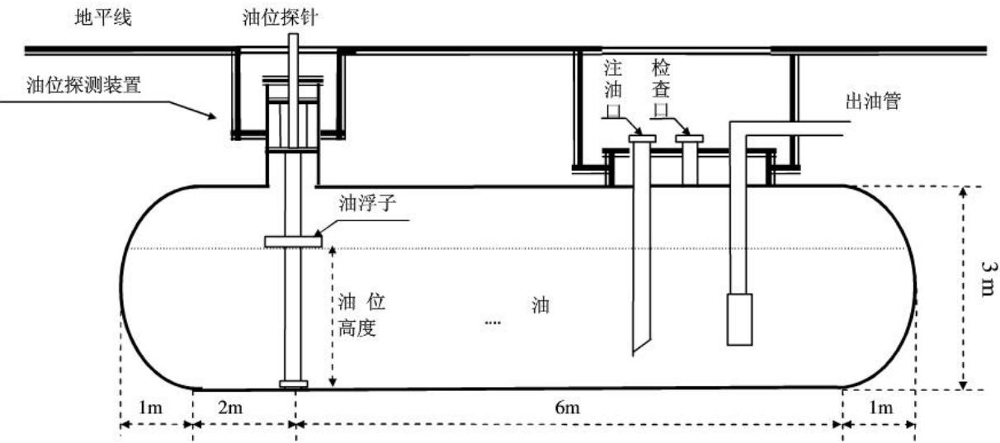
图1-1 储油罐正面示意图

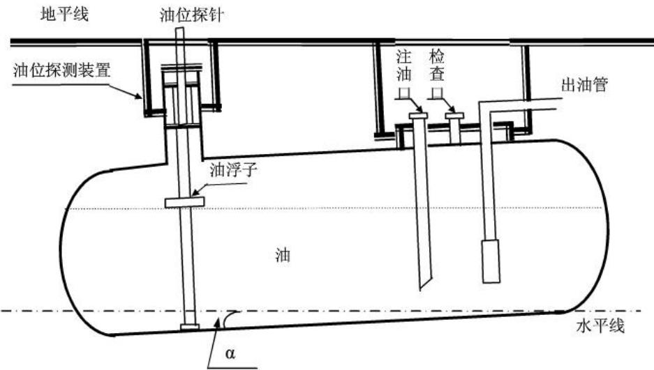
图 1-2储油罐纵向倾斜变位后示意图

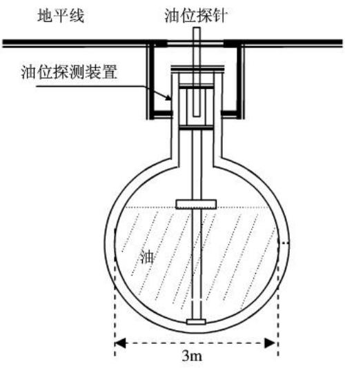
（a）无偏转倾斜的正截面图

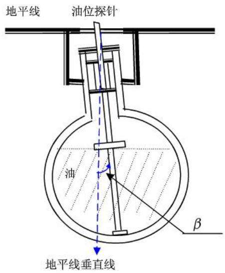
（b）横向偏转倾斜后正截面图
图1-3 储油罐截面示意图

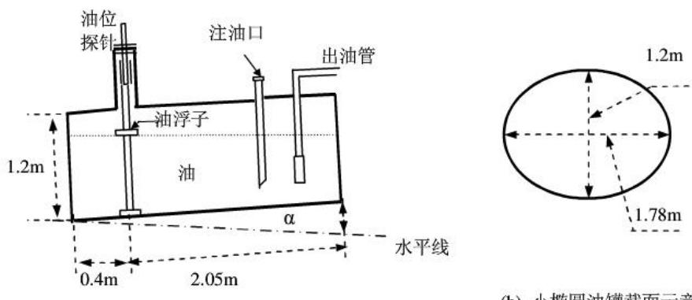
(a) 小椭圆油罐正面示意图
(b) 小椭圆油罐截面示意图
图1-4小椭圆型油罐形状及尺寸示意图
本文的问题是：

（1）为了掌握罐体变位后对罐容表的影响，利用如图1-4的小椭圆型储油罐（两端平头的椭圆柱体），分别对罐体无变位和倾斜角为 $\alpha { = } 4 . 1 ^ { 0 }$ 的纵向变位两种情况做了实验，实验数据如附件1所示。建立数学模型研究罐体变位后对罐容表的影响，并给出罐体变位后油位高度间隔为1cm的罐容表标定值。

（2）对于图1-1所示的实际储油罐，建立罐体变位后标定罐容表的数学模型，即罐内储油量与油位高度及变位参数（纵向倾斜角度α和横向偏转角度β）之间的一般关系。利用附件中实际检测数据，根据所建立的数学模型确定变位参数，并绘出罐体变位后油位高度间隔为10cm的罐容表标定值。进一步利用实际检测数据来分析检验模型的正确性与方法的可靠性。

## 二模型的假设

基于上面的问题，本文提出如下几点假设：

1. 油罐变位角度α在 $[ 0 , \frac { \pi } { 2 } )$ 范围内；

2. 油罐是规则的几何体；

3.假设油罐始终没有挂壁现象，忽略油罐壁的厚度；忽略外界温度等环境因素对油容积的影响：

## 三符号说明

## 3.1 问题一符号说明

（1）a表示圆柱体椭圆截面中长轴

（2）b表示圆柱体椭圆截面短轴

(3)L 表示储油罐长度

(4)h表示储油罐内液体高度

（5）S表示椭圆截面的面积

（6）V表示储油罐内储油量

（7)α表示油罐的纵向变位

(8) $h _ { \scriptscriptstyle 1 }$ 表示探针到油罐左侧的距离；

(9) $h _ { 2 }$ 表示探针到油罐右侧的距离；

## 3.2 问题二符号说明

（1）R表示圆柱体截面圆的半径

（2）H₁表示左侧球冠体与圆柱体连接面到探针的距离

（3）H2表示右侧球冠体与圆柱体连接面到探针的距离

(4)a表示球冠体的高度

（5）α表示油罐的纵向变位

（6）β表示油罐的横向变位

## 四模型分析

## 4.1 问题一的分析

## 4.1.1 无变位模型分析

通过对储油罐在无变位情况下的分析，利用平行截面面积求积分的方法，建立计算容积的数学模型，并通过计算机仿真求出罐内储油的容积，从而得出罐内油位高度与储油量的对应关系。另外，利用matlab仿真技术进一步对实际检测数据来分析，检验模型的正确性与方法的可靠性。

## 4.1.2 纵向变位α度模型分析

通过对储油罐在纵向变位角为α情况下的分析，将储油罐油容积的求解分成三种情况讨论。一是在油位高度小于2.05tanα条件下建立数学模型；二是油位高度大于2.05tanα且小于1.2-0.4tanα条件下建立模型；三是油位高度大于1.2-0.4tanα且小于1.2条件下建立模型。根据平行截面面积求积分的方法，建立罐内油位高度与储油量的对应关系，并计算出罐容表标定值。另外利用Matlab对该模型进行仿真，并与附录表中的实测数据进行比较，参照比较的结果实现对模型的优劣判断，并计算出罐体变位后油位高度间隔为1cm的罐容表标定值。

## 4.2 问题二的分析

首先分析罐内储油量和油位高度与变位参数纵向倾斜角度α关系，通过积分求得体积，为简化积分，将图形分段积分，最后得到体积关于油位高度的函数表达，再分析油罐横向偏转倾斜β后，罐内储油量与油位高度的关系，由于横向倾斜对液面的垂直距离影响很小，可近似忽略，最终可得到体积关于油位高度的数学模型。再通过最小二乘拟合，根据附表二中的数据，得到最接近实际的偏转角α、β，将α和β的近似值代入上述数学模型，并用Matlab仿真出函数曲线，与真实曲线进行误差分析，验证模型的真实性和合理性。

## 五问题的求解

## 5.1 问题一求解

## 5.1.1 无变位模型求解

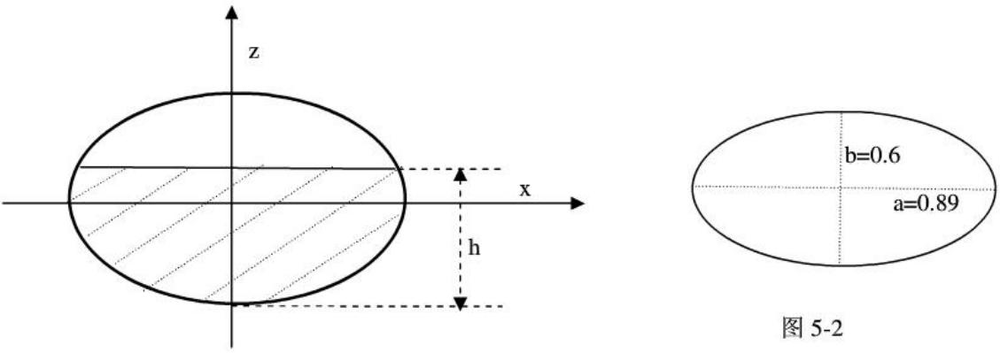
图 5-1

$$
\begin{array} { r l } & { S = \int _ { - \delta } ^ { h - b } d z \int _ { - \delta - \frac { b ^ { \prime } } { 2 } } ^ { a \sqrt { b } - \frac { b ^ { \prime } } { 2 } } d x } \\ & { = \int _ { - \delta } ^ { h - b } 2 a \sqrt { 1 - \frac { z ^ { 2 } } { b ^ { 2 } } } d z } \\ & { = \frac { 2 a } { b } \int _ { - \delta } ^ { h - b } \sqrt { b ^ { 2 } - z ^ { 2 } } d z } \\ & { = \frac { a } { b } \int _ { - \delta } ^ { ( h - b ) \sqrt { 2 h b - h ^ { 2 } } } d z } \\ & { = \frac { a } { b } \left[ ( h - b ) \sqrt { 2 h b - h ^ { 2 } } + b ^ { 2 } \arcsin \frac { h - b } { b } + \frac { \pi } { 2 } b ^ { 2 } \right] } \\ & { V = S L } \\ & { = \frac { a L } { b } \left[ ( h - b ) \sqrt { 2 h b - h ^ { 2 } } + b ^ { 2 } \arcsin \frac { h - b } { b } + \frac { \pi } { 2 } b ^ { 2 } \right] } \end{array}
$$

通过计算机仿真实验得出在无变位情况下拟合的曲线图如下所示，深蓝色曲线为模型计算绘制的曲线，浅蓝色为实际测验得出的曲线，通过观察比较可知，在拟合效果上满足要求。

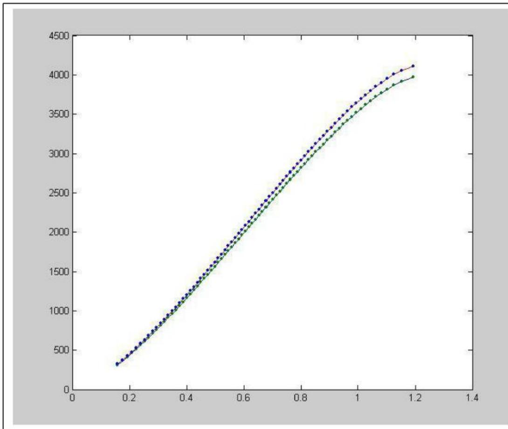
图 5-3

## 5.1.2 纵向变位α度模型求解

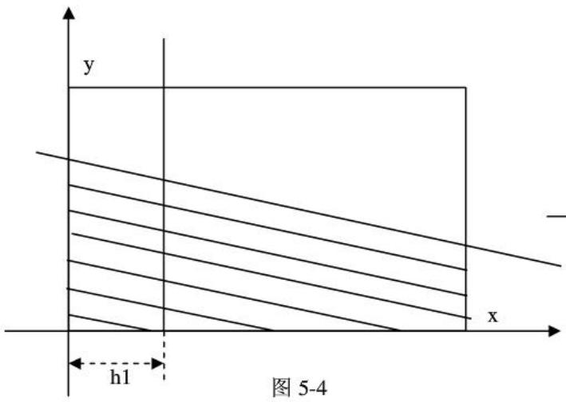
1当 $0 \leq h \leq h _ { 2 } \tan ( \alpha )$ 时

先令 $H = h - ( x - h _ { 1 } ) \tan \alpha$

图 5-5
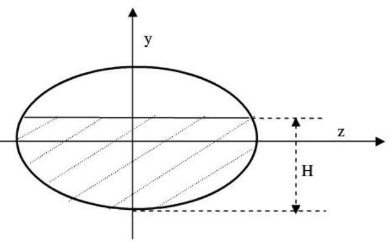

$$
\begin{array} { r l } & { V = \int _ { \frac { 1 } { \beta } } ^ { \infty \infty \infty + 3 \ln ( \alpha - \beta ) } d x \Biggl [ \frac { \psi } { \lambda _ { \mathrm { e } } } d y \Biggl ( - \psi \Biggr _ { - \infty , \overline { { \psi } } } ^ { - 1 / 2 - \frac { \beta } { 2 } } \Biggr ) ^ { \frac { \psi } { \lambda _ { \mathrm { e } } } } d z } \\ & { = \int _ { 0 } ^ { \infty \kappa \alpha - \lambda } d x \Biggl [ \exp ^ { \beta } \Biggl ( - \Biggl | - \int _ { 0 } ^ { \infty \overline { { \psi } } } \frac { \psi } { \lambda _ { \mathrm { e } } } \Biggr | ^ { \gamma _ { - } } d y } \\ & { = \frac { \alpha } { \beta } \Biggr ) ^ { \kappa + \kappa } \Biggl [ ( H - b ) \sqrt { \frac { \psi } { \lambda _ { \mathrm { e } } } - ( H - b ) ^ { 2 } } + i \sqrt { \frac { \lambda _ { \mathrm { e } } } { \lambda } } \exp \sinh ^ { \frac { H - b } { \lambda _ { \mathrm { e } } } - \lambda } \exp ( - 1 ) \Biggr ] d x } \\ & { = \frac { \beta } { \beta } \Biggr [ \sin ^ { \beta } | ( H - b ) \sqrt { \frac { \psi } { \lambda _ { \mathrm { e } } \lambda _ { \mathrm { e } } } - ( H - b ) ^ { 2 } } + i \sqrt { \frac { \lambda _ { \mathrm { e } } } { \lambda _ { \mathrm { e } } } + \lambda ^ { \beta } } \Biggr | ^ { \gamma _ { + } } - \int _ { 0 } ^ { \infty \overline { { \psi } } } d x } \\ &  = - \frac { \beta } { \beta } \cos ( 2 q ) \Biggl [ ( H - b ) \sqrt { \frac { \psi } { \lambda _ { \mathrm { e } } \lambda _ { \mathrm { e } } } - ( H - b ) ^ { 2 } } + i \sqrt { \frac { \lambda _ { \mathrm { e } } } { \lambda _ { \mathrm { e } } } \sinh ^ { \frac { H - b } { \lambda _ { \mathrm { e } } } } } + \int _ { 0 } ^ { \infty } i \sqrt  \frac  \lambda _  \mathrm { e }  \end{array}
$$

2当 $h _ { 2 } ^ { \ast } \tan ( \alpha ) \leq h \leq 2 b - h _ { 1 } \tan ( \alpha )$ 时

先令H=h−(x−h)tanα

$$
\begin{array} { r l } & { \nabla = \int _ { 0 } ^ { \infty } d x \delta \int _ { \infty } ^ { \infty } d y \frac { \delta } { \delta y } \frac { \partial ^ { 2 } \delta } { \partial z ^ { 2 } } \delta \int _ { - \infty } ^ { \infty } d x \delta ^ { 2 } \delta \exp ^ { 2 } d x } \\ & { - \int _ { 0 } ^ { \infty } d x \delta \int _ { 0 } ^ { \infty } 2 q _ { 0 } [ 1 - \frac { \delta ^ { 2 } - \delta ^ { 2 } } { \delta y } \delta ^ { 2 } ] ^ { 2 } } \\ & { - \frac { \delta } { \delta y } \delta ( \delta y - \delta y ) \frac { \delta } { \delta y } \delta - \delta ^ { 2 } \delta y } \\ & { - \frac { \delta } { \delta y } \delta ^ { 2 } \delta ( ( \delta - y ) \sqrt { \delta ^ { 2 } - ( \delta - y ) ^ { 2 } } + \delta ^ { 2 } \pi \leq u \delta ) \frac { \delta - \delta } { \delta } - \delta ^ { 2 } \pi \leq i \pi = - \delta y ) \delta x } \\ & { \quad - \frac { \delta } { \delta y } \delta ^ { 2 } \delta ( \delta - y ) \frac { \delta } { \delta y } \delta [ 2 i \delta - \delta ^ { 2 } \pi \leq \delta ^ { 2 } \pi \leq \delta u \delta ] ^ { 2 } - \delta \delta \delta ^ { 2 } \pi ^ { 2 } \delta x } \\ & { = \frac { \delta } { \delta } \alpha \alpha \alpha \alpha ( \delta ^ { 2 } \delta \alpha \frac { \delta } { \delta y } \delta ^ { 2 } - \delta ( \delta - y ) ^ { 2 } + \delta ^ { 2 } \pi \leq i \pi \leq \delta ) \frac { \delta } { \delta } + \frac { \delta } { \delta } \frac { \delta } { \delta } \delta y ^ { 2 } \delta y \delta H } \\ & { \quad \leq \delta } \\ &  \quad \delta ^ { 2 } \delta \alpha \alpha \alpha \alpha ( \delta ^ { 2 } \delta ^ { 2 } \frac { \delta } { \delta y } - \delta ( \delta - y ) ^ { 2 } - \delta ^ { 2 } \pi ) \frac { \delta } { \delta } - \frac { \delta }  \end{array}
$$

3. 当 $h \geq 2 b - h _ { 1 } \tan ( \alpha )$ 时

先令 $H = h - ( x - h _ { 1 } )$ tanα

$$
\begin{array} { r l } & { \mathbf { V } = \left\| \mathbf { \Phi } _ { h } ^ { \mathrm { A i r } , h } - \partial _ { t } \mathbf { A } _ { \mathrm { P r e } } ^ { h } \left( A \right) \right\| _ { h } ^ { \mathrm { H } } \left\| \sum _ { s _ { t } = \frac { \sqrt { 2 } \pi } { 2 } } ^ { s _ { t } , h - \frac { \sqrt { 2 } } { 2 } } d \hat { \Phi } ^ { \mathrm { t } } + \pi a b \hat { \mathbf { u } } h _ { 1 } - ( 2 b - h ) \cot ( \mathbf { u } ) \right\| } \\ & { = \int _ { s _ { t } = \frac { \sqrt { 2 } \pi } { 2 } \times \sqrt { 6 \pi a } } ^ { s _ { t } + h } \alpha d \hat { L } _ { \mathrm { F } } ^ { h } \alpha _ { 2 } \Big [ \mathbf { 1 } - \frac { ( \mathbf { V } - \mathbf { b } ) } { b } \hat { \mathcal { S } } ^ { \mathrm { t } } d h _ { 1 } + \pi a b [ h _ { 1 } - ( 2 b - h ) \cot ( \mathbf { u } ) ] } \\ & { = \frac { a } { b } \int _ { s _ { t } = \frac { \sqrt { 2 } \pi } { 2 } \times \sqrt { 6 \pi a } } ^ { \frac { \sqrt { 2 } } { 2 } } \Big [ ( H - b ) \sqrt { b ^ { 2 } - \left( H - b \right) ^ { 2 } } + b ^ { 2 } \arcsin \frac { H - b } { b } - b ^ { 2 } \arcsin ( - 1 ) ] d \mathbf { k } } \\ & { + \pi a \hat { L } _ { \mathrm { P r } } ^ { h } - ( 2 b - h ) \cot ( \mathbf { u } ) \Big ] } \\ &  = \frac { a } { b } \int _ { s _ { t } = \frac { \sqrt { 2 } \pi } { 2 } \times \sqrt { 6 \pi a } } ^ { \frac { \sqrt { 2 } } { 2 } } \left[ ( H - b ) \sqrt { 2 h b - H ^ { 2 } } + b ^ { 3 } \arcsin \frac { H - b } { b } + b ^ { 2 } \ast \frac { \pi } { 2 } \hat { L } \right] d \hat { \Phi } ^ { \mathrm { t } } + \pi a b [ h _  1 \end{array}
$$

在1和2两种情况下，通过计算机仿真计算得出在纵向变位 $\alpha = 4 . 1 ^ { \circ }$ 时，模型拟合的曲线如下所示：（红色点为模型计算绘制的曲线，蓝色点为实际测量值得出的曲线)

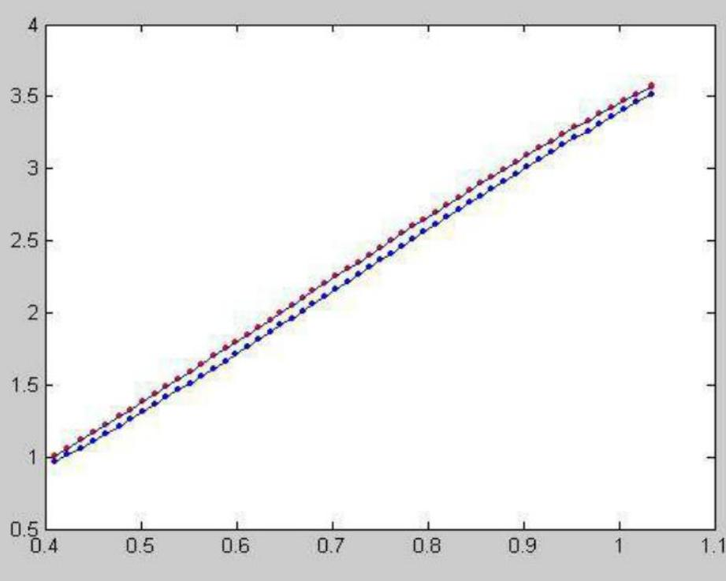
图 5-6

可同样仿真出在这种情况下，数学模型得出的值与实际测量得到值的误差曲线如下所示。

为了更好的检测所建的数学模型，可以在这种条件下，绘制 ${ \bf \alpha } \propto 0 ^ { \circ }$ 时的拟合曲线如下图所示，由下图可知它与在与在无变位模型曲线拟合的效果是非常相似的，这也可以进一步的证明所建的模型的准确性。

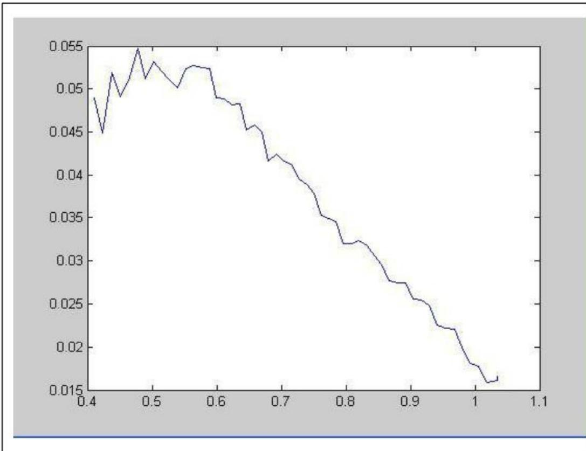
图 5-7

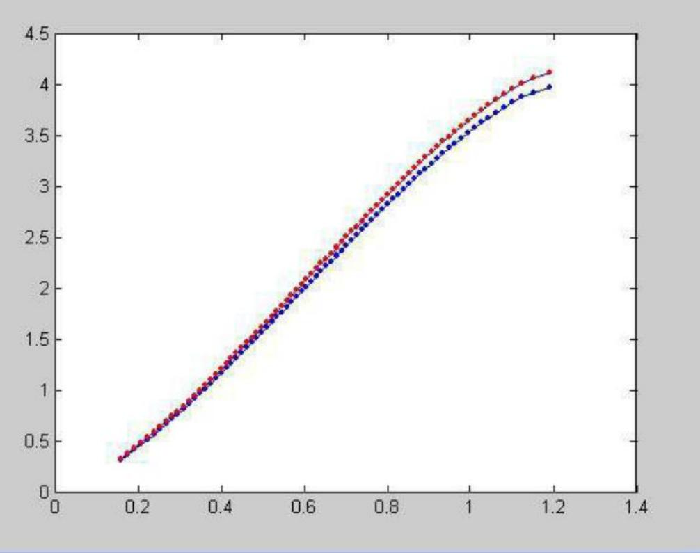
图 5-8

通过上面的仿真实验可知模型得到罐体变位后油位高度间隔每1cm的油位高度与储油量之间的关系，即罐容表的标定值如下所示：

表1图1-4中油罐变位后罐容表标定值表
<table><tr><td colspan="1" rowspan="1">油位高度/mm</td><td colspan="1" rowspan="1">0</td><td colspan="1" rowspan="1">10</td><td colspan="1" rowspan="1">20</td><td colspan="1" rowspan="1">30</td><td colspan="1" rowspan="1">40</td><td colspan="1" rowspan="1">50</td><td colspan="1" rowspan="1">60</td><td colspan="1" rowspan="1">70</td><td colspan="1" rowspan="1">80</td><td colspan="1" rowspan="1">90</td></tr><tr><td colspan="1" rowspan="1">储油量1L</td><td colspan="1" rowspan="1">1.7</td><td colspan="1" rowspan="1">3.5</td><td colspan="1" rowspan="1">6.3</td><td colspan="1" rowspan="1">10</td><td colspan="1" rowspan="1">14.8</td><td colspan="1" rowspan="1">20.7</td><td colspan="1" rowspan="1">27.9</td><td colspan="1" rowspan="1">36.3</td><td colspan="1" rowspan="1">46.1</td><td colspan="1" rowspan="1">57.4</td></tr><tr><td colspan="1" rowspan="1">油位高度/mm</td><td colspan="1" rowspan="1">100</td><td colspan="1" rowspan="1">110</td><td colspan="1" rowspan="1">120</td><td colspan="1" rowspan="1">130</td><td colspan="1" rowspan="1">140</td><td colspan="1" rowspan="1">150</td><td colspan="1" rowspan="1">160</td><td colspan="1" rowspan="1">170</td><td colspan="1" rowspan="1">180</td><td colspan="1" rowspan="1">190</td></tr><tr><td colspan="1" rowspan="1">储油量IL</td><td colspan="1" rowspan="1">70.1</td><td colspan="1" rowspan="1">84.4</td><td colspan="1" rowspan="1">100.3</td><td colspan="1" rowspan="1">117.7</td><td colspan="1" rowspan="1">136.9</td><td colspan="1" rowspan="1">157.8</td><td colspan="1" rowspan="1">180.3</td><td colspan="1" rowspan="1">204</td><td colspan="1" rowspan="1">228.9</td><td colspan="1" rowspan="1">254.9</td></tr><tr><td colspan="1" rowspan="1">油位高度/mm</td><td colspan="1" rowspan="1">200</td><td colspan="1" rowspan="1">210</td><td colspan="1" rowspan="1">220</td><td colspan="1" rowspan="1">230</td><td colspan="1" rowspan="1">240</td><td colspan="1" rowspan="1">250</td><td colspan="1" rowspan="1">260</td><td colspan="1" rowspan="1">270</td><td colspan="1" rowspan="1">280</td><td colspan="1" rowspan="1">290</td></tr><tr><td colspan="1" rowspan="1">储油量IL</td><td colspan="1" rowspan="1">281.9</td><td colspan="1" rowspan="1">309.8</td><td colspan="1" rowspan="1">338.5</td><td colspan="1" rowspan="1">368.1</td><td colspan="1" rowspan="1">398.5</td><td colspan="1" rowspan="1">429.7</td><td colspan="1" rowspan="1">461.5</td><td colspan="1" rowspan="1">494</td><td colspan="1" rowspan="1">527.1</td><td colspan="1" rowspan="1">560.9</td></tr><tr><td colspan="1" rowspan="1">油位高度/mm</td><td colspan="1" rowspan="1">300</td><td colspan="1" rowspan="1">310</td><td colspan="1" rowspan="1">320</td><td colspan="1" rowspan="1">330</td><td colspan="1" rowspan="1">340</td><td colspan="1" rowspan="1">350</td><td colspan="1" rowspan="1">360</td><td colspan="1" rowspan="1">370</td><td colspan="1" rowspan="1">380</td><td colspan="1" rowspan="1">390</td></tr><tr><td colspan="1" rowspan="1">储油量IL</td><td colspan="1" rowspan="1">595.2</td><td colspan="1" rowspan="1">630.1</td><td colspan="1" rowspan="1">665.6</td><td colspan="1" rowspan="1">701.5</td><td colspan="1" rowspan="1">738</td><td colspan="1" rowspan="1">774.9</td><td colspan="1" rowspan="1">812.2</td><td colspan="1" rowspan="1">850</td><td colspan="1" rowspan="1">888.2</td><td colspan="1" rowspan="1">926.7</td></tr><tr><td colspan="1" rowspan="1">油位高度/mm</td><td colspan="1" rowspan="1">400</td><td colspan="1" rowspan="1">410</td><td colspan="1" rowspan="1">420</td><td colspan="1" rowspan="1">430</td><td colspan="1" rowspan="1">440</td><td colspan="1" rowspan="1">450</td><td colspan="1" rowspan="1">460</td><td colspan="1" rowspan="1">470</td><td colspan="1" rowspan="1">480</td><td colspan="1" rowspan="1">490</td></tr><tr><td colspan="1" rowspan="1">储油量1L</td><td colspan="1" rowspan="1">965.7</td><td colspan="1" rowspan="1">1005</td><td colspan="1" rowspan="1">1044.6</td><td colspan="1" rowspan="1">1084.5</td><td colspan="1" rowspan="1">1124.8</td><td colspan="1" rowspan="1">1165.3</td><td colspan="1" rowspan="1">1206.2</td><td colspan="1" rowspan="1">1247.2</td><td colspan="1" rowspan="1">1288.6</td><td colspan="1" rowspan="1">1330.1</td></tr><tr><td colspan="1" rowspan="1">油位高度/mm</td><td colspan="1" rowspan="1">500</td><td colspan="1" rowspan="1">510</td><td colspan="1" rowspan="1">520</td><td colspan="1" rowspan="1">530</td><td colspan="1" rowspan="1">540</td><td colspan="1" rowspan="1">550</td><td colspan="1" rowspan="1">560</td><td colspan="1" rowspan="1">570</td><td colspan="1" rowspan="1">580</td><td colspan="1" rowspan="1">590</td></tr><tr><td colspan="1" rowspan="1">储油量1L</td><td colspan="1" rowspan="1">1371.9</td><td colspan="1" rowspan="1">1413.9</td><td colspan="1" rowspan="1">1456</td><td colspan="1" rowspan="1">1498.4</td><td colspan="1" rowspan="1">1540.9</td><td colspan="1" rowspan="1">1583.5</td><td colspan="1" rowspan="1">1626.3</td><td colspan="1" rowspan="1">1669.2</td><td colspan="1" rowspan="1">1712.2</td><td colspan="1" rowspan="1">1755.3</td></tr><tr><td colspan="1" rowspan="1">油位高度/ mm</td><td colspan="1" rowspan="1">600</td><td colspan="1" rowspan="1">610</td><td colspan="1" rowspan="1">620</td><td colspan="1" rowspan="1">630</td><td colspan="1" rowspan="1">640</td><td colspan="1" rowspan="1">650</td><td colspan="1" rowspan="1">660</td><td colspan="1" rowspan="1">670</td><td colspan="1" rowspan="1">680</td><td colspan="1" rowspan="1">690</td></tr><tr><td colspan="1" rowspan="1">储油量IL</td><td colspan="1" rowspan="1">1798.5</td><td colspan="1" rowspan="1">1841.8</td><td colspan="1" rowspan="1">1885.1</td><td colspan="1" rowspan="1">1928.5</td><td colspan="1" rowspan="1">1971.9</td><td colspan="1" rowspan="1">2015.4</td><td colspan="1" rowspan="1">2058.8</td><td colspan="1" rowspan="1">2102.3</td><td colspan="1" rowspan="1">2145.7</td><td colspan="1" rowspan="1">2189.1</td></tr><tr><td colspan="1" rowspan="1">油位高度/mm</td><td colspan="1" rowspan="1">700</td><td colspan="1" rowspan="1">710</td><td colspan="1" rowspan="1">720</td><td colspan="1" rowspan="1">730</td><td colspan="1" rowspan="1">740</td><td colspan="1" rowspan="1">750</td><td colspan="1" rowspan="1">760</td><td colspan="1" rowspan="1">770</td><td colspan="1" rowspan="1">780</td><td colspan="1" rowspan="1">790</td></tr><tr><td colspan="1" rowspan="1">储油量1L</td><td colspan="1" rowspan="1">2232.5</td><td colspan="1" rowspan="1">2275.8</td><td colspan="1" rowspan="1">2319.1</td><td colspan="1" rowspan="1">2362.3</td><td colspan="1" rowspan="1">2405.4</td><td colspan="1" rowspan="1">2448.4</td><td colspan="1" rowspan="1">2491.3</td><td colspan="1" rowspan="1">2534</td><td colspan="1" rowspan="1">2576.6</td><td colspan="1" rowspan="1">2619.1</td></tr><tr><td colspan="1" rowspan="1">油位高度/mm</td><td colspan="1" rowspan="1">800</td><td colspan="1" rowspan="1">810</td><td colspan="1" rowspan="1">820</td><td colspan="1" rowspan="1">830</td><td colspan="1" rowspan="1">840</td><td colspan="1" rowspan="1">850</td><td colspan="1" rowspan="1">860</td><td colspan="1" rowspan="1">870</td><td colspan="1" rowspan="1">880</td><td colspan="1" rowspan="1">890</td></tr><tr><td colspan="1" rowspan="1">储油量1L</td><td colspan="1" rowspan="1">2661.4</td><td colspan="1" rowspan="1">2703.6</td><td colspan="1" rowspan="1">2745.5</td><td colspan="1" rowspan="1">2787.2</td><td colspan="1" rowspan="1">2828.7</td><td colspan="1" rowspan="1">2870</td><td colspan="1" rowspan="1">2911.1</td><td colspan="1" rowspan="1">2951.8</td><td colspan="1" rowspan="1">2992.3</td><td colspan="1" rowspan="1">3032.5</td></tr><tr><td colspan="1" rowspan="1">油位高度/mm</td><td colspan="1" rowspan="1">900</td><td colspan="1" rowspan="1">910</td><td colspan="1" rowspan="1">920</td><td colspan="1" rowspan="1">930</td><td colspan="1" rowspan="1">940</td><td colspan="1" rowspan="1">950</td><td colspan="1" rowspan="1">960</td><td colspan="1" rowspan="1">970</td><td colspan="1" rowspan="1">980</td><td colspan="1" rowspan="1">990</td></tr><tr><td colspan="1" rowspan="1">储油量1L</td><td colspan="1" rowspan="1">3072.4</td><td colspan="1" rowspan="1">3112</td><td colspan="1" rowspan="1">3151.2</td><td colspan="1" rowspan="1">3190.1</td><td colspan="1" rowspan="1">3228.6</td><td colspan="1" rowspan="1">3266.7</td><td colspan="1" rowspan="1">3304.4</td><td colspan="1" rowspan="1">3341.7</td><td colspan="1" rowspan="1">3378.5</td><td colspan="1" rowspan="1">3414.9</td></tr><tr><td colspan="1" rowspan="1">油位高度/ mm</td><td colspan="1" rowspan="1">1000</td><td colspan="1" rowspan="1">1010</td><td colspan="1" rowspan="1">1020</td><td colspan="1" rowspan="1">1030</td><td colspan="1" rowspan="1">1040</td><td colspan="1" rowspan="1">1050</td><td colspan="1" rowspan="1"></td><td colspan="1" rowspan="1"></td><td colspan="1" rowspan="1"></td><td colspan="1" rowspan="1"></td></tr><tr><td colspan="1" rowspan="1">储油量1L</td><td colspan="1" rowspan="1">3450.7</td><td colspan="1" rowspan="1">3486.1</td><td colspan="1" rowspan="1">3520.9</td><td colspan="1" rowspan="1">3555.1</td><td colspan="1" rowspan="1">3588.8</td><td colspan="1" rowspan="1">3621.8</td><td colspan="1" rowspan="1"></td><td colspan="1" rowspan="1"></td><td colspan="1" rowspan="1"></td><td colspan="1" rowspan="1"></td></tr></table>

## 5.2 问题 2 的求解

一由题意可先分析罐内储油量和油位高度与变位参数纵向倾斜角度α的关系，如图5-9所示，

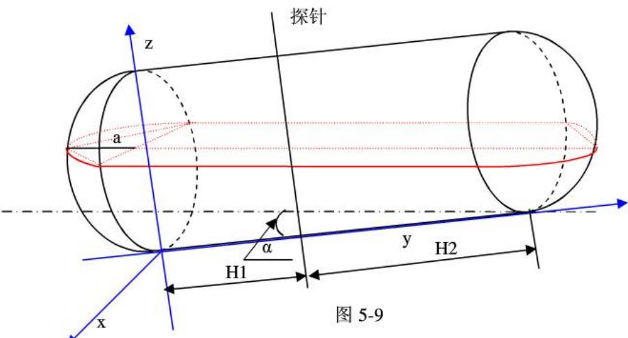

由题意可知分为四种情况分析：

(1) 当 $h \leq H _ { 2 } \tan \alpha$ 时，油罐的储油量可分为 $V _ { 1 } \bar { \mathcal { F } } \mathbb { H } \mathbf { V } _ { 2 }$ 两种情况，图形如下图5-4所示：

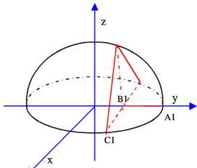
图 5-10

图中 $A _ { 1 } B _ { 1 } = h _ { 1 } = h ( H _ { 1 } + H _ { 2 } ) / H _ { 2 }$

点的坐标分别为 $A _ { 1 } ( 0 , R , 0 ) , B _ { 1 } ( 0 , R - h , 0 ) , C _ { 1 } ( \sqrt { 2 R h _ { 1 } - h _ { 1 } ^ { 2 } } , R - h _ { 1 } , 0 )$

$V _ { 1 }$ 是上图中截面的体积，其方程为： $\operatorname* { d e t } { \left( \begin{array} { l l l } { x } & { y - R + h _ { 1 } } & { z } \\ { 0 } & { - \sin \alpha } & { \cos \alpha } \\ { 1 } & { 0 } & { 0 } \end{array} \right) } = 0$

化简为 $( y - R + h _ { 1 } ) \frac { \cos \alpha } { \sin \alpha } + z = 0$

则体积为：

$$
V _ { 1 } = \iiint d V = \iint 2 \sqrt { 1 - \frac { y ^ { 2 } + x ^ { 2 } } { R ^ { 2 } } } d x d y - \frac { 1 } { 3 } S _ { \ast } \cdot \mathbf { h } _ { \ast } \quad \mathrm { D = \{ ( x , y ) | y _ { 1 } ( x ) \leq y \leq \sqrt { R ^ { 2 } - x ^ { 2 } } , 0 \leq x \leq R - h _ { 1 } \} }
$$

其中

$$
y _ { 1 } ( x ) = y _ { 0 } + ( R - h - { y ^ { 0 } } ) x / { \sqrt { 2 R h _ { 1 } - h _ { 1 } ^ { 2 } } }
$$

$$
S _ { \mathrm { p } } = 2 ( R - \frac { H _ { 1 } + H _ { 2 } } { H _ { 2 } } \cdot h - y _ { 0 } ) \cdot \sqrt { R ^ { 2 } - ( { R - \frac { H _ { 1 } + H _ { 2 } } { H _ { 2 } } \cdot h } ) ^ { 2 } }
$$

$$
h _ { \frac { \mu _ { 5 } } { 1 9 } } = z _ { 0 }
$$

其中 $( y _ { 0 } , z _ { 0 } )$ 是 $\left\{ \begin{array} { l l } { z \sin \alpha + ( - y + R - h _ { 1 } ) \cos \alpha = 0 } \\ { z ^ { 2 } + y ^ { 2 } / R ^ { 2 } = 1 } \end{array} \right.$ 的解

另外 $V _ { 0 }$ 可根据问题1的求解模型，得出

$$
\begin{array} { r l } & { V _ { 0 } = \mathbb { V } \mathrm { \Psi } ( \mathrm { h } ) \ = \displaystyle \int _ { 0 } ^ { h \mathrm { o u t } ( H _ { 1 } ) } d z \int _ { 0 } ^ { h - ( z - R _ { 1 } ) \operatorname* { m a x } } 2 R \sqrt { 1 - ( \frac { x - R } { R } ) ^ { 2 } } d x } \\ & { V ( h ) = \displaystyle \iint _ { 0 } ^ { 2 } \sqrt { 1 - \frac { y ^ { 2 } + x ^ { 2 } } { R ^ { 2 } } } d y d x - \frac { 1 } { 3 } z _ { 0 } ( R - \frac { H _ { 1 } + H _ { 2 } } { H _ { 2 } } \cdot h - y _ { 0 } ) \cdot \sqrt { R ^ { 2 } - ( R - \frac { H _ { 1 } + H _ { 2 } } { H _ { 2 } } \cdot h ) ^ { 2 } } } \\ & { \mathrm { d } \mathbb { X } } \\ & { \ + \displaystyle \int _ { 0 } ^ { h \mathrm { o u t } + R _ { 1 } } d z \int _ { 0 } ^ { h - ( z - R _ { 1 } ) \operatorname* { m a x } } 2 R \sqrt { 1 - ( \frac { x - R } { R } ) ^ { 2 } } d x } \\ & { \mathrm { d } \mathbb { X } \mathrm { e } ^ { \mathrm { i } \Pi } \ \quad \quad \mathrm { D } = \displaystyle \lbrace ( x , y ) | y _ { 1 } ( x ) \leq y \leq \sqrt { R ^ { 2 } - x ^ { 2 } } , 0 \leq x \leq R - h _ { 1 } \rbrace } \end{array}
$$

(2) 当 $H _ { 2 } \tan \alpha < h \leq 2 R - H _ { 1 } \tan \alpha$ 时，图形如下图5-5所示，油罐的储油量可分为$V _ { 1 } , V _ { 2 } , V _ { 0 }$ ，其中 $V _ { 1 }$ 表示油面所截左端球冠体中油的体积， $V _ { 2 }$ 表示油面所截右端球冠体中油的体积。

先考虑左端球冠体中油的体积 $V _ { 1 }$

如图

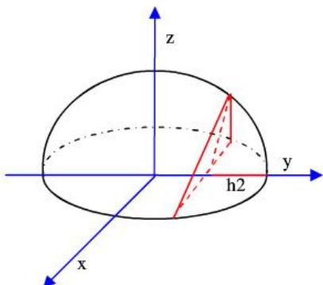
图 5-11

由上图知 $V _ { 1 } = \frac { 1 } { 2 } V _ { \# \# \# } - 2 V _ { 0 } { ' }$ ， $V _ { 0 }$ 表示截面右侧与椭球体所围图形的体积，由图5-9可知：， $V _ { \parallel \parallel \pm \pm \pm \pm \pm } = \frac { 4 } { 3 } \pi \mathbf { R } ^ { 2 } \cdot \mathbf { a }$ $h _ { 2 } = \frac { H _ { 1 } + H _ { 2 } } { H _ { 2 } } \cdot h$

图中的截面方程为：

$$
\operatorname* { d e t } { \left( \begin{array} { l l l } { x } & { y - R + h _ { 2 } } & { z } \\ { 1 } & { ~ 0 } & { ~ 0 } \\ { 0 } & { \sin \alpha } & { \cos \alpha } \end{array} \right) } = 0
$$

即：

$$
z \sin \alpha + ( - y - h _ { 2 } + R ) \cos \alpha = 0
$$

故

$$
V _ { 0 } " = \iint _ { D _ { 1 } } ( y - h _ { 2 } ) \cot \alpha d x d y + \iint _ { D _ { 2 } } \sqrt { 1 - \frac { x ^ { 2 } + y ^ { 2 } } { R ^ { 2 } } } d x d y
$$

$$
\begin{array} { r l } & { D _ { 1 } \colon \{ ( x , y ) | 0 \leq x \leq \sqrt { R ^ { 2 } - y ^ { 2 } } , R - h _ { 2 } \leq y \leq y _ { 1 } \} } \\ & { D _ { 2 } \colon \{ ( \mathbf { x } , y ) | 0 \leq x \leq \sqrt { R ^ { 2 } - y ^ { 2 } } , y _ { 1 } \leq y \leq R \} } \end{array}
$$

其中 $y _ { 1 }$ 是方程组

$$
\left\{ \begin{array} { l l } { z \sin \alpha + ( - y - h _ { 2 } + R ) \cos \alpha = 0 } \\ { z ^ { 2 } + y ^ { 2 } / R ^ { 2 } = 1 } \end{array} \right.
$$

的解，

再考虑右端球冠体中油的体积 $V _ { 2 }$

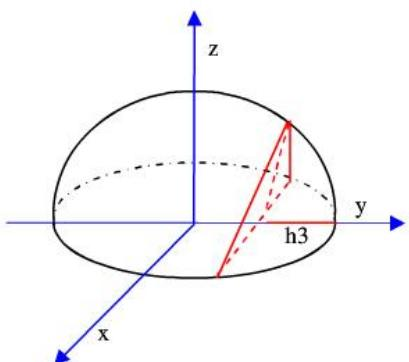
图 5-12

由图 5-9 知

$$
h _ { 3 } = { \frac { H _ { 2 } } { H _ { 1 } + H _ { 2 } } } h
$$

图5-12 中截面表达式

$$
\operatorname* { d e t } { \left( \begin{array} { l l l } { x } & { y - ( R - h _ { 3 } ) } & { z } \\ { 1 } & { 0 } & { 0 } \\ { 0 } & { \sin \alpha } & { \cos \alpha } \end{array} \right) } = 0
$$

即

$$
[ - y + ( R - h _ { 3 } ) ] \cos \alpha + z \sin \alpha = 0
$$

$V _ { 2 }$ 是截面右侧与椭球体所围图形的体积，

$$
V _ { 2 } = 2 { \underset { D _ { 1 } } { \iint } } ( y - ( R - h _ { 3 } ) ) \cot \alpha d x d y + 2 { \underset { D _ { 2 } } { \iint } } { \sqrt { 1 - ( x ^ { 2 } + y ^ { 2 } ) / R ^ { 2 } } } d x d y
$$

$$
D _ { 1 } ^ { ' } = \left\{ ( x , y ) | 0 \leq x \leq \sqrt { R ^ { 2 } - y ^ { 2 } } , R - h _ { 3 } \leq y \leq y _ { 2 } \right\}
$$

$$
\bar { D _ { 2 } } = \Bigl \{ ( x , y ) | 0 \le x \le \sqrt { R ^ { 2 } - y ^ { 2 } } , y _ { 2 } \le y \le R \Bigr \}
$$

其中 $( y _ { 2 } , z _ { 2 } )$ 是方程组 $\scriptstyle { \left\{ \begin{array} { l l } { [ - y + ( R - h _ { 3 } ) ] \cos \alpha + z \sin \alpha = 0 } \\ { z ^ { 2 } + y ^ { 2 } / R ^ { 2 } = 1 } \end{array} \right. }$ 的解

$$
\begin{array} { r } { \mathbb { X } V _ { 0 } = \displaystyle \int _ { 0 } ^ { H _ { 1 } + H _ { 2 } } d x \int _ { 0 } ^ { h - ( x - H _ { 1 } ) \mathrm { t a n } \alpha } d y \int _ { - R \sqrt { 1 - ( \frac { y - R } { R } ) ^ { 2 } } } ^ { R \sqrt { 1 - ( \frac { y - R } { R } ) ^ { 2 } } } d z } \end{array}
$$

$$
\scriptstyle { \begin{array} { l } { { \mathrm { i } } ; { \mathrm { f } } } \end{array} } V = V _ { 1 } + V _ { 2 } + V _ { 0 }
$$

$$
\begin{array} { l } { { V \left( h \right) = \displaystyle \frac { 2 } { 3 } \pi R ^ { 2 } a - 2 ( \displaystyle \iint ( y - h _ { 2 } ) \cot \alpha d x d y + \displaystyle \iint _ { D _ { 2 } } \sqrt { 1 - \frac { x ^ { 2 } + y ^ { 2 } } { R ^ { 2 } } } d x d y ) + 2 \displaystyle \iint _ { D _ { 1 } } ( y - ( R - h _ { 3 } ) ) \cot \alpha d x d y } } \\ { { + 2 \displaystyle \iint _ { D _ { 2 } } \sqrt { 1 - ( x ^ { 2 } + y ^ { 2 } ) / R ^ { 2 } } d x d y + \displaystyle \int _ { 0 } ^ { H _ { 1 } + H _ { 2 } } d x \displaystyle \int _ { 0 } ^ { h - ( x - H _ { 1 } ) \tan \alpha } d y \displaystyle \int _ { - R _ { \sqrt { 1 - \frac { ( y - R ) ^ { 2 } } { R } } } } ^ { R _ { \sqrt { 1 - \frac { ( y - R ) ^ { 2 } } { R } } } } d z } } \end{array}
$$

其中

$$
\begin{array} { r l } & { D _ { 1 } : \left\{ ( x , y ) | 0 \leq x \leq \sqrt { R ^ { 2 } - y ^ { 2 } } , R - h _ { 2 } \leq y \leq y _ { 1 } \right\} } \\ & { D _ { 2 } : \left\{ ( { \bf x } , y ) \big | 0 \leq x \leq \sqrt { R ^ { 2 } - y ^ { 2 } } , y _ { 1 } \leq y \leq R \right\} } \\ & { D _ { 1 } ^ { ' } : \left\{ ( x , y ) | 0 \leq x \leq \sqrt { R ^ { 2 } - y ^ { 2 } } , R - h _ { 3 } \leq y \leq y _ { 2 } \right\} } \\ & { D _ { 2 } ^ { ' } : \left\{ ( x , y ) | 0 \leq x \leq \sqrt { R ^ { 2 } - y ^ { 2 } } , y _ { 2 } \leq y \leq R \right\} } \end{array}
$$

$$
( 3 ) \quad \begin{array} { l l l l l l l l l } { { ( 3 ) } } & { { \stackrel { \scriptscriptstyle * \to } { = } } } & { { 2 R - H _ { 1 } \tan \alpha < h < 2 R \quad \mathrm { ~ \# } } } & { { , } } & { { \mathrm { ~ \# } } } & { { \mathrm { ~ \# } } } & { { \mathrm { ~ \# } } } & { { \stackrel { \scriptscriptstyle * \to } { = } } } & { { \mathrm { ~ \# } } } & { { \quad \mathrm { ~ \# } } } & { { \mathrm { ~ \# } } } & { { \mathrm { ~ \# } } } & { { \mathrm { ~ \# } } } \\ { { } } & { { } } & { { } } & { { } } & { { } } & { { } } & { { } } & { { } } & { { } } \end{array} \quad V = V _ { \mathrm { \# } } - V _ { 3 } \quad ,
$$

$$
\begin{array} { r } { V _ { \# } = \pi R ^ { 2 } ( H _ { 1 } + H _ { 2 } ) + \frac { 4 } { 3 } \pi a R ^ { 2 } , } \end{array}
$$

$V _ { 3 }$ 是情况（1）中油高为2R时的 $V _ { 0 }$

$$
\begin{array} { r } { \mathbb { A } \mathbb { U } \mathbb { \ } V ( h ) = \pi R ^ { 2 } ( H _ { 1 } + H _ { 2 } ) + \frac { 4 } { 3 } \pi a R ^ { 2 } - V _ { 0 } ( 2 R - h ) } \end{array}
$$

(4)液面继续上升时，h值不再改变，此时可认为桶内已装满油，即

$$
V = V _ { \ast } = \pi R ^ { 2 } ( H _ { 1 } + H _ { 2 } ) + \frac { 4 } { 3 } \pi a R ^ { 2 }
$$

## 二 接下来考虑油桶横向偏转倾斜β后罐内储油量与油位高度的关系

假设油桶横向偏转倾斜β前观测油位高度为 $h ^ { ' }$ ，横向偏转倾斜后观测油位高度为h，由倾斜角 $\beta$ 很小，且两端球冠体扁度较小，故横向偏转β所造成的误差很小，可近似认为液面的垂直高度不改变

$$
\begin{array} { r } { \dot { h } = ( h - R ) \cos { \beta } + R , } \end{array}
$$

罐内储油量V即为油桶横向偏转倾斜 $\beta$ 前观测油位高度为 $( h - R ) \cos { \beta } + R$ 时油的体积。

三 综合上述分析，罐内储油量V与油位高度h及变位参数（纵向倾斜角度α和横向偏转角度β）之间关系式为

$$
\scriptstyle V = V ( R + ( h - R ) \cos \beta ) ,
$$

其中V表示分析一中液面与容积的模型。

四结合题意，带入所有已知数据，即

$H _ { 1 } = 2 , H _ { 2 } = 6 , R = 1 . 5 , a = 1$ ，取附件二中一些数据，代入

$$
V = V ( R + ( h - R ) \cos { \beta } ) ,
$$

V取上述二中分析（2）的模型。

经过最小二乘拟合，得到α、β的估计值，α取 $\alpha = 2 . 3 5 ^ { \mathrm { o } }$ $\beta = 4 . 5 7 ^ { \circ }$ 取，此时与实际值拟合最相似。再根据 $\alpha = 2 . 3 5 ^ { \mathrm { o } }$ $\beta = 4 . 5 7 ^ { \circ }$ 用MATLAB仿真出模型曲线，与真实曲线的误差很小。

下表为用模型计算出的油罐变位后油位高度与油储量之间的关系。

表2图1-2中油罐变位后罐容表标定值表
<table><tr><td colspan="1" rowspan="1">油位高度/ mm</td><td colspan="1" rowspan="1">0</td><td colspan="1" rowspan="1">100</td><td colspan="1" rowspan="1">200</td><td colspan="1" rowspan="1">300</td><td colspan="1" rowspan="1">400</td><td colspan="1" rowspan="1">500</td><td colspan="1" rowspan="1">600</td><td colspan="1" rowspan="1">700</td><td colspan="1" rowspan="1">800</td><td colspan="1" rowspan="1">900</td></tr><tr><td colspan="1" rowspan="1">油储量/1</td><td colspan="1" rowspan="1">441.2</td><td colspan="1" rowspan="1">271.4</td><td colspan="1" rowspan="1">262.3</td><td colspan="1" rowspan="1">309.8</td><td colspan="1" rowspan="1">461.8</td><td colspan="1" rowspan="1">653</td><td colspan="1" rowspan="1">876</td><td colspan="1" rowspan="1">1146.6</td><td colspan="1" rowspan="1">1369.2</td><td colspan="1" rowspan="1">1638.2</td></tr><tr><td colspan="1" rowspan="1">油位高度/ mm</td><td colspan="1" rowspan="1">1000</td><td colspan="1" rowspan="1">1100</td><td colspan="1" rowspan="1">1200</td><td colspan="1" rowspan="1">1300</td><td colspan="1" rowspan="1">1400</td><td colspan="1" rowspan="1">1500</td><td colspan="1" rowspan="1">1600</td><td colspan="1" rowspan="1">1700</td><td colspan="1" rowspan="1">1800</td><td colspan="1" rowspan="1">1900</td></tr><tr><td colspan="1" rowspan="1">油储量/1</td><td colspan="1" rowspan="1">1922</td><td colspan="1" rowspan="1">2213.9</td><td colspan="1" rowspan="1">2301.9</td><td colspan="1" rowspan="1">2645.1</td><td colspan="1" rowspan="1">2890.2</td><td colspan="1" rowspan="1">3081.9</td><td colspan="1" rowspan="1">3677.4</td><td colspan="1" rowspan="1">3875.7</td><td colspan="1" rowspan="1">4258.6</td><td colspan="1" rowspan="1">4337.5</td></tr><tr><td colspan="1" rowspan="1">油位高度/mm</td><td colspan="1" rowspan="1">2000</td><td colspan="1" rowspan="1">2100</td><td colspan="1" rowspan="1">2200</td><td colspan="1" rowspan="1">2300</td><td colspan="1" rowspan="1">2400</td><td colspan="1" rowspan="1">2500</td><td colspan="1" rowspan="1">2600</td><td colspan="1" rowspan="1">2700</td><td colspan="1" rowspan="1">2800</td><td colspan="1" rowspan="1">2900</td></tr><tr><td colspan="1" rowspan="1">油储量/1</td><td colspan="1" rowspan="1">4536.4</td><td colspan="1" rowspan="1">4678.7</td><td colspan="1" rowspan="1">4917.8</td><td colspan="1" rowspan="1">5362.5</td><td colspan="1" rowspan="1">5628.2</td><td colspan="1" rowspan="1">5856.8</td><td colspan="1" rowspan="1">6047.4</td><td colspan="1" rowspan="1">6341.8</td><td colspan="1" rowspan="1">6380.5</td><td colspan="1" rowspan="1">6333.9</td></tr><tr><td colspan="1" rowspan="1">油位高度/ mm</td><td colspan="1" rowspan="1">3000</td><td colspan="1" rowspan="1"></td><td colspan="1" rowspan="1"></td><td colspan="1" rowspan="1"></td><td colspan="1" rowspan="1"></td><td colspan="1" rowspan="1"></td><td colspan="1" rowspan="1"></td><td colspan="1" rowspan="1"></td><td colspan="1" rowspan="1"></td><td colspan="1" rowspan="1"></td></tr><tr><td colspan="1" rowspan="1">油储量/1</td><td colspan="1" rowspan="1">6449.9</td><td colspan="1" rowspan="1"></td><td colspan="1" rowspan="1"></td><td colspan="1" rowspan="1"></td><td colspan="1" rowspan="1"></td><td colspan="1" rowspan="1"></td><td colspan="1" rowspan="1"></td><td colspan="1" rowspan="1"></td><td colspan="1" rowspan="1"></td><td colspan="1" rowspan="1"></td></tr></table>

## 六模型的结果分析

## 1、模型一的结果分析

对于积分求得数学模型求的罐内储油量与油高度的关系，通过观察分析数学模型得出的值与实际测量得到值的误差曲线，无变位的情况下误差在3.4%左右，在拟合效果上满足要求。在发生纵向偏转的情况下，起始误差较大，后降为2%一下为了更好的检测所建的可以在这种条件下，绘制α=0时的拟合曲线，可知它与在与在无变位模型曲线拟合的效果是非常相似的，这也可以进一步的证明所建的模型的准确性。

## 2、模型二的结果分析

误差可由多种因素形成，如测量油罐外径时，油罐桶壁厚度未考虑，直接当做内径考虑，且测量过程中温度变化会影响测量结果。由MATLAB的数据拟合，得出 $\alpha = 2 . 3 5 ^ { \circ } , \beta = 4 . 5 7 ^ { \circ }$ ，并通过实际数据的仿真，验证出误差在可控范围内，根据误差存在的客观性，确定模型在 $\alpha , \beta$ 较小范围内是合理的。

## 参考文献

[1]华东师范大学数学系，《数学分析》，上海：高等教育出版社，2008.4

[2]薛定宇、陈阳泉，《高等应用数学问题的MATLAB求解》（第二版)，北京：清华大学出版社，2008.10

[3]王金涛、刘子勇、张珑等，大型油罐容量计量中3D空间与比对试验分析[J]，2010(31):421-425

[4]战景林、王春平、王喜忠，倾斜椭平顶卧式罐容积的计算[J]，中国计量，2006(4):73-74

[5]林明富，卧式容器及球罐体积标定计算[J]，石油化工设备，2005(3):34-36

[6]陈伟，卧式金属罐容积检定装置的测量不确定度[J]，计量与测试技术，2006(12):61-63

## 附录：

## 1. 1 存放 x的测量值

```matlab
1.3 绘图 5-3
x0=get_x;
y0=get_y;
x0=x0/1000;
a=0.89;
b=0.6;
y1=((a/b)*((x0-b).*sqrt(2*b*x0-x0.*x0)+b^2*asin((x0-b)/b)+1/2*pi*b^2))*2.45*1000;
plot(x0,y0,x0,y0,'.);
hold on
plot(x0,y1,'r',x0,y1,'.');
```

```matlab
1.4 绘出计算得出数据与实际数据的拟合图，如图5-6 1.4绘出计算得出数据与实际数据的拟合图，如图5-6
a=0.89;
b=0.60;
theta=(4.1/180)*pi;
x0=get_x2;
y0=get_y2;
x0=x0/1000;
y0=y0/1000;
syms x y z h;
z1=-a*sqrt(1-((z-b)/b)^2);
z2=a*sqrt(1-((z-b)/b)^2);
y1=int(int(int(1,y,z1,z2),z,0,h+(0.4-x)*tan(theta)),x,0,2.45);
h=x0;
y1=-267/51651525650828710000.*(-411080515727443026281968197598547425-207691874341
3931051412198531688038400.*h.^2+3102691577449791281791997902239825920.*h).^(1/2)+1
3083/20000.*pi+89/38619367830047372976433151994237428253952855548887040000.*(-4110
80515727443026281968197598547425-2076918743413931051412198531688038400.*h.^2+310
2691577449791281791997902239825920.*h).^(3/2)-4809844402031689728/6456440706353588
75.*asin(5/3.*h-1076462383623532943/864691128455135232).*h+287415456427483295781/51
651525650828710000.*asin(5/3.*h-1076462383623532943/864691128455135232)+267/6456440
706353588750.*(-32451855365842672678315602057625600.*h.^2+37081284105617688860023
357639229440.*h+1089886599015528850431783800350127).^(1/2)-89/75428452793061275344
595999988744977058501670993920000.*(-32451855365842672678315602057625600.*h.^2+37
081284105617688860023357639229440.*h+1089886599015528850431783800350127).^(3/2)+4
809844402031689728/645644070635358875.*asin(5/3.*h-102921238491809033/108086391056
891904).*h-27479970677313011811/6456440706353588750.*asin(5/3.*h-102921238491809033/
108086391056891904);
plot(x0,y0,'.b');
hold on;
plot(x0,y0);
plot(x0,y1,'.r',x0,y1);
```

##

1. 5 如图5-7
a=0.89;
b=0.60;
theta=(4.1/180)\*pi;
x0=get\_x2;
y0=get\_y2;
x0=x0/1000;
y0=y0/1000;
syms x y z h;
z1=-a\*sqrt(1-((z-b)/b)^2);
z2=a\*sqrt(1-((z-b)/b)^2);
y1=int(int(int(1,y,z1,z2),z,0,h+(0.4-x)\*tan(theta)),x,0,2.45);

>>h=x0;
y1=-267/51651525650828710000.\*(-411080515727443026281968197598547425-207691874341
3931051412198531688038400.\*h.^2+3102691577449791281791997902239825920.\*h).^(1/2)+1
3083/20000.\*pi+89/38619367830047372976433151994237428253952855548887040000.\*(-4110
80515727443026281968197598547425-2076918743413931051412198531688038400.\*h.^2+310
2691577449791281791997902239825920.\*h).^(3/2)-4809844402031689728/6456440706353588
75.\*asin(5/3.\*h-1076462383623532943/864691128455135232).\*h+287415456427483295781/51
651525650828710000.\*asin(5/3.\*h-1076462383623532943/864691128455135232)+267/6456440
706353588750.\*(-32451855365842672678315602057625600.\*h.^2+37081284105617688860023
357639229440.\*h+1089886599015528850431783800350127).^(1/2)-89/75428452793061275344
595999988744977058501670993920000.\*(-32451855365842672678315602057625600.\*h.^2+37
081284105617688860023357639229440.\*h+1089886599015528850431783800350127).^(3/2)+4
809844402031689728/645644070635358875.\*asin(5/3.\*h-102921238491809033/108086391056
891904).\*h-27479970677313011811/6456440706353588750.\*asin(5/3.\*h-102921238491809033/
108086391056891904);
y2=abs(y1-y0);
for i=1:length(y2)
y3(i)=y2(i)/y0(i);
end
>> plot(x0,y3);

## 1. 6当a=0时与真实值差异，如图5-8

```matlab
a=0.89;
b=0.60;
theta=0;
x0=get_x;
y0=get_y;
x0=x0/1000;
y0=y0/1000;
syms x y z h;
z1=-a*sqrt(1-((z-b)/b)^2);
z2=a*sqrt(1-((z-b)/b)^2);
y1=int(int(int(1,y,z1,z2),z,0,h+(0.4-x)*tan(theta)),x,0,2.45);
h=x0;
y1=4361/6000.*(-25.*h.^2+30.*h).^(1/2).*h-4361/10000.*(-25.*h.^2+30.*h).^(1/2)+13083/10000
.*asin(5/3.*h-1)+13083/20000.*pi;
y2=y(1)-y(0);
plot(x0,y2);
```

## 1. 7 求解间隔1cm 的的代码情况

theta=(4.1/180)\*pi;
syms h;
syms x y z;

a=0.89;
b=0.6;
z1=-a\*sqrt(1-((y-b)/b)^2);
z2=a\*sqrt(1-((y-b)/b)^2);
h=0:0.01:0.14;
Y=-27479970677313011811/12912881412707177500.\*pi+2404922201015844864/64564407063 5358875.\*pi.\*h+267/6456440706353588750.\*(-32451855365842672678315602057625600.\*h.^2 +37081284105617688860023357639229440.\*h+1089886599015528850431783800350127).^(1/2 )-89/75428452793061275344595999988744977058501670993920000.\*(-3245185536584267267 8315602057625600.\*h.^2+37081284105617688860023357639229440.\*h+108988659901552885 0431783800350127).^(3/2)+4809844402031689728/645644070635358875.\*asin(5/3.\*h-1029212 38491809033/108086391056891904).\*h-27479970677313011811/6456440706353588750.\*asin( 5/3.\*h-102921238491809033/108086391056891904);

theta=0.4\*tan((4.1/180)\*pi);

y=-267/51651525650828710000.\*(-411080515727443026281968197598547425-2076918743413
931051412198531688038400.\*h.^2+3102691577449791281791997902239825920.\*h).^(1/2)+13
083/20000.\*pi+89/38619367830047372976433151994237428253952855548887040000.\*(-41108
0515727443026281968197598547425-2076918743413931051412198531688038400.\*h.^2+3102
691577449791281791997902239825920.\*h).^(3/2)-4809844402031689728/64564407063535887
5.\*asin(5/3.\*h-1076462383623532943/864691128455135232).\*h+287415456427483295781/516
51525650828710000.\*asin(5/3.\*h-1076462383623532943/864691128455135232)+267/64564407
06353588750.\*(-32451855365842672678315602057625600.\*h.^2+370812841056176888600233
57639229440.\*h+1089886599015528850431783800350127).^(1/2)-89/754284527930612753445
95999988744977058501670993920000.\*(-32451855365842672678315602057625600.\*h.^2+370
81284105617688860023357639229440.\*h+1089886599015528850431783800350127).^(3/2)+48
09844402031689728/645644070635358875.\*asin(5/3.\*h-102921238491809033/1080863910568
91904).\*h-27479970677313011811/6456440706353588750.\*asin(5/3.\*h-102921238491809033/1
08086391056891904);