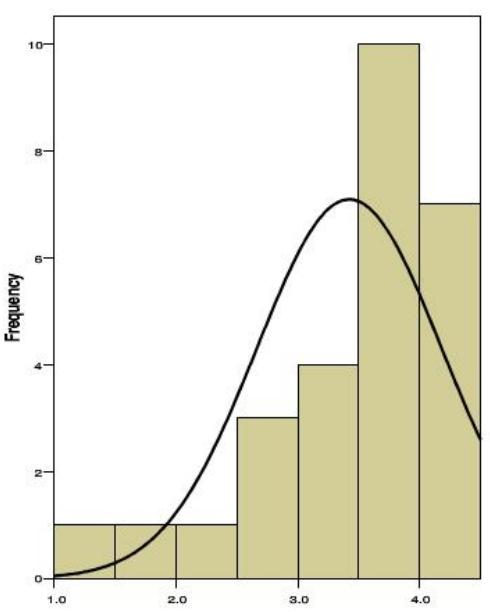
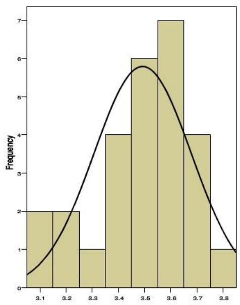
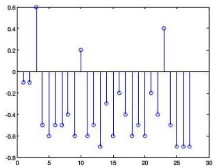
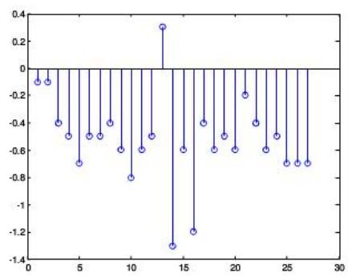

# 基于数理分析的葡萄及葡萄酒评价体系

## 摘要

葡萄酒的质量评价是研究葡萄酒的一个重要领域，目前葡萄酒的质量主要由评酒师感官评定。但感官评定存在人为因素，业界一直在尝试用葡萄的理化指标或者葡萄酒的理化指标定量评价葡萄酒的质量。本题要求我们根据葡萄以及葡萄酒的相关数据建模，并研究基于理化指标的葡萄酒评价体系的建立。

对于问题一，我们首先用配对样品t检验方法研究两组评酒员评价差异的显著性，将红葡萄酒与白葡萄酒进行分类处理，用SPSS软件对两组评酒员的评分的各个指标以及总评分进行了配对样本t检验。得到的部分结果显示：红葡萄酒外观色调、香气质量的评价存在显著性差异，其他单指标的评价不存在显著差异，白葡萄、红葡萄以及整体的评价存在显著性差异。

接着我们建立了数据可信度评价模型比较两组数据的可信性，将数据的可信度评价转化成对两组评酒员评分的稳定性评价。首先我们对单个评酒员评分与该组所有评酒员评分的均值的偏差进行了分析，偏差不稳定的点就成为噪声点，表明此次评分不稳定。然后我们用两组评酒员评分的偏差的方差衡量评酒员的稳定性。得到第2组的方差10.6明显小于第1组的33.3，从而得出了第2组评价数据的可信度更高的结论。

对于问题二，我们根据酿酒葡萄的理化指标和葡萄酒质量对葡萄进行了分级。一方面，我们对酿酒葡萄的一级理化指标的数据进行标准化，基于主成分分析法对其进行了因子分析，并且得到了27种葡萄理化指标的综合得分及其排序(见正文表5)。另一方面，我们又对附录给出的各单指标百分制评分的权重进行评价，并用信息熵法重新确定了权重，用新的权重计算出27种葡萄酒质量的综合得分并排序（见正文表6)。最后我们对两个排名次序用基于模糊数学评价方法将葡萄的等级划分为1-5级（见正文表8)。

对于问题三，首先我们将众多的葡萄理化指标用主成分分析法综合成6个主因子，并将葡萄等级也列为主因子之一。对葡萄的6个主因子，以及葡萄酒的10个指标用SPSS软件进行偏相关分析，得到酒黄酮与葡萄的等级正相关性较强等结论。之后对相关性较强的主因子和指标作多元线性回归。得到了葡萄酒10个单指标与主因子之间的多元回归方程，该回归方程定量表示两者之间的联系。

对于问题四，我们首先将葡萄酒的理化指标标准化处理，对葡萄酒的质量与葡萄的6个主因子和葡萄酒的10个单指标作偏相关分析，并求出多元线性回归方程。该方程就表示了葡萄和葡萄酒理化指标对葡萄酒质量的影响。之后，我们通过通径分析方法中的逐步回归分析得到葡萄与葡萄酒的理化指标只确定了葡萄酒质量信息的47%。从而得出了不能用葡萄和葡萄酒的理化指标评价葡萄酒的质量的结论。接着我们还采用通径分析中的间接通径系数分析求出各自变量之间通过传递作用对应变量的影响，得到单宁与总酚传递性影响较强等结论。

最后，我们对模型的改进方向以及优缺点进行了讨论。

关键词：配对样本t检验数据可信度评价主成分分析 模糊数学评价综合评分 信息熵偏相关分析多元线性回归

## 1 问题重述

确定葡萄酒质量时一般是通过聘请一批有资质的评酒员进行品评。每个评酒员在对葡萄酒进行品尝后对其分类指标打分，然后求和得到其总分，从而确定葡萄酒的质量。酿酒葡萄的好坏与所酿葡萄酒的质量有直接的关系，葡萄酒和酿酒葡萄检测的理化指标会在一定程度上反映葡萄酒和葡萄的质量。附件中给出了某一年份一些葡萄酒的评价结果，并分别给出了该年份这些葡萄酒的和酿酒葡萄的成分数据。我们需要建立数学模型并且讨论下列问题：

1. 分析附件1中两组评酒员的评价结果有无显著性差异，并确定哪一组的评价结果更可信。

2. 根据酿酒葡萄的理化指标和葡萄酒的质量对这些酿酒葡萄进行分级。

3. 分析酿酒葡萄与葡萄酒的理化指标之间的联系。

4. 分析酿酒葡萄和葡萄酒的理化指标对葡萄酒质量的影响，并论证能否用葡萄和葡萄酒的理化指标来评价葡萄酒的质量。

## 2模型的假设与符号的约定

## 2.1 模型的假设与说明

（1）评酒员的打分是按照加分制（不采用扣分制）；

（2）假设20名评酒员的评价尺度在同一区间（数据合理，不需要标准化)；

（3）每位评酒员的系统误差较小，在本问题中可以忽略不计；

（4）假设附件中给出的葡萄和葡萄酒理化指标都准确可靠。

## 2.2符号的约定与说明

<table><tr><td colspan="1" rowspan="1">符号</td><td colspan="1" rowspan="1">符号的意义</td></tr><tr><td colspan="1" rowspan="1"> $H _ { 0 }$ </td><td colspan="1" rowspan="1">原假设</td></tr><tr><td colspan="1" rowspan="1"> $P$ </td><td colspan="1" rowspan="1">显著性概率</td></tr><tr><td colspan="1" rowspan="1"> ${ \overline { { x } } } _ { 1 n }$ </td><td colspan="1" rowspan="1">第1组评酒员对第n号品种葡萄酒评分的平均值，n=1,227</td></tr><tr><td colspan="1" rowspan="1"> $\overline { { x } } _ { 2 n }$ </td><td colspan="1" rowspan="1">第2组评酒员对第n号品种葡萄酒评分的平均值，n=1,2·27</td></tr><tr><td colspan="1" rowspan="1"> ${ s _ { i j } } ^ { 2 }$ </td><td colspan="1" rowspan="1">第一组评酒员i对指标j评分的偏差的方差，i=1,2,…10，</td></tr><tr><td colspan="1" rowspan="1"> $y _ { i j } ^ { n }$ </td><td colspan="1" rowspan="1">第二组评酒员i对指标j评分的偏差的方差，i=1,2,……10，</td></tr><tr><td colspan="1" rowspan="1"> $\overline { { x } } _ { i j } ^ { n }$ </td><td colspan="1" rowspan="1">第1组10位评酒员对n号酒样品第j项指标评分的平均分</td></tr><tr><td colspan="1" rowspan="1"> $\delta$ </td><td colspan="1" rowspan="1">第1组第i号评酒员对n号酒样品第j项指标评分与平均值的偏</td></tr><tr><td colspan="1" rowspan="1"> $\bar { \delta }$ </td><td colspan="1" rowspan="1">第1组第i号评酒员对其j项指标评分与平均值的偏差的平均</td></tr><tr><td colspan="1" rowspan="1"> $s _ { i } ^ { 2 }$ </td><td colspan="1" rowspan="1">第2组第i个评酒员的总体指标偏差的方差</td></tr><tr><td colspan="1" rowspan="1"> $\omega _ { j }$ </td><td colspan="1" rowspan="1">重新确立的第j项指标的权重</td></tr><tr><td colspan="1" rowspan="1"> $s ^ { 2 }$ </td><td colspan="1" rowspan="1">第2组10个评酒员的总体指标偏差的方差</td></tr><tr><td colspan="1" rowspan="1"> $y _ { j } ^ { n }$ </td><td colspan="1" rowspan="1">评酒员指标j的平均评分，   $j = 1 , 2 , \cdots 1 0$ </td></tr><tr><td colspan="1" rowspan="1"> $x _ { i }$ </td><td colspan="1" rowspan="1">葡萄的第i项指标，   $i = 1 , 2 , \ldots 2 7$ </td></tr><tr><td colspan="1" rowspan="1"> $F _ { i }$ </td><td colspan="1" rowspan="1">葡萄的第i项因子，   $i { = } 1 , 2 , { \ldots } { \ldots } 1 0$ </td></tr><tr><td colspan="1" rowspan="1"> $M _ { j }$ </td><td colspan="1" rowspan="1">葡萄酒的第 $j$ 项理化指标，   $j = 1 , 2 , \cdots 1 0$ </td></tr></table>

## 3问题一的分析与求解

## 3.1 问题一的分析

题目要求我们根据两组评酒员对27种红葡萄酒和28种白葡萄酒的10个指标相应的打分情况进行分析，并确定两组评酒员对葡萄酒的评价结果是否有显著性差异，然后判断哪组评酒员的评价结果更可信。

初步分析可知：由于评酒员对颜色、气味等感官指标的衡量尺度不同，因此两组评酒员评价结果是否具有显著性差异应该与评价指标的类型有关，不同的评价指标的显著性差异可能会不同。同时，由于红葡萄酒和白葡萄酒的外观、口味等指标差异性较大，处理时需要将白葡萄酒和红葡萄酒的评价结果的显著性差异分开讨论。

基于以上分析，我们可以分别两组品尝同一种类酒样品的评酒员的评价结果进行两两配对，分析配对的数据是否满足配对样品t检验的前提条件，而且根据常识可知评酒员对同一种酒的同一指标的评价在实际中是符合t检验的条件的。

接着我们就可以对数据进行多组配对样品的t检验，从而对两组评酒员评价结果的显著性差异进行检验。

由于对同一酒样品的评价数据只有两组，我们只能通过评价结果的稳定性来判定结果的可靠性。而每组结果的可靠性又最终决定于每个评酒员的稳定性，因此将问题转化为对评酒员稳定性的评价。

## 3.2 配对样品的 t 检验简介

统计知识指出：配对样本是指对同一样本进行两次测试所获得的两组数据，或对两个完全相同的样本在不同条件下进行测试所得的两组数据。在本问中我们可以把配对样品理解为有27组两个完全相同的酒样品在两组不同评酒员的检测下得到的两组数据，两组中各个指标的数据为每组评酒员对该指标打分的平均值。

配对样品的t检验可检测配对双方的结果是否具有显著性差异，因此就可以检验出配对的双方（第一组与第二组）对葡萄酒的评价结果是否有差异性。

配对样品t检验具有的前提条件为：

（1）两样品必须配对

（2）两样品来源的总体应该满足正态性分布。

配对样品t检验基本原理是：求出每对的差值如果两种处理实际上没有差异，则差值的总体均数应当为0，从该总体中抽出的样本其均数也应当在0附近波动；反之，如果两种处理有差异，差值的总体均数就应当远离0，其样本均数也应当远离0。这样，通过检验该差值总体均数是否为0，就可以得知两种处理有无差异。该检验相应的假设为：

$H _ { 0 } : \mu _ { d } = 0$ ，两种处理没有差别， $H _ { 0 } : \mu _ { d } \ne 0$ 两种处理存在差别。

## 3.3 葡萄酒配对样品的 t 检验

问题一中配对样品为27组两个完全相同的酒样品在两组不同评酒员的检测下得到的两组数据，其中两组中各个指标的数据为各组10个评酒员对该指标打分的平均值。该问题中的10个指标分别为：外观澄清度、外观色调、香气纯正度、香气浓度、香气质量、口感纯正度、口感浓度、口感持久性、口感质量、平衡/总体评价。

根据t检验的原理，对葡萄酒配对样品进行t检验之前我们要对样品进行正态性检验。首先我们根据附件一并处理表格中的数据，得到配对样品的两组数据，绘制红葡萄酒配对样品表格部分数据如表1:

表1 红葡萄酒配对样品数据表
<table><tr><td rowspan=1 colspan=1></td><td rowspan=1 colspan=1>澄清度(1 组均值)</td><td rowspan=1 colspan=1>澄清度(2 组均值)</td><td rowspan=1 colspan=1>…</td><td rowspan=1 colspan=1>平衡/整体评价（1组均值）</td><td rowspan=1 colspan=1>平衡/整体评价（2组均值）</td></tr><tr><td rowspan=1 colspan=1>红1</td><td rowspan=1 colspan=1>2.3</td><td rowspan=1 colspan=1>3.1</td><td rowspan=1 colspan=1>…</td><td rowspan=1 colspan=1>7.7</td><td rowspan=1 colspan=1>8.4</td></tr><tr><td rowspan=1 colspan=1>红2</td><td rowspan=1 colspan=1>2.9</td><td rowspan=1 colspan=1>3.1</td><td rowspan=1 colspan=1>…</td><td rowspan=1 colspan=1>9.6</td><td rowspan=1 colspan=1>9.1</td></tr><tr><td rowspan=1 colspan=1></td><td rowspan=1 colspan=1></td><td rowspan=1 colspan=1>:</td><td rowspan=1 colspan=1>…</td><td rowspan=1 colspan=1></td><td rowspan=1 colspan=1>：</td></tr><tr><td rowspan=1 colspan=1>红26</td><td rowspan=1 colspan=1>3.6</td><td rowspan=1 colspan=1>3.7</td><td rowspan=1 colspan=1>…</td><td rowspan=1 colspan=1>8.9</td><td rowspan=1 colspan=1>8.8</td></tr><tr><td rowspan=1 colspan=1>红27</td><td rowspan=1 colspan=1>3.7</td><td rowspan=1 colspan=1>3.7</td><td rowspan=1 colspan=1>…</td><td rowspan=1 colspan=1>9</td><td rowspan=1 colspan=1>8.8</td></tr></table>

白葡萄酒配对样品表格部分数据如表2:

表2 白葡萄酒配对样品数据表
<table><tr><td colspan="1" rowspan="1"></td><td colspan="1" rowspan="1">澄清度(1 组均值)</td><td colspan="1" rowspan="1">澄清度(2 组均值)</td><td colspan="1" rowspan="1">…</td><td colspan="1" rowspan="1">平衡/整体评价（1组均值）</td><td colspan="1" rowspan="1">平衡/整体评价（2组均值）</td></tr><tr><td colspan="1" rowspan="1">白1</td><td colspan="1" rowspan="1">2.3</td><td colspan="1" rowspan="1">3.1</td><td colspan="1" rowspan="1">…</td><td colspan="1" rowspan="1">7.7</td><td colspan="1" rowspan="1">8.4</td></tr><tr><td colspan="1" rowspan="1">白2</td><td colspan="1" rowspan="1">2.9</td><td colspan="1" rowspan="1">3.1</td><td colspan="1" rowspan="1">…</td><td colspan="1" rowspan="1">9.6</td><td colspan="1" rowspan="1">9.1</td></tr><tr><td colspan="1" rowspan="1"></td><td colspan="1" rowspan="1">：</td><td colspan="1" rowspan="1">：</td><td colspan="1" rowspan="1">…</td><td colspan="1" rowspan="1">:</td><td colspan="1" rowspan="1">：</td></tr><tr><td colspan="1" rowspan="1">白26</td><td colspan="1" rowspan="1">3.6</td><td colspan="1" rowspan="1">3.7</td><td colspan="1" rowspan="1">…</td><td colspan="1" rowspan="1">8.9</td><td colspan="1" rowspan="1">8.8</td></tr><tr><td colspan="1" rowspan="1">白27</td><td colspan="1" rowspan="1">3.7</td><td colspan="1" rowspan="1">3.7</td><td colspan="1" rowspan="1">…</td><td colspan="1" rowspan="1">9</td><td colspan="1" rowspan="1">8.8</td></tr></table>

从上表中我们能看出，将白葡萄酒和红葡萄酒中的每个指标分别进行样品的配对后，每一个指标的配对结果有27对，每一对的双方分别是1组和2组的评酒员对该指标的评分的平均值。

## 3.3.1 样本总体的 K-S 正态性检验

配对样品的t检验要求两对应样品的总体满足正态分布，则总体中的样品应该满足正态性或者近似正态性，样本的正态性检验如下：

以红葡萄酒的澄清度的27组数据为例分析:利用SPSS软件绘制两样品的直方图和趋势图如图1所示：




图1 红葡萄酒澄清度两组数据直方图

我们假设两组总体数据都服从正态分布，利用SPSS 软件进行K正态性检验的具体结果见附录2.3。两组数据的近似相伴概率值P分别为0.239和0.329，大于我们一般的显著水平0.05则接受原来假设，即两组红葡萄酒的澄清度数据符合近似正态分布。

同理可用SPSS软件对其他指标的正态性进行检验，得到结果符合实际猜想都服从近似正态分布。

## 3.3.2 葡萄酒配对样品t 检验步骤

两种葡萄酒的处理过程类似，这里我们以对红葡萄酒评价结果的差异的显著性分析为例。

Step1:我们以第一组对葡萄酒的评价结果总体 $X _ { \mathfrak { i } }$ 服从正态分布$N ( \mu _ { 1 } \sigma ^ { 2 }$ ，以第二组对葡萄酒的评价结果总体 $X _ { 2 }$ 服从正态分布 $N ( \mu _ { 2 } , \sigma ^ { 2 } )$ 。我们已分别从两总体中获得了抽样样本 $( \overline { { x } } _ { 1 1 } , \overline { { x } } _ { 1 2 } \cdots \overline { { x } } _ { 1 2 7 } )$ 和 $( \overline { { x } } _ { 2 1 } , \overline { { x } } _ { 2 2 } \cdots \overline { { x } } _ { 2 2 7 } )$ ，并分别进行两样品相互配对。（具体数据见附录2.1)

Step2:；引进一个新的随机变量 $Y = X _ { 1 } - X _ { 2 }$ ，对应的样本为 $( y _ { 1 } , y _ { 2 } \cdots y _ { 2 7 } )$ 将配对样本的t检验转化为单样本t检验。

Step3:建立零假设 $H _ { \mathrm { 0 } } : \mu = 0$ ，构造t统计量；

Step4：利用SPSS 进行配对样品 t检验分析，并对结果做出推断。

## 3.4 显著性差异结果分析

## 3.3.1红葡萄酒各指标差异显著性分析

由SPSS 软件对红葡萄酒各指标的配对样品 t检验后，得到各指标的显著性概率P分布表。（结果如表3所示）

表3 红葡萄酒酒各指标显著性概率P
<table><tr><td rowspan=1 colspan=1>指标</td><td rowspan=1 colspan=1>外观澄清度</td><td rowspan=1 colspan=1>外观色调</td><td rowspan=1 colspan=1>香气纯正度</td><td rowspan=1 colspan=1>香气浓度</td><td rowspan=1 colspan=1>香气质量</td></tr><tr><td rowspan=1 colspan=1>P</td><td rowspan=1 colspan=1>0.614</td><td rowspan=1 colspan=1>0.002</td><td rowspan=1 colspan=1>0.151</td><td rowspan=1 colspan=1>0.100</td><td rowspan=1 colspan=1>0.010</td></tr><tr><td rowspan=1 colspan=1>指标</td><td rowspan=1 colspan=1>口感纯正度</td><td rowspan=1 colspan=1>口感浓度</td><td rowspan=1 colspan=1>口感持久性</td><td rowspan=1 colspan=1>口感质量</td><td rowspan=1 colspan=1>平衡/整体</td></tr><tr><td rowspan=1 colspan=1>P</td><td rowspan=1 colspan=1>0.437</td><td rowspan=1 colspan=1>0.158</td><td rowspan=1 colspan=1>0.251</td><td rowspan=1 colspan=1>0.055</td><td rowspan=1 colspan=1>0.674</td></tr></table>

由统计学知识,如果显著性概率P<显著水平α， $( \alpha = 5 0 0 )$ ，则拒绝零假设，

即认为两总体样本的均值存在显著差异。若P>显著水平 $\alpha$ ，则不能拒绝零假设，即认为两总体样本的均值不存在显著差异。

则根据表3可得：两组评酒员对红葡萄酒各项指标的评价中除外观色调、香

气质量存在显著性差异以外，其他8项指标都无显著性差异。

## 3.3.2白葡萄酒各指标差异显著性分析

代入白葡萄酒的评价数据，重复以上步骤，得到白葡萄酒各指标的显著性概率P分布表。（结果如表4所示）

表4 白葡萄酒各指标显著性概率P分布表
<table><tr><td rowspan=1 colspan=1>指标</td><td rowspan=1 colspan=1>外观澄清度</td><td rowspan=1 colspan=1>外观色调</td><td rowspan=1 colspan=1>香气纯正度</td><td rowspan=1 colspan=1>香气浓度</td><td rowspan=1 colspan=1>香气质量</td></tr><tr><td rowspan=1 colspan=1>P</td><td rowspan=1 colspan=1>0.299</td><td rowspan=1 colspan=1>0.089</td><td rowspan=1 colspan=1>0.937</td><td rowspan=1 colspan=1>0.238</td><td rowspan=1 colspan=1>0.714</td></tr><tr><td rowspan=1 colspan=1>指标</td><td rowspan=1 colspan=1>口感纯正度</td><td rowspan=1 colspan=1>口感浓度</td><td rowspan=1 colspan=1>口感持久性</td><td rowspan=1 colspan=1>口感质量</td><td rowspan=1 colspan=1>平衡/整体</td></tr><tr><td rowspan=1 colspan=1>P</td><td rowspan=1 colspan=1>0.000</td><td rowspan=1 colspan=1>0.005</td><td rowspan=1 colspan=1>0.863</td><td rowspan=1 colspan=1>0.000</td><td rowspan=1 colspan=1>0.001</td></tr></table>

分析表4可得：两组评酒员对白葡萄酒各项指标的评价中只有口感纯正度、口感浓度、口感质量、平衡/整体评价存在显著性差异，其他6项指标都无显著性差异。

## 3.3.3 葡萄酒总体差异显著性分析

## （1）红葡萄酒总体差异显著性分析

该问题的附件中已经给出了10项指标的权重，因此将10项指标利用加权合并成总体评价。对于红葡萄酒两组评价结果构造两组配对t检验。得到显著性概率 $\mathrm { P } { = } 0 . \ 0 3 0 { < } 0 . 0 5$ 。即红葡萄酒整体评价结果有显著性差异。

## （2）白葡萄酒总体差异显著性分析

同理对于白葡萄酒两组评价结果构造两组配对t检验。得到显著性概率 $\mathrm { P } { = } 0 . \ 0 2 { < } 0 . 0 5$ 。即白葡萄酒整体评价结果有显著性差异。

## （3）葡萄酒总体差异显著性分析

对于白葡萄酒和红葡萄酒总体评价结果配对t检验。得到显著性概率$\mathrm { P } { = } 0 . 0 0 2 { < } 0 . 0 5$ 。即两组对整葡萄酒的评价有显著性差异。

## 3.5 评分数据可信度评价

## 3.5.1数据可信度评价分析

前面我们已经对两组评酒员评价结果的差异显著性进行了分析，部分但指标存在显著性差异，但两组评酒员对葡萄酒总体评价并无显著性差异。也即我们不能通过显著性差异指标明显地看出哪一组评酒员的数据可信。因此比较两组评酒员所评数据的可信度要建立更贴切的数据可信度指标。

## 3.5.2数据可信度评价指标建立

由于整体评价数据无显著性差异，我们可以认为20名评酒员的水平在一个区间内。因此评酒员的评价结果的稳定性将决定该评酒员评价的数据的可信度。若某一评酒员的评价数据不稳定，则其所评数据可信度较低，其所在组别的数据评价可信度也将相应降低。

因此，我们将数据的可信度比较转化为两组评酒员评论水平的稳定性比较。

查阅相关资料获知，评酒员的评价尺度是有一定的系统误差的。如不同评酒员对色调的敏感度或许是不同的，如果某一评酒员评价的色调稍高于标准色调，但他每次评价的色调都稍高，而且一直很稳定。虽然与均值间始终存在误差，由于其稳定性，这样的评酒员的评价数据仍然是可信的。

所以，我们建立的数据可信度评价指标为评酒员评价的稳定性。评酒员的评价数据越稳定，数据越可信。

## 3.5.3数据可信度评价模型的建立与求解

我们已分析将数据可信度的评价转化为对评酒员评价稳定性评价。通过对数据的初步观察处理，发现每位评酒员的系统偏差都较小，20位评酒员的评价尺度近似处在同一区间，因此我们不对附件中的数据进行标准化处理，认为附件中的数据的系统偏差可以忽略。

## (1)噪声点分析

首先作出观察评酒员稳定性的偏差图，其中偏差为评酒员对同一个单指标的评分值与该组评论员评分的平均值之差。下面利用mat1ab软件作出第2组中1号和2号评酒员对27种红葡萄酒的澄清度评分与组内平均值的偏差如下（程序见附录1.1):




图2第2组中1（左）、2号评酒员对澄清度评分与组内平均值偏差图

分析上图可以看出，1号评酒员在对27种酒的澄清度评分时，出现了3个噪声点，(即偏离自己的平均水平较大的点)。2号评酒员在评分的时候只出现了

1个噪声点。因而可以初步判定2号评酒员的稳定性比1号评酒员的稳定性好。

## (2)各指标偏差的方差计算

基于以上分析：要评价一个评酒员评价的稳定性，我们可以观察该评论员在评价时具有的噪声点的个数。噪声点的个数也可用评酒员的评酒数据与该组所评数据平均值的偏差的方差 $s ^ { 2 }$ 进行计算衡量。

在此问中我们仍然选择两组红葡萄酒的评分求解偏差的方差。评酒员评价数据中包含10个评价指标，分别为外观澄清度、外观色调平衡……整体评价等。我们给它们分别标号为从1-10。其中符号的含义为：

i号评论员对j个单指标评分的偏差的方差 ${ s _ { i j } } ^ { 2 } \circ \qquad i = 1 , 2 \cdots 1 0 \ j = 1 , 2 \cdots 1 0$ $\boldsymbol { x _ { i j } } ^ { n }$ 表示第1组中i号评酒员对n号样品酒j号单指标的评分

其中 $i = 1 , 2 \mathrm { L } ~ 1 0 ~ , ~ j = 1 , 2 \mathrm { L } ~ 1 0 ~ , ~ n = 1 , 2 \mathrm { L } ~ 2 7 ~ .$

$y _ { i j } ^ { n }$ 表示第2组中i号评酒员对n号样品酒j号单指标的评分

其中i=1,2…10，j=1,2…10。n=1,2…27

在第1组中，10位评酒员对n号酒样品的j项指标评分的平均分为：

$$
\overline { { x } } _ { i j } ^ { n } = \frac { \sum _ { i = 1 } ^ { 1 0 } x _ { i j } ^ { n } } { 1 0 }\tag{1}
$$

第i号评酒员对n号酒样品第 $j$ 项指标评分与平均值的偏差为：

$$
\delta = \frac { \displaystyle \sum _ { i = 1 } ^ { 1 0 } x _ { i j } ^ { n } } { 1 0 } - x _ { i j } ^ { n }\tag{2}
$$

第i号评酒员对酒样品的j项指标评分与平均值的偏差的平均值为：

$$
\bar { \delta } = \frac { 1 } { 2 7 } \sum _ { n = 1 } ^ { 2 7 } ( \frac { \sum _ { i = 1 } ^ { 1 0 } x _ { i j } ^ { n } } { 1 0 } - x _ { i j } ^ { n } )\tag{3}
$$

第i号评酒员对酒样品的j项指标评分与平均值的偏差的方差为：

$$
s _ { \stackrel { . } { i } j } ^ { 2 } = \frac { 1 } { 2 7 } ( \frac { \stackrel { . 7 } { \sum } ( \frac { \dot { x } _ { i = 1 } ^ { n } } { 1 0 } - x _ { i j } ^ { n } ) } { 2 7 } - ( \frac { \stackrel { 1 0 } { \sum } x _ { i j } ^ { n } } { 1 0 } - x _ { i j } ^ { n } ) ) ^ { 2 7 }\tag{4}
$$

同理，第2组中第i号评酒员对酒样品j项指标评分与平均值的偏差的方差为：

$$
s _ { \textsc { j } } ^ { \prime 2 } = \frac { 1 } { 2 7 } ( \frac { \displaystyle \sum _ { i = 1 } ^ { 2 7 } ( \frac { \sum _ { i = 1 } ^ { 1 0 } y _ { i j } ^ { n } } { 1 0 } - y _ { i j } ^ { n } ) } { 2 7 } - ( \frac { \sum _ { i = 1 } ^ { 1 0 } y _ { i j } ^ { n } } { 1 0 } - y _ { i j } ^ { n } ) ) ^ { 2 7 }\tag{5}
$$

## (3)总体的偏差的方差计算

问题1的附件中应经给出了10项单指标的权重ω；（每项指标的满分 $\omega _ { j }$ 值)，利用该权重可得到第2组总体指标偏差的方差为：

$$
s _ { i } ^ { : 2 } = \omega _ { j } \bullet \sum _ { j = 1 } ^ { 1 0 } ( \frac { 1 } { 2 7 } ( \frac { \displaystyle \sum _ { i = 1 } ^ { 2 7 } ( \frac { \displaystyle \sum _ { i = 1 } ^ { 1 0 } y _ { i j } ^ { n } } { 1 0 } - y _ { i j } ^ { n } ) } { 2 7 } - ( \frac { \displaystyle \sum _ { i = 1 } ^ { 1 0 } y _ { i j } ^ { n } } { 1 0 } - y _ { i j } ^ { n } ) ) ^ { 2 7 } )\tag{6}
$$

第2组10名评酒员的27个酒样品的10项单指标的总体的偏差的方差为：

$$
s ^ { ' 2 } = \sum _ { i = 1 } ^ { 1 0 } \sum _ { j = 1 } ^ { 1 0 } ( \frac { \omega _ { 2 j } } { 2 7 } ( \frac { \displaystyle \sum _ { i = 1 } ^ { 2 7 } ( \frac { \sum _ { i = 1 } ^ { 1 0 } y _ { i j } ^ { n } } { 1 0 } - y _ { i j } ^ { n } ) } { 2 7 } - ( \frac { \sum _ { i = 1 } ^ { 1 0 } y _ { i j } ^ { n } } { 1 0 } - y _ { i j } ^ { n } ) ) ^ { 2 7 } )\tag{7}
$$

第1组10名评酒员的27个酒样品的10项单指标的总体的偏差的方差为：

$$
s ^ { 2 } = \sum _ { i = 1 } ^ { 1 0 } \sum _ { j = 1 } ^ { 1 0 } ( \frac { \omega _ { 1 j } } { 2 7 } ( \frac { \displaystyle \sum _ { i = 1 } ^ { 2 7 } ( \frac { \sum _ { i = 1 } ^ { 1 0 } x _ { i j } ^ { n } } { 1 0 } - x _ { i j } ^ { n } ) } { 2 7 } - ( \frac { \sum _ { i = 1 } ^ { 1 0 } x _ { i j } ^ { n } } { 1 0 } - x _ { i j } ^ { n } ) ) ^ { 2 7 } )\tag{8}
$$

## 3.5.4数据可信度评价结果分析

由附件中的数据求得：1组的10名评酒员的27个酒品的10项单指标的总体的偏差的方差 $s ^ { 2 } = 3 3 . 3 4 3 2 9 4 9 2$ ；2组的10名评酒员的27个酒品的10项单指标的总体的偏差的方差 $s ^ { ' 2 } = 1 0 . 6 3 9 8 0 2 5$ ;

因此，我们认定2组的评酒员的评价的稳定性较高，第2组的数据更可信。

## 3.6 问题 1的结果分析

在本问中，我们通过对两组评酒员的品酒打分情况统计数据按照指标进行配对t检验，发现有部分指标存在显著性差异。接着，我们又对样本总体做了一次t检验，发现两组评酒员之间的评分已经不存在显著性差异。随后，我们把

对每组数据可靠性的评价转化为对每组各个评酒员稳定性的评价，最后得出了第二组数据更加可靠的结论。

## 4问题二模型的建立与求解

## 4.1 问题二的分析

题目要求我们根据酿酒葡萄的理化指标和葡萄酒的质量对酿酒葡萄进行分级。经验告诉我们，葡萄的理化指标越合理、葡萄酒的质量越好该酿酒葡萄的质量也就越好。这就要求我们分析葡萄的具体理化对葡萄的综合得分的贡献，并结合所酿葡萄酒的得分去评价葡萄的等级。

在葡萄品质的评价过程中，如果将葡萄所具备的每个理化指标不分主次进行评判不仅会增加工作量，也极有可能对评判结果产生比较大的影响。因此，必须对所考虑的众多变量用数学统计方法，经过正交化处理，变成一些相互独立、为数较少的综合指标（即主导因子)。利用主成分分析法确定出附件2给出的各个一级指标的主成分，在贡献率达到统计要求的情况下进行必要的因子剔除以后，保留产生主导因素的因子，把原来较多的评价指标用较少的几个综合指标来代替，综合指标既保留了原有指标的绝大多数信息，又把复杂的问题简单化。

此外，由于原有的葡萄酒评分体系的建立并不一定准确，我们考虑用熵值法重新确立在葡萄酒得分中各个指标的权重系数（即百分制的重新划分），最后和问题1中确定的评判标准比较，采用更准确一组的打分情况重新得到各品种葡萄酒的评价总分。

最后，根据理化指标的综合得分和葡萄酒质量的综合得分确立一个等级划分表，以这个等级划分表为依据划分葡萄的等级。

## 4.2基于主成分分析的酿酒葡萄理化指标的综合评分

在问题二的分析中我们已经探讨出利用主成分分析将众多葡萄理化指标归纳到几个主成分中，并且利用主成分分析去求葡萄酒理化指标的综合得分。考虑到问题的复杂性和指标的实际意义，在此我们只选取葡萄的一级指标进行具体的数据分析。

## 4.2.1基于主成分分析方法的主要步骤

## Step1：标准化数据

主成分计算是从协方差矩阵出发的，它的结果会受变量单位的影响。不同的变量往往有不同的单位，对同一变量单位的改变会产生不同的主成分，主成分倾向于多归纳方差大的变量的信息，对于方差小的变量就可能体现得不够，也存在

“大数吃小数”的问题。因此，为了使主成分分析能够均等地对待每一个原始变量，消除由于单位的不同可能带来的影响，我们常常将各原始变量作标准化处理。用matlab软件的 zscore函数即可得到一个矩阵的标准化矩阵。（具体程序见附录1.2)

## Step2：计算标准化理化指标相关矩阵

考虑到本题数据的复杂性，人工进行相关矩阵显然不合理，我们借助matlab软件corrcoef函数求解标准化矩阵的相关矩阵。(具体程序见附录1.2)

处理后的相关矩阵部分数据如表5所示：

表5 酿酒葡萄理化指标相关系数表
<table><tr><td rowspan=1 colspan=1></td><td rowspan=1 colspan=1>氨基酸总量</td><td rowspan=1 colspan=1>蛋白质</td><td rowspan=1 colspan=1>L</td><td rowspan=1 colspan=1>出汁率</td><td rowspan=1 colspan=1>果皮质量</td></tr><tr><td rowspan=1 colspan=1>氨基酸总量</td><td rowspan=1 colspan=1>1.0000</td><td rowspan=1 colspan=1>0.0235</td><td rowspan=1 colspan=1>L</td><td rowspan=1 colspan=1>0.0075</td><td rowspan=1 colspan=1>-0.3151</td></tr><tr><td rowspan=1 colspan=1>蛋白质</td><td rowspan=1 colspan=1>0.0235</td><td rowspan=1 colspan=1>1.0000</td><td rowspan=1 colspan=1>L</td><td rowspan=1 colspan=1>0.4018</td><td rowspan=1 colspan=1>-0.0991</td></tr><tr><td rowspan=1 colspan=1>N</td><td rowspan=1 colspan=1>Λ</td><td rowspan=1 colspan=1>N</td><td rowspan=1 colspan=1>L</td><td rowspan=1 colspan=1>Λ</td><td rowspan=1 colspan=1>N</td></tr><tr><td rowspan=1 colspan=1>出汁率</td><td rowspan=1 colspan=1>0.0075</td><td rowspan=1 colspan=1>0.4018</td><td rowspan=1 colspan=1>L</td><td rowspan=1 colspan=1>1.0000</td><td rowspan=1 colspan=1>-0.0185</td></tr><tr><td rowspan=1 colspan=1>果皮质量</td><td rowspan=1 colspan=1>-0.3151</td><td rowspan=1 colspan=1>-0.0991</td><td rowspan=1 colspan=1>L</td><td rowspan=1 colspan=1>-0.0185</td><td rowspan=1 colspan=1>1.0000</td></tr></table>

## Step3：相关矩阵的特征向量和特征值统计

数学上我们可以证明，每个因子关于原来所有因子的线性函数系数的组合就是相关矩阵的特征向量矩阵，而综合得分中每个因子的权重就是与该因子系数相对应的特征值。这里我们需要借助matlab软件的eig函数来求解相关矩阵的特征值和特征向量。(具体程序见附录1.2)

处理后的相关矩阵的特征向量和特征值及其贡献率统计的部分数据如表6、表7所示：

表6 酿酒葡萄理化指标特征向量矩阵
<table><tr><td rowspan=1 colspan=1></td><td rowspan=1 colspan=1>因子1</td><td rowspan=1 colspan=1>因子2</td><td rowspan=1 colspan=1>因子3</td><td rowspan=1 colspan=1>因子4</td><td rowspan=1 colspan=1>L</td><td rowspan=1 colspan=1>因子 26</td><td rowspan=1 colspan=1>因子27</td></tr><tr><td rowspan=1 colspan=1>氨基酸总量</td><td rowspan=1 colspan=1>-0.138</td><td rowspan=1 colspan=1>-0.263</td><td rowspan=1 colspan=1>-0.030</td><td rowspan=1 colspan=1>0.2811</td><td rowspan=1 colspan=1>L</td><td rowspan=1 colspan=1>-0.065</td><td rowspan=1 colspan=1>0.0109</td></tr><tr><td rowspan=1 colspan=1>蛋白质</td><td rowspan=1 colspan=1>-0.248</td><td rowspan=1 colspan=1>0.2305</td><td rowspan=1 colspan=1>-0.001</td><td rowspan=1 colspan=1>0.1634</td><td rowspan=1 colspan=1>L</td><td rowspan=1 colspan=1>-0.199</td><td rowspan=1 colspan=1>-0.185</td></tr><tr><td rowspan=1 colspan=1>N</td><td rowspan=1 colspan=1>N</td><td rowspan=1 colspan=1>N</td><td rowspan=1 colspan=1>N</td><td rowspan=1 colspan=1>N</td><td rowspan=1 colspan=1>L</td><td rowspan=1 colspan=1>N</td><td rowspan=1 colspan=1>N</td></tr><tr><td rowspan=1 colspan=1>出汁率</td><td rowspan=1 colspan=1>-0.197</td><td rowspan=1 colspan=1>0.0636</td><td rowspan=1 colspan=1>0.2439</td><td rowspan=1 colspan=1>0.0612</td><td rowspan=1 colspan=1>L</td><td rowspan=1 colspan=1>0.1577</td><td rowspan=1 colspan=1>0.0779</td></tr><tr><td rowspan=1 colspan=1>果皮质</td><td rowspan=1 colspan=1>0.1172</td><td rowspan=1 colspan=1>0.0727</td><td rowspan=1 colspan=1>0.3939</td><td rowspan=1 colspan=1>-0.126</td><td rowspan=1 colspan=1>L</td><td rowspan=1 colspan=1>0.0536</td><td rowspan=1 colspan=1>0.0343</td></tr></table>

表7酿酒葡萄理化指标特征值和累计率
<table><tr><td>因子</td><td>特征值</td><td>百分率</td><td>累计贡献率</td></tr><tr><td>1</td><td>6.6114</td><td>47.26%</td><td>47.26%</td></tr><tr><td>2</td><td>4.6437</td><td>23.31%</td><td>70.57%</td></tr><tr><td>3</td><td>2.9020</td><td>9.10%</td><td>79.67%</td></tr><tr><td></td><td>2.8345</td><td>8.69%</td><td>88.36%</td></tr><tr><td>5</td><td>1.9676</td><td>4.19%</td><td>92.55%</td></tr><tr><td>N</td><td>N</td><td>N</td><td>N</td></tr><tr><td>26</td><td>0</td><td>0</td><td>100%</td></tr><tr><td>27</td><td>0.0006</td><td>0%</td><td>100%</td></tr></table>

## Step4：计算各品种葡萄在主成分下的综合得分

从表7可以看出，前4个因子的累计贡献率已经达到88.36%，基本信息已经包含在前4个因子中，符合统计学的标准。所以，我们把他们作为主成分来分析是完全可行的。

所以在我们的基于主成分分析的评价体系下，由累计贡献率得到贡献率，即作为因子的综合评分的权重，不同品种葡萄的总评价得分的表达式即为：

$$
\mathbf { W } = 0 . 4 7 2 6 \mathbf { F } _ { 1 } + 0 . 2 3 3 1 \mathbf { F } _ { 2 } + 0 . 0 9 1 0 \mathbf { F } _ { 3 } + 0 . 0 8 6 9 \mathbf { F } _ { 4 }\tag{9}
$$

部分葡萄的得分和排名如下表所示：（完整的数据见附录2.7)

表8不同品种酿酒葡萄品质预测评价
<table><tr><td rowspan=1 colspan=1></td><td rowspan=1 colspan=1>因子1</td><td rowspan=1 colspan=1>因子2</td><td rowspan=1 colspan=1>因子3</td><td rowspan=1 colspan=1>因子4</td><td rowspan=1 colspan=1>总评分</td><td rowspan=1 colspan=1>排名</td></tr><tr><td rowspan=1 colspan=1>红1</td><td rowspan=1 colspan=1>-4.3926</td><td rowspan=1 colspan=1>-0.6892</td><td rowspan=1 colspan=1>-0.0514</td><td rowspan=1 colspan=1>-3.2468</td><td rowspan=1 colspan=1></td><td rowspan=1 colspan=1>2</td></tr><tr><td rowspan=1 colspan=1>红2</td><td rowspan=1 colspan=1>-4.4591</td><td rowspan=1 colspan=1>0.5430</td><td rowspan=1 colspan=1>0.1695</td><td rowspan=1 colspan=1>1.0701</td><td rowspan=1 colspan=1>-1.7916</td><td rowspan=1 colspan=1>4</td></tr><tr><td rowspan=1 colspan=1>红3</td><td rowspan=1 colspan=1>-4.1881</td><td rowspan=1 colspan=1>-3.6548</td><td rowspan=1 colspan=1>0.4231</td><td rowspan=1 colspan=1>3.0487</td><td rowspan=1 colspan=1></td><td rowspan=1 colspan=1>1</td></tr><tr><td rowspan=1 colspan=1>红4</td><td rowspan=1 colspan=1>2.4579</td><td rowspan=1 colspan=1>-0.3661</td><td rowspan=1 colspan=1>-0.8512</td><td rowspan=1 colspan=1>-0.2518</td><td rowspan=1 colspan=1>0.9544</td><td rowspan=1 colspan=1>23</td></tr><tr><td rowspan=1 colspan=1>Λ</td><td rowspan=1 colspan=1>N</td><td rowspan=1 colspan=1>N</td><td rowspan=1 colspan=1>N</td><td rowspan=1 colspan=1>N</td><td rowspan=1 colspan=1>N</td><td rowspan=1 colspan=1>N</td></tr><tr><td rowspan=1 colspan=1>红26</td><td rowspan=1 colspan=1>2.3909</td><td rowspan=1 colspan=1>3.6094</td><td rowspan=1 colspan=1>-0.2997</td><td rowspan=1 colspan=1>0.3308</td><td rowspan=1 colspan=1>2.1176</td><td rowspan=1 colspan=1>26</td></tr><tr><td rowspan=1 colspan=1>红27</td><td rowspan=1 colspan=1>2.0190</td><td rowspan=1 colspan=1>0.2322</td><td rowspan=1 colspan=1>-0.6908</td><td rowspan=1 colspan=1>-0.7819</td><td rowspan=1 colspan=1>0.8662</td><td rowspan=1 colspan=1>22</td></tr></table>

## 4.3 葡萄酒质量得分

附件1已经给出评酒员的具体打分情况，但是百分制打分各单项指标的分数分配不一定合理。也就是说各单项指标的权重分配不一定合理。因此，首先我们以2组可信度较高的评分数据，对各指标的权重进行重新分配。

## 4.3.1基于信息熵对权重的重新分配

## （1）检测权重的合理性

在问题1中通过数据可信度的评价，我们已经得到第二组的数据更可信。在此，我们可以以2组的可信数据，对已知权重的合理性进行检验，若权重不合理，将重新确定权重。这里为了避免客观给定权重，我们可以根据基于信息熵的确定权重的方法重新计算信息熵并比较。

## （2）基于信息熵的确定权重方法分析

信息熵法是偏于客观的确定权重的方法，它借用信息论中熵的概念。适用于多属性决策和评价。本问题中各属性是葡萄酒的10项单指标（外观澄清度、气味浓度等)，本问题的决策方案即是对27种红葡萄酒和27种白葡萄酒进行分级，也就是说对各属性确定权重，然后计算每种葡萄酒的总得分，最后进行排序分类。

## (3)用信息熵确定各属性权重的具体步骤：

Step1:以2组评酒员对红葡萄酒各项指标的评分的平均值为信息构造决策矩阵X，决策变量 $X _ { 1 } \cdots X _ { 2 7 }$ 为27种红葡萄酒，决策的属性 $\mu _ { 1 } \cdots \mu _ { 1 0 }$ 。则决策矩阵X为27行10列矩阵如下：

$$
X = { \begin{array} { c c c c } { \mu _ { 1 } } & { \mu _ { 2 } } & { \cdots } & { \mu _ { 1 0 } } \\ { X _ { 1 } \left[ 3 . 1 } & { 7 . 6 } & { \cdots } & { 8 . 4 \right] } \\ { X _ { 2 } \left[ 3 . 1 \right]} & { 7 } & { \cdots } & { 9 . 1 } \\ { \vdots } & { \vdots } & { \cdots } & { \vdots } \\ { X _ { 2 7 } \left[ 3 . 7 } & { 6 . 2 } & { \cdots } & { 8 . 8 \right] } \end{array} }
$$

Step2:上述10个指标属性都是效应型指标，利用公式 $\scriptstyle \gamma _ { i j } = { \frac { x _ { i j } } { \operatorname* { m a x } _ { i j } } }$ 对决策矩阵进行规范化处理，其中 $\operatorname* { m a x } _ { i } x _ { i j }$ 分别为10个属性得分的最高值，（如）得到规范化决策矩阵R。

$$
\begin{array} { r } { \mu _ { 1 } \quad \mu _ { 2 } \quad \cdots \quad \mu _ { 1 0 } } \\ { X _ { 1 } \left[ 0 . 6 2 \quad 0 . 7 6 \quad \cdots \quad 0 . 3 8 \right] } \\ { R = \left. \begin{array} { l } { X _ { 2 } } \\ { \vdots } \\ { \vdots } \end{array} \right| \left[ \begin{array} { l l l l } { 0 . 6 2 } & { 0 . 7 } & { \cdots } & { 0 . 4 1 } \\ { \vdots } & { \vdots } & { \cdots } & { \vdots } \\ { 0 . 7 4 } & { 0 . 6 2 } & { \cdots } & { 0 . 4 } \end{array} \right] } \end{array}
$$

Step3:再由 $\chi _ { i j } ^ { 8 } = { \frac { x _ { i j } } { 2 7 } }$ 对规范化矩阵进行归一化处理后，得到归一化决策矩阵为（具体数据见附录7）：

$$
\begin{array} { c } { { \mu _ { 1 } \mu _ { 2 } \cdots \mu _ { 1 0 } } } \\ { { X _ { 1 } [ 0 . 0 3 3 0 . 0 4 5 \cdots \phantom { \mu _ { 0 } \mu _ { 2 } \mu _ { 3 } } 0 . 0 3 6 ] } } \\ { { { X } _ { 2 } [ 0 . 0 3 3 \phantom { ( l \mu _ { 2 } ( l  } } } \\ { { \vdots  \begin{array} { c c c c } { { \vdots } } & { { \vdots } } & { { \ldots } } & { { \vdots } } \\ { { 0 . 0 3 9 } } & { { 0 . 0 3 6 } } & { { \ldots } } & { { 0 . 0 3 7 } } \end{array} ]  } } \end{array}
$$

Step4:通过公式 $E _ { j } { = } { \frac { 1 } { \ln n } } { \frac { n } { i { = } 1 } }$ ln，（n=27）计算10个属性的信息熵分别为：

<table><tr><td rowspan=1 colspan=1> $E _ { 1 }$ </td><td rowspan=1 colspan=1> $E _ { 2 }$ </td><td rowspan=1 colspan=1> $E _ { 3 }$ </td><td rowspan=1 colspan=1> $E _ { 4 }$ </td><td rowspan=1 colspan=1> $E _ { 5 }$ </td><td rowspan=1 colspan=1> $E _ { 6 }$ </td><td rowspan=1 colspan=1> $E _ { 7 }$ </td><td rowspan=1 colspan=1> $E _ { 8 }$ </td><td rowspan=1 colspan=1> $E _ { 9 }$ </td><td rowspan=1 colspan=1> $E _ { 1 0 }$ </td></tr><tr><td rowspan=1 colspan=1>0.9975</td><td rowspan=1 colspan=1>0.9946</td><td rowspan=1 colspan=1>0.9974</td><td rowspan=1 colspan=1>0.9991</td><td rowspan=1 colspan=1>0.9934</td><td rowspan=1 colspan=1>0.9947</td><td rowspan=1 colspan=1>1.0004</td><td rowspan=1 colspan=1>0.9998</td><td rowspan=1 colspan=1>0.9925</td><td rowspan=1 colspan=1>0.9998</td></tr></table>

Step5：通过公式 $\omega j = \frac { 1 - E _ { j } } { 1 0 }$ 计算我们确定的各单项的新的权重为：

<table><tr><td rowspan=1 colspan=1> $\omega _ { 1 }$ </td><td rowspan=1 colspan=1> $\omega _ { 2 }$ </td><td rowspan=1 colspan=1> $\omega _ { 3 }$ </td><td rowspan=1 colspan=1> $\omega _ { 4 }$ </td><td rowspan=1 colspan=1> $\omega _ { 5 }$ </td><td rowspan=1 colspan=1> $\omega _ { 6 }$ </td><td rowspan=1 colspan=1> $a _ { 7 }$ </td><td rowspan=1 colspan=1> $\omega _ { 8 }$ </td><td rowspan=1 colspan=1> $\omega _ { 9 }$ </td><td rowspan=1 colspan=1> $\omega _ { 1 0 }$ </td></tr><tr><td rowspan=1 colspan=1>0.0145</td><td rowspan=1 colspan=1>0.2050</td><td rowspan=1 colspan=1>0.0750</td><td rowspan=1 colspan=1>0.0619</td><td rowspan=1 colspan=1>0.2519</td><td rowspan=1 colspan=1>0.0181</td><td rowspan=1 colspan=1>0.0395</td><td rowspan=1 colspan=1>0.0085</td><td rowspan=1 colspan=1>0.3176</td><td rowspan=1 colspan=1>0.0079</td></tr></table>

## 4.3.2 葡萄酒质量综合得分

根据以上信息熵重新确定的各个评价指标的权重分配，得到每种葡萄酒指标 的权重向量： $\boldsymbol { \omega } = ( \omega _ { 1 } , \omega _ { 2 } , \omega _ { 3 } , \omega _ { 4 } , \omega _ { 5 } , \omega _ { 6 } , \omega _ { 7 , } \omega _ { 8 , } \omega _ { 9 , } \omega _ { 1 0 } )$ =(0.0145,0.2050,0.0750,0.0619,0.2519,0.0181,0.0395,0.0085,0.3176,0.0079)

再根据权重和评酒员的评分就可以计算出每种葡萄酒质量的总得分为：

$$
G = \omega \cdot ( \boldsymbol { y } ^ { n } ) ^ { T } = \omega _ { 1 } \boldsymbol { y } _ { 1 } ^ { n } + \omega _ { 2 } \boldsymbol { y } _ { 2 } ^ { n } + \omega _ { 3 } \boldsymbol { y } _ { 3 } ^ { n } + \omega _ { 4 } \boldsymbol { y } _ { 4 } ^ { n } + \omega _ { 5 } \boldsymbol { y } _ { 5 } ^ { n } + \omega _ { 6 } \boldsymbol { y } _ { 6 } ^ { n } + \omega _ { 7 } \boldsymbol { y } _ { 7 } ^ { n } + \omega _ { 8 } \boldsymbol { y } _ { 8 } ^ { n } + \omega _ { 9 } \boldsymbol { y } _ { 9 } ^ { n } + \omega _ { 8 } \boldsymbol { y } _ { 8 } ^ { n } + \omega _ { 1 0 } \boldsymbol { y } _ { 9 } ^ { n } + \omega _ { 1 0 } \boldsymbol { y } _ { 1 0 } ^ { n } ,
$$

$$
\omega _ { 1 0 } { y _ { 1 0 } } ^ { n }
$$

使用matlab软件进行计算（具体程序见附录1.3）得到每种红葡萄酒质量得分和排名如下表所示：

表9 红葡萄酒得分及排名表
<table><tr><td colspan="1" rowspan="1">品种</td><td colspan="1" rowspan="1">红1</td><td colspan="1" rowspan="1">红2</td><td colspan="1" rowspan="1">红3</td><td colspan="1" rowspan="1">红4</td><td colspan="1" rowspan="1">红5</td><td colspan="1" rowspan="1">红6</td><td colspan="1" rowspan="1">红7</td><td colspan="1" rowspan="1">红8</td><td colspan="1" rowspan="1">红9</td></tr><tr><td colspan="1" rowspan="1">得分</td><td colspan="1" rowspan="1">9.664</td><td colspan="1" rowspan="1">10.89</td><td colspan="1" rowspan="1">10.83</td><td colspan="1" rowspan="1">10.32</td><td colspan="1" rowspan="1">10.44</td><td colspan="1" rowspan="1">9.441</td><td colspan="1" rowspan="1">9.291</td><td colspan="1" rowspan="1">9.460</td><td colspan="1" rowspan="1">11.39</td></tr><tr><td colspan="1" rowspan="1">排名</td><td colspan="1" rowspan="1">19</td><td colspan="1" rowspan="1">4</td><td colspan="1" rowspan="1">5</td><td colspan="1" rowspan="1">12</td><td colspan="1" rowspan="1">10</td><td colspan="1" rowspan="1">21</td><td colspan="1" rowspan="1">24</td><td colspan="1" rowspan="1">20</td><td colspan="1" rowspan="1">1</td></tr><tr><td colspan="1" rowspan="1">品种</td><td colspan="1" rowspan="1">红10</td><td colspan="1" rowspan="1">红11</td><td colspan="1" rowspan="1">红12</td><td colspan="1" rowspan="1">红13</td><td colspan="1" rowspan="1">红14</td><td colspan="1" rowspan="1">红15</td><td colspan="1" rowspan="1">红16</td><td colspan="1" rowspan="1">红17</td><td colspan="1" rowspan="1">红18</td></tr><tr><td colspan="1" rowspan="1">得分</td><td colspan="1" rowspan="1">9.943</td><td colspan="1" rowspan="1">8.461</td><td colspan="1" rowspan="1">9.836</td><td colspan="1" rowspan="1">6.589</td><td colspan="1" rowspan="1">10.60</td><td colspan="1" rowspan="1">9.404</td><td colspan="1" rowspan="1">10.21</td><td colspan="1" rowspan="1">4.904</td><td colspan="1" rowspan="1">9.321</td></tr><tr><td colspan="1" rowspan="1">排名</td><td colspan="1" rowspan="1">16</td><td colspan="1" rowspan="1">25</td><td colspan="1" rowspan="1">17</td><td colspan="1" rowspan="1">26</td><td colspan="1" rowspan="1">7</td><td colspan="1" rowspan="1">22</td><td colspan="1" rowspan="1">15</td><td colspan="1" rowspan="1">27</td><td colspan="1" rowspan="1">23</td></tr><tr><td colspan="1" rowspan="1">品种</td><td colspan="1" rowspan="1">红19</td><td colspan="1" rowspan="1">红20</td><td colspan="1" rowspan="1">红21</td><td colspan="1" rowspan="1">红22</td><td colspan="1" rowspan="1">红23</td><td colspan="1" rowspan="1">红24</td><td colspan="1" rowspan="1">红 25</td><td colspan="1" rowspan="1">红 26</td><td colspan="1" rowspan="1">红27</td></tr><tr><td colspan="1" rowspan="1">得分</td><td colspan="1" rowspan="1">10.64</td><td colspan="1" rowspan="1">10.95</td><td colspan="1" rowspan="1">10.50</td><td colspan="1" rowspan="1">10.39</td><td colspan="1" rowspan="1">11.13</td><td colspan="1" rowspan="1">10.31</td><td colspan="1" rowspan="1">9.763</td><td colspan="1" rowspan="1">10.29</td><td colspan="1" rowspan="1">10.47</td></tr><tr><td colspan="1" rowspan="1">排名</td><td colspan="1" rowspan="1">6</td><td colspan="1" rowspan="1">3</td><td colspan="1" rowspan="1">8</td><td colspan="1" rowspan="1">11</td><td colspan="1" rowspan="1">2</td><td colspan="1" rowspan="1">13</td><td colspan="1" rowspan="1">18</td><td colspan="1" rowspan="1">14</td><td colspan="1" rowspan="1">9</td></tr></table>

## 4.4基于模糊数学对酿酒葡萄等级的划分

通过以上模型我们计算得到了酿酒葡萄理化指标的综合得分和葡萄酒质量的综合得分。若把两个综合得分处理成一个综合得分，需要用层次分析法等确定两者的权重。但层次分析过于主观，而且在本问题中，酿酒葡萄的理化指标和葡萄酒的质量对葡萄等级的影响是比较模糊和复杂的。

因此我们对得分进行排序，利用模糊数学知识进行葡萄等级的划分。

表 10 得分排名模糊划分标准
<table><tr><td rowspan=1 colspan=1>葡萄模糊等级标准</td><td rowspan=1 colspan=1>葡萄理化指标排名</td><td rowspan=1 colspan=1>葡萄酒质量排名</td></tr><tr><td rowspan=1 colspan=1>1级(最高等级)</td><td rowspan=1 colspan=1>1~9</td><td rowspan=1 colspan=1>1~9</td></tr><tr><td rowspan=1 colspan=1>2级</td><td rowspan=1 colspan=1>1~9</td><td rowspan=1 colspan=1>10~18</td></tr><tr><td rowspan=1 colspan=1>3级</td><td rowspan=1 colspan=1>10~18</td><td rowspan=1 colspan=1>10~18</td></tr><tr><td rowspan=1 colspan=1>4级</td><td rowspan=1 colspan=1>10~18</td><td rowspan=1 colspan=1>19~27</td></tr><tr><td rowspan=1 colspan=1>5级（最低等级）</td><td rowspan=1 colspan=1>19~27</td><td rowspan=1 colspan=1>19~27</td></tr></table>

## 4.5 酿酒葡萄的等级评价结果

根据4.4提出的酿酒葡萄等级指标的划分，结合4.2,4.3得到的葡萄理化指标排名和葡萄酒质量排名，得到酿酒葡萄的等级划分如表11所示：

表11 红葡萄等级划分表
<table><tr><td colspan="1" rowspan="1">等级</td><td colspan="1" rowspan="1">葡萄种类</td></tr><tr><td colspan="1" rowspan="1">1级</td><td colspan="1" rowspan="1">2, 3,9,14,21, 23</td></tr><tr><td colspan="1" rowspan="1">2级</td><td colspan="1" rowspan="1">1,19,22</td></tr><tr><td colspan="1" rowspan="1">3级</td><td colspan="1" rowspan="1">5,8,20,27</td></tr><tr><td>4级</td><td>4, 6, 7, 9, 10, 11, 12, 13, 14, 15, 16, 24, 25, 26</td></tr><tr><td>5级</td><td>17,18</td></tr></table>

其中白葡萄的等级划分方法与红葡萄酒的划分方法相同。根据以上模型对白葡萄酒的等级划分结果如表12所示。(程序见附录1.3)

表12 白葡萄等级划分表
<table><tr><td rowspan=1 colspan=1>等级</td><td rowspan=1 colspan=1>葡萄种类</td></tr><tr><td rowspan=1 colspan=1>1级</td><td rowspan=1 colspan=1>5,9, 22, 25, 28</td></tr><tr><td rowspan=1 colspan=1>2级</td><td rowspan=1 colspan=1>3, 10, 17, 20, 21, 23, 24, 26</td></tr><tr><td rowspan=1 colspan=1>3级</td><td rowspan=1 colspan=1>2, 4, 12, 14, 15, 19,</td></tr><tr><td rowspan=1 colspan=1>4级</td><td rowspan=1 colspan=1>1,12,18</td></tr><tr><td rowspan=1 colspan=1>5级</td><td rowspan=1 colspan=1>6, 7, 8, 11, 13, 16, 27</td></tr></table>

## 4.6酿酒葡萄等级划分标准的评价

本问中为了最终得到酿酒葡萄的等级划分标准，分别从酿酒葡萄的理化指标和与酿酒葡萄对应的葡萄酒的质量出发。首先，我们基于主成分分析法逐步得到了酿酒葡萄的理化指标的综合得分，并对其进行排名，应用主成分分析法既避免了大量数据处理的复杂同时也尽可能地获得了最大的信息量。接着，考虑到原有的葡萄酒评分标准不一定能够完全反应各项指标在葡萄酒质量中所起的重要性，我们又利用熵值法重新确定了各项指标的权重系数，得到了各品种葡萄酒在新的权重下的得分，并得到排名。最后，综合两个排名，我们提出了基于模糊数学对酿酒葡萄等级的划分，这种划分方法充分尊重了两组数据，但是当两组数据对结果的影响因素相差很大是，评价结果将产生较大的误差。

## 5问题三模型的建立与求解

## 5.1 问题三的分析

题目要求我们分析酿酒葡萄与葡萄酒理化指标之间的联系。初步分析得到两者之间的联系应该体现在酿酒葡萄的理化指标和葡萄酒理化指标之间的联系。由于我们在问题二的模型中已经对酿酒葡萄进行了分级，不同等级的酿酒葡萄和葡萄酒的理化指标的联系在理论上应该是不同的。由于葡萄的理化指标数量过多，处理较复杂，我们可以用问题二的模型中提出的葡萄理化指标的主成分替代众多的葡萄理化指标。

因此，本问题就简化成葡萄的主成分与葡萄酒的理化指标的联系。基于此我们就可以对各指标进行统计分析，如相关性分析、偏相关分析，并尝试建立多元回归模型。

## 5.2 模型的建立

## 5.2.1 葡萄理化指标主成分分析

在问题2的主成分分析中我们已经得到红葡萄的27个指标可以由4个主因子 $F _ { 1 } - F _ { 4 }$ 衡量。其中 $F _ { i } = a _ { i } x _ { i }$ 的表达式中的 $a _ { i }$ 在主成分分析中已经给出（附录1.2的MATLAB程序的输出结果)，其中 $x _ { i }$ 为主成分法标准化后的各葡萄理化指标的数据，编号遵循附件中一级指标的排序方式。

因子1和所有理化指标的关系表达式为：

$$
F _ { 1 } = - 0 . 1 3 8 1 x _ { 1 } - 0 . 2 4 8 9 x _ { 2 } + 0 . 0 4 8 7 x _ { 3 } + \ldots - 0 . 1 9 7 3 x _ { 2 6 } + 0 . 1 1 7 2 x _ { 2 7 } \circ 0 . 2 7 \times 0 . 2 7 \times 0 . 2 7 \times 0 . 2 7 \times 0 . 2 7 \times 0 . 2 7 \times 0 . 2 7 \times 0 . 2 7 \times 0 . 2 7 \times 0 . 2 7 \times 0 . 2 7 \times 0 . 2 7 \times 0 . 2 7 \times 0 . 2 7 \times 0 . 2 7 \times 0 . 2 7 \times 0 . 2 7 \times 0 . 2 7 \times 0 . 2 7 \times 0 . 2 7 \times 0 . 2 7 \times 0 . 2 7 \times 0 . 2 7\tag{10}
$$

同理 $F _ { 2 } { \mathrm { - } } F _ { 4 }$ 的表达式也可以表示成一次多项式的形式。每一个因子是27个理化指标指标交互的结果，问题要求我们建立起酿酒葡萄和葡萄酒理化指标的联系，指标过多将导致联系的复杂性。所以选取贡献率最高的4个因子中显著性指标的交互作用代替主成分，使模型更易求解又不至于影响分析的结果。

我们得到的红葡萄的四个因子可以用理化指标线性表示为：

主要表现花色苷和总酚的因子1：

$$
F _ { 1 } = - 0 . 3 2 1 8 x _ { 4 } - 0 . 3 0 0 1 x _ { 1 0 } - 0 . 3 2 8 2 x _ { 1 1 } - 0 . 2 8 1 1 x _ { 1 2 } - 0 . 2 7 4 1 x _ { 1 3 }\tag{11}
$$

主要表现干物质含量和总糖的因子2:

$$
F _ { _ 2 } \mathrm { = - 0 . 3 8 0 7 } x _ { 1 6 } \mathrm { - 0 . 3 0 1 4 x _ { 1 7 } \mathrm { - 0 . 3 8 2 1 } x _ { 1 8 } \mathrm { - 0 . 4 2 9 } } x _ { _ { 2 2 } }\tag{12}
$$

主要表现百粒重量白藜芦醇的因子3:

$$
\begin{array} { r l } & { F _ { 3 } = - 0 . 2 4 8 4 x _ { 7 } + 0 . 2 4 7 8 x _ { 1 2 } + 0 . 2 5 9 3 x _ { 1 3 } - 0 . 3 5 1 2 x _ { 1 4 } - 0 . 3 0 3 7 x _ { 2 0 } } \\ & { + 0 . 3 3 0 1 x _ { 2 4 } + 0 . 2 4 3 9 x _ { 2 6 } } \end{array}\tag{13}
$$

主要表现褐变度、蛋白质和多酚氧化酶活力E的因子4:

$$
F _ { 4 } = 0 . 2 8 1 1 x _ { 1 } - 0 . 3 8 2 x _ { 2 } - 0 . 3 6 2 5 x _ { 8 } - 0 . 4 1 4 5 x _ { 9 }\tag{14}
$$

同理白葡萄四个主因子与理化指标的关系可表示为：

$$
\begin{array} { r l } & { F _ { 1 } ^ { ' } = - 0 . 3 2 8 4 x _ { 1 6 } - 0 . 3 1 0 1 x _ { 1 7 } - 0 . 3 6 5 6 x _ { 1 8 } - 0 . 3 6 9 2 x _ { 2 2 } + 0 . 2 6 9 1 x _ { 2 3 } + 0 . 2 7 9 1 x _ { 2 6 } } \\ & { F _ { 2 } ^ { ' } = - 0 . 3 3 0 7 x _ { 2 } - 0 . 2 0 7 9 x _ { 4 } + 0 . 3 9 6 1 x _ { 1 1 } + 0 . 2 4 5 9 x _ { 1 2 } + 0 . 3 9 3 x _ { 1 3 } - 0 . 2 5 2 1 x _ { 2 5 } } \\ & { F _ { 3 } ^ { ' } = - 0 . 2 5 2 3 x _ { 3 } + 0 . 2 2 4 1 x _ { 4 } + 0 . 2 3 2 4 x _ { 1 5 } + 0 . 2 4 0 1 x _ { 1 9 } - 0 . 4 4 9 1 x _ { 2 0 } + 0 . 4 3 0 3 x _ { 2 1 } } \\ & { F _ { 4 } ^ { ' } = - 0 . 3 7 0 5 x _ { 1 } - 0 . 4 3 3 4 x _ { 6 } + 0 . 4 0 3 6 x _ { 9 } + 0 . 2 7 6 5 x _ { 1 4 } } \end{array}\tag{15}
$$

参照文献，我们知道芳香物质在葡萄以及葡萄酒中的决定因素都是比较明显

的，因此葡萄的第五个主要影响因素 $F _ { \varsigma }$ 用葡萄的芳香物质的总量来表示。

## 5.2.2 葡萄等级数据处理

在问题二中我们对红葡萄和白葡萄划分了等级，根据实际情况我们可分析出葡萄的等级同样会影响葡萄和葡萄酒理化指标之间的联系。不同等级的葡萄会使联系不同。所以将葡萄的等级作为葡萄理化指标第6个主因子 $F _ { 6 }$ o

葡萄等级的量化就用问题2中已经划分的等级数，1级（优质葡萄）就量化成数字1，以此类推，量化全部品种葡萄。

因此葡萄的理化指标就可用6个主因子 $F _ { 1 } { - } F _ { 6 }$ 表示。

## 5.2.3 偏相关分析

我们将葡萄的理化指标决定因素用5个主成分表示，葡萄酒的理化指标直接用附件中的10个指标(单宁、总酚、芳香物质等)表示，用符号分别表示成 $M _ { 1 } { \mathrm { - } } M _ { 1 0 }$ 首先我们对葡萄和葡萄酒理化指标两组指标之间同时进行相关分析，但SPSS软件给出的结果表示相关性很小或者没有，然而实际上有些指标显然相关性很强，例如葡萄酒中的总酚和葡萄中的总酚。因此数据之间存在相互干扰。所以采用偏相关分析，得到相关系数如表13。（弱相关未列出数据)

表13 红葡萄酒和葡萄理化指标相关系数表
<table><tr><td colspan="1" rowspan="1">葡萄葡萄酒</td><td colspan="1" rowspan="1"> $F _ { 1 }$ </td><td colspan="1" rowspan="1"> $F _ { 2 }$ </td><td colspan="1" rowspan="1"> $F _ { 3 }$ </td><td colspan="1" rowspan="1"> $F _ { 4 }$ </td><td colspan="1" rowspan="1"> $F _ { \varsigma }$ </td><td colspan="1" rowspan="1"> $F _ { 6 }$ </td></tr><tr><td colspan="1" rowspan="1"> $M _ { \mathfrak { r } }$ 单宁</td><td colspan="1" rowspan="1"></td><td colspan="1" rowspan="1">-0.217</td><td colspan="1" rowspan="1">-0.241</td><td colspan="1" rowspan="1"></td><td colspan="1" rowspan="1"></td><td colspan="1" rowspan="1"></td></tr><tr><td colspan="1" rowspan="1"> $M _ { 2 }$ 总酚</td><td colspan="1" rowspan="1"></td><td colspan="1" rowspan="1">-0.261</td><td colspan="1" rowspan="1">0.246</td><td colspan="1" rowspan="1">0.256</td><td colspan="1" rowspan="1"></td><td colspan="1" rowspan="1"></td></tr><tr><td colspan="1" rowspan="1"> $M _ { 3 }$ 酒总黄酮</td><td colspan="1" rowspan="1"></td><td colspan="1" rowspan="1">0.563</td><td colspan="1" rowspan="1"></td><td colspan="1" rowspan="1">-0.351</td><td colspan="1" rowspan="1">一</td><td colspan="1" rowspan="1">0.316</td></tr><tr><td colspan="1" rowspan="1"> $M _ { 4 }$ 白芦醇</td><td colspan="1" rowspan="1"></td><td colspan="1" rowspan="1"></td><td colspan="1" rowspan="1">一</td><td colspan="1" rowspan="1">一</td><td colspan="1" rowspan="1"></td><td colspan="1" rowspan="1"></td></tr><tr><td colspan="1" rowspan="1"> $M _ { \mathfrak { s } }$ DPPH</td><td colspan="1" rowspan="1">一</td><td colspan="1" rowspan="1"></td><td colspan="1" rowspan="1">一</td><td colspan="1" rowspan="1">一</td><td colspan="1" rowspan="1"></td><td colspan="1" rowspan="1"></td></tr><tr><td colspan="1" rowspan="1"> $\mathrm { L } ^ { * } ( \mathrm { D } 6 5 )$  $M _ { \mathit { \Pi } _ { 6 } }$ </td><td colspan="1" rowspan="1">一</td><td colspan="1" rowspan="1">0.40</td><td colspan="1" rowspan="1">一</td><td colspan="1" rowspan="1">-0.228</td><td colspan="1" rowspan="1">一</td><td colspan="1" rowspan="1">0.243</td></tr><tr><td colspan="1" rowspan="1"> $\mathbf { a } ^ { * } ( \mathbf { D } 6 5 )$  $M _ { \gamma }$ </td><td colspan="1" rowspan="1"></td><td colspan="1" rowspan="1"></td><td colspan="1" rowspan="1"></td><td colspan="1" rowspan="1"></td><td colspan="1" rowspan="1">-</td><td colspan="1" rowspan="1">0.414</td></tr><tr><td colspan="1" rowspan="1">b*(D65) $M _ { 8 }$ </td><td colspan="1" rowspan="1"></td><td colspan="1" rowspan="1">0.327</td><td colspan="1" rowspan="1">-0.208</td><td colspan="1" rowspan="1">-0.231</td><td colspan="1" rowspan="1">0.216</td><td colspan="1" rowspan="1"></td></tr><tr><td colspan="1" rowspan="1">花色苷 $M _ { \mathfrak { g } }$ </td><td colspan="1" rowspan="1"></td><td colspan="1" rowspan="1">0.454</td><td colspan="1" rowspan="1"></td><td colspan="1" rowspan="1">-0.292</td><td colspan="1" rowspan="1"></td><td colspan="1" rowspan="1"></td></tr><tr><td colspan="1" rowspan="1">芳香物质 $M _ { \mathrm { { l 0 } } }$ </td><td colspan="1" rowspan="1">一</td><td colspan="1" rowspan="1">-0.311</td><td colspan="1" rowspan="1">0.253</td><td colspan="1" rowspan="1">0.278</td><td colspan="1" rowspan="1"></td><td colspan="1" rowspan="1"></td></tr></table>

从上图中可以得到葡萄和葡萄酒理化指标相关性的关系，如：葡萄酒理化指标中的酒黄酮与葡萄的等级正相关性较强，即等级数越高（葡萄越差）酿出的葡萄酒中的酒黄酮含量就越高。葡萄酒中白芦醇和DPPH的含量与葡萄6个主成分都不相关，说明白芦醇和DPPH可能是由于酿造发酵决定的。

## 5.2.4多元线性回归

偏相关分析已经得到了葡萄和葡萄酒理化指标的相关关系，正相关性或者负相关性较强时，对两指标可以进行线性回归。以上葡萄酒10个理化指标除白芦醇和DPPH与葡萄的6个主成分无相关性，其余8个指标都与其中若干个主成分有较强的相关性，因此对葡萄酒的8个理化指标可以进行多元线性回归。

例如葡萄酒中理化指标 $M _ { 3 }$ (酒总黄酮)与葡萄理化指标主成分 $F _ { 2 }$ ， $F _ { 4 }$ ， $F _ { 6 }$ 具有较强相关性。根据附录数据（附录1.2）处理得到的主因子数据表如表14所示：

表14 $M _ { 3 }$ 与主因子 $F _ { 2 }$ ， $F _ { 4 }$ ， $F _ { 6 }$ 数据表
<table><tr><td rowspan=1 colspan=1>酒品</td><td rowspan=1 colspan=1> $F _ { 2 }$ </td><td rowspan=1 colspan=1> $F _ { 4 }$ </td><td rowspan=1 colspan=1> $F _ { 6 }$ </td><td rowspan=1 colspan=1> $M _ { 3 }$ </td></tr><tr><td rowspan=1 colspan=1>红1</td><td rowspan=1 colspan=1>-0.6214</td><td rowspan=1 colspan=1>-1.3453</td><td rowspan=1 colspan=1>2</td><td rowspan=1 colspan=1>8.020</td></tr><tr><td rowspan=1 colspan=1>红2</td><td rowspan=1 colspan=1>-0.5521</td><td rowspan=1 colspan=1>-1.4004</td><td rowspan=1 colspan=1>1</td><td rowspan=1 colspan=1>13.300</td></tr><tr><td rowspan=1 colspan=1></td><td rowspan=1 colspan=1>…</td><td rowspan=1 colspan=1>:</td><td rowspan=1 colspan=1>:</td><td rowspan=1 colspan=1>…</td></tr><tr><td rowspan=1 colspan=1>红26</td><td rowspan=1 colspan=1>1.9884</td><td rowspan=1 colspan=1>-0.5063</td><td rowspan=1 colspan=1>4</td><td rowspan=1 colspan=1>2.154</td></tr><tr><td rowspan=1 colspan=1>红27</td><td rowspan=1 colspan=1>0.6222</td><td rowspan=1 colspan=1>-0.2561</td><td rowspan=1 colspan=1>3</td><td rowspan=1 colspan=1>3.284</td></tr></table>

将数据录入SPSS软件中，进行多元线性回归得到酒总黄酮与 $F _ { 2 }$ ， $F _ { 4 }$ ， $F _ { 6 }$ 的关系如下：

$$
M _ { 3 } = 9 . 7 9 3 - 0 . 9 9 0 F _ { 2 } - 0 . 3 4 0 F _ { 4 } - 1 . 5 5 5 F _ { 6 }\tag{16}
$$

依次将葡萄酒的各项指标以及与其相关的葡萄的理化指标主因子录入SPSS软件得到红葡萄酒的各项指标与葡萄的理化指标的主因子之间的关系式为：①、红葡萄酒中单宁含量与葡萄各因子间的线性关系：

$$
M _ { 1 } { = } 7 . 2 6 6 { - } 0 . 1 0 7 F _ { _ { 2 } } { - } 0 . 4 8 5 F _ { _ { 3 } }\tag{17}
$$

②、红葡萄酒中总酚含量与葡萄各因子间的线性关系：

$$
M _ { 2 } { = } 6 . 2 6 5 { - } 0 . 1 1 4 F _ { 2 } { - } 0 . 0 7 0 F _ { 3 }\tag{18}
$$

③、红葡萄酒中酒总黄酮含量与葡萄各因子间的线性关系：

$$
M _ { 3 } = 9 . 7 9 3 - 0 . 9 9 0 F _ { 2 } - 0 . 3 4 0 F _ { 4 } - 1 . 5 5 5 F _ { 6 }\tag{19}
$$

④、红葡萄酒中色泽度表示光泽度的指标与葡萄各因子间的线性关系：

$$
M _ { 6 } { = } 4 8 . 0 5 0 { + } 2 . 3 8 7 F _ { 2 } { - } 0 . 2 9 0 F _ { 4 } { - } 2 . 2 1 2 F _ { 6 }\tag{20}
$$

⑤、红葡萄酒中色泽度表示红/绿色的指标与葡萄各因子间的线性关系：

$$
M _ { 7 } { = } 4 3 . 5 7 9 { + } 2 . 1 5 8 F _ { 6 }\tag{21}
$$

⑥、红葡萄酒中色泽度表示黄/蓝色的指标与葡萄各因子间的线性关系：

$$
M _ { 8 } = 2 1 . 2 1 1 + 0 . 0 8 8 F _ { 2 } - 0 . 1 4 5 5 F _ { 3 } + 0 . 8 0 3 F _ { 4 } + 7 . 1 9 6 F _ { 5 }\tag{22}
$$

⑦、红葡萄酒中花色苷含量与葡萄各因子间的线性关系：

$$
M _ { \mathrm { { g } } } { = } 2 6 3 . 8 9 9 { - } 1 . 6 4 8 F _ { \mathrm { { 2 } } } { - } 2 0 . 2 8 2 F _ { \mathrm { { 4 } } }\tag{23}
$$

⑧、红葡萄酒中芳香物质含量与葡萄各因子间的线性关系：

$$
M _ { 1 0 } { = } 0 . 6 9 1 { - } 0 . 0 2 9 F _ { 2 } { - } 0 . 0 5 7 F _ { 4 } { - } 0 . 0 1 9 F _ { 6 }\tag{24}
$$

由红葡萄的联系模型，先进行偏相关分析，再进行多元线性回归，同理得到白葡萄酒各理化各指标与白葡萄的6个主因子之间的关系式为：

$$
\begin{array} { r l } & { \mathrm { M 1 } = - 0 . 3 2 8 \mathrm { F } ^ { \ast } \mathrm { f } + 1 . 9 2 9 } \\ & { \mathrm { M 2 } = 0 . 4 1 5 \mathrm { F } ^ { \prime } 2 + 0 . 0 3 9 \mathrm { F } ^ { \ast } 3 . 0 0 2 \mathrm { I } \mathrm { F } ^ { \prime } 4 - 0 . 1 0 8 \mathrm { F } ^ { \ast } } \\ & { \mathrm { M 3 } = 0 . 7 3 4 + 0 . 9 2 5 \mathrm { F } ^ { \prime } 2 + 0 . 2 9 2 \mathrm { F } ^ { \prime } 3 . 0 4 1 9 \mathrm { F } ^ { \prime } 4 + 0 . 2 8 9 \mathrm { F } ^ { \ast } } \\ & { \mathrm { M 4 } = 0 . 2 8 2 + 0 . 3 5 2 \mathrm { F } ^ { \prime } 5 } \\ & { \mathrm { M 5 } = 0 . 0 5 5 - 0 . 0 0 1 \mathrm { F } ^ { \prime } 4 0 . 0 0 4 \mathrm { F } ^ { \prime } 5 } \\ & { \mathrm { M 6 } = 0 . 6 8 9 - 0 . 1 5 \mathrm { F } ^ { \prime } 2 - 0 . 0 7 2 \mathrm { F } ^ { \prime } 4 0 . 0 5 9 \mathrm { F } ^ { \prime } 6 } \\ & { \mathrm { M 7 } = 1 0 1 . 4 2 2 - 0 . 0 6 6 \mathrm { F } ^ { \prime } 2 - 0 . 0 4 4 \mathrm { F } ^ { \prime } 4 1 . 2 8 \mathrm { F } ^ { \prime } 6 } \\ & { \mathrm { M 8 } = - 0 . 6 4 1 - 0 . 0 5 2 \mathrm { F } ^ { \prime } 4 } \\ & { \mathrm { M 9 } = 3 . 4 5 6 - 0 . 0 9 \mathrm { F } ^ { \prime } 2 - 0 . 1 7 \mathrm { F } ^ { \prime } 4 } \end{array}\tag{25}
$$

## 5.3 模型的结果分析

由以上多元线性回归的结果我们得到了葡萄酒10个指标关于6个主因子的多元线性回归方程。这些方程即定量的反映了葡萄酒理化指标与葡萄理化指标的主因子之间的关系。如：

$$
M _ { 1 0 } { = } 0 . 6 9 1 { - } 0 . 0 2 9 F _ { 2 } { - } 0 . 0 5 7 F _ { 4 } { - } 0 . 0 1 9 F _ { 6 }
$$

就表明红葡萄酒中的芳香物质与2号主因子之间呈负相关关系。

$$
F _ { _ 2 } { = } { - } 0 . 3 8 0 7 x _ { 1 6 } { - } 0 . 3 0 1 4 x _ { 1 7 } { - } 0 . 3 8 2 1 x _ { 1 8 } { - } 0 . 4 2 9 x _ { _ { 2 2 } }
$$

中已经给出2号主因子的主成分为葡萄中16、17、18、22号指标，分别是可溶性固形物、PH值、可滴定酸、百粒质量指标，也就是说葡萄酒中的芳香物质与酿酒葡萄的可溶性固形物、PH值、可滴定酸、百粒质量4个指标都呈负相关关系。其他的结果分析同理。

## 6问题四模型的建立与求解

## 6.1 问题四的分析

问题要求我们分析酿酒葡萄和葡萄酒的理化指标对葡萄酒质量的影响，同时论证能否能用葡萄和葡萄酒的理化指标来评价葡萄酒的质量。

初步分析可知酿酒葡萄质量的好坏以及葡萄酒理化指标的合理会使酿出的葡萄酒的质量较好。此处葡萄酒的质量由2组评酒员的评分以及我们重新确定的权重计算得出，具体影响关系我们可以首先对葡萄酒的质量和葡萄和葡萄酒的理化指标进行相关性分析，对相关性强的指标可以作为自变量与葡萄的质量进行多元线性回归。回归的结果就能定量的反映葡萄和葡萄酒的理化指标对葡萄酒质量的影响。

但回归的方程只能说明现在考虑的指标可以用该方程解释，当加入新指标该回归方程就不一定能解释了，因此我们要论正葡萄和葡萄酒的理化指标是否能唯一衡量葡萄的质量。

## 6.2 模型的建立与求解

红葡萄酒和红葡萄的理化指标与白葡萄酒和白葡萄的理化指标对葡萄酒质量的影响是不同的，因此需分开进行分别分析。此处以红葡萄酒和红葡萄为例分析。

在问题3的模型中我们通过基于主成分分析的方法将红葡萄的理化指标归纳到6个主因子之中，6个主因子都作为自变量，红葡萄酒的理化指标共10个也全部最为自变量。因变量为葡萄的质量，即量化为问题二模型中的葡萄质量的综合得分。两者之间的影响就转化成因变量与16个自变量之间的关系分析。

## 6.2.1 数据标准化

问题3中6个主因子的数据时规范化处理后的数据，因此彼此间不会出现大数吃小数的问题，当变量扩展到16个时，红葡萄的各理化指标 $M _ { \mathrm { 1 } } - M _ { \mathrm { 1 0 } }$ 的数据相差比较大，会出现大数吃小数的现象，因此首先对 $M _ { \mathrm { { l } } } - M _ { \mathrm { { l 0 } } }$ 的数据标准化处理，处理方法同问题二中数据标准化。

## 6.2.2偏相关分析

在问题三中我们为了避免相关性分析时各数据之间产生干扰采用偏相关分析，在问题四中我们继续采用偏相关分析方法，用SPSS软件分析得到各个自变量与因变量的相关关系如下表：

表15各自变量与因变量之间的相关系数表
<table><tr><td rowspan=1 colspan=1>自变量</td><td rowspan=1 colspan=1> $F _ { 1 }$ </td><td rowspan=1 colspan=1> $F _ { 2 }$ </td><td rowspan=1 colspan=1> $F _ { 3 }$ </td><td rowspan=1 colspan=1> $F _ { 4 }$ </td><td rowspan=1 colspan=1> $F _ { 5 }$ </td><td rowspan=1 colspan=1> $F _ { 6 }$ </td><td rowspan=1 colspan=1> $M _ { \mathfrak { r } }$ </td><td rowspan=1 colspan=1> $M _ { ☉ }$ </td></tr><tr><td rowspan=1 colspan=1>r</td><td rowspan=1 colspan=1>0</td><td rowspan=1 colspan=1>0</td><td rowspan=1 colspan=1>0</td><td rowspan=1 colspan=1>0</td><td rowspan=1 colspan=1>-0.222</td><td rowspan=1 colspan=1>-0.7811</td><td rowspan=1 colspan=1>-0.258</td><td rowspan=1 colspan=1>-0.292</td></tr><tr><td rowspan=1 colspan=1>自变量</td><td rowspan=1 colspan=1> $M _ { 3 }$ </td><td rowspan=1 colspan=1> $M _ { \mathrm { ~ 4 ~ } }$ </td><td rowspan=1 colspan=1> $M _ { 5 }$ </td><td rowspan=1 colspan=1> $M _ { 6 }$ </td><td rowspan=1 colspan=1> $M _ { \ 7 }$ </td><td rowspan=1 colspan=1> $M _ { \mathrm { s } }$ </td><td rowspan=1 colspan=1> $M _ { \mathfrak { g } }$ </td><td rowspan=1 colspan=1> $M _ { \mathrm { { 1 0 } } }$ </td></tr><tr><td rowspan=1 colspan=1>r</td><td rowspan=1 colspan=1>0</td><td rowspan=1 colspan=1>0.017</td><td rowspan=1 colspan=1>0.305</td><td rowspan=1 colspan=1>0.691</td><td rowspan=1 colspan=1>0.555</td><td rowspan=1 colspan=1>0.433</td><td rowspan=1 colspan=1>0.731</td><td rowspan=1 colspan=1>0.442</td></tr></table>

分析上表可知因变量红葡萄的质量与红葡萄主因子 $F _ { 1 } - F _ { 4 }$ 以及酒总黄酮几乎无相关，与白芦醇弱相关，与其他指标都是强相关。相关性强即说明线性关系比较明显。

## 6.2.2多元线性回归

因变量葡萄的质量与10个自变量有较强的线性关系，分别将27个葡萄样品数据处理成10自变量与1个因变量的关系，可进行多元线性回归。利用SPSS软件回归得到回归的表达式为(葡萄酒的质量用y表示):

$$
\begin{array} { r l } { } & { y = 2 . 4 1 2 - 0 . 4 9 4 M _ { 2 } - 0 . 1 8 8 M _ { 3 } + 8 . 7 6 9 M _ { s } + 0 . 1 1 0 M _ { 6 } + 0 . 0 6 4 M _ { 7 } + 0 . 0 4 5 M _ { 8 } } \\ { } & { \quad + 0 . 0 0 9 M _ { 9 } - 1 . 3 2 M _ { 1 0 } + 0 . 1 0 1 F _ { 1 } - 0 . 8 0 5 F _ { 2 } } \end{array}
$$

由线性回归方程我们得到了红葡萄和葡萄酒的理化指标对红葡萄酒的质量的影响关系式，分析关系式我们可以得到葡萄酒的综合质量得分（y）与葡萄的等级 $\left( \begin{array} { l } { F _ { 2 } } \end{array} \right)$ 是负相关的，即红葡萄等级越高(质量越差)，葡萄所酿出的葡萄酒的质量综合评分越低，这是符合实际情况的；葡萄酒的质量综合得分（y）中决定系数最大的是DPPH ${ \bf \Xi } ( { \bf \Lambda } _ { M _ { 5 } } )$ 以及芳香物质（ $M _ { \scriptscriptstyle { 1 0 } } )$

多元线性回归的结果用函数能表示出来，能反映固定指标之间的联系和影

响。该问题的解决也是在其他未考虑因素不变的情况下分析的。

但回归的方程只能说明现在考虑的指标可以用该方程解释，当加入指标该回归方程就不能解释。因此，我们有必要论证葡萄和葡萄酒的指标是否已经能完全评价葡萄酒的质量。

## 6.2.3 通径分析

## (1)通径分析简介

通径分析是用来研究自变量对因变量的直接重要性和间接重要性，同时能定量给出未考虑因子的量。从而为统计决策提供可靠的依据，也可对我们的问题进行论证。

通径分析在多元回归的基础上将相关系数 $r _ { i y }$ 分解为直接通径系数（某一自变量对因变量的直接作用）和间接通径系数（该自变量通过其他自变量对因变量的间接作用)。通径分析的理论已证明，任一自变量 $x _ { i }$ 与因变量y之间的简单相关系数 $( r _ { i y } ) = x _ { i }$ 与y之间的直接通径系数 $( \ P _ { i y } )$ +所有 $x _ { i }$ 与y的间接通径系数，任一自变量 $x _ { i }$ 对的间接通径系数=相关系数 $\mathrm { r } _ { i j } \times$ 通径系数 ${ \bf \chi } _ { j y } ^ { 0 }$ 。

## (2)通径分析实现步骤

①对因变量y实施正态性检验：

通径分析要求要对因变量进行正态性检验。本问题中因变量综合得分y样本容量为27，样本容量较大采用K检验，由SPSS软件检验后得到显著性概率$\mathrm { P = } 0 . 1 0 1 { > } 0 . 0 5$ ，则认定因变量服从正态性分布。

## ②逐步回归分析

逐步回归分析是指从所有可供选择的自变量中逐步地选择加入或剔除某个自变量，直到建立最优的回归方程为止。SPSS逐步回归分析的部分结果如下表：

表16 SPSS 模型汇总表
<table><tr><td rowspan=1 colspan=1>模型</td><td rowspan=1 colspan=1>R</td><td rowspan=1 colspan=1>R方</td><td rowspan=1 colspan=1>调整R方</td><td rowspan=1 colspan=1>标准估计的误差</td></tr><tr><td rowspan=1 colspan=1>1</td><td rowspan=1 colspan=1>0.848</td><td rowspan=1 colspan=1>0.719</td><td rowspan=1 colspan=1>0.543</td><td rowspan=1 colspan=1>0.927029</td></tr></table>

随着自变量被逐步引入回归方程，回归方程的相关系数R和决定系数 $R ^ { 2 }$ 在逐渐增大，说明引入的自变量对总产量的作用在增加。最后得到决定系数$R ^ { 2 } { = } 0 . 7 1 9$ ，则剩余因子 $e { = } \sqrt { 1 { - } R ^ { 2 } } { = } 0 . 5 3 0 1$ ，该值较大，说明对因变量有影响的自变量不仅有以上逐步回归的10个方面，还有一些影响较大的因素没有考虑到。

因此，在此论证了葡萄和葡萄酒的理化指标是不能评价葡萄酒的。

因变量与自变量的关系，由上面SPSS软件逐步回归分析，得到剩余因子为0.5301，即在确定应变量(质量综合得分)与葡萄和葡萄酒的理化指标等自变量的函数关系时，我们只用到了47%的指标。只确定了葡萄酒质量信息的47%，其余53%的指标可能与酿造工艺等有关。

## ①通径系数计算

由通径分析中逐步回归分析步骤我们已经得到不能用葡萄和葡萄酒的理化指标来评价。

在此我们继续计算直接通径系数和间接通径系数，直接通径系数反映是多元线性的系数，也就是直接对葡萄酒质量综合得分的影响，在以上多元线性回归结果中可以直接分析影响的强弱。间接通径系数反映的是自变量通过影响其他自变量，再去影响因变量。因此分析间接通径系数是有意义的。

逐步回归的标准回归系数，由SPSS给出，见附录2.8。

通过标准回归系数计算得到间接通径如下表

表17 间接通径系数表
<table><tr><td rowspan=1 colspan=1></td><td rowspan=1 colspan=1> $M _ { \mathfrak { r } }$ </td><td rowspan=1 colspan=1> $M _ { ☉ }$ </td><td rowspan=1 colspan=1> $M _ { \varsigma }$ </td><td rowspan=1 colspan=1> $M _ { 6 }$ </td><td rowspan=1 colspan=1> $M _ { 7 }$ </td><td rowspan=1 colspan=1> $M _ { 8 }$ </td><td rowspan=1 colspan=1> $M _ { \mathfrak { g } }$ </td><td rowspan=1 colspan=1> $M _ { \mathrm { { 1 0 } } }$ </td><td rowspan=1 colspan=1> $F _ { 5 }$ </td><td rowspan=1 colspan=1> $F _ { 6 }$ </td></tr><tr><td rowspan=1 colspan=1> $M _ { \mathfrak { r } }$ </td><td rowspan=1 colspan=1>-0.91</td><td rowspan=1 colspan=1>0.36974</td><td rowspan=1 colspan=1>0.77669</td><td rowspan=1 colspan=1>-1.3706</td><td rowspan=1 colspan=1>-0.1894</td><td rowspan=1 colspan=1>0.004016</td><td rowspan=1 colspan=1>1.129</td><td rowspan=1 colspan=1>0</td><td rowspan=1 colspan=1>-0.000171</td><td rowspan=1 colspan=1>-0.1318</td></tr><tr><td rowspan=1 colspan=1> $M _ { ☉ }$ </td><td rowspan=1 colspan=1>-0.82264</td><td rowspan=1 colspan=1>0.409</td><td rowspan=1 colspan=1>0.75469</td><td rowspan=1 colspan=1>-1.1997</td><td rowspan=1 colspan=1>-0.16767</td><td rowspan=1 colspan=1>-0.00502</td><td rowspan=1 colspan=1>0.98073</td><td rowspan=1 colspan=1>0.000882</td><td rowspan=1 colspan=1>-0.000224</td><td rowspan=1 colspan=1>-0.2274</td></tr><tr><td rowspan=1 colspan=1> $M _ { \varsigma }$ </td><td rowspan=1 colspan=1>-0.86723</td><td rowspan=1 colspan=1>0.37873</td><td rowspan=1 colspan=1>0.815</td><td rowspan=1 colspan=1>-1.2869</td><td rowspan=1 colspan=1>-0.1509</td><td rowspan=1 colspan=1>0.018323</td><td rowspan=1 colspan=1>0.99845</td><td rowspan=1 colspan=1>0.001661</td><td rowspan=1 colspan=1>-0.000236</td><td rowspan=1 colspan=1>-0.14933</td></tr><tr><td rowspan=1 colspan=1> $M _ { 6 }$ </td><td rowspan=1 colspan=1>0.72982</td><td rowspan=1 colspan=1>-0.28712</td><td rowspan=1 colspan=1>-0.61369</td><td rowspan=1 colspan=1>1.709</td><td rowspan=1 colspan=1>-0.026082</td><td rowspan=1 colspan=1>-0.03012</td><td rowspan=1 colspan=1>-1.2141</td><td rowspan=1 colspan=1>-0.001396</td><td rowspan=1 colspan=1>0.003</td><td rowspan=1 colspan=1>0.084138</td></tr><tr><td rowspan=1 colspan=1> $M _ { \ 7 }$ </td><td rowspan=1 colspan=1>0.27755</td><td rowspan=1 colspan=1>-0.11043</td><td rowspan=1 colspan=1>-0.19804</td><td rowspan=1 colspan=1>-0.071778</td><td rowspan=1 colspan=1>0.621</td><td rowspan=1 colspan=1>0.078061</td><td rowspan=1 colspan=1>-0.53911</td><td rowspan=1 colspan=1>0.003630</td><td rowspan=1 colspan=1>0.0003376</td><td rowspan=1 colspan=1>-0.15918</td></tr><tr><td rowspan=1 colspan=1> $M _ { 8 }$ </td><td rowspan=1 colspan=1>-0.01456</td><td rowspan=1 colspan=1>-0.00818</td><td rowspan=1 colspan=1>0.059495</td><td rowspan=1 colspan=1>-0.20508</td><td rowspan=1 colspan=1>0.19313</td><td rowspan=1 colspan=1>0.251</td><td rowspan=1 colspan=1>-0.44605</td><td rowspan=1 colspan=1>0.002851</td><td rowspan=1 colspan=1>0.0004288</td><td rowspan=1 colspan=1>0.12052</td></tr><tr><td rowspan=1 colspan=1> $M _ { \mathfrak { g } }$ </td><td rowspan=1 colspan=1>-0.69615</td><td rowspan=1 colspan=1>0.27158</td><td rowspan=1 colspan=1>0.55094</td><td rowspan=1 colspan=1>-1.4048</td><td rowspan=1 colspan=1>-0.22667</td><td rowspan=1 colspan=1>-0.075802</td><td rowspan=1 colspan=1>1.477</td><td rowspan=1 colspan=1>-0.000735</td><td rowspan=1 colspan=1>-0.000158</td><td rowspan=1 colspan=1>-0.065188</td></tr><tr><td rowspan=1 colspan=1> $M _ { \scriptscriptstyle { 1 0 } }$ </td><td rowspan=1 colspan=1>-0.00091</td><td rowspan=1 colspan=1>-0.02454</td><td rowspan=1 colspan=1>-0.092095</td><td rowspan=1 colspan=1>0.16236</td><td rowspan=1 colspan=1>-0.15339</td><td rowspan=1 colspan=1>-0.048694</td><td rowspan=1 colspan=1>0.07385</td><td rowspan=1 colspan=1>-0.0147</td><td rowspan=1 colspan=1>0. 0009</td><td rowspan=1 colspan=1>0.1372</td></tr><tr><td rowspan=1 colspan=1> $F _ { 5 }$ </td><td rowspan=1 colspan=1>0.09737</td><td rowspan=1 colspan=1>-0.05726</td><td rowspan=1 colspan=1>-0.12062</td><td rowspan=1 colspan=1>-0.054688</td><td rowspan=1 colspan=1>0.13103</td><td rowspan=1 colspan=1>0.067268</td><td rowspan=1 colspan=1>-0.14622</td><td rowspan=1 colspan=1>-0.000911</td><td rowspan=1 colspan=1>0.0016</td><td rowspan=1 colspan=1>-0.008338</td></tr><tr><td rowspan=2 colspan=1> $F _ { 6 }$ </td><td rowspan=2 colspan=1>-0.15834</td><td rowspan=2 colspan=1>0.1227</td><td rowspan=2 colspan=1>0.16056</td><td rowspan=2 colspan=1>-0.1897</td><td rowspan=2 colspan=1>0.13041</td><td rowspan=2 colspan=1>-0.039909</td><td rowspan=1 colspan=1>0.127</td><td rowspan=1 colspan=1>0.002</td><td rowspan=2 colspan=1>0.0000176</td><td rowspan=2 colspan=1>-0.758</td></tr><tr><td rowspan=1 colspan=1>02</td><td rowspan=1 colspan=1>6607</td></tr></table>

由上表分析可知：

(1) $M _ { \mathfrak { r } }$ （单宁）相对于 $M _ { ☉ }$ （总酚）的间接通径系数为-0.91，即 $M _ { \mathfrak { r } }$ (单宁)通过 $M _ { ☉ }$ （总酚）的传递作用对因变量产生较强的负相关。

(2) $M _ { \mathfrak { r } }$ （单宁）相对于 $M _ { \mathrm { ~ s ~ } } \left( \mathbf { b } ^ { * } ( \mathbf { D 6 5 } ) \right)$ 的间接通径系数为-0.01，即 $M _ { \parallel }$ (单宁）几乎不通过 $M _ { \mathrm { ~ s ~ } } \left( \mathbf { b } ^ { * } ( \mathbf { D } 6 5 ) \right)$ 的传递作用对因变量产生影响，同时也表明了单宁和 $b ^ { * } ( \mathbf { D } 6 5 )$ 之间的相互作用很小。

## 7模型的优缺点及改进方向

## 7.1 模型的优缺点

## 7.1.1 模型的优点：

（1）问题一模型中配对样品的t检验方法利用数据配对的方法将多组数据一起进行处理，SPSS软件操作简单。

(2)问题一的数据可信度评价中将数据的可信度比较转化为两组评酒员评价稳定性分析，模型得以简化。

（3）问题二模型中用模糊数学划分等级简介合理，用信息熵充分利用了数据信息。

## 7.1.2 缺点：

（1）各模型的数据使用前基本上都需要进行标准化处理。

（2）在处理芳香物质时，由于芳香物质二级指标众多，我们只对该一级指标进行了处理，部分数据被丢失。

## 7.2 模型的改进方向

（1）在建模时可以考虑将红葡萄和白葡萄用相关指标统一成变量葡萄，避免分类处理的繁琐。

(2）在建模时我们可以将芳香物质中的小指标先进行分析，将模型更具体化实际化一点。

## 8参考文献

[1]张文彤主编，SPSS统计分析高级教程[M]，北京：高等教育出版社，2004。

[2]张波，商豪,应用随机过程（第二版)[M],北京：中国人民大学出版社，2009。

[3]马莉，MATLAB数学实验与建模[M]，北京：清华大学出版社，2010。

[4]姜启源，谢金星，叶俊，数学模型(第三版)[M]，北京:高等教育出版社，2003。

[5]李运，李计明，姜忠军，统计分析在葡萄酒质量评价中的应用[J]，酿酒科技，4:79-82，2009。

[6]张丽芝，贺兰山东麓红葡萄酒等级划分客观标准的初步研究[J]，中国食物与营养,18(3):29-32,2012。

[7]王庆华，王庆斌，应用数理统计方法评酒提高汾酒质量[J]，酿酒，37(1):47-48,2010。

[8]刘保东等，葡萄酒原汁含量的多元回归分析[J]，山东大学学报，33(2):236-240,1998。

附录1
<table><tr><td>附录1.1. 偏差图绘制程序</td></tr><tr><td>(1) a=[ -0.1 -0.1 0.6 -0.5 -0.6 -0.5 -0.5 -0.4 -0.6 0.2 -0.6 -0.5 -0.7 -0.3 -0.6 -0.2 -0.4 -0.6 -0.5 -0.6 -0.2 -0.4 0.4 -0.5 -0.7 -0.7-0.7]; stem(a)</td></tr><tr><td>(2) a=[-0.1 -0.1 -0.4 -0.5 -0.7 -0.5 -0.5 -0.4 -0.6 -0.8 -0.6 -0.5</td></tr><tr><td>0.3 -1.3 -0.6 -1.2 -0.4 -0.6 -0.5 -0.6 -0.2 -0.4 -0.6 -0.5 -0.7 -0.7 -0.7];</td></tr></table>

## 附录1.2. 红葡萄酒基于主成分分析计算总得分总程序和数据

<table><tr><td colspan="8">clear all clc</td></tr><tr><td colspan="7">X=[2027.96 2027.957 2027.957 2027.957</td><td>2.060 18.210</td></tr><tr><td>1.830 7.367</td><td>9.136</td><td>6.1107</td><td>7.538</td><td>7.595</td><td>7.081</td><td>3.195</td></tr><tr><td>17.6780 25.918</td><td>9.318 237.668 123.6</td><td></td><td>226.5</td><td>3.56</td><td>38.66</td><td>38.66</td></tr><tr><td>182.93</td><td>4.51</td><td>78.4</td><td>0.110</td><td></td><td></td><td></td></tr><tr><td>2128.82 2128.823</td><td></td><td>2128.823</td><td>2128.823</td><td></td><td>9.930</td><td>4.750</td></tr><tr><td>0.770 5.150</td><td>3.557</td><td>3.1589</td><td>3.955</td><td>3.557</td><td>3.557</td><td>4.889</td></tr><tr><td>27.4550</td><td>11.967</td><td>229.136</td><td>228.8</td><td>3.95</td><td>44.05</td><td>44.05</td></tr><tr><td>25.986 81.62</td><td>98.3</td><td>3.83</td><td>77.5</td><td>0.163</td><td></td><td></td></tr><tr><td>8397.28</td><td>8397.284</td><td>8397.284</td><td></td><td>8397.284</td><td>8.080</td><td>2.960</td></tr><tr><td>1.050</td><td>4.030 2.680</td><td>2.5867</td><td>3.099</td><td>2.789</td><td>2.825</td><td>4.764</td></tr><tr><td>164.9927</td><td>57.527</td><td>273.758</td><td>257.6</td><td>3.91</td><td>35.99</td><td>35.99</td></tr><tr><td>28.997 83.13 2144.68</td><td>105.4</td><td>5.60</td><td>71.8</td><td>0.170</td><td></td><td></td></tr><tr><td></td><td>2144.685</td><td>2144.685</td><td></td><td>2144.685</td><td>3.770</td><td>5.230</td></tr><tr><td>0.550</td><td>3.183 2.988</td><td>2.2404</td><td>2.804</td><td>2.677</td><td>2.574</td><td>3.412</td></tr><tr><td>26.9679</td><td>10.985</td><td>237.766</td><td>203.3</td><td>3.29</td><td>28.61</td><td>28.61</td></tr><tr><td>23.721</td><td>137.97 174.7</td><td>3.26</td><td>53.0</td><td>0.174</td><td></td><td></td></tr><tr><td>1844.00</td><td>1843.996</td><td>1843.996</td><td></td><td>1843.996</td><td>9.490</td><td>3.770</td></tr><tr><td>1.440</td><td>4.900 3.370</td><td>3.2367</td><td>3.836</td><td>3.481</td><td>3.518</td><td>0.637</td></tr><tr><td>6.6502</td><td>3.602</td><td>195.460</td><td>212.9</td><td>3.64</td><td>32.00</td><td>32.00</td></tr><tr><td>24.084</td><td>515.46 254.2</td><td>2.99</td><td>65.6</td><td>0.270</td><td></td><td></td></tr><tr><td>3434.17</td><td>3434.168</td><td>3434.168</td><td>3434.168</td><td></td><td>2.830</td><td>2.210 0</td></tr><tr><td>1.680</td><td>1.297 0.9922</td><td>1.323</td><td>1.204</td><td>1.173</td><td>2.203</td><td>7.7272</td></tr><tr><td>3.701</td><td>223.817</td><td>246.1</td><td>3.29</td><td>26.43</td><td>26.43</td><td>27.376</td></tr><tr><td>202.24</td><td>172.0 2.64</td><td>71.9</td><td>0.193</td><td></td><td></td><td></td></tr><tr><td>2391.16</td><td colspan="2">2391.155</td><td colspan="2">2391.155 2391.155</td><td>5.820</td><td>7.740</td></tr><tr><td>0.540</td><td>4.700</td><td>4.327</td><td>3.1889</td><td>4.072 3.862</td><td>3.708</td><td>0.623</td></tr><tr><td>9.8648</td><td>4.732</td><td>303.950</td><td>211.4</td><td>3.18</td><td>25.98</td><td>25.98</td></tr><tr><td></td><td>63.61</td><td>168.8</td><td>71.5</td><td>0.141</td><td></td><td></td></tr><tr><td>26.438</td><td></td><td>4.78</td><td></td><td></td><td></td><td></td></tr><tr><td>1950.76</td><td colspan="2">1950.760</td><td colspan="2">1950.760</td><td colspan="2">1950.760</td><td>13.550</td></tr><tr><td>2.510</td><td>7.257</td><td>7.772</td><td>5.8463</td><td>6.958</td><td>6.859</td><td>6.555</td><td>5.949</td></tr><tr><td>115.5546</td><td>42.686</td><td>196.990</td><td></td><td>226.5</td><td>2.92</td><td>34.99</td><td>34.99</td></tr><tr><td>25.620</td><td>213.09</td><td>181.1</td><td>6.41</td><td>59.6</td><td>0.260</td><td></td><td></td></tr><tr><td>2262.72</td><td>2262.724</td><td></td><td>2262.724</td><td></td><td>2262.724</td><td>13.230</td><td>4.120</td></tr><tr><td>1.100</td><td>6.150</td><td>3.790</td><td>3.6800</td><td>4.540</td><td>4.003</td><td>4.074</td><td>4.907</td></tr><tr><td>58.5407</td><td>22.507</td><td></td><td>194.925</td><td>203.4</td><td>3.74</td><td>34.58</td><td>34.58</td></tr><tr><td>23.761</td><td>186.62 138.1</td><td>5.31</td><td></td><td>78.0</td><td>0.130</td><td></td><td></td></tr><tr><td>1364.14</td><td>1364.139</td><td></td><td>1364.139</td><td></td><td>1364.139</td><td>2.450</td><td>2.300</td></tr><tr><td>0.240</td><td>1.663</td><td>1.401</td><td>1.1015</td><td>1.389</td><td>1.297</td><td>1.262</td><td>12.307</td></tr><tr><td>28.7475</td><td>14.106</td><td></td><td>161.421</td><td>181.2</td><td>3.65</td><td>27.16</td><td>27.16</td></tr><tr><td>19.676</td><td>255.44 200.8</td><td></td><td>4.59</td><td>71.7</td><td>0.200</td><td></td><td></td></tr><tr><td>2355.69</td><td></td><td>2355.695</td><td>2355.695</td><td></td><td>2355.695</td><td>9.290</td><td>8.610</td></tr><tr><td>1.900</td><td>6.600</td><td>5.703</td><td>4.7344</td><td>5.679</td><td>5.372</td><td>5.262</td><td>26.851</td></tr><tr><td>25.5751</td><td>19.229</td><td></td><td>237.891</td><td>210.2</td><td>3.53</td><td>38.24</td><td>38.24</td></tr><tr><td>24.527</td><td>177.83</td><td>118.8</td><td>3.41</td><td>58.4</td><td>0.102</td><td></td><td></td></tr><tr><td>2556.79</td><td></td><td>2556.788</td><td>2556.788</td><td></td><td>2556.788</td><td>6.080</td><td>5.330</td></tr><tr><td>1.130</td><td>4.180</td><td>3.547</td><td>2.9522</td><td>3.560</td><td>3.353</td><td>3.288</td><td>0.696</td></tr><tr><td>2.4802</td><td>2.155</td><td>262.155</td><td></td><td>261.1</td><td>3.43</td><td>30.58</td><td>30.58</td></tr><tr><td>27.614</td><td>191.95</td><td>187.7</td><td>2.40</td><td>63.3</td><td>0.243</td><td></td><td></td></tr><tr><td>1416.11</td><td>1416.111</td><td></td><td>1416.111</td><td></td><td>1416.111</td><td>4.300</td><td>0.830</td></tr><tr><td>1.150</td><td>2.093</td><td>1.358</td><td>1.5337</td><td>1.662</td><td>1.518</td><td>1.571</td><td>10.863</td></tr><tr><td>40.7586</td><td>17.731</td><td></td><td>212.237</td><td>203.4</td><td>3.86</td><td>23.75</td><td>23.75</td></tr><tr><td>23.353</td><td>159.97</td><td>148.0</td><td>4.67</td><td>68.1</td><td>0.160</td><td></td><td></td></tr><tr><td>1237.81</td><td></td><td>1237.808</td><td>1237.808</td><td></td><td>1237.808</td><td>5.730</td><td>4.120</td></tr><tr><td>1.630</td><td>3.827</td><td>3.192</td><td>2.8830</td><td>3.301</td><td>3.125</td><td>3.103</td><td>6.313</td></tr><tr><td>134.6375</td><td>48.018</td><td></td><td>255.335</td><td>193.9</td><td>3.39</td><td>35.90</td><td>35.90</td></tr><tr><td>24.060</td><td>209.11</td><td>136.3</td><td>4.60</td><td>66.2</td><td>0.255</td><td></td><td></td></tr><tr><td>2177.91</td><td></td><td>2177.913</td><td>2177.913</td><td></td><td>2177.913</td><td>6.230</td><td>3.630</td></tr><tr><td>2.060</td><td>3.973</td><td>3.221</td><td>3.0848</td><td>3.426</td><td>3.244</td><td>3.252</td><td>0.211</td></tr><tr><td>9.7179</td><td>4.393</td><td>208.933</td><td></td><td>214.9</td><td>3.19</td><td>25.09</td><td>25.09</td></tr><tr><td>25.012</td><td>159.31</td><td>174.5</td><td>2.90</td><td>67.7</td><td>0.213</td><td></td><td></td></tr><tr><td>1553.50</td><td></td><td>1553.503</td><td>1553.503</td><td></td><td>1553.503</td><td>9.030</td><td>7.280</td></tr><tr><td>2.380</td><td>6.230</td><td>5.297</td><td>4.6356</td><td>5.387</td><td>5.107</td><td>5.043</td><td>4.556</td></tr><tr><td>8.1900</td><td>5.930</td><td>189.275</td><td></td><td>205.6</td><td>3.30</td><td>41.76</td><td>41.76</td></tr><tr><td>22.346</td><td>119.17</td><td>109.3</td><td>3.79</td><td>71.8</td><td>0.135</td><td></td><td></td></tr><tr><td>1713.65</td><td>1713.652</td><td></td><td>1713.652</td><td></td><td>1713.652</td><td>5.880</td><td>5.110</td></tr><tr><td>0.880</td><td>3.957</td><td>3.316</td><td>2.7174</td><td>3.330</td><td>3.121</td><td>3.056</td><td>0.711</td></tr><tr><td>43.8121</td><td>15.860</td><td></td><td>271.504</td><td>238.2</td><td>3.43</td><td>27.51</td><td>27.51</td></tr><tr><td>26.276</td><td>446.64</td><td>264.1</td><td>2.80</td><td>71.5</td><td>0.330</td><td></td><td></td></tr><tr><td>2398.38</td><td>2398.382</td><td></td><td>2398.382</td><td></td><td>2398.382</td><td>3.60</td><td>5.590</td></tr><tr><td>0.520</td><td>3.237</td><td>3.116</td><td>2.2907</td><td>2.881</td><td>2.762</td><td>2.645</td><td>0.416</td></tr><tr><td>6.5161</td><td>3.192</td><td>265.773</td><td></td><td>226.6</td><td>3.27</td><td>28.21</td><td>28.21</td></tr><tr><td>26.338</td><td>196.01</td><td>208.4</td><td>2.60</td><td>63.1</td><td>0.160</td><td></td><td></td></tr></table>

<table><tr><td>2463.60</td><td colspan="2">2463.603</td><td colspan="2">2463.603</td><td colspan="2">2463.603</td><td>5.560</td><td>4.270</td></tr><tr><td>0.130</td><td colspan="2">3.320 2.573</td><td colspan="2">2.0078</td><td colspan="2">2.634 2.405</td><td>2.349</td><td>3.821</td></tr><tr><td>31.2649</td><td>12.478</td><td></td><td>220.333</td><td>214.9</td><td></td><td>3.57</td><td>31.54</td><td>31.54</td></tr><tr><td>23.441</td><td colspan="2">173.09 168.8</td><td colspan="2">6.32 67.4</td><td colspan="2">0.162</td><td></td><td></td></tr><tr><td>2273.63</td><td colspan="2">2273.627</td><td colspan="2">2273.627</td><td colspan="2">2273.627</td><td>3.510</td><td>0.920</td></tr><tr><td>0.440</td><td colspan="2">1.623</td><td colspan="2">1.0193</td><td colspan="2">1.212 1.075</td><td>1.102</td><td>1.545</td></tr><tr><td>9.6262</td><td colspan="2">4.091</td><td colspan="2">227.338</td><td colspan="2">3.81</td><td>40.48</td><td>40.48</td></tr><tr><td>22.933</td><td colspan="2">307.14 334.3</td><td colspan="2">3.15</td><td colspan="2">0.232</td><td></td><td></td></tr><tr><td>6346.83</td><td colspan="2">6346.831</td><td colspan="2">59.5 6346.831</td><td colspan="2">6346.831</td><td>15.510</td><td>2.930</td></tr><tr><td>2.380</td><td colspan="2">6.940 4.083</td><td colspan="2">4.4678</td><td colspan="2">5.164 4.572</td><td>4.734</td><td>7.847</td></tr><tr><td>47.2196</td><td colspan="2">19.934</td><td colspan="2">259.110</td><td colspan="2">216.9 3.56</td><td>31.99</td><td>31.99</td></tr><tr><td>26.948</td><td colspan="2">147.66 106.1</td><td colspan="2">4.74</td><td colspan="2">0.108</td><td></td><td></td></tr><tr><td>2566.61</td><td colspan="2">2566.609</td><td colspan="2">2566.609</td><td colspan="2">2566.609</td><td>6.490</td><td>7.730</td></tr><tr><td>0.770</td><td colspan="2">4.997 4.499</td><td colspan="2">3.4219</td><td colspan="2">4.306 4.076</td><td>3.934</td><td>4.289</td></tr><tr><td>13.8003</td><td colspan="2">7.341</td><td colspan="2">226.399</td><td colspan="2">234.7 3.65</td><td>39.36</td><td>39.36</td></tr><tr><td>25.674</td><td colspan="2">106.61 115.8</td><td colspan="2">3.32</td><td colspan="2">0.147</td><td></td><td></td></tr><tr><td>2380.81</td><td colspan="2">2380.811</td><td colspan="2">2380.811</td><td colspan="2">2380.811</td><td>4.080</td><td>5.200</td></tr><tr><td>0.390</td><td colspan="2">3.223 2.938</td><td colspan="2">2.1837</td><td colspan="2">2.782</td><td>2.533</td><td>9.968</td></tr><tr><td>44.7476</td><td colspan="2">19.083</td><td colspan="2">212.564</td><td colspan="2">208.8</td><td>30.23</td><td>30.23</td></tr><tr><td>23.383</td><td colspan="2">278.75 219.1</td><td colspan="2">3.84</td><td colspan="2">0.233</td><td></td><td></td></tr><tr><td>1638.83</td><td colspan="2">1638.827</td><td colspan="2">1638.827</td><td colspan="2">1638.827</td><td>8.360</td><td>4.600</td></tr><tr><td>1.700</td><td colspan="2">4.887 3.729</td><td colspan="2">3.4385</td><td colspan="2">4.018</td><td>3.728</td><td>2.935</td></tr><tr><td>14.3803 25.815</td><td colspan="2">7.014</td><td colspan="2">244.512</td><td colspan="2">203.3</td><td>27.98</td><td>27.98</td></tr><tr><td>1409.70</td><td colspan="2">517.45 237.4 1409.703</td><td colspan="2">2.99</td><td colspan="2">0.247</td><td></td><td></td></tr><tr><td>0.160</td><td colspan="2">1.837</td><td colspan="2">1409.703</td><td colspan="2">1409.703</td><td>2.870</td><td>2.480</td></tr><tr><td>30.2112</td><td colspan="2">1.492 11.229</td><td colspan="2">1.1630</td><td colspan="2">1.497</td><td>1.348</td><td>2.129</td></tr><tr><td>18.515</td><td colspan="2">288.69 251.3</td><td colspan="2">156.038</td><td colspan="2">194.6</td><td>22.81</td><td>22.81</td></tr><tr><td>851.17</td><td colspan="2">851.169</td><td colspan="2">4.10</td><td colspan="2">0.220</td><td></td><td></td></tr><tr><td>3.123</td><td colspan="2">1.781</td><td colspan="2">851.169</td><td colspan="2">851.169</td><td>1.400 2.086</td><td>0.820 13.9166</td></tr><tr><td>6.019</td><td colspan="2">197.377</td><td colspan="2">1.9081 2.271 195.7</td><td</table>

```matlab
fai=[];
%方差贡献率；累计方差贡献率
Xsum=sum(sum(lambda,2),1);
fai=lambda/sum(lambda);
disp('方差贡献率：');
disp(fai);
c=[];
c=X*T(1:27,24:27)
d=[0.03380.0543 0.2150 0.6383];
g=zeros(27,1);
for i=1:27
for j=1:4
g(i) =g(i) +c(i, j) *d(j);
end
end
1=1:27;
1=1';
m=[g,1];
sortrows (m,1)
```

## 附录1.3.重新确立指标权重后的葡萄酒感官得分及其排序程序

<table><tr><td></td></tr><tr><td>clear all</td></tr><tr><td></td></tr><tr><td>clc</td></tr><tr><td>a=[3.5 6.6 4.6 6.1 12.8 4.8 6.3 6.6 17.2 9.4 3.57.4 4.3 6.2 12.2 4.7 5.7 6 16.6 9.2</td></tr><tr><td>3.1 6.6 4.4 12.6 4.4 5.8 6.5 16.9 9.3</td></tr><tr><td>3.47 4.5 5.6 12 4.7 6.7 6.6 17.5 9.3</td></tr><tr><td></td></tr><tr><td>3.4 7.2 5.1 7 13.6 4.6 6.6 6.6 17.8 9.6</td></tr><tr><td>3.4 5.6 4.6 6.3 12.8 4.5 6.2 6.3 16.6 9.2</td></tr><tr><td>3.3 6.6 4.6 6.3 12.4 4.4 6.2 6.1 15.7 8.6</td></tr><tr><td>3.4 6.6 4.4 5.6 12 4.5 5.5 5.8 15.4 9.1 3.6 7.4 5 7.1 14.2 4.7 6.7 6.1 16.6 9.4</td></tr><tr><td>3.3 5.8 4.9 7.2 13.4 4.7 6.7 6.5 17.8 9.5</td></tr><tr><td>3.3 5.8 4.1 5.7 11.8 4.2 5.6 6.2 15.4 9.3</td></tr><tr><td>3.27.2 4.4 6.3 12.5 3.7 5.3 5.8 15.4 8.6</td></tr><tr><td>3.5 5.8 4.2 6.2 12.4 4.4 5.6 6.4 16.6 8.8</td></tr><tr><td>3.6 6.6 4.5 6.5 12.4 4.6 6.2 6.4 16.9 9.4</td></tr><tr><td>3.3 6.8 4.9 6.9 13 4.7 6.1 6.5 16.9 9.3</td></tr><tr><td>3 5 3.6 4.9 10.6 4.2 5.8 6.1 15.4 8.7</td></tr><tr><td>3.5 6.8 4.6 6.4 13.2 4.8 6.6 6.6 18.1 9.7</td></tr><tr><td>3.6 6.6 4.3 12.2 4.7 6.5 6.1 17.5 9.2</td></tr><tr><td>3.3 6.4 4.8 6.1 12.6 4.4 6.3 6.5 16.9 9.1</td></tr><tr><td>3.57 4.4 6.1 13 4.4 6.4 6.4 16.3 9.1</td></tr><tr><td>3.4 7.2 4.4 6.4 13 4.7 6.8 6.3 17.5 9.5</td></tr><tr><td>3.5 7.4 5.1 7.1 13.4 4.6 5.7 6.5 16.9 9.2</td></tr><tr><td></td></tr></table>

```javascript
3.5 7.4 4.6 6.4 12.2 4.5 6.6 6.3 16.3 9.6
3.3 7.2 4 6.1 11.8 4.5 6.5 6.3 17.2 9.2
3.4 7.2 4.7 6.7 12.8 4.6 6.2 6.5 17.8 9.6
3.5 7.6 4.4 5.6 12 4 5.9 6.1 16 9.2
3.5 7.4 4.5 6.7 12.6 4.3 6.1 6.6 16 9.3
3.6 7.4 4.4 6.7 13 4.8 6.5 6.5 17.2 9.5];
b=[0.0145 0.2050 0.0750 0.0619 0.2519 0.0181 0.0395
0.00850.31760.0079]'
c=a*b
1=1:28;
1=1';
d=[c,1];
u=sortrows(d,1)
g=28:-1:1;
g=g';
v=[u,g]
```

附录2
附录2.1. 红葡萄酒配对样品数据表
<table><tr><td colspan="1" rowspan="1">样品</td><td colspan="1" rowspan="1">外观澄清度1</td><td colspan="1" rowspan="1">外观澄清度2</td><td colspan="1" rowspan="1">外观色调1</td><td colspan="1" rowspan="1">外观色调2</td><td colspan="1" rowspan="1">香气纯正度1</td><td colspan="1" rowspan="1">香气纯正度2</td><td colspan="1" rowspan="1">香气浓度1</td><td colspan="1" rowspan="1">香气浓度2</td><td colspan="1" rowspan="1">香气质量1</td><td colspan="1" rowspan="1">香气质量2</td></tr><tr><td colspan="1" rowspan="1">红1</td><td colspan="1" rowspan="1">2.3</td><td colspan="1" rowspan="1">3.1</td><td colspan="1" rowspan="1">6.4</td><td colspan="1" rowspan="1">7.6</td><td colspan="1" rowspan="1">4.3</td><td colspan="1" rowspan="1">3.6</td><td colspan="1" rowspan="1">5.4</td><td colspan="1" rowspan="1">5.5</td><td colspan="1" rowspan="1">12.2</td><td colspan="1" rowspan="1">10.8</td></tr><tr><td colspan="1" rowspan="1">红2</td><td colspan="1" rowspan="1">2.9</td><td colspan="1" rowspan="1">3.1</td><td colspan="1" rowspan="1">7.2</td><td colspan="1" rowspan="1">7</td><td colspan="1" rowspan="1">4.5</td><td colspan="1" rowspan="1">4.5</td><td colspan="1" rowspan="1">6.5</td><td colspan="1" rowspan="1">5.6</td><td colspan="1" rowspan="1">13</td><td colspan="1" rowspan="1">12</td></tr><tr><td colspan="1" rowspan="1">红3</td><td colspan="1" rowspan="1">3.4</td><td colspan="1" rowspan="1">3.4</td><td colspan="1" rowspan="1">8.6</td><td colspan="1" rowspan="1">6.8</td><td colspan="1" rowspan="1">4.7</td><td colspan="1" rowspan="1">4.2</td><td colspan="1" rowspan="1">6.2</td><td colspan="1" rowspan="1">6.2</td><td colspan="1" rowspan="1">13.2</td><td colspan="1" rowspan="1">12.2</td></tr><tr><td colspan="1" rowspan="1">红4</td><td colspan="1" rowspan="1">4</td><td colspan="1" rowspan="1">3.5</td><td colspan="1" rowspan="1">8</td><td colspan="1" rowspan="1">6.4</td><td colspan="1" rowspan="1">3.4</td><td colspan="1" rowspan="1">4.2</td><td colspan="1" rowspan="1">4.7</td><td colspan="1" rowspan="1">6.1</td><td colspan="1" rowspan="1">11.2</td><td colspan="1" rowspan="1">12.2</td></tr><tr><td colspan="1" rowspan="1">红5</td><td colspan="1" rowspan="1">4.3</td><td colspan="1" rowspan="1">3.6</td><td colspan="1" rowspan="1">8.4</td><td colspan="1" rowspan="1">7.2</td><td colspan="1" rowspan="1">4.5</td><td colspan="1" rowspan="1">4.1</td><td colspan="1" rowspan="1">5.9</td><td colspan="1" rowspan="1">5.4</td><td colspan="1" rowspan="1">12.6</td><td colspan="1" rowspan="1">11.4</td></tr><tr><td colspan="1" rowspan="1">红6</td><td colspan="1" rowspan="1">3.9</td><td colspan="1" rowspan="1">3.5</td><td colspan="1" rowspan="1">7</td><td colspan="1" rowspan="1">5.2</td><td colspan="1" rowspan="1">4.5</td><td colspan="1" rowspan="1">3.9</td><td colspan="1" rowspan="1">6</td><td colspan="1" rowspan="1">5</td><td colspan="1" rowspan="1">12.2</td><td colspan="1" rowspan="1">11.2</td></tr><tr><td colspan="1" rowspan="1">红7</td><td colspan="1" rowspan="1">4</td><td colspan="1" rowspan="1">3.5</td><td colspan="1" rowspan="1">5.8</td><td colspan="1" rowspan="1">4</td><td colspan="1" rowspan="1">4.2</td><td colspan="1" rowspan="1">3.7</td><td colspan="1" rowspan="1">5.7</td><td colspan="1" rowspan="1">5.2</td><td colspan="1" rowspan="1">11.6</td><td colspan="1" rowspan="1">11.2</td></tr><tr><td colspan="1" rowspan="1">红8</td><td colspan="1" rowspan="1">2.7</td><td colspan="1" rowspan="1">3.4</td><td colspan="1" rowspan="1">7</td><td colspan="1" rowspan="1">6.8</td><td colspan="1" rowspan="1">4.7</td><td colspan="1" rowspan="1">4</td><td colspan="1" rowspan="1">6.4</td><td colspan="1" rowspan="1">5</td><td colspan="1" rowspan="1">13.6</td><td colspan="1" rowspan="1">10.4</td></tr><tr><td colspan="1" rowspan="1">红9</td><td colspan="1" rowspan="1">3.1</td><td colspan="1" rowspan="1">3.6</td><td colspan="1" rowspan="1">7.4</td><td colspan="1" rowspan="1">7.4</td><td colspan="1" rowspan="1">5.5</td><td colspan="1" rowspan="1">5</td><td colspan="1" rowspan="1">7.3</td><td colspan="1" rowspan="1">6.9</td><td colspan="1" rowspan="1">14.4</td><td colspan="1" rowspan="1">13.9</td></tr><tr><td colspan="1" rowspan="1">红10</td><td colspan="1" rowspan="1">4</td><td colspan="1" rowspan="1">3.8</td><td colspan="1" rowspan="1">6.8</td><td colspan="1" rowspan="1">6.8</td><td colspan="1" rowspan="1">4.7</td><td colspan="1" rowspan="1">4.4</td><td colspan="1" rowspan="1">6.2</td><td colspan="1" rowspan="1">4.8</td><td colspan="1" rowspan="1">12.6</td><td colspan="1" rowspan="1">11.8</td></tr><tr><td colspan="1" rowspan="1">红11</td><td colspan="1" rowspan="1">4</td><td colspan="1" rowspan="1">3.6</td><td colspan="1" rowspan="1">4.6</td><td colspan="1" rowspan="1">3.4</td><td colspan="1" rowspan="1">4.4</td><td colspan="1" rowspan="1">3.8</td><td colspan="1" rowspan="1">6.4</td><td colspan="1" rowspan="1">5.9</td><td colspan="1" rowspan="1">12.6</td><td colspan="1" rowspan="1">11</td></tr><tr><td colspan="1" rowspan="1">红12</td><td colspan="1" rowspan="1">1.1</td><td colspan="1" rowspan="1">3.5</td><td colspan="1" rowspan="1">4</td><td colspan="1" rowspan="1">5.2</td><td colspan="1" rowspan="1">2.7</td><td colspan="1" rowspan="1">3.7</td><td colspan="1" rowspan="1">4.2</td><td colspan="1" rowspan="1">4.9</td><td colspan="1" rowspan="1">9</td><td colspan="1" rowspan="1">11.2</td></tr><tr><td colspan="1" rowspan="1">红13</td><td colspan="1" rowspan="1">2.6</td><td colspan="1" rowspan="1">3.7</td><td colspan="1" rowspan="1">7.6</td><td colspan="1" rowspan="1">5.8</td><td colspan="1" rowspan="1">4.6</td><td colspan="1" rowspan="1">4.8</td><td colspan="1" rowspan="1">5.8</td><td colspan="1" rowspan="1">5.5</td><td colspan="1" rowspan="1">12.8</td><td colspan="1" rowspan="1">12</td></tr><tr><td colspan="1" rowspan="1">红14</td><td colspan="1" rowspan="1">3.7</td><td colspan="1" rowspan="1">3.3</td><td colspan="1" rowspan="1">8.2</td><td colspan="1" rowspan="1">7.4</td><td colspan="1" rowspan="1">4</td><td colspan="1" rowspan="1">4.2</td><td colspan="1" rowspan="1">4.8</td><td colspan="1" rowspan="1">5.8</td><td colspan="1" rowspan="1">11.6</td><td colspan="1" rowspan="1">11.8</td></tr><tr><td colspan="1" rowspan="1">红15</td><td colspan="1" rowspan="1">3.9</td><td colspan="1" rowspan="1">3.6</td><td colspan="1" rowspan="1">7.6</td><td colspan="1" rowspan="1">6.4</td><td colspan="1" rowspan="1">2.4</td><td colspan="1" rowspan="1">3.1</td><td colspan="1" rowspan="1">4</td><td colspan="1" rowspan="1">5.6</td><td colspan="1" rowspan="1">9</td><td colspan="1" rowspan="1">10.2</td></tr><tr><td colspan="1" rowspan="1">红16</td><td colspan="1" rowspan="1">3.1</td><td colspan="1" rowspan="1">3.2</td><td colspan="1" rowspan="1">7.4</td><td colspan="1" rowspan="1">6.8</td><td colspan="1" rowspan="1">4.7</td><td colspan="1" rowspan="1">3.8</td><td colspan="1" rowspan="1">6</td><td colspan="1" rowspan="1">5.1</td><td colspan="1" rowspan="1">12.6</td><td colspan="1" rowspan="1">11.8</td></tr><tr><td colspan="1" rowspan="1">红17</td><td colspan="1" rowspan="1">1.9</td><td colspan="1" rowspan="1">3.4</td><td colspan="1" rowspan="1">5</td><td colspan="1" rowspan="1">6.8</td><td colspan="1" rowspan="1">2.9</td><td colspan="1" rowspan="1">4.8</td><td colspan="1" rowspan="1">5.1</td><td colspan="1" rowspan="1">6.3</td><td colspan="1" rowspan="1">10</td><td colspan="1" rowspan="1">2.2</td></tr><tr><td colspan="1" rowspan="1">红18</td><td colspan="1" rowspan="1">3.9</td><td colspan="1" rowspan="1">3.6</td><td colspan="1" rowspan="1">7.8</td><td colspan="1" rowspan="1">4.2</td><td colspan="1" rowspan="1">4.8</td><td colspan="1" rowspan="1">3.3</td><td colspan="1" rowspan="1">5.9</td><td colspan="1" rowspan="1">4.8</td><td colspan="1" rowspan="1">12.8</td><td colspan="1" rowspan="1">10.6</td></tr><tr><td colspan="1" rowspan="1">红19</td><td colspan="1" rowspan="1">3.9</td><td colspan="1" rowspan="1">3.5</td><td colspan="1" rowspan="1">8</td><td colspan="1" rowspan="1">7</td><td colspan="1" rowspan="1">4.6</td><td colspan="1" rowspan="1">4.4</td><td colspan="1" rowspan="1">6.4</td><td colspan="1" rowspan="1">5.9</td><td colspan="1" rowspan="1">13</td><td colspan="1" rowspan="1">12.2</td></tr><tr><td colspan="1" rowspan="1">红20</td><td colspan="1" rowspan="1">3.7</td><td colspan="1" rowspan="1">3.6</td><td colspan="1" rowspan="1">5.6</td><td colspan="1" rowspan="1">4.8</td><td colspan="1" rowspan="1">5.2</td><td colspan="1" rowspan="1">4.9</td><td colspan="1" rowspan="1">7.3</td><td colspan="1" rowspan="1">6.8</td><td colspan="1" rowspan="1">14</td><td colspan="1" rowspan="1">13.2</td></tr><tr><td colspan="1" rowspan="1">红21</td><td colspan="1" rowspan="1">3.5</td><td colspan="1" rowspan="1">3.2</td><td colspan="1" rowspan="1">8</td><td colspan="1" rowspan="1">7</td><td colspan="1" rowspan="1">4.4</td><td colspan="1" rowspan="1">3.7</td><td colspan="1" rowspan="1">6.4</td><td colspan="1" rowspan="1">5.9</td><td colspan="1" rowspan="1">12.2</td><td colspan="1" rowspan="1">11.8</td></tr><tr><td colspan="1" rowspan="1">红22</td><td colspan="1" rowspan="1">3.9</td><td colspan="1" rowspan="1">3.4</td><td colspan="1" rowspan="1">8</td><td colspan="1" rowspan="1">6</td><td colspan="1" rowspan="1">4.5</td><td colspan="1" rowspan="1">4.3</td><td colspan="1" rowspan="1">6.7</td><td colspan="1" rowspan="1">6.2</td><td colspan="1" rowspan="1">12.8</td><td colspan="1" rowspan="1">11.6</td></tr><tr><td colspan="1" rowspan="1">红23</td><td colspan="1" rowspan="1">3.2</td><td colspan="1" rowspan="1">3.6</td><td colspan="1" rowspan="1">8.2</td><td colspan="1" rowspan="1">7.8</td><td colspan="1" rowspan="1">5.3</td><td colspan="1" rowspan="1">4.6</td><td colspan="1" rowspan="1">7.4</td><td colspan="1" rowspan="1">6.7</td><td colspan="1" rowspan="1">14.6</td><td colspan="1" rowspan="1">13.8</td></tr><tr><td colspan="1" rowspan="1">红24</td><td colspan="1" rowspan="1">4.1</td><td colspan="1" rowspan="1">3.5</td><td colspan="1" rowspan="1">8</td><td colspan="1" rowspan="1">6.6</td><td colspan="1" rowspan="1">4.5</td><td colspan="1" rowspan="1">4.2</td><td colspan="1" rowspan="1">6.6</td><td colspan="1" rowspan="1">5.8</td><td colspan="1" rowspan="1">12.6</td><td colspan="1" rowspan="1">12</td></tr><tr><td colspan="1" rowspan="1">红25</td><td colspan="1" rowspan="1">4</td><td colspan="1" rowspan="1">3.7</td><td colspan="1" rowspan="1">6.4</td><td colspan="1" rowspan="1">6.6</td><td colspan="1" rowspan="1">4.4</td><td colspan="1" rowspan="1">4.3</td><td colspan="1" rowspan="1">5.3</td><td colspan="1" rowspan="1">5.2</td><td colspan="1" rowspan="1">12</td><td colspan="1" rowspan="1">11.6</td></tr><tr><td colspan="1" rowspan="1">红26</td><td colspan="1" rowspan="1">3.6</td><td colspan="1" rowspan="1">3.7</td><td colspan="1" rowspan="1">7.8</td><td colspan="1" rowspan="1">7.4</td><td colspan="1" rowspan="1">4.7</td><td colspan="1" rowspan="1">4.5</td><td colspan="1" rowspan="1">6</td><td colspan="1" rowspan="1">5.6</td><td colspan="1" rowspan="1">12.8</td><td colspan="1" rowspan="1">12</td></tr><tr><td colspan="1" rowspan="1">红27</td><td colspan="1" rowspan="1">3.7</td><td colspan="1" rowspan="1">3.7</td><td colspan="1" rowspan="1">6.2</td><td colspan="1" rowspan="1">6.2</td><td colspan="1" rowspan="1">4.2</td><td colspan="1" rowspan="1">4.1</td><td colspan="1" rowspan="1">5.6</td><td colspan="1" rowspan="1">5.4</td><td colspan="1" rowspan="1">11.8</td><td colspan="1" rowspan="1">12</td></tr><tr><td colspan="1" rowspan="1">样品</td><td colspan="1" rowspan="1">外观澄清度1</td><td colspan="1" rowspan="1">外观澄清度2</td><td colspan="1" rowspan="1">外观色调1</td><td colspan="1" rowspan="1">外观色调2</td><td colspan="1" rowspan="1">香气纯正度1</td><td colspan="1" rowspan="1">香气纯正度2</td><td colspan="1" rowspan="1">香气浓度1</td><td colspan="1" rowspan="1">香气浓度2</td><td colspan="1" rowspan="1">香气质量1</td><td colspan="1" rowspan="1">香气质量2</td></tr><tr><td colspan="1" rowspan="1">红1</td><td colspan="1" rowspan="1">2.9</td><td colspan="1" rowspan="1">3.8</td><td colspan="1" rowspan="1">3.9</td><td colspan="1" rowspan="1">5.1</td><td colspan="1" rowspan="1">5</td><td colspan="1" rowspan="1">5.5</td><td colspan="1" rowspan="1">12.4</td><td colspan="1" rowspan="1">14.2</td><td colspan="1" rowspan="1">7.6</td><td colspan="1" rowspan="1">8.2</td></tr><tr><td colspan="1" rowspan="1">红2</td><td colspan="1" rowspan="1">4.2</td><td colspan="1" rowspan="1">4</td><td colspan="1" rowspan="1">6.1</td><td colspan="1" rowspan="1">5.5</td><td colspan="1" rowspan="1">6</td><td colspan="1" rowspan="1">5.8</td><td colspan="1" rowspan="1">15.7</td><td colspan="1" rowspan="1">15.1</td><td colspan="1" rowspan="1">9.1</td><td colspan="1" rowspan="1">8.8</td></tr><tr><td colspan="1" rowspan="1">红3</td><td colspan="1" rowspan="1">3.3</td><td colspan="1" rowspan="1">4.2</td><td colspan="1" rowspan="1">5</td><td colspan="1" rowspan="1">6.1</td><td colspan="1" rowspan="1">5.4</td><td colspan="1" rowspan="1">6.3</td><td colspan="1" rowspan="1">13.6</td><td colspan="1" rowspan="1">5.4</td><td colspan="1" rowspan="1">7.9</td><td colspan="1" rowspan="1">9</td></tr><tr><td colspan="1" rowspan="1">红4</td><td colspan="1" rowspan="1">4.7</td><td colspan="1" rowspan="1">3.8</td><td colspan="1" rowspan="1">6.6</td><td colspan="1" rowspan="1">5.3</td><td colspan="1" rowspan="1">6.4</td><td colspan="1" rowspan="1">5.9</td><td colspan="1" rowspan="1">17.2</td><td colspan="1" rowspan="1">15.1</td><td colspan="1" rowspan="1">9.2</td><td colspan="1" rowspan="1">8.8</td></tr><tr><td colspan="1" rowspan="1">红5</td><td colspan="1" rowspan="1">4.2</td><td colspan="1" rowspan="1">3.9</td><td colspan="1" rowspan="1">6.5</td><td colspan="1" rowspan="1">5.3</td><td colspan="1" rowspan="1">6.5</td><td colspan="1" rowspan="1">6</td><td colspan="1" rowspan="1">16.3</td><td colspan="1" rowspan="1">15.7</td><td colspan="1" rowspan="1">9.2</td><td colspan="1" rowspan="1">8.7</td></tr><tr><td colspan="1" rowspan="1">红6</td><td colspan="1" rowspan="1">4.4</td><td colspan="1" rowspan="1">4.2</td><td colspan="1" rowspan="1">6.4</td><td colspan="1" rowspan="1">6.1</td><td colspan="1" rowspan="1">6.2</td><td colspan="1" rowspan="1">6</td><td colspan="1" rowspan="1">16.6</td><td colspan="1" rowspan="1">16.9</td><td colspan="1" rowspan="1">9.2</td><td colspan="1" rowspan="1">9.3</td></tr><tr><td colspan="1" rowspan="1">红7</td><td colspan="1" rowspan="1">4.2</td><td colspan="1" rowspan="1">4</td><td colspan="1" rowspan="1">6.3</td><td colspan="1" rowspan="1">5.8</td><td colspan="1" rowspan="1">6</td><td colspan="1" rowspan="1">6.1</td><td colspan="1" rowspan="1">16.9</td><td colspan="1" rowspan="1">15.7</td><td colspan="1" rowspan="1">9.2</td><td colspan="1" rowspan="1">9</td></tr><tr><td colspan="1" rowspan="1">红8</td><td colspan="1" rowspan="1">4.6</td><td colspan="1" rowspan="1">3.9</td><td colspan="1" rowspan="1">6.2</td><td colspan="1" rowspan="1">5.6</td><td colspan="1" rowspan="1">5.8</td><td colspan="1" rowspan="1">5.7</td><td colspan="1" rowspan="1">15.7</td><td colspan="1" rowspan="1">16</td><td colspan="1" rowspan="1">9</td><td colspan="1" rowspan="1">8.9</td></tr><tr><td colspan="1" rowspan="1">红9</td><td colspan="1" rowspan="1">4.8</td><td colspan="1" rowspan="1">4.4</td><td colspan="1" rowspan="1">7</td><td colspan="1" rowspan="1">6.4</td><td colspan="1" rowspan="1">7</td><td colspan="1" rowspan="1">5.8</td><td colspan="1" rowspan="1">18.1</td><td colspan="1" rowspan="1">15.1</td><td colspan="1" rowspan="1">10</td><td colspan="1" rowspan="1">8.9</td></tr><tr><td colspan="1" rowspan="1">红10</td><td colspan="1" rowspan="1">4.3</td><td colspan="1" rowspan="1">3.9</td><td colspan="1" rowspan="1">6.2</td><td colspan="1" rowspan="1">5.7</td><td colspan="1" rowspan="1">5.9</td><td colspan="1" rowspan="1">5.9</td><td colspan="1" rowspan="1">16.6</td><td colspan="1" rowspan="1">15.1</td><td colspan="1" rowspan="1">9.1</td><td colspan="1" rowspan="1">8.8</td></tr><tr><td colspan="1" rowspan="1">红11</td><td colspan="1" rowspan="1">4.1</td><td colspan="1" rowspan="1">3.9</td><td colspan="1" rowspan="1">4.9</td><td colspan="1" rowspan="1">4.8</td><td colspan="1" rowspan="1">5.6</td><td colspan="1" rowspan="1">5.6</td><td colspan="1" rowspan="1">14.2</td><td colspan="1" rowspan="1">13.9</td><td colspan="1" rowspan="1">8.3</td><td colspan="1" rowspan="1">8.6</td></tr><tr><td colspan="1" rowspan="1">红12</td><td colspan="1" rowspan="1">4.1</td><td colspan="1" rowspan="1">4.1</td><td colspan="1" rowspan="1">5.4</td><td colspan="1" rowspan="1">5.5</td><td colspan="1" rowspan="1">5.7</td><td colspan="1" rowspan="1">5.9</td><td colspan="1" rowspan="1">14.8</td><td colspan="1" rowspan="1">14.5</td><td colspan="1" rowspan="1">8.9</td><td colspan="1" rowspan="1">8.8</td></tr><tr><td colspan="1" rowspan="1">红13</td><td colspan="1" rowspan="1">4.4</td><td colspan="1" rowspan="1">4.2</td><td colspan="1" rowspan="1">6</td><td colspan="1" rowspan="1">5.2</td><td colspan="1" rowspan="1">6.1</td><td colspan="1" rowspan="1">5.9</td><td colspan="1" rowspan="1">16</td><td colspan="1" rowspan="1">16</td><td colspan="1" rowspan="1">9</td><td colspan="1" rowspan="1">8.8</td></tr><tr><td colspan="1" rowspan="1">红14</td><td colspan="1" rowspan="1">2.9</td><td colspan="1" rowspan="1">3.8</td><td colspan="1" rowspan="1">3.9</td><td colspan="1" rowspan="1">5.1</td><td colspan="1" rowspan="1">5</td><td colspan="1" rowspan="1">5.5</td><td colspan="1" rowspan="1">12.4</td><td colspan="1" rowspan="1">14.2</td><td colspan="1" rowspan="1">7.6</td><td colspan="1" rowspan="1">8.2</td></tr><tr><td colspan="1" rowspan="1">红15</td><td colspan="1" rowspan="1">4.2</td><td colspan="1" rowspan="1">4</td><td colspan="1" rowspan="1">6.1</td><td colspan="1" rowspan="1">5.5</td><td colspan="1" rowspan="1">6</td><td colspan="1" rowspan="1">5.8</td><td colspan="1" rowspan="1">15.7</td><td colspan="1" rowspan="1">15.1</td><td colspan="1" rowspan="1">9.1</td><td colspan="1" rowspan="1">8.8</td></tr><tr><td colspan="1" rowspan="1">红16</td><td colspan="1" rowspan="1">3.3</td><td colspan="1" rowspan="1">4.2</td><td colspan="1" rowspan="1">5</td><td colspan="1" rowspan="1">6.1</td><td colspan="1" rowspan="1">5.4</td><td colspan="1" rowspan="1">6.3</td><td colspan="1" rowspan="1">13.6</td><td colspan="1" rowspan="1">5.4</td><td colspan="1" rowspan="1">7.9</td><td colspan="1" rowspan="1">9</td></tr><tr><td colspan="1" rowspan="1">红17</td><td colspan="1" rowspan="1">4.7</td><td colspan="1" rowspan="1">3.8</td><td colspan="1" rowspan="1">6.6</td><td colspan="1" rowspan="1">5.3</td><td colspan="1" rowspan="1">6.4</td><td colspan="1" rowspan="1">5.9</td><td colspan="1" rowspan="1">17.2</td><td colspan="1" rowspan="1">15.1</td><td colspan="1" rowspan="1">9.2</td><td colspan="1" rowspan="1">8.8</td></tr><tr><td colspan="1" rowspan="1">红18</td><td colspan="1" rowspan="1">4.2</td><td colspan="1" rowspan="1">3.9</td><td colspan="1" rowspan="1">6.5</td><td colspan="1" rowspan="1">5.3</td><td colspan="1" rowspan="1">6.5</td><td colspan="1" rowspan="1">6</td><td colspan="1" rowspan="1">16.3</td><td colspan="1" rowspan="1">15.7</td><td colspan="1" rowspan="1">9.2</td><td colspan="1" rowspan="1">8.7</td></tr><tr><td colspan="1" rowspan="1">红19</td><td colspan="1" rowspan="1">4.4</td><td colspan="1" rowspan="1">4.2</td><td colspan="1" rowspan="1">6.4</td><td colspan="1" rowspan="1">6.1</td><td colspan="1" rowspan="1">6.2</td><td colspan="1" rowspan="1">6</td><td colspan="1" rowspan="1">16.6</td><td colspan="1" rowspan="1">16.9</td><td colspan="1" rowspan="1">9.2</td><td colspan="1" rowspan="1">9.3</td></tr><tr><td colspan="1" rowspan="1">红20</td><td colspan="1" rowspan="1">4.2</td><td colspan="1" rowspan="1">4</td><td colspan="1" rowspan="1">6.3</td><td colspan="1" rowspan="1">5.8</td><td colspan="1" rowspan="1">6</td><td colspan="1" rowspan="1">6.1</td><td colspan="1" rowspan="1">16.9</td><td colspan="1" rowspan="1">15.7</td><td colspan="1" rowspan="1">9.2</td><td colspan="1" rowspan="1">9</td></tr><tr><td colspan="1" rowspan="1">红21</td><td colspan="1" rowspan="1">4.6</td><td colspan="1" rowspan="1">3.9</td><td colspan="1" rowspan="1">6.2</td><td colspan="1" rowspan="1">5.6</td><td colspan="1" rowspan="1">5.8</td><td colspan="1" rowspan="1">5.7</td><td colspan="1" rowspan="1">15.7</td><td colspan="1" rowspan="1">16</td><td colspan="1" rowspan="1">9</td><td colspan="1" rowspan="1">8.9</td></tr><tr><td colspan="1" rowspan="1">红22</td><td colspan="1" rowspan="1">4.8</td><td colspan="1" rowspan="1">4.4</td><td colspan="1" rowspan="1">7</td><td colspan="1" rowspan="1">6.4</td><td colspan="1" rowspan="1">7</td><td colspan="1" rowspan="1">5.8</td><td colspan="1" rowspan="1">18.1</td><td colspan="1" rowspan="1">15.1</td><td colspan="1" rowspan="1">10</td><td colspan="1" rowspan="1">8.9</td></tr><tr><td colspan="1" rowspan="1">红23</td><td colspan="1" rowspan="1">4.3</td><td colspan="1" rowspan="1">3.9</td><td colspan="1" rowspan="1">6.2</td><td colspan="1" rowspan="1">5.7</td><td colspan="1" rowspan="1">5.9</td><td colspan="1" rowspan="1">5.9</td><td colspan="1" rowspan="1">16.6</td><td colspan="1" rowspan="1">15.1</td><td colspan="1" rowspan="1">9.1</td><td colspan="1" rowspan="1">8.8</td></tr><tr><td colspan="1" rowspan="1">红24</td><td colspan="1" rowspan="1">4.1</td><td colspan="1" rowspan="1">3.9</td><td colspan="1" rowspan="1">4.9</td><td colspan="1" rowspan="1">4.8</td><td colspan="1" rowspan="1">5.6</td><td colspan="1" rowspan="1">5.6</td><td colspan="1" rowspan="1">14.2</td><td colspan="1" rowspan="1">13.9</td><td colspan="1" rowspan="1">8.3</td><td colspan="1" rowspan="1">8.6</td></tr><tr><td colspan="1" rowspan="1">红25</td><td colspan="1" rowspan="1">4.1</td><td colspan="1" rowspan="1">4.1</td><td colspan="1" rowspan="1">5.4</td><td colspan="1" rowspan="1">5.5</td><td colspan="1" rowspan="1">5.7</td><td colspan="1" rowspan="1">5.9</td><td colspan="1" rowspan="1">14.8</td><td colspan="1" rowspan="1">14.5</td><td colspan="1" rowspan="1">8.9</td><td colspan="1" rowspan="1">8.8</td></tr><tr><td colspan="1" rowspan="1">红26</td><td colspan="1" rowspan="1">4.4</td><td colspan="1" rowspan="1">4.2</td><td colspan="1" rowspan="1">6</td><td colspan="1" rowspan="1">5.2</td><td colspan="1" rowspan="1">6.1</td><td colspan="1" rowspan="1">5.9</td><td colspan="1" rowspan="1">16</td><td colspan="1" rowspan="1">16</td><td colspan="1" rowspan="1">9</td><td colspan="1" rowspan="1">8.8</td></tr><tr><td colspan="1" rowspan="1">红27</td><td colspan="1" rowspan="1">2.9</td><td colspan="1" rowspan="1">3.8</td><td colspan="1" rowspan="1">3.9</td><td colspan="1" rowspan="1">5.1</td><td colspan="1" rowspan="1">5</td><td colspan="1" rowspan="1">5.5</td><td colspan="1" rowspan="1">12.4</td><td colspan="1" rowspan="1">14.2</td><td colspan="1" rowspan="1">7.6</td><td colspan="1" rowspan="1">8.2</td></tr><tr><td colspan="1" rowspan="1">样品</td><td colspan="1" rowspan="1">外观澄清度1</td><td colspan="1" rowspan="1">外观澄清度2</td><td colspan="1" rowspan="1">外观色调1</td><td colspan="1" rowspan="1">外观色调2</td><td colspan="1" rowspan="1">香气纯正度1</td><td colspan="1" rowspan="1">香气纯正度2</td><td colspan="1" rowspan="1">香气浓度1</td><td colspan="1" rowspan="1">香气浓度2</td><td colspan="1" rowspan="1">香气质量1</td><td colspan="1" rowspan="1">香气质量2</td></tr><tr><td colspan="1" rowspan="1">白1</td><td colspan="1" rowspan="1">3.8</td><td colspan="1" rowspan="1">3.5</td><td colspan="1" rowspan="1">3.4</td><td colspan="1" rowspan="1">6.6</td><td colspan="1" rowspan="1">5</td><td colspan="1" rowspan="1">4.6</td><td colspan="1" rowspan="1">7</td><td colspan="1" rowspan="1">6.1</td><td colspan="1" rowspan="1">13.4</td><td colspan="1" rowspan="1">12.8</td></tr><tr><td colspan="1" rowspan="1">白2</td><td colspan="1" rowspan="1">3.3</td><td colspan="1" rowspan="1">3.5</td><td colspan="1" rowspan="1">7.6</td><td colspan="1" rowspan="1">7.4</td><td colspan="1" rowspan="1">4.8</td><td colspan="1" rowspan="1">4.3</td><td colspan="1" rowspan="1">6.5</td><td colspan="1" rowspan="1">6.2</td><td colspan="1" rowspan="1">12.6</td><td colspan="1" rowspan="1">12.2</td></tr><tr><td colspan="1" rowspan="1">白3</td><td colspan="1" rowspan="1">3.7</td><td colspan="1" rowspan="1">3.1</td><td colspan="1" rowspan="1">7.5</td><td colspan="1" rowspan="1">6.6</td><td colspan="1" rowspan="1">4.2</td><td colspan="1" rowspan="1">4.4</td><td colspan="1" rowspan="1">6.4</td><td colspan="1" rowspan="1">6</td><td colspan="1" rowspan="1">12.5</td><td colspan="1" rowspan="1">12.6</td></tr><tr><td colspan="1" rowspan="1">白4</td><td colspan="1" rowspan="1">4</td><td colspan="1" rowspan="1">3.4</td><td colspan="1" rowspan="1">5.4</td><td colspan="1" rowspan="1">7</td><td colspan="1" rowspan="1">4.7</td><td colspan="1" rowspan="1">4.5</td><td colspan="1" rowspan="1">6.4</td><td colspan="1" rowspan="1">5.6</td><td colspan="1" rowspan="1">12.8</td><td colspan="1" rowspan="1">12</td></tr><tr><td colspan="1" rowspan="1">白5</td><td colspan="1" rowspan="1">2</td><td colspan="1" rowspan="1">3.4</td><td colspan="1" rowspan="1">5.4</td><td colspan="1" rowspan="1">7.2</td><td colspan="1" rowspan="1">4.7</td><td colspan="1" rowspan="1">5.1</td><td colspan="1" rowspan="1">6.4</td><td colspan="1" rowspan="1">7</td><td colspan="1" rowspan="1">12.8</td><td colspan="1" rowspan="1">13.6</td></tr><tr><td colspan="1" rowspan="1">白6</td><td colspan="1" rowspan="1">3.2</td><td colspan="1" rowspan="1">3.4</td><td colspan="1" rowspan="1">6.4</td><td colspan="1" rowspan="1">5.6</td><td colspan="1" rowspan="1">3.8</td><td colspan="1" rowspan="1">4.6</td><td colspan="1" rowspan="1">5.5</td><td colspan="1" rowspan="1">6.3</td><td colspan="1" rowspan="1">11.4</td><td colspan="1" rowspan="1">12.8</td></tr><tr><td colspan="1" rowspan="1">白7</td><td colspan="1" rowspan="1">3.6</td><td colspan="1" rowspan="1">3.3</td><td colspan="1" rowspan="1">6.2</td><td colspan="1" rowspan="1">6.6</td><td colspan="1" rowspan="1">4.9</td><td colspan="1" rowspan="1">4.6</td><td colspan="1" rowspan="1">6.5</td><td colspan="1" rowspan="1">6.3</td><td colspan="1" rowspan="1">13.2</td><td colspan="1" rowspan="1">12.4</td></tr><tr><td colspan="1" rowspan="1">白8</td><td colspan="1" rowspan="1">3</td><td colspan="1" rowspan="1">3.4</td><td colspan="1" rowspan="1">6.6</td><td colspan="1" rowspan="1">6.6</td><td colspan="1" rowspan="1">4</td><td colspan="1" rowspan="1">4.4</td><td colspan="1" rowspan="1">5.8</td><td colspan="1" rowspan="1">5.6</td><td colspan="1" rowspan="1">11.8</td><td colspan="1" rowspan="1">12</td></tr><tr><td colspan="1" rowspan="1">白9</td><td colspan="1" rowspan="1">4.1</td><td colspan="1" rowspan="1">3.6</td><td colspan="1" rowspan="1">8</td><td colspan="1" rowspan="1">7.4</td><td colspan="1" rowspan="1">4.3</td><td colspan="1" rowspan="1">5</td><td colspan="1" rowspan="1">16.5</td><td colspan="1" rowspan="1">7.1</td><td colspan="1" rowspan="1">12.6</td><td colspan="1" rowspan="1">14.2</td></tr><tr><td colspan="1" rowspan="1">白10</td><td colspan="1" rowspan="1">2.2</td><td colspan="1" rowspan="1">3.3</td><td colspan="1" rowspan="1">5.4</td><td colspan="1" rowspan="1">5.8</td><td colspan="1" rowspan="1">5.1</td><td colspan="1" rowspan="1">4.9</td><td colspan="1" rowspan="1">7.1</td><td colspan="1" rowspan="1">7.2</td><td colspan="1" rowspan="1">13.6</td><td colspan="1" rowspan="1">13.4</td></tr><tr><td colspan="1" rowspan="1">白11</td><td colspan="1" rowspan="1">3.6</td><td colspan="1" rowspan="1">3.3</td><td colspan="1" rowspan="1">6</td><td colspan="1" rowspan="1">5.8</td><td colspan="1" rowspan="1">4.5</td><td colspan="1" rowspan="1">4.1</td><td colspan="1" rowspan="1">6</td><td colspan="1" rowspan="1">5.7</td><td colspan="1" rowspan="1">12.2</td><td colspan="1" rowspan="1">11.8</td></tr><tr><td colspan="1" rowspan="1">白12</td><td colspan="1" rowspan="1">2.1</td><td colspan="1" rowspan="1">3.2</td><td colspan="1" rowspan="1">5</td><td colspan="1" rowspan="1">7.2</td><td colspan="1" rowspan="1">4.2</td><td colspan="1" rowspan="1">4.4</td><td colspan="1" rowspan="1">5.2</td><td colspan="1" rowspan="1">6.3</td><td colspan="1" rowspan="1">11.6</td><td colspan="1" rowspan="1">12.5</td></tr><tr><td colspan="1" rowspan="1">白13</td><td colspan="1" rowspan="1">2.2</td><td colspan="1" rowspan="1">3.5</td><td colspan="1" rowspan="1">5.2</td><td colspan="1" rowspan="1">5.8</td><td colspan="1" rowspan="1">3.7</td><td colspan="1" rowspan="1">4.2</td><td colspan="1" rowspan="1">5.4</td><td colspan="1" rowspan="1">6.2</td><td colspan="1" rowspan="1">11.2</td><td colspan="1" rowspan="1">12.4</td></tr><tr><td colspan="1" rowspan="1">白14</td><td colspan="1" rowspan="1">3</td><td colspan="1" rowspan="1">3.6</td><td colspan="1" rowspan="1">5.6</td><td colspan="1" rowspan="1">6.6</td><td colspan="1" rowspan="1">4.4</td><td colspan="1" rowspan="1">4.5</td><td colspan="1" rowspan="1">6.3</td><td colspan="1" rowspan="1">6.5</td><td colspan="1" rowspan="1">12.8</td><td colspan="1" rowspan="1">12.4</td></tr><tr><td colspan="1" rowspan="1">白15</td><td colspan="1" rowspan="1">3</td><td colspan="1" rowspan="1">3.3</td><td colspan="1" rowspan="1">6</td><td colspan="1" rowspan="1">6.8</td><td colspan="1" rowspan="1">4.5</td><td colspan="1" rowspan="1">4.9</td><td colspan="1" rowspan="1">6.6</td><td colspan="1" rowspan="1">6.9</td><td colspan="1" rowspan="1">12.6</td><td colspan="1" rowspan="1">13</td></tr><tr><td colspan="1" rowspan="1">白16</td><td colspan="1" rowspan="1">2.5</td><td colspan="1" rowspan="1">3</td><td colspan="1" rowspan="1">6.8</td><td colspan="1" rowspan="1">5</td><td colspan="1" rowspan="1">4.5</td><td colspan="1" rowspan="1">3.6</td><td colspan="1" rowspan="1">6.2</td><td colspan="1" rowspan="1">4.9</td><td colspan="1" rowspan="1">12.2</td><td colspan="1" rowspan="1">10.6</td></tr><tr><td colspan="1" rowspan="1">白17</td><td colspan="1" rowspan="1">3.9</td><td colspan="1" rowspan="1">3.5</td><td colspan="1" rowspan="1">7.6</td><td colspan="1" rowspan="1">6.8</td><td colspan="1" rowspan="1">4.9</td><td colspan="1" rowspan="1">4.6</td><td colspan="1" rowspan="1">7.1</td><td colspan="1" rowspan="1">6.4</td><td colspan="1" rowspan="1">13.6</td><td colspan="1" rowspan="1">13.2</td></tr><tr><td colspan="1" rowspan="1">白18</td><td colspan="1" rowspan="1">3.9</td><td colspan="1" rowspan="1">3.6</td><td colspan="1" rowspan="1">5.8</td><td colspan="1" rowspan="1">6.6</td><td colspan="1" rowspan="1">4.7</td><td colspan="1" rowspan="1">4.3</td><td colspan="1" rowspan="1">6.1</td><td colspan="1" rowspan="1">6</td><td colspan="1" rowspan="1">12.4</td><td colspan="1" rowspan="1">12.2</td></tr><tr><td colspan="1" rowspan="1">白19</td><td colspan="1" rowspan="1">2.9</td><td colspan="1" rowspan="1">3.3</td><td colspan="1" rowspan="1">6.4</td><td colspan="1" rowspan="1">6.4</td><td colspan="1" rowspan="1">4.1</td><td colspan="1" rowspan="1">4.8</td><td colspan="1" rowspan="1">6.3</td><td colspan="1" rowspan="1">6.1</td><td colspan="1" rowspan="1">12.2</td><td colspan="1" rowspan="1">12.6</td></tr><tr><td colspan="1" rowspan="1">白20</td><td colspan="1" rowspan="1">3.8</td><td colspan="1" rowspan="1">3.5</td><td colspan="1" rowspan="1">3.2</td><td colspan="1" rowspan="1">7</td><td colspan="1" rowspan="1">4.7</td><td colspan="1" rowspan="1">4.4</td><td colspan="1" rowspan="1">6.6</td><td colspan="1" rowspan="1">6.1</td><td colspan="1" rowspan="1">13.2</td><td colspan="1" rowspan="1">13</td></tr><tr><td colspan="1" rowspan="1">白21</td><td colspan="1" rowspan="1">2.6</td><td colspan="1" rowspan="1">3.4</td><td colspan="1" rowspan="1">5.6</td><td colspan="1" rowspan="1">7.2</td><td colspan="1" rowspan="1">5</td><td colspan="1" rowspan="1">4.4</td><td colspan="1" rowspan="1">7</td><td colspan="1" rowspan="1">6.4</td><td colspan="1" rowspan="1">13.6</td><td colspan="1" rowspan="1">13</td></tr><tr><td colspan="1" rowspan="1">白22</td><td colspan="1" rowspan="1">3.4</td><td colspan="1" rowspan="1">3.5</td><td colspan="1" rowspan="1">7.6</td><td colspan="1" rowspan="1">7.4</td><td colspan="1" rowspan="1">4.9</td><td colspan="1" rowspan="1">5.1</td><td colspan="1" rowspan="1">6.7</td><td colspan="1" rowspan="1">7.1</td><td colspan="1" rowspan="1">13.6</td><td colspan="1" rowspan="1">13.4</td></tr><tr><td colspan="1" rowspan="1">白23</td><td colspan="1" rowspan="1">3.1</td><td colspan="1" rowspan="1">3.5</td><td colspan="1" rowspan="1">6.6</td><td colspan="1" rowspan="1">7.4</td><td colspan="1" rowspan="1">4.5</td><td colspan="1" rowspan="1">4.6</td><td colspan="1" rowspan="1">6.6</td><td colspan="1" rowspan="1">6.4</td><td colspan="1" rowspan="1">12.4</td><td colspan="1" rowspan="1">12.2</td></tr><tr><td colspan="1" rowspan="1">白24</td><td colspan="1" rowspan="1">3.6</td><td colspan="1" rowspan="1">3.3</td><td colspan="1" rowspan="1">7.6</td><td colspan="1" rowspan="1">7.2</td><td colspan="1" rowspan="1">3.9</td><td colspan="1" rowspan="1">4</td><td colspan="1" rowspan="1">5.8</td><td colspan="1" rowspan="1">6.1</td><td colspan="1" rowspan="1">12.2</td><td colspan="1" rowspan="1">11.8</td></tr><tr><td colspan="1" rowspan="1">白25</td><td colspan="1" rowspan="1">4.4</td><td colspan="1" rowspan="1">3.4</td><td colspan="1" rowspan="1">7.8</td><td colspan="1" rowspan="1">7.2</td><td colspan="1" rowspan="1">4.9</td><td colspan="1" rowspan="1">4.7</td><td colspan="1" rowspan="1">7.1</td><td colspan="1" rowspan="1">6.7</td><td colspan="1" rowspan="1">13.6</td><td colspan="1" rowspan="1">12.8</td></tr><tr><td colspan="1" rowspan="1">白26</td><td colspan="1" rowspan="1">4.1</td><td colspan="1" rowspan="1">3.5</td><td colspan="1" rowspan="1">8.2</td><td colspan="1" rowspan="1">7.6</td><td colspan="1" rowspan="1">5.1</td><td colspan="1" rowspan="1">4.4</td><td colspan="1" rowspan="1">7.3</td><td colspan="1" rowspan="1">5.6</td><td colspan="1" rowspan="1">13.4</td><td colspan="1" rowspan="1">12</td></tr><tr><td colspan="1" rowspan="1">白27</td><td colspan="1" rowspan="1">2.3</td><td colspan="1" rowspan="1">3.5</td><td colspan="1" rowspan="1">6.2</td><td colspan="1" rowspan="1">7.4</td><td colspan="1" rowspan="1">3.7</td><td colspan="1" rowspan="1">4.5</td><td colspan="1" rowspan="1">5.1</td><td colspan="1" rowspan="1">6.7</td><td colspan="1" rowspan="1">11.2</td><td colspan="1" rowspan="1">12.6</td></tr><tr><td colspan="1" rowspan="1">白28</td><td colspan="1" rowspan="1">4.3</td><td colspan="1" rowspan="1">3.6</td><td colspan="1" rowspan="1">8.4</td><td colspan="1" rowspan="1">7.4</td><td colspan="1" rowspan="1">4.8</td><td colspan="1" rowspan="1">4.4</td><td colspan="1" rowspan="1">6.8</td><td colspan="1" rowspan="1">6.7</td><td colspan="1" rowspan="1">13.4</td><td colspan="1" rowspan="1">13</td></tr><tr><td colspan="1" rowspan="1">样品</td><td colspan="1" rowspan="1">口感纯正度1</td><td colspan="1" rowspan="1">口感纯正度2</td><td colspan="1" rowspan="1">口感浓度1</td><td colspan="1" rowspan="1">口感浓度2</td><td colspan="1" rowspan="1">口感持久性1</td><td colspan="1" rowspan="1">口感持久性2</td><td colspan="1" rowspan="1">口感质量1</td><td colspan="1" rowspan="1">口感质量2</td><td colspan="1" rowspan="1">整体评价1</td><td colspan="1" rowspan="1">整体评价2</td></tr><tr><td colspan="1" rowspan="1">白1</td><td colspan="1" rowspan="1">4.7</td><td colspan="1" rowspan="1">4.8</td><td colspan="1" rowspan="1">6.7</td><td colspan="1" rowspan="1">6.3</td><td colspan="1" rowspan="1">6.5</td><td colspan="1" rowspan="1">6.6</td><td colspan="1" rowspan="1">17.8</td><td colspan="1" rowspan="1">17.2</td><td colspan="1" rowspan="1">9.7</td><td colspan="1" rowspan="1">9.4</td></tr><tr><td colspan="1" rowspan="1">白2</td><td colspan="1" rowspan="1">3.8</td><td colspan="1" rowspan="1">4.7</td><td colspan="1" rowspan="1">5.8</td><td colspan="1" rowspan="1">5.7</td><td colspan="1" rowspan="1">5.9</td><td colspan="1" rowspan="1">6</td><td colspan="1" rowspan="1">14.8</td><td colspan="1" rowspan="1">16.6</td><td colspan="1" rowspan="1">9.1</td><td colspan="1" rowspan="1">9.2</td></tr><tr><td colspan="1" rowspan="1">白3</td><td colspan="1" rowspan="1">4.5</td><td colspan="1" rowspan="1">4.4</td><td colspan="1" rowspan="1">6.2</td><td colspan="1" rowspan="1">5.8</td><td colspan="1" rowspan="1">13.2</td><td colspan="1" rowspan="1">6.5</td><td colspan="1" rowspan="1">17.5</td><td colspan="1" rowspan="1">16.9</td><td colspan="1" rowspan="1">9.6</td><td colspan="1" rowspan="1">9.3</td></tr><tr><td colspan="1" rowspan="1">白4</td><td colspan="1" rowspan="1">3.8</td><td colspan="1" rowspan="1">4.7</td><td colspan="1" rowspan="1">5.9</td><td colspan="1" rowspan="1">6.7</td><td colspan="1" rowspan="1">5.7</td><td colspan="1" rowspan="1">6.6</td><td colspan="1" rowspan="1">15.4</td><td colspan="1" rowspan="1">17.5</td><td colspan="1" rowspan="1">8.9</td><td colspan="1" rowspan="1">9.3</td></tr><tr><td colspan="1" rowspan="1">白5</td><td colspan="1" rowspan="1">3.8</td><td colspan="1" rowspan="1">4.6</td><td colspan="1" rowspan="1">5.9</td><td colspan="1" rowspan="1">6.6</td><td colspan="1" rowspan="1">5.7</td><td colspan="1" rowspan="1">6.6</td><td colspan="1" rowspan="1">15.4</td><td colspan="1" rowspan="1">17.8</td><td colspan="1" rowspan="1">8.9</td><td colspan="1" rowspan="1">9.6</td></tr><tr><td colspan="1" rowspan="1">白6</td><td colspan="1" rowspan="1">3.5</td><td colspan="1" rowspan="1">4.5</td><td colspan="1" rowspan="1">5.7</td><td colspan="1" rowspan="1">6.2</td><td colspan="1" rowspan="1">5.5</td><td colspan="1" rowspan="1">6.3</td><td colspan="1" rowspan="1">14.8</td><td colspan="1" rowspan="1">16.6</td><td colspan="1" rowspan="1">8.6</td><td colspan="1" rowspan="1">9.2</td></tr><tr><td colspan="1" rowspan="1">白7</td><td colspan="1" rowspan="1">4.5</td><td colspan="1" rowspan="1">4.4</td><td colspan="1" rowspan="1">6.4</td><td colspan="1" rowspan="1">6.2</td><td colspan="1" rowspan="1">6.2</td><td colspan="1" rowspan="1">6.1</td><td colspan="1" rowspan="1">16.6</td><td colspan="1" rowspan="1">15.7</td><td colspan="1" rowspan="1">9.4</td><td colspan="1" rowspan="1">8.6</td></tr><tr><td colspan="1" rowspan="1">白8</td><td colspan="1" rowspan="1">3.9</td><td colspan="1" rowspan="1">4.5</td><td colspan="1" rowspan="1">5.7</td><td colspan="1" rowspan="1">5.5</td><td colspan="1" rowspan="1">6.7</td><td colspan="1" rowspan="1">5.8</td><td colspan="1" rowspan="1">15.1</td><td colspan="1" rowspan="1">15.4</td><td colspan="1" rowspan="1">8.8</td><td colspan="1" rowspan="1">9.1</td></tr><tr><td colspan="1" rowspan="1">白9</td><td colspan="1" rowspan="1">3.5</td><td colspan="1" rowspan="1">4.7</td><td colspan="1" rowspan="1">5.4</td><td colspan="1" rowspan="1">6.7</td><td colspan="1" rowspan="1">5.9</td><td colspan="1" rowspan="1">6.1</td><td colspan="1" rowspan="1">13.9</td><td colspan="1" rowspan="1">16.6</td><td colspan="1" rowspan="1">8.7</td><td colspan="1" rowspan="1">9.4</td></tr><tr><td colspan="1" rowspan="1">白10</td><td colspan="1" rowspan="1">4.1</td><td colspan="1" rowspan="1">4.7</td><td colspan="1" rowspan="1">6.1</td><td colspan="1" rowspan="1">6.7</td><td colspan="1" rowspan="1">6.1</td><td colspan="1" rowspan="1">6.5</td><td colspan="1" rowspan="1">15.4</td><td colspan="1" rowspan="1">17.8</td><td colspan="1" rowspan="1">9.2</td><td colspan="1" rowspan="1">9.5</td></tr><tr><td colspan="1" rowspan="1">白11</td><td colspan="1" rowspan="1">4.3</td><td colspan="1" rowspan="1">4.2</td><td colspan="1" rowspan="1">5.3</td><td colspan="1" rowspan="1">5.6</td><td colspan="1" rowspan="1">5.7</td><td colspan="1" rowspan="1">6.2</td><td colspan="1" rowspan="1">16</td><td colspan="1" rowspan="1">15.4</td><td colspan="1" rowspan="1">8.7</td><td colspan="1" rowspan="1">9.3</td></tr><tr><td colspan="1" rowspan="1">白12</td><td colspan="1" rowspan="1">3.3</td><td colspan="1" rowspan="1">3.7</td><td colspan="1" rowspan="1">4.8</td><td colspan="1" rowspan="1">5.3</td><td colspan="1" rowspan="1">5.6</td><td colspan="1" rowspan="1">5.8</td><td colspan="1" rowspan="1">13.3</td><td colspan="1" rowspan="1">15.4</td><td colspan="1" rowspan="1">8.2</td><td colspan="1" rowspan="1">8.6</td></tr><tr><td colspan="1" rowspan="1">白13</td><td colspan="1" rowspan="1">3.9</td><td colspan="1" rowspan="1">4.4</td><td colspan="1" rowspan="1">5.6</td><td colspan="1" rowspan="1">5.6</td><td colspan="1" rowspan="1">5.4</td><td colspan="1" rowspan="1">6.4</td><td colspan="1" rowspan="1">14.8</td><td colspan="1" rowspan="1">16.6</td><td colspan="1" rowspan="1">8.5</td><td colspan="1" rowspan="1">8.8</td></tr><tr><td colspan="1" rowspan="1">白14</td><td colspan="1" rowspan="1">4.1</td><td colspan="1" rowspan="1">4.6</td><td colspan="1" rowspan="1">5.8</td><td colspan="1" rowspan="1">6.2</td><td colspan="1" rowspan="1">6.1</td><td colspan="1" rowspan="1">6.4</td><td colspan="1" rowspan="1">15.1</td><td colspan="1" rowspan="1">16.9</td><td colspan="1" rowspan="1">8.8</td><td colspan="1" rowspan="1">9.4</td></tr><tr><td colspan="1" rowspan="1">白15</td><td colspan="1" rowspan="1">4</td><td colspan="1" rowspan="1">4.7</td><td colspan="1" rowspan="1">5.8</td><td colspan="1" rowspan="1">6.1</td><td colspan="1" rowspan="1">5.8</td><td colspan="1" rowspan="1">6.5</td><td colspan="1" rowspan="1">15.4</td><td colspan="1" rowspan="1">16.9</td><td colspan="1" rowspan="1">8.7</td><td colspan="1" rowspan="1">9.3</td></tr><tr><td colspan="1" rowspan="1">白16</td><td colspan="1" rowspan="1">4.3</td><td colspan="1" rowspan="1">4.2</td><td colspan="1" rowspan="1">6.1</td><td colspan="1" rowspan="1">5.8</td><td colspan="1" rowspan="1">6.1</td><td colspan="1" rowspan="1">6.1</td><td colspan="1" rowspan="1">16</td><td colspan="1" rowspan="1">15.4</td><td colspan="1" rowspan="1">9.3</td><td colspan="1" rowspan="1">8.7</td></tr><tr><td colspan="1" rowspan="1">白17</td><td colspan="1" rowspan="1">4.2</td><td colspan="1" rowspan="1">4.8</td><td colspan="1" rowspan="1">5.9</td><td colspan="1" rowspan="1">6.6</td><td colspan="1" rowspan="1">5.9</td><td colspan="1" rowspan="1">6.6</td><td colspan="1" rowspan="1">16.3</td><td colspan="1" rowspan="1">18.1</td><td colspan="1" rowspan="1">9.4</td><td colspan="1" rowspan="1">9.7</td></tr><tr><td colspan="1" rowspan="1">白18</td><td colspan="1" rowspan="1">4.2</td><td colspan="1" rowspan="1">4.7</td><td colspan="1" rowspan="1">5.7</td><td colspan="1" rowspan="1">6.5</td><td colspan="1" rowspan="1">6.6</td><td colspan="1" rowspan="1">6.1</td><td colspan="1" rowspan="1">15.4</td><td colspan="1" rowspan="1">17.5</td><td colspan="1" rowspan="1">8.9</td><td colspan="1" rowspan="1">9.2</td></tr><tr><td colspan="1" rowspan="1">白19</td><td colspan="1" rowspan="1">4.2</td><td colspan="1" rowspan="1">4.4</td><td colspan="1" rowspan="1">6.1</td><td colspan="1" rowspan="1">6.3</td><td colspan="1" rowspan="1">6.3</td><td colspan="1" rowspan="1">6.5</td><td colspan="1" rowspan="1">15.1</td><td colspan="1" rowspan="1">16.9</td><td colspan="1" rowspan="1">8.6</td><td colspan="1" rowspan="1">9.1</td></tr><tr><td colspan="1" rowspan="1">白20</td><td colspan="1" rowspan="1">4.5</td><td colspan="1" rowspan="1">4.4</td><td colspan="1" rowspan="1">6.1</td><td colspan="1" rowspan="1">6.4</td><td colspan="1" rowspan="1">6.1</td><td colspan="1" rowspan="1">6.4</td><td colspan="1" rowspan="1">16.6</td><td colspan="1" rowspan="1">16.3</td><td colspan="1" rowspan="1">9</td><td colspan="1" rowspan="1">9.1</td></tr><tr><td colspan="1" rowspan="1">白21</td><td colspan="1" rowspan="1">4.2</td><td colspan="1" rowspan="1">4.7</td><td colspan="1" rowspan="1">6.2</td><td colspan="1" rowspan="1">6.8</td><td colspan="1" rowspan="1">6.4</td><td colspan="1" rowspan="1">6.3</td><td colspan="1" rowspan="1">16.6</td><td colspan="1" rowspan="1">17.5</td><td colspan="1" rowspan="1">9.2</td><td colspan="1" rowspan="1">9.5</td></tr><tr><td colspan="1" rowspan="1">白22</td><td colspan="1" rowspan="1">3.2</td><td colspan="1" rowspan="1">4.6</td><td colspan="1" rowspan="1">4.9</td><td colspan="1" rowspan="1">5.7</td><td colspan="1" rowspan="1">5.4</td><td colspan="1" rowspan="1">6.5</td><td colspan="1" rowspan="1">13</td><td colspan="1" rowspan="1">16.9</td><td colspan="1" rowspan="1">8.3</td><td colspan="1" rowspan="1">9.2</td></tr><tr><td colspan="1" rowspan="1">白23</td><td colspan="1" rowspan="1">4.5</td><td colspan="1" rowspan="1">4.5</td><td colspan="1" rowspan="1">6.6</td><td colspan="1" rowspan="1">6.6</td><td colspan="1" rowspan="1">6.4</td><td colspan="1" rowspan="1">6.3</td><td colspan="1" rowspan="1">16</td><td colspan="1" rowspan="1">16.3</td><td colspan="1" rowspan="1">9.2</td><td colspan="1" rowspan="1">9.6</td></tr><tr><td colspan="1" rowspan="1">白24</td><td colspan="1" rowspan="1">3.5</td><td colspan="1" rowspan="1">4.5</td><td colspan="1" rowspan="1">6.2</td><td colspan="1" rowspan="1">6.5</td><td colspan="1" rowspan="1">5.9</td><td colspan="1" rowspan="1">6.3</td><td colspan="1" rowspan="1">15.7</td><td colspan="1" rowspan="1">17.2</td><td colspan="1" rowspan="1">8.9</td><td colspan="1" rowspan="1">9.2</td></tr><tr><td colspan="1" rowspan="1">白25</td><td colspan="1" rowspan="1">3.5</td><td colspan="1" rowspan="1">4.6</td><td colspan="1" rowspan="1">5.9</td><td colspan="1" rowspan="1">6.2</td><td colspan="1" rowspan="1">6</td><td colspan="1" rowspan="1">6.5</td><td colspan="1" rowspan="1">15.1</td><td colspan="1" rowspan="1">17.8</td><td colspan="1" rowspan="1">8.8</td><td colspan="1" rowspan="1">9.6</td></tr><tr><td colspan="1" rowspan="1">白26</td><td colspan="1" rowspan="1">4.4</td><td colspan="1" rowspan="1">4</td><td colspan="1" rowspan="1">6.8</td><td colspan="1" rowspan="1">5.9</td><td colspan="1" rowspan="1">6.6</td><td colspan="1" rowspan="1">6.1</td><td colspan="1" rowspan="1">16</td><td colspan="1" rowspan="1">16</td><td colspan="1" rowspan="1">9.4</td><td colspan="1" rowspan="1">9.2</td></tr><tr><td colspan="1" rowspan="1">白27</td><td colspan="1" rowspan="1">3.2</td><td colspan="1" rowspan="1">4.3</td><td colspan="1" rowspan="1">5.1</td><td colspan="1" rowspan="1">6.1</td><td colspan="1" rowspan="1">5.5</td><td colspan="1" rowspan="1">6.6</td><td colspan="1" rowspan="1">14.2</td><td colspan="1" rowspan="1">16</td><td colspan="1" rowspan="1">8.3</td><td colspan="1" rowspan="1">9.3</td></tr></table>

附录2.2. 白葡萄酒配对样品数据表

附录 2.3.K-S 正态性检验软件输出结果
<table><tr><td colspan="2"></td><td>外观澄清度1</td></tr><tr><td colspan="2">N</td><td>27</td></tr><tr><td>Normal</td><td>Mean</td><td>3.422</td></tr><tr><td>Parameters(a,b)</td><td>Std. Deviation</td><td>.7597</td></tr><tr><td>Most Extreme</td><td>Absolute</td><td>.198</td></tr><tr><td rowspan="2">Differences</td><td>Positive</td><td>.149</td></tr><tr><td>Negative</td><td>-.198</td></tr><tr><td colspan="2">Kolmogorov-Smirnov Z</td><td>1.030</td></tr><tr><td colspan="2">Asymp. Sig. (2-tailed)</td><td>.239</td></tr></table>

a Test distribution is Normal.
b Calculated from data.

One-Sample Kolmogorov-Smirnov Test
<table><tr><td colspan="2"></td><td>外观澄清度2</td></tr><tr><td colspan="2">N Mean</td><td>27</td></tr><tr><td colspan="2">Normal Parameters(a,b)</td><td>3.493</td></tr><tr><td colspan="2">Std. Deviation</td><td>.1859</td></tr><tr><td colspan="2">Most Extreme Absolute Differences</td><td>.183</td></tr><tr><td colspan="2">Positive</td><td>.097</td></tr><tr><td colspan="2">Negative</td><td>-.183</td></tr><tr><td colspan="2">Kolmogorov-Smirnov Z</td><td>.949</td></tr><tr><td colspan="2">Asymp. Sig. (2-tailed)</td><td>.329</td></tr></table>

a Test distribution is Normal.
b Calculated from data.

## 附录 2.4.t检验显著性概率p统计表结果

2.接收两组评酒员对白葡萄酒酒评价无显著性的概率：
<table><tr><td rowspan=1 colspan=1>指标</td><td rowspan=1 colspan=1>外观澄清度</td><td rowspan=1 colspan=1>外观色调</td><td rowspan=1 colspan=1>香气纯正度</td><td rowspan=1 colspan=1>香气浓度</td><td rowspan=1 colspan=1>香气质量</td><td rowspan=1 colspan=1>口感纯正度</td><td rowspan=1 colspan=1>口感浓度</td><td rowspan=1 colspan=1>口感持久性</td><td rowspan=1 colspan=1>口感质量</td><td rowspan=1 colspan=1>整体评价</td></tr><tr><td rowspan=1 colspan=1>P</td><td rowspan=1 colspan=1>0.299</td><td rowspan=1 colspan=1>0.089</td><td rowspan=1 colspan=1>0.937</td><td rowspan=1 colspan=1>0.238</td><td rowspan=1 colspan=1>0.714</td><td rowspan=1 colspan=1>0</td><td rowspan=1 colspan=1>0.005</td><td rowspan=1 colspan=1>0.863</td><td rowspan=1 colspan=1>0</td><td rowspan=1 colspan=1>0.001</td></tr></table>

## 2. 接收两组评酒员对红葡萄酒酒评价无显著性的概率：

<table><tr><td rowspan=1 colspan=1>指标</td><td rowspan=1 colspan=1>外观澄清度</td><td rowspan=1 colspan=1>外观色调</td><td rowspan=1 colspan=1>香气纯正度</td><td rowspan=1 colspan=1>香气浓度</td><td rowspan=1 colspan=1>香气质量</td><td rowspan=1 colspan=1>口感纯正度</td><td rowspan=1 colspan=1>口感浓度</td><td rowspan=1 colspan=1>口感持久性</td><td rowspan=1 colspan=1>口感质量</td><td rowspan=1 colspan=1>整体评价</td></tr><tr><td rowspan=1 colspan=1>P</td><td rowspan=1 colspan=1>0.614</td><td rowspan=1 colspan=1>0.002</td><td rowspan=1 colspan=1>0.151</td><td rowspan=1 colspan=1>0.100</td><td rowspan=1 colspan=1>0.010</td><td rowspan=1 colspan=1>0.437</td><td rowspan=1 colspan=1>0.158</td><td rowspan=1 colspan=1>0.251</td><td rowspan=1 colspan=1>0.055</td><td rowspan=1 colspan=1>0.674</td></tr></table>

附录2.5. 葡萄酒总体配对样品数据表
<table><tr><td colspan="1" rowspan="1">酒样号</td><td colspan="1" rowspan="1">第一组红酒</td><td colspan="1" rowspan="1">第一组白酒</td><td colspan="1" rowspan="1">第二组红酒</td><td colspan="1" rowspan="1">第二组白酒</td></tr><tr><td colspan="1" rowspan="1">1</td><td colspan="1" rowspan="1">62.7</td><td colspan="1" rowspan="1">82</td><td colspan="1" rowspan="1">68.1</td><td colspan="1" rowspan="1">73.9</td></tr><tr><td colspan="1" rowspan="1">2</td><td colspan="1" rowspan="1">80.3</td><td colspan="1" rowspan="1">74.2</td><td colspan="1" rowspan="1">74</td><td colspan="1" rowspan="1">77.1</td></tr><tr><td colspan="1" rowspan="1">3</td><td colspan="1" rowspan="1">80.4</td><td colspan="1" rowspan="1">85.3</td><td colspan="1" rowspan="1">74.6</td><td colspan="1" rowspan="1">76.5</td></tr><tr><td colspan="1" rowspan="1">4</td><td colspan="1" rowspan="1">68.6</td><td colspan="1" rowspan="1">79.4</td><td colspan="1" rowspan="1">71.2</td><td colspan="1" rowspan="1">76.9</td></tr><tr><td colspan="1" rowspan="1">5</td><td colspan="1" rowspan="1">73.3</td><td colspan="1" rowspan="1">71</td><td colspan="1" rowspan="1">72.1</td><td colspan="1" rowspan="1">81.5</td></tr><tr><td colspan="1" rowspan="1">6</td><td colspan="1" rowspan="1">72.2</td><td colspan="1" rowspan="1">68.4</td><td colspan="1" rowspan="1">66.3</td><td colspan="1" rowspan="1">77</td></tr><tr><td colspan="1" rowspan="1">7</td><td colspan="1" rowspan="1">71.5</td><td colspan="1" rowspan="1">77.5</td><td colspan="1" rowspan="1">65.3</td><td colspan="1" rowspan="1">74.2</td></tr><tr><td colspan="1" rowspan="1">8</td><td colspan="1" rowspan="1">72.3</td><td colspan="1" rowspan="1">71.4</td><td colspan="1" rowspan="1">66</td><td colspan="1" rowspan="1">72.3</td></tr><tr><td colspan="1" rowspan="1">9</td><td colspan="1" rowspan="1">81.5</td><td colspan="1" rowspan="1">72.9</td><td colspan="1" rowspan="1">78.2</td><td colspan="1" rowspan="1">80.4</td></tr><tr><td colspan="1" rowspan="1">10</td><td colspan="1" rowspan="1">74.2</td><td colspan="1" rowspan="1">74.3</td><td colspan="1" rowspan="1">68.8</td><td colspan="1" rowspan="1">79.8</td></tr><tr><td colspan="1" rowspan="1">11</td><td colspan="1" rowspan="1">70.1</td><td colspan="1" rowspan="1">72.3</td><td colspan="1" rowspan="1">61.6</td><td colspan="1" rowspan="1">71.4</td></tr><tr><td colspan="1" rowspan="1">12</td><td colspan="1" rowspan="1">53.9</td><td colspan="1" rowspan="1">63.3</td><td colspan="1" rowspan="1">68.3</td><td colspan="1" rowspan="1">72.4</td></tr><tr><td colspan="1" rowspan="1">13</td><td colspan="1" rowspan="1">74.6</td><td colspan="1" rowspan="1">65.9</td><td colspan="1" rowspan="1">68.8</td><td colspan="1" rowspan="1">80.3</td></tr><tr><td colspan="1" rowspan="1">14</td><td colspan="1" rowspan="1">73</td><td colspan="1" rowspan="1">72</td><td colspan="1" rowspan="1">72.6</td><td colspan="1" rowspan="1">75.5</td></tr><tr><td colspan="1" rowspan="1">15</td><td colspan="1" rowspan="1">58.7</td><td colspan="1" rowspan="1">72.4</td><td colspan="1" rowspan="1">65.7</td><td colspan="1" rowspan="1">77.9</td></tr><tr><td colspan="1" rowspan="1">16</td><td colspan="1" rowspan="1">74.9</td><td colspan="1" rowspan="1">74</td><td colspan="1" rowspan="1">69.9</td><td colspan="1" rowspan="1">67.3</td></tr><tr><td colspan="1" rowspan="1">17</td><td colspan="1" rowspan="1">79.3</td><td colspan="1" rowspan="1">78.8</td><td colspan="1" rowspan="1">74.5</td><td colspan="1" rowspan="1">79.6</td></tr><tr><td colspan="1" rowspan="1">18</td><td colspan="1" rowspan="1">60.1</td><td colspan="1" rowspan="1">73.1</td><td colspan="1" rowspan="1">65.4</td><td colspan="1" rowspan="1">78.4</td></tr><tr><td colspan="1" rowspan="1">19</td><td colspan="1" rowspan="1">78.6</td><td colspan="1" rowspan="1">72.2</td><td colspan="1" rowspan="1">72.6</td><td colspan="1" rowspan="1">76.4</td></tr><tr><td colspan="1" rowspan="1">20</td><td colspan="1" rowspan="1">78.6</td><td colspan="1" rowspan="1">77.8</td><td colspan="1" rowspan="1">75.8</td><td colspan="1" rowspan="1">76.6</td></tr><tr><td colspan="1" rowspan="1">21</td><td colspan="1" rowspan="1">77.1</td><td colspan="1" rowspan="1">76.4</td><td colspan="1" rowspan="1">72.2</td><td colspan="1" rowspan="1">79.2</td></tr><tr><td colspan="1" rowspan="1">22</td><td colspan="1" rowspan="1">85.6</td><td colspan="1" rowspan="1">71</td><td colspan="1" rowspan="1">71.6</td><td colspan="1" rowspan="1">79.4</td></tr><tr><td colspan="1" rowspan="1">23</td><td colspan="1" rowspan="1">78</td><td colspan="1" rowspan="1">75.9</td><td colspan="1" rowspan="1">77.1</td><td colspan="1" rowspan="1">82.1</td></tr><tr><td colspan="1" rowspan="1">24</td><td colspan="1" rowspan="1">69.2</td><td colspan="1" rowspan="1">73.3</td><td colspan="1" rowspan="1">71.5</td><td colspan="1" rowspan="1">76.1</td></tr><tr><td colspan="1" rowspan="1">25</td><td colspan="1" rowspan="1">73.8</td><td colspan="1" rowspan="1">77.1</td><td colspan="1" rowspan="1">68.2</td><td colspan="1" rowspan="1">79.5</td></tr><tr><td colspan="1" rowspan="1">26</td><td colspan="1" rowspan="1">73</td><td colspan="1" rowspan="1">81.3</td><td colspan="1" rowspan="1">72</td><td colspan="1" rowspan="1">74.3</td></tr><tr><td colspan="1" rowspan="1">27</td><td colspan="1" rowspan="1">77.2</td><td colspan="1" rowspan="1">64.8</td><td colspan="1" rowspan="1">71.5</td><td colspan="1" rowspan="1">76.7</td></tr><tr><td colspan="1" rowspan="1">28</td><td colspan="1" rowspan="1"></td><td colspan="1" rowspan="1">81.3</td><td colspan="1" rowspan="1"></td><td colspan="1" rowspan="1">79.4</td></tr></table>

附录2.6.归一化后的决策矩阵

<table><tr><td colspan="1" rowspan="1">酒样号</td><td colspan="1" rowspan="1">外观澄清度2</td><td colspan="1" rowspan="1">外观色调2</td><td colspan="1" rowspan="1">香气纯正度2</td><td colspan="1" rowspan="1">香气浓度2</td><td colspan="1" rowspan="1">香气质量2</td><td colspan="1" rowspan="1">口感纯正度2</td><td colspan="1" rowspan="1">口感浓度2</td><td colspan="1" rowspan="1">口感持久性2</td><td colspan="1" rowspan="1">口感质量2</td><td colspan="1" rowspan="1">整体评价2</td></tr><tr><td colspan="1" rowspan="1">1</td><td colspan="1" rowspan="1">0.03287</td><td colspan="1" rowspan="1">0.04455</td><td colspan="1" rowspan="1">0.03211</td><td colspan="1" rowspan="1">0.03592</td><td colspan="1" rowspan="1">0.03505</td><td colspan="1" rowspan="1">0.03548</td><td colspan="1" rowspan="1">0.03826</td><td colspan="1" rowspan="1">0.03819</td><td colspan="1" rowspan="1">0.03521</td><td colspan="1" rowspan="1">0.03550</td></tr><tr><td colspan="1" rowspan="1">2</td><td colspan="1" rowspan="1">0.03287</td><td colspan="1" rowspan="1">0.04103</td><td colspan="1" rowspan="1">0.04014</td><td colspan="1" rowspan="1">0.03658</td><td colspan="1" rowspan="1">0.03895</td><td colspan="1" rowspan="1">0.03828</td><td colspan="1" rowspan="1">0.04027</td><td colspan="1" rowspan="1">0.03819</td><td colspan="1" rowspan="1">0.04298</td><td colspan="1" rowspan="1">0.03846</td></tr><tr><td colspan="1" rowspan="1">3</td><td colspan="1" rowspan="1">0.03606</td><td colspan="1" rowspan="1">0.03986</td><td colspan="1" rowspan="1">0.03747</td><td colspan="1" rowspan="1">0.04050</td><td colspan="1" rowspan="1">0.03960</td><td colspan="1" rowspan="1">0.04108</td><td colspan="1" rowspan="1">0.04094</td><td colspan="1" rowspan="1">0.03883</td><td colspan="1" rowspan="1">0.04221</td><td colspan="1" rowspan="1">0.03762</td></tr><tr><td colspan="1" rowspan="1">4</td><td colspan="1" rowspan="1">0.03712</td><td colspan="1" rowspan="1">0.03751</td><td colspan="1" rowspan="1">0.03747</td><td colspan="1" rowspan="1">0.03984</td><td colspan="1" rowspan="1">0.03960</td><td colspan="1" rowspan="1">0.03641</td><td colspan="1" rowspan="1">0.03557</td><td colspan="1" rowspan="1">0.03628</td><td colspan="1" rowspan="1">0.03910</td><td colspan="1" rowspan="1">0.03719</td></tr><tr><td colspan="1" rowspan="1">5</td><td colspan="1" rowspan="1">0.03818</td><td colspan="1" rowspan="1">0.04220</td><td colspan="1" rowspan="1">0.03657</td><td colspan="1" rowspan="1">0.03527</td><td colspan="1" rowspan="1">0.03700</td><td colspan="1" rowspan="1">0.03828</td><td colspan="1" rowspan="1">0.03758</td><td colspan="1" rowspan="1">0.03883</td><td colspan="1" rowspan="1">0.04065</td><td colspan="1" rowspan="1">0.03762</td></tr><tr><td colspan="1" rowspan="1">6</td><td colspan="1" rowspan="1">0.03712</td><td colspan="1" rowspan="1">0.03048</td><td colspan="1" rowspan="1">0.03479</td><td colspan="1" rowspan="1">0.03266</td><td colspan="1" rowspan="1">0.03635</td><td colspan="1" rowspan="1">0.03641</td><td colspan="1" rowspan="1">0.03490</td><td colspan="1" rowspan="1">0.03565</td><td colspan="1" rowspan="1">0.03677</td><td colspan="1" rowspan="1">0.03635</td></tr><tr><td colspan="1" rowspan="1">7</td><td colspan="1" rowspan="1">0.03712</td><td colspan="1" rowspan="1">0.02345</td><td colspan="1" rowspan="1">0.03301</td><td colspan="1" rowspan="1">0.03396</td><td colspan="1" rowspan="1">0.03635</td><td colspan="1" rowspan="1">0.03455</td><td colspan="1" rowspan="1">0.03624</td><td colspan="1" rowspan="1">0.03628</td><td colspan="1" rowspan="1">0.03755</td><td colspan="1" rowspan="1">0.03550</td></tr><tr><td colspan="1" rowspan="1">8</td><td colspan="1" rowspan="1">0.03606</td><td colspan="1" rowspan="1">0.03986</td><td colspan="1" rowspan="1">0.03568</td><td colspan="1" rowspan="1">0.03266</td><td colspan="1" rowspan="1">0.03376</td><td colspan="1" rowspan="1">0.03455</td><td colspan="1" rowspan="1">0.03289</td><td colspan="1" rowspan="1">0.03501</td><td colspan="1" rowspan="1">0.03599</td><td colspan="1" rowspan="1">0.03550</td></tr><tr><td colspan="1" rowspan="1">9</td><td colspan="1" rowspan="1">0.03818</td><td colspan="1" rowspan="1">0.04338</td><td colspan="1" rowspan="1">0.04460</td><td colspan="1" rowspan="1">0.04507</td><td colspan="1" rowspan="1">0.04512</td><td colspan="1" rowspan="1">0.03922</td><td colspan="1" rowspan="1">0.04094</td><td colspan="1" rowspan="1">0.03819</td><td colspan="1" rowspan="1">0.04143</td><td colspan="1" rowspan="1">0.03973</td></tr><tr><td colspan="1" rowspan="2">10</td><td colspan="1" rowspan="2">0.04030</td><td colspan="1" rowspan="2">0.03986</td><td colspan="1" rowspan="2">0.03925</td><td colspan="1" rowspan="2">0.03135</td><td colspan="1" rowspan="2">0.03830</td><td colspan="1" rowspan="1">0.035</td><td colspan="1" rowspan="1">0.034</td><td colspan="1" rowspan="2">0.03628</td><td colspan="1" rowspan="2">0.03677</td><td colspan="1" rowspan="2">0.03550</td></tr><tr><td colspan="1" rowspan="1">48</td><td colspan="1" rowspan="1">23</td></tr><tr><td colspan="1" rowspan="1">11</td><td colspan="1" rowspan="1">0.03818</td><td colspan="1" rowspan="1">0.01993</td><td colspan="1" rowspan="1">0.03390</td><td colspan="1" rowspan="1">0.03854</td><td colspan="1" rowspan="1">0.03570</td><td colspan="1" rowspan="1">0.03175</td><td colspan="1" rowspan="1">0.03087</td><td colspan="1" rowspan="1">0.03437</td><td colspan="1" rowspan="1">0.03211</td><td colspan="1" rowspan="1">0.03423</td></tr><tr><td colspan="1" rowspan="1">12</td><td colspan="1" rowspan="1">0.03712</td><td colspan="1" rowspan="1">0.03048</td><td colspan="1" rowspan="1">0.03301</td><td colspan="1" rowspan="1">0.03201</td><td colspan="1" rowspan="1">0.03635</td><td colspan="1" rowspan="1">0.03735</td><td colspan="1" rowspan="1">0.04027</td><td colspan="1" rowspan="1">0.03628</td><td colspan="1" rowspan="1">0.03988</td><td colspan="1" rowspan="1">0.03677</td></tr><tr><td colspan="1" rowspan="1">13</td><td colspan="1" rowspan="1">0.03924</td><td colspan="1" rowspan="1">0.03400</td><td colspan="1" rowspan="1">0.04282</td><td colspan="1" rowspan="1">0.03592</td><td colspan="1" rowspan="1">0.03895</td><td colspan="1" rowspan="1">0.03735</td><td colspan="1" rowspan="1">0.03356</td><td colspan="1" rowspan="1">0.03501</td><td colspan="1" rowspan="1">0.01010</td><td colspan="1" rowspan="1">0.03635</td></tr><tr><td colspan="1" rowspan="1">14</td><td colspan="1" rowspan="1">0.03499</td><td colspan="1" rowspan="1">0.04338</td><td colspan="1" rowspan="1">0.03747</td><td colspan="1" rowspan="1">0.03788</td><td colspan="1" rowspan="1">0.03830</td><td colspan="1" rowspan="1">0.03548</td><td colspan="1" rowspan="1">0.03758</td><td colspan="1" rowspan="1">0.03628</td><td colspan="1" rowspan="1">0.04065</td><td colspan="1" rowspan="1">0.03931</td></tr><tr><td colspan="1" rowspan="1">15</td><td colspan="1" rowspan="1">0.03818</td><td colspan="1" rowspan="1">0.03751</td><td colspan="1" rowspan="1">0.02765</td><td colspan="1" rowspan="1">0.03658</td><td colspan="1" rowspan="1">0.03311</td><td colspan="1" rowspan="1">0.03548</td><td colspan="1" rowspan="1">0.03423</td><td colspan="1" rowspan="1">0.03501</td><td colspan="1" rowspan="1">0.03677</td><td colspan="1" rowspan="1">0.03466</td></tr><tr><td colspan="1" rowspan="1">16</td><td colspan="1" rowspan="1">0.03393</td><td colspan="1" rowspan="1">0.03986</td><td colspan="1" rowspan="1">0.03390</td><td colspan="1" rowspan="1">0.03331</td><td colspan="1" rowspan="1">0.03830</td><td colspan="1" rowspan="1">0.03735</td><td colspan="1" rowspan="1">0.03691</td><td colspan="1" rowspan="1">0.03692</td><td colspan="1" rowspan="1">0.03910</td><td colspan="1" rowspan="1">0.03719</td></tr><tr><td colspan="1" rowspan="1">17</td><td colspan="1" rowspan="1">0.03606</td><td colspan="1" rowspan="1">0.03986</td><td colspan="1" rowspan="1">0.04282</td><td colspan="1" rowspan="1">0.04115</td><td colspan="1" rowspan="1">0.00714</td><td colspan="1" rowspan="1">0.03922</td><td colspan="1" rowspan="1">0.04094</td><td colspan="1" rowspan="1">0.04010</td><td colspan="1" rowspan="1">0.01398</td><td colspan="1" rowspan="1">0.03804</td></tr><tr><td colspan="1" rowspan="1">18</td><td colspan="1" rowspan="1">0.03818</td><td colspan="1" rowspan="1">0.02462</td><td colspan="1" rowspan="1">0.02944</td><td colspan="1" rowspan="1">0.03135</td><td colspan="1" rowspan="1">0.03440</td><td colspan="1" rowspan="1">0.03548</td><td colspan="1" rowspan="1">0.03557</td><td colspan="1" rowspan="1">0.03756</td><td colspan="1" rowspan="1">0.03910</td><td colspan="1" rowspan="1">0.03719</td></tr><tr><td colspan="1" rowspan="1">19</td><td colspan="1" rowspan="1">0.03712</td><td colspan="1" rowspan="1">0.04103</td><td colspan="1" rowspan="1">0.03925</td><td colspan="1" rowspan="1">0.03854</td><td colspan="1" rowspan="1">0.03960</td><td colspan="1" rowspan="1">0.03641</td><td colspan="1" rowspan="1">0.03557</td><td colspan="1" rowspan="1">0.03819</td><td colspan="1" rowspan="1">0.04065</td><td colspan="1" rowspan="1">0.03677</td></tr><tr><td colspan="1" rowspan="1">20</td><td colspan="1" rowspan="1">0.03818</td><td colspan="1" rowspan="1">0.02814</td><td colspan="1" rowspan="1">0.04371</td><td colspan="1" rowspan="1">0.04442</td><td colspan="1" rowspan="1">0.04284</td><td colspan="1" rowspan="1">0.03922</td><td colspan="1" rowspan="1">0.04094</td><td colspan="1" rowspan="1">0.03819</td><td colspan="1" rowspan="1">0.04376</td><td colspan="1" rowspan="1">0.03931</td></tr><tr><td colspan="1" rowspan="1">21</td><td colspan="1" rowspan="1">0.03393</td><td colspan="1" rowspan="1">0.04103</td><td colspan="1" rowspan="1">0.03301</td><td colspan="1" rowspan="1">0.03854</td><td colspan="1" rowspan="1">0.03830</td><td colspan="1" rowspan="1">0.03735</td><td colspan="1" rowspan="1">0.03893</td><td colspan="1" rowspan="1">0.03883</td><td colspan="1" rowspan="1">0.04065</td><td colspan="1" rowspan="1">0.03804</td></tr><tr><td colspan="1" rowspan="1">22</td><td colspan="1" rowspan="1">0.03606</td><td colspan="1" rowspan="1">0.03517</td><td colspan="1" rowspan="1">0.03836</td><td colspan="1" rowspan="1">0.04050</td><td colspan="1" rowspan="1">0.03765</td><td colspan="1" rowspan="1">0.03641</td><td colspan="1" rowspan="1">0.03758</td><td colspan="1" rowspan="1">0.03628</td><td colspan="1" rowspan="1">0.04143</td><td colspan="1" rowspan="1">0.03762</td></tr><tr><td colspan="1" rowspan="1">23</td><td colspan="1" rowspan="1">0.03818</td><td colspan="1" rowspan="1">0.04572</td><td colspan="1" rowspan="1">0.04103</td><td colspan="1" rowspan="1">0.04376</td><td colspan="1" rowspan="1">0.04479</td><td colspan="1" rowspan="1">0.04108</td><td colspan="1" rowspan="1">0.04295</td><td colspan="1" rowspan="1">0.03692</td><td colspan="1" rowspan="1">0.03910</td><td colspan="1" rowspan="1">0.03762</td></tr><tr><td colspan="1" rowspan="1">24</td><td colspan="1" rowspan="1">0.03712</td><td colspan="1" rowspan="1">0.03869</td><td colspan="1" rowspan="1">0.03747</td><td colspan="1" rowspan="1">0.03788</td><td colspan="1" rowspan="1">0.03895</td><td colspan="1" rowspan="1">0.03641</td><td colspan="1" rowspan="1">0.03826</td><td colspan="1" rowspan="1">0.03756</td><td colspan="1" rowspan="1">0.03910</td><td colspan="1" rowspan="1">0.03719</td></tr><tr><td colspan="1" rowspan="1">25</td><td colspan="1" rowspan="1">0.03924</td><td colspan="1" rowspan="1">0.03869</td><td colspan="1" rowspan="1">0.03836</td><td colspan="1" rowspan="1">0.03396</td><td colspan="1" rowspan="1">0.03765</td><td colspan="1" rowspan="1">0.03641</td><td colspan="1" rowspan="1">0.03221</td><td colspan="1" rowspan="1">0.03565</td><td colspan="1" rowspan="1">0.03599</td><td colspan="1" rowspan="1">0.03635</td></tr><tr><td colspan="1" rowspan="1">26</td><td colspan="1" rowspan="1">0.03924</td><td colspan="1" rowspan="1">0.04338</td><td colspan="1" rowspan="1">0.04014</td><td colspan="1" rowspan="1">0.03658</td><td colspan="1" rowspan="1">0.03895</td><td colspan="1" rowspan="1">0.03828</td><td colspan="1" rowspan="1">0.03691</td><td colspan="1" rowspan="1">0.03756</td><td colspan="1" rowspan="1">0.03755</td><td colspan="1" rowspan="1">0.03719</td></tr><tr><td colspan="1" rowspan="1">27</td><td colspan="1" rowspan="1">0.03924</td><td colspan="1" rowspan="1">0.03634</td><td colspan="1" rowspan="1">0.03657</td><td colspan="1" rowspan="1">0.03527</td><td colspan="1" rowspan="1">0.03895</td><td colspan="1" rowspan="1">0.03922</td><td colspan="1" rowspan="1">0.03490</td><td colspan="1" rowspan="1">0.03756</td><td colspan="1" rowspan="1">0.04143</td><td colspan="1" rowspan="1">0.03719</td></tr></table>

附录2.7重新确定指标权重后红葡萄的得分和排名
<table><tr><td colspan="1" rowspan="1"></td><td colspan="1" rowspan="1">因子1</td><td colspan="1" rowspan="1">因子2</td><td colspan="1" rowspan="1">因子3</td><td colspan="1" rowspan="1">因子4</td><td colspan="1" rowspan="1">总评分</td><td colspan="1" rowspan="1">排名</td></tr><tr><td colspan="1" rowspan="1">红1</td><td colspan="1" rowspan="1">-4.3926</td><td colspan="1" rowspan="1">-0.6892</td><td colspan="1" rowspan="1">-0.0514</td><td colspan="1" rowspan="1">-3.2468</td><td colspan="1" rowspan="1">-2.4278</td><td colspan="1" rowspan="1">2</td></tr><tr><td colspan="1" rowspan="1">红2</td><td colspan="1" rowspan="1">-4.4591</td><td colspan="1" rowspan="1">0.5430</td><td colspan="1" rowspan="1">0.1695</td><td colspan="1" rowspan="1">1.0701</td><td colspan="1" rowspan="1">-1.7916</td><td colspan="1" rowspan="1">4</td></tr><tr><td colspan="1" rowspan="1">红3</td><td colspan="1" rowspan="1">-4.1881</td><td colspan="1" rowspan="1">-3.6548</td><td colspan="1" rowspan="1">0.4231</td><td colspan="1" rowspan="1">3.0487</td><td colspan="1" rowspan="1">-2.6198</td><td colspan="1" rowspan="1">1</td></tr><tr><td colspan="1" rowspan="1">红4</td><td colspan="1" rowspan="1">2.4579</td><td colspan="1" rowspan="1">-0.3661</td><td colspan="1" rowspan="1">-0.8512</td><td colspan="1" rowspan="1">-0.2518</td><td colspan="1" rowspan="1">0.9544</td><td colspan="1" rowspan="1">23</td></tr><tr><td colspan="1" rowspan="1">红5</td><td colspan="1" rowspan="1">0.3854</td><td colspan="1" rowspan="1">1.2552</td><td colspan="1" rowspan="1">1.7878</td><td colspan="1" rowspan="1">0.4518</td><td colspan="1" rowspan="1">0.7445</td><td colspan="1" rowspan="1">18</td></tr><tr><td colspan="1" rowspan="1">红6</td><td colspan="1" rowspan="1">1.5563</td><td colspan="1" rowspan="1">-2.8578</td><td colspan="1" rowspan="1">2.0830</td><td colspan="1" rowspan="1">0.2229</td><td colspan="1" rowspan="1">0.2631</td><td colspan="1" rowspan="1">14</td></tr><tr><td colspan="1" rowspan="1">红7</td><td colspan="1" rowspan="1">1.7860</td><td colspan="1" rowspan="1">-2.8074</td><td colspan="1" rowspan="1">-0.5750</td><td colspan="1" rowspan="1">-1.1498</td><td colspan="1" rowspan="1">0.0026</td><td colspan="1" rowspan="1">13</td></tr><tr><td colspan="1" rowspan="1">红8</td><td colspan="1" rowspan="1">-3.1443</td><td colspan="1" rowspan="1">-0.3863</td><td colspan="1" rowspan="1">-0.1513</td><td colspan="1" rowspan="1">-5.3347</td><td colspan="1" rowspan="1">-2.0963</td><td colspan="1" rowspan="1">3</td></tr><tr><td colspan="1" rowspan="1">红9</td><td colspan="1" rowspan="1">-5.4585</td><td colspan="1" rowspan="1">2.9392</td><td colspan="1" rowspan="1">0.8145</td><td colspan="1" rowspan="1">2.0854</td><td colspan="1" rowspan="1">-1.6647</td><td colspan="1" rowspan="1">5</td></tr><tr><td colspan="1" rowspan="1">红10</td><td colspan="1" rowspan="1">1.9618</td><td colspan="1" rowspan="1">4.3900</td><td colspan="1" rowspan="1">-0.6832</td><td colspan="1" rowspan="1">-0.0806</td><td colspan="1" rowspan="1">1.7032</td><td colspan="1" rowspan="1">24</td></tr><tr><td colspan="1" rowspan="1">红11</td><td colspan="1" rowspan="1">0.9435</td><td colspan="1" rowspan="1">-0.5419</td><td colspan="1" rowspan="1">-4.8466</td><td colspan="1" rowspan="1">1.0441</td><td colspan="1" rowspan="1">-0.0004</td><td colspan="1" rowspan="1">12</td></tr><tr><td colspan="1" rowspan="1">红12</td><td colspan="1" rowspan="1">2.3629</td><td colspan="1" rowspan="1">-3.8522</td><td colspan="1" rowspan="1">0.8961</td><td colspan="1" rowspan="1">0.4250</td><td colspan="1" rowspan="1">0.3749</td><td colspan="1" rowspan="1">16</td></tr><tr><td colspan="1" rowspan="1">红13</td><td colspan="1" rowspan="1">-0.2636</td><td colspan="1" rowspan="1">1.7569</td><td colspan="1" rowspan="1">-1.1606</td><td colspan="1" rowspan="1">1.2339</td><td colspan="1" rowspan="1">0.2885</td><td colspan="1" rowspan="1">15</td></tr><tr><td colspan="1" rowspan="1">红14</td><td colspan="1" rowspan="1">-1.7438</td><td colspan="1" rowspan="1">0.8277</td><td colspan="1" rowspan="1">-0.7050</td><td colspan="1" rowspan="1">-2.1533</td><td colspan="1" rowspan="1">-0.8873</td><td colspan="1" rowspan="1">7</td></tr><tr><td colspan="1" rowspan="1">红15</td><td colspan="1" rowspan="1">1.5297</td><td colspan="1" rowspan="1">-0.6788</td><td colspan="1" rowspan="1">0.8088</td><td colspan="1" rowspan="1">-1.1762</td><td colspan="1" rowspan="1">0.4492</td><td colspan="1" rowspan="1">17</td></tr><tr><td colspan="1" rowspan="1">红16</td><td colspan="1" rowspan="1">-0.4274</td><td colspan="1" rowspan="1">0.7809</td><td colspan="1" rowspan="1">-2.7070</td><td colspan="1" rowspan="1">-0.3775</td><td colspan="1" rowspan="1">-0.2594</td><td colspan="1" rowspan="1">10</td></tr><tr><td colspan="1" rowspan="1">红17</td><td colspan="1" rowspan="1">1.4464</td><td colspan="1" rowspan="1">-1.0828</td><td colspan="1" rowspan="1">3.3088</td><td colspan="1" rowspan="1">0.3193</td><td colspan="1" rowspan="1">0.7703</td><td colspan="1" rowspan="1">20</td></tr><tr><td colspan="1" rowspan="1">红18</td><td colspan="1" rowspan="1">2.7485</td><td colspan="1" rowspan="1">-2.5054</td><td colspan="1" rowspan="1">0.2926</td><td colspan="1" rowspan="1">-0.2661</td><td colspan="1" rowspan="1">0.7460</td><td colspan="1" rowspan="1">19</td></tr><tr><td colspan="1" rowspan="1">红19</td><td colspan="1" rowspan="1">-0.5816</td><td colspan="1" rowspan="1">0.3025</td><td colspan="1" rowspan="1">0.1603</td><td colspan="1" rowspan="1">0.1525</td><td colspan="1" rowspan="1">-0.1994</td><td colspan="1" rowspan="1">11</td></tr><tr><td colspan="1" rowspan="1">红20</td><td colspan="1" rowspan="1">2.4161</td><td colspan="1" rowspan="1">1.5288</td><td colspan="1" rowspan="1">0.4952</td><td colspan="1" rowspan="1">1.6466</td><td colspan="1" rowspan="1">1.7826</td><td colspan="1" rowspan="1">25</td></tr><tr><td colspan="1" rowspan="1">红21</td><td colspan="1" rowspan="1">-1.6432</td><td colspan="1" rowspan="1">-1.8341</td><td colspan="1" rowspan="1">-2.4030</td><td colspan="1" rowspan="1">2.1968</td><td colspan="1" rowspan="1">-1.3159</td><td colspan="1" rowspan="1">6</td></tr><tr><td colspan="1" rowspan="1">红22</td><td colspan="1" rowspan="1">0.0798</td><td colspan="1" rowspan="1">-1.7251</td><td colspan="1" rowspan="1">-1.3480</td><td colspan="1" rowspan="1">0.2967</td><td colspan="1" rowspan="1">-0.4011</td><td colspan="1" rowspan="1">9</td></tr><tr><td colspan="1" rowspan="1">红23</td><td colspan="1" rowspan="1">-2.4994</td><td colspan="1" rowspan="1">1.6684</td><td colspan="1" rowspan="1">3.0801</td><td colspan="1" rowspan="1">0.5259</td><td colspan="1" rowspan="1">-0.4824</td><td colspan="1" rowspan="1">8</td></tr><tr><td colspan="1" rowspan="1">红24</td><td colspan="1" rowspan="1">1.3476</td><td colspan="1" rowspan="1">0.1990</td><td colspan="1" rowspan="1">1.3121</td><td colspan="1" rowspan="1">0.3633</td><td colspan="1" rowspan="1">0.8603</td><td colspan="1" rowspan="1">21</td></tr><tr><td colspan="1" rowspan="1">红25</td><td colspan="1" rowspan="1">3.3695</td><td colspan="1" rowspan="1">2.9485</td><td colspan="1" rowspan="1">0.8408</td><td colspan="1" rowspan="1">-0.5952</td><td colspan="1" rowspan="1">2.2227</td><td colspan="1" rowspan="1">27</td></tr><tr><td colspan="1" rowspan="1">红26</td><td colspan="1" rowspan="1">2.3909</td><td colspan="1" rowspan="1">3.6094</td><td colspan="1" rowspan="1">-0.2997</td><td colspan="1" rowspan="1">0.3308</td><td colspan="1" rowspan="1">2.1176</td><td colspan="1" rowspan="1">26</td></tr><tr><td colspan="1" rowspan="1">红27</td><td colspan="1" rowspan="1">2.0190</td><td colspan="1" rowspan="1">0.2322</td><td colspan="1" rowspan="1">-0.6908</td><td colspan="1" rowspan="1">-0.7819</td><td colspan="1" rowspan="1">0.8662</td><td colspan="1" rowspan="1">22</td></tr></table>

附录2.8直接通径系数表

<table><tr><td rowspan=1 colspan=1>总酚</td><td rowspan=1 colspan=1>酒总黄酮</td><td rowspan=1 colspan=1>DPPH</td><td rowspan=1 colspan=1>L*(D65)</td><td rowspan=1 colspan=1> ${ \tt a } * ( \mathrm { D 6 }$ 5)</td><td rowspan=1 colspan=1> ${ \mathrm { b } } *$ (D65)</td><td rowspan=1 colspan=1>花色苷</td><td rowspan=1 colspan=1>芳香物质</td><td rowspan=1 colspan=1> $F _ { 5 }$ </td><td rowspan=1 colspan=1>葡萄等级 $F _ { 6 }$ </td></tr><tr><td rowspan=1 colspan=1> $\underline { { P } } _ { 1 y }$ </td><td rowspan=1 colspan=1> $\underline { { P _ { 2 y } } }$ </td><td rowspan=1 colspan=1> $P _ { 3 y }$ </td><td rowspan=1 colspan=1> $P _ { 4 y }$ </td><td rowspan=1 colspan=1> $P _ { 5 y }$ </td><td rowspan=1 colspan=1> $\underline { { P } } _ { 6 y }$ </td><td rowspan=1 colspan=1> $\underline { { P _ { 7 y } } }$ </td><td rowspan=1 colspan=1> $P _ { \mathrm { { 8 y } } }$ </td><td rowspan=1 colspan=1> $P _ { 9 y }$ </td><td rowspan=1 colspan=1> $\underline { { P _ { 1 0 y } } }$ </td></tr><tr><td rowspan=1 colspan=1>-0.910</td><td rowspan=1 colspan=1>0.409</td><td rowspan=1 colspan=1>0.815</td><td rowspan=1 colspan=1>1.709</td><td rowspan=1 colspan=1>0.621</td><td rowspan=1 colspan=1>0.251</td><td rowspan=1 colspan=1>1.477</td><td rowspan=1 colspan=1>-0.147</td><td rowspan=1 colspan=1>0.016</td><td rowspan=1 colspan=1>-0.758</td></tr></table>
