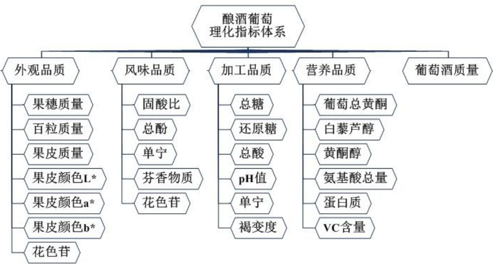

# 葡萄酒的质量分析与评价

## 摘要

本文针对葡萄酒的质量分析与评价问题，以置信区间、优势矩阵、逐步回归分析等方法和方差分析理论为基础，首先分析了两组评酒员评价结果，并确定可信的评价组别；然后建立基于优势矩阵的等级划分模型，对两组葡萄样本进行了等级划分；再利用关联度分析和逐步回归分析两种方法分析了酿酒葡萄和葡萄酒的理化指标之间的联系；最后对逐步回归分析法作多级嵌套改进，对葡萄和葡萄酒的理化指标能否评价葡萄酒质量的命题进行了论证。

针对问题一，考虑到评酒员之间可能存在主观因素导致的对酒样的评价差异悬殊，分别构造了以评酒员和酒样为组别的方差数据序列，通过进行双向显著性检验得到原始数据下评酒员间主观因素导致的差异极显著。然后分别引入标准化处理和置信区间法对数据进行处理，得到基于置信区间法的检验结果更优，再使用置信区间法处理的数据进行了方差分析，通过比较F 统计量得到针对红葡萄酒和白葡萄酒，分别为第一组和第二组的评价结果更可信的结论。

针对问题二，基于对葡萄品质的分析，以外观等四项品质类型结合酿造葡萄酒的质量构建了合理的葡萄等级划分指标体系。然后，通过均值聚类对理化指标进行了类别划分；再通过引入优势因子建立了优势因子矩阵，基于数值差异性对指标进行了清晰的等级划分。最后综合各项优势值与葡萄酒质量的优势值进行加权求和，以区间方式得到葡萄的划分等级，得到了红色类型葡萄的等级划分较为合理，白色类型葡萄的等级划分区分度较低的结论。

针对问题三，基于酿酒葡萄与葡萄酒的理化指标数据，首先构造了相关系数矩阵对双方的理化指标进行了关联性分析，并选取了关联性高的指标对进行了假设性探究；然后考虑了葡萄的多个理化指标对葡萄酒理化指标的综合影响，运用了逐步回归分析，得到相应的回归方程，并选取了其中检验量高的指标组合进行了假设性影响分析。

针对问题四，首先将葡萄酒的质量评价划分为外观、香气和口感三种类型的评价，然后分别针对三个方面以酒酿葡萄和葡萄酒的理化指标进行关联系分析；然后在逐步回归分析的基础上作多级嵌套改进，分别用第一级和第二级对葡萄酒理化指标和葡萄酒质量、酒酿葡萄和葡萄酒理化指标进行了逐步回归分析，最终经过论证得到红葡萄酒的香气和口感可以通过葡萄和葡萄酒的理化指标进行评价，并针对无法进行评价的部分进行了论证分析。

最后，对模型中运用的方法进行了科学性分析，并讨论了模型的优缺点，考虑了实际应用中的改进方向，提出了一些优化策略。

关键词： 质量评价 优势矩阵 逐步回归 置信区间 关联性分析

## 1. 问题的重述

确定葡萄酒质量时一般是通过聘请一批有资质的评酒员进行品评。每个评酒员在对葡萄酒进行品尝后对其分类指标打分，然后求和得到其总分，从而确定葡萄酒的质量。酿酒葡萄的好坏与所酿葡萄酒的质量有直接的关系，葡萄酒和酿酒葡萄检测的理化指标会在一定程度上反映葡萄酒和葡萄的质量。题目附件一给出了某一年份一些葡萄酒的评价结果，题目附件二和题目附件三分别给出了该年份这些葡萄酒的和酿酒葡萄的成分数据。题目要求尝试建立数学模型讨论下列问题：

1. 分析题目附件一中两组评酒员的评价结果有无显著性差异，并讨论哪一组结果更可信。

根据酿酒葡萄的理化指标和葡萄酒的质量对这些酿酒葡萄进行分级。

3. 分析酿酒葡萄与葡萄酒的理化指标之间的联系。

分析酿酒葡萄和葡萄酒的理化指标对葡萄酒质量的影响，并论证能否用葡萄和葡萄酒的理化指标来评价葡萄酒的质量。

## 2. 问题的分析

## 2.1 问题一的分析

该问题要求分析题目附件一中两组评酒员的评价结果有无显著性差异，并分析哪一组的结果更可信。

显著性差异是统计学上有量度的对数据差异性的或然评价。分析评酒员的评价结果有无显著性差异，即反映需研究评酒员对酒样评分的数值序列是否有较大的偏差。根据题意，葡萄酒的质量评价是通过评酒员的品评进行评分从而得到评价的，考虑到评酒员之间可能存在个人评酒风格等主观差异因素，若不同评酒员之间的主观因素差异过大，可能导致不同评酒员对于同一葡萄酒样的评价差异悬殊，影响酒样的质量鉴定，因此需要对主观因素的影响程度进行检验。

对于数据的偏差性检验和影响因素的挖掘，可采用方差分析对数据序列进行处理，通过将方差分析中的检验量与显著性水平下的检验值相比较从而验证差异性是否显著。考虑到涉及主观因素的差异性对酒样评分的影响是否显著，还可通过分别构造以评酒员为组别、元素为单个酒样的评分方差数据序列和以酒样为组别，元素为单个评酒员对全部酒样的评分方差数据序列，基于两类数据序列进行双向显著性检验，通过比较两者的检验量进行分析。若以评酒员为组别的序列的差异性检验量显著高于以酒样为组别的序列，则表明评酒员之间主观因素造成的葡萄酒质量评价差异更显著，则需要对数据进行处理降低这种差异性。

数据处理的方法有多种，如标准化处理、聚类处理和区间收敛处理等，可根据对原始数据进行方差分析出现的问题相应选取合适的数据处理方法，处理后根据检验的效果进行分析，并对数据处理方法进行优劣比较。

## 2.2 问题二的分析

该问题要求根据酿酒葡萄的理化指标和葡萄酒的质量对题目附件中的酿酒葡萄进行分级。

首先，考虑到酿酒葡萄理化指标的数量和种类较为繁杂，可借鉴现有的葡萄品质评价体系，确定影响葡萄品质的大方向类别，再结合题目数据中提供的理化指标，筛选一定数目的理化指标构建葡萄品质等级划分体系。

然后，针对指标体系中的每一种方向类别，可使用聚类方法基于指标间数值的相似性将其初步划分成若干类别，则对于类别中的理化指标，可引入优势因子以等级方式刻画其数之间的差异性，建立相应的优势因子矩阵，再通过计算聚类所得的类别内所有指标的优势因子总和并进行比较，确定类别间的优势值的高低，进而确定聚类所得的类别对应的等级，通过对各方向类别应用优势矩阵，可分别得到类别中各等级的优势值，最后通过加权求和或均值等数值处理，将基于优势值的各方向类别的等级划分综合得到总的等级划分。

此外，结合实际情况进行考虑，酿酒葡萄是为酿造葡萄酒而规模性种植的品种，因此酿酒葡萄的品质等级划分应与其酿造的葡萄酒质量构建关系，可借助问题一的求解结果，以较可信合理评酒员组评价结果作为葡萄酒质量的量化值进行等级划分，基于其等级赋予相应的优势因子，最后通过权衡酿酒成品的质量和方向类别的理化指标的重要性程度，将两者综合得到总的葡萄品质优势值，并以此为基准进行等级划分，求算出红种类葡萄和白种类葡萄样本的所属等级。

## 2.3 问题三的分析

该问题要求分析酿酒葡萄与葡萄酒的理化指标之间的联系。

葡萄酒是酿酒葡萄通过多重酿酒工艺制得的，中间必然发生多种交叉复合的化学反应。分析酿酒葡萄与葡萄酒的理化指标之间的联系，可以理解为通过对理化指标的数据进行相关分析，得到指标和指标之间的关联性，进而分析酿酒过程中指标代表的物质之间相互可能产生的促进性或阻抗性影响。

此外，考虑到化学反应的复杂性，指标之间的相互影响更可能属于多因素影响单一因素，或者多因素综合影响另一组多因素。考虑到酿酒葡萄和葡萄酒之间，只能存在酿酒葡萄理化指标对葡萄酒理化指标作单方面的影响，则问题可转化为探究酿酒葡萄的理化指标对葡萄酒理化指标的多种影响可能性，其中一种可能性对应着一种因素组合的关联。针对多因素之间的关联性分析则需要通过回归方法，寻求多因素之间贴近数值关联的函数关系，依次进一步分析多因素在对单一因素或多因素产生影响时，各影响因素的影响力贡献程度。对于寻求多个解释变量与被解释变量的关系时，可以借助逐步回归分析法进行计算。其核心思想是通过不断地增减解释变量并反复检验显著性以得到与被解释变量关联最为显著的因素组合。通过使用逐步回归，以酿酒葡萄理化指标为解释变量分别求解对应各项葡萄酒理化指标为被解释变量的回归方程，得到相应的数量关系并以此作分析。

## 2.4 问题四的分析

该问题要求分析酿酒葡萄和葡萄酒的理化指标对葡萄酒质量的影响，并论证是否能用葡萄和葡萄酒的理化指标来评价葡萄酒的质量。

题目中评酒员通过外观品质、香气品质和口感品质三种类型的指标对葡萄酒的质量进行评价，因此针对理化指标对葡萄酒质量的影响分析可从该三种类型着手进行探究。对于外观品质和香气品质，应分别与酿酒葡萄和葡萄酒的理化指标和芳香物质指标具有较大的关联，而口感品质相对较为复杂，可能与理化指标和芳香物质指标均具备一定的关联。因此可将酿酒葡萄和葡萄酒的理化指标和芳香物质指标分别在三种类型的指标上进行关联性分析，对其关联度高的指标，分析其对葡萄酒质量的影响的体现。

类比于问题三的分析，由于化学反应和物质呈现性质的复杂性，理化指标对葡萄酒质量的影响更可能属于多因素影响单一因素，则可针对理化指标和葡萄酒质量进行逐步回归分析。

考虑到与葡萄酒的质量成最直接关联的应该是葡萄酒中的化学物质，即其对应的理化指标；而酿酒葡萄中的理化指标由于经过酿酒过程转化成葡萄酒中的理化指标，其对于葡萄酒质量的影响则相应较低。因此可在逐步回归分析的基础上基于葡萄和葡萄酒的关系扩展成多级逐步回归分析，第一级以葡萄酒的理化指标为解释变量与葡萄酒的质量进行直接逐步回归分析；第二级则以葡萄的理化指标为解释变量与葡萄酒的理化指标进行回归分析；从而论证是否能用葡萄和葡萄酒的理化指标评价葡萄酒的质量这一命题则可转化为：(1)针对葡萄酒的理化指标，是否能通过逐步回归分析得到关于葡萄酒理化指标和葡萄酒质量的回归方程，并且方程的检验量能通过显著性检验；(2)针对葡萄的理化指标，仅当(1)情况得以成立时，是否能通过逐步回归分析得到关于葡萄理化指标和葡萄酒理化指标的回归方程，并且方程的检验量能通过显著性检验。

## 3. 模型的假设与符号的说明

## 3.1 模型的假设与使用

（1）题目附件中所提供的各项理化指标数据均真实可靠；

（2）假设酿酒葡萄和葡萄酒的理化指标和芳香物质在一定时间内不发生改变；

## 3.2 符号的说明与使用

SS——表示误差平方和

$d f$ ——表示自由度

MS——表示均方差

F——表示显著性统计量

F crit- ——表示基于显著性水平为0.01 的F值

$\mathcal { A } _ { i j }$ ——表示第i位评酒员对编号为 $j$ 的酒样评分的标准化处理值

$x _ { i j }$ ——表示第i位评酒员对编号为 $j$ 的酒样的评分值

$x _ { i }$ ——表示第i位评酒员对全部酒样评分的平均值

$\sigma _ { i }$ ——表示第i位评酒员对全部酒样评分的标准差值

$A _ { r i }$ ——表示编号为i的红种葡萄的理化指标

appearanceScore ——表示红种葡萄外观品质类别的聚类类别优势值

flavorScore ——表示红种葡萄风味品质类别的聚类类别优势值

processScore ——表示红种葡萄加工品质类别的聚类类别优势值

healthScore ——表示红种葡萄保健品质类别的聚类类别优势值

Score ——表示红种葡萄的综合等级优势值

——表示Pearson相关系数

表示葡萄酒中编号为i的理化指标与酿酒葡萄中编号为 $j$ 的$\gamma _ { i - j }$ 理化指标的关联度

## 4. 模型的准备

## 4.1 原始数据的预处理

针对题目附件原始数据中出现的奇异数据，如数据缺失，数量级与同类指标相比明显不符，数据格式错误等，采取取平均值、根据同类指标校正等方法，消除这些奇异数据给统计结果造成误差的可能性。

针对K-Means聚类中需要用到的指标数据中同时含有极大型指标、极小型指标、居中型指标和区间型指标，在进行聚类分析前，我们需要先将不同类型的指标做一致化处理，将其转化为同一类型的指标。在本文中，我们对数据全部化为极大型指标，具体转化方法如下

## （1） 极小型化为极大型

对于极小型指标 $x _ { j }$ ，即 $x _ { j }$ 的取值越小越好。要将其化为极大型指标，只需做平移变换 $x _ { j } ^ { \prime } = M _ { j } - x _ { j }$ ，其中 $M _ { j } = \operatorname* { m a x } _ { 1 \leq i \leq n } \left\{ x _ { i j } \right\}$ 。则可将极小型指标 $x _ { j }$ 化为极大型。

## （2） 居中型化为极大型

对于居中型指标x ，即x 取中间值 $x _ { j }$ $x _ { j }$ $\frac { M _ { j } + m _ { j } } { 2 }$ 为最好。要将其化为极大型指标，令

$$
\begin{array} { r } { x _ { j } ^ { \prime } = \left\{ \begin{array} { l l } { \displaystyle \frac { 2 ( x _ { j } - m _ { j } ) } { M _ { j } - m _ { j } } , m _ { j } \le x _ { j } \le \displaystyle \frac { M _ { j } + m _ { j } } { 2 } , } \\ { \displaystyle \frac { 2 ( M _ { j } - x _ { j } ) } { M _ { j } - m _ { j } } , \displaystyle \frac { M _ { j } + m _ { j } } { 2 } \le x _ { j } \le M _ { j } , } \end{array} \right. } \end{array}
$$

其中 $M _ { j } = \operatorname* { m a x } _ { 1 \leq i \leq n } \left\{ x _ { i j } \right\} , m _ { j } = \operatorname* { m i n } _ { 1 \leq i \leq n } \left\{ x _ { i j } \right\}$ 。则可将中间型指标 $x _ { j }$ 化为极大型。

## （3） 区间型化为极大型

对于区间型指标 $x _ { j } \in \left[ a _ { j } , b _ { j } \right]$ ，即指标 $x _ { j }$ 其值介于区间 $\left[ a _ { j } , b _ { j } \right]$ 内都是最好的，越远离该区间就越不好。要将其化为极大型指标，令

$$
\begin{array} { r } { x _ { j } ^ { \prime } = \left\{ \begin{array} { c c } { \displaystyle 1 - \frac { a _ { j } - x _ { j } } { c _ { j } } \quad } & { , x _ { j } < a _ { j } , } \\ { 1 \quad } & { , a _ { j } \le x _ { j } \le b _ { j } , } \\ { \displaystyle 1 - \frac { x _ { j } - b _ { j } } { c _ { j } } \quad } & { , x _ { j } > b _ { j } , } \end{array} \right. } \end{array}
$$

其中 $c _ { j } = \operatorname* { m a x } \left. a _ { j } - m _ { j } , M _ { j } - b _ { j } \right.$ ， $a _ { j }$ ， $b _ { j }$ 为区间型指标 $x _ { j }$ 的最稳定区间的下界和上界值，取确定常数， $M _ { j }$ $m _ { j }$ 的意义同上。则可将区间型指标 $x _ { j }$ 化为极大型。

除了上述的将指标类型一致化外，各评价指标之间由于各自的度量单位及数量级的差别，而存在着不可公度性。为了消除各指标之间的单位不同，以及数值量级之间差别的影响，我们还需要对各指标做无量纲化处理。在这里，我们选取标准化方法来进行无量纲化处理。

对于 $n$ 个被评价对象的m项指标的指标值 $x _ { i j } ( i = 1 , 2 , \cdots , n ; j = 1 , 2 , \cdots , m )$ ，则新的标准化指标值为

$$
\boldsymbol { x } _ { i j } ^ { * } = \frac { \boldsymbol { x } _ { i j } - \overline { { \boldsymbol { x } } } _ { j } } { s _ { j } } \in \left[ 0 , 1 \right]
$$

其中 $\overline { { x } } _ { j } = \frac { 1 } { n } \sum _ { i = 1 } ^ { n } x _ { i j }$ 为第j项指标关于n个被评价对象的平均值， $s _ { j } = \sqrt { \frac { 1 } { n } \sum _ { i = 1 } ^ { n } ( x _ { i j } - \overline { { x } } _ { j } ) ^ { 2 } }$ 为第j项指标关于 $n$ 个被评价对象的均方差。即 $x _ { i j } ^ { * } ( i = 1 , 2 , \cdots , n ; j = 1 , 2 , \cdots , m )$ 为无量化的指标值。

对于葡萄的各项理化指标，有相关文献可得，褐变度为极小型指标，pH值、总酸、固酸比等为区间型指标，单宁为中间型指标，其余均为极大型指标。限于篇幅，在此仅列出数据处理前后红葡萄中单宁的数值如下表 1所示

## 表 1 红葡萄中单宁数据处理前后数值比较

<table><tr><td>酒样编号</td><td>1</td><td>2</td><td>3</td><td>4</td><td>5</td><td>6</td><td>7</td><td>8</td><td>9</td></tr><tr><td>处理前</td><td>22.02</td><td>23.36</td><td>20.37</td><td>8.64</td><td>14.49</td><td>15.17</td><td>5.62</td><td>22.49</td><td>24.36</td></tr><tr><td>处理后</td><td>0.31</td><td>0.19</td><td>0.47</td><td>0.45</td><td>0.99</td><td>0.95</td><td>0.17</td><td>0.27</td><td>0.10</td></tr><tr><td>酒样编号</td><td>10</td><td>11</td><td>12</td><td>13</td><td>14</td><td>15</td><td>16</td><td>17</td><td>18</td></tr><tr><td>处理前</td><td>16.69</td><td>4.54</td><td>7.17</td><td>9.82</td><td>13.94</td><td>25.42</td><td>10.09</td><td>15.73</td><td>5.39</td></tr><tr><td>处理后</td><td>0.81</td><td>0.07</td><td>0.31</td><td>0.56</td><td>0.94</td><td>0.00</td><td>0.58</td><td>0.90</td><td>0.15</td></tr><tr><td>酒样编号</td><td>19</td><td>20</td><td>21</td><td>22</td><td>23</td><td>24</td><td>25</td><td>26</td><td>27</td></tr><tr><td>处理前</td><td>13.70</td><td>8.11</td><td>13.61</td><td>12.16</td><td>24.26</td><td>14.42</td><td>9.32</td><td>3.78</td><td>10.31</td></tr><tr><td>处理后</td><td>0.92</td><td>0.40</td><td>0.91</td><td>0.77</td><td>0.11</td><td>0.98</td><td>0.51</td><td>0.00</td><td>0.60</td></tr></table>

## 4.2 方差分析中的显著性检验

针对模型中将会用到的方差分析中的显著性检验作如下说明：

构造F统计量

$$
F = \frac { M S _ { R } } { M S _ { { \cal E } } } = \frac { S S _ { R } / \left( m - 1 \right) } { S S _ { { \cal E } } / \left( n - m \right) } \sim F ( f _ { { \cal R } } , f _ { { \cal E } } ) = F ( m - 1 , n - m )
$$

取一个显著性水平 （0.01 或 0.05），可查表得到 $F _ { \alpha } ( m { - } 1 , n { - } m )$ ，计算$F ( m - 1 , n - \ m ) .$ 与 $F _ { \alpha } ( m { - } 1 , n { - } m )$ 比较：

当 $F ( m - 1 , n - m ) > F _ { \alpha } ( m - 1 , n - m )$ 时，认为模型是显著的，则拒绝 $\eta = \beta _ { \mathrm { 0 } }$ 成立，即 与u存在明显的函数关系。

当 $F ( m { - } 1 , n { - } m ) { < } F _ { \alpha } ( m { - } 1 , n { - } m )$ 时，认为模型是不显著的，则 $\eta = \beta _ { \mathrm { 0 } }$ 是成立的，即 与u不存在明显的函数关系。

## 5. 模型的建立与求解

## 5.1 问题一的模型建立与求解

依据问题分析，考虑到评酒员间存在主观因素的差异，可能导致不同评酒员对于同一葡萄酒样的评价差异悬殊，影响酒样的质量鉴定，从而难以准确反映不同酒样间差异的显著性。

基于此，本节首先对评价结果的原始数据进行方差分析，验证对主观因素的假设分析；再分别应用标准化处理法和置信区间法，对两组评酒员的评价结果进行数据处理，以真实反映酒样间质量的差异，并据此比较两种处理方法的优劣。

## 5.1.1 基于原始数据的显著性差异分析

由上述分析可知，不同评酒员的评价尺度的差异可能会影响酒样之间鉴定结果的差异。结合附件一的评价结果，将评酒员与酒样等同看待成“区组”，分别针对两组的红葡萄酒评分和白葡萄酒评分共 组数据进行双向方差分析，以此减少误差方差，同时分析不同评酒员之间是否存在显著的主观性评分差异。利用 Excel 软件处理数据得到结果如下表 2所示。

表2 基于原始数据处理的葡萄酒评价方差分析
<table><tr><td rowspan="3">第一组 红葡萄 酒</td><td>差异源</td><td>SS</td><td> $d f$ </td><td>MS</td><td>F</td><td>P-value</td><td>F-crit</td></tr><tr><td>行</td><td>3084.642</td><td>9</td><td>342.738</td><td>7.24959</td><td>2.73E-09</td><td>2.483848</td></tr><tr><td>列</td><td>14090.39</td><td>26</td><td>541.9382</td><td>11.46307</td><td>4.97E-29</td><td>1.837216</td></tr><tr><td rowspan="3">第二组 红葡萄 酒</td><td>差异源</td><td>SS</td><td>df</td><td>MS</td><td>F</td><td>P-value</td><td>F-crit</td></tr><tr><td>行</td><td>3060.774</td><td>9</td><td>340.086</td><td>15.45147</td><td>1.06E-19</td><td>2.483848</td></tr><tr><td>列</td><td>4114.341</td><td>26</td><td>158.2439</td><td>7.189655</td><td>2.58E-18</td><td>1.837216</td></tr><tr><td rowspan="3">第一组 白葡萄 酒</td><td>差异源</td><td>SS</td><td>df</td><td>MS</td><td>F</td><td>P-value</td><td>F-crit</td></tr><tr><td>行</td><td>17137.93</td><td>9</td><td>1904.215</td><td>36.34977</td><td>2.64E-40</td><td>2.480975</td></tr><tr><td>列</td><td>6231.268</td><td>27</td><td>230.7877</td><td>4.405533</td><td>1.41E-10</td><td>1.81848</td></tr><tr><td rowspan="3">第二组 白葡萄 酒</td><td>差异源</td><td>SS</td><td>df</td><td>MS</td><td>F</td><td>P-value</td><td>F-crit</td></tr><tr><td>行</td><td>6725.104</td><td>9</td><td>747.2337</td><td>24.56477</td><td>1.01E-29</td><td>2.480975</td></tr><tr><td>列</td><td>2714.811</td><td>27</td><td>100.5485</td><td>3.305461</td><td>4.07E-07</td><td>1.81848</td></tr></table>

上表中，SS表示误差平方和；df 表示自由度；MS表示均方差；F 表示显著性统计量；F crit- 表示基于显著性水平为 0.01的F 值。

差异源中“行”表示以评酒员为“区组”，元素为单个酒样的评分方差数据序列；“列”表示以酒样为“区组”，元素为单个评酒员对全部酒样的评分方差数据序列。

分析上表四组显著性检验数据，基于“行”与“列”的双向显著性差异检验中，八组数据序列的F统计量均大于基于显著性水平为 0.01的F crit- ，表示其差异性极显著。进一步比较数据大小可知，除第一组红葡萄酒评分的双向差异检验中“行区组”与“列区组”的差异性较为接近外，另外三组的双向差异检验结果均表示“行区组”的差异性显著高于“列区组”，说明相较于各酒样之间质量造成的评价差异，评酒员之间因为评酒风格等主观因素造成的评价差异更显著，则问题分析中关于评酒员主观因素影响酒样差异显著性的假设成立。

评酒员间的差异显著性过大将导致酒样质量的差异显著性被掩盖，结合实际分析，酒样评价中应尽可能缩小由于评酒员个人风格的原因而导致对同一酒样评价差异较大的情况，并应尽可能将酒样之间质量的差异通过评价扩大，提高酒样的可识别度。在此引入标准化处理和置信区间法分别处理原始数据，降低评酒员之间的主观差异性。

## 5.1.2 基于标准化处理的显著性差异分析

标准化处理法是统计学中常用的一种原始数据处理方法，以第一组红葡萄酒的评分为例，首先计算该组中每位评酒员的所有评分的平均值 $x _ { i }$ 和标准差 $\sigma _ { i }$ ，然后通过以下计算式对原始数据进行转换

$$
\vartheta _ { i j } = \frac { x _ { i j } - \overline { { x } } _ { i } } { \sigma _ { i } }
$$

式中， $\mathcal { A } _ { i j }$ 表示第i位评酒员对编号为j的酒样评分的标准化处理值；

$x _ { i j }$ 表示第i位评酒员对编号为j的酒样的评分值；

$x _ { i }$ 表示第i位评酒员对全部酒样评分的平均值；

$\sigma _ { i }$ 表示第i位评酒员对全部酒样评分的标准差值。

依据以上处理方法对题目附件一数据进行标准化处理，限于篇幅原因，所得数据处理结果详见于附录 1。

基于所得结果分别针对两组的红葡萄酒评分和白葡萄酒评分的 4 组数据再次进行双向方差分析，所得结果如下表 3所示。

表 3 基于标准化处理的葡萄酒评价方差分析
<table><tr><td rowspan="3">第一组 红葡萄 酒</td><td>差异源</td><td>SS</td><td>df</td><td>MS</td><td>F</td><td>P-value</td><td>F-crit</td></tr><tr><td>行</td><td>1.14E-13</td><td>9</td><td>1.26E-14</td><td>2.75E-14</td><td>1</td><td>2.483848</td></tr><tr><td>列</td><td>152.6984</td><td>26</td><td>5.873016</td><td>12.80769</td><td>5.07E-32</td><td>1.837216</td></tr><tr><td rowspan="3">第二组 红葡萄 酒</td><td>差异源</td><td>SS</td><td>df</td><td>MS</td><td>F</td><td>P-value</td><td>F-crit</td></tr><tr><td>行</td><td>3.8E-11</td><td>9</td><td>4.22E-12</td><td>6.97E-12</td><td>1</td><td>2.483848</td></tr><tr><td>列</td><td>118.3134</td><td>26</td><td>4.550517</td><td>7.515329</td><td>3.34E-19</td><td>1.837216</td></tr><tr><td rowspan="3">第一组 白葡萄 酒</td><td>差异源</td><td>SS</td><td>df</td><td>MS</td><td>F</td><td>P-value</td><td>F-crit</td></tr><tr><td>行</td><td>2.97E-11</td><td>9</td><td>3.3E-12</td><td>4.51E-12</td><td>1</td><td>2.480975</td></tr><tr><td>列</td><td>92.17371</td><td>27</td><td>3.413841</td><td>4.665021</td><td>2.18E-11</td><td>1.81848</td></tr><tr><td rowspan="3">第二组 白葡萄 酒</td><td>差异源</td><td>SS</td><td>df</td><td>MS</td><td>F</td><td>P-value</td><td>F-crit</td></tr><tr><td>行</td><td>8.03E-11</td><td>9</td><td>8.92E-12</td><td>1.12E-11</td><td>1</td><td>2.480975</td></tr><tr><td>列</td><td>76.14697</td><td>27</td><td>2.820258</td><td>3.535269</td><td>7.72E-08</td><td>1.81848</td></tr></table>

分析上表数据得到，对于四组“行”序列评价的数据序列，其求解到的 统计量均接近于 ，远小于基于显著性水平为 的 ，剩余四组“列”序列评价的数据序列的F统计量仍保持大于基于显著性水平为 0.01的F crit- ，表示差异性仍属于极显著。从数据层面上分析，相较于直接对原始数据进行方差分析得到的各序列的F统计量，标准化处理后进行分析得到的“行”序列的F 统计量显著减小，另一方面“列”序列对应的 统计量数值上基本没有发生变化，数值上表示评酒员之间主观因素造成的评价差异已显著降低，而酒样之间质量差异的显著性则受影响不大。

结合附录 1 中经标准化处理后的调整数据分析，同一评酒员对所有酒样评价值的平均值均接近于0，同时标准差都是 1，导致评酒员对葡萄酒的评价值出现部分为负值的问题，与评价体系相悖，因此对该条件下的数据进行分析，无法准确反映酒样间质量的差异性。

## 5.1.3 基于置信区间法的显著性差异分析

置信区间法通过确定指标的置信区间，并对不隶属置信区间内的值进行逐步调整，进而使得同一类别的数据最终均处于置信区间内。以第一组红葡萄酒的评分为例，首先计算该组中所有评酒员对同一酒样评分的平均值 $x _ { j }$ 和标准差 $\sigma _ { j }$ ，则有第i位评酒员对编号为j的酒样评价的置信区间为

$$
\overline { { x } } _ { j } \pm \sigma _ { j }
$$

对评价值 $x _ { i j }$ 的判别。如果第i位评酒员对编号为 $j$ 的酒样的评价值 $x _ { i j }$ 在其置信区间范围内则可直接使用；如果评价值 $x _ { i j }$ 不在置信区间范围内，则将评酒员的评价值x 以下列算式进行逐步调整 $x _ { i j }$

$$
\left\{ \begin{array} { l l } { x _ { i j } = x _ { i j } + \sigma _ { j } \ , } & { x _ { i j } < j } \\ { x _ { i j } = x _ { i j } - \sigma _ { j } \ , } & { x _ { i j } > j } \end{array} \right.
$$

通过收敛调整使不同评酒员最终对同一酒样的评价值均处于置信区间 $\overline { { x } } _ { j } \pm \sigma _ { j }$ 内。

依据置信区间法对题目附件一原始数据进行处理，基于所得结果分别针对两组的红葡萄酒评分和白葡萄酒评分的 4 组数据再次进行双向方差分析，所得结果如下表4所示。

表 4 基于置信区间法的葡萄酒评价方差分析
<table><tr><td rowspan="3">第一组 红葡萄 酒</td><td>差异源 SS</td><td> $d f$ </td><td>MS</td><td> $F$ </td><td>P-value</td><td>F-crit</td></tr><tr><td>行 886.3517</td><td>9</td><td>98.48352</td><td>7.108117</td><td>4.27529E-09</td><td>2.483848</td></tr><tr><td>列 14162.82</td><td>26</td><td>544.7237</td><td>39.31581</td><td>9.15166E-71</td><td>1.837216</td></tr><tr><td rowspan="3">第二组 红葡萄 酒</td><td>差异源 SS</td><td> $d f$ </td><td>MS</td><td>F</td><td>P-value</td><td>F-crit</td></tr><tr><td>行 558.5765</td><td>9</td><td>62.06405</td><td>8.477539</td><td>5.88634E-11</td><td>2.483848</td></tr><tr><td>列 4130.279</td><td>26</td><td>158.8569</td><td>21.6988</td><td>1.91079E-48</td><td>1.837216</td></tr><tr><td rowspan="3">第一组 白葡萄 酒</td><td>差异源 SS</td><td>df</td><td>MS</td><td>F</td><td>P-value</td><td>F-crit</td></tr><tr><td>行 3732.605</td><td>9</td><td>414.7339</td><td>17.95678</td><td>9.51E-23</td><td>2.480975</td></tr><tr><td>列 6859.52</td><td>27</td><td>254.0563</td><td>10.99991</td><td>5.93E-29</td><td>1.81848</td></tr><tr><td rowspan="3">第二组 白葡萄 酒</td><td>差异源 SS</td><td>df</td><td>MS</td><td>F</td><td>P-value</td><td>F-crit</td></tr><tr><td>行 716.3946</td><td>9</td><td>79.5994</td><td>6.361323</td><td>4.26E-08</td><td>2.480975</td></tr><tr><td>列 2959.038</td><td>27</td><td>109.594</td><td>8.758393</td><td>2.91E-23</td><td>1.81848</td></tr></table>

根据上表结果可知，八组数据序列的 统计量均大于基于显著性水平为 的F crit- ，表示其差异性极显著。相较于直接对原始数据进行方差分析得到的各序列的F统计量，基于置信区间法处理进行分析得到的“行”序列的F 统计量整体上显著减小，同时“列”序列的F 统计量整体上显著增大，数值上表示评酒员之间主观因素造成的评价差异已显著降低，同时酒样之间质量导致的评价差异则则显著提高。

相较于标准化处理后的各序列的 统计量，基于置信区间法处理的各组数据序列的F统计量均通过了显著性检验，且数据处理上没有出现标准化处理导致的数值错误问题。

## 5.1.4 结果的分析与讨论

综合上述三种数据处理方法，结合方差分析的检验结果和分析，可得到基于置信区间法的数据处理方式在三种处理中最优，因此选取基于置信区间法处理的数据的方差分析结果作为评酒员的评价差异分析对象。考虑到显著性差异的比较中主要进行 统计量的比较，选取 及F crit- 的数据整理得下表 。

表 5 F 及F crit- 的数据整理比较

<table><tr><td rowspan="4">第一组 红葡萄 酒</td><td>差异源 F</td><td> $F { - } c r i t$ </td><td rowspan="4">第一组 白葡萄 酒 第二组</td><td>差异源</td><td>F F-crit</td></tr><tr><td>行 7.108117</td><td>2.483848</td><td>行 17.95678</td><td>2.480975</td></tr><tr><td>列 39.31581</td><td>1.837216</td><td>列</td><td>1.81848</td></tr><tr><td>差异源</td><td> $F { - } c r i t$ </td><td>10.99991 差异源 F</td><td>F-crit</td></tr><tr><td rowspan="3">第二组 红葡萄 酒</td><td>F 行 8.477539</td><td>2.483848</td><td>白葡萄 行</td><td>6.361323 2.480975</td></tr><tr><td></td><td></td><td></td><td></td></tr><tr><td>列</td><td>21.6988 1.837216</td><td>列</td><td>8.758393 1.81848</td></tr></table>

基于上表的F统计量及 $F { - } c r i t$ 进行数据比较，对于酒样为红葡萄酒的两组数据，由于酒样的数据序列一样，“行”区组和“列”区组的显著性水平为 0.01的 $F { - } c r i t$ 值一样。比较红葡萄酒评价结果的“行”区组F 统计量，在 $F { - } c r i t$ 相同的情况下，第一组的值为 $F = 7 . 1 0 8 1 1 7$ ，小于第二组的值 $F = 8 . 4 7 7 5 3 9$ ，则表示第二组评酒员因主观因素造成的酒样评价差异，相较于第二组评酒员更显著。再比较红葡萄酒评价结果的“列”区组F统计量，在 $F { - } c r i t$ 相同的情况下，第一组的值为 $F = 3 9 . 3 1 5 8 1$ ，大于第二组的值 $F = 2 1 . 6 9 8 8$ ，则表示第一组评酒员因酒样质量造成的评价差异，相较于第二组评酒员更显著。综合两项差异比较结论，可得针对红葡萄酒的质量评价结果，第一组评酒员的评价结果更可信。

同理，对于酒样为白葡萄酒的两组数据，由于第一组白葡萄酒的“行”区组F 统计量 $F = 1 7 . 9 5 6 7 8$ 显著高于“列”区组 统计量 $F = 1 0 . 9 9 9 9 1$ ，表示该组评价结果中评酒员因主观因素造成的酒样评价差异高于因酒样质量造成的评价差异，置信区间法对数据的处理在该组内没有得到较好的改进。此外，第二组白葡萄酒的“列”区组F统计量大于“行”区组，优于第一组的评价结果。因此可得针对白葡萄酒的质量评价结果，第二组评酒员的评价结果更可信。

## 5.2 问题二的模型建立与求解

该问题要求根据酿酒葡萄的理化指标和葡萄酒的质量对附件中的酿酒葡萄进行分级。结合题目附件二、三的数据可知，酿酒葡萄理化指标的数量和种类较为繁杂，因此结合现时的评价体系，选取关键理化指标构建理化指标分级体系；然后基于理化指标的数据特征进行聚类划分；再结合问题一的求解结果，以等级方式划分酒样的质量数据；最后综合两者得到酿酒葡萄品质的分级。

## 5.2.1 理化指标体系的建立

由上述分析可知，衡量酿酒葡萄的品质优劣的理化指标较为繁杂，因此需筛选合理的指标作为代表。通过查阅相关文献【4】，可知葡萄的整体品质可划分为四个方面进行评价，分别为外观品质、风味品质、加工品质和营养品质。

此外，考虑到酿酒葡萄的主要用途是酿制葡萄酒，则最终酒的成品质量也可作为衡量葡萄品质的一个指标。依据四种品质的衡量标准，结合题目附件提供的酿酒葡萄理化指标，进行指标筛选，得到酿酒葡萄品质评价的理化指标体系如下

## 5.2.2 基于优势矩阵的葡萄品质等级划分模型

## （1）K-均值聚类法的引入

为消除理化指标间数量级的差异导致的比较困难，更直观地分析数据，这里使用模型准备中归一化和极大化处理后的调整指标数据。进一步考虑到以任意单一种类葡萄为评价对象，其品质的优劣评价需要充分兼顾葡萄的各项理化指标，需要综合指标之间的相似性进行划分。因此可通过聚类方法，结合以上葡萄理化指标体系，从四个方面对理化指标进行聚类。在此使用K-均值聚类算法对酿酒葡萄的理化指标进行聚类。

均值聚类算法是一种简单高效的无监督学习算法，此种方法能够快速有效地用于已知类数m的数据聚类和分析。其基本步骤描述如下：

## Step 1 初始化

给定类的个数m，同时置 $j { = } 0$ ，从样本向量中任意选定 $m$ 个向量 $k _ { 1 } ^ { j } , k _ { 2 } ^ { j } , \cdots \mathbf { k } _ { m } ^ { j }$ 作为聚类中心， $k _ { i } ^ { j } = \ \left[ k _ { i 1 } ^ { j } , k _ { i 2 } ^ { j } , \cdots k _ { i n } ^ { j } \right] , ( i = 1 , 2 , \cdots , k )$ 。其中n为输入向量的维数，并将中心为 $k _ { i } ^ { j }$ 的聚类块记为 $K _ { i } ^ { j }$

## Step 2 样本归类

将每个样本向量 $x _ { \iota } { = } \left[ x _ { \iota { 1 } } , x _ { \iota { 2 } } , \cdots , x _ { \iota { n } } \right] ^ { \mathrm { { T } } }$ ，按照下列欧几里得距离计算式

$$
\left\| \boldsymbol { x } _ { l } - \boldsymbol { k } _ { i } ^ { j } \right\| = \operatorname* { m i n } _ { 1 \leq h \leq m } \left\| \boldsymbol { x } _ { l } - \boldsymbol { k } _ { m } ^ { j } \right\|
$$

归入中心为 $k _ { i } ^ { j }$ 的类中。

## Step 3 中心调整

重新调整聚类中心，新的聚类中心 $k _ { i } ^ { j }$ 由下式计算得到，即

$$
k _ { i h } ^ { j + 1 } = \frac { \displaystyle \sum _ { x _ { l _ { i } } \in K _ { i } ^ { j } } x _ { l _ { i } h } } { N _ { i } }
$$

式中， $N _ { i }$ 表示聚类块 $K _ { i } ^ { j }$ 中的向量数。

## Step 4 条件判断

构建迭代目标函数J如下

$$
J = \sum _ { m = 1 } ^ { n } \sum _ { x _ { m } \in K _ { i } } \left| x _ { k } - k _ { i } \right|
$$

将 Step 1 中的数据代换入上式，判断函数值J。如果J不再明显改变，则迭代终止；否则 $j = j + 1$ ，转 Step 1。

## （2）优势因子矩阵的建立

结合酿酒葡萄的理化指标体系，基于 K-均值聚类法进行聚类，分别获得了外观品质等四项类别的最终聚类中心矩阵，限于篇幅问题，以下以红种葡萄的外观品质为例，对优势因子矩阵的建立步骤进行描述：

由上可得红种葡萄的最终聚类中心矩阵为

$$
\begin{array} { c c } { { } } & { { \displaystyle \frac { \mathrm { I } } { A _ { r , 2 4 } } \quad \mathrm { ~ I I } \quad \mathrm { ~ I I I } \quad \mathrm { ~ I I I } \quad } } \\ { { } } & { { \displaystyle \left. \begin{array} { c c c } { { 1 } } & { { 0 . 1 5 1 } } & { { 0 . 4 8 9 } } & { { 0 . 1 5 6 } } \\ { { A _ { r , 2 5 } } } & { { 0 . 0 6 8 } } & { { 0 . 2 7 3 } } & { { 0 . 6 3 6 } } & { { 0 . 0 8 7 } } \end{array} \right. } } \\ { { } } & { { \displaystyle \left. \begin{array} { c c c } { { A _ { r , 3 5 } } } & { { 0 . 3 5 7 } } & { { 0 . 6 6 1 } } & { { 0 } } \\ { { A _ { r , 3 0 } } } & { { 0 . 0 3 4 } } & { { 0 . 0 9 7 } } & { { 0 . 0 4 9 } } & { { 1 . 0 0 0 } } \end{array} \right. } } \\ { { } } & { { \displaystyle \left. \begin{array} { c c c } { { A _ { r , 3 1 } } } & { { 0 . 7 8 5 } } & { { 0 . 8 1 2 } } & { { 0 . 8 0 3 } } & { { 0 } } \\ { { A _ { s , 3 5 } } } & { { 0 . 1 4 3 } } & { { 0 . 2 5 3 } } & { { 0 } } \end{array} \right. } } \\ { { } } & { { \displaystyle \left. \begin{array} { c c c } { { A _ { r , 3 6 } } } & { { 0 . 1 4 3 } } & { { 0 . 2 5 3 } } & { { 0 } } \\ { { A _ { r , 2 9 } } } & { { 0 . 7 7 6 } } & { { 0 . 4 9 1 } } & { { 0 . 4 2 5 } } & { { 0 . 1 5 3 } } \end{array} \right. } } \end{array}
$$

矩阵中， $A _ { r i }$ 表示编号为i的红种葡萄的理化指标，编号依据附件数据中从左往右的次序依次排列。

对以上中心矩阵中的每一项理化指标，根据其在相应类别的数值大小赋予优势因子，考虑到优势因子的设置应尽可能刻画出指标数值的差异性，在此定义优势因子集合为 $\Lambda = \{ 1 , 4 , 7 , 1 0 \}$

由于各理化指标均转化为极大型指标，指标的数值越大，其优势相应更能突出。因此，对以上中心矩阵的每一项指标，根据四个类别的数值从小到大分别赋予优势因子1，4，7，10，得到红种葡萄外观品质的优势因子矩阵如下

$$
S c o r e _ { A _ { \tau } } ^ { \mathrm { a p s a m e c } } = \left[ \begin{array} { l l l l } { 1 } & { 4 } & { 1 0 } & { 7 } \\ { 1 } & { 7 } & { 1 0 } & { 4 } \\ { 4 } & { 7 } & { 1 0 } & { 1 } \\ { 1 } & { 7 } & { 4 } & { 1 0 } \\ { 4 } & { 1 0 } & { 7 } & { 1 } \\ { 1 0 } & { 4 } & { 7 } & { 1 } \\ { 1 0 } & { 7 } & { 4 } & { 1 } \end{array} \right]
$$

分别对该优势因子矩阵每一列的向量进行求和，得到列向量因子求和矩阵

$$
S c o r e _ { r } ^ { \mathrm { a p p e a r a n c e } } = \left[ 3 1 \ 4 6 \ 5 2 \ 2 5 \right]
$$

该求和矩阵中每个数值分别表示红种葡萄外观品质的最终聚类中心矩阵里，其所在列对应的聚类类别的优势因子总和，根据其大小排序反映该类别所处的等级。进一步，再次根据四个数值从小到大的次序向其赋予优势因子 1，4，7，10，得到聚类类别优势矩阵

$$
S c o r e _ { r } ^ { \mathrm { a p p e a r a n c e } } = \left[ 4 \begin{array} { l l l l } { } & { 7 } & { 1 0 } & { 1 } \end{array} \right]
$$

appearanceScore 表示红种葡萄外观品质类别的聚类类别优势值；

该矩阵基于优势因子的数值差异对聚类的中心矩阵得到的四个类别重新进行了等级划分。

进一步，除酿酒质量以外，对葡萄理化指标体系中的剩余三项品质类别依次进行K-均值聚类，得到其聚类中心矩阵，再分别构建以上优势因子矩阵，得到三项品质类别的聚类类别优势矩阵为

$$
\begin{array} { r l } { S c o r e _ { r } ^ { \mathrm { f l a v o r } } = [ 1 0 \phantom { - } 4 \phantom { - } 4 \phantom { - } 7  } & { { } 1 ] } \\ { S c o r e _ { r } ^ { \mathrm { p r o c e s s } } = [ 1 \phantom { - } 4 \phantom { - } 4 \phantom { - } 1 0 \phantom { - } 7 ] } \\ { S c o r e _ { r } ^ { \mathrm { h e a l t h } } = [ 1 0 \phantom { - } 1 \phantom { - } 1 \phantom { - } 7  } \end{array}
$$

其中， $S c o r e _ { r } ^ { \mathrm { f l a v o r } }$ 表示红种葡萄风味品质类别的聚类类别优势值；

$S c o _ { r } ^ { \mathrm { ~ \tiny ~ p ~ r ~ o ~ c ~ } }$ ess表示红种葡萄加工品质类别的聚类类别优势值；

$S c o _ { r } ^ { \textrm { h e a } }$ lth表示红种葡萄保健品质类别的聚类类别优势值。

综合上述四项品质类别的聚类类别优势值，得到红种葡萄的品质类别综合优势矩阵如下

<table><tr><td></td><td>I Ⅱ</td><td>Ⅲ</td><td>IV</td></tr><tr><td> $S c o r e _ { r } ^ { \mathrm { a p p e a r a n c e } }$ </td><td>4 7</td><td>10</td><td>1</td></tr><tr><td> $S c o r e _ { r } ^ { \mathrm { f l a v o r } }$ </td><td>10</td><td>4 7</td><td>1</td></tr><tr><td> $S c o r e _ { r } ^ { \mathrm { p r o c e s s } }$ </td><td>1 4</td><td>10</td><td>7</td></tr><tr><td> $S c o r e _ { r } ^ { \mathrm { h e a l t h } }$ </td><td>10 1</td><td>7</td><td>4</td></tr></table>

（3）葡萄酿酒质量优势矩阵的确立

依据问题一的分析结果可知，针对红葡萄酒，第一组评酒员的评价结果更为可信。考虑到对每种类别的红葡萄酒均有 位评酒员进行评分，在此认为每位评酒员对于评价葡萄酒质量时所做的评价贡献是等同的，则对于每种红葡萄酒，可通过计算 10 为评酒员对其所评分值的均值作为其质量评分。以葡萄酒评论家罗伯特·帕克的葡萄酒质量为基准，结合题目数据的数量级和分布特征进行调整，得到适用于本文葡萄酒质量分级体系

$$
\begin{array} { r } { \left\{ \begin{array} { l l l } { \left[ 8 . 5 , 1 0 \right) } & { \longrightarrow } & { \nmid \mathrm { L } \vec { \mathcal { T } } } \\ { \left[ 7 . 5 , 8 . 5 \right) } & { \longrightarrow } & { \check { \mathbb { E } } \vec { \mathcal { Y } } } \\ { \left[ 6 . 5 , 7 . 5 \right) } & { \longrightarrow } & { \forall \frac { \mathrm { s } \mathrm { s } } { \mathrm { s } } } \\ { \left( 0 , 6 . 5 \right) } & { \longrightarrow } & { \frac { \mathrm { s } \mathrm { s } \mathrm { s } } { 4 \check { \mathcal { Z } } } } \end{array} \right. } \end{array}
$$

进一步，分别对该分级体系中处于较差、中等、良好和优秀的葡萄酒对应的酿酒葡萄赋予 1，4，7，10 的优势因子，得到葡萄酿酒质量类别优势矩阵 $S c o r e _ { r } ^ { \mathrm { q u a l i t y } }$

## （4）综合优势等级的划分

以上已经确立了红种葡萄的外观品质、风味品质、加工品质和营养品质四项类别的聚类类别优势矩阵，考虑到实际中葡萄品质的优劣界定中四种类别的指标的贡献程度较难明显地区分，在此认为四种类别的指标在判别葡萄品质时所贡献的数值优势是相等的，取其均值作为等级划分的平衡优势值。因此，可得到基于四项类别优势划分的平衡类别优势值

$$
S c o r e _ { r } ^ { \mathrm { a v e r a g e } } = \frac { S c o r e _ { r } ^ { \mathrm { a p p e a r a n c e } } + S c o r e _ { r } ^ { \mathrm { f l a v o r } } + S c o r e _ { r } ^ { \mathrm { p r o c e s s } } + S c o r e _ { r } ^ { \mathrm { h e a l t h } } } { 4 }
$$

结合实际情况分析，相较于普通的葡萄品种，酿酒葡萄是为酿造葡萄酒而规模性种植的品种，因此酿酒葡萄的品质等级划分应更注重于其酿造成品的质量。

本着着重葡萄酿酒质量兼顾葡萄四项品质类别的原则，利用黄金分割率，将葡萄酿酒质量类别优势值和葡萄平衡类别优势值的重要性权重分别定为0.618和0.382，则有

$$
S c o r e _ { r } = 0 . 3 8 2 \cdot S c o r e _ { r } ^ { \mathrm { a v e r a g e } } + 0 . 6 1 8 \cdot S c o r e _ { r } ^ { \mathrm { q u a l i t y } }
$$

式中，Score 表示红种葡萄的综合等级优势值。

根据上式得到的葡萄综合优势值，需设置相应的标准划分等级，这里沿用优势因子集合 $\Lambda = \{ 1 , 4 , 7 , 1 0 \}$ ，基于优势因子处理后的数据特征，计算所得的综合等级优势值应在区间[1,10]内，因此以优势因子的值为端点，取两两优势因子间的中值作为延伸性端点，则得到区间[1,2.5],(2.5,5.5],(5.5,8.5]和(8.5,10]，以此作为等级划分区间，则有基于优势值的酿酒葡萄等级划分体系如下

$$
\frac { \Delta \neq \Delta } { \Delta } \ o \{ \mathcal { Z } \} \mathcal { Z } \Longleftrightarrow \left\{ \begin{array} { l r } { S c o r e _ { r } \in ( 8 . 5 , 1 0 ] } & { \longrightarrow } & { \emptyset \mathbb { L } \overrightarrow { \mathcal { T } } } \\ { S c o r e _ { r } \in ( 5 . 5 , 8 . 5 ] } & { \longrightarrow } & { \mathbb { R } \mathscr { H } \overrightarrow { \mathscr { Z } } } \\ { S c o r e _ { r } \in ( 2 . 5 , 5 . 5 ] } & { \longrightarrow } & { \mathbb { H } \frac { \mathscr { L } \overrightarrow { \mathcal { F } } } { \mathscr { T } } } \\ { S c o r e _ { r } \in \left[ 1 , 2 . 5 \right] } & { \longrightarrow } & { \# \overrightarrow { \mathcal { X } } \overrightarrow { \mathscr { Z } } } \end{array} \right.
$$

将红种葡萄的27 项样本依次代换入上述模型，求解得到各类型红种葡萄的品质

所属等级如下表6所示。

表 6 基于优势值的红种葡萄等级划分情况
<table><tr><td>红种葡萄样本编号</td><td></td><td>2</td><td>3 4</td><td></td><td>5</td><td>6</td><td>7</td><td>8</td><td>9</td><td>10</td><td>11</td><td></td><td>12 13 14</td></tr><tr><td>所属等级</td><td></td><td></td><td>差良良中</td><td>中</td><td>中</td><td>中</td><td>中</td><td></td><td>良中</td><td>中</td><td>中</td><td>中中</td><td></td></tr><tr><td>红种葡萄样本编号</td><td>15</td><td>16</td><td>17</td><td>18 19</td><td></td><td>20</td><td>21</td><td>22 23</td><td>24</td><td>25</td><td></td><td>26 27</td><td></td></tr><tr><td>所属等级</td><td></td><td></td><td>差中良差</td><td>良</td><td>良</td><td>良</td><td>良</td><td>优</td><td>良中中中</td><td></td><td></td><td></td><td></td></tr></table>

由于白种葡萄的理化指标与红种葡萄一致，仅存在数值上的差异，因此上述优势矩阵模型同样适用于求解白种葡萄的品质等级划分问题。将白种葡萄的 项样本依次代换入上述模型，求解得到各类型白种葡萄的品质所属等级如下表 7 所示。

表 7 基于优势值的白种葡萄等级划分情况
<table><tr><td>白种葡萄样本编号</td><td>1 2 3 4</td><td></td><td></td><td></td><td></td><td>6</td><td></td><td>8 9</td><td></td><td>10</td><td></td><td></td><td>0 11 12 13 14</td></tr><tr><td>所属等级</td><td></td><td></td><td></td><td>良良良良良良中中良良中中中良</td><td></td><td></td><td></td><td></td><td></td><td></td><td></td><td></td><td></td></tr><tr><td>白种葡萄样本编号15</td><td></td><td>16</td><td>17 18</td><td>19</td><td>20</td><td>21</td><td>22</td><td>23</td><td>24</td><td>25</td><td></td><td>26 27 28</td><td></td></tr><tr><td>所属等级</td><td></td><td></td><td></td><td>良中中良良良良良良良良中良良</td><td></td><td></td><td></td><td></td><td></td><td></td><td></td><td></td><td></td></tr></table>

比较以上两表数据可知，红种葡萄跟白种葡萄的等级划分情况均呈现极大部分样本隶属于良好和中等两个等级，其整体的等级趋势可大致表现为“中间高，两边低”的分布。结合实际情况考虑，基于酿酒行业的工艺支持，同时受限于环境等拮抗因素，酿酒葡萄的品质一般均处于中等等级，偏向于良好等级，而只有较小的几率可能出现极优秀的或显著低劣的品种。因此，可认为以上两表的数据整体分级情况较为理想，能一定程度反映题目样本葡萄的等级差异。

此外，将红种葡萄和白种葡萄两表的数据进行比较分析可得，红种葡萄有 个样本和 1 个样本分别处于较差等级和优秀等级，而白种葡萄的所有样本均处于良好等级和中等等级，红种葡萄的等级分布较为全面，也更为合理，具有一定的区分度；相较下白种葡萄的样本品质分布较小，样本之间的区分度也较低。

## 5.3 问题三的模型建立与求解

依据问题分析，基于酿酒葡萄与葡萄酒的理化指标数据，可构造相关系数矩阵对双方的理化指标进行关联性分析，并选取其中关联性高的指标对进行假设性探究。然后考虑葡萄的多个理化指标对葡萄酒理化指标的综合影响情况，运用逐步回归分析，得到相应的回归方程，再选取其中检验量高的指标组合进行了假设性影响分析。

## 5.3.1 葡萄和葡萄酒的理化指标关联性分析

## （1）关联度矩阵的建立

在酿酒葡萄和葡萄酒的理化指标的关系研究中，由于两者的理化指标数目均较多，并且彼此均可能存在一定的相关性，因此首先需计算出两者之间任意一一对应的理化指标对的关联性，从中筛选关联性高的指标对进行分析。

Pearson相关系数用于衡量定距变量间的线性关系，其定义式如下

$$
\gamma = \frac { N { \sum x _ { i } y _ { i } } - { \sum x _ { i } \sum y _ { i } } } { { \sqrt { N { \sum x _ { i } ^ { 2 } } - { \left( \sum x _ { i } \right) ^ { 2 } } } } \sqrt { N { \sum x _ { i } ^ { 2 } } - { \left( \sum y _ { i } \right) ^ { 2 } } } }
$$

式中， $\gamma$ 表示Pearson 相关系数；x和y分别对应两组分析对象的数据序列。

γ值的值域为[-1,1]，相关系数的绝对值越大，关联度越高，即相关系数越接近于1或-1，两者关联度越高，相关系数越接近于 0，两者关联度越低。

在此引入 Pearson 相关系数以描述双方的理化指标的关联性，分别对酿酒葡萄和葡萄酒间的所有 1-1 组合理化指标进行关联性分析，计算酿酒葡萄和葡萄酒各理化指标的关联度矩阵

$$
D = \left[ \begin{array} { c c c c c c } { \gamma _ { { 1 } { - } 1 } } & { \cdots } & { \gamma _ { { 1 } { - } j } } & { \cdots } & { \gamma _ { { 1 } { - } { 9 } } } \\ { \vdots } & { \cdots } & { \vdots } & { \cdots } & { \vdots } \\ { \gamma _ { { i } { - } 1 } } & { \cdots } & { \gamma _ { { i } { - } j } } & { \cdots } & { \gamma _ { { i } { - } 9 } } \\ { \vdots } & { \cdots } & { \vdots } & { \cdots } & { \vdots } \\ { \gamma _ { { 1 } { 5 } { - } 1 } } & { \cdots } & { \gamma _ { { 1 } { 5 } { - } j } } & { \cdots } & { \gamma _ { { 1 } { 5 } { - } 9 } } \end{array} \right]
$$

矩阵中， $\gamma _ { i - j }$ 表示葡萄酒中编号为i的理化指标与酿酒葡萄中编号为j的理化指标的关联度。其中i和j依照附件数据中从左往右的次序排列编号。

特别地，考虑到诸如氨基酸总量、白藜芦醇等具有多项二级指标的一级理化指标，由于内在生化机理的复杂性，其分别作为整体与划分单一成分的两种情况下，与另一理化指标间呈现的关联性可能截然不同，因此在选取酿酒葡萄和葡萄酒的理化指标时均将其一级和二级理化指标分离作为独立指标，提取指标值进行关联性分析。由于白葡萄酒的理化指标中较红葡萄酒少花色苷一项理化指标，因此，对于红葡萄有 $i = 1 , 2 , 3 , \cdots , 1 5 , \ j = 1 , 2 , 3 , \cdots , 5 9$ ；对于白葡萄有 $i = 1 , 2 , 3 , \cdots , 1 4 , \ j = 1 , 2 , 3 , \cdots , 5 9$

## （2）关联系数的求解

利用 分析软件处理数据，分别得到红葡萄酒和白葡萄酒与各自的酿酒葡萄间的理化指标关联性矩阵。（其中带\*号和带\*\*号的关联度值分别表示在 0.05 和0.01水平上显著性相关）。

根据指标关联度的高低，在红葡萄酒指标隶属的关联矩阵中，分别取葡萄酒中的酒花色苷、酒 两种理化指标，选取与其关联度值最高的三项酿酒葡萄理化指标；在白葡萄酒指标隶属的关联矩阵中，分别取葡萄酒中的酒单宁、酒总酚两种理化指标，选取与其关联度值最高的三项酿酒葡萄理化指标，综合展示于下表 。

表 8 酿酒葡萄高关联度理化指标数值表
<table><tr><td rowspan="4">红葡萄组</td><td>理化指标</td><td>苏氨酸</td><td>花色苷</td><td>褐变度</td></tr><tr><td>酒花色苷</td><td> $0 . 7 2 1 ^ { ^ { \ast \ast } }$ </td><td> $0 . 9 2 3 ^ { ^ { \ast \ast } }$ </td><td> $0 . 7 6 7 ^ { * * }$ </td></tr><tr><td>理化指标</td><td>花色苷</td><td>DPPH 自由基</td><td>总酚</td></tr><tr><td> $\mathrm { ~ L ~ } ^ { * }$  酒</td><td> $\overline { { - 0 . 8 3 4 } } ^ { * * }$ </td><td> $- 0 . 7 0 7 ^ { \ast \ast }$ </td><td> $- 0 . 7 5 4 ^ { * * }$ </td></tr><tr><td rowspan="2">白葡萄组</td><td>理化指标</td><td>丙氨酸</td><td>亮氨酸</td><td>赖氨酸</td></tr><tr><td>酒单宁</td><td> $0 . 7 5 6 ^ { ^ { \ast \ast } }$ </td><td> $0 . 7 1 9 ^ { ^ { \ast \ast } }$ </td><td> $0 . 7 4 6 ^ { ^ { \ast \ast } }$ </td></tr></table>

<table><tr><td>理化指标</td><td>谷氨酸</td><td>丙氨酸</td><td>赖氨酸</td></tr><tr><td>酒总酚</td><td>0.652 **</td><td>0.752 **</td><td>0.728 **</td></tr></table>

## （3）结果的分析与讨论

分析上表数据可知，对于红葡萄酒的理化指标花色苷，酿酒葡萄中的苏氨酸、花色苷和褐变度三项理化指标均与其呈极显著的关联性，且三项相关系数值均为正数，表示酒花色苷与三项理化指标均成正向关联。结合实际中葡萄酿酒的生物学过程可知，该三项指标在酿酒过程中有较大的可能性促进葡萄酒中花色苷的生成。据有关资料【7】可知，花色苷属是类黄酮，即以黄酮核为基础的一类物质中能呈现红色的一族化合物。因此在酿酒红葡萄和红葡萄酒中，花色苷可能在一定程度上影响葡萄和酒的色泽，并且基于其关联性可知，在葡萄酒的酿酒过程中，葡萄的花色苷成分可能得以部分保留至葡萄酒成品中。对于苏氨酸和褐变度两项指标，苏氨酸可能物质自身的化学特质能够促进花色苷的生成，或苏氨酸在酿酒过程中参与的反应分解出了能够促进花色苷生成的物质；褐变度是计量酶促褐变反应的指标，则酿酒过程中酶促褐变反应可能促进了花色苷的生成。

对于红葡萄酒的理化指标酒 ，苏氨酸、花色苷和褐变度三项理化指标与其相关系数值均为负数，表示酒 L\*与三项理化指标均成负向关联，表现为葡萄酿酒过程中该三项指标较有可能对酒 L\*的变化起拮抗作用。根据 Lab 色彩模式【8】，L表示为亮度，且数值越小表示越暗，则葡萄酒的酒 L\*指标值表现为其酒色的亮度。对于理化指标花色苷，由上可知其为能呈现红色的一族化合物，则酿酒过程中花色苷含量越高越有可能导致成酒的酒色越暗。而苏氨酸和褐变度两项指标，类比于上述分析，可能是由于在酿酒过程中发生的氧化反应和酶促褐变反应，产生了使葡萄酒的成色变暗的物质。

对于白葡萄酒的理化指标单宁和总酚，与红葡萄酒组的花色苷的数据结果较为相近，与其对应的理化指标均呈极显著的正向关联。结合以上分析可得对应于葡萄酿酒过程，相应的三种氨基酸可能发生氧化反应或分解反应，产生了促进单宁和总酚的物质，或者其反应生成物中就包含单宁和总酚。特别地，上表中单宁和总酚有两项共同的关联性理化指标，即丙氨酸和赖氨酸，表明了在酿酒过程中，酒的各种化学物质的变化可能受到源自酿酒葡萄的多种化学物质的共同作用，并且酿酒葡萄的化学物质所发生的化学反应可能影响成品中多种物质的状态。

## 5.3.2 基于逐步回归的理化指标关系估计模型

在上述的关联性分析中，针对挑选出的显著关联的理化指标对，进行了机理性的假设探究和分析。考虑到酿酒过程中各种化学物质是以交错混合的状态对其它物质进行促进或阻抗影响，仅对单一的理化指标之间进行研究无法取得较好的结果。

基于此，结合上述酿酒过程的变化分析，以葡萄酒的理化指标作为被解释变量序列，酿酒葡萄的理化指标作为解释变量的序列组，通过建立逐步回归分析模型，以判别系数 $R ^ { 2 }$ 为检验量，以多项葡萄理化指标对单一葡萄酒理化指标的综合关联程度探究葡萄和葡萄酒理化指标之间的联系。

## （1）逐步回归分析模型的建立

逐步回归算法的基本思想是对全部因子按其对被解释变量影响程度的大小，从大到小地依次逐个地引入回归方程，并随时对回归方程当时所含的全部变量进行检验，看其是否仍然显著，如不显著就将其剔除，直到回归方程中所含的所有变量对被解释变量的作用都显著时，才考虑引入新的变量。再在剩下的未选因子中，选出对被解释变量作用最大者，检验其显著性，显著则引入方程，不显著则不引入。直到最后再没有显著因子可以引入，也没有不显著的变量需要剔除为止。

针对确定的数据序列y和 $x _ { n } \left( x { = } 1 , 2 , \cdots , n \right)$ ，逐步回归算法的运行过程可用以下步骤进行描述：

Step 1 计算变量均值 $\overline { { x } } _ { 1 } , \overline { { x } } _ { 2 } , \cdots , \overline { { x } } _ { n } , \overline { { y } }$ 和差平方和 $L _ { _ { 1 1 } } , L _ { _ { 2 2 } } , \cdots , L _ { _ { p p } } , L _ { _ { y y } }$

其各自的标准化变量为

$$
u _ { j } = \frac { x _ { j } - \overline { { x } } _ { j } } { \sqrt { L _ { j j } } } , j = 1 , . . . , p , u _ { p + 1 } = \frac { y - \overline { { y } } } { \sqrt { L _ { y y } } }
$$

Step 2 计算 $\boldsymbol { x } _ { 1 } , \boldsymbol { x } _ { 2 } , \cdots , \boldsymbol { x } _ { p }$ 和y的相关系数矩阵 $R ^ { ( 0 ) }$

Step3 假设已有k个变量被挑选， $x _ { i _ { 1 } } , x _ { i _ { 2 } } , \cdots , x _ { i _ { k } }$ ，且 $i _ { 1 } , i _ { 2 } , \cdots , i _ { k }$ 互不相同。

$R ^ { ( 0 ) }$ 经过变换后得

$$
R ^ { ( k ) } = ( r _ { i _ { j } } ^ { ( k ) } )
$$

对 $j = 1 , 2 , \cdots , k$ 逐一计算标准化变量 $u _ { i _ { j } }$ 的偏回归平方和

$$
V _ { i _ { j } } ^ { ( k ) } = \frac { ( r _ { i _ { j } , ( p + 1 ) } ^ { ( k ) } ) ^ { 2 } } { r _ { i _ { j } i _ { j } } ^ { ( k ) } }
$$

记 $V _ { l } ^ { ( k ) } = \operatorname* { m a x } \{ V _ { i _ { i } } ^ { ( k ) } \}$ ，作F 检验

$$
F = \frac { V _ { l } ^ { ( k ) } } { r _ { ( p + 1 ) ( p + 1 ) } ^ { ( k ) } \big / ( n - k - 1 ) }
$$

对给定的显著性水平 $\alpha$ ，拒绝域为

$$
F < F _ { _ { 1 - \alpha } } ( 1 , n - k - 1 )
$$

Step4 循环执行 Step 3，直至最终选上t个变量 $x _ { i _ { 1 } } , x _ { i _ { 2 } } , \cdots , x _ { i _ { t } }$ ，且 $i _ { 1 } , i _ { 2 } , \cdots , i _ { t }$ 互不相同。$R ^ { ( 0 ) }$ 经过变换后得

$$
R ^ { ( k ) } = ( r _ { i _ { j } } ^ { ( k ) } )
$$

则得到对应的回归方程

$$
\frac { \hat { y } - \overline { { y } } } { \sqrt { L _ { y y } } } = r _ { i _ { 1 } , ( p + 1 ) } ^ { ( k ) } \frac { x _ { i _ { 1 } } - \overline { { x } } _ { i _ { 1 } } } { \sqrt { L _ { i _ { 1 } i _ { 1 } } } } + \cdots + r _ { i _ { k } , ( p + 1 ) } ^ { ( k ) } \frac { x _ { i _ { k } } - \overline { { x } } _ { i _ { k } } } { \sqrt { L _ { i _ { k } i _ { k } } } }
$$

通过代数运算最终可得

$$
\hat { y } = b _ { 0 } + b _ { i _ { 1 } } x _ { i _ { 1 } } + \cdots + b _ { i _ { k } } x _ { i _ { k } }
$$

## （2）回归方程的求解

针对酿酒葡萄和葡萄酒理化指标的原始数据，考虑到诸如氨基酸等一级指标，其物质成分由隶属其类别的各项二级指标组成，其数值可通过各二级指标基于某种函数关系得到，因此可认为一级指标在回归分析上能代表其类别内的二级指标，对于各项二级指标的数据可排除。

分别构造红葡萄的葡萄酒理化指标的数据序列和酿酒葡萄理化指标的数据序列

$$
X _ { _ { r n } } \left( n = 1 , 2 , \cdots , 9 \right) , A _ { _ { r m } } \left( m = 1 , 2 , \cdots , 3 1 \right)
$$

同理构造白葡萄的两类理化指标的数据序列

$$
X _ { _ { w p } } \left( p = 1 , 2 , \cdots , 8 \right) , A _ { _ { w q } } \left( q = 1 , 2 , \cdots , 3 1 \right)
$$

以上两个序列中，r和 $w$ 分别为红葡萄和白葡萄的辨识符号，编号值 $n , m$ 和 $p , q$ 分别为剔除二级指标数据后基于原数据从左往右的次序依次排列编号，各理化指标得到的排列编号。

在前述的葡萄和葡萄酒的理化指标关联性分析中，根据 Pearson 相关系数得到了酿酒葡萄和葡萄酒各理化指标的关联度矩阵，鉴于已经对二级指标进行剔除处理，对原关联度矩阵 $D$ 作数据分离，以一级指标的数据为基准，对原矩阵元素的行列编号作整理，构建子关联度矩阵

$$
D ^ { * } = \left[ \begin{array} { c c c c c c } { \gamma _ { { 1 } { - 1 } } } & { \cdots } & { \gamma _ { { 1 } { - } j } } & { \cdots } & { \gamma _ { { 1 } { - } { 3 } { 1 } } } \\ { \vdots } & { \cdots } & { \vdots } & { \cdots } & { \vdots } \\ { \gamma _ { { i } { - 1 } } } & { \cdots } & { \gamma _ { { i } { - j } } } & { \cdots } & { \gamma _ { { i } { - } { 3 } { 1 } } } \\ { \vdots } & { \cdots } & { \vdots } & { \cdots } & { \vdots } \\ { \gamma _ { { 8 } { / 9 } { - 1 } } } & { \cdots } & { \gamma _ { { 8 } { / 9 } { - j } } } & { \cdots } & { \gamma _ { { 8 } { / 9 } { - 3 } { 1 } } } \end{array} \right]
$$

在应用逐步回归算法进行求解步骤时， $S t e p 2$ 中的相关系数矩阵 $R ^ { ( 0 ) }$ 由关联度矩阵 $D ^ { * }$ 中依据被解释变量的编号值进行数据分离及重构关联度矩阵得到。

综上所述，分别针对红葡萄类和白葡萄类，应用逐步回归算法，依次以 $X _ { r i } / X _ { w i }$ 为被解释变量， $A _ { r m } / A _ { w q } \left( m / q = 1 , 2 , \cdots , 4 9 \right)$ 为解释变量进行回归得解。限于篇幅原因，分别在红葡萄类和白葡萄类中挑选判别系数 $R ^ { 2 }$ 较高的两组理化指标回归方程，及检验量指标展示如下：

## 红葡萄类理化指标回归方程：

花色苷的回归方程：

$$
X _ { _ { r 1 } } = 2 . 6 5 5 1 A _ { _ { r 5 } } - 6 . 7 4 7 1 A _ { _ { r 2 7 } } + 4 3 7 . 5 2
$$

检验量： $R ^ { 2 } = 0 . 8 8 4 4 \quad F = 9 1 . 7 7 6 5 \quad p = 5 . 7 1 { \times } 1 0 ^ { - 1 2 }$

$\mathrm { ~ L ~ } ^ { * }$ 的回归方程：

$$
X _ { r 7 } = - 0 . 1 4 4 1 A _ { r 5 } - 1 . 2 2 2 7 A _ { r 6 } - 0 . 1 2 3 7 A _ { r 1 6 } + 3 . 5 6 0 7 A _ { r 3 0 } + 6 1 . 9 0 6 8
$$

检验量： $R ^ { 2 } = 0 . 8 8 2 5 ~ F = 4 1 . 3 2 4 9 ~ p = 6 . 2 9 { \times } 1 0 ^ { - 1 0 }$

白葡萄类理化指标回归方程：

酒总黄酮的回归方程：

$$
X _ { w 3 } = 0 . 0 0 0 3 7 9 3 A _ { w 1 } + 0 . 0 0 7 1 2 2 3 A _ { w 3 } + 0 . 3 5 9 5 A _ { w 1 2 } - 2 . 9 4 7 4 A _ { w _ { 2 0 } } + 0 . 0 6 1 8 A _ { w _ { 2 2 } } + 2 . 9 2 3 6
$$

检验量： $R ^ { 2 } = 0 . 8 0 2 9 \quad F = 1 7 . 9 1 9 4 \quad p = 4 . 1 8 \times 1 0 ^ { - 7 }$

${ \mathfrak { b } } ^ { * }$ 的回归方程：

$$
X _ { _ { w 8 } } = - 0 . 0 0 7 6 7 9 A _ { _ { w 2 5 } } - 0 . 1 5 0 3 A _ { _ { w 2 7 } } + 1 5 . 5 0 9 2
$$

检验量： $\begin{array} { r l } { R ^ { 2 } = 0 . 7 1 0 0 } & { { } F = 3 0 . 6 1 7 3 \quad p = 1 . 9 0 \times 1 0 ^ { - 7 } } \end{array}$

结合上述回归方程中的解释变量 $A _ { r i } / A _ { w i }$ 对应编号与关联度矩阵的元素对应的理化指标，以上四项葡萄酒理化指标的回归方程中涉及的解释变量可转化为对应理化指标如下表9所示。

表9 酿酒葡萄和葡萄酒理化指标的回归方程变量集
<table><tr><td rowspan=1 colspan=1>葡萄酒理化指标</td><td rowspan=1 colspan=5>酿酒葡萄理化指标</td></tr><tr><td rowspan=1 colspan=6>红葡萄类</td></tr><tr><td rowspan=1 colspan=1>花色苷 $( X _ { r 1 } )$ </td><td rowspan=1 colspan=1>花色苷 ${ \bf \Xi } ( A _ { r 5 } )$ </td><td rowspan=1 colspan=1>出汁率 $( A _ { r 2 7 } )$ </td><td rowspan=1 colspan=1></td><td rowspan=1 colspan=1></td><td rowspan=1 colspan=1></td></tr><tr><td rowspan=1 colspan=1> $\mathrm { L } ^ { * } ( X _ { r ^ { 7 } } )$ </td><td rowspan=1 colspan=1>花色苷 ${ \bf \Xi } ( A _ { r 5 } )$ </td><td rowspan=1 colspan=1>酒石酸 $( A _ { r 6 } )$ </td><td rowspan=1 colspan=1>黄酮醇 $( A _ { r 1 6 } )$ </td><td rowspan=1 colspan=1> $\mathbf { A } ^ { * } ( A _ { r 3 0 } )$ </td><td rowspan=1 colspan=1></td></tr><tr><td rowspan=1 colspan=6>白葡萄类</td></tr><tr><td rowspan=1 colspan=1>酒总黄酮 $( X _ { w 3 } )$ </td><td rowspan=1 colspan=1>氨基酸（X1）</td><td rowspan=1 colspan=1>蛋白质（X3）</td><td rowspan=1 colspan=1>总酚 $( A _ { w 1 2 } )$ </td><td rowspan=1 colspan=1>PH值 $( A _ { w 2 0 } )$ </td><td rowspan=1 colspan=1>固酸比 $( A _ { w 2 2 } )$ </td></tr><tr><td rowspan=1 colspan=1> $\mathsf { b } ^ { * } ( X _ { w 8 } )$ </td><td rowspan=1 colspan=1>百粒质量 $( A _ { w 2 5 } )$ </td><td rowspan=1 colspan=1>出汁率 $( A _ { w 2 7 } )$ </td><td rowspan=1 colspan=1></td><td rowspan=1 colspan=1></td><td rowspan=1 colspan=1></td></tr></table>

分析上表数据可知，对于该表中的酿酒葡萄的各项理化指标，其对于葡萄酒的理化指标的变化呈现显著的关联性，在酿酒过程中可能表现为酿酒葡萄的各项理化指标共同产生综合作用衍生葡萄酒的部分物质。

## 5.4 问题四的模型建立与求解

## 5.4.1 葡萄和葡萄酒的芳香物质关联性分析

根据问题分析，芳香物质是影响葡萄酒香气品质的内在因素，因此有必要对酿酒葡萄和葡萄酒中的芳香物质进行关联性分析。通过5.3.1中对关联性分析的Pearson相关系数的建立，利用 SPSS 分析软件处理模型准备中对芳香物质数据进行归一化后的数据，分别得到红葡萄酒和白葡萄酒与各自的酿酒葡萄间的芳香物质关联性矩阵（其中带\*号和带\*\*号的关联度值分别表示在 0.05和0.01水平上显著性相关）。

根据指标关联度的高低，在红葡萄酒指标隶属的关联矩阵中，分别取葡萄酒中的乙酸乙酯、5-甲基糠醛两种芬香物质，选取与其关联度值最高的酿酒葡萄芬香物质；白葡萄酒指标隶属的关联矩阵中，分别取葡萄酒中的 甲基 丁醇 乙酸酯、己醇两种芬香物质，并且只有这两种芳香物质具有关联度，综合展示于下表 10。

表 10 酿酒葡萄和葡萄酒芳香物质关联度
<table><tr><td rowspan="4">红葡萄组</td><td>芬香物质</td><td>(E)-2-已烯醛</td><td></td></tr><tr><td>乙酸乙酯</td><td> $\phantom { - } 4 2 4 ^ { \ast }$ </td><td></td></tr><tr><td>芬香物质</td><td>(E)-2-已烯醛</td><td>1-己醇</td></tr><tr><td>5-甲基糠醛</td><td> $- . 5 3 4 ^ { ^ { \ast \ast } }$ </td><td>.703</td></tr><tr><td rowspan="4">白葡萄组</td><td>芳香物质</td><td></td><td>2-乙基-1-已醇</td></tr><tr><td>3-甲基-1-丁醇-乙酸酯</td><td></td><td> $. 3 9 3 ^ { ^ { * } }$  1</td></tr><tr><td>芳香物质</td><td>1-己醇</td><td>1-辛稀-3-醇</td></tr><tr><td>1-已醇</td><td> $\overline { { . 4 1 2 ^ { * } } }$ </td><td>.511 **</td></tr></table>

## 5.4.2 基于多级逐步回归的理化指标与品质关系估计模型

## （1）多级逐步回归模型的建立

根据问题分析，将葡萄酒质量分为外观品质、香气品质、口感品质，并且这三种品质的指标由评分员的评分情况来刻画。考虑到影响外观品质的内在因素是由葡萄酒的某些理化指标造成，影响香气品质的内在因素是由葡萄酒某些芬香物质造成，影响口感品质的内在因素是由葡萄酒某些理化指标和某些芬香物质造成。

根据5.3.2中逐步回归模型的建立，第一层级：建立葡萄酒理化指标和芬香物质与葡萄酒外观品质、香气品质、口感品质的回归模型。即：

$$
\begin{array} { r }  \overbrace  \hat { \mathbb { H } } \hat { \mathbb { H } } \hat { \mathbb { H } } \hat { \mathbb { H } } \hat { \mathbb { H } } \hat { \mathbb { H } } \underbrace { \overbrace { \mathbf { H } [ \hat { \mathbf { X } } \hat { \mathbf { U } } \ U ] \overleftrightarrow { \mathbf { H } } } ^ { \mathbf { H } } } _  \begin{array} { l } {array} { { \Bigg \{ \overbrace { \mathbf { H } } [ \hat { \mathbf { H } } ] \overbrace { \mathbf { H } } [ \hat { \mathbf { H } } ] \hat { \mathbf { H } } ] } ^ { \mathbf { H } } } \\ { \qquad \quad { \Bigg \{ \overbrace { \mathbf { H } } [ \hat { \mathbf { H } } ] \overbrace { \mathbf { H } } [ \hat { \mathbf { H } } ] \hat { \mathbf { H } } ] } ^ { \mathbf { H } } } \\ { \qquad \quad { \Bigg \{ \overbrace { \mathbf { H } } [ \hat { \mathbf { H } } ] [ \hat { \mathbf { H } } ] [ \hat { \mathbf { H } } ] [ \hat { \mathbf { H } } ] } ^ { \mathbf { H } } } \\ { \qquad \quad { \Bigg [ \underbrace { [ \hat { \mathbf { H } } \hat { \mathbf { H } } ] } ^ { \mathbf { H } } [ \hat { \mathbf { H } } ] [ \hat { \mathbf { H } } ] } \\ { \qquad \quad { \Bigg [ \underbrace { [ \hat { \mathbf { H } } \hat { \mathbf { H } } ] } _ { \mathrm { L S t ~ H H H } } ^ { \mathbf { H } } ] \hat { \mathbf { H } } \Bigg \} } \end{array} } } ^ { [ \mathbf { H } ] } \overbrace  \{ \overbrace { \mathbf { H } [ \hat { \mathbf { H } } ] } ^ { \mathbf { H } + \mathbf { H } } \hat { \mathbf { H } } [ \hat { \mathbf { H } } ] [ \hat { \mathbf { H } } ] ] \hat { \mathbf { H } } [ \mathbf { H } ] \hat { \mathbf { H } } [ \mathbf { H } ] \hat { \mathbf { H } } [ \mathbf { H } ] \hat { \mathbf { H } } [  \end{array}
$$

考虑到影响葡萄酒的理化指标的内在因素是由酿酒葡萄的理化指标造成的，影响葡萄酒芬香物质的内在因素是由酿酒葡萄的芬香物质造成的。

第二层级：建立葡萄酒理化指标和芬香物质与葡萄理化指标和芳香物质的回归模型。即：

$$
\begin{array} { r }  \left\{ \begin{array} { l l }  \frac { \vec { x } + \vec { y } } { \mathbb { H } \mathbb { J } } \frac { \vec { y } + \vec { x } } { \mathbb { J } \mathbb { J } } \frac { \vec { y } \mathbb { H } } { \mathbb { J } \mathbb { J } } \frac { \vec { y } \mathbb { H } } { \mathbb { J } } \frac { \vec { y } \mathbb { H } } { \mathbb { J } \mathbb { J } } \left\{ \mathbb { L } \mathbb { J } \Xi ^ { \frac { 1 + \frac { 1 } { 2 } \mathbb { H } } \frac { \vec { x } } { \mathbb { J } \mathbb { J } } \right\} } & { \longleftarrow } \\ { \frac { \vec { x } + \vec { x } } { \mathbb { H } \mathbb { J } } \frac { \vec { y } \mathbb { H } } { \mathbb { J } \mathbb { J } } \frac { \vec { y } \mathbb { J } } { \mathbb { J } \mathbb { J } } \frac { \vec { x } } { \mathbb { J \bar { J } } \mathbb { J } } \frac { \vec { y } \mathbb { H } } { \mathbb { J } \mathbb { J } } } & { \longleftarrow } \end{array} \begin{array} { r } { \overbrace { \mathbb { H } \mathbb { L } } \mathbb { J } \mathbb { H } \frac { \vec { x } } { \mathbb { J } \mathbb { J } } \frac { \vec { y } + \vec { x } } { \mathbb { H } } \frac { \vec { x } + \vec { y } } { \mathbb { J } \mathbb { J } } \frac { \vec { y } \mathbb { H } } { \mathbb { J } \mathbb { J } } \left\{ \mathbb { L } \mathbb { J } ^ { \frac { 1 + \frac { 1 } { 2 } \mathbb { H } } \frac { \vec { x } } { \mathbb { J } } } \frac { \vec { x } + \vec { x } } { \mathbb { J } \mathbb { J } } \frac { \vec { y } \mathbb { H } } { \mathbb { J } \mathbb { J } } \left\{ \mathbb { J } \right\} \frac { \vec { x } } { \mathbb { J } \mathbb { J } } } \end{array} \right. } \end{\right\array} \end{array}
$$

其中，酿酒葡萄理化指标与葡萄酒理化指标的回归关系已由 5.3.2得出（限于篇幅，详细回归关系见附录 4）

综合第一和第二层级，即：

$$
\begin{array} { r l r l } { \frac { \partial ^ { 2 } } { \partial { \bf f } } \Vert \overrightarrow { { \bf f } } \Vert \overrightarrow { { \bf f } } \Vert \overrightarrow { { \bf f } } \Vert \overrightarrow { { \bf f } } \Vert \overrightarrow { { \bf f } } \Vert \dotsc ( \overrightarrow { { \bf f } } \vert \sqrt { \overrightarrow { { \bf f } } _ { 1 } ^ { \mathrm { H } } \overrightarrow { { \bf f } } _ { 1 1 1 } ^ { \mathrm { H } } } \overrightarrow { { \bf f } } \overrightarrow { { \bf f } } \overrightarrow { { \bf f } } \vert } & { \longleftarrow } &  \overbrace { { \bf f } } \overbrace { { \bf f } } \overbrace { { \bf f } } \overbrace { { \bf f } } \overbrace { { \bf f } } \overbrace { { \bf f } } \overbrace { { \bf f } } \overbrace { { \bf f } } \overbrace { { \bf f } } \overbrace { { \bf f } } \overbrace { { \bf f } } \overbrace { { \bf f } } \overbrace { { \bf f } } \overbrace { { \bf f } } \overbrace { { \bf f } } \overbrace { { \bf f } } \overbrace { { \bf f } } \overbrace { { \bf f } } \overbrace { { \bf f } } \overbrace { { \bf f } } \overbrace { { \bf f } } \overbrace { { \bf f } } \overbrace { { \bf f } } \overbrace { { \bf f } } \overbrace { { \bf f } } \overbrace { { \bf f } } \overbrace { { \bf f } } \overbrace { { \bf f } } \overbrace { { \bf f } } \overbrace { { \bf f } } \overbrace { { \bf f } } \overbrace { { \bf f } } \overbrace { { \bf f } } \overbrace { { \bf f } } \overbrace { { \bf f } } \overbrace { { \bf f } } \overbrace { { \bf f } } \overbrace { { \bf f } } \overbrace { { \bf f } } \overbrace { { \bf f } } \overbrace { { \bf f } } \overbrace { { \bf f } } \overbrace { { \bf f } } \overbrace { { \bf f } } \overbrace { { \bf f } } \overbrace { { \bf f } } \overbrace { { \bf f } } \overbrace { { \bf f } } \overbrace { { \bf f } } \overbrace { { \bf f } } \overbrace { { \bf f } } \overbrace { { \bf f } } \overbrace \end{array}
$$

（2）回归模型的求解

A．第一层级逐步回归：

针对葡萄酒三个品质评分员评分情况和葡萄酒理化指标与芳香物质的原始数据，考虑到诸如白藜芦醇等一级指标，其物质成分由隶属其类别的各项二级指标组成，其数值可通过各二级指标基于某种函数关系得到，因此可认为一级指标在回归分析上能代表其类别内的二级指标，对于各项二级指标的数据可排除。

分别构造红葡萄的外观品质的数据序列和红葡萄酒理化指标的数据序列

$$
\begin{array} { r l r } { Q _ { f a c a d e } ^ { \mathrm { r e d } } } & { { } , } & { X _ { _ { m } } ( n = 1 , 2 \cdots , 9 ) } \end{array}
$$

红葡萄的香气品质的数据序列和红葡萄酒芳香物质的数据序列

$$
\begin{array} { r l r } { Q _ { a r o m a } ^ { \mathrm { r e d } } } & { { } , } & { X _ { r k } ( k = 1 0 , 1 1 \cdots , 3 7 ) } \end{array}
$$

红葡萄的口感品质的数据序列和红葡萄酒理化指标与芳香物质的数据序列

$$
Q _ { m o u t h f e e l } ^ { \mathrm { r e d } } \quad , \quad X _ { m } ( n = 1 , 2 , \cdots , 9 ) \quad , \quad X _ { r k } ( k = 1 0 , 1 1 , \cdots , 3 7 )
$$

同理构造白葡萄的外观品质和理化指标的数据序列

$$
\begin{array} { r l r } { Q _ { f a c a d e } ^ { \mathrm { w h i t e } } } & { { } , } & { X _ { _ { w p } } ( p = 1 , 2 , \cdots , 8 ) } \end{array}
$$

白葡萄的香气品质的数据序列和芳香物质的数据序列

$$
Q _ { a r o m a } ^ { \mathrm { w h i t e } } \quad , \quad X _ { w j } ( j = 9 , 1 0 , \cdots , 1 9 )
$$

白葡萄的口感品质的数据序列和酒理化指标与芳香物质的数据序列

$$
Q _ { m o u t h f e e l } ^ { \mathrm { w h i t e } } \quad , \quad X _ { w p } ( p = 1 , 2 , \cdots , 8 ) \quad , \quad X _ { w j } ( j = 9 , 1 0 , \cdots , 1 9 )
$$

以上所有序列中，red和white以及r和w分别为红葡萄和白葡萄的辨识符号，编号值n k, 和 $p , j$ 分别为剔除二级指标数据后基于原数据从左往右的次序依次排列编号，各理化指标得到的排列编号。

根据5.3.2对逐步回归的求解过程，分别得到红葡萄酒和白葡萄酒三种品质和理化指标与芬香物质的回归方程，及检验量指标展示如下：

## 红葡萄酒品质回归方程：

外观品质的回归方程：

$$
Q _ { f a c a d e } ^ { \mathrm { r e d } } { = } 0 . 1 8 9 6 X _ { r 5 } { + } 0 . 0 4 4 5 X _ { r 8 } { + } 7 . 5 9 1 5
$$

检验量： $R ^ { 2 } = 0 . 2 8 1 8 ~ F = 4 . 7 0 9 2 ~ p = 0 . 0 1 8 8$

香气品质的回归方程：

$$
\begin{array} { r l } & { Q _ { a r o m a } ^ { \mathrm { r e d } } = - 1 4 . 9 2 7 6 X _ { r 1 1 } - 4 . 0 5 9 3 X _ { r 1 3 } + 3 4 . 6 8 8 4 X _ { r 1 6 } + 4 . 3 9 8 0 X _ { r 2 0 } + 6 . 3 4 8 2 X _ { r 2 1 } } \\ & { \qquad - 1 7 . 9 1 2 X _ { r 2 2 } + 1 1 . 8 4 1 7 X _ { r 2 6 } - 8 . 6 9 7 3 X _ { r 2 7 } + 8 . 1 1 3 3 X _ { r 2 8 } } \\ & { \qquad + 8 . 7 7 4 0 X _ { r 3 2 } - 1 9 . 1 3 9 9 X _ { r 3 3 } + 1 5 . 2 4 3 5 X _ { r 3 4 } + 1 8 . 6 9 3 7 } \end{array}
$$

检验量： $R ^ { 2 } = 0 . 9 1 9 0 ~ F = 1 3 . 2 3 0 3 ~ p = 1 . 2 6 { \times } 1 0 ^ { - 5 }$

口感品质的回归方程：

$$
\begin{array} { r l } & { Q _ { m o u t h f e e l } ^ { \mathrm { r e d } } = - 1 . 2 7 0 2 8 X _ { r 3 } + 3 9 . 3 1 4 3 X _ { r 6 } - 5 . 5 9 7 6 X _ { r 1 5 } + 3 . 0 0 9 4 X _ { r 2 0 } + 7 . 6 6 4 7 X _ { r 2 8 } } \\ & { \qquad - 1 1 . 7 8 4 4 X _ { r 3 1 } + 6 . 5 0 0 9 X _ { r 3 6 } - 1 2 . 1 7 2 6 X _ { r 3 7 } + 3 5 . 6 9 4 2 } \end{array}
$$

检验量： $R ^ { 2 } = 0 . 8 8 5 8 \quad F = 1 7 . 4 4 7 \quad p = 5 . 2 5 { \times } 1 0 ^ { - 7 }$

白葡萄酒品质回归方程：

外观品质的回归方程：

$$
Q _ { f a c a d e } ^ { \mathrm { w h i t e } } { = } 0 . 3 3 7 9 X _ { w 8 } { + 9 . 0 1 0 7 }
$$

检验量： $R ^ { 2 } = 0 . 2 8 8 3 \quad F = 1 0 . 5 3 4 0 \quad p = 0 . 0 0 3 2$

香气品质的回归方程：

$$
Q _ { a r o m a } ^ { \mathrm { w h i t e } } = 2 . 1 4 3 4 X _ { w 1 7 } + 2 2 . 3 8 1 5
$$

检验量： $R ^ { 2 } = 0 . 1 9 4 1 \quad F = 6 . 2 1 3 1 \quad p = 0 . 0 1 8 9$

口感品质的回归方程：

$$
\begin{array} { r l } & { Q _ { m o u t h f e e } ^ { \mathrm { w h i t e } } = - 1 . 3 3 2 0 X _ { w 1 } - 1 . 7 5 7 4 5 X _ { w 4 } + 2 1 . 0 8 5 0 X _ { w 5 } + 2 . 2 4 3 7 8 X _ { w 9 } + 2 . 7 3 0 6 X _ { w 1 7 } } \\ & { \qquad - 9 . 3 5 7 7 X _ { w 1 8 } + 7 . 9 1 4 7 X _ { w 1 9 } + 3 3 . 7 5 5 4 } \end{array}
$$

检验量： $R ^ { 2 } = 0 . 5 2 9 4 \quad F = 3 . 2 1 3 6 \quad p = 0 . 0 1 8 9$

对第一层级得到的葡萄酒品质回归方程分析可知，由于逐步回归中解释变量 $X _ { _ { r i } }$ 或 $X _ { w i }$ 都是通过 T 检验，表示其回归系数可信，则根据 $R ^ { 2 }$ 的大小来判断其回归方程的拟合程度。若 $R ^ { 2 }$ 值越接近 1，则表示用葡萄酒的理化指标与芬香物质来拟合葡萄酒品质越合理。若 $R ^ { 2 }$ 值低于 0.6，则表示用葡萄酒的理化指标与芬香物质不能拟合葡萄酒品质。

对于红葡萄酒品质回归方程：其中外观品质回归方程的 $R ^ { 2 } = 0 . 2 8 1 8$ ，表示用红葡萄酒的理化指标（白藜芦醇和 $\mathbf { a } ^ { * }$ ）不能拟合红葡萄酒外观品质。因为逐步回归法只考虑了多元回归的方式，没有考虑变量之间的相互影响关系，所以用红葡萄酒的理化指标不能拟合红葡萄酒外观品质。

香气品质回归方程的 $R ^ { 2 } = 0 . 9 1 9 0$ ，表示用红葡萄酒的芳香物质能很好的拟合红葡萄酒香气品质。那么可以进行第二层级逐步回归，即建立葡萄酒芬香物质与酿酒葡萄芳香物质的回归模型，进一步说明影响红葡萄酒的香气品质的本质原因。

口感品质回归方程的 $R ^ { 2 } = 0 . 8 8 5 8$ ，表示用红葡萄酒的理化指标和芳香物质能很好的拟合红葡萄酒口感品质。那么可以进行第二层级逐步回归，即建立葡萄酒芬香物质与酿酒葡萄芳香物质的回归模型，以及葡萄酒理化指标与酿酒葡萄理化指标的回归模型，进一步说明影响红葡萄酒的口感品质的本质原因。

对于白葡萄酒品质回归方程：其中外观品质回归方程的 $R ^ { 2 } = 0 . 2 8 1 8$ ，香气品质回归方程的 $R ^ { 2 } = 0 . 1 9 4 1$ ，口感品质回归方程的 $R ^ { 2 } = 0 . 5 2 9 4$ ，表示用白葡萄酒的理化指标和芳香物质都不能很好的拟合白葡萄酒的外观、香气、口感品质。其原因将在5.4.3结果分析中论述。

## B．第二层级逐步回归：

根据第一层级逐步回归，仅有红葡萄酒的香气品质和口感品质受到红葡萄酒的理化指标和芳香物质的影响显著，且回归拟合度高。然后建立红葡萄酒的理化指标和芳香物质与酿酒葡萄的理化指标和芳香物质的回归模型，进一步定性定量的分析酿酒葡萄和葡萄酒的理化指标对葡萄酒质量的影响。

影响红葡萄酒香气品质的葡萄酒芬香物质如下表 11所示。

表 11 影响红葡萄酒香气品质的葡萄酒芬香物质
<table><tr><td>葡萄酒 品质指标</td><td colspan="5">红葡萄酒芳香物质</td></tr><tr><td rowspan="3">香气品质</td><td>乙酸-2-甲 乙酸乙酯 基丙基酯</td><td>3-甲基-1- 丁醇-乙 酸酯</td><td>2-己烯酸 乙酯</td><td>1-己醇</td><td>辛酸乙酯</td></tr><tr><td> $X _ { _ { r 1 1 } }$ </td><td> $X _ { _ { r 1 3 } }$ </td><td> $X _ { _ { r 1 6 } }$ </td><td> $X _ { _ { r 2 0 } }$ </td><td> $X _ { _ { r 2 1 } }$ </td><td> $X _ { _ { r 2 2 } }$ </td></tr><tr><td>5-甲基糠 醛</td><td>癸酸甲酯</td><td>二甘醇单 乙醚</td><td>反式-4-癸 烯酸乙酯</td><td>2-苯乙基 乙酸酯</td><td>十二酸乙 酯</td></tr><tr><td> $\boldsymbol { Q } _ { a r o m a } ^ { \mathrm { r e d } }$ </td><td> $X _ { r 2 6 }$ </td><td> $X _ { r 2 7 }$ </td><td> $X _ { r 2 8 }$ </td><td> $X _ { _ { r 3 2 } }$ </td><td> $X _ { _ { r 3 3 } }$ </td><td> $X _ { _ { r 3 4 } }$ </td></tr></table>

考虑到葡萄酒与酿酒葡萄芬香物质间的转化复杂度以及物质间的交互作用，通过逐步回归得到的回归方程效果明显不好，表明不能在定量上进行说明，则根据5.4.1葡萄酒与酿酒葡萄芬香物质相关联性进行定性描述。以红葡萄酒中乙酸乙酯为例，酿造葡萄中 已烯醛与其呈现负相关性，而乙酸乙酯在回归方程中其回归系数为14.9276，对红葡萄酒香气品质呈负作用。从而可知，酿造葡萄中(E)-2-已烯醛降低乙酸乙酯，从而可以增加红葡萄酒香气品质。

影响红葡萄酒口感品质的葡萄酒芬香物质和理化指标如下表 12所示

表12 影响红葡萄酒口感品质的葡萄酒芬香物质和理化指标
<table><tr><td></td><td colspan="6">红葡萄酒理化指标+芳香物质</td></tr><tr><td rowspan="4">口感品质</td><td>总酚</td><td>DPPH半 抑制体积</td><td>2-甲基-1-2-己烯酸 丙醇</td><td>乙酯</td><td>二甘醇单 乙醚</td><td>丁二酸二 乙酯</td></tr><tr><td> $X _ { r 3 }$ </td><td> $X _ { r 6 }$ </td><td> $X _ { _ { r 1 5 } }$ </td><td> $X _ { _ { r 2 0 } }$ </td><td> $X _ { r 2 8 }$ </td><td> $X _ { r 3 1 }$ </td></tr><tr><td>辛酸</td><td>2-癸酸</td><td></td><td></td><td></td><td></td></tr><tr><td> $Q _ { m o u t h f e e l } ^ { \mathrm { r e d } }$   $X _ { r 3 6 }$ </td><td> $X _ { _ { r 3 7 } }$ </td><td></td><td></td><td></td><td></td></tr></table>

对于芳香物质，根据 5.4.1 葡萄酒与酿酒葡萄芬香物质相关联性进行定性描述。以红葡萄酒中2-己烯酸乙酯为例，酿造葡萄中壬酸乙酯与其呈现正相关性，而2-己烯酸乙酯在回归方程中其回归系数为 3.0094，对葡萄酒口感品质呈正作用。从而可知，酿造葡萄中壬酸乙酯通过提高葡萄酒中 2-己烯酸乙酯，从而增加葡萄酒口感品质。对于理化指标，根据 5.3.2可得知葡萄酒理化指标与酿造葡萄理化指标的回归关系，则影响口感品质的葡萄酒理化指标：总酚、DPPH 半抑制体积所对应的酿造葡萄理化指标的回归方程如下：

$$
\begin{array} { r } { \underset { - \infty } { \underline { { \operatorname { I } } } } \underset { - \infty } { \underline { { \operatorname { I } } } } \underset { - } { \underline { { \operatorname { I } } } } \left( \underset { - \infty } { \underline { { \operatorname { I } } } } 0 0 8 2 A _ { r 5 } + 0 . 2 5 2 8 A _ { r 1 2 } + 1 . 6 8 3 8 \right. } \end{array}
$$

$$
\begin{array} { r } { D P P H \stackrel {  } { = } \ddag { ! } \ddag { ! \jmath _ { \uparrow \uparrow } ^ { \ell \pm } } \rvert \ddot { \langle \downarrow \rangle } \ddag { : }  { \chi } _ { r 6 } = 1 . 6 3 4 6 \times 1 0 ^ { - 5 } A _ { r 2 } + 0 . 0 1 5 9 A _ { r 1 2 } - 0 . 0 3 4 4 } \end{array}
$$

其中， $A _ { r 5 }$ 表示酿酒葡萄的花色苷， $A _ { r 1 2 }$ 表示酿酒葡萄的总酚； $A _ { r 2 }$ 表示酿酒葡萄的脯氨酸。

则红葡萄酒口感品质回归方程为：

$$
\begin{array} { r } { \left\{ \begin{array} { l } { Q _ { m o u t h \bar { f } e l } ^ { \mathrm { r e d } } = - 1 . 2 7 0 2 8 X _ { r \mathrm { 3 } } + 3 9 . 3 1 4 3 X _ { r \mathrm { 6 } } - 5 . 5 9 7 6 X _ { r \mathrm { 1 5 } } + 3 . 0 0 9 4 X _ { r \mathrm { 2 0 } } + 7 . 6 6 4 7 X _ { r \mathrm { 2 8 } } } \\ { \quad \quad \quad \quad \quad \quad - 1 1 . 7 8 4 4 X _ { r \mathrm { 3 1 } } + 6 . 5 0 0 9 X _ { r \mathrm { 3 6 } } - 1 2 . 1 7 2 6 X _ { r \mathrm { 3 7 } } + 3 5 . 6 9 4 2 } \\ { X _ { r \mathrm { 3 } } = 0 . 0 0 8 2 A _ { r \mathrm { 5 } } + 0 . 2 5 2 8 A _ { r \mathrm { 1 2 } } + 1 . 6 8 3 8 } \\ { X _ { r \mathrm { 6 } } = 1 . 6 3 4 6 \times 1 0 ^ { - 5 } A _ { r \mathrm { 2 } } + 0 . 0 1 5 9 A _ { r \mathrm { 1 2 } } - 0 . 0 3 4 4 } \end{array} \right. } \end{array}
$$

表明红葡萄酒口感品质可以用酿酒葡萄和葡萄酒的理化指标以及芳香物质来评价。

## 5.4.3 对葡萄酒品质回归方程结果分析

根据5.4.2所得白葡萄酒品质回归方程中，外观品质回归方程的 $R ^ { 2 } = 0 . 2 8 1 8$ 香气品质回归方程的 $R ^ { 2 } = 0 . 1 9 4 1$ ，口感品质回归方程的 $R ^ { 2 } = 0 . 5 2 9 4$ ，表示用白葡萄酒的理化指标和芳香物质都不能很好的拟合白葡萄酒的外观、香气、口感品质。

为了探究其不能拟合的原因，除了逐步回归法的自身缺陷之外，由于葡萄酒品质是由评分员按照现行评分制度所判定，具有一定的主观性和经验性，那么其品质的分数高低并不一定反映出该葡萄酒在理论上的品质好坏。

对于红葡萄酒来说，除了外观品质之外，香气品质和口感品质都与理化指标和芳香物质具有很高的拟合度和显著性，则表征现行红葡萄酒评分制度下的红葡萄酒质量与红葡萄酒理论上的质量比较相符合；而对于白葡萄酒来说，由于其理论上的指标都不能与现行白葡萄酒评分制度下的白葡萄酒质量相拟合，其可能导致的原因是现行白葡萄酒评分制度的不完善或者评分员对白葡萄酒的评分精确度没有红葡萄酒的高。这样的推论正好可以解释前两问中出现的一些疑惑。

第一问中，通过各组评分员对红、白两种葡萄酒质量评价的方差分析结果可知，对于同一组评分员，他们对白葡萄酒质量评价的结果中因评分员主观差异产生的误差大于红葡萄酒中因评分员主观差异产生的误差；但酒样间因质量不同而产生的差异却没有红葡萄酒那么明显。通过查找相关资料，我们可以做出如下解释：在中国葡萄酒市场中，红葡萄酒约占市场份额的 ，与白葡萄酒相比占绝对优势。品酒员在日常生活中或者品评经验中，红葡萄酒都应占据主导地位。随着时间推移，在对葡萄酒质量的感官分析中，品酒员对白葡萄酒的评分精确度没有红葡萄酒的高。因此在对白葡萄酒质量的分析中，品酒员间的主观差异较大（每个人评判准则不一样）；酒样间因质量产生的差异较小（评分趋于保守）。

在酿酒葡萄的分级问题中，得到的分级结果中，红葡萄分级较符合正态分布，而白葡萄的分级都聚集在中间档次，过于中庸。结合上述分析，我们也不难解释这个疑惑：品酒员对于白葡萄酒质量评分过于保守，使得酒样间得分差异不显著。而在葡萄分级中，葡萄质量又占据大部分权重。

综上所述，对于红葡萄酒的外观品质不能用葡萄和葡萄酒的理化指标来评价，香气品质和口感品质可以通过一部分葡萄和葡萄酒的理化指标和芬香物质来评价。对于白葡萄酒质量不能用葡萄和葡萄酒的理化指标以及芳香物质来评价，是因为我们认为现行白葡萄酒评分制度下的白葡萄酒质量不能很好的描述其真实的质量，这也许与红、白葡萄酒用同一评分体系来评价葡萄酒质量有关，可能也与品酒员培训中对白葡萄酒质量评价的精确度不高有关。

## 6. 模型的科学性分析

本文针对题目提出的各个问题的不同要求，分别建立了基于两组评酒员评价结果的显著性分析模型、基于 K-Means 聚类的酿酒葡萄分级模型、酿酒葡萄和葡萄酒理化指标之间的逐步回归模型以及基于多级逐步回归的理化指标与品质关系的估计模型，并通过考核指标分析得到各预测模型的准确性。结合模型的建立过程和求解得到的结果，对各预测模型的科学性分析阐述如下：

## 6.1 基于两组评酒员评价结果的显著性分析模型的科学分析

基于评酒员品评过程中除了会出现酒样之间因质量产生的差异外，还难以避免评酒员的主观差异等特点。建立双因素方差分析是根据是将每行每列分别作为独立的区间，通过方差分析得到各个区间之间统计分析量的理论和方法。对统计分析结果进行显著性检验，便能对每行每列之间数据差异是否显著进行分析。

因此，本文选用双因素差分分析模型对不同评酒员对不同酒样的评分数据进行显著性分析。先后采用原始数据、经标准化处理的数据和经置信区间法处理之后的数据进行分析和不断改进，力求减少评酒员的主观差异，最大化酒样之间因质量产生的差异。因此该模型具有一定的可信度，而模型的结果验证也具有科学性和合理性。

## 6.2 基于K-Means 聚类的酿酒葡萄分级模型的科学分析

K-Means 聚类算法是比较经典的划分类别的方法。它在空间中 K个点为中心进行聚类，对最靠近他们的对象归类。通过迭代的方法，逐次更新各聚类中心的值，直到得到最好的聚类结果。

本题中，基于酿酒葡萄有数十项不同理化指标，因此在提炼出影响葡萄品级的理化指标后，分别对葡萄的各种品质进行 K-Means 聚类。并对最终聚类中心值进行评分，得到类别的排序。这样的聚类方法快捷，并使同一聚类中的对象相似度较高；而不同聚类中的对象相似度较小。整体可行度较高，具有较好的科学性和合理性。

## 6.3 酿酒葡萄和葡萄酒理化指标之间的逐步回归模型的科学分析

逐步回归是在建立多元回归方程的过程中，按偏相关系数的大小次序将自变量逐个引入方程，对引入方程中的每个自变量偏相关系数进行统计检验，效应显著的自变量留在回归方程内，循此继续遴选下一个自变量，直到得到最优的回归方程。

在本题中，酿酒葡萄的理化指标较多，常规的多元回归方式操作复杂且难以考虑到所有情况而得到最优回归方程。于是对于每一个葡萄酒的理化指标，把酿酒葡萄的理化指标作为自变量供因变量选择，借助 智能的工具箱进行逐步回归，这样降低了回归的可行性，且具有较好的科学性和合理性。

## 6.4 基于多级逐步回归的理化指标与品质关系的估计模型的科学分析

本模型是基于逐步回归模型改进的。考虑到酿酒葡萄与葡萄酒的理化指标、葡萄酒的理化指标与质量之间有着逐级相关的关系，因此进行两次逐步回归，并将结果进行叠加，便可得到三者之间的联系以及互相影响的关系。模型简单易懂，又不乏科学性和合理性。

## 7. 模型的评价与改进

## 7.1 模型的优点

（1）构建显著性分析模型时，对数据进行了仔细地处理。从原始数据得到的结果不断分析，进一步用标准化和置信区间法处理后的数据得到了更精确的结果。体现了思维的严谨性，也增加了模型的科学性。

（2）对于模型得到的结果，进行了大胆的推测，并能联系全文不同模型所得结果，合理地分析，最后验证推测的可能性。

（ ）数据处理及模型求解时充分利用了 以及 等数学软件，较好地解决了问题，得到了较理想的结果。充分利用了题目附件中的各种信息，并且较好地结合对模型结果进行了检验。

## 7.2 模型的缺点

（1）在回归方法的选择上，虽然采用了逐步回归这一简单高效的数据挖掘方法，但是忽略了自变量之间的交互作用对因变量产生的影响，从而使回归结果不够准确。

（2）在处理芳香物质数据时，对于不完整数据进行了忽略，可能会导致一些重要指标的丢失。

## 7.3 模型的推广

首先，本文所建立的模型与实际情况相符合，具有一定的指导性。同时可针对

模型进行更深层次的分析，如在原来的基础上，改变或者增加葡萄和葡萄酒理化指标和芳香物质，仍可得到其对葡萄酒质量的影响。

总体而言，模型具有一定的一般性，便于进一步推广，不仅可以用于葡萄酒质量评价的探究，同样可以应用于食品质量评价、工业物资分析等各领域的评价探究。

在具体的实施中可根据不同的实际背景对模型进行修改，在参数的设定上也可以根据实际情况随时变化，如按不同的要求，可根据具体的分析对数据进行合理的统计处理，根据模型的核心方法，能较为方便地解决问题。

## 参考文献

[1] 刘春年，数据挖掘与数学建模，北京：国防工业大学出版社，2010。

[2] 韩中庚，数学建模方法及其应用，北京：高等教育出版社，2005。

[3] 马莉，MATLAB数学实验与建模，北京：清华大学出版社，2010。

[4] 李华, 刘曙东，王华，张予林，葡萄酒感官评价结果的统计分析分析方法研究，中国食品学报，第6 卷，第 2 期，2006 年4 月。

[5] 闫妮妮，葡萄产量对果实品质及葡萄酒质量影响，西北农林科技大学[硕士学位论文]，2010 年 11 月。

[6] 李记明，关于葡萄品质的评价指标，中外葡萄与葡萄酒，第 1 期，1999 年。

[7] 百度百科，花色苷，http://baike.baidu.com/view/639090.htm，2012.9.9。

http://wenku.baidu.com/view/d2a9b82b3169a4517723a3f2.htm， 2012.9.9。

## 附录

附录一：红葡萄酒标准化处理数据汇总
<table><tr><td>品酒 员</td><td>酒样1</td><td>酒样2</td><td>酒样3</td><td>酒样4</td><td>酒样5</td><td>酒样6</td><td>酒样7</td><td>酒样8</td><td>酒样9</td></tr><tr><td>1</td><td>-2.2813</td><td>0.2328</td><td>1.3641</td><td>-2.1556</td><td>0.6099</td><td>0.3585</td><td>-0.7728</td><td>-0.6471</td><td>0.9870</td></tr><tr><td>2</td><td>-0.8072</td><td>0.5217</td><td>0.8761</td><td>-0.9844</td><td>-0.0984</td><td>-0.5414</td><td>-0.4528</td><td>0.0787</td><td>0.2559</td></tr><tr><td>3</td><td>-1.7348</td><td>0.8950</td><td>1.1083</td><td>-0.5976</td><td>-0.1000</td><td>-0.1711</td><td>0.1843</td><td>-0.5976</td><td>0.1843</td></tr><tr><td>4</td><td>-1.6731</td><td>1.0879</td><td>1.3640</td><td>-0.0165</td><td>-0.5687</td><td>-0.7067</td><td>-0.2926</td><td>-0.1545</td><td>2.1924</td></tr><tr><td>5</td><td>0.1690</td><td>1.2338</td><td>-0.4394</td><td>-1.2761</td><td>0.7014</td><td>0.5493</td><td>-1.2000</td><td>0.0930</td><td>0.7775</td></tr><tr><td>6</td><td>-1.0945</td><td>0.5967</td><td>1.3978</td><td>0.7747</td><td>-0.9165</td><td>-0.3824</td><td>0.9527</td><td>-0.1154</td><td>1.4868</td></tr><tr><td>7</td><td>0.0190</td><td>1.4285</td><td>0.1471</td><td>0.5316</td><td>-0.4936</td><td>-0.3654</td><td>0.0190</td><td>-0.3654</td><td>0.5316</td></tr><tr><td>8</td><td>-1.1961</td><td>0.6377</td><td>1.0452</td><td>-0.9923</td><td>1.1470</td><td>-0.8905</td><td>-1.3998</td><td>1.2489</td><td>1.9620</td></tr><tr><td>9</td><td>-0.7796</td><td>0.8743</td><td>0.7239</td><td>0.5736</td><td>0.2729</td><td>0.2729</td><td>0.7239</td><td>-0.6293</td><td>0.1225</td></tr><tr><td>10</td><td>-2.5912</td><td>-0.4234</td><td>0.1679</td><td>0.3650</td><td>-0.8175</td><td>1.7445</td><td>1.7445</td><td>0.1679</td><td>0.7591</td></tr><tr><td>品酒</td><td>酒样</td><td>酒样</td><td>酒样</td><td>酒样</td><td>酒样</td><td>酒样</td><td>酒样</td><td>酒样</td><td>酒样</td></tr><tr><td>员</td><td>10</td><td>11</td><td>12</td><td>13</td><td>14</td><td>15</td><td>16</td><td>17</td><td>18</td></tr><tr><td>1</td><td>-0.2700</td><td>0.4842</td><td>-1.9042</td><td>-0.0186</td><td>0.1071</td><td>-0.0186</td><td>0.3585</td><td>0.1071</td><td>-0.7728</td></tr><tr><td>2</td><td>0.6103</td><td>-1.3387</td><td>-2.9334</td><td>0.7875</td><td>0.1673</td><td>-2.2247</td><td>0.4331</td><td>0.3445</td><td>-0.8958</td></tr><tr><td>3</td><td>0.6818</td><td>-0.1000</td><td>-2.3745</td><td>0.3975</td><td>-0.2422</td><td>-1.6637</td><td>0.4686</td><td>1.2504</td><td>-1.7348</td></tr><tr><td>4</td><td>0.2596</td><td>-0.4306</td><td>-1.5351</td><td>-0.9828</td><td>0.5357</td><td>-1.1209</td><td>0.6738</td><td>0.2596</td><td>-1.5351</td></tr><tr><td>5</td><td>0.0169</td><td>-0.8958</td><td>-1.6563</td><td>-0.1352</td><td>0.3972</td><td>-1.8085</td><td>-0.4394</td><td>1.6902</td><td>-1.7324</td></tr><tr><td>6</td><td>-0.0264</td><td>-0.2044</td><td>-1.1835</td><td>0.3297</td><td>-1.2725</td><td>-2.0736</td><td>-0.2044</td><td>0.7747</td><td>-1.4505</td></tr><tr><td>7</td><td>0.4034</td><td>-0.2373</td><td>-3.1846</td><td>0.6597</td><td>0.5316</td><td>-2.0313</td><td>1.0441</td><td>-0.3654</td><td>-1.2624</td></tr><tr><td>8</td><td>-0.4830</td><td>-0.6867</td><td>-1.1961</td><td>0.3320</td><td>0.3320</td><td>-1.2980</td><td>0.1283</td><td>0.7395</td><td>-1.5017</td></tr><tr><td>9</td><td>-0.4789</td><td>1.6261</td><td>-3.1853</td><td>-0.6293</td><td>-0.4789</td><td>-1.8321</td><td>-0.1782</td><td>0.2729</td><td>-1.3811</td></tr><tr><td>10</td><td>-0.0292</td><td>-0.4234</td><td>-1.2117</td><td>0.3650</td><td>0.1679</td><td>0.1679</td><td>-0.2263</td><td>0.1679</td><td>-1.4088</td></tr><tr><td>品酒</td><td>酒样</td><td>酒样</td><td>酒样</td><td>酒样</td><td>酒样</td><td>酒样</td><td>酒样</td><td>酒样</td><td>酒样</td></tr><tr><td>员</td><td>19</td><td>20</td><td>21</td><td>22</td><td>23</td><td>24</td><td>25</td><td>26</td><td>27</td></tr><tr><td>1</td><td>0.8613</td><td>1.1127</td><td>0.4842</td><td>0.4842</td><td>1.7412</td><td>0.1071</td><td>-1.1500</td><td>0.4842</td><td>0.1071</td></tr><tr><td>2</td><td>0.7875</td><td>0.7875</td><td>1.3190</td><td>0.6989</td><td>0.8761</td><td>0.8761</td><td>0.2559</td><td>0.4331</td><td>0.1673</td></tr><tr><td>3</td><td>0.7529</td><td>0.1843</td><td>1.6058</td><td>-0.1000</td><td>0.8950</td><td>1.1794</td><td>0.5397</td><td>-0.1711</td><td>-0.7397</td></tr><tr><td>4</td><td>-0.0165</td><td>1.1186</td><td>0.6738</td><td>0.2596</td><td>1.9163</td><td>0.2596</td><td>-0.5687</td><td>-0.7067</td><td>-0.2926</td></tr><tr><td>5</td><td>-0.5155</td><td>0.5493</td><td>-0.4394</td><td>1.3859</td><td>1.5380</td><td>1.1578</td><td>-0.3634</td><td>0.2451</td><td>0.3972</td></tr><tr><td>6</td><td>1.2198</td><td>0.5077</td><td>-1.1835</td><td>-0.1154</td><td>1.7538</td><td>0.9527</td><td>-0.5604</td><td>-0.2044</td><td>0.2407</td></tr><tr><td>7</td><td>1.0441</td><td>0.5316</td><td>0.9160</td><td>0.4034</td><td>1.1723</td><td>-0.2373</td><td>-1.0061</td><td>0.0190</td><td>0.1471</td></tr><tr><td>8</td><td>0.5358</td><td>0.3320</td><td>0.0264</td><td>0.4339</td><td>1.8602</td><td>0.2302</td><td>-1.0942</td><td>0.3320</td><td>-0.5848</td></tr><tr><td>9</td><td>0.4232</td><td>1.0247</td><td>1.0247</td><td>-0.0278</td><td>0.7239</td><td>-0.1782</td><td>0.2729</td><td>-0.0278</td><td>0.8743</td></tr><tr><td>10</td><td>1.1533</td><td>1.1533</td><td>-0.2263</td><td>0.9562</td><td>0.5620</td><td>-1.0146</td><td>-1.6058</td><td>0.3650</td><td>-0.0292</td></tr></table>

附录二：红葡萄酒置信区间法处理数据汇总
<table><tr><td>评酒员</td><td>酒样1</td><td>酒样2</td><td>酒样3</td><td>酒样4</td><td>酒样5</td><td>酒样6</td><td>酒样7</td><td>酒样8</td><td>酒样9</td></tr><tr><td>1</td><td>60.64</td><td>77.31</td><td>80.00</td><td>62.39</td><td>74.00</td><td>72.00</td><td>63.00</td><td>70.63</td><td>77.00</td></tr><tr><td>2</td><td>66.00</td><td>81.00</td><td>85.00</td><td>64.00</td><td>74.00</td><td>69.00</td><td>70.00</td><td>76.00</td><td>78.00</td></tr><tr><td>3</td><td>58.64</td><td>86.00</td><td>82.23</td><td>65.00</td><td>72.00</td><td>71.00</td><td>76.00</td><td>71.63</td><td>76.00</td></tr><tr><td>4</td><td>54.00</td><td>74.00</td><td>76.00</td><td>66.00</td><td>69.87</td><td>68.73</td><td>64.00</td><td>71.63</td><td>82.00</td></tr><tr><td>5</td><td>67.36</td><td>84.69</td><td>75.77</td><td>68.39</td><td>76.13</td><td>74.27</td><td>69.18</td><td>76.00</td><td>85.00</td></tr><tr><td>6</td><td>61.00</td><td>80.00</td><td>82.23</td><td>71.61</td><td>70.87</td><td>69.00</td><td>73.82</td><td>72.00</td><td>84.26</td></tr><tr><td>7</td><td>72.00</td><td>83.00</td><td>79.77</td><td>76.00</td><td>68.00</td><td>69.00</td><td>72.00</td><td>69.00</td><td>76.00</td></tr><tr><td>8</td><td>61.00</td><td>79.00</td><td>83.00</td><td>63.00</td><td>76.13</td><td>71.73</td><td>69.18</td><td>78.37</td><td>86.26</td></tr><tr><td>9</td><td>64.36</td><td>85.00</td><td>84.00</td><td>72.61</td><td>81.00</td><td>73.27</td><td>73.82</td><td>75.00</td><td>80.00</td></tr><tr><td>10</td><td>62.00</td><td>79.31</td><td>76.00</td><td>77.00</td><td>71.00</td><td>76.27</td><td>73.82</td><td>76.00</td><td>79.00</td></tr><tr><td>评酒员</td><td>酒样</td><td>酒样</td><td>酒样</td><td>酒样</td><td>酒样</td><td>酒样</td><td>酒样</td><td>酒样</td><td>酒样</td></tr><tr><td>1</td><td>10 72.51</td><td>11 73.00</td><td>12</td><td>13</td><td>14</td><td>15</td><td>16</td><td>17</td><td>18</td></tr><tr><td>2</td><td>76.49</td><td>68.41</td><td>54.00</td><td>69.00</td><td>70.00</td><td>59.75</td><td>72.00</td><td>70.00</td><td>63.00</td></tr><tr><td></td><td></td><td></td><td>50.92</td><td>77.30</td><td>77.00</td><td>50.00</td><td>75.75</td><td>79.00</td><td>65.00</td></tr><tr><td>3</td><td>77.49</td><td>72.00</td><td>48.92</td><td>79.00</td><td>70.00</td><td>50.00</td><td>75.75</td><td>81.62</td><td>55.87</td></tr><tr><td>4</td><td>73.51</td><td>63.00</td><td>55.00</td><td>72.41</td><td>70.00</td><td>58.00</td><td>71.00</td><td>77.38</td><td>55.00</td></tr><tr><td>5</td><td>75.00</td><td>63.00</td><td>53.00</td><td>73.00</td><td>74.00</td><td>51.00</td><td>73.25</td><td>87.62</td><td>58.87</td></tr><tr><td>6</td><td>73.00</td><td>71.00</td><td>60.00</td><td>77.00</td><td>71.00</td><td>50.00</td><td>71.00</td><td>82.00</td><td>57.00</td></tr><tr><td>7</td><td>75.00</td><td>70.00</td><td>47.00</td><td>77.00</td><td>76.00</td><td>56.00</td><td>75.75</td><td>78.38</td><td>62.00</td></tr><tr><td>8</td><td>73.51</td><td>66.00</td><td>61.00</td><td>76.00</td><td>76.00</td><td>60.00</td><td>74.00</td><td>80.00</td><td>58.00</td></tr><tr><td>9 10</td><td>76.00</td><td>81.59</td><td>58.00</td><td>75.00</td><td>76.00</td><td>67.00</td><td>78.00</td><td>81.00</td><td>63.13</td></tr><tr><td></td><td>75.00 酒样</td><td>73.00</td><td>60.08</td><td>77.00</td><td>76.00</td><td>66.75</td><td>74.00</td><td>76.00</td><td>61.13</td></tr><tr><td rowspan="2">评酒员</td><td>19</td><td>酒样</td><td>酒样</td><td>酒样</td><td>酒样</td><td>酒样</td><td>酒样</td><td>酒样</td><td>酒样</td></tr><tr><td>76.00</td><td>20</td><td>21</td><td>22</td><td>23</td><td>24</td><td>25</td><td>26</td><td>27</td></tr><tr><td>1 2</td><td></td><td>78.00</td><td>73.00</td><td>73.00</td><td>83.00</td><td>70.00</td><td>68.04</td><td>73.00</td><td>70.00</td></tr><tr><td></td><td>84.00</td><td>80.09</td><td>79.23</td><td>83.00</td><td>85.00</td><td>85.00</td><td>69.96</td><td>74.41</td><td>77.00</td></tr><tr><td>3</td><td>84.00</td><td>76.00</td><td>85.23</td><td>72.00</td><td>86.00</td><td>81.35</td><td>72.96</td><td>71.00</td><td>70.06</td></tr><tr><td>4</td><td>72.88</td><td>78.13</td><td>71.00</td><td>75.11</td><td>80.00</td><td>76.65</td><td>62.00</td><td>72.19</td><td>71.06</td></tr><tr><td>5</td><td>74.88</td><td>82.00</td><td>69.00</td><td>78.77</td><td>89.30</td><td>81.35</td><td>70.00</td><td>78.00</td><td>80.00</td></tr><tr><td>6</td><td>80.12</td><td>79.00</td><td>70.77</td><td>72.00</td><td>87.30</td><td>84.00</td><td>67.00</td><td>71.00</td><td>76.00</td></tr><tr><td>7</td><td>80.00</td><td>76.00</td><td>79.00</td><td>75.00</td><td>81.00</td><td>70.00</td><td>64.00</td><td>72.00</td><td>73.00</td></tr><tr><td>8</td><td>78.00</td><td>76.00</td><td>73.00</td><td>77.00</td><td>91.00</td><td>75.00</td><td>62.00</td><td>76.00</td><td>67.00</td></tr><tr><td>9</td><td>82.00</td><td>82.09</td><td>86.00</td><td>79.00</td><td>84.00</td><td>78.00</td><td>72.96</td><td>79.00</td><td>77.94</td></tr><tr><td>10</td><td>81.00</td><td>81.00</td><td>74.00</td><td>80.00</td><td>83.70</td><td>70.00</td><td>67.00</td><td>77.00</td><td>75.00</td></tr></table>

附录三：酿酒葡萄等级划分总表
<table><tr><td rowspan=3 colspan=1>红葡萄</td><td rowspan=1 colspan=9>酿酒葡萄理化指标</td><td rowspan=2 colspan=2>葡萄酒质量</td><td rowspan=3 colspan=1>综合分级分</td><td rowspan=3 colspan=1>品级</td></tr><tr><td rowspan=1 colspan=2>外观品质</td><td rowspan=1 colspan=2>风味品质</td><td rowspan=1 colspan=2>加工品质</td><td rowspan=1 colspan=2>保健品质</td><td rowspan=1 colspan=1>平</td></tr><tr><td rowspan=1 colspan=1>类别</td><td rowspan=1 colspan=1>分级分</td><td rowspan=1 colspan=1>类别</td><td rowspan=1 colspan=1>分级分</td><td rowspan=1 colspan=1>类别</td><td rowspan=1 colspan=1>分级分</td><td rowspan=1 colspan=1>类别</td><td rowspan=1 colspan=1>分级分</td><td rowspan=1 colspan=1>均分级分</td><td rowspan=1 colspan=1>得分</td><td rowspan=1 colspan=1>分级分</td></tr><tr><td rowspan=1 colspan=1>1</td><td rowspan=1 colspan=1>I</td><td rowspan=1 colspan=1>4</td><td rowspan=1 colspan=1>I</td><td rowspan=1 colspan=1>10</td><td rowspan=1 colspan=1>I</td><td rowspan=1 colspan=1>1</td><td rowspan=1 colspan=1>ⅡI</td><td rowspan=1 colspan=1>1</td><td rowspan=1 colspan=1>4.00</td><td rowspan=1 colspan=1>62.7</td><td rowspan=1 colspan=1>1</td><td rowspan=1 colspan=1>2.15</td><td rowspan=1 colspan=1>较差</td></tr><tr><td rowspan=1 colspan=1>2</td><td rowspan=1 colspan=1>I</td><td rowspan=1 colspan=1>4</td><td rowspan=1 colspan=1>I</td><td rowspan=1 colspan=1>10</td><td rowspan=1 colspan=1>I</td><td rowspan=1 colspan=1>1</td><td rowspan=1 colspan=1>I</td><td rowspan=1 colspan=1>10</td><td rowspan=1 colspan=1>6.25</td><td rowspan=1 colspan=1>80.3</td><td rowspan=1 colspan=1>7</td><td rowspan=1 colspan=1>6.71</td><td rowspan=1 colspan=1>良好</td></tr><tr><td rowspan=1 colspan=1>3</td><td rowspan=1 colspan=1>I</td><td rowspan=1 colspan=1>4</td><td rowspan=1 colspan=1>I</td><td rowspan=1 colspan=1>10</td><td rowspan=1 colspan=1>III</td><td rowspan=1 colspan=1>10</td><td rowspan=1 colspan=1>III</td><td rowspan=1 colspan=1>7</td><td rowspan=1 colspan=1>7.75</td><td rowspan=1 colspan=1>80.4</td><td rowspan=1 colspan=1>7</td><td rowspan=1 colspan=1>7.29</td><td rowspan=1 colspan=1>良好</td></tr><tr><td rowspan=1 colspan=1>4</td><td rowspan=1 colspan=1>ⅡI</td><td rowspan=1 colspan=1>7</td><td rowspan=1 colspan=1>ⅡI</td><td rowspan=1 colspan=1>1</td><td rowspan=1 colspan=1>IV</td><td rowspan=1 colspan=1>7</td><td rowspan=1 colspan=1>Ⅱ</td><td rowspan=1 colspan=1>1</td><td rowspan=1 colspan=1>4.00</td><td rowspan=1 colspan=1>68.6</td><td rowspan=1 colspan=1>4</td><td rowspan=1 colspan=1>4.00</td><td rowspan=1 colspan=1>中等</td></tr><tr><td rowspan=1 colspan=1>5</td><td rowspan=1 colspan=1>III</td><td rowspan=1 colspan=1>10</td><td rowspan=1 colspan=1>III</td><td rowspan=1 colspan=1>7</td><td rowspan=1 colspan=1>ⅡI</td><td rowspan=1 colspan=1>4</td><td rowspan=1 colspan=1>II</td><td rowspan=1 colspan=1>1</td><td rowspan=1 colspan=1>5.50</td><td rowspan=1 colspan=1>73.3</td><td rowspan=1 colspan=1>4</td><td rowspan=1 colspan=1>4.57</td><td rowspan=1 colspan=1>中等</td></tr><tr><td rowspan=1 colspan=1>6</td><td rowspan=1 colspan=1>ⅡI</td><td rowspan=1 colspan=1>7</td><td rowspan=1 colspan=1>III</td><td rowspan=1 colspan=1>7</td><td rowspan=1 colspan=1>ⅡI</td><td rowspan=1 colspan=1>4</td><td rowspan=1 colspan=1>II</td><td rowspan=1 colspan=1>1</td><td rowspan=1 colspan=1>4.75</td><td rowspan=1 colspan=1>72.2</td><td rowspan=1 colspan=1>4</td><td rowspan=1 colspan=1>4.29</td><td rowspan=1 colspan=1>中等</td></tr><tr><td rowspan=1 colspan=1>7</td><td rowspan=1 colspan=1>ⅡI</td><td rowspan=1 colspan=1>7</td><td rowspan=1 colspan=1>ⅡI</td><td rowspan=1 colspan=1>1</td><td rowspan=1 colspan=1>III</td><td rowspan=1 colspan=1>10</td><td rowspan=1 colspan=1>ⅡI</td><td rowspan=1 colspan=1>1</td><td rowspan=1 colspan=1>4.75</td><td rowspan=1 colspan=1>71.5</td><td rowspan=1 colspan=1>4</td><td rowspan=1 colspan=1>4.29</td><td rowspan=1 colspan=1>中等</td></tr><tr><td rowspan=1 colspan=1>8</td><td rowspan=1 colspan=1>III</td><td rowspan=1 colspan=1>10</td><td rowspan=1 colspan=1>I</td><td rowspan=1 colspan=1>10</td><td rowspan=1 colspan=1>I</td><td rowspan=1 colspan=1>1</td><td rowspan=1 colspan=1>III</td><td rowspan=1 colspan=1>7</td><td rowspan=1 colspan=1>7.00</td><td rowspan=1 colspan=1>72.3</td><td rowspan=1 colspan=1>4</td><td rowspan=1 colspan=1>5.15</td><td rowspan=1 colspan=1>中等</td></tr><tr><td rowspan=1 colspan=1>9</td><td rowspan=1 colspan=1>I</td><td rowspan=1 colspan=1>4</td><td rowspan=1 colspan=1>I</td><td rowspan=1 colspan=1>10</td><td rowspan=1 colspan=1>I</td><td rowspan=1 colspan=1>1</td><td rowspan=1 colspan=1>I</td><td rowspan=1 colspan=1>10</td><td rowspan=1 colspan=1>6.25</td><td rowspan=1 colspan=1>81.5</td><td rowspan=1 colspan=1>7</td><td rowspan=1 colspan=1>6.71</td><td rowspan=1 colspan=1>良好</td></tr><tr><td rowspan=1 colspan=1>10</td><td rowspan=1 colspan=1>Ⅱ</td><td rowspan=1 colspan=1>7</td><td rowspan=1 colspan=1>III</td><td rowspan=1 colspan=1>7</td><td rowspan=1 colspan=1>Ⅱ</td><td rowspan=1 colspan=1>4</td><td rowspan=1 colspan=1>IV</td><td rowspan=1 colspan=1>4</td><td rowspan=1 colspan=1>5.50</td><td rowspan=1 colspan=1>74.2</td><td rowspan=1 colspan=1>4</td><td rowspan=1 colspan=1>4.57</td><td rowspan=1 colspan=1>中等</td></tr><tr><td rowspan=1 colspan=1>11</td><td rowspan=1 colspan=1>IV</td><td rowspan=1 colspan=1>1</td><td rowspan=1 colspan=1>II</td><td rowspan=1 colspan=1>1</td><td rowspan=1 colspan=1>III</td><td rowspan=1 colspan=1>10</td><td rowspan=1 colspan=1>II</td><td rowspan=1 colspan=1>1</td><td rowspan=1 colspan=1>3.25</td><td rowspan=1 colspan=1>70.1</td><td rowspan=1 colspan=1>4</td><td rowspan=1 colspan=1>3.71</td><td rowspan=1 colspan=1>中等</td></tr><tr><td rowspan=1 colspan=1>12</td><td rowspan=1 colspan=1>ⅡI</td><td rowspan=1 colspan=1>7</td><td rowspan=1 colspan=1>IV</td><td rowspan=1 colspan=1>4</td><td rowspan=1 colspan=1>III</td><td rowspan=1 colspan=1>10</td><td rowspan=1 colspan=1>II</td><td rowspan=1 colspan=1>1</td><td rowspan=1 colspan=1>5.50</td><td rowspan=1 colspan=1>53.9</td><td rowspan=1 colspan=1>1</td><td rowspan=1 colspan=1>2.72</td><td rowspan=1 colspan=1>中等</td></tr><tr><td rowspan=1 colspan=1>13</td><td rowspan=1 colspan=1>ⅡI</td><td rowspan=1 colspan=1>7</td><td rowspan=1 colspan=1>IV</td><td rowspan=1 colspan=1>4</td><td rowspan=1 colspan=1>ⅡI</td><td rowspan=1 colspan=1>4</td><td rowspan=1 colspan=1>I</td><td rowspan=1 colspan=1>10</td><td rowspan=1 colspan=1>6.25</td><td rowspan=1 colspan=1>74.6</td><td rowspan=1 colspan=1>4</td><td rowspan=1 colspan=1>4.86</td><td rowspan=1 colspan=1>中等</td></tr><tr><td rowspan=1 colspan=1>14</td><td rowspan=1 colspan=1>ⅡI</td><td rowspan=1 colspan=1>7</td><td rowspan=1 colspan=1>III</td><td rowspan=1 colspan=1>7</td><td rowspan=1 colspan=1>Ⅱ</td><td rowspan=1 colspan=1>4</td><td rowspan=1 colspan=1>III</td><td rowspan=1 colspan=1>7</td><td rowspan=1 colspan=1>6.25</td><td rowspan=1 colspan=1>73</td><td rowspan=1 colspan=1>4</td><td rowspan=1 colspan=1>4.86</td><td rowspan=1 colspan=1>中等</td></tr><tr><td rowspan=1 colspan=1>15</td><td rowspan=1 colspan=1>Ⅱ</td><td rowspan=1 colspan=1>7</td><td rowspan=1 colspan=1>ⅡI</td><td rowspan=1 colspan=1>1</td><td rowspan=1 colspan=1>IV</td><td rowspan=1 colspan=1>7</td><td rowspan=1 colspan=1>ⅡI</td><td rowspan=1 colspan=1>1</td><td rowspan=1 colspan=1>4.00</td><td rowspan=1 colspan=1>58.7</td><td rowspan=1 colspan=1>1</td><td rowspan=1 colspan=1>2.15</td><td rowspan=1 colspan=1>较差</td></tr><tr><td rowspan=1 colspan=1>16</td><td rowspan=1 colspan=1>Ⅱ</td><td rowspan=1 colspan=1>7</td><td rowspan=1 colspan=1>III</td><td rowspan=1 colspan=1>7</td><td rowspan=1 colspan=1>II</td><td rowspan=1 colspan=1>4</td><td rowspan=1 colspan=1>ⅡI</td><td rowspan=1 colspan=1>1</td><td rowspan=1 colspan=1>4.75</td><td rowspan=1 colspan=1>74.9</td><td rowspan=1 colspan=1>4</td><td rowspan=1 colspan=1>4.29</td><td rowspan=1 colspan=1>中等</td></tr><tr><td rowspan=1 colspan=1>17</td><td rowspan=1 colspan=1>Ⅲ</td><td rowspan=1 colspan=1>10</td><td rowspan=1 colspan=1>III</td><td rowspan=1 colspan=1>7</td><td rowspan=1 colspan=1>ⅡI</td><td rowspan=1 colspan=1>4</td><td rowspan=1 colspan=1>ⅡI</td><td rowspan=1 colspan=1>1</td><td rowspan=1 colspan=1>5.50</td><td rowspan=1 colspan=1>79.3</td><td rowspan=1 colspan=1>7</td><td rowspan=1 colspan=1>6.43</td><td rowspan=1 colspan=1>良好</td></tr><tr><td rowspan=1 colspan=1>18</td><td rowspan=1 colspan=1>Ⅱ</td><td rowspan=1 colspan=1>7</td><td rowspan=1 colspan=1>ⅡI</td><td rowspan=1 colspan=1>1</td><td rowspan=1 colspan=1>III</td><td rowspan=1 colspan=1>10</td><td rowspan=1 colspan=1>ⅡI</td><td rowspan=1 colspan=1>1</td><td rowspan=1 colspan=1>4.75</td><td rowspan=1 colspan=1>59.9</td><td rowspan=1 colspan=1>1</td><td rowspan=1 colspan=1>2.43</td><td rowspan=1 colspan=1>较差</td></tr><tr><td rowspan=1 colspan=1>19</td><td rowspan=1 colspan=1>II</td><td rowspan=1 colspan=1>7</td><td rowspan=1 colspan=1>III</td><td rowspan=1 colspan=1>7</td><td rowspan=1 colspan=1>Ⅱ</td><td rowspan=1 colspan=1>4</td><td rowspan=1 colspan=1>ⅡI</td><td rowspan=1 colspan=1>1</td><td rowspan=1 colspan=1>4.75</td><td rowspan=1 colspan=1>78.6</td><td rowspan=1 colspan=1>7</td><td rowspan=1 colspan=1>6.14</td><td rowspan=1 colspan=1>良好</td></tr><tr><td rowspan=1 colspan=1>20</td><td rowspan=1 colspan=1>III</td><td rowspan=1 colspan=1>10</td><td rowspan=1 colspan=1>III</td><td rowspan=1 colspan=1>7</td><td rowspan=1 colspan=1>Ⅱ</td><td rowspan=1 colspan=1>4</td><td rowspan=1 colspan=1>ⅡI</td><td rowspan=1 colspan=1>1</td><td rowspan=1 colspan=1>5.50</td><td rowspan=1 colspan=1>79.2</td><td rowspan=1 colspan=1>7</td><td rowspan=1 colspan=1>6.43</td><td rowspan=1 colspan=1>良好</td></tr><tr><td rowspan=1 colspan=1>21</td><td rowspan=1 colspan=1>I</td><td rowspan=1 colspan=1>4</td><td rowspan=1 colspan=1>IV</td><td rowspan=1 colspan=1>4</td><td rowspan=1 colspan=1>Ⅱ</td><td rowspan=1 colspan=1>4</td><td rowspan=1 colspan=1>III</td><td rowspan=1 colspan=1>7</td><td rowspan=1 colspan=1>4.75</td><td rowspan=1 colspan=1>77.1</td><td rowspan=1 colspan=1>7</td><td rowspan=1 colspan=1>6.14</td><td rowspan=1 colspan=1>良好</td></tr><tr><td rowspan=1 colspan=1>22</td><td rowspan=1 colspan=1>Ⅱ</td><td rowspan=1 colspan=1>7</td><td rowspan=1 colspan=1>III</td><td rowspan=1 colspan=1>7</td><td rowspan=1 colspan=1>ⅡI</td><td rowspan=1 colspan=1>4</td><td rowspan=1 colspan=1>ⅡI</td><td rowspan=1 colspan=1>1</td><td rowspan=1 colspan=1>4.75</td><td rowspan=1 colspan=1>77.2</td><td rowspan=1 colspan=1>7</td><td rowspan=1 colspan=1>6.14</td><td rowspan=1 colspan=1>良好</td></tr><tr><td rowspan=1 colspan=1>23</td><td rowspan=1 colspan=1>III</td><td rowspan=1 colspan=1>10</td><td rowspan=1 colspan=1>I</td><td rowspan=1 colspan=1>10</td><td rowspan=1 colspan=1>IV</td><td rowspan=1 colspan=1>7</td><td rowspan=1 colspan=1>I</td><td rowspan=1 colspan=1>10</td><td rowspan=1 colspan=1>9.25</td><td rowspan=1 colspan=1>85.6</td><td rowspan=1 colspan=1>10</td><td rowspan=1 colspan=1>9.71</td><td rowspan=1 colspan=1>优秀</td></tr><tr><td rowspan=1 colspan=1>24</td><td rowspan=1 colspan=1>III</td><td rowspan=1 colspan=1>10</td><td rowspan=1 colspan=1>III</td><td rowspan=1 colspan=1>7</td><td rowspan=1 colspan=1>Ⅱ</td><td rowspan=1 colspan=1>4</td><td rowspan=1 colspan=1>ⅡI</td><td rowspan=1 colspan=1>1</td><td rowspan=1 colspan=1>5.50</td><td rowspan=1 colspan=1>78</td><td rowspan=1 colspan=1>7</td><td rowspan=1 colspan=1>6.43</td><td rowspan=1 colspan=1>良好</td></tr><tr><td rowspan=1 colspan=1>25</td><td rowspan=1 colspan=1>III</td><td rowspan=1 colspan=1>10</td><td rowspan=1 colspan=1>ⅡI</td><td rowspan=1 colspan=1>1</td><td rowspan=1 colspan=1>Ⅱ</td><td rowspan=1 colspan=1>4</td><td rowspan=1 colspan=1>ⅡI</td><td rowspan=1 colspan=1>1</td><td rowspan=1 colspan=1>4.00</td><td rowspan=1 colspan=1>69.2</td><td rowspan=1 colspan=1>4</td><td rowspan=1 colspan=1>4.00</td><td rowspan=1 colspan=1>中等</td></tr><tr><td rowspan=1 colspan=1>26</td><td rowspan=1 colspan=1>III</td><td rowspan=1 colspan=1>10</td><td rowspan=1 colspan=1>ⅡI</td><td rowspan=1 colspan=1>1</td><td rowspan=1 colspan=1>IV</td><td rowspan=1 colspan=1>7</td><td rowspan=1 colspan=1>ⅡI</td><td rowspan=1 colspan=1>1</td><td rowspan=1 colspan=1>4.75</td><td rowspan=1 colspan=1>73.8</td><td rowspan=1 colspan=1>4</td><td rowspan=1 colspan=1>4.29</td><td rowspan=1 colspan=1>中等</td></tr><tr><td rowspan=1 colspan=1>27</td><td rowspan=1 colspan=1>II</td><td rowspan=1 colspan=1>7</td><td rowspan=1 colspan=1>III</td><td rowspan=1 colspan=1>7</td><td rowspan=1 colspan=1>Ⅱ</td><td rowspan=1 colspan=1>4</td><td rowspan=1 colspan=1>ⅡI</td><td rowspan=1 colspan=1>1</td><td rowspan=1 colspan=1>4.75</td><td rowspan=1 colspan=1>73</td><td rowspan=1 colspan=1>4</td><td rowspan=1 colspan=1>4.29</td><td rowspan=1 colspan=1>中等</td></tr></table>

<table><tr><td colspan="1" rowspan="3">白葡萄</td><td colspan="9" rowspan="1">酿酒葡萄理化指标</td><td colspan="2" rowspan="2">葡萄酒质量</td><td colspan="1" rowspan="3">综合分级分</td><td colspan="1" rowspan="3">品级</td></tr><tr><td colspan="2" rowspan="1">外观品质</td><td colspan="2" rowspan="1">风味品质</td><td colspan="2" rowspan="1">加工品质</td><td colspan="2" rowspan="1">保健品质</td><td colspan="1" rowspan="1">平</td></tr><tr><td colspan="1" rowspan="1">类别</td><td colspan="1" rowspan="1">分级分</td><td colspan="1" rowspan="1">类别</td><td colspan="1" rowspan="1">分级分</td><td colspan="1" rowspan="1">类别</td><td colspan="1" rowspan="1">分级分</td><td colspan="1" rowspan="1">类别</td><td colspan="1" rowspan="1">分级分</td><td colspan="1" rowspan="1">均分级分</td><td colspan="1" rowspan="1">得分</td><td colspan="1" rowspan="1">分级分</td></tr><tr><td colspan="1" rowspan="1">1</td><td colspan="1" rowspan="1">Ⅱ</td><td colspan="1" rowspan="1">10</td><td colspan="1" rowspan="1">IV</td><td colspan="1" rowspan="1">1</td><td colspan="1" rowspan="1">I</td><td colspan="1" rowspan="1">1</td><td colspan="1" rowspan="1">I</td><td colspan="1" rowspan="1">1</td><td colspan="1" rowspan="1">3.25</td><td colspan="1" rowspan="1">77.9</td><td colspan="1" rowspan="1">7</td><td colspan="1" rowspan="1">5.57</td><td colspan="1" rowspan="1">良好</td></tr><tr><td colspan="1" rowspan="1">2</td><td colspan="1" rowspan="1">ⅡI</td><td colspan="1" rowspan="1">10</td><td colspan="1" rowspan="1">III</td><td colspan="1" rowspan="1">4</td><td colspan="1" rowspan="1">IV</td><td colspan="1" rowspan="1">4</td><td colspan="1" rowspan="1">ⅡI</td><td colspan="1" rowspan="1">4</td><td colspan="1" rowspan="1">5.50</td><td colspan="1" rowspan="1">75.8</td><td colspan="1" rowspan="1">7</td><td colspan="1" rowspan="1">6.43</td><td colspan="1" rowspan="1">良好</td></tr><tr><td colspan="1" rowspan="1">3</td><td colspan="1" rowspan="1">I</td><td colspan="1" rowspan="1">4</td><td colspan="1" rowspan="1">IV</td><td colspan="1" rowspan="1">1</td><td colspan="1" rowspan="1">IV</td><td colspan="1" rowspan="1">4</td><td colspan="1" rowspan="1">ⅡI</td><td colspan="1" rowspan="1">4</td><td colspan="1" rowspan="1">3.25</td><td colspan="1" rowspan="1">75.6</td><td colspan="1" rowspan="1">7</td><td colspan="1" rowspan="1">5.57</td><td colspan="1" rowspan="1">良好</td></tr><tr><td colspan="1" rowspan="1">4</td><td colspan="1" rowspan="1">I</td><td colspan="1" rowspan="1">4</td><td colspan="1" rowspan="1">III</td><td colspan="1" rowspan="1">4</td><td colspan="1" rowspan="1">IV</td><td colspan="1" rowspan="1">4</td><td colspan="1" rowspan="1">I</td><td colspan="1" rowspan="1">1</td><td colspan="1" rowspan="1">3.25</td><td colspan="1" rowspan="1">76.9</td><td colspan="1" rowspan="1">7</td><td colspan="1" rowspan="1">5.57</td><td colspan="1" rowspan="1">良好</td></tr><tr><td colspan="1" rowspan="1">5</td><td colspan="1" rowspan="1">ⅡI</td><td colspan="1" rowspan="1">10</td><td colspan="1" rowspan="1">ⅡI</td><td colspan="1" rowspan="1">7</td><td colspan="1" rowspan="1">IV</td><td colspan="1" rowspan="1">4</td><td colspan="1" rowspan="1">ⅡI</td><td colspan="1" rowspan="1">4</td><td colspan="1" rowspan="1">6.25</td><td colspan="1" rowspan="1">81.5</td><td colspan="1" rowspan="1">7</td><td colspan="1" rowspan="1">6.71</td><td colspan="1" rowspan="1">良好</td></tr><tr><td colspan="1" rowspan="1">6</td><td colspan="1" rowspan="1">ⅡI</td><td colspan="1" rowspan="1">10</td><td colspan="1" rowspan="1">I</td><td colspan="1" rowspan="1">10</td><td colspan="1" rowspan="1">ⅢII</td><td colspan="1" rowspan="1">7</td><td colspan="1" rowspan="1">IV</td><td colspan="1" rowspan="1">7</td><td colspan="1" rowspan="1">8.50</td><td colspan="1" rowspan="1">75.5</td><td colspan="1" rowspan="1">7</td><td colspan="1" rowspan="1">7.57</td><td colspan="1" rowspan="1">良好</td></tr><tr><td colspan="1" rowspan="1">7</td><td colspan="1" rowspan="1">I</td><td colspan="1" rowspan="1">4</td><td colspan="1" rowspan="1">IV</td><td colspan="1" rowspan="1">1</td><td colspan="1" rowspan="1">ⅢII</td><td colspan="1" rowspan="1">7</td><td colspan="1" rowspan="1">IV</td><td colspan="1" rowspan="1">7</td><td colspan="1" rowspan="1">4.75</td><td colspan="1" rowspan="1">74.2</td><td colspan="1" rowspan="1">4</td><td colspan="1" rowspan="1">4.29</td><td colspan="1" rowspan="1">中等</td></tr><tr><td colspan="1" rowspan="1">8</td><td colspan="1" rowspan="1">IV</td><td colspan="1" rowspan="1">7</td><td colspan="1" rowspan="1">ⅢII</td><td colspan="1" rowspan="1">4</td><td colspan="1" rowspan="1">I</td><td colspan="1" rowspan="1">1</td><td colspan="1" rowspan="1">Ⅱ</td><td colspan="1" rowspan="1">4</td><td colspan="1" rowspan="1">4.00</td><td colspan="1" rowspan="1">72.3</td><td colspan="1" rowspan="1">4</td><td colspan="1" rowspan="1">4.00</td><td colspan="1" rowspan="1">中等</td></tr><tr><td colspan="1" rowspan="1">9</td><td colspan="1" rowspan="1">I</td><td colspan="1" rowspan="1">4</td><td colspan="1" rowspan="1">IV</td><td colspan="1" rowspan="1">1</td><td colspan="1" rowspan="1">IV</td><td colspan="1" rowspan="1">4</td><td colspan="1" rowspan="1">ⅡI</td><td colspan="1" rowspan="1">4</td><td colspan="1" rowspan="1">3.25</td><td colspan="1" rowspan="1">80.4</td><td colspan="1" rowspan="1">7</td><td colspan="1" rowspan="1">5.57</td><td colspan="1" rowspan="1">良好</td></tr><tr><td colspan="1" rowspan="1">10</td><td colspan="1" rowspan="1">ⅡI</td><td colspan="1" rowspan="1">10</td><td colspan="1" rowspan="1">Ⅱ</td><td colspan="1" rowspan="1">7</td><td colspan="1" rowspan="1">IV</td><td colspan="1" rowspan="1">4</td><td colspan="1" rowspan="1">Ⅱ</td><td colspan="1" rowspan="1">4</td><td colspan="1" rowspan="1">6.25</td><td colspan="1" rowspan="1">79.8</td><td colspan="1" rowspan="1">7</td><td colspan="1" rowspan="1">6.71</td><td colspan="1" rowspan="1">良好</td></tr><tr><td colspan="1" rowspan="1">11</td><td colspan="1" rowspan="1">ⅡI</td><td colspan="1" rowspan="1">10</td><td colspan="1" rowspan="1">I</td><td colspan="1" rowspan="1">10</td><td colspan="1" rowspan="1">I</td><td colspan="1" rowspan="1">1</td><td colspan="1" rowspan="1">IV</td><td colspan="1" rowspan="1">7</td><td colspan="1" rowspan="1">7.00</td><td colspan="1" rowspan="1">71.4</td><td colspan="1" rowspan="1">4</td><td colspan="1" rowspan="1">5.15</td><td colspan="1" rowspan="1">中等</td></tr><tr><td colspan="1" rowspan="1">12</td><td colspan="1" rowspan="1">Ⅱ</td><td colspan="1" rowspan="1">10</td><td colspan="1" rowspan="1">ⅡI</td><td colspan="1" rowspan="1">7</td><td colspan="1" rowspan="1">IV</td><td colspan="1" rowspan="1">4</td><td colspan="1" rowspan="1">ⅡI</td><td colspan="1" rowspan="1">4</td><td colspan="1" rowspan="1">6.25</td><td colspan="1" rowspan="1">72.4</td><td colspan="1" rowspan="1">4</td><td colspan="1" rowspan="1">4.86</td><td colspan="1" rowspan="1">中等</td></tr><tr><td colspan="1" rowspan="1">13</td><td colspan="1" rowspan="1">IV</td><td colspan="1" rowspan="1">7</td><td colspan="1" rowspan="1">IV</td><td colspan="1" rowspan="1">1</td><td colspan="1" rowspan="1">I</td><td colspan="1" rowspan="1">1</td><td colspan="1" rowspan="1">I</td><td colspan="1" rowspan="1">1</td><td colspan="1" rowspan="1">2.50</td><td colspan="1" rowspan="1">73.9</td><td colspan="1" rowspan="1">4</td><td colspan="1" rowspan="1">3.43</td><td colspan="1" rowspan="1">中等</td></tr><tr><td colspan="1" rowspan="1">14</td><td colspan="1" rowspan="1">Ⅱ</td><td colspan="1" rowspan="1">10</td><td colspan="1" rowspan="1">ⅡI</td><td colspan="1" rowspan="1">7</td><td colspan="1" rowspan="1">ⅡI</td><td colspan="1" rowspan="1">10</td><td colspan="1" rowspan="1">Ⅱ</td><td colspan="1" rowspan="1">4</td><td colspan="1" rowspan="1">7.75</td><td colspan="1" rowspan="1">77.1</td><td colspan="1" rowspan="1">7</td><td colspan="1" rowspan="1">7.29</td><td colspan="1" rowspan="1">良好</td></tr><tr><td colspan="1" rowspan="1">15</td><td colspan="1" rowspan="1">IV</td><td colspan="1" rowspan="1">7</td><td colspan="1" rowspan="1">IV</td><td colspan="1" rowspan="1">1</td><td colspan="1" rowspan="1">I</td><td colspan="1" rowspan="1">1</td><td colspan="1" rowspan="1">IV</td><td colspan="1" rowspan="1">7</td><td colspan="1" rowspan="1">4.00</td><td colspan="1" rowspan="1">78.4</td><td colspan="1" rowspan="1">7</td><td colspan="1" rowspan="1">5.85</td><td colspan="1" rowspan="1">良好</td></tr><tr><td colspan="1" rowspan="1">16</td><td colspan="1" rowspan="1">III</td><td colspan="1" rowspan="1">1</td><td colspan="1" rowspan="1">IV</td><td colspan="1" rowspan="1">1</td><td colspan="1" rowspan="1">I</td><td colspan="1" rowspan="1">1</td><td colspan="1" rowspan="1">II</td><td colspan="1" rowspan="1">4</td><td colspan="1" rowspan="1">1.75</td><td colspan="1" rowspan="1">67.3</td><td colspan="1" rowspan="1">4</td><td colspan="1" rowspan="1">3.14</td><td colspan="1" rowspan="1">中等</td></tr><tr><td colspan="1" rowspan="1">17</td><td colspan="1" rowspan="1">I</td><td colspan="1" rowspan="1">4</td><td colspan="1" rowspan="1">III</td><td colspan="1" rowspan="1">4</td><td colspan="1" rowspan="1">I</td><td colspan="1" rowspan="1">1</td><td colspan="1" rowspan="1">I</td><td colspan="1" rowspan="1">1</td><td colspan="1" rowspan="1">2.50</td><td colspan="1" rowspan="1">80.3</td><td colspan="1" rowspan="1">7</td><td colspan="1" rowspan="1">5.28</td><td colspan="1" rowspan="1">中等</td></tr><tr><td colspan="1" rowspan="1">18</td><td colspan="1" rowspan="1">Ⅱ</td><td colspan="1" rowspan="1">10</td><td colspan="1" rowspan="1">I</td><td colspan="1" rowspan="1">10</td><td colspan="1" rowspan="1">III</td><td colspan="1" rowspan="1">7</td><td colspan="1" rowspan="1">IV</td><td colspan="1" rowspan="1">7</td><td colspan="1" rowspan="1">8.50</td><td colspan="1" rowspan="1">76.7</td><td colspan="1" rowspan="1">7</td><td colspan="1" rowspan="1">7.57</td><td colspan="1" rowspan="1">良好</td></tr><tr><td colspan="1" rowspan="1">19</td><td colspan="1" rowspan="1">III</td><td colspan="1" rowspan="1">1</td><td colspan="1" rowspan="1">Ⅱ</td><td colspan="1" rowspan="1">7</td><td colspan="1" rowspan="1">IV</td><td colspan="1" rowspan="1">4</td><td colspan="1" rowspan="1">ⅡI</td><td colspan="1" rowspan="1">4</td><td colspan="1" rowspan="1">4.00</td><td colspan="1" rowspan="1">76.4</td><td colspan="1" rowspan="1">7</td><td colspan="1" rowspan="1">5.85</td><td colspan="1" rowspan="1">良好</td></tr><tr><td colspan="1" rowspan="1">20</td><td colspan="1" rowspan="1">ⅡI</td><td colspan="1" rowspan="1">10</td><td colspan="1" rowspan="1">IV</td><td colspan="1" rowspan="1">1</td><td colspan="1" rowspan="1">IV</td><td colspan="1" rowspan="1">4</td><td colspan="1" rowspan="1">Ⅱ</td><td colspan="1" rowspan="1">4</td><td colspan="1" rowspan="1">4.75</td><td colspan="1" rowspan="1">76.6</td><td colspan="1" rowspan="1">7</td><td colspan="1" rowspan="1">6.14</td><td colspan="1" rowspan="1">良好</td></tr><tr><td colspan="1" rowspan="1">21</td><td colspan="1" rowspan="1">Ⅱ</td><td colspan="1" rowspan="1">10</td><td colspan="1" rowspan="1">ⅡI</td><td colspan="1" rowspan="1">7</td><td colspan="1" rowspan="1">ⅡI</td><td colspan="1" rowspan="1">10</td><td colspan="1" rowspan="1">I</td><td colspan="1" rowspan="1">1</td><td colspan="1" rowspan="1">7.00</td><td colspan="1" rowspan="1">79.2</td><td colspan="1" rowspan="1">7</td><td colspan="1" rowspan="1">7.00</td><td colspan="1" rowspan="1">良好</td></tr><tr><td colspan="1" rowspan="1">22</td><td colspan="1" rowspan="1">III</td><td colspan="1" rowspan="1">1</td><td colspan="1" rowspan="1">III</td><td colspan="1" rowspan="1">4</td><td colspan="1" rowspan="1">ⅢII</td><td colspan="1" rowspan="1">7</td><td colspan="1" rowspan="1">I</td><td colspan="1" rowspan="1">1</td><td colspan="1" rowspan="1">3.25</td><td colspan="1" rowspan="1">79.4</td><td colspan="1" rowspan="1">7</td><td colspan="1" rowspan="1">5.57</td><td colspan="1" rowspan="1">良好</td></tr><tr><td colspan="1" rowspan="1">23</td><td colspan="1" rowspan="1">I</td><td colspan="1" rowspan="1">4</td><td colspan="1" rowspan="1">III</td><td colspan="1" rowspan="1">4</td><td colspan="1" rowspan="1">ⅡI</td><td colspan="1" rowspan="1">10</td><td colspan="1" rowspan="1">Ⅱ</td><td colspan="1" rowspan="1">4</td><td colspan="1" rowspan="1">5.50</td><td colspan="1" rowspan="1">77.4</td><td colspan="1" rowspan="1">7</td><td colspan="1" rowspan="1">6.43</td><td colspan="1" rowspan="1">良好</td></tr><tr><td colspan="1" rowspan="1">24</td><td colspan="1" rowspan="1">ⅡI</td><td colspan="1" rowspan="1">10</td><td colspan="1" rowspan="1">III</td><td colspan="1" rowspan="1">4</td><td colspan="1" rowspan="1">IV</td><td colspan="1" rowspan="1">4</td><td colspan="1" rowspan="1">IV</td><td colspan="1" rowspan="1">7</td><td colspan="1" rowspan="1">6.25</td><td colspan="1" rowspan="1">76.1</td><td colspan="1" rowspan="1">7</td><td colspan="1" rowspan="1">6.71</td><td colspan="1" rowspan="1">良好</td></tr><tr><td colspan="1" rowspan="1">25</td><td colspan="1" rowspan="1">III</td><td colspan="1" rowspan="1">1</td><td colspan="1" rowspan="1">III</td><td colspan="1" rowspan="1">4</td><td colspan="1" rowspan="1">IV</td><td colspan="1" rowspan="1">4</td><td colspan="1" rowspan="1">Ⅱ</td><td colspan="1" rowspan="1">4</td><td colspan="1" rowspan="1">3.25</td><td colspan="1" rowspan="1">79.5</td><td colspan="1" rowspan="1">7</td><td colspan="1" rowspan="1">5.57</td><td colspan="1" rowspan="1">良好</td></tr><tr><td colspan="1" rowspan="1">26</td><td colspan="1" rowspan="1">I</td><td colspan="1" rowspan="1">4</td><td colspan="1" rowspan="1">III</td><td colspan="1" rowspan="1">4</td><td colspan="1" rowspan="1">IV</td><td colspan="1" rowspan="1">4</td><td colspan="1" rowspan="1">ⅡI</td><td colspan="1" rowspan="1">4</td><td colspan="1" rowspan="1">4.00</td><td colspan="1" rowspan="1">74.3</td><td colspan="1" rowspan="1">4</td><td colspan="1" rowspan="1">4.00</td><td colspan="1" rowspan="1">中等</td></tr><tr><td colspan="1" rowspan="1">27</td><td colspan="1" rowspan="1">ⅡI</td><td colspan="1" rowspan="1">10</td><td colspan="1" rowspan="1">I</td><td colspan="1" rowspan="1">10</td><td colspan="1" rowspan="1">IV</td><td colspan="1" rowspan="1">4</td><td colspan="1" rowspan="1">III</td><td colspan="1" rowspan="1">10</td><td colspan="1" rowspan="1">8.50</td><td colspan="1" rowspan="1">77</td><td colspan="1" rowspan="1">7</td><td colspan="1" rowspan="1">7.57</td><td colspan="1" rowspan="1">良好</td></tr><tr><td colspan="1" rowspan="1">28</td><td colspan="1" rowspan="1">I</td><td colspan="1" rowspan="1">4</td><td colspan="1" rowspan="1">III</td><td colspan="1" rowspan="1">4</td><td colspan="1" rowspan="1">IV</td><td colspan="1" rowspan="1">4</td><td colspan="1" rowspan="1">ⅡI</td><td colspan="1" rowspan="1">4</td><td colspan="1" rowspan="1">4.00</td><td colspan="1" rowspan="1">79.6</td><td colspan="1" rowspan="1">7</td><td colspan="1" rowspan="1">5.85</td><td colspan="1" rowspan="1">良好</td></tr></table>

## 附录四：酿酒葡萄和葡萄酒理化指标的回归方程

红葡萄酒理化指标
花色苷
$X _ { _ { r 1 } } = 2 . 6 5 5 1 A _ { _ { r 5 } } - 6 . 7 4 7 1 A _ { _ { r 2 7 } } + 4 3 7 . 5 2$
$R ^ { 2 } = 0 . 8 8 4 4 \quad F = 9 1 . 7 7 6 5 \quad p = 5 . 7 1 { \times } 1 0 ^ { - 1 2 }$
单宁
$X _ { r 2 } = 0 . 0 0 0 5 A _ { r 1 } - 0 . 0 5 9 3 A _ { r 9 } + 0 . 0 0 3 5 A _ { r 1 0 } + 1 7 . 3 5 3 9 A _ { r 1 1 } + 0 . 0 5 9 9 A _ { r 1 9 } - 1 2 . 5 4 4 9$
$R ^ { 2 } = 0 . 9 3 9 5 ~ F = 6 5 . 2 4 1 1 ~ p = 4 . 4 8 \times 1 0 ^ { - 1 2 }$
总酚
$X _ { { r 3 } } = 0 . 0 0 8 2 A _ { { r 5 } } + 0 . 2 5 2 8 A _ { { r 1 2 } } + 1 . 6 8 3 8$
$R ^ { 2 } = 0 . 8 0 5 6 ~ F = 4 9 . 7 1 8 4 ~ p = 2 . 9 2 \times 1 0 ^ { - 9 }$
酒总黄酮
$X _ { { { r } _ { 4 } } } = 0 . 3 9 7 6 A _ { { { r } 1 2 } } + 0 . 9 5 0 5$
$R ^ { 2 } = 0 . 7 7 9 8 F = 8 8 . 5 4 6 7 p = 1 . 0 8 \times 1 0 ^ { - 9 }$
白藜芦醇
$X _ { r s } = - 0 . 0 7 0 8 A _ { r _ { 3 } } + 0 . 0 3 1 4 A _ { r _ { 5 } } + 0 . 3 1 3 2 A _ { r 6 } - 0 . 7 6 9 6 A _ { r 7 } + 0 . 3 4 2 6 A _ { r 1 4 } + 0 . 1 4 9 7 A _ { r 1 5 } + 3 8 . 0 0 3 7 A _ { r 2 6 }$
$R ^ { 2 } = 0 . 7 9 6 4 \quad F = 1 3 . 0 3 9 9 \quad p = 5 . 3 6 { \times } 1 0 ^ { - 6 }$
DPPH半抑制体积
$X _ { _ { r 6 } } { = } 1 . 6 3 4 6 { \times } 1 0 ^ { - 5 } A _ { _ { r 2 } } { + } 0 . 0 1 5 9 A _ { _ { r 1 2 } } { - } 0 . 0 3 4 4$
$R ^ { 2 } = 0 . 8 0 2 9 \quad F = 4 8 . 8 7 3 7 \quad p = 3 . 4 4 \times 1 0 ^ { - 9 }$
L\*
$X _ { r 7 } = - 0 . 1 4 4 1 A _ { r 5 } - 1 . 2 2 2 7 A _ { r 6 } - 0 . 1 2 3 7 A _ { r 1 6 } + 3 . 5 6 0 7 A _ { r 3 0 } + 6 1 . 9 0 6 8$
$R ^ { 2 } = 0 . 8 8 2 5 ~ F = 4 1 . 3 2 4 9 ~ p = 6 . 2 9 { \times } 1 0 ^ { - 1 0 }$
a\*
Xr8 = −0.0937Ar5 −4.8182Ar30 + 69.1685
R2 = 0.6402 F = 21.3487 p = 4.71×10−6
b\*
X r9 = 0.8308Ar₆ −0.7369Ar7 +0.1295Ar18 −8.8587
R2 = 0.6104 F =12.0117 p= 6.20×10−5
白葡萄酒理化指标
单宁
Xw1 =0.2416Aw13+4.7049Aw28−0.0113
R2 = 0.4819 F =11.6270p= 2.69×10−4
总酚
Xw2 = 0.1730Xw14 +0.0160Xw19 −2.5034
R² = 0.6063 F =19.2495 p =8.70×10−⁶
酒总黄酮

$$
\begin{array} { r l } & { X _ { < } - 0 . 0 0 3 7 3 9 \lambda _ { 4 , < } + 0 . 0 0 7 1 2 9 \lambda _ { 4 , > } + 0 . 0 3 2 5 0 5 \lambda _ { 4 , - } - 0 . 0 3 2 9 5 4 \lambda _ { 4 , > } + 0 . 0 0 6 1 8 4 \lambda _ { < } + 2 . 9 2 3 2 6 } \\ & { R ^ { * } - 0 . 8 0 2 9 } \\ & { \lambda ^ { \prime \prime \prime } \scriptstyle \gamma = \Gamma \left[ - 1 . 7 5 1 7 8 4 \right. \neq 0 . 0 7 1 2 9 \lambda _ { 1 } \ x _ { 1 } \ x _ { 1 } \ x _ { 1 } \ x _ { 1 } \ x _ { 2 } \ x _ { 3 , - } \ 2 . 9 9 7 4 \lambda _ { 4 , > } + 0 . 0 0 6 1 8 4 \lambda _ { < } + 2 . 9 2 3 2 6 } \\ & { \lambda ^ { \prime \prime } \ x _ { 1 } \ x _ { 2 } \ x _ { 3 , - } \ 0 . 0 4 9 3 7 4 \lambda _ { 1 } \ x _ { 1 } \ 0 . 0 0 8 8 4 1 \lambda _ { \mathrm { { A n } } } \ x _ { 1 } \ x _ { 0 , 0 . 0 0 0 6 0 5 4 \lambda _ { \mathrm { A n } } } \ x _ { 4 , \mathrm { { n } } } \ x _ { 1 } \ x _ { 1 } \ x _ { 2 } \ x _ { 3 , 1 } \ x _ { 4 } \ x _ { 2 } } \\ & { X _ { < } - 0 . 0 4 7 1 7 \ \ \Gamma - 7 . 1 3 4 2 7 5 \ \ \mathrm { ~ p } - 1 . 3 8 6 1 0 ^ { \circ } \ x _ { 1 } \ x _ { 2 } \ x _ { 3 , - } \ 0 . 1 8 4 7 } \\ & { X _ { < } - 0 . 0 6 5 1 4 \lambda _ { \mathrm { { A n } } } \ x _ { 2 } \ x _ { 3 , - } \ 0 . 0 0 5 7 \lambda _ { 4 , > } + 1 0 . 9 6 \ } \\ &  R ^ { * } = 0 . 6 6 4 2 8 \ \mathrm { ~ p } - 2 4 . 5 7 2 8 \ \mathrm { ~ p } - 1 . 2 5 5 1 0 ^ { \circ } \ x _ { 3 , - } \ x  \end{array}
$$