# 2013高教社杯全国大学生数学建模竞赛

## 承 诺 书

我们仔细阅读了《全国大学生数学建模竞赛章程》和《全国大学生数学建模竞赛参赛规则》（以下简称为“竞赛章程和参赛规则”，可从全国大学生数学建模竞赛网站下载）。

我们完全明白，在竞赛开始后参赛队员不能以任何方式（包括电话、电子邮件、网上咨询等）与队外的任何人（包括指导教师）研究、讨论与赛题有关的问题。

我们知道，抄袭别人的成果是违反竞赛章程和参赛规则的，如果引用别人的成果或其他公开的资料（包括网上查到的资料），必须按照规定的参考文献的表述方式在正文引用处和参考文献中明确列出。

我们郑重承诺，严格遵守竞赛章程和参赛规则，以保证竞赛的公正、公平性。如有违反竞赛章程和参赛规则的行为，我们将受到严肃处理。

我们授权全国大学生数学建模竞赛组委会，可将我们的论文以任何形式进行公开展示（包括进行网上公示，在书籍、期刊和其他媒体进行正式或非正式发表等）。

我们参赛选择的题号是（从 A/B/C/D中选择一项填写）： B

我们的参赛报名号为（如果赛区设置报名号的话）： 5060

所属学校（请填写完整的全名）： 广东财经大学

参赛队员 (打印并签名) ：1. 陈佳润

2. 谢天旺

3. 王行志

指导教师或指导教师组负责人 (打印并签名)： 胡桂武

（论文纸质版与电子版中的以上信息必须一致，只是电子版中无需签名。以上内容请仔细核对，提交后将不再允许做任何修改。如填写错误，论文可能被取消评奖资格。）

日期： 2013 年 09 月 15 日

赛区评阅编号（由赛区组委会评阅前进行编号）：

# 2013高教社杯全国大学生数学建模竞赛

## 编 号 专 用 页

赛区评阅编号（由赛区组委会评阅前进行编号）：

赛区评阅记录（可供赛区评阅时使用）：

<table><tr><td rowspan=1 colspan=1>评阅人</td><td rowspan=1 colspan=1></td><td rowspan=1 colspan=1></td><td rowspan=1 colspan=1></td><td rowspan=1 colspan=1></td><td rowspan=1 colspan=1></td><td rowspan=1 colspan=1></td><td rowspan=1 colspan=1></td><td rowspan=1 colspan=1></td><td rowspan=1 colspan=1></td><td rowspan=1 colspan=1></td></tr><tr><td rowspan=1 colspan=1>评分</td><td rowspan=1 colspan=1></td><td rowspan=1 colspan=1></td><td rowspan=1 colspan=1></td><td rowspan=1 colspan=1></td><td rowspan=1 colspan=1></td><td rowspan=1 colspan=1></td><td rowspan=1 colspan=1></td><td rowspan=1 colspan=1></td><td rowspan=1 colspan=1></td><td rowspan=1 colspan=1></td></tr><tr><td rowspan=1 colspan=1>备注</td><td rowspan=1 colspan=1></td><td rowspan=1 colspan=1></td><td rowspan=1 colspan=1></td><td rowspan=1 colspan=1></td><td rowspan=1 colspan=1></td><td rowspan=1 colspan=1></td><td rowspan=1 colspan=1></td><td rowspan=1 colspan=1></td><td rowspan=1 colspan=1></td><td rowspan=1 colspan=1></td></tr></table>

全国统一编号（由赛区组委会送交全国前编号）：

全国评阅编号（由全国组委会评阅前进行编号）：

# 碎纸复原模型与算法

## 摘要

本文围绕碎纸片拼接问题，建立了碎纸距离模型、复原TSP 模型，并设计了一维碎纸复原算法、二维碎纸复原算法、三维碎纸复原算法等算法，利用 MATLAB 实现对问题的求解。

针对问题一，设计了一维碎纸复原算法（见 4.1.7），首先提取出附件 1 和附件 2碎纸图片的像素矩阵，并对其进行二值化处理，然后利用 MATLAB 提取碎纸图片的文字特征，通过字符大小、行距等文字特征构造识别序列，并且利用识别序列的吻合度建立了碎纸距离模型（见 ），进而将碎纸复原问题转化为复原 TSP 问题（见 ），并用模拟退火法进行求解，得到了正确的复原图形及序列（详见附录一）。

针对问题二，设计了二维碎纸复原算法（见 ），首先对附件3 和附件4 的碎纸图片进行标准化，并对标准化有误的图片进行修正，然后提取标准化后图片的层次特征，利用层次特征对图片进行初步分类，对于机器不能分类的图片，通过编制GUI 程序提高了人工判别效率，得到相应11 类行特征相同的碎纸，进而将问题转化为 11 个一维碎纸复原问题并进行求解，得到了正确的复原图形及序列（详见附录二）。

针对问题三，设计了三维碎纸复原算法（见4.3.2），首先对附件 5 的a 面与b 面的图片进行整合，得到416 张三维碎纸图片，同样对图片进行标准化、提取层次特征、分类等操作，将问题维度降为一维并进行求解，得到附件 5 正反面的正确复原图片及序列（详见附录三）。

考虑到算法的量化评价问题，本文在模型改进处提出最小干预度算法，即通过计算机识别顺序与复原顺序的序列逆序数，实现了最小人工干预次数对算法优劣进行刻画。

关键词：碎纸复原算法、TSP、模拟退火法、分类降维、GUI 设计

## 一、问题重述

破碎文件的拼接在多项领域中有着重要的应用。传统的人工拼接复原，准确率较高，但效率很低，不能在短时间内处理大数量碎片。随着计算机技术的发展，提高拼接复原效率的碎纸片自动拼接技术被试图开发。请讨论以下问题：

1. 对于给定的来自同一页印刷文字文件的碎纸机破碎纸片（仅纵切），建立碎纸片拼接复原模型和算法，并针对附件 1、附件 2 给出的中、英文各一页文件的碎片数据进行拼接复原。

2. 对于碎纸机既纵切又横切的情形，请设计碎纸片拼接复原模型和算法，并针对附件3、附件4 给出的中、英文各一页文件的碎片数据进行拼接复原。

3.从现实情形出发，还可能有双面打印文件的碎纸片拼接复原问题需要解决。附件5 给出的是一页英文印刷文字双面打印文件的碎片数据。建立相应的碎纸片拼接复原模型与算法，并就附件5 的碎片数据给出拼接复原结果.

## 二、问题分析

本题是研究碎纸复原问题，问题一至三，分别研究一至三维三种不同情况的碎纸复原，本文对问题的解答也是沿着这样的思维路线，即通过降维，使高维度问题转化为低维度问题。

问题一是一个一维碎纸复原问题，首先从图片中提取出像素矩阵，并对其进行二值化处理，然后根据附件碎纸均为大小、形状一致矩形选择提取其文字特征得到基于文字特征的识别序列，由识别序列定义碎纸片之间距离，将寻找最佳吻合碎纸片组合转化为寻找最短路径的TSP 问题，并编制一维碎纸复原算法进行求解。

问题二是一个二维碎纸复原问题，碎纸经过横切纵切之后碎片间的文字特征减少，继续沿用第一问模型求解计算复杂度降呈指数级递增，计算精度也将下降，考虑分析碎纸片文字行间距、大小等特点提出对应准则模型对碎纸片进行识别分类，运用问题一模型与算法先对每一类内碎纸片进行拼接复原，而后再对得到部分拼接复原图进行拼接复原，分类、复原过程适当进行人工干预提高复原精度。

问题三是一个三维碎纸复原问题，需要在问题二的基础上考虑碎纸片的正反面问题。通过问题二的分类模型进行修改，对碎纸片进行分类，通过分类对问题三进行降维处理，然后按问题二方法解决问题，复原过程中适当进行人工干预提高复原精度。

此外，本题是个实际问题，现实中需要考虑的因素远远多于题目本身，如何使模型更加贴近实际，并提供有效的拼接信息是本文面临的一大困难，通过查阅大量资料与文献，并进行适当的、合理的假设，对碎纸复原方式进行研究。

## 三、符号说明与模型假设

## 3.1 符号说明

<table><tr><td>符号</td><td>说明</td><td>符号</td><td>说明</td></tr><tr><td> $q _ { i j }$ </td><td>二值化前的像素值</td><td> $R _ { i }$ </td><td>碎片 A 的右识别序列</td></tr><tr><td> $P _ { i j }$ </td><td>二值化后的像素值</td><td>C</td><td>字符的宽度</td></tr><tr><td> $d _ { a  b }$ </td><td>碎片 A 到碎片 B 的距离</td><td>D</td><td>TSP路径的总距离</td></tr><tr><td> $L _ { \mathrm { { i } } }$ </td><td>碎片B的左识别序列</td><td>n</td><td>识别序列长度</td></tr></table>

## 3.2 模型假设

3.2.1 假设文字方向是水平的

3.2.2 假设正反面打印的页边距等格式相同

## 3.3 假设说明

假设3.2.1 是为了保证问题一中识别序列的有效性，与实际中大多数情况相符。

假设 3.2.2 是为了简化问题三，当页边距等打印格式相同时，正反面的层次特征会相同，可以进行降维，与实际中大多数情况是相符的

## 四、模型的建立与求解

## 4.1 一维碎纸复原模型

## 4.1.1 图像的预处理

根据计算机图形学的相关知识，划分空白位置和字符位置前，需对图片像素的处理，一般是通过灰度化，将图片像素值定位为[0,255]区间内，再通过设定阀值，区分空白位置和字体，最后进行二值化。但对于非彩色的图片，仅需区分空白与非空白两种情况即可。

为了使图片能够清晰地描述空白位置与字符位置，首先利用数学软件 MATLAB 对图像进行预处理。首先将图片导入 MATLAB，得到对应的像素矩阵，由计算机图形学相关知识可知，空白位置的像素值为255，为了使像素矩阵特征更为明显，需将其二值化，即

$$
P _ { i j } = \{ { 1 , q _ { i j } = 2 5 5 } \atop { 2 5 5 , \not \equiv \stackrel {  } { \in } }  
$$

式中， $q _ { i j }$ 为二值化前的像素值

$P _ { i j }$ 为二值化后的像素值

通过对每张图片进行二值化，得到一系列的像素矩阵，可用于图像的特征提取。

## 4.1.2 碎纸特征的提取

一般来说，碎纸特征的提取大致分为两类，一类是提取碎纸的轮廓，通过外形特征进行拼接，如文献<sup>[1]</sup> <sup>[2]</sup>，另一类是通过提取碎纸上的文字特征，基于文字特征进行拼接，如文献<sup>[3]</sup> <sup>[4]</sup>，根据题意，本文探讨的碎纸片外形皆为长方形，故属于第二类。

一维碎纸，是指切割时，仅进行横或纵的切割，形状如图 4-1 所示。

<table><tr><td>魂 柳卖 小郑 从休 双鬟 ，寒 北， 丙无</td></tr></table>

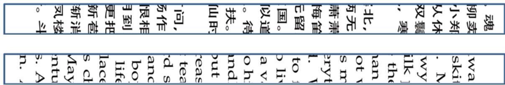  
图 4-1 一维碎纸示意图

通过观察图 4-1 可以看出，碎纸可以提取出的特征有字符宽度、字距、上空、下空和行距等，见图4-2.

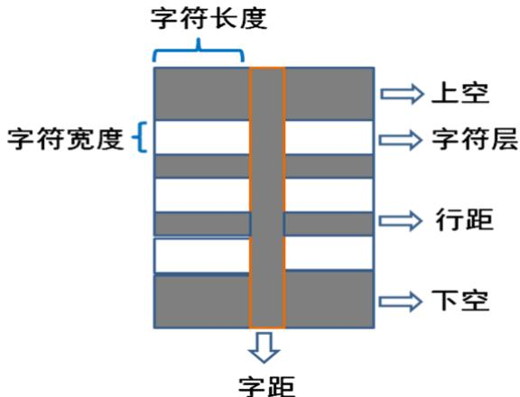  
图 4-2 字符的特征

综上所述，文字特征的提取方式如下：

提取步骤：

步骤一：对图片进行二值化，文字为白色，空白为黑色

步骤二：找出图片所有行距、上空、下空，并标记其为灰色

步骤三：找出图片中所有的字距，并标记其为灰色

步骤四：通过行距、上空、下空、字距等特征计算出字符宽度。

根据题意，本文通过导入碎纸片图像的像素，并编写 MATLAB 程序对文字特征进行提取（代码见附录四 getLandR.m）.

## 4.1.3 基于文字特征的识别序列

通过分析汉字与英文字母被分割的情况可以发现，对于每个被切割开的字符，如图4-3 所示，记字符的宽度为C，被分割后的两部分宽度分别为C R 和R，而对于没被切割的字符，依旧保留宽度C。

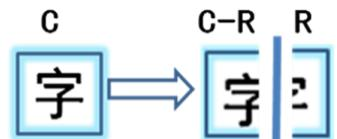  
图 4-3 字符分割示意图

基于汉字分割的定义，可构造基于文字特征的识别序列，如图 4-4 所示。

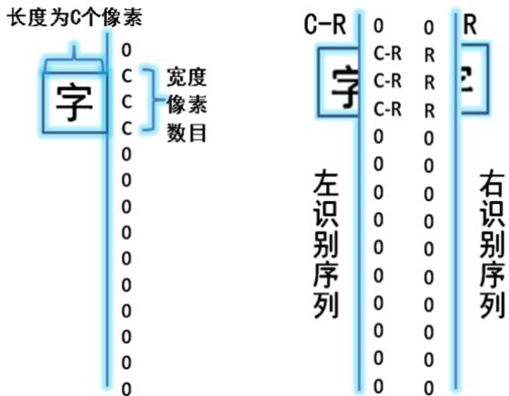  
图 4-4 识别序列示意图

对于图 4-4 中的识别序列，其中无字符位置数值为 0，其它数字节点代表对应的字符长度（完整的为C，不完整的为C R 或R）。

## 4.1.4 碎纸距离的定义

基于4.1.3 识别序列的定义，本文定义碎纸A 到碎纸B 的距离模型为

$$
\begin{array} { l } { \displaystyle { \{ { { d } _ { A  B } } = \sum _ { i = 1 } ^ { n } ( { { L } _ { i } } + { { R } _ { i } } - C { { X } _ { i } } ) ^ { 2 }  } } \\ { \displaystyle {  [ { { X } _ { i } } = 0 \varXi ] \varXi 1  } } \end{array}\tag{4.1.4}
$$

式中， $d _ { a  b }$ 为碎纸A 到碎纸B 的距离

$L _ { \mathrm { { i } } }$ 为碎纸 B的左识别序列

$R _ { i }$ 为碎纸 A的右识别序列

C为字符的宽度

$X _ { i }$ 为表示序列L 或R 的第i 位是否都有字符,是则为1

n为序列长度

由距离的定义公式可以看出，两个识别序列的吻合程度越大，识别序列的距离越小，理想状况下，当两个识别序列完全吻合时，距离为 0（实际情况中，由于二值化，损失了部分精度，所以不会为 0）。

## 4.1.5 复原 TSP 问题

TSP 问题是数图论中最著名的问题之一，即“已给一个 n 个点的完全图，每条边都有一个长度，求总长度最短的经过每个顶点正好一次的封闭回路”。

若将每个碎纸看成一个点，由4.1.4 距离的定义可知，点与点之间存在距离，可以看出，两张碎纸如果吻合度低，那对应的距离也大，所以寻找吻合率最高的组合方式，实质就是寻找总距离最小的路径，也就是寻找一条最佳TSP 路径。

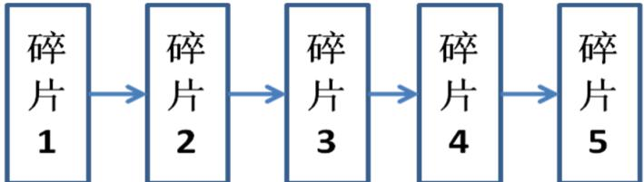  
图 4-5 复原 TSP问题示意图

将碎纸复原抽象成复原TSP 问题，即

$$
\begin{array} { l } { \displaystyle \operatorname* { m i n } D = \sum _ { i = 1 } ^ { n - 1 } d _ { i \to i + 1 } } \\ { S . T . \left\{ d _ { A \to B } = \sum _ { i = 1 } ^ { n } ( L _ { i } + R _ { i } - C X _ { i } ) ^ { 2 } \right. } \\ { \displaystyle { X _ { i } = 0 \not \equiv \sum _ { i } ^ { \mathrm { H } } } 1 } \end{array}\tag{4.1.5}
$$

式中， D为TSP 路径的总距离

$d _ { i \to i + 1 }$ 为碎纸 i到碎纸i+1 的距离

通过求解复原TSP 问题，可以得到每个点的访问顺序，即碎纸片的拼接序列，最后利用MATLAB 图像拼接，得到复原了的纸片。

## 4.1.6 模拟退火法

模拟退火法是一种通用概率算法，用来在一个大的搜寻空间内寻找问题的最优解，具有能有效地解决 NP 难问题、避免陷入局部最优、对初值没有强依赖性等特点，在各领域已获得了广泛地应用。

算法步骤<sup>[5]</sup><sub>：</sub>

步骤一:令当前温度 $T = T _ { 0 }$ ，即开始退火的初始温度,随机生成一个初始解 $x _ { 0 }$ ，并计算相应的目标函数值 $E ( x _ { 0 } )$

步骤二：令 $T$ 等于冷却进度表的下一个值 $T _ { i }$ 。

步骤三：根据当前解 $x _ { i }$ 进行扰动，产生一个新解 $x _ { j }$ ，计算相应的目标函数值 $E ( x _ { j } )$ ，得到 $\Delta E = E ( x _ { i } ) - E ( x _ { i } )$ C

$$
e ^ { \frac { - \Delta E } { T _ { i } } }
$$

步骤四：若 $\Delta E > 0$ ,则新解 $x _ { j }$ 被接受，作为新的解；若 $\Delta E < 0$ ，则新解按概率 接受(即Metropoils 准则)， $T _ { i }$ 为当前温度。

步骤五：在温度 $T _ { i }$ 下，重复 $L _ { k }$ 次扰动和接受过程（ $L _ { k }$ 为 Markov 链的长度），即执行步骤三和步骤四。

步骤六：判断温度T 是否等于 $T _ { f }$ ，是则终止算法；否则转到步骤二继续执行。

利用模拟退火法求解求解 TSP 问题，将一个序列当成一个解，每个解对应一个目标函数值，通过二次交换、三次交换等扰动方式不断产生新解，从而搜索解空间，寻找最优的调度序列。

## 4.1.7 一维碎纸复原算法

综上所述，通过一维碎纸复原算法，可以实现一维碎纸的自动复原，相应的算法步骤如下：

算法步骤：

步骤一：提取出碎纸图像的像素矩阵，并进行二值化处理

步骤二：提取出二值化处理后碎纸图像的文字特征

步骤三：利用步骤二的文字特征构造识别序列，并转化为 TSP 问题

步骤四：利用模拟退火法求解 TSP 问题

## 4.1.8 模型求解

利用Matlab 对图片像素进行分析，得到汉字大小40 40 （单位：像素），考虑到英文字符的特殊性，受文献<sup>[3]</sup>的启示，将其视为 $3 0 \times 3 0$ （单位：像素）；通过模拟退火法求解TSP 问题，取初始温度为97，停止温度为3，衰减系数为0.9，马尔可夫链长度为10000，利用Matlab 进行运算，得到结果如表4-1 所示.

表 4-1 附件 1、附件 2 拼接序列
<table><tr><td></td><td>1</td><td>2</td><td>3</td><td>4</td><td>5</td><td>6</td><td>7</td><td>8</td><td>9</td><td>10</td><td>11</td><td>12</td><td>13</td><td>14</td><td>15</td><td>16</td><td>17</td><td>18</td><td>19</td></tr><tr><td>附件1</td><td>9</td><td>15</td><td>13</td><td>16</td><td>4</td><td>11</td><td>3</td><td>17</td><td>2</td><td>5</td><td>6</td><td>10</td><td>14</td><td>19</td><td>12</td><td>8</td><td>18</td><td>1</td><td>7</td></tr><tr><td>附件2</td><td>4</td><td>7</td><td>3</td><td>8</td><td>16</td><td>19</td><td>12</td><td>1</td><td>6</td><td>2</td><td>10</td><td>14</td><td>11</td><td>9</td><td>13</td><td>15</td><td>18</td><td>17</td><td>5</td></tr></table>

利用表4-1 的序列，可将碎纸片拼接处完整的纸片，且无需人工干预，复原图像见附表1。

## 4.2 二维碎纸复原模型

对于二维碎纸，本文的定义是切割纸片时，进行横和纵的切割，形状如图 4-6 所示.

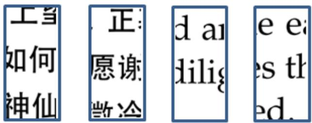  
图 4-6 二维碎纸片示意图

与一维碎纸相比，二维的碎纸经过横切和纵切，可以视为是一维碎纸再切割形成的，而再切割会降低碎纸的特征值，如附件 3、附件4，一维碎纸片被切割为 11 分，导致特征值变为原有的十一分之一，且 TSP 问题的节点由 19 个变为 208 个，算法复杂度大大增加，模拟退火法难以解决，需要通过降维减低算法复杂度，以便求解。

## 4.2.1 碎纸标准化与层次特征提取

碎纸片的标准化，是指将字符层与空白分离，即

$$
f _ { \mathrm { i } } = \{ \overset { \underset { \mathrm { I } \mathrm { K } } { \boxplus } } { \underset { \mathrm { I } } { \boxplus } } , ~ \mathrm { i } \overset { \underset { \mathrm { I } } { \uplus } } { \underset { \mathrm { I } } { \boxplus } } { \underset { \mathrm { I } } { \boxplus } } \overset { \underset { \mathrm { I } } { \ v Q } } { \underset {  } { \ v Q } } \quad \underset {  } { \ v Q }
$$

式中， $f _ { \mathrm { i } }$ 为图片像素矩阵的第 i 行

具体做法如图4-7 所示

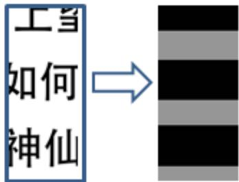  
图 4-7 碎纸片的标准化

考虑到本文对碎纸进行标准化的方式，对某些字母不能有效地分层，如图 4-8 所示.

  
图 4-8特殊字符

如图 4-9，一些字符会使分层数增加，但是会导致提取层次特征有误，故应该对这些特殊字符进行修正，即令其图片中间的空白行也变为黑色。

对于标准化后的图片，其层次特征明显，可提取出图片的层次特征，本文通过提取文字层的层次特征对图片进行分类，提取的步骤如下（程序见附录四）：

## 提取步骤：

步骤一：对图片进行标准化；

步骤二：对标准化后的图片进行修正

步骤三：遍历标准化后的像素矩阵，记录图片每个文字层的起始位置和结束位置；

例如图4-8 的图片，提取的层次特征如图4-9 所示.

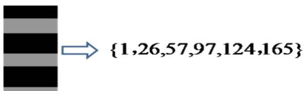  
图 4-9 层次特征提取

## 4.2.3 通过层次特征分类

通过 4.2.2 的层次特征提取，每张图片都得到一组对应的层次特征，可利用这些特征对二维碎纸进行分类，以降低问题的维数，分类需按照一定的步骤：

分类步骤：

步骤一：对比每张图片的特征值，若有 3-4 个特征值相同，那么两张图片归为一类；

步骤二：对于无法分类的图片，记为一个集合；

步骤三：利用GUI 程序，对于无法分类的图片集合，人为地逐个与已知类别进行对比，从而进行分类。

为了更好地对无法分类的碎纸进行分类，本文通过MATLAB 的GUI 编程，实现了步骤三对比程序的设计（代码见附录四SingleMatch.m），GUI 界面如图4-10 所示.

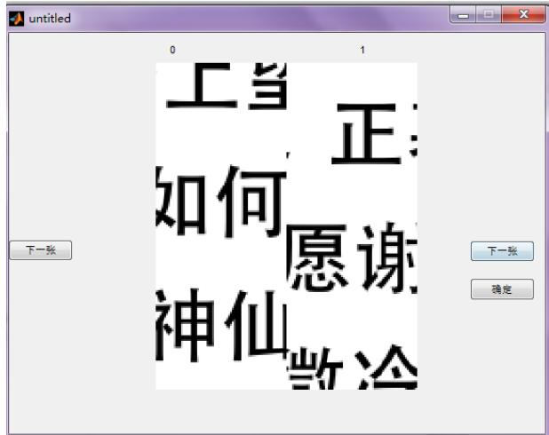  
图 4-10 GUI 程序

通过计算机初始分类和人为精细分类，可对二维碎纸进行分类，分类后转化为多个一维碎纸复原问题。

## 4.2.5 二维碎纸复原算法

根据 4.2.4 设定的分类方法，可以将将二维碎纸片复原问题转化为多个一维碎纸片复原问题，但是由于文字特征只有原本的一小部分，且空白区域占碎纸片大部分比例，导致一维碎纸复原模型复原程度不高，需要对结果进行人工干预，如图4-11 所示.

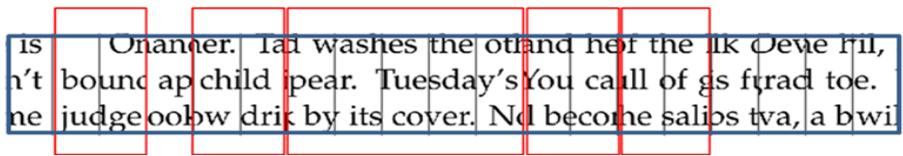  
图 4-11 转化后的一维碎纸复原情况

图4-11 中，红圈区域代表拼接成功的碎纸，由图可看出，一维碎纸复原模型能将大部分碎纸拼接，但仍需人工调整。

综上所述，二维碎纸复原步骤为：

## 复原步骤：

步骤一：对二维碎纸进行标准化；

步骤二：提取二维碎纸的层次特征；

步骤三：利用层次特征，进行机器划分和小部分人工干预，实现分类；

步骤四：构造多个一维碎纸问题，并进行求解；

步骤五：根据步骤四的结果，进行适当的人工校正。

## 4.2.6 模型求解

利用 4.2.5 的碎纸复原算法分别对附件 3、附件 4 的二维碎纸进行复原，分别转化为11 个一维碎纸复原问题，并利用4.1 的碎纸复原模型进行复原，得到结果见附录二。

表 4-2 附件 3 结果顺序表
<table><tr><td></td><td>1</td><td>2</td><td>3</td><td>4</td><td>5</td><td>6</td><td>7</td><td>8</td><td>9</td><td>10</td><td>11</td><td>12</td><td>13</td><td>14</td><td>15</td><td>16</td><td>17</td><td>18</td><td>19</td></tr><tr><td>1</td><td>049</td><td>054</td><td>065</td><td>143</td><td>186</td><td>002</td><td>057</td><td>192</td><td>178</td><td>118</td><td>190</td><td>095</td><td>011</td><td>022</td><td>129</td><td>028</td><td>091</td><td>188</td><td>141</td></tr><tr><td>2</td><td>061</td><td>019</td><td>078</td><td>067</td><td>069</td><td>099</td><td>162</td><td>096</td><td>131</td><td>079</td><td>063</td><td>116</td><td>163</td><td>072</td><td>006</td><td>177</td><td>020</td><td>052</td><td>036</td></tr><tr><td>3</td><td>168</td><td>100</td><td>076</td><td>062</td><td>142</td><td>030</td><td>041</td><td>023</td><td>147</td><td>191</td><td>050</td><td>179</td><td>120</td><td>086</td><td>195</td><td>026</td><td>001</td><td>087</td><td>018</td></tr><tr><td>4</td><td>038</td><td>148</td><td>046</td><td>161</td><td>024</td><td>035</td><td>081</td><td>189</td><td>122</td><td>103</td><td>130</td><td>193</td><td>088</td><td>167</td><td>025</td><td>008</td><td>009</td><td>105</td><td>074</td></tr><tr><td>5</td><td>071</td><td>156</td><td>083</td><td>132</td><td>200</td><td>017</td><td>080</td><td>033</td><td>202</td><td>198</td><td>015</td><td>133</td><td>170</td><td>205</td><td>085</td><td>152</td><td>165</td><td>027</td><td>060</td></tr><tr><td>6</td><td>014</td><td>128</td><td>003</td><td>159</td><td>082</td><td>199</td><td>135</td><td>012</td><td>073</td><td>160</td><td>203</td><td>169</td><td>134</td><td>039</td><td>031</td><td>051</td><td>107</td><td>115</td><td>176</td></tr><tr><td>7</td><td>094</td><td>034</td><td>084</td><td>183</td><td>090</td><td>047</td><td>121</td><td>042</td><td>124</td><td>144</td><td>077</td><td>112</td><td>149</td><td>097</td><td>136</td><td>164</td><td>127</td><td>058</td><td>043</td></tr><tr><td>8</td><td>125</td><td>013</td><td>182</td><td>109</td><td>197</td><td>016</td><td>184</td><td>110</td><td>187</td><td>066</td><td>106</td><td>150</td><td>021</td><td>173</td><td>157</td><td>181</td><td>204</td><td>139</td><td>145</td></tr><tr><td>9</td><td>029</td><td>064</td><td>111</td><td>201</td><td>005</td><td>092</td><td>180</td><td>048</td><td>037</td><td>075</td><td>055</td><td>044</td><td>206</td><td>010</td><td>104</td><td>098</td><td>172</td><td>171</td><td>059</td></tr><tr><td>10</td><td>007</td><td>208</td><td>138</td><td>158</td><td>126</td><td>068</td><td>175</td><td>045</td><td>174</td><td>000</td><td>137</td><td>053</td><td>056</td><td>093</td><td>153</td><td>070</td><td>166</td><td>032</td><td>196</td></tr><tr><td>11</td><td>089</td><td>146</td><td>102</td><td>154</td><td>114</td><td>040</td><td>151</td><td>207</td><td>155</td><td>140</td><td>185</td><td>108</td><td>117</td><td>004</td><td>101</td><td>113</td><td>194</td><td>119</td><td>123</td></tr></table>

表 4-3 附件 4 结果顺序表
<table><tr><td></td><td>1</td><td>2</td><td>3</td><td>4</td><td>5</td><td>6</td><td>7</td><td>8</td><td>9</td><td>10</td><td>11</td><td>12</td><td>13</td><td>14</td><td>15</td><td>16</td><td>17</td><td>18</td><td>19</td></tr><tr><td>1</td><td>191</td><td>075</td><td>011</td><td>154</td><td>190</td><td>184</td><td>002</td><td>104</td><td>180</td><td>064</td><td>106</td><td>004</td><td>149</td><td>032</td><td>204</td><td>065</td><td>039</td><td>067</td><td>147</td></tr><tr><td>2</td><td>201</td><td>148</td><td>170</td><td>196</td><td>198</td><td>094</td><td>113</td><td>164</td><td>078</td><td>103</td><td>091</td><td>080</td><td>101</td><td>026</td><td>100</td><td>006</td><td>017</td><td>028</td><td>146</td></tr><tr><td>3</td><td>086</td><td>051</td><td>107</td><td>029</td><td>040</td><td>158</td><td>186</td><td>098</td><td>024</td><td>117</td><td>150</td><td>005</td><td>059</td><td>058</td><td>092</td><td>030</td><td>037</td><td>046</td><td>127</td></tr><tr><td>4</td><td>019</td><td>194</td><td>093</td><td>141</td><td>088</td><td>121</td><td>126</td><td>105</td><td>155</td><td>114</td><td>176</td><td>182</td><td>151</td><td>022</td><td>057</td><td>202</td><td>071</td><td>165</td><td>082</td></tr><tr><td>5</td><td>159</td><td>139</td><td>001</td><td>129</td><td>63</td><td>138</td><td>153</td><td>053</td><td>038</td><td>123</td><td>120</td><td>175</td><td>085</td><td>050</td><td>160</td><td>187</td><td>097</td><td>203</td><td>031</td></tr><tr><td>6</td><td>020</td><td>041</td><td>108</td><td>116</td><td>136</td><td>073</td><td>036</td><td>207</td><td>135</td><td>015</td><td>076</td><td>043</td><td>199</td><td>045</td><td>173</td><td>079</td><td>161</td><td>179</td><td>143</td></tr><tr><td>7</td><td>208</td><td>021</td><td>007</td><td>049</td><td>061</td><td>119</td><td>033</td><td>142</td><td>168</td><td>062</td><td>169</td><td>054</td><td>192</td><td>133</td><td>118</td><td>189</td><td>162</td><td>197</td><td>112</td></tr><tr><td></td><td>070</td><td>084</td><td>060</td><td>014</td><td>068</td><td>174</td><td>137</td><td>195</td><td>008</td><td>047</td><td>172</td><td>156</td><td>096</td><td>023</td><td>099</td><td>122</td><td>090</td><td>185</td><td>109</td></tr><tr><td>89</td><td>132</td><td>181</td><td>095</td><td>069</td><td>167</td><td>163</td><td>166</td><td>188</td><td>111</td><td>144</td><td>206</td><td>003</td><td>130</td><td>034</td><td>013</td><td>110</td><td>025</td><td>027</td><td>178</td></tr><tr><td>10</td><td>171</td><td>042</td><td>066</td><td>205</td><td>010</td><td>157</td><td>074</td><td>145</td><td>083</td><td>134</td><td>055</td><td>018</td><td>056</td><td>035</td><td>016</td><td>009</td><td>183</td><td>152</td><td>044</td></tr><tr><td>11</td><td>081</td><td>077</td><td>128</td><td>200</td><td>131</td><td>052</td><td>125</td><td>140</td><td>193</td><td>087</td><td>089</td><td>048</td><td>072</td><td>012</td><td>177</td><td>124</td><td>000</td><td>102</td><td>115</td></tr></table>

其中，附件三为汉字碎纸，较为方正，分类效果好，基本上无须人工干预，且拼接效果较好，需要人工校正次数较少；附件四为英文碎纸，分类效果一般，需要一定次数的人工干预，拼接效果良好，需要人工校正的次数较少。

## 4.3 三维碎纸复原模型

对于三维碎纸，本文的定义是切割纸片时，不仅进行横和纵的切割，还需区分正面与反面，其形状如图 4-12 所示.

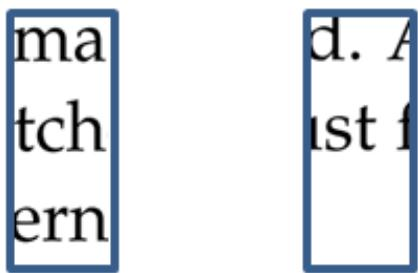  
图 4-12 三维碎纸片示意图

与二维碎纸相比，三维碎纸需要区分正反面，算法复杂度更高。

## 4.3.1 三维模型的降维

假设 3.2.2 假设了正反面打印的页边距等格式相同，基于此假设，正反两面的层次特征是相同的，所以进行分类时，可以分为一类，所以问题三可转换为问题二，只是图片数量增加了一倍。

同样的，利用4.2.3 的分类方式，可以将问题转化为多个一维碎纸复原问题，并利用一维维碎纸复原算法进行复原。

而关于 GUI 程序，也需要进行适当修改，使之能同时对比多张图片（代码见附录四MultMatch.m），如图 4-13 所示.

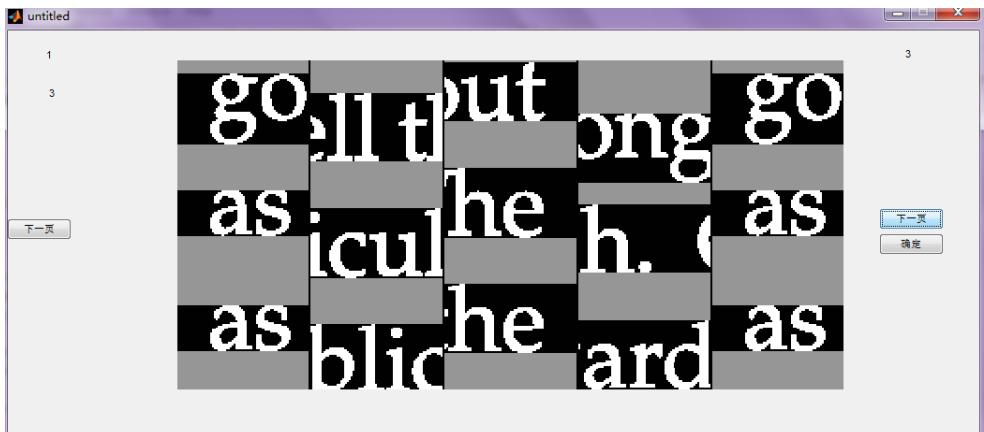  
图 4-13 多图片对比 GUI 程序

## 4.3.2 三维碎纸复原算法

根据 4.2.4 设定的分类方法，可以将将二维碎纸复原问题转化为多个一维碎纸复原问题，但是由于文字特征只有原本的一小部分，且空白区域占碎纸大部分比例，导致一维碎纸复原模型复原程度不高，需要对结果进行人工干预，如图 4-14 所示.

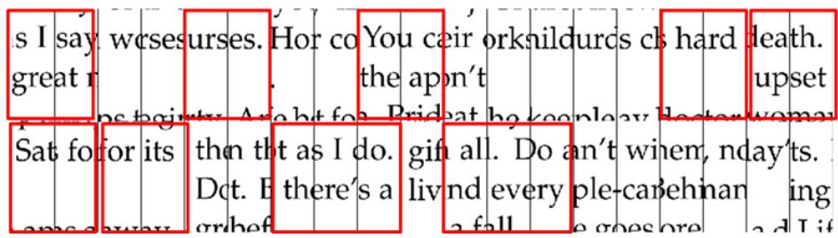  
图 4-14 转化后的一维碎纸复原情况

图4-14 中，红圈区域代表拼接成功的碎纸，由图可看出，一维碎纸复原模型能将大部分碎纸拼接，但仍需人工调整。

综上所述，三维碎纸复原步骤为：

## 复原步骤：

步骤一：对三维碎纸进行标准化；

步骤二：提取三维碎纸两面的层次特征，并进行合并，转化成二维碎纸复原问题；

步骤三：利用层次特征，进行机器划分和小部分人工干预，实现分类；

步骤四：构造多个一维碎纸问题，并进行求解；

步骤五：根据步骤四的结果，进行适当的人工校正。

## 4.3.3 模型求解

根据 4.3.2 的算法，对附件 5 的三维碎纸进行复原，得到结果如表 4-4、表 4-5 所示.

表 4-4 附件 5 正面结果图
<table><tr><td>136a</td><td>047b</td><td>020b</td><td>164a</td><td>081a</td><td>189a</td><td>029b</td><td>018a</td><td>108b</td><td>066b</td><td>110b</td><td>174a</td><td>183a</td><td>150b</td><td>155b</td><td>140b</td><td>125b</td><td>111a</td><td>078a</td></tr><tr><td>005b</td><td>152b</td><td>147b</td><td>060a</td><td>059b</td><td>014b</td><td>079b</td><td>144b</td><td>120a</td><td>022b</td><td>124a</td><td>192b</td><td>025a</td><td>044b</td><td>178b</td><td>076a</td><td>036b</td><td>010a</td><td>089b</td></tr><tr><td>143a</td><td>200a</td><td>086a</td><td>187a</td><td>131a</td><td>056a</td><td>138b</td><td>045b</td><td>137a</td><td>061a</td><td>094a</td><td>098b</td><td>121b</td><td>038b</td><td>030b</td><td>042a</td><td>084a</td><td>153b</td><td>186a</td></tr><tr><td>083b</td><td>039a</td><td>097b</td><td>175b</td><td>072a</td><td>093b</td><td>132a</td><td>087b</td><td>198a</td><td>181a</td><td>034b</td><td>156b</td><td>206a</td><td>173a</td><td>194a</td><td>169a</td><td>161b</td><td>011a</td><td>199a</td></tr><tr><td>090b</td><td>203a</td><td>162a</td><td>002b</td><td>139a</td><td>070a</td><td>041b</td><td>170a</td><td>151a</td><td>001a</td><td>166a</td><td>115a</td><td>065a</td><td>191b</td><td>037a</td><td>180b</td><td>149a</td><td>107b</td><td>088a</td></tr><tr><td>013b</td><td>024b</td><td>057b</td><td>142b</td><td>208b</td><td>064a</td><td>102a</td><td>017a</td><td>012b</td><td>028a</td><td>154a</td><td>197b</td><td>158b</td><td>058b</td><td>207b</td><td>116a</td><td>179a</td><td>184a</td><td>114b</td></tr><tr><td>035b</td><td>159b</td><td>073a</td><td>193a</td><td>163b</td><td>130b</td><td>021a</td><td>202b</td><td>053a</td><td>177a</td><td>016a</td><td>019a</td><td>092a</td><td>190a</td><td>050b</td><td>201b</td><td>031b</td><td>171a</td><td>146b</td></tr><tr><td>172b</td><td>122b</td><td>182a</td><td>040b</td><td>127b</td><td>188b</td><td>068a</td><td>008a</td><td>117a</td><td>167b</td><td>075a</td><td>063a</td><td>067b</td><td>046b</td><td>168b</td><td>157b</td><td>128b</td><td>195b</td><td>165a</td></tr><tr><td>105b</td><td>204a</td><td>141b</td><td>135a</td><td>027b</td><td>080a</td><td>000a</td><td>185b</td><td>176b</td><td>126a</td><td>074a</td><td>032b</td><td>069b</td><td>004b</td><td>077b</td><td>148a</td><td>085a</td><td>007a</td><td>003a</td></tr><tr><td>009a</td><td>145b</td><td>082a</td><td>205b</td><td>015a</td><td>101b</td><td>118a</td><td>129a</td><td>062b</td><td>052b</td><td>071a</td><td>033a</td><td>119b</td><td>160a</td><td>095b</td><td>051a</td><td>048b</td><td>133b</td><td>023a</td></tr><tr><td>054a</td><td>196a</td><td>112b</td><td>103b</td><td>55a</td><td>100a</td><td>106a</td><td>091b</td><td>049a</td><td>026a</td><td>113b</td><td>134b</td><td>104b</td><td>006b</td><td>123b</td><td>109b</td><td>096a</td><td>043b</td><td>099b</td></tr></table>

表 4-5 附件 5 反面结果图
<table><tr><td>078b</td><td>111b</td><td>125a</td><td>140a</td><td>155a</td><td>150a</td><td>183b</td><td>174b</td><td>110a</td><td>066a</td><td>108a</td><td>18b</td><td>029a</td><td>189b</td><td>081b</td><td>164b</td><td>020a</td><td>047a</td><td>136b</td></tr><tr><td>089a</td><td>010b</td><td>036a</td><td>076b</td><td>178a</td><td>044a</td><td>025b</td><td>192a</td><td>124b</td><td>022a</td><td>120b</td><td>144a</td><td>079a</td><td>014a</td><td>059a</td><td>060b</td><td>147a</td><td>152a</td><td>005a</td></tr><tr><td>186b</td><td>153a</td><td>084b</td><td>042b</td><td>030a</td><td>038a</td><td>121a</td><td>098a</td><td>094b</td><td>061b</td><td>137b</td><td>045a</td><td>138a</td><td>056b</td><td>131b</td><td>187b</td><td>086b</td><td>200b</td><td>143b</td></tr><tr><td>199b</td><td>011b</td><td>161a</td><td>169b</td><td>194b</td><td>173b</td><td>206b</td><td>156a</td><td>034a</td><td>181b</td><td>198b</td><td>087a</td><td>132b</td><td>093a</td><td>072b</td><td>175a</td><td>097a</td><td>39b</td><td>083a</td></tr><tr><td>088b</td><td>107a</td><td>149b</td><td>180a</td><td>037b</td><td>191a</td><td>065b</td><td>115b</td><td>166b</td><td>001b</td><td>151b</td><td>170b</td><td>041a</td><td>070b</td><td>139b</td><td>002a</td><td>162b</td><td>203b</td><td>090a</td></tr><tr><td>114a</td><td>184b</td><td>179b</td><td>116b</td><td>207a</td><td>058a</td><td>158a</td><td>197a</td><td>154b</td><td>028b</td><td>012a</td><td>017b</td><td>102b</td><td>064b</td><td>208a</td><td>142a</td><td>057a</td><td>24a</td><td>013a</td></tr><tr><td>146a</td><td>171b</td><td>031a</td><td>201a</td><td>050a</td><td>190b</td><td>092b</td><td>019b</td><td>016b</td><td>177b</td><td>053b</td><td>202a</td><td>021b</td><td>130a</td><td>163a</td><td>193b</td><td>073b</td><td>159a</td><td>035a</td></tr><tr><td>165b</td><td>195a</td><td>128a</td><td>157a</td><td>168a</td><td>046a</td><td>067a</td><td>063b</td><td>075b</td><td>167a</td><td>117b</td><td>08b</td><td>068b</td><td>188a</td><td>127a</td><td>040a</td><td>182b</td><td>122a</td><td>172a</td></tr><tr><td>003b</td><td>007b</td><td>085b</td><td>148b</td><td>077a</td><td>004a</td><td>069a</td><td>032a</td><td>074b</td><td>126b</td><td>176a</td><td>185a</td><td>000b</td><td>080b</td><td>027a</td><td>135b</td><td>141a</td><td>204b</td><td>105a</td></tr><tr><td>023b</td><td>133a</td><td>048a</td><td>051b</td><td>095a</td><td>160b</td><td>119a</td><td>033b</td><td>071b</td><td>052a</td><td>062a</td><td>129b</td><td>118b</td><td>101a</td><td>015b</td><td>205a</td><td>082b</td><td>145a</td><td>009b</td></tr><tr><td>099a</td><td>043a</td><td>096b</td><td>109a</td><td>123a</td><td>006a</td><td>104a</td><td>134a</td><td>113a</td><td>026b</td><td>049b</td><td>091a</td><td>106b</td><td>100b</td><td>055b</td><td>103a</td><td>112a</td><td>196b</td><td>054b</td></tr></table>

通过三维碎纸复原模型，能比较有效地实现三维碎纸的复原，附件5 的复原图片见附录三，由于增加了算法复杂度，所以分类和人工校正的次数相应增加。

## 五、模型改进与推广

## 5.1 模型优点

本文采用的碎纸复原模型，综合利用了计算机高速计算能力以及人的文字图像识别和理解能力，拼接效率比纯人工高，拼接准确性也好于纯计算机拼接法。

一维碎纸复原模型与传统的灰值分析相比，考虑了字符大小这一特征，识别速度快，准确度高；

二维碎纸复原模型避免了模拟退火法解的长度过长而导致的算法复杂度快速增加，以分类降维，从而简化问题；在人工干预部分使用GUI 程序帮助人工识别，比纯粹的人工干预更为高效；

## 5.2 模型缺点

二维碎纸复原模型和三维碎纸复原模型都需要进行人工干预，虽然提高了准确程度，但是降低了复原的效率；

三维碎纸模型基于正反面打印的页边距等格式相同的假设，所以当正反面打印格式不同时，三维碎纸模型便不适用，所以该模型具有局限性。

## 5.3 模型改进

## 5.3.1 适用彩色图片的改进

在 4.1 中，考虑到图片只有黑白两种情况，所以并未指定阀值，而对于彩色图片的处理，需根据具体情况制定阀值，以便更好地二值化，若需提取更加明显的图片，还需进行去噪等处理。

## 5.3.2 最小干预度算法

在二维碎纸复原算法和三维碎纸复原算法中都需要适用人工干预，人工干预的次数代表了算法的好坏，本文在此提出一个量化人工干预程度的方式，如图5-1 所示

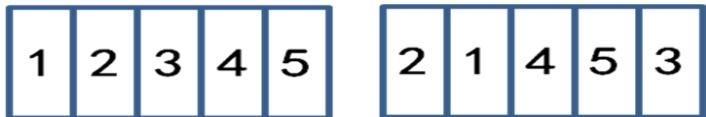  
图 5-1 正确序列与机器识别顺序

由图 5-1 所示，记机器识别得到的顺序为 $T = \{ 2 , 1 , 4 , 5 , 3 \}$ ，而正确的顺序式$G = \{ 1 , 2 , 3 , 4 , 5 \}$ ，此处定义序列逆序数为最小人工干预次数，即为得到正确序列，需要做的变换次数，可以算出它们的序列逆序数为 2。

通过序列逆序数，可以量化评价碎纸复原算法与模型的好坏。

## 5.4 模型推广

模拟退火法是是一种通用概率演算法，用来在一个大的搜寻空间内找寻命题的最优解，是解决 TSP 问题的有效算法，也可以较高的效率求解最大截问题、0-1 背包问题、图着色问题、调度问题等等

碎纸复原模型实质是基于边缘像素的吻合度的，这种思想同样适用于音频、视频的拼接。

## 参考文献

[1]张欣,卜彦龙,朱良家,周宗潭 物证复原系统中的碎纸轮廓提取技术研究[J],11,23(11):184，2006.

[2] Patrick Butler, Prithwish Chakra borty, Naren Ramakrishan, The Deshredder: A Visual Analytic Approach to Reconstructing Shredded Documents[J]. Department of Computer Science and Discovery Analytics Center, Virginia Tech, Blacksburg, VA 24061

[3] 罗智中，基于文字特征的文档碎纸片半自动拼接[J],计算机工程与应用，48(5)：207-210，2013

[4]Hei Wang Chan, Evan Gillespie, Delfino Leong，Design and Implementation of a Paper De-shredder.ECE 412 Term Project Report.P.2-4 December 6, 2010

[5]卓金武，Matlab在数学建模中的应用[M],北京：北京航天航空大学出版社,2011

[6]司守奎, 孙玺菁，数学建模算法与应用[M]，北京：国防工业出版社，2011

[7]史峰，王辉，郁磊，胡裴，Matlab智能算法30 个案例分析[M], 北京：北京航天航空大学出版社,2011

[8]杨郑，基于块匹配和特征点匹配的图象拼接算法研究[D],成都，西南交通大学，2009

## 附录

## 附录一 附件 1、附件 2 复原结果

城上层楼叠巘。城下清淮古汴。举手揖吴云，人与暮天俱远。魂断。魂断。后夜松江月满。簌簌衣巾莎枣花。村里村北响缦车。牛衣古柳卖黄瓜。海棠珠缀一重重。清晓近帘栊。胭脂谁与匀淡，偏向脸边浓。小郑非常强记，二南依旧能诗。更有鲈鱼堪切脍，儿辈莫教知。自古相从休务日，何妨低唱微吟。天垂云重作春阴。坐中人半醉，帘外雪将深。双鬟绿坠。娇眼横波眉黛翠。妙舞蹁跹。掌上身轻意态妍。碧雾轻笼两凤，寒烟淡拂双鸦。为谁流睇不归家。错认门前过马。

我劝髯张归去好，从来自己忘情。尘心消尽道心平。江南与塞北，何 处不堪行。闲离阻。谁念萦损襄王，何曾梦云雨。旧恨前欢，心事两无据。 要知欲见无由，痴心犹自，倩人道、一声传语。风卷珠帘自上钩。萧萧乱 叶报新秋。独携纤手上高楼。临水纵横回晚鞚。归来转觉情怀动。梅笛烟 中闻几弄。秋阴重。西山雪淡云凝冻。凭高眺远，见长空万里，云无留迹 桂魄飞来光射处，冷浸一天秋碧。玉宇琼楼，乘鸾来去，人在清凉国。江 山如画，望中烟树历历。省可清言挥玉尘，真须保器全真。风流何似道家 纯。不应同蜀客，惟爱卓文君。自惜风流云雨散。关山有限情无限。待君 重见寻芳伴。为说相思，目断西楼燕。莫恨黄花未吐。且教红粉相扶。酒 阑不必看茱萸。俯仰人间今古。玉骨那愁瘴雾，冰姿自有仙风。海仙时遣 探芳丛。倒挂绿毛么凤。

俎豆庚桑真过矣，凭君说与南荣。愿闻吴越报丰登。君王如有问，结袜赖王生。师唱谁家曲，宗风嗣阿谁。借君拍板与门槌。我也逢场作戏莫相疑。晕腮嫌枕印。印枕嫌腮晕。闲照晚妆残。残妆晚照闲。可恨相逢能几日，不知重会是何年。茱萸仔细更重看。午夜风翻幔，三更月到床。簟纹如水玉肌凉。何物与侬归去、有残妆。金炉犹暖麝煤残。惜香更把宝钗翻。重闻处，余熏在，这一番、气味胜从前。菊暗荷枯一夜霜。新苞绿叶照林光。竹篱茅舍出青黄。霜降水痕收。浅碧鳞鳞露远洲。酒力渐消风力软，飕飕。破帽多情却恋头。烛影摇风，一枕伤春绪。归不去。凤楼何处。芳草迷归路。汤发云腴醉白，盏浮花乳轻圆。人间谁敢更争妍。斗取红窗粉面。炙手无人傍屋头。萧萧晚雨脱梧楸。谁怜季子敝貂裘。

fair of face.

The customer is always right. East, west, home's best. Life's not all beer and skittles. The devil looks after his own. Manners maketh man. Many a mickle makes a muckle. A man who is his own lawyer has a fool for his client.

You can't make a silk purse from a sow's ear. As thick as thieves. Clothes make the man. All that glisters is not gold The pen is mightier than sword. Is fair and wise and good and gay. Make love not war. Devil take the hindmost. The female of the species is more deadly than the male. A place for everything and everything in its place. Hell hath no fury like a woman scorned. When in Rome, do as the Romans do. To err is human; to forgive divine. Enough is as good as a feast. People who live in glass houses shouldn't throw stones. Nature abhors a vacuum. Moderation in all things.

Everything comes to him who waits. Tomorrow is another day. Better to light a candle than to curse the darkness.

Two is company, but three's a crowd. It's the squeaky wheel that gets the grease. Please enjoy the pain which is unable to avoid. Don't teach your Grandma to suck eggs. He who lives by the sword shall die by the sword. Don't meet troubles half-way. Oil and water don't mix. All work and no play makes Jack a dull boy.

The best things in life are free. Finders keepers, losers weepers. There's no place like home. Speak softly and carry a big stick. Music has charms to soothe the savage breast Ne'er cast a clout till May be out. There's no such thing as a free lunch. Nothing venture, nothing gain. He who can does, he who cannot, teaches. A stitch in time saves nine. The child is the father of the man. And a child that's born on the Sab-

表1 附件1、附件2 复原结果
<table><tr><td></td><td>1</td><td>2</td><td>3</td><td>4</td><td>5</td><td>6</td><td>7</td><td>8</td><td>9</td><td>10</td><td>11</td><td>12</td><td>13</td><td>14</td><td>15</td><td>16</td><td>17</td><td>18</td><td>19</td></tr><tr><td>附件 1</td><td>9</td><td>15</td><td>13</td><td>16</td><td>4</td><td>11</td><td>3</td><td>17</td><td>2</td><td>5</td><td>6</td><td>10</td><td>14</td><td>19</td><td>12</td><td>8</td><td>18</td><td>1</td><td>7</td></tr><tr><td>附件2</td><td>4</td><td>7</td><td>3</td><td>8</td><td>16</td><td>19</td><td>12</td><td>1</td><td>6</td><td>2</td><td>10</td><td>14</td><td>11</td><td>9</td><td>13</td><td>15</td><td>18</td><td>17</td><td>5</td></tr></table>

## 附录二 附件 3、附件 4 复原结果

便邮、温香熟美。醉慢云鬟垂两耳，多谢春工，不是花红是玉红。一颗樱桃樊素口。不爱黄金，只爱人长久。学画鸦儿犹未就。眉尖已作伤春皱。清泪斑斑，挥断柔肠寸。嗔人问。背灯偷提拭尽残妆粉。春事阑珊芳草歇。客里风光，又过清明节。小院黄昏人忆别。落红处处闻啼鳩。岁云暮，须早计，要褐裘。故乡归去千里，佳处辄迟留。我醉歌时君和，醉倒须君扶我，惟酒可忘忧。一任刘玄德，相对卧高楼。记取西湖西畔，正暮山好处，空翠烟霏。算诗人相得，如我与君稀。约他年、东还海道，愿谢公、雅志莫相违。西州路，不应回首，为我沾衣。料峭春风吹酒醒。微冷。山头斜照却相迎。回首向来潇洒处。归去。也无风雨也无晴。紫陌寻春去，红尘拂面来。无人不道看花回。惟见石榴新蕊、一枝开。

九十日春都过了，贪忙何处追游。三分春色一分愁。雨翻榆荚阵，风 转柳花球。白雪清词出坐间。爱君才器两俱全。异乡风景却依然。团扇只 堪题往事，新丝那解系行人。酒阑滋味似残春。

缺月向人舒窈窕，三星当户照绸缪。香生雾毂见纤柔。搔首赋归欤。自觉功名懒更疏。若问使君才与术，何如。占得人间一味愚。海东头，山尽处。自古空槎来去。槎有信，赴秋期。使君行不归。别酒劝君君一醉清润潘郎，又是何郎婿。记取钗头新利市。莫将分付东邻子。西塞山边白鹭飞。散花洲外片帆微。桃花流水鳜鱼肥。主人瞋小。欲向东风先醉倒。已属君家。且更从容等待他。愿我已无当世望，似君须向古人求。岁寒松柏肯惊秋。

水涵空，山照市。西汉二疏乡里。新白发，旧黄金。故人恩义深。谁道东阳都瘦损，凝然点漆精神。瑶林终自隔风尘。试看披鹤擎，仍是谪仙人。三过平山堂下，半生弹指声中。十年不见老仙翁。壁上龙蛇飞动。暖风不解留花住。片片著人无数。楼上望春归去。芳草迷归路。犀钱玉果。利市平分沾四坐。多谢无功。此事如何到得侬。元宵似是欢游好。何况公庭民讼少。万家游赏上春台，十里神仙迷海岛。

虽抱文章，开口谁亲。且陶陶、乐尽天真。几时归去，作个闲人。对 一张琴，一壶酒，一溪云。相如未老。梁苑犹能陪俊少。莫惹闲愁。且折 bath day. No news is good news.

Procrastination is the thief of time. Genius is an infinite capacity for taking pains. Nothing succeeds like success. If you can't beat em, join em. After a storm comes a calm. A good beginning makes a good ending.

One hand washes the other. Talk of the Devil, and he is bound to appear. Tuesday's child is full of grace. You can't judge a book by its cover. Now drips the saliva, will become tomorrow the tear. All that glitters is not gold. Discretion is the better part of valour. Little things please little minds. Time flies. Practice what you preach. Cheats never prosper.

The early bird catches the worm. It's the early bird that catches the worm. Don't count your chickens before they are hatched. One swallow does not make a summer. Every picture tells a story. Softly, softly, catchee monkey. Thought is already is late, exactly is the earliest time. Less is more.

A picture paints a thousand words. There's a time and a place for everything. History repeats itself. The more the merrier. Fair exchange is no robbery. A woman's work is never done. Time is money.

Nobody can casually succeed, it comes from the thorough self-control and the will. Not matter of the today will drag tomorrow. They that sow the wind, shall reap the whirlwind. Rob Peter to pay Paul. Every little helps. In for a penny, in for a pound. Never put off until tomorrow what you can do today. There's many a slip twixt cup and lip. The law is an ass. If you can't stand the heat get out of the kitchen. The boy is father to the man. A nod's as good as a wink to a blind horse. Practice makes perfect. Hard work never did anyone any harm. Only has compared to the others early, diligently

表 2 附件 3 结果顺序表
<table><tr><td></td><td>1</td><td>2</td><td>3</td><td>4</td><td>5</td><td>6</td><td>7</td><td>8</td><td>9</td><td>10</td><td>11</td><td>12</td><td>13</td><td>14</td><td>15</td><td>16</td><td>17</td><td>18</td><td>19</td></tr><tr><td>1</td><td>049</td><td>054</td><td>065</td><td>143</td><td>186</td><td>002</td><td>057</td><td>192</td><td>178</td><td>118</td><td>190</td><td>095</td><td>011</td><td>022</td><td>129</td><td>028</td><td>091</td><td>188</td><td>141</td></tr><tr><td>2</td><td>061</td><td>019</td><td>078</td><td>067</td><td>069</td><td>099</td><td>162</td><td>096</td><td>131</td><td>079</td><td>063</td><td>116</td><td>163</td><td>072</td><td>006</td><td>177</td><td>020</td><td>052</td><td>036</td></tr><tr><td>3</td><td>168</td><td>100</td><td>076</td><td>062</td><td>142</td><td>030</td><td>041</td><td>023</td><td>147</td><td>191</td><td>050</td><td>179</td><td>120</td><td>086</td><td>195</td><td>026</td><td>001</td><td>087</td><td>018</td></tr><tr><td>4</td><td>038</td><td>148</td><td>046</td><td>161</td><td>024</td><td>035</td><td>081</td><td>189</td><td>122</td><td>103</td><td>130</td><td>193</td><td>088</td><td>167</td><td>025</td><td>008</td><td>009</td><td>105</td><td>074</td></tr><tr><td>5</td><td>071</td><td>156</td><td>083</td><td>132</td><td>200</td><td>017</td><td>080</td><td>033</td><td>202</td><td>198</td><td>015</td><td>133</td><td>170</td><td>205</td><td>085</td><td>152</td><td>165</td><td>027</td><td>060</td></tr><tr><td>6</td><td>014</td><td>128</td><td>003</td><td>159</td><td>082</td><td>199</td><td>135</td><td>012</td><td>073</td><td>160</td><td>203</td><td>169</td><td>134</td><td>039</td><td>031</td><td>051</td><td>107</td><td>115</td><td>176</td></tr><tr><td>7</td><td>094</td><td>034</td><td>084</td><td>183</td><td>090</td><td>047</td><td>121</td><td>042</td><td>124</td><td>144</td><td>077</td><td>112</td><td>149</td><td>097</td><td>136</td><td>164</td><td>127</td><td>058</td><td>043</td></tr><tr><td>8</td><td>125</td><td>013</td><td>182</td><td>109</td><td>197</td><td>016</td><td>184</td><td>110</td><td>187</td><td>066</td><td>106</td><td>150</td><td>021</td><td>173</td><td>157</td><td>181</td><td>204</td><td>139</td><td>145</td></tr><tr><td>9</td><td>029</td><td>064</td><td>111</td><td>201</td><td>005</td><td>092</td><td>180</td><td>048</td><td>037</td><td>075</td><td>055</td><td>044</td><td>206</td><td>010</td><td>104</td><td>098</td><td>172</td><td>171</td><td>059</td></tr><tr><td>10</td><td>007</td><td>208</td><td>138</td><td>158</td><td>126</td><td>068</td><td>175</td><td>045</td><td>174</td><td>000</td><td>137</td><td>053</td><td>056</td><td>093</td><td>153</td><td>070</td><td>166</td><td>032</td><td>196</td></tr><tr><td>11</td><td>089</td><td>146</td><td>102</td><td>154</td><td>114</td><td>040</td><td>151</td><td>207</td><td>155</td><td>140</td><td>185</td><td>108</td><td>117</td><td>004</td><td>101</td><td>113</td><td>194</td><td>119</td><td>123</td></tr><tr><td colspan="10"></td><td colspan="8">结果顺序表</td><td rowspan="2"></td></tr><tr><td></td><td>1</td><td>2</td><td>3</td><td>4</td><td>5</td><td>6</td><td>7</td><td>8</td><td>9</td><td>10</td><td>11</td><td>12</td><td>13</td><td>14</td><td>15</td><td>16</td><td>17</td><td>18</td><td>19</td></tr><tr><td>1</td><td>191</td><td>075</td><td>011</td><td>154</td><td>190</td><td>184</td><td>002</td><td>104</td><td>180</td><td>064</td><td>106</td><td>004</td><td>149</td><td>032</td><td>204</td><td>065</td><td>039</td><td>067</td><td>147</td></tr><tr><td>2</td><td>201</td><td>148</td><td>170</td><td>196</td><td>198</td><td>094</td><td>113</td><td>164</td><td>078</td><td>103</td><td>091</td><td>080</td><td>101</td><td>026</td><td>100</td><td>006</td><td>017</td><td>028</td><td>146</td></tr><tr><td>3</td><td>086</td><td>051</td><td>107</td><td>029</td><td>040</td><td>158</td><td>186</td><td>098</td><td>024</td><td>117</td><td>150</td><td>005</td><td>059</td><td>058</td><td>092</td><td>030</td><td>037</td><td>046</td><td>127</td></tr><tr><td>4</td><td>019</td><td>194</td><td>093</td><td>141</td><td>088</td><td>121</td><td>126</td><td>105</td><td>155</td><td>114</td><td>176</td><td>182</td><td>151</td><td>022</td><td>057</td><td>202</td><td>071</td><td>165</td><td>082</td></tr><tr><td>5</td><td>159</td><td>139</td><td>001</td><td>129</td><td>63</td><td>138</td><td>153</td><td>053</td><td>038</td><td>123</td><td>120</td><td>175</td><td>085</td><td>050</td><td>160</td><td>187</td><td>097</td><td>203</td><td>031</td></tr><tr><td>6</td><td>020</td><td>041</td><td>108</td><td>116</td><td>136</td><td>073</td><td>036</td><td>207</td><td>135</td><td>015</td><td>076</td><td>043</td><td>199</td><td>045</td><td>173</td><td>079</td><td>161</td><td>179</td><td>143</td></tr><tr><td>7</td><td>208</td><td>021</td><td>007</td><td>049</td><td>061</td><td>119</td><td>033</td><td>142</td><td>168</td><td>062</td><td>169</td><td>054</td><td>192</td><td>133</td><td>118</td><td>189</td><td>162</td><td>197</td><td>112</td></tr><tr><td>8</td><td>070</td><td>084</td><td>060</td><td>014</td><td>068</td><td>174</td><td>137</td><td>195</td><td>008</td><td>047</td><td>172</td><td>156</td><td>096</td><td>023</td><td>099</td><td>122</td><td>090</td><td>185</td><td>109</td></tr><tr><td>9</td><td>132</td><td>181</td><td>095</td><td>069</td><td>167</td><td>163</td><td>166</td><td>188</td><td>111</td><td>144</td><td>206</td><td>003</td><td>130</td><td>034</td><td>013</td><td>110</td><td>025</td><td>027</td><td>178</td></tr></table>

# 附录三 附件 5 正反面复原结果

## 正面

He who laughs last laughs longest. Red sky at night shepherd's delight; red sky in the morning, shepherd's warning. Don't burn your bridges behind you. Don't cross the bridge till you come to it. Hindsight is always twenty-twenty

Never go to bed on an argument. The course of true love never did run smooth. When the oak is before the ash, then you will only get a splash; when the ash is before the oak, then you may expect a soak. What you lose on the swings you gain on the roundabouts.

Love thy neighbour as thyself. Worrying never did anyone any good. There's nowt so queer as folk. Don't try to walk before you can crawl. Tell the truth and shame the Devil. From the sublime to the ridiculous is only one step. Don't wash your dirty linen in public. Beware of Greeks bearing gifts. Horses for courses. Saturday's child works hard for its living.

Life begins at forty. An apple a day keeps the doctor away. Thursday's child has far to go. Take care of the pence and the pounds will take care of themselves. The husband is always the last to know. It's all grist to the mill. Let the dead bury the dead. Count your blessings. Revenge is a dish best served cold. All's for the best in the best of all possible worlds. It's the empty can that makes the most noise. Never tell tales out of school. Little pitchers have big ears. Love is blind. The price of liberty is eternal vigilance. Let the punishment fit the crime.

The more things change, the more they stay the same. The bread always falls buttered side down. Blood is thicker than water. He who fights and runs away, may live to fight another day. Eat, drink and be merry, for tomorrow we die.

## 反面

What can't be cured must be endured. Bad money drives out good. Hard cases make bad law. Talk is cheap. See a pin and pick it up, all the day you'll have good luck; see a pin and let it lie, bad luck you'll have all day. If you pay peanuts, you get monkeys. If you can't be good, be careful. Share and share alike. All's well that ends well. Better late than never. Fish always stink from the head down. A new broom sweeps clean. April showers bring forth May flowers. It never rains but it pours. Never let the sun go down on your anger.

Pearls of wisdom. The proof of the pudding is in the eating. Parsley seed goes nine times to the Devil. Judge not, that ye be not judged. The longest journey starts with a single step. Big fish eat little fish. Great minds think alike. The end justifies the means. Cowards may die many times before their death. You can't win them all. Do as I say, not as I do. Don't upset the apple-cart. Behind every great man there's a great woman. Pride goes before a fall

You can lead a horse to water, but you can't make it drink. Two heads are better than one. March winds and April showers bring forth May flowers. A swarm in May is worth a load of hay; a swarm in June is worth a silver spoon; but a swarm in July is not worth a fly. Might is right. Let bygones be bygones. It takes all sorts to make a world. A change is as good as a rest. Into every life a little rain must fall. A chain is only as strong as its weakest link.

Don't look a gift horse in the mouth. Old soldiers never die, they just fade away. Seeing is believing. The opera ain't over till the fat lady sings. Silence is golden. Variety is the spice of life. Tomorrow never comes. If it ain't broke, don't fix it. Look before you leap. The road to hell is paved with good

表 4 附件 5正面结果图
<table><tr><td>136a</td><td>047b</td><td>020b</td><td>164a</td><td>081a</td><td>189a</td><td>029b</td><td>018a</td><td>108b</td><td>066b</td><td>110b</td><td>174a</td><td>183a</td><td>150b</td><td>155b</td><td>140b</td><td>125b</td><td>111a</td><td>078a</td></tr><tr><td>005b</td><td>152b</td><td>147b</td><td>060a</td><td>059b</td><td>014b</td><td>079b</td><td>144b</td><td>120a</td><td>022b</td><td>124a</td><td>192b</td><td>025a</td><td>044b</td><td>178b</td><td>076a</td><td>036b</td><td>010a</td><td>089b</td></tr><tr><td>143a</td><td>200a</td><td>086a</td><td>187a</td><td>131a</td><td>056a</td><td>138b</td><td>045b</td><td>137a</td><td>061a</td><td>094a</td><td>098b</td><td>121b</td><td>038b</td><td>030b</td><td>042a</td><td>084a</td><td>153b</td><td>186a</td></tr><tr><td>083b</td><td>039a</td><td>097b</td><td>175b</td><td>072a</td><td>093b</td><td>132a</td><td>087b</td><td>198a</td><td>181a</td><td>034b</td><td>156b</td><td>206a</td><td>173a</td><td>194a</td><td>169a</td><td>161b</td><td>011a</td><td>199a</td></tr><tr><td>090b</td><td>203a</td><td>162a</td><td>002b</td><td>139a</td><td>070a</td><td>041b</td><td>170a</td><td>151a</td><td>001a</td><td>166a</td><td>115a</td><td>065a</td><td>191b</td><td>037a</td><td>180b</td><td>149a</td><td>107b</td><td>088a</td></tr><tr><td>013b</td><td>024b</td><td>057b</td><td>142b</td><td>208b</td><td>064a</td><td>102a</td><td>017a</td><td>012b</td><td>028a</td><td>154a</td><td>197b</td><td>158b</td><td>058b</td><td>207b</td><td>116a</td><td>179a</td><td>184a</td><td>114b</td></tr><tr><td>035b</td><td>159b</td><td>073a</td><td>193a</td><td>163b</td><td>130b</td><td>021a</td><td>202b</td><td>053a</td><td>177a</td><td>016a</td><td>019a</td><td>092a</td><td>190a</td><td>050b</td><td>201b</td><td>031b</td><td>171a</td><td>146b</td></tr><tr><td>172b</td><td>122b</td><td>182a</td><td>040b</td><td>127b</td><td>188b</td><td>068a</td><td>008a</td><td>117a</td><td>167b</td><td>075a</td><td>063a</td><td>067b</td><td>046b</td><td>168b</td><td>157b</td><td>128b</td><td>195b</td><td>165a</td></tr><tr><td>105b</td><td>204a</td><td>141b</td><td>135a</td><td>027b</td><td>080a</td><td>000a</td><td>185b</td><td>176b</td><td>126a</td><td>074a</td><td>032b</td><td>069b</td><td>004b</td><td>077b</td><td>148a</td><td>085a</td><td>007a</td><td>003a</td></tr><tr><td>009a</td><td>145b</td><td>082a</td><td>205b</td><td>015a</td><td>101b</td><td>118a</td><td>129a</td><td>062b</td><td>052b</td><td>071a</td><td>033a</td><td>119b</td><td>160a</td><td>095b</td><td>051a</td><td>048b</td><td>133b</td><td>023a</td></tr><tr><td>054a</td><td>196a</td><td>112b</td><td>103b</td><td>55a</td><td>100a</td><td>106a</td><td>091b</td><td>049a</td><td>026a</td><td>113b</td><td>134b</td><td>104b</td><td>006b</td><td>123b</td><td>109b</td><td>096a</td><td>043b</td><td>099b</td></tr></table>

<table><tr><td></td><td></td><td></td><td></td><td></td><td></td><td></td><td></td><td>表 5 附件 5 反面结果图</td><td></td><td></td><td></td><td></td><td></td><td></td><td></td><td></td><td></td><td></td></tr><tr><td>078b</td><td>111b</td><td>125a</td><td>140a</td><td>155a</td><td>150a</td><td>183b</td><td>174b</td><td>110a</td><td>066a</td><td>108a</td><td>18b</td><td>029a</td><td>189b</td><td>081b</td><td>164b</td><td>020a</td><td>047a</td><td>136b</td></tr><tr><td>089a</td><td>010b</td><td>036a</td><td>076b</td><td>178a</td><td>044a</td><td>025b</td><td>192a</td><td>124b</td><td>022a</td><td>120b</td><td>144a</td><td>079a</td><td>014a</td><td>059a</td><td>060b</td><td>147a</td><td>152a</td><td>005a</td></tr><tr><td>186b</td><td>153a</td><td>084b</td><td>042b</td><td>030a</td><td>038a</td><td>121a</td><td>098a</td><td>094b</td><td>061b</td><td>137b</td><td>045a</td><td>138a</td><td>056b</td><td>131b</td><td>187b</td><td>086b</td><td>200b</td><td>143b</td></tr><tr><td>199b</td><td>011b</td><td>161a</td><td>169b</td><td>194b</td><td>173b</td><td>206b</td><td>156a</td><td>034a</td><td>181b</td><td>198b</td><td>087a</td><td>132b</td><td>093a</td><td>072b</td><td>175a</td><td>097a</td><td>39b</td><td>083a</td></tr><tr><td>088b</td><td>107a</td><td>149b</td><td>180a</td><td>037b</td><td>191a</td><td>065b</td><td>115b</td><td>166b</td><td>001b</td><td>151b</td><td>170b</td><td>041a</td><td>070b</td><td>139b</td><td>002a</td><td>162b</td><td>203b</td><td>090a</td></tr><tr><td>114a</td><td>184b</td><td>179b</td><td>116b</td><td>207a</td><td>058a</td><td>158a</td><td>197a</td><td>154b</td><td>028b</td><td>012a</td><td>017b</td><td>102b</td><td>064b</td><td>208a</td><td>142a</td><td>057a</td><td>24a</td><td>013a</td></tr><tr><td>146a</td><td>171b</td><td>031a</td><td>201a</td><td>050a</td><td>190b</td><td>092b</td><td>019b</td><td>016b</td><td>177b</td><td>053b</td><td>202a</td><td>021b</td><td>130a</td><td>163a</td><td>193b</td><td>073b</td><td>159a</td><td>035a</td></tr><tr><td>165b</td><td>195a</td><td>128a</td><td>157a</td><td>168a</td><td>046a</td><td>067a</td><td>063b</td><td>075b</td><td>167a</td><td>117b</td><td>08b</td><td>068b</td><td>188a</td><td>127a</td><td>040a</td><td>182b</td><td>122a</td><td>172a</td></tr><tr><td>003b</td><td>007b</td><td>085b</td><td>148b</td><td>077a</td><td>004a</td><td>069a</td><td>032a</td><td>074b</td><td>126b</td><td>176a</td><td>185a</td><td>000b</td><td>080b</td><td>027a</td><td>135b</td><td>141a</td><td>204b</td><td>105a</td></tr><tr><td>023b</td><td>133a</td><td>048a</td><td>051b</td><td>095a</td><td>160b</td><td>119a</td><td>033b</td><td>071b</td><td>052a</td><td>062a</td><td>129b</td><td>118b</td><td>101a</td><td>015b</td><td>205a</td><td>082b</td><td>145a</td><td>009b</td></tr><tr><td>099a</td><td>043a</td><td>096b</td><td>109a</td><td>123a</td><td>006a</td><td>104a</td><td>134a</td><td>113a</td><td>026b</td><td>049b</td><td>091a</td><td>106b</td><td>100b</td><td>055b</td><td>103a</td><td>112a</td><td>196b</td><td>054b</td></tr></table>

## 附录四 程序代码

模拟退火法代码

```matlab
fitness.m
fitness.m
function y=fitness(a,b)
n=size(a,1);
for i=1:n
if a(i)==0 && b(i)==0
t(i)=0;
continue;
end
t(i)=a(i)+b(i)-40;
t(i)=t(i)*t(i);
end
y=sum(t);
end
```

```matlab
getLandR.m
function [l r]=getLandR(p000)
n=size(p000,1);
m=size(p000,2);
for i=1:n
for j=1:m
if p000(i,j)==255
p000(i,j)=1;
else
p000(i,j)=255;
end
end
end
for i=1:n
if sum(p000(i,:))==m
for j=1:m
p000(i,j)=150;
end
end
end
for i=1:n
if p000(i,1)==150
temp(i)=1;
else
temp(i)=0;
end
end
```

```matlab
j=1;
for i=1:n-1
if (temp(i)==1 && temp(i+1)==0) || (temp(i)==0 && temp(i+1)==1)
record(j)=i+1;
j=j+1;
temp2(i)=1;
else
temp2(i)=0;
end
end
%设置字距
nn=sum(temp2);
for i=1:2:nn
for j=1:m
if sum(p000(record(i):record(i+1)-1,j))==record(i+1)-record(i);
for k=record(i):record(i+1)-1
p000(k,j)=150;
end
end
end
end
%获取左边数据
for i=1:n
if p000(i,1)==150
l(i)=0;
continue;
end
for j=1:m-1
if p000(i,j+1)==150
l(i)=j;
break;
end
end
end
l=l';
%获取右边数据
for i=1:n
if p000(i,m)==150
r(i)=0;
continue;
end
for j=m:-1:2
if p000(i,j-1)==150
r(i)=m-j+1;
```

```matlab
break;
end
end
end
r=r';
end
Main.m
clear,clc
p000=imread('001.bmp');
%批量导入图片
for j=1:19
i=j-1;
%生成图片名
a=floor(i/100);
b=mod(floor(i/10),10);
c=mod(i,10);
t=strcat(num2str(a),num2str(b));
t=strcat(t,num2str(c));
t=strcat(t,'.bmp');
%导入图片
p000=imread(t);
%计算左右边界
[l(:,j),r(:,j)]=getLandR(p000);
clear p000;
end
for i=1:19
for j=1:19
dis(i,j)=fitness(r(:,i),l(:,j));
end
end
%模拟退火法
x=randperm(19);%产生初始解
a = 0.98;%衰减系数
t0=97;%初始温度
tf = 3;%停止温度
t = t0;%初始化温度
Markov_length = 10000;%马尔可夫链长度
amount = size(x,2);%解的长度
sol_new = x;%产生新解
E_current = inf;%当前解的值
E_best = inf;%最佳解的值
sol_currrent = sol_new;%当前解等于新产生的解
sol_best = sol_new;%
```

```matlab
while t >=tf
for rr=1:Markov_length
if(rand<0.5)
ind1 = 0;ind2 = 0;
while(ind1 == ind2)
ind1 = ceil(rand.*amount);
ind2 = ceil(rand.*amount);
end
tmp1 = sol_new(ind1);
sol_new(ind1) = sol_new(ind2);
sol_new(ind2) = tmp1;
else
ind1 = 0; ind2 = 0; ind3 = 0;
while(ind1 == ind2)||(ind1 == ind3)...
||(ind2 == ind3)||(abs(ind1-ind2) == 1)
ind1 = ceil(rand.*amount);
ind2 = ceil(rand.*amount);
ind3 = ceil(rand.*amount);
end
tmp1 = ind1;tmp2 = ind2;tmp3 = ind3;
if(ind1<ind2)&&(ind2<ind3);
elseif(ind1<ind3)&&(ind3<ind2)
ind2 = tmp3;ind3 = tmp2;
elseif(ind2<ind1)&&(ind1<ind3)
ind1 = tmp2;ind2 = tmp1;
elseif(ind2<ind3)&&(ind3<ind1)
ind1 = tmp2;ind2 = tmp3;ind3 = tmp1;
elseif(ind3<ind1)&&(ind1<ind2)
ind1 = tmp3;ind2 = tmp1;ind3 = tmp2;
elseif(ind3<ind2)&&(ind2<ind1)
ind1 = tmp3;ind2 = tmp2;ind3 = tmp1;
end
tmplist1 = sol_new((ind1+1):(ind2-1));
sol_new((ind1+1):(ind1+ind3-ind2+1))=...
sol_new((ind2):(ind3));
sol_new((ind1+ind3-ind2+2):ind3)= ..
tmplist1;
end
summ=0;
for i=1:amount-1
sum=sum+dis(sol_new(i),sol_new(i+1));
end
E_new=summ;
if E_new<E_current
```

```matlab
E_current = E_new;
sol_current = sol_new;
if E_new<E_best
E_best = E_new;
sol_best = sol_new;
end
else
if rand<exp(-(E_new - E_current)./t)
E_current = E_new;
sol_current = sol_new;
else
sol_new = sol_current;
end
end
end
E_best
t = t.*a;
end
for i=1:19
if sum(l(:,i))==0
first=i;
break;
end
end
for i=1:19
if sol_best(i)==first
first=i;
break;
end
end
sol_best=[sol_best(first:end),sol_best(1:first-1)];
temp=[];
for j=1:19
i=sol_best(j)-1;
%生成图片名
a=floor(i/100);
b=mod(floor(i/10),10);
c=mod(i,10);
t=strcat(num2str(a),num2str(b));
t=strcat(t,num2str(c));
t=strcat(t,'.bmp');
%导入图片
p000=imread(t);
%计算左右边界
```

```matlab
temp=[temp p000];
clear p000;
end
imshow(temp);
```

GUI 程序代码

```matlab
SingleMatch.m
function varargout = untitled(varargin)
gui_Singleton = 1;
gui_State = struct('gui_Name', mfilename, ...
'gui_Singleton', gui_Singleton, ...
'gui_OpeningFcn', @untitled_OpeningFcn, ...
'gui_OutputFcn', @untitled_OutputFcn, ...
'gui_LayoutFcn', [] , ...
'gui_Callback', []);
if nargin && ischar(varargin{1})
gui_State.gui_Callback = str2func(varargin{1});
end
if nargout
[varargout{1:nargout}] = gui_mainfcn(gui_State, varargin{:});
else
gui_mainfcn(gui_State, varargin{:});
end
function untitled_OpeningFcn(hObject, eventdata, handles, varargin)
handles.output = hObject;
guidata(hObject, handles);
function varargout = untitled_OutputFcn(hObject, eventdata, handles)
varargout{1} = handles.output;
```

```matlab
function pushbutton1_Callback(hObject, eventdata, handles)
clc;
global have;
global p000;
global istart;
global e;
if istart>209
istart=mod(istart,209);
end
for i=istart:size(have,2)
if have(i)==0
e=i;
set(handles.text1,'String',num2str(i-1));
break;
end
end
istart=i+1;
e=e-1;
a=floor(e/100);
b=mod(floor(e/10),10);
c=mod(e,10);
t=strcat(num2str(a),num2str(b));
t=strcat(t,num2str(c));
t=strcat(t,'.bmp');
%导入图片
p001=imread(t);
temp=[p000 p001];
imshow(temp);
function pushbutton2_Callback(hObject, eventdata, handles)
global have;
global e;
global result;
global start;
have(e+1)=1;
result(e+1)=start+1;
function pushbutton3_Callback(hObject, eventdata, handles)
clc;
global start;
global have;
global result;
global p000;
```

```matlab
for i=1:size(have,2)
if have(i)==0
start=i;
have(i)=1;
set(handles.text2,'String',num2str(i-1));
break;
end
end
start=start-1;
result(start+1)=start+1;
a=floor(start/100);
b=mod(floor(start/10),10);
c=mod(start,10);
t=strcat(num2str(a),num2str(b));
t=strcat(t,num2str(c));
t=strcat(t,'.bmp');
%导入图片
p000=imread(t);
imshow(p000);
```

```matlab
MultipMatch.m
function varargout = untitled(varargin)
gui_Singleton = 1;
gui_State = struct('gui_Name', mfilename, ...
'gui_Singleton', gui_Singleton, ...
'gui_OpeningFcn', @untitled_OpeningFcn, ...
'gui_OutputFcn', @untitled_OutputFcn, ...
'gui_LayoutFcn', [] , ..
'gui_Callback', []);
if nargin && ischar(varargin{1})
gui_State.gui_Callback = str2func(varargin{1});
end
if nargout
[varargout{1:nargout}] = gui_mainfcn(gui_State, varargin{:});
else
gui_mainfcn(gui_State, varargin{:});
end
function untitled_OpeningFcn(hObject, eventdata, handles, varargin)
handles.output = hObject;
guidata(hObject, handles);
```

```matlab
function varargout = untitled_OutputFcn(hObject, eventdata, han
varargout{1} = handles.output;
function pushbutton1_Callback(hObject, eventdata, handles)
clc;
global have;
global p000;
global q000;
global istart;
global e;
if istart>209
istart=mod(istart,209);
end
for i=istart:size(have,2)
if have(i)==0
e=i;
set(handles.text1,'String',num2str(i-1));
break;
end
end
istart=i+1;
e=e-1;
a=floor(e/100);
b=mod(floor(e/10),10);
c=mod(e,10);
t=strcat(num2str(a),num2str(b));
t=strcat(t,num2str(c));
t1=strcat(t,'a.bmp');
%导入图片
t2=strcat(t,'b.bmp');
p001=imread(t1);
q001=imread(t2);
n=size(p001,1);
m=size(q001,2);
for i=1:n
for j=1:m
if p001(i,j)==255
p001(i,j)=1;
else
p001(i,j)=255;
end
end
end
for i=1:n
```

```matlab
if sum(p001(i,:))==m
for j=1:m
p001(i,j)=150;
end
end
end
for i=1:n
for j=1:m
if q001(i,j)==255
q001(i,j)=1;
else
q001(i,j)=255;
end
end
end
for i=1:n
if sum(q001(i,:))==m
for j=1:m
q001(i,j)=150;
end
end
end
line(1:180)=1;
line=line';
temp=[q001,line,p000,line,p001,line,q000,line,q001];
imshow(temp);
function pushbutton2_Callback(hObject, eventdata, handles)
global have;
global e;
global result;
global start;
have(e+1)=1;
result(e+1)=start+1;
set(handles.text6,'String',num2str(sum(have)));
function pushbutton4_Callback(hObject, eventdata, handles)
clc;
global start;
global have;
global result;
global p000;
global q000;
for i=1:size(have,2)
```

```matlab
if have(i)==0
start=i;
have(i)=1;
set(handles.text2,'String',num2str(i-1));
break;
end
end
start=start-1;
result(start+1)=start+1;
a=floor(start/100);
b=mod(floor(start/10),10);
c=mod(start,10);
t=strcat(num2str(a),num2str(b));
t=strcat(t,num2str(c));
t1=strcat(t,'a.bmp');
t2=strcat(t,'b.bmp');
%导入图片
p000=imread(t1);
q000=imread(t2);
n=size(p000,1);
m=size(q000,2);
for i=1:n
for j=1:m
if p000(i,j)==255
p000(i,j)=1;
else
p000(i,j)=255;
end
end
end
for i=1:n
if sum(p000(i,:))==m
for j=1:m
p000(i,j)=150;
end
end
end
for i=1:n
for j=1:m
if q000(i,j)==255
q000(i,j)=1;
else
q000(i,j)=255;
end
```

```matlab
end
end
for i=1:n
if sum(q000(i,:))==m
for j=1:m
q000(i,j)=150;
end
end
end
ttt=[p000,q000];
imshow(ttt);
```

层次特征提取程序

```matlab
chuli.m
for j=1:209
i=j-1;
%生成图片名
a=floor(i/100);
b=mod(floor(i/10),10);
c=mod(i,10);
t=strcat(num2str(a),num2str(b));
t=strcat(t,num2str(c));
t=strcat(t,'.bmp');
%导入图片
p000=imread(t);
%计算左右边界
n=size(p000,1);
m=size(p000,2);
for ii=1:n
for jj=1:m
if p000(ii,jj)==255
p000(ii,jj)=1;
else
p000(ii,jj)=255;
end
end
end
for ii=1:n
if sum(p000(ii,:))==m
for jj=1:m
p000(ii,jj)=150;
end
else
for jj=1:m
```

```matlab
p000(ii,jj)=1;
end
end
end
str=['a/n',num2str(i),'.bmp'];
imwrite(p000,str,'bmp');
clear p000;
end
```

```matlab
calc.m
clear,clc
map=[];
for j=1:209
t=['n',num2str(j-1),'.bmp'];
%导入图片
p000=imread(t);
k=1;
%计算左右边界
flag=1;
for i=1:180
if p000(i)==flag
if flag==150
map(j,k)=i-1;
else
map(j,k)=i;
end
k=k+1;
if flag==1
flag=150;
else
flag=1;
end
end
end
if flag==150
map(j,k)=180;
end
clear p000;
end
```