# 太阳影子定位

## 摘要

本文主要研究的是太阳影子定位问题，需要确定出太阳影长变化模型，分析影长关于各个参数的变化规律，对直杆所处位置、日期进行确定。

针对问题一，确立影长变化模型。首先以经度、纬度、日期、时间、杆长为参数分析影长的变化规律，通过中间变量太阳高度角、赤纬角、时角确立影长变化模型。其次利用影长变化模型求解出天安门在9:00-15:00影长变化曲线类似一条凹抛物线，其中最短影长出现时刻为12:12分，影长为3.84m。最后分析影子长度关于各个参数的变化规律，并运用误差传递公式观察每个参数误差对影长的影响程度，得到影长变化的相对误差限为0.23%。

针对问题二，基于最小二乘法思想，建立单目标优化模型。首先根据附件1数据计算出影长，将影长、日期、时间带入影长变化模型中，得到超定方程组。其次以影长差值平方和最小为目标函数，运用拟牛顿迭代法对模型进行求解，得到两个稳定的直杆位置为 $\left( 1 0 9 ^ { 0 } 1 2 ^ { ' } E , 1 9 ^ { 0 } 1 2 ^ { ' } N \right)$ 和 $\left( 9 5 ^ { 0 } 2 4 ^ { \cdot } E , 2 5 ^ { 0 } 1 2 ^ { \cdot } N \right)$ ，利用从文献中查找到的数据检验模型的合理性。最后以附件1中相邻时刻影长变化曲线夹角之差与对应太阳方位角之差相减，建立误差分析模型，对结果进行分析，得到$\left( 1 0 9 ^ { 0 } 1 2 ^ { ' } E , 1 9 ^ { 0 } 1 2 ^ { ' } N \right)$ 准确性更高。

针对问题三，相对于问题二，需要多求解日期这个参数。基于最小二乘法思想，建立双目标优化模型。即以影长差值平方和最小，影长斜率角之差平方和最小为目标函数。用分层求解法将多目标转化成单目标，运用人工鱼群算法对模型进行求解，得到附件2，附件3的直杆所处位置与日期见下表。

<table><tr><td rowspan=2 colspan=1>数据</td><td rowspan=2 colspan=1>日期</td><td rowspan=2 colspan=1>误差</td><td rowspan=1 colspan=2>           位置坐标</td></tr><tr><td rowspan=1 colspan=1>经度</td><td rowspan=1 colspan=1>纬度</td></tr><tr><td rowspan=1 colspan=1>附录2</td><td rowspan=1 colspan=1>7月10日</td><td rowspan=1 colspan=1> $5 . 4 9 \times 1 0 ^ { - 4 }$ </td><td rowspan=1 colspan=1> $7 8 ^ { 0 } 5 4 ^ { ' }$ </td><td rowspan=1 colspan=1> $4 1 ^ { 0 }$ </td></tr><tr><td rowspan=1 colspan=1>附录3</td><td rowspan=1 colspan=1>11月25日</td><td rowspan=1 colspan=1> $1 . 0 9 2 5 { \times } 1 0 ^ { - 4 }$ </td><td rowspan=1 colspan=1> $1 0 9 ^ { 0 } 5 4 ^ { i }$ </td><td rowspan=1 colspan=1> $2 8 ^ { 0 }$ </td></tr></table>

使用附件1的数据检验问题三模型，求出日期结果相对误差为0.05%，证明模型合理性。

针对问题四：首先对视频中提取的影长图片进行灰度化，二值化，小连通域处理，运用Canny边缘检测算法提取预处理后图片的轮廓，通过透视变换提取出杆影顶端坐标。建立单目标优化模型，进行全局搜索得到视频拍摄地点为$\left( 1 0 9 ^ { 0 } 2 4 ^ { : } E , 4 0 ^ { 0 } 1 2 ^ { : } N \right)$ 。如果拍摄日期未知，可运用问题三多目标优化模型，通过拟牛顿迭代法得出拍摄地点为 $\left( 1 1 0 ^ { 0 } 6 ^ { : } E , 3 9 ^ { 0 } 3 6 ^ { : } N \right)$ ，日期为2015年7月19日。并对杆高进行了单因素敏感度分析。

关键词：拟牛顿迭代法 人工鱼群算法多目标优化模型 Canny边缘检测算法

## 1 问题重述

## 1.1 问题的背景

在历史的进程中，人类最早发明的判断时间的计时仪器有日晷、圭表等，主要是利用太阳的射影长短和方向来判断时间。日晷在设计上，由一个晷针在刻度盘上投射出阴影，盘上的标线即可指示出时间；而圭表利用了立竿见影的道理，由“圭”和“表”两个部件组成，可测定冬至日及回归年长度，还可确定方向和节气。如今通过分析视频中物体太阳影子的变化称为太阳影子定位技术，而如何确定视频拍摄的地点和日期有待研究。

## 1.2 问题的相关信息

根据附件提供的相关信息，以坐标系以直杆底端为原点，水平地面为 $x , y$ 平面，直杆垂直于地面。 八

附件1给出2015年4月18日北京时间14:42-15:42视频拍摄地点 $x , y$ 坐标值；

附件2给出某日北京时间12:41-13:41拍摄地点 $x , y$ 坐标值；

附件3给出某日北京时间13:09-14:09拍摄地点 $x , y$ 坐标值。

## 1.3 需解决的问题

根据题中所给信息，本文将问题细化为以下五个问题，并建立数学模型进行分析和研究。

问题一：以北京9:00-15:00为时间，天安门广场（北纬395421，东经11623'29″）为地点，建立描述影子长度变化的数学模型，分设若干参数分析高3米的直杆影子长度的变化规律；

问题二：为了确定在水平地面上固定直杆的拍摄地点，以直杆的太阳影子顶点为坐标数据建立数学模型，并将建立的模型应用于附件1，求解出若干可能的拍摄地点；

问题三：为了确定在水平地面上固定直杆的拍摄地点和日期，以直杆的太阳影子顶点为坐标数据建立数学模型，并将建立的模型应用于附件2和附件3中的影子顶点坐标数据，求解出若干可能的拍摄地点与日期；

问题四：（1）根据附件4所给视频，建立确定视频拍摄地点的数学模型，求解若于个可能的拍摄地点；（2）将附件4所给视频中的拍摄日期设为未知量，建立确定视频拍摄地点与日期的数学模型，确定此视频的拍摄地点与日期。

## 2 模型假设与符号说明

## 2.1 模型的假设

假设1：本文中所提供的数据真实可靠；

假设2：太阳光为平行光，拍摄地点所处位置的高低对影长无影响；

假设3：太阳影子运行过程中不受天气等外界因素影响；

假设4：直杆的底座为正方体；

## 2.2 模型的符号说明

注：其它符号在文中具体说明。 UCTG

--Competit30问题分析Distance--
<table><tr><td rowspan=1 colspan=1>符号</td><td rowspan=1 colspan=1>符号说明</td></tr><tr><td rowspan=1 colspan=1> $\delta$ </td><td rowspan=1 colspan=1>赤纬角，太阳的直射纬度</td></tr><tr><td rowspan=1 colspan=1> $h _ { \scriptscriptstyle s }$ </td><td rowspan=1 colspan=1>太阳高度角，太阳相对于地面的高度角</td></tr><tr><td rowspan=1 colspan=1> $A$ </td><td rowspan=1 colspan=1>太阳方位角，太阳从北方沿着地平线顺时针度角的角</td></tr><tr><td rowspan=1 colspan=1> $\varpi$ </td><td rowspan=1 colspan=1>太阳时角，天球子午圈沿天赤道量至太阳所在时圈的角距离</td></tr><tr><td rowspan=1 colspan=1> $d$ ，   $n$ </td><td rowspan=1 colspan=1>天数，时期序号</td></tr><tr><td rowspan=1 colspan=1> $\mathcal { A }$     $\delta$ ，</td><td rowspan=1 colspan=1>地理经纬度，描述地球上空间的球面坐标</td></tr><tr><td rowspan=1 colspan=1> $N$ </td><td rowspan=1 colspan=1>任何一天的日照时间</td></tr><tr><td rowspan=1 colspan=1> $L \mathrm { g }$ </td><td rowspan=1 colspan=1>当地经度</td></tr><tr><td rowspan=1 colspan=1> $\Delta l$ </td><td rowspan=1 colspan=1>求解影长与实际影长差值</td></tr><tr><td rowspan=1 colspan=1> $\Delta \beta _ { b }$ </td><td rowspan=1 colspan=1>求解曲线斜率与实际曲线斜率差值</td></tr><tr><td rowspan=1 colspan=1> $T _ { 1 }$ </td><td rowspan=1 colspan=1>真太阳时，太阳连续两次经过上中天的时间间隔</td></tr><tr><td rowspan=1 colspan=1> $T _ { 2 }$ </td><td rowspan=1 colspan=1>当地时间</td></tr><tr><td rowspan=1 colspan=1> $T _ { 3 }$ </td><td rowspan=1 colspan=1>当地标准时间子午线</td></tr><tr><td rowspan=1 colspan=1> $\tau$ </td><td rowspan=1 colspan=1>平太阳时，日常生活中所使用的时间</td></tr><tr><td rowspan=1 colspan=1> $E$ </td><td rowspan=1 colspan=1>时差，真太阳时与平太阳时的差值</td></tr><tr><td rowspan=1 colspan=1> $l _ { t }$ </td><td rowspan=1 colspan=1>求解出的每个时刻对应的影长</td></tr><tr><td rowspan=1 colspan=1> $l _ { b }$ </td><td rowspan=1 colspan=1>实际每个时刻对应的影长</td></tr><tr><td rowspan=1 colspan=1> $\beta _ { t }$ </td><td rowspan=1 colspan=1>求解出的每个时刻对应曲线斜率</td></tr><tr><td rowspan=1 colspan=1> $\beta _ { b }$ </td><td rowspan=1 colspan=1>实际每个时刻对应曲线斜率</td></tr><tr><td rowspan=1 colspan=1> $C$ </td><td rowspan=1 colspan=1>透视变化矩阵</td></tr><tr><td rowspan=1 colspan=1> $M \left[ x , y \right]$ </td><td rowspan=1 colspan=1>图像的边缘强度</td></tr><tr><td rowspan=1 colspan=1> $\beta [ x , y ]$ </td><td rowspan=1 colspan=1>边缘的方向</td></tr><tr><td rowspan=1 colspan=1> $\chi$ </td><td rowspan=1 colspan=1>阀值佳新中区</td></tr></table>

此题主要研究的是基于太阳影子的定位问题。首先根据建立的描述影子变化的模型分析设立参数的变化规律；其次建立优化模型对某直杆的地点、日期等参数求解；最后对视频进行图像处理，确定视频的拍摄地点及日期。现对本题的四个问题分析如下：

## 3.1 问题一的分析

针对问题一首先为了建立影子长度变化的数学模型，应先确定影响影子长度变化的因素，拟选取直杆所在经度、纬度、日期、时刻及杆长为参数建立数学模型。由于题设中未直接给出关于影长与五个参数的数据，所以拟通过中间量描述影长与上述五个参数之间的关系。查阅相关资料得到可以太阳高度角、太阳赤玮角、太阳时角及太阳方位角四个中间参量作为转换分析中间变量，再根据四个中间变量得到影长与5个参数的函数关系式，即影长长度变化的数学模型。最后将天安门广场的5个参数带入影长变化模型，可得到杆影的变化曲线，分析影子长度关于各个参数的变化规律。再次此基础上，可运用控制变量法分析每个参数与影长的变化规律，并进行单因素敏感性分析。由此，可建立影长变化模型，利用各参数求解变化规律。

## 3.2 问题二的分析

针对问题二以直杆的太阳影子顶点为坐标数据建立数学模型，并应用于附件1的影子顶点坐标数据求解直杆位置。可视为已知影长坐标、日期和时刻，求影长所在的地点的问题。首先应根据影长坐标计算太阳影长，本文拟将附件1中的影长、时刻及日期代入问题一中的影长变化函数中，可得到含有21个方程式的超定方程组。其次，该问题是一个单目标最优化问题，本文可建立影长差值绝对值最小为单目标的最优化模型对附件1进行求解，其中约束条件可考虑经纬度的范围。最后通过穷举搜索，得到直杆所在的地点。由此，可建立单目标最优化模型，利用穷举搜索法求解。

## 3.3 问题三的分析

针对问题三可视为已知影长坐标及测量影长的时刻，求解直杆经纬度及测量日期的问题。首先应将附件2、3中的21组影长及时刻代入问题一中的影长变化函数中，得到超定方程组。其次该问题是一个双目标最优化问题，本文可建立以影长差值最小、影长的曲线斜率差最小为目标的双目标最优化模型对附件2、3进行求解，得出地点与日期，其中约束条件可考虑经纬度范围。由此，可建立双目标最优化模型，利用穷举搜索法求解，并对模型的正确性进行检验。

## 3.4 问题四的分析

针对问题四首先需对视频中影子长度进行提取，通过对图像预处理，将彩色图像灰度化，再对小连通域处理。拟采用一种Canny边缘检测算法提取预处理后的图像中的轮廓。以直杆底座的左下方的顶点为原点建立平面直角坐标系，通过透视转换，将平面直角坐标转换到影长所在的平面内，计算两坐标转换比例，其次提取影子长度，求解超定方程组。最后以差值绝对值最小为目标函数，经纬范围为约束条件，建立单目标优化模型，通过穷举搜索，得到直杆所在的地点。

以影长曲线斜率之差最小，影长差值最小建立双目标优化模型，其中约束条件可考虑经纬度范围。通过人工鱼群算法，得到直杆所在经纬度和影长测量的日期。最后针对直杆的高度做敏感性分析，观察杆高对直杆所处位置的影响。

## 4 数据处理

## 4.1 实际影长

本文首先对附件1-3的数据整理，根据各个附件中影子顶点坐标数据得到各附件实际影长（详细见附录1）如下表：

表1 附件1-3 实际影长
<table><tr><td rowspan=2 colspan=1>附件1</td><td rowspan=1 colspan=1>时间</td><td rowspan=1 colspan=1>14:42</td><td rowspan=1 colspan=1>14:45</td><td rowspan=1 colspan=1>14:48</td><td rowspan=1 colspan=1>…</td><td rowspan=1 colspan=1>15:36</td><td rowspan=1 colspan=1>15:39</td><td rowspan=1 colspan=1>15:42</td></tr><tr><td rowspan=1 colspan=1>影长</td><td rowspan=1 colspan=1>1.14962</td><td rowspan=1 colspan=1>1.18219</td><td rowspan=1 colspan=1>1.21529</td><td rowspan=1 colspan=1>…</td><td rowspan=1 colspan=1>1.83501</td><td rowspan=1 colspan=1>1.88087</td><td rowspan=1 colspan=1>1.92791</td></tr><tr><td rowspan=2 colspan=1>附件2</td><td rowspan=1 colspan=1>时间</td><td rowspan=1 colspan=1>12:41</td><td rowspan=1 colspan=1>12:44</td><td rowspan=1 colspan=1>12:47</td><td rowspan=1 colspan=1></td><td rowspan=1 colspan=1>13:35</td><td rowspan=1 colspan=1>13:38</td><td rowspan=1 colspan=1>13:41</td></tr><tr><td rowspan=1 colspan=1>影长</td><td rowspan=1 colspan=1>1.24725</td><td rowspan=1 colspan=1>1.22279</td><td rowspan=1 colspan=1>1.19892</td><td rowspan=1 colspan=1>…·</td><td rowspan=1 colspan=1>0.88097</td><td rowspan=1 colspan=1>0.86549</td><td rowspan=1 colspan=1>0.85050</td></tr><tr><td rowspan=2 colspan=1>附件3</td><td rowspan=1 colspan=1>时间</td><td rowspan=1 colspan=1>13:09</td><td rowspan=1 colspan=1>13:12</td><td rowspan=1 colspan=1>13:15</td><td rowspan=1 colspan=1>…</td><td rowspan=1 colspan=1>14:03</td><td rowspan=1 colspan=1>14:06</td><td rowspan=1 colspan=1>14:09</td></tr><tr><td rowspan=1 colspan=1>影长</td><td rowspan=1 colspan=1>3.53314</td><td rowspan=1 colspan=1>3.54676</td><td rowspan=1 colspan=1>3.56179</td><td rowspan=1 colspan=1>·</td><td rowspan=1 colspan=1>3.99553</td><td rowspan=1 colspan=1>4.03575</td><td rowspan=1 colspan=1>4.07786</td></tr></table>

## 4.2 角度变化

对附件1中所给数据处理，建立三维坐标系，根据太阳影长得到角度变化（详细角度见附录2）如下图所示：

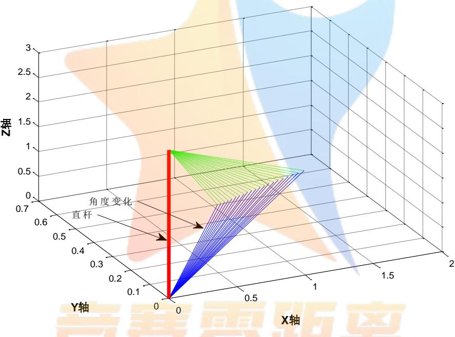  
图1 角度变化

## 4.3节气日期划分CompetitionZeroDistance--

我国一年365天，共24节气[1]，由于地球在黄经轨道上围绕太阳公转，造成地轴指向天北极的角度改变，每个节气太阳位移 $3 ^ { \circ } ~ 5 5 ^ { \prime }$ ，在此选取春分、夏至、秋分、冬至将一年365天划分为四季如下表：

表2 各节气日期及昼夜长短
<table><tr><td rowspan=1 colspan=1>节气</td><td rowspan=1 colspan=1>日期</td><td rowspan=1 colspan=1>昼夜长短</td></tr><tr><td rowspan=1 colspan=1>春分</td><td rowspan=1 colspan=1>3月20日或21日</td><td rowspan=1 colspan=1>昼夜等长</td></tr><tr><td rowspan=1 colspan=1>夏至</td><td rowspan=1 colspan=1>6月21日或22日</td><td rowspan=1 colspan=1>昼最长，夜最短</td></tr><tr><td rowspan=1 colspan=1>秋分</td><td rowspan=1 colspan=1>9月23日或24日</td><td rowspan=1 colspan=1>昼夜等长</td></tr><tr><td rowspan=1 colspan=1>冬至</td><td rowspan=1 colspan=1>12月21日或22日</td><td rowspan=1 colspan=1>昼最短、夜最长</td></tr></table>

## 5 问题一的解答

## 5.1 模型的准备

## 5.1.1 背景知识[2]

太阳高度角 $h _ { \scriptscriptstyle s }$ ：太阳相对于地面的高度角

$$
\sinh _ { s } = \sin \vartheta \sin \vartheta + \cos \varpi \cos \vartheta \cos \delta
$$

太阳赤纬角 $\delta$ ：太阳的直射纬度，根据Cooper近似方程可得太阳赤纬角

$$
\delta = 2 3 . 4 5 \sin \left[ 3 6 0 \cdot { \frac { 2 8 4 + n } { 3 6 5 } } \right]
$$

太阳方位角A：太阳从北方沿着地平线顺时针度角的角

$$
\sin A = { \frac { \cos \delta \sin \vartheta } { \cos \displaystyle \mathrm { h } _ { s } } }
$$

式中 $\mathcal { A }$ —地理纬度，n—时期序号

## 5.1.2 太阳时角

## (1)太阳时、时差

真太阳时 $T _ { 1 } :$ 太阳连续两次经过上中天的时间间隔

平太阳时τ：日常生活中所使用的时间

时差E：真太阳时与平太阳时的差值

$$
{ \cal E } = T _ { 1 } - \tau
$$

由于地球轨道的偏心率和地球的轴向倾斜会影响时差，时差的近似模拟式为：

$$
E = 9 . 8 7 \sin \left( 2 B \right) - 7 . 5 3 \cos \left( B \right) - 1 . 5 \sin \left( B \right)
$$

式中 $B = \frac { 3 6 0 } { 3 6 5 } \left( n - 8 1 \right)$ ，n—天数。

## (2) 时间校正系数[3]

由于地球每自转1度就有4分钟的偏差，所以引入时间校正系数，净时间校正系数（以分钟计）占本地太阳时在给定的时区的变化，由于时区中的经度变化，也要考虑地球轨道的偏心率和地球的轴向倾斜影响，所以也要加入时差 $E$ o

$$
T C _ { 3 } = 4 \left( L _ { 8 } = T _ { 3 } \right) + E
$$

式中 $T _ { 3 } = 1 5 ^ { 0 } \Delta T _ { G M T }$ ，Lg一当地经度

所以当真太阳时可以通过使用前面两个修正因子调整本地时间 $T _ { \scriptscriptstyle 2 }$ 中得到。

$$
T _ { 1 } = T _ { 2 } + \frac { 4 { \left( L g - T _ { 3 } \right) } + E } { 6 0 }
$$

则太阳时角计算公式为：

$$
\varpi = 1 5 ^ { 0 } \left( \left( T _ { 2 } + \frac { 4 \left( L g - T _ { 3 } \right) + E } { 6 0 } \right) - 1 2 \right)
$$

式中 $T _ { \scriptscriptstyle 2 }$ 一当地时间， $T _ { 3 }$ 一当地标准时间子午线

## 5.1.3 影长出现时间段

由于直杆的影长在太阳出现的时候才有，所以应确定每天影子出现的时间段，而太阳是跟时间有关的量，故确定出一天日出与日落的时角便可以确定出一天内影子出现的时间。

地球赤纬角的表达式[2]为：

$$
\delta = 2 3 . 4 4 \sin \left[ { \frac { 3 6 0 { \left( { 2 8 4 + n } \right) } } { 3 6 5 } } \right]
$$

日出、日没时太阳处于地平线位置，太阳高度角 $h _ { \mathrm { { s } } } = 0$ ，上式变为：

$$
\scriptstyle 0 = \sin { \vartheta } \sin { \delta } + \cos { \vartheta } \cos { \delta } \cos { \omega }
$$

则：

$$
\cos \omega = - \frac { \sin \vartheta \sin \delta } { \cos \vartheta \cos \delta }
$$

得到日出日没的时角表达式，即：

$$
\begin{array} { c } { \cos \omega = - \tan \mathcal { S } \tan \mathcal { S } } \\ { \omega { = } \pm \operatorname { a r c c o s } \left( - \tan \mathcal { S } \tan \mathcal { S } \right) } \end{array}
$$

从上式可见，日出时 $\omega _ { \mathrm { l } } { = } { - } \omega$ ，日没时 $\omega _ { 2 } { = } \omega$ ，日出、日没时角和当地纬度和太阳赤纬角有关，因为 $- 1 \leq \cos \omega \geq 1$ ，所以当 $\omega { = } 0$ 时，北半球太阳在正午出现在正南地平线上；当 $\omega \leq 0$ 时出现极夜，即大于24h的黑夜，当 $\omega { \geq } 1 8 0$ 或 $\omega { \leq }  { - } 1 8 0$ 时出现极昼，即大于24h的白昼。

当太阳高度角 $h _ { \mathrm { { s } } } = 0$ 时，此时为日出、日没的方位角：

$$
\cos A = - \cos \delta \sin \omega
$$

将太阳日出、日没时角代入上式，就可得到日出、日没时的太阳方位角。

同理可得到一天的日照时间，因为时角为正午到日出、日没时的太阳时角，每小时太阳自转角度为 $1 5 ^ { \circ }$ 因此，推导出一天的日照时间计算式为：

$$
N { = } \frac { 2 } { 1 5 } \operatorname { a r c c o s } \left( - \tan \vartheta \tan \delta \right)
$$

式中N一任何一天的日照时间。

## 5.2 影长变化模型的建立

本文拟用经度、纬度、日期、时间、杆长五个变量分析影子长度的变化规律，故影子长度关于上述五个变量的函数为：

$$
( x , y ) = f \left( \theta , \mathcal { 9 } , \boldsymbol { n } , t , \boldsymbol { h } \right)
$$

由于太阳高度角、太阳方位角、太阳时角、太阳赤纬角与经度、纬度、日期、时间四个变量有关，由此可建立以太阳高度角、太阳方位角、太阳时角、太阳赤纬角、杆的高度为变量与影子端点位置坐标的数学模型，得到影长关于五个变量的函数表达式。

以直杆低端为坐标原点O，正南方向为X轴，正东方向为Y轴，直杆为Z轴建立平面直角坐标系。假设影子的端点为 $Q ( x , y )$ ，故影子长度为落影点Q到原点O的距离，即：

$$
\left\{ \begin{array} { l l } { { l = O Q = \sqrt { x ^ { 2 } + y ^ { 2 } } } } \\ { { \tan h _ { s } = \displaystyle \frac { h } { l } } } \end{array} \right.
$$

式中 l—影长，h—杆长

而太阳方位角方程满足： $y = x \tan A$

联立上面两式可得影子端点坐标：

$$
\left\{ \begin{array} { l l } { y = x \tan A } \\ { x = \pm \displaystyle \frac { h \cot h _ { \mathrm { s } } } { \sqrt { 1 + \left( \tan A \right) ^ { 2 } } } } \end{array} \right.
$$

综上所述，影子长度变化的数学模型为：

$$
\begin{array} { r l } & { L = \sqrt { \displaystyle \frac { h \coth } { \sqrt { 1 + ( \tan A ) ^ { 2 } } } ( + ( \frac { h \tan A \coth } { \sqrt { 1 + ( \tan A ) ^ { 2 } } } ) ^ { 2 }  } } \\ & {  ( \mathbf { h } _ { s } = \arctan ( \sin { \mathcal { S } } \sin { \mathcal { S } } + \cos { \varpi } \cos { \mathcal { S } } \cos { \mathcal { S } } )   } \\ & {    { ( \frac { h \operatorname { e m } _ { 0 } } { \sqrt { 1 + ( \tan A ) ^ { 2 } } } ) } \mathrm { d } - \operatorname { c o s s i n } ( \frac { \cos { \mathcal { S } } \sin { \mathcal { S } } } { \cos { h _ { s } } } )   } \\ & {   ( \delta = 2 3 . 4 5 \sin { [ 3 6 0 \cdot \frac { 2 8 4 + n } { 3 6 5 } ] }    } \end{array}
$$

## 5.3 模型的求解与分析

## 5.3.1 影长变化曲线的求解

根据日出、日没的太阳时角确定天安门广场每日直杆影长在6:32 am-17:28 pm区间内变化

根据上述建立的影长变化模型，基于五个变量分析影子长度的变化规律，利用MATLAB软件（源程序见附录3）求解，得到2015年10月22日北京时间9:00-15:00之间天安门广场3米高的直杆影长及太阳高度角如下表：

表 3 天安门广场 9:00-15:00所求数据
<table><tr><td rowspan=1 colspan=1>北京时间</td><td rowspan=1 colspan=1>9:00</td><td rowspan=1 colspan=1>10:12</td><td rowspan=1 colspan=1>11:24</td><td rowspan=1 colspan=1>12:12</td><td rowspan=1 colspan=1>13:48</td><td rowspan=1 colspan=1>15:00</td></tr><tr><td rowspan=1 colspan=1>太阳高度角（度)</td><td rowspan=1 colspan=1>21.1878</td><td rowspan=1 colspan=1>30.7771</td><td rowspan=1 colspan=1>36.6711</td><td rowspan=1 colspan=1>37.9893</td><td rowspan=1 colspan=1>33.6601</td><td rowspan=1 colspan=1>25.3526</td></tr><tr><td rowspan=1 colspan=1>杆影长（m）</td><td rowspan=1 colspan=1>7.7394</td><td rowspan=1 colspan=1>5.0371</td><td rowspan=1 colspan=1>4.029</td><td rowspan=1 colspan=1>3.8413</td><td rowspan=1 colspan=1>4.5051</td><td rowspan=1 colspan=1>6.3315</td></tr></table>

为便于观察，本文按照表格数据绘制出拟画出影长的变化曲线与变化率曲线如下图：

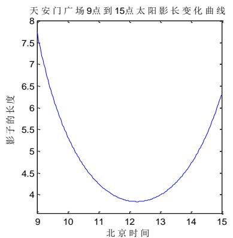  
图 2 9:00-15:00 影长变化曲线

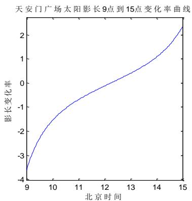  
图3 9:00-15:00影长变化率

## 5.3.2 影长变化曲线的分析

由图1可得，基于五个变量的影长变化规律符合太阳东升西落的规律，而且最短影长l=3.84(m)位于北京时间12点12分。由于北京时间指东经120°，即东8区的区时，其最短影长出现时间为正午12点，而天安门广场处于东经116°的位置，故最短影长应出现在北京时间12点之后。

由图2可得，天安门广场太阳影长在9:00-15:00时间段内变化的趋势呈先减小后增大的状态，由快到慢，在影长达到最小值时，变化速率也达到最小，随后影子长度增加，变化率也随之增加。

## 5.4 各个参数与影长的变化规律

根据上述建立的影长变化模型，影子长度与经度、纬度、日期、时间以及杆长都有关，为了分析各个参数对影长的变化规律，本文运用控制变量法得到每个参数与影长的变化规律，并进行单因素敏感性分析。

## 5.4.1 日期参数

控制直杆所在经度、纬度、时刻及杆长不变，使直杆日期在1月1号到12月31之间变化。利用MATLAB软件编程（源程序见附录4）求解出日期变化对太阳影长的关系如下图：

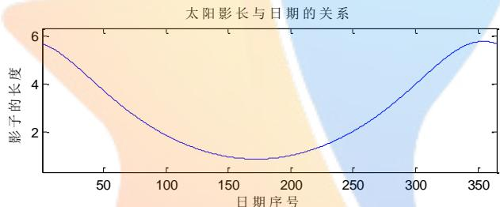

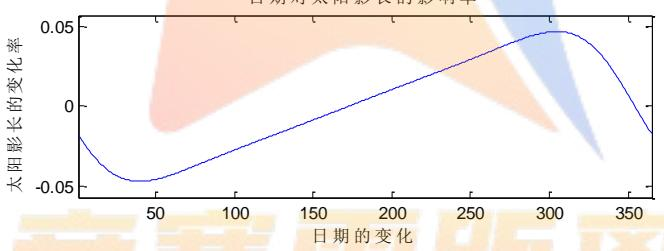  
图4 日期变化对太阳影长的关系

根据上图可得，日期对太阳影长的影响呈近似抛物线，上半年中随着日期的增加影长呈下降状态，0下半年中影长呈上升状态。选取春分、夏至、秋分、冬至四节气，共八天的数据，分析四节气对影子长度变化的影响率：

表4四节气对影子长度变化的影响
<table><tr><td>节气</td><td>日期</td><td>变化率</td><td>节气</td><td>日期</td><td>变化率</td></tr><tr><td rowspan="2">春分</td><td>3月20日</td><td>-0.03584</td><td rowspan="2">秋分</td><td>9月22日</td><td>0.035642</td></tr><tr><td>3月21日</td><td>-0.0354407</td><td>9月23日</td><td>0.036045</td></tr><tr><td rowspan="2">夏至</td><td>6月21日</td><td>-9.64E-05</td><td rowspan="2">冬至</td><td>12月21日</td><td>-0.00043</td></tr><tr><td>6月22日</td><td>0.000289</td><td>12月22日</td><td>-0.00214</td></tr></table>

## 5.4.2 经纬度、时刻及杆长参数

为了分析各个参数的变化规律，本文采用控制变量法控制四个变量不变，改变某一个变量得到这一变量与影长的变化规律，利用MATLAB软件（源程序见附录4）分别求解出太阳影长与经度、纬度、时刻及杆长的变D化规律如下图：

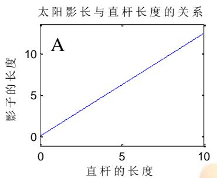

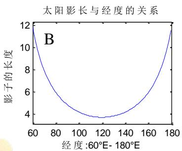

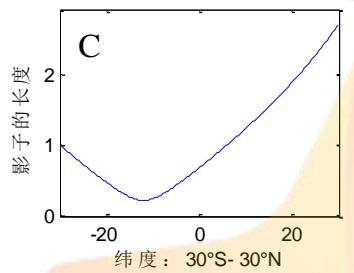

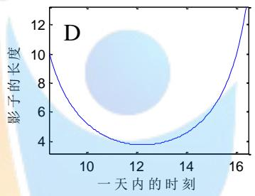  
图5 太阳影长与杆长、经纬度及时刻的变化规律

分别对上图分析，由图A可得，控制直杆所在经度、纬度、日期、时刻不变，使杆长在0m-10m之间变化，随着直杆长度的增加，影长与杆长呈线性相关。由图B可得，控制直杆所在纬度、日期、时刻及杆长不变，使直杆的经度在$6 0 ^ { 0 } W - 1 8 0 ^ { 0 } W$ 上变化，当经度达到 $1 2 0 ^ { \circ }$ 时，影长达到最小值。由图C可得，控制直杆所在经度、日期、时刻及杆长不变，使直杆的纬度在 $3 0 ^ { 0 } S - 3 0 ^ { 0 } N$ 上变化，可发现先下降，后上升。由图D可得，控制直杆所在经纬度、日期及杆长不变，确定天安门广场每日直杆影长6:32am-17:28pm区间内变化，通过观察，发现12点之前影长逐步减少，12点影长开始增加。

## 5.5 误差分析

由于太阳高度角、太阳方位角、时角、太阳赤纬角都是根据经验公式求得，故每个公式都有一个误差平均值，所以根据误差传递公式[4]得到各个参数误差对影长的影响为：--CompetitionZeroDistance-

$$
\Delta N = \left| \frac { \partial l } { \partial g } \right| \Delta \mathcal { G } + \left| \frac { \partial l } { \partial \theta } \right| \Delta \theta + \left| \frac { \partial l } { \partial d } \right| \Delta d + \left| \frac { \partial l } { \partial t } \right| \Delta t + \left| \frac { \partial l } { \partial h } \right| \Delta h
$$

由于太阳时角与天数及时刻有关，并根据经验公式修正过，所以不考虑太阳时角带给影长的误差。

太阳赤玮角与天数有关，平均误差为1.71%。

太阳高度角与纬度、天数、经度有关，平均误差为0.57%。

最后求解得到影长变化误差限为0.23%。

## 6 问题二的解答

问题二可视为已知影长坐标、日期和时刻，求影长所在的地点的问题。为了计算太阳影长，本文拟将附件1中已知数据代入问题一中的影长变化函数，得到超定方程组；其次，建立单目标优化模型对附件1进行求解，其中约束条件可考虑经纬度的范围；最后通过穷举搜索，得到直杆所在的地点。

## 6.1 单目标优化模型的建立

## (1) 确定目标函数

目标函数：影长差值平方最小

求出每个时刻影长与附件1中对应时刻影长差值平方和最小；

$$
\operatorname* { m i n } \Delta \beta _ { b } = \sum _ { i = 1 } ^ { 2 1 } \left( l _ { i } - l _ { b i } \right) ^ { 2 }
$$

## (2) 确定约束条件

约束条件一：经度约束

由于地球的自转，地球上的各个地方都能被照亮，式中取西经度为负，东经度为正；

$$
- 1 8 0 ^ { 0 } \leq \vartheta \leq 1 8 0 ^ { 0 }
$$

约束条件二：纬度约束

因为太阳一年只在南北回归线之间运动，式中取南纬度为负，北半球的纬度为正；

$$
- 2 3 . 5 ^ { \mathrm { 0 } } \leq \theta \leq 2 3 . 5 ^ { \mathrm { 0 } }
$$

综上所述，直杆所处地点单目标最优化模型如下：

$$
\begin{array} { l } { \operatorname* { m i n } \Delta \beta _ { b } = \displaystyle \sum _ { i = 1 } ^ { 2 1 } \bigl ( l _ { i } - l _ { b i } \bigr ) ^ { 2 } } \\ { \displaystyle } \\ { \displaystyle \sum _ { s : t = 1 } ^ { \{ - 1 8 0 ^ { 0 } \leq g \leq 1 8 0 ^ { 0 }  } } \\ {  \qquad } \\ { \displaystyle   l _ { b } = \sqrt { x ^ { 2 } + y ^ { 2 } }  } \\ { \displaystyle  l _ { t } = f \bigl ( \theta , \boldsymbol { \mathcal { S } } , \boldsymbol { \mathcal { I } } , t , \boldsymbol { h } \bigr )  } \end{array}
$$

## 6.2 模型的求解

## 6.2.1 拟牛顿算法基本思想[5]

不用二阶偏导数而构造出可以近似海森矩阵（或海森矩阵的逆）的正定对称阵，在“拟牛顿”的条件下优化目标函数。

## 6.2.2 拟牛顿迭代法条件

用B表示对海森矩阵H的近似近似矩阵，用D表示对海森矩阵逆矩阵 $H ^ { - 1 }$ 的 近似矩阵，即

$$
\begin{array} { l l } { B \approx H } & { D \approx H ^ { - 1 } } \end{array}
$$

设经过k+1此迭代后得到 $x _ { k + 1 }$ ，此时将目标函数 $f \left( x \right)$ 在k+1附近作泰勒阶近似，得到

$$
f \left( x \right) \approx f \left( x _ { k + 1 } \right) + \nabla f \left( x _ { k + 1 } \right) \cdot \left( x - x _ { k + 1 } \right) + \frac { 1 } { 2 } { \left( x - x _ { k + 1 } \right) } ^ { T } \nabla ^ { 2 } f \left( x _ { k + 1 } \right) \left( x - x _ { k + 1 } \right)
$$

目标函数两边同时作用一个梯度算子∇，得到

$$
\nabla f \left( x \right) \approx \nabla f \left( x _ { k + 1 } \right) + H _ { k + 1 } \left( x - x _ { k + 1 } \right)
$$

对上式 $\nabla f \left( x \right) \approx \nabla f \left( x _ { k + 1 } \right) + H _ { k + 1 } \left( x - x _ { k + 1 } \right)$ 中取 $x = x _ { k }$ ，得到

$$
g _ { k + 1 } - g _ { k } \approx H _ { k + 1 } \left( x _ { k + 1 } - x _ { k } \right)
$$

$S _ { k } = x _ { k + 1 } - x _ { k } , \quad y _ { k } = g _ { k + 1 } - g _ { k }$ ，则公式 $g _ { k + 1 } - g _ { k } \approx H _ { k + 1 } \left( x _ { k + 1 } - x _ { k } \right)$ 可近似变换成：

$$
y _ { k } \approx H _ { k + 1 } S _ { k } \ S _ { k } \approx H _ { k + 1 } ^ { - 1 } S _ { k }
$$

拟牛顿条件在迭代过程中的海森矩阵 $H _ { k + 1 }$ 进行约束。因此对 $B _ { k + 1 }$ 近似的海森矩阵$H _ { k + 1 }$ ，和对海森矩阵逆矩阵 $H _ { k + 1 } ^ { - 1 }$ 近似的 $D _ { k + 1 }$ 。则 $y _ { k } = B _ { k + 1 } S _ { k } S _ { k } = D _ { k + 1 } y _ { k }$

## 6.2.3 算法步骤

Step1：给定初值(9,θ,h)和精度阀值 $\xi$ ，并 $D _ { 0 } = I , ~ \mathrm { k = 0 }$

Step2：确定搜索的方向 $d _ { k } = - D _ { k } g _ { k }$ 。

Step3：利用 $\lambda _ { \lambda } = \arg \operatorname* { m i n } \Delta l \big ( x _ { k } + \lambda d _ { k } \big )$ 得到步长， $S _ { k } = \lambda d _ { k } , x _ { k + 1 } = x _ { k } + S _ { k }$

Step4：若 $\left\| g _ { k + 1 } \right\| < \xi$ ，则算法结束，否则继续计算 $y _ { k } = g _ { k + 1 } - g _ { k }$ 和 $D _ { k + }$

Step5：令 $k = k + 1$ ，转到Step2。

## 6.2.4 求解结果

根据上述步骤，利用MATLAB软件编程（源程序见附录5）求解，得到附件1中直杆的位置可能为以下两个地点：

表 5 附件1 中直杆所在地点
<table><tr><td rowspan=2 colspan=1>地点</td><td rowspan=2 colspan=1>杆高</td><td rowspan=1 colspan=2>位置坐标</td></tr><tr><td rowspan=1 colspan=1>经度</td><td rowspan=1 colspan=1>纬度</td></tr><tr><td rowspan=1 colspan=1>位置1</td><td rowspan=1 colspan=1>2m</td><td rowspan=1 colspan=1>东经109.2°2°</td><td rowspan=1 colspan=1>北纬19.2°</td></tr><tr><td rowspan=1 colspan=1>位置2</td><td rowspan=1 colspan=1>3m</td><td rowspan=1 colspan=1>东经 95.4°</td><td rowspan=1 colspan=1>北纬25.2°</td></tr></table>

将表格中两个地点位置坐标代入地图[6]，得到两个地点的具体方位如下图：

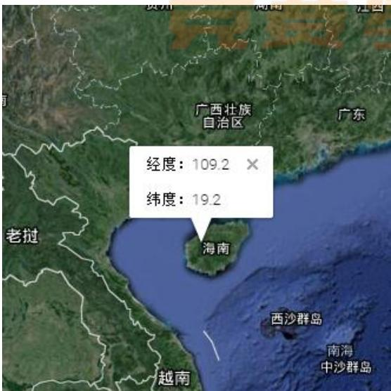  
图 6 位置 1 具体方位

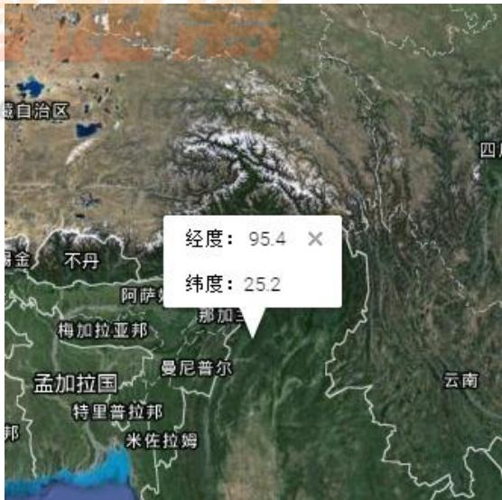  
图 7 位置2具体方位

## 6.3 偏角之差

影子偏角误差分析，通过附件一的影子的X，Y坐标，拟合出一条曲线，算出每个时刻曲线斜率对应的角度，以及算出相邻两个时刻斜率的差值。计算式见公式：

$$
\left\{ \begin{array} { l l } { \beta = a r c \tan \frac { y } { x } } \\ { \Delta \beta = \beta _ { t } - \beta _ { b } } \end{array} \right.
$$

将问题二中求得直杆地点、杆高、以及附件1中日期、时刻，计算太阳高度角，太阳赤纬角。然后计算出太阳方位角。求出相邻时刻太阳方位角之差，计算式见。

$$
\left\{ \begin{array} { l l } { \sin A = { \frac { \cos \delta \sin { \vartheta } } { \cos \mathbf { h } _ { s } } } } \\ { A = a r c \sin \left( { \frac { \cos \delta \sin { \vartheta } } { \cos \mathbf { h } _ { s } } } \right) } \\ { \Delta A = A _ { t } A _ { t - 1 } } \end{array} \right.
$$

最后以附件1 中相邻时刻影长变化曲线夹角之差与对应太阳方位角之差相减，建立误差分析模型。

$$
\phi = \Delta \beta - \Delta A
$$

将 $\Delta \beta , \Delta A$ 求得值拟合成一条曲线，计算出两条曲线的相关性如下图：

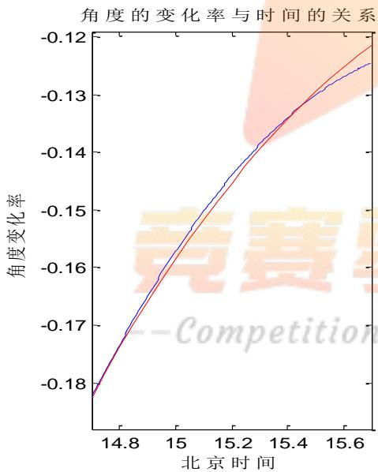  
图8位置1角度变化率与时间的关系

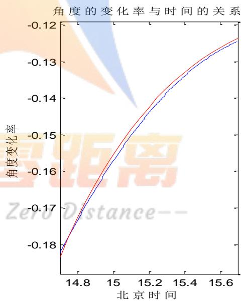  
图9位置2角度变化率与时间的关系

## 6.4实际影长与求解影长的对比与分析

根据附件1所给坐标求得实际影长，与运用单目标最优化模型求得位置1、2的影长相对比如下表：

表6实际影长与求解影长的对比与分析
<table><tr><td rowspan=1 colspan=1>北京时间</td><td rowspan=1 colspan=1>14:42</td><td rowspan=1 colspan=1>14:51</td><td rowspan=1 colspan=1>15:00</td><td rowspan=1 colspan=1>15:09</td><td rowspan=1 colspan=1>15:18</td><td rowspan=1 colspan=1>15:27</td><td rowspan=1 colspan=1>15:36</td></tr><tr><td rowspan=1 colspan=1>实际影长</td><td rowspan=1 colspan=1>1.1496</td><td rowspan=1 colspan=1>1.2491</td><td rowspan=1 colspan=1>1.3534</td><td rowspan=1 colspan=1>1.4634</td><td rowspan=1 colspan=1>1.5799</td><td rowspan=1 colspan=1>1.7033</td><td rowspan=1 colspan=1>1.835</td></tr><tr><td rowspan=1 colspan=1>位置1影长</td><td rowspan=1 colspan=1>1.15193</td><td rowspan=1 colspan=1>1.25072</td><td rowspan=1 colspan=1>1.35461</td><td rowspan=1 colspan=1>1.46419</td><td rowspan=1 colspan=1>1.58018</td><td rowspan=1 colspan=1>1.70343</td><td rowspan=1 colspan=1>1.83492</td></tr><tr><td rowspan=1 colspan=1>位置2影长</td><td rowspan=1 colspan=1>1.1545</td><td rowspan=1 colspan=1>1.2502</td><td rowspan=1 colspan=1>1.3535</td><td rowspan=1 colspan=1>1.464</td><td rowspan=1 colspan=1>1.5814</td><td rowspan=1 colspan=1>1.7059</td><td rowspan=1 colspan=1>1.8376</td></tr><tr><td rowspan=1 colspan=1>位置1差值</td><td rowspan=1 colspan=1>0.00233</td><td rowspan=1 colspan=1>0.00162</td><td rowspan=1 colspan=1>0.00121</td><td rowspan=1 colspan=1>0.00079</td><td rowspan=1 colspan=1>0.00028</td><td rowspan=1 colspan=1>0.00013</td><td rowspan=1 colspan=1>0.00008</td></tr><tr><td rowspan=1 colspan=1>位置2差值</td><td rowspan=1 colspan=1>0.0049</td><td rowspan=1 colspan=1>0.0011</td><td rowspan=1 colspan=1>0.0001</td><td rowspan=1 colspan=1>0.0006</td><td rowspan=1 colspan=1>0.0015</td><td rowspan=1 colspan=1>0.0026</td><td rowspan=1 colspan=1>0.0026</td></tr></table>

分析运用单目标优化模型求解出位置1、2与实际影长的相关性，得到相关系数相当接近，基本相等，因此，可得上述建立的单目标优化模型是合理的。

## 6.5.模型的检验

本文将引用文献[7]中的数据（详细请见附录6）检验问题三的模型。将建筑物影长、时间、测量影长的时间带入到第三问的模型中，求出建筑物的高度，所在的经度、纬度和观测时期。与实验中数据进行对比，检验模型的正确性。

## 模型检验结果表示：

文献中经纬度、高度、观测日期和运用问题三的模型求解出来结果以及文献中经度、纬度、高度、观测日期与问题三模型求解出的结果的误差如下表所示。

表 7 结果的误差检验
<table><tr><td rowspan=1 colspan=1></td><td rowspan=1 colspan=1>经度</td><td rowspan=1 colspan=1>纬度</td><td rowspan=1 colspan=1>高度</td><td rowspan=1 colspan=1>日期</td></tr><tr><td rowspan=1 colspan=1>文献结果</td><td rowspan=1 colspan=1> $1 1 8 ^ { 0 } 4 6 ^ { \prime } E$ </td><td rowspan=1 colspan=1> $3 2 ^ { \mathrm { 0 } } 0 3 ^ { \prime } N$ </td><td rowspan=1 colspan=1>17.6米</td><td rowspan=1 colspan=1>1990年5月8日</td></tr><tr><td rowspan=1 colspan=1>模型结果</td><td rowspan=1 colspan=1> $1 1 7 ^ { 0 } 0 ^ { \cdot } E$ </td><td rowspan=1 colspan=1> $3 2 ^ { \mathrm { { 0 } } } 0 ^ { \cdot } N$ </td><td rowspan=1 colspan=1>16.2米</td><td rowspan=1 colspan=1>1990年5月8日</td></tr><tr><td rowspan=1 colspan=1>误差绝对值</td><td rowspan=1 colspan=1> $1 ^ { 0 } 4 6 ^ { \prime }$ </td><td rowspan=1 colspan=1> $0 ^ { 0 } 0 3 ^ { ' }$ </td><td rowspan=1 colspan=1>1.4米</td><td rowspan=1 colspan=1>0</td></tr></table>

## 6.6 结果分析

通过对经纬度的查询得到位置1的地理位置在海南附近，位置2的地理位置在那加兰附近。为了便于观察表5中实际影长与求解影长的关系，本文根据上述表格，运用MATLAB软件编程（源程序见附录7）求解对单目标优化模型求得的影长与附件1中实际值的差值对比曲线如下：

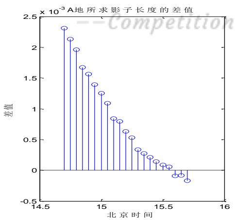

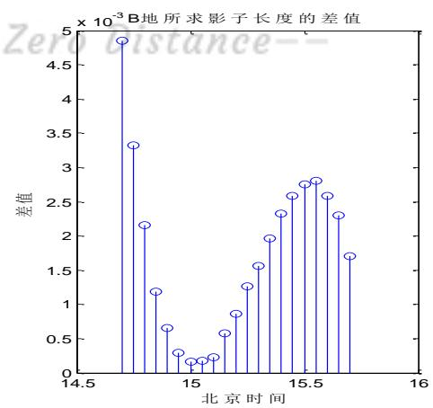  
图10计算的影长与实际影长的差值

由上图可得，误差精度为 $1 0 ^ { - 3 }$ 。位置1中所计算的影长与实际影长的差值最大为 $2 . 4 \times 1 0 ^ { - 3 }$ ，最小为 $1 . 4 \times 1 0 ^ { - 4 }$ ，其差值的规律呈先减小，后增加的规律；位置2 中差值最大为 $4 . 8 \times 1 0 ^ { - 3 }$ ，最小为 $2 \times 1 0 ^ { - 4 }$ ，差值的变化规律先减小后增加。

## 7 问题三的解答

针对问题三可视为已知影长坐标及测量影长的时刻，求解直杆经纬度及测量日期的问题。首先求解超定方程组，其次可建立以影长差值最小、影长的曲线斜率差最小为目标的双目标最优化模型得到地点与日期，其中约束条件可考虑经纬度范围。

## 7.1 双目标优化模型的建立

## (1) 确定目标函数

目标函数一：影长差值平方和最小

求出的每个对应时刻影长与附件2、3中对应时刻影长差值平方和最小；

$$
\operatorname* { m i n } { \Delta l } = \sum _ { i = 1 } ^ { 2 1 } \left( l _ { i } - l _ { b i } \right) ^ { 2 }
$$

目标函数二：影长的曲线斜率角差平方和最小

求出的每个时刻影长变化曲线斜率与附件2、3中对应时刻影长变化曲线差值的平方和最小；

$$
\operatorname* { m i n } \Delta \beta _ { b } = \sum _ { i = 1 } ^ { 2 1 } \left( \beta _ { i } - \beta _ { b i } \right) ^ { 2 }
$$

## (2) 确定约束条件

约束条件一：经度约束

由于地球的自转，地球上的各个地方都能被照亮，式中取西经度为负，东经度为正；

$$
- 1 8 0 ^ { 0 } \leq \vartheta \leq 1 8 0 ^ { 0 }
$$

约束条件二：纬度约束

因为太阳一年只在南北回归线之间运动，式中取南纬度为负，北半球的纬度为正；

$$
- 2 3 . 5 ^ { \mathrm { 0 } } \leq \theta \leq 2 3 . 5 ^ { \mathrm { 0 } }
$$

综上所述，直杆所处地点双目标最优化模型如下：

$$
\left\{ \begin{array} { l l } { { \displaystyle { \cal U } ( l ; { \cal U } , 0 ) = \sum _ { i = 1 } ^ { 2 1 } \left( l _ { i } - l _ { b i } \right) ^ { 2 } } } \\ { ~ } \\ { { \displaystyle \operatorname* { m i n } \Delta \beta _ { b } = \sum _ { i = 1 } ^ { 2 1 } \left( \beta _ { t } - \beta _ { b } \right) ^ { 2 } } } \end{array} \right.
$$

$$
\begin{array} { r l } & { \quad ( l _ { i } = f ( \theta , \mathcal { G } , d t , t , h )  } \\ & { \quad  l _ { b i } = \sqrt { x ^ { 2 } + y ^ { 2 } }  } \\ & { \quad  s t  \tan \beta _ { b } = \frac { y } { x }  } \\ & { \quad  - 1 8 0 ^ { \circ } \leq \mathcal { G } \leq 1 8 0 ^ { \circ }  } \\ & { \quad  - 2 3 . 5 ^ { \circ } \leq \theta \leq 2 3 . 5 ^ { \circ }  } \end{array}
$$

## 7.2 模型的求解

## 7.2.1 人工鱼群算法流程图[8]

人工鱼群算法是一类基于动物行为的群体只能优化算法，主要通过模拟鱼类的觅食、聚群、追尾、随机等行为在搜索域中进行寻优。利用MATLAB软件（源程序见附录8）对其求解，具体流程图如下：

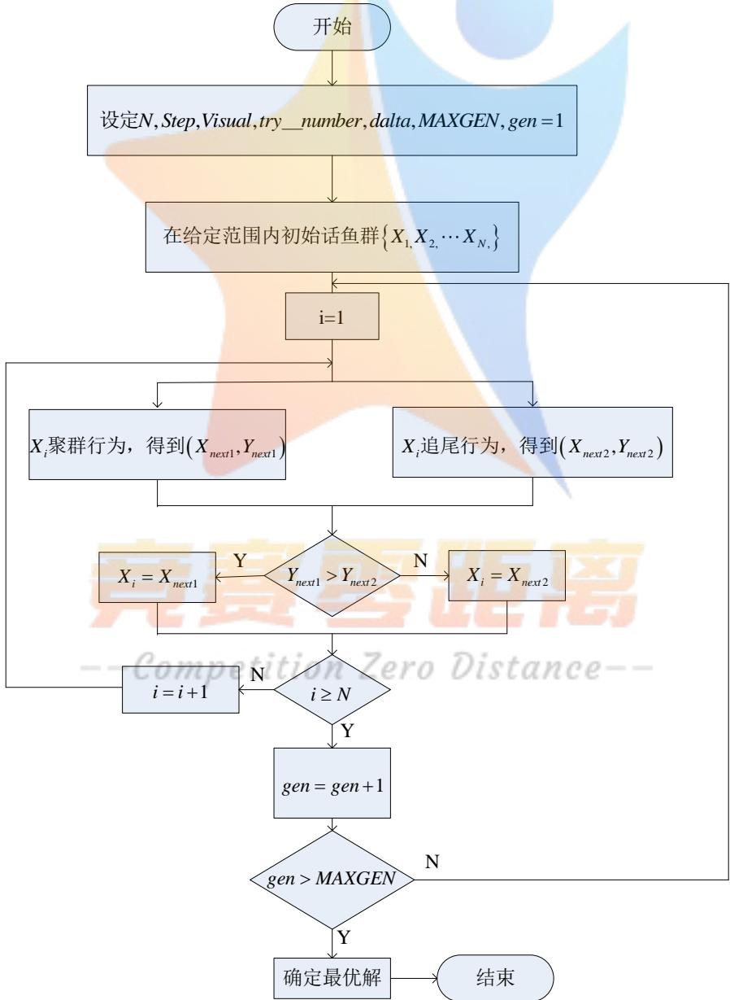  
图11 人工鱼群算法流程图

## 7.2.2 求解结果

运用上述建立的双目标最优化模型，并依据题中附件2、3中影子顶点坐标数据，利用MATLAB软件（源程序见附录9）求得附件2、3中直杆所处位置及测量日期如下表所示：

表8 附件2、3中直杆所处位置及测量日期
<table><tr><td rowspan=2 colspan=1>数据</td><td rowspan=2 colspan=1>日期</td><td rowspan=2 colspan=1>杆长（米）</td><td rowspan=1 colspan=2>位置坐标</td></tr><tr><td rowspan=1 colspan=1>经度</td><td rowspan=1 colspan=1>纬度</td></tr><tr><td rowspan=1 colspan=1>附录2</td><td rowspan=1 colspan=1>7月10日</td><td rowspan=1 colspan=1>1.9</td><td rowspan=1 colspan=1>78.9°</td><td rowspan=1 colspan=1>41°</td></tr><tr><td rowspan=1 colspan=1>附录3</td><td rowspan=1 colspan=1>11月25日</td><td rowspan=1 colspan=1>3.1</td><td rowspan=1 colspan=1>109.09°</td><td rowspan=1 colspan=1>28°</td></tr></table>

为了便于观察附录2、3中直杆具体所处地理位置，本文根据上述表格中两根直杆的位置坐标，利用地图得到两个地点的具体方位如下图：

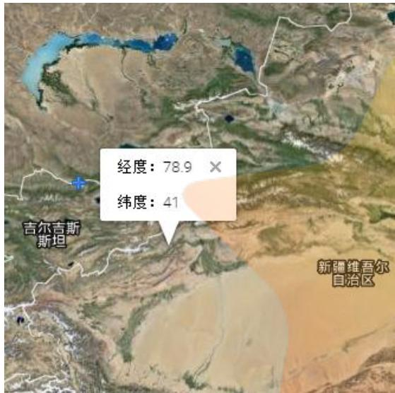  
图 12 附录 2 具体方位

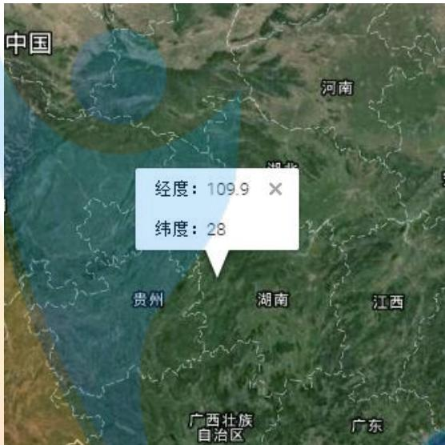  
图 13 附录 3 具体方位

## 7.3 结果分析

根据表4列出的两附件的位置坐标，通过对经纬度的查询得到附件2的地理位置在阿克苏附近，附件3的地理位置在湖南省怀化市附近。附件2的日期为7月10日，杆高为1.9m；附件2的日期为11月25日，杆高为3.1m。

为便于观察，本文拟画出位置1影长随时间变化的曲线如下图：

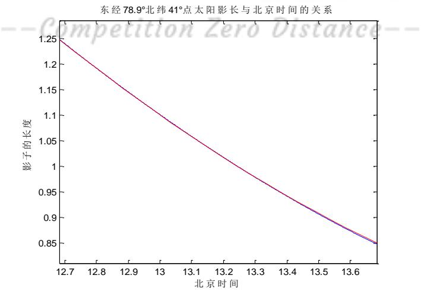  
图14 计算影长与实际影长的对比曲线

由上图可得，位置1实际影长与运用单目标最优化模型求得的影长相关系数$R = 0 . 9 9$ ，因此，可验证上述建立的双目标优化模型是合理的。

## 7.4 误差分析

本文将根据误差公式对双目标优化模型求得的影长与附件2、3中实际影长相对比，即：

$$
e = \frac { \left| \mathbb { W } _ { 1 } - \mathbb { W } _ { 2 } \right| } { \mathbb { W } _ { 2 } }
$$

式中 $\mathbb { W } _ { 1 }$ 一计算值 $\mathbb { W } _ { 2 }$ 一实际值

利用MATLAB软件编程（源程序见附录9）求得双目标优化模型影长与附件2、3中实际影长的相对误差值如下表

表9相对误差值
<table><tr><td rowspan=1 colspan=1>数据</td><td rowspan=1 colspan=1>附件2</td><td rowspan=1 colspan=1>附件3</td></tr><tr><td rowspan=1 colspan=1>相对误差</td><td rowspan=1 colspan=1> $5 . 4 9 \times 1 0 ^ { - 4 }$ </td><td rowspan=1 colspan=1> $1 . 0 9 2 5 { \times } 1 0 ^ { - 4 }$ </td></tr></table>

由上表可得，双目标优化模型影长与附件2实际影长相对比，误差为$5 . 4 9 \times 1 0 ^ { - 4 }$ ，双目标优化模型影长与附件3实际影长相对比，误差为 $1 . 0 9 2 5 { \times } 1 0 ^ { - 4 }$ 两者误差都较小，因此，本文可以较为清晰的得知，双目标优化模型所求的影长是合理的。

## 8 问题四的解答

## 8.1 模型的准备

## 8.1.1 图像预处理[9]

## （1）彩色图像进行灰度化处理

将彩色图像中的三分量亮度加权求和得到一个灰度图，即：

$$
G r a y \left( i , j \right) = 0 . 2 9 9 R \left( i , j \right) + 0 . 5 8 7 G \left( i , j \right) + 0 . 1 4 4 B \left( i , j \right)
$$

## (2) 图像进行二值化处理

图像二值化就是将图像上的像素点的灰度值设置为0或255，也就是将整个图像呈现出明显的黑白效果。定义一个二值化函数 $f \left( x ^ { ' } , y ^ { ' } \right)$ ，χ为阀值。

$$
f ( x , y ) = \left\{ { \begin{array} { l l } { 0 \quad f \left( x ^ { ' } , y ^ { ' } \right) \leq \chi } \\ { 1 ^ { e r } f \left( x ^ { ' } , y ^ { ' } \right) \geq \chi } \end{array} } \right.
$$

## (3)小连通域处理

找出影长大连通域周围的小连通域，对影长周围小连通域进行置1，让小连通域转换为白色。

## 8.1.2 Canny 边缘检测算法[10]

为提取预处理后的图像中的轮廓，引入Canny边缘检测算法，步骤如下：Step1：对图像进行高斯滤波

通过一个二维高斯核一次卷积实现

$$
h \big ( x , y , \sigma \big ) = \frac { 1 } { 2 \pi \sigma ^ { 2 } } e ^ { - \frac { x ^ { 2 } + y ^ { 2 } } { 2 } \sigma ^ { 2 } }
$$

$g \left( x , y \right)$ 为平滑后图像，用 $h { \big ( } x , y , \sigma { \big ) }$ 对图像 $f \left( x , y \right)$ 的平滑可表示为：

$$
g \left( x , y \right) = h \left( x , y , \sigma \right) * f \left( x , y \right) ,
$$

式中 \*—卷积

## Step2：计算梯度幅值和方向

关于图像灰度值得梯度可使用一阶偏导有限差分进行近似，得到图像在XY轴方向上偏导数的两个矩阵，选用梯度算子如下：

已平滑 $g \left( x , y \right)$ 的梯度，可以使用 $2 \times 2 ^ { - }$ 阶偏导有限差分近似计算x和Y两个偏导数阵列 $f _ { x } ^ { ^ { \prime } } \left( x , y \right) , f _ { y } ^ { ^ { \prime } } \left( x , y \right)$ ，即：

$$
f _ { x } ^ { ^ { \prime } } \left( x , y \right) \approx G _ { x } = \frac { \left[ f \left( x + 1 , y \right) - f \left( x , y \right) + f \left( x + 1 , y + 1 \right) - f \left( x , y + 1 \right) \right] } { 2 }
$$

$$
f _ { y } ^ { ^ { \prime } } \left( x , y \right) \approx G _ { y } = \frac { \left[ f \left( x , y + 1 \right) - f \left( x , y \right) + f \left( x + 1 , y + 1 \right) - f \left( x + 1 , y \right) \right] } { 2 }
$$

在 $2 \times 2$ 正方形内求有限差分均值，以便在图像中的同一点计算x和Y两个偏导数梯度。幅值和方位角可用直角坐标系到极坐标的坐标转化公式来计算：

$$
M \left[ x , y \right] = \sqrt { G _ { x } \left( x , y \right) ^ { 2 } + G _ { y } \left( x , y \right) ^ { 2 } }
$$

$$
\beta \left[ x , y \right] = \arctan \frac { G _ { x } \left( x , y \right) } { G _ { y } \left( x , y \right) }
$$

$M \left[ x , y \right]$ 一图像的边缘强度 $\beta [ x , y ]$ 边缘的方向。使得 $M \left[ x , y \right]$ 取得局部最大值的方向角 $\beta [ x , y ]$ ，反映了边缘的方向。

## Step3：非极大值抑制

仅得到全局的梯度不足以确定边缘，因此，为确定边缘必须保留局部梯度最大点，而抑制非极大值，故利用梯度的方向。

将梯度角离散为圆周的四个扇区之一，以便用 $3 \times 3$ 的窗口做抑制运算，4个扇区的标号为0到3，对应 $3 \times 3$ 临域的四种可能组合，在每一点上，临域的中心像素 $M \left[ x , y \right]$ 与沿着梯度线的两个像素相比，如果 $M \left[ x , y \right]$ 的梯度值不比梯度线的两个相邻像素梯度值大，则令 $M \left[ x , y \right] = 0$

## Step4：双阀值算法检测及连接边缘

首先对非极大值抑制图像作用两个阈值 $k _ { 1 }$ 和 $k _ { 2 }$ ，两者关系 $k _ { 1 } = 0 . 4 k _ { 2 }$ 把梯度值小于 $k _ { 1 }$ 的像素灰度值设为0，得到图像 $1 \phantom { . 0 }$ 其次把梯度值小于 $k _ { 2 }$ 的像素灰度值设为0，得到图像2。因为图像2的阈值较高，所以去除大部分噪音，但也损失了有用的边缘信息。而图像1的阈值较低，保留了较多的信息，可以图像2为基础，以图像1为补充来连结两张图像的边缘。

## 8.1.3 连接边缘步骤

(1)对图像2进行扫描，当遇到一个非零灰度像素 $p { \big ( } x , y { \big ) }$ 时，跟踪以 $p { \big ( } x , y { \big ) }$ 为开始点的轮廓线，直到轮廓线终点 $q ( x , y )$

（2）考察图像1与图像2 $q ( x , y )$ 点位置对应的点 $s ( x , y )$ 的8邻近区域。如果在 $s { \bigl ( } x , y { \bigr ) }$ 点的8邻近区域中有非零像素 $s { \bigl ( } x , y { \bigr ) }$ 存在，则将其包括到图像2中，作为 $r \big ( x , y \big )$ 点。从 $r \big ( x , y \big )$ 开始，重复第一步，直到我们在图像1和图像2中都

无法继续为止。

（3）当完成对包含 $p { \big ( } x , y { \big ) }$ 的轮廓线连结之后，将这条轮廓线标记为已经访问。回到第一步，寻找下一条轮廓线。重复步骤一到三，直到图像2中找不到新轮廓线为止。

## 8.1.4 透视变换[11]

透视变换将图片投影到一个新的视平面，运用以下变换公式：

$$
\begin{array} { r } { \phantom { \frac { 1 } { 2 } } \Big [ \dot { x } ^ { ' } , \dot { y ^ { ' } } , w ^ { ' } \Big ] = \big [ u , \nu , w \big ] \bullet C } \\ { \phantom { \frac { 1 } { 2 } } \qquad \Big [ c _ { 1 1 } , c _ { 1 2 } , c _ { 1 3 } \Big ] \qquad } \\ { C = \left[ c _ { 2 1 } , c _ { 2 2 } , c _ { 2 3 } \right] \qquad } \\ { c _ { 3 1 } , c _ { 3 2 } , c _ { 3 3 } \Big ] } \end{array}
$$

C一透视变换矩阵，u,ν为原始图片的左边，对应得到变换后的图片坐标为$x , y$ A

$$
x = \frac { x } { w } , y = \frac { y ^ { \prime } } { w ^ { ' } }
$$

透视变换矩阵C可以看做由 4个部分组成，其中 $\left[ { \begin{array} { l } { c _ { 1 1 } , c _ { 1 2 } } \\ { c _ { 2 1 } , c _ { 2 2 } } \end{array} } \right]$ 表示线性变换，$\left[ c _ { 3 1 } , c _ { 3 2 } \right]$ 用于平移， $\left[ c _ { 1 3 } , c _ { 2 3 } \right] ^ { T } \vec { \mathcal { F } }$ 生透视变换。

所以透视变换公式为：

$$
\left\{ \begin{array} { l } { { \displaystyle x = \frac { \dot { x ^ { ' } } } { w ^ { ' } } = \frac { c _ { 1 1 } u + c _ { 2 1 } \nu + c _ { 3 1 } } { c _ { 1 3 } u + c _ { 2 3 } \nu + c _ { 3 3 } } } } \\ { { \displaystyle y = \frac { \dot { y ^ { ' } } } { w ^ { ' } } = \frac { c _ { 1 2 } u + c _ { 2 2 } \nu + c _ { 3 2 } } { c _ { 1 3 } u + c _ { 2 3 } \nu + c _ { 3 3 } } } } \end{array} \right.
$$

将直杆的底座假设为一个正方体，如图，以A点为坐标原点，AB为X轴，AD为Y轴，建立平面直角坐标系，计算出4个点的像素坐标$A = \left( 0 , 0 \right) \quad B = \left( b , 0 \right) \quad C = \left( c , c \right) \quad D = \left( 0 , d \right)$ ，记4个点对应透视变换的坐标为$A ^ { ' } = \left( x _ { 0 } , y _ { 0 } \right) B ^ { ' } = \left( x _ { 1 } , y _ { 1 } \right) C ^ { ' } = \left( x _ { 2 } , y _ { 2 } \right) D ^ { ' } = \left( x _ { 3 } , y _ { 3 } \right) \circ$

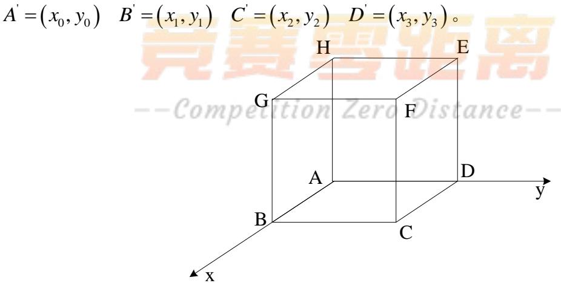  
图 15 视频中直杆底座  
根据透视变换公式，计算出A,B,C,D经过透视变换的坐标A， $B , C , D ^ { ' }$

$$
{ \left[ \begin{array} { l } { x _ { 0 } } \\ { x _ { 1 } } \\ { x _ { 2 } } \\ { x _ { 3 } } \end{array} \right] } = { \left[ \begin{array} { l } { c _ { 3 1 } } \\ { c _ { 1 1 } + c _ { 3 1 } - c _ { 1 3 } x _ { 1 } } \\ { c _ { 1 1 } + c _ { 2 1 } + c _ { 3 1 } - c _ { 1 3 } x _ { 2 } - c _ { 2 3 } x _ { 2 } } \\ { c _ { 2 1 } + c _ { 3 1 } - c _ { 2 3 } x _ { 3 } } \end{array} \right] } \quad { \left[ \begin{array} { l } { y _ { 0 } } \\ { y _ { 1 } } \\ { y _ { 2 } } \\ { y _ { 2 } } \\ { y _ { 3 } } \end{array} \right] } = { \left[ \begin{array} { l } { c _ { 3 2 } } \\ { c _ { 1 2 } + c _ { 3 2 } - c _ { 1 3 } y _ { 1 } } \\ { c _ { 1 2 } + c _ { 2 2 } + c _ { 3 2 } - c _ { 2 3 } y _ { 2 } - c _ { 2 3 } y _ { 2 } } \\ { c _ { 2 2 } + c _ { 3 2 } - c _ { 2 3 } y _ { 3 } } \end{array} \right] }
$$

## 8.1.5 计算透视变换矩阵

定义6个辅助变量有：

$$
\begin{array} { r l } & { \left[ \Delta x _ { 1 } \right] = \left[ \begin{array} { l } { x _ { 1 } - x _ { 2 } } \\ { x _ { 3 } - x _ { 2 } } \\ { x _ { 0 } - x _ { 1 } + x _ { 2 } - x _ { 3 } } \end{array} \right] ~ \left[ \begin{array} { l } { \Delta y _ { 1 } } \\ { \Delta y _ { 2 } } \\ { \Delta y _ { 3 } } \end{array} \right] = \left[ \begin{array} { l } { y _ { 1 } - y _ { 2 } } \\ { y _ { 3 } - y _ { 2 } } \\ { y _ { 0 } - y _ { 1 } + y _ { 2 } - y _ { 3 } } \end{array} \right] } \end{array}
$$

从而得到透视变换矩阵有：

$$
\begin{array} { r l } & { \left[ { \begin{array} { l } { c _ { 1 1 } } \\ { c _ { 2 1 } } \\ { c _ { 3 1 } } \\ { c _ { 3 1 } } \\ { c _ { 1 2 } } \\ { c _ { 2 2 } } \\ { c _ { 3 2 } } \end{array} } \right] = \left[ { \begin{array} { l } { x _ { 1 } - x _ { 0 } + c _ { 1 2 } x _ { 1 } } \\ { x _ { 3 } - x _ { 0 } + c _ { 1 2 } x _ { 2 } } \\ { x _ { 0 } } \\ { y _ { 1 } - y _ { 0 } + c _ { 1 3 } y _ { 1 } } \\ { y _ { 3 } - y _ { 0 } + c _ { 2 3 } y _ { 3 } } \\ { y _ { 0 } } \end{array} } \right] } \end{array}
$$

$$
c _ { 1 3 } = { \frac { \displaystyle { \bigg | } \Delta x _ { 3 } ~ \Delta x _ { 2 } { \bigg | } } { \displaystyle { \bigg | } \Delta y _ { 3 } ~ \Delta y _ { 2 } { \bigg | } } } \quad c _ { 1 2 } = { \frac { \displaystyle { \bigg | } \Delta y _ { 1 } ~ \Delta y _ { 3 } { \bigg | } } { \displaystyle { \bigg | } \Delta x _ { 1 } ~ \Delta x _ { 2 } { \bigg | } } }
$$

利用MATLAB软件编程（源程序见附录10）对图片处理过程如下图：

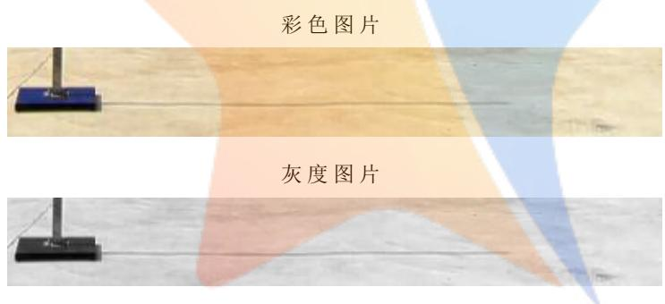

二值图片  


二值降噪图片  
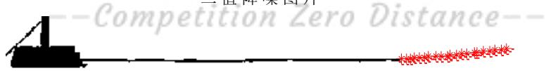  
图 16 预处理过程

## 8.2 模型的建立

## (1) 确定目标函数

目标函数：影长差值平方最小

求出每个时刻影长与附件1中对应时刻影长差值平方和最小；

$$
\operatorname* { m i n } \Delta \beta _ { b } = \sum _ { i = 1 } ^ { 2 1 } \left( l _ { i } - l _ { b i } \right) ^ { 2 }
$$

综上所述，建立的单目标优化模型为：

$$
\operatorname* { m i n } { \Delta l _ { b } } = \sum _ { i = 1 } ^ { 2 1 } \left( l _ { i } - l _ { b i } \right) ^ { 2 }
$$

$$
s . t \left\{ { l _ { i } = f \left( { \theta , \mathscr { S } , d , t , h } \right) } \atop { - 1 8 0 ^ { \circ } \leq \mathscr { S } \leq 1 8 0 ^ { \circ } } \right.
$$

## 8.3 模型的求解

## 8.3.1 拍摄地点的求解

根据上述建立的单目标最优化模型，建立求解算法，具体步骤如下：

Step1：将附件4中提取的20组影长和时刻、日期带入直杆影长变化方程中，得到含有20个方程式的超定方程组；

Step2：使用MA TL的 f mincon的内置函数工具箱，函数形如$\Delta l = f \operatorname* { m i n } c o n ( \vartheta , \theta , h )$ ，使得函数值尽可能的小；

Step3：以第一问中的天安门广场的直杆作为 f min con函数计算初始值，即杆高3米，经纬度为 $3 9 ^ { 0 } 5 4 2 6 ^ { \cdot } N , 1 1 6 ^ { 0 } 2 3 2 9 ^ { \cdot } E$ 作为初始值；

Step4：f min con 计算一次函数得到 20 组影长，与附件中的对应的 21 组影长做差，差值Δl最小时该组经纬度可能为直杆所在地点。

根据上述步骤，利用MATLAB软件编程（源程序见附录）求解，得到附件4中直杆的地理位置处于（东经 ${ 1 0 9 } ^ { \circ } ,$ 北纬40.1°）。

## 8.4 结果分析

将图片所提取的影长与运用单目标最优化模型求得地点的影长相对比，绘出关系图如下：

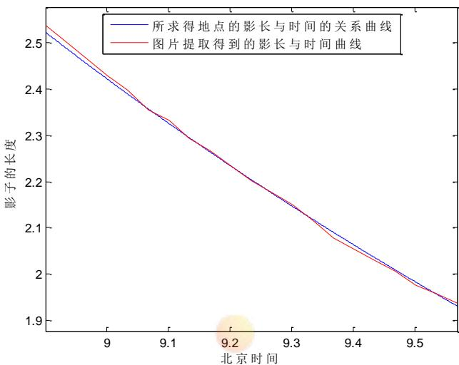  
图17 提取的影长与求解影长关系

由上图可得，图片所提取的影长与运用单目标最优化模型求得地点的影长相关系数相当接近，因此，可验证上述建立的单目标优化模型是合理的。由于直杆的地理位置处于（东经109°，北纬40.1°），利用地图对经纬度查询得到具体地理位置处于内蒙古附近。

## 8.5 拍摄地点与日期模型建立

运用问题三的模型对拍摄地点与日期进行求解。

运用拟牛顿法对拍摄地点与日期模型进行求解，得到拍摄地点与日期为运用拟牛顿法得出拍摄地点为 $\left( 1 1 0 ^ { 0 } 6 ^ { : } E , 3 9 ^ { 0 } 3 6 ^ { : } N \right)$ 和日期为2015年7月19日。

## 8.6 杆高敏感度分析

由于题目中所给杆高是一个估计值，而在模型计算时没有考虑到误差，所以针对杆高做敏感性分析。

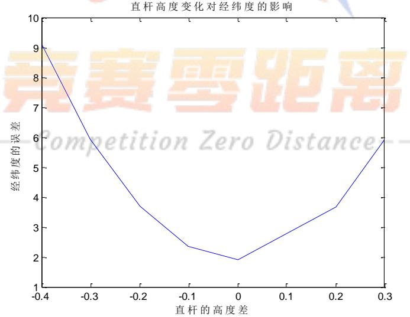  
图18 直杆位置变化

在此，使杆高在1 $. 6 m \leq h \leq 2 . 3 m$ 变化，通过观察上图可得直杆位置变化较明显。

## 9 模型的评价、改进及推广

## 9.1 模型的评价

## 9.1.1 模型的优点

1.问题一中所建立的影子长度变化的模型，选取直杆所在经度、纬度、日期、时刻及杆长五个因素为影响影子长度变化的参数，能够较全面的分析影子长度变化的规律。

2. 问题二中运用最小二乘法所建立的单目标模型，其实质为非线性的优化模型，故在求解中选择较为稳定的值，给出两个可能地点。

3. 问题二中运用的拟牛顿算法，具有收敛速度快、算法稳定性强、编写程序容易的优势。

4. 问题三中的工人鱼群算法具有克服局部极值，取得全局极值的能力，其收敛速度快、简单易实现、且适用灵活。

## 9.1.2 模型的缺点

1. 问题一中运用单因素敏感性分析法对各个参数对影长影响率进行分析，但此方法是不全面的，单因素敏感性分析在计算时，可能会有两个或两个以上的不确定因素在同时变动，此时单因素敏感性分析就很难准确反映各个参数对影长影响率的状况。

2. 附件1-3中都给出了坐标顶点数据，而本文所建立的模型中直接使用影长，将导致一些有效数据的丢失，对计算结果产生误差。

## 9.2 模型的改进

由于单因素敏感性分析几个不确定因素同时变动，应考虑进行多因素敏感性分析各个参数对影长影响率的敏感性。由于太阳赤纬角、太阳高度角等都为经验公式，故存在一定程度误差，可寻求更优的公式求解，减小误差对结果的影响大小。

## 9.3 模型的推广

本文所建立的模型不仅适用与太阳影子定位，还可拓展适用与诸多方面：如多目标优化模型可以广泛用于诸多优化问题，如车间的布局优化、键盘的优化设计、水资源配置的优化等petition ZeroDistance

## 10 参考文献

[1]24节气太阳垂直照射地球的纬度变化.http://www.jdwx.info/thread-459168-1-1.html. 2015年9月13日

[2] 黄湘.太阳能热发电技术.中国电力出版社.2013 年5 月.

[3] Solar Time http://www.pveducation.org/pvcdrom/properties-of-sunlight/solar-time

[4] 张建方. 关于误差的传递公式[J]. 数理统计与应用概率,1995,03:57-70.

[5]周伟军． 拟牛顿法及其收敛性[D].湖南大学,2006.

[6]地球在线.http://www.earthol.com/

[7]林根石． 利用太阳视坐标的计算进行物高测量与定位[J]. 南京林业大学学报

(自然科学版),1991,03:89-93.

[8] 史峰.MATLAB 智能算法.北京航空航天大学出版社. 2011 年7月

[9] 董璐．数字图像处理与识别系统的开发[D].东南大学,2004

[10]加泰罗尼亚．Canny边缘检测算法原理及其VC实现详解（一）.http://blog.csdn.net/likezhaobin/article/details/6892176.2015年9月13日

[11]何援军．透视和透视投影变换一一论图形变换和投影的若干问题之三[J].计算机辅助设计与图形学学报,2005,04:734-739.

## 11 附录

附录1：附件1-3实际影长
<table><tr><td rowspan=1 colspan=2>附件1</td><td rowspan=1 colspan=2>附件2</td><td rowspan=1 colspan=2>附件3</td></tr><tr><td rowspan=1 colspan=1>北京时间</td><td rowspan=1 colspan=1>影长</td><td rowspan=1 colspan=1>北京时间</td><td rowspan=1 colspan=1>影长</td><td rowspan=1 colspan=1>北京时间</td><td rowspan=1 colspan=1>影长</td></tr><tr><td rowspan=1 colspan=1>14:42</td><td rowspan=1 colspan=1>1.14962583</td><td rowspan=1 colspan=1>12:41</td><td rowspan=1 colspan=1>1.247256</td><td rowspan=1 colspan=1>13:09</td><td rowspan=1 colspan=1>3.533142</td></tr><tr><td rowspan=1 colspan=1>14:45</td><td rowspan=1 colspan=1>1.18219898</td><td rowspan=1 colspan=1>12:44</td><td rowspan=1 colspan=1>1.222795</td><td rowspan=1 colspan=1>13:12</td><td rowspan=1 colspan=1>3.546768</td></tr><tr><td rowspan=1 colspan=1>14:48</td><td rowspan=1 colspan=1>1.21529696</td><td rowspan=1 colspan=1>12:47</td><td rowspan=1 colspan=1>1.198921</td><td rowspan=1 colspan=1>13:15</td><td rowspan=1 colspan=1>3.561798</td></tr><tr><td rowspan=1 colspan=1>14:51</td><td rowspan=1 colspan=1>1.24905105</td><td rowspan=1 colspan=1>12:50</td><td rowspan=1 colspan=1>1.175429</td><td rowspan=1 colspan=1>13:18</td><td rowspan=1 colspan=1>3.578101</td></tr><tr><td rowspan=1 colspan=1>14:54</td><td rowspan=1 colspan=1>1.28319534</td><td rowspan=1 colspan=1>12:53</td><td rowspan=1 colspan=1>1.15244</td><td rowspan=1 colspan=1>13:21</td><td rowspan=1 colspan=1>3.595751</td></tr><tr><td rowspan=1 colspan=1>14:57</td><td rowspan=1 colspan=1>1.31799315</td><td rowspan=1 colspan=1>12:56</td><td rowspan=1 colspan=1>1.129917</td><td rowspan=1 colspan=1>13:24</td><td rowspan=1 colspan=1>3.614934</td></tr><tr><td rowspan=1 colspan=1>15:00</td><td rowspan=1 colspan=1>1.35336405</td><td rowspan=1 colspan=1>12:59</td><td rowspan=1 colspan=1>1.107835</td><td rowspan=1 colspan=1>13:27</td><td rowspan=1 colspan=1>3.635426</td></tr><tr><td rowspan=1 colspan=1>15:03</td><td rowspan=1 colspan=1>1.38938709</td><td rowspan=1 colspan=1>13:02</td><td rowspan=1 colspan=1>1.086254</td><td rowspan=1 colspan=1>13:30</td><td rowspan=1 colspan=1>3.657218</td></tr><tr><td rowspan=1 colspan=1>15:06</td><td rowspan=1 colspan=1>1.42615286</td><td rowspan=1 colspan=1>13:05</td><td rowspan=1 colspan=1>1.065081</td><td rowspan=1 colspan=1>13:33</td><td rowspan=1 colspan=1>3.680541</td></tr><tr><td rowspan=1 colspan=1>15:09</td><td rowspan=1 colspan=1>1.46339985</td><td rowspan=1 colspan=1>13:08</td><td rowspan=1 colspan=1>1.044446</td><td rowspan=1 colspan=1>13:36</td><td rowspan=1 colspan=1>3.705168</td></tr><tr><td rowspan=1 colspan=1>15:12</td><td rowspan=1 colspan=1>1.50148162</td><td rowspan=1 colspan=1>13:11</td><td rowspan=1 colspan=1>1.024264</td><td rowspan=1 colspan=1>13:39</td><td rowspan=1 colspan=1>3.731278</td></tr><tr><td rowspan=1 colspan=1>15:15</td><td rowspan=1 colspan=1>1.54023182</td><td rowspan=1 colspan=1>13:14</td><td rowspan=1 colspan=1>1.00464</td><td rowspan=1 colspan=1>13:42</td><td rowspan=1 colspan=1>3.758918</td></tr><tr><td rowspan=1 colspan=1>15:18</td><td rowspan=1 colspan=1>1.57985332</td><td rowspan=1 colspan=1>13:17</td><td rowspan=1 colspan=1>0.985491</td><td rowspan=1 colspan=1>13:45</td><td rowspan=1 colspan=1>3.788088</td></tr><tr><td rowspan=1 colspan=1>15:21</td><td rowspan=1 colspan=1>1.62014452</td><td rowspan=1 colspan=1>13:20</td><td rowspan=1 colspan=1>0.96679</td><td rowspan=1 colspan=1>13:48</td><td rowspan=1 colspan=1>3.818701</td></tr><tr><td rowspan=1 colspan=1>15:24</td><td rowspan=1 colspan=1>1.66127061</td><td rowspan=1 colspan=1>13:23</td><td rowspan=1 colspan=1>0.948585</td><td rowspan=1 colspan=1>13:51</td><td rowspan=1 colspan=1>3.85081</td></tr><tr><td rowspan=1 colspan=1>15:27</td><td rowspan=1 colspan=1>1.70329063</td><td rowspan=1 colspan=1>13:26</td><td rowspan=1 colspan=1>0.930928</td><td rowspan=1 colspan=1>13:54</td><td rowspan=1 colspan=1>3.884585</td></tr><tr><td rowspan=1 colspan=1>15:30</td><td rowspan=1 colspan=1>1.74620591</td><td rowspan=1 colspan=1>13:29</td><td rowspan=1 colspan=1>0.913752</td><td rowspan=1 colspan=1>13:57</td><td rowspan=1 colspan=1>3.919912</td></tr><tr><td rowspan=1 colspan=1>15:33</td><td rowspan=1 colspan=1>1.79005092</td><td rowspan=1 colspan=1>13:32</td><td rowspan=1 colspan=1>0.897109</td><td rowspan=1 colspan=1>14:00</td><td rowspan=1 colspan=1>3.956876</td></tr><tr><td rowspan=1 colspan=1>15:36</td><td rowspan=1 colspan=1>1.83501427</td><td rowspan=1 colspan=1>13:35</td><td rowspan=1 colspan=1>0.880974</td><td rowspan=1 colspan=1>14:03</td><td rowspan=1 colspan=1>3.995535</td></tr><tr><td rowspan=1 colspan=1>15:39</td><td rowspan=1 colspan=1>1.880875</td><td rowspan=1 colspan=1>13:38</td><td rowspan=1 colspan=1>0.865492</td><td rowspan=1 colspan=1>14:06</td><td rowspan=1 colspan=1>4.035751</td></tr><tr><td rowspan=1 colspan=1>15:42</td><td rowspan=1 colspan=1>1.92791845</td><td rowspan=1 colspan=1>13:41</td><td rowspan=1 colspan=1>0.850504</td><td rowspan=1 colspan=1>14:09</td><td rowspan=1 colspan=1>4.077863</td></tr></table>

Competition Zero Distance--

附录2：角度变化
<table><tr><td colspan="2" rowspan="1">角度变化</td></tr><tr><td colspan="1" rowspan="1">0.455535</td><td colspan="1" rowspan="1">0.343812</td></tr><tr><td colspan="1" rowspan="1">0.440947</td><td colspan="1" rowspan="1">0.330544</td></tr><tr><td colspan="1" rowspan="1">0.424696</td><td colspan="1" rowspan="1">0.326406</td></tr><tr><td colspan="1" rowspan="1">0.413645</td><td colspan="1" rowspan="1">0.316915</td></tr><tr><td colspan="1" rowspan="1">0.398599</td><td colspan="1" rowspan="1">0.311967</td></tr><tr><td colspan="1" rowspan="1">0.391943</td><td colspan="1" rowspan="1">0.306906</td></tr><tr><td colspan="1" rowspan="1">0.37772</td><td colspan="1" rowspan="1">0.298737</td></tr><tr><td colspan="1" rowspan="1">0.365601</td><td colspan="1" rowspan="1">0.292755</td></tr><tr><td colspan="1" rowspan="1">0.358179</td><td colspan="1" rowspan="1">0.287602</td></tr><tr><td>0.34811</td><td>0.28526</td></tr></table>

附录三clear;clc;t = sym('t');fai=[39,54,26];seita=[116,23,29];date='10/22';h=3;%% 日期的处理及赤纬角的计算d=datenum(date,'mm/dd');d0=datenum('1/1','mm/dd');n=d-d0+1; %n为一年中日期的序号delta=23.45\*sind(360\*(284+n)/365);delta=delta\*pi/180;%% 时间的处理及时角的计算seita=dms2degrees(seita);t0=(t-(120-seita)\*4/60); % t0 为当地时间omega=15\*(abs(t0)-12); % omega 为时角omega=omega\*pi/180;%% 求解高度角fai=dms2degrees(fai);fai=fai\*pi/180;hd=sin(fai)\*sin(delta)+cos(fai)\*cos(delta)\*cos(omega);alfa=asin(hd);L=h/tan(alfa);%% 求出最低点的坐标fun=matlabFunction(L,'vars',t);[X,Y]=fminsearch(fun,9,15);克赛零距离 %subplot(1,2,1);ezplot(L,[9,15]);xlabel (北京时间');ylabel ('影子的长度');hold onaxis([9 15 3 8])% %% 误差检验% x=[7,7.5,8,8.5,9,9.5,10,10.5,11,11.5,12,12.5,13,13.5,14,14.5,15,15.5,16,16.5,17];%y=[38.75,17.35,11.21,8.29,6.59,5.5,4.76,4.25,3.92,3.73,3.67,3.74,3.94,4.28,4.8,5.56,6.68,8.43,11.47,17.99,42.12];% plot(x,y-0.4,'r-'); %画出数据图% plot(x,y+1.2,'r-'); %画出数据图% legend('MATLAB 计算得到的曲线','误差域');

% title('天安门广场太阳影长 9 点到 15 点变化率曲线');

% t 为北京时间

% fai 为纬度

% seita 为经度

% date 为一年中日期的序号

% t0 为当地时间% omega 为时角

% seita 为经度

% date 为一年中日期的序号

% h 为杆长

title('太阳影长与日期的关系');

```matlab
11=diff(L1, date);
ezplot(11,[1,365]);
title('日期对太阳影长的影响率);
xlabel ('日期的变化');
ylabel ('太阳影长的变化率');
date=1:365;
lv=eval(11);
d=['03/20';'03/21';'06/21';'06/22';'09/22';'09/23';'12/21';'12/22'];
d0=datenum('1/1','mm/dd');
for i=1:size(d,1)
day(i)=datenum(d(i,:),'mm/dd');
n=day-d0+1; % n为一年中日期的序号
end
dlv=lv(n);
%% 求出太阳影长与直杆长度的关系
figure(2);
subplot(2,2,1);
t = 12; % t 为北京时间
fai = 39; % fai 为纬度
seita = 116; % seita 为经度
date = 295; % date 为一年中日期的序号
h= sym('h'); % h 为杆长
L2=subs(L);
ezplot(L2,[0,10]);
title('太阳影长与直杆长度的关系');
xlabel ('直杆的长度');
ylabel ('影子的长度');
% 直杆长度的变化对太阳影长的影响率
figure(3);
subplot(2,2,1);
12=diff(L2, h);
eelt 度的变化对太阳影长的影响率); xlabel ('直杆的长度的变化长度'); 距离
ylabel ('太阳影长的变化率);
%%求出太阳影长与经度的的关系onZeroDistance--
figure(2);
subplot(2,2,2);
t = 12; % t 为北京时间
fai = 39; % fai 为纬度
seita = sym('seita'); % seita 为经度
date = 295; % date 为一年中日期的序号
h= 3; % h 为杆长
L3=subs(L);
ezplot(L3,[60,180]);
title('太阳影长与经度的关系');
xlabel ('经度:60°E- 180°E');
```

ylabel ('影子的长度');

% 经度对太阳影长的影响率

figure(3);

subplot(2,2,2);

13=diff(L3, seita);

ezplot(13,[60,180]);

title('经度对太阳影长的影响率');

xlabel ('经度的变化');

ylabel ('太阳影长的变化率);

%% 求出太阳影长与纬度的的关系

figure(2);

subplot(2,2,3);

fai = sym(fai');

seita = 116;

% t 为北京时间% fai 为纬度% seita 为经度% date 为一年中日期的序号% h 为杆长

ezplot(L4,[-30,30]);

title('太阳影长与纬度的关系');

xlabel ('纬度：30°S-30°N');

ylabel ('影子的长度');

% 纬度对太阳影长的影响率

figure(3);

subplot(2,2,3);

14=diff(L4, fai);

ezplot(14,[-30,30]);

title('纬度对太阳影长的影响率');

xlabel (纬度的变化');

ylabel ('太阳影长的变化率');

%% 求出太阳影长与时间的的关系

subplot(2,2,4);

ezplot(L5,[8.5,16.5]);

title('太阳影长与时间的关系');

xlabel (一天内的时刻');

ylabel ('影子的长度');

% 一天中时间变化对太阳影长的影响率

figure(3);

subplot(2,2,4);

```matlab
15=diff(L5, t);
ezplot(15,[8.5,16.5]);
title('一天中时间变化对太阳影长的影响率');
xlabel (一天中时间变化');
ylabel ('太阳影长的变化率);
附录五
clear;
clc;
[a,b,c]=xlsread('附件 1-3.xls','附件 1','A4:C24');
[~,~,n]=xlsread('附件 1-3.xls','附件 1','A2');
%%根据数据拟合出曲线
x=a(:,1);
y=a(:,2);
plot(x,y);
p = polyfit(x, y,2);
y1= polyval(p,x);
plot(x,y,'*r',x,y1,'-b');
legend('题目所给影端的位置,拟合得到的影端曲线');
title(太阳影长变化曲线');
xlabel ('横坐标 X(米)');
ylabel ('纵坐标 Y(米)');
%% 计算出影长
1=sqrt(x.^2+y.^2);
for i=1:length(c)
T{i}=datevec(c {i,1 },'HH:MM:SS');
t(i,1)=T{i}(4)+T{i}(5)/60+T{i}(6)/3600;
end
%% 日期的处理
d=datenum(n,'yy/mm/dd');
d0=datenum('2015/1/1','yy/mm/dd');
date=d-d0+1; % n为一年中日期的序号
CA 1213赛零距离 CAL=zeros(21,2);
e0=zeros(1,2);
H=zeros(1,2); -Competition ZeroDistance
FAI=zeros(1,2);
SEITA=zeros(1,2);
for h=1:10
for fai=0:0.6:60
for seita=15:0.6:150
cal = (h.*(1 - (sin((469.*pi.*sin((2.*pi.*(date + 284))./365))./3600)...
.*sin((pi.*fai)./180) + cos((pi.*fai)./180).*..
cos((pi.*(15.*abs(seita./15 + t - 8) - 180))./180).*...
cos((469.*pi.*sin((2.*pi.*(date 十
284))./365))./3600)).^2).^(1./2))..
(sin((469.*pi.*sin((2.*pi.*(date +
284))./365))./3600).*sin((pi.*fai)./180) +...
```

```matlab
cos((pi.*fai)./180).*cos((pi.*(15.*abs(seita./15 + t - 8)
180))./180).*...
cos((469.*pi.*sin((2.*pi.*(date + 284))./365))./3600));
error = sum(abs(cal-1)./1)/length(1);
if error<0.002
CAL(:,m)=cal;
e0(m)=error;
H(m)=h;
FAI(m)=fai;
SEITA(m)=seita;
m=m+1;
end
end
end
end
%% 检验所求得经纬度下影长与实际影长的关系
global L;
% 第一个点
T=t;
figure(2);
subplot(1,2,1)
seita=SEITA(1);
fai=FAI(1);
h=H(1);
t=sym('t');
L1=subs(L);
for i=1:21
t=T(i);
11(i)=eval(L1);
end
stem(T,11-1')
title('A 地所求影子长度的差值');
xlabel (北京时间');
ylabel ('差值'); 赛雷距离
% ezplot(L1,[T(1),T(21)]);
% title('东经109.2°北纬19.2°点太阳影长与北京时间的关系')
% xlabel (北京时间)ompetition ZeroDistance-
% ylabel ('影子的长度');
% hold on
% plot(T,1,'r');
% legend('所求得地点的影长与时间的关系曲线','题目数据拟合出的影长与时间
曲线',0);
% t=T;
% xi=14.7:0.05:15.7;
% yi=interp1(t,eval(L),xi, 'spline');
% alfa=atan(h./yi);
% alfa=alfa.*180./pi;
% 第二个点
subplot(1,2,2);
```

title('B地所求影子长度的差值');

xlabel ('北京时间');

ylabel (差值');

% ezplot(L2,[T(1),T(21)]);

% title('东经 95.4°北纬 25.2°点太阳影长与北京时间的关系);

% xlabel (北京时间');

% ylabel (影子的长度');

% hold on

% plot(T,1,'r');

% legend('所求得地点的影长与时间的关系曲线','题目数据拟合出的影长与时间曲线',0);

% xi=14.7:0.05:15.7;

% t=T;

% yi=interp1(t,eval(L),xi, 'spline');

% alfa=atan(h./yi);

% alfa=alfa.\*180./pi;

## 附录6:

<table><tr><td rowspan=2 colspan=1>观测物影长</td><td rowspan=2 colspan=1>观测瞬时间</td><td rowspan=1 colspan=3>用本算法求算出的</td><td rowspan=2 colspan=1>建筑物实际高度</td><td rowspan=2 colspan=1>已知经度</td><td rowspan=2 colspan=1>已知纬度</td></tr><tr><td rowspan=1 colspan=1>建筑物高</td><td rowspan=1 colspan=1>经度</td><td rowspan=1 colspan=1>纬度</td></tr><tr><td rowspan=1 colspan=1>11.53</td><td rowspan=1 colspan=1>9：50</td><td rowspan=1 colspan=1>17.62</td><td rowspan=1 colspan=1>118°46.5&#x27;</td><td rowspan=1 colspan=1>32°01.5</td><td rowspan=1 colspan=1>17.60</td><td rowspan=1 colspan=1>118°46′</td><td rowspan=1 colspan=1>32°03&#x27;</td></tr><tr><td rowspan=1 colspan=1>13.38</td><td rowspan=1 colspan=1>9:30</td><td rowspan=1 colspan=1>17.58</td><td rowspan=1 colspan=1></td><td rowspan=1 colspan=1></td><td rowspan=1 colspan=1>17.60</td><td rowspan=1 colspan=1></td><td rowspan=1 colspan=1></td></tr><tr><td rowspan=1 colspan=1>14.41</td><td rowspan=1 colspan=1>9：20</td><td rowspan=1 colspan=1>17.58</td><td rowspan=1 colspan=1>Δλ=+0.5′</td><td rowspan=1 colspan=1>∆φ=-1.5&#x27;</td><td rowspan=1 colspan=1>17.60</td><td rowspan=1 colspan=1></td><td rowspan=1 colspan=1></td></tr><tr><td rowspan=1 colspan=1>24.30</td><td rowspan=1 colspan=1>8：10</td><td rowspan=1 colspan=1>17.60</td><td rowspan=1 colspan=1>etition</td><td rowspan=1 colspan=1></td><td rowspan=1 colspan=1>17.60</td><td rowspan=1 colspan=1></td><td rowspan=1 colspan=1></td></tr><tr><td rowspan=1 colspan=1>26.30</td><td rowspan=1 colspan=1>8：00</td><td rowspan=1 colspan=1>17.60</td><td rowspan=1 colspan=1></td><td rowspan=1 colspan=1></td><td rowspan=1 colspan=1>17.60</td><td rowspan=1 colspan=1></td><td rowspan=1 colspan=1></td></tr></table>

附录七

clear;

clc;

1=[11.53,13.38,14.41,24.30,26.30]';

```matlab
'8:10';
'8:00'];
n='1990/5/8';
T=datevec(t,'HH:MM');
t=T(:,4)+T(:,5)./60+T(:,6)./3600;
d=datenum(n,'yy/mm/dd');
d0=datenum('1990/1/1','yy/mm/dd');
date=d-d0+1; % n为一年中日期的序号
%% 寻找经纬度
e0=inf;
for h=1:0.4:20
for fai=0:60
for seita=15:150
cal = (h.*(1 - (sin((469.*pi.*sin((2.*pi.*(date + 284))./365))./3600)...
.*sin((pi.*fai)./180) + cos((pi.*fai)./180).*.
cos((pi.*(15.*abs(seita./15 + t - 8) - 180))./180).*...
cos((469.*pi.*sin((2.*pi.*(date 十
284))./365))./3600)).^2).^(1./2))..
(sin((469.*pi.*sin((2.*pi.*(date 十
284))./365))./3600).*sin((pi.*fai)./180) +...
cos((pi.*fai)./180).*cos((pi.*(15.*abs(seita./15 + t - 8)
180))./180).*...
cos((469.*pi.*sin((2.*pi.*(date + 284))./365))./3600));
error = sum(abs(cal-1)./1)/length(l);
if error<e0
CAL=cal;
e0=error;
H=h;
FAI=fai;
SEITA=seita;
DATE=date;
end
end
end 竞赛零距离
end
附录八
附录九
-Competition Zero Distance--
clear;
clc;
[a,b,c]=xlsread(附件 1-3.xls','附件 2','A4:C24');
%%根据数据拟合出曲线
%附件二
x1=a(:,1);
y1=a(:,2);
plot(x1,y1);
p = polyfit(x1,y1,2);
y1= polyval(p,x1);
plot(x1,y1,'*r',x1,y1,'-b');
legend('题目所给影端的位置','拟合得到的影端曲线');
```

```matlab
title('太阳影长变化曲线');
xlabel ('横坐标 X(米)');
ylabel ('纵坐标 Y(米)');
% 计算出影长与时间
11=sqrt(x1.^2+y1.^2);
for i=1:length(c)
T1 {i}=datevec(c {i,1 },'HH:MM:SS');
t1(i,1)=T1 {i}(4)+T1 {i}(5)/60+T1 {i}(6)/3600;
end
T1=t1;
figure(2);
% 时间与影长的拟合
p=polyfit(t1,11,2);
y1=polyval(p,t1);%命令 polyval多项式函数的预测值
t1=sym('t1');
z1=eval(sym('0.0982*t1^2-2.9856*t1+23.3233'));
% 求出最低点的坐标
fun=matlabFunction(z1,'vars',t1);
[X1,Y1]=fminsearch(fun,7,22);
s=120-15*(X1-12);
t=T1;
e0=inf;
for h=1:5
for fai=0:60
for date=1:365
for seita=s:s+10
cal (h.*(1 (sin((469.*pi.*sin((2.*pi.*(date 十
284))./365))./3600)...
.*sin((pi.*fai)./180) + cos((pi.*fai)./180).*.
cos((pi.*(15.*abs(seita./15 + t - 8) - 180))./180).*..
cos((469.*pi.*sin((2.*pi.*(date 十
284))./365))./3600)).^2).^(1./2))./..
(sin((469.*pi.*sin((2.*pi.*(date 十
284))./365))./3600).*sin((pi.*fai)./180)+... X
cos((pi.*fai)./180).*cos((pi.*(15.*abs(seita./15 + t - 8) -
180))./180).*...
C0cos((469.*pi.*sin((2.*pi.*(date + 284))./365))./3600));
error = sum(abs(cal-11)./11)/length(11);
if error<e0
CAL=cal;
e0=error;
H=h;
FAI=fai;
DATE=date;
SEITA=seita;
end
end
end
end
```

```matlab
end
global L;
seita=SEITA;
date=DATE;
fai=FAI;
h=H;
t=sym('t');
L1=subs(L);
ezplot(L1,[T1(1),T1(21)]);
title('东经78.9°北纬41°点太阳影长与北京时间的关系');
xlabel ('北京时间');
ylabel ('影子的长度);
hold on
plot(T1,11,'r');
clear;
clc;
[d,e,f]=xlsread('附件 1-3.xls','附件 3','A4:C24');
%% 根据数据拟合出曲线
%附件二
x2=d(:,1);
y2=d(:,2);
plot(x2,y2);
p = polyfit(x2,y2,2);
y2= polyval(p,x2);
plot(x2,y2,'*r',x2,y2,'-b');
legend('题目所给影端的位置','拟合得到的影端曲线');
title('太阳影长变化曲线');
xlabel ('横坐标 X(米)');
ylabel ('纵坐标 Y(米)');
% 计算出影长与时间
12=sqrt(x2.^2+y2.^2);
for i=1:length(f)
end
T =t(2); Competition Zero Distance
% 时间与影长的拟合
p=polyfit(t2,12,2);
y2=polyval(p,t2);%命令 polyval多项式函数的预测值
t2=sym('t2');
z2=eval(sym('0.2962*t2^2-7.5445*t2+51.5213'));
% 求出最低点的坐标
fun=matlabFunction(z2,'vars',t2);
[X2,Y2]=fminsearch(fun,7,22);
s=120-15*(X2-12);
t=T2;
e0=inf;
```

```matlab
for h=1:5
for fai=0:60
for date=1:365
for seita=s:s+10
cal 二 (h.*(1 (sin((469.*pi.*sin((2.*pi.*(date 十
284))./365))./3600)..
.*sin((pi.*fai)./180) + cos((pi.*fai)./180).*...
cos((pi.*(15.*abs(seita./15 + t - 8) - 180))./180).*...
cos((469.*pi.*sin((2.*pi.*(date 十
284))./365))./3600)).^2).^(1./2))..
(sin((469.*pi.*sin((2.*pi.*(date 十
284))./365))./3600).*sin((pi.*fai)./180) +...
cos((pi.*fai)./180).*cos((pi.*(15.*abs(seita./15 + t - 8)-
180))./180).*...
cos((469.*pi.*sin((2.*pi.*(date + 284))./365))./3600));
error = sum(abs(cal-12)./12)/length(12);
if error<e0
CAL=cal;
e0=error;
H=h;
FAI=fai;
DATE=date;
SEITA=seita;
end
end
end
end
end
global L;
seita=SEITA;
date=DATE;
fai=FAI;
h=H;
ezplot(L2,[T2(1),T2(21)]); 赛零距离
title('东经109.9°北纬28°点太阳影长与北京时间的关系');
xlabel (北京时间');Competition Zero Distance
ylabel (影子的长度');
hold on
plot(T2,12,'r');
附录十
clear;
clc;
fileName = 'Appendix4.avi';
obj = VideoReader(fileName);
%% 从视频中提取出图片并计算出端点的像素坐标
n=0;
for i=1:3000:obj.NumberOfFrames
```

```matlab
n=n+1;
video{n} = read(obj, i); % first frame only 获取视频中的 21 帧图片
%figure,I=imsho w(video{n});
%saveas(I,strcat(num2str(n),'.jpg'));
end
for i=1:n
x0(i,:) = point(video {i});
end
%% 在图片上描出几个时刻影子的端点
last = read(obj, inf); % last frame only 获取视频中的最后一帧图片
b1 = last(810:930,800:1700,:);
subplot(5,1,1),imshow(b1);
title('彩色图片');
c1 = rgb2gray(b1);
subplot(5,1,2),imshow(c1);
title('灰度图片');
d1 = im2bw(c1,0.81);
subplot(5,1,3),imshow(d1);
title('二值图片');
[z,1] = bwlabel(~d1);
index = z==z(50,20);
d1(~index) = 1;
subplot(5,1,4),imshow(d1);
title('二值降噪图片');
subplot(5,1,5),imshow(d1);
title('影端点的轨迹');
hold on,plot(x0(:,2),x0(:,1),'r*');
%% 选取的点的时间
t=[ '8:54:06';
'8:56:06';
'8:58:06';
'9:00:06';
'9:02:0: '9:06:06'; 竞赛零距离
'9:08:06';
'9:10:06'; --Competition Zero Distance--
'9:12:06';
'9:14:06';
'9:16:06';
'9:18:06';
'9:20:06';
'9:22:06';
'9:24:06';
'9:26:06';
'9:28:06';
'9:30:06';
'9:32:06';
'9:34:06';
```

```matlab
];
T=datevec(t,'HH:MM:SS');
t=T(:,4)+T(:,5)./60+T(:,6)./3600;
%% 对图中直杆的长度处理
h=2;
b2 = last(200:900,760:980,:);
% figure,imshow(b2)
c2 = rgb2gray(b2);
figure,imsho w(c2)
hold on
x1=[133,8];
x2=[110,673];
x3=[127,273];
x4=[114,273];
plot(x1(1),x1(2),'r*');
plot(x2(1),x2(2),'y*');
plot(x3(1),x3(2),'b*');
plot(x4(1),x4(2),'g*');
g = sqrt(sum((x1-x3).^2)) + sqrt(sum((x2-x4).^2));
y1=[56,686];
y2=[158,686];
dz1 = sqrt(sum((y1-y2).^2));
dz=h/g*dz1;
%% 利用杆座进行坐标变换
B=[14,77;
121,76;
118,56;
19,57;
];
A=[14,75;
121,75;
121,-32;
14,-32;
]; 零距离
TForm = cp2tform(B,A,'projective');
X=tformfwd(TForm,[x0(:,2),x0(:,1)]);
dz2 = sqrt(sum((A(1,:)-A(2,:)).^2));
zb=X.*(dz/dz2); Competition ZeroDistance--
%% 根据数据拟合出曲线
figure(3);
x=zb(:,1);
y=zb(:,2);
plot(x,y);
p = polyfit(x,y,2);
y1= polyval(p,x);
plot(x,y,'*r',x,y1,'-b');
legend('图片提取得到的影端位置','拟合得到的影端曲线');
title('太阳影长变化曲线');
xlabel ('横坐标 X(米)');
```

```matlab
ylabel ('纵坐标 Y(米)');
%% 计算出影长
1=sqrt(x.^2+y.^2);
%% 日期的处理
n='2015/7/13';
d=datenum(n,'yy/mm/dd');
d0=datenum('2015/1/1','yy/mm/dd'):
date=d-d0+1; % n为一年中日期的序号
%% 寻找经纬度
% m=1;
% CAL=zeros(21,2);
% e0=zeros(1,2);
% H=zeros(1,2);
% FAI=zeros(1,2);
% SEITA=zeros(1,2);
e0=inf;
for fai=0:60
for seita=0:180
cal = (h.*(1 - (sin((469.*pi.*sin((2.*pi.*(date + 284))./365))./3600)..
.*sin((pi.*fai)./180) + cos((pi.*fai)./180).*.
cos((pi.*(15.*abs(seita./15 + t - 8) - 180))./180).*.
cos((469.*pi.*sin((2.*pi.*(date + 284))./365))./3600)).^2).^(1./2))./...
(sin((469.*pi.*sin((2.*pi.*(date +
284))./365))./3600).*sin((pi.*fai)./180) +...
cos((pi.*fai)./180).*cos((pi.*(15.*abs(seita./15 + t - 8) - 180))./180).*...
cos((469.*pi.*sin((2.*pi.*(date + 284))./365))./3600));
error = sum(abs(cal-1)./1)/length(1);
if error<e0
e0=error;
CAL=cal;
H=h;
FAI=fai;
SEITA=seita;
end 克赛零距离
end
end
global L; --Competition Zero Distance--
T=t;
figure(4);
seita=SEITA;
fai=FAI;
h=H;
t=sym('t');
L1=subs(L);
ezplot(L1,[T(1),T(21)]);
hold on
plot(T,1,'r');
title('太阳影长与北京时间的关系');
xlabel (北京时间');
```


ylabel ('影子的长度');

legend('所求得地点的影长与时间的关系曲线,'图片提取得到的影长与时间曲线',0);

gg=[1.6;1.7;1.7;1.7;1.8;1.8;1.8;1.9;1.9;2;2.2;2.2;2.3];

wd=[43;39;40;41;38;39;40;39;40;40;36;37;39];

jd=[101;103;103;103;105;105;105;107;107;109;112;112;114];

cz=sqrt((wd-fai).^2+(jd-seita).^2);

figure(5);

gc=gg-h;

%plot(gc,cz)

p = polyfit(gc,cz,2);

y1= polyval(p,gc);

plot(gc,y1,'-b');

title('直杆高度变化对经纬度的影响');

xlabel ('直杆的高度差');

ylabel ('经纬度的误差');

--Competition Zero Distance--