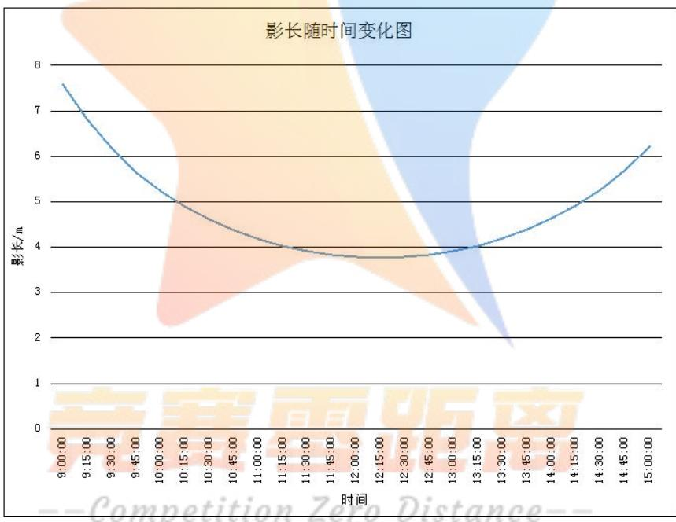
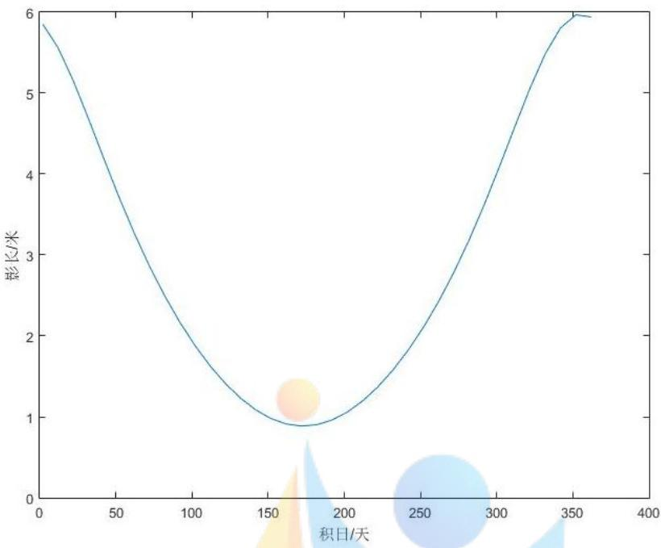
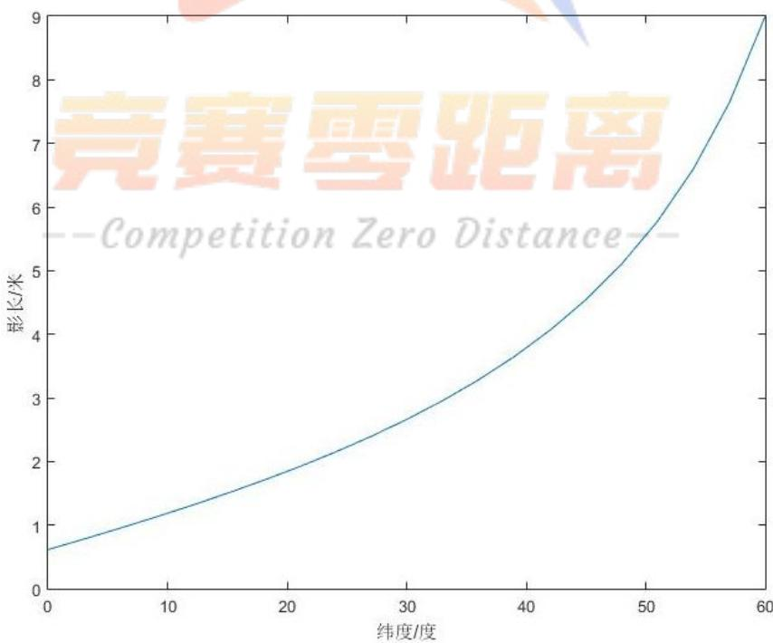
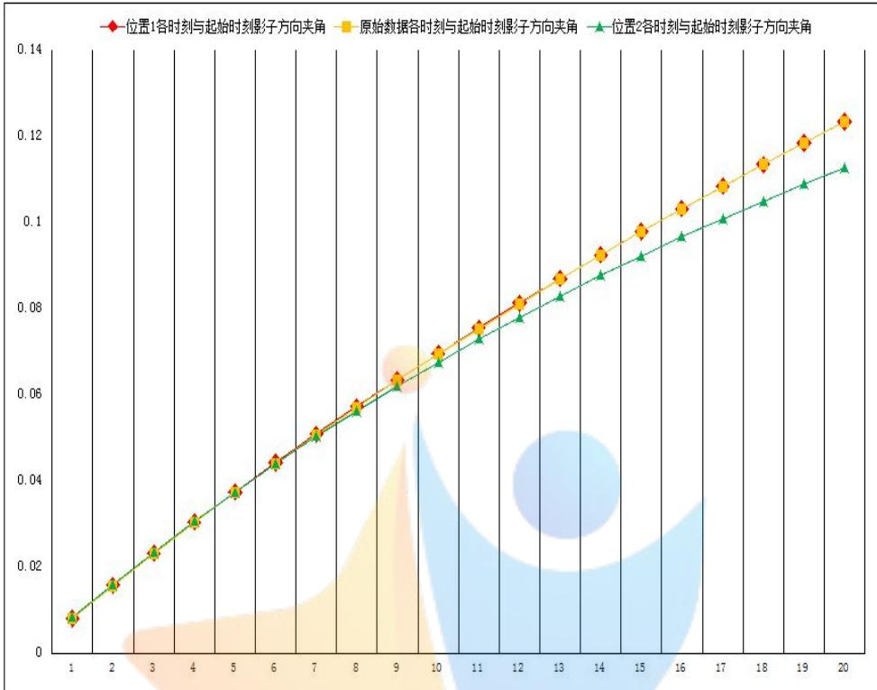

# 太阳影子定位的多目标优化模型

## 摘 要

本文针对太阳影子定位问题，基于多目标优化模型、多重搜索算法、曲线拟合和几何知识，得出了影子长度的变化规律，根据直杆影子的顶点坐标，确定了其可能的地点和日期。

对于影子长度变化模型的建立问题，首先结合几何知识，给出影长与纬度、日数（自每年1月1日开始计算）、时间三个参数之间的解析关系式。然后分别在另外两个参数一定的情况下，分析影长随余下参数的变化规律（地点以天安门为例）。在纬度与日数一定时，影长随时间呈先减小后增大的趋势，并在正午12点（东经116）时刻达到最小值；在纬度（北纬39度54分 26秒）与时间（东经116的正午12点）一定时，影长随日数也呈先减小后增大的变化规律；在日数与时间一定时，影长与纬度（0°-60°N）呈正相关。2015年10月22日北京时间（东经120）9:00-15:00 之间天安门广场3 米高直杆的太阳影子长度呈先减小后增大的变化规律，且在正午12点（东经116）时刻达到最小值3.782米。

由固定直杆在水平地面上的太阳影子顶点坐标确定直杆所处的可能位置，基于各个时刻影子的长度及所测时间段内影子方向变化的角度，建立了多目标优化模型。将各时刻地球上任一点影长与对应时刻影长实测值差的绝对值之和最小作为目标函数之一，将所测时间段内地球任一点太阳方位角变化值与实测影子方向变化角度差值的绝对值最小作为目标函数之二。约束条件为经纬度和杆长的范围。最后通过运用两次搜索算法，得出直杆所处的可能地点为：地点在东经109.2325°、北纬17.7525°（海南省）附近，杆长为2米；地点在东经108.755°、南纬1.295（马来西亚）附近，杆长为1.9米。同时对结果的正确性进行了验证。

对于直杆所处位置及日期确定的问题，基于各时刻影子的长度及各时刻相对于起始时刻影子方向变化的角度，建立了多目标优化模型。将各时刻地球任一点影长与对应时刻影长实测值差的绝对值之和最小作为目标函数之一，将各时刻地球任一点太阳方位角变化值与实测各时刻影子方向变化角度差的绝对值之和最小作为目标函数之二。约束条件为经纬度、杆长和日期的范围。通过多重搜索算法，得出所给附件2中可能杆长为2米，直杆所处的可能地点和日期为：地点在东经79.6，北纬40.1（新疆）附近，日期为7月18日、5月27日。所给附件3中可能杆长为3 米，直杆所处的可能地点和日期为：地点在东经111.4，北纬30.4°（湖北省）附近，日期为1月28日：地点在东经129°，北纬59.9°（俄罗斯）附近，日期为8 月 11日。南半球与北半球的结果关于太阳直射点和夏至日大致呈对称分布。

对于视频拍摄地点和日期的确定问题，首先基于对视频的处理和坐标变换得出实际影长，然后通过曲线拟合确定出拍摄地点的经度范围。忽略摄像机拍摄角度对影子长度测量的影响，基于各时刻的影长建立优化模型。将各时刻地球任一点影长与对应时刻影长实测值差的绝对值之和最小作为目标函数，约束条件为经纬度和日期的范围。通过遍历搜索算法，得出了视频拍摄的可能地点和日期。

关键词：影子定位 多目标优化 多重搜索算法

## 一、问题重述

分析视频中物体的太阳影子变化，来确定其拍摄的地点和日期可利用太阳影子定位技术来完成。基于此分析解决下列问题：

1. 建立影子长度变化的数学模型，分析影子长度关于各个参数的变化规律，并应用所建立的模型画出 2015 年 10 月22 日北京时间 9:00-15:00 之间天安门广场（北纬 39度 54 分 26秒,东经 116度 23 分29 秒）3 米高的直杆的太阳影子长度的变化曲线。

2. 根据某固定直杆在水平地面上的太阳影子顶点坐标数据，建立数学模型确定直杆所处的地点。将所建立的模型应用于题目中所给附件 1的影子顶点坐标数据，给出若干个可能的地点。

3. 根据某固定直杆在水平地面上的太阳影子顶点坐标数据，建立数学模型确定直杆所处的地点和日期。将所建立的模型分别应用于题目中所给题目中所给附件2和题目中所给附件3的影子顶点坐标数据，给出若干个可能的地点与日期。

4. 题目中所给附件 4 为一根直杆在太阳下的影子变化的视频，并且已通过某种方式估计出直杆的高度为2 米。建立确定视频拍摄地点的数学模型，并应用所建立的模型给出若干个可能的拍摄地点。

若拍摄日期未知，根据视频确定出拍摄地点与日期。

## 二、问题分析

太阳影子定位技术是对视频数据分析的一种有效方法。通过对视频进行图像处理，可得出各个时刻直杆的太阳影子顶点坐标。难点在于通过所得出的坐标数据找出视频拍摄的地点和日期。需要我们建立在地球不同地点（经纬度）、不同日期时刻下，描述物体影子长度变化规律的数学模型，进而基于所建模型给出视频拍摄日期和可能的地点。

## 2.1影子长度变化规律的分析

建立影子长度变化的数学模型，分析影子长度关于各个参数的变化规律，并在给定地理位置、区时时间段、直杆高度的情况下绘制出直杆的太阳影子长度的变化曲线。本题中因变量为影子的长度，自变量为所处地理位置的经纬度、所观测的日期、时间段。考虑通过查找文献资料，找出影子长度与每个参数间的关系，通过机理分析来确定其与这些参数之间的定量解析式，依据关系式来进一步分析影子长度关于参数变化的普遍规律。

已给定部分参数（经纬度为北纬39度54分26秒，东经116度23分29秒、观测日期为 2015年10 月 22日）时，我们可将解析式简化，得出影子长度与具体时间段（北京时间 9:00-15:00 之间）之间的关系，进而由函数关系，利用matlab绘制出杆高为3m的直杆的太阳影子长度随时间的变化曲线。

## 2.2依据影子顶点坐标来确定直杆所处地点的分析

问题 2 要求根据直杆在水平地面上太阳影子的顶点坐标给出其所处的可能地点。可将其视为一个优化问题，核心在于目标函数的确定。在已知测量日期和时间的前提下，在全球范围内找出较优的与直杆影子坐标相符合的地点（经纬度坐标）。

首先从优化目标入手，对于直杆影子的确定，我们可将题目中所给附件中所给出的影子坐标转化为其它条件来利用。每个时间点的影子坐标都对应于一个影长，每3分钟的时间间隔也对应于一个影子方向的变化角度，这两个条件可同时利用来确定影子的坐标。另一方面，地球上每个位置（经纬度坐标）、日期、时间段的太阳影子也会对应也可对应出固定高度直杆的影长及影子方向的变化角度。使每个地点的影子长度和影子方向变化角度与实测值间的差值达到最小，则该位置即为可能的直杆所处地点。

对于搜索可能符合地点的方法，考虑通过多次搜索来减小搜索范围，逐步限制条件，进而找到较优解。

## 2.3依据影子顶点坐标来确定直杆所处地点和日期的分析

问题3与问题2 的不同之处在于直杆所处的日期也是未知的，这在一定程度上增加了优化模型求解的难度。

该题模型的建立可建立在问题2模型的基础之上，难点在于：由于日期没有给出，使得优化模型的决策变量可能增加了一个。但优化目标的分析仍可与问题2中相同。从另一个角度来说，在搜索可能符合的地点和日期（即模型求解）时，不但要给出经纬度、杆长的搜索范围和步长，而且需给出日期的范围和步长（再套一层循环）。同样考虑通过多次搜索来减小搜索范围，逐步限制条件，进而找出较优解。

## 2.4确定视频拍摄地点与日期的分析

视频中的直杆影子变化只是平面下的图像，它与实际空间中物体的位置等有很大不同。考虑运用计算机图像处理中透视和投影的相关知识进行分析。难点在于如何将视频图像中直杆影子的顶点坐标转化为实际的顶点坐标，即透视与投影知识的灵活运用。

首先，需要对题目中所给附件视频进行处理。每隔一定时间（例如3分钟）取出视频中直杆影子的顶点坐标，用来对其进行转化。这样，便将问题简化至第2问的程度。所以仍考虑建立优化模型，通过多次搜索来减小搜索范围，逐步限制条件，进而找到视频拍摄的可能地点和日期。

## 三、模型假设

1. 假设海拔对影子长度的影响不大。

2. 假设在问题四中相机拍摄角度对影子实际长度的测量值影响不大。

3. 假设题目中所给的直杆影子顶点坐标数据是实时实地测量得到的，是真实可靠的。

## 四、名词解释与变量说明

## 4.1名词解释

太阳高度角：对于地球上的某个地点，太阳高度角是指某地太阳光线与通过该地与地心连线的地表切线的夹角<sup>[1]</sup>。

太阳赤纬：地球赤道平面与太阳和地球中心的连线之间的夹角<sup>[1]</sup>。

太阳方位角：太阳直射光线在地平面上的投影线与地平面正南向所夹的角，通常以南点为 $0 ^ { \circ }$ ，向西为正值，向东为负值<sup>[2]</sup>。

4.2变量说明
<table><tr><td>变量符号</td><td>变量含义</td><td>变量单位</td></tr><tr><td>δ</td><td>赤度角</td><td>度</td></tr><tr><td> $\varphi$ </td><td>观测地的地理纬度</td><td>度</td></tr><tr><td>α</td><td>观测地的地理经度</td><td>度</td></tr><tr><td>h</td><td>太阳高度角</td><td>度</td></tr><tr><td>t</td><td>地方时（太阳时角）</td><td>度</td></tr><tr><td>L</td><td>影子长度</td><td>m</td></tr><tr><td>N</td><td>日数（自每年1月1日开始计算）</td><td>天</td></tr><tr><td> $L _ { 0 } ( i )$ </td><td>第i个时刻直杆原始影长</td><td>m</td></tr><tr><td> $L _ { \alpha \varphi } ( i )$ </td><td>地球任意位置（用经纬度表示）第i 个时刻太阳照射下的影长</td><td>m</td></tr><tr><td> $H$ </td><td>直杆的高度</td><td>m</td></tr><tr><td> $\theta _ { \alpha \varphi } ( i )$ </td><td>地球任意位置（用经纬度表示）第i 个时刻影子方向变化的角度</td><td>度</td></tr></table>

## 五、模型的建立与求解

## 5.1影子长度变化的结构方程模型

影子的长度变化与所处的地理位置（经纬度）、区时、所处日期等密切相关，通过定量的解析关系，将影子的长度与这些不同的参数因素联系起来，进而得出影子长度关于各个参数的变化规律。对于确定的时间段、地点以及直杆的长度，可根据所求出影子长度与参数的解析关系式，来绘制太阳影子长度随各个参数的变化曲线。

## 5.1.1影子长度的计算

计算影子的长度首先需计算太阳高度角的大小。太阳高度角是指太阳光的入射方向和地平面之间的夹角，其随着地方时和太阳的赤纬的变化而变化。由于赤纬值的日变化很小，一年内任何一天的赤纬角（用表示）计算公式<sup>[1]</sup>为：

$$
\sin { \delta } = 0 . 3 9 7 9 5 \cdot \cos [ 0 . 9 8 5 6 3 \cdot ( N - 1 7 3 ) ]\tag{1}
$$

式中，N为日数，自每年1月1日开始计算。

太阳高度角（用h表示）计算公式<sup>[1]</sup>：

$$
\sin ( h ) = \sin \varphi \sin \delta + \cos \varphi \cos \delta \cos t\tag{2}
$$

其中， $\varphi$ —观测地的地理纬度（太阳赤纬与地理纬度都是北纬为正，南纬为负）；

t—地方时（太阳时角）；

h—太阳高度角。

式（2）中，时角t的与时间 $t _ { 0 }$ 的转化关系式为：

$$
t = ( t _ { 0 } - 1 2 ) \cdot 1 5 ^ { \circ }\tag{3}
$$

将北京时间用 $t ^ { \prime }$ 表示，地理位置的经度用表示，各个经度所对应的时间（即地方时）即为 $t _ { 0 }$ 与 $t ^ { \prime }$ 的转换关系为：

$$
t _ { 0 } = t ^ { \prime } - 8 + { \frac { \alpha } { 1 5 ^ { \circ } } }\tag{4}
$$

由几何关系可知，影子长度L 与太阳高度角的关系式为：

$$
L = H \cdot \cot ( h )\tag{5}
$$

式中，H为物体的实际长度。

联立式（1）—（5），有影子长度的最终计算公式：

$$
\left\{ \begin{array} { l l } { L = H \cdot \cot [ \arcsin ( \sin \varphi \sin \delta + \cos \varphi \cos \delta \cos t ) ] } \\ { \delta = \arcsin \{ 0 . 3 9 7 9 5 \cdot \cos [ 0 . 9 8 5 6 3 \cdot ( N - 1 7 3 ) ] \} } \\ { t = ( t _ { 0 } - 1 2 ) \cdot 1 5 ^ { \circ } } \end{array} \right.\tag{6}
$$

## 5.1.2 影子长度关于参数的变化规律

通过以上分析，我们已经给出影子长度L 与纬度 $\varphi \cdot$ 日数N、时间 $t _ { 0 }$ 三个参数（由于经度影响时区的确定，进而影响当地时刻的确定，故经度对影子长度的影响可转化为区时对影子的影响）之间的关系式，如式（6）所示。式（6）中影子长度L与各个参数间的解析关系式较为复杂，基于此，我们先确定其中两个参数的值，然后分析影子长度L 随余下一个参数的变化规律。故我们列出一下三种情况（其中直杆的高度为3米）：

## （I）纬度 $\varphi$ 与日数 N一定，影子长度 L随时间 $t _ { 0 }$ 的变化规律

我们假设地点为北京天安门广场（北纬39度54分26秒，东经116 度23分29秒），日期为 2015年 10月22日，直杆高度为3米。由于北京时间为东经120度下的区时，故我们先将其转化为东经116度23分29秒位置下的时间。基于式（4），具体的转化公式为：

$$
t _ { 0 } = t ^ { \prime } - 8 + { \frac { 1 1 6 + 2 3 / 6 0 + 2 9 / 3 6 0 0 } { 1 5 ^ { \circ } } }
$$

式中， $t ^ { \prime }$ 为北京时间。

该种情况下影子长度L在对应时刻下的长度值如表1所示。

表1 对应时刻下影子长度表
<table><tr><td rowspan=1 colspan=1>时刻</td><td rowspan=1 colspan=1>9:00:00</td><td rowspan=1 colspan=1>9:15:00</td><td rowspan=1 colspan=1>9:30:00</td><td rowspan=1 colspan=1>9:45:00</td><td rowspan=1 colspan=1>10:00:00</td></tr><tr><td rowspan=1 colspan=1>影子长度L</td><td rowspan=1 colspan=1>7.573</td><td rowspan=1 colspan=1>6.791</td><td rowspan=1 colspan=1>6.164</td><td rowspan=1 colspan=1>5.653</td><td rowspan=1 colspan=1>5.234</td></tr><tr><td rowspan=1 colspan=1>时刻</td><td rowspan=1 colspan=1>10:15:00</td><td rowspan=1 colspan=1>10:30:00</td><td rowspan=1 colspan=1>10:45:00</td><td rowspan=1 colspan=1>11:00:00</td><td rowspan=1 colspan=1>11:15:00</td></tr><tr><td rowspan=1 colspan=1>影子长度L</td><td rowspan=1 colspan=1>4.887</td><td rowspan=1 colspan=1>4.600</td><td rowspan=1 colspan=1>4.365</td><td rowspan=1 colspan=1>4.174</td><td rowspan=1 colspan=1>4.0232</td></tr><tr><td rowspan=1 colspan=1>时刻</td><td rowspan=1 colspan=1>11:30:00</td><td rowspan=1 colspan=1>11:45:00</td><td rowspan=1 colspan=1>12:00:00</td><td rowspan=1 colspan=1>12:15:00</td><td rowspan=1 colspan=1>12:30:00</td></tr><tr><td rowspan=1 colspan=1>影子长度L</td><td rowspan=1 colspan=1>3.909</td><td rowspan=1 colspan=1>3.829</td><td rowspan=1 colspan=1>3.782</td><td rowspan=1 colspan=1>3.768</td><td rowspan=1 colspan=1>3.785</td></tr><tr><td rowspan=1 colspan=1>时刻</td><td rowspan=1 colspan=1>12:45:00</td><td rowspan=1 colspan=1>13:00:00</td><td rowspan=1 colspan=1>13:15:00</td><td rowspan=1 colspan=1>13:30:00</td><td rowspan=1 colspan=1>13:45:00</td></tr><tr><td rowspan=1 colspan=1>影子长度L</td><td rowspan=1 colspan=1>3.834</td><td rowspan=1 colspan=1>3.916</td><td rowspan=1 colspan=1>4.033</td><td rowspan=1 colspan=1>4.187</td><td rowspan=1 colspan=1>4.381</td></tr><tr><td rowspan=1 colspan=1>时刻</td><td rowspan=1 colspan=1>14:00:00</td><td rowspan=1 colspan=1>14:15:00</td><td rowspan=1 colspan=1>14:30:00</td><td rowspan=1 colspan=1>14:45:00</td><td rowspan=1 colspan=1>15:00:00</td></tr><tr><td rowspan=1 colspan=1>影子长度L</td><td rowspan=1 colspan=1>4.620</td><td rowspan=1 colspan=1>4.911</td><td rowspan=1 colspan=1>5.263</td><td rowspan=1 colspan=1>5.689</td><td rowspan=1 colspan=1>6.207</td></tr></table>

表 1中列出了北京时间9:00-15:00 的时间段内每隔15分钟记录一次的影子长度值。

另一方面，我们绘制出了影子长度L随时间 $t _ { 0 }$ 的变化曲线，如图1所示。


图1 纬度 $\varphi$ 与日数N一定时影长L随时间 $t _ { 0 }$ 的变化图

观察图1，在北京时间9:00-15:00 的时间段内影子长度呈先减小后增大的趋势，正午 12 点时刻达到最小值 3.782 米，9:00 和 15:00 影子长度分别为 7.573 米和 6.207 米。

## （II）纬度 $\varphi$ 与时间 $t _ { 0 }$ 一定，影子长度 L随日数 N的变化规律

我们假设地点为北京天安门广场（北纬39度54分26秒，东经116 度23分29秒），时间为北京时间正午12:00（经度范围确定），该种情况下影子长度L随日数N的变化曲线如图2所示。


图2 纬度 $\varphi$ 与时间 $t _ { 0 }$ 一定时影长L随日数N的变化图

图 2中，日数N为自每年的1月1日开始计算的天数。在一年（365天）的时间里，北京天安门广场正午12:00 的直杆影子长度随日数N呈先减小再增大的变化趋势，其中夏至日（6月23日）影长最短。

## （III）日数 N与时间 $t _ { 0 }$ 一定，影子长度 L随纬度<sub></sub>的变化规律

我们假设日期为2015年10 月22日（即日数N确定），时间为北京时间正午12:00（经度范围确定），该种情况下影子长度L 随纬度<sub></sub>的变化曲线如图3所示。



图3 日数N与时间 $t _ { 0 }$ 一定时影长L 随纬度 $\varphi$ 的变化图

观察图3，我们取纬度的范围为 $0 ^ { \circ } - 6 0 ^ { \circ } N$ ，绘制影长L 随纬度 $\varphi$ 的变化曲线。2015年10月22日北京时间正午12:00下影子长度L 与纬度 $\varphi \ : \ : ( \ : 0 ^ { \circ } - 6 0 ^ { \circ } N \ : )$ 呈正相关，即直杆的影子长度L随着纬度 $\varphi$ 的增大而增大。

## 5.1.3特定参数下影长的变化

在给定地理位置（北京天安门广场，即北纬39度54分26秒，东经116度23 分29 秒）、所测日期（2015年10月22日）、区时时间段（北京时间9:00-15:00）、直杆高度（3米）的情况下，绘制出直杆的太阳影子长度的变化曲线，即是特定参数下太阳影长的变化。

这与5.1.2中所给出的情况 I（纬度 $\varphi$ 与日数N一定，影子长度L 随区时 $t _ { 0 }$ 的变化规律）如出一辙，该条件下直杆的太阳影子长度变化曲线即如图 1所示。在北京时间9:00-15:00 的时间段内影子长度呈先减小后增大的趋势，正午 12点时刻达到最小值 3.782 米，9:00 和 15:00 影子长度分别为 7.573 米和 6.207 米。

## 5.2根据影子顶点坐标确定直杆位置的多目标优化模型

在确定的日期和时间段，对应于地球上不同的经纬度，太阳照射下垂直于地面直杆的影长变化会有所不同。通过优化模型，以整个地球为搜索范围，在满足一定的限制条件下，找出与题目中所给附件1中直杆影子长度坐标变化相差较小的地理位置（经纬度），即为直杆所处的可能地点。

## 5.2.1多目标优化模型的建立

## （一）目标函数一的确立

题目中所给附件1 中影子长度的测量是在2015 年4月18 日（即日数N已经确定）北京时间14:42-15:42 的时间段内，每隔3 分钟测量一次，共计21次。我们已知每个时间点 $( i { = } 1 , 2 , \ \cdots , \ 2 1 )$ 的实际影子长度 $L _ { 0 } ( i )$ （可由所给各个时刻影子的顶点坐标计算得出），设全球范围内任一点（用经纬度表示）第i 个时刻所对应的影子长度为 $L _ { \alpha \varphi } ( i )$ ，其中 $\alpha$ 表示经度， $\varphi$ 表示纬度，故可建立优化模型，有

$$
\operatorname* { m i n } \sum _ { i = 1 } ^ { 2 1 } \bigl | L _ { \alpha \varphi } ( i ) - L _ { 0 } ( i ) \bigr |
$$

$$
s . t . \left\{ \begin{array} { c } { { - 1 8 0 ^ { \circ } \leq \alpha \leq 1 8 0 ^ { \circ } } } \\ { { - 9 0 ^ { \circ } \leq \varphi \leq 9 0 ^ { \circ } } } \\ { { 0 < H \leq 6 m } } \end{array} \right.
$$

其中，决策变量为经度 $\alpha$ 、纬度 $\varphi$ 、直杆的实际长度H。

实测各个时刻 $L _ { 0 } ( i )$ 的计算公式为：

$$
L _ { 0 } ( i ) = \sqrt { x _ { i } ^ { 2 } + y _ { i } ^ { 2 } }\tag{7}
$$

其中， $x _ { i }$ 、 $y _ { i }$ 分别表示第 i 个时刻题目中所给附件1中实测影子顶点的横纵坐标值。

根据式（6）来计算太阳影子长度，这里的 $L _ { \alpha \varphi } ( i )$ 即为（6）中的 $L _ { \textrm { c } }$ 。考虑到实际测量情况下直杆长度有一定的限制，我们将其限制为6m，具有一定的普遍性。

## （二）目标函数二的确立

另一方面，在北京时间14:42-15:42 的时间段内，直杆影子方向变化的角度可通过几何知识求解。以直杆底端为原点，水平地面为xy 平面，在14：42这一时刻，实测影子顶点坐标为 $( x _ { 1 } , y _ { 1 } ) = ( 1 . 0 3 6 5 , 0 . 4 9 7 3 )$ ，设此刻影子方向与水平x轴的夹角为 $\theta _ { 1 }$ ；在15：42 这一时刻，实测影子顶点坐标为 $( x _ { 2 1 } , y _ { 2 1 } ) =$

（1.8277,0.6135），设此刻影子方向与水平x轴的夹角为 $\theta _ { 2 1 }$ 。设两夹角之差（即影子方向在所测时间段内变化的角度）为 $\theta _ { 0 }$ ，结合几何知识，有

$$
\tan \theta _ { 1 } = { \frac { y _ { 1 } } { x _ { 1 } } } , \tan \theta _ { 2 1 } = { \frac { y _ { 2 1 } } { x _ { 2 1 } } }
$$

$$
\theta _ { 0 } = \left| \theta _ { 1 } - \theta _ { 2 1 } \right|
$$

代入计算得出 $\theta _ { 0 } = 7 . 0 8 ^ { \circ }$

由于影子方向在所测时间段内变化的角度 $\theta _ { 0 }$ 数值很小，并且每隔3分钟影子方向变化的角度极小，故该时间段内总的变化角度 $\theta _ { 0 }$ 可用来代替描述各个时间点的影子变化情况。

将全球范围内任一点（用经纬度表示）在所测时间段内对应影子方向变化角度大小用 $\theta _ { \alpha \varphi }$ 表示。基于此可建立优化模型，有

$$
\begin{array} { c } { { \mathrm { m i n } \Big \vert \theta _ { \alpha \varphi } - \theta _ { 0 } \Big \vert } } \\ { { \mathrm { s . } t . \Bigg \vert ^ { - } - 1 8 0 ^ { \circ } \leq \alpha \leq 1 8 0 ^ { \circ } } } \\ { { s . t . \Bigg \vert ^ { - } - 9 0 ^ { \circ } \leq \varphi \leq 9 0 ^ { \circ } } } \\ { { 0 < H \leq 6 m } } \end{array}
$$

将太阳方位角记为 $\theta _ { s }$ ，其计算公式为：

$$
\cos \theta _ { s } = { \frac { \sin ( h ) \cdot \sin \varphi - \sin \delta } { \cos ( h ) \cdot \cos \varphi } }\tag{8}
$$

对应于所搜索的位置（经纬度），通过式（8），分别计算出北京时间14:42和15:42时刻下的太阳方位角数值 $\theta _ { s 1 }$ 和 $\theta _ { s 2 1 }$ ，则

$$
\theta _ { \alpha \varphi } = \left| \theta _ { s 1 } - \theta _ { s 2 1 } \right|\tag{9}
$$

基于式（9），即可计算出所搜索位置太阳影子方向变化角 $\theta _ { \alpha \varphi }$ 的值。

## （三）多目标优化模型的最终确立

基于（一）和（二）的分析，对于根据影子顶点坐标数据确定直杆所处地点的问题，我们给出最终的优化模型：

$$
\begin{array} { c } { { \displaystyle \operatorname* { m i n } \sum _ { i = 1 } ^ { 2 1 } \Bigl | L _ { \alpha \varphi } ( i ) - L _ { 0 } ( i ) \Bigr | } } \\ { { \mathrm { m i n } \Bigl | \theta _ { \alpha \varphi } - \theta _ { 0 } \Bigr | } } \end{array}
$$

$$
s . t . \left\{ \begin{array} { c } { { - 1 8 0 ^ { \circ } \leq \alpha \leq 1 8 0 ^ { \circ } } } \\ { { - 9 0 ^ { \circ } \leq \varphi \leq 9 0 ^ { \circ } } } \\ { { 0 < H \leq 6 m } } \end{array} \right.
$$

其中，经度 $\alpha$ 、纬度 $\varphi$ 、直杆的实际长度H为决策变量。

优化目标中， $L _ { \alpha \varphi } ( i )$ 的计算公式为：

$$
\left\{ \begin{array} { l l } { L _ { \alpha \varphi } ( i ) = H \cdot \cot [ \arcsin ( \sin \varphi \sin \delta + \cos \varphi \cos \delta \cos t ) ] } \\ { \delta = \arcsin \{ 0 . 3 9 7 9 5 \cdot \cos [ 0 . 9 8 5 6 3 \cdot ( N - 1 7 3 ) ] \} } \\ { t _ { i } = ( t _ { 0 i } - 1 2 ) \cdot 1 5 ^ { \circ } } \end{array} \right.
$$

$L _ { 0 } ( i )$ 的计算基于式（7）， $\theta _ { \alpha \varphi }$ 的计算基于式（8）（9）。

## 5.2.2 模型的求解

基于所建立的确定直杆所处地点的多目标优化模型，给定合理的限制条件，利用matlab进行两次循环搜索（第一次范围较大，步长较长，精度小；第二次更为精确，范围缩小，步长减小，更为精确），最终确定出直杆所处的可能地点。在求解过程中，我们规定东经位置为正值，西经位置为负值，北纬位置为正值，南纬位置为负值。

## （一）第一次搜索

首先进行第一次循环搜索。搜索范围为：全球（经度范围为 $- 1 8 0 ^ { \circ } - 1 8 0 ^ { \circ }$

纬度范围为 $- 9 0 ^ { \circ } - 9 0 ^ { \circ } \ : )$ 范围内每隔1°（即步长为1°）、直杆范围（0-6m）内每隔0.1m（即步长为0.1m）。搜索限制条件为：

$$
\sum _ { i = 1 } ^ { 2 1 } \bigl | L _ { \alpha \varphi } ( i ) - L _ { 0 } ( i ) \bigr | \le 0 . 0 0 2 m
$$

$$
\left| \theta _ { \alpha \varphi } - \theta _ { 0 } \right| \leq 0 . 0 0 2 r a d
$$

得出在该范围且符合该限制条件的区域有两个，分别为：

（1）经度范围是 $1 0 7 ^ { \circ } - 1 1 0 ^ { \circ }$ ，纬度范围是 $1 6 ^ { \circ } - 1 9 ^ { \circ }$

（2）经度范围是 $1 0 7 ^ { \circ } - 1 1 0 ^ { \circ }$ ，纬度范围是 $- 3 ^ { \circ } - 0 ^ { \circ }$ 0

另一方面，杆长搜索范围结果为1.5m-4m。

## （二）第二次搜索

然后进行第二次循环搜索。基于第一次范围较大搜索后的结果下进行搜索，有两种情况。搜索范围分别为：

（1）经度 $1 0 7 ^ { \circ } - 1 1 0 ^ { \circ }$ ，纬度 $1 6 ^ { \circ } - 1 9 ^ { \circ }$ 范围内每隔 $0 . 0 1 ^ { \circ }$ （即步长为 $0 . 0 1 ^ { \circ } )$ 、直杆范围（1.5m-4m）内每隔0.1m（即步长为0.1m）。

（2）经度 $1 0 7 ^ { \circ } - 1 1 0 ^ { \circ }$ ，纬度 $- 3 ^ { \circ } - 0 ^ { \circ }$ 范围内每隔 $0 . 0 1 ^ { \circ }$ （即步长为0.01）、同样直杆范围（1.5m-4m）内每隔0.1m（即步长为0.1m）。搜索限制条件为

$$
\sum _ { i = 1 } ^ { 2 1 } \bigl | L _ { \alpha \varphi } ( i ) - L _ { 0 } ( i ) \bigr | \le 0 . 0 0 1 3 m
$$

$$
\left| \theta _ { \alpha \varphi } - \theta _ { 0 } \right| \leq 0 . 0 0 1 3 r a d
$$

最终得出该范围内符合限制条件的位置结果如表2所示。

表2 直杆长度及所处的可能地点
<table><tr><td>杆长（m）</td><td>经度（度） 纬度（度)</td><td>杆长（m） 经度（度）</td><td>纬度（度）</td></tr><tr><td>2</td><td>109.23 17.74</td><td>1.9 108.74</td><td>-1.34</td></tr><tr><td>2</td><td>109.23 17.75</td><td>1.9 108.75</td><td>-1.31</td></tr><tr><td>2</td><td>109.23 17.76</td><td>108.76</td><td>-1.28</td></tr><tr><td>2</td><td>109.24mpet17.76n</td><td>ero1.9istana108.77</td><td>-1.25</td></tr></table>

分析表2，满足限制条件的最终结果为：

（1）杆长为2米时，对应的地理位置为（东经109.23度，北纬 17.74度）、（东经 109.23 度，北纬 17.75 度）、（东经 109.23 度，北纬 17.76 度）、（东经 109.24度，北纬17.76度）。即在平均值（东经109.2325度，北纬 17.7525度）附近。

（2）杆长为1.9米时，对应的地理位置为（东经108.74 度，南纬 1.34度）、（东经 108.75 度，南纬 1.31 度）、（东经 108.76 度，南纬 1.28 度）、（东经 108.77度，南纬1.25度）。即在平均值（东经108.755度，南纬1.295 度）附近。

## 5.2.3 模型的检验

对于根据直杆影子顶点坐标数据所得到的其所处可能位置点（经纬度坐标），我们对结果的可靠性进行了验证。

首先，我们计算出了题中所给附件1中各个时刻（i=1,2，…，20）的影子方向与起始时刻影子方向之间的夹角。对于地理位置（东经109.2325 度，北纬17.7525度），在北京时间14:42-15:42 时间段内，基于题中所给附件 1的21个时刻，我们计算出各个时刻与起始时刻影子方向之间的夹角。 同样对于地理位置（东经108.755度，南纬1.295度），也计算出了题中所给附件 1的20个（除去起始时刻）时刻与起始时刻影子方向之间的夹角。

其中我们记地理位置（东经109.2325度，北纬17.7525 度）为位置1，记地理位置（东经108.755度，南纬1.295度）为位置2，对应于原始数据、位置1、位置2 所计算出的夹角大小如表3所示。

表3 误差分析数据表（单位为rad）
<table><tr><td>时刻 序号</td><td>位置1各时刻与起始 原始数据各时刻与起 时刻影子方向夹角 始时刻影子方向夹角</td><td>位置2各时刻与起始 时刻影子方向夹角</td></tr><tr><td>1</td><td>0.007989 0.</td><td>007950 0.008163014</td></tr><tr><td>2</td><td>0.015706 0.015646</td><td>0.015961721</td></tr><tr><td>3</td><td>0.023171 0.023058</td><td>0.023417841</td></tr><tr><td>4</td><td>0.030398 0.030278</td><td>0.030551467</td></tr><tr><td>5</td><td>0.037404 0.037235</td><td>0.037381206</td></tr><tr><td>6</td><td>0.044203 0.044075</td><td>0.043924308</td></tr><tr><td>7</td><td>0.050808 0.050668</td><td>0.050196776</td></tr><tr><td>8</td><td>0.057230 0.057049</td><td>0.056213475</td></tr><tr><td>9</td><td>0.063481 0.063301</td><td>0.061988227</td></tr><tr><td>10</td><td>0.069570 0.069376</td><td>0.067533893</td></tr><tr><td>11</td><td>0.075509 0.075377</td><td>0.072862453</td></tr><tr><td>12</td><td>0.081305 0.081146</td><td>0.077985079</td></tr><tr><td>13</td><td>0.086967 0.086842</td><td>082912194</td></tr><tr><td>14</td><td>0.092502 0.092374</td><td>0.087653537</td></tr><tr><td>15</td><td>0.097918 0.097819</td><td>0.092218211</td></tr><tr><td>16</td><td>0.103222 0.103175</td><td>0.096614735</td></tr><tr><td>17</td><td>0.108419 0.108389</td><td>0.100851088</td></tr><tr><td>18</td><td>0.113516 0.113499</td><td>0.104934746</td></tr><tr><td>19</td><td>0.118518 0.118518</td><td>0.108872724</td></tr><tr><td>20</td><td>0.123431 0.123497</td><td>0.112671607</td></tr></table>

根据表5，计算出位置 1、位置 2各时刻夹角与实际夹角差值的平均值误差分别为 0.0001、0.0033。

对于表5中所给数据，我们以1-20 个时间序号为横坐标，位置1、2各时刻与起始时刻影子方向夹角、原始数据各时刻与起始时刻影子方向夹角为三组纵坐标值，绘制误差—时刻序号折线图，如图4所示。


图4 误差—时刻序号折线图

图 4比较直观形象地表现了位置1、2各时刻与起始时刻影子方向夹角与原始数据各时刻与起始时刻影子方向夹角间差距的大小。其中，红色菱形的点表示位置1各时刻与起始时刻影子方向夹角数据，黄色矩形的点表示原始数据各时刻与起始时刻影子方向夹角数据，绿色三角形的点表示位置2各时刻与起始时刻影子方向夹角数据。由图4 可明显看出其结果相差很小。

综合表 3 和图 4，我们得出结论：由于误差值极小，故所建立的模型及求解结果具有可靠性。

## 5.3根据影子顶点坐标确定直杆位置和日期的多目标优化模型

在确定的时间段，对应于地球上不同的经纬度、不同的日期，太阳照射下垂直于地面直杆的影长变化会有所不同。基于此，与5.2相同，我们建立出关于不同位置、不同日期太阳影子长度与实测影长的优化模型。以整个地球和全年为搜索范围，在满足相应的限制条件下，分别找出与题目中所给附件2、3中直杆影子长度坐标变化相差较小的地理位置（经纬度）和日期。

## 5.3.1建模前的准备

题目中所给附件2、3中影子长度的测量时间段分别为：北京时间12:41-13:41、北京时间 13:09-14:09。每隔 3 分钟测量一次，共计 21 次 $( i { = } 1 , 2 , \cdots$ 21）。同样将题目中所给附件2、3中每个时刻实测影子长度分别用 $L _ { 0 } ^ { \prime } ( i ) \setminus L _ { 0 } ^ { \prime \prime } ( i )$ 表示，将全球范围内任一点（经纬度）第i个时刻所对应的影子长度用 $L _ { \alpha \varphi } ( i )$ 表示。其中 $\alpha$ 、 $\varphi$ 分别表示该位置的经度坐标和纬度坐标。

另一方面，在实测北京时间段内，直杆影子方向变化的角度可通过几何知识求解。以直杆底端为原点，水平地面为xy 平面，坐标数值单位为米。将全球范围内任一点（用经纬度表示）在各个所测时刻（题目中所给附件2、3中都共20个时刻）的影子方向，与第1个时刻（题目中所给附件2 为12:41，题目中所给附件3为13:09）影子方向之间的夹角用 $\theta _ { \alpha \varphi } ( i ) ( i = 1 , 2 , \ \cdots , \ 2 0 )$ 表示。

对于题目中所给附件2，在 12:41这一时刻，实测影子顶点坐标为 $( x _ { 1 } ^ { \prime } , y _ { 1 } ^ { \prime } ) { = }$ （-1.2352,0.173），设此刻影子方向与水平x轴的夹角为 $\theta _ { 1 } ^ { \prime }$ 。同理，有各个时刻实测影子的顶点坐标 $( x _ { i } ^ { \prime } , y _ { i } ^ { \prime } )$ ，设每个时刻影子方向与水平x 轴的夹角为 $\theta _ { i } ^ { \prime }$ 。设从12:44这一时刻起的每个时刻的 $\theta _ { i } ^ { \prime }$ 与第一个时刻的 $\theta _ { 1 } ^ { \prime }$ 间的差值为为 $\theta _ { 0 } ^ { \prime } ( i )$ （i=1,2，…，20）。

对于题目中所给附件3，在13:09 这一时刻，实测影子顶点坐标为 $( { x _ { 1 } } ^ { \prime \prime } , { y _ { 1 } } ^ { \prime \prime } ) =$ （1.1637,3.336），设此刻影子方向与水平x轴的夹角为 $\theta _ { 1 } ^ { " }$ 。同理，有各个时刻实测影子的顶点坐标 $( x _ { i } ^ { \prime \prime } , y _ { i } ^ { \prime \prime } )$ ，设每个时刻影子方向与水平x轴的夹角为 $\theta _ { i } ^ { \mathfrak { n } }$ 。设从13:12这一时刻起的每个时刻的 $\theta _ { i } ^ { " }$ 与第一个时刻的 $\theta _ { 1 } ^ { " }$ 间的差值为为 $\theta _ { 0 } " ( i )$ （i=1,2，…，20）。

结合几何知识，基于公式

$$
\begin{array} { c } { { \tan \theta _ { \mathrm { 1 } } = \displaystyle \frac { y _ { \mathrm { 1 } } } { x _ { \mathrm { 1 } } } \ : , ~ \tan \theta _ { i } = \displaystyle \frac { y _ { i } } { x _ { i } } } } \\ { { \theta _ { \mathrm { 0 } } ( i ) = \displaystyle | \theta _ { \mathrm { 1 } } - \theta _ { i } | } } \end{array}
$$

我们计算出的题目中所给附件2、3中第 21个时刻影子方向与第一个时刻影子方向间的夹角大小分别为： $\theta _ { 0 } ^ { \prime } = 2 3 . 8 4 6 5 ^ { \circ }$ $\theta _ { 0 } ^ { \prime \prime } { = } 1 7 . 1 9 4 5 ^ { \circ }$ 。其中，坐标

$$
( x _ { 1 } ^ { ~ \prime } , y _ { 1 } ^ { ~ \prime } ) ( x _ { 2 0 } ^ { ~ \prime } , y _ { 2 0 } ^ { ~ \prime } ) \circ ( x _ { 1 } ^ { ~ \prime \prime } , y _ { 1 } ^ { ~ \prime \prime } ) ( x _ { 2 0 } ^ { ~ \prime \prime } , y _ { 2 0 } ^ { ~ \prime \prime } )
$$

$$
( x _ { 1 } , y _ { 1 } ) ( x _ { 2 0 } , y _ { 2 0 } )
$$

由于题目中所给附件2、3中所得出的 $\theta _ { 0 } ^ { \prime }$ 和 $\theta _ { 0 } ^ { \ " }$ 数值较大，第21个时刻与第1个时刻影子方向之间的夹角 $\theta _ { \alpha \varphi }$ 不能代表各个时刻影子方向夹角变化的信息。故不能将 $\theta _ { \alpha \varphi }$ 和实测夹角 $\theta _ { 0 }$ （题目中所给附件 2中为 $\theta _ { 0 } ^ { \prime }$ ，题目中所给附件 3中为${ \theta _ { 0 } ^ { \ " } } \mathrm { . }$ ）的差值不能代表各个时刻最小作为优化目标。

## 5.3.2多目标优化模型的建立

基于建模前的准备工作，对于根据影子顶点坐标数据确定直杆所处地点和日期的问题，我们给出所建立的多目标优化模型：

$$
\operatorname* { m i n } \sum _ { i = 1 } ^ { 2 1 } \bigl | L _ { \alpha \varphi } ( i ) - L _ { 0 } ( i ) \bigr |
$$

$$
\operatorname* { m i n } \sum _ { i = 1 } ^ { 2 0 } \bigl | \theta _ { \alpha \varphi } ( i ) - \theta _ { 0 } ( i ) \bigr |
$$

$$
s . t . \{ \begin{array} { l } { - 1 8 0 ^ { \circ } \leq \alpha \leq 1 8 0 ^ { \circ } } \\ { - 9 0 ^ { \circ } \leq \varphi \leq 9 0 ^ { \circ } } \\ { 0 < H \leq 6 m } \\ { 0 < N \leq 3 6 5 , N ^ { \circ } \neq \frac { 1 + 5 5 } { 1 8 } \neq \frac { 4 6 } { 3 5 } \{ 5 \} } \end{array}
$$

其中，经度 $\alpha$ 、纬度 $\varphi$ 、直杆的实际长度H和日期N为决策变量。

优化目标中， $L _ { \alpha \varphi } ( i )$ 的计算公式为：

$$
\left\{ \begin{array} { l l } { L _ { \alpha \varphi } ( i ) = H \cdot \cot [ \arcsin ( \sin \varphi \sin \delta + \cos \varphi \cos \delta \cos t ) ] } \\ { \delta = \arcsin \{ 0 . 3 9 7 9 5 \cdot \cos [ 0 . 9 8 5 6 3 \cdot ( N - 1 7 3 ) ] \} } \\ { t _ { i } = ( t _ { 0 i } - 1 2 ) \cdot 1 5 ^ { \circ } } \end{array} \right.
$$

$L _ { 0 } ( i )$ 的计算基于式（7）， $\theta _ { \alpha \varphi } ( i )$ 的计算基于式（8），且：

$$
\theta _ { \alpha \varphi } ( i ) = \left| \theta _ { s 1 } - \theta _ { s i } \right|
$$

对于题目中所给附件2、3， $( x _ { i } ^ { \prime } , y _ { i } ^ { \prime } ) \setminus ( x _ { i } ^ { \prime \prime } , y _ { i } ^ { \prime \prime } )$ 对应于式（7）中的 $( x _ { i } , y _ { i } )$ $L _ { 0 } ^ { \prime } ( i )$ ${ L _ { 0 } } " ( i )$ 对应于优化目标中的 $L _ { 0 } ( i )$

## 5.3.3 模型的求解

由于直接遍历搜索算法复杂度过高，时间过长，因此，我们设计多重搜索算法，实现过程如下：给定合理的限制条件，利用matlab进行多次循环搜索（范围由大到小，步长由长到短，精度由低到高），最终确定出直杆所处的可能地点和相应日期（自每年1 月1日开始计算）。

第一次初步搜索后得出精度相对较小的位置坐标和日期，然后在这些位置附近范围内，进一步减小步长（即增大精度）进行第二次搜索，重复以上操作，直至得出满足精度要求的可行解。

最终搜索出的对应于题目中所给附件2和题目中所给附件3较优结果分别如表3、4所示。

表3 题目中所给附件2中直杆长度及所处的可能地点和日期

<table><tr><td>序号</td><td>日期（天）</td><td>杆长（m）</td><td>经度（度）</td><td>纬度（度）</td></tr><tr><td>1</td><td>199（7.18）</td><td>2</td><td>79.6</td><td>40.1</td></tr><tr><td>2</td><td>147（5.27)</td><td>2</td><td>79.6</td><td>40.1</td></tr><tr><td>3</td><td>16（1.16)</td><td>2</td><td>79.6</td><td>-40.2</td></tr></table>

分析表3，根据题目中所给附件2中直杆影子顶点坐标，最终搜索出的直杆长度值及其所处地点、日期结果为：杆长2米。日期为7 月18日对应的经纬度坐标为（东经 79.6度，北纬40.1度）附近，日期为5 月27日对应的经纬度坐标为（东经79.6度，北纬40.1度）附近，日期为1月16日对应的经纬度坐标为（东经 79.6 度，南纬 40.2度）附近。

对于附件2，设搜索出的较为精确的3个日期和地点最优解的误差为 $e s p _ { L n }$ 7$e s p _ { \theta n } ( n { = } 1 , 2 , 3 )$ ，对应的第n个误差为

$$
e s p _ { L n } = \sum _ { i = 1 } ^ { 2 1 } \bigl | L _ { \alpha \varphi } ( i ) - L _ { 0 } ( i ) \bigr | _ { n } , e s p _ { \theta n } = \sum _ { i = 1 } ^ { 2 0 } \bigl | \theta _ { \alpha \varphi } ( i ) - \theta _ { 0 } ( i ) \bigr |
$$

则其结果分别为 0.000104m、0.000319rad，0.000104m、0.000319rad，0.000455m、0.00021rad。

由于误差结果极小，我们认为模型结果具有可靠性。

表4 题目中所给附件3中直杆长度及所处的可能地点和日期
<table><tr><td>序号</td><td>日期（天)</td><td>杆长（m）</td><td>经度（度）</td><td>纬度（度）</td></tr><tr><td>1</td><td>28（1.28）</td><td>3</td><td>111.4</td><td>30.4</td></tr><tr><td>2</td><td>223（8.11）</td><td>3</td><td>129</td><td>59.9</td></tr><tr><td>3</td><td>145（5.25)</td><td>3</td><td>109.2</td><td>-28.7</td></tr><tr><td>4</td><td>191（7.10)</td><td>3</td><td>108.5</td><td>-27.3</td></tr></table>

分析表4，根据题目中所给附件3中直杆影子顶点坐标，最终搜索出的直杆长度值及其所处地点、日期结果为：杆长3米。日期为1 月28日对应的经纬度坐标为（东经111.4度，北纬30.4度）附近，日期为 8月11日对应的经纬度坐标为（东经129 度，北纬59.9度）附近，日期为 5月25日对应的经纬度坐标为（东经109.2度，南纬 28.7度）附近，日期为7 月10日对应的经纬度坐标为（东经108.5度，南纬27.3 度）附近。

对于附件 3，我们搜索出的较为精确的4 个日期和地点（n=1,2,3,4,）最优解的误差 $e s p _ { L n } \setminus e s p _ { \theta n }$ 分别为 0.018054m、0.000946rad，0.039853m、0.001128rad，0.009147m、0.001128rad，0.009147m、0.000978rad。

由于误差结果极小，我们认为模型结果具有可靠性。

## 5.4基于曲线拟合的视频拍摄地点确定的优化模型

利用PS软件，得到视频中实际直杆底端和顶端的横纵坐标像素值及各个时刻直杆影子顶点的横纵坐标像素值。忽略相机拍摄角度的影响，通过坐标变换，得到实际的影子长度值。进而基于所建立的优化模型，求解出视频可能的拍摄地点。

## 5.4.1视频中直杆实际影长的计算

基于模型前准备的分析，我们对题目中所给附件视频做了处理：利用PS软件，首先得出实际直杆底端和顶端的横纵坐标像素值。然后，从视频中所显示的8:57-9:33 的时间段内，每隔3分钟提取一次直杆影子顶点的横纵坐标像素值。以直杆底端xy 坐标的像素值为参考点（0,0），分别计算出实际直杆顶端和 13个影子顶点xy 坐标像素值相对于参考点（0,0）的坐标值，进而计算出影长相对像素值。其中，我们取影长相对像素值679.71为参考值2（由于题中已给出直杆实际长度为2米，故具有合理性），根据这一比例，分别计算出 13个影子对应比例的影长实际值。计算结果如表5所示。

表5 影子顶点图像空间坐标值表
<table><tr><td>x像素值</td><td>y像素值</td><td>影长相对 像素值</td><td>影长实际 值（m）</td></tr><tr><td>直杆底端 861</td><td>884</td><td>679</td><td>0.003</td></tr><tr><td>直杆顶端</td><td>892 205</td><td>679.71</td><td>2</td></tr><tr><td>1</td><td>1662 869</td><td>801.14</td><td>2.357</td></tr><tr><td>2</td><td>1647 870</td><td>786.12</td><td>2.313</td></tr><tr><td>3</td><td>1632 871</td><td>771.11</td><td>2.269</td></tr><tr><td>4</td><td>1618</td><td>874 757.07</td><td>2.228</td></tr><tr><td>5</td><td>1602</td><td>875 741.05</td><td>2.181</td></tr><tr><td>6</td><td>1590</td><td>877 729.03</td><td>2.145</td></tr><tr><td>7</td><td>1576 878</td><td>715.03</td><td>2.104</td></tr><tr><td>8</td><td>- 1567 878</td><td>706.03</td><td>2.077</td></tr><tr><td>9</td><td>1549 881</td><td>688.01</td><td>2.024</td></tr><tr><td>10</td><td>1535 881</td><td>674.01</td><td>1.983</td></tr><tr><td>11</td><td>1520 883</td><td>659.00</td><td>1.939</td></tr><tr><td>12</td><td>1509 883</td><td>648.00</td><td>1.907</td></tr><tr><td>13</td><td>1495</td><td>884 634</td><td>1.865</td></tr></table>

表 5中后两列给出了视频中直杆影子的实际长度值，基于这 13个数据，可

进一步对视频拍摄地点进行确定。

## 5.4.2基于曲线拟合的地点经度范围的确定

所谓曲线拟合是指设法找出某条光滑曲线，它能最佳地拟合数据。在曲线拟合时，并不要求拟合曲线一定要经过每一个数据点。其思想是使它能反映这些离散数据的变化趋势，使数据点的误差平方和最小<sup>[3]</sup>。

对于表5中所给出的13个时刻下的影长实际值，我们用曲线拟合的方法绘制出影长随时间的变化曲线。根据 5.1.2中情况（I）的结论：一天中影长随时间呈先减小后增大的趋势，且在当地正午时刻达到最小值，故影长随时间的变化曲线为二次函数的形式。我们考虑用matlab软件进行拟合。

拟合的二次曲线方程为

$$
L = 0 . 1 1 9 2 t ^ { 2 } - 3 . 0 2 5 9 t + 1 9 . 8 9 3 2
$$

拟合图像中，曲线最低点对应的横坐标时间值为12.6953h，即为北京时间12:41，同时也对应于当地时间正午12点。基于式（4）的转化关系，便可计算出视频拍摄地点的经度值为109.65度。式（4）中，t'为北京时间12点 41分， $t _ { 0 }$ 为当地时间正午12点。

## 5.4.3优化模型的建立

在 5.4.2中，我们已将视频中影子的长度转换为实际空间中的影长。另一方面，第13个时刻与第1 个时刻间影子方向变化的角度约为2，由于摄像机拍摄的原因，会存在一定的误差，故在模型中角度的变化情况我们不予以考虑。基于以上分析，可建立优化模型

$$
\operatorname* { m i n } \sum _ { i = 1 } ^ { 2 1 } \bigl | L _ { \alpha \varphi } ( i ) - L _ { 0 } ( i ) \bigr |
$$

$$
s . t . \left\{ { 1 0 9 . 6 5 ^ { \circ } - 5 ^ { \circ } \leq \alpha \leq 1 0 9 . 6 5 ^ { \circ } + 5 ^ { \circ } } \right.
$$

其中，经度α、纬度φ为决策变量。

优化目标中， $L _ { \alpha \varphi } ( i )$ 的计算公式为：

$$
\left\{ \begin{array} { l l } { L _ { \alpha \varphi } ( i ) = H \cdot \cot [ \arcsin ( \sin \varphi \sin \delta + \cos \varphi \cos \delta \cos t ) ] } \\ { \delta = \arcsin \{ 0 . 3 9 7 9 5 \cdot \cos [ 0 . 9 8 5 6 3 \cdot ( N - 1 7 3 ) ] \} } \\ { t _ { i } = ( t _ { 0 i } - 1 2 ) \cdot 1 5 ^ { \circ } } \end{array} \right.
$$

其中，N=194（因视频中已给出拍摄日期为7月13日）， $L _ { 0 } ( i )$ 的计算基于式（7）。

## 5.4.4 模型的求解

求解过程与问题2 类似，只是该模型中杆长已知为2米。给定合理的限制条件，利用matlab进行循环搜索，确定出直杆所处的可能地点。由于视频拍摄日期为2015年7月13日已给出，故搜索范围为：经度为 $1 0 4 . 6 5 ^ { \circ } - 1 1 4 . 6 5 ^ { \circ }$ ，纬度为 $- 9 0 ^ { \circ } - 9 0 ^ { \circ }$ 范围内每隔 $0 . 1 ^ { \circ }$ （即步长为 $0 . 1 ^ { \circ } \mathrm { ~ , ~ }$ ）。得出最终的搜索结果（直杆所处的可能位置）如表6 所示。

表6 视频拍摄的可能地点
<table><tr><td>序号</td><td>经度（度）</td><td>纬度（度）</td></tr><tr><td>1</td><td>111.65</td><td>-41</td></tr><tr><td>2</td><td>114.65</td><td>40</td></tr><tr><td>3</td><td>109.65</td><td>42</td></tr><tr><td>4</td><td>110.65</td><td>41</td></tr><tr><td>5</td><td>114.65</td><td>40</td></tr><tr><td>6</td><td>111.65</td><td>-41</td></tr><tr><td>7</td><td>109.65</td><td>-42</td></tr></table>

表 6 中，给出了7 个视频拍摄可能地点的经纬度坐标。

## 5.4.5确定视频拍摄日期和地点的优化模型

与 5.4.3模型的建立类似，基于以上分析，我们给出确定视频拍摄日期和地点的优化模型：

$$
\operatorname* { m i n } \sum _ { i = 1 } ^ { 2 1 } \bigl | L _ { \alpha \varphi } ( i ) - L _ { 0 } ( i ) \bigr |
$$

$$
s . t . \left\{ { 1 0 9 . 6 5 ^ { \circ } - 5 ^ { \circ } \leq \alpha \leq 1 0 9 . 6 5 ^ { \circ } + 5 ^ { \circ } } \right.
$$

其中，经度 $\alpha$ 、纬度 $\varphi \cdot$ 日期N为决策变量。

优化目标 $\begin{array} { r l } { \# , } & { { } L _ { \alpha \varphi } ( i ) } \end{array}$ 的计算公式为：

$$
\left\{ \begin{array} { l l } { L _ { \alpha \varphi } ( i ) = H \cdot \cot [ \arcsin ( \sin \varphi \sin \delta + \cos \varphi \cos \delta \cos t ) ] } \\ { \delta = \arcsin \{ 0 . 3 9 7 9 5 \cdot \cos [ 0 . 9 8 5 6 3 \cdot ( N - 1 7 3 ) ] \} } \\ { t _ { i } = ( t _ { 0 i } - 1 2 ) \cdot 1 5 ^ { \circ } } \end{array} \right.
$$

$L _ { 0 } ( i )$ 的计算基于式（7）。

已知杆长为2米，给定合理的限制条件，利用matlab进行循环搜索，确定出直杆所处的可能地点和日期。搜索范围为：经度为 $1 0 4 . 6 5 ^ { \circ } - 1 1 4 . 6 5 ^ { \circ }$ ，纬度为$- 9 0 ^ { \circ } - 9 0 ^ { \circ }$ 范围内每隔 $0 . 1 ^ { \circ }$ （即步长为 $0 . 1 ^ { \circ } )$ ）；日期位1-365 内的整数范围内每隔1天（即步长为1 天）。得出最终的搜索结果（直杆所处的可能位置和日期）如表7所示。

表7 视频拍摄的可能地点和日期
<table><tr><td>序号</td><td>日期</td><td>经度</td><td>纬度</td></tr><tr><td>1</td><td>18 (1.18)</td><td>111.65</td><td>-41</td></tr><tr><td>2</td><td>129 (3.9)</td><td>114.65</td><td>40</td></tr><tr><td>3</td><td>173 (6.21)</td><td>109.65</td><td>42</td></tr><tr><td>4</td><td>194 (7.13)</td><td>110.65</td><td>41</td></tr><tr><td>5</td><td>217 (8.5)</td><td>114.65</td><td>40</td></tr><tr><td>6</td><td>328 (11.24)</td><td>111.65</td><td>-41</td></tr><tr><td>7</td><td>356 (12.12)</td><td>109.65</td><td>-42</td></tr></table>

表 7中，给出了视频拍摄的可能地点和日期。日期为1 月 18日时，位置坐标为（东经111.65 度，南纬 41度）附近；日期为1月18日时，位置坐标为（东经114.65度，北纬40度）；日期为3月 9日时，位置坐标为（东经114.65度，北纬40度）附近；日期为6月 21日时，位置坐标为（东经 109.65度，北纬42度）附近；日期为7 月 13日时，位置坐标为（东经110.65度，北纬 41度）附近；日期为8月5日时，位置坐标为（东经114.65度，北纬40 度）附近；日期为11月24日时，位置坐标为（东经111.65 度，南纬41度）附近；日期为12月12日时，位置坐标为（东经 109.65度，南纬42度）附近。

对于附件4，我们搜索出的较为精确的7个日期和地点（n=1,2，…，7）最优解的误差 $e s p _ { L n }$ 分别为 0.003852m，0.00379m，0.003482m，0.003862m，0.00379m，0.003852m，0.003485m。

由于误差结果极小，我们认为模型结果具有可靠性。

## 六、模型评价

## 6.1模型的优缺点

## 模型优点：

1. 我们建立了与测量坐标系无关的优化模型，可以很好的消除坐标系选取对模型结果的影响；

2. 我们建立的多目标优化模型可以解出题目中没有给出的得直杆长度，消除了直杆长度不确定对模型结果的影响。

模型缺点：

提取像素时人工使用PS进行提取，当文件较大时难以进行操作。

## 6.2模型的改进方向

1. 在搜索算法中，我们可以考虑使用模拟退火算法来提高模型求解速度。

2. 在处理视频时，我们可以利用MATLAB 强大的图像处理能力对图像进行自动读取。

## 七、参考文献

[1] 王昌明，可照时数和太阳高度角计算公式的简化证明，山东气象，02期：46-48，1989-05。

[2] 王国安，米鸿涛，邓天宏，李亚男，李兰霞，太阳高度角和日出日落时刻太阳方位角一年变化范围的计算，气象与科学环境，30期：161-164，2007-09。

[3] 唐家德，基于MATLAB 非线性曲线拟合，计算机与现代化，06期：15-16,2008-06

## 八、附件

附件清单：

附件一：计算阴影长度随时间变化情况的matlab程序

附件二：计算阴影长度随纬度变化情况的matlab程序

附件三：计算阴影长度随日期变化情况的matlab程序

附件四：多重搜索题给附件1对应的可能地点的matlab程序

附件五：问题二模型检验结果实现的matlab程序

附件六：多重搜索题给附件2 对应的可能地点、日期的matlab程序

附件七：多重搜索题给附件3对应的可能地点、日期的matlab程序

附件八：对题给附件4 中阴影长度与时间进行二次拟合及对应地点经度估算的matlab 程序

附件九：遍历搜索题给附件4对应的可能地点的matlab程序

附件十：日期未知时遍历搜索题给附件4 对应的可能地点、日期的matlab程序

```matlab
附件一：计算阴影长度随时间变化情况的matlab程序
N=31+28+31+30+31+30+31+31+30+22;
delta=asin(0.39795*cos(0.98563*(N-173)*pi/180)); %
计算赤纬角
fai=(39+54/60+26/3600)*pi/180;
t=9:0.25:15;
tl=t-8+(116+23/60+29/3600)/15;
td=(tl-12).*pi./12; %
计算时角
h=asin(sin(fai)*sin(delta)+cos(fai)*cos(delta)*cos(td));%
计算太阳高度角
L=3;
d=L./tan(h); %
计算阴影长度
附件二：计算阴影长度随纬度变化情况的matlab程序
N=31+28+31+30+31+30+31+31+30+22;
b=2*pi*(N-1)/365.2422;
delta=asin(0.39795*cos(0.98563*(N-173)*pi/180));
fai=([0:3:60])*pi/180;
t=12;
tl=t-8+(116+23/60+29/3600)/15;
td=(tl-12).*pi./12;
h=asin(sin(fai).*sin(delta)+cos(fai).*cos(delta).*cos(td))
;
L=3;
d=L./tan(h);
plot(fai*180/pi,d)
附件三：计算阴影长度随日期变化情况的matlab程序
N=2:10:362;
b=2.*pi.*(N-1)./365.2422;
delta=asin(0.39795*cos(0.98563.*(N-173).*pi./180));
```

```matlab
fai=(39+54/60+26/3600)*pi/180;
t=12;
tl=t-8+(116+23/60+29/3600)/15;
td=(tl-12).*pi./12;
h=asin(sin(fai)*sin(delta)+cos(fai)*cos(delta)*cos(td));
L=3;
d=L./tan(h);
plot(N,d)
附件四：多重搜索题给附件1对应的可能地点的matlab程序
clear
load('q2_x.txt');
load('q2_y.txt');
L=(sqrt(q2_x.^2+q2_y.^2))';
As0=(atan(q2_y./q2_x))';
dAs0=abs(As0(1)-As0(end));
N=31+28+31+18;
delta=asin(0.39795*cos(0.98563*(N-173)*pi/180)); %计
算赤纬角
i=0;
t0=(14+42/60):(3/60):(15+42/60);
%进
行遍历搜索÷
for gamma=-180:0.01:180
t=t0+(gamma-gamma0)/15;
td=(t-12).*pi./12; %
计算时角
for fai=-90:0.01:90
```

```matlab
Li=L0./tan(asin(sin(fai*pi/180)*sin(delta)+cos(fai*pi/180)
*cos(delta).*cos(td)));
dL=mean(abs(Li-L)); %
计算影长误差
if dL<0.0013
t1=(14+42/60)+(gamma-gamma0)/15;
t2=(15+42/60)+(gamma-gamma0)/15;
td1=(t1-12).*pi./12;
td2=(t2-12).*pi./12;
h1=asin(sin(fai*pi/180)*sin(delta)+cos(fai*pi/180)*cos(de
lta).*cos(td1));
h2=asin(sin(fai*pi/180)*sin(delta)+cos(fai*pi/180)*cos(de
lta).*cos(td2));
As1=acos((sin(fai*pi/180)*sin(h1)-sin(delta))/cos(h1)/cos
(fai*pi/180));
As2=acos((sin(fai*pi/180)*sin(h2)-sin(delta))/cos(h2)/cos
(fai*pi/180));
dAs=abs(As1-As2); %计算太
阳方位角变化量
if (dAs-dAs0)/dAs0<0.0013
i=i+1;
point(i,:)=[L0 gamma fai];
end
end
end
end
end
```

附件五：问题二模型检验结果实现的matlab程序
load('q2\_x.txt');
load('q2\_y.txt');
L=(sqrt(q2\_x.^2+q2\_y.^2))';

```matlab
As0=(atan(q2_y./q2_x))';
dAs0=abs(As0(1)-As0);
N=31+28+31+18;
delta=asin(0.39795*cos(0.98563*(N-173)*pi/180));
i=0;
j=0;
t0=(14+42/60):(3/60):(15+42/60);
gamma0=120;
L0=1.9
gamma=108.75;
t=t0+(gamma-gamma0)/15;
td=(t-12).*pi./12;
fai=-1.31;
Li=L0./tan(asin(sin(fai*pi/180)*sin(delta)+cos(fai*pi/180)
*cos(delta).*cos(td)));
tl=((14:0.05:15)+42/60)+(gamma-gamma0)/15;
tdl=(tl-12).*pi./12;
h=asin(sin(fai*pi/180)*sin(delta)+cos(fai*pi/180)*cos(del
ta).*cos(tdl));
Asl=acos((sin(fai*pi/180).*sin(h)-sin(delta))./cos(h)/cos
(fai*pi/180));
dAsl=abs(Asl-Asl(1));
附件六：多重搜索题给附件2对应的可能地点、日期的matlab程序
clear
load('q31_x.txt');
load('q31_y.txt');
L=(sqrt(q31_x.^2+q31_y.^2))';
As0=(atan(q31_y./q31_x))';
dAs0=abs(As0-As0(1));
i=0;
t0=(12+41/60):(3/60):(13+41/60);
gamma0=120;
```

```matlab
for N=1:365
delta=asin(0.39795*cos(0.98563*(N-173)*pi/180));
for L0=1.5:0.1:3.0
for gamma=-180:0.1:80
t=t0+(gamma-gamma0)/15;
td=(t-12).*pi./12;
for fai=-90:0.1:90
Li=L0./tan(asin(sin(fai*pi/180)*sin(delta)+cos(fai*pi/180)
*cos(delta).*cos(td)));
dL=mean(abs(Li-L));
if dL<0.001
tl=((12:0.05:13)+41/60)+(gamma-gamma0)/15;
tdl=(tl-12).*pi./12;
h=asin(sin(fai*pi/180)*sin(delta)+cos(fai*pi/180)*cos(del
ta).*cos(tdl));
Asl=acos((sin(fai*pi/180).*sin(h)-sin(delta))./cos(h)/cos
(fai*pi/180));
dAsl=abs(Asl-Asl(1));
dd=mean(abs(dAsl-dAs0));
if dd<0.001
point(i,:)=[N L0 gamma fai dL dd];
end
end
end
end
end
end
```

```matlab
附件七：多重搜索题给附件3对应的可能地点、日期的matlab程序
clear
load('q32_x.txt');
load('q32_y.txt');
L=(sqrt(q32_x.^2+q32_y.^2))';
As0=(atan(q32_y./q32_x))';
dAs0=abs(As0-As0(1));
i=0;
t0=(13+9/60):(3/60):(14+9/60);
gamma0=120;
for N=1:365
delta=asin(0.39795*cos(0.98563*(N-173)*pi/180));
L0=3;
for gamma=-180:0.1:180
t=t0+(gamma-gamma0)/15;
td=(t-12).*pi./12;
for fai=-90:0.1:90
Li=L0./tan(asin(sin(fai*pi/180)*sin(delta)+cos(fai*pi/180)
dL=mean(abs(Li-L));
if dL<0.02
tl=((13:0.05:14)+9/60)+(gamma-gamma0)/15;
tdl=(tl-12).*pi./12;
h=asin(sin(fai*pi/180)*sin(delta)+cos(fai*pi/180)*cos(del
ta).*cos(tdl));
Asl=acos((sin(fai*pi/180).*sin(h)-sin(delta))./cos(h)/cos
(fai*pi/180));
dAsl=abs(Asl-Asl(1));
dd=mean(abs(dAsl-dAs0));
```

```matlab
L=load('q4_L.txt')';
t=8.95:0.05:9.55;
f=polyfit(t,L,2);
k=1:0.1:24;
y=f(1).*k.^2+f(2).*k+f(3);
plot(k,y);
hold on
plot(t,L,'r+');
axis([7 18 0 6]);
mid=-f(2)/f(1)/2;
gammaloc=120-(mid-12)*15;
```

```javascript
N=31+28+31+30+31+30+13;
delta=asin(0.39795*cos(0.98563*(N-173)*pi/180));
```

$$
\begin{array} { r l } & { \mathrm { i ~ f ~ \gamma ~ d \vec { d } < 0 _ { \cdot } 0 2 } } \\ & { \mathrm { i = i + 1 / \gamma } , } \\ & { \mathrm { p o i n t ~ ( i ~ , : ) = [ N ~ L 0 ~ \mathsf { ~ g a m m a ~ \vec { ~ } f a i ~ \partial { ~ d } L _ { \theta } ~ d d } ] ~ } ; } \\ & { \mathrm { e n d ~ } } \\ & { \mathrm { e n d ~ } } \\ { \mathrm { e n d ~ \partial ~ \vec { ~ } \theta ~ } } \\ { \mathrm { e n d ~ \partial ~ \vec { ~ } \theta ~ } } \\ { \mathrm { e n d ~ \partial ~ \vec { ~ } \theta ~ } } \end{array}
$$

## 附件八：对题给附件 4 中阴影长度与时间进行二次拟合及对应地点经度估算的matlab 程序

%对影长和时间进行二次拟合

%画出拟合曲线

%计算当地正午对应的北京时间

%估计当地经度

附件九：遍历搜索题给附件4对应的可能地点的matlab程序clear

L=[2.358693 2.31381 2.265955 2.230092 2.179309 2.143417 2.101569 2.065726 2.020915 1.976128 1.934338 1.907463 1.865672];

i=0;

```matlab
j=0;
t0=(8+57/60):(3/60):(9+33/60);
gamma0=120;
L0=2;
for gamma=104.65:0.1:114.65
t=t0+(gamma-gamma0)/15;
td=(t-12).*pi./12;
for fai=-90:0.1:90
Li=L0./tan(asin(sin(fai*pi/180)*sin(delta)+cos(fai*pi/180)
*cos(delta).*cos(td)));
dL=mean(abs(Li-L));
if dL<0.004
i=i+1;
point(i,:)=[L0 gamma fai dL];
end
end
end
附件十：在日期未知情况下遍历搜索题给附件 4对应的可能地点、日期的matlab
程序
clear
L=load('q4_L.txt')';
i=0;
for N=1:365
delta=asin(0.39795*cos(0.98563*(N-173)*pi/180));
t0=(8+57/60):(3/60):(9+33/60);
gamma0=120;
L0=2;
```

```matlab
for gamma=104.65:1:114.65
t=t0+(gamma-gamma0)/15;
td=(t-12).*pi./12;
for fai=-90:1:90
Li=L0./tan(asin(sin(fai*pi/180)*sin(delta)+cos(fai*pi/180)
*cos(delta).*cos(td)));
dL=mean(abs(Li-L))
if dL<0.0039
i=i+1;
point(i,:)=[N L0 gamma fai dL];
```