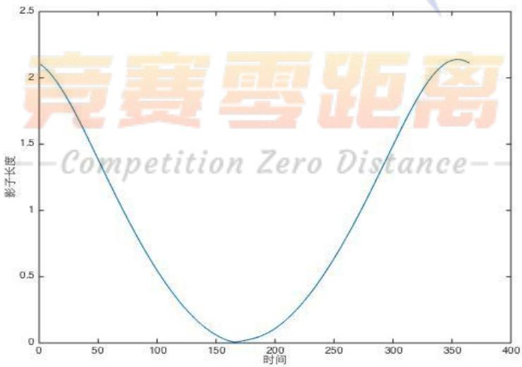
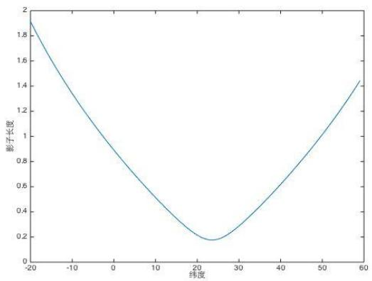
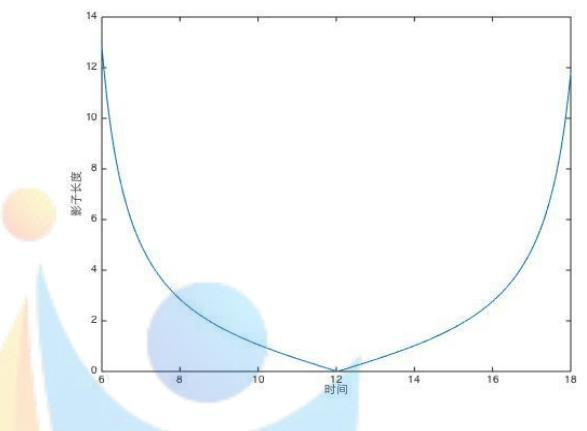
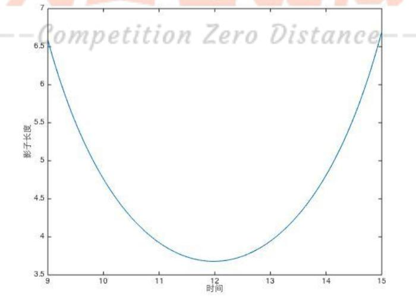
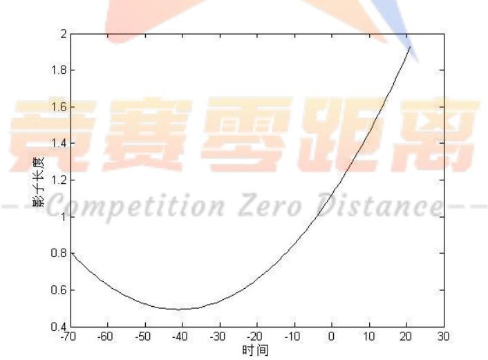
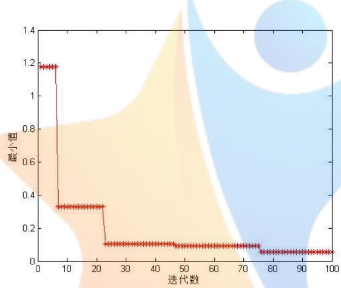
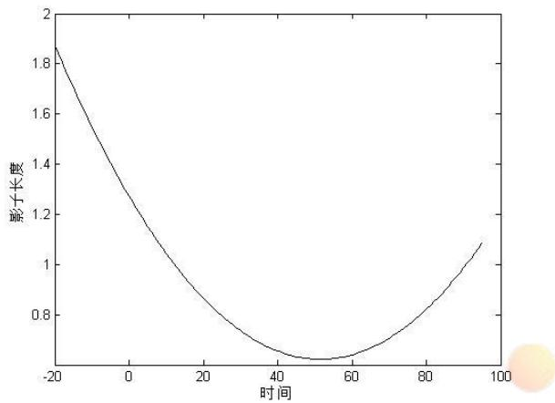
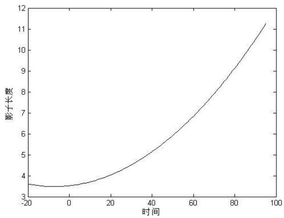

# 太阳影子定位

## 摘要

本文首先根据几何关系给出了直杆的太阳影子长度变化模型，进而通过“反问题”思维，借助直杆太阳影子变化建立数学优化模型推算出直杆的位置、日期等信息。最后，利用视频截屏技术和优化模型确定了视频的拍摄地点和拍摄日期。

问题 1，首先找到可以衡量影子长度变化的几个参数然后从三方面分析了太阳影子关于各参数长度变化的规律。我们发现影长不仅会随着太阳高度角增加而减小，而且还会受季节的影响。而后用MATLAB 软件画出了附件1中直杆影长变化的曲线图。

问题 2，使用最小二乘近似法以及遗传算法建立了一个完整的优化模型，将杆长与直杆地理纬度作为变量参数，进行 100次迭代，得出 20组可能的解，通过合理性比较得出最可能地点在海南岛东部。

问题 3，在问题2 优化模型的基础上，增加日期一个变量，利用与问题 2相似的解法求得附件2可能的地点与日期为印度南部、2-3月份，附件3可能的地点与日期为越南东南部、8-9月份。

问题 4，利用截屏技术将视频每隔一分钟截一幅图，将截取的 40张图片用MATLAB 进行边缘处理得到坐标数据，利用相似变换将像素坐标转换为物理坐标。在日期已知情况下，建立最小二乘近似法模型，并使用模拟退火算法得到视频中可能的地点为呼和浩特市附近。在日期未知的情况下，增加变量日期，再利用此题的优化模型求解，确定了地点与日期。

本文的亮点是，考虑到遗传算法自身有局部搜索能力差、存在未成熟收敛和随机游走等缺陷，先使用拟合的方法将直杆可能所在位置的地理经度确定，再运用遗传算法或者模拟退火算法求解模型。

关键词：最小二乘近似法；遗传算法；优化模型；模拟退火算法；近似变换

## 一 问题重述

如何确定视频的拍摄地点和拍摄日期是视频数据分析的重要方面，太阳影子定位技术就是通过分析视频中物体的太阳影子变化，确定视频拍摄的地点和日期的一种方法。

问题 1.建立影子长度变化的数学模型，分析影子长度关于各个参数的变化规律，并应用你们建立的模型画出 2015年10月 22日北京时间9:00-15:00 之间天安门广场（北纬39 度54分26 秒,东经116度 23分29秒）3米高的直杆的太阳影子长度的变化曲线。

问题 2.根据某固定直杆在水平地面上的太阳影子顶点坐标数据，建立数学模型确定直杆所处的地点。将你们的模型应用于附件 1的影子顶点坐标数据，给出若干个可能的地点。

问题 3. 根据某固定直杆在水平地面上的太阳影子顶点坐标数据，建立数学模型确定直杆所处的地点和日期。将你们的模型分别应用于附件 2和附件 3的影子顶点坐标数据，给出若干个可能的地点与日期。

问题 4．附件4为一根直杆在太阳下的影子变化的视频，并且已通过某种方式估计出直杆的高度为 2米。请建立确定视频拍摄地点的数学模型，并应用你们的模型给出若干个可能的拍摄地点。

如果拍摄日期未知，你能否根据视频确定出拍摄地点与日期？

## 二 问题分析

## 问题 1 的分析

问题 1在太阳光是平行光的假设下，可以将此题看作一个简单的数学求解问题。该问题的关键在于找出各个参数与影长的联系。我们考虑到，物体在某一点的影子的形状（长度和位置）由太阳在天体中对地球上这一点的相对位置决定，而这个相对位置由当地的的地理纬度、季节（日、月）和时间（这里的时间准确来说指时刻）三个因素决定，由于问题 1中我们只需考虑影子的长度，所以我们可以用地理纬度(𝜑)、太阳赤纬角(𝛿)、太阳高度角(ℎ)及时角(𝑡)等参数建立影子长度变化的数学模型，并分析影长关于它们几个参数的变化规律。

而后，利用上述建立好的模型及MATLAB软件，以北京时间9:00到15:00 内的时刻为变量，编写程序就可以画出题目要求的时间段内杆子的影长变化曲线。

## 问题 2 的分析

问题2与问题3都是给出某固定直杆在水平地面上的太阳影子顶点坐标数据，要求是建立数学模型，给出若干个可能的地点或地点和日期，这是一种典型的“反问题”，即需要我们由果推因。首先利用已有数据进行二次函数拟合，基本确定直杆的地理经度，然后再采用有关“反问题”比较经典的做法——最小二乘近似法建立模型求解其他变量参数。其中，直杆长度也不确定，由于杆长不同所在的位置也可能不同，所以将杆长𝐻设置为变量参数之一。进而，用遗传算法的思想求解模型，可以得出直杆几个可能的位置。

## 问题 3 的分析

问题 3与问题2比较，除了需要确定直杆所处的地点位置之外，同时需要确定拍摄日期，我们将问题二的最小二乘近似法模型稍加改进，增加参数日期（用积日𝑁来衡量），从而建立起一个三参数的优化模型，利用与问题 2相似的算法可以得出直杆一些可能的位置与日期。

## 问题 4 的分析

附件 4视频较大，直接用 MATLAB 处理比较困难，所以我们需要对视频进行一些处理，然后再利用 MATLAB 软件导出直杆影子在像素坐标系下的坐标数据，利用坐标变换方法中的相似变换将像素坐标系转换为物理坐标系。在日期给定时，建立最小二乘近似法的优化模型，并首先考虑遗传算法，再用模拟退火算法改进，可以得出可能的地点。如果日期没有给定，建立的优化模型将是一个四参数问题，利用本题建立的优化模型将确定可能的地点与日期。

## 三 模型假设和符号说明

## 3.1模型假设

（1）假设太阳光为平行光，没有折射；

（2）假设海拔高度常常可以忽略；

（3）假设时区是东八区;

## 3.2 符号说明：

<table><tr><td>符号</td><td>符号说明</td></tr><tr><td>L</td><td>太阳光照下影子的长度</td></tr><tr><td>H</td><td>杆的高度</td></tr><tr><td>h</td><td>太阳高度角</td></tr><tr><td>t</td><td>时角</td></tr><tr><td>φ</td><td>观测地的地理纬度</td></tr><tr><td>δ</td><td>太阳赤纬角</td></tr><tr><td>θ</td><td>日角</td></tr><tr><td>ω</td><td>杆所在位置的地理经度</td></tr><tr><td> $l _ { i }$ </td><td>第i 个时刻观测点的影子长度</td></tr><tr><td> $\hat { l } _ { i }$ </td><td> $l _ { i }$  的估计值</td></tr></table>

## 四、模型建立与求解

## （一） 问题 1的模型建立与求解

根据问题分析，我们用地理纬度(𝜑)、太阳赤纬角(𝛿)、太阳高度角(ℎ)及时角(𝑡)等参数建立数学模型并分析影长变化规律。

## 1.1 问题 1 模型建立 <sup>[𝟏]</sup>

根据问题分析，首先我们很容易得到影长𝐿与直杆长度𝐻、太阳高度角ℎ之间存在如下关系式：

$$
L = H / \tan h\tag{1.1}
$$

## 1. 太阳高度角ℎ的求法

太阳高度角是指太阳光的入射方向和地平面的夹角。由于我们假设太阳光不存在折射是平行光，查阅资料我们得到太阳高度角ℎ的计算公式如下：

$$
s i n h = s i n \varphi s i n \delta + c o s \varphi c o s \delta c o s t\tag{1.2}
$$

式中，太阳赤纬以𝛿表示，观测地地理纬度用 $\varphi$ 表示（太阳赤纬与地理纬度都是北纬为正，南纬为负），地方时（时角）以𝑡表示。

## 2. 求太阳赤纬角𝛿的算法

太阳赤纬（ED）即太阳直射点纬度，查阅资料得到赤纬角(𝛿)的计算方式：

$$
\begin{array} { c } { \delta = 0 . 3 7 2 3 + 2 3 . 2 5 6 7 s i n \theta + 0 . 1 1 4 9 s i n 2 \theta - 0 . 1 7 1 2 s i n 3 \theta - 0 . 7 5 8 0 c o s \theta + 0 . } \\ { 0 . 3 6 5 6 c o s 2 \theta + 0 . 0 2 0 1 c o s 3 \theta ~ ( 1 . 3 ) } \end{array}
$$

式中，𝜃称日角，即 $\theta = 2 \pi \mu / 3 6 5 . 2 4 2 2$ 。而𝜇由两部分组成，即 $\mu = N - N _ { 0 }$ 其中，𝑁为积日，即当天日期到当年 1月1日的天数； $N _ { 0 } = 7 9 . 6 7 6 4 + 0 . 2 4 2 2 \times$ $( N ^ { * } - 1 9 8 5 ) - I N T [ ( N ^ { * } - 1 9 8 5 ) / 4 ]$ （式中𝐼𝑁𝑇表示取整数部分）。

## 3. 时角的求法

时角为OP线在地球赤道平面上的投影与当地时间12点时地中心连线在赤道平面上的投影之间的夹角。

$$
t = S _ { 0 } + T _ { 0 } - \Delta T - \alpha\tag{1.4}
$$

式中，其中 $S _ { 0 }$ 是当天平时 0h的恒星时 $( S _ { 0 } = 6 ^ { h } 4 0 ^ { m } + d \times 3 ^ { m } 5 6 ^ { s } )$ ），元旦子夜时的恒星时是 $6 ^ { h } 4 0 ^ { m }$ ，𝑑是从元旦起算的天数）。 $T _ { 0 }$ 是当时北京时间， $\Delta T = 1 2 0 ^ { \circ } - \lambda$ 是当地的地理经度与东经 $1 2 0 ^ { \circ }$ 的差，化为时分秒单位，𝛼是恒星的赤经。

（1.1-1.4）式构成了求影子长度的数学模型：

$$
\left\{ \begin{array} { c } { { L = H / { \tan } h } } \\ { { s i n h = s i n \varphi s i n \delta + c o s \varphi c o s \delta \cos t } } \\ { { t = S _ { 0 } + T _ { 0 } - \Delta T - \alpha } } \\ { { \delta = 0 . 3 7 2 3 + 2 3 . 2 5 6 7 s i n \theta + 0 . 1 1 4 9 s i n 2 \theta } } \\ { { - 0 . 1 7 1 2 s i n 3 \theta - 0 . 7 5 8 0 c o s \theta } } \\ { { + 0 . 3 6 5 6 c o s 2 \theta + 0 . 0 2 0 1 c o s 3 \theta } } \end{array} \right.\tag{1.5}
$$

## 1.2 影子长度关于各个参数的变化规律

对影子长度有影响的参数包括地理纬度(𝜑)、太阳赤纬角(𝛿)、太阳高度角(ℎ)、太阳方位角、时角(𝑡)等，它们对影子长度的影响最终可以划分为以下几种：

一种是由地球公转引起的季节性影长变化规律，我们在地球上定点选取北纬23.5度，东经 120度的位置点，分析此位置上的 2米直杆在一年（365天）中正午时分影子长度的变化曲线。我们可以发现，正午时分的影长在夏至那天最短，并且关于夏至那个点左右对称，如图1。

  
图 1 同一地点影长随日期的变化规律曲线

一种是由纬度变化引起太阳高度角变化而引起的影子长度的的变化规律，选择某天，作出2米直杆正午时分影长随着纬度变化的曲线。我们发现，在直射点的直杆影长最短，在直射点分别向南北方向逐渐变长。也就是说，直杆影子长度会随着太阳高度角的变大而变长，如图2。



图 2 同一天正午时刻影长随纬度变化曲线  
  
图 3 同一地点一天内影子长度随时间变化的曲线

还有另一种变化规律是一天内由于地球自转而产生太阳东升西落的现象，我们选取物体的太阳影长会先变短后变长，并以当地时间正午时分为中心左右对称，如图 3。

## 1.3 模型求解

题目中，杆的长度、当地时间与观测地经纬度都已知，分别为3米、北京时间 9:00-15:00、北纬 39 度 54 分 26 秒、东经 116 度 23 分 29 秒，求得太阳赤纬𝛿与时角𝑡，利用MATLAB 软件编写程序则可以推导出附件1的直杆影长𝐿在附件 1

  
图 4 同一地点影长随日期的变化规律曲线

中时间段内变化的曲线图，如图4。

## （二）问题 2的模型建立与求解

## 2.1 模型的建立

为了解决此问题，我们利用了使某时刻影子长度与此时刻影子长度的估计值之差达到极小值的最小二乘近似法思想，建立如下数学模型：

$$
\begin{array} { r } { \phi \bigl ( H , \ \omega , \ \varphi \bigr ) = m i n \sum _ { i = 1 } ^ { 2 1 } \bigl ( l _ { i } - \hat { l } _ { i } \bigr ) ^ { 2 } } \end{array}\tag{2.1}
$$

式中， $H$ 为直杆长度（此时它是变量）， $\omega .$ 表示杆所在位置的地理经度， $\varphi$ 是杆所在位置的地理纬度， $l _ { i }$ 是第i个时刻观测点的影子长度， $\hat { l } _ { i }$ 是它的估计值。

## 2.2 模型的求解

最小二乘近似法模型建立以后，我们期望能用遗传算法思想解决问题。对于此问题，我们考虑到遗传算法自身有局部搜索能力差、存在未成熟收敛和随机游走等缺陷，如果我们直接运用遗传算法求解该问题，则所涉及到的变量较多，所以首先通过二次函数拟合，将直杆可能的位置地理经度基本确定，再将杆长与直杆地理纬度作为变量参数，通过遗传算法的思想求解数学模型得出可能的地点。

## 2.2.1 直杆地理经度 $\omega ^ { * }$ 的确定

首先我们根据附件 1的坐标数据 $( x , y )$ ，以及公式 $L = { \sqrt { ( x ^ { 2 } + y ^ { 2 } ) } }$ 得出各个时刻的太阳影子长度𝐿，并发现它与时刻呈二次函数关系，所以我们借用MATLAB软件拟合影长与时刻的二次函数图像，并得出拟合出的二次函数图像为：

  
图 5 附件 1 的影长与时刻的二次函数拟合图像

二次函数式为：

$$
L _ { 1 } = 0 . 0 0 4 T ^ { 2 } + 0 . 0 3 0 5 T + 1 . 1 2 0 3\tag{2.2}
$$

根据此函数，杆子影长最短时刻是北京时间 12 点 39 分，而根据地理知识，影长最短时是当地时间正午12点整，比北京时间迟 39分，则直杆所在地在东经120度的西侧，所以根据下式可以计算得出直杆所在地的地理经度。

$$
\begin{array} { r } { \omega ^ { * } = \omega _ { 0 } - \frac { ( T - T ^ { * } ) } { 4 } } \end{array}\tag{2.3}
$$

式中，𝑇为北京时间（单位为分钟）， $T ^ { * }$ 为直杆所在地的地方时（单位为分钟），$\omega _ { 0 }$ 东经 120度（北京时间即为此地的地方时）， $\omega ^ { * }$ 为直杆所在地的地理经度。由此我们可以基本确定直杆所在地的经度为东经 110.25度。

## 2.2.2 直杆的地理纬度 $\pmb { \varphi } ^ { * }$ 和杆长𝑯的确定

## 1. 遗传算法介绍

遗传算法是模拟自然界生物进化过程与机制求解极值问题的一类自组织、自适应人工智能技术，其基本思想是模拟自然界遗传机制和生物进化论而形成的一种过程搜索最优解的算法，具有坚实的生物学基础。遗传算法提供了一种求解复杂系统优化问题的通用框架，具有广泛的应用价值。

在本文中，我们主要运用了它适用于解决复杂的非线性和多维空间寻优问题的特点，结合最小二乘法近似法，寻求直杆的地理纬度 $\varphi ^ { * }$ 和杆长𝐻若干组可能的最优值。

## 2. 遗传算法的执行过程

遗传算法作为一种自适应全局优化搜索算法,使用二进制遗传编码,即等位基因 ${ \cal { T } } = \{ 0 , \ 1 \}$ ，个体空间 $H _ { L } = \left\{ 0 , 1 \right\} ^ { L }$ ，且繁殖分为交叉与变异两个独立的步骤进行。其基本执行过程如下：

1) 初始化。确定种群规模为𝐶为40、交叉概率 $P _ { c }$ 、变异概率 $P _ { m }$ 和置终止进化准则——迭代次数 100次；设置变量个数（2个变量，直杆长度𝐻与地理纬度 $\varphi ^ { * } )$ ）并确定好变量上下界（ $\left( 0 < H \leq 1 0 , 0 ^ { \circ } \leq \varphi ^ { * } \leq 9 0 ^ { \circ } \right)$ ）；随机生成40个个体作为初始种群𝑋(0)；置进化代数计数器 $t  0$ o

2) 个体评价。计算或估价𝑋(𝑡)中各个体的适应度。适应度函数为：

$$
F i t { \big ( } f ( x ) { \big ) } = \left\{ { \begin{array} {} { c } { c _ { m a x } - f ( x ) , f ( x ) < c _ { m a x } } \\ { 0 , \not \equiv \not | \not \equiv \emptyset . } \end{array} } \right.\tag{2.4}
$$

式中， $f ( x )$ 为遗传算法的目标值； $c _ { m a x }$ 为𝑓(𝑥)的最大估计值。

3) 种群进化。

a) 选择(母体)。从𝑋(𝑡)中运用选择算子选择出 $M / 2$ 对母体 $\left( M \geq C \right)$

b) 交叉。对所选择的𝑀⁄2对母体，依概率 $P _ { c }$ 执行交叉形成𝑀个中间个体。

c) 变异。对𝑀个中间个体分别独立依概率 $P _ { m }$ 执行变异，形成𝑀个候选个体。

d) 选择(子代)。从上述所形成的𝑀个候选个体中依适应度选择出𝑁个个体组成新一代种群𝑋(𝑡+1)。

4) 终止检验。如已满足终止准则,则输出𝑋(𝑡+1)中具有最大适应度的个体作为最优解，终止计算；否则置𝑡 → 𝑡+1并转2）。

## 2.2.2模型的结果与分析

遗传算法运行一次，其目标值随迭代次数变化如图（6）。

  
图 6 遗传算法的目标值随迭代次数的变化

将遗传算法运行20次，最终算法返回了20组地理纬度 $\overleftarrow { \varphi } ^ { * }$ 和杆长𝐻的最优值，如表 1。

表 1 遗传算法所得的结果
<table><tr><td>经度</td><td>纬度</td><td>杆长误差</td><td>地点</td></tr><tr><td>110.25</td><td>--19.7067petitio1.8475ro Dis0.0089e</td><td></td><td>海南</td></tr><tr><td>110.25</td><td>5.5425 1.9062</td><td>0.0033</td><td>南海西部</td></tr><tr><td>110.25</td><td>55.5132 6.3441</td><td>0.0561</td><td>俄罗斯</td></tr><tr><td>110.25</td><td>7.654 3.3529</td><td>0.0837</td><td>南海</td></tr><tr><td>110.25</td><td>2.1994 3.5288</td><td>0.1080</td><td>南海</td></tr><tr><td>110.25</td><td>15.4839 1.085</td><td>0.0124</td><td>南海</td></tr><tr><td>110.25</td><td>37.39</td><td>3.2258 0.007</td><td>陕西</td></tr><tr><td>110.25</td><td>11.261</td><td>3.1378 0.1824</td><td>南海</td></tr></table>

<table><tr><td>110.25</td><td>22.346</td><td>3.2258</td><td>0.0372</td><td>海南</td></tr><tr><td>110.25</td><td>24.4575</td><td>1.9159</td><td>0.0515</td><td>海南</td></tr><tr><td>110.25</td><td>16.2757</td><td>1.8475</td><td>0.0069</td><td>南海</td></tr><tr><td>110.25</td><td>16.0997</td><td>1.0948</td><td>0.0073</td><td>南海</td></tr><tr><td>110.25</td><td>10.5572</td><td>1.0948</td><td>0.0075</td><td>南海</td></tr><tr><td>110.25</td><td>13.9003</td><td>3.3431</td><td>0.0923</td><td>南海</td></tr><tr><td>110.25</td><td>20.0587</td><td>1.8671</td><td>0.0171</td><td>海南</td></tr><tr><td>110.25</td><td>22.61</td><td>0.3617</td><td>0.0489</td><td>海南</td></tr><tr><td>110.25</td><td>18.651</td><td>3.1085</td><td>0.0802</td><td>海南</td></tr><tr><td>110.25</td><td>26.9208</td><td>0.7234</td><td>0.0309</td><td>湖南</td></tr><tr><td>110.25</td><td>16.1877</td><td>1.8475</td><td>0.0068</td><td>南海</td></tr><tr><td>110.25</td><td>18.0352</td><td>1.9159</td><td>0.0925</td><td>海南</td></tr></table>

从上表的数据中，我们可以看出几乎所有的地点都集中于海南岛东部及其附近海域，所以我们判断出问题 2直杆所在的地理位置大概位于海南岛东部东经110.25度、北纬16度左右的可能性较大。

## （三）问题 3 的模型建立与求解

## 3.1 问题 3模型的建立

问题 3中，我们建立了与问题 2相似的数学优化模型来确定附件 2与附件 3的地点，在问题2模型的基础上增加了一个变量参数——日期（模型中的日期使用的是积日𝑁），建立数学模型如下：

$$
\begin{array} { r } { \Omega \big ( H , \ N , \ \omega , \ \varphi \big ) = m i n \sum _ { i = 1 } ^ { 2 1 } \big ( l _ { i } - \hat { l } _ { i } \big ) ^ { 2 } } \end{array}\tag{3.1}
$$

式中，𝐻、𝜔、𝜑、 $l _ { i }$ $\hat { l } _ { i }$ 与问题2的模型中的含义相同；𝑁为积日，即当天日期到当年1月1日的天数，可以转化为日期（某月某日）。

## 3.2 问题 3模型的求解

相似地，我们依然采用了先拟合确定直杆地理经度的方法，再利用遗传算法，得出直杆可能的长度𝐻、地理经度 $\varphi$ 与日期𝑁。

## 3.2.1 直杆地理经度 $\omega ^ { * }$ 的确定

依据附件2与附件 3的坐标数据 $( x , y )$ ，运用与问题 2相同的拟合方法，分别得出附件2与附件3的拟合二次函数图像为：

  
图 7 附件 2 二次函数拟合

  
图 8 附件 3 目标函数随迭代次数的变化图像

两个二函数图像对应的函数分别为：

$$
L _ { 2 } = 0 . 0 0 2 T ^ { 2 } - 0 . 0 2 5 3 T + 1 . 2 7 2 5\tag{3.2}
$$

$$
L _ { 3 } = 0 . 0 0 0 7 T ^ { 2 } + 0 . 0 1 0 8 T + 3 . 5 2 2 7\tag{3.3}
$$

根据上述，附件 2 与附件 3 直杆影长最短时刻分别是北京时间 12 点 36 分、北京时间12点48分，而当地时间都是正午12 点整，所以通过式（2.3）计算，可以基本确定附件2与附件3直杆所在地的地理经度分别为东经79度、东经108度。

## 3.2.2 直杆的地理纬度 $\mathbf { \nabla } \cdot \pmb { \varphi } ^ { * }$ 、杆长𝑯和日期的确定

本问题的优化模型与问题 2相比，增加了变量日期，所以，将优化模型中遗传算法的初始化步骤中变量的设置变为——设置 3个变量（直杆长度𝐻、地理纬度 $\boldsymbol { \varphi } ^ { * }$ 与日期𝑁），确定好变量上下界 $( 0 < H \leq 1 0 , ~ 0 ^ { \circ } \leq \varphi ^ { \ast } \leq 9 0 ^ { \circ } , 0 < N \leq 3 5 6 )$ ）；随机生成 40 个个体作为初始种群𝑋(0)

然后以相似的方法运算，可以得出两个附件的三个变量的一些最优值，如表2与表3。

## 3.3 问题 3模型的结果分析

表2 附件2 中的数据通过遗传算法所得的结果
<table><tr><td>日期</td><td>经度</td><td>纬度</td><td>杆长</td><td>误差</td><td>地点</td></tr><tr><td>4月3日</td><td>79</td><td>15.9328</td><td>7.3314</td><td>0.0656</td><td>印度</td></tr><tr><td>4月2月</td><td>79</td><td>9.5015</td><td>7.6344</td><td>0.0036</td><td>印度</td></tr><tr><td>5月12日</td><td>79</td><td>6.7742</td><td>8.915</td><td>0.0849</td><td>孟加拉湾</td></tr><tr><td>3月19日</td><td>79</td><td>34.3109</td><td>8.4262</td><td>0.0934</td><td>新疆</td></tr><tr><td>7月19日</td><td>79</td><td>5.0147</td><td>0.9091</td><td>0.0679</td><td>孟加拉湾</td></tr><tr><td>3月29日</td><td>79</td><td>30</td><td>9.4526</td><td>0.0758</td><td>印度</td></tr><tr><td>7月26日</td><td>79</td><td>5.5425</td><td>7.263</td><td>0.0743</td><td>孟加拉湾</td></tr><tr><td>8月22日</td><td>79</td><td>11.349</td><td>7.6442</td><td>0.0392</td><td>印度</td></tr><tr><td>9月23日</td><td>79</td><td>9.9534</td><td>8.5044</td><td>0.0655</td><td>印度</td></tr><tr><td>2月21日</td><td>79</td><td>5.0147</td><td>9.8338</td><td>0.0171</td><td>孟加拉湾</td></tr><tr><td>3月26日</td><td>79</td><td>27.0088</td><td>8.6315</td><td>0.0706</td><td>印度</td></tr><tr><td>5月26日</td><td>79</td><td>37.9179</td><td>8.9052</td><td>0.0032</td><td>新疆</td></tr><tr><td>3月8日</td><td>79</td><td>89.2082</td><td>8.5142</td><td>0.0277</td><td></td></tr><tr><td>9月23日</td><td>79</td><td>82.522</td><td>8.5047</td><td>0.0046</td><td>--</td></tr><tr><td>9月23日</td><td>79</td><td>0.8798</td><td>9.5406</td><td>0.0097</td><td>阿拉伯海</td></tr><tr><td>4月5日</td><td>79</td><td>3.5191</td><td>9.697</td><td>0.0823</td><td>孟加拉湾</td></tr><tr><td>1月29日</td><td>79</td><td>7.478</td><td>9.7458</td><td>0.0695</td><td>印度</td></tr><tr><td>9月13日</td><td>79</td><td>10.7337</td><td>9.2864</td><td>0.0317</td><td>印度</td></tr><tr><td>2月15日</td><td>79</td><td>35.6305</td><td>9.6676</td><td>0.095</td><td>新疆</td></tr><tr><td>3月25日</td><td>79</td><td>5.47185</td><td>5.435</td><td>0.0034</td><td>印度</td></tr></table>

我们可以看到，利用我们建立的优化模型，将遗传算法运行 20次求出的 20组解，附件2的直杆地点大部分位于印度南部，日期主要分布在 2、3月份。所以我们可以确定，最可能的地点是东经79度、北纬 9度，而最有可能的日期在2-3 月份之间。

表 3 附件3 中的数据通过遗传算法所得的结果
<table><tr><td colspan="5">经度ompe纬度on Zer杆长istan误差</td><td rowspan="2">地点</td></tr><tr><td>日期</td><td></td><td></td><td></td><td></td></tr><tr><td>1月7日</td><td>108</td><td>8.0938</td><td>9.4917</td><td>0.0439</td><td>南海</td></tr><tr><td>9月18日</td><td>108</td><td>2.9912</td><td>7.7322</td><td>0.0382</td><td>南海</td></tr><tr><td>4月18日</td><td>108</td><td>0.8798</td><td>9.3939</td><td>0.0766</td><td>马来西亚</td></tr><tr><td>2月26日</td><td>108</td><td>30.4692</td><td>5.3275</td><td>0.0795</td><td>重庆</td></tr><tr><td>7月17日</td><td>108</td><td>9.1496</td><td>9.9413</td><td>0.0187</td><td>泰国湾</td></tr><tr><td>2月17日</td><td>108</td><td>41.7009</td><td>2.0039</td><td>0.049</td><td>内蒙古</td></tr><tr><td>3月4日</td><td>108</td><td>6.1584</td><td>8.6608</td><td>0.0446</td><td>南海</td></tr><tr><td>3月14日</td><td>108</td><td>10.2933</td><td>9.8045</td><td>0.0646</td><td>泰国湾</td></tr><tr><td>9月18日</td><td>108</td><td>25.5132</td><td>8.7781</td><td>0.0709</td><td>贵州</td></tr><tr><td>5月20日</td><td>108</td><td>20.0587</td><td>9.2766</td><td>0.0755</td><td>南海</td></tr><tr><td>10月14日</td><td>108</td><td>10.9091</td><td>0.0098</td><td>0.0276</td><td>越南</td></tr><tr><td>11月15日</td><td>108</td><td>8.7097</td><td>8.6413</td><td>0.068</td><td>南海</td></tr><tr><td>11月8日</td><td>108</td><td>9.9413</td><td>9.433</td><td>0.0655</td><td>南海</td></tr><tr><td>8月31日</td><td>108</td><td>20.5865</td><td>9.1398</td><td>0.0163</td><td>南海</td></tr><tr><td>9月21日</td><td>108</td><td>7.34</td><td>8.5044</td><td>0.0119</td><td>南海</td></tr><tr><td>1月19日</td><td>108</td><td>10.8211</td><td>8.684</td><td>0.0498</td><td>越南</td></tr><tr><td>3月13日</td><td>108</td><td>89.2962</td><td>5.1515</td><td>0.096</td><td>--</td></tr><tr><td>11月21日</td><td>108</td><td>83.1378</td><td>9.4135</td><td>0.034</td><td>--</td></tr><tr><td>10月7日</td><td>108</td><td>4.3988</td><td>9.3646</td><td>0.0585</td><td>南海</td></tr><tr><td>6月23日</td><td>108</td><td>10.8211</td><td>5.3372</td><td>0.0224</td><td>越南</td></tr></table>

多次利用遗传算法运行出来的结果中，我们也可以推断出附件3直杆可能的地点主要分布在越南东南部及其附近海域，日期主要分布在 8、9月份。

## （四）问题 4 的模型建立与求解

## 4.1 问题 4模型的建立

## 4.1.1 视频处理

为了得到视频中的影子位置数据，我们对视频做了以下处理：

1. 从8 分55秒到9 分34秒每隔一分钟截取一帧图像，再利用MATLAB 软件读取得到 40幅灰度图。

2. 然后对这40幅灰度图作降噪边缘处理，比较准确地得到直杆影子在图上的轨迹。

3. 我们以图像左上角为原点、图像左边向下方向为 x轴正方向、上边向右方向为y 轴正方向建立像素坐标系，将杆影在图上的轨迹导出，得到它们的位置数据。

## 4.1.2 坐标系的转换<sup>[𝟓]</sup>

相机在工作的实质是将 3D物体投射并显示在 2D屏幕上。在这个过程中，坐标系发生了一系列转换，转换顺序为：物体坐标系→世界坐标系→相机坐标系→投影坐标系→像素坐标系。我们可以知道在透视相机作用下，有些几何属性是保持的，例如共线性，即一条直线透视变换之后仍为一条直线，然而一般的透视情况下平行直线不再保持平行。

也就是说，虽然相机工作的过程中，坐标系从物理坐标系转换到像素坐标系，但是会保留一些不变属性。已有的研究结果表明，通过代数表达式描述这些不变的变量，就可以把我们已经得到的像素坐标位置转换成实际中的物理坐标系。在此前已经完成的相关工作中，我们得到一些变换种类，比如等度量变换、仿射变换等。

对于此问题，我们选择相似变换建立数学模型，模型表达式如下：

$$
{ \binom { x ^ { * } } { y ^ { * } } } = { \left[ \begin{array} { l l l } { s c o s \theta } & { - s s i n \theta } & { t _ { x } } \\ { s s i n \theta } & { s c o s \theta } & { t _ { y } } \\ { 0 } & { 0 } & { 1 } \end{array} \right] } { \binom { x } { 1 } }\tag{4.1}
$$

这里的 s代表了一个等级度数。𝜃为拍摄的倾斜角。式中， 不考虑相机高度的影响，所以设为1； $( x ^ { * } , ~ y ^ { * } )$ 为像素坐标系下的位置数据， $( x , \ y )$ 为物理坐标系下的位置数据。

## 4.1.3 模型的建立

当日期给定时，我们首先考虑利用问题 2的优化模型，增加一个倾斜角 $\dot { \rho }$ 的变量，最小二乘近似法模型即变成了一个三变量的模型：

$$
\begin{array} { r } { \phi \bigl ( H , \ \omega , \ \varphi , \ \rho \bigr ) = m i n \sum _ { i = 1 } ^ { 4 0 } \bigl ( l _ { i } - \hat { l } _ { i } \bigr ) ^ { 2 } } \end{array}\tag{4.2}
$$

当日期没有给定时，我们考虑用问题 3的优化模型，同样增加一个倾斜角 $\rho$ 变量，最小二乘近似法即变成了一个四变量的模型：

$$
\begin{array} { r } { \Omega \big ( H , ~ N , ~ \omega , ~ \varphi , ~ \rho \big ) = m i n \sum _ { i = 1 } ^ { 4 0 } \big ( l _ { i } - \hat { l } _ { i } \big ) ^ { 2 } } \end{array}\tag{4.3}
$$

式中， $\rho$ 表示倾斜角；杆长𝐻为2米；其他字母含义与问题 2和问题3相同。

## 4.2 问题 4 模型的求解

事实上，我们在用问题 2与问题 3中优化模型的遗传算法求解模型时，我们发现有两个原因导致结果非常不准确：

a) 倾斜角 $\rho$ 的偏差太大；

b) 涉及到的变量太多，而遗传算法不擅长处理此类问题。

所以，我们选用另一种算法求解模型——模拟退火算法。

## 1. 模拟退火算法简介

模拟退火算法主要应用于组合优化。算法的目的是解决NP复杂性问题；克服优化过程陷入局部极小；克服初值依赖性。

## 2. Metropolis 准则

固体在恒定温度下达到热平衡的过程可以用 Monte Carlo方法（计算机随机模拟方法）加以模拟，虽然该方法简单，但必须大量采样才能得到比较精确的结果，计算量很大。

## 3. 模拟退火算法的基本步骤

1) 给定初温 $t = t _ { 0 }$ ，随机产生初始状态 ${ \bf \nabla } \cdot { \bf s } = s _ { 0 }$ ，令 $k = 0$

2) 产生新状态 $s _ { j } = G e n e t e ( s )$

3) 如果 $m i n \{ 1 , e x p [ - ( C ( s _ { j } ) - C ( s ) ) / t _ { k } ] \} > = r a n d r o m [ 0 , 1 ]$ ，则令 $\cdot s = s _ { j }$

4) Until 抽样稳定准则满足；退温 $t _ { k + 1 } = u p d a t e ( t _ { k } )$ 并令 $\boldsymbol { \cdot } \boldsymbol { k } = \boldsymbol { k } + 1$

5) Until 算法终止准则满足；输出算法搜索结果。

## 4.3 问题 4模型的结果分析

表 4 日期已知时通过模拟退火所得的结果
<table><tr><td>经度</td><td>纬度</td><td>角度</td><td>误差</td><td>地点</td></tr><tr><td>114.018</td><td>42.1552</td><td>8</td><td>0.0815</td><td>呼和浩特东北</td></tr><tr><td>114.6099</td><td>44.5655</td><td>7.5</td><td>0.0906</td><td>呼和浩特东北</td></tr><tr><td>115.3918</td><td>46.2273</td><td>8.6</td><td>0.0127</td><td>呼和浩特东北</td></tr><tr><td>113.0446</td><td>38.3228</td><td>5.8</td><td>0.0913</td><td>长沙</td></tr><tr><td>113.7112</td><td>41.5726</td><td>4</td><td>0.0632</td><td>太原东北</td></tr><tr><td>114.2783</td><td>44.1545</td><td>3.8</td><td>0.0098</td><td>呼和浩特东北</td></tr><tr><td>113.2889</td><td>39.0533</td><td>6</td><td>0.0278</td><td>呼和浩特东南</td></tr><tr><td>112.9649</td><td>36.4156</td><td></td><td>0.0547</td><td>太原南</td></tr><tr><td>113.9990</td><td>42.7877</td><td>5.5</td><td>0.0958</td><td>呼和浩特东北</td></tr><tr><td>115.3504</td><td colspan="4">37.5947petition21.2ero Dist0.0965 石家庄东南</td></tr></table>

在日期给定的情况下，通过最小二乘法模型与模拟退火算法，我们得到表 4的结果，从中可以判断视频中可能的地点最可能是在呼和浩特市的东北边。

表 5 日期未知时模拟退火所得的结果
<table><tr><td>日期</td><td>经度</td><td>纬度</td><td>角度</td><td>误差</td><td>地点</td></tr><tr><td>10月14日</td><td>131.0460</td><td>25.9152</td><td>24.9872</td><td>0.0158</td><td>冲绳岛南</td></tr><tr><td>7月21日</td><td>114.9564</td><td>35.1938</td><td>15.3662</td><td>0.0971</td><td>郑州东北</td></tr><tr><td>9月12日</td><td>122.5277</td><td>28.4956</td><td>21.8186</td><td>0.0957</td><td>浙江沿海</td></tr><tr><td>6月8日</td><td>112.9268</td><td>21.0724</td><td>14.4747</td><td>0.0485</td><td>广州沿海</td></tr><tr><td>9月27日</td><td>121.2327</td><td>25.2139</td><td>4.5746</td><td>0.08</td><td>台湾北</td></tr><tr><td>6月10日</td><td>116.2317</td><td>41.4267</td><td>38.6123</td><td>0.0142</td><td>张家口东南</td></tr><tr><td>3月20日</td><td>138.2139</td><td>38.3699</td><td>12.5889</td><td>0.0422</td><td>日本西北沿海</td></tr><tr><td>8月11日</td><td>117.8527</td><td>34.4881</td><td>14.5222</td><td>0.0916</td><td>连云港西</td></tr><tr><td>9月27日</td><td>128.6233</td><td>30.6704</td><td>22.0402</td><td>0.0792</td><td>东海边境</td></tr><tr><td>2月1日</td><td>125.3086</td><td>6.1577 O</td><td>1.7687</td><td>0.0959</td><td>菲律宾东南</td></tr></table>

如果视频中日期未知，则多了一个变量日期，同样通过优化模型及模拟退火算法，可以确定如表 5 的一些日期与地点。说明通过视频中的物体的太阳影子变化，我们可以有办法确定时间与地点。

## 五、模型的评价与改进

## 5.1 模型的优缺点

## 5.1.1 模型的优点

本文建立的模型简单易懂、计算简便，同时与实际情况也没有产生很大的差距，对实际情况具有一定的指导意义。

问题 4使用了模拟退火算法，具有质量高，初值鲁棒性强，简单、通用、易实现等优点。

## 5.1.2 模型的缺点

为了使计算结果不出现太大偏差同时使计算简便，本文假设了太阳光为平行光，所以结果事实上是一个理论值，比实测数据要偏大。实际中由于大气层中存在水蒸气、二氧化碳和尘埃，其密度与外太空的真空并不相同，因此当太阳光从外太空的真空传入大气层时，必将发生偏折。故采用式(4.4)式计算太阳高度角会存在一定误差。

遗传算法其自身存在不足,如局部搜索能力差、存在未成熟收敛和随机游走等,导致算法的收敛性能差,需要很长时间才能找到最优解等问题。模拟退火算法自身也具有一些不足，由于要求较高的初始温度、较慢的降温速率、较低的终止温度，以及各温度下足够多次的抽样，因此优化过程较长。

## 5.2 模型的改进

问题 1 建立影子长度变化模型时，空气折射率理应是一个需要考虑的因素。本文除了问题4，每个问题只用了一种模型求解，没有进行对照分析，所以本文可以多建立1-2个优化模型进行比对分析，使结果更有说服力。

## 六、参考文献

[1] 陈晓勇，郑科科，《对建筑日照计算中太阳赤纬角公式的探讨》，浙江建筑,第 28 卷, 第 9 期：6-12，2011 年 9 月。

[2] 张文华，司德亮，徐淑通，祁东婷，《太阳影子倍率的计算方法及其对光伏阵列布局的影响》，太阳能技术与产品：28-31，2011年9月。

[2] 董国志，反问题的正则化方法及其计算http://www.doc88.com/p-7436114096515.html，2015 年 9 月 12 日

[3] 葛继科，邱玉辉，吴春明，蒲国林，《遗传算法研究综述》，计算机应用研究，第 25 卷第 10 期：2911-2915，2008 年 10 月

http://lifeng.lamost.org/kepu/basic/basic2.htm，2015 年 9 月 11 日

[5] 武琳，《基于太阳阴影轨迹的经纬度估计技术研究》，天津大学，2010 年

## 七、附录

附录一 截取的数据
<table><tr><td>杆底部横坐标</td><td>杆底部纵坐标</td><td>影子顶点横坐标</td><td>影子顶点纵坐标</td></tr><tr><td>885</td><td>871</td><td>1673</td><td>869</td></tr><tr><td>885</td><td>871</td><td>1675</td><td>871</td></tr><tr><td>885</td><td>871</td><td>1663</td><td>872</td></tr><tr><td>885</td><td>871</td><td>1659</td><td>872</td></tr><tr><td>885</td><td>871</td><td>1652</td><td>872</td></tr><tr><td>885</td><td>871</td><td>1649</td><td>873</td></tr><tr><td>885</td><td>871</td><td>1644</td><td>873</td></tr><tr><td>885</td><td>871</td><td>1642</td><td>875</td></tr><tr><td>885</td><td>871</td><td>1637</td><td>874</td></tr><tr><td>885</td><td>871</td><td>1631</td><td>874</td></tr><tr><td>885</td><td>871</td><td>1625</td><td>876</td></tr><tr><td>885</td><td>871</td><td>1621</td><td>877</td></tr><tr><td>885</td><td>871</td><td>1617</td><td>877</td></tr><tr><td>885</td><td>871</td><td>1610</td><td>877</td></tr><tr><td>885</td><td>871</td><td>1607</td><td>879</td></tr><tr><td>885</td><td></td><td></td><td>879</td></tr><tr><td>885</td><td>竞 871 871</td><td>1602 离</td><td>879</td></tr><tr><td>885</td><td>871tion Zero1</td><td>1592 stance--</td><td>880</td></tr><tr><td>885</td><td>--Comp 871</td><td>1588</td><td>880</td></tr><tr><td>885</td><td>871</td><td>1584</td><td>880</td></tr><tr><td>885</td><td>871</td><td>1577</td><td>880</td></tr><tr><td>885</td><td>871</td><td>1571</td><td>881</td></tr><tr><td>885</td><td>871</td><td>1573</td><td>882</td></tr><tr><td>885</td><td>871</td><td>1573</td><td>882</td></tr><tr><td>885</td><td>871</td><td>1571</td><td>882</td></tr></table>

<table><tr><td>885 871</td><td>1571</td><td>881</td></tr><tr><td>885</td><td>871 1550</td><td>885</td></tr><tr><td>885</td><td>871 1544</td><td>884</td></tr><tr><td>885</td><td>871 1542</td><td>884</td></tr><tr><td>885</td><td>871 1539</td><td>885</td></tr><tr><td>885</td><td>871 1534</td><td>885</td></tr><tr><td>885</td><td>871 1531</td><td>885</td></tr><tr><td>885</td><td>871 1525</td><td>885</td></tr><tr><td>885</td><td>871 1518</td><td>886</td></tr><tr><td>885</td><td>871 1514</td><td>886</td></tr><tr><td>885</td><td>871 1511</td><td>886</td></tr><tr><td>885</td><td>871 1507</td><td>887</td></tr><tr><td>885</td><td>871 1501</td><td>887</td></tr><tr><td>885</td><td>871 1499</td><td>887</td></tr><tr><td>885</td><td>871 1494</td><td>888</td></tr></table>

## 附录二 第二问相关程序

fun.m:   
function ObjV=fun(unit)   
load matlab data   
h=unit(:,1);   
b1=unit(:,2);   
time.year=201   
time.month=4;   
time.day=18;   
time.UTC =8;   
time.hour = 14;   
time.min = 42;   
time.sec = 0;   
for j=1:length(unit)   
location.longitude = 110.25;   
location.latitude = b1(j);   
for i=1:21

```matlab
if time.min>60
time.min=0;
time.hour=time.hour+1;
end
a=sun_position(time,location);
l2(i)=h(j)/tan((a.zenith)/180*pi);
time.min=time.min+3;
end
a1=data(:,1);
a2=data(:,2);
l1=sqrt(a1.^2+a2.^2);
l=0;
for k=1:21
l=l+(l1(k)-l2(k))^2;
end
ObjV(j)=l;
end
ObjV=ObjV';
run_genetic.m:
clc;clear,close all;
NVAR=2;
NIND=40;
MAXGEN=100;
LIND=10;
GGAP=0.9;
trace=zeros(2,MAXGEN);
FieldD=[ LIND LIND;
0 0;
10 90;
0 0;
1 1;
1 1];
Chrom=crtbp(NIND,LIND*NVAR);
unit=bs2rv(Chrom,FieldD);
ObjV=fun(unit);
for gen=1:MAXGEN
FitnV=ranking(-ObjV);
SelCh=select('sus',Chrom,FitnV,GGAP);
SelCh=recombin('xovsp',SelCh,0.7);
SelCh=mut(SelCh);
unit=bs2rv(SelCh,FieldD);
ObjVSel=fun(unit);
```

[Chrom ObjV]=reins(Chrom,SelCh,1,1,ObjV,ObjVSel);   
[Y(gen),I(gen)]=min(ObjV);   
trace(1,gen)=min(ObjV);   
trace(2,gen)=sum(ObjV)/length(ObjV);   
end   
unit=bs2rv(Chrom,FieldD);   
figure   
plot(trace(1,1:gen),'b-o');   
hold on   
plot(trace(2,1:gen),'r-o');   
XY=unit(I(gen),:)   
Z=min(Y)   
附录三 第四问相关程序   
g.m:   
function y = g( m )   
location.altitude = 0;   
A=fun1(m(4));   
time.year = 2015;   
time.month = A(1);   
time.day = A(2);   
time.hour=8;   
time.min =55;   
time.sec=0;   
time.sec = 00;   
time.UTC = +8;   
location.latitude=m(2);<sub>L=2;</sub> L=2;   
h=[2.323389734   
2.329283311   
2.293887466   
2.282088066   
2.261439117   
2.252595865   
2.237846657   
2.23197138   
2.21720809

2.199509127   
2.181843109   
2.170066558   
2.158267558   
2.137619319   
2.128828366   
2.114080044   
1.987245048   
2.084619463   
2.072821041   
2.061022631   
2.040375441   
2.022719306   
2.028663966   
2.028663966   
2.022765035   
2.022719306   
1.960994679   
1.943238563   
1.937340033   
1.92855375   
1.913807957   
1.904960507   
1.887265666   
1.866689987   
1.854893969   
1.846046985   
1.834325191   
1.816632086   
1.810734411   
1.796070851];   
maxchange = 0;   
change = 0;   
h=cos(m(3)/180\*pi)\*h;   
y=0;   
for i=1:1:40   
out=sun\_position(time,location);   
final=L/tan((90-out.zenith)/180\*pi);   
y=y+(final-h(i))^2;

```matlab
change =abs(final - h(i));
maxchange= max (maxchange, change);
time.min = time.min + 1;
if time.min >= 60;
time.hour = time.hour + 1;
time.min = 00;
end
end
y=y+maxchange;
end
fff.m:
function fff=y ()
clc;clear;close all;
set(gcf,'DoubleBuffer','on');
m1 = 120;
m2 = 30;
m3 = 4.3;
m4 = 82 ;
dm1=0.3;
dm2 = 0.3;
dm3 = 0.5;
dm4 = 20;
start=[m1,m2,m3,m4];
fm0=g(start);
T=8000;
N=60;
Lm=0.99;
LT=0.9;
```

le T>0.001;   
for k=1:100;   
m(1)=m1+dm1\*(2\*rand-1);   
if m(1) > 180   
m(1)=180-rand\*dm1;   
end   
if m(1) < -180   
m(1)=-180+rand\*dm1;   
end   
m(2)=m2+dm2\*(2\*rand-1);   
if m(2) > 90   
m(2)= 90-rand\*dm2;   
end   
if m(2) < -90   
m(2)=-90+rand\*dm2;   
end   
m(3)=m3+dm3\*(2\*rand-1);   
if m(3)>30   
m(3)=30-rand\*dm3;   
end   
if m(3)<0   
m(3)=0+rand\*dm3;   
temp=(rand\*2-1)\*dm4;   
if temp >0;   
end   
if temp <0;   
m(4)=m4+floor(temp);   
end   
if m(4) > 365   
m(4) = m(4) - ceil(rand\*dm4);   
end   
if m(4) <0   
m(4) = m(4) + ceil(rand\*dm4);

end

fm=g(m);   
Df=fm-fm0;   
if rand<exp(-Df/T); m1=m(1); m2=m(2); m3=m(3); m4=m(4); fm0=fm   
end end T=T\*LT;   
dm1=dm1\*Lm;   
dm2=dm2\*Lm;   
dm3=dm3\*Lm;   
dm4=dm4\*Lm;   
end   
m1   
m2   
m3   
m4   
fun1(m4)

end

##