# “互联网+”时代的出租车资源配置

## 摘要

随着当今社会信息技术的飞速发展和智能移动终端的普及， 互联网 时代飞速到来，基于智能手机的互联网应用应运而生。本文应用非线性拟合的手段，结合图像分析，研究了传统出租车市场不平衡的供需关系在新环境下的现状；进一步的，根据智能城市理论，对于已有数据进行聚簇分析，化简了繁冗的现实模型，模拟了出租车搜寻、载客的行为模式，并建立了定量评判各公司对于缓解打车难问题的数学模型；最后我们引入社会福利最大化模型，考察对于司乘双向的补贴方案的合理性，并得出了在具体情况下的最佳补贴方案。

针对问题一，我们依据工作日和节假日的抽样数据，利用插值法绘制不同时段、不同位置的上海市出租车分布、乘客需求量分布、乘客等待时间的3D图像，并利用聚簇的思想选取市区和郊区的代表性地段，得出衡量供求关系的平均空驶率K的单日变化情况。随后，我们根据Morisugi的社会福利最大化理论，引入了供求满意度函数f，建立了出租车供求关系平衡的数学模型，运用聚簇方法、非线性拟合思想和Origin工具得到了上海市区的供求平衡模型，并将其利用于评价上海市出租车资源“供求匹配”程度上。

针对问题二，我们借鉴智能交通领域关于城市街道的研究经验，对选定的城区进行网格状划分；使用网格近似处理行车轨迹、以网格作为聚簇的基本单位、运用数据挖掘方法得到最短路径矩阵和需求矩阵，并计算了出租车完成两地间交易的概率矩阵，从“使用打车软件但不进行补贴”的情况出发，给出了最初的吸引力函数；从实际的物理意义出发，引入了始末地点间最短距离和目标地需求量，进而建立了总空驶里程的考察指标；之后，我们又考虑到当给予双向的司乘补贴后，乘客与司机两方面的心理预期会发生改变，进而改写了原有吸引力函数，并由此建立出不同补贴政策对于出租车行为影响的模型，最终用以评价不同补贴方案对于缓解打车难这一现实问题的具体情况。

针对问题三，我们沿用问题二的网格模型作为数据来源，并引入了社会总福利最大化模型，定义了司机剩余价值和乘客剩余价值，从而得出了研究社会内的总福利的函数模型。通过控制变量方法，将社会总福利函数改写成为具体研究对象，即，双向补贴金额的因变量，建立二元函数关系，并通过研究非线性问题的图像来优化求解最佳的补贴方案。

最终，我们结合实际的打车软件以及出租车使用情况，对之前的所有模型进行了客观的评价。

[关键词] 供需关系 时空分布 聚簇分析 智能城市 社会福利最大化模型

## 1 问题的重述与提出

## 1.1 “互联网+”时代的出租车行业概况

随着网络通信技术的不断发展和智能手机等移动终端的迅速普及，打车软件正在全国范围内兴起，并且大有改变传统出租车市场的趋势。当前出租车市场面临的主要问题，用三个字概括就是“打车难”。其原因有三：

一是出租车绝对数量供给不足，出租车数量的国家标准为“大城市每万人不宜少于20辆”，多数城市都远远达不到这个标准。出租车市场的绝对需求大于绝对供给导致卖方市场，司机处于优势一方，乘客处于劣势一方，使得出租车价格较高。

二是由于信息不对称，出租车相对数量供给不足。想打车的人不知道哪里有车，出租车不知道哪里有人打车。这样必然会造成出租车有效资源的大量浪费，在绝对数量不足的情况下，雪上加霜。更加会出现不可思议的空驶率高和打车难并存的怪现象。

三是部分司机选择性停运，原因在于出租车司机不愿出车或选择性出车， 导致道路上行驶的出租车数量少。正是由于出租车市场的不均衡，需求远远大于供给。出租车司机处于优势地位， 便会去挑选客人、路线、地点等，从而产生司机拒载的现象。

打车软件出现之后，对由于信息不对称产生的打车难现象有所缓解，并且使得司机也可以选择周边的乘客进行服务，宏观上来看，减小了无效空驶旅程，并增加了燃油利用效率。不仅如此，由于打车软件是新兴事物，其渴望占有原出租车市场的行业份额，故必然会提出各项补贴的政策，从而刺激消费者群体的积极性，并建立司机群体中的使用习惯。打车软件公司在决策过程中遇到了一系列的问题，，而这些问题就是本文探讨的重点。

## 1.2 需解决的问题

出租车是市民出行的重要交通工具之一，“打车难”是人们关注的一个社会热点问题。随着“互联网+”时代的到来，有多家公司依托移动互联网建立了打车软件服务平台，实现了乘客与出租车司机之间的信息互通，同时推出了多种出租车的补贴方案。

请你们搜集相关数据，建立数学模型研究如下问题：

(1) 试建立合理的指标，并分析不同时空出租车资源的“供求匹配”程度。

(2) 分析各公司的出租车补贴方案是否对“缓解打车难”有帮助？

(3) 如果要创建一个新的打车软件服务平台，你们将设计什么样的补贴方案，并论证其合理性。

## 2 符号说明

$K \colon$ 一段时间内簇内平均空驶率

$T \colon$ 簇内平均等待时间<sub>真实时间</sub>t:

Q: 居民出行需求

A: 社会环境衡量参数

$( K _ { 0 } , T _ { 0 } ) \colon$ : 供求平衡点

$Q _ { i } \colon$ 从地点i出发的总需求量

$D _ { j } { \mathrm { : } }$ : 到达地点j的车辆总量

$E _ { i } \colon$ 地点i附近的空驶车总量

$p _ { i j }$ 司机选择从地点i到地点j的概率

## 3 基本假设

（1） 针对短时间内的同一个社区模型，认为其社会环境系统是不变的；

（2） 针对短时间内的同一个出租车交通系统，认为其出租车总数量是不变的；

（3） 假设驾驶员选择行为的随机性满足二重指数分布；

（4） 假设不考虑天气、突发事件等非人为可控因素的影响；

（5） 认为问题中给出的数据能客观反映现实情况，值得相信;

（6） 默认打车请求都被受理；

（7） 忽略行业内部不正当竞争等隐形因素对模型的影响；

（8） 将出租车个体视为质点，且不考虑城市道路堵塞等诸多因素的影响；

## 4 问题分析

## 4.1 问题（1）的分析

该问题要求建立合理的指标，并分析不同时空出租车资源的“供求匹配”程度。本文基于“苍穹——滴滴快的智能出行平台”<sup>[1]</sup>中使用滴滴打车的出租车以及用户的行为情况，建立了供求匹配情况下的出租车模型，并用以评价上海市的出租车资源“供求匹配”程度。

衡量出租车运营情况的最直观数据就是出租车的位置分布，衡量出租车需求程度的最直观数据是打车人数即请求单数的分布，而直接和打车软件用户体验相关联的数据则是乘客打车时间，这里我们用接单时间来衡量。由于空驶率K可以对应出租车供应量，而乘客等待时间可以对应出租车需求量，故两者的函数关系可以作为衡量供应量的指标。通过对以上三个基本数据进行分析，我们得出可以用空驶率K和乘客等待时间T作为衡量供求情况的具体指标。通过考察城区和郊区全天24小时的K变化规律，我们得出空间（城郊）和时间（全天）两个维度的供求关系分布情况。

这部分我们分为三个部分进行探讨：

先，我们想确定在某个时间段内，研究上海市出租车粗略的空间分配情况。我们对某工作日和节假日进行抽样，使用插值的方法在Matlab中分别绘制出了这一天低峰10：00、高峰17:00时段，全上海市的采样点地理位置(经度x, 纬度y)与出租车分布、乘客需求量分布、以及等待时间的三维图像，为进一步讨论打下了基础。

接下来，我们想讨论时间对于出租车分配调度的影响。由于数据量过大，且不同数据指标取样点的空间位置不是严格对应的，我们利用集簇的思想，选择了20个具有代表性的商圈以及城郊，并根据具体位置选择合适的半径，囊括其周边的采样数据点，并算出平均等待时间，作为某一具体时刻，具体地点的供求分配程度的量度。我们选择出具有代表性的商圈与城郊，考察他们在工作日、非工作日的情况，并作出了其周边一天内平均空载率Kave与真实时间t的二维图像。

最后，我们引入了供求满意度函数f，建立了出租车供需关系平衡的数学模型，并综合第二部分中的数据，利用曲线拟合工具得到了上海市区的供需平衡模型，并将其利用于评价上海市出租车资源“供求匹配”程度。

## 4.2 问题（2）的分析

该问题要求分析各公司的出租车补贴方案是否对“缓解打车难”有帮助。为了更客观的研究整个出租车模型，我们想要建立一种合适的模拟过程方案，可以体现出在用打车软件的情况下，有无补贴以及补贴力度不同时出租车盈利、行为模式的不同。

此时为了在大量的数据中选取合适的研究对象，我们查阅资料后发现，可以应用智能城市过往研究方法网格化我们的地图，并进行近似处理。

“打车难”具体可以表现为出租车总空驶路程：即空驶路程越长，说明司机浪费在搜寻乘客的路途上越长；反之，则说明乘客打车难受到了缓解。

在第一问的基础上，我们注意到此时的重点是考察补贴方案不同时，出租车盈利、行为模式有何不同。我们认识到补贴是双向的，既有用户的红包奖励，还有对司机的奖励或者燃油补助。所以，我们在思考后决定，将这两个方面用参数的形式体现在我们建立的模型中。并且，我们还提出了多种可能合适的数学模型进行研究，用以分析补贴对于“缓解打车难”的帮助情况。

## 4.3 问题（3）的分析

该问题要求讨论如果要创建一个新的打车软件服务平台，什么样的补贴方案比较合适，并论证其合理性。我们认为全文的研究范畴更为理想化，而不涉及公司竞争市场份额行为，更偏向于解决当今的“打车难”问题。

所以，本文以提高总体社会福利为总目标，考察不同的补贴方案对社会带来的影响。首先，本文结合经济学中的柯布道格拉斯函数，确立了社会福利中司机和用户的剩余价值考察方式，并由此推导出了社会总福利函数。进一步的，根据问题（2）中对于空驶路程的表达得到了社会总福利函数与司机补贴金额和用户补贴金额的二元函数，并以此确定了短期内动态的补贴方案。

除此之外，我们还注意到实际情况中存在拒载、爽约、空车不停等现象，故在全文的最后对几个在具体决策过程中值得关注的方面进行了定性分析，优化理论模型，得出了公司决策的最终方案。

## 5 模型建立与求解

## 5.1 问题（1）的模型建立与求解

根据题目要求，从数据平台获取资料之后，我们首先粗略考察了在时间维度不变的情况下，上海市内空间与出租车配布、用户需求以及用户等待时间的分布关系。为了进一步在时间上讨论出租车资源的供求匹配程度，我们选择不同时间，及节假日、工作日中打车高峰以及平常时间段作为考察变量。此时，注意到出租车配布取样点和用户需求取样点是不完全一一对应的，所以我们又利用集簇的思想，将数据处理在既定的商圈与郊区的范围内，从而有效规避了此问题，并且精简了数据规模，使结果更加直观，得到了一天内各时段出租车平均空载率K与真实时间t的二维图像。最后，我们建立了供求满意度函数T = f(K)作为指标，得了出租车供需关系平衡的数学模型，并综合第二部分中的数据，利用Origin曲线拟合得到了上海市区的供需平衡模型，并将其利用于评价上海市出租车资源“供求匹配”程度。

## 5.1.1 数据的获取

针对“苍穹——滴滴快的智能出行平台”网站提供的数据，利用Python语言和urllib2等基本的Python抓包工具编写爬虫，获得了从5月18日起至9月10日110天左右的上海市全市出租车数量分布、请求单数和用户等待时间三组数据。每组数据均为每小时采样一次，每日24次采样，每次采样选取全市300个左右采样点（可能存在低谷时段不足300个采样点的情况）。考虑到工作日和非工作日的人口流动特点有很大不同，我们对5月中旬以来的法定节假日、双休日<sup>[2]</sup>进行筛选，在后续的研究过程中将其与平常工作日分开考察。由此得到了本问题的原始数据。

此外，还应注意到我们的数据来源仅为占主要市场份额的滴滴快的公司，并不能代替全部出租车的运营情况。

## 5.1.2 建立出租车分配等指标在时间一定时的空间分布

得到数据的基础上，我们随机考察了某天的客流高峰并设另外两个时段作为对照，引入出租车数量、请求单数、用户等待时间作为考察指标。运用MATLAB仿真软件对采集数据进行处理，我们得到了若干张空间分布图。受每小时采样数量限制，采样点坐标选择较为随机和松散，因此我们在MATLAB内置的griddate函数中将method模式参数的取值定为’v4’，否则在超出数据范围或某些区域数据点较少的情况下将会得到不可导曲面。

最终结果如图所示：

根据我们收集到的数据，我们将考虑以下几个指标，包括接单时间长度，请求单数，和出租车数量，其中将发出的单量视为打车的需求量。通过在时间上高峰和低峰时段的对比以及在空间上市中心和郊区的对比，可以看到市中心和郊区在三个指标上都有比较明显的差异，从中我们可以得到以下几个直观的信息：

(1)市中心与郊区相比，可以看到市中心具有接单时间长，需求量大的特点。

(2)很有意思的情况是，通过对曲面的观察，无论在高峰还是低峰时段，可以看到到市区内的出租车量相对于郊区来说是较少的。对此我们根据对数据的分析提出了两点假设，首先是出租车分布不均可能来源于乘车的需求，由于工作、生活等种种原因，郊区的人进入市中心的需求比较高，而市中心居民的活动范围比较小，所以出租车较多的在郊区和市中心往返，停留在郊区的几率比较大；另一方面，城区的人收入普遍较高，可能更多的采取私家车出行的方式，所以会出现市中心车辆相对少的情况。

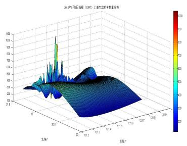  
Figure 1: 10时出租车分布

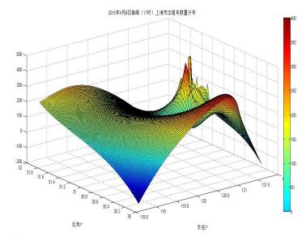  
Figure 2: 17时出租车分布

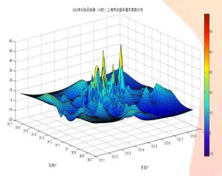  
Figure 3: 10时出租车需求量

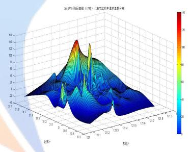  
Figure 4: 17时出租车需求量

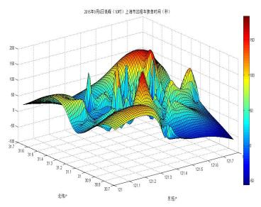  
Figure 5: 10时接单时间

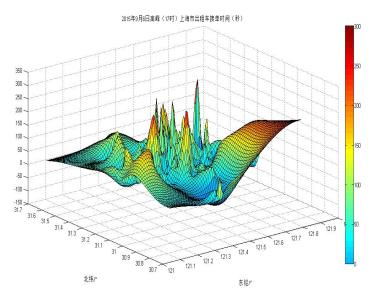  
Figure 6: 17时接单时间

(3)高峰时段与低峰时段对比，我们可以观察到高峰时段具有接单时间长，请求单数多的特点。

(4)在高峰时段，出租车的量分布的相对比较均匀，而在低峰时间段，出租车量具有很明显的峰值，通过经纬度对应，出租车集中的点存在于闵行-松江一带，与前文观察到的出租车集中于郊区的结论相一致。

所以由上面几个图我们基本可以看出出租车时空分布上存在不均匀的情况，可能由于出租车司机有拒载的情况，使得出租车司机自己去挑选客人，从而导致选择性出车使得道路上行驶的出租车数量减少了。

## 5.1.3 建立平均空驶率指标在空间一定时的时间分布

根据从数据平台所得到的资料，我们拟引入供求因数Q作为一项指标来初步衡量供求情况，有:

$$
Q = N – D\tag{1}
$$

其中：N为出租车数量；D为请求单数。

但是，仔细研究后发现，我们的采样点中，N与D是由不同的采样点得来的原始数据，由此空间上的经纬（x,y）会有细微差别，不能再使用线性或者v4等插值方式拟合曲面作差得Q，否则得出的参数将因为两次拟合而偏差过大。

所以，我们引入了聚簇的概念，将所有的数据点按照我们选择的20个具有代表性的商圈以及城郊区域，根据适当的半径（商圈1km，城郊10km）进行划分。其中经纬度根据利用MapGIS等地理信息系统工具获取的信息，在上海地区的大致转化尺标为：

纬度：1度= 110.94 km，1分= 1.849公里，1秒= 30.8米

经度：1度= 85.276 km，1分= 1.42公里，1秒= 23.69米

另外，在一个城市出租车合理分担率已确定的基础上，出租车空驶率是表征出租车供给水平的一项重要指标，可用出租车空驶率来表示出租车供给水平:

$$
K = J ( A _ { 0 } , Q )\tag{2}
$$

其中: K —出租车空驶率；Q为居民出行需求； $A _ { 0 }$ —出租车特定的社会环境系统。

出租车空驶率分为时间上和空间上的空驶率，时间上的空驶率是指一定时间内出租车空驶时间与总的行驶时间的比值；空间意义上的空驶率是指在一定时间内出租车空驶里程与总的行驶里程的比值。结合本文中所采用数据进行适当定义改写，得到：

$$
\begin{array} { r l } { K = } & { { } ( \frac { 1 } { \omega } , \frac { 1 } { 4 } , \frac { 1 } { 4 } \frac { 1 } { 4 } \frac { 1 } { 4 } ) - \frac { 1 } { 4 } \frac { 1 } { 4 } \times \frac { 1 } { 4 } \times \frac { 1 } { 4 } \times \frac { 1 } { 4 } ) \times ( \frac { 1 } { \omega } , \frac { 1 } { 4 } , \frac { 1 } { 4 } \frac { 1 } { 4 } \frac { 1 } { 4 } \frac { 1 } { 4 } ) } \end{array}
$$

在本文中的出租车的空驶率是从空间意义上讲，在一定供给水平下，当出租车需求越高，这时出租车空驶率也就越小；当出租车需求越小，这时出租车空驶率也就会越大。

所以在集簇之后，我们选择簇内平均出租车空载率作为指标，重新处理数据，处理数据后得到17个上海地标位置以及城郊区域的K与真实时间t的关系，选择其中4张如表1所示：

由于数据量较大，我们最终选择人民广场，以及闵行东川路附近作为具体样本作折线图，分别得到了商圈与郊区的工作与节假日内24小时的变化情况，如图7-10：

由K-T对折线图我们可以得到以下几个结论:

（ ）同一天横向比较发现，市中心附近的空驶率整体上较城郊地区要高，并且在工作日与休息日时有一样的趋势，即市区的供求关系较城郊地区供求关系相对缓和。

（2）比较休息日与工作日的K分布趋势发现，在工作日的早晚高峰时间段，K均处于曲线上较低的位置；而在休息日时，则没有类似现象。此现象符合常识规律，因为休息日早晨出行人数较少，且晚高峰时间段均属于用餐时间，故打车需求也较少。

(3) 由于使用打车软件的人只占一部分，所以仍然存在很严重的信息不对称，导致出租车资源配置不合理。也就出现了高空载率和打车难并存的情况。

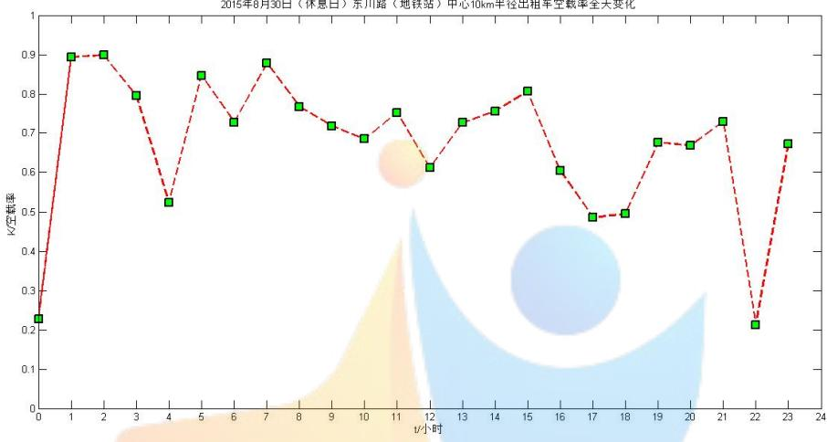  
Figure 7: 东川路休息日k-t

2015年8月30日（休息日）人民广场中心1km半径出租车空载率全天变化  
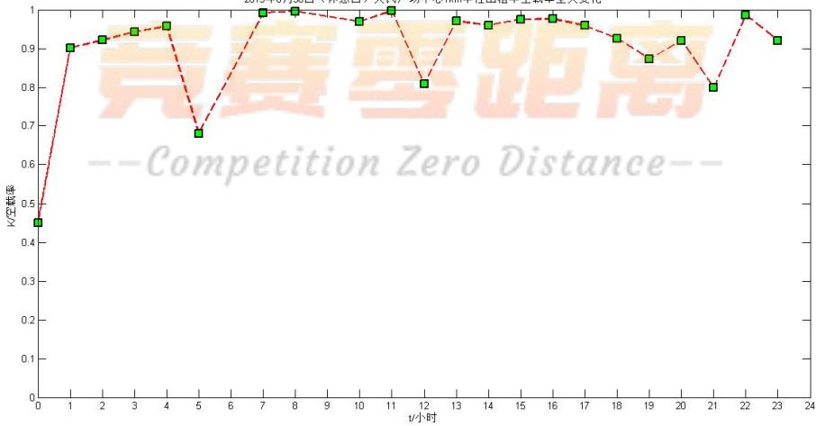  
Figure 8: 人民广场休息日k-t

2015年9月6日（工作日）人民广场中心1km半径出租车空载率全天变化  
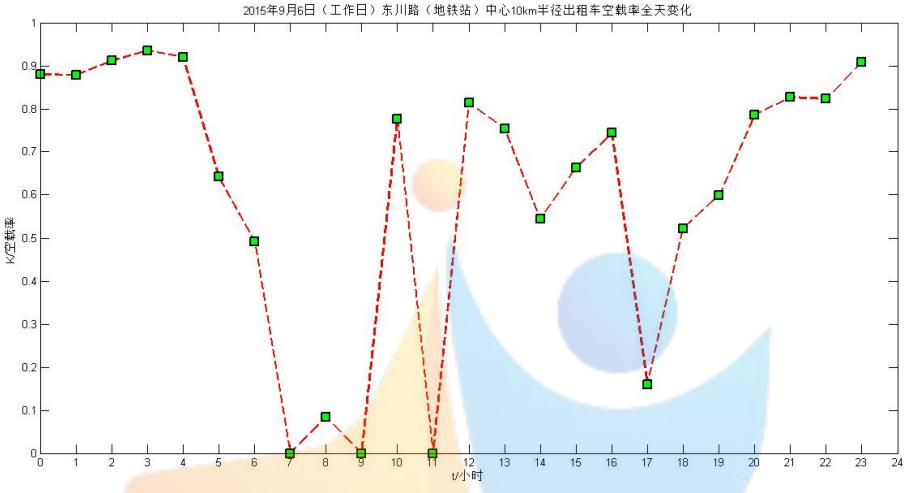  
Figure 9: 东川路工作日k-t

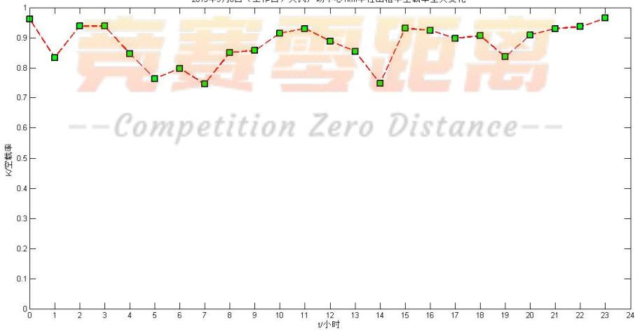  
Figure 10: 人民广场工作日k-t

## 5.1.4 建立出租车供需平衡状态下的出租车使用模型

通过前两点的分析，粗略得到供小于求的结论，但是度量标准上还是趋于朴实单一，由此，我们接下来将提出一套较为全面的度量模式，供数据信息支持情况下使用，并将应用于上海供求匹配程度的评价中。

模型的建立根据 $M o r i s u g i$ <sup>[3]</sup>提出的社会福利最大化模型，当对社会活动系统中的出租车需求进行分析时,我们用出行需求Q来表示,因此交通运输需求模型可表示为: $Q = D ( A , S )$

其中:Q—居民出行需求;D—需求函数;A—社会环境系统;S—服务水平。

因此居民出行需求由社会环境系统A和服务水平S共同决定。从国内外发展的历程可以看出，当社会活动越频繁，居民出行需求越大，因此，Q与A成正比；当社会环境系统一定的情况下，服务水平越高，人们的出行意愿越强，因此出行需求也就越高。

当影响出租车需求的城市经济发展水平、城市规模、自然地理条件、城市交通环境等外界因素一定的情况下，出租车需求主要由出租车服务水平决定。而当出租车车型、驾驶员行为、价格体系以及道路状况一定的情况下，出租车需求主要由乘客最长等车时间来决定。当出租车乘客可接受的等车时间越短，则出租车乘客对出租车供给水平要求越高；反之，当出租车乘客可接受等车时间越长，则出租车乘客对出租车供给水平要求越低。

所以进一步的，我们修改了原有模型，在出租车车型、驾驶员行为、价格体系以及道路状况一定的情况下，出租车需求可表示为:

$$
Q = D ( A _ { 0 } , T )\tag{3}
$$

其中：T —出租车乘客最长等车时间；A0 —出租车特定的社会环境系统。

带入到式（3）中，即可得到K与T关系表达式：

$$
K = J ( A _ { 0 } , D ( A _ { 0 } , T ) )\tag{4}
$$

在本文中探讨的都是上海市这一固定社会环境的问题，且注意到J的反函数是存在的，故上式可重新表述为：

$$
T = J ^ { - 1 } ( K ) = f ( K )\tag{5}
$$

表达式的意义在于：

对于上海市，出租车需求度量指标K与供应度量指标T之间存在固定关系f，由此确立了出租车供需平衡状态下的出租车使用模型。

通过研究出租车空驶率 $\varXi$ 出租车乘客最长等车时间之间的关系发现，出租车空驶率越大，乘客最长等车时间越短，当空驶率增大到一定程度后,乘客最长等车时间将趋于一个最小值而不再变化；反之,出租车空驶率越小,则乘客最长等车时间越长，且当空驶率减小到一定程度后，乘客最长等车时间将趋于一个最大值而不再变化。

故理想曲线f可以得到类似图x的关系：

图中 $T _ { 0 }$ 为乘客愿意最长等待时间，可反映出对服务满意程度，与之对应的 $K _ { 0 }$ 则为供求平衡下的出租车空驶率。  
由第二问中处理后的数据，可作散点图，并导入Origin中拟合最佳曲线。

对于最佳拟合，希望能将模型误差和测量误差对曲线拟合的影响减至最小。目前,使用较多的拟合函数有一阶指数衰减函数模型和指数模型，也有学者选择Fourier对曲线进行分析。本文通过使用一阶指数衰减函数、指数拟合以及Fourier拟合方法，最终发现一阶指数衰减函数拟合效果最佳，并得函数拟合图线，如下：

对于每一既定时空 $\mathrm { ( K , T ) }$ 对，均可在f空间上找到对应点，结合实际意义后得出结论：

(1）当其落在曲线下方时，表示K一定时，用户愿意最长等待时间小于平均值，此时供大于求；

（2）当其落在曲线上方时，表示K一定时，用户愿意最长等待时间大于平均值，此时供小于求；

（3）当且仅当其落在 $\left( K _ { 0 } , T _ { 0 } \right)$ 时，供应于求；当其落在曲线的其他位置时仍处于供求不匹配的情况。

在散点图中可以看到，大部分的点落在曲线的上方，也就是供小于求的情况占大多数，数据分析的结果也与实际“打车难”的结果相符。每万人出租车仅为十辆左右，距离”大城市每万人出租车不宜少于20辆”的国家标准还有相当大的差距。绝对需求远大于绝对供给，由于司机处于优势的卖方市场和国家价格管制两方面并存，导致了市场不能达到平衡点，所以会出现很严重的供不应求的情况。另一方面，由于信息不对称的关系，造成出租车有效资源的大量浪费，在绝对数量远远不足的情况下，就会导致不可思议的空驶率高和打车难并存的怪现象。

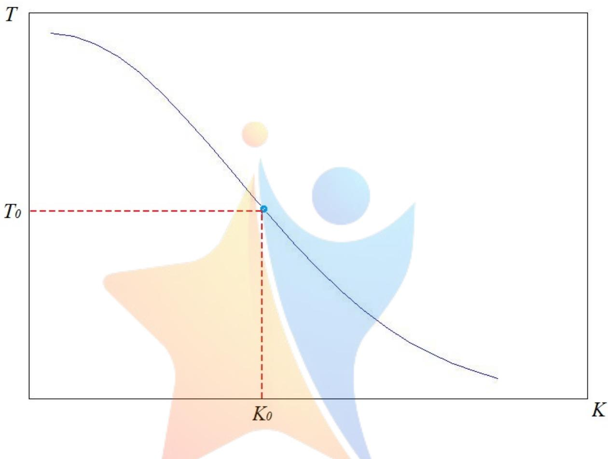  
Figure 11: 理想k-t图线

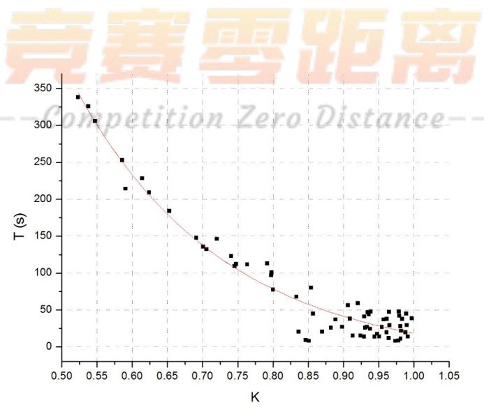  
Figure 12: 函数拟合图线

## 5.2 问题（2）的模型建立与求解

本环节将模拟出租车司机的行为模式：软件后台系统实时维护着所有出租车的状态，在接收到一个用户请求后，搜索出满足新用户条件和车上已有乘客条件的最优的车。这里的最优是指出租车去接一个新的用户所增加的里程最小。该研究成果可以为城市节约大量的燃油、减少污染物排放量，大大提高整个出租车系统的运送能力，缩短乘客的等待时间，降低乘客的打车费用并提高司机的收入<sup>[4</sup>

我们根据大数据与智能交通领域以往关于城市街道的研究，使用网格近似处理行车轨迹，并根据已有数据得到相应需求，引入补贴对于乘客与司机两方面的心理预期改变参数，并由此建立出不同补贴政策对于出租车行为的影响，具体表现为出租车空驶里程的改变量。

## 5.2.1 模型的提出与建立

考察网格图G(A,E)，其中A为考察点集，E为点间的网格线段集，设I、J分别为乘客出发、到达点集，则有I、J为E的子集。

现在我们假定出租车到达目的地以后不作停留，立即出发寻找下一单乘客；同时，我们假定乘客与到达后的出租车均集中在网格中心点，这样的好处在于：根据以往关于城市智能规划的研究，可以使用网格边沿距离近似代替实际街道，并简化了数据模型。

取i $\in I , j \in J$ ,对于地点i到j的乘客需求总量 $[ q _ { i j } , Q _ { i }$ <sub>i</sub>为从i出发的需求总量，有：

$$
Q _ { i } = \sum _ { j \in J } q _ { i j }\tag{6}
$$

$D _ { j }$ 到达地点j的车辆总到达量，有：

$$
D _ { j } = \sum _ { i \in I } q _ { i j }\tag{7}
$$

定义地点i到j的最短网格路径 $d _ { i j }$ ，并联系实际意义，对 $d _ { i j }$ 的取值进行修正，得到：

$$
d _ { i j } = \left\{ \begin{array} { l l } { | \triangle \boldsymbol { x } | + | \triangle \boldsymbol { y } | } & { O _ { i } \neq 0 , } \\ { \propto } & { O _ { i } = 0 . } \end{array} \right.
$$

(8)

考虑地点i附近的空驶车总量 $E _ { j }$ ，且联系实际，到达地点j之后载客出租车在乘客下车后均转化为了空驶出租车，因此有：

$$
E _ { j } = D _ { j } = \sum q _ { i j } \qquad ( 9 )
$$

$$
\begin{array} { r } { m p e \{ \bar { \ell } \frac { \bar { \ell } ( \bar { \ell } + \bar { \ell } x p [ \theta ( - d _ { i } \bar { j } + \mu Q _ { i } ) ] } { \sum _ { k \in J } e x p [ \theta ( - d _ { i j } + \mu Q _ { i } ) ] } \bar { \ell } i \neq j , } \\ { \theta _ { i j } = \left\{ \begin{array} { l r } { 0 } & { i = j . } \end{array} \right. } \end{array}
$$

(10) 式子中θ为司机个人特征修正值，越大代表对网格及需求等特征之的不确定性越小，也就是对于路网及需求等特征值的不确定性越小，即掌握的情况越精确；µ为将出行需求对效用值影响转化为出行距离对效用值影响的转换系数

## 5.2.2 数据处理方式与过程

由于网格图较实际地图在功能区划分、道路表示和运输能力衡量等方面更加抽象，也更易于基础模型的展开，所以我们选择将前述网格图 $\mathrm { G ( V , E ) }$ 映射到上海市实际城区地图中，利用网格化了的地图来考察出租车在城市各区域间的运动情况<sup>5]</sup>希望以此得出研究范围内全部出租车辆空载里程总和的期望值。为此，我们将选择上海市某日晚高峰时段17时一小时内的打车需求量即出租车请求单数，作为衡量需求的标准，进而选择网格所在区域，并得出该区域上的需求分布情况。

在选取前，我们必须认识到这样几个问题：

(1) 由于网格图以网格中心点为代表，我们选取该网格覆盖范围内所有采样点的请求单数的平均值作为该中心点的代表值。考虑到我们的数据来源同样基于随机位置的采样，不同时间的采样位置自然有所不同，继续利用集簇思想来代表数据是很必要的。同样，我们在衡量任意两网格点间最短距离时，也使用网格边沿距离代替实际道路距离。这样做既可以极大程度上简化运算，也对一定城区范围内南北走向为主的道路起到了较好的贴合。

(2) 我们拟选定10\*10共计100个方格的连续区域作为研究范围，单个方格的边长既不宜太长也不宜太短：若选择边长过长，单个网格内的交通运输情况差异太大，已经不能用抽象的中心采样点来代替；若选择边长过短，考虑到数据本身的数量问题，可能会造成部分网格内没有采样数据落入的情况，对后续计算的开展带来不便。

(3) 选取的范围内打车需求量不宜太过平均，也不宜出现过分极端。否则不易考察出问题的典型特征或结论容易受到采样点的干扰。

综上所述，我们最终决定以(东经121.4000°,北纬31.2000°)

（约延安西路古北）和(东经121.4821°,北纬31.2631°)（约宝山路东宝兴路段）为对角线，作边长7公里的正方形，即边长700米的小正方形共计100个。范围覆盖了上海市长宁、徐汇、静安、黄浦的主要部分，具有较好的代表性。

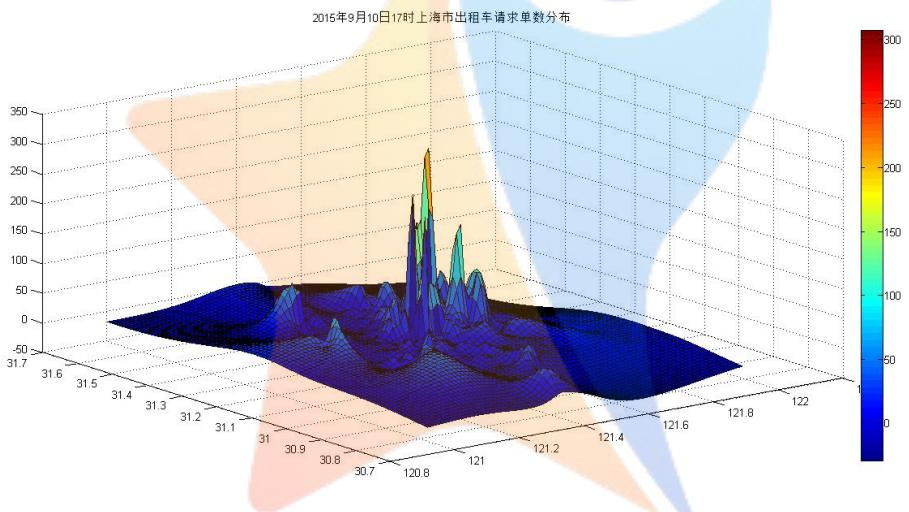

Figure 13: 方格区域选取初筛  
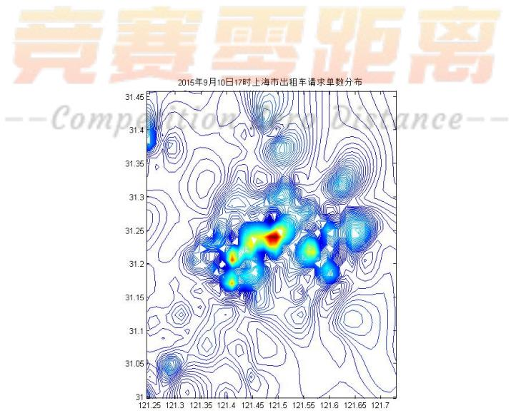  
Figure 14: 方格区域定经纬度-等高线

考虑到数据的规模和处理的便捷程度，我们选取了7个数据点进一步展开模型。对于得到的10\*10的方格，我们通过随机数生成坐标选取7个点落在地图上；对于每个点，我们统计其所在方格内的平均数据作为该点所在方格中心点的代表数据、以方格中心点为准计算和其他选定点之间的边界距离作为最短距离。由此，我们得到了，以样本1为为代表的最短距离矩阵和点对间的需求矩阵

<table><tr><td rowspan=1 colspan=1>0</td><td rowspan=1 colspan=1>1.400063</td><td rowspan=1 colspan=1>3.50058</td><td rowspan=1 colspan=1>3.500326</td><td rowspan=1 colspan=1>3.500411</td><td rowspan=1 colspan=1>5.600589</td><td rowspan=1 colspan=1>4.200442</td></tr><tr><td rowspan=1 colspan=1>1.400063</td><td rowspan=1 colspan=1>0</td><td rowspan=1 colspan=1>4.900643</td><td rowspan=1 colspan=1>4.900389</td><td rowspan=1 colspan=1>2.100348</td><td rowspan=1 colspan=1>7.000652</td><td rowspan=1 colspan=1>2.800379</td></tr><tr><td rowspan=1 colspan=1>3.50058</td><td rowspan=1 colspan=1>4.900643</td><td rowspan=1 colspan=1>0</td><td rowspan=1 colspan=1>7.000906</td><td rowspan=1 colspan=1>2.800295</td><td rowspan=1 colspan=1>3.500242</td><td rowspan=1 colspan=1>7.701022</td></tr><tr><td rowspan=1 colspan=1>3.500326</td><td rowspan=1 colspan=1>4.900389</td><td rowspan=1 colspan=1>7.000906</td><td rowspan=1 colspan=1>0</td><td rowspan=1 colspan=1>7.000737</td><td rowspan=1 colspan=1>4.900727</td><td rowspan=1 colspan=1>4.900304</td></tr><tr><td rowspan=1 colspan=1>3.500411</td><td rowspan=1 colspan=1>2.100348</td><td rowspan=1 colspan=1>2.800295</td><td rowspan=1 colspan=1>7.000737</td><td rowspan=1 colspan=1>0</td><td rowspan=1 colspan=1>4.900304</td><td rowspan=1 colspan=1>4.900727</td></tr><tr><td rowspan=1 colspan=1>5.600589</td><td rowspan=1 colspan=1>7.000652</td><td rowspan=1 colspan=1>3.500242</td><td rowspan=1 colspan=1>4.900727</td><td rowspan=1 colspan=1>4.900304</td><td rowspan=1 colspan=1>0</td><td rowspan=1 colspan=1>9.801032</td></tr><tr><td rowspan=1 colspan=1>4.200442</td><td rowspan=1 colspan=1>2.800379</td><td rowspan=1 colspan=1>7.701022</td><td rowspan=1 colspan=1>4.900304</td><td rowspan=1 colspan=1>4.900727</td><td rowspan=1 colspan=1>9.801032</td><td rowspan=1 colspan=1>0</td></tr></table>

Figure 15: 最短距离矩阵

<table><tr><td rowspan=1 colspan=1>0</td><td rowspan=1 colspan=1>3.463542</td><td rowspan=1 colspan=1>26.58824</td><td rowspan=1 colspan=1>4.366667</td><td rowspan=1 colspan=1>2</td><td rowspan=1 colspan=1>8.228571</td><td rowspan=1 colspan=1>3.980392</td><td rowspan=1 colspan=1>48.62741</td></tr><tr><td rowspan=1 colspan=1>15.41333</td><td rowspan=1 colspan=1>0</td><td rowspan=1 colspan=1>26.58824</td><td rowspan=1 colspan=1>7.277778</td><td rowspan=1 colspan=1>1.5</td><td rowspan=1 colspan=1>8.228571</td><td rowspan=1 colspan=1>2.843137</td><td rowspan=1 colspan=1>61.85106</td></tr><tr><td rowspan=1 colspan=1>20.55111</td><td rowspan=1 colspan=1>3.463542</td><td rowspan=1 colspan=1>0</td><td rowspan=1 colspan=1>8.733333</td><td rowspan=1 colspan=1>3.5</td><td rowspan=1 colspan=1>10.28571</td><td rowspan=1 colspan=1>2.27451</td><td rowspan=1 colspan=1>48.80821</td></tr><tr><td rowspan=1 colspan=1>10.27556</td><td rowspan=1 colspan=1>2.078125</td><td rowspan=1 colspan=1>17.72549</td><td rowspan=1 colspan=1>0</td><td rowspan=1 colspan=1>1.5</td><td rowspan=1 colspan=1>8.228571</td><td rowspan=1 colspan=1>1.705882</td><td rowspan=1 colspan=1>41.51362</td></tr><tr><td rowspan=1 colspan=1>7.706667</td><td rowspan=1 colspan=1>5.541667</td><td rowspan=1 colspan=1>35.45098</td><td rowspan=1 colspan=1>8.733333</td><td rowspan=1 colspan=1>01</td><td rowspan=1 colspan=1>0.28571</td><td rowspan=1 colspan=1>4.54902</td><td rowspan=1 colspan=1>72.26738</td></tr><tr><td rowspan=1 colspan=1>10.27556</td><td rowspan=1 colspan=1>3.463542</td><td rowspan=1 colspan=1>26.58824</td><td rowspan=1 colspan=1>10.18889</td><td rowspan=1 colspan=1>2.5</td><td rowspan=1 colspan=1>0</td><td rowspan=1 colspan=1>3.980392</td><td rowspan=1 colspan=1>56.99661</td></tr><tr><td rowspan=1 colspan=1>12.84444</td><td rowspan=1 colspan=1>4.15625</td><td rowspan=1 colspan=1>17.72549</td><td rowspan=1 colspan=1>4.366667</td><td rowspan=1 colspan=1>21</td><td rowspan=1 colspan=1>2.34286</td><td rowspan=1 colspan=1>0</td><td rowspan=1 colspan=1>53.43571</td></tr><tr><td rowspan=1 colspan=1>77.06667</td><td rowspan=1 colspan=1>22.16667</td><td rowspan=1 colspan=1>150.6667</td><td rowspan=1 colspan=1>43.66667</td><td rowspan=1 colspan=1>13</td><td rowspan=1 colspan=1>57.6</td><td rowspan=1 colspan=1>19.33333</td><td rowspan=1 colspan=1>0</td></tr></table>

Figure 16: 点对间需求矩阵

注意这里由于是网格地图，所以点对间最短距离是无向的。但在实际生活中，存在诸如单行道限制等众多实际问题，A到B地的最短距离反之并不一定是B到A地的最短距离。此外，由于打车需求量仅表示离开采样点的需求量，所以我们专门对该区域范围内的出租车出行轨迹数据进行了抓取，得到了非对称的点对间需求矩阵。具体讨论过程中我们选择使用meshin1数据表格。

## 5.2.3 具体分类讨论过程

当出租车在搜索乘客时，其不仅受行驶路程影响，还需要考虑需求的分布特征，即以期望最短行驶路径达到最有可能存在的最大需求出，行驶路径和需求分布特征共同决定了搜索行为，那么位于j小区的空驶出租车搜索至下一个i小区行驶的单词期望空驶里程 $\boldsymbol { d } _ { j }$ 为

$$
d _ { j } = \sum _ { i \in I } d _ { j i } P _ { j i }\tag{11}
$$

当我们分别求出j小区空驶出租车的单词期望空驶里程与规模后，即可求得研究范围内搜索产生的出租车空驶里程V,有

$$
V = \sum _ { j \in j } E _ { j } d _ { j } = \sum _ { j \in J } \sum _ { i \in I } d _ { i j } \sum _ { i \in I } u _ { j i } P _ { j i }\tag{12}
$$

## (a) 使用打车软件但是没有补贴机制的情况

在使用了打车软件的情况下，出租车司机改变了传统依靠自身储备信息以及常识来寻找潜在乘客的模式，空驶时可与乘客提前充分沟通，并且选择最短路径到达所定地点。值得注意的是，我们认为某地点的需求总量的吸引力体现在司机更可能去往该区域来锁定订单，故仍处于我们的参量考察范围内；另外，司机个人也具有使用打车软件的不同习惯，这会影响到他最终的搜索决策，故也应纳入考量中。

综上所述，我们引入了参数对 $( \theta , \mu )$ ，其中，θ为司机对于软件的信任、偏好程度，越大说明司机越愿意使用打车软件进行乘客的搜索； $\mu$ 为乘客需求量对司机吸引力的转化系数，目的是使得距离与需求可加，并且mu越大表示乘客需求变化量对于司机行为影响越明显。

从而建立了如下方程,引入吸引力指标函数：

$$
A _ { i j } = e x p [ \theta ( - d _ { i j } + \mu Q _ { i } ) ] \qquad ( 1 3 )
$$

根据查阅资料后确定使用 $( \theta , \mu ) { = } ( 0 . 3 , 0 . 0 5 ) ^ { [ 6 ] }$ ，结合5.2.2中的数据，可以得到 $P _ { i j }$ 的7\*7表格，如表所示：

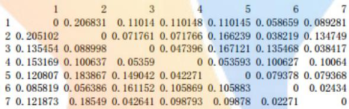  
Figure 17: $P _ { i j }$ 矩阵

进一步，根据式（12）求出 $\mathrm { V } = 9 3 9 . 7 6 1 0 \mathrm { k m }$

(b) 使用打车软件并且有补贴机制的情况在研究之初，我们小组遇到了一定的困难，即：用什么指标来表征补贴机制对于出租车行为的改变。最后，我们确定使用双向的参数简化司机决策的过程。

实际过程中，补贴是双向的，一方面，司机得到了每单奖励或者燃油补贴，刺激了其可接受的最长搜索距离；另一方面，乘客的需求也被公司的补贴政策所激发，表现为总需求的增大。由此，我们在(a)讨论的基础上引入了新的参数 $\scriptstyle \chi _ { \mathrm { \ v { h } } } ^ { + } ( \mathrm { m , n } )$ 来研究其对于出租车行为的影响。这里，我们发现目标函数 $P _ { i j } ^ { \prime } ( d _ { i j } , Q _ { i } )$ 在研究域D上应有如下若干特性：

i) 无穷处趋于0；

ii) D内连续，可能为分段函数，但依然可以用若干个正域可导函数来拟合；

iii) $d _ { i j } = 0 \mathbb { H }$ 没有意义，趋势是先增大后减小的，且可能存在极值点。

在尝试过使用收放因子控制 $( \theta , \mu )$ 的影响后，效果并不理想；最后，我们受到信号系统研究中常见信号的启发，提出如下的函数模型：

$$
A _ { i j } \prime = \frac { e x p [ \theta ( - d _ { i j } + \mu Q _ { i } ) ] + e x p [ m ( - d _ { i j } + n Q _ { i } ) ] } { 2 }\tag{14}
$$

可以看到，式子为对称形式，故可定义m为给予补贴后司机对于软件的信任、偏好程度；n在基于原有miu的基础上，增加了调节功能，用来表示补贴对乘客需求量增加的衡量，由此得到m，n的取值范围：

$\theta \leq m$ ，其中M是由自然、不可控因素决定的上限；

$\mu \leq n \leq N$ ，其中N是由公司投入成本，市场具体情况，消费者偏好共同决定的上限；但是由于M、N的取值不是本文具体讨论重点，且可能涉及到公司的商业机密，故假定 $\mathrm { M } = 0 . 7 , \mathrm { N } = 0 . 1$ ；

根据过往滴滴打车、快的打车公司（两者市场总份额约为90%）的补贴政策的改变过程，如后表

拟固定 $( \mathrm { m } , \mathrm { n } ) = ( 0 . 5 , 0 . 0 6 )$ ，进而可以得到 $P _ { i j } ^ { \prime }$ 表

<table><tr><td rowspan=2 colspan=1>时间</td><td rowspan=1 colspan=2>快的补贴政策</td><td rowspan=2 colspan=1>时间</td><td rowspan=1 colspan=2>滴滴补贴政策</td></tr><tr><td rowspan=1 colspan=1>乘客</td><td rowspan=1 colspan=1>司机</td><td rowspan=1 colspan=1>乘客</td><td rowspan=1 colspan=1>司机</td></tr><tr><td rowspan=1 colspan=1>2014.01.20</td><td rowspan=1 colspan=1>10</td><td rowspan=1 colspan=1>10</td><td rowspan=1 colspan=1>2014.01.10</td><td rowspan=1 colspan=1>10</td><td rowspan=1 colspan=1>10</td></tr><tr><td rowspan=1 colspan=1>2014.02.17</td><td rowspan=1 colspan=1>11</td><td rowspan=1 colspan=1>5-11</td><td rowspan=1 colspan=1>2014.02.17</td><td rowspan=1 colspan=1>10-15</td><td rowspan=1 colspan=1>0</td></tr><tr><td rowspan=1 colspan=1>2014.02.18</td><td rowspan=1 colspan=1>13</td><td rowspan=1 colspan=1>0</td><td rowspan=1 colspan=1>2014.02.18</td><td rowspan=1 colspan=1>12-20</td><td rowspan=1 colspan=1>0</td></tr><tr><td rowspan=1 colspan=1>2014.03.04</td><td rowspan=1 colspan=1>10</td><td rowspan=1 colspan=1>0</td><td rowspan=1 colspan=1>2014.03.07</td><td rowspan=1 colspan=1>6-15</td><td rowspan=1 colspan=1>0</td></tr><tr><td rowspan=1 colspan=1>2014.03.05</td><td rowspan=1 colspan=1>5</td><td rowspan=1 colspan=1>0</td><td rowspan=1 colspan=1>2014.03.23</td><td rowspan=1 colspan=1>3-5</td><td rowspan=1 colspan=1>0</td></tr><tr><td rowspan=1 colspan=1>2014.03.22</td><td rowspan=1 colspan=1>3-5</td><td rowspan=1 colspan=1>0</td><td rowspan=1 colspan=1>2014.05.17</td><td rowspan=1 colspan=1>0</td><td rowspan=1 colspan=1>0</td></tr><tr><td rowspan=1 colspan=1>2014.05.17</td><td rowspan=1 colspan=1>0</td><td rowspan=1 colspan=1>0</td><td rowspan=1 colspan=1>2014.07.09</td><td rowspan=1 colspan=1>0</td><td rowspan=1 colspan=1>2</td></tr><tr><td rowspan=1 colspan=1>2014.07.09</td><td rowspan=1 colspan=1>0</td><td rowspan=1 colspan=1>2</td><td rowspan=1 colspan=1>2014.08.12</td><td rowspan=1 colspan=1>0</td><td rowspan=1 colspan=1>0</td></tr><tr><td rowspan=1 colspan=1>2014.08.09</td><td rowspan=1 colspan=1>0</td><td rowspan=1 colspan=1>0</td><td rowspan=1 colspan=1></td><td rowspan=1 colspan=1></td><td rowspan=1 colspan=1></td></tr></table>

Figure 18: 补贴金额

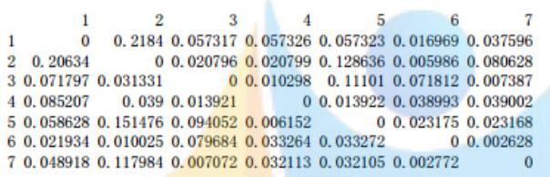  
Figure 19: 最短距离矩阵

根据式（10）得到此时 $V \prime = 4 0 3 . 2 1 9 7 \leq V$ ，说明双向补贴对于缓解打车难有一定的帮助。

另外，我们还想研究V关于(m, n)对的变化情况，将相关数据导入matlab中作图，画出V0等高线的分布情况，具体如图20：

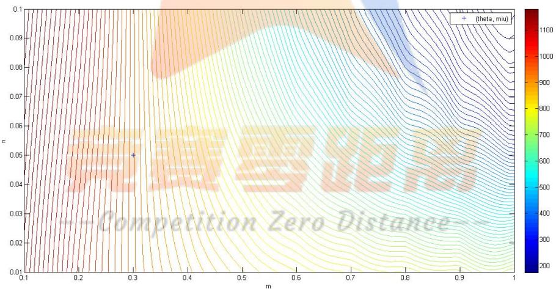  
Figure 20: 等高线分布情况

图像的颜色深浅代表了V0的取值，可以得到直观的结论，即：V0在考察范围内均小于(a)中得到的总空驶路程，从而得到打车软件公司的补贴方案对缓解”打车难”有一定帮助，但是仍然存在较长的空驶路程。

## 5.3 问题(3)的模型建立与求解

本环节将探讨实际操作过程中，补贴方案对于社会总福利的影响。在我国传统出租车市场中，社会福利的最大化是由政府部门出租车系统的运营规模、服务价格及服务质量等方面相关管制政策保证的；随着打车软件的出现，新兴的服务方式开始占据一定的市场份额，此时，龙头公司的福利决策方案可以甚至必然会对现有社会福利产生影

响。社会总福利根据社会学定义是由消费者剩余与生产者剩余两方面构成，在出租车行业主要表现为司乘双方的剩余价值。保证消费者剩余可提高乘客的满意度，维持消费刺激；保证生产者剩余有利于出租车行业的可持续发展Θ<sup>[7]</sup>

## 5.3.1 建立社会总福利函数与补贴的函数关系

乘客需求受到出租车价格与等待时间的影响，价格与等待时间增加则会抑制乘客需求，等待时间可直接与出租车空驶里程相关，即：空驶里程越大，出租车空驶在道路上的概率越大，乘客越容易搭乘空驶出租车。根据文献中的结论，本文将采用经济学中柯布—道格拉斯函数.<sup>[8]</sup>形式来量化需求与价格及里程的关系，即：

$$
D = k _ { 1 } p ^ { \alpha } t ^ { \beta }\tag{15}
$$

$$
t = k _ { 2 } V ^ { \gamma }\tag{16}
$$

其中，D为出租车出行需求，即实载里程（km）；p表示出租车价格（元）；t表示乘客等待时间（min）；V同第二问，表示出租车空势里程（km）；α为价格需求弹性；β为等待时间需求弹性；γ表示空驶里程需求弹 $\gamma$ 性； $k _ { 1 } \setminus k _ { 2 }$ 表示需求弹性系数，由城市的经济水平、空间布局、路网特征等因素综合确定。由于出租车的需求与价格及空驶里程均呈负相关性，有 $\alpha \setminus \beta \setminus \gamma \leq 0$ 。

我们研究一个封闭的社会模型R，对于其中的某一出租车个体i与其当前服务的乘客有如下剩余价值模型：

(1)出租车个体i的剩余价值 $S _ { d }$ ：

$$
S _ { d } = p D - c ( D + V )\tag{17}
$$

其中， $\mathrm { p }$ 为单位里程平均运价（元），c为平均单位里程成本。

(2)针对i当前运送过程，乘客的剩余价值 $S _ { p } { \mathrm { : } }$ ：由以上式子可得：

$$
p = ( \frac { D } { k _ { 1 } k _ { 2 } ^ { \beta } V ^ { \gamma \beta } } ) ^ { \frac { 1 } { \alpha } }\tag{18}
$$

根据相关研究价格弹性系数 $\alpha \leq - 1$ 符合现实情况，所以乘客剩余价值 $S _ { p }$ 可表示为

$$
S _ { p } = \left\{ \begin{array} { r l r } & { \int _ { 0 } ^ { D _ { i } } \big ( \frac { x } { k _ { 1 } k _ { 2 } ^ { \beta } V _ { i } \gamma ^ { \beta } } \big ) ^ { \frac { 1 } { \alpha } } d x - p D _ { i } } & { \quad \alpha \ge - 1 , } \\ & { = \big ( \frac { 1 } { k _ { 1 } k _ { 2 } ^ { \beta } V _ { i } \gamma ^ { \beta } } \big ) ^ { \frac { 1 } { \alpha } } \frac { D ^ { \frac { 1 } { \alpha } } } { \frac { 1 } { \alpha } + 1 } - p D } & \\ & { \infty } & { \quad \alpha \ne - 1 . } \end{array} \right.\tag{19}
$$

最终我们得到，对于每一司乘对，均可表示为：

$$
\begin{array} { r l } & { S _ { i } = S _ { r } + S _ { p } } \\ & { { = } \overline { { p } } \overset { ? } { \underset { i } { \supseteq } } \alpha / \overset { \circ } { c } ( \underline { p _ { i } } \notin { \dot { V _ { i } } } ) ^ { \prime } \dot { \mathcal { I } } ( \frac { \mathcal { M } \underset { 1 } { \iint } \mathcal { D } } { k _ { 1 } k _ { 2 } ^ { \beta } V _ { i } \gamma ^ { \beta } } ) ^ { \frac { \mathbb { 1 } } { \alpha } } \frac { D _ { i } \frac { 1 } { \alpha } \overline { { \dot { \alpha } } } ^ { + 1 } \dot { \mathcal { I } } } { \frac { 1 } { \alpha } + 1 } \overset { \mathbb { \le } } { \underset { q } { \displaybreaks } } \overset { \alpha } { \underset { q } { \underbrace { p } } } \underline { { \mathcal { P } } } \underline { p _ { i } } \overset { \mathcal { P } } { \underset { q } { \wedge } } \overline { { q } } \overline { { q } } \overline { { u } } \overline { { a } } \overline { { d ( 2 0 ) } } } \\ & { = ( \frac { 1 } { k _ { 1 } k _ { 2 } ^ { \beta } V _ { i } ^ { \gamma \beta } } ) ^ { \frac { 1 } { \alpha } } \frac { D _ { i } \frac { 1 } { \alpha } + 1 } { \frac { 1 } { \alpha } + 1 } - c ( D _ { i } + V _ { i } ) , \alpha < - 1 } \end{array}
$$

则对于此社会R，社会总福利S为

$$
S = \sum _ { i = 1 } S _ { i } = \sum _ { i = 1 } ( \frac { 1 } { k _ { 1 } k _ { 2 } ^ { \beta } V _ { i } ^ { \gamma \beta } } ) ^ { \frac { 1 } { \alpha } } \frac { D _ { i } ^ { \ \frac { 1 } { \alpha } + 1 } } { \frac { 1 } { \alpha } + 1 } - c ( D _ { i } + V _ { i } ) , \alpha < - 1\tag{21}
$$

其中， $D _ { i }$ 由 $\textstyle { \bigoplus _ { \mathbf { V } } }$ （柯布-道格拉斯函数）可得：

$$
D _ { i } = k _ { 1 } k _ { 2 } ^ { \beta } p ^ { \alpha } V _ { i } ^ { \gamma \beta }\tag{22}
$$

带入式（21）化简可以得到：

$$
S = \sum _ { i \in R } [ \frac { p ^ { \alpha + 1 } \alpha } { \alpha + 1 } ( k _ { 1 } k _ { 2 } ^ { \beta } ) ^ { \frac { 1 } { \alpha } } V _ { i } ^ { \frac { \gamma \beta } { \alpha } } - c ( k _ { 1 } k _ { 2 } ^ { \beta } p ^ { \alpha } V _ { i } ^ { \gamma \beta } + V _ { i } ) ]\tag{23}
$$

结合第二问模型，V实际上是一个关于 $( \mathrm { m } , \mathrm { n } )$ 的二元函数，可以得到：

$$
\left\{ \begin{array} { l l } { { S = \displaystyle \sum _ { i \in R } \lbrack { \frac { p ^ { \alpha + 1 } \alpha } { \alpha + 1 } } ( k _ { 1 } k _ { 2 } ^ { \beta } ) ^ { \frac { 1 } { \alpha } } V _ { i } ^ { \frac { \gamma \beta } { \alpha } } - c ( k _ { 1 } k _ { 2 } ^ { \beta } p ^ { \alpha } V _ { i } ^ { \gamma \beta } + V _ { i } ) \rbrack } } \\ { { V = \displaystyle \sum _ { i \in R } V _ { i } } } \\ { { V = \displaystyle \sum _ { k \in I } E _ { k } d _ { k } = g ( m , n ) } } \\ { { \alpha < - 1 } } \end{array} \right. \qquad \Longrightarrow { } ~ ,\tag{24}
$$

为了衡量具体金额的补贴对于社会福利的影响，我们 $\stackrel { \wedge } { \vec { \mathrm { \tiny ~ \times ~ } } } r _ { 1 }$ 为研究范围内整个市场对于司机的补贴金额期望$( \overline { { \mathcal { \pi } } } /$ 单） $r _ { 2 }$ 为研究范围内整个市场对于乘客的补贴金额期望 $( { \overline { { \pi } } } / { \dot { \mathbb { H } } } )$ ）；而对于福利决策方案来说，假设我们对司机补贴 $x _ { 1 } ( { \overline { { \pi } } } /$ 单），对乘客补贴 $x _ { 2 } ( { \overline { { \mathcal { T } } } } \ L /$ 单），则可以建立新的 $( m \prime , n \prime )$ 参数对，表达了 $\mid x _ { 1 } , x _ { 2 }$ 在市场中的刺激作用：

(25)

$$
\begin{array} { c } { { m } { \prime = \left( x _ { 1 } / r _ { 1 } \right) * m } } \\ { { } } \\ { { n } { \prime = \left( x _ { 2 } / r _ { 2 } \right) * n } } \end{array}\tag{26}
$$

可以看到，当 $x _ { 1 } = r _ { 1 }$ 且 $x _ { 2 } = r _ { 2 }$ 时，我们的补贴方案是不影响原社会总福利的；将式（25）(26)带入到式（24），即用 $( m \prime , n \prime )$ 替代原来的 $( m , n )$ 参数对，得到了实施特定补贴方案 $( x _ { 1 } , x _ { 2 } )$ 时的社会总福利模型：

$$
\left\{ \begin{array} { l l } { \displaystyle S = \sum _ { i \in R } \big [ \frac { p ^ { \alpha + 1 } \alpha } { \alpha + 1 } \big ( k _ { 1 } k _ { 2 } ^ { \beta } \big ) ^ { \frac { 1 } { \alpha } } V _ { i } ^ { \frac { \gamma \beta } { \alpha } } - c \big ( k _ { 1 } k _ { 2 } ^ { \beta } p ^ { \alpha } V _ { i } ^ { \gamma \beta } + V _ { i } \big ) \big ] } \\ { \displaystyle V = \sum _ { i \in R } V _ { i } } \\ { \displaystyle V = \sum _ { k \in I } E _ { k } d _ { k } = g \big [ \big ( \frac { x _ { 1 } } { r _ { 1 } } \big ) m , \big ( \frac { x _ { 2 } } { r _ { 2 } } \big ) n \big ] } \\ { \displaystyle \alpha < - 1 } \end{array} \right. \qquad \Longrightarrow \qquad \left\{ \begin{array} { l l } { \displaystyle \frac { 1 } { \alpha + 1 } \big ( k _ { 1 } k _ { 2 } ^ { \beta } \big ) ^ { \frac { 1 } { \alpha } } V _ { i } ^ { \frac { \gamma \beta } { \alpha } } - c \big ( k _ { 1 } k _ { 2 } ^ { \beta } p ^ { \alpha } V _ { i } ^ { \gamma \beta } + V _ { i } \big ) \big ] } \\ { \displaystyle \alpha \geq - 1 } \end{array} \right.\tag{27}
$$

其中，k1，k2，α，β，γ在不同系统下为常数，不属于本文讨论的重点。查阅相关资料后，根据上海市数据统计，再经计算后可以得到以上相关常数的取值： $k _ { 1 } = 4 5 0 6 1$ $k _ { 2 } = 1 3 8 6$ $\alpha = - 1 . 3$ ，β = -0.2， $\gamma = -$ 1， $c = 1 . 8 0 3$ $p = 4 . 4 1$ 。与问题（2）假定的 $( \mathrm { m } , \mathrm { n } )$ 取一样的值，即： $( \mathrm { m } , \mathrm { n } ) = ( 0 . 5 , 0 . 0 6 )$ ；使用Matlab仿真模拟得到了S变化量程度 $( S { - } S _ { 0 } ) / S _ { 0 }$ 与 $\left( { { x _ { 1 } } / { r _ { 1 } } , { x _ { 2 } } / { r _ { 2 } } } \right)$ 的图像，如图，具体数据见附录：

## 从以上数据可以看出:

(1)对出租车司机或者乘客采取价格补贴是一个有助于提高社会总福利的手段。实际上影响出租车服务成交量的要素是出租车服务在消费者和司机心中产生的价格预期，所以说价格低不一定对提高服务量，增大社会总福利有积极意义。

(2)对上图研究表明:在绝对值优惠低时,相对值优惠效应明显;在绝对优惠高时,相对值优惠效应不明显。所以同时增加对顾客和司机的补贴是可以达到增加总社会福利的效果。但是考虑到公司的补贴成本，增加对司机的补贴会比较有效。对于大部分乘客来说表现为价格不敏感，因为愿意花时间使用红包的人必定是价格敏感的，所以对于乘客

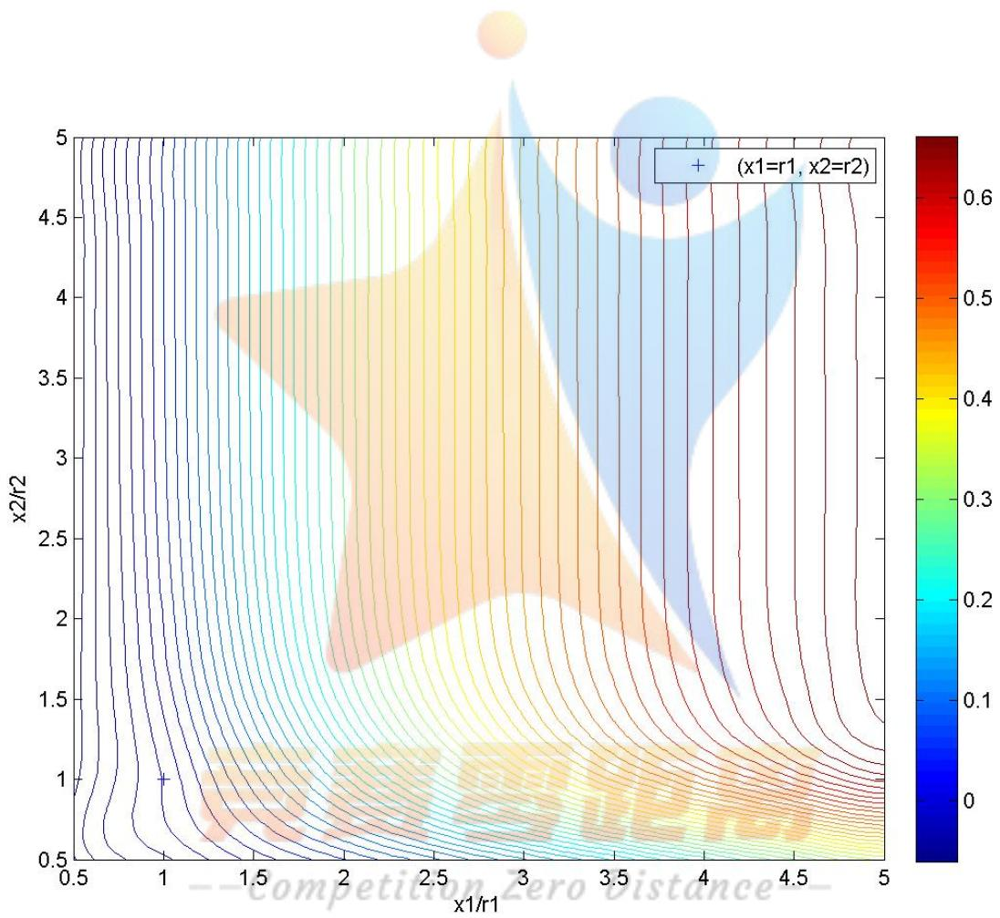  
Figure 21: $( S { - } S _ { 0 } ) / S _ { 0 } \varTheta ( x _ { 1 } / r _ { 1 } , x _ { 2 } / r _ { 2 } )$ 的关系

更有效率的补贴方式是采用红包的方式。

## 5.3.2 方案的确定

考虑到每次打车行为都涉及到一个司机与乘客的补贴问题，所以当总投入为定值的情况下，可以考虑成比例的 $( x _ { 1 } / r _ { 1 } , x _ { 2 } / r _ { 2 } ) \mathbb { X } \mathbb { 1 }$ ，则此时，可以作若干条直 $\frac { \ d _ { 4 } } { \ d x } \mathrm { { x } 1 / \mathrm { { r } 1 + \ x 2 / \mathrm { { r } 2 = \mathrm { { w } } } } }$ ，w为单次打车公司投入金额系数，w越大说明投入力度越大；求其与等高线的切点。平移直线得到了直线系，并且得到若干切点，顺序连接切点，即可得到当前比例下的最佳投入刺激曲线，曲线与直线系的交点决定了最终的投入方案，例如：按照表（滴滴快的竞争）可以假设当前 ${ \mathrm { \dot { \mathbf { r } } } } 1 = 5 , \ { \mathrm { \mathbf { r } } } 2 = 5$ ，从而绘制出了图

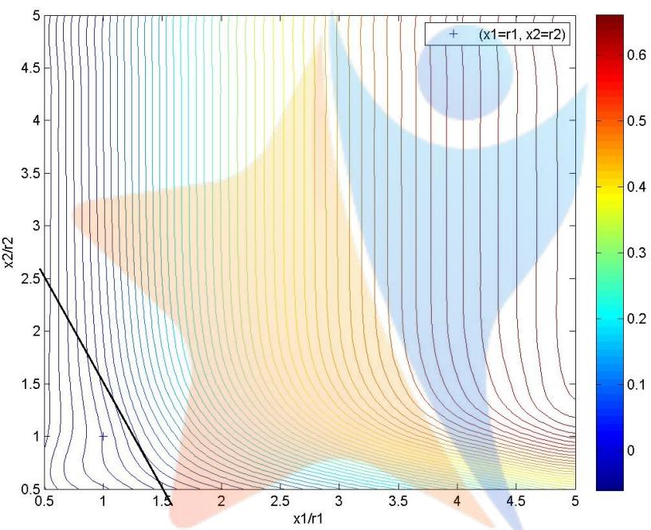  
Figure 22: 决策方案图

若 $\mathrm { ~ w ~ } = 2 . 5$ ，可以得到 $x _ { 2 } / r _ { 2 }$ 可以得到 $x _ { 2 } / r _ { 2 } = 2 . 5 , \ x _ { 1 } / r _ { 1 } = 1 . 5$ ，即此时 $x _ { 1 } = 1 5 , x _ { 2 } = 1 2 . 5$ 为最优的补贴方案。

## 6 模型的评价

## 6.1 模型的优点

（1）建立了出租车数量、请求单数、用户等待时间的评价指标，并采用模拟曲面的思想方法分析问题，将评价指标用高度以及颜色表示，其连续的变化趋势以及尖点均直观的表示了出来，便于统计和定性的分析。

（2）采用聚簇的思想对大量数据进行筛选和近似处理，所谓“聚簇”是为了提高对于某个属性的搜索或者使用的效率，因为数据量高达10000点/天，且不同指标取样点的经纬度不是严格对应的，所以，将地区分为若干块提取特征信息，并选择具有代表意义的网格，最终得出了较一般的定性结论。

（3）对于问题（2）的建模时首先考虑没有激励时的基础吸引力模型，并通过函数应该有的性质，联系专业知识，选择到了一个较为理想的函数模型与激励情况下较复杂的吸引力模型相对应。

（4）使用双向的考察方式，考虑了司乘双方对于补贴的激励响应，并定量讨论了两方面的影响，这是以往文献里所没有的，是本文的一大创新点。

（5）在定量研究具体决策问题的情况下，没有受到数据的限制，用r1，r2代替了具体市场情况，并且还联系实际，通过易元的方式改写原有函数，并由此建立了实际决策模型，拟合效果较好，并具有很强的实际意义。

## 6.2 模型的不足

（1）模型验证数据的来源仅为滴滴快的，虽然市场份额较大，实际情况中仍需要考虑其他市场份额的竞争问题。

（2）实际情况中，出租车不能简单抽象为质点，还应该考虑道路容纳问题，简单调配会引起道路堵塞。

（3）在第二问的模型中，直接认为接单时间就是乘客从开始请求打车到已经搭乘上出租车的时间间隔，而实际上会一定程度上小于打车时间，故产生了时间上的模糊。

## 7 参考文献

[1]苍穹. 滴滴快的智能出行平台[DB/OL]. 2015-09-11, [2015-09-12]. http://v.kuaidadi.com/

[2]国务院办公厅. 国务院办公厅关于2015年部分节假日安排的通知[EB/OL]. 2014-12-16, [2015-09-11]. http://www.gov.cn/zhe12/16/content<sub>9</sub>302.htm

[3]Morisugi H, Arintono S, Parajuli BP. Fare level and fleet optimization of taxi and bus operation in Yogyakara, Indonesia[J]. Journal of the Eastern Asia Society for Transportation Studies, 1997, 2(5): 1547-1553.

[4]Shuo Ma; Yu Zheng; Wolfson, O., ”T-share: A large-scale dynamic taxi ridesharing service,” in Data Engineering (ICDE), 2013 IEEE 29th International Conference on , vol., no., pp.410-421, 8-12 April 2013.

[5]曹,陶宇,罗霞. 打车软件使用率对出租车社会福利的影响[J]. 交通运输系统工程与信息,2015,03:1-6+24.

[6]罗端高, 史峰. 考虑需求分布影响的城市出租车运营平衡模型[J]. 铁道科学与工程学报, 2009(1): 87-91

[7]袁长伟, 吴群琪. 不同目标下城市出租车最优实载率模型[J]. 长安大学学报(自然科学版), 2014, 34(2): 88-93

[8]Douglas G W. Price regulation and optimal service standards: The taxicab industry[J]. Journal of Transport Economics and Policy, 1972, 6(2): 116-12

[9]冯晓梅. 供需平衡状态下的出租车发展规模研究[D].西南交通大学,2010.

## 附录

## 附录1 问题（1）主要代码

## 附录1.1 网页爬虫

```python
#-
# Name: parser
# Purpose: 抓取“苍穹”网站数据的 Python爬虫
# Created: 12/09/2015
# Copyright: (c) 数模小组 2015
# 运行环境 Python 2.7.10
共
import urllib2
import datetime
def toDate(date):# 对网站请求所需的绝对日期 date 进行相对转换
date0=datetime.date.today()-datetime.timedelta(8)
DGo=date0+datetime.timedelta(date)
DATE="%02d"%int(DGo.month)+"%02d"%int(DGo.day)
return DATE
def urlString(date, item):# 生成请求 URL
return
"http://v.kuaidadi.com/point?cityId=310100&scope=city&date="+str(date)+"&dimension="+it
em+"&num=300"
def get_page(date, item):
# date:int 0~(-100)
# item:string 'distribute', 'demand', 'response'
DATE=toDate(date)
Url=urlString(date,item)
try:
content=urllib2.urlopen(Url,timeout=default_timeout) # 超过响应时间则判 Error
Return=content.read()
except:
print("Error..."+DATE)
pass
return Return
```

```python
if __name__ == "__main__":
Item=['move']
default_timeout=60
for dx in range(6,5,-1):
for ix in Item:
content=get_page(dx,ix)
if (type(content)!=str or content==''):
print('------ cannot Catch '+str(dx)+'----')
break
origins=eval(content)
result=origins['result']
TrueDate=result['date']
TrueDate=TrueDate[0:4]+'-'+TrueDate[5:7]+'-'+TrueDate[8:10]
f=open(TrueDate+ix+'.csv','w')
mokyo=result['data']
for i in range(len(mokyo)):
print str(i)+'----'
line=mokyo[i]
for tis in range(len(line)):
arr=line[tis]
print len(arr[4])
f.write(str(i)+','+str(arr[1])+','+str(arr[2])+','+str(arr[3])+'\n')
f.close()
print(toDate(dx)+' finished...'+str(dx))
```

## 附录1.2出租车数量、请求单数、用户等待时间空间分布图3D

2015  9  6  17

```matlab
Dis=[];<sub>m1=17;</sub> m1=17;
for i=1:length(distribute)
if (distribute(i,1)==m1)
[Dis]=[Dis; distribute(i,:)];
end
end
figure
[x1]=Dis(:,2);[y1]=Dis(:,3);[z1]=Dis(:,4);
nxDis=linspace(min(x1),max(x1),100);
nyDis=linspace(min(y1),max(y1),100);
[xx1,yy1]=meshgrid(nxDis,nyDis);
[X1,Y1,Z1]=griddata(x1,y1,z1,xx1,yy1,'v4');
surf(X1,Y1,Z1);
```

```matlab
%colormap gray;
%axis equal;
xlabel('经度/°');
ylabel('纬度/°');
title('2015年9月6日高峰（17时）上海市出租车数量分布');
```

附录1.3特定商圈、城郊地区全天空驶率（事先用Excel处理好数据）变化折线图(以2015年8月30日全天东川路地铁站中心10km范围为例)

```matlab
data=xlsread('0830东川路.csv');
[t0]=data(:,1);
[K]=data(:,7);
figure;
plot(t0,K,'--
rs','LineWidth',2,'MarkerEdgeColor','k','MarkerFaceColor','g','Mark
erSize',10);
axis([0 24 0 1]);
set(gca,'xtick',0:1:24);
xlabel('t/小时');
ylabel('K/空驶率');
title('2015年8月30日（工作日）东川路地铁站中心10km范围内空载率全天变化图');
```

## 附录 2 问题（2）主要代码

附录2.1 边长7km 方形区域内请求单数等高线和随机位置（Excel随机指定）散点图（问题（2）基于2015年9月10日下午17时选定经纬区域内的全部数据)

```matlab
xmin=121.4;
xmax=121.4824
ymin=31.2;
ymax=31.263;
%经纬度范围
dx=(xmax-xmin)/9; dy=(ymax-ymin)/9;
nx=linspace(xmin,xmax+dx,11);
ny=linspace(ymin,ymax+dy,11);
demand=xlsread('0910demand.csv');
De=[];
m=17;
for i=1:length(demand)
if (demand(i,1)==m)
[De]=[De; demand(i,:)];
```

```matlab
end
end
figure;
[x1]=De(:,2);[y1]=De(:,3);[z1]=De(:,4);
nxDis=linspace(min(x1),max(x1),80);
nyDis=linspace(min(y1),max(y1),80);
[xx1,yy1]=meshgrid(nxDis,nyDis);
z2=griddata(x1,y1,z1,xx1,yy1,'v4');
contour(xx1,yy1,z2,200,'s');
axis([xmin xmax+dx ymin ymax+dy]);
set(gca,'xtick',nx);
set(gca,'ytick',ny);
set(gca,'DataAspectRatio',[110.94 85.276 1]); % 将横纵坐标按照经纬度折
算公里数缩放 使得图中显示恰好为正方形
grid on;
rotateticklabel(gca,'x',-30);
hold on;
Dio=xlsread('meshin4.xls');
scatter(Dio(:,2),Dio(:,1),90,'+r');
title('随机散点分布情况');
```

附录2.2（选取出7个随机点后）网格模型计算点对间最短路径、需求方向矩阵(计算量较大、只保留部分代码)

```matlab
%{
unit length: 700m
unit length: 700m
%}
Rand=xlsread('·¾¶.xlsx');
[Nil]=Rand(:,[1 2]);
[Distance]=Rand(:,[5:11]);
raw=xlsread('0910demand.csv');
mokyo=[];
m=17;
for i=1:length(raw)
if (raw(i,1)==m)
[mokyo]=[mokyo; raw(i,:)];
end
end
nx=linspace(xmin,xmax,10);
ny=linspace(ymin,ymax,10);
```

```matlab
dx=(xmax-xmin)/9; dy=(ymax-ymin)/9;
for i=1:1:7
for j=1:1:7
Demand(i,8)=Demand(i,8)+Demand(i,j);
end
end
disp(Demand)
xlswrite('meshin',NC,'Sheet1');
xlswrite('meshin',average,'Sheet2');
xlswrite('meshin',Distance,'Sheet3');
xlswrite('meshin',Demand,'Sheet4');
```

## 附录2.3网格模型概率矩阵计算

```matlab
function [P]=Pij(miu, fileName)
d=xlsread(fileName,3); % 最短路径矩阵
De=xlsread(fileName,4); % 方向需求矩阵（非对称）
P=zeros(7);
theta=0.3;
for i=1:1:7
Qi=De(i,8);
for j=1:1:7
if (i==j)
continue
end
fuko=exp(theta*(-d(i,j)+miu*Qi)); % 计算分子的值
<sup>fumu=0;</sup>for k=1:1:7
fumu=fumu+exp(theta*(-d(i,k)+miu*Qi)); % 计算分母的值
end
if (fumu~=0)
P(i,j)=fuko/fumu;
else
P(i,j)=0;
end
end
end
%disp(P);
end
```

附录2.4网格模型空驶总里程期望值计算

```matlab
function [V]=V0(miu,fileName)
d=xlsread(fileName,3);
De=xlsread(fileName,4);
[P]=Pij(miu,fileName);
V=0;
for i=1:1:7
Ei=De(8,i);
di=0;
for j=1:1:7
di=di+d(i,j)*P(i,j);
end
V=V+Ei*di;
end
%disp(V);
end
```

附录2.5 模型的敏感性分析（针对不同输入测试模型的输出结果——整体走势保持较高的相似度，证明模型具有较强的鲁棒性）

(以模型2随机文件1为例)

```matlab
M=0.8:0.2:2.4;
N=0.1:0.1:1;
x=[];
y=[];
z=[];
[Result]=zeros(length(M),length(N));
for i=1:length(M)
<sup>m0=M(i);</sup><sub>n0=N(j);</sub> n0=N(j);
V=Vmt(0.05,'meshin1.xls',m0,n0);
[x]=[x m0];
[y]=[y n0];
[z]=[z V];
Result(i,j)=V;
end
end
disp(Result);
xlswrite('Ä£ÐÍ2mesh1VÖµ.xls',Result);
nx=linspace(min(x),max(x),100);
ny=linspace(min(y),max(y),100);
```

```matlab
[xx,yy]=meshgrid(nx,ny);
figure
z1=griddata(x,y,z,xx,yy,'v4');
contour(xx,yy,z1,100,'s');
colorbar;
hold on;
h=plot(0.3,0.05,'+');
legend(h,'(theta, miu)');
xlabel('m');
ylabel('n');
```

## 附录3 问题（3）主要代码

附录3.1 社会总福利函数、对司机和乘客双方的补贴策略对(A,B)和社会总福利关系的计算

```matlab
function [S]=Tsa()
A=0.5:0.5:5;
B=0.5:0.5:5;
m=0.5;
n=0.06;
miu=0.05;
fileName='meshin1.xls';
p=4.41;% p为市场平均单位距离价格（元/公里）
alpha=-1.3;
beta=-0.2;
gamma=-1;% alpha, beta, gamma均为弹性系数
K1=45061;
<sup>K2=1386;</sup> 为单位距离运营成本（元 公里）
%------为方便求和运算 定义中间系数A1,A2,A
A1=(p^(alpha+1) * alpha * (K1*K2^beta)^(1/alpha))/(alpha+1);
A2=gamma*beta/alpha;
A3=K1*K2^beta*p^alpha;
A4=gamma*beta;
Base=S0();
d=xlsread(fileName,3);
x=[];
y=[];
z=[];
[Result]=zeros(length(A)+1,length(B)+1);
```

```matlab
for aa=1:1:length(A)
for bb=1:1:length(B)
对于每一组 求出当前概率矩阵 -%
[P]=PijD(miu, fileName, A(aa)*m, B(bb)*n);
%-----对于每一组A, B 求出当前以j为目的地的空驶里程期望数列-
[dj]=[];
for i=1:1:7
tmp=0;
for j=1:1:7
tmp=tmp+d(i,j)*P(i,j);
end
[dj]=[dj tmp];
end
对于每一组 求出社会福利
S=0;
for j=1:1:7
S=S + A1*dj(j)^A2-c*(A3*dj(j)^A4+dj(j));
end
ratio=(S-Base)/abs(Base);
disp(ratio);
%-----计算社会福利改变的百分比- -%
[x]=[x A(aa)];
[y]=[y B(bb)];
[z]=[z ratio];
Result(aa+1,bb+1)=ratio;
end
end
Result(2:length(A)+1,1)=A;
Result(1,2:length(B)+1)=B;
nx=linspace(min(x),max(x),100); nx=linspace(min(x),max(x),100);
ny=linspace(min(y),max(y),100);
[xx,yy]=meshgrid(nx,ny);
figure
z1=griddata(x,y,z,xx,yy,'v4');
h=contour(xx,yy,z1,50,'s');
colorbar;
hold on;
plot(1,1,'+');
xlabel('x1/r1');
ylabel('x2/r2');
saveas(h,'补贴比例-社会福利.jpg')
```

附录3.2 补贴策略矩阵与社会福利变化率数据
<table><tr><td rowspan=1 colspan=1></td><td rowspan=1 colspan=1>0.2</td><td rowspan=1 colspan=1>0.3</td><td rowspan=1 colspan=1>0.4</td><td rowspan=1 colspan=1>0.5</td><td rowspan=1 colspan=1>0.6</td><td rowspan=1 colspan=1>0.7</td><td rowspan=1 colspan=1>0.8</td></tr><tr><td rowspan=1 colspan=1>0.2</td><td rowspan=1 colspan=1>-0.09463</td><td rowspan=1 colspan=1>-0.09529</td><td rowspan=1 colspan=1>-0.09596</td><td rowspan=1 colspan=1>-0.09662</td><td rowspan=1 colspan=1>-0.09729</td><td rowspan=1 colspan=1>-0.09795</td><td rowspan=1 colspan=1>-0.09861</td></tr><tr><td rowspan=1 colspan=1>0.3</td><td rowspan=1 colspan=1>-0.08236</td><td rowspan=1 colspan=1>-0.08313</td><td rowspan=1 colspan=1>-0.08389</td><td rowspan=1 colspan=1>-0.08467</td><td rowspan=1 colspan=1>-0.08544</td><td rowspan=1 colspan=1>-0.08621</td><td rowspan=1 colspan=1>-0.08698</td></tr><tr><td rowspan=1 colspan=1>0.4</td><td rowspan=1 colspan=1>-0.07139</td><td rowspan=1 colspan=1>-0.07207</td><td rowspan=1 colspan=1>-0.07277</td><td rowspan=1 colspan=1>-0.07347</td><td rowspan=1 colspan=1>-0.07417</td><td rowspan=1 colspan=1>-0.07487</td><td rowspan=1 colspan=1>-0.07558</td></tr><tr><td rowspan=1 colspan=1>0.5</td><td rowspan=1 colspan=1>-0.06168</td><td rowspan=1 colspan=1>-0.06211</td><td rowspan=1 colspan=1>-0.06255</td><td rowspan=1 colspan=1>-0.06299</td><td rowspan=1 colspan=1>-0.06343</td><td rowspan=1 colspan=1>-0.06388</td><td rowspan=1 colspan=1>-0.06433</td></tr><tr><td rowspan=1 colspan=1>0.6</td><td rowspan=1 colspan=1>-0.05317</td><td rowspan=1 colspan=1>-0.05317</td><td rowspan=1 colspan=1>-0.05317</td><td rowspan=1 colspan=1>-0.05317</td><td rowspan=1 colspan=1>-0.05317</td><td rowspan=1 colspan=1>-0.05317</td><td rowspan=1 colspan=1>-0.05317</td></tr><tr><td rowspan=1 colspan=1>0.7</td><td rowspan=1 colspan=1>-0.04573</td><td rowspan=1 colspan=1>-0.04515</td><td rowspan=1 colspan=1>-0.04455</td><td rowspan=1 colspan=1>-0.04393</td><td rowspan=1 colspan=1>-0.0433</td><td rowspan=1 colspan=1>-0.04265</td><td rowspan=1 colspan=1>-0.042</td></tr><tr><td rowspan=1 colspan=1>0.8</td><td rowspan=1 colspan=1>-0.03925</td><td rowspan=1 colspan=1>-0.03796</td><td rowspan=1 colspan=1>-0.0366</td><td rowspan=1 colspan=1>-0.03519</td><td rowspan=1 colspan=1>-0.03374</td><td rowspan=1 colspan=1>-0.03225</td><td rowspan=1 colspan=1>-0.03074</td></tr><tr><td rowspan=1 colspan=1>0.9</td><td rowspan=1 colspan=1>-0.0336</td><td rowspan=1 colspan=1>-0.03147</td><td rowspan=1 colspan=1>-0.02923</td><td rowspan=1 colspan=1>-0.02686</td><td rowspan=1 colspan=1>-0.02441</td><td rowspan=1 colspan=1>-0.02188</td><td rowspan=1 colspan=1>-0.01931</td></tr><tr><td rowspan=1 colspan=1>1</td><td rowspan=1 colspan=1>-0.02864</td><td rowspan=1 colspan=1>-0.02559</td><td rowspan=1 colspan=1>-0.02233</td><td rowspan=1 colspan=1>-0.01886</td><td rowspan=1 colspan=1>-0.01523</td><td rowspan=1 colspan=1>-0.01148</td><td rowspan=1 colspan=1>-0.00766</td></tr><tr><td rowspan=1 colspan=1>1.1</td><td rowspan=1 colspan=1>-0.02427</td><td rowspan=1 colspan=1>-0.02022</td><td rowspan=1 colspan=1>-0.01582</td><td rowspan=1 colspan=1>-0.01111</td><td rowspan=1 colspan=1>-0.00614</td><td rowspan=1 colspan=1>-0.00098</td><td rowspan=1 colspan=1>0.004284</td></tr><tr><td rowspan=1 colspan=1>1.2</td><td rowspan=1 colspan=1>-0.02039</td><td rowspan=1 colspan=1>-0.01526</td><td rowspan=1 colspan=1>-0.00962</td><td rowspan=1 colspan=1>-0.00354</td><td rowspan=1 colspan=1>0.002926</td><td rowspan=1 colspan=1>0.009664</td><td rowspan=1 colspan=1>0.016555</td></tr><tr><td rowspan=1 colspan=1>1.3</td><td rowspan=1 colspan=1>-0.01691</td><td rowspan=1 colspan=1>-0.01064</td><td rowspan=1 colspan=1>-0.00367</td><td rowspan=1 colspan=1>0.003916</td><td rowspan=1 colspan=1>0.012028</td><td rowspan=1 colspan=1>0.02051</td><td rowspan=1 colspan=1>0.029187</td></tr><tr><td rowspan=1 colspan=1>1.4</td><td rowspan=1 colspan=1>-0.01375</td><td rowspan=1 colspan=1>-0.00629</td><td rowspan=1 colspan=1>0.002093</td><td rowspan=1 colspan=1>0.011309</td><td rowspan=1 colspan=1>0.02121</td><td rowspan=1 colspan=1>0.031589</td><td rowspan=1 colspan=1>0.042197</td></tr><tr><td rowspan=1 colspan=1>1.5</td><td rowspan=1 colspan=1>-0.01086</td><td rowspan=1 colspan=1>-0.00215</td><td rowspan=1 colspan=1>0.007732</td><td rowspan=1 colspan=1>0.018687</td><td rowspan=1 colspan=1>0.030512</td><td rowspan=1 colspan=1>0.042925</td><td rowspan=1 colspan=1>0.05559</td></tr><tr><td rowspan=1 colspan=1>1.6</td><td rowspan=1 colspan=1>-0.00819</td><td rowspan=1 colspan=1>0.001817</td><td rowspan=1 colspan=1>0.013288</td><td rowspan=1 colspan=1>0.026091</td><td rowspan=1 colspan=1>0.039965</td><td rowspan=1 colspan=1>0.054536</td><td rowspan=1 colspan=1>0.06936</td></tr><tr><td rowspan=1 colspan=1>1.7</td><td rowspan=1 colspan=1>-0.00568</td><td rowspan=1 colspan=1>0.005665</td><td rowspan=1 colspan=1>0.0188</td><td rowspan=1 colspan=1>0.033557</td><td rowspan=1 colspan=1>0.049595</td><td rowspan=1 colspan=1>0.066429</td><td rowspan=1 colspan=1>0.08349</td></tr><tr><td rowspan=1 colspan=1>1.8</td><td rowspan=1 colspan=1>-0.00331</td><td rowspan=1 colspan=1>0.009425</td><td rowspan=1 colspan=1>0.024302</td><td rowspan=1 colspan=1>0.041112</td><td rowspan=1 colspan=1>0.05942</td><td rowspan=1 colspan=1>0.078605</td><td rowspan=1 colspan=1>0.097955</td></tr><tr><td rowspan=1 colspan=1>1.9</td><td rowspan=1 colspan=1>-0.00105</td><td rowspan=1 colspan=1>0.013127</td><td rowspan=1 colspan=1>0.029822</td><td rowspan=1 colspan=1>0.04878</td><td rowspan=1 colspan=1>0.069449</td><td rowspan=1 colspan=1>0.091054</td><td rowspan=1 colspan=1>0.112721</td></tr><tr><td rowspan=1 colspan=1>2</td><td rowspan=1 colspan=1>0.00114</td><td rowspan=1 colspan=1>0.016796</td><td rowspan=1 colspan=1>0.035384</td><td rowspan=1 colspan=1>0.056579</td><td rowspan=1 colspan=1>0.079691</td><td rowspan=1 colspan=1>0.103763</td><td rowspan=1 colspan=1>0.12775</td></tr><tr><td rowspan=1 colspan=1>2.1</td><td rowspan=1 colspan=1>0.003267</td><td rowspan=1 colspan=1>0.020453</td><td rowspan=1 colspan=1>0.041008</td><td rowspan=1 colspan=1>0.064522</td><td rowspan=1 colspan=1>0.090144</td><td rowspan=1 colspan=1>0.116714</td><td rowspan=1 colspan=1>0.142999</td></tr><tr><td rowspan=1 colspan=1>2.2</td><td rowspan=1 colspan=1>0.005352</td><td rowspan=1 colspan=1>0.024116</td><td rowspan=1 colspan=1>0.046708</td><td rowspan=1 colspan=1>0.072619</td><td rowspan=1 colspan=1>0.100806</td><td rowspan=1 colspan=1>0.129882</td><td rowspan=1 colspan=1>0.158423</td></tr><tr><td rowspan=1 colspan=1>2.3</td><td rowspan=1 colspan=1>0.007408</td><td rowspan=1 colspan=1>0.027798</td><td rowspan=1 colspan=1>0.0525</td><td rowspan=1 colspan=1>0.080877</td><td rowspan=1 colspan=1>0.111668</td><td rowspan=1 colspan=1>0.143241</td><td rowspan=1 colspan=1>0.173975</td></tr><tr><td rowspan=1 colspan=1>2.4</td><td rowspan=1 colspan=1>0.009446</td><td rowspan=1 colspan=1>0.031513</td><td rowspan=1 colspan=1>0.058392</td><td rowspan=1 colspan=1>0.089298</td><td rowspan=1 colspan=1>0.122719</td><td rowspan=1 colspan=1>0.156762</td><td rowspan=1 colspan=1>0.189611</td></tr><tr><td rowspan=1 colspan=1>2.5</td><td rowspan=1 colspan=1>0.011477</td><td rowspan=1 colspan=1>0.035272</td><td rowspan=1 colspan=1>0.064394</td><td rowspan=1 colspan=1>0.097882</td><td rowspan=1 colspan=1>0.133946</td><td rowspan=1 colspan=1>0.170414</td><td rowspan=1 colspan=1>0.205284</td></tr><tr><td rowspan=1 colspan=1>2.6</td><td rowspan=1 colspan=1>0.013509</td><td rowspan=1 colspan=1>0.039081</td><td rowspan=1 colspan=1>0.07051</td><td rowspan=1 colspan=1>0.106627</td><td rowspan=1 colspan=1>0.145331</td><td rowspan=1 colspan=1>0.184165</td><td rowspan=1 colspan=1>0.220953</td></tr><tr><td rowspan=1 colspan=1>2.7</td><td rowspan=1 colspan=1>0.015547</td><td rowspan=1 colspan=1>0.042949</td><td rowspan=1 colspan=1>0.076746</td><td rowspan=1 colspan=1>0.115527</td><td rowspan=1 colspan=1>0.156858</td><td rowspan=1 colspan=1>0.197986</td><td rowspan=1 colspan=1>0.236578</td></tr><tr><td rowspan=1 colspan=1>2.8</td><td rowspan=1 colspan=1>0.017599</td><td rowspan=1 colspan=1>0.046882</td><td rowspan=1 colspan=1>0.083103</td><td rowspan=1 colspan=1>0.124577</td><td rowspan=1 colspan=1>0.168506</td><td rowspan=1 colspan=1>0.211846</td><td rowspan=1 colspan=1>0.252123</td></tr><tr><td rowspan=1 colspan=1>2.9</td><td rowspan=1 colspan=1>0.019668</td><td rowspan=1 colspan=1>0.050884</td><td rowspan=1 colspan=1>0.089583</td><td rowspan=1 colspan=1>0.133768</td><td rowspan=1 colspan=1>0.180256</td><td rowspan=1 colspan=1>0.225716</td><td rowspan=1 colspan=1>0.267555</td></tr><tr><td rowspan=1 colspan=1>3</td><td rowspan=1 colspan=1>0.021759</td><td rowspan=1 colspan=1>0.054959</td><td rowspan=1 colspan=1>0.096185</td><td rowspan=1 colspan=1>0.143091</td><td rowspan=1 colspan=1>0.192088</td><td rowspan=1 colspan=1>0.239568</td><td rowspan=1 colspan=1>0.282844</td></tr></table>

<table><tr><td colspan="1" rowspan="1"></td><td colspan="1" rowspan="1">0.9</td><td colspan="1" rowspan="1">1</td><td colspan="1" rowspan="1">1.1</td><td colspan="1" rowspan="1">1.2</td><td colspan="1" rowspan="1">1.3</td><td colspan="1" rowspan="1">1.4</td><td colspan="1" rowspan="1">1.5</td></tr><tr><td colspan="1" rowspan="1">0.2</td><td colspan="1" rowspan="1">-0.09927</td><td colspan="1" rowspan="1">-0.09993</td><td colspan="1" rowspan="1">-0.10059</td><td colspan="1" rowspan="1">-0.10124</td><td colspan="1" rowspan="1">-0.10189</td><td colspan="1" rowspan="1">-0.10254</td><td colspan="1" rowspan="1">-0.10318</td></tr><tr><td colspan="1" rowspan="1">0.3</td><td colspan="1" rowspan="1">-0.08775</td><td colspan="1" rowspan="1">-0.08852</td><td colspan="1" rowspan="1">-0.08928</td><td colspan="1" rowspan="1">-0.09004</td><td colspan="1" rowspan="1">-0.09079</td><td colspan="1" rowspan="1">-0.09153</td><td colspan="1" rowspan="1">-0.09227</td></tr><tr><td colspan="1" rowspan="1">0.4</td><td colspan="1" rowspan="1">-0.07628</td><td colspan="1" rowspan="1">-0.07698</td><td colspan="1" rowspan="1">-0.07768</td><td colspan="1" rowspan="1">-0.07837</td><td colspan="1" rowspan="1">-0.07906</td><td colspan="1" rowspan="1">-0.07973</td><td colspan="1" rowspan="1">-0.0804</td></tr><tr><td colspan="1" rowspan="1">0.5</td><td colspan="1" rowspan="1">-0.06479</td><td colspan="1" rowspan="1">-0.06524</td><td colspan="1" rowspan="1">-0.06568</td><td colspan="1" rowspan="1">-0.06612</td><td colspan="1" rowspan="1">-0.06656</td><td colspan="1" rowspan="1">-0.06699</td><td colspan="1" rowspan="1">-0.06741</td></tr><tr><td colspan="1" rowspan="1">0.6</td><td colspan="1" rowspan="1">-0.05317</td><td colspan="1" rowspan="1">-0.05317</td><td colspan="1" rowspan="1">-0.05317</td><td colspan="1" rowspan="1">-0.05317</td><td colspan="1" rowspan="1">-0.05317</td><td colspan="1" rowspan="1">-0.05317</td><td colspan="1" rowspan="1">-0.05317</td></tr><tr><td colspan="1" rowspan="1">0.7</td><td colspan="1" rowspan="1">-0.04134</td><td colspan="1" rowspan="1">-0.04069</td><td colspan="1" rowspan="1">-0.04004</td><td colspan="1" rowspan="1">-0.03941</td><td colspan="1" rowspan="1">-0.03879</td><td colspan="1" rowspan="1">-0.03819</td><td colspan="1" rowspan="1">-0.03761</td></tr><tr><td colspan="1" rowspan="1">0.8</td><td colspan="1" rowspan="1">-0.02922</td><td colspan="1" rowspan="1">-0.02771</td><td colspan="1" rowspan="1">-0.02622</td><td colspan="1" rowspan="1">-0.02476</td><td colspan="1" rowspan="1">-0.02335</td><td colspan="1" rowspan="1">-0.02199</td><td colspan="1" rowspan="1">-0.02069</td></tr><tr><td colspan="1" rowspan="1">0.9</td><td colspan="1" rowspan="1">-0.01673</td><td colspan="1" rowspan="1">-0.01416</td><td colspan="1" rowspan="1">-0.01164</td><td colspan="1" rowspan="1">-0.00919</td><td colspan="1" rowspan="1">-0.00682</td><td colspan="1" rowspan="1">-0.00457</td><td colspan="1" rowspan="1">-0.00244</td></tr><tr><td colspan="1" rowspan="1">1</td><td colspan="1" rowspan="1">-0.00381</td><td colspan="1" rowspan="1">0</td><td colspan="1" rowspan="1">0.003732</td><td colspan="1" rowspan="1">0.007338</td><td colspan="1" rowspan="1">0.01078</td><td colspan="1" rowspan="1">0.014029</td><td colspan="1" rowspan="1">0.017065</td></tr><tr><td colspan="1" rowspan="1">1.1</td><td colspan="1" rowspan="1">0.009577</td><td colspan="1" rowspan="1">0.01481</td><td colspan="1" rowspan="1">0.019903</td><td colspan="1" rowspan="1">0.024785</td><td colspan="1" rowspan="1">0.029402</td><td colspan="1" rowspan="1">0.033713</td><td colspan="1" rowspan="1">0.037692</td></tr><tr><td colspan="1" rowspan="1">1.2</td><td colspan="1" rowspan="1">0.023467</td><td colspan="1" rowspan="1">0.030271</td><td colspan="1" rowspan="1">0.036849</td><td colspan="1" rowspan="1">0.043101</td><td colspan="1" rowspan="1">0.048952</td><td colspan="1" rowspan="1">0.054352</td><td colspan="1" rowspan="1">0.059273</td></tr><tr><td colspan="1" rowspan="1">1.3</td><td colspan="1" rowspan="1">0.037867</td><td colspan="1" rowspan="1">0.046366</td><td colspan="1" rowspan="1">0.05452</td><td colspan="1" rowspan="1">0.062198</td><td colspan="1" rowspan="1">0.069306</td><td colspan="1" rowspan="1">0.075785</td><td colspan="1" rowspan="1">0.081614</td></tr><tr><td colspan="1" rowspan="1">1.4</td><td colspan="1" rowspan="1">0.05277</td><td colspan="1" rowspan="1">0.063058</td><td colspan="1" rowspan="1">0.072845</td><td colspan="1" rowspan="1">0.081968</td><td colspan="1" rowspan="1">0.090317</td><td colspan="1" rowspan="1">0.097834</td><td colspan="1" rowspan="1">0.104506</td></tr><tr><td colspan="1" rowspan="1">1.5</td><td colspan="1" rowspan="1">0.068153</td><td colspan="1" rowspan="1">0.08029</td><td colspan="1" rowspan="1">0.091733</td><td colspan="1" rowspan="1">0.102285</td><td colspan="1" rowspan="1">0.111828</td><td colspan="1" rowspan="1">0.120313</td><td colspan="1" rowspan="1">0.127744</td></tr><tr><td colspan="1" rowspan="1">1.6</td><td colspan="1" rowspan="1">0.083982</td><td colspan="1" rowspan="1">0.097996</td><td colspan="1" rowspan="1">0.11108</td><td colspan="1" rowspan="1">0.123014</td><td colspan="1" rowspan="1">0.133678</td><td colspan="1" rowspan="1">0.14304</td><td colspan="1" rowspan="1">0.151132</td></tr><tr><td colspan="1" rowspan="1">1.7</td><td colspan="1" rowspan="1">0.100209</td><td colspan="1" rowspan="1">0.116095</td><td colspan="1" rowspan="1">0.130777</td><td colspan="1" rowspan="1">0.144018</td><td colspan="1" rowspan="1">0.15571</td><td colspan="1" rowspan="1">0.165845</td><td colspan="1" rowspan="1">0.174492</td></tr><tr><td colspan="1" rowspan="1">1.8</td><td colspan="1" rowspan="1">0.116779</td><td colspan="1" rowspan="1">0.134502</td><td colspan="1" rowspan="1">0.150712</td><td colspan="1" rowspan="1">0.165167</td><td colspan="1" rowspan="1">0.177779</td><td colspan="1" rowspan="1">0.188576</td><td colspan="1" rowspan="1">0.197671</td></tr><tr><td colspan="1" rowspan="1">1.9</td><td colspan="1" rowspan="1">0.133632</td><td colspan="1" rowspan="1">0.15313</td><td colspan="1" rowspan="1">0.170776</td><td colspan="1" rowspan="1">0.186336</td><td colspan="1" rowspan="1">0.199752</td><td colspan="1" rowspan="1">0.2111</td><td colspan="1" rowspan="1">0.220538</td></tr><tr><td colspan="1" rowspan="1">2</td><td colspan="1" rowspan="1">0.150702</td><td colspan="1" rowspan="1">0.171893</td><td colspan="1" rowspan="1">0.190867</td><td colspan="1" rowspan="1">0.207413</td><td colspan="1" rowspan="1">0.221517</td><td colspan="1" rowspan="1">0.233304</td><td colspan="1" rowspan="1">0.242989</td></tr><tr><td colspan="1" rowspan="1">2.1</td><td colspan="1" rowspan="1">0.167924</td><td colspan="1" rowspan="1">0.190707</td><td colspan="1" rowspan="1">0.210892</td><td colspan="1" rowspan="1">0.228302</td><td colspan="1" rowspan="1">0.242976</td><td colspan="1" rowspan="1">0.255098</td><td colspan="1" rowspan="1">0.264941</td></tr><tr><td colspan="1" rowspan="1">2.2</td><td colspan="1" rowspan="1">0.185234</td><td colspan="1" rowspan="1">0.209495</td><td colspan="1" rowspan="1">0.230765</td><td colspan="1" rowspan="1">0.248918</td><td colspan="1" rowspan="1">0.264051</td><td colspan="1" rowspan="1">0.276412</td><td colspan="1" rowspan="1">0.286333</td></tr><tr><td colspan="1" rowspan="1">2.3</td><td colspan="1" rowspan="1">0.202571</td><td colspan="1" rowspan="1">0.228187</td><td colspan="1" rowspan="1">0.250416</td><td colspan="1" rowspan="1">0.269192</td><td colspan="1" rowspan="1">0.284679</td><td colspan="1" rowspan="1">0.297192</td><td colspan="1" rowspan="1">0.307122</td></tr><tr><td colspan="1" rowspan="1">2.4</td><td colspan="1" rowspan="1">0.219877</td><td colspan="1" rowspan="1">0.246719</td><td colspan="1" rowspan="1">0.269783</td><td colspan="1" rowspan="1">0.289068</td><td colspan="1" rowspan="1">0.304813</td><td colspan="1" rowspan="1">0.317399</td><td colspan="1" rowspan="1">0.32728</td></tr><tr><td colspan="1" rowspan="1">2.5</td><td colspan="1" rowspan="1">0.237099</td><td colspan="1" rowspan="1">0.265038</td><td colspan="1" rowspan="1">0.288814</td><td colspan="1" rowspan="1">0.308503</td><td colspan="1" rowspan="1">0.324418</td><td colspan="1" rowspan="1">0.337009</td><td colspan="1" rowspan="1">0.34679</td></tr><tr><td colspan="1" rowspan="1">2.6</td><td colspan="1" rowspan="1">0.25419</td><td colspan="1" rowspan="1">0.283098</td><td colspan="1" rowspan="1">0.307469</td><td colspan="1" rowspan="1">0.327464</td><td colspan="1" rowspan="1">0.34347</td><td colspan="1" rowspan="1">0.356008</td><td colspan="1" rowspan="1">0.365649</td></tr><tr><td colspan="1" rowspan="1">2.7</td><td colspan="1" rowspan="1">0.271107</td><td colspan="1" rowspan="1">0.300859</td><td colspan="1" rowspan="1">0.325716</td><td colspan="1" rowspan="1">0.345927</td><td colspan="1" rowspan="1">0.361957</td><td colspan="1" rowspan="1">0.374391</td><td colspan="1" rowspan="1">0.383857</td></tr><tr><td colspan="1" rowspan="1">2.8</td><td colspan="1" rowspan="1">0.287815</td><td colspan="1" rowspan="1">0.31829</td><td colspan="1" rowspan="1">0.343533</td><td colspan="1" rowspan="1">0.36388</td><td colspan="1" rowspan="1">0.379871</td><td colspan="1" rowspan="1">0.392159</td><td colspan="1" rowspan="1">0.401425</td></tr><tr><td colspan="1" rowspan="1">2.9</td><td colspan="1" rowspan="1">0.304282</td><td colspan="1" rowspan="1">0.335367</td><td colspan="1" rowspan="1">0.360901</td><td colspan="1" rowspan="1">0.381312</td><td colspan="1" rowspan="1">0.397213</td><td colspan="1" rowspan="1">0.40932</td><td colspan="1" rowspan="1">0.418366</td></tr><tr><td colspan="1" rowspan="1">3</td><td colspan="1" rowspan="1">0.320482</td><td colspan="1" rowspan="1">0.35207</td><td colspan="1" rowspan="1">0.377812</td><td colspan="1" rowspan="1">0.398223</td><td colspan="1" rowspan="1">0.413989</td><td colspan="1" rowspan="1">0.425886</td><td colspan="1" rowspan="1">0.434696</td></tr></table>

<table><tr><td colspan="1" rowspan="1"></td><td colspan="1" rowspan="1">1.6</td><td colspan="1" rowspan="1">1.7</td><td colspan="1" rowspan="1">1.8</td><td colspan="1" rowspan="1">1.9</td><td colspan="1" rowspan="1">2</td><td colspan="1" rowspan="1">2.1</td><td colspan="1" rowspan="1">2.2</td></tr><tr><td colspan="1" rowspan="1">0.2</td><td colspan="1" rowspan="1">-0.10382</td><td colspan="1" rowspan="1">-0.10445</td><td colspan="1" rowspan="1">-0.10508</td><td colspan="1" rowspan="1">-0.10571</td><td colspan="1" rowspan="1">-0.10632</td><td colspan="1" rowspan="1">-0.10694</td><td colspan="1" rowspan="1">-0.10754</td></tr><tr><td colspan="1" rowspan="1">0.3</td><td colspan="1" rowspan="1">-0.093</td><td colspan="1" rowspan="1">-0.09372</td><td colspan="1" rowspan="1">-0.09444</td><td colspan="1" rowspan="1">-0.09514</td><td colspan="1" rowspan="1">-0.09583</td><td colspan="1" rowspan="1">-0.0965</td><td colspan="1" rowspan="1">-0.09717</td></tr><tr><td colspan="1" rowspan="1">0.4</td><td colspan="1" rowspan="1">-0.08105</td><td colspan="1" rowspan="1">-0.0817</td><td colspan="1" rowspan="1">-0.08232</td><td colspan="1" rowspan="1">-0.08294</td><td colspan="1" rowspan="1">-0.08354</td><td colspan="1" rowspan="1">-0.08412</td><td colspan="1" rowspan="1">-0.08469</td></tr><tr><td colspan="1" rowspan="1">0.5</td><td colspan="1" rowspan="1">-0.06781</td><td colspan="1" rowspan="1">-0.06821</td><td colspan="1" rowspan="1">-0.0686</td><td colspan="1" rowspan="1">-0.06897</td><td colspan="1" rowspan="1">-0.06933</td><td colspan="1" rowspan="1">-0.06968</td><td colspan="1" rowspan="1">-0.07001</td></tr><tr><td colspan="1" rowspan="1">0.6</td><td colspan="1" rowspan="1">-0.05317</td><td colspan="1" rowspan="1">-0.05317</td><td colspan="1" rowspan="1">-0.05317</td><td colspan="1" rowspan="1">-0.05317</td><td colspan="1" rowspan="1">-0.05317</td><td colspan="1" rowspan="1">-0.05317</td><td colspan="1" rowspan="1">-0.05317</td></tr><tr><td colspan="1" rowspan="1">0.7</td><td colspan="1" rowspan="1">-0.03705</td><td colspan="1" rowspan="1">-0.03652</td><td colspan="1" rowspan="1">-0.03602</td><td colspan="1" rowspan="1">-0.03555</td><td colspan="1" rowspan="1">-0.0351</td><td colspan="1" rowspan="1">-0.03468</td><td colspan="1" rowspan="1">-0.03429</td></tr><tr><td colspan="1" rowspan="1">0.8</td><td colspan="1" rowspan="1">-0.01946</td><td colspan="1" rowspan="1">-0.0183</td><td colspan="1" rowspan="1">-0.01721</td><td colspan="1" rowspan="1">-0.0162</td><td colspan="1" rowspan="1">-0.01526</td><td colspan="1" rowspan="1">-0.01439</td><td colspan="1" rowspan="1">-0.0136</td></tr><tr><td colspan="1" rowspan="1">0.9</td><td colspan="1" rowspan="1">-0.00044</td><td colspan="1" rowspan="1">0.001414</td><td colspan="1" rowspan="1">0.00313</td><td colspan="1" rowspan="1">0.004705</td><td colspan="1" rowspan="1">0.006144</td><td colspan="1" rowspan="1">0.007451</td><td colspan="1" rowspan="1">0.008634</td></tr><tr><td colspan="1" rowspan="1">1</td><td colspan="1" rowspan="1">0.019874</td><td colspan="1" rowspan="1">0.022453</td><td colspan="1" rowspan="1">0.024803</td><td colspan="1" rowspan="1">0.026928</td><td colspan="1" rowspan="1">0.02884</td><td colspan="1" rowspan="1">0.030552</td><td colspan="1" rowspan="1">0.032076</td></tr><tr><td colspan="1" rowspan="1">1.1</td><td colspan="1" rowspan="1">0.041326</td><td colspan="1" rowspan="1">0.044616</td><td colspan="1" rowspan="1">0.04757</td><td colspan="1" rowspan="1">0.050203</td><td colspan="1" rowspan="1">0.052536</td><td colspan="1" rowspan="1">0.054592</td><td colspan="1" rowspan="1">0.056396</td></tr><tr><td colspan="1" rowspan="1">1.2</td><td colspan="1" rowspan="1">0.063708</td><td colspan="1" rowspan="1">0.067666</td><td colspan="1" rowspan="1">0.071168</td><td colspan="1" rowspan="1">0.074244</td><td colspan="1" rowspan="1">0.076928</td><td colspan="1" rowspan="1">0.079258</td><td colspan="1" rowspan="1">0.08127</td></tr><tr><td colspan="1" rowspan="1">1.3</td><td colspan="1" rowspan="1">0.086794</td><td colspan="1" rowspan="1">0.091352</td><td colspan="1" rowspan="1">0.095327</td><td colspan="1" rowspan="1">0.098766</td><td colspan="1" rowspan="1">0.101723</td><td colspan="1" rowspan="1">0.104252</td><td colspan="1" rowspan="1">0.106404</td></tr><tr><td colspan="1" rowspan="1">1.4</td><td colspan="1" rowspan="1">0.110356</td><td colspan="1" rowspan="1">0.115429</td><td colspan="1" rowspan="1">0.11979</td><td colspan="1" rowspan="1">0.123508</td><td colspan="1" rowspan="1">0.126658</td><td colspan="1" rowspan="1">0.129313</td><td colspan="1" rowspan="1">0.131539</td></tr><tr><td colspan="1" rowspan="1">1.5</td><td colspan="1" rowspan="1">0.13417</td><td colspan="1" rowspan="1">0.139665</td><td colspan="1" rowspan="1">0.144321</td><td colspan="1" rowspan="1">0.148235</td><td colspan="1" rowspan="1">0.151504</td><td colspan="1" rowspan="1">0.154218</td><td colspan="1" rowspan="1">0.156462</td></tr><tr><td colspan="1" rowspan="1">1.6</td><td colspan="1" rowspan="1">0.158034</td><td colspan="1" rowspan="1">0.163856</td><td colspan="1" rowspan="1">0.168719</td><td colspan="1" rowspan="1">0.172751</td><td colspan="1" rowspan="1">0.17607</td><td colspan="1" rowspan="1">0.178788</td><td colspan="1" rowspan="1">0.181005</td></tr><tr><td colspan="1" rowspan="1">1.7</td><td colspan="1" rowspan="1">0.18177</td><td colspan="1" rowspan="1">0.187825</td><td colspan="1" rowspan="1">0.192814</td><td colspan="1" rowspan="1">0.196894</td><td colspan="1" rowspan="1">0.200207</td><td colspan="1" rowspan="1">0.202884</td><td colspan="1" rowspan="1">0.205037</td></tr><tr><td colspan="1" rowspan="1">1.8</td><td colspan="1" rowspan="1">0.205225</td><td colspan="1" rowspan="1">0.211428</td><td colspan="1" rowspan="1">0.216472</td><td colspan="1" rowspan="1">0.22054</td><td colspan="1" rowspan="1">0.223801</td><td colspan="1" rowspan="1">0.226401</td><td colspan="1" rowspan="1">0.228464</td></tr><tr><td colspan="1" rowspan="1">1.9</td><td colspan="1" rowspan="1">0.228279</td><td colspan="1" rowspan="1">0.234552</td><td colspan="1" rowspan="1">0.239588</td><td colspan="1" rowspan="1">0.243598</td><td colspan="1" rowspan="1">0.24677</td><td colspan="1" rowspan="1">0.249267</td><td colspan="1" rowspan="1">0.251223</td></tr><tr><td colspan="1" rowspan="1">2</td><td colspan="1" rowspan="1">0.250833</td><td colspan="1" rowspan="1">0.257112</td><td colspan="1" rowspan="1">0.262088</td><td colspan="1" rowspan="1">0.266001</td><td colspan="1" rowspan="1">0.269058</td><td colspan="1" rowspan="1">0.271434</td><td colspan="1" rowspan="1">0.273274</td></tr><tr><td colspan="1" rowspan="1">2.1</td><td colspan="1" rowspan="1">0.272817</td><td colspan="1" rowspan="1">0.279045</td><td colspan="1" rowspan="1">0.283921</td><td colspan="1" rowspan="1">0.287709</td><td colspan="1" rowspan="1">0.290632</td><td colspan="1" rowspan="1">0.292877</td><td colspan="1" rowspan="1">0.294594</td></tr><tr><td colspan="1" rowspan="1">2.2</td><td colspan="1" rowspan="1">0.29418</td><td colspan="1" rowspan="1">0.300311</td><td colspan="1" rowspan="1">0.305055</td><td colspan="1" rowspan="1">0.308698</td><td colspan="1" rowspan="1">0.311476</td><td colspan="1" rowspan="1">0.313584</td><td colspan="1" rowspan="1">0.315177</td></tr><tr><td colspan="1" rowspan="1">2.3</td><td colspan="1" rowspan="1">0.314887</td><td colspan="1" rowspan="1">0.320886</td><td colspan="1" rowspan="1">0.325476</td><td colspan="1" rowspan="1">0.328959</td><td colspan="1" rowspan="1">0.331586</td><td colspan="1" rowspan="1">0.333556</td><td colspan="1" rowspan="1">0.335028</td></tr><tr><td colspan="1" rowspan="1">2.4</td><td colspan="1" rowspan="1">0.334921</td><td colspan="1" rowspan="1">0.34076</td><td colspan="1" rowspan="1">0.345179</td><td colspan="1" rowspan="1">0.348496</td><td colspan="1" rowspan="1">0.350969</td><td colspan="1" rowspan="1">0.352804</td><td colspan="1" rowspan="1">0.354158</td></tr><tr><td colspan="1" rowspan="1">2.5</td><td colspan="1" rowspan="1">0.354275</td><td colspan="1" rowspan="1">0.359934</td><td colspan="1" rowspan="1">0.364171</td><td colspan="1" rowspan="1">0.367318</td><td colspan="1" rowspan="1">0.36964</td><td colspan="1" rowspan="1">0.371342</td><td colspan="1" rowspan="1">0.372585</td></tr><tr><td colspan="1" rowspan="1">2.6</td><td colspan="1" rowspan="1">0.372951</td><td colspan="1" rowspan="1">0.378415</td><td colspan="1" rowspan="1">0.382466</td><td colspan="1" rowspan="1">0.385443</td><td colspan="1" rowspan="1">0.387616</td><td colspan="1" rowspan="1">0.389193</td><td colspan="1" rowspan="1">0.39033</td></tr><tr><td colspan="1" rowspan="1">2.7</td><td colspan="1" rowspan="1">0.390957</td><td colspan="1" rowspan="1">0.396219</td><td colspan="1" rowspan="1">0.400081</td><td colspan="1" rowspan="1">0.402891</td><td colspan="1" rowspan="1">0.404922</td><td colspan="1" rowspan="1">0.406378</td><td colspan="1" rowspan="1">0.407418</td></tr><tr><td colspan="1" rowspan="1">2.8</td><td colspan="1" rowspan="1">0.408309</td><td colspan="1" rowspan="1">0.413364</td><td colspan="1" rowspan="1">0.417039</td><td colspan="1" rowspan="1">0.419687</td><td colspan="1" rowspan="1">0.42158</td><td colspan="1" rowspan="1">0.422925</td><td colspan="1" rowspan="1">0.423873</td></tr><tr><td colspan="1" rowspan="1">2.9</td><td colspan="1" rowspan="1">0.425025</td><td colspan="1" rowspan="1">0.429871</td><td colspan="1" rowspan="1">0.433363</td><td colspan="1" rowspan="1">0.435855</td><td colspan="1" rowspan="1">0.437619</td><td colspan="1" rowspan="1">0.438858</td><td colspan="1" rowspan="1">0.439722</td></tr><tr><td colspan="1" rowspan="1">3</td><td colspan="1" rowspan="1">0.441126</td><td colspan="1" rowspan="1">0.445765</td><td colspan="1" rowspan="1">0.449078</td><td colspan="1" rowspan="1">0.451421</td><td colspan="1" rowspan="1">0.453063</td><td colspan="1" rowspan="1">0.454204</td><td colspan="1" rowspan="1">0.454991</td></tr></table>

<table><tr><td rowspan=1 colspan=1></td><td rowspan=1 colspan=1>2.3</td><td rowspan=1 colspan=1>2.4</td><td rowspan=1 colspan=1>2.5</td><td rowspan=1 colspan=1>2.6</td><td rowspan=1 colspan=1>2.7</td><td rowspan=1 colspan=1>2.8</td><td rowspan=1 colspan=1>2.9</td><td rowspan=1 colspan=1>3</td></tr><tr><td rowspan=1 colspan=1>0.2</td><td rowspan=1 colspan=1>-0.10814</td><td rowspan=1 colspan=1>-0.10874</td><td rowspan=1 colspan=1>-0.10932</td><td rowspan=1 colspan=1>-0.10991</td><td rowspan=1 colspan=1>-0.11048</td><td rowspan=1 colspan=1>-0.11104</td><td rowspan=1 colspan=1>-0.1116</td><td rowspan=1 colspan=1>-0.11215</td></tr><tr><td rowspan=1 colspan=1>0.3</td><td rowspan=1 colspan=1>-0.09782</td><td rowspan=1 colspan=1>-0.09846</td><td rowspan=1 colspan=1>-0.09909</td><td rowspan=1 colspan=1>-0.0997</td><td rowspan=1 colspan=1>-0.1003</td><td rowspan=1 colspan=1>-0.10088</td><td rowspan=1 colspan=1>-0.10145</td><td rowspan=1 colspan=1>-0.10201</td></tr><tr><td rowspan=1 colspan=1>0.4</td><td rowspan=1 colspan=1>-0.08524</td><td rowspan=1 colspan=1>-0.08577</td><td rowspan=1 colspan=1>-0.08628</td><td rowspan=1 colspan=1>-0.08678</td><td rowspan=1 colspan=1>-0.08726</td><td rowspan=1 colspan=1>-0.08772</td><td rowspan=1 colspan=1>-0.08816</td><td rowspan=1 colspan=1>-0.08858</td></tr><tr><td rowspan=1 colspan=1>0.5</td><td rowspan=1 colspan=1>-0.07033</td><td rowspan=1 colspan=1>-0.07063</td><td rowspan=1 colspan=1>-0.07092</td><td rowspan=1 colspan=1>-0.0712</td><td rowspan=1 colspan=1>-0.07146</td><td rowspan=1 colspan=1>-0.07171</td><td rowspan=1 colspan=1>-0.07194</td><td rowspan=1 colspan=1>-0.07217</td></tr><tr><td rowspan=1 colspan=1>0.6</td><td rowspan=1 colspan=1>-0.05317</td><td rowspan=1 colspan=1>-0.05317</td><td rowspan=1 colspan=1>-0.05317</td><td rowspan=1 colspan=1>-0.05317</td><td rowspan=1 colspan=1>-0.05317</td><td rowspan=1 colspan=1>-0.05317</td><td rowspan=1 colspan=1>-0.05317</td><td rowspan=1 colspan=1>-0.05317</td></tr><tr><td rowspan=1 colspan=1>0.7</td><td rowspan=1 colspan=1>-0.03393</td><td rowspan=1 colspan=1>-0.03359</td><td rowspan=1 colspan=1>-0.03328</td><td rowspan=1 colspan=1>-0.033</td><td rowspan=1 colspan=1>-0.03273</td><td rowspan=1 colspan=1>-0.03249</td><td rowspan=1 colspan=1>-0.03227</td><td rowspan=1 colspan=1>-0.03207</td></tr><tr><td rowspan=1 colspan=1>0.8</td><td rowspan=1 colspan=1>-0.01287</td><td rowspan=1 colspan=1>-0.0122</td><td rowspan=1 colspan=1>-0.0116</td><td rowspan=1 colspan=1>-0.01105</td><td rowspan=1 colspan=1>-0.01055</td><td rowspan=1 colspan=1>-0.01011</td><td rowspan=1 colspan=1>-0.0097</td><td rowspan=1 colspan=1>-0.00934</td></tr><tr><td rowspan=1 colspan=1>0.9</td><td rowspan=1 colspan=1>0.009699</td><td rowspan=1 colspan=1>0.010656</td><td rowspan=1 colspan=1>0.011513</td><td rowspan=1 colspan=1>0.012279</td><td rowspan=1 colspan=1>0.012961</td><td rowspan=1 colspan=1>0.013567</td><td rowspan=1 colspan=1>0.014105</td><td rowspan=1 colspan=1>0.014582</td></tr><tr><td rowspan=1 colspan=1>1</td><td rowspan=1 colspan=1>0.033428</td><td rowspan=1 colspan=1>0.034624</td><td rowspan=1 colspan=1>0.035677</td><td rowspan=1 colspan=1>0.036604</td><td rowspan=1 colspan=1>0.037417</td><td rowspan=1 colspan=1>0.038129</td><td rowspan=1 colspan=1>0.038751</td><td rowspan=1 colspan=1>0.039294</td></tr><tr><td rowspan=1 colspan=1>1.1</td><td rowspan=1 colspan=1>0.057971</td><td rowspan=1 colspan=1>0.059343</td><td rowspan=1 colspan=1>0.060534</td><td rowspan=1 colspan=1>0.061565</td><td rowspan=1 colspan=1>0.062456</td><td rowspan=1 colspan=1>0.063224</td><td rowspan=1 colspan=1>0.063886</td><td rowspan=1 colspan=1>0.064456</td></tr><tr><td rowspan=1 colspan=1>1.2</td><td rowspan=1 colspan=1>0.083002</td><td rowspan=1 colspan=1>0.084487</td><td rowspan=1 colspan=1>0.085757</td><td rowspan=1 colspan=1>0.08684</td><td rowspan=1 colspan=1>0.087763</td><td rowspan=1 colspan=1>0.088547</td><td rowspan=1 colspan=1>0.089213</td><td rowspan=1 colspan=1>0.089778</td></tr><tr><td rowspan=1 colspan=1>1.3</td><td rowspan=1 colspan=1>0.108228</td><td rowspan=1 colspan=1>0.109769</td><td rowspan=1 colspan=1>0.111068</td><td rowspan=1 colspan=1>0.11216</td><td rowspan=1 colspan=1>0.113077</td><td rowspan=1 colspan=1>0.113845</td><td rowspan=1 colspan=1>0.114489</td><td rowspan=1 colspan=1>0.115027</td></tr><tr><td rowspan=1 colspan=1>1.4</td><td rowspan=1 colspan=1>0.133398</td><td rowspan=1 colspan=1>0.134948</td><td rowspan=1 colspan=1>0.136235</td><td rowspan=1 colspan=1>0.137302</td><td rowspan=1 colspan=1>0.138185</td><td rowspan=1 colspan=1>0.138915</td><td rowspan=1 colspan=1>0.139518</td><td rowspan=1 colspan=1>0.140016</td></tr><tr><td rowspan=1 colspan=1>1.5</td><td rowspan=1 colspan=1>0.158311</td><td rowspan=1 colspan=1>0.159829</td><td rowspan=1 colspan=1>0.161073</td><td rowspan=1 colspan=1>0.162091</td><td rowspan=1 colspan=1>0.162921</td><td rowspan=1 colspan=1>0.163599</td><td rowspan=1 colspan=1>0.164151</td><td rowspan=1 colspan=1>0.164601</td></tr><tr><td rowspan=1 colspan=1>1.6</td><td rowspan=1 colspan=1>0.182806</td><td rowspan=1 colspan=1>0.184265</td><td rowspan=1 colspan=1>0.185444</td><td rowspan=1 colspan=1>0.186395</td><td rowspan=1 colspan=1>0.187162</td><td rowspan=1 colspan=1>0.187779</td><td rowspan=1 colspan=1>0.188276</td><td rowspan=1 colspan=1>0.188675</td></tr><tr><td rowspan=1 colspan=1>1.7</td><td rowspan=1 colspan=1>0.206763</td><td rowspan=1 colspan=1>0.208143</td><td rowspan=1 colspan=1>0.209243</td><td rowspan=1 colspan=1>0.21012</td><td rowspan=1 colspan=1>0.210817</td><td rowspan=1 colspan=1>0.211371</td><td rowspan=1 colspan=1>0.211811</td><td rowspan=1 colspan=1>0.212161</td></tr><tr><td rowspan=1 colspan=1>1.8</td><td rowspan=1 colspan=1>0.230097</td><td rowspan=1 colspan=1>0.231386</td><td rowspan=1 colspan=1>0.232401</td><td rowspan=1 colspan=1>0.233198</td><td rowspan=1 colspan=1>0.233825</td><td rowspan=1 colspan=1>0.234317</td><td rowspan=1 colspan=1>0.234702</td><td rowspan=1 colspan=1>0.235005</td></tr><tr><td rowspan=1 colspan=1>1.9</td><td rowspan=1 colspan=1>0.252752</td><td rowspan=1 colspan=1>0.253943</td><td rowspan=1 colspan=1>0.254869</td><td rowspan=1 colspan=1>0.255588</td><td rowspan=1 colspan=1>0.256146</td><td rowspan=1 colspan=1>0.256578</td><td rowspan=1 colspan=1>0.256913</td><td rowspan=1 colspan=1>0.257172</td></tr><tr><td rowspan=1 colspan=1>2</td><td rowspan=1 colspan=1>0.274693</td><td rowspan=1 colspan=1>0.275784</td><td rowspan=1 colspan=1>0.276623</td><td rowspan=1 colspan=1>0.277266</td><td rowspan=1 colspan=1>0.277759</td><td rowspan=1 colspan=1>0.278136</td><td rowspan=1 colspan=1>0.278424</td><td rowspan=1 colspan=1>0.278645</td></tr><tr><td rowspan=1 colspan=1>2.1</td><td rowspan=1 colspan=1>0.295902</td><td rowspan=1 colspan=1>0.296896</td><td rowspan=1 colspan=1>0.297651</td><td rowspan=1 colspan=1>0.298222</td><td rowspan=1 colspan=1>0.298655</td><td rowspan=1 colspan=1>0.298982</td><td rowspan=1 colspan=1>0.299229</td><td rowspan=1 colspan=1>0.299416</td></tr><tr><td rowspan=1 colspan=1>2.2</td><td rowspan=1 colspan=1>0.316377</td><td rowspan=1 colspan=1>0.317277</td><td rowspan=1 colspan=1>0.317953</td><td rowspan=1 colspan=1>0.318458</td><td rowspan=1 colspan=1>0.318836</td><td rowspan=1 colspan=1>0.319118</td><td rowspan=1 colspan=1>0.319329</td><td rowspan=1 colspan=1>0.319487</td></tr><tr><td rowspan=1 colspan=1>2.3</td><td rowspan=1 colspan=1>0.336123</td><td rowspan=1 colspan=1>0.336935</td><td rowspan=1 colspan=1>0.337537</td><td rowspan=1 colspan=1>0.337982</td><td rowspan=1 colspan=1>0.338311</td><td rowspan=1 colspan=1>0.338554</td><td rowspan=1 colspan=1>0.338733</td><td rowspan=1 colspan=1>0.338866</td></tr><tr><td rowspan=1 colspan=1>2.4</td><td rowspan=1 colspan=1>0.355154</td><td rowspan=1 colspan=1>0.355884</td><td rowspan=1 colspan=1>0.356419</td><td rowspan=1 colspan=1>0.35681</td><td rowspan=1 colspan=1>0.357095</td><td rowspan=1 colspan=1>0.357303</td><td rowspan=1 colspan=1>0.357455</td><td rowspan=1 colspan=1>0.357566</td></tr><tr><td rowspan=1 colspan=1>2.5</td><td rowspan=1 colspan=1>0.373488</td><td rowspan=1 colspan=1>0.374143</td><td rowspan=1 colspan=1>0.374617</td><td rowspan=1 colspan=1>0.374959</td><td rowspan=1 colspan=1>0.375206</td><td rowspan=1 colspan=1>0.375384</td><td rowspan=1 colspan=1>0.375512</td><td rowspan=1 colspan=1>0.375605</td></tr><tr><td rowspan=1 colspan=1>2.6</td><td rowspan=1 colspan=1>0.391148</td><td rowspan=1 colspan=1>0.391734</td><td rowspan=1 colspan=1>0.392153</td><td rowspan=1 colspan=1>0.392452</td><td rowspan=1 colspan=1>0.392665</td><td rowspan=1 colspan=1>0.392817</td><td rowspan=1 colspan=1>0.392925</td><td rowspan=1 colspan=1>0.393002</td></tr><tr><td rowspan=1 colspan=1>2.7</td><td rowspan=1 colspan=1>0.408157</td><td rowspan=1 colspan=1>0.40868</td><td rowspan=1 colspan=1>0.40905</td><td rowspan=1 colspan=1>0.40931</td><td rowspan=1 colspan=1>0.409494</td><td rowspan=1 colspan=1>0.409623</td><td rowspan=1 colspan=1>0.409715</td><td rowspan=1 colspan=1>0.409779</td></tr><tr><td rowspan=1 colspan=1>2.8</td><td rowspan=1 colspan=1>0.42454</td><td rowspan=1 colspan=1>0.425006</td><td rowspan=1 colspan=1>0.425332</td><td rowspan=1 colspan=1>0.425559</td><td rowspan=1 colspan=1>0.425717</td><td rowspan=1 colspan=1>0.425827</td><td rowspan=1 colspan=1>0.425904</td><td rowspan=1 colspan=1>0.425958</td></tr><tr><td rowspan=1 colspan=1>2.9</td><td rowspan=1 colspan=1>0.440323</td><td rowspan=1 colspan=1>0.440738</td><td rowspan=1 colspan=1>0.441025</td><td rowspan=1 colspan=1>0.441223</td><td rowspan=1 colspan=1>0.441359</td><td rowspan=1 colspan=1>0.441452</td><td rowspan=1 colspan=1>0.441517</td><td rowspan=1 colspan=1>0.441561</td></tr><tr><td rowspan=1 colspan=1>3</td><td rowspan=1 colspan=1>0.455532</td><td rowspan=1 colspan=1>0.455901</td><td rowspan=1 colspan=1>0.456153</td><td rowspan=1 colspan=1>0.456325</td><td rowspan=1 colspan=1>0.456442</td><td rowspan=1 colspan=1>0.456521</td><td rowspan=1 colspan=1>0.456575</td><td rowspan=1 colspan=1>0.456612</td></tr></table>