# “互联网+”时代的出租车资源配置

## 摘要

“互联网+”时代实现了乘客与出租车司机之间的信息互通。本文通过建立合理的数学模型，对出租车资源配置问题进行了分析。

针对问题一，通过确立里程利用率和供求比率两个指标，我们建立了供求匹配模型。从供给角度和需求角度出发，求得里程利用率和供求比率的理想值。将这两个指标抽象为二维空间中的坐标，通过实际点与平衡点之间的距离来判断综合不匹配程度。运用此模型，我们求解出高峰时段、常规时段、市区和郊区的综合不匹配程度分别为：2.4103, 2.1056, 3.2238, 2.1493，从而分析得出高峰时段的供求匹配程度优于常规时段，郊区的供求匹配程度优于市区。

针对问题二，我们以滴滴和快的打车公司为例，分别计算出各公司对乘客和司机的补贴金额，通过确定意愿半径和打车软件使用人数比例这两个指标，建立了缓解程度判断模型。接着，我们对未使用打车软件及使用打车软件两种情况进行了对比分析，分别得出两种情况下的人均出租车占有率，以此判断补贴方案对于“打车难”的缓解程度。最终求得各公司缓解率的分布范围为-0.02\~0.37，说明各公司出租车的补贴方案对缓解“打车难”有一定帮助，但效果不大。

针对问题三，我们综合考虑了空间和时间因素，将城市划分为若干区域，制定了分区域动态实时补贴方案。以各区域内的乘客数与出租车数之比为基准，以总量一定为原则，实时确定了各个区域的补偿金额。然后以西安市为例，我们将城市划分为 9个区域，以 9月11日各时段的出租车与乘客数据为基础，得出分区域动态实时补贴方案，结果显示补偿金额在 2\~10 元之间，高峰时段补贴金额要高于常规时段，人多车少区域的补贴金额要高于人少车多区域。继而通过计算机仿真，我们计算得出城市出租车的供求匹配度提高了3.84%，验证了方案的合理性。

综上所述，本文通过建立供求匹配模型，缓解程度判断模型，对出租车资源的供求匹配程度和补贴方案进行了分析，并设计了分区域动态实时补贴方案，这对于今后的实际生产和应用具有重要的参考价值。

关键词：出租车资源配置 供求匹配模型 缓解程度判断模型 分区域动态实时补贴方案

## 一、问题重述

## 1.1 背景资料与条件

出租车是市民出行的重要交通工具之一，“打车难”是人们关注的一个社会热点问题。随着“互联网+”时代的到来，有多家公司依托移动互联网建立了打车软件服务平台，实现了乘客与出租车司机之间的信息互通，同时推出了多种出租车的补贴方案。

## 1.2 需要解决的问题

（1）试建立合理的指标，并分析不同时空出租车资源的“供求匹配”程度。

（2）分析各公司的出租车补贴方案是否对“缓解打车难”有帮助。

（3）如果要创建一个新的打车软件服务平台，你们将设计什么样的补贴方案，并论证其合理性。

## 二、问题分析

## 2.1 问题一的分析

问题一要求建立合理的指标以分析不同时空出租车资源的“供求匹配”程度，我们可以选取里程利用率和供求比率两个指标。

针对里程利用率这一指标，可以从供给角度和需求角度分别测量出租车的载客里程，使二者相等，从而得到里程利用率的理想值 $K ^ { * }$ 。针对供求比率这一指标，我们可依据供求关系将区域分为三个部分：供大于求部分，供等于求部分，供小于求部分，利用供给比率的相关定义，求得供求比率的理想值 $\eta ^ { * }$ 。将两个指标抽象为二维空间的坐标，将里程利用率K和供求比率<sub></sub>转化为点 $Q ( K , \eta )$ 通过归一化处理后，计算实际点与平衡点距离。距离越大，供求匹配度越低；距离越小，供求匹配度越高；距离为零，此时达到平衡点，供求完全匹配。

## 2.2 问题二的分析

问题二要求分析各公司的出租车补贴方案是否对“缓解打车难”有帮助，我们首先描绘出滴滴和快的两个公司在不同时间补贴方案的图，以滴滴打车为例，计算出公司对乘客的补贴金额 $m _ { 1 }$ 和对司机的补贴金额 $m _ { 2 }$ ，通过意愿半径R和软件使用人数比例这两个指标，分别对未使用补贴方案及使用补贴方案两种情况进行分析对比，可以得出这两种情况下的人均车辆占有率 $a _ { 1 } , a _ { 2 }$ ，令$w = \left( \overline { { a _ { 2 } } } - \overline { { a _ { 1 } } } \right) \big / \overline { { a _ { 1 } } } \times 1 0 0 \%$ ，求出使用补贴方案后对于补贴方案前的车辆占有率的相对提高量，以此来判断补贴方案对于打车难的缓解程度。

## 2.3 问题三的分析

问题三要求我们设计补贴方案并论证合理性，我们可以从乘客和司机两个方面实施补贴方案。

针对乘客方面，可以采用积分奖励，红包抽取等激励补贴政策；针对司机方面，我们将地区划分为九个部分，利用每辆车的车单数与所获补贴之间的比例关系列出等式，从时间和空间两个角度对模型进行求解，从而得出结果，并验证合理性。

## 三、模型假设

（1）假设司机和等车乘客按二维正态分布存在于在一个城市中。

（2）假设使用打车软件打车的情况可以估计所有的打车情况。

（3）假设乘客和出租车司机会因补贴政策的驱使而倾向于使用打车软件。

## 四、符号说明

<table><tr><td rowspan=1 colspan=1>符号</td><td rowspan=1 colspan=1>说明</td></tr><tr><td rowspan=1 colspan=1>l</td><td rowspan=1 colspan=1>载客里程</td></tr><tr><td rowspan=1 colspan=1>N</td><td rowspan=1 colspan=1>出租车总保有量</td></tr><tr><td rowspan=1 colspan=1>n</td><td rowspan=1 colspan=1>人口总量</td></tr><tr><td rowspan=1 colspan=1>σ</td><td rowspan=1 colspan=1>人均日出行次数</td></tr><tr><td rowspan=1 colspan=1>d</td><td rowspan=1 colspan=1>平均出行距离</td></tr><tr><td rowspan=1 colspan=1>K</td><td rowspan=1 colspan=1>里程利用率</td></tr><tr><td rowspan=1 colspan=1></td><td rowspan=1 colspan=1>供求比率G</td></tr><tr><td rowspan=1 colspan=1>RCompetition Z</td><td rowspan=1 colspan=1>意愿半径ero Distance</td></tr><tr><td rowspan=1 colspan=1>λ</td><td rowspan=1 colspan=1>打车软件使用人数比例</td></tr><tr><td rowspan=1 colspan=1>m</td><td rowspan=1 colspan=1>补贴金额</td></tr><tr><td rowspan=1 colspan=1>-a</td><td rowspan=1 colspan=1>人均出租车拥有量</td></tr><tr><td rowspan=1 colspan=1>W</td><td rowspan=1 colspan=1>缓解率</td></tr><tr><td rowspan=1 colspan=1>μ</td><td rowspan=1 colspan=1>车单数</td></tr></table>

## 四、模型的建立与求解

## 5.1 问题一的模型建立与求解

## 5.1.1 指标确立

“供求匹配”分为三种情况：供大于求，供小于求，供求相等。为了分析不同时空出租车资源的“供求匹配”程度，我们确立了里程利用率和供求比率两个指标。

## 1、里程利用率K

里程利用率<sup>[1]</sup>是指载客里程与行驶里程之比，公式表示如下：

$$
\underline { { \sharp } } \sharp \sharp \underline { { \vec { \kappa } } } | | \underline { { \sharp } } \sharp \underline { { \vec { \kappa } } } \underline { { \kappa } } - \ddagger \tt X \underline { { \vec { \kappa } } } \underline { { \kappa } } \underline { { \sharp } } \underline { { \vec { \kappa } } } ( \vee \underline { { \lambda } } \underline { { \mathrm { t } } } ) / \langle \underline { { \vec { \kappa } } } \underline { { \mathtt { t } } } \underline { { \mathtt { t } } } | \underline { { \sharp } } \underline { { \vec { \kappa } } } \underline { { \sharp } } ( \langle \underline { { \lambda } } \underline { { \vec { \kappa } } } \underline { { \sharp } } ) \times 1 0 0 \%\tag{1}
$$

这一指标反映了车辆载客效率，若该指标高，说明车辆行驶中载客比例高，空驶率比较诋，对于打车的乘客来说可供租用的车辆不多，供求关系比例紧张，但经营者赢利多。若该指标低，则说明车辆载客效率低车辆空驶率高，可供租用的车辆多，但经营者赢利下降。

## 2、供求比率<sub></sub>

供求比率<sup>[2]</sup>被视为衡量供需平衡程度的重要指标，公式表示如下：

$$
\frac { \langle \ddagger } { \sqrt { \star } } \mathbin { \vrule h e t e s t 2 \pi } \eta = \frac  - \frac { \rho } { \lambda \mathfrak { L } }   \vrule h \vrule h \vrule h \vrule h 0 \vrule h 0 \vrule h 0 \vrule h 0 \vrule h 0 \vrule h 0 \vrule h 0 \vrule h 0 \vrule h 0 \vrule h 0 \vrule h 0 \vrule h 0 \vrule h 0 \vrule h 0 \vrule h 0 \vrule h 0 \vrule h 0 \vrule h 0 \vrule h 0 \vrule h 0 \vrule h 0 \vrule h 0 \vrule h 0 \vrule h 0 \vrule h 0 \vrule h 0 \vrule h 0 \vrule h 0 \vrule h 0 \vrule h 0 \vrule h 0 \vrule h 0 \vrule h 0 \vrule h 0 \vrule h 0 \vrule h 0 \vrule h 0 \vrule h 0 \vrule h 0 \vrule h 0 \vrule h 0 \vrule h 0 \vrule h 0 \vrule h 0 \vrule h 0 \vrule h 0 \vrule h 0 \vrule h 0 \vrule h 0 \vrule h 0 \vrule h 0 \vrule h 0 \vrule h 0 \vrule h 0 \vrule h 0 \vrule h 0 \vrule h 0 \vrule h 0 \vrule h 0 \vrule h 0 \vrule h 0 \vrule h 0 \vrule h 0 \vrule h 0 \vrule h 0 \vrule h 0 \vrule h 0 \vrule h 0 \vrule h 0 \vrule h 0 \vrule h 0 \vrule h 0 \vrule h 0 \vrule h 0 \vrule h 0 \vrule h 0 \vrule h 0 \vrule h 0 \vrule h 0 \vrule h 0 \vrule h 0 \vrule h 0 \vrule h 0 \vrule h 0 \vrule h 0 \vrule h 0 \vrule h 0 \vrule h 0 \vrule h 0 \vrule h 0 \vrule h 0 \vrule h 0 \vrule h 0 \vrule h 0 \vrule h 0 \vrule h 0 \vrule h 0 \vrule h 0 \vrule h 0 \vrule h 0 \vrule h 0 \vrule h 0 \vrule h 0 \vrule h 0 \vrule h 0 \vrule h 0 \vrule h 0 \vrule h 0 \vrule h 0 \vrule h 0 \vrule h 0 \vrule h 0 \vrule h 0 \vrule h 0 \vrule h 0 \vrule h 0 \vrule h 0 \vrule h 0 \vrule h 0 \vrule h 0 \vrule h 0 \vrule h 0 \vrule h 0 \vrule h 0 \vrule h 0 \vrule h 0 \vrule h 0 \vrule h 0 \vrule h 0 \vrule h 0 \vrule h 0 \vrule h 0 \vrule h 0 \vrule h 0 \vrule h 0 \vrule h 0 \vrule h 0 \vrule h 0 \vrule h 0 \vrule h 0 \vrule h 0 \vrule h 0 \vrule h 0 \vrule h 0 \vrule h 0 \vrule h 0 \vrule h 0 \vrule h 0 \vrule h 0 \vrule h 0 \vrule h 0 \vrule h 0 \vrule h 0 \vrule h 0 \vrule h 0 \vrule h 0 \vrule h 0 \vrule h 0 \vrule h 0 \vrule h 0 \vrule h 0 \vrule h 0 \vrule h 0 \vrule h 0 \vrule h 0 \vrule h \vrule h 0 \vrule h 0 \vrule h 0 \vrule h 0 \vrule h \vrule h 0 \vrule h 0 \vrule h 0 \vrule h \vrule h\tag{2}
$$

当 $\eta { > } 1$ 时，供大于求，此时的供求比率可称为供过于求程度；  
当 $\eta { < } 1$ 时，供小于求，此时的供求比率可称为供小于求程度；  
当 $\eta = 1$ 时，供求平衡，此时的供求比率可称为供求平衡程度。

## 5.1.2 模型建立与求解

## 1、里程利用率理想值的确定

我们以出租车的总载客里程l为该模型的衡量标准，对里程利用率K的理想值进行求解。

## 1）从供给角度测量出租车总载客里程 $l _ { s }$

设某地区的出租车总保有量为N，单位为 10<sup>4</sup>veh；出租车每日主要时间段的平均运营时间为 $T$ ，单位为h；出租车的平均行驶速率为 $\overset { - } { \boldsymbol { \nu } }$ ，单位为km/h； $l _ { s }$ 为出租车总载客里程，单位为 $1 0 ^ { 4 } \mathrm { k m } ; \ \alpha$ 为出租车的出车率，本文取 90%； $\beta$ 为出租车运营主要时间段对应的出行量占一天出行量的百分比。则根据公式（1）可得：

$$
K = \frac { l _ { s } \beta } { T _ { \nu N \alpha } ^ { - } } { \times } 1 0 0 \%\tag{3}
$$

由上式可得，某地区出租车平均每日可以供给的总载客里程为：

$$
l _ { s } = \frac { K T N \bar { \nu } \alpha } { \beta }\tag{4}
$$

2）从需求角度测量出租车总载客里程 $l _ { d }$

假设：

n——某地区人口总量，单位为 $1 0 ^ { 4 }$ 人；

$\sigma$ ——人均日出行次数；

p——该地区人民使用出租车出行在所有出行方式中所占比例；

$d$ ——该地区人民每次出行的平均出行距离，单位为km；

Q——出租车承担该地区人民的出行周转量，单位为 $1 0 ^ { 4 }$ 人·km；

$l _ { d }$ ——出租车总载客旅程，单位为 $1 0 ^ { 4 } \mathrm { k m }$ 。

则出行周转量为：

$$
Q = n \sigma p d\tag{5}
$$

假设s为该地区平均每天的出租车载客总人数，单位为人，则某地区人民所需求的出租车总载客里程为：

$$
l _ { d } = \frac { Q } { s } = \frac { n \sigma p d } { s }\tag{6}
$$

## 3）求解里程利用率的理想值

若供求平衡，即供给量与需求量相等，则里程利用率达到理想值。我们令出租车载客里程的需求量等于供给量，即（4）式与（6）式相等：

$$
\frac { n o p d } { s } = \frac { K T N \bar { \nu } \alpha } { \beta }\tag{7}
$$

可以求出：

$$
K ^ { * } = \frac { n \sigma p d \beta } { T N s \bar { \nu } \alpha }\tag{8}
$$

上式即为里程利用率的理想值，在K取该值时供求平衡。

## 2、供求比率理想值的确定

1）我们假设使用软件打车的情况可以用来估计总体的打车情况，为了求解供需比率，我们利用苍穹（滴滴快的智能出行平台），对不同时间，不同地点的可供出租车数和顾客需求出租车数进行数据采集。

我们将某区域划分为n个四边形区域，由于苍穹软件可以显示出每个地点的打车订单数，因此我们可以采集出每个四边形区域的订单数，即每个区域顾客需求的出租车数，记为 $\textit { D } _ { i } \ : \left( \ : i = 1 , 2 , 3 , . . . n \right)$ 。接下来我们以每个人为圆心，以出租车司机为接单愿意行驶的最大距离为半径画圆，我们将此半径称为意愿半径。如果某出租车落在圆中，则说明此出租车会接单，据此我们可以统计出每个人可以打到的出租车数，进而统计出每个矩形区域内出租车的供给量，设为 $S _ { i }$ $\left( \ i = 1 , 2 , 3 , . . . n \ \right)$ ，具体情况如下图所示：

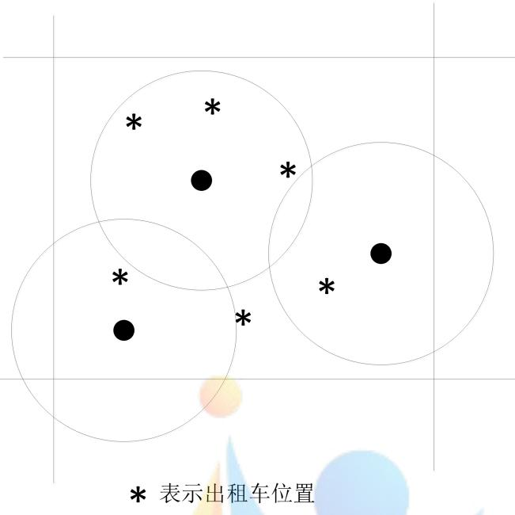  
● 表示订单位置  
图 1 出租车与乘客位置示意图

由（2）式可得：

$$
\eta = \frac { S } { D } = \frac { \displaystyle \sum _ { i = 1 } ^ { n } S _ { i } } { \displaystyle \sum _ { i = 1 } ^ { n } D _ { i } }\tag{9}
$$

我们依据供求关系将n 个四边形区域分为三个部分，每个部分都由若干个四边形区域组成，三个部分分别为：

供大于求部分，设出租车供给量 $S _ { \mathrm { { I } } }$ ，需求量为 $D _ { \mathrm { I } }$

供等于求部分，设出租车供给量 $S _ { \mathrm { { I I } } }$ ，需求量为 $D _ { \mathbb { I } }$

供小于求部分，设出租车供给量 $S _ { \mathrm { I I I } }$ ，需求量为 $D _ { \mathrm { I I I } }$

由（9）式得：

$$
\eta = \frac { S _ { \mathrm { I } } + S _ { \mathrm { I I } } + S _ { \mathrm { I I I } } } { D } = \frac { S _ { \mathrm { I } } } { D } + \frac { S _ { \mathrm { I I } } } { D } + \frac { S _ { \mathrm { I I I } } } { D } = \frac { D _ { \mathrm { I } } } { D } \cdot \frac { S _ { \mathrm { I } } } { D _ { \mathrm { I } } } + \frac { D _ { \mathrm { I I } } } { D } \cdot \frac { S _ { \mathrm { I I } } } { D _ { \mathrm { I I } } } + \frac { D _ { \mathrm { I I I } } } { D } \cdot \frac { S _ { \mathrm { I I I } } } { D _ { \mathrm { I I I } } }\tag{10}
$$

$$
\eta _ { i } = \frac { S _ { i } } { D _ { i } }\tag{11}
$$

因此式（10）可以写作：

$$
\eta = \frac { D _ { \mathrm { I } } } { D } \cdot \eta _ { \mathrm { I } } + \frac { D _ { \mathrm { I I } } } { D } \cdot \eta _ { \mathrm { I I } } + \frac { D _ { \mathrm { I I I } } } { D } \cdot \eta _ { \mathrm { I I I } }\tag{12}
$$

由上文可得：

$$
\left\{ \begin{array} { l l } { \eta _ { \mathrm { I } } > 1 } \\ { \eta _ { \mathrm { I I } } = 1 } \\ { \eta _ { \mathrm { I I I } } < 1 } \end{array} \right.\tag{13}
$$

## 2）求解供求比率的理想值

通过分析我们可以判断，式（12）并不能准确衡量供求平衡与不平衡的综合程度。由式（12）可以看出总供求比率实际上是 ， ， 的加权算术平均， $\eta _ { \mathrm { I } }$ $\eta _ { \mathrm { I I } }$ $\eta _ { \mathrm { I I I } }$ 权数是需求结构。但是由于 $\eta _ { \mathrm { I } }$ ， $\eta _ { \mathrm { I I I } }$ 在判断供求平衡程度时是取相反值的， $\eta _ { \mathrm { I } }$ 越大，表示供求越不平衡；而 $\eta _ { \mathrm { I I I } }$ 越大，表示供求越平衡，因此这两者的加权结果是会相互抵消的，用在这里显然不合适。

通过查阅相关资料，我们推导得到了供求比例理想值的正确求法：

$$
\eta = \frac { D _ { \mathrm { I } } } { D } { \cdot } \eta _ { \mathrm { I } } + \frac { D _ { \mathrm { I I } } } { D } { \cdot } \eta _ { \mathrm { I I } } + \frac { D _ { \mathrm { I I I } } } { D } { \cdot } \frac { 1 } { \eta _ { \mathrm { I I I } } }\tag{14}
$$

由式（14）可得， $\eta$ 最终的值为一个大于1的数， $\eta$ 的理想值 $\eta ^ { * }$ 为1。

## 3、供求匹配模型的建立

我们将里程利用率和供求比率两个指标抽象为二维空间上的点 $Q ( K , \eta )$ 。通过前两问，结合相关数据，我们可以求出里程利用率的理想值 $K ^ { * }$ 和供求比率的理想值 $\eta ^ { * }$ ，则平衡点的坐标为 $Q \big ( K ^ { * } , \eta ^ { * } \big )$ ，在此平衡点上，供求达到平衡，若偏离该点，供求不平衡。结合实际调查与计算机模拟，可得出不同时空实际情况下的里程利用率 $K _ { r }$ 和 $\eta _ { r }$ ，其对应在二维空间的坐标为 $Q ( K _ { r } , \eta _ { r } )$

将实际情况下的坐标进行归一化处理：

$$
Q ^ { \prime } \biggl ( \frac { K _ { r } - K ^ { * } } { K ^ { * } } , \frac { \eta _ { r } - \eta ^ { * } } { \eta ^ { * } } \biggr )\tag{15}
$$

求点 $\mathcal { Q } ^ { \prime }$ 到原点的距离，我们将其定义为综合不平衡度：

$$
r _ { O Q ^ { \prime } } = \sqrt { \left( \frac { K _ { r } - K ^ { * } } { K ^ { * } } \right) ^ { 2 } + \left( \frac { \eta _ { r } - \eta ^ { * } } { \eta ^ { * } } \right) ^ { 2 } }\tag{16}
$$

供求不平衡度是判断“供求匹配”程度的标准：若 $r _ { O O ^ { \prime } } = 0$ ，则 $K _ { r } = K *$ $\eta _ { r } = \eta ^ { * }$ ，达到了一个平衡点，供求完全匹配，供等于求；若 $r _ { O O ^ { \prime } } > 0$ ,则供求不匹配。而且r 的值越大，匹配程度越差， $r _ { O O ^ { \prime } }$ $r _ { O O ^ { \prime } }$ 的值越小，匹配程度越好，越接近供求平衡。

## 5.1.3 模型求解

截至 2014 年，西安市人口人数为 862.75 万，取 $n = 8 6 2 . 7 5$ ；查阅相关资料得知西安市 2015 年出租车保有量约为 15250辆，取 $N = 1 5 2 5 0$ ；根据 2008年西安市居民出行调查总报告<sup>[5]</sup>， 取人均日出行次数 $\sigma = 2 . 1 8$ ，出租车平均载客数目$s = 1 . 7 6$ 人，居民乘坐出租车日出行里程 $d = 6 . 5 k m$ ，出租车每日主要运营时间 $T =$ 15小时，出租车平均行驶速度 $\overline { { \nu } } = 2 4 k m / h$ ，主要运营时间段出车占全天出车比例 $\beta = 0 . 8 5$ ，排除保养维修等问题的出租车出车率 $\alpha = 0 . 9$

代入以上各数据可解得 $K ^ { * } { = } 6 6 . 7 9 \%$ ，由前所述 $\eta ^ { * } = 1$ 。得到了两个指标的理想值之后，我们以西安市为例，应用此模型对出租车的实际供求匹配程度进行评价。

由于难以找到全面的数据，我们以已有的西安市居民出行情况调查数据 、“滴滴快的智能打车平台”<sup>[4]</sup>上的出租车分布数据、西安市的地图数据等为基础，对现实世界进行适度的简化和抽象，使用MATLAB 软件对城市的出租车行驶即载客状况进行动态的仿真模拟，在仿真时主要考虑时间和空间两个方面。

## 1、时间角度

我们将全天的时间分为高峰时段和常规时段两部分，通过模拟得到两个时间段的供求比率和里程利用率，得到高峰时段和常规时段的各指标：

表 1 不同时间段西安市各指标
<table><tr><td rowspan=1 colspan=1></td><td rowspan=1 colspan=1>数目不平衡度</td><td rowspan=1 colspan=1>里程利用率</td><td rowspan=1 colspan=1>综合不平衡度</td></tr><tr><td rowspan=1 colspan=1>高峰时段</td><td rowspan=1 colspan=1>3.3983</td><td rowspan=1 colspan=1>0.7597</td><td rowspan=1 colspan=1>2.4103</td></tr><tr><td rowspan=1 colspan=1>常规时段</td><td rowspan=1 colspan=1>3.0350</td><td rowspan=1 colspan=1>0.3110</td><td rowspan=1 colspan=1>2.1056</td></tr></table>

将各指标随时间变化情况绘制成下图：

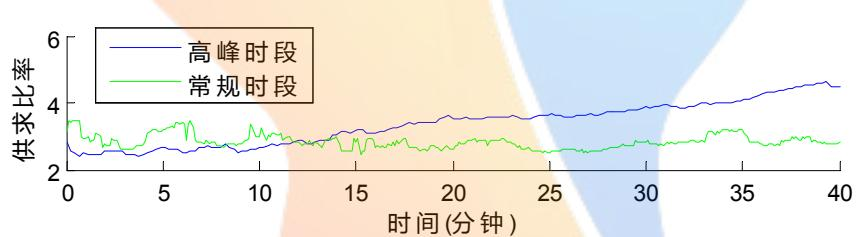

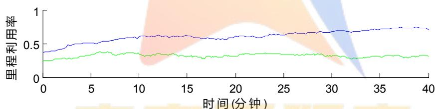

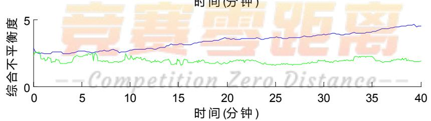  
图 2 各指标随时间变化情况

可以发现，在高峰时段的里程利用率显著高于平衡值 66.79%，这表明乘客数目较多，出租车载客率较高，出现了供不应求的情况。而常规时段的里程利用率显著低于平衡值，说明出现了供过于求的情况，此时居民出行人数较少，出租车大部分是在不载客的情况下空驶。

同时，在高峰时段出行人数不断增多的情况下，综合不平衡度呈现不断增大的状态，表示仅当出行人数开始减少时，交通拥堵得以缓解，供需匹配才可以达到较佳的状态。

## 2、空间角度

从空间角度来看，我们将西安市划分为市区和郊区两部分（市区定义为二环线以内地区，其余地区为郊区），在高峰时段内，对两区域内的各指标分别进行评价，得到结果如下：

表 2 不同空间下的各指标
<table><tr><td rowspan=1 colspan=1></td><td rowspan=1 colspan=1>数目不平衡度</td><td rowspan=1 colspan=1>里程利用率</td><td rowspan=1 colspan=1>综合不平衡度</td></tr><tr><td rowspan=1 colspan=1>市区</td><td rowspan=1 colspan=1>4.2129</td><td rowspan=1 colspan=1>0.7456</td><td rowspan=1 colspan=1>3.2238</td></tr><tr><td rowspan=1 colspan=1>郊区</td><td rowspan=1 colspan=1>3.1095</td><td rowspan=1 colspan=1>0.4423</td><td rowspan=1 colspan=1>2.1493</td></tr></table>

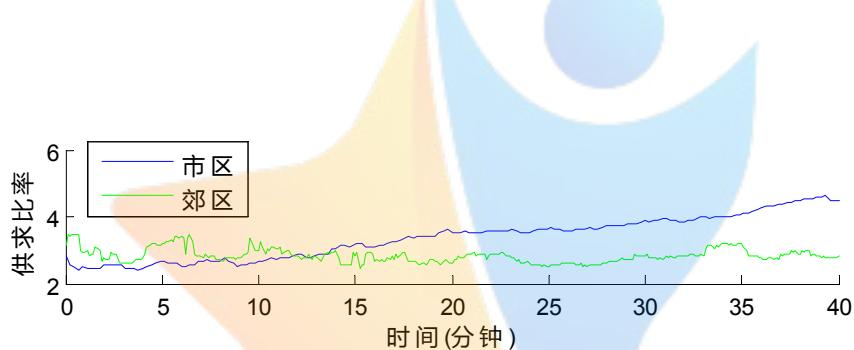

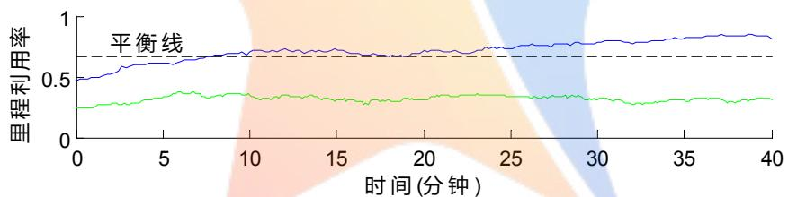

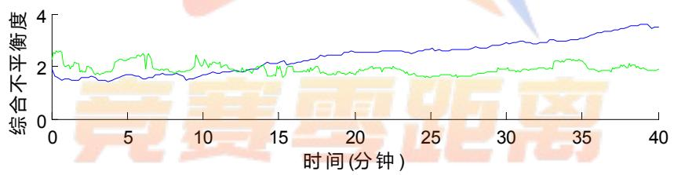  
图 3 不同空间下的各指标变化情况

不难发现，在数目不平衡度方面，郊区低于市区，这证明仅就乘客数量和出租车数目而言，郊区更为平衡；市区里程利用率显著高于平衡值，处于供不应求的状况，而郊区的里程利用率仅略低于平衡值。综合起来看，相较于市区，郊区的供需匹配度更佳。

## 5.1.4 结果分析

在高峰时段的里程利用率显著高于平衡值66.79%，出现了供不应求的情况。而常规时段的里程利用率显著低于平衡值，出现了供过于求的情况。同时，在高

峰时段出行人数不断增多的情况下，综合不平衡度呈现不断增大的状态，表示仅当出行人数开始减少时，供求匹配才可以达到较佳的状态。

在数目不平衡度方面，郊区低于市区，但郊区的里程利用率略低于平衡值。综合分析，郊区的供求匹配度优于市区。

## 5.2 问题二的模型建立与求解

## 5.2.1 模型准备

## 1、绘出补贴金额图像

通过查阅打车软件公司的相关资料，我们得到了滴滴打车和快的打车在不同时间段的补贴方案，详见附录。我们以时间t为横坐标，补贴金额m为纵坐标，用MATLAB 绘出不同时间两家公司的补贴金额折线图，如下图所示：

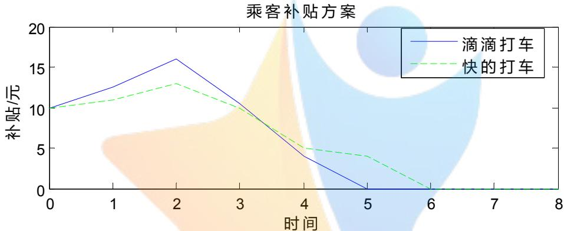

出租车司机补贴方案  
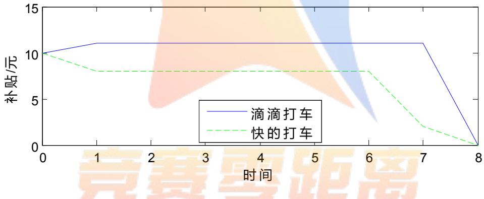  
图 4 出租车司机与乘客补贴方案

以滴滴打车公司为例，由上图我们可以求出滴滴打车对乘客的平均补贴金额10.6元，对司机的平均补贴金额为10.8925元。

## 2、确定软件使用人数比例

我们以滴滴打车公司为例进行分析。查阅资料可知，使用滴滴打车软件的乘客占所有出租车乘客的比例为 63.06%，使用滴滴打车软件的司机占所有出租车司机的比例为76.8%<sup>[3]</sup>。实际上乘客比例和司机比例是随着补贴方案的改变呈现波动变化的，若补贴金额高，则使用软件的人数多，比例大；若补贴金额低，则使用软件的人数少，比例小；若补贴金额为 0，使用打车软件的人数接近于 0；若补贴金额无穷大时，比例的增长率趋近于0。

为了能够形象地描述二者的关系，我们利用指数函数的定义对二者关系进行描述。对于滴滴打车公司而言，假设使用打车软件的乘客占所有出租车乘客的比例为 $\lambda _ { 1 } ~ ( \ : i = 1 , 2 , 3 . . . )$ ，补贴金额为 $m _ { 1 }$ ，司机平均补贴金额为 $m _ { 1 }$ ；假设使用打车软件的司机占所有出租车司机的比例为 $\lambda _ { 2 } ^ { } ( i = 1 , 2 , 3 . . . )$ ，补贴金额为 $m _ { 2 }$ ，司机平均补贴金额为 $m _ { 2 }$ ，我们可以认定任一补贴金额所对应的比例为：

$$
\lambda = 1 0 0 \% - e ^ { - \alpha m }\tag{17}
$$

对于乘客而言，补贴金额为 $\overline { { m _ { 1 } } }$ 时， $\lambda _ { 1 } { = } 6 3 . 0 6 \%$ ，将这两个量代入（17）式求出 $\alpha _ { 1 }$ 的值为 0.09395。同理，对于司机而言，补贴金额为 $m _ { 2 }$ 时， $\lambda _ { 2 } { = } 7 6 . 8 \%$ ，代入（17）式可求出 $\alpha _ { 2 }$ 的值为 0.13413。绘出补贴金额与软件使用人数比例的关系图如下：

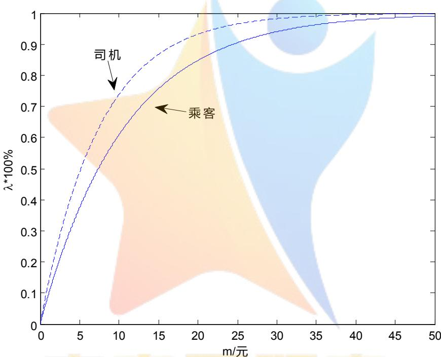  
图 5 补贴金额与关系图

## 3、确立意愿半径R

在第一问中我们已对意愿半径进行了简单介绍，即司机为接单愿意行驶的最大距离。在现实生活中，若乘客所在地点太远，司机可能会放弃此单，因此司机愿意行驶的路程是有上限的，我们将此上限称为意愿半径，单位为 km。以人为圆心，以此距离为半径画圆，则落在圆面积范围内的出租车为乘客能够打到的车。

我们假定司机的补贴金额 $m _ { 2 }$ 与意愿半径R成线性关系，假设意愿半径的基础半径 $R _ { 0 }$ (没有补贴金额时司机愿意行驶的最大距离）为 0.2km，以汽车行驶燃油消耗的钱来判断线性关系的斜率，通过查阅资料，得出出租车平均每千米的耗油量为 0.1L,油价为 5.85 元/L，即平均每千米的耗费金额为 0.585 元。我们以司机补贴金额 $m _ { 2 }$ 为横坐标，以意愿半径R为纵坐标，则图像的斜率为1/0.585，即1.709,得出意愿半径的表达式：

$$
R = 0 . 2 + 1 . 7 0 9 m _ { 2 }\tag{18}
$$

## 5.2.2 缓解程度判断模型的建立

该模型的流程图如下所示：

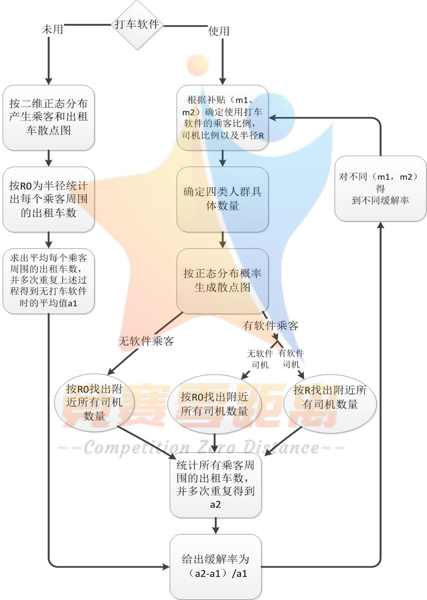  
图 6 缓解程度判断模型流程图

下面我们根据流程图作如下分析：

我们将城市抽象为二维图，建立x轴，y轴。假设图形服从二维正态分布：城市中心概率最大，以圆形向外扩散，越往边缘概率越小。这与城市的人流及出租车分布实际情况相吻合，市中心人口密度最大，出租车数量最多；城市边缘人口最稀疏，出租车数量最少。我们以二维正态分布为基础在城市中随机产生乘客和出租车，分别对未使用打车软件及使用打车软件两种情况进行分析对比，来判断补贴方案是否对缓解打车难有帮助。

## 1）未用打车软件

我们在二维正态分布图上随机模拟产生乘客和出租车。以每个乘客为圆心，以基础半径 $R _ { 0 }$ 为半径画圆，得到圆内的出租车数，即乘客可以打到的车数。统计出该区域内某时刻所有乘客数 $z _ { 1 }$ 和每个圆内的出租车数相加的总数 $n _ { 1 }$ ，令：

$$
a _ { 1 } = \frac { n _ { 1 } } { z _ { 1 } }\tag{19}
$$

我们将其定义为人均周围出租车数量，即平均每个人可以打到的出租车数。对此情况进行多次模拟，得到的所有 $a _ { 1 }$ 一起求平均值 $a _ { 1 }$ ，做为未用打车软件的乘客可以打到的车数。

## 2）有打车软件

该区域内所有乘客数为z，所有出租车数为n。则根据该次乘客司机各自的补贴（ ${ \bf \Xi } ( m _ { 1 } , m _ { 2 } )$ ）算出所有乘客中使用打车软件的人数为 $z \lambda _ { 1 }$ ，不使用打车软件的人为 $z ( 1 - \lambda _ { 1 } )$ ；所有司机中使用打车软件的人数为 $z \lambda _ { 2 }$ ，不使用打车软件的人为$z ( 1 - \lambda _ { 2 } )$ 。此时对这四类人群各自按二维正态分布在同一个图中生成散点。

因为打车难问题是针对乘客，因此我们从乘客角度出发，分以下几种情况考虑：

## ①乘客不使用打车软件（流程图上“无软件乘客”）

在此情况下，无论司机是否使用打车软件，双方都不能享受到补贴方案，则与1）中算法相同，以每个乘客为圆心，以基础半径 $R _ { 0 }$ 为半径画圆，得 $z _ { 1 } ^ { \prime } , n _ { 1 } ^ { \prime }$

②乘客使用打车软件（流程图上“有软件乘客”）

这种情况又分为两种情况：

Ⅰ司机不使用打车软件（流程图上”无软件司机”）

这种情况下人均出租车拥有量的算法与①中一致，得 $z _ { 2 } ^ { \prime \prime } , n _ { 2 } ^ { \prime \prime }$

Ⅱ司机使用打车软件(流程图上“有软件司机”)

这种情况下意愿半径不再为基础半径 $R _ { 0 }$ ，由于补贴方案的刺激，使得司机的意愿半径增大，通过式（18）可计算出某时刻的R。以该区域中的每个人为圆心，R为半径，画出若干个圆，统计出所有圆中包含的出租车数 $z _ { 2 } ^ { \prime \prime }$ 和所有的乘客数 $n _ { 2 } ^ { \prime \prime }$ .

综上，求出使用补贴方案情况下的人均出租车拥有率：

$$
a _ { 2 } = \frac { z _ { 2 } ^ { \prime } + z _ { 2 } ^ { \prime \prime } + z _ { 2 } ^ { \prime \prime \prime } } { n _ { 2 } ^ { \prime } + n _ { 2 } ^ { \prime \prime } + n _ { 2 } ^ { \prime \prime } }\tag{20}
$$

对此情况进行多次模拟，得到多组 $a _ { 2 }$ ，对其取均值得到 $a _ { 2 }$ 。

## 3）缓解率w

我们将缓解率定义为：

$$
w = \frac { a _ { 2 } - a _ { 1 } } { \overline { { a _ { 1 } } } } { \times } 1 0 0 \%\tag{21}
$$

该式用来表示使用补贴方案后与使用前相比的打车难的缓解程度。对各个公司每个时刻的补贴方案 $( m _ { 1 } , m _ { 2 } )$ 进行多次模拟，求出不同时间的 $a _ { 1 }$ ， $a _ { 2 }$ ，从而利用式（22）求出不同时刻的w。所有时段各自都有一个缓解率，各个时段组合起来就是一个公司对于时间的缓解率折线wt。

## 5.2.3 模型求解及结果分析

用 MATLAB模拟出不同时刻的缓解率，如下图所示：

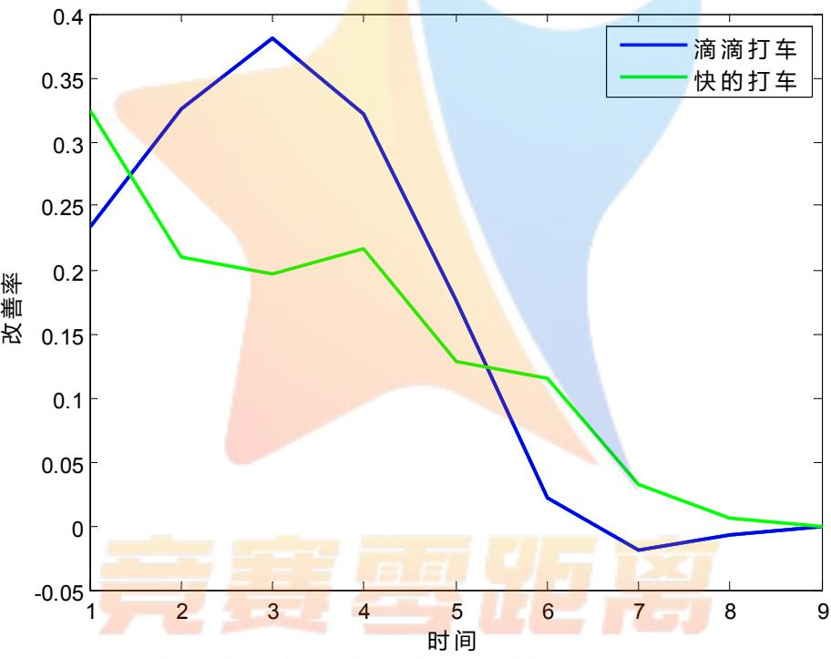  
图 7 不同时刻缓解率

通过观察模型的求解结果，我们有以下几点分析：

1）打车软件推广前后比较：

由上图可以看出，两个公司的缓解率大致分布范围在-0.02\~0.37，说明滴滴打车和快的打车两个公司的投对乘客打车难的问题是有一定缓解的，但这个缓解效果并不是很大。我们可以很明显看到滴滴打车的缓解率在后半段显著下降，甚至缓解率出现了负值，这说明在后半段滴滴打车的补贴不仅没有缓解乘客打车难的问题，甚至加重了问题的严重性。

据新闻数据显示，滴滴快的两个公司对补贴的投入总金额甚至达到了19亿，可谓是一个烧钱的补贴。事实上，两个公司之所以要进行补贴的根本目的并不完全是要缓解打车难问题，主要还是因为两个公司为了抢占客户量，只是这样的竞争战顺带对打车难问题有了一定的缓解。

综上，两个公司的补贴方案确实是对打车难问题有一定缓解，但是缓解程度并不理想。

## 2）两公司之间分析：

由上图可知，滴滴打车在前半段的缓解率是要优于快的打车的，究其原因，应该是滴滴打车在前半段的补贴投入高于快的打车。而后半段滴滴打车不如快的打车，主要是因为滴滴打车在后半段补贴投入突然大幅下降造成的，这种大幅下降甚至造成了率出现轻微程度的负值，是及其不利的。

3）综合上面分析，可以看出：两个打车公司的补贴方案带来了一定程度的缓解。单从缓解打车难问题看，这种补贴方案缺乏一定的针对性。针对这个问题，我们给出了第三问的分区域动态实时补贴模型。

## 5.3 问题三的模型建立与求解

针对此问题，我们首先对补贴方案进行定性分析：

1）缓解打车难不只是要调度出租车来满足乘客的需求，从乘客角度出发，打车软件服务平台也应考虑给予乘客一定的拼车优惠，特别是在上下班交通流量高峰期。由于车流量比较大，，就需要尽量发挥已载有乘客的出租车的剩余载客资源，让高峰阶段的每辆出租车尽量载满乘客，提高载客率。拼车政策可以用积分的形式给车上原有乘客实施奖励，不仅对原有乘客起到激励作用，还可以给后来乘客免费乘车的机会，能够很大程度上调动人们拼车的积极性。

2）在一些节假日即将到来时，打车软件服务平台可以提前预测流量高峰地点，例如一些景区等等，针对人流量高峰地点以外的其他地区，我们可以使打车软件给予乘客乘车补贴，通过经济干预来平衡人流密度。

接下来，我们针对补贴方案，建立相关模型进行定量分析。

## 5.3.1 分区域动态实时补贴模型的建立

某地区可被划分为若干个区域，以便由总体到局部分别进行分析。为简单起见，我们将其划分为九个区域，抽象为九宫格的形式。

假设某一区域内某时刻出租车总数为n，该区域内所有的车单数为 $\mu$ ， $c$ 为某时刻每辆车对应的单数，则：

$$
c = \frac { \mu } { n }\tag{22}
$$

设 $\scriptstyle { c _ { i } } ( \operatorname { i = } 1 , 2 , \ldots . . . . 9 )$ 为各区域每辆车对应的单数， $\mu _ { i } ( \mathrm { i } { = } 1 , 2 , { \ldots } { \ldots } 9 )$ 各区域的车单数，k为每接一单司机获得的补贴， $\overline { { k _ { i } } }$ 为九个区域内每单司机获得的平均补贴，$k _ { i } ( \mathrm { i } { = } 1 , 2 , { \ldots } { \ldots } 9 )$ 为每个区域每单司机获得的补贴。某时刻每辆车对应的单数越多，则获得的补贴越多，二者的比值是一定的，据此我们列出方程组：

$$
\left\{ \begin{array} { c } { { \displaystyle \frac { k _ { 1 } } { c _ { 1 } } = \frac { k _ { 2 } } { c _ { 2 } } = \ldots \ldots } \frac { k _ { 3 } } { c _ { 3 } } } \\ { { \displaystyle \mu _ { 1 } k _ { 1 } + \mu _ { 2 } k _ { 2 } + \ldots \ldots } \mu _ { 9 } k _ { 9 } = \mu \overline { { k _ { i } } } }  \end{array} \right.\tag{23}
$$

对方程组进行求解，得到：

$$
k _ { 1 } = \frac { \mu c _ { 1 } \overline { { k _ { i } } } } { \displaystyle { \sum _ { i = 1 } ^ { 9 } \mu _ { i } c _ { i } } }\tag{24}
$$

$$
k _ { 2 } = \frac { \mu c _ { 2 } \overline { { k _ { i } } } } { \displaystyle \sum _ { i = 1 } ^ { 9 } \mu _ { i } c _ { i } }\tag{25}
$$

以此类推，得出：

$$
k _ { i } = \frac { \mu c _ { i } \overline { { k _ { i } } } } { \displaystyle { \sum _ { i = 1 } ^ { 9 } \mu _ { i } c _ { i } } }\tag{26}
$$

由上式可以看出，通过数据采集，可以求出各区域每辆车对应的单数c ，各 $c _ { i }$ 区域的车单数 $\mu _ { i }$ ，以及该地区所有区域的总单数 $\mu$ 。只需求得九个区域内每单司机获得的平均补贴 $k _ { i }$ ，就可得出每个区域平均每单的补贴。

我们将时间划分为高峰时段和常规时段两部分，将西安市划分为九个区域。高峰时段为8:30-9:30, 17:30-19:30，共3小时，常规时段为剩下的21个小时。设高峰时段每单补贴给司机的金额为 $k _ { \frac { \mu } { \vert \nabla \vert } }$ ，常规时段每单补贴给司机的金额为$k _ { \mp }$ 。我们假定 $k _ { \mathrm { \vec { \mathbf { \pi } } \vec { \mathbf { \pi } } } } = 2 k _ { \mathrm { \vec { \mathbf { \pi } } \vec { \mathbf { \pi } } } }$ 即高峰时段平均每单的补贴是常规时段平均每单补贴的2倍，同时假定公司对于每辆车每单的平均补贴金额为2元，据此可列出以下等式：

$$
\left\{ \frac { 3 } { 2 4 } k _ { _ { \perp } } + \frac { 2 1 } { 2 4 } k _ { \mp } = 2 \right.\tag{27}
$$

对式（28）进行求解，得到：

$$
\left\{ \begin{array} { l } { k _ { \scriptscriptstyle \perp } = 3 . 5 6 \overline { { \mathcal { { T } } } } } \\ { k _ { \scriptscriptstyle \perp } = 1 . 7 8 \overline { { \mathcal { { T } } } } } \end{array} \right.\tag{28}
$$

将高峰时段和常规时段的补贴方案代入式（27），可以得到不同时间段每个区域的补偿方案。不停地切换时间，可以得到不同时间不同地点的补偿方案。

## 5.3.2 模型求解及结果分析

我们使用此模型，对西安市进行网格划分，结合“滴滴快递智能出行平台”9月11日（周五）13:00\~20:00 的数据，进行当天的动态补偿方案的制定。

当天的某时刻出租车和车单分布如下图所示：

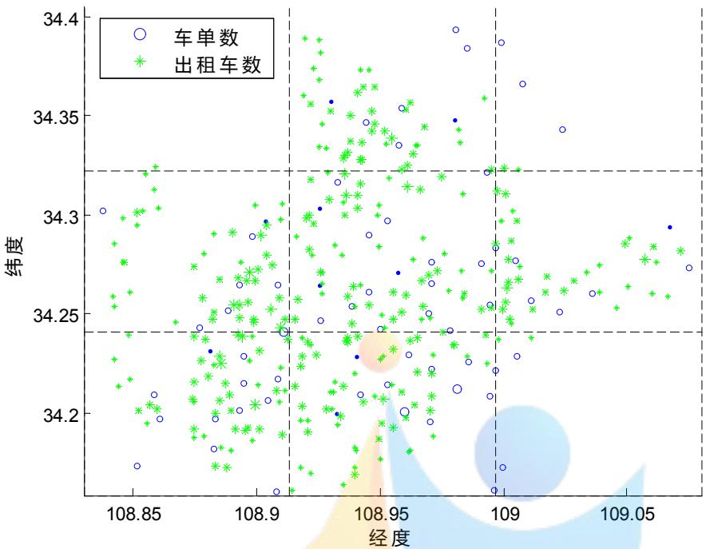  
图 8 9 月 11日某时刻西安市出租车和乘客数目分布

当天的出租车数目和车单数如下表：

表 3 9 月 11日西安市出租车数目
<table><tr><td rowspan=1 colspan=4>常规时段出租车数</td><td rowspan=1 colspan=4>高峰时段出租车数</td></tr><tr><td rowspan=3 colspan=1>13:00</td><td rowspan=1 colspan=1>0</td><td rowspan=1 colspan=1>1864</td><td rowspan=1 colspan=1>47</td><td rowspan=3 colspan=1>17:00</td><td rowspan=1 colspan=1>24</td><td rowspan=1 colspan=1>1209</td><td rowspan=1 colspan=1>61</td></tr><tr><td rowspan=1 colspan=1>1135</td><td rowspan=1 colspan=1>4842</td><td rowspan=1 colspan=1>834</td><td rowspan=1 colspan=1>644</td><td rowspan=1 colspan=1>1271</td><td rowspan=1 colspan=1>578</td></tr><tr><td rowspan=1 colspan=1>1709</td><td rowspan=1 colspan=1>2901</td><td rowspan=1 colspan=1>47</td><td rowspan=1 colspan=1>1157</td><td rowspan=1 colspan=1>1101</td><td rowspan=1 colspan=1>0</td></tr><tr><td rowspan=3 colspan=1>14:00</td><td rowspan=1 colspan=1>46</td><td rowspan=1 colspan=1>1669</td><td rowspan=1 colspan=1>22</td><td rowspan=2 colspan=1>18:00</td><td rowspan=1 colspan=1>29</td><td rowspan=1 colspan=1>1121</td><td rowspan=1 colspan=1>17</td></tr><tr><td rowspan=1 colspan=1>1127</td><td rowspan=1 colspan=1>3705</td><td rowspan=1 colspan=1>949</td><td rowspan=1 colspan=1>511</td><td rowspan=1 colspan=1>931</td><td rowspan=1 colspan=1>550</td></tr><tr><td rowspan=1 colspan=1>1391</td><td rowspan=1 colspan=1>2751</td><td rowspan=1 colspan=1>48</td><td rowspan=1 colspan=1></td><td rowspan=1 colspan=1>770</td><td rowspan=1 colspan=1>917</td><td rowspan=1 colspan=1>67</td></tr><tr><td rowspan=3 colspan=1>15:00</td><td rowspan=1 colspan=1>50</td><td rowspan=1 colspan=1>1335</td><td rowspan=1 colspan=1>96</td><td rowspan=2 colspan=1>19:00</td><td rowspan=1 colspan=1>25</td><td rowspan=1 colspan=1>1003</td><td rowspan=1 colspan=1>119</td></tr><tr><td rowspan=1 colspan=1>1530</td><td rowspan=1 colspan=1>2263</td><td rowspan=1 colspan=1>1197</td><td rowspan=1 colspan=1>675</td><td rowspan=1 colspan=1>1116</td><td rowspan=1 colspan=1>390</td></tr><tr><td rowspan=1 colspan=1>1038</td><td rowspan=1 colspan=1>p1133</td><td rowspan=1 colspan=1>i044</td><td rowspan=1 colspan=1>eroD</td><td rowspan=1 colspan=1>S842n</td><td rowspan=1 colspan=1>C1037</td><td rowspan=1 colspan=1>24</td></tr><tr><td rowspan=3 colspan=1>16:00</td><td rowspan=1 colspan=1>37</td><td rowspan=1 colspan=1>856</td><td rowspan=1 colspan=1>42</td><td rowspan=3 colspan=1>20:00</td><td rowspan=1 colspan=1>45</td><td rowspan=1 colspan=1>800</td><td rowspan=1 colspan=1>124</td></tr><tr><td rowspan=1 colspan=1>1066</td><td rowspan=1 colspan=1>1320</td><td rowspan=1 colspan=1>721</td><td rowspan=1 colspan=1>778</td><td rowspan=1 colspan=1>1853</td><td rowspan=1 colspan=1>509</td></tr><tr><td rowspan=1 colspan=1>1167</td><td rowspan=1 colspan=1>1225</td><td rowspan=1 colspan=1>30</td><td rowspan=1 colspan=1>820</td><td rowspan=1 colspan=1>988</td><td rowspan=1 colspan=1>0</td></tr></table>

表 4 9 月 11日西安市车单数
<table><tr><td rowspan=1 colspan=4>常规时段车单数</td><td rowspan=1 colspan=5>高峰时段车单数</td></tr><tr><td rowspan=3 colspan=1>13:00</td><td rowspan=1 colspan=1>2</td><td rowspan=1 colspan=1>38</td><td rowspan=1 colspan=1>7</td><td rowspan=3 colspan=2>17:00</td><td rowspan=1 colspan=1>14</td><td rowspan=1 colspan=1>39</td><td rowspan=1 colspan=1>19</td></tr><tr><td rowspan=1 colspan=1>42</td><td rowspan=1 colspan=1>64</td><td rowspan=1 colspan=1>46</td><td rowspan=1 colspan=1>99</td><td rowspan=1 colspan=1>216</td><td rowspan=1 colspan=1>31</td></tr><tr><td rowspan=1 colspan=1>44</td><td rowspan=1 colspan=1>80</td><td rowspan=1 colspan=1>2</td><td rowspan=1 colspan=1>156</td><td rowspan=1 colspan=1>254</td><td rowspan=1 colspan=1>22</td></tr><tr><td rowspan=3 colspan=1>14:00</td><td rowspan=1 colspan=1>13</td><td rowspan=1 colspan=1>22</td><td rowspan=1 colspan=1>13</td><td rowspan=1 colspan=2></td><td rowspan=1 colspan=1>4</td><td rowspan=1 colspan=1>52</td><td rowspan=1 colspan=1>28</td></tr><tr><td rowspan=1 colspan=1>21</td><td rowspan=1 colspan=1>84</td><td rowspan=1 colspan=1>46</td><td rowspan=2 colspan=2>18:00</td><td rowspan=1 colspan=1></td><td rowspan=1 colspan=1>58</td><td rowspan=1 colspan=1>173</td><td rowspan=1 colspan=1>71</td></tr><tr><td rowspan=1 colspan=1>61</td><td rowspan=1 colspan=1>104</td><td rowspan=1 colspan=1>18</td><td rowspan=1 colspan=1>297</td><td rowspan=1 colspan=1>302</td><td rowspan=1 colspan=1>11</td></tr><tr><td rowspan=3 colspan=1>15:00</td><td rowspan=1 colspan=1>19</td><td rowspan=1 colspan=1>32</td><td rowspan=1 colspan=1>89</td><td rowspan=3 colspan=2>19:00</td><td rowspan=1 colspan=1>2</td><td rowspan=1 colspan=1>52</td><td rowspan=1 colspan=1>24</td></tr><tr><td rowspan=1 colspan=1>36</td><td rowspan=1 colspan=1>125</td><td rowspan=1 colspan=1>37</td><td rowspan=1 colspan=1>71</td><td rowspan=1 colspan=1>178</td><td rowspan=1 colspan=1>50</td></tr><tr><td rowspan=1 colspan=1>110</td><td rowspan=1 colspan=1>203</td><td rowspan=1 colspan=1>22</td><td rowspan=1 colspan=1>167</td><td rowspan=1 colspan=1>155</td><td rowspan=1 colspan=1>21</td></tr><tr><td rowspan=3 colspan=1>16:00</td><td rowspan=1 colspan=1>20</td><td rowspan=1 colspan=1>29</td><td rowspan=1 colspan=1>32</td><td rowspan=3 colspan=2>20:00</td><td rowspan=1 colspan=1>2</td><td rowspan=1 colspan=1>25</td><td rowspan=1 colspan=1>20</td></tr><tr><td rowspan=1 colspan=1>72</td><td rowspan=1 colspan=1>117</td><td rowspan=1 colspan=1>48</td><td rowspan=1 colspan=1>41</td><td rowspan=1 colspan=1>76</td><td rowspan=1 colspan=1>26</td></tr><tr><td rowspan=1 colspan=1>117</td><td rowspan=1 colspan=1>134</td><td rowspan=1 colspan=1>20</td><td rowspan=1 colspan=1>97</td><td rowspan=1 colspan=1>125</td><td rowspan=1 colspan=1>22</td></tr></table>

由以上数据可以计算出当天的动态补贴方案：

表 5 动态补偿方案
<table><tr><td rowspan=1 colspan=4>常规时段补贴(元)</td><td rowspan=1 colspan=6>高峰时段补贴(元)</td></tr><tr><td rowspan=3 colspan=1>13:00</td><td rowspan=1 colspan=1>8.22</td><td rowspan=1 colspan=1>1.13</td><td rowspan=1 colspan=1>8.22</td><td rowspan=3 colspan=3>17:00</td><td rowspan=1 colspan=1>10.94</td><td rowspan=1 colspan=1>0.60</td><td rowspan=1 colspan=1>5.84</td></tr><tr><td rowspan=1 colspan=1>2.04</td><td rowspan=1 colspan=1>0.73</td><td rowspan=1 colspan=1>3.05</td><td rowspan=1 colspan=1>2.88</td><td rowspan=1 colspan=1>3.19</td><td rowspan=1 colspan=1>1.01</td></tr><tr><td rowspan=1 colspan=1>1.42</td><td rowspan=1 colspan=1>1.52</td><td rowspan=1 colspan=1>2.35</td><td rowspan=1 colspan=1>2.53</td><td rowspan=1 colspan=1>4.33</td><td rowspan=1 colspan=1>10.94</td></tr><tr><td rowspan=3 colspan=1>14:00</td><td rowspan=1 colspan=1>6.51</td><td rowspan=1 colspan=1>0.30</td><td rowspan=1 colspan=1>13.61</td><td rowspan=2 colspan=3>18:00</td><td rowspan=1 colspan=1>1.56</td><td rowspan=1 colspan=1>0.53</td><td rowspan=1 colspan=1>18.67</td></tr><tr><td rowspan=1 colspan=1>0.43</td><td rowspan=1 colspan=1>0.52</td><td rowspan=1 colspan=1>1.12</td><td rowspan=1 colspan=1>1.29</td><td rowspan=1 colspan=1>2.11</td><td rowspan=1 colspan=1>1.46</td></tr><tr><td rowspan=1 colspan=1>1.01</td><td rowspan=1 colspan=1>0.87</td><td rowspan=1 colspan=1>8.64</td><td rowspan=1 colspan=3></td><td rowspan=1 colspan=1>4.37</td><td rowspan=1 colspan=1>3.73</td><td rowspan=1 colspan=1>1.86</td></tr><tr><td rowspan=3 colspan=1>15:00</td><td rowspan=1 colspan=1>2.87</td><td rowspan=1 colspan=1>0.18</td><td rowspan=1 colspan=1>7.01</td><td rowspan=1 colspan=3></td><td rowspan=1 colspan=1>1.65</td><td rowspan=1 colspan=1>1.07</td><td rowspan=1 colspan=1>4.15</td></tr><tr><td rowspan=1 colspan=1>0.18</td><td rowspan=1 colspan=1>0.42</td><td rowspan=1 colspan=1>0.23</td><td rowspan=1 colspan=3>19:00</td><td rowspan=1 colspan=1>2.16</td><td rowspan=1 colspan=1>3.28</td><td rowspan=1 colspan=1>2.64</td></tr><tr><td rowspan=1 colspan=1>0.80</td><td rowspan=1 colspan=1>1.35</td><td rowspan=1 colspan=1>3.78</td><td rowspan=1 colspan=3></td><td rowspan=1 colspan=1>4.08</td><td rowspan=1 colspan=1>3.07</td><td rowspan=1 colspan=1>18.00</td></tr><tr><td rowspan=4 colspan=1>16:00</td><td rowspan=1 colspan=1>6.01</td><td rowspan=1 colspan=1>0.38</td><td rowspan=1 colspan=1>8.47</td><td rowspan=1 colspan=3></td><td rowspan=1 colspan=1>1.65</td><td rowspan=1 colspan=1>1.16</td><td rowspan=1 colspan=1>6.00</td></tr><tr><td rowspan=2 colspan=1>0.75</td><td rowspan=2 colspan=1>0.99</td><td rowspan=2 colspan=1>0.74</td><td rowspan=2 colspan=2>20:0</td><td rowspan=1 colspan=2>00</td><td rowspan=2 colspan=1>0</td><td rowspan=2 colspan=1>1.96</td><td rowspan=2 colspan=1>1.53</td></tr><tr><td rowspan=1 colspan=1>0</td><td></td></tr><tr><td rowspan=1 colspan=1>1.11</td><td rowspan=1 colspan=1>1.22</td><td rowspan=1 colspan=1>7.41</td><td rowspan=1 colspan=3>Zero</td><td rowspan=1 colspan=1>4.40</td><td rowspan=1 colspan=1>4.71</td><td rowspan=1 colspan=1>6.00</td></tr></table>

可以看到13:00 处的第一网格以及17:00 处的第一网格等乘客多而车少的地方得到了较高的补偿，我们认为这样的补偿可以促进出租车的合理流动，增大乘客和出租车之间的供需匹配程度。

现对我们补偿政策的效用进行验证，以第一问中的仿真模拟为基础，将出租车移动的方式由随机游走改为有较大的概率向c 值较低的地方行驶，得到几个指标值如下图所示：

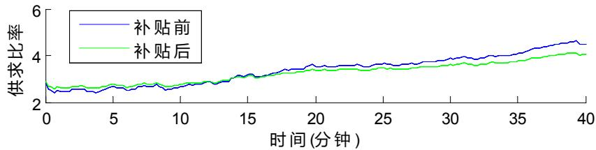

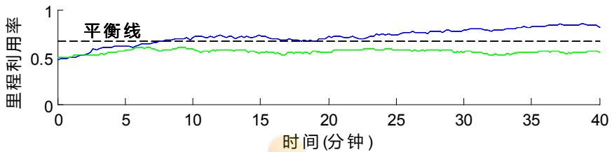

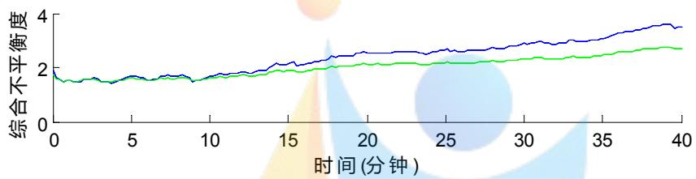  
图 9 补贴前后指标变化

可以发现，通过对以上动态补贴方案的论证，供需匹配程度得到了较好的改善，证明我们提出的分区域动态实时补贴方案是合理的。

## 六、模型的评价

## 6.1 模型的优点

1）该模型以人为圆心，以司机愿意行驶的最大距离为半径画圆，通过观察圆覆盖的出租车数来衡量供需程度，该指标比较新颖且合理，不同于传统的空驶率、万人拥有量、等指标，具有创新意义。

2）运用模拟的方式进行数据采集，得到了具体数据结果，有较强说服力，较好的解决了数据缺乏的问题。

3）在第三问中，我们提出了分区域动态实时补贴模型，使补贴随着不同情况呈现动态变化，相较于原有的盲目全面补贴更有针对性。

## 6.2 模型的缺点

由于真实数据难以搜集全面，数据缺乏的问题使得我们无法对模型进行强有力的支撑与验证，只能通过程序的模拟间接处理。

## 七、模型的改进与推广

## 7.1 模型的改进

该模型没有对打车软件公司的成本给予过多考虑，使得考虑可以考虑在涉及补偿方案的时候加入打车软件公司成本等限制因素。

## 7.2 模型的推广

本文是对出租车资源配置进行了分析与评价，我们可以将其推广至载人摩托车，人力车等资源配置问题，并加以改进，具有很强的现实意义。

## 八、参考文献

[1] 衡量出租车供求的三大指标— 里程利用率、车辆满载率、万人拥有量，http://wenku.baidu.com/link?url=o5vDb7x1hv1eQBfGaULjdCCTkXmR\_nXwedmLa\_Z79NzZc\_ZDNyJgrvCECnWP4AXSHbqp2jwXrA-lrWvfqgowENjDF\_0DHqUgdPhxVFixNtu，2015-9-12。

[2] 苏为华，浅谈测量市场商品供需平衡程度的统计指标[J]，商业经济与管理，1993（2）：1993。

[3] 李冬新 栾洁，滴滴打车的营销策略与发展对策研究[N]，青岛科技大学学报(社会科学版)，31（1）：2015。

[4] http://v.kuaidadi.com/,2015-9-13。

[5] 西安市居民出行调查领导小组办公室，西安市居民出行调查总报告[R]：2009(6)。

## 附录

```matlab
Matlab 主程序：
clear all
%% 数据结构设计
% passengers:
% [出发点横坐标，出发点纵坐标，目的地横坐标，目的地纵坐标，出行里程]
% 即[xs,ys,xd,yd,l]
% taxis
% [出租车位置横坐标，出租车位置纵坐标，出租车被占用里程]
% 即[x_taxi,y_taxi,lo]
%%
r_valid = 2/10;%出租车有效覆盖半径
xmax = 111*cos(pi*34/180)*1.4;
ymax = 0.7*111;
xmax = xmax/10;
ymax = ymax/10;
psnger_total = 80;
taxi_total = 152; %先生成 5000 个出发点
passengers(i,:) = gen_passenger();
end
for i = 1:taxi_total
taxis(i,:) = gen_taxi();
end
figure(5)
scatter(taxis(:,1)*10,taxis(:,2)*10)
```

```matlab
xlabel('x(km)')
ylabel('y(km)')
all_B = [];
all_K = [];
for i = 1:200
%% 首先更新出租车状态
lc = taxis(:,3) - 0.01;%出租车被占用里程
lc(lc < 0) = 0;
taxis(:,3) = lc;
%空车随机一个方向前进 0.01
valid_lines = find( lc == 0 );
all_K = [all_K,1-length(valid_lines)/taxi_total];
for m = 1:length(valid_lines)
k = valid_lines(m);
while(1)
degree = 2*pi*rand();%出行方向
new_x = taxis(k,1) + 0.01.*cos(degree);
new_y = taxis(k,2) + 0.01.*sin(degree);
if(new_x>=0 && new_x<=xmax && new_y>=0 && new_y<=ymax)
taxis(k,1:2) = [new_x,new_y];
break
end
end
end
%乘客加入系统
add_passengers_total = 4;%round(normrnd(10,3));
add_passengers = zeros(add_passengers_total,5);
for n = 1:add_passengers_total
add_passengers(n,:) = gen_passenger();
```

```matlab
end
passengers = [passengers;add_passengers];
%计算各乘客视野内出租车数目
for j = 1:length(passengers)
p = passengers(j,:);
if isnan(p(1))
continue
end
temp_taxis = taxis;
%被占用的出租车不参与打车
invalid_lines = find(temp_taxis(:,3)>0);
temp_taxis(invalid_lines,:) = nan;
%% 然后是乘客乘车
r = sqrt((temp_taxis(:,1)-p(1)).^2+(temp_taxis(:,2)-p(2)).^2);
taxi_num = find(r<r_valid);%视野范围内的车辆
if isempty(taxi_num)%视野内没有车，下一位乘客
continue;
else
%随机选一辆乘坐
index = round(rand()*(length(taxi_num)-1))+1;
taxi_num = taxi_num(index);
taxis(taxi_num,3) = p(5) +
sqrt((taxis(taxi_num,1)-p(1))^2+(taxis(taxi_num,2)-p(2))^2);%此乘客 p 乘
坐的出租车被占用
taxis(taxi_num,1) = p(3);taxis(taxi_num,2) = p(4);%将其更新到
```

目的地

passengers(j,:) = nan;%更新乘客状态，上车的乘客变为 nan，移出系统

end

end

%20 次演化后才得到平时状态，故只保留 20 次之后的数据

xlabel('时间(分钟)')

ylabel('里程利用率')

figure(3)

xlabel('时间(分钟)')

ylabel('供需不平衡度')

## 子程序1：

```matlab
function [ ret ] = gen_passenger()
%UNTITLED3 Summary of this function goes here
% Detailed explanation goes here
%(108->109.4),(34->34.7)
% xmax = 111*cos(pi*34/180)*1.4 = 129
% ymax = 0.7*111 = 78
xmax = 111*cos(pi*34/180)*1.4/10;
ymax = 0.7*111/10;
ux = xmax/2;uy = ymax/2;
sigmax = xmax/2/3;sigmay = ymax/2/3;
th = 6.5/((pi/2)^0.5);
while(1)
xs = normrnd(ux,sigmax);%出发点横坐标
ys = normrnd(uy,sigmay);%出发点纵坐标
if xs<0 || xs>xmax || ys<0 || ys > ymax
continue
end
d_go = sqrt(-2*th^2*log(1-rand()))/10;%出行距离
degree = 2*pi*rand();%出行角度
xd = xs + d_go.*cos(degree);
yd = ys + d_go.*sin(degree);
if(xd>=0 && xd<=xmax && yd>=0 && yd<=ymax)
ret = [xs,ys,xd,yd,d_go];
break
end
```

end

## 子程序2：

```matlab
function [ ret ] = gen_taxi( input_args )
%UNTITLED4 Summary of this function goes here
% Detailed explanation goes here
xmax = 111*cos(pi*34/180)*1.4/10;
ymax = 0.7*111/10;
ux = xmax/2;uy = ymax/2;
sigmax = xmax/2/3;sigmay = ymax/2/3;
while(1)
x = normrnd(ux,sigmax);%出发点横坐标
y = normrnd(uy,sigmay);%出发点纵坐标
if x>=0 && x<=xmax && y>=0 && y <= ymax
break
end
end
ret = [x,y,0];
end
```