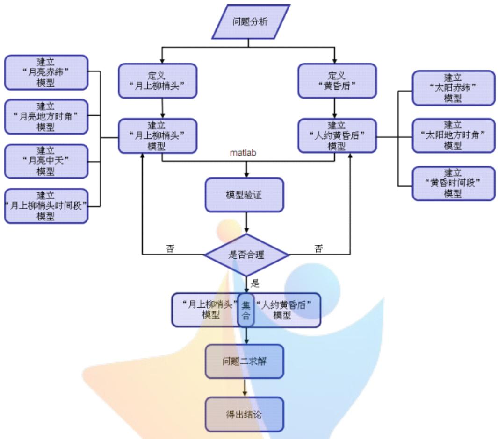
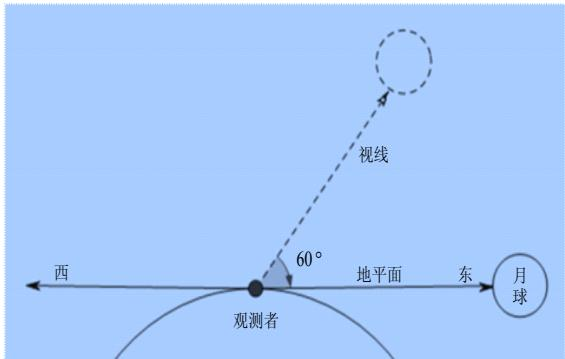
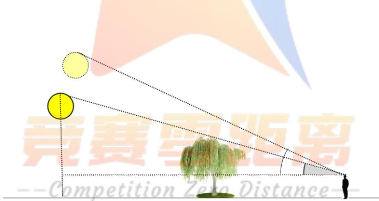
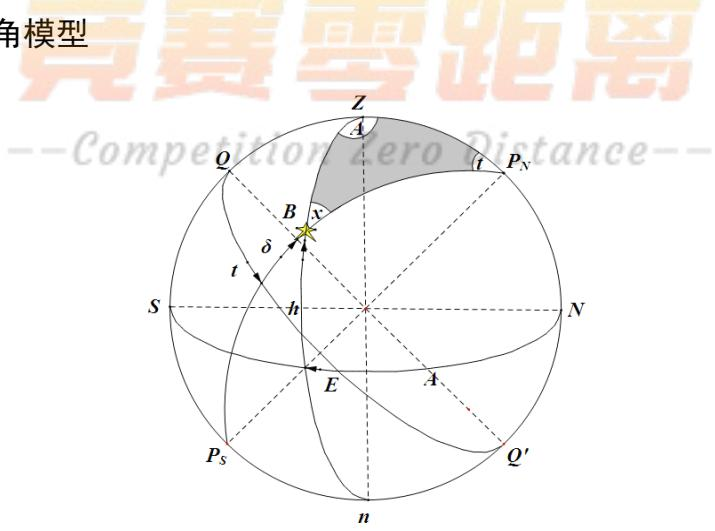

# “月上柳梢头，人约黄昏后”数学模型的建立

## 摘 要

“月上柳梢头，人约黄昏后”现象的发生，是由于月亮和太阳每天视运动速度不同造成的。本文运用天文学知识和实际经验，定义了“月上柳梢头”时月亮在空中的高度范围为 15°至 18°，定义了“黄昏后”为“日没时刻”到“民用昏影终”时刻，即太阳下午高度为 0°至-6°时的时间段。

针对问题 1：关于“人约黄昏后”模型，首先根据日期与太阳赤纬关系，建立太阳赤纬模型。其次根据太阳高度、赤纬和观测者纬度三者与地方时角之间的球面三角形关系，建立太阳地方时角模型。最后利用地方时角和当地太阳上中天时间的关系，建立“人约黄昏后”模型，该模型可分别求得“日没”和“昏影”发生的时间，即“黄昏后”时间范围。关于“月上柳梢头”模型，首先通过天文公式计算出积日、黄道倾角和月亮的黄经、黄纬等天文参数，利用赤纬与黄经、黄纬和黄道倾角关系，求得月亮赤纬。利用球面三角形关系，求得“月上柳梢头”高度的地方时角。再根据月亮运行周期，建立月亮上中天时间模型，该模型可求每天月亮上中天时间。最后利用地方时角和当地月亮上中天时间的关系，建立“月上柳梢头”模型，求得“月上柳梢头”发生的时间范围。在上述模型中输入不同的日期和纬度，将Matlab 程序计算的结果与已有天文资料<sup>[1]</sup>进行比较检验。结果显示，误差最大为 16分钟，误差最小为 0 分钟。说明本模型精度较高，效果较好。

针对问题 2：利用问题 1的模型，分别求得2016 年北京地区“月上柳梢头”和“人约黄昏后”发生的日期与时间段。为了达到更好的观赏效果，本文约定“月上柳梢头”与“人约黄昏后”的交叉时间段不得小于 5 分钟后，求出 2016 年北京地区发生“月上柳梢头，人约黄昏后”现象共 10次，具体日期与时间见表 4。求得 2016 年广州5 次、昆明 7次、成都 8 次、上海 7 次、乌鲁木齐 9 次、哈尔滨 11 次发生“月上柳梢头，人约黄昏后”现象，具体日期和时间见表 5。对结果研究发现：经度基本不影响发生“月上柳梢头，人约黄昏后”现象的次数，而纬度越高，发生“月上柳梢头，人约黄昏后”现象的次数越多。但纬度不能大于 47°，否则不会出现“月上柳梢头，人约黄昏后”现象。

相比专业书籍上的复杂天文模型，本文所建模型易于理解，便于编程，文中特色之一就是给出了 13 个程序，为计算使用提供方便。同时考虑到月球和人造卫星都是围绕地球运转，具有很大的相似性，可以为人造卫星的轨迹预测提供借鉴参考。

关键词：天体视运动、赤纬、地方时角、球面三角形、Matlab软件

## 1 问题的提出

本题是在唐宋八大家之一、宋代文学家欧阳修词作《生查子·元夕》中千古名句“月上柳梢头，人约黄昏后”的背景下提出的，主人公回忆与佳人相约的情景溢于纸上。这里要我们从天文学的角度来“欣赏”该名句，并建立数学模型解决下列问题：

给“月上柳梢头”时月亮在空中的角度和“黄昏后”的日期与时间下一个定义，用天文学的知识经过简化建立模型，并明确“月上柳梢头”和“人约黄昏后”发生的日期与时间。并通过查阅天文资料，对模型的合理性进行验证。

基于问题 1 建立的模型，分析“月上柳梢头，人约黄昏后”在 2016 年北京地区发生的日期与时间。根据模型判断在 2016 年，乌鲁木齐、哈尔滨、上海、广州、昆明、成都能否发生这样的场景？若能，给出相应的日期与时间。若不能，说明理由。

## 2 问题的分析

## 2.1 问题1 的分析

针对问题 1：首先查阅相关资料，如：我国成年人的平均身高、柳树的高度以及人与柳树的距离等，给出“月上柳梢头”时月亮在空中的角度范围即月亮高度范围。然后根据天文学和民间对“黄昏后”的解释，给出“黄昏后”的时间范围定义。“月上柳梢头，人约黄昏后”现象的发生，是由于月亮和太阳每天视运动速度不同造成的。根据“黄昏后”的时间范围与太阳的视运动有关，建立模型得到太阳高度与时间和经纬度的关系，然后转化成“黄昏后”时间范围。“月上柳梢头”时月亮的高度与月亮运行周期和观测者经纬度和赤纬有关，利用天文公式建立模型求得月亮赤纬，建立月亮上中天模型，求得月亮上中天的时间，利用月亮运行速度和月亮地方时角，求得“月上柳梢头”的时间范围。建立“月上柳梢头”和“人约黄昏后”两个数学模型，最后根据现有的天文资料，验证模型的合理性，为问题 2 做好充分的准备。

## 2.2 问题2 的分析

针对问题 2：问题2 只是一个求解问题，利用问题1“月上柳梢头”和“人约黄昏后”两个数学模型，代入北京的经纬度和日期，分别算出 2016年北京地区出现“月上柳梢头”和“人约黄昏后”发生的日期和时间，以（日期，时间）为元素构成 A、B 两个时间集合，求交集即为 2016年北京地区“月上柳梢头，人约黄昏后”发生的日期与时间。然后查找哈尔滨、上海、广州、昆明、成都、乌鲁木齐这六个城市的中心经纬度，依据问题 1模型判断 2016年在这些城市能否发生这一情景，并给出理由。问题整体思路如图 1所示。

  
图 1 思路流程图

## 3 名词解释和模型准备

## 3.1 名词解释

天球：以观测者为球心，任意大为半径所描绘出的假想球面叫做天球。

天轴：地轴向外延伸到天球的轴叫天轴。

天赤道：地球赤道向外延伸到天球的大圆叫天赤道。

天体赤纬：从天赤道向北或向南沿着某天体的时圈计量到该天体的角距离，就是该天体的赤纬。

地方时角：以观测者午圈为基准起算至天体午圈的角度叫地方时角。

世界时：以格林尼治子圈为基准起算的平太阳时，称为世界时。

晨光昏影：日出前和日没后的一段时间内天空呈现出微弱的光亮，通常称为黎明和黄昏，在天文上叫晨光和昏影。是由大气反射和折射引起的，是晨光始和昏影终的总称，

天体高度：天体与测者连线与地平面的夹角叫天体高度。如月球在某时相对于观测位置是 $6 0 ^ { \circ }$ ，就称月球高度角是 $6 0 ^ { \circ }$ 。如月球在某时位于地平面时，其高度为 $0 ^ { \circ }$ ，如图 2所示。

  
图 2 月球高度

## 3.2 模型的准备

## 3.2.1 定义“月上柳梢头”时月亮在空中的角度

“月上柳梢头”用白话文翻译为：“月儿升起在柳树梢头上。”也就是说月球在升起到柳树梢头时，人看月亮的视角与地平面的夹角，既是月球的高度。

为得到“月上柳梢头”时月亮在空中的角度，需要以下数据：观测者的身高、柳树的高度以及人观赏月亮的舒适角度。根据《2015 年中国居民营养与慢性病状态报告》，中国成年人的平均身高为167.1cm ，因此可设观测者的身高为167.1cm 。通过百度文库了解柳树的形态特征、生长习性和地理分布，结合问题 2中乌鲁木齐、哈尔滨、上海、广州、昆明、成都不同地理位置对柳树生长环境要求，只有旱柳为主等少数几种柳树符合在海拔10m 至3600m 生长，这些柳树成年后高达20m 。因此可假设“月上柳梢头”中的柳树高为 20m 。本文把观测人与柳树的距离定为60cm至 70m ，如图 3 所示。

  
图3 投影

利用投影及相似三角形原理计算可得人看月亮的视角与地平面的夹角为：

$$
\tan \left( { \frac { 2 0 - 1 . 6 7 1 } { 7 0 } } \right) \cdot \left( { \frac { 1 8 0 } { \pi } } \right) = 1 5 . 3 5 5 ^ { \circ }
$$

结合百度资料了解人在向远眺望、向上仰视时较为舒适的角度范围，所以本文定义“月上柳梢头”时月球高度在 $1 5 ^ { \circ }$ 到 $1 8 ^ { \circ }$ 之间。

## 3.2.2 定义“黄昏后”的时间

晨光昏影按不同的需要分为三级，它们是民用晨光昏影、航海晨光昏影和天文晨光昏影。太阳中心在地平下 $6 ^ { \circ }$ 时称为民用晨光始或民用昏影终，从民用晨光始到日出或从日没到民用昏影终的一段时间称为民用晨光昏影。

因此，本文定义“黄昏后”的时间为：民用晨光昏影现象的持续时间，即在日落过程中，将太阳中心位于地平线 $0 ^ { \circ }$ 度时，视为“黄昏”开始，待太阳中心位于地平线以下$6 ^ { \circ }$ 时，视为“黄昏”结束。

## 3.2.3 确定城市经纬度

表 1 各城市经纬度
<table><tr><td rowspan=1 colspan=1>城市</td><td rowspan=1 colspan=1>经度</td><td rowspan=1 colspan=1>纬度</td></tr><tr><td rowspan=1 colspan=1>北京</td><td rowspan=1 colspan=1>116.46667°</td><td rowspan=1 colspan=1>39.16667°</td></tr><tr><td rowspan=1 colspan=1>上海</td><td rowspan=1 colspan=1>121.43333°</td><td rowspan=1 colspan=1>34.500000°</td></tr><tr><td rowspan=1 colspan=1>广州</td><td rowspan=1 colspan=1>113.33333°</td><td rowspan=1 colspan=1>21.16667°</td></tr><tr><td rowspan=1 colspan=1>乌鲁木齐</td><td rowspan=1 colspan=1>87.68333°</td><td rowspan=1 colspan=1>43.76667°</td></tr><tr><td rowspan=1 colspan=1>昆明</td><td rowspan=1 colspan=1>102.73333°</td><td rowspan=1 colspan=1>25.05000°</td></tr><tr><td rowspan=1 colspan=1>哈尔滨</td><td rowspan=1 colspan=1>126.63333°</td><td rowspan=1 colspan=1>45.75000°</td></tr><tr><td rowspan=1 colspan=1>成都</td><td rowspan=1 colspan=1>104.06667°</td><td rowspan=1 colspan=1>30.66667°</td></tr></table>

## 问题的假设与符号约定

## 4.1 问题的假设

1.观测时月亮始终保持盈月状态，形态不发生改变。

2.观测时不受天气条件限制，天空恒为晴朗状态。

3.柳树不受风的影响，恒为静止状态。

4.观测者在观测过程中视力保持良好状态。

5.柳树周围无遮挡物。

6.观测者观测时视角不会发生改变。

7.观测者在观测时与柳树保持相对静止状态。

8.观测位置设定在北京，采用通用的中心经纬度。

## 4.2 符号约定

<table><tr><td colspan="1" rowspan="1">1</td><td colspan="1" rowspan="1"> ${ \mathcal A } _ { i } \setminus \ { \mathcal B } _ { i } \setminus \ { C } _ { i } \setminus \ { D } _ { i } \setminus \ { E } _ { i } \setminus \ { F } _ { i }$ </td><td colspan="1" rowspan="1">天文学上的计算常数</td></tr><tr><td colspan="1" rowspan="1">2</td><td colspan="1" rowspan="1">h</td><td colspan="1" rowspan="1">太阳、月亮的高度角</td></tr><tr><td colspan="1" rowspan="1">3</td><td colspan="1" rowspan="1">8</td><td colspan="1" rowspan="1">太阳、月亮的赤纬角度</td></tr><tr><td colspan="1" rowspan="1">4</td><td colspan="1" rowspan="1">φ</td><td colspan="1" rowspan="1">观测位置的通用中心纬度</td></tr><tr><td colspan="1" rowspan="1">5</td><td colspan="1" rowspan="1">t</td><td colspan="1" rowspan="1">太阳、月亮的地方时角</td></tr><tr><td colspan="1" rowspan="1">6</td><td colspan="1" rowspan="1"> $T$ </td><td colspan="1" rowspan="1">观测位置当地时间</td></tr><tr><td colspan="1" rowspan="1">7</td><td colspan="1" rowspan="1">θ</td><td colspan="1" rowspan="1">日期转换角</td></tr><tr><td colspan="1" rowspan="1">8</td><td colspan="1" rowspan="1">Y</td><td colspan="1" rowspan="1">年</td></tr><tr><td colspan="1" rowspan="1">9</td><td colspan="1" rowspan="1">M</td><td colspan="1" rowspan="1">月</td></tr><tr><td colspan="1" rowspan="1">10</td><td colspan="1" rowspan="1">D</td><td colspan="1" rowspan="1">日</td></tr><tr><td colspan="1" rowspan="1">11</td><td colspan="1" rowspan="1"> $T _ { G }$ </td><td colspan="1" rowspan="1">世界时</td></tr><tr><td colspan="1" rowspan="1">12</td><td colspan="1" rowspan="1">N</td><td colspan="1" rowspan="1">日期在年内的顺序号</td></tr><tr><td colspan="1" rowspan="1">13</td><td colspan="1" rowspan="1">ω</td><td colspan="1" rowspan="1">黄道倾角</td></tr><tr><td colspan="1" rowspan="1">14</td><td colspan="1" rowspan="1">β</td><td colspan="1" rowspan="1">月亮黄纬</td></tr><tr><td colspan="1" rowspan="1">15</td><td colspan="1" rowspan="1">λ</td><td colspan="1" rowspan="1">月亮黄经</td></tr><tr><td colspan="1" rowspan="1">16</td><td colspan="1" rowspan="1">ET</td><td colspan="1" rowspan="1">历书时</td></tr><tr><td colspan="1" rowspan="1">17</td><td colspan="1" rowspan="1">TD</td><td colspan="1" rowspan="1">以儒略世纪为单位的积日</td></tr><tr><td colspan="1" rowspan="1">18</td><td colspan="1" rowspan="1">Zt</td><td colspan="1" rowspan="1">月亮的中天时间</td></tr><tr><td colspan="1" rowspan="1">19</td><td colspan="1" rowspan="1">K</td><td colspan="1" rowspan="1">代表一年之中的天数</td></tr><tr><td colspan="1" rowspan="1">20</td><td colspan="1" rowspan="1"></td><td colspan="1" rowspan="1">时间段集合</td></tr><tr><td colspan="1" rowspan="1">21</td><td colspan="1" rowspan="1">--ComMetitionZer</td><td colspan="1" rowspan="1">o人约黄昏后”时间段集合</td></tr><tr><td colspan="1" rowspan="1">22</td><td colspan="1" rowspan="1"> $a _ { i }$ </td><td colspan="1" rowspan="1">“月上柳梢头”角度为15°的时间集合</td></tr><tr><td colspan="1" rowspan="1">23</td><td colspan="1" rowspan="1"> $b _ { i }$ </td><td colspan="1" rowspan="1">“月上柳梢头”角度为18°的时间集合</td></tr><tr><td colspan="1" rowspan="1">24</td><td colspan="1" rowspan="1"> $c _ { i }$ </td><td colspan="1" rowspan="1">日没时间的集合</td></tr><tr><td colspan="1" rowspan="1">25</td><td colspan="1" rowspan="1"> $d _ { i }$ </td><td colspan="1" rowspan="1">昏影时间的集合</td></tr><tr><td colspan="1" rowspan="1">26</td><td colspan="1" rowspan="1"> $P$ </td><td colspan="1" rowspan="1">积日</td></tr></table>

## 5 问题 1模型的建立与求解

## 5.1“人约黄昏后”模型的建立

由问题 1分析可知，要想确定“人约黄昏后”时间段，需要知道某年（月、天、时）太阳就某一个固定观测点而言，在天体中的具体坐标（赤纬角度和地方时角 ）。利用天文学的基本知识，首先建立求解太阳赤纬角度和太阳地方时角模型，在此基础上进一步求出黄昏的时间段，具体建模如下：

## 5.1.1 太阳赤纬模型

假设观测位置固定，日期转换公式 $\theta$ 为：

$$
\theta = \frac { 2 \pi { \left( { { N - { N _ { 0 } } } } \right) } } { 3 6 5 . 2 4 2 2 }\tag{1}
$$

其中 $N _ { 0 }$ 为：

$$
N _ { 0 } = 7 9 . 6 7 6 4 + 0 . 2 4 2 2 \times \left( \sqrt [ 4 ] { 1 1 } \frac { \Xi \star } { \Xi \star } \ddagger \right) \left( \begin{array} { c c } { { 1 9 8 5 } } \\ { { - 1 9 8 5 } } \end{array} \right) - \left[ \frac { \sqrt [ 3 ] { 1 1 } \frac { | \Xi \star \| \ll \star \| \ll \star \| _ { 3 } ^ { \delta } } { | \Xi \star } } { 4 } \right]\tag{2).}
$$

为日期在年内的顺序号。例如：1月 1 日 取1，平年12 月31 日 $N \mathbb { H } \mathbb { Z } \ 3 6 5$ ，闰年则取 366。

由于太阳赤纬角δ 在周年运动中，任何时刻的具体值都是严格已知的，利用日期转换公式和测量年份，建立太阳赤纬角度模型如下：（见附录 1）

$$
\begin{array} { c } { \delta = 0 . 3 7 2 3 + 2 3 . 2 5 6 7 \sin \theta + 0 . 1 1 4 9 \sin 2 \theta - 0 . 1 7 1 2 \sin 3 \theta } \\ { - 0 . 7 5 8 \cos \theta + 0 . 3 6 5 6 \cos 2 \theta + 0 . 0 2 0 1 \cos 3 \theta } \end{array}\tag{3}
$$

## 5.1.2 太阳地方时角模型

  
图 4 天体三角形

如图 3所示，在天体三角形 $P _ { N } B Z$ 中， <sub>Z</sub>表示天顶， <sub>B</sub>表示天体， $P _ { N }$ 表示天北极，$P _ { N } B$ 表示太阳高度角、 表示太阳赤纬度、 $Z P _ { N }$ 表示观测者纬度。利用球面三角形可以得出太阳地方时角t与太阳高度角h、赤纬度δ和观测者纬度 $\varphi$ 三者与之间的关系：

$$
\sinh = \sin \varphi \sin \delta + \cos \varphi \cos \delta \cos \ell\tag{4}
$$

将公式变形后，得到太阳地方时角模型：

$$
\ell = \operatorname { a r c c o s } \frac { \sinh - \sin \varphi \sin \delta } { \cos \varphi \cos \delta }\tag{5}
$$

## 5.1.3 黄昏时间段模型

根据“黄昏后”定义，黄昏时间段在太阳高度角 $0 ^ { \circ }$ 和 $- 6 ^ { \circ }$ 之间，利用公式 (4) − (6) ，运用 Matlab 软件编程计算可得 $0 ^ { \circ }$ 到 $- 6 ^ { \circ }$ 之间对应的太阳地方时角（程序见附录 2），结果见表 2。

为了使用方便，可利用公式：

$$
T = \frac { \sqrt { \left( \frac { 1 8 0 } { \pi } \right) } } { 1 5 } + 1 2\tag{6}
$$

由于太阳运行速度基本恒定，可以认定太阳的中天时间恒为正午 12 点。将太阳地方时角转换为观测位置当地时间 $T$ 的过程中需要注意，在观测位置当地时间的基础上，再加上中天时间 12小时。

表2 2012年 12 月15 日黄昏时间段表
<table><tr><td rowspan=1 colspan=1>太阳高度角</td><td rowspan=1 colspan=1>太阳地方时角</td><td rowspan=1 colspan=1>观测位置当地时间</td><td rowspan=1 colspan=1>太阳高度角</td><td rowspan=1 colspan=1>太阳地方时角</td><td rowspan=1 colspan=1>观测位置当地时间</td></tr><tr><td rowspan=1 colspan=1> $0 ^ { \circ }$ </td><td rowspan=1 colspan=1>69.4829°</td><td rowspan=1 colspan=1>16时37分</td><td rowspan=1 colspan=1></td><td rowspan=1 colspan=1>75.3721</td><td rowspan=1 colspan=1>17 时 01 分</td></tr><tr><td rowspan=1 colspan=1> $- 1 ^ { \circ }$ </td><td rowspan=1 colspan=1>70.9750°0</td><td rowspan=1 colspan=1>16时n43分tition</td><td rowspan=1 colspan=1> $\angle 5 ^ { \circ }$ Dis</td><td rowspan=1 colspan=1>t $7 6 . 8 1 4 2 ^ { \circ }$ </td><td rowspan=1 colspan=1>17 时07 分</td></tr><tr><td rowspan=1 colspan=1> $- 2 ^ { \circ }$ </td><td rowspan=1 colspan=1>72.4533°</td><td rowspan=1 colspan=1>16 时49分</td><td rowspan=1 colspan=1> $- 6 ^ { \circ }$ </td><td rowspan=1 colspan=1>78.2457°</td><td rowspan=1 colspan=1>17 时12 分</td></tr><tr><td rowspan=1 colspan=1> $- 3 ^ { \circ }$ </td><td rowspan=1 colspan=1> $7 3 . 9 1 8 7 ^ { \circ }$ </td><td rowspan=1 colspan=1>16时55分</td><td rowspan=1 colspan=1></td><td rowspan=1 colspan=1></td><td rowspan=1 colspan=1></td></tr></table>

## 5.2“月上柳梢头”模型的建立

本模型与“人约黄昏后”的模型原理相似，也需要求出月亮赤纬纬度和月亮地方时角，由于月亮相较于太阳的特殊之处，还需要特别考虑月亮的中天时间。

## 5.2.1 月亮赤纬模型

由于月亮的赤纬角度计算方法比较特殊，需要先求出积日、世纪单位积日、黄道倾

角、月亮黄经和月亮黄纬。其计算公式(7)− (13)：

积日公式：

$$
P = [ 1 4 6 1 \times \frac { Y - 1 9 0 0 } { 4 } ] + [ \frac { 1 5 3 \times M - 2 } { 5 } ] + D + \frac { T _ { \sigma } } { 2 4 } - 3 6 5 5 7 . 5\tag{7}
$$

世纪为单位的积日：

$$
T D = \frac { P } { 3 6 5 2 5 }\tag{8}
$$

$$
E T = T D + ( 3 . 1 4 \cdot { T D } + 1 . 4 3 ) { \times } 1 0 ^ { - 8 }\tag{9}
$$

黄道倾角：

$$
\omega = 2 3 ^ { \circ } . 4 3 9 2 8 - 0 ^ { \circ } 0 1 3 0 1 \cdot 7 D + \sum _ { i = 1 } ^ { 2 } \mathcal { A } _ { i } \cos ( B _ { i } / D + C _ { i } )\tag{10}
$$

月亮黄经：

$$
\lambda = \sum _ { i = 1 } ^ { 6 2 } \mathcal { A } _ { i } \cos ( B _ { i } E T + C _ { i } ) + \sum _ { i = 6 3 } ^ { 6 3 } \mathcal { A } _ { i } E T \cos ( B _ { i } E T + C _ { i } )\tag{11}
$$

月亮黄纬：

$$
\beta = \sum _ { i = 1 } ^ { 4 5 } D _ { i } \cos ( E _ { i } E T + F _ { i } )\tag{12}
$$

综合公式(7)—(12)可得月亮赤纬角度模型如下：

$$
\delta = \arcsin ( \cos \varepsilon \sin \beta + \sin \varepsilon \cos \beta \sin \lambda )\tag{13}
$$

利用 Matlab 软件编制月亮赤纬角度计算模型，代入观测日期即可求出月亮赤纬角度，具体程序见附件 3.

## 5.2.2 月亮地方时角模型

根据定义，“月上柳梢头”时的月球高度角为 $1 5 ^ { \circ }$ 至 $1 8 ^ { \circ }$ ，利用球面三角形可以得出月亮地方时角 $t \cdot$ 与月亮高度角h、赤纬度δ和观测者纬度 $\varphi$ 三者与之间的关系：

$$
\sinh = \sin \varphi \sin \delta + \cos \varphi \cos \delta \cos \ell\tag{14}
$$

将公式变形后，得到月亮地方时角模型：

$$
\ell = \operatorname { a r c c o s } \frac { \sinh - \sin \varphi \sin \delta } { \cos \varphi \cos \delta }\tag{15}
$$

## 5.2.3 月亮上中天时间模型

太阳的中天时间是一个恒量，月亮的中天时间是遵循一定规律不断变化的时间量。每年的 1 月 1 号规定为月亮上中天时间的起始点，在 29 天月亮的一个周期内，月亮的中天时间都会比前一天慢大约 48.7633分钟，。通过查阅资料确定 2016 年1 月1 号月亮上中天时间为 13.9667时。建立月亮上中天时间模型：

$$
Z _ { t } = 1 3 . 9 6 6 7 + \frac { k \cdot 4 8 . 7 6 3 3 } { 6 0 }\tag{16}
$$

## 5.2.4 月上柳梢时间段模型

由于月亮的中天时间都会比前一天慢大约48.7633分钟，即月亮需要24小时48.7633分钟才能绕地球一周，

通过“月上柳梢头”的定义、月亮赤纬模型和月亮地方时角模型，可以根据月亮高度角求得 2个地方时间角度，再将月球转动速度与之相比，得到月上柳梢时间模型：

$$
T = Z _ { \iota } - \frac { \iota } { 2 4 . 8 1 2 7 }\tag{17}
$$

得到模型运用 Matlab软件进行编程求解，程序见附录 4

## 5.3 模型的求解和检验

根据 2012年资料，选用时间3 月15 日、6 月15 日、9 月15 日、12 月15 日，纬度$1 0 ^ { \circ } N$ 7 $2 0 ^ { \circ } N$ 、 N<sup>o</sup> <sub>40</sub> ，运用 Matlab 软件编写程序对模型的结果进行检验，比较结果见表 3，具体程序见附录5。

表3 模型一验证表
<table><tr><td colspan="1" rowspan="1">日期</td><td colspan="1" rowspan="1">纬度</td><td colspan="1" rowspan="1">太阳高度角</td><td colspan="1" rowspan="1">计算结果</td><td colspan="1" rowspan="1">资料数据</td><td colspan="1" rowspan="1">存在误差</td></tr><tr><td colspan="1" rowspan="6">2012.3.15</td><td colspan="1" rowspan="2"> $1 0 ^ { \circ } ~ \mathrm { ~ N ~ }$ </td><td colspan="1" rowspan="1"> $0 ^ { \circ }$ </td><td colspan="1" rowspan="1">17 时58 分</td><td colspan="1" rowspan="1">18时11分</td><td colspan="1" rowspan="1">-13分</td></tr><tr><td colspan="1" rowspan="1"> $6 ^ { \circ }$ </td><td colspan="1" rowspan="1">18时 22分</td><td colspan="1" rowspan="1">18时32分</td><td colspan="1" rowspan="1">-10分</td></tr><tr><td colspan="1" rowspan="2">20°N</td><td colspan="1" rowspan="1">0 $0 ^ { \circ }$ </td><td colspan="1" rowspan="1">17时57分</td><td colspan="1" rowspan="1">18时08分</td><td colspan="1" rowspan="1">-11分</td></tr><tr><td colspan="1" rowspan="1"> $6 ^ { \circ }$ </td><td colspan="1" rowspan="1">18时20 分 1</td><td colspan="1" rowspan="1">8时31 分</td><td colspan="1" rowspan="1">-11分</td></tr><tr><td colspan="1" rowspan="2">Compe $4 0 ^ { \circ } \ \mathrm { ~ N ~ }$ </td><td colspan="1" rowspan="1">totion</td><td colspan="1" rowspan="1">17时53分1</td><td colspan="1" rowspan="1">8时07分</td><td colspan="1" rowspan="1">-14 分</td></tr><tr><td colspan="1" rowspan="1"> $6 ^ { \circ }$ </td><td colspan="1" rowspan="1">18时17 分</td><td colspan="1" rowspan="1">18时33分</td><td colspan="1" rowspan="1">-16分</td></tr><tr><td colspan="1" rowspan="6">2012.6.15</td><td colspan="1" rowspan="2"> $1 0 ^ { \circ } ~ \mathrm { ~ N ~ }$ </td><td colspan="1" rowspan="1"> $0 ^ { \circ }$ </td><td colspan="1" rowspan="1">18时16分</td><td colspan="1" rowspan="1">18时 22分</td><td colspan="1" rowspan="1">-06 分</td></tr><tr><td colspan="1" rowspan="1"> $6 ^ { \circ }$ </td><td colspan="1" rowspan="1">18时40分</td><td colspan="1" rowspan="1">18时45分</td><td colspan="1" rowspan="1">-05 分</td></tr><tr><td colspan="1" rowspan="2"> $2 0 ^ { \circ } ~ \mathrm { ~ N ~ }$ </td><td colspan="1" rowspan="1"> $0 ^ { \circ }$ </td><td colspan="1" rowspan="1">18时34分</td><td colspan="1" rowspan="1">18时41分</td><td colspan="1" rowspan="1">-07分</td></tr><tr><td colspan="1" rowspan="1"> $6 ^ { \circ }$ </td><td colspan="1" rowspan="1">18时59分</td><td colspan="1" rowspan="1">19 时 05 分</td><td colspan="1" rowspan="1">-06 分</td></tr><tr><td colspan="1" rowspan="2"> $4 0 ^ { \circ } \ \mathrm { ~ N ~ }$ </td><td colspan="1" rowspan="1"> $0 ^ { \circ }$ </td><td colspan="1" rowspan="1">19时 21分</td><td colspan="1" rowspan="1">19时31分</td><td colspan="1" rowspan="1">-10分</td></tr><tr><td colspan="1" rowspan="1"> $6 ^ { \circ }$ </td><td colspan="1" rowspan="1">19时47分</td><td colspan="1" rowspan="1">20时03分</td><td colspan="1" rowspan="1">-16分</td></tr><tr><td colspan="1" rowspan="6">2012.9.15</td><td colspan="1" rowspan="2"> $1 0 ^ { \circ } ~ \mathrm { ~ N ~ }$ </td><td colspan="1" rowspan="1"> $0 ^ { \circ }$ </td><td colspan="1" rowspan="1">18 时 02 分</td><td colspan="1" rowspan="1">18时 00分</td><td colspan="1" rowspan="1">+02 分</td></tr><tr><td colspan="1" rowspan="1"> $6 ^ { \circ }$ </td><td colspan="1" rowspan="1">18时26 分</td><td colspan="1" rowspan="1">18时21 分</td><td colspan="1" rowspan="1">+05 分</td></tr><tr><td colspan="1" rowspan="2"> $2 0 ^ { \circ } ~ \mathrm { ~ N ~ }$ </td><td colspan="1" rowspan="1"> $0 ^ { \circ }$ </td><td colspan="1" rowspan="1">18时 04分</td><td colspan="1" rowspan="1">18时 02 分</td><td colspan="1" rowspan="1">+02 分</td></tr><tr><td colspan="1" rowspan="1"> $6 ^ { \circ }$ </td><td colspan="1" rowspan="1">18时 28分</td><td colspan="1" rowspan="1">18时 23 分</td><td colspan="1" rowspan="1">+05 分</td></tr><tr><td colspan="1" rowspan="2"> $4 0 ^ { \circ } \ \mathrm { ~ N ~ }$ </td><td colspan="1" rowspan="1"> $0 ^ { \circ }$ </td><td colspan="1" rowspan="1">18时10分</td><td colspan="1" rowspan="1">18时08分</td><td colspan="1" rowspan="1">+02 分</td></tr><tr><td colspan="1" rowspan="1"> $6 ^ { \circ }$ </td><td colspan="1" rowspan="1">18时34分</td><td colspan="1" rowspan="1">18时31分</td><td colspan="1" rowspan="1">+03 分</td></tr><tr><td colspan="1" rowspan="6">2012.12.15</td><td colspan="1" rowspan="2"> $1 0 ^ { \circ } ~ \mathrm { ~ N ~ }$ </td><td colspan="1" rowspan="1"> $0 ^ { \circ }$ </td><td colspan="1" rowspan="1">17时42分</td><td colspan="1" rowspan="1">17时42分</td><td colspan="1" rowspan="1">00分</td></tr><tr><td colspan="1" rowspan="1"> $6 ^ { \circ }$ </td><td colspan="1" rowspan="1">18时06分</td><td colspan="1" rowspan="1">18 时 05分</td><td colspan="1" rowspan="1">+01分</td></tr><tr><td colspan="1" rowspan="2"> $2 0 ^ { \circ } ~ \mathrm { ~ N ~ }$ </td><td colspan="1" rowspan="1"> $0 ^ { \circ }$ </td><td colspan="1" rowspan="1">17 时 23 分</td><td colspan="1" rowspan="1">17 时 23 分</td><td colspan="1" rowspan="1">00分</td></tr><tr><td colspan="1" rowspan="1"> $6 ^ { \circ }$ </td><td colspan="1" rowspan="1">17时48分</td><td colspan="1" rowspan="1">17时47分</td><td colspan="1" rowspan="1">+01分</td></tr><tr><td colspan="1" rowspan="2"> $4 0 ^ { \circ } \ \mathrm { ~ N ~ }$ </td><td colspan="1" rowspan="1"> $0 ^ { \circ }$ </td><td colspan="1" rowspan="1">16时35分</td><td colspan="1" rowspan="1">16时36分</td><td colspan="1" rowspan="1">-01分</td></tr><tr><td colspan="1" rowspan="1"> $6 ^ { \circ }$ </td><td colspan="1" rowspan="1">17时 00 分</td><td colspan="1" rowspan="1">17 时 06 分</td><td colspan="1" rowspan="1">-06 分</td></tr></table>

从表 1中不难看出，模型计算结果与实际资料数据误差最大时仅为16 分，最小为0分即无误差。说明本模型精度较高，效果较好。

## 5.4 词中“月上柳梢头，人约黄昏后”情景的时间推算

根据模型推算，“月上柳梢头，人约黄昏后”情景大约发生在公元1035 年 2 月 20日 18 时 52 分左右，这与在百度文库查找资料，这首词是在景佑三年（农历丙子 1036年）正月十五，作者独自一人在月光下，回想起去年元夜与情人相会的时间基本吻合。

## 6 问题 2 的求解

## 6.1 北京在2016 年内能否发生“月上柳梢头，人约黄昏后”问题的求解

将年份 2016和北京的经纬度代入问题 1的模型，运用 Matlab软件编写程序，分别求得 2016年北京地区“月上柳梢头”和“人约黄昏后”发生的日期与时间（程序见附录 6），记“月上柳梢头”时间段集合为 $\textstyle H _ { i } = \left[ a _ { i } , b _ { i } \right]$ 人约黄昏后”时间段集合为$\textstyle M _ { i } = \left[ c _ { i } , d _ { i } \right]$ ，同时满足“月上柳梢头，人约黄昏后”的条件为集合 $\textstyle { \mathcal { W } } _ { _ i }$ 与集合 $M _ { i }$ 的交集。为了更好的观赏效果，约定“月上柳梢头”与“人约黄昏后”的交叉时间段不得小于 5分钟，即 $a _ { i } + 5 \leq d _ { i }$ 或 $c _ { i } + 5 \leq b _ { i }$ 。利用附录 7 的M<sub>a</sub>tl<sub>a</sub>b程序求得 2016年北京地区“月上柳梢头”和“人约黄昏后”发生 10次，具体日期与时间见表 4。

表4 北京2016 年发生日期时间
<table><tr><td rowspan=1 colspan=1>日期</td><td rowspan=1 colspan=1>时间段</td></tr><tr><td rowspan=1 colspan=1>1月22日</td><td rowspan=1 colspan=1>17：20~17：36</td></tr><tr><td rowspan=1 colspan=1>2月21日</td><td rowspan=1 colspan=1>18：05~18：20</td></tr><tr><td rowspan=1 colspan=1>3月22日</td><td rowspan=1 colspan=1>18：50~18：55</td></tr><tr><td rowspan=1 colspan=1>4月20日</td><td rowspan=1 colspan=1></td></tr><tr><td rowspan=1 colspan=1>5月20日</td><td rowspan=1 colspan=1>19：26~19：43</td></tr><tr><td rowspan=1 colspan=1>6月19日</td><td rowspan=1 colspan=1>20：11~20：18</td></tr><tr><td rowspan=1 colspan=1>7月18日</td><td rowspan=1 colspan=1>19：48~20：10</td></tr><tr><td rowspan=1 colspan=1>8月16日</td><td rowspan=1 colspan=1></td></tr><tr><td rowspan=1 colspan=1>9月14日</td><td rowspan=1 colspan=1>O    18：24~18：42</td></tr><tr><td rowspan=1 colspan=1>10月13日</td><td rowspan=1 colspan=1>17：37~17：46</td></tr><tr><td rowspan=1 colspan=1>11月12日</td><td rowspan=1 colspan=1>17：11~17：26</td></tr><tr><td rowspan=1 colspan=1>12月12日</td><td rowspan=1 colspan=1>17:10~17：20</td></tr><tr><td rowspan=1 colspan=1>合计（次）</td><td rowspan=1 colspan=1>10</td></tr></table>

## 6.2 上海、昆明等其余 6个城市在 2016年内能否发生“月上柳梢头，人约黄昏后”问题的求解

将年份 2016 和上海、昆明等 6 个城市的经纬度代入问题 1 的模型，求解可得所有城市都发生“月上柳梢头，人约黄昏后”现象，其中，广州 5次、昆明 7次、成都 8次、上海 9次、乌鲁木齐 9次、哈尔滨11次，具体日期和时间见表5，具体计算程序见附录8。

表 5 其余 6 市 2016 年发生日期时间
<table><tr><td colspan="1" rowspan="1">城市日期时间段</td><td colspan="1" rowspan="1">哈尔滨</td><td colspan="1" rowspan="1">乌鲁木齐</td><td colspan="1" rowspan="1">上海</td><td colspan="1" rowspan="1">成都</td><td colspan="1" rowspan="1">昆明</td><td colspan="1" rowspan="1">广州</td></tr><tr><td colspan="1" rowspan="1">1月22日</td><td colspan="1" rowspan="1">16:32~16:50</td><td colspan="1" rowspan="1">19:16~19:28</td><td colspan="1" rowspan="1"></td><td colspan="1" rowspan="1">18:21~18:35</td><td colspan="1" rowspan="1"></td><td colspan="1" rowspan="1"></td></tr><tr><td colspan="1" rowspan="2">2月21日</td><td colspan="1" rowspan="2">17:21~17：17</td><td colspan="1" rowspan="2">20:04~20:15</td><td colspan="1" rowspan="1">17:48~</td><td colspan="1" rowspan="2">19:00~19:14</td><td colspan="1" rowspan="2">19:09~19:22</td><td colspan="1" rowspan="2">18:26~18:39</td></tr><tr><td colspan="1" rowspan="1">18:01</td></tr><tr><td colspan="1" rowspan="1">3月22日</td><td colspan="1" rowspan="1">18:13~18:onp</td><td colspan="1" rowspan="1">etitio</td><td colspan="1" rowspan="1">18:23~n18310</td><td colspan="1" rowspan="1">19:35~Di19:40n c</td><td colspan="1" rowspan="1">19:39~e19:44</td><td colspan="1" rowspan="1">18:55~19:01</td></tr><tr><td colspan="1" rowspan="1">4月20日</td><td colspan="1" rowspan="1"></td><td colspan="1" rowspan="1">20:58~21:03</td><td colspan="1" rowspan="1"></td><td colspan="1" rowspan="1"></td><td colspan="1" rowspan="1"></td><td colspan="1" rowspan="1"></td></tr><tr><td colspan="1" rowspan="2">5月20日</td><td colspan="1" rowspan="2">19:05~19:18</td><td colspan="1" rowspan="2">21:39~22:00</td><td colspan="1" rowspan="1">18:40~</td><td colspan="1" rowspan="2">19:54~20:06</td><td colspan="1" rowspan="2">19:48~19:59</td><td colspan="1" rowspan="2"></td></tr><tr><td colspan="1" rowspan="1">18:55</td></tr><tr><td colspan="1" rowspan="1">6月19日</td><td colspan="1" rowspan="1">20:01~20:06</td><td colspan="1" rowspan="1"></td><td colspan="1" rowspan="1">19:16~19:28</td><td colspan="1" rowspan="1">20:27~20:16</td><td colspan="1" rowspan="1">20:17~20:27</td><td colspan="1" rowspan="1">19:28~19:40</td></tr><tr><td colspan="1" rowspan="1">7月18日</td><td colspan="1" rowspan="1">19:40~19:45</td><td colspan="1" rowspan="1">22:08~22:20</td><td colspan="1" rowspan="1">18:57~19:20</td><td colspan="1" rowspan="1">20:06~20:20</td><td colspan="1" rowspan="1"></td><td colspan="1" rowspan="1"></td></tr><tr><td colspan="1" rowspan="1">8月16日</td><td colspan="1" rowspan="1">19:00~19:13</td><td colspan="1" rowspan="1">21:29~21:42</td><td colspan="1" rowspan="1"></td><td colspan="1" rowspan="1"></td><td colspan="1" rowspan="1"></td><td colspan="1" rowspan="1"></td></tr><tr><td colspan="1" rowspan="1">9月14日</td><td colspan="1" rowspan="1">18:05~18:17</td><td colspan="1" rowspan="1">20:36~20:50</td><td colspan="1" rowspan="1"></td><td colspan="1" rowspan="1"></td><td colspan="1" rowspan="1"></td><td colspan="1" rowspan="1"></td></tr><tr><td colspan="1" rowspan="1">9月15日</td><td colspan="1" rowspan="1"></td><td colspan="1" rowspan="1"></td><td colspan="1" rowspan="1"></td><td colspan="1" rowspan="1"></td><td colspan="1" rowspan="1">19:27~19:35</td><td colspan="1" rowspan="1">18:41~18:53</td></tr><tr><td colspan="1" rowspan="1">10月13日</td><td colspan="1" rowspan="1">17:04~17:22</td><td colspan="1" rowspan="1">19:37~19:55</td><td colspan="1" rowspan="1"></td><td colspan="1" rowspan="1"></td><td colspan="1" rowspan="1"></td><td colspan="1" rowspan="1"></td></tr><tr><td colspan="1" rowspan="1">10月14日</td><td colspan="1" rowspan="1"></td><td colspan="1" rowspan="1"></td><td colspan="1" rowspan="1">17:32~17:46</td><td colspan="1" rowspan="1">18:43~18:57</td><td colspan="1" rowspan="1">18:43~18:56</td><td colspan="1" rowspan="1">18:01~18:11</td></tr><tr><td colspan="1" rowspan="1">11月12日</td><td colspan="1" rowspan="1">16: 34~16:39</td><td colspan="1" rowspan="1">19:12~19:17</td><td colspan="1" rowspan="1"></td><td colspan="1" rowspan="1"></td><td colspan="1" rowspan="1"></td><td colspan="1" rowspan="1"></td></tr><tr><td colspan="1" rowspan="1">12月11日</td><td colspan="1" rowspan="1">15:48~15:59</td><td colspan="1" rowspan="1"></td><td colspan="1" rowspan="1"></td><td colspan="1" rowspan="1"></td><td colspan="1" rowspan="1"></td><td colspan="1" rowspan="1"></td></tr><tr><td colspan="1" rowspan="1">12月12日</td><td colspan="1" rowspan="1"></td><td colspan="1" rowspan="1"></td><td colspan="1" rowspan="1">16:54~17:08</td><td colspan="1" rowspan="1">18:07~18:20</td><td colspan="1" rowspan="1">18:20~18:29</td><td colspan="1" rowspan="1"></td></tr><tr><td colspan="1" rowspan="1">合计（次）</td><td colspan="1" rowspan="1">11</td><td colspan="1" rowspan="1">9</td><td colspan="1" rowspan="1">7</td><td colspan="1" rowspan="1">8</td><td colspan="1" rowspan="1">7</td><td colspan="1" rowspan="1">5</td></tr></table>

从结果中可以上海和成都几乎在同一纬度，北京和乌鲁木齐几乎在同一纬度，发生“月上柳梢头，人约黄昏后”现象的相同，说明在同一纬度，经度不影响发生“月上柳梢头，人约黄昏后”现象的次数。这是因为根据公式 $\sinh = \sin \varphi \sin \delta + \cos \varphi \cos \delta \cos \ell$

天体高度只和观测者纬度、天体赤纬和地方时角有关，发生“月上柳梢头，人约黄昏后”现象时。同时发现，纬度越高的地区发生“月上柳梢头，人约黄昏后”现象的次数越多，说明纬度影响发生“月上柳梢头，人约黄昏后”现象的次数。因为，在北半球，太阳赤纬不变的情况下，观测者纬度越高，白昼时间越长，日没到昏影终的时间越长，即黄昏的时间越长，而月亮运行周期是不变的，所以，满足“月上柳梢头，人约黄昏后”现象的时间越长。根据公式， $\sinh = \sin \varphi \sin \delta + \cos \varphi \cos \delta \cos \ell$ 当地方时角 $t = 0$ 时，即月亮上中天高度 $h = 9 0 ^ { \circ } - \varphi + \delta$ ，月亮的赤纬范围为 $2 8 ^ { \circ }$ ，当月亮的赤纬 $\delta = - 2 8 ^ { \circ }$ 时，当观测者纬度 $\varphi > 4 7 ^ { \circ }$ 时，月亮高度在白天达不到 $1 5 ^ { \circ }$ ，因此不会出现“月上柳梢头，人约黄昏后”现象。

## 7 模型的评价与推广

## 7.1 优点

1.充分利用同一天赤纬变化较小的特点和天文球面三角形的关系，简化了计算赤纬和地方时角的公式。

2.相比于专业书籍上给出的天文计算公式与方法，该模型思路清晰，易于理解，不需要复杂的天文参数，便于计算。。

3.利用Matlab 编写了计算程序，提高了效率。

## 7.2 不足

1.为了兼顾便于计算这一方面，本文中所建立模型的计算精度，相较于天文学

中对于数据的要求还有一些差距。

2.由于天文学知识较为欠缺，部分模型依赖于现有公式，模型的创新度不够高。

## 7.3 推广

在建立模型的过程中，我们考虑到月球和人造卫星都是围绕着地球运转，具有很大的相似性，本想借助人造卫星预报模型来建立“月上柳梢头”模型，由于时间有限未能完成。但这种方法是否可行，建立模型是否精确可靠，能不能借助文中建立的“月上柳梢头”模型，为人造卫星的轨迹预测提供新的方法，这些都为我们竞赛的后续研究提供了课题与素材。

## 8 参考文献

[1] 《2012 航海天文历》，中国航海图书出版社，2011.6。

[2] 王海亭，《天文航海》，海潮出版社，1998.7。

[3] 百度百科，http://wapbaike.baidu.com/，2015.09.11。

[4] 《天体高度方位角》，2008.8。

[5] 占海明，《基于 MATLAB 的高等数学问题求解》，清华大学出版社，2013.2。

[6] 万永革 庄献华，《防专校园太阳高度及升降方位的计算》，2003.3。

[7] 万永革 孟晓春 黄猛 赵晓燕，《月亮高度及升降时刻与方位的计算》，2003.9。

## 后 记

通过对本题建模求解的过程，让我们真真切切感到数学无处不在，数学博大精深，数学是揭示生活中许多现象所蕴涵规律的有力工具。同时还让我们感受到用数学理论和方法去解决实践问题带来的快乐，这对于培养我们勤于思考、善于分析的习惯，提高综合素质，具有现实意义。

## 附 录

## 附录 1（对全年太阳赤纬的计算程序）

clc

clear

N0=79.6764+0.2422\*(2012-1985)-floor((2012-1985)/4);

for N=1:1:365

M=(N-N0);

theata=2\*pi\*M/365.2422;

end

## 附录 2（对2012 年12 月15 日黄昏时段的计算程序） 附录2（对2012年12月15日黄昏时段的计算程序）

clc   
clear   
N0=79.6764+0.2422\*(2012-1985)-floor((2012-1985)/4);   
M=(350-N0);   
theata=2\*pi\*M/365.2422;   
derat=0.3723+23.2567\*sin(theata)+0.1149\*sin(2\*theata)-0.1712\*sin(3\*theata)-   
0.758\*cos(theata)+0.3656\*cos(2\*theata)+0.0201\*cos(3\*theata);   
t1=acos((sin(0\*(pi/180))-sin(39.16667\*(pi/180))\*sin((derat)\*(pi/180)))/(cos   
(39.16667\*(pi/180))\*cos((derat)\*(pi/180))))\*(180/pi)   
t2=acos((sin(-1\*(pi/180))-sin(39.16667\*(pi/180))\*sin((derat)\*(pi/180)))/(co   
s(39.16667\*(pi/180))\*cos((derat)\*(pi/180))))\*(180/pi)   
t3=acos((sin(-2\*(pi/180))-sin(39.16667\*(pi/180))\*sin((derat)\*(pi/180)))/(co   
s(39.16667\*(pi/180))\*cos((derat)\*(pi/180))))\*(180/pi)   
t4=acos((sin(-3\*(pi/180))-sin(39.16667\*(pi/180))\*sin((derat)\*(pi/180)))/(co   
s(39.16667\*(pi/180))\*cos((derat)\*(pi/180))))\*(180/pi)   
t5=acos((sin(-4\*(pi/180))-sin(39.16667\*(pi/180))\*sin((derat)\*(pi/180)))/(co   
s(39.16667\*(pi/180))\*cos((derat)\*(pi/180))))\*(180/pi)   
t6=acos((sin(-5\*(pi/180))-sin(39.16667\*(pi/180))\*sin((derat)\*(pi/180)))/(co   
s(39.16667\*(pi/180))\*cos((derat)\*(pi/180))))\*(180/pi)   
t7=acos((sin(-6\*(pi/180))-sin(39.16667\*(pi/180))\*sin((derat)\*(pi/180)))/(co   
s(39.16667\*(pi/180))\*cos((derat)\*(pi/180))))\*(180/pi)   
t10=(floor(t1/15)+12)+rem((t1/15),(floor(t1/15)))\*60/100   
t20=(floor(t2/15)+12)+rem((t2/15),(floor(t2/15)))\*60/100   
t30=(floor(t3/15)+12)+rem((t3/15),(floor(t3/15)))\*60/100   
t40=(floor(t4/15)+12)+rem((t4/15),(floor(t4/15)))\*60/100   
t50=(floor(t5/15)+12)+rem((t5/15),(floor(t5/15)))\*60/100   
t60=(floor(t6/15)+12)+rem((t6/15),(floor(t6/15)))\*60/100   
t70=(floor(t7/15)+12)+rem((t7/15),(floor(t7/15)))\*60/100

## 附录 3（月亮赤纬角计算程序）

```matlab
clc
clear
Y=2012;
M=5;
d=10;
Tg=0;
if M<=2
Y=Y-1
M=M+12
end
T=floor(1461*((Y-1900)/4))+floor((153*M-2)/5)+d+Tg/24-36557.5;
TD=T/36525;
ET=TD+(3.17*TD+1.43)*10^(-8);
lamad1=0;
```

```csv
A=[218.3162;6.2888;1.274;0.6583;0.2136;0.1851;0.1144;0.0588;0.0571;0.0533;0.
0458;0.0409;0.0347;0.0304;0.0154;0.0125;0.011;0.0107;0.01;0.0085;0.0079;0.0
068;0.0052;0.005;0.004;0.004;0.004;0.0038;0.0037;0.0028;0.0027;0.0026;0.002
4;0.0023;0.0022;0.0024;0.0021;0.0021;0.0018;0.0016;0.0012;0.0011;0.0009;0.0
008;0.0007;0.0007;0.0007;0.0006;0.0006;0.0005;0.0005;0.0005;0.0004;0.0004;0.
0004;0.0003;0.0003;0.0003;0.0003;0.0003;0.0003;0.0003;481267.9;];
B=[0;477198.9;413335.4;890534.2;954397.7;35999.05;966404;63863.5;377336.3;1
367733;854535.2;441199.8;445267.1;513197.9;75870;1443606;489205;1303870;143
1597;826671;449334;926533;31932;481266;1331734;1844932;133;1781068;541062;1
934;918399;1379739;99863;922466;818536;990397;71998;341337;401329;1856938;1
267871;1920802;858602;1403732;405201;485333;27864;111869;2258267;1908795;17
45069;509131;790672;39871;12006;958465;381404;349472;1808933;549197;4067;23
22131;0;];
C=[0;44.963;10.74;145.7;179.93;87.53;276.5;124.2;13.2;280.7;148.2;47.4;27.9;
222.5;41;52;142;246;315;111;188;323;107;205;283;56;29;21;259;145;182;17;122;
163;151;357;85;16;274;152;249;186;129;98;50;186;127;38;156;90;24;242;114;22
3;187;340;354;337;58;220;70;191;0;];
for i=1:62
lamad1=lamad1+A(i)*cos(B(i)*ET+C(i));
end
for i=63
lamad2=A(i)*ET*cos(B(i)*ET+C(i));
end
lamad=mod((lamad1+lamad2),360);
beita=0;
D=[5.1281;0.2806;0.2777;0.1733;0.0554;0.0463;0.0326;0.0172;0.0093;0.0088;0.
0082;0.0043;0.0042;0.0034;0.0025;0.0022;0.0022;0.0021;0.0019;0.0018;0.0018;
0.0018;0.0015;0.0015;0.0015;0.0014;0.0013;0.0013;0.0011;0.001;0.0009;0.0008;
0.0007;0.0006;0.0006;0.0005;0.0005;0.0005;0.0004;0.0004;0.0003;0.0003;0.000
3;0.0003;0.0003;];
E=[483202;960400.9;6003.15;407335.2;896537.4;69866.7;1373736;1437600;884531;
471196;371333;547066;1850935;443331;860538;481268;1337737;105866;924402;820
668;519201;1449606;42002;928469;996400;29996;447203;37935;1914799;1297866;1
787072;972407;1309873;559072;1361730;848352;419339;948395;2328134;1024264;9
32536;1409735;2264270;1814936;335334;];
F=[3.273;138.24;48.31;52.43;104;82.5;239;273.2;187;87;55;217;14;230;106;308;
241;80;141;153;181;10;46;121;316;129;6;65;48;288;340;235;205;134;322;190;14
9;222;149;352;282;57;115;16;57;];
for i=1:45
beita=beita+(D(i)*cos(E(i)*ET+F(i)));
end
G=[0.00256;0.00015;];
H=[1934;72002;];
J=[235;210;];
e1=0;
```

for i=1:2   
e1=e1+G(i)\*cos(H(i)\*TD+J(i));   
end   
e=23.43928-0.01301\*TD+e1;   
asin(cos(e\*(pi/180))\*sin(beita\*(pi/180))+sin(e\*(pi/180))\*cos(beita\*(pi/180))   
\*sin(lamad\*(pi/180)))\*(180/pi)

## 附录 4（月亮上中天时间和月上柳梢时间段计算程序）

for k=1:366

zt(k)=mod((13.9667+k\*48.7633/60),24);

derat=[0.969167;-2.80106;-6.48517;-9.95586;-13.0828;-15.7206;-17.7104;-18.8   
919;-19.1278;-18.335;-16.5121;-13.7492;-10.2164;-6.13811;-1.76425;2.650583;   
6.859083;10.62722;13.74036;16.01475;17.31592;17.57903;16.821;15.13678;12.67   
886;9.629056;6.17275;20.48219;-1.28994;-5.00892;-8.55111;-11.7953;-14.614;-   
16.8682;-18.4011;-19.0873;-18.7813;-17.424;-15.0346;-11.7317;-7.72475;-3.28   
683;1.281278;5.683222;9.650583;12.95706;15.42756;16.9455;17.45889;16.98236;   
15.59175;13.41119;10.59536;7.311972;3.727778;0.000472;-3.72483;-7.3145;-10.   
6426;-13.5857;-16.0182;-17.8101;-18.8303;-18.9567;-18.0963;-16.2101;-13.337   
7;-9.61289;-5.26306;-0.589;4.069889;8.377806;12.04181;14.84031;16.63822;17.   
38836;17.12133;15.92753;13.93625;11.29683;8.164889;4.69425;1.033222;-2.6761   
9;-6.29783;-9.69989;-12.7535;-15.332;-17.3111;-18.5715;-19.0058;-18.5279;-1   
7.0874;-14.6854;-11.3898;-7.34747;-2.78944;1.977944;65.04919;10.014;14.2768   
6;16.27064;17.39794;17.41033;16.41375;14.38047;12.03306;8.989861;5.589833;1.   
975444;-1.72;-5.36772;-8.83922;-12.371;-14.7315;-16.8907;-18.3598;-19.0331;   
-18.8312;-17.7102;-15.6701;-12.7603;-9.08514;-4.8105;-0.16886;4.541389;8.97   
2333;12.76525;15.60878;17.29856;17.77225;17.10258;15.45497;13.03442;10.0445   
6;6.666806;3.056444;-0.65211;-4.33639;-7.87706;-11.1515;-14.0308;-16.3815;-   
18.0724;-18.9863;-19.0342;-18.1685;-16.3913;-13.7552;-10.3611;-6.35492;-1.9   
1903;2.682917;7.188778;11.26572;14.58417;16.8635;17.93258;17.76689;16.47975;   
14.27408;11.38347;8.028778;4.398556;0.647639;-3.09436;-6.71144;-10.0905;-13.   
1134;-15.6532;-17.5776;-18.7579;-19.0863;- 18.4938;-16.9666;-14.5518;-11.353   
3;-7.52372;-3.25097;1.244333;5.712333;9.876222;13.44383;16.13592;17.73183;1   
8.11875;17.31842;15.47403;12.804;9.5485;5.9305;2.13875;-1.67297;-5.37697;-8.   
86025;-12.0133;-14.7219;-16.8642;-18.3137;-18.9511;-18.6829;-17.463;-15.308   
9;-12.3078;-8.61008;-4.415;0.045;4.516833;8.735972;12.43592;15.36372;17.306   
19;18.12389;17.78058;16.35128;14.00222;10.95136;7.427861;3.643639;-0.21942;   
-4.01006;-7.601;-10.8794;-13.7376;-16.0664;-17.7525;-18.6828;-18.7555;-17.8   
985;-16.0894;-13.3724;-9.86519;-5.75447;-1.28117;3.279333;7.638444;11.51469;   
14.65383;16.85008;17.96836;17.96186;16.87717;14.83933;12.03983;8.678917;4.9   
68028;1.100083;-2.755;-6.45039;-9.85842;-12.8647;-15.3626;-17.249;-18.4245;   
-18.7971;-18.292;-16.8658;-14.5224;-11.3274;-7.41769;-3.0025;1.646639;6.216   
5;10.38258;13.84506;16.36394;17.78733;18.06531;17.24564;15.45311;12.86072;9.   
662528;6.054111;2.221389;-1.66406;-5.44625;-8.98381;-12.1484;-14.8234;-16.9   
026;-18.2915;-18.9087;-18.6908;-17.5989;-15.6262;-12.8069;-9.22706;-5.03444;

-0.44592;4.253611;8.7275;12.62344;15.62522;17.50736;18.17189;17.65158;16.08 108;13.65183;10.57225;7.042833;3.246611;-0.65094;-4.49789;-8.15164;-11.4766; -14.344;-16.6349;-18.2446;-19.0882;-19.1069;-18.2719;-16.5861;-14.0858;-10. 8414;-6.96278;-2.60753;2.008333;6.604361;10.84458;14.37147;16.86683;18.1221 4;18.08486;16.85469;14.63417;11.66544;8.183333;4.393306;0.469361;-3.43842;- 7.19364;-10.6656;-13.7247;-16.2435;-18.1021;-19.1986;-19.4603;-18.853;-17.3 847;-15.1036;-12.0923;-8.46214;-4.353;0.061694;4.565583;8.891833;12.72778;1 5.74378;17.65125;18.27447;17.59933;15.76722;13.01906;9.625444;5.836972;1.86 3639;-2.009;-5.98606;-9.59511;-12.8305;-15.5698;-17.6898;-19.0743;-19.6274; -19.2901;-18.0522];

t1(i)=acos((sin(18\*(pi/180))-sin(39.16667\*(pi/180))\*sin((derat(i))\*(pi/180))   
)/(cos(39.16667\*(pi/180))\*cos((derat(i))\*(pi/180))))\*(180/pi);   
t2(i)=acos(sin(15\*(pi/180))-sin(39.16667\*(pi/180))\*sin((derat(i))\*(pi/180))   
/(cos(39.16667\*(pi/180))\*cos((derat(i))\*(pi/180))))\*(180/pi);   
y1(i)=zt(i)-t1(i)/24.8127   
y2(i)=zt(i)-t2(i)/24.8127   
H(i)=y1(i)-y2(i)   
end

## 附录 5（问题1 的检验程序）

```lisp
clc
clear
N0=79.6764+0.2422*(2012-1985)-floor((2012-1985)/4);
M=(259-N0);
theata=2*pi*M/365.2422;
derat=0.3723+23.2567*sin(theata)+0.1149*sin(2*theata)-0.1712*sin(3*theata)-
0.758*cos(theata)+0.3656*cos(2*theata)+0.0201*cos(3*theata)
t10=acos((sin(0*(pi/180))-sin(10*(pi/180))*sin((derat)*(pi/180)))/(cos(10*(
pi/180))*cos((derat)*(pi/180))))*(180/pi);
t20=acos(sin(0*(pi/180))-sin(20*(pi/180))*sin((derat)*(pi/180))/(cos(20*(pi
/180))*cos((derat)*(pi/180))))*(180/pi);
t30=acos(sin(0*(pi/180))-sin(40*(pi/180))*sin((derat)*(pi/180))/(cos(40*(pi
/180))*cos((derat)*(pi/180))))*(180/pi);
t11=acos(sin(-6*(pi/180))-sin(10*(pi/180))*sin((derat)*(pi/180))/(cos(10*(p
i/180))*cos((derat)*(pi/180))))*(180/pi);
t21=acos(sin(-6*(pi/180))-sin(20*(pi/180))*sin((derat)*(pi/180))/(cos(20*(p
i/180))*cos((derat)*(pi/180))))*(180/pi);
t31=acos(sin(-6*(pi/180))-sin(40*(pi/180))*sin((derat)*(pi/180))/(cos(40*(p
i/180))*cos((derat)*(pi/180))))*(180/pi);
(floor(t10/15)+12)+rem((t10/15),(floor(t10/15)))*60/100
(floor(t11/15)+12)+rem((t11/15),(floor(t11/15)))*60/100
(floor(t20/15)+12)+rem((t20/15),(floor(t20/15)))*60/100
(floor(t21/15)+12)+rem((t21/15),(floor(t21/15)))*60/100
(floor(t30/15)+12)+rem((t30/15),(floor(t30/15)))*60/100
```

```matlab
(floor(t31/15)+12)+rem((t31/15),(floor(t31/15)))*60/100
附录 6（对2016 年北京的“月上柳梢头，人约黄昏后”的时间进行求解）
clc
clear
N0=79.6764+0.2422*(2016-1985)-floor((2016-1985)/4);
for N=1:1:366
M=(N-N0);
theata=2*pi*M/365.2422;
derat=0.3723+23.2567*sin(theata)+0.1149*sin(2*theata)-0.1712*sin(3*theata)-
0.758*cos(theata)+0.3656*cos(2*theata)+0.0201*cos(3*theata);
t1=acos((sin(0*(pi/180))-sin(39.16667*(pi/180))*sin((derat)*(pi/180)))/(cos
(39.16667*(pi/180))*cos((derat)*(pi/180))))*(180/pi);
t2=acos(sin(-6*(pi/180))-sin(39.16667*(pi/180))*sin((derat)*(pi/180))/(cos(
39.16667*(pi/180))*cos((derat)*(pi/180))))*(180/pi);
b(1,N)=(floor(t1/15)+12)+rem((t1/15),(floor(t1/15)))*60/100;
o(1,N)=(floor(t2/15)+12)+rem((t2/15),(floor(t2/15)))*60/100;
h(1,N)=(o(1,N)-b(1,N))*100;
if h(1,N)>=60
h(1,N)=h(1,N)-40
else h(1,N)<60
h(1,N)=h(1,N)
Data=[b;o;h]
Data=Data'
end
end
```

## 附录 7（对 2016 年北京地区“月上柳梢头”和“人约黄昏下”的时间求交集）clc

for i=1:366  
ryhhh=[17.038860231583495,17.042021069731852,17.045477526388638,17.04922658  
462032,17.053264992494146,17.057589272869304,17.062195733720284,17.06708047  
8933136,17.07223941951424,17.077668285150047,17.08336263605612,17.089317875  
053915,17.095529259814356,17.101991915208426,17.10870084570652,17.115650947  
770213,17.12283702218243,17.130253786264426,17.137895885931083,17.145757907  
538865,17.15383438948415,17.162119833512993,17.170608715706898,17.179295497  
112683,17.188174633988087,17.19724058763833,17.20648783382237,17.2159108717  
10893,17.225504232381653,17.23526248684067,17.245180253561145,17.2552522055  
34642,17.26547307683199,17.27583766867377,17.28634085501269,17.296977587632  
34,17.30774290076878,17.318631915263076,17.32963984225477,17.34076198642733,  
17.351993748818085,17.363330629206104,17.374768228092293,17.38630224828677,  
17.39792849611911,17.409642882287358,17.42144142236219,17.433320236962512,1  
7.44527555161902,17.457303696342073,17.46940110491014,17.481564313894765,17.  
4937899614378,17.506074785796212,17.518415623669327,17.530809408323,17.5432  
53167524604,17.555744021302196,17.568279179540813,17.58085593942802,17.5934

<table><tr><td>71682760466,18.006123873122537,18.01881005294758,18.031527840471632,18.0442 7492658898,18.057049071618362,18.069848101987994,18.082669906847165,18.0955</td></tr><tr><td>12434611557,18.108373689449028,18.121251727712085,18.13414465432283,18.1470</td></tr><tr><td>50619115852,18.15996781314399,18.17289446495173,18.185828836820548,18.19876</td></tr><tr><td>9220990247,18.211713935860136,18.22466132217362,18.23760973918959,18.250557</td></tr><tr><td>560843852,18.26350317190367,18.27644496411849,18.289381332369718,18.3023106</td></tr><tr><td>7082248,18.315231369082305,18.328141808359625,18.341040357645106,18.3539253</td></tr><tr><td>6989888,18.366795178256957,18.379648092258048,18.392482394094518,18.4052963</td></tr><tr><td>34891066,18.41808813101523,18.430855960423965,18.443597959050784,18.4563122</td></tr><tr><td>17238473,18.46899677622246,18.48164962467058,18.49426869528509,18.506851861</td></tr><tr><td>473468,18.519396934094758,18.531901658288767,18.544363710395952,18.55678069</td></tr><tr><td>497615,18.569150141934976,18.58146950376711,18.59373615292624,19.0059473793</td></tr><tr><td>31953,19.018100388024337,19.03019229697757,19.04222013508436,19.05418084032</td></tr><tr><td>3355,19.066071258122385,19.077888139930547,19.08962814201277,19.10128782448</td></tr><tr><td>068,19.112863650573978,19.124351986206793,19.13574909979362,19.147051162369</td></tr><tr><td>57,19.158254248019766,19.169354334632537,19.18034730499106,19.1912289482176</td></tr><tr><td>77,19.20199496158489,19.212640952706444,19.223162442121268,19.2335548662823</td></tr><tr><td>3,19.243813580961486,19.253933865080295,19.26391092497561,19.27373989910723,</td></tr><tr><td>19.283415863213374,19.292933835918,19.30228878479193,19.311475632867776,19.</td></tr><tr><td>32048926560626,19.32932453830915,19.337976283971372,19.346439321562094,19.3</td></tr><tr><td>54708464721764,19.362778530858982,19.370644350628062,19.378300777764856,19.</td></tr><tr><td>385742699255328,19.392965045807944,19.39996280259785,19.406731020247477,19.</td></tr><tr><td>41326482600513,19.419559435080185,19.42561016209045,19.431412432574778,19.4</td></tr><tr><td>3696179452146,19.44225392986074,19.447284665868054,19.45204998642285,19.456</td></tr><tr><td>54604306699,19.460769165805743,19.46471587359428,19.468382884452645,19.4717</td></tr><tr><td>67125152905,19.474865740423326,19.47767610161602,19.480195814786768,19.4824</td></tr><tr><td>22728138307,19.484354938781514,19.48599079877256,19.48732892038802,19.48836</td></tr><tr><td>8180604585,19.489107724754437,19.489546969332835,19.489685603939485,19.4895</td></tr><tr><td>2359234099,19.4890611726473,19.488298856600824,19.487237427982706,19.485877</td></tr><tr><td>940146427,19.48422171269453,19.482270327319746,19.480025622836934,19.477489</td></tr><tr><td>689437245,19.47466486220049,19.47155371390587,19.46815904718502,19.46448388</td></tr><tr><td>6064816,19.460531466949973,19.456305229098177, ,19.45180880464214,19.44704600</td></tr><tr><td>821446,19.442020826232028,19.43673740589715,19.431200043972385,19.425413175</td></tr><tr><td>38568,19.419381361721342,19.413109279651135,19.40660170935787,19.3998635230</td></tr><tr><td>02114,19.392899673280056,19.385715182118094,19.378315129546962,19.370704642</td></tr><tr><td>79519,19.362888885638565,19.35487304803929,19.346662336104984,19.3382619623</td></tr><tr><td>9472,19.329677136595826,19.320913056592115,19.311974899940925,19.3028678157</td></tr><tr><td>7348,19.293596917129907,19.284167273737648,19.274583905239187,19.2648517748</td></tr><tr><td></td></tr><tr><td>72515,19.254975783605435,19.24496076472257,19.234811478861953,19.2245326094</td></tr><tr><td>96197,19.214128758851608,19.20360444425708,19.19296409491332,19.18221204907</td></tr><tr><td>176,19.171352551611538,19.160389752002025,19.149327702637855,19.13817035753</td></tr><tr><td>2545,19.12692157135668,19.11558509880613,19.104164594285624,19.092663611892</td></tr><tr><td>895,19.081085605688656,19.06943393023763,19.057711841406185,19.045922497402</td></tr><tr><td>15,19.034068960042838,19.022154196237523,19.010181079671046,18.598152392675</td></tr><tr><td>65,18.58607082827851,18.573938992412977,18.56175940628206,18.54953450886299,</td></tr></table>

<table><tr><td>18.537266659542475,18.52495814087259,18.512611161437814,18.5002278588242,18. 48781030268231,18.475360497875787,18.462880387708204,18.450371857221068,18.</td><td></td></tr><tr><td>437836736556466,18.425276804378164,18.412693791345497,18.400089383634647,18.</td><td></td></tr><tr><td>387465226502442,18.374822927887998,18.36216406204796,18.349490173221376,18.</td><td></td></tr><tr><td>336802779320493,18.32410337564399,18.31139343860951,18.298674429502373,18.2</td><td></td></tr><tr><td>85947798237657,18.27321498713294,18.26047743468904,18.247736579376355,18.23</td><td></td></tr><tr><td>4993863424176,18.2222507366107,18.209508660051235,18.196769109982107,18.184</td><td></td></tr><tr><td></td><td>033581537836,18.171303592518893,18.158580687147314,18.145866439807374,18.13</td></tr><tr><td></td><td>3162458768123,18.12047038988466,18.10779192027453,18.09512878196553,18.0824</td></tr><tr><td></td><td>8275551083,18.06985567356699,18.05724942443014,18.044665955525165,18.032107</td></tr><tr><td></td><td>27684232,18.019575464315338,18.007072663134448,17.5946010909875,17.58216304</td></tr><tr><td></td><td>1221612,17.56976088591743,17.557397078867364,17.545074158448827,17.53279475</td></tr><tr><td></td><td>038262,17.520561570366375,17.508377426572025,17.496245221995988,17.48416795</td></tr><tr><td></td><td>6649912,17.47214872957944,17.460190740697783,17.448297292420342,17.43647179</td></tr><tr><td></td><td>108624,17.424717748151895,17.413038781141644,17.40143861433974,17.389921079</td></tr><tr><td>207976,17.378490114512726,17.367149766145157,17.355904186618258,17.34475763</td><td></td></tr><tr><td>4224244,17.33371447183615,17.32277916533761,17.311956281665143,17.301250486</td><td></td></tr><tr><td>44786,17.29066654123011,17.280209300263465,17.269883706855303,17.2596947892</td><td></td></tr><tr><td>62632,17.24964765612087,17.23974749139911,17.229999548874904,17.22040914612</td><td></td></tr><tr><td>366,17.21098165801983,17.201722509749324,17.1926371693352,17.18373113968125</td><td></td></tr><tr><td>7,17.175009950141096,17.166479147623157,17.15814428724554,17.15001092255753</td><td></td></tr><tr><td>4,17.14208459534834,17.13437082506687,17.126875097880077,17.119602855400764,</td><td></td></tr><tr><td>17.11255948311949,17.10575029857857,17.099180539329613,17.09285535071938,17.</td><td></td></tr><tr><td>086779773551765,17.080958731676713,17.075397019559393,17.070099289885476,17.</td><td></td></tr><tr><td>065070041260228,17.060313606060802,17.055834138502444,17.051635602979864,17.</td><td></td></tr><tr><td>047721762745585,17.044096168986652,17.040762150360536,17.037722803049608,17.</td><td></td></tr><tr><td>034980981391968,17.032539289143887,17.0304000714264,17.028565407405022,17.0</td><td></td></tr><tr><td>27037103747933,17.025816688903355,17.02490540823228,17.024304220027513,17.0</td><td></td></tr><tr><td>24013792444496,17.024034501363616,17.024366429197855,17.025009364653368,17.</td><td></td></tr><tr><td>025962803444543,17.027225949958748,17.02879771985994,17.030676743614173,17.</td><td></td></tr><tr><td>03286137091422,17.03534967597497,17.0381394636658181；</td><td>.57 9.41 7 8. 10.21 10.58 11.33 12.07</td></tr><tr><td>yslst=[1.2 2.37 3.15 4.14 .14 6.14 7.12 5</td><td>19.17 20.15 21.13 22.11 23.08 0 0.05</td></tr><tr><td>12.43 13.2 14 14.44 15.33 14.25 17.2 18.18 1.03 2.01 3 3.59 4.57 5.53 6.457.33 8.15 8.55</td><td>59.31 10.07 10.43 11.21 12.01 12.44</td></tr><tr><td>13.31 14.21 15.15 16.1 17.07 18.05 19.03</td><td>3 20 20.58 21.55 22.52 23.5 0 0.48 11:02</td></tr><tr><td>2.44 3.4 4.32 5.21 6.05 6.46 7.24 8.01 8.38</td><td>9.17 9.57 10.41 11.28 12.17 13.11</td></tr><tr><td>14.06 15.02 15.59 16.56 17.53 18.5 19.47 20.44 21.42 22.4 23.33 0 0.35 1.31 2.24</td><td></td></tr><tr><td>3.13 3.58 4.39 5.17 5.54 6.3 7.08 7.48 8.31 9.18 10.09 11.03 11.59 12.56 13.54</td><td></td></tr><tr><td></td><td></td></tr><tr><td>14.51 15.48 16.44 17.41 18.38 19.35 20.33 21.32 22.3 23.27 0 0.2 1.1 1.56 2.37</td><td></td></tr><tr><td>3.14 3.5 4.25 5.01 5.38 6.17 7.04 7.54 8.48 9.45</td><td>10.44 11.43 12.43 13.41 14.38</td></tr><tr><td>15.35 16.34 17.28 18.26 19.25 20.24 21.22 22.17</td><td>23.09 23.56 0 0.38 1.16 1.52</td></tr><tr><td></td><td></td></tr><tr><td>2.25 2.59 3.34 4.12 4.54 5.4 6.31 7.27 8.26 9.27 10.28</td><td>11.21 12.27 13.25 14.23</td></tr><tr><td>15.2 16.17 17.16 18.15 19.13 20.11 21.05 22.55</td><td>22.39 23.19 23.55 0 0.29 1.02</td></tr><tr><td></td><td></td></tr><tr><td>1.36 2.11 2.5 3.33 4.2 5.13 6.1 7.1 8.11 9.13 10.13 11.13 12.11 13.09 14.07 15.05</td><td></td></tr><tr><td></td><td></td></tr><tr><td>16.03 17.02 18 18.56 19.48 20.36 21.18 21.56 22.32 23.06 23.39 0 0.14 0.51 1.32</td><td></td></tr></table>

## 附录 8（分别对其他6 个城市的时间进行计算，求交集程序同附录7）

```matlab
成都：<sub>clc</sub>
clear
N0=79.6764+0.2422*(2016-1985)-floor((2016-1985)/4);
for N=1:1:366
M=(N-N0);
theata=2*pi*M/365.2422;
derat=0.3723+23.2567*sin(theata)+0.1149*sin(2*theata)-0.1712*sin(3*theata)-
0.758*cos(theata)+0.3656*cos(2*theata)+0.0201*cos(3*theata);
t1=acos((sin(0*(pi/180))-sin(30.6667*(pi/180))*sin((derat)*(pi/180)))/(cos(
30.6667*(pi/180))*cos((derat)*(pi/180))))*(180/pi);
t2=acos((sin(-6*(pi/180))-sin(30.6667*(pi/180))*sin((derat)*(pi/180)))/(cos
(30.6667*(pi/180))*cos((derat)*(pi/180))))*(180/pi);
b(1,N)=(floor(t1/15)+12)+rem((t1/15),(floor(t1/15)))*60/100;
o(1,N)=(floor(t2/15)+12)+rem((t2/15),(floor(t2/15)))*60/100;
h(1,N)=(o(1,N)-b(1,N))*100;
if h(1,N)>=60
h(1,N)=h(1,N)-40
else h(1,N)<60
h(1,N)=h(1,N)
Data=[b;o;h]
Data=Data'
end
end
昆明：<sub>clc</sub>
clear
N0=79.6764+0.2422*(2016-1985)-floor((2016-1985)/4);
for N=1:1:366
```

```julia
M=(N-N0);
theata=2*pi*M/365.2422;
derat=0.3723+23.2567*sin(theata)+0.1149*sin(2*theata)-0.1712*sin(3*theata)-
0.758*cos(theata)+0.3656*cos(2*theata)+0.0201*cos(3*theata);
t1=acos((sin(0*(pi/180))-sin(25.05*(pi/180))*sin((derat)*(pi/180)))/(cos(25.
05*(pi/180))*cos((derat)*(pi/180))))*(180/pi);
t2=acos(sin(-6*(pi/180))-sin(25.05*(pi/180))*sin((derat)*(pi/180))/(cos(25.
05*(pi/180))*cos((derat)*(pi/180))))*(180/pi);
b(1,N)=(floor(t1/15)+12)+rem((t1/15),(floor(t1/15)))*60/100;
o(1,N)=(floor(t2/15)+12)+rem((t2/15),(floor(t2/15)))*60/100;
h(1,N)=(o(1,N)-b(1,N))*100;
if h(1,N)>=60
h(1,N)=h(1,N)-40
else h(1,N)<60
h(1,N)=h(1,N)
Data=[b;o;h]
Data=Data'
end
end
哈尔滨：<sub>clc</sub>
clear
N0=79.6764+0.2422*(2016-1985)-floor((2016-1985)/4);
for N=1:1:366
M=(N-N0);
theata=2*pi*M/365.2422;
derat=0.3723+23.2567*sin(theata)+0.1149*sin(2*theata)-0.1712*sin(3*theata)-
0.758*cos(theata)+0.3656*cos(2*theata)+0.0201*cos(3*theata);
t1=acos((sin(0*(pi/180))-sin(45.75*(pi/180))*sin((derat)*(pi/180)))/(cos(45.
75*(pi/180))*cos((derat)*(pi/180))))*(180/pi);
t2=acos(sin(-6*(pi/180))-sin(45.75*(pi/180))*sin((derat)*(pi/180))/(cos(45.
75*(pi/180))*cos((derat)*(pi/180))))*(180/pi);
b(1,N)=(floor(t1/15)+12)+rem((t1/15),(floor(t1/15)))*60/100;
o(1,N)=(floor(t2/15)+12)+rem((t2/15),(floor(t2/15)))*60/100;
h(1,N)=(o(1,N)-b(1,N))*100;
if h(1,N)>=60
h(1,N)=h(1,N)-40
else h(1,N)<60
h(1,N)=h(1,N)
Data=[b;o;h]
Data=Data'
end
end
```

乌鲁木齐：<sub>clc</sub>   
clear   
N0=79.6764+0.2422\*(2016-1985)-floor((2016-1985)/4);   
for N=1:1:366   
M=(N-N0);   
theata=2\*pi\*M/365.2422;   
derat=0.3723+23.2567\*sin(theata)+0.1149\*sin(2\*theata)-0.1712\*sin(3\*theata)-   
0.758\*cos(theata)+0.3656\*cos(2\*theata)+0.0201\*cos(3\*theata);   
t1=acos((sin(0\*(pi/180))-sin(43.76667\*(pi/180))\*sin((derat)\*(pi/180)))/(cos   
(43.76667\*(pi/180))\*cos((derat)\*(pi/180))))\*(180/pi);   
t2=acos(sin(-6\*(pi/180))-sin(43.76667\*(pi/180))\*sin((derat)\*(pi/180))/(cos(   
43.76667\*(pi/180))\*cos((derat)\*(pi/180))))\*(180/pi);   
b(1,N)=(floor(t1/15)+12)+rem((t1/15),(floor(t1/15)))\*60/100;   
o(1,N)=(floor(t2/15)+12)+rem((t2/15),(floor(t2/15)))\*60/100;   
h(1,N)=(o(1,N)-b(1,N))\*100;   
if h(1,N)>=60   
h(1,N)=h(1,N)-40   
else h(1,N)<60   
h(1,N)=h(1,N)   
Data=[b;o;h]   
Data=Data'   
end   
end   
上海：<sub>clc</sub>   
clear   
N0=79.6764+0.2422\*(2016-1985)-floor((2016-1985)/4);   
for N=1:1:366 theata=2\*pi\*M/36 5.2422;   
derat=0.3723+23.2567\*sin(theata)+0.1149\*sin(2\*theata)-0.1712\*sin(3\*theata)-   
0.758\*cos(theata)+0.3656\*cos(2\*theata)+0.0201\*cos(3\*theata);   
t1=acos((sin(0\*(pi/180))-sin(34.50000\*(pi/180))\*sin((derat)\*(pi/180)))/(cos   
(34.50000\*(pi/180))\*cos((derat)\*(pi/180))))\*(180/pi);   
t2=acos((sin(-6\*(pi/180))-sin(34.50000\*(pi/180))\*sin((derat)\*(pi/180))/(cos   
(34.50000\*(pi/180))\*cos((derat)\*(pi/180)))))\*(180/pi);   
b(1,N)=(floor(t1/15)+12)+rem((t1/15),(floor(t1/15)))\*60/100;   
o(1,N)=(floor(t2/15)+12)+rem((t2/15),(floor(t2/15)))\*60/100;   
h(1,N)=(o(1,N)-b(1,N))\*100;   
if h(1,N)>=60   
h(1,N)=h(1,N)-40   
else h(1,N)<60   
h(1,N)=h(1,N)

```matlab
Data=[b;o;h]
Data=Data'
end
end
广州：<sub>clc</sub>
clear
N0=79.6764+0.2422*(2016-1985)-floor((2016-1985)/4);
1 1 366
M=(N-N0);
theata=2*pi*M/365.2422;
derat=0.3723+23.2567*sin(theata)+0.1149*sin(2*theata)-0.1712*sin(3*theata)-
0.758*cos(theata)+0.3656*cos(2*theata)+0.0201*cos(3*theata);
t1=acos((sin(0*(pi/180))-sin(21.16667*(pi/180))*sin((derat)*(pi/180)))/(cos
(21.16667*(pi/180))*cos((derat)*(pi/180))))*(180/pi);
t2=acos(sin(-6*(pi/180))-sin(21.16667*(pi/180))*sin((derat)*(pi/180))/(cos(
21.16667*(pi/180))*cos((derat)*(pi/180))))*(180/pi);
b(1,N)=(floor(t1/15)+12)+rem((t1/15),(floor(t1/15)))*60/100;
o(1,N)=(floor(t2/15)+12)+rem((t2/15),(floor(t2/15)))*60/100;
h(1,N)=(o(1,N)-b(1,N))*100;
if h(1,N)>=60
h(1,N)=h(1,N)-40
else h(1,N)<60
h(1,N)=h(1,N)
Data=[b;o;h]
Data=Data'
end
end
```