# 古典诗词中天文知识的研究

## 摘 要

本文研究“月上柳梢头，人约黄昏后”描绘的意境基于天文学的角度进行欣赏的问题，运用了天文学基础知识、地理学基础知识，结合了球面三维空间坐标等知识，将所研究的问题转化为基于地平坐标系中，建立了太阳、月亮在天空位置中的计算模型。通过已有的天文资料对结果进行了检验，并给出相应的算法，对其余个城市中此现象的城市进行筛选，较好的解决了本问题。

针对问题一，在合理的假设下，首先定义了月亮在空中的角度范围为 46°\~52°时符合“月上柳梢头”的情景，黄昏时间为太阳入射光与地球水平面的夹角范围为-6\~18°。接着，在建立模型前对天文学中的一些专业名词、地理坐标系以及 3 种常见坐标之间的转换公式进行了一定的解释并给出相应图形。然后，对出现“月上柳梢头”情形时月亮位置的确定，通过查阅的参考文献中，借助了月亮高度角的计算、月亮方位角的计算以及儒略日数与时间之间的转换公式，建立了月出月没、月亮在天空中位置随之间变换的数学模型。同样对于太阳位置的确定，借助太阳高度角和太阳方位角作为中间变量，基于黄昏的合理假设上，建立了相应的日出日落、太阳在天空中随时间变化的数学模型。最后，通过网络资源查找了 2015 年 1 月 1 日香港地区和台湾地区经纬度的数据，对建立的数学模型利用MATLAB软件编程给出了相应的月出月没、日出日没、月亮位置以及太阳位置的数值结果，结果见表1～5，并通过图形对计算结果与真实值之间的误差值验证了模型的合理性。通过结果分析，得出符合“月上柳梢头”情形发生的时间为19:00\~22：00，符合“人约黄昏后”出现的时间为 2015年1月1日 17：00\~19：00.

针对问题二，首先基于计算太阳位置和月亮位置计算的模型基础上，分别计算出了北京地区发生月上柳梢头的时间和人月黄昏后发生的时间，然后取两者的交集计算了北京地区2016年一整年符合两种情形的次数为 27次。最后，对于其余 6个城市通过构造符合“月上柳梢头，人约黄昏后”意象的城市的筛选算法，利用 MATLAB 编程求解得到其余6个城市在2016年符合诗歌中描绘情形下的城市。

最后，本文对模型进行了优缺点的评价.

关键词：天文学；方位角；高度角；地理坐标；

## 1. 问题重述

“月上柳梢头，人约黄昏后”是北宋学者欧阳修的名句，写的是与佳人相约的情景。请用天文学的观点赏析该名句，并进行如下的讨论：

1.定义“月上柳梢头”时月亮在空中的角度和什么时间称为“黄昏后”。根据天文学的基本知识，在适当简化的基础上，建立数学模型，分别确定“月上柳梢头”和“人约黄昏后”发生的日期与时间。并根据已有的天文资料（如太阳和月亮在天空中的位置、日出日没时刻、月出月没时刻）验证所建模型的合理性。

2. 根据所建立的模型，分析 2016 年北京地区“月上柳梢头，人约黄昏后”发生的日期与时间。根据模型判断 2016 年在哈尔滨、上海、广州、昆明、成都、乌鲁木齐是否能发生这一情景？如果能，请给出相应的日期与时间；如果不能，请给出原因。

## 2. 问题分析

该问题对古典诗词“月上柳梢头，人约黄昏后” 从天文学的角度研究在适当简化的基础上建立相应的数学模型确定该意境发生的时间，并分别给出这两句诗词发生的日期与时间，最后通过已有的天文资源对模型进行检验，在根据模型分别给吃 2016 年北京发生诗句中描绘现象发生的日期与时间，以及其他地方是否发生此现象。

## 2.1 问题背景分析<sup>[1]</sup>

中国诗歌不仅历史悠久，更是我国非物质文化的瑰宝。古代诗人寄情于山水之中，对于大自然的观察、热爱和感悟使得诗歌与许多的天文现象融合，由此产生了许许多多奇美瑰丽的诗篇。中国古典诗歌中最与之密切相关的便是月亮，而在地月系中地球与月亮相互影响时产生的许多天文现象更是被诗人赋予情感与朦胧美，诗句中描绘的现象不仅仅是意境美的欣赏，也是对于天文现象的一种描述。

古代学者欧阳修曾用“月上柳梢头，人约黄昏后”来描述古代才子佳人相约是的情景与时间。在古代，对于时间的确定更多的是以日月星辰之间的运行来推断年份以及气候的一些变化，每天中的十二个时辰以十二地支的名字来命名。正是因为天项变化而定时间，许多诗人在诗歌中对象赋予的是一种朦胧与模糊的概念。对于诗歌中包含天文现象的意境，我们不仅需要站在文学的角度欣赏与感受意境之美，也需要在适当的学习中能挖掘出诗词中的某些天文现象，这对于诗歌意境的体会结合时间上的考量，更好的欣赏作品中展示出来的社会风气和时代背景下诗人心情的体会是大有裨益的。在这样的背景下，从天文学的角度来研究“月上柳梢头，人约黄昏后”情景的描绘，确定发生此现象的日期与时间是具有一定的现实意义的。

对于诗歌中诗句描绘现象所传达的信息给出一个明确日期与时间，基于天文学基础知识，在适当简化的基础上建立数学模型，分别确定两句诗词中描绘现象发生的日期与时间。因此，可将问题转化为发生此现象时，月亮在天空的角度以及太阳在天空的位置，即太阳高度角与方位角的确定、月亮高度角方位角日出日落时刻、月出月没时刻的确定。诗句中何时为“月上柳梢头”，“黄昏后”的时间区域的确定，发生时高度角与方位角要如何计算，时间与这两者的变化关系如何表达都是我们需要考虑的问题。为此，我们要解读诗句中描绘的日期与时间，需要综合考虑以上这些因素之间的相互联系与相互转换，这是我们建立模型的关键所在。

## 2.2 问题一分析

针对问题一，首先要给出“月上柳梢头”出现时月亮在空中的角度以及“黄昏后”

出现的时间定义。考虑到观测者站的方向不同，相对于出现“月上柳梢头”出现的角度也是不同的，因此，我们需要确定观测者所在的地理坐标，以及观测者、树梢、月亮的相对位置。地理坐标中有地平坐标系、赤道坐标系、黄道坐标系、真赤道坐标系和平赤道坐标系五种常见的坐标系，考虑到观测者是站在地球平面上，所以我们选用以观测者所在地地作为原点的地平坐标系进行研究。要给出月亮在空中的角度，先要判断何种情况出现“月上柳梢头”。在此，我们给出符合诗句中发生的情景为，当人、树梢、月亮三者在同一条直线时则达到诗句中描绘的效果，而人得视野是有一定的视觉范围，最大视野范围则为出现诗句中意象持续的时间段。因此，定义出现“月上柳梢头”时月亮在空中的角度为，人的视野、树梢、月亮三者在同一条直线时与水平面的夹角为则为月亮在空中角度为范围的下限制，以人的最大视野范围为月亮在空中角度的上限值。对于“黄昏后”时间的定义，考虑到地球是一个不透明球体，太阳不能同时照射到全部范围，因此，我们以北半球来研究“黄昏后”时间的定义。在北半球中，太阳入射光线与水平面在西北方向中的夹角为0 度左右时为黄昏。

然后，对诗句中描绘的意境与天文学中知识进行融合。“月上柳梢头”是与月亮有关，所以，将词句中情景转换求在月亮在空中角度范围内的方位角、高度角与时间之间的变化关系，同样将“黄昏后”转换为求在太阳入射光线与水平面夹角范围内为黄昏时的太阳高度角和方位角与时间之间的变化关系。通过相关文献的查找，可以得到许多有关太阳高度角、方位角的计算方法，根据一些参考文献给出太阳高度角、方位角与时间之间的变化关系。而关于月亮高度角、方位角与时间的关系则需要通过儒略日数与儒略世纪数进行转化。其中，经纬度与度数之间需要进行转换。

最后，根据建立的数学模型，计算出发生“月上柳梢头”和“人约黄昏后”的日期与时间，在查找已知天文资料中太阳和月亮在天空中的位置、日出日落时刻、月出月没时刻的记录，与我们通过模型得出的时刻进行拟合，通过与真实值之间的误差，进而验证模型的合理与正确性。

## 2.3 问题二分析

针对问题二，基于问题一的模型基础上进行更深层次的计算，要让诗句“月上柳梢头”和“人约黄昏后”同时达到。对于在 2016 年北京地区诗句同时达到的时间进行计算。并根据模型，对于不同地区不同经纬度是否发生这一情景进行计算，并给出相应的结果与理由。

## 3 模型假设

1.假设研究的地区不是处在发生“极昼”或“极夜”的极地地区；

2.假设太阳高度角从 18°开始为黄昏初始时间到-6°黄昏消失时间，变化范围的时间称之为黄昏时间；

3.假设人的身高为 1米，人与树的距离为2 米，人的最大视野范围为 1米；

4.假设人处在地球表面一个足够的切面。

## 4 符号说明

$\theta _ { 1 } , \theta _ { 2 }$ :表示高度角和方位角；

$\lambda _ { m } , \beta _ { m }$ ：分别表示月球的黄经和纬经；

s p M , , ：分别表示为为月亮平黄经，月亮在近地点的平黄经，为月亮升交点的平黄经；

$\delta _ { 1 } , h , \theta _ { 2 } , t$ ：分别表示太阳赤纬角、太阳高度角，太阳方位角以及时角；

N:表述为积日，是指日期在年内的顺序号，即1月1日其积日为1，1月2日其积日为2，平年12 月31日其积日为365（闰年为 366）；

## 5 模型准备

## 5.1 天文学名词解释<sup>[2,3]</sup>

（1）天球：为研究天体的运动和位置而假想的一个圆球，例如，以地球为球心以无限远为半径的假想球体，如图 1 所示；

（2）天体：宇宙间的物质形体称为天体；

（3）天顶距：天球地平坐标中的一个坐标值，即天体到天顶的距离。

（4）赤纬：天文学家定义天体在天空中的方位所用的两个坐标之一。天体的赤纬是从条赤道向北或向南量到该天体的角距离——也即是天球上的纬度。

（5）赤经：天文学用来定义天体在空间上的位置的两个坐标之一。天体的赤经是从一个叫做春分点的标准点向东到该天体的叫距离——相当于天体的经度。

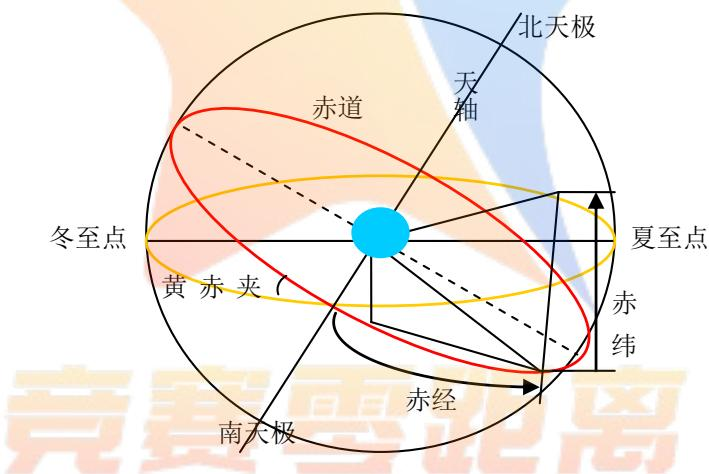  
图1 天球赤道坐标

（6）方位角：是从某点的正北方向线起，依顺时针方向到目标方向线之间的水平夹角。，以太阳为例，图 2为太阳方位角示意图， $\theta _ { 2 }$ 为方位角。

（7）高度角：是指太阳入射光线射入大地时与地平面的水平夹角称为高度角，如图2所示， $\theta _ { 1 }$ 为高度角；

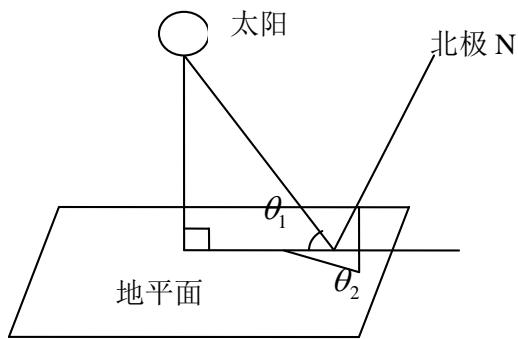  
图2 太阳方位角和高度角示意图 （其中 $\theta _ { 2 }$ 为位角， $\theta _ { 1 }$ 为高度角）

（8）经纬度：除了本初子午线、赤道、南北回归线和北极圈外，其余经纬线按照一定的角度大小进行编号的角度值，可以用来表示地球任意一点的位置。纬度为本地法线与赤道平面的夹角，经度为本地子午面和本初子午面的夹角。

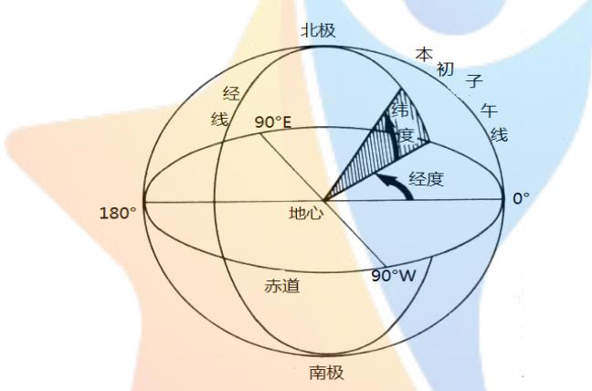  
图 3 地球经纬度

（9）黄道：地球绕太阳运行的轨迹所在的平面。从地球上看，太阳一年内在天空中的是运动（相对于背景）所在的就是黄道面。

（10）太阳平黄经：是指某流星的极大平黄经到达极大时的一个太阳平黄经的值。简单的说，平黄经可以大致对应一个日期。

（11）儒略日：是指由公元前 4713年1月1日，协调世界时中午 12时开始所经过的天数。

（12）恒星时：是天文学和大地测量学中所使用的一种计时单位，恒星时是以地球的自传9转来计来计算的，恒星日是它的基础。

（13）地方恒星时：以当地经度为标准所测定的时间，因所在经度不同，在同一瞬间太阳或春分点的时角也不同，因而各地的时刻便不一样。经度相差 1度，地方时刻相差4分。以春分点时角所计量的地方时为地方恒星时，以太阳时角所计量的地方时为地方平太阳时或地方真太阳时。

（14）时角：是天文学的名词，一个天体的时角被定义为该天体的赤经与当地的恒星时的差值。

（15）黄经：在黄道坐标系中用来确定天体在天球中的一个坐标值，在这个系统中，天体被分割为南北两半球，

（16）岁差：地球的长期运动称为岁差，是指地轴绕着一条通过地球中心而又垂直与黄道面的轴线缓慢圆锥运动，绕行一周约需 26000 年，圆锥面的半径约为 23.5 °；

（17）章动：地球自转轴的空间指向除长期的缓慢移动（岁差）外，还叠加上各种周期的幅度较小的振动，这称为章动；

（18）地转偏向力：亦称科氏力(科里奥利力)，因为地球自转而产生的以地球经纬网为参照系的力;

（19）太阳赤纬角：地球中心和太阳中心的连线与地球赤道平面的夹角称为太阳赤纬角，它在春分和秋分时刻等于零，而在夏至和冬至时刻有极值，分别为土 23.265 度。

## 5.2 天文学坐标系[2,3]

## 5.2.1 几种常见坐标

## (1) 地平坐标系

是使用三维球面来定义地球表面位置，以实现通过经纬度对地球表面点位引用的坐标系。一个地理坐标系包括角度测量单位、本初子午线和参考椭球体三部分。

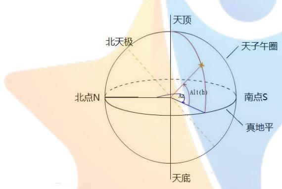  
图4 地平坐标系

其中天顶和天底为，观测者处的天文垂线向上和向下的延长线分别与天球的交点；地平为，在观测者的位置上，垂直于观测点天文垂线的平面与天球相交的大圆；子午圈垂直于地平面并通过天顶及北天极的大圆

## （2）赤道坐标系

通过天球中心与天轴垂直的平面在天球上截出的大圆叫做天赤道。取天赤道为基本圈的天球坐标系叫做赤道坐标系。通过天体和天极的半大圆叫做天体的赤经圈或时圈，从午半圆沿天赤道向西起量到赤经圈的角度叫做天体的时角，以观测者午半圆为基准起算的天体时角称为地方时角，如图 1 和如 5 所示。

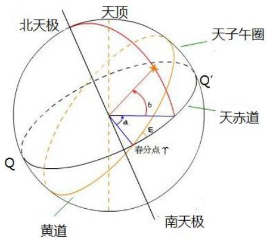

图 5 赤道坐标系

## （3）黄道坐标系

通过天球中心和地球公转轨道面平行的平面与天球截出的大圆，叫做黄道。过天球中心垂直于黄道的直线和天球有两个交点，靠近北天极的点为北黄极，靠近南天极的点叫做南黄极。取黄道为基本圈的天球坐标系叫做黄道坐标系。黄道对赤道的升交点叫春分点。通过黄极和天体的半大圆叫做天体的黄经圈。从春分点沿黄道逆时针起量到黄经圈的角度，叫做黄经，从 $0 ^ { \circ }$ 到 $3 6 0 ^ { \circ }$ 。沿着黄经圈测量的从黄道至天体的夹角，叫做黄纬，从 $0 ^ { \circ }$ 到 $\pm 9 0 ^ { \circ }$ ，向北黄极方向为正，向南黄极方向为负。

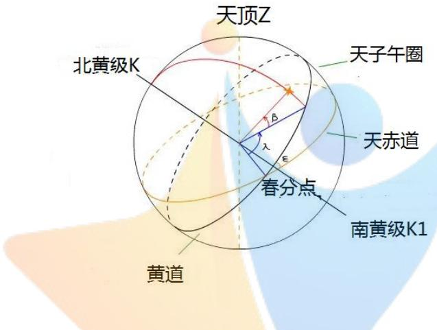  
图 6 黄道坐标系

## 5.2.2 几种坐标转换公式[4]

天体在天球上的位置常常用一组坐标例如（A，Z）测量，而在实际工作中，有时则需要用另外一组坐标表示，这就需要在不同的坐标系之间进行变换。下面是常用坐标系之间的变换公式。

⑴ 已知地平坐标（A ,Z）求赤道坐标 $( a , \delta )$

$$
\cos \delta \cos t = \sin \phi \sin Z \cos A + \cos \phi \cos Z\tag{1}
$$

$$
\cos \delta \sin t = \sin Z \sin A\tag{2}
$$

$$
\sin \delta = \sin \phi \cos Z - \cos \phi \sin Z \cos A\tag{3}
$$

式中t是时角，它与观测时间 S(以恒星时作计量单位)和赤径a的关系是为 $t = s - a$ $\phi$ 是观测点地理纬度。

（2）由赤道坐标(а,δ)变换到地平坐标（A ,Z）

$$
\sin Z \cos A = \sin \phi \cos \delta \cos t - \cos \phi \sin \delta\tag{4}
$$

$$
\sin { Z } \sin { A } = \cos { \delta } \sin { t }\tag{5}
$$

$$
\cos Z = \cos \phi \cos \delta \cos t + \sin \phi \sin \delta\tag{6}
$$

（3）由赤道坐标 $( a , \delta )$ 变换到黄道坐标（λ,β)

$$
\cos \beta \cos \lambda = \cos \delta \cos a\tag{7}
$$

$$
\cos \beta \sin \lambda = \cos \varepsilon \cos \delta \sin a + \sin \varepsilon \sin \delta\tag{8}
$$

$$
\sin \beta = \cos \varepsilon \sin \delta - \sin \varepsilon \sin a\tag{9}
$$

式中 式黄赤交角

（4）由黄道坐标 $( \lambda , \beta )$ 变换到由赤道坐标 (a,)

$$
\cos \delta \cos a = \cos \beta \cos \lambda\tag{10}
$$

$$
\cos \delta \sin a = \cos \varepsilon \cos \beta \sin \lambda - s i n \varepsilon \sin \beta\tag{11}
$$

$$
\sin \delta = \sin \varepsilon \cos \beta \sin \lambda + \cos \varepsilon \sin \beta\tag{12}
$$

## 5.3 月亮在空中角度定义

要给出符合诗句发生时月亮在空中的角度，先要判断出现“月上柳梢头”的情况。在此，我们给出符合诗句中发生的情景为，当人的视线、树梢、月亮三者在同一条直线时则达到诗句中描绘的效果，而人得视野是有一定的视觉范围，月亮也在不断的移动，三者都同一条线持续的时间为出现诗句中描绘情景的时间。因此，定义出现“月上柳梢头”时月亮在空中的角度为，当人的视野、树梢、月亮三者在同一条直线时与水平面的夹角以及人的最大视野与树梢、月亮三者在同一条水平线的夹角范围。以人的最大视野范围能此效果的范围为月亮在天空的角度，即与地面垂直与树梢平行切相切的直线。

月亮在天空的角度大小，取决于人的身高和最大视野范围、树的高度以及人与树之间的距离，所以，月亮在天空角度大小与这四个参数有关，如图5所示。

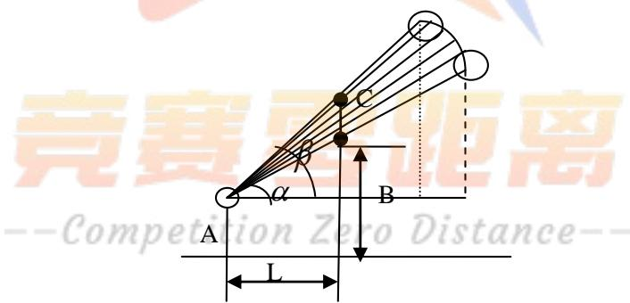  
图7 月亮在天空的中角度变化范围

其中A为观测者的升高，B为树的高度，C为人的最大视野区域，L为人与树相距的距离。

由此，将诗句中描绘的情景转换为平面中两个三角形的夹角度数。根据三角形的基本原理可得，当出现“月上柳梢头” 时月亮在空中的角度为：

$$
\tan \alpha = \frac { B - A } { \mathrm { ~ L ~ } }\tag{13}
$$

根据反三角知识可求角度为：

$$
\alpha = \arctan { \frac { \mathbf { B - A } } { \mathbf { L } } }\tag{14}
$$

同理，可求得在人的视野范围内对应的月亮在空中的角度为：

$$
\beta { = } \arctan \frac { B - A + C } { L }\tag{15}
$$

于是，可得出诗句中表达情景下月亮在空中的角度范围为：

$$
\beta - \alpha = \arctan { \frac { B - A + C } { L } } - \arctan { \frac { \mathrm { B - A } } { \mathrm { L } } }\tag{16}
$$

## 5.4 黄昏后的时间定义

对于“黄昏后”时间的定义，考虑到地球绕着太阳公转以及地球自身的自转，而地球又是一个不透明的球体，太阳无法同时照射到全部范围。因此，太阳的高度角和方位角来确定，当高度角为与地球水平面为 0度时，同时以正北方向为起点顺时针旋转，方位角落在180°\~270°时为南半球能出现黄昏的时间，方位角在270°\~360°（即 0°）时为北半球能出现的黄昏的时间，即当方位角在西北或西南地区时，太阳高度角为 0时为黄昏终止时间。所以，定义黄昏时间为太阳高度角在-6°\~18°时，同时方位角处在西南或西北方向时为黄昏时间，如图 6 为黄昏出现的时间。

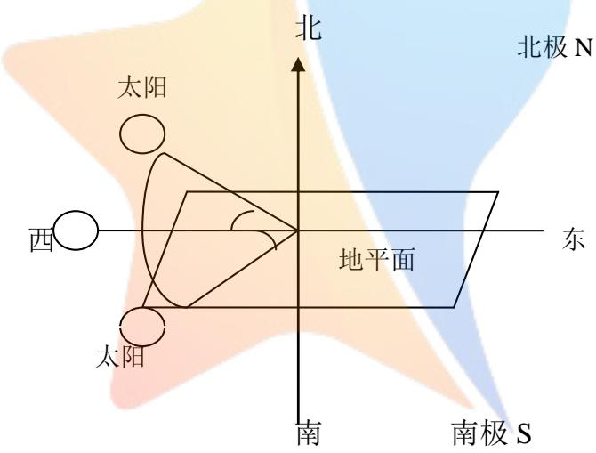  
图 8 黄昏时间  
6.模型建立与求解

## 6.1 月亮位置的计算与验证

## 6.1.1 月亮位置计算[5]

求月亮高度在空中角度范围内随时间的变化关系，根据已有的参考文献，月亮高度方位角的计算中是结合了儒略世纪数，因此我们需要借助儒略世纪数和儒略日数之间的转换关系，进而得出儒略日与时间的关系表达式。而我们观测到的月亮高度和方位角在天球中的坐标和观测点所处的位置有关，月球在天球中的坐标是时间的函数。

## 6.1.1.1 天文参数确定

此问中需要确定月亮的位置，而月亮位置是根据高度角与方位角来确定的，由此需要引入某时刻太阳参数h和黄赤夹角 的计算。即某一观测点在某一时刻太阳在太空中的坐标需要用天文参数来描述，而这两者之间均有儒略日数和儒略世纪数的计算，在此，我们选用太阳平黄经作为太阳参数的一个指标，所以我们需要确定的表达式有太阳平黄经、黄赤交角、儒略世纪数和儒略日数，以此来作为确定月亮位置的太阳参数。

## （1）太阳平黄经的确定与计算

平黄经是指在太空动力学或者天体力学中天体在轨道倾角为0的假想圆轨道上运动的黄经值；太阳平黄经是指某流星的极大平黄经到达极大时的一个太阳平黄经的值。简单的说，平黄经可以大致对应一个日期。根据国际天文学联合会发布的太阳平黄经的计算公式为：

$$
h = 2 8 0 . 4 6 6 4 5 + 3 6 0 0 0 , 7 6 9 8 3 T + 0 0 0 3 0 3 2 T ^ { 2 }\tag{17}
$$

## （2）黄赤交角的确定与计算

黄赤交角是指地球公转轨道面（黄道面）与赤道面（天赤道面）的夹角，目前黄赤夹角约为 $2 3 ^ { 0 } 2 6 ^ { \prime }$ ，为了便于理解黄赤夹角的概念，我们给出黄赤夹角的图形，如图7 所示。对于黄赤夹角的计算，同样根据国际天文联合会公布的公式中提取黄赤交角的计算公式为

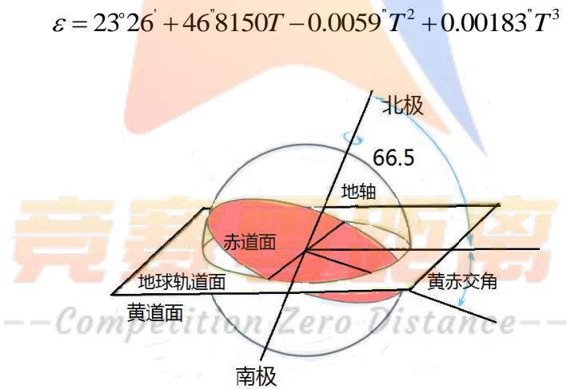  
图 9 黄赤夹图

（18）

其中太阳平黄经以及黄赤夹角的参数T为儒略世纪数，接下来，我们计算儒略世纪数，而儒略世纪数与儒略日数有关，则：

$$
T = J D - 2 4 5 1 5 4 3 . 5\tag{19}
$$

其中JD为儒略日数，现在可将所有的儒略世纪数转换为与儒略日数有关的表达式，进而我们需要求解儒略日数与时间之间的转换关系。

## 6.1.1.2 儒略日数与时间的转换[6]

儒略世纪数需要通过儒略日来计算，儒略日从天文学的角度来说，只要以日为单位连续计时的称之为儒略日，没有年月的区分。儒略日是从公元前 4713 年 1 月 1 日开始计算的，从儒略日开始诞生到现在为止记录的数据非常大，许多的参考文献中叶给出不同起始日期下儒略日的计算公式。

## （1）给定序号求儒略日的计算

儒略日数的计算是基于积日计算的基础上，积日只是一年中某日某月概念的引入，忽略月的存在，从年初第一天起连续记日，知道年末的最后一天，是以年为单位进行计算。此种计算不会使儒略日数周期时间长。而将原问题归结为如何求取年首儒略日。

积日计算中以4年为一个周期，总日数为 1461，根据推出年首的儒略日数为：

$$
J D ( y ) = \left[ 3 6 5 . 2 5 ( y + 4 7 1 6 . 0 ) \right] _ { - } - 1 4 0 2 . 5\tag{20}
$$

经过简化后可得：

$$
J D ( y ) = \left[ 3 6 5 . 2 5 y \right] _ { - } + 1 7 2 1 1 1 6 . 5 \quad \mathrm { ( y } \leq 1 5 8 2 \mathrm { ) }\tag{21}
$$

从1582年10月15日往后，按照格里历计算，而实际中格里历是在 1600 年才开始使用此种方式计算闰年，所以最终确定格里历年首儒略日计算的公式为：

$$
J D ( y ) = [ 3 6 5 . 2 5 y ] _ { - } + w + 1 7 2 1 1 1 6 . 5\tag{22}
$$

其中

$$
w = \left\{ { \left[ \frac { y } { 1 0 0 } \right] } _ { - } + { \left[ \frac { y } { 4 0 0 } \right] } _ { - } + 2 \quad \quad ( y \geq 1 5 8 2 ) \right.\tag{23}
$$

当 $y = 1 5 8 2$ 时，w的具体取值需根据月日序数判断。综合上述表达式，可得到最终的年月日计算为：

$$
J ( y , m , n ) = \left[ 3 6 5 . 2 5 y \right] _ { - } + \left[ 3 0 . 6 ( m + 1 ) \right] _ { - } + d + w + 1 7 2 0 9 9 4 . 5\tag{24}
$$

根据表达式可以得出给定的年月日序数求对应儒略日的问题得以解决。

## (2) 由儒略日计算年月日

根据已有的文献，可以将积日作为中间转换量来求年月日，已知方程（3）左边的量S，求变量m和d的解，通过将已知变量的移动，可将方程整理为：

$$
\left[ 3 0 . 6 ( m + 1 ) \right] _ { - } + d = s + 1 2 2 \quad \quad ( 3 \leq m \leq 1 4 , d \geq 3 1 )\tag{25}
$$

在数学上可以证明，方程有如下的解：

$$
\left\{ \begin{array} { l } { { m = \left[ { \frac { s + 1 2 2 } { 3 0 . 6 } } \right] _ { - } - 1 } } \\ { { } } \\ { { d = s + 1 2 2 - \left[ 3 0 . 6 ( m + 1 ) \right] _ { - } } } \end{array} \right.\tag{26}
$$

由此方程得出的d可能为 0，若为0则表示此日是上个月的最后一日，可将m值减1，在代入另一表达式中重新计算d值即可。

根据儒略日求年月序号和日数，此问题是对于给定数求儒略日问题的逆问题，基于给定数求儒略日的基础上，可以得出此问题中的求解方程为：

$$
\left[ 3 6 5 . 2 5 y \right] _ { - } + s = J - w - 1 7 2 1 1 6 . 5 \left( 1 \leq s \leq 3 6 5 \right)\tag{27}
$$

将此问题归结为，求上述方程中已知方程右边各个量，求位置变量y s和 ，通过数学处理方法可得：

$$
\left\{ \begin{array} { l l } { y = \left[ { \frac { J - w - 1 7 2 1 1 6 . 5 } { 3 6 5 . 2 5 } } \right] } \\ { s = J - w + 1 7 2 1 1 6 . 5 - \left[ 3 6 5 . 2 5 \times y \right] _ { - } } \end{array} \right.\tag{28}
$$

方程的解s有可能为零，这时刻是上年的最后一日，将y的值减去1,代入式子中重新计算s即可。最一个问题是，方程右边的w现在还不知道，需要由儒略日J预先算出。由于w通过式子与y联系，因此w可以和y一道迭代解出。

## 6.1.1.3 月亮轨道要素计算公式

计算月亮位置时，我们需要给出一些月亮运动时的轨道参数参数，根据已有的参考文献我们选用了月亮平黄经、月亮在近地点的平黄经以及月亮升交点的平黄经这三个参数作为计算月亮位置的天文参数，即：

$$
\begin{array} { l } { s = 1 2 5 . 1 2 2 8 ^ { \circ } - 0 . 0 5 2 9 5 3 8 0 8 3 ^ { \circ } T ^ { \circ } } \\ { p = 3 1 8 . 0 6 3 4 ^ { \circ } + 0 . 1 6 4 3 5 6 3 2 2 3 ^ { \circ } T } \\ { M = 1 1 5 . 3 6 5 4 ^ { \circ } + 1 3 . 0 6 4 9 9 2 9 0 5 ^ { \circ } T } \end{array}\tag{29}
$$

根据上述已有的天文参数，求出计算时刻月球的黄经和黄纬的表达式为：

$$
\begin{array} { r l } & { \lambda _ { m } = s + 0 . 1 0 9 7 6 \sin ( s - p ) + 0 . 0 2 2 2 3 6 \sin ( 2 - 2 h + p ) } \\ & { + 0 . 0 1 1 4 9 0 \sin ( 2 s - 2 h ) + 0 . 0 0 3 7 2 8 \sin ( 2 s - 2 p ) } \end{array}\tag{30}
$$

$$
\begin{array} { r l } & { \beta _ { m } = 0 . 0 8 9 5 0 4 \sin ( s + M ) + 0 . 0 0 4 8 9 7 \sin ( 2 s - p + M ) } \\ & { + 0 . 0 0 4 8 4 7 \sin ( p - M ) + 0 . 0 0 3 0 2 4 \sin ( s - 2 h + { \bf M } ) } \end{array}\tag{31}
$$

## 6.1.1.4月球相对于观测点的位置

本文采用观测点的地心天顶距来表示月亮在某时刻想多与某一点的位置，设观测点的经纬度为 $\lambda , \phi$ ，则可由下列表达式计算某时某地的地心天顶距，

$$
\begin{array} { r l } & { \cos \hat { \sigma } = \sin \phi [ \sin \varepsilon \cos \beta _ { m } \sin \lambda _ { m } + \cos \varepsilon \sin \beta _ { m } ] + } \\ & { \cos \phi [ \cos \lambda _ { \ m } \cos \beta _ { m } \cos \theta ( \sin \lambda _ { \ m } \cos \beta _ { m } \cos \varepsilon - \sin \varepsilon \sin \beta _ { m } ) ] } \end{array}\tag{32}
$$

其中 $\theta$ 为观测点的地方恒星时，可由公式计算，即：

$$
\theta = 1 5 ^ { \circ } ( h _ { 1 } - 8 ) + h + \lambda - 1 8 0 ^ { \circ }
$$

其中 $h _ { \scriptscriptstyle 1 }$ 为小算时刻即小时。

## 6.1.1.5 月亮高度的计算

月球高度是指月球相对于某时某地地平面的角距离，而对于观测者所处的地理位置能观测到月亮在天空中的角度范围，根据已有的参考文献《月亮高度及升降时刻与方位的计算》中可以得出月亮高度的表达式为：

$$
\begin{array} { c } { { \sin \varphi [ \sin \varepsilon \cos \beta _ { m } \sin \lambda _ { m } + \cos \varepsilon \sin \beta _ { m } ] } } \\ { { { } } } \\ { { { } } } \\ { { + \cos \varphi [ \cos \lambda _ { m } \cos \beta _ { m } \cos \theta ( \sin \lambda _ { m } \cos \beta _ { m } \cos \varepsilon - \sin \varepsilon \sin \beta _ { m } ) ] = \cos ( \beta - \alpha ) \cos \beta _ { m } \sin \lambda _ { m } . } }  \end{array}\tag{34}
$$

此表达式中求出的为儒略世纪数或则儒略日数，而根据我们查找的参考文献中可以得到儒略日数转换为某天的时分秒，进而将月亮高度与时间进行联系。所以，我们还需要计算儒略日数与时间中的时分秒进行转换的关系式，根据上述表达式中给出的儒略如数与时间的计算公式，得出最终的时间表达式。

## 6.1.1.6 月出月没时刻的计算

根据月球相对于观测点的位置可以求出某时刻月亮相对于某一点的高度角为 $0 ^ { \circ }$ 时，则该点为月出或月落的时刻。因此，求解方程

$$
\sin \varphi [ \sin \varepsilon \cos \beta _ { m } \sin \lambda _ { m } + \cos \varepsilon \sin \beta _ { m } ] +
$$

$$
\cos \varphi [ \cos \lambda _ { _ m } \cos \beta _ { _ m } \cos \theta ( \sin \lambda _ { _ m } \cos \beta _ { _ m } \cos \varepsilon - \sin \varepsilon \sin \beta _ { _ m } ) ] = 1\tag{35}
$$

即可得到儒略世纪数T,然后根据儒略日数与时间的转换，就可以得到某天的月球的出升时间和落山时间。首先求得月球的最高高时刻，在最高时刻前6小时和后 6小时位置附近分别求得月出和月没时刻。

## 6.1.1.7月亮方位角的计算[7]

由天体定位三角形按球面的正、余弦定理可以得到：

$$
\begin{array} { r l } & { \delta _ { \emptyset } , \sin Z \cos ( - A _ { 1 } ) { = } \sin ( 9 0 - \delta ) - \cos ( 9 0 - \varphi ) \sin ( 9 0 - \delta ) \cos t } \\ & { \delta _ { \emptyset } , \sin Z \cos A { = } \sin ( 9 0 - \varphi ) \cos ( 9 0 - \delta ) - \cos ( 9 0 - \varphi ) \sin ( 9 0 - \delta ) \cos ( - t ) } \end{array}\tag{36}
$$

将上述方程以上二式子可化为同一化为同一公式为：

$$
\sin Z \cos A _ { 1 } = \cos \varphi \sin \delta - \sin \varphi \cos \delta \cos t\tag{37}
$$

按球面三角正弦定理可得

$$
\delta _ { \sharp } , \sharp \cdot \frac { \sin Z } { \sin t } = \frac { \sin t ( 9 0 - \delta ) } { \sin ( - A ) }
$$

$$
\delta _ { _ { \ast } } , \sharp \frac { \sin Z } { \sin ( - t ) } = \frac { \sin t ( 9 0 - \delta ) } { \sin A }\tag{38}
$$

整理以上方程组化为同一公式为：

$$
\begin{array} { l } { \sin Z \sin A = - \sin ( 9 0 - \delta ) \sin t } \\ { \sin Z \sin A = - \cos \delta \sin t } \end{array}\tag{39}
$$

用3式子除以1式得：

$$
\tan A = - { \frac { \sin t } { \cos \varphi \tan \delta - \sin \varphi \cos t } }
$$

$$
\tan A = { \frac { \cos \delta \sin t } { \cos \varphi \sin \delta - \sin \varphi \cos t } }\tag{40}
$$

式中A为月亮的方位角，t为时角， $\varphi$ 为地理纬度，为赤纬。

## 6.1．2 月亮位置检验与求解

根据推导出的计算公式，利用 MATLAB 软件编程求解出月亮的高度角、方位角以及对应的日期与时间。

$$
( 1 ) \sharp \sharp _ { 1 } \sharp _ { \prime } \sharp _ { \varkappa _ { \cdot } } \sharp _ { \varkappa _ { \prime } } ^ { \Delta } \cdot _ { \overline { { \jmath } } , \overline { { \jmath } } } \equiv _ { \varkappa _ { \cdot } } \lbrack 8 , 9 , 1 0 \rbrack
$$

根据得出的表达式，通过中国台湾”交通部中央气象局”网站提供的天文日历资料的查询，我们选取了台北，香港两个地方 2015/01/01 到 2015/01/05 的数值进行验证，以台北地区月出时刻从2015年 1月1日14:12分开始到 2015年1月5日17:33 分的，月没时刻从 2015 年 1 月 1 日 02:45 到 2015 年 1 月 5 日 06:18。

表1 台北地区月出月没验证
<table><tr><td rowspan="2">日期</td><td rowspan="2">月出時 刻</td><td rowspan="2"></td><td colspan="3">月沒時 误差</td><td rowspan="2">误差</td></tr><tr><td>本模型计算 结果</td><td>刻 hh:mm</td><td>本模型计 算结果</td></tr><tr><td>2015/01/01</td><td>14:12</td><td>14:16</td><td>4</td><td>02:45</td><td>2:41</td><td>4</td></tr><tr><td>2015/01/02</td><td>14:59</td><td>15:4</td><td>5</td><td>03:42</td><td>3:38</td><td>4</td></tr><tr><td>2015/01/03</td><td>15:49</td><td>15:54</td><td>5</td><td>04:36</td><td>4:33</td><td>3</td></tr><tr><td>2015/01/04</td><td>16:41</td><td>14:45</td><td>4</td><td>05:29</td><td>5:25</td><td>4</td></tr><tr><td>2015/01/05</td><td>17:33</td><td>17:37</td><td>4</td><td>06:18</td><td>6:15</td><td>3</td></tr></table>

表 2 香港特别行政区月出月没时间的验算
<table><tr><td>日期</td><td>月出時 刻 hh:mm</td><td>本模型计 算结果 hh:mm</td><td>误差 (分钟)</td><td>月沒時 刻 hh:mm</td><td>本模型计 算结果 hh:mm</td><td>误差 (分 钟)</td></tr><tr><td>2015/01/01</td><td>14：46</td><td>14:51</td><td>5</td><td>03：12</td><td>03:08</td><td>4</td></tr><tr><td>2015/01/02</td><td>15：34</td><td>15:39</td><td></td><td>04：08</td><td>04:04</td><td>4</td></tr><tr><td>2015/01/03</td><td>16：24</td><td>16:29</td><td>5</td><td>05：02</td><td>04:59</td><td>3</td></tr><tr><td>2015/01/04</td><td>17：16</td><td>17:20</td><td></td><td>05：55</td><td>05:51</td><td>4</td></tr><tr><td>2015/01/05</td><td>18：08</td><td>18:12</td><td></td><td>06：44</td><td>06:41</td><td>3</td></tr></table>

根据表 1 表 2 可知知道，不论是在台北地区还是香港地区，对于月出月没的计算值与真实值之间的误差相差 3\~5分钟，从结果计算数值与真实至之间的差异的分析，可以说明此数学模型计算月出月没是合理的。

## （2）月亮在天空中的位置验算[10]

表 3 月亮在天空的位置
<table><tr><td colspan="1" rowspan="1">日期</td><td colspan="1" rowspan="1">高度</td><td colspan="1" rowspan="1">计算的高度</td><td colspan="1" rowspan="1">误差</td><td colspan="1" rowspan="1">方位角</td><td colspan="1" rowspan="1">计算的方位角</td><td colspan="1" rowspan="1">误差</td></tr><tr><td colspan="1" rowspan="1">0:00:00</td><td colspan="1" rowspan="1">+34°51'19″</td><td colspan="1" rowspan="1">34°4630</td><td colspan="1" rowspan="1">0.080278</td><td colspan="1" rowspan="1">269°57'42″</td><td colspan="1" rowspan="1">269°54′57″</td><td colspan="1" rowspan="1">0.045833</td></tr><tr><td colspan="1" rowspan="1">1:00:00</td><td colspan="1" rowspan="1">+21°29'28″</td><td colspan="1" rowspan="1">21°3644"</td><td colspan="1" rowspan="1">-0.12111</td><td colspan="1" rowspan="1">275°5722"</td><td colspan="1" rowspan="1">275°50′1″</td><td colspan="1" rowspan="1">0.125</td></tr><tr><td colspan="1" rowspan="1">2:00:00</td><td colspan="1" rowspan="1">+08°21'50″</td><td colspan="1" rowspan="1">8°37'52"</td><td colspan="1" rowspan="1">-0.26722</td><td colspan="1" rowspan="1">281°44'16"</td><td colspan="1" rowspan="1">281°31′5711</td><td colspan="1" rowspan="1">0.205278</td></tr><tr><td colspan="1" rowspan="1">3:00:00</td><td colspan="1" rowspan="1">-04°35'51″</td><td colspan="1" rowspan="1">-55819</td><td colspan="1" rowspan="1">1.37444</td><td colspan="1" rowspan="1">287°55'37"</td><td colspan="1" rowspan="1">287°3624II</td><td colspan="1" rowspan="1">0.320278</td></tr><tr><td colspan="1" rowspan="1">4:00:00</td><td colspan="1" rowspan="1">-16°55'04″</td><td colspan="1" rowspan="1">-17°49′10"Competiti</td><td colspan="1" rowspan="1">0.0016435on Lero</td><td colspan="1" rowspan="1">295°07't49"</td><td colspan="1" rowspan="1">294°37′51=0</td><td colspan="1" rowspan="1">0.01624</td></tr><tr><td colspan="1" rowspan="1">5:00:00</td><td colspan="1" rowspan="1">-28°23'17"</td><td colspan="1" rowspan="1">-28°27′5911</td><td colspan="1" rowspan="1">0.011685</td><td colspan="1" rowspan="1">304°07'34"</td><td colspan="1" rowspan="1">303°19′5811</td><td colspan="1" rowspan="1">0.793333</td></tr><tr><td colspan="1" rowspan="1">6:00:00</td><td colspan="1" rowspan="1">-38°27'26″</td><td colspan="1" rowspan="1">-38°24′5911</td><td colspan="1" rowspan="1">0.007509</td><td colspan="1" rowspan="1">315°59'39″</td><td colspan="1" rowspan="1">314°43′5″</td><td colspan="1" rowspan="1">1.276111</td></tr><tr><td colspan="1" rowspan="1">7:00:00</td><td colspan="1" rowspan="1">-46°10'24″</td><td colspan="1" rowspan="1">-46°32′6″</td><td colspan="1" rowspan="1">0.017639</td><td colspan="1" rowspan="1">331°57'42″</td><td colspan="1" rowspan="1">329°     58′5″</td><td colspan="1" rowspan="1">1.993611</td></tr><tr><td colspan="1" rowspan="1">8:00:00</td><td colspan="1" rowspan="1">-50°10'03"</td><td colspan="1" rowspan="1">-50°5′57″</td><td colspan="1" rowspan="1">0.001685</td><td colspan="1" rowspan="1">352°13'21"</td><td colspan="1" rowspan="1">349°28’6"</td><td colspan="1" rowspan="1">2.754167</td></tr><tr><td colspan="1" rowspan="1">9:00:00</td><td colspan="1" rowspan="1">-49°20'21"</td><td colspan="1" rowspan="1">-50°15′2″</td><td colspan="1" rowspan="1">0.0115833</td><td colspan="1" rowspan="1">013°58'32″</td><td colspan="1" rowspan="1">10°55'39”</td><td colspan="1" rowspan="1">3.048056</td></tr><tr><td colspan="1" rowspan="1">10:00:</td><td colspan="1" rowspan="1">-43°56'</td><td colspan="1" rowspan="1">-46°56′35</td><td colspan="1" rowspan="1">2.013611</td><td colspan="1" rowspan="1">032°</td><td colspan="1" rowspan="1">30°10'</td><td colspan="1" rowspan="1">2.74666</td></tr><tr><td colspan="1" rowspan="1">00</td><td colspan="1" rowspan="1">46"</td><td colspan="1" rowspan="1">11</td><td colspan="1" rowspan="1"></td><td colspan="1" rowspan="1">55'03"</td><td colspan="1" rowspan="1"> $1 5 ^ { \prime \prime }$ </td><td colspan="1" rowspan="1">7</td></tr><tr><td colspan="1" rowspan="1">11:00:00</td><td colspan="1" rowspan="1">-35°18'47″</td><td colspan="1" rowspan="1"> $- 3 8 ^ { \circ } 5 9 ^ { \prime }$ 34″</td><td colspan="1" rowspan="1">3.0132407</td><td colspan="1" rowspan="1">047° $2 1 ^ { \prime } \quad 2 6 ^ { \prime \prime }$ </td><td colspan="1" rowspan="1">45°6'17”</td><td colspan="1" rowspan="1">2.2525</td></tr><tr><td colspan="1" rowspan="1">12:00:00</td><td colspan="1" rowspan="1">-24°41'53″</td><td colspan="1" rowspan="1">-278′      35″</td><td colspan="1" rowspan="1">2.011787</td><td colspan="1" rowspan="1">058°03'15″</td><td colspan="1" rowspan="1">56°13'0”</td><td colspan="1" rowspan="1">1.8375</td></tr><tr><td colspan="1" rowspan="1">13:00:00</td><td colspan="1" rowspan="1">-12°54'03"</td><td colspan="1" rowspan="1">-16033′      21″</td><td colspan="1" rowspan="1">3.00518</td><td colspan="1" rowspan="1">066°14'17"</td><td colspan="1" rowspan="1">64°41'3”</td><td colspan="1" rowspan="1">1.553889</td></tr><tr><td colspan="1" rowspan="1">14:00:00</td><td colspan="1" rowspan="1">+00°10'01″</td><td colspan="1" rowspan="1">-4°       44′48″</td><td colspan="1" rowspan="1">4.0132129</td><td colspan="1" rowspan="1">072°52’01"</td><td colspan="1" rowspan="1">71°28'52"</td><td colspan="1" rowspan="1">1.385833</td></tr><tr><td colspan="1" rowspan="1">15:00:00</td><td colspan="1" rowspan="1">+12°41'20"</td><td colspan="1" rowspan="1">9°     26′9″</td><td colspan="1" rowspan="1">3.003125</td><td colspan="1" rowspan="1">078°37'06"</td><td colspan="1" rowspan="1">77°18'1"</td><td colspan="1" rowspan="1">1.318058</td></tr><tr><td colspan="1" rowspan="1">16:00:00</td><td colspan="1" rowspan="1">+25°56'35″</td><td colspan="1" rowspan="1">22°     26′57″</td><td colspan="1" rowspan="1">2.0027.3</td><td colspan="1" rowspan="1">084°01'51"</td><td colspan="1" rowspan="1">82°40'18”</td><td colspan="1" rowspan="1">1.359167</td></tr><tr><td colspan="1" rowspan="1">17:00:00</td><td colspan="1" rowspan="1">+39°23'50"</td><td colspan="1" rowspan="1">35°       39′41″</td><td colspan="1" rowspan="1">3.0027037</td><td colspan="1" rowspan="1">089°4122″</td><td colspan="1" rowspan="1">88°7' 12”</td><td colspan="1" rowspan="1">1.569444</td></tr><tr><td colspan="1" rowspan="1">18:00:00</td><td colspan="1" rowspan="1">+52°53'52″</td><td colspan="1" rowspan="1">48        57′4″</td><td colspan="1" rowspan="1">3.0135926</td><td colspan="1" rowspan="1">096°35'32″</td><td colspan="1" rowspan="1">94°     2554</td><td colspan="1" rowspan="1">2.160556</td></tr><tr><td colspan="1" rowspan="1">19:00:00</td><td colspan="1" rowspan="1">+66°10'19″</td><td colspan="1" rowspan="1">620       7'20″</td><td colspan="1" rowspan="1">4.0163981</td><td colspan="1" rowspan="1">107°3117″</td><td colspan="1" rowspan="1">103°29'10"</td><td colspan="1" rowspan="1">4.035278</td></tr><tr><td colspan="1" rowspan="1">20:00:00</td><td colspan="1" rowspan="1">+77°59'11″</td><td colspan="1" rowspan="1">74°30        19″</td><td colspan="1" rowspan="1">5.014574</td><td colspan="1" rowspan="1">135°46’49″</td><td colspan="1" rowspan="1">122°40'23”</td><td colspan="1" rowspan="1">13.10772</td></tr><tr><td colspan="1" rowspan="1">21:00:00</td><td colspan="1" rowspan="1">+79°28'07"</td><td colspan="1" rowspan="1">81°        4′54″</td><td colspan="1" rowspan="1">1.0132129</td><td colspan="1" rowspan="1">214°55'33"</td><td colspan="1" rowspan="1">187°15'57"</td><td colspan="1" rowspan="1">27.66</td></tr><tr><td colspan="1" rowspan="1">22:00:00</td><td colspan="1" rowspan="1">+68°23'00"</td><td colspan="1" rowspan="1">720      46′21″</td><td colspan="1" rowspan="1">4.0059398</td><td colspan="1" rowspan="1">250°24’10″</td><td colspan="1" rowspan="1">242°26'38”</td><td colspan="1" rowspan="1">7.958889</td></tr><tr><td colspan="1" rowspan="1">23:00:00</td><td colspan="1" rowspan="1">+55°14'25″</td><td colspan="1" rowspan="1">600      11'26″</td><td colspan="1" rowspan="1">-4.95028</td><td colspan="1" rowspan="1">262°44'07"</td><td colspan="1" rowspan="1">258°58'59"</td><td colspan="1" rowspan="1">3.75222</td></tr></table>

根据结果的计算以及验证可知，计算出的月亮在天空中位置的值与真实值之间的误差较小，高度误差范围最大为 5.014574°，最小为-4.95028°；方位角最大误差为27.66°，最小误差值为 0.01624。其余大多 0\~5°的误差范围内。在根据图 10 给出的真实值与计算值之间的折线图可知，两者比较接近吻合程度较好，由此可以说明此计算模型的准确性与合理性。

根据表格可知当高度角为 46°\~52°时是符合“月上柳梢头”的情形所在的日期与时间为 2015 年 1 月 1 日 19:00\~22：00。

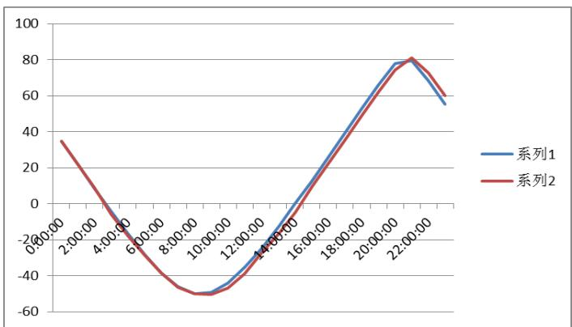

图10 月亮高度误差的真实值与计算值的折线图其中系列一为真实值；系列二为计算值。

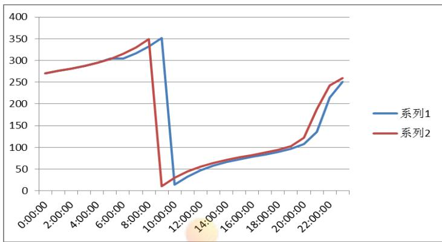  
图 11月亮方位角误差真实值与计算值的折线图  
其中系列一为真实值，系列二为计算值

## 6.2 太阳位置计算与检验

## 6.2.1 太阳位置的计算[11]

黄昏后是根据太阳与地球之间的运动关系进行计算的，同样需要一太阳高度和方位角来确定出现此时间时，太阳在天空的位置。根据我们事先定义的“黄昏”时间段，先将太阳日出日落计算出来，

## 6.2.1.1太阳日出日落的计算

## （1）太阳周日视运动基本参数确定

计算太阳在天球中对地球上某一点的相对位置，主要由当地的地理纬度、季节(日、月)和时间三个因素决定的，因此可以采用地理纬度，太阳赤纬角 $( \delta _ { 1 } )$ 、太阳高度角（h）、太阳方位角 $( \theta _ { 2 } )$ 及时角t等参数进行定位。

## (2) 太阳赤纬角的计算

地球中心与太阳中心的连线与地球赤道平面的夹角称为太阳赤纬角，它是一个近似以年为周期变化的量，其变化范围约为±23,450，其值时刻变化又由于地球围绕太阳的运动规律极其复杂,甚至有些不规则变化的物理机制目前仍不清楚,所以要想得到赤纬角的真实值,需进行高 精度的实时天文测量或从天文年历中查表得到。这对于太阳能利用非常不便，所以一般用外推的方法归纳出某种简单算法进行推算，其推算精度取决于算法的复杂性与推算时间长度。Bourges在1985年提出式(1)作为赤纬角的计算。

$$
\begin{array} { r l } & { \sigma = 0 . 3 7 2 3 + 2 3 . 2 5 6 7 \sin ( \theta ) + 0 . 1 1 4 9 \sin ( 2 \theta ) - 0 . 1 7 1 2 \sin ( 3 \theta ) } \\ & { - 0 . 7 5 8 \cos ( \theta ) + 0 . 3 6 5 6 6 \cos ( 2 \theta ) + 0 . 0 2 0 1 \cos ( 3 \theta ) } \end{array}\tag{41}
$$

式中 $\theta$ 称为日角，即 $\theta = \frac { 2 \pi t } { 3 6 5 . 2 4 2 2 }$ ,这里t又分两部分组成，即 $\mathbf { t } = N - N _ { 0 }$

式中 N 为积日，所谓的积日，就是日期在年内的顺序号，1 月 1 日其积日为 1，1月2日其积日为2，平年 12月31日其积日为365（闰年为 366）。

$$
N _ { 0 } = 7 9 . 6 7 6 4 + 0 . 2 4 2 2 \times ( { \mathrm { n } } \mathrm { - } 1 9 8 5 ) - \mathrm { I N T } [ { \mathrm { ~ ( ~ ( n ) ~ } } \mathrm { - } 1 9 8 5 ) \mathrm { ~ } / 4 ]\tag{42}
$$

INT x( ) 为取大于x的最大整数，n为年份。

## (3) 太阳赤纬角中影响因素的处理

在太阳赤纬角中需要考虑地轴章动以及光行差的影响。章动可以很容易的分解为黄道的水平分量和垂直分量。黄道上的分量记为 $\bigsqcup \psi$ ，称为黄经章动。它影响了天球上所有天体的经度，黄道垂直的分量记为 $\bigstar \bigstar$ ，称为交角章动，它影响黄赤交角。平黄赤夹角可有IAU提供的公式取得:

$$
\varepsilon _ { \scriptscriptstyle V } = 2 3 ^ { \circ } 2 6 ^ { \prime } 2 1 ^ { \circ } . 4 4 8 - 4 6 ^ { \circ } . 8 1 5 0 \times T - 0 ^ { \circ } . 0 0 0 5 9 \times T ^ { 2 } + 0 ^ { \circ } . 0 0 1 8 1 3 \times T ^ { 3 }\tag{43}
$$

式中T是J2000.0起算的儒略世纪数。真黄赤交角是： $\begin{array} { r l } { \mathcal { E } { = } \mathcal { E } _ { \mathrm { v } } + \big { } \big { \big \downarrow } \mathcal { E } } & { { } \big { \big \downarrow } \mathcal { E } } \end{array}$ 是交角章动。

## （4）时角的计算公式

将平太阳时(根据时差)转为真太阳时并计算出时角，由于轨道的离心率以及月球及行星的摄动，造成地球的日心黄经不是均匀变化的，所以太阳在黄道上运行不是均速的。另外，太阳在黄道上运动而不是在天赤道上运动。由于这两个原因，造成太阳的赤经也不是均匀变化的。

我们可以假想一个太阳（第一假想太阳）沿着天赤道匀速运动，并且在近地点和远地点，处与前面那个假想太阳重合。第二假想太阳叫做平太阳，从定义的知它的赤经增加的速度是均匀的，这就是说，平太阳运动没有周期项，但它含有长期项 $\tau ^ { 2 } , \ \tau ^ { 3 } .$ ..

当平太阳经过观测者的子午权时，是平正午，当真太阳经过本初子午圈是真正午，‘时差’是视时间与平均时间的差，换句话说，它是真太阳和平太阳的时角，即：

作为一种选择，低精度的时差可使用smart提供以下方法得到。

$$
E = y \sin ( 2 l _ { \nu } ) - 2 e \sin m + 4 e y \sin m \cos ( 2 l _ { \nu } ) - \frac { y ^ { 2 } } { 2 } \sin ( 4 l _ { \nu } ) - \frac { 5 e ^ { 2 } } { 4 } \sin 2 m\tag{44}
$$

其中 $y = \tan ^ { 2 } { \frac { \varepsilon _ { 1 } } { 2 } } , \varepsilon _ { 1 }$ 为黄赤交角， $l _ { \nu }$ 为太阳平黄经，e为地球轨道离心率，m为太阳平近点角。

## （5）太阳高度角与赤纬角的关系

太阳是在不断的变化，同一天同一时刻，日升日落都是不同的，具有微小的变化。根据球面坐标系中可以得出太阳高度角的计算公式 ：

$$
\sin ( h ) = \sin ( \varphi ) \times \sin ( \sigma ) + \cos ( \varphi ) \times \cos ( \sigma ) \times \cos ( t )\tag{45}
$$

当日出日落时，高度角都为 0(h=0)，正午时太阳高度角，最大正午时时角为 0，以上公式可以简化为 ：

$$
\sin ( h ) = \sin ( \varphi ) \times \sin ( \delta ) + \cos ( \varphi ) \times \cos ( \delta )\tag{46}
$$

其中,h表示正午太阳高度角,

由两角和与差的三角函数公式可得:

$$
\sin ( h ) = \cos ( \varphi - \delta )\tag{47}
$$

## (6) 太阳方位角的计算

太阳方位角计算与月亮方位角计算方式与原理相同，基于球面三维坐标系中，通过球面的计算公式，可以得出最终的方位角表达式为

$$
\theta \ _ { 2 } \mathrm { = } \left\{ \begin{array} { l c } { { \mathrm { a r c c o s } ( B ) \in [ 0 , 1 8 0 ^ { \circ } ] \qquad } } & { { \mathrm { ( w } \backslash 0 ) } } \\ { { \qquad 3 6 0 ^ { \circ } - \operatorname { a r c c o s } ( B ) \in [ 1 8 0 ^ { \circ } , 3 6 0 ^ { \circ } ] \qquad } } & { { \mathrm { ( w } \backslash 0 ) } } \end{array} \right.\tag{48}
$$

$$
B = \frac { \sin ( \sigma ) - \sin ( h ) \times \sin ( \varphi ) } { \cos ( h ) \times \cos ( \varphi ) }\tag{49}
$$

其中，出时间与日落时间为， $\cos ( t ) = - t g ( \varphi ) { \times } t g ( \delta )$ 负值为日出时角,正值为日落时角。

## 6.2.2 太阳位置的计算与检验[10]

通过上述建立的日出日落与太阳位置的数学模型，利用 MATLAB 软件对模型编程进行求解。对于黄昏时间的计算，我们选取与太阳高度角为 ${ _ { - 6 } } ^ { \sim } 1 8$ 度范围内变化是为黄昏出现的时间。基于计算的结果，选用了一天每隔一个时辰对于太阳在天空的变化角度进行了计算，并通过查找的数据，对结果进行验证。

## (1)日出日没时间的计算与验算[8,9]

表 4 香港特别行政区日出日没时间的验算  
香港特别行政区日出日没时间的验算 经纬度:E121 度 31 秒 N25 度 03 秒
<table><tr><td rowspan=1 colspan=1>日期</td><td rowspan=1 colspan=1>日出实际值</td><td rowspan=1 colspan=1>计算结果</td><td rowspan=1 colspan=1>误差(分)</td><td rowspan=1 colspan=1>日落实际值</td><td rowspan=1 colspan=1>计算结果</td><td rowspan=1 colspan=1>误差(分)</td></tr><tr><td rowspan=1 colspan=1>2015/01/01</td><td rowspan=1 colspan=1>07：03</td><td rowspan=1 colspan=1>07：05</td><td rowspan=1 colspan=1>2</td><td rowspan=1 colspan=1>17：51</td><td rowspan=1 colspan=1>17：50</td><td rowspan=1 colspan=1>1</td></tr><tr><td rowspan=1 colspan=1>2015/01/02</td><td rowspan=1 colspan=1>07：03</td><td rowspan=1 colspan=1>07：05</td><td rowspan=1 colspan=1>2</td><td rowspan=1 colspan=1>17：51</td><td rowspan=1 colspan=1>17：51</td><td rowspan=1 colspan=1>0</td></tr><tr><td rowspan=1 colspan=1>2015/01/03</td><td rowspan=1 colspan=1>07：03</td><td rowspan=1 colspan=1>07：05</td><td rowspan=1 colspan=1>2</td><td rowspan=1 colspan=1>17：52</td><td rowspan=1 colspan=1>17：52</td><td rowspan=1 colspan=1>0</td></tr><tr><td rowspan=1 colspan=1>2015/01/04</td><td rowspan=1 colspan=1>07：04</td><td rowspan=1 colspan=1>07：05</td><td rowspan=1 colspan=1>1</td><td rowspan=1 colspan=1>17：52</td><td rowspan=1 colspan=1>17：52</td><td rowspan=1 colspan=1>0</td></tr><tr><td rowspan=1 colspan=1>2015/01/05</td><td rowspan=1 colspan=1>07：04</td><td rowspan=1 colspan=1>07：06</td><td rowspan=1 colspan=1>2</td><td rowspan=1 colspan=1>17：53</td><td rowspan=1 colspan=1>17：53</td><td rowspan=1 colspan=1>0</td></tr></table>

数据来源:香港特别行政区香港天文台网站提供的《2015年年历》资料  
http://www.weather.gov.hk/gts/astron2015/2015ca

同样与月出月没选取的值一样，计算得出日出日没与真实值之间的误差范围为 $0 ^ { \sim _ { 2 } }$ 分钟，误差范围较小，由此可以说明此模型是合理的。

## (2) 太阳在天空中位置的验算

根据香港地区计算的日落日出时间的计算，给出了观测者在香港地区的经纬度时，看到的太阳在天空中位置的数值结果，并与真实值进行比较

表5 太阳在天空中位置的验算
<table><tr><td colspan="1" rowspan="1">日期</td><td colspan="1" rowspan="1">高度</td><td colspan="1" rowspan="1">计算的高度</td><td colspan="1" rowspan="1">误差</td><td colspan="1" rowspan="1">方位角</td><td colspan="1" rowspan="1">计算的方位角</td><td colspan="1" rowspan="1">误差</td></tr><tr><td colspan="1" rowspan="1">0:00:00</td><td colspan="1" rowspan="1">-66°39'12″</td><td colspan="1" rowspan="1">-67°18’53"</td><td colspan="1" rowspan="1">-0.661389</td><td colspan="1" rowspan="1">343°03'16″</td><td colspan="1" rowspan="1">343°3413</td><td colspan="1" rowspan="1">-0.515833</td></tr><tr><td colspan="1" rowspan="1">1:00:00</td><td colspan="1" rowspan="1">-66°22'44″</td><td colspan="1" rowspan="1">-6741     32</td><td colspan="1" rowspan="1">-1.313333</td><td colspan="1" rowspan="1">019°28'59″</td><td colspan="1" rowspan="1">19°57     49</td><td colspan="1" rowspan="1">-0.480556</td></tr><tr><td colspan="1" rowspan="1">2:00:00</td><td colspan="1" rowspan="1">-59°52'17"</td><td colspan="1" rowspan="1">-6015     46</td><td colspan="1" rowspan="1">-0.391389</td><td colspan="1" rowspan="1">048°07'09"</td><td colspan="1" rowspan="1">48°25    30</td><td colspan="1" rowspan="1">-0.305833</td></tr><tr><td colspan="1" rowspan="1">3:00:00</td><td colspan="1" rowspan="1">-50°08'40″</td><td colspan="1" rowspan="1">-500    49</td><td colspan="1" rowspan="1">0.130833</td><td colspan="1" rowspan="1">066°38'47″</td><td colspan="1" rowspan="1">66°50     40</td><td colspan="1" rowspan="1">-0.198056</td></tr><tr><td colspan="1" rowspan="1">4:00:00</td><td colspan="1" rowspan="1">-39°07'55″</td><td colspan="1" rowspan="1">-392      0</td><td colspan="1" rowspan="1">0.098611</td><td colspan="1" rowspan="1">079°35'37″</td><td colspan="1" rowspan="1">79°44    34</td><td colspan="1" rowspan="1">-0.149167</td></tr><tr><td colspan="1" rowspan="1">5:00:00</td><td colspan="1" rowspan="1">-27°40'47″</td><td colspan="1" rowspan="1">-2829      6</td><td colspan="1" rowspan="1">-0.805278</td><td colspan="1" rowspan="1">089°55'48″</td><td colspan="1" rowspan="1">90°3     34</td><td colspan="1" rowspan="1">-0.129444</td></tr><tr><td colspan="1" rowspan="1">6:00:00</td><td colspan="1" rowspan="1">-16°12'59"</td><td colspan="1" rowspan="1">-1756     38</td><td colspan="1" rowspan="1">-1.7275</td><td colspan="1" rowspan="1">099°12'11″</td><td colspan="1" rowspan="1">99°19     44</td><td colspan="1" rowspan="1">-0.125833</td></tr><tr><td colspan="1" rowspan="1">7:00:00</td><td colspan="1" rowspan="1">-05°02'39"</td><td colspan="1" rowspan="1">-5      732</td><td colspan="1" rowspan="1">-0.081389</td><td colspan="1" rowspan="1">108°19'55″</td><td colspan="1" rowspan="1">108°27    52</td><td colspan="1" rowspan="1">-0.1325</td></tr><tr><td colspan="1" rowspan="1">8:00:00</td><td colspan="1" rowspan="1">+05°41'06"</td><td colspan="1" rowspan="1">5     4910</td><td colspan="1" rowspan="1">0.134444</td><td colspan="1" rowspan="1">117°59'46″</td><td colspan="1" rowspan="1">118°8    37</td><td colspan="1" rowspan="1">-0.1475</td></tr><tr><td colspan="1" rowspan="1">9:00:00</td><td colspan="1" rowspan="1">+15°12'37″</td><td colspan="1" rowspan="1">15     1939</td><td colspan="1" rowspan="1">0.117222</td><td colspan="1" rowspan="1">128°48'00″</td><td colspan="1" rowspan="1">128°58     12</td><td colspan="1" rowspan="1">-0.17</td></tr><tr><td colspan="1" rowspan="1">10:00:00</td><td colspan="1" rowspan="1">+23°20'04″</td><td colspan="1" rowspan="1">23     2526</td><td colspan="1" rowspan="1">0.089444</td><td colspan="1" rowspan="1">141°17'32″</td><td colspan="1" rowspan="1">141°29    26</td><td colspan="1" rowspan="1">-0.198333</td></tr><tr><td colspan="1" rowspan="1">11:00:00</td><td colspan="1" rowspan="1">+29°21'11″</td><td colspan="1" rowspan="1">29     2416</td><td colspan="1" rowspan="1">0.051389</td><td colspan="1" rowspan="1">155°48'21″</td><td colspan="1" rowspan="1">156°1    57</td><td colspan="1" rowspan="1">-0.226667</td></tr><tr><td colspan="1" rowspan="1">12:00:00</td><td colspan="1" rowspan="1">+32°33'12″</td><td colspan="1" rowspan="1">32     3331</td><td colspan="1" rowspan="1">0.005278</td><td colspan="1" rowspan="1">172°05'57″</td><td colspan="1" rowspan="1">172°20    36</td><td colspan="1" rowspan="1">-0.244167</td></tr><tr><td colspan="1" rowspan="1">13:00:00</td><td colspan="1" rowspan="1">+32°26'41″</td><td colspan="1" rowspan="1">32    244</td><td colspan="1" rowspan="1">-0.043611</td><td colspan="1" rowspan="1">189°05'47″</td><td colspan="1" rowspan="1">189°20    11</td><td colspan="1" rowspan="1">-0.24</td></tr><tr><td colspan="1" rowspan="1">14:00:00</td><td colspan="1" rowspan="1">+29°02'44″</td><td colspan="1" rowspan="1">28     5733</td><td colspan="1" rowspan="1">-0.086389</td><td colspan="1" rowspan="1">205°18'08″</td><td colspan="1" rowspan="1">205°31      8</td><td colspan="1" rowspan="1">-0.216667</td></tr><tr><td colspan="1" rowspan="1">15:00:00</td><td colspan="1" rowspan="1">+22°52'16″</td><td colspan="1" rowspan="1">2245Co8npe</td><td colspan="1" rowspan="1">-0.118889tion  0</td><td colspan="1" rowspan="1">219°41'25″stro</td><td colspan="1" rowspan="1">219°52e38</td><td colspan="1" rowspan="1">-0.186944</td></tr><tr><td colspan="1" rowspan="1">16:00:00</td><td colspan="1" rowspan="1">+14°38'16"</td><td colspan="1" rowspan="1">14     2950</td><td colspan="1" rowspan="1">-0.140556</td><td colspan="1" rowspan="1">232°04'09"</td><td colspan="1" rowspan="1">232°13     48</td><td colspan="1" rowspan="1">-0.160833</td></tr><tr><td colspan="1" rowspan="1">17:00:00</td><td colspan="1" rowspan="1">+05°03'08"</td><td colspan="1" rowspan="1">4    543</td><td colspan="1" rowspan="1">-0.151389</td><td colspan="1" rowspan="1">242°47'43″</td><td colspan="1" rowspan="1">242°56    18</td><td colspan="1" rowspan="1">-0.143056</td></tr><tr><td colspan="1" rowspan="1">18:00:00</td><td colspan="1" rowspan="1">-05°44'09″</td><td colspan="1" rowspan="1">-6      64</td><td colspan="1" rowspan="1">-0.365278</td><td colspan="1" rowspan="1">252°25'30"</td><td colspan="1" rowspan="1">252°33    34</td><td colspan="1" rowspan="1">-0.134444</td></tr><tr><td colspan="1" rowspan="1">19:00:00</td><td colspan="1" rowspan="1">-16°55'43″</td><td colspan="1" rowspan="1">-1854     19</td><td colspan="1" rowspan="1">-1.976667</td><td colspan="1" rowspan="1">261°34'04″</td><td colspan="1" rowspan="1">261°42     12</td><td colspan="1" rowspan="1">-0.135556</td></tr><tr><td colspan="1" rowspan="1">20:00:00</td><td colspan="1" rowspan="1">-28°23'22″</td><td colspan="1" rowspan="1">-2926    43</td><td colspan="1" rowspan="1">-1.055833</td><td colspan="1" rowspan="1">270°54'57"</td><td colspan="1" rowspan="1">271°3    52</td><td colspan="1" rowspan="1">-0.148611</td></tr><tr><td colspan="1" rowspan="1">21:00:0</td><td colspan="1" rowspan="1">-39°48'</td><td colspan="1" rowspan="1">-40</td><td colspan="1" rowspan="1">-0.222778</td><td colspan="1" rowspan="1">281°25'</td><td colspan="1" rowspan="1">281°</td><td colspan="1" rowspan="1">-0.178889</td></tr><tr><td colspan="1" rowspan="1">0</td><td colspan="1" rowspan="1"> $3 3 ^ { \prime \prime }$ </td><td colspan="1" rowspan="1">1    55</td><td colspan="1" rowspan="1"></td><td colspan="1" rowspan="1"> $1 0 ^ { \prime \prime }$ </td><td colspan="1" rowspan="1">35    54</td><td colspan="1" rowspan="1"></td></tr><tr><td colspan="1" rowspan="1">22:00:00</td><td colspan="1" rowspan="1">-50°44'12″</td><td colspan="1" rowspan="1">-517    12</td><td colspan="1" rowspan="1">-0.383333</td><td colspan="1" rowspan="1"> $2 9 4 ^ { \circ } \mathrm { ~ 4 1 ~ } ^ { \prime }$ 40″</td><td colspan="1" rowspan="1"> $2 9 4 ^ { \circ }$ 56      9</td><td colspan="1" rowspan="1">-0.241389</td></tr><tr><td colspan="1" rowspan="1">23:00:00</td><td colspan="1" rowspan="1">-60°16'09″</td><td colspan="1" rowspan="1">-6137    23</td><td colspan="1" rowspan="1">-1.353889</td><td colspan="1" rowspan="1">313°49'02″</td><td colspan="1" rowspan="1">314°10    39</td><td colspan="1" rowspan="1">-0.360278</td></tr></table>

表格中给出的是一天 24 个小时中每隔一个小时太阳在天空中高度角与方位角的变化，高度角的误差范围在-1, $7 2 7 5 ^ { \sim } 0 . 1 3 4 4 4$ 之间，相对而言次误差比较小。对于方位角的误差，最大误差值为 $\jmath { - } 0 . 5 3 5 8 ^ { \circ }$ ，最小误差值为-0.01624，如图 12,13。

根据查出数据计算得出的结果，出现“人约黄昏后”情形的日期与时间为 2015年1月 1 日 $1 7 : 0 0 \sim 1 9 : 0 0$ ，此时太阳高度角在-6\~18°范围内变化。

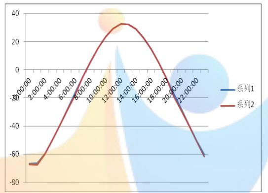  
图12 太阳在天空中的位置高度误差

系列一为真实数据；系列二为计算数据  
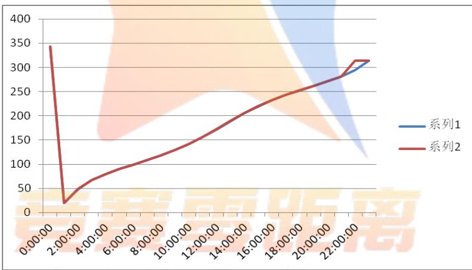  
图 13 太阳在天空中的位置方位角的误差分析  
系列一为真实数据系列二为计算数据

## 6.3 “月上柳梢头，人约黄昏后”发生时间筛选算法

基于问题一模型建立与结果的验证，可以分别求出“月上柳梢头”与“人约黄昏后”发生的日期与时间，为进一步求出“月上柳梢头”与“人约黄昏后”同时发生的日期与时间，我们给出一个数值算法，实现对某城市在 2016 年发生此现象的时间进行筛选。其算法步骤为：

Step1：以分为步长，离散化全年时长，转化为 527040 个时刻，记为$T = \left\{ \begin{array} { l l } { { t , } } & { { t , \cdots , t _ { 2 7 } } } \end{array} \right\}$ 。令i 1。

Step2： 计算每一个离散时刻 $t _ { i }$ 的月亮高度及太阳高度，依据判断条件判断此时刻是否属于“月上柳梢头”集合以及是否属于“人约黄昏后”集合，分别记录下属于的时刻；

Step3：取属于“月上柳梢头”集合以及属于“人约黄昏后”集合的交集A,若A为空集，令i=i+1，返回step1，否：执行下一步。

Step4: $i > 5 2 7 0 i = i + 1 4 0 ,$ ,是：算法结束，输出 $T$ ，否: $\ntrianglerighteq i = i + 1$ ，返回 step1;

## 6.3 北京发生“月上柳梢头，人约黄昏后”的日期与时间计算

基于问题一的模型，求解符合两种意境同时发生的在 2016年北京地区的时间与日期。根据地区中不同的经纬度，通过软件编程求解的给出符合的时间与日期，如图13,14则为北京市在2016年1月两种意境下的时间分别发生的时间段.

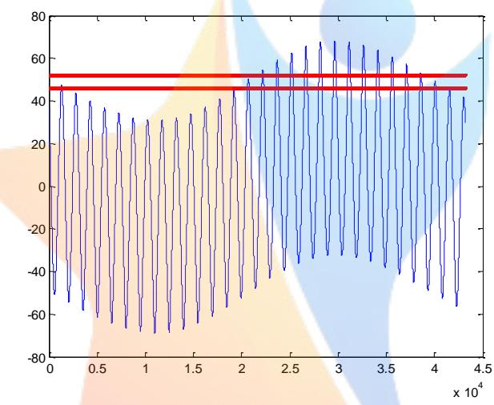  
图13 各个城市的筛选现象图示

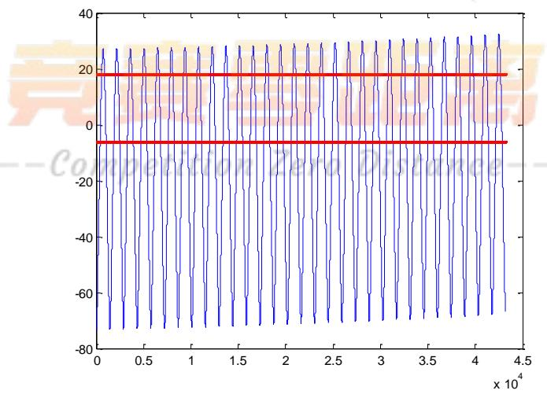  
图 14 符合两种诗经意象的筛选结果时间图示

通过图中可以看到，2016年1月“月上柳梢头”发生的时间段比“人约黄昏后”的更短，这主要与地球自转和绕太阳公转有关，因为论文篇幅有限，其他筛选结果见支撑材料。

表6 2016 年一年中北京市发生“月上柳梢头\_人约黄昏后”现象的时间段
<table><tr><td>年份</td><td>次数</td><td>月</td><td>日</td><td>出现时间</td><td>结束时间</td></tr><tr><td>2016</td><td rowspan="4">5</td><td>1</td><td>14</td><td>16：5：0</td><td>17：41：0</td></tr><tr><td>2016</td><td>1</td><td>15</td><td>16:7:0</td><td>16:42:0</td></tr><tr><td>2016</td><td>1</td><td>16</td><td>16:15：0</td><td>16： :57:0</td></tr><tr><td>2016</td><td>1</td><td>17</td><td>16:51：0</td><td>17：28：0</td></tr><tr><td>2016</td><td rowspan="5">5</td><td>1</td><td>18</td><td>17:33：0</td><td>17:45:0</td></tr><tr><td>2016</td><td>2</td><td>11</td><td>16:44</td><td>17:28</td></tr><tr><td>2016</td><td>2</td><td>12</td><td>18:05</td><td>18:13</td></tr><tr><td>2016</td><td>2</td><td>15</td><td>16:50</td><td>16:53</td></tr><tr><td>2016</td><td>2</td><td>16</td><td>17:09</td><td>17:43</td></tr><tr><td>2016</td><td rowspan="4">4</td><td>2</td><td>17</td><td>18:3</td><td>18:19</td></tr><tr><td>2016</td><td>3</td><td>11</td><td>17:21</td><td>17:47</td></tr><tr><td>2016</td><td>3</td><td>12</td><td>18:23</td><td>18:45</td></tr><tr><td>2016</td><td>3</td><td>16</td><td>17:27</td><td>17:29</td></tr><tr><td>2016</td><td rowspan="4">3</td><td>3</td><td>17</td><td>17:52</td><td>18:27</td></tr><tr><td>2016</td><td>4</td><td>10</td><td>18:20</td><td>18:54</td></tr><tr><td>2016</td><td>4</td><td>15</td><td>17:57</td><td>18:24</td></tr><tr><td>2016</td><td>4</td><td>16</td><td>18:47</td><td>19:22</td></tr><tr><td>2016</td><td rowspan="5">5</td><td>5</td><td>9</td><td>18：18</td><td>18:37</td></tr><tr><td>2016</td><td>5</td><td>10</td><td>18:55</td><td>19:28</td></tr><tr><td>2016</td><td>5</td><td></td><td>19:38</td><td>19:49</td></tr><tr><td>2016</td><td>5</td><td>1114</td><td>18:22</td><td>18:35</td></tr><tr><td>2016</td><td>5</td><td>15</td><td>18:54</td><td>19:53</td></tr><tr><td>2016</td><td rowspan="5">5</td><td>6</td><td>8</td><td>18:39</td><td>18:48</td></tr><tr><td>2016</td><td>6</td><td>9</td><td>18:43</td><td>19:22</td></tr><tr><td>2016</td><td>6</td><td>10</td><td>19:3</td><td>19:49</td></tr><tr><td>2016</td><td>6</td><td>11</td><td>18:59</td><td>20:8</td></tr><tr><td>2016</td><td>6</td><td>12</td><td>18:41</td><td>20:15</td></tr><tr><td>总计</td><td colspan="4">27</td><td></td></tr></table>

根据表格中给出的 2016 年北京地区一年中可能发生“月上柳梢头，人约黄昏后”的日期与时间，在2016年北京地区在7-12月份不可能发生“月上柳梢头\_人约黄昏后”现象的时间段，在1\~6月中会发生符合诗句中描绘现象的时间段。其中一年中符合诗歌意境中发生的日期与时间共有 27次，均在1\~6个月中发生。

## 7 模型的评价

## 7.1 模型的优点

（1）借助与已有的参考文献建立于自己模型，能够使得出的数据更加准确，更符合观测值，误差更小，更可靠。

（2）对于结果的给出，不仅给出想象的表格，还辅以图形来阐述结果。

（3）

## 7.2模型的缺点

（1）站在他人已有的相关资料上研究本问题，所受的局限比较大，顺着他人的思

路思考问题。

(2)对于本问题，所引入的外部资料比较多，自己创造性的东西较少：

（3）由于时间关系，对于论文未能进行全面和修改。

（4）此题中涉及到许多天文学知识，由于知识的匮乏、资源较少，部分程序引用与参考外部程序；

## 参考文献

[1] 黄朝阳，从古典诗词中学习天文知识，文学教育（下），9：71，2013

[2] 金祖孟,陈自悟,《地球概论》，北京 ：高等教育出版社，1997.

[3] 百度百科，http://baike.baidu.com/view/1.htm，2015/9/13

[4]王思潮，《天文爱好者新观测手册》，南京：南京出版社，2012年1月.

[5]万永革，孟晓春，月亮高度及升降时刻与方位角的计算,3:5,2003.

[6]公历和儒略日-百度文库，http://wenku.baidu.com/link?url=GL-OA\_-xiNW\_RmGcRk5xAq2v4uO8VTE\_NXOWB6\_pNgU-bUMQJYv74pFc92-jMMPQ16tN\_Ho5TU5EHEpm\_ZjPK04AwAYCSNQNOJ1y594LUwe ，2015 年 9 月 14 日

[7] 沈阳黄金学院,简便测定天文方位角公式的推证及方法探讨, 沈阳黄金学院学报,1995,43,P128.1

[8] 中国台湾”交通部中央气象局”网站提供的天文日历资料http://www.cwb.gov.tw/V7/astronomy/moonrise.htm,2015 年 9 月 14 日

[9] 香港特别行政区香港天文台网站提供的《2015年年历》资料http://www.weather.gov.hk/gts/astron2015/2015cal01.pdf.2015 年 9 月 14 日

[10] 部分方位角数据来源于中国台湾”交通部中央气象局”网站提供的天文日历资料,其 余 数 据 来 源 于 电 子 星 图 软 件 SkyMap 提 供 的 星 历 表http://www.cwb.gov.tw/V7/astronomy/moonrise.htm,2015 年 9 月 14 日

[11]陈健婷.温银婷.傅守忠.CHEN Jianting.WEN Yinting.FU Shouzhong 最佳太阳方位角的计算[期刊论文]-肇庆学院学 报 2014(2)

[12] 陈晓勇.郑科科 对建筑日照计算中太阳赤纬角公式的探讨[期刊论文]-浙江建筑 2011(9）。

## 附 录（程序参考了外部程序）

```matlab
附录1：计算儒略日和儒略日转换为时间的计算（MATLAB7.1）
1，将公历年月日时分秒转换到儒略日
function jd=cal2jd(cal)
if length(cal) < 6
cal(6)=0;
end
year=cal(1);
month=cal(2);
day=cal(3)+(cal(4)*3600+cal(5)*60+cal(6))/86400;
if( year < 0 )
y =y+ 1; % Please note that there is no year 0 A.D.
end
m=month;
if( m <= 2 ) % January and February come after December.
m = m+12;
y = y - 1;
end
e=floor(30.6 * (m+1));
```

```matlab
a=floor(y/100); % number of centuries
if( year <1582 )|(year==1582&month<10)|(year==1582& month==10 &day<15)
b = -38;
else
b = floor((a/4) - a); % number of century years that are not leap years
end
c=floor(365.25* y); % Julian calendar years and leap years
jd= b + c + e + day - 32167.5;
2，
function ans=D2FM(x)
d=floor(x) ;
f=floor((x-d).*60);
m=floor(((x-d).*60-f ).*60);
ans=[d' f' m'];
3，将公历年月日时分秒转换到儒略日
function jd=cal2jd(cal)
if length(cal) 6
cal(6)=0;
end
year=cal(1);
month=cal(2);
day=cal(3)+(cal(4)*3600+cal(5)*60+cal(6))/86400;
y = year + 4800; %4801 B.C. is a century year and also a leap year.
if( year < 0 )
y =y+ 1; % Please note that there is no year 0 A.D.
end
m=month;
if( m <= 2 ) % January and February come after December.
m = m+12;
y = y - 1;
end
e=floor(30.6 * (m+1));
a=floor(y/100); % number of centuries
if( year <1582 )|(year==1582&month<10)|(year==1582& month==10
&day<15)
b = -38;
else
b = floor((a/4) - a); % number of century years that are not leap
years
end
c=floor(365.25* y); % Julian calendar years and leap years
```

```matlab
jd= b + c + e + day - 32167.5;
4，从儒略日计算公历年月日时分秒
function cal=jd2cal(J)
if (J < 1721423.5)
BC = 1;
else
BC = 0;
end
if( J < 2299160.5 )
j0=floor(J+0.5);
dd=J+0.5-j0;
else n1=floor((J-2342031.5)/36524.25/4)+1;%1700.3.1.0
n2=floor((J-2378555.5)/36524.25/4)+1;%1800.3.1.0
n3=floor((J-2415079.5)/36524.25/4)+1;%1900.3.1.0
j0=n1+n2+n3+J+10;
dd=j0+0.5-floor(j0+0.5);
j0=floor(j0+0.5);
end
j0=j0+32083;
year0=ceil(j0/365.25)-1;
year=year0-4800;
day=j0-floor(year0*365.25);
month=floor((day-0.6)/30.6)+3;
day=day-round((month-3)*30.6);
if month>12
month=month-12;
year=year+1;
end
year=year-BC;
sec=round(dd*86400);
sec=sec-hour*3600;
min=floor(sec/60);
sec=sec-min*60;
5，从儒略日计算公历年月日时分秒
function cal=jd2cal(J)
if (J < 1721423.5)
BC = 1;
else
BC = 0;
end
%start from Julian March 1, 4801 B.C.
if( J < 2299160.5 ) % before 1582.10.4. 24:00 is Julian calender
j0=floor(J+0.5);
```

```matlab
dd=J+0.5-j0;
else
n1=floor((J-2342031.5)/36524.25/4)+1;
n2=floor((J-2378555.5)/36524.25/4)+1;
n3=floor((J-2415079.5)/36524.25/4)+1;
j0=n1+n2+n3+J+10;
dd=j0+0.5-floor(j0+0.5);
j0=floor(j0+0.5);
end
j0=j0+32083;
year0=ceil(j0/365.25)-1;
year=year0-4800;
day=j0-floor(year0*365.25);
month=floor((day-0.6)/30.6)+3;
day=day-round((month-3)*30.6);
if month>12
month=month-12;
year=year+1;
end
year=year-BC;
sec=round(dd*86400);
hour=floor(sec/3600);
sec=sec-hour*3600;
min=floor(sec/60);
sec=sec-min*60;
cal=[year, month, day, hour, min, sec];
6，
function [Az h] = LunarAzEl(UTC,Lat,Lon,Alt)
while Lon > 180
Lon = Lon - 360;
end
while Lon < -180
Lon = Lon + 360;
end
while Lat > 90
Lat = Lat - 360;
end
while Lat < -90
Lat = Lat + 360;
end
EarthRadEq = 6378.1370;
jd = juliandate(UTC,'yyyy/mm/dd HH:MM:SS');
d = jd - 2451543.5;
N = 125.1228-0.0529538083.*d;
```

```matlab
i = 5.1454;
w = 318.0634 + 0.1643573223.*d;
a = 60.2666;
e = 0.054900;
M = mod(115.3654+13.0649929509.*d,360);
LMoon = mod(N + w + M,360);
FMoon = mod(LMoon - N,360);
wSun = mod(282.9404 + 4.70935E-5.*d,360);
MSun = mod(356.0470 + 0.9856002585.*d,360);
LSun = mod(wSun + MSun,360);
DMoon = LMoon - LSun;
LunarPLon = [ -1.274.*sin((M - 2.*DMoon).*(pi/180)); ...
.658.*sin(2.*DMoon.*(pi/180)); ...
-0.186.*sin(MSun.*(pi/180)); ...
-0.059.*sin((2.*M-2.*DMoon).*(pi/180));
-0.057.*sin((M-2.*DMoon + MSun).*(pi/180)); ...
.053.*sin((M+2.*DMoon).*(pi/180)); ...
.046.*sin((2.*DMoon-MSun).*(pi/180)); ...
.041.*sin((M-MSun).*(pi/180)); ...
-0.035.*sin(DMoon.*(pi/180)); ...
-0.031.*sin((M+MSun).*(pi/180)); ...
-0.015.*sin((2.*FMoon-2.*DMoon).*(pi/180)); ...
.011.*sin((M-4.*DMoon).*(pi/180))];
LunarPLat = [ -0.173.*sin((FMoon-2.*DMoon).*(pi/180)); ..
-0.055.*sin((M-FMoon-2.*DMoon).*(pi/180)); ..
-0.046.*sin((M+FMoon-2.*DMoon).*(pi/180)); ...
+0.033.*sin((FMoon+2.*DMoon).*(pi/180)); ...
+0.017.*sin((2.*M+FMoon).*(pi/180))];
LunarPDist = [ -0.58*cos((M-2.*DMoon).*(pi/180));
E1 = E0-(E0-(180/pi).*e.*sin(E0.*(pi/180))-M)./(1-e*cos(E0.*(pi/180)));
while E1-E0 > .000005
E0 = E1;
E1 = E0-(E0-(180/pi).*e.*sin(E0.*(pi/180))-M)./(1-e*cos(E0.*(pi/180)));
end
E = E1;
x = a.*(cos(E.*(pi/180))-e);
y = a.*sqrt(1-e.*e).*sin(E.*(pi/180))
r = sqrt(x.*x + y.*y);
v = atan2(y.*(pi/180),x.*(pi/180)).*(180/pi);
xeclip
r.*(cos(N.*(pi/180)).*cos((v+w).*(pi/180))-sin(N.*(pi/180)).*sin((v+w).*(pi/180)).*cos(i.*(pi/180)));
```

```matlab
yeclip
r.*(sin(N.*(pi/180)).*cos((v+w).*(pi/180))+cos(N.*(pi/180))*sin(((v+w).*(pi/180)))*cos(i.*(pi/180)));
zeclip = r.*sin((v+w).*(pi/180)).*sin(i.*(pi/180));
[eLon eLat eDist] = cart2sph(xeclip,yeclip,zeclip);
[xeclip yeclip zeclip] = sph2cart(eLon + sum(LunarPLon).*(pi/180), ...
eLat + sum(LunarPLat).*(pi/180), ...
eDist + sum(LunarPDist));
clear eLon eLat eDist;
T = (jd-2451545.0)/36525.0;
Obl = 23.439291 - 0.0130042.*T - 0.00000016.*T.*T + 0.000000504.*T.*T.*T;
Obl = Obl.*(pi/180);
RotM = [1 0 0; 0 cos(Obl) sin(Obl); 0 -sin(Obl) cos(Obl)]';
sol = RotM*[xeclip yeclip zeclip]'.*EarthRadEq;
[xel yel zel] = sph2cart(Lon.*(pi/180),Lat.*(pi/180),Alt+EarthRadEq);
[xsl ysl zsl] = sph2cart(Lon.*(pi/180),Lat.*(pi/180),EarthRad
theta1 = 180 - acosd(dot([xsl ysl zsl],[sol(1)-xsl sol(2)-ysl sol(3)-zsl]) ..
./(sqrt(xsl.^2 + ysl.^2 + zsl.^2) ...
.*sqrt((sol(1)-xsl).^2 + (sol(2)-ysl).^2 + (sol(3)-zsl).^2)));
theta2 = 180 - acosd(dot([xel yel zel],[sol(1)-xel sol(2)-yel sol(3)-zel]) ...
./(sqrt(xel.^2 + yel.^2 + zel.^2) ...
.*sqrt((sol(1)-xel).^2 + (sol(2)-yel).^2 + (sol(3)-zel).^2)));
thetaDiff = theta2 - theta1;
[RA,delta] = cart2sph(sol(1),sol(2),sol(3));
delta = delta.*(180/pi);
RA = RA.*(180/pi);
J2000 = jd - 2451545.0;
hourvec = datevec(UTC,'yyyy/mm/dd HH:MM:SS');
UTH = hourvec(4) + hourvec(5)/60 + hourvec(6)/3600;
LST = mod(100.46+0.985647.*J2000+Lon+15*UTH,360)
HA = LST-RA;
h asin(sin(delta.*(pi/180)).*sin(Lat.*(pi/180))
cos(delta.*(pi/180)).*cos(Lat.*(pi/180)).*cos(HA.*(pi/180))).*(180/pi);
Az acos((sin(delta.*(pi/180))
sin(h.*(pi/180)).*sin(Lat.*(pi/180)))./(cos(h.*(pi/180)).*cos(Lat.*(pi/180)))).*(180/pi);
h = h + thetaDiff;
if sin(HA.*(pi/180)) >= 0
Az = 360-Az;
end
if Alt < 100
horParal = 8.794/(r*6379.14/149.59787e6);
p = asin(cos(h.*(pi/180))*sin((horParal/3600).*(pi/180))).*(180/pi);
h = h-p;
end
function jd = juliandate(varargin)
```

```matlab
[year month day hour min sec] = datevec(datenum(varargin{:}));
for k = length(month):-1:1
if ( month(k) <= 2 ) % january & february
year(k) = year(k) - 1.0;
month(k) = month(k) + 12.0;
end
end
jd = floor( 365.25*(year + 4716.0)) + floor( 30.6001*( month + 1.0)) + 2.0 - ...
floor( year/100.0 ) + floor( floor( year/100.0 )/4.0 ) + day - 1524.5 + ...
(hour + min/60 + sec/3600)/24;
7，计算某一地方日出日没的时刻。
function ans=RCRL_time(year,month,day,Lon,Lat,Alt)
hour=0;
minute=0;
second=0;
location.longitude =Lon;
location.latitude = Lat;
location.altitude = Alt;
time.year = year;
time.month = month;
time.day = day;
time.hour = hour;
time.min = minute;
time.sec =second;
time.UTC =8;
k=1;
for day=day:day
for hour=0:23
for minute=0:1:59
time.day = day;
time.hour = hour;
time.min = minute;
sun=sun_position(time, location);
GD(k)=sun.zenith;
FW(k)=sun.azimuth;
k=k+1;
end
end
end
D2FM(90-GD);
D2FM(FW);
plot(90-GD)
hold on
plot(FW)
```

```matlab
GD=90-GD;
b=find(sign(GD(1:end-1)).*sign(GD(2:end))<0);
1=floor(b./(60*24));
2=floor((b-t1*(60*24))/60);
t3=b-t1*(60*24)-t2*60;
ans=[ones(size(t1'))*year ones(size(t1'))*month day+floor((t2')/24)+t1' mod(t2',24) t3'
ones(size(t1'))*0];
8，计算北京人约黄昏后的时刻。
clear
clc
year=2016;
month=1;
day=1;
Lat=43.8;
Lon=87.6;
Alt=10;
hour=0;
minute=0;
econd=0;
location.longitude =Lon;
location.latitude = Lat;
location.altitude = Alt;
time.year = year;
time.month = month;
time.day = day;
time.hour = hour;
time.min = minute;
time.sec =second;
time.UTC =8;
k=1;
for day=1:30
for hour=0:23
time.month = month;
time.day = day;
time.hour = hour;
time.min = minute;
sun=sun_position(time, location);
GD(k)=sun.zenith;
FW(k)=sun.azimuth;
k=k+1;
end
end
```

```matlab
end
end
D2FM(90-GD);
D2FM(FW);
GD=90-GD;
[index b]=find(GD>-6&GD<10);
[index0 c]=find(FW>225&FW<315);
b=intersect(b, c);
t1=floor(b./(60*24));
t2=floor((b-t1*(60*24))/60);
t3=b-t1*(60*24)-t2*60;
ans=[ones(size(t1'))*year ones(size(t1'))*month 1+floor((t2')/24)+t1' mod(t2',24) t3'
ones(size(t1'))*0];
dlmwrite('D:/人约黄昏后.txt',ans);
plot(1:k-1,GD,'b-',1:k-1,-6,'r-',1:k-1,18,'r-')
9，
function sun = sun_position(time, location)
julian = julian_calculation(time);
earth_heliocentric_position = earth_heliocentric_position_calculation(julian);
sun_rigth_ascension sun_rigth_ascension_calculation(apparent_sun_longitude, true_obliquity,
sun_geocentric_position);
sun_geocentric_declination sun_geocentric_declination_calculation(apparent_sun_longitude,
true_obliquity, sun_geocentric_position);
observer_local_hour = observer_local_hour_calculation(apparent_stime_at_greenwich, location,
sun_rigth_ascension);
topocentric_sun_position = topocentric_sun_position_calculate(earth_heliocentric_position, location,
observer_local_hour, sun_rigth_ascension, sun_geocentric_declination);
topocentric_local_hour topocentric_local_hour_calculate(observer_local_hour,
topocentric_sun_position);
sun = sun_topocentric_zenith_angle_calculate(location, topocentric_sun_position, topocentric_local_
if ~isstruct(t_input)
tt = datevec(t_input);
time.UTC=0;
time.year = tt(1);
time.month = tt(2);
time.day = tt(3);
time.hour = tt(4);
time.min = tt(5);
time.sec = tt(6);
else
time = t_input;
end
```

```matlab
if(time.month == 1 | time.month == 2)
Y = time.year - 1;
M = time.month + 12;
else
Y = time.year;
M = time.month;
end
ut_time = ((time.hour - time.UTC)/24) + (time.min/(60*24)) + (time.sec/(60*60*24)); % time of day in U
time.
D = time.day + ut_time; % Day of month in decimal time, ex. 2sd day of month at 12:30:30UT
D=2.521180556
if(time.year == 1582)
if(time.month == 10)
if(time.day <= 4) % The Julian calendar ended on October 4, 1582
B = 0;
elseif(time.day >= 15) % The Gregorian calendar started on October 15, 1582
A = floor(Y/100);
B = 2 - A + floor(A/4);
else
disp('This date never existed!. Date automatically set to October 4, 1582');
time.month = 10;
time.day = 4;
B = 0;
end
elseif(time.month<10) % Julian calendar
B = 0;
else
A = floor(Y/100);
B = 2 - A + floor(A/4);
elseif(time.year<1582) % Julian calendar <sub>B</sub> <sub>=</sub> <sub>0;</sub>
else
A = floor(Y/100); % Gregorian calendar
B = 2 - A + floor(A/4);
end
julian.day = floor(365.25*(Y+4716)) + floor(30.6001*(M+1)) + D + B - 1524.5;
delta_t = 0; % 33.184;
julian.ephemeris_day = julian.day + (delta_t/86400);
julian.century = (julian.day - 2451545) / 36525;
julian.ephemeris_century = (julian.ephemeris_day - 2451545) / 36525;
julian.ephemeris_millenium = julian.ephemeris_century / 10;
function earth_heliocentric_position = earth_heliocentric_position_calculation(julian)
L0_terms = [175347046.0 0 0
```

##

12 2.08 4694 11 0.77 553.57 10 1.3 3286.6 10 4.24 1349.87 9 2.7 242.73 9 5.64 951.72 8 5.3 2352.87 6 2.65 9437.76 6 4.67 4690.48]; L2\_terms = [52919.0 0 0 8720.0 1.0721 6283.0758 309.0 0.867 12566.152 27 0.05 3.52 16 5.19 26.3 16 3.68 155.42 10 0.76 18849.23 9 2.06 77713.77 7 0.83 775.52 5 4.66 1577.34 4 1.03 7.11 4 3.44 5573.14 3 5.14 796.3 3 6.05 5507.55 3 1.19 242.73 3 6.12 529.69 3 0.31 398.15 3 2.28 553.57 2 4.38 5223.69 2 3.75 0.98]; <sup>35</sup> <sup>0</sup> <sup>0</sup> 17 5.49 12566.15 175.4912566.15 3 5.2 155.42 1 4.72 3.52 1 5.3 18849.23 1 5.97 242.73]; L4\_terms = [114.0 3.142 0 8 4.13 6283.08 1 3.84 12566.15]; L5\_terms = [1 3.14 0]; A0 = L0\_terms(:,1); B0 = L0\_terms(:,2); C0 = L0\_terms(:,3); A1 = L1\_terms(:,1);

B1 = L1\_terms(:,2);   
C1 = L1\_terms(:,3);   
A2 = L2\_terms(:,1);   
B2 = L2\_terms(:,2);   
C2 = L2\_terms(:,3);   
A3 = L3\_terms(:,1);   
B3 = L3\_terms(:,2);   
C3 = L3\_terms(:,3);   
A4 = L4\_terms(:,1);   
B4 = L4\_terms(:,2);   
C4 = L4\_terms(:,3);   
A5 = L5\_terms(:,1);   
B5 = L5\_terms(:,2);   
C5 = L5\_terms(:,3);   
JME = julian.ephemeris\_millenium;   
L0 = sum(A0 .\* cos(B0 + (C0 \* JME)));   
L1 = sum(A1 .\* cos(B1 + (C1 \* JME)));   
L2 = sum(A2 .\* cos(B2 + (C2 \* JME)));   
L3 = sum(A3 .\* cos(B3 + (C3 \* JME)));   
L4 = sum(A4 .\* cos(B4 + (C4 \* JME)));   
L5 = A5 .\* cos(B5 + (C5 \* JME));   
earth\_heliocentric\_position.longitude = (L0 + (L1 \* JME) + (L2 \* JME^2) + (L3 \* JME^3) + (L4 \* JME^4)   
+ (L5 \* JME^5)) / 1e8;   
earth\_heliocentric\_position.longitude = earth\_heliocentric\_position.longitude \* 180/pi;   
earth\_heliocentric\_position.longitude = set\_to\_range(earth\_heliocentric\_position.longitude, 0, 360);   
B0\_terms = [280.0 3.199 84334.662   
102.0 5.422 5507.553   
80 3.88 5223.69   
44 3.7 2352.87   
B1\_terms = [9 3.9 5507.55 <sub>6</sub> <sub>1.73</sub> <sub>5223.69];</sub> 6 1.73 5223.69];   
A0 = B0\_terms(:,1);   
B0 = B0\_terms(:,2);   
C0 = B0\_terms(:,3);   
A1 = B1\_terms(:,1);   
B1 = B1\_terms(:,2);   
C1 = B1\_terms(:,3);   
L0 = sum(A0 .\* cos(B0 + (C0 \* JME)));   
L1 = sum(A1 .\* cos(B1 + (C1 \* JME)));   
earth\_heliocentric\_position.latitude = (L0 + (L1 \* JME)) / 1e8;   
earth\_heliocentric\_position.latitude = earth\_heliocentric\_position.latitude \* 180/pi;   
earth\_heliocentric\_position.latitude = set\_to\_range(earth\_heliocentric\_position.latitude, 0, 360);   
R0\_terms = [ 100013989.0 0 0

R1\_terms = [ 103019.0 1.10749 6283.07585   
1721.0 1.0644 12566.1517   
702.0 3.142 0   
32 1.02 18849.23

31 2.84 5507.55   
25 1.32 5223.69   
18 1.42 1577.34   
10 5.91 10977.08   
9 1.42 6275.96   
9 0.27 5486.78];   
R2\_terms = [4359.0 5.7846 6283.0758   
124.0 5.579 12566.152   
12 3.14 0   
9 3.63 77713.77   
6 1.87 5573.14   
3 5.47 18849];   
R3\_terms = [145.0 4.273 6283.076   
7 3.92 12566.15];   
R4\_terms = [4 2.56 6283.08];   
A0 = R0\_terms(:,1);   
B0 = R0\_terms(:,2);   
C0 = R0\_terms(:,3);   
A1 = R1\_terms(:,1);   
B1 = R1\_terms(:,2);   
C1 = R1\_terms(:,3);   
A2 = R2\_terms(:,1);   
B2 = R2\_terms(:,2);   
C2 = R2\_terms(:,3);   
A3 = R3\_terms(:,1);   
B3 = R3\_terms(:,2);   
C3 = R3\_terms(:,3);   
A4 = R4\_terms(:,1);   
B4 = R4\_terms(:,2);   
C4 = R4\_terms(:,3);   
L1 = sum(A1 .\* cos(B1 + (C1 \* JME)));   
L2 = sum(A2 .\* cos(B2 + (C2 \* JME)));   
L3 = sum(A3 .\* cos(B3 + (C3 \* JME)));   
L4 = A4 .\* cos(B4 + (C4 \* JME));   
earth\_heliocentric\_position.radius = (L0 + (L1 \* JME) + (L2 \* JME^2) + (L3 \* JME^3) + (L4 \* JM   
1e8;   
function sun\_geocentric\_position = sun\_geocentric\_position\_calculation(earth\_heliocentric\_position)   
sun\_geocentric\_position.longitude = earth\_heliocentric\_position.longitude + 180;   
sun\_geocentric\_position.longitude = set\_to\_range(sun\_geocentric\_position.longitude, 0, 360);   
sun\_geocentric\_position.latitue = -earth\_heliocentric\_position.latitude;   
sun\_geocentric\_position.latitude = set\_to\_range(sun\_geocentric\_position.latitude, 0, 360);

```matlab
function nutation = nutation_calculation(julian)
JCE = julian.ephemeris_century;
p = [(1/189474) -0.0019142 445267.11148 297.85036];
X0 = p(1) * JCE^3 + p(2) * JCE^2 + p(3) * JCE + p(4); % This is faster than polyval...
p = [-(1/300000) -0.0001603 35999.05034 357.52772];
X1 = p(1) * JCE^3 + p(2) * JCE^2 + p(3) * JCE + p(4);
p = [(1/56250) 0.0086972 477198.867398 134.96298];
X2 = p(1) * JCE^3 + p(2) * JCE^2 + p(3) * JCE + p(4);
p = [(1/327270) -0.0036825 483202.017538 93.27191];
X3 = p(1) * JCE^3 + p(2) * JCE^2 + p(3) * JCE + p(4);
p = [(1/450000) 0.0020708 -1934.136261 125.04452];
X4 = p(1) * JCE^3 + p(2) * JCE^2 + p(3) * JCE + p(4);
Y_terms = [0 0 0 0 1
-2 0 0 2 2
0 0 0 2 2
0 0 0 0 2
0 1 0 0 0
0 0 1 0 0
-2 1 0 2 2
0 0 0 2 1
0 0 1 2 2
-2 -1 0 2 2
-2 0 1 0 0
-2 0 0 2 1
0 0 -1 2 2
0 0 1 0 1
2 0 -1 2 2
0 0 -1 0 1
0 0 1 2 1
-2 0 2 0 0
0 0 -2 2 1
2 0 0 2 2
0 0 2 2 2
0 0 2 0 0
-2 0 1 2 2
0 0 0 2 0
-2 0 0 2 0
0 0 -1 2 1
```

nutation\_terms = [ -171996 -174.2 92025 8.9

-13187 -1.6 5736 -3.1

-2274 -0.2 977 -0.5

2062 0.2 -895 0.5

1426 -3.4 54 -0.1

712 0.1 -7 0

-517 1.2 224 -0.6

##

```matlab
4 0 0 0
-4 0 0 0
-4 0 0 0
-4 0 0 0
3 0 0 0
-3 0 0 0
-3 0 0 0
-3 0 0 0
-3 0 0 0
-3 0 0 0
-3 0 0 0
-3 0 0 0]
Xi = [X0
X1
X2
X3
X4];
tabulated_argument = (Y_terms * Xi) * pi/180;
delta_longitude = ((nutation_terms(:,1) + (nutation_terms(:,2) * JCE))) .* sin(tabulated_argument);
delta_obliquity = ((nutation_terms(:,3) + (nutation_terms(:,4) * JCE))) .* cos(tabulated_argument);
nutation.longitude = sum(delta_longitude) / 36000000;
nutation.obliquity = sum(delta_obliquity) / 36000000;
function true_obliquity = true_obliquity_calculation(julian, nutation)
p = [2.45 5.79 27.87 7.12 -39.05 -249.67 -51.38 1999.25 -1.55 -4680.93 84381.448];
U = julian.ephemeris_millenium/10;
mean_obliquity = p(1)*U^10 + p(2)*U^9 + p(3)*U^8 + p(4)*U^7 + p(5)*U^6 + p(6)*U^5 + p(7)*U^4 +
p(8)*U^3 + p(9)*U^2 + p(10)*U + p(11);
true_obliquity = (mean_obliquity/3600) + nutation.obliquity;
function aberration_correction = abberation_correction_calculation(earth_heliocentric_position)
aberration_correction = -20.4898/(3600*earth_heliocentric_position.radius);
function apparent_sun_longitude = apparent_sun_longitude_calculation(sun_geocentric_position, nutation,
aberration_correction)
apparent_sun_longitude = sun_geocentric_position.longitude + nutation.longitude + aberration_correction;
function apparent_stime_at_greenwich = apparent_stime_at_greenwich_calculation(julian, nutation,
true_obliquity)
JD = julian.day;
JC = julian.century;
mean_stime = 280.46061837 + (360.98564736629*(JD-2451545)) + (0.000387933*JC^2) - (JC^3/387100)
mean_stime = set_to_range(mean_stime, 0, 360);
apparent_stime_at_greenwich = mean_stime + (nutation.longitude * cos(true_obliquity * pi/180));
function sun_rigth_ascension = sun_rigth_ascension_calculation(apparent_sun_longitude, true_obliquity,
sun_geocentric_position)
argument_numerator = (sin(apparent_sun_longitude * pi/180) * cos(true_obliquity * pi/180)) - ...
(tan(sun_geocentric_position.latitude * pi/180) * sin(true_obliquity * pi/180));
```

argument\_denominator = cos(apparent\_sun\_longitude \* pi/180);   
sun\_rigth\_ascension = atan2(argument\_numerator, argument\_denominator) \* 180/   
sun\_rigth\_ascension = set\_to\_range(sun\_rigth\_ascension, 0, 360);   
function sun\_geocentric\_declination = sun\_geocentric\_declination\_calculation(apparent\_sun\_longitude,   
true\_obliquity, sun\_geocentric\_position)   
argument = (sin(sun\_geocentric\_position.latitude \* pi/180) \* cos(true\_obliquity \* pi/180)) + ...   
(cos(sun\_geocentric\_position.latitude \* pi/180) \* sin(true\_obliquity \* pi/180) \*   
sin(apparent\_sun\_longitude \* pi/180));   
sun\_geocentric\_declination = asin(argument) \* 180/pi;   
function observer\_local\_hour = observer\_local\_hour\_calculation(apparent\_stime\_at\_greenwich, location,   
sun\_rigth\_ascension)   
observer\_local\_hour = apparent\_stime\_at\_greenwich + location.longitude - sun\_rigth\_ascension;   
observer\_local\_hour = set\_to\_range(observer\_local\_hour, 0, 360);   
function topocentric\_sun\_position = topocentric\_sun\_position\_calculate(earth\_heliocentric\_position,   
location, observer\_local\_hour, sun\_rigth\_ascension, sun\_geocentric\_declination)   
eq\_horizontal\_parallax = 8.794 / (3600 \* earth\_heliocentric\_position.radius);   
u = atan(0.99664719 \* tan(location.latitude \* pi/180));   
x = cos(u) + ((location.altitude/6378140) \* cos(location.latitude \* pi/180));   
y = (0.99664719 \* sin(u)) + ((location.altitude/6378140) \* sin(location.latitude \* pi/180));   
nominator = -x \* sin(eq\_horizontal\_parallax \* pi/180) \* sin(observer\_local\_hour \* pi/180);   
denominator = cos(sun\_geocentric\_declination \* pi/180) - (x \* sin(eq\_horizontal\_parallax \* pi/180) \*   
cos(observer\_local\_hour \* pi/180));   
sun\_rigth\_ascension\_parallax = atan2(nominator, denominator);   
topocentric\_sun\_position.rigth\_ascension\_parallax = sun\_rigth\_ascension\_parallax \* 180/pi;   
topocentric\_sun\_position.rigth\_ascension = sun\_rigth\_ascension (sun\_rigth\_ascension\_parallax \*   
180/pi);   
nominator = (sin(sun\_geocentric\_declination \* pi/180) - (y\*sin(eq\_horizontal\_parallax \* pi/180))) \*   
cos(sun\_rigth\_ascension\_parallax);   
denominator = cos(sun\_geocentric\_declination \* pi/180) - (x\*sin(eq\_horizontal\_parallax \* pi/180)) \*   
cos(observer\_local\_hour \* pi/180);   
topocentric\_sun\_position.declination = atan2(nominator, denominator) \* 180/pi;   
function topocentric\_local\_hour = topocentric\_local\_hour\_calculate(observer\_local\_hour,   
topocentric\_sun\_position)   
topocentric\_local\_hour = observer\_local\_hour - topocentric\_sun\_position.rigth\_ascension\_parallax;   
function sun = sun\_topocentric\_zenith\_angle\_calculate(location, topocentric\_sun\_position,   
topocentric\_local\_hour)   
argument = (sin(location.latitude \* pi/180) \* sin(topocentric\_sun\_position.declination \* pi/180)) + ...   
(cos(location.latitude \* pi/180) \* cos(topocentric\_sun\_position.declination \* pi/180) \*   
cos(topocentric\_local\_hour \* pi/180));   
true\_elevation = asin(argument) \* 180/pi;   
argument = true\_elevation + (10.3/(true\_elevation + 5.11));   
refraction\_corr = 1.02 / (60 \* tan(argument \* pi/180));   
if(true\_elevation > -5)   
apparent\_elevation = true\_elevation + refraction\_corr;

else   
apparent\_elevation = true\_elevation;   
end   
sun.zenith = 90 - apparent\_elevation;   
nominator = sin(topocentric\_local\_hour \* pi/180);   
denominator = (cos(topocentric\_local\_hour \* pi/180) \* sin(location.latitude \* pi/180)) - ...   
(tan(topocentric\_sun\_position.declination \* pi/180) \* cos(location.latitude \* pi/180));   
sun.azimuth = (atan2(nominator, denominator) \* 180/pi) + 180;   
sun.azimuth = set\_to\_range(sun.azimuth,.   
function var = set\_to\_range(var, min\_interval, max\_interval)   
var = var - max\_interval \* floor(var/max\_interval);   
if(var<min\_interval)   
var = var + max\_interval;   
end   
10，clear,clc;   
n0=79.6764+0.2422\*(1978-1985)-ceil((1978-1985)/4);   
t=(365\*7-91)-n0;   
x=2\*180\*t/365.2422;   
b=0.3723+23.2567\*sin(x)+0.1149\*sin(2\*x)-0.1712\*sin(3\*x)-0.758\*cos(x)+0.3656\*cos(2\*x)+0.0201\*cos(   
3\*x);   
sin(71.55\*pi/180))\*sin(b)+cos(71.55\*pi/180)\*cos(b)\*cos(w)==0;   
11，   
lear,clc;   
n0=79.6764+0.2422\*(2012-1985)-ceil((2012-1985)/4);   
t=1-n0;   
x=2\*180\*t/365.2422;   
y=x\*pi/180;   
b=0.3723+23.2567\*sin(y)+0.1149\*sin(2\*y)-0.1712\*sin(3\*y)-0.758\*cos(y)+0.3656\*cos(2\*y);   
c=15\*(13-12)\*pi/180;   
sin(b);   
e=(0.8348-sin((-73\*pi)/180)\*sin(40.10\*pi/180))/(cos((-73\*pi)/180)\*cos(40.10\*pi/180));   
if c<0   
d=acos(6.4871)   
else if c>0   
d=360-acos(6.4871)   
end   
end   
d   
12，计算太阳位置与观察数据比较   
clear   
clc   
year=2015;

```matlab
month=2;
day=1;
Lat=39.91667;
Lon=116.61447;
Alt=11;
hour=0;
minute=0;
second=0;
location.longitude =Lon;
location.latitude = Lat;
location.altitude = Alt;
time.year = year;
time.month = month;
time.day = day;
time.hour = hour;
time.min = minute;
time.sec =second;
time.UTC =8;
k=1;
for day=day:day
for hour=0:23
for minute=0:0
time.day = day;
time.hour = hour;
time.min = minute;
sun=sun_position(time, location);
GD(k)=sun.zenith;
FW(k)=sun.azimuth;
k=k+1;
end
end
end
D2FM(90-GD)
disp(' -Comnetition_Zero Distance==
--')
D2FM(FW)
```

13，计算某一地方月出月没的时刻。

```matlab
function
ans=RCRL_time(year,month,day,Lon,Lat,Al);
%
月
```

```matlab
%
%纬
hour=0;
minute=0;
second=0;
k=1;
for month=1:1
for day=day
for hour=0:23
for minute=0:1:59
string=[num2str(year) '/' num2str(month) '/'
num2str(day)
num2str(hour) ':' num2str(minute) ':'
num2str(second)];
[Az(k) h(k)] = LunarAzEl(string,Lat,Lon,Alt);
k=k+1;
end
end
end
end
b=find(sign(h(1:end-1)).*sign(h(2:end))<0);
t1=floor(b./(60*24));
t2=floor((b-t1*(60*24))/60);
t3=b-t1*(60*24)-t2*60;
ans=[ones(size(t1'))*year ones(size(t1'))*month
day+floor((t2'+8)/24)+t1' mod(t2'+8,24) t3'
ones(size(t1'))*0];
14，计算月亮位置与观察数据比较
clear
clc
year=2015;
month=1;
day=1;
Lat=25.05;
Lon=121.5;
Alt=0.0018;
hour=0;
minute=0;
second=0;
k=1;
for month=1:1
for day=day
```

D2FM(h)

```matlab
for hour=0:23
for minute=0:0
string=[num2str(year) '/' num2str(month) '/'
num2str(day) ' '...
num2str(hour) ':' num2str(minute) ':'
num2str(second)];
[Az(k) h(k)] = LunarAzEl(string,Lat,Lon,Alt);
k=k+1;
end
end
end
end
D2FM(Az)
disp('- ------
```

## 15，计算北京月上柳梢头的时刻

```matlab
clear
clc
year=2016;
month=1;
day=1;
Lat=43.8;
Lon=87.6;
Alt=0.0010;
hour=0;
minute=0;
second=0;
k=1;
for day=1:3
for hour=0:23
for minute=0:1:59
string=[num2str(year) '/' num2str(month) '/'
num2str(day) ' '...
num2str(hour) ':' num2str(minute) ':'
num2str(second)];
[Az(k) h(k)] = LunarAzEl(string,Lat,Lon,Alt);
k=k+1;
end
end
end
end
```

```matlab
clc
d1=dlmread('D:/月上柳梢头.txt');
d2=dlmread('D:/人约黄昏后.txt');
for i=1:length(d1)
dd1(i,:)=num2str(d1(i,:));
end
for i=1:length(d2)
dd2(i,:)=num2str(d2(i,:));
end
k=1;
for i=1:length(d1)
for j=1:length(d2)
if strcmp(dd1(i,:),dd2(j,:))
ans(k,:)=dd1(i,:);
k=k+1;
end
end
if k>1
disp('发生"月上柳梢头<sub>_</sub>人约黄昏后"的现象的时间段保存在
人约黄昏后.txt文件中')
dlmwrite('D:/月上柳梢头<sub>_</sub>人约黄昏后.txt',ans);
else
disp('不能发生"月上柳梢头<sub>_</sub>人约黄昏后"的现象')
end
```

```matlab
[index b]=find(h>46&h<52);
t1=floor(b./(60*24));
t2=floor((b-t1*(60*24))/60);
t3=b-t1*(60*24)-t2*60;
ans=[ones(size(t1'))*year ones(size(t1'))*month
floor((t2'+8)/24)+t1' mod(t2'+8,24) t3'
ones(size(t1'))*0];
dlmwrite('D:/月上柳梢头.txt',ans);
plot(1:k-1,h,'b-',1:k-1,46,'r-',1:k-1,52,'r-')
```