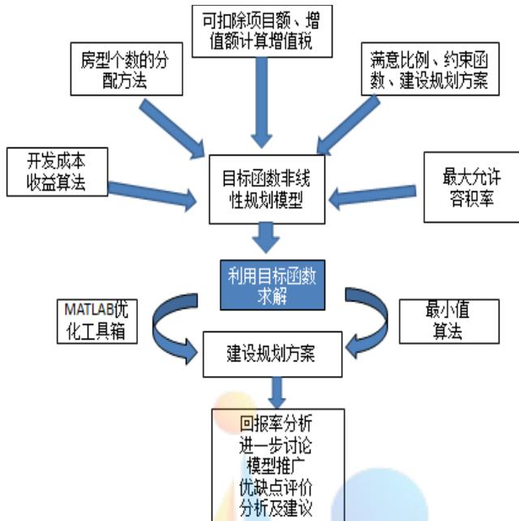
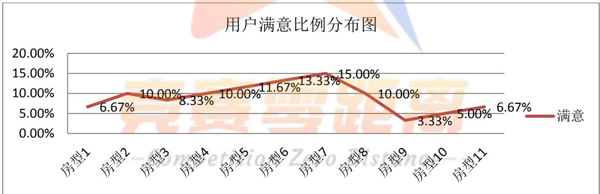

# 众筹筑屋规划方案设计模型

## 摘 要

在充分理解题意及合理假设的基础上，通过对问题的深入分析，我们建立了相关核算公式及非线性规划模型解决问题，并利用MATLAB进行计算。

针对问题一：通过对附件中国家政策的解读，特别是对增值税的计算中，税率与扣除项的确定问题, 分别建立了相应的数学公式,针对方案I，求得相关需要公布的核算数据：

成本为 <sup>9</sup>2.0916 10 元，收益为 $6 . 0 0 7 3 { \times } 1 0 ^ { 8 }$ 元，

容积率为 2.2752 2.28 ，增值税为 $1 . 6 1 8 3 \times 1 0 ^ { 8 }$ 元。

针对问题二：为尽量满足参筹者意愿，首先将参筹者对各房型满意比例进行归一化处理，得到各房型套数的需求比例，其次将规划各房型套数归一化处理得建房套数规划比例。然后按最小二乘原则,以两种比例之差的平方和最小为目标函数，以各房型按规定的最低、最高套数和容积率不大于2.28作为约束条件，建立了非线性规划模型。最后运用MATLAB编程计算，得出了各房型建设规划方案（方案Ⅱ）总套数为1947 套，各房型套数为：

130，195，162，195，227，260，292，194，65，97，130

相应一致性目标指数达到 $4 . 7 6 4 5 \times 1 0 ^ { - 8 }$ 。再利用问题一的方法对上述方案进行全面核算得：

容积率为 $2 . 2 2 7 6 < 2 . 2 8$ ，成本为 $2 . 0 5 \mathbf { k } 1 0 ^ { 9 }$ 元，收益为 $5 . 2 4 6 6 \times 1 0 ^ { 8 }$ 元，增值税$1 . 7 3 8 7 \times 1 0 ^ { 8 }$ 元。

针对问题三：通过对方案二的核算，得投资回报率为23.49% 25% ，未达到可执行要求25%，因此在问题二非线性规划的基础上增加回报率约束条件，重新用MATLAB 进行计算，得调整后的方案：总套数为2017套，各房型套数为：

# 再次利用问题一的方法对上述调整方案进行全面核算得 $:$

回报率为 25.01% ，容积率为 2.2791 2.28

核算结果满足全部要求，可以被执行。

上述非线性规划模型科学合理，计算精确可靠，符合建房要求和最大程序满足了众筹者的意愿，具有较高的参考价值。

【关键词】 回报率 容积率 非线性规划 归一化处理

## 一、模型背景与问题的重述

## 1.1 模型的背景

众筹筑屋是互联网时代一种新型的房地产经营模式，由于其建筑设计阶段用大幅低于市场价的优惠吸引用户参与众筹。用户通过众筹筑屋平台对建筑方案提出自己的意见并参与优化设计。因此，正确、及时的核算建房实际成本与收益、容积率和增值税等信息尤为重要。从而不仅为众筹者提供满意的住房条件，而且还能为开发商提供科学的决策依据一。

## 1.2 问题重述

在建房规划设计中，需考虑诸多因素，如容积率、开发成本、税率、预期收益等。根据国家相关政策，不同房型的容积率、开发成本、开发费用等在核算上要求均不同，结合国家相关条例政策和本题具体要求，建立数学模型分析研究解决下面的问题：

问题一 根据方案 I 相关数据计算成本与收益、容积率和增值税等信息。然后对其建立模型对方案I进行全面的核算，帮助其公布相关信息。

问题二 通过对参筹者进行抽样调查，得到了参筹者对 11 种房型购买意愿的比例。为了尽量满足参筹者的购买意愿，请你重新设计建设规划方案（称为方案Ⅱ），并对方案II进行核算。

问题三 一般对于开发商而言，只有投资回报率达到 25%以上的众筹项目才会被成功执行。根据问题二所给出的众筹筑屋方案Ⅱ能否被成功执行，需要通过建立相应模型进行具体分析说明。

## 二、问题分析和基本思路

## 2.1 问题分析

针对问题一，我们做以下几个方面考虑：

（1） 在成本的计算中，我们要考虑土地成本、转让房地产相关税金、开发成本、开发费用、增值税；

（2） 计算收益中我们可以采取总盈利减去总成本的方式进行核算；

（3） 计算容积率时，应该只计算“列入”房型建筑总面积；

（4） 计算增值税时，根据国务院颁布的《中华人民共和国土地增值税暂行条例》，我国土地增值税实行四级超率累进税率，因此如何确立税率是解决本题的关键。

（5） 计算增值税时，目前国家对于土地增值税的核算中，普通宅和非普通宅是分开的，（如果是其他类别则按规定将实际发生的成本，按照普通宅和非普通

宅建筑面积比，进行分摊计算）；

（6） 在计算土地税扣除项目金额时，根据国家规定，凡不能按房地产项目计算分摊利息支出或不能提供金融机构证明的，房地产开发商用按取得土地使用权所支付的金额和房地产开发成本规定计算的金额之和的 10%以内计算扣除，对从事房地产开发的纳税人，取得土地使用权所支付的金额和房地产开发成本规定计算的金额之和加计 20%扣除。

针对问题二：要重新设计建设规划方案（方案 II），也要从以下几个方面考虑：

（1） 计算出容积率、必须要低于国家的最大容积率要求。容积率越大，则居民舒适度越差，容积率越小，居民舒适度越好;

（2） 调查的满意比例越高，说明该房型越受参筹者接受，此房型就越好参与众筹；

（3） 我们在设计方案时，其容积率不能超过国家规定的最大容积率；

针对问题三：需要在问题二的基础上，多考虑回报率达到 25%的问题。

## 2.2 建模思路与思路流程图

根据问题的题设和要求，我们要解决的是众筹筑屋规划方案设计的问题。规划方案设计问题是一类典型的优化问题。对于规划问题的求解步骤基本是：第一步，找目标函数；第二步，找约束条件；第三步，对规划函数进行求解。

对题目仔细地分析后，我们确定规划后的满意比例与各房型建房比例的方差最小即为目标函数。当前满意比例可用进过规划比较容易的得到，难点是各房型比例的表达。我们分析关系，建立了顾客满意比例量化描述建设规划方案模型。当前满意比例和各房型比例描述好了，我们的目标函数也就形成了。

约束条件的寻找相对比较容易，不过我们能从题目中得到的明显约束条件很少，可想而知本题有隐含的约束条件需要自己去挖掘。如果约束条件能够起到有效的约束作用，唯一剩下的就是借助计算机对规划模型进行最优求解。

此外，为了目标函数和约束条件的顺利表述。我们在正式模型建立之前，做了大量完整而系统的模型准备工作，用量化的语言理清了各部分之间的关系。

下面的思路流程图是我们文章结构的一个缩影，它完整而形象的反映了我们文章的建模思路。


图 2.2.1 建模思路流程图

## 三、基本符号说明与基本假设

## 3.1 基本符号说明

<table><tr><td>序号</td><td>符号</td><td>符号表示含义</td><td></td></tr><tr><td>1</td><td> $S _ { t }$ </td><td>土地面积</td></tr><tr><td>2</td><td> $S _ { c }$ </td><td>土地出让金</td></tr><tr><td>3</td><td> $Z _ { i k }$ </td><td>开发成本</td></tr><tr><td>4</td><td> $Z _ { z }$ </td><td> 税金比率</td></tr><tr><td>5</td><td>ZB</td><td>总增值税 </td></tr><tr><td>6</td><td>ZS</td><td>总收益</td></tr><tr><td>7</td><td>W</td><td>回报率</td></tr><tr><td>8</td><td>R</td><td>容积率</td></tr><tr><td>9</td><td> $Z _ { i }$ </td><td>售房款总收入，i=1,2,…,11</td></tr><tr><td>10</td><td> $A _ { i }$ </td><td>第i个项目建房套数</td></tr><tr><td>11</td><td> $N _ { i }$ </td><td>第i个房型面积  $( \ m ^ { 2 } \ )$ </td></tr><tr><td>12</td><td> $S _ { i }$ </td><td>各房型建筑面积</td></tr><tr><td>13</td><td> $X _ { i j }$ </td><td>第i个房型i套建房套数</td></tr><tr><td>14</td><td> $M _ { i j }$ </td><td>第i个房型j套建房开发成本</td></tr><tr><td>15</td><td> $D _ { i j }$ </td><td>第i个房型j套建房的售价</td></tr><tr><td>16</td><td> $S _ { p f }$ </td><td> $S _ { p }$  普通宅总面积，  $p f$  非普通宅总面积</td></tr><tr><td>17</td><td> $L S _ { p f }$ </td><td> $L S _ { p }$  普通宅所占比，  $S _ { p f }$  非普通宅所占比</td></tr><tr><td>18</td><td> $B _ { p f }$ </td><td> $B _ { p }$  普通营业税，  $p f$  非普通营业税</td></tr><tr><td>19</td><td> $S _ { c p f }$ </td><td> $S _ { c p }$  普通宅土地出让金，cpf非普通宅土地出让金</td></tr><tr><td>20</td><td> $Z _ { z p f }$ </td><td> $Z _ { z p }$  普通宅扣除额，  $z p f$  非普通宅扣除额</td></tr><tr><td>21</td><td> $Z _ { e p f }$ </td><td> $Z _ { e p }$  普通宅增值额， epf 非普通宅增值额</td></tr></table>

## 3.2 基本假设

（1）住宅类型属于“其他”的特殊类别，在最终增值税两类核算模式中，其对应开发成本，收入等因素不可忽略，可以按照已有普通宅、非普通宅建筑面积比，分摊后再计算；

（2）“列入”是指其对应的子项目房型的建筑面积参与容积率的核算；

（3）开发成本为“不允许扣除”表示其对应项目产生的实际成本按规定不能参与增值税核算；

（4）参筹者每户只能认购一套住房；

（5）房地产开发费用按最大的 10%比例扣除；

（6）如果其他条例与本文条例有冲突，以本条例的规定为准；

（7）假设旧房及建筑物的价格算在，取得土地支付的费用中；

（8）假设房地产开发商就是从事房地产开发的纳税人；

## 四、模型的建立和求解

## 4.1 问题一

## 4.1.1 问题一模型的建立

对于问题一，题目中要求公布成本与收益、容积率和增值税。通过对附件 2中国家政策文件的解读以及相关资料的查阅，得出了以下几个计算公式：

## 1．成本

依据附件2国家政策，建房成本为土地开发成本、取得土地支付的金额 $S _ { c }$ 、土地开发费用 $C _ { f }$ 之和，其中

土地开发成本=房型面积 $N _ { i } \times$ 建房套数 $A _ { i } \times$ 单位面积开发成本 $Z _ { i k }$

土地开发费用 $C _ { f }$ 为总土地开发成本与取得土地支付的金额之和的 10%，所以建房成本Z

$$
Z = \sum _ { i = 1 } ^ { 1 1 } N _ { i } A _ { i } Z _ { i k } + S _ { c } + C _ { f } = \left( \sum _ { i = 1 } ^ { 1 1 } N _ { i } A _ { i } Z _ { i k } + S _ { c } \right) \times 1 1 0 ^ { 9 } 6
$$

## 2．收益

收益ZS =房型面积 $N _ { i } \times$ 建房套数 $A _ { i } \times$ 售价 $Z _ { i }$ -成本 $Z$ -土地增值税ZB -转让房款相关税金 $Z _ { z }$ ，按照国家规定与转让房产的有关税金应按照收入的 5.65%计算，即

$$
Z S = \sum _ { i = 1 } ^ { 1 1 } N _ { i } A _ { i } D _ { i j } - Z - Z B - Z _ { z } = \left( \sum _ { i = 1 } ^ { 1 1 } N _ { i } \times A _ { i } \times D _ { i j } \right) \times ( 1 - 5 . 6 5 \% ) - Z - Z B
$$

## 3．容积率

按政策规定，容积率为参与计算的建筑面积与土地面积之比，可表示为：

$$
\sharp \sharp \sharp \sharp \sharp _ { \ell } R = \frac { \sharp \sharp \sharp \sharp _ { \ell } \sharp _ { \ell } \sharp _ { \ell } \sharp _ { \ell } \sharp _ { \ell } \sharp _ { \ell } \sharp _ { \ell } \sharp _ { \ell } \sharp _ { \ell } \sharp _ { \ell } \sharp _ { \ell } \sharp _ { \ell } \sharp _ { \ell } \sharp _ { \ell } \sharp _ { \ell } \sharp _ { \ell } \sharp _ { \ell } ^ { \mathrm { a } } } { \pm \sharp \sharp _ { \ell } \sharp _ { \ell } \sharp _ { \ell } \sharp _ { \ell } \sharp _ { \ell } \sharp _ { \ell } } \rVert _ { i = 1 } ^ { 8 } N _ { i } A _ { i }
$$

即

$$
R = { \frac { \displaystyle \sum _ { i = 1 } ^ { 8 } N _ { i } A _ { i } } { S _ { t } } }
$$

## 4．增值税

目前我国土地增值税实行的是四级超率累进税率，并且国家对土地增值税的核算中，普通宅和非普通宅是分开的 （如果属于其他类别则按规定将实际发生的成本按照普通宅和非普通宅建筑面积比进行分摊计算），所以

增值税ZB =普通房型增值税 $B _ { z p }$ +非普通房型增值税 $B _ { z p f }$

即

$$
Z B = B _ { _ { z p } } + B _ { _ { z p f } }
$$

计算土地增值税是以增值额与扣除项目金额的比率大小按相适用的税率累进计算 征收的，增值额与扣除项目金额的比率越大，适用的税率越高，缴纳的税款越多。所以，

要先计算出两种房型的税率。

税率的确定受到增值额与扣除项目金额的影响，其公式如下：

普通宅增值额 $Z _ { e p }$ =普通宅总售价 $Z _ { \it s j p }$ +其他宅分摊普通宅总售价 $Z _ { \it s j f p }$ -普通宅可扣除金额 $Z _ { _ { z p } }$

即

$$
Z _ { e p } = \sum _ { i = 1 } ^ { 3 } N _ { i } A _ { i } D _ { i j } + l S _ { p } \sum _ { i = 9 } ^ { 1 0 } N _ { i } A _ { i } D _ { i j } - Z _ { z p }
$$

非普通宅增值额 $Z _ { e p f }$ =非普通宅总售价 $Z _ { s j p f }$ +其他宅分摊普通宅总售价 $Z _ { \it s j f p f }$ -非普通宅可扣除金额 $Z _ { z p f }$

即

$$
Z _ { e p f } \ = \sum _ { i = 4 } ^ { 8 } N _ { i } A _ { i } D _ { i j } + l S _ { p f } \sum _ { i = 9 } ^ { 1 0 } N _ { i } A _ { i } D _ { i j } + N _ { 1 1 } A _ { 1 1 } D _ { 1 1 } - Z _ { z p f }
$$

其中：其他分摊到普通宅的比为普通宅的占地总面积与普通宅和非普通住宅的总面积和的比值，得到普通宅分摊比可表达为：

$$
{ \cal L S } _ { _ P } = { \frac { \displaystyle \sum _ { i = 1 } ^ { 3 } N _ { i } A _ { i } D _ { i j } } { \displaystyle \sum _ { i = 1 } ^ { 3 } N _ { i } A _ { i } D _ { i j } + \sum _ { i = 4 } ^ { 8 } N _ { i } A _ { i } D _ { i j } + N _ { 1 1 } A _ { 1 1 } D _ { 1 1 } } }
$$

同理，可得到非普通宅的分摊比

$$
L S _ { P f } = { \frac { \displaystyle \sum _ { i = 4 } ^ { 8 } N _ { i } A _ { i } D _ { i j } + N _ { 1 1 } A _ { 1 1 } D _ { 1 1 } } { \displaystyle \sum _ { i = 1 } ^ { 3 } N _ { i } A _ { i } D _ { i j } + \sum _ { i = 4 } ^ { 8 } N _ { i } A _ { i } D _ { i j } + N _ { 1 1 } A _ { 1 1 } D _ { 1 1 } } }
$$

根据国家相关规定及本题约束条件，可扣除项目为以下五个方面，即

（1）取得土地使用权所支付的金额；

（2）房地产开发成本；

（3）房地产开发费用；

（4）与转让房地产有关的税金；

（5）其它扣除项目，如纳税人优惠加计扣除部分。

因此，普通宅可扣除金额 $Z _ { z p }$ 为普通宅取得土地支付的金额 $S _ { c p }$ ，加上普通宅开发成本 $Z _ { _ { k p } }$ ，加上普通宅土地开发费用 $C _ { f p }$ ，加上普通宅税金 $B _ { p }$ ，加上房地产企业纳税人优惠 $C _ { y p }$ 。其中普通宅土地开发费用为普通宅开发扣除总成本和普通宅取得土地支付的金额之和的10%，房地产企业纳税人优惠为普通宅土地开发费用为普通宅开发扣除总成本和普通宅取得土地支付的金额之和的 20%，公式可表达为：

$$
Z _ { z p } = S _ { c p } + Z _ { k p } + C _ { f p } + B _ { p } + C _ { y p } = \mathrm { ~ ( ~ } Z _ { k p } + S _ { c p } \mathrm { ~ ) ~ } \times 1 3 0 ^ { 9 } 0 + B _ { p }
$$

同理，可得到非普通宅可扣除金额，公式表达为：

$$
Z _ { z p f } = Z _ { k p f } + S _ { c p f } + B _ { p f } + C _ { f p f } + C _ { y p f } = \mathrm { ~ ( ~ } Z _ { k p f } + S _ { c p f } \mathrm { ~ ) ~ } \times 1 3 0 ^ { 9 } \mathrm { { 0 } } + B _ { p f }
$$

其中：

（1）普通宅的总开发成本 $Z _ { _ { k p } }$ =普通宅可扣除房型面积 $N _ { i } \times$ 建房套数 $A _ { i } \times$ 单位面积开发成本 $Z _ { i k }$ 其他在可扣除分摊到普通宅 $Z _ { i k }$ ，

即

$$
Z _ { k p } = \sum _ { i = 1 } ^ { 2 } N _ { i } A _ { i } Z _ { i k } + l S _ { p } \sum _ { i = 9 } ^ { 1 0 } N _ { i } A _ { i } Z _ { i k }
$$

同理可得，非普通宅的总开发成本 $Z _ { \boldsymbol { k } \boldsymbol { p } \boldsymbol { f } }$ =非普通宅可扣除房型面积 $N _ { i } \times$ 建房套数 $A _ { i }$ $\times$ 单位面积开发成本 $Z _ { i k }$ 其他在可扣除分摊到非普通宅 $Z _ { i k }$

即

$$
Z _ { k p f } = \sum _ { i = 3 } ^ { 7 } N _ { i } A _ { i } Z _ { i k } + l S _ { p f } \sum _ { i = 9 } ^ { 1 0 } N _ { i } A _ { i } Z _ { i k }
$$

（2）转让房产有关税金按收入的 5.65%计算，所以普通宅营业税B =（普通宅可扣除房型面积 $N _ { i } \times$ 建房套数 $A _ { i } \times$ 单位面积开发成本 $Z _ { i k }$ 其他在可扣除分摊到普通宅 $Z _ { i k }$ ）$\times 5 . 6 5 \%$ ，即

$$
B _ { p } = \biggl ( \sum _ { i = 1 } ^ { 3 } N _ { i } A _ { i } D _ { i j } + l S _ { p } \sum _ { i = 9 } ^ { 1 0 } N _ { i } A _ { i } D _ { i j } \biggr ) \times 5 . 6 5 \%
$$

同理，非普通宅营业税 $B _ { p f } =$ （非普通宅可扣除房型面积 $N _ { i } \times$ 建房套数 $A _ { i } \times$ 单位面积开发成本 $Z _ { i k f } +$ 其他在可扣除分摊到非普通宅 $Z _ { \scriptscriptstyle i k f } ~ ) ~ \times ~ 5 . 6 5 \%$ ，即

$$
B _ { p f } = \left( \sum _ { i = 4 } ^ { 8 } N _ { i } A _ { i } D _ { i j } + l S _ { p f } \sum _ { i = 9 } ^ { 1 0 } N _ { i } A _ { i } D _ { i j } + N _ { 1 1 } A _ { 1 1 } D _ { 1 1 } \right) \times 5 . 6 5 \%
$$

（3）普通宅取得土地支付的金额按照取得普通宅与非普通宅建筑面积和的比值分摊土地支付金，所以，普通宅取得土地支付的金额 $S _ { c p }$ 为土地支付金 $S _ { c }$ 与普通宅总面积的分摊比 $L _ { s p }$ 乘积，即

$$
S _ { c p } = S _ { c } \times L _ { s p }
$$

同理，非普通宅取得土地支付的金额 $S _ { c p f }$ 为土地支付金 $S _ { c }$ 与普通宅总面积的分摊比 $L _ { \it s p f }$ 的乘积

$$
S _ { c p f } = S _ { c } \times L _ { s p f }
$$

前面，已经给出了增值额与可扣除项目，增值税税率参考值用 $Z _ { c }$ 表示，其增值税税率参考值 $Z _ { c }$ 为增值额与可扣除项目之比，函数表达式为：

普通房型：

$$
Z _ { c p } = \frac { Z _ { e p } } { Z _ { z p } }
$$

非普通房型：

$$
Z _ { _ { c p f } } = \frac { Z _ { _ { e p f } } } { Z _ { _ { z p f } } }
$$

计算增值额方法，可采用分段函数进行计算：

$$
B _ { z } = \left\{ \begin{array} { l l } { 0 \qquad } & { Z _ { { \it c } } < 2 0 \% , \boxplus \dot { \mathscr { H } } \hat { \mathscr { H } } \hat { \mathscr { H } } \hat { \mathscr { Z } } \hat { \mathscr { Z } } } \\ { Z _ { { \it e } } \times 3 0 ^ { 0 } \% } & { Z _ { { \it c } } \leq 5 0 \% } \\ { Z _ { { \it e } } \times 4 0 ^ { 0 } \% - Z _ { { \it z } } \times 5 \% } & { 5 0 ^ { 9 } \% < Z _ { { \it c } } \leq 1 0 0 \% } \\ { Z _ { { \it e } } \times 5 0 ^ { 9 } \% - Z _ { { \it z } } \times 1 5 ^ { 9 } \% } & { 1 0 0 ^ { 9 } \circ - Z _ { { \it c } } \leq 2 0 0 ^ { 9 } \% } \\ { Z _ { { \it e } } \times 6 0 ^ { 9 } \% - Z _ { { \it z } } \times 3 5 ^ { 9 } \% } & { Z _ { { \it c } } > 2 0 0 ^ { 9 } \% } \end{array} \right.\tag{1.1}
$$

## 4.1.2 问题一模型的求解

根据4.1.1模型公式的建立，利用 maltab计算相关数据见附录1，计算出了增值额与可扣除项目之比，其中

普通宅为

非普通宅为

$$
Z _ { c p } = 3 0 . 8 0 \%
$$

$$
Z _ { c p f } = 1 7 \%
$$

所以，根据公式(1.1)增值额对应适用税率，都应该采用 30%,从而得到：

增值税为

$$
Z B = 1 . 6 1 8 3 \times 1 0 ^ { 8 } \overline { { \mathcal { T } } }
$$

总成本为

$$
Z = 2 . 0 9 1 6 { \times } 1 0 ^ { 9 } \overline { { \mathcal { T } } }
$$

收益为

$$
Z S = 6 . 0 0 7 3 { \times } 1 0 ^ { 8 } \mathrm { \overline { { \mathcal { T } } } }
$$

容积率为

$$
R = ~ 2 . 2 7 5 2
$$

## 4.2 问题二

## 4.2.1 问题二利用非线性规划建立模型

题目要求尽量满足参筹者意愿，重新设计建设规划方案。附件给出了“参筹登记网民对各房型的满意比例”。结合生活，我们不难得出，只有参筹者满意该房型，才会进行投资。所以我们考虑将满意比例归一化处理，建立规划房型比例接近满意比例的非线性规划模型。

各房型归一化处理后的需求比例 $C _ { i }$ 为各房型现有满意比例 $m _ { i }$ 除以各房型现有中满

意比例之和M ，即

$$
C _ { i } \ = \frac { m _ { i } } { M } , M = \sum _ { i = 1 } ^ { 1 1 } m _ { i }
$$

通过以上公式和附件 1数据，利用excel求得满意比例，见表(4.2.1.1）

表4.2.1.1 众筹者满意比（建房需求比例）
<table><tr><td>房型</td><td>房型1</td><td>房型2 房型3 房型4 房型5 房型6 房型7</td><td></td><td></td><td></td><td></td><td></td><td></td><td></td><td>房型8 房型9 房型10 房型11</td><td></td></tr><tr><td>满意 比例</td><td></td><td>6.67% 10.00% 8.33% 10.00% 11.67% 13.33% 15.00% 10.00% 3.33% 5.00% 6.67%</td><td></td><td></td><td></td><td></td><td></td><td></td><td></td><td></td><td></td></tr></table>

另一方面将规划各房型套数 $X _ { i }$ 按总套数X 作归一化处理得建房套数规划比例 $\frac { X _ { i } } { X }$ 再将需求比例与建房套数规划比例按最小二乘原则，并两比例之差的平方和最小为目标函数

$$
\operatorname* { m i n } \ f = \sum _ { i = 1 } ^ { 1 1 } \biggl [ C _ { i } - \frac { X _ { i } } { X } \biggr ] ^ { 2 }
$$

按政策规定容积率不大于2.28,从而可得约束条件

$$
\sum _ { i = 1 } ^ { 8 } N _ { i } X _ { i } \leq 2 . 2 8 S _ { t }
$$

根据方案二的要求,各房型的套数要符合最低最高套数要求,故也为约束条件，即

$$
t _ { \mathrm { m i n } } \le x _ { i } \le t _ { \mathrm { m a x } }
$$

$$
^ { ! } t _ { \mathrm { m i n } } = ( 5 0 , 5 0 , 5 0 , 1 5 0 , 1 0 0 , 1 5 0 , 5 0 , 1 0 0 , 5 0 , 5 0 , 5 0 ) ,
$$

<sub>max</sub>t  (450,500,300,500,550,350,450,250,350,400,250),i 1,2, ,11

于是建立了解决问题的非线性规划模型如下。

$$
\operatorname* { m i n } { \ f } = \sum _ { i = 1 } ^ { 1 1 } \biggl [ C _ { i } - \frac { X _ { i } } { X } \biggr ] ^ { 2 }
$$

$$
\begin{array}{c} \begin{array} { r l r } {  { s . t . \{ \sum _ { i = 1 } ^ { 8 } N _ { i } X _ { i } \le 2 . 2 8 S _ { t } \qquad } & { \mathrm { f o r ~ } } \\ & { } & { \mathrm { ~ \it ~ i ~ f ~ i ~ m i l ~ } t _ { \mathrm { m i n } } \le X _ { i } \le t _ { \mathrm { m a x } } , i = 1 , 2 , \cdot \cdot , 1 1 } \end{array}  }  \end{array}\tag{2.1}
$$

其中 $t _ { \mathrm { m i n } } = \left( 5 0 , 5 0 , 5 0 , 1 5 0 , 1 0 0 , 1 5 0 , 5 0 , 1 0 0 , 5 0 , 5 0 , 5 0 \right) ,$ t  (450,500,300,500,550,350,450,250,350,400,250)

## 4.2.2 问题二模型的求解

通过 maltab 编程模型(2.1)可得目标函数值,即需求比例与规划比例的一致性指标系数为

$$
4 . 7 6 \times 1 0 ^ { - 8 }
$$

各房型套数依次为

$$
1 3 0 , 1 9 5 , 1 6 2 , 1 9 5 , 2 2 7 , 2 6 0 , 2 9 2 , 1 9 4 , 6 5 , 9 7 , 1 3 0
$$

总套数为 1947,各房型所占比例见表 4.2.2.1.

表 4.2.2.1 建房套数
<table><tr><td rowspan=1 colspan=1>房型</td><td rowspan=1 colspan=1>房型1</td><td rowspan=1 colspan=1>房型2</td><td rowspan=1 colspan=1>房型3</td><td rowspan=1 colspan=1>房型4</td><td rowspan=1 colspan=1>房型5</td><td rowspan=1 colspan=1>房型6</td><td rowspan=1 colspan=1>房型7</td><td rowspan=1 colspan=1>房型8</td><td rowspan=1 colspan=1>房型9</td><td rowspan=1 colspan=1>房型10</td><td rowspan=1 colspan=1>房型11</td></tr><tr><td rowspan=1 colspan=1>建房套数</td><td rowspan=1 colspan=1>130</td><td rowspan=1 colspan=1>195</td><td rowspan=1 colspan=1>162</td><td rowspan=1 colspan=1>195</td><td rowspan=1 colspan=1>227</td><td rowspan=1 colspan=1>260</td><td rowspan=1 colspan=1>292</td><td rowspan=1 colspan=1>194</td><td rowspan=1 colspan=1>65</td><td rowspan=1 colspan=1>97</td><td rowspan=1 colspan=1>130</td></tr><tr><td rowspan=1 colspan=1>规划比例</td><td rowspan=1 colspan=1>6.68%</td><td rowspan=1 colspan=1>10.02%</td><td rowspan=1 colspan=1>8.32%</td><td rowspan=1 colspan=1>10.02%</td><td rowspan=1 colspan=1>11.66%</td><td rowspan=1 colspan=1>13.35%</td><td rowspan=1 colspan=1>15.00%</td><td rowspan=1 colspan=1>9.96%</td><td rowspan=1 colspan=1>3.34%</td><td rowspan=1 colspan=1>4.98%</td><td rowspan=1 colspan=1>6.68%</td></tr><tr><td rowspan=1 colspan=1>需求比例</td><td rowspan=1 colspan=1>6.67%</td><td rowspan=1 colspan=1>10.00%</td><td rowspan=1 colspan=1>8.33%</td><td rowspan=1 colspan=1>10.00%</td><td rowspan=1 colspan=1>11.67%</td><td rowspan=1 colspan=1>13.33%</td><td rowspan=1 colspan=1>15.00%</td><td rowspan=1 colspan=1>10.00%</td><td rowspan=1 colspan=1>3.33%</td><td rowspan=1 colspan=1>5.00%</td><td rowspan=1 colspan=1>6.67%</td></tr></table>

此表可见, 需求比例与规划比例一致性很高,由此可作出房型设计方案 II 见表4.2.2.2.

表 4.2.2.2 方案 II
<table><tr><td rowspan=1 colspan=1>子项目房型</td><td rowspan=1 colspan=1>住宅类型</td><td rowspan=1 colspan=1>容积率</td><td rowspan=1 colspan=1>开发成本</td><td rowspan=1 colspan=1>房型面积</td><td rowspan=1 colspan=1>建房套数</td><td rowspan=1 colspan=1>开发成本 $( { \overline { { \mathcal { T } } } } { \mathcal { M } } ^ { 2 } )$ </td><td rowspan=1 colspan=1>售价 $( \overline { { \mathcal { K } } } / m ^ { 2 } )$ </td></tr><tr><td rowspan=1 colspan=1>房型1</td><td rowspan=1 colspan=1>普通宅</td><td rowspan=1 colspan=1>列入</td><td rowspan=1 colspan=1>允许扣除</td><td rowspan=1 colspan=1>77</td><td rowspan=1 colspan=1>130</td><td rowspan=1 colspan=1>4263</td><td rowspan=1 colspan=1>12000</td></tr><tr><td rowspan=1 colspan=1>房型2</td><td rowspan=1 colspan=1>普通宅</td><td rowspan=1 colspan=1>列入</td><td rowspan=1 colspan=1>允许扣除</td><td rowspan=1 colspan=1>98</td><td rowspan=1 colspan=1>195</td><td rowspan=1 colspan=1>4323</td><td rowspan=1 colspan=1>10800</td></tr><tr><td rowspan=1 colspan=1>房型3</td><td rowspan=1 colspan=1>普通宅</td><td rowspan=1 colspan=1>列入</td><td rowspan=1 colspan=1>不允许扣除</td><td rowspan=1 colspan=1>117</td><td rowspan=1 colspan=1>162</td><td rowspan=1 colspan=1>4532</td><td rowspan=1 colspan=1>11200</td></tr><tr><td rowspan=1 colspan=1>房型4</td><td rowspan=1 colspan=1>非普通宅</td><td rowspan=1 colspan=1>列入</td><td rowspan=1 colspan=1>允许扣除</td><td rowspan=1 colspan=1>145</td><td rowspan=1 colspan=1>195</td><td rowspan=1 colspan=1>5288</td><td rowspan=1 colspan=1>12800</td></tr><tr><td rowspan=1 colspan=1>房型5</td><td rowspan=1 colspan=1>非普通宅</td><td rowspan=1 colspan=1>列入</td><td rowspan=1 colspan=1>允许扣除</td><td rowspan=1 colspan=1>156</td><td rowspan=1 colspan=1>227</td><td rowspan=1 colspan=1>5268</td><td rowspan=1 colspan=1>12800</td></tr><tr><td rowspan=1 colspan=1>房型6</td><td rowspan=1 colspan=1>非普通宅</td><td rowspan=1 colspan=1>列入</td><td rowspan=1 colspan=1>允许扣除</td><td rowspan=1 colspan=1>167</td><td rowspan=1 colspan=1>260</td><td rowspan=1 colspan=1>5533</td><td rowspan=1 colspan=1>13600</td></tr><tr><td rowspan=1 colspan=1>房型7</td><td rowspan=1 colspan=1>非普通宅</td><td rowspan=1 colspan=1>列入</td><td rowspan=1 colspan=1>允许扣除</td><td rowspan=1 colspan=1>178</td><td rowspan=1 colspan=1>292</td><td rowspan=1 colspan=1>5685</td><td rowspan=1 colspan=1>14000</td></tr><tr><td rowspan=1 colspan=1>房型8</td><td rowspan=1 colspan=1>非普通宅</td><td rowspan=1 colspan=1>列入</td><td rowspan=1 colspan=1>不允许扣除</td><td rowspan=1 colspan=1>126</td><td rowspan=1 colspan=1>194</td><td rowspan=1 colspan=1>4323</td><td rowspan=1 colspan=1>10400</td></tr><tr><td rowspan=1 colspan=1>房型9</td><td rowspan=1 colspan=1>其他</td><td rowspan=1 colspan=1>不列入</td><td rowspan=1 colspan=1>允许扣除</td><td rowspan=1 colspan=1>103</td><td rowspan=1 colspan=1>65</td><td rowspan=1 colspan=1>2663</td><td rowspan=1 colspan=1>6400</td></tr><tr><td rowspan=1 colspan=1>房型10</td><td rowspan=1 colspan=1>其他</td><td rowspan=1 colspan=1>不列入</td><td rowspan=1 colspan=1>允许扣除</td><td rowspan=1 colspan=1>129</td><td rowspan=1 colspan=1>97</td><td rowspan=1 colspan=1>2791</td><td rowspan=1 colspan=1>6800</td></tr><tr><td rowspan=1 colspan=1>房型11</td><td rowspan=1 colspan=1>非普通宅</td><td rowspan=1 colspan=1>不列入</td><td rowspan=1 colspan=1>不允许扣除</td><td rowspan=1 colspan=1>133</td><td rowspan=1 colspan=1>130</td><td rowspan=1 colspan=1>2982</td><td rowspan=1 colspan=1>7200</td></tr></table>

再利用方案I核算的方法,对上述方案 II 的建设规划方案进行核算可得以下数据：

:增值税 $Z B _ { \scriptscriptstyle H } \ = 1 . 7 3 8 7 \times 1 0 ^ { 8 } .$ 元

容积率： $R _ { \scriptscriptstyle { I I } } ~ = ~ 2 . 2 2 7 6$

成 本： $Z _ { \scriptscriptstyle H } ~ = ~ 2 . 0 5 1 1 \times 1 0 ^ { 9 }$ 元

收 益： $Z S _ { _ { I I } } = 5 . 2 4 6 6 \times 1 0 ^ { 8 } \bar { \mathcal { I } }$ 元

4.3 问题三

## 4.3.1 问题二回报率的计算

问题三需要对问题二所求解出来方案 II讨论回报率是否大于25%的问题,回报率W（即收益ZS 与成本Z之商）达到25%才被执行，即

$$
W ( \boxed { \boxed { \mathrm { H } } \dag } \dag \mathbb { K } \xrightarrow { \gtrless \zeta } ) = \frac { Z S ( \Cupdownarrow / \zeta \xrightarrow { \beta \beta } \atop { Z ^ { ( \beta ) } \acute { \beta } } \dag \beta ) } { Z ^ { ( \beta ) } \dag \beta }
$$

即

$$
W = { \frac { Z S } { Z } }
$$

由方案 II求解出的建房套数代入到问题一所建立的模型中，得到：

$$
\begin{array} { r l } { \texttt { H X } } & { { } \mathbb { K } \colon  { Z } _ { H } = 2 . 0 5 1 1 \times 1 0 ^ { 9 } \overrightarrow { \mathcal { D } } } \end{array}
$$

$$
\begin{array} { r l } { 4 | \mathcal { Y } \quad } & { { } \gtrapprox \begin{array} { r l } { Z \ d S _ { _ { I I } } = 5 . 2 4 6 6 \times 1 0 ^ { 8 } \overrightarrow { \mathcal { D } \ d S } } \end{array} } \end{array}
$$

从而可求得回报率:

$$
W = 2 3 . 2 5 \%
$$

因为回报率 $W = 2 3 . 2 5 \% < 2 5 \%$ ，所以该方案不能被执行。

## 4.3.2 问题三模型的建立

既然不能被执行，就应该对方案重新调整。调整方案的目标是：

（1）调整后的容积率不能超过国家规定的最大容积率要求 2.28；

（2）调整后的投资回报率达到 25%；

## 具体调节的方向是

（1）根据实际售房情况经难，需求比例高的房型销售量大，且易售出。如果能快速售出房屋，便于迅速回拢资金，防止资金断链造成项目不能顺利进行，也可进行其他项目投资，这类房型可以增加套数，需求比例见（图 4.3.2.1）


图 4.3.2.1

可见房型5，6，7可以适当增加套数，但增加套数可能会导致容积率提高，需同时减少部分房型套数。

（2）因为房型 9、房型 10、房型 11，不计入容积率，虽然需求比例很小，但在不能调整时，应该适度调整此三种房型。

（3）开发成本不列入增值税计算的房型会导致回报率下除，所以可适当减少。故房型3，8可适当减少。

通过上述方案，经过若干次尝试可获得一个满足容积率及回报率的建房房型方案。但为了获得较为完美的调整方案，我们在模型二基础上，增加投资回报率W也作为约束条件，即

$$
W = \frac { Z S } { Z } > 2 5 \%
$$

建立新的非线性规划模型，进行优化计算。其重新建立模型为：

$$
\begin{array} { l } { \displaystyle \operatorname* { m i n } _ { f } = \sum _ { i = 1 } ^ { 1 } \Biggl [ C _ { i } - \frac { X _ { i } } { X } \Biggr ] ^ { 2 } } \\ { \displaystyle } \\ { s . t . \Biggl \{ \sum _ { i = 1 } ^ { 8 } N _ { i } X _ { i } \le 2 . 2 8 S _ { t } } \\ { \displaystyle \phantom { \sum _ { i = 1 } ^ { 8 } \sum _ { i = 1 } ^ { 8 } S _ { i } \sum _ { m a x } _ { , i = 1 , 2 , \cdots , 1 1 } } } \\ { \displaystyle \frac { Z S } { Z } > 2 5 ^ { 9 } \diamondsuit } \end{array}\tag{2.1}
$$

其中 $t _ { \mathrm { m i n } } = \left( 5 0 , 5 0 , 5 0 , 1 5 0 , 1 0 0 , 1 5 0 , 5 0 , 1 0 0 , 5 0 , 5 0 , 5 0 \right) ,$ t  (450,500,300,500,550,350,450,250,350,400,250)

## 4.3.3 问题三模型的求解

利用MATLAB对该模型进行计算后得到各房型建房套数，见表4.3.2.2 第三行，

调整后各房型建房套数 表 4.3.2.2
<table><tr><td rowspan=1 colspan=1>房型</td><td rowspan=1 colspan=1>房型1</td><td rowspan=1 colspan=1>房型2</td><td rowspan=1 colspan=1>房型3</td><td rowspan=1 colspan=1>房型4</td><td rowspan=1 colspan=1>房型5</td><td rowspan=1 colspan=1>房型6</td><td rowspan=1 colspan=1>房型7</td><td rowspan=1 colspan=1>房型8</td><td rowspan=1 colspan=1>房型9</td><td rowspan=1 colspan=1>房型10</td><td rowspan=1 colspan=1>房型11</td><td rowspan=1 colspan=1>小计</td></tr><tr><td rowspan=1 colspan=1>原建房套数</td><td rowspan=1 colspan=1>130</td><td rowspan=1 colspan=1>195</td><td rowspan=1 colspan=1>162</td><td rowspan=1 colspan=1>195</td><td rowspan=1 colspan=1>227</td><td rowspan=1 colspan=1>260</td><td rowspan=1 colspan=1>292</td><td rowspan=1 colspan=1>194</td><td rowspan=1 colspan=1>65</td><td rowspan=1 colspan=1>97</td><td rowspan=1 colspan=1>130</td><td rowspan=1 colspan=1>1947</td></tr><tr><td rowspan=1 colspan=1>增加建房套数</td><td rowspan=1 colspan=1>9</td><td rowspan=1 colspan=1>2</td><td rowspan=1 colspan=1>-27</td><td rowspan=1 colspan=1>5</td><td rowspan=1 colspan=1>7</td><td rowspan=1 colspan=1>15</td><td rowspan=1 colspan=1>17</td><td rowspan=1 colspan=1>-32</td><td rowspan=1 colspan=1>24</td><td rowspan=1 colspan=1>34</td><td rowspan=1 colspan=1>16</td><td rowspan=1 colspan=1>70</td></tr><tr><td rowspan=1 colspan=1>现建房套数</td><td rowspan=1 colspan=1>139</td><td rowspan=1 colspan=1>197</td><td rowspan=1 colspan=1>135</td><td rowspan=1 colspan=1>200</td><td rowspan=1 colspan=1>234</td><td rowspan=1 colspan=1>275</td><td rowspan=1 colspan=1>309</td><td rowspan=1 colspan=1>162</td><td rowspan=1 colspan=1>89</td><td rowspan=1 colspan=1>131</td><td rowspan=1 colspan=1>146</td><td rowspan=1 colspan=1>2017</td></tr><tr><td rowspan=1 colspan=1>所占比例%</td><td rowspan=1 colspan=1>6.89</td><td rowspan=1 colspan=1>9.77</td><td rowspan=1 colspan=1>6.69</td><td rowspan=1 colspan=1>9.92</td><td rowspan=1 colspan=1>11.60</td><td rowspan=1 colspan=1>13.63</td><td rowspan=1 colspan=1>15.32</td><td rowspan=1 colspan=1>8.039</td><td rowspan=1 colspan=1>4.41</td><td rowspan=1 colspan=1>6.49</td><td rowspan=1 colspan=1>7.24</td><td rowspan=1 colspan=1>1</td></tr><tr><td rowspan=1 colspan=1>满意比例%</td><td rowspan=1 colspan=1>6.67</td><td rowspan=1 colspan=1>10.00</td><td rowspan=1 colspan=1>8.33n1</td><td rowspan=1 colspan=1>0.00</td><td rowspan=1 colspan=1>11.67</td><td rowspan=1 colspan=1>13.33</td><td rowspan=1 colspan=1>15.00</td><td rowspan=1 colspan=1>/10.00</td><td rowspan=1 colspan=1>3.33</td><td rowspan=1 colspan=1>5.00</td><td rowspan=1 colspan=1>6.67</td><td rowspan=1 colspan=1>1</td></tr></table>

通过计算，方案 II的容积率为：

$$
R _ { I I } = 2 . 2 7 9 < 2 . 2 8
$$

其回报率为：

$$
W _ { t z } = 2 5 . 0 1 \% > 2 5 \%
$$

可见调整后方案满足可执行要求。

## 五、模型的检验及进一步讨论

## 5.1 问题一

## 5.1.1 问题一模型的检验

针对问题一模型的检验，我们可根据问题三给出的回报率来检验得出的公式是否有效 ，所以

$$
W ( \boxed { \boxed { \mathrm { H } } \dag } \dag \mathbb { K } \xrightarrow { \gtrless \atop \mathrm { H } } ) = \frac { Z S ( \Cupdownarrow  \array} { Z ( \ O H \acute { \iota } \mathscr { K } \mathscr { K } ) } )
$$

得到，方案I 的回报率为： $w = 2 6 . 1 1 \% > 2 5 \%$ 能够达到房地产开发的有效值;

并且，R( )容积率 $) = \ 2 . 2 7 5 2 < \ 2 . 2 8$ ，低于国家规定的容积率最大要求。说明，该模型 是能够准确核算相关值。

## 5.1.2 问题一模型的进一步讨论

该模型计算步骤相对复杂，考虑的因数较多，能否将开发费用考虑到开发成本中去，就不单独进行计算了。这样一来，计算步骤就极大地简化了。

## 5.2 问题二

## 5.2.1 问题二模型的检验

针对问题二的模型的检验，实际上要考虑以下几个方面：

（1）设计的房型希望尽量满足客户的需求，便于参筹者参与，达到融资目的；

（2）容积率应该低于国家最低容积率要求；

所以，需要计算满意比例与建房比例的方差 $\delta \approx 0$ 。几乎建房比例接近满意比例，最大限度满足了客户需求。

并且， $R _ { I I } ($ （容积率 $) = 2 . 2 7 6 < 2 . 2 8$ 低于国家规定的容积率最大要求。说明，该模型是能够进行众筹筑屋建房设计方案。

## 5.2.2 问题二模型的进一步讨论

该模型在建立中，我们将确定规划后的满意比例与各房型建房比例的方差最小即为目标函数，将各房型城建部门规定的最低最高套数及容积率设为约束条件，就会出现一个问题，虽然最大限度满足了客户的需求，但是作为房地产开发商，收益的大小是决定投资的一个重要因素，如果收益没有达到要求，将不会进行项目开发投资，所以在考虑约束条件时，是否应该将收益作为约束条件。

## 5.3 问题三

## 5.3.1 问题三模型的检验

针对问题三的模型的检验，实际上是对模型二的进一步讨论，得出该方案不能被执行。经过调整后，计算出了：

满意比例与建房比例的方差： $\delta \approx 0$ 。几乎建房比例接近满意比例，最大限度满足了客户需求；

回报率 $W _ { t z }$ (回报率)= 25.01%> 25%，能够满足回报率下线25%;

并且， $R _ { \mathit { I I } } ($ （容积率） $= 2 . 2 7 9 < 2 . 2 8$ 低于国家规定的容积率最大要求。说明，该调整方案是有效的。

## 5.3.2 问题三模型的进一步讨论

该调整方案中，我们考虑了将回报率作为其一个约束条件，但是，减少了各房型数量，必然会对房屋的利润产生影响，减少了开发商的总利润。我们是否还可以将总利润作为一个约束条件。

## 六、模型的改进方向

（1）通过对于模型的进一步检验发现本模型侧重于考虑参筹者的满意度，而有意识的忽略了开发商在最终收益上也要达到最大化。按常理推论只有当最大限度的满足了用户的需求后所建房屋才能将销售风险降到最低。但这样就限制了房型的套数，进而影响了开发商的最终收益以及土地资源的合理利用有可能出现不必要的浪费。但是，也不可能任由开发商为获得最大收益而不考虑参筹者的满意度。因此，它们之间平衡点才是方案能否成功执行的关键。

（2）在设计方案中，随着各种房型建设比例而成本有所变化的主要就是土地增值税了。 事实上土地增值税的核算从很大程度上会影响企业最终收益的大小 （企业的最终收益等于售房总收入减去成本投入和国家征收的土地增值税）。目前国家对土地增值税的核算中，普通宅和非普通宅是分开的 （如果属于其他类别则按规定将实际发生的成本按照普通宅和非普通宅建筑面积比进行分摊计算），计算土地增值税是以增值额与扣除项目金额的比率大小按相适用的税率累进计算征收的， 增值额与扣除项目金额的比率越大，适用的税率越高，缴纳的税款越多。

## 七、模型的优缺点分析

## 7.1 模型的优点分析

（1）原创性很强，文章中的大部分模型都是自行推导建立的；

（2）建立的规划模型能与实际紧密联系，结合实际情况对问题进行求解，使得模型具有很好的通用性和推广性；

（3）模型的计算采用专业的数学软件，可信度较高；

（4）对附件中的众多表格进行了处理，找出了许多变量之间的潜在关系；

（5）对模型中涉及到的众多影响因素进行了量化分析，使得论文有说服力。

## 7.2 模型的缺点分析

（1）建房过程中考虑因素太多，影响盈利额度；

（2）顾客满意度调查的权重系数人为确定缺少理论依据；

（3）没有很好地把握论文的重心，让人感觉论文有点散。

## 八、模型的推广

（1） 本模型建模清晰精炼，可读性强，可行性高。

（2） 本模型考虑了影响方案分配合理性的各种因素及其限制，兼顾近期目标和远期目标，在此基础上使用加权转化，考虑到了二目标之间的相互关系和影响。

（3） 求解算法发挥了最优化软件 MATLAB 的计算优势，准确高效，且得到的解既准确又便于分析。

（4） 模型贴近实际，适用于各种资源的优化配置，在企业资源、水资源分配及其它递阶层次资源配置中，有着广泛的通用性和借鉴意义，值得推广。

## 参考文献

[1] 卓金武，MATLAB 在数学建模中的应用，北京：北京航空航天大学出版社，2014.09

[2] 司守奎，数学建模算法与应用，北京：国防工业出版社，2015.02

[3] 景亚平，房地产会计，北京：机械工业出版社，2013.09

98 250 4323 附录1：clc,clear 10800 12000
117 150 4532 11200
145 250 5288 12800
156 250 5268 12800
167 250 5533 13600
178 250 5685 14000
126 75 4323 10400
103 150 2663 6400
129 150 2791 6800
133 75 2982 7200]
St=102077.6%土地面积
Sc=777179627%土地出让金

Zz=0.0565 %税金比率
Si=data(:,1).\*data(:,2)%建面
Zik=Si.\*data(:,3) %开发成本
Zi=Si.\*data(:,4) %售房款总收入
Sp=sum(Si(1:3))%普通宅总面积
Spf=sum(Si(4:8))+sum(Si(11))%非普通宅总面积
lSp=Sp/(Sp+Spf)%普通宅所占比
lSpf=Spf/(Sp+Spf)%非普通宅所占比
Zkp=[sum(Zik(1:2))+(sum(Zik(9:10)))\*lSp]\*1.3%普通宅开发扣除项目金额
Zkpf=[sum(Zik(4:7))+(sum(Zik(9:10)))\*lSpf]\*1.3%非普通宅开发扣除项目金额
Bp=[sum(Zi(1:3))+(sum(Zi(9:10)))\*lSp]\*Zz%普通宅营业税
Bpf=[sum(Zi(4:8))+sum(Zi(11))+(sum(Zi(9:10)))\*lSpf]\*Zz%非普通宅营业税
Scp=[Sc\*lSp]\*1.3%普通宅土地出让金
Scpf=[Sc\*lSpf]\*1.3%非普通宅土地出让金
Zzp=sum(Zkp+Bp+Scp)%普通宅总扣除总金额
Zzpf=sum(Zkpf+Bpf+Scpf)%非普通宅总扣除金额
Zep=sum(Zi(1:3))+(sum(Zi(9:10)))\*lSp-Zzp%普通宅增值额
Zepf=sum(Zi(4:8))+(sum(Zi(9:10)))\*lSpf-Zzpf+sum(Zi(11))%非普通宅增值额
Zcp=Zep/Zzp
if (Zcp<=0.5)&&(Zcp>0.2) y1=Zep\*0.3; %增值税税率为30%
elseif (0.5<Zcp)&&(Zcp<=1) y1=Zep\*0.4-Zzp\*0.05;%增值税税率为40%
elseif (1<Zcp)&&(Zcp<=2) y1=Zep\*0.5-Zzp\*0.15;%增值税税率为50%
elseif Zcp>2 y1=Zep\*0.6-Zzp\*0.35;%增值税税率为60%
elseif Zcp<0.2 y1=0%免征增值税
end
Zcpf=Zepf/Zzpf
if Zcpf<=0.5 y2=Zepf\*0.3; %增值税税率为30%
elseif (0.5<Zcpf)&&(Zcpf<=1) y2=Zepf\*0.4-Zzpf\*0.05;%增值税税率为40%
elseif (1<Zcpf)&&(Zcpf<=2) y2=Zepf\*0.5-Zzpf\*0.15;%增值税税率为50%
elseif Zcpf>2 y2=Zepf\*0.6-Zzpf\*0.35;%增值税税率为60%
end
y=[y1 y2]

Bzp=y1

Bzpf=y2

ZB=(Bzp+Bzpf)%增值税

R=[sum(Si(1:8))]/St%容积率

Z=sum(Zik(1:11))+Sc%成本

ZS=sum(Zi(1:11))-Z\*1.1-ZB-(sum(Zi(1:11)))\*Zz%收益

W=ZS/(Z\*1.1)%回报率

附录2：function f=obj(x)

%建立房型比喻满意度最接近的目标函数

c=[0.4 0.6 0.5 0.6 0.7 0.8 0.9 0.6 0.2 0.3 0.4];

c=c./sum(c)%满意度归一化处理

f=(c(1)-x(1)/[x(1)+x(2)+x(3)+x(4)+x(5)+x(6)+x(7)+x(8)+x(9)+x(10)+x(11)])^2+(c(2)-x(2)/[x(1)+x(2)+x(3)+x(4)+x(5)+x(6)+x(7)+x(8)+x(9)+x(10)+x(11)])^2+(c(3)-x(3)/[x(1)+x(2)+x(3)+x(4)+x(5)+x(6)+x(7)+x(8)+x(9)+x(10)+x(11)])^2+(c(4)-x(4)/[x(1)+x(2)+x(3)+x(4)+x(5)+x(6)+x(7)+x(8)+x(9)+x(10)+x(11)])^2+(c(5)-x(5)/[x(1)+x(2)+x(3)+x(4)+x(5)+x(6)+x(7)+x(8)+x(9)+x(10)+x(11)])^2+(c(6)-x(6)/[x(1)+x(2)+x(3)+x(4)+x(5)+x(6)+x(7)+x(8)+x(9)+x(10)+x(11)])^2+(c(7)-x(7)/[x(1)+x(2)+x(3)+x(4)+x(5)+x(6)+x(7)+x(8)+x(9)+x(10)+x(11)])^2+(c(8)-x(8)/[x(1)+x(2)+x(3)+x(4)+x(5)+x(6)+x(7)+x(8)+x(9)+x(10)+x(11)])^2+(c(9)-x(9)/[x(1)+x(2)+x(3)+x(4)+x(5)+x(6)+x(7)+x(8)+x(9)+x(10)+x(11)])^2+(c(10)-x(10)/[x(1)+x(2)+x(3)+x(4)+x(5)+x(6)+x(7)+x(8)+x(9)+x(10)+x(11)])^2+(c(11)-x(11)/[x(1)+x(2)+x(3)+x(4)+x(5)+x(6)+x(7)+x(8)+x(9)+x(10)+x(11)])^2

```matlab
end
clc,clear
c=[0.4 0.6 0.5 0.6 0.7 0.8 0.9 0.6 0.2 0.3 0.4]; %满意率
a=[77 98 117 145 156 167 178 126 0 0 0]; %房屋面积
b=2.28*102077.6; %最大允许建筑面积
lb=[50 50 50 150 100 150 50 100 50 50 50]; %最小房型套数
ub=[450 500 300 500 550 350 450 250 350 400 250]; %最大房型套数
[x,fval]=fmincon('obj',lb,a,b,[],[],lb,ub)
x=round(x)
sum(x')
clc,clear
data=[77 130 4263 12000
98 195 4323 10800
117 126 4532 11200
145 195 5288 12800
156 227 5268 12800
167 260 5533 13600
178 292 5685 14000
```

126 194 4323 10400
103 65 2663 6400
129 97 2791 6800
133 130 2982 7200]
St=102077.6%土地面积
Sc=777179627%土地出让金
Zz=0.0565 %税金比率
Si=data(:,1).\*data(:,2)%建面
Zik=Si.\*data(:,3) %开发成本
Zi=Si.\*data(:,4) %售房款总收入
Sp=sum(Si(1:3))%普通宅总面积
Spf=sum(Si(4:8))+sum(Si(11))%非普通宅总面积
lSp=Sp/(Sp+Spf)%普通宅所占比
lSpf=Spf/(Sp+Spf)%非普通宅所占比
Zkp=[sum(Zik(1:2))+(sum(Zik(9:10)))\*lSp]\*1.3%普通宅开发扣除项目金额
Zkpf=[sum(Zik(4:7))+(sum(Zik(9:10)))\*lSpf]\*1.3%非普通宅开发扣除项目金额
Bp=[sum(Zi(1:3))+(sum(Zi(9:10)))\*lSp]\*Zz%普通宅营业税
Bpf=[sum(Zi(4:8))+sum(Zi(11))+(sum(Zi(9:10)))\*lSpf]\*Zz%非普通宅营业税
Scp=[Sc\*lSp]\*1.3%普通宅土地出让金
Scpf=[Sc\*lSpf]\*1.3%非普通宅土地出让金
Zzp=sum(Zkp+Bp+Scp)%普通宅总扣除总金额
Zzpf=sum(Zkpf+Bpf+Scpf)%非普通宅总扣除金额
Zep=sum(Zi(1:3))+(sum(Zi(9:10)))\*lSp-Zzp%普通宅增值额
Zepf=sum(Zi(4:8))+(sum(Zi(9:10)))\*lSpf-Zzpf+sum(Zi(11))%非普通宅增值额
x1=Zep/Zzp
if (x1<=0.5)&&(x1>0.2)
y1=Zep\*0.3; %增值税税率为30%
elseif (0.5<x1)&&(x1<=1)
y1=Zep\*0.4-Zzp\*0.05;%增值税税率为40
elseif (1<x1)&&(x1<=2)
y1=Zep\*0.5-Zzp\*0.15;%增值税税率为50%
elseif x1>2
y1=Zep\*0.6-Zzp\*0.35;%增值税税率为60%
elseif x1<0.2
y1=0%免征增值税
end
x2=Zepf/Zzpf
if x2<=0.5
y2=Zepf\*0.3; %增值税税率为30%
elseif (0.5<x2)&&(x2<=1)
y2=Zepf\*0.4-Zzpf\*0.05;%增值税税率为40%

elseif (1<x2)&&(x2<=2)
y2=Zepf\*0.5-Zzpf\*0.15;%增值税税率为50%
elseif x2>2
y2=Zepf\*0.6-Zzpf\*0.35;%增值税税率为60%
end
y=[y1 y2]
Bzp=y1
Bzpf=y2
ZB=(Bzp+Bzpf)%总增值税
R=[sum(Si(1:8))]/St%容积率
Z=sum(Zik(1:11))+Sc%成本
ZS=sum(Zi(1:11))-Z\*1.1-ZB-(sum(Zi(1:11)))\*Zz%收益
W=ZS/(Z\*1.1)%回报率
附录3：clc,clear
data=[77 139 4263 12000
98 197 4323 10800
117 135 4532 11200
145 200 5288 12800
156 234 5268 12800
167 275 5533 13600
178 309 5685 14000
126 162 4323 10400
103 89 2663 6400
129 131 2791 6800
133 146 2982 7200]
St=102077.6%土地面积
Sc=777179627%土地出让金
Zz=0.0565 %税金比率
Si=data(:,1).\*data(:,2)%建面
Zik=Si.\*data(:,3) %开发成本
Zi=Si.\*data(:,4) %售房款总收入
Sp=sum(Si(1:3))%普通宅总面积
Spf=sum(Si(4:8))+sum(Si(11))%非普通宅总面积
lSp=Sp/(Sp+Spf)%普通宅所占比
lSpf=Spf/(Sp+Spf)%非普通宅所占比
Zkp=[sum(Zik(1:2))+(sum(Zik(9:10)))\*lSp]\*1.3%普通宅开发扣除项目金额
Zkpf=[sum(Zik(4:7))+(sum(Zik(9:10)))\*lSpf]\*1.3%非普通宅开发扣除项目金额
Bp=[sum(Zi(1:3))+(sum(Zi(9:10)))\*lSp]\*Zz%普通宅营业税
Bpf=[sum(Zi(4:8))+sum(Zi(11))+(sum(Zi(9:10)))\*lSpf]\*Zz%非普通宅营业税
Scp=[Sc\*lSp]\*1.3%普通宅土地出让金
Scpf=[Sc\*lSpf]\*1.3%非普通宅土地出让金

Zzp=sum(Zkp+Bp+Scp)%普通宅总扣除总金额
Zzpf=sum(Zkpf+Bpf+Scpf)%非普通宅总扣除金额
Zep=sum(Zi(1:3))+(sum(Zi(9:10)))\*lSp-Zzp%普通宅增值额
Zepf=sum(Zi(4:8))+(sum(Zi(9:10)))\*lSpf-Zzpf+sum(Zi(11))%非普通宅增值额
x1=Zep/Zzp

##