# 基于道路拼接的小区开放影响问题

## 摘 要

为缓解城市交通压力，住宅小区和单位大院有逐步对外开放的趋势，但是小区开放对道路结构的改善效果饱受争议。本文通过建立数学模型，就小区开放对周边道路通行的影响程度进行评价，并对车辆通行、不同类型小区产生的开放效果进行数学描述。

针对问题一，划分小区周边道路等级并定义道路通行力，选取日平均交通量、日平均交通流密度、非机动车摩擦系数、行人受阻系数、道路饱和度、交通供需差异度六个指标，建立小区周边道路通行评价模型。以广西大学附近的某开放小区为例，用最小二乘法估计其在开放前后的交通需求和供给函数，并对指标数据进行一致化和无量纲化处理，利用质量屋方法构造指标关系影响图，进而用网络层次分析法确定各指标权重。求解得到小区开放后，周边一级主路的通行力得分提高了11.32%，二级主路的通行力得分提高了 12.89%，三级主路的通行力得分提高了0.26%。调整指标之间的直接影响矩阵，发现道路通行力对各指标间相互影响关系的强弱变化比较敏感。

针对问题二，将城市道路网分为车道和路口两种类型，选取无红绿灯直行车道、有红绿灯直行车道、无红绿灯T 型路口、有红绿灯T型路口、无红绿灯十字路口、有红绿灯十字路口六种基本道路结构，建立车辆通行内部体系，任意两节点间的通行路线可由这 6种基本道路结构拼接而成，从而建立车辆通行时间总模型。综合Davidson路阻函数、Webster函数、Austrailan延误函数，同时，定义换道延误时间和避让延误时间，对T 型路口和十字路口处的直行、右转、左转车辆的通行时间分别予以讨论。给出模型求解所需参数和求解步骤，通过比较小区开放前后车辆在周边道路上的通行时间变化，用以研究小区开放对周边道路通行的影响。

针对问题三，选取国内武汉同馨花园、国外洛杉矶 Frazier 小区这两个开放小区进行研究。将研究路段划分为若干基本道路结构，收集小区内部结构和周边道路的相关数据，确定各子模型的相关参数。借鉴经济学中的一价定理，推知均衡状态下连接两地点的不同路线的行驶时间均相同，以此可以预测小区开放后周边道路车流量的变化情况。将各基本道路结构下的通行时间进行加总，得到小区开放前后车辆在研究路段上的通行时间，同馨花园紧邻路段的通行时间由开放前的16.98min 变为开放后的16.65min ，Frazier小区紧邻路段的通行时间由开放前的207.2917s变为开放后的184.4243s 。考虑在Frazier小区内部增设一个红绿灯，发现会使车辆通行时间进一步降至162.3175s；进一步地考虑不开放 Frazier小区，而是加宽道路对车辆通行的影响，发现当小区周边道路的车道宽增加一倍时，车辆通行总时间由原来的 207.2917s 降至 82.0998s。

针对问题四，通过比较所选小区的外部及内部道路状况，结合各类小区开放对道路通行产生的不同影响，向城市规划和交通管理部门提出了自己的建议。建议逐步开放地处大学城附近的地理位置较偏、但车流量较大的一类小区，以及周边车流量小、规模较大、出口距离有红绿灯十字路口较远的一类小区，而对于周边车流量大、规模较小、出口距离有红绿灯十字路口较近的一类小区则不建议对外开放等等。

最后，给出了模型的优缺点。

关键词：网络层次分析法 基本道路结构 道路拼接 一价定理

## 一、 问题的重述

## 1.1 问题背景

2016年2月21日，国务院发布《关于进一步加强城市规划建设管理工作的若干意见》，其中第十六条关于推广街区制，原则上不再建设封闭住宅小区，已建成的住宅小区和单位大院要逐步开放等意见，引起了广泛的关注和讨论。

议论的焦点之一是：开放小区能否达到优化路网结构，提高道路通行能力，改善交通状况的目的，以及改善效果如何。一种观点认为小区开放后，路网密度提高，道路面积增加，通行能力能够得到提升；也有人认为这与小区面积、位置、外部及内部道路状况等诸多因素有关，不能一概而论；还有人认为小区开放后，虽然可通行道路增多了，相应地，小区周边主路上进出小区的交叉路口的车辆也会增多，也可能会影响主路的通行速度。正确建立数学模型，定量分析小区开放对周边道路通行能力的影响将为城市规划和交通管理部门的科学决策提供理论依据。

## 1.2 问题描述

通过建立数学模型，就小区开放对周边道路通行的影响进行研究，为有关部门科学决策提供定量依据，并尝试解决以下问题：

1. 选取合适的评价指标体系，用以评价小区开放对周边道路通行的影响。

2. 建立关于车辆通行的数学模型，用以研究小区开放对周边道路通行的影响。

3. 小区开放产生的效果 ，可能会与小区结构及周边道路结构、车流量有关。请选取或构建不同类型的小区，应用所建立的模型，定量比较各类型小区开放前后对道路通行的影响。

4. 根据研究结果，从交通通行的角度，向城市规划和交通管理部门提出关于小区开放的合理化建议。

## 二、 问题的分析

## 2.1 问题一的分析

针对问题一，从宏观和微观上分别考虑小区开放后对周边道路通行的影响。道路通行力的宏观表现主要体现在道路整体的服务水平上，微观层面，道路通行是由机动车通行、非机动车通行和行人通行三大主体构成。因此定义机动车影响因子、非机动影响因子、道路服务水平三大评价准则，选取合适的指标加以衡量建立小区开放对周边道路通行的效果评价模型。

考虑小区开放前后其周边的一级、二级、三级主路的通行变化情况，查找广西大学附近小区路段的相关数据，对数据进行一致化和无量纲化处理，运用网络层次分析法确定各指标权重，得到小区开放前后各车道的通行力得分。

## 2.2 问题二的分析

针对问题二，选取无红绿灯直行道、有红绿灯直行道、无红绿灯T型路口、有红绿灯T型路口、无红绿灯十字路口、有红绿灯十字路口这六种基本道路结构道路结构，对每种道路结构分别建立车辆通行子模型，则交通网络可看作由这六种基本道路结构拼接组成，将各类车辆通行子模型组合加总即可得到任意路线上的车辆通行时间总函数。

## 2.3 问题三的分析

针对问题三，选取国内和国外各一例典型的开放小区，运用问题二中建立的模型，来定量比较不同小区开放前后对道路通行的影响。通过收集小区内部结构和周边道路的相关数据，确定问题二模型中的相关参数，求得小区开放前后车辆在特定两节点间的通行时间，用以反映小区开放对周边道路通行的影响。

## 2.4 问题四的分析

针对问题四，由于人们对小区开放的效果褒贬不一，小区开放可能会提高路网密度，使通行能力得到提升；但也可能增加进出小区交叉路口的车辆，影响主路的通行速度。因此，通过前面建立的车辆通行评价模型和车辆通行计算模型，并通过对国内外周边道路结构和车流量截然不同的小区的开放效果进行对比分析，深入研究小区面积、位置、外部及内部道路状况等诸多因素对其开放效果的影响。

找出哪些类型的小区开放有助于提高周边道路通行，哪些类型的小区开放反而会恶化交通情况，以及在一定外界环境下拟建一个开放小区，如何设计小区结构才能使周边道路通行力达到更优等等，进而向城市规划和交通管理部门提出自己的合理化建议。

## 三、基本假设

1. 不考虑其他外界因素（如天气、驾驶技术、交通管理等）对小区周边道路通行的影响；

2. 假设小区周边的道路都是双向车道；

3. 假设小区的整体外形和出口形状均为规则的矩形。

四、定义符号说明
<table><tr><td colspan="1" rowspan="1">符号</td><td colspan="1" rowspan="1">二含义万</td></tr><tr><td colspan="1" rowspan="1">-V-Competi</td><td colspan="1" rowspan="1">日平均交通量tion Zero Distance</td></tr><tr><td colspan="1" rowspan="1">-K</td><td colspan="1" rowspan="1">日平均交通流密度</td></tr><tr><td colspan="1" rowspan="1">F</td><td colspan="1" rowspan="1">非机动车摩擦系数</td></tr><tr><td colspan="1" rowspan="1">Z</td><td colspan="1" rowspan="1">行人受阻系数</td></tr><tr><td colspan="1" rowspan="1">B</td><td colspan="1" rowspan="1">道路饱和度</td></tr><tr><td colspan="1" rowspan="1">D</td><td colspan="1" rowspan="1">交通供需差异度</td></tr><tr><td colspan="1" rowspan="1">Q</td><td colspan="1" rowspan="1">某车道的车流量</td></tr><tr><td colspan="1" rowspan="1"> $Q _ { \mathrm { m a x } }$ </td><td colspan="1" rowspan="1">道路实际通行能力</td></tr><tr><td colspan="1" rowspan="1">K</td><td colspan="1" rowspan="1">道路最大通行密度</td></tr><tr><td colspan="1" rowspan="1">q</td><td colspan="1" rowspan="1">某车道的车流量密度</td></tr><tr><td colspan="1" rowspan="1">Q</td><td colspan="1" rowspan="1">从T型路口出来的车流量</td></tr><tr><td colspan="1" rowspan="1">Tc</td><td colspan="1" rowspan="1">信号灯周期长</td></tr><tr><td colspan="1" rowspan="1">λ</td><td colspan="1" rowspan="1">绿信比</td></tr><tr><td colspan="1" rowspan="1">X</td><td colspan="1" rowspan="1">道路饱和度</td></tr><tr><td colspan="1" rowspan="1">g</td><td colspan="1" rowspan="1">有效绿灯时间</td></tr><tr><td colspan="1" rowspan="1">r</td><td colspan="1" rowspan="1">交叉口车辆到达率</td></tr><tr><td colspan="1" rowspan="1">L</td><td colspan="1" rowspan="1">一次信号灯通过的车辆长度</td></tr></table>

注：未列出符号及重复的符号以出现处为准

## 五、问题一：基于网络层次分析法的道路通行评价模型

## 5.1 问题的分析

首先，从宏观和微观上分别考虑小区开放后对周边道路通行的影响。道路通行力的宏观表现主要体现在道路服务水平上，在微观层面，道路通行是由机动车通行、非机动车通行和行人通行三大主体构成。小区开放对机动车通行产生影响主要是因为路网密度提高，道路面积增加，从而导致机动车出行量发生变化；对非机动产生影响可能是源于小区周边主路上进出小区的交叉路口的车辆增多，影响到了主路的通行速度，造成主路拥堵，随之为非机动车和行人的正常出行带来了不便和安全隐患。

选取有代表性的指标来衡量小区周边道路的道路服务水平和对机动车、非机动车、行人通行能力的影响，建立小区开放对周边道路通行的效果评价模型。同时根据距离小区出口远近的不同，选取几类小区周边的道路，进而对小区开放前后周边道路通行的变化情况、影响因素进行全面的分析和比较。

由于衡量道路通行的各指标之间不可避免地存在相关性，因此利用网络层次分析法确定一级指标和二级指标相互间的权重，完成对网络层各指标的量化评分。完整的思路流程图如下：


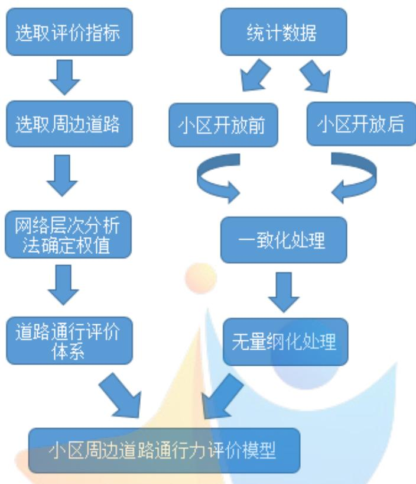  
图 1 问题一思路流程图

## 5.2 模型的建立

选用道路饱和度和道路供需差异度两个指标来反映道路服务水平。为衡量小区开放对对机动车、非机动车、行人通行能力的影响，将非机动车和行人合为一个整体即非机动，定义机动车影响因子和非机动影响因子。其中机动车影响因子用日平均交通量和日平均交通流量两个指标来衡量，非机动影响因子用非机动车摩擦系数和行人受阻系数两个指标来衡量，进而建立小区开放对周边道路通行的效果评价模型。

同时，各指标之间存在着相互影响关系，例如：日平均交通量越大意味着道路通行的车辆数越多，相应地日平均交通流密度往往也越大，而且对非机动车和行人出行产生的影响也越大等等。各指标之间连通成一个网络，小区周边道路通行的综合评价指标网络结构图如下所示：


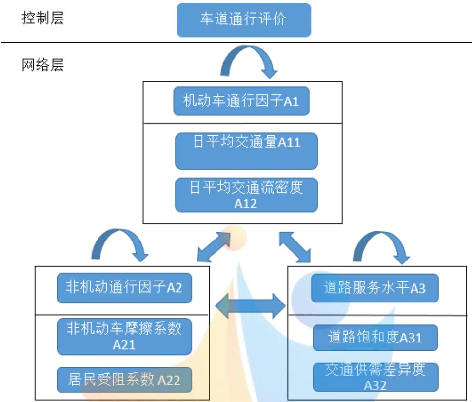  
图 2 周边道路通行评价的网络结构模型

注：图中弯形箭头表示同一一级指标下各元素之间相互影响；双向箭头表示不同一级指标下各元素之间相互影响。

对各指标进行如下定义：

## （1）日平均交通量 $\bar { V }$

交通量是指在单位时间内通过道路某一固定地点或断面的车辆数（包括机动车和非机动车），即V=N/t，其中V为交通量(辆/s)，N 为车辆数(辆)，t为观测时间（s）。

那么，日平均交通量就是一天内各次观测所得交通量的均值：

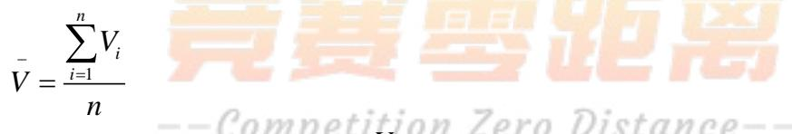

其中，n为一天内的观测次数， 为第 i时刻的交通量。

$$
V _ { i }
$$

## （2）日平均交通流密度 $K$ ：

交通流密度[1]是指在某一观测时刻，单位道路长度上存在的车辆数（包括机动车和非机动车），即 K=N/L，其中K为交通密度(辆/km)，N为车辆数(辆)，L为观测路段长度(km)。

在通常情况下，交通流量越大，交通密度也越大，但当道路交通十分拥挤、车流处于停滞状态时，交通流量近似等于零，而交通密度却接近于最大值，因此除了使用日平均交通流量指标外还需单独考虑日平均交通流密度。

日平均交通流密度表示为一天内各次观测计算所得交通流密度的均值：

$$
\overset { \displaystyle - } { K } = \frac { \sum _ { i = 1 } ^ { n } K _ { i } } { n }
$$

其中，n为一天内的观测次数， $K _ { i }$ 为第 i时刻的交通流密度。

## （3）非机动车摩擦系数 F：

小区开放虽然使得可通行道路增多，但相应地小区周边主路上进出小区的交叉路口的车辆也会增多，在主干路上的机动车会频繁变道驶入小区，这就不可避免地要途径非机动车道，从而增大了和非机动车发生摩擦的概率。定义非机动车摩擦系数为一天内在道路分岔口和机动车发生碰撞的非机动车数量与一天通过该分岔口的非机动车总数之比，即

$$
F = \frac  \sqrt { \pm 3 } \pm \sqrt { \frac { 3 } { 2 } } \pm 1 \mapsto 3 \times \{ 3 \} \times 2 \pm \sqrt { \times } \pm 7 \sqrt { \times } \pm 7 \mp 5 \times 5 \} \mp \sqrt { \times } \pm 9 \times 2 \pm \sqrt { \times } \pm 9 \times 2 \pm 1 \equiv 3 \times 2 \pm 1 \equiv 3 \times 2 \pm 1 \equiv 3 \times 2 \pm 1 \equiv 3 \times 2 \pm 1 \equiv 3 \times 4 . 5 \times 5 \times 5 \times 2 \mp 1 \equiv 5 \times 5 \times 5 \times 2 \pm 1 \equiv 3 \times 4 . 5 \times 5 \times 5 \times 2
$$

## （4）行人受阻系数 Z：

小区开放会对小区即周边居民的日常出行产生重要影响，由于出入小区的车辆增多，可能会降低主路的通行速度，进而造成交通拥堵，给行人的正常出行带来极大不便。当道路交通量超过某一特定值时，就认为此时发生了拥堵，定义行人受阻系数为一天内小区周边主

$$
Z = \frac { \overbrace { \mathbb { E } } ^ { \mathrm { i } } \mathbb { E } \mathbb { H } ^ { \mathrm { } } \mathbb { H } ^ { \mathrm { } } \mathbb { E } \mathbb { L } \mathbb { H } \mathbb { L } \mathbb { H } ^ { \mathrm { } \ne \mathbb { H } } \mathbb { H } \mathbb { H } \mathbb { H } \mathbb { H } } { \underset { \mathrm { L } \mathbb { L } } { \overset { \mathrm { i } \ } { \underbrace { \mathrm { \Pi } } } \mathbb { H } \mathbb { H } } \mathbb { H } }
$$

## （5）道路饱和度 B：

道路饱和度是反映道路服务水平的重要指标之一，饱和度值越高，代表道路服务水平越低。其计算公式为：

$$
\scriptstyle \mathrm { B = V / C }
$$

其中，V 为最大服务交通量，C 为最大通行能力。

## （6）交通供需差异度 D：

借鉴经济学中的市场供需理论，引入交通需求函数和交通供给函数，城市交通的运行状况实质上反映了城市交通系统供需双方的实力对比，因此通过计算交通供需差，用以衡量小区周边路网的服务水平。

一般把交通需求看作是土地利用水平A 和交通服务水平S 共同作用的结果[2]，则交通需求V可表示为 $\mathbf { V } { = } \mathbf { f } ( \mathbf { A } { , } \mathbf { S } )$ 。交通服务水平 S不仅依赖于交通发展水平T，同时也随交通量V发生变化，将这个关系表示为服务函数J，则J可以描述交通服务的供给：S=J(T,V)

为简化问题，通常用通行时间 t作为描述服务水平S的参数，并选用一般线性函数形式。当土地利用水平A 一定时，道路通行时间t越大，则交通需求量V越小，因此需求函数为向下倾斜的曲线，此时需求函数可表示为 $\mathrm { V } ^ { \mathrm { S } } = \alpha _ { 1 } \mathrm { t } + \beta _ { 1 } \ . ( \alpha _ { 1 } < 0 )$ ;

同样地，当交通发展水平T 一定时，交通量V越大，则道路通行时间t也越大，因此供给函数为向上倾斜的曲线，此时供给函数表示为 $\mathbf { V } ^ { D } = \alpha _ { 2 } \operatorname { t } + \beta _ { 2 } , ( \alpha _ { 2 } > 0 )$ ；

得到小区周边道路上的正常通行时间 $t _ { 0 }$ ，则可以定义交通供需差异度为时间 $t _ { 0 }$ 所对应的交通供给与交通需求之差比上两者之和的绝对值，即

$$
D = | \frac { { \mathbf { V } } ^ { D } - { \mathbf { V } } ^ { S } } { { \mathbf { V } } ^ { D } + { \mathbf { V } } ^ { S } } | = | \frac { \alpha _ { 2 } \mathrm { ~ t _ 0 + } \beta _ { 2 } - ( \alpha _ { 1 } \mathrm { ~ t _ 0 + } \beta _ { 1 } ) } { \alpha _ { 2 } \mathrm { ~ t _ 0 + } \beta _ { 2 } + ( \alpha _ { 1 } \mathrm { ~ t _ 0 + } \beta _ { 1 } ) } |
$$

交通供需函数在图中的表示如下：

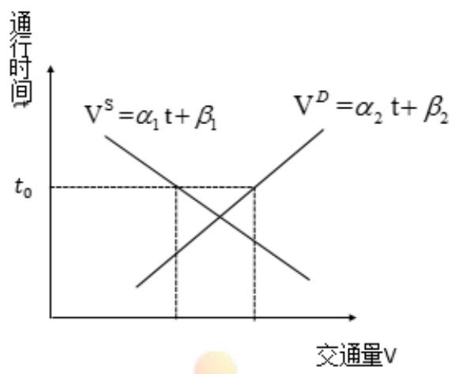  
图 3 交通系统供需函数

评价体系：

小区周边车道通行力的量化分数 P 计算公式如 ${ \mathrm { ~  ~ \mathscr ~ { ~ F ~ } : ~ } }$ ：

$$
\begin{array} { r } { \mathrm { P } = \omega _ { 1 } \overset { - } { \bar { V } } + \omega _ { 2 } \overset { - } { \bar { K } } + \omega _ { 3 } \overset { - } { F } + \omega _ { 4 } \overset { - } { \bar { Z } } + \omega _ { 5 } \overset { - } { B } + \omega _ { 6 } \overset { - } { D } } \end{array}
$$

其中， $w _ { i }$ 表示第i个指标的权重， $z _ { i }$ 表示归一化后的第i个指标的量化分数。

至此，建立小区周边道路通行评价模型：

$$
{ \bf P } = \omega _ { 1 } \bar { V } + \omega _ { 2 } \bar { K } + \omega _ { 3 } \bar { F } + \omega _ { 4 } \bar { Z } + \omega _ { 5 } \bar { B } + \omega _ { 6 } \bar { D }
$$

$$
\left( { \bar { \bar { V } } } = { \frac { \displaystyle \sum _ { i = 1 } ^ { n } V _ { i } } { n } } \right)
$$

$$
\overset { \displaystyle - } { K } = \frac { \sum _ { i = 1 } ^ { n } K _ { i } } { n }
$$

$$
\vert F = \frac  \ddagger \pm 1 \cdot \sqrt { | \mathbf { x } - \mathbf { x } | } \cdot \sum \limits _ { i = 1 } ^ { \infty } \lvert \mathbf { x } \rvert \cdot \exists j \neq 1 \cdot \forall i \neq 1 \cdot \frac { \mu _ { 2 } } { \mu _ { 1 } } \neq \mu _ { 2 } \pm 1 \cdot \mu _ { 1 } \pm \frac { \mu _ { 2 } } { \mu _ { 1 } } \neq \mu _ { 2 } \pm 1 \cdot \mu _ { 1 } \div j \} \neq \mu _ { 2 } \pm 1 \cdot \mu _ { 1 } \pm 1 \cdot \mu _ { 1 } \pm 1 \cdot \mu _ { 1 } \neq \mu _ { 2 } 
$$

$$
\boxed { Z = \frac { \sharp _ { \perp } ^ { \star } \sharp _ { \perp } ^ { \star } \sharp _ { \mathsf { X } } ^ { \star } \sharp _ { \perp } ^ { \star } \sharp _ { \sharp } ^ { \star } \sharp _ { \sharp } ^ { \star } \sharp _ { \mathsf { I } } ^ { \star } \sharp _ { \mathsf { I } } ^ { \star } \sharp _ { \mathsf { I } } ^ { \star } \sharp _ { \mathsf { I } } ^ { \star } } { \sharp _ { \mathsf { X } } ^ { \star } \sharp _ { \mathsf { I } } ^ { \star } \sharp _ { \mathsf { I } } ^ { \star } } }
$$

$$
B = V / C
$$

$$
\boxed { D = \vert \frac { { \bf V } ^ { D } - { \bf V } ^ { S } } { { \bf V } ^ { D } + { \bf V } ^ { S } } \vert = \vert \frac { \alpha _ { 2 } { \bf t } _ { 0 } + \beta _ { 2 } - ( \alpha _ { 1 } { \bf t } _ { 0 } + \beta _ { 1 } ) } { \alpha _ { 2 } { \bf t } _ { 0 } + \beta _ { 2 } + ( \alpha _ { 1 } { \bf t } _ { 0 } + \beta _ { 1 } ) } \vert }
$$

## 5.3 模型的求解

## 5.3.1 数据预处理

对小区周边道路按距离小区的远近作如下分类：一级主路是指与小区出口紧邻的道路，二级主路是指与一级主路相连的道路，三级主路是与二级主路相连的道路，具体示意图如下：

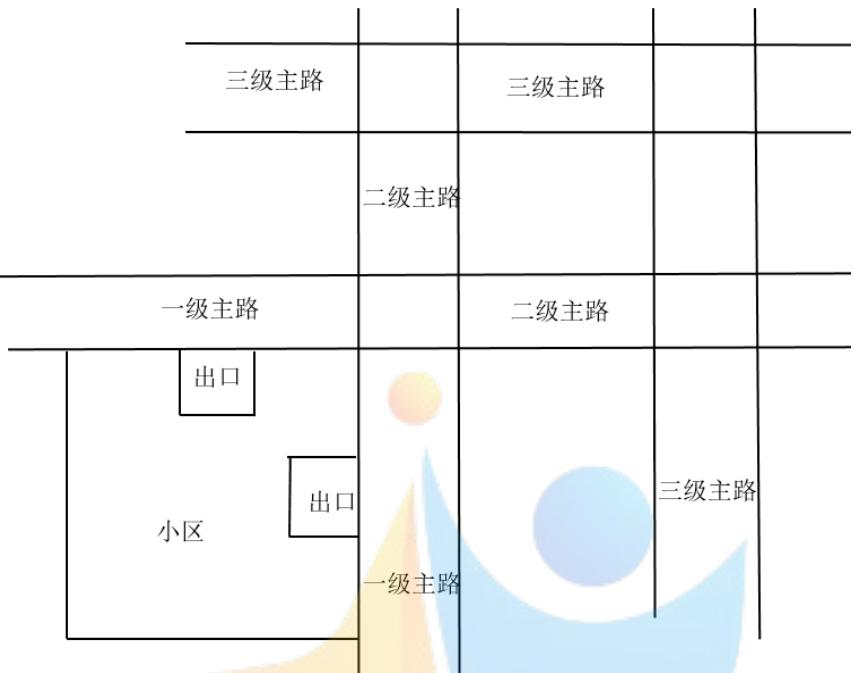  
图4 小区周边道路分布

通过查找相关资料[7]，得到广西大学附近小区路段的相关数据，对数据进行整理并利用最小二乘法估计不同时刻的交通需求函数和交通供给函数，统计结果如下表所示：

表 2 广西大学路段数据
<table><tr><td rowspan=1 colspan=1></td><td rowspan=1 colspan=1></td><td rowspan=1 colspan=1>机动/辆</td><td rowspan=1 colspan=1>非机动/辆</td><td rowspan=1 colspan=1>车辆数</td><td rowspan=1 colspan=1>机动车碰撞数/辆</td><td rowspan=1 colspan=1>拥堵时间/s</td><td rowspan=1 colspan=1>道路饱和度</td></tr><tr><td rowspan=2 colspan=1>一级主路</td><td rowspan=1 colspan=1>开放前</td><td rowspan=1 colspan=1>530</td><td rowspan=1 colspan=1>74</td><td rowspan=1 colspan=1>34</td><td rowspan=1 colspan=1>9</td><td rowspan=1 colspan=1>89</td><td rowspan=1 colspan=1>0.84</td></tr><tr><td rowspan=1 colspan=1>开放后</td><td rowspan=1 colspan=1>468</td><td rowspan=1 colspan=1>48</td><td rowspan=1 colspan=1>28</td><td rowspan=1 colspan=1>5</td><td rowspan=1 colspan=1>45</td><td rowspan=1 colspan=1>0.66</td></tr><tr><td rowspan=2 colspan=1>二级主路</td><td rowspan=1 colspan=1>开放前</td><td rowspan=1 colspan=1>544</td><td rowspan=1 colspan=1>51</td><td rowspan=1 colspan=1>30</td><td rowspan=1 colspan=1>21</td><td rowspan=1 colspan=1>107</td><td rowspan=1 colspan=1>0.71</td></tr><tr><td rowspan=1 colspan=1>开放后</td><td rowspan=1 colspan=1>525</td><td rowspan=1 colspan=1>39</td><td rowspan=1 colspan=1>29</td><td rowspan=1 colspan=1>2</td><td rowspan=1 colspan=1>97</td><td rowspan=1 colspan=1>0.68</td></tr><tr><td rowspan=2 colspan=1>三级主路</td><td rowspan=1 colspan=1>开放前</td><td rowspan=1 colspan=1>588</td><td rowspan=1 colspan=1>28</td><td rowspan=1 colspan=1>24</td><td rowspan=1 colspan=1>4</td><td rowspan=1 colspan=1>96</td><td rowspan=1 colspan=1>0.73</td></tr><tr><td rowspan=1 colspan=1>开放后</td><td rowspan=1 colspan=1>563</td><td rowspan=1 colspan=1>26</td><td rowspan=1 colspan=1>23</td><td rowspan=1 colspan=1>3</td><td rowspan=1 colspan=1>91</td><td rowspan=1 colspan=1>0.71</td></tr></table>

表 2 广西大学交通供需函数估计
<table><tr><td rowspan=1 colspan=1></td><td rowspan=1 colspan=1></td><td rowspan=1 colspan=1>需求函数</td><td rowspan=1 colspan=1>供给函数</td><td rowspan=1 colspan=1>通行时间（s）</td></tr><tr><td rowspan=2 colspan=1>一级主路</td><td rowspan=1 colspan=1>开放前</td><td rowspan=1 colspan=1>D=0.00153*t-0.0121</td><td rowspan=1 colspan=1>S=-0.00201*t+0.6527</td><td rowspan=1 colspan=1>80</td></tr><tr><td rowspan=1 colspan=1>开放后</td><td rowspan=1 colspan=1>D=0.00153*t-0.0154</td><td rowspan=1 colspan=1>S=-0.00201*t+0.6683</td><td rowspan=1 colspan=1>75</td></tr><tr><td rowspan=2 colspan=1>二级主路</td><td rowspan=1 colspan=1>开放前</td><td rowspan=1 colspan=1>D=0.00183*t-0.0207</td><td rowspan=1 colspan=1>S=-0.00211*t+0.7143</td><td rowspan=1 colspan=1>100</td></tr><tr><td rowspan=1 colspan=1>开放后</td><td rowspan=1 colspan=1>D=0.00183*t-0.0231</td><td rowspan=1 colspan=1>S=-0.00211*t+0.7316</td><td rowspan=1 colspan=1>105</td></tr><tr><td rowspan=2 colspan=1>三级主路</td><td rowspan=1 colspan=1>开放前</td><td rowspan=1 colspan=1>D=0.00185*t-0.0224</td><td rowspan=1 colspan=1>S=-0.00215*t+0.7319</td><td rowspan=1 colspan=1>100</td></tr><tr><td rowspan=1 colspan=1>开放后</td><td rowspan=1 colspan=1>D=0.00185*t-0.0237</td><td rowspan=1 colspan=1>S=-0.00215*t+0.7521</td><td rowspan=1 colspan=1>95</td></tr></table>

根据各指标的定义可计算出指标值。  
(1) 评价指标类型的一致化处理[8]

在已建立的指标体系中，指标集同时含有极大型、极小型、中间型指标，因此在评价之前必须将评价指标的类型进行一致化处理，将其统一化为极大型指标。

对于日平均交通量 $\bar { V }$ ，当道路空闲时，交通量随着车辆数的增加而增大；但当交通量大于某一特定值时，道路就会出现拥堵，交通量逐渐减小，当道路严重堵塞、车辆停滞不前时，交通量接近于 $0 _ { \circ }$ 。因此，交通量属于极大型指标，当它取最大值时，车辆均以匀速无障碍行驶，道路资源得到充分合理的利用。

对于日平均交通流密度 $\bar { V }$ ，平均交通密度过小表示车道占用率很低，道路资源没有得到充分利用；平均交通密度过大表示道路上车辆数很多，道路发生了严重拥堵，因此日平均交通流密度为中间型指标。要将其化为极大型指标，令

$$
\bar { V } = \left\{ \begin{array} { l l } { \displaystyle \frac { 2 ( \bar { V } - \mathbf { m } ) } { M - m } , \mathbf { m } \leq \bar { V } \leq \frac 1 2 ( \mathbf { M } + m ) } \\ { \displaystyle \frac { 2 ( \mathbf { M } - \bar { V } ) } { M - m } , \frac 1 2 ( \mathbf { M } + m ) \leq \bar { V } \leq M } \end{array} \right.
$$

其中，M、m分别为日平均交通流密度可能取到的最大值和最小值。

非机动车摩擦系数 F和行人受阻系数Z是用以衡量各种车辆涌入小区后产生的负外部性，因此均为极小型指标。道路饱和度B 和交通供需差异度D是用以衡量小区周边道路服务能力和实际通行量之间的匹配程度，因此也都为极小型指标。通过平移变换 ${ x _ { i } } ^ { \prime } \mathrm { = } M _ { i } \mathrm { - } x _ { i }$ 将其化为极大型指标，其中 $M _ { i }$ 为指标 $\mathrm { \dot { \langle } } x _ { i }$ 可能取到的最大值。

## (2) 评价指标的无量纲化处理

由于各评价指标的度量单位存在差别而导致了不可公度性，因此对数据进行无量纲化处理，来消除原始指标数据的差异影响。本文采用极差化的处理方法，得到归一化后的指标

$$
\stackrel { - } { z } _ { i } = \frac { z _ { i } - m _ { i } } { M _ { i } - m _ { i } }
$$

其中 $M _ { i }$ 为指标 $x _ { i }$ 可能取到的最大值， $m _ { i }$ x 为指标 可能取到的最小值。

经过处理后的指标数据如下：

表 $^ 2$ 处理后的指标值
<table><tr><td rowspan=1 colspan=1></td><td rowspan=1 colspan=1></td><td rowspan=1 colspan=1>日平均车流量</td><td rowspan=1 colspan=1>日平均车流密度</td><td rowspan=1 colspan=1>非机动摩擦系数</td><td rowspan=1 colspan=1>行人受阻系数</td><td rowspan=1 colspan=1>道路饱和度</td><td rowspan=1 colspan=1>交通供需差异度</td></tr><tr><td rowspan=2 colspan=1>一级主路</td><td rowspan=1 colspan=1>开放前</td><td rowspan=1 colspan=1>0.3360</td><td rowspan=1 colspan=1>0.375</td><td rowspan=1 colspan=1>0.273</td><td rowspan=1 colspan=1>0.501</td><td rowspan=1 colspan=1>0.629</td><td rowspan=1 colspan=1>0.714</td></tr><tr><td rowspan=1 colspan=1>开放后</td><td rowspan=1 colspan=1>0.2870</td><td rowspan=1 colspan=1>0.342</td><td rowspan=1 colspan=1>0.143</td><td rowspan=1 colspan=1>0.713</td><td rowspan=1 colspan=1>0.467</td><td rowspan=1 colspan=1>0.569</td></tr><tr><td rowspan=2 colspan=1>二级主路</td><td rowspan=1 colspan=1>开放前</td><td rowspan=1 colspan=1>0.3305</td><td rowspan=1 colspan=1>0.397</td><td rowspan=1 colspan=1>0.5</td><td rowspan=1 colspan=1>0.437</td><td rowspan=1 colspan=1>0.609</td><td rowspan=1 colspan=1>0.761</td></tr><tr><td rowspan=1 colspan=1>开放后</td><td rowspan=1 colspan=1>0.3133</td><td rowspan=1 colspan=1>0.312</td><td rowspan=1 colspan=1>0.6</td><td rowspan=1 colspan=1>0.428</td><td rowspan=1 colspan=1>0.531</td><td rowspan=1 colspan=1>0.663</td></tr><tr><td rowspan=2 colspan=1>三级主路</td><td rowspan=1 colspan=1>开放前</td><td rowspan=1 colspan=1>0.3420</td><td rowspan=1 colspan=1>0.404</td><td rowspan=1 colspan=1>0.2</td><td rowspan=1 colspan=1>0.508</td><td rowspan=1 colspan=1>0.505</td><td rowspan=1 colspan=1>0.657</td></tr><tr><td rowspan=1 colspan=1>开放后</td><td rowspan=1 colspan=1>0.3272</td><td rowspan=1 colspan=1>0.387</td><td rowspan=1 colspan=1>0.25</td><td rowspan=1 colspan=1>0.531</td><td rowspan=1 colspan=1>0.483</td><td rowspan=1 colspan=1>0.695</td></tr></table>

## 5.3.2 网络层次分析法确定权重

当指标体系建立之后，还需科学地计算各指标的权重。考虑到小区周边道路通行评价指标之间存在反馈性和相互制约关系，本文采用网络层次分析法（ANP）[3]确定评价指标的权重。网络层次分析法利用“超矩阵”对各种相互影响的因素进行综合分析得出其混合权重，可以通过提高信息过程的可靠性减少预测错误。权重的求解步骤如下：

## Step1：构造网络结构

第一部分为控制层，包括评价目标(车道通行能力)和决策准则(道路基本情况 A1、道路服务水平A2、道路疏散能力 A3），各决策准则之间相互独立并且共同决定了车道通行能力。

第二部分为网络层，由所有二级指标构成，各指标之间相互影响并且受控制层支配。

## Step2：构造指标关系影响图

运用质量屋（QFD）方法为指标间影响结构的判断提供支持，初步确定指标间的影响关系图G。将该有向图用 0-1矩阵S 的形式存储，矩阵元素为1 表示某指标对另一指标有直接影响关系，元素为0表示该指标对另一指标无直接影响关系。构造指标关系影响图对应的矩阵S如下：

$$
S = \left( \begin{array} { c } { { 0 \ 1 \ 1 \ 1 \ 1 \ 0 } } \\ { { 1 \ 0 \ 1 \ 1 \ 1 } } \\ { { 1 \ 0 \ 1 \ 0 \ 1 } } \\ { { 0 \ 0 \ 1 \ 0 \ 1 \ 1 } } \\ { { 1 \ 1 \ 0 \ 1 \ 0 \ 1 } } \\ { { 1 \ 1 \ 0 \ 1 \ 1 \ 0 } } \end{array} \right)
$$

例如， $^ { S _ { 1 2 } } _ { = 1 }$ 表示日平均交通量对日平均交通流密度有直接影响。

## Step3：求解指标影响中心度

运用建构评估模式（DEMATEL）方法求解指标影响中心度 N：

构造直接影响度矩阵 X，其中元素 $x _ { i j }$ 的设定根据下图所示的标度法：

得到

表 1 标度法示意图
<table><tr><td rowspan=1 colspan=1> $x _ { i j }$ 取值</td><td rowspan=1 colspan=1>费零距恩</td></tr><tr><td rowspan=1 colspan=1>0</td><td rowspan=1 colspan=1>指标i对指标j无直接影响</td></tr><tr><td rowspan=1 colspan=1> $^ { 1 }$ </td><td rowspan=1 colspan=1>指标i对指标j的直接影响程度为弱</td></tr><tr><td rowspan=1 colspan=1>2</td><td rowspan=1 colspan=1>指标i对指标j的直接影响程度为中</td></tr><tr><td rowspan=1 colspan=1>3</td><td rowspan=1 colspan=1>指标i对指标j的直接影响程度为强</td></tr></table>

$$
X = { \left( \begin{array} { l } { 0 \ 2 \ 1 \ 1 \ 3 \ 0 } \\ { 2 \ 0 \ 1 \ 1 \ 3 \ 1 } \\ { 1 \ 1 \ 0 \ 2 \ 0 \ 1 } \\ { 0 \ 0 \ 1 \ 0 \ 3 \ 2 } \\ { 1 \ 2 \ 0 \ 2 \ 0 \ 2 } \\ { 1 \ 1 \ 0 \ 3 \ 2 \ 0 } \end{array} \right) }
$$

矩阵D为标准化后的直接影响矩阵：

$$
d _ { i j } = \frac { x _ { i j } } { \displaystyle \operatorname* { m a x } \sum _ { j = 1 } ^ { 7 } x _ { i j } } \qquad , \quad _ { \mathrm { i } = 1 , 2 , . . . , 7 }
$$

计算矩阵 ${ \cal T } = { \cal D } ( { \bf I } - { \bf D } ) ^ { - 1 }$

将矩阵 T 中元素按行相加得到各指标对其他指标的影响度：

$$
A _ { i } = \sum _ { j = 1 } ^ { 7 } t _ { i j } \qquad , \quad _ { \mathrm { i } = 1 , 2 , . . . , 7 }
$$

将矩阵T中元素按列相加得到各指标受其他指标的影响度：

$$
B _ { i } = \sum _ { i = 1 } ^ { 7 } t _ { i j }
$$

确定某个指标在总评价体系中所占权重： $M _ { i } = A _ { i } + B _ { i }$

将向量 M 标准化得到指标影响中心度 $\mathrm { { N = ~ [ 0 . 0 8 9 0 ~ 0 . 0 0 4 8 ~ 0 . 4 1 8 8 ~ 0 . 0 3 3 5 ~ 0 . 2 1 9 8 } }$ 0.2342]

## Step4：求取影响关系矩阵 C，修正直接影响矩阵

为指标中心度设置一个合理的门限值 TT $( \mathrm { T T } \in [ 0 , 1 ] )$ ），将原指标关系影响图 E(G)中心度小于门限值的有向线去除，得到新的有向图 E(G‘)，更新 0-1 矩阵 ${ \mathsf S } ^ { \prime } .$ 。 本文设 TT=0.5，根据指定规则构造影响关系矩阵：

$$
\begin{array} { r } { \left( \begin{array} { l } { 0 \ 1 \ 1 \ 1 \ 1 } \\ { 1 \ 0 \ 0 \ 0 } \\ { t i \ 0 \ 1 \ 0 \ 0 \bar { \mathcal { V } } \ 0 } \\ { 1 \ 1 \ 1 \ 0 \ 1 \ 1 } \\ { 1 \ 1 \ 0 \ 1 \ 0 \ 1 } \\ { 1 \ 1 \ 1 \ 1 \ 1 \ 0 \ } \end{array} \right) } \end{array}
$$

修正后的直接影响矩阵：

$$
X ^ { \prime } = { \left( \begin{array} { l } { 0 \ 2 \ 1 \ 1 \ 3 \ 0 } \\ { 1 \ 0 \ 1 \ 0 \ 0 \ 0 } \\ { 1 \ 1 \ 0 \ 2 \ 0 \ 1 } \\ { 0 \ 0 \ 1 \ 0 \ 3 \ 2 } \\ { 1 \ 2 \ 0 \ 2 \ 0 \ 2 } \\ { 1 \ 1 \ 0 \ 3 \ 2 \ 0 \ } \end{array} \right) }
$$

## Step5：重复 Step2，获得指标体系中各项指标的权值

利用修正后的直接影响矩阵 X’计算修正后的中心度N’，修正后的中心度 $\mathbf { N } '$ 能够较准确地反映指标i在决策影响中的重要程度，因此可以用其衡量指标权重的相对大小。

最终得到 N’= [0.1 0.5 0.1 0.1 0.1 0.1]

利用公式 $\begin{array} { r } { \mathrm { P } = \omega _ { 1 } \overset { - } { \bar { V } } + \omega _ { 2 } \overset { - } { \bar { K } } + \omega _ { 3 } \overset { - } { \bar { F } } + \omega _ { 4 } \overset { - } { \bar { Z } } + \omega _ { 5 } \overset { - } { B } + \omega _ { 6 } \overset { - } { D } } \end{array}$ 求解出小区开放前后周边道路通力得分如下：

表 2 周边道路通行得分
<table><tr><td rowspan=1 colspan=1>车道通行得分</td><td rowspan=1 colspan=1>一级主路</td><td rowspan=1 colspan=1>二级主路</td><td rowspan=1 colspan=1>三级主路</td></tr><tr><td rowspan=1 colspan=1>开放前</td><td rowspan=1 colspan=1>0.3889</td><td rowspan=1 colspan=1>0.4095</td><td rowspan=1 colspan=1>0.4221</td></tr><tr><td rowspan=1 colspan=1>开放后</td><td rowspan=1 colspan=1>0.4328</td><td rowspan=1 colspan=1>0.4623</td><td rowspan=1 colspan=1>0.4232</td></tr></table>

结论：

(1) 小区开放后，周边一级主路的通行得分提高了 11.32%， 二级主路的通行得分提高了12.89%，三级主路的通行得分提高了 0.26%；

(2) 小区开放前，三级主路的通行得分最高，为0.4221，小区开放后，二级主路的的通行得分变为最高，为0.4623；

(3) 小区开放提升了周边道路的整体通行能力，且对二级主路产生的影响最大，对三级主路产生的影响最小。

## 5.4 直接影响矩阵的敏感性分析

考虑到选取的六个指标之间存在相互的影响关系，而由相互影响的强弱程度构造的直接影响矩阵X会对各指标最终的权值产生影响，进而影响周边道路通行力的最终得分。因此，通过改变直接影响矩阵 $\mathbf { X }$ 中元素的取值，判断指标间的相互敏感程度和指标关系变化对道路通行的影响程度。

以日平均交通流密度 $\bar { K }$ 和非机动摩擦系数 F 为例，在原直接影响矩阵中，我们设定日  
平均交通流密度 $\bar { K }$ 对非机动摩擦系数 F 的直接影响强度取值为 2，非机动摩擦系数 F 对日  
平均交通流密度 $K$ 的直接影响强度取值为1，现将其均调整为 2，仍按上述求解步骤，利用  
MATLAB软件编程求解得到修正后的指标影响中心度：N’= [0.0913 0.0633 0.3734 0.1214 0.3294 0.0213]

向量中的第i个数值即为第i个指标的影响权值。

定义指标i和指标j的相互敏感程度：

$$
\theta ( \mathrm { i } , \mathrm { j } ) = \vert \frac { \ddag \hslash \ddot { \sqrt } { \lambda } i \rlap / { \sqrt } \cdot \ddag \hslash \overline { { \Sigma } } \cdot \ddag \vert \zeta _ { \Delta } w _ { i } + \ddag \sharp \ddot { \mu } i \rlap / { \sqrt } \cdot \sqrt } { \lvert \langle \Delta \omega _ { j } \rangle } / { \lvert \langle \Delta \omega _ { j } \rangle }  { \triangle x _ { i j } + \triangle x _ { j i } } \vert \times 1 0 0 \%
$$

容易发现 $\theta ( { \mathrm { i } } , { \mathrm { j } } ) = \theta ( j , i )$

那么，日平均交通流密度 $\bar { K }$ 和非机动摩擦系数F之间的相互敏感程度 为：

$$
\begin{array} { r l } &  \theta ( 2 , 3 ) = \rvert \frac { \ddagger { \boxplus } \hslash \hslash 2 \dag \gtrsim \boxplus \hslash \hslash \hslash \hslash \hslash \hslash \hslash \hslash \hslash \hslash \hslash \hslash \hslash \hslash \hslash \hslash \hslash \hslash \hslash \hslash \hslash \hslash \hslash \hslash \hslash \hslash \hslash \hslash \hslash \hslash \hslash \hslash \hslash \hslash \hslash \hslash \hslash \hslash \hslash \hslash \hslash \hslash \hslash \hslash \hslash } \\ & { \qquad \quad \quad \quad \quad \quad \quad \quad \quad \quad \quad \quad \quad \quad \triangle x _ { 2 3 } + \triangle x _ { 3 2 } } \\ & { = \rvert \frac { ( 0 . 3 7 3 4 - 0 . 1 ) + ( 0 . 0 6 3 3 - 0 . 5 ) } { 0 + 1 } \lvert \times 1 0 0 \% = 8 . 1 7 \% } \end{array}
$$

计算调整影响强度后的小区开放前后周边道路通行力的得分值，与原有结果对比如下表：

表 3 标度法示意图
<table><tr><td rowspan=1 colspan=1>车道通行得分</td><td rowspan=1 colspan=1></td><td rowspan=1 colspan=1>一级主路</td><td rowspan=1 colspan=1>二级主路</td><td rowspan=1 colspan=1>三级主路</td></tr><tr><td rowspan=2 colspan=1>调整影响强度前</td><td rowspan=1 colspan=1>开放前</td><td rowspan=1 colspan=1>0.4328</td><td rowspan=1 colspan=1>0.4623</td><td rowspan=1 colspan=1>0.4232</td></tr><tr><td rowspan=1 colspan=1>开放后</td><td rowspan=1 colspan=1>0.3889</td><td rowspan=1 colspan=1>0.4095</td><td rowspan=1 colspan=1>0.4221</td></tr><tr><td rowspan=2 colspan=1>调整影响强度后</td><td rowspan=1 colspan=1>开放前</td><td rowspan=1 colspan=1>0.4396</td><td rowspan=1 colspan=1>0.5119</td><td rowspan=1 colspan=1>0.3735</td></tr><tr><td rowspan=1 colspan=1>开放后</td><td rowspan=1 colspan=1>0.3538</td><td rowspan=1 colspan=1>0.5134</td><td rowspan=1 colspan=1>0.3861</td></tr></table>

同理，原设定日平均交通流密度 $K$ 对行人受阻因素 Z 的直接影响强度取值为 2，行人受阻因素 Z 对日平均交通流密度 $\bar { K }$ 的直接影响强度取值为 0，现将日平均交通流密度 $\bar { K }$ 对行人受阻因素Z的直接影响强度调整为 3，则依据上述计算方法可得：

$$
\theta ( 2 , 4 ) = 2 6 . 1 2 \%
$$

表 4 标度法示意图
<table><tr><td rowspan=1 colspan=1>车道通行得分</td><td rowspan=1 colspan=1></td><td rowspan=1 colspan=1>一级主路</td><td rowspan=1 colspan=1>二级主路</td><td rowspan=1 colspan=1>三级主路</td></tr><tr><td rowspan=2 colspan=1>调整影响强度前</td><td rowspan=1 colspan=1>开放前</td><td rowspan=1 colspan=1>0.4328</td><td rowspan=1 colspan=1>0.4623</td><td rowspan=1 colspan=1>0.4232</td></tr><tr><td rowspan=1 colspan=1>开放后</td><td rowspan=1 colspan=1>0.3889</td><td rowspan=1 colspan=1>0.4095</td><td rowspan=1 colspan=1>0.4221</td></tr><tr><td rowspan=2 colspan=1>调整影响强度后</td><td rowspan=1 colspan=1>开放前</td><td rowspan=1 colspan=1>0.4721</td><td rowspan=1 colspan=1>0.5638</td><td rowspan=1 colspan=1>0.4086</td></tr><tr><td rowspan=1 colspan=1>开放后</td><td rowspan=1 colspan=1>0.3594</td><td rowspan=1 colspan=1>0.5574</td><td rowspan=1 colspan=1>0.4322</td></tr></table>

结论：

（1）两次直接影响矩阵的调整均使一三级主路的通行得分减少大约 15%，二级主路的通行得分上升约5%。

（2）直接关系矩阵中元素的微小波动会引起所有周边道路通行得分较大的变化，这表明道路通行能力对各指标间相互影响关系的强弱变化比较敏感；

（3）日平均交通流密度 $\bar { K }$ 和非机动摩擦系数 F 之间的相互敏感程度为 ，日平均交通流密度 $\bar { K }$ 和行人受阻因素 Z 之间的相互敏感程度为 26.12%，说明日平均交通流密度对行人

## 六、问题二：基于拼接原理的车辆通行模型

## 6.1 问题的分析

由于现实生活中，各个道路交错链接，错综复杂，所以本文将城市道路网分为车道和路口两种类型，其中车道包括无红绿灯直行车道、有红绿灯直行车道，路口包括无红绿灯 T型路口、有红绿灯 T 型路口、无红绿灯十字路口、有红绿灯十字路口。下面对这几个基本道路结构单独进行讨论，分别建立车辆通行的数学模型，城市中实际的通行路线则可以由上述几个部分拼接而成。

比如：将道路抽象成一条直线，路口抽象成一个点，从 A 点沿红色路线到达 B 点可以先后由无红绿灯直行车道—有红绿灯直行车道--无红绿灯直行车道--无红绿灯十字路口--无红绿灯直行车道—有红绿灯十字路口--无红绿灯直行车道--无红绿灯 T 型路口--无红绿灯直行车道连接而成。

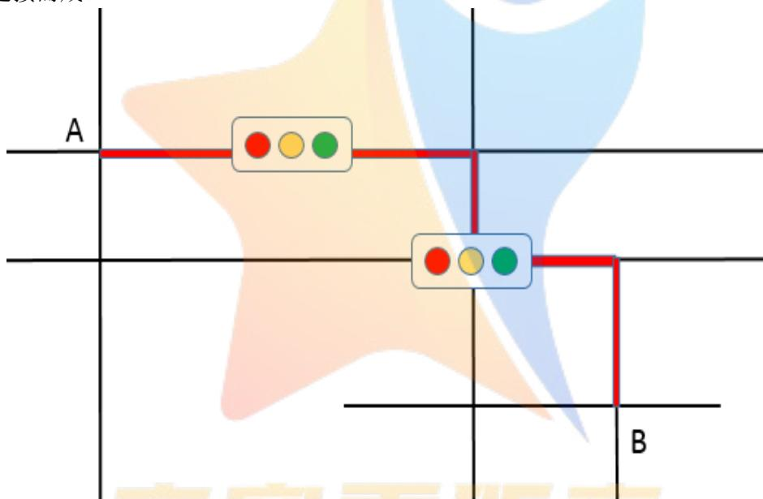  
图 5 基本道路结构连通图

## 6.2模型的建立CompetitionZeroDistance--

分别建立每一个基本道路结构的车辆通行模型，得到每一个道路基本结构的通行时间函数。借鉴经济学中的一价定理可知，任意连接两地点的不同线路的行驶时间最终都会趋于相同，如果从A到B 的路线1通行时间小于路线2，那么就会有更多的车辆选择路线 1，进而增大了路线1的车流量，降低了路线1 车辆行驶速度；同时路线2的车流量减少，道路平均车速增大，只有当路线 1和路线2的通行时间相同时，系统才会达到平衡。

因此，通过将基本道路结构连接，得到研究范围内任意两地点间某一特定路线的通行时间总函数，按照不同路线通行时间相同的原则可求解出各个车道的车流量函数。由于车辆通行时间与车道车流量密切相关，将车流量函数代入通行时间函数便得到了最终的通行时间总函数。具体建模思路如下：

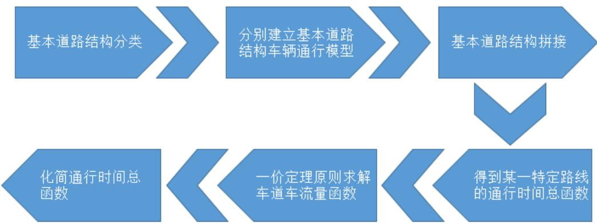  
图 6 问题二建模流程图

将城市道路网分为车道和路口两种类型，其中车道包括无红绿灯直行车道、有红绿灯直行车道，路口包括无红绿灯 T 型路口、有红绿灯 T 型路口、无红绿灯十字路口、有红绿灯十字路口。下面依次建立每一种基本道路结构的车辆通行子模型：

## 无红绿灯直行车道：

无红绿灯直行车道是指没有分岔口和红绿灯的道路，其长度不包括由前方红绿灯引起的车辆排队长度。

在无红绿灯直行车道上，车辆通行时间并不总是恒定的，通行时间与道路车流量等因素密切相关。一般地，车流量大时，车辆行驶速度慢、通行时间长；车流量小时，道路畅通无阻，车辆的通行时间短。

路阻函数是衡量道路通行时间与车流量的关系，著名的美国联邦公路局路阻模型只考虑了机动车交通负荷的影响，但它并不适用机动车和非机动车并存的城市道路，因此本文选用Davidson 路阻函数[4]来衡量无红绿灯直行车道上通行时间与车流量的关系。车辆通行的数学表达式为：

$$
T _ { \varrho } = T _ { \circ } ( 1 + \alpha \frac { Q / Q _ { \mathrm { m a x } } } { 1 - Q / Q _ { \mathrm { m a x } } } ) = T _ { \circ } \frac { 1 - ( 1 - \alpha ) Q / Q _ { \mathrm { m a x } } } { 1 - Q / Q _ { \mathrm { m a x } } }
$$

其中 $T _ { \varrho }$ 表示车流量为Q 时的行驶时间， $T _ { 0 }$ 为可自由行驶时的直行车道行驶时间，Q 为该无红绿灯直行车道的车流量。

为服务水平参数，服务水平参数与道理类型、道路宽度、交通信号与行人过街的频率有关，一般认为快速干道可取 0-0.2，城市干道取0.4-0.6，集散道路取1-1.5。

$Q _ { \mathrm { m a x } }$ 为道路实际通行能力，计算表达式[5]为 $Q _ { \operatorname* { m a x } } = C B \cdot N \cdot f w \cdot f H V \cdot f p$ ，其中 CB为道路基本通行能力（CB=1000v/L，v 为道路通行速度，L 为两车头间最小距离）；N 为单向车行道的车道数；fw 为车道宽度和侧向净宽对通行能力的修正系数；fHV 为大型车对通行能力的修正系数（fHV=1/[1+ PHV（EHV-1）]，EHV 是大型车换算成小客车的车辆换算系数；PHV是大型车交通量占总交通量的百分比)； $\mathrm { f p }$ 驾驶员条件对通行能力的修正系数，一般取值在0.9\~1之间。

## 无红绿灯T型路口：

无信号灯 T 型路口直行车辆的时抗主要来源于两个地方：第一是进入 T 型路口的车辆

换道对于直行车辆的影响，二是直行汽车需要避让从 T型路口出来的车辆。示意图如下：

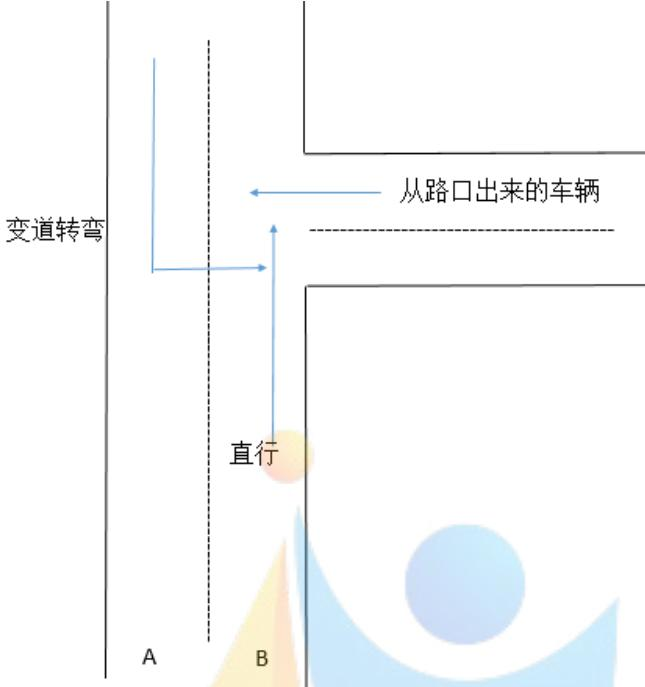  
图 7 无红绿灯 T型路口直行车辆

换道对直行车辆造成的平均延误时间：

设车道 A 上的车流量为 $Q _ { A }$ ，车道 B 上的车流量为 $Q _ { B }$ ，车道 A 上需要换道的车辆比例为 $a _ { 1 }$ ，车道B 上继续直行的车辆比例为 $b _ { 1 }$ ，那么 $a _ { 1 } \cdot Q _ { A }$ 即为车道A 上的需要换道的车流量，$b _ { 1 } \cdot Q _ { B }$ 即为车道B 上继续直行的车流量。 $t _ { \sharp \sharp }$ 为车辆在正常路况下从A 车道开始换道到完全驶入B 车道的平均换道时间，因此平均每辆直行车的延误时间为

$$
\frac { a _ { 1 } \cdot Q _ { _ { A } } \cdot t _ { \ddagger } } { b _ { 1 } \cdot Q _ { _ { B } } } \circ
$$

由于换道对直行车产生的影响还与路况有关，当车道 B 非常空旷时，直行车受到的影响相对较小，当车道 B 拥堵时，换道会恶化直行车的通行能力。因此对上述平均延误时间乘上一个修正因子 $\frac { q } { K }$ ，其中 K 为道路最大车流量密度， $\mathbf { q }$ 为车道 B 的车流量密度，得到最终的换道延误时间：

$$
T _ { \sharp \sharp } = \frac { a _ { 1 } \cdot Q _ { A } \cdot t _ { \ddagger } } { b _ { 1 } \cdot Q _ { B } } \cdot \frac { q } { K }
$$

避让对直行车辆造成的平均延误时间：

设从T 型路口出来的车流量为Q+，每辆车在正常路况下的平均转弯时间为 $\textbf { t } _ { \# \frac { k } { 2 } }$ ，按照上述思路，则平均每辆直行车的避让时间：

$$
T _ { \mathrm { i } \mathrm { E } } { = } \frac { Q ^ { + } \cdot t _ { \ast \pm } } { b _ { 1 } \cdot Q _ { B } } \cdot \frac { q } { K }
$$

综上，直行车辆在无红绿灯T型路口的时间阻抗为

$$
T _ { \mathrm { g i t } } = \frac { a _ { 1 } \cdot Q _ { A } \cdot t _ { \ddagger } } { b _ { 1 } \cdot Q _ { B } } \cdot \frac { q } { K } + \frac { Q ^ { + } \cdot t _ { \ddagger } } { b \cdot Q _ { B } } \cdot \frac { q } { K }
$$

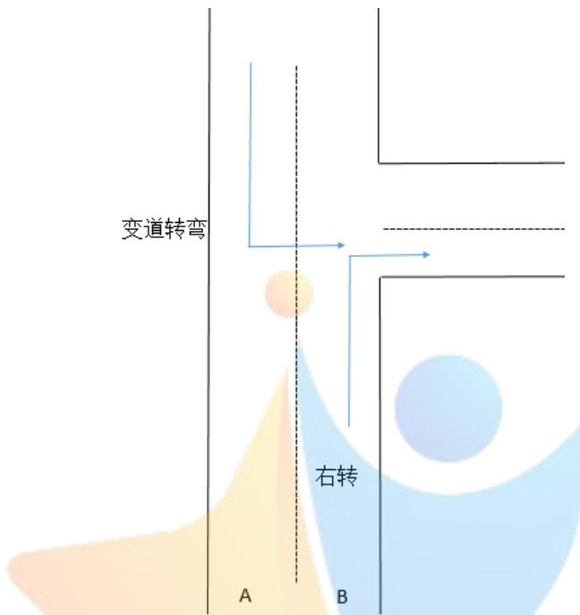  
图 8 无红绿灯 T型路口右转车辆

同样地，右转车辆在无红绿灯 T 型路口只受到车辆换道的影响，不必避让从 T 型路口出来的车辆，因此 $T _ { _ { \perp \perp \perp } } = \frac { a _ { 1 } \cdot Q _ { A } \cdot t _ { \frac { 4 } { 5 } } } { b _ { 2 } \cdot Q _ { B } } \cdot \frac { q } { K }$ $a _ { 1 }$ 为车道A 上需要换道的车辆比例， $b _ { 2 }$ 为车道B上右转的车辆比例 $( \ b _ { 1 } + b _ { 2 } = 1 )$

变道转弯车辆即左转车辆在无红绿灯 T 型路口通行只因避让直行车辆和 T 型路口涌出的左转车辆而受到影响，因此 $T _ { \underline { { { \widehat { \tau } } } } \underline { { { \mathrm { i } } } } \underline { { { \mathrm { k } } } } } = \frac { \eta Q ^ { + } \cdot t _ { \scriptscriptstyle { \frac { + + } { < } } } + b _ { 1 } \cdot Q _ { \scriptscriptstyle B } \cdot t _ { \scriptscriptstyle { \frac { + } { | \bar { \tau } } } } } { a _ { 1 } \cdot Q _ { \scriptscriptstyle A } } \cdot \frac { q ^ { \prime } } { K }$ ，其中 为从T 型路口出来的车流量中左转的比例， $t _ { \mathrm { \uparrow \downarrow } } \mathrm { \not = \cdot \not { b } }$ 直行车辆在正常路况下通过 T型路口的时间， $q ^ { \prime }$ 为车道A 的车流量密度。

## 无红绿灯十字路口：

由于无信号灯十字路口一般只在小区内部的单行车道存在，所以在考虑无信号灯十字路口通行情况时，本文不再考虑换道延误，只考虑避让延误。

车辆在十字路口选择行驶的方向不同，需要避让其他车的情形也不同。

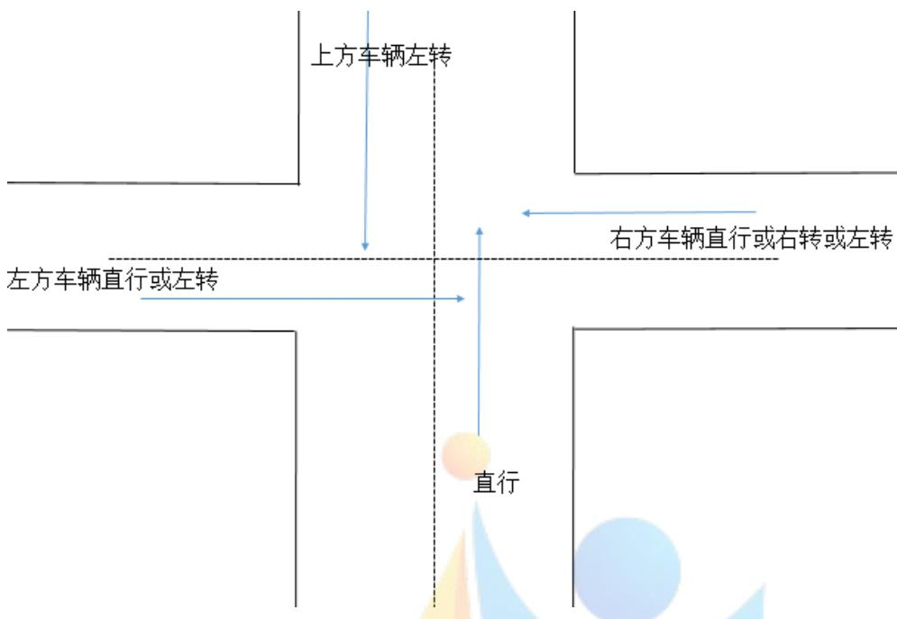  
图 9 无红绿灯十字路口直行车辆

对于下方的直行车辆，如上图所示，右方车辆选择直行或右转或左转、上方车辆选择左转、左方车辆选择直行或左转都会阻碍到下方车辆的正常通行，下方直行车辆由于避让产生的总的延误时间可以表示为 $T _ { \perp \perp \perp } = \frac { ( Q _ { \scriptscriptstyle \mp \mp \mp } + Q _ { \scriptscriptstyle \mp \mp \mp } + Q _ { \scriptscriptstyle \mp \mp \pm } + Q _ { \scriptscriptstyle \mathrm { E } \not \mp } + Q _ { \scriptscriptstyle \pm \pm } + Q _ { \scriptscriptstyle \pm \mp \pm } ) \cdot t } { Q _ { \scriptscriptstyle \mp \mp } } \cdot \frac { q } { K }  { \frac { \mathscr { Q } _ { \scriptscriptstyle \mp } } { K } } .$ ，其中 t为避让单位车辆的平均时间， $Q _ { \mathrm { \# B } }$ 表示右方直行的车流量，其他变量的解释类似， $Q _ { \boxplus }$ 为下方直行的车流量，K为道路最大车流量密度，q为下方车道的车流量密度。

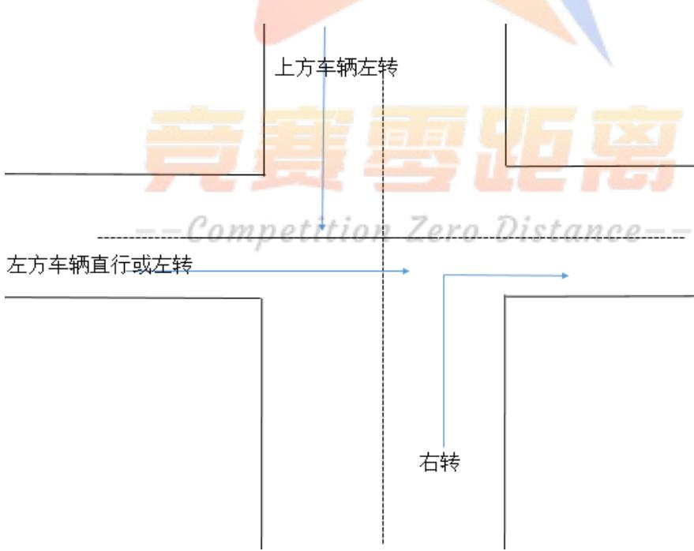  
图 10 无红绿灯十字路口右转车辆

对于下方的右转车辆，如上图所示，上方车辆选择左转、左方车辆选择直行或左转都会阻碍到下方车辆的正常通行，下方右转车辆由于避让产生的总的延误时间可以表示为$T _ { \mathrm { E i k } } = \frac { ( Q _ { \mathrm { E \cdot E } } + Q _ { \mathrm { E \cdot E } } + Q _ { \mathrm { E \cdot E } } ) \cdot t } { Q _ { \mathrm { E } } } \cdot \frac { q } { K }$ ，其中t为避让单位车辆的平均时间， $Q _ { \mathrm { { E } \it { \ / \ / \ / } } }$ 表示上方左转的车流量，其他变量的解释类似， $Q _ { \mathit { \mathrm { E } } }$ 为下方右转的车流量，K 为道路最大车流量密度，q为下方车道的车流量密度。

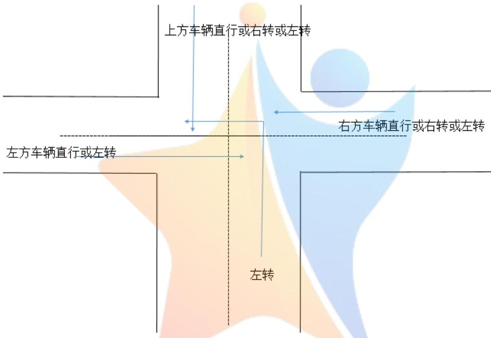  
图 11 无红绿灯十字路口左转车辆

对于下方的左转车辆，如上图所示，右方车辆选择直行或右转或左转、上方车辆选择直行或右转或左转、左方车辆选择直行或左转都会阻碍到下方车辆的正常通行，下方左转车辆由于避让产生的总的延误时间可以表示为

$$
T _ { \mathrm { E i f s } } = \frac { ( Q _ { \mathrm { E i f f } } + Q _ { \mathrm { E i f f } } + Q _ { \mathrm { E i f f } } + Q _ { \mathrm { E i f f } } + Q _ { \mathrm { E i f f } } + Q _ { \mathrm { E i f f } } + Q _ { \mathrm { E i f f } } + Q _ { \mathrm { E i f f } } + Q _ { \mathrm { E i f f } } + Q _ { \mathrm { E i f f } } ) \cdot t _ { \mathrm { 0 } } } { Q _ { \mathrm { E } } } \cdot \frac  \sharp \sharp \ : \mathrm { H } \ : \mathfrak { H } \ : \mathfrak { H } \ : \mathrm { H } \ : \mathrm { H } \ : \mathrm { H } \ : \mathrm { H } \ : \mathrm { H } \ : \mathrm { H } \ : \mathrm { H } \ : \mathrm { H } \ : \mathrm { H } \ : \mathrm { H } \ : \mathrm { H } \ : \mathrm { H } \ : \mathrm { H } \ : \mathrm { H } \ : \mathrm { H } \ : \mathrm { H } \ : \mathrm { H } \ : \mathrm { H } \ : \mathrm { H } \ : \mathrm { H } \ : \mathrm { H } \ : \mathrm { H } \ : \mathrm { H } \ : \mathrm { H } \ : \mathrm { H } \ : \mathrm { H } \ : \mathrm { H } \ : \mathrm { H } \ : \mathrm { H } \ : \mathrm { H } \ : \mathrm { H } \ : \mathrm { H } \ : \mathrm { H } \ : \mathrm { H } \ : \mathrm { H } \ : \mathrm { H } \ : \mathrm { H } \ : \mathrm { H } \ : \mathrm { H } \ : \mathrm { H } \ : \mathrm { H } \ : \mathrm { H } \ : \mathrm { H } \ : \mathrm { H } \ : \mathrm { H } \ : \mathrm { H } \ : \mathrm { H } \ : \mathrm { H } \ : \mathrm { H } \ : \mathrm { H } \ : \mathrm { H } \ : \mathrm { H } \ : \mathrm { H } \ : \mathrm { H } \ : \mathrm { H } \ : \mathrm { H } \ : \mathrm { H } \ : \mathrm { H } \ : \mathrm { H } \ : \mathrm { H } \ : \mathrm { H } \ : \mathrm { H } \ : \mathrm { H } \ : \mathrm { H } \ : \mathrm { H } \ : \mathrm { H } \mathrm { H } \ : \mathrm { H } \ : \mathrm { H } \mathrm { H } \ : \mathrm { H } \mathrm { H } \ : \mathrm { H } \mathrm { H } \ : \mathrm { H } \mathrm { H } \ : \mathrm { H } \mathrm 
$$

车辆的平均时间， $Q _ { \mathrm { \# B } }$ 表示右方直行的车流量，其他变量的解释类似， $Q _ { \mathit { \Sigma } }$ 为下方左转的车流量，K 为道路最大车流量密度，q 为下方车道的车流量密度。

红绿灯路口：

在遇到红绿灯路口时，车辆将会因为等待红灯而遭到时间延误，在交叉口路段的时间延误称为时间阻抗。对交叉口路段的时间阻抗的讨论又可分为道路拥堵与不拥堵两种情形：

在道路未出现堵塞时，Webster函数是衡量交叉口时间阻抗的一种可靠的公式[6]：

$$
T = \frac { T _ { c } ( 1 - \lambda ) ^ { 2 } } { 2 ( 1 - \lambda \mathrm { \lambda } \mathrm { x } ) } + \frac { x ^ { 2 } } { 2 q e ( 1 - \mathrm { x } ) } - 0 . 6 5 ( \frac { T _ { c } } { q e ^ { 2 } } ) ^ { \frac { 1 } { 3 } } x ^ { ( 2 + 5 \mathrm { x } ) }
$$

其中，T为时间阻抗即车辆经过交叉口所用时间； $T _ { c }$ 为信号灯周期长； $\lambda$ 为绿信比；qe 为进口处交通流量；x为道路饱和度。

Webster函数在衡量过饱和道路的信号灯交叉口时间阻抗时，衡量效果不佳，因此在交叉口出现拥堵状况时车辆通行模型需另外考虑。当车道车流量大于道路实际通行能力时，认为道路发生了拥堵，由于拥堵将会造成排队现象，由参考文献[7]，信号灯交叉口的排队长度可以表示为：

$$
Q u = \left\{ \begin{array} { l l } { \displaystyle 3 ( \mathbf { x } - \mathbf { x } _ { 0 } ) } \\ { \displaystyle 2 ( 1 - \mathbf { x } ) } \\ { \displaystyle 0 , x \leq x _ { 0 } } \end{array} \right. , x > x _ { 0 }
$$

其中 $x _ { 0 } = 0 . 6 7 + \frac { g S } { 6 0 0 } , x = \frac { r T _ { c } } { S g }$ $T _ { c }$ 为信号灯周期长，g为有效绿灯时间，r为车辆到达率，S 为饱和流率，x为饱和度。

设一个绿灯时长内一个车道通过停止线的车流量为 w，则

$$
w = \frac { - \sqrt { 5 ^ { 2 } - 3 x ^ { 2 } } / \mathrm { H } ^ { 2 } / \mathrm { H } + 1 7 } { - \frac { 4 } { 9 9 9 4 } \frac { - 3 } { 5 0 } \frac { - 6 } { 1 0 0 } \frac { - 1 } { 1 7 } \frac { - 3 } { 1 7 } ( 1 - \frac { 4 } { 9 } ) ^ { 2 } \mathrm { H } + 1 7 1 \mathrm { H } }
$$

通过的车辆长度 $L { = } w ( \mathrm { l } _ { 0 } { + } \mathrm { l } _ { 1 } )$ ，其中l0为标准车当量长度，l1 为车辆车头距离前一辆车车尾的间隔长度。

因此，选用Auatralian延误函数表示道路拥堵时平均每辆车通过红绿灯路口的时间（时抗）： $\mathrm { T } _ { \{ \lesseq \exists \cdot \forall \cdot \} \mathrm { J } } = \frac { Q u } { L } \cdot T _ { c }$

上述道路拥堵与不拥堵两种情形的时抗公式适用于有红绿灯T 型路口和有红绿灯十字路口，对于不同车道上车辆的时间阻抗，参数取对应车道上的交通流量。

有红绿灯直行车道和有红绿灯T 型路口可视为是有红绿灯十字路口的一种特殊情形，因此仅讨论有红绿灯十字路口不同车道上的通行模型。

有红绿灯十字路口：

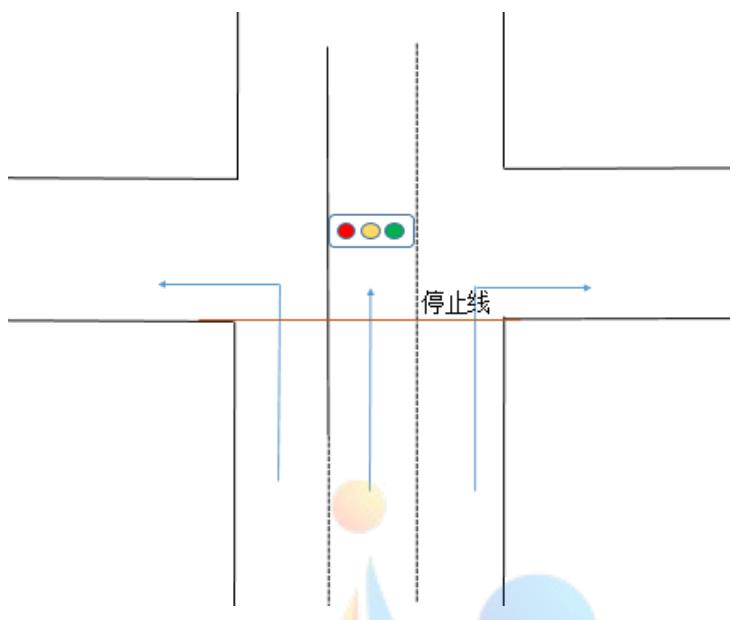  
图 12 无红绿灯十字路口示意图

对于向左行驶的车辆和直行车辆，当车道畅通时，车辆通行时间用Webster函数表示，其中 $\mathsf { q }$ 分别为该路口向左转的车流量和直行的车流量。当车道拥堵时，车辆通行时间用 Line函数表示。

对于右转车辆，虽然其可以不用等待红灯而自动通行，但是直行车辆可能会占据右行车道，从而降低了右行车辆的通行能力。所以对于右行车道畅通时，右行车辆的通行时间可看做是无红绿灯直道通行时间：

$$
T _ { \varrho } = T _ { \mathfrak { o } } ( 1 + \alpha \frac { Q / Q _ { \mathrm { m a x } } } { 1 - Q / Q _ { \mathrm { m a x } } } ) = T _ { \mathfrak { o } } \frac { 1 - ( 1 - \alpha ) Q / Q _ { \mathrm { m a x } } } { 1 - Q / Q _ { \mathrm { m a x } } }
$$

当右行车道拥堵时，右行车辆的通行时间为：

$$
T _ { \mathit { \Pi } } = \frac { p } { 1 - p } \cdot \frac { Q _ { \mathit { \widehat { \ A } } \mathit { \{ B } } }  { L } \cdot T _ { c }
$$

右转车道上的直行车流量其中， $p =$ +右转车道上的直行车流量 直行车道上的车流量 用以衡量右转车辆通行被挡的概率，<sup>Q邻</sup>为直行车道上的车流量，L 为一次信号灯通过的车辆长度， 为信号 $Q _ { ☉ }$ $T _ { c }$ 灯周期长。

有红绿灯直行车道的通行情况和有红绿灯十字路口处直行车辆的通行情况可近似认为相同，只是有红绿灯直行车道的车流量相对较少，信号灯周期较十字路口处的会短一些。因此，当车道畅通时，车辆通行时间用Webster函数表示，其中qe 为进口处车流量。当车道拥堵时，车辆通行时间用Line 函数表示。

有红绿灯 T 型路口直行车道的通行情况和有红绿灯十字路口处直行车辆的通行情况大致相同；直接转弯车辆即右转车辆的通行情况和有红绿灯十字路口处右转车道上车辆的通行情况大致相同；变道转弯车辆即左转车辆的通行情况和有红绿灯十字路口处左转车道上车辆

的通行情况大致相同。

城市中任意两节点间的通行路线可以由上述6种基本道路结构连接而成，那么车辆在任意两节点间的通行时间可由通过 种基本道路结构的不同时间组合而成。通过对 种基本道路结构下车辆通行情形的讨论，最终将其归结为5种车辆通行子函数。至此，建立基于拼接原理的车辆通行总模型：

$$
\begin{array} { r l } { \varepsilon _ { 1 } ^ { \prime } \cdot \sum _ { j = 1 } ^ { 3 / 3 } \lambda _ { j } ^ { \prime \prime } } & { = \lambda _ { j } ^ { \prime \prime } \sum _ { k = 1 } ^ { 3 / 3 } \lambda _ { j } ^ { \prime \prime } \lambda _ { j } ^ { \prime \prime } + \lambda _ { j } ^ { \prime \prime } \sum _ { \ell = 1 } ^ { 3 } \lambda _ { j } ^ { \prime \prime } } \\ & { \quad : \gamma _ { 0 } ^ { \prime } \varepsilon _ { 1 } ^ { \prime \prime } = \lambda _ { j } ^ { \prime \prime } \sum _ { \ell = 1 } ^ { 3 } \lambda _ { j } ^ { \prime \prime } \varepsilon _ { 1 } ^ { \prime \prime } + \lambda _ { j } ^ { \prime \prime } \varepsilon _ { 1 } ^ { \prime \prime } + \lambda _ { j } ^ { \prime \prime } \varepsilon _ { 1 } ^ { \prime \prime } } \\ & { \quad - \left[ \frac { \lambda _ { j } ^ { \prime \prime } } { \lambda _ { j } } \varepsilon _ { 1 } ^ { \prime \prime } \sum _ { \ell = 1 } ^ { 3 } \lambda _ { j } ^ { \prime \prime } \varepsilon _ { 1 } ^ { \prime \prime } + \lambda _ { j } ^ { \prime \prime } \varepsilon _ { 1 } ^ { \prime \prime } + \lambda _ { j } ^ { \prime \prime } \varepsilon _ { 1 } ^ { \prime \prime } + \lambda _ { j } ^ { \prime \prime } \varepsilon _ { 1 } ^ { \prime \prime } \right] } \\ & { \quad - \lambda _ { j } ^ { \prime \prime } \varepsilon _ { 1 } ^ { \prime \prime } \frac { \lambda _ { j } ^ { \prime \prime } } { \lambda _ { j } ^ { \prime \prime } } \varepsilon _ { 1 } ^ { \prime \prime } + \lambda _ { j } ^ { \prime \prime } \varepsilon _ { 1 } ^ { \prime \prime } } \\ & { \quad \quad \quad \quad \quad \quad \quad \quad \quad \quad \quad \quad \quad \quad \quad \quad \quad \quad \quad \quad \quad \quad \quad \quad \quad \quad \quad \quad \quad \quad \quad \quad \quad \quad \quad \quad \quad \quad \quad \quad \quad \quad } \\ &  \quad \quad \quad \quad \quad \quad \quad \quad \quad \quad \ \end{array}
$$

其中， $T _ { \mathrm { 1 } } ( \mathrm { Q } _ { \mathrm { 1 } } )$ 为无红绿灯直行车道通行子函数， $T _ { 2 } ( \mathbf { Q } _ { 2 } )$ 为无红绿灯T型路口通行子函数， $T _ { 3 } ( \mathbf { Q } _ { 3 } )$ 为无红绿灯十字路口通行子函数， $T _ { 4 } ( \mathrm { Q } _ { 4 } )$ 为有红绿灯直行车道和有红绿灯 T型路口或十字路口的直行车道和左转车道的通行子函数， $T _ { 5 } ( \mathrm { Q } _ { 5 } )$ 为有红绿灯 T 型路口或十字路口的右转车道的通行子函数。

## 6.3 模型求解所需参数：

<table><tr><td rowspan=1 colspan=1>参数</td><td rowspan=1 colspan=1>含义</td><td rowspan=1 colspan=1>单位</td></tr><tr><td rowspan=1 colspan=1>Q</td><td rowspan=1 colspan=1>某车道的车流量</td><td rowspan=1 colspan=1>辆/s</td></tr><tr><td rowspan=1 colspan=1> $Q _ { \mathrm { m a x } }$ </td><td rowspan=1 colspan=1>道路实际通行能力</td><td rowspan=1 colspan=1>辆/s</td></tr><tr><td rowspan=1 colspan=1> $\mathrm { K }$ </td><td rowspan=1 colspan=1>道路最大通行密度</td><td rowspan=1 colspan=1>辆/m</td></tr><tr><td rowspan=1 colspan=1> $\mathrm { q }$ </td><td rowspan=1 colspan=1>某车道的车流量密度</td><td rowspan=1 colspan=1>辆/m</td></tr><tr><td rowspan=1 colspan=1> $\boldsymbol { Q } ^ { + }$ </td><td rowspan=1 colspan=1>从T型路口出来的车流量</td><td rowspan=1 colspan=1>辆/s</td></tr><tr><td rowspan=1 colspan=1> $T _ { c }$ </td><td rowspan=1 colspan=1>信号灯周期长</td><td rowspan=1 colspan=1>S</td></tr><tr><td rowspan=1 colspan=1> $\lambda$ </td><td rowspan=1 colspan=1>绿信比</td><td rowspan=1 colspan=1>一</td></tr><tr><td rowspan=1 colspan=1> $\mathbf { X }$ </td><td rowspan=1 colspan=1>道路饱和度</td><td rowspan=1 colspan=1>1</td></tr><tr><td rowspan=1 colspan=1> $\mathbf { g }$ </td><td rowspan=1 colspan=1>有效绿灯时间</td><td rowspan=1 colspan=1>S</td></tr><tr><td rowspan=1 colspan=1>r</td><td rowspan=1 colspan=1>交叉口车辆到达率</td><td rowspan=1 colspan=1>辆/s</td></tr><tr><td rowspan=1 colspan=1> $\mathrm { L }$ </td><td rowspan=1 colspan=1>一次信号灯通过的车辆长度</td><td rowspan=1 colspan=1>m</td></tr></table>

## 6.4 模型求解步骤：

## Step1：确定小区开放前的路线构成

选取所要研究的起始点和目的点，将小区开放前可以连通起始点和目的点的路线 1划分成若干基本道路结构。

## Step2：计算基本道路结构的车辆通行时间

查找小区周边道路数据，确定各基本道路结构下车辆通行时间函数的参数，求解车辆在各基本道路结构下的通行时间。

## Step3：计算车辆通行总时间

将各基本道路结构下的通行时间进行加总，得到小区开放前车辆从起始点前往目的点的通行总时间。

## Step4：确定小区开放后的路线构成

小区开放会使小区出口处的道路基本结构发生变化，因此重新将路线1 划分成若干基本道路结构。

## Step5：计算小区开放后基本道路结构的车辆通行时间

小区开放后会增加从起始点到目的点的通行路线 2，进而对原有路线的车流量产生影响。查找小区开放后更新的道路数据，确定各基本道路结构下车辆通行时间函数的参数，若基本道路结构下的车流量已知，则转 Step7，否则转 Step6。

## Step6：基本道路结构车流量预测

借鉴经济学中的一价定理可知，任意连接两地点的不同线路的行驶时间最终都会趋于相同。利用路线1 的通行总时间 $T _ { \underline { { \mathrm { s } } } . 1 } { = } \sum T _ { i } ( \mathrm { Q } _ { \mathrm { i } } )$ =路线 2的通行总时间 $T _ { \check { \iota } \check { \iota } 2 } { = } \sum T _ { j } ( \mathbf { Q } _ { j } )$ ，且路线1和路线2 的车流量之和等于小区开放前路线1 的车流量，求解出路线2上各基本道路结构的车流量。

## Step7：计算车辆通行总时间

将各基本道路结构下的通行时间进行加总，得到小区开放后原有路线上的通行总时间。

## 七、问题三：小区开放效果实例研究

## 7.1 问题的分析

本文通过选取国内和国外各一例典型的开放小区，运用问题二中建立的模型，来定量比较不同小区开放前后对道路通行的影响。由于国内和国外的小区结构和城市布局存在很大的差异，因此小区开放产生的效果可能会截然不同，将两者进行对比更具代表性，也更有研究的价值。

国内的小区选取武汉同馨花园，国外的小区选取洛杉矶Frazier小区，通过收集小区内部结构和周边道路的相关数据，确定问题二模型中的相关参数，求得小区开放前后车辆在特定两节点间的通行时间，用以反映小区开放对周边道路通行的影响。通过对比两种类型小区开放效果的不同，进一步探究其背后的原因和机理。具体思路流程图如下：

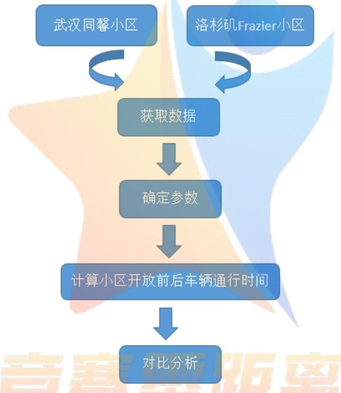  
图 13 问题三思路流程图

## 7.2武汉同馨小区ompetitionZeroDistance--

同馨花园及周边地图结构如图所示，

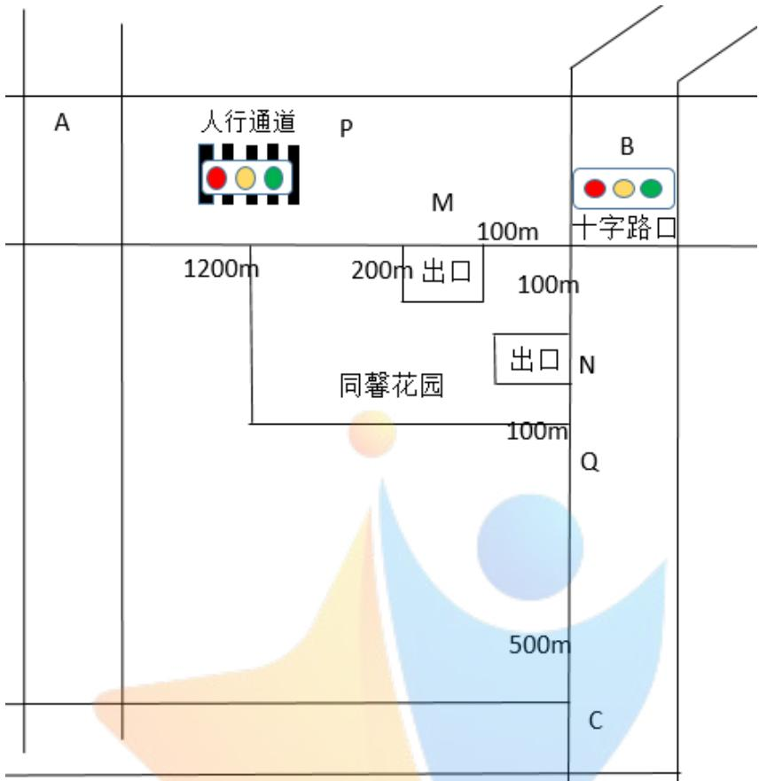  
图 14 同馨花园周边示意图

同馨花园有两个出口，分别位于宝丰一路和宝丰二路，两个出口均为无红绿灯 T型路口，且只允许与出口在同一侧的车道上的车辆进出小区。

## Step1：确定小区开放前的路线构成

小区开放前由A到C的路线可由无红绿灯直行车道—有红绿灯直行车道—无红绿灯直行车道--有红绿灯十字路口—无红绿灯直行车道拼接而成。

## Step2：计算基本道路结构的车辆通行时间

将无红绿灯直行车道和有红绿灯直行车道合在一起考虑。

路段阻抗为

$$
T _ { Q } = T _ { 0 } ( 1 + \alpha { \frac { Q / Q _ { \mathrm { m a x } } ^ { } } { 1 - Q / Q _ { \mathrm { m a x } } ^ { } } } ) = T _ { 0 } ^ { } { \frac { 1 - ( 1 - \alpha ) Q / Q _ { \mathrm { m a x } } ^ { } } { 1 - Q / Q _ { \mathrm { m a x } } ^ { } } }
$$

$T _ { 0 }$ 为可自由行驶时的直行车道行驶时间， ${ \mathrm { T 0 } } { = } _ { \mathrm { S } } / \mathrm { v }$

由统计数据可知[11]，s为直行道路的长度1400 米，v为车辆自由行驶时的速度，取该道路限速 60km/h，则 $\mathrm { T 0 { = } s / v { = } 1 } . 4 / 6 0 { = } 1$ .4min；

为服务水平参数，由于城市干道一般取值为0.4-0.6，因此这里取 =0.5，

Qmax 为道路实际通行能力，已知宝丰一路每车道的实际通行能力为 $1 7 5 0 \mathrm { { p c u } / h } /$ ，由于该马路共有3个车道，所以该道路的 $\mathtt { 6 m a x = 1 7 5 0 * 3 = 5 2 5 0 p c u / h }$

$$
T _ { Q } \ _ { = } \  ^ { 1 . 4 \times } \frac { 1 - 0 . 5 Q / 5 2 5 0 } { 1 - Q / 5 2 5 0 }
$$

该直道的路段阻抗

红绿灯造成的时间阻抗为

$$
T = \frac { T _ { c } ( 1 - \lambda ) ^ { 2 } } { 2 ( 1 - \lambda \mathrm { \lambda } \mathrm { x } ) } + \frac { x ^ { 2 } } { 2 q e ( 1 - \mathrm { x } ) } - 0 . 6 5 ( \frac { T _ { c } } { q e ^ { 2 } } ) ^ { \frac { 1 } { 3 } } x ^ { ( 2 + 5 \mathrm { x } ) }
$$

在该路口信号灯的一个周期 $T _ { c }$ 为 1.5min，其中绿灯 45s，因此绿信比 $\lambda$ 为 0.5，该道路为三级服务水平，取x=0.8。

则该直道的时间阻抗 $T = \frac { 3 } { 9 . 6 } + \frac { 0 . 8 ^ { 2 } } { 0 . 4 Q } - 0 . 6 5 ( \frac { 1 . 5 } { Q ^ { 2 } } ) ^ { \frac { 1 } { 3 } } 0 . 8 ^ { 6 }$

## 十字路口 B：

对于右行车道：

该十字路口的长度为 200 米，当未发生交通堵塞时

$$
T _ { \varrho } = T _ { \mathrm { { o } } } ( 1 + \alpha \frac { Q / Q _ { \mathrm { { m a x } } } } { 1 - Q / Q _ { \mathrm { { m a x } } } } ) = T _ { \mathrm { { 0 } } } \frac { 1 - ( 1 - \alpha ) Q / Q _ { \mathrm { { m a x } } } } { 1 - Q / Q _ { \mathrm { { m a x } } } }
$$

其中 $\mathrm { T } _ { 0 } { = } 2 0 0 / \mathrm { v } _ { \colon }$

v 为自由转弯速度，由参考文献[9]，机动车转弯速度不能超过 30km/h，故此处取自由转弯速度为 30km/h。则 $\mathrm { T } _ { 0 } { = } 0 . 2 / 3 0 { = } 1 / 1 5 0 \mathrm { h } { = } 0 . 4 \mathrm { m i n }$ ，α 取0.5，由道路通行能力推荐表与车速的关系可推得 $\mathsf { Q } _ { \mathsf { m a x } } { = } 1 3 9 0 \mathsf { p c u } / \mathsf { h }$

因此， $T _ { _ Q } = 0 . 4 \frac { 1 - 0 . 5 Q / 1 3 9 0 } { 1 - Q / 1 3 9 0 }$

## 直道 BC：

路段阻抗的计算方法和直道AM的路段阻抗计算完全相同：

$$
T _ { _ Q } \ = 0 . 6 \times \frac { 1 - 0 . 5 Q / 7 0 0 0 } { 1 - Q / 7 0 0 0 }
$$

## Step3：计算车辆通行总时间

小区开放前从A到 C的总通行时间为

$$
T _ { \mathfrak { N } } = 1 . 4 \times \frac { 1 - 0 . 5 Q / 5 2 5 0 } { 1 - Q / 5 2 5 0 } + \frac { 3 } { 9 . 6 } + \frac { 0 . 8 ^ { 2 } } { 0 . 4 Q } - 0 . 6 5 ( \frac { 1 . 5 } { Q ^ { 2 } } ) ^ { \frac { 1 } { 3 } } 0 . 8 ^ { 6 } + 0 . 4 \times \frac { 1 - 0 . 5 Q / 1 3 9 0 } { 1 - Q / 1 3 9 0 } + 0 . 6 \times \frac { 1 - 0 . 5 Q / 7 0 0 0 } { 1 - Q / 7 0 0 0 }
$$

## Step4：确定小区开放后的路线构成

小区开放后由A到C的路线变为由无红绿灯直行车道—有红绿灯直行车道—无红绿灯T型路口--有红绿灯十字路口--无红绿灯灯T 型路口--无红绿灯直行车道拼接而成。

Step5：计算小区开放后基本道路结构的车辆通行时间

直道 AP：

直道AP 的距离为1.2km，其余参数均不变

所以AP 的路段阻抗 $= 1 . 2 \times \frac { 1 - 0 . 5 Q / 5 2 5 0 } { 1 - Q / 5 2 5 0 }$

无信号灯T型路M（小区门）：

$$
T _ { \perp \perp \perp } = \frac { a _ { 1 } \cdot Q _ { A } \cdot t _ { \perp \perp } } { b _ { 1 } \cdot Q _ { B } } \cdot \frac { q } { K } + \frac { Q ^ { + } \cdot t _ { \scriptscriptstyle \mp \perp } } { b \cdot Q _ { B } } \cdot \frac { q } { K }
$$

由于该路口有3个车道，因此 $Q _ { A }$ 为非紧邻小区的外面2条车道的车流量， $Q _ { B }$ 为紧邻小区的1条车道的车流量.

取 $a _ { 1 } = 0 . 1 , ~ \mathrm { t } _ { \ \ast \ast } = 5$ 秒， $t _ { \ddagger \ddagger } = 1 0$ 秒， $b _ { 1 }$ 与车道数量有关，该路口有 3个车道，故取 $b _ { 1 } { = } 1 / 3$

得到 $T _ { \mathrm { \tiny { \boxdot { H } } \bar { 1 } \bar { 1 } } } = \frac { 3 Q _ { A } } { 2 \cdot { \bf ( } Q - Q _ { A } ) } \cdot \frac { Q } { 5 2 5 0 } + \frac { 3 0 Q ^ { + } \cdot t _ { \ast \ddagger } } { \left( Q - Q _ { A } \right) } \cdot \frac { Q } { 5 2 5 0 }$ ，其中Q 为3车道总车流量。

十字路口 B：

对于右转车道，通行时间为

$$
T = 0 . 4 \frac { [ 1 - 0 . 5 ( \mathrm { Q - Q _ { A } + Q ^ { + } } ) ] / 1 3 9 0 } { [ 1 - ( \mathrm { Q - Q _ { A } + Q ^ { + } } ) ] / 1 3 9 0 }
$$

其中Q表示小区开放前 AB 道路上的车流量， $\mathrm { Q } _ { \mathrm { A } }$ 为进入小区车流量， $\mathrm { Q } _ { \mathrm { B } }$ 为从小区出来的车流量。

无红绿灯 T 型路口 N（小区门）：

与无红绿灯T型路口M相比，由于车道变为4车道，故最大车流量发生变化， $\mathrm { Q } _ { \mathrm { m a x } } { = } 7 0 0 0$

其余参数不变，得到

$$
T _ { \check { \mathrm { E i k } } } = \frac { 3 Q _ { A } } { 2 \cdot ( Q - Q _ { A } ) } \cdot \frac { Q } { 7 0 0 0 } + \frac { 3 0 Q ^ { + } \cdot t _ { \neq } } { ( Q - Q _ { A } ) } \cdot \frac { Q } { 7 0 0 0 }
$$

直道 QC

直道 QC 的距离为 0.5km，所以 t<sub>0</sub>=0.5/60=0.5min

由于和BC 在同一条车道上，故其他参数与直道BC 的参数完全相同，

$$
T = 0 . 5 \frac { [ 1 - 0 . 5 ( \mathrm { Q - Q _ { A } + Q ^ { + } } ) ] / 7 0 0 0 } { [ 1 - ( \mathrm { Q - Q _ { A } + Q ^ { + } } ) ] / 7 0 0 0 }
$$

因此，小区开放后从A到C 的总通行时间为

$$
\begin{array} { r l } & { T _ { \perp } = 1 . 2 \times \displaystyle \frac { 1 - 0 . 5 Q / 5 2 5 0 } { 1 - Q / 5 2 5 0 } + \frac { 3 Q _ { A } } { 2 \cdot ( Q - Q _ { A } ) } \cdot \displaystyle \frac { Q } { 5 2 5 0 } + \frac { 3 0 Q ^ { + } \cdot t _ { * } } { ( Q - Q _ { A } ) } \cdot \displaystyle \frac { Q } { 5 2 5 0 } + T = 0 . 4 \frac { [ 1 - 0 . 5 ( Q - Q _ { A } + Q ^ { + } ) ] / 1 3 9 0 } { [ 1 - ( Q - Q _ { A } + Q ^ { + } ) ] / 1 3 9 0 } } \\ & { + \frac { 3 Q _ { A } } { 2 \cdot ( Q - Q _ { A } ) } \cdot \displaystyle \frac { Q } { 7 0 0 0 } + \frac { 3 0 Q ^ { + } \cdot t _ { * } } { ( Q - Q _ { A } ) } \cdot \displaystyle \frac { Q } { 7 0 0 0 } + 0 . 5 \frac { [ 1 - 0 . 5 ( \mathbf { Q } - \mathbf { Q } _ { A } + Q ^ { + } ) ] / 7 0 0 0 } { [ 1 - ( Q - Q _ { A } + Q ^ { + } ) ] / 7 0 0 0 } } \end{array}
$$

## Step6：基本道路结构车流量预测

计算车辆在小区内部的通行时间：小区内部通行时间的计算方法和主干道一样，也是采用道路拼接原理。

假设从小区门 M 进入的车流量为 Q-，从门 N 进入的车流量为 Q+，计算得到同馨花园从M到 N的通行时间为

$$
T = 0 . 9 \frac { 1 + 0 . 2 \mathrm { Q } ^ { - } / 1 0 0 0 } { 1 - \mathrm { Q } ^ { - } / 1 0 0 0 } + \frac { 2 \mathrm { Q } ^ { - } } { \mathrm { Q } ^ { + } } \cdot \frac { \mathrm { Q } ^ { - } } { 1 0 0 0 } + \frac { 3 0 ( \mathrm { Q } ^ { - } + \mathrm { Q } ^ { + } ) \mathrm { Q } ^ { - } } { 1 0 0 0 \mathrm { Q } ^ { + } } + 0 . 4 \frac { 1 + 0 . 2 \mathrm { Q } ^ { - } / 1 0 0 0 } { 1 - \mathrm { Q } ^ { - } / 1 0 0 0 }
$$

运用一价定理计算在已知总流量的情况下通过小区的车流量，即

$$
\begin{array} { l } { T = \cfrac { 3 Q _ { A } } { 2 \cdot ( Q - Q _ { A } ) } \cdot \cfrac { Q } { 5 2 5 0 } + \cfrac { 3 0 Q ^ { + } \cdot t _ { * } } { ( Q - Q _ { A } ) } \cdot \cfrac { Q } { 5 2 5 0 } + 0 . 4 \frac { [ 1 - 0 . 5 ( \mathrm { Q - Q _ { A } + Q ^ { + } } ) ] / 1 3 9 0 } { [ 1 - ( \mathrm { Q - Q _ { A } + Q ^ { + } } ) ] / 1 3 9 0 } + \cfrac { 3 Q _ { A } } { 2 \cdot ( Q - Q _ { A } ) } \cdot \cfrac { Q } { 7 0 0 0 } } \\ { + \cfrac { 3 0 Q ^ { + } \cdot t _ { * } } { ( Q - Q _ { A } ) } \cdot \cfrac { Q } { 7 0 0 0 } } \end{array}
$$

其中等式左边表示从M 点到N 点走小区的通行时间，等式右边是走小区外围的通行时间。

设小区开放前道路AB 段的车流量为Q1，道路BC段的车流量为Q2，通过对同馨花园小区的实时观察，取 Q+=500pch/h，利用遗传算法求解上述方程。

得到Q<sup></sup> 关于 Q1 的函数表达式 $\mathrm { Q } ^ { - } { = } \mathrm { f } ( \mathrm { Q } 1 )$

## Step7：计算车辆通行总时间

将 Q- 代入 AB 段和 BC 段车辆通行时间的计算公式，通过给 Q1、Q2 赋不同的取值，

计算小区开放前后AB 段道路、BC 段道路的通行时间以及从A到 C的总时间变化情况：

表 5 AB、BC、AC 通行时间变化
<table><tr><td colspan="1" rowspan="1">Q1(pch/h)</td><td colspan="1" rowspan="1">4000</td><td colspan="1" rowspan="1">4000</td><td colspan="1" rowspan="1">5250</td><td colspan="1" rowspan="1">5250</td><td colspan="1" rowspan="1">5250</td><td colspan="1" rowspan="1">6500</td><td colspan="1" rowspan="1">6500</td></tr><tr><td colspan="1" rowspan="1">Q2(pch/h)</td><td colspan="1" rowspan="1">7000</td><td colspan="1" rowspan="1">9000</td><td colspan="1" rowspan="1">5000</td><td colspan="1" rowspan="1">7000</td><td colspan="1" rowspan="1">9000</td><td colspan="1" rowspan="1">5000</td><td colspan="1" rowspan="1">7000</td></tr><tr><td colspan="1" rowspan="1">道路情况</td><td colspan="1" rowspan="1">AB 畅通BC 稍堵</td><td colspan="1" rowspan="1">AB 畅通BC 拥堵</td><td colspan="1" rowspan="1">AB 稍堵BC 畅通</td><td colspan="1" rowspan="1">AB 稍堵BC 稍堵</td><td colspan="1" rowspan="1">AB 稍堵BC 拥堵</td><td colspan="1" rowspan="1">AB 拥堵BC 畅通</td><td colspan="1" rowspan="1">AB 拥堵BC 拥堵</td></tr><tr><td colspan="1" rowspan="1">AB(min)</td><td colspan="1" rowspan="1">1.98</td><td colspan="1" rowspan="1">1.98</td><td colspan="1" rowspan="1">4.37</td><td colspan="1" rowspan="1">4.37</td><td colspan="1" rowspan="1">4.37</td><td colspan="1" rowspan="1">15.36</td><td colspan="1" rowspan="1">15.36</td></tr><tr><td colspan="1" rowspan="1">与不开放小区相比</td><td colspan="1" rowspan="1">-0.05</td><td colspan="1" rowspan="1">-0.05</td><td colspan="1" rowspan="1">-0.05</td><td colspan="1" rowspan="1">-0.74</td><td colspan="1" rowspan="1">-0.74</td><td colspan="1" rowspan="1">-0.74</td><td colspan="1" rowspan="1">+6.10</td></tr><tr><td colspan="1" rowspan="1">BC(min)</td><td colspan="1" rowspan="1">1.62</td><td colspan="1" rowspan="1">2.32</td><td colspan="1" rowspan="1">8.08</td><td colspan="1" rowspan="1">1.63</td><td colspan="1" rowspan="1">2.29</td><td colspan="1" rowspan="1">8.24</td><td colspan="1" rowspan="1">1.62</td></tr><tr><td colspan="1" rowspan="1">与不开放小区相比</td><td colspan="1" rowspan="1">-0.03</td><td colspan="1" rowspan="1">-0.03</td><td colspan="1" rowspan="1">+0.46</td><td colspan="1" rowspan="1">-0.02</td><td colspan="1" rowspan="1">-0.06</td><td colspan="1" rowspan="1">+0.62</td><td colspan="1" rowspan="1">-0.03</td></tr><tr><td colspan="1" rowspan="1">AC(min)</td><td colspan="1" rowspan="1">3.6</td><td colspan="1" rowspan="1">4.3</td><td colspan="1" rowspan="1">10.06</td><td colspan="1" rowspan="1">6</td><td colspan="1" rowspan="1">6.36</td><td colspan="1" rowspan="1">12.61</td><td colspan="1" rowspan="1">16.98</td></tr><tr><td colspan="1" rowspan="1">与不开放小区相比</td><td colspan="1" rowspan="1">-0.08</td><td colspan="1" rowspan="1">-0.08</td><td colspan="1" rowspan="1">+0.41</td><td colspan="1" rowspan="1">-0.67</td><td colspan="1" rowspan="1">-0.1</td><td colspan="1" rowspan="1">-0.12</td><td colspan="1" rowspan="1">+6.07</td></tr></table>

其中，-表示时间减少，+表示时间增加。

结论：

（1）当 AB 路段为畅通状态或稍堵状态时，开放小区将会导致 AB 道路的通行时间减少，当AB道路为拥堵状况时，开放小区对AB 道路的通行时间影响与 BC 路段的车流量密切相关；

（2）当AB 路段稍堵，BC 路段堵塞时，开放小区对 BC路段通行时间产生的影响最大，但尽管如此也仅使道路通行时间增加了 0.62 分钟，因此开放小区对 BC 路段车辆通行的影响不大；

（3）在大多数情况下，开放小区使得 AC段车辆通行时间减少，但当AB、BC 路段均为拥堵状态时，开放小区使AC 路段通行时间增加量6.07 分钟，极大地恶化了交通状况，

（4）由于同馨花园位于武汉汉口市区，交通量很大，因此小区开放效果近似于AB、BC 路段均为拥堵状态的情形，可见开放同馨花园不利于车辆通行。

## 7.2 洛杉矶 Frazier 小区

选取交通堵塞现象较为严重的美国洛杉矶Frazier小区为例，截取 google地图提供的小区图及周边地图结构如图所示：

起始点

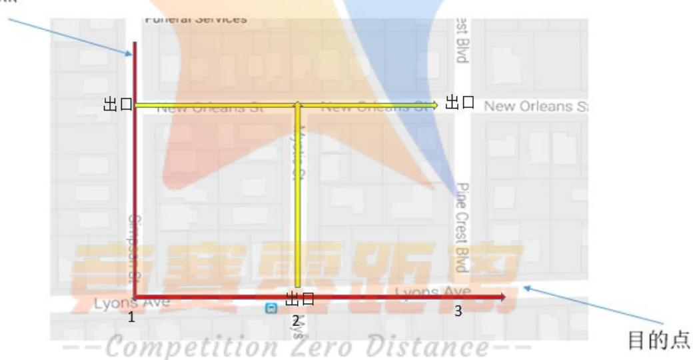  
图 15 Frazier 小区周边示意图

其中红色部分为主干道，黄色部分为开放小区后新增的交通支路道路。在 1、2、3处设有红绿灯，信号灯时间有30s、45s、60s不等。

按照图示选择起始点和目的点，保持开放小区前后两地段车辆及交通情况不变，按照上文相同的思路进行分析。

## Step1：确定小区开放前的路线构成

起始点到目的点由无红绿灯直行车道—无红绿灯 T 型路口—无红绿灯直行车道—有红绿灯T 型路口—无红绿灯直行车道--有红绿灯十字路口—无红绿灯直行车道--有红绿灯 T型路口拼接而成。（为简化模型，认为小区开放前后车辆在无红绿灯直行车道上的通行时间不发生变化，故不考虑车辆在无红绿灯直行车道上的通行情况。）

## Step2：计算基本道路结构的车辆通行时间

## 在第一个无红绿灯T型路口：

根据参考文献[10]，得到SimpsonSt 街道各参数：主干道车流量为30veh/min，T型路口 A、B 两车道车流量比例为 7：3，且 A 车道上需要换道的车辆占总数 10%，B 车道直行车辆占70%，考虑到不同路段的车辆换道时间不同，本文取街道的平均正常换道时间 5s，转弯时间为10s，车流量密度为 0.1。

计算得到换道延误时间 $T _ { 1 } = \frac { a _ { 1 } \cdot Q _ { \scriptscriptstyle A } \cdot t _ { \scriptscriptstyle \frac { 1 } { 3 \kappa } } } { b _ { 1 } \cdot Q _ { \scriptscriptstyle B } } \cdot \frac { q } { K } = \frac { 0 . 1 \times 7 \times 5 } { 0 . 7 \times 3 } \times \frac { 0 . 1 \times 2 0 } { 3 0 / 6 0 } = 6 . 7 s$

在未开放之前，从该T型路口涌出的均为小区居民，其比例依照文献[10]约占 10%，则由于避让对直行车辆造成的延误时间 $T _ { \mathrm { 2 } = 1 , 9 0 4 7 s }$

因此，经过第一个 T型路口对直行车辆造成延误 $T _ { _ { \mathrm { E } ^ { \prime } } } = 6 , 7 + 1 , 9 0 4 7 = 8 , 6 0 4 7 s$ 。

## 在第一个有红绿灯的十字路口：

由于原模型参数较多，因此将非拥堵情况作适当简化。根据文献，美国大中城市的正常拥堵率在10%左右。非拥堵时，主要延误时间为红灯等待时间和因红灯而引起的减速和起步加速段时间。

已知红绿灯时间为 45s做一次更换，则

红灯频率 $= \frac { 4 5 } { 4 5 + 4 5 + 3 } = 0 . 4 8 4$ ，根据概率论知识，红灯等待时间服从[0，45]上的均匀分布，取其均值 22.5s 作为红灯等待时间。查得汽车减速时间一般在 5s 左右，围绕汽车速度上下波动，因此因红灯引起的减速和起步加速总时间均值为 10s。非拥堵时车辆经过十字路口的平均总时间为32.5s。

当道路拥堵时，车辆主要延误时间为排队等待时间和信号灯转换时间。

信号灯交叉口的排队长度：

$$
Q = \left\{ { \begin{array} { l } { \displaystyle { 3 ( \mathbf { x } - \mathbf { x } _ { 0 } ) } } \\ { \displaystyle { 2 ( 1 - \mathbf { x } ) } } \\ { \quad 0 , x \leq x _ { 0 } } \end{array} } , x > x _ { 0 } \right.
$$

其中 $x _ { 0 } = 0 . 6 7 + \frac { g S } { 6 0 0 } , x = \frac { r T _ { c } } { \mathcal { C } \mathcal { O } S g }$ ，由文献[10]得 $T _ { c } = 6 3 \mathrm { s } , ~ 9 { = } 2 7 , ~ \mathsf { r } = 9 0 \% , ~ \mathsf { r } = 9 0 \%$

$\mathsf { S } { = } 1 8 0 0 \mathsf { p c u / h }$ ，代入上式得到 $Q { = } 3 5 3 . 3$

总排队等待时间：

$$
T _ { Q } = T _ { 0 } ( 1 + \alpha { \frac { Q / Q _ { \mathrm { m a x } } } { 1 - Q / Q _ { \mathrm { m a x } } } } ) = T _ { 0 } { \frac { 1 - ( 1 - \alpha ) Q / Q _ { \mathrm { m a x } } } { 1 - Q / Q _ { \mathrm { m a x } } } }
$$

查阅文献[10]确定： $T _ { 0 } { = } 9 5 \mathrm { s }$ ，<sup></sup>取 0.6，Qmax=400，得到总排队等待时间 $T _ { \varrho } { = } 5 2 6 . 2 s$ 信号灯转换时间取上述红灯平均等待时间22.5s

因此拥堵时总时间 $T _ { \scriptscriptstyle \mathrm { i \leq i } } = 5 2 6 . 2 \ t 2 2 . 5 = 5 4 8 . 7 \mathrm { s }$

## 那么，经过一个有信号灯十字路口所需时间为

T=拥堵概率×拥堵通行时间+不拥堵概率×不拥堵时通行时间=0.x548.7×3029569.02s

有红绿灯T型路口情况与有红绿灯十字路口大致相同，其信号周期为 $3 0 + 3 0 + 3 = 6 3 8$ 红灯频率 $= \frac { 3 0 } { 3 0 + 3 0 + 3 } = 0 . 4 7 6$ ，红灯等待时间服从区间[0，30]上的均匀分布，取其均值15s作为红灯等待时间.

非拥堵时车辆经过 T型路口的平均总时间为 $T _ { \scriptscriptstyle { \perp } } = 1 5 \substack { + 1 0 = 2 5 s }$

拥堵时的车辆通行时间与有红绿灯十字路口的拥堵情形一致，总时间为548.7a

因此，经过一个有信号灯T 型路口所需时间为 $0 . 1 { \times } 5 4 8 . 7 { + } 0 . 9 { \times } 2 5 { = } 6 4 . 8 3 s$

## Step3：计算小区开放前车辆通行总时间

综上，小区开放前车辆从起始点达到目的点的通行总时间为

$$
\mathrm { T _ { \scriptscriptstyle { \frac { s \cdotp } { H \mathrm { p } } } } } = 8 . 6 0 4 7 + 2 \times 6 4 . 8 3 + 6 9 . 0 2 7 = 2 0 7 . 2 9 1 7 s
$$

## Step4：计算小区开放后基本道路结构的车辆通行时间

小区开放后，黄色路段可以通行，且在小区内部没有增设红绿灯。小区开放的影响是在起始点有一部分车辆会选择经过小区内部到达目的点，设这一部分车辆比例为A，则仍走原有路线的车辆比例为（1-A），由一价定理可知两部分车辆到达目的点的时间相等。

在第一个无信号灯 T 型路口，车辆通行情况较小区开放前发生了变化，不同之处在于在该处进行转弯操作的车辆比例由原来的10%调整为了A，因此车辆在此处的延误时间为

$$
T T _ { 1 } = T _ { 1 } + \frac { A } { 1 0 \% } \cdot T _ { 2 } = 6 . 7 + 1 9 . 0 4 7 A _ { 2 }
$$

对沿主干道直行的车辆，道路基本结构仍然不变，只是此时的总车流量变为原来的（1-A）,用(1 A)Q- 替换上述求解步骤中的Q，重新计算便可得到总通行时间关于A的表达式：

$$
\mathrm { T } ^ { \mathrm { \prime } } = \mathrm { T } \mathrm { T } _ { 1 } + \left( 1 - \mathrm { A } \right) \left( 2 \times 6 4 . 8 3 \ast 6 9 . 0 2 7 \right) = 2 0 5 . 3 8 7 0 - 1 7 9 . 6 4 \mathrm { A }
$$

对于沿小区内部通行的车辆，车辆比例为 $\mathrm { A } ,$ 需要经过一个无信号灯T 型路口，一个有信号灯T型路口，一个有信号灯十字路口。

对于无信号灯T型路口，考虑到道路呈对称分布，借鉴电路基尔霍夫定律，可以认为在T 型路口执行转弯操作的车辆占道路通行量的50%，其余参数取值与小区未开放时相同。将参数值代入相应公式，计算得到经过无信号灯T型路口的时间为：

$$
T T _ { 3 } = T _ { 1 } + 0 . 5 \frac { A } { 1 0 \% } \cdot T _ { 2 } = 6 . 7 + 9 . 5 2 3 5 A
$$

当车辆经过无红绿灯 T 型路口之后，将回到主干道上，由问题二中的模型，其余路口与小区开放前的情况大致相同，重复相关步骤，即可得到如下结果，此处不再赘述：该部分车流量经过后续路口所需时间

$$
T T _ { 4 } = 6 4 . 8 3 + 6 9 . 0 2 7 = 1 3 3 . 8 5 7 \mathrm { s }
$$

因此，通过小区内部到达目的地的车辆耗费总时间关于 A的表达式为：

$$
T = 6 . 7 + 1 9 . 0 4 7 A + 1 3 3 . 8 5 7 + 6 . 7 + 9 . 5 2 3 5 A = 1 4 7 . 2 5 7 0 + 2 8 . 5 7 0 5 A
$$

## Step5：基本道路结构车流量预测

由一价定理有 $T = T '$ ’<sub>，解得 A=0.1276</sub>

## Step6：计算小区开放后车辆通行总时间

将A值代入车辆通行总时间的表达式，得到总时间 $T _ { \mathrm { { } _ { E } } } { = } 1 8 4 . 4 2 4 3 s$

结论：

（1）小区开放之后，车辆通行总时间由原来的 $2 0 7 . 2 9 1 7 _ { \textrm { S } }$ 降至 184.4243s；

（2）开放Frazier小区能达到优化路网结构，提高道路通行能力，改善交通状况的目的。

## 7.3 Frazier 小区内部增设红绿灯

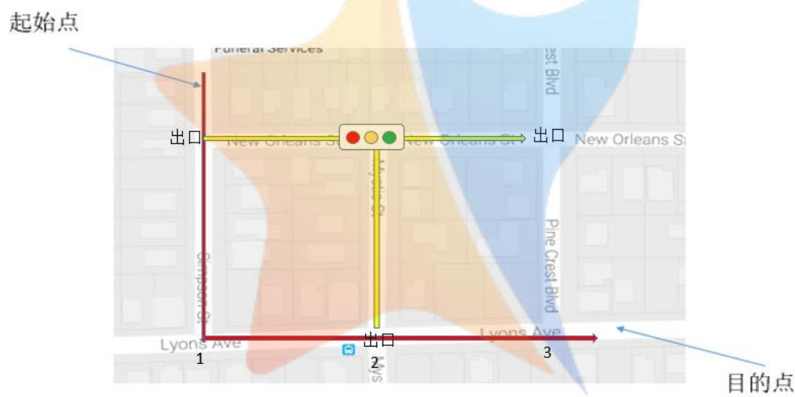  
图 16 Frazier 小区内部增设红绿灯

原小区开放后未增设红绿灯，现在图中所示的位置添加 30 秒变化灯色的红绿灯，重新计算车辆通行总时间：

在第一个无信号灯 T 型路口，情况与之前相同：车辆在此处的延误时间为$T T _ { 1 } = T _ { 1 } + \frac { A } { 1 0 \% } \cdot T _ { 2 } = 6 . 7 + 1 9 . 0 4 7 A _ { 2 }$

对于沿小区内部通行的车辆，由于增设了红绿灯，则该路口变为有信号灯的T型路口，通过该路口的通行时间 $\mathrm { T T T } { = } 5 2 6 . 2 { + } 1 5 { = } 5 4 1 . 2 \mathrm { s }$

由于实际情况下小区内部车辆分流较少，在大部分时间里没有堵车现象，因此调整堵车概率为1%，红灯频率 $= \frac { 3 0 } { 3 0 + 3 0 + 3 } = 0 . 4 7 6$

通行车辆在此路口延误时间的期望为 $0 . 0 1 { \times } T T T + 0 . 9 9 { \times }$ 红灯频率 $\times 2 5 { = } 1 7 . 1 9 3 s$

通过小区内部到达目的地的车辆耗费总时间关于 A的表达式为：

$$
\mathrm { T } ^ { \prime } = 1 3 3 . 8 5 7 + 6 . 7 + 1 9 . 0 4 7 A + 1 7 . 1 9 3 0 = 1 5 7 . 7 5 + 1 9 . 0 4 7 A
$$

对沿主干道行进的车辆：

$$
T = 2 0 5 . 3 8 7 0 - 1 7 9 . 6 4 A
$$

由 $T = T '$ ，解得 A =0.2398

至此得到车辆通行总时间为 162.3175s。

结论：

（1）在小区内部增设一个红绿灯之后，车辆通行总时间由原来的 184.4243s 降至 162.3175s；

（2）在小区内部增设红绿灯进一步改善了车辆通行状况，较小区开放前车辆通行时间可减少 21%

## 7.4 加宽道路对道路通行的影响

考虑不开放Frazier小区，而是加宽道路对车辆通行的影响。在交通流量一定的情况下，车道宽增加最直接的影响是减小了车流量密度，当车道宽增加一倍时，车流量密度变为原来的二分之一，将其代入原通行模型计算：

在第一个T 型路口的换道延误时间 $t _ { 1 } = 0 . 5 T _ { 1 } = 0 . 5 { \times } 6 . 7 = 3 . 3 5 s$

由于避让对直行车辆造成延误 $t _ { 2 } = 0 . 5 T _ { 2 } = 0 . 5 { \times } 1 . 9 0 4 7 = 0 . 9 5 2 4 s$

因此经过第一个无信号灯T 型路口对直行车辆造成延误t=3.35+0.9524=4.3023s

非拥堵时总时间为 15.73s；

拥堵时，主要延误时间为排队等待时间和信号灯转换时间：

红灯频率 $= 4 5 / ( 4 5 + 4 5 + 3 ) = 0 . 4 8 4$

信号灯交叉口的排队长度

其中

$$
_ { _ { 1 } } = 0 . 6 7 + \frac { g S } { 6 0 0 } , x = \frac { r T _ { c } } { S g } , T _ { c = 6 3 \mathrm { s } , \mathrm { g = 2 7 } \mathrm { s } } ,
$$

由文献[10] 确定 $\mathrm { r } { = } 2 1 . 3 \% , \ \mathrm { S } { = } 1 8 0 0 \mathrm { p c u / h }$ ，代入上式得到 $\mathrm { x } { = } 0 . 9 9 4 , \ \mathrm { Q } { = } 7 5 . 3 7 5$

$$
\mathop {  \sum _ { Q } \sum _ { = } ^ { \infty } \sum _ { \pmod { 1 } } \mathop { \downarrow } + \underset { 1 - Q / Q _ { \operatorname* { m a x } } } { \operatorname { m i n } } \mathop { \downarrow } \downarrow \downarrow } _ { Q } \mathop { ( Q _ { \operatorname* { m a x } } ) } = T _ { 0 } \frac { 1 - ( 1 - \alpha ) Q / Q _ { \operatorname* { m a x } } } { 1 - Q / Q _ { \operatorname* { m a x } } }
$$

信号灯转换时间与上述相同，T=32.5s

拥堵时总时间：TTT=T+ $\mathrm { T _ { Q } } = 1 4 0 . 7 3 4 9$ s

因此，经过一个有信号灯十字路口所需时间 $0 . 1 T T T + 0 . 9 \times$ 红灯频率 $\times 3 2 . 5 { = } 2 8 . 2 3 0 5 s$

经过一个有红绿灯的 T型路口情况与十字路口大致相同，将信号周期调整 $3 0 + 3 0 + 3 = 6 3 \mathrm { s }$ 红灯频率=30/(30+30+3)=0.476

红灯等待时间服从[0，30]均匀分布，取其均值15s作为红灯等待时间。

由红灯等待时间带来的延误 $\mathrm { T } \mathrm { T } { = } \mathrm { T } { + } T _ { \ddagger \ddagger } { = } 2 5 \mathrm { s }$

因此，经过一个有信号灯T型路口所需时间0.1TTT+0.9×红灯频率×25=24.7835s综上，小区开放前在路口上延误时间期望为 4.3023+2\*24.7835+ 28.2305= 82.0998s

## 结论：

（1） 当小区周边道路的车道宽增加一倍时，车辆通行总时间由原来的207.2917s降至82.0998s；

（2）拓宽小区周边道路宽对交通情况的改善效果远远好于开放小区，拓宽车道后的车辆通行时间约为开放小区的车辆通行时间的 51%

## 八、对有关部门的建议

随着私家车辆越来越多，城市道路通行压力越来越大，逐步开放小区似乎能在一定程度上提高道路通行能力，改善交通状况。本文通过建立数学模型，定量研究了小区开放对周边道路通行的影响，发现小区对外开放的效果与小区面积、地理位置、外部及内部道路状况等诸多因素有关。为方便城市规划和交通管理部门制定合理的交通管理对策，提出以下建议。

由问题一中的评价模型可知，广西大学附近的小区开放提升了周边道路的整体通行能力，且对二级主路产生的影响最大，对三级主路产生的影响最小。由于大学城附近所处的地理位置较偏，但交通流量较大，因此对于这类区域适合开放小区，尤其是当小区的二级主路拥堵现象严重时，开放小区可以有效地缓解其交通压力。

通过分析武汉同馨花园开放后的效果，发现其开放延长了车辆通行时间，从而恶化了道路状况。究其原因是同馨花园地处汉口市区，日常交通量大，而且小区规模较小，只设有两个出口，小区出口距离有红绿灯十字路口较近，因此小区周边主路上进出小区的交叉路口的车流量很大。对于具有这类特征的小区不宜对外开放，否则不但不会达到改善交通状况的目的，反而还会加剧道路拥堵问题。

通过分析洛杉矶Frazier小区开放后的效果，发现其开放降低了车辆通行时间，从而改善了交通状况。由于国外人少地多，车流密度很小，而且Frazier小区规模较大，设有三个出口，虽然其周边红绿灯数量较多，但小区出口与红绿灯的距离都较远，因此对于具备这类特征的小区适合对外开放。而目前国内的交通状况还难以达到国外水平，国内小区很难拥有Frazier小区的外部交通条件，但对 Frazier小区的研究可对未来的城市规划提供一定的参考价值。

而且从对洛杉矶Frazier小区的改进分析中可知，在小区内部增设红绿灯或者拓宽小区周边道路均会改善交通状况，因此在条件允许的情况下，有关部门可以考虑在开放小区的内部合理增设红绿灯或是加宽小区周边道路。

## 九、模型的评价

## 9.1 模型一

## 优点:

1. 科学合理地定义了评价指标，并且与指标有关的数据容易获取。在获得数据后，对其进行了一致化和无量纲化处理，克服了各类数据单位不统一的问题，是评价过程更为规范、客观、统一；

2. 利用网络层次分析法全面地考虑到了各指标之间的相互影响关系，使得模型更为可靠；

3. 将受到小区开放影响的周边道路分为一级、二级、三级主路，不仅通过模型得到了小区开放前后周边道路整体通行力的变化，而且也能探究距离小区远近不同的道路所受影响程度的差异，在横向和纵向比较了小区开放的效果，考虑问题全面；

## 缺点：

1. 在确定各指标之间的直接影响强度时存在一定的主观性；

2. 将道路统一简化为双向车道，会在一定程度上影响评价模型的精度。

## 9.2 模型二

## 优点:

4. 通过将道路网分为车道和路口两部分，详细讨论了直行车道、T 型路口、十字路口及其有无红绿灯、有无堵塞等各种情形，思考问题全面深入；

5. 运用拼接的思想将任意两点间的路线转换成由若干基本道路结构拼接而成，巧妙地解决了求解任意两点间车辆通行时间的问题；

## 缺点：

6. 没有考虑其他外界因素（如天气、驾驶技术、交通管理等）对小区周边道路通行的影响，模型存在一定的误差；

7. 考虑的情况太过庞杂，需要获取的参数较多。

## 9.3 模型三

## 优点:

8. 选取国内外各一个典型小区进行小区开放的效果对比，对比结果具有代表性，也对相关交通管理部门提供了一定的参考价值。

9. 模型编程实现简单，可操作性强，易于推广；

## 缺点：

10. 由于各路段参数的取值情况不同，在参数的确定上具有一定的主观性；

11. 仅选取了两个小区进行对比，结果局限性较大。

## 参考文献：

[1]http://wenku.baidu.com/link?url=uIcg3D9dUOKqpKnDvgNJL59C4nDv0XujMJflND3y00w2Yd2LqEQaUB5Sthzd7VJGnl0iHXIdph9ol7I0bYvpmCpqDVNtwaztOgw3inis9CS

[2]http://www.docin.com/p-379902521.html

[3] 郭赫曦 张海涛 王明哲，基于指标影响的ANP 内部依赖矩阵构造方法，系统工程第 33 卷第 6 期（总第 258 期 2015.06）

[4]汪涓，综合路阻建模与应用研究，西南交通大学

[5]百度百科 实际通行能力  
http://baike.baidu.com/link?url=3EmlhAwX6blmITlNBJNvAkESzsPWAB3hvM7\_9uQlLjXwAan\_4qb  
1TK3ih5f8NnR6CXszMs6uCvQD5VwDfJKVQK

[6] 李良 邹志云，城市道路路段和交叉口阻抗函数探讨，交通理论

[7] 陈栋，城市道路交叉口的交通拥堵成因分析与车辆延误模型研究，广西大学，2014.5

```matlab
附录
%%%%%%%%%%ANP%%%%%%%%%%%
x=[0 2 1 1 3 0 ;2 0 1 2 3 1;1 1 0 2 0 1 ;0 1 1 0 3 2;1 2 0 2 0 2 ;1 1 0 3 2 0 ];%6*6 矩
阵;
%x=x';
for i=1:6
summ(i)=sum(x(i,:));
end
youxiangtu=zeros(6,6);
for i=1:6
for j=1:6
d(i,j)=x(i,j)/max(summ);%正规化直接影响矩阵；
if x(i,j)>0
youxiangtu(i,j)=1;
end
end
end
t=d*(1-d)^(-1);
byxd=abs(sum(t));%被影响度
<sup>yyd=yxd-byxd;%原因度</sup><sub>yyd=yyd/sum(yyd);</sub> yyd=yyd/sum(yyd);
zxd=yxd+byxd;%中心度
c=zeros(6,6);
tv=0.5;
for i=1:6
if zxd<tv
youxiangtu(i,:)=0;
end
end
for i=1:6
for j=1:6
```

```matlab
if youxiangtu(i,j)==1&&yyd(i)>0&& zxd(i)>=tv
c(i,j)=1;
end
if youxiangtu(i,j)==1&&yyd(j)>0&& zxd(j)>=tv
c(j,i)=1;
end
end
end
for i=1:6
for j=1:6
if c(i,j)==0
x(i,j)=0; %修正后的直接影响矩阵
end
end
end
for i=1:6
summm(i)=sum(x(i,:));
end
for i=1:6
for j=1:6
dd(i,j)=x(i,j)/max(summm);%正规化直接影响矩阵；
end
end
tt=dd*(1-dd)^-1;
<sup>byxd=abs(sum(tt));%</sup>yxd=abs(sum((tt')));%影响度
zxd=yxd+byxd;%中心度
yxq=zxd/sum(zxd);%影响权
```

%%%%%%深入分析 1%%%%%%%   
xx=[0 2 1 1 3 0 ;2 0 1 1 3 1;1 1 0 2 0 1 ;0 0 1 0 3 2;1 2 0 2 0 2 ;1 1 0 3 2 0 ];%6\*6 矩   
阵;   
yxqq=[0.1 0.5 0.1 0.1 0.1 0.1];   
x=[0 2 1 1 3 0 ;2 0 1 1 3 1;1 1 0 2 0 1 ;0 0 1 0 3 2;1 2 0 2 0 2 ;1 1 0 3 2 0 ];%6\*6 矩   
阵;

```matlab
%x=x';
i=input('请输入需要修改的 i：');
j=input('请输入需要修改的 j：');
x(i,j)=input(' ');
x(j,i)=input(' ');
for i=1:6
summ(i)=sum(x(i,:));
end
youxiangtu=zeros(6,6);
for i=1:6
for j=1:6
d(i,j)=x(i,j)/max(summ);%正规化直接影响矩阵；
if x(i,j)>0
youxiangtu(i,j)=1;
end
end
end
t=d*(1-d)^(-1);
byxd=abs(sum(t));%被影响度
yxd=abs(sum((t')));%影响度
yyd=yxd-byxd;%原因度
yyd=yyd/sum(yyd);
zxd=yxd+byxd;%中心度
c=zeros(6,6);
tv=0.5;
for i=1:6
<sup>if</sup> <sup>zxd<tv</sup>youxiangtu(i,:)=0;<sub>end</sub>
end
for i=1:6
for j=1:6
if youxiangtu(i,j)==1&&yyd(i)>0&& zxd(i)>=tv
c(i,j)=1;
end
if youxiangtu(i,j)==1&&yyd(j)>0&& zxd(j)>=tv
c(j,i)=1;
end
```

tt=dd\*(1-dd)^-1;   
byxd=abs(sum(tt));   
yxd=abs(sum((tt')));