# 小区开放对道路通行的影响

## 摘 要

随着时代、社会的发展，人口和车量的与日俱增跟道路通行能力的大小变化相违背，同时，一系列道路交通问题也“呼之欲出”。“开放式小区”这一理论的提出将小区内部的道路通行与外部相联系，进而缓解了市区道路交通压力。本文选取合适的指标建立数学模型，将“开放式小区”对道路通行能力的影响进行深入研究。

针对问题一：首先以本题实际为中心，选取出能够评价道路体系的 6个有效指标即车流密度、车流速度、行程时间、延误时间、道路饱和度、交叉路口阻塞率；其次，对选取出的6个指标进行评价；最后，根据以上选取的6 个指标建立基于隶属度函数的模糊数学评价模型，通过选取一个特定小区，收集其在不同时期不同交通道路情况下的6种指标统计数量（见表 1），用客观的熵权法确定指标权重，根据模型计算结果，即$\boldsymbol { B } = \nu \cdot \boldsymbol { M } _ { i j } ^ { \prime } = ( 0 . 1 8 4 5 , 0 . 1 8 2 2 , 0 . 1 9 6 6 , 0 . 2 3 7 7 , 0 . 1 9 9 1 )$ 可以得出小区内不同的道路设计对周边道路通行能力有不同影响。

针对问题二：首先，建立基于“电路图”的车辆交通模型，将小区周边道路中车速、密度等参数类比为电路图中的各种元件（见图2\~3），通过科学的分析，得出小区开放后道路车流量变大、行程时间变短的整体效果；其次，建立理论递推和0-1 变量应用模型，求出小区开放对周边道路通行的关系式（见式10）；最后，建立多目标规划模型（见式12）对小区开放和规划进行了系统的研究。

针对问题三：在问题二模型的基础上，针对小区结构、周边道路结构及车流量（即小区的位置）三个变量因素建立单变量分析模型，即分别研究三者单一变化时不同类型小区对道路通行能力的影响，并利用CAD软件绘出 10种小区类型图（见图 5\~14），并通过查阅相关道路法及文献，客观设定各类型相关参数（见表5），定量求出各小区开放前后周边道路的通行能力，并对其结果进行对比分析。

针对问题四：首先，以本地一开放小区为研究对象，利用 $Q = \nu \times k$ 这一基本关系主线，致力于研究“禁摩”措施对小区车流流量Q的影响；其次，鉴于数据的真实有效性，运用百度卫星地图进行数据收集，并根据 $\nu = L / ( t _ { 2 } - t _ { 1 } )$ 和道路折算系数分别求出车辆流速v和车流密度k，共得9 组数据（见表7）；然后，建立Greenshields交通流模型（见式17\~19），运用回归拟合求出Q关系式（见式 20），并以v-m（摩托车所占比重）为桥梁建立 $\mathcal { Q } \cdot m$ 的关系式，通过MATLAB 软件画图（见图 15\~20），进一步分析“禁摩”对小区道路通行能力的显著影响；最后，以本模型探究结果和全文模型研究指标为例，为更好地推进小区开放化建设，向城市规划、和交通管理部门提出合理化的意见。

用熵权法客观地确定每个评价指标的权重是本文一大的特色，使的模糊综合评价模型的建立更有说服力；全文各新旧模型的综合运用，令全文思路清晰，条理分明，充满了创新性。最后，纵观全文，客观的评价了模型的优劣。综合考虑到模型具有的优化和评价功能，可以将其推广到交规等政策评价方面，这对今后的道路通行和现实应用都具有重要参考价值。

关键词：熵权值法 模糊综合评价模型 多目标规划模型 理论递推模型 交通流模型

## 一、问题重述

## 1.1 问题背景

今年2月份，国务院发布了《关于进一步加强城市规划建设管理工作的若干意见》，其中有关推广街区制的意见中提出：原则上不再建设封闭的住宅小区，建成的住宅小区和单位大院要逐步开放，实现内部道路公共化。这引起了广大群众的广泛关注和讨论。

封闭的小区打开之后就成为“开放式小区”，所谓“开放式小区”是指让封闭小区内部的一些道路与外界的公路相连，使这些内部道路也能供小区以外的车辆和行人使用。但小区开放之后可能会引发一系列安全问题，除此之外，小区开放是否可以达到优化路网结构、提高道路通行能力、改善交通状况的目的以及改善效果如何，这些问题也引起了群众的热议。一种观点是：封闭式小区破坏了城市道路网结构，堵塞了城市的“毛细血管”，容易造成交通拥堵，而小区开放后道路变多、道路面积增加，道路通行能力也因此会有所提高；但也有人认为这与小区的位置、面积以及内外部道路状况等因素有关，不能一概而论。另一种观点认为：小区开放后虽然道路数量变多，道路面积变大，但小区周围主干道上进出小区交叉口的车辆也会随之增加，这可能导致主干道的通行速度减慢。

要想确定“封闭式小区”是否要打开就要研究小区打开后对周边道路通行的影响，因此要建立数学模型，为科学决策提供定量依据。

## 1.2 问题提出

1.为了说明小区开放对周边道路通行的影响，请选择适当的指标体系进行评价。

2.为了研究小区开放对周边道路通行的影响，请建立有关车辆通行的数学模型进行分析。

3.小区开放产生的效果，可能会和小区结构及周边道路结构、车流量等因素有关。请选择或构建不同类型的小区，应用前两问建立的模型，定量比较各类型小区开放前后对道路通行的影响。

4.根据前三问的研究，从交通通行的角度，向城市规划和交通管理部门提出有关小区开放的合理化建议。

## 二、问题分析

“封闭式小区”在建筑规划图中严格规定了边界的范围，通常只有本小区的车辆和行人才会每天进出。但有一些小区地理位置特殊，如果能提供道路让外部车辆和行人进出，就会在一定程度上增加道路面积，从而可能对其周围道路通行能力有所影响。若选择合适的指标并用指标建立适当的模型，从科学的角度定量分析则可以确定小区开放对周边道路通行的影响。

## 2.1 问题一的分析

问题一要求选取合适的指标并建立评价体系，用以评价小区由“封闭”变为“开放”后对周边道路通行的影响。首先，根据指标选取的一般原则客观地选出评价指标；其次，解释每个评价指标的含义并分析其能够进行评价的原因以及评价步骤；最后，根据选取的评价指标建立有关隶属度函数的模糊数学评价模型<sup>[1]</sup>，权重的确定选择较客观的熵权法。选取一个从封闭到逐步开放的小区为例，通过对比小区内由于增设道路方案不同时所造成的不同影响，确定小区开放后对周边道路通行能力的影响。问题一的分析过程流程图见图1。

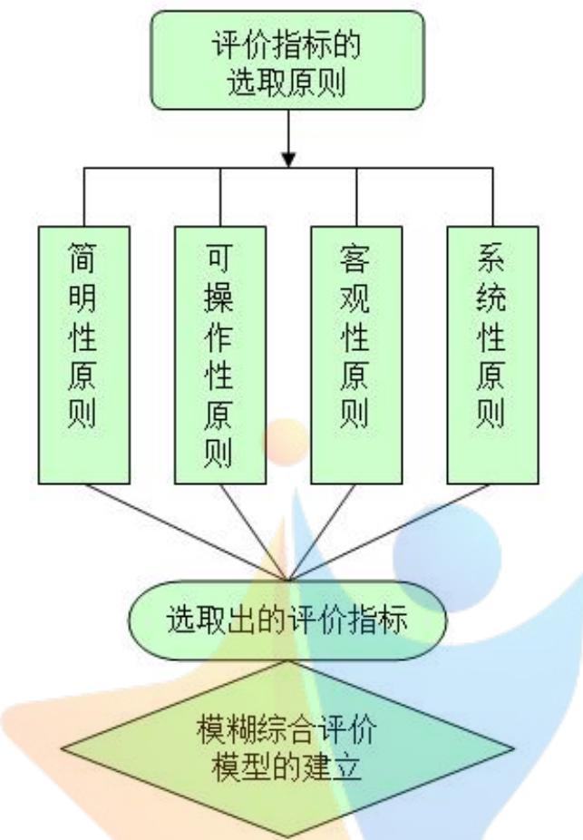
图 1 问题一分析流程图

## 2.2 问题二的分析

问题二要求建立关于车辆通行的数学模型。本文首先建立基于电路图的车辆通行模型，将小区周围的道路情况当做电路原件，从车流量、行程时间和可达性等指标出发，通过对比电路图的差异定性和定量分析小区从“封闭”变为“开放”后指标的变化情况，从而得知小区开放后对周边道路通行情况的整体影响；其次，建立理论递推模型进行细化研究，以T字型开放路口为研究对象，综合运用第一问选出的评价指标并结合 0-1 变量模型，推导出小区开放后对周边道路通行的影响情况。

## 2.3 问题三的分析

问题三要求以不同类型的小区为研究对象，研究其开放前后对道路通行的影响。本文以小区结构、周边道路结构和车流量三者为变量进行单变量分析研究，并运用CAD软件摹绘出 10 不同类型小区；通过查阅和参考相关文献，对各类型小区进行参数设置，并运用问题二理论递推模型进行小区开放前后道路通行能力的定量计算和比较，进而得出问题结论。

## 2.4 问题四的分析

问题四要求从道路通行角度出发，为推进小区开放化向相关部门提出合理化建议。首先，运用百度卫星地图对当地某小区内的街道通行状况进行定量分析，利用O=ν×这一基本关系主线，致力于研究“禁摩”措施对小区车流流量Q的影响；其次，运用MATLAB软件画图进一步分析研究“禁摩”对小区内的街道通行能力的影响；最后，结合本问“禁摩”效果和论文前三问的相关结果，以交通通行为出发点，兼顾论文前几问中交通通行能力指标，分别向城市规划和交通管理部门提出合理化建议。

## 三、模型假设

1.假设第一问获得数据全都真实可靠。

2.假设第二问通行能力模型中，不考虑双车道上的所设专左、专右车道。

3.假设开放小区开放的交叉路口相互独立。

4.假设每次新修道路时都会在路口增设交通信号灯。

5.假设第四问交通流模型数据的获取真实可靠。

6.忽略第四问中交通流模型每次采集数据时对车辆的观测时间。

四、符号说明
<table><tr><td rowspan=1 colspan=1>序号</td><td rowspan=1 colspan=1>符号</td><td rowspan=1 colspan=1>符号说明</td></tr><tr><td rowspan=1 colspan=1>1</td><td rowspan=1 colspan=1>Q</td><td rowspan=1 colspan=1>车流量</td></tr><tr><td rowspan=1 colspan=1>2</td><td rowspan=1 colspan=1>ν</td><td rowspan=1 colspan=1>车流速度</td></tr><tr><td rowspan=1 colspan=1>3</td><td rowspan=1 colspan=1>k</td><td rowspan=1 colspan=1>车流密度</td></tr><tr><td rowspan=1 colspan=1>4</td><td rowspan=1 colspan=1></td><td rowspan=1 colspan=1>道路饱和度</td></tr><tr><td rowspan=1 colspan=1>5</td><td rowspan=1 colspan=1>C</td><td rowspan=1 colspan=1>最大道路通行能力</td></tr><tr><td rowspan=1 colspan=1>6</td><td rowspan=1 colspan=1> $M _ { i j }$ </td><td rowspan=1 colspan=1>模糊关系矩阵</td></tr><tr><td rowspan=1 colspan=1>7</td><td rowspan=1 colspan=1>µ(x)</td><td rowspan=1 colspan=1>隶属度函数</td></tr></table>

注释：其余出现的符号均在文中给出说明

## 五、模型的建立与求解

## 5.1 问题一：评价指标的选取及模糊综合评价体系的建立

## 5.1.1 评价指标选取的理论依据

国务院发布的一系列有关小区改造的意见中提出要建立“开放式小区”，即把小区周围的围墙、栏杆逐渐去除，让小区以外的人和车也可以使用小区的内部道路，这一意见的提出引起广大群众的讨论。很多人认为小区打开之后会存在很多安全隐患：无关人员能够任意进出小区，对业主的财产安全造成威胁；小区内过往的车辆增多可能会对道路安全造成影响。但也有人支持国家的做法，认为这样做可以缓解城市的交通压力。因此选取合适的指标评价小区打开后对周围道路通行的影响就变得十分重要。

指标选取的科学与否与以下3个原则有关：

1）简明性原则：指标的选取应该具有清晰明了且不繁琐的特点。

2）可操作性原则：选取指标时不能只考虑其理论意义还要结合实际选择能够测量到数据的指标。

3）客观性原则：指标选取要客观、科学、合理，不能加入任何个人主观感受在里面。

4）系统性原则：要把选取的指标当成一个整体来看，不能把每个指标分开，各个指标之间看似独立实则都有内在联系。

## 5.1.2 评价指标的确定

## 指标一：车流密度

是指一条车道在某一时刻单位长度上分布的车辆数，可以用它表示车辆分布的密集或分散程度，单位为pcu/(hln)。计算公式为：

$$
k = \frac { Q } { \nu }
$$

其中，Q表示车流量，单位是pcu，

v表示平均车速，单位是km/h，

k表示平均车流密度。

以往的 “封闭式小区”通常只有一个或两个门，进出小区的大多数是生活在此小区的户主及他们的各种交通工具。不同种类小区的地理位置分布有很大差异，比如：高档小区一般分布在依山傍水的城市郊区等环境比较好的地方；中档小区分布在各种环境均一般的地方；而低档小区分布在交通拥堵，环境较差的地方。

其中有一类小区会建在十字路口的不远处，当小区外面的主干路因为早晚高峰造成拥堵时，若小区内部能够提供道路，则会起到分流的作用。但一天内车辆的总量一般不会有很大变化的，这样就会使车流密度变小，一天 24 小时内的车流密度是不同的，即车流密度是时间t的函数，一般情况下早晚高峰期车流密度较大，而平时期的车流密度较小。用车流密度研究小区开放对周围道路的影响可以通过以下方法来实现：

Step1：以一个“封闭式小区”为例，统计出一天 24 小时内附近道路的平均车流密度，记录下来并以时间为横坐标做出时间变化曲线。

Step2：再以一个和其位置相近的“开放式小区”为例，统计出和上一步相同的数据并做出时间变化曲线图。

Step3：比较两幅时间变化曲线图，可以从变化趋势来分析小区打开前后对周围道路的影响。

## 指标二：车流速度

是指车辆在单位时间内行驶的路程，可以用它来表示车流移动的快慢，单位是km/h。计算公式为：

$$
V _ { \scriptscriptstyle 0 } = \frac { S } { T }
$$

其中， $V _ { 0 }$ 表示车流速度，

## S表示路程，单位为km，

T表示单位时间，单位为h。

小区没有打开之前，外面的行人和车辆只能从主干道通过。碰到早晚高峰加之红绿灯的阻隔，时常会伴随着严重的堵车情况，这时车流速度就会大大减弱，甚至为零。这种情况不仅会耽误人们的出行，而且一般人在短暂停车时为了方便不会选择熄火，这就会造成资源的浪费和环境的污染。

但小区打开之后，从A到B不仅可以从主干道走，还可以从小区内部的道路通过。道路数量变多，可供使用的面积变大，则就会在一定程度上缓解交通压力。原先要从主干道上经过的车会被分到小区内部道路上一部分，这样就会使各条道路上车的数量不至于太多，车辆行驶速度自然就会提高。用车流速度研究小区开放对周围道路的影响可以通过以下方法来实现：

Step1：以一个“封闭式小区”为例，统计出一段时间t 内的平均车流速度，做好记录。Step2：再以一个和其环境相近的“开放小区”为例，统计出同样时间里小区内外车道平均车流速度，做好记录。

Step3：重复做3次以上实验，将3次的平均车流速度再去均值，比较开放与不开放小区的道路车流速度，通过数值的变化可以得到小区打开前后对周围道路的影响。

## 指标三：行程时间

是指通过一段固定位移所用的时间。即经过相同位移、不同路径所花费的时间。小区没有打开之前，外部车辆要穿过小区只能从主干道走，遇到阴雨天气或由于交通事故造成的交通阻塞时，车辆花费的等待时间会变长，相应的行程时间也会变长。小区打开后，若发生拥堵或特殊事件，车辆可以从小区内经过，这样就会减少不必要的等待时间，一定程度上缩短行程时间。

当没有遇到由于特殊情况造成的交通拥堵时，小区打开后会给人和车提供更多的道路资源，各个道路上的车辆数会比以前减少，在限速为40km/h的情况下，车辆能够适当提高速度，相应的能够节省行程时间。

## 指标四：延误时间

是指指车辆在正常行驶时由于异常原因而耽误的时间。

小区开放会增加道路数量和道路面积，但通常为了安全考虑，会在新的交通路口增设红绿灯。小区内部若形成交叉的道路时，考虑到住户及行人的需要，红绿灯的时间通常不会设的太长，但这也会造成从此通过的人和车的时间延误。 在小区周围，因为新道路的开通而在主干道上新增的红绿灯通常会起比较重要的作用，因此红绿灯的时间通常较长，这会较大程度的影响主干道上车辆的通行，造成较长的时间延误。

用车流速度研究小区开放对周围道路的影响可以通过以下方法来实现：

Step1：以一个“封闭式小区”为例，选取其旁边一段主干道为研究对象，统计 10辆车在早高峰t时间内因为红绿灯的原因所造成的时间延误。

Step2：在中午时间、晚高峰时期做同样的统计，记录数据。

Step3：再以一个环境相近的“开放式小区”为例，选取其旁边新增红绿灯的一段路为例，做与前两部一样的统计调查，并记录数据。

Step4：统计两段路延误的总时间，通过比较数值就可以得知小区打开前后对周围道路的影响。

## 指标五：道路饱和度

是指实际交通量与道路通行能力的比值，作为一个重要的参数可以用它来衡量道路服务水平的好坏。其计算公式为：

$$
D = { \frac { V } { C } }
$$

其中，D表示道路饱和度，

V表示最大车流量，单位为pcu，

C表示最大道路通行能力，单位也为pcu。

道路服务水平一般划分为4级，随着级别的增大，服务水平越来越差。衡量道路服务水平的指标有很多，道路饱和度就是其中之一，通常该指标越大，道路服务水平越差。假设一条公路在一小时内本来应该通过1000量车，若此时道路饱和度为1.3，则实际上有1300辆车通过此公路。

小区开放后，内部新建若干条公路，交通道路资源量增大，每条干路上的车都会有所减少，而新建在小区内部道路上的车量数会增加，又因为它只是对干路起一个分流的作用，所以它的饱和度也不会很大。这样，整体分析来看，小区开通后其附近道路的饱和度会有所减少，相应地，道路服务水平会提高。

## 指标六：交叉路口阻塞率

这是一个百分比指标，可以用它表示造成周期性严重阻塞的交叉路口数量占所有交

叉路口的百分比。其计算公式为：

$$
p = \frac { m } { M }
$$

其中， $p$ 表示交叉路口阻塞率，

m表示发生严重阻塞的交叉路口数量，

M表示研究体系中所有交叉口数量。

“封闭式小区”开放后，就会在小区附近新开的路口处设立红绿灯，主干道上原本也是有红绿灯的，且主干道上的红绿灯因为承担调节交通流量的作用所以时间一般较长。红绿灯虽然在一定程度上可以起到减少道路上车辆混乱，降低交通事故发生率的作用。但在早晚高峰期，路上车辆过多时，它就会对车辆的通行有阻碍作用。用交叉路口阻塞率研究小区开放对周围道路的影响可以通过以下方法来实现：

Step1：以一个“开放式小区”周边道路为研究对象，先选取早高峰期，统计小区周围4条路上所有十字路口的交通阻塞情况，以十字路口车辆等待数为指标统计数据，并计算出交叉路口阻塞率。

Step2：同样以一个“封闭式小区”周边道路为研究对象，选取早高峰期，统计出和上一步同类的数据并进行记录。

Step3：比较两者的交叉路口阻塞率就可以得出小区打开前后对周围道路的影响。

## 5.1.3 模糊综合评价体系模型的建立及求解

当事物间的区分不是很明确，如不确定一项政策的实施是否带来良好的效果，这时就可以根据模糊数学的思想，选取重要指标，建立一个模糊评价体系模型，再将现有数据带入计算，就可以根据计算结果得知此项政策实施前后带来的影响不同。

为了研究封闭小区开通后，对周围道路通行的影响，通过查找文献找到一个由“封闭式”逐渐变成“开放式”的小区，现对它进行研究。记该小区名称为G，通过文献了解到，刚开始它为原始的封闭式小区，为了响应国家号召，率先在小区内修建一条普通公路，经过一定时间的观察，发现小区附近道路通行能力有所提高。引起当地政府重视后，决定对此小区进行进一步的研究，所以在3年时间内陆续修建了若干条道路，其中第二次增修了一条和原来平行的道路，第三次增修了一条和另两条垂直的道路，第四次在小区中心增修了一条环形路。

为了研究此项政策是否科学合理，有关负责人员在没增修之前和每次增修道路之后都选择了合适的地点进行了实地调查测量。其中和本题相关的6 个指标的实地测量数据见表 4。

表 1 各类小区不同指标的调查统计数值
<table><tr><td rowspan=1 colspan=1>指标类型</td><td rowspan=1 colspan=1>车流密度</td><td rowspan=1 colspan=1>车流速度t行</td><td rowspan=1 colspan=1>程时间。</td><td rowspan=1 colspan=1>延误时间</td><td rowspan=1 colspan=1>道路饱和度</td><td rowspan=1 colspan=1>交叉路口阻塞率</td></tr><tr><td rowspan=1 colspan=1>封闭式小区</td><td rowspan=1 colspan=1>58</td><td rowspan=1 colspan=1>38</td><td rowspan=1 colspan=1>14</td><td rowspan=1 colspan=1>8</td><td rowspan=1 colspan=1>57</td><td rowspan=1 colspan=1>10</td></tr><tr><td rowspan=1 colspan=1>第一次增路</td><td rowspan=1 colspan=1>50</td><td rowspan=1 colspan=1>45</td><td rowspan=1 colspan=1>11</td><td rowspan=1 colspan=1>9</td><td rowspan=1 colspan=1>52</td><td rowspan=1 colspan=1>12</td></tr><tr><td rowspan=1 colspan=1>第二次增路</td><td rowspan=1 colspan=1>42</td><td rowspan=1 colspan=1>47</td><td rowspan=1 colspan=1>8</td><td rowspan=1 colspan=1>12</td><td rowspan=1 colspan=1>50</td><td rowspan=1 colspan=1>15</td></tr><tr><td rowspan=1 colspan=1>第三次增路</td><td rowspan=1 colspan=1>45</td><td rowspan=1 colspan=1>42</td><td rowspan=1 colspan=1>12</td><td rowspan=1 colspan=1>15</td><td rowspan=1 colspan=1>46</td><td rowspan=1 colspan=1>16</td></tr><tr><td rowspan=1 colspan=1>第四次增路</td><td rowspan=1 colspan=1>47</td><td rowspan=1 colspan=1>44</td><td rowspan=1 colspan=1>13</td><td rowspan=1 colspan=1>10</td><td rowspan=1 colspan=1>49</td><td rowspan=1 colspan=1>13</td></tr></table>

## 1）隶属度函数的确定

隶属度函数有多种类型，应针对不同指标的特点对其进行隶属度函数种类的选取。针对此题选取的6个指标，可以用实际值与最大值的比例来建立隶属度函数，即

车流密度的隶属度函数为：

$$
\mu _ { \mathrm { 1 } } ( x ) = \frac { x } { x _ { \mathrm { m a x } } }
$$

其余5个指标隶属度函数的建立与之类似。

根据表1 中的数据和各个指标的隶属度函数，运用MATLAB软件编程后（见附录程序1），得到一个模糊关系矩阵 $M _ { i j }$

## 2）确定各评价指标的权重

此处用较为客观的熵值赋权法来确定6个指标的权重，详细步骤如下：

Step1：对原有的模糊关系矩阵进行归一化处理得到新的模糊矩阵 $\boldsymbol { M } _ { i j } ^ { \phantom { \dagger } }$ ，计算第i个小区的第j个指标的特征比重：

$$
q _ { i j } = \frac { m _ { i j } } { \displaystyle \sum _ { i = 1 } ^ { n } m _ { i j } }
$$

这里n表示样本总量，即为5。

Step2：计算第j个指标的熵值 $f _ { j }$ ：

$$
f _ { j } = - { \frac { 1 } { \ln 5 } } \sum _ { i = 1 } ^ { 5 } q _ { i j } \ln q _ { i j }
$$

Step3：计算第j个指标差异系数 $d _ { j }$ ：

$$
d _ { j } = 1 - f _ { j }
$$

Step4：计算第j项指标权重系数 $\nu _ { j }$ ：

$$
\nu _ { j } = \frac { d _ { j } } { \displaystyle \sum _ { j = 1 } ^ { 6 } d _ { j } }
$$

用MATLAB软件实现以上步骤，得到6 个指标的权重系数为：

$$
\boldsymbol { \nu } = ( 0 . 0 9 3 2 , 0 . 0 3 8 1 , 0 . 2 4 8 8 , 0 . 3 8 2 7 , 0 . 0 3 8 3 , 0 . 1 9 8 9 )
$$

用6个指标的权重系数点乘模糊评价矩阵 $\boldsymbol { M } _ { i j } ^ { \intercal }$ <sup>'</sup> ，得到最终评价为：

$$
\boldsymbol { B } = \nu \cdot \boldsymbol { M } _ { i j } ^ { \phantom { * } } = ( 0 . 1 8 4 5 , 0 . 1 8 2 2 , 0 . 1 9 6 6 , 0 . 2 3 7 7 , 0 . 1 9 9 1 )\tag{1}
$$

## 3）结果分析

从式1可以看出，小区内部增设道路情况不同会对其周边道路通行能力产生不同的影响，其中小区增加一条路时对周边道路通行能力产生的影响最小，其次是“封闭式小区”，而第三次增加道路，即在小区内修建两条平行道路和一条与之垂直的道路，小区通过这种方式被打开时，对周边道路通行能力的影响力最大。

## 5.2 问题二模型的建立与求解

## 模型Ⅰ：

## 5.2.1 模型准备

电路图是指用电路元件符号表示电路连接的图，是人们为研究实际电路而简化的一种图形。通常的电路图中有电池、导线、开关、电阻、电容、用电器等元件，开关闭合时，电路联通，这时就有电流通过。通过思考可以发现，这种电路图也可以表示道路交通图：公路可以看成导线；车辆形成的车流看成电流；红绿灯看成开关，红灯时相当于电路断开，绿灯时相当于电路闭合。

## 5.2.2 模型建立与求解

## 1）车流量增多模型的建立

如图 2 所示，导线相当于小区周围的主干路， $U _ { 0 }$ 为电压，C是电容，将联通的整个电路当成小区周围主干路的环境。现在要从A行驶到B，已知车流量的计算公式为：

$$
\boldsymbol { Q } = \nu \cdot \boldsymbol { k }
$$

而在电路中有公式：

$$
q = C \cdot U _ { 0 }
$$

其中q为电流量。

可以将两个公式对比来看，车流量Q相当于电流量q，车流密度k相当于与电压 $U _ { 0 }$ ，而车流速度v相当于电容C。这里假设各条路都可以被充分利用，即车流密度达到最合理的状态且保持不变。

当小区没有打开，中间没有可供外来车辆通过的道路时，如图2所示，从A行驶到B只能从小区周围的干路通过。在电路中，设电压不变为 $U$ ，电容为 $C _ { 1 }$ ，电流量为q ， $q _ { 1 }$ 那么有：

$$
q _ { 1 } = C _ { 1 } \times U
$$

类比考虑到道路上，从A到B只有一条道路可以通过，此时单位时间内通过的车辆数为：

$$
Q _ { 1 } = \nu _ { 1 } \cdot k _ { 1 }
$$

那么t 时间内通过的车辆总数为： $Q _ { 0 } = t \cdot Q _ { 1 }$

如图3所示，当小区被打开时，从小区内多了一条可以通过的路。因为车流密度保持不变，这时小区周围的主干路上车流量依然为Q，而小区内的路相当于电路中的一条支路，有分流作用，车流密度保持不变的前提下，它的车流量为 $\mathcal { Q } _ { 2 } = \boldsymbol { \nu } _ { 2 } \cdot \boldsymbol { k }$ 。那么t时间内，从A到B的车辆总数就会有所增加，从原来的 $Q _ { 0 }$ 增加到 $\mathcal { Q } _ { 0 } ^ { \mathrm { ~ \tiny ~ { ~ \cdot ~ } ~ } }$ ，且

$$
\stackrel { \cdot } { Q _ { 0 } } = Q _ { 1 } + Q _ { 2 }
$$

## 2）行程时间减少模型的建立

从时间上看，若有 $\mathcal { Q } _ { 0 } ^ { \mathrm { ~ ~ } }$ 数量的车要从A地驶往B地，小区没有打开时，只有一条主干路可走，当车流量为 $\mathcal { Q } _ { 1 }$ 时，所用时间为：

$$
t = \frac { \mathcal { Q } _ { 0 } } { \mathcal { Q } _ { 1 } }
$$

若小区为开放式的，如图3 所示，增加一条道路后，小区内的支路分担了干路上的车流量。各条路上能够通过的车流量不变，而在小区内增加一条道路就会增加整个道路的车流量，即车流量从 $Q _ { 1 }$ 增加到 $\mathcal { Q } _ { 1 } + \mathcal { Q } _ { 2 }$ ，这里 $Q _ { 2 }$ 为支路车流量。若此时有数量为 $\mathcal { Q } _ { 0 } ^ { \mathrm { ~ \tiny ~ { ~ \cdot ~ } ~ } }$ 的车辆通过，则所用的时间为：

$$
t ^ { ' } = \frac { Q _ { 0 } ^ { ' } } { Q _ { 1 } + Q _ { 2 } }
$$

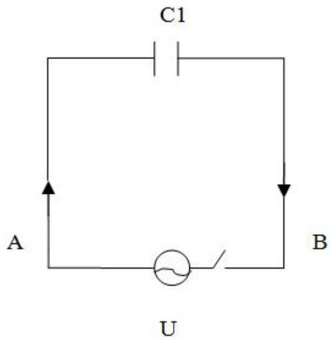
图 2 “封闭式小区”近似电路图

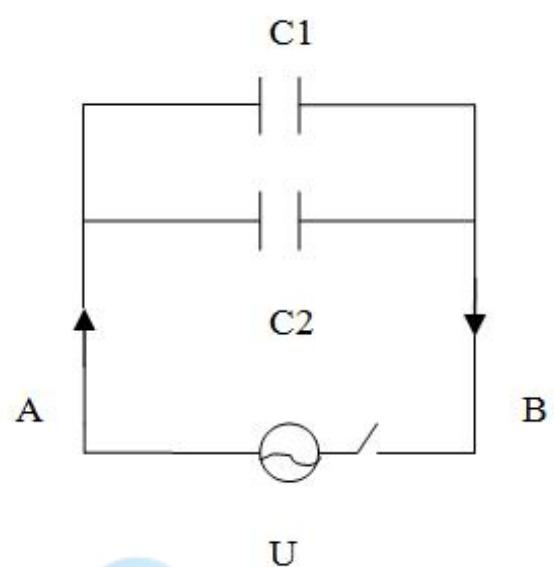
图 3 “开放式小区”近似电路图

## 5.2.3 结果分析

1）通过以上分析可以看出，从车流量角度考虑时，小区从“封闭式”变为“开放式”，因为道路数量和道路面积的同时增加，整个道路的车流量就会增加。这样可以缓解小区周边道路的交通压力，让人们的出行更加方便快捷。

2）从行程时间角度考虑，小区开放后，通过一定数量车辆所用的时间会缩短，这会提高交通效率，让人们浪费在出行上的时间变少，提高群众对道路交通的满意度，进而提高他们生活的幸福指数。

3）小区内道路数量的增加也会提高附近路段的可达性，即从A到B可选择的途径增多，若主干道出现意外事故时，可以选择从小区内绕行通过而顺利到达目的地。

## 5.2.4 模型思想

1）通行能力模型：指道路交叉口之间的路段上连续车流的最大允许通过量，单位pcu/s 。道路通行能力的研究大都围绕着车流流量、车流速度和车流密度 3 大交通流基本参数的关系进行，而在实际道路计算中，车流流量、车流速度和车流密度都有具体相应的细化计算。

2）0-1 变量应用模型：其变量x 仅取值0或1，即：

$$
0 \leq x _ { j } \leq 1 \mathrm { H } x _ { j } \mathrm { H } \times \frac { \mathrm { H } \times \chi } { \mathrm { H } } \times \chi
$$

用于实际问题中，对相互独立的变量进行累计运算。

## 5.2.5 模型建立

通行能力模型的建立：

1）T 字型交叉路口分析模型：考虑到国内大多数开放小区以T 字型交叉路口为例，而小区开放后也是以增加T 字型交叉路口数对周围主干道的通行能力产生影响。本文以图4为研究单元，建立后续各推理模型。

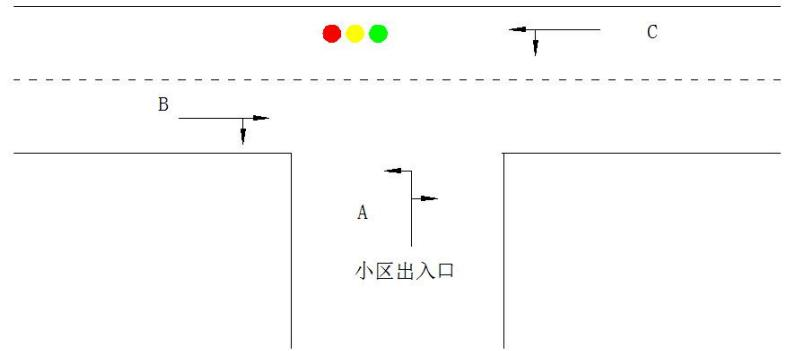
图 4 开放小区以 T 字型交叉路口模型图

2）车流速度V计算模型<sup>[2]</sup>

定义：车辆通过路段某点时的瞬时速度，单位 $m / s$

$$
V = { \frac { l _ { 1 } - l _ { 2 } } { t _ { 1 } - t _ { 2 } } } = \operatorname* { l i m } _ { \Delta t \to 0 } { \frac { \Delta l } { \Delta t } }\tag{2}
$$

式中： $l _ { 1 }$ 、 $l _ { 2 }$ 是分别为 $t _ { 1 }$ 、 $t _ { 2 }$ 时刻车辆所处位置点。

表 2 GB城市双车道公路设计速度<sup>[3]</sup>
<table><tr><td rowspan=1 colspan=1>公路等级</td><td rowspan=1 colspan=2>2级</td><td rowspan=1 colspan=2>3级</td><td rowspan=1 colspan=2>4级</td></tr><tr><td rowspan=1 colspan=1>设计速度 km/h</td><td rowspan=1 colspan=1>40</td><td rowspan=1 colspan=1>20</td><td rowspan=1 colspan=1>60</td><td rowspan=1 colspan=1>30</td><td rowspan=1 colspan=1>80</td><td rowspan=1 colspan=1>40</td></tr></table>

3）车流密度K计算模型

定义：车辆通过路段某点时截面车辆数，单位 $p c u / s$ ：

$$
K = { \frac { m _ { 0 } } { l _ { 1 } - l _ { 2 } } } = \operatorname* { l i m } _ { \Delta l  0 } { \frac { \Delta m } { \Delta l } }\tag{3}
$$

式中： $m _ { 0 }$ 为路段 $l _ { 1 } , \ l _ { 2 }$ 两地点间的车辆数。

4）延误时间d计算模型

定义：每车辆在经过交叉路口时的延误时间（平均值），单位 $s / p c u$

延误一般由交叉路口车辆出入拥堵、信号灯和其它因素造成，具体表现为停车和堵车：

$$
d = d _ { 1 } { \cdot } \beta _ { 0 } + d _ { 2 } + d _ { 3 }\tag{4}
$$

式中： $d _ { 1 }$ 为统一延误，单位 $s / p c u$ ，

$\beta _ { 0 }$ 为车流流量到达调整系数，单位s/ pcu，

$d _ { 2 }$ 为初始排队延误，单位 $s / p c u$

$d _ { 3 }$ 为增量延误，单位 $s / p c u$

5）道路饱和度 $S _ { 0 }$ 计算模型

定义：每车道实际流量（服务水平）与该车道的通行能力的比值，单位 $p c u / ( h \bullet \ln )$ ：

$$
S _ { \scriptscriptstyle 0 } = \frac { V } { C }\tag{5}
$$

式中：V为特定车道服务水平，

C为特定车道通行能力，单位 $s / p c u$

表 3 GB城市道路一条车道的通行能力
<table><tr><td rowspan=1 colspan=1>设计车流速度km/h</td><td rowspan=1 colspan=1>20</td><td rowspan=1 colspan=1>30</td><td rowspan=1 colspan=1>40</td><td rowspan=1 colspan=1>50</td><td rowspan=1 colspan=1>60</td></tr><tr><td rowspan=1 colspan=1>基本通行能力 $p c u / ( k m \bullet h )$ </td><td rowspan=1 colspan=1>1400</td><td rowspan=1 colspan=1>1600</td><td rowspan=1 colspan=1>1650</td><td rowspan=1 colspan=1>1700</td><td rowspan=1 colspan=1>1800</td></tr><tr><td rowspan=1 colspan=1>设计通行能力 $p c u / ( k m \bullet h )$ </td><td rowspan=1 colspan=1>1100</td><td rowspan=1 colspan=1>1300</td><td rowspan=1 colspan=1>1300</td><td rowspan=1 colspan=1>1350</td><td rowspan=1 colspan=1>1400</td></tr></table>

表 4 GB信号交叉口服务水平
<table><tr><td rowspan=1 colspan=1>服务水平</td><td rowspan=1 colspan=1>饱和度</td><td rowspan=1 colspan=1>运行状况</td></tr><tr><td rowspan=1 colspan=1>A</td><td rowspan=1 colspan=1>≤0.6</td><td rowspan=1 colspan=1>通畅</td></tr><tr><td rowspan=1 colspan=1>B</td><td rowspan=1 colspan=1>≤0.7</td><td rowspan=1 colspan=1>稍有延误</td></tr><tr><td rowspan=1 colspan=1>C</td><td rowspan=1 colspan=1>≤0.8</td><td rowspan=1 colspan=1>较大延误</td></tr><tr><td rowspan=1 colspan=1>D</td><td rowspan=1 colspan=1>≤0.9</td><td rowspan=1 colspan=1>延误极限</td></tr><tr><td rowspan=1 colspan=1> $E$ </td><td rowspan=1 colspan=1>≤1.02</td><td rowspan=1 colspan=1>拥挤</td></tr><tr><td rowspan=1 colspan=1> $F$ </td><td rowspan=1 colspan=1>无意义</td><td rowspan=1 colspan=1>堵塞</td></tr></table>

6）交叉路口阻塞率计算模型

定义：周期性严重阻塞路口数量与交叉路口总数比值，单位%：

$$
\lambda = { \frac { p } { q } }\tag{6}
$$

式中：p为周期性严重阻塞路口数量，

$q$ 为交叉路口总数。

7）直行车道设计通行能力计算模型

$$
C _ { s } = \frac { 3 6 0 0 } { T _ { c } } ( \frac { t _ { g } - t _ { 0 } } { t _ { i } } + 1 ) \delta _ { s }\tag{7}
$$

式中： $C _ { s }$ 为单条直行车道的设计通行能力，单位 $p c u / h$ ，

$T _ { c }$ 为信号灯周期，单位s，

$t _ { g }$ 为信号灯每周期内的绿灯时间，单位s，

$t _ { 0 }$ 为绿灯亮后，第一辆车启动，通过停车线的时间，可采用2.3s，

$t _ { i }$ 为直行或右行车辆通过停车线的平均时间， $s / p c u$

$\delta _ { s }$ 为折减系数，可采用0.9。

表 5 车道折减系数
<table><tr><td rowspan=1 colspan=1>车道宽度 $b ( m )$ </td><td rowspan=1 colspan=1>3.5</td><td rowspan=1 colspan=1>3.25</td><td rowspan=1 colspan=1>3.0</td><td rowspan=1 colspan=1>2.75</td></tr><tr><td rowspan=1 colspan=1>通行能力折减系数 $\alpha _ { \# \ i \sharp }$ </td><td rowspan=1 colspan=1>1.00</td><td rowspan=1 colspan=1>0.94</td><td rowspan=1 colspan=1>0.85</td><td rowspan=1 colspan=1>0.77</td></tr></table>

8）C方向进道口设计通行能力计算模型

$$
C _ { s l } = C _ { s } ( 1 - \frac { \beta _ { 1 } ^ { ' } } { 2 } )\tag{8}
$$

式中： $C _ { s l }$ 为单条直左车道的设计通行能力，单位 $p c u / h$

$\beta _ { 1 } ^ { ' }$ 为直左车道中左转车所占比例。

9）B方向进道口设计通行能力计算模型

$$
C _ { s r } = C _ { s } ( \sharp \sharp \sharp \sharp \sharp \sharp ) _ { \sharp } \sharp \sharp \sharp \sharp )\tag{9}
$$

式中： $C _ { s r }$ 为单条直右车道的设计通行能力，单位 $p c u / h$ 0

10）交叉口总通行能力 $C _ { h }$ 计算模型（即周边道路通行能力）

$$
C _ { \scriptscriptstyle h } = C _ { s } + C _ { s l } + C _ { s r } = C _ { s } ( 3 - \beta _ { 1 } ^ { ' } ) = \frac { 3 6 0 0 \delta _ { s } } { T _ { c } } ( \frac { t _ { g } - t _ { 0 } } { t _ { i } } + 1 ) ( 3 - \beta _ { 1 } ^ { ' } )\tag{10}
$$

把已知国标值带入后得：

$$
C _ { h } = \frac { 3 2 4 0 } { T _ { c } } ( \frac { t _ { g } - 2 . 3 } { t _ { i } } + 1 ) ( 3 - \beta _ { 1 } ^ { ' } )\tag{11}
$$

式中: $T _ { c }$ 为信号灯周期，单位s，

$t _ { g }$ 为信号灯每周期内的绿灯时间，单位s，

$t _ { i }$ 为直行或右行车辆通过停车线的平均时间，s/pcu。

式（7）\~（10）是由式（2）\~（6）整理化简而来。

图4中从C流入主干道的部分通行能力自然考虑在B、C所处直行道上，而从B、C流入A的部分通行能力原包含于B、C直行道内，故T 交叉口总的通行能力即为三者之和，即式（9）为开放小区对周边道路通行能力的影响。

0-1 变量应用模型的建立：

1）

$$
x _ { i } = \left\{ \begin{array} { c c } { 1 } & { \qquad J \setminus \bigstar \bigoplus _ { i } ^ { \star } i ^ { \star } \bigcap \mathrm { P i } ^ { \star } \bigoplus \mathrm { H } \bigstar \mathrm { H } \bigstar \emptyset } \\ { 0 } & { \qquad j \setminus \bigstar \bigoplus _ { i ^ { \star } \neq i } ^ { \star \star } i ^ { \star \star } \bigcap \mathrm { P i } ^ { \star } \bigoplus \mathrm { H } \bigstar \emptyset } \end{array} \right. \quad i = 1 , 2 , . . . , k
$$

式中：i为某特定小区开放交叉口数，

k为有限未知值，因其取值的影响因素较多，此处不予讨论。

2）考虑到各交叉路口相互独立，则总的周边道路通行能力为：

$$
C _ { _ { \mathrm { E } } ^ { \ast } } = \sum _ { i } ^ { k } x _ { i } C _ { z }
$$

## 多目标规划模型的建立：

1）道路网

$$
M = \left\{ N , X \cup Y \right\}
$$

式中：N道路网络点集，

X干路边集，

$$
Y _ { i } = { \left\{ \begin{array} { l l } { 0 } & { \quad { \mathrm { { \mathcal { K } } } } { \mathrm { . } } { \mathrm { { \mathcal { H } } i d f i f } } { \mathrm { { \mathcal { Z } } } } { \mathrm { \mathcal { Z } } } { \mathrm { \cdot } } { \mathrm { { \mathcal { H } } } \mathrm { { \mathcal { Z } } } } } \\ { 1 } & { \quad { \mathrm { { \mathcal { H } } i d f i f } } { \mathrm { { \dot { \mathcal { Z } } } } } { \mathrm { { \mathcal { Z } } } } { \mathrm { \cdot } } { \mathrm { { \mathcal { H } } } \mathrm { { \mathcal { Z } } } } } \end{array} \right. } \quad ( i = 1 \cdots n )
$$

$$
l s = L s Y s = \left\{ { 0 \atop L s } \right.
$$

式中： $L s$ 为s段实际距离，

ls为s段在道路网中的路长（开通为实际距离，不开通0）。

2）目标函数

交通效率最大化：

每开通一条道路，单位时间内该路网可容纳的最大车辆数目增加s段中的 $\rho _ { s } \nu _ { s }$

$$
\operatorname* { m a x } \sum _ { s \in Y } \rho _ { s } \nu _ { s }
$$

延误时间最小化：

$$
\operatorname* { m i n } T = \operatorname* { m i n } P \times \frac { 0 . 5 t ( 1 - \frac { t _ { g } } { t } ) } { 1 - [ \operatorname* { m i n } ( 1 , Q ) . \frac { t _ { g } } { t } ] }
$$

T为总延误时间，P为平均通过的交叉口数，

t0.5 (1t )<sup>g</sup><sub>0</sub> d t 为平均延误计算表达式<sup>[4]</sup>1 [min(1, ). Qt

其中t为信号周期长， $t _ { g }$ 为有效绿灯时间， $\mathcal { Q }$ 为饱和度

投资成本最小化：

$$
\operatorname* { m i n } \sum _ { s \in Y } l ( s ) f
$$

f 为单位长度支路的费用，为改造程度即道路增加数的函数

3）约束条件

道路面积：

$$
\alpha _ { \scriptscriptstyle 0 } < \frac { l _ { s } d } { S _ { \scriptscriptstyle  { i n } } } < \alpha
$$

其中， $S _ { Y } = l _ { s } d$

$S _ { \ / Y }$ 为小区内支路的总面积，

$S _ { _ { i _ { \perp } ^ { \prime } } }$ 为小区的总面积，

$\alpha _ { 0 } , \alpha$ 分别为《城市居住区规划设计规范》中规定道路面积占小区面积比的上下限此处分别取 0.1,0.18

$l _ { s }$ 为新增支路长度

$d$ 取《城市居住区规划设计规范》中规定道路宽度，此处取8m对主道路的分流能力

增加支路，能够减缓主干道交通压力，使主干道饱和度下降至可容水平以下

$$
q ( k ) = { \frac { V ( k ) } { C ( k ) } } < \bar { Q } ( k ) \quad k \in X
$$

式中：q(k)为主干道饱和度

V为流量

C为最大通行能力

Q(k) 为主干道饱和度可容水平

保证支路顺畅

$$
q ( s ) = { \frac { V ( s ) } { C ( s ) } } < Q ( s ) \qquad s \in Y
$$

q(s)——支路饱和度

Q(s)——支路饱和度可容水平

为保证小区内部的道路网络的完整性与一体性，应对新增道路数目进行约束

$$
\mathbb { H } \mathbb { J } \sum _ { i = 1 } ^ { n } Y _ { i } < n _ { \operatorname* { m a x } }
$$

式中： $n _ { \mathrm { m a x } }$ 为道路数目上限

$$
\operatorname* { m a x } \sum _ { s \in Y } \rho _ { s } \nu _ { s }
$$

$$
\begin{array} { r l } & { \mathrm { a u r f } \quad = \operatorname* { m a x } _ { I } \rho _ { K _ { 1 } } \frac { \partial _ { \Omega } \hat { \rho } _ { K _ { 2 } } } { 1 - | \mathbf { m } | \Omega | } , } \\ & { \mathrm { m i n } \sum _ { I } \phi _ { I } } \\ & { \mathrm { m i n } \sum _ { I } \phi _ { I } } \\ & { \mathrm { \rho } _ { K _ { 2 } } \mathrm { c } _ { I } \phi _ { I } } \\ & { \mathrm { \rho } _ { K _ { 3 } } \left( \rho _ { K _ { 3 } } , \hat { \rho } _ { K _ { 3 } } ^ { \mathrm { d } } , \alpha _ { I } \right. } \\ & { \mathrm { \rho } _ { K _ { 4 } } \mathrm { d } \mathrm { d } \mathrm { t h } \frac { \rho _ { K _ { 3 } } } { c ( \theta _ { K _ { 4 } } ) } , \phi _ { I } \mathrm { d } \mathrm { d } \mathrm { t h } \frac { \rho _ { K _ { 4 } } } { c ( \theta _ { K _ { 3 } } ) } } \\ & { \mathrm { \rho } _ { K _ { 4 } } \mathrm { d } \rho _ { K _ { 3 } } \hat { \rho } _ { K _ { 4 } } \mathrm { d } \mathrm { t h } \frac { \rho _ { K _ { 4 } } } { c ( \theta _ { K _ { 3 } } ) } , \mathrm { \rho } _ { K _ { 5 } } \mathrm { c } _ { I } \mathrm { v } } \\ & { \mathrm { \rho } _ { K _ { 5 } } \mathrm { c } _ { I } \mathrm { c } _ { I } \phi _ { I } , } \\ & { \mathrm { \rho } _ { K _ { 6 } } \mathrm { d } \mathrm { t h } \frac { \rho _ { K _ { 7 } } } { c ( \theta _ { K _ { 3 } } ) } , \mathrm { \rho } _ { K _ { 6 } } \mathrm { c } _ { I } } \end{array}
$$

$$
- \mathcal { C } o m p e t i t i o n \ Z e r o \ D i s t a n c e --\tag{---(12}
$$

## 5.3 问题三模型的建立和求解

## 5.3.1 模型的思想

单变量分析模型：固定模型中其它变量不变，只改变其中一个变量大小，并且每个变量进行多类分析，进而观察模型的变化情况，。

## 5.3.2 模型的建立

## 1）模型准备

应用第二问建立的交叉口总通行能力 $C _ { h }$ 计算模型：

$$
C _ { h } = \frac { 3 2 4 0 } { T _ { c } } ( \frac { t _ { g } - 2 . 3 } { t _ { i } } + 1 ) ( 3 - \beta _ { 1 } ^ { ' } )\tag{13}
$$

$$
x _ { i } = \{ \begin{array} { c c } { 1 } & { \qquad J \setminus \bigstar \succeq \succeq i \setminus \boxplus 4 \qquad \mathrm { i f ~ \# ~ \# ~ \# ~ } }  \\ { 0 } & { \qquad J \setminus \bigstar \succeq i \setminus \stackrel { \underset { \mathrm { m a x } } {  } i \setminus \updownarrow } { \boxplus 4 } i \setminus \mathcal { H } \mathcal { H } } & { \quad i = 1 , 2 , . . . , k } \end{array}
$$

式中：i为某特定小区开放交叉口数，

k为有限未知值，因其取值的影响因素较多，此处不予讨论。

考虑到各交叉路口相互独立，则总的周边道路通行能力为：

$$
C _ { \sharp } = \sum _ { i } ^ { k } x _ { i } C _ { z }\tag{14}
$$

## 2）数据采集

由式（10）可知，交叉口总通行能力 $C _ { h }$ 计算模型中与未知参数信号灯周期 $T _ { c }$ 、信号灯每周期内的绿灯时间 $t _ { g }$ 、直行或右行车辆通过停车线的平均时间 $t _ { i }$ 以及直左车道中左转车所占比例 $\beta _ { 1 } ^ { ' }$ 四者有关。

本文用不同类型的简易小区模型进行对道路通行能力影响的的研究。针对三种影响关系，本文列出 9类小区模型（10 幅图片，见图 5\~14）进行定量计算和对比分析。查阅相关道路法规和文献，并将每幅图片中相应参数设置如表5所示：

表 5 参数设置
<table><tr><td rowspan=1 colspan=1>参数小区类型</td><td rowspan=1 colspan=1> $T _ { c }$ </td><td rowspan=1 colspan=1> $t _ { g }$ </td><td rowspan=1 colspan=1> $t _ { i }$ </td><td rowspan=1 colspan=1> $\beta _ { 1 } ^ { ' }$ </td></tr><tr><td rowspan=1 colspan=1>图5</td><td rowspan=1 colspan=1>70</td><td rowspan=1 colspan=1>10</td><td rowspan=1 colspan=1>2.6</td><td rowspan=1 colspan=1>0.4</td></tr><tr><td rowspan=1 colspan=1>图6</td><td rowspan=1 colspan=1>75</td><td rowspan=1 colspan=1>15</td><td rowspan=1 colspan=1>2.8</td><td rowspan=1 colspan=1>0.3</td></tr><tr><td rowspan=1 colspan=1>图7</td><td rowspan=1 colspan=1>80</td><td rowspan=1 colspan=1>20   </td><td rowspan=1 colspan=1>3</td><td rowspan=1 colspan=1>0.2</td></tr><tr><td rowspan=1 colspan=1>图8</td><td rowspan=1 colspan=1>特殊</td><td rowspan=1 colspan=1>特殊</td><td rowspan=1 colspan=1>特殊</td><td rowspan=1 colspan=1>特殊</td></tr><tr><td rowspan=1 colspan=1>图9</td><td rowspan=1 colspan=1>特殊</td><td rowspan=1 colspan=1>特殊</td><td rowspan=1 colspan=1>特殊</td><td rowspan=1 colspan=1>特殊</td></tr><tr><td rowspan=1 colspan=1>图 10</td><td rowspan=1 colspan=1>75</td><td rowspan=1 colspan=1>15</td><td rowspan=1 colspan=1>2.8</td><td rowspan=1 colspan=1>0.3</td></tr><tr><td rowspan=1 colspan=1>图11</td><td rowspan=1 colspan=1>80</td><td rowspan=1 colspan=1>20</td><td rowspan=1 colspan=1>3</td><td rowspan=1 colspan=1>0.2</td></tr><tr><td rowspan=1 colspan=1>图 12</td><td rowspan=1 colspan=1>90</td><td rowspan=1 colspan=1>25</td><td rowspan=1 colspan=1>4</td><td rowspan=1 colspan=1>0.6</td></tr><tr><td rowspan=1 colspan=1>图 13</td><td rowspan=1 colspan=1>75</td><td rowspan=1 colspan=1>15</td><td rowspan=1 colspan=1>2.8</td><td rowspan=1 colspan=1>0.3</td></tr><tr><td rowspan=1 colspan=1>图 14</td><td rowspan=1 colspan=1>80</td><td rowspan=1 colspan=1>20</td><td rowspan=1 colspan=1>3</td><td rowspan=1 colspan=1>0.2</td></tr></table>

注释：

图8小区三面主干道是双行道，设有交通信号灯；一面主干道是单行道，没有交通信号灯。本文综合考虑直道、进出小区的单向性，故将图8的通行能力换算成同等条件下双行道的一半。

图9小区因主干道是单行道，无交通信号灯。本文综合考虑直道、进出小区的单向特性和所建模型，故将图8的通行能力换算成同等条件下双行道的一半。

## 3）单变量分析模型的建立与求解：

本文以小区结构、周边道路结构和车流流量三方面为模型变量，以单变量分析法自建不同类型小区简化模型图进行研究，具体步骤如下：

Step1：考虑小区结构差异对周边道路通行能力的影响

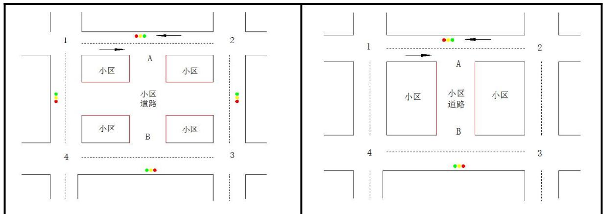
图 5 小区开放程度偏大
图 6 小区开放程度偏小

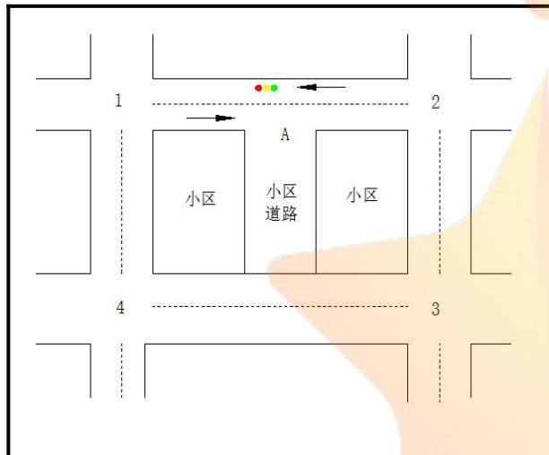
图 7 封闭型参考小区

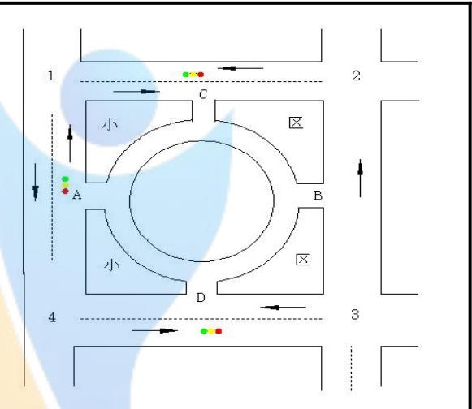
图 8 环形开放小区

图8 环形开放小区，特点：

交叉口情况：典型T 字型交叉口开放小区；设有红绿信号灯，且个数较多；交叉口双口可进出。

小区内部：开放程度较大，四条小区街道环形连接。

小区外部：交叉路口为三个双车道主干道，一个单车道主干道；周围干道路段车流量平缓

图7 是基本封闭型小区参考模型（国内大多数情况简例），特点：

交叉口情况：典型T 字型交叉口封闭小区；设有一个红绿信号灯；交叉口单口可进出。

小区内部：不开放。

小区外部：交叉路口为双车道主干道；周围干道路段车流量平缓。

图6 小区内部开放程度较大，特点：

交叉口情况：典型T 字型交叉口开放小区；设有红绿信号灯，且个数较多；交叉口双口可进出。

小区内部：开放程度较大，两条小区街道。

小区外部：交叉路口为双车道主干道；周围干道路段车流量平缓。

图5 小区内部开放程度较小，特点：

交叉口情况：典型T 字型交叉口开放小区；设有红绿信号灯，且个数较少；交叉口双

口可进出。

小区内部：开放程度较小，一条小区街道。

小区外部：交叉路口为双车道主干道；周围干道路段车流量平缓。

图7、图6差异：

图7 是封闭小区，图 6是开放小区。

图6、图5差异：

图6 开放程度偏小，图5 开放程度大。

结合式（7）\~（11）带入自建数据，运用EXCEL 软件求得：

图8模式小区对道路通行能力影响值为 $C _ { 8 } = 2 7 3 7 p c u / s$

图7模式小区对道路通行能力影响值为 $C _ { 7 } = 1 9 0 7 p c u / s$

图6模式小区对道路通行能力影响值为 $C _ { 6 } = 1 2 9 2 p c u / s$

图5模式小区对道路通行能力影响值为 $C _ { 5 } = 7 8 2 p c u / s$

结论：由 $C _ { 5 } < C _ { 6 } < C _ { 7 } < C _ { 8 }$ 可知，相同条件下，小区开放对道路通行能力的具有增强性；且一定范围内，小区开放的程度越大，即小区内部分布越离散，其开放后对道路通行能力的增强性越大。

Step2：考虑周边道路结构差异对周边道路通行能力的影响
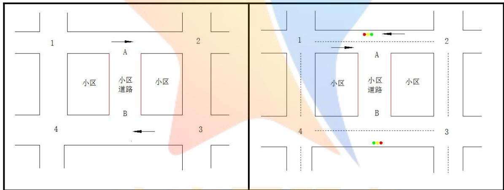
图 9 主干道为单车道
图 10 主干道为双车道

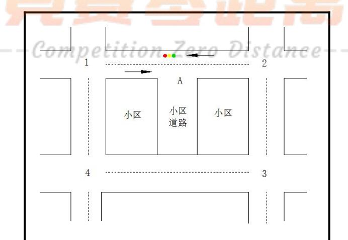
图 11 封闭型参考小区
图11是基本封闭型小区参考模型（国内大多数情况简例），特点：

交叉口情况：典型T 字型交叉口封闭小区；设有一个红绿信号灯；交叉口单口可进出。

小区内部：不开放。

小区外部：交叉路口为双车道主干道；周围干道路段车流量平缓。

图10 主干道为双车道，特点：

交叉口情况：典型T 字型交叉口开放小区；设有两个红绿信号灯；交叉口双口可进出。

小区内部：开放程度较小，一条小区街道。

小区外部：交叉路口为双车道主干道；周围干道路段车流量平缓。

图9 主干道为单车道，特点：

交叉口情况：典型T 字型交叉口开放小区；无红绿信号；交叉口双口可进出。

小区内部：开放程度较小，一条小区街道。

小区外部：交叉路口为单车道主干道；周围干道路段车流量平缓。

图11、图10差异：

图11是封闭小区，图10 是开放小区。

图10、图9差异：

图10双车道主干道，图9 单车道主干道。

结合式（7）\~（11）带入自建数据，运用EXCEL 软件求得：

图11 模式小区对道路通行能力影响值为 $C _ { _ { 1 1 } } = 7 8 2 p c u / s$

图10 模式小区对道路通行能力影响值为 $C _ { 1 0 } = 1 2 9 6 p c u / s$

图9 模式小区对道路通行能力影响值为 $C _ { \mathrm { 9 } } = 3 9 1 p c u / s$

结论：由 $C _ { 9 } < C _ { 1 1 } < C _ { 1 0 }$ 可知，相同条件下，小区开放对道路通行能力的具有增强性；一定范围内，小区周边的道路网络越复杂（如车道数多）越多，其小区开放后对道路通行能力的增强性越大。

Step3：考虑车流量差异（小区位置）对周边道路通行能力的影响
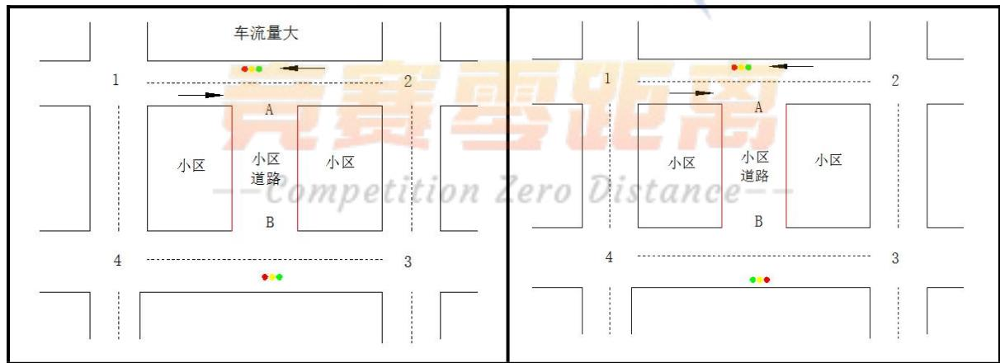
图 12 车流量较大
图 13车流量平缓

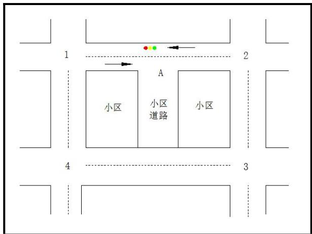
图 14 封闭型参考小区

图14是基本封闭型小区参考模型（国内大多数情况简例），特点：

交叉口情况：典型T 字型交叉口封闭小区；设有一个红绿信号灯；交叉口单口可进出。

小区内部：不开放。

小区外部：交叉路口为双车道主干道；周围干道路段车流量平缓。

图13主干道车流量平缓，特点：

交叉口情况：典型T 字型交叉口开放小区；设有两个红绿信号灯；交叉口双口可进出。

小区内部：开放程度较小，一条小区街道。

小区外部：交叉路口为双车道主干道；周围干道路段车流量平缓。

图12主干道车流量较大，特点：

交叉口情况：典型T 字型交叉口开放小区；设有两个红绿信号灯；交叉口双口可进出。

小区内部：开放程度较小，一条小区街道。

小区外部：交叉路口为单车道主干道；周围干道路段车流量较大。

图14、图13 差异：

图14是封闭小区，图 13 是开放小区。

图13、图12 差异：

图13主干道车流量平缓，图 12 主干道车流量较大。

结合式（7）\~（11）带入自建数据，运用EXCEL 软件求：

图14 模式小区对道路通行能力影响值为 $C _ { 1 4 } = 7 8 2 p c u / s$

图13 模式小区对道路通行能力影响值为 $C _ { 1 3 } = 1 2 9 6 p c u / s$

图12 模式小区对道路通行能力影响值为 $C _ { _ { 1 2 } } = 1 1 5 2 p c u / s$

结论：由 $C _ { 1 4 } < C _ { 1 2 } < C _ { 1 3 }$ 可知，相同条件下，小区开放对道路通行能力的具有增强性；且相同条件下，周边道路的车流量越大（如所处位置差异），增强能力越小；但一定范围内，小区周边的道路网络越复杂（如车道数多）越多，其小区开放后对道路通行能力的增强性越大。

## 5.4 问题四模型的建立和求解

## 5.4.1 交通流模型的建立和求解

1）部分符号说明

<table><tr><td rowspan=1 colspan=1>序号</td><td rowspan=1 colspan=1>符号</td><td rowspan=1 colspan=1>符号说明</td></tr><tr><td rowspan=1 colspan=1>1</td><td rowspan=1 colspan=1> $\nu _ { f }$ </td><td rowspan=1 colspan=1>自由流车速</td></tr><tr><td rowspan=1 colspan=1>2</td><td rowspan=1 colspan=1> $k _ { j }$ </td><td rowspan=1 colspan=1>阻塞密度</td></tr><tr><td rowspan=1 colspan=1>3</td><td rowspan=1 colspan=1> $\nu _ { m }$ </td><td rowspan=1 colspan=1>最大交通流对应速度</td></tr><tr><td rowspan=1 colspan=1>4</td><td rowspan=1 colspan=1> $k _ { m }$ </td><td rowspan=1 colspan=1>最大交通流对应密度</td></tr><tr><td rowspan=1 colspan=1>5</td><td rowspan=1 colspan=1>k</td><td rowspan=1 colspan=1>车流密度</td></tr><tr><td rowspan=1 colspan=1>6</td><td rowspan=1 colspan=1>V</td><td rowspan=1 colspan=1>车流速度</td></tr><tr><td rowspan=1 colspan=1>7</td><td rowspan=1 colspan=1>Q</td><td rowspan=1 colspan=1>车流流量</td></tr></table>

## 2）模型的准备：

街道通行能力的研究大都围绕着车流流量、车流速度和车流密度3大交通流基本参数的关系进行，小区也不例外，为了定量分析小区里的交通结构、车流密度和车流速度，等的关系，本文采用网上调研的方法对本地某一小区进行了具体分析研究，并根据这些参数的关系给小区的开放提供部分合理化的建议。

首先建立v和k的基本关系模型，再根据 $Q = \nu \times k$ 这一基本关系将其转换成v和Q的关系模型，而这里的Q近似等效小区街道通行能力。本文是根据摩托车所占小区车量比重m和其对小区内v、k和Q的影响来分析小区内“禁摩”措施的有效性。

## 3）数据的收集

本文借助百度卫星地图电脑工具，随机选取本地一较大开放规模小区点P进行观测研究。由于在观测中，小区内电动车出现的次数极少，而小区内自行车、小轿车和摩托车等常用出行工具大量出现，故下文统计和分析单以此三种车型具体开展。

在该小区中心地段处选择长度 $L = 1 k m$ 的A、B街道路段作为“观测段”，从上午$t _ { 1 } { = } 9 { : } 0 0$ 左右开始观测到该路段内车流密度比较均匀、车速比较稳定时，统计出其中车辆总数为N ，并记录其中自行车数为 $N _ { 1 }$ 、小轿车数 $N _ { 2 }$ 以及摩托车数目 $N _ { 3 }$ 。同时观测$t _ { 1 } { = } 9 { : } 0 0$ 时刻恰好通过A点的车辆，追踪该车，待该车到达B 点后，记录此时时刻为$t _ { 2 } { = } 9 { : } 0 4$ 。故在本次观测中车流速度：

$$
\nu = \frac { L } { t _ { 2 } - t _ { 1 } }\tag{15}
$$

测算的第一次 $\nu = 1 5 k m / h$

因城区道路上交通成分各异，具有不同动力特性、外形尺寸和行驶行为的车辆混合行驶形成交通流，因此需要采用道路折算系数PEC将各种研究车型转化为相应的当量车辆数。依据 1995 年起实行的《城市道路交通规划设计规范》可知，城市道路以小客车为基本单位，自行车的折算系数为0.2，小轿车的折算系数为1，摩托车的折算系数为0.5，则有车流密度：

$$
k { = } \frac { 0 . 2 N _ { 1 } { + } N _ { 2 } { + } 0 . 5 N _ { 3 } } { L }\tag{16}
$$

即测算的第一次 $k = 6 5 . 0 p c u / k m$

同理以每20min为时间间隔，重复以上观察步骤，共记录9组统计数据，用EXCEL处理式（15）（16）后见表7：

表 7 小区街道内车辆观测统计数据
<table><tr><td rowspan=1 colspan=1>观测次数</td><td rowspan=1 colspan=1>自行车数量 $p c u$ </td><td rowspan=1 colspan=1>小客车数量 pcu</td><td rowspan=1 colspan=1>摩托车数量pcu</td><td rowspan=1 colspan=1>摩托车的数量比重m</td><td rowspan=1 colspan=1>车流速度km/ h</td><td rowspan=1 colspan=1>车流密度 $p c u / k m$ </td></tr><tr><td rowspan=1 colspan=1>1</td><td rowspan=1 colspan=1>0</td><td rowspan=1 colspan=1>10</td><td rowspan=1 colspan=1>0</td><td rowspan=1 colspan=1>0.000</td><td rowspan=1 colspan=1>112</td><td rowspan=1 colspan=1>10.0</td></tr><tr><td rowspan=1 colspan=1>2</td><td rowspan=1 colspan=1>2</td><td rowspan=1 colspan=1>19</td><td rowspan=1 colspan=1></td><td rowspan=1 colspan=1>0.045</td><td rowspan=1 colspan=1>97</td><td rowspan=1 colspan=1>25.5</td></tr><tr><td rowspan=1 colspan=1>3</td><td rowspan=1 colspan=1>2</td><td rowspan=1 colspan=1>25</td><td rowspan=1 colspan=1>2</td><td rowspan=1 colspan=1>0.069</td><td rowspan=1 colspan=1>89</td><td rowspan=1 colspan=1>32.0</td></tr><tr><td rowspan=1 colspan=1>4</td><td rowspan=1 colspan=1>2</td><td rowspan=1 colspan=1>33</td><td rowspan=1 colspan=1>3</td><td rowspan=1 colspan=1>0.078</td><td rowspan=1 colspan=1>71</td><td rowspan=1 colspan=1>40.5</td></tr><tr><td rowspan=1 colspan=1>5</td><td rowspan=1 colspan=1>3</td><td rowspan=1 colspan=1>39</td><td rowspan=1 colspan=1></td><td rowspan=1 colspan=1>0.087</td><td rowspan=1 colspan=1>59</td><td rowspan=1 colspan=1>50.0</td></tr><tr><td rowspan=1 colspan=1>6</td><td rowspan=1 colspan=1>3</td><td rowspan=1 colspan=1>40</td><td rowspan=1 colspan=1>5</td><td rowspan=1 colspan=1>0.104</td><td rowspan=1 colspan=1>45</td><td rowspan=1 colspan=1>51.5</td></tr><tr><td rowspan=1 colspan=1>7</td><td rowspan=1 colspan=1>3</td><td rowspan=1 colspan=1>41</td><td rowspan=1 colspan=1>6</td><td rowspan=1 colspan=1>0.120</td><td rowspan=1 colspan=1>36</td><td rowspan=1 colspan=1>53.0</td></tr><tr><td rowspan=1 colspan=1>8</td><td rowspan=1 colspan=1>4</td><td rowspan=1 colspan=1>50</td><td rowspan=1 colspan=1>8</td><td rowspan=1 colspan=1>0.129</td><td rowspan=1 colspan=1>22</td><td rowspan=1 colspan=1>66.0</td></tr><tr><td rowspan=1 colspan=1>9</td><td rowspan=1 colspan=1>4</td><td rowspan=1 colspan=1>49</td><td rowspan=1 colspan=1>8</td><td rowspan=1 colspan=1>0.131</td><td rowspan=1 colspan=1>15</td><td rowspan=1 colspan=1>65.0</td></tr></table>

## 4）模型的建立

建立Greenshields 交通流模型<sup>[1]</sup>：

$$
\nu = { \nu _ { _ { f } } } ( 1 - \frac { k } { k _ { _ { j } } } )\tag{17}
$$

且已知v求k计算公式为：

$$
k = k _ { _ { j } } ( 1 - \frac { \nu } { \nu _ { _ { f } } } )\tag{18}
$$

则车流量Q为：

$$
Q = k \nu = k _ { _ { j } } ( \nu - \frac { \nu ^ { 2 } } { \nu _ { _ { f } } } )\tag{19}
$$

## 5）模型的求解

应用表 7 的统计数据，对（16）式采用线性回归模型进行分析，运用MATLAB <sup>[2]</sup>软件编程（见附录程序 2），得到k的关系，见图15：

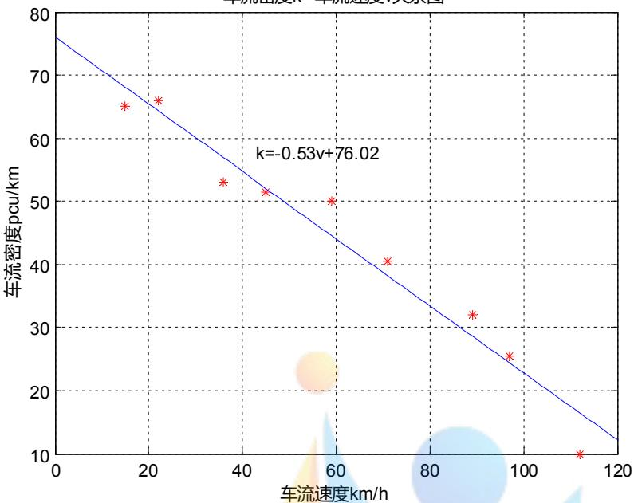
图 15 k - v 关系图

分析图15可知，小区内街道的k成负线性相关。

对比式（18）可得，图15 拟合直线斜率：

$$
\frac { \nu _ { f } } { k _ { j } } = - 0 . 5 3
$$

截距等于阻塞密度：

$$
k _ { j } { = } 7 6 . 0 2 p c u / k m
$$

故得该小区街道内的自由流车速：

$$
\nu _ { { f } } = \frac { k _ { { j } } } { 0 . 5 3 } = 1 4 3 . 4 3 k m / h
$$

再结合式（19）计算出车流流量的公式：

$$
Q = 7 6 . 0 2 \nu - 0 . 5 3 \nu ^ { 2 }\tag{20}
$$

根据式（20）运用MATLAB软件（见附录程序3）画出Q与v的关系图，见图16：

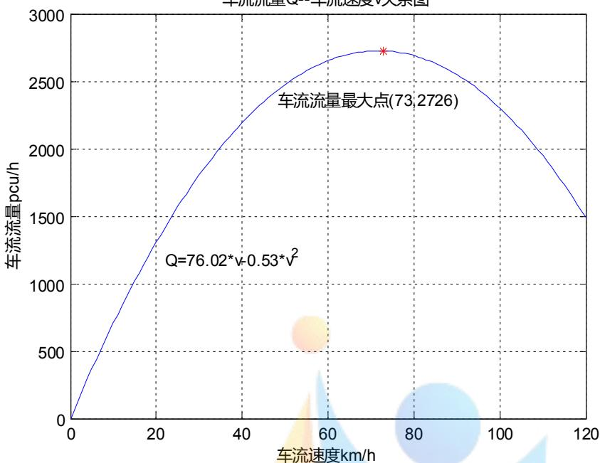
图 16 Q关系图

由图16可知，随着v的增大，Q先增大后减少。

当 $\nu = 7 3 k m / h$ 时，有最大值 $Q = 2 7 2 6 p c u / h$ 。

为研究m（为明显显示走向，故将m扩大100倍）、v和k的关系，运用EXCEL软件画出9组数据中的三者散点图，见图17：

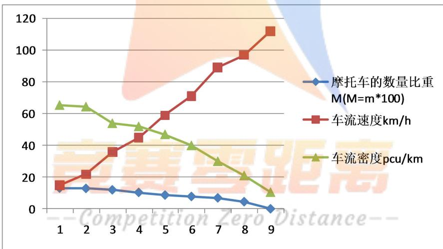
图 17 m 、v和k散点图

由图17可知，m越小，v越大，k随之减小，即小区内街道的通行能力越强，这也说明了开放小区内“禁摩”的措施的重要性。

为了更直接地体现 $Q - m$ 的关系，本文以Q关系和v-m 关系为桥梁，通过建立$\mathcal { Q } \overline { { \mathbf { \Lambda } } } m$ 关系来说明“禁摩”措施对Q，即小区内街道通行能力的影响。

首先利用表7数据，运用MATLAB软件（见附录程序4）根据多项式拟合模型画出v关系图，见图18：

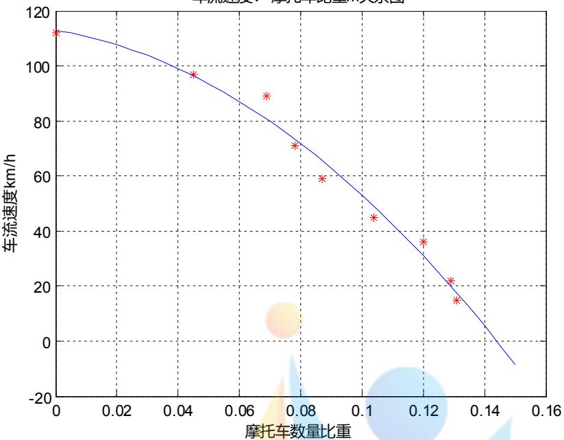
图 18 v-m 关系图

由图18解得：

$$
\nu = - 4 1 9 2 m ^ { 2 } - 1 7 9 . 8 m + 1 1 2 . 9\tag{21}
$$

结合（20）（21）两式，求得Q关系式：

$$
\underline { { Q } } = 7 6 . 0 2 ( - 4 1 9 2 m ^ { 2 } - 1 7 9 . 8 m + 1 1 2 . 9 ) - 0 . 5 3 ( - 4 1 9 2 m ^ { 2 } - 1 7 9 . 8 m + 1 1 2 . 9 ) ^ { 2 }\tag{22}
$$

根据式（22）运用 MATLAB 软件（见附录程序5）画出Q关系图，见图19：

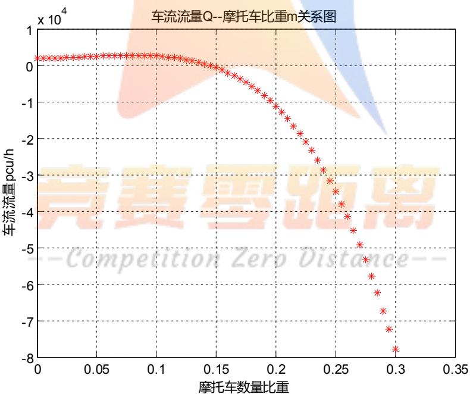
图 19 Q -m 关系图

由图 19 可以明显地看出，当m越大时，Q越小；反之，Q越大，即小区内街道通行能力越强，所以充分体现出“禁摩”措施对小区内街道通行能力提高的具有显著性；加之摩托车行驶噪声较大、安全系数低，故建议交通管理部门对开放小区内实行“禁摩”措施。

## 5.4.2 合理化建议

人们对小区开放仍然存在很多顾虑，一项政策的实行需要经过不断地探索和一步步地改进，“开放式小区”在一定程度上对城市道路交通体系有所改善。但在试行初期它难免也会存在一些弊端，为了让“开放式小区”的政策更加完善、给人们提供更多的便利同时得到更多人的认可，向有关部门提出改善它的合理化建议变得十分重要。

## 1）对城市规划部门的合理化建议

城市规划部门一般指城市规划局，其工作内容包括对城市的区域规划及城市建设布局并根据建设需要提出实施规划的措施和步骤等。因此小区在进行“开放化”改革时，城市规划部门发挥着重要作用。

在考虑城市总体规划时，可充分考虑并利用小区内部的道路进行交通流量的分担，考虑小区开放对周边道路通行能力的影响，要结合小区的内部结构，周边道路的结构等诸多因素进行综合评价，确定如何布局的小区适合开放，确定小区的开放形式，以合理的方式来取得最大的效益。

小区在实行逐步开放时，不仅仅只孤立的考虑一个或几个小区的开放，应综合考虑周边甚至整个城市适合的小区的开放情况。若只有几个小区孤立的实行开放，而其它大多数小区还是封闭的，则城市的“毛细血管”间仍处于堵塞状态，交通通行能力可能不能得到显著提高，这样实行小区开放政策的效果可能不尽理想，甚至耗时耗力劳民伤财。城市内大多数小区是封闭的，若要将它们一次性打开是有一定难度的。首先，大多数居民认为“封闭式小区”能够给他们提供一种“家的归属感”，所以在拆除围墙时，要想取得小区内所有住户的同意会是一个很大个难题。城市规划部门应采取一定的措施鼓励居民积极响应号召，如：可以通过替小区居民上缴一定的物业费、免费给小区内加大绿化面积等措施来提高居民响应的积极性。

为了让“开放式小区”深入城市，让整个城市的道路通行能力得到显著增强，城市规划部门还应规定以后新建的小区必须都为开放式的，不再允许“封闭式小区”的建立。若有违反规定者，则必重罚其中的责任人，并勒令让其尽快拆除围墙或栏杆。

小区开放后，其内部供外面行人和车辆使用的道路会增多，小区内相应的另一些面积就会减少，比如新增道路可能占用原有的绿化面积、占用原先的停车位，甚至还可能导致拆除供居民日常娱乐的小广场等，这很可能会引起居民的强烈不满。因此，道路规划部门应尽量补偿居民的这些损失，可以通过一系列措施如：在小区剩余绿地内适当多植树、在小区内合理利用道路面积设立停车位、在小区周围建立小广场等来对居民进行补偿。

## 2）对交通管理部门的合理化建议

交通管理部门分为两条线管理：一条是管理机动车的部门，如交通管理局和下属的交通支队；另一条是管理路政及公路维修的部门，如交通局和公路局。小区实行开放时需要规划决定应在内部建立几条道路、是否增设红绿灯等一系列问题，这些问题的解决需要具体的考虑小区内部结构，周边道路结构等因素，同时要着重考虑到小区开放对周边道路通行能力的影响。因此交通管理部门做出正确决策是保证小区开放给居民生活带来便利的前提。

公路局在进行小区内部道路修建时，要综合考虑多方面的因素。首先，设计道路的宽度要较好的适合小区内部的实际情况，合理的应用土地面积；其次，设计的道路布局要尽量合理并规则，不要有太多角度太大的转弯，防止车辆因行驶速度过快时造成交通事故；最后，道路一定要严格控制声音的分贝，防止车辆噪声太大对居民正常作息造成影响。

红绿灯的增设对道路通行起着重要的作用，应该合理设置红绿灯交替的时间，既保证出行安全又能考虑保持通行能力，这样才能体现出“开放式小区”的建立对道路通行有所改善。如公路局人员可以通过实地测量，用统计的方法采集数据经过精确计算来确定红绿灯的合适时间。

合理的控制进出小区的车辆类型比例，以确保小区内部的道路通行能力并保证安全性，如本文的禁摩措施，在控制进入的摩托车数量后，能够明显提高小区内道路通行能力，并且在安全状况与噪声污染方面都能有明显改善

在进行小区内部道路设计前，要制定出合理方案，确定具体修建几条路能够最大程度地缓解小区附近交通压力，同时还兼顾考虑了道路方向的影响。

## 六、模型的评价与推广

## 6.1 模型的优点

1）问题一在合理选取评价指标后建立模糊综合评价模型，对 6个指标进行综合分析，为避免主观评价对真实情况的影响，本文利用熵权法和隶属度相关知识，科学合理的确定了各评价指标的权重系数，使得整个评价模型的建立较为合理、准确。

2）问题二首先建立物理模型，整体上通达地讲述了开放小区支路后道路总的通行能力增加、拥塞问题相对减少和可达性的提高；其次以评价指标为依据，建立理论递推模型，精确地计算出小区开放前后周边道路的通行能力；最后建立多目标规划模型，意在对道路网络和小区的开放结构提出优化建议，整体模型思路清晰具有条理性。

3）问题三建立了单变量分析模型，以题目所给三大方面影响因素为研究方向，以控制变量为前提，并对各方面因素再次细分，研究不同类型的小区开放前后对其周边道路通行能力的影响，使得层次分明。

4）问题四在提出建议之前首先建立了交通流模型，将网络调研与统计分析相结合，以本地特定小区内部交通结构等因素进行研究测评，侧面反映出开放小区内部道路通行能力的关系和现状，是本文的一大亮点；以实际分析结果强烈建议小区内部实行“禁摩”和绿色出行的措施；最后结合本文之前模型和评价指标对城市规划和交通管理部门提出推进小区开放化的合理建议。

## 6.2 模型的缺点

1）因小区开放政策正在实行，模型中所采用的文献、参考数据与实际具有一定的差异。

2）问题二中理论递推模型没有考虑极复杂的专用转向车道等问题，有待进一步完善。

3）问题三中单变量分析模型没有考虑到全部类型的小区在开放前后的性能差异，有待进一步探究。

## 6.3 模型的推广

本文中的多种模型尤其是多目标规划，还可推广到其他城市规划和交通管制的政策实施问题上；模糊评价和熵权法的有效结合亦可应用于其他指标评价体系上，以相对减少个人主观因素对评价体系的影响。

## 参考文献

[1] 司守奎,孙玺菁,数学建模算法与应用,北京:国防工业出版社,2008.

[2] 张亚平,道路通行能力理论,哈尔滨:哈尔滨工业大学出版社,2007.

[3] 李向朋,城市交通拥堵对策-封闭型小区交通开放研究,长沙理工大学硕士论文,2014.

[4] 茹红蕾,邵敏华等,城市道路等效通行能力的交通流模型选择, 2007,25(2):18-22

[5] 贺超英,王少喻,MATLAB应用与实验教程,北京:电子工业出版社,2013.

[6] 史峰,王英姿等,城市交通微循环网络设计优化模型,同济大学学报,39(12):79-99,2011.

[7] 罗霞,刘澜等,交通管理及控制,北京:人民交通出版社,2008.

[8] 詹斌,蔡瑞东,胡远程,曹梦鑫,基于城市道路网络脆弱性的小区开放策略研究,技术与方法,35(7):98-103,2016.

[9] 杨晓光,赵靖,郁晓菲,考虑进出交通影响的路段通行能力计算方法,中国公路学报,22(5):84-91,2009.


## 附 录

```matlab
程序 1%熵权值求权重
clc
clear
A=[58 38 14 8 57 10
50 45 11 9 52 12
42 47 8 12 50 15
45 42 12 15 46 16
47 44 13 10 49 13];
[m,n]=size(A);
h =max(A);%最大值
H=repmat(h,m,1);
Mij=A./H;%隶属度
A2=sum(Mij);
A22=repmat(A2,m,1);
Qij=Mij./A22;%归一化
Fj=-1/log(5)*Qij.*log(Qij);
fj=sum(Fj);%熵值
dj=1-fj;%差异系数
v=dj/sum(dj);%权重系数
B=Qij*v';%最终评价
disp(B)%显示结果
程序 2%车流密度 k-车流速度v关系图
clc
clear
syms t
x=[15 22 36 45 59 71 89 97 112]';
y=[65.0 66.0 53.0 51.5 50.0 40.5 32.0 25.5 10.0]';
cfun=fit(x,y,f)%显示拟合函数，系数<sub>xi=0:1:120;</sub> xi=0:1:120;
yi=cfun(xi);
plot(x,y,'r*',xi,yi,'b-');
set(gcf,'color',[1 1 1]);
grid on;
gtext('k=-0.53v+76.02');
title('车流密度 k--车流速度 v 关系图')
xlabel('车流速度 km/h');
ylabel('车流密度 pcu/km');
程序 3%车流流量Q-车流速度v 关系图
clc
clear
```

```javascript
v=0:1:120;
Q=76.02*v-0.53.*v.^2;%健康减肥快加我的
[Q0,v0] = min(-Q)
Q0=-Q0;
plot(v,Q,v0,Q0,'r*')
set(gcf,'color',[1 1 1]);
grid on;
gtext('车流流量最大点(73,2726)');
gtext('Q=76.02*v-0.53*v^2');
title('车流流量 Q--车流速度 v 关系图')
xlabel('车流速度 km/h');
ylabel('车流流量 pcu/h');
程序 4%车流速度v-摩托车比重m 关系图
clc
clear
syms t
x=[0.131,0.129,0.12,0.104,0.087,0.078,0.069,0.045,0]';
y=[15,22,36,45,59,71,89,97,112]';
f=fittype('a*(t*t)+b*t+c','independent','t','coefficients',{'a','b','c'});
cfun=fit(x,y,f)%显示拟合函数，系数
xi=0:0.005:0.15;
yi=cfun(xi);
plot(x,y,'r*',xi,yi,'b-');
set(gcf,'color',[1 1 1]);
grid on;
title('车流速度 v--摩托车比重 m 关系图')
xlabel('摩托车数量比重');
ylabel('车流速度 km/h');
程序 5 %车流流量 Q-摩托车比重m关系图<sub>clc</sub>
clear
m=0:0.005:0.3;
Q=76.02.*(-4192.*m.*m-179.8.*m+112.9)-0.53.*(-4192.*m.*m-179.8.*m+112.9).*(-4192.*
m.*m-179.8.*m+112.9);
plot(m,Q,'r*');
set(gcf,'color',[1 1 1]);
grid on;
title('车流流量 Q--摩托车比重 m 关系图')
xlabel('摩托车数量比重');
ylabel('车流流量 pcu/h');
```