## 小区开放对道路通行的影响

摘要 随着城市规划建设的不断发展以及道路车流量增加，车辆通行能力越来越受到人们的关注，因而封闭型住宅小区和开放式住宅小区成为人们讨论的焦点。本文重点考虑了小区开放对其周边道路通行的影响，建立了合适的、完整的、系统的的影响评价模型，对其产生的影响进行合理评价，从而针对不同类型的小区给出小区开放与否的合理化建议。

首先，我们选取小区开放对周边道路通行产生的影响因素，运用聚类分析法将各个影响因素归为 3 个较为系统的评价指标中，即道路通行能力、安全性和便捷度。再利用层次分析法选出起相对关键作用的影响因素，最终得出：道路通行能力由车道数、拥堵系数、路旁干扰系数、区内支路饱和度决定，安全性由交叉路口个数所决定，便捷度由可达度所决定。据此，我们建立了一套合适的评价指标体系。

其次，根据上述指标体系，我们分别对道路通行能力、安全性和便捷度建立相关模型分析影响。对于道路通行能力，基于元胞自动机模型以及 NS 模型，我们分析得出车辆密度与车辆平均速度的之间的关系，再通过对比得出开放前后小区周边道路“交通流”的变化，进而反映出对道路通行能力的影响程度。对于安全性，我们建立了交叉口车辆通行模型，定义潜在危险度，从而定量分析小区开放对安全性的影响。对于便捷度，我们定义可达度（小区及周边范围内从小区一端到达小区另一端的支路之和与最短路径之和的比值）来反映便捷度的变化。其中最短路径通过建立最短路模型，运用Dijkstra 算法求得。接下来，我们建立模糊综合评判模型，取定因素集为以上 3个评价指标，再取定评语级，然后通过判断因素集对周边道路通行产生的影响大小来给定权值，最终分析计算得出影响程度。

接下来，我们随机选取五个具有不同特点的小区，根据上述模型得出的结果，将小区分为三种类型：适合开放的小区，不适合开放的小区，开放与否对道路通行影响不大的小区。然后我们根据这三种类型小区和周边道路的结构特点，向城市规划和交通管理部门提出有效、合理的建议。

然后，在模型的分析检验中，我们通过实际案例和运用交通仿真模拟软件 VISSIM模拟交通系统，来给出模型可靠性的依据。

最后，在模型的评估与优化中，我们对所用模型进行了合理性评估，对其缺点部分进行改进。其中，我们建立了对聚类分析法中权重确定方法进行了改进，运用“九分位法”使得权重的确定更为科学可靠；建立了结合主成分分析法的层次分析法模型；同时也对模糊综合评判模型进行了因素集、评语集以及权重确定方法的改进。

关键词 聚类分析法 层次分析法 元胞自动机 NS模型 Dijkstra算法 模糊综合评判

## 一 问题的重述

## 1.1 问题背景

从古至今，人们在住宅问题上一致采取封闭式住宅，可以隔绝外界一切纷扰，保护自己的隐私，让人更有安全感。四合院、故宫无不是封闭式。似乎，封闭式住宅更加符合传统，也更加迎合大部分人的意愿。

然而，随着经济和科技的不断发展，在交通工具激增的今天，过大的封闭式住宅也给交通带来了巨大的压力。封闭式住宅具有排他性，不允许外界车辆进出，这就导致外界车辆不得不在住宅外采取迂回的方式行驶，大大增加了道路压力。在道路消化能力一定的条件下，势必会造成交通拥挤，影响道路通行能力。

在这样的背景下，不少人提出“开放式住宅”的设想，将住宅小区的道路合并到周围的路网结构中，路网密度提高，交通问题自然有所缓解。然而，真的会像分析的一样吗？撇开小区的安保问题不说，单单是住宅开放对周边道路的影响就受很多因素的影响，比如小区的面积、位置、外部及内部道路状况等等，并不能一概而论。

小区开放对道路通行带来的影响，成为一个棘手的问题，困扰着无数城市规划和交通管理部门人员。

## 1.2 问题重述

国务院规定在原则上不再建设封闭住宅小区，已建成的住宅小区和单位大院要逐步开放。那么开放小区能否达到优化路网结构，提高道路通行能力，改善交通状况的目的，以及改善效果如何。城市规划和交通管理部门希望你们建立数学模型，就小区开放对周边道路通行的影响进行研究，为科学决策提供定量依据，为此请你们尝试解决以下问题：

1、请选取合适的评价指标体系，用以评价小区开放对周边道路通行的影响。

2、请建立关于车辆通行的数学模型，用以研究小区开放对周边道路通行的影响。

3、小区开放产生的效果，可能会与小区结构及周边道路结构、车流量有关。请选取或构建不同类型的小区，应用你们建立的模型，定量比较各类型小区开放前后对道路通行的影响。

4、根据你们的研究结果，从交通通行的角度，向城市规划和交通管理部门提出你们关于小区开放的合理化建议。

## 二 问题分析

## 2.1 对问题一的分析

由于题目中没有数据的支持，而且用以评价小区开放对周边道路通行的影响指标因素过多，我们考虑到应用聚类分析法和层次分析法来对各项指标进行决策。

首先我们利用聚类分析法将单个指标因素按照关联度和相似度分为互不影响的三大类：一是影响主路通行能力<sup>[1]</sup>的因素，包括车道数，道路面积率，拥堵系数，路旁干扰系数以及区内支路饱和度<sup>[2]</sup>；二是影响安全性的因素，包括交叉路口个数以及车辆种类；三是影响便捷度的因素，包括可达度<sup>[3]</sup>和抗堵塞能力。由此，我们列出了三个评价指标中的9个影响因素。

其次考虑到影响因素过多且有些次要因素对主路通行能力影响不大，因此我们用层次分析法来进行对影响因素的决策。在构造出评价矩阵之后，判断其一致性，最终得出适合评价小区开放对周边道路通行的影响的三个评价指标以及影响指标的 6 个因素，即车道数、拥堵系数、路旁干扰系数、区内支路饱和度、交叉口个数以及可达度。

确立评价指标之后，进行评价体系的建立，其中小区对周边道路总影响由其对通

行能力的影响，对安全性的影响以及对便捷度的影响共同决定。

## 2.2 对问题二的分析

我们利用问题一的评价指标体系，将主路通行能力、安全性和便捷度作为评价指标，将影响各个指标的因素作为对车辆通行的总影响。我们先依次通过构建模型来分析这三个指标的变化，最后利用模糊综合评判模型进行影响程度的判定。

首先，对于道路交通能力的影响，我们知道，车道数、拥堵系数，路旁干扰系数、区内支路饱和度这四个因素都是直接影响车辆密度和车辆平均速度，进而间接影响道路通行能力。因此，我们将能够准确体现车辆密度和平均速度的“交通流”作为道路通行能力的主要描述参数。进而，我们结合元胞自动机模型[4]，给出NS 规则[5]下车辆密度和车辆平均速度，并据此求出车辆密度与车辆平均速度之间的关系图，以此来分析车辆通行情况。我们考虑到，小区开放与否会改变模型中的初始参数，进而影响车辆密度和车辆平均速度。据此，我们对初始参数进行改动，通过对比，便可以得出小区开放对周围道路交通流的影响。

其次，对于安全性的影响，我们知道交叉路口是导致车祸等事故的多发地带，在小区开放前后，交叉口个数增多，因而会导致安全性有所降低。我们通过研究交叉路口的个数变化，建立交叉口车辆通行模型，定义潜在危险度<sup>[6]</sup>，定量分析小区开放对安全性的影响。

接下来，对于便捷度的影响，我们通过可达度来体现便捷程度。我们通过建立最短路模型求出从小区一端到达小区另一端的最短路径之和，进而得到可达度，定量分析可达度的大小，得出小区开放对便捷度的影响。

最后，我们建立模糊综合评判模型，对车辆通行能力、安全性和便捷度三个因素集建立了关于车辆通行的数学模型，将小区的结构、面积、各支路情况以及周边路况作为输入参数，即可得到小区开放对道路通行能力、安全性和便捷度的影响。

## 2.3 对问题三的分析

由问题二建立的模型，我们结合实例对第三问进行分析。在这一问中，我们选取五个具有代表性的小区示意图，运用第二问的模型，将行车速度、小区车道数、道路面积率、拥堵系数以及区内支路饱和度作为输入参数，综合分析各个参数之间的联系和各个参数对车辆通行的影响，从而得到不同结构、不同周边道路结构、不同车流量的小区开放对车辆通行的影响。

## 2.4 对问题四的分析

通过对问题二、三的研究和对小区实例的分析，我们从中分析总结小区开放与否的相关规律，然后结合分析小区结构及周边道路结构、车流量等因素，通过车辆通行能力、安全性以及便捷度等角度向城市规划和交通管理部门提出关于小区开放与否的合理化建议。

## 三 模型假设

1）假设最短车头间距在安全距离之外；

2）假设每个路口都安装红绿灯；

3）假设交叉路口是十字路口或丁字路口；

4）假设车辆行驶不受对向车流的影响；

5）假设车祸只发生在交叉口，其他路段事故发生率可忽略不计；

6）本文只考虑小型车辆。

## 四 符号说明

<table><tr><td>符号</td><td>说明</td></tr><tr><td>M</td><td>目标层</td></tr><tr><td>C</td><td>准则层</td></tr><tr><td>P</td><td>方案层</td></tr><tr><td> $\lambda _ { \operatorname* { m a x } }$ </td><td>最大特征值</td></tr><tr><td> $\omega$ </td><td>权重</td></tr><tr><td>Q</td><td>日交通量</td></tr><tr><td>V</td><td>车辆平均速度</td></tr><tr><td>ρ</td><td>车辆密度</td></tr><tr><td>x</td><td>车辆位置</td></tr><tr><td>α</td><td>路旁干扰系数</td></tr><tr><td> $C _ { D }$ </td><td></td></tr><tr><td>γ</td><td>设计通行能力 侧向净宽修正系数</td></tr></table>

这里只列出论文各部分通用符号，个别模型单独使用的符号在首次引用时会进行说明。

## 五 模型的建立与求解

## 5.1 问题一合适评价指标的选取

## 5.1.1 聚类分析法<sup>[7]</sup>在影响因素归类中的应用

R 型聚类法可以研究变量之间的相似关系，按照变量之间的相互关系把各个变量聚合成若干类，从而可以方便地找出影响体系的主要因素。

1）首先我们用变量相似性度量。在对变量进行聚类分析时，第一步就是确定变量的相似性度量，本文中，采取的相似性度量为相关系数，具体方法如下：

记变量x 的取值 $x _ { j }$ $( x _ { 1 j } , x _ { 2 j } , \cdots , x _ { 2 1 9 j } ) ^ { T } \in R ^ { n } ( j = 1 , 2 , \cdots , 1 1 )$ 则可以用两变量x 与 $x _ { j }$ $x _ { k }$ 的样本相关系数作为它们的相似性度量，为

$$
r _ { j k } = \frac { \displaystyle \sum _ { i = 1 } ^ { n } ( x _ { i j } - \overline { { x _ { j } } } ) ( x _ { i k } - \overline { { x _ { k } } } ) } { [ \displaystyle \sum _ { i = 1 } ^ { n } ( x _ { i j } - \overline { { x _ { j } } } ) ^ { 2 } \displaystyle \sum _ { j = 1 } ^ { n } ( x _ { i k } - \overline { { x _ { k } } } ) ^ { 2 } ] ^ { \frac { 1 } { 2 } } }
$$

2）其次我们用变量聚类法将以上影响因素分类。在本文中，采取最长距离法解决变量聚类问题，具体过程如下：

在最长距离法中，定义两类变量的距离为

$$
\mathrm { ~ R ~ } ( { \bf G } _ { 1 } , \mathrm { ~ \bf ~ G } _ { 2 } ) = \operatorname* { m a x } _ { x _ { j } \in G _ { 1 } , x \in _ { k } \in G _ { 2 } } \{ d _ { j k } \} \mathrm { ~ } ,
$$

其中， $d _ { j k } = 1 - \left| r _ { j k } \right|$ 或 $d _ { j k } ^ { 2 } = 1 - r _ { j k } ^ { 2 }$ ，此时， $\textrm { R } \left( \mathbf { G } _ { 1 } , \ \mathbf { G } _ { 2 } \right)$ 与两类中相似性最小的两变量间的相似性度量值有关。

我们将各影响因素之间的关联系数矩阵作为输入参数，经过聚类分析将相关程度比较大的影响因素作为输出。从而得到三类评价指标下的影响因素。一是影响主路通行能力的因素，包括车道数，道路面积率，拥堵系数，路旁干扰系数以及区内支路饱

和度；二是影响安全性的因素，包括交叉路口个数以及车辆种类；三是影响便捷度的因素，包括可达度和抗堵塞能力。

## 5.1.2 层次分析法构建评价体系

1）建立层次结构模型。

将决策问题分解为三个层次，最上层为目标层 M，即选择最合适的评价开放小区对周边道路通行的影响的关键指标；最下层为方案层，即九个影响因素P1，P2，P3，P4，P5，P6，P7，P8，P9；中间层为准则层，包括通行能力C1、安全性C2、便捷度C3三个指标（如图1 所示）：

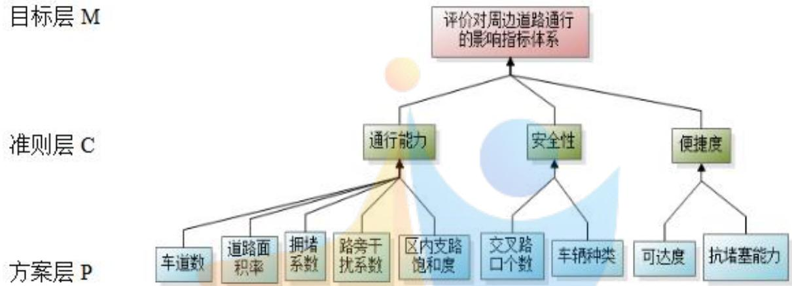  
图 1 层次分析图示

2）模型求解。

①构造判断矩阵M-C：将基准层C 中三个元素C1，C2，C3 两两比较，得成对比较矩阵。

<table><tr><td>M</td><td>C1</td><td>C2</td></tr><tr><td> ${ \sf C } _ { 1 }$ </td><td>1.0000</td><td>C3 3.0000 4.0000</td></tr><tr><td> $\mathsf { C } _ { 2 }$ </td><td>0.3333</td><td>1.0000 2.0000</td></tr><tr><td>C3</td><td>0.2500</td><td>0.5000 1.0000</td></tr></table>

表 1 比较矩阵

求解M-C的特征值，易解得 $\lambda _ { \operatorname* { m a x } } ^ { } = 3 . 0 1 8 4$ ，且权重向量 $\omega _ { \mathrm { i } } = ( 0 . 6 2 5 0 , 0 . 2 3 8 5 , 0 . 1 3 6 5 ) ^ { T }$ 由公式 $C I = { \frac { \chi _ { \mathrm { m a x } } - n } { n - 1 } }$ ，于是根据 $C R = \frac { C I } { R I }$ ,计算得到 $C R = 0 . 0 1 7 6 < 0 . 1$ ，通过了一致性检验。

<table><tr><td>n</td><td>2</td><td>3</td><td>4</td><td>5</td><td>6</td><td>7</td><td>8</td><td>9</td><td>10</td><td>11</td></tr><tr><td>RI</td><td>0</td><td>0.58</td><td>0.90</td><td>1.12</td><td>1.24</td><td>1.32</td><td>1.41</td><td>1.45</td><td>1.49</td><td>1.51</td></tr></table>

表 2 n与 RI的关系

②构造判断矩阵 C1-P、C2-P 及 C3-P。

<table><tr><td> ${ \sf C } _ { 2 }$ </td><td> $\mathsf { P } _ { 1 }$ </td><td> $\mathsf { P } _ { 2 }$ </td><td> ${ \sf P } _ { 3 }$ </td><td> $\mathsf { P } _ { 4 }$ </td><td> $\mathsf { P } _ { 5 }$ </td></tr><tr><td> $\mathsf { P } _ { 1 }$ </td><td>1.0000</td><td>0.5000</td><td>0.5000</td><td>0.4000</td><td>0.6000</td></tr><tr><td> ${ \sf P } _ { 2 }$ </td><td>2.0000</td><td>1.0000</td><td>2.0000</td><td>1.0000</td><td>0.2534</td></tr><tr><td> ${ \sf P } _ { 3 }$ </td><td>2.0000</td><td>0.5000</td><td>1.0000</td><td>2.0000</td><td>0.2550</td></tr><tr><td> $\mathsf { P } _ { 4 }$ </td><td>2.5000</td><td>1.0000</td><td>0.5000</td><td>1.0000</td><td>3.0000</td></tr><tr><td> $\mathsf { P } _ { 5 }$ </td><td>1.6667</td><td>1.0000</td><td>0.5000</td><td>0.3333</td><td>1.0000</td></tr></table>

表 3 C1-P 判断矩阵

<table><tr><td> ${ \sf C } _ { 3 }$ </td><td> $\mathsf { P } _ { 8 }$ </td><td> $\mathsf { P } _ { \mathcal { I } }$ </td></tr><tr><td> $\mathsf { P } _ { 6 }$ </td><td>1.0000</td><td>3.0000</td></tr><tr><td> $\mathsf { P } _ { 7 }$ </td><td>0.3333</td><td>1.0000</td></tr></table>

表 4 C2-P 判断矩阵

<table><tr><td> ${ \sf C } _ { 4 }$ </td><td> $\mathsf { P } _ { 1 0 }$ </td><td> $\mathsf { P } _ { 1 1 }$ </td></tr><tr><td> $\mathsf { P } _ { 8 }$ </td><td>1.0000</td><td>5.0000</td></tr><tr><td> $\mathsf { P } _ { \mathsf { 9 } }$ </td><td>0.2000</td><td>1.0000</td></tr></table>

表 5 C3-P 判断矩阵  
3)分层排序与总排序一致性检验。

将由上述的三个判断矩阵计算出的权重向量，最大特征值 $\lambda _ { i }$ 和一致性指标 $C R _ { j }$ 列入表中。

<table><tr><td>层次C</td><td> $\mathrm { C } _ { 1 }$ </td><td rowspan="2">层次C 层次P</td><td> $\mathrm { C _ { 2 } }$  </td><td>层次C</td><td> $\mathrm { { C _ { 3 } } }$ </td></tr><tr><td>层次P</td><td> $\mathrm { q } _ { 1 }$ </td><td> $\mathrm { { q _ { 2 } } }$ </td><td> $\mathrm { { q } _ { 3 } }$ </td></tr><tr><td> $\mathrm { { P _ { 1 } } }$ </td><td>0.1010</td><td> $\mathrm { P _ { 6 } }$ </td><td>层次P 0.7500</td><td>0.8333</td></tr><tr><td> $\mathrm { P _ { 2 } }$ </td><td>0.2534</td><td> $\mathrm { P } _ { 7 }$ </td><td>0.2500</td><td>0.1667</td></tr><tr><td> $\mathrm { { P _ { 3 } } }$ </td><td>0.2550</td><td></td><td>2.0000</td><td>D 2.0000</td></tr><tr><td> $\mathrm { { P _ { 4 } } }$ </td><td>0.2455</td><td>CRj</td><td>4  $\lambda _ { i }$  0.0000  $C R _ { j }$ </td><td>0.0000</td></tr><tr><td> $\mathrm { P _ { 5 } }$ </td><td colspan="4">0.1450</td></tr><tr><td> $\lambda _ { i }$ </td><td colspan="4">CompetitionZeroDistance 5.3515</td></tr><tr><td> $C R _ { j }$ </td><td colspan="3">0.0785</td><td></td></tr></table>

表 6 选择最合理的评判停车位分布关键指标的计算结果

从表6中 $C R _ { j }$ 的值可以看出，矩阵C1-P、C2-P、C3-P都通过了一致性检验。

## 5.1.3 模型结论与分析

根据5.1.2，我们计算出P层每个影响因素所占的总权重。将最终表格汇总成如下表格7：

<table><tr><td>评价指标</td><td>总权重</td></tr><tr><td>交叉路口个数</td><td>0.1789</td></tr><tr><td>拥堵系数</td><td>0.1594</td></tr><tr><td>路旁干扰系数</td><td>0.1584</td></tr><tr><td>区内支路饱和度</td><td>0.1535</td></tr><tr><td>可达度</td><td>0.1137</td></tr><tr><td>车道数</td><td>0.0906</td></tr><tr><td>道路面积率</td><td>0.0631</td></tr><tr><td>车辆种类</td><td>0.0596</td></tr><tr><td>● 抗堵塞能力</td><td>0.0227</td></tr></table>

表 7 影响因素权重一览表  
目标：评价对周边道路通行的影响指标体系

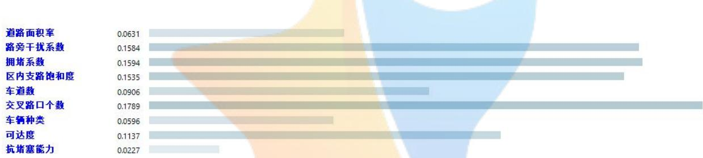  
图 2 最终结果图示

将影响地下车位布局的三个指标的因素所占比重由大到小排序，我们选择前六个占权重大的因素作为指标体系的分支，即：交叉路口个数，拥堵系数，路旁干扰系数，区内支路饱和度，可达度以及车道数。

至此，我们建立起了评价小区开放对周边主路的影响的指标体系，如图3所示：

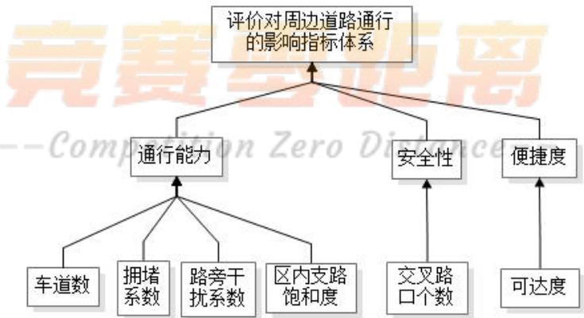  
图 3 指标体系

## 5.1.4 结果分析

## 1、影响通行能力的因素：

1）车道数：在小区开放后，路网中车道条数增多，在一定条件下缓解了主路的拥堵状况，减轻了主路的车辆负荷量；

2）小区周边主路的拥堵系数：主路拥堵程度在很大程度上决定了该段道路的通行能力，是个比较关键的影响因素；

3）路旁干扰系数：对于一般城市道路，在路段中车辆会受到行人和非机动车的干扰，路旁干扰越大，车速下降越快，使道路通行能力越小；

4）区内支路饱和度：区内支路饱和度是描述小区内能够容纳的车辆的最大率（最大交通量与最大通行能力的比值）。当小区内的车辆达到该值时，小区外车辆无法进入支路，支路中大部分车辆无法汇入主路。

## 2、影响安全性的因素：

交叉路口个数：安全性是居民对于道路通行评价的一个关键指标,其含义不仅体现在行车过程中的安全性，还表现在出现紧急情况的排障能力，而我们知道，交叉口是道路行驶中最为危险的地带，因此随着小区开放交叉口增多之后，安全性也有待提高；

## 3、影响便捷度的因素：

可达度是指该小区及周边范围内从小区一端到达小区另一端的支路之和与最短路径之和的比值。该指标能较好地反映小区内支路的发达程度和便捷度。

## 5.2 问题二模型的建立与求解

## 5.2.1 基于元胞自动机的车辆通行模型的建立

## 5.2.1.1 元胞自动机知识概述

## 1）元胞自动机

元胞自动机（简称 CA）模型是一种时间、空间、状态都离散，空间上相互作用及时间上的因果皆局部的网格动力学模型。采用“规则”来描述系统的状态，用“规则”取代数值计算，能有效的研究并描述交通流系统的演化及发展。

## 2）交通模型中相关名词的含义

元胞：将道路分成离散的等间距的格子，每个格子作为一个元胞。

元胞状态：分为有车和无车状态，根据实际情况，有车状态也仅仅表示元胞中有一辆车。

邻域：该元胞周围可供其进行状态转移的元胞位置。

状态更新规则：加速规则、减速规则、以概率P随机慢化规则、位置更新规则。

## 5.2.1.2 基于元胞自动机模型的交通流分析

在交通流的描述参数日交通量、车辆密度、车辆平均速度中，我们注意到，日交通量与车辆密度和车辆平均速度有着莫大的关联，而车辆密度和车辆平均速度之间的关系较之微弱。因此，我们考虑到用后两个参数作为交通流的主要描述参数。

进而，我们结合元胞自动机模型，给出NS 规则下车辆密度和车辆平均速度，并据此求出车辆密度与车辆平均速度之间的关系图，以此来分析车辆通行情况。

小区开放与否会通过影响道路分布进而对车辆通行情况产生一定的影响，我们考虑到，小区开放与否会改变模型中的初始参数，进而影响车辆密度和车辆平均速度。我们据此，对初始参数进行改动，通过对比，便可以得出小区开放对周围道路交通流的影响。

## 5.2.1.3 交通流的描述参数

1）交通流量：单位时间内通过道路某横断面的车辆数。

交通流量的单位包括年交通量，季交通量，月交通量，周交通量，日交通量等等。而本文主要的研究重点是日交通量。

2）车辆平均速度：交通流内部车辆速度的算术平均值。一般分为时间平均速度和空间平均速度。本文研究的重点是空间平均速度即某一瞬间时刻所有车辆瞬时速度的平

均值，其计算公式如下：

$$
\nu = \frac { \displaystyle \sum _ { i = 1 } ^ { n } \nu _ { i } } { n }\tag{1}
$$

式中：n为车辆数目

$\nu _ { i }$ 为第 i 辆的瞬时速度

3）车辆密度：单位长度上，某瞬间存在的车辆数，公式如下：

$$
\rho = { \frac { N } { L } }\tag{2}
$$

式中：N 为路段内的车辆数（辆）

L为路段长度（千米）

在交通工程实践中，车辆密度是表现道路交通拥挤状况的最适合的指标。美国的《道路通行能力手册》中就用密度作为路段服务水平的描述指标。

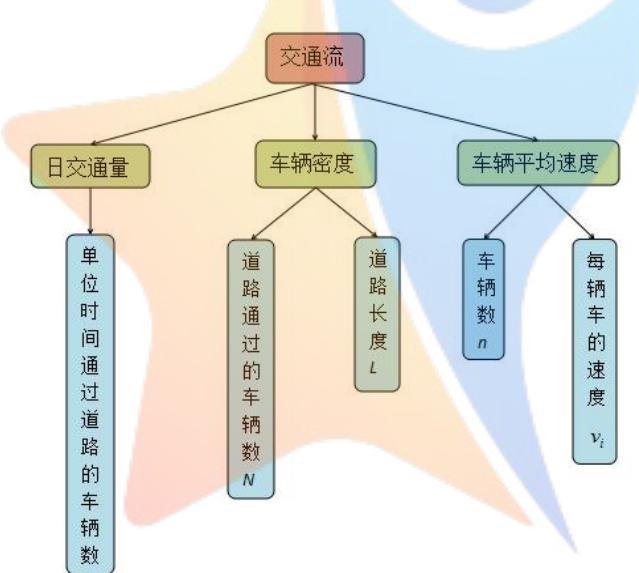  
图 4 交通流影响因素

## 5.2.1.4 基于元胞自动机<sup>[8]</sup>的车辆通行模型的建立

NS 模型的模型规则为：假设第 n 辆车的速度和位置分别用 $\nu _ { n }$ 和 $x _ { n }$ 来表示。其中，速度 $\nu _ { n }$ 可以在 $0 , \ 1 , \ 2 , \ \dots , \ \nu _ { _ \mathrm { m a x } }$ 内取值。而 $d _ { n } = x _ { n + 1 } - x _ { n } - l$ 表示第 n 辆车和第 $\mathrm { n } { + } 1$ 辆车之间的距离（l为车长），则所有车辆的状态按以下演化规则并行计算。

1.加速过程： $\nu _ { n } ( t + 1 ) = \operatorname* { m i n } ( \nu _ { n } ( t ) + 1 , \nu _ { \mathrm { m a x } } ) ;$

2.安全刹车： $\nu _ { n } ( t + 1 ) = \operatorname* { m i n } ( \nu _ { n } ( t + 1 ) , d _ { n } ) ;$

3.已概率 p随机慢化： $\nu _ { n } ( t + 1 ) = \operatorname* { m a x } ( \nu _ { n } ( t + 1 ) - 1 , 0 ) ;$

4.位置更新： $\begin{array} { r } { \boldsymbol { x } _ { n } \left( t + 1 \right) = \boldsymbol { x } _ { n } \left( t \right) + \boldsymbol { \nu } _ { n } \left( t + 1 \right) ; } \end{array}$

接下来，我们再将车辆通行能力简化成车辆密度与车辆平均速度的求取，根据元胞自动机模型理论以及交通流的相关参数，我们给出了车辆通行的模型代码（源代码见附录），代码流程图如图 5所示：

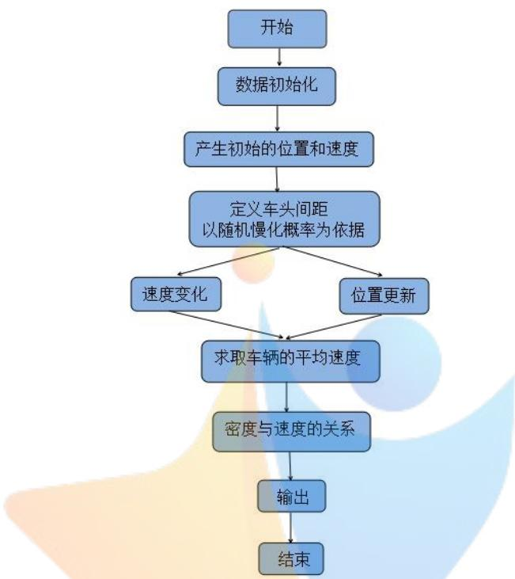  
图 5 车辆通行模型代码流程图

通过基于元胞自动机的车辆通行模型，输入小区的相关参数，我们便可以得到小区开放对其周边主路的道路通行能力的影响。

## 5.2.2 信号交叉口安全评价模型的构建

## 5.2.2.1 车辆通过交通交叉口的运行状态

在我国现行交通信号灯的控制下，观察车辆通过信号灯交叉口的实际运行状态，其全过程如图6：

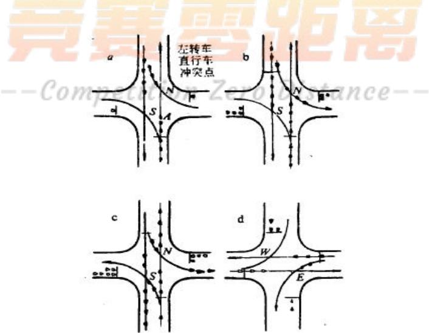  
图 6 车辆过信号灯交叉口的状态

## 5.2.2.2 交叉口安全评价指标体系<sup>[9]</sup>的构建

我们考虑到交叉口相对固定的物理特征，隐含交通安全性能特性的交通冲突，以及具有空间和时间变化性的交通特性，将基于安全服务水平的交叉口交通安全的评价指标体系划分为交通冲突、交通特性和交通物理特征 3 大类，构建的指标体系如图 7所示：

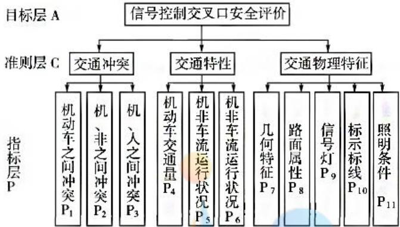  
图 7 交叉口安全评价指标体系

## 5.2.2.3 主模型的构建

为了更好地表达交通冲突点对交通安全的重要性，我们引用潜在危险度的涵义来评价交叉口的安全状况。潜在危险度越大，说明交叉口可能发生的交通事故越严重，从而交叉口越不安全

信号交叉口有红绿灯的控制，一方面交叉口的冲突点数量会减少，另一方面交叉口所存在的冲突点并不能同时发挥作用，所以在分析冲突点导致的潜在危险度时，根据每个相位实际所获得的通行时间，来加权计算一个信号周期内的总的冲突点数，通行时间即为黄灯和绿灯时间之和。因此，构建交叉口冲突点造成的潜在危险度计算模型见公式：

$$
P D _ { s } = \sum _ { c } W _ { c } \times P D _ { s c }\tag{3}
$$

式中： $P D _ { s }$ 为信号控制交叉口潜在危险度；c 为交叉口冲突点的类型（机-机冲突、机-非冲突）； $W _ { c }$ 为各类型冲突点的权重； $P D _ { s c }$ 为c 类型冲突点造成的信号交叉口潜在危险度，包括了 $P D _ { s \nmid \mathrm { l } - \nmid \mathrm { l } } , P D _ { s \nmid \mathrm { l } - \nmid \mathrm { l } } , P D _ { s \nmid \mathrm { l } - \Lambda }$ 可按下面公式计算：

$$
P \bar { D } _ { s c } ^ { t } \equiv \sum _ { i } \bar { N } _ { i } \times \frac { g _ { r } + y _ { r } } { T } \times \bar { G } \bar { M } _ { i }\tag{4}
$$

式中：i 为c 类型冲突点的种类； $N _ { i }$ 为i种类点的个数； $g _ { r }$ 为r 相位的绿灯时间（s）；$y _ { r }$ 为r相位的黄灯时间（s）；T为相位信号周期长度（s）； $G M _ { i }$ 为i种类冲突点的恶性程度。

## 5.2.3 基于最短路模型的便捷度影响分析

## 5.2.3.1 最短路模型建立

在考虑到居民从电梯口到自家车位的所用时间问题时，我们将时间最短做为该目

标函数的最优目标，针对该问题我们采用的优化模型是图论中解决最短路问题的Dijkstra 算法。

V和E 分别是图的顶点的集合 $\mathsf { V } \equiv \{ \nu _ { 1 } , \nu _ { 2 } , \cdots , \nu _ { n } \nu _ { 1 } , \nu _ { 2 } , \cdots , \nu _ { n } \}$

边的集合 $\mathrm { E } { = } \{ e _ { 1 } , e _ { 2 } , \cdots , e _ { m } \}$

弧的集合， $\mathrm { A } { = } \{ a _ { 1 } , a _ { 2 } , \cdots , a _ { m } \}$

链：在无向图中，点与边的交错序列 $( \mathbf { \nabla } _ { \nu _ { i } ^ { 1 } } ^ { 1 } , e _ { i } ^ { 1 } , \nu _ { i } ^ { 2 } , \cdots , \nu _ { i } ^ { k - 1 } , e _ { i } ^ { k - 1 } , \nu _ { i } ^ { k } \mathbf { \nabla } )$

称为连结 $\nu _ { i \cdot } ^ { 1 }$ 和 $\nu _ { i } ^ { k }$ 的链。 ${ \bf \Xi } ( e _ { i } ^ { t }$ 为连接 $\nu _ { i } ^ { t }$ 和 $\nu _ { i } ^ { t + 1 }$ 的边 )

路径: $( \nu _ { i } ^ { 1 } , a _ { i } ^ { 1 } , \nu _ { i } ^ { 2 } , \cdots , \nu _ { i } ^ { k - 1 } , a _ { i } ^ { k - 1 } , \nu _ { i } ^ { k } )$ 是有向图中一条链 $( \mathrm { \Delta } a _ { i } ^ { t }$ 为连接 $\nu _ { i } ^ { t }$ 和 $\lvert \nu _ { i } ^ { t + 1 }$ 的弧），

称之为从 $\nu _ { i } ^ { 1 }$ 到 $\nu _ { i } ^ { k }$ 的路径。

圈：闭合的（无向）链称为圈。

回路：闭合的路径称为回路。

连通图：图G中任何两个点之间至少有一条链，称 G为连通图。

树：一个无圈的连通图称为树。

生成树（支撑树）：若 $\mathbf { G } _ { 1 } = ( \mathbf { V } _ { 1 } , \mathbf { \beta } \in \mathbb { Z } _ { 1 } )$ ）是连通图 $\mathrm { G } _ { 2 } = ( \mathrm { V } _ { 2 } , \mathrm { E } _ { 2 } )$ 的生成子图 (即

${ \sf V } _ { 1 } = { \sf V } _ { 2 } , { \sf E } _ { 1 } \subseteq { \sf E } _ { 2 } )$ ，且 $\mathrm { G } _ { 1 }$ 本身是树，则称 $\mathrm { G } _ { 1 }$ 为 $\mathbf { G } _ { 2 }$ 的生成树。

## 5.2.3.2 最短路模型求解算法

Dijkstra 算法是一种标号法，基本思想是从起点出发，向外逐步搜索最短路，直到扩展到终点为止。

其算法如下：

$$
\begin{array} { r l } & { \mathrm { ~ w h i l k ~ e n t ~ \# ~ \# ~ \# ~ \# ~ \# ~ \# ~ \# ~ \# ~ } } \\ & { \quad \quad \quad \quad \quad \quad \quad \quad \quad \quad \quad \quad \quad \quad \quad \quad \quad \quad \quad \quad \quad \quad \quad \quad \quad \quad \quad \quad \quad \quad \quad \quad \quad \quad \quad \quad \quad \quad \quad \quad \quad \quad \quad \quad } \\ & { \quad \quad \quad \quad \quad \quad \quad \quad \quad \quad \quad \quad \quad \quad \quad \quad \quad \quad \quad \quad \quad \quad \quad \quad \quad \quad \quad \quad \quad \quad \quad \quad \quad \quad \quad \quad \quad \quad \quad } \\ & { \quad \quad \quad \quad \quad \quad \quad \quad \quad \quad \quad \quad \quad \quad \quad \quad \quad \quad \quad \quad \quad \quad \quad \quad \quad \quad \quad \quad \quad \quad \quad \quad \quad \quad \quad \quad \quad \quad \quad \quad \quad \quad \quad \quad } \\ & { \quad \quad \quad \quad \quad \quad \quad \quad \quad \quad \quad \quad \quad \quad \quad \quad \quad \quad \quad \quad \quad \quad \quad \quad \quad \quad \quad \quad \quad \quad \quad \quad \quad \quad \quad \quad \quad \quad \quad \quad \quad } \\ & { \quad \quad \quad \quad \quad \quad \quad \quad \quad \quad \quad \quad \quad \quad \quad \quad \quad \quad \quad \quad \quad \quad \quad \quad \quad \quad \quad \quad \quad \quad \quad \quad \quad \quad } \\ & { \quad \quad \quad \quad \quad \quad \quad \quad \quad \quad \quad \quad \quad \quad \quad \quad \quad \quad \quad \quad \quad \quad \quad \quad \quad \quad \quad \quad \quad \quad \quad \quad \quad \quad \quad \quad \quad } \\ & { \quad \quad \quad \quad \quad \quad \quad \quad \quad \quad \quad \quad \quad \quad \quad \quad \quad \quad \quad \quad \quad \quad \quad \quad \quad \quad \quad \quad \quad \quad \quad \quad \quad \quad \quad \quad \quad } \\ & { \quad \quad \quad \quad \quad \quad \quad \quad \quad \quad \quad \quad \quad \quad \quad \quad \quad \quad \quad \quad \quad \quad \quad \quad \quad \quad \quad \quad \quad \quad \quad \quad \quad \quad \quad \quad } \\ &  \quad \quad \quad \quad \quad \quad \quad \quad \quad \quad \quad \quad \quad \quad \quad \quad \quad \quad \quad \quad \quad \quad  \end{array}
$$

在该问题中，最短路径求解的是从该小区及周边范围内一端到达另一端的最短路径 $\mathrm { S } _ { 1 }$ ，再求出小区及周边范围内从小区一端到达小区另一端的支路之和 $\mathrm { S } _ { 2 }$ ，即可求出可达度 $\frac { S _ { 2 } } { S _ { 1 } }$ ，由此得到了小区开放对便捷度的影响。

## 5.2.4 模糊综合评判模型<sup>[10]</sup>的建立

1）确定因素集。车辆通行，最关心的不外乎道路通行能力、安全性、便捷度这三个因素。因此，我们取因素集

$$
\mathsf { U } = \{ \exists \ @ \mathbb { E } \mathbb { H } \exists \ @ \mathcal { \vec { H } } \mathbb { H } \forall \mathbb { E } \mathcal { I } \} , \ : \ : \widetilde { \mathbb { X } } \pounds \mathbb { H } \colon \mathbb { H } \ P \notin \mathbb { H } \Join
$$

2）确定评语集。在本问题中，我们取评语集为

$$
V = \{ \mathcal { \hat { X } } \mathcal { \vec { Z } } \nu _ { 1 } , ~ \mathcal { \vec { \mathbb { E } } } \mathcal { \vec { Y } } \nu _ { 2 } , ~ \longrightarrow ~ \mathcal { \hat { H } } \mathbb { X } \nu _ { 3 } , ~ \mathcal { \hat { H } } \mathcal { \vec { Z } } \nu _ { 4 } , ~ \mathcal { \vec { \mathbb { E } } } \nu _ { 5 } \}
$$

3）确定各因素的权重。根据人们对车辆通行因素的关注程度，我们取权重为

$$
\mathbf { A } = \{ 0 . 6 , \ 0 . 2 , \ 0 . 2 \}
$$

4）确定模糊综合判断矩阵。对指标 $u _ { i }$ 的评判记作 $\mathrm { R } _ { i } = [ r _ { i 1 } , r _ { i 2 } , r _ { i 3 } , r _ { i 4 } , r _ { i 5 } ]$ ，则各指标的模糊综合判断矩阵为

$$
\mathrm { R } = \left[ { \begin{array} { l l l l l } { r _ { 1 1 } } & { r _ { 1 2 } } & { r _ { 1 3 } } & { r _ { 1 4 } } & { r _ { 1 5 } } \\ { r _ { 2 1 } } & { r _ { 2 2 } } & { r _ { 2 3 } } & { r _ { 2 4 } } & { r _ { 2 5 } } \\ { r _ { 3 1 } } & { r _ { 3 2 } } & { r _ { 3 3 } } & { r _ { 3 4 } } & { r _ { 3 5 } } \end{array} } \right]
$$

它是从因素集到评语集的一个模糊关系矩阵。

5）模糊综合评判。进行矩阵合成运算：

$$
\mathrm { B } = \mathrm { A } \cdot \mathrm { R }
$$

取 B中数值最大的评语作为综合评判结果。

由以上步骤，我们便建立了模糊综合评判模型，从而能对影响程度进行合理的定性分析：影响程度分为影响非常大、影响大、影响小、影响较小、无影响。

## 5.2.5 基于案例的结果分析

以如图 8 的小区为例，分析其车辆通行情况：

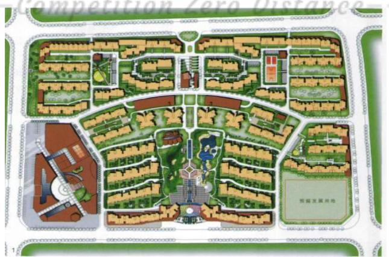  
图 8 小区及周边道路示意图

在输入小区开放前后的相关数据后，我们得到了如下结果：

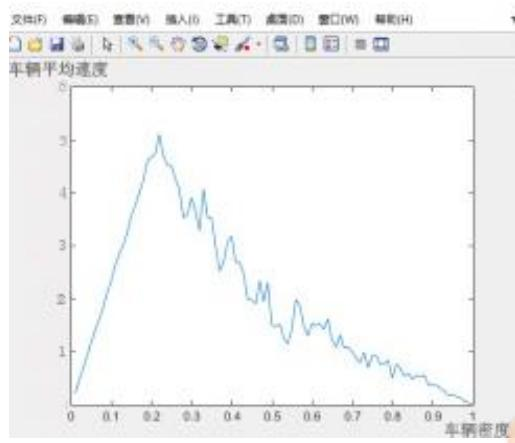  
小区开放前（左）

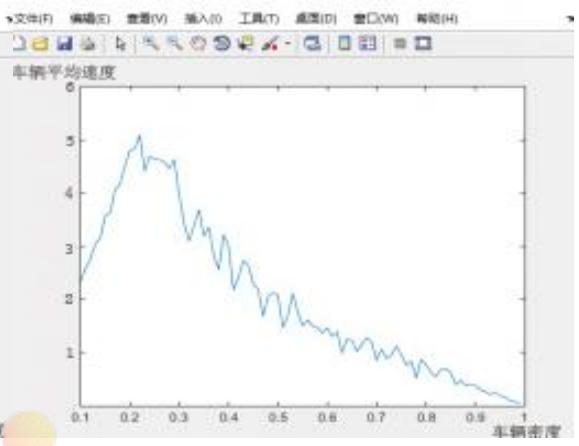  
小区开放后（右）  
图 9 车辆密度与车辆平均速度关系图

首先，从结果的关系图我们可以看出车辆平均速度随着车辆密度的增大现有一个快速的增大，之后减少，并随着车辆密度趋于 1时，车辆平均速度趋于 0.从实际角度来说，这个关系是成立的，在一定的车辆密度的基础上，随着车辆密度的增加，堵塞现象发生的几率增大，车辆速度也会随之减小。

从结果的图像结合实际情况来看，我们的车辆通行模型也是可靠的。

另一方面，小区开放前后的两张图的对比中，我们可以看出，小区开放之后，当车辆密度在 0.2 到 0.3 之间时，可以很明显的看到，小区开放后的车辆平均速度高了很多，因而，此时的交通量也提升了很多。而根据之前的分析我们得到，道路交通流可以用车辆密度和平均速度来衡量，据此，我们可以得出例子中的小区在开放后的道路通行情况要优于开放前。

结合小区的实际情况，我们也能明显的感觉到，小区开放后，原有的路网结构基础上新增了 3 条支路，作为周边道路的“毛细血管”，分担了部分车流量，使得车辆密度在 0.2 到 0.3 之间时，车辆分布没有之前那么集中了，车速也随之增加了。而当车辆密度再次增加时，这种优势没有这么明显了，由此可见，小区开放也不是万能的，只能在一定条件下对道路通行有积极地影响。

基于此，城市道路压力的缓解并不能完全寄希望于小区开放，更应该从原有的路网结构基础上，对其进行改进，缓解交通压力。

## 5.3 问题三的求解

由问题二建立的模型，我们结合实例对第三问进行分析。在这一问中，我们选取五个具有代表性的小区示意图，运用第二问的模型，将行车速度、小区车道数、道路面积率、拥堵系数以及区内支路饱和度作为输入参数，综合分析各个参数之间的联系和各个参数对车辆通行的影响，从而得到不同结构、不同周边道路结构、不同车流量的小区开放对车辆通行的影响程度<sup>[11]</sup>。

在实际情况中，我们还需要考虑到道路通行能力修正系数，包括路旁干扰系数和路宽及侧向净空修正系数的影响。

## 5.3.1 道路通行能力修正系数<sup>[12]</sup>

## 1. 路旁干扰系数

对于一般城市道路，在路段中车辆会受到行人和非机动车的干扰（在这里我们不考虑对向车流的影响），这些因素对机动车道的综合影响程度，即路旁干扰系数。可以认为，路旁干扰越大，车速下降越快，使道路通行能力越小。因此，我们用车速下降率来作为路旁干扰系数，即路旁干扰系数 $\alpha = \nu _ { _ a } / \nu _ { b }$ ，其中 $\nu _ { a }$ 为受干扰后的车速， $\nu _ { b }$ 为未受干扰的车速。因此，我们把受干扰道路的情况划分为以下七类：

1）不受非机动车干扰，不受行人干扰的车道：即四块板道路及有行人隔离的两块板机动车专用道；

2）不受非机动车干扰，受行人干扰的车道：即无行人隔离的两块板机动车专用道；

3）受非机动车干扰，不受行人干扰的车道：即两块板有行人隔离的机非混行车道；

4）受非机动车干扰，受行人干扰的车道：两块板机非混行道路。

在一系列车速观测的基础上，分析各种道路的车速下降率，即得出路旁干扰系数为：

1） $\alpha _ { 1 } = 1$

2） $\alpha _ { 2 } = 1 - 0 . 0 0 0 5 4 p$

3） $\alpha _ { 3 } = 1 - 0 . 0 0 2 7 q$ i

4） $\alpha _ { 4 } = ( 1 - 0 . 0 0 2 0 1 x ) ( 1 - 0 . 0 0 0 5 4 p )$ 。

式中：<sub>p</sub>—行人流量/3 分钟

—自行车流量/（10min/m）。

## 2.路宽及侧向净空修正

为使设计道路建设初期有一个宽适的交通条件，并为后期交通需求增长留有余地，在设计通行能力时，运用服务水平的概念还是必要的，即设计通行能力应使道路达到某种服务水平前提下的通行能力。则设计通行能力 $C _ { d }$ 为：

$$
C _ { d } = C _ { a p } \times \frac { \nu } { c } \times \alpha \times \omega \times \gamma\tag{5}
$$

式中： $C _ { a p }$ —相应于某种设计车速下的饱和度；

—相应于某一服务水平下的饱和度；

$\alpha$ —路旁干扰修正系数；

—侧向净宽修正系数。

<table><tr><td>服务水平</td><td>饱和度 v/c</td><td>交通状态</td></tr><tr><td>I</td><td>0.25</td><td>城市道理自由流</td></tr><tr><td>II</td><td>≤ 0.50</td><td>道路稳定流</td></tr><tr><td>III</td><td>≤ 0.70</td><td>交叉口溢流周期低于3%</td></tr><tr><td>ⅣV</td><td>≤ 0.85</td><td>稳定溢流</td></tr><tr><td>V</td><td>≤ 0.95</td><td>交通堵塞</td></tr></table>

表 8 服务水平及相应的交通状态

## 5.3.2 结合实例的小区开放对车辆通行的影响

基于上述分析，我们考虑到可以将路段通行能力与交叉口通行能力以适当的权重

$$
y = \rho _ { 1 } \cdot C _ { d } + \rho _ { 2 } \cdot N\tag{6}
$$

式中: $\rho _ { 1 }$ 为路段通行能力的权重

$\rho _ { 2 }$ 为交叉口通行能力的权重，当交叉口数量增加时，权重相应减少

据此，我们通过所编写的程序（源代码见附录），随机选取了 5个不同的小区进行分析，最终我们得到其中3个小区开放后道路通行能力显著提高，1个小区开放前后道路通行能力没有显著变化，还有 1 个小区开放后道路通行能力大幅下降。本文只以三类中的典型代表为例，对其进行分析，其余见附录。

## 案例一：开放后对道路产生积极影响

以小区三为例，小区内部及周边道路如图 10所示：

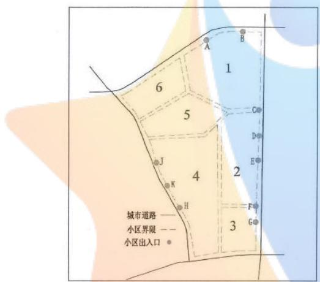  
图 10 小区三及周边道路情况

最终运行结果：

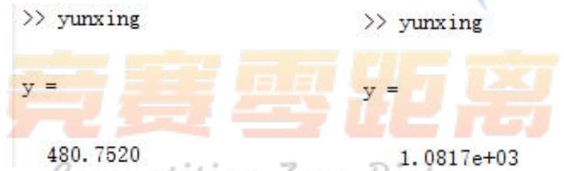  
图 11 左为小区开放前 右为开放后

从运行结果来看，小区开放后道路通行能力提高了很多。而从实际情况出发，首先，我们注意到，该小区内部道路较宽，与小区外道路几乎无差异；其次，小区内部道路可以直通外界；除此之外，小区外路网结构简单，开放后，相当于道路面积增加，能够有效缓解交通压力。

故，仅从道路通行能力来讲，此类小区开放较好。

## 案例二：开放后产生消极影响

以小区五为例，小区内部及周边道路如图 12所示：

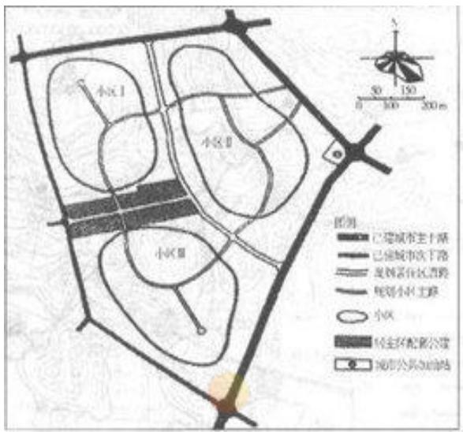  
图 12 小区五及周边道路情况  
最终运行结果：

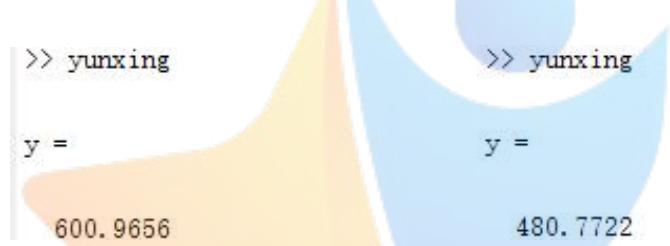  
图 13 左为小区开放前 右为开放后

从运行结果来看，小区开放后道路通行能力有了明显的下降迹象。从实际情况出发，首先我们注意到小区内部的道路较窄，会降低整个道路体系的路宽修正系数，而且即便开放后能够分走部分车流量，对于整个道路体系来讲，效果也不显著。其次，小区内部的路为环形路且有数条尽端路，无法连接外界，车辆进入小区势必要迂回前进甚至走不出去，如此一来会造成小区内部堵塞现象严重，增加车辆行驶时间。

故，仅从道路通行能力来讲，此类小区不开放较好。

案例三：开放与否影响不显著

以小区四为例，小区内部及周边道路如图 14所示：

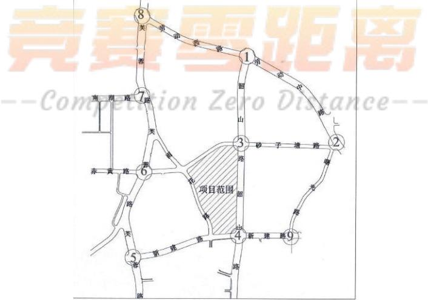  
图 14 小区五及周边道路情况  
最终运行结果：

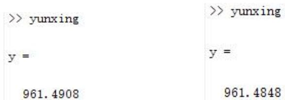  
图 15 左为小区开放前 右为开放后

从运行结果来看，小区开放前后，道路通行能力相差甚微。而从实际情况出发，首先我们注意到，小区路网结构较好，道路消化能力较强，以道路自身情况，发生车辆堵塞现象的几率较小；其次，小区占地面积较小，周围道路交叉口距离小区较远，而交叉口一般店铺、场所较多，因而对于路人而言，不需要迂回绕路也可迅速到达目的地。

因此，仅从道路通行能力来讲，不能决定此类小区开放与否。

## 5.4 问题四的建议

## 5.4.1 从我们的模型结果考虑：

在上面的三个问题中，我们建立了相应数学模型分析了小区开放前后对小区周边道路交通的影响。我们将其对小区周边道路的通行影响等效为小区开放前后，小区周边道路通行能力的比较。

由上面的分析可知，通行能力分为路段通行能力和交叉口通行能力。如果判断一小区是否适合开放来缓解小区周边道路的交通拥堵问题，我们就必须要结合这两个方面的通行能力，然后通过定量比较开放小区前后小区周边道路通行能力，再得出结论。

通过路段通行能力的计算公式（5）以及交叉口通行能力N（其计算公式及推算见附录）的计算公式 这两个公式，给定相应的权重，得到道路通行能力的计算公式：

$$
y = \rho _ { 1 } \cdot C _ { d } + \rho _ { 2 } \cdot N\tag{7}
$$

根据上式，我们可以引入小区开放前后道路通行能力的差值：

$$
\mathrm { Q } = y _ { \mathrm { \mathcal { F } \dot { \mathcal { H } } \acute { \mathcal { H } } \sqrt { \Xi } } } - y _ { \mathrm { \mathcal { F } \dot { \mathcal { H } } \acute { \mathcal { H } } \acute { \Xi } \acute { \Xi } \acute { \Xi } } }\tag{8}
$$

来判断一个小区是否适合开放。

若 Q为正，且其值较大，则表明小区开放对交通产生的正面影响较大，适合开放；  
若 Q为负，且其值较大，则表明小区开放对交通产生的负面影响较大，不适合开放；  
其他情况，说明小区开放对交通产生的影响不大，需要综合其他因素对其进行判断。

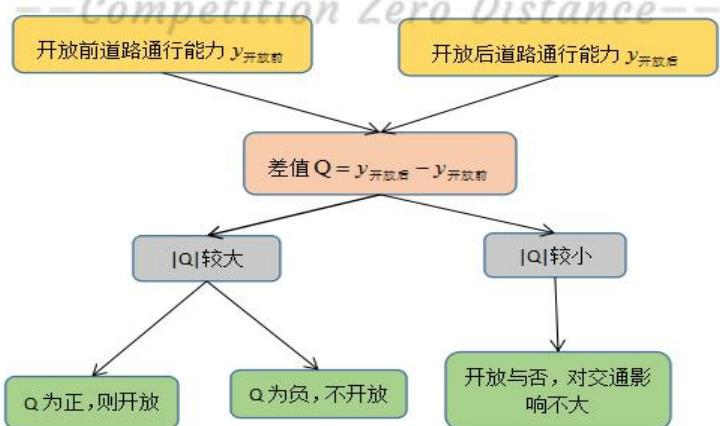  
图 16 小区开放与否的评判准则

## 5.4.2 对城市规划部门和交通部门的建议

## 1）对城市规划部门提出的建议：

A. 小区是否开放与小区自身的条件有关，比如小区自身的规模、小区内部的道路级别、交叉口数量以及道路迂回程度等因素有关。因此，开放小区内部的道路交叉口数量尽量少，道路尽量为直线，避免环线等，使得小区内部的道路可以充当“毛细血管”，缓解交通压力。

B.小区的位置。开放小区尽量安排在交通较为拥挤的地段，通过小区的开放，相当于在原有路网结构的基础上，增加了道路面积，可以缓解当地的交通压力。

C. 当小区开放对周边交通产生的积极影响较大时，考虑小区开放问题。由于小区开放所牵扯到的不仅仅是外来车辆及行人，对小区也会产生很大影响，故在考虑小区开放时，要多方位考虑。

## 2）对交通部门的建议：

A. 在开放小区增加交通指挥人员，减少小区内部交通事故的发生。

B.与此同时，加大小区内乱停车现象的处罚力度。小区内车辆停放会对小区内交通产生巨大影响，尤其是外来车辆乱停车可能会导致交通堵塞，起不到小区开放的目的。

## 六 模型的分析检验

## 6.1 结合实例分析的模型检验

在问题二和问题三中，我们运用多个小区实例作为检验模型正确与否的依据。通过将模型运用于实际并得到合理性的结果，因此我们认为，在一定误差允许范围内，我们所建立的模型具有很强的可靠性。

## 6.2 基于交通仿真模拟软件 VISSIM<sup>[13]</sup>的模型检验

我们以5.3.2中的案例一为例来说明该仿真模拟软件。我们通过VISSIM仿真软件建立小区周边路段仿真模型，输入出道路，交通特性等因素，模拟其中车流的运行状态机器随时空变化的过程。通过对仿真运行过程的观察、仿真结果的统计分析，对仿真路段的运行状态进行评价分析。

输入行车道宽度、纵坡设计、平曲线和限速标志，建立小区三及其周边交通仿真模型。为降低 VISSIM随机性对交通冲突影响，对每个方案各进行 5次仿真（每次仿真使用不同的随机数）

为了评价该未开放小区在今后随着交通量的逐年增加的运行状态，以预测10年后的交通量为基准，分别以该基准的 70%、80%进行相应敏感度分析，得到该小区未开放时的交通运行状况如下图 17所示：

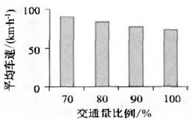  
(a) 平均车速

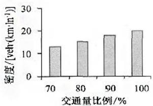  
(b) 密度  
图 17 小区未开放时的交通运行状况

由上图可以看出，随着今后道路投入运营，交通量也在逐年增加，该路段的运行状态逐年变差，箭筒刘运行的状况也在明显变差。因此我们得出：该小区开放后会缓解周边主路交通压力，从而有助于交通运行状况。该结论与我们 5.2.3中的分析达成一致，故也证明我们建立模型具有很强的可靠性。

## 七 模型的评估与优化

## 7.1 问题一模型的评估与优化

## 7.1.1 聚类分析法和层次分析法的评估

（1）聚类分析法的评估：模糊聚类是将模糊集的概念应用到传统聚类分析当中，让数据集的对象在分组中的隶属用连续区间[0,1]中的某个值来表示，这个值就是隶属度，各对象以相应的隶属度分别隶属于多个簇。其优点在于可以将那些分离性不是很好的数据进行聚类，但目前已有的传统模糊聚类分析法往往对聚类目标各属性特征之间的相关性以及不同特征属性对聚类目标存在重要性差异等问题没有进行充分考虑，而这些问题是不可忽视的。

（2）层次分析法的优点：层次分析法具有系统性、简洁实用、所需定量数据信息较少，这种方法尤其可用于对无结构特性的系统评价以及多目标、多准则、多时期等的系统评价，而且结果简单明确、可信度较高。然而，层次分析法虽然可以简单地把综合指标量化，但在权重的确定方面主观性太强，因此通过构造出来的判断矩阵所求出来的权值不一定可靠从而不能客观的评价交通的影响指标。

## 7.1.2 聚类分析法中权重确定的改进<sup>[14]</sup>

为有效降低专家评估时的主观性，使得量化的判断值能够更客观的反应实际情况，我们引入“九分位法”，让专家对各评价指标进行相对重要性的两两比较。用1,3,5,7,9,1/3,1/5,1/7,1/9 等数值来代表相对重要程度。

依据相对重要性指标组成的判断矩阵，即可计算各特征属性的权重，具体计算流程图如图18所示：

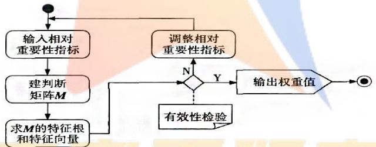  
图 18 判断矩阵计算流程图

## 7.1.3 结合主成分分析法<sup>[15]</sup>的层次分析法改进与优化

首先，通过统计实际情况中影响道路通行的指标，然后结合本题中的关于开放小区前后对于小区周边道路通行的影响来建立一套新的评价性的指标体系；其次，通过聚类分析达到降维的目的，通过聚类分析导出几个方差贡献率较大的指标，从而简化了三级指标；再次，通过因子分析对变量间的相关关系进行探测，重新考虑三级指标对二级指标的交叉影响，修订成了一个更为科学合理的多层次的目标体系，以此为基础，分析专家意见，客观准确的构造出打分矩阵；最后，根据交叉后的打分矩阵得到各指标的权重，把各指标的指标值无量纲化后，采用线性综合评价法得出各个指标的综合得分值，从而建立出一套合理的评价体系。

## 7.2 问题二模型的评估与优化

## 7.2.1 模糊综合评判模型的评估

优点：通过这几问题的分析可知，城市道路通行并没有一个绝对的决定性数值来加以区别和比较。这就决定了交通状态是具有动态和不确定性的，即表现为模糊性。又知道模糊集理论在表达语言知识和描述事物的不确定性方面发挥了很大的作用，因此我们能够比较好的利用它描述道路交通的不确定性。

缺点：计算复杂，对指标权重矢量的确定主观性较强；当指标集 U较大，即指标集个数凡较大时，在权矢量和为 1 的条件约束下，相对隶属度权系数往往偏小，权矢量与模糊矩阵R不匹配，结果会出现超模糊现象，分辨率很差，无法区分谁的隶属度更高，甚至造成评判失败。不能解决评价指标间相关造成的信息重复问题，隶属函数，模糊相关矩阵等的确定。方法有待进一步研究。

## 7.2.2 模糊综合评判模型的改进与优化

1）确定样本U的第i个指标对 $\nu _ { j }$ 的隶属度 $r _ { i j } \ ( \ i = 1 , 2 , \cdots , m ; j = 1 , 2 , \cdots , n )$ ，得到模糊矩阵$\mathrm { R } _ { m \times n }$

2）确定指标i的权 $w _ { i }$ ，得到权向量 $\mathbf { W } = ( w _ { 1 } , w _ { 2 } , \cdots , w _ { m } )$

3）计算综合隶属度：

$$
\mathbf { B } = \mathbf { W } \cdot \mathbf { R }
$$

4）综合评分： $\mathrm { H } = \sum _ { j = 1 } ^ { n } b _ { j }$

5）评价结果：根据H的计算值与哪一类的j最接近，即可判断样本U属于哪类。

## 八 参考文献

http://baike.baidu.com/link?url=6IwkrYg2lMCusAwEu\_0ivwn8YlIvRYXc5bPHpjKaGl49vmNo00ToG fJeRILceSsaKqxmQLoX-595OA4JcDA7Dq , 2016.9.9

http://wenku.baidu.com/link?url=L2s75BhDnp9KJTdQeTkjcmQGGOINybLL4O5PbSNp5jcUggro8wJj3 jcHVHEv0j-IxxMz8nXbMcfm3npMEc7YJzhaAre2EEk9mUzv4nzyq8m , 2016.9.9

[3]曾松,杨佩昆,方棣波. 城市道路网结构的可达性评价[J]. 同济大学学报(自然科学版),2001,06:666-671

[4]基于元胞自动机的交通流建模与仿真研究 - 豆丁网,http://www.docin.com/p-903117627.html?qq-pf-to=pcqq.discussion,2016.9.10http://www.docin.com/p-473858445.html

[5]袁耀明. 交通流元胞自动机模型的解析和模拟研究[D].中国科学技术大学,2009.

[6 ]汪莹,黄新. 城市道路信号交叉口安全评价体系的构建与应用[J]. 森林工程,2014,06:118-123+128.

[7]司守奎，数学建模算法与应用，北京，国防工业出版社，2011，200-202页

[8]吴大艳. 三车道元胞自动机交通流模型的研究[D].广西师范大学,2004.

[9]汪莹,黄新. 城市道路信号交叉口安全评价体系的构建与应用[J]. 森林工

程,2014,06:118-123+128.

[10]司守奎，数学建模算法与应用，北京，国防工业出版社，2011，351-352页

[11]商仲华. 居住小区开发交通影响分析研究[D].长安大学,2006.

[12]茹红蕾. 城市道路通行能力的影响因素研究[D].同济大学,2008.

[13]孙璐,丁爱民,钱军,李根. 基于 VISSIM 仿真模拟的道路改造方案评价[J]. 公路交通科技,2012,06:26-30.

[14]黄闽英,牟锐. 对模糊聚类分析法的改进及其在 SRM 中的应用[J]. 计算机工程与科学,2011,06:144-149.

[15]张秀红,马迎雪,李延晖. 结合主成分分析法改进后的层次分析法及应用[J]. 长江大学学报(自科版),2013,04:30-32+39.

九 附录

## 9.1 问题一程序及图表

## 9.1.1 聚类分析法

## 1）输入矩阵

<table><tr><td> $\mathsf { C } _ { 2 }$ </td><td> $\mathsf { P } _ { 1 }$ </td><td> ${ \sf P } _ { 2 }$ </td><td> ${ \sf P } _ { 3 }$ </td><td> $\mathsf { P } _ { 4 }$ </td><td> $\mathsf { P } _ { 5 }$ </td><td> $\mathsf { P } _ { 6 }$ </td><td> $\mathsf { P } _ { 7 }$ </td><td> $\mathsf { P } _ { 8 }$ </td><td> $\mathsf { P } _ { 9 }$ </td></tr><tr><td> $\mathsf { P } _ { 1 }$ </td><td>1.00</td><td>0.85</td><td>0.90</td><td>0.81</td><td>0.7600</td><td>0.30</td><td>0.42</td><td>0.21</td><td>0.33</td></tr><tr><td> $\mathsf { P } _ { 2 }$ </td><td>0.85</td><td>1.00</td><td>0.83</td><td>0.90</td><td>0.85</td><td>0.30</td><td>0.10</td><td>0.32</td><td>0.21</td></tr><tr><td> ${ \sf P } _ { 3 }$ </td><td>0.90</td><td>0.83</td><td>1.00</td><td>0.79</td><td>0.92</td><td>0.21</td><td>0.11</td><td>0.16</td><td>0.26</td></tr><tr><td> $\mathsf { P } _ { 4 }$ </td><td>0.81</td><td>0.90</td><td>0.79</td><td>1.00</td><td>0.70</td><td>0.30</td><td>0.19</td><td>0.14</td><td>0.27</td></tr><tr><td> $\mathsf { P } _ { 5 }$ </td><td>0.76</td><td>0.85</td><td>0.92</td><td>0.70</td><td>1.000</td><td>0.17</td><td>0.10</td><td>0.12</td><td>0.25</td></tr><tr><td> $\mathsf { P } _ { 6 }$ </td><td>0.30</td><td>0.30</td><td>0.21</td><td>0. 30</td><td>0.17</td><td>1.00</td><td>0.92</td><td>0.23</td><td>0.17</td></tr><tr><td> $\mathsf { P } _ { 7 }$ </td><td>0.42</td><td>0.10</td><td>0.11</td><td>0.19</td><td>0.10</td><td>0.92</td><td>1. 00</td><td>0.25</td><td>0.14</td></tr><tr><td> $\mathsf { P } _ { 8 }$ </td><td>0.21</td><td>0.32</td><td>0.16</td><td>0.14</td><td>0.12</td><td>0.23</td><td>0.25</td><td>1.00</td><td>0.95</td></tr><tr><td> $\mathsf { P } _ { \mathcal { I } }$ </td><td>0.33</td><td>0.21</td><td>0.26</td><td>0.27</td><td>0.25</td><td>0.17</td><td>0.14</td><td>0.95</td><td>1.00</td></tr></table>

## 2）聚类分析法程序

<table><tr><td>a=[1.00 0.85</td><td>0.90</td><td>0.81</td><td>0.7600</td><td>0.30</td><td>0.42</td><td>0.21</td><td>0.33;</td></tr><tr><td>0.85 1.00</td><td>0.83</td><td>0.90</td><td>0.85</td><td>0.30</td><td>0.10</td><td>0.32</td><td>0.21;</td></tr><tr><td>0.90</td><td>0.83 1.00</td><td>0.79</td><td>0.92</td><td>0.21</td><td>0.11</td><td>0.16</td><td>0.26;</td></tr><tr><td>0.81 0.90</td><td>0.79</td><td>1.00</td><td>0.70</td><td>0.30</td><td>0.19</td><td>0.14</td><td>0.27;</td></tr><tr><td>0.76</td><td>0.85 0.92</td><td>0.70</td><td>1.000</td><td>0.17</td><td>0.10</td><td>0.12</td><td>0.25;</td></tr><tr><td>0.30</td><td>0.30</td><td>0.21 0.30</td><td>0.17</td><td>1.00</td><td>0.92</td><td>0.23</td><td>0.17;</td></tr><tr><td>0.42</td><td>0.10</td><td>0.11 0.19</td><td>0.10</td><td>0.92</td><td>1.00</td><td>0.25</td><td>0.14;</td></tr><tr><td>0.21</td><td>0.32 0.16</td><td>0.14</td><td>0.12</td><td>0.23</td><td>0.25</td><td>1.00</td><td>0.95;</td></tr><tr><td>0.33</td><td>0.21</td><td>0.26 0.27</td><td>0.25</td><td>0.17</td><td>0.14</td><td>0.95</td><td>1.00];</td></tr></table>

```matlab
<sup>d=1-abs(a);</sup>y=linkage(d,'average');
j=dendrogram(y);
for i=1:3
b=find(L==i);
b=reshape(b,1,length(b));
fprintf('第%d 类的有%s\n',i,int2str(b));
End
```

## 3） 结果输出

## 9.1.2 层次分析法

<sup>1）</sup>%层次分析法判别矩阵的一致性检验代码clc,clear%P=[1 4 5;1/4 1 3;1/5 1/3 1];%判别矩阵P=[1.0000 3.0000 4.0000;0.3333 1.0000 2.0000;0.2500 0.5000 1.0000];%判别矩阵[L,G]=eig(P);%求特征根和相应的特征向量w=L(:,1)/sum(L(:,1));%归一化特征向量近似为权重值max=max(eig(P));%求最大特征根n=size(P);CI=(max-3)/(3-1);RI=1.12; 查表对应 的情况CR=CI/RIif CR>=0.1error('A 不通过一致性检验')end

## <sup>2）</sup>%层次分析法判别矩阵的一致性检验代码

[L,G]=eig(P);%求特征根和相应的特征向量  
w=L(:,1)/sum(L(:,1));%归一化特征向量近似为权重值max=max(eig(P));%求最大特征根  
n=size(P);  
CI=(max-5)/(5-1);  
RI=1.12; %查表对应 n=5 的情况  
CR=CI/RI

## 9.2 问题二程序及结果

## 基于元胞自动机模型的车辆通行模型源代码

## 9.2.1 小区开放前

```matlab
clc;
clear all;
T=3030;
P=0.3; %随机慢化概率
v_max=6; %最大速度
L=1800; 网格的数量
dens=0.002; 给定初始车辆密度
p=1; %统计流量密度数组
while dens<=1
N=fix(dens*L); %车辆数目
m=1;
产生初始随机速度
cells_sudu=randperm(N);
for i=1:N
cells_sudu(i)=mod(cells_sudu(i),v_max+1);
end
产生初始随机位置
[a,b]=find(randperm(L)<=N);
cells_weizhi=b;
%变化规则
for i=1:T
%定义车头间距
if cells_weizhi(N)>cells_weizhi(1)
headways(N)=L-cells_weizhi(N)+cells_weizhi(1)-1;
else
end
for j=N-1:-1:1
if cells_weizhi(j+1)>cells_weizhi(j)
headways(j)=cells_weizhi(j+1)-cells_weizhi(j)-1;
else
headways(j)=L+cells_weizhi(j+1)-cells_weizhi(j)-1;
end
end
%速度变化
```

```matlab
cells_suduNS1=min([v_max-1,cells_sudu(1),max(0,headways(1)-1)]); %NS 规则下
第一辆车的速度估计值
cells_sudu(N)=min([v_max,cells_sudu(N)+1,headways(N)+cells_suduNS1]); %NS 规
则下第N 辆车的速度估计值
for j=N-1:-1:1
cells_suduNS=min([v_max-1,cells_sudu(j+1),max(0,headways(j+1)-1)]); %NS 规
则下前一辆车的速度估计值
cells_sudu(j)=min([v_max,cells_sudu(j)+1,headways(j)+cells_suduNS]); %NS 规
则下第 辆车的前一辆车的速度估计值
end
以概率 随机慢化
if rand()<P;
cells_sudu=max(cells_sudu-1,0); %随机慢化规则下的速度变化
end
%位置更新
for j=N:-1:1
cells_weizhi(j)=cells_weizhi(j)+cells_sudu(j);
if cells_weizhi(j)>=L
cells_weizhi(j)=cells_weizhi(j)-L; 规则下第 辆车的位置更新
end
end
%采集数据作图
if i>L+1000 %采用每组的后 30 个变量取平均
speed(m)=sum(cells_sudu)/N; %求取平均速度
end m=m+1;
end
%不同密度下的流量数组
density(p)=dens;
dens=dens+0.01;
p=p+1;
end
plot(density,flow)
```

## 9.2.2 小区开放后

clc;   
clear all;   
T=3030;

```matlab
P=0.3; %随机慢化概率
v_max=6; %最大速度
L=2000: %网格的数量
dens=0.002; %给定初始车辆密度
p=1; %统计流量密度数组
while dens<=1
N=fix(dens*L); %车辆数目
m=1;
% 产生初始随机速度
cells_sudu=randperm(N);
for i=1:N
cells_sudu(i)=mod(cells_sudu(i),v_max+1);
end
产生初始随机位置
[a,b]=find(randperm(L)<=N);
cells_weizhi=b;
%变化规则
for i=1:T
%定义车头间距
if cells_weizhi(N)>cells_weizhi(1)
headways(N)=L-cells_weizhi(N)+cells_weizhi(1)-1;
else
headways(N)=cells_weizhi(1)-cells_weizhi(N)-1;
end
for j=N-1:-1:1
if cells_weizhi(j+1)>cells_weizhi(j)
headways(j)=cells_weizhi(j+1)-cells_weizhi(j)-1;
else
headways(j)=L+cells_weizhi(j+1)-cells_weizhi(j)-1;
end
end
%速度变化
cells_suduNS1=min([v_max-1,cells_sudu(1),max(0,headways(1)-1)]); %NS规则下
第一辆车的速度估计值
cells_sudu(N)=min([v_max,cells_sudu(N)+1,headways(N)+cells_suduNS1]); %NS 规
则下第N 辆车的速度估计值
for j=N-1:-1:1
cells_suduNS=min([v_max-1,cells_sudu(j+1),max(0,headways(j+1)-1)]); %NS 规
```

```matlab
则下前一辆车的速度估计值
cells_sudu(j)=min([v_max,cells_sudu(j)+1,headways(j)+cells_suduNS]); %NS 规
则下第j 辆车的前一辆车的速度估计值
end
%以概率P 随机慢化
if rand()<P;
cells_sudu=max(cells_sudu-1,0); %随机慢化规则下的速度变化
end
%位置更新
for j=N:-1:1
cells_weizhi(j)=cells_weizhi(j)+cells_sudu(j);
if cells_weizhi(j)>=L
cells_weizhi(j)=cells_weizhi(j)-L; %NS 规则下第 j 辆车的位置更新
end
end
%采集数据作图
if i>L+1000 %采用每组的后 30 个变量取平均
speed(m)=sum(cells_sudu)/N; %求取平均速度
m=m+1;
end
end
flow(p)=(sum(speed)/30)*dens; %不同密度下的流量数组
density(p)=dens;
dens=dens+0.01;
p=p+1;
plot(density,flow)
9.2.3 运行结果
图左为小区开放前，图右为小区开放后
```

```python
elseif m==2
```

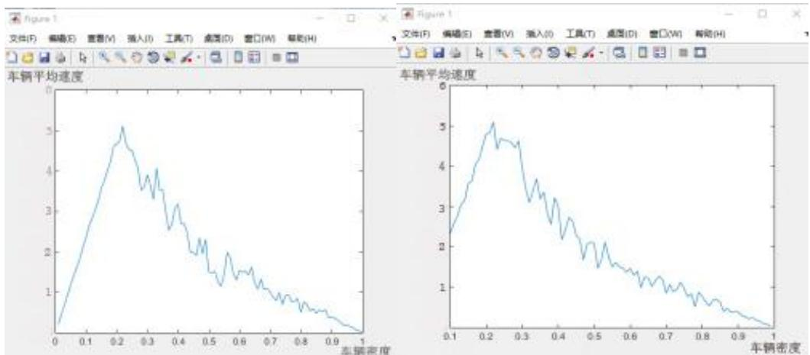

## 9.3 源代码

## 9.3.1 路段的通行能力源代码

function cd=luduan(v,b,a,w,r)

%cd为路段通行能力，v 为车辆行驶速度，a为路旁干扰修正系数，w 为路宽修正系数,

%r为侧向净宽修正系数，b 为某一服务水平的饱和度

ht=98/(v\*(14-v));

%ht为车头时距，且 hs=v\*ht,其中 hs 为车头间距cap=max(1./ht);

%cap为路段理论通行能力

cd=cap\*b\*a\*w\*r;

end

## 9.3.2 交叉口通行能力源代码

function N=jiaochakou(Te,G,m,tl,ts,te,tao,g,s)

输入变量： 表示色灯周期时长，单位为 代表绿灯时长，单位为 代表进口道直行车道的条数，取值为 1 或 2；

%tl 表示左转头车从停车线驶至冲突点所需时间（包括司机反应时间）；ts 表示直行头车从停车线驶至冲突点所需

时间（包括司机反应时间）； 表示直行尾车从停车线驶至冲突点所需时间（包括司机反应时间）；  
tao表示穿越时距；

%g表示直行车流中，一个绿灯时长内出现的“可穿越空挡”的次数;s 表示交叉路口的个数%N表示整个交叉口一个小时的通行能力

h=3.7;%一条车流紧接运行冲突点时的安全车头时距

h=2.5;%有两条并排直行车流时，相当于一条车流的等价车头时距

printf('m 的值输入错误');

代码：   
开放前：   
v=7;b=0.50;a=1;w=1;r=1;   
cd=luduan(v,b,a,w,r);   
Te=180;G=80;m=2;tl=0;ts=18.2;te=12.8;tao=8;g=2;s=3;   
N=jiaochakou(Te,G,m,tl,ts,te,tao,g,s);   
y=0.8\*cd+0.2\*N   
结果：   
>> yunxing   
300.6800   
开放后：   
v=7;b=0.50;a=1;w=1;r=1;   
Te=180;G=80;m=2;tl=0;ts=18.2;te=12.8;tao=8;g=2;s=5;   
N=jiaochakou(Te,G,m,tl,ts,te,tao,g,s);   
y=0.8\*cd+0.2\*N   
结果：   
>> yunxing   
501   
小区二：

```matlab
end
a=g*(m*tao-(m+1)*h);
n=(G-a-b)/h+m;
N=3600*s*n/Te;
end
```

## 9.3.3 不同的小区所对应的代码实现以及结果对比小区一：

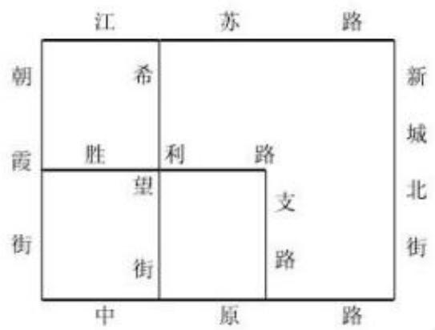

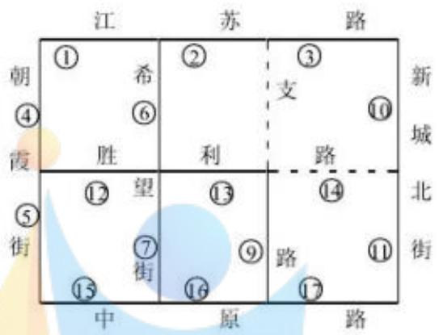  
路网结构 图左为小区开放前 图右为小区开放后

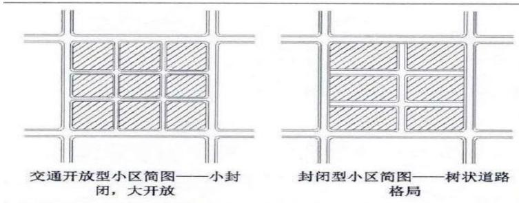

## 代码：

小区开放前：

结果：

小区开放后：

结果：

小区三：

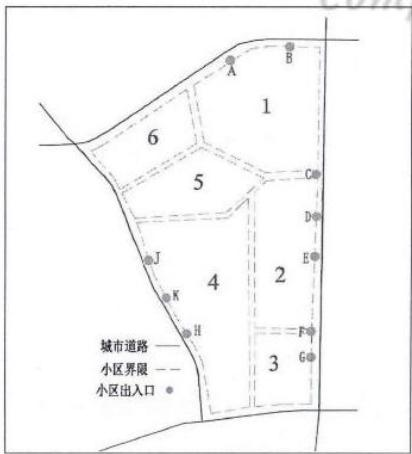

```javascript
v=7;b=0.62;a=1;w=1;r=1;
```

代码：   
小区开放前：   
v=7;b=0.28;a=1;w=1;r=1;   
cd=luduan(v,b,a,w,r);   
Te=180;G=80;m=2;tl=4.1;ts=14.9;te=11.2;tao=8;g=2;s=4;   
N=jiaochakou(Te,G,m,tl,ts,te,tao,g,s);   
y=0.8\*cd+0.2\*N   
结果：   
>> yunxing   
y =   
480.7520   
小区开放后：   
v=7;b=0.67;a=1;w=1;r=1;   
cd=luduan(v,b,a,w,r);   
Te=180;G=80;m=2;tl=4.1;ts=14.9;te=11.2;tao=8;g=2;s=9;   
N=jiaochakou(Te,G,m,tl,ts,te,tao,g,s);   
y=0.8\*cd+0.2\*N   
>> yunxing   
y =   
1.0817e+03   
小区四：   
8   
项目范围

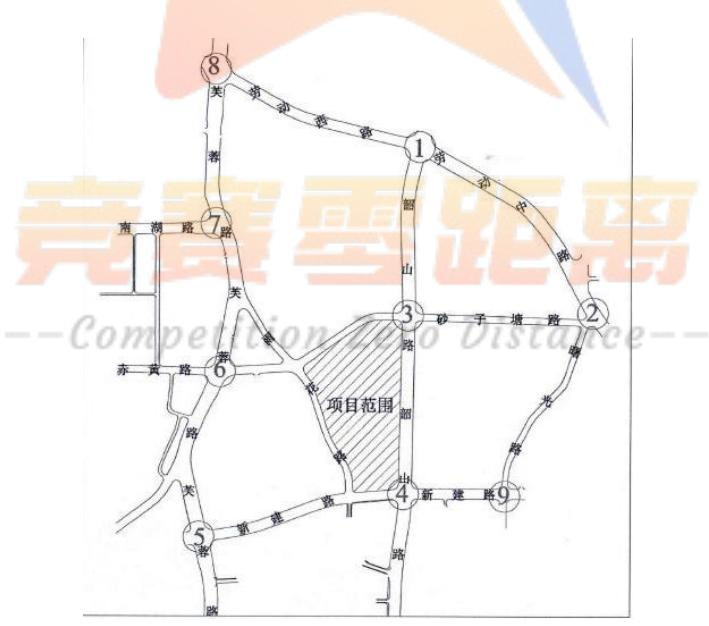

代码：

小区开放前：

```javascript
cd=luduan(v,b,a,w,r);
```

Te=180;G=80;m=2;tl=4.1;ts=14.9;te=11.2;tao=8;g=2;s=5;   
N=jiaochakou(Te,G,m,tl,ts,te,tao,g,s);   
y=0.68\*cd+0.32\*N   
结果：   
>> yunxing   
961.4908   
小区开放后：   
v=7;b=0.64;a=1;w=0.8;r=1;   
cd=luduan(v,b,a,w,r);   
Te=180;G=80;m=2;tl=4.1;ts=14.9;te=11.2;tao=8;g=2;s=8;   
N=jiaochakou(Te,G,m,tl,ts,te,tao,g,s);   
y=0.8\*cd+0.2\*N   
结果：   
>> yunxing   
961.4848   
小区五：

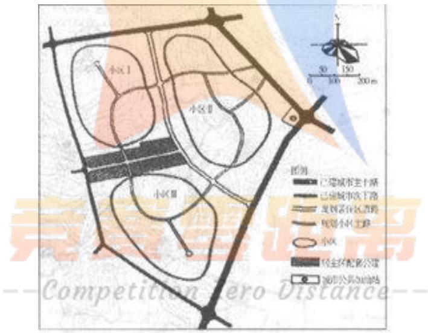

## 代码：

小区开放前：

结果：

>> yunxing  
600.9656  
小区开放后：  
v=5;b=0.50;a=1;w=0.64;r=1;  
cd=luduan(v,b,a,w,r);  
Te=180;G=80;m=2;tl=4.1;ts=14.9;te=11.2;tao=8;g=2;s=8;  
N=jiaochakou(Te,G,m,tl,ts,te,tao,g,s);  
y=0.9\*cd+0.1\*N  
结果：  
>> yunxing  
480.7722

## 9.4 道路通行能力

## 9.4.1 路段通行能力

考察车辆通行能力，考虑精度因素，按式ν=98(1/7-1/h)计算。

因 $h _ { s } = \nu h _ { { t } }$ ，故 $\nu = 1 4 - \frac { 9 8 } { h _ { t } \nu }$ ，可得： $h _ { t } = \frac { 9 8 } { \nu ( 1 4 - \nu ) }$

于是城市道路路段车辆理论通行能力：

$$
C _ { a p } = \operatorname* { m a x } { \frac { 1 } { h _ { 1 } } } = \operatorname* { m a x } { \frac { \nu ( 1 4 - \nu ) } { 9 8 } }
$$

## 9.4.2 道路设计通行能力

为使设计道路建设初期有一个宽适的交通条件，并为后期交通需求增长留有余地，在设计通行能力时，运用服务水平的概念还是必要的，即设计通行能力应使道路达到某种服务水平前提下的通行能力。则设计通行能力 $C _ { D }$ 为：

$$
C _ { D } = C _ { a p } \times \frac { \nu } { c } \times \alpha \times \omega \times \gamma
$$

式中： $C _ { a p }$ —相应于某种设计车速下的饱和度；

$V / c$ —相应于某一服务水平下的饱和度；

$\alpha$ —路旁干扰修正系数；

—侧向净宽修正系数。

表 服务水平及相应的交通状态
<table><tr><td colspan="1" rowspan="1">服务水平</td><td colspan="1" rowspan="1">饱和度 $V / c$ </td><td colspan="1" rowspan="1">交通状态</td></tr><tr><td colspan="1" rowspan="1">I</td><td colspan="1" rowspan="1">0.25</td><td colspan="1" rowspan="1">城市道理自由流</td></tr><tr><td colspan="1" rowspan="1">II</td><td colspan="1" rowspan="1">≤0.50</td><td colspan="1" rowspan="1">道路稳定流</td></tr><tr><td colspan="1" rowspan="1">III</td><td colspan="1" rowspan="1">≤0.70</td><td colspan="1" rowspan="1">交叉口溢流周期低于3%</td></tr><tr><td colspan="1" rowspan="1">IV</td><td colspan="1" rowspan="1">≤0.85</td><td colspan="1" rowspan="1">稳定溢流</td></tr><tr><td colspan="1" rowspan="1">V</td><td colspan="1" rowspan="1">≤0.95</td><td colspan="1" rowspan="1">交通堵塞</td></tr></table>

## 9.4.3 信号交叉口通行能力

## 1） 车辆通过冲突点的通行能力

在定时式信号灯的灯色时间都已配定的情况下，各向车辆通过交叉口一个冲突点的各类间隔时间的总和：

$$
t _ { \mathbb { X } \mathbb { X } } + ( n _ { \mathbb { X } = 0 } - 1 ) h _ { 1 } + \tau _ { \mathbb { X } } + \sum ^ { \sigma + 1 } ( n _ { \mathbb { H } } - 1 ) h _ { 1 } + \sum ^ { \sigma } ( n _ { \mathbb { X } } - 1 ) h _ { 1 } + g \tau - t _ { \mathbb { H } \mathbb { R } } = G
$$

式中： $n _ { \boxplus }$ 、 $n _ { \mathit { \Sigma } _ { \mathrm { E } } }$ —分别为紧接运行通过冲突点的直行车、左转车数；

$n _ { \mathit { \Pi } _ { \mathtt { E } 0 } }$ —绿灯初期通过的左转车数

$t _ { \mathbb { E } \mathbb { X } } ~ t _ { \mathbb { j } }$ <sup>直尾</sup> —分别为左转车头、直行车尾从停车线驶到冲突点所需时间（包 括司机反应时间）

$h _ { \scriptscriptstyle 1 }$ —一条车流紧接运行通过冲突点时的安全车头时距。

$\tau = \tau _ { \check { \check { \parallel } } } + \tau _ { \check { \parallel } }$ —直行车流中能穿越左转车的“可穿越空档”的时长。其中， $\tau _ { \sharp \sharp }$ 为前档， $\tau _ { \mathrm { { F } } }$ 为后档。

g—直行车流中，一个绿灯时长内出现的“可穿越空档”的次数。

由上式可推出，通行能力 $n = \frac { G - \alpha _ { m } - \beta } { h _ { m } } + m$

式中：m—进口道直行车道的条数；

$\alpha _ { m }$ —由穿越空档所致的损失时间，一条直行车道时 $\alpha _ { { \scriptscriptstyle m } } = \alpha _ { { \scriptscriptstyle 1 } } = g ( \tau - 2 h _ { { \scriptscriptstyle 1 } } )$ ，两条直行车道时 $\alpha _ { m } = \alpha _ { 1 } = g ( 2 \tau - 3 h _ { 2 } )$ ；

—有、无专用左转车道时的得、失时间，有专用左转车道时 $\beta = t _ { \mathit { F S } } - t _ { \mathit { F } _ { \perp } | \mathit { F } }$ ，无专用车道时 $\beta = t _ { \scriptscriptstyle \boxplus \colon } - t _ { \scriptscriptstyle \boxplus \colon }$ 。

当相对两肢的道路与交通情况均相近时：

$$
n _ { { \scriptscriptstyle N } } = n _ { s } , n _ { { \scriptscriptstyle E } } = n _ { { \scriptscriptstyle W } }
$$

由此可得到整个交叉口一个周期的通行能力：

$$
\sum n = n _ { \scriptscriptstyle N } + n _ { \scriptscriptstyle S } + n _ { \scriptscriptstyle E } + n _ { \scriptscriptstyle W } + \sum n _ { \scriptscriptstyle \mathscr { G } }
$$

式中： $\sum { n _ { \mathrm { \# } } }$ —通过右转专用道的右转车实际到达数（或设计到达数）。

整个交叉口一个小时的通行能力：

$$
N = { \frac { 3 6 0 0 } { T _ { e } } } \sum n \qquad ( p c u / h )
$$

式中： $T _ { e }$ —色灯周期时长（s）。

