# 电池剩余放电时间预测

## 摘要

铅酸电池作为电源被广泛用于工业、军事、日常生活中。在铅酸电池以恒定电流强度放电过程中，电压随放电时间单调下降，直到额定的最低保护电压（Um，本题中为 9V）。本文针对电池剩余放电时间预测问题，综合分析了电流强度、电压、电池衰减对剩余放电时间的影响，分别建立了数学模型。

问题1 首先根据附件1的采样数据我们采用二次多项式分别表示出电流强度为20A到100A 的 9条放电曲线，不仅建立了电池放电时间和电压的关系式，还建立了电池剩余放电时间和电压的关系式，每条放电曲线的模型拟合度R2 均达到99%以上；然后根据题目中平均相对误差的定义，按照题目要求提取出231 个样本点计算各放电曲线的平均相对误差（MRE），平均相对误差大体位于 0.0035～0.0178 之间，拟合数据与实测数据几乎吻合；根据建立的电池剩余放电时间随电压变化的模型，预测当电压为9.8V，电流强度分别为30A，40A，50A，60A，70A 时，电池的剩余放电时间，并同实测数据中电压最接近 9.8V 的实测值进行相对误差计算，5 个误差值均小于 0.0007，此预测模型的可信度较高。

问题2 以问题1中求得的固定电流强度下，放电时间随电压的变化关系式为基础，寻找问题 1 中 9 条方程的系数随电流的变化关系，我们发现，当电流 I 取对数 log 时，二次项系数、一次项系数和常数项系数均同 log（I）呈线性关系，拟合度均超过 95%，从而得到放电时间随电压和电流同时变化的数学模型，即得到 20A-100A 内任一恒定电流强度放电时的放电曲线模型；计算模型的平均相对误差，算得 MRE 为 0.09；以此模型能较好预测55A 时的放电曲线。

问题 3 同一电池在不同衰减状态下以同一电流强度从充满电开始放电，我们发现，当放电一段时间后，即电压大约在10.3V 以后，不同衰减状态下的放电时间差值之比趋于一个常数。因此容易算出在衰减状态3 下的放电时间，最后用最大放电时间减去放电时间则得到题中要求的剩余放电时间。

关键词：剩余放电时间；多项式拟合；模型拟合度；平均相对误差MRE

## 一、 问题重述

铅酸蓄电池经过一百多年的发展，技术不断更新，现已被广泛应用于汽车、通信、电力、铁路、电动车等各个领域。在铅酸电池以恒定电流强度放电过程中，电压随放电时间单调下降，直到额定的最低保护电压、从充满电开始放电，电压随时间变化的关系称为放电曲线。电池通过较长时间使用或放置，充满电后的荷电状态会发生衰减。

## 1.1 已知铅酸电池的基本情况与要求

（1）已知 20A、30A、40A、50A、60A、70A、80A、90A、100A 的电流强度下，电池放电时间随电压的变化；

（2）MRE 的定义：按不超过0.005V 的最大间隔提取231 个样本点，这些电压值对应的模型已放电时间与采样已放电时间的平均相对误差；

（3）在铅酸电池以恒定电流强度放电过程中，电压随放电时间单调下降，直到额定的最低保护电压U ，本文U=9V。

## 1.2 需要解决的问题

## 1.2.1 问题 1 需要解决以下三点：

（1）给出从20A到100A共 9个不同电流强度下的电压随时间变化的关系；

（2）分别从 20A到 100A共 9 个不同电流强度中各提取符合条件的231 个样本点，并分别给出9个平均相对误差（MRE）；

（3）当测得电压为 9.8V，分别以 30A，40A，50A，60A，70A 电流强度放电时，给出各自的电池剩余放电时间。

## 1.2.2 需要解决以下三点：

（1）建立以20A到100A之间任一恒定电流强度放电时的放电曲线的数学模型；

（2）用 MRE 评估模型的精度；

（ ）用表格和图形给出电流强度为 时的放电曲线。

## 1.2.3 问题3需要解决：

同一电池在不同衰减状态下以同一电流强度从充满电开始放电，根据已知的新电池状态，衰减状态1，衰减状态2，预测衰减状态3的剩余放电时间。

## 二、问题分析

铅酸电池剩余放电时间预测问题是一类带精度检验的拟合问题。本问题处理的难点

是实际值和预测值之间的差异，还有不同衰减程度对储存的电压的影响。

## 2.1 问题1

（1）附件 1 给出了从 20A 到 100A 共 9 个不同电流强度下的电压随时间变化的关系，对已有数据进行预处理，筛选出异常数据，对剩余数据进行多项式拟合，得到各电流强度下电压与时间的拟合函数，并以此建立好数学模型；

（2）分别计算 20A 到 100A 共 9 个不同电流强度下的电压间隔，各提取符合条件（间隔不超过 0.005）的 231 个样本点，将其带入（1）得到的数学模型，得出预测值，并分别给出9个平均相对误差（MRE）；

（3）当测得电压为9.8V，分别带入以 30A，40A，50A，60A，70A电流强度放电时的数学模型，计算电池剩余放电时间。

## 2.2 问题 2

（1）建立以20A到100A之间任一恒定电流强度放电时的放电曲线的数学模型，以问题1中求得的固定电流强度下，放电时间随电压的变化关系式为基础，寻找问题1中9条方程的系数随电流的变化关系，我们发现，当电流I取对数log时，二次项系数、一次项系数和常数项系数均同log（I）呈线性关系，进行线性拟合；

（2）提取符合条件的231个样本点计算MRE；

（3）应用模型，用表格和图形给出了电流强度为55A时的放电曲线。，

## 2.3 问题3

问题三是预测电池衰减状态 的剩余放电时间。通过分析新电池状态和衰减状态的关系，衰减状态 1和衰减状态 2 的关系，衰减状态2和衰减状态3 的关系，寻求相似点。

## 三、模型假设与约定

1、电阻是恒定不变的

2、没有外部因数影响电压的变化的因数（比如电池是否生锈、环境等）

3、充电规范，不会因为操作原因导致电池出现故障

四、符号说明及名词定义
<table><tr><td>符号</td><td>意义</td></tr><tr><td>a(i)</td><td>第i安的电流下实际放电电压</td></tr><tr><td>b(i)</td><td>第i安的电流下预测放电电压</td></tr><tr><td>w(i)</td><td>第i安的电流下平均相对误差</td></tr><tr><td>R^2(i)</td><td>第i安的电流下各函数拟合度</td></tr><tr><td>n (i)</td><td>拟合函数的个数</td></tr><tr><td>D1</td><td>表示新电池状态与衰减状态1的时间差</td></tr><tr><td>D2</td><td>表示衰减状态1与衰减状态2的时间差</td></tr><tr><td>D3</td><td>表示衰减状态2与衰减状态3的时间差</td></tr><tr><td>R1</td><td>表示衰减状态1与衰减状态2的时间差和新电池状态与</td></tr><tr><td rowspan="3">R2</td><td>衰减状态1的时间差的比值</td></tr><tr><td>表示衰减状态2与衰减状态3的时间差和衰减状态1与</td></tr><tr><td>衰减状态2的时间差的比值</td></tr></table>

i=20，30，40，50，60，70，80，90，100

## 五、模型的建立与求解

## 5.1 问题一的分析与求解

## 1.对初等函数的理解

概念的引用：初等函数是由幂函数、指数函数、对数函数、三角函数、反三角函数与常数经过有限次的有理运算（加、减、乘、除、有理数次乘方、有理数次开方）及有限次函数复合所产生、并且能用一个解析式表示的函数

## 2.对 MER 的理解

从 Um开始按不超过0.005V 的最大间隔提取231 个电压样本点。这些电压值对应的模型已放电时间与采样已放电时间的平均相对误差即为MRE

## 3.模型一（多项式模型）

## 1、电压随时间变化的关系

在铅酸电池以恒定电流强度放电过程中，电压随放电时间单调下降，所以电压随剩余放电时间单调上升，为了缩小横纵坐标数量级差异，提高模型系数的精度，我们将时间单位由分（min）转换成天（day），以剩余放电时间 $\mathrm { ~ T ~ } _ { \mathfrak { k } [ ] }$ 为纵坐标， $\mathrm { { V } - U _ { m } }$ 为横坐标，其中 $\mathrm { U } _ { \mathrm { m } } { = } 9 \mathrm { V }$ ，得到9条关系曲线图如下：

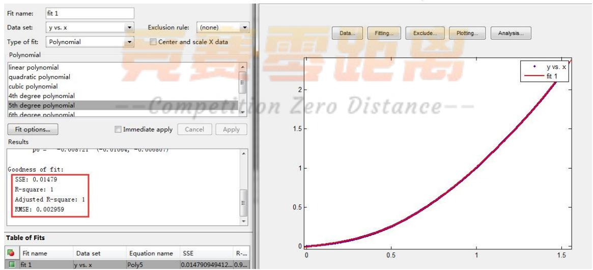

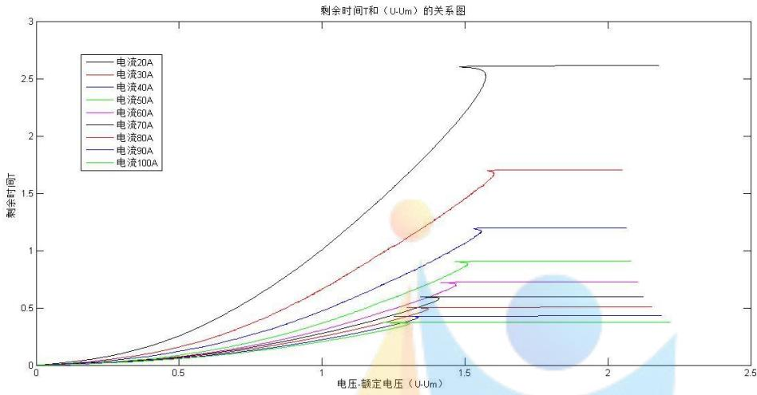

图中9 条曲线的尾端表示电池在各个电流强度下刚开始放电瞬间的状态，经过一小段时间后趋于稳定放电状态，因此我们在建模时，尾端数据不参与建模过程(钝化机理)，即删除题中附件一excel表里各个电流强度下对应的前10%的数据，留取后 90%的数据建立模型。

我们采用多项式模型 $\scriptstyle \mathrm { y = a _ { 1 } x ^ { n } + a _ { 2 } x ^ { n - 1 } + \dots + a _ { n - 1 } x + a _ { n } }$ 进行拟合，其中 x为 $\mathrm { U } { - } \mathrm { U } _ { \mathrm { m } }$ ，y为剩余放电时间。运用数学软件Matlab 进行多项式拟合（程序见本文附件1），以 20A电流为例，当选择5次多项式拟合时，模型拟合度 $\mathtt { R } ^ { 2 }$ 达到了1，如下图所示：

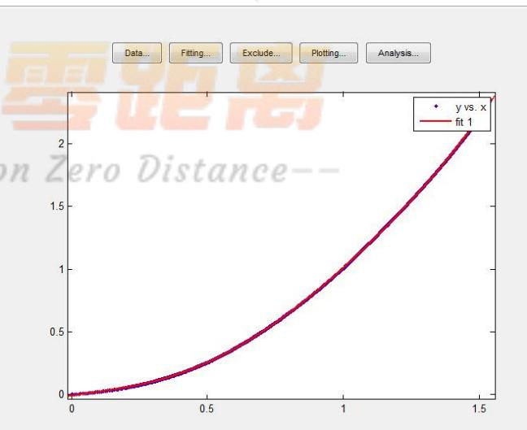

由于二次函数模型相较于五次函数模型大大降低了模型复杂度，所以我们决定采用二次多项式对9 条曲线进行拟合，得到了非常满意的结果，我们将拟合图像陈列于下图

中：

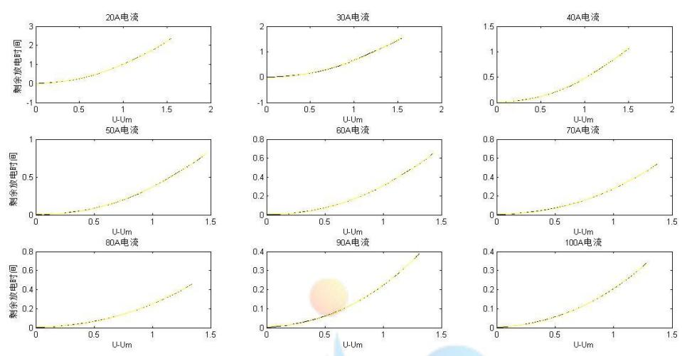

图中各个电流强度下黑线为测量值，黄线为拟合值，9条曲线的拟合度 $\mathtt { R } ^ { 2 }$ 都高达 0.9999，9个模型方程如表1 所示：

表 1 给定电流下，电池剩余时间随电压变化的关系
<table><tr><td>电流强度</td><td> ${ \mathrm { \Delta T _ { \ z i l } = f ( U { \mathrm { - } } U _ { m } ) = f ( U { \mathrm { - } } 9 ) } }$ </td></tr><tr><td>20A</td><td> $\mathrm { T _ { * \mathrm { e l } } } = 0 . 9 2 9 8 ( \mathrm { U } \mathrm { - } 9 ) ^ { 2 } + 0 . 0 8 1 8 ( \mathrm { U } \mathrm { - } 9 ) \cdot 0 . 0 0 8 7$ </td></tr><tr><td>30A</td><td> $\mathrm { T _ { * i } } = 0 . 6 2 0 5 ( \mathrm { U } \mathrm { - } 9 ) ^ { 2 } + 0 . 0 5 8 4 ( \mathrm { U } \mathrm { - } 9 ) \cdot 0 . 0 1 9 0$ </td></tr><tr><td>40A</td><td> $\mathrm { T _ { * i } } = 0 . 4 7 9 9 ( \mathrm { U } \mathrm { - } 9 ) ^ { 2 } \mathrm { - } 0 . 0 1 3 7 ( \mathrm { U } \mathrm { - } 9 ) + 0 . 0 0 6 9$ </td></tr><tr><td>50A</td><td> $\mathrm { T _ { * | } } = 0 . 4 1 1 2 ( \mathrm { U } \mathrm { - } 9 ) ^ { 2 } \mathrm { - } 0 . 0 5 3 3 ( \mathrm { U } \mathrm { - } 9 ) \mathrm { + } 0 . 0 0 9 6$ </td></tr><tr><td>60A</td><td> $\mathrm { T _ { \scriptscriptstyle  { F l } } } = 0 . 3 4 2 2 ( \mathrm { U } \mathrm { - } 9 ) ^ { 2 } \cdot 0 . 0 4 2 8 ( \mathrm { U } \mathrm { - } 9 ) + 0 . 0 0 8 9$ </td></tr><tr><td>70A</td><td> $\mathrm { T _ { * | } } = 0 . 3 0 1 1 ( \mathrm { U } \mathrm { - } 9 ) ^ { 2 } \cdot 0 . 0 3 4 9 ( \mathrm { U } \mathrm { - } 9 ) + 0 . 0 1 2 4$ </td></tr><tr><td>80A</td><td> $\mathrm { T _ { \scriptscriptstyle 3 \ / 4 } } = 0 . 2 6 1 5 ( \mathrm { U } - 9 ) ^ { 2 } - 0 . 0 2 0 1 ( \mathrm { U } - 9 ) + 0 . 0 0 9 8$ </td></tr><tr><td>90A</td><td> $\mathrm { T _ { \scriptscriptstyle 3 H } } = 0 . 2 3 1 6 ( \mathrm { U } \mathrm { - } 9 ) ^ { 2 } \cdot 0 . 0 1 7 1 ( \mathrm { U } \mathrm { - } 9 ) + 0 . 0 0 9 5$ </td></tr><tr><td>100A</td><td>Co  $\mathbf { T } _ { \mathfrak { F } } \equiv 0 . 2 0 3 2 ( \mathbf { U } \mathrm { - } \mathbf { 9 } ) ^ { 2 } \cdot 0 . 0 0 2 7 ( \mathbf { U } \mathrm { - } \mathbf { 9 } ) + 0 . 0 0 6 2$ </td></tr></table>

放电曲线是电压随时间变化的关系，因此我们将上述表格中的关系表达式整理成电压U和放电时间T的关系式，其中 $\scriptstyle \mathrm { T } _ { \mathrm { \# \# } } = \mathrm { T } _ { \mathrm { m a x } } - \mathrm { T } _ { \mathrm { \# \# } } \mathrm { c }$ 。由题中附件 1，各个电流强度下的 $\mathrm { T } _ { \mathrm { m a x } }$ 见表2：

表 2 给定电流下，电池的最大放电时间

<table><tr><td rowspan=1 colspan=1>电流 (A)</td><td rowspan=1 colspan=1>20</td><td rowspan=1 colspan=1>30</td><td rowspan=1 colspan=1>40</td><td rowspan=1 colspan=1>50</td><td rowspan=1 colspan=1>60</td><td rowspan=1 colspan=1>70</td><td rowspan=1 colspan=1>80</td><td rowspan=1 colspan=1>90</td><td rowspan=1 colspan=1>100</td></tr><tr><td rowspan=1 colspan=1> $\mathrm { { T } _ { \mathrm { { m a x } } } ( \mathrm { { d a y } ) } }$ </td><td rowspan=1 colspan=1>2.6139</td><td rowspan=1 colspan=1>1.7042</td><td rowspan=1 colspan=1>1.1972</td><td rowspan=1 colspan=1>0.9083</td><td rowspan=1 colspan=1>0.7250</td><td rowspan=1 colspan=1>0.5986</td><td rowspan=1 colspan=1>0.5069</td><td rowspan=1 colspan=1>0.4306</td><td rowspan=1 colspan=1>0.3736</td></tr></table>

得到电压U随时间T的变化关系式如表3：

表 3 给定电流下，电池的电压随放电时间变化的关系
<table><tr><td>电流强度</td><td>电压U和放电时间T的关系式</td></tr><tr><td>20A</td><td>T = -0.9298U² + 16.6542U - 71.9703</td></tr><tr><td>30A</td><td>T = -0.6205U² + 11.1111 U - 48.0521</td></tr><tr><td>40A</td><td>T = -0.4799U2 + 8.6528U - 37.7951</td></tr><tr><td>50A</td><td>T = -0.4112U2 + 7.4546U - 32.8675</td></tr><tr><td>60A</td><td>T = -0.3422U² + 6.2030U − 27.3722</td></tr><tr><td>70A</td><td>T = -0.3011U²+ 5.4544U - 24.0912</td></tr><tr><td>80A</td><td>T = -0.2615U²+ 4.7266U - 20.8434</td></tr><tr><td>90A</td><td>T = -0.2316U²+ 4.1864U - 18.4754</td></tr><tr><td>100A</td><td>T = -0.2032U² + 3.6598U - 16.0999</td></tr></table>

## 2、提取样本点，计算平均相对误差（MRE）

MRE的定义如下：从 $\mathrm { U } _ { \mathrm { m } }$ 开始按不超过0.005V的最大间隔提取231个电压样本点，这些电压值对应的模型已放电时间与采样已放电时间的平均相对误差即为MRE。

## 第一步：提取 231 个样本点。

提取231 个样本点分两种提取方式：（1）、按不超过 0.005V的最大间隔提取连续样本点；（2）、不要求样本点连续。该两种方式都需要先计算出相邻电压间隔，以 20A 电流强度为例，计算流程如下图所示：

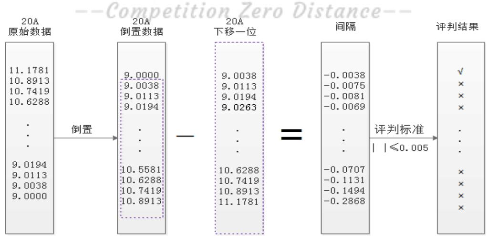

因为题中要求从 $\mathrm { U } _ { \mathrm { m } }$ 开始选取，首先将原始数据共 1883 个样本点倒置排列，然后从上往下依次求相邻两电压的差值，筛选出的差值的绝对值不超过0.005 的样本点，并获得这些样本点的位置，即在倒置数据向量中的序号，记作 $\mathrm { L o c a t i o n } { = } [ \mathrm { L } _ { 1 } , \mathrm { L } _ { 2 } , \mathrm { L } _ { 3 } , . . . , \mathrm { L } _ { \mathrm { n } } ]$ 。间隔不超过0.005 的样本点个数见表4：

表 4 各个电流强度下，间隔不超过0.005 的样本点个数
<table><tr><td rowspan=1 colspan=1>电流 (A)</td><td rowspan=1 colspan=1>20</td><td rowspan=1 colspan=1>30</td><td rowspan=1 colspan=1>40</td><td rowspan=1 colspan=1>50</td><td rowspan=1 colspan=1>60</td><td rowspan=1 colspan=1>70</td><td rowspan=1 colspan=1>80</td><td rowspan=1 colspan=1>90</td><td rowspan=1 colspan=1>100</td></tr><tr><td rowspan=1 colspan=1>个数</td><td rowspan=1 colspan=1>1851</td><td rowspan=1 colspan=1>1183</td><td rowspan=1 colspan=1>808</td><td rowspan=1 colspan=1>593</td><td rowspan=1 colspan=1>454</td><td rowspan=1 colspan=1>365</td><td rowspan=1 colspan=1>291</td><td rowspan=1 colspan=1>230</td><td rowspan=1 colspan=1>189</td></tr></table>

## （1）、提取连续样本点

如果要提取 个连续样本点，假设从 $\mathrm { L } _ { \mathrm { i } }$ 开始位置序号是连续的，则有式$\mathrm { L _ { i } } + 2 3 0 { = } \mathrm { L _ { i + 2 3 0 } }$ 成立，采用数学软件Matlab编程，从 i=1开始循环，找到使得式 $\mathrm { L _ { i } } + 2 3 0 { = } \mathrm { L _ { i + 2 3 0 } }$ 成立的所有 i，并选取最小的 i作为选取231 个样本点的起始位置。具体Matlab 程序见附录1。

## （2）、不要求样本点连续

如果不要求样本点连续，则直接从 $\mathrm { L } _ { 1 }$ 开始选取直到 $\mathrm { L } _ { 2 3 1 }$ 。

注意，这里选出来的样本点序号均是在对原始数据倒置过后所在的位置。

第二步：计算提取出的 231 个样本点对应的测量值和模型预测值的平均相对误差（MRE）。

根据第一步的方法，列出 20A,30A,…,90A,100A 共 9 组数据的 231 个所需样本点，如表5所示：

表5 各个电流强度下两种提取方法的样本点序号
<table><tr><td>电流（A）</td><td>样本点连续 不要求样本点连续</td></tr><tr><td>20A</td><td>31~261 向量 Location 的前 231 个</td></tr><tr><td>30A</td><td>184~414eroDis向量Location的前 231个</td></tr><tr><td>40A</td><td>222~452 向量 Location 的前 231 个</td></tr><tr><td>50A</td><td>124~354 向量 Location 的前 231 个</td></tr><tr><td>60A</td><td>无 向量 Location 的前 231 个</td></tr><tr><td>70A</td><td>无 向量 Location 的前 231 个</td></tr><tr><td>80A</td><td>无 向量 Location 的前 231 个</td></tr><tr><td>90A</td><td>无 向量 Location 的前 230 个</td></tr><tr><td>100A</td><td>无 向量 Location 的前 189 个</td></tr></table>

由上表可知，当电流强度为 20A，30A，40A，50A 时能够取到 231 个连续的间隔不超过 0.005 的样本点，此时可以计算两种方式下的 MRE；当电流强度为 60A，70A，80A时，无法取到231 个连续的间隔不超过0.005 的样本点，因此，只能计算样本点不连续时的 MRE；当电流强度为 90A，100A 时，间隔不超过 0.005 的样本点个数甚至不足231 个，因此计算能够找到的所有间隔不超过0.005 的样本点的MRE，计算结果见表6，程序见附件1：

表 6
<table><tr><td>电流（A）</td><td>样本点连续MRE</td><td>不要求样本点连续MRE</td></tr><tr><td>20A</td><td>0.0444</td><td>0.0640</td></tr><tr><td>30A</td><td>0.0281</td><td>0.0743</td></tr><tr><td>40A</td><td>0.0071</td><td>0.0178</td></tr><tr><td>50A</td><td>0.0062</td><td>0.0099</td></tr><tr><td>60A</td><td>无</td><td>0.0066</td></tr><tr><td>70A</td><td>无</td><td>0.0044</td></tr><tr><td>80A</td><td>无</td><td>0.0037</td></tr><tr><td>90A</td><td>无</td><td>0.0044</td></tr><tr><td>100A</td><td>无</td><td>0.0035</td></tr></table>

3、电压为 9.8V，电流强度分别为 30A，40A，50A，60A，70A时，电池的剩余放电时间

当电压 U=9.8V 时，将 U 分别带入表 1 中电流为 30A，40A，50A，60A，70A 的剩余时间表达式，为了和题目保持一致，将算得的以天（day）为单位的 T 转换成以分（min）为单位的 $\mathrm { ~ T _ { \mathfrak { A } \mathfrak { A } } | \mathfrak { s } ~ }$ ，求得 $\mathrm { ~ T ~ } _ { \mathfrak { k } | ] }$ 如表 7 所示：

表 7电池的剩余放电时间
<table><tr><td>电流（A）</td><td>30A</td><td>40A</td><td>50A</td><td>60A</td><td>70A</td></tr><tr><td> ${ \mathrm { T } } _ { \mathfrak { F } | } \ { \mathrm { ( d a y ) } }$ </td><td>0.4248</td><td>0.3031</td><td>0.2302</td><td>0.1937</td><td>0.1771</td></tr><tr><td> ${ \bf T _ { \lambda } } _ { \mathcal { \bf A } } ) \mathrm { ~ ( ~ m i n ) ~ }$ </td><td>611.6945</td><td>436.4990</td><td>331.4665</td><td>278.8661</td><td>255.0647</td></tr></table>

## 5.2 问题二的分析与求解

问题2需要解决以下三点：

（1）建立以20A到100A之间任一恒定电流强度放电时的放电曲线的数学模型；

（2）用 MRE评估模型的精度；

（3）用表格和图形给出电流强度为55A时的放电曲线。

## 1、建立以 20A到 100A之间任一恒定电流强度放电时的放电曲线的数学模型

问题一中，我们已经得到了 9 组放电时间 T 关于电压 U 的关系表达式，下面再次罗列如下：

<table><tr><td rowspan=1 colspan=1>电流强度</td><td rowspan=1 colspan=1>电压U和放电时间T的关系式</td></tr><tr><td rowspan=1 colspan=1>20A</td><td rowspan=1 colspan=1>T = -0.9298U²+ 16.6542U - 71.9703</td></tr><tr><td rowspan=1 colspan=1>30A</td><td rowspan=1 colspan=1>T = -0.6205U²+ 11.1111U - 48.0521</td></tr><tr><td rowspan=1 colspan=1>40A</td><td rowspan=1 colspan=1>T = -0.4799U² + 8.6528U - 37.7951</td></tr><tr><td rowspan=1 colspan=1>50A</td><td rowspan=1 colspan=1>T = -0.4112U²+ 7.4546U–32.8675</td></tr><tr><td rowspan=1 colspan=1>60A</td><td rowspan=1 colspan=1>T = -0.3422U² + 6.2030U -27.3722</td></tr><tr><td rowspan=1 colspan=1>70A</td><td rowspan=1 colspan=1>T = -0.3011U²+ 5.4544U − 24.0912</td></tr><tr><td rowspan=1 colspan=1>80A</td><td rowspan=1 colspan=1>T = -0.2615U² + 4.7266U - 20.8434</td></tr><tr><td rowspan=1 colspan=1>90A</td><td rowspan=1 colspan=1>T = -0.2316U² + 4.1864U - 18.4754</td></tr><tr><td rowspan=1 colspan=1>100A</td><td rowspan=1 colspan=1>1</td></tr></table>

通过观察不同电流下，模型的二次项系数，一次项系数，和常数项，发现存在一定的规律，其图形如下：

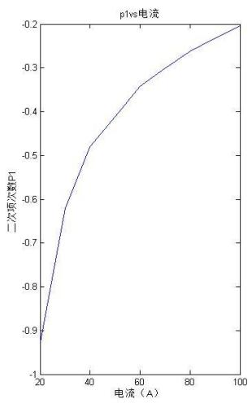

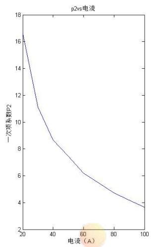

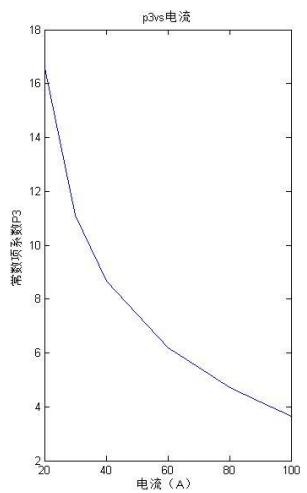

图形中多项式系数呈现出来的规律，可以通过拟合得到，从而得到 — 之间任一电流强度的方程的系数，最终得到任一电流强度方程的表达式。

假设 $2 0 \mathrm { { A } \mathrm { { - } 1 0 0 \mathrm { { A } } } }$ 之间任一电流强度模型为：

$$
\mathrm { T } = \mathrm { p } _ { 1 } ^ { \ } ( \mathrm { I } ) \mathrm { U } ^ { 2 } + \mathrm { p } _ { 2 } ^ { \ } ( \mathrm { I } ) \mathrm { U } + \mathrm { p } _ { 3 } ^ { \ } ( I )
$$

其中 $p _ { i } ( I ) \ ( i = 1 , 2 , 3 )$ 为模型的系数，<sub>I</sub> 为 20A—100A之间任一电流强度。

利用matlab 求出系数拟合模型

表8 多项式系数拟合模型
<table><tr><td>系数拟合模型</td></tr><tr><td> $p _ { 1 } ( I ) = a _ { 1 } \log I + b _ { 1 }$ </td></tr><tr><td> $p _ { 2 } ( I ) = a _ { 2 } \log I + b _ { 2 }$ </td></tr><tr><td>竞费 巨离  $p _ { 3 } ( I ) = a _ { 3 } \log I + b _ { 3 }$ </td></tr></table>

利用这个方法求出 $2 0 \mathrm { { A } \mathrm { { - } \mathrm { { 1 0 0 A } } } }$ 的新的模型如下：

表 9 系数拟合后20A—100A电压与放电时间的关系式
<table><tr><td colspan="1" rowspan="1">电流强度</td><td colspan="1" rowspan="1">电压 U和放电时间T 的关系式</td></tr><tr><td colspan="1" rowspan="1">20A</td><td colspan="1" rowspan="1"> $\mathbf { T } = - 0 . 8 3 7 \mathbf { U } ^ { 2 } + 1 5 . 0 0 5 \mathbf { U } \mathbf { - } 6 4 . 8 9 9$ </td></tr><tr><td colspan="1" rowspan="1">30A</td><td colspan="1" rowspan="1"> $\mathrm { T } = - 0 . 6 6 5 { \mathrm { ~ U } } ^ { 2 } +$      11.944U-51.769</td></tr><tr><td colspan="1" rowspan="1">40A</td><td colspan="1" rowspan="1"> $\mathrm { T } = - 0 . 5 4 4 \mathrm { U } ^ { 2 } +$     9.772U-42.453</td></tr><tr><td colspan="1" rowspan="1">50A</td><td colspan="1" rowspan="1"> $\mathrm { T } = - 0 . 4 4 9 \mathrm { U } ^ { 2 } +$     8.088U-35.229</td></tr><tr><td colspan="1" rowspan="1">60A</td><td colspan="1" rowspan="1"> $\mathrm { T } = - 0 . 3 7 2 \mathrm { U } ^ { 2 } +$      6.712U-29.326</td></tr><tr><td colspan="1" rowspan="1">70A</td><td colspan="1" rowspan="1">T = -0.307 U²+    5.548U-24.333</td></tr><tr><td colspan="1" rowspan="1">80A</td><td colspan="1" rowspan="1">T = -0.251 U2+    4.540U-20.011</td></tr><tr><td colspan="1" rowspan="1">90A</td><td colspan="1" rowspan="1">T = -0.201 U²+    3.651U-16.196</td></tr><tr><td colspan="1" rowspan="1">100A</td><td colspan="1" rowspan="1">T = -0.156U²+ 2.855U-12.783</td></tr></table>

对新的模型进一步作残差分析（见图），用问题一相同的方法得到其每个模型的平均相对误差（MRE）见下表：

表 10：系数拟合后20A—100A平均相对误差
<table><tr><td rowspan=1 colspan=1>电流强度</td><td rowspan=1 colspan=1>平均相对误差（MRE）</td></tr><tr><td rowspan=1 colspan=1>20A</td><td rowspan=1 colspan=1>9.17%</td></tr><tr><td rowspan=1 colspan=1>30A</td><td rowspan=1 colspan=1>7.7%</td></tr><tr><td rowspan=1 colspan=1>40A</td><td rowspan=1 colspan=1>8.2%</td></tr><tr><td rowspan=1 colspan=1>50A</td><td rowspan=1 colspan=1>6.6%</td></tr><tr><td rowspan=1 colspan=1>60A</td><td rowspan=1 colspan=1>6.3%</td></tr><tr><td rowspan=1 colspan=1>70A</td><td rowspan=1 colspan=1>5.8%</td></tr><tr><td rowspan=1 colspan=1>80A</td><td rowspan=1 colspan=1>5.2%</td></tr><tr><td rowspan=1 colspan=1>90A</td><td rowspan=1 colspan=1>5.1%</td></tr><tr><td rowspan=1 colspan=1>100A</td><td rowspan=1 colspan=1>4.7%</td></tr></table>

通过残差分析可以看出，实际值与预测值的差并不大，并且模型的平均相对误差在10%以内，说明拟合程度较高，具有一定的预测价值。
利用这个曲面拟合模型对电流为55时的放电曲线进行预测，其数据表和图形如下：

表11 电流为55A 时电压与放电时间的关系
<table><tr><td rowspan=1 colspan=1>电压</td><td rowspan=1 colspan=1>10</td><td rowspan=1 colspan=1>9.95</td><td rowspan=1 colspan=1> $9 . 9$ </td><td rowspan=1 colspan=1>9.85</td><td rowspan=1 colspan=1> $\cdots$  2</td><td rowspan=1 colspan=1> $9 . 1 5$ n</td><td rowspan=1 colspan=1> $9 . 1$ </td><td rowspan=1 colspan=1>9.05</td><td rowspan=1 colspan=1>9</td></tr><tr><td rowspan=1 colspan=1>放电时间</td><td rowspan=1 colspan=1>676</td><td rowspan=1 colspan=1>728</td><td rowspan=1 colspan=1>770</td><td rowspan=1 colspan=1>812</td><td rowspan=1 colspan=1></td><td rowspan=1 colspan=1>1070</td><td rowspan=1 colspan=1>1076</td><td rowspan=1 colspan=1>1080</td><td rowspan=1 colspan=1>1086</td></tr></table>

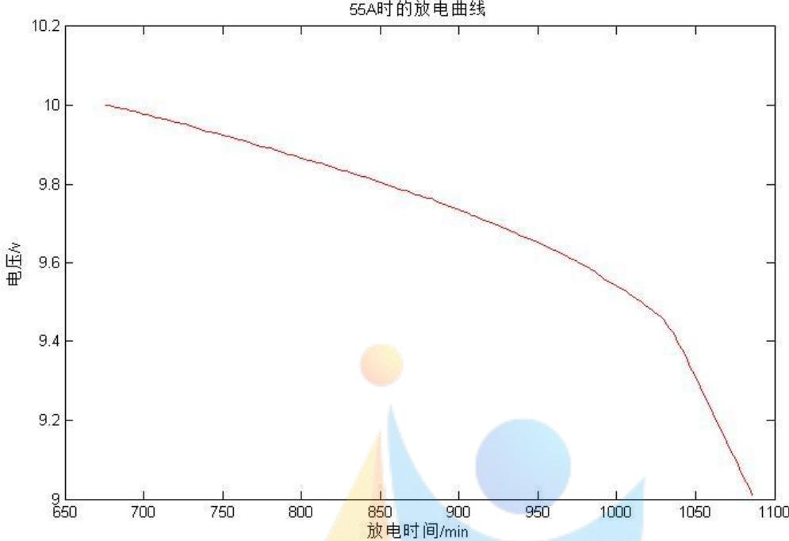
结果说明：

本题通过函数拟合的方法，找到观测值的拟合函数，然后通过发现不同拟合函数中系数的变化规律，求得任一电流下的放电曲线的数学模型，此模型能较好地反应数据变化，并能较好地预测20A—100A 电流强度下的放电数学模型。

## 5.3 问题三的分析与求解

随着随电池使用的时间的增长，蓄电池内含有的电解液硫酸发生了分层，高级板电池的底部硫酸密度升高，加之远离极耳处电流密度过低，是得高级板电池下半部的活性物质反应活性下降，充电时PbSO4难以完全氧化为PbO2.未转化的PbSO4附着在电极表面，造成活性物质导电性降低，而且也阻碍了硫酸电解质扩散到活性物质内部继续参加反应，使极板下半部活性物质的利用率大大降低，电池很快失效。

根据附件2中同一电池在不同衰减状态下以同一电流强度从充满电开始放电的记录数据，我们作出以电压U（V）为横坐标，放电时间 T（min）为纵坐标的曲线图，如下图所示：

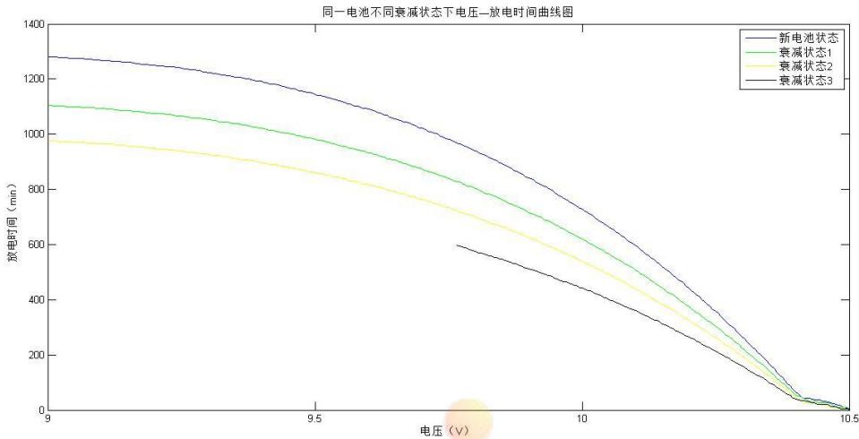

其中，蓝线、绿线、黄线分别代表新电池状态，衰减状态1和衰减状态2，黑线代表衰减状态 已知的数据，我们需要预测出衰减状态 的后半段放电过程，即电压从开始直到降为9V这一过程的放电时间。

通过观察曲线图像，我们猜测相邻两条曲线的纵向差值之间可能存在一定的关系。计算相邻两条曲线在同一电压下的放电时间差 $\mathrm { D } _ { \mathrm { i } }$ （i=1,2,3）和差值比 $\ R _ { \mathrm { i } } \ ( \mathrm { i } \mathrm { = } 1 , 2 , 3 )$ ），定义如下：

$$
\begin{array} { r l } & { \mathrm { D } _ { 1 } \mathrm { = } \mathrm { T } _ { \mathrm { ~ i f f } } \mathrm { m } , } \\ & { \mathrm { D } _ { 2 } \mathrm { = } \mathrm { T } _ { \mathrm { ~ g i r } } \mathrm { , } } \\ & { \mathrm { D } _ { 3 } \mathrm { = } \mathrm { T } _ { \mathrm { ~ g i r } } \mathrm { , } } \\ & { \mathrm { R } _ { 1 } \mathrm { = } \mathrm { D } _ { 2 } / \mathrm { D } _ { 1 } \mathrm { , } } \\ & { \mathrm { R } _ { 2 } \mathrm { = } \mathrm { D } _ { 3 } / \mathrm { D } _ { 2 } \mathrm { , } } \end{array}
$$


其中， $\mathrm { D } _ { 3 }$ 和 ${ \bf R } _ { 2 }$ 只计算10.5V到 9.765V这一段对应的值， $\mathrm { D } _ { 1 , } , \mathrm { D } _ { 2 } , \mathrm { D } _ { 3 }$ 的值见附录三，运用数学软件 Matlab 做出 $\mathrm { R _ { 1 } }$ 和 ${ \bf R } _ { 2 }$ 的曲线图，如下图所示，蓝线表示 $\mathrm { R } _ { 1 }$ ，红线表示 ${ \bf R } _ { 2 }$ ：

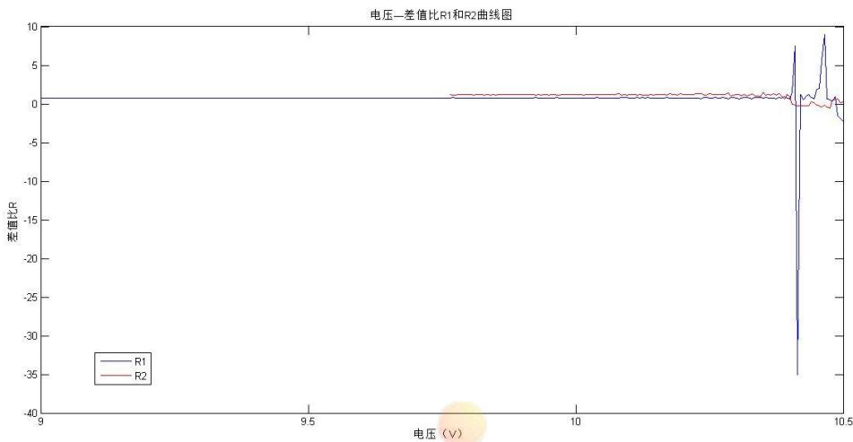

我们发现，当放电一段时间后，即电压大约在 10.3V 以后，差值比 $\mathrm { R _ { 1 } }$ 趋于一个常数。又因为差值比 ${ \bf R } _ { 2 }$ 在有数据的部分（即红线部分）趋于一个常数，和 $\mathrm { R _ { 1 } }$ 具有相同的特征，所以，我们有理由认为 ${ \bf R } _ { 2 }$ 为一个常数。以9.765V到10V的差值比平均值估计 $\mathrm { R } _ { 2 } { = } 1 . 2 0 9 4$ 根据表达式

$$
\mathrm { R } _ { 2 } \mathrm { = D } _ { 3 } / \mathrm { D } _ { 2 } \mathrm { = \Omega \left( T _ { \frac { + + } { \hbar } } \mathrm { - } T _ { \frac { + } { \hbar } } \right) \Omega ~ / \hbar \Omega \left( T _ { \frac { + } { \hbar } } \mathrm { - } T _ { \frac { + } { \hbar } } \right) , }
$$

得到 $T _ { \mathit { \Pi } \mathit { \Pi } \mathit { \Pi } } = \mathsf { T } _ { \mathit { \Pi } _ { \mathtt { F } } = \mathtt { - t } } \left( \mathsf { T } _ { \mathit { \Pi } _ { \mathtt { < X } } \mathrm { - } \mathsf { T } _ { \mathit { \Pi } \mathtt { \mathtt { + } } } } \right) \mathrm { ~ \mathrm { \Omega } } ^ { \ast } \mathrm { R } _ { 2 }$ ，算得预测值见本文附录3。作图如下所示：

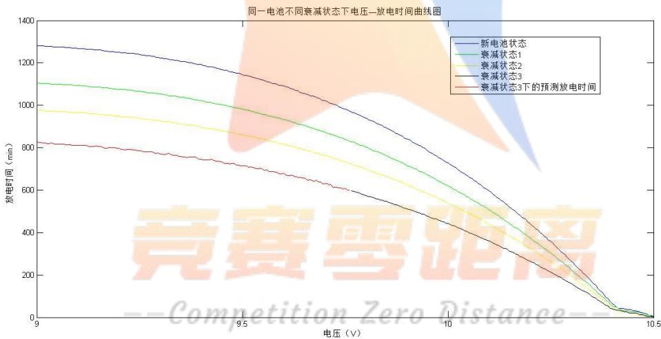

其中，红线代表衰减状态3 下的预测放电时间。用电池放电时间最大值减去放电时间即得到问题3 中要求的剩余放电时间， $\mathrm { T \Omega _ { 3 \uparrow \downarrow } = T _ { \mathrm { m a x } ^ { - } } T \Omega _ { \vdots } }$ 。部分数据见表12。

表 12 相邻曲线放电时间之差
<table><tr><td>D1</td><td>D2</td><td>D3</td><td>t红</td><td>t剩</td></tr><tr><td>-1.2</td><td>2.8</td><td>0.8</td><td>-1.3863</td><td>828.2438</td></tr><tr><td>-2.3</td><td>4.3</td><td>0.8</td><td>-1.1004</td><td>827.9579</td></tr><tr><td>-2.4</td><td>3.7</td><td>2.2</td><td>1.2252</td><td>825.6323</td></tr><tr><td>…</td><td>…</td><td>…</td><td></td><td></td></tr><tr><td>176.9</td><td>126.5</td><td>124.7</td><td>824.1109</td><td>2.7466</td></tr><tr><td>176.3</td><td>125.8</td><td>128.2</td><td>826.8575</td><td>0</td></tr></table>

## 七、模型评价与推广

## MRE模型

优点 ：简明，易求的特点，与标准误差、拟合度等指标配合使用，可以从不同角度检验模型的精度，而且无需指定模型，因而既克服传统线性模型对样本参数中估计所导致错误增大的问题。

缺点：只能对现有数据进行处理

## 多项式模型

优点：可以广泛应用于各个学科，在表示较少元数和较低次数的对象时非常方便，在参数性质和运算性质方便由于纯量多项式模型

缺点：在描述多维高次对象时，由于纯量多项式模型的项数非常多影响运算的简便性，这时人们通常就会舍去大量的复杂项而保留一些简单项进行研究，致使模型失去完整性

## 八、参考文献

【1】崔文顺&李建玲.就平均相对误差的算法与李庆振等商榷 河北林学院学报【J】1989年 第四卷 4 期 74-75

【2】张纯江&董杰&刘君&贲冰.蓄电池与超级电容混合储能系统的控制策略 电工技术学报【J】2014 年 4 期 334-340

【3】李伟&胡勇.动力铅酸电池的发展现状及其使用寿命的研究进展 至中国制造业信息化【J】2011 年 第 40 卷 第 7 期 70-72

【4】百度百科.初等函数【Z】链接：http://baike.baidu.com/subview/46323/46323.html 2016 年 9 月 11 日

【5】百度文库.铅酸电池应用非常广泛【Z】链接：http://wenku.baidu.com/view/621e89feaef8941ea76e051a.html?from=search

2016 年 9 月 11 日
【6】360 百科.MDR【Z】链接：
http://baike.so.com/doc/6806418-7023367.html 2016 年 9 月 11 日

【7】侯世亮.铅酸蓄电池放电特性研究 新课程学习（下）【J】2013 年 6期182-183

【8】陈静谨&余宁梅.阀控铅酸蓄电池分段恒流充电特征的研究 电源技术【J】 2004年 1 期 32-33

【9】潘香英&徐强&王克俭&周立新&唐致远.大容量电动车VRLA 电池早期容量的衰减 电源技术 2008 年 3 期 170-173

【10】尹智&王解先& 许才军. 基于线性变换的多项式模型 大地测量与地球动力学2011 年 5 期 91-96

【11】高经纬&张培林&任国全&李兵. 油液光谱分析比例模型的建立 内燃机工
程 2014 年 06 期 34-37

## 附录：

电池剩余放电时间关于电压的关系拟合

```matlab
function [ x,y,p,yy ] = xxyyfit( time,ele )
ele(find(ele==0))=[];
n=length(ele);
t=time(1:n);
xx=t(mid:n)/(60*24);<sub>xmid=max(xx)-xx;</sub>
y=flipud(xmid);
x=flipud(ele(mid:n)-9);
[p,s]=polyfit(x,y,2);
yy=polyval(p,x);
end
```

提取电池放电时间测量值

```matlab
function [ TimeAll] = FangDianTime( data1,time )
TimeAll={};
data={};
for i=1:9
data{i}=data1(:,i);
```

```matlab
data{i}(find(data{i}==0))=[];
n=length(data{i});
TimeAll{i}=time(1:n)/(60*24);
TineAll{i}=flipud(max(TimeAll{i})-TimeAll{i});
end
end
```

## 电池剩余放电时间模拟值

```matlab
function [ TimeFitAll ] = FangDianFit( data1,time )
TimeFitAll={};
for i=1:9
[ x,y,p,yy ] = xxyyfit( time,data1(:,i) );
TimeFitAll{i}=yy;;
end
end
```

## 计算平均相对误差MRE

```matlab
function [ MRE,what,dd ] = ccc( dataa,time )
what=[];
data=dataa;
data(find(data==0))=[];
data=flipud(data);
ccc=[];
a=[];
n1=length(data);
cha=data(1:n1-1)-data(2:n1);
num=find(abs(cha)<=0.005);
n2=length(num);
if num(i+230)==num(i)+230<sub>a=1;</sub> a=1;
ccc=[ccc a];
else
a=0;
ccc=[ccc a];
end
end
who=find(ccc==1);
dd=who(1);
what=num(dd:dd+230);
n3=what(1);
```

```matlab
n4=what(length(what));
[ x,y,p ] = xxyyfit( time,dataa );
yy=polyval(p,x);
MRE=mean(abs(yy(n3:n4)-y(n3:n4))./y(n3:n4));
end
```

## 预测电压为9.8V时，电池的剩余放电时间

```matlab
function [ EP,Tl = EveryT( data1,time )
EP=[];
for i=1:9
ele=data1(:,i);
time;
[ x,y,p ] = xxyyfit( time,ele );
EP=[EP;p];
end
V=[0.64 0.8 1]';
T=60*24*EP*V:
end
筛选间隔不超过 0.005的样本点并计数
function [ num,N ] = MreNum( data )
ele={};
num={};
for i=1:9
ele{i}=data(:,i);
ele{i}(find(ele{i}==0))=[];
n=length(ele{i});
num{i}=find(abs(mid)<=0.005);
end
N=[];
for i=1:9
N=[N length(num{i})];
end
end
计算任一电流和电压下的电池放电时间
function [tfit ] = TT( data,II )
```

```matlab
data(find(data)==0)=[];
n=length(data);
tfit=[];
for i=1:n
I=II;
U=data(i);
T=(0.4227*log(I)-2.103)*U^2+(-7.549*log(I)+37.62)*U+32.38*log(I)-161.9;
tfit=[tfit;T];
end
end
```

预测附件 2中电池衰减状态 3的剩余放电时间

```matlab
function [ tfit ] = Q3ans( Q3 )
change1=Q3(:,2)-Q3(:,3);
change2=Q3(:,3)-Q3(:,4);
rate1=change2./change1;
change3=Q3(:,4)-Q3(:,5);
rate2=change3./change2;
rate2(isnan(rate2)==1)=[];
n=length(rate2);
rate=mean(rate2(101:n));
N=length(change2);
BaseChange=change2(n+1:N);
BaseNum=Q3(n+1:N,4);
tfit=BaseNum-BaseChange*rate;
x=Q3(:,1);
y2=Q3(:,3);
y3=Q3(:,4);
y4=Q3(:,5);
y4(isnan(y4)==1)=[];
plot(x,y1)
hold on
plot(x,y2,'g')
plot(x,y3,'y')
plot(x(1:148),y4,'k')
plot(x(149:301),tfit,'r')
end
```