# CT系统标定与图像重建

## 摘 要

为解决CT系统参数标定及成像问题，本文由相关理论基础入手，剖析模板形态学特征，以此为切入点建立并优化了标定模型，并且对根据未知介质进行图像重建，根据图形特性实现了噪声去除。1

针对问题一，我们根据基础理论知识，结合几何计算，得出标定模型在各个照射角度中的投影强度表达式，尝试通过函数拟合的方法求解。在扫描图中，圆和椭圆的投影函数相互耦合，为了更好的将其区分开，我们从图像处理的角度入手，通过高通滤波和形态学操作大致提取出椭圆曲线边界，利用其宽度信息粗略求出各次投影的角度。再利用粗测的角度，计算出圆的轨迹，挖去受圆形投影影响的数据点，以此来消除圆的投影函数对椭圆投影函数的影响，用剩下的数据对椭圆投影曲线进行拟合，得到了很好的效果，以较高的精度精确计算出X光各次照射角度及其他标定相关的参数。

针对问题二、三，考虑到逆Radon变化的卷积特性，首先使用线性插值得到新的图像作为逆Radon变换的输入，再经由坐标变换，内插缩放、滤波变换等操作得到最终的介质吸收率分布图。

针对问题四，模型检验部分，我们从误差理论角度进行分析，研究标定模型的敏感性，并尝试人为引入噪声，验证模型的稳定性。在研究过程中我们发现了原定标模型在特定角度附近精度大幅下降的问题，针对该问题，尝试设计出“三角形”标定模板等若干种模板，最终兼顾合理性及稳定性，确定“双椭圆”模板作为新标定模板，从理论上证明其稳定性优于原模版。 X

关键词CT系统、Radon变换、图像处理、最小二乘拟合、插值、滤波

## 1 问题重述

## 1.1 问题背景

X射线是一种能够穿透物体的能量射线，并会产生衰减、折射、散射等物理现象。计算机断层成像(Computed Tomography, CT)技术依据X射线穿过待测物体发生吸收衰减的原理，可以在不破坏物体内部结构的情况下对其进行三维可视化成像。CT技术作为一种重要的无损检测技术，广泛应用于医学成像、工业探伤、货运安检以及文物复原等领域。

CT技术的发展大致经历四个阶段：第一代CT设备通过平行束平移旋转扫描获得投影数据；第二代设备使用小角度扇形射线束代替平行束；第三代设备仅包含扇形束的旋转扫描动作，不再采用平移运动；第四代设备将探测器固定于360°圆周上，仅旋转X射线源以解决环形伪像问题。由于被测物与扫描环境的复杂性，CT扫描方式日趋灵活。

CT技术快速发展，对CT设备的精密度要求随之提升。由于安装过程中存在误差，实际的CT成像系统不满足理想成像关系，会使断层图像的重建质量受到影响。因此，使用CT系统前需要借助已知结构的样品进行标定，修正安装误差。

## 1.2 相关信息

典型初代二维CT系统如图??所示，探测器平面由512个等距接收点组成，X射线垂直入射。发射器与探测器相对位置固定不变，探测系统绕固定旋转中心逆时针旋转180次。对每一个X射线方向，探测器测量经位置固定不动的二维待检测介质吸收衰减后的射线能量，并经过增益等处理后得到180组接收信息。

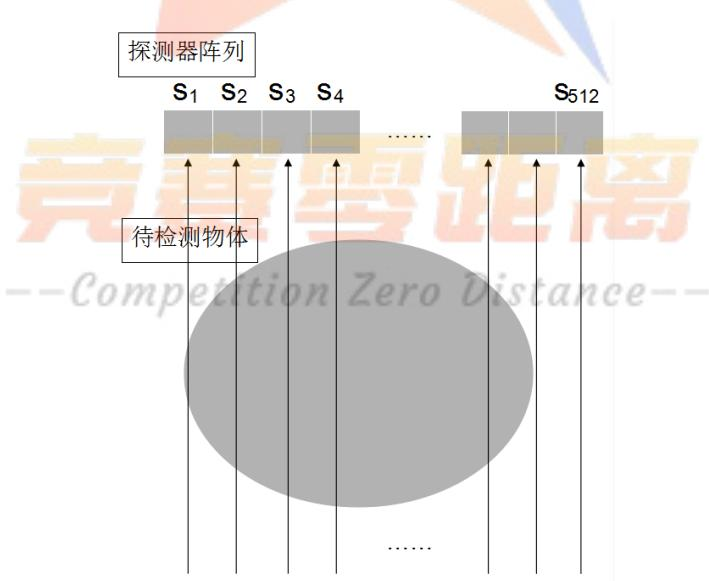
图 1: CT系统示意图

## 1.3 需解决的问题

本文将题述问题归结为以下三个部分，建立数学模型进行分析研究。

## 问题一：参数标定

根据标定模板的几何形状与附件1给出的吸收强度，以及附件2给出的探测器接收信息，标定CT系统的相关参数，包括旋转中心的位置、探测器单元间距、X射线的180个投射角度。

## 问题二、三：CT成像

利用已标定的CT系统参数，结合附件3、附件5给出的未知介质接收信息进行成像，确定未知介质的位置、几何形状与吸收率等信息，并具体给出附件4所给位置的吸收率。

## 问题四：模型分析与改进

分析问题一中参数标定的精度与稳定性，自行设计新模板、建立对应标定模型以做出改进。

## 2 问题分析

本问题主要研究CT系统的参数标定与成像。首先通过投影信息确定X射线入射角度及探测器单元间距，通过图像重建确定旋转中心位置，完成系统参数标定；其次由投影信息直接重建图像，获取未知介质信息；最后分析参数标定的精度与稳定性，设计新模板并建立标定模型。

## 2.1 问题一


分析问题一，建立投影强度曲线的数学模型。首先分析椭圆投影宽度随X射线角度的变化规律，以粗略确定各入射角度及旋转中心。在各入射角度对应的投影强度曲线中，通过图像重建去除圆形模板影响的点位，拟合椭圆投影强度曲线，求解增益系数、探测器单元间距、入射角度的关系。其次在原强度曲线中，扣除椭圆投影的影响，得到180组精确的圆形投影强度曲线。拟合圆形投影强度曲线，通过投影宽度求解探测器单元间距，从而精确求解增益系数与X射线入射角度。最后通过图像重建，确定旋转中心位置。

## 2.2 问题二、三

CT系统的工作原理是由投影重建图像，针对平行束系统的重建算法包括直接反投影法、滤波反投影法、卷积反投影法等，相关文献中已有详细论述。针对问题二应以投影信息与标定所得系统参数作为输入，通过逆Radon变换重建图像，并对图像进行滤波去噪处理，以得到未知介质的信息。

## 2.3 问题四

分析问题一中参数标定的精度与稳定性，针对确定θ取值时所用的arccosθ函数在极值点附近对误差的敏感性进行改进。提出以斜45°椭圆代替圆形的新模板，建立相应标定模型，对其精度与稳定性进行评估。 A

## 3 假设与符号

## 3.1 模型假设

1. 入射的X射线完全平行，忽略相互干涉。

2. 探测器单元阵列与二维待检测介质处于同一平面中，忽略载物台在任意角度可能发生的倾斜。

3. 附件所给接收信息均为精确值。

## 3.2 符号说明

## 4 模型建立与求解

## 4.1 CT成像的理论基础

X射线与物质的相互作用

当X射线照射在被检测物体上时，一部分射线能量被物体吸收，使得射线强度发生衰减。其衰减遵循Lambert-beer吸收定律[?]，呈指数变化。如图??所示，设X射线初始强度为 $I _ { 0 }$ ，穿过厚度为x，吸收系数为 $I \mu$ 的均匀介质后强度变为I，则有：

$$
I = I _ { 0 } e ^ { - \mu x }\tag{1}
$$

$$
\mu x = l n \frac { I _ { 0 } } { I }\tag{2}
$$

<table><tr><td>符号</td><td>符号说明</td><td>单位</td></tr><tr><td> $\Delta d$ </td><td>探测器单元间距</td><td>mm</td></tr><tr><td> $\theta _ { i }$ </td><td>第i组X射线的入射方向</td><td>rad</td></tr><tr><td>a</td><td>椭圆半长轴</td><td>mm</td></tr><tr><td>b</td><td>椭圆半短轴</td><td>mm</td></tr><tr><td>R</td><td>圆半径</td><td>mm</td></tr><tr><td>D</td><td>椭圆投影宽度</td><td>mm</td></tr><tr><td> $f ( x , y )$ </td><td>吸收率函数，表示介质吸收强度的分布</td><td></td></tr><tr><td>g(s, θ)</td><td>投影函数，表示计算所得的投影强度值，s为真实投影</td><td></td></tr><tr><td rowspan="3">h(l, θ)</td><td>坐标</td><td></td></tr><tr><td>采样函数，表示探测器采样数据拟合所得曲线，1为像</td><td></td></tr><tr><td>素坐标，为真实投影长度的1/∆l倍</td><td></td></tr><tr><td>k</td><td>增益系数，探测器接收信息与投影强度的比值</td><td>mm−1</td></tr><tr><td> $k _ { \mu }$ </td><td>比例系数，表示由采样信息重建的图像与吸收率数据</td><td></td></tr><tr><td></td><td>的比值</td><td></td></tr></table>

表1：符号说明

对于二维平面内的不均匀介质，吸收系数表示为厚度x的函数μ(x)，此时Lambert-beer吸收定律表示为：

$$
\int \mu ( x ) d x = l n \frac { I _ { 0 } } { I }\tag{3}
$$

式??表明，X射线穿过物体后的射线强度与被检测物体的吸收系数相关，CT成像的物理本质就是通过探测器接收的强度信息计算吸收系数 $\mathbf { \hat { \mu } } _ { \cdot } \mu$ 的分布。

## 数据意义的分析解释

相关文献显示，探测器接收的投影信息应与吸收系数μ(x)沿投影方向的线积分成正比，现有图像重建算法均以此为前提。针对本题所给数据，分析附件1可知标定模板吸收率处处相同；将附件2中同一入射角度对应的全部接收值求和（如图??所示），可见接收值总和基本保持不变。可以认为，本题所给数据存在类似关系，即探测器接收信息与吸收率函数 $f ( x , y )$ 沿X射线入射方向的线积分（即投影强度）成正比：

$$
\int f ( x , y ) d l = \frac { 1 } { k } h ( l , \theta )\tag{4}
$$

式中 $h ( l , \theta )$ 为探测器接收信息， $f ( x , y )$ 为介质的吸收率分布，k为增益系数。

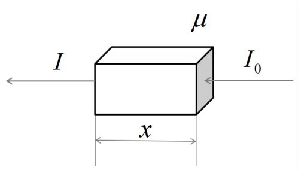

图 2: Lambert-beer吸收定律示意图
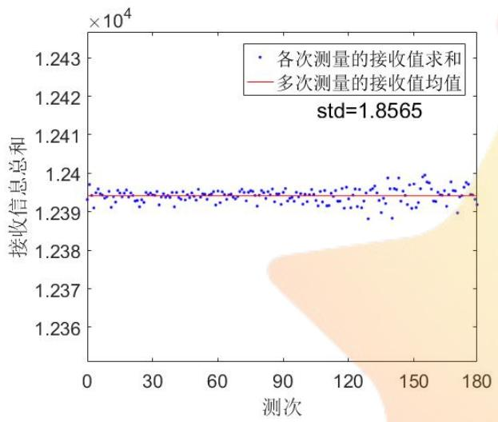
图 3: 各次测量的接收值总和

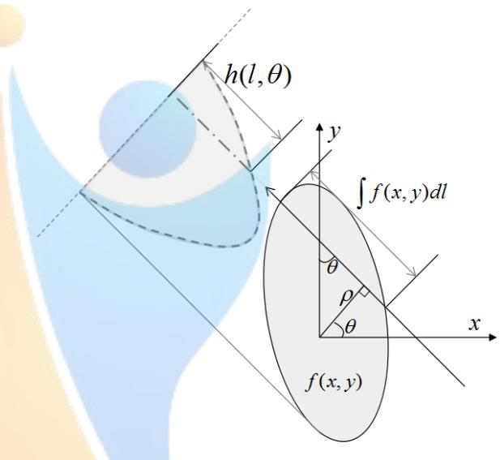
图 4: 接收信息分析示意图

## Radon变换

吸收率函数 $f ( x , y ) { \overset { \cdot } { \underset { \cdot } { \prod } } } \theta$ 方向的投影函数为 $| h ( \theta , l )$ （如图??所示），由θ,l组成的极坐标系统张成Radon空间，空间中任意点(l,θ)的值实际上代表吸收率函数的一个线积分值。

物体空间的吸收率函数 $f ( x , y )$ 与Radon空间的投影函数 ${ \bf \dot { \boldsymbol { g } } } ( l , \theta )$ 有明确的映射关系，通常将物体空间函数变换至Radon空间函数的过程称为Radon变换，反之称为逆Radon变换。实际上，Radon空间的函数值是CT系统中探测器采集的一个数据点，只要有充分的扫描数据，就可以通过插值方式重建物体空间的图像。

## 4.2 问题一

首先建立投影强度模型，分析强度曲线线型的影响因素，可知标定参数的核心问题在于入射角度的确定。模型求解部分从数据图像的形态学角度出发，粗略确定X射线的入射角度，从而分离椭圆与圆形模板的投影强度，通过拟合投影函数标定CT系统各参数值。

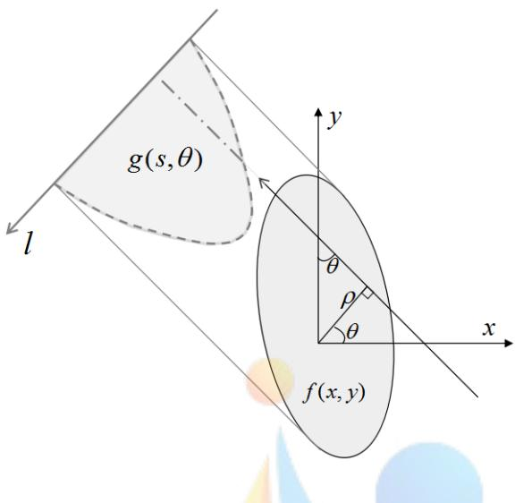
图 5: 吸收率函数及其投影函数

## 4.2.1 投影强度模型的建立

记第i组X射线入射方向与正方形托盘竖直轴的夹角为 ${ \mathsf { I } } \theta _ { i }$ ，探测器位于托盘正下方时θ为0，以逆时针方向为正。记旋转中心为O点，在探测器平面的投影点为 $| O _ { \theta }$ ，以此为原点建立投影强度坐标轴（如图??所示），表示物体空间的真实投影坐标，单位为mm。记椭圆中心为 $\mathsf { I O } _ { 1 }$ ，圆形中心为 ${ \mathrm { \Lambda } } O _ { 2 } , ~ { \it C O } _ { 1 } { \it O O } _ { \theta } = \alpha _ { 1 } , ~ | { \it O O } _ { 1 } | = A _ { 1 } , ~ { \it C O } _ { 2 } { \it O O } _ { \theta } = \alpha _ { 2 } , ~ | { \it O O } _ { 2 } | = A _ { 2 }$ ，则 $O _ { 1 }$ ，$O _ { 2 }$ 在 $S _ { \theta }$ 轴上的投影为：

$$
s _ { o _ { 1 } } ( \theta ) = A _ { 1 } \sin ( \alpha _ { 1 } - \theta )\tag{5}
$$

$$
s _ { o _ { 2 } } ( \theta ) = A _ { 2 } \sin ( \alpha _ { 2 } - \theta )\tag{6}
$$

首先建立椭圆的投影强度模型。以椭圆中心为基准，计算吸收率的线积分值可得：

$$
g _ { 1 } ^ { \prime } ( s ^ { \prime } , \overline { { { \theta } } } ) = \sqrt { - \frac { \mathcal { C } \sqrt { p m p e t i t 4 a ^ { 2 } b ^ { 2 } \ Z e r o \ s ^ { 2 } } } { ( a ^ { 2 } \sin ^ { 2 } \theta + b ^ { 2 } \cos ^ { 2 } \theta ) ^ { 2 } } s ^ { \prime 2 } } \frac { \mathcal { i } s t \alpha n \mathcal { C } 4 a ^ { 2 } b ^ { 2 } - } { a ^ { 2 } \sin ^ { 2 } \theta + b ^ { 2 } \cos ^ { 2 } \theta }\tag{7}
$$

于是在 $s _ { \theta }$ 轴中，有

$$
\begin{array} { l } { \displaystyle { g _ { 1 } ( s , \theta ) = g _ { 1 } ^ { ' } ( s - s _ { o _ { 1 } } , \theta ) } } \\ { \displaystyle { \quad = \sqrt { - \frac { 4 a ^ { 2 } b ^ { 2 } } { ( a ^ { 2 } \sin ^ { 2 } \theta + b ^ { 2 } \cos ^ { 2 } \theta ) ^ { 2 } } ( s - s _ { o _ { 1 } } ) ^ { 2 } + \frac { 4 a ^ { 2 } b ^ { 2 } } { a ^ { 2 } \sin ^ { 2 } \theta + b ^ { 2 } \cos ^ { 2 } \theta } } } } \end{array}\tag{8}
$$

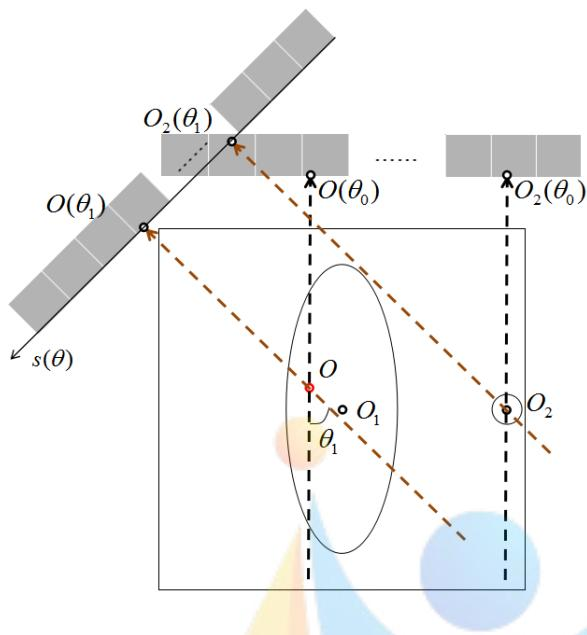
图 6： 投影强度坐标系

由增益系数k与探测器单元间距 $\underline { { 1 } } \Delta d$ 的定义可得：

$$
\begin{array} { l } { { h _ { 1 } ( l , \theta ) = k g _ { 1 } ( l \Delta d , \theta ) } } \\ { { \ = \sqrt { - \frac { 4 a ^ { 2 } b ^ { 2 } k ^ { 2 } \Delta d ^ { 2 } } { ( a ^ { 2 } \sin ^ { 2 } \theta + b ^ { 2 } \cos ^ { 2 } \theta ) ^ { 2 } } ( s - \frac { s _ { o _ { 1 } } } { \Delta d } ) ^ { 2 } + \frac { 4 a ^ { 2 } b ^ { 2 } k ^ { 2 } } { a ^ { 2 } \sin ^ { 2 } \theta + b ^ { 2 } \cos ^ { 2 } \theta } } } } \end{array}\tag{9}
$$

为方便表述，记

$$
\begin{array} { l } { { K _ { 1 } = - \frac { 4 a ^ { 2 } b ^ { 2 } k ^ { 2 } \Delta d ^ { 2 } } { \left( a ^ { 2 } \sin ^ { 2 } \theta + b ^ { 2 } \cos ^ { 2 } \theta \right) ^ { 2 } } } } \\ { { \ } } \\ { { C _ { 1 } = \frac { 4 a ^ { 2 } b ^ { 2 } k ^ { 2 } } { a ^ { 2 } \sin ^ { 2 } \theta + b ^ { 2 } \cos ^ { 2 } \theta } } } \end{array}
$$

则有

$$
h _ { 1 } ^ { 2 } ( l ) = K _ { 1 } ( l - \frac { s _ { o _ { 1 } } } { \Delta d } ) ) _ {  + l _ { 1 } } ^ { 2 }\tag{10}
$$

由式??可见，当θ确定时，采样函数 $h ( l , \theta )$ 的平方为l的二次曲线。

借助以上对于椭圆投影强度模型的分析，令 ${ a = b }$ = R即可得到圆形投影强度模型：

$$
\begin{array} { l } { { K _ { 2 } = - 4 k ^ { 2 } \Delta d ^ { 2 } } } \\ { { \ } } \\ { { C _ { 2 } = 4 R ^ { 2 } k ^ { 2 } } } \end{array}
$$

$$
h _ { 2 } ^ { 2 } ( l ) = K _ { 2 } ( l - \frac { s _ { o _ { 2 } } } { \Delta d } ) ) ^ { 2 } + C _ { 2 }\tag{11}
$$

## 4.2.2 投影强度模型的求解

形态学粗测入射角度、旋转中心以及探测器单元间距

椭圆模板的投影宽度D可由X射线入射角度唯一确定（如图??所示），其计算公式为[?]：

$$
D = { \frac { 2 { \sqrt { m ^ { 2 } a ^ { 2 } + b ^ { 2 } } } } { \sqrt { m ^ { 2 } + 1 } } }\tag{12}
$$

其中m为切线斜率，由此得到入射角度的计算公式为：

$$
\theta = \operatorname { a r c c o t } { \sqrt { \frac { 4 a ^ { 2 } - d ^ { 2 } } { d ^ { 2 } - 4 b ^ { 2 } } } }\tag{13}
$$

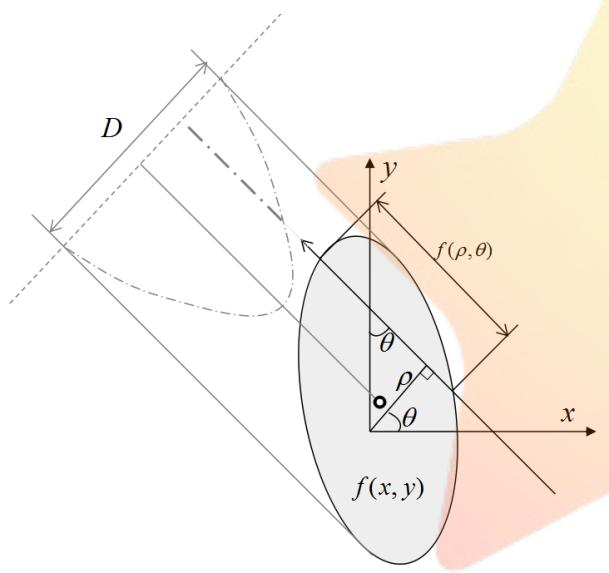
图 7： 椭圆投影宽度示意图

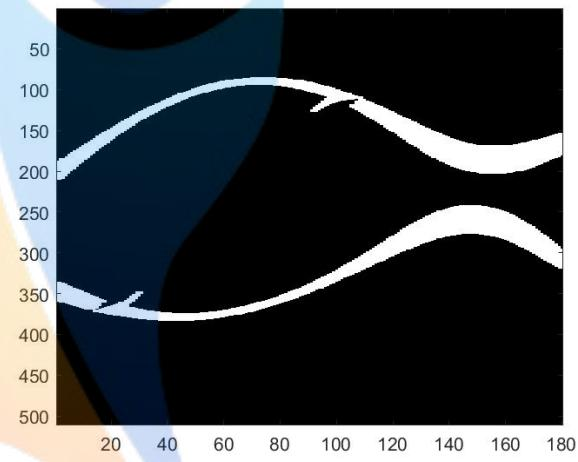
图 8： 椭圆投影宽度粗测用图

通过分析探测器接收信息，将椭圆投影像素宽度的极大值作为长轴的估计值，估算探测器单元间距 $\Delta d$ 以及每一投影角度对应的真实投影宽度，从而粗略测算180个入射角度的取值。

求解结果如图??所示，可近似认为入射角度线性增加。以等距分布的入射角对探测器接收信息作逆Radon变换，所得图像的中心位置即为旋转中心。以椭圆中心、圆形中心与旋转中心为顶点构造三角形，利用其在两幅图像中的相似性即可粗略确定旋转中心在正方形托盘中的位置。

## 分离提取投影强度曲线

圆形投影中心位置的确定粗略测算入射角度及旋转中心后，可估算每一强度曲线中

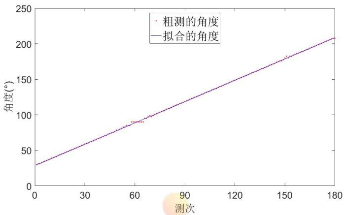

图 9:入射角度粗测数据图
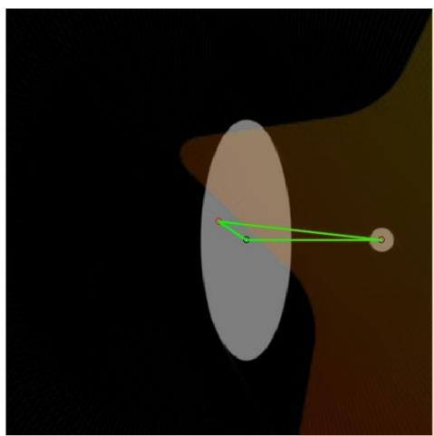

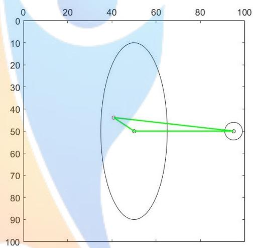
图10：重建图像（左）与原始图像（右）

圆形投影的中心位置。

如图??所示，圆心投影位置应满足关系式：

$$
l \equiv \langle l _ { 0 } c o s ( \theta \pm \alpha ) \rangle + \langle L _ { 0 }\tag{14}
$$

式中 $l _ { 0 }$ 为旋转中心至圆心的像素长度，α为图??中三角形的一个内角，均可由重建图像估算。 $L _ { 0 }$ 为旋转中心对应的投影像素坐标，可将椭圆投影宽度的极小点近似作为θ=0的情形进行估算。

模板投影强度曲线的分离拟合借助 $\Delta d ^ { \prime }$ 估计值可计算圆形投影的像素宽度。在各投影强度曲线中，以圆心投影坐标为中心，在左右两侧去除两倍圆形投影宽度内的数据点，从而完全消除圆形投影的影响，得到椭圆投影强度的部分数据。

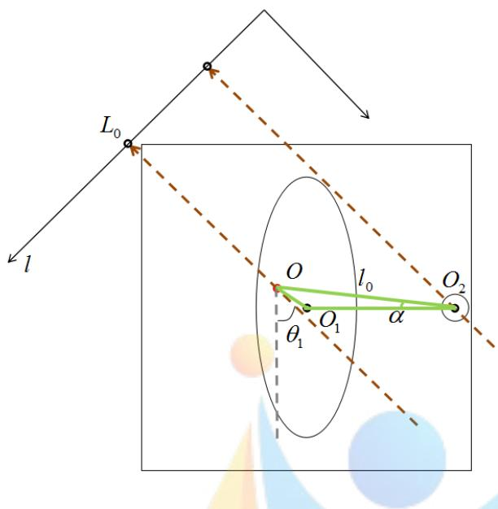
图 11：圆心投影位置

对各投影角度，利用上述数据拟合二次多项式得到完整的椭圆投影强度曲线。从全部接收信息中扣除椭圆投影强度，即可得到圆形投影强度数据，进而拟合得圆形投影强度曲线。图??显示分离出的投影强度数据，图??显示拟合所得投影强度曲线。

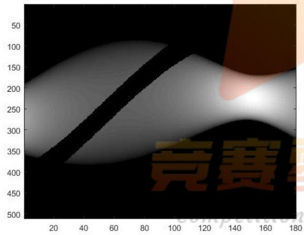

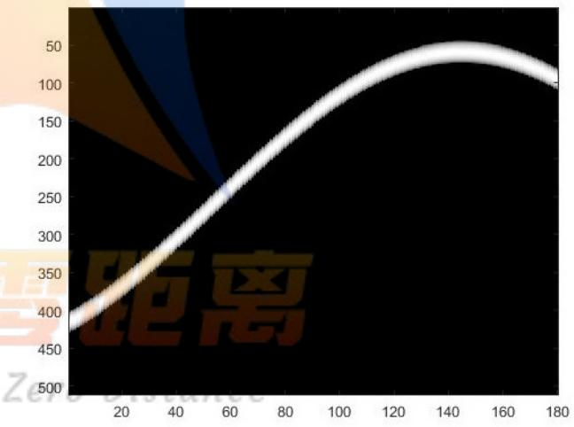
图12：椭圆投影强度数据（左）与圆形投影强度数据（右）

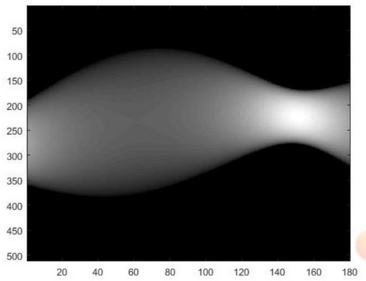

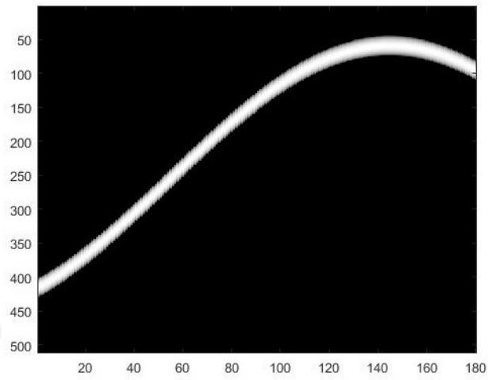
图13：椭圆投影强度拟合结果（左）与圆形投影强度拟合结果（右）

## 标定系统参数

探测器单元间距 $\Delta l$ 设拟合所得圆形投影强度曲线为：

$$
h _ { 2 } ^ { 2 } ( l , \theta ) = q _ { 1 } l ^ { 2 } + q _ { 2 } l + q _ { 3 }\tag{15}
$$

与投影模型比较系数得：

$$
K _ { 2 } = q _ { 1 }
$$

$$
\frac { s _ { o _ { 2 } } } { \Delta d } = - \frac { q _ { 2 } } { 2 q _ { 1 } }\tag{16}
$$

(17)

$$
C _ { 2 } = q _ { 3 } - \frac { q _ { 2 } ^ { 2 } } { 4 q _ { 1 } }\tag{18}
$$

则

$$
\begin{array} { r l } & { \quad ^ { 2 } \frac { C _ { 2 2 } ^ { 2 } } { C _ { 2 } ^ { 2 } } \dot { \underline { { i } } } \omega \underline { { n } } \frac { \gamma - { q _ { 1 } ^ { 2 } } _ { * , n } } { q _ { 3 } - \frac { q _ { 2 } ^ { 2 } } { 4 q _ { 1 } } } \overset { = } { \frac { \gamma } { R ^ { 2 } } } } \\ & { \quad \Rightarrow \Delta d = \sqrt { R ^ { 2 } \frac { q _ { 1 } } { \frac { q _ { 2 } ^ { 2 } } { 4 q _ { 1 } } - q _ { 3 } } } } \\ & { \qquad = 2 R \sqrt { \frac { q _ { 1 } ^ { 2 } } { q _ { 2 } ^ { 2 } - 4 q _ { 1 } q _ { 3 } } } } \end{array}\tag{19}
$$

拟合180组圆形投影强度曲线，将曲线系数代入式??解出 $\Delta d _ { i }$ ，对计算结果取均值得：

$$
\Delta d = 0 . 2 7 6 8 m m\tag{20}
$$

入射角度θ 设拟合所得椭圆投影强度曲线为：

$$
h _ { 1 } ^ { 2 } ( l , \theta ) = p _ { 1 } l ^ { 2 } + p _ { 2 } l + p _ { 3 }\tag{21}
$$

相应地有：

$$
K _ { 1 } = p _ { 1 }\tag{22}
$$

$$
\frac { s _ { o _ { 1 } } } { \Delta d } = - \frac { p _ { 2 } } { 2 p _ { 1 } }\tag{23}
$$

$$
C _ { 1 } = p _ { 3 } ^ { 2 } - \frac { p _ { 2 } ^ { 2 } } { 4 p _ { 1 } }\tag{24}
$$

为求出θ，对 $K _ { 1 }$ ， $C _ { 1 }$ 表达式进行变换可得：

$$
- \frac { C _ { 1 } } { K _ { 1 } } = \frac { a ^ { 2 } \sin ^ { 2 } \theta + b ^ { 2 } \cos ^ { 2 } \theta } { \Delta d ^ { 2 } } = - \frac { p _ { 3 } ^ { 2 } - \frac { p _ { 2 } ^ { 2 } } { 4 p _ { 1 } } } { p _ { 1 } }\tag{25}
$$

由于探测系统逆时针旋转，θ值单调增加，由此可确定θ的180组取值。

由图??可见，经计算修正后 $\cdot \theta _ { i }$ 序列更接近其线性拟合值，相邻两点间距1°左右，仅在个别点出现偏差。计算结果见表????。

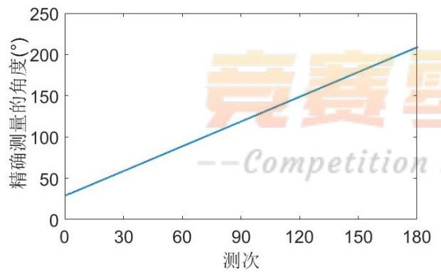

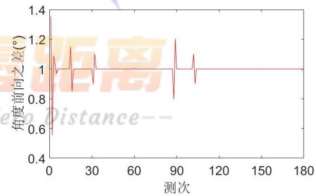
图14：入射角度序列θ（左）与前向对比图（右）

<table><tr><td colspan="1" rowspan="1">i</td><td colspan="1" rowspan="1"> $\theta _ { i } / { } ^ { \circ }$ </td><td colspan="1" rowspan="1">2</td><td colspan="1" rowspan="1"> $\theta _ { i } / { } ^ { \circ }$ </td><td colspan="1" rowspan="1">i</td><td colspan="1" rowspan="1"> $\theta _ { i } / { } ^ { \circ }$ </td></tr><tr><td colspan="1" rowspan="1">1</td><td colspan="1" rowspan="1">29.6463</td><td colspan="1" rowspan="1">2</td><td colspan="1" rowspan="1">30.9999</td><td colspan="1" rowspan="1">3</td><td colspan="1" rowspan="1">31.5553</td></tr><tr><td colspan="1" rowspan="1">4</td><td colspan="1" rowspan="1">32.6447</td><td colspan="1" rowspan="1">5</td><td colspan="1" rowspan="1">33.6771</td><td colspan="1" rowspan="1">6</td><td colspan="1" rowspan="1">34.6463</td></tr><tr><td colspan="1" rowspan="1">7</td><td colspan="1" rowspan="1">35.6463</td><td colspan="1" rowspan="1">8</td><td colspan="1" rowspan="1">36.6463</td><td colspan="1" rowspan="1">9</td><td colspan="1" rowspan="1">37.6463</td></tr><tr><td colspan="1" rowspan="1">10</td><td colspan="1" rowspan="1">38.6463</td><td colspan="1" rowspan="1">11</td><td colspan="1" rowspan="1">39.6462</td><td colspan="1" rowspan="1">12</td><td colspan="1" rowspan="1">40.6462</td></tr><tr><td colspan="1" rowspan="1">13</td><td colspan="1" rowspan="1">41.6463</td><td colspan="1" rowspan="1">14</td><td colspan="1" rowspan="1">42.6462</td><td colspan="1" rowspan="1">15</td><td colspan="1" rowspan="1">43.6462</td></tr><tr><td colspan="1" rowspan="1">16</td><td colspan="1" rowspan="1">44.7967</td><td colspan="1" rowspan="1">17</td><td colspan="1" rowspan="1">45.6463</td><td colspan="1" rowspan="1">18</td><td colspan="1" rowspan="1">46.6463</td></tr><tr><td colspan="1" rowspan="1">19</td><td colspan="1" rowspan="1">47.6464</td><td colspan="1" rowspan="1">20</td><td colspan="1" rowspan="1">48.6462</td><td colspan="1" rowspan="1">21</td><td colspan="1" rowspan="1">49.6463</td></tr><tr><td colspan="1" rowspan="1">22</td><td colspan="1" rowspan="1">50.6460</td><td colspan="1" rowspan="1">23</td><td colspan="1" rowspan="1">51.6463</td><td colspan="1" rowspan="1">24</td><td colspan="1" rowspan="1">52.6463</td></tr><tr><td colspan="1" rowspan="1">25</td><td colspan="1" rowspan="1">53.6461</td><td colspan="1" rowspan="1">26</td><td colspan="1" rowspan="1">54.6463</td><td colspan="1" rowspan="1">27</td><td colspan="1" rowspan="1">55.6463</td></tr><tr><td colspan="1" rowspan="1">28</td><td colspan="1" rowspan="1">56.6462</td><td colspan="1" rowspan="1">29</td><td colspan="1" rowspan="1">57.6463</td><td colspan="1" rowspan="1">30</td><td colspan="1" rowspan="1">58.6463</td></tr><tr><td colspan="1" rowspan="1">31</td><td colspan="1" rowspan="1">59.6463</td><td colspan="1" rowspan="1">32</td><td colspan="1" rowspan="1">60.5453</td><td colspan="1" rowspan="1">33</td><td colspan="1" rowspan="1">61.6462</td></tr><tr><td colspan="1" rowspan="1">34</td><td colspan="1" rowspan="1">62.6462</td><td colspan="1" rowspan="1">35</td><td colspan="1" rowspan="1">63.6463</td><td colspan="1" rowspan="1">36</td><td colspan="1" rowspan="1">64.6463</td></tr><tr><td colspan="1" rowspan="1">37</td><td colspan="1" rowspan="1">65.6462</td><td colspan="1" rowspan="1">38</td><td colspan="1" rowspan="1">66.6463</td><td colspan="1" rowspan="1">39</td><td colspan="1" rowspan="1">67.6460</td></tr><tr><td colspan="1" rowspan="1">40</td><td colspan="1" rowspan="1">68.6462</td><td colspan="1" rowspan="1">41</td><td colspan="1" rowspan="1">69.6461</td><td colspan="1" rowspan="1">42</td><td colspan="1" rowspan="1">70.6463</td></tr><tr><td colspan="1" rowspan="1">43</td><td colspan="1" rowspan="1">71.6462</td><td colspan="1" rowspan="1">44</td><td colspan="1" rowspan="1">72.6461</td><td colspan="1" rowspan="1">45</td><td colspan="1" rowspan="1">73.6464</td></tr><tr><td colspan="1" rowspan="1">46</td><td colspan="1" rowspan="1">74.6458</td><td colspan="1" rowspan="1">47</td><td colspan="1" rowspan="1">75.6462</td><td colspan="1" rowspan="1">48</td><td colspan="1" rowspan="1">76.6462</td></tr><tr><td colspan="1" rowspan="1">49</td><td colspan="1" rowspan="1">77.6462</td><td colspan="1" rowspan="1">50</td><td colspan="1" rowspan="1">78.6463</td><td colspan="1" rowspan="1">51</td><td colspan="1" rowspan="1">79.6461</td></tr><tr><td colspan="1" rowspan="1">52</td><td colspan="1" rowspan="1">80.6463</td><td colspan="1" rowspan="1">53</td><td colspan="1" rowspan="1">81.6461</td><td colspan="1" rowspan="1">54</td><td colspan="1" rowspan="1">82.6463</td></tr><tr><td colspan="1" rowspan="1">55</td><td colspan="1" rowspan="1">83.6456</td><td colspan="1" rowspan="1">56</td><td colspan="1" rowspan="1">84.6463</td><td colspan="1" rowspan="1">57</td><td colspan="1" rowspan="1">85.6460</td></tr><tr><td colspan="1" rowspan="1">58</td><td colspan="1" rowspan="1">86.6463</td><td colspan="1" rowspan="1">59</td><td colspan="1" rowspan="1">87.6466</td><td colspan="1" rowspan="1">60</td><td colspan="1" rowspan="1">88.6458</td></tr><tr><td colspan="1" rowspan="1">61</td><td colspan="1" rowspan="1">89.6520</td><td colspan="1" rowspan="1">62</td><td colspan="1" rowspan="1">90.6474</td><td colspan="1" rowspan="1">63</td><td colspan="1" rowspan="1">91.6474</td></tr><tr><td colspan="1" rowspan="1">64</td><td colspan="1" rowspan="1">92.6470</td><td colspan="1" rowspan="1">65</td><td colspan="1" rowspan="1">93.6474</td><td colspan="1" rowspan="1">66</td><td colspan="1" rowspan="1">94.6467</td></tr><tr><td colspan="1" rowspan="1">67</td><td colspan="1" rowspan="1">95.6467</td><td colspan="1" rowspan="1">68</td><td colspan="1" rowspan="1">96.6463</td><td colspan="1" rowspan="1">69</td><td colspan="1" rowspan="1">97.6462</td></tr><tr><td colspan="1" rowspan="1">70</td><td colspan="1" rowspan="1">98.6467</td><td colspan="1" rowspan="1">71</td><td colspan="1" rowspan="1">99.6461</td><td colspan="1" rowspan="1">72</td><td colspan="1" rowspan="1">100.6465</td></tr><tr><td colspan="1" rowspan="1">73</td><td colspan="1" rowspan="1">101.6464</td><td colspan="1" rowspan="1">74</td><td colspan="1" rowspan="1">102.646</td><td colspan="1" rowspan="1">75门</td><td colspan="1" rowspan="1">103.6464</td></tr><tr><td colspan="1" rowspan="1">76</td><td colspan="1" rowspan="1">104.6460</td><td colspan="1" rowspan="1">77</td><td colspan="1" rowspan="1">105.6463</td><td colspan="1" rowspan="1">78</td><td colspan="1" rowspan="1">106.6459</td></tr><tr><td colspan="1" rowspan="1">79</td><td colspan="1" rowspan="1">107.6462</td><td colspan="1" rowspan="1">80</td><td colspan="1" rowspan="1">108.6462</td><td colspan="1" rowspan="1">81</td><td colspan="1" rowspan="1">109.6462</td></tr><tr><td colspan="1" rowspan="1">82</td><td colspan="1" rowspan="1">110.6463</td><td colspan="1" rowspan="1">83</td><td colspan="1" rowspan="1">111.6462</td><td colspan="1" rowspan="1">84</td><td colspan="1" rowspan="1">112.6463</td></tr><tr><td colspan="1" rowspan="1">85</td><td colspan="1" rowspan="1">113.6463</td><td colspan="1" rowspan="1">86</td><td colspan="1" rowspan="1">114.6463</td><td colspan="1" rowspan="1">87</td><td colspan="1" rowspan="1">115.6463</td></tr><tr><td colspan="1" rowspan="1">88</td><td colspan="1" rowspan="1">116.6462</td><td colspan="1" rowspan="1">89</td><td colspan="1" rowspan="1">117.4436</td><td colspan="1" rowspan="1">90</td><td colspan="1" rowspan="1">118.6462</td></tr><tr><td colspan="1" rowspan="1">i</td><td colspan="1" rowspan="1"> $\theta _ { i } / { } ^ { \circ }$ </td><td colspan="1" rowspan="1">i</td><td colspan="1" rowspan="1"> $\theta _ { i } / { } ^ { \circ }$ </td><td colspan="1" rowspan="1">i</td><td colspan="1" rowspan="1"> $\theta _ { i } / { } ^ { \circ }$ </td></tr><tr><td colspan="1" rowspan="1">91</td><td colspan="1" rowspan="1">119.6463</td><td colspan="1" rowspan="1">92</td><td colspan="1" rowspan="1">120.6462</td><td colspan="1" rowspan="1">93</td><td colspan="1" rowspan="1">121.6463</td></tr><tr><td colspan="1" rowspan="1">94</td><td colspan="1" rowspan="1">122.6463</td><td colspan="1" rowspan="1">95</td><td colspan="1" rowspan="1">123.6463</td><td colspan="1" rowspan="1">96</td><td colspan="1" rowspan="1">124.6463</td></tr><tr><td colspan="1" rowspan="1">97</td><td colspan="1" rowspan="1">125.6463</td><td colspan="1" rowspan="1">98</td><td colspan="1" rowspan="1">126.6464</td><td colspan="1" rowspan="1">99</td><td colspan="1" rowspan="1">127.6463</td></tr><tr><td colspan="1" rowspan="1">100</td><td colspan="1" rowspan="1">128.6461</td><td colspan="1" rowspan="1">101</td><td colspan="1" rowspan="1">129.6462</td><td colspan="1" rowspan="1">102</td><td colspan="1" rowspan="1">130.6462</td></tr><tr><td colspan="1" rowspan="1">103</td><td colspan="1" rowspan="1">131.7462</td><td colspan="1" rowspan="1">104</td><td colspan="1" rowspan="1">132.6463</td><td colspan="1" rowspan="1">105</td><td colspan="1" rowspan="1">133.6463</td></tr><tr><td colspan="1" rowspan="1">106</td><td colspan="1" rowspan="1">134.6462</td><td colspan="1" rowspan="1">107</td><td colspan="1" rowspan="1">135.6463</td><td colspan="1" rowspan="1">108</td><td colspan="1" rowspan="1">136.6461</td></tr><tr><td colspan="1" rowspan="1">109</td><td colspan="1" rowspan="1">137.6462</td><td colspan="1" rowspan="1">110</td><td colspan="1" rowspan="1">138.6463</td><td colspan="1" rowspan="1">111</td><td colspan="1" rowspan="1">139.6463</td></tr><tr><td colspan="1" rowspan="1">112</td><td colspan="1" rowspan="1">140.6462</td><td colspan="1" rowspan="1">113</td><td colspan="1" rowspan="1">141.6463</td><td colspan="1" rowspan="1">114</td><td colspan="1" rowspan="1">142.6462</td></tr><tr><td colspan="1" rowspan="1">115</td><td colspan="1" rowspan="1">143.6463</td><td colspan="1" rowspan="1">116</td><td colspan="1" rowspan="1">144.6462</td><td colspan="1" rowspan="1">117</td><td colspan="1" rowspan="1">145.6463</td></tr><tr><td colspan="1" rowspan="1">118</td><td colspan="1" rowspan="1">146.6462</td><td colspan="1" rowspan="1">119</td><td colspan="1" rowspan="1">147.6463</td><td colspan="1" rowspan="1">120</td><td colspan="1" rowspan="1">148.6462</td></tr><tr><td colspan="1" rowspan="1">121</td><td colspan="1" rowspan="1">149.6462</td><td colspan="1" rowspan="1">122</td><td colspan="1" rowspan="1">150.6463</td><td colspan="1" rowspan="1">123</td><td colspan="1" rowspan="1">151.6462</td></tr><tr><td colspan="1" rowspan="1">124</td><td colspan="1" rowspan="1">152.6463</td><td colspan="1" rowspan="1">125</td><td colspan="1" rowspan="1">153.6462</td><td colspan="1" rowspan="1">126</td><td colspan="1" rowspan="1">154.6462</td></tr><tr><td colspan="1" rowspan="1">127</td><td colspan="1" rowspan="1">155.6462</td><td colspan="1" rowspan="1">128</td><td colspan="1" rowspan="1">156.6463</td><td colspan="1" rowspan="1">129</td><td colspan="1" rowspan="1">157.6463</td></tr><tr><td colspan="1" rowspan="1">130</td><td colspan="1" rowspan="1">158.6463</td><td colspan="1" rowspan="1">131</td><td colspan="1" rowspan="1">159.6463</td><td colspan="1" rowspan="1">132</td><td colspan="1" rowspan="1">160.6463</td></tr><tr><td colspan="1" rowspan="1">133</td><td colspan="1" rowspan="1">161.6463</td><td colspan="1" rowspan="1">134</td><td colspan="1" rowspan="1">162.6463</td><td colspan="1" rowspan="1">135</td><td colspan="1" rowspan="1">163.6463</td></tr><tr><td colspan="1" rowspan="1">136</td><td colspan="1" rowspan="1">164.6462</td><td colspan="1" rowspan="1">137</td><td colspan="1" rowspan="1">165.6463</td><td colspan="1" rowspan="1">138</td><td colspan="1" rowspan="1">166.6463</td></tr><tr><td colspan="1" rowspan="1">139</td><td colspan="1" rowspan="1">167.6463</td><td colspan="1" rowspan="1">140</td><td colspan="1" rowspan="1">168.6463</td><td colspan="1" rowspan="1">141</td><td colspan="1" rowspan="1">169.6463</td></tr><tr><td colspan="1" rowspan="1">142</td><td colspan="1" rowspan="1">170.6462</td><td colspan="1" rowspan="1">143</td><td colspan="1" rowspan="1">171.6462</td><td colspan="1" rowspan="1">144</td><td colspan="1" rowspan="1">172.6462</td></tr><tr><td colspan="1" rowspan="1">145</td><td colspan="1" rowspan="1">173.6462</td><td colspan="1" rowspan="1">146</td><td colspan="1" rowspan="1">174.6463</td><td colspan="1" rowspan="1">147</td><td colspan="1" rowspan="1">175.6462</td></tr><tr><td colspan="1" rowspan="1">148</td><td colspan="1" rowspan="1">176.6462</td><td colspan="1" rowspan="1">149</td><td colspan="1" rowspan="1">177.6465</td><td colspan="1" rowspan="1">150</td><td colspan="1" rowspan="1">178.6463</td></tr><tr><td colspan="1" rowspan="1">151</td><td colspan="1" rowspan="1">179.6478</td><td colspan="1" rowspan="1">152</td><td colspan="1" rowspan="1">180.6463</td><td colspan="1" rowspan="1">153</td><td colspan="1" rowspan="1">181.6463</td></tr><tr><td colspan="1" rowspan="1">154</td><td colspan="1" rowspan="1">182.6461</td><td colspan="1" rowspan="1">155</td><td colspan="1" rowspan="1">183.6462</td><td colspan="1" rowspan="1">156</td><td colspan="1" rowspan="1">184.6463</td></tr><tr><td colspan="1" rowspan="1">157</td><td colspan="1" rowspan="1">185.6462</td><td colspan="1" rowspan="1">158</td><td colspan="1" rowspan="1">186.6463</td><td colspan="1" rowspan="1">159</td><td colspan="1" rowspan="1">187.6462</td></tr><tr><td colspan="1" rowspan="1">160</td><td colspan="1" rowspan="1">188.6463</td><td colspan="1" rowspan="1">161</td><td colspan="1" rowspan="1">189.6462</td><td colspan="1" rowspan="1">162</td><td colspan="1" rowspan="1">190.6463</td></tr><tr><td colspan="1" rowspan="1">163</td><td colspan="1" rowspan="1">191.6462</td><td colspan="1" rowspan="1">164</td><td colspan="1" rowspan="1">192.6463n</td><td colspan="1" rowspan="1">165</td><td colspan="1" rowspan="1">193.6463</td></tr><tr><td colspan="1" rowspan="1">166</td><td colspan="1" rowspan="1">194.6462</td><td colspan="1" rowspan="1">167</td><td colspan="1" rowspan="1">195.6463</td><td colspan="1" rowspan="1">168</td><td colspan="1" rowspan="1">196.6463</td></tr><tr><td colspan="1" rowspan="1">169</td><td colspan="1" rowspan="1">197.6463</td><td colspan="1" rowspan="1">170</td><td colspan="1" rowspan="1">198.6463</td><td colspan="1" rowspan="1">171</td><td colspan="1" rowspan="1">199.6462</td></tr><tr><td colspan="1" rowspan="1">172</td><td colspan="1" rowspan="1">200.6462</td><td colspan="1" rowspan="1">173</td><td colspan="1" rowspan="1">201.6463</td><td colspan="1" rowspan="1">174</td><td colspan="1" rowspan="1">202.6462</td></tr><tr><td colspan="1" rowspan="1">175</td><td colspan="1" rowspan="1">203.6463</td><td colspan="1" rowspan="1">176</td><td colspan="1" rowspan="1">204.6462</td><td colspan="1" rowspan="1">177</td><td colspan="1" rowspan="1">205.6462</td></tr><tr><td colspan="1" rowspan="1">178</td><td colspan="1" rowspan="1">206.6462</td><td colspan="1" rowspan="1">179</td><td colspan="1" rowspan="1">207.6463</td><td colspan="1" rowspan="1">180</td><td colspan="1" rowspan="1">208.6358</td></tr></table>

旋转中心位置 $( x , y )$ 解得入射角度序列 $| \theta _ { i } .$ 后，通过线性插值将探测器接收信息处理为入射角度间距相等的情况，以满足逆Radon算法的输入要求，获取更高质量的重建图像。

再次运用图??所示的方法，利用三角形相似性确定更精确的旋转中心位置，计算结果如图??所示：

$$
\begin{array} { c } { { x = 4 0 . 8 4 3 6 m m } } \\ { { } } \\ { { y = 5 6 . 1 4 9 5 m m } } \end{array}
$$

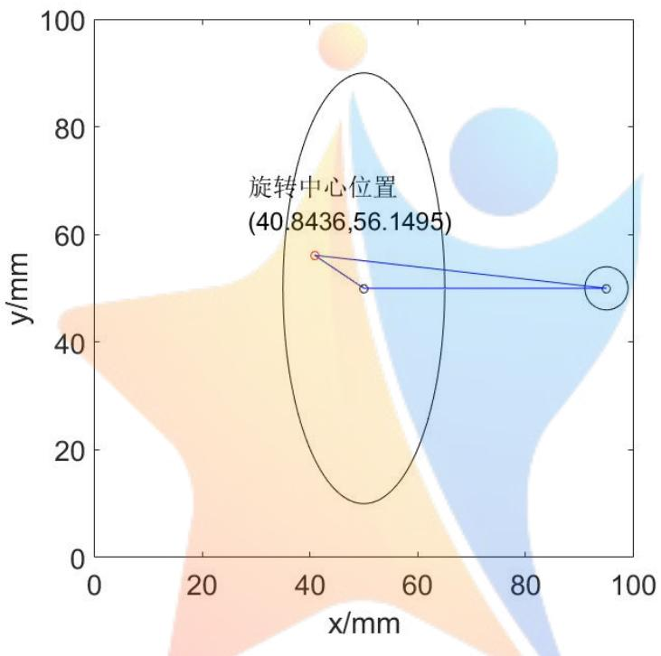
图15: 旋转中心位置

## 4.2.3 模型分析与评价

本模型根据拟合结果求解 $: \theta ,$ 由于拟合过程中可能存在误差，故求得的结果也存在一定的误差。

依照前面的推导，有

$$
c o s ^ { 2 } \theta = \frac { 1 } { b ^ { 2 } - a ^ { 2 } } ( - \frac { C } { K } \Delta l ^ { 2 } - a ^ { 2 } )\tag{26}
$$

对于标定用的模型，我们认为所提供的参数值是足够精确的，可以忽略其误差。于是误差的主要来源为C、K和 $\Delta l$ 。记参数P的误差为 $I \delta ( P )$ ，则有

$$
\delta ( c o s ^ { 2 } \theta ) = - { \frac { 1 } { b ^ { 2 } - a ^ { 2 } } } \delta ( { \frac { C } { K } } \Delta l ^ { 2 } )\tag{27}
$$

于是，只需求出 $\delta \big ( \frac { C } { K } \Delta l ^ { 2 } \big )$ ，根据误差传递公式，有

$$
\delta ( \frac { C } { K } \Delta l ^ { 2 } ) = \delta ( \frac { C } { K } ) \Delta l ^ { 2 } + \frac { C } { K } \delta ( \Delta l ^ { 2 } )\tag{28}
$$

其中

$$
\delta ( \frac { C } { K } ) / \frac { C } { K } = \sqrt { ( \frac { \delta ( C ) } { C } ) ^ { 2 } + ( \frac { \delta ( K ) } { K } ) ^ { 2 } }\tag{29}
$$

因为，K与C都是由二次曲线拟合结果计算得出的，于是分析二次函数拟合参数的置信区间。最小二乘法做二次拟合时，记预测值为 $P ( x )$ ，预测残差平方和为 $Q ( a _ { 0 } , a _ { 1 } , a _ { 2 } )$ ，则有

$$
P ( x ) = a _ { 2 } x ^ { 2 } + a _ { 1 } x + a _ { 0 }\tag{30}
$$

$$
Q ( a _ { 0 } , a _ { 1 } , a _ { 2 } ) = \sum _ { x = 1 } ^ { N } ( P ( x _ { i } ) - y _ { i } ) ^ { 2 }\tag{31}
$$

利用最小二乘的思想进行拟合，则要求 $Q ( a _ { 0 } , a _ { 1 } , a _ { 2 } )$ 取最小值，即

$$
\left\{ \begin{array} { l l } { { \frac { d Q } { d a _ { 0 } } = 0 } } \\ { { \frac { d Q } { d a _ { 1 } } = 0 } } \\ { { \frac { d Q } { d a _ { 2 } } = 0 } } \end{array} \right.\tag{32}
$$

计算后求得最优预测为：

$$
\left[ \begin{array} { l l l } { m } & { \sum x _ { i } } & { \sum x _ { i } ^ { 2 } \bigg ] } \\ { \sum x _ { i } } & { \sum x _ { i } ^ { 2 } } & { \sum x _ { i } ^ { 3 } } \\ { \sum x _ { i } ^ { 2 } } & { \sum x _ { i } ^ { 3 } } & { \sum x _ { i } ^ { 4 } } \end{array} \right] \left[ \begin{array} { l } { a _ { 0 } } \\ { a _ { 1 } } \\ { a _ { 2 } } \end{array} \right] = \left[ \begin{array} { l } { \sum y _ { i } } \\ { \sum x _ { i } y _ { i } } \\ { \sum x _ { i } ^ { 2 } y _ { i } } \end{array} \right]\tag{33}
$$

记

$$
\begin{array} { r } { M = \left[ \begin{array} { l l l } { m } & { \sum x _ { i } } & { \sum x _ { i } ^ { 2 } } \\ { \sum x _ { i } } & { \sum x _ { i } ^ { 2 } } & { \sum x _ { i } ^ { 3 } } \\ { \sum x _ { i } ^ { 2 } } & { \overrightarrow { \sum } x _ { i } ^ { 3 } } & { \widehat { \sum } \overrightarrow { x _ { i } ^ { 4 } } } \end{array} \right] } \end{array}\tag{34}
$$

则，考虑误差后，有

$$
M \left[ { \begin{array} { c } { a _ { 0 } + \Delta a _ { 0 } } \\ { a _ { 1 } + \Delta a _ { 1 } } \\ { a _ { 2 } + \Delta a _ { 2 } } \end{array} } \right] = \left[ { \begin{array} { c } { \sum ( y _ { i } + \Delta y _ { i } ) } \\ { \sum x _ { i } ( y _ { i } + \Delta y _ { i } ) } \\ { \sum x _ { i } ^ { 2 } ( y _ { i } + \Delta y _ { i } ) } \end{array} } \right]\tag{35}
$$

与原式相减可得：

$$
M \left[ \Delta a _ { 0 } \right] = \left[ \begin{array} { c } { \sum \Delta y _ { i } } \\ { \sum x _ { i } \Delta y _ { i } } \\ { \sum x _ { i } ^ { 2 } \Delta y _ { i } } \end{array} \right]\tag{36}
$$

即

$$
\left[ \begin{array} { l } { \Delta a _ { 0 } } \\ { \Delta a _ { 1 } } \\ { \Delta a _ { 2 } } \end{array} \right] = M ^ { - 1 } \left[ \begin{array} { l } { \sum \Delta y _ { i } } \\ { \sum x _ { i } \Delta y _ { i } } \\ { \sum x _ { i } ^ { 2 } \Delta y _ { i } } \end{array} \right]\tag{37}
$$

因为 $\mathfrak { y } _ { i }$ 为测量误差，可以视为均值为0，标准差为δ的独立高斯分布，则有

$$
E ( y _ { i } ) = 0\tag{38}
$$

$$
E ( y _ { i } y _ { j } ) = { \left\{ \begin{array} { l l } { 1 } & { i = j } \\ { 0 } & { i \neq j } \end{array} \right. }\tag{39}
$$

至此，可从理论上求得 $a _ { 0 } , a _ { 1 } , a _ { 2 }$ 的表达式，且式子均由 $y _ { i }$ 的线性表达式构成，利用期望的线性性，可以求得 $E ( a _ { o } ^ { 2 } ) , E ( a _ { 1 } ^ { 2 } ) , E ( a _ { 2 } ^ { 2 } )$ 若对于每一次拟合，都进行如此计算，需要极大的计算量，且不利于直观理解，在此给出一种十分粗糙的方法计算其误差，可以较直观的看到误差的大小：

对于 $y = a _ { 2 } x ^ { 2 } + a _ { 1 } x + a _ { 0 }$ ，y的相对误差是由 $a _ { 2 } , a _ { 1 } , a _ { 0 }$ 的相对误差共同影响的，由于拟合出来的曲线并非奇异的二次曲线，可以认为 $a _ { 2 } x ^ { 2 } , a _ { 1 } x , a _ { 0 } .$ 三项的值大小相当，于是 $y , a _ { 2 } , a _ { 1 } , a _ { 0 }$ 的相对误差大致相等，对于 $\mathrm { \Delta \cdot _ { y } }$ 的误差，可用其方差的无偏估计来表示，即：

$$
\delta ( y ) = \sqrt { \frac { \sum _ { k = 1 } ^ { N } ( y _ { i } - \hat { y } _ { i } ) ^ { 2 } } { N - 1 } }\tag{40}
$$

$_ \mathrm { y }$ 的值用其均值 $\operatorname { \overline { { y } } }$ 表示，即 $\lvert _ { \mathrm { y } }$ 的相对误差为 $\frac { \delta ( y ) } { \overline { { y } } }$ 。如图??所示，用Matlab取出其中一条进行计算，可知该值大致为 $1 0 ^ { - 7 } - 1 0 ^ { - 6 }$

对于 $\cdot \delta ( \Delta l )$ ，其值的是利用圆的拟合曲线求解的，单次误差求法与椭圆类似。由于在180行数据中都求得了该值，并取了平均，其误差较之原来减小了 $s q r t ( 1 8 0 ) = 1 3 . 4 1$ 倍，与椭圆的误差相比可以忽略。

综上， $c o s ^ { 2 } \theta$ 的相对误差大概在10的 $- 7$ 至-6次方量级 $^ \circ$ 因为 $c e \mathrm { - } e$

$$
\frac { d ( c o s ^ { 2 } \theta ) } { d \theta } = s i n 2 \theta\tag{41}
$$

所以

$$
\delta ( \theta ) = \frac { \delta ( c o s ^ { 2 } \theta ) } { s i n 2 \theta }\tag{42}
$$

当 $s i n 2 \theta \ > \ 1 0 ^ { - 2 }$ ，即 $\overrightharpoon { \theta }$ 与sin2θ的零点距离大于0.02时即可以认为，算得的θ相对误差小于 $1 0 ^ { - 4 } \mathrm { { c } }$ ，计算可知，除了极少数几个点之外，其余角度值都可以认为足够精确，相对误差小于 $1 0 ^ { - 4 }$ o

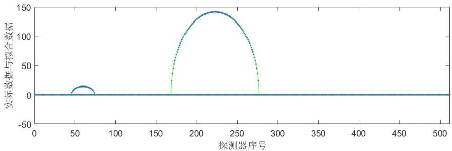

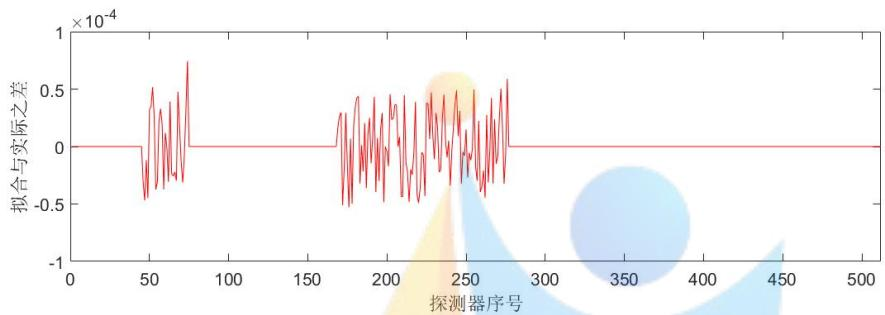
图 16： 曲线拟合及误差计算

## 4.3 问题二、三

## 4.3.1 逆Radon变换与图像重建模型

参数修正 本部分将逆Radon变换作为重建CT图像的基础手段。为满足该函数对输入参数的要求，首先将入射角度修正为线性拟合值，通过插值方法对接收信息进行相应修正：

记 $H ( k , \theta _ { i } )$ 为入射角度 $\mathbf { \partial } \cdot \theta _ { i }$ 对应的第k个采样值，通过线性插值的办法得到角度 $\phi _ { n } = n \alpha$ 处的修正采样函数 $\hat { H } ( k , \phi _ { n } )$

设 $\cdot \phi _ { n } \in [ \theta _ { i } , \theta _ { i + 1 } ]$ ，插值方法为：

$$
\hat { H } ( k , \phi _ { n } ) = \frac { 1 } { \theta _ { i + 1 } - \theta _ { i } } [ ( \phi _ { n } - \theta _ { i } ) H ( k , \theta _ { i + 1 } ) + ( \theta _ { i + 1 } - \phi _ { n } ) H ( k , \theta _ { i } ) ]\tag{43}
$$

图像重建以修正后的接收信息与入射角度序列作为输入，通过逆Radon变换重建图像，计算结果如图??所示。

系数修正由于题述接收信息经由逆 $\mathrm { R a d o n }$ 变换所得图像数据与吸收率数据不符，两者大致存在线性关系，在此需引入比例系数 $\cdot k _ { \mu }$ 进行修正。

$k _ { \mu }$ 的取值由问题一所给数据计算。观察重建图像断面数据（图??）与全部图像数据的频数直方图（图??），由于标定模板为单一均匀介质，可利用聚类分析算法将图像数据分为两类，对其中高值类取均值即可得到 $| k _ { \mu }$ 的取值，将重建图像数据除以 $k _ { \mu }$ 作为修正。

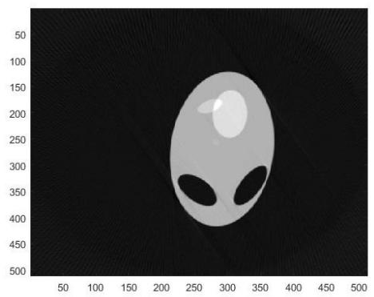

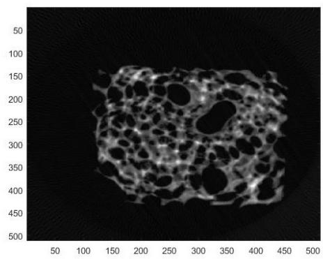

图 17： 未知介质重建图像
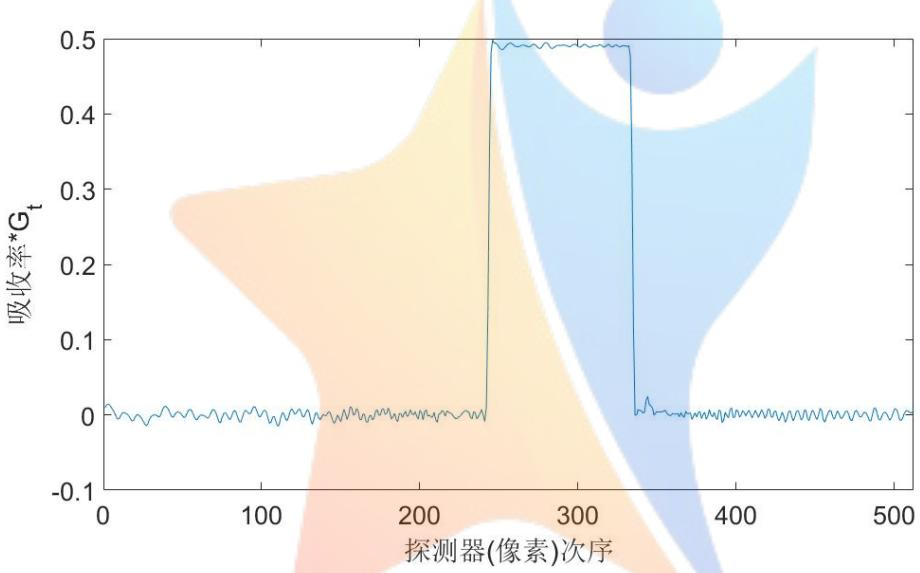
图18: 重建图像断面数据
滤波去噪 针对图像噪声，利用Wiener滤波进行去噪处理，计算结果如图??-??所示。

对于问题二（附件3） $) , \mathrm { W i e n e r }$ 滤波对几何伪影的消除效果显著。由信号强度频数直方图可见，原始图像的信号强度有若干明显峰值，且峰值附近的分布情况与问题一中的噪声分布类似，滤波去噪使峰型更为尖锐，对噪声有较好抑制效果。因此对于问题二，采用Wiener滤波后的图像数据求解吸收率分布。

对于问题三（附件5），由信号强度频数直方图与滤波前后对比图可见，介质本身吸收率分布广、高频分量大，滤波会抹除较多的边缘信息。因此对于问题三，舍弃Wiener滤波所得结果，利用原始图像求解吸收率分布。

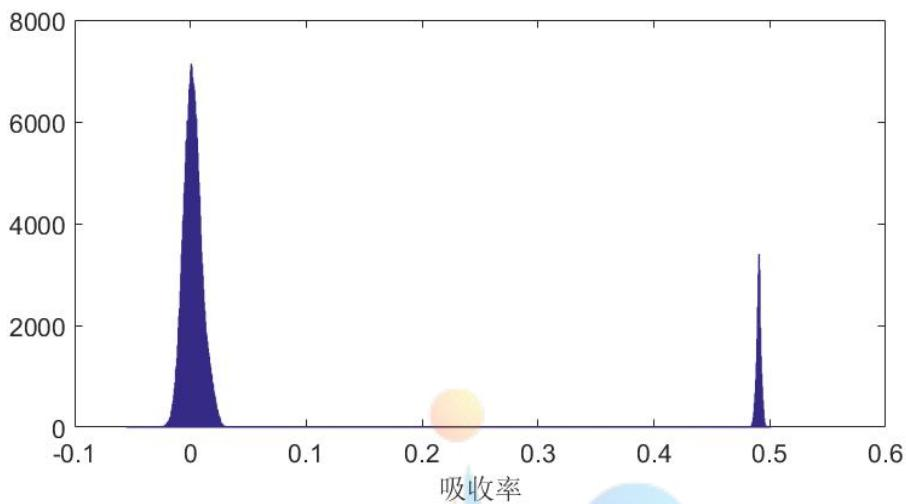
图 19: 图像数据频数直方图

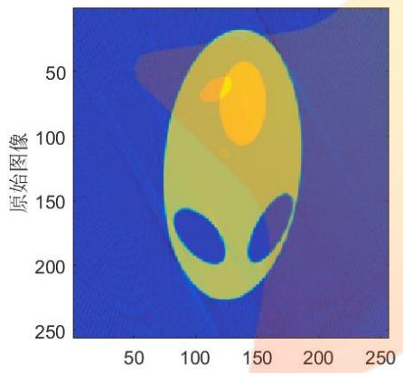

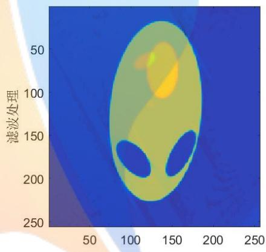
图20：问题二重建图（左）与滤波所得结果（右）

## 4.3.2 未知介质信息的求解

吸收率分布 由于上述重建图像的单位坐标长度对应于探测器阵列的间距，图像数据点位与需求的吸收率分布点位(256×256)并不相符。为提高吸收率求解的精度，应将所求点位变换为重建图像中的坐标，变换方法如下：

(44)

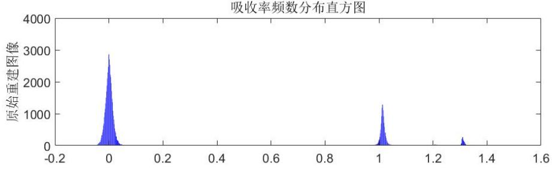

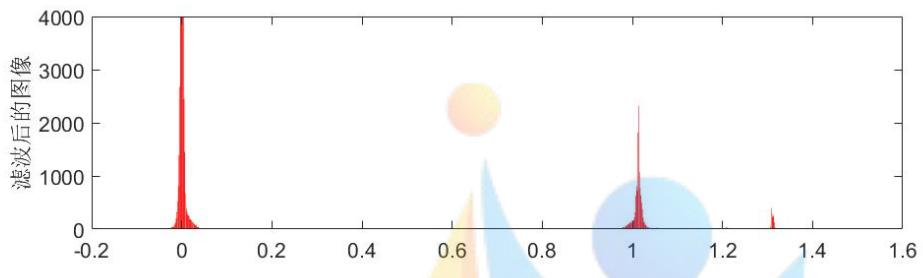

图21：问题二投影强度频数直方图（上）与滤波所得结果（下）
<table><tr><td rowspan=1 colspan=1>位置坐标/mm</td><td rowspan=1 colspan=1>吸收率</td><td rowspan=1 colspan=1>位置坐标/mm</td><td rowspan=1 colspan=1>吸收率</td></tr><tr><td rowspan=1 colspan=1>(10.0000,18.0000)</td><td rowspan=1 colspan=1>0.0003</td><td rowspan=1 colspan=1>(34.5000, 25.0000)</td><td rowspan=1 colspan=1>1.0033</td></tr><tr><td rowspan=1 colspan=1>(43.5000, 33.0000)</td><td rowspan=1 colspan=1>0.0002</td><td rowspan=1 colspan=1>(45.0000, 75.5000)</td><td rowspan=1 colspan=1>1.2096</td></tr><tr><td rowspan=1 colspan=1>(48.5000, 55.5000)</td><td rowspan=1 colspan=1>1.0632</td><td rowspan=1 colspan=1>(50.0000, 75.5000)</td><td rowspan=1 colspan=1>1.4210</td></tr><tr><td rowspan=1 colspan=1>(56.0000, 76.5000)</td><td rowspan=1 colspan=1>1.3133</td><td rowspan=1 colspan=1>(65.5000, 37.0000)</td><td rowspan=1 colspan=1>-0.0012</td></tr><tr><td rowspan=1 colspan=1>(79.5000, 18.0000)</td><td rowspan=1 colspan=1>-0.0043</td><td rowspan=1 colspan=1>(98.5000, 43.5000)</td><td rowspan=1 colspan=1>0.0012</td></tr></table>

表 2:问题二吸收率数据

<table><tr><td rowspan=1 colspan=1>位置坐标/mm</td><td rowspan=1 colspan=1>吸收率</td><td rowspan=1 colspan=1>位置坐标/mm</td><td rowspan=1 colspan=1>吸收率</td></tr><tr><td rowspan=1 colspan=1>(10.0000, 18.0000)</td><td rowspan=1 colspan=1>0.0657</td><td rowspan=1 colspan=1>(34.5000, 25.0000)</td><td rowspan=1 colspan=1>2.8779</td></tr><tr><td rowspan=1 colspan=1>(43.5000, 33.0000)</td><td rowspan=1 colspan=1>6.9510</td><td rowspan=1 colspan=1>(45.0000, 75.5000)</td><td rowspan=1 colspan=1>-0.0351</td></tr><tr><td rowspan=1 colspan=1>(48.5000, 55.5000)</td><td rowspan=1 colspan=1>0.2859</td><td rowspan=1 colspan=1>(50.0000, 75.5000)</td><td rowspan=1 colspan=1>3.2544</td></tr><tr><td rowspan=1 colspan=1>(56.0000, 76.5000)</td><td rowspan=1 colspan=1>6.3600</td><td rowspan=1 colspan=1>(65.5000, 37.0000)</td><td rowspan=1 colspan=1>0.0234</td></tr><tr><td rowspan=1 colspan=1>(79.5000, 18.0000)</td><td rowspan=1 colspan=1>7.2257</td><td rowspan=1 colspan=1>(98.5000, 43.5000)</td><td rowspan=1 colspan=1>0.0436</td></tr></table>

表3：问题三吸收率数据

介质几何信息将重建图像坐标变换为正方形托盘坐标，即可得到未知介质的位置与几何形状，如图??所示。

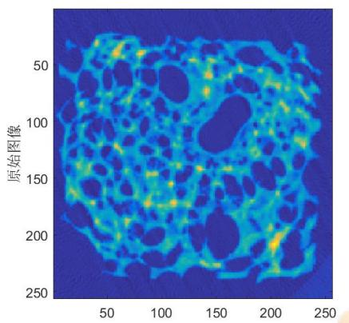

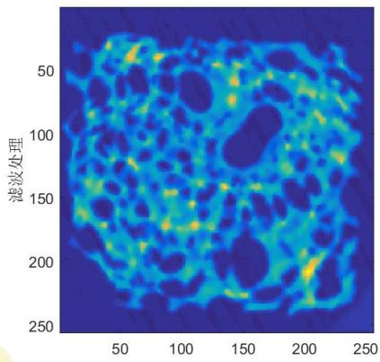
图22：问题三重建图（左）与滤波所得结果（右）

## 4.3.3 模型分析与评价

对于Radon逆变换，依据卷积反投影法，可以先将探测曲线与响应函数进行卷积，之后再进行反投影操作，即可得到吸收率的空间分布情况，在连续且理想的情况下，此种方法可以精确的还原出吸收率空间分布图像。但是在实际操作中，由于测量误差及离散化操作，难免会造成一系列误差。主要来源为：

1、探测器采样的误差，可以认为是高斯白噪声，几乎无法消除；

2、投影函数f(t)经过采样得到采样函数后造成的信息丢失，利用抽样值复原f(t)曲线时，根据采样定理，若f(t)的频域表达式 $F ( \omega )$ 满足 $F ( \omega ) = 0 \forall | \omega | > \pi$ ，则可以通过采样函数与 $\frac { s i n ( 2 \pi l ) } { l }$ 的卷积来精确还原。但是由于f(t)在空间域中的宽度是有限的，由傅立叶变换的性质可知其在频域是无穷宽的，故无法精确复原。其次，通过与 $\frac { s i n ( 2 \pi l ) } { l }$ 来复原函数，需要计算到无穷远，不现实，一般采用矩形窗、汉明窗等宽度有限的函数作为替代。于是，量化步骤会丢失一定量的信息。

3、系统函数的傅立叶变换C(R)实际上是不存在的，只能用趋近来表示：

$$
C ( R ) _ { \ell } = \operatorname * { l i m } _ { \ell \ell } \frac { 2 ( \epsilon ^ { 2 } - 4 \pi ^ { 2 } R ^ { 2 } ) } { ( \epsilon ^ { 2 } + 4 \pi ^ { 2 } R ^ { 2 } ) ^ { 2 } }\tag{45}
$$

可以看到 $C ( 0 ) = \mathrm { l i m } _ { \epsilon }  0 { \frac { 2 } { \epsilon ^ { 2 } } }$ ，趋于无穷大，实际计算中不可实现，故∈只能取有限值。为了拟合∈有限的情况，常常采用“R-L”滤波函数或者“S-L”滤波函数来实现。在这个过程中，也会造成误差。

综上，在进行Radon逆变换的过程中，无可避免会引入误差，需通过平均等方法才能减小误差。

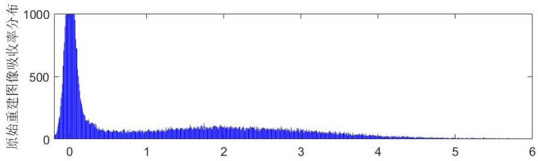

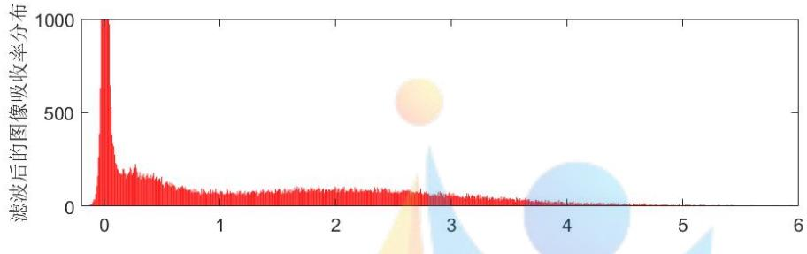
图23：问题三投影强度频数直方图（上）与滤波所得结果（下）

## 4.4 问题四

## 4.4.1 模型精度与稳定性分析

对于问题一中的标定模型，精度分析如??所述，标定角度的相对误差小于 $1 0 ^ { - 4 }$ o

为分析标定模型稳定性，引入高斯白噪声进行参数标定，将入射角度 $\ .$ 的预测误差作为稳定性评估指标：

$$
S = \sqrt { \frac { 1 } { n - 1 } \sum _ { i = 1 } ^ { 1 8 0 } ( \theta _ { i } - \theta _ { s i } ) ^ { 2 } }\tag{46}
$$

其中下标s表示标准值。对于强度不同的高斯白噪声，稳定性分析结果如下：

<table><tr><td rowspan=1 colspan=1>测次</td><td rowspan=1 colspan=1>23.5dB</td><td rowspan=1 colspan=1>25dB</td><td rowspan=1 colspan=1>26.5dB</td></tr><tr><td rowspan=1 colspan=1>1</td><td rowspan=1 colspan=1>2.6355</td><td rowspan=1 colspan=1>1.8680</td><td rowspan=1 colspan=1>0.5629</td></tr><tr><td rowspan=1 colspan=1>2</td><td rowspan=1 colspan=1>0.2412</td><td rowspan=1 colspan=1>1.9415</td><td rowspan=1 colspan=1>0.4724</td></tr><tr><td rowspan=1 colspan=1>3</td><td rowspan=1 colspan=1>0.3962</td><td rowspan=1 colspan=1>4.1245</td><td rowspan=1 colspan=1>1.6861</td></tr><tr><td rowspan=1 colspan=1>4</td><td rowspan=1 colspan=1>1.7213</td><td rowspan=1 colspan=1>1.7607</td><td rowspan=1 colspan=1>0.1688</td></tr><tr><td rowspan=1 colspan=1>5</td><td rowspan=1 colspan=1>1.5579</td><td rowspan=1 colspan=1>2.6330</td><td rowspan=1 colspan=1>1.4477</td></tr></table>

表4:稳定性分析结果

由于整个计算过程比较复杂，从随机过程的角度出发分析引入高斯噪声之后造成的影响有着比较大的困难，但可以利用蒙特卡罗的思想，通过观察结果来描述高斯噪声带来的

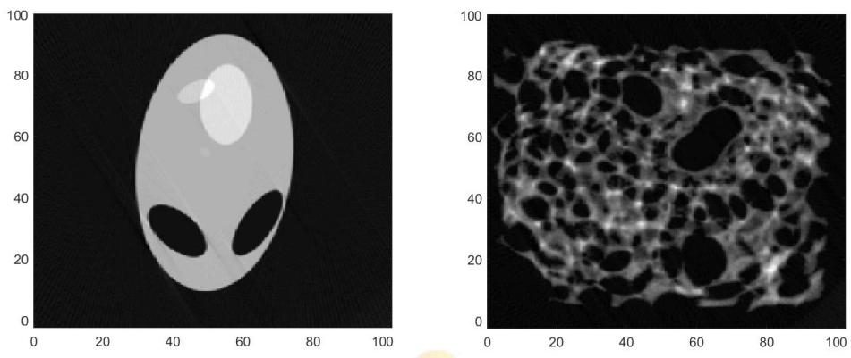
图 24: 未知介质的几何信息

影响。

由表格可以看出，随着噪声的增大，计算得到的角度与无噪声标定角度的偏差逐渐增大，且其具体数值存在较大的波动。观察标定角度的图像（图?？），可以发现在绝大部分角度上，标定角度与无噪声标定角度符合得比较良好，只有在红圈标出的区间中有着较大的偏差，且这个偏差值并不稳定。根据之前的误差分析，造成这个问题的主要原因是该角度处的误差传递系数很大，略有测量误差就会导致很大的偏差，在这个角度附近难以精确定标。

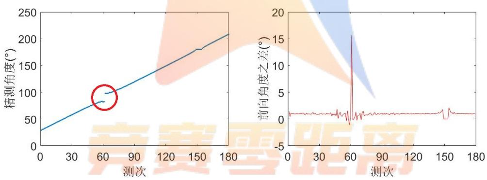
图 25：稳定性分析结果

## 4.4.2 新模板设计与标定模型的建立

## 设计思路

前文分析标定模型精度的问题时曾指出在cosθ → 1或cosθ → 0时，通过求 $. c o s ^ { 2 } \theta \mathrm { \cdot }$ 来求解θ会有极大的误差传递系数，解对数据波动十分敏感。此外，我们在检验其稳定性的时候发现，如图??所示，当对原始数据加入高斯噪声之后，求得的标定角度在大部分地方都是接近于无噪声时的标定值，但是在红圈标注处，与无噪声标定值的差距较为明显，且不同次实验区别很大，这正是该位置的敏感性造成的，甚至会导致出现函数值略大于1（例如arccos(1.0001)）等无法计算的情况，这也正是原标定模型的一个不尽如人意的地方。

为了解决这个问题，我们尝试在原标定模型上进行修改来满足更高精度的需求，依照第一题求解的经验，为了得到更精确的解，应当尽可能多的利用上探测器探测到的各个吸收强度值，即考虑用拟合函数的方法来减小单个强度值的测量误差，这就要求模板的投影函数表达式应足够简单，方便拟合。在这一点上，我们首先考虑了用多边形，如正三角形、正方形等，其拟合函数都是分段直线，十分方便，但是在实践过程中发现，虽然没有arccos(x)的敏感性困难，但是其本身对于形状的精度有很高的要求，如图??所示,正三角形的顶点偏离一个像素，就会对拟合结果有很大影响，这引入了一种新的敏感性，对工艺有极高的要求，故认为该方法不合理。

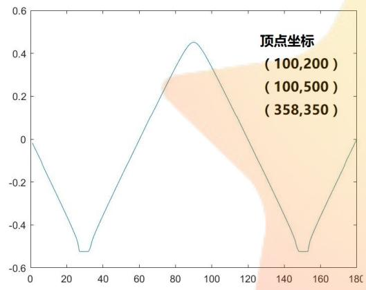

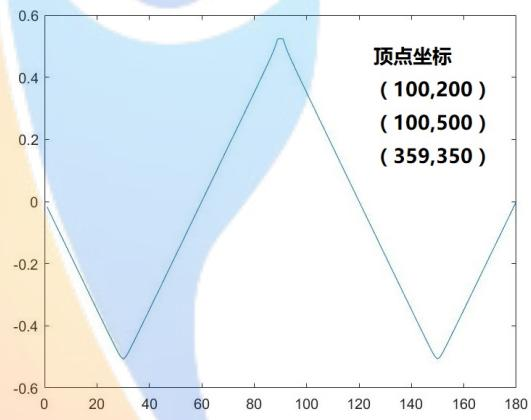
图 26：正三角模型入射角度拟合曲线

考虑到椭圆投影函数为二次多项式，方便拟合，蕴含信息量足够丰富，最终选择在新模型中保留椭圆形。

解决敏感性的一个方法就是通过两组数据来求得角度值，要求这两组数据在各个位置敏感性不同，于是对于每个位置，可以选出敏感性较低的数据作为测量值，这会对结果有很大的改善。因此，设计新的模板为两个椭圆形介质，如图??所示，其中大椭圆半长轴为40mm，半短轴为15mm，与原模板一致。另外一个椭圆置于原模版中圆的位置附近，长轴与大椭圆长轴45度角，具体参数如图所示。

对该模板进行定性分析，由于两个椭圆的朝向不一样，可以解决单个椭圆定角度时存在敏感角度的问题（只要设计好夹角，使得其各自的敏感角度不重合）。另一方面，由于取消了原模板中的圆，需要用其他方式进行探测器间距δd的定标，这对于单个椭圆是比较麻烦的，但是对于两个椭圆，就可以利用其几何关系，经过三角运算得到，尤其在夹角为45°时更为简单。最后由于椭圆大小区别比较明显，提取出两条曲线并没有本质的困难，

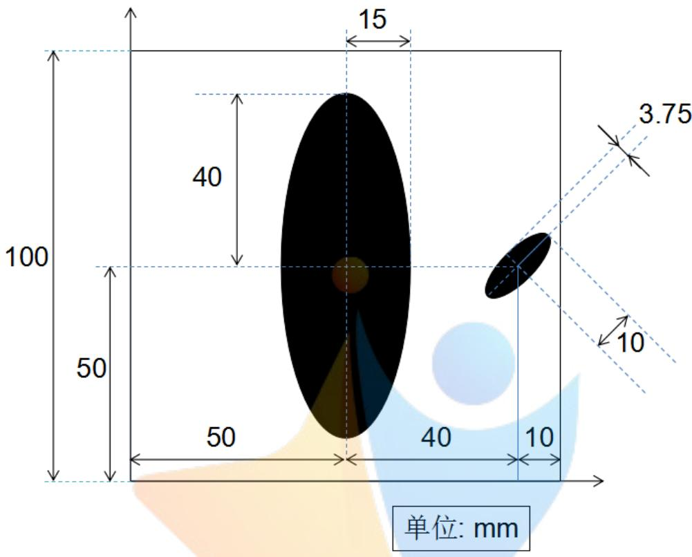
图 27： 新模板设计示意图
与此前的圆形模板算法类似。

## 标定模型

探测器单元间距△ 首先参照原标定模型，将中心椭圆与斜置椭圆的采样数据分离，分别拟合采样函数。

设拟合所得中心椭圆投影强度曲线为：

$$
h _ { 1 } ^ { 2 } ( l , \theta ) = p _ { 1 } l ^ { 2 } + p _ { 2 } l ^ { 2 } + p _ { 3 }\tag{47}
$$

根据式??，入射角度与中心椭圆投影曲线存在如下关系：

$$
\cos 2 \theta = - \frac { 4 ( 2 a _ { 1 } ^ { 2 } - b _ { 1 } ^ { 2 } ) p _ { 1 } ^ { 2 } + ( 4 p _ { 3 } ^ { 2 } p _ { 1 } - p _ { 2 } ^ { 2 } ) \Delta d ^ { 2 } } { 8 p _ { 1 } ^ { 2 } ( b _ { 1 } ^ { 2 } - a _ { 1 } ^ { 2 } ) }\tag{48}
$$

设拟合所得斜置椭圆投影强度曲线为：

$$
h _ { 3 } ^ { 2 } ( l , \theta ) = r _ { 1 } l ^ { 2 } + r _ { 2 } l + r _ { 3 }\tag{49}
$$

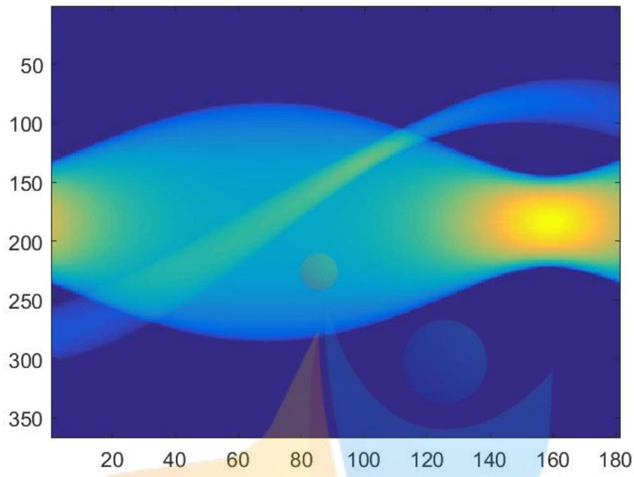
图 28： 双椭圆模型采样数据图

由于中心椭圆与斜置椭圆的长轴夹角为 $4 5 ^ { \circ }$ ，对式??将θ以 $. \theta + 4 5 ^ { \circ }$ 代入，得入射角度与斜置椭圆投影曲线的关系为：

$$
\cos 2 ( \theta + 4 5 ^ { \circ } ) = \sin 2 \theta = - { \frac { 4 ( 2 a _ { 2 } ^ { 2 } - b _ { 2 } ^ { 2 } ) r _ { 1 } ^ { 2 } + ( 4 r _ { 3 } ^ { 2 } r _ { 1 } - r _ { 2 } ^ { 2 } ) \Delta d ^ { 2 } } { 8 r _ { 1 } ^ { 2 } ( b _ { 2 } ^ { 2 } - a _ { 2 } ^ { 2 } ) } }\tag{50}
$$

为方便表述，记

$$
\begin{array} { l } { { A _ { 1 } = - \displaystyle \frac { ( 4 p _ { 3 } ^ { 2 } p _ { 1 } - p _ { 2 } ^ { 2 } ) \Delta d ^ { 2 } } { 8 p _ { 1 } ^ { 2 } ( B _ { 1 } ^ { 2 } - a _ { 1 } ^ { 2 } ) } } } \\ { { \ } } \\ { { B _ { 1 } \equiv - \displaystyle \frac { 4 ( 2 a _ { 1 } ^ { 2 } - b _ { 1 } ^ { 2 } ) p _ { 1 } ^ { 2 } } { 8 p _ { 1 } ^ { 2 } ( B _ { 1 } ^ { 2 } - a _ { 1 } ^ { 2 } ) ) } i s } } \\ { { \ } } \\ { { A _ { 2 } = - \displaystyle \frac { ( 4 r _ { 3 } ^ { 2 } r _ { 1 } - r _ { 2 } ^ { 2 } ) \Delta d ^ { 2 } } { 8 r _ { 1 } ^ { 2 } ( B _ { 2 } ^ { 2 } - a _ { 2 } ^ { 2 } ) } } } \\ { { \ } } \\ { { B _ { 2 } = - \displaystyle \frac { 4 ( 2 a _ { 2 } ^ { 2 } - b _ { 2 } ^ { 2 } ) r _ { 1 } ^ { 2 } } { 8 r _ { 1 } ^ { 2 } ( b _ { 2 } ^ { 2 } - a _ { 2 } ^ { 2 } ) } } } \end{array}
$$

则有

$$
\cos 2 \theta = A _ { 1 } \Delta d ^ { 2 } + B _ { 1 }\tag{51}
$$

$$
\sin { 2 \theta } = A _ { 2 } \Delta { d } ^ { 2 } + B _ { 2 }\tag{52}
$$

联立求解从而确定 $\Delta d$ 的取值：

$$
\Delta d = \frac { - \left( A _ { 1 } B _ { 1 } + A _ { 2 } B _ { 2 } \right) + \sqrt { 2 A _ { 1 } A _ { 2 } B _ { 1 } B _ { 2 } - A _ { 1 } ^ { 2 } B _ { 2 } ^ { 2 } - A _ { 2 } ^ { 2 } B _ { 1 } ^ { 2 } + A _ { 1 } ^ { 2 } + A _ { 2 } ^ { 2 } } } { A _ { 1 } ^ { 2 } + A _ { 2 } ^ { 2 } }\tag{53}
$$

入射角度θ 将各次计算的 $\Delta d$ 取平均，代回求解出cos2θ及 $s i n 2 \theta$ 。且这两个值是从两套拟合数据中独立计算的，其误差几乎不存在耦合关系。

分析该计算的敏感性，由误差传递公式：

$$
\delta ( \theta ) = \frac { \Delta ( c o s 2 \theta ) } { | - 2 s i n 2 \theta | }\tag{54}
$$

$$
\delta ( \theta ) = \frac { \Delta ( s i n 2 \theta ) } { | 2 c o s 2 \theta | }\tag{55}
$$

因为 $s i n 2 \theta$ 与cos2θ不可能同时为0，所以无需担心敏感性极强的问题

继续分析sin2θ与cos2θ的误差，以cos2θ为例：

$$
\delta ( c o s 2 { \theta } ) = \left| \frac { 2 b _ { 1 } } { ( b _ { 1 } ^ { 2 } - a _ { 1 } ^ { 2 } ) ^ { 2 } } ( \frac { 2 C _ { 1 } \Delta { d } } { K _ { 1 } } + 2 a _ { 1 } ^ { 2 } ) \right| \delta ( b _ { 1 } ) + \left| \frac { 2 a _ { 1 } } { ( b _ { 1 } ^ { 2 } - a _ { 1 } ^ { 2 } ) ^ { 2 } } ( \frac { 2 C _ { 1 } \Delta { d } } { K _ { 1 } } + 2 b _ { 1 } ^ { 2 } ) \right| \delta ( a _ { 1 } )\tag{56}
$$

在本题中代入具体数值可知 $\frac { 2 C _ { 1 } \Delta d ^ { 2 } } { K _ { 1 } }$ 一般比 $a _ { 1 } ^ { 2 }$ 小10倍以上，故可以认为误差近似等于：

$$
\delta ( c o s 2 \theta ) \approx \left| \frac { 4 b _ { 1 } a _ { 1 } ^ { 2 } } { ( b _ { 1 } ^ { 2 } - a _ { 1 } ^ { 2 } ) ^ { 2 } } \right| \delta ( b _ { 1 } ) + \left| \frac { 4 a _ { 1 } b _ { 1 } ^ { 2 } } { ( b _ { 1 } ^ { 2 } - a _ { 1 } ^ { 2 } ) ^ { 2 } } \right| \delta ( a _ { 1 } )\tag{57}
$$

sin2θ的误差与之同理，只需将对应的尺寸换成小椭圆的尺寸即可。 因为小椭圆尺寸是大椭圆的 $\textstyle { \frac { 1 } { T } }$ 倍，从公式中可以看到误差与尺寸的-1次方成正比，所以：

$$
s i n 2 \theta \approx T c o s 2 \theta\tag{58}
$$

记由cos2θ和sin2θ算得的θ分别为 $1 \theta _ { c }$ 和 $| \theta _ { s } ,$ 为了尽可能减小的误差，记

$$
\theta = u \theta _ { c } + v \theta _ { s }\tag{59}
$$

$$
- \mathcal { C } o m p e t i t i o n \ Z e r o D i s t a n e e --
$$

其中 $\boldsymbol { \mathscr { u } } + \boldsymbol { v } = 1$ ，则

$$
E ( \theta ^ { 2 } ) = E ( u \theta _ { c } + v \theta _ { s } ) ^ { 2 }\tag{60}
$$

因为两者的噪声来源基本独立，故认为其协方差系数为0，于是

$$
E ( \theta ^ { 2 } ) = E ( u ^ { 2 } \theta _ { c } ^ { 2 } + v ^ { 2 } \theta _ { s } ^ { 2 } )\tag{61}
$$

对上式求导，可知 $\begin{array} { r } { u = \frac { \theta _ { s } ^ { 2 } } { \theta _ { c } ^ { 2 } + \theta _ { s } ^ { 2 } } } \end{array}$ 时，误差的方差达到最小。可以求得：

$$
E ( \theta _ { s } ^ { 2 } ) \approx \frac { E ( \delta ( c o s 2 \theta ) ^ { 2 } ) } { 4 s i n ^ { 2 } 2 \theta _ { c } }\tag{62}
$$

$$
E ( \theta _ { c } ^ { 2 } ) \approx \frac { T ^ { 2 } E ( \delta ( s i n 2 \theta ) ^ { 2 } ) } { 4 c o s ^ { 2 } 2 \theta _ { s } }\tag{63}
$$

所以，此时：

$$
u = \frac { T s i n ^ { 2 } 2 \theta _ { c } } { c o s ^ { 2 } 2 \theta _ { s } + T s i n ^ { 2 } 2 \theta _ { c } }\tag{64}
$$

$$
v = \frac { c o s ^ { 2 } 2 \theta _ { s } } { c o s ^ { 2 } 2 \theta _ { s } + T s i n ^ { 2 } 2 \theta _ { c } }\tag{65}
$$

从而求解 $\dot { \cdot } \theta = u \theta _ { c } + v \theta _ { s }$ 的值。

旋转中心位置(x,y) 利用分别拟合的两条采样函数曲线，经由变量替换得到中心椭圆与斜置椭圆的投影强度曲线，从而计算两椭圆中 $\therefore C _ { 1 } , O _ { 2 }$ 的投影位置曲线。以 $O _ { 1 } , O _ { 2 }$ 与旋转中心O为顶点构造三角形，由 $O _ { 1 } , O _ { 2 }$ 的投影位置曲线可确定三角形的内角，从而在正方形托盘上定位出旋转中心的位置。此部分计算与原模型基本相同，此处不再赘述。

## 5 模型评价

本文以Radon变换等物理背景为理论依据，进行了二维平面上的平行射线CT成像系统的建模与分析。

在由题目所给模板对CT系统进行标定时，先使用图像处理的形态学操作得到了椭圆投影的宽度变化规律，计算得到各角度参数、旋转中心的估计值，由此进一步处理图像，将椭圆和圆的两部分影响独立出来并分别进行拟合，在题述条件下，由拟合结果得到了高精度的结果。

由于原标定模型的单个椭圆的定标能力限制，该模型在敏感角度附近难以达到理想精度，在引入高斯白噪声的情况下产生了较大的测量误差。

因此原标定模型对噪声的抵抗能力较差，应用范围受限。但在经过良好滤波除噪的情况下，能达到较为理想的标定精度。

新模型针对原有标定模型的固有缺陷进行了改进，以斜置椭圆替代圆形模板，在大致保留原有模型特性的基础上，引入了相位不同的新标定曲线，通过双椭圆标定曲线的互补，克服了原有的敏感性缺陷，在同等条件下，与原模型相比可以取得更高的标定精度。

## 参考文献

[1] 庄天戈. CT原理与算法[M]. 上海交通大学出版社， 1992.

[2] 沈建仪. 椭圆平行切线的性质及应用[J]. 中学数学教学， 1987(04).

[3] 郭立倩. CT系统标定与有限角度CT重建方法的研究[D]. 大连理工大学, 2016.

[4] Turbell H. Cone-beam reconstruction using filtered backprojection /[J]. Linköping University, 2001.

[5] JiangHsieh, Hsieh,张朝宗,等. 计算机断层成像技术:原理、设计、伪像和进展[J]. 2006.

[6] 高上凯. 医学成像系统.第2版[M]. 清华大学出版社, 2010.


--

## 附录

```matlab
"problem_1.m"
clc;close all;
%%获取数据
dataFile = '..\A题附件.xls';
data = xlsread(dataFile,2);
```

```matlab
%%参数设定
lenTheta = 180; %总测量角度数
pixScale = 512; %单次测量像素数目
normScale= 100; %标准尺度(100mm)
graphScale=256; %目标像素尺度(256pixe1)
a=40; b=15; R=4; %图形参数
normE11ips0 =[50,50]；%椭圆中心位置
normCircle0 = [95,50]；%圆形中心位置
```

## %%基本信息提取

```matlab
figure('Name','各次测量的接收值总和');plot(sum(data),'b.');hold on;
axis([1,1enTheta,min(sum(data))*0.997,max(sum(data))*1.003]);
plot([1,lenTheta],[mean(sum(data)),mean(sum(data))],'r-');
text(1enTheta-50,max(sum(data))*1.003-20,['std=’,num2str(std(sum(data)))],'FontSize',14)
1egend(’各次测量的接收值求和’，’多次测量的接收值均值’);
```

## %%粗测尺度及角度

%获取曲线边缘，得到椭圆宽度变化

```matlab
% figure('Name',’原始数据灰度图’);colormap(gray);imagesc(data);
curv = abs(diff(data));
curv = curv > 1;
se = strel('square',3);
curvEllips = imopen(curv,se);
curvEllips = bwareaopen(curvEllips,500);
```

%得到每一角度对应的椭圆宽度数据

```javascript
widthEllips = zeros(1,lenTheta);
```

```matlab
for j=1:lenTheta
widthEllips(j) = find(curvEllips(:,j),1,'last')-(find(curvEllips(:,j),1,'first'));
end
```

%粗略计算角度和尺度

```matlab
roughScale = max(widthEllips)/2/a;
normWidthEllipse = widthEllips/roughScale;
roughTheta = zeros(1,lenTheta);
for j=1:lenTheta
roughTheta(j) = 180/pi*real(acot(sqrt((4*a^2-normWidthEllipse(j)^2)/(normWidthEllips
end
```

%拟合得到各个角度，粗略得到逆变换图

```matlab
diffRoughTheta = diff(roughTheta);
breakP1 = find(diffRoughTheta<-0.1,1);
breakP2 = find(diffRoughTheta(breakP1+10:end)>0.1,1)+breakP1+10;
roughTheta(1:breakP1)=roughTheta(1:breakP1);
roughTheta(breakP1+1:breakP2-1)=180-roughTheta(breakP1+1:breakP2-1);
roughTheta(breakP2:end)=180+roughTheta(breakP2:end);
[temp,~]=polyfit(1:lenTheta,roughTheta,1);
k_temp = temp(1);
b_temp = temp(2);
linerTheta = (1:lenTheta)*k_temp+b_temp;
figure('Name',’粗测角度及拟合情况’);plot(1:lenTheta,roughTheta,'r.');
1egend(’粗测的角度’，’拟合的角度’)；
roughMap = iradon(data,1inerTheta,pixScale);
%旋转修正
Status = regionprops((roughMap>max(max(roughMap))/5));
[~,orderEllips] = max([Status(:).Area]);
[~,orderCircle] = min([Status(:).Area]);
pixEllips0 = Status(orderEllips).Centroid;
pixCircleO = Status(orderCircle).Centroid;
fixAng = angle((pixCircle0-pixEllips0)*[1;1i]);
```

```matlab
linerTheta = linerTheta+fixAng*180/pi;
roughMap = iradon(data,linerTheta,pixScale);
%得到小圆圆心在图像中位置
Status = regionprops((roughMap>max(max(roughMap))/5));
[~,orderCircle] = min([Status(:).Area]);
pixCircleO = Status(orderCircle).Centroid;
pix0 = [pixScale/2,pixScale/2];
%得到轴在探测器阵列中的投影位置
[~,minWidthEllipsPos] = min(widthEllips);
tempStart = find(data(:,minWidthEllipsPos)>0,1,'first');
tempEnd = find(data(tempStart:end,minWidthEllipsPos)==0,1,'first')+tempStart;
AxisPosInSensors = (tempStart+tempEnd)/2+abs(pix0(1)-pixCircle0(1));
%%拟合得到精确尺寸和角度
%拟合准备
pixCircleCenter = zeros(1,lenTheta);
pixEllipsCenter = zeros(1,lenTheta);
fitEllipsData= data;
fitCircleData= data;
fitEllipsAns = zeros(pixScale,lenTheta);
fitCircleAns = zeros(pixScale,lenTheta);
f.
x = 1:pixScale;
-
%拟合过程
for j=1:lenTheta
%椭圆的宽度曲线拟合
pixCircleCenter(j) = int16(AxisPosInSensors - norm(pix0-pixCircle0)*cos(linerTheta(j
fitEllipsData(int16(pixCircleCenter(j)-2*R*roughScale:pixCircleCenter(j)+2*R*roughSc
fitEllipsRange = find(fitEllipsData(:,j)>fitMin);
fitEllips = polyfit(x(fitEllipsRange)',fitEllipsData(fitEllipsRange,j).^2,2);
fitEllipsAns(:,j)= (fitEllips(1)*x.^2+fitEllips(2)*x+fitEllips(3))';
```

```matlab
fitEllipsAns(fitEllipsAns(:,j)<0,j)=0;
fitEllipsAns(:,j) = sqrt(fitEllipsAns(:,j));
%圆的宽度曲线拟合
fitCircleData(:,j) = data(:,j)-fitEllipsAns(:,j);
fitCircleRange = find(fitCircleData(:,j)>fitMin);
fitCircle = polyfit(x(fitCircleRange)',fitCircleData(fitCircleRange,j).^2,2);
fitCircleAns(:,j) = (fitCircle(1)*x.^2+fitCircle(2)*x+fitCircle(3))';
fitCircleAns(fitCircleAns(:,j)<0,j)=0;
fitCircleAns(:,j) = sqrt(fitCircleAns(:,j));
%拟合结果处理
pixCircleCenter(j) = -fitCircle(2)/fitCircle(1)/2;
pixEllipsCenter(j) = -fitEllips(2)/fitEllips(1)/2;
deltaL = 8/(sqrt(fitCircle(2)^2-4*fitCircle(1)*fitCircle(3))/abs(fitCircle(1)));
G = -8/((fitCircle(2)^2-4*fitCircle(1)*fitCircle(3))/fitCircle(1)/4);
temp = -deltaL^2*(fitEllips(3)-fitEllips(2)^2/fitEllips(1)/4)/fitEllips(1);
cosTheta2 = (temp/b^2-a^2/b^2)/(1-a^2/b^2);
fitAns(:,j) = [deltaL,G,cosTheta2];
end
figure('Name',’椭圆部分数据图’);colormap(gray);imagesc(fitEllipsData);
figure('Name',’椭圆部分拟合图’);colormap(gray);imagesc(fitEllipsAns);
figure('Name','小圆部分数据图');colormap(gray);imagesc(fitCircleData);
figure('Name','小圆部分拟合图’);colormap(gray);imagesc(fitCircleAns);
figure (’Name',’拟合结果与实际数据比对图')；正
temp = 150;
subplot(2,1,1);holdon;
plot(fitEllipsData(:,temp),'b.');plot(fitEllipsAns(:,temp),'g-');
plot(fitCircleData(:,temp),'b.');plot(fitCircleAns(:,temp),'g-');
subplot(2,1,2);hold on;
plot(fitEllipsAns(:,temp)-fitEllipsData(:,temp),'r-');
plot(fitCircleAns(:,temp)-fitCircleData(:,temp),'r-');
%得到拟合出的角度并修正方向
fixTheta = 1/2*acos(2.*fitAns(3,:)-1)*180/pi;
```

```matlab
G = mean(fitAns(2,:));
deltaL = mean(fitAns(1,:));
[interpData,intepTheta]=interpForIradon(fixTheta,data);
fixMap = iradon(interpData,intepTheta,'spline','Hann',pixScale);
```

```matlab
Status = regionprops((fixMap>max(max(fixMap))/5))
[~,orderEllips] = max([Status(:).Area]);
[~,orderCircle] = min([Status(:).Area]);
pixEllips0 = Status(orderEllips).Centroid;
pixCircleO = Status(orderCircle).Centroid;
pix0 = [pixScale/2,pixScale/2];
norm0 = ((2*pix0-pixEllips0-pixCircle0)*deltaL+normEllipsO+normCircle0)/2;
figure('Name',’修正的重建图像’);colormap(gray);imshow(fixMap);
hold on;plot(pix0(1),pix0(2),'ro');n
plot([pixEllips0(1),pixCircle0(1)],[pixEllips0(2),pixCircle0(2)],'ko');
plot([pix0(1),pixEllips0(1),pixCircle0(1),pix0(1)],[pix0(2),pixEllips0(2),pixCircle0(2),
```

```matlab
diffFixTheta = diff(fixTheta);
breakP1 = find(diffFixTheta<0,1);
breakP2 = find(diffFixTheta(breakP1+1:end)>0,1)+breakP1+1;
fixTheta(1:breakP1)=fixTheta(1:breakP1);
fixTheta(breakP1+1:breakP2-1)=180-fixTheta(breakP1+1:breakP2-1);
fixTheta(breakP2:end)=180+fixTheta(breakP2:end);
figure('Name',’修正后的各个角度');subplot(1,2,1);plot(fixTheta,'.');
subplot(1,2,2);plot(diff(fixTheta),'r-');
set(gcf,'Position',[500 500 900 400]);
```

%%相关参数的求解

%得到深度系数和探测器间距

%精测旋转中心

%绘制原尺寸图内的旋转中心

```matlab
figure(’Name’，’旋转中心示意图');
plot([0,100,100,0],[0,0,100,100],'k-');hold on;
tempLen = 1000;
xEllipsPos = zeros(tempLen);
```

```matlab
yEllipsPos = zeros(tempLen);
xCirclePos = zeros(tempLen);
yCirclePos = zeros(tempLen);
for i=1:tempLen
sita = i/tempLen*2*pi;
xEllipsPos(i) = b*cos(sita)+normEllips0(1);
yEllipsPos(i) = a*sin(sita)+normEllips0(2);
xCirclePos(i) = R*cos(sita)+normCircleO(1);
yCirclePos(i) = R*sin(sita)+normCircleO(2);
end
plot(xEllipsPos,yEllipsPos,'k-');
plot(xCirclePos,yCirclePos,'k-');
plot(norm0(1),norm0(2),'ro');
plot([normEllips0(1),normCircle0(1)],[normEllips0(2),normCircle0(2)],'ko');
plot([normO(1),normEllips0(1),normCircle0(1),normO(1)],[normO(2),normEllipsO(2),normCirc
axis('equal');
set(gca,'YDir','reverse');
%求解，吸收率，系数
figure('Name',’重建图形的吸收率分布’);hist(fixMap(:),1000);
[fixKm,fixKmC] = kmeans(fixMap(:),2);
Gt = max(fixKmC)/1.00;
{'Theta'; roundn(fixTheta,-4)};
{'norm0'; roundn(norm0,pet-4)y;n
{'deltaL';roundn(deltaL, -4)};
{'G'; roundn(G, -4)};
{'Gt'; roundn(Gt, -4)}
};
for i=1:length(CalibrationResults)
xlswrite('Calibration.xls',{CalibrationResults{i}{1}},1,['A’num2str(i)]);
xlswrite('Calibration.xls', CalibrationResults{i}{2} ,1,['B’num2str(i)]);
end
```

```matlab
"problem_2.m"
clc;close all;
%%获取数据
dataFile = ’..\A题附件.xls';
data = xlsread(dataFile,3);
points=xlsread(dataFile,4);
CalibrationFile = 'Calibration.xls';
CalibrationData = xlsread(CalibrationFile,1);
Theta = CalibrationData(1,:);
norm0 = CalibrationData(2,1:2);
deltaL= CalibrationData(3,1);
G = CalibrationData(4,1);
Gt = CalibrationData(5,1);
%%计算/显示/保存
pixScale = 512;
desScale = 256;
[interpData,interpTheta] = interpForIradon(Theta,data);
Map = iradon(interpData,interpTheta,'spline','Hann',pixScale)./Gt;
figure('Name',’直接逆Radon变换');colormap(gray);imagesc(Map);
%图像插值
pix0 = [pixScale/2,pixScale/2];
desGraph = zeros(desscale);
for i=1:desScale
for j=1:desScale
pixPoint = pix0+([i-0.5,j-0.5]./desScale*100-[norm0(2),norm0(1)])/deltaL*pixSca:
desGraph(i,j) = interpAbsorbMap(pixPoint,Map);
end
end
figure('Name','吸收率平面分布图');colormap(gray);imagesc(desGraph);
```

```matlab
%图像wiener滤波
K=wiener2(desGraph,[5 5]);
figure(’Name'，’吸收率占比分布图')；
[tempA,tempB]=hist(desGraph(:),1000);
subplot(211);bar(tempB,tempA,'b');axis([-0.2,1.6,0,4000]);
ylabel(’原始重建图像吸收率分布’);
[tempA,tempB]=hist(K(:),1000);
subplot(212);bar(tempB,tempA,'r');axis([-0.2,1.6,0,4000]);
ylabel(’滤波后的图像吸收率分布’)；
```

```javascript
figure('Name',’滤波前后对比图');
subplot(121);imagesc(desGraph);ylabel(’原始图像’);
subplot(122);imagesc(K); ylabel(’滤波处理’);
set(gcf,'Position',[500 500 900 400]);
```

## %计算各点吸收率

```matlab
Absorbtion = zeros(1,length(points));
fprintf(’各点吸收率数据：\n’)；
pixPoints = zeros(length(points),2);
for i=1:length(points)
pixPoints(i,:) = [points(i,1),100-points(i,2)]/100*desScale*pixScale/512;
Absorbtion(i) = interpAbsorbMap([pixPoints(i,2),pixPoints(i,1)],K);
fprintf('%.4f\n',Absorbtion(i ));
% 显示各点位置
```

```matlab
figure('Name',’各点分布图');colormap(gray);imagesc(K);hold on;
for i=1:length(points)
plot(points(i,1)*desScale/100,(100-points(i,2))*desScale/100,'r*');
text(points(i,1)*desScale/100,(100-points(i,2))*desScale/100,num2str(roundn(Absorbti
end
%保存数据
xlswrite('problem2.xls',roundn(K,-4));
```

```matlab
"problem_3.m"
clc;close all;
%%获取数据
dataFile = '..\A题附件.xls';
data = xlsread(dataFile,5);
points=xlsread(dataFile,4);
CalibrationFile = 'Calibration.xls'
CalibrationData = xlsread(CalibrationFile,1);
Theta = CalibrationData(1,:);
norm0 = CalibrationData(2,1:2);
deltaL= CalibrationData(3,1);
G = CalibrationData(4,1);
Gt = CalibrationData(5,1);
%%计算/显示/保存
pixScale = 512;
desScale = 256;
[interpData,interpTheta] = interpForIradon(Theta,data);
Map = iradon(interpData,interpTheta,'spline','Hann',pixScale)./Gt;
figure('Name',’直接逆Radon变换’);colormap(gray);imagesc(Map);
m1/21 desGraph = zeros(desScale);
for i=1:desScale--
for j=1:desScale
pixPoint = pix0+([i-0.5,j-0.5]./desScale*100-[norm0(2),norm0(1)])/deltaL*pixScal
desGraph(i,j) = interpAbsorbMap(pixPoint,Map);
end
end
figure('Name',’吸收率平面分布图');colormap(gray);imagesc(desGraph);
```

## %图像wiener滤波

```matlab
K=wiener2(desGraph,[5 5]);
figure('Name’，’吸收率占比分布图’)；
[tempA,tempB]=hist(desGraph(:),1000);
subplot(211);bar(tempB,tempA,'b');axis([-0.2,6,0,1000]);
ylabel(’原始重建图像吸收率分布’);
[tempA,tempB]=hist(K(:),1000);
subplot(212);bar(tempB,tempA,'r');axis([-0.2,6,0,1000]);
ylabel(’滤波后的图像吸收率分布’)；
_
```

```javascript
figure(’Name’，’滤波前后对比图');
subplot(121);imagesc(desGraph);ylabel(’原始图像’);
subplot(122);imagesc(K); ylabel(’滤波处理’);
set(gcf,'Position',[500 500 900 400]);
```

## %计算各点吸收率

```matlab
Absorbtion = zeros(1,length(points));
fprintf(’各点吸收率数据：\n’)；
pixPoints = zeros(length(points),2);
for i=1:length(points)
pixPoints(i,:) = [points(i,1),100-points(i,2)]/100*desScale*pixScale/512;
Absorbtion(i) = interpAbsorbMap([pixPoints(i,2),pixPoints(i,1)],desGraph);
fprintf('%.4f\n',Absorbtion(i ));
end
```

## %显示各点位置

```matlab
figure('Name',’各点分布图’);colormap(gray);imagesc(desGraph);hold on;
for i=1:length(points)
plot(points(i,1)*desScale/100,(100-points(i,2))*desScale/100,'r*');
text(points(i,1)*desScale/100,(100-points(i,2))*desScale/100,num2str(roundn(Absorbti
end
```

## %保存数据

```matlab
"problem_4.m"
clc;close all;
%%获取数据
dataFile = '..\A题附件.xls';
originData = xlsread(dataFile,2);
CalibrationFile = 'Calibration.xls';
CalibrationData = xlsread(CalibrationFile,1);
Theta = CalibrationData(1,:);
norm0 = CalibrationData(2,1:2);
deltaLs= CalibrationData(3,1);
G = CalibrationData(4,1);
Gts = CalibrationData(5,1);
```

```matlab
lenTheta = 180; % 总测量角度数
pixScale = 512; %单次测量像素数目
normScale= 100; %标准尺度(100mm)
graphScale=256; %目标像素尺度(256pixe1)
a=40; b=15; R=4; %图形参数
normE11ips0 =[50,50]；%椭圆中心位置
normCircle0 = [95,50]；%圆形中心位置
```

mata

```matlab
%figure('Name',’原始数据灰度图');colormap(gray);imagesc(data);
curv = abs(diff(data));
curv = curv > 1;
se = strel('square’,3);
curvEllips = imopen(curv,se);
curvEllips = bwareaopen(curvEllips,500);
```

```matlab
%得到每一角度对应的椭圆宽度数据
widthEllips = zeros(1,lenTheta);
for j=1:lenTheta
widthEllips(j) = find(curvEllips(:,j),1,'last')-(find(curvEllips(:,j),1,'first'));
end
%粗略计算角度和尺度
roughScale = max(widthEllips)/2/a;
normWidthEllipse = widthEllips/roughScale;
roughTheta = zeros(1,lenTheta);
for j=1:lenTheta
roughTheta(j) = 180/pi*real(acot(sqrt((4*a^2-normWidthEllipse(j)^2)/(normWidthEllipse(j)
end
%拟合得到各个角度，粗略得到逆变换图
diffRoughTheta = diff(roughTheta);
breakP1 = find(diffRoughTheta<-0.1,1);
breakP2 = find(diffRoughTheta(breakP1+10:end)>0.1,1)+breakP1+10;
roughTheta(1:breakP1)=roughTheta(1:breakP1);
roughTheta(breakP1+1:breakP2-1)=180-roughTheta(breakP1+1:breakP2-1);
roughTheta(breakP2:end)=180+roughTheta(breakP2:end)
[temp,~]=polyfit(1:lenTheta,roughTheta,1);
k_temp = temp(1);
b_temp = temp(2);
roughMap = iradon(data,linerTheta,pixScale)
--
%旋转修正
Status = regionprops((roughMap>max(max(roughMap))/5));
[~,orderEllips] = max([Status(:).Area]);
[~,orderCircle] = min([Status(:).Area]);
pixEllips0 = Status(orderEllips).Centroid;
pixCircleO = Status(orderCircle).Centroid;
fixAng = angle((pixCircleO-pixEllips0)*[1;1i]);
linerTheta = linerTheta+fixAng*180/pi;
```

```matlab
roughMap = iradon(data,linerTheta,pixScale);
%得到小圆圆心在图像中位置
Status = regionprops((roughMap>max(max(roughMap))/5));
[~,orderCircle]= min([Status(:).Area]);
pixCircleO = Status(orderCircle).Centroid;
pix0 = [pixScale/2,pixScale/2];
%得到轴在探测器阵列中的投影位置
[~,minWidthEllipsPos] = min(widthEllips);
tempStart = find(data(:,minWidthEllipsPos)>0,1,'first');
tempEnd = find(data(tempStart:end,minWidthEllipsPos)==0,1,'first')+tempStart;
AxisPosInSensors = (tempStart+tempEnd)/2+abs(pix0(1)-pixCircle0(1));
%%加入高斯噪声，分析精测部分的敏感性问题
gaussPower = 0.00002;
data = imnoise(originData./max(max(originData)),'gaussian',0,gaussPower).*max(max(origir
%%拟合得到精确尺寸和角度
%拟合准备
pixCircleCenter = zeros(1,lenTheta);
pixEllipsCenter = zeros(1,lenTheta);
fitEllipsData= data;
fitCircleData= data;
fitCircleAns = zeros(pixScale,lenTheta)
fitAns = zeros(3,lenTheta);
fitMin = max(max(data))*0.03;
x = 1:pixScale;
%拟合过程
for j=1:lenTheta
%椭圆的宽度曲线拟合
pixCircleCenter(j) = int16(AxisPosInSensors - norm(pixO-pixCircle0)*cos(linerTheta(j
fitEllipsData(int16(pixCircleCenter(j)-2*R*roughScale:pixCircleCenter(j)+2*R*roughSc
```

```matlab
fitEllipsRange = find(fitEllipsData(:,j)>fitMin);
fitEllips = polyfit(x(fitEllipsRange)',fitEllipsData(fitEllipsRange,j).^2,2);
fitEllipsAns(:,j) = (fitEllips(1)*x.^2+fitEllips(2)*x+fitEllips(3))';
fitEllipsAns(fitEllipsAns(:,j)<0,j)=0;
fitEllipsAns(:,j) = sqrt(fitEllipsAns(:,j));
%圆的宽度曲线拟合
fitCircleData(:,j) = data(:,j)-fitEllipsAns(:,j);
fitCircleRange = find(fitCircleData(:,j)>fitMin);
fitCircle = polyfit(x(fitCircleRange)',fitCircleData(fitCircleRange,j).^2,2);
fitCircleAns(:,j) = (fitCircle(1)*x.^2+fitCircle(2)*x+fitCircle(3))';
fitCircleAns(fitCircleAns(:,j)<O,j)=0;
fitCircleAns(:,j) = sqrt(fitCircleAns(:,j));
%拟合结果处理
pixCircleCenter(j) = -fitCircle(2)/fitCircle(1)/2;
pixEllipsCenter(j) = -fitEllips(2)/fitEllips(1)/2;
deltaL = 8/(sqrt(fitCircle(2)^2-4*fitCircle(1)*fitCircle(3))/abs(fitCircle(1)));
G = -8/((fitCircle(2)^2-4*fitCircle(1)*fitCircle(3))/fitCircle(1)/4);
temp = -(fitEllips(3)-fitEllips(2)^2/fitEllips(1)/4)/fitEllips(1);
cosTheta2 = (temp/b^2-a^2/b^2)/(1-a^2/b^2);
fitAns(:,j) = [deltaL,G,temp];
end
figure('Name',’椭圆部分拟合图’);colormap(gray);imagesc(fitEllipsAns);
figure('Name',’小圆部分拟合图’);colormap(gray);imagesc(fitCircleAns);

%得到拟合出的角度并修正方向
G = mean(fitAns(2,:));
deltaL = mean(fitAns(1,:));
temp = deltaL^2.*fitAns(3,:);
temp = (temp./b^2-a^2/b^2)./(1-a^2/b^2);
fixTheta = real(1/2*acos(2.*temp-1)*180/pi);
diffFixTheta = diff(fixTheta);
breakP1 = 61;
```

```matlab
breakP2 = 152;
fixTheta(1:breakP1)=fixTheta(1:breakP1);
fixTheta(breakP1+1:breakP2-1)=180-fixTheta(breakP1+1:breakP2-1);
fixTheta(breakP2:end)=180+fixTheta(breakP2:end);
figure('Name',’修正后的各个角度');subplot(1,2,1);plot(fixTheta,'.');
subplot(1,2,2);plot(diff(fixTheta),'r-');
%%相关参数的求解
[interpData,intepTheta]=interpForIradon(fixTheta,data);
fixMap = iradon(interpData,intepTheta,'spline','Hann',pixScale);
figure('Name','重建图像');colormap(gray);imagesc(fixMap);
%求解，吸收率，系数
[fixKm,fixKmC] = kmeans(fixMap(:),2);
Gt = max(fixKmC)/1.00;
fprintf(’高斯误差强度:%.6f\n’,gaussPower);
fprintf(’求得角度误差:%.4f\n’,std(fixTheta-Theta));
"interpAbsorbMap.m"
%%图形插值
function val = interpAbsorbMap(Point,Map)
floorX = floor(Point(1));ceilx=ceil(Point(1)); Ce =
floorY = floor(Point(2));ceilY = ceil(Point(2));
if floorX<1
floorX = 1;ceilX = floorX+1;
end
if ceilX>length(Map)
ceilX = length(Map);floorX = ceilX-1;
end
if floorY<1
```

```matlab
floorY = 1;ceilY = floorY+1;
end
if ceilY>length(Map)
ceilY = length(Map);floorY = ceilY-1;
end
tempY1 = (Map(ceilX,floorY)-Map(floorX,floorY))*(ceilX-floorX)+Map(floorX,floorY);
tempY2 = (Map(ceilX,ceilY)-Map(floorX,ceilY))*(ceilX-floorX)+Map(floorX,ceilY);
val = (tempY2-tempY1)*(ceilY-floorY)+tempY1;
end
"interpForlradon.m"
function [interpData,interpTheta]=interpForIradon(Theta,data)
interpTheta = Theta(1):(Theta(end)-Theta(1))/(length(Theta)-1):Theta(end);
interpData = data;
for j=2:length(Theta)-1
if interpTheta(j)<Theta(j)
start = j-1; finish = j;
else
start = j; finish = j+1;
end
interpData(:,j) = (data(:,finish)-data(:,start))*(interpTheta(j)-Theta(start))/(
end end
--
```