针对问题三，我们引入了行动力这一概念，会员产生行动力，完成任务以及移动到任务点均需消耗行动力，并将模型的主要着眼点聚焦于合理组织分配行动力。我们把行

# “拍照赚钱”的定价分析

## 摘要

随着互联网技术的发展，“拍照赚钱”已经成为时下一种热门的互联网自助模式。本文通过建立合理的数学模型，对拍照任务定价问题进行了分析。

针对问题一，我们通过分析发现对所有的任务点用ISODATA 算法进行聚类分析，可以将任务点分为四类，将这些点以及得到的聚类中心通过开源的地图网站反应到实际地图中，发现这四个聚类中心与“广州、佛山、东莞、深圳”这四个城市中心对应，并且这四类大致与城市相符合。通过对价格与任务点到中心的距离分析发现离市中心越近的任务点，其价格也就越低。为了寻求这些任务的定价规律，我们利用回归分析的方法得到定价与其坐标的关系为： $s = 1 3 . 9 3 7 3 2 2 2 2 7 3 6 8 3 * d _ { 0 } + 6 6 . 7 4 0 1 3 0 3 9 5 9 3 5 2$ 。采用前 417作为训练样本，后417个点来检验，我们发现此方程拟合情况基本较好，但是对于定价超过 80 元的任务有较大误差。我们取出这些任务点进行分析，得出这些任务点定价更高是因为特定城市特定任务的要求和难度可能存在较大的特殊性。在后续的过程中，我们将针对具体点的要求难度等因素通过改变加权来进行修正。关于任务的完成情况，通过分析任务定价与完成率之间的关系，我们得出定价越高的任务，完成率越高的结论。

针对问题二，我们综合考虑任务情况与会员分布的相互影响，即任务对于周围的会员存在着吸引力 $c _ { i } = \operatorname { f } ( s , \mathrm { d } )$ ，它与任务价格正相关，与距离任务距离负相关。将会员的分布与会员等级通过位势函数法抽象为空间内分布的用户活跃度 $a _ { i } = g ( x , y )$ ，在任务点的邻域内对二者的乘机积分 $\iint c _ { i } a _ { i } d x d y$ 即可得到任务被完成的概率 $\dot { \boldsymbol { { p } } } _ { i }$ ，从而找到定价价格与概率 $p _ { i }$ 之间的函数关系。进而得到公司的收益期望与定价的关系 $E ( R _ { i } ) = p ( L - s )$ 是公司收益期望最大的定价即是我们重新确定的定价。

$$
\begin{array} { r } { \mathbf { \tilde { \rho } } ( \mathbf { \tilde { \rho } } ( \mathbf { \tilde { \rho } } ) = \frac { \beta \mathbf { \tilde { \mathcal { U } } } / \mathbf { \mathcal { F } } / \mathbf { \mathcal { F } } / \mathbf { \mathcal { F } } / \mathbf { \mathcal { F } } / \mathbf { \mathcal { I } } } { \beta \mathbf { \tilde { \mathcal { Z } } } / \mathbf { \mathcal { I } } / \mathbf { \tilde { \mathcal { Z } } } \mathbf { \tilde { \mathcal { D } } } / \mathcal { I } + \beta \mathbf { \tilde { \mathcal { U } } } / \mathbf { \mathcal { Z } } / \mathbf { \mathcal { F } } \mathbf { \mathcal { F } } / \mathbf { \mathcal { F } } / \mathcal { I } } } \end{array}
$$

$$
\mathrm { P _ { j } } ,
$$

$$
| \omega _ { \circ }
$$

针对问题四，我们通过比较最新系项目任务图和用户分布图行动力情况图，发现东莞为的行动力饱和区，广州为行动力消耗饱和区。我们综合考虑各用户、各任务的相互影响，计算并分析各任务和各用户间匹配性的矩阵，发现一些行动力消耗饱和区的任务更应由行动力饱和城市的用户完成而不是本城市用户。我们将这些任务视为行动力饱和城市的市郊任务计算，并据此利用问题二和问题三建立的模型得出各包的分类与定价情况。

关键词： 聚类分析 回归分析 位势函数法 最近邻法则

## 目录

一、问题重述..
1.1 背景资料 .. 3
1.2 需要解决的问题
二、问题分析 ...... 3
2.1 问题一的分析. 3
2.2 问题二的分析...
2.3 问题三的分析.
2.4 问题四的分析..
三、模型假设.
四、符号说明...
五、模型的建立与求解 .. 5
5.1 建立项目定价规律模型 5
5.1.1 项目定价规律的可视化分析 5
5.1.2 任务未完成的原因分析.... . 8
5.2 考虑会员等级带来影响的定价模型 ..10
5.3 将任务打包发布的定价模型 ..13
5.3.1 引入行动力建立打包数的函数关系 ..13
5.3.2 打包算法的实现及结果 .15
5.3.3 打包算法对定价模型的影响 ..17
5.4 对于新项目的定价方案 .19
六、模型的评价 .............. ................................................ ..22
6.1、模型的优点... .22
6.2、模型的缺点.……Compe ..23
七、参考文献.. ..23
附录.... .23

## 一、问题重述

## 1.1 背景资料

近年来，随着互联网技术的高速发展，网络已经融入了我们生活的方方面面。

“拍照赚钱”是移动互联网下的一种自助式服务模式，有多家公司依托移动互联网建立了服务平台，如“拍拍赚”、“蚂蚁威客”、“美团拍客”等等。用户下载APP，注册成为 APP 的会员，然后从 APP 上领取需要拍照的任务（比如上超市去检查某种商品的上架情况），赚取APP对任务所标定的酬金。这种基于移动互联网的自助式劳务众包平台，为企业提供各种商业检查和信息搜集，相比传统的市场调查方式可以大大节省调查成本，而且有效地保证了调查数据真实性，缩短了调查的周期。因此APP成为该平台运行的核心，而 APP中的任务定价又是其核心要素。如果定价不合理，有的任务就会无人问津，而导致商品检查的失败。

## 1.2 需要解决的问题

我们通过分析相关数据，运用数学思想，建立数学模型来研究拍照软件定价中的下列问题：

（1） 研究项目的定价规律，并分析任务未完成的原因；

（2） 为项目设计新的定价方案，并与原方案进行比较，分析优劣之处；

（3） 在实际情况下，多个任务可能因为位置比较集中，导致用户会争相选择，我们考虑将这些任务联合起来打包发布并修改前面的定价模型，分析最终的任务完成情况；

（4） 对一些新项目给出我们的定价方案，并评价该方案的实施效果。

## 二、问题分析

##

## 2.1 问题一的分析

问题一要求我们根据已有提供的数据，研究得出项目的定价规律，并分析得出任务未完成的原因。

在分析定价规律时，考虑到题目中给出了每个项目的经纬度坐标，我们在地图中用热力图标识出这些点的分布概况，并按照大体的价格分布以及任务的完成情况进行分析从而得出了项目的定价规律。

## 2.2 问题二的分析

在问题二改进定价方案时，我们考虑到任务是否完成主要受到两个方面因素影响，一是任务本身对于会员的吸引力，主要由任务位置以及任务定价决定，二是任务周围会员的数量以及活跃度，我们综合分析考虑这些因素，得出定价与公司收益之间的关系，以确定每个任务的合理定价。

## 2.3 问题三的分析

在考虑对任务进行打包时，我们引入了会员行动力这一概念，综合分析这一概念与打包函数之间的关系，然后建立了打包函数求解的算法，在得到如何打包的分类后，我们可以建立新的任务定价与收益之间的关系，以此确立打包对函数模型带来的影响。

## 2.4 问题四的分析

我们分析发现，对于新项目而言，完成项目需要的行动力和当前用户的行动力分布是不均匀的。因此我们通过分析任务的吸引力与用户的完成能力，确定了对于不同任务完成能力最大的那个用户所在的城市，以此为依据，利用二、三问的模型进行求解即可。

## 三、模型假设

（1）用户的情况不同。有的用户比较忙，在工作生活之余做点任务，是零散行动力；有的用户能抽出大量时间做任务，是整块的行动力。

（2）短时间内，用户的数量和成分不变，即可以使用的行动力不变。

（3）短时间内，任务的价格和位置不会进行调整。

（4）每个人的精力都是有限的，不可能一直在完成任务。

（5）假设任务完成的难度基本一致，即会员完成一个任务所耗时间相同。

## 四、符号说明

<table><tr><td>符号</td><td>说明</td></tr><tr><td>d</td><td>两坐标点之间的距离</td></tr><tr><td>X</td><td>坐标点经度坐标</td></tr><tr><td>y</td><td>坐标点纬度坐标</td></tr><tr><td>S</td><td>任务点定价</td></tr><tr><td>C</td><td>吸引力指标函数</td></tr><tr><td>m</td><td>系数</td></tr><tr><td>a</td><td>地区活跃度指标</td></tr><tr><td>k</td><td>会员活跃度指标</td></tr><tr><td>b</td><td>会员信誉积分</td></tr><tr><td>r</td><td>划分区域的半径</td></tr><tr><td>G</td><td>门限</td></tr><tr><td>P</td><td>任务被完成的概率</td></tr><tr><td>R</td><td>公司获得的收益</td></tr><tr><td>V</td><td>行动力</td></tr><tr><td>Ω</td><td>行动力效率</td></tr><tr><td>Acm</td><td>移动消耗的行动力</td></tr><tr><td>Acw</td><td>工作消耗的行动力</td></tr><tr><td>n</td><td>打包后的总包含有原先小包的个数</td></tr><tr><td>e</td><td>打包后包内每个任务的平均定价</td></tr><tr><td>f</td><td>会员完成任务的能力</td></tr></table>

## 五、模型的建立与求解

## 5.1 建立项目定价规律模型

## 5.1.1 项目定价规律的可视化分析

本文考虑到，项目的定价规律主要受到项目的地理位置、当地人的收入预期、当地社会的社会人文特征的影响。我们首先利用了地图无忧软件按照价格区间进行分类，绘制了如下任务点的空间分布图，其中红色表示价格区间为65-67元，绿色表示价格区间为67-70 元，灰色表示价格区间为70-75 元，紫色表示价格区间为80-85 元，在地图上标识出这些点后，我们通过观察可以看出这些点围绕在广州、佛山、东莞、深圳四市市中心周围，并且靠近市中心价格较低，远离市中心价格较高。

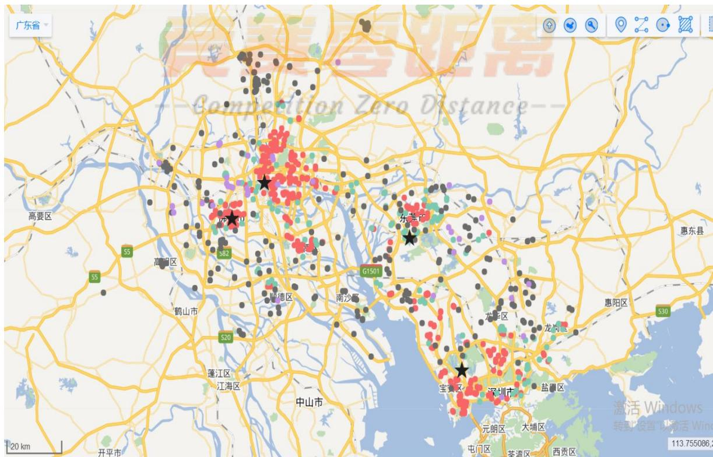
图 1 任务点按照价格区间分类的空间分布图

因此我们利用 ISODATA 算法对于这些任务点数据进行聚类分析，我们在每轮迭代过程中，样本进行重新调整类别之后计算类内及类间有关参数，并和设定的门限比较，确定是两类合并为一类还是一类分裂为两类，不断地“自组织”，已达到在各参数满足设计要求条件下，使各模式到其类心的距离平方和最小。利用 MATLAB 对此算法进行求解我们得到了四类的聚类中心为：

表 1 四类聚类中心的坐标
<table><tr><td rowspan=1 colspan=1>第1类聚类中心为</td><td rowspan=1 colspan=1>22.6107</td><td rowspan=1 colspan=1>113.927</td></tr><tr><td rowspan=1 colspan=1>第2类聚类中心为</td><td rowspan=1 colspan=1>23.124</td><td rowspan=1 colspan=1>113.2424</td></tr><tr><td rowspan=1 colspan=1>第3类聚类中心为</td><td rowspan=1 colspan=1>22.9732</td><td rowspan=1 colspan=1>113.7467</td></tr><tr><td rowspan=1 colspan=1>第4类聚类中心为</td><td rowspan=1 colspan=1>23.02717</td><td rowspan=1 colspan=1>113.1287</td></tr></table>

我们将求出的上面四点在图一中用五角星标出，发现聚类情况与我们预先的估计较为吻合，因此我们可以得出以下结论：任务的定价与其所处的地理位置有关，其大小与其到市中心的距离大体符合负相关关系，因为真实情况下存在着一定的随机性，所以我们使用线性回归分析来简化模型，得到价格与位置的关系，据此我们建立了我们的任务定价模型：

首先我们需要求出任务点分别到四个聚类中心的距离：

$$
d _ { i } = { \sqrt { ( x _ { 0 } - x _ { i } ) ^ { 2 } + ( y _ { 0 } - y _ { i } ) ^ { 2 } } }
$$

然后即将四个距离值 $d _ { 1 } , ~ d _ { 2 } , ~ d _ { 3 } , ~ d _ { 4 }$ 进行比较，取出四个中的最小值:

$$
d _ { 0 } = \operatorname* { m i n } \{ d _ { 1 } , d _ { 2 } , d _ { 3 } , d _ { 4 } \}
$$

然后我们利用回归分析以前面 417组数据作为训练样本，求出任务点定价s 与坐标之间的关系：

$$
\begin{array} { r } { s = { 1 3 . 9 3 7 3 2 2 2 2 7 3 6 8 3 * d _ { 0 } } + 6 6 . 7 4 0 1 3 0 3 9 5 9 3 5 2 } \end{array}
$$

并利用后面417组数据作为检验，截取部分数据如下表：

表 2 线性回归模型的检验结果
<table><tr><td rowspan=1 colspan=1>任务号码</td><td rowspan=1 colspan=1>任务 $\mathrm { g p s }$ 纬度</td><td rowspan=1 colspan=1>任务 gps 经度</td><td rowspan=1 colspan=1>任务标价</td><td rowspan=1 colspan=1>试验标价</td><td rowspan=1 colspan=1>误差</td></tr><tr><td rowspan=1 colspan=1>A0509</td><td rowspan=1 colspan=1>22.81963599</td><td rowspan=1 colspan=1>113.8037291</td><td rowspan=1 colspan=1>65</td><td rowspan=1 colspan=1>67.22613</td><td rowspan=1 colspan=1>-2.22613</td></tr><tr><td rowspan=1 colspan=1>A0538</td><td rowspan=1 colspan=1>22.84339687</td><td rowspan=1 colspan=1>113.2557574</td><td rowspan=1 colspan=1>661</td><td rowspan=1 colspan=1>68.07259</td><td rowspan=1 colspan=1>-2.07259</td></tr><tr><td rowspan=1 colspan=1>A0464</td><td rowspan=1 colspan=1>22.52712849</td><td rowspan=1 colspan=1>114.0539088</td><td rowspan=1 colspan=1>65.5</td><td rowspan=1 colspan=1>67.05758</td><td rowspan=1 colspan=1>-1.55758</td></tr><tr><td rowspan=1 colspan=1>A0463</td><td rowspan=1 colspan=1>23.09785202</td><td rowspan=1 colspan=1>113.3057915</td><td rowspan=1 colspan=1>65</td><td rowspan=1 colspan=1>65.87237</td><td rowspan=1 colspan=1>-0.87237</td></tr><tr><td rowspan=1 colspan=1>A0703</td><td rowspan=1 colspan=1>22.78108249</td><td rowspan=1 colspan=1>114.0574014</td><td rowspan=1 colspan=1>69</td><td rowspan=1 colspan=1>67.94743</td><td rowspan=1 colspan=1>1.052565</td></tr><tr><td rowspan=1 colspan=1>A0418</td><td rowspan=1 colspan=1>23.54196985</td><td rowspan=1 colspan=1>113.5979552</td><td rowspan=1 colspan=1>75</td><td rowspan=1 colspan=1>72.69763</td><td rowspan=1 colspan=1>2.302368</td></tr><tr><td rowspan=1 colspan=1>A0687</td><td rowspan=1 colspan=1>23.10425851</td><td rowspan=1 colspan=1>113.8644239</td><td rowspan=1 colspan=1>72</td><td rowspan=1 colspan=1>67.40177</td><td rowspan=1 colspan=1>4.598233</td></tr><tr><td rowspan=1 colspan=1>A0711</td><td rowspan=1 colspan=1>22.84158065</td><td rowspan=1 colspan=1>113.9837534</td><td rowspan=1 colspan=1>75</td><td rowspan=1 colspan=1>68.27716</td><td rowspan=1 colspan=1>6.722842</td></tr><tr><td rowspan=1 colspan=1>A0829</td><td rowspan=1 colspan=1>23.17903001</td><td rowspan=1 colspan=1>112.8761925</td><td rowspan=1 colspan=1>80</td><td rowspan=1 colspan=1>69.08648</td><td rowspan=1 colspan=1>10.91352</td></tr><tr><td rowspan=1 colspan=1>A0450</td><td rowspan=1 colspan=1>22.57872798</td><td rowspan=1 colspan=1>114.4936096</td><td rowspan=1 colspan=1>85</td><td rowspan=1 colspan=1>72.96441</td><td rowspan=1 colspan=1>12.03559</td></tr></table>

发现拟合情况大部分较好，误差在 2.5 元以内，但是对于定价超过 80 元的一些情况，我们发现误差达到了十元以上，拟合情况在这种状况下不尽如人意，我们分析认为对于这种情况除了存在距离市中心距离长短的影响外，必然还存在着其他因素的作用。

因此我们将这些定价超过 80 元的点利用地图找到了他们各自的具体位置，情况如下表：

表3 定价超过80 元的任务所在地
<table><tr><td rowspan=1 colspan=1>任务号码</td><td rowspan=1 colspan=1>地址</td></tr><tr><td rowspan=1 colspan=1>A0450</td><td rowspan=1 colspan=1>广东省深圳市龙岗区南湾街道南新社区东北方向约1.13公里</td></tr><tr><td rowspan=1 colspan=1>A0460</td><td rowspan=1 colspan=1>广东省深圳市龙岗区布吉街道凤凰社区东北方向</td></tr><tr><td rowspan=1 colspan=1>A0739</td><td rowspan=1 colspan=1>中国广东省佛山市南海区</td></tr><tr><td rowspan=1 colspan=1>A0742</td><td rowspan=1 colspan=1>广东省东莞市寮步镇寮步社区东南方向约1.19公里</td></tr><tr><td rowspan=1 colspan=1>A0749</td><td rowspan=1 colspan=1>广东省东莞市大朗镇大朗社区西北方向</td></tr><tr><td rowspan=1 colspan=1>A0750</td><td rowspan=1 colspan=1>广东省东莞市横沥镇村头村西南方向</td></tr><tr><td rowspan=1 colspan=1>A0751</td><td rowspan=1 colspan=1>广东省东莞市石龙镇王屋洲村东北方向约1.15公里</td></tr><tr><td rowspan=1 colspan=1>A0760</td><td rowspan=1 colspan=1>广东省东莞市塘厦镇石潭埔社区西南方向约1.02公里</td></tr><tr><td rowspan=1 colspan=1>A0765</td><td rowspan=1 colspan=1>广东省东莞市寮步镇良边村西北方向</td></tr><tr><td rowspan=1 colspan=1>A0773</td><td rowspan=1 colspan=1>广东省东莞市企石镇铁炉坑村东北方向</td></tr><tr><td rowspan=1 colspan=1>A0775</td><td rowspan=1 colspan=1>广东省佛山市南海区大沥镇沥北社区西北方向</td></tr><tr><td rowspan=1 colspan=1>A0777</td><td rowspan=1 colspan=1>广东省佛山市南海区丹灶镇东升社区东北方向</td></tr><tr><td rowspan=1 colspan=1>A0788</td><td rowspan=1 colspan=1>广东省佛山市南海区里水镇草场社区西北方向约1.13公里</td></tr><tr><td rowspan=1 colspan=1>A0789</td><td rowspan=1 colspan=1>广东省佛山市南海区河东中心路</td></tr><tr><td rowspan=1 colspan=1>A0790</td><td rowspan=1 colspan=1>广东省佛山市南海区永安大道东37号</td></tr><tr><td rowspan=1 colspan=1>A0791</td><td rowspan=1 colspan=1>广东省佛山市南海区桂丹路辅路</td></tr><tr><td rowspan=1 colspan=1>A0793</td><td rowspan=1 colspan=1>广东省佛山市南海区广佛路125号</td></tr><tr><td rowspan=1 colspan=1>A0794</td><td rowspan=1 colspan=1>广东省佛山市南海区永安大道南三巷</td></tr><tr><td rowspan=1 colspan=1>A0796</td><td rowspan=1 colspan=1>广东省佛山市南海区兴隆路，528231</td></tr><tr><td rowspan=1 colspan=1>A0797</td><td rowspan=1 colspan=1>广东省佛山市顺德区民安路</td></tr><tr><td rowspan=1 colspan=1>A0798</td><td rowspan=1 colspan=1>广东省佛山市南海区荷桂路，528216</td></tr><tr><td rowspan=1 colspan=1>A0800</td><td rowspan=1 colspan=1>广东省佛山市南海区荔新一路南四街，528231</td></tr><tr><td rowspan=1 colspan=1>A0808</td><td rowspan=1 colspan=1>广东省东莞市上元路20号</td></tr><tr><td rowspan=1 colspan=1>A0809</td><td rowspan=1 colspan=1>广东省佛山市南海区兴隆路，528231</td></tr><tr><td rowspan=1 colspan=1>A0830</td><td rowspan=1 colspan=1>广东省佛山市南海区涌边大街，528244</td></tr><tr><td rowspan=1 colspan=1>A0833</td><td rowspan=1 colspan=1>广东省东莞市德政东路7号，511700</td></tr><tr><td rowspan=1 colspan=1>A0835</td><td rowspan=1 colspan=1>广东省佛山市南海区南湾南路，528231</td></tr></table>

项目的定价会根据项目内容完成的难易程度存在着差异，我们知道当项目的位置处于相对偏远的地区或者交通不易到达的地方时，由于存在调查的困难性，需要定更高的价格以提高这些任务的完成率。

通过此表，我们发现这些定价超过 80 元的任务大多集中在东莞市与佛山市的偏僻郊区，我们结合现实因素加以考虑，认为出现这样的情况主要有两方面的原因，一是这些任务所在地较偏僻，远离市中心，完成难度较大，需要更高的价格刺激会员去完成任务；二是可能由于任务的发布者迫切需要了解东莞、佛山两市的相关情况，以提高价格的手段来促使任务完成的周期缩短。

## 5.1.2 任务未完成的原因分析

我们利用百度地图开放平台将任务点按照价格区间以及完成的情况进行了地图的绘制，采用了密度图的形式进行了反应，通过对于下图的分析

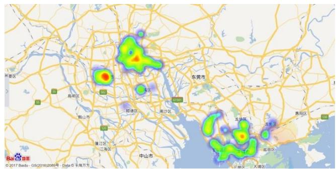
图 2 定价 67 元以下未完成的密度图

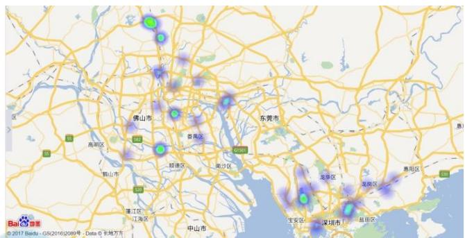

图 3 定价 67-70 元未完成的密度图
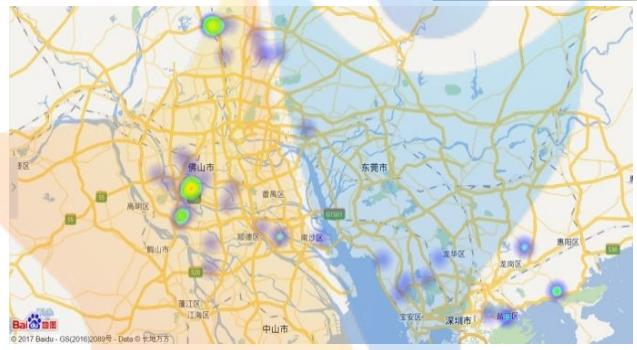
图 4 定价70-76元未完成的密度图

我们可以发现未完成的任务主要集中在广州市以及深圳市，而东莞市的任务则大多都被很好地完成了。我们通过查阅三处城市的社会经济特征，发现东莞市的经济发展状况比广州市和深圳市的差，并且人口以年轻人以及女性偏多。年轻人接受新鲜事物快，并且一些在校学生以及全职太太更倾向于通过完成任务的方式获得一些报酬，所以任务完成率更高。

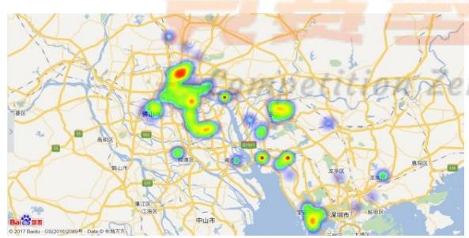
图 5 定价67 元以下完成的密度图

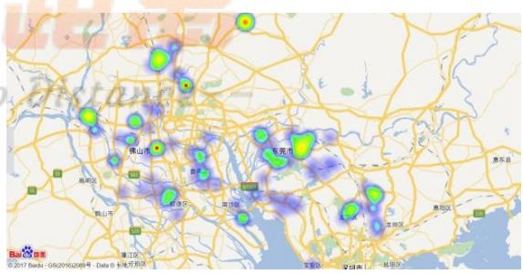
图 6 定价 67-70 元完成的密度图

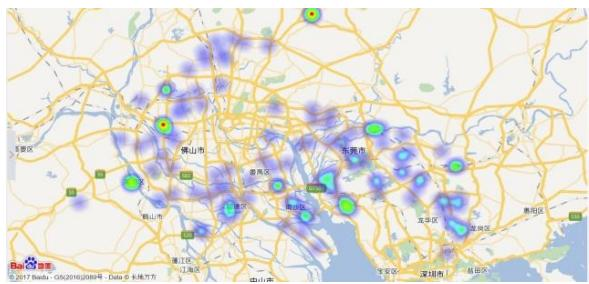
图 7 定价70-76 元完成的密度图

通过上图我们发现定价高的任务完成的情况较好，在城市中心的任务完成情况也较好。在市中心是因为交通便利，会员容易到达，也因为市中心的人员更加密集，周围分布的会员多，任务更易被完成。而针对任务定价带来的影响，我们进行了如下进一步分析：

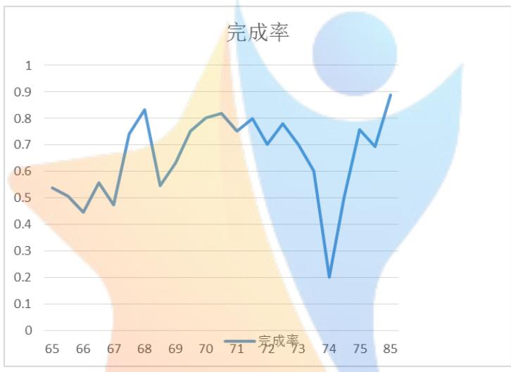

图 8 任务每种价格的总数与完成的个数
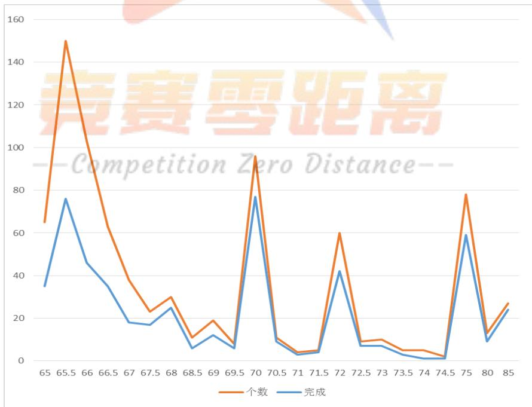
图 9 任务每种价格完成率

我们结合上面的两张图综合分析可以看出，在价格为 74 元时完成率很低是由于价格在 74 元的任务总数较少，导致偶然性带来的波动较大，可以舍弃这一组数据。总的来看，我们发现在任务价格较低时，任务的完成率也会随之降低，而在任务价格较高时，任务完成情况较好。这是因为人们在有所选择的情况下更加倾向于去完成获得报酬高的任务来给自己带来更大的收益。

## 5.2 考虑会员等级带来影响的定价模型

我们分析得到，会员对于一个发布的任务存在着一个完成任务的意愿，我们用任务对会员的吸引力指标函数c来表示这个意愿，分析实际情况我们容易得知当一个任务的定价s越高并且任务的距离d距会员越近时，会员完成这个任务意愿就会越强，即吸引力指标函数 c 与 s 正相关，与 d 负相关且根据实际我们认为意愿应呈指数形式，得到：

$$
c _ { i } = f ( s , d _ { i } ) = m _ { 1 } e ^ { - \frac { m _ { 2 } d _ { i } ^ { 2 } } { s } }
$$

我们在建立模型时，考虑到会员不是静止不变的，他们总是处在不断的运动之中，而这时一些道路路况好，容易到达以及繁华的地方由于人流量大，便会有更大的几率有更多的会员从这里经过，相应地这些地方的任务更容易被完成，因此我们用a 来定义一个坐标处的活跃度函数，而它的活跃度大小受到其周围区域内会员的数量以及会员等级的影响，会员等级越高代表其完成任务更加积极主动，会给其周围区域带来更高活跃度。因此我们用k来表示会员自身的活跃度，它由会员信誉积分b决定，公式为：

$$
\mathrm { k } = \ln b
$$

由此我们可以得到一个坐标的活跃度为：

$$
a = g ( x , y ) = \sum _ { i = 1 } ^ { n } k _ { i } \mathrm { e x p } \{ m _ { 3 } [ ( x - x _ { i } ) ^ { 2 } - ( y - y _ { i } ) ^ { 2 } ] \}
$$

其中 $( \mathbf { \boldsymbol { x } } , \mathbf { \boldsymbol { y } } )$ 为地区的经纬度坐标； $( x _ { i } , \ y _ { i } )$ 为第i 个会员的经纬度坐标。

考虑到会员的分布很集中，全部考虑的话模型过于复杂且真实情况下存在偶然性，我们对模型进行简化，将单位区间内密集的会员进行合并，产生的新的经度 ${ \boldsymbol { x } _ { i } } ^ { \prime }$ ，纬度 $y _ { i } ^ { \prime }$ 以及会员活跃度 $k _ { i } ^ { \prime }$

$$
{ x _ { i } } ^ { \prime } = \frac { \sum _ { i = 1 } ^ { j } { k _ { i } x _ { i } } } { \sum _ { i = 1 } ^ { j } { k _ { i } } }
$$

$$
y _ { i } ^ { \prime } = \frac { \sum _ { i = 1 } ^ { j } k _ { i } y _ { i } } { \sum _ { i = 1 } ^ { j } k _ { i } }
$$

所以我们可以得到改变后的地区的活跃度为：

$$
a = g ( x , y ) = \sum _ { i = 1 } ^ { n } { k _ { i } } ^ { \prime } \mathrm { e x p } \{ m _ { 3 } [ ( x - x _ { i } { ' } ) ^ { 2 } - ( y - y _ { i } { ' } ) ^ { 2 } ] \}
$$

利用 MATLAB 得出各个地区的活跃度如下图：

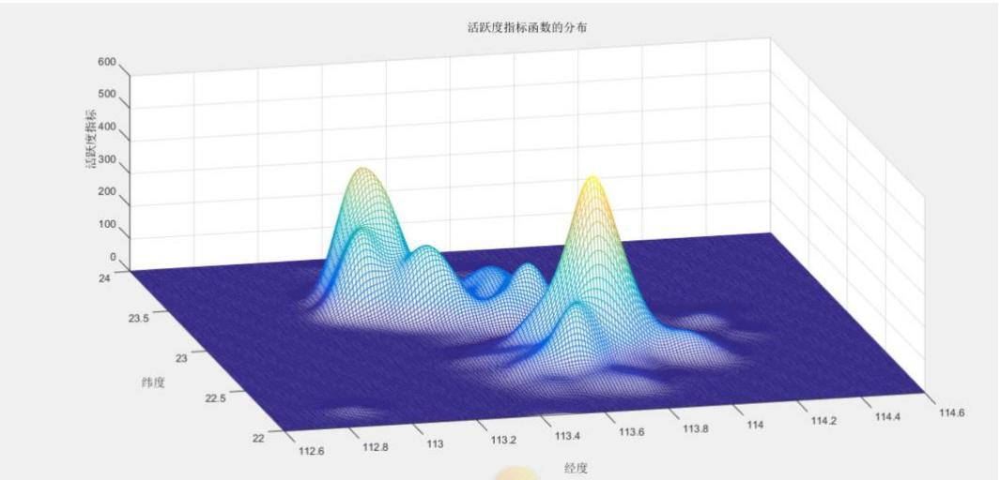
图 10 各地区活跃度指标函数分布图

所以任务被完成的可能性大小取决于任务吸引力c 和任务所在地区活跃度 $\mathrm { a }$ ，据此我们得到任务被完成的可能性 $\mathrm { p } _ { \mathrm { i } }$ ：

$$
p _ { i } = \iint c _ { i } a _ { i } d x d y
$$

对 $p { \mathrm { . } }$ 进行运算，为了方便求解，将其划分为 13 块进行运算，划分如下：

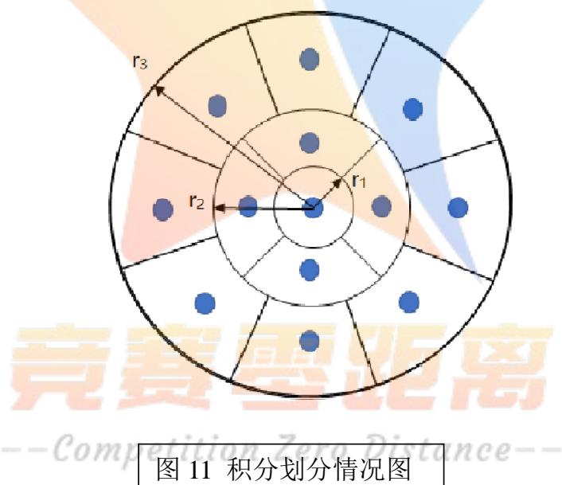

根据积分中值定理，我们可以得到：

$$
\begin{array} { r } { \underset { \ b { \mathcal { D } _ { i } } } { \iint } f ( s , d ) g ( x , y ) d x d y = A _ { i } \underset { \ b { \mathcal { D } _ { i } } } { \iint } f ( s , d ) d x d y ( i = 1 , 2 \dots 1 3 ) } \end{array}
$$

并令

$$
\tau i = \iint _ { \Omega _ { i } } f ( s , d ) d x d y
$$

所以 $\mathbf { \nabla } \cdot \mathbf { p }$ 为：

$$
p = \sum _ { i = 1 } ^ { 1 3 } A _ { i } \iint f ( s , d ) d x d y = \sum _ { i = 1 } ^ { 1 3 } A _ { i } \tau _ { i }
$$

因为有 $A _ { i }$ 符合正态分布

我们得到：

$$
A _ { i } { \sim } N ( g ( x _ { i } , y _ { i } ) , \sigma _ { i } )
$$

$$
S ^ { 2 } ( P ) = \sum _ { j = 1 } ^ { 1 3 } \tau _ { i } ^ { 2 } \sigma _ { i } ^ { 2 }
$$

因此我们得出当

此时有

$$
\tau _ { 1 } ^ { 2 } = \tau _ { 2 } ^ { 2 } = \cdots = \tau _ { 1 3 } ^ { 2 }
$$

$$
S ^ { 2 } ( P ) \to m i n
$$

设门限 G，f(x)小于 G 的省略，得到：

最大半径 $\Gamma _ { 3 } : \mathrm { f } ( \Gamma _ { 3 } ) = { \sf G }$

由

$$
\mathrm { m } _ { 1 } \mathrm { e } ^ { - \frac { \mathrm { m } _ { 2 } \mathrm { r } _ { 3 } { } ^ { 2 } } { s } } = \mathrm { G }
$$

得到

$$
\Gamma _ { 3 } = - \frac { s } {  { \mathrm { m } } _ { 2 } }  { \mathrm { l n } } \frac { \mathrm { G } } { m _ { 1 } }
$$

又有

$$
\begin{array} { r } { \tau _ { 1 } = \iint _ { \Omega _ { 1 } } f ( x ) d x d y = \int _ { 0 } ^ { r _ { 1 } } \int _ { 0 \le \theta \le 2 \pi } m _ { 1 } e ^ { - \frac { m _ { 2 } r _ { 1 } ^ { 2 } } { s } } r d r d \theta = 2 \pi \frac { m _ { 1 } s } { m _ { 2 } } ( 1 - e x p ( - \frac { m _ { 2 } r _ { 1 } ^ { 2 } } { s } ) ) } \end{array}
$$

$$
\tau _ { 2 } = \iint f ( x ) d x d y = \frac { \pi m _ { 1 } m _ { 2 } } { 2 } \left( e x p \left( - \frac { m _ { 2 } r _ { 1 } ^ { 2 } } { s } \right) - e x p \left( - \frac { m _ { 2 } r _ { 2 } ^ { 2 } } { s } \right) \right) = \tau _ { 3 } = \tau _ { 4 } = \tau _ { 5 }
$$

$$
\tau _ { 6 } = \iint f ( x ) d x d y = \frac { \pi } { 4 } \frac { m _ { 1 } m _ { 2 } } { s } \Biggl ( e x p \left( - \frac { m _ { 2 } r _ { 2 } ^ { 2 } } { s } \right) - e x p \left( - \frac { m _ { 2 } r _ { 3 } ^ { 2 } } { s } \right) \Biggr ) = \tau _ { 7 } = \tau _ { 8 } = \cdots = \tau _ { 1 3 } .
$$

联立方程：

$$
\tau _ { 1 } = \tau _ { 2 } = \tau _ { 6 }
$$


即可解出 $\boldsymbol { \mathrm { r } } _ { 1 }$ ， $\boldsymbol { \mathrm { r } } _ { 2 }$ $\boldsymbol { \mathrm { r } } _ { 3 }$

即可得到 p 的值。

我们联系实际得知，软件公司给任务设立定价，当任务被完成时软件公司即可获得收益，因此我们可以得到该点任务对于公司的收益期望为：

$$
E ( R _ { i } ) = P ( L - s ) + ( 1 - p ) \cdot 0 = p ( L - s )
$$

算出令 $E ( R _ { i } )$ 最大的任务定价s 即是我们修改的更加有利的定价方案。

任取一点（23.00,113.80）为例，我们可以得到其任务价格与被完成概率的关系以及任务价格与收益期望的关系：

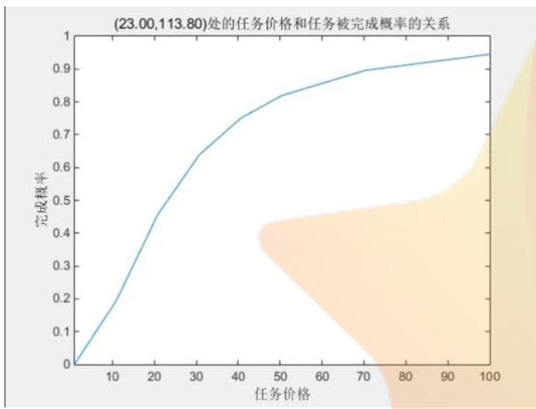
图 12 任务价格与被完成概率的关系

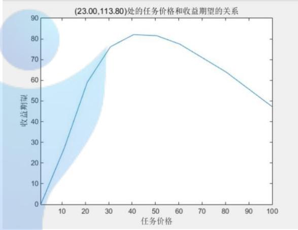
图 13 任务价格与收益期望的关系

据此，我们将（23.00,113.80）处的任务价格定为 45 元，可以使得公司获得更大的收益。

我们确定的新的定价相比原先的定价方案多考虑了会员的分布以及会员的等级所带来的影响，相比原先的方案此方案的价格定价更加的合理，可以使公司获得更多的收益。

## 5.3 将任务打包发布的定价模型

## 5.3.1 引入行动力建立打包数的函数关系

我们分析认为一个人的精力并不是无穷的，他在工作、运动时都会消耗他的精力，当他的精力到达临界点时，他就会休息，此时他是不会在去完成任务的。据此我们定义一个人的行动力为v，他在一次活动中消耗的行动力应该是行动到任务点的行动力和做任务的行动力之和，即

$$
v = A c m + A c w
$$

并求出行动力的效率：

$$
\omega = { \frac { A c w } { A c { \bmod { A } } c w } }
$$

当一个人的行动力效率即ω越高时，说明他做任务所占的时间更多，即他所能完成的任务也更多。我们认为将任务进行打包后发布，由一个人去任务点完成任务，它的效率比多个人分别去完成任务的行动率更高。并且打包可能导致零散的行动力被拒绝。

我们定义一个参数 u来表示任务与会员之间吸引力的相关系数 $( 0 < \mathsf { u } < 1 )$ ），它与会员的信誉积分b有关：

$$
u = \frac { m _ { 3 } } { 1 + \frac { m _ { 3 } - u _ { 0 } } { u _ { 0 } } ( b + 1 ) ^ { - 2 } }
$$

由此我们得到第 i 个任务对第 j 个会员的吸引力为：

$$
c _ { i j } = \frac { 1 } { 1 + \displaystyle \frac { m _ { 4 } d _ { i j } ^ { 2 } } { u } }
$$

我们分析认为当一个任务对一个会员的吸引力越高时，它就越会被这个会员完成，因此我们可以得到若任务完成，任务被第i 个会员完成的概率为：

$$
P ( A _ { i } | A ) = { c _ { i j } } / { \sum _ { i = 1 } ^ { n } c _ { i j } }
$$

因此我们可以得到第 j 个任务被完成的行动力消耗的期望：

$$
\operatorname { E } ( \operatorname { A c m } _ { j } ) = \sum _ { i = 1 } ^ { n } P ( A _ { i } | A ) \operatorname { A c m } _ { i j }
$$

在将任务进行打包时，我们不应只由app 盈利角度出发，而应着眼于如何将互不相识，零散、完整程度不一的行动力组织起来，充分物尽其用，这才是问题的本源。因此我们就要使得我们打包后的效率满足：

$$
w = \frac { A c w } { A c \mathrm { m } + A c w } \geq G a t e
$$

即

$$
A c w _ { , \ z \preceq } = n \cdot A c w \geq { \frac { G a t e \cdot A c m _ { , \acute { \infty } } } { 1 - G a t e } }
$$

又有

$$
A c m _ { , { \overset {  } { \operatorname* { m } } } } = \sum _ { j = 1 } ^ { n } { \mathrm { E } } ( { \mathrm { A c m } } _ { j } )
$$

所以我们推得

$$
n > \frac { G a t e \cdot \sum _ { j = 1 } ^ { n } \operatorname { E } ( \operatorname { A c m } _ { j } ) } { A c w ( 1 - G a t e ) }
$$

在得到此式后，我们再通过带入数据技术计算出各个任务被完成的行动力消耗的期望 $\operatorname { E } ( \mathrm { A c m } _ { j } )$

将E $\mathsf { \Gamma } : ( \mathsf { A c m } _ { j } )$ 在地图上表现出来，得到：

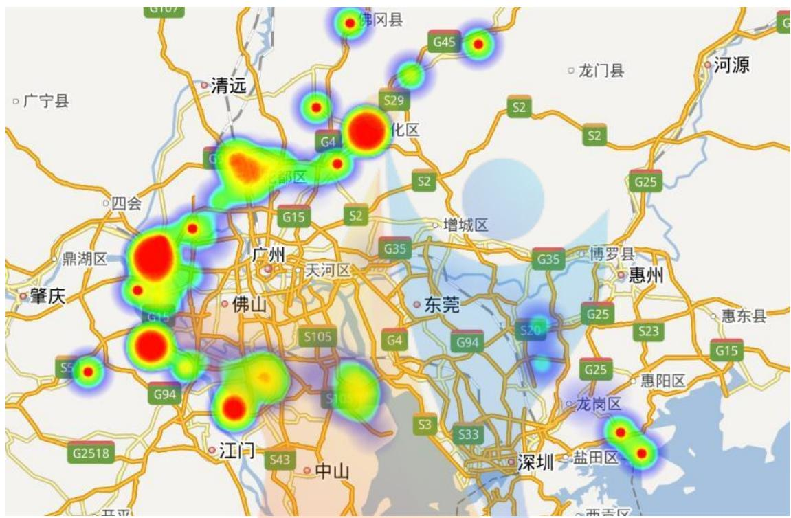
图 14 各个任务点处的行动力消耗

可以看到，距离市中心越近的任务， $\operatorname { E } ( \mathrm { A c m } _ { j } )$ 越大，按照公式

$$
n > \frac { G a t e \cdot \sum _ { j = 1 } ^ { n } \operatorname { E } ( \operatorname { A c m } _ { j } ) } { A c w ( 1 - G a t e ) }
$$

可得结论：距离市中心越远，一包内应打越多的任务，这与前文的分析相符。通过分析 $\operatorname { E } ( \mathrm { A c m } _ { j } )$ 与任务j 距离市中心的距离d的关系，我们得到拟合函数：

$$
\operatorname { E } { \big ( } \mathrm { A c m } _ { j } { \big ) } = 2 0 . 5 3 0 3 * ( 0 . 6 5 4 7 7 + d ) ^ { 2 } - 8 . 8 8 0 7 8
$$

取 $G a t e = 0 . 3$ ，𝐴𝑐𝑤 = 1我们得到𝑛 = 8.7987 ∗ (0.65477 + 𝑑)<sup>2</sup> − 3.7722

根据这个函数，我们将任务按照距离市中心的距离分为不同的带，不同带内的任务打包的目标任务数不同。

## 5.3.2 打包算法的实现及结果

同时，为了能同时照顾整块行动力和零散行动力，我们应区别对待不同位置的任务。

对于临近市中心、居住区的任务，应少打包，或不打包，以发挥其充分利用零散行动力的优点。对于市郊的任务，应打包，一包打多个，以保证整块行动力有足够的高的效率，完成更多的任务。据此，我们设计了算法流程图设计如下：

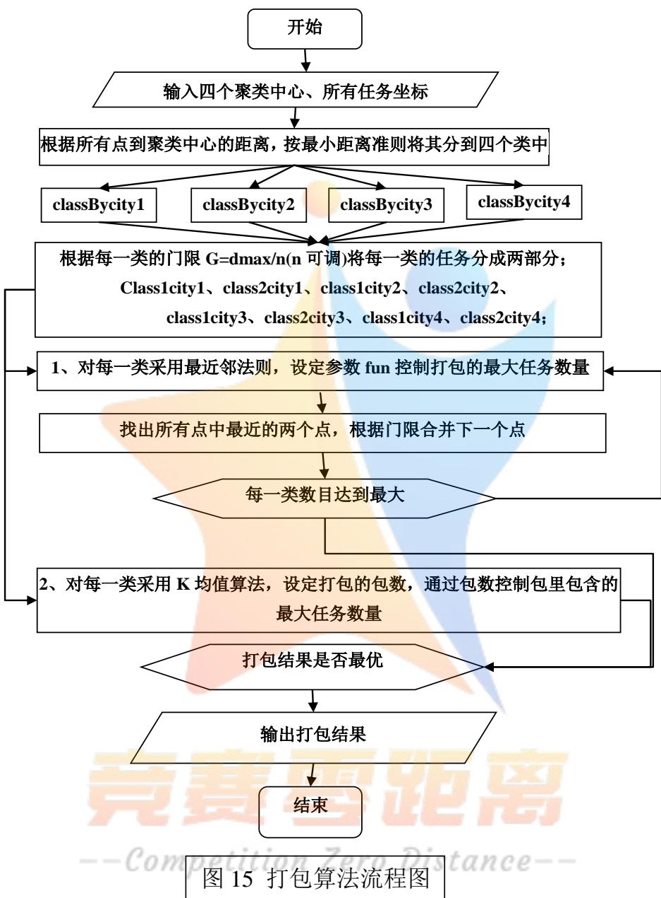

运用 MATLAB进行运算求解可以得到各类的打包情况：以第一大类远心部分的打包结果为例：

表 4 第一大类远心部分的打包结果
<table><tr><td colspan="1" rowspan="1">打包</td><td colspan="8" rowspan="1">序号</td></tr><tr><td colspan="1" rowspan="1">1</td><td colspan="1" rowspan="1">43</td><td colspan="1" rowspan="1">19</td><td colspan="1" rowspan="1"></td><td colspan="1" rowspan="1"></td><td colspan="1" rowspan="1"></td><td colspan="1" rowspan="1"></td><td colspan="1" rowspan="1"></td><td colspan="1" rowspan="1"></td></tr><tr><td colspan="1" rowspan="1">2</td><td colspan="1" rowspan="1">131</td><td colspan="1" rowspan="1">18</td><td colspan="1" rowspan="1"></td><td colspan="1" rowspan="1"></td><td colspan="1" rowspan="1"></td><td colspan="1" rowspan="1"></td><td colspan="1" rowspan="1"></td><td colspan="1" rowspan="1"></td></tr><tr><td colspan="1" rowspan="1">3</td><td colspan="1" rowspan="1">77</td><td colspan="1" rowspan="1">66</td><td colspan="1" rowspan="1">107</td><td colspan="1" rowspan="1">50</td><td colspan="1" rowspan="1">57</td><td colspan="1" rowspan="1"></td><td colspan="1" rowspan="1"></td><td colspan="1" rowspan="1"></td></tr><tr><td colspan="1" rowspan="1">4</td><td colspan="1" rowspan="1">82</td><td colspan="1" rowspan="1">55</td><td colspan="1" rowspan="1">21</td><td colspan="1" rowspan="1"></td><td colspan="1" rowspan="1"></td><td colspan="1" rowspan="1"></td><td colspan="1" rowspan="1"></td><td colspan="1" rowspan="1"></td></tr><tr><td colspan="1" rowspan="1">5</td><td colspan="1" rowspan="1">138</td><td colspan="1" rowspan="1">128</td><td colspan="1" rowspan="1"></td><td colspan="1" rowspan="1"></td><td colspan="1" rowspan="1"></td><td colspan="1" rowspan="1"></td><td colspan="1" rowspan="1"></td><td colspan="1" rowspan="1"></td></tr><tr><td colspan="1" rowspan="1">6</td><td colspan="1" rowspan="1">137</td><td colspan="1" rowspan="1">134</td><td colspan="1" rowspan="1">135</td><td colspan="1" rowspan="1">122</td><td colspan="1" rowspan="1">121</td><td colspan="1" rowspan="1">149</td><td colspan="1" rowspan="1">125</td><td colspan="1" rowspan="1">120</td></tr><tr><td colspan="1" rowspan="1">7</td><td colspan="1" rowspan="1">44</td><td colspan="1" rowspan="1">37</td><td colspan="1" rowspan="1"></td><td colspan="1" rowspan="1"></td><td colspan="1" rowspan="1"></td><td colspan="1" rowspan="1"></td><td colspan="1" rowspan="1"></td><td colspan="1" rowspan="1"></td></tr><tr><td colspan="1" rowspan="1">8</td><td colspan="1" rowspan="1">91</td><td colspan="1" rowspan="1">40</td><td colspan="1" rowspan="1">95</td><td colspan="1" rowspan="1">32</td><td colspan="1" rowspan="1"></td><td colspan="1" rowspan="1"></td><td colspan="1" rowspan="1"></td><td colspan="1" rowspan="1"></td></tr><tr><td colspan="1" rowspan="1">9</td><td colspan="1" rowspan="1">111</td><td colspan="1" rowspan="1">47</td><td colspan="1" rowspan="1">63</td><td colspan="1" rowspan="1">26</td><td colspan="1" rowspan="1">85</td><td colspan="1" rowspan="1"></td><td colspan="1" rowspan="1"></td><td colspan="1" rowspan="1"></td></tr><tr><td colspan="1" rowspan="1">10</td><td colspan="1" rowspan="1">101</td><td colspan="1" rowspan="1">29</td><td colspan="1" rowspan="1"></td><td colspan="1" rowspan="1"></td><td colspan="1" rowspan="1"></td><td colspan="1" rowspan="1"></td><td colspan="1" rowspan="1"></td><td colspan="1" rowspan="1"></td></tr><tr><td colspan="1" rowspan="1">11</td><td colspan="1" rowspan="1">48</td><td colspan="1" rowspan="1">41</td><td colspan="1" rowspan="1">33</td><td colspan="1" rowspan="1">22</td><td colspan="1" rowspan="1"></td><td colspan="1" rowspan="1"></td><td colspan="1" rowspan="1"></td><td colspan="1" rowspan="1"></td></tr><tr><td colspan="1" rowspan="1">12</td><td colspan="1" rowspan="1">73</td><td colspan="1" rowspan="1">68</td><td colspan="1" rowspan="1"></td><td colspan="1" rowspan="1"></td><td colspan="1" rowspan="1"></td><td colspan="1" rowspan="1"></td><td colspan="1" rowspan="1"></td><td colspan="1" rowspan="1"></td></tr><tr><td colspan="1" rowspan="1">13</td><td colspan="1" rowspan="1">88</td><td colspan="1" rowspan="1">79</td><td colspan="1" rowspan="1">74</td><td colspan="1" rowspan="1">35</td><td colspan="1" rowspan="1">20</td><td colspan="1" rowspan="1">71</td><td colspan="1" rowspan="1">80</td><td colspan="1" rowspan="1"></td></tr><tr><td colspan="1" rowspan="1">14</td><td colspan="1" rowspan="1">109</td><td colspan="1" rowspan="1">90</td><td colspan="1" rowspan="1"></td><td colspan="1" rowspan="1"></td><td colspan="1" rowspan="1"></td><td colspan="1" rowspan="1"></td><td colspan="1" rowspan="1"></td><td colspan="1" rowspan="1"></td></tr><tr><td colspan="1" rowspan="1">15</td><td colspan="1" rowspan="1">6</td><td colspan="1" rowspan="1">3</td><td colspan="1" rowspan="1"></td><td colspan="1" rowspan="1"></td><td colspan="1" rowspan="1"></td><td colspan="1" rowspan="1"></td><td colspan="1" rowspan="1"></td><td colspan="1" rowspan="1"></td></tr><tr><td colspan="1" rowspan="1">16</td><td colspan="1" rowspan="1">81</td><td colspan="1" rowspan="1">76</td><td colspan="1" rowspan="1">72</td><td colspan="1" rowspan="1">93</td><td colspan="1" rowspan="1">75</td><td colspan="1" rowspan="1"></td><td colspan="1" rowspan="1"></td><td colspan="1" rowspan="1"></td></tr><tr><td colspan="1" rowspan="1">17</td><td colspan="1" rowspan="1">129</td><td colspan="1" rowspan="1">124</td><td colspan="1" rowspan="1"></td><td colspan="1" rowspan="1"></td><td colspan="1" rowspan="1"></td><td colspan="1" rowspan="1"></td><td colspan="1" rowspan="1"></td><td colspan="1" rowspan="1"></td></tr><tr><td colspan="1" rowspan="1">18</td><td colspan="1" rowspan="1">106</td><td colspan="1" rowspan="1">59</td><td colspan="1" rowspan="1"></td><td colspan="1" rowspan="1"></td><td colspan="1" rowspan="1"></td><td colspan="1" rowspan="1"></td><td colspan="1" rowspan="1"></td><td colspan="1" rowspan="1"></td></tr><tr><td colspan="1" rowspan="1">19</td><td colspan="1" rowspan="1">53</td><td colspan="1" rowspan="1">49</td><td colspan="1" rowspan="1"></td><td colspan="1" rowspan="1"></td><td colspan="1" rowspan="1"></td><td colspan="1" rowspan="1"></td><td colspan="1" rowspan="1"></td><td colspan="1" rowspan="1"></td></tr><tr><td colspan="1" rowspan="1">20</td><td colspan="1" rowspan="1">144</td><td colspan="1" rowspan="1">89</td><td colspan="1" rowspan="1">56</td><td colspan="1" rowspan="1">24</td><td colspan="1" rowspan="1">45</td><td colspan="1" rowspan="1"></td><td colspan="1" rowspan="1"></td><td colspan="1" rowspan="1"></td></tr><tr><td colspan="1" rowspan="1">21</td><td colspan="1" rowspan="1">126</td><td colspan="1" rowspan="1">123</td><td colspan="1" rowspan="1"></td><td colspan="1" rowspan="1"></td><td colspan="1" rowspan="1"></td><td colspan="1" rowspan="1"></td><td colspan="1" rowspan="1"></td><td colspan="1" rowspan="1"></td></tr><tr><td colspan="1" rowspan="1">22</td><td colspan="1" rowspan="1">108</td><td colspan="1" rowspan="1">27</td><td colspan="1" rowspan="1"></td><td colspan="1" rowspan="1"></td><td colspan="1" rowspan="1"></td><td colspan="1" rowspan="1"></td><td colspan="1" rowspan="1"></td><td colspan="1" rowspan="1"></td></tr><tr><td colspan="1" rowspan="1">23</td><td colspan="1" rowspan="1">61</td><td colspan="1" rowspan="1">42</td><td colspan="1" rowspan="1">25</td><td colspan="1" rowspan="1">1</td><td colspan="1" rowspan="1"></td><td colspan="1" rowspan="1"></td><td colspan="1" rowspan="1"></td><td colspan="1" rowspan="1"></td></tr><tr><td colspan="1" rowspan="1">24</td><td colspan="1" rowspan="1">114</td><td colspan="1" rowspan="1">102</td><td colspan="1" rowspan="1">98</td><td colspan="1" rowspan="1"></td><td colspan="1" rowspan="1"></td><td colspan="1" rowspan="1"></td><td colspan="1" rowspan="1"></td><td colspan="1" rowspan="1"></td></tr><tr><td colspan="1" rowspan="1">25</td><td colspan="1" rowspan="1">17</td><td colspan="1" rowspan="1">15</td><td colspan="1" rowspan="1"></td><td colspan="1" rowspan="1">L//</td><td colspan="1" rowspan="1"></td><td colspan="1" rowspan="1"></td><td colspan="1" rowspan="1"></td><td colspan="1" rowspan="1"></td></tr><tr><td colspan="1" rowspan="1">26</td><td colspan="1" rowspan="1">10</td><td colspan="1" rowspan="1">9</td><td colspan="1" rowspan="1">7</td><td colspan="1" rowspan="1"></td><td colspan="1" rowspan="1">5</td><td colspan="1" rowspan="1">4</td><td colspan="1" rowspan="1">13</td><td colspan="1" rowspan="1"></td></tr><tr><td colspan="1" rowspan="1">27</td><td colspan="1" rowspan="1">143</td><td colspan="1" rowspan="1">141</td><td colspan="1" rowspan="1"></td><td colspan="1" rowspan="1"></td><td colspan="1" rowspan="1"></td><td colspan="1" rowspan="1"></td><td colspan="1" rowspan="1"></td><td colspan="1" rowspan="1"></td></tr><tr><td colspan="1" rowspan="1">28</td><td colspan="1" rowspan="1">142</td><td colspan="1" rowspan="1">133</td><td colspan="1" rowspan="1"></td><td colspan="1" rowspan="1"></td><td colspan="1" rowspan="1"></td><td colspan="1" rowspan="1"></td><td colspan="1" rowspan="1"></td><td colspan="1" rowspan="1"></td></tr><tr><td colspan="1" rowspan="1">29</td><td colspan="1" rowspan="1">2</td><td colspan="1" rowspan="1">1</td><td colspan="1" rowspan="1"></td><td colspan="1" rowspan="1"></td><td colspan="1" rowspan="1"></td><td colspan="1" rowspan="1"></td><td colspan="1" rowspan="1"></td><td colspan="1" rowspan="1"></td></tr><tr><td colspan="1" rowspan="1">30</td><td colspan="1" rowspan="1">36</td><td colspan="1" rowspan="1">23</td><td colspan="1" rowspan="1"></td><td colspan="1" rowspan="1"></td><td colspan="1" rowspan="1"></td><td colspan="1" rowspan="1"></td><td colspan="1" rowspan="1"></td><td colspan="1" rowspan="1"></td></tr><tr><td colspan="1" rowspan="1">31</td><td colspan="1" rowspan="1">94</td><td colspan="1" rowspan="1">11</td><td colspan="1" rowspan="1">104</td><td colspan="1" rowspan="1"></td><td colspan="1" rowspan="1"></td><td colspan="1" rowspan="1"></td><td colspan="1" rowspan="1"></td><td colspan="1" rowspan="1"></td></tr><tr><td colspan="1" rowspan="1">32</td><td colspan="1" rowspan="1">86</td><td colspan="1" rowspan="1">64</td><td colspan="1" rowspan="1"></td><td colspan="1" rowspan="1"></td><td colspan="1" rowspan="1"></td><td colspan="1" rowspan="1"></td><td colspan="1" rowspan="1"></td><td colspan="1" rowspan="1"></td></tr><tr><td colspan="1" rowspan="1">33</td><td colspan="1" rowspan="1">115</td><td colspan="1" rowspan="1">16</td><td colspan="1" rowspan="1">14</td><td colspan="1" rowspan="1"></td><td colspan="1" rowspan="1"></td><td colspan="1" rowspan="1"></td><td colspan="1" rowspan="1"></td><td colspan="1" rowspan="1"></td></tr><tr><td colspan="1" rowspan="1">34</td><td colspan="1" rowspan="1">139</td><td colspan="1" rowspan="1">130</td><td colspan="1" rowspan="1"></td><td colspan="1" rowspan="1"></td><td colspan="1" rowspan="1"></td><td colspan="1" rowspan="1"></td><td colspan="1" rowspan="1"></td><td colspan="1" rowspan="1"></td></tr><tr><td colspan="1" rowspan="1">35</td><td colspan="1" rowspan="1">113</td><td colspan="1" rowspan="1">52</td><td colspan="1" rowspan="1"></td><td colspan="1" rowspan="1"></td><td colspan="1" rowspan="1"></td><td colspan="1" rowspan="1"></td><td colspan="1" rowspan="1"></td><td colspan="1" rowspan="1"></td></tr><tr><td colspan="1" rowspan="1">36</td><td colspan="1" rowspan="1">112</td><td colspan="1" rowspan="1">38</td><td colspan="1" rowspan="1"></td><td colspan="1" rowspan="1"></td><td colspan="1" rowspan="1"></td><td colspan="1" rowspan="1"></td><td colspan="1" rowspan="1"></td><td colspan="1" rowspan="1"></td></tr></table>

各序号对应的任务点的坐标以及其余各类的打包情况均参见支撑材料。

## 5.3.3 打包算法对定价模型的影响

我们的打包算法是区别对待不同位置的任务，在已算得各分类区域的打包情况后，我们利用 5.2 中的模型求出公司的收益期望与打包后的包内平均每个任务的定价价格之间的关系：

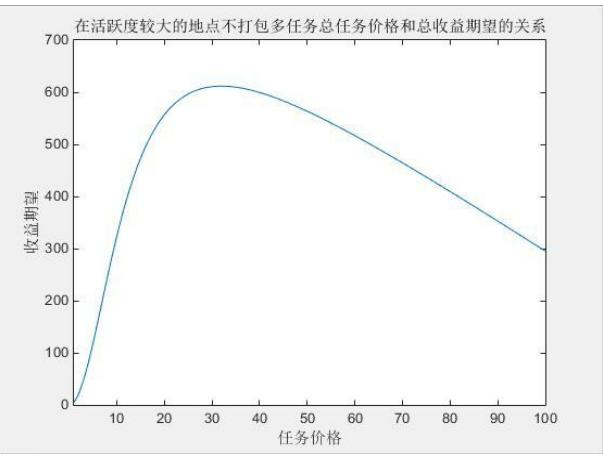
图 16 活跃度较大的地点不打包每个任务的平均定价与总收益期望的关系

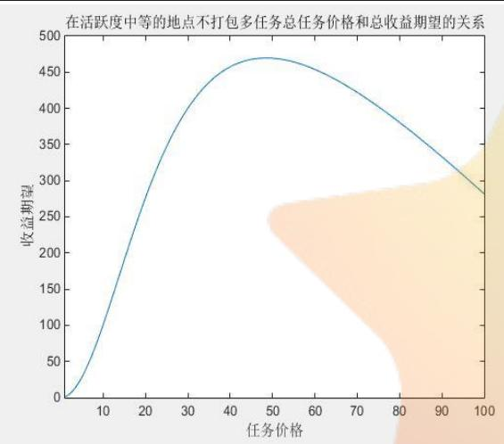

图 18 活跃度中等的地点不打包每个任务的平均定价与总收益期望的关系
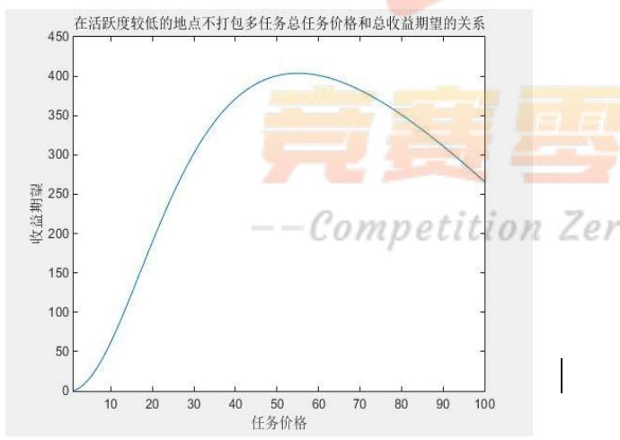
图 20 活跃度较低的地点不打包每个任务的平均定价与总收益期望的关系

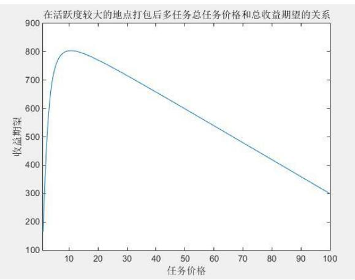
图17 活跃度较大的地点包内每个任务的平均定价与总收益期望的关系

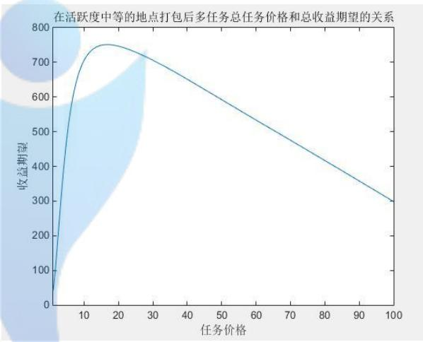
图 19 活跃度中等的地点包内每个任务的平均定价与总收益期望的关系

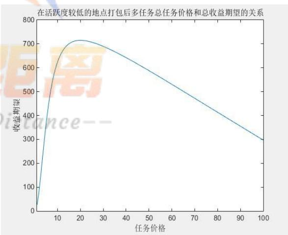
图 21 活跃度较低的地点包内每个任务的平均定价与总收益期望的关系

从上面的图中，横向分析发现打包后公司为获得最大收益期望所需确定的包内每个任务的平均价格相比于不打包时公司确定的每个任务的平均价格大大价低，而且公司能够获得的收益期望也有显著提高，也就是说采用打包策略后，公司可以在付出更少成本的情况下获得更多的收益，实现公司的利润最大化。

而通过纵向的对比分析，我们分析下面两个参数的变化情况：

$$
F _ { 2 } + \sum \limits _ { i = 1 } ^ { n } \{ I _ { i } + R _ { i } + R _ { 2 } \} \times \frac { 1 } { 2 } \{ I _ { i } - I _ { j } \} \times t = \frac { 1 - s } { s }
$$

$$
\therefore \vert \vert \chi _ { \mathrm { i n } } ^ { \prime } \vert \vert \chi _ { \mathrm { i n } } ^ { \prime } \vert \vert \overset {  } { \underset { + } { \mathrm { i } } { \mathrm { H } } } \overset {  } { \underset { + } { \mathrm { i } } { \mathrm { H } } } \overset {  } { \underset { + } { \mathrm { i } } { \mathrm { H } } } \overset {  } { \underset { + } { \mathrm { i } } { \mathrm { H } } } \overset {  } { \underset { + } { \mathrm { i } } { \mathrm { H } } } \overset {  } { \underset { + } { \mathrm { i } } { \mathrm { H } } } \overset {  } { \underset { + } { \mathrm { i } } { \mathrm { H } } } \overset {  } { \underset { + } { \mathrm { i } } { \mathrm { H } } } \overset {  } { \underset { + } { \mathrm { i } } { \mathrm { H } } } \overset {  } { \underset { + } { \mathrm { i } } { \mathrm { H } } } \overset {  } { \underset { + } { \mathrm { i } } { \mathrm { H } } } \overset {  } { \underset { + } { \mathrm { i } } { \mathrm { H } } } \overset {  } { \underset { + } { \mathrm { i } } { \mathrm { H } } } \overset {  } { \underset { + } { \mathrm { i } } { \mathrm { H } } }
$$

得出结果：

表 5 不同地区打包后的参数变化情况
<table><tr><td rowspan=1 colspan=1>地区分类</td><td rowspan=1 colspan=1>平均任务价格降低百分比</td><td rowspan=1 colspan=1>总收益期望提高百分比</td></tr><tr><td rowspan=1 colspan=1>活跃度较大的地点</td><td rowspan=1 colspan=1>0.586206897</td><td rowspan=1 colspan=1>0.31147541</td></tr><tr><td rowspan=1 colspan=1>活跃度中等的地点</td><td rowspan=1 colspan=1>0.645833333</td><td rowspan=1 colspan=1>0.617021277</td></tr><tr><td rowspan=1 colspan=1>活跃度较低的地点</td><td rowspan=1 colspan=1>0.672727273</td><td rowspan=1 colspan=1>0.731707317</td></tr></table>

从上表可以发现，在活跃度较低的地区将任务进行打包可以获得更高的收益，实现利润的最大化。这是因为将活跃度较低的地区任务打包发布会使得会员完成一次任务可以获得更多的收益，这就大大增加了低等级会员去完成任务的积极性。

因此在打包算法模型下，我们对于临近市中心、居住区的任务，应少打包，或不打包，以发挥其充分利用零散行动力的优点，从而也使得任务的完成情况更好并使公司获得更多的利益。

## 5.4 对于新项目的定价方案

通过比较最新系项目任务图和用户分布图，我们发现，对于新项目而言，需要完成项目的行动力和当前用户的行动力分布是不均匀的。

原任务的行动力以及新项目的行动力分布如下：

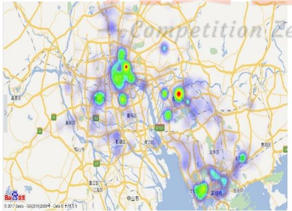
图 22 原项目需要的行动力分布

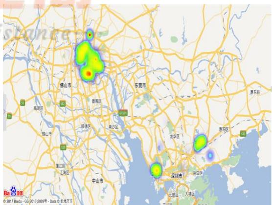
图 23 新项目需要的行动力分布

如图所示，我们发现东莞为的行动力饱和区，广州为行动力消耗饱和区。若仍由之前的模型，只考虑任务由最近城市的用户来完成，是不合理的，必须考虑行动力的流通，即行动力饱和区的用户来完成行动力消耗饱和区的任务。

我们为了区分什么样的任务应面向什么样的用户，引入了以下描述任务和用户匹配程度的变量：

1. 对于一个任务而言，不同用户的完成能力。

我们知道距离越近的用户，完成能力越强。按照经验区分，信誉积分越高的用户，完成能力越强。

2. 对于一个用户而言，不同任务的吸引力。

距离越近的用户，吸引力越强。信誉积分越高的用户，越是能抽出整块时间做任务，任务距离对于他的吸引力的影响越不显著

此外，完成能力和吸引力之间、不同任务、用户之间又有相互影响：

1、对于这个任务的完成能力，用 f表示，相比较于完成其他任务越高，则这个任务对于用户的吸引力越强，或者说，用户的能力越是狭隘的局限于这个或几个任务，这个任务对用户的吸引力越大。

2、受其他任务吸引越少的用户，完成能力越强。因为用户面临的选择越少，他们就越可能去完成这个任务。

根据上述性质与关系，我们可以得到两个变量量化后的如下关系：

$$
\mathrm { f } _ { i j } = \frac { c _ { i j } } { \sum _ { i = 0 } ^ { n } c _ { i j } } \cdot \frac { 1 } { 1 + 1 0 u d _ { i j } ^ { 2 } }
$$

$$
c _ { i j } = \frac { \mathrm { f } _ { i j } } { \sum _ { i = 0 } ^ { n } \mathrm { f } _ { i j } } \cdot \frac { 1 } { 1 + 1 0 u d _ { i j } ^ { 2 } }
$$

我们利用 MATLAB 将用户按城市聚类，则根据结果，我们可以画出各个任务完成能力最大的用户分别从属于哪个城市：

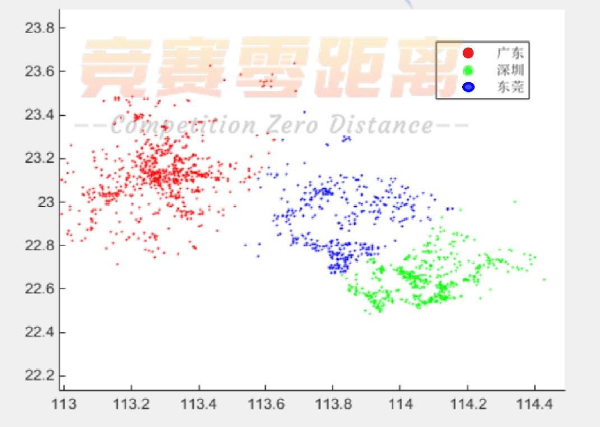
图24 用户所属城市区分图

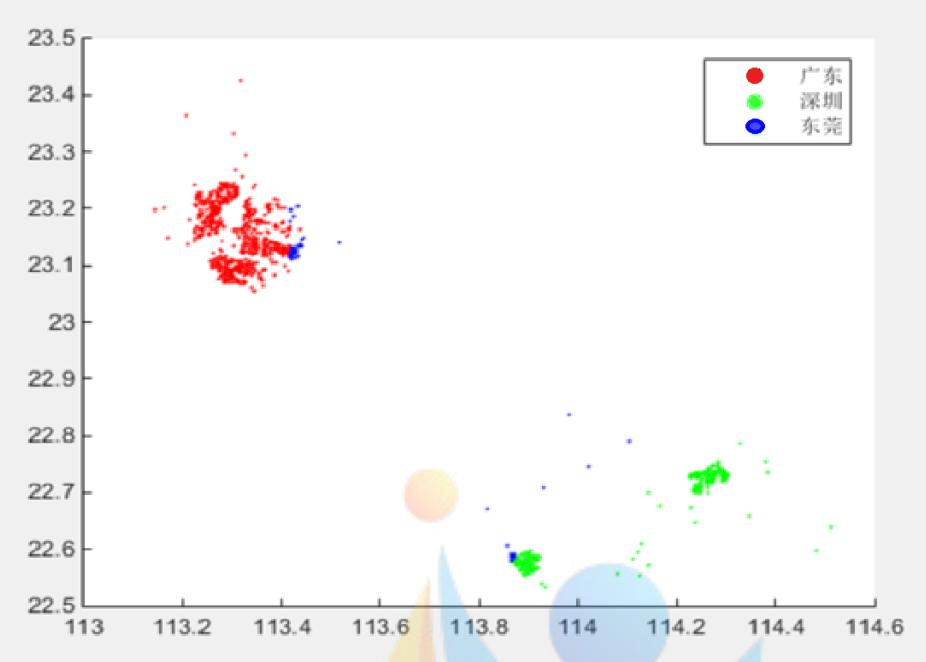
图 25 新项目各个任务完成能力最大用户所属城市

从图中，我们发现，由于广州、深圳行动力消耗饱和，东莞行动力饱和，导致广州、深圳部分靠近东莞的任务更可能被东莞用户完成，而不是当地用户。根据这一结论，为了更好的组织行动力，提高效率，在行动力饱和的广州、深圳，应适当考虑面向远道而来的东莞用户。

我们具体方法是，将东莞用户完成能力更高的任务视为需要消耗大量移动行动力的任务，尽管它们可能距离广州、深圳很近。通过这种办法，提高东莞用户来做任务的效率，吸引东莞用户前来，提高完成率。

我们用 MATLAB 依照 5.3 中的模型进行打包，部分结果如下，全部分类结果及序号对应的任务点，见支撑文件：

表 6新项目的部分打包情况
<table><tr><td colspan="1" rowspan="1">编号</td><td colspan="13" rowspan="1">三上日序号 X</td></tr><tr><td colspan="1" rowspan="1">1</td><td colspan="1" rowspan="1">3</td><td colspan="1" rowspan="1">2</td><td colspan="1" rowspan="1">40</td><td colspan="1" rowspan="1"></td><td colspan="1" rowspan="1">1</td><td colspan="1" rowspan="1">1</td><td colspan="1" rowspan="1"></td><td colspan="1" rowspan="1">LE</td><td colspan="1" rowspan="1">G</td><td colspan="1" rowspan="1"></td><td colspan="1" rowspan="1"></td><td colspan="1" rowspan="1"></td><td colspan="1" rowspan="1"></td></tr><tr><td colspan="1" rowspan="1">2</td><td colspan="1" rowspan="1">516</td><td colspan="1" rowspan="1">9</td><td colspan="1" rowspan="1">12</td><td colspan="1" rowspan="1">10</td><td colspan="1" rowspan="1">515</td><td colspan="1" rowspan="1">14</td><td colspan="1" rowspan="1">517</td><td colspan="1" rowspan="1"></td><td colspan="1" rowspan="1"></td><td colspan="1" rowspan="1"></td><td colspan="1" rowspan="1"></td><td colspan="1" rowspan="1"></td><td colspan="1" rowspan="1"></td></tr><tr><td colspan="1" rowspan="1">3</td><td colspan="1" rowspan="1">865</td><td colspan="1" rowspan="1">794</td><td colspan="1" rowspan="1">795</td><td colspan="1" rowspan="1">799</td><td colspan="1" rowspan="1">LCtl</td><td colspan="1" rowspan="1">n 7</td><td colspan="1" rowspan="1"></td><td colspan="1" rowspan="1">13tu</td><td colspan="1" rowspan="1">nce</td><td colspan="1" rowspan="1"></td><td colspan="1" rowspan="1"></td><td colspan="1" rowspan="1"></td><td colspan="1" rowspan="1"></td></tr><tr><td colspan="1" rowspan="1">4</td><td colspan="1" rowspan="1">994</td><td colspan="1" rowspan="1">478</td><td colspan="1" rowspan="1">482</td><td colspan="1" rowspan="1">989</td><td colspan="1" rowspan="1">481</td><td colspan="1" rowspan="1">889</td><td colspan="1" rowspan="1">214</td><td colspan="1" rowspan="1">892</td><td colspan="1" rowspan="1">213</td><td colspan="1" rowspan="1">215</td><td colspan="1" rowspan="1">321</td><td colspan="1" rowspan="1">248</td><td colspan="1" rowspan="1">757</td></tr><tr><td colspan="1" rowspan="1">5</td><td colspan="1" rowspan="1">613</td><td colspan="1" rowspan="1">60</td><td colspan="1" rowspan="1">61</td><td colspan="1" rowspan="1">603</td><td colspan="1" rowspan="1"></td><td colspan="1" rowspan="1"></td><td colspan="1" rowspan="1"></td><td colspan="1" rowspan="1"></td><td colspan="1" rowspan="1"></td><td colspan="1" rowspan="1"></td><td colspan="1" rowspan="1"></td><td colspan="1" rowspan="1"></td><td colspan="1" rowspan="1"></td></tr><tr><td colspan="1" rowspan="1">6</td><td colspan="1" rowspan="1">798</td><td colspan="1" rowspan="1">774</td><td colspan="1" rowspan="1">796</td><td colspan="1" rowspan="1">282</td><td colspan="1" rowspan="1">278</td><td colspan="1" rowspan="1">285</td><td colspan="1" rowspan="1">286</td><td colspan="1" rowspan="1">351</td><td colspan="1" rowspan="1">801</td><td colspan="1" rowspan="1"></td><td colspan="1" rowspan="1"></td><td colspan="1" rowspan="1"></td><td colspan="1" rowspan="1"></td></tr><tr><td colspan="1" rowspan="1">7</td><td colspan="1" rowspan="1">615</td><td colspan="1" rowspan="1">81</td><td colspan="1" rowspan="1">71</td><td colspan="1" rowspan="1"></td><td colspan="1" rowspan="1"></td><td colspan="1" rowspan="1"></td><td colspan="1" rowspan="1"></td><td colspan="1" rowspan="1"></td><td colspan="1" rowspan="1"></td><td colspan="1" rowspan="1"></td><td colspan="1" rowspan="1"></td><td colspan="1" rowspan="1"></td><td colspan="1" rowspan="1"></td></tr><tr><td colspan="1" rowspan="1">8</td><td colspan="1" rowspan="1">193</td><td colspan="1" rowspan="1">107</td><td colspan="1" rowspan="1"></td><td colspan="1" rowspan="1"></td><td colspan="1" rowspan="1"></td><td colspan="1" rowspan="1"></td><td colspan="1" rowspan="1"></td><td colspan="1" rowspan="1"></td><td colspan="1" rowspan="1"></td><td colspan="1" rowspan="1"></td><td colspan="1" rowspan="1"></td><td colspan="1" rowspan="1"></td><td colspan="1" rowspan="1"></td></tr><tr><td colspan="1" rowspan="1">9</td><td colspan="1" rowspan="1">38</td><td colspan="1" rowspan="1">26</td><td colspan="1" rowspan="1"></td><td colspan="1" rowspan="1"></td><td colspan="1" rowspan="1"></td><td colspan="1" rowspan="1"></td><td colspan="1" rowspan="1"></td><td colspan="1" rowspan="1"></td><td colspan="1" rowspan="1"></td><td colspan="1" rowspan="1"></td><td colspan="1" rowspan="1"></td><td colspan="1" rowspan="1"></td><td colspan="1" rowspan="1"></td></tr><tr><td colspan="1" rowspan="1">10</td><td colspan="1" rowspan="1">450</td><td colspan="1" rowspan="1">369</td><td colspan="1" rowspan="1">464</td><td colspan="1" rowspan="1">209</td><td colspan="1" rowspan="1"></td><td colspan="1" rowspan="1"></td><td colspan="1" rowspan="1"></td><td colspan="1" rowspan="1"></td><td colspan="1" rowspan="1"></td><td colspan="1" rowspan="1"></td><td colspan="1" rowspan="1"></td><td colspan="1" rowspan="1"></td><td colspan="1" rowspan="1"></td></tr><tr><td colspan="1" rowspan="1">11</td><td colspan="1" rowspan="1">934</td><td colspan="1" rowspan="1">911</td><td colspan="1" rowspan="1">470</td><td colspan="1" rowspan="1">762</td><td colspan="1" rowspan="1"></td><td colspan="1" rowspan="1"></td><td colspan="1" rowspan="1"></td><td colspan="1" rowspan="1"></td><td colspan="1" rowspan="1"></td><td colspan="1" rowspan="1"></td><td colspan="1" rowspan="1"></td><td colspan="1" rowspan="1"></td><td colspan="1" rowspan="1"></td></tr><tr><td colspan="1" rowspan="1">12</td><td colspan="1" rowspan="1">803</td><td colspan="1" rowspan="1">793</td><td colspan="1" rowspan="1"></td><td colspan="1" rowspan="1"></td><td colspan="1" rowspan="1"></td><td colspan="1" rowspan="1"></td><td colspan="1" rowspan="1"></td><td colspan="1" rowspan="1"></td><td colspan="1" rowspan="1"></td><td colspan="1" rowspan="1"></td><td colspan="1" rowspan="1"></td><td colspan="1" rowspan="1"></td><td colspan="1" rowspan="1"></td></tr><tr><td colspan="1" rowspan="1">13</td><td colspan="1" rowspan="1">546</td><td colspan="1" rowspan="1">545</td><td colspan="1" rowspan="1">522</td><td colspan="1" rowspan="1">592</td><td colspan="1" rowspan="1">20</td><td colspan="1" rowspan="1"></td><td colspan="1" rowspan="1"></td><td colspan="1" rowspan="1"></td><td colspan="1" rowspan="1"></td><td colspan="1" rowspan="1"></td><td colspan="1" rowspan="1"></td><td colspan="1" rowspan="1"></td><td colspan="1" rowspan="1"></td></tr><tr><td colspan="1" rowspan="1">14</td><td colspan="1" rowspan="1">584</td><td colspan="1" rowspan="1">41</td><td colspan="1" rowspan="1"></td><td colspan="1" rowspan="1"></td><td colspan="1" rowspan="1"></td><td colspan="1" rowspan="1"></td><td colspan="1" rowspan="1"></td><td colspan="1" rowspan="1"></td><td colspan="1" rowspan="1"></td><td colspan="1" rowspan="1"></td><td colspan="1" rowspan="1"></td><td colspan="1" rowspan="1"></td><td colspan="1" rowspan="1"></td></tr><tr><td colspan="1" rowspan="1">15</td><td colspan="1" rowspan="1">691</td><td colspan="1" rowspan="1">681</td><td colspan="1" rowspan="1">181</td><td colspan="1" rowspan="1"></td><td colspan="1" rowspan="1"></td><td colspan="1" rowspan="1"></td><td colspan="1" rowspan="1"></td><td colspan="1" rowspan="1"></td><td colspan="1" rowspan="1"></td><td colspan="1" rowspan="1"></td><td colspan="1" rowspan="1"></td><td colspan="1" rowspan="1"></td><td colspan="1" rowspan="1"></td></tr></table>

然后我们根据5.2 的模型确定了这些包的最佳定价，部分打的包的定价如下，第一类定价见附录4.3，其他分类中包的价格见支撑材料：

表 6新项目的第一类部分任务的定价
<table><tr><td rowspan=1 colspan=1>打包编号</td><td rowspan=1 colspan=1>定价</td><td rowspan=1 colspan=1>未打包编号</td><td rowspan=1 colspan=1>定价</td></tr><tr><td rowspan=1 colspan=1>包1</td><td rowspan=1 colspan=1>54.79007</td><td rowspan=1 colspan=1>6</td><td rowspan=1 colspan=1>54.79007</td></tr><tr><td rowspan=1 colspan=1>包2</td><td rowspan=1 colspan=1>49.08227</td><td rowspan=1 colspan=1>7</td><td rowspan=1 colspan=1>49.08227</td></tr><tr><td rowspan=1 colspan=1>包3</td><td rowspan=1 colspan=1>48.69057</td><td rowspan=1 colspan=1>8</td><td rowspan=1 colspan=1>48.69057</td></tr><tr><td rowspan=1 colspan=1>包4</td><td rowspan=1 colspan=1>52.09483</td><td rowspan=1 colspan=1>11</td><td rowspan=1 colspan=1>52.09483</td></tr><tr><td rowspan=1 colspan=1>包5</td><td rowspan=1 colspan=1>49.23526</td><td rowspan=1 colspan=1>15</td><td rowspan=1 colspan=1>49.23526</td></tr><tr><td rowspan=1 colspan=1>包6</td><td rowspan=1 colspan=1>54.34172</td><td rowspan=1 colspan=1>17</td><td rowspan=1 colspan=1>54.34172</td></tr><tr><td rowspan=1 colspan=1>包7</td><td rowspan=1 colspan=1>51.58704</td><td rowspan=1 colspan=1>22</td><td rowspan=1 colspan=1>51.58704</td></tr><tr><td rowspan=1 colspan=1>包8</td><td rowspan=1 colspan=1>49.69754</td><td rowspan=1 colspan=1>23</td><td rowspan=1 colspan=1>49.69754</td></tr><tr><td rowspan=1 colspan=1>包9</td><td rowspan=1 colspan=1>55.06218</td><td rowspan=1 colspan=1>33</td><td rowspan=1 colspan=1>55.06218</td></tr><tr><td rowspan=1 colspan=1>包10</td><td rowspan=1 colspan=1>56.50805</td><td rowspan=1 colspan=1>34</td><td rowspan=1 colspan=1>56.50805</td></tr><tr><td rowspan=1 colspan=1>包11</td><td rowspan=1 colspan=1>43.32998</td><td rowspan=1 colspan=1>35</td><td rowspan=1 colspan=1>43.32998</td></tr><tr><td rowspan=1 colspan=1>包12</td><td rowspan=1 colspan=1>45.4059</td><td rowspan=1 colspan=1>43</td><td rowspan=1 colspan=1>45.4059</td></tr><tr><td rowspan=1 colspan=1>包13</td><td rowspan=1 colspan=1>53.5996</td><td rowspan=1 colspan=1>1    45</td><td rowspan=1 colspan=1>53.5996</td></tr><tr><td rowspan=1 colspan=1>包14</td><td rowspan=1 colspan=1>54.59533</td><td rowspan=1 colspan=1>48</td><td rowspan=1 colspan=1>54.59533</td></tr><tr><td rowspan=1 colspan=1>包15</td><td rowspan=1 colspan=1>55.94745</td><td rowspan=1 colspan=1>49</td><td rowspan=1 colspan=1>55.94745</td></tr></table>

## 六、模型的评价

## 6.1、模型的优点

（1）我们建立了公司收益期望与任务定价价格之间的函数关系，并用图表的形式表现了出来，很直观，能准确地确定最佳的任务定价价格

（2）我们引入了任务对人的吸引力以及任务地点具有的活跃度两个概念，创新性地用这两个参数来确定该点任务被完成的概率，新颖且合理

（3）我们从会员完成任务的消耗引入了行动力这一概念，从而很好地量化了会员完成任务的实际情况，较为合理地给出了打包模型

（4）采用聚类的分析方法找到了繁杂数据中存在的规律，发现结果与现实的社会特征拟合的较好，反映了实际情况

## 6.2、模型的缺点

（1）模型在求任务定价价格与任务完成率的关系时，运算过程极为的复杂，增加了实际操作的难度

（2）实际问题中，对于任务点位置的分析还应该考虑位置点到主干道的距离，即考虑交通带来的影响

（3）由于缺少数据，模型没有对会员的年龄、性别、收入等因素对完成任务的影响进行考虑。

## 七、参考文献

[1] 姜启源 谢金星 叶俊，《数学模型（第三版）》，高等教育出版社，2003.8.

[2] “互联网+”时代的出租车资源配置，2015 年数模国赛优秀论文.

[3]CSDN 博客 ACdreamers ISODATA 算法，

http://blog.csdn.net/acdreamers/article/details/44663975 .

[4]陈名娇.基于微博数据的深圳市居民生活空间研究[D].深圳大学,2017

[5]刘云刚，苏海宇（中山大学）.基于社会地图的东莞市社会空间研究[J].地理学报,2016,第 71 卷(8): 1283-1301

[6] 蒋小荣，汪胜兰，杨永春（兰州大学）.中国城市人口流动网络研究——基于百度LBS大数据分析[J].人口与发展,2017,第 23 卷(1): 13-23

## 附录

## 附录 1 问题（1）主要代码

附录1.1 回归分析求方程系数

clear; close all;clc;

x=csvread('beforehalf.txt');

datanum=size(x,1);

D=[22.6107, 113.927;

23.124, 113.2424;

22.9732, 113.7467;

22.7238, 114.1524;

];%四个聚类中心

A1=zeros(4,1);

p=csvread('beforehalfprice.txt'); %价格矩阵

```html
d=zeros([datanum,1]);%距离矩阵
pcount=zeros(datanum,1);
for i=1:datanum
for n=1:4
A1(n,1)=sqrt((x(i,1)-D(n,1))^2+(x(i,2)-D(n,2))^2);
end
d(i,1)=min(A1);
end
d1=[ones(datanum,1),d];
[b,bint,r,rint,stats]=regress(p,d1,0.05);
for i=1:datanum
pcount(i,1)=d(i,1)*b(2,1)+b(1,1);
end
附录1.3 画密度图的脚本
<!DOCTYPE html>
<html>
<head>
<meta http-equiv="Content-Type" content="text/html; charset=utf-8" />
<meta name="viewport" content="initial-scale=1.0, user-scalable=no" />
<script type="text/javascript" src="http://api.map.baidu.com/api?v=2.0&ak=您的密
钥"></script>
<script type="text/javascript"
src="http://api.map.baidu.com/library/Heatmap/2.0/src/Heatmap_min.js"></script>
<title>热力图功能示例</title>
<style type="text/css">
ul,li{list-style: none;margin:0;padding:0;float:left;}
html{height:100%}
body{height:100%;margin:0px;padding:0px;font-family:"微软雅黑";}
#container{height:500px;width:100%;}
#r-result{width:100%;}
</style>
</head>
<body>
<div id="container"></div>
<div id="r-result">
<input type="button" onclick="openHeatmap();" value="显示热力图"/><input
type="button" onclick="closeHeatmap();" value="关闭热力图"/>
</div>
</body>
</html>
<script type="text/javascript">
```

```javascript
var map = new BMap.Map("container"); // 创建地图实例
var point = new BMap.Point( 113.679983, 22.947097);
map.centerAndZoom(point, 11); 初始化地图，设置中心点坐标
和地图级别
map.enableScrollWheelZoom(); // 允许滚轮缩放
var points =[
{"lng": 经度,"lat":纬度 ,"count":序号},
];
if(!isSupportCanvas()){
alert('热力图目前只支持有 canvas 支持的浏览器,您所使用的浏览器不能使
用热力图功能~')
}
// 详 细 的 参 数 , 可 以 查 看 heatmap.js 的 文 档
https://github.com/pa7/heatmap.js/blob/master/README.md
//参数说明如下:
/* visible 热力图是否显示,默认为 true
* opacity 热力的透明度,1-100
* radius 势力图的每个点的半径大小
* gradient {JSON} 热力图的渐变区间 . gradient 如下所示
* {
.2:'rgb(0, 255, 255)',
.5:'rgb(0, 110, 255)',
.8:'rgb(100, 0, 255)'
}
其中 key 表示插值的位置, 0~1.
value 为颜色值.
*/
heatmapOverlay = new BMapLib.HeatmapOverlay({"radius":20});
map.addOverlay(heatmapOverlay);
heatmapOverlay.setDataSet({data:points,max:200});
//是否显示热力图
function openHeatmap(){
heatmapOverlay.show();
}
function closeHeatmap(){
heatmapOverlay.hide();
}
closeHeatmap();
function setGradient(){
/*格式如下所示:
```

```javascript
{
0:'rgb(102, 255, 0)',
.5:'rgb(255, 170, 0)',
1:'rgb(255, 0, 0)'
}*/
var gradient = {};
var colors = document.querySelectorAll("input[type='color']");
colors = [].slice.call(colors,0);
colors.forEach(function(ele){
gradient[ele.getAttribute("data-key")] = ele.value;
});
heatmapOverlay.setOptions({"gradient":gradient});
}
//判断浏览区是否支持canvas
function isSupportCanvas(){
var elem = document.createElement('canvas');
return !!(elem.getContext && elem.getContext('2d'));
}
</script>
附录 2 问题二主要代码
附录2.1 各地区活跃度指标函数
m=0;
gate=0.0001;
flag=0;
for i=1:1876
for j=1:m
if ((user_infor(i,1)-k(j,2))^2+(user_infor(i,2)-k(j,3))^2)<gate
flag=1;
k(j,2)=(log(user_infor(i,3))*user_infor(i,1)+k(j,1)*k(j,2))/(log(user_infor(i,3))+k(j,1));
k(j,3)=(log(user_infor(i,3))*user_infor(i,2)+k(j,1)*k(j,3))/(log(user_infor(i,3))+k(j,1));
k(j,1)=k(j,1)+log(user_infor(i,3)+1);
break
end
end
if flag==1
flag=0;
continue
end
m=m+1;
k(m,1)=log(user_infor(i,3)+1);
k(m,2)=user_infor(i,1);
```

```matlab
k(m,3)=user_infor(i,2);
end
N=@(m)(1/(1+(1-0.001)/0.001*(m+1)^(-2)));
for i=1:1876
user_infor(i,4)=N(user_infor(i,3));
end
function [g]=acti(lat,lng)
g=0;
ra=1000;
k=evalin('base','k');
[row,~]=size(k);
for i=1:row
g=g+ra*k(i,1)*exp(200*(-(lat-k(i,2))^2-(lng-k(i,3))^2));
end
g;
g=g/10^3+1;
y=22:0.01:24;
x=112.6:0.01:114.6;
[Y,X]=meshgrid(y,x);
for i=1:201
for j=1:201
z(i,j)=acti(y(i),x(j));
end
end
mesh(X,Y,z)
title('活跃度指标函数的分布');
x1=xlabel('经度');
x2=ylabel('纬度');
x3=zlabel('活跃度指标');
附录2.2 公司收益与定价函数关系
f=@(s)(1/(1+1/PoCom(27.5,109.01,s)));
g=@(m)(f(m)*(150-m));
figure
fplot(g,[1,100],0.1)
title('(27.5,109.01)处的任务价格和收益期望的关系');
xlabel('任务价格');
ylabel('收益期望');
l=@(s)(1/(1+1/PoCom(23,113.8,s)));
q=@(m)(l(m)*(150-m));
figure
fplot(q,[1,100],0.1)
```

```matlab
title('(23.00,113.80)处的任务价格和收益期望的关系');
xlabel('任务价格');
ylabel('收益期望');
figure
fplot(f,[1,100],0.1)
title('(27.5,109.01))处的任务价格和任务被完成概率的关系');
xlabel('任务价格');
ylabel('完成概率');
figure
fplot(l,[1,100],0.1)
title('(23.00,113.80)处的任务价格和任务被完成概率的关系');
xlabel('任务价格');
ylabel('完成概率');
```

```matlab
function [p]=PoCom(lat,lng,s)
k=0.5;
gate=0.001;
m=150;
%R=(-s/m*log(gate/k))^(1/2);
R=1.5767;
syms a
%root=solve(['(-log(13*exp(-a^2)-12))^(1/2)=',num2str(R/s*m)],a);
root=0.28291817326180982704289519397144;
r1=double(root(1)*s/m);
r1=(r1^2)^(1/2);
r2=(-log(5*exp(-r1^2-4)))^(1/2);
r3=R;
c=@(lat0,lng0)(k*exp(-(lat0-lat)^2-(lng0-lng)^2)/s*m);
p=s/m*k*(1-exp(-r1^2/s*m))*2*pi*(acti(lat,lng)...
+acti(lat+(r1+r2)/2,lng)+acti(lat,lng+(r1+r2)/2)+acti(lat-(r1+r2)/2,lng)+acti(lat,lng-
(r1+r2)/2)...
+acti(lat+(r3+r2)/2,lng)+acti(lat,lng+(r2+r3)/2)+acti(lat-(r2+r3)/2,lng)+acti(lat,lng-
(r2+r3)/2)...
+acti(lat+(r3+r2)/2^1.5,lng+(r3+r2)/2^1.5)+acti(lat-
(r3+r2)/2^1.5,lng+(r3+r2)/2^1.5)...
+acti(lat+(r3+r2)/2^1.5,lng-(r3+r2)/2^1.5)+acti(lat-(r3+r2)/2^1.5,lng-
(r3+r2)/2^1.5));
```

## 附录 3 问题三主要代码

```matlab
附录3.1 打包算法的主体代码
% means=[22.6107, 113.927;
% 23.124, 113.2424;
% 22.9732, 113.7467;
% 23.0271, 113.1287;
```

```matlab
% ];%四个城市聚类中心
means=[23.1585691454010,113.320688468191;
22.6560986482226,114.098545112926];
city_num=size(means,1);
dist=zeros(datanum,city_num);
for i=1:datanum;
for j=1:city_num;
dist(i,j)=sqrt((x(i,1)-means(j,1))^2+(x(i,2)-means(j,2))^2);
end
end
[Y, U]=min(dist');%U 返回 dist 最小值所在行，即分类；Y 返回最小距离；
cindex=U';%每一个点所属的类别
distTomeans=Y';%每一个点到所属类的中心的距离
c1=1;c2=1;c3=1;c4=1;
for i=1:datanum;
switch cindex(i)
case 1
classBycity(c1,:,1)=x(i,:);
distInclass(c1,:,1)=distTomeans(i,:);%distInclass 为每一类的距离
c1=c1+1;
case 2
classBycity(c2,:,2)=x(i,:);
distInclass(c2,:,2)=distTomeans(i,:);
c2=c2+1;
case 3
classBycity(c3,:,3)=x(i,:);
distInclass(c3,:,3)=distTomeans(i,:);<sub>c3=c3+1;case</sub> <sub>4</sub>
classBycity(c4,:,4)=x(i,:);
distInclass(c4,:,4)=distTomeans(i,:);
c4=c4+1;
end
end
%% 将每一类中按距离分为两部分
for n=1:city_num
dmax(n,:)=max(distInclass(:,1,n));
dmin(n,:)=min(distInclass(:,1,n));
%t(n)=(dmin(n,:)+dmax(n,:))/2;
t(n)=7*dmax(n,:)/12;
B=(distInclass~=0);
```

```matlab
classsize(n)=sum(B(:,:,n));
n1(n,1)=0;n2(n,1)=0;
for i=1:classsize(n)
if distInclass(i,1,n)<t(n)
n1(n)=n1(n)+1;
classIncity1(n1(n),:,n)=classBycity(i,:,n);
else n2(n)=n2(n)+1;
classIncity2(n2(n),:,n)=classBycity(i,:,n);
end
end
end
for i=1:n1(1)
for j=1:2
class1city1(i,j)=classIncity1(i,j,1);
end
end
for i=1:n1(2)
for j=1:2
class1city2(i,j)=classIncity1(i,j,2);
end
end
if city_num>3
for i=1:n1(3)
for j=1:2
class1city3(i,j)=classIncity1(i,j,3);
end
end
end
if city_num>4
for i=1:n1(4)
for j=1:2
class1city4(i,j)=classIncity1(i,j,4);
end
end
end
for i=1:n2(1)
for j=1:2
class2city1(i,j)=classIncity2(i,j,1);
end
```

% [class11, E11, F11]=clusterIn(class1city1,25);[class21, E21,

```matlab
end
for i=1:n2(2)
for j=1:2
class2city2(i,j)=classIncity2(i,j,2);
end
end
if city_num>3
for i=1:n2(3)
for j=1:2
class2city3(i,j)=classIncity2(i,j,3);
end
end
end
if city_num>4
for i=1:n2(4)
for j=1:2
class2city4(i,j)=classIncity2(i,j,4);
end
end
end
%% 方法一
%根据最近邻法打包 调用函数pa
index11=pac(40,'class1city1');
%index21=pac(10,'class2city1');
% index12=pac(6,'class1city2');
%index22=pac(12,'class2city2');
%index13=pac(6,'class1city3');
%index23=pac(10,'class2city3');
%index14= pac(6,'class1city4');
%index24=pac(10,'class2city4');
```

## %% 方法二

```matlab
% rect=[0,0,1024,600];
% figure('Position',rect);
% title('四类');
% for j=1:classsize(1)
% plot(classBycity(j,2,1),classBycity(j,1,1),'yx');
% set(gca,'xlim',[112.8,114.5]);
% hold on
% end
% for j=1:classsize(2)
% plot(classBycity(:,2,2),classBycity(:,1,2),'ms');
% set(gca,'xlim',[112.8,114.5]);
% end
% for j=1:classsize(3)
% plot(classBycity(:,2,3),classBycity(:,1,3),'cd');
% set(gca,'xlim',[112.8,114.5]);
% end
% for j=1:classsize(4)
% plot(classBycity(:,2,4),classBycity(:,1,4),'rv');
% set(gca,'xlim',[112.8,114.5]);
% end
% plot(means(:,2),means(:,1),'kp');
% hold off
%
%
%
% locat=[113.7,114.5;
% 113.0,113.7;
% 113.4,114.3;
% 112.8,113.4;];
% plottu(1,E11,E21,F11,F21,class11,class21,classsize(1),classBycity,locat(1,:));
% plottu(2,E12,E22,F12,F22,class12,class22,classsize(2),classBycity,locat(2,:));
% plottu(3,E13,E23,F13,F23,class13,class23,classsize(3),classBycity,locat(3,:));
% plottu(4,E14,E24,F14,F24,class14,class24,classsize(4),classBycity,locat(4,:));
```

## 附录3.2 主体代码中方法一的函数

```matlab
function [index]=pac(kn,fun)
rect=[0,0,1024,600];
figure('Position',rect);
scou=evalin('base',fun);
[mn,~]=size(scou);
d=zeros(mn);
index=zeros(mn,kn);
rindex=zeros(mn);
k=0;
```

```matlab
l=0;
gate=0.02;
for j=1:mn
for i=j+1:mn
d(i,j)=((scou(i,1)-scou(j,1))^2+(scou(i,2)-scou(j,2))^2);
end
end
m=0;
c=0;
te=zeros(2,100);
scatter(scou(1:mn,2),scou(1:mn,1))
for i=1:mn
text(scou(i,2),scou(i,1),num2str(i))
end
for t=1:1000
jj=[];
ii=[];
dmin=100;
for j=1:mn
for i=j+1:mn
if rindex(i,j)
continue
end
if dmin>d(i,j)
dmin=d(i,j);
k=i;
l=j;
end
end
end
if dmin>0.00
break
end
[ii,~]=find(index==k);
[jj,~]=find(index==l);
if isempty(ii)
if isempty(jj)
c=c+1;
index(c,1)=k;
index(c,2)=l;
line([scou(k,2),scou(l,2)],[scou(k,1),scou(l,1)])
te(:,t)=[k,l];
else
```

```julia
pp=find(index(jj,:)==0);
if ~isempty(pp)
index(jj,pp(1))=k;
line([scou(k,2),scou(l,2)],[scou(k,1),scou(l,1)])
te(:,t)=[k,l];
end
end
else
if isempty(jj)
pp=find(index(ii,:)==0);
if ~isempty(pp)
index(ii,pp(1))=l;
line([scou(k,2),scou(l,2)],[scou(k,1),scou(l,1)])
te(:,t)=[k,l];
end
else
a=find(index(ii,:)==0);
b=find(index(jj,:)==0);
if ~(isempty(a)||isempty(b)||ii==jj)
[~,rowb]=size(b);
if ii==10&&jj==1
end
if rowb-a(1)+1>0
for bb=1:6-rowb
index(ii,a(bb))=index(jj,bb);
end
index(jj,:)=index(c,:);
index(c,:)=zeros(1,kn);
c=c-1;
line([scou(k,2),scou(l,2)],[scou(k,1),scou(l,1)])
end
end
end
end
rindex(k,l)=1;
```

## end

附录3.3 主体代码中方法二的函数一

function [class E F]=clusterIn(classcity,sizeofclass)

[E, F]=kmeans(classcity,sizeofclass);
ncount=zeros(sizeofclass,1);

```matlab
for i=1:size(classcity,1)
for n=1:sizeofclass
if E(i)==n
ncount(n)=ncount(n)+1;
class(ncount(n),:,E(i))=classcity(i,:);
end
end
end
附录3.4 主体代码中方法二的函数
function plottu(k,E11,E21,F11,F21,class11,class21,classsize,classBycity,locat)
rect=[0,0,1024,600];
figure('Position',rect);
title('k');
plot(classBycity(1:classsize,2,k),classBycity(1:classsize,1,k),'go');
set(gca,'xlim',locat);
hold on
plot(F11(:,2),F11(:,1),'b+');
plot(F21(:,2),F21(:,1),'c+');
for i=1:size(class11,3)
for j=1:size(class11,1)
if class11(j,1,i)~=0
plot(class11(j,2,i),class11(j,1,i),'ko');
end
end
end
X=zeros(2);
for j=1:size(class11,3
X(2)=class11(1,2,j);
Y(2)=class11(1,1,j);
for i=2:size(class11,1)
if class11(i,2,j)~=0 && class11(i,1,j)~=0
X(1)=X(2);
X(2)=class11(i,2,j);
Y(1)=Y(2);
Y(2)=class11(i,1,j);
line(X,Y);
end
end
end
```

```matlab
for i=1:size(class21,3)
for j=1:size(class21,1)
if class21(j,1,i)~=0
plot(class21(j,2,i),class21(j,1,i),'ro');
end
end
end
X=zeros(2);
Y=zeros(2);
for j=1:size(class21,3)
X(2)=class21(1,2,j);
Y(2)=class21(1,1,j);
for i=2:size(class21,1)
if class21(i,2,j)~=0 && class21(i,1,j)~=0
X(1)=X(2);
X(2)=class21(i,2,j);
Y(1)=Y(2);
Y(2)=class21(i,1,j);
line(X,Y);
end
end
end
hold off
end
附录3.5 收益与价格关系代码
n=6;
f=@(s)(1/(1+1/PoCom(y(114),x(71),s)));%最大值点<sub>g=@(m)(n*f(m)*(150-m));</sub> g=@(m)(n*f(m)*(150-m));
figure
fplot(g,[1,100])
title('在活跃度较大的地点不打包多任务总任务价格和总收益期望的关系');
xlabel('任务价格');
ylabel('收益期望');
figure
fplot(f,[1,100])
title('在活跃度较大的地点不打包多任务总任务价格和任务被完成概率的关系');
xlabel('任务价格');
ylabel('完成概率');
f=@(s)(1/(1+1/PoCom(y(114),x(71),n*s)));%最大值点 打包
```

```matlab
g=@(m)(f(m)*n*(150-m));
figure
fplot(g,[1,100])
title('在活跃度较大的地点打包后多任务总任务价格和总收益期望的关系');
xlabel('任务价格');
ylabel('收益期望');
figure
fplot(f,[1,100])
title('在活跃度较大的地点打包后多任务总任务价格和任务被完成概率的关系');
xlabel('任务价格');
ylabel('完成概率');
f=@(s)(1/(1+1/PoCom(y(95),x(43),s)));%中间值
g=@(m)(n*f(m)*(150-m));
figure
fplot(g,[1,100])
title('在活跃度中等的地点不打包多任务总任务价格和总收益期望的关系');
xlabel('任务价格');
ylabel('收益期望');
figure
fplot(f,[1,100])
title('在活跃度较中等地点不打包多任务总任务价格和任务被完成概率的关系');
xlabel('任务价格');
ylabel('完成概率');
f=@(s)(1/(1+1/PoCom(y(95),x(43),n*s)));%中间值 打包
g=@(m)(f(m)*n*(150-m));
figure
fplot(g,[1,100])
title('在活跃度中等的地点打包后多任务总任务价格和总收益期望的关系');
xlabel('任务价格');
ylabel('收益期望');
figure
fplot(f,[1,100])
title('在活跃度中等的地点打包后多任务总任务价格和任务被完成概率的关系');
xlabel('任务价格');
ylabel('完成概率');
f=@(s)(1/(1+1/PoCom(y(1),x(1),s)));%最低值
g=@(m)(n*f(m)*(150-m));
figure
fplot(g,[1,100])
title('在活跃度较低的地点不打包多任务总任务价格和总收益期望的关系');
xlabel('任务价格');
```

```matlab
ylabel('收益期望');
figure
fplot(f,[1,100])
title('在活跃度较低的地点不打包多任务总任务价格和任务被完成概率的关系');
xlabel('任务价格');
ylabel('完成概率');
f=@(s)(1/(1+1/PoCom(y(1),x(1),n*s)));%最低值 打包
g=@(m)(f(m)*n*(150-m));
figure
fplot(g,[1,100])
title('在活跃度较低的地点打包后多任务总任务价格和总收益期望的关系');
xlabel('任务价格');
ylabel('收益期望');
figure
fplot(f,[1,100])
title('在活跃度较低的地点打包后多任务总任务价格和任务被完成概率的关系');
xlabel('任务价格');
ylabel('完成概率');
用到的函数为
function [p]=PoCom(lat,lng,s)
k=0.5;
gate=0.001;
m=150;
%R=(-s/m*log(gate/k))^(1/2);
R=1.5767;
syms a
%root=solve(['(-log(13*exp(-a^2)-12))^(1/2)=',num2str(R/s*m)],a);
r1=double(root(1)*s/m);<sub>r1=(r1^2)^(1/2);</sub>
r2=(-log(5*exp(-r1^2-4)))^(1/2);
r3=R;
c=@(lat0,lng0)(k*exp(-(lat0-lat)^2-(lng0-lng)^2)/s*m);
p=s/m*k*(1-exp(-r1^2/s*m))*2*pi*(acti(lat,lng)...
+acti(lat+(r1+r2)/2,lng)+acti(lat,lng+(r1+r2)/2)+acti(lat-(r1+r2)/2,lng)+acti(lat,lng-
(r1+r2)/2)...
+acti(lat+(r3+r2)/2,lng)+acti(lat,lng+(r2+r3)/2)+acti(lat-(r2+r3)/2,lng)+acti(lat,lng-
(r2+r3)/2)...
+acti(lat+(r3+r2)/2^1.5,lng+(r3+r2)/2^1.5)+acti(lat-(r3+r2)/2^1.5,lng+(r3+r2)/2^1.5)
+acti(lat+(r3+r2)/2^1.5,lng-(r3+r2)/2^1.5)+acti(lat-(r3+r2)/2^1.5,lng-(r3+r2)/2^1.5))
```

## 附录 4 问题（4）主要代码

```matlab
附录4.1 计算吸引力与完成能力
% dmu=zeros(2066,1876);
Ga=0.5;
AFF=@(d)(1/(1+10*uf*d));
% for j=1:1876
% for i=1:2066
% temp=(miss_posi2(i,1)-user_infor(j,1))^2+(miss_posi2(i,2)-user_infor(j,2))^2;
% if temp<Ga
% dmu(i,j)=(1/(1+10*user_infor(j,4)*temp));
% else
% dmu(i,j)=-1;
% end
% end
% end
MU=ones(2066,1876,5);
UM=ones(2066,1876,5);
for l=2:5
for i=1:2066
su=0;
for j=1:1876
if dmu(i,j)~=-1
su=su+user_infor(j,4)*(dmu(i,j));
end
end
for j=1:1876
if dmu(i,j)~=-1
MU(i,j,l)=UM(i,j,l-1)*(dmu(i,j))/su;
else
end MU(i,j,l)=0;
end
end
for j=1:1876
su=0;
for i=1:2066
if dmu(i,j)~=-1
su=su+MU(i,j,l)*(dmu(i,j));
end
end
for i=1:2066
if dmu(i,j)~=-1
UM(i,j,l)=MU(i,j,l)*(dmu(i,j))/su;
else
```

```matlab
UM(i,j,l)=0;
end
end
end
end
附录4.2 画图程序
%
% hold on
% for i=1:2066
% [~,t]=max(MU(i,:,5));
% switch A(t)
% case 1
% scatter(miss_posi2(i,2),miss_posi2(i,1),1,'r')
% case 2
% scatter(miss_posi2(i,2),miss_posi2(i,1),1,'y')
% case 3
% scatter(miss_posi2(i,2),miss_posi2(i,1),1,'g')
% case 4
% scatter(miss_posi2(i,2),miss_posi2(i,1),1,'b')
% end
% end
% hold off
figure
hold on
for i=1:1876
switch A(i)
case 1
scatter(temp(i,2),temp(i,1),1,'r')
<sup>case</sup> <sup>2</sup>scatter(temp(i,2),temp(i,1),1,'k')
case 3
scatter(temp(i,2),temp(i,1),1,'g')
case 4
scatter(temp(i,2),temp(i,1),1,'b')
end
end
hold off
附录4.2 寻找不同任务完成能力最大的用户所在城市
points=zeros(2066,2,3);
count=zeros(1,3);
for i=1:2066
[~,t]=max(MU(i,:,5));
```

```matlab
switch A(t)
case 1
count(1)=count(1)+1;
points(count(1),:,1)=miss_posi2(i,:);
case 2
continue
case 3
count(2)=count(2)+1;
points(count(2),:,2)=miss_posi2(i,:);
case 4
count(3)=count(3)+1;
points(count(3),:,3)=miss_posi2(i,:);
end
```

end

附录4.3 第一类定价结果

<table><tr><td colspan="1" rowspan="1">第一类</td><td colspan="1" rowspan="1">定价/任务</td><td colspan="1" rowspan="1">任务个数</td><td colspan="1" rowspan="1">未打包编号</td><td colspan="1" rowspan="1">定价</td><td colspan="1" rowspan="1">个数</td></tr><tr><td colspan="1" rowspan="1">包1</td><td colspan="1" rowspan="1">27.9903924</td><td colspan="1" rowspan="1">3</td><td colspan="1" rowspan="1">6</td><td colspan="1" rowspan="1">54.79</td><td colspan="1" rowspan="1">1</td></tr><tr><td colspan="1" rowspan="1">包2</td><td colspan="1" rowspan="1">21.3416037</td><td colspan="1" rowspan="1">7</td><td colspan="1" rowspan="1">7</td><td colspan="1" rowspan="1">49.08</td><td colspan="1" rowspan="1">1</td></tr><tr><td colspan="1" rowspan="1">包3</td><td colspan="1" rowspan="1">27.1608516</td><td colspan="1" rowspan="1">4</td><td colspan="1" rowspan="1">8</td><td colspan="1" rowspan="1">48.69</td><td colspan="1" rowspan="1">1</td></tr><tr><td colspan="1" rowspan="1">包4</td><td colspan="1" rowspan="1">27.4346897</td><td colspan="1" rowspan="1">13</td><td colspan="1" rowspan="1">11</td><td colspan="1" rowspan="1">52.09</td><td colspan="1" rowspan="1">1</td></tr><tr><td colspan="1" rowspan="1">包5</td><td colspan="1" rowspan="1">24.6783241</td><td colspan="1" rowspan="1">4</td><td colspan="1" rowspan="1">15</td><td colspan="1" rowspan="1">49.24</td><td colspan="1" rowspan="1">1</td></tr><tr><td colspan="1" rowspan="1">包6</td><td colspan="1" rowspan="1">28.1703784</td><td colspan="1" rowspan="1">9</td><td colspan="1" rowspan="1">17</td><td colspan="1" rowspan="1">54.34</td><td colspan="1" rowspan="1">1</td></tr><tr><td colspan="1" rowspan="1">包7</td><td colspan="1" rowspan="1">27.4938471</td><td colspan="1" rowspan="1">3</td><td colspan="1" rowspan="1">22</td><td colspan="1" rowspan="1">51.59</td><td colspan="1" rowspan="1">1</td></tr><tr><td colspan="1" rowspan="1">包8</td><td colspan="1" rowspan="1">25.5875997</td><td colspan="1" rowspan="1">2</td><td colspan="1" rowspan="1">23</td><td colspan="1" rowspan="1">49.7</td><td colspan="1" rowspan="1">1</td></tr><tr><td colspan="1" rowspan="1">包9</td><td colspan="1" rowspan="1">20.7362023</td><td colspan="1" rowspan="1">2</td><td colspan="1" rowspan="1">33</td><td colspan="1" rowspan="1">55.06</td><td colspan="1" rowspan="1">1</td></tr><tr><td colspan="1" rowspan="1">包10</td><td colspan="1" rowspan="1">29.6328321</td><td colspan="1" rowspan="1">4</td><td colspan="1" rowspan="1">34</td><td colspan="1" rowspan="1">56.51</td><td colspan="1" rowspan="1">1</td></tr><tr><td colspan="1" rowspan="1">包11</td><td colspan="1" rowspan="1">23.1177156</td><td colspan="1" rowspan="1">4</td><td colspan="1" rowspan="1">35</td><td colspan="1" rowspan="1">43.33</td><td colspan="1" rowspan="1">1</td></tr><tr><td colspan="1" rowspan="1">包12</td><td colspan="1" rowspan="1">27.0468728</td><td colspan="1" rowspan="1">2</td><td colspan="1" rowspan="1">43</td><td colspan="1" rowspan="1">45.41</td><td colspan="1" rowspan="1">1</td></tr><tr><td colspan="1" rowspan="1">包13</td><td colspan="1" rowspan="1">26.8320707</td><td colspan="1" rowspan="1">5</td><td colspan="1" rowspan="1">45</td><td colspan="1" rowspan="1">53.6</td><td colspan="1" rowspan="1">1</td></tr><tr><td colspan="1" rowspan="1">包14</td><td colspan="1" rowspan="1">23.2907638</td><td colspan="1" rowspan="1">2</td><td colspan="1" rowspan="1">48</td><td colspan="1" rowspan="1">54.6</td><td colspan="1" rowspan="1">1</td></tr><tr><td colspan="1" rowspan="1">包15</td><td colspan="1" rowspan="1">21.4269664</td><td colspan="1" rowspan="1">3</td><td colspan="1" rowspan="1">49</td><td colspan="1" rowspan="1">55.95</td><td colspan="1" rowspan="1">1</td></tr><tr><td colspan="1" rowspan="1">包16</td><td colspan="1" rowspan="1">20.455109</td><td colspan="1" rowspan="1">ior2Ze</td><td colspan="1" rowspan="1">r050is</td><td colspan="1" rowspan="1">44.22</td><td colspan="1" rowspan="1"></td></tr><tr><td colspan="1" rowspan="1">包17</td><td colspan="1" rowspan="1">24.3371104</td><td colspan="1" rowspan="1">18</td><td colspan="1" rowspan="1">51</td><td colspan="1" rowspan="1">54.9</td><td colspan="1" rowspan="1">1</td></tr><tr><td colspan="1" rowspan="1">包18</td><td colspan="1" rowspan="1">28.2448138</td><td colspan="1" rowspan="1">21</td><td colspan="1" rowspan="1">55</td><td colspan="1" rowspan="1">45.27</td><td colspan="1" rowspan="1">1</td></tr><tr><td colspan="1" rowspan="1">包19</td><td colspan="1" rowspan="1">23.0896417</td><td colspan="1" rowspan="1">3</td><td colspan="1" rowspan="1">56</td><td colspan="1" rowspan="1">46.38</td><td colspan="1" rowspan="1">1</td></tr><tr><td colspan="1" rowspan="1">包20</td><td colspan="1" rowspan="1">25.422729</td><td colspan="1" rowspan="1">2</td><td colspan="1" rowspan="1">57</td><td colspan="1" rowspan="1">53.19</td><td colspan="1" rowspan="1">1</td></tr><tr><td colspan="1" rowspan="1">包21</td><td colspan="1" rowspan="1">20.7456771</td><td colspan="1" rowspan="1">7</td><td colspan="1" rowspan="1">59</td><td colspan="1" rowspan="1">54.26</td><td colspan="1" rowspan="1">1</td></tr><tr><td colspan="1" rowspan="1">包22</td><td colspan="1" rowspan="1">27.0644505</td><td colspan="1" rowspan="1">40</td><td colspan="1" rowspan="1">63</td><td colspan="1" rowspan="1">53.23</td><td colspan="1" rowspan="1">1</td></tr><tr><td colspan="1" rowspan="1">包23</td><td colspan="1" rowspan="1">28.2029752</td><td colspan="1" rowspan="1">2</td><td colspan="1" rowspan="1">65</td><td colspan="1" rowspan="1">56.05</td><td colspan="1" rowspan="1">1</td></tr><tr><td colspan="1" rowspan="1">包24</td><td colspan="1" rowspan="1">28.2464901</td><td colspan="1" rowspan="1">4</td><td colspan="1" rowspan="1">67</td><td colspan="1" rowspan="1">52.21</td><td colspan="1" rowspan="1">1</td></tr><tr><td colspan="1" rowspan="1">包25</td><td colspan="1" rowspan="1">27.0910266</td><td colspan="1" rowspan="1">2</td><td colspan="1" rowspan="1">72</td><td colspan="1" rowspan="1">51.23</td><td colspan="1" rowspan="1">1</td></tr><tr><td colspan="1" rowspan="1">包26</td><td colspan="1" rowspan="1">28.5371189</td><td colspan="1" rowspan="1">2</td><td colspan="1" rowspan="1">75</td><td colspan="1" rowspan="1">50.83</td><td colspan="1" rowspan="1">1</td></tr><tr><td colspan="1" rowspan="1">包27</td><td colspan="1" rowspan="1">24.4759798</td><td colspan="1" rowspan="1">2</td><td colspan="1" rowspan="1">76</td><td colspan="1" rowspan="1">51</td><td colspan="1" rowspan="1">1</td></tr><tr><td colspan="1" rowspan="1">包 28</td><td colspan="1" rowspan="1">21.1007071</td><td colspan="1" rowspan="1">2</td><td colspan="1" rowspan="1">78</td><td colspan="1" rowspan="1">43.34</td><td colspan="1" rowspan="1">1</td></tr><tr><td colspan="1" rowspan="1">包 29</td><td colspan="1" rowspan="1">26.775541</td><td colspan="1" rowspan="1">7</td><td colspan="1" rowspan="1">82</td><td colspan="1" rowspan="1">43.83</td><td colspan="1" rowspan="1">1</td></tr><tr><td colspan="1" rowspan="1">包 30</td><td colspan="1" rowspan="1">22.9702804</td><td colspan="1" rowspan="1">3</td><td colspan="1" rowspan="1">83</td><td colspan="1" rowspan="1">49.52</td><td colspan="1" rowspan="1">1</td></tr><tr><td colspan="1" rowspan="1">包31</td><td colspan="1" rowspan="1">27.4370176</td><td colspan="1" rowspan="1">2</td><td colspan="1" rowspan="1">85</td><td colspan="1" rowspan="1">52.21</td><td colspan="1" rowspan="1">1</td></tr><tr><td colspan="1" rowspan="1">包32</td><td colspan="1" rowspan="1">27.4304315</td><td colspan="1" rowspan="1">2</td><td colspan="1" rowspan="1">89</td><td colspan="1" rowspan="1">55.77</td><td colspan="1" rowspan="1">1</td></tr><tr><td colspan="1" rowspan="1">包33</td><td colspan="1" rowspan="1">24.0533355</td><td colspan="1" rowspan="1">6</td><td colspan="1" rowspan="1">90</td><td colspan="1" rowspan="1">43.85</td><td colspan="1" rowspan="1">1</td></tr><tr><td colspan="1" rowspan="1">包34</td><td colspan="1" rowspan="1">27.8203597</td><td colspan="1" rowspan="1">4</td><td colspan="1" rowspan="1">91</td><td colspan="1" rowspan="1">45.21</td><td colspan="1" rowspan="1">1</td></tr><tr><td colspan="1" rowspan="1">包 35</td><td colspan="1" rowspan="1">20.454391</td><td colspan="1" rowspan="1">10</td><td colspan="1" rowspan="1">92</td><td colspan="1" rowspan="1">44.64</td><td colspan="1" rowspan="1">1</td></tr><tr><td colspan="1" rowspan="1">包36</td><td colspan="1" rowspan="1">20.8407545</td><td colspan="1" rowspan="1">3</td><td colspan="1" rowspan="1">94</td><td colspan="1" rowspan="1">56.44</td><td colspan="1" rowspan="1">1</td></tr><tr><td colspan="1" rowspan="1">包37</td><td colspan="1" rowspan="1">25.5455077</td><td colspan="1" rowspan="1">2</td><td colspan="1" rowspan="1">99</td><td colspan="1" rowspan="1">47.72</td><td colspan="1" rowspan="1">1</td></tr><tr><td colspan="1" rowspan="1">包 38</td><td colspan="1" rowspan="1">22.4053355</td><td colspan="1" rowspan="1">4</td><td colspan="1" rowspan="1">105</td><td colspan="1" rowspan="1">44.71</td><td colspan="1" rowspan="1">1</td></tr><tr><td colspan="1" rowspan="1">包39</td><td colspan="1" rowspan="1">29.8170219</td><td colspan="1" rowspan="1">2</td><td colspan="1" rowspan="1">106</td><td colspan="1" rowspan="1">56.06</td><td colspan="1" rowspan="1">1</td></tr><tr><td colspan="1" rowspan="1">包40</td><td colspan="1" rowspan="1">26.971111</td><td colspan="1" rowspan="1">4</td><td colspan="1" rowspan="1">109</td><td colspan="1" rowspan="1">51.24</td><td colspan="1" rowspan="1">1</td></tr><tr><td colspan="1" rowspan="1">包41</td><td colspan="1" rowspan="1">27.0842319</td><td colspan="1" rowspan="1">3</td><td colspan="1" rowspan="1">110</td><td colspan="1" rowspan="1">56.66</td><td colspan="1" rowspan="1">1</td></tr><tr><td colspan="1" rowspan="1">包42</td><td colspan="1" rowspan="1">21.2712905</td><td colspan="1" rowspan="1">2</td><td colspan="1" rowspan="1">112</td><td colspan="1" rowspan="1">47.63</td><td colspan="1" rowspan="1">1</td></tr><tr><td colspan="1" rowspan="1">包43</td><td colspan="1" rowspan="1">21.2769427</td><td colspan="1" rowspan="1">2</td><td colspan="1" rowspan="1">114</td><td colspan="1" rowspan="1">51.42</td><td colspan="1" rowspan="1">1</td></tr><tr><td colspan="1" rowspan="1">包44</td><td colspan="1" rowspan="1">28.9648911</td><td colspan="1" rowspan="1">2</td><td colspan="1" rowspan="1">115</td><td colspan="1" rowspan="1">43.29</td><td colspan="1" rowspan="1">1</td></tr><tr><td colspan="1" rowspan="1">包45</td><td colspan="1" rowspan="1">21.6105583</td><td colspan="1" rowspan="1">2</td><td colspan="1" rowspan="1">118</td><td colspan="1" rowspan="1">46.77</td><td colspan="1" rowspan="1">1</td></tr><tr><td colspan="1" rowspan="1">包46</td><td colspan="1" rowspan="1">29.8889281</td><td colspan="1" rowspan="1">8</td><td colspan="1" rowspan="1">119</td><td colspan="1" rowspan="1">51.95</td><td colspan="1" rowspan="1">1</td></tr><tr><td colspan="1" rowspan="1">包47</td><td colspan="1" rowspan="1">21.2208254</td><td colspan="1" rowspan="1">4</td><td colspan="1" rowspan="1">120</td><td colspan="1" rowspan="1">55.26</td><td colspan="1" rowspan="1">1</td></tr><tr><td colspan="1" rowspan="1">包48</td><td colspan="1" rowspan="1">27.8219853</td><td colspan="1" rowspan="1">3</td><td colspan="1" rowspan="1">121</td><td colspan="1" rowspan="1">50.69</td><td colspan="1" rowspan="1">1</td></tr><tr><td colspan="1" rowspan="1">包49</td><td colspan="1" rowspan="1">21.692193</td><td colspan="1" rowspan="1">8</td><td colspan="1" rowspan="1">124</td><td colspan="1" rowspan="1">55.14</td><td colspan="1" rowspan="1">1</td></tr><tr><td colspan="1" rowspan="1">包50</td><td colspan="1" rowspan="1">21.3705886</td><td colspan="1" rowspan="1">3</td><td colspan="1" rowspan="1">125</td><td colspan="1" rowspan="1">48.19</td><td colspan="1" rowspan="1">1</td></tr><tr><td colspan="1" rowspan="1">包51</td><td colspan="1" rowspan="1">21.4766525</td><td colspan="1" rowspan="1">2</td><td colspan="1" rowspan="1">127</td><td colspan="1" rowspan="1">55.91</td><td colspan="1" rowspan="1">1</td></tr><tr><td colspan="1" rowspan="1">包52</td><td colspan="1" rowspan="1">28.7383119</td><td colspan="1" rowspan="1">2</td><td colspan="1" rowspan="1">130</td><td colspan="1" rowspan="1">54.08</td><td colspan="1" rowspan="1">1</td></tr><tr><td colspan="1" rowspan="1">包53</td><td colspan="1" rowspan="1">22.2397038</td><td colspan="1" rowspan="1">3</td><td colspan="1" rowspan="1">132</td><td colspan="1" rowspan="1">55.85</td><td colspan="1" rowspan="1">1</td></tr><tr><td colspan="1" rowspan="1">包54</td><td colspan="1" rowspan="1">20.0807329</td><td colspan="1" rowspan="1">2</td><td colspan="1" rowspan="1">133</td><td colspan="1" rowspan="1">53.43</td><td colspan="1" rowspan="1">1</td></tr><tr><td colspan="1" rowspan="1">包55</td><td colspan="1" rowspan="1">21.2788618</td><td colspan="1" rowspan="1">2</td><td colspan="1" rowspan="1">135</td><td colspan="1" rowspan="1">50.93</td><td colspan="1" rowspan="1">1</td></tr><tr><td colspan="1" rowspan="1">包56</td><td colspan="1" rowspan="1">24.0934637</td><td colspan="1" rowspan="1">6</td><td colspan="1" rowspan="1">137</td><td colspan="1" rowspan="1">54.69</td><td colspan="1" rowspan="1">1</td></tr><tr><td colspan="1" rowspan="1">包57</td><td colspan="1" rowspan="1">21.035591</td><td colspan="1" rowspan="1">3</td><td colspan="1" rowspan="1">139</td><td colspan="1" rowspan="1">46.32</td><td colspan="1" rowspan="1">1</td></tr><tr><td colspan="1" rowspan="1">包58</td><td colspan="1" rowspan="1">28.0448298</td><td colspan="1" rowspan="1">2</td><td colspan="1" rowspan="1">140</td><td colspan="1" rowspan="1">46.14</td><td colspan="1" rowspan="1">1</td></tr><tr><td colspan="1" rowspan="1">包59</td><td colspan="1" rowspan="1">28.6635525</td><td colspan="1" rowspan="1">079</td><td colspan="1" rowspan="1">0141</td><td colspan="1" rowspan="1">52.41</td><td colspan="1" rowspan="1">1</td></tr><tr><td colspan="1" rowspan="1">包60</td><td colspan="1" rowspan="1">26.5345674</td><td colspan="1" rowspan="1">2</td><td colspan="1" rowspan="1">142</td><td colspan="1" rowspan="1">52.98</td><td colspan="1" rowspan="1">1</td></tr><tr><td colspan="1" rowspan="1">包61</td><td colspan="1" rowspan="1">23.2073143</td><td colspan="1" rowspan="1">3</td><td colspan="1" rowspan="1">143</td><td colspan="1" rowspan="1">46.58</td><td colspan="1" rowspan="1">1</td></tr><tr><td colspan="1" rowspan="1">包62</td><td colspan="1" rowspan="1">27.4648857</td><td colspan="1" rowspan="1">3</td><td colspan="1" rowspan="1">144</td><td colspan="1" rowspan="1">47.6</td><td colspan="1" rowspan="1">1</td></tr><tr><td colspan="1" rowspan="1">包63</td><td colspan="1" rowspan="1">29.5820823</td><td colspan="1" rowspan="1">3</td><td colspan="1" rowspan="1">145</td><td colspan="1" rowspan="1">45.2</td><td colspan="1" rowspan="1">1</td></tr><tr><td colspan="1" rowspan="1">包64</td><td colspan="1" rowspan="1">20.2233018</td><td colspan="1" rowspan="1">4</td><td colspan="1" rowspan="1">147</td><td colspan="1" rowspan="1">50.67</td><td colspan="1" rowspan="1">1</td></tr><tr><td colspan="1" rowspan="1">包65</td><td colspan="1" rowspan="1">27.4374636</td><td colspan="1" rowspan="1">2</td><td colspan="1" rowspan="1">148</td><td colspan="1" rowspan="1">54.59</td><td colspan="1" rowspan="1">1</td></tr><tr><td colspan="1" rowspan="1">包66</td><td colspan="1" rowspan="1">22.2382868</td><td colspan="1" rowspan="1">6</td><td colspan="1" rowspan="1">149</td><td colspan="1" rowspan="1">46.83</td><td colspan="1" rowspan="1">1</td></tr><tr><td colspan="1" rowspan="1">包67</td><td colspan="1" rowspan="1">25.4971965</td><td colspan="1" rowspan="1">4</td><td colspan="1" rowspan="1">152</td><td colspan="1" rowspan="1">47.35</td><td colspan="1" rowspan="1">1</td></tr><tr><td colspan="1" rowspan="1">包 68</td><td colspan="1" rowspan="1">28.5037906</td><td colspan="1" rowspan="1">3</td><td colspan="1" rowspan="1">153</td><td colspan="1" rowspan="1">51.4</td><td colspan="1" rowspan="1">1</td></tr><tr><td colspan="1" rowspan="1">包69</td><td colspan="1" rowspan="1">21.9173297</td><td colspan="1" rowspan="1">3</td><td colspan="1" rowspan="1">154</td><td colspan="1" rowspan="1">46.23</td><td colspan="1" rowspan="1">1</td></tr><tr><td colspan="1" rowspan="1">包70</td><td colspan="1" rowspan="1">23.2451015</td><td colspan="1" rowspan="1">4</td><td colspan="1" rowspan="1">155</td><td colspan="1" rowspan="1">47.92</td><td colspan="1" rowspan="1">1</td></tr><tr><td colspan="1" rowspan="1">包71</td><td colspan="1" rowspan="1">22.8011567</td><td colspan="1" rowspan="1">8</td><td colspan="1" rowspan="1">157</td><td colspan="1" rowspan="1">53.51</td><td colspan="1" rowspan="1">1</td></tr><tr><td colspan="1" rowspan="1">包72</td><td colspan="1" rowspan="1">21.1601635</td><td colspan="1" rowspan="1">2</td><td colspan="1" rowspan="1">163</td><td colspan="1" rowspan="1">55.12</td><td colspan="1" rowspan="1">1</td></tr><tr><td colspan="1" rowspan="1">包73</td><td colspan="1" rowspan="1">26.3659369</td><td colspan="1" rowspan="1">2</td><td colspan="1" rowspan="1">179</td><td colspan="1" rowspan="1">54.94</td><td colspan="1" rowspan="1">1</td></tr><tr><td colspan="1" rowspan="1">包74</td><td colspan="1" rowspan="1">22.8089521</td><td colspan="1" rowspan="1">3</td><td colspan="1" rowspan="1">189</td><td colspan="1" rowspan="1">56.09</td><td colspan="1" rowspan="1">1</td></tr><tr><td colspan="1" rowspan="1">包75</td><td colspan="1" rowspan="1">26.9794373</td><td colspan="1" rowspan="1">6</td><td colspan="1" rowspan="1">190</td><td colspan="1" rowspan="1">50.79</td><td colspan="1" rowspan="1">1</td></tr><tr><td colspan="1" rowspan="1">包76</td><td colspan="1" rowspan="1">24.2534093</td><td colspan="1" rowspan="1">2</td><td colspan="1" rowspan="1">191</td><td colspan="1" rowspan="1">50.21</td><td colspan="1" rowspan="1">1</td></tr><tr><td colspan="1" rowspan="1">包77</td><td colspan="1" rowspan="1">29.9237192</td><td colspan="1" rowspan="1">2</td><td colspan="1" rowspan="1">196</td><td colspan="1" rowspan="1">45.99</td><td colspan="1" rowspan="1">1</td></tr><tr><td colspan="1" rowspan="1">包78</td><td colspan="1" rowspan="1">26.668791</td><td colspan="1" rowspan="1">2</td><td colspan="1" rowspan="1">197</td><td colspan="1" rowspan="1">51.84</td><td colspan="1" rowspan="1">1</td></tr><tr><td colspan="1" rowspan="1">包79</td><td colspan="1" rowspan="1">26.8125148</td><td colspan="1" rowspan="1">3</td><td colspan="1" rowspan="1">198</td><td colspan="1" rowspan="1">53.96</td><td colspan="1" rowspan="1">1</td></tr><tr><td colspan="1" rowspan="1">包 80</td><td colspan="1" rowspan="1">28.400445</td><td colspan="1" rowspan="1">2</td><td colspan="1" rowspan="1">199</td><td colspan="1" rowspan="1">47.02</td><td colspan="1" rowspan="1">1</td></tr><tr><td colspan="1" rowspan="1">包81</td><td colspan="1" rowspan="1">23.6814154</td><td colspan="1" rowspan="1">6</td><td colspan="1" rowspan="1">200</td><td colspan="1" rowspan="1">46.93</td><td colspan="1" rowspan="1">1</td></tr><tr><td colspan="1" rowspan="1">包82</td><td colspan="1" rowspan="1">22.3376788</td><td colspan="1" rowspan="1">3</td><td colspan="1" rowspan="1">201</td><td colspan="1" rowspan="1">50.67</td><td colspan="1" rowspan="1">1</td></tr><tr><td colspan="1" rowspan="1">包 83</td><td colspan="1" rowspan="1">27.036886</td><td colspan="1" rowspan="1">5</td><td colspan="1" rowspan="1">202</td><td colspan="1" rowspan="1">48.63</td><td colspan="1" rowspan="1">1</td></tr><tr><td colspan="1" rowspan="1">包84</td><td colspan="1" rowspan="1">24.8761632</td><td colspan="1" rowspan="1">5</td><td colspan="1" rowspan="1">203</td><td colspan="1" rowspan="1">56.16</td><td colspan="1" rowspan="1">1</td></tr><tr><td colspan="1" rowspan="1">包 85</td><td colspan="1" rowspan="1">24.9212322</td><td colspan="1" rowspan="1">12</td><td colspan="1" rowspan="1">205</td><td colspan="1" rowspan="1">49.47</td><td colspan="1" rowspan="1">1</td></tr><tr><td colspan="1" rowspan="1">包86</td><td colspan="1" rowspan="1">20.6964895</td><td colspan="1" rowspan="1">2</td><td colspan="1" rowspan="1">206</td><td colspan="1" rowspan="1">54.57</td><td colspan="1" rowspan="1">1</td></tr><tr><td colspan="1" rowspan="1">包 87</td><td colspan="1" rowspan="1">24.1668656</td><td colspan="1" rowspan="1">12</td><td colspan="1" rowspan="1">208</td><td colspan="1" rowspan="1">49.53</td><td colspan="1" rowspan="1">1</td></tr><tr><td colspan="1" rowspan="1">包88</td><td colspan="1" rowspan="1">22.1696696</td><td colspan="1" rowspan="1">2</td><td colspan="1" rowspan="1">212</td><td colspan="1" rowspan="1">49.5</td><td colspan="1" rowspan="1">1</td></tr><tr><td colspan="1" rowspan="1">包89</td><td colspan="1" rowspan="1">29.3032056</td><td colspan="1" rowspan="1">3</td><td colspan="1" rowspan="1">221</td><td colspan="1" rowspan="1">44.15</td><td colspan="1" rowspan="1">1</td></tr><tr><td colspan="1" rowspan="1">包90</td><td colspan="1" rowspan="1">24.6345234</td><td colspan="1" rowspan="1">2</td><td colspan="1" rowspan="1">222</td><td colspan="1" rowspan="1">52.38</td><td colspan="1" rowspan="1">1</td></tr><tr><td colspan="1" rowspan="1">包91</td><td colspan="1" rowspan="1">24.1578852</td><td colspan="1" rowspan="1">6</td><td colspan="1" rowspan="1">223</td><td colspan="1" rowspan="1">43.85</td><td colspan="1" rowspan="1">1</td></tr><tr><td colspan="1" rowspan="1">包92</td><td colspan="1" rowspan="1">25.2146179</td><td colspan="1" rowspan="1">9</td><td colspan="1" rowspan="1">225</td><td colspan="1" rowspan="1">50.94</td><td colspan="1" rowspan="1">1</td></tr><tr><td colspan="1" rowspan="1">包93</td><td colspan="1" rowspan="1">29.7518678</td><td colspan="1" rowspan="1">3</td><td colspan="1" rowspan="1">226</td><td colspan="1" rowspan="1">56.86</td><td colspan="1" rowspan="1">1</td></tr><tr><td colspan="1" rowspan="1">包94</td><td colspan="1" rowspan="1">21.6862856</td><td colspan="1" rowspan="1">4</td><td colspan="1" rowspan="1">230</td><td colspan="1" rowspan="1">47.96</td><td colspan="1" rowspan="1">1</td></tr><tr><td colspan="1" rowspan="1">包 95</td><td colspan="1" rowspan="1">28.5957661</td><td colspan="1" rowspan="1">4</td><td colspan="1" rowspan="1">231</td><td colspan="1" rowspan="1">46.17</td><td colspan="1" rowspan="1">1</td></tr><tr><td colspan="1" rowspan="1">包96</td><td colspan="1" rowspan="1">21.22787</td><td colspan="1" rowspan="1">3</td><td colspan="1" rowspan="1">232</td><td colspan="1" rowspan="1">52.3</td><td colspan="1" rowspan="1">1</td></tr><tr><td colspan="1" rowspan="1">包 97</td><td colspan="1" rowspan="1">27.1716832</td><td colspan="1" rowspan="1">4</td><td colspan="1" rowspan="1">235</td><td colspan="1" rowspan="1">43.79</td><td colspan="1" rowspan="1">1</td></tr><tr><td colspan="1" rowspan="1">包98</td><td colspan="1" rowspan="1">27.5180205</td><td colspan="1" rowspan="1">4</td><td colspan="1" rowspan="1">236</td><td colspan="1" rowspan="1">47.99</td><td colspan="1" rowspan="1">1</td></tr><tr><td colspan="1" rowspan="1">包99</td><td colspan="1" rowspan="1">28.6684586</td><td colspan="1" rowspan="1">3</td><td colspan="1" rowspan="1">240</td><td colspan="1" rowspan="1">49.09</td><td colspan="1" rowspan="1">1</td></tr><tr><td colspan="1" rowspan="1">包100</td><td colspan="1" rowspan="1">23.7357368</td><td colspan="1" rowspan="1">4</td><td colspan="1" rowspan="1">241</td><td colspan="1" rowspan="1">48.69</td><td colspan="1" rowspan="1">1</td></tr><tr><td colspan="1" rowspan="1">包101</td><td colspan="1" rowspan="1">27.3308561</td><td colspan="1" rowspan="1">3</td><td colspan="1" rowspan="1">242</td><td colspan="1" rowspan="1">44.74</td><td colspan="1" rowspan="1">1</td></tr><tr><td colspan="1" rowspan="1">包102</td><td colspan="1" rowspan="1">20.0741263</td><td colspan="1" rowspan="1">1013∠e</td><td colspan="1" rowspan="1">245</td><td colspan="1" rowspan="1">48.91</td><td colspan="1" rowspan="1">1</td></tr><tr><td colspan="1" rowspan="1">包103</td><td colspan="1" rowspan="1">23.4792686</td><td colspan="1" rowspan="1">18</td><td colspan="1" rowspan="1">246</td><td colspan="1" rowspan="1">48.44</td><td colspan="1" rowspan="1">1</td></tr><tr><td colspan="1" rowspan="1">包104</td><td colspan="1" rowspan="1">28.9437812</td><td colspan="1" rowspan="1">4</td><td colspan="1" rowspan="1">247</td><td colspan="1" rowspan="1">54.05</td><td colspan="1" rowspan="1">1</td></tr><tr><td colspan="1" rowspan="1">包105</td><td colspan="1" rowspan="1">24.7905118</td><td colspan="1" rowspan="1">2</td><td colspan="1" rowspan="1">249</td><td colspan="1" rowspan="1">53.64</td><td colspan="1" rowspan="1">1</td></tr><tr><td colspan="1" rowspan="1">包106</td><td colspan="1" rowspan="1">23.710912</td><td colspan="1" rowspan="1">20</td><td colspan="1" rowspan="1">250</td><td colspan="1" rowspan="1">46.07</td><td colspan="1" rowspan="1">1</td></tr><tr><td colspan="1" rowspan="1">包107</td><td colspan="1" rowspan="1">20.9088528</td><td colspan="1" rowspan="1">4</td><td colspan="1" rowspan="1">253</td><td colspan="1" rowspan="1">53.18</td><td colspan="1" rowspan="1">1</td></tr><tr><td colspan="1" rowspan="1">包108</td><td colspan="1" rowspan="1">25.2671388</td><td colspan="1" rowspan="1">16</td><td colspan="1" rowspan="1">256</td><td colspan="1" rowspan="1">44.77</td><td colspan="1" rowspan="1">1</td></tr><tr><td colspan="1" rowspan="1">包109</td><td colspan="1" rowspan="1">27.1670294</td><td colspan="1" rowspan="1">2</td><td colspan="1" rowspan="1">258</td><td colspan="1" rowspan="1">44.45</td><td colspan="1" rowspan="1">1</td></tr><tr><td colspan="1" rowspan="1">包110</td><td colspan="1" rowspan="1">23.0637035</td><td colspan="1" rowspan="1">8</td><td colspan="1" rowspan="1">264</td><td colspan="1" rowspan="1">50.34</td><td colspan="1" rowspan="1">1</td></tr><tr><td colspan="1" rowspan="1">包111</td><td colspan="1" rowspan="1">22.6945245</td><td colspan="1" rowspan="1">2</td><td colspan="1" rowspan="1">267</td><td colspan="1" rowspan="1">44.83</td><td colspan="1" rowspan="1">1</td></tr><tr><td colspan="1" rowspan="1">包112</td><td colspan="1" rowspan="1">23.2957121</td><td colspan="1" rowspan="1">7</td><td colspan="1" rowspan="1">268</td><td colspan="1" rowspan="1">52.51</td><td colspan="1" rowspan="1">1</td></tr><tr><td colspan="1" rowspan="1">包113</td><td colspan="1" rowspan="1">22.5688161</td><td colspan="1" rowspan="1">13</td><td colspan="1" rowspan="1">272</td><td colspan="1" rowspan="1">52.77</td><td colspan="1" rowspan="1">1</td></tr><tr><td colspan="1" rowspan="1">包114</td><td colspan="1" rowspan="1">25.8095194</td><td colspan="1" rowspan="1">4</td><td colspan="1" rowspan="1">274</td><td colspan="1" rowspan="1">52.57</td><td colspan="1" rowspan="1">1</td></tr><tr><td colspan="1" rowspan="1">包115</td><td colspan="1" rowspan="1">29.1610843</td><td colspan="1" rowspan="1">2</td><td colspan="1" rowspan="1">280</td><td colspan="1" rowspan="1">49.22</td><td colspan="1" rowspan="1">1</td></tr><tr><td colspan="1" rowspan="1">包116</td><td colspan="1" rowspan="1">23.4544028</td><td colspan="1" rowspan="1">2</td><td colspan="1" rowspan="1">281</td><td colspan="1" rowspan="1">45.36</td><td colspan="1" rowspan="1">1</td></tr><tr><td colspan="1" rowspan="1">包117</td><td colspan="1" rowspan="1">21.6010059</td><td colspan="1" rowspan="1">2</td><td colspan="1" rowspan="1">283</td><td colspan="1" rowspan="1">55.92</td><td colspan="1" rowspan="1">1</td></tr><tr><td colspan="1" rowspan="1">包118</td><td colspan="1" rowspan="1">23.7227625</td><td colspan="1" rowspan="1">4</td><td colspan="1" rowspan="1">284</td><td colspan="1" rowspan="1">52.81</td><td colspan="1" rowspan="1">1</td></tr><tr><td colspan="1" rowspan="1">包119</td><td colspan="1" rowspan="1">23.6164986</td><td colspan="1" rowspan="1">3</td><td colspan="1" rowspan="1">288</td><td colspan="1" rowspan="1">55.05</td><td colspan="1" rowspan="1">1</td></tr><tr><td colspan="1" rowspan="1">包120</td><td colspan="1" rowspan="1">23.4712767</td><td colspan="1" rowspan="1">4</td><td colspan="1" rowspan="1">290</td><td colspan="1" rowspan="1">43.57</td><td colspan="1" rowspan="1">1</td></tr><tr><td colspan="1" rowspan="1">包121</td><td colspan="1" rowspan="1">21.4238216</td><td colspan="1" rowspan="1">7</td><td colspan="1" rowspan="1">291</td><td colspan="1" rowspan="1">43.64</td><td colspan="1" rowspan="1">1</td></tr><tr><td colspan="1" rowspan="1">包122</td><td colspan="1" rowspan="1">28.6818878</td><td colspan="1" rowspan="1">2</td><td colspan="1" rowspan="1">293</td><td colspan="1" rowspan="1">51.92</td><td colspan="1" rowspan="1">1</td></tr><tr><td colspan="1" rowspan="1">包123</td><td colspan="1" rowspan="1">22.871832</td><td colspan="1" rowspan="1">4</td><td colspan="1" rowspan="1">294</td><td colspan="1" rowspan="1">45.13</td><td colspan="1" rowspan="1">1</td></tr><tr><td colspan="1" rowspan="1">包124</td><td colspan="1" rowspan="1">22.8134724</td><td colspan="1" rowspan="1">2</td><td colspan="1" rowspan="1">296</td><td colspan="1" rowspan="1">48.45</td><td colspan="1" rowspan="1">1</td></tr><tr><td colspan="1" rowspan="1">包125</td><td colspan="1" rowspan="1">29.7732779</td><td colspan="1" rowspan="1">5</td><td colspan="1" rowspan="1">300</td><td colspan="1" rowspan="1">49.65</td><td colspan="1" rowspan="1">1</td></tr><tr><td colspan="1" rowspan="1">包126</td><td colspan="1" rowspan="1">28.3002043</td><td colspan="1" rowspan="1">2</td><td colspan="1" rowspan="1">301</td><td colspan="1" rowspan="1">43.87</td><td colspan="1" rowspan="1">1</td></tr><tr><td colspan="1" rowspan="1">包127</td><td colspan="1" rowspan="1">22.7237611</td><td colspan="1" rowspan="1">4</td><td colspan="1" rowspan="1">303</td><td colspan="1" rowspan="1">52.03</td><td colspan="1" rowspan="1">d 1</td></tr><tr><td colspan="1" rowspan="1">包128</td><td colspan="1" rowspan="1">26.4924358</td><td colspan="1" rowspan="1">2</td><td colspan="1" rowspan="1">304</td><td colspan="1" rowspan="1">46.13</td><td colspan="1" rowspan="1">1</td></tr><tr><td colspan="1" rowspan="1">包129</td><td colspan="1" rowspan="1">24.2225982</td><td colspan="1" rowspan="1">13</td><td colspan="1" rowspan="1">305</td><td colspan="1" rowspan="1">52.63</td><td colspan="1" rowspan="1">1</td></tr><tr><td colspan="1" rowspan="1">包130</td><td colspan="1" rowspan="1">20.2442434</td><td colspan="1" rowspan="1">10</td><td colspan="1" rowspan="1">306</td><td colspan="1" rowspan="1">44.93</td><td colspan="1" rowspan="1">1</td></tr><tr><td colspan="1" rowspan="1">包131</td><td colspan="1" rowspan="1">27.3011875</td><td colspan="1" rowspan="1">5</td><td colspan="1" rowspan="1">307</td><td colspan="1" rowspan="1">54.62</td><td colspan="1" rowspan="1">1</td></tr><tr><td colspan="1" rowspan="1">包132</td><td colspan="1" rowspan="1">29.3045016</td><td colspan="1" rowspan="1">2</td><td colspan="1" rowspan="1">308</td><td colspan="1" rowspan="1">52.97</td><td colspan="1" rowspan="1">1</td></tr><tr><td colspan="1" rowspan="1">包133</td><td colspan="1" rowspan="1">25.3452556</td><td colspan="1" rowspan="1">2</td><td colspan="1" rowspan="1">311</td><td colspan="1" rowspan="1">49.95</td><td colspan="1" rowspan="1">1</td></tr></table>

<table><tr><td colspan="1" rowspan="1">322</td><td colspan="1" rowspan="1">52.03602</td><td colspan="1" rowspan="1">1</td><td colspan="1" rowspan="1">654</td><td colspan="1" rowspan="1">46.32202</td><td colspan="1" rowspan="1">1</td></tr><tr><td colspan="1" rowspan="1">325</td><td colspan="1" rowspan="1">49.53261</td><td colspan="1" rowspan="1">1</td><td colspan="1" rowspan="1">655</td><td colspan="1" rowspan="1">53.15091</td><td colspan="1" rowspan="1">1</td></tr><tr><td colspan="1" rowspan="1">329</td><td colspan="1" rowspan="1">51.52624</td><td colspan="1" rowspan="1">1</td><td colspan="1" rowspan="1">660</td><td colspan="1" rowspan="1">44.46183</td><td colspan="1" rowspan="1">1</td></tr><tr><td colspan="1" rowspan="1">330</td><td colspan="1" rowspan="1">53.95205</td><td colspan="1" rowspan="1">1</td><td colspan="1" rowspan="1">662</td><td colspan="1" rowspan="1">48.59098</td><td colspan="1" rowspan="1">1</td></tr><tr><td colspan="1" rowspan="1">331</td><td colspan="1" rowspan="1">55.94606</td><td colspan="1" rowspan="1">1</td><td colspan="1" rowspan="1">663</td><td colspan="1" rowspan="1">43.50943</td><td colspan="1" rowspan="1">1</td></tr><tr><td colspan="1" rowspan="1">334</td><td colspan="1" rowspan="1">46.33412</td><td colspan="1" rowspan="1">1</td><td colspan="1" rowspan="1">666</td><td colspan="1" rowspan="1">47.61738</td><td colspan="1" rowspan="1">1</td></tr><tr><td colspan="1" rowspan="1">335</td><td colspan="1" rowspan="1">43.11321</td><td colspan="1" rowspan="1">三1 日</td><td colspan="1" rowspan="1">二668</td><td colspan="1" rowspan="1">43.28356</td><td colspan="1" rowspan="1">11</td></tr><tr><td colspan="1" rowspan="1">337</td><td colspan="1" rowspan="1">54.26194</td><td colspan="1" rowspan="1">1</td><td colspan="1" rowspan="1">672</td><td colspan="1" rowspan="1">53.93217</td><td colspan="1" rowspan="1">11</td></tr><tr><td colspan="1" rowspan="1">341</td><td colspan="1" rowspan="1">46.2421</td><td colspan="1" rowspan="1">1</td><td colspan="1" rowspan="1">673</td><td colspan="1" rowspan="1">52.69836</td><td colspan="1" rowspan="1">1</td></tr><tr><td colspan="1" rowspan="1">350</td><td colspan="1" rowspan="1">47.75887</td><td colspan="1" rowspan="1">itlqn</td><td colspan="1" rowspan="1">674</td><td colspan="1" rowspan="1">53.74189</td><td colspan="1" rowspan="1">1</td></tr><tr><td colspan="1" rowspan="1">353</td><td colspan="1" rowspan="1">56.28831</td><td colspan="1" rowspan="1">1</td><td colspan="1" rowspan="1">678</td><td colspan="1" rowspan="1">44.51878</td><td colspan="1" rowspan="1">1</td></tr><tr><td colspan="1" rowspan="1">355</td><td colspan="1" rowspan="1">45.37491</td><td colspan="1" rowspan="1">1</td><td colspan="1" rowspan="1">680</td><td colspan="1" rowspan="1">55.62501</td><td colspan="1" rowspan="1">1</td></tr><tr><td colspan="1" rowspan="1">359</td><td colspan="1" rowspan="1">44.93353</td><td colspan="1" rowspan="1">1</td><td colspan="1" rowspan="1">688</td><td colspan="1" rowspan="1">45.82616</td><td colspan="1" rowspan="1">1</td></tr><tr><td colspan="1" rowspan="1">360</td><td colspan="1" rowspan="1">48.06919</td><td colspan="1" rowspan="1">1</td><td colspan="1" rowspan="1">693</td><td colspan="1" rowspan="1">51.90966</td><td colspan="1" rowspan="1">1</td></tr><tr><td colspan="1" rowspan="1">362</td><td colspan="1" rowspan="1">48.75331</td><td colspan="1" rowspan="1">1</td><td colspan="1" rowspan="1">694</td><td colspan="1" rowspan="1">50.76726</td><td colspan="1" rowspan="1">1</td></tr><tr><td colspan="1" rowspan="1">365</td><td colspan="1" rowspan="1">52.96899</td><td colspan="1" rowspan="1">1</td><td colspan="1" rowspan="1">697</td><td colspan="1" rowspan="1">48.37146</td><td colspan="1" rowspan="1">1</td></tr><tr><td colspan="1" rowspan="1">366</td><td colspan="1" rowspan="1">53.53355</td><td colspan="1" rowspan="1">1</td><td colspan="1" rowspan="1">701</td><td colspan="1" rowspan="1">48.68222</td><td colspan="1" rowspan="1">1</td></tr><tr><td colspan="1" rowspan="1">371</td><td colspan="1" rowspan="1">47.40483</td><td colspan="1" rowspan="1">1</td><td colspan="1" rowspan="1">704</td><td colspan="1" rowspan="1">48.45798</td><td colspan="1" rowspan="1">1</td></tr><tr><td colspan="1" rowspan="1">372</td><td colspan="1" rowspan="1">43.44729</td><td colspan="1" rowspan="1">1</td><td colspan="1" rowspan="1">705</td><td colspan="1" rowspan="1">53.29794</td><td colspan="1" rowspan="1">1</td></tr><tr><td colspan="1" rowspan="1">374</td><td colspan="1" rowspan="1">44.20594</td><td colspan="1" rowspan="1">1</td><td colspan="1" rowspan="1">710</td><td colspan="1" rowspan="1">48.58015</td><td colspan="1" rowspan="1">1</td></tr><tr><td colspan="1" rowspan="1">375</td><td colspan="1" rowspan="1">51.13422</td><td colspan="1" rowspan="1">1</td><td colspan="1" rowspan="1">714</td><td colspan="1" rowspan="1">51.00806</td><td colspan="1" rowspan="1">1</td></tr><tr><td colspan="1" rowspan="1">378</td><td colspan="1" rowspan="1">43.25785</td><td colspan="1" rowspan="1">1</td><td colspan="1" rowspan="1">715</td><td colspan="1" rowspan="1">48.05638</td><td colspan="1" rowspan="1">1</td></tr><tr><td colspan="1" rowspan="1">379</td><td colspan="1" rowspan="1">49.50016</td><td colspan="1" rowspan="1">1</td><td colspan="1" rowspan="1">716</td><td colspan="1" rowspan="1">43.69646</td><td colspan="1" rowspan="1">1</td></tr><tr><td colspan="1" rowspan="1">387</td><td colspan="1" rowspan="1">50.68834</td><td colspan="1" rowspan="1">1</td><td colspan="1" rowspan="1">717</td><td colspan="1" rowspan="1">52.16256</td><td colspan="1" rowspan="1">1</td></tr><tr><td colspan="1" rowspan="1">390</td><td colspan="1" rowspan="1">49.87694</td><td colspan="1" rowspan="1">1</td><td colspan="1" rowspan="1">721</td><td colspan="1" rowspan="1">53.15874</td><td colspan="1" rowspan="1">1</td></tr><tr><td colspan="1" rowspan="1">391</td><td colspan="1" rowspan="1">48.81756</td><td colspan="1" rowspan="1">1</td><td colspan="1" rowspan="1">727</td><td colspan="1" rowspan="1">46.06468</td><td colspan="1" rowspan="1">1</td></tr><tr><td colspan="1" rowspan="1">393</td><td colspan="1" rowspan="1">46.88262</td><td colspan="1" rowspan="1">1</td><td colspan="1" rowspan="1">732</td><td colspan="1" rowspan="1">52.94541</td><td colspan="1" rowspan="1">1</td></tr><tr><td colspan="1" rowspan="1">395</td><td colspan="1" rowspan="1">53.01366</td><td colspan="1" rowspan="1">1</td><td colspan="1" rowspan="1">733</td><td colspan="1" rowspan="1">45.93958</td><td colspan="1" rowspan="1">1</td></tr><tr><td colspan="1" rowspan="1">396</td><td colspan="1" rowspan="1">50.99024</td><td colspan="1" rowspan="1">1</td><td colspan="1" rowspan="1">735</td><td colspan="1" rowspan="1">56.27316</td><td colspan="1" rowspan="1">1</td></tr><tr><td colspan="1" rowspan="1">397</td><td colspan="1" rowspan="1">50.57921</td><td colspan="1" rowspan="1">1</td><td colspan="1" rowspan="1">740</td><td colspan="1" rowspan="1">50.82881</td><td colspan="1" rowspan="1">1</td></tr><tr><td colspan="1" rowspan="1">398</td><td colspan="1" rowspan="1">55.56129</td><td colspan="1" rowspan="1">1</td><td colspan="1" rowspan="1">745</td><td colspan="1" rowspan="1">48.41404</td><td colspan="1" rowspan="1">1</td></tr><tr><td colspan="1" rowspan="1">407</td><td colspan="1" rowspan="1">52.06205</td><td colspan="1" rowspan="1">1</td><td colspan="1" rowspan="1">750</td><td colspan="1" rowspan="1">54.13674</td><td colspan="1" rowspan="1">1</td></tr><tr><td colspan="1" rowspan="1">410</td><td colspan="1" rowspan="1">54.10094</td><td colspan="1" rowspan="1">1</td><td colspan="1" rowspan="1">751</td><td colspan="1" rowspan="1">43.22319</td><td colspan="1" rowspan="1">1</td></tr><tr><td colspan="1" rowspan="1">411</td><td colspan="1" rowspan="1">45.99617</td><td colspan="1" rowspan="1">1</td><td colspan="1" rowspan="1">754</td><td colspan="1" rowspan="1">45.82011</td><td colspan="1" rowspan="1">1</td></tr><tr><td colspan="1" rowspan="1">413</td><td colspan="1" rowspan="1">46.52386</td><td colspan="1" rowspan="1">1</td><td colspan="1" rowspan="1">755</td><td colspan="1" rowspan="1">55.64294</td><td colspan="1" rowspan="1">1</td></tr><tr><td colspan="1" rowspan="1">414</td><td colspan="1" rowspan="1">48.94888</td><td colspan="1" rowspan="1">1</td><td colspan="1" rowspan="1">758</td><td colspan="1" rowspan="1">47.27166</td><td colspan="1" rowspan="1">1</td></tr><tr><td colspan="1" rowspan="1">415</td><td colspan="1" rowspan="1">50.6068</td><td colspan="1" rowspan="1">1</td><td colspan="1" rowspan="1">760</td><td colspan="1" rowspan="1">55.93849</td><td colspan="1" rowspan="1">1</td></tr><tr><td colspan="1" rowspan="1">417</td><td colspan="1" rowspan="1">43.98145</td><td colspan="1" rowspan="1">1</td><td colspan="1" rowspan="1">761</td><td colspan="1" rowspan="1">49.84893</td><td colspan="1" rowspan="1">1</td></tr><tr><td colspan="1" rowspan="1">420</td><td colspan="1" rowspan="1">46.27834</td><td colspan="1" rowspan="1">1</td><td colspan="1" rowspan="1">764</td><td colspan="1" rowspan="1">49.26853</td><td colspan="1" rowspan="1">1</td></tr><tr><td colspan="1" rowspan="1">422</td><td colspan="1" rowspan="1">47.79922</td><td colspan="1" rowspan="1">1</td><td colspan="1" rowspan="1">765</td><td colspan="1" rowspan="1">53.44939</td><td colspan="1" rowspan="1">1</td></tr><tr><td colspan="1" rowspan="1">423</td><td colspan="1" rowspan="1">44.3662</td><td colspan="1" rowspan="1">1</td><td colspan="1" rowspan="1">770</td><td colspan="1" rowspan="1">49.48635</td><td colspan="1" rowspan="1">1</td></tr><tr><td colspan="1" rowspan="1">424</td><td colspan="1" rowspan="1">46.40055</td><td colspan="1" rowspan="1">1</td><td colspan="1" rowspan="1">776</td><td colspan="1" rowspan="1">55.48717</td><td colspan="1" rowspan="1">1</td></tr><tr><td colspan="1" rowspan="1">432</td><td colspan="1" rowspan="1">49.60294</td><td colspan="1" rowspan="1">1</td><td colspan="1" rowspan="1">777</td><td colspan="1" rowspan="1">48.89299</td><td colspan="1" rowspan="1">1</td></tr><tr><td colspan="1" rowspan="1">433</td><td colspan="1" rowspan="1">45.48058</td><td colspan="1" rowspan="1">1</td><td colspan="1" rowspan="1">779</td><td colspan="1" rowspan="1">45..80638</td><td colspan="1" rowspan="1">1</td></tr><tr><td colspan="1" rowspan="1">435</td><td colspan="1" rowspan="1">43.51885</td><td colspan="1" rowspan="1">1</td><td colspan="1" rowspan="1">780</td><td colspan="1" rowspan="1">48.48836</td><td colspan="1" rowspan="1">1</td></tr><tr><td colspan="1" rowspan="1">436</td><td colspan="1" rowspan="1">47.63437</td><td colspan="1" rowspan="1">1</td><td colspan="1" rowspan="1">781</td><td colspan="1" rowspan="1">54.13003</td><td colspan="1" rowspan="1">1</td></tr><tr><td colspan="1" rowspan="1">437</td><td colspan="1" rowspan="1">51.45157</td><td colspan="1" rowspan="1">1</td><td colspan="1" rowspan="1">785</td><td colspan="1" rowspan="1">52.7233</td><td colspan="1" rowspan="1">1</td></tr><tr><td colspan="1" rowspan="1">439</td><td colspan="1" rowspan="1">56.32474</td><td colspan="1" rowspan="1">1</td><td colspan="1" rowspan="1">789</td><td colspan="1" rowspan="1">47.89971</td><td colspan="1" rowspan="1">1</td></tr><tr><td colspan="1" rowspan="1">447</td><td colspan="1" rowspan="1">43.30856</td><td colspan="1" rowspan="1">1</td><td colspan="1" rowspan="1">790</td><td colspan="1" rowspan="1">49.14893</td><td colspan="1" rowspan="1">1</td></tr><tr><td colspan="1" rowspan="1">452</td><td colspan="1" rowspan="1">46.85147</td><td colspan="1" rowspan="1">1日</td><td colspan="1" rowspan="1">1791</td><td colspan="1" rowspan="1">47.70547</td><td colspan="1" rowspan="1">1</td></tr><tr><td colspan="1" rowspan="1">453</td><td colspan="1" rowspan="1">55.73759</td><td colspan="1" rowspan="1">1</td><td colspan="1" rowspan="1">800</td><td colspan="1" rowspan="1">46.30825</td><td colspan="1" rowspan="1">1</td></tr><tr><td colspan="1" rowspan="1">455</td><td colspan="1" rowspan="1">56.71405</td><td colspan="1" rowspan="1">1</td><td colspan="1" rowspan="1">808</td><td colspan="1" rowspan="1">53.19494</td><td colspan="1" rowspan="1">1</td></tr><tr><td colspan="1" rowspan="1">458</td><td colspan="1" rowspan="1">49.61815</td><td colspan="1" rowspan="1">itiqn</td><td colspan="1" rowspan="1">810</td><td colspan="1" rowspan="1">53.86607</td><td colspan="1" rowspan="1">1</td></tr><tr><td colspan="1" rowspan="1">459</td><td colspan="1" rowspan="1">49.56277</td><td colspan="1" rowspan="1">1</td><td colspan="1" rowspan="1">812</td><td colspan="1" rowspan="1">53.82059</td><td colspan="1" rowspan="1">1</td></tr><tr><td colspan="1" rowspan="1">465</td><td colspan="1" rowspan="1">49.18825</td><td colspan="1" rowspan="1">1</td><td colspan="1" rowspan="1">814</td><td colspan="1" rowspan="1">47.67796</td><td colspan="1" rowspan="1">1</td></tr><tr><td colspan="1" rowspan="1">466</td><td colspan="1" rowspan="1">53.85829</td><td colspan="1" rowspan="1">1</td><td colspan="1" rowspan="1">817</td><td colspan="1" rowspan="1">43.98029</td><td colspan="1" rowspan="1">1</td></tr><tr><td colspan="1" rowspan="1">472</td><td colspan="1" rowspan="1">47.2211</td><td colspan="1" rowspan="1">1</td><td colspan="1" rowspan="1">824</td><td colspan="1" rowspan="1">48.36486</td><td colspan="1" rowspan="1">1</td></tr><tr><td colspan="1" rowspan="1">475</td><td colspan="1" rowspan="1">56.78855</td><td colspan="1" rowspan="1">1</td><td colspan="1" rowspan="1">825</td><td colspan="1" rowspan="1">49.4743</td><td colspan="1" rowspan="1">1</td></tr><tr><td colspan="1" rowspan="1">483</td><td colspan="1" rowspan="1">51.73047</td><td colspan="1" rowspan="1">1</td><td colspan="1" rowspan="1">826</td><td colspan="1" rowspan="1">48.1933</td><td colspan="1" rowspan="1">1</td></tr><tr><td colspan="1" rowspan="1">485</td><td colspan="1" rowspan="1">54.15473</td><td colspan="1" rowspan="1">1</td><td colspan="1" rowspan="1">827</td><td colspan="1" rowspan="1">48.75371</td><td colspan="1" rowspan="1">1</td></tr><tr><td colspan="1" rowspan="1">486</td><td colspan="1" rowspan="1">52.31973</td><td colspan="1" rowspan="1">1</td><td colspan="1" rowspan="1">832</td><td colspan="1" rowspan="1">43.31688</td><td colspan="1" rowspan="1">1</td></tr><tr><td colspan="1" rowspan="1">498</td><td colspan="1" rowspan="1">56.58432</td><td colspan="1" rowspan="1">1</td><td colspan="1" rowspan="1">833</td><td colspan="1" rowspan="1">55.58039</td><td colspan="1" rowspan="1">1</td></tr><tr><td colspan="1" rowspan="1">499</td><td colspan="1" rowspan="1">49.45585</td><td colspan="1" rowspan="1">1</td><td colspan="1" rowspan="1">835</td><td colspan="1" rowspan="1">48.91756</td><td colspan="1" rowspan="1">1</td></tr><tr><td colspan="1" rowspan="1">501</td><td colspan="1" rowspan="1">44.92424</td><td colspan="1" rowspan="1">1</td><td colspan="1" rowspan="1">837</td><td colspan="1" rowspan="1">47.07042</td><td colspan="1" rowspan="1">1</td></tr><tr><td colspan="1" rowspan="1">503</td><td colspan="1" rowspan="1">43.27446</td><td colspan="1" rowspan="1">1</td><td colspan="1" rowspan="1">841</td><td colspan="1" rowspan="1">47.29285</td><td colspan="1" rowspan="1">1</td></tr><tr><td colspan="1" rowspan="1">504</td><td colspan="1" rowspan="1">47.35765</td><td colspan="1" rowspan="1">1</td><td colspan="1" rowspan="1">845</td><td colspan="1" rowspan="1">49.9764</td><td colspan="1" rowspan="1">1</td></tr><tr><td colspan="1" rowspan="1">509</td><td colspan="1" rowspan="1">46.60993</td><td colspan="1" rowspan="1">1</td><td colspan="1" rowspan="1">847</td><td colspan="1" rowspan="1">52.8204</td><td colspan="1" rowspan="1">1</td></tr><tr><td colspan="1" rowspan="1">513</td><td colspan="1" rowspan="1">43.80339</td><td colspan="1" rowspan="1">1</td><td colspan="1" rowspan="1">849</td><td colspan="1" rowspan="1">56.16303</td><td colspan="1" rowspan="1">1</td></tr><tr><td colspan="1" rowspan="1">514</td><td colspan="1" rowspan="1">49.39087</td><td colspan="1" rowspan="1">1</td><td colspan="1" rowspan="1">857</td><td colspan="1" rowspan="1">55.7718</td><td colspan="1" rowspan="1">1</td></tr><tr><td colspan="1" rowspan="1">518</td><td colspan="1" rowspan="1">43.731</td><td colspan="1" rowspan="1">1</td><td colspan="1" rowspan="1">859</td><td colspan="1" rowspan="1">56.56805</td><td colspan="1" rowspan="1">1</td></tr><tr><td colspan="1" rowspan="1">523</td><td colspan="1" rowspan="1">55.46715</td><td colspan="1" rowspan="1">1</td><td colspan="1" rowspan="1">861</td><td colspan="1" rowspan="1">49.77738</td><td colspan="1" rowspan="1">1</td></tr><tr><td colspan="1" rowspan="1">531</td><td colspan="1" rowspan="1">55.05658</td><td colspan="1" rowspan="1">1</td><td colspan="1" rowspan="1">863</td><td colspan="1" rowspan="1">49.04186</td><td colspan="1" rowspan="1">1</td></tr><tr><td colspan="1" rowspan="1">532</td><td colspan="1" rowspan="1">49.90774</td><td colspan="1" rowspan="1">1</td><td colspan="1" rowspan="1">864</td><td colspan="1" rowspan="1">56.81282</td><td colspan="1" rowspan="1">1</td></tr><tr><td colspan="1" rowspan="1">534</td><td colspan="1" rowspan="1">44.71051</td><td colspan="1" rowspan="1">1</td><td colspan="1" rowspan="1">867</td><td colspan="1" rowspan="1">50.99446</td><td colspan="1" rowspan="1">1</td></tr><tr><td colspan="1" rowspan="1">538</td><td colspan="1" rowspan="1">43.86571</td><td colspan="1" rowspan="1">1</td><td colspan="1" rowspan="1">868</td><td colspan="1" rowspan="1">46.98085</td><td colspan="1" rowspan="1">1</td></tr><tr><td colspan="1" rowspan="1">540</td><td colspan="1" rowspan="1">53.94935</td><td colspan="1" rowspan="1">1</td><td colspan="1" rowspan="1">872</td><td colspan="1" rowspan="1">54.3765</td><td colspan="1" rowspan="1">1</td></tr><tr><td colspan="1" rowspan="1">542</td><td colspan="1" rowspan="1">50.96261</td><td colspan="1" rowspan="1">1</td><td colspan="1" rowspan="1">873</td><td colspan="1" rowspan="1">43.35602</td><td colspan="1" rowspan="1">1</td></tr><tr><td colspan="1" rowspan="1">544</td><td colspan="1" rowspan="1">43.41658</td><td colspan="1" rowspan="1">1</td><td colspan="1" rowspan="1">874</td><td colspan="1" rowspan="1">50.26687</td><td colspan="1" rowspan="1">1</td></tr><tr><td colspan="1" rowspan="1">549</td><td colspan="1" rowspan="1">48.6521</td><td colspan="1" rowspan="1">1</td><td colspan="1" rowspan="1">875</td><td colspan="1" rowspan="1">43.54293</td><td colspan="1" rowspan="1">1</td></tr><tr><td colspan="1" rowspan="1">559</td><td colspan="1" rowspan="1">56.15812</td><td colspan="1" rowspan="1">1</td><td colspan="1" rowspan="1">876</td><td colspan="1" rowspan="1">48.10496</td><td colspan="1" rowspan="1">1</td></tr><tr><td colspan="1" rowspan="1">562</td><td colspan="1" rowspan="1">55.66693</td><td colspan="1" rowspan="1">1</td><td colspan="1" rowspan="1">877</td><td colspan="1" rowspan="1">47.55666</td><td colspan="1" rowspan="1">1</td></tr><tr><td colspan="1" rowspan="1">563</td><td colspan="1" rowspan="1">52.50842</td><td colspan="1" rowspan="1">1</td><td colspan="1" rowspan="1">883</td><td colspan="1" rowspan="1">56.78875</td><td colspan="1" rowspan="1">1</td></tr><tr><td colspan="1" rowspan="1">564</td><td colspan="1" rowspan="1">47.39839</td><td colspan="1" rowspan="1">1</td><td colspan="1" rowspan="1">884</td><td colspan="1" rowspan="1">47.80275</td><td colspan="1" rowspan="1">1</td></tr><tr><td colspan="1" rowspan="1">566</td><td colspan="1" rowspan="1">56.81216</td><td colspan="1" rowspan="1">1</td><td colspan="1" rowspan="1">888</td><td colspan="1" rowspan="1">46.73584</td><td colspan="1" rowspan="1">1</td></tr><tr><td colspan="1" rowspan="1">571</td><td colspan="1" rowspan="1">45.11079</td><td colspan="1" rowspan="1">1</td><td colspan="1" rowspan="1">901</td><td colspan="1" rowspan="1">50.0893</td><td colspan="1" rowspan="1">1</td></tr><tr><td colspan="1" rowspan="1">573</td><td colspan="1" rowspan="1">55.93325</td><td colspan="1" rowspan="1">1</td><td colspan="1" rowspan="1">905</td><td colspan="1" rowspan="1">50.443797</td><td colspan="1" rowspan="1">1</td></tr><tr><td colspan="1" rowspan="1">577</td><td colspan="1" rowspan="1">54.52528</td><td colspan="1" rowspan="1">1</td><td colspan="1" rowspan="1">906</td><td colspan="1" rowspan="1">56.34855</td><td colspan="1" rowspan="1">1</td></tr><tr><td colspan="1" rowspan="1">579</td><td colspan="1" rowspan="1">54.94797</td><td colspan="1" rowspan="1">1</td><td colspan="1" rowspan="1">907</td><td colspan="1" rowspan="1">56.88528</td><td colspan="1" rowspan="1">1</td></tr><tr><td colspan="1" rowspan="1">580</td><td colspan="1" rowspan="1">49.21232</td><td colspan="1" rowspan="1">1</td><td colspan="1" rowspan="1">909</td><td colspan="1" rowspan="1">51.25841</td><td colspan="1" rowspan="1">1</td></tr><tr><td colspan="1" rowspan="1">582</td><td colspan="1" rowspan="1">47.924</td><td colspan="1" rowspan="1">1</td><td colspan="1" rowspan="1">913</td><td colspan="1" rowspan="1">50.31162</td><td colspan="1" rowspan="1">1</td></tr><tr><td colspan="1" rowspan="1">583</td><td colspan="1" rowspan="1">45.45842</td><td colspan="1" rowspan="1">1</td><td colspan="1" rowspan="1">915</td><td colspan="1" rowspan="1">52.23106</td><td colspan="1" rowspan="1">1</td></tr><tr><td colspan="1" rowspan="1">586</td><td colspan="1" rowspan="1">43.72704</td><td colspan="1" rowspan="1">1</td><td colspan="1" rowspan="1">919</td><td colspan="1" rowspan="1">48.08263</td><td colspan="1" rowspan="1">1</td></tr><tr><td colspan="1" rowspan="1">587</td><td colspan="1" rowspan="1">55.59252</td><td colspan="1" rowspan="1">1</td><td colspan="1" rowspan="1">日  921</td><td colspan="1" rowspan="1">49.17058</td><td colspan="1" rowspan="1">1</td></tr><tr><td colspan="1" rowspan="1">590</td><td colspan="1" rowspan="1">47.08775</td><td colspan="1" rowspan="1">1</td><td colspan="1" rowspan="1">922</td><td colspan="1" rowspan="1">55.60643</td><td colspan="1" rowspan="1">1</td></tr><tr><td colspan="1" rowspan="1">591</td><td colspan="1" rowspan="1">55.7668</td><td colspan="1" rowspan="1">1</td><td colspan="1" rowspan="1">924</td><td colspan="1" rowspan="1">49.82801</td><td colspan="1" rowspan="1">1</td></tr><tr><td colspan="1" rowspan="1">594</td><td colspan="1" rowspan="1">48.63403</td><td colspan="1" rowspan="1">ition1</td><td colspan="1" rowspan="1">er929</td><td colspan="1" rowspan="1">50.21529</td><td colspan="1" rowspan="1">1</td></tr><tr><td colspan="1" rowspan="1">596</td><td colspan="1" rowspan="1">53.49499</td><td colspan="1" rowspan="1">1</td><td colspan="1" rowspan="1">930</td><td colspan="1" rowspan="1">52.36811</td><td colspan="1" rowspan="1">1</td></tr><tr><td colspan="1" rowspan="1">598</td><td colspan="1" rowspan="1">53.55926</td><td colspan="1" rowspan="1">1</td><td colspan="1" rowspan="1">931</td><td colspan="1" rowspan="1">48.69139</td><td colspan="1" rowspan="1">1</td></tr><tr><td colspan="1" rowspan="1">599</td><td colspan="1" rowspan="1">56.19283</td><td colspan="1" rowspan="1">1</td><td colspan="1" rowspan="1">933</td><td colspan="1" rowspan="1">47.11776</td><td colspan="1" rowspan="1">1</td></tr><tr><td colspan="1" rowspan="1">601</td><td colspan="1" rowspan="1">54.22617</td><td colspan="1" rowspan="1">1</td><td colspan="1" rowspan="1">935</td><td colspan="1" rowspan="1">54.38901</td><td colspan="1" rowspan="1">1</td></tr><tr><td colspan="1" rowspan="1">605</td><td colspan="1" rowspan="1">47.37164</td><td colspan="1" rowspan="1">1</td><td colspan="1" rowspan="1">936</td><td colspan="1" rowspan="1">48.58019</td><td colspan="1" rowspan="1">1</td></tr><tr><td colspan="1" rowspan="1">608</td><td colspan="1" rowspan="1">45.86271</td><td colspan="1" rowspan="1">1</td><td colspan="1" rowspan="1">963</td><td colspan="1" rowspan="1">52.40997</td><td colspan="1" rowspan="1">1</td></tr><tr><td colspan="1" rowspan="1">609</td><td colspan="1" rowspan="1">53.03806</td><td colspan="1" rowspan="1">1</td><td colspan="1" rowspan="1">969</td><td colspan="1" rowspan="1">45.82948</td><td colspan="1" rowspan="1">1</td></tr><tr><td colspan="1" rowspan="1">610</td><td colspan="1" rowspan="1">56.06061</td><td colspan="1" rowspan="1">1</td><td colspan="1" rowspan="1">972</td><td colspan="1" rowspan="1">51.22819</td><td colspan="1" rowspan="1">1</td></tr><tr><td colspan="1" rowspan="1">614</td><td colspan="1" rowspan="1">49.9065</td><td colspan="1" rowspan="1">1</td><td colspan="1" rowspan="1">975</td><td colspan="1" rowspan="1">43.6472</td><td colspan="1" rowspan="1">1</td></tr><tr><td colspan="1" rowspan="1">616</td><td colspan="1" rowspan="1">46.25804</td><td colspan="1" rowspan="1">1</td><td colspan="1" rowspan="1">977</td><td colspan="1" rowspan="1">53.61334</td><td colspan="1" rowspan="1">1</td></tr><tr><td colspan="1" rowspan="1">617</td><td colspan="1" rowspan="1">50.24174</td><td colspan="1" rowspan="1">1</td><td colspan="1" rowspan="1">981</td><td colspan="1" rowspan="1">48.46973</td><td colspan="1" rowspan="1">1</td></tr><tr><td colspan="1" rowspan="1">620</td><td colspan="1" rowspan="1">46.08236</td><td colspan="1" rowspan="1">1</td><td colspan="1" rowspan="1">982</td><td colspan="1" rowspan="1">45.00865</td><td colspan="1" rowspan="1">1</td></tr><tr><td colspan="1" rowspan="1">621</td><td colspan="1" rowspan="1">43.53741</td><td colspan="1" rowspan="1">1</td><td colspan="1" rowspan="1">983</td><td colspan="1" rowspan="1">47.75385</td><td colspan="1" rowspan="1">1</td></tr><tr><td colspan="1" rowspan="1">624</td><td colspan="1" rowspan="1">47.31576</td><td colspan="1" rowspan="1">1</td><td colspan="1" rowspan="1">986</td><td colspan="1" rowspan="1">53.16323</td><td colspan="1" rowspan="1">1</td></tr><tr><td colspan="1" rowspan="1">625</td><td colspan="1" rowspan="1">55.60712</td><td colspan="1" rowspan="1">1</td><td colspan="1" rowspan="1">987</td><td colspan="1" rowspan="1">48.19514</td><td colspan="1" rowspan="1">1</td></tr><tr><td colspan="1" rowspan="1">627</td><td colspan="1" rowspan="1">51.54629</td><td colspan="1" rowspan="1">1</td><td colspan="1" rowspan="1">990</td><td colspan="1" rowspan="1">56.40228</td><td colspan="1" rowspan="1">1</td></tr><tr><td colspan="1" rowspan="1">628</td><td colspan="1" rowspan="1">54.68001</td><td colspan="1" rowspan="1">1</td><td colspan="1" rowspan="1">992</td><td colspan="1" rowspan="1">48.53321</td><td colspan="1" rowspan="1">1</td></tr><tr><td colspan="1" rowspan="1">633</td><td colspan="1" rowspan="1">50.49342</td><td colspan="1" rowspan="1">1</td><td colspan="1" rowspan="1">995</td><td colspan="1" rowspan="1">49.51767</td><td colspan="1" rowspan="1">1</td></tr><tr><td colspan="1" rowspan="1">635</td><td colspan="1" rowspan="1">48.74539</td><td colspan="1" rowspan="1">1</td><td colspan="1" rowspan="1">999</td><td colspan="1" rowspan="1">50.55408</td><td colspan="1" rowspan="1">1</td></tr><tr><td colspan="1" rowspan="1">637</td><td colspan="1" rowspan="1">50.12054</td><td colspan="1" rowspan="1">1</td><td colspan="1" rowspan="1">1003</td><td colspan="1" rowspan="1">46.0451</td><td colspan="1" rowspan="1">1</td></tr><tr><td colspan="1" rowspan="1">639</td><td colspan="1" rowspan="1">49.89187</td><td colspan="1" rowspan="1">1</td><td colspan="1" rowspan="1">1006</td><td colspan="1" rowspan="1">44.82179</td><td colspan="1" rowspan="1">1</td></tr><tr><td colspan="1" rowspan="1">648</td><td colspan="1" rowspan="1">55.43284</td><td colspan="1" rowspan="1">1</td><td colspan="1" rowspan="1">1007</td><td colspan="1" rowspan="1">53.21027</td><td colspan="1" rowspan="1">1</td></tr><tr><td colspan="1" rowspan="1">649</td><td colspan="1" rowspan="1">43.61682</td><td colspan="1" rowspan="1">1</td><td colspan="1" rowspan="1">1008</td><td colspan="1" rowspan="1">54.19554</td><td colspan="1" rowspan="1">1</td></tr><tr><td colspan="1" rowspan="1">650</td><td colspan="1" rowspan="1">55.65372</td><td colspan="1" rowspan="1">1</td><td colspan="1" rowspan="1">1011</td><td colspan="1" rowspan="1">54.23866</td><td colspan="1" rowspan="1">1</td></tr><tr><td colspan="1" rowspan="1">652</td><td colspan="1" rowspan="1">44.60382</td><td colspan="1" rowspan="1">1</td><td colspan="1" rowspan="1"></td><td colspan="1" rowspan="1"></td><td colspan="1" rowspan="1"></td></tr></table>

