# 考虑时空效率的任务匹配定价模型与算法

## 摘要

本文运用FCM 聚类方法和多阶段轮盘赌算法，解决了“拍照赚钱”APP 平台日常业务中不同任务和会员分布条件下的任务定价问题。

对于问题一，首先将平台数据导入 MapInfo Pro15.0 软件，观察得出平台定价以城市中心区为重心，以距离大小向周围辐射梯度递增的规律。建立 FCM 地理中心聚类模型，确定了 6 个定价中心；建立中心梯度线性定价模型并通过一元线性回归分别得到 6个城市的定价模型参数。

对于问题二，从会员客户关系定价的时间、空间和效率三维影响因素着手，首先对会员信誉度进行分级，并对各任务整合时空高效和时空可抵两类距离构建了备选会员集，建立了时空效率定价模型和任务匹配规划模型；考虑任务预订开始时间和任务配额等约束，设计二维多阶段轮盘赌多项式时间算法，运用 Matlab2015b 编程求解模型，结果说明提出的时空效率定价模型较原定价方案优化完成了 20.2%的未完成任务。

对于问题三，考虑区域任务打包策略，构建了供需平衡模型，获得最优打包任务数规模为 3；并以打包规模区间[2,5]为参数，构建了会员信誉等级定价模型，增大具有高信誉度的会员获得打包任务的概率；求解结果较不打包模式下成功完成的任务规模优化了 6.5%的比例。

对于问题四，首先将新项目数据导入 MapInfo Pro15.0 软件，观察得任务匹配具有“供大于求，高聚集态”等特征，构建了歧视激励定价模型；通过提升定价激励高信誉度会员高质量选择并完成任务，通过歧视定价为低信誉度会员设置保留价格和准入门槛；将新项目通过会员信誉等级定价和提出的歧视激励定价模型分别求解，求得 34.7%和46.9%的完成率，验证了歧视激励定价的有效性。

本文通过查阅、引用、自主推导、编程模拟等多种方式，深入分析了“拍照赚钱”APP 平台定价机制，并取得一定程度的优化效果，具备相应参考借鉴价值。

关键字: FCM聚类；中心梯度定价；时空效率定价；匹配；多阶段轮盘赌算法

## 第1章 问题重述

## 1.1 问题背景

目前，基于移动互联网的自助式劳务众包平台已经成为一种调查数据的新方式，这种模式大大节省了调查成本，保证了调查数据的真实性，缩短了调查的周期。例如：“拍照赚钱”的运营模式就是会员从 APP 上领取需要拍照的任务，赚取 APP 对任务所标定的酬金。在这种模式中，APP 成为该平台运行的核心，而 APP中的任务定价又是其最为关键的要素。

## 1.2 问题提出

1. 研究“拍照赚钱”APP 一个已结束项目的任务数据，包括每个任务的位置、定价和完成情况，来分析“拍照”APP的任务定价规律和任务未完成的原因。

2. 设计一种新的定价方案，通过对已结束项目数据的仿真运算，与原定价方案进行对比。

3. 考虑多个任务可能因为位置比较集中的情况，提出将这些任务联合在一起打包发布的方法。在这种考虑下修改问题二的定价方案，并对其结果进行分析评价。

4. 结合附件三中给出的新项目，给出一种新方案，并检验其实施效果。

## 第2章 模型假设及符号说明

## 2.1 模型假设

1.假设任务的定价在匹配过程中始终不变。

2.假设每个任务被匹配后仅有 “成功执行”和“未执行”两种状态，任务匹配后因“未执行”不再重新返回平台进行再匹配。

3.假设会员选择任务时，不受外界因素干扰，只受其信誉度、开始预订时间和配额确定的选择概率影响。

## 2.2 符号说明

<table><tr><td colspan="1" rowspan="1">序号</td><td colspan="1" rowspan="1">符号</td><td colspan="1" rowspan="1">符号说明--Competition Zero</td></tr><tr><td colspan="1" rowspan="1">1</td><td colspan="1" rowspan="1"> $x _ { i }$ </td><td colspan="1" rowspan="1">数据集，  $i = 1 , 2 , . . . , n$ </td></tr><tr><td colspan="1" rowspan="1">2</td><td colspan="1" rowspan="1"> $u _ { i j }$ </td><td colspan="1" rowspan="1">U中的元素，  $u _ { i j } \in ( 0 , 1 )$ </td></tr><tr><td colspan="1" rowspan="1">3</td><td colspan="1" rowspan="1"> $c _ { i }$ </td><td colspan="1" rowspan="1">模糊组Ⅰ聚类中心，  $i = 1 , 2 , . . . , c$ </td></tr><tr><td colspan="1" rowspan="1">4</td><td colspan="1" rowspan="1"> $J$ </td><td colspan="1" rowspan="1">FCM 的价值函数</td></tr><tr><td colspan="1" rowspan="1">5</td><td colspan="1" rowspan="1"> $d _ { i j }$ </td><td colspan="1" rowspan="1">第Ⅰ个聚类中心与第j个数据点间的欧几里德距离 $d _ { i j } = \left\| c _ { i } - x _ { j } \right\|$ </td></tr><tr><td colspan="1" rowspan="1">6</td><td colspan="1" rowspan="1">m</td><td colspan="1" rowspan="1">加权指数，  $m \in [ 1 , \infty )$ </td></tr><tr><td colspan="1" rowspan="1">7</td><td colspan="1" rowspan="1"> $\lambda _ { j }$ </td><td colspan="1" rowspan="1"> $\sum _ { i = 1 } ^ { c } u _ { i j } = 1 , \forall j = 1 , . . . , n$ 是式的n个约束式的拉格朗日乘子</td></tr><tr><td colspan="1" rowspan="1">1</td><td colspan="1" rowspan="1">A</td><td colspan="1" rowspan="1">任务集合，任务j包含任务编号1. $a _ { j }$ 、地理位置经纬度坐标 $( x _ { j } ^ { A } , y _ { j } ^ { A } )$ 和任务定价 $P _ { j }$ ，  $j { = } 1 , 2 , \cdots , \vert A \vert$ </td></tr><tr><td colspan="1" rowspan="1">2</td><td colspan="1" rowspan="1">B</td><td colspan="1" rowspan="1">会员集合，会员i包含会员编号 $b _ { i }$ 、经纬度坐标 $( x _ { i } ^ { B } , y _ { i } ^ { B } )$ 任务配额 $\boldsymbol { c } _ { i } ^ { B }$ 和任务预订开始时间1 $t _ { i } ^ { B }$ 和信誉度 $q _ { i } ^ { B }$   $\scriptstyle i = 1 , 2 , \cdots , \left| { B } \right|$ </td></tr><tr><td colspan="1" rowspan="1">3</td><td colspan="1" rowspan="1"> $G _ { j }$ </td><td colspan="1" rowspan="1">任务j的备选会员集，  $G _ { j } ^ { u p }$ 为可抵备选集，  $G _ { j } ^ { l o w }$ 为高效备选集</td></tr><tr><td colspan="1" rowspan="1">4</td><td colspan="1" rowspan="1">C</td><td colspan="1" rowspan="1">聚类中心集合，聚类中心编号为 $p \ , \quad p { = } 1 , 2 , 3 { \ldots } , | C |$ </td></tr><tr><td colspan="1" rowspan="1">5</td><td colspan="1" rowspan="1"> $z _ { i j }$ </td><td colspan="1" rowspan="1">0-1变量，当任务j被会员i执行时取值为1，否则为0</td></tr><tr><td colspan="1" rowspan="1">6</td><td colspan="1" rowspan="1"> $F _ { j }$ </td><td colspan="1" rowspan="1">任务j被匹配的会员编号，  $F _ { j } \in \left\{ b _ { i } \right\} , \quad j = 1 , 2 , 3 . . . , \left| \boldsymbol { A } \right|$ </td></tr><tr><td colspan="1" rowspan="1">7</td><td colspan="1" rowspan="1"> $P _ { p j }$ </td><td colspan="1" rowspan="1">聚类中心 p 内任务 j 的定价，  $p = 1 , 2 , 3 . . . , | C | ,  j = 1 , 2 , 3 . . . , | A |$ </td></tr><tr><td colspan="1" rowspan="1">8</td><td colspan="1" rowspan="1"> $P o _ { j }$ </td><td colspan="1" rowspan="1">附件 1 中任务 j 在 APP 中的初始定价，  $j = 1 , 2 , 3 . . . , \left| A \right|$ </td></tr><tr><td colspan="1" rowspan="1">9</td><td colspan="1" rowspan="1"> $K _ { p }$ </td><td colspan="1" rowspan="1">聚类中心p的经济发展系数，  $p = 1 , 2 , 3 . . . , | C |$ </td></tr><tr><td colspan="1" rowspan="1">10</td><td colspan="1" rowspan="1"> $D _ { i j }$ </td><td colspan="1" rowspan="1">会员i与任务j间的欧氏距离，  $D _ { i j } = \sqrt { \left( x _ { i } ^ { B } - x _ { j } ^ { A } \right) ^ { 2 } + \left( y _ { i } ^ { B } - y _ { j } ^ { A } \right) ^ { 2 } }$ </td></tr><tr><td colspan="1" rowspan="1">11</td><td colspan="1" rowspan="1"> $r _ { 1 } ( j )$ </td><td colspan="1" rowspan="1">任务j的时空高效距离， $H _ { 1 }$ 为其会员信息系数，  $j = 1 , 2 , 3 . . . , \left| A \right|$ </td></tr><tr><td colspan="1" rowspan="1">12</td><td colspan="1" rowspan="1"> $r _ { 2 } \left( j \right)$ </td><td colspan="1" rowspan="1">任务j的时空可抵距离，  $H _ { \sb 2 }$ 为其会员信息系数，  $j = 1 , 2 , 3 . . . , \left| A \right|$ Competition Zero Distance</td></tr><tr><td colspan="1" rowspan="1">13</td><td colspan="1" rowspan="1"> $T ( m )$ </td><td colspan="1" rowspan="1">批次m的匹配开始时间，T为时间的升序序列，  $\scriptstyle { m = 1 , 2 , 3 \ldots , \left| { T } \right| }$ </td></tr></table>

## 第3章 模型的建立与求解

## 3.1 问题一模型的建立及求解

## 3.1.1 问题分析

问题一要求有效处理附件1中的相关数据，找出APP 平台现有定价规律。

为使数据更直观，需将附件 1 中任务地理特征在 MapInfo Pro15.0 中进行处理，以根据各任务经

纬度生成具体坐标点位属性，绘制专题统计图后，观察定价和任务执行情况的空间地理分布特征。

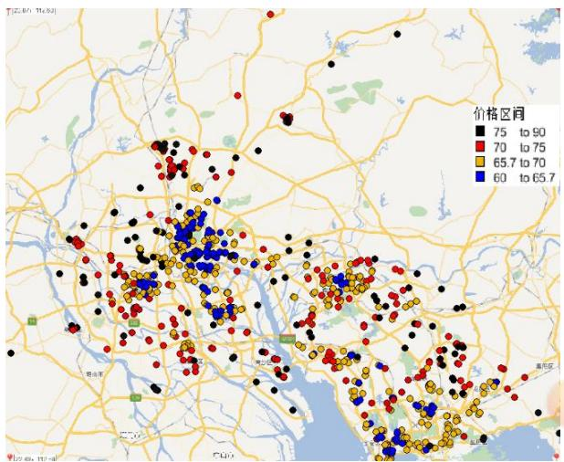  
图 3.1 任务价格空间分布

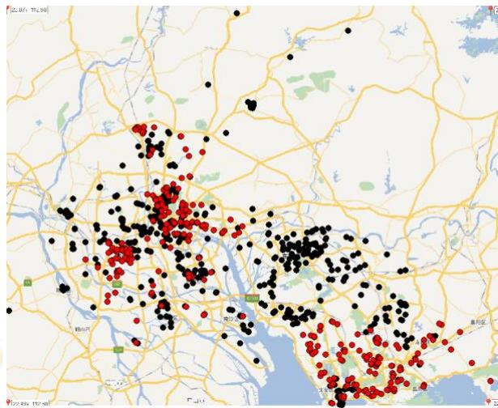  
图 3.2 任务完成情况空间分布

分析图3.1可知，市中心附近价格项目定价主要集中在（65-67.5）区间；在城市非中心地带和城乡地区，项目定价以（67.5-72.5）为主；而高价区（>72.5）主要分布在距离城市较远的地区。分析图 3.2 可知，未完成任务大多分布于城区。综上所述，我们可以推测 APP 平台的原始定价规律如下：

（1）定价高低与任务位置到市中心的距离有关，并随距离的增加发生一定梯度的变化。

（2）未完成任务集中于市中心并与中低价区高度重合，推测其未完成可能与会员行为选择有关。

为将上述定价规律进行数学量化，可通过 FCM 聚类法针对空间任务聚集特性进行定价中心坐标求解，并按照其周围任务距离分布和定价值进行线性拟合，获得地理中心梯度定价数学模型。

## 3.1.2 FCM地理中心聚类模型

首先，对本问题的项目位点进行聚类，需要考虑以下两个方面：1.坐标位点没有明确的类别标记，其界限并不分明；2.对整个地图范围内项目位点进行聚类以求得最优解。因此，我们采用模糊聚类中的模糊C-均值（FCM）进行聚类，相比于传统聚类方法只能在局部最好最优解，该方法能够通过极小化目标函数求得全局最优解。

聚类就是按照某个特定标准，如距离准则，把一个数据集分割成不同的类或簇，使得同一个簇内的数据对象的相似性尽可能大，同时不在同一个簇中的数据对象的差异性也尽可能地大。目前，主要的聚类算法可以硬聚类和模糊聚类两种。其中在硬聚类方法：如划分方法、层次方法等，每一个数据只能被归为一类。而模糊聚类通过隶属函数来确定每个数据隶属于各个簇的程度，而不是将一个数据对象硬性地归类到某一簇中。相比于前面的”硬聚类“，模糊聚类算法计算每个样本对所有类的隶属度，能够将一个没有类别标记的样本按照某种规则划分成若干个子集，使相似样本尽可能归为一类。

在本题中，由于没有给出明确的分类指标，所以我们采用模糊聚类法中的FCM 地理中心聚类模型，其一般化形式为:

$$
\boldsymbol { J } ( U , c _ { 1 } , . . . , c _ { c } ) = \sum _ { i = 1 } ^ { c } \boldsymbol { J } _ { i } = \sum _ { i = 1 } ^ { c } \sum _ { j } ^ { n } u _ { i j } ^ { m } d _ { i j } ^ { 2 }\tag{3.1}
$$

这里 $u _ { i j }$ 介于0，1间； $c _ { i }$ 为模糊组I的聚类中心， $d _ { i j } = \left\| c _ { i } - x _ { j } \right\|$ 为第 I个聚类中心与第 个数据点间的欧几里得距离；且 $m \in [ 1 , \infty )$ 是一个加权指数。

构造如下新的目标函数，可求得使（3.1）式达到最小值的必要条件：

$$
\begin{array} { c } { { \overline { { { J } } } ( U , c _ { 1 } , . . . , c _ { c } , \lambda _ { 1 } , . . . . , \lambda _ { n } ) = J ( U , c _ { 1 } , . . . , c _ { c } ) + \displaystyle { \sum _ { j = 1 } ^ { n } \lambda _ { j } ( \displaystyle { \sum _ { i = 1 } ^ { c } u _ { i j } - 1 } ) } } } \\ { { { } } } \\  { { = \displaystyle { \sum _ { i = 1 } ^ { c } \sum _ { j } ^ { n } u _ { i j } ^ { m } d _ { i j } ^ { 2 } + \sum _ { j = 1 } ^ { n } \lambda _ { j } ( \displaystyle { \sum _ { i = 1 } ^ { c } u _ { i j } - 1 } ) } } } \end{array}\tag{3.2}
$$

## 3.1.3 地理中心梯度定价数学模型

采用一次线性拟合，将二维平面内的点拟合在一条直线上，其公式为：

$$
f ( x ) = a x + b\tag{3.3}
$$

## 3.1.4 FCM 地理中心聚类模型的求解

## 1.聚类中心数确定

通过附件一所给的任务经纬度坐标数据来看，任务热点区域与人们聚集密度有很大关系，即人口密度大的地方往往任务分布较为集中。因此，城市中心附近任务聚集度较高，从图中反映从西到东依次为佛山市、广州市、番禺区、东菀市、深圳市宝安区和龙华区。由此，我们确定聚类中心数c为 6。

## 2.FCM 聚类

通过调用 MATLAB 函数中[center, U, obj\_fcn] = FCM(data, cluster\_n, options)语句。其中 data 为附件一中各项目坐标经纬度数据，cluster\_n 为聚类中心心数，这里把它设为 6。Options 中，隶属度矩阵U的指数设为3.0；最大迭代次数设为50 次，迭代待终止条件为隶属度最小变化量小于 1e-5。聚类结果如下图3.3 所示：

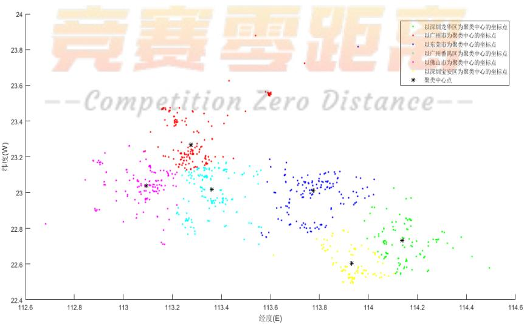  
图 3.3 FCM 聚类位点图

## 3.聚类有效性分析

为了验证上述聚类数的合理性，保证算法得到有效的分类结果，我们对在 6 个聚类中心情况下的FCM算法进行算法有效性分析。

聚类有效性分析标准有两种：一是外部标准，通过测量聚类结果和参考标准的一致性来评价聚类结果的优良；另一种是内部指标，用于评价同一聚类算法在不同聚类数条件下聚类结果的优良程度，通常用来确定数据集的最佳聚类数。 我们采用内部指标汇中的 Calinski-Harabasz(CH)指标，Davies-Bouldin(DB)指标进行有效应分析。

## （1） CH 指标

CH 指标通过类内离差矩阵描述紧密度，类间离差矩阵描述分离度，指标定义为

$$
C H ( k ) = \frac { t r B ( k ) / \left( k - 1 \right) } { t r W ( k ) / \left( n - k \right) }\tag{3.4}
$$

其中，n表示聚类的数目，k 表示当前的类，trB k( )表示类间离差矩阵的迹， $t r W ( k )$ 表示类内离差矩阵的迹。CH 越大代表着类自身越紧密，类与类之间越分散，即更优的聚类结果。

## （2） DB 指标

DB 指标通过描述样本的类内散度与各聚类中心的间距，定义为

$$
D B ( k ) = \frac { 1 } { K } \sum _ { i = 1 } ^ { K } \operatorname* { m a x } _ { j = 1 \sim k , j = i } \left( \frac { W _ { i } + W _ { j } } { C _ { i j } } \right)\tag{3.5}
$$

其中，K是聚类数目， $W _ { i }$ 表示类 $C _ { i }$ 中的所有样本到其聚类中心的平均距离， $W _ { j }$ 表示类 $C _ { i }$ 中的所有样本到类 $C _ { j }$ 中心的平均距离， $C _ { i j }$ 表示类 $C _ { i }$ 和 $C _ { j }$ 中心之间的距离。可以看出，DB越小表示类与类之间的相似度越低，从而对应越佳的聚类结果。

通过对本题FCM算法的有效性检验，得到 $\mathrm { C H } { = } 0 . 8 6 3 , \mathrm { D B } { = } 1 2 4 . 1$ 。聚类有效性分析结果较好，中心数为6的聚类分类有效。

## 4.结果分析

通过FCM聚类模型，我们对项目经纬坐标进行有效聚类，并形成聚类中心数为 6 的集群分布。从聚类中心地理坐标看，六个聚类中心分别位于佛山市、广州市、番禺区、东莞市、深圳市宝安区和龙华区。与之前我们之前的判断结果一致。

为了更好的描述项目定价标准和项目距离聚类中心点之间的关系，排除不必要的干扰。我们对同一类别下不同定价标准的位点进行期望处理:

$$
E X = \sum _ { i = 1 } ^ { n } x _ { i } p _ { i }\tag{3.6}
$$

这里， $x _ { i }$ 为位点距离聚类中心的距离。 $p _ { i }$ 为1/ n 。

以距离期望为横坐标，定价为纵坐标进行一元线性回归，得到距离与价格的关系如下图所示:

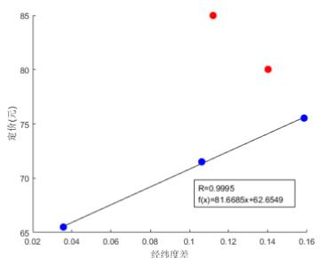  
（a）佛山市

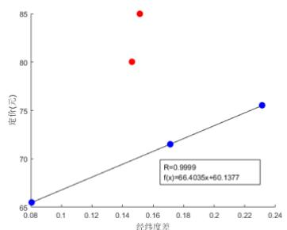  
（b）广州市

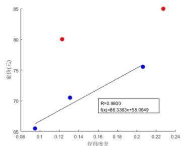  
（c）番禺区

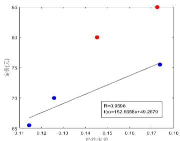  
（d）东莞市

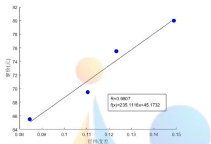  
（e）宝安区

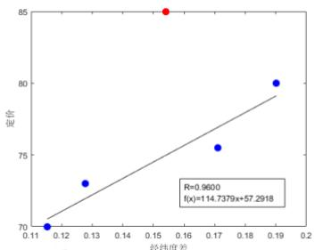  
（f）龙华区  
图 3.4 六个聚类中心距离和价格的一次线性回归

从MATLAB 运行的结果图中可以看出，定价标准与任务位置到中心点的距离呈一次线性关系:

（1） 以佛山市为中心的聚类，距离x与定价f x( )的关系为： $f ( x ) = 8 1 . 6 6 8 5 x + 6 2 . 6 5 4 9$

（2） 以广州市为中心的聚类，距离x与定价f x( )的关系为： $f ( x ) = 6 6 . 4 0 3 5 x + 6 0 . 1 3 7 7$

（3） 以番禺区为中心的聚类，距离x与定价f x( )的关系为： $f ( x ) = 8 6 . 3 3 6 3 x + 5 8 . 0 6 4 9$

（4） 以东莞市为中心的聚类，距离x与定价f x( )的关系为： $f ( x ) = 1 5 2 . 6 6 5 8 x + 4 9 . 2 6 7 9$ ；

（5） 以宝安区为中心的聚类，距离x与定价f x( )的关系为： $f ( x ) = 2 3 5 . 1 1 1 6 x + 4 5 . 1 7 3 2$

（6） 以龙华区为中心的聚类，距离x与定价f x( )的关系为： $f ( x ) = 1 1 4 . 7 3 7 9 x + 5 7 . 2 9 1 8$

从上述式子来看，拟合后的一次线性函数线性度 R均在0.90以上，拟合效果较好。在六个聚类中心，定价标准基本分为 5 档： $6 5 \pm 2 . 5 _ { \mathrm { ~ s ~ } } 7 0 \pm 2 . 5 _ { \mathrm { ~ s ~ } } 7 5 \pm 2 . 5 _ { \mathrm { ~ s ~ } } 8 0 \pm 2 . 5 _ { \mathrm { ~ s ~ } } 8 5 \pm 2 . 5$ （单位/元）。±2.5偏差的出现，体现了平台价格浮动策略，根据实际任务的难易在一定区间内上下浮动，来刺激任务接收与执行。

图中与直线存在较大偏差的红点的的出现，红点处定价高，取在80±2.5和85±2.5这两档，而这两档的定价标准有着奖励的性质，主要由于任务少有人接，平台为了提高任务的被执行率，作为奖励而提高价格，所以其在图中与线的位置距离呈现不规则性。

## 3.2 问题二模型的建立及求解

## 3.2.1 问题分析

“拍照赚钱”商业模式本质为会员和任务间的一种匹配过程。从宏观条件下分析，这种匹配呈现“多对一”的特征，将影响因素按匹配主体双方分类，进行 3.5(a)所示的两个过程分析：

（1） 会员选择任务：任务定价越高，距离越近，会员越乐意选择；

（2） 任务匹配会员：会员信誉度越高，一定空间内会员聚集数量越多，任务被执行概率越高。

分析单个任务点，如图 3.5 (b)，周围会员分布情况很大程度上影响了该任务的执行效率。聚集的高信誉度、高配额会员数量越多，任务被执行的概率越大；反之则概率越小。参照匹配时空规范化距离概念[1]，为了使任务能够尽可能的被会员执行，平台在进行任务匹配时，会先匹配距离较近的部分会员，在其没有接单后，再考虑匹配较远会员。因此，匹配时需对高效距离和可抵距离分类讨论。

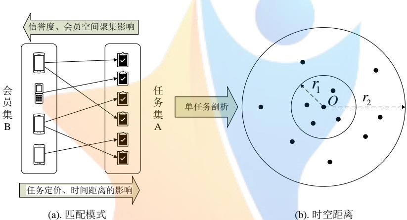  
图 3.5 “拍照赚钱”模式解析

## 3.2.2 时空效率定价模型

设计新的定价方案，建立时空效率定价模型，主要从以下三个维度，全面考虑了定价影响因素：

（1）时间维度：会员与任务间的距离影响，距离影响会员抵达任务点的时间，从而影响完成率。

（2）空间维度：任务附近会员聚集情况的影响，聚集的高信誉度会员越多，完成率越大。

（3）效率维度：模型充分考虑信誉度对定价与分配的影响，算法中以任务开始时间和配额取代。

首先，对距离 $D _ { i j }$ 和信誉度 $q _ { i } ^ { B }$ 进行数据规范化处理，以规避影响定价的各类指标量纲间复杂的相关性和极端数据对定价模型计算带来的不良影响。

$D _ { i j }$ 为在时空可抵范围内会员i与任务j 的距离， $D _ { i } ^ { ' }$ 为的 $D _ { i j }$ 均值方差处理[2]值：

$$
D _ { i j } ^ { ^ { \cdot } } = \frac { D _ { i j } ^ { ^ { \cdot } } - \overline { { D _ { i j } ^ { ^ { \cdot } } } } } { \sigma _ { i j } ^ { ^ { \cdot } } } , \quad i \in G _ { j } , j \in A\tag{3.7}
$$

$$
\overline { { { D _ { i j } } } } = \frac { 1 } { \left| { G _ { j } } \right| } \sum _ { i = 1 } ^ { i = \left| { G _ { j } } \right| } D _ { i j } , \sigma _ { i j } = \sqrt { \frac { 1 } { \left| { G _ { j } } \right| - 1 } \sum _ { i = 1 } ^ { i = \left| { G _ { j } } \right| } ( D _ { i j } - \overline { { { D _ { i j } } } } ) } , j \in A\tag{3.8}
$$

$q _ { i } ^ { B }$ 为会员i的信誉值，依据在线支付信誉评价标准[3],将附件二中各会员按其信誉度值划分为高信誉、中信誉和低信誉三个等级，得图3.6所示信誉趋势，并量化得会员信誉分段函数 $Q _ { i } ^ { B }$ ：

$$
\begin{array} { r } { Q _ { i } ^ { B } = \left\{ \begin{array} { l l } { 1 . 1 , } & { q _ { i } ^ { B } > 1 9 . 9 2 3 1 } \\ { 1 , } & { q _ { i } ^ { B } = 1 9 . 9 2 3 1 } \\ { 0 . 9 , } & { q _ { i } ^ { B } < 1 9 . 9 2 3 1 } \end{array} \right. } \end{array}\tag{3.9}
$$

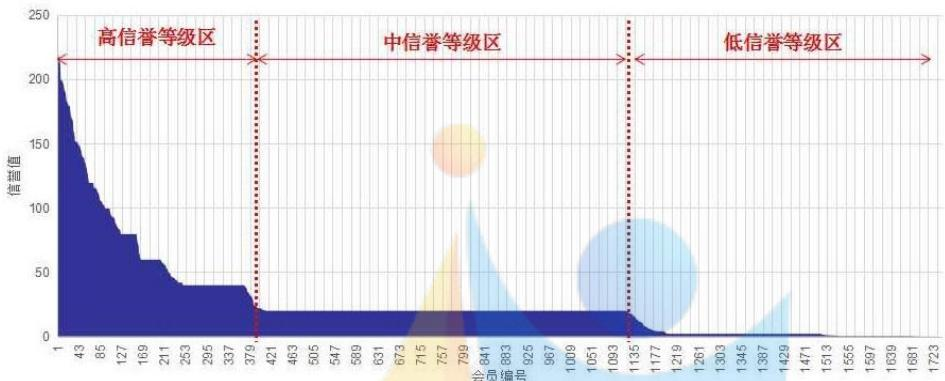  
图3.6 会员信誉度分级

由此，构建包含任务会员时间距离、空间备选会员集和会员信誉度的时空效率定价模型：

$$
P _ { p j } = \frac { 1 } { 2 } K _ { p } P o _ { j } ( H _ { 1 } \sum _ { m = 1 } ^ { m = \left| { G _ { j } ^ { l o w } } \right| } \frac { { D _ { m j } ^ { ' } } } { Q _ { m } ^ { B } } + H _ { 2 } \sum _ { n = 1 } ^ { n = \left| { G _ { j } ^ { u p } } \right| } \frac { { D _ { n j } ^ { ' } } } { Q _ { n } ^ { B } } )\tag{3.10}
$$

式中， $p$ 为聚类中心编号， $p = 1 , 2 , 3 . . . , | C |$ ；j 为任务编号， $j = 1 , 2 , 3 . . . , \left| \boldsymbol { B } \right|$ ； $H _ { 1 }$ 和 $H _ { 2 }$ 分别为时空高效范围 $r _ { 1 } ( j )$ 及时空可抵范围 $r _ { 2 } \left( j \right)$ 的会员信息系数值，分别取值 1.1 和 0.9。执行时空效率定价时，任务 j 先匹配 $r _ { 1 } ( j )$ 范围内的会员，再匹配 $r _ { 1 } ( j )$ 和 $r _ { 2 } \left( j \right)$ 范围间的会员，故 $H _ { 1 } > H _ { 2 }$ 0

根据问题一任务未完成情况归因可知，经济发展水平较高的地区（如广州、深圳）任务未完成的概率远大于经济发展水平较低的地区（如东莞）。因此式（3.10）中设置经济发展系数 $K _ { p }$ 量化宏观经济因素。由此，可以通过调节定价 $K _ { p }$ 提高经济发达地区任务基准定价，刺激当地会员的积极性，促使其更好地完成任务。据《2016年广东省各市GDP 与人均GDP 报告》赋予表 4.1所示系数值。

表4.1 各聚类中心经济发展系数赋值
<table><tr><td>聚类中心点</td><td>佛山市</td><td>广州市</td><td>番禺区</td><td>东莞市</td><td>宝安区</td><td>龙华区</td></tr><tr><td> $K _ { p }$ </td><td>1.02</td><td>1.13</td><td>1.08</td><td>0.97</td><td>1.15</td><td>1.19</td></tr></table>

## 3.2.3 任务匹配规划模型

基于时空效率定价模型重新定价后，参考竞争成功选择问题（WBDP）相关规律[5]，构建以平台任务总定价提升比例最小和任务成功执行数最大为目标的会员任务匹配规划模型。

$$
\operatorname* { m i n } ( \sum _ { i = 1 } ^ { i = | { \cal B } |  j = | { \cal A } | } z _ { i j } \frac { P _ { p j } } { P _ { O j } } - \sum _ { j = 1 } ^ { m } \sum _ { i = 1 } ^ { n } z _ { i j } )\tag{3.11}
$$

$$
s . t . \sum _ { i = 1 } ^ { i = \left| B \right| } z _ { i j } \leq 1 , j = 1 , 2 , . . . , \left| A \right|\tag{3.12}
$$

$$
\sum _ { j = 1 } ^ { j = \left| A \right| } z _ { i j } \le c _ { i } ^ { B } \quad i = 1 , 2 , . . . , \left| B \right|\tag{3.13}
$$

$$
\begin{array} { r } { \operatorname* { P r } \big ( \boldsymbol { F } _ { j } = b _ { i } \big ) \geq \operatorname* { P r } \big ( \boldsymbol { z } _ { i j } = 1 \big ) , i = 1 , 2 , . . . , \big | B \big | , j = 1 , 2 , . . . , \big | A \big | } \end{array}\tag{3.14}
$$

目标函数（3.11）分为两部分，前部为在APP 平台原始定价基础上成功执行任务的平台总定价，后部为任务被成功执行次数和；约束（2）为一个任务至多被一个会员成功执行；约束（3）为被同一会员成功执行的任务数不得超过该会员的任务配额；约束（4）表示成功匹配的任务不一定被执行。

## 3.2.4 二维多阶段轮盘赌求解算法

针对时空效率定价模型的任务匹配问题特征，我们设计了基于时空高效距离r 和时空可抵距离 $r _ { 1 }$ $r _ { 2 }$ 的“二维多阶段轮盘赌”任务会员匹配算法。对于模型中涉及会员信誉度 $q _ { i } ^ { B }$ 的约束，算法中可通过题设条件“参考其信誉给出的任务开始预订时间和预订配额”中的任务开始预订时间 $t _ { i } ^ { B }$ 和预订配额$\boldsymbol { c } _ { i } ^ { B }$ 作归约处理。由于距离约束受 $r _ { 1 }$ 和 $r _ { 2 }$ 限制，每个任务j 备选会员集 $G _ { j }$ 的规模将有效减小，并划分为可抵会员集 $G _ { j } ^ { u p }$ 与高效会员集 $G _ { j } ^ { l o w }$ ，其中 $G _ { j } ^ { u p } \bigcap G _ { j } ^ { l o w } = \emptyset$ 且 $G _ { j } ^ { u p } \bigcup G _ { j } ^ { l o w } = G _ { j }$ ，与全局遍历算法相比，显著降低了计算的时间复杂性。由于 $G _ { j }$ 元素从所有会员中遍历获得，在多阶段轮盘赌过程中，末段决策各会员被选概率之和为1，因此算例规模下，“二维多阶段轮盘赌”算法属于精确解法。

## （1）主体算法执行步骤

对包含任务编号、地理位置、任务定价的任务集 $A \left\{ a _ { j } , ( x _ { j } ^ { A } , y _ { j } ^ { A } ) , P _ { j } \right\}$ 和包涵会员编号、地理位置、配额、任务开始时间、信誉度的会员集 $B \left\{ b _ { i } , ( x _ { i } ^ { B } , y _ { i } ^ { B } ) , c _ { i } ^ { B } , t _ { i } ^ { B } , q _ { i } ^ { B } \right\}$ 进行匹配，获得每个任务对应的匹配解 $F _ { j } \left\{ a _ { j } , b _ { i } \right\}$ 。如某任务下 $b _ { i } { = } N a N$ ，则决策变量 $z _ { j i } { = } 0$ ；否则 $z _ { j i } { = } 1$ C

为使得会员备选集中至少有一个高信誉度会员，计算时空高效距离：

$$
r _ { 1 } \left( j \right) = \operatorname* { m i n } _ { j \in A } \left\{ D _ { i j } \right\} , i = 1 , 2 , . . . , \left| B \right| a n d q _ { i } ^ { B } > 1 9 . 9 2 3 1\tag{3.15}
$$

为保证每个任务至少有一个备选会员，以悲观准则计算时空可抵距离：

$$
r _ { 2 } \left( j \right) = \operatorname* { m a x } _ { j \in A } \operatorname* { m i n } _ { i \in B } \left\{ D _ { i j } \right\}\tag{3.16}
$$

算法具体步骤如下：

Step1：初始化 j  1；

Step2：选中 $a _ { j }$ ，初始化i 1；

Step3：选中 $b _ { i }$ ，若 $D _ { i j } \leq \operatorname* { m i n } \left\{ r _ { 1 } ( j ) , r _ { 2 } ( j ) \right\}$ ，则将 $b _ { i }$ 存入 $G _ { j } ^ { l o w } , i = i + 1$ ；否则， $i = i + 1$

Step4：判断 $i > \left| B \right| ?$ 若是，进入 Step5；否则， 返回 Step3；

Step5：调用 BET 得 $F _ { j } ^ { l o w }$ ，若 $z _ { j i } { = } 1$ 则 $F _ { _ { j } } = F _ { _ { j } } ^ { l o w } , c _ { _ { i } } ^ { B } { = } c _ { _ { i } } ^ { B } { - } 1 , j = j + 1$ ，进入 Step9；否则 Step6；

Step6：选中 $b _ { i }$ ，若 $D _ { i j } \leq \operatorname* { m a x } \left\{ r _ { 1 } ( j ) , r _ { 2 } ( j ) \right\}$ ，则将 $b _ { i }$ 存入 $G _ { j } ^ { u p }$ ， $i = i + 1$ ，否则， $i = i + 1$

Step7：判断 $i > \left| B \right| ?$ 若是，进入 Step8；否则，返回 Step8；

Step8：调用 BET 得解 $F _ { j } ^ { u p }$ ， $F _ { j } = F _ { j } ^ { u p }$ ， $j = j + 1$ ；

Step9：判断 $j > \left| A \right| ?$ 若是，结束匹配并输出所有 $F _ { _ { j } }$ ；否则，返回 Step2。

## （2）多阶段轮盘赌规则

本规则在充分考虑“具有同一任务开始预订时间的会员属于相同的优先批次”和“同批次内各会员选中任务概率依预订配额占比决定”两种情况下，设计批次内完全信息共享任务匹配规则。

分析 $G _ { j }$ 各元素 $g _ { j n } \left( b _ { j n } , x _ { b _ { j n } } ^ { B } , y _ { b _ { j n } } ^ { B } , c _ { b _ { j n } } ^ { B } , t _ { b _ { j n } } ^ { B } , q _ { b _ { j n } } ^ { B } \right) , n { = } 1 , 2 , { \cdots } , \left| G _ { j } \right| , b _ { j n } \in B$ 。将会员划分为 $G _ { j } ^ { T ( 1 ) }$ $G _ { j } ^ { T ( 2 ) } , . . . , G _ { j } ^ { T ( m ) } , \bigcup _ { i = 1 } ^ { i = m } G _ { j } ^ { T ( i ) } = G _ { j } ,$ 。其中相同集合内的会员具有相同的 $t _ { i } ^ { B }$ ，即 $\forall i \in G _ { j } ^ { T ( m ) }$ $T ( m ) { = } t _ { i } ^ { B }$

基于提出的新定价标准，每个会员选中任务的概率与新标准价格 $P _ { p j }$ 和平台原有价格 $P o _ { j }$ 的比值成正比。通过式（3.17）可计算会员 $b _ { j n }$ 在集合 $G _ { j }$ 中选中任务j 的概率 $\mathrm { P r } \left( b _ { j n } \right)$

$$
\mathrm { P r } \left( b _ { j n } \right) = \frac { c _ { b _ { j n } } ^ { B } } { \displaystyle \sum _ { n = 1 } ^ { n = \left| { G _ { j } } \right| } c _ { b _ { j n } } ^ { B } } \times \frac { P _ { p j } } { P o _ { j } }\tag{3.17}
$$

由此，针对每一批次 $T ( m )$ ，均有式（3.18）所示的未选中概率 $\Delta \operatorname* { P r } ( m )$

$$
\Delta \mathrm { P r } ( m ) { = } 1 { - } \sum _ { k = 1 } ^ { k = m } \sum _ { n = 1 } ^ { n = \left| T _ { m } \right| } \mathrm { P r } \left( b _ { j n } ^ { k } \right)\tag{3.18}
$$

多阶段轮盘赌规则的算法流程和转盘概率分布示意如图3.7所示。

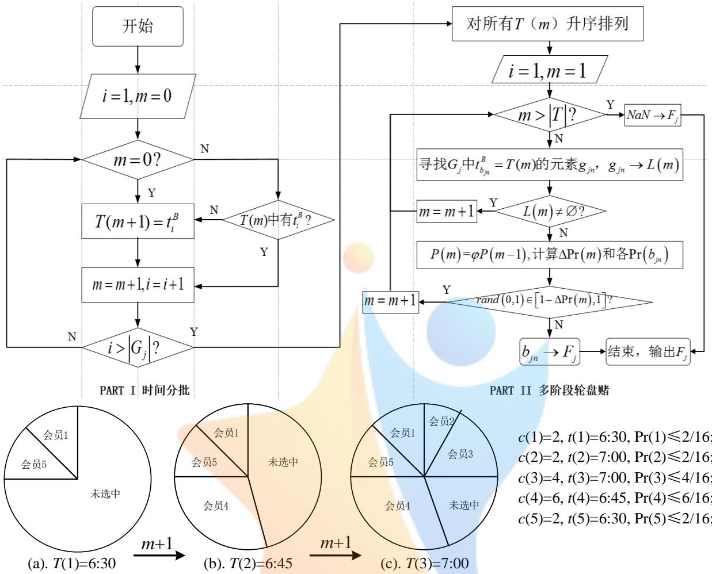  
图3.7 .匹配流程和轮盘赌规则示意

## 3.2.5 求解结果分析

运用Matlab2015b编写二维多阶段轮盘赌求解算法（详见附件五），求得原题附件 1中835个任务点的时空效率定价及成功执行的匹配会员编号，详细求解结果见附录1。

在任务完成情况方面，任务未执行数量为 208个，小于平台APP 原始定价情况下的 313个；新策略下，任务完成成功率为 75.1%，高于原方案的 62.5%。说明时空效率定价模型相比原定价策略，具有20.2%的优化效果，一定程度上能提高匹配成功率。

在平台总定价方面，原方案所有任务总估价 57707.5 元，新方案为 58420.8 元，增长了 1.24%；原方案为已完成的任务花费 36446.0元，新方案为44166.4元，增长了21.2%，新方案定价稍有偏高。

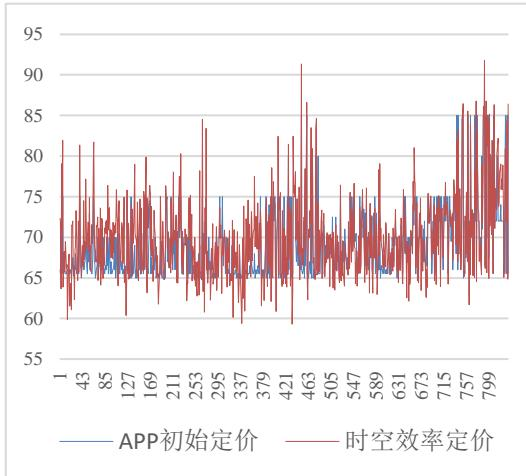  
图3.8 .定价对比图

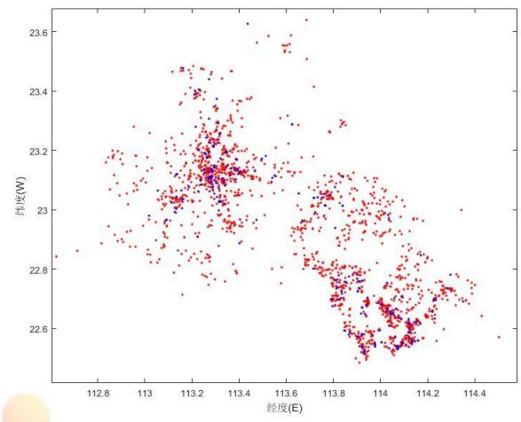  
图 3.9 .任务完成图

此外，分析图 3.8 中的全局定价折线图，可发现时空效率定价波动性更大。而将求解所得的任务完成地理分布情况（图3.9）与4.1节图（蓝点为未完成任务，红点为已完成任务）进行对比，可发现广州市区与深圳市区的未完成任务数显著减少，可能由新策略根据地区经济情况提升基准定价导致；佛山市原方案中未完成任务几乎都被新方案完成；东莞市新出现零星未完成任务，属合理概率事件。

综上所述，新设计的时空效率定价模型能在附件 2 会员规模的情况下，有效提高附件 1 中任务的成功执行概率，但需要付出小幅上升的总体定价，用于激励经济较发达的大城市会员执行任务。

## 3.3 问题三模型的建立及求解

## 3.3.1 问题分析

本题将多个位置比较集中的任务联合在一起打包发布。一方面，打包发布能够让平台效率更高，成本更低；但另一方面，如果打包发布的任务未被执行，则平台受到的损失也就更大。因此，平台在打包发布任务时，为了提高任务被执行的概率，会采取两方面的措施：1.会更加关注“守信用”的会员，即信誉度高的会员。2.分析打包规模与仍有预留任务限额的有效会员数的关系，寻找最佳的打包规模。

## 3.3.2 会员信誉等级定价模型

1.数据预处理

首先，为了消除不同单位和量纲对结果的影响，我们将数据进行预处理。

（1） $d _ { p }$ 为同一类中的所有点到聚类中心p 的平均距离， $d _ { p } ^ { ' }$ 为 $d _ { p }$ 均值方差处理后的距离数据

$$
d _ { p } = \frac { \displaystyle \sum _ { j = 1 } ^ { n } d _ { p j } } { n } , p = 1 , 2 , 3 . . . , | C |\tag{3.19}
$$

其中

$$
d _ { p } ^ { ' } = \frac { d _ { p } - \overline { { d _ { p } } } } { \sigma _ { i } } , p \in 1 , 2 , 3 . . . , | C |\tag{3.20}
$$

$$
\overline { { d _ { p } } } = \frac { 1 } { c } \sum _ { i = 1 } ^ { c } d _ { p } , \sigma _ { i } = \sqrt { \frac { 1 } { c - 1 } \sum _ { i = 1 } ^ { c } ( d _ { p } - \overline { { d _ { p } } } ) } , p \in 1 , 2 , 3 . . . , \left| C \right|\tag{3.21}
$$

（2） $D c _ { i }$ 为时空可抵距离范围内会员i与聚类中心点之间的距离， $D c _ { i } ^ { ' }$ 为 $D c _ { i }$ 均值方差处理后的距离数据

$$
D \dot { c _ { i } } = \frac { D c _ { i } - D c _ { i } } { \sigma _ { i } } , i \in 1 , 2 , 3 . . . , \big | B \big | , p = 1 , 2 , 3 . . . , \big | C \big |\tag{3.22}
$$

其中

$$
\overline { { D c _ { i } } } = \frac { 1 } { w } \sum _ { i = 1 } ^ { w } D c _ { i } , \sigma _ { i } = \sqrt { \frac { 1 } { w - 1 } \sum _ { i = 1 } ^ { w } ( D c _ { i } - \overline { { D c _ { i } } } ) } , i \in 1 , 2 , 3 . . . , \big | B \big |\tag{3.23}
$$

## 2.新增变量分析

在问题二中，影响定价规律的因素主要有： 1.时空可抵距离范围内会员i与聚类中心点之间的距离 $D c _ { i }$ ；2.会员信誉等级值 $Q _ { i } ^ { B }$ ；3.会员信息系数值 $H _ { \mathfrak { r } }$ ， $H _ { \ast }$ ；4.聚类中心的经济发展系数 $K _ { p }$ 。

问题三在问题二基础上，考虑打包对原有定价体系的影响，主要体现在以下几个方面：

（1）同一类中的所有点到聚类中心 $p$ 的距离总和 $d _ { p }$ $d _ { p }$ 用于描述任务位置的离散程度。在评价规则中， $d _ { p }$ 越大，表明任务位置的离散程度越高，对会员来说，完成任务所需要付出的时间和空间成本越高，因此定价越高。

（2）分段函数 $Q _ { i } ^ { B }$ $Q _ { i } ^ { B }$ 用于衡量会员信誉值对定价规则的影响。在平台打包发布任务时，会更加关注会员的信誉值，从而降低任务未被执行的风险。因此，相比于第二问中的静态等级划分，在第三问中，采用分段函数的方式，增强不同信誉等级用户的区分度。同时，信誉等级值的变化与打包规模n有关，打包规模n越大，定价规律对高信誉值的会员更有利。

$$
\begin{array} { r } { Q _ { i } ^ { B } = \left\{ \begin{array} { l l } { S + k _ { 1 } n , q _ { i } ^ { B } > 1 9 . 9 2 3 1 } \\ { S + k _ { 2 } n , q _ { i } ^ { B } = 1 9 . 9 2 3 1 } \\ { S + k _ { 3 } n , q _ { i } ^ { B } < 1 9 . 9 2 3 1 } \end{array} \right. } \end{array}\tag{3.24}
$$

式中， i 为会员i的信誉值， i 为会员i的信誉等级值。 $q _ { i } ^ { B }$ $Q _ { i } ^ { B }$ $S = 1$ ，为基准信誉等级值； 为不同信誉等级的系数， $k _ { \mathrm { 1 } } = - 0 . 1$ $k _ { 2 } = - 0 . 0 6$ $k _ { 3 } = - 0 . 0 2$ ; $n \in [ 2 , 6 ]$ 为打包规模。信誉度高的会员给予较高的报酬，而信誉度较低的会员报酬较少，从而保证当所有会员在平台竞争时，信誉度低的会员选中任务的概率远小于信誉度高的会员。

（3）打包规模n。在平台打包发布任务的情况下，打包规模与可参与执行任务的有效会员数之间存在如下关系：当打包规模增加时，打包后每个任务所含的任务数变多，对会员预定任务配额提出更高的要求。在这种情况下，有足够任务配额参与任务执行的会员就会减少。当有资格的会员数减少到一定程度，未被执行的任务数就会大大增加，从而促使平台缩小打包规模，让一些拥有较低任务配额的会员加入进来。从以上打包规模和会员数量的变化来看，存在一个让配置最为合理的供需平衡点。

在这个动态平衡的机制中，打包规模对会员数量的变化反应往往是滞后的，即第 次打包数 $Q _ { n } ^ { S }$ 取决于n1会员数 $P _ { n - 1 }$ ；有效会员数对打包规模变动的反应是瞬时的，即第n期有效会员数 $P _ { n }$ 取决于本期打包规模 $Q _ { n }$ 。假设每次任务的发布最终都能被完成，即 $Q _ { n } ^ { D } = Q _ { n } ^ { S }$ 。根据上述条件，可得如下供需平衡数学模型：

$$
\left\{ \begin{array} { l l } { Q _ { n } ^ { D } = a - b P _ { n } \qquad } & { ( a > 0 , b > 0 ) } \\ { Q _ { n } ^ { D } = - c + d P _ { n - 1 } \qquad } & { ( c > 0 , d > 0 ) } \\ { Q _ { n } ^ { D } = Q _ { n } ^ { S } } \end{array} \right.\tag{3.25}
$$

在式中，由于 $b > d$ $\operatorname* { l i m } _ { n \to \infty } { P _ { n } } = { \frac { a + c } { b + d } }$ 即打包规模 $P _ { n }$ 是收敛的，故打包规模和有效会员数供求关系趋向于平衡点。

## 3.定价方案

根据各变量对定价规律的影响作用，可得在平台打包发布任务的情况下，新的定价方案如下所示：

$$
P _ { p j } = \frac { n e ^ { - n } } { 2 d _ { p } ^ { ' } } K _ { p } P o _ { p } ( H _ { 1 } \sum _ { i = 1 } ^ { i \in G _ { p } ^ { l o w } } \frac { D c _ { i } ^ { ' } } { Q _ { i } ^ { B } } + H _ { 2 } \sum _ { i = t + 1 } ^ { i \in G _ { p } ^ { l o w } \cup i \in G _ { p } ^ { u p } } \frac { D c _ { i } ^ { ' } } { Q _ { i } ^ { B } } )\tag{3.26}
$$

## 3.3.3 模型的求解

在第三问的求解中，求解步骤如下所示：

（1） 确定最佳打包规模 $n ,$ 并给出打包规模的上界。通过供需平衡数学模型计算 $n \to \infty$ 时， $P _ { n }$ 收敛于3，说明当打包规模分布在3时，是最为合理的，并将上界定为 5， $n \in [ 2 , 5 ]$ 0

（2） 确定同一类中的所有点到聚类中心p 的距离总和 $d _ { p }$ 。在会员执行任务时，过大的距离往往会超出会员的承受能力，造成任务执行率偏低。因此，我们将 $d _ { p }$ 的上界定为 2km。

（3） 通过n和 $d _ { p }$ 的值确定打包方案，并通过 MATLAB 2015b运行后（程序详见附录九）得到下（图3.10）结果：

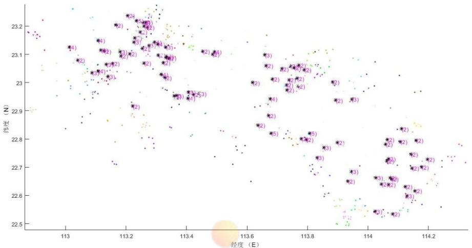  
图 3.10 打包方案图

通过对打包方案图的分析，可以得到以下结论：1.打包后的任务点分布有明显的集群效应；2.未参与打包的任务点主要分布在偏远地区；3.打包后的任务规模以 2 个任务和 3 个任务为主.

（4）通过“二维多阶段轮盘赌”算法进行匹配（详见附件八），具体结果如下：

一共 692 个任务中，匹配成功的共有 564 个，配对成功率为 81.5%。比问题二中 74.9%的匹配成功率高出 6.5%。说明新的定价方案优于问题二中的定价方案。

在平台总定价方面，问题二中的定价方案所有任务为58420.8元，新方案为60456.7增长了3.48%；原方案为已完成的任务花费 44166.4 元，新方案为 40345.9 元，降低了 8.6%，新方案收益较原方案更好。

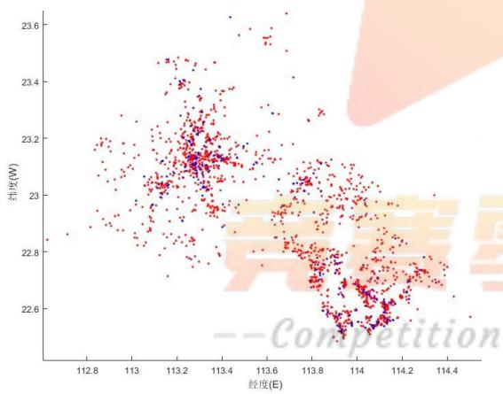  
图 3.11 问题二匹配方案图

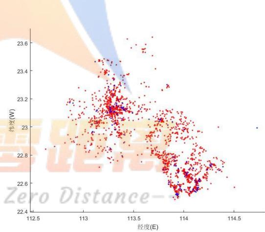  
图 3.12 问题三匹配方案图

通过对匹配方案图分析可知：通过问题三的定价方案，热点区域未匹配的数量明显减少，匹配率明显上升。

## 3.4 问题四模型的建立及求解

问题四需要针对原文附件 3 中新的任务分布，给出与其相适应的定价方案。将新任务数据导入Mapinfo Pro15.0, 得到其对应的空间分布。分析图3.13 （黑点为新任务，黄点为会员）可得如下特点：

（1）任务分布呈现高度聚集性，主要集中在广州和深圳两个城市。

（2）任务数量众多，远超任务周边时空可抵距离范围内的会员数量。

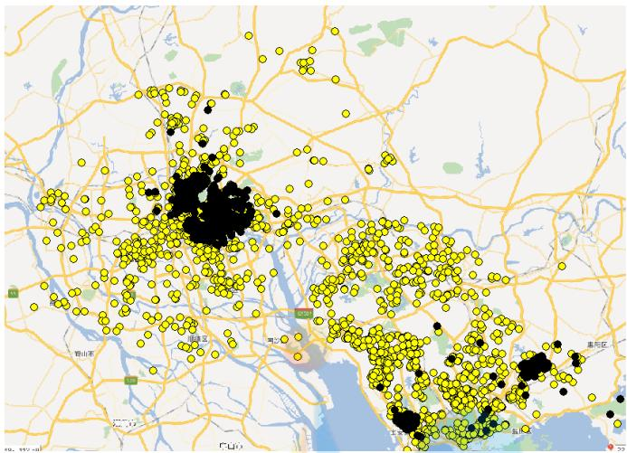  
图 3.13 附件三项目位置分布图

因此，任务和会员间的匹配呈现“供大于求”的状况，此时会员可选择的任务数较多，其违约率往往较高，并且定价的主动性逐步由平台主导转向会员主导。针对大规模聚集态任务分布，任务打包定价发布仍是一种可供选择的定价方式。但这种方式在前节给出的打包定价方式下，往往找不到最优打包任务数，这可能由于存在如下的悖反规律：

（1）单次打包任务数上升时，由于会员配额限制，选择任务的准入门槛不断提高，由于任务周边时空可抵距离内有效会员样本缺乏，且具有高信誉度高配额的会员自身数量有限，任务难以匹配。

（2）单次打包任务数下降甚至不打包时，任务数量剧增，会员数量更少，更加难以匹配执行。

为保证项目被执行率，需要建立新的特殊定价模型，以适用于供大于求的高聚态极端任务情况。

## 3.4.1 歧视激励定价模型

极端环境下，考虑采取“价格歧视、高信誉度会员提价和低信誉度会员保留定价”的差异化定价策略，建立歧视激励定价模型，以保障具有高信誉高配额的会员所选任务的完成质量，并在宁愿损失部分任务完成率的基础上，逐渐淘汰低信誉度会员。定价模型由如下三部分组成：

## （1）二级歧视定价函数

$$
\stackrel { \mathcal { O } } { \mathop { P } _ { j } } = \left\{ \begin{array} { r l r } { \left( 1 + g \left( q _ { i } ^ { B } \right) \right) \textstyle { P } _ { p j } , } & { \textstyle { \mathcal { Z } } q _ { i } ^ { B } \succ 1 9 . 9 2 3 1 } & \\ { \textstyle { P } _ { p j } , } & { \textstyle { q } _ { i } ^ { B } = 1 9 . 9 2 3 1 } & \\ { \textstyle { P } _ { 0 } \left( q _ { i } ^ { B } \right) , } & { \textstyle { q } _ { i } ^ { B } < 1 9 . 9 2 3 1 } & \end{array} \right.\tag{3.27}
$$

（2）高信誉激励函数

$$
g \left( q _ { i } ^ { B } \right) = \frac { q _ { i } ^ { B } } { \operatorname* { m a x } _ { i = B } \left( q _ { i } ^ { B } \right) }\tag{3.28}
$$

（3）保留定价函数

$$
P _ { 0 } \left( q _ { i } ^ { B } \right) { = } \operatorname* { m i n } _ { j \in A } \left( P _ { p j } \right)\tag{3.29}
$$

## 3.4.2 配额极值算法

依据高信誉会员最大化配额利用，低信誉会员概率淘汰，对二维多阶段轮盘赌参数做如下改进：

$$
\mathrm { P r } \left( b _ { j m } \right) = \left\{ \begin{array} { l l } { \displaystyle \frac { c _ { b _ { j m } } ^ { B } } { m = \left| G _ { j } \right| } , } & { \displaystyle c _ { b _ { j m } } ^ { B } \geq n } \\ { \displaystyle \sum _ { m = 1 } c _ { b _ { j m } } ^ { B } } & \\ { 0 , } & { \displaystyle c _ { b _ { j m } } ^ { B } < n } \end{array} \right.\tag{3.30}
$$

由此，将二维多阶段轮盘赌算法加入配额极值修正规则，使得配额有剩余的高信誉度会员选中任务的概率显著增大，并自然淘汰低信誉度或配额不足的会员，求得高聚态极端分布匹配结果。

## 3.4.3 求解结果分析

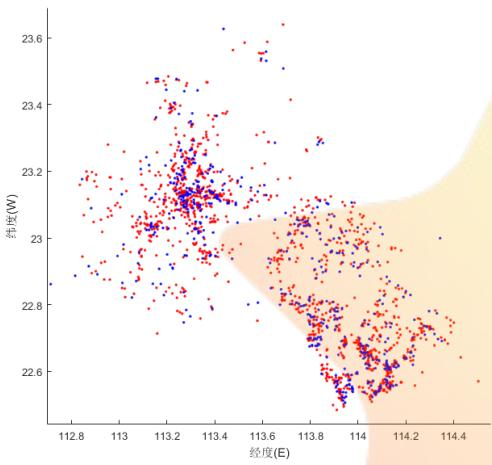  
图 3.14 基于问题三模型求解结果图

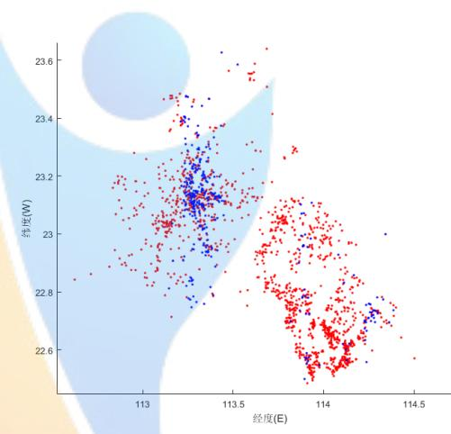  
图 3.15 基于问题四模型求解结果图

运用Matlab2015b编写二维多阶段轮盘赌求解算法，求得原题附件3中 2066个任务点的时空效率定价及成功执行的匹配会员编号。

在问题三定价模型求解结果中，2066个任务点，其中有 717个项目匹配成功，完成率为34.7%；  
在问题四定价模型的求解结果中，有969个任务匹配完成，完成率为46.9%，高于原方案的12.2%。  
说明歧视激励定价方案相比原定价策略，具有 12.2%的优化效果，一定程度上能提高匹配成功率。

此外，在任务高聚集度的情况下，单纯的会员等级信誉定价模型并不能很好的提升任务的完成率，考虑采取“价格歧视、高信誉度会员提价和低信誉度会员保留定价”的差异化定价方案，不仅没有损失完成率，反而使得完成率上升了 12.2个百分点。

## 第4章 模型的改进

在问题二中，我们构建了包括任务会员时间距离、空间备选会员集和会员信誉度的时空效率定价模型。该模型中的 $D _ { i j }$ 为一个不变量，但在实际情况中，在时空可抵范围内，会员i与任务 的距离是一个实时动态过程。即 $D _ { i j } = F ( t )$ ，是一个有关时间的函数，因此面对一个动态过程，要想模型具有前瞻性，需要加入实时动态预测，对于一个随机过程，我们可以使用平稳时间序列法作为预测

模型：

$$
E ( y _ { t } ) = E ( y _ { t + m } )
$$

$$
\mathrm { c o v } ( y _ { t } , y _ { t + k } ) = \mathrm { c o v } ( y _ { t + m } , y _ { t + m + k } )
$$

采用平稳时间序列法能够让平台不仅实时检测会员动态，更能对未来进行预测，使平台的做出更加合理的决策和匹配方案。

## 第5章 模型的评价与推广

## 5.1 模型的优点

1、本文创新的根据题目提出了“时空效率定价模型”，充分全面地考虑了定价影响因素考虑全面，而且定价稳定，适用于模型；

2、“依概率接受”，那么意味着每次都是按照分值的高低排序来选择，这样可能容易陷入局部最优，而无法获得全局最优解。使用了轮盘赌则可以更加修正陷入局部最优这个问题

2、利用 EXCEL 软件对数据进行处理作出了各种图表，使结论简便、直观、快捷；

3、运用了多种数学软件，取长补短，计算结果更加准确，清晰，可信度高；

4、本文建立的模型能结合实际情况对问题进行求解，实用性强，具有很好的推广性。

## 5.2 模型的缺点

1、“时空效率定价模型”在大规模下的应用有一定限制；

2、任务匹配模型是非线性模型，属于NP-hard问题，大型实例不能用精确算法求解，必须寻求这类问题的有效的近似算法；

## 5.3 模型的推广

本文建立的定价模型有效的提高了在原有定价规律下，任务被成功执行的概率。并创新性的“提出二维多阶段轮盘赌”算法，该算法运行效率高，准确性高，能够有效的解决移动互联网匹配效率平台，大大的降低了平台的实时性和运营成本。

## 参考文献

[1]乐琦, 樊治平. 基于累积前景理论的双边匹配决策方法[J]. 系统工程学报, 2013, 28(1):38-46.

[2]陈鲤江, 景程, 吴姚鑫,等. 数学表达式的归一化方法研究[J]. 浙江工业大学学报, 2012, 40(2):229-232.

[3]王宝丽, 杨琦峰. 在线支付下个人信用等级评价指标体系[J]. 中国水运:理论版, 2006, 4(4):170-171.

[4]《2016 年广东省各市 GDP 与人均 GDP 报告》http://www.360doc.com/content/17/0419/14/502486\_646832037.shtml

[5]许志凯, 张宏莉, 余翔湛,等. 基于组合双向拍卖的物联网搜索任务分配机制[J]. 通信学报, 2015,36(12):47-56.

## 附录

附录1：问题2的定价及匹配结果
<table><tr><td>任务编号</td><td>匹配会员</td><td>新定价</td><td>任务编号</td><td>匹配会员</td><td>新定价</td><td>任务编号</td><td>匹配会员</td><td>新定价</td></tr><tr><td>1</td><td>408</td><td>72.3</td><td>281</td><td>NaN</td><td>62.3</td><td>561</td><td>NaN</td><td>66.8</td></tr><tr><td>2</td><td>NaN</td><td>71.9</td><td>282</td><td>1642</td><td>64.9</td><td>562</td><td>545</td><td>72.1</td></tr><tr><td>3</td><td>NaN</td><td>63.7</td><td>283</td><td>8</td><td>68.6</td><td>563</td><td>1220</td><td>72.6</td></tr><tr><td>4</td><td>NaN</td><td>79.1</td><td>284</td><td>86</td><td>66.0</td><td>564</td><td>1222</td><td>75.9</td></tr><tr><td>5</td><td>550</td><td>71.0</td><td>285</td><td>89</td><td>71.7</td><td>565</td><td>294</td><td>71.2</td></tr><tr><td>6</td><td>1383</td><td>81.9</td><td>286</td><td>89</td><td>64.3</td><td>566</td><td>200</td><td>71.8</td></tr><tr><td>7</td><td>1064</td><td>63.9</td><td>287</td><td>32</td><td>65.0</td><td>567</td><td>1200</td><td>69.2</td></tr><tr><td>8</td><td>12</td><td>68.0</td><td>288</td><td>13</td><td>66.2</td><td>568</td><td>NaN</td><td>64.5</td></tr><tr><td>9</td><td>943</td><td>68.3</td><td>289</td><td>1273</td><td>68.0</td><td>569</td><td>NaN</td><td>70.9</td></tr><tr><td>10</td><td>1582</td><td>65.8</td><td>290</td><td>1196</td><td>69.4</td><td>570</td><td>111</td><td>67.1</td></tr><tr><td>11</td><td>1142</td><td>69.5</td><td>291</td><td>86</td><td>65.1</td><td>571</td><td>1253</td><td>76.1</td></tr><tr><td>12</td><td>1110</td><td>68.6</td><td>292</td><td>974</td><td>71.3</td><td>572</td><td>505</td><td>65.4</td></tr><tr><td>13</td><td>762</td><td>66.2</td><td>293</td><td>317</td><td>63.5</td><td>573</td><td>248</td><td>67.5</td></tr><tr><td>14</td><td>441</td><td>66.6</td><td>294</td><td>75</td><td>67.8</td><td>574</td><td>NaN</td><td>68.6</td></tr><tr><td>15</td><td>NaN</td><td>59.9</td><td>295</td><td>91</td><td>68.8</td><td>575</td><td>1174</td><td>70.6</td></tr><tr><td>16</td><td>NaN</td><td>63.5</td><td>296</td><td>NaN</td><td>65.1</td><td>576</td><td>259</td><td>68.8</td></tr><tr><td>17</td><td>1866</td><td>66.3</td><td>297</td><td>841</td><td>69.4</td><td>577</td><td>NaN</td><td>63.1</td></tr><tr><td>18</td><td>1859</td><td>67.9</td><td>298</td><td>1097</td><td>73.6</td><td>578</td><td>1427</td><td>74.2</td></tr><tr><td>19</td><td>NaN</td><td>61.5</td><td>299</td><td>588</td><td>69.9</td><td>579</td><td>808</td><td>69.1</td></tr><tr><td>20</td><td>NaN</td><td>62.9</td><td>300</td><td>586</td><td>71.5</td><td>580</td><td>259</td><td>67.6</td></tr><tr><td>21</td><td>NaN</td><td>64.3</td><td>301</td><td>602</td><td>68.7</td><td>581</td><td>1255</td><td>72.6</td></tr><tr><td>22</td><td>NaN</td><td>61.1</td><td>302</td><td>NaN</td><td>63.1</td><td>582</td><td>137</td><td>66.3</td></tr><tr><td>23</td><td>283</td><td>71.5</td><td>303</td><td>NaN</td><td>70.1</td><td>583</td><td>NaN</td><td>63.1</td></tr><tr><td>24</td><td>NaN</td><td>71.5</td><td>304</td><td>586</td><td>68.3</td><td>584</td><td>200</td><td>70.2</td></tr><tr><td>25</td><td>290</td><td>72.0</td><td>305</td><td>1421</td><td>67.8</td><td>585</td><td>NaN</td><td>69.9</td></tr><tr><td>26</td><td>436</td><td>65.3</td><td>306</td><td>NaN</td><td>69.</td><td>586</td><td>505</td><td>67.4</td></tr><tr><td>27</td><td>1004</td><td>66.</td><td>307</td><td>588</td><td>70.</td><td>587</td><td>1727</td><td>73.6</td></tr><tr><td>28</td><td>NaN</td><td>62.3</td><td>308</td><td>257</td><td>69.4</td><td>588</td><td>180</td><td>67.5</td></tr><tr><td>29</td><td>NaN</td><td>Com 68.6</td><td>309</td><td>ero 305</td><td>tanc 66.2</td><td>589</td><td>1635</td><td>67.3</td></tr><tr><td>30</td><td>1613</td><td>68.7</td><td>310</td><td>632</td><td>66.3</td><td>590</td><td>36</td><td>71.4</td></tr><tr><td>31</td><td>204</td><td>73.3</td><td>311</td><td>586</td><td>68.7</td><td>591</td><td>NaN</td><td>63.0</td></tr><tr><td>32</td><td>199</td><td>69.9</td><td>312</td><td>665</td><td>63.9</td><td>592</td><td>96</td><td>65.9</td></tr><tr><td>33</td><td>12</td><td>66.2</td><td>313</td><td>NaN</td><td>69.9</td><td>593</td><td>1168</td><td>66.7</td></tr><tr><td>34</td><td>1410</td><td>64.7</td><td>314</td><td>29</td><td>67.3</td><td>594</td><td>1222</td><td>78.3</td></tr><tr><td>35</td><td>1145</td><td>72.0</td><td>315</td><td>1418</td><td>66.9</td><td>595</td><td>1174</td><td>67.8</td></tr><tr><td>36</td><td>74</td><td>65.7</td><td>316</td><td>304</td><td>70.8</td><td>596</td><td>1174</td><td>79.0</td></tr><tr><td>37</td><td>1163</td><td>74.3</td><td>317</td><td>882</td><td>64.1</td><td>597</td><td>NaN</td><td>69.6</td></tr><tr><td>38</td><td>375</td><td>81.3</td><td>318</td><td>1838</td><td>65.4</td><td>598</td><td>1234</td><td>71.2</td></tr><tr><td>39</td><td>142</td><td>69.7</td><td>319</td><td>109</td><td>64.7</td><td>599</td><td>NaN</td><td>68.9</td></tr><tr><td>40</td><td>106</td><td>67.4 320</td><td>677</td><td>65.3</td><td>600</td><td></td><td>1174</td><td>68.8</td></tr><tr><td>41</td><td>1116</td><td>65.2</td><td>321</td><td>NaN</td><td>64.7</td><td>601</td><td>1174</td><td>68.2</td></tr><tr><td>42</td><td>314</td><td>67.5</td><td>322</td><td>NaN</td><td>72.1</td><td>602</td><td>533</td><td>66.2</td></tr><tr><td>43</td><td>97</td><td>69.0</td><td>323</td><td>NaN</td><td>60.2</td><td>603</td><td>1166</td><td>70.3</td></tr><tr><td>44</td><td>NaN</td><td>66.4</td><td>324</td><td>584</td><td>66.6</td><td>604</td><td>1204</td><td>68.8</td></tr><tr><td>45</td><td>NaN</td><td>74.5</td><td>325</td><td>989</td><td>70.9</td><td>605</td><td>1166</td><td>68.1</td></tr><tr><td>46</td><td>1093</td><td>67.3</td><td>326</td><td>126</td><td>66.2</td><td>606</td><td>1193</td><td>66.4</td></tr><tr><td>47</td><td>977</td><td>69.5</td><td>327</td><td>NaN</td><td>67.1</td><td>607</td><td>261</td><td>71.8</td></tr><tr><td>48</td><td>NaN</td><td>68.1</td><td>328</td><td>109</td><td>68.2</td><td>608</td><td>1240</td><td>71.3</td></tr><tr><td>49</td><td>NaN</td><td>77.2</td><td>329</td><td>763</td><td>65.6</td><td>609</td><td>1240</td><td>68.8</td></tr><tr><td>50</td><td>135</td><td>70.6</td><td>330</td><td>596</td><td>66.2</td><td>610</td><td>NaN</td><td>66.0</td></tr><tr><td>51</td><td>114</td><td>68.7</td><td>331</td><td>951</td><td>70.7</td><td>611</td><td>255</td><td>66.9</td></tr><tr><td>52</td><td>1116</td><td>70.1</td><td>332</td><td>849</td><td>66.3</td><td>612</td><td>NaN</td><td>67.5</td></tr><tr><td>53</td><td>375</td><td>71.9</td><td>333</td><td>NaN</td><td>62.0</td><td>613</td><td>178</td><td>70.5</td></tr><tr><td>54</td><td>1135</td><td>71.8</td><td>334</td><td>985</td><td>64.4</td><td>614</td><td>164</td><td>66.3</td></tr><tr><td>55</td><td>NaN</td><td>68.2</td><td>335</td><td>718</td><td>69.1</td><td>615</td><td>146</td><td>65.4</td></tr><tr><td>56</td><td>667</td><td>74.9</td><td>336</td><td>303</td><td>65.0</td><td>616</td><td>137</td><td>67.2</td></tr><tr><td>57</td><td>52</td><td>66.6</td><td>337</td><td>1169</td><td>65.4</td><td>617</td><td>180</td><td>68.1</td></tr><tr><td>58</td><td>NaN</td><td>65.9</td><td>338</td><td>NaN</td><td>62.3</td><td>618</td><td>486</td><td>66.4</td></tr><tr><td>59</td><td>NaN</td><td>67.3</td><td>339</td><td>NaN</td><td>59.4</td><td>619</td><td>2</td><td>68.6</td></tr><tr><td>60</td><td>NaN</td><td>71.5</td><td>340</td><td>NaN</td><td>61.6</td><td>620</td><td>NaN</td><td>65.8</td></tr><tr><td>61</td><td>NaN</td><td>69.2</td><td>341</td><td>718</td><td>69.9</td><td>621</td><td>1094</td><td>71.1</td></tr><tr><td>62</td><td>1613</td><td>71.0</td><td>342</td><td>NaN</td><td>62.5</td><td>622</td><td>34</td><td>66.4</td></tr><tr><td>63</td><td>33</td><td>79.6</td><td>343</td><td>NaN</td><td>73.8</td><td>623</td><td>12</td><td>69.2</td></tr><tr><td>64</td><td>NaN</td><td>81.7</td><td>344</td><td>NaN</td><td>65.4</td><td>624</td><td>215</td><td>70.0</td></tr><tr><td>65</td><td>NaN</td><td>71.2</td><td>345</td><td>NaN</td><td>60.9</td><td>625</td><td>1071</td><td>73.4</td></tr><tr><td>66</td><td>NaN</td><td>68.7</td><td>346</td><td>366</td><td>66.9</td><td>626</td><td>329</td><td>70.9</td></tr><tr><td>67</td><td>478</td><td>68.1</td><td>347</td><td>59</td><td>72.3</td><td>627</td><td>114</td><td>68.7</td></tr><tr><td>68</td><td>492</td><td>66.9</td><td>348</td><td>132</td><td>71.0</td><td>628</td><td>499</td><td>65.9</td></tr><tr><td>69</td><td>151</td><td>71.4</td><td>349</td><td>1169</td><td>64.9</td><td>629</td><td>917</td><td>69.9</td></tr><tr><td>70</td><td>43</td><td>71.3</td><td>350</td><td>NaN</td><td>69</td><td>630</td><td>95</td><td>65.4</td></tr><tr><td>71</td><td>233</td><td>12.</td><td>351</td><td>NaN</td><td></td><td>631</td><td>57</td><td>64.5</td></tr><tr><td>72</td><td>NaN</td><td>64.7</td><td>352</td><td>1224</td><td>67.0</td><td>632</td><td>197</td><td>70.2</td></tr><tr><td>73</td><td>1089</td><td>71.1</td><td>Comp353 titio</td><td>ero 1680</td><td>tanc 71.6</td><td>633</td><td>616</td><td>67.3</td></tr><tr><td>74</td><td>17</td><td>68.0</td><td>354</td><td>249</td><td>67.3</td><td>634</td><td>343</td><td>65.9</td></tr><tr><td>75</td><td>657</td><td>66.8</td><td>355</td><td>1014</td><td>69.9</td><td>635</td><td>1106</td><td>69.6</td></tr><tr><td>76</td><td>1109</td><td>73.6</td><td>356</td><td>21</td><td>65.1</td><td>636</td><td>15</td><td>72.4</td></tr><tr><td>77</td><td>750</td><td>64.1</td><td>357</td><td>1033</td><td>73.1</td><td>637</td><td>94</td><td>68.4</td></tr><tr><td>78</td><td>43</td><td>67.9</td><td>358</td><td>NaN</td><td>72.2</td><td>638</td><td>514</td><td>64.5</td></tr><tr><td>79</td><td>209</td><td>72.3</td><td>359</td><td>92</td><td>67.1</td><td>639</td><td>1</td><td>64.3</td></tr><tr><td>80</td><td>NaN</td><td>72.0</td><td>360</td><td>NaN</td><td>69.8</td><td>640</td><td>157</td><td>75.9</td></tr><tr><td>81</td><td>NaN</td><td>65.0</td><td>361</td><td>NaN</td><td>70.8</td><td>641</td><td>1144</td><td>70.2</td></tr><tr><td>82</td><td>NaN</td><td>68.6</td><td>362</td><td>323</td><td>70.9</td><td>642</td><td>178</td><td>74.5</td></tr><tr><td>83</td><td>290</td><td>66.5</td><td>363</td><td>NaN</td><td>77.5</td><td>643</td><td>546</td><td>68.3</td></tr><tr><td>84</td><td>NaN</td><td>71.2</td><td>364</td><td>865</td><td>68.9</td><td>644</td><td>NaN</td><td>72.5</td></tr><tr><td>85</td><td>NaN</td><td>70.8</td><td>365</td><td>412</td><td>71.0</td><td>645</td><td>1396</td><td>68.1</td></tr><tr><td>86</td><td>1065</td><td>71.9</td><td>366</td><td>NaN</td><td>72.6</td><td>646</td><td>NaN</td><td>62.6</td></tr><tr><td>87</td><td>766</td><td>70.4</td><td>367</td><td>NaN</td><td>68.9</td><td>647</td><td>842</td><td>69.0</td></tr><tr><td>88</td><td>NaN</td><td>72.1</td><td>368</td><td>394</td><td>68.6</td><td>648</td><td>1148</td><td>66.9</td></tr><tr><td>89</td><td>386</td><td>68.0</td><td>369</td><td>NaN</td><td>74.2</td><td>649</td><td>546</td><td>69.5</td></tr><tr><td>90</td><td>1064</td><td>76.4</td><td>370</td><td>508</td><td>67.4</td><td>650</td><td>NaN</td><td>62.2</td></tr><tr><td>91</td><td>103</td><td>70.9</td><td>371</td><td>633</td><td>66.3</td><td>651</td><td>563</td><td>68.7</td></tr><tr><td>92</td><td>1388</td><td>72.6</td><td>372</td><td>132</td><td>71.7</td><td>652</td><td>NaN</td><td>64.2</td></tr><tr><td>93</td><td>426</td><td>73.6</td><td>373</td><td>16</td><td>68.6</td><td>653</td><td>NaN</td><td>65.2</td></tr><tr><td>94</td><td>NaN</td><td>69.4</td><td>374</td><td>16</td><td>73.3</td><td>654</td><td>294</td><td>70.9</td></tr><tr><td>95</td><td>1161</td><td>71.0</td><td>375</td><td>1116</td><td>70.9</td><td>655</td><td>545</td><td>70.6</td></tr><tr><td>96</td><td>42</td><td>67.5</td><td>376</td><td>NaN</td><td>61.6</td><td>656</td><td>1178</td><td>69.1</td></tr><tr><td>97</td><td>668</td><td>70.9</td><td>377</td><td>53</td><td>65.7</td><td>657</td><td>578</td><td>68.1</td></tr><tr><td>98</td><td>128</td><td>70.1</td><td>378</td><td>531</td><td>66.0</td><td>658</td><td>508</td><td>76.8</td></tr><tr><td>99</td><td>1118</td><td>67.4</td><td>379</td><td>637</td><td>65.7</td><td>659</td><td>NaN</td><td>73.3</td></tr><tr><td>100</td><td>1027</td><td>71.8</td><td>380</td><td>1267</td><td>65.4</td><td>660</td><td>1254</td><td>81.0</td></tr><tr><td>101</td><td>1014</td><td>68.1</td><td>381</td><td>NaN</td><td>62.2</td><td>661</td><td>261</td><td>76.8</td></tr><tr><td>102</td><td>795</td><td>71.4</td><td>382</td><td>214</td><td>66.7</td><td>662</td><td>77</td><td>76.7</td></tr><tr><td>103</td><td>512</td><td>70.3</td><td>383</td><td>NaN</td><td>68.9</td><td>663</td><td>96</td><td>66.3</td></tr><tr><td>104</td><td>851</td><td>71.7</td><td>384</td><td>586</td><td>73.5</td><td>664</td><td>1422</td><td>72.1</td></tr><tr><td>105</td><td>489</td><td>70.6</td><td>385</td><td>562</td><td>74.7</td><td>665</td><td>696</td><td>74.3</td></tr><tr><td>106</td><td>NaN</td><td>75.8</td><td>386</td><td>73</td><td>71.4</td><td>666</td><td>NaN</td><td>64.7</td></tr><tr><td>107</td><td>1129</td><td>72.7</td><td>387</td><td>54</td><td>64.0</td><td>667</td><td>24</td><td>70.0</td></tr><tr><td>108</td><td>79</td><td>72.0</td><td>388</td><td>312</td><td>71.8</td><td>668</td><td>NaN</td><td>64.5</td></tr><tr><td>109</td><td>52</td><td>64.1</td><td>389</td><td>280</td><td>65.8</td><td>669</td><td>1208</td><td>70.7</td></tr><tr><td>110</td><td>1142</td><td>72.5</td><td>390</td><td>344</td><td>72.8</td><td>670</td><td>957</td><td>73.0</td></tr><tr><td>111</td><td>1065</td><td>74.5</td><td>391</td><td>18</td><td>69.7</td><td>671</td><td>180</td><td>70.0</td></tr><tr><td>112</td><td>1093</td><td>69.7</td><td>392</td><td>29</td><td>66.5</td><td>672</td><td>261</td><td>74.8</td></tr><tr><td>113</td><td>485</td><td>67.9</td><td>393</td><td>1195</td><td>74.9</td><td>673</td><td>NaN</td><td>63.5</td></tr><tr><td>114</td><td>NaN</td><td>67.0</td><td>394</td><td>NaN</td><td>62</td><td>674</td><td>957</td><td>71.5</td></tr><tr><td>115</td><td>95</td><td>68.</td><td>395</td><td>1522</td><td></td><td>675</td><td>NaN</td><td>67.1</td></tr><tr><td>116</td><td>1106</td><td>71.8</td><td>396</td><td>1422</td><td>65.3</td><td>676</td><td>727</td><td>65.8</td></tr><tr><td>117</td><td>NaN</td><td>71.2</td><td>Comp397 ition</td><td>ero NaN</td><td>tanc 65.0</td><td>677</td><td>1220</td><td>69.6</td></tr><tr><td>118</td><td>NaN</td><td>66.7</td><td>398</td><td>727</td><td>76.9</td><td>678</td><td>666</td><td>68.4</td></tr><tr><td>119</td><td>121</td><td>67.5</td><td>399</td><td>54</td><td>74.4</td><td>679</td><td>NaN</td><td>69.7</td></tr><tr><td>120</td><td>NaN</td><td>75.0</td><td>400</td><td>971</td><td>74.3</td><td>680</td><td>1223</td><td>67.9</td></tr><tr><td>121</td><td>100</td><td>64.5</td><td>401</td><td>905</td><td>74.1</td><td>681</td><td>1225</td><td>66.7</td></tr><tr><td>122</td><td>495</td><td>65.2</td><td>402</td><td>347</td><td>66.2</td><td>682</td><td>NaN</td><td>62.6</td></tr><tr><td>123</td><td>52</td><td>66.0</td><td>403</td><td>NaN</td><td>60.9</td><td>683</td><td>NaN</td><td>66.1</td></tr><tr><td>124</td><td>NaN</td><td>60.4</td><td>404</td><td>NaN</td><td>63.7</td><td>684</td><td>NaN</td><td>63.8</td></tr><tr><td>125</td><td>NaN</td><td>65.0</td><td>405</td><td>834</td><td>71.0</td><td>685</td><td>NaN</td><td>67.3</td></tr><tr><td>126</td><td>930</td><td>75.8</td><td>406</td><td>941</td><td>71.3</td><td>686</td><td>774</td><td>75.4</td></tr><tr><td>127</td><td>952</td><td>65.9</td><td>407</td><td>1208</td><td>82.4</td><td>687</td><td>1076</td><td>72.9</td></tr><tr><td>128</td><td>875</td><td>71.8 408</td><td>4</td><td></td><td>65.4</td><td>688</td><td>111</td><td>71.7</td></tr><tr><td>129</td><td>NaN</td><td>64.9</td><td>409</td><td>651</td><td>73.3</td><td>689</td><td>549</td><td>72.8</td></tr><tr><td>130</td><td>NaN</td><td>65.0</td><td>410</td><td>912</td><td>74.0</td><td>690</td><td>501</td><td>74.8</td></tr><tr><td>131</td><td>996</td><td>69.1</td><td>411</td><td>912</td><td>75.5</td><td>691</td><td>200</td><td>75.1</td></tr><tr><td>132</td><td>952</td><td>71.3</td><td>412</td><td>59</td><td>65.4</td><td>692</td><td>1193</td><td>67.5</td></tr><tr><td>133</td><td>NaN</td><td>72.5</td><td>413</td><td>86</td><td>65.2</td><td>693</td><td>NaN</td><td>71.0</td></tr><tr><td>134</td><td>NaN</td><td>74.1</td><td>414</td><td>297</td><td>64.0</td><td>694</td><td>378</td><td>68.2</td></tr><tr><td>135</td><td>1624</td><td>65.2</td><td>415</td><td>359</td><td>73.3</td><td>695</td><td>NaN</td><td>69.8</td></tr><tr><td>136</td><td>628</td><td>73.5</td><td>416</td><td>32</td><td>66.8</td><td>696</td><td>1055</td><td>68.1</td></tr><tr><td>137</td><td>86</td><td>69.2</td><td>417</td><td>32</td><td>64.3</td><td>697</td><td>850</td><td>73.9</td></tr><tr><td>138</td><td>8</td><td>71.3</td><td>418</td><td>NaN</td><td>71.1</td><td>698</td><td>NaN</td><td>64.7</td></tr><tr><td>139</td><td>841</td><td>73.7</td><td>419</td><td>32</td><td>65.9</td><td>699</td><td>509</td><td>69.9</td></tr><tr><td>140</td><td>NaN</td><td>79.0</td><td>420</td><td>32</td><td>70.2</td><td>700</td><td>930</td><td>72.8</td></tr><tr><td>141</td><td>40</td><td>70.5</td><td>421</td><td>770</td><td>64.3</td><td>701</td><td>486</td><td>64.2</td></tr><tr><td>142</td><td>32</td><td>70.0</td><td>422</td><td>378</td><td>67.5</td><td>702</td><td>546</td><td>73.5</td></tr><tr><td>143</td><td>393</td><td>69.6</td><td>423</td><td>8</td><td>63.9</td><td>703</td><td>NaN</td><td>68.9</td></tr><tr><td>144</td><td>952</td><td>65.4</td><td>424</td><td>136</td><td>74.5</td><td>704</td><td>1072</td><td>74.4</td></tr><tr><td>145</td><td>NaN</td><td>74.4</td><td>425</td><td>863</td><td>65.4</td><td>705</td><td>1026</td><td>67.9</td></tr><tr><td>146</td><td>517</td><td>72.5</td><td>426</td><td>183</td><td>81.5</td><td>706</td><td>1257</td><td>75.1</td></tr><tr><td>147</td><td>NaN</td><td>64.7</td><td>427</td><td>24</td><td>67.3</td><td>707</td><td>128</td><td>72.9</td></tr><tr><td>148</td><td>689</td><td>70.6</td><td>428</td><td>NaN</td><td>73.8</td><td>708</td><td>57</td><td>73.5</td></tr><tr><td>149</td><td>1267</td><td>71.9</td><td>429</td><td>NaN</td><td>73.6</td><td>709</td><td>38</td><td>64.0</td></tr><tr><td>150</td><td>967</td><td>74.7</td><td>430</td><td>NaN</td><td>64.0</td><td>710</td><td>1724</td><td>72.4</td></tr><tr><td>151</td><td>40</td><td>65.5</td><td>431</td><td>1279</td><td>73.2</td><td>711</td><td>1585</td><td>73.3</td></tr><tr><td>152</td><td>NaN</td><td>73.6</td><td>432</td><td>960</td><td>66.0</td><td>712</td><td>185</td><td>73.6</td></tr><tr><td>153</td><td>NaN</td><td>68.5</td><td>433</td><td>NaN</td><td>59.3</td><td>713</td><td>16</td><td>68.9</td></tr><tr><td>154</td><td>841</td><td>67.8</td><td>434</td><td>NaN</td><td>63.7</td><td>714</td><td>1</td><td>67.5</td></tr><tr><td>155</td><td>10</td><td>66.0</td><td>435</td><td>1216</td><td>82.4</td><td>715</td><td>NaN</td><td>71.1</td></tr><tr><td>156</td><td>554</td><td>65.9</td><td>436</td><td>773</td><td>75.4</td><td>716</td><td>345</td><td>74.0</td></tr><tr><td>157</td><td>651</td><td>75.7</td><td>437</td><td>1178</td><td>76.4</td><td>717</td><td>197</td><td>72.6</td></tr><tr><td>158</td><td>266</td><td>74.6</td><td>438</td><td>505</td><td>75.</td><td>718</td><td>546</td><td>76.8</td></tr><tr><td>159</td><td>270</td><td>66.2</td><td>439</td><td>568</td><td></td><td>719</td><td>1603</td><td>72.7</td></tr><tr><td>160</td><td>996</td><td>74.9</td><td>440</td><td>NaN</td><td>69.6</td><td>720</td><td>1017</td><td>74.1</td></tr><tr><td>161</td><td>3</td><td>79.9</td><td>Comp41t</td><td>1158 ero</td><td>tanc 70.0</td><td>721</td><td>150</td><td>74.4</td></tr><tr><td>162</td><td>NaN</td><td>68.7</td><td>442</td><td>977</td><td>74.8</td><td>722</td><td>543</td><td>73.5</td></tr><tr><td>163</td><td>NaN</td><td>63.2</td><td>443</td><td>NaN</td><td>72.4</td><td>723</td><td>46</td><td>64.2</td></tr><tr><td>164</td><td>NaN</td><td>74.8</td><td>444</td><td>1108</td><td>67.9</td><td>724</td><td>NaN</td><td>67.2</td></tr><tr><td>165</td><td>249</td><td>71.1</td><td>445</td><td>NaN</td><td>70.4</td><td>725</td><td>NaN</td><td>71.6</td></tr><tr><td>166</td><td>NaN</td><td>74.0</td><td>446</td><td>175</td><td>76.2</td><td>726</td><td>285</td><td>73.3</td></tr><tr><td>167</td><td>232</td><td>74.6</td><td>447</td><td>NaN</td><td>64.8</td><td>727</td><td>380</td><td>73.2</td></tr><tr><td>168</td><td>86</td><td>76.4</td><td>448</td><td>101</td><td>69.0</td><td>728</td><td>607</td><td>71.3</td></tr><tr><td>169</td><td>538</td><td>75.4</td><td>449</td><td>208</td><td>68.1</td><td>729</td><td>NaN</td><td>72.4</td></tr><tr><td>170</td><td>28</td><td>68.4</td><td>450</td><td>33</td><td>91.3</td><td>730</td><td>1225</td><td>72.0</td></tr><tr><td>171</td><td>232</td><td>73.8</td><td>451</td><td>NaN</td><td>68.5</td><td>731</td><td>NaN</td><td>72.8</td></tr><tr><td>172</td><td>249</td><td>67.7 452</td><td>1118</td><td>66.6</td><td>732</td><td></td><td>304</td><td>67.2</td></tr><tr><td>173</td><td>1421</td><td>69.7</td><td>453</td><td>62</td><td>68.6</td><td>733</td><td>658</td><td>73.2</td></tr><tr><td>174</td><td>NaN</td><td>64.6</td><td>454</td><td>NaN</td><td>66.6</td><td>734</td><td>1634</td><td>77.1</td></tr><tr><td>175</td><td>849</td><td>65.9</td><td>455</td><td>241</td><td>72.5</td><td>735</td><td>133</td><td>75.6</td></tr><tr><td>176</td><td>508</td><td>73.3</td><td>456</td><td>90</td><td>69.5</td><td>736</td><td>24</td><td>73.0</td></tr><tr><td>177</td><td>1037</td><td>71.5</td><td>457</td><td>568</td><td>78.4</td><td>737</td><td>200</td><td>75.3</td></tr><tr><td>178</td><td>91</td><td>70.5</td><td>458</td><td>99</td><td>68.2</td><td>738</td><td>14</td><td>69.1</td></tr><tr><td>179</td><td>957</td><td>67.1</td><td>459</td><td>830</td><td>77.5</td><td>739</td><td>NaN</td><td>82.0</td></tr><tr><td>180</td><td>NaN</td><td>68.8</td><td>460</td><td>510</td><td>86.6</td><td>740</td><td>NaN</td><td>74.4</td></tr><tr><td>181</td><td>1832</td><td>65.2</td><td>461</td><td>NaN</td><td>65.4</td><td>741</td><td>1</td><td>67.0</td></tr><tr><td>182</td><td>905</td><td>67.7</td><td>462</td><td>NaN</td><td>62.3</td><td>742</td><td>1112</td><td>83.2</td></tr><tr><td>183</td><td>1624</td><td>65.3</td><td>463</td><td>NaN</td><td>69.9</td><td>743</td><td>NaN</td><td>68.0</td></tr><tr><td>184</td><td>NaN</td><td>61.8</td><td>464</td><td>65</td><td>71.0</td><td>744</td><td>1029</td><td>72.0</td></tr><tr><td>185</td><td>NaN</td><td>63.2</td><td>465</td><td>NaN</td><td>70.0</td><td>745</td><td>210</td><td>76.0</td></tr><tr><td>186</td><td>714</td><td>65.1</td><td>466</td><td>345</td><td>73.3</td><td>746</td><td>1091</td><td>67.6</td></tr><tr><td>187</td><td>NaN</td><td>68.7</td><td>467</td><td>62</td><td>71.7</td><td>747</td><td>1</td><td>66.0</td></tr><tr><td>188</td><td>NaN</td><td>75.0</td><td>468</td><td>322</td><td>83.5</td><td>748</td><td>16</td><td>68.0</td></tr><tr><td>189</td><td>277</td><td>70.0</td><td>469</td><td>617</td><td>67.2</td><td>749</td><td>21</td><td>84.5</td></tr><tr><td>190</td><td>192</td><td>65.3</td><td>470</td><td>NaN</td><td>72.3</td><td>750</td><td>209</td><td>84.4</td></tr><tr><td>191</td><td>1320</td><td>65.5</td><td>471</td><td>108</td><td>80.9</td><td>751</td><td>671</td><td>86.5</td></tr><tr><td>192</td><td>NaN</td><td>72.0</td><td>472</td><td>18</td><td>66.8</td><td>752</td><td>386</td><td>66.3</td></tr><tr><td>193</td><td>3</td><td>70.6</td><td>473</td><td>771</td><td>67.5</td><td>753</td><td>1</td><td>65.2</td></tr><tr><td>194</td><td>905</td><td>66.3</td><td>474</td><td>1749</td><td>65.4</td><td>754</td><td>1039</td><td>65.6</td></tr><tr><td>195</td><td>NaN</td><td>64.8</td><td>475</td><td>NaN</td><td>65.4</td><td>755</td><td>299</td><td>72.6</td></tr><tr><td>196</td><td>13</td><td>66.6</td><td>476</td><td>1324</td><td>64.8</td><td>756</td><td>1026</td><td>67.9</td></tr><tr><td>197</td><td>181</td><td>69.0</td><td>477</td><td>1529</td><td>83.4</td><td>757</td><td>974</td><td>75.6</td></tr><tr><td>198</td><td>344</td><td>76.3</td><td>478</td><td>404</td><td>84.6</td><td>758</td><td>200</td><td>70.6</td></tr><tr><td>199</td><td>1794</td><td>74.2</td><td>479</td><td>435</td><td>65.4</td><td>759</td><td>1141</td><td>67.0</td></tr><tr><td>200</td><td>NaN</td><td>71.0</td><td>480</td><td>70</td><td>65.5</td><td>760</td><td>948</td><td>85.6</td></tr><tr><td>201</td><td>483</td><td>68.6</td><td>481</td><td>NaN</td><td>74.3</td><td>761</td><td>43</td><td>71.3</td></tr><tr><td>202</td><td>47</td><td>70.7</td><td>482</td><td>1240</td><td></td><td>762</td><td>NaN</td><td>61.7</td></tr><tr><td>203</td><td>NaN</td><td>66.6</td><td>483</td><td>241</td><td></td><td>763</td><td>148</td><td>71.7</td></tr><tr><td>204</td><td>1317</td><td>66.2</td><td>484</td><td>NaN</td><td>70.9</td><td>764</td><td>386</td><td>65.4</td></tr><tr><td>205</td><td>830</td><td>66.5</td><td>Comp485</td><td>tition122 ero</td><td>68.1 tanc</td><td>765</td><td>1331</td><td>83.9</td></tr><tr><td>206</td><td>902</td><td>69.8</td><td>486</td><td>182</td><td>69.1</td><td>766</td><td>NaN</td><td>70.6</td></tr><tr><td>207</td><td>NaN</td><td>65.6</td><td>487</td><td>1605</td><td>72.0</td><td>767</td><td>99</td><td>70.1</td></tr><tr><td>208</td><td>NaN</td><td>74.7</td><td>488</td><td>546</td><td>73.4</td><td>768</td><td>78</td><td>73.4</td></tr><tr><td>209</td><td>91</td><td>68.5</td><td>489</td><td>61</td><td>65.0</td><td>769</td><td>493</td><td>65.4</td></tr><tr><td>210</td><td>10</td><td>66.7</td><td>490</td><td>1240</td><td>70.3</td><td>770</td><td>514</td><td>65.3</td></tr><tr><td>211</td><td>508</td><td>71.6</td><td>491</td><td>1026</td><td>70.8</td><td>771</td><td>1102</td><td>72.9</td></tr><tr><td>212</td><td>NaN</td><td>78.1</td><td>492</td><td>1149</td><td>73.0</td><td>772</td><td>299</td><td>65.1</td></tr><tr><td>213</td><td>1874</td><td>69.2</td><td>493</td><td>NaN</td><td>65.2</td><td>773</td><td>NaN</td><td>78.1</td></tr><tr><td>214</td><td>1634</td><td>70.8</td><td>494</td><td>548</td><td>65.2</td><td>774</td><td>550</td><td>73.5</td></tr><tr><td>215</td><td>508</td><td>70.9</td><td>495</td><td>38</td><td>67.8</td><td>775</td><td>168</td><td>86.8</td></tr><tr><td>216</td><td>1208</td><td>69.7</td><td>496</td><td>930</td><td>66.9</td><td>776</td><td>139</td><td>64.6</td></tr><tr><td>217</td><td>133</td><td>72.8</td><td>497</td><td>1137</td><td>69.6</td><td>777</td><td>1258</td><td>83.0</td></tr><tr><td>218</td><td>109</td><td>64.5</td><td>498</td><td>382</td><td>70.5</td><td>778</td><td>1194</td><td>78.8</td></tr><tr><td>219</td><td>479</td><td>70.7</td><td>499</td><td>NaN</td><td>67.3</td><td>779</td><td>175</td><td>73.4</td></tr><tr><td>220</td><td>957</td><td>64.4</td><td>500</td><td>489</td><td>68.9</td><td>780</td><td>15</td><td>72.9</td></tr><tr><td>221</td><td>444</td><td>70.1</td><td>501</td><td>144</td><td>70.0</td><td>781</td><td>NaN</td><td>67.0</td></tr><tr><td>222</td><td>1477</td><td>74.1</td><td>502</td><td>1144</td><td>70.3</td><td>782</td><td>1105</td><td>67.3</td></tr><tr><td>223</td><td>NaN</td><td>77.5</td><td>503</td><td>NaN</td><td>64.0</td><td>783</td><td>210</td><td>68.9</td></tr><tr><td>224</td><td>1229</td><td>70.8</td><td>504</td><td>197</td><td>70.4</td><td>784</td><td>505</td><td>66.9</td></tr><tr><td>225</td><td>168</td><td>74.8</td><td>505</td><td>158</td><td>69.0</td><td>785</td><td>144</td><td>65.4</td></tr><tr><td>226</td><td>303</td><td>80.3</td><td>506</td><td>252</td><td>69.8</td><td>786</td><td>NaN</td><td>79.1</td></tr><tr><td>227</td><td>249</td><td>70.2</td><td>507</td><td>1123</td><td>67.4</td><td>787</td><td>1074</td><td>71.8</td></tr><tr><td>228</td><td>47</td><td>66.4</td><td>508</td><td>NaN</td><td>70.7</td><td>788</td><td>NaN</td><td>78.0</td></tr><tr><td>229</td><td>957</td><td>70.7</td><td>509</td><td>547</td><td>63.8</td><td>789</td><td>1217</td><td>86.1</td></tr><tr><td>230</td><td>108</td><td>65.4</td><td>510</td><td>769</td><td>70.6</td><td>790</td><td>501</td><td>84.6</td></tr><tr><td>231</td><td>NaN</td><td>68.3</td><td>511</td><td>241</td><td>66.8</td><td>791</td><td>1174</td><td>91.8</td></tr><tr><td>232</td><td>1181</td><td>69.2</td><td>512</td><td>NaN</td><td>63.5</td><td>792</td><td>1223</td><td>66.2</td></tr><tr><td>233</td><td>109</td><td>69.2</td><td>513</td><td>15</td><td>65.4</td><td>793</td><td>NaN</td><td>76.9</td></tr><tr><td>234</td><td>1181</td><td>71.0</td><td>514</td><td>294</td><td>71.5</td><td>794</td><td>507</td><td>86.8</td></tr><tr><td>235</td><td>1181</td><td>69.0</td><td>515</td><td>38</td><td>69.1</td><td>795</td><td>NaN</td><td>65.6</td></tr><tr><td>236</td><td>1181</td><td>70.3</td><td>516</td><td>336</td><td>65.8</td><td>796</td><td>533</td><td>85.0</td></tr><tr><td>237</td><td>NaN</td><td>62.2</td><td>517</td><td>107</td><td>70.2</td><td>797</td><td>NaN</td><td>81.2</td></tr><tr><td>238</td><td>NaN</td><td>64.7</td><td>518</td><td>298</td><td>67.0</td><td>798</td><td>1190</td><td>84.3</td></tr><tr><td>239</td><td>940</td><td>64.4</td><td>519</td><td>1058</td><td>69.4</td><td>799</td><td>NaN</td><td>65.0</td></tr><tr><td>240</td><td>282</td><td>71.7</td><td>520</td><td>NaN</td><td>65.3</td><td>800</td><td>1175</td><td>85.2</td></tr><tr><td>241</td><td>NaN</td><td>74.9</td><td>521</td><td>14</td><td>64.4</td><td>801</td><td>1174</td><td>71.4</td></tr><tr><td>242</td><td>505</td><td>71.2</td><td>522</td><td>NaN</td><td>66.3</td><td>802</td><td>62</td><td>80.2</td></tr><tr><td>243</td><td>428</td><td>69.7</td><td>523</td><td>841</td><td>76.5</td><td>803</td><td>1037</td><td>72.5</td></tr><tr><td>244</td><td>NaN</td><td>75.2</td><td>524</td><td>499</td><td>64.7</td><td>804</td><td>NaN</td><td>70.4</td></tr><tr><td>245</td><td>1181</td><td>68.3</td><td>525</td><td>1787</td><td>68.2</td><td>805</td><td>573</td><td>81.9</td></tr><tr><td>246</td><td>854</td><td>72.8</td><td>526</td><td>1097</td><td>65.</td><td>806</td><td>1028</td><td>73.0</td></tr><tr><td>247</td><td>59</td><td>64.</td><td>527</td><td>128</td><td>69.</td><td>807</td><td>298</td><td>65.6</td></tr><tr><td>248</td><td>49</td><td>68.9</td><td>528</td><td>236</td><td>65.8</td><td>808</td><td>NaN</td><td>81.0</td></tr><tr><td>249</td><td>633</td><td>68.2</td><td>Comp529</td><td>ero NaN</td><td>tanc 64.9</td><td>809</td><td>229</td><td>86.3</td></tr><tr><td>250</td><td>714</td><td>67.1</td><td>530</td><td>14</td><td>64.0</td><td>810</td><td>1166</td><td>71.1</td></tr><tr><td>251</td><td>NaN</td><td>64.7</td><td>531</td><td>NaN</td><td>67.7</td><td>811</td><td>1168</td><td>76.0</td></tr><tr><td>252</td><td>13</td><td>70.0</td><td>532</td><td>1036</td><td>69.2</td><td>812</td><td>NaN</td><td>75.0</td></tr><tr><td>253</td><td>1655</td><td>64.0</td><td>533</td><td>521</td><td>67.6</td><td>813</td><td>501</td><td>73.4</td></tr><tr><td>254</td><td>1169</td><td>67.0</td><td>534</td><td>1612</td><td>67.0</td><td>814</td><td>1227</td><td>80.2</td></tr><tr><td>255</td><td>73</td><td>64.0</td><td>535</td><td>547</td><td>66.0</td><td>815</td><td>1185</td><td>81.2</td></tr><tr><td>256</td><td>NaN</td><td>62.8</td><td>536</td><td>167</td><td>66.3</td><td>816</td><td>NaN</td><td>82.2</td></tr><tr><td>257</td><td>286</td><td>66.3</td><td>537</td><td>1111</td><td>65.3</td><td>817</td><td>1234</td><td>73.8</td></tr><tr><td>258</td><td>59</td><td>67.0</td><td>538</td><td>249</td><td>71.9</td><td>818</td><td>261</td><td>74.1</td></tr><tr><td>259</td><td>NaN</td><td>65.7</td><td>539</td><td>95</td><td>66.1</td><td>819</td><td>1637</td><td>77.9</td></tr><tr><td>260</td><td>NaN</td><td>62.9</td><td>540</td><td>NaN</td><td>66.7</td><td>820</td><td>96</td><td>78.4</td></tr><tr><td>261</td><td>NaN</td><td>78.2</td><td>541</td><td>1174</td><td>75.5</td><td>821</td><td>133</td><td>79.0</td></tr><tr><td>262</td><td>286</td><td>65.6</td><td>542</td><td>36</td><td>70.1</td><td>822</td><td>96</td><td>75.9</td></tr><tr><td>263</td><td>234</td><td>65.5</td><td>543</td><td>NaN</td><td>67.0</td><td>823</td><td>1193</td><td>77.2</td></tr><tr><td>264</td><td>53</td><td>65.8</td><td>544</td><td>200</td><td>73.4</td><td>824</td><td>111</td><td>75.9</td></tr><tr><td>265</td><td>526</td><td>64.8</td><td>545</td><td>1427</td><td>70.6</td><td>825</td><td>545</td><td>78.9</td></tr><tr><td>266</td><td>NaN</td><td>84.5</td><td>546</td><td>NaN</td><td>68.3</td><td>826</td><td>501</td><td>73.6</td></tr><tr><td>267</td><td>NaN</td><td>63.4</td><td>547</td><td>NaN</td><td>69.7</td><td>827</td><td>537</td><td>65.1</td></tr><tr><td>268</td><td>996</td><td>69.3</td><td>548</td><td>1295</td><td>76.6</td><td>828</td><td>15</td><td>67.0</td></tr><tr><td>269</td><td>317</td><td>68.9</td><td>549</td><td>232</td><td>68.8</td><td>829</td><td>36</td><td>80.9</td></tr><tr><td>270</td><td>NaN</td><td>60.8</td><td>550</td><td>77</td><td>68.6</td><td>830</td><td>NaN</td><td>80.9</td></tr><tr><td>271</td><td>277</td><td>73.6</td><td>551</td><td>NaN</td><td>64.3</td><td>831</td><td>1185</td><td>72.0</td></tr><tr><td>272</td><td>13</td><td>68.4</td><td>552</td><td>NaN</td><td>66.3</td><td>832</td><td>525</td><td>72.6</td></tr><tr><td>273</td><td>NaN</td><td>83.4</td><td>553</td><td>232</td><td>68.3</td><td>833</td><td>74</td><td>84.4</td></tr><tr><td>274</td><td>NaN</td><td>66.0</td><td>554</td><td>NaN</td><td>64.0</td><td>834</td><td>85</td><td>64.8</td></tr><tr><td>275</td><td>181</td><td>68.3</td><td>555</td><td>168</td><td>66.6</td><td>835</td><td>131</td><td>86.4</td></tr><tr><td>276</td><td>32</td><td>64.4</td><td>556</td><td>1178</td><td>65.5</td><td></td><td></td><td></td></tr><tr><td>277</td><td>13</td><td>67.2</td><td>557</td><td>1194</td><td>70.2</td><td></td><td></td><td></td></tr><tr><td>278</td><td>NaN</td><td>66.6</td><td>558</td><td>219</td><td>65.6</td><td></td><td></td><td></td></tr><tr><td>279</td><td></td><td>66.2</td><td></td><td></td><td>73.7</td><td></td><td></td><td></td></tr><tr><td>280</td><td>59 NaN</td><td>66.1</td><td>559 560</td><td>164 111</td><td>65.6</td><td></td><td></td><td></td></tr></table>

## 附录二：问题一 一元函数线性回归程序

求出平均距离和定价的关系代码

%求出平均距离和定价关系矩阵

```matlab
function av=aver(data,price)
price=sort(price);
averge=zeros(5,2);
m=size(data);
av=zeros(5,2);
for i=1:m(1)
if(data(i,2)<=price(1))
averge(1,1)=averge(1,1)+data(i,1);%累加长度
averge(1,2)=averge(1,2)+1;%计数
elseif(data(i,2)<=price(2))
averge(2,1)=averge(2,1)+data(i,1);
averge(2,2)=averge(2,2)+1;
elseif(data(i,2)<=price(3))
averge(3,1)=averge(3,1)+data(i,1);
averge(3,2)=averge(3,2)+1;
```

```matlab
elseif(data(i,2)<=price(4))
averge(4,1)=averge(4,1)+data(i,1);
averge(4,2)=averge(4,2)+1;
else
averge(5,1)=averge(5,1)+data(i,1);
averge(5,2)=averge(5,2)+1;
end
av(1,:)=[price(1),averge(1,1)/averge(1,2)];%求平均
av(2,:)=[price(2),averge(2,1)/averge(2,2)];
av(3,:)=[price(3),averge(3,1)/averge(3,2)];
av(4,:)=[price(4),averge(4,1)/averge(4,2)];
av(5,:)=[85,averge(5,1)/averge(5,2)];
end
```

```matlab
%按定价分类显示
function classify(data)
hold on;
for i=1:833
if(data(i,3)<=60)
plot(data(i,2),data(i,1),'g.')
elseif(data(i,3)<=65.5)
plot(data(i,2),data(i,1),'b.')
elseif(data(i,3)<=70)
plot(data(i,2),data(i,1),'y.')
elseif(data(i,3)<=75)
plot(data(i,2),data(i,1),'r.')
else
plot(data(i,2),data(i,1),'k.')
end
end
end
```

## 附录三：

## 按定价分类显示代码

## 附录四：

画出拟合直线代码

```matlab
%画出拟合直线
function R=compare(av,n)
hold on;
x=av(1:n,2);%自变量?
x=x';
y=av(1:n,1);%因变量
y=y';
R=corrcoef(x,y);%求出相关系数
b=polyfit(x,y,1);%线性拟合
z=polyval(b,x);
plot(x,z,'k-');
plot(av(:,2),av(:,1),'.b','MarkerSize',30);
plot(av(n+1:end,2),av(n+1:end,1),'.r','MarkerSize',30);
end
求出距离中心点长度代码
%求出距离中心点长度
function length=lens(data,center,index)
m=size(index);
length=zeros(m(2),3);
for i=1:m(2)
length(i,1)=sqrt((data(index(i),1)-center(1))^2+(data(index(i),2)-center(2))^2);%求出长度并保存
length(i,2)=data(index(i),3);%保存该点定价信息
length(i,3)=data(index(i),4);%保存该点完成状态
<sup>end</sup><sub>调用：</sub>
%length1=lens(oldtask,center(1,:),index(1,:))
%length2=lens(oldtask,center(2,:),index(2,:))
%length3=lens(oldtask,center(3,:),index(3,:))
%length4=lens(oldtask,center(4,:),index(4,:))
%length5=lens(oldtask,center(5,:),index(5,:))
%length6=lens(oldtask,center(6,:),index(6,:))
```

## 附录五：

%问题 2 代码%

%将附件 1 导入 matlab 中并取名为 task

```matlab
使用 findcustomer 将每个 task 分配会员
使用 doublesystem 为确定每个 task 由哪个会员执行
对会员分组代码%
%findcustomer 用于在问题 3 中对会员分组%
function group=findcustomer(task,cust)
[a,~]=size(cust);
index=1:a;
index=index';
cust=[index,cust];%会员矩阵加编号
customer=sortrows(cust,2);%按经度排列
[n,~]=size(task);
group=zeros(n,6);
for i=1:n
p1=max(find(customer(:,2)<task(i,2)));
p2=min(find(customer(:,2)>task(i,2)));
for j=1:3
group(i,4-j)=customer(p1+1-j,1);
group(i,3+j)=customer(p2-1+j,1);
end
end
end
附录六 录六
```

##

## 会员匹配任务代码

```matlab
<sup>%doublesystem</sup> <sup>用于在问题</sup> <sup>3</sup> <sup>中在每组会员中匹配一个任务%</sup>function man=doublesystem(group,customer) function man=doublesystem(group,customer)
[~,b]=size(group);
sum=0;
g=zeros();
range=zeros(2,1);
if(b==1)
man=group(1);
else
for i=1:b
if(customer(group(i),3)<=405)
g(1,i)=group(i);
```

```matlab
elseif(customer(group(i),3)<=420)
g(2,i)=group(i);
elseif(customer(group(i),3)<=435)
g(3,i)=group(i);
elseif(customer(group(i),3)<=450)
g(4,i)=group(i);
elseif(customer(group(i),3)<=465)
g(5,i)=group(i);
else
g(6,i)=group(i);
end
sum=customer(group(i),5)+sum;%求和
end %分组
[c,~]=size(g);
for i=1:c%分组进盘
temp=g(i,:);%第 i 组
temp((temp==0))=[];%去 0；
[~,m]=size(temp);
for j=1:m%i 组进盘
if(range(1,1)==0)
range(1,1)=customer(temp(j),5)/sum;
range(2,1)=temp(j);
else
<sup>endnum=range(1,end);</sup>per=(customer(temp(j),5)/sum);
nu=per+endnum;
range=[range,[nu;temp(j)]];
end
end
ra=rand(1,1);
if(ra<range(1,end))
[~,index]=size(range);
while(index>=1&&ra<range(1,index))
index=index-1;
```

end

## 附录七

## 运行代码

## 附录八

%问题 3 代码%

对会员分组代码

%findcustomer 用于在问题 3 中对会员分组%

```matlab
function group=findcustomer(task,cust)
[a,~]=size(cust);
index=1:a;
index=index';
cust=[index,cust];%会员矩阵加编号
customer=sortrows(cust,2);%按经度排列
[n,~]=size(task);
group=zeros(n,6);
for i=1:n
p1=max(find(customer(:,2)<task(i,2)));
p2=min(find(customer(:,2)>task(i,2)));
for j=1:3
group(i,4-j)=customer(p1+1-j,1);
group(i,3+j)=customer(p2-1+j,1);
end
end
end
会员匹配任务代码
%doublesystem 用于在问题 3 中在每组会员中匹配一个任务%
function man=doublesystem(group,customer)
[~,b]=size(group);
sum=0;
g=zeros();
range=zeros(2,1);
man=group(1);
else
for i=1:b
if(customer(group(i),3)<=405)
g(1,i)=group(i);
elseif(customer(group(i),3)<=420)
g(2,i)=group(i);
elseif(customer(group(i),3)<=435)
g(3,i)=group(i);
elseif(customer(group(i),3)<=450)
```

```matlab
g(4,i)=group(i);
elseif(customer(group(i),3)<=465)
g(5,i)=group(i);
else
g(6,i)=group(i);
end
sum=customer(group(i),5)+sum;%求和
end %分组
[c,~]=size(g);
for i=1:c%分组进盘
temp=g(i,:);%第 i 组
temp((temp==0))=[];%去 0；
[~,m]=size(temp);
for j=1:m%i 组进盘
if(range(1,1)==0)
range(1,1)=customer(temp(j),5)/sum;
range(2,1)=temp(j);
else
endnum=range(1,end);
per=(customer(temp(j),5)/sum);
nu=per+endnum;
range=[range,[nu;temp(j)]];
end
end
ra=rand(1,1);
if(ra<range(1,end))
[~,index]=size(range);
while(index>=1&&ra<range(1,index))
index=index-1;
end
man=range(2,index+1);
return;%找到并退出
end
```

## 附录九 录九

```matlab
end
end
end
开始匹配代码
%开始匹配%
[a,~]=size(group);
mans=zeros();
for i=1:a
mans(i)=doublesystem(group(i,:),customer);
end
任务点打包代码
%将任务点打包
%result 任务结果
%sum同一包内的距中心的距离和
%count同一包内的任务个数
%center 任务中心
function [result,sum,count,index,center]=sumtopoint(newtask,n)
[index,center]=fcmanddraw(newtask,n);
sum=zeros(1,n);
count=zeros(1,n);
result=[];
for i=1:n;
temp=tasklens(newtask,center(i,:),index(i,:));
[~,b]=size(temp);
count(i)=b;%个数
if(b>1)
for j=1:b
sum(i)=sum(i)+temp(j);
end
if(sum(i)>0.022)%还原点
plot(center(i,2),center(i,1),'*','color','w');
dd1=index(i,:);
dd1(dd1==0)=[];
```

```matlab
dd2=newtask(dd1,1);
dd3=newtask(dd1,2);
result=[result,[dd2';dd3']];
else%取中心
result=[result,[center(i,1);center(i,2)]];
plot(center(i,2),center(i,1),'*','color','k');
text(center(i,2)+0.0005,center(i,1)+0.0005,['(',num2str(b),')'],'color','m');
plot(newtask(index(i,:)~=0,2),newtask(index(i,:)~=0,1),'.w');
end
else
plot(center(i,2),center(i,1),'*','color','w');
result=[result,[center(i,1);center(i,2)]];
end
end
end
求距离代码
%求出任务到任务中心点的距离
function length=tasklens(data,center,index)
index(index==0)=[];
m=size(index);
length=zeros(1,m(2));
for i=1:m(2)
length(i)=sqrt((data(index(i),1)-center(1))^2+(data(index(i),2)-center(2))^2);
end
```