# 基于非稳态导热的高温作业专用服装设计

## 摘要

本文用维持恒温的假人穿高温作业专用服装模拟在高温环境下作业，研究通过改变专用服装中的纺织层厚度以及空隙厚度对假人皮肤外侧温度变化情况的影响。

针对问题一，通过分析得出高温恒温热源向专用服装的四层介质之间以热传导方式进行热量传递，再简化各层介质为各向同性的长方体，从而建立四个一维热传导的偏微分方程组。根据Fourier实验定律并结合温度场在初始时刻、介质之间以及与周围边界热量交换情况，得到四个区域的定解条件。考虑到温度场在多层介质之间的分布难以求得具体函数表达式，故而利用有限差分方法中的后向欧拉法，求出温度场在不同时刻的空间分布。附件2中的假人外侧皮肤的温度在1000s内呈现指数急剧上升至47℃，1000s到5400s时基本不发生变化并维持在48℃，此时与假人所带低温热源达到动态平衡。同时在确定温度场的分布后，得到空气层与假人皮肤外侧边界之间的热交换系数 $\delta$ 。

针对问题二，首先确定出Ⅱ层介质最优厚度要考虑经济成本以及高温作业时的行动方便，所以只需在满足问题二中的约束条件下使得Ⅱ层介质厚度 $d _ { 2 }$ 最小即可。这时由于Ⅱ层介质的厚度 $d _ { 2 }$ 作为自变量，需要利用问题一中的热交换系数确定间隙层热传导方程的边界条件，再利用黄金分割法在附件1中所给参数的区间范围内快速搜索确定 $d _ { 2 }$ ，最终确定出偏微分方程的定解条件，从而得到整体温度场的分布，最后根据人体皮肤外侧温度在满足条件后确定出Ⅱ层介质厚度$d _ { 2 }$ 最小为 15.7mm。其次在满足工作时间为 3600s 的条件下，温度超过 44.0℃且小于 47℃所需时间为 3327s。满足两者之间不超过 300s 的约束条件。工作时间达到3600s的皮肤外侧温度为44.05℃。最后将每次搜索 $d _ { 2 }$ 所得到的皮肤最外侧温度分布绘成二维图像，分析出 $d _ { 2 }$ 越大使皮肤外侧使温度随时间变化减小，但不会影响最终的平衡温度。

针对问题三，在问题二的基础上增加变量 $d _ { 4 }$ 进一步确定最优的厚度组合。首先将厚度 $d _ { 2 } , d _ { 4 }$ 视作平面上的点 $( d _ { 2 } , d _ { 4 } )$ ，其次对平面的点搜索，确定出满足问题三约束条件下的点集。这里求出 83 个满足约束的点。其次是考虑高温环境下作业人员应尽快完成作业，所以把高温下的工作服体积小、质量轻方便作业人员操作为主要因素，把舒适程度当作辅助因素。确定厚度标准 $\eta = d _ { 2 } + d _ { 4 }$ 最小，找出最终符合的点 $( 1 6 . 8 , ~ 6 . 4 ) ,$ 即Ⅱ层介质厚度为16.8mm，Ⅳ层厚度为6.4mm。温度超过44℃不超过 $4 7 \mathrm { { } ^ { \circ } C }$ 所需时间为1512s,工作时间为1800s的温度为44. $7 \mathrm { ^ { \circ } C }$

关键词：温度场 热传导方程 有限差分法 Fourier实验定律

## 1 问题重述

## 1.1 问题背景

服装作为人类在物质生产及生活活动中最基本的保证之一，是人与环境间的中间体，充当着我们第二皮肤的作用。如今人类从事的生产活动随时代发展变得越来越复杂且多变，所以在不同环境下对服装性能的要求变得愈发重视。这其中热防护功能一直被持续关注着，热防护服装隔热保温功能的研究也一直是国家安全的发展和振兴纺织业产品的重要课题。因此，建立高温环境下热防护服装的热设计模型，并结合人体皮肤模型给出合理评估显得尤为必要。

## 1.2 问题重述

在高温环境下工作需要穿着专用服装来避免灼伤。专用服装通常由三层织物材料Ⅰ、Ⅱ、Ⅲ层，其中Ⅰ层与外界接触，Ⅲ层与皮肤之间存有空隙，将空隙层记为Ⅳ层。

为设计这种专用服装，将体温控制为恒定 37℃的假人放置在实验室高温环境下，测量假人皮肤外侧温度变化情况。为了降低研发成本、缩短研发周期，我们需利用数学模型来模拟确定假人皮肤外侧的温度变化情况，解决以下问题：

（1）专用服装材料的一些参数由附件1给出，设定环境温度为75℃、Ⅱ层厚度6mm、Ⅳ层厚度5mm，在工作时间为90分钟下开展实验，测量得假人皮肤外侧的温度（见附件2）。建立数学模型，计算温度分布，并生成温度分布的Excal文件（文件名设为 problem1.xlsx）。

（2）设定环境温度变为 65℃、Ⅳ层厚度为 5.5mm，确定Ⅱ层的最优厚度，确保工作60分钟时，假人皮肤外侧温度不超过47℃，并且超过44℃的时间不超过5分钟。

（3）当环境温度变为80℃时，确定Ⅱ层和Ⅳ层的最优厚度，以确保工作30分钟时假人皮肤的外侧温度不超过47℃，并且超过44℃的时间不超过5分钟。

## 2 问题分析

## 2.1 问题一分析

高温作业下的专用服装分为四层，对于第四层考虑其服装材料的参数值如密度，比热容以及热传导率可认为是空气层。体内温度为 37℃的假人放置在 75℃高温实验室中，皮肤温度根据热传导可以得出所有层织物以及空气在初始时刻的温度为 37℃；75℃的高温热源是恒温源；通过分析附件 2 中皮肤外侧温度随时间的变化，最后在1148秒左右温度维持在48℃，之所以会维持一个稳定值，是因为假人体内的温度维持在 37℃，这使得假人皮肤外侧的温度会维持一个稳定值。假人体内相当于一个不断吸热的耗散源，但同时又需维持自身的恒定温度。

对于问题一是首先分析热量传输的过程，在专用服装的阻热过程中主要考虑热传导，在间隙层中考虑空气的热量传输，又因为查阅相关文献<sup>【2】</sup>得知在间隙层厚度小于6.4mm时主要考虑热传导过程不考虑热对流以及热辐射过程。本问题中由于各层阻热各向同性，所以仅考虑一维情况下的温度分布。基于此根据能量守恒定律以及Fourier实验定律可以得出四层介质的热传导方程，再根据初始时刻的温度分布确定方程的初始条件，这里选取初始时假人体内温度 37℃当作所有层的初始温度。其次根据温度场的连续性以及热传导规律确定衔接条件。再根据最终高温恒温热源以及低温恒温热源确定方程的边界条件。考虑到最终求得的是温度场的分布，应该包括空间以及时间分布，并且这四组偏微分方程求不出解析表达式，所以利用有限数值差分法进行数值求解。最终，根据附件2中的表面皮肤温度结合方程，得出低温恒温热源的热交换系数，并且需要在接下来的两问中作为低温恒温热源的参数。

## 2.2 问题二分析

考虑到问题中附件1给出的专用服装材料的参数值，可以发现Ⅰ层和Ⅲ层的热导率较小因而阻热能力较好并且厚度都是保持不变，所以第Ⅰ、第Ⅲ层需要较高的经济成本，相比于第Ⅱ层的介质热导率较高阻热效果相对较差，因此可以通过改变第Ⅱ层的厚度来进行调节温度场的分布，从而使皮肤外层的温度在一定范围内且时间上满足一定条件。因此以第Ⅱ层介质的厚度为目标函数，通过第一问中标定的参数热交换系数，列出新的偏微分方程边界条件以及温度场的约束条件，使得第Ⅱ层介质的厚度最小。在具体求解中由于解偏微分方程需要进行数值逼近，因此选用优选法进行快速搜索最终确定最小的厚度，此即问题二中最优的厚度。

## 2.3 问题三分析

问题三中需要考虑最后空气层的厚度以及第Ⅱ层介质的厚度，通过查阅相关文献<sup>【2】</sup>得知，人体外表皮在温度大于44℃时开始发生热损伤，但是在此题中给出30分钟内不超过47℃，并且由于外表温度是单调非递减，所以必定在25分钟之后升至44℃。这可以作为问题三中的约束条件。综合第二问的算法，先以第Ⅱ层以及第Ⅳ层的厚度每次按照0.1mm的步长往上递增构造成一个二元点集，接着在平面的点上进行遍历搜索将满足约束条件的点找出，再根据第Ⅱ层的厚度最小原则进行筛选。又因为人体在高温环境下不会被损伤到的温度为44℃，所以超过44℃以后，人待在高温环境下的时间应当尽可能地短。

## 3 模型假设

1.假设忽略衣服褶皱，将织物层视为多层平行材料；

2.假设热传递沿垂直于皮肤方向传递，织物是各项同性；

3.假设再附件1中四层专用材料介质的参数不发生改变；

4.假设能量由高温热源到外壳过程仅考虑热传导，不考虑热辐射和热对流；

5.假设热传导率在不同温度下一致；因为本文中的温度差不是很高；

6.空气层的厚度不超过6.4mm时热对流影响小，所以不考虑热对流；

7.假设织物层间、织物域空气层间、空气层与皮肤间的温度分布是连续变化的，但是温度梯度是跳跃的。

4 符号说明
<table><tr><td>符号</td><td>符号说明</td></tr><tr><td> $T _ { s }$ </td><td>表示外界高温热源恒为  $7 5 \mathrm { { ^ \circ C } }$ </td></tr><tr><td> $T _ { h }$ </td><td>表示假人体内低温热源恒为  $3 7 \mathrm { { } ^ { \circ } C }$ </td></tr><tr><td> $T _ { i }$ </td><td>专用服装第i层介质所处的温度场</td></tr><tr><td> $c _ { i }$ </td><td>专用服装第i层介质的比热容</td></tr><tr><td> $\rho _ { i }$ </td><td>专用服装第i层介质的密度</td></tr><tr><td> $D _ { i }$ </td><td>专用服装第i层介质的热扩散系数</td></tr><tr><td> $\delta$ </td><td>表示假人皮肤外侧与空气之间的热交换系数</td></tr></table>

## 5 模型建立与求解

## 5.1 物理背景

## 5.1.1 衣下空气层厚度与热防护性能

对于热防护服，织物与皮肤间的空气层厚度影响着织物与皮肤间的热传导方式。单层热防护服与多层热防护服的影响效果又有着明显差异。衣下空气层中的热传递方式包括传导热传递、对流热传递和辐射热传递三种。

传导热传递依赖于介质、导热系数，并与温度梯度有关；对流热传递由流体流动引起，分为自然对流和强制对流；辐射热传递包括表面对表面辐射、表面对环境辐射和有介质参与的辐射。举例如图5.1所示。

  
图 5.1 热传导实例示意图

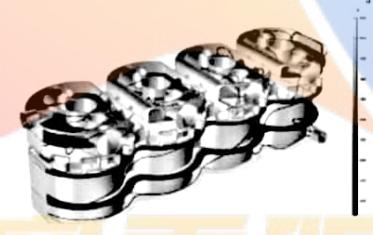  
发动机中的强制对流散热

  
灯泡中的辐射散热

对于多层防护服，当织物与皮肤间空气层厚度小于或等于6.4mm时，由于空气层间隙太小，气体无法形成对流运动，所以此问题背景下热传递方式主要有热传导与热辐射。又由于热辐射是物体通过电磁波传递能量的，假人恒定温度为 $3 7 \mathrm { { } ^ { \circ } C }$ ，在这个温度下所产生的电磁波传递的能量较热传导的能量非常小，可忽略不计，故最终确定本问之中热量仅通过热传导方式传递。

## 5.1.2 热传导

导热是物体的各部分之间不发生相对位移，依靠分子、原子和自由电子等微观粒子的热运动所产生的热传递过程。

在热防护服的实际应用中，因为温差而引起的能量转移为传热；任何情况下，只要在某介质中或是两个介质之间存在温差，便会发生热量从高温向低温的传递过程，这个过程称为热传导，也叫热扩散。Fourier定律就是描述热传导的基本定律。热传导率描述的是材料导热能力的属性，材料不同热传导率也就不同，其值大小受温度影响

很大。但是本文中由于高温热源与低温热源之间的温差不是很大故而认定其热传导系数，密度，比热容以及厚度均不变。

## 5.1.3 热传导方程的推导

设有一根截面积为 A的均匀细杆，沿杆长有温度变化，其侧面绝热，考虑其热量的传播过程。

由于杆是均匀且细的，所以任何时刻可以将杆的横截面上温度视为相同；由于杆侧面绝热，因此热量只沿杆长方向传导，所以这是一个一维的热传导问题。

如图 5.2所示，取杆中心骨架与x轴重合，以 $u ( x , t )$ 表示杆上x点处t时刻的温度。从杆内部划出一小段Δx，考察这一小段，在时间间隔Δt内热量流动情况。

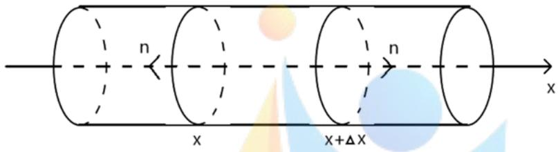  
图 5.2 细杆示意图

设c为杆的比热容（单位物质升高或降低单位温度所吸收或放出的热量，它与物质的材料有关）， $\rho$ 为杆的密度，则有：

（1）在Δt时间内引起小段Δx温度升高，所需热量为

$$
Q = c ( \rho A \Delta x ) [ u ( x , t + \Delta t ) - u ( x , t ) ]
$$

故当 $\Delta t \to 0$ 时

$$
Q \approx c \rho A u _ { t } \Delta x \Delta t
$$

而 Fourier实验定律告诉我们：当介质内有温差存在时，热量由温度高处向温度低处流动，单位时间流过单位面积的热量q（热流密度）与温度下降率成正比：

$$
q = - k \frac { \partial u } { \partial n }
$$

其中，k为导热率（与介质材料有关，严格来说也与温度有关，在温度变化范围不大时可忽略）； $\frac { \hat { o } u } { \hat { o } n }$ 的方向是通过曲面的外法向量方向；而负号表示由温度高处流向温度低处。因此:

（2）在t时间内沿x轴正向流入x处截面的热量为

$$
Q _ { 1 } ( x ) = - k u _ { \scriptscriptstyle x } ( x , t ) A \Delta t
$$

（3）在t 时间内由 $x + \Delta x$ 处截面流出的热量为

$$
Q _ { 2 } ( x + \Delta x ) = - k u _ { x } ( x + \Delta x , t ) A \Delta t
$$

根据能量守恒定律，流入Δx段总热量与∆x段中热源产生的热量应正好是∆x段温度升高所吸收的热量，即

$$
Q = Q _ { 1 } - Q _ { 2 }
$$

因此有

$$
c \rho A u _ { t } \Delta x \Delta t = - k u _ { x } ( x , t ) A \Delta t + k u _ { x } \left( x + \Delta x , t \right) A \Delta t
$$

即

$$
c \rho u _ { t } = \frac { k [ u _ { x } \left( x + \Delta x , t \right) - u _ { x } ( x , t ) ] } { \Delta x }
$$

令 $\Delta x \to 0$ 两边取极限

$$
u _ { t } = \frac { k } { c \rho } u _ { x x }
$$

$$
u _ { t } = D u _ { x x }
$$

即

$$
u _ { t } = D u _ { x x } , \ D = \frac { k } { c \rho }
$$

此式即为一维的热传导方程。

## 5.1.4 牛顿冷却定律

牛顿冷却定律是研究温度高于周围环境的物体向周围介质传递热量逐渐冷却时所遵循的规律。当介质表面与环境存在温差时，单位时间单位面积散失的热量与温度成正比，这个比例系数称之为热传递系数。牛顿冷却定律在强制对流情况下与实际符合较好，在自然对流时仅在温差不太大的情况下成立。该定律用于计算介质中对流热量的多少。

$$
\frac { \partial Q } { \partial t } = k _ { 0 } ( T - \theta )
$$

式中 $k _ { 0 }$ 与介质表面温度、表面光洁度、表面积以及环境温度 $\theta ^ { \cdot }$ 有关，称 $k _ { 0 }$ 为耗散系数，在 $( T - \theta )$ 不大时， $k _ { 0 }$ 为常数，上式便为牛顿冷却定律的微分形式。

## 5.2 问题一模型的建立

针对“环境-防护服-人体”系统，提出高温下织物以及空气层的热传递数学模型。“环境-防护服-人体”系统的各层分布示意图如 5.3

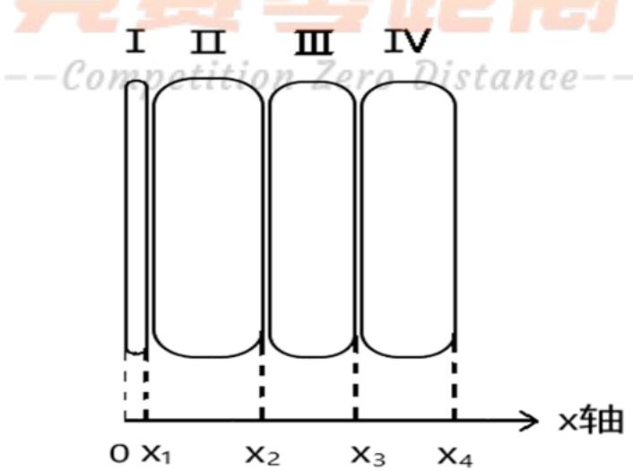  
图 5.3“环境-防护服-人体”系统示意图

建立热力学传导方程：

$$
\left\{ \begin{array} { l l } { \displaystyle \frac { \partial T _ { 1 } } { \partial t } = D _ { 1 } \frac { \hat { \sigma } ^ { 2 } T _ { 1 } } { \hat { \sigma } x ^ { 2 } } \quad , 0 \leq x < x _ { 1 } } \\ { \displaystyle \frac { \partial T _ { 2 } } { \partial t } = D _ { 2 } \frac { \hat { \sigma } ^ { 2 } T _ { 2 } } { \hat { \sigma } x ^ { 2 } } \quad , x _ { 1 } \leq x < x _ { 2 } } \\ { \displaystyle \frac { \partial T _ { 3 } } { \partial t } = D _ { 3 } \frac { \hat { \sigma } ^ { 2 } T _ { 3 } } { \hat { \sigma } x ^ { 2 } } \quad , x _ { 2 } \leq x < x _ { 3 } } \\ { \displaystyle \frac { \partial T _ { 4 } } { \partial t } = D _ { 4 } \frac { \hat { \sigma } ^ { 2 } T _ { 4 } } { \hat { \sigma } x ^ { 2 } } \quad , x _ { 3 } \leq x \leq x _ { 4 } } \end{array} \right.\tag{5-2-1}
$$

## ·几何条件

考虑到织物之间无褶皱并且相对研究的单位面积下可以认为其是平行的平面，在假人以及织物之间的间隙层可以认为是一些孔网状结构，从而空气占有较大，近似地认为是空气层。

## ·初始条件

对于含有时间变量t的数理方程来说，其未知函数将随t不同而有不同的值，故必然要反映某一时刻物理量与相邻时刻的同一物理量之间的关系，所以求解问题过程中必须追溯到早先某个所谓“初始”时刻的状况，即建立初始条件。

$t = 0 s$ 时四个介质层的初始温度都为 $T _ { h } = 3 7 ~ \mathrm { ^ { \circ } C }$ ，可得四个区域的热传导方程初始条件如下所示：

$$
\left\{ \begin{array} { l l } { T _ { 1 } ( x , 0 ) = T _ { h } } \\ { T _ { 2 } ( x , 0 ) = T _ { h } } \\ { T _ { 3 } ( x , 0 ) = T _ { h } } \\ { T _ { 4 } ( x , 0 ) = T _ { h } } \end{array} \right.\tag{5-2-2}
$$

其中 $T _ { h } = 3 7 ~ \mathrm { ^ circ C }$ 表示假人体皮肤外侧表面初始温度， $T _ { i } ( x , 0 )$ 表示各层介质的初始时刻温度。·衔接条件

在研究具有不同介质的问题时，这时方程数目增多，除边界方程外，还需加不同介质界面处的衔接条件。

四个区域热传导方程衔接条件：

$$
\begin{array} { r }  \left\{ \begin{array} { l l } { T _ { 1 } ^ { ( \hat { A } _ { 1 } ^ { \prime } | - 0 , \hat { \mathcal { U } } _ { 1 } ^ { \prime } ) \equiv T _ { 2 } ^ { \prime } ( \hat { x } _ { 1 } ^ { \prime } + 0 , \hat { \mathcal { U } } _ { 1 } ^ { \prime } ) / \mathcal { U } } \\ { \left. \left[ k _ { 1 } \frac { \widetilde { \mathcal { D } } T _ { 1 } } { \hat { C } _ { 1 } } \right] _ { x = x _ { 1 } - 0 } = k _ { 2 } \frac { \widetilde { \mathcal { D } } T _ { 2 } } { \hat { C } _ { 1 } } \right| _ { x = x _ { 1 } + 0 } } \\ { T _ { 2 } ^ { \prime } ( x _ { 2 } - 0 , t ) = T _ { 2 } ( x _ { 2 } + 0 , t ) } \\ { \left. \left[ k _ { 2 } \frac { \widetilde { \mathcal { D } } T _ { 2 } } { \hat { C } _ { 1 } } \right] _ { x = x _ { 2 } - 0 } = k _ { 3 } \frac { \widetilde { \mathcal { D } } T _ { 3 } } { \hat { C } _ { x } } \right| _ { x = x _ { 2 } \pm 0 } } \\ { T _ { 3 } ^ { \prime } ( x _ { 3 } - 0 , t ) = T _ { 3 } ^ { \prime } ( x _ { 3 } + 0 , t ) } \\ { \left. \left[ k _ { 3 } \frac { \widetilde { \mathcal { D } } T _ { 3 } } { \hat { C } _ { 1 } } \right] _ { x = x _ { 3 } - 0 } = k _ { 4 } \frac { \widetilde { \mathcal { D } } T _ { 4 } } { \hat { C } _ { 3 } } \right| _ { x = x _ { 3 } + 0 } } \end{array} \right. } \end{array}\tag{5-2-3}
$$

## ·边界条件

由于温度场中的未知函数均是空间位置函数，这必然反映到连续体的物理量在某一位置的取值与其相邻位置的取值间的关系，这种关系延伸到被研究区域的边界，会与边界状况发生联系，即边界状况将通过逐点影响题目讨论的整个区域。

根据第Ⅰ层织物直接与 $T _ { s }$ 热源接触得出第一个边界条件，同时考虑到假人体内的低温恒温热源会使热量吸收从而冷却假人皮肤表面，但是温度仍会不断上升，一段时间后达到动态平衡使得皮肤表面维持恒定温度。因此考虑第三类边界条件，利用牛顿冷却定律得到热传导方程的第二个边界条件：

$$
\left\{ \begin{array} { l l } { T _ { 1 } ( 0 , t ) = T _ { s } } \\ { \left. \frac { \partial T _ { 4 } } { \partial t } \right| _ { x = x _ { 4 } } = \delta \times \left[ T _ { 4 } \left( x _ { 4 } , t \right) - T _ { h } \right] } \end{array} \right.\tag{5-2-4}
$$

其中 $T _ { s }$ 表示外界高温热源为 $7 5 \mathrm { { ^ \circ C } }$ ， $T _ { h }$ 表示假人体内恒温热源为 $3 7 \mathrm { { } ^ { \circ } C }$ ， $\delta$ 表示热交换系数。

## 5.3 问题一模型的求解

一维热传导方程 $T _ { t } = D T _ { x x }$ 是最简单的偏微分方程之一，本文是偏微分方程组的联立，并且定解条件较为复杂，因此应当求出其数值解。一般求解偏微分方程有有限元法和有限差分法等。

在本问题中采用有限差分法处理，它以 Taylor 级数展开等方法，将约束方程中的导数用网格节点上的函数值的差商代替来进行离散，建立以网格节点上的值为未知数的代数方程组。其基本思想是将连续定解区域用有限个离散点构成的网格代替，离散点称为网格节点；将连续定解区域内连续变量的函数用在网格上定义的离散变量函数近似；原方程和定解条件中的微商用差商近似；积分用积分和近似，于是将原微分方程与定解条件近似地代之以代数方程组，即为有限差分方程组；解方程组便能得到原问题在离散点上的近似解，再利用插值法从离散解中得到定解问题在整个区域上的近似解。

计算步骤为：1.区域的离散；2.插值函数选择；3.方程组建立；4.方程组求解。

利用有限差分法对偏微分方程进行数值求解，不同于对常微分方程进行数值求解。常微分方程只需考虑初始条件以及差分的前一项，由这两个条件就可以确定出所有的值。但偏微分方程的自变量不止一个，所以需要初始条件以及边界条件来确定。在有限差分法中不仅需要确定一个点前一时刻的函数值仍需确定下一个时刻的函数值，并且位置也需要考虑前后的函数值。

Crank-Nicolson方法是一种数值分析的有限差分法，对于扩散方程及其他方程是无条件稳定的，但是如果时间步长乘以热扩散率，再除以步长的平方即 的值过大（根据冯诺依曼稳定性分析，以大于 $1 / 2$ 为准），且一般 ，所以近似解中将存在虚假的振荡或衰减。基于这个原因，当要求大时间步或高空间分辨率时，通常采用数值精确交差的后向欧拉法，既保证了稳定性又可减少解的伪振荡。

Crank-Nicolson方法在空间域上使用中心差分，时间域上应用梯形公式，保证了时间域上的二阶收敛。比如一维微分方程：

$$
\frac { \partial T } { \partial t } = D \frac { \partial ^ { 2 } T } { \partial x ^ { 2 } }\tag{5-3-1}
$$

令 $T ( i \Delta x , n \Delta t ) = T _ { i } ^ { n }$ ，通过 Crank-Nicolson 方法导出的中心差分方程，第 n 步上采用

前向欧拉法：

$$
\frac { T _ { i } ^ { n + 1 } - T _ { i } ^ { n } } { \Delta t } { = } D _ { i } ^ { n } \frac { \partial ^ { 2 } T } { \partial x ^ { 2 } }\tag{5-3-2}
$$

第 $n { + 1 }$ 步上采用后向欧拉法;

$$
\frac { T _ { i } ^ { n + 1 } - T _ { i } ^ { n } } { \Delta t } { = } D _ { i } ^ { n + 1 } \frac { \partial ^ { 2 } T } { \partial x ^ { 2 } }\tag{5-3-3}
$$

中心差分：

$$
\left\{ \begin{array} { l } { \displaystyle \frac { T _ { i } ^ { n + 1 } - T _ { i } ^ { n } } { \Delta t } = \frac { 1 } { 2 } [ ( D _ { i } ^ { n + 1 } \frac { \hat { \sigma } ^ { 2 } T } { \hat { \sigma } x ^ { 2 } } ) + ( D _ { i } ^ { n } \frac { \hat { \sigma } ^ { 2 } T } { \hat { \sigma } x ^ { 2 } } ) ] } \\ { \displaystyle i = 1 . 2 . 3 . 4 , ~ n = 0 , 1 , \cdots \Gamma - 1 } \\ { \displaystyle T _ { i } ^ { 0 } = t _ { i } , i = 1 . 2 . 3 . 4 } \\ { \displaystyle T _ { 4 } ^ { n } = \varphi _ { \delta } ^ { n } , n = 0 . 1 , \cdots \Gamma } \\ { \displaystyle \frac { T _ { 4 } ^ { n } - T _ { 4 - 1 } ^ { n } } { \Delta t } = \varphi _ { \delta } ^ { n } , n = 0 , 1 , \cdots \Gamma } \end{array} \right.\tag{5-3-4}
$$

选用中心差商法通过 MATLAB 运算，发现令前三层步长合适的条件下并不能使得第四层满足，而将 $\Delta x$ 取 0.01mm， $\Delta t$ 取 0.0001s 时可实现四层条件都满足，但是这会使实验数据量变庞大而在有限时间内无法运算出结果，且近似解中存在虚假的振荡或衰减。基于这个原因，最终采用数值精确较差的后向欧拉法。

·最终算法步骤：

欧拉后向差分解法：首先对 xt 平面进行网格剖分。分别取 $\Delta x$ 、t为x方向与t方向的步长，用两族平行直线 $x = x _ { k } = k \Delta x ( k = 0 , \pm 1 , \pm 2 , \ldots ) , t = t _ { i } = j \Delta t ( j = 0 , 1 , 2 , \ldots )$ 把初始的矩阵划分成一个长方形网络如图 5.4。为方便起见，记 $( k , j ) = ( x _ { k } , y _ { j } ) , T ( k , j ) = T ( x _ { k } , y _ { j } )$

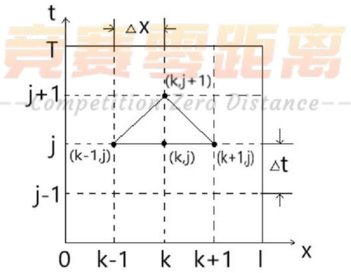  
图 5.4 热传导方程的网格划分

在网格内的点 $( k , j )$ 处，对 $\frac { \partial T } { \partial t } , \frac { \partial ^ { 2 } T } { \partial x ^ { 2 } }$ 均采用后向欧拉法。

得到热传导差分方程：

$$
\frac { T ( k , j ) - T ( k , j - 1 ) } { \Delta t } = D \frac { T ( k + 1 , j ) - 2 T ( k , j ) + T ( k - 1 , j ) } { \left( \Delta x \right) ^ { 2 } } \eqno ( 5 - 3 - 5 )
$$

引入变量 $r = D \Delta t / \left( \Delta x \right) ^ { 2 }$

$$
T ( k , j ) + T ( k , j - 1 ) = r T ( k + 1 , j ) + 2 r T ( k , j ) + r T ( k - 1 , j ) \quad ( 5 - 3 - 6 )
$$

此方程为三对角问题，应用三对角矩阵算法（追赶法）即可得到 $T ( k , j )$ ，而不需要对矩阵直接求逆。

初始条件差分方程：

$$
T ( x _ { k } , 0 ) = T _ { s }\tag{5-3-7}
$$

衔接条件的差分方程在左边界用向前差商近似偏导数 $\frac { \partial T } { \partial t }$ ，在右边界用向后差商近似 $\frac { \partial T } { \partial t }$ ，即（以Ⅰ、Ⅱ层为例）：

$$
k _ { 1 } \frac { T _ { 1 } ( x _ { 1 } - 0 , j ) - T _ { 1 } ( x _ { 1 } + 0 , \mathrm { ~ j ~ } ) } { \Delta t } = k _ { 2 } \frac { T _ { 2 } ( x _ { 1 } - 0 , j ) - T _ { 2 } ( x _ { 1 } + 0 , \mathrm { ~ j ~ } ) } { \Delta t } \pmod { - 3 - 8 }
$$

边界条件的差分方程：

$$
\frac { T _ { 4 } ( x _ { 4 } , j ) - T _ { 4 } ( x _ { 4 } , j ) } { \Delta t } { = } \delta ( t ) \times \left[ T _ { 4 } \left( x _ { 4 } , t \right) - T _ { h } \right]\tag{5-3-9}
$$

利用所给附件2中假人皮肤外侧的测量温度信息绘制出图5.5中假人外侧皮肤温度随时间的变化曲线图。

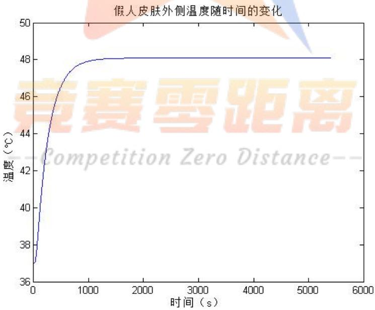  
图 5.5 假人皮肤外侧温度随时间的变化

通过上图可以看出在1000s以内由于高低温热源温差较大，同时由于织物介质厚度较小使得假人皮肤外侧温度在短时间内急剧上升达不到很好的阻热作用。同时可以发现在 $4 8 ^ { \circ } \mathrm { C }$ 以后外侧温度不再发生改变，此时因为低温热源具有耗散功能可以使得皮

肤一侧温度分布最终与低温热源达到动态平衡。

通过最终的皮肤一侧 $x = x _ { 4 }$ 处的温度分布与前侧邻域x之间的温度差当作在 $x = x _ { 4 }$ 的温度梯度再结合牛顿冷却定律即该处的第三类边界条件：

$$
\frac { \partial T } { \partial x } \bigg | _ { x = x _ { 4 } } = \delta [ T ( x _ { 4 } , t ) - T _ { n } ]\tag{5-3-10}
$$

最后根据时间确定δ的取值。

为了更好地分析处温度场在不同时刻的空间分布绘制出如下的三维空间立体图5.6

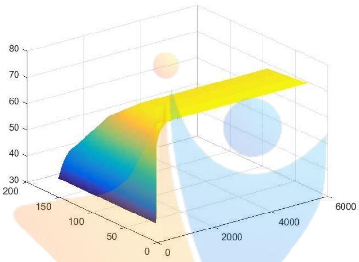  
图 5.6 温度场在不同时刻的空间分布

同时分别取 t=50s、t=100s、t=500s、t=2000s 时热防护服四个不同时刻的温度场平面二维图5.7。

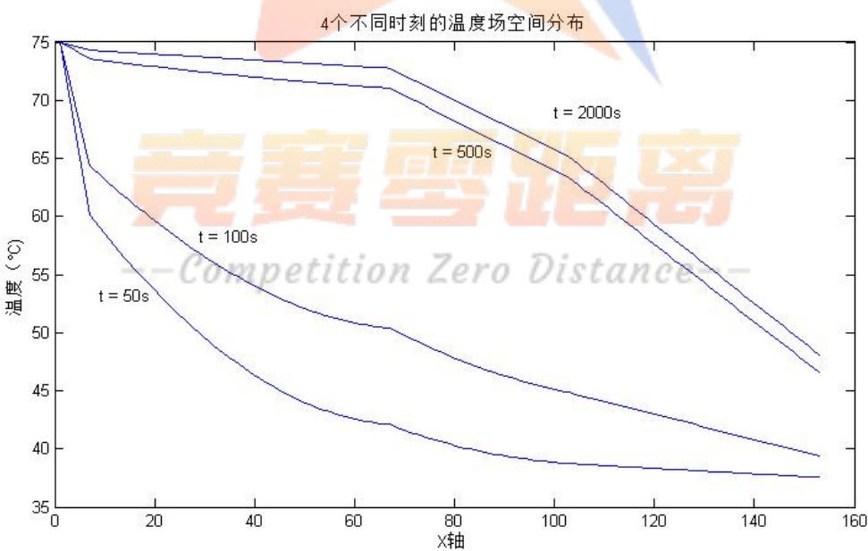  
图 5.7 四个不同时刻下热防护服的温度场分布图

通过图5.6可以看出沿x轴的空间分布在不同介质的温度梯度变化不同，但是同

一介质中的的温度梯度是相同的，这是因为该介质各向同性均匀一致。

从时间分布来看，时间较短时，温度整体分布是先急剧下降再平缓，这是因为靠近高温热源时温度梯度较大，在靠近低温热源时温度梯度变化较小因而温度变化平缓。

当时间较长时，空间各部分都已接受热源的传递，因而越靠近高温热源越接近高温热源的温度，越靠近低温热源越越容易达到动态平衡从而温度趋于稳定，变化较小。

## 5.4 问题二模型的建立

环境温度为 $6 5 \mathrm { { ^ \circ C } }$ ，第Ⅳ层的厚度为5.5mm，要通过改变第Ⅱ层的厚度使得专用服的绝热保温效果最好，据生活常识可认为在Ⅱ层的绝热保温效果较好的情况下，设计厚度越薄越好，记第Ⅱ层厚度为 $d _ { 2 } ( 0 . 6 m m \leq d _ { 2 } \leq 2 5 m m )$ ）。

热力学传导方程：

$$
\left\{ \begin{array} { l l } { \displaystyle \frac { \partial T _ { 1 } } { \partial t } = D _ { 1 } \frac { \hat { \sigma } ^ { 2 } T _ { 1 } } { \hat { \sigma } x ^ { 2 } } \quad , 0 \leq x < x _ { 1 } } \\ { \displaystyle \frac { \hat { \sigma } T _ { 2 } } { \hat { \sigma } t } = D _ { 2 } \frac { \hat { \sigma } ^ { 2 } T _ { 2 } } { \hat { \sigma } x ^ { 2 } } \quad , x _ { 1 } \leq x < x _ { 2 } } \\ { \displaystyle \frac { \hat { \sigma } T _ { 3 } } { \hat { \sigma } t } = D _ { 3 } \frac { \hat { \sigma } ^ { 2 } T _ { 3 } } { \hat { \sigma } x ^ { 2 } } \quad , x _ { 2 } \leq x < x _ { 3 } } \\ { \displaystyle \frac { \partial T _ { 4 } } { \hat { \sigma } t } = D _ { 4 } \frac { \hat { \sigma } ^ { 2 } T _ { 4 } } { \hat { \sigma } x ^ { 2 } } \quad , x _ { 3 } \leq x \leq x _ { 4 } } \end{array} \right.\tag{5-4-1}
$$

由问题一标定出了耗散系数 $\delta$ ，建立边界条件方程：

$$
\left\{ \begin{array} { l l } { T _ { 1 } ( 0 , t ) = T _ { s } } \\ { \left. \frac { \partial T _ { 4 } } { \partial t } \right| _ { x = x _ { 4 } } = \delta \times \left[ T _ { 4 } \left( x _ { 4 } , t \right) - T _ { h } \right] } \end{array} \right.\tag{5-4-2}
$$

其中 $T _ { s }$ 为 $6 5 \mathrm { { ^ \circ C } }$

目标方程为：

$$
\operatorname* { m i n } d _ { 2 }
$$

$$
\stackrel { \rho . t . } { \left. \begin{array} { l } { T _ { 4 } ( x _ { 4 } , 3 6 0 0 ) \leq 4 7 } \\ { T _ { 4 } ( x _ { 4 } , 3 3 0 0 ) \leq 4 4 } \end{array} \right. }
$$

联立上式以及约束条件可确定出 $\operatorname* { m i n } d _ { 2 }$ ，得出满足约束条件下第Ⅱ层的最优厚度。

## 5.5 问题二模型的求解

优选法算法：

求解过程中使用单因素优选法中 0.618 法（黄金分割法），尽量用最可能少的试验次数，尽快找到解决问题的最优方案。

优选法的基本步骤为：1.选定优化判断依据（约束条件），确定影响因素，优选数据是判断优选程度的依据；2.列出优化判定依据与影响因素直接的关系，即为目标函数；

3.优化计算；4.选出合理的试验点。

在本问题中，让专用服绝热保温效果最佳就是选择最优厚度。题目设定厚度范围为0mm 至 24.4mm，所以在这个区间内选取 0.618 处作为试验点，直观起见，将 0 至 24.4看为单位长的线段，如图 5.8

第层最优厚度下的皮肤外侧温度分布  
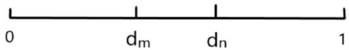  
图 5.8

为了比较试验的结果，必定需两两比较，设两点 $d _ { { \scriptscriptstyle m } }$ 和 $d _ { n }$ 。起初不知这两点哪点较好，并且两点间存在二选一，由于两点间被去掉的可能性相同，因此两端最好取得相等，即满足

$$
d _ { m } = 1 - d _ { n } \circ\tag{5-5-1}
$$

如果试验后去掉的为 $[ 0 , d _ { n } ]$ ，则留下 $[ d _ { m } , 1 ]$ ，所以 $d _ { n }$ 在 $[ d _ { m } , 1 ]$ 中的地位相当于 $d _ { m }$ 在[0,1]中的地位。可表示为：

$$
1 { : } d _ { n } = d _ { m } : d _ { n } , \mathbb { H } d _ { n } ^ { \ 2 } = d _ { m }\tag{5-5-2}
$$

$$
d _ { m } = 1 - d _ { n }\tag{5-5-3}
$$

将式（5-5-2）与（5-5-3）联立得到

$$
{ d _ { n } } ^ { 2 } + { d _ { n } } - 1 = 0\tag{5-5-4}
$$

解得

$$
\mathbf { d } _ { n } = ( { \sqrt { 5 } } - 1 ) / 2 \approx 0 . 6 1 8
$$

于是利用黄金分割比 0.618 来对 $d _ { 2 }$ 厚度区间实行搜索。

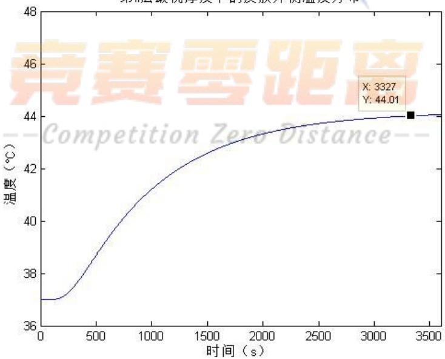  
图 5.9 第Ⅱ层最优厚度下皮肤外侧温度分布图

表 1 第Ⅱ层最优厚度下 44℃附近温度数据
<table><tr><td>时间/s 温度/℃</td><td>3314 43.99732</td><td>3315 43.99763</td><td>3316 43.99794</td><td>3317 43.99825</td><td>3318 43.99855</td><td>3319 43.99886</td></tr><tr><td>时间/s 温度/℃</td><td>3320 43.99916</td><td>3321 43.99947</td><td>3322 43.99977</td><td>3323 44.00008</td><td>3324 44.00038</td><td>3325 44.00069</td></tr><tr><td>时间/s</td><td>3326</td><td>3327</td><td>3328</td><td>3329</td><td>3330</td><td>3331</td></tr><tr><td>温度/℃</td><td>44.00099</td><td>44.00129</td><td>44.00159</td><td>44.0019</td><td>44.0022</td><td>44.0025</td></tr><tr><td>时间/s</td><td>3332</td><td>3333</td><td>3334</td><td>3335</td><td>3336</td><td>3337</td></tr><tr><td></td><td></td><td></td><td></td><td></td><td></td><td></td></tr><tr><td>温度/℃</td><td>44.0028</td><td>44.0031</td><td>44.00341</td><td>44.00371</td><td>44.00401</td><td>44.00431</td></tr><tr><td></td><td></td><td></td><td></td><td></td><td></td><td></td></tr><tr><td></td><td></td><td></td><td></td><td></td><td></td><td></td></tr><tr><td>时间/s</td><td>3338</td><td>3339</td><td>3340</td><td>3341</td><td>3342</td><td>3343</td></tr></table>

由上图可以清楚看出在满足人皮肤外侧的温度不超过 47℃，并且超过 44℃的时间为 260s，满足在 5 分钟之内。并且此时得到最小的厚度为 15.7mm。

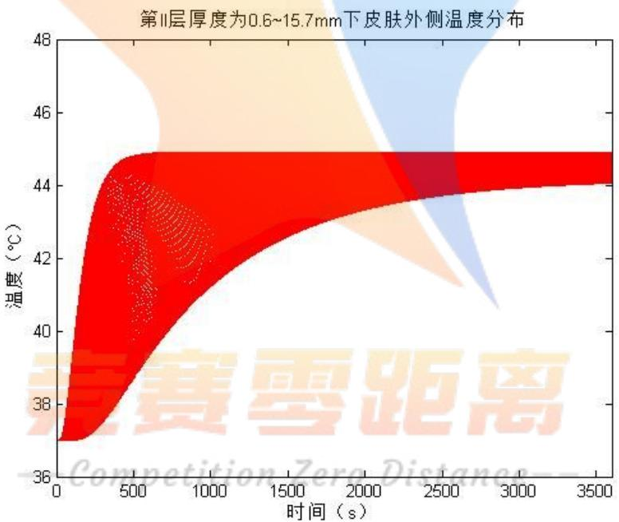  
图 5.10 第Ⅱ层介质厚度 0.6-17.0mm 下皮肤外侧温度分布图

最终生成温度分布的部分内容如下表5.5.4，完整表格见支撑材料(problem1.xlsx)。从5.5.3中我们清楚看出比17.0mm薄的第Ⅱ厚度早在500s时就已经超过44℃并且持续时间较长，从图中我们也可以清楚看到随着第二层厚度 $d _ { 2 }$ 代表着曲线趋于稳定时的陡峭程度，即 $d _ { \gamma }$ 越小温度在时间的上的一阶导数较大。

## 5.6 问题三模型的建立

此问题在环境温度变为 80℃的情况下需考虑两层介质厚度即第Ⅱ层介质的厚度和第Ⅳ层介质的厚度，两层介质厚度搭配以确保满足题目要求。

记 第 Ⅱ 层 的 介 质 厚 度 为 $d _ { 2 } , ( 0 . 6 m m \leq d _ { 2 } \leq 2 5 m m )$ ， 第 Ⅳ 层 介 质 的 厚 度 为$d _ { 4 } , ( 0 . 6 m m \leq d _ { 4 } \leq 6 . 4 m m )$ 。且由于外表温度是单调非递减的，所以设计达到 $4 4 ^ { \circ } \mathrm { C }$ 的时间必须在 25分钟后才能满足不超过 5分钟的要求。

综合第二问算法，先以第Ⅱ层以及第Ⅳ层的厚度每次按照∆x=0.1mm的步长向上递增得到一个二维点阵如图 5.11，保留这个点阵的数值而转化为二维矩阵，然后遍历搜索点阵中满足约束条件的数组元素，根据第Ⅱ层的厚度最小原则进行筛选。查阅相关文献<sup>【2】</sup>得知人体在高温环境下不会被损伤到的温度为 $4 4 ^ { \circ } \mathrm { C }$ ，所以超过 $4 4 ^ { \circ } \mathrm { C }$ 以后人应当待在高温环境下的时间尽可能地短。

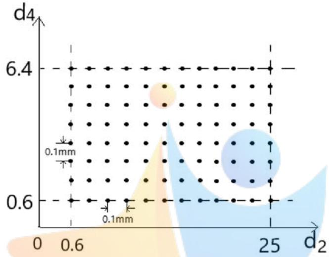  
图 5.11 第Ⅱ层与第Ⅳ层所有组合解示意图

边界条件方程如下：

$$
\left\{ \begin{array} { l l } { T _ { 1 } ( 0 , t ) = T _ { s } } \\ { \left. \frac { \partial T _ { 4 } } { \partial t } \right| _ { x = x _ { 4 } } = \delta \times \left[ T _ { 4 } \left( x _ { 4 } , t \right) - T _ { h } \right] } \end{array} \right.\tag{5-6-1}
$$

其中 $T _ { s }$ 为 $8 0 ^ { \circ } \mathrm { C }$ 。以下列约束条件为目标进行二维搜索：

$$
\left\{ { \begin{array} { l } { T _ { 4 } ( x _ { 4 } , 1 8 0 0 ) \leq 4 7 } \\ { T _ { 4 } ( x _ { 4 } , 1 5 0 0 ) \leq 4 4 } \end{array} } \right.\tag{5-6-2}
$$

得到满足约束条件的点后，从中选出第Ⅱ层厚度较小的点。遍历平面点集在Ⅳ层的厚度下，假人皮肤外侧温度不超过 47℃且超过 44℃的时间，联系实际人体外表皮在温度大于 44℃时开始会发生热损伤，所以超过 44℃以后，人应当在高温环境下待的时间尽可能地短。提取出这段时间的点，时间最少点所对应的Ⅱ、Ⅳ层厚度值即为条件下的最优厚度解。

## 模型最优厚度确定：

考虑到实际工人高温作业下应该尽快完成作业而高温下的工作服需要体积小方便作业人员操作当作主要因素，舒适程度当作辅助因素。

把 $\eta$ 当作最优厚度：

$$
\eta = \zeta _ { 2 } d _ { 2 } + \zeta _ { 4 } d _ { 4 }\tag{5-6-3}
$$

体积小可以通过总的衣服厚度以及空气层的厚度来衡量，质量小，轻便应当衣服的总质量来考量。记系数为 $\zeta _ { 2 }$ 。

根据文献 高温防护服的空气层因为D4较大故而温度梯度较小但是保温绝热较好，同时可以防止作业人员的皮肤被烫伤。记系数为 $\zeta _ { 4 }$

综合上述，令：

$$
\zeta _ { 2 } / \zeta _ { 4 } { = } 1\tag{5-6-4}
$$

此时 $\eta$ 作为最优厚度：

$$
\begin{array} { l } { \operatorname* { m i n } \eta } \\ { \eta = d _ { 2 } + d _ { 4 } } \end{array}\tag{5-6-5}
$$

## 5.7 问题三模型的求解

第一步，一次遍历搜索点集中满足约束条件的83个点如下表5.2所示。

表 5.2 所有满足约束条件的第Ⅱ、Ⅳ层厚度组合 $( d _ { 2 } , d _ { 4 } )$
<table><tr><td>(16.8,6.4)</td><td>(16.9,6.4)</td><td>(17.0,6.3)</td><td>(17.1，6.2)</td><td>(17.2,6.2)</td></tr><tr><td>(17.3,6.1)</td><td>(17.4,6.0)</td><td>(17.5,6.0)</td><td>(17.6，5.9)</td><td>(17.7,5.8)</td></tr><tr><td>(17.8,5.8)</td><td>(17.9,5.7)</td><td>(18.0，5.6)</td><td>(18.1，5.6)</td><td>(18.2,5.5)</td></tr><tr><td>(18.3,5.4)</td><td>(18.4,5.4)</td><td>(18.5，5.3)</td><td>(18.6，5.2)</td><td>(18.7,5.2)</td></tr><tr><td>(18.8,5.1)</td><td>(18.9，5.1)</td><td>(19.0，5.0)</td><td>(19.1，4.9)</td><td>(19.2,4.9)</td></tr><tr><td>(19.3,4.8)</td><td>(19.4，4.7)</td><td>(19.5，4.7)</td><td>(19.6，4.6)</td><td>(19.7,4.6)</td></tr><tr><td>(19.8,4.5)</td><td>(19.9,4.4)</td><td>(20.0，4.4)</td><td>(20.1，4.3)</td><td>(20.2,4.2)</td></tr><tr><td>(20.3,4.2)</td><td>(20.4,4.1)</td><td>(20.5，4.1)</td><td>(20.6,4.0)</td><td>(20.7,3.9)</td></tr><tr><td>(20.8,3.9)</td><td>(20.9,3.8)</td><td>(21.0，3.8)</td><td>(21.1, 3.7)</td><td>(21.2,3.7)</td></tr><tr><td>(21.3,3.6)</td><td>(21.4,3.5)</td><td>(21.5，3.5)</td><td>(21.6, 3.4)</td><td>(21.7,3.4)</td></tr><tr><td>(21.8,3.3)</td><td>(21.9,3.2)</td><td>(22.0，3.2)</td><td>(22.1，3.1)</td><td>(22.2,3.1)</td></tr><tr><td>(22.3,3.0)</td><td>(22.4,3.0)</td><td>(22.5，2.9)</td><td>(22.6，2.9)</td><td>(22.7,2.8)</td></tr><tr><td>(22.8,2.7)</td><td>(22.9,2.7)</td><td>(23.0, 2.6)</td><td>(23.1，2.6)</td><td>(23.2,2.5)</td></tr><tr><td>(23.3,2.5)</td><td>(23.4,2.4)</td><td>(23.5,2.4)</td><td>(23.6,2.3)</td><td>(23.7,2.3)</td></tr><tr><td>(23.8,2.2)</td><td>(23.9, 2.2)</td><td>(24.0,2.1)</td><td>(24.1,2.0)</td><td>(24.2,2.0)</td></tr><tr><td>(24.3,1.9)</td><td>(24.4,1.9)</td><td>(24.5，1.8)</td><td>(24.6,1.8)</td><td>(24.7, 1.7)</td></tr><tr><td>(24.8, 1.7)</td><td>(24.9,1.6)</td><td></td><td></td><td></td></tr></table>

第二步，根据 $\eta$ 最小作为目标在83个点中搜索，最终确定（16.8，6.4）为最优厚度组合，即第Ⅱ层介质厚度为16.8mm，第Ⅳ层厚度为6.4mm。

## 6 模型检验

在误差分析时，使用有限差分法中的空间反演法，把右的边界条件当作最左边界条件，优厚向前推演，再结合初始条件即可确定温度场的重新分布。

先将问题写成如下一般形式：

$$
\left\{ \begin{array} { l l } { \displaystyle { \frac { \partial T } { \partial t } } = D { \frac { { \hat { \sigma } } ^ { 2 } T } { \partial x ^ { 2 } } } } \\ { T ( x , 0 ) \ – t ( x ) } \\ { T ( L , t ) = \varphi ( t ) } \end{array} \right.
$$

对反问题有：

$$
\left\{ \begin{array} { l } { \displaystyle \frac { T _ { i } ^ { n + 1 } - T _ { i } ^ { n } } { \Delta t } = \frac { 1 } { 2 } [ ( D _ { i } ^ { n + 1 } \frac { \partial ^ { 2 } T } { \partial x ^ { 2 } } ) + ( D _ { i } ^ { n } \frac { \partial ^ { 2 } T } { \partial x ^ { 2 } } ) ] } \\ { \displaystyle i = 1 . 2 . 3 . 4 , ~ n = 0 , 1 \dots \Gamma - 1 } \\ { \displaystyle T _ { i } ^ { 0 } = t _ { i } , i = 1 . 2 . 3 . 4 } \\ { \displaystyle T _ { 4 } ^ { n } = \varphi _ { \delta } ^ { n } , n = 0 . 1 , \dots \Gamma } \\ { \displaystyle \frac { T _ { i } ^ { n } - T _ { 4 - 1 } ^ { n } } { \Delta t } = \varphi _ { \delta } ^ { n } , n = 0 . 1 , \dots \Gamma } \end{array} \right.
$$

通过反演法将运算出的结果与原来结果进行误差分析，得出结果相同的收敛率。

## 7 模型推广

在查阅文献 $\left( 7 \right)$ 的过程中了解到许多国外学者将对假人进行仿真模拟，建立皮肤各层之间的热传递方程，更加真实有效地反映人体实际过程中的热量传递。如建立“热防护服‐空气层‐皮肤”的系统模型，再利用离散化数值求解方法求得相应的数值解，即温度场的分布。本文仍可利用COMSOL Multiphysics物理仿真软件来进行物理热传导方程的模拟实验，并且有国外学者在文献<sup>【</sup>8<sup>】</sup>中进行多层织物热传导仿真实验，效果极佳。

## 8 模型优缺点

## 8.1 模型优点

1.求解偏微分方程时使用数值解法，向后欧拉法在保证解的稳定性上的基础上，进一步保证解的收敛性。

2.进行搜索时采用黄金分割比法使得算法搜索速度加快，可以为下一步缩短步长以及减小时间间隔来搜索最优厚度节省时间

3.物理规律明确切合实际，在处理假人皮肤外侧与空气层时联系具体，将假人视为低温恒温热源，进而根据牛顿冷却定律得到方程的第三类边界条件。

## 8.2 模型缺点

1．查阅文献得知空气层与假人皮肤外侧之间的距离小于 6.4mm 时，不考虑热辐射以及对流，但是一些文献中则是考虑辐射没有对流，为了模型的简便，本文未考虑到热辐射的影响。

2.德尔塔函数的处理上，通过有限差分法算出来的温度场的分布会有一些数值上的误差，但是满足收敛性是必要条件，在根据附件二的数据求解时一部分δ的值出现正值。这一部分只是单从实际考虑舍去，实际情况可能δ的值是全部为负值，但是在收敛的过程中倒数第二组出现不收敛的现象，但是前面到初始条件全部符合收敛的特性。

## 9 参考文献

[1] 姚端正、梁家宝.《数学物理方法》[M].P105 科学出版社.2010 年3 月第三版：Ⅳ.O411.1

[2] 潘斌.热防护服装热传递数学建模及参数决定反问题[D].浙江理工大学.2016.12.28

[3] 卢琳珍、徐定华、徐映红. 纺织学报[N]. 应用三层热防护服热传递改进模型的皮肤烧伤度预测2018 年 1 月

[4] 赖军、张梦莹、张华、李俊 纺织学报[N].消防服衣下空气层的作用与测定方法研究进展 2017年 6 月

[5] 彭芳麟.《计算物理基础》[M].P330 高等教育出版社·北京.2010 年 1 月第 1 版.2013.12

[6] 史策.咸阳师范学院学报[N]. 热传导方程有限差分法的 MATLAB 实现.1672-2914（2009）04-0027-03

[7] 余跃.纺织材料热湿传递数学建模及其设计反问题[D]. 浙江理工大学.2015.11.20

[8] E.ONOFRE 、 S.PETRUSIC 、 G.BEDEK 、 D.DUPONT, and D.SOULAT.13<sup>th</sup>AUTEX Word TextileConference[N].“STUDY OF HEAT TRANSFER THROUGH MULTILAYER TEXTILE STRUCTURE USED INFIREFIGHTER PROTECTIVE CLOTHING”.May22<sup>th</sup>to24<sup>th</sup>2013

https://zh.wikipedia.org/wiki/%E5%85%8B%E5%85%B0%E5%85%8B%EF%BC%8D%E5%B0%BC%E7%A7%91%E5%B0%94%E6%A3%AE%E6%96%B9%E6%B3%95

## 附录

问题 1 源代码：

```matlab
load data1.mat;
%时间以0.1为步长增长，空间以0.1为步长增长
%温度 U,距离 X,时间 t
t_1 = 54000;
%各层相应密度
e1 = 300;
e2 = 862;
e3 = 74.2;
e4 = 1.18;
%各层相应比热
c1 = 1377;
c2 = 2100;
c3 = 1726;
c4 = 1005;
%各层相应热传导率
k1 = 0.082;
k2 = 0.37;
k3 = 0.045;
k4 = 0.028;
a12 = k1/(c1*e1);
a22 = k2/(c2*e2);
a32 = k3/(c3*e3);
a42 = k4/(c4*e4);
r1 = a12*1e7;
r2 = a22*1e7;
r3 = a32*1e7;
r4 = a42*1e7;
%第一层
a1 = ones(5,1);
a1(1:5) = (-r1)*a1(1:5);
b1 = ones(5,1);
b1(1:5) = (1 + 2*r1)*b1(1:5);
c1 = a1;
```

```matlab
q_2 = zeros(1,t_1);
q_2(1,1) = 37;
%第二层
a2 = ones(59,1)*(-r2);
b2 = ones(59,1)*(1 + 2*r2);
c2 = a2;
q_3 = zeros(1,t_1);
q_3(1,1) = 37;
%第三层
a3 = ones(35,1)*(-r3);
b3 = ones(35,1)*(1 + 2*r3);
c3 = a3;
q_4 = zeros(1,t_1);
q_4(1,1) = 37;
%第四层
a4 = ones(49,1)*(-r4);
b4 = ones(49,1)*(1 + 2*r4);
c4 = a4;
UZ_1 = zeros(153,t_1);
UZ_1(1,:) = 75;%与外界环境接触层
UZ_1(:,1) = 37;
for h = 1:t_1 - 1
%第一层
d1 = UZ_1(2:6,i-1);
d1(1) = d1(1) + r1 * UZ_1(1,i-1);
d1(5) = d1(5) + r1 * UZ_1(7,i-1);
%追赶法
UZ_1(2:6,i) = machase_f(a1,b1,c1,d1);
%第二层
d2 = UZ_1(8:66,i-1);
d2(1) = d2(1) + r2 * UZ_1(7,i-1);
d2(59) = d2(59) + r2 * UZ_1(67,i-1);
%追赶法
UZ_1(8:66,i) = machase_f(a2,b2,c2,d2);
```

```matlab
%第三层
d3 = UZ_1(68:102,i-1);
d3(1) = d3(1) + r3 * UZ_1(67,i-1);
d3(35) = d3(35) + r3 * UZ_1(103,i-1);
%追赶法
UZ_1(68:102,i) = machase_f(a3,b3,c3,d3);
%第四层
d4 = UZ_1(104:152,i-1);
d4(1) = d4(1) + r4 * UZ_1(103,i-1);
if i ~= 54000
UZ_1(153,i) mod(i,10)*(data1((floor(i/10) + 2),2)-
data1((floor(i/10) + 1),2))/100+data1((floor(i/10) + 1),2);
else
UZ_1(153,i) = mod(i,10)*(data1((floor(i/10) + 1),2)-
data1((floor(i/10)),2))/100+data1((floor(i/10) + 1),2);
end
d4(49) = d4(49) + r4 * UZ_1(153,i);
%追赶法
UZ_1(104:152,i) = machase_f(a4,b4,c4,d4);
UZ_1(7,i) = ( k1 * UZ_1(6,i) + k2 * UZ_1(8,i))/(k1 + k2);
UZ_1(67,i) = (k2 * UZ_1(66,i) + k3 * UZ_1(68,i))/(k2 + k3);
UZ_1(103,i) = (k3 * UZ_1(102,i) + k4 * UZ_1(104,i))/(k3 + k4);
end
U_1 = zeros(153,5401); <sub>U_1(:,1)</sub> <sub>=</sub> <sub>UZ_1(:,1);</sub>
U_1(:,5401) = UZ_1(:,54000);
for i = 1:5399
U_1(:,i+1) = UZ_1(:,i*10 + 1);
end
j = U_1';
%4个不同时刻的温度空间分布
x = 1:1:153;
y1 = U_1(:,51);
y2 = U_1(:,101);
y3 = U_1(:,501);
```

```matlab
y4 = U_1(:,2001);
plot(x,y1);
hold on
plot(x,y2);
hold on
plot(x,y3);
hold on
plot(x,y4);
问题2源代码：
load data1.mat;
%时间以1为步长增长，空间以0.1为步长增长
%温度 U, 距离 X,时间 t
ZZ_1 = 104;
t_2 = 3601;
for i = 1:5401
K(1,i) = -0.318291616; %散热系数
end
II = 6; %第二层初始厚度
%各层相应密度
e1 = 300;
e2 = 862;
e3 = 74.2;
e4 = 1.18;
%各层相应比热
<sup>c1</sup> <sup>=</sup> <sup>1377;</sup><sub>c2</sub> <sub>=</sub> <sub>2100;</sub>
c3 = 1726;
c4 = 1005;
%各层相应热传导率
k1 = 0.082;
k2 = 0.37;
k3 = 0.045;
k4 = 0.028;
a12 = k1/(c1*e1);
a22 = k2/(c2*e2);
a32 = k3/(c3*e3);
a42 = k4/(c4*e4);
```

```matlab
r1 = a12*1e8;
r2 = a22*1e8;
r3 = a32*1e8;
r4 = a42*1e8;
%第一层
a1 = ones(5,1);
a1(1:5) = a1(1:5)*(-r1);
b1 = ones(5,1);
b1(1:5) = b1(1:5)*(1 + 2*r1);
c1 = a1;
q_2 = zeros(1,t_2);
q_2(1,1) = 37;
%第二层
a2 = ones(II-1,1)*(-r2);
b2 = ones(II-1,1)*(1 + 2*r2);
c2 = a2;
q_3 = zeros(1,t_2);
q_3(1,1) = 37;
%第三层
a3 = ones(35,1)*(-r3);
b3 = ones(35,1)*(1 + 2*r3)
c3 = a3;
q_4(1,1) = 37;
%第四层
a4 = ones(54,1)*(-r4);
b4 = ones(54,1)*(1 + 2*r4);
c4 = a4;
U_2 = zeros(ZZ_1,t_2);
U_2(1,:) = 65; %与外界环境接触层
U_2(:,1) = 37;
temp = 0;
U_t = [];
for m = 6:250
```

```matlab
for i = 2:t_2
%第一层
d1 = U_2(2:6,i-1);
d1(1) = d1(1) + r1 * U_2(1,i-1);
d1(5) = d1(5) + r1 * U_2(7,i-1);
%追赶法
U_2(2:6,i) = machase_f(a1,b1,c1,d1);
%第二层
d2 = U_2(8:II+6,i-1);
d2(1) = d2(1) + r2 * U_2(7,i-1);
d2(II-1) = d2(II-1) + r2 * U_2(II+7,i-1);
%追赶法
U_2(8:II+6,i) = machase_f(a2,b2,c2,d2);
%第三层
d3 = U_2(II+8:II+42,i-1);
d3(1) = d3(1) + r3 * U_2(II+7,i-1);
d3(35) = d3(35) + r3 * U_2(II+43,i-1);
%追赶法
U_2(II+8:II+42,i) = machase_f(a3,b3,c3,d3);
%第四层
d4 = U_2(II+44:ZZ_1-1,i-1);
d4(1) = d4(1) + r4 * U_2(II+43,i-1);
d4(54) = d4(54) + r4 * U_2(ZZ_1,i-1);
%追赶法
U_2(II+44:ZZ_1-1,i) = machase_f(a4,b4,c4,d4);
U_2(7,i) = (k2 * U_2(8,i) + k1 * U_2(6,i))/(k1 + k2);
U_2(II+7,i) = (k3 * U_2(II+8,i) + k2 * U_2(II+6,i))/(k2 + k3);
U_2(II+43,i) = (k4 * U_2(II+44,i) + k3 * U_2(II+42,i))/(k3 + k4);
U_t(i - 1) = U_2(ZZ_1,i);
end
%元胞数组存放相关数据
UZ_2{m-5} = U_t;
plot(2:3601,UZ_2{m-5},'r');
hold on;
axis([0 3600 36 48])
if U_2(ZZ_1,3301) <= 44
```

```matlab
if U_2(ZZ_1,t_2) <= 47
temp = 1;
break
end
end
if m ~= 250
if temp == 0
ZZ_1 = ZZ_1 + 1;
II = m + 1;
U_2 = zeros(ZZ_1,t_2);
U_2(:,1) = 37;
U_2(1,:) = 65;%与外界接触层
a2 = ones(II-1,1)*(-r2);
b2 = ones(II-1,1)*(1 + 2*r2);
c2 = a2;
continue
else
break
end
end
end
fit_d = m/10;%单位 mm
%plot(1:3601,U_2(255,:),'b'); hold on;axis([0 3600 36 48])
问题3源代码：
load data1.mat;
%温度 U,距离 X,时间 t <sub>ZZ_2</sub> <sub>=</sub> <sub>55;</sub>
t_3 = 1801;
for i = 1:1801
K(1,i) = -0.35; %散热系数
end
II = 6; %第二层初始厚度
IV = 6; %第四层初始厚度
%各层相应密度
e1 = 300;
e2 = 862;
e3 = 74.2;
e4 = 1.18;
```

```matlab
%各层相应比热
c1 = 1377;
c2 = 2100;
c3 = 1726;
c4 = 1005;
%各层相应热传导率
k1 = 0.082;
k2 = 0.37;
k3 = 0.045;
k4 = 0.028;
a12 = k1/(c1*e1);
a22 = k2/(c2*e2);
a32 = k3/(c3*e3);
a42 = k4/(c4*e4);
r1 = a12*1e8;
r2 = a22*1e8;
r3 = a32*1e8;
r4 = a42*1e8;
%第一层
a1 = ones(5,1);
a1(1:5) = a1(1:5)*(-r1);
b1 = ones(5,1);
b1(1:5) = b1(1:5)*(1+2*r1);
c1 = a1;
q_2(1,1) = 37;
%第二层
a2 = ones(II-1,1)*(-r2);
b2 = ones(II-1,1)*(1+2*r2);
c2 = a2;
q_3 = zeros(1,t_3);
q_3(1,1) = 37;
%第三层
a3 = ones(35,1)*(-r3);
b3 = ones(35,1)*(1+2*r3);
c3 = a3;
```

```matlab
q_4 = zeros(1,t_3);
q_4(1,1) = 37;
%第四层
a4 = ones(IV-1,1)*(-r4);
b4 = ones(IV-1,1)*(1+2*r4);
c4 = a4;
U_3 = zeros(ZZ_2,t_3);
U_3(1,:) = 80; %与外界环境接触层
U_3(:,1) = 37;
SIGN = zeros(245,59);
temp = 0;
for p = 6:250
for w = 6:64
for i = 2:t_3
d1 = U_3(2:6,i-1);
d1(1) = d1(1) + r1 * U_3(1,i-1);
d1(5) = d1(5) + r1 * U_3(7,i-1);
U_3(2:6,i) = machase_f(a1,b1,c1,d1);
d2 = U_3(8:II+6,i-1);
d2(1) = d2(1) + r2 * U_3(7,i-1);
d2(II-1) = d2(II-1) + r2 * U_3(II+7,i-1);
U_3(8:II+6,i) = machase_f(a2,b2,c2,d2);
d3 = U_3(II+8:II+42,i-1);
d3(1) = d3(1) + r3 * U_3(II+7,i-1);
<sup>d3(35)</sup> <sup>=</sup> <sup>d3(35)</sup> <sup>+</sup> <sup>r3</sup> <sup>*</sup> <sup>U_3(II+43,i-1);</sup> U_3(II+8:II+42,i)=machase_f(a3,b3,c3,d3); U_3(II+8:II+42, i)=machase_f(a3, b3, c3, d3) ：
d44 = U_3(44+II:42+II+IV,i-1);
d44(1) = d44(1) + r4 * U_3(II+43,i-1);
d44(IV-1) = d44(IV-1) + r4 * U_3(ZZ_2,i-1);
U_3(44+II:42+II+IV,i) = machase_f(a4,b4,c4,d44);
U_3(7,i) = (k2 * U_3(8,i) + k1*U_3(6,i))/(k1 + k2);
U_3(II+7,i) = (k3 * U_3(II+8,i) + k2 * U_3(II+6,i))/(k2 + k3);
U_3(II+43,i) = (k4 * U_3(II+44,i) + k3 * U_3(II+42,i))/(k3 + k4);
end
```

```matlab
if U_3(ZZ_2,1501) <= 44
if U_3(ZZ_2,t_3) <= 47
temp = 1;
SIGN(p-5,w-5) = 1;
break
end
end
ZZ_2 = ZZ_2+1;
IV = IV+1;
U_3 = zeros(ZZ_2,t_3);
U_3(:,1) = 37;
U_3(1,:) = 80;%与外界接触层
a4 = ones(IV-1,1)*(-r4);
b4 = ones(IV-1,1)*(1+2*r4);
c4 = a4;
end
II = II+1;
IV = 6;
ZZ_2 =1 + 6 + II + 36 + IV;
U_3 = zeros(ZZ_2,t_3);
U_3(:,1) = 37;
U_3(1,:) = 80;%与外界接触层
a2 = ones(II-1,1)*(-r2);
b2 = ones(II-1,1)*(1+2*r2);
c2 = a2;
a4 = ones(IV-1,1)*(-r4);
b4 = ones(IV-1,1)*(1+2*r4);
c4 = a4;
end
for qq = 1:245
for l = 1:59
if SIGN(qq,l) == 1
disp([qq+5 l+5])
end
end
end
```