# 智能 RGV 的动态调度策略

## 摘要

本文根据题目给定的智能加工系统及系统作业参数，针对一道工序物料加工作业、两道工序物料加工作业、作业中故障处理等三种情况，建立数学模型，分别给出了相应的RGV最佳调度策略。

针对一道工序物料加工作业的情况，本文设计当RGV完成当前指令后若未接收到任何CNC的上料需求信号，RGV将会根据调度模型立即判别执行一次移动指令，移动到下一步发出上料需求信号的CNC前。并将作业效率最佳问题转换为一班次8小时内CNC处于工作状态总时间最长，并假设RGV具有短时间的记忆储存功能，能够记录与匹配RGV与各CNC进行最后一次交互的时间，为RGV设计“八步一走”调度模型，在RGV进行移动指令之前都会遍历搜索选择未来八次移动过后八台CNC的总等待时间最小的路径的第一步移动指令作为当前的移动指令。遍历所有可能的初始八台CNC的上料情况，依据RGV“八步一走”调度模型取成料数最多的初始CNC上料顺序，完成任务1。将题目给定的针对一道工序的三组数据带入模型计算，得出第一组最大物料加工数量为382，第二组为359，第三组为392；推算了不考虑RGV运动时间的理想状态下，三组数据的最大加工数量分别为384、368、392；得到三组数据下加工系统的作业效率分别为99.48%、97.55%、100%，完成任务2。

针对两道工序物料加工作业的情况，在不可更换刀具的前提下，由第一道工序与第二道工序的比值，兼容考虑第二道工序之后的清洗时间，按比例分别为CNC安装4:4、3:5、5:3的刀具配比，并在对称性原则基础上调试具体安装方案；为RGV设计三步捆绑(或四步捆绑加工调度模型)：RGV遍历三步，取捆绑加工后的完成时间最前的走法。遍历所有的初始可能路径，依据捆绑调度模型取成料数最多的初始CNC上料顺序，完成任务1。将给定的针对两道工序的三组数据带入模型计算，得出三组最大物料加工数量分别为253、209、236；选择的两类CNC数量配比分别为4:4、3:5、5:3；通过与理想状态下最大物料加工数量268、216、236进行比较，得到三组数据下加工系统的作业效率分别为94.40%、96.76%、100%，完成任务2。

针对作业中故障处理的情况，本文将每一道工序加工的故障概率设为1%，在判定故障的CNC的加工时间内，以均匀分布随机一个时间点作为故障发生时间点，并从600\~1200秒之间均匀随机生成一个整数作为修复时间，在一道工序与二道工序的模型中作出以下调整：在故障发生的那一刻起，在CNC未修复并发出上料需求信号之前，将该 CNC 从系统中暂时抹去，RGV 在执行完当前指令后，不再进行有关该 CNC 的指令操作，直至CNC修复发出上料需求信号。考虑到故障发生的不确定性，以及人工修复时间的可操作性，在完成任务的基础下，再分别取修复时间为600\~1200秒随机，600秒，900秒，1200秒做20组的随机试验探究成料数规律，进行均值和方差计算如下：一道工序的情况下，第一组数据关于4类修复时间的成料数方差分别为12.20,9.55,11.95,9.82；第二组数据方差分别为15.57,18.68,19.55,14.68；第三组数据方差分别为10.03,13.41,8.92,13.73；两道工序的情况下，第一组数据关于4类修复时间的成料数方差分别为 9.66,7.38,7.12,13.17；第二组数据方差分别为 7.85,3.39,5.87,9.69；第三组数据方差分别为7.66,4.58,7.72,10.13。由此可知，实际修复时，提升技工技术，将人工修复时间尽量控制在10\~15分钟左右，可以较好增加结果稳定性。

关键词：RGV智能动态调度“八步一走”多步捆绑联动故障排查概率分析

## 一、问题重述

## 1.1 问题背景

RGV是一种无人驾驶、能在固定轨道上自由运行的智能车。在智能加工系统中，轨道式自动引导车RGV的调度方案对系统的加工效率存在着决定性的影响。RGV在智能加工系统中，因面临的工作环境各不相同，因此目前仍没有一个理想的算法可以对RGV的调度路径进行最佳优化，因此针对特定的系统工作环境，RGV的动态调度仍存在着很大的研究空间。本文研究的工作环境由8台CNC、1辆RGV、1条RGV直线轨道、1条上料传送带、1条下料传送带等设备组成。

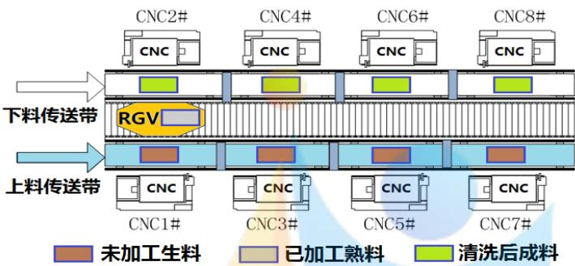  
图1：智能加工系统示意图

## 1.2 系统作业参数

表1：智能加工系统作业参数的3组数据表  
时间单位：秒
<table><tr><td rowspan=1 colspan=1>系统作业参数</td><td rowspan=1 colspan=1>第1组</td><td rowspan=1 colspan=1>第2组</td><td rowspan=1 colspan=1>第3组</td></tr><tr><td rowspan=1 colspan=1>RGV 移动 1 个单位所需时间</td><td rowspan=1 colspan=1>20</td><td rowspan=1 colspan=1>23</td><td rowspan=1 colspan=1>18</td></tr><tr><td rowspan=1 colspan=1>RGV 移动 2 个单位所需时间</td><td rowspan=1 colspan=1>33</td><td rowspan=1 colspan=1>41</td><td rowspan=1 colspan=1>32</td></tr><tr><td rowspan=1 colspan=1>RGV 移动 3 个单位所需时间</td><td rowspan=1 colspan=1>   46</td><td rowspan=1 colspan=1>59</td><td rowspan=1 colspan=1>46</td></tr><tr><td rowspan=1 colspan=1>CNC加工完成一个一道工序的物料所需时间</td><td rowspan=1 colspan=1>560</td><td rowspan=1 colspan=1>580</td><td rowspan=1 colspan=1>545</td></tr><tr><td rowspan=1 colspan=1>CNC加工完成一个两道工序物料的第一道工序所需时间</td><td rowspan=1 colspan=1>400</td><td rowspan=1 colspan=1>280</td><td rowspan=1 colspan=1>455</td></tr><tr><td rowspan=1 colspan=1>CNC加工完成一个两道工序物料的第二道工序所需时间</td><td rowspan=1 colspan=1>378  </td><td rowspan=1 colspan=1>500</td><td rowspan=1 colspan=1>182</td></tr><tr><td rowspan=1 colspan=1>RGV为CNC1#，3#，5#，7#一次上下料所需时间</td><td rowspan=1 colspan=1>28</td><td rowspan=1 colspan=1>30</td><td rowspan=1 colspan=1>27</td></tr><tr><td rowspan=1 colspan=1>RGV为CNC2#，4#，6#，8#一次上下料所需时间</td><td rowspan=1 colspan=1>31</td><td rowspan=1 colspan=1>35</td><td rowspan=1 colspan=1>32</td></tr><tr><td rowspan=1 colspan=1>RGV完成一个物料的清洗作业所需时间</td><td rowspan=1 colspan=1>25</td><td rowspan=1 colspan=1>30</td><td rowspan=1 colspan=1>25</td></tr></table>

注：每班次连续作业8小时。

## 1.3 三种具体情况——工作环境

(1)一道工序的物料加工作业情况，每台CNC 安装同样的刀具，物料可以在任一台CNC 上加工完成；

(2)两道工序的物料加工作业情况，每个物料的第一和第二道工序分别由两台不同的CNC 依次加工完成；

(3)CNC在加工过程中可能发生故障（故障发生概率约为1%)，每次人工处理故障（未完成的物料报废）需要耗时10\~20分钟，故障排除后CNC即刻加入作业序列。要求分别考虑一道工序和两道工序的物料加工作业情况。

## 1.4 两个任务——问题要求

任务1：对一般问题进行研究，给出RGV动态调度模型和相应的求解算法；

任务2：利用表1中系统作业参数的3组数据分别检验模型的实用性和算法的有效性，给出RGV的调度策略和系统的作业效率，并将结果分别填入相应EXCEL表中。

## 二、问题分析

## 2.1一道工序物料加工作业的问题分析

在该工作环境下，每台CNC都安装有相同的刀具，进行同一种加工工序，每一个生料均需在任意八台CNC之一上完成一道工序的加工并由RGV清洗后方可成料。本文为提高系统加工效率，考虑到当所有CNC处于加工状态时，RGV完成当前指令后，将会有长时间 CNC 不会对 RGV 发出上料需求信号，当 CNC 再次对 RGV 发出上料需求信号时，RGV将从上一次指令完成位置进行移动指令，因此考虑若在无谓的等原地待之前RGV提前执行移动指令将会更好地节约时间。因此在为RGV设计调度模型时，设计当RGV完成当前指令后若未接收到任何 CNC的上料需求信号，RGV将会根据调度模型立即判别执行移动指令。为增大作业效率，即尽可能增加在一班次8小时内成料数量，即使得CNC尽可能多时间处于工作状态，换言之，即为CNC的总等待（闲置）时间尽可能小。综合以上考量，假设RGV具有短时间的记忆储存功能，能够记录与匹配RGV与各CNC进行最后一次交互的时间，由此时间为RGV设计“八步一走”调度模型，即RGV在判别执行移动指令之前，要遍历计算未来移动（或原地停留）八次，并要求每一次移动或停留过后必须间隔一道指令以上方可再次进行移动或停留指令，遍历搜索未来移动八次后八台CNC的总等待时间最小的路径的第一步移动指令（或原地停留）作为RGV的下一道指令，并要求实施检测判别完成当前指令后是否留有足够的时间在一班次8小时末回到初始点，若不能则拒绝接受有关移动回到初始点之外的任何指令。将表1 系统作业参数的3组数据带入模型，给出 RGV的调度策略，并估计理想状态下RGV运转速度足够快，忽略RGV的移动时间和清洗熟料的时间，进行计算此时情景下理想能加工完成的最大成料数，与模型结果进行比较估计系统的作业效率，并说明模型的实用性和算法的有效性

## 2.2 两道工序物料加工作业的问题分析

在该工作环境下，CNC可选择安装两种刀具中的一种，对应进行两种加工工序，每一个生料均需在任意八台CNC之一上完成一道工序的加工并由RGV清洗后方可成料。仍然考虑当为RGV设计调度模型时，当RGV完成当前指令后若未接收到任何CNC的上料需求信号，RGV将会根据调度模型立即判别执行移动指令。此时需要考虑CNC上安装的刀具可以在初始固定后不再改变，也可以在CNC未进行加工时进行更换，这使得问题分为更换刀具与不更换刀具两种情况考虑。对于不更换刀具的情况，需要考虑安装不同刀具的CNC的配比及放置位置。就放置位置而言，可以根据简单的推算得出一个最佳方案；就配比而言，我们需要先筛选出可能出现最佳调度方案的几种情况，再对这几种情况分别建立模型完成调度。对每一种配比情况，由于该问题有两道工序，以CNC等待时间最短为目标会使计算更加复杂，因此直接以物料最大加工数量为目标。针对每一配比情况，会有一种最佳的分组方案，即以固定个数的物料完成加工的过程为一组，按照组序进行逐步调度。对每一组，有若干可能的顺序完成组内所有步骤，取其中时间最短的顺序方案，将每一组的方案组合成最终的调度方案，即为所求的模型。对于更换刀具的情况，需要考虑其更换刀具的频率、提高的加工效率，以此判断更换刀具的模型是否有意义，若无意义，则忽略此情形。将表1系统作业参数的3组数据带入模型，给出RGV的调度策略，并估计理想状态下RGV运转速度足够快，忽略RGV的移动时间和清洗熟料的时间，进行计算此时情景下理想能加工完成的最大成料数，与模型结果进行比较估计系统的作业效率，并说明模型的实用性和算法的有效性。

## 2.3 作业中故障处理的问题分析

在该工作环境下，CNC在加工过程中约有1%的概率发生故障，故障发生时间出现在CNC加工过程中的任一时刻的概率均相同，对故障进行人工排查修复处理需要耗时为10\~20分钟，故障排除后CNC即刻加入作业序列。假设一道工序物料加工过程和两道工序的各步物料加工过程中故障发生的概率相同，皆视为1%。每一道工序加工均有1%的概率发生故障，在CNC的加工时间内，以均匀分布随机一个时间点作为故障发生时间点，并以10\~20分钟，即600\~1200秒之间均匀随机生成一个整数作为修复时间。对一道工序物料加工作业时间，两道工序物料加工作业的模型作出以下调整：在故障发生的那一刻起，在CNC未修复并发出上料需求信号之前，将该CNC从系统中暂时抹去，RGV在执行完当前指令后，不再进行有关该CNC的指令操作，直至CNC修复发出上料需求信号。考虑到故障发生的不确定性，模型结果的稳定性与能够人工干预的故障修复时间息息相关，因此本文在建模求解600\~1200秒之间均匀随机生成一个整数作为修复时间后，还将分别取修复时间为600秒，900秒，1200秒做20组的随机试验，查验当将修复时间尽量控制在哪一个范围内， 模型结果的稳定性将会更好。

## 三、模型假设

1.假设对于确定的某一工序，CNC加工时间恒定且一致。

2.假设传送带会将物料及时运送到上料处，不产生等待时间

3.不考虑两道工序间废渣的处理，即假设第一道工序加工产生的废渣不会对第二道工序的加工产生影响。

4.假设 RGV 在接收到 CNC 发出的上料需求指令之后，当 RGV 移动到该 CNC 位置前时，RGV才会对其进行上下料。

5.假设RGV具有短时间的记忆储存功能，能够记录与匹配与各CNC 进行最后一次交互的时间。

6.假设一道工序物料加工过程和两道工序的各步物料加工过程中故障发生的概率相同，皆视为1%。

7.假设 RGV性能良好，严格按照各组参数时间按时执行指令。

四、符号说明
<table><tr><td>符号</td><td>符号意义</td></tr><tr><td>Ai</td><td>克费 编号为i的 CNC 的状态</td></tr><tr><td>H</td><td>--Competition所有CNC的总等待时间</td></tr><tr><td>ti</td><td>移动i个单位所需要的时间</td></tr><tr><td>U1k</td><td>上料开始时间点</td></tr><tr><td>U2k</td><td>下料开始时间点</td></tr><tr><td>hik</td><td>表示第i台 CNC 对第k个物料的等待时间</td></tr><tr><td>tt</td><td>CNC完成一个物料的加工需要时间</td></tr><tr><td>Hv</td><td>第ν个初始情况对应的全过程CNC 总等待时间</td></tr><tr><td>Ni</td><td>理想情况一个班次能生产的成品数</td></tr><tr><td>ηi</td><td>系统的作业效率</td></tr><tr><td>Ci</td><td>第i 台 CNC 的故障状态</td></tr></table>

## 五、模型的建立和求解

## 5.1 一道工序加工模型建立与求解

## 5.1.1 任务 1

任务1要求给出一般情况下RGV的动态调度模型与相应的求解算法。一般情况表示适应可选范围内的任意情况，即不能仅仅建立适应于某一组或几组参数值的模型，而要给出对任何可选参数值均适应的一般化模型。因此，模型的建立不能基于任何特定参数值、依赖任何特殊情形；同理，相应的求解算法也不能针对任何一组特定参数，应当在给出任何一组可取参数时，都能给出相应的理想解。

## 5.1.1.1 智能加工系统的工作原理

问题展示的智能加工系统主要由三部分构成，即8台计算机数控机床（CNC）、1辆轨道式自动引导车（RGV）与1条RGV直线轨道、1条上料传送带与1条下料传送带，每个物料完成加工都需要经过三个部分的联动工作。因此，首先需要明确每个部分的工作原理，并对每个部分的工作过程准确进行定量描述

## 1）CNC的工作原理

在整个加工过程中，CNC共有空闲状态、上下料状态、加工状态、需求状态等4个状态。其中，空闲状态表示CNC上没有物料的状态；上下料状态表示RGV正在给CNC上下料的状态；加工状态表示CNC正在对物料进行加工的状态；需求状态表示CNC完成加工后等待RGV下料的状态。问题给出的加工系统中有8台已编号的 CNC，每台CNC的具体位置如图所示：

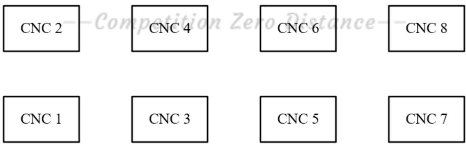  
图 2 CNC 位置示意图

由图可知，横向上相邻两台CNC的间隔相等；纵向上4组CNC两两位于同一竖直线。

设编号为i的 CNC 的状态为 $A _ { i }$ ，并对各状态进行赋值：

$$
A _ { i } = \left\{ \begin{array} { l l } { 0 , } & { \Xi \equiv \lvert \Re \rangle \downarrow \downarrow \downarrow \downarrow \downarrow \downarrow \downarrow \downarrow \downarrow \downarrow \downarrow } \\ { 1 , } & { \perp \top \Psi \uparrow \Psi \downarrow \downarrow \downarrow \downarrow \downarrow \uparrow \uparrow \downarrow \downarrow \downarrow \uparrow \downarrow \downarrow \uparrow } \\ { 2 , } & { \jmath _ { 0 } \underline { { { \uparrow } } } \ll \downarrow \downarrow \downarrow \downarrow \downarrow \uparrow \uparrow \uparrow \downarrow \uparrow \uparrow } \\ { 3 , } & { \ddag \uparrow \Psi \downarrow \downarrow \downarrow \downarrow \uparrow \uparrow \uparrow \downarrow \uparrow } \end{array} \right.\tag{1}
$$

其中，0、3表示的状态CNC未进行工作，1、2表示的状态CNC正在进行工作；在实际情况中，我们期望CNC进行工作的时间尽可能长。

## 2）RGV的工作原理

在整个加工过程中，RGV始终位于RGV直线轨道上，共有等待状态、运动状态、上下料状态、清洗状态等4个状态。其中，等待状态表示RGV静止在轨道上不进行任何工作的状态；运动状态表示RGV由一个位置驶向另一个位置时的状态，此状态不进行工作；上下料状态表示RGV正在给CNC进行上下料的状态；清洗状态表示RGV给物料进行清洗并将其放置到下料传送带时的状态[1]。

设 RGV的状态为B，并对各状态进行赋值：

$$
B = \{ \begin{array} { l l } { 0 , } & { \frac { \sin \alpha } { \sin \alpha } / \frac { \sin \alpha } { \sin \alpha } } \\ { 1 , } & { \frac { 1 } { \sin \alpha } \frac { \sin \alpha } { \sin \alpha } } \\ { 2 , } & { \frac { 1 } { \cos \alpha } / \frac { \sin \alpha } { \cos \alpha } } \\ { 3 , } & { \frac { \sin \alpha } { \sin \alpha } / \frac { \sin \alpha } { \cos \alpha } } \end{array} \}\tag{2}
$$

其中，0、2、3状态时，RGV只能处于轨道给定4个位置中的任意一个；1状态时，RGV正在由其中一个位置运动至另一个位置。当RGV处于某一位置时，只能与该位置的上下两台CNC进行联动。

设 j 为 RGV 所处的位置，则：

$$
\scriptstyle j = { \left\{ \begin{array} { l l } { 1 , } & { i = 1 { \mathrm { ~ } } o r { \mathrm { ~ } } i = 2 } \\ { 2 , } & { i = 3 { \mathrm { ~ } } o r { \mathrm { ~ } } i = 4 } \\ { 3 , } & { i = 5 { \mathrm { ~ } } o r { \mathrm { ~ } } i = 6 } \\ { 4 , } & { i = 7 { \mathrm { ~ } } o r { \mathrm { ~ } } i = 8 } \end{array} \right. }\tag{3}
$$

其中，i表示 CNC 的编号。

当 RGV 处于1 状态时，设其运动状态为：

$$
( j _ { 1 } , j _ { 2 } )\tag{4}
$$

表示 RGV 此时正由位置 $j _ { 1 } ^ { \prime }$ 运动至位置 $j _ { 2 } ^ { \mathrm { ~ e ~ } } \circ$

## 3）传送带的工作原理

传送带在加工系统启用时仅有一个状态，即运动状态。上料传送带将负责运送未加工的生料，下料传送带负责运送已加工的熟料。已知传送带既可连动，也可独立运动；在实际中，传送带的运动速度也能达到数米每秒。基于上述两点，不妨假设当RGV需要时，传送带总能在相应位置给出生料或熟料空位，无需等待。

## 5.1.1.2 加工系统的调度时间

对于一道工序的加工系统而言，首要的目标是尽可能提高加工效率。最能直接反应这一目标的即为相同时间内加工的物料个数，个数越大，加工效率越高。然而物料的加工是一个复杂动态过程，物料在不同时间可能处于CNC中，也可能处于RGV中，我们需要进一步将目标进行转化。

容易得到，当物料处于加工状态时，相应的CNC必定处于工作状态；当物料处于非加工状态时，不对应工作时间的CNC。因此，不妨将目标转化为尽可能减少CNC的非工作时间，即需要给出一个调度模型，使得CNC的非工作总时间最小。

## 1）总时间的确定

加工系统的连续工作时间为8小时，不妨设8小时为一次完整的加工过程，目标为8小时内CNC的非工作总时间最小。由于上下料，位置移动等指令在实际中可以在几士秒内完成，因此将时间单位转化到秒，则一次加工过程的总时间为：

$$
T = 8 h = 2 8 8 0 0 s\tag{5}
$$

则对于一次完整加工过程而言，第0s加工系统启动，RGV由初始位置1开始执行指令；第28800s加工系统终止，RGV回到初始位置1。

## 2）时间参数的确定

对于整个加工系统，需要相应的时间参数反应调度过程。

首先，RGV需要在4个不同位置间来回移动，可能连续移动的位置单位有1、2、$3 \textdegree$ 因此，设RGV移动一个单位的时间为 $t _ { 1 }$ ，移动两个单位的时间为 $t _ { 2 }$ ，移动3个单位的时间为 $t _ { 3 }$ 。除此以外，RGV自身拥有清洗物料的工作，故设完成一次清洗所需的时间为 $t _ { 4 }$ 。

其次，CNC需要时间单独对物料进行加工，设CNC完成一个物料的加工需要时间$t t$ o

最后，对于 RGV 与 CNC 的联动，由于实际中 RGV 与两边 CNC 的位置非完全对称，我们设RGV对1、3、5、7号CNC完成一次上下料所需时间为 $s _ { 1 }$ ，对2、4、6、8号CNC完成一次上下料所需时间为 $s _ { 2 }$ 6

## 3）时间变量的确定

为了给出最佳调度方案，需要对未知、不确定的时间变量进行确定。首先考虑CNC的总等待时间，不妨设为H，则有：

$$
H = \sum _ { i = 1 } ^ { 8 } \sum _ { k = 1 } h _ { i k }\tag{6}
$$

其中， $\mathrm { h } _ { i k }$ 表示第i台 CNC 对第k个物料的等待时间，物料编号k 根据 RGV 抓取生料的顺序来计。

进一步考虑物料k，设其上料开始时间点为 $\vert u _ { 1 k }$ ，下料开始时间点为 $\displaystyle u _ { 2 k }$ ，则有：

$$
u _ { 1 k } - u _ { 2 k } = t t + s\tag{7}
$$

其中s表示 $s _ { 1 }$ 或 $s _ { 2 }$ ，具体取值根据k情况而定。

## 5.1.1.3 加工系统的优化模型

## 1）目标函数的确定

对于加工系统的一次8小时运行而言，需要给出调度方案使得CNC总等待时间最少，则建立目标函数如下：

$$
\operatorname* { m i n } H\tag{8}
$$

H表示 8 小时内的CNC 总等待时间。

## 2）初始方案的规划

Step1：首先考虑初始情况。已知RGV的初始位置为左端位置1，CNC均属于空闲状态，而实际情况下，一次上料或移动的时间又远小于CNC完成一次加工的时间。综上，初始的指令确定为按照一定顺序完成对8台CNC的上料。

Step2：当RGV在某一位置时，对该位置的两台 CNC 依次完成下料期间无需移动，

而对其它位置的CNC完成下料需要额外的移动时间。因此获得结论：当RGV对某一位置的一台CNC进行上下料时，下一个上下料的目标优先选择该位置的另一台CNC；RGV首先对初始位置1 的两台 CNC 进行上料。

Step3：由上述两个结论，RGV完成初始对8台CNC的上料共有6种情况：

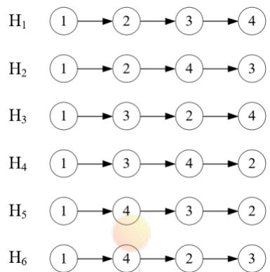  
图 3 初始上料情况图

故目标函数转化为：

$$
\operatorname* { m i n } \left\{ H _ { 1 } , H _ { 2 } , H _ { 3 } , H _ { 4 } , H _ { 5 } , H _ { 6 } \right\}\tag{9}
$$

其中 $H _ { v }$ 表示第ν个初始情况对应的调度方案中CNC的总等待时间。

## 3）调度方案的优化模型

Step1：对任一初始方案，完成8 台 CNC 的上料后处于位置j。考虑下一步RGV的动向，虽然在后续加工中多出清洗的步骤，但实际中过长的加工时间仍会使RGV优先进行完一轮对8台CNC的上下料。因此考虑RGV8次连续完整作业的动态规划。

Step2：对于整个加工过程，RGV的工作流程如下：

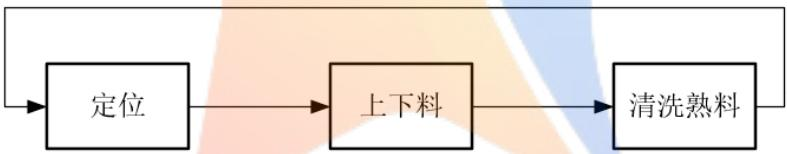  
图4 RGV一次完整作业示意图

考虑8次如图所示的RGV一次完整作业，当RGV对某台 CNC进行上下料时，其它CNC的加工可能已经完成并进行需求提示，则在RGV到达前，这些CNC都将产生等待时间；此外，根据之前的结论，RGV会优先对同一位置的两台CNC依次作业。综上两点，对接下来的8次工作，共有 $\cdot 4 ^ { 8 }$ 种调度方案。1

Step3：对任意一种调度方案，设 RGV每进行一次作业操作，都会使第i个CNC产生等待时间him，其中 $\mathrm { h } _ { i m }$ $m$ 表示 $8$ 次连续作业中的第 $m$ 次。则这种调度方案8个步骤产生的 CNC 等待总时间为：

$$
h _ { _ n } = \sum _ { m = 1 } ^ { 8 } \sum _ { i = 1 } ^ { 8 } h _ { _ { i m } }\tag{10}
$$

特别地，这里n=1，表示进行全过程中的第一个8次连续作业。

Step4：求出每一种调度方案下的总等待时间，共有 $\cdot 4 ^ { 8 }$ 个结果，取最小总等待时间对应的方案，对应目标函数如下：

$$
\operatorname* { m i n } { h _ { n } } = \sum _ { m = 1 } ^ { 8 } \sum _ { i = 1 } ^ { 8 } { h _ { i m } }\tag{11}
$$

该最优方案对应的8次连续作业中，第一步中第i个CNC的最小等待时间为 $\mathbf { h } _ { i 1 }$ o

Step5：选取8次连续作业中的第一次，令RGV执行该指令，完成调度方案中的一步。则该步骤中8个CNC产生的总等待时间为：

$$
h h _ { n } = \sum _ { i = 1 } ^ { 8 } h _ { i 1 }\tag{12}
$$

以第一个8八次连续作业中确定的第一次结束作为开始，重复Step3、4的步骤，进行若于个8次连续作业，每个8次连续作业确定实际的一次作业，直到28800秒的工作流程结束。对结束前的状态进行讨论，若最后一个8次连续作业的产生实际的一次作业无法在第28800秒前完成并令RGV返回初始位置，则放弃该次作业，令RGV直接回到初始位置。则对第ν个初始情况对应的完整调度方案，有：

$$
H _ { \nu } = \sum _ { n = 1 } h h _ { n }\tag{13}
$$

其中， $H _ { v }$ 表示第ν个初始情况对应的全过程CNC 总等待时间。Step6：综合 Step1-5，得到完整的优化模型如下：

$$
\begin{array} { l } { { \operatorname* { m i n } \left\{ H _ { 1 } , H _ { 2 } , H _ { 3 } , H _ { 4 } , H _ { 5 } , H _ { 6 } \right\} } } \\ { { \displaystyle \quad \quad \quad \quad \quad \quad \quad \quad \quad \quad \quad \quad \quad } } \\ { { \displaystyle \mathrm { s . t . } \left\{ h h _ { n } = \sum _ { i = 1 } ^ { 8 } h _ { i n } \right. } } \\ { { \displaystyle \quad \quad \quad \quad \quad \quad \quad } } \\ { { \displaystyle \operatorname* { m i n } h _ { n } = \sum _ { m = 1 } ^ { 8 } \sum _ { i = 1 } ^ { 8 } h _ { i n } } } \end{array}\tag{14}
$$

## 5.1.1.4 调度模型的求解算法

模型求解的前提为给定一组可靠的参数数据，关于参数的具体内容，已经在先前给出详细说明。

## 1）优化模型求解

对于4⁸种调度方案，在MATLAB中使用遍历搜索算法进行求解，得到总等待时间最小的方案；对于其余过程，均可利用MATLAB进行直接计算。

## 2）初始目标求解

但此时我们必须考虑到，CNC 总等待时间最小值是我们为方便求解而转化得到的目标。利用上述模型求解到最优方案后，需将目标转化回最初状态，求解得到最多的物料加工数，并给出相应的上下料开始时间点。

已知物料编号k根据RGV抓取生料的顺序来计，其上料开始时间点为 $u _ { 1 k }$ ，下料开始时间点为 $u _ { 2 k }$ 。利用MATLAB对整个最优调度方案进行遍历搜索，得到第k个物料编号，第k个上料开始时间点 $u _ { 1 k }$ ，第k个下料开始时间点 $u _ { 2 k }$ ，并记录所有k对应的结果。

## 3）结果总结

经过上述求解步骤，我们最终可以得到最优调度方案、最小总等到时间、最大物料加工数、每个被加工物料对应的上下料开始时间。

## 5.1.2 任务 2

## 5.1.2.1一道工序加工模型的结果

将题目给出的三组参数分别带入模型，利用 MATLAB 编程求解(代码文件 Ques1.m详见附录五)。得到的第一组结果如下表：

表2一道工序调度模型第一组数据结果表
<table><tr><td>加工物 加工 料序号 CNC 编 号</td><td>上料开 始时间</td><td>下料开 始时间</td></tr><tr><td>1</td><td>1 0</td><td>588</td></tr><tr><td>2</td><td>2 28</td><td>641</td></tr><tr><td>3</td><td>3 79</td><td>717</td></tr><tr><td></td><td></td><td></td></tr><tr><td>380</td><td>4 27956</td><td>28547</td></tr><tr><td>381</td><td>5 28032</td><td>28623</td></tr><tr><td>382</td><td>6 28085</td><td>28676</td></tr></table>

第二组最优结果如下表（两个最优序列）:

表3-1 一道工序调度模型第二组数据结果表
<table><tr><td>加工物 料序号</td><td>加工 CNC 编号</td><td>上料开 下料开 始时间 始时间</td></tr><tr><td>1</td><td>1 0</td><td>610</td></tr><tr><td>2</td><td>2 30</td><td>670</td></tr><tr><td>3</td><td>3 88</td><td>758</td></tr><tr><td>4</td><td>4 118</td><td>818</td></tr><tr><td>5</td><td>7 194</td><td>924</td></tr><tr><td>6</td><td>8 224</td><td>984</td></tr><tr><td>7</td><td>5 282</td><td>1072</td></tr><tr><td>8</td><td>6 312</td><td>1132</td></tr><tr><td></td><td></td><td></td></tr><tr><td>359</td><td>5 28076</td><td>28704</td></tr></table>

表3-2 一道工序调度模型第二组数据结果表
<table><tr><td>加工物 加工 CNC 料序号 编号</td><td>上料开 始时间</td><td>下料开 始时间</td></tr><tr><td>1</td><td>0</td><td>610</td></tr><tr><td>2</td><td>2 30</td><td>670</td></tr><tr><td></td><td>3 88</td><td>758</td></tr><tr><td>4</td><td>4 118</td><td>818</td></tr><tr><td>5</td><td>5 176</td><td>906</td></tr><tr><td>6</td><td>6 206</td><td>966</td></tr><tr><td>7</td><td>7 264</td><td>1054</td></tr><tr><td>8</td><td>8 294</td><td>1114</td></tr><tr><td>7</td><td></td><td></td></tr><tr><td>359</td><td>28058</td><td>28686</td></tr></table>

第三组的最优结果如下表：

表4一道工序调度模型
<table><tr><td>加工物 料序号</td><td>加工 CNC 编号</td><td>上料开 始时间</td><td>下料开 始时间</td></tr><tr><td>1</td><td>1</td><td>0</td><td>572</td></tr><tr><td>2</td><td>2</td><td>27</td><td>624</td></tr><tr><td>3</td><td>3</td><td>77</td><td>699</td></tr><tr><td></td><td></td><td></td><td></td></tr><tr><td>390</td><td>6</td><td>27997</td><td>28574</td></tr><tr><td>391</td><td>7</td><td>28072</td><td>28649</td></tr><tr><td>392</td><td>8</td><td>28124</td><td>28701</td></tr></table>

## 5.1.2.2一道工序模型的实用性

从结果来看，模型针对3组参数的求解情况均符合实际，既没有出现异常的上下料时间、也没有异常的两个相邻编号的物料上下料开始时间间隔。而这3组数据各有特点，反应了不同工序的不同耗时配比，故3组结果均合理足以证明模型具有较强的实用性，可针对任何符合实际的一组参数进行求解，得到合理的最佳效率方案。

分析最优的结果序列，发现恰好为1-8循环作业的自然序列。这与实际的加工过程中，RGV的运动通常存在某种规律、不会做无规则的复杂运动相符合，进一步证明了模型的实用性。

## 5.1.2.3一道工序模型系统的作业效率

首先计算最理想情况下即仅考虑物料加工时间和上下料时间，8小时能制造出多少个成品[2]。

理想初始情况下，对8台CNC进行上料操作，忽略RGV移动所消耗的时间，记第i组初始上料的总时间为toi:

$$
t _ { 0 i } = 4 s _ { 1 } + 4 s _ { 2 }\tag{15}
$$

理想情况下第i组加工的工件数量Ni为：

$$
N _ { i } = \left[ \left( T - t _ { 0 i } \right) / \left( t t _ { i } + s _ { 1 } \right) \right] \times 4 + \left[ \left( T - t _ { 0 i } \right) / \left( t t _ { i } + s _ { 2 } \right) \right] \times 4\tag{16}
$$

tti表示第i组单个物料的加工时间，T表示一个班次的总时间。[]表示对括号内的式子向下取整。

将3组数据的参数分别带入上式得到： $N _ { 1 } = 3 8 4$ $N _ { 2 } = 3 6 8$ $N _ { 3 } = 3 9 2$ 。需注意，这是理想情况下求得的8小时最多能加工的零件，并没有考虑一开始小车路上移动的时间和因RGV未能及时到达发出需要上下料的 CNC位置而延误的时间。所谓理想情况即RGV总能及时达到需要上下料的 CNC 位置。

第i组的作用效率如下：

$$
\eta _ { i } = \frac { n _ { i } } { N _ { i } } \times 1 0 0 \%\tag{17}
$$

$n i j$ 表示利用情况i的模型求得的第j组的成品数量。

得到： $\eta _ { ^ { 1 1 } } = 9 9 . 4 8 \% , \eta _ { ^ { 1 2 } } = 9 7 . 5 5 \% , \eta _ { ^ { 1 3 } } = 1 0 0 \% $

## 5.2 两道工序加工模型建立与求解

## 5.2.1 任务 1

对两道工序的情况而言，加工系统大部分的工作原理都与一道工序相同，仅少数发生了改变。因此，对没有改变的工作原理、参数、变量，均延用情况一中的定义。

## 5.2.1.1 智能加工系统的工作原理

## 1）CNC 的工作原理

在两道工序中，CNC的位置、工作状态仍与一道工序相同，不同之处在于原先8台CNC都进行同一道工序，而此时的CNC可以通过更换刀具改变可加工工序。我们设第i 台 CNC 对应的可加工工序为 $G _ { i }$ ，则：

$$
G _ { i } = \left\{ \begin{array} { l l } { 1 , } & { \mathrm { \# } \mathrm { \mathbb { L } } \tilde { \overrightarrow { \mathcal { H } } } - \mathrm { i } \tilde { \mathrm { \Xi } } \mathrm { \underline { { \Gamma } } } \mathrm { \mathbb { L } } \mathrm { / } \tilde { \mathcal { F } } } \\ { 2 , } & { \mathrm { \# } \mathrm { \mathbb { L } } \tilde { \overrightarrow { \mathcal { H } } } - \mathrm { i } \tilde { \mathrm { \Xi } } \mathrm { \underline { { \Gamma } } } \mathrm { \underline { { \Gamma } } } \mathrm { / } \tilde { \mathcal { F } } } \end{array} \right.\tag{18}
$$

## 2）RGV的工作原理

对任意一块物料，当完成第一道工序时，RGV需要将物料转移到能进行第二道工序的CNC中。在此过程中，第一道工序产生的碎屑可能需要进行处理，否则无法直接进行第二道工序。但由于此过程实际耗费的时间极小，考虑在模型中忽略这个时间。

考虑RGV的工作状态，在两道工序中，上下料状态显然会出现两种情况，即给加工第一道工序的CNC上下料和给加工第二道工序的CNC上下料。因此，设RGV的状态为 $B _ { 1 }$ ，并对各状态进行赋值：

$$
B _ { 1 } = \left\{ \begin{array} { l l } { 0 , } & { \frac { \sqrt { 6 } + 5 } { \sqrt { 6 } } + \frac { 1 } { \sqrt { 6 } } + \sqrt { 6 } \frac { 1 } { \sqrt { 6 } } } \\ { 1 , } & { \frac { 1 } { \sqrt { 6 } } \frac { 1 } { \sqrt { 6 } } \big \} \times \frac { 1 } { \sqrt { 6 } } } \\ { 2 , } & { \frac { \sqrt { 6 } } { \sqrt { 6 } } - \frac { 1 } { \sqrt { 6 } } \frac { 1 } { \sqrt { 6 } } \frac { 1 } { \sqrt { 6 } } \frac { 1 } { \sqrt { 6 } } \frac { 1 } { \sqrt { 6 } } + \frac { 1 } { \sqrt { 6 } } \frac { 1 } { \sqrt { 6 } } } \\ { 3 , } & { \frac { \sqrt { 6 } } { \sqrt { 6 } } - \frac { 1 } { \sqrt { 6 } } \frac { 1 } { \sqrt { 6 } } \frac { 1 } { \sqrt { 6 } } \frac { 1 } { \sqrt { 6 } } + \frac { 1 } { \sqrt { 6 } } \frac { 1 } { \sqrt { 6 } } } \\ { 4 , } & { \frac { 1 } { \sqrt { 6 } } \frac { 1 } { \sqrt { 6 } } \frac { 1 } { \sqrt { 6 } } \frac { 1 } { \sqrt { 6 } } } \end{array} \right.\tag{18}
$$

## 5.2.1.2 加工系统的调度时间

对于两道工序的加工系统而言，首要的目标仍然是尽可能提高加工效率。最能直接反应这一目标的即为相同时间内加工的物料个数，个数越大，加工效率越高。

然而区别于一道工序，两道工序的目标是不能盲目转换为CNC总等待时间最小的。对每一个物料，需要完成两道工序才能完成加工，而能加工每到工序的CNC编号是不确定的，故CNC总等待时间最小不能直接反应加工物料数最多，可能会出现更多半成品的情况。因此，两道工序的目标转化需要根据CNC具体调配情况而确定。

## 1）时间参数的确定

不同加工工序的 CNC 加工物料的时间不同，因此设加工第一道工序的 CNC 单次加工时间为 $t t _ { 1 }$ ，加工第二道工序的 CNC 单次加工时间为 $t t _ { 2 }$

## 2）时间变量的确定

根据RGV抓取生料的顺序，将第k个被抓取的生料记为物料k。则对每个物料k，设其第一道工序上料开始时间点为 $u _ { 3 k }$ ，下料开始时间点为 $u _ { 4 k }$ ；第二道工序上料开始时间点为 $\lvert u _ { 5 k }$ ，下料开始时间点为 $u _ { 6 k }$

已知RGV对1、3、5、7号CNC完成一次上下料所需时间为 $s _ { 1 }$ ，对2、4、6、8号CNC完成一次上下料所需时间为 $| s _ { 2 }$ 。则对第一道工序，有：

$$
u _ { 4 k } - u _ { 3 k } = t t _ { 1 } + s\tag{19}
$$

对第二道工序，有：

$$
u _ { 6 k } - u _ { 5 k } = t t _ { 2 } + s\tag{20}
$$

其中s表示 $s _ { 1 }$ 、 $s _ { 2 }$ 中对应k的情况。

## 5.2.1.3 加工系统的优化模型

对于两道工序的加工而言，问题给出两条准则：CNC在加工的过程中不能更换刀具；同一块物料的两道工序必须在不同的两台CNC上进行加工。分析这两条准则，我们不难发现准则在给出限定的同时也透漏了一条关键信息：CNC在非加工时间可以更换刀具。因此，两道工序的加工过程中，CNC可以持续的进行动态变化。

针对这一变化，我们不妨进行分类讨论，考虑可更换刀具与不可更换刀具两种情况，给出不同的模型使加工系统达到效率最高。进一步考虑不可更换刀具的情况，此情况下初始的CNC可加工工序设定即为整个流程的设定。首先排除8台CNC可加工工序相同的情况，此状态无法进行完整加工。于是可能出现的两道加工工序的CNC台数比为1:7、

## 2:6、3:5、4:4。

综上，得到两道工序的加工系统的考虑分类情形如图所示：

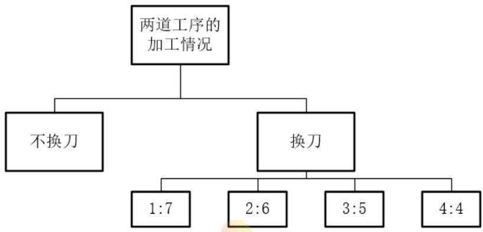  
图 5 两道工序加工情况的分类图

## ● 不更换刀具

## 1）CNC的配比方案

先前已经分析得出可能出现的两道加工工序的 CNC 台数比为3:5、4:4，而具体应该使用怎样的配比，主要取决于两道工序的加工时间[3]。例如，当两道工序的加工时间相近时，适合使用4:4的CNC配比；当一道工序的加工时间是另一道工序的3倍时，使用4:4会导致产生过长的CNC闲置等待时间，使用2:6的配比较为合理。但根据同一位置优先的法则，当比例为2:6或7:1时，模型会因法则失效程度过大而使可行性性降低，且实际中两道工序的加工CNC 比例不会严重失衡，故我们不考虑2:6、1:7的配比情况。因此，我们给出如下判断法则：

对第一道工序的CNC单次加工时间 $t t _ { 1 }$ ，加工第二道工序的CNC单次加工时间 $t t _ { 2 }$ 有比值：

$$
T T = \frac { t t _ { 1 } } { t t _ { 2 } }\tag{21}
$$

3种配比比例共有7个比值，分别为3/5、1、5/3，将比值记作 $T t$

寻找与加工时间比值最接近的配比，相应公式如下：

$$
\operatorname* { m i n } { \left| T T - T t \right| }\tag{22}
$$

将该最小值对应的配比Tt确定为当前参数对应选择的CNC配比。然而我们必须考虑到，配比的分子分母越接近，系统的周转能力会更加灵活，不排除比分子分母更接近的配比会产生更优方案的可能。因此，0做如下规定!istance

当配比Tt确定时，将参数分别带入Tt配比与分子分母比其更接近的配比中求解最优结果，取这其中的最优结果作为最终结果。例如，求得Tt为3/5，则取3/5、4/4、5/3这3中配比情况的模型分别求解，取其中最优解的配比作为最终方案。

利用上述法则，可以保证给出不同的加工时间参数时，可以选择更合理的初始CNC配比设置，使得在该配比下得到的最佳调度方案优于其它配比下的方案。

## 2）4:4型的调度方案

Step1：首先需确定不同刀具类型的CNC应摆放的位置。考虑与一道工序中相似的问题，当RGV处于某一位置并完成对该位置一台第一道工序类型CNC的下料时，需要寻找第二道工序类型的CNC进行上料；此时，最佳的选择是该位置的另一台CNC。因此，我们得出将两类CNC分别置于轨道两次为最佳的分配方式。

由一道工序的加工系统，我们已知轨道两侧的CNC上下料时间不同，因此具体哪一类CNC放置在哪一侧，需要根据给出的加工时间比值TT，而具体目标为尽量减少RGV的等待时间。综上给出判定方式如下：

$$
\begin{array} { r } { \left\{ T T \geq 1 , \quad \overleftrightarrow { \hat { \mathcal { H } } } - \overleftrightarrow { 1 } \underline { { \mathbb { E } } } \cdot \overleftrightarrow { \mathbb { H } } \mathrm { T } / \overrightarrow { \mathcal { F } } / \mathrm { X C N C ~ \overleftrightarrow { \mathcal { H } } } \large \{ \underline { { \nabla } } \underline { { \mathbb { E } } } \underline { { \times } } \underline { { \mathrm { T } } } \cdot \mathbb { H } \mathbb { H } \Big \} \left\{ \overline { { \mathrm { H } } } \right\} \left\{ \downarrow \leq \lfloor \rlap / / \} - / \overrightarrow { 0 } \rfloor \right\} } \\ { \left\{ T T < 1 , \quad \overleftrightarrow { \hat { \mathcal { H } } } - \mathrm { i } \underline { { \mathbb { E } } } \cdot \overleftrightarrow { \mathrm { L } } \right\} \underline { { \mathbb { E } } } / \hat { \mathcal { H } } \mathrm { C N C ~ \overleftrightarrow { \hat { \mathcal { H } } } } \underline { { \mathbb { E } } } \underline { { \times } } \underline { { \mathrm { T } } } \cdot \mathbb { F } \ast \downarrow \mathrm { H } \downarrow \right\} \left\{ \breve { \mathrm { H } } \right\} \left\{ \downarrow \leq \lfloor \rlap / / \} - / \overrightarrow { 0 } \rfloor \right\} } \end{array}\tag{23}
$$

Step2：考虑初始情况。RGV从位置1出发，由于位置1-4各有个加工第一道工序的CNC，故初始仅需要对4台CNC进行上料，则上料的顺序共有以下6种情况：

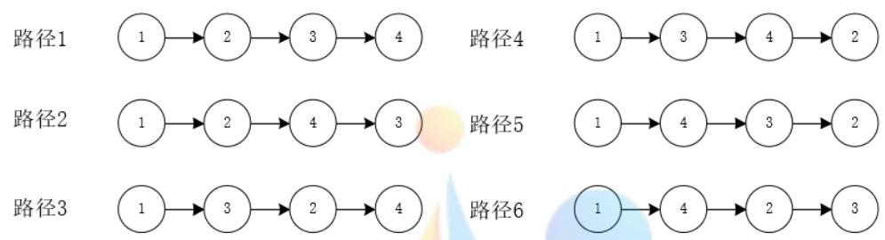  
图 6 初始上料的顺序图

故模型将基于6 种初始状态给出6种最佳调度方案，取6种方案中的最优作为结果。

Step3：对于每一块物料，经历的加工流程如图所示：

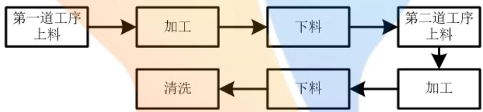  
图 7 物料的加工流程图

对任意一种初始状态，RGV下一步开始对目前CNC上的4块物料进行操作，直到4块物料都完成如图所示的流程，RGV会开始对其它物料进行作业4]。因此，我们将每4块物料绑定为一组；对第一组，从初始放置结束为起始，到第4块物料完成清洗为结束：对接下来的第x组，以x-1组结束为起始，第4x个物料清洗完成为结束：循环这个流程，直到8小时工作结束。

Step4：对于每一组而言，第1块物料完成第一道工序后有4个可选择的第二道工序CNC进行放置；第2块物料完成第一道工序后，有3个可选择的第二道工序CNC进行放置。以此类推，得到总的选择数为 $4 \times 3 \times 2 \times 1 { = } 2 4$

同样，对于每一组而言，在4块进行第一道工序的物料中选择第一块加入第二道工序的物料，共有4个可能的选择；选择第二块加入第二道工序的物料，共有3个可能的选择。依次类推，得到总的可选择数为 $4 \times 3 \times 2 \times 1 { = } 2 4$ C

因此，得到每一组4块物料加工过程的可选调度方案数为 $2 4 \times 2 4 = 5 7 6$ o

设第x组的开始时间点为 $f _ { 1 x }$ ，结束时间为点 $f _ { 2 x }$ ，则对每一组的576种可选方案，取最小时间的方案为该组最终调度方案。公式表示为：

$$
\operatorname* { m i n } { f _ { 0 } } = f _ { 2 x } - f _ { 1 x }\tag{24}
$$

其中， $f _ { 0 }$ 表示完成一组调度需要的总时间。

Step5：考虑最后一组的情况。当RGV完成对最后一组第m块物料的清洗后返回初始位置时，整个流程时间恰好已超出28800秒，则放弃对第m块物料的加工，直接返回

初始位置。设最后一组加工完成的物料数为d，则：

$$
d \in \{ 1 , 2 , 3 , 4 \}\tag{25}
$$

Step6：确定目标函数。设每种初始状态对应的最大加工物料数分别为 $D _ { 1 }$ 、 $D _ { 2 }$ $D _ { 3 }$ $D _ { 4 }$ $D _ { 5 }$ $D _ { 6 }$ 。则对任意一种初始状态，最大加工物料数表示为：

$$
\scriptstyle D _ { \nu } = 4 n + d\tag{26}
$$

其中，n为28800秒内完整完成的组数。

故目标函数表示为：

$$
\operatorname* { m a x } \left\{ D _ { 1 } , D _ { 2 } , D _ { 3 } , D _ { 4 } , D _ { 5 } , D _ { 6 } \right\}\tag{27}
$$

Step7：根据RGV抓取生料的顺序，将第k个被抓取的生料记为物料k。记录每个k，并记录每个k对应的第一道工序上料开始时间点 $u _ { 3 k }$ ，下料开始时间点 $u _ { 4 k }$ ；第二道工序上料开始时间点 $u _ { 5 k }$ ，下料开始时间点 $u _ { 6 k }$

## 3）3:5型的调度方案

Step1：首先需确定不同刀具类型的CNC 应摆放的位置。

第一，根据之前同一位置优先的原则，尽量使不同类型的CNC在同一RGV位置点的两侧。由此确定3个加工第一道工序的CNC应当不处于同一位置的两侧。

第二，由一道工序的加工系统，我们已知轨道两侧的CNC上下料时间不同，因此具体哪一类CNC放置在哪一侧，需要根据给出的加工时间比值TT，而具体目标为尽量减少 RGV的等待时间。综上给出判定方式如下

$$
\begin{array}{c} \begin{array} { r } { \left\{ T T \geq 1 , \quad \overleftrightarrow { \hat { \mathcal { H } } } - \overleftrightarrow { 1 } \underline { { \mathbb { E } } } \cdot \overleftrightarrow { \mathbb { H } } \mathrm { T } \supset \overleftrightarrow { \hat { \mathcal { H } } } \mathrm { T } \mathrm { C N C ~ } \overleftrightarrow { \mathcal { H } } \underset { \overrightarrow { \Xi } } { \underline { { \mathbb { E } } } } . \underbrace { \mathrm { F T } \not \circ \downarrow \mathrm { H } \cdot \vert \overrightarrow { \Pi } \vert } \overleftrightarrow { \operatorname { t } } \hat { \mathcal { H } } \mathrm { J } \right.} \\ { \left\{ T T < 1 , \quad \overleftrightarrow { \hat { \mathcal { H } } } - \mathrm { i } \underline { { \mathbb { E } } } \cdot \overleftrightarrow { \hat { \mathcal { H } } } \mathrm { T } \right\} \underset { \overrightarrow { \Xi } } { \underline { { \mathbb { H } } } } \times \hat { \mathcal { H } } \mathrm { C N C ~ } \overleftrightarrow { \hat { \mathcal { H } } } \underset { \overrightarrow { \Xi } } { \underline { { \mathbb { E } } } } . \underbrace { \mathrm { F T } } \ast \downarrow \mathrm { H } \downarrow \mathrm { H } \downarrow \downarrow \downarrow \downarrow \downarrow \downarrow \downarrow \downarrow } \end{array}  \langle \downarrow \downarrow \downarrow \rangle - \langle \downarrow \downarrow \downarrow \rangle  \end{array}\tag{28}
$$

这里需要注意，由于第一道工序的CNC 仅有3 台，因此第一道工序CNC 的一侧必定会出现1台第二道工序的CNC。

第三，基于前两点，可行的放置情况共有4种（假设在轨道哪一侧已经选定），如图所示：

  
图 8 两种刀具的 CNC 的分布图

接下来从4种情况中确定最佳的放置方案。已知RGV的初始位置在位置1，故优先选择在位置1放置第一道工序的CNC；由对称关系，当RGV进行工作时，在位置1、4的情况近似，在位置2、3的情况近似，故在已经选择了位置1的情况下，在位置4也放置第一道工序的CNC；同样根据对称性，在2、3位置放置的结果会近似相同，不妨

将最后一个CNC放置在位置2。

综上所述，最终选定的放置方案为情况2。

Step2：考虑初始情况。RGV从位置1出发，由于位置1、2、4各有个加工第一道工序的CNC，故初始仅需要对3台CNC进行上料，上料的顺序共有以下2种情况：

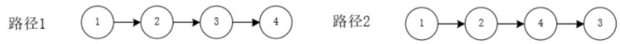  
图9 上料顺序图

故模型将基于2种初始状态给出2种最佳调度方案，取2种方案中的最优作为结果。

Step3：对任意一种初始状态，RGV下一步开始对目前 CNC 上的3块物料进行操作，直到3块物料都完成先前给出的加工流程，RGV会开始对其它物料进行作业。因此，我们将每3块物料绑定为一组；对第一组，从初始放置结束为起始，到第3块物料完成清洗为结束；对接下来的第x组，以x-1组结束为起始，第3x个物料清洗完成为结

Step4：对于每一组而言，第1块物料完成第一道工序后有5个可选择的第二道工序CNC进行放置；第2块物料完成第一道工序后，有4个可选择的第二道工序CNC进行放置。以此类推，得到总的选择数为 $5 \times 4 \times 3 = 6 0$

同样，对于每一组而言，在3块进行第一道工序的物料中选择第一块加入第二道工序的物料，共有3个可能的选择；选择第二块加入第二道工序的物料，共有2个可能的选择。依次类推，得到总的可选择数为6。

因此，得到每一组3块物料加工过程的可选调度方案数为 $6 0 \times 6 = 3 6 0$

设第x组的开始时间点为 $f _ { 1 x }$ ，结束时间为点 $f _ { 2 x }$ ，则对每一组的 $2 4 \times 2 4$ 种可选方案，取最小时间的方案为该组最终调度方案。公式表示为：

$$
\operatorname* { m i n } { f _ { 0 } } = f _ { 2 x } - f _ { 1 x }\tag{29}
$$

其中， $f _ { 0 }$ 表示完成一组调度需要的总时间。

Step5：考虑最后一组的情况。当RGV完成对最后一组第m块物料的清洗后返回初始位置时，整个流程时间恰好已超出28800秒，则放弃对第m块物料的加工，直接返回初始位置。设最后一组加工完成的物料数为d，则：

$$
d \in \{ 1 , 2 , 3 \}\tag{30}
$$

Step6：确定目标函数。设每种初始状态对应的最大加工物料数分别为 $D _ { 1 }$ 1 $D _ { 2 }$ 。则对任意一种初始状态，最大加工物料数表示为：

$$
D _ { \nu } { = } 3 n { + } d\tag{31}
$$

其中，n为28800秒内完整完成的组数。

故目标函数表示为：

$$
\operatorname* { m a x } \left\{ D _ { 1 } , D _ { 2 } \right\}\tag{32}
$$

Step7：根据 RGV抓取生料的顺序，将第k个被抓取的生料记为物料 $k$ 。记录每个k，并记录每个k对应的第一道工序上料开始时间点 $u _ { 3 k }$ ，下料开始时间点 $u _ { 4 k }$ ；第二道工序上料开始时间点 $u _ { 5 k }$ ，下料开始时间点 $u _ { 6 k }$

## 4）5:3型的调度方案

5:3型的调度方案与3:5型有许多相似之处，因此接下来只对改变的步骤进行解释。

Step1 的改变：根据同一位置有效的法则，5:3 型固然先将4个第一道工序的 CNC放置在同侧；在3:5型的放置方案中，第一道工序的CNC位于位置1、2、4，为了不影响更优的位置，将第5个第一道工序的CNC放置在位置3的另一侧。故CNC放置方案确定。

Step2的改变：考虑初始情况。RGV从位置1出发，由于位置1、2、3、4都存在加工第一道工序的 CNC，故初始需要对 5 台 CNC 进行上料，结合同一位置优先的法则，上料的顺序共有以下6种情况：

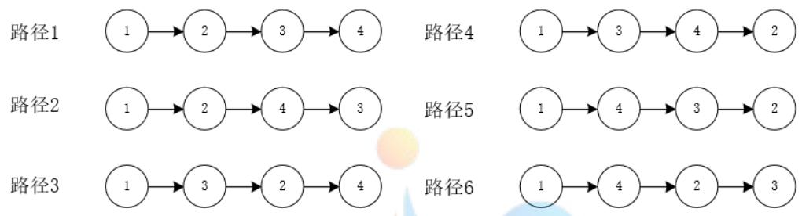  
图 10 初始上料顺序图

故模型将基于6 种初始状态给出6种最佳调度方案，取6 种方案中的最优作为结果。

Step4的改变：对于每一组而言，第1块物料完成第一道工序后有3个可选择的第二道工序CNC进行放置；第2块物料完成第一道工序后，有2个可选择的第二道工序CNC进行放置。以此类推，得到总的选择数为6。

同样，对于每一组而言，在3块进行第一道工序的物料中选择第一块加入第二道工序的物料，共有5个可能的选择；选择第二块加入第二道工序的物料，共有4个可能的选择。依次类推，得到总的可选择数为60。

因此，得到每一组3块物料加工过程的可选调度方案数为60×6=360。

Step6的改变：由于初始状态有6种，故目标函数表示变为：

$$
\operatorname* { m a x } \left\{ D _ { 1 } , D _ { 2 } , D _ { 3 } , D _ { 4 } , D _ { 5 } , D _ { 6 } \right\}\tag{33}
$$

## ● 更换刀具

考虑更换刀具的情况，首先明确换刀的目的。当可以换刀时，不再有CNC的的配比放置方案，一切以提高效率为准。

Step1：显然，初始的最佳状态为8台CNC都进行第一道工序。

Step2：当 RGV 为物料更换工序时，利用一道工序的调度模型选取下一台 CNC 执行第二道工序。此时对该CNC进行刀具更换工作，并拾起该CNC先前加工好第一道工序的物料，放置前一个需要加工第二道工序的物料。istance

Step3：重复 Step2的步骤，直到完成全部的调度。

这里我们不难发现，为了提高效率而制定的上述调度方案中换刀是极其频繁的，每执行一次操作时都大概率进行换刀，具体表现为满足两个法则：

1. 若前一个完工的 CNC 执行了第一道工序，则 RGV下一个联动的 CNC需更换为第二道工序的刀具。

2. 若前一个完工的 CNC执行了第二道工序，则 RGV下一个联动的 CNC 需更换为第一道工序的刀具。

在实际中换刀的时间大约为2-5s，因此不会对加工效率产生明显影响。但是另有3点我们必须考虑到：

1. 加工系统是否容易发生故障取决于频繁的操作，如果为了提高效率盲目进行上

述频繁换刀的操作，会使得系统发生故障的概率大大提升，得不偿失。

2. 且在实际情况中，不会出现为提高效率而频繁换刀的操作。

3. 初步对频繁换刀的理想状态进行估计，相比不换刀的最佳方案，28800秒内增加的物料加工数量均在5个左右，效率提高并不明显。

上述3个问题直接从多方面否定了在调度中频繁更换刀具的不合理性。因此，我们在确定后续的调度方案中，不考虑CNC更换刀具的情况，直接将其排除。

## 5.2.1.4 调度模型的求解算法

对于情况二，所有的求解步骤都已经在模型中一一给出；因此只需要依据模型，将遍历搜索算法与直接计算方法结合，利用MATLAB依次得到模型需要的结果，即可完成对情况二的求解。

## 5.2.2 任务 2

## 5.2.2.1 两道工序加工模型的结果

首先考虑不换刀的情况，将题目给出的三组参数分别带入模型，利用MATLAB编程求解。经过配比检验，得到第一组参数下确定使用4:4的放置方案；第二、三组参数需要分别带入4:4、3:5、5:3的模型中求解，第二组4:4得到成品209个成品、3:5得到200个成品、5:3得到159个成品；第三组4:4得到成品 232个成品、3:5得到174个成品、5:3得到236个成品（三种配比情况的结果表详见附录二十六），取其中最优的放置方案。从得到的结果发现：第一、二组适用4:4，第三组适用5:3。（5个一号刀，3个二号刀）其中，两道工序加工的第一组结果如下(代码文件Ques201.m详见附录十二):

表5 两道工序调度模型第一组数据结果表
<table><tr><td>加工物 料序号</td><td>工序1的 CNC 编号</td><td>上料开 始时间</td><td>下料开 始时间</td><td>工序２的 CNC 编号</td><td>上料开 始时间</td><td>下料开 始时间</td></tr><tr><td>1</td><td>1</td><td>0</td><td>428</td><td>2</td><td>456</td><td>884</td></tr><tr><td>2</td><td>3</td><td>48</td><td>507</td><td>4</td><td>535</td><td>988</td></tr><tr><td>3</td><td>5</td><td>96</td><td>586</td><td>6</td><td>614</td><td>1092</td></tr><tr><td>251</td><td></td><td></td><td></td><td></td><td></td><td></td></tr><tr><td>252</td><td>5 7</td><td>27584 27688</td><td>28026 28130</td><td>6 8</td><td>28054 28158</td><td>28496 28600</td></tr><tr><td>253</td><td></td><td>27818</td><td>28260</td><td>2</td><td>28288</td><td></td></tr><tr><td></td><td></td><td></td><td></td><td></td><td></td><td>28730</td></tr></table>

两道工序加工第二组结果如下(代码文件Ques201.m 详见附录十二):

表6两道工序调度模型第二组数据结果表
<table><tr><td>加工物 料序号</td><td>工序1的 CNC 编号</td><td>上料开 始时间</td><td>下料开 始时间</td><td>工序2的 CNC 编号</td><td>上料开 始时间</td><td>下料开 始时间</td></tr><tr><td>1</td><td>1</td><td>0</td><td>310</td><td>2</td><td>340</td><td>875</td></tr><tr><td>2</td><td>3</td><td>53</td><td>398</td><td>4</td><td>428</td><td>993</td></tr><tr><td>3</td><td>5</td><td>106</td><td>486</td><td>6</td><td>516</td><td>1111</td></tr><tr><td>207</td><td>3</td><td>27273</td><td>27808</td><td>6</td><td>27861</td><td>28396</td></tr><tr><td>208</td><td>7</td><td>27414</td><td>27949</td><td>8</td><td>27979</td><td>28514</td></tr><tr><td>209</td><td>5</td><td>27532</td><td>28067</td><td>2</td><td>28160</td><td>28695</td></tr></table>

两道工序加工第三组结果如下(代码文件 Ques203.m详见附录十四):

表7两道工序调度模型第三组数据结果表
<table><tr><td>加工物 料序号</td><td>工序1的 CNC 编号</td><td>上料开 始时间</td><td>下料开 始时间</td><td>工序2的 CNC 编号</td><td>上料开 始时间</td><td>下料开 始时间</td></tr><tr><td>1</td><td>4</td><td>18</td><td>505</td><td>3</td><td>537</td><td>957</td></tr><tr><td>2</td><td>8</td><td>82</td><td>596</td><td>7</td><td>628</td><td>837</td></tr><tr><td>3</td><td>5</td><td>132</td><td>673</td><td>1</td><td>732</td><td>1059</td></tr><tr><td>234</td><td>5</td><td>27582</td><td>…… 28193</td><td>3</td><td>28238</td><td>28474</td></tr><tr><td>235</td><td>4</td><td>27679</td><td>28442</td><td>3</td><td>28474</td><td>28683</td></tr><tr><td>236</td><td>6</td><td>27813</td><td>28308</td><td>7</td><td>28358</td><td>28567</td></tr></table>

结果表明，第1、2组参数均在4:4放置CNC的情况下得到更好的解，第3组参数在 5:3 放置 CNC 的情况下得到更好的解，这也验证了之前判断配比的法则是有必要且正确的。 八

## 5.2.2.2 两道工序模型的实用性

从结果来看，模型针对3组参数的求解情况均符合实际，既没有出现异常的上下料时间、也没有异常的两个相邻编号的物料上下料开始时间间隔。而这3组数据各有特点，反应了不同工序的不同耗时配比，故3组结果均合理足以证明模型具有较强的实用性，可针对任何符合实际的一组参数进行求解，得到合理的最佳效率方案。

分析最优的结果序列，虽然不全为1-8的自然序列，但都会陷入一个循环路径。这与实际的加工过程中，RGV的运动通常存在某种规律、不会做无规则的复杂运动相符合，进一步证明了模型的实用性。

## 5.2.2.3 两道工序模型系统的作业效率

理想情况下，不考虑RGV移动所消耗的时间，则对于之前已经验证出一、二两组的4:4类型的CNC分布。作业效率如下：

$$
\begin{array} { c } { { e _ { 1 i } = t t _ { 1 } + s _ { 1 } } } \\ { { e _ { 2 i } = t t _ { 2 } + s _ { 2 } } } \\ { { e i = \operatorname* { m a x } \left\{ e _ { 1 i } , e _ { 2 i } \right\} } } \end{array}\tag{34}
$$

$t t _ { i }$ 表示加工一个第i道工序的时间， $e _ { 1 i }$ 表示加工第一道工序的时间与上下料时间之和， $_ { e 2 i }$ 表示加工第二道工序的时间与上下料时间之和。

$$
N _ { 2 i } = \frac { ( 2 8 8 0 0 - t _ { 0 i } ) } { e i } \times 4\tag{35}
$$

$N _ { 2 i }$ 表示理想情况下，8小时能加工两道工序的第i组的成品数。 $t _ { 0 i }$ 表示第一次上下料所消耗的时间。得到 $N _ { 2 1 } = 2 6 8$ $N _ { 2 2 } = 2 1 6$

$$
\eta _ { ^ { 2 i } } = \frac { n _ { ^ { 2 i } } } { N _ { ^ { 2 i } } } \times 1 0 0 \%\tag{36}
$$

$\eta _ { 2 i }$ 表示两道工序情况下，利用该模型系统的作业效率。

得到： $\eta _ { 2 1 } = 9 4 . 4 0 \%$ $\eta _ { ^ { 2 2 } } = 9 6 . 7 6 \%$

第三组是适用于5:3 刀具类型的 CNC 分布，如果想向之前那样具体算出理想情况下8小时能生产的成品数，比较繁琐。那么，仍以4:4刀具分布的CNC的理想情况作为比较基准，先得到 $N _ { 2 3 } = 2 3 6$ 再求得 $\eta _ { ^ { 2 3 } } = 1 0 0 \%$

## 5.3随机故障模型的建立与求解

## 5.3.1 任务 1

对于情况三而言，首先需要给出加工系统的故障概率模型，再将模型分别嵌入情况一、二的模型中，分别考虑其影响。

## 5.3.1.1 概率故障模型

已知CNC在加工过程中发生故障的概率为1%,即每台CNC在每一次加工时，都有1%的概率的出现故障。故给出第i台CNC的故障状态如下：

$$
C _ { i } = \left\{ \begin{array} { l l } { 0 , \mathrm { C N C } \mathrm { \mathop { I E } } _ { \boxplus } ^ { \mathrm { \scriptsize { s t } } } } \\ { 1 , \mathrm { C N C } _ { \boxplus } ^ { \pm } \langle | \Theta _ { \boxplus } ^ { \Rightarrow } } \end{array} \right.\tag{37}
$$

其中，具体每次加工中， $C _ { i }$ 状态随机选取，有1%的概率为0，99%的概率为1。

当CNC发生故障时，其故障时长可能为10-20分钟。我们不妨假设故障时长服从均匀分布，再针对情况一、二的模型进行嵌入，分别固定带入这3个故障市场对结果进行求解[5]。 A

## 5.3.1.2一道工序的故障模型

Step1：将概率故障模型嵌入一道工序的“八步看一步”的调度模型，从初始放置步骤开始进行调度操作。

Step2：假设在随机的过程中，第k个物料在第i台CNC上加工时发生了故障；此时需要明确，故障的修复是人工操作，RGV无法预知修复完成的时间。因此，从CNC发生故障的时刻开始，在 RGV的视野中第i台 CNC 消失，系统中仅仅存在7台 CNC。

Step3：在上述情况下进行一道工序的调度方案，以未来8步决策1步作业，直到CNC修复完成，重新回归到RGV的视野中[6]。设第w步的时间区间为 $[ w _ { 1 } , w _ { 2 } ]$ ，此处需要进行考虑，当 CNC 发生故障时，RGV 正处于第w步的时间区间中，则 RGV 需将第w步完成，在考虑下一步时忽略故障CNC。

Step4：故障在一次加工过程中发生时，以秒为单位服从均匀分布，即随机在加工时间里的任意一秒开始出现故障；故障发生的时长也服从均匀分布，故随机选取10-20分钟内的任意一个加工时长。因此，对于发生故障的CNC正在加工的物料k，记录k及k的故障开始时间、结束时间。

Step5:故障排除后恢复原先的调度过程，直到下一个随机故障出现，重复上述步骤，一直到28800秒结束，记录一道工序调度模型需要得到的结果。

## 5.3.1.3 两道工序的故障模型

两道工序的故障模型首先因基于情况二的完整过程。对于情况二，我们已经通过三组数据验证了当不更换刀具时，4:4型为解决一般问题的最佳CNC配比方案，因此我们只对4:4型的调度方案嵌入概率故障模型，并给出其结果。nce

由于两道工序的故障模型与一道工序的故障模型区别仅仅存在于Step3，故直接延用一道工序的故障模型，并对 Step作出改变。

Step1：将概率故障模型嵌入两道工序的调度模型，从初始放置步骤开始进行调度操作。

Step2：假设在随机的过程中，第k个物料在第i台CNC上加工时发生了故障；此时需要明确，故障的修复是人工操作，RGV无法预知修复完成的时间。因此，从CNC发生故障的时刻开始，在RGV的视野中第i台 CNC消失，系统中仅仅存在7台 CNC。

Step3：两道工序的调度方案是以4块物料完成加工为一组进行分步调度。设对第k块物料进行某道工序的加工过程中出现故障。设此时系统处于第x组物料的加工过程中，故先将该组的加工流程继续完成，跳过故障CNC对应的步骤；可以得出，由于故障原因，此过程可能出现多余的往返。在进行下一组物料的加工时，由于某一类型的CNC有1个缺失，故可能的选择情况由24×24转变为144。因此，从故障开始时，每一组由144种方案中选取最优的调度方案进行；但需要注意，这一组加工的物料数可能为4，也可能为3，这取决于出现故障的CNC类型。当故障被修复时，同理令系统完成当前一组的加工，从下一组加工开始恢复原先的调度方案。

<table><tr><td>加工物 料序号</td><td>加工 CNC 编号</td><td>上料开 始时间</td><td>下料开始 时间 on</td><td>故障时的 物料序号</td><td>故障 CNC 编号</td><td>故障开 始时间</td><td>故障结 束时间</td></tr><tr><td>1</td><td>1</td><td>0</td><td>610</td><td>78</td><td>6</td><td>6443</td><td>7413</td></tr><tr><td>2</td><td>2</td><td>30</td><td>670</td><td>201</td><td>2</td><td>16240</td><td>16886</td></tr><tr><td></td><td></td><td></td><td></td><td>251</td><td>5</td><td>20715</td><td>21522</td></tr><tr><td>339</td><td>7</td><td>28067</td><td>28677</td><td>■</td><td>■</td><td></td><td>■</td></tr></table>

表9一道工序模型第一组随机故障模型结果表

Step4：故障在一次加工过程中发生时，以秒为单位服从均匀分布，即随机在加工时间里的任意一秒开始出现故障；故障发生的时长也服从均匀分布，故随机选取10-20分钟内的任意一个加工时长。因此，对于发生故障的CNC正在加工的物料k，记录k及k的故障开始时间、结束时间。

Step5:故障排除后恢复原先的调度过程，直到下一个随机故障出现，重复上述步骤，一直到28800秒结束，记录一道工序调度模型需要得到的结果。

Step6：对不同可选CNC配比放置下的初始情况分别重复上述步骤，比较不同配比下故障对系统的影响。

## 5.3.1.4 模型的求解算法

基于原先的求解算法，更改相关的函数、参数，依照概率合理利用随机生成，对模型步骤依次进行编程求解，最终可以得到模型需要的相关结果。

## 5.3.2 任务2

## 5.3.2.1 故障模型的结果

利用 MATLAB 求解一道工序随机故障模型(代码文件 Ques301.m 详见附录十六)。一道工序的情况下，第一组随机故障模型结果如下：

表8一道工序模型第一组随机故障模型结果表
<table><tr><td>加工物</td><td>加工</td><td>上料开</td><td>下料开始</td></tr><tr><td>料序号</td><td>CNC 编</td><td>始时间</td><td>时间</td></tr><tr><td></td><td>号</td><td></td><td></td></tr><tr><td>1</td><td>1</td><td>0</td><td>588</td></tr><tr><td>2</td><td>2</td><td>28</td><td>641</td></tr><tr><td></td><td></td><td></td><td></td></tr><tr><td>365</td><td>1</td><td>28049</td><td>28693</td></tr></table>

<table><tr><td>故障时的</td><td>故障</td><td>故障开</td><td>故障结</td></tr><tr><td>物料序号</td><td>CNC 编</td><td>始时间</td><td>束时间</td></tr><tr><td></td><td>号</td><td></td><td></td></tr><tr><td>66</td><td>2</td><td>5046</td><td>5647</td></tr><tr><td>213</td><td>6</td><td>16048</td><td>16968</td></tr><tr><td>244</td><td>6</td><td>18797</td><td>19869</td></tr><tr><td>351</td><td>3</td><td>27095</td><td>28190</td></tr></table>

一道工序的情况下，第二组随机故障模型：

一道工序的情况下，第三组随机故障模型结果：

表10一道工序模型第一组随机故障模型结果表
<table><tr><td>加工物 料序号</td><td>加工 CNC 编号</td><td>上料开 始时间</td><td>下料开 始时间</td></tr><tr><td>1</td><td>1</td><td>0</td><td>572</td></tr></table>

<table><tr><td>故障时的 物料序号</td><td>故障 CNC 编号</td><td>故障开 始时间</td><td>故障结 束时间</td></tr><tr><td>65</td><td>1</td><td>4610</td><td>5308</td></tr><tr><td>2</td><td>2</td><td>27</td><td>624</td></tr><tr><td></td><td></td><td></td><td></td></tr><tr><td>389</td><td>7</td><td>28171</td><td>28748</td></tr></table>

<table><tr><td>138</td><td>1</td><td>10030</td><td>10890</td></tr><tr><td>167</td><td>8</td><td>12304</td><td>13262</td></tr><tr><td>1</td><td>-</td><td>-</td><td>I</td></tr></table>

利用 MATLAB 求解两道工序随机故障模型(代码文件 Ques302.m 详见附录十七)。两道工序的情况下，第二组随机故障模型结果如下：

表11 两道工序模型第一组随机故障模型结果表
<table><tr><td>加工物 料序号</td><td>工序1的 CNC 编号</td><td>上料开 始时间</td><td>下料开 始时间</td><td>工序2的 CNC序号</td><td>上料开 始时间</td><td>下料开 始时间</td></tr><tr><td>1</td><td>1</td><td>0</td><td>428</td><td>2</td><td>456</td><td>865</td></tr><tr><td>2</td><td>3</td><td>48</td><td>507</td><td>4</td><td>535</td><td>944</td></tr><tr><td>3</td><td>5</td><td>96</td><td>586</td><td>6</td><td>614</td><td>1023</td></tr><tr><td>238</td><td>5</td><td>27026</td><td>27468</td><td>2</td><td>27671</td><td>28077</td></tr><tr><td>239</td><td>3</td><td>27130</td><td>27747</td><td>4</td><td>28149</td><td>28558</td></tr><tr><td>240</td><td>7</td><td>27364</td><td>28238</td><td>8</td><td>28266</td><td>28675</td></tr></table>

表 12 两道工序模型第一组随机故障模型故障故障信息表
<table><tr><td>故障时的物料 序号</td><td>故障 CNC 编号</td><td>故障开 始时间</td><td>故障结束 时间</td></tr><tr><td>96</td><td>7</td><td>10489</td><td>11243</td></tr><tr><td>199</td><td>4</td><td>22782</td><td>23772</td></tr><tr><td>235</td><td>6</td><td>27513</td><td>28149</td></tr></table>

两道工序的情况下，第一组随机故障模型结果：

表13 两道工序模型第二组随机故障模型结果表
<table><tr><td>加工物 料序号</td><td>工序1的 CNC 编号</td><td>上料开 始时间</td><td>下料开 始时间</td><td>工序2的 CNC序号</td><td>上料开 始时间</td><td>下料开 始时间</td></tr><tr><td>1</td><td></td><td>0</td><td>428</td><td>2</td><td>456</td><td>865</td></tr><tr><td>2</td><td>3</td><td>48</td><td>507</td><td>4</td><td>535</td><td>944</td></tr><tr><td>3</td><td>5</td><td>96</td><td>586</td><td>6</td><td>614</td><td>1023</td></tr><tr><td>238</td><td>CompetitionZero Distance 5</td><td>27026</td><td>27468</td><td>2</td><td>27671</td><td>28077</td></tr><tr><td>239</td><td>3</td><td>27130</td><td>27747</td><td>4</td><td>28149</td><td>28558</td></tr><tr><td>240</td><td>7</td><td>27364</td><td>28238</td><td>8</td><td>28266</td><td>28675</td></tr><tr><td></td><td></td><td></td><td></td><td></td><td></td><td></td></tr></table>

表14 两道工序模型第二组随机故障模型故障信息表
<table><tr><td>故障时的物料 序号</td><td>故障 CNC 编号</td><td>故障开 始时间</td><td>故障结束 时间</td></tr><tr><td>41</td><td>3</td><td>5360</td><td>6192</td></tr><tr><td>119</td><td>2</td><td>16831</td><td>17984</td></tr><tr><td>124</td><td>6</td><td>18107</td><td>18768</td></tr></table>

两道工序的情况下，第三组随机故障模型结果：

表15 两道工序模型第三组随机故障模型结果表
<table><tr><td>加工物 料序号</td><td>工序1的 CNC 编号</td><td>上料开 始时间</td><td>下料开 始时间</td><td>工序2的 CNC 序号</td><td>上料开 始时间</td><td>下料开 始时间</td></tr><tr><td>1</td><td>1</td><td>0</td><td>310</td><td>2</td><td>340</td><td>875</td></tr><tr><td>2</td><td>3</td><td>53</td><td>398</td><td>4</td><td>428</td><td>963</td></tr><tr><td>3</td><td>5</td><td>106</td><td>486</td><td>6</td><td>516</td><td>1051</td></tr><tr><td>198</td><td>1</td><td>27235</td><td>…… 27770</td><td>2</td><td>27822</td><td>28357</td></tr><tr><td>199</td><td>7</td><td>27411</td><td>27946</td><td>8</td><td>27981</td><td>28516</td></tr><tr><td>200</td><td>5</td><td>27534</td><td>28069</td><td>6</td><td>28099</td><td>28634</td></tr></table>

表16 两道工序模型第三组随机故障模型故障信息表
<table><tr><td>故障时的物料 序号</td><td>故障 CNC 编 号</td><td>故障开 始时间</td><td>故障结束 时间</td></tr><tr><td>140</td><td>8</td><td>17259</td><td>18006</td></tr><tr><td>198</td><td>7</td><td>24004</td><td>25088</td></tr></table>

## 5.3.2.2 故障模型的实用性

关于故障模型，我们需要通过模型的稳定性判断模型是否实用，即判断故障对模型产生的影响程度是否在某一限度内。首先依次选择加工物料总数、故障物料总数为样本。分别对随机生成修复故障时间的样本、设定10分钟修复故障时间的样本、设定15分钟的样本及设定20分钟的样本做平均值与标准差，标准差计算公式表示为：

$$
\sigma = { \sqrt { \frac { \displaystyle \sum _ { i = 1 } ^ { n } ( u - x _ { i } ) ^ { 2 } } { n - 1 } } }\tag{38}
$$

利用 MATLAB 分别求解4 种情况下 20 个样本的标准差。对一道工序，得到的结果如下(代码文件Ques303.m详见附录二十):

表17随机故障模型对一道工序20次样本分析结果表
<table><tr><td></td><td></td><td>成品平 均数</td><td>成品数 标准差</td><td>故障发生 平均次数</td><td>故障数 标准差</td></tr><tr><td rowspan="3">随机</td><td>第一组</td><td>364.6</td><td>12.20</td><td>4.20</td><td>1.881</td></tr><tr><td>第二组</td><td>330.6</td><td>15.57</td><td>3.50</td><td>1.638</td></tr><tr><td>第三组</td><td>377.2</td><td>10.03</td><td>3.50</td><td>1.573</td></tr><tr><td rowspan="3">10min</td><td>第一组</td><td>365.0</td><td>9.55</td><td>4.25</td><td>1.860</td></tr><tr><td>第二组</td><td>326.0</td><td>18.68</td><td>4.00</td><td>1.806</td></tr><tr><td>第三组</td><td>376.1</td><td>13.41</td><td>4.20</td><td>2.726</td></tr><tr><td rowspan="2">15min</td><td>第一组</td><td>366.0</td><td>11.95</td><td>3.85</td><td>1.927</td></tr><tr><td>第二组</td><td>327.7</td><td>19.55</td><td>3.60</td><td>1.759</td></tr><tr><td></td><td>第三组</td><td>378.0</td><td>8.92</td><td>3.60</td><td>1.536</td></tr><tr><td rowspan="3">20min</td><td>第一组</td><td>362.1</td><td>9.82</td><td>4.15</td><td>1.755</td></tr><tr><td>第二组</td><td>326.3</td><td>14.68</td><td>3.75</td><td>1.517</td></tr><tr><td>第三组</td><td>366.6</td><td>13.73</td><td>4.45</td><td>1.572</td></tr></table>

对两道工序情况(针对 $4 { : } 4$ 情况)，结果如下(代码文件 $\mathrm { Q u e s } 3 0 4 . \mathrm { m }$ 详见附录二十一):

表18随机故障模型对两道工序20次样本分析结果表
<table><tr><td></td><td>成品平 均数</td><td>成品数 标准差</td><td>故障发生 平均次数</td><td>故障数 标准差</td></tr><tr><td rowspan="3">随机</td><td>第一组</td><td>240.8 12.20</td><td>2.30</td><td>1.881</td></tr><tr><td>第二组 196.7</td><td>7.85</td><td>3.20</td><td>1.824</td></tr><tr><td>第三组</td><td>221.9 7.67</td><td>3.15</td><td>1.755</td></tr><tr><td rowspan="3">10min</td><td>第一组</td><td>241.3 9.55</td><td>3.05</td><td>1.860</td></tr><tr><td>第二组</td><td>202.6 3.39</td><td>2.65</td><td>1.309</td></tr><tr><td>第三组</td><td>226.5 4.58</td><td>2.95</td><td>1.669</td></tr><tr><td rowspan="3">15min</td><td>第一组</td><td>242.6 11.95</td><td>2.35</td><td>1.927</td></tr><tr><td>第二组</td><td>201.2 5.87</td><td>2.25</td><td>1.446</td></tr><tr><td>第三组 222.1</td><td>7.72</td><td>2.80</td><td>1.765</td></tr><tr><td rowspan="3">20min</td><td>第一组</td><td>233.6 9.82</td><td>2.85</td><td>1.755</td></tr><tr><td>第二组</td><td>196.4 9.69</td><td>2.70</td><td>1.689</td></tr><tr><td>第三组 218.0</td><td>10.13</td><td>3.00</td><td>1.589</td></tr></table>

由此可见当样本修复时间在10\~15min左右时，模型的稳定性更强，这表示在今后的加工中，可设法人为将修复故障时间控制在10\~15min左右，避免出现故障严重影响加工的情况。

## 六、模型的灵敏度分析

对题目给定的3组数据，令RGV移动时间、CNC加工时间、上下料时间、清洗时间均上下连续波动5%，利用MATLAB绘制4个参数分别与物料成品数量之间的函数关系图。一道工序情况下的模型灵敏度分析图如下(代码文件LingMin1.m详见附录二十四):

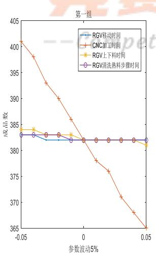

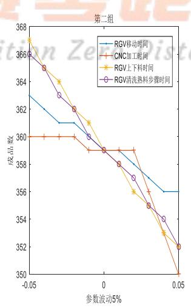  
图11 一道工序模型的灵敏度分析图

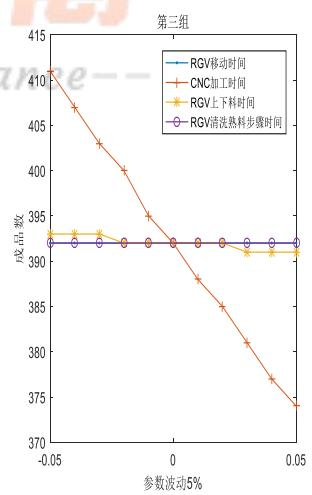

如图所示，对于第一、三组数据而言，两道工序加工的调度模型对CNC加工时间较为敏感，而对第二组数据而言，RGV移动时间、CNC加工时间、上下料时间、清洗时间的变化都会对最终能完成的成品数产生较大影响。因此，可以推断得出，一般情况下，模型对CNC加工时间都较为敏感，在实际加工过程中，需要谨慎考虑加工时间的设置，以保证加工效率。

绘制两道工序情况下的模型灵敏度分析图如下(代码文件LingMin2.m详见附录二十五):

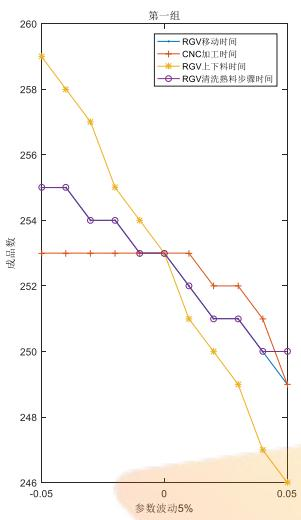

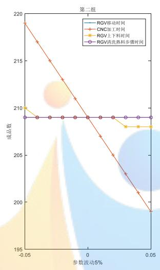  
图 12 两道工序模型的灵敏度分析图

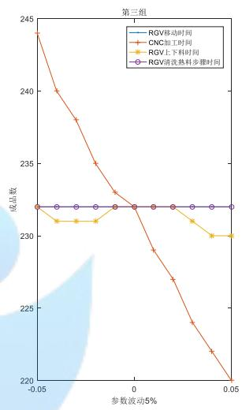

观察上图结果，对于第二、三组数据而言，一道工序加工的调度模型对CNC加工时间较为敏感，而对第一组数据而言，RGV移动时间、CNC加工时间、上下料时间、清洗时间的变化都会对最终能完成的成品数产生较大影响。因此，可以推断得出，一般情况下，模型对CNC加工时间都较为敏感，在实际加工过程中，需要谨慎考虑加工时间的设置，以保证加工效率。

上述两种情况表明，无论采用几道加工工序，CNC单次加工时间的设定最为关键，而其它三个参数会因加工工序的数量不同而呈现不同的灵敏度，有些情况下敏感，有些情况下稳定。

## 七、模型的综合评价与推广

## 7.1 模型的综合评价

## 7.1.1 模型的优点

## Competition Zero Distance--

本文在考虑未来步骤对当前步骤的影响时，从多方面进行分析，确定了由未来几步确定当前一步可以时结果无限接近全局最优；既没有进行复杂的全局搜索，也没有进行不确定性较强的随机生成，但却得到了理想的最优结果。

本文在考虑两道工序的加工过程时，针对不同的CNC布局进行了全面的分析与验证，最终给出了不同情形下最佳的布局方式，增强了模型的实用性。

本文突出的特点在于考虑了更换刀具的问题。在实际问题中，更换刀具是常见的操作；针对题目，频繁的更换刀具确实可以使问题得到更优的结果；最终要的一点是，合理的换刀并没有违背题目的任何要求。基于上述三点，更换刀具对于两道工序的加工过程是有意义的，值得推广的。

本文在考虑随机生成故障时，对 RGV的指令进行了分析，确定了故障出现时RGV是否应继续当前指令以及故障期间RGV指令发生了怎样的改变。这使得本文对故障的考虑更加实际、更加精细。

本文在检验模型的步骤中，使用方差来判断模型的稳定性，使用理想状态与实际状态的对比情况来判断模型的效率，进一步增强了模型的可靠性。

## 7.1.2 模型的缺点

本文在考虑不同配比的CNC时，忽略了2:6、1:7的情况；但是在实际的操作中，当两种CNC的加工时间差超过一定限度时，2:6、1:7的配比将成为最优的放置方案。此处模型直接忽略了少数情况，考虑欠妥当。

本文在模型假设时假设了传送带的总能及时给到生料与熟料空位，但在实际情况中，传送带的运行是有一定的速度的，在加工系统运行时传送带会影响整个调度方案；模型的假设与实际略不相符，故存在缺陷。

## 7.2 模型的推广

本文主要利用动态规划对智能加工系统制定了高效的调度方案，其中运用最多的“未来多步确定一步”的思想可以推广到更多的调度模型中；对于问题本身，此模型在RGV位置增多，CNC数量增多的情况下依然使用，可能仅仅需要对“未来多步”进行略微的调整。但是RGV的位置与CNC的数量不能无限的增加下去，当其达到一定值时，RGV会应运动时间过长而效率降低，此时就需要在原先模型的基础上增加RGV数量，得到更高效的调度方案。

## 八、参考文献

[1]查振元,李计星,绳润涛,等.智能平移轨道导引车的应用[J].机器人技术与应 用,2017(5):42-43.

[2]顾红,邹平,徐伟华.环行穿梭车优化调度问题的自学习算法[J].系统工程理论与实践,2013,33(12):3223-3230.

[3]陈华.基于分区法的 2-RGV 调度问题的模型和算法[J].工业工程与管理,2014,19(6):70-77.

[4]金芳,方凯,王京林,基于排队论的 AGV 调度研究[J].仪器仪表学报,2004,25(s1):844-846.

[5]周广文,贾亚洲.专用计算机数控机床故障率实验研究[J].组合机床与自动化加工技术,2005(1):45-47.

[6]乔非,吴启迪.SJ—FMS 中 RGV 的实时调度与故障调度[J].组合机床与自动化加工技术,1995(03):39-43.

## --Competiti九、附录Distance--

附录程序运行环境：

MATLAB 版本: 9.0.0.341360 (R2016a)

MATLAB 许可证编号:123456

操作系统: Microsoft Windows 10 家庭中文版 Version 10.0 (Build 17134)

Java 版本: Java 1.7.0\_60-b19 with Oracle Corporation Java HotSpot(TM) 64-Bit Server VMmixed mode

附录一：oneStep.m

function [h,f,g,z] = oneStep( a,dT,T,t0,c )

%单步最优

```matlab
z=[c;c;c;c];
for i=1:4
e(i)=dT(abs(a-i)+1);%可能移动时间
f(i)=i;%位置
g(i)=t0+e(i);%移动后当前时间
if g(i)>c(2*(i-1)+1)&&g(i)>c(2*(i-1)+2)
%[cmin,cind]=min([c(2*(i-1)+1)+28+T(7),c(2*(i-1)+2)+31+T(7)]);
cind=1;
z(i,2*(i-1)+cind)=g(i)+T(5)+T(4);
h(i)=0;%其余 CNC 等待时间
for j=1:8
if c(j)<g(i)+T(5)+T(7)&&j~=2*(i-1)+1
h(i)=h(i)+g(i)+T(5)+T(7)-c(j);
end
end
else
[cmin,cind]=min([c(2*(i-1)+1)+T(5)+T(7),c(2*(i-1)+2)+T(6)+T(7)])
z(i,2*(i-1)+cind)=z(i,2*(i-1)+cind)+T(4+cind)+T(4);
h(i)=0;%其余 CNC 等待时间
for j=1:8
if c(j)<cmin&&c(j)~=cmin-T(7)-T(4+cind)
h(i)=h(i)+cmin-c(j);
end
end
end
end
end
S赛枣距离
%实践解得发现瞻望四步迈一步已可解得全局最优解
el=[];f1=[];g1=[];h1=[];CompetitionZeroDistance--
for i=1:4
[ze1,zf1,zg1,zh1] = oneStep( f(i),dT,T,g(i),h(i,:) );
e1=[e1;ze1];f1=[f1;zf1];g1=[g1;zg1];h1=[h1;zh1];
clear zel zfl zg1 zh1
end
e2=[];f2=[];g2=[];h2=[];
for i=1:4
for j=1:4
[ze1,zf1,zg1,zh1] = oneStep( f1(i,j),dT,T,g1(i,j),h1(4*(i-1)+j,:) );
e2=[e2;ze1];f2=[f2;zf1];g2=[g2;zg1];h2=[h2;zh1];
```

```matlab
clear zel zf1 zg1 zh1
end
end
e3=[];f3=[];g3=[];h3=[];
for i=1:16
for j=1:4
[ze1,zf1,zg1,zh1] = oneStep( f2(i,j),dT,T,g2(i,j),h2(4*(i-1)+j,:) );
e3=[e3;ze1];f3=[f3;zf1];g3=[g3;zg1];h3=[h3;zh1];
clear zel zf1 zg1 zh1
end
end
for i=1:4
e1(i,:)=e1(i,:)+e(i);
end
for i=1:4
for j=1:4
e2(4*(i-1)+j,:)=e2(4*(i-1)+j,:)+e1(i,j);
end
end
for i=1:4
for j=1:4
for k=1:4
e3(16*(i-1)+4*(j-1)+k,:)=e3(16*(i-1)+4*(j-1)+k,:)+e2(4*(i-1)+j,k);
end
end
end
附录三：xunhuan.m
%初始路径移动 零距离
N=8;
for i=1:4 -Competition Zero Distance--
%RGV每一步移动
dT=[0,T(1:3)];
d=dT(abs(a-lj(i))+1);
a=lj(i);
t0=t0+d;
%RGV 为单个奇数 CNC 上料
M(2*(i-1)+1,1)=t0;
t0=t0+T(5);
b(2*(lj(i)-1)+1)=1;
```

```matlab
c(2*(lj(i)-1)+1)=t0+T(4);
M(2*(i-1)+1,2)=2*(lj(i)-1)+1;
%RGV 为单个偶数 CNC 上料
M(2*(i-1)+2,1)=t0;
t0=t0+T(6);
b(2*(lj(i)-1)+2)=1;
c(2*(1j(i)-1)+2)=t0+T(4);
M(2*(i-1)+2,2)=2*(1j(i)-1)+2;
end
%多步最优
vhile t0<=8*3600
[e,f,g,h,] = oneStep( a,dT,T,t0,c );%a,t0,c 改变为 f,g,h.
e3 = fStep( f,dT,T,g,h,e )';
e3 = reshape(e3,64,4);
[minValue,row] = min(e3);
[minValue,col] = min(minValue);
d=dT(abs(a-col)+1);
t0=t0+d;
t0
a=col;
N=N+1;
i=a;
if t0>c(2*(i-1)+1)&&t0>c(2*(i-1)+2)
%[cmin,cind]=min([c(2*(i-1)+1),c(2*(i-1)+2)]);
cmin=t0;cind=1;
c(2*(i-1)+cind)=cmin+T(4+cind)+T(4);
elseif t0<c(2*(i-1)+1)&&t0<c(2*(i-1)+2)
[cmin,cind]=min([c(2*(i-1)+1)+T(5),c(2*(i-1)+2)+T(6)]);
c(2*(i-1)+cind)=cmin+T(4+cind)+T(4); c1距
else
[cmin,cind]=min([c(2*(i-1)+1),c(2*(i-1)+2)),istanee−-
cmin=t0;
c(2*(i-1)+cind)=cmin+T(4+cind)+T(4);
end
M(N,1)=cmin;
M(N,2)=2*(i-1)+cind;
for i=length(M(:,2))-1:-1:1
if M(i,2)==2*(a-1)+cind
M(i,3)=cmin;
break;
end
```

```matlab
end
t0=cmin+T(4+cind)+T(7);
end
mm=M(N-8,3);
end
附录四：find8.m
%找出八步
clc,clear
%RGV移动 1,2,3 个单位所需时间
T=[20,33,46];
%CNC加工完成一个一道工序的物料所需时间
T=[T,560];
%RGV为CNC1#，3#，5#，7#一次上下料所需时间
T=[T,28];
%RGV为CNC2#，4#，6#，8#一次上下料所需时间
T=[T,31];
%RGV完成一个物料的清洗作业所需时间
T=[T,25];
%RGV 当前时间
t0=0;
%RGV 当前位置[1,2,3,4]
a=1;
%CNC 当前工作状态
b=zeros(1,8);
%CNC 预计加工完成时间
%始择 竞赛零距离
start=[ones(6,1),perms([2,3,4])];
Competition Zero Distance--
1j=start(6,:);
%初始路径移动
for i=1:4
%RGV 每一步移动
dT=[0,T(1:3)];
d=dT(abs(a-lj(i))+1);
a=lj(i);
t0=t0+d;
%RGV 为单个奇数 CNC 上料
```

```matlab
t0=t0+T(5);
b(2*(lj(i)-1)+1)=1;
c(2*(1j(i)-1)+1)=t0+T(4);
%RGV 为单个偶数 CNC 上料
t0=t0+T(6);
b(2*(lj(i)-1)+2)=1;
c(2*(lj(i)-1)+2)=t0+T(4);
end
[e,f,g,h] = oneStep( a,dT,T,t0,c );%a,t0,c 改变为 f,g,h.
e1=[];f1=[];g1=[];h1=[];
for i=1:4
[ze1,zf1,zg1,zh1] = oneStep(f(i),dT,T,g(i),h(i,:) );
e1=[e1;ze1];f1=[f1;zf1];g1=[g1;zg1];h1=[h1;zh1]
clear zel zfl zg1 zh1
end
e2=[];f2=[];g2=[];h2=[];
for i=1:4
for j=1:4
[ze1,zf1,zg1,zh1] = oneStep( f1(i,j),dT,T,g1(i,j),h1(4*(i-1)+j,:) );
e2=[e2;ze1];f2=[f2;zf1];g2=[g2;zg1];h2=[h2;zh1];
clear zel zfl zg1 zh1
end
end
e3=[];f3=[];g3=[];h3=[];
for i=1:16
for j=1:4
[ze1,zf1,zg1,zh1] = oneStep( f2(i,j),dT,T,g2(i,j),h2(4*(i-1)+j,:) );
clear zel zfl zgl zh1 dz夢距离
end
end
e4=[];f4=[];g4=[];h4=[]; Competition Zero Distance--
for i=1:64
for j=1:4
[ze1,zf1,zg1,zh1] = oneStep( f3(i,j),dT,T,g3(i,j),h3(4*(i-1)+j,:) );
e4=[e4;ze1];f4=[f4;zf1];g4=[g4;zg1];h4=[h4;zh1];
clear zel zf1 zg1 zh1
end
end
e5=[];f5=[];g5=[];h5=[];
for i=1:256
for j=1:4
```

```matlab
[ze1,zf1,zg1,zh1] = oneStep( f4(i,j),dT,T,g4(i,j),h4(4*(i-1)+j,:) );
e5=[e5;ze1];f5=[f5;zf1];g5=[g5;zg1];h5=[h5;zh1];
clear zel zf1 zg1 zh1
end
end
e6=[];f6=[];g6=[];h6=[];
for i=1:1024
for j=1:4
[ze1,zf1,zg1,zh1] = oneStep(f5(i,j),dT,T,g5(i,j),h5(4*(i-1)+j,:) );
e6=[e6;ze1];f6=[f6;zf1];g6=[g6;zg1];h6=[h6;zh1];
clear zel zf1 zg1 zh1
end
end
e7=[];f7=[];g7=[];h7=[];
for i=1:4096
for j=1:4
[ze1,zf1,zg1,zh1] = oneStep(f6(i,j),dT,T,g6(i,j),h6(4*(i-1)+j,:) );
e7=[e7;ze1];f7=[f7;zf1];g7=[g7;zg1];h7=[h7;zh1];
clear zel zfl zg1 zh1
end
end
附录五：Ques1.m
%一道工序的三组数据的求解
clc,clear
%RGV移动 1,2,3 个单位所需时间
T=[23,41,59];
%CNC加工完成一个一道工序的物料所需时间
T=[T,580];
%RGV为 CNC2#，4#，6#，8#一次上下料所需时间
T=[T,35];
%RGV完成一个物料的清洗作业所需时间ZeroDistance
T=[T,30];
%1 T=[20,33,46,560,28,31,25];
T=[23,41,59,580,30,35,30];
%3 T=[18,32,46,545,27,32,25];
%RGV 当前时间
t0=0;
%RGV 当前位置[1,2,3,4]
a=1;
```

%CNC 当前工作状态

```matlab
b=zeros(1,8);
%CNC 预计加工完成时间
c=zeros(1,8);
%初始路径选择
start=[ones(6,1),perms([2,3,4])]:
for i=1:6
1j=start(i,:);
[Mn(i),Ma(i)] = xunhuan( a,T,lj,t0,b,c );
clear lj
end
%初始路径选择
start=perms([1,2,3,4]);
for i=1:24
1j=start(i,:);
[Mn(i),Ma(i)] = xunhuan( a,T,lj,t0,b,c );
clear lj
end
i=6;clear M
lj=start(i,:);
%初始路径移动
N=8;
for i=1:4
%RGV每一步移动
dT=[0,T(1:3)];
d0  赛零距离 t0=t0+d;
%RGV为单个奇数cNC上料ition ZeroDistance--
M(2*(i-1)+1,1)=t0;
t0=t0+T(5);
b(2*(lj(i)-1)+1)=1;
c(2*(lj(i)-1)+1)=t0+T(4);
M(2*(i-1)+1,2)=2*(lj(i)-1)+1;
%RGV 为单个偶数 CNC 上料
M(2*(i-1)+2,1)=t0;
t0=t0+T(6);
b(2*(lj(i)-1)+2)=1;
```

```matlab
c(2*(lj(i)-1)+2)=t0+T(4);
M(2*(i-1)+2,2)=2*(lj(i)-1)+2;
end
%多步最优
while t0<=8*3600
[e,f,g,h,] = oneStep( a,dT,T,t0,c );%a,t0,c 改变为 f,g,h.
e3 = fStep( f,dT,T,g,h,e )';
e3 = reshape(e3,64,4);
[minValue,row] = min(e3);
[minValue,col] = min(minValue);
d=dT(abs(a-col)+1);
t0=t0+d;
t0
a=col;
N=N+1;
i=a;
if t0>c(2*(i-1)+1)&&t0>c(2*(i-1)+2)
%[cmin,cind]=min([c(2*(i-1)+1),c(2*(i-1)+2)]);
cmin=t0;cind=1;
c(2*(i-1)+cind)=cmin+T(4+cind)+T(4);
elseif t0<c(2*(i-1)+1)&&t0<c(2*(i-1)+2)
[cmin,cind]=min([c(2*(i-1)+1)+T(5),c(2*(i-1)+2)+T(6)]);
cmin=cmin-T(4+cind);
c(2*(i-1)+cind)=cmin+T(4+cind)+T(4);
else
[cmin,cind]=min([c(2*(i-1)+1),c(2*(i-1)+2)]);
cmin=t0;
end 1零距离
M(N,1)=cmin;
M(N,2)=2*(i-1)+cind;
for i=length(M(:,2))-1:Q.petition ZeroDistance--
if M(i,2)==2*(a-1)+cind
M(i,3)=cmin;
break;
end
end
t0=cmin+T(4+cind)+T(7);
end
[m,n]=size(M);
M(m-7:m,:)=[];
M(m-8,3)=M(m-8,1)+T(4+mod(M(m-8,2),2))+T(4);
```

```matlab
if M(m-8,3)+T(4+mod(M(m-8,2),2))+T(7)>8*3600
M(m-8,:)=[];
end
MM(:,1)=M(:,2);
MM(:,2)=M(:,1);
MM(:,3)=M(:,3);
附录六：f201.m
function [ T6,VTT1,VTT2,TT4,TT5 1 = f201(T1,T2,T3,t0,dT,T)
QQ=perms([1,2,3,4]);
T6=10*3600+1;%记录最小值
for i=1:24
for j=1:24
T4=QQ(i,:);%前往哪个工序1
T5=QQ(j,:);%去往哪里工序2
d=dT(abs(T4(1)-T3)+1);%移动
QT=t0+d;%移动到 T41
QT=max(QT,T1(T4(1)));%T41 开始下料
VT1(1,1)=QT;
QT=QT+T(6);%T41 下料完毕
d=dT(abs(T4(1)-T5(1))+1);%移动
QT=QT+d;%移动到 T51
QT=max(QT,T2(T5(1)));%T51 开始下料
VT2(1,1)=QT;
QT=QT+T(7);%T51 下料完毕
QT=QT+T(8);%T51 清洗完毕
for k=2:4
d=dT(abs(T5(k-1)-T4(k))+1);%移动
QT=QT+d;%移动到 T4k
VT1(k,1)=QT;
QT=QT+T(6);%T4k 下料完毕
d=dT(abs(T4(k)-T5(k))+1);%移动roDistance--
QT=QT+d;%移动到 T5k
QT=max(QT,T2(T5(k)));%T5k 开始下料
VT2(k,1)=QT;
QT=QT+T(7);%T5k 下料完毕
QT=QT+T(8);%T5k 清洗完毕
end
if QT < T6
T6=QT;
VTT1=VT1;
VTT2=VT2;
```

```matlab
TT4=T4;
TT5=T5;
end
clear QT VT1 VT2
end
end
end
附录七：f202.m
function [ m,TTT ] = f202( aa,dT,T,t0 )
aa=[aa;aa];
QQ=perms([1,2,3,4]);
for i=1:24
d=dT(abs(aa(4,1)-QQ(i,1))+1);
tQ(i)=t0+d;
for j=1:4
if QQ(i,1)==aa(j,1)
if tQ(i)<aa(j,3)
tQ(i)=aa(j,3)+T(6)+T(7);
else
tQ(i)=tQ(i)+T(6)+T(7);
end
end
end
d=dT(abs(QQ(i,2)-QQ(i,1))+1);
tQ(i)=tQ(i)+d;
for j=1:4
if QQ(i,2)==aa(j,1)
if tQ(i)<aa(j,3)
d距离
end
end -Competition Zero Distance--
end
d=dT(abs(QQ(i,2)-QQ(i,3))+1);
tQ(i)=tQ(i)+d;
for j=1:4
if QQ(i,3)==aa(j,1)
if tQ(i)<aa(j,3)
tQ(i)=aa(j,3)+T(6)+T(7);
else
tQ(i)=tQ(i)+T(6)+T(7);
end
```

```matlab
end
end
d=dT(abs(QQ(i,4)-QQ(i,3))+1);
tQ(i)=tQ(i)+d;
for j=1:4
if QQ(i,4)==aa(j,1)
if tQ(i)<aa(j,3)
tQ(i)=aa(j,3)+T(6)+T(7);
else
tQ(i)=tQ(i)+T(6)+T(7);
end
end
end
end
[tQmin,tQind]=min(tQ);
aa(5:8,1)=QQ(tQind,:)';
aa(1:4,5)=QQ(tQind,:)';
i=tQind;
d=dT(abs(aa(4,1)-QQ(i,1))+1);
tQ(i)=t0+d;
for j=1:4
if QQ(i,1)==aa(j,1)
if tQ(i)<aa(j,3)
aa(5,2)=aa(j,3);
aa(1,3)=aa(5,2);
aa(5,3)=aa(5,2)+T(6)+T(4);
aa(1,6)=aa(j,3)+T(6);
aa(1,7)=aa(j,3)+T(6)+T(7)+T(5);
tQ(i)=aa(j,3)+T(6)+T(7);
else
aa(5,2)=tQ(i); 赛零距离
aa(1,3)=aa(5,2);
aa(5,3)=aa(5,2)+T(6)+T(4);
aa(1,6)=tQ(i)+T(6),etition Zero Distance--
aa(1,7)=tQ(i)+T(6)+T(7)+T(5);
tQ(i)=tQ(i)+T(6)+T(7);
end
end
end
d=dT(abs(QQ(i,2)-QQ(i,1))+1);
tQ(i)=tQ(i)+d;
for j=1:4
if QQ(i,2)==aa(j,1)
if tQ(i)<aa(j,3)
```

```matlab
aa(6,2)=aa(j,3);
aa(2,3)=aa(6,2);
aa(6,3)=aa(6,2)+T(6)+T(4);
aa(2,6)=aa(j,3)+T(6);
aa(2,7)=aa(j,3)+T(6)+T(7)+T(5);
tQ(i)=aa(j,3)+T(6)+T(7);
else
aa(6,2)=tQ(i);
aa(2,3)=aa(6,2);
aa(6,3)=aa(6,2)+T(6)+T(4);
aa(2,6)=tQ(i)+T(6);
aa(2,7)=tQ(i)+T(6)+T(7)+T(5);
tQ(i)=tQ(i)+T(6)+T(7);
end
end
end
d=dT(abs(QQ(i,2)-QQ(i,3))+1);
tQ(i)=tQ(i)+d;
for j=1:4
if QQ(i,3)==aa(j,1)
if tQ(i)<aa(j,3)
aa(7,2)=aa(j,3);
aa(3,3)=aa(7,2);
aa(7,3)=aa(7,2)+T(6)+T(4);
aa(3,6)=aa(j,3)+T(6);
aa(3,7)=aa(j,3)+T(6)+T(7)+T(5);
tQ(i)=aa(j,3)+T(6)+T(7);
else
aa(7,2)=tQ(i);
aa(3,6)=tQ(i)+T(6);
aa(3,7)=tQ(i)+T(6)+T(7)+T(5);
tQ(i)=tQ(i)+T(6)+T(7),tion 'Zero Distance--
end
end
end
d=dT(abs(QQ(i,4)-QQ(i,3))+1);
tQ(i)=tQ(i)+d;
for j=1:4
if QQ(i,4)==aa(j,1)
if tQ(i)<aa(j,3)
aa(8,2)=aa(j,3);
aa(4,3)=aa(8,2);
```

```matlab
aa(8,3)=aa(8,2)+T(6)+T(4);
aa(4,6)=aa(j,3)+T(6);
aa(4,7)=aa(j,3)+T(6)+T(7)+T(5);
tQ(i)=aa(j,3)+T(6)+T(7);
else
aa(8,2)=tQ(i);
aa(4,3)=aa(8,2);
aa(8,3)=aa(8,2)+T(6)+T(4);
aa(4,6)=tQ(i)+T(6);
aa(4,7)=tQ(i)+T(6)+T(7)+T(5);
tQ(i)=tQ(i)+T(6)+T(7);
end
end
end
while t0<8*3600
[m,n]=size(aa);
T1=aa(m-3:m,[1,3]);%一道工序结束时间
T2=aa(m-7:m-4,[5,7]);%二道工序结束时间
T1=sortrows(T1,1);
T2=sortrows(T2,1);
T1(:,1)=[];
T2(:,1)=[];
[Tmin,T3]=max(T2);%当前位置；
[ T6,VTT1,VTT2,TT4,TT5 ] = f201(T1,T2,T3,t0,dT,T );
t0=T6;%当前时间
for ii=1:4
for jj=1:4
零距离 aa(m-4+jj,5)=TT5(ii);
aa(m-4+jj,6)=VTT2(ii);
aa(m-4+jj,7)=aa(m-4+jj,6)+T(5)+T(7);s tan e e −
end
if TT5(ii)==aa(m-8+jj,5)
aa(m-8+jj,7)=VTT2(ii);
end
end
end
aa(m+1:m+4,1)=TT4′;
aa(m+1:m+4,2)=VTT1;
end
```

```matlab
[m,n]=size(aa);
aa(m-3:m,:)=[];
[m,n]=size(aa);
for i=m:-1:m-15
d=dT(abs(aa(i,5)-1)+1);%移动
if aa(i,7)+T(6)+T(7)+d>8*3600
aa(i,7)=0;
end
end
bb=[];
for i=1:m
if aa(i,7)==0;
bb=[bb,i];
end
end
aa(bb,:)=[];
[m,n]=size(aa);
for i=1:m
aa(i,4)=2*aa(i,1)-1;
aa(i,8)=2*aa(i,5);
end
TTT=max(aa(:,7));
end
附录八：f203.m
function [ T6,VTT1,VTT2,TT4,TT5 ] = f203( T1,T2,T3,t0,dT,T)
Q1=perms([1,3,7]);
Q2=perms([2,4,5,6,8]);
for j=1:120
T4=Q1(i,1:3);%前往哪个工序1
T5=Q2(j,1:3);%去往哪里工序2n Zero Distance
d=dT(abs(ceil(T4(1)/2)-T3)+1);%移动
QT=t0+d;%移动到 T41
QT=max(QT,T1(T4(1)));%T41 开始下料
VT1(1,1)=QT;
QT=QT+T(7-mod(T4(1),2));%T41 下料完毕
d=dT(abs(ceil(T4(1)/2)-ceil(T5(1)/2))+1);%移动
QT=QT+d;%移动到 T51
QT=max(QT,T2(T5(1)));%T51 开始下料
VT2(1,1)=QT;
```

```matlab
QT=QT+T(7-mod(T5(1),2));%T51 下料完毕
if T2(T5(1))==0
QT=QT;
else
QT=QT+T(8);%T51 清洗完毕
end
for k=2:3
d=dT(abs(ceil(T5(k-1)/2)-ceil(T4(k)/2))+1);%移动
QT=QT+d;%移动到 T4k
QT=max(QT,T1(T4(k)));%T4k 开始下料
VT1(k,1)=QT;
QT=QT+T(7-mod(T4(k),2));%T4k 下料完毕
d=dT(abs(ceil(T4(k)/2)-ceil(T5(k)/2))+1);%移动
QT=QT+d;%移动到 T5k
QT=max(QT,T2(T5(k)));%T5k开始下料
VT2(k,1)=QT;
QT=QT+T(7-mod(T5(k),2));%T5k 下料完毕
if T2(T5(k))==0
QT=QT;
else
QT=QT+T(8);%T51 清洗完毕
end
end
if QT < T6
T6=QT;
VTT1=VT1;
VTT2=VT2;
TT4=T4;
end TT5=T5; 赛零距离
clear QT VT1 VT2
end
end --Competition Zero Distance--
end
附录九：f204.m
function [a,aa,t0] = f204( a,LJ,t0,dT,T )
%初始路径获取
for i=1:4
if LJ(i)==3
break;
end
end
```

```matlab
if i==1
1j=[5,6,LJ(2:4)*2];
elseif i==4
1j=[LJ(1:3)*2,5,6];
else
1j=[LJ(1:i-1)*2,5,6,LJ(i+1:4)*2];
end
if i==1
LJ=[3,3,LJ(2:4)];
elseif i==4
LJ=[LJ(1:3),3,3];
else
LJ=[LJ(1:i-1),3,3,LJ(i+1:4)];
end
aa(:,1)=LJ';
aa(:,4)=lj';
i=1;
d=dT(abs(aa(i,1)-a)+1);
t0=t0+d;
aa(i,2)=t0;
aa(i,3)=aa(i,2)+T(4)+T(7-mod(LJ(i),2));
t0=t0+T(7-mod(LJ(i),2));
for i=2:5
d=dT(abs(aa(i,1)-aa(i-1,1))+1);
t0=t0+d;
aa(i,2)=t0;
aa(i,3)=aa(i,2)+T(4)+T(7-mod(LJ(i),2));
end (赛零距离
a=LJ(5);
end
--Competition Zero Distance--
附录十：f205.m
function [ T6,VTT1,VTT2,TT4,TT5 ] = f205( T1,T2,T3,t0,dT,T)
Q2=perms([1,3,7]);
Q1=perms([2,4,5,6,8]);
T6=10*3600+1;%记录最小值
for i=1:6
for j=1:120
T4=Q1(j,1:3);%前往哪个工序1
T5=Q2(i,1:3);%去往哪里工序2
```

```matlab
d=dT(abs(ceil(T4(1)/2)-T3)+1);%移动
QT=t0+d;%移动到 T41
QT=max(QT,T1(T4(1)));%T41 开始下料
VT1(1,1)=QT;
QT=QT+T(7-mod(T4(1),2));%T41 下料完毕
d=dT(abs(ceil(T4(1)/2)-ceil(T5(1)/2))+1);%移动
QT=QT+d;%移动到 T51
QT=max(QT,T2(T5(1)));%T51 开始下料
VT2(1,1)=QT;
QT=QT+T(7-mod(T5(1),2));%T51 下料完毕
if T2(T5(1))==0
QT=QT;%不需要清洗
else
QT=QT+T(8);%T51 清洗完毕
end
for k=2:3
d=dT(abs(ceil(T5(k-1)/2)-ceil(T4(k)/2))+1);%移动
QT=QT+d;%移动到 T4k
QT=max(QT,T1(T4(k)));%T4k 开始下料
VT1(k,1)=QT;
QT=QT+T(7-mod(T4(k),2));%T4k 下料完毕
d=dT(abs(ceil(T4(k)/2)-ceil(T5(k)/2))+1);%移动
QT=QT+d;%移动到 T5k
QT=max(QT,T2(T5(k)));%T5k 开始下料
VT2(k,1)=QT;
QT=QT+T(7-mod(T5(k),2));%T5k 下料完毕
if T2(T5(k))==0
else QT=QT; QT=QT+T(8);%T51 清洗完毕 安市距离
end
end -Competition Zero Distance--
if QT < T6
T6=QT;
VTT1=VT1;
VTT2=VT2;
TT4=T4;
TT5=T5;
end
clear QT VT1 VT2
end
d
```

```matlab
end
附录十一：f206.m
function [ m,QQ 1 = f206( aa,dT,T,a,t0 )
%设置 T1,T2,T3
[m,n]=size(aa);
for i=1:8
for j=m-4:m
if i==aa(j,5)
T2(i,1)=aa(j,7);
elseif aa(j,5)==0
T2(i,1)=0;
end
end
end
for i=1:m
for j=1:8
if j==aa(i,4)
T1(j,1)=aa(i,3);
end
end
end
T3=a;
[ T6,VTT1,VTT2,TT4,TT5 ] = f205( T1,T2,T3,t0,dT,T );
t0=T6;
T3=ceil(TT5(3)/2);
for jj=1:5 竞赛零距离
if TT4(ii)==aa(m-5+jj,4) aa(m-5+jj3)VTr(ij,tion Zero Distance--
aa(m-5+jj,4)=TT4(ii);
aa(m-5+jj,5)=TT5(ii);
aa(m-5+jj,6)=VTT2(ii);
aa(m-5+jj,7)=aa(m-5+jj,6)+T(5)+T(7-mod(aa(m-5+jj,5),2));
end
end
end
aa(m+1:m+3,4)=TT4′;
aa(m+1:m+3,2)=VTT1;
for i=m+1:m+3
```

```matlab
aa(i,3)=VTT1(i-m)+T(4)+T(7-mod(aa(i,4),2));
:nd
:lear T1 T2
vhile t0<8*3600
[m,n]=size(aa);
for i=1:8
for j=1:m
if i==aa(j,5)
T2(i,1)=aa(j,7);
end
end
end
for i=1:m
for j=1:8
if j==aa(i,4)
T1(j,1)=aa(i,3);
end
end
end
a=ceil(TT5(3)/2);
T3=ceil(TT5(3)/2);
[ T6,VTT1,VTT2,TT4,TT5 1 = f205( T1,T2,T3,t0,dT,T );
t0=T6;%当前时间
[m,n]=size(aa);
for ii=1:3
aa(jj,3)=VTT1(ii); 零距离
aa(jj,4)=TT4(ii);
a(j,5)=TT5(if)tition Zero Distance
aa(jj,6)=VTT2(ii);
aa(jj,7)=aa(jj,6)+T(5)+T(7-mod(aa(jj,5),2));
break;
end
end
end
aa(m+1:m+3,4)=TT4′;
aa(m+1:m+3,2)=VTT1;
for i=m+1:m+3
aa(i,3)=VTT1(i-m)+T(4)+T(7-mod(aa(i,4),2));
```

```matlab
end
end
[m,n]=size(aa);
aa(m-2:m,:)=[];
[m,n]=size(aa);
for i=m:-1:m-15
d=dT(abs(ceil(aa(i,5)/2)-1)+1);%移动
if aa(i,7)+T(6)+T(7)+d>8*3600
aa(i,7)=0;
end
end
bb=[];
for i=1:m
if aa(i,7)==0;
bb=[bb,i];
end
end
aa(bb,:)=[];
[m,n]=size(aa);
for i=1:m
for j=i+1:m
if aa(i,5)==aa(j,5)
aa(i,7)=aa(j,6);
break;
end
end end 竞赛零距离
[m,n]=size(aa);
QQ=max(aa(:,7));
end --Competition Zero Distance--
附录十二：Ques201.m
%两道工序的4,4 模型求解结果
clc,clear
%第一组作业参数
T=[20,33,46,400,378,28,31,25];
%第二组作业参数
%T=[23,41,59,280,500,30,35,30];
%第三组作业参数
%T=[18,32,46,455,182,27,32,25];
```

```matlab
dT=[0,T(1:3)];
P=8*T(4)/(T(4)+T(5));
%固定刀具
D=[1,2,1,2,1,2,1,2];
%RGV 当前时间
t0=0;
%RGV 当前位置[1,2,3,4]
a=1;
%CNC 预计加工完成时间
b=zeros(1,8);
%初始路径选择
start=[ones(6,1),perms([2,3,4])];
%初始路径
newstart=start';
newstart=newstart(:);
for i=1:24
if newstart(i,1)==1
newstart(i,2)=0;
newstart(i,3)=newstart(i,2)+T(6)+T(4);
newstart(i,4)=2*(newstart(i,1)-1)+1;
else
d=dT(abs(newstart(i)-newstart(i-1))+1);
newstart(i,2)=newstart(i-1,2)+T(6)+d;
newstart(i,3)=newstart(i,2)+T(6)+T(4);
end w费零距离
end
for i=1:6 --Competition Zero Distance--
N=4;
aa=newstart(4*i-3:4*i,:);
t0=aa(4,2)+T(6);
[ mm(i),TTT(i) ] = f202( aa,dT,T,t0 );
clear aa t0 N
end
N=4;i=6;
aa=newstart(4*i-3:4*i,:);
t0=aa(4,2)+T(6);
```

```matlab
aa=[aa;aa];
QQ=perms([1,2,3,4]);
for i=1:24
d=dT(abs(aa(4,1)-QQ(i,1))+1);
tQ(i)=t0+d;
for j=1:4
if QQ(i,1)==aa(j,1)
if tQ(i)<aa(j,3)
tQ(i)=aa(j,3)+T(6)+T(7);
else
tQ(i)=tQ(i)+T(6)+T(7);
end
end
end
d=dT(abs(QQ(i,2)-QQ(i,1))+1);
tQ(i)=tQ(i)+d;
for j=1:4
if QQ(i,2)==aa(j,1)
if tQ(i)<aa(j,3)
tQ(i)=aa(j,3)+T(6)+T(7);
else
tQ(i)=tQ(i)+T(6)+T(7);
end
end
end
d=dT(abs(QQ(i,2)-QQ(i,3))+1);
tQ(i)=tQ(i)+d;
for j=1:4
"距离 if tQ(i)<aa(j,3)
else
tQ(i)-tQ(i)+T(6)+t(7),n Zero Distance−-
end
end
end
d=dT(abs(QQ(i,4)-QQ(i,3))+1);
tQ(i)=tQ(i)+d;
for j=1:4
if QQ(i,4)==aa(j,1)
if tQ(i)<aa(j,3)
tQ(i)=aa(j,3)+T(6)+T(7);
else
```

```matlab
tQ(i)=tQ(i)+T(6)+T(7);
end
end
end
end
[tQmin,tQind]=min(tQ);
aa(5:8,1)=QQ(tQind,:)';
aa(1:4,5)=QQ(tQind,:)';
i=tQind;
d=dT(abs(aa(4,1)-QQ(i,1))+1);
tQ(i)=t0+d;
for j=1:4
if QQ(i,1)==aa(j,1)
if tQ(i)<aa(j,3)
aa(5,2)=aa(j,3);
aa(1,3)=aa(5,2);
aa(5,3)=aa(5,2)+T(6)+T(4);
aa(1,6)=aa(j,3)+T(6);
aa(1,7)=aa(j,3)+T(6)+T(7)+T(5);
tQ(i)=aa(j,3)+T(6)+T(7);
else
aa(5,2)=tQ(i);
aa(1,3)=aa(5,2);
aa(5,3)=aa(5,2)+T(6)+T(4);
aa(1,6)=tQ(i)+T(6);
aa(1,7)=tQ(i)+T(6)+T(7)+T(5);
tQ(i)=tQ(i)+T(6)+T(7);
end
end
60赛零距离 tQ(i)=tQ(i)+d;
for j=1:4
if QQ(i,2)==aa(j,1) Competition Zero Distance--
if tQ(i)<aa(j,3)
aa(6,2)=aa(j,3);
aa(2,3)=aa(6,2);
aa(6,3)=aa(6,2)+T(6)+T(4);
aa(2,6)=aa(j,3)+T(6);
aa(2,7)=aa(j,3)+T(6)+T(7)+T(5);
tQ(i)=aa(j,3)+T(6)+T(7);
else
aa(6,2)=tQ(i);
aa(2,3)=aa(6,2);
```

```matlab
aa(6,3)=aa(6,2)+T(6)+T(4);
aa(2,6)=tQ(i)+T(6);
aa(2,7)=tQ(i)+T(6)+T(7)+T(5);
tQ(i)=tQ(i)+T(6)+T(7);
end
end
end
d=dT(abs(QQ(i,2)-QQ(i,3))+1);
tQ(i)=tQ(i)+d;
for j=1:4
if QQ(i,3)==aa(j,1)
if tQ(i)<aa(j,3)
aa(7,2)=aa(j,3);
aa(3,3)=aa(7,2);
aa(7,3)=aa(7,2)+T(6)+T(4);
aa(3,6)=aa(j,3)+T(6);
aa(3,7)=aa(j,3)+T(6)+T(7)+T(5);
tQ(i)=aa(j,3)+T(6)+T(7);
else
aa(7,2)=tQ(i);
aa(3,3)=aa(7,2);
aa(7,3)=aa(7,2)+T(6)+T(4);
aa(3,6)=tQ(i)+T(6);
aa(3,7)=tQ(i)+T(6)+T(7)+T(5);
tQ(i)=tQ(i)+T(6)+T(7);
end
end
end
d=dT(abs(QQ(i,4)-QQ(i,3))+1);
if QQ(i,4)==aa(j,1) 竞赛零距离
if tQ(i)<aa(j,3)
aa(8,2)=aa(j,3)mpetition Zero Distance--
aa(4,3)=aa(8,2);
aa(8,3)=aa(8,2)+T(6)+T(4);
aa(4,6)=aa(j,3)+T(6);
aa(4,7)=aa(j,3)+T(6)+T(7)+T(5);
tQ(i)=aa(j,3)+T(6)+T(7);
else
aa(8,2)=tQ(i);
aa(4,3)=aa(8,2);
aa(8,3)=aa(8,2)+T(6)+T(4);
aa(4,6)=tQ(i)+T(6);
```

```matlab
aa(4,7)=tQ(i)+T(6)+T(7)+T(5);
tQ(i)=tQ(i)+T(6)+T(7);
end
end
end
while t0<8*3600
[m,n]=size(aa);
T1=aa(m-3:m,[1,3]);%一道工序结束时间
T2=aa(m-7:m-4,[5,7]);%二道工序结束时间
T1=sortrows(T1,1);
T2=sortrows(T2,1);
T1(:,1)=[];
T2(:,1)=[];
[Tmin,T3]=max(T2);%当前位置；
[ T6,VTT1,VTT2,TT4,TT5 ] = f201(T1,T2,T3,t0,dT,T );
t0=T6;%当前时间
for ii=1:4
for jj=1:4
if TT4(ii)==aa(m-4+jj,1)
aa(m-4+jj,3)=VTT1(ii);
aa(m-4+jj,5)=TT5(ii);
aa(m-4+jj,6)=VTT2(ii);
aa(m-4+jj,7)=aa(m-4+jj,6)+T(5)+T(7);
end
if TT5(ii)==aa(m-8+jj,5)
aa(m-8+jj,7)=VTT2(ii);
end
1.1 赛零距离
aa(m+1:m+4,2)=VTT1;
aa(m+1:m+4,3)=aa(m+1:m+4,2)+T(4)+T(6),roDistance−-
aa(m+1:m+4,4)=aa(m+1:m+4,1)*2-1;
end
[m,n]=size(aa);
aa(m-3:m,:)=[];
[m,n]=size(aa);
for i=m:-1:m-15
d=dT(abs(aa(i,5)-1)+1);%移动
if aa(i,7)+T(6)+T(7)+d>8*3600
aa(i,7)=0;
```

```matlab
end
end
bb=[];
for i=1:m
if aa(i,7)==0;
bb=[bb,i];
end
end
aa(bb,:)=[];
[m,n]=size(aa);
for i=1:m
aa(i,4)=2*aa(i,1)-1;
aa(i,8)=2*aa(i,5);
end
附录十三：Ques202.m
%两道工序的 3,5 分配的结果求解
clc,clear
%第一组作业参数
%T=[20,33,46,400,378,28,31,25];
%第二组作业参数
T=[23,41,59,280,500,30,35,30];
%第三组作业参数
%T=[18,32,46,455,182,27,32,25];
dT=[0,T(1:3)];
P=8*T(4)/(T(4)+T(5));
%固定刀具
竞赛零距离
t0=0;
%RGv 当前位置[1,2,3,4ompetitionZeroDistance--
a=1;
%CNC 预计加工完成时间
b=zeros(1,8);
%初始路径选择
start=[1,2,4,3];
d=dT(abs(start(1)-a)+1);
t0=t0+d;
```

```matlab
aa(1,1)=start(1);
aa(1,2)=t0;
t0=t0+T(6);
aa(1,3)=t0+T(4);
aa(1,4)=1;
for i=2:3
d=dT(abs(start(i)-start(i-1))+1);
t0=t0+d;
aa(i,1)=start(i);
aa(i,2)=t0;
t0=t0+T(6);
aa(i,3)=t0+T(4);
end
aa(2,4)=3;
aa(3,4)=7;
a=4;
aa=[aa;aa];
aa(1:3,5)=aa(1:3,1);
for i=1:3
d=dT(abs(aa(i,5)-a)+1);
a=aa(i,5);
t0=t0+d;
t0=max(t0,aa(i,3));%上料开始
aa(i,3)=t0;
t0=t0+T(6);%上料结束
aa(i,6)=t0;
t0=t0+T(7);
end
aa(4:6,2)=aa(1:3,3);
aa(4:6,3)=aa(4:6,2)+T(6)+T(4);
aa(1:3,5)=aa(1:3,5)*2;-Competition Zero Distance--
%F203
for i=1:8
for j=4:6
if i==aa(j,4)
T1(i,1)=aa(j,3);
end
end
end
for i=1:8
```

```matlab
for j=1:3
if i==aa(j,5)
T2(i,1)=aa(j,7);
end
end
end
T3=a;
[ T6,VTT1,VTT2,TT4,TT5 ] = f203(T1,T2,T3,t0,dT,T );
a=ceil(TT5(3)/2);
T3=a;
[m,n]=size(aa);
for ii=1:3
for jj=1:3
if TT4(ii)==aa(m-3+jj,4)
aa(m-3+jj,3)=VTT1(ii);
aa(m-3+jj,4)=TT4(ii);
aa(m-3+jj,5)=TT5(ii);
aa(m-3+jj,6)=VTT2(ii);
aa(m-3+jj,7)=aa(m-3+jj,6)+T(5)+T(7-mod(aa(m-3+jj,5),2));
end
if TT5(ii)==aa(m-6+jj,5)
aa(m-6+jj,7)=VTT2(ii);
end
end
end
aa(m+1:m+3,4)=TT4';
aa(m+1:m+3,2)=VTT1;
dea 1 费零距离
while t0<8*3600
[m,n]=size(aa); Competition Zero Distance--
for i=1:8
for j=m-2:m
if i==aa(j,4)
T1(i,1)=aa(j,3);
end
end
end
for i=1:m-3
for j=1:8
if j==aa(i,5)
```

```matlab
T2(j,1)=aa(i,7);
end
end
end
a=ceil(TT5(3)/2);
T3=a;
[ T6,VTT1,VTT2,TT4,TT5 ] = f203(T1,T2,T3,t0,dT,T );
t0=T6;%当前时间
[m,n]=size(aa);
for ii=1:3
for jj=1:3
if TT4(ii)==aa(m-3+jj,4)
aa(m-3+jj,3)=VTT1(ii);
aa(m-3+jj,4)=TT4(ii);
aa(m-3+jj,5)=TT5(ii);
aa(m-3+jj,6)=VTT2(ii);
aa(m-3+jj,7)=aa(m-3+jj,6)+T(5)+T(7-mod(aa(m-3+jj,5),2));
end
if TT5(ii)==aa(m-6+jj,5)
aa(m-6+jj,7)=VTT2(ii);
end
end
end
aa(m+1:m+3,4)=TT4';
aa(m+1:m+3,2)=VTT1;
aa(m+1:m+3,3)=VTT1+T(4)+T(6);
end
[m,n]=size(aa); 竞赛零距离
for i=m:-1:m-15
d=dT(abs(ceil(aa(i,5)/2)-1)+1);%移动nZeroDistance
if aa(i,7)+T(6)+T(7)+d>8*3600
aa(i,7)=0;
end
end
bb=[];
for i=1:m
if aa(i,7)==0;
bb=[bb,i];
end
```

```matlab
end
aa(bb,:)=[];
[m,n]=size(aa);
for i=1:m
for j=i+1:m
if aa(i,5)==aa(j,5)
aa(i,7)=aa(j,6);
break;
end
end
end
附录十四：Ques203.m
%两道工序的5,3分刀的求解
clc,clear
%第一组作业参数
%T=[20,33,46,400,378,28,31,25];
%第二组作业参数
%T=[23,41,59,280,500,30,35,30];
%第三组作业参数
T=[18,32,46,455,182,27,32,25];
dT=[0,T(1:3)];
P=8*T(4)/(T(4)+T(5));
%固定刀具
D=[2,1,2,1,1,1,2,1];
%RGV 当前时间
t0=0;
ARGV当前位置1.231元赛零距离
%CNc预计加工完成时间ompetitionZeroDistance--
b=zeros(1,8);
%初始路径选择
start=perms([1,2,4,3]);
for ij=1:24
LJ=start(ij,:);
[a2,aa,t2] = f204( a,LJ,t0,dT,T );
aa(5,7)=0;
[ ma(ij),QQ(ij) 1 = f206( aa,dT,T,a2,t2 );
```

```matlab
clear aa
end
LJ=start(15,:);
[a,aa,t0] = f204( a,LJ,t0,dT,T );
aa(5,7)=0;
%设置 T1,T2,T3
[m,n]=size(aa);
for i=1:8
for j=m-4:m
if i==aa(j,5)
T2(i,1)=aa(j,7);
elseif aa(j,5)==0
T2(i,1)=0;
end
end
end
for i=1:m
for j=1:8
if j==aa(i,4)
T1(j,1)=aa(i,3);
end
end
end
T3=a;
[ T6,VTT1,VTT2,TT4,TT5 ] = f205(T1,T2,T3,t0,dT,T );
t0=T6;
T3=ceil(TT5(3)/2); 竞赛零距离
[m,n]=size(aa); --Competition Zero Distance--
for ii=1:3
for jj=1:5
if TT4(ii)==aa(m-5+jj,4)
aa(m-5+jj,3)=VTT1(ii);
aa(m-5+jj,4)=TT4(ii);
aa(m-5+jj,5)=TT5(ii);
aa(m-5+jj,6)=VTT2(ii);
aa(m-5+jj,7)=aa(m-5+jj,6)+T(5)+T(7-mod(aa(m-5+jj,5),2));
end
end
```

```matlab
end
aa(m+1:m+3,4)=TT4';
aa(m+1:m+3,2)=VTT1;
for i=m+1:m+3
aa(i,3)=VTT1(i-m)+T(4)+T(7-mod(aa(i,4),2));
end
clear T1 T2
while t0<8*3600
[m,n]=size(aa);
for i=1:8
for j=1:m
if i==aa(j,5)
T2(i,1)=aa(j,7);
end
end
end
for i=1:m
for j=1:8
if j==aa(i,4)
T1(j,1)=aa(i,3);
end
end
end
a=ceil(TT5(3)/2);
T3=ceil(TT5(3)/2);
[ T6,VTT1,VTT2,TT4,TT5 1= f205(T1,T2,T3,t0,dT,T );
0:费零距离 [m,n]=size(aa);
for ii=1:3
for jj=m:-1:1 Competition Zero Distance--
if TT4(ii)==aa(jj,4)
aa(jj,3)=VTT1(ii);
aa(jj,4)=TT4(ii);
aa(jj,5)=TT5(ii);
aa(jj,6)=VTT2(ii);
aa(jj,7)=aa(jj,6)+T(5)+T(7-mod(aa(jj,5),2));
break;
end
end
end
```

```matlab
aa(m+1:m+3,4)=TT4';
aa(m+1:m+3,2)=VTT1;
for i=m+1:m+3
aa(i,3)=VTT1(i-m)+T(4)+T(7-mod(aa(i,4),2));
end
end
[m,n]=size(aa);
aa(m-2:m,:)=[];
[m,n]=size(aa);
for i=m:-1:m-15
d=dT(abs(ceil(aa(i,5)/2)-1)+1);%移动
if aa(i,7)+T(6)+T(7)+d>8*3600
aa(i,7)=0;
end
end
bb=[];
for i=1:m
if aa(i,7)==0;
bb=[bb,i];
end
end
aa(bb,:)=[];
[m,n]=size(aa);
for i=1:m
for j=i+1:m
if a(,)a); break; 赛零距离
end
end -Competition Zero Distance--
end
[m,n]=size(aa);
附录十五：f301.m
function [ T6,VTT1,VTT2,TT4,TT5 1= f301(T1,T2,T3,t0,dT,T,GZBH)
Q1=perms(setdiff([1,3,5,7],GZBH));
[Q1M,Q1N]=size(Q1);
Q2=perms(setdiff([2,4,6,8],GZBH));
[Q2M,Q2N]=size(Q2);
T6=10*3600+1;%记录最小值
```

```matlab
for i=1:Q1M
for j=1:Q2M
T4=Q1(i,1:3);%前往哪个工序1
T5=Q2(j,1:3);%去往哪里工序2
d=dT(abs(ceil(T4(1)/2)-T3)+1);%移动
QT=t0+d;%移动到 T41
QT=max(QT,T1(T4(1)));%T41 开始下料
VT1(1,1)=QT;
QT=QT+T(7-mod(T4(1),2));%T41 下料完毕
d=dT(abs(ceil(T4(1)/2)-ceil(T5(1)/2))+1);%移动
QT=QT+d;%移动到 T51
QT=max(QT,T2(T5(1)));%T51 开始下料
VT2(1,1)=QT;
QT=QT+T(7-mod(T5(1),2));%T51 下料完毕
if T2(T5(1))==0
QT=QT;%不需要清洗
else
QT=QT+T(8);%T51 清洗完毕
end
for k=2:3
d=dT(abs(ceil(T5(k-1)/2)-ceil(T4(k)/2))+1);%移动
QT=QT+d;%移动到 T4k
QT=max(QT,T1(T4(k)));%T4k 开始下料
VT1(k,1)=QT;
QT=QT+T(7-mod(T4(k),2));%T4k 下料完毕
d=dT(abs(ceil(T4(k)/2)-ceil(T5(k)/2))+1);%移动
QT=QT+T(7-mod(T5(k),2));%T5k 下料完毕
if T2(T5(k))o0petitionZeroDistance-
QT=QT;
else
QT=QT+T(8);%T51 清洗完毕
end
end
if QT < T6
T6=QT;
VTT1=VT1;
VTT2=VT2;
TT4=T4;
```

```matlab
TT5=T5;
end
clear QT VT1 VT2
end
end
end
附录十六：Ques301.m
%一道工序的发生故障的求解
clc,clear
%RGV 移动 1,2,3 个单位所需时间
T=[23,41,59];
%CNC加工完成一个一道工序的物料所需时间
T=[T,580];
%RGV为CNC1#，3#，5#，7#一次上下料所需时间
T=[T,30];
%RGV为CNC2#，4#，6#，8#一次上下料所需时间
T=[T,35];
%RGV完成一个物料的清洗作业所需时间
T=[T,30];
%1 T=[20,33,46,560,28,31,25];
%2 T=[23,41,59,580,30,35,30];
T=[18,32,46,545,27,32,25];
%RGV 当前时间
t0=0;
%RGV 当前位置[1,2,3,4]
a=1;
%CNC 当前工作状态
b=CNC1计加工完成时间 c=zeros(1,8); 赛零距离
%初始路径选择 --Competition Zero Distance--
start=[ones(6,1),perms([2,3,4])];
i=6;clear M
lj=start(i,:);
%初始路径移动
N=8;
for i=1:4
%RGV每一步移动
dT=[0,T(1:3)];
d=dT(abs(a-lj(i))+1);
```

```matlab
a=lj(i);
t0=t0+d;
%RGV 为单个奇数 CNC 上料
M(2*(i-1)+1,1)=t0;
t0=t0+T(5);
b(2*(lj(i)-1)+1)=1;
c(2*(lj(i)-1)+1)=t0+T(4);
M(2*(i-1)+1,2)=2*(lj(i)-1)+1;
%RGV 为单个偶数 CNC 上料
M(2*(i-1)+2,1)=t0;
t0=t0+T(6);
b(2*(lj(i)-1)+2)=1;
c(2*(lj(i)-1)+2)=t0+T(4);
M(2*(i-1)+2,2)=2*(lj(i)-1)+2;
end
GZ=[];
BXYQX=100;
%多步最优
while t0<=8*3600
if randi(100)==55%约有百分之一的概率发生故障
[e,f,g,h,] = oneStep( a,dT,T,t0,c );%a,t0,c 改变为 f,g,h.
e3 = fStep( f,dT,T,g,h,e )';
e3 = reshape(e3,64,4);
[minValue,row] = min(e3);
[minValue,col] = min(minValue);%由 col 知当前本该移动到哪
实在之前的加工过程中发生故障
d 赛零距离 t0
aaa=a;
a=col; -Competition Zero Distance--
N=N+1;
i=a;
if t0>c(2*(i-1)+1)&&t0>c(2*(i-1)+2)
%[cmin,cind]=min([c(2*(i-1)+1),c(2*(i-1)+2)]);
cmin=t0;cind=1;
elseif t0<c(2*(i-1)+1)&&t0<c(2*(i-1)+2)
[cmin,cind]=min([c(2*(i-1)+1)+T(5),c(2*(i-1)+2)+T(6)]);
cmin=cmin-T(4+cind);
else
[cmin,cind]=min([c(2*(i-1)+1),c(2*(i-1)+2)]);
```

```matlab
cmin=t0;
end
GZN=N-8;
GZBH=M(GZN,2);
GZSJ=M(GZN,1)+T(6-mod(GZBH,2))+randi(T(4));
GZZZ=GZSJ+600+randi(600);
GZ=[GZ;GZN,GZBH,GZSJ,GZZZ] ;
t0=t0-d;
a=aaa;
if t0 <GZSJ
t0=t0+d;
a=col;
end
M(GZN,1)=999999
M(GZN,3)=GZZZ;
c(2*(i-1)+cind)=GZZZ;
N=N-1;
BXYQX=2*(i-1)+cind;
else
[e,f,g,h,] = oneStep( a,dT,T,t0,c );%a,t0,c 改变为 f,g,h.
e3 = fStep( f,dT,T,g,h,e )';
e3 = reshape(e3,64,4);
[minValue,row] = min(e3);
[minValue,col] = min(minValue);%由 col 知当前该移动到哪一位
d=dT(abs(a-col)+1);
t0=t0+d;
t0
a=col;
N=N+1;
i=a;
if t0>c(2*(i-1)+1)&&t0>c(2*(i-1)+2)
%[cmin,cind]=min([c(2*(i-1)+1),c(2*(i-1)+2)]);
cmin=t0;cind=1;
c(2*(i-1)+cind)=cmin+T(4+cind)+T(4); Distance--
elseif t0<c(2*(i-1)+1)&&t0<c(2*(i-1)+2)
[cmin,cind]=min([c(2*(i-1)+1)+T(5),c(2*(i-1)+2)+T(6)]);
cmin=cmin-T(4+cind);
c(2*(i-1)+cind)=cmin+T(4+cind)+T(4);
else
[cmin,cind]=min([c(2*(i-1)+1),c(2*(i-1)+2)]);
cmin=t0;
c(2*(i-1)+cind)=cmin+T(4+cind)+T(4);
end
M(N,1)=cmin;
```

```matlab
M(N,2)=2*(i-1)+cind;
for i=1ength(M(:,2))-1:-1:1
if M(i,2)==2*(a-1)+cind
M(i,3)=cmin;
break;
end
end
if BXYQX==2*(i-1)+cind
t0=cmin+T(4+cind);
BXYQX=100;
else
t0=cmin+T(4+cind)+T(7);
end
end
end
[m,n]=size(M);
M(m-7:m,:)=[];
M(m-8,3)=M(m-8,1)+T(4+mod(M(m-8,2),2))+T(4);
if M(m-8,3)+T(4+mod(M(m-8,2),2))+T(7)>8*3600
M(m-8,:)=[];
end
MM(:,1)=M(:,2);
MM(:,2)=M(:,1);
MM(:,3)=M(:,3);
[m,n]=size(MM);
for i=1:m
赛零距离 MM(i,3)=NaN;
end
end --Competition Zero Distance--
附录十七：Ques302.m
%两道工序的发生故障的求解
clc,clear
%第一组作业参数
%1 T=[20,33,46,400,378,28,31,25];
%第二组作业参数
%2 T=[23,41,59,280,500,30,35,30];
%第三组作业参数
T=[18,32,46,455,182,27,32,25];
```

```matlab
dT=[0,T(1:3)];
P=8*T(4)/(T(4)+T(5));
%固定刀具
D=[1,2,1,2,1,2,1,2];
%RGV 当前时间
t0=0;
%RGV 当前位置[1,2,3,4]
a=1;
%CNC 预计加工完成时间
b=zeros(1,8);
%初始路径选择
start=[ones(6,1),perms([2,3,4])];
%初始路径
newstart=start';
newstart=newstart(:);
for i=1:24
if newstart(i,1)==1
newstart(i,2)=0;
newstart(i,3)=newstart(i,2)+T(6)+T(4);
newstart(i,4)=2*(newstart(i,1)-1)+1;
else
d=dT(abs(newstart(i)-newstart(i-1))+1);
newstart(i,2)=newstart(i-1,2)+T(6)+d;
newstart(i,3)=newstart(i,2)+T(6)+T(4);
end hews费零距离
end
N=4;i=6; --Competition Zero Distance--
aa=newstart(4*i-3:4*i,:);
t0=aa(4,2)+T(6);
aa=[aa;aa];
QQ=perms([1,2,3,4]);
for i=1:24
d=dT(abs(aa(4,1)-QQ(i,1))+1);
tQ(i)=t0+d;
for j=1:4
if QQ(i,1)==aa(j,1)
```

```matlab
if tQ(i)<aa(j,3)
tQ(i)=aa(j,3)+T(6)+T(7);
else
tQ(i)=tQ(i)+T(6)+T(7);
end
end
end
d=dT(abs(QQ(i,2)-QQ(i,1))+1);
tQ(i)=tQ(i)+d;
for j=1:4
if QQ(i,2)==aa(j,1)
if tQ(i)<aa(j,3)
tQ(i)=aa(j,3)+T(6)+T(7);
else
tQ(i)=tQ(i)+T(6)+T(7);
end
end
end
d=dT(abs(QQ(i,2)-QQ(i,3))+1);
tQ(i)=tQ(i)+d;
for j=1:4
if QQ(i,3)==aa(j,1)
if tQ(i)<aa(j,3)
tQ(i)=aa(j,3)+T(6)+T(7);
else
tQ(i)=tQ(i)+T(6)+T(7);
end
end
end
for j=1:4
if QQ(i,4)==aa(j,1)
iftQ(i)<aa(j,3)mpetition Zero Distance--
tQ(i)=aa(j,3)+T(6)+T(7);
else
tQ(i)=tQ(i)+T(6)+T(7);
end
end
end
end
[tQmin,tQind]=min(tQ);
aa(5:8,1)=QQ(tQind,:)';
aa(1:4,5)=QQ(tQind,:)';
```

```matlab
i=tQind;
d=dT(abs(aa(4,1)-QQ(i,1))+1);
tQ(i)=t0+d;
for j=1:4
if QQ(i,1)==aa(j,1)
if tQ(i)<aa(j,3)
aa(5,2)=aa(j,3);
aa(1,3)=aa(5,2);
aa(5,3)=aa(5,2)+T(6)+T(4);
aa(1,6)=aa(j,3)+T(6);
aa(1,7)=aa(j,3)+T(6)+T(7)+T(5);
tQ(i)=aa(j,3)+T(6)+T(7);
else
aa(5,2)=tQ(i);
aa(1,3)=aa(5,2);
aa(5,3)=aa(5,2)+T(6)+T(4);
aa(1,6)=tQ(i)+T(6);
aa(1,7)=tQ(i)+T(6)+T(7)+T(5);
tQ(i)=tQ(i)+T(6)+T(7);
end
end
end
d=dT(abs(QQ(i,2)-QQ(i,1))+1);
tQ(i)=tQ(i)+d;
for j=1:4
if QQ(i,2)==aa(j,1)
if tQ(i)<aa(j,3)
aa(6,2)=aa(j,3);
aa(2,3)=aa(6,2);
aa(2,7)=aa(j,3)+T(6)+T(7)+T(5); aa( ,3)=a(,2)+()+T(4); 距离
tQ(i)=aa(j,3)+T(6)+T(7);
Competition ZeroDistance--
else
aa(6,2)=tQ(i);
aa(2,3)=aa(6,2);
aa(6,3)=aa(6,2)+T(6)+T(4);
aa(2,6)=tQ(i)+T(6);
aa(2,7)=tQ(i)+T(6)+T(7)+T(5);
tQ(i)=tQ(i)+T(6)+T(7);
end
end
end
d=dT(abs(QQ(i,2)-QQ(i,3))+1);
```

```matlab
tQ(i)=tQ(i)+d;
for j=1:4
if QQ(i,3)==aa(j,1)
if tQ(i)<aa(j,3)
aa(7,2)=aa(j,3);
aa(3,3)=aa(7,2);
aa(7,3)=aa(7,2)+T(6)+T(4);
aa(3,6)=aa(j,3)+T(6);
aa(3,7)=aa(j,3)+T(6)+T(7)+T(5);
tQ(i)=aa(j,3)+T(6)+T(7);
else
aa(7,2)=tQ(i);
aa(3,3)=aa(7,2);
aa(7,3)=aa(7,2)+T(6)+T(4);
aa(3,6)=tQ(i)+T(6);
aa(3,7)=tQ(i)+T(6)+T(7)+T(5);
tQ(i)=tQ(i)+T(6)+T(7);
end
end
end
d=dT(abs(QQ(i,4)-QQ(i,3))+1);
tQ(i)=tQ(i)+d;
for j=1:4
if QQ(i,4)==aa(j,1)
if tQ(i)<aa(j,3)
aa(8,2)=aa(j,3);
aa(4,3)=aa(8,2);
aa(8,3)=aa(8,2)+T(6)+T(4);
aa(4,6)=aa(j,3)+T(6);
else 10距离
aa(8,2)=tQ(i);
aa(4,3)=aa(8,2),petition Zero Distance--
aa(8,3)=aa(8,2)+T(6)+T(4);
aa(4,6)=tQ(i)+T(6);
aa(4,7)=tQ(i)+T(6)+T(7)+T(5);
tQ(i)=tQ(i)+T(6)+T(7);
end
end
end
t0=tQ(i);
UTT=aa(:,6);
SI=length(UTT);
```

```matlab
for ijk=1:SI
if UTT(ijk)>100000
UTT(ijk)=0;
end
end
[nmn,nmi]=max(UTT);
clear UTT SI ijk
a=aa(nmi,5);
GZ=[];
BXYQX=100;
GZZZ=0;
while t0<8*3600
if randi(100)>55.5&&randi(100)<63.5
if randi(8)==4%约有百分之一的概率发生故障
AA=randi(8);
AAA=ceil(AA/4);%1表示第一道工序故障，2表示第二道工序故障
AA=AA-4*(AAA-1);%第 AAA 道工序的第 AA 个元件故障
[m,n]=size(aa);
if AAA==1
GZBH=aa(m-4+AA,4);
for i=m-3:m
if aa(i,1)==AA
GZN=i;
GZSJ=aa(i,2)+T(6)+randi(T(4));
GZZZ=GZSJ+600+randi(600);
aa(i,3)=GZZZ;
aa(i,2)=999999;
break;
end
else 寒零距离
for i=m-7:m-4
if aa(i,5)etition Zero Distance--
GZN=i;
GZSJ=aa(i,6)+T(7)+randi(T(5));
GZZZ=GZSJ+600+randi(600);
aa(i,7)=GZZZ;
aa(i,6)=999999;
end
end
end
GZ=[GZ;GZN,GZBH,GZSJ,GZZZ] ;
end
```

```matlab
end
if t0<GZZZ
clear T2 T1 TT4 TT5 VTT1 VTT2
[m,n]=size(aa);
for i=1:8
for j=1:m
if i==aa(j,5)*2
T2(i,1)=aa(j,7);
end
end
end
for i=1:m
for j=1:8
if j==aa(i,4)
T1(j,1)=aa(i,3);
end
end
end
UTT=aa(:,6);
SI=length(UTT);
for ijk=1:SI
if UTT(ijk)>100000
UTT(ijk)=0;
end
end
[nmn,nmi]=max(UTT);
clear UTT SI ijk
T3=aa(nmi,5);
[T6,VTT1,VTT2,TT4,TT5 1= f301(T1,T2,T3,t0,dT,T,GZBH)
t0=T6;%当前时间
[m,n]=size(aa);
for ii=1:3 Competition Zero Distance--
for jj=m:-1:1
if TT4(ii)==aa(jj,4)
aa(jj,3)=VTT1(ii);
aa(jj,4)=TT4(ii);
aa(jj,1)=(aa(jj,4)+1)/2;
aa(jj,5)=TT5(ii)/2;
aa(jj,6)=VTT2(ii);
aa(jj,7)=aa(jj,6)+T(5)+T(7-mod(aa(jj,5),2));
break;
end
```

```matlab
end
end
aa(m+1:m+3,4)=TT4';
aa(m+1:m+3,2)=VTT1;
for i=m+1:m+3
aa(i,3)=VTT1(i-m)+T(4)+T(7-mod(aa(i,4),2));
aa(i,1)=(aa(i,4)+1)/2;
end
if t0>GZZZ&&AAA==1
clear T2 T1 TT4 TT5 VTT1 VTT2
[m,n]=size(aa);
for i=1:8
for j=1:m
if i==aa(j,5)*2
T2(i,1)=aa(j,7);
end
end
end
for i=1:m
for j=1:8
if j==aa(i,4)
T1(j,1)=aa(i,3);
end
end
end
UTT=aa(:,6);
SI=1ength(UTT);
for ijk=1:SI
end 零距离
end
[nmn,nmi]fmax(Uft)ition Zero Distance--
clear UTT SI ijk
T3=aa(nmi,5);
[ T6,VTT1,VTT2,TT4,TT5 ] = f301(T1,T2,T3,t0,dT,T,0 );
t0=T6;%当前时间
[m,n]=size(aa);
for ii=1:3
for jj=m:-1:1
if TT4(ii)==aa(jj,4)
aa(jj,3)=VTT1(ii);
```

```matlab
aa(jj,4)=TT4(ii);
aa(jj,1)=(aa(jj,4)+1)/2;
aa(jj,5)=TT5(ii)/2;
aa(jj,6)=VTT2(ii);
aa(jj,7)=aa(jj,6)+T(5)+T(7-mod(aa(jj,5),2));
break;
end
end
end
aa(m+1:m+3,4)=TT4′;
aa(m+1:m+3,2)=VTT1;
for i=m+1:m+3
aa(i,3)=VTT1(i-m)+T(4)+T(7-mod(aa(i,4),2));
aa(i,1)=(aa(i,4)+1)/2;
end
[m,n]=size(aa);
for i=1:m
if abs(aa(i,7)-aa(GZN,6))<100
aa(GZN,5:7)=aa(i,5:7);
end
end
end
else
clear T1 T2 TZ2 TZ1 TT4 TT5 VTT1 VTT2
[m,n]=size(aa);
for i=1:8
for j=1:m
if i==aa(j,5)*2
TZ2(i,1)=aa(j,7);
end 竞赛零距离
end
for i=1:m --Competition ZeroDistance--
for j=1:8
if j==aa(i,4)
%aa(i,3)=aa(i,2)+T(6)+T(4);
TZ1(j,1)=aa(i,3);
end
end
end
T1=TZ1(find(TZ1~=0));
T2=TZ2(find(TZ2~=0));
```

```matlab
UTT=aa(:,6);
SI=length(UTT);
for ijk=1:SI
if UTT(ijk)>100000
UTT(ijk)=0;
end
end
[nmn,nmi]=max(UTT);
clear UTT SI ijk
T3=aa(nmi,5);%当前位置；
[ T6,VTT1,VTT2,TT4,TT5 ] = f201( T1,T2,T3,t0,dT,T );
t0=T6;%当前时间
for ii=1:4
for jj=m:-1:1
if TT4(ii)==aa(jj,1)
aa(jj,3)=VTT1(ii);
aa(jj,5)=TT5(ii);
aa(jj,6)=VTT2(ii);
aa(jj,7)=aa(jj,6)+T(5)+T(7);
break;
end
end
end
aa(m+1:m+4,1)=TT4';
aa(m+1:m+4,4)=TT4'*2-1;
aa(m+1:m+4,2)=VTT1;
aa(m+1:m+4,3)=VTT1+T(6)+T(4);
end
end
[m,n]=size(aa); 竞赛零距离
aa(m-3:m,:)=[];
[m,n]=size(aa); --Competition Zero Distance--
for i=m:-1:m-15
d=dT(abs(aa(i,5)-1)+1);%移动
if aa(i,7)+T(6)+T(7)+d>8*3600
aa(i,7)=0;
end
end
bb=[];
for i=1:m
if aa(i,7)==0;
```

```matlab
bb=[bb,i];
end
end
aa(bb,:)=[];
[m,n]=size(aa);
for i=1:m
aa(i,4)=2*aa(i,1)-1;
aa(i,8)=2*aa(i,5);
end
aaA=[aa(:,4),aa(:,2),aa(:,3),aa(:,5),aa(:,6),aa(:,7)];
[maa,naa]=size(aaA);
for i=1:maa
if sum(aaA(i,:))>999999
aaA(i,[2,3,5,6])=NaN;
end
end
aaA(:,4)=aaA(:,4)*2;
附录十八：f302.m
function [m,m1,TMT,GZ] = f302()
%RGV 移动 1,2,3 个单位所需时间
T=[23,41,59];
%CNC加工完成一个一道工序的物料所需时间
T=[T,580];
%RGV为CNC1#，3#，5#，7#一次上下料所需时间
T=[T,30];
%RGV为CNC2#，4#，6#，8#一次上下料所需时间
T=[T,35];
T=[T,30];
%1 T=[20,33,46,560,28,31,25];
%2 T=[23,41,59,580,30,35,30]; petition Zero Distance--
T=[18,32,46,545,27,32,25];
%RGV 当前时间
t0=0;
%RGV 当前位置[1,2,3,4]
a=1;
%CNC 当前工作状态
b=zeros(1,8);
%CNC 预计加工完成时间
c=zeros(1,8);
```

```matlab
%初始路径选择
start=[ones(6,1),perms([2,3,4])];
i=6;clear M
1j=start(i,:);
%初始路径移动
N=8;
for i=1:4
%RGV 每一步移动
dT=[0,T(1:3)];
d=dT(abs(a-lj(i))+1);
a=lj(i);
t0=t0+d;
%RGV 为单个奇数 CNC 上料
M(2*(i-1)+1,1)=t0;
t0=t0+T(5);
b(2*(lj(i)-1)+1)=1;
c(2*(lj(i)-1)+1)=t0+T(4);
M(2*(i-1)+1,2)=2*(lj(i)-1)+1;
%RGV 为单个偶数 CNC 上料
M(2*(i-1)+2,1)=t0;
t0=t0+T(6);
b(2*(lj(i)-1)+2)=1;
c(2*(lj(i)-1)+2)=t0+T(4);
M(2*(i-1)+2,2)=2*(lj(i)-1)+2;
end
GZ=[]; 竞赛零距离
BXYQX=100;
%多步最优
while t0<=8*3600 --Competition Zero Distance--
if randi(100)==55%约有百分之一的概率发生故障
[e,f,g,h,] = oneStep( a,dT,T,t0,c );%a,t0,c 改变为 f,g,h.
e3 = fStep( f,dT,T,g,h,e )';
e3 = reshape(e3,64,4);
[minValue,row] = min(e3);
[minValue,col]=min(minValue);%由 col 知当前本该移动到哪一位，但该位置其
实在之前的加工过程中发生故障
d=dT(abs(a-col)+1);
t0=t0+d;
t0
```

```matlab
aaa=a;
a=col;
N=N+1;
i=a;
if t0>c(2*(i-1)+1)&&t0>c(2*(i-1)+2)
%[cmin,cind]=min([c(2*(i-1)+1),c(2*(i-1)+2)]);
cmin=t0;cind=1;
elseif t0<c(2*(i-1)+1)&&t0<c(2*(i-1)+2)
[cmin,cind]=min([c(2*(i-1)+1)+T(5),c(2*(i-1)+2)+T(6)]);
cmin=cmin-T(4+cind);
else
[cmin,cind]=min([c(2*(i-1)+1),c(2*(i-1)+2)]);
cmin=t0;
end
GZN=N-8;
GZBH=M(GZN,2);
GZSJ=M(GZN,1)+T(6-mod(GZBH,2))+randi(T(4));
%GZZZ=GZSJ+600+randi(600);**********************************
GZZZ=GZSJ+1200;
GZ=[GZ;GZN,GZBH,GZSJ,GZZZ];
t0=t0-d;
a=aaa;
if t0 <GZSJ
t0=t0+d;
a=col;
end
M(GZN,1)=999999;
M(GZN,3)=GZZZ;
c(2*(i-1)+cind)=GZZZ;
dx赛零距离
[e,f,g,h,] = oneStep( a,dT,T,t0,c );%a,t0,c 改变为 f,g,h.
e3 = fStep( f,dT,T,g,h,e),tition Zero Vistance
e3 = reshape(e3,64,4);
[minValue,row] = min(e3);
[minValue,col] = min(minValue);%由 col 知当前该移动到哪一位
d=dT(abs(a-col)+1);
t0=t0+d;
t0
a=col;
N=N+1;
i=a;
if t0>c(2*(i-1)+1)&&t0>c(2*(i-1)+2)
```

```matlab
%[cmin,cind]=min([c(2*(i-1)+1),c(2*(i-1)+2)])
cmin=t0;cind=1;
c(2*(i-1)+cind)=cmin+T(4+cind)+T(4);
elseif t0<c(2*(i-1)+1)&&t0<c(2*(i-1)+2)
[cmin,cind]=min([c(2*(i-1)+1)+T(5),c(2*(i-1)+2)+T(6)]);
cmin=cmin-T(4+cind);
c(2*(i-1)+cind)=cmin+T(4+cind)+T(4);
else
[cmin,cind]=min([c(2*(i-1)+1),c(2*(i-1)+2)]);
cmin=t0;
c(2*(i-1)+cind)=cmin+T(4+cind)+T(4);
end
M(N,1)=cmin;
M(N,2)=2*(i-1)+cind;
for i=length(M(:,2))-1:-1:1
if M(i,2)==2*(a-1)+cind
M(i,3)=cmin;
break;
end
end
if BXYQX==2*(i-1)+cind
t0=cmin+T(4+cind);
BXYQX=100;
else
t0=cmin+T(4+cind)+T(7);
end
end
end
[m,n]=size(M); 竞赛零距离
M(m-7:m,:)=[];
M(m-8,3)=M(m-8,1)+T(4+mod(M(m-8,2),2))+T(4);
if M(m-8,3)+T(4+mod(M(m-8,2),2))+T(7)>8*3600 Distance--
M(m-8,:)=[];
end
MM(:,1)=M(:,2);
MM(:,2)=M(:,1);
MM(:,3)=M(:,3);
[m,n]=size(MM);
[m1,n1]=size(GZ);
for i=1:m
if MM(i,2)==999999;
```

```matlab
MM(i,2)=NaN;
MM(i,3)=NaN;
end
end
TMT=m-m1;
end
附录十九：f303.m
function [m,m1,TMT,GZ] = f303()
%第一组作业参数
%1 T=[20,33,46,400,378,28,31,25];
%第二组作业参数
%2 T=[23,41,59,280,500,30,35,30];
%第三组作业参数
T=[18,32,46,455,182,27,32,25];
dT=[0,T(1:3)];
P=8*T(4)/(T(4)+T(5));
%固定刀具
D=[1,2,1,2,1,2,1,2];
%RGV 当前时间
t0=0;
%RGV 当前位置[1,2,3,4]
a=1;
%CNC 预计加工完成时间
b=zeros(1,8);
%初始路径选择
%初始路径
newstart=start'; -Competition Zero Distance--
newstart=newstart(:);
for i=1:24
if newstart(i,1)==1
newstart(i,2)=0;
newstart(i,3)=newstart(i,2)+T(6)+T(4);
newstart(i,4)=2*(newstart(i,1)-1)+1;
else
d=dT(abs(newstart(i)-newstart(i-1))+1);
newstart(i,2)=newstart(i-1,2)+T(6)+d;
newstart(i,3)=newstart(i,2)+T(6)+T(4);
```

```matlab
newstart(i,4)=2*(newstart(i,1)-1)+1;
end
end
N=4;i=6;
aa=newstart(4*i-3:4*i,:);
t0=aa(4,2)+T(6);
aa=[aa;aa];
QQ=perms([1,2,3,4]);
for i=1:24
d=dT(abs(aa(4,1)-QQ(i,1))+1);
tQ(i)=t0+d;
for j=1:4
if QQ(i,1)==aa(j,1)
if tQ(i)<aa(j,3)
tQ(i)=aa(j,3)+T(6)+T(7);
else
tQ(i)=tQ(i)+T(6)+T(7);
end
end
end
d=dT(abs(QQ(i,2)-QQ(i,1))+1);
tQ(i)=tQ(i)+d;
for j=1:4
if QQ(i,2)==aa(j,1)
if tQ(i)<aa(j,3)
tQ(i)=aa(j,3)+T(6)+T(7);
else
tQ(i)=tQ(i)+T(6)+T(7);
end 克费零距离
end
end
d=dT(abs(QQ(i,2)-QQ(i,3))f)tition Zero Distance--
tQ(i)=tQ(i)+d;
for j=1:4
if QQ(i,3)==aa(j,1)
if tQ(i)<aa(j,3)
tQ(i)=aa(j,3)+T(6)+T(7);
else
tQ(i)=tQ(i)+T(6)+T(7);
end
end
end
```

```matlab
d=dT(abs(QQ(i,4)-QQ(i,3))+1);
tQ(i)=tQ(i)+d;
for j=1:4
if QQ(i,4)==aa(j,1)
if tQ(i)<aa(j,3)
tQ(i)=aa(j,3)+T(6)+T(7);
else
tQ(i)=tQ(i)+T(6)+T(7);
end
end
end
end
[tQmin,tQind]=min(tQ);
aa(5:8,1)=QQ(tQind,:)';
aa(1:4,5)=QQ(tQind,:)';
i=tQind;
d=dT(abs(aa(4,1)-QQ(i,1))+1);
tQ(i)=t0+d;
for j=1:4
if QQ(i,1)==aa(j,1)
if tQ(i)<aa(j,3)
aa(5,2)=aa(j,3);
aa(1,3)=aa(5,2);
aa(5,3)=aa(5,2)+T(6)+T(4);
aa(1,6)=aa(j,3)+T(6);
aa(1,7)=aa(j,3)+T(6)+T(7)+T(5);
tQ(i)=aa(j,3)+T(6)+T(7);
else
aa(5,2)=tQ(i);
aa(1,6)=tQ(i)+T(6);
aa(1,7)=tQ(i)+T(6)+T(7)+T(5);
tQ(i)=tQ(i)+T(6)+T(7),tion'Zero Distance--
end
end
end
d=dT(abs(QQ(i,2)-QQ(i,1))+1);
tQ(i)=tQ(i)+d;
for j=1:4
if QQ(i,2)==aa(j,1)
if tQ(i)<aa(j,3)
aa(6,2)=aa(j,3);
aa(2,3)=aa(6,2);
```

```matlab
aa(6,3)=aa(6,2)+T(6)+T(4);
aa(2,6)=aa(j,3)+T(6);
aa(2,7)=aa(j,3)+T(6)+T(7)+T(5);
tQ(i)=aa(j,3)+T(6)+T(7);
else
aa(6,2)=tQ(i);
aa(2,3)=aa(6,2);
aa(6,3)=aa(6,2)+T(6)+T(4);
aa(2,6)=tQ(i)+T(6);
aa(2,7)=tQ(i)+T(6)+T(7)+T(5);
tQ(i)=tQ(i)+T(6)+T(7);
end
end
end
d=dT(abs(QQ(i,2)-QQ(i,3))+1);
tQ(i)=tQ(i)+d;
for j=1:4
if QQ(i,3)==aa(j,1)
if tQ(i)<aa(j,3)
aa(7,2)=aa(j,3);
aa(3,3)=aa(7,2);
aa(7,3)=aa(7,2)+T(6)+T(4);
aa(3,6)=aa(j,3)+T(6);
aa(3,7)=aa(j,3)+T(6)+T(7)+T(5);
tQ(i)=aa(j,3)+T(6)+T(7);
else
aa(7,2)=tQ(i);
aa(3,3)=aa(7,2);
aa(7,3)=aa(7,2)+T(6)+T(4);
aa(3,)()+():()+(); tQ(i)=tQ(i)+T(6)+T(7); 距离
end
end -Competition Zero Distance--
end
d=dT(abs(QQ(i,4)-QQ(i,3))+1);
tQ(i)=tQ(i)+d;
for j=1:4
if QQ(i,4)==aa(j,1)
if tQ(i)<aa(j,3)
aa(8,2)=aa(j,3);
aa(4,3)=aa(8,2);
aa(8,3)=aa(8,2)+T(6)+T(4);
aa(4,6)=aa(j,3)+T(6);
```

```matlab
aa(4,7)=aa(j,3)+T(6)+T(7)+T(5);
tQ(i)=aa(j,3)+T(6)+T(7);
else
aa(8,2)=tQ(i);
aa(4,3)=aa(8,2);
aa(8,3)=aa(8,2)+T(6)+T(4);
aa(4,6)=tQ(i)+T(6);
aa(4,7)=tQ(i)+T(6)+T(7)+T(5);
tQ(i)=tQ(i)+T(6)+T(7);
end
end
end
t0=tQ(i);
UTT=aa(:,6);
SI=length(UTT);
for ijk=1:SI
if UTT(ijk)>100000
UTT(ijk)=0;
end
end
[nmn,nmi]=max(UTT);
clear UTT SI ijk
a=aa(nmi,5);
GZ=[];
BXYQX=100;
GZZZ=0;
while t0<8*3600
if randi(100)>55.5&&randi(100)<63.5
if randi(6)==4%约有百分之一的概率发生故障
%BBQ=randi(600);BBQ=0;BBQ=300;BBQ=600:
BB=600:%机************************************
AA=randi(8)安空政花
AAA=ceil(AA/4);%1表示第一道工序故障，2表示第二道工序故障
AA=AA-4*(AAA-1);%第 AAA 道工序的第 AA 个元件故障
[m,n]=size(aa);
if AAA==1
GZBH=aa(m-4+AA,4);
for i=m-3:m
if aa(i,1)==AA
GZN=i;
GZSJ=aa(i,2)+T(6)+randi(T(4));
GZZZ=GZSJ+600+BBQ;
aa(i,3)=GZZZ;
aa(i,2)=999999;
```

```matlab
break;
end
end
else
GZBH=aa(m-8+AA,5)*2;
for i=m-7:m-4
if aa(i,5)==AA
GZN=i;
GZSJ=aa(i,6)+T(7)+randi(T(5));
GZZZ=GZSJ+600+BBQ;
aa(i,7)=GZZZ;
aa(i,6)=999999;
end
end
end
GZ=[GZ;GZN,GZBH,GZSJ,GZZZ]
end
end
if t0<GZZZ
clear T2 T1 TT4 TT5 VTT1 VTT2
[m,n]=size(aa);
for i=1:8
for j=1:m
if i==aa(j,5)*2
T2(i,1)=aa(j,7);
end
end
end
for r赛零距离
T1(j,1)=aa(i,3);
endCompetition Zero Distance--
end
end
UTT=aa(:,6);
SI=length(UTT);
for ijk=1:SI
if UTT(ijk)>100000
UTT(ijk)=0;
end
end
[nmn,nmi]=max(UTT);
```

```matlab
clear UTT SI ijk
T3=aa(nmi,5);
[ T6,VTT1,VTT2,TT4,TT5 ] = f301(T1,T2,T3,t0,dT,T,GZBH );
t0=T6;%当前时间
[m,n]=size(aa);
for ii=1:3
for jj=m:-1:1
if TT4(ii)==aa(jj,4)
aa(jj,3)=VTT1(ii);
aa(jj,4)=TT4(ii);
aa(jj,1)=(aa(jj,4)+1)/2;
aa(jj,5)=TT5(ii)/2;
aa(jj,6)=VTT2(ii);
aa(jj,7)=aa(jj,6)+T(5)+T(7-mod(aa(jj,5),2));
break;
end
end
end
aa(m+1:m+3,4)=TT4';
aa(m+1:m+3,2)=VTT1;
for i=m+1:m+3
aa(i,3)=VTT1(i-m)+T(4)+T(7-mod(aa(i,4),2));
aa(i,1)=(aa(i,4)+1)/2;
end
if t0>GZZZ&&AAA==1
clear T2 T1 TT4 TT5 VTT1 VTT2
[m,n]=size(aa);
for i=1:8
零距离
end
endCompetition Zero Distance--
end
for i=1:m
for j=1:8
if j==aa(i,4)
T1(j,1)=aa(i,3);
end
end
end
UTT=aa(:,6);
```

```matlab
SI=1ength(UTT);
for ijk=1:SI
if UTT(ijk)>100000
UTT(ijk)=0;
end
end
[nmn,nmi]=max(UTT);
clear UTT SI ijk
T3=aa(nmi,5);
[ T6,VTT1,VTT2,TT4,TT5 ] = f301( T1,T2,T3,t0,dT,T,0 );
t0=T6;%当前时间
[m,n]=size(aa);
for ii=1:3
for jj=m:-1:1
if TT4(ii)==aa(jj,4)
aa(jj,3)=VTT1(ii);
aa(jj,4)=TT4(ii);
aa(jj,1)=(aa(jj,4)+1)/2;
aa(jj,5)=TT5(ii)/2;
aa(jj,6)=VTT2(ii);
aa(jj,7)=aa(jj,6)+T(5)+T(7-mod(aa(jj,5),2));
break;
end
end
end
aa(m+1:m+3,4)=TT4';
aa(m+1:m+3,2)=VTT1;
for i=m+1:m+3
[m,n]=size(aa);
for i=1:mCompetition Zero Distance--
if abs(aa(i,7)-aa(GZN,6))<100
aa(GZN,5:7)=aa(i,5:7);
end
end
end
clear T1 T2 TZ2 TZ1 TT4 TT5 VTT1 VTT2
[m,n]=size(aa);
for i=1:8
for j=1:m
```

```matlab
if i==aa(j,5)*2
TZ2(i,1)=aa(j,7);
end
end
end
for i=1:m
for j=1:8
if j==aa(i,4)
%aa(i,3)=aa(i,2)+T(6)+T(4);
TZ1(j,1)=aa(i,3);
end
end
end
T1=TZ1(find(TZ1~=0));
T2=TZ2(find(TZ2~=0));
UTT=aa(:,6);
SI=length(UTT);
for ijk=1:SI
if UTT(ijk)>100000
UTT(ijk)=0;
end
end
[nmn,nmi]=max(UTT);
clear UTT SI ijk
T3=aa(nmi,5);%当前位置；
[ T6,VTT1,VTT2,TT4,TT5 ] = f201( T1,T2,T3,t0,dT,T );
for jj=m:-1:1 赛零距离
if TT4(ii)==aa(jj,1)
aa(j,3)=VTTi(i);n Zero Distance--
aa(jj,5)=TT5(ii);
aa(jj,6)=VTT2(ii);
aa(jj,7)=aa(jj,6)+T(5)+T(7);
break;
end
end
end
aa(m+1:m+4,1)=TT4';
aa(m+1:m+4,4)=TT4'*2-1;
aa(m+1:m+4,2)=VTT1;
```

```matlab
aa(m+1:m+4,3)=VTT1+T(6)+T(4);
end
end
[m,n]=size(aa);
aa(m-3:m,:)=[];
[m,n]=size(aa);
for i=m:-1:m-15
d=dT(abs(aa(i,5)-1)+1);%移动
if aa(i,7)+T(6)+T(7)+d>8*3600
aa(i,7)=0;
end
end
bb=[];
for i=1:m
if aa(i,7)==0;
bb=[bb,i];
end
end
aa(bb,:)=[];
[m,n]=size(aa);
for i=1:m
aa(i,4)=2*aa(i,1)-1;
aa(i,8)=2*aa(i,5);
end
aaA=[aa(:,4),aa(:,2),aa(:,3),aa(:,5),aa(:,6),aa(:,7)];
[maa,naa]=size(aaA);
for i m(A(i:)>99 aaA(i,[2,3,5,6])=NaN; 赛零距离
end
end --Competition Zero Distance--
aaA(:,4)=aaA(:,4)*2;
[m,n]=size(aaA);
[m1,n1]=size(GZ);
TMT=m-m1;
end
附录二十：Ques303.m
```

```matlab
%一道工序的修复时间，随机，10,15,20的20组随机
clc,clear
G=[];
for i=1:20
[m(i),m1(i),TMT(i),GZ] = f302();
G=[G;GZ];
clear GZ
end
A=[TMT;m1];
A=A';
B(1)=A(1,2);
for i=2:20
B(i)=B(i-1)+A(i,2);
end
[mm,nn]=size(G);
C=zeros(1,mm);
C(B)=1;
G=[G,C'];
D=zeros(19,5);
for i=1:19
D(i,1)=i+1;
end
for i=1:19
[mm,nn]=size(G);
G=[G(1:B(i),:);D(i,:);G(B(i)+1:mm,:)];
B=B+1; 克费零距离
end
G=[[1,zeros(1,4)];G];
-Competition Zero Distance--
G(:,5)=[];
ZM=[mean(A(:,1)),mean(A(:,2))];
ZMM=std(A,0,1);
A=[A;ZM;ZMM];
附录二十一：Ques304.m
%两道工序的修复时间，随机，10,15,20的20组随机
clc,clear
```

```matlab
G=[];
for i=1:20
[m(i),m1(i),TMT(i),GZ] = f304( );
G=[G;GZ];
clear GZ
end
A=[TMT;m1];
A=A';
B(1)=A(1,2);
for i=2:20
B(i)=B(i-1)+A(i,2);
end
[mm,nn]=size(G);
C=zeros(1,mm);
C(B)=1;
G=[G,C'];
D=zeros(19,5);
for i=1:19
D(i,1)=i+1;
end
for i=1:19
[mm,nn]=size(G);
G=[G(1:B(i),:);D(i,:);G(B(i)+1:mm,:)];
B=B+1;
G(:,5)=[];
-Competition Zero Distance--
ZM=[mean(A(:,1)),mean(A(:,2))];
ZMM=std(A,0,1);
A=[A;ZM;ZMM];
附录二十二：f401.m
function m = f401( T)
%RGV 当前时间
t0=0;
%RGV 当前位置[1,2,3,4]
```

```matlab
a=1;
%CNC 当前工作状态
b=zeros(1,8);
%CNC 预计加工完成时间
c=zeros(1,8);
%初始路径选择
start=[ones(6,1),perms([2,3,4])];
i=6;clear M
1j=start(i,:);
%初始路径移动
N=8;
dT=[0,T(1:3)];
for i=1:4
%RGV 每一步移动
d=dT(abs(a-lj(i))+1);
a=lj(i);
t0=t0+d;
%RGV 为单个奇数 CNC 上料
M(2*(i-1)+1,1)=t0;
t0=t0+T(5);
b(2*(lj(i)-1)+1)=1;
c(2*(lj(i)-1)+1)=t0+T(4);
M(2*(i-1)+1,2)=2*(lj(i)-1)+1;
%RGV 为单个偶数 CNC 上料
M竞赛零距离
c(2*(lj(i)-1)+2)=t0+T(4);
M(2*(i-1)+2,2)=2*(lj(i)-1)+2etitionZero Distance--
end
%多步最优
while t0<=8*3600
[e,f,g,h,] = oneStep( a,dT,T,t0,c );%a,t0,c 改变为 f,g,h.
e3 = fStep( f,dT,T,g,h,e )';
e3 = reshape(e3,64,4);
[minValue,row] = min(e3);
[minValue,col] = min(minValue);
```

```matlab
d=dT(abs(a-col)+1);
t0=t0+d;
a=col;
N=N+1;
i=a;
if t0>c(2*(i-1)+1)&&t0>c(2*(i-1)+2)
%[cmin,cind]=min([c(2*(i-1)+1),c(2*(i-1)+2)]);
cmin=t0;cind=1;
c(2*(i-1)+cind)=cmin+T(4+cind)+T(4);
elseif t0<c(2*(i-1)+1)&&t0<c(2*(i-1)+2)
[cmin,cind]=min([c(2*(i-1)+1)+T(5),c(2*(i-1)+2)+T(6)])
cmin=cmin-T(4+cind);
c(2*(i-1)+cind)=cmin+T(4+cind)+T(4);
else
[cmin,cind]=min([c(2*(i-1)+1),c(2*(i-1)+2)]);
cmin=t0;
c(2*(i-1)+cind)=cmin+T(4+cind)+T(4);
end
M(N,1)=cmin;
M(N,2)=2*(i-1)+cind;
for i=length(M(:,2))-1:-1:1
if M(i,2)==2*(a-1)+cind
M(i,3)=cmin;
break;
end
end
t0=cmin+T(4+cind)+T(7);
end
[m,n]=size(M);
if M(m-8,3)+T(4+mod(M(m-8,2),2))+T(7)>8*3600
M(m-8,:)=[];
end -Competition Zero Distance--
MM(:,1)=M(:,2);
MM(:,2)=M(:,1);
MM(:,3)=M(:,3);
[m,n]=size(M);
end
附录二十三：f402.m
function m = f402( T)
dT=[0,T(1:3)];
```

```matlab
P=8*T(4)/(T(4)+T(5));
%固定刀具
D=[1,2,1,2,1,2,1,2];
%RGV 当前时间
t0=0;
%RGV 当前位置[1,2,3,4]
a=1;
%CNC 预计加工完成时间
b=zeros(1,8);
%初始路径选择
start=[ones(6,1),perms([2,3,4])];
%初始路径
newstart=start';
newstart=newstart(:);
for i=1:24
if newstart(i,1)==1
newstart(i,2)=0;
newstart(i,3)=newstart(i,2)+T(6)+T(4);
newstart(i,4)=2*(newstart(i,1)-1)+1;
else
d=dT(abs(newstart(i)-newstart(i-1))+1);
newstart(i,2)=newstart(i-1,2)+T(6)+d;
newstart(i,3)=newstart(i,2)+T(6)+T(4);
newstart(i,4)=2*(newstart(i,1)-1)+1;
end
aa=newstart(4*i-3:4*i 竞赛零距离
t0=aa(4,2)+T(6);
-Competition Zero Distance--
aa=[aa;aa];
QQ=perms([1,2,3,4]);
for i=1:24
d=dT(abs(aa(4,1)-QQ(i,1))+1);
tQ(i)=t0+d;
for j=1:4
if QQ(i,1)==aa(j,1)
if tQ(i)<aa(j,3)
tQ(i)=aa(j,3)+T(6)+T(7);
else
```

```matlab
tQ(i)=tQ(i)+T(6)+T(7);
end
end
end
d=dT(abs(QQ(i,2)-QQ(i,1))+1);
tQ(i)=tQ(i)+d;
for j=1:4
if QQ(i,2)==aa(j,1)
if tQ(i)<aa(j,3)
tQ(i)=aa(j,3)+T(6)+T(7);
else
tQ(i)=tQ(i)+T(6)+T(7);
end
end
end
d=dT(abs(QQ(i,2)-QQ(i,3))+1);
tQ(i)=tQ(i)+d;
for j=1:4
if QQ(i,3)==aa(j,1)
if tQ(i)<aa(j,3)
tQ(i)=aa(j,3)+T(6)+T(7);
else
tQ(i)=tQ(i)+T(6)+T(7);
end
end
end
d=dT(abs(QQ(i,4)-QQ(i,3))+1);
tQ(i)=tQ(i)+d;
for j=1:4
距 if tQ(i)<aa(j,3)
else
tO(i)=to(i)+T(6)+t():nZeroDistance−-
end
end
end
end
[tQmin,tQind]=min(tQ);
aa(5:8,1)=QQ(tQind,:)';
aa(1:4,5)=QQ(tQind,:)';
i=tQind;
d=dT(abs(aa(4,1)-QQ(i,1))+1);
tQ(i)=t0+d;
```

```matlab
for j=1:4
if QQ(i,1)==aa(j,1)
if tQ(i)<aa(j,3)
aa(5,2)=aa(j,3);
aa(1,3)=aa(5,2);
aa(5,3)=aa(5,2)+T(6)+T(4);
aa(1,6)=aa(j,3)+T(6);
aa(1,7)=aa(j,3)+T(6)+T(7)+T(5);
tQ(i)=aa(j,3)+T(6)+T(7);
else
aa(5,2)=tQ(i);
aa(1,3)=aa(5,2);
aa(5,3)=aa(5,2)+T(6)+T(4);
aa(1,6)=tQ(i)+T(6);
aa(1,7)=tQ(i)+T(6)+T(7)+T(5);
tQ(i)=tQ(i)+T(6)+T(7);
end
end
end
d=dT(abs(QQ(i,2)-QQ(i,1))+1);
tQ(i)=tQ(i)+d;
for j=1:4
if QQ(i,2)==aa(j,1)
if tQ(i)<aa(j,3)
aa(6,2)=aa(j,3);
aa(2,3)=aa(6,2);
aa(6,3)=aa(6,2)+T(6)+T(4);
aa(2,6)=aa(j,3)+T(6);
aa(2,7)=aa(j,3)+T(6)+T(7)+T(5);
else 1062零距离
aa(6,2)=tQ(i);
aa(2,3)=aa(6,2);
aa(6,3)=aa(6,2)+T(6)+T(4),n Zero Distance--
aa(2,6)=tQ(i)+T(6);
aa(2,7)=tQ(i)+T(6)+T(7)+T(5);
tQ(i)=tQ(i)+T(6)+T(7);
end
end
end
d=dT(abs(QQ(i,2)-QQ(i,3))+1);
tQ(i)=tQ(i)+d;
for j=1:4
if QQ(i,3)==aa(j,1)
```

```matlab
if tQ(i)<aa(j,3)
aa(7,2)=aa(j,3);
aa(3,3)=aa(7,2);
aa(7,3)=aa(7,2)+T(6)+T(4);
aa(3,6)=aa(j,3)+T(6);
aa(3,7)=aa(j,3)+T(6)+T(7)+T(5);
tQ(i)=aa(j,3)+T(6)+T(7);
else
aa(7,2)=tQ(i);
aa(3,3)=aa(7,2);
aa(7,3)=aa(7,2)+T(6)+T(4);
aa(3,6)=tQ(i)+T(6);
aa(3,7)=tQ(i)+T(6)+T(7)+T(5);
tQ(i)=tQ(i)+T(6)+T(7);
end
end
end
d=dT(abs(QQ(i,4)-QQ(i,3))+1);
tQ(i)=tQ(i)+d;
for j=1:4
if QQ(i,4)==aa(j,1)
if tQ(i)<aa(j,3)
aa(8,2)=aa(j,3);
aa(4,3)=aa(8,2);
aa(8,3)=aa(8,2)+T(6)+T(4);
aa(4,6)=aa(j,3)+T(6);
aa(4,7)=aa(j,3)+T(6)+T(7)+T(5);
tQ(i)=aa(j,3)+T(6)+T(7);
else
安零距离 aa(4,3)=aa(8,2);
aa(4,6)=tQ(i)+T(6);
aa(4,7)=tQ(i)+T(6)+T(7)+T(5);Zero Distance−
tQ(i)=tQ(i)+T(6)+T(7);
end
end
end
while t0<8*3600
[m,n]=size(aa);
T1=aa(m-3:m,[1,3]);%一道工序结束时间
T2=aa(m-7:m-4,[5,7]);%二道工序结束时间
T1=sortrows(T1,1);
```

```matlab
T2=sortrows(T2,1);
T1(:,1)=[];
T2(:,1)=[];
[Tmin,T3]=max(T2);%当前位置；
[ T6,VTT1,VTT2,TT4,TT5 ] = f201(T1,T2,T3,t0,dT,T );
t0=T6;%当前时间
for ii=1:4
for jj=1:4
if TT4(ii)==aa(m-4+jj,1)
aa(m-4+jj,3)=VTT1(ii);
aa(m-4+jj,5)=TT5(ii);
aa(m-4+jj,6)=VTT2(ii);
aa(m-4+jj,7)=aa(m-4+jj,6)+T(5)+T(7);
end
if TT5(ii)==aa(m-8+jj,5)
aa(m-8+jj,7)=VTT2(ii);
end
end
end
aa(m+1:m+4,1)=TT4';
aa(m+1:m+4,2)=VTT1;
aa(m+1:m+4,3)=aa(m+1:m+4,2)+T(4)+T(6);
aa(m+1:m+4,4)=aa(m+1:m+4,1)*2-1;
end
[m,n]=size(aa);
aa(m-3:m,:)=[];
[m,n]=size(aa);
for imi-1((i,5)-1)+1);%移动 if aa(i,7)+T(6)+T(7)+d>8*3600 零距离
aa(i,7)=0;
end -Competition Zero Distance--
end
bb=[];
for i=1:m
if aa(i,7)==0;
bb=[bb,i];
end
end
aa(bb,:)=[];
[m,n]=size(aa);
```

```matlab
for i=1:m
aa(i,4)=2*aa(i,1)-1;
aa(i,8)=2*aa(i,5);
end
end
附录二十四：LingMin1.m
%一道工序的灵敏度分析
clc,clear
%设置上下限为5%的灵敏度分析
x=-0.05:0.01:0.05;
TT1=[20,33,46,560,28,31,25];
for i=1:11
T1(i,:)=[TT1(1:3)+TT1(1:3)*x(i),TT1(4:7)];%RGV 移动速度
T1(i+11,:)=[TT1(1:3),TT1(4)+TT1(4)*x(i),TT1(5:7)];%CNC 加工速度
T1(i+22,:)=[TT1(1:4),TT1(5:6)+TT1(5:6)*x(i),TT1(7)];%RGV 上下料速度
T1(i+33,:)=[TT1(1:6),TT1(7)+TT1(7)*x(i)];%RGV 清洗熟料步骤速度
end
for i=1:44
m1(i) = f401(T1(i,:));
end
TT2=[23,41,59,580,30,35,30];
for i=1:11
T2(i,:)=[TT2(1:3)+TT2(1:3)*x(i),TT2(4:7)];%RGV 移动速度
T2(i+11,:)=[TT2(1:3),TT2(4)+TT2(4)*x(i),TT2(5:7)];%CNC 加工速度
T2(i+22,:)=[TT2(1:4),TT2(5:6)+TT2(5:6)*x(i),TT2(7)];%RGV 上下料速度
T2(i+33,:)=[TT2(1:6),TT2(7)+TT2(7)*x(i)];%RGV 清洗熟料步骤速度
end
--Competition ZeroDistance--
TT3=[18,32,46,545,27,32,25];
for i=1:11
T3(i,:)=[TT3(1:3)+TT3(1:3)*x(i),TT3(4:7)];%RGV 移动速度
T3(i+11,:)=[TT3(1:3),TT3(4)+TT3(4)*x(i),TT3(5:7)];%CNC 加工速度
T3(i+22,:)=[TT3(1:4),TT3(5:6)+TT3(5:6)*x(i),TT3(7)];%RGV上下料速度
T3(i+33,:)=[TT3(1:6),TT3(7)+TT3(7)*x(i)];%RGV 清洗熟料步骤速度
end
for i=1:44
m3(i) = f401(T3(i,:));
end
```

```matlab
subplot(1,3,1)
plot(x,m1(1:11),'.-',x,m1(12:22),'+-',x,m1(23:33),'*-',x,m1(34:44),'o-');
xlabel('参数波动 5%');ylabel(成品数');
1egend('RGV 移动速度,'CNC 加工速度','RGV 上下料速度,RGV清洗熟料步骤速度');
title('第一组');
subplot(1,3,2)
plot(x,m2(1:11),'.-',x,m2(12:22),'+-',x,m2(23:33),'*-',x,m2(34:44),'o-');
xlabel('参数波动 5%');ylabel(成品数');
1egend('RGV 移动速度','CNC 加工速度','RGV 上下料速度,RGV清洗熟料步骤速度');
title('第二组');
subplot(1,3,3)
plot(x,m3(1:11),'.-',x,m3(12:22),'+-',x,m3(23:33),'*-',x,m3(34:44),'o-');
xlabel('参数波动 5%');ylabel('成品数');
legend('RGV 移动速度','CNC 加工速度','RGV 上下料速度',RGV清洗熟料步骤速度');
title('第三组');
附录二十五：LingMin2.m
%两道工序的灵敏度分析
clc,clear
%设置上下限为5%的灵敏度分析
x=-0.05:0.01:0.05;
TT1=[20,33,46,400,378,28,31,25];
for i=1:11
T1(i,:)=[TT1(1:3)+TT1(1:3)*x(i),TT1(4:8)];%RGV 移动速度
T1(i+11,:)=[TT1(1:3),TT1(4:5)+TT1(4:5)*x(i),TT1(6:8)];%CNC 加工速度
T1(i+22,:)=[TT1(1:5),TT1(6:7)+TT1(6:7)*x(i),TT1(8)];%RGV 上下料速度
T1(i+33,:)=[TT1(1:7),TT1(8)+TT1(8)*x(i)];%RGV 清洗熟料步骤速度
end
TT2=[23,41,59,280,500,30,35,30]etition ZeroDistance-
for i=1:11
T2(i,:)=[TT2(1:3)+TT2(1:3)*x(i),TT2(4:8)];%RGV 移动速度
T2(i+11,:)=[TT2(1:3),TT2(4:5)+TT2(4:5)*x(i),TT2(6:8)];%CNC 加工速度
T2(i+22,:)=[TT2(1:5),TT2(6:7)+TT2(6:7)*x(i),TT2(8)];%RGV 上下料速度
T2(i+33,:)=[TT2(1:7),TT2(8)+TT2(8)*x(i)];%RGV 清洗熟料步骤速度
end
for i=1:44
i
m2(i) = f402(T2(i,:));
end
```

```matlab
TT3=[18,32,46,455,182,27,32,25];
for i=1:11
T3(i,:)=[TT3(1:3)+TT3(1:3)*x(i),TT3(4:8)];%RGV 移动速度
T3(i+11,:)=[TT3(1:3),TT3(4:5)+TT3(4:5)*x(i),TT3(6:8)];%CNC 加工速度
T3(i+22,:)=[TT3(1:5),TT3(6:7)+TT3(6:7)*x(i),TT3(8)];%RGV 上下料速度
T3(i+33,:)=[TT3(1:7),TT3(8)+TT3(8)*x(i)];%RGV 清洗熟料步骤速度
end
for i=1:44
i
m3(i) = f402(T3(i,:));
end
subplot(1,3,1)
plot(x,m1(1:11),'.-',x,m1(12:22),'+-',x,m1(23:33),'*-',x,m1(34:44),'o-');
xlabel('参数波动 5%');ylabel('成品数');
legend('RGV移动速度','CNC 加工速度','RGV上下料速度','RGV 清洗熟料步骤速度);
title('第一组');
subplot(1,3,2)
plot(x,m2(1:11),'.-',x,m2(12:22),'+-',x,m2(23:33),'*-',x,m2(34:44),'o-');
xlabel('参数波动 5%');ylabel('成品数');
legend('RGV移动速度','CNC 加工速度','RGV上下料速度','RGV 清洗熟料步骤速度);
title('第二组');
subplot(1,3,3)
plot(x,m3(1:11),'.-',x,m3(12:22),'+-',x,m3(23:33),'*-',x,m3(34:44),'o-');
xlabel('参数波动 5%');ylabel('成品数');
legend('RGV 移动速度,'CNC 加工速度','RGV 上下料速度','RGV清洗熟料步骤速度');
title('第三组');
附录二十六：附件二中的表格
Case 1 result.xls 克赛零距离
Case 2 result.xls
Case_3_result_1.xls
Case 3 result 2.xls--Competition Zero Distance--
两道工序44分刀35分刀53分刀结果表.xlsx
一道工序随机 20次的结果.xlsx
两道工序随机 20 次的结果.xlsx
```