# 高压油管的压强控制

## 摘要

本文通过对燃油在高压油枪和燃油泵中的变化规律，建立了燃油流体密度和压强模型，求解出在不同条件下高压油路系统的燃油压强变化规律。

问题一：首先分析燃油在高压环境下的密度和压强传播变化特点，将压强非均匀变化问题简化为压强均匀变化问题。根据附件3数据用最小二乘法对压强和密度的比例系数拟合，利用此关系和注1建立压强和密度的变化关系；利用注2建立喷油嘴的进油口流速模型；利用质量守恒定律建立高压油腔中密度随时间变化的模型，综合得到燃油体密度变化方程组。对于第一小问，建立在压力100MPa处的优化模型，以π时间内波动最小为目标函数，以密度变化方程组为约束条件，建立优化模型。将其进行离散处理，采用多次循环遍历法求得单向阀开启时间最优值为0.29ms。对于第二小问，利用增压模型修改密度方程组。同样采用遍历法，求出在调控时间分别为2s、5s、10s下的最佳开启周期分别为0.9ms、0.75ms、0.73ms，达到150MPa后，单向阀稳定在150MPa的最优单向阀开启时间为0.72ms。

问题二：本文首先建立了喷油口流速随时间变化的关系、高压油泵中压力密度随时间变化以及A处喷油速率随时间变化的数学模型。为求解最佳的凸轮转动角速度，本文以时间T内流入质量和流出质量差值最小为优化目标，以高压泵中流体物理参数模型进出油口的流速变化规律及高压油泵中的参数变化为约束，建立优化模型。对其进行离散处理，采用遍历方法进行求解，求得在凸轮转动角速度为 $2 7 . 1 9 5 r a d \cdot s ^ { - 1 }$ 时，高压管中压强能够稳定在100MPa，此时5s内的波动变化值为0.095mg。 安寐雨听卤

问题三:建立两个喷油嘴在不同时刻开始工作时的喷油质量随时间的变化关系模型。在第一问的求解过程中，结合问题二中的优化模型，将优化模型约束条件中出油质量约束替换为第三问中两个喷油嘴的出油质量约束。多次遍历求得在

$$
4 8 3 . 3 3 2 r a d \cdot s ^ { - 1 }
$$

波动变化值小。对于第二问，求解减压阀的最佳控制方案，讨论减压阀在压强大于100MPa阈值时开启以及周期性开启两种控制方案。利用问题二中的求解方法进行两种方案下最优参数的求解。求得凸轮角速度最优情况下，1s内压力波动的差值分别为0.1036MPa和2.678MPa，即减压阀在压强大于100MPa阈值时开启方案有更高的稳定性，由此获得高压油泵和减压阀的最优控制方案。对控制阀模型加入一定扰动，检验控制方案的稳定性，其压力波动曲线表明该方案具有一定的抗干扰性。

关键词：高压共轨系统；优化模型；离散模型；遍历求解

## 一问题重述

燃油进入和喷出高压油管是许多燃油发动机工作的基础，燃油进入和喷出的间歇性工作过程会导致高压油管内压强的变化，使得所喷出的燃油量出现偏差，从而影响发动机的工作效率。

问题1.某型号高压油管的内腔长度为500mm，内直径为10mm，供油入口A处小孔的直径为1.4mm，通过单向阀开关控制供油时间的长短，单向阀每打开一次后就要关闭10ms。喷油器每秒工作10次，每次工作时喷油时间为2.4ms，喷油器工作时从喷油嘴B处向外喷油的速率如图2所示。高压油泵在入口A处提供的压强恒为160MPa，高压油管内的初始压强为100MPa。如果要将高压油管内的压强尽可能稳定在100MPa左右，如何设置单向阀每次开启的时长？如果要将高压油管内的压强从100MPa增加到150MPa，且分别经过约2s、5s和10s的调整过程后稳定在150MPa，单向阀开启的时长应如何调整？

问题2.在实际工作过程中，高压油管A处的燃油来自高压油泵的柱塞腔出口，喷油由喷油嘴的针阀控制。高压油泵的柱塞和针阀的控制规律皆在附件中给出。在问题1中给出的喷油器工作次数、高压油管尺寸和初始压强下，确定凸轮的角速度，使得高压油管内的压强尽量稳定在100MPa左右。

问题3.在问题2的基础上，再增加一个喷油嘴，每个喷嘴喷油规律相同，喷油和供油策略应如何调整？为了更有效地控制高压油管的压强，现计划在D处安装一个单向减压阀。单向减压阀出口为直径为1.4mm的圆，打开后高压油管内的燃油可以在压强下回流到外部低压油路中，从而使得高压油管内燃油的压强减小。请给出高压油泵和减压阀的控制方案。

## 二问题分析

问题一:求解问题一前需分析清楚高压油管中流体的运动传输方式，因本问题中高压油的可看作简单的横向传输，且重力对于流体的影响并不影响流体传输过程，故可建立一维的流体传输模型。题中进油口流体进入量的计算公式已给出，可直接带公式进行计算。在高压油管内的流体运动过程未给出，需建立高压油管中流体传输方程，根据参考文献[1]可知流体在高压油管中的流动属于非定常可压缩流体的运动，且流体在流动的过程中遵守三个基本规则，分别为质量守恒、动量守恒和燃油压缩方程，根据三个规则建立流体在高压油管中流动的方程。建立后发现所建立方程是关于流体速度、密度和压强三个变量的三组偏微分方程。由于本题中的入口方式和出口方式已经给出，即边界条件已知，故方程可解。

对于第一小问，要找到合适的单向阀开启时间使压强稳定在100Mpa左右，可采用遍历法，选取步长进行遍历，求出在不同单向阀开始时间下高压管内流体压强随空间和时间变化的情况，利用最小二乘法，计算差值最小的情况，此时的解即为近似最优解。

对于第二小问，可分为两个阶段，第一阶段为高压管增压阶段，第二阶段为高压管的压强稳定阶段，两个阶段下对单项阀设置不同的开启时间。对于层压阶段，设置高压管压强达到150Mpa条件的标准，求出最接近目标增压时间下的单向阀开启时间。同样与第一小问相同采用最小二乘法，计算第二阶段下能够达到最小差值的单向阀开启时间。

问题二：分析可知，问题二相比问题一将系统中的进出燃油关系不再直接给出。进油侧的关系需要通过建立高压油泵中的流体密度随时间函来计算，喷油嘴需要计算出喷油嘴处的有效面积随时间的变化函数。对于高压油泵侧，首先需要拟合凸轮极角和极径的关系，并求出凸轮在直角坐标系下的边缘曲线表示方式。根据凸轮转动的角速度和边缘曲线关系，找出在凸轮转动时，柱塞腔底座高度随时间的变化情况。通过柱塞腔底座高度的变化情况，计算出柱塞腔中体积随时间的变化方式。对于喷油嘴需要拟合出针阀的升程随时间的变化函数，根据密封座的偏角和针阀的升程函数建立出喷油口处的有效小口面积变化规律。进而建立处喷油嘴处的流速变化方程。根据以上关系和质量守恒方程建立出整个供油喷油系统的燃油密度压力参数方程。在使燃油压力稳定时，可建立以一段时间内进油质量和出油质量的差值最小作为目标函数，保证压力稳定在100MPa，优化的约束条件为流体在高压腔中满足的运动微分方程。求解时因方程组中有很多微分方程，故使用离散化的方法求解方程组。对于目标函数的求解才用遍历的方法进行计算，以得到最终结果。

问题三：在问题二模型的基础上增加一个喷油嘴时，忽略密度分布在管中的影响，同时考虑到每个喷嘴喷油规律是相同的，可知两个喷油嘴在相同时间内的喷出的质量时相同的，但未知的是两个喷油嘴开始工作的时间差：安装减压阀对高压油管更好地进行压强控制，考虑到安装的可行性与简易性，安装的减压阀应由受高压油管压强的控制，即当且仅当高压油管的压强大于100MPa时，减压阀开启，燃油回流。综合上述考虑，拟利用压力波动最小为目标，并利用问题二的约束方程，将其中出油质量变化模型更改为问题三求出的质量计算模型作为约束条件，建立目标规划模型。求解该规划模型，并检验模型的可靠性。

## 三问题假设

1. 假设高压油管整体运行过程中不存在油泄露情况。

2. 假设单项阀能够瞬间开启瞬间关闭，无开启时间。

3. 假设不考虑流体在压强改变时造成的温度改变量。

4. 假设流体所处的容器和转动凸轮皆为刚性物体，不发生形变。

5. 假设高压腔和柱塞腔中流体的密度皆均匀分布，即在高压强和柱塞腔中密度和压强不随空间变化。 1

--Compe四i符号说明--
<table><tr><td>符号</td><td>意义</td><td>单位</td></tr><tr><td> $P _ { i , j }$ </td><td>在第i个横截面处第j秒下的流体压强</td><td>MPa</td></tr><tr><td> $\rho _ { i , j }$ </td><td>在第i个横截面处第j秒下的流体密度</td><td> $m g \cdot m m ^ { - 3 }$ </td></tr><tr><td> $t _ { j }$ </td><td>开始工作后的第j秒</td><td>ms</td></tr><tr><td> $Q _ { i n }$ </td><td>流体在A口处的进入量</td><td> $m m ^ { 3 }$ </td></tr><tr><td> $Q _ { o u t }$ </td><td>流体在B口处的流出量</td><td> $m m ^ { 3 }$ </td></tr></table>

## 五模型准备

## 5.1 燃油密度情况

分析高压油管中的燃油密度情况时，需考虑流体在为进油喷油时的高压管中的密度分布情况和在进油喷油时的高压管中的密度分布情况。

## 5.1.1 未进出燃油

## (1) 横向分布情况

根据热力学原理[2]可知流体系统总会趋于稳定的状态，在未进出燃油时,高压腔横向不受任何外界作用，故燃油流体在高压腔中横向为均匀分布。

## (2) 纵向分布情况

从题中可知高压管中流体的压强很大，根据热力学原理[1]，流体气压越大流体分子之间间距越小，由于高压管中的压强已达到100Mpa，故管中流体的分子之间的平均间距很小，即对于流体分子来说，单位体积中分子数很多，且分子运动速度非常快。由于分子之间存在相互作用力在分子间距离越近时作用力越大，因此时分子之间的间距很小，分子之间的作用力远远大于分子自身所受的重力，故从宏观上讲重力对流体的作用可以忽略。可以认分在任意一截面的流体纵向上分子均均匀分布，其宏观表现为每个截面上各处的流体密度均匀分布，其部分受力情况见图1。


图1 分子受力示意图

由于周围的分子数很多，单独对一个分子来说，分子受到分多个其他分子对其作用力，重力与这些力比较起来很小，可以忽略。

## 5.1.2 进出燃油

(1)由于高压管的长度L为50cm，其长度大小很短，且根据参考文献[2]知在燃油体密度变化时，在压强差的驱动下流体的压力波传播速度很快能够达到甚至超过远 800m/s。

(2)高压腔中的进出油口A、B处的流速较小，流速最快时也只在 $2 0 m m ^ { 3 } \cdot m s ^ { - 1 }$

左右，相较于容器的体积 $V _ { 1 } 3 9 2 6 9 . 9 0 8 m m ^ { 3 } \cdot m s ^ { - 1 }$ 很小，每毫秒输入输出的体积占容器体积的0.05%以下，故容器中每时刻密度的变化量很小。

综上所述：可忽略腔中流体各空间位置密度不同时流体在腔中的传导，认为高压腔中流体密度均匀分布。在高压腔中某处的流体密度突然增加或者减小时，能够瞬间影响整个管中流体的变化情况故可认为管中流体的密度均匀增加或者

均减少，见图2所示

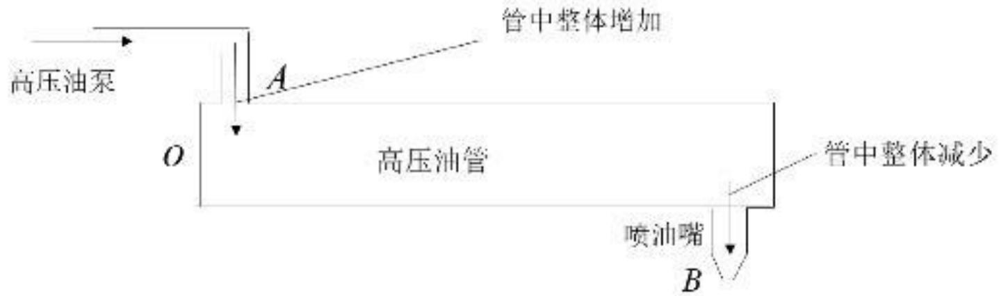
图2 流体各处压强图

可认为A处在进油时，瞬间传输至管中各处，使管中的油量密度均匀增加。可认为B处在喷油时，其他位置油量瞬间增加至此处，使管中的油量密度均匀减少。

## 六 模型的建立与求解

## 6.1 问题一模型的建立与求解

## 6.1.1 燃油体密度与压强的推导

## 1. 压强与密度变化关系

从题中和根据参考文献[3]可知P与 $\rho$ 成正比，即

$$
P = k \rho\tag{1-1}
$$

式中k为比例系数。又比例系数为 $k = \frac { E } { \rho }$ ，E为弹性模量， $\rho$ 为密度，在附件3中给出了弹性模量和密度的变化关系，利用最小二乘法计算比例系数k

$$
\operatorname* { m i n } \sum ( k \rho _ { i } - P _ { i } ) ^ { 2 }\tag{1-2}
$$

## 2. 燃油体质量变化关系

## (1)进油质量

可知在本问题中单向阀周期性的开启和关闭，其一个周期的时间为

$$
T _ { i n } = T _ { i n } ^ { o n } + T _ { i n } ^ { o f f }\tag{1-3}
$$

式中 $T _ { i n }$ 为单向阀一个周期的时间， $T _ { i n } ^ { o n }$ 为一个周期中单向阀开启的时间， $T _ { i n } ^ { o f f }$ 为一个周期中单向阀关闭的时间。题中已经给出了进出口处单位时间内流过流量的计算公式，为

$$
Q _ { i n } = C S _ { A } \sqrt { \frac { \Delta P } { \rho _ { 2 } ( t ) } }\tag{1-4}
$$

式中 $Q _ { i n }$ 为单位时间流过小孔的燃油量，C为流量系数大小为0.85。 $S _ { A }$ 为A 口面积， $\Delta P$ 为小孔两边的压强差， $\rho _ { 2 } ( t )$ 为高压泵侧燃油的密度。假设喷油过程中

喷油量为函数 $\nu _ { i n } ( t )$ ，其表示方式为

$$
\nu _ { i n } ( t ) = \left\{ \begin{array} { l l } { { C S _ { A } } \sqrt { \displaystyle \frac { \Delta P } { \rho _ { 1 } ( t ) } } , } & { \mathbb { H } [ \bar { \mathrm { q } } ] [ \mathbb { H } ] \mathcal { H } [ \mathbb { H } ] \mathcal { F } \mathbb { H } , } \\ { 0 , } & { \mathbb { H } [ \bar { \mathrm { q } } ] [ \mathbb { H } ] \mathcal { H } [ \mathbb { H } ] \mathcal { H } \mathbb { H } . } \end{array} \right.\tag{1-5}
$$

即在单向阀开启时， $\nu _ { i n } ( t )$ 不为零，按照式(1-4)方式变化，在单向阀关闭时，无流量进入。一小段时间 $\Delta t$ 内从A处的进入的流体量的质量为

$$
\Delta m _ { i n } = \nu _ { i n } ( t ) \rho _ { 2 } ( t ) \Delta t\tag{1-6}
$$

式中 $\Delta m _ { i n }$ 为 $\Delta t$ 内从 A处流进高压管的流体质量， $\rho _ { 2 } ( t )$ 为高压泵中的流体密度。对式(1-6)积分得到任意时间t内流入的流体质量为

$$
m _ { i n } = \intop _ { 0 } ^ { \prime } \rho _ { 2 } ( t ) \nu _ { i n } ( t ) d t\tag{1-7}
$$

## (2)喷油质量

题中给出了在喷油嘴处的喷油速率随时间的变化量，题中还给出了喷油的喷率。可知喷油是周期性的过程，其一个周期时间可表示为

$$
T _ { o u t } = T _ { o u t } ^ { o n } + T _ { o u t } ^ { o f f }\tag{1-8}
$$

式中 $T _ { o u t }$ 为一个喷油周期， $T _ { o u t } ^ { o n }$ 为一个喷油周期中喷油的时间， $T _ { o u t } ^ { o f f }$ 为一个周期中不喷油的时间。

由于喷油频率已知，频率可周期的关系可以表示为

$$
T _ { o u t } = \frac { 1 } { f _ { o u t } }\tag{1-9}
$$

式中fo为喷油的频率$f _ { o u t }$

喷油速率随时间的变化关系为函数 $\nu _ { o u t } ( t )$ ，可知其为周期函数，其一周期大小为 $T _ { o u t }$ ，可知喷油过程中的喷出质量与时间的关系为

$$
m _ { o u t } = \int _ { 0 } ^ { t } \rho ( t ) \nu _ { o u t } ( t ) d t\tag{1-10}
$$

式中 $m _ { o u t }$ 为 $t _ { 1 }$ 至 $t _ { 2 }$ 时间内喷出的油质量。

## 3. 燃油密度

由于高压管中燃油的体积不改变，根据质量守恒定律有

$$
V _ { { } _ { 1 } } \rho ( t ) = V _ { { } _ { 1 } } \rho _ { { } _ { 0 } } + m _ { { } _ { i n } } - m _ { { } _ { o u t } }\tag{1-11}
$$

式中 $V _ { 1 }$ 为高压管的体积。根据式(1-7)、(1-10)和式(1-11)得燃油的密度模型为

$$
\rho ( t ) = \frac { 1 } { V _ { 1 } } \left( \intop _ { 0 } ^ { t } \rho _ { 2 } ( t ) \nu _ { i n } ( t ) d t - \intop _ { 0 } ^ { t } \rho _ { 1 } ( t ) \nu _ { o u t } ( t ) d t \right) + \rho _ { 0 }\tag{1-12}
$$

式中 $\rho _ { \mathrm { 0 } }$ 为初始时刻压强为100MPa时的燃油密度。

## 6.1.2 优化模型

## 1. 目标函数

优化的目标是使压强在稳定值处的波动幅度最小，假定压强随时间变化的情况为P(t)，优化目标函数为

$$
\operatorname* { m i n } _ { 0 } \int _ { 0 } ^ { T } \big | P ( t ) - P _ { a i m } \big | d t\tag{1-13}
$$

式中 $P _ { a i m }$ 为期望稳定压强。

## 2. 约束条件

可知在A处油量周期性进入，其周期为 $T _ { i n }$ ，在B处油量周期性喷出，其周期为 $T _ { o u t }$ 。要是燃油压强在某一值处稳定，需要保证在T内进入高压管的燃油质量等于流出高压管的燃油质量，即使燃油的密度在一段时间内又回到某值处。时间T的取值为两个周期的最小公倍数即

$$
T = T _ { i n } \cdot T _ { o u t }\tag{1-14}
$$

使进油量与出油量相等即为保证公式(1-7)(1-10)相等，其公式为

$$
\int _ { 0 } ^ { T } \rho _ { 2 } ( t ) \nu _ { i n } ( t ) d t = \int _ { 0 } ^ { T } \rho _ { 1 } ( t ) \nu _ { o u t } ( t ) d t\tag{1-15}
$$

燃油的进出质量和高压管中燃油质量变化需满足以上模型方程，故综合上以上条件，可得到稳定状态需要满足的约束条件为

$$
s t \left\{ \begin{array} { l } { \displaystyle { \int _ { } ^ { t } \int \rho _ { 2 } ( t ) \nu _ { i n } ( t ) d t = \int _ { } ^ { t } \rho _ { 1 } ( t ) \nu _ { o u t } ( t ) d t } } \\ { \displaystyle { \rho ( t ) = \frac { 1 } { V _ { 1 } } \left( \int _ { } ^ { t } \rho _ { 2 } ( t ) \nu _ { i n } ( t ) d t - \int _ { } ^ { t } \rho _ { 1 } ( t ) \nu _ { o u t } ( t ) d t \right) + \rho _ { 0 } } } \end{array} \right.\tag{1-16}
$$

由于两个约束方程为无法直接求解，故采用离散化的方式求解约束条件中的两个积分，其离散后的约束条件为

$$
\begin{array} { l } { s t \displaystyle \left\{ \begin{array} { l } { \displaystyle \sum _ { i = 1 } ^ { n } \rho _ { 2 } ( t _ { i } ) \nu _ { i n } ( t _ { i } ) \Delta t = \sum _ { i = 1 } ^ { n } \rho _ { 1 } ( t _ { i } ) \nu _ { o u t } ( t _ { i } ) \Delta t } \\ { \displaystyle \rho ( t ) = \frac { 1 } { V _ { 1 } } \Bigg ( \sum _ { i = 1 } ^ { n } \rho _ { 2 } ( t _ { i } ) \nu _ { i n } ( t _ { i } ) \Delta t - \sum _ { i = 1 } ^ { n } \rho _ { 1 } ( t _ { i } ) \nu _ { o u t } ( t _ { i } ) \Delta t \Bigg ) + \rho _ { 0 } } \\ { \displaystyle P = k \rho } \\ { \displaystyle \frac { T } { \Delta t } } \end{array} \right. } \end{array}\tag{1-17}
$$

式中Δt为间隔步长，大小为0.01ms。

## 6.1.3 增压模型

增压过程可理解为在调整时间内进油量大于出油量，高压管内的油量密度上升，使得压强也在上升。上升过程中增加的密度为

$$
\Delta \rho _ { 1 } = \frac { 1 } { V _ { 1 } } \left( \intop _ { 0 } ^ { t } \rho _ { 2 } ( t ) \nu _ { i n } ( t ) d t - \intop _ { 0 } ^ { t } \rho _ { 1 } ( t ) \nu _ { o u t } ( t ) d t \right)\tag{1-18}
$$

假设压强与密度的变化关系为 $\rho ( P )$ 则需要达到目标压强可使

$$
P _ { a i m } = k \rho _ { a i m } - k \rho _ { 0 }\tag{1-19}
$$

式中 $P _ { a i m }$ 为目标压强值， $\rho _ { a i m }$ 为目标密度。

结合式(1-15)、(1-16)得到增压所需的最终目标为

$$
\frac { 1 } { k } P _ { a i n } = \rho _ { 0 } + \frac { 1 } { V _ { 1 } } \{ \intop _ { 0 } ^ { t } \rho _ { 2 } ( t ) \nu _ { i n } ( t ) d t - \intop _ { 0 } ^ { t } \rho _ { 1 } ( t ) \nu _ { o u t } ( t ) d t \}\tag{1-20}
$$

由于式(1-20)中积分不可求得，故将其离散化，离散化方程为

$$
\frac { 1 } { k } P _ { a i m } = \rho _ { \mathrm { 0 } } + \frac { 1 } { V _ { \mathrm { 1 } } } \bigg ( \sum _ { i = 1 } ^ { n } \rho _ { \mathrm { 2 } } ( t _ { i } ) \nu _ { i n } ( t _ { i } ) \Delta t - \sum _ { i = 1 } ^ { n } \rho _ { \mathrm { 1 } } ( t _ { i } ) \nu _ { o u t } ( t _ { i } ) \Delta t \bigg )\tag{1-21}
$$

## 6.1.3 模型求解

利用最小二乘法拟合出的比例系数k值大小为117.65,得出压强P和密度 $\rho$ 的关系为

$$
P = 1 1 7 . 6 5 \rho\tag{1-22}
$$

## 1. 稳定模型求解

## (1)确定初始时刻

选定初始时刻为0时，此时喷油嘴刚开始工作，单向阀亦刚开始工作，两者的工作方式解为，先处于打开状态，后处于关闭状态，如此循环周期性的变化。

## (2)求解方式

对寻优模型进行计算时，采用遍历的方式进行求解，求解计算的步骤为：

Step1:设置单向阀的开启时间 $T _ { i n } ^ { o n }$ 为0.1ms。

Step2:设置遍历的增加步长为 $\Delta T _ { i n } ^ { o n } 0 . 1 \mathrm { m s }$ 。

Step3:数值代入进行遍历，对式(1-17)离散化方程进行求解，得到不同单向阀周期 $T _ { i n }$ ，此时进出进入流出质量近似相等。

Step4：步长缩小为原来的十分之一，最小误差下的单向阀周期 $T _ { i n }$ ，进行遍历，求出此时的最小误差值。

Step5：检验此时的误差是否满足要求小于0.01mg，如果满足则停止计算，不满足则回到上一步骤继续运算。

## (3)优化模型求解

将上述计算出的各种最小误差值代入优化模型，进行计算得到最终在开阀时间取值为0.29ms时的稳定性最好。此时压强的波动情况见图4

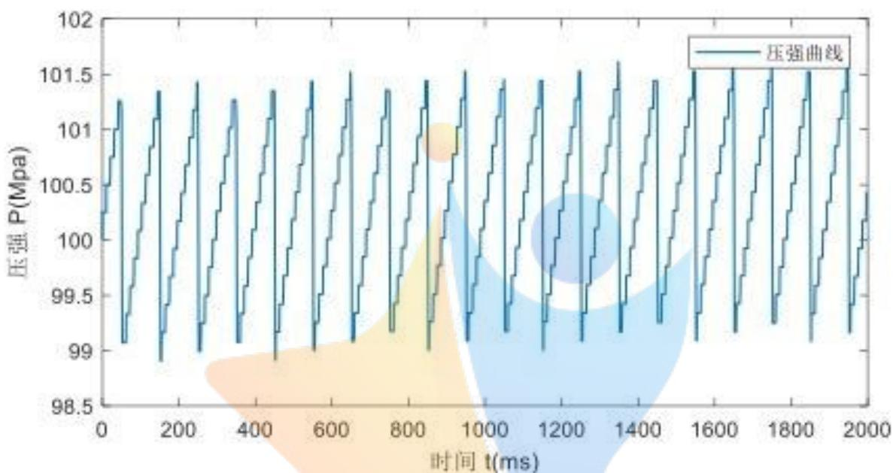
图4 压强波动曲线图

从图中可知压强已近似稳定在100MPa。压强的变化呈现波动的状态，压强上升时是一段一段向上增长，压强下降时的下降速度很快，且下降幅度很大。因为在A处进油时，进油的速率很慢，且每次进油周期很短为0.29ms。而喷油时喷油速率很快，但喷油的时间只有2.4ms其每个喷油周期却有100ms，故短暂的喷油后喷油器一直处于休息状态。所以压强的变化情况会呈现图中的状态。

测得在5s内，进油质量和出油质量随时间的变化情况如图5所示

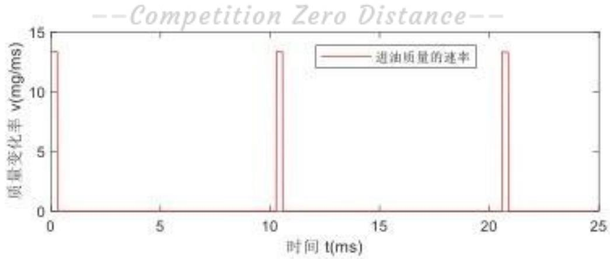

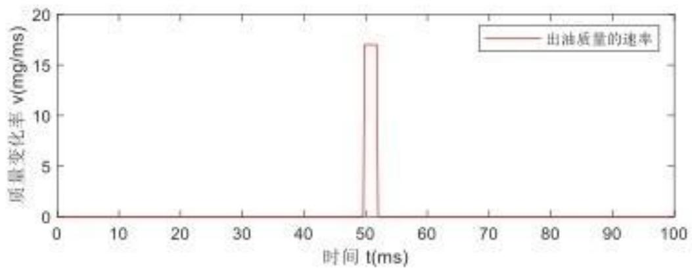

## 图 5 进出油速率变化图

图5中第一个图为进油质量变化速率变化图，第二个图为出油质量变化速率变化图，可以看出以下方面：

a.进油速率变化情况近似为矩形，在单向阀开启时进油质量变化速率近似恒定值，几乎不产生变化。

b. 出油速率的变化情况近似为梯形，梯形上底和下底的长度非常接近。

c. 单向阀开启的时间比喷油嘴喷油的时间短很多。

上述情况的出现是因为如下原因：

a.单向阀开启后因内压压强差，根据式(1-4)知燃油体流入速率瞬间从零变为14$m m ^ { 3 } \cdot m s ^ { - 1 }$ 。根据图4可知压强随时间变化时的最大量仅在1.5MPa左右，相较与

稳定压强100Mpa来说，变化很小，故可认为高压管中压强大小不改变，即此时的燃油体密度不发生改变。故根据式(1-4)可知单位时间内流如高压管的体积近似不变，又高压侧燃油压强不变，即燃油密度不变，故每个时刻输入的燃油质量近似不改变。 O

b.根据问题一中所给的出油速率变化图可知，在喷油嘴刚开启的0-0.2ms内喷油速率迅速直线上升，在0.2-2.2ms内喷油速率为常量，在2.2-2.4ms内喷油速率直线下降。故在喷油最开启的时间内，大部分时间下喷出速率处于恒定状态。因为高压管中的压强近似不改变，即密度近似不变，所以导致喷油嘴开启的大部分时间下喷油质量变化速率近似为一平行于时间轴的直线。

## 2. 增压模型求解

第二小问中对初始开始时刻 $t _ { 1 }$ 和单向阀周期 $T _ { i n }$ 进行遍历，求解出在不调控时间下，要使压强达到150Mpa的最佳开阀时间取值为表1

表1 最佳增压开阀时间
<table><tr><td>调控时间</td><td>2s</td><td>5s</td><td>10s</td></tr><tr><td>最佳增压时间</td><td>0.9ms</td><td>0.76ms</td><td>0.73ms</td></tr></table>

在调控时间越短时，最佳开阀时间越长，开阀时间较长时，流入质量比流出质量的增加量增加更多，使高压管内密度变化更快 $\pmb { \mathscr { s } } _ { \mathscr { n } }$ 即使压强增加速度变快。

在三种调控时间下高压管中的压强变化图如图 $^ 6$ 所示

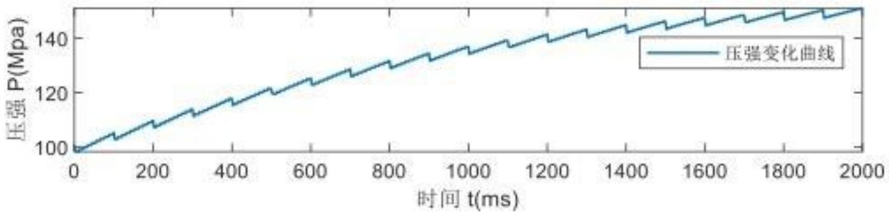

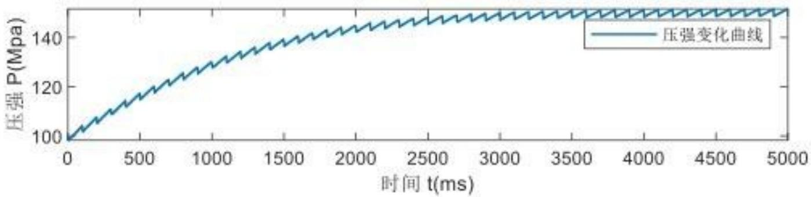

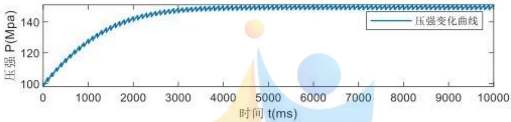
图6 调控时间内高压腔压力变化图

定状态下的最优的开阀时间为表2

表2最佳稳定压强开阀时间表
<table><tr><td>调控时间</td><td>2s</td><td>5s</td><td>10s</td></tr><tr><td>最佳稳定时间</td><td>0.72ms</td><td>0.72ms</td><td>0.72ms</td></tr></table>

在调控压强达到150MPa后，将150MPa作为初始压强值，计算此时的最佳稳定压强开阀时间。在将150MPa作为初始压强时，虽然经过不同的调控时间，但此时的初始条件皆相同，故可计算出相同的最佳稳定开阀时间，此时压强波动的图形如图7所示

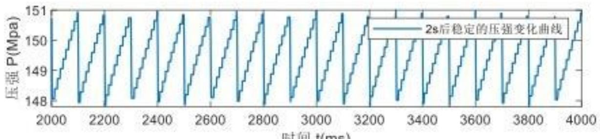

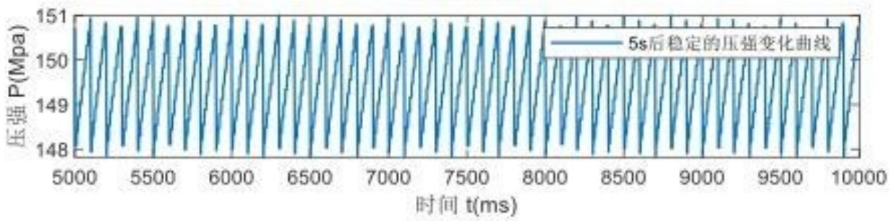

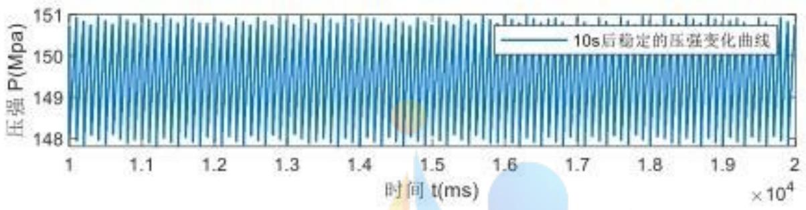
图7稳定时间下高压腔压力变化图

从图7中可知压强在150MPa左右上下浮动，基本上已经稳定在150MPa，说明此时求出的最佳稳定开阀时间较为可靠。主

## 6.2 问题二模型的建立与求解

在问题二中相较于问题一增加了高压泵的工作系统，从A口流出的高压燃油不能再看作定压燃油，燃油的压强是时间的函数。根据图中关系需要拟合凸轮的边缘曲线模型，建立出高压泵中的体积变化模型，找出此时高压管中的燃油密度变化模型进行求解。

## 1. 模型准备

## (1)建立坐标系

在求解问题前需建立平面坐标系，以确定出凸轮在转动过程中各点坐标的位置。以平行于推动面为x轴，垂直推动面为y轴，凸轮极心为源点建立空间二维坐标系，坐标系图形如图8所示

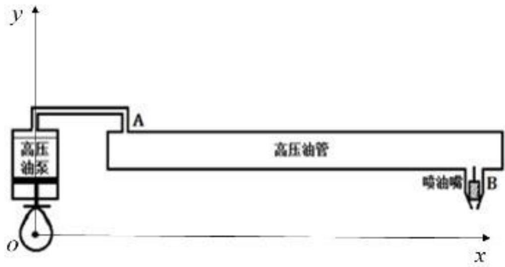
图 8 坐标示意图

## (2)参数确定

## 初始时刻状态

在进行计算前需要确定凸轮的转动方向和转动角度，假定凸轮转动的初始时刻为零时刻，并且此时喷油嘴也刚开始进行周期性工作。凸轮在零时刻时的状态为凸轮最凸端数值向下时。

## 凸轮转动方向

假定本文中凸轮在图中可看作逆时针方向匀速转动，此时的角速度方向垂直向外，角度度方向为正。

## 6.2 模型建立与求解

## 1. 凸轮形状

根据附件中的数据对极角和极径的关系进行拟合，，采用多项式拟合方式，分析得到在阶数为6阶时的拟合效果很好，能够达到标准，此时的方差为0.001，拟合的图像与实测数据的比较结果为图9

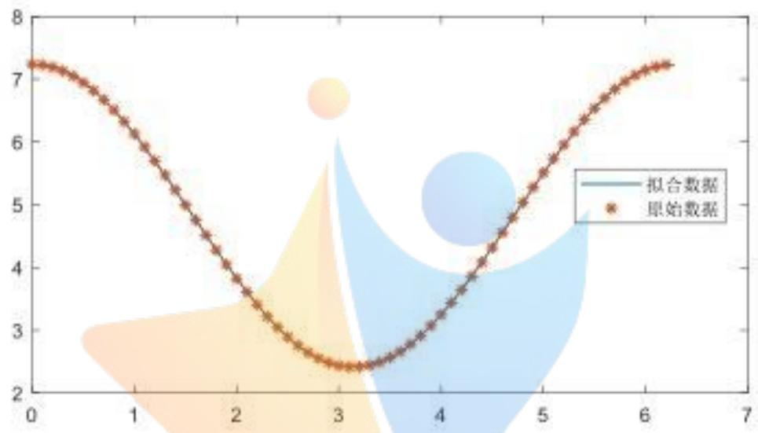
图9极角与极径拟合图

此时实测数据点基本都落在拟合曲线上，说明能够用拟合曲线代表凸轮的实际极角与极径关系。此时的极角与极径拟合关系式为

$$
\boldsymbol { r } ( \theta ) = 0 . 0 0 2 4 \times \theta ^ { 6 } - 0 . 0 4 5 \times \theta ^ { 5 } + 0 . 2 6 \times \theta ^ { 4 } - 0 . 2 9 \times \theta ^ { 3 } - 0 . 9 5 \times \theta ^ { 2 } - 0 . 0 9 4 \times \theta + 7 . 2 3\tag{2-1}
$$

根据极角和极径算出凸轮的形状图为图10

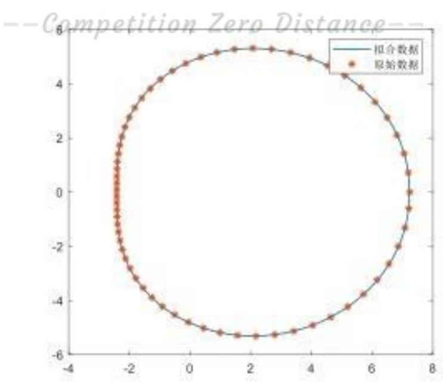
图 10 凸轮边缘曲线图

假定凸轮转动时转过的角度为φ则转动角度的计算公式为

$$
\varphi = \omega t\tag{2-2}
$$

式中 $\omega$ 为转动角速度，t为从初始零时刻开始后经过的时间。假设凸轮转动的角度为 $\varphi$ ，此时凸轮的朝向示意图如图11所示

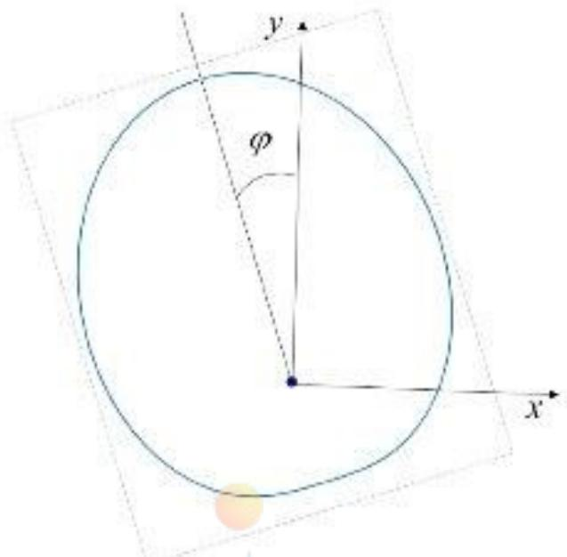
图 11 凸轮朝向示意图

可知此时任意一条极径的坐标计算公式为

$$
\left\{ \begin{array} { l l } { x = r ( \theta ) \cos ( \omega t + \theta ) } \\ { y = r ( \theta ) \sin ( \omega t + \theta ) } \end{array} \right. \quad 0 \leq \theta < 2 \pi\tag{2-3}
$$

## 2. 柱塞腔体积

## (1)模型建立

从题中可知柱塞腔的运动是靠凸轮在转动中推动柱塞腔的体积变化。可知凸轮于柱塞腔底座的坐标为y，是凸轮转动过程中 $y$ 轴坐标值最大的点，即为

$$
y = \operatorname* { m a x } r ( \theta ) \sin ( \omega t + \theta )\tag{2-4}
$$

此时刻柱塞腔的上升速度为接触点转动速度在 $\mathcal { Y }$ 轴上的分量，其示意图为图12

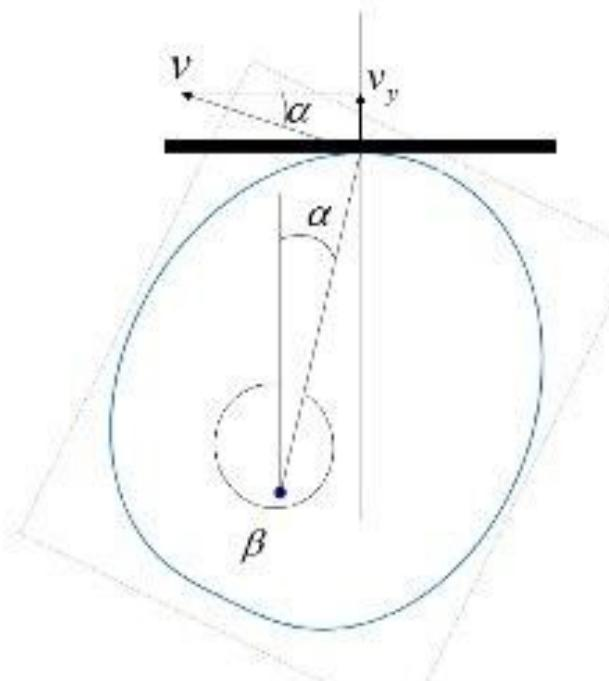
图 12 转动示意图

根据图可知此时的竖直方向速度计算公式为

$$
\nu _ { y } = \nu \sin \alpha\tag{2-5}
$$

根据刚体力学[4]刚体上边缘点的角速度为

$$
\nu = w r ( \theta )\tag{2-6}
$$

所以竖直方向的速度为

$$
\nu _ { \nu } = w r ( \theta ) \sin ( 2 \pi - \omega t - \theta )\tag{2-7}
$$

综上所述柱塞腔底座竖直方向每个时刻的位置和速度为

$$
\left\{ \begin{array} { l l } { \displaystyle \boldsymbol { y } = \operatorname* { m a x } r ( \boldsymbol { \theta } ) \sin ( \omega t + \theta ) } \\ { \displaystyle \boldsymbol { \nu } _ { \nu } = w r ( \boldsymbol { \theta } ) \sin ( 2 \pi - \omega t - \theta ) } \end{array} \right.\tag{2-8}
$$

## (2) 模型求解

要求解柱塞腔每个时刻的最高点位置，需对式(2-8)求解极值。但求解时方程过于复杂，不能通过求导算极值的方式直接解出每个时刻的最高点，故采用遍历法进行计算，遍历的步骤为

Step1：设置极角θ初始步长为0.1，和时间变化步长为0.01ms，以零时刻为起点，以凸轮转动一圈的时间为计算范围，进行遍历。

Step2：求出此时所有的极角下y坐标最大的极角 $\theta _ { \mathrm { i } } ( t _ { i } )$

Step3：此时缩小极角步长为0.01，对此时的极角 $\theta _ { 1 } ( t _ { i } )$ ，进行遍历，求出此时所有的极角下y坐标最大的极角 $\theta _ { 2 } ( t _ { i } )$

Step4：利用公式计算此时柱塞腔底座的y轴坐标和此时的速度，即为 $y _ { i }$ 和$\nu _ { y , i }$

Step5:计算时间是否达到 $\frac { 2 \pi } { \omega }$ ，如果未达到，将时间增加一个步长，回到 $s t e p 2$ 如果达到则停止计算

通过计算得到此时的柱塞腔底座y轴坐标和此时的速度一个周期内随时间变化的关系，可用该关系计算每一时刻柱塞腔的体积。

## 3. 针阀处小孔面积

## (1) 模型建立

可知针阀在上升过程中喷油口的有效面积在随针阀的上升而变化，假设针阀底座的面积为 $S _ { \mathrm { 1 } }$ ，密封座底座最下端的面积为 $S _ { 2 }$ ，针阀底座与密封座的所形成的空气环面积为 $S _ { 3 }$ ，其示意图如图14、图15所示

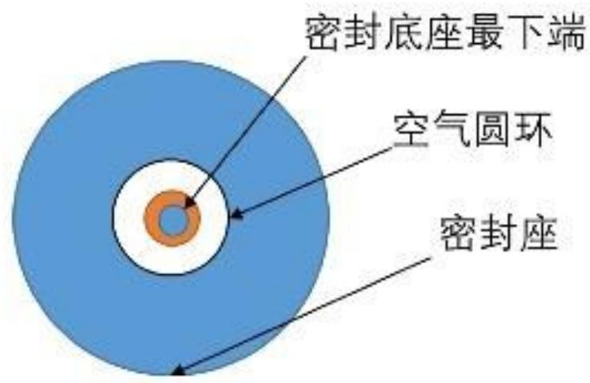
图 14 密封座俯视图

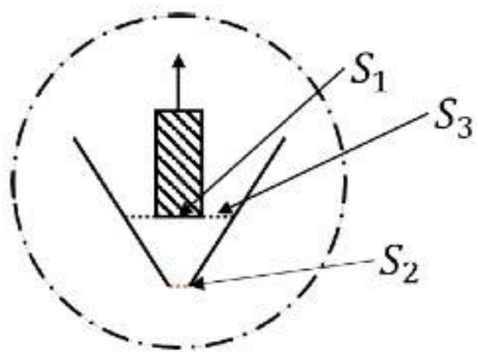
图 15 密封座正视图

当针阀的升程不为0时，喷油嘴开始工作，向外喷出汽油，此时的小口面积有两种情况，分别为

## 变化状态

当密封座底座最下端的面积 $S _ { 2 }$ 大于针阀底座与密封座的所形成的空气环面积 $S _ { 3 }$ 时，针阀口的有效面积为针阀底座与密封座的所形成的环面积 $S _ { 3 }$ 。

## 恒定状态

当密封座底座最下端的面积 $S _ { 2 }$ 大于针阀底座与密封座的所形成的环面积 $S _ { 3 }$ 时，针阀口的有效面积为密封座底座最下端的空气环面积 $S _ { 2 }$ o

对附件中的数据针阀的上升高度与时间数据进行拟合，拟合时对针阀分为两段进行多项式拟合，分别为上升阶段和下降阶段，第一段在阶数为3阶时具有较高的准确度，均方差为0.0032，第二段在阶数为6阶时具有较高的准确度，均方差为 0.0065。

在针阀位置改变时，需求出针阀位置改变时的空气环面积 $S _ { 3 }$ ，针阀为上升和上升时的示意图如图 $1 6 ,$ 图171标

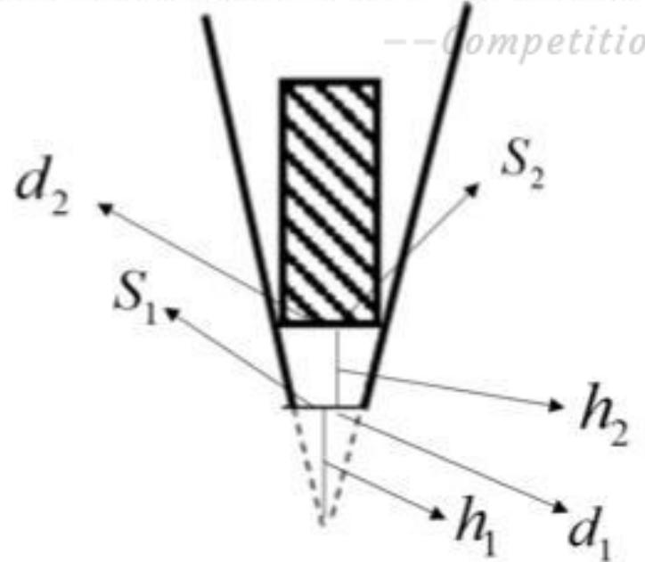
图 16 针阀未上升时

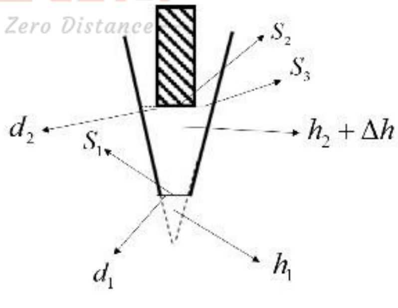
图 17 针阀上升后

图中密封底座的直径为 $d _ { \mathrm { { r } } }$ ，与针阀处于同一横截面处的密封座横街面圆的直径为 $d _ { 2 }$ ， $h _ { \mathrm { l } }$ 为密封底座平面与虚拟顶点间距离， $h _ { 2 }$ 为针阀底座未上升时与密封底座的距离，∆h为针阀上升的距离，根据几何相似性原理可知有如下关系

$$
\frac { d _ { 1 } } { d _ { 2 } } = \frac { h _ { 1 } } { h _ { 1 } + h _ { 2 } + \Delta h }\tag{2-9}
$$

直径对应的圆面积计算公式为

$$
S _ { 2 } + S _ { 3 } = \pi \left( { \frac { d _ { 2 } } { 2 } } \right) ^ { 2 }\tag{2-10}
$$

密封底座的倾角与 $h _ { \scriptscriptstyle 1 }$ 和 $d _ { \mathrm { { r } } }$ 的关系为

$$
\left\{ \begin{array} { l l } { \tan 9 ^ { \circ } = { \frac { d _ { 1 } } { 2 h _ { 1 } } } } \\ { \tan 9 ^ { \circ } = { \frac { d _ { \pm | \ast | \ast | } } { 2 h _ { 2 } } } } \end{array} \right.\tag{2-11}
$$

综上所述可得到空气环的面积 $S _ { 3 }$ 计算公式为

$$
S _ { 3 } = \left( ( \frac { d _ { 1 } } { 2 \tan 9 ^ { \circ } } + \frac { d _ { \oplus + \wp } } { 2 \tan 9 ^ { \circ } } + \Delta h ) \tan 9 ^ { \circ } \right) ^ { 2 } - S _ { 2 }\tag{2-12}
$$

## (2) 模型求解

由于 $d _ { \mathrm { \scriptscriptstyle 1 } } d _ { \mathrm { \scriptscriptstyle 5 + \beta \mathrm { \scriptscriptstyle 4 } } } S _ { \mathrm { \scriptscriptstyle 2 } }$ 已知，将Δh随时间变化的拟合函数代入，计算出 $S _ { 3 }$ 随时间变化的函数关系，其关系式变化见附录。画出 $S _ { 3 }$ 随时间变化的图像，并与 $S _ { 3 }$ 的大小比较，图像如图18所示 1

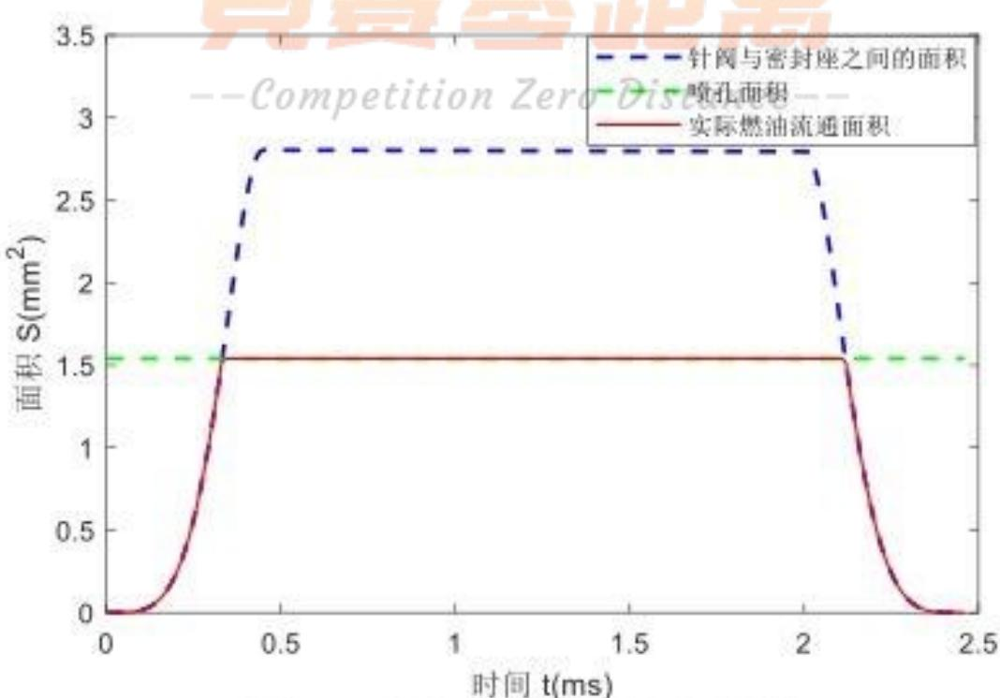
图18 喷油嘴有效面积变化图

拟合得到最终的喷油口面积 $S _ { B }$ 随时间的变化规律。可知此时燃油喷出口的

流量速率计算公式为

$$
Q _ { o u t } = C S _ { B } ( t ) \sqrt { \frac { P _ { 1 } - P _ { 3 } } { \rho _ { 1 } ( t ) } }\tag{2-13}
$$

式中 $Q _ { o u t }$ 为单位时间内流出高压油泵的流量体积， $P _ { 1 }$ 为高压腔中的压强， $P _ { 3 }$ 为外界大气压强大小为0.1MPa。故此时高压腔从0至t时刻喷出质量的计算公式为

$$
m _ { o u t } = \left\{ \begin{array} { l l } { t } { C S _ { B } ( t ) \sqrt { \displaystyle \frac { P _ { 1 } - P _ { 3 } } { \rho _ { 1 } ( t ) } } \rho _ { 1 } ( t ) d t , } & { 0 \le \mathrm { m o d } \displaystyle \left( \frac { t } { T _ { o u t } } \right) \le T _ { o u t } ^ { o n } } \\ { 0 , } & { T _ { o u t } ^ { o n } \le \mathrm { m o d } \displaystyle \left( \frac { t } { T _ { o u t } } \right) \le T _ { o u t } } \end{array} \right.\tag{2-14}
$$

## 4. 流体系统

因在高压管中的密度计算模型与问题一相同，在高压泵和高压腔中流体的密度压强关系模型相同，故在问题二中只需建立流体在高压泵中的密度计算模型。

## (1) 模型建立

## 1) 高压泵燃油密度模型

可知高压泵系统中的压强均匀变化，高压泵中的物质变化情况满足质量守恒原理。在某时刻高压泵中的密度为 $\rho _ { 2 } ( t )$ ，体积为 $V _ { _ 2 } ( t )$ ，高压泵此时的质量为

$$
m _ { 2 } ( t ) = \rho _ { 2 } ( t ) V _ { 2 } ( t )\tag{2-14}
$$

又在 $\Delta t$ 时间内后高压泵中的体积为 $V _ { 2 } ( t + \Delta t )$ ，此时的密度为 $\rho _ { 2 } ( t + \Delta t )$ ，此时的质量为

$$
m _ { 2 } ( t + \Delta t ) = \rho _ { 2 } ( t + \Delta t ) V _ { 2 } ( t + \Delta t )\tag{2-15}
$$

根据问题一中的式(1-4)可知，在 $\Delta t$ 时间内从高压泵中流出的质量计算公式为

$$
\Delta P _ { m } \overset { e } { = } C S _ { _ A } ^ { _ n } \sqrt { \frac { \Delta P _ { _ O } } { \rho _ { _ 1 } ( t ) } } \rho _ { _ 2 } ( t ) \Delta t\tag{2-16}
$$

根据质量守恒定律有

$$
m _ { 2 } ( t ) = \Delta m + m _ { 2 } ( t + \Delta t )\tag{2-17}
$$

所以综合以上四式可得到高压泵中的密度变化的微分模型为

$$
C S _ { \scriptscriptstyle A } \sqrt { \frac { \Delta P } { \rho _ { 1 } ( t ) } } \rho _ { 2 } + \frac { d ( \rho _ { 2 } V _ { 2 } ) } { d t } = 0\tag{2-18}
$$

## 2) 优化模型

## a. 优化目标

要使压强尽量稳定在100MPa，需使在两个进出油系统在相同的时间下高压管中进油量与出油量的差值最小近，非常接近零，此判断时间为两个进出油系统周期的最小公倍数，方能使得系统处于较稳定状态，即公式

$$
\mathrm { m i n } ~ m _ { i n } - m _ { o u t }\tag{2-19}
$$

## b. 约束条件

可知本问题中的约束条件除了上文的推导出的流体在不同系统中的变化模型外，还需要找到限定时间T，可知只有在限定时间T为进油口的周期值与出油口的周期公倍数时，才能恒使每过一个限定时间后高压腔的压强回归到初始值$1 0 0 \mathbf { M P a }$

假定凸轮转动一个周期的工作时间为 $T _ { i n }$ ，其计算公式为

$$
T _ { i n } = \frac { 2 \pi } { \omega }\tag{2-20}
$$

此时的限定时间为

$$
T = T _ { i n } \cdot T _ { o u t }\tag{2-21}
$$

合并(2-20)和(2-21)得到限定时间的计算公式为

$$
T = \frac { 2 \pi } { \omega } \cdot T _ { o u t }\tag{2-22}
$$

综合问题二高压泵的体积模型、高压腔喷油口有效面积模型、式(2-22)和问题一中高压管压强输入输出模型，对其进行差分：

高压泵的约束差分方程为

$$
s . t . \left\{ \begin{array} { l l } { C S _ { A } \sqrt { \displaystyle \frac { \Delta P } { \rho _ { 1 } ( t ) } } \rho _ { 2 } + \displaystyle \frac { d ( \rho _ { 2 } V _ { 2 } ) } { d t } = 0 } \\ { V _ { 2 } = V _ { 2 } ( t ) } \end{array} \right.\tag{2-23}
$$

高压油腔中的约束差分方程为

$$
\begin{array} { r l } & { s _ { t } ( m _ { n s } = \{ \begin{array} { l l } { \widetilde { \Gamma } _ { \rho , ( t ) C S _ { 4 } } \sqrt { \frac { \Delta P } { \rho _ { 2 } ( t ) } } , } & { \Delta P > 0 } \\ { 0 , } & { \Delta P \leq 0 } \\ { 0 , } & { \Delta P \leq 0 } \end{array}   } \\ &  s _ { t } ( m _ { n s } = \{ \begin{array} { l l } { \widetilde { \Gamma } ( \widetilde { C } _ { S } ( q ) \sqrt { \frac { \widetilde { \Gamma } _ { n r , \widetilde { n } } } { \rho _ { 1 } ( t ) } } , \widetilde { \rho } _ { ( t ) } ( q ) d \mathcal { P } ^ { [ i ] } \bar { Q } \leq \operatorname { i m o d } ( \frac { t } { T _ { n s } } ) \leq T _ { \infty } ^ { [ i ] } } \\ { 0 , } & { \quad \quad \quad \quad \quad \quad \quad \quad \quad \quad \quad \quad \quad \quad \quad \quad \quad \quad \quad \quad \quad \quad \quad \quad \quad \quad \quad \quad \quad \quad \Gamma _ { \infty } ^ { [ i ] } \leq \operatorname { i m o d } ( \frac { t } { T _ { n s } } ) \leq T _ { \infty } ^ { [ i ] } } \\ { 0 , } & { \quad \quad \quad \quad \quad \quad \quad \quad \quad \quad \quad \quad \quad \quad \quad \quad \quad \quad \quad \quad \quad \quad \quad \quad \quad \quad \quad \quad \quad \quad \quad \Gamma _ { \infty } ^ { [ i ] } \leq \operatorname { i m o d } ( \frac { t } { T _ { n s } } ) \leq T _ { \infty } ^ { [ i ] } } \\ { 0 , } & { \quad \quad \quad \quad \quad \quad \quad \quad \quad \quad \quad \quad \quad \quad \quad \quad \quad \quad \quad \quad \quad \quad \quad \quad \quad \quad \quad \quad \quad \quad \quad \quad \quad \quad \quad \quad \quad } \\ { 0 , } &  \quad \quad \quad \quad \quad \quad \quad \quad \quad \quad \quad \quad \quad \quad \quad \quad \quad \Gamma _ { \mathrm { n s } } ^ { [ i ] } - \operatorname { i m o d } ( \frac { t } { T _ { n s } } ) \leq T _  \infty \end{array} \end{array}\tag{2-24}
$$

整个系统的约束差分方程为

$$
s . t . \left\{ { { P = \frac { 2 \pi } { \omega } } \cdot { T _ { o u t } } } \right.\tag{2-25}
$$

## (2) 模型求解

求解上述约束方程组时，不能够直接求解，对方程进行离散化处理，得到离散后的约束方程为

$$
\begin{array} { r l } & { \{ \begin{array} { l l } { \log _ { 1 } ( \frac { \sqrt { 3 } } { 2 } \alpha _ { 1 } \beta ( E _ { 1 } ^ { n } ) \sin \frac { \sqrt { 3 } } { 2 } \sin \frac { \sqrt { 3 } } { 2 } \sin \beta \cos \phi ) } & { \alpha _ { 1 } \beta \sin ^ { \prime } \alpha _ { 1 } } \\ { \qquad \sin ^ { \prime } \alpha _ { 1 } } & { \cos ^ { \prime } \alpha _ { 1 } } \end{array}  } \\ & { \{ \begin{array} { l l } { \frac { \sqrt { 3 } } { 2 } \alpha _ { 1 } \beta ( E _ { 1 } ^ { n } ) \sin ^ { \prime } \alpha _ { 1 } \beta ( E _ { 1 } ^ { n } ) \sin ^ { \prime } \alpha _ { 1 } \beta ( E _ { 1 } ^ { n } ) - \alpha _ { 1 } \beta ( E _ { 1 } ^ { n } ) \sin ^ { \prime } \alpha _ { 1 } \beta ( E _ { 1 } ^ { n } ) \sin ^ { \prime } \alpha _ { 1 } } \\ { \qquad \sin ^ { \prime } \alpha _ { 1 } \beta ( E _ { 1 } ^ { n } ) \sin ^ { \prime } \alpha _ { 1 } \beta ( E _ { 1 } ^ { n } ) \sin ^ { \prime } \alpha _ { 1 } \beta ( E _ { 1 } ^ { n } ) \sin ^ { \prime } \alpha _ { 1 } } \end{array}  } \\ &  \{ \begin{array} { l l } { \frac { \sqrt { 3 } } { 2 } \alpha _ { 1 } \beta ( E _ { 1 } ^ { n } ) \sin ^ { \prime } \alpha _ { 1 } \beta ( E _ { 1 } ^ { n } ) \sin ^ { \prime } \alpha _ { 1 } \beta ( E _ { 1 } ^ { n } ) } \\ { \sin ^ { \prime } \alpha _ { 1 } \beta ( E _ { 1 } ^ { n } ) \sin ^ { \prime } \alpha _ { 1 } \beta ( E _ { 1 } ^ { n } ) \cos ^ { \prime } \alpha _ { 1 } \beta ( E _ { 1 } ^ { n } ) } \\  \cos \alpha _ { 1 } \beta ( E _ { 1 } ^ { n } ) \sin ^ { \prime } \alpha _ { 1 } \beta ( E _ { 1 } ^  n \end{array} \end{array}\tag{2-26}
$$

计算角速度时采用遍历法进行计算，找到最佳的角速度变化，使得能够满足目标函数。在求解某一角速度下计算此时高压管中的压强变化情况时，采用与问题一相同的离散方式进行计算，求出此时的数值解，遍求解步骤为

Step1: 设置角速度的初值为 $1 r a d \cdot s ^ { - 1 }$ 步长 $\Delta \omega = 1 \ r a d \cdot s ^ { - 1 }$ ，设置离散时间步--长为0.01 ms。

Step2:设定在第i次计算时的角速度为ω代入方程计算在T时间下的 $\omega _ { i }$ $m _ { i n } - m _ { o u t }$ 差值大小，找到其中最小的角速度 $\omega _ { i }$ 值。

Step3:判断此时的差值是否小于0.0095毫克，如果小于结束计算，如果大于进入下一步。

Step4:缩小步长为原来的十分之一，即 $\Delta \omega = \frac { \Delta \omega } { 1 0 }$ ，设置遍历区间为 $\omega _ { i - 1 }$ 至$\boldsymbol { \omega } _ { i + 1 }$ ，回到 Step2。

经过4次的缩小步长循环计算得到最优的角速度取值为27.199 $\boldsymbol { r a d \cdot s } ^ { - 1 }$ 时的误差最小，在限定时间内的误差值为0.095mg。此时在转动过程中高压管中压强

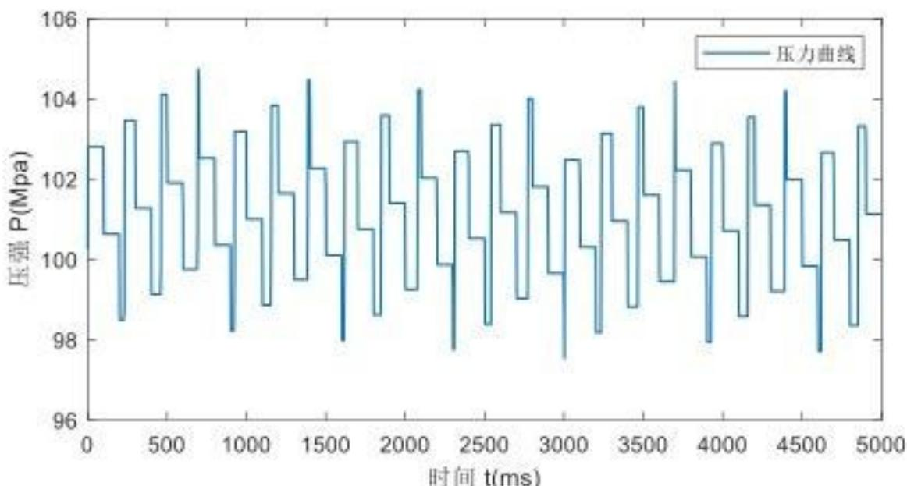
图 19 压强变化图

计算得到最优角速度下进油口和出油口质量变化率如图20所示

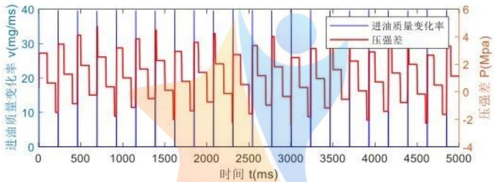

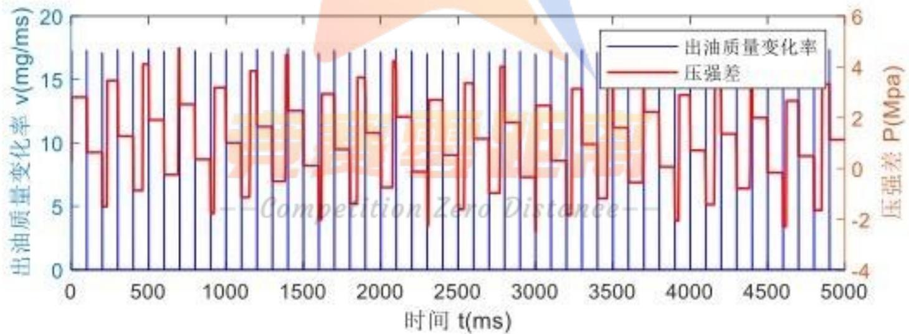
图 20 进出油口质量变化率

## (3) 结果分析

## 1) 数据分析

从图中可以看出以下结论：

a. 压强每次上升的速率很快，且上升程度很大。

b.压强在下降过程中分段下降，有时分两次，有时分三次。

b. 压强的波动范围在-2-5 Mpa 左右。

## 2) 原理分析

上述情况产生的原因可能是由于以下方面：

a. 在满足条件下求解出的最佳凸轮转动角速度为 $2 7 . 1 9 9 r a d \cdot s ^ { - 1 }$ ，其周期为

231ms，比喷油嘴的周期100ms大，说明进油每次压强的增加量较多，出油时每次减少的压强较少。故呈现压强上升速率很快，且上升幅度很大，下降时下降幅度较小，呈现分段下降。

b.因每次在向高压管中输入燃油时，输入量很多，导致在压强上升时，压强的上升幅度很大。在向外喷油时，每次的喷出量较少，故压强的下降幅度较小。

## 6.3 问题三模型的建立与求解

## 6.3.1 无阀双口喷油模型

## 1 两个喷油模型分析

依据问题二的模型，增加一个喷油嘴，其喷油时的工作规律与另一个喷油嘴相同，不同的是初始的开启时刻可能不同，假定两个喷油嘴分别为 $B _ { 1 }$ 和 $B _ { 2 }$ $B _ { 1 }$ 的初始工作时刻为0时刻， $B _ { 1 }$ 的初始工作时刻为 $t _ { 0 }$ 时刻，故任意时刻其喷出的质量为

$$
m _ { o u t } = \left\{ \begin{array} { l l } { \displaystyle { \int _ { 0 } ^ { t } C S _ { B _ { 1 } } ( t ) \sqrt { \frac { P _ { 1 } - P _ { 3 } } { \rho _ { 1 } ( t ) } } \rho _ { 1 } ( t ) d t } } & { t < t _ { 0 } } \\ { \displaystyle { \int _ { 0 } ^ { t } C S _ { B _ { 1 } } ( t ) \sqrt { \frac { P _ { 1 } - P _ { 3 } } { \rho _ { 1 } ( t ) } } \rho _ { 1 } ( t ) d t + \int _ { 0 } ^ { t } C S _ { B _ { 2 } } ( t ^ { \prime } ) \sqrt { \frac { P _ { 1 } - P _ { 3 } } { \rho _ { 1 } ( t ) } } \rho _ { 1 } ( t ) d t } } & { t \geq t _ { 0 } } \end{array} \right.\tag{0}
$$

式中 $t ^ { \prime }$ 为 $t - t _ { 0 }$ $S _ { B _ { 1 } } ( t )$ 和 $S _ { B _ { 7 } } ( t ^ { \prime } )$ 为喷油嘴开口面积和时间的关系。

## 2优化模型

因本问题要求解最优的供油策略使高压腔整体的压强稳定在某一值处，故需采用优化模型对问题进行求解，可建立与问题二相同的优化模型。

## (1)目标函数

本问题中优化的目标函数为使高压腔中压强的变化幅度最小。

$$
\operatorname* { m i n } = \int _ { 0 } ^ { T } { \Big | } P _ { 1 } ( t _ { i } ) - \underline { 1 } 0 0 { \Big | } d t
$$

## (2) 约束条件

问题三的约束条件与问题二基本相同，改变的条件为喷油的计算模型，将上述建立的喷油模型列入问题二的约束方程组，此时约束方程组为

高压泵方程的约束为

$$
s . t . \left\{ \begin{array} { l l } { C S _ { A } \sqrt { \displaystyle \frac { \Delta P } { \rho _ { 1 } ( t ) } } \rho _ { 2 } + \displaystyle \frac { d ( \rho _ { 2 } V _ { 2 } ) } { d t } = 0 } \\ { V _ { 2 } = V _ { 2 } ( t ) } \end{array} \right.\tag{2-23}
$$

高压油腔中的变化方程为

$$
\begin{array} { c } { { S t . } } \\ { { S t . } } \\ { { S t . } } \\  { \left[ \begin{array} { l } { { m _ { \alpha } = \displaystyle { \int _ { 0 } ^ { T } \rho _ { 2 } ( t ) C S _ { \ast } \sqrt { \frac { \Lambda P } { \rho _ { 2 } ( t ) } } } } } \\ { { 0 } } \\ { { \sqrt { \int _ { 0 } ^ { T } C S _ { \ast } ( t ) } \sqrt { \frac { \Gamma - P _ { 3 } } { \rho _ { 1 } ( t ) } } \rho _ { 1 } ( t ) d t } } \\ { { \sqrt { \int _ { 0 } ^ { T } C S _ { \ast } ( t ) } \sqrt { \frac { \Gamma - P _ { 3 } } { \rho _ { 1 } ( t ) } } \rho _ { 1 } ( t ) d t + \left[ \begin{array} { l } { { T - { \bar { \nu } _ { 2 } } } } \\ { { C S _ { \ast } ( t ) } \sqrt { \frac { \Gamma - P _ { 3 } } { \rho _ { 1 } ( t ) } } \rho _ { 1 } ( t ) d t } \end{array} \right]  \quad t \geq t _ { 0 } } } } \\ { \right]{ \rho _ { \alpha } - \frac { m _ { \alpha } - m _ { \alpha \alpha } } { V _ { 1 } } - \rho _ { 0 } = 0 } } \\ { { S _ { \ast } = S _ { \ast } ( t ) } } \end{array} \end{array}\tag{2-24}
$$

整个系统皆满足的方程为

$$
s . t . \left\{ { { P = \frac { 2 \pi } { \omega } } \cdot { T _ { o u t } } } \right.\tag{2-25}
$$

## 3 双喷油模型求解与分析

因本问题第一小问的各种过程相较于第二问改变的只有模型中的喷油模型，故可采用与第二问相同的约束方程组差分方式，在寻优时采用遍历法，设置初始角速度步长为 $0 . 1 r a d \cdot m s ^ { - 1 }$ 时间步长为0.01ms，每进行一次后就缩小步长在最优值处再次遍历。经过4次的遍历后求解出在角速度为 $\mathbf { 0 . 0 4 8 } r a d \cdot m s ^ { - 1 }$ 时喷油嘴 $B _ { 2 }$ 处工作的初始时刻为50ms，此时刻为喷油嘴工作的半个周期，计算此时高压腔中的压力波动情况，如下图所示

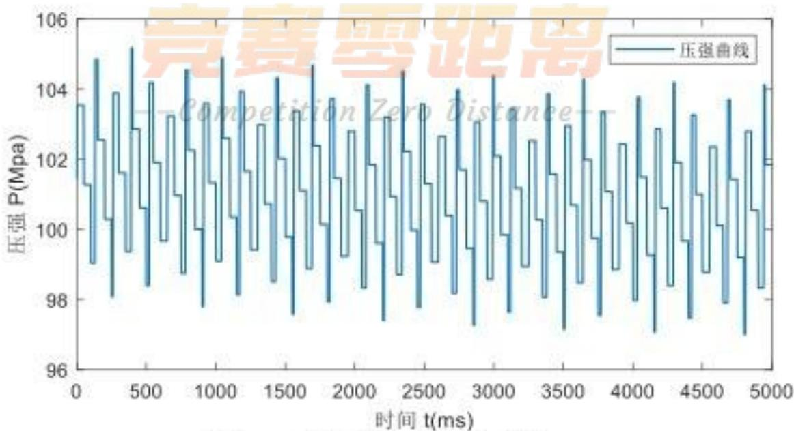
图 21 高压腔压力波动图

其压强稳定在一定的范围内且在一段时间内没有升高的趋势，说明此时的最优解较为真实可靠。进出油口的质量变化率如图22所示

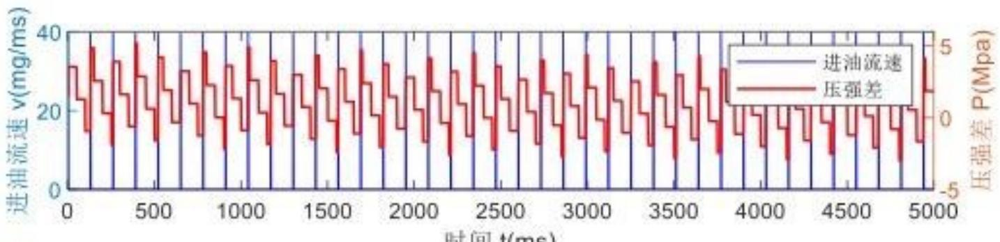

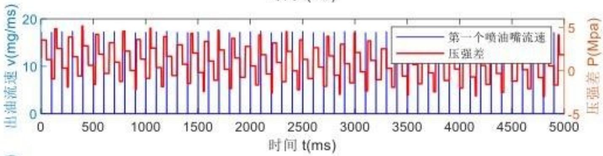

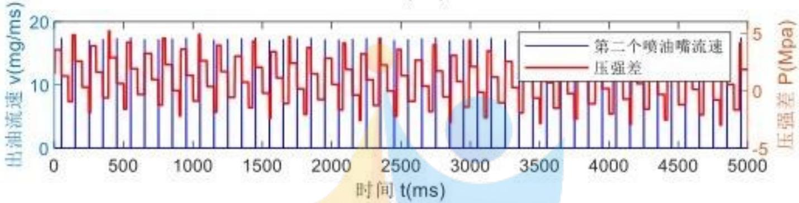
图22 各个子系统的流速图

从一段时间内压强与各进油喷油速率的变化情况能够看出，一次从高压泵中泵出的燃油量导致的压强增量很大，如图22第一个图所示，每次进油后压强增加量很大。但在两个喷油嘴工作2-3次之后消除，从图22第二个和第三个图可以看出，在两个喷油嘴轮流工作，两个喷油嘴工作时间没有重叠，导致高压油管中压强近似均匀的分段下降。因此，从图中可以看出，当第二个喷油嘴的工作起始时间在第一个喷油嘴停止喷油的中间时刻时，压力最稳定的结果是合理的。

## 6.3.2 降压阀双喷口模型建立与求解

在第二小问中增加了一个降压阀，其他条件于问题一相同，故在建立模型时需建立降压阀口的流量计算模型

## 1. 降压阀流量计算

根据题中所给进出口处流量计算公式，可得出在降压阀处的流量速率计算公式为

$$
Q _ { c o n t r o l } \left( t \right) = C S _ { c o n t r o l } \sqrt { \frac { P _ { 1 } - P _ { l o w } } { \rho _ { 1 } ( t ) } } \rho _ { 1 } ( t )\tag{0}
$$

所以从0至t时刻内流出的流体质量为

$$
m _ { c o n t r o l } = \int _ { 0 } ^ { t } C S _ { c o n t r o l } \sqrt { \frac { P _ { 1 } - P _ { l o w } } { \rho _ { 1 } ( t ) } } \rho _ { 1 } ( t )\tag{0}
$$

式中 $m _ { c o n t r o l }$ 为从减压阀流出的流体质量， $S _ { c o n t r o l }$ 为减压阀的小口面积， $P _ { l o w }$ 为低燃油压强大小为0.5 MPa。

## 2. 降压阀控制策略

对于减压阀的控制方案，考虑到实际情况况下的可实施性，可以采用大于一定的压力或开启周期开启两种方式。分析检验两种减压阀实施策略的减压效果。

## (1) 方案1：受压强控制策略

给定开启阈值100MPa。当高压强内压强大于100MPa时，减压阀开启，降低高压管内的燃油压强；当压强小于100MPa时减压阀自动关闭。对于其优化模型，采用与本问题第一小问相同的优化方式，再增加一个减压阀的约束条件

$$
\left\{ \begin{array} { l l } { P _ { 1 } > 1 0 0 M P a } & { \mathrm { i f } \sharp \qquad \mathrm { i } \mathrm { i } \mathrm { \overline { { x } } } \mathrm { i } \mathrm { \overline { { y } } } \mathrm { i } \mathrm { \overline { { y } } } } \\ { P _ { 1 } \leq 1 0 0 M P a } & { \mathrm { i } \mathrm { \overline { { y } } } \mathrm { i } \mathrm { \overline { { x } } } \mathrm { i } \mathrm { \overline { { y } } } \mathrm { i } \mathrm { \overline { { y } } } \mathrm { i } \mathrm { \overline { { y } } } } \end{array} \right.\tag{0}
$$

## (2) 方案 2: 周期性开启的控制策略

减压阀的开启和关闭时间具有周期性，其开启时间为 $T _ { c o n t r o l } ^ { o n }$ ，其关闭时间为

$T _ { c o n t r o l } ^ { o f f }$ ，其总周期为 $T _ { c o n t r o l }$ 。优化时采用与本问题第一小问相同的优化方式，并增加一个约束条件

$$
\left\{ \begin{array} { l l } { t \in T _ { c o n t r o l } ^ { o n } } & { \mathrm { i f } _ { i j k } ^ { n } [ \notin N ] \# } \\ { t \in T _ { c o n t r o l } ^ { o f f } } & { \mathrm { i f } _ { i j k } ^ { n } [ \# _ { k } ] \# } \end{array} \right. \# \# \Gamma _ { i } ^ { m } \log 1\tag{0}
$$

## 3. 减压阀模型问题求解

## (1) 方案 1 求解

设置初始的寻优步长为 $1 r a d \cdot m s ^ { - 1 }$ 、寻优区间为 $0 . 1 r a d \cdot m s ^ { - 1 }$ 至 $2 0 0 r a d \cdot m s ^ { - 1 }$ 将区间减小到上一次遍历结果的附近，继续寻找最优值，直到遍历寻优值达到指定的精度。对于给定的参数区间，遍历寻优的计算方案如下所示：

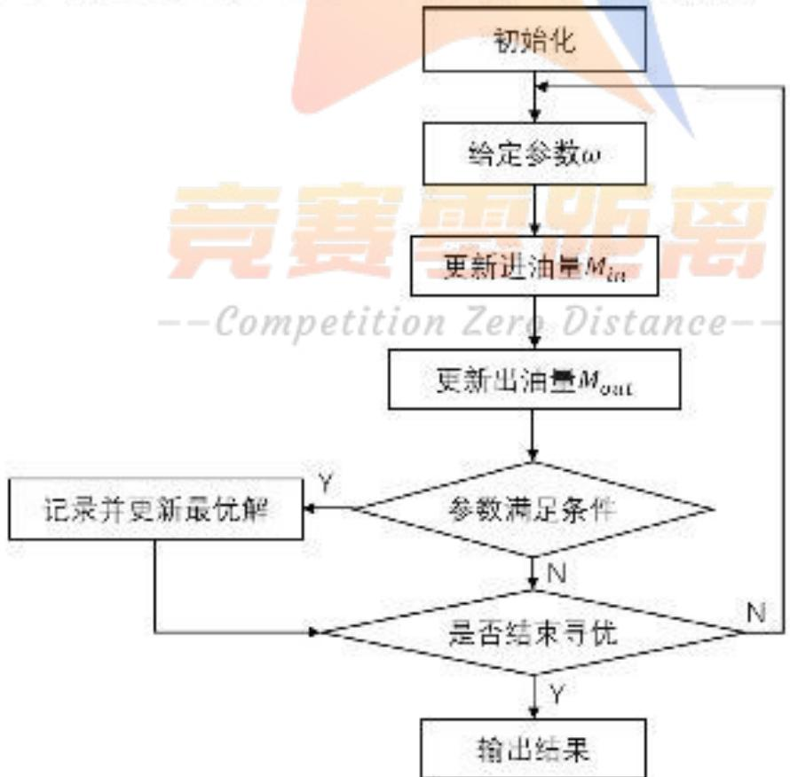
图 23 受压强控制策略的减压阀求解流程图

当步长缩小为0.01ms时，最优的高压油泵凸轮转动角速度ω为 $1 2 5 . 6 r a d \cdot m s ^ { - 1 }$ 在1s内压力波动绝对值的积分为0.1036MPa。该转动周期下的压强变化图如下从图中可以看出：当压力高于100MPa时，减压阀开启，燃油回流，高压油管内压强迅速降低；由于减压阀的存在高压油泵可以维持较高的输入保证高压油管内压强变化的均匀性。 O

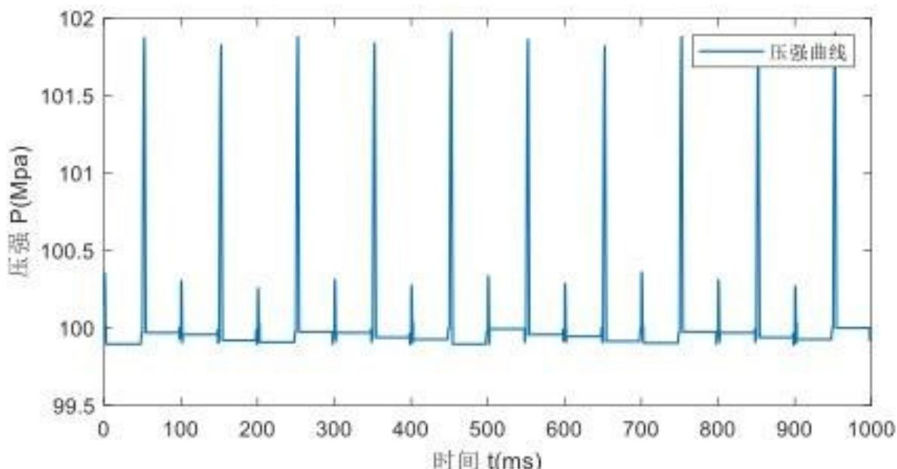
图 24 压强波动变化图

高压油泵的流入速度、两个喷油管的流出速度、减压阀的流出速度如下：

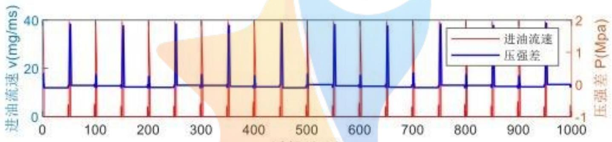

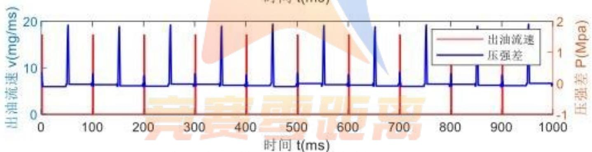

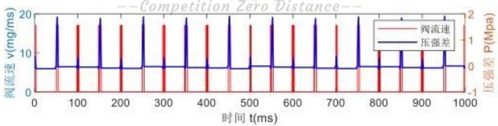
图25 各进出口的流速变化与压强对比图

从图中可以看出，在高压油管中压强迅速增大时，减压阀立即处于工作状态进行减压控制；当压强较为稳定时，减压阀关闭。图中减压阀工作流速周期性的高低变化，是因为喷油口周期性变化导致。在喷油口打开时，一部分燃油从喷油口流出，减压阀流出的燃油质量变少，故此时减压阀处流速较慢。在喷油口关闭时，压强增大的情况下，全靠减压阀的工作来减小压强，故减压阀此时的流速较快。

上述分析表明此控制策略可以有效降低高压管内的压强，维持高压管压强的相对稳定，同时可以消除燃油量积类变大的情况，保证管内的压强低于一定的水平。当高压油管压强异常时，该方式也可以迅速反应，降低压强，避免安全隐患。

## (2) 方案 2 求解

对于周期开启的工作方式，其工作的效果和喷油嘴的效果相似。在一个周期内减压阀的流速为

$$
Q = \left\{ \begin{array} { l l } { { C S _ { s 1 } } \sqrt { \displaystyle { \frac { 2 \left( P _ { 1 } - P _ { A } \right) } { \rho _ { 1 } } } } , 0 < t \leq T _ { c o n t r o l } ^ { o n } } \\ { 0 , } & { T _ { c o n t r o l } ^ { o n } < t \leq T _ { c o n t r o l } } \end{array} \right.
$$

利用高压油管压强大于一定值的开方案的求解方法，寻找最优的开启周期及其对应的高压油泵凸轮转动周期，在更新参数时，需要寻优 $\omega , T _ { 3 } , T _ { s }$ 三个参数，导致遍历空间维数较高，需要在初始化及给定参数时减小寻优范围。由于高压管内的压强波动范围在99MPa\~101MPa，可得出其流量的波动范围为$\Delta m = 1 4 . 1 1 4 1 \sim 1 4 . 1 8 5 3 ~ m g$ ，带入公式(1-14)，并联立给定的 $\omega , T _ { c o n t r o l } ^ { o f f }$ 值，可以计算出减压阀的一个工作周期内减压喷油周期范围，将其作为 $\omega , T _ { c o n t r o l } ^ { o f f }$ 下 $T _ { c o n t r o l } ^ { o n }$ 寻优空间。利用上述求解方案求解，其参数的最优取值如表3所示

表3最佳参数去指表
<table><tr><td>参数</td><td>角速度ω</td><td>减压阀开启时间</td><td>减压阀关闭时间</td></tr><tr><td>取值</td><td> $0 . 0 4 8 r a d \cdot m s ^ { - 1 }$  </td><td>130ms</td><td>50ms</td></tr></table>

其压强的波动图如图24所示

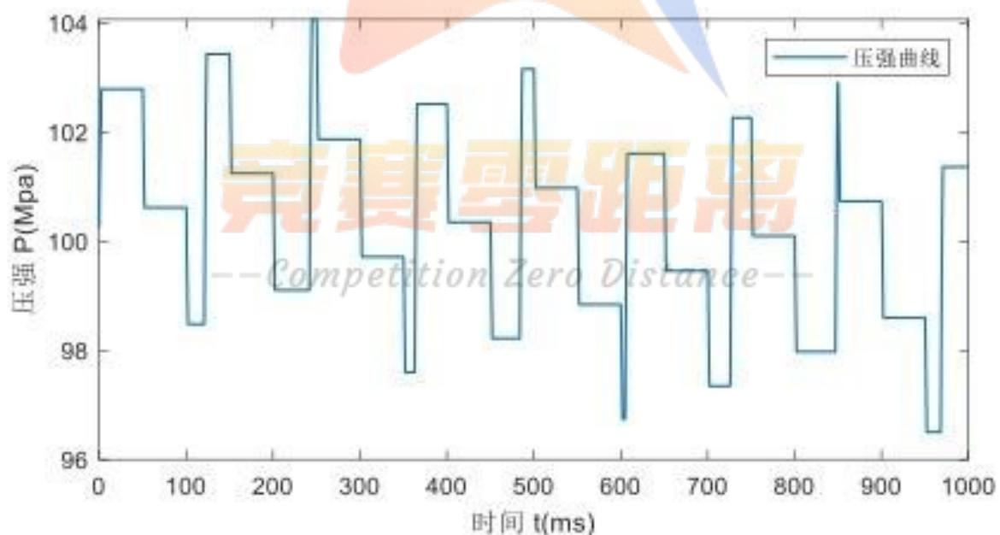
图 24 方案 2 压强波动图

可以看出，压力波动的变化控制效果与没有控制减压阀模型二波动结果相差不大，说明其控制效果并不明显。计算出的两个喷油管的流出速度、减压阀的流出速度如下图所示

## 6.3 稳定性检验

对于一个实际应用中的高压燃油系统，由于机械震动干扰的存在，进油周期不可能严格等于目标周期，实际存在的进油周期会存在一个波动范围。检验高压油管压强大于一定值的开启方案下，对于存在扰动进油周期的控制效果。假设实际的讲油周期在标准周期20%的范围内浮动，即

$$
T _ { r e a l } = T _ { s t d } \times ( 1 + e ) , e \sim U ( - 0 . 1 , 0 . 1 )
$$

将上述周期变化带入到该工作方案的计算过程中，利用离散方法计算。求得其流速与压强差浮动的变化为

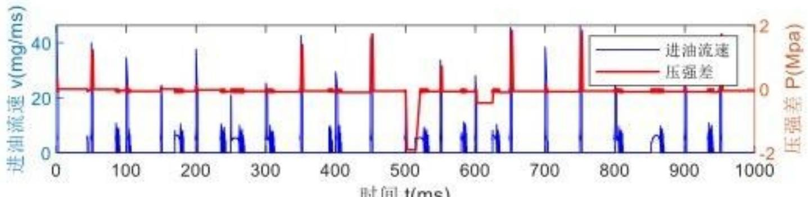

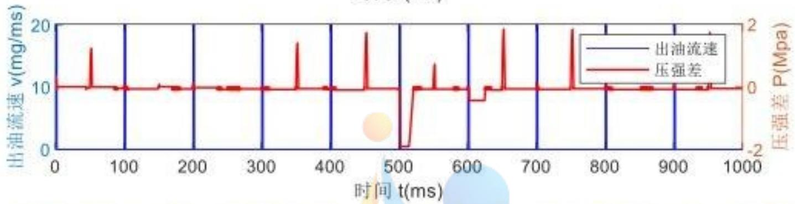

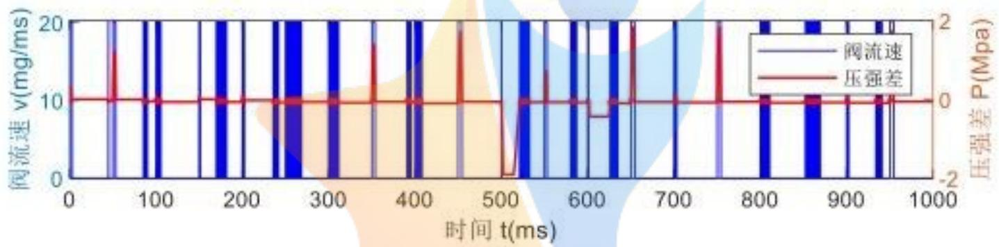
图27稳定性检验模型结果图

由图中可知，当周期发生浮动时，会对高压油泵的进油流速产生较大的影响。当压强出现较高值时，由于减压阀的存在，一定量的燃油回流进低压油路，高压油管内的压强降低。该结果说明减压阀的控制对于外界的机械干扰有一定的抵抗效果，表明该模型具有一定的稳定性。

## -七e模型评价与推广nce--

## 7.1 模型评价

## 7.1.1 模型优点

综合考虑各种约束条件，寻得在一定范围下最优的参数，保证了参数的正确性与结果的合理性；对模型进行稳定性检验，当存在误差的情况下，该模型参数的鲁棒性仍然可靠，其稳定性很高。

## 7.1.2 模型缺点

该模型仅适用于长度较短、体积较小的高压油管。该高压油管的长度仅为500mm，考虑均匀密度与分析实际的密度分布相比，二者的差异微乎其微。当对长度更长的高压油管进行分析时，需要依据流体力学原理分析不同位置高压油管的参数。

## 7.2 模型推广

本文建立的高压共轨系统模型可从单进油口双出油口增加至多进油口和多出油口模型。虽然进油口和出油口的数量增加了，但总的模型约束条件改变不大，

此时的约束条件为

高压泵方程的约束为

$$
s . t . \left\{ C S _ { . i . i } \sqrt { \frac { \Delta P } { \rho _ { 1 } ( t ^ { i } ) } } \rho _ { . } + \frac { d ( \rho _ { . } V _ { . } ) } { d t } = 0 \right. _ { \ i = 1 , 2 , 3 , \cdots }
$$

式中不同的i代表第i各高压泵 工作状态

高压油腔中的变化方程为

$$
s . t . \left\{ \begin{array} { l l } { m _ { i n } = \displaystyle \sum _ { i } ^ { T } \int _ { 0 , i } \left( t _ { i } \right) C S _ { A , i } \sqrt { \frac { \Delta P } { \rho _ { 2 } \left( t _ { i } \right) } } } \\ { \displaystyle } \\ { m _ { o u , j } = \displaystyle \sum _ { j } ^ { T } \int C S _ { B , j } \left( t _ { j } \right) \sqrt { \frac { P _ { 1 } - P _ { 3 } } { \rho _ { 1 } \left( t \right) } } \rho _ { 1 } ( t _ { i } ) d t } \\ { \displaystyle } \\ { \rho _ { 1 } - \frac { m _ { i n } - m _ { o u t } } { V _ { 1 } } - \rho _ { 0 } = 0 } \\ { S _ { B , j } = S _ { B , j } \left( t _ { j } \right) } \end{array} \right. \ , j = 1 , 2 , 3 , \cdots .
$$

式中j为第j各喷油嘴。

整个系统皆满足的方程为

$$
s t . \left\{ { \begin{array} { l } { P = k \rho } \\ { T = { \frac { 2 \pi } { \omega } } \cdot T _ { o u t } } \\ { \omega } \end{array} } \right.
$$

故在求解多高压泵和多喷油嘴的模型时可建立与上文第三题第一小问相似的寻优模型进行计算。此时的目标函数为

$$
\operatorname* { m i n } = \int \limits _ { 0 } ^ { T } \left| P _ { 1 } \left( t _ { i } \right) - 1 0 0 \right| d t
$$

采用遍历的方法进行寻优计算，即可得到此时需要的最优解。

## 八参考文献

[1]李志辉，李志辉，张涵信，和张涵信.基于boltzmann 模型方程的气体运动论统一算法研究[J]. 力学进展,35(4)：56-63.

[2]杨林，张凤华，唐川林等.浆体管道输送水击压力波波速的探讨[J].力学与实践，2016，24(05)：87-94.

[3]余经洪，陈兆能.油液综合体积弹性模量压力模型的研究[J]. 液压与气动，1991(1):2-6.

## 附录

1. 针阀的上升高度与时间拟合数据

$$
S = \left\{ \begin{array} { c c } { 6 6 . 7 1 t ^ { 3 } - 9 . 0 8 t ^ { 2 } + 0 . 3 8 6 t - 0 . 0 0 2 4 5 , } & { 0 \leq t < 0 . 3 3 , } \\ { 1 . 5 3 9 4 , } & { 0 . 3 3 < t \leq 2 . 1 1 , } \\ { p ( 1 ) t ^ { 6 } + p ( 2 ) t ^ { 5 } - p ( 2 ) t ^ { 4 } + p ( 2 ) t ^ { 3 } - p ( 2 ) t ^ { 2 } + p ( 2 ) t - p ( 2 ) , } & { 2 . 1 1 < t \leq 2 . 4 6 , } \\ { 0 2 . 4 6 < t \leq 1 0 0 , } & { 2 . 4 6 < t \leq 1 0 0 . } \end{array} \right.
$$

## 2. MATLAB 计算程序

```matlab
问题一喷油周期及喷油时间计算
clear,clc
global dt Tc;% 定义全局变量dt 和Tc，分别为时间离散长度和最大公倍数周期
Tc = 2；%最大公倍数周期，单位s
dt = 0.01；% 时间离散长度
s = 0；% 迭代变量
%% 寻优计算参数
t0s =0:0.1:0.2;% 寻优列表
for t0 =t0s% 初始时高压油泵的延时
s = s+1； % 迭代次数
% 计算在延时为t0 时的喷油时间T1 和误差
[t1(s),error(s)] =funRes(t0); % t0:初始喷油延时，fP:目标压强
end
% 选择最小的误差与对应的喷油时间网
[Error,post] = min(error);%选择最小的误差与对应的喷油时间
%% 重新计算最优参数，记录中间状态值t0 = t0s(post);% 延时时间
T1 = t1(post);% 对应的 t1 值
N = 1000*Tc/dt;density = 0.850;% 密度初值
for n = 1:N % 离散计算
time = n * dt;% 计算实际时间
% 进油总质量
inQual = inFuel(time, density, t0, T1);
inQ(n) = inQual;% 记录值
% 出油总质量
outQual = outFuel(time, density);
outQ(n) = outQual;% 记录值
% 更新密度
allM(n)= density*pi*5^2*500;% 计算总质量
density = (all1M(n) - outQual + inQual)/(pi*5^2*500); % 计算平均密度
```

```matlab
Denp(n)= funP2(density);% 计算该时刻压力
Err1(n) = Denp(n) - 100; % 计算误差
end
Err2 = sum(Err1)/N;% 该时间内输入油量的误差
Err3 = sum(abs(Err1))/N; % 波动误差
%% 数据整理
%绘制压力曲线图
figure
plot((1:N)/100,Denp,'-','Linewidth',1)
legend('压强曲线')
xlabel('时间 t(ms)')
ylabel('压强 P(Mpa)')
set(gcf,'units','centimeters')% 标准单位：厘米
set(gcf,'InnerPosition',[0 5 16 8])% 在屏幕的位置，图窗的长宽
%绘制误差图 O
figure
plot((1:N)/100,Err1,'-','Linewidth',1)
legend('压强误差')
xlabel('时间 t(ms)')
ylabel('压强差 P(Mpa)')
set(gcf,'units','centimeters') % 标准单位：厘米
set(gcf,'InnerPosition',[16 5 16 8]) %在屏幕的位置，图窗的长宽
%绘制进油质量与出油质量图
figure
subplot(2,1,1)
plot((1:(0.1*(N/Tc/4)))/100,inQ(1:(0.1*(N/Tc/4)))/dt,'r-
','Linewidth',0.6)
x e化
legend('进油质量的速率)

subplot(2,1,2)
plot((1:(0.1*(N/Tc)))/100,outQ(1:(0.1*(N/Tc)))/dt,'r-
','Linewidth',0.6)
xlabel('时间 t(ms)')
ylabel('质量变化率 v(mg/ms)')
legend('出油质量的速率')
fprintf('喷油角速度为%.3frad/ms\n',2*pi/T1)
fprintf('喷油周期为%.3fms\n',T1)
fprintf('开始喷油延时%.3fms\n',t0)
fprintf('波动误差为：%.3fMpa\n',Err3)
%% 计算进油工作周期
function [T1, error] = funRes(t0)
global dt Tc%定义全局变量dt 和Tc，分别为时间离散长度和最大公倍数周期
N= 1000*Tc/dt;%一个周期的离散时间点的个数
```

```matlab
s = 0;
for Tt1 = 27:30 % 搜索法，进油工作周期
density = 0.850;% 密度初值
for n = 1:N % 离散计算
time = n* dt; % 计算实际时间
%进油
inQual=inFuel(time, density, t0,Tt1*dt);%InFuel 是进油计算函数
%出油
outQual = outFuel(time,density);%outFuel 是出油计算函数
% 是否在增压
%更新密度
allM=density*pi*5^2*500;%计算总质量
density =(allM - outQual + inQual)/(pi*5^2*500);% 计算平均密度
Err1(n)=funP2(density)-100;%计算误差
end
s = s+1;
Tt(s) = Tt1*dt;
Err2(s)= sum(Err1)/N; %该时间内输入油量的误差
Err3(s) = sum(abs(Err1))/N; % 波动误差
end
[~,post] = min(abs(Err2));% 最小误差
T1 = Tt(post);
error = Err3(post);% 波动误差
end
%% 进油计算
function inQual = inFuel(time, density, t0, Tt1)
C= 0.15; % 流量系数费距离
A = pi*0.7^2;% A 口的面积
P1 = 160;% 高压油泵在A 提供的恒压density0 = 0.871;% 初始密度
time = mod(time,Tt1+10)；% 由于周期的存在，时间取周期的模
if time < t0
inQual = 0;
elseif time <= t0+Tt1%一个进油周期
inQual = dt*C*A*sqrt(2*(P1-funP2(density))/density0)*density0;
else
inQual = 0;
end
end
%% 密度压强转换函数
function y = funP2(density)
```

```matlab
a0 = 0.0006492;
a2 = 1.181e-09;
a1 = -2.005e-06;
C1 = -0.217807596;
x1 = 0;
x2 = 200;
for i = 1:15
x3 = (x1+x2)/2;
diff = C1 + a0*x3+ a1*x3^2/2+a2*x3^3/3 -log(density);%由附件数据拟
合而来
if diff >0
x2 = x3;
else
x1 = x3;
end
end
y = x1;
end
%% 出油量计算
function outQual = outFuel(time, density)
global dt;% 定义全局变量dt，为时间离散长度
time = mod(time,100);% 由于周期的存在，时间取周期的模
if time
outQual = fPout(time)-fPout(time-dt);
outQual = outQual * density;
else
outQual = 0;
end function y = Pout)
if t<50-0.4
--
y = 0;
elseif t < 0.2+50-0.4
t = t-50+0.4;
y = 50*t^2;
elseif t < 2.2+50-0.4
t = t-50+0.4;
y = 20*t-2;
elseift <=2.4+50-0.4
t = t-50+0.4;
y = 240*t-50*t^2-288+44;
else
y = 44;
end
end
```

```matlab
enu
问题二凸轮的旋转角速度及周期的计算
clear,clc
global dt Tc;% 定义全局变量dt 和Tc，分别为时间离散长度和最大公倍数周期
Tc = 5;% 最大公倍数周期，单位s
dt = 0.1;% 时间离散长度
N = 1000*Tc/dt;
density = 0.850;% 密度初值
T1s = 231; % 231
[T1,error]= funRes(T1s); % t0:初始喷油延时，fP:目标压强
%% 重新计算最优值，记录中间结果
count = 1;
for n = 1:N % 离散计算
time = n * dt; % 计算实际时间
% 每一周期过后油量增加到初始值0.5Mpa
count0 = ceil(time/T1);
if count0 == count
quatyG =(8.2576-2.413)*pi*2.5^2*0.804541084;% 高压油泵进油质量
count0 = count;
count = count +1;
end
% 进油 quatyG:高压油管内的燃油质量
inQual = inFuel(time, density, quatyG,T1);% inFuel 为进油方程
inQ(n) = inQual;
quatyG = quatyG - inQual;
left (n)= quaty壹赛零距南
outQual = outFuel(time, density);%outFueL为出油方程
outQ(n) = outQual;
% 更新密度
allM = density*pi*5^2*500;
density= (allM-outQual+inQual)/(pi*5^2*500);% 油管内燃油密度
Denp(n) =funP2(density);% funP2 为密度-压强转换函数
Err1(n) = Denp(n) - 100;% 密度误差
end
Err2 = sum(Err1)/N; %该时间内输入油量的误差
Err3 = sum(abs(Err1))/N; % 波动误差
%% 数据整理展示
%绘制压力曲线图
figure
plot((1:N)*dt,Denp,'-','Linewidth',1)
legend('压力曲线')
```

```matlab
xlabel('时间 t(ms)')
ylabel('压强 P(Mpa)')
set(gcf,'units','centimeters')% 标准单位：厘米
set(gcf,'InnerPosition',[0 5 16 8])% 在屏幕的位置，图窗的长宽
%绘制压力的误差
figure
plot((1:N)*dt,Err1,'-','Linewidth',1)
legend('压强差')
xlabel('时间 t(ms)')
ylabel('压强差 P(Mpa)')
set(gcf,'units','centimeters') % 标准单位：厘米
set(gcf,'InnerPosition',[16 5 16 8])% 在屏幕的位置，图窗的长宽
%绘制进出油质量图
figure
subplot(2,1,1)
yyaxis left
plot((1:N)*dt,inQ/dt,'b-','Linewidth',0.6)
xlabel('时间 t(ms)')
ylabel('进油质量变化率 v(mg/ms)')
yyaxis right
plot((1:N)*dt,Err1,'r-','Linewidth',1)
xlabel('时间 t(ms)')
ylabel('压强差 P(Mpa)')
legend('进油质量变化率'，'压强差')
subplot(2,1,2)
yyaxis left
plot((1:N)*dt,outQ/dt,'b-','Linewidth',0.6)
yyaxis right
xlabel('时间 t(ms)')
ylabel('压强差 P(Mpa)')
legend('出油质量变化率'，'压强差')
fprintf('波动误差为：%.3fMpa\n',Err3)
fprintf('喷油角速度为%.3frad/ms\n',2*pi/T1)
fprintf('喷油周期为%.3fms\n',T1)
%% 计算进油工作周期
function [T1, error] = funRes(T1s)
global dt Tc;% 定义全局变量dt 和Tc，分别为时间离散长度和最大公倍数周期
N = 1000*Tc/dt;
s = 0;
for Tt1 = T1s % 搜索法，进油工作周期
```

```matlab
density = 0.850; % 密度初值
count = 1;
for n = 1:N % 离散计算
time = n*dt: % 计算实际时间
%每一周期过后油量增加到初始值0.5Mpa对应的油量
count0 = ceil(time/Tt1);
if count0 == count
quatyG =(8.2576-2.413)*pi*2.5^2*0.804541084;% 高压油泵进油
质量
count0 = count;
count = count +1;
end
% 进油 quatyG:高压油管内的燃油质量
inQual = inFuel(time, density, quatyG, Tt1);
quatyG = quatyG - inQual;
%出油
outQual = outFuel(time, density);
%更新密度
allM = density*pi*5^2*500;
density = (al1M - outQual + inQual)/(pi*5^2*500);
Err1(n) = funP2(density) - 100;
end
s = s+1;
Tt(s) = Tt1;
Err2(s)= sum(Err1)/N; % 该时间内输入油量的误差
Err3(s) = sum(abs(Err1))/N; % 波动误差
end
[1= t st);(
error = Err3(post);% 波动误差

end
%% 进油计算
function inQual = inFuel(time, density, quatyG, Tt1)
global dt;
C = 0.85； % 流量系数
A = pi*0.7^2;
time = mod(time,Tt1)；% 由于周期的存在，时间取周期的模
densityThis= quatyG/(pi*2.5^2*(8.2576-funP1(time,Tt1)));%此时可的密度
P1 = funP2(densityThis);
dP = P1-funP2(density);
if dP > 0
inQual = dt*C*A*sqrt(2*dP/densityThis)*densityThis;
else
inQual = 0;
```

```matlab
end
%计算极径长度
function y = funP1(time,Tt1)
x = time/Tt1*2*pi;
if x > pi
x = 2*pi-x;
end
p =[0.350083971620368,-
1.64948618755122,0.204612192193817,7.21756739475012];
y =p(1)*x.^3+p(2)*x.^2+p(3)*x.^1+p(4);
end
end
%% 出油量计算
function outQual = outFuel(time, density)
global dt;
C = 0.85;
time = mod(time,100)；% 由于周期的存在，时间取周期的模
outQual = dt*C*fA(time)*sqrt(2*(funP2(density)-0.1)/density)*density;%
出油质量速率
%计算面积与升程的关系
function y = fA(t)
if t <= 0.33
y = 66.71*t^3 -9.078*t^2 +0.386*t-0.00245;
elseif t <= 2.11
y = 1.53938040025900;
elseif t<= 2.46
p =[-12599.3716123347,174495.841196611,-
1006433.46601700,3094198.90735766,-5347936.07171245,4926758.50356979,-
1889937.68991857]; 克费
y =
p(1)*t.^6+p(2)*t.^5+p(3)*t.^4+p(4)*t.^3+p(5)*.^2+p(6)*t.^1+p(7);
else
y = 0;
end
end
end
%%计算一定密度下的压强
function y = funP2(density)
a0 = 0.0006492;
a2 = 1.181e-09;
a1 = -2.005e-06;
C1 = -0.217807596;
x1 = 0;
x2 = 200;
```

```matlab
for i = 1:15
x3 = (x1+x2)/2;
diff = C1 + a0*x3 + a1*x3^2/2+a2*x3^3/3 -log(density);%由附件数据拟
合得到
if diff >0
x2 = x3;
else
x1 = x3;
end
end
y = x1;
end
```

## 问题三增加喷油和减压阀计算参数

```matlab
clear,clc
global dt Tc；% 定义全局变量dt 和Tc，分别为时间离散长度和最大公倍数周期
Tc = 1;dt = 0.1;N = 1000*Tc/dt;density = 0.850; % 密度初值
T1s = 50; % 231
[T1,error] = funRes(T1s); % t0:初始喷油延时，fP:目标压强
T1 = 50;
%% 重新计算最优值，记录中间结果
count = 1;
for n = 1:N % 离散计算
time = n * dt； % 计算实际时间
%每一周期过后油量增加到初始值0.5Mpa
count0 = ceil(time/T1);
if count0 == count
quatyG = (8.2576-2.413)*pi*2.5^2*0.804541084;% 高压油泵进油质量
count0 = count;

count = count +1;
T1Rand = T1*(1-rand*0);
end
Tra(n) = T1Rand;
% 进油 quatyG:高压油管内的燃油质量
inQual = inFuel(time, density, quatyG, T1Rand);% inFuel 为进油方程
inQ(n) = inQual;
quatyG = quatyG - inQual;
% 出油
outQual = outFuel(time, density);% outFuel 为出油方程
outQ(n) = outQual;
% 更新密度
allM = density*pi*5^2*500;
density = (al1M - outQual + inQual)/(pi*5^2*500);% 油管内燃油密度
```

```matlab
Denp(n) = funP2(density);% funP2 为密度-压强转换函数
redu = 0;
if Denp(n) > 100
dP = Denp(n)-0.1;
C = 0.85；% 流量系数
A = pi*0.7^2;% A 口的面积
redu = dt*C*A*sqrt(2*dP/density)*density;
%更新密度
allM =density*pi*5^2*500;
density =(al1M - redu)/(pi*5^2*500);
Denp(n) = funP2(density);
end
reduQ(n) = redu;
Err1(n) = Denp(n) - 100;
end
Err2 = sum(Err1)/N；% 该时间内输入油量的误差
Err3 = sum(abs(Err1))/N; % 波动误差
%% 数据整理展示
% 绘制压强曲线图
figure
plot((1:N)*dt,Denp, -','Linewidth',1)
legend('压强曲线')
xlabel('时间 t(ms)')
ylabel('压强 P(Mpa)')
set(gcf,'units','centimeters') % 标准单位：厘米
set(gcf,'InnerPosition',[0 5 16 8]) % 在屏幕的位置，图窗的长宽
% 绘制压强差
legend('压强差')

xlabel('时间 t(ms)')
ylabel('压强差 P(Mpa)')
set(gcf,'units','centimeters')% 标准单位：厘米
set(gcf,'InnerPosition',[165168])% 在屏幕的位置，图窗的长宽
%绘制时间与流速和时间与阀流速关系图
figure
yyaxis left
plot((1:N)*dt,reduQ/dt,'r-','Linewidth',0.6)
% axis([1,Tc*1000,0,4])
xlabel('时间 t(ms)')
ylabel('阀流速 v(mg/ms)')
yyaxis right
plot((1:N)*dt,Err1,'b-','Linewidth',1)
% Legend('压力误差')
```

```matlab
xlabel('时间 t(ms)')
ylabel('压强差 P(Mpa)')
legend('压强差','阀流速')
set(gcf,'units','centimeters') % 标准单位：厘米
set(gcf,'InnerPosition',[08168])%在屏幕的位置，图窗的长宽
fprintf('波动误差为：%.3fMpa\n',Err3)
fprintf('喷油角速度为%.3frad/ms\n',2*pi/T1)
fprintf('喷油周期为%.3fms\n',T1)
%% 计算进油工作周期
function [T1, error] = funRes(T1s)
global dt Tc；% 定义全局变量dt 和Tc，分别为时间离散长度和最大公倍数周期
N = 1000*Tc/dt;
s = 0;
for Tt1 = T1s % 搜索法，进油工作周期
density = 0.850；% 密度初值
count = 1;
for n = 1:N % 离散计算
time = n * dt;% 计算实际时间
%每一周期过后油量增加到初始值0.5Mpa对应的油量
count0 = ceil(time/Tt1);
if count0 == count
quatyG =(8.2576-2.413)*pi*2.5^2*0.804541084;% 高压油泵进油
质量
count0 = count;
count = count +1;
end
% 进油 quatyG:高压油管内的燃油质量
inQual = inFuel(time, density, quatyG, Tt1);
quatyG = quatyGinQual;零跑距离
%出油

outQual = outFuel(time, density);
% 更新密度
allM = density*pi*5^2*500;
density = (allM - outQual*2 + inQual)/(pi*5^2*500);
thisDen = funP2(density);
if thisDen > 100
dP = thisDen-0.1;
C = 0.85；% 流量系数
A = pi*0.7^2;
redu =dt*C*A*sqrt(2*dP/density)*density;
allM = density*pi*5^2*500;
density =(al1M - redu)/(pi*5^2*500);
thisDen = funP2(density);
end
```

```matlab
Err1(n) = thisDen - 100;
end
s = s+1;
Tt(s) = Tt1;
Err2(s) = sum(Err1)/N；% 该时间内输入油量的误差
Err3(s) = sum(abs(Err1))/N; % 波动误差
end
[~,post]= min(abs(Err2));% 最小误差值
T1 = Tt(post);
error = Err3(post);% 波动误差
end
%% 进油计算
function inQual = inFuel(time, density, quatyG, Tt1)
global dt;
C = 0.85；% 流量系数 O
A = pi*0.7^2;% A □面积
time = mod(time,Tt1)；% 由于周期的存在，时间取周期的模
densityThis = quatyG/(pi*2.5^2*(8.2576-funP1(time,Tt1)));
P1 = funP2(densityThis);
dP = P1-funP2(density);
if dP > 0
inQual= dt*C*A*sqrt(2*dP/densityThis)*densityThis;% 高压油泵的进油
质量
else
inQual = 0;
end
function y = funP1(time,Tt1)
XX>P克
x = 2*pi-x;

end
p=0.350083971620368,-
1.64948618755122,0.204612192193817,7.21756739475012];
y =p(1)*x.^3+p(2)*x.^2+p(3)*x.^1+p(4);
end
end
%% 出油量计算
function outQual = outFuel(time, density)
global dt;
C = 0.85;
time = mod(time,100)；% 由于周期的存在，时间取周期的模
outQual = dt*C*fA(time)*sqrt(2*(funP2(density)-
0.1)/density)*density;
%喷油器出油横截面积和升程的关系分段拟合方程
```

```matlab
function y = fA(t)
if t <= 0.33
y = 66.71*t^3 -9.078*t^2 +0.386*t -0.00245;
elseif t <= 2.11
y = 1.53938040025900;
elseif t<= 2.46
p = [-12599.3716123347,174495.841196611,-
1006433.46601700,3094198.90735766,-5347936.07171245,4926758.50356979,
1889937.68991857];
y =
p(1)*t.^6+p(2)*t.^5+p(3)*t.^4+p(4)*t.^3+p(5)*t.^2+p(6)*t.^1+p(7);
else
y = 0;
end
end
end
%% 计算一定密度下的压强
function y = funP2(density)
a0 = 0.0006492;
a2 = 1.181e-09;
a1 = -2.005e-06;
C1 = -0.217807596;
x1 = 0;
x2 = 200;
for i = 1:15
x3 = (x1+x2)/2;
diff = C1 + a0*x3 + a1*x3^2/2+a2*x3^3/3 - log(density);% 由附件数据
拟合得来 iff   0
x2 = x3;
--
else
x1 = x3;
end
end
y = x1;
end
```