# 回焊炉温曲线优化控制

## 摘要

回焊炉通过设置各个温区的温度，加热集成电路板，能够将电子元件自动焊接到板子上，在表面贴装工艺技术中起到关键作用。回焊中的焊接区域中心温度变化对产品质量影响尤其重要。本文从物理机理方面入手建立模型，分析了电路板在回焊炉中的温度变化过程，对回焊炉温曲线的优化与控制进行了研究。

对于问题一，首先通过一维稳态传热模型确定回焊炉中各区域的温度分布并结合附件数据考虑区域之间边界处的影响，之后考虑电路板在炉中的温度变化情况，考虑热传导、热对流两种方式，对于升温过程建立基于能量守恒定律的微分方程组，针对不同区域使用不同热时间常数拟合；对于降温过程建立基于牛顿冷却公式的模型，得到对焊接区域中心温度变化曲线的数学模型，利用最小二乘法建立优化模型，拟合实际数据来求解未知参数的最优估计，得到参数对实际数据曲线拟合较好。之后代入第一问新数据计算，绘出了该情况下的炉温变化曲线。得到小温区3中点温度为 $1 2 9 . 0 1 5 3 ^ { \circ } \mathrm { C }$ ，小温区6中点为 $1 6 3 . 9 6 4 4 ^ { \circ } \mathrm { C }$ ，小温区7中点为174.8322℃及小温区8结束处温度为 $2 0 7 . 8 4 1 7 ^ { \circ } \mathrm { C }$ 并将每隔0.5S 的数据存入到 result.csv 中。

对于问题二，我们根据题目中给出的各温区设定温度值，以题目中的制程界限为约束条件建立非线性规划模型。在题目中给出的传送带过炉速度范围内进行多重搜索的方法，先确定一个大致范围再以小步长进行精细的搜索：对于每一个过炉速度都可以基于第一问中已经得到的机理模型得到炉温曲线，从而可以判断此时的曲线是否满足制程界限。搜索得到的最大过炉速度为77.85cm/min，此时刚好能满足所有制程界限。

对于问题三，以题目中的制程界限以及各温度区设定温度值和传送带过炉速度的范围限制为约束条件，以炉温曲线超过217℃到峰值温度所覆盖的面积为优化目标，建立单目标优化模型来求取面积的最小值。利用模拟退火算法迭代20000次进行求解，得到的最优方案为 $1 8 4 . 2 1 8 1 ^ { \circ } \mathrm { C }$ (小温区1\~5)、 $1 8 9 . 8 1 3 3 ^ { \mathrm { o } } \mathrm { C }$ （小温区6）、 $2 2 7 . 5 2 2 6 ^ { \mathrm { o } } \mathrm { C }$ (小温区7）、 $2 6 4 . 0 7 0 0 ^ { \mathrm { o } } \mathrm { C }$ （小温区8\~9），传送带过炉速度为90.0982cm/min。此时得到的炉温曲线超过 $2 1 7 \mathrm { { ^ \circ C } }$ 到峰值温度所覆盖的面积为406.2318。

对于问题四，在问题三的基础上引入对炉温曲线超过217℃部分关于最高温两边对称性的要求。首先定义对称性衡量指标，将最高温两边等量数据点之间的均方差作为衡量指标，结合题目中的制程界限以及各温度区设定温度值和传送带过炉速度的范围限制等约束条件，建立多目标优化模型。将对称度衡量指标与覆盖面积进行处理，选择合适的权值之后，我们将多目标优化模型转化为单目标优化模型，仍然采用模拟退火算法来求解最优解。得到的最优方案为183.5822°C（小温区1\~5）、 $1 9 0 . 5 0 2 1 ^ { \mathrm { o } } \mathrm { C }$ (小温区6)、$2 2 7 . 1 9 6 2 ^ { \mathrm { { o } } } \mathrm { C } ($ 小温区7)、264.4834°C(小温区8\~9)，传送带的过炉速度为90.1316cm/min，超过 $2 1 7 \mathrm { { ^ \circ C } }$ 到峰值温度所覆盖面积为409.0650，达到了接近最优解的值；得到此时的对称性指标值为21.6865，此时画出的炉温曲线在217℃以上部分近似对称，温度上升斜率和下降斜率略有区别。

最后对模型优缺点进行了分析总结，并对存在的缺点提出了改进方案设想，还提出了推广的方向。

关键词传热模型炉温曲线多重搜索算法模拟退火算法多目标优化

## 一、问题重述

电子信息产业在我国发展迅速，促进了表面贴装工艺（SMT）的技术进步。在集成电路板的生产过程中，要将安装有各种电子元器件的印刷电路板放入回焊炉中进行回流焊，使得电子元器件能够自动地焊接到印刷电路板上。回焊炉中各部分的温度保持对生产产品的质量起到关键的作用。回流焊作为表面贴装工艺的核心工艺环节，主要通过回焊炉的温度曲线优化控制来不断提高生产效率与产品质量。

回焊炉内部从功能角度来划分，主要分为4个大温区，分别是预热区、恒温区、回流区和冷却区。运行时将需要加工的电路板放置在回流炉的传送带上，以恒定的速度进入炉中进行加工。本题所考虑的回流炉实际有11个长为30.5cm的小温区，每个小温区之间有5cm的间隙，除此之外有炉外区域包括炉前和炉后区，每个部分长度为25cm。回焊炉启动后会将各个小区的温度迅速升到指定温度并达到稳定，然后方可进行回焊，而炉外区域、小温区之间间隙不做温度控制，这些区域的温度以及各温区边界温度都受相邻温区的温度影响。生产车间的温度则保持在25℃。

在设定各温区的温度和传送带的恒定过炉速度后，使用温度传感器来测量焊接区域中心的温度得到一条温度变化的曲线，称之为炉温曲线。温度传感器在被测区域温度超过 $3 0 ^ { \circ } \mathrm { C }$ 时开始工作。实际生产时为了控制和改善产品质量，需要调节各温区的设定温度以及传送带的过炉速度。某次实验设定的各温区温度为：小温区1\~5设为 $1 7 5 ^ { \mathrm { o } } \mathrm { C }$ ，小温区6设为 $1 9 5 ^ { \mathrm { { o } } } \mathrm { { C } }$ ，小温区7设为 $2 3 5 ^ { \mathrm { { o } } } \mathrm { { C } }$ ，小温区 8\~9 设为 $2 5 5 ^ { \mathrm { o } } \mathrm { C }$ ，小温区10\~11设为$2 5 ^ { \circ } \mathrm { C }$ 。传送带的过炉速度则设置为70cm/min。焊接区域的厚度设置为0.15mm。在此基础上，各温区的温度可以进行 $1 0 ^ { \circ } \mathrm { C }$ 以内的调整，其中小温区1\~5温度一致、小温区8\~9温度保持一致、小温区10\~11温度保持 $2 5 \mathrm { { ^ \circ C } }$ 。传送带的过炉速度可以在65cm/min\~110cm/min之间变化。在电路板进行回焊操作时，炉温曲线应满足题目中表1给出的制程界限，对温度上升斜率、温度下降斜率、温度上升过程中在 $1 5 0 ^ { \circ } \mathrm { C } { \sim } 1 9 0 ^ { \circ } \mathrm { C }$ 的时间、大于217℃的时间和峰值温度做出了要求

## 问题一：

建模分析焊接区域的温度变化规律，假设过炉速度调整为78cm/min，小温区 $1 ^ { \sim } 5$ 设置为 $1 7 3 ^ { \mathrm { { o } } } \mathrm { { C } }$ ，小温区6设置为 $1 9 8 ^ { \mathbf { o } } \mathrm { C }$ ，小温区7设置为 $2 3 0 ^ { \circ } \mathrm { C }$ ，小温区 $8 ^ { \sim } 9$ 设置为257°C，通过模型计算得到焊接区域中心温度变化情况。列出指定位置的焊接区域中心温度，绘制炉温曲线，将每隔0.5S的温度数据存放到表格中。

## 问题二：

小温区 1\~5 设为 $1 8 2 ^ { \circ } \mathrm { C }$ ，小温区6设为 $2 0 3 ^ { \circ } \mathrm { C }$ ，小温区7设为 $2 3 7 ^ { \circ } \mathrm { C }$ ，小温区8\~9设为 $2 5 4 ^ { \circ } C$ ，计算允许达到的传送带的最大过炉速度。

## 问题三：

实际过程中焊接区域中心的温度不能太长时间均处于 $2 1 7 \mathrm { { ^ \circ C } }$ 以上，峰值温度也不能设的太高。理论上超过 $2 1 7 \mathrm { { ^ \circ C } }$ 到峰值温度所覆盖的面积越小，炉温曲线越理想。确定满足此要求的最优炉温曲线，给出各温区的设定温度值以及传送带的过炉速度，给出面积大小。

## 问题四：

焊接过程中希望炉温曲线满足制程界限的同时，尽量使得炉温曲线以峰值温度为中心线的两侧超过 $2 1 7 \mathrm { { ^ \circ C } }$ 的部分对称。在问题三的基础上，进一步给出最优炉温曲线。给出各温区的设定温度值以及传送带的过炉速度，和对应的指标值。

## 二、问题分析

## 2.1 问题一的分析

对于问题一，我们需要首先根据题目中给出的各个小温区的设定温度值，来计算稳定状态下回焊炉中各个温区、温区之间的间隙以及炉前区域、炉后区域等的温度分布。通过傅里叶定律推导一维稳态传热过程，确定在温区之间间隙的温度分布以及炉前区域的温度分布等。由题中已给出的区域长度信息，以及传送带的过炉速度，我们可以计算出在每个小温区和每个间隙经过的时间。 I.X.

之后对电路板在回流炉中的焊接区域中心温度变化进行分析。利用垂直表面的热流密度与电路板表面积的乘积等于整个电路板得到的热能的关系，由于电路板厚度很小且导热系数很高，可以近似地认为整个电路板的温度相等均匀分布。从而导出一个电路板两面与相同温度热源进行热对流后任意时间的温度公式，因为在每个恒定温度的小温区的经过时间已知，我们可以得到电路板经过每个小温区后的温度变化情况。之后对于间隙中温度不恒定的情况，采用微分的思想，将间隙划分为很多宽度很小的区域，从而可以近似地认为每个区域温度相等，采用之前导出的公式进行计算。对于降温，采用牛顿冷却模型进行处理，列出常微分方程之后进行离散化处理得到差分方程，从而可以得到冷却时焊接区域中心温度的大致变化情况。

根据上述的模型，代入题目中附件给出的数据进行拟合来反推求解模型中的一些未知的参数。求解过程中发现降温过程中降温速率变化与理论不相符，得出回流区高温可能影响到冷却区的边界附近的温度，在模型中对其进行考虑；发现恒定的热时间常数使得峰值温度无法到达要求范围，了解到热时间常数随温度升高而降低，在模型中考虑不同的温区对应不同的热时间常数。修正模型之后根据数据再次拟合，得到模型中未知量（热时间常数、对流系数等）的值。

根据已经求得的模型，代入第一问中的新的各个温区的温度和传送带的过炉速度进行计算，从而得到焊接区域中心温度的变化情况，得到题目中要求的一些参数。

## 2.2 问题二的分析

问题二给出了各温区的设定温度，要求我们在此基础上确定允许的最大传送带过炉速度。这是一个非线性规划问题，目标是求出传送带过炉速度的最大值，约束条件是题目中所给的制程界限。传送带的过炉速度调节范围为65\~100cm/min，利用多重搜索算法，先设定较大的搜索步长，确定速度的大致范围，再设置较小的搜索步长进行精确搜索。对于每一个搜索的过炉速度值，利用问题一解得的模型，都能得到对应的炉温曲线图，以及各个时间点焊接区域中心的温度。判断当前的炉温曲线能否满足约束条件，若满足则保留当前的过炉速度值，否则舍去，直到搜索结束，找到最大的满足约束条件的过炉速度大小。--

## 2.3 问题三的分析

问题三需要我们给出最优炉温曲线，以及各温区的设定温度和传送带的过炉速度，使得超过217℃到峰值温度所覆盖的面积最小。这是一个优化问题，优化目标是求覆盖面积的最小值，约束条件一是题目中所列出的制程界限，二是各温区设定温度及传送带的过炉速度调节范围限制。通过以上分析建立优化模型，以各温区的设定温度和传送带过炉速度为变量，利用模拟退火算法进行求解。

## 2.4 问题四的分析

问题四需要我们在第三问的基础上，进一步考虑炉温曲线在217℃以上的部分升温和降温的过程尽量对称，同时要保证符合制程界限与各温区设定温度及传送带过炉速度调节范围的限制，并使得超过217℃到峰值温度所覆盖的面积仍能达到一个较小值。这是一个多目标优化问题，一个目标是覆盖的面积，一个目标是曲线的对称度。一般可以为要优化的目标分配权值后再进行优化。我们首先要给出一个衡量对称度的量，我们取炉温曲线在217℃以上的部分，取最高温对应的时间和两个边界时间点，将两个边界时间点相减除以时间步长得到数据点总数，以最高温对应的时间点向时间正方向和负方向各取数据点总数的一半的数据，取正负方向各个对应点的温度值求均方差值，作为对称度衡量的指标。将面积和对称度数量级进行处理，使得两者的数量级一致，为两个因素分配合理的权值之后，得到一个多目标的优化模型，以各温区的设定温度和传送带过炉速度为变量，同样使用模拟退火算法来进行求解。

## 三、模型假设

1、假设观测误差、随机误差和连续问题离散化所产生的误差对本题的计算是没有影响的。 八

2、在回焊炉中传热方式仅考虑热传导、热对流，假设热辐射对本题结果的计算没有影响。

3、假设回焊炉温度高于室内温度的区域（即加热区域）的温度能够保持不变，每个温区内的温度均匀分布。

4、假设在温度变化不大的情况下热时间常数和热空气和电路板间的热对流系数均保持不变。

四、符号说明及名词定义
<table><tr><td>符号</td><td>含义</td></tr><tr><td>T(i=1，2,3,4，5)</td><td>各个温区的设定温度</td></tr><tr><td>T</td><td>焊接区域中心温度</td></tr><tr><td> $\tau _ { i } ^ { } ( \mathrm { i } \mathrm { = } 1 , ~ 2 )$ </td><td>两个温区分别对应的热时间常数</td></tr><tr><td>线 h</td><td>热对流系数 </td></tr><tr><td>∆t</td><td>时间步长 中国大学坐</td></tr><tr><td>ν</td><td>传送带过炉速度</td></tr><tr><td>ti(i=1,2，3,4，5)</td><td>5个特定温度的对应时间值(详见第六节)</td></tr><tr><td>S</td><td>炉温曲线超过  $2 1 7 \mathrm { { } ^ { \circ } C }$  到峰值温度覆盖面积</td></tr><tr><td>l</td><td>炉温曲线超过217℃的部分对称度</td></tr></table>

## 五、问题一模型建立与求解

## 5.1模型建立

## 5.1.1 模型准备

首先我们需要准备一定的物理背景，在本文中主要用到的热力学过程中的基本传热方式为热传导和热对流。热传导是指微观的粒子热运动所导致的热能传递，在固体、液体、气体中内部传热时都会产生热传导现象。热对流是指由流体宏观的运动引起的能量传递，在流体与物体的接触面会产生热交换。传热过程可以分为稳态和非稳态两种，区别在于稳态传热过程各点温度不随时间变化，而非稳态传热中各点温度随时间变化，其控制方程中含有时间因子。 国 国

对于热传导，通常使用傅里叶传热定律来建立模型，描述了温度差与热流密度的关系。

$$
q = - \lambda { \frac { d T } { d x } }\tag{5-1}
$$

其中q代表热流密度，λ代表传热系数 $\frac { d T } { d x }$ 代表空间上两点之间的温度差。

对于热对流，通常使用牛顿冷却公式来建立模型，描述了流体与物体表面换热的过程关系。

$$
q = h \Delta T\tag{5-2}
$$

其中h代表对流换热系数，ΔT代表流体与物体表面温度差。

## 5.1.2 整体模型算法流程

我们将建立第一问的模型算法流程图给出，如图1所示，展示了我们求解整个回流焊炉温曲线的过程。

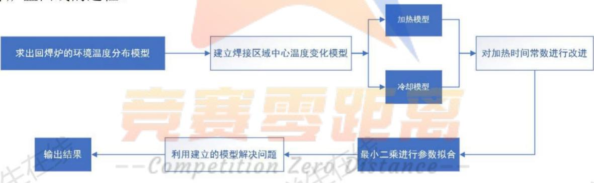
图1、整体模型算法流程图

## 5.1.3温度分布模型

由题目中的条件，当回焊炉启动后，炉内的空气会在很短时间内达到稳定状态，因而对于已经设置各小温区温度的回流炉中的温度分布问题，可以当做一个稳态传热问题来考虑。而对于不做特殊温度控制的各小温区的间隙部分和炉前区域，主要受相邻的温区温度的影响。对间隙温度分布作如下分析：

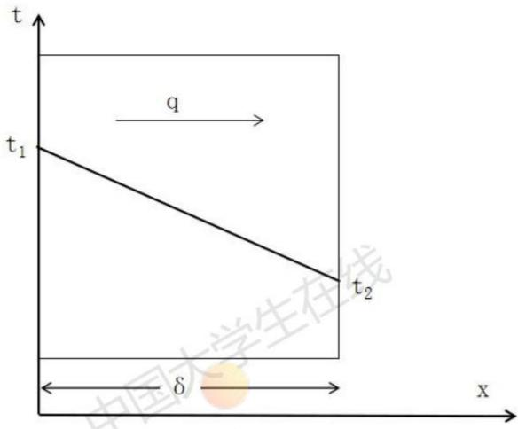
图2、平板稳态导热示意图

如图2所示，将间隙当做一块介质为空气的平板，在两侧表面 $\scriptstyle { \mathrm { X } } = 0$ 和 $\scriptstyle x = \delta$ 维持均匀恒定温度t1和t2，则平板内任意截面热流密度q相同。利用傅里叶定律，有

$$
\int _ { 0 } ^ { \delta } q d x = - \lambda \int _ { t _ { 1 } } ^ { t _ { 2 } } d t\tag{5-3}
$$

由此得到的热流密度后，导出温度分布为

$$
{ \frac { t - t _ { 2 } } { t _ { 1 } - t _ { 2 } } } = 1 - { \frac { x } { \delta } }\tag{5-4}
$$

可得平板内沿导热方向面积不变，热流密度不变，温度分布呈线性分布。所以在之后的模型中，我们认为在炉前区域和温区之间的间隙部分，温度应按线性分布。X

## 5.1.3焊接区域中心温度变化模型

对于回流炉中某个特定的功能温区，电路板在该区域中受热升温的模型如图3所示。由于电路板的长度或宽度远远大于电路板的厚度，我们认为电路板的升温主要受垂直方向的热流影响，将水平方向的热流影响忽略不计。由于电路板的材质一般为金属，导热系数很大，且题中所给的电路板厚度很薄，我们因此假设整块电路板的温度近似均匀分布。

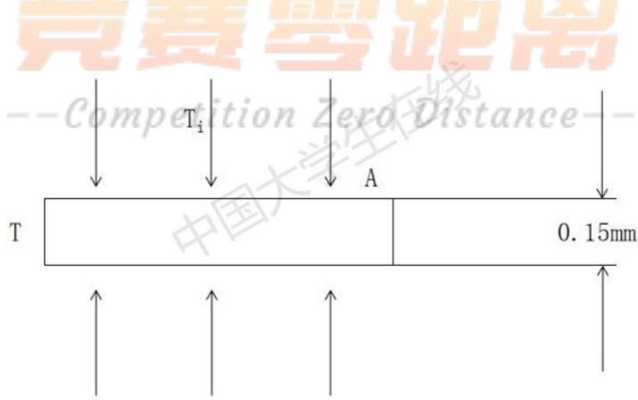
图3、回流炉中对流加热模型示意图

其中电路板的面积记为A，热源的温度为 ${ \mathrm { T } } _ { \mathrm { i } } ( { \mathrm { i } } { = } 1 , 2 , 3 , 4 , 5 )$ ，其中 i=1 时代表小温区1\~5，i=2 代表小温区6，i=3 代表小温区7，i=4代表小温区 $8 ^ { \sim } 9$ ，i=5 代表小温区$1 0 ^ { \sim } 1 1$ ，它们代表了各温区初始设定的温度值。电路板的温度即焊接区域中心温度为 $\mathrm { ~ T ~ } _ { \circ }$

由热流密度与电路板面积的乘积可以得到电路板吸收的能量，而电路板吸收的热能导致了整块电路板升温现象，列出等式：

$$
d Q = h A ( T _ { i } - T ) d t = \rho C _ { p } V d T\tag{5-5}
$$

其中h代表炉内空气与电路板的对流系数。对(5-5）式两边积分，并假设电路板初始的温度为T，加热一段时间后的温度为T。

$$
\int _ { 0 } ^ { t } \frac { h A } { \rho C _ { p } V } d t = - \int _ { T _ { s } } ^ { T _ { e } } \frac { d ( T _ { i } - T ) } { T _ { i } - T }\tag{5-6}
$$

解得

$$
\frac { T _ { \mathrm { e } } - T _ { s } } { T _ { i } - T _ { s } } { = } 1 - e ^ { - \frac { h A t } { \rho C _ { p } V } }\tag{5-7}
$$

$$
T _ { \mathrm { e } } = T _ { \mathrm { s } } + ( T _ { \mathrm { i } } - T _ { \mathrm { s } } ) ( 1 - e ^ { - \frac { h A t } { \rho C _ { p } V } } )\tag{5-8}
$$

我们令 $\tau = - \frac { \rho \mathrm { C } _ { p } V } { h A }$ 为加热的时间常数，将（5-8）式重写如下：

$$
T _ { \mathrm { e } } = T _ { \mathrm { s } } + ( T _ { i } - T _ { \mathrm { s } } ) ( 1 - e ^ { - t / \tau } )\tag{5-9}
$$

根据(5-9）式，由于题中已给出各个温区的分布，我们可以得到每个温区的温度和长度，由于已知传送带的传送速度，可以计算电路板在每个温区内的时间，因而可以计算电路板在经过每个温区后达到的温度。

对于小温区之间的间隙，我们将间隙划分为很小的区域，这样可以近似认为每个小区域内的温度保持恒定不变，那么我们也可以采用上式计算出电路板经过每个小区域后的温度，累加之后就可以计算电路板通过变温的间隙时所发生的温度变化。

考虑到电路板升温降温的机理可能有所差异，我们为降温过程另外选取一个模型进行计算。我们采用牛顿冷却公式建立模型。 XX

$$
\frac { d T } { d t } = - h ( T - T _ { i } )\tag{5-10}
$$

其中h为电路板与空气之间的对流系数

对上述微分方程进行差分处理，以方便编程计算，得到

$$
\frac { \Delta T } { \Delta t } = - h ( T - T _ { i } )\tag{5-11}
$$

将降温过程时间分为很小的时间段，使用可以通过已知的数据对这些参数进行拟合，求解出合适的数值。

## 5.2模型求解

## 5.2.1模型改进

在求解过程中发现了模型中的两个不足之处，因此对上述模型进行一些修改。

第一是在拟合降温时的温度曲线时发现，电路板在进入冷却区后（小温区 $1 0 ^ { \sim } 1 1 )$ 的降温速率并不是最大的，而是在过了一段时间之后才达到最大值，这与温度差越大降温速率越大的理论是不符合的。进行分析并查询相关资料后，我们认为可能是冷却区中第一个小温区的冷却能力不够强，导致炉内温度降低速率不够快，因而造成第一个小温区（小温区10）的边界附近温度受到回流区的温度影响，在边界附近炉内温度还处于较高水平，因而与电路板之间温差较小，从而降温速率较小；而后炉内温度逐渐降低，与电路板之间温差变大，因而导致降温速率在加快。我们考虑回流区的温度最多影响到第一个小温区的一半位置，将之前的区域使用与温区之间间隙同样的求解方法进行处理，能够比较好地拟合降温的温度曲线，从而证明了我们这个想法的正确性，拟合结果将在文中之后部分说明。 IX

第二是从文献[1]中发现之前定义的加热的时间常数τ，在工程热物理学中，被认为是一个具有时间量纲的热时间常数，是一个取决于诸多因素的函数，它反映了被加热物体（电路板）对热源温度的响应快慢，值越小则对温度响应越快，升温越快。它不仅仅取决于加热物体本身，也是可以受诸如喷嘴喷出的冲击射流气体与电路板间的热交换特性等因素影响，因而在加热过程中可能不是一个恒定的值。在原本的模型中，若我们保持τ的值不变，在电路板温度达到较高的时候（回流区时），此时电路板对环境温度的响应较慢，会出现峰值温度无法达到指定要求范围的情况，这就是因为没有考虑到热时间常数的变化所导致的。当温度升高时，热时间常数一般会变小，从而能够响应更高的环境温度。为了方便计算，我们在小温区 $1 ^ { \sim } 6$ 升温过程对应一个时间常数 $\tau _ { 1 }$ ，在小温区$7  { \mathrm { \sim } } 9$ 升温对应另一个时间常数 $\tau _ { 2 }$ ，利用（5-9）式，对题中给出的附件数据进行拟合。

## 5.2.2 模型求解与结果

通过题目中附件给出的数据，我们能够画出一条满足题中条件 $( \mathrm { T } _ { 1 } { = } 1 7 5 ^ { \circ } \mathrm { C } , \mathrm { T } _ { 2 } { = } 1 9 5 ^ { \circ }$ $C 、 T _ { 3 } = 2 3 5 ^ { \circ } C$ $\mathrm { T _ { 4 } { = } 2 5 5 ^ { o } C }$ $\mathrm { T _ { 5 } { = } 2 5 ^ { \circ } C }$ ，传送带的过炉速度为 $7 0 ~ \mathrm { c m / m i n } )$ 的炉温曲线。而若给定τ₁、τ，、h的值，我们根据上述的模型，也能够画出一条炉温曲线，并得到对应的 $\tau _ { \mathfrak { l } }$ $\tau _ { 2 }$ 数据。通过最小二乘法，来建立参数估计的模型。

$$
\left( \hat { \tau } _ { 1 } , \hat { \tau } _ { 2 } , \hat { h } \right) = \underset { \tau _ { 1 } , \tau _ { 2 } , h } { \arg \operatorname* { m i n } } \sum _ { n = 1 } ^ { N } \left[ T ( t _ { n } ; \tau _ { 1 } , \tau _ { 2 } , h ) - T _ { 0 } ( t _ { n } ) \right] ^ { 2 }\tag{5-12}
$$

其中 $T ( t _ { n } ; \tau _ { 1 } , \tau _ { 2 } , h )$ 代表给定三个参数值之后，对于每个时间点求出的炉温值。而 $T _ { 0 } ( t _ { n } )$ 代

通过搜索三个未知的系数来求解附件中给出的炉温曲线的最佳拟合方式。求解具体步骤大致为： --

STEP1:设置搜索 $\tau _ { \mathrm { l } } ,$ $\tau _ { 2 }$ 的步长均为0.1，而对于h的搜索步长设置为 $1 0 ^ { - 5 }$ i

STEP2:代入三个参数的初始值，通过上述模型进行求解得到整个过程的炉温数据；

STEP3:求解计算得到的炉温数据与附件给出的测量数据的误差，求出其平方和；

STEP4:重复上述步骤，在一定范围内搜索寻优找到能够实现对附件中给出的炉温曲线拟合最好的两个热时间常数和对流热系数。

通过上述的方法进行求解，得到的 $\tau _ { 1 } { = } 5 7 . 4 s$ $\tau _ { 2 } { = } 4 3 . 7 s$ $\mathrm { h } { = } 0 . 0 0 6 7 8 \mathrm { W / m m } ^ { 2 } \cdot \mathrm { ~ \textcircled ~ { ~ C ~ } ~ }$ 。得到的炉温曲线与附件中给出的炉温曲线如图4所示(其中升温之前一段水平是指刚进入炉前区域，此时环境温度仍保持在25℃左右，因此没有升温）。

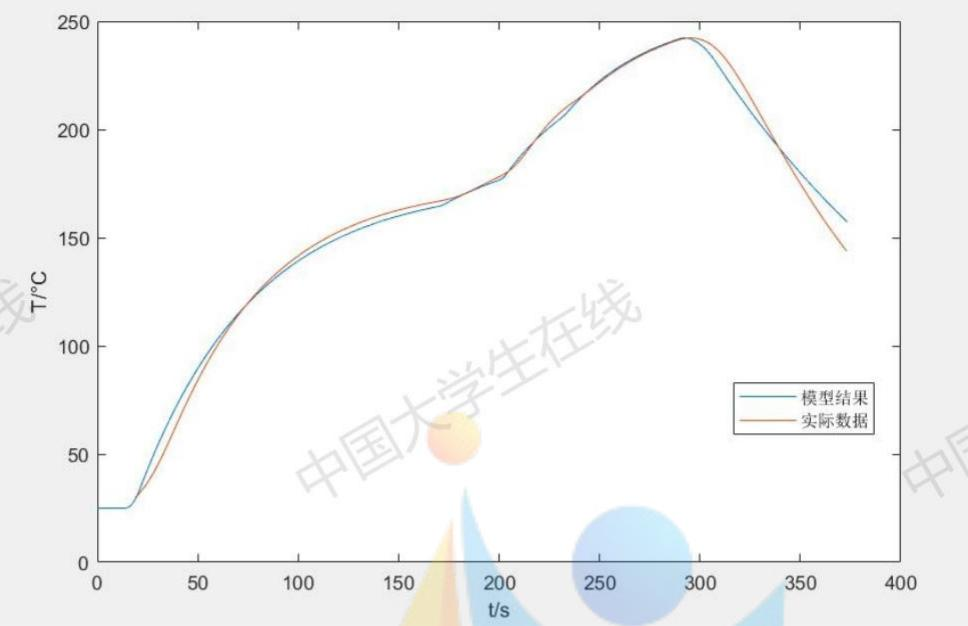
图4、拟合曲线与附件中数据给出曲线的比较情况

从图4中可以看到，在升温过程中，所得到的模型结果与实际数据中给出的炉温曲线拟合情况较好。但是在降温的过程中，温度下降的速度略慢于实际数据的下降速度，从而在曲线上有一些差异。鉴于题目中给出的制程界限，其中对温度下降速率有一定的限制，而我们的模型得到的曲线在降温的时候较为平缓，我们可以认为我们的模型也有合理之处，可以更好地满足这个下降速率的限制。

当传送带过炉速度更为 $7 8 \ \mathrm { c m / m i n }$ ，各温区温度的设定值更改为 $\mathrm { T } _ { 1 } { = } 1 7 3 ^ { \mathrm { o } } \mathrm { C } , \mathrm { T } _ { 2 } { = } 1 9 8 ^ { \mathrm { o } }$ $C , T _ { 3 } = 2 3 0 ^ { \circ } C , T _ { 4 } = 2 5 7 ^ { \circ } C , T _ { 5 } = 2 5 ^ { \circ } C$ 。将这些数据代入到我们的模型中进行计算，得到在该情况下的焊接区域中心温度变化曲线，即炉温曲线，如图5所示。

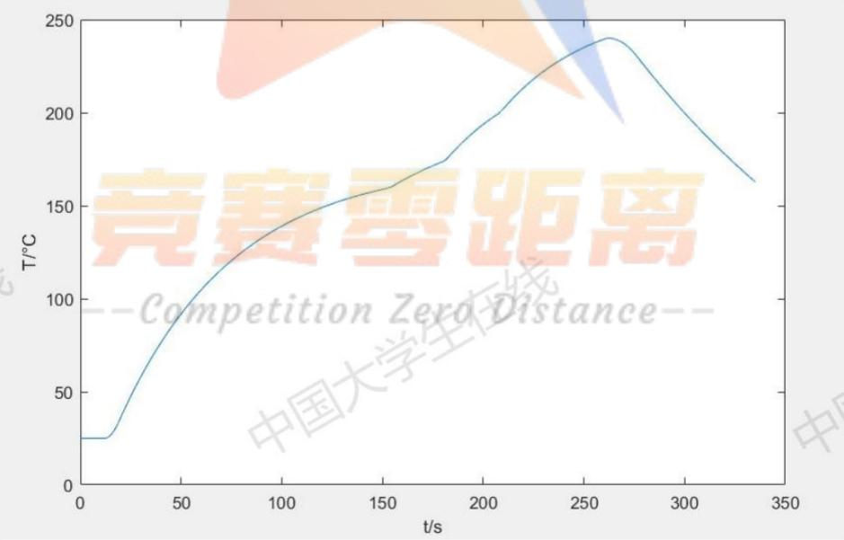
图5、第一问条件下的炉温曲线

该炉温曲线达到的峰值温度为 $2 4 2 . 2 8 3 2 ^ { \circ } \mathrm { C }$ ，且升温和降温的斜率都没有超过 $3 ^ { \circ } C / \mathrm { S }$ ，均符合制程限制中的条件。

对于题中所要求的几个特殊位置的温度值，结果如表一所示。

表1、几个特殊位置的炉温值表
<table><tr><td>位置</td><td>温度/℃</td></tr><tr><td>小温区3中点</td><td>129.0153</td></tr><tr><td>小温区6中点</td><td>163.9644</td></tr><tr><td>小温区7中点</td><td></td></tr><tr><td>小温区8结束处</td><td>207.8417</td></tr></table>

每隔0.5s焊接区域中心的温度存入了result.csv中，可以从我们提供的支撑材料中查看结果。

## 六、问题二模型建立与求解

## 6.1模型建立

在问题二中设定了各温区的温度分别为： $\mathrm { T _ { 1 } { = } 1 8 2 ^ { \circ } C }$ ， $\mathrm { T _ { 2 } { = } 2 0 3 ^ { \circ } C }$ $\mathrm { T } _ { 3 } { = } 2 3 7 ^ { \circ } \mathrm { C }$ $\mathrm { T } _ { 4 } { = } 2 5 4 ^ { \circ } \mathrm { C }$ $\mathrm { T } _ { 5 } { = } 2 5 ^ { \circ } \mathrm { C }$ 。在此条件下需要求出允许的最大传送带过炉速度ν。首先由题意可知，ν的调节范围是 $6 5 ^ { \sim } 1 0 0 \mathrm { c m / m i n }$ ，即：

$$
6 5 c m / \operatorname* { m i n } \le \nu \le 1 0 0 c m / \operatorname* { m i n }\tag{6-1}
$$

之后通过多重搜索法对允许的速度ν的最大值进行搜索。对于每一个搜索值，利用问题一中建立的模型，都可以得到焊接区域的温度变化规律。当前所得到的炉温需要满足如下的约束条件： 国

$$
\left| \frac { T _ { i } - T _ { i - 1 } } { \Delta t } \right| \leq 3\tag{6-2}
$$

$$
6 0 \leq t _ { 2 } - t _ { 1 } \leq 1 2 0\tag{6-3}
$$

$$
4 0 \leq t _ { 5 } - t _ { 3 } \leq 9 0\tag{6-4}
$$

$$
2 4 0 \leq T ( t _ { 4 } ) \leq 2 5 0\tag{6-5}
$$

其中， $T ( i )$ 表示对炉温曲线离散化处理之后第i时刻的温度， $\Delta t$ 表示对炉温曲线离散化的步长。 $t _ { 1 }$ $t _ { 2 }$ $t _ { 3 }$ $t _ { 4 }$ $t _ { 5 }$ 满足以下条件：

$$
T ( t _ { 1 } ) = 1 5 0\tag{6-6}
$$

$$
T ( t _ { 2 } ) = 1 9 0\tag{6-7}
$$

$$
T ( t _ { 3 } ) = T ( t _ { 5 } ) = 2 1 7\tag{6-8}
$$

$$
T ( t _ { 4 } ) = \mathrm { m a x } \big [ T ( t ) \big ]\tag{6-9}
$$

先设置较大的步长对ν进行搜索，找到满足约束条件的ν的最大值。再设置较小的步长，对那个最大值向后进行更精确的搜索，最终得到较准确的ν值。

## 6.2模型求解

我们运用多重搜索算法对传送带的过炉速度γ进行两次搜索，第一次得到过炉速度ν最大值的大致值，第二次在前面求得的最大值附近以更小的步长搜索，得到其精确值。STEP1 初步搜索

以1cm/min为步长，在[65cm/min,100cm/min]内进行搜索。对于每一个搜索值ν，利用问题一的模型，都可以得到一个对应的炉温曲线。之后判断此炉温曲线是否满足约束条件，若满足则将最大值更新，否则不更新。最终得到满足条件的传送带的过炉速度ν最大值为，由此进行第二次搜索。 学生

## STEP2 精确搜索

在[76cm/min,78cm/min]的范围内，以0.01cm/min为步长对ν的最大值进行搜索。最终得到满足条件的ν最大值为77.85cm/min。

此时的炉温变化曲线如下图6所示：

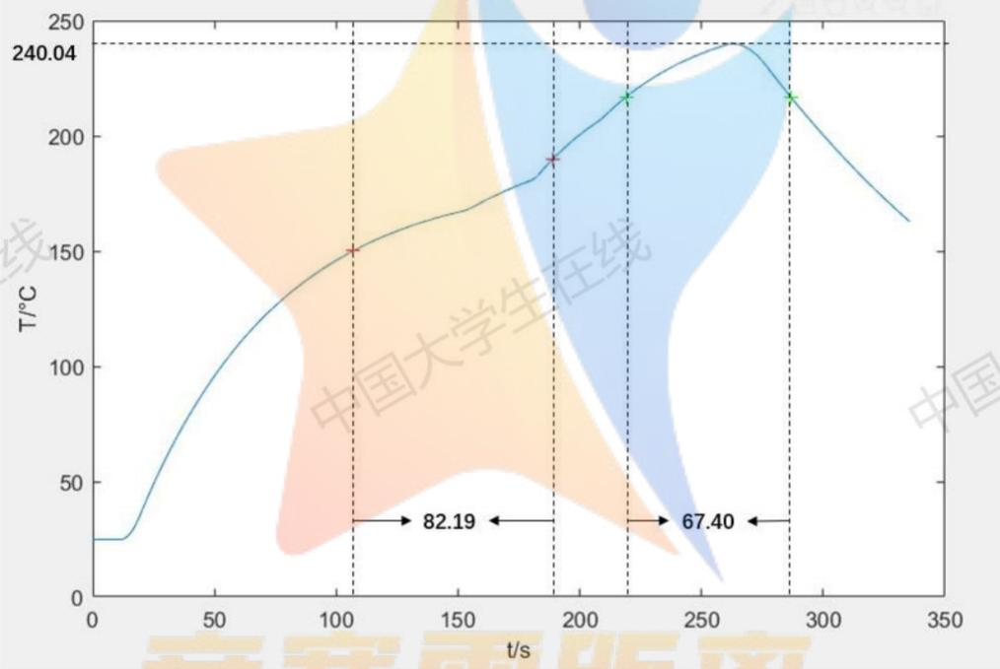
图6、过炉速度=77.85cm/min时的炉温曲线

得到的峰值温度约为240.04℃，得到温度上升过程中在 $1 5 0 ^ { \circ } \mathrm { C } - 1 9 0 ^ { \circ } \mathrm { C }$ 的时间为82.19S，温度大于 $2 1 7 \mathrm { { } ^ { \circ } C }$ 的时间为67.40S,最大的温度上升斜率和温度下降斜率均未超过 $\pm 3 ^ { \circ } C$ 的范围，均符合题目中的制程界限，可以认为77.85cm/min为此时最大的传送带过炉速度。

## 七、问题三模型建立与求解

## 7.1模型建立

问题三的优化目标是炉温曲线温度上升过程中超过217℃到峰值温度所覆盖的面积S取到最小值，如下图7中阴影部分所示，变量是各温区的设定温度 $\mathrm { T _ { i } }$ (i=1,2,3,4,5)和传送带过炉速度ν，共五个自变量。

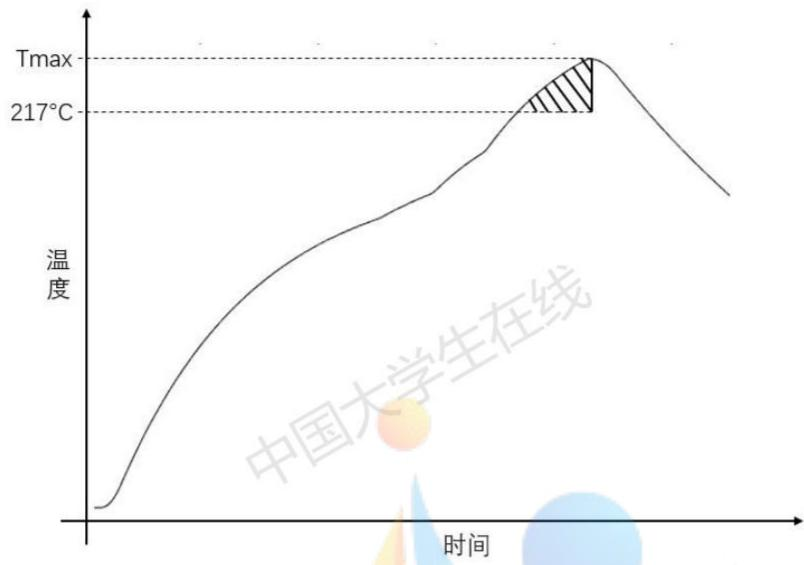
图7、峰值温度覆盖面积示意图

其中 S的计算公式为

$$
S = \int _ { t _ { 3 } } ^ { t _ { 4 } } T ( t ) d t - 2 1 7 ( t _ { 4 } - t _ { 3 } )\tag{7-1}
$$

根据题目中给出的制程界限以及各温区设定温度值与传送带过炉速度的限制范围，我们可以综合建立炉温曲线超过 $2 1 7 \mathrm { { } ^ { \circ } C }$ 到峰值温度覆盖面积的优化模型：

(7-2)

s.t.

$$
\begin{array} { r } { \mathbf { z } \equiv \mathbf { z } ^ { \prime \prime } \equiv \mathbf { z } ^ { \prime \prime } \mathbf { z } ^ { \prime \prime } , } \\ { \mathbf { z } \equiv \left[ \begin{array} { l } { \mathbf { \bar { z } } \mathbf { \bar { z } } \cdot \mathbf { z } \cdot \mathbf { z } ^ { \prime \prime } = \mathbf { z } } \\ { \mathbf { \bar { z } } \mathbf { \bar { z } } \cdot \mathbf { z } \cdot \mathbf { z } \cdot \mathbf { z } \mathbf { z } } \\ { \mathbf { \bar { z } } \mathbf { \bar { z } } \cdot \mathbf { z } \cdot \mathbf { z } \mathbf { z } \mathbf { z } } \\ { \mathbf { \bar { z } } \mathbf { \bar { z } } \cdot \mathbf { z } \cdot \mathbf { z } \mathbf { z } \mathbf { z } \mathbf { u } } \end{array} \right] } \\ { \mathbf { z } \equiv \mathbf { z } \equiv \mathbf { z } \cdot \mathbf { z } \cdot \mathbf { z } \cdot \mathbf { z } \equiv \mathbf { z } \cdot \mathbf { z } } \\ { \mathbf { z } \equiv \mathbf { z } \cdot \mathbf { z } \cdot \mathbf { z } \cdot \mathbf { z } \equiv \mathbf { z } \cdot \mathbf { z } \cdot \mathbf { z } \cdot \mathbf { z } } \\ { \mathbf { z } \equiv \mathbf { z } \cdot \mathbf { z } \cdot \mathbf { z } \cdot \mathbf { z } \mathbf { z } \mathbf { z } } \\ { \mathbf { z } \equiv \mathbf { z } \cdot \mathbf { z } \cdot \mathbf { z } \cdot \mathbf { z } \mathbf { z } \mathbf { z } } \\ { \mathbf { z } \mathbf { z } \cdot \mathbf { z } \cdot \mathbf { z } \mathbf { z } \mathbf { z } \cdot \mathbf { z } \mathbf { z } \mathbf { z } } \\ { \mathbf { z } \mathbf { z } \cdot \mathbf { z } \cdot \mathbf { z } \cdot \mathbf { z } \mathbf { z } \mathbf { z } } \\ { \mathbf { z } \mathbf { z } \cdot \mathbf { z } \cdot \mathbf { z } \mathbf { z } \cdot \mathbf { z } \mathbf { z } } \\ { \mathbf { z } \mathbf { z } \cdot \mathbf { z } \mathbf { z } \cdot \mathbf { z } \mathbf { z } \mathbf { z } } \\ { \mathbf { z } \mathbf { z } \cdot \mathbf { z } \mathbf { z } \cdot \mathbf { z } \mathbf { z } \mathbf { z } } \\ \end{array}
$$

其中 $\mathrm { t _ { 1 } . ~ t _ { 2 } . ~ t _ { 3 } . ~ t _ { 4 } . ~ t _ { 5 } }$ 仍然满足（6-6）到（6-9）式的要求。

## 7.2模型求解

## 7.2.1模拟退火算法

对于该优化模型，我们可以采用模拟退火智能算法来求解。

在利用模拟退火算法对该优化问题之前，我们先对该优化算法进行简述。模拟退火算法是一种基于蒙特卡洛迭代求解策略的随机寻优算法，出发点是基于固体物质的退火过程与一般组合优化问题之间的相似性。它是局部搜索算法的扩展，以一定的概率选择领域中目标值较大的状态，从而达到求解全局优化问题的目的。判断新解是否接受的依据一般为Metropolis准则：

1、若 $\Delta E < 0$ ，则接受新解；

2、否则接受新解的概率由下式确定：

$$
p = e ^ { - \Delta E / T }\tag{7-3}
$$

模拟退火算法的流程图如图8所示。

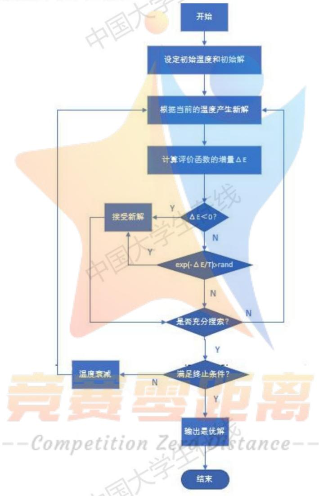
图8、模拟退火算法流程图

## 7.2.2模型结果

利用模拟退火算法对上述优化模型进行计算。选取迭代次数为20000次，得到迭代次数与优化目标的变化如下图9所示：

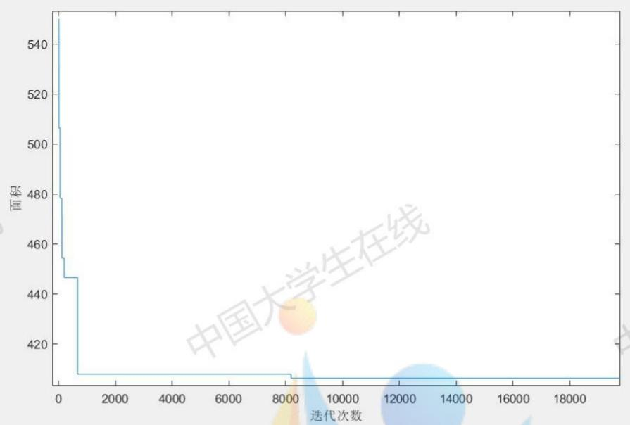
图9、优化目标值随迭代次数变化图

从图中可以看出，随着迭代次数的增加，优化目标先快速下降，而后变化逐渐趋缓，在迭代约8300次后优化目标已经达到比较好的结果。此时的炉温曲线超过 $2 1 7 \mathrm { { } ^ { \circ } C }$ 到峰值温度覆盖面积达到了最小值。各参变量的结果如表2所示。

表2、模拟退火求解结果表
<table><tr><td> $T _ { 1 } / { } ^ { \circ } \mathrm { C }$ </td><td> $T _ { 2 } / { } ^ { \circ } \mathrm { C }$ </td><td> $T _ { 3 } / { } ^ { \circ } \mathrm { C }$  </td><td> $T _ { _ 4 } / { } ^ { \circ } \mathrm { C }$   $\nu / { } ^ { \circ } C$ </td><td>面积S</td></tr><tr><td>184.2181</td><td>189.8133</td><td>227.5226 264.0700</td><td>90.0982</td><td>406.2318</td></tr></table>

在上述条件下，焊接区域中心的温度超过 $2 1 7 ^ { \circ } \mathrm { C }$ 的时间为53.49s，峰值温度为240.1371℃，满足题中“焊接区域中心的温度超过 $2 1 7 ^ { \mathrm { { o } } } \mathrm { { C } }$ 的时间不宜过长，峰值温度也不宜过高”的条件。

## 八、问题四模型建立与求解

## 8.1模型建立

在第三问的基础上，第四问要增加考虑要使得以峰值温度为中心线的两侧超过$2 1 7 \mathrm { { ^ \circ C } }$ 的炉温曲线应尽量对称的目标，首先为曲线超过 $2 1 7 \mathrm { { ^ \circ C } }$ 温度线部分的对称程度定义一个指标。 --

我们首先通过设定各小温区的温度以及传送带的过炉速度，能够得到一条确定的炉温曲线，能够得到温度到达 $2 1 7 \mathrm { { ^ \circ C } }$ 的两个边界时间 $\mathrm { t } _ { 3 }$ 和 $\mathrm { t } _ { 5 } ,$ ，满足（6-8）的要求。并能够得到取到最高温的时间，即上文中提到的 $^ { \mathrm { t } _ { 4 } , }$ 满足（6-9）的要求。然后，以 $\scriptstyle { \mathrm { t = t } } _ { 4 }$ 为对称轴，两边对称各取n组数据进行比较。n值的计算公式为

$$
n = f l o o r [ \left[ \left( t _ { 4 } - t _ { 3 } \right) + \left( t _ { 5 } - t _ { 4 } \right) \right] / \left( 2 \Delta t \right) ]\tag{8-1}
$$

其中 $\Delta t$ 代表所取的时间步长。

对称度通过两边对应点温度均方差来衡量，通过下式来计算：

$$
l = \frac { \displaystyle \sum _ { i = 1 } ^ { n } ( T ( t _ { + } ^ { i } ) - T ( t _ { - } ^ { i } ) ) ^ { 2 } } { n }\tag{8-2}
$$

其中 $T ( t _ { + } ^ { i } )$ 代表对称轴右侧距对称轴的第i组数据， $T { \left( t _ { - } ^ { i } \right) }$ 代表对称轴左侧距对称轴的第i组数据。

合理调整面积S和对称度指标1的数量级，将其调整至同一数量级大小，分别记为 $\hat { S }$ 牛和i，选取合适的权值考虑两者的影响程度，由此建立优化模型。 七兰

$$
\operatorname* { m i n } w _ { 1 } \hat { S } + w _ { 2 } \hat { l }\tag{8-3}
$$

s. t.

$$
\left\{ \begin{array} { l l } { - \frac { \lambda _ { 1 } - \lambda _ { 2 } } { 4 } \Bigg \vert \leq 3 } \\ { \quad \Bigg \vert \left( \begin{array} { l } { 1 } \\ { 0 \leq z _ { 2 } - z _ { 1 } < 1 / 1 2 0 } \\ { 0 \leq z _ { 1 } - z _ { 3 } \leq 0 } \\ { 0 \leq 0 . 5 \leq 1 / 1 2 0 } \\ { 1 \leq 0 . 0 5 \leq 1 / 1 5 2 0 } \\ { 1 \leq 0 . 5 \leq 1 \leq 1 . 0 5 } \\ { 1 \leq 1 . 0 5 \leq 2 0 } \\ { 1 \leq 1 . 0 5 \leq 2 . 5 \leq 2 5 } \\ { 2 2 5 . 5 \leq 2 4 5 } \\ { 2 4 5 . 5 \leq 1 . 0 0 } \\ { 1 \leq 1 . 5 \leq 1 . 0 0 } \end{array} \right. } \end{array} \right.
$$

## 8.2模型求解

同样使用上一问的模拟退火算法，仅需将原来的适应度函数改成上述的加权后的优化目标，将迭代次数设置为50000次，进行计算，得到迭代次数与加权后的优化目标值的变化关系图如图10所示。 学士

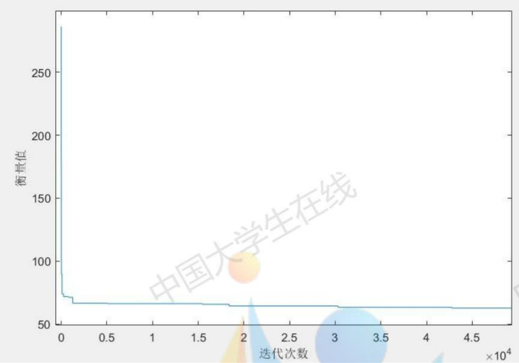
图10、加权后优化目标值随迭代次数变化图

可以看到加权后的优化目标值在开始迭代后迅速下降，之后降速趋缓，在迭代约43000次后得到最优解。得到各参变量的结果如表3所示。

表3、第四问模拟退火求解结果表
<table><tr><td>T/C  $T _ { 2 } / { } ^ { \circ } \mathrm { C }$ </td><td> $T _ { 3 } / { } ^ { \circ } \mathrm { C }$ </td><td> $T _ { 4 } / { } ^ { \circ } \mathrm { C }$   $\nu / { } ^ { \circ } C$ </td><td>面积 S</td><td>对称度l</td></tr><tr><td>183.5822 190.5021</td><td>227.1962</td><td>264.4834 90.1316</td><td>409.0650</td><td>21.6865</td></tr></table>

此时面积S与第三问中的最优解相差比较小，而对称度1经过对一些炉温曲线的估计之后发现此时达到的21.6865也处于比较好的水平。画出此时的炉温曲线如图11所示。可以发现，此时的炉温曲线在 $2 1 7 \mathrm { { } ^ { \circ } C }$ 以上的部分近似对称，在升温过程的斜率绝对值略小于降温过程的，但是此时两边对应点的均方差达到了很小的值，且炉温曲线超过$2 1 7 \mathrm { { } ^ { \circ } C }$ 到峰值温度覆盖面积也达到了较小的数值，因此这个求解结果还是比较好的。

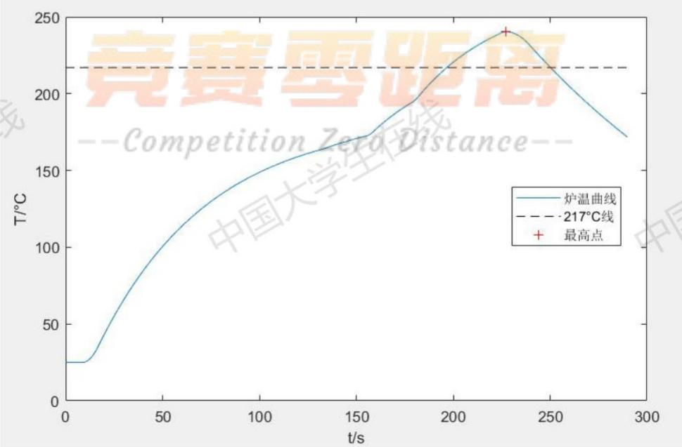

图11、第四问最优解炉温曲线示意图

## 九、模型评价与推广

## 9.1模型优点

1、在问题一中，我们选取了两个不同的方法来分别建立焊接区域中心的加热和冷却模型，使得我们的模型更加贴近实际。

2、问题二利用了多重搜索法，减少了运算量，可以较快地解决问题。

3、问题三和四我们利用了模拟退火算法，避免搜索结果进入局部最优解。

4、在求解模型时，我们设置时间步长为0.01s，取值较小，使得计算的精度更大。

## 9.2模型缺点与改进

1、没有考虑PCB板厚度，即热量从表面传热到中心的过程，对模型会产生一定的影响。 八

2、对于温度下降冷却阶段，曲线拟合较差，因为没有准确推导从高温区转到低温区的温度分布，导致拟合出现误差。

3、对于模拟退火算法解决的第三四两问，运算量较大，算法耗时较长，可能尚未搜寻到最优解，不能迅速准确地得到问题结果。

可能的改进方案首先是对于物理机理层面利用差分方程推导出环境的温度分布，以及PCB板表面到中心的温度分布。对于优化算法层面，可以使用改进的模拟退火或者遗传算法等一系列算法，提高运算速度，并且能够更加准确找到全局的一个最优解。

## 9.3 模型推广

本文对回焊炉中电路板的加热过程做了较为完整的分析，综合考虑了回焊炉中可能对炉温曲线带来影响的多种因素，包括热时间常数的变化以及区域间的温度影响等，因而对于实际操作控制有一定的借鉴意义。从文献中了解到在回焊炉加工的物品中加装温度传感器，实时测定焊接区域中心温度，并以此改变回焊炉各区域的温度设定以及过炉速度等，能够更好地满足电路板的加工要求，提高生产产品的质量，我们在本文中的研究能为这种技术的理论研究提供一些帮助。

## 十、参考文献

[1]高金刚，表面贴装工艺生产线上回流焊曲线的优化与控制[D]，上海交通大学，2007.

[2] J.Lempinen and A. Tuominen, "Evaluation of Reflow Ovens for Lead-Free Soldering," 20 06 25th International Conference on Microelectronics, Belgrade, 2006, pp. 609-612, doi: 10.1 109/ICMEL.2006.1651040. 国 国

[3]李友荣、吴双应、石万元、崔文智等，传热分析与计算[M]，中国电力出版社，2013.

[4]赵镇南传热学（第二版）[M]，高等教育出版社，2008.

[5]包子阳、余继周、杨杉智能优化算法及其MATLAB实例（第2版）[M]，电子工业出版社，2017.

## 附录：

```matlab
问题一：
function result=F(t,v,T1,T2,T3,T4)
%计算当前环境温度
%v:移动速度；Ti:第i个不同温区的温度；
t1=25/v；%炉前区域
t2=t1+(30.5*5+5*4)/v； %小温区1-5
t3=t2+(5+30.5)/v; %小温区6
t4=t3+(5+30.5)/v; %小温区7
t5=t4+(5*2+30.5*2)/v；% 小温区8-9
if(t<=t1-(T1-25)/20)
T=25;
elseif(t>t1-(T1-25)/20 && t<=t1)
T=175-(t1-t)/(T1-25)*20*150;
elseif(t>t1 && t<=t2)
T=T1;
elseif(t>t2 && t<=t2+5/v)
T=(t-t2)*v/5*(T2-T1)+T1;
elseif(t>t2+5/v && t<=t3)
T=T2;
elseif(t>t3 && t<=t3+5/v)
T=(t-t3)*v/5*(T3-T2)+T2;
elseif(t>t3+5/v && t<=t4)
T=T3;
elseif(t>t4 && t<=t4+5/v)
T=(t-t4)*v/5*(T4-T3)+T3;
elseif(t>t4+5/v && t<=t5)
T=T4;
elseif(t>t5 && t<=t5+20/v)
T=(t-t5)*v/20*(25-T4)+T4;
else 竞赛
T=25;
end
result=T; -
end
```

```matlab
function [result]=T(RC1,RC2,v,T1,T2,T3,T4,h)
```

%求解PCB板中心温度变化曲线函数

```matlab
for i=1:len
tn(i)=i*deltat;
end
T=linspace(25,25,len);
fori=2:len0
T(i)=T(i-1)+(F(tn(i),v,T1,T2,T3,T4)-T(i-1))*(1-exp(-deltat/RC1));
end
for i=len0+1:len1
T(i)=T(i-1)+(F(tn(i),v,T1,T2,T3,T4)-T(i-1))*(1-exp(-deltat/RC2));
end
for i=len1+1:len
T(i)=T(i-1)+(F(tn(i),v,T1,T2,T3,T4)-T(i-1))*h*deltat; 中国
end
result=T;
end
%第一问主函数
clear
clc
[Ts]=xlsread('D:\附件.xlsx',1,'B2:B710');
sum1=0;必
sum2=0;
minl=inf;
best2=0; best1=0; 中国
min2=inf;
best3=0;
deltat=0.01;
v=7/6;
len=floor(435.5/v/deltat);
tn=linspace(0,0,len);
for i=1:len
tn(i)=i*deltat;
end
for j=1:1000 中国
temp=T(0.1*j,50,7/6,175,195,235,255,0.005);
for i=1:len0
if(tn(i)>=19 && mod(i,50)==0)
sum1=sum1+(temp(i)-Ts((i-1850)/50))^2;
end
end
if(sum1<min1)
```

min1=sum1;
best1=0.1\*j;
end
sum1=0;
end
min=inf;
for j=1:1000
temp=T(best1,0.1\*j,7/6,175,195,235,255,0.005);
for i=len0+1:len1
学生 if(mod(i,50)==0)
sum1=sum1+(temp(i)-Ts((i-1850)/50))^2;
end 中国
end
if(sum1<min)
min=sum1;
best2=0.1\*j;
end
sum1=0;
end
forj=1:1000
temp=T(best1,best2,7/6,175,195,235,255,2e-3+5e-6\*j);
for i=len1+1:len
if(mod(i,50)==0)
sum2=sum2+(temp(i)-Ts((i-2100)/50))^2;
end
end
if(sum2<min2)
min2=sum2;
best3=2e-3+5e-6\*j;
end
sum2=0;
end
v=78/60;
len=floor(435.5/v/deltat)ieZero-
tn=linspace(0,0,len);
for i=1:len
tn(i)=i\*deltat;
end
result=T(best1,best2,v,173,198,230,257,best3);
plot(tn,result);

## 问题二：

```javascript
function result=check(deltat,v,T)
```

```matlab
0刀凹起口刊口凹示日
len2=floor(435.5/v/deltat);
len3=floor(339.5/v/deltat);
result=1；%符合条件为1，反之为0
cnt1=0;
cnt2=0;
cnt3=0;
cnt4=0;
for i=2:len3
if(grad<0 || grad>3)
result=0;
end
if(T(i)>=150&& T(i-1)<150)
cnt1=i;
end
if(T(i)>180 && T(i-1)<=180)
cnt2=i-1;
end
if(T(i)>217 && T(i-1)<=217)
cnt3=i;
end
end
for i=len3+1:len2
if(abs(grad)>3)
result=0;
end
if(T(i)<=217&& T(i-1)>217)
cnt4=i-1;
end
end
%判断在150°C~190°C的时间是否符合
if(deltat*(cnt2-cnt1)<601deltat*(cnt2-cnt1)>120)e
result=0;
end
%判断大于217°C的时间是否符合
if(deltat*(cnt4-cnt3)<40 || deltat*(cnt4-cnt3)>90)
result=0;
end
%判断峰值是否符合
if(T(len3)<240 || T(len3)>250)
result=0;
end
```

```matlab
% 第二问主函数
clear
clc
best=65;
%第一次搜素，步长1；
for i=1:100
v=i; 在线
result=T(57.4,43.7,v/60,182,203,237,254,0.00678);
if(check(0.01,v/60,result)==1)
best=v; 中国
end
end
%第二次搜素，步长0.01；
for i=1:200
v=best-1+0.01*i;
result=T(57.4,43.7,v/60,182,203,237,254,0.00678);
if(check(0.01,v/60,result)==1)
best=v;
end
end
问题三：
function [Bestv,BestT1,BestT2,BestT3,BestT4,trace,T m]=SAA(
%模拟退火算法
vmax=100;
vmin=65;
T1max=185;
T1min=165;
T2max=205;
T2min=185;
T3max=245;
T3min=225;
T4max=265;
T4min=225;
L=100;
K=0.98;
S=0.08;
T_m=100;
Yz=1E-6;
P=0;
trace=linspace(0,0,20000);
```

```matlab
f=1;
while(f==1)
Prev=rand*(vmax-vmin)+vmin;
PreT1=rand*(T1max-T1min)+T1min;
PreT2=rand*(T2max-T2min)+T2min;
PreT3=rand*(T3max-T3min)+T3min;
PreT4=rand*(T4max-T4min)+T4min;
temp=T(57.4,43.7,Prev/60,PreT1,PreT2,PreT3,PreT4,0.00678);
if(check(0.01,Prev/60,temp)==1)
学生 Prebestv=Prev; PrebestT1=PreT1;
PrebestT2=PreT3; 中
PrebestT4=PreT4;
f=0;
end
end
f=1;
while(f==1)
Prev=rand*(vmax-vmin)+vmin;
PreT1=rand*(T1max-T1min)+T1min;
PreT2=rand*(T2max-T2min)+T2min; 学
PreT3=rand*(T3max-T3min)+T3min;
PreT4=rand*(T4max-T4min)+T4min;
temp=T(57.4,43.7,Prev/60,PreT1,PreT2,PreT3,PreT4,0.00678);
if(check(0.01,Prev/60,temp)==1)
Bestv=Prev;
BestT1=PreT1;
BestT2=PreT2;
f=0;
end
end
deta=abs(func(Bestv,BestT1,BestT2,BestT3,BestT4)-func(Prebestv,P1
1,PrebestT2,PrebestT3,PrebestT4));
while(deta>Yz) && (T m>0.001) && (P<20000) 中
T m=K*T m;
for i=1:L
p=0;
while p==0
Nextv=rand*(vmax-vmin)+vmin;
NextT1=rand*(T1max-T1min)+T1min;
NextT2=rand*(T2max-T2min)+T2min;
```

```csv
NextT3=rand*(T3max-T3min)+T3min;
NextT4=rand*(T4max-T4min)+T4min;
temp=T(57.4,43.7,Nextv/60,NextT1,NextT2,NextT3,NextT4,0.00678);
m=check(0.01,Nextv/60,temp);
if(Nextv>=vmin && Nextv<=vmax && NextT1>=T1min && NextT1<=T1max
&&NextT2>=T2min && NextT2<=T2max && NextT3>=T3min && NextT3<=T3max &&
NextT4>=T4min && NextT4<=T4max &&m==1)
end p=1;
end 一大学
```

```matlab
if(func(Bestv,BestT1,BestT2,BestT3,BestT4)>func(Nextv,NextT1,NextT2,Nex
tT3,NextT4))
Prebestv=Bestv;
PrebestT1=BestT1;
PrebestT2=BestT2;
PrebestT3=BestT3;
PrebestT4=BestT4;
Bestv=Nextv;
BestT1=NextT1;
BestT2=NextT2;
BestT3=NextT3;
BestT4=NextT4;
end
```

```matlab
if(func(Prev,PreT1,PreT2,PreT3,PreT4)>func(Nextv,NextT1,NextT2,NextT3,N
extT4))
Prev=Nextv;
PreT1=NextT1;
PreT2=NextT2;
PreT3=NextT3;
PreT4=NextT4;
P=P+1
else
```

change=-(func(Prev,PreT1,PreT2,PreT3,PreT4)-func(Nextv,NextT1,NextT2,Ne
xtT3,NextT4))/T\_m;
p1=exp(change);
if(p1>rand)
Prev=Nextv;
PreT1=NextT1;
PreT2=NextT2;
PreT3=NextT3;

```matlab
PreT4=NextT4;
P=P+1;
end
end
trace(P)=func(Bestv,BestT1,BestT2,BestT3,BestT4);
end
deta=abs(func(Bestv,BestT1,BestT2,BestT3,BestT4)-func(Prebestv,PrebestT
1,PrebestT2,PrebestT3,PrebestT4));
end
end 大学
```

```matlab
function result=func(v,T1,T2,T3,T4)
%计算面积
Tt=T(57.4,43.7,v/60,T1,T2,T3,T4,0.00678);
maxT=max(Tt);
len5=length(Tt);
cnt1=0;
cnt2=0;
sum=0;
for i=2:len5
if(Tt(i-1)<=217 && Tt(i)>217)
cnt1=i;
end
if(Tt(i)==maxT)
cnt2=i;
end
end
for i=2:len5
if( i>=cnt1 && i<=cnt2-1)
sum=sum+0.01*(Tt(i)-217);
end
end
result=sum;
end
```

## 问题四：

```matlab
function result=func2(v,T1,T2,T3,T4)
% 计算对称度
Tt=T(57.4,43.7,v/60,T1,T2,T3,T4,0.00678);
cnt1=0;
cnt2=0;
cnt3=0;
```

```matlab
maxT=max(Tt);
len=length(Tt);
for i=2:len
if(Tt(i-1)<=217 && Tt(i)>217)
cnt1=i;
end
if(Tt(i-1)>217 && Tt(i)<=217)
cnt3=i-1;
end
if(Tt(i)==maxT) cnt2=i;
end
end
n=floor(((cnt2-cnt1)+(cnt3-cnt2))/2);
sum=0;
for i=1:n
sum=sum+(Tt(cnt2-i)-Tt(cnt2+i))^2;
end
result=sum/n;
end
面积与对称度统一数量级赋权值
m1=func(v,T1,T2,T3,T4);
m2=func2(v,T1,T2,T3,T4);
result=0.1*m1+m2;
end
第四问的主函数仅需将第三问之中 SAA 函数中的适应度函数 func 改成 func3即
学
```