# 基于一维热传导方程的回焊炉炉温模型

## 摘要

如何建立温度变化模型准确描述回焊炉工作过程，保证电路板焊接过程顺利进行，是实际生产环节面临的一大问题。本文结合实际情况对回焊炉工作状态作出合理假设，建立炉内温度一维热传导模型。在满足制程界限约束条件下，利用启发式算法搜索各温区温度设定，确定最优过炉速度以使回焊炉工作效率最大化。引入炉温曲线特性衡量指标，运用分层序列法求解多目标多变量规划问题，为实际生产与测试提供理论参考。

针对问题一由于炉内空气温度在启动后的短时间内达到稳定，根据一般热传导方程可推出小温区间隙温度分布具有 $T ( x ) = m x + n$ 的线性形式。根据合理假设，使用一维均匀介质热传导方程组描述元件与炉腔热传导过程，得出元件温度分布函数 $T = T ( x , t )$ 。利用有限差分法求得方程数值解，并根据附件提供的实际炉温曲线分段拟合方程中 $\alpha , k , h$ 参数。为简化模型求解，假设各温区参数 $k _ { i } , h _ { i }$ 相等，仅考虑参数 $\alpha _ { i }$ 的不同，得出模型最优参数为： $h = 1 4 . 4 5 8 \mathrm { ~ W / ( m ^ { 2 } \cdot K ) }$ $k = 1 . 6 7 \times 1 0 ^ { - 6 } \ \mathrm { W } / ( \mathrm { m } \cdot \mathrm { K } ) , \alpha = \left| 4 . 4 3 7 \quad \mathrm { 5 . 6 2 1 } \quad 7 . 4 4 9 \quad 4 . 9 9 7 \quad 2 . 4 0 1 \right| \times 1 0 ^ { - 1 1 } \ \mathrm { m } ^ { 2 } / \mathrm { s }$ 。将参数代回原方程并结合问题一条件，求出元件焊接过程中温度变化曲线，计算出小温区3、6、7中点及小温区8结束处焊接区域中心温度分别为 $\mathbf { 1 2 9 . 1 0 0 7 ^ { \circ } C }$ $\mathbf { 1 6 6 . 8 9 8 2 ^ { \circ } C }$ $\mathbf { 1 8 8 . 6 5 4 7 ^ { \circ } C , 2 2 2 . 6 2 5 2 ^ { \circ } C } \mathrm { ~ , ~ }$

针对问题二在大温区温度已知、制程界限给定的前提下确定元件最大过炉速度，实质上是非线性约束条件下的单目标单变量规划求解问题。使用问题一建立的元件温度变化模型，并将约束条件进行离散化处理，先在题设提供的速度区间中进行大致搜索，后反复减小步长和搜索区间，最终得到最大过炉速度为：80.068 cm/min。

针对问题三根据问题三要求与制程界限约束，将该问题转换为关于温区温度和过炉速度的单目标多变量最优化问题并使用遗传算法(Genetic Algorithm) 求解。我们基于MATLAB的GA工具箱进行算法的编程实现。考虑到算法具有一定的随机性，我们还进行了多次独立求解及算法参数调整，最终确定最优解为： $\mathbf { 1 7 0 . 5 5 1 8 ^ { \circ } C }$ (小温区1～5)、 $\mathbf { 1 8 5 . 0 3 3 1 ^ { \circ } C }$ (小温区 6)、 $\mathbf { 2 2 5 . 6 9 4 6 ^ { \circ } C }$ (小温区7) 和 $\mathbf { 2 6 5 . 0 0 0 0 ^ { \circ } C }$ (小温区 $8 \sim 9 )$ ，传送带过炉速度86.1056 cm/min，阴影部分面积为$\mathbf { 4 8 3 . 5 6 3 2 ^ { \circ } C \cdot s }$ 中国

针对问题四 该问题需同时考虑曲线的特定区域的面积最小及对称性偏差最小，可将该问题转换为复杂约束条件下的多目标优化问题。本文采用分层序列法的思想，在问题三使用的传统遗传算法的基础上，提出接力进化的遗传算法来进行寻解，并设置指标对潜在解进行二次筛选，最终确定最优解为： $\mathbf { 1 6 9 . 4 1 0 6 ^ { \circ } C }$ (小温区 $1 \sim 5 )$ $\mathbf { 1 8 5 . 0 2 4 3 ^ { \circ } C }$ (小温区 6)、 $\mathbf { 2 2 5 . 3 0 9 2 ^ { \circ } C }$ (小温区7)和 $\mathbf { 2 6 5 . 0 0 0 0 ^ { \circ } C }$ (小温区 $8 \sim 9 )$ ，传送带过炉速度 $\mathbf { 8 5 . 6 7 3 5 ~ c m / m i n }$ ，对应的面积指标 ${ \boldsymbol { s } } =$ $4 8 3 . 5 7 6 5 ^ { \circ } \mathbf { C } \cdot \mathbf { s } ,$ 对称程度指标 $\begin{array} { r } { E = 9 . 9 9 0 4 ~ \mathrm { K } . } \end{array}$ 新Ux

关键词 一维热传导方程 Genetic Algorithm 多变量非线性规划 分层序列法

--Competition ZexoDistance--

## 1 问题重述

## 1.1 问题背景

印刷电路板(PCB)回流焊工艺是电路板制造过程中重要的一环。在回流焊工艺中，为避免因炉温过高或不足对元件造成损坏，需要使用温度传感器实时检测焊接过程中元件中心温度的变化情况[1]。通常情况下，由于回流焊炉的加热种类、热电偶放置位置等因素存在一定差异，需要通过实验标定元件焊接时的炉温曲线，并根据该曲线设置特定的加热环境，从而生产出品质较高的产品。然而在实际生产中，通过实验来标定曲线花费的成本较大，如何构建出元件焊接过程中的温度变化模型来较为准确地模拟特定加热环境的炉温曲线，已成为研究的一个重要课题。

## 1.2 问题提出 (题目重述)

在集成电路板等电子产品生产中，需要把装有各种电子元件的印刷电路板放置在回焊炉中，通过加热将电子元件自动焊接到电路板上。回焊炉内部设置若干个小温区，它们从功能上可分成4个特定温区:预热区、恒温区、回流区、冷却区。电路板两侧搭在传送带上匀速进入炉内进行加热焊接。

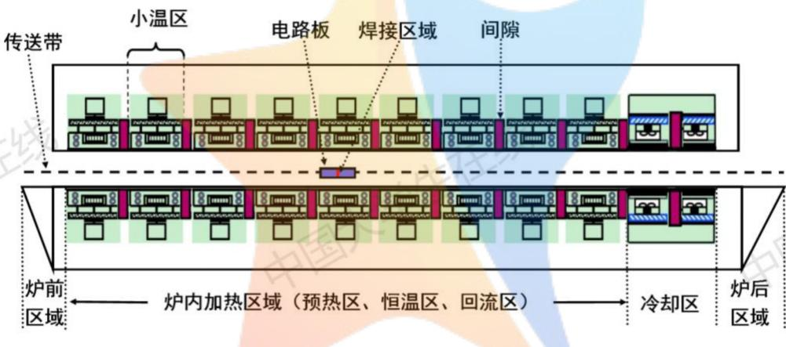  
图1:回焊炉截面示意图

如图1所示，在某个具有11个小温区的回焊炉中，每个小温区长度为30.5cm，相邻小温区之间有5 cm的间隙，炉前区域和炉后区域长度均为 $2 5 ~ \mathrm { c m } _ { \circ }$ 回焊炉启动后，炉内空气温度需在短时间内达到稳定之后进行焊接工作。在炉前区域、炉后区域以及小温区之间的间隙处，其温度与相邻温区的温度有关，各温区边界附近的温度也可能受到相邻温区温度的影响。另外，生产车间的温度保持在 $2 5 ^ { \circ } \mathrm { C } _ { \circ }$ 在设定各温区的温度和传送带的过炉速度后，可以通过温度传感器测试元件焊接区域中心的温度，称之为炉温曲线。焊接区域的厚度为0.15mm。温度传感器在焊接区域中心的温度达到 $3 0 ^ { \circ } \mathrm { C }$ 时开始工作，电路板进入回焊炉开始计时。各温区初始时设定的温度分别为 $1 7 5 ^ { \circ } \mathrm { C }$ (小温区 $1 \sim 5 ) , 1 9 5 ^ { \circ } \mathrm { C }$ (小温区 6)、 $2 3 5 ^ { \circ } \mathrm { C }$ (小温区7)、 $2 5 5 ^ { \circ } \mathrm { C }$ (小温区8～9)及 $2 5 ^ { \circ } \mathrm { C }$ (小温区10～11)；传送带的过炉速度为70cm/min。在上述设定温度的基础上，各小温区设定温度可以进行 $\pm 1 0 ^ { \circ } \mathrm { C }$ 范围内的调整。调整时要求小温区 $1 \sim 5$ 中的温度保持一致，小温区 $8 \sim 9$ 中的温度保持一致，小温区 $1 0 \sim 1 1$ 中的温度保持$2 5 ^ { \circ } \mathrm { C } _ { \mathrm { { \odot } } }$ 传送带的过炉速度调节范围为 $6 5 \sim 1 0 0 ~ \mathrm { c m / m i n }$ 。在回焊炉电路板焊接生产中，炉温曲线应满足一定的要求，称为制程界限，见表1。

<table><tr><td rowspan=1 colspan=1>界限名称                       最低值 最高值 单位</td></tr><tr><td rowspan=1 colspan=1>温度上升斜率                       0         3      $^ { \circ } \mathrm { C } / \mathrm { s }$ </td></tr><tr><td rowspan=1 colspan=1>温度下降斜率                       -3       0      $^ { \circ } \mathrm { C } / \mathrm { s }$ </td></tr><tr><td rowspan=1 colspan=1>温度上升过程中在 $1 5 0 ^ { \circ } \mathrm { C } \sim 1 9 0 ^ { \circ } \mathrm { C }$ 的时间     60       120      S</td></tr><tr><td rowspan=1 colspan=1>温度大于 $2 1 7 ^ { \circ } \mathrm { C }$ 的时间                40       90       s</td></tr><tr><td rowspan=1 colspan=1>峰值温度                         240      250     °C</td></tr></table>

表1:制程界限

根据上述条件，需要研究以下四个问题:

(1)给定传送带过炉速度为 $7 8 ~ \mathrm { c m / m i n }$ 各温区温度的设定值分别为 $1 7 3 ^ { \circ } \mathrm { C }$ (小温区 $1 \sim 5 ) , 1 9 8 ^ { \circ } \mathrm { C }$ (小温区 6)、 $2 3 0 ^ { \circ } \mathrm { C }$ (小温区7)和 $2 5 7 ^ { \circ } \mathrm { C }$ (小温区 $8 \sim 9 )$ ，要求建立数学模型并给出焊接区域中心的温度变化情况，列出小温区3、6、7中点及小温区8结束处焊接区域中心的温度，画出相应的炉温曲线，并将每隔0.5s焊接区域中心的温度存放在相应文件中。

(2) 给定各温区温度的设定值分别为 $1 8 2 ^ { \circ } \mathrm { C }$ $2 0 3 ^ { \circ } \mathrm { C }$ (小温区6)、 $2 3 7 ^ { \circ } \mathrm { C }$ (小温区 7)、$2 5 4 ^ { \circ } \mathrm { C }$

(3) 在焊接过程中，理想的炉温曲线应使超过 $2 1 7 ^ { \circ } \mathrm { C }$ 到峰值温度所覆盖的面积最小。要求确定在此条件下的最优炉温曲线，以及各温区的设定温度和传送带的过炉速度，并给出相应的面积。

(4)在焊接过程中，除满足制程界限外，以峰值温度为中心线的两侧超过 $2 1 7 ^ { \circ } \mathrm { C }$ 的炉温曲线还应尽量对称。要求在问题3的基础上，进一步给出最优炉温曲线，以及各温区设定的温度及传送带过炉速度，并给出相应的指标值。 中国

## 2 模型假设

1.仅考虑热传导和热对流对元件焊接区域中心温度的影响

2. 假设元件在回焊炉中运动过程不影响炉腔内温度分布

3.假设各个小温区中心保持恒温，回焊炉达到稳定工作状态后温度分布不再改变

4. 假设元件为材质处处均匀的带厚度无限大平板，内部不含热源n ce一

## 3 符号说明

表2列出了本文需要的符号。

<table><tr><td>符号</td><td>符号描述</td><td>单位</td></tr><tr><td> $d$ </td><td>焊接区域厚度</td><td>mm</td></tr><tr><td> $T _ { i }$ </td><td>炉内大温区温度分布函数  $i ( i = 1 , 2 , . . . 5 )$ </td><td>K</td></tr><tr><td> $T ( x , t )$ </td><td>元件温度分布函数</td><td>K</td></tr><tr><td> $t$ </td><td>元件过炉时间</td><td>S</td></tr><tr><td> $v$ </td><td>元件过炉速度</td><td> $\mathrm { { c m } / \mathrm { { m i n } } }$ </td></tr><tr><td> $v _ { m i n }$ </td><td>满足制程界限的最小过炉速度</td><td> $\mathrm { c m / m i n }$ </td></tr><tr><td> $v _ { m a x }$  主在线</td><td>满足制程界限的最大过炉速度</td><td> $\mathrm { c m / m i n }$ </td></tr><tr><td> $\Delta t$ </td><td>网格t坐标轴方向步长</td><td>s</td></tr><tr><td> $\Delta x$ </td><td>网格  $x$  坐标轴方向步长</td><td>mm</td></tr><tr><td> $t _ { m }$ </td><td>网格t 坐标轴上限 国</td><td>中国大</td></tr><tr><td> $w _ { i , j }$ </td><td>编号为  $( i , j )$  的网格对应温度值</td><td> $\mathrm { K }$ </td></tr><tr><td>α</td><td>介质热扩散率</td><td> $\mathrm { m ^ { 2 } / s }$ </td></tr><tr><td>k</td><td>导热系数</td><td> $\mathrm { W } / ( \mathrm { m } \cdot \mathrm { K } )$ </td></tr><tr><td>h</td><td>表面传热系数</td><td> $\mathrm { W } / ( \mathrm { m } ^ { 2 } \cdot \mathrm { K } )$ </td></tr><tr><td>f(t)</td><td>焊接区域中心温度函数</td><td> $\mathrm { K }$ </td></tr><tr><td>S</td><td>炉温曲线中超过  $2 1 7 ^ { \circ } \mathrm { C }$  到峰值温度所覆盖的面积</td><td> $^ { \circ } \mathrm { C } \cdot \mathrm { s }$ </td></tr><tr><td>E</td><td>对称偏差函数</td><td>K</td></tr><tr><td> $T _ { p }$ </td><td>峰值温度</td><td>K</td></tr><tr><td> $t _ { p }$  主在线</td><td>温度达到峰值的时间</td><td>S</td></tr><tr><td> $t _ { s }$ </td><td>温度第一次达到  $2 1 7 ^ { \circ } \mathrm { C }$  的时间</td><td>S</td></tr><tr><td> $\Delta t _ { \{ 4 2 3 . 1 5 \mathrm { K } \leq T \leq 4 6 3 . 1 5 \mathrm { K } \} }$ </td><td>温度上升过程中在  $1 5 0 ^ { \circ } \mathrm { C } \sim 1 9 0 ^ { \circ } \mathrm { C }$  的时间</td><td>中国大</td></tr><tr><td> $\Delta t _ { \{ T > 4 9 0 . 1 5 \mathrm { K } \} }$ </td><td>的时间 温度大于  $2 1 7 ^ { \circ } \mathrm { C }$ </td><td></td></tr><tr><td> $d _ { i }$ </td><td>小温区编号  $i ( i = 1 , 2 , \dots 1 1 )$ </td><td></td></tr><tr><td> $D _ { i }$ </td><td>大温区编号  $i ( i = 1 , 2 , \dots 5 )$ </td><td></td></tr></table>

表2: 符号说明

## 4 问题分析

## 4.1 问题一分析

问题一需要结合回焊炉工作参数，建立一维热传导方程模型计算焊接区域中心点处温度变化[2]。考虑方程中的热学参数待定，需要根据附件所给数据进行参数拟合，我们绘出了该元件在初始设定工作参数下焊接中心区域的温度变化曲线，如图2所示。为便于说明，现定义小温区 $1 \sim 5$ 为预热区 $D _ { 1 }$ 小温区6为恒温区 $D _ { 2 }$ 、小温区7为升温区 $D _ { 3 }$ 、小温区 $8 \sim 9$ 为回流区 $D _ { 4 }$ 、小温区 $1 0 \sim 1 1$ 为冷却区 $D _ { 5 }$ 。

由图中可知，在经过不同的大温区时，元件的温度曲线出现明显转折，且大温区内部设定的炉温保持一致，因此可假设 $D _ { 1 } \sim D _ { 5 }$ 内部模型参数相等，从而对元件温度曲线进行分段拟合处理。具体需要:

1.合理简化实际情况，列出热传导方程（组），确定边界条件。

2.采用合理的方法解方程，并分段求出各个温区对应的热学参数，使得模型预测结果与附件所给结

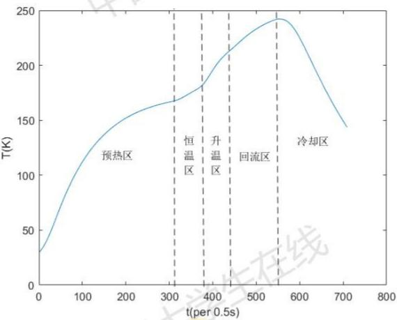  
图 2: 实际炉温曲线

果之间的均方根误差最小。

3.代入问题一所给的各温区温度和过炉速度,计算炉温曲线。

## 4.2 问题二分析

在问题二中，需在制程界限约束条件下确定出元件最大的过炉速度，以实现最优的经济效益。其中已给定预热区 $D _ { 1 }$ 温度 $1 8 2 ^ { \circ } \mathrm { C }$ 恒温区 $D _ { 2 }$ 温度 $2 0 3 ^ { \circ } \mathrm { C } .$ 升温区 $D _ { 3 }$ 温度 $2 3 7 ^ { \circ } \mathrm { C }$ 、回流区 $D _ { 4 }$ 温度$2 5 4 ^ { \circ } \mathrm { C } ,$ 故只有元件传送速度影响元件炉温曲线的变化。该问题可转换为非线性约束条件下的单目标单变量规划求解问题，根据问题一中建立的元件温度变化模型，在速度区间的大致范围内利用MATLAB搜索即可得到问题结果。 中国 中国

## 4.3 问题三分析

问题三要求确定各个大温区的温度 $T _ { i } ( i = 1 , 2 , 3 , 4 )$ 以及元件过炉速度v，使炉温曲线上温度高于 $2 1 7 ^ { \circ } \mathrm { C }$ 到峰值之间所围面积S最小，该区域包括的面积如图3中阴影部分所示。由于我们已经构建出元件温度变化模型 $T ( x , t )$ ，该问题可转换为关于温区温度和过炉速度的单目标多变量 $( T _ { i } , v ) , ( i =$ 1,2,3,4)最优化问题。由于该规划问题变量较多且关系复杂，拟采用启发式搜索算法如遗传算法等方法进行求解。X

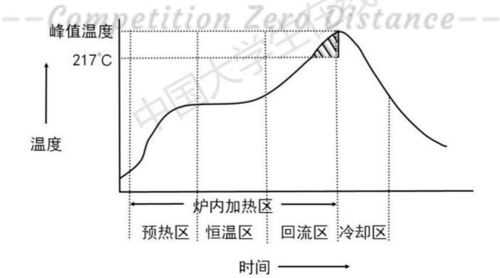  
图3:所围面积S示意图

## 4.4 问题四分析

在问题三的基础上，问题四要求以峰值温度为中心线的两侧超过 $2 1 7 ^ { \circ } \mathrm { C }$ 的炉温曲线尽量对称。为衡量曲线两侧的对称程度，我们基于峰值两侧对称数据的差异建立了刻画曲线对称性的数学模型，同时问题三中要求特定区域面积最小，因此这个问题本质上可以转化为多目标多变量的规划问题。针对多目标非线性规划问题，通常有线性加权法、分层求解法等解法。在本文中，我们拟采用分层序列法进行规划求解。

## 5 模型建立

假设进入回焊炉前元件均为室温，并且进入炉中的任意时刻均可以看作无限大带厚度均匀材质平板，它通过上下表面与温区进行对流换热，如图4所示： 国大

<table><tr><td rowspan=1 colspan=1>1.5大温区Di 175C</td><td rowspan=1 colspan=1>x厚度方向</td></tr><tr><td rowspan=1 colspan=1>0.5工件内部 T(x,t)</td><td rowspan=1 colspan=1>前进方向</td></tr><tr><td rowspan=1 colspan=1>-4      -3     -2     -1-0.5</td><td rowspan=1 colspan=1>1      2      3      4在线</td></tr><tr><td rowspan=1 colspan=1>大温区 Di 175℃ -1.5</td><td rowspan=1 colspan=1></td></tr></table>

图 4: 模型示意图

## 5.1热传导方程的建立

根据物理知识，在内部无热源的无限大均匀平面介质中[3]，有

$$
\frac { \partial { T } ^ { ? } } { \partial t } = \frac { k } { c \rho } \frac { \partial ^ { 2 } { T } } { \partial x ^ { 2 } }\tag{1}
$$

记 $\alpha = { \frac { k } { c \rho } }$ ，称为介质的热扩散率，则大温区 $D _ { i }$ 中的一维热传导方程又可记为

$$
\frac { \partial T } { \partial t } = \alpha _ { i } \frac { \partial ^ { 2 } T } { \partial x ^ { 2 } } \qquad \left( i = 1 , 2 , . . . , 5 \right)\tag{2}
$$

## 5.2边界条件的确定与模型的建立

由于不考虑热辐射的影响，在本题中，我们只需要考虑工件上下表面与外界环境的对流换热。因此，可以写出如下一维介质热传导方程组：

$$
\left\{ \begin{array} { l } { \displaystyle T = T ( x , t ) } \\ { \displaystyle \frac { \partial T } { \partial t } - \alpha _ { i } \frac { \partial ^ { 2 } T } { \partial x ^ { 2 } } = 0 \qquad ( i = 1 , 2 , \dots , 5 ) } \\ { - k _ { i } \left. \frac { \partial T } { \partial x } \right| _ { x = - \frac { d } { 2 } } + h _ { i } T | _ { x = - \frac { d } { 2 } } = h _ { i } T _ { i } \qquad ( i = 1 , 2 , \dots , 5 ) } \\ { \displaystyle \left. \frac { h } { k _ { i } } \frac { \partial T } { \partial x } \right| _ { x = \frac { d } { 2 } } + h _ { i } T | _ { x = \frac { d } { 2 } } = h _ { i } T _ { i } \qquad ( i = 1 , 2 , \dots , 5 ) } \end{array} \right.\tag{3}
$$

## 6 问题解答

## 6.1炉内环境温度的计算

假设在每个小温区内炉中温度稳定均匀且保持不变，由于炉内空气温度会在启动后的短时间内达到稳定，即

$$
\frac { \partial T } { \partial t } = 0
$$

代入热传导方程，我们有

$$
{ \frac { \partial ^ { 2 } T } { \partial x ^ { 2 } } } = 0
$$

此时炉内温度的分布具有 $T ( x ) = m x + n$ 的线性形式。因此，我们认为小温区、炉前区域、炉后区域之间的间隙处温度分布是线性的，并认为炉外一切区域的温度都与室温相同。 国大

根据题目给出的回焊炉外形参数，在已知五个大温区温度的情况下，我们可以给出环境温度 $T _ { i }$ 满足的函数关系 $T _ { i } = T _ { i } ( x )$ 。如利用实验中的炉温数据，可以作出如下的炉内环境温度曲线，见图5:

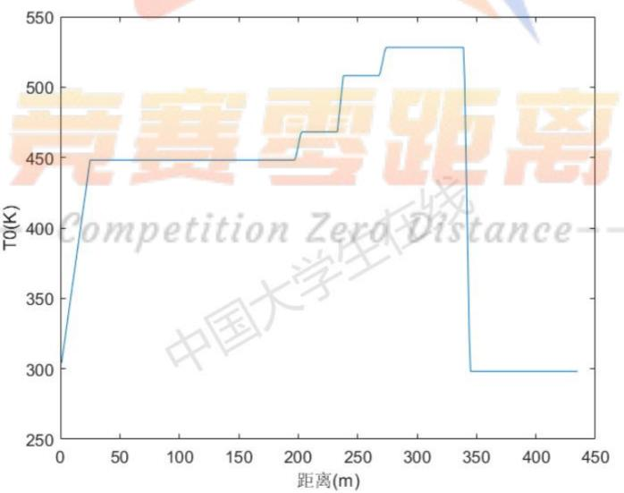  
图5:实验中的环境温度

## 6.2有限差分法解 PDE方程

由于方程组(3)比较复杂，无法得到解析解，需要采用数值解法。偏微分方程定解问题的数值求解方法通常有两种:有限元素法和有限差分法，这里采用有限差分法进行计算[4]。

首先取时间步长 $\Delta t .$ 空间步长 $\Delta x .$ 将连续的平面区域离散化，建立二维平面网格 $x \times t$ ，网格点坐标为：

$$
\left\{ \begin{array} { l l } { x _ { i } } & { = - \frac { d } { 2 } + i \Delta x , ( i = 0 , 1 , 2 , \dots , \lfloor \frac { d } { \Delta x } \rfloor ) } \\ { t _ { j } } & { = j \Delta t , ( j = 0 , 1 , 2 , \dots , \lfloor \frac { t _ { m } } { \Delta t } \rfloor ) } \end{array} \right.
$$

根据热传导方程的差分形式

$$
\begin{array} { c } { \displaystyle { \frac { \partial T ( x , t ) } { \partial t } = \frac { T ( x , t + \Delta t ) - T ( x , t ) } { \Delta t } } } \\ { \displaystyle { \frac { \partial ^ { 2 } T ( x , t ) } { \partial x ^ { 2 } } = \frac { T ( x + \Delta x , t ) - 2 T ( x , t ) + T ( x - \Delta x , t ) } { \Delta x ^ { 2 } } } } \end{array}
$$

得到如下的差分方程组：

$$
\left\{ \begin{array} { l l } { - k _ { i } \frac { T ( - \frac { d } { 2 } + \Delta x , t ) - T ( - \frac { d } { 2 } , t ) } { \Delta x } + h _ { i } T ( - \frac { d } { 2 } , t ) = h _ { i } T _ { i } } \\ { k _ { i } \frac { T ( \frac { d } { 2 } , t ) - T ( \frac { d } { 2 } - \Delta x , t ) } { \Delta x } + h _ { i } T ( \frac { d } { 2 } , t ) = h _ { i } T _ { i } } \\ { \displaystyle \frac { T ( x , t + \Delta t ) - T ( x , t ) } { \Delta t } = \frac { \alpha _ { i } } { 2 } \left( \frac { T ( x + \Delta x , t ) - 2 T ( x , t ) + T ( x - \Delta x , t ) } { \Delta x ^ { 2 } } \right. } \\ { \displaystyle \qquad \left. + \frac { T ( x + \Delta x , t + \Delta t ) - 2 T ( x , t + \Delta t ) + T ( x - \Delta x , t + \Delta t ) } { \Delta x ^ { 2 } } \right) } \end{array} \right.
$$

方程组中前两个式子是边界条件离散化的结果。第三个式子是热传导方程离散化的结果，其等号右端是t 和 $t + \Delta t$ 计算值的算术平均。 大学

化简之后，我们有：

$$
\begin{array} { c } { \displaystyle - \frac { k _ { i } } { \Delta x } T ( - \frac { d } { 2 } + \Delta x , t ) + ( h _ { i } + \frac { k _ { i } } { \Delta x } ) T ( - \frac { d } { 2 } , t ) = h _ { i } T _ { i } } \\ { \displaystyle ( h _ { i } + \frac { k } { \Delta x } ) T ( \frac { d } { 2 } , t ) - \frac { k } { \Delta x } T ( \frac { d } { 2 } - \Delta x , t ) = h _ { i } T _ { i } } \\ { \displaystyle A T ( x + \Delta x , t + \Delta t ) - ( 2 A + 1 ) T ( x , t + \Delta t ) + A T ( x - \Delta x , t + \Delta t ) } \\ { = - A T ( x + \Delta x , t ) + ( 2 A - 1 ) T ( x , t ) - A T ( x - \Delta x , t ) } \end{array}
$$

其中， $A = \alpha \Delta t / ( 2 \Delta x ^ { 2 } )$ 。为便于表示，记 $w _ { i , j } = T ( x _ { i } , t _ { j } )$ ，可以将上式写成如下向量递推方程

$$
\left( \begin{array} { c c c c c c } { h _ { i } + \frac { k } { \Delta x } } &  - \frac { k _ { i } - } { \Delta x } \left( \begin{array} { c c c c c c } { C o \vartheta n p . e . i c } & { 0 . \varrho \mathcal { L } \vartheta \mathcal { O } \vartheta \mathcal { O } \vartheta \mathcal { O } \vartheta \mathcal { O } \vartheta } & { 0 . \ : \mathcal { F } \right) \left( \begin{array} { c } { \mathcal { C } \mathcal { C } \vartheta _ { \overline { { { \bf w 1 } } } , j + 1 } } \\ { A } & { - ( 2 A + 1 ) } & { - A } & { \cdots } & { 0 } \end{array} \right) \left( \begin{array} { c c c c c } { { \bf 0 } } & { 0 } & { 0 } \\ { \vdots } & { \vdots } \\ { 0 } & { 0 } & { 0 } & { \ddots } & { \vdots } \\ { 0 } & { 0 } & { 0 } & { \cdots } & { A } & { - ( 2 A + 1 ) } & { - A } \\ { 0 } & { 0 } & { 0 } & { \cdots } & { 0 } & { - \frac { k } { \Delta x } } & { h _ { i } + \frac { k _ { i } } { \Delta x } } \end{array} \right) \left( \begin{array} { c } { \mathcal { C } \vartheta _ { \overline { { { \bf w 1 } } } , j + 1 } } \\ { { \ w _ { 2 , j + 1 } } } \\ { \vdots } \\ { { w _ { i _ { m a x } - 1 , j + 1 } } } \\ { { w _ { i _ { m a x } , j + 1 } } } \end{array} \right) = \left( \begin{array} { c } { h _ { i } T _ { i } } \\ { \vdots } \\ { \vdots } \\ { h _ { i } T _ { i } } \end{array} \right) } \end{array} \right) \end{array}\tag{4}
$$

图6即为有限差分法解偏微分方程的示意图。如图所示，为减小误差，我们根据网格相邻六个区域之间关系进行递推求解，直至解得 $T ( 0 , t _ { m a x } )$ 处结束。

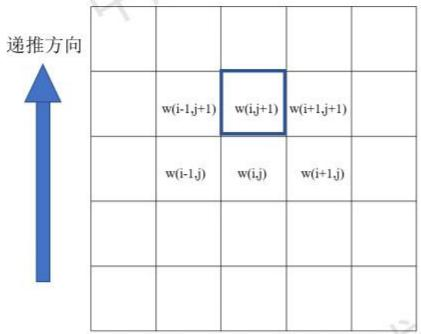  
图6:有限差分法解偏微分方程示意图

## 6.3 模型热学参数的确定

利用MATLAB编程，我们可以在一定范围内对热力学参数进行设置，优化模型计算值与实际值之间的均方根误差。考虑到共有5个大温区，每个温区有 $k _ { i } , h _ { i } , \alpha _ { i }$ 三个参数，导致问题的求解变得复杂。为此，我们简化模型求解，假设各个温区的参数 $k _ { i } , h _ { i }$ 都相等，统一记为k,h，仅考虑参数 $\alpha _ { i }$ 的不同。

以参数的求解为例，我们先在较大范围内进行粗糙搜索，再在小范围内减小步长进行精细搜索，最终得出k的最优值为 $\bf { 1 . 6 7 \times 1 0 ^ { - } 6 ~ W / ( m \cdot K ) }$ ，该过程均方根误差变化曲线如图7。

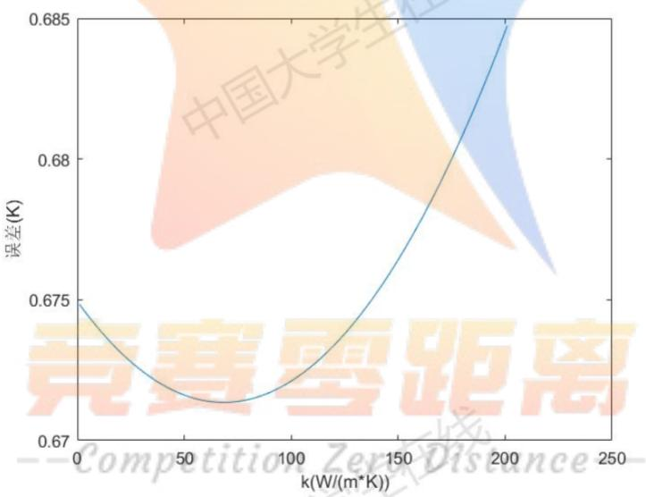  
图 7:均方根误差变化曲线

同理我们可以求出 $h = { \bf 1 4 . 4 5 8 ~ W / ( m ^ { 2 } \cdot K ) }$ 以及

$$
\alpha = \left[ 4 . 4 3 7 \quad 5 . 6 2 1 \quad 7 . 4 4 9 \quad 4 . 9 9 7 \quad 2 . 4 0 1 \right] \times 1 0 ^ { - 1 1 } \mathrm { m ^ { 2 } / s }
$$

将理论计算出的温度曲线与实际温度分布进行误差分析后，发现其拟合效果较好，如下图所示：

  
图8:实验炉温曲线对比

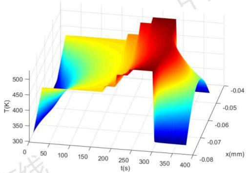  
图9: 工件整体温度分布

## 6.4 问题一求解

根据上文计算以及题目数据，已知 $h = 1 4 . 4 5 8 \mathrm { W / ( m ^ { 2 } \cdot K ) } , k = 1 . 6 7 \times 1 0 ^ { - 6 } \mathrm { W / ( m \cdot K ) }$ ，介质热扩散率 A

$$
\alpha = { \bigg [ } 4 . 4 3 7 \quad { \mathrm { 5 . 6 2 1 } } \quad 7 . 4 4 9 \quad 4 . 9 9 7 \quad 2 . 4 0 1 { \bigg ] } \times 1 0 ^ { - 1 1 } { \mathrm { ~ m } } ^ { 2 } / { \mathrm { s } }
$$

传送带过炉速度为 78 cm/min, 大温区温度

$$
T _ { i } = \left[ 1 7 3 \quad 1 9 8 \quad 2 3 0 \quad 2 5 7 \quad 2 5 \right] \mathrm { K }
$$

将其代入数学模型中，利用迭代公式(4)，我们可以求出方程的数值解。经过检验，本题中求得的炉温曲线满足制程界限约束。并按照0.5 s的时间间隔将焊接区域中心温度写入文件result.csv中。经计算，炉前区域最左端和题中要求的四个特殊点的距离分别为 ${ \Big [ } 1 1 1 . 2 5 \quad 2 1 7 . 7 5 \quad 2 5 3 . 2 5 \quad 3 0 4 { \Big ] } \ \mathrm { m m } ,$ 计算出时间后可知:小温区3、6、7中点及小温区8结束处焊接区域中心的温度分别为 $\mathbf { 1 2 9 . 1 0 0 7 ^ { \circ } C }$ $\mathbf { 1 6 6 . 8 9 8 2 ^ { \circ } C } , \ \mathbf { 1 8 8 . 6 5 4 7 ^ { \circ } C } , \ \mathbf { 2 2 2 . 6 2 5 2 ^ { \circ } C }$ 画出炉温曲线如图10所示。按照题目要求，我们以0.5s的时间间隔将焊接区域中心温度写入文件 result.csv中。

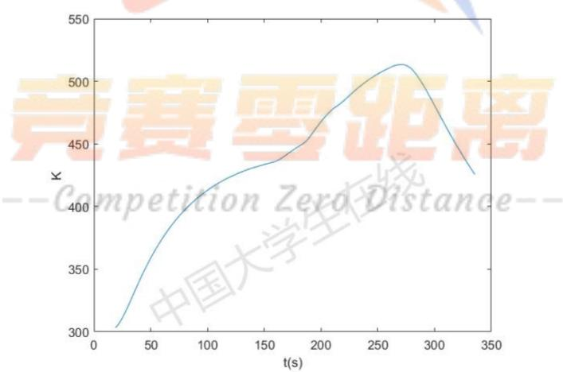  
图10: 问题一炉温曲线

我们还可以作出焊接区域在厚度方向和时间维度上的温度分布伪彩图，如图11所示

可以观察到越靠近焊接区域上下边缘的区域升温、降温越迅速，温度和炉中环境温度更为接近，中间区域变化相对缓慢，而这和实际情况也是相符的。该曲面用 $x = 0$ 截取所得的曲线即图10中的炉温曲线。线 本线

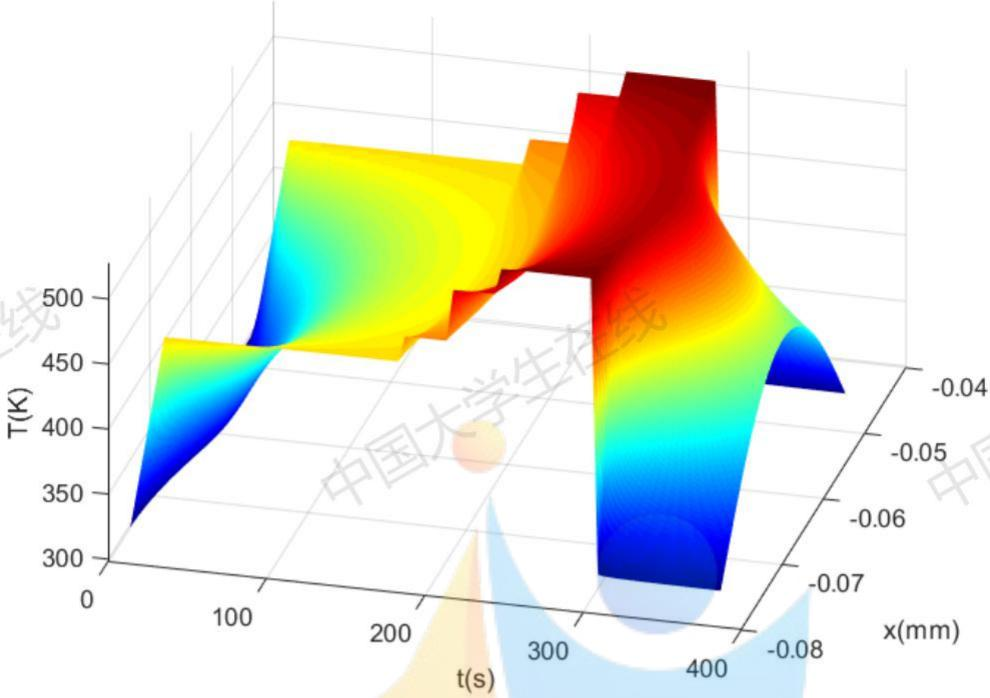  
图 11: 温度分布伪彩图

## 6.5 问题二求解

问题二的题目要求可表述为以下数学形式:

$$
\operatorname { m a x } v
$$

$$
\bigg \lceil \bigg | \frac { \mathrm { d } T ( 0 , t ) } { \mathrm { d } t } \bigg | \le 3\tag{5}
$$

$$
6 0 \le \Delta t _ { \{ 4 2 3 . 1 5 \mathrm { K } \le T \le 4 6 3 . 1 5 \mathrm { K } \} } \le 1 2 0\tag{6}
$$

$$
{ \mathit { s . t . } } { \mathit { \left. \right\} } { \mathrm { \Psi } } } ~ 4 0 \leq \Delta t _ { \{ T > 4 9 0 . 1 5 \mathrm { K } \} } \leq 9 0\tag{7}
$$

$$
5 1 3 . 1 5 \le \operatorname* { m a x } T ( 0 , t ) \le 5 2 3 . 1 5\tag{8}
$$

$$
. 6 5 \leq v \leq 1 0 0\tag{9}
$$

关于约束条件的说明：

·条件(5) 反映温度曲线上升斜率不大于 $3 ^ { \circ } \mathrm { C } / \mathrm { s } ,$ 下降斜率不小于 $- 3 ^ { \circ } \mathrm { C } / \mathrm { s }$

• 条件(6) 反映焊接区域温度在 $1 5 0 ^ { \circ } \mathrm { C } \sim 1 9 0 ^ { \circ } \mathrm { C }$ 范围内所经历的时间不低于 $6 0 \mathrm { s }$ ，不高于120s。

• 条件(7) 反映焊接区域温度大于 $2 1 7 ^ { \circ } \mathrm { C }$ 的时间不低于 40 s，不高于 $9 0 \mathrm { s }$

• 条件(8) 反映焊接区域的最大温度在 $2 4 0 ^ { \circ } \mathrm { C } \sim 2 5 0 ^ { \circ } \mathrm { C }$ 范围内。

• 条件(9) 反映元件过炉速度在 $6 5 \mathrm { c m / m i n } \sim 1 0 0 \mathrm { c m / m i n }$ 范围内。

针对问题二，我们采用问题一中处理 $\mathrm { T } ( \mathrm { x } , \mathrm { t } )$ 的思路，将温度函数进行数值化模拟。令 $f ( t ) = T ( 0 , t )$ 则有

$$
\begin{array} { r l } & { \left| \displaystyle \frac { \mathrm { d } f } { \mathrm { d } t } \right| = \left| \frac { f ( t + \Delta t ) - f ( t ) } { \Delta t } \right| \le 3 } \\ & { \qquad \delta ( t ) = f ( t + \Delta t ) - f ( t ) } \\ & { \qquad - 3 \Delta t \le \delta ( t ) \le 3 \Delta t } \end{array}
$$

故离散形式的约束条件可化为

$$
\left\{ \begin{array} { l l } { - 3 \Delta t \leq \delta ( t ) \leq 3 \Delta t } \\ { 6 0 \leq \Delta t _ { \{ 4 2 3 . 1 5 \mathrm { K } \leq T \leq 4 6 3 . 1 5 \mathrm { K } \} } \leq 1 2 0 } \\ { 4 0 \leq \Delta t _ { \{ T > 4 9 0 . 1 5 \mathrm { K } \} } \leq 9 0 } \\ { 5 1 3 . 1 5 \leq \operatorname* { m a x } f ( t ) \leq 5 2 3 . 1 5 } \\ { 6 5 \leq v \leq 1 0 0 } \end{array} \right.
$$

根据要求，在[65,100]速度区间内以步长1确定满足约束条件的最大值。初步搜索得出最大过炉速度在80cm/min左右，搜索过程可以绘制成如下示意图:

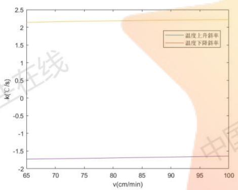  
图12:温度升降斜率与速度关系

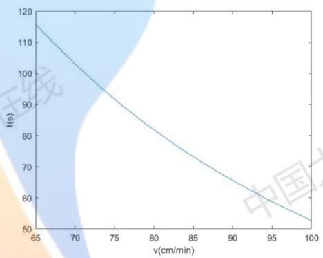  
图 13: 升温时 $1 5 0 ^ { \mathrm { o } } \mathrm { C } { \sim } 1 9 0 ^ { \mathrm { o } } \mathrm { C }$ 时间与速度关系

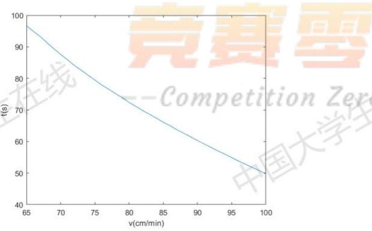

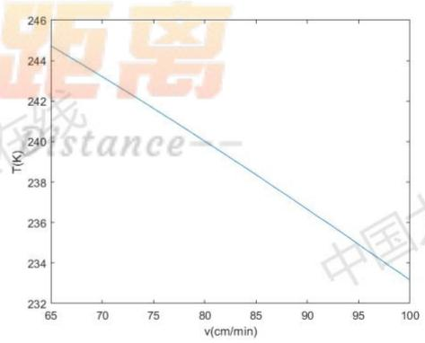  
图 14: 温度大于 $2 1 7 ^ { \mathrm { o } } \mathrm { C }$ 时间随速度变化曲线  
图15: 峰值温度随过炉速度变化曲线

从图中可以观察到温度升降斜率、升温时 $1 5 0 ^ { \circ } \mathrm { C } \sim 1 9 0 ^ { \circ } \mathrm { C }$ 的时间、温度大于 $2 1 7 ^ { \circ } \mathrm { C }$ 的时间和峰值随过炉速度的变化关系。可近似认为它们是关于过炉速度的单调函数，不存在陷入局部最优非全局最优的情况。因此，我们可将搜索区间限制在80cm/min周围并逐步减小搜索步长，最终以步长0.001搜索得到最优结果。在问题二设定的温区温度情况下，允许的最大传送带过炉速度为80.068cm/min

## 6.6 问题三求解

问题三中的要求可用数学语言描述如下：

$$
\operatorname* { m i n } S = S ( T _ { 1 } , T _ { 2 } , T _ { 3 } , T _ { 4 } , v )
$$

$$
\operatorname* { m a x } \{ v _ { m i n } , 6 5 \} \leq v \leq \operatorname* { m i n } \{ v _ { m a x } , 1 0 0 \}\tag{10}
$$

$$
4 3 8 . 1 5 \leq T _ { 1 } \leq 4 5 8 . 1 5\tag{11}
$$

$$
4 5 8 . 1 5 \leq T _ { 2 } \leq 4 7 8 . 1 5\tag{12}
$$

s.t.

$$
4 9 8 . 1 5 \leq T _ { 3 } \leq 5 1 8 . 1 5\tag{13}
$$

$$
5 1 8 . 1 5 \leq T _ { 4 } \leq 5 3 8 . 1 5\tag{14}
$$

$$
v _ { m a x } = v _ { m a x } ( T _ { 1 } , T _ { 2 } , T _ { 3 } , T _ { 4 } )\tag{15}
$$

$$
\cdot v _ { m i n } = v _ { m i n } ( T _ { 1 } , T _ { 2 } , T _ { 3 } , T _ { 4 } )\tag{16}
$$

关于约束条件的说明：

•当各个大温区温度设定后，元件的温度变化曲线只与过炉速度有关。因此，要使得元件温度曲线满足制程界限，只需元件过炉速度满足在最小速度 $v _ { m i n } ( T _ { 1 } , T _ { 2 } , T _ { 3 } , T _ { 4 } )$ 到最大速度 $v _ { m a x } ( T _ { 1 } . T _ { 2 } , T _ { 3 } , T _ { 4 } )$ 范围内。同时根据题中要求，也要满足在 $6 5 \mathrm { c m / m i n } \sim 1 0 0 \mathrm { c m / m i n }$ 范围内。

• 各个大温区的设定温度应处于在原设定值基础上 $\pm 1 0 ^ { \circ } \mathrm { C }$ 范围内。

## 6.6.1 面积计算

C已知焊接区域中点温度随时间的分布情况为 $f ( t ) = T ( 0 , t )$ ，则超过 $2 1 7 ^ { \circ } \mathrm { C }$ 到峰值温度所覆盖的面积可用积分表示为： 中国 中国

$$
S = \int _ { t _ { s } } ^ { t _ { p } } ( f ( t ) - f ( t _ { s } ) ) \mathrm { d } t\tag{17}
$$

在之前的解题过程中，我们已经构建了模型并且编写了解模函数(见modelsolve.m)，只需确定各个温区温度和传送带过炉速度即可求出炉温曲线数值解。采用数值方法(梯形法)计算面积时，有:

$$
S = \sum _ { i = t _ { s } } ^ { i _ { p } - 1 } \frac { \Delta t } { 2 } [ f ( ( i - 1 ) \Delta t ) + f ( i \Delta t ) - 2 f ( t _ { s } ) ]\tag{18}
$$

其中

$$
i _ { s } ^ { p } = \lvert \frac { t _ { s } } { \Delta t } \rvert ^ { - } \mathcal { P } \ddot { 1 } ^ { 2 } , \mathcal { L } e _ { i _ { p } } ^ { r } \mathcal { \equiv } \lvert \frac { t _ { p } } { \Delta t } \rvert ^ { + } \ddot { 1 } ^ { q }
$$

## 6.6.2 遗传算法

在编程解决该规划问题时，我们选择了遗传算法[5]在可行域中进行搜索，待优化变量为一个五维向量

$$
x = \left[ T _ { 1 } \quad T _ { 2 } \quad T _ { 3 } \quad T _ { 4 } \quad v \right]
$$

前四项为大温区 $D _ { i } ( i = 1 , . . . , 4 )$ 温度，第五项为传送带过炉速度。算法中种群的适应度函数为炉温曲线超过 $2 1 7 ^ { \circ } \mathrm { C }$ 到峰值温度部分所覆盖的面积S，若不满足约束条件，将其设为+∞或一个充分大的数值(适应度函数值越低表示该个体的适应度越强)。遗传算法的思想可以用图16表示如下:

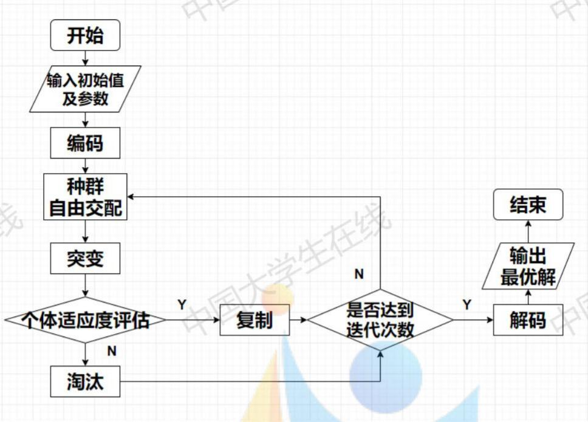  
图 16:问题三中的遗传算法图解

为尽可能减少遗传算法结果的不确定性，我们进行了多次独立重复求解。利用MATLAB的遗传算法工具箱编程并调整算法参数，将每次得到的潜在最优解记录在表3中:

<table><tr><td rowspan=1 colspan=1>序号</td><td rowspan=1 colspan=1> $T _ { 1 } ( ^ { \circ } \mathrm { C } )$ </td><td rowspan=1 colspan=1> $T _ { 2 } ( ^ { \circ } \mathrm { C } )$ </td><td rowspan=1 colspan=1> $T _ { 3 } ( ^ { \circ } \mathrm { C } )$ </td><td rowspan=1 colspan=1> $T _ { 4 } ( ^ { \circ } \mathrm { C } )$ </td><td rowspan=1 colspan=1> $v ( \mathrm { c m / m i n } )$ </td><td rowspan=1 colspan=1> $S ( ^ { \circ } \mathrm { C } \cdot \mathrm { s } )$ </td><td rowspan=1 colspan=1> $T _ { p } ( ^ { \circ } \mathrm { C } )$ </td></tr><tr><td rowspan=1 colspan=1>1</td><td rowspan=1 colspan=1>170.8829</td><td rowspan=1 colspan=1>190.9232</td><td rowspan=1 colspan=1>225.1458</td><td rowspan=1 colspan=1>264.9745</td><td rowspan=1 colspan=1>86.9277</td><td rowspan=1 colspan=1>485.0082</td><td rowspan=1 colspan=1>240.0000</td></tr><tr><td rowspan=1 colspan=1>2</td><td rowspan=1 colspan=1>179.3921</td><td rowspan=1 colspan=1>193.8277</td><td rowspan=1 colspan=1>231.8512</td><td rowspan=1 colspan=1>264.9061</td><td rowspan=1 colspan=1>92.5838</td><td rowspan=1 colspan=1>490.3543</td><td rowspan=1 colspan=1>240.0000</td></tr><tr><td rowspan=1 colspan=1>3</td><td rowspan=1 colspan=1>173.4935</td><td rowspan=1 colspan=1>194.1070</td><td rowspan=1 colspan=1>225.0590</td><td rowspan=1 colspan=1>264.9980</td><td rowspan=1 colspan=1>88.0488</td><td rowspan=1 colspan=1>487.0358</td><td rowspan=1 colspan=1>240.0000</td></tr><tr><td rowspan=1 colspan=1>4</td><td rowspan=1 colspan=1>181.1874</td><td rowspan=1 colspan=1>193.9193</td><td rowspan=1 colspan=1>225.1355</td><td rowspan=1 colspan=1>264.3587</td><td rowspan=1 colspan=1>88.7989</td><td rowspan=1 colspan=1>494.9952</td><td rowspan=1 colspan=1>240.0005</td></tr><tr><td rowspan=1 colspan=1>5</td><td rowspan=1 colspan=1>172.5797</td><td rowspan=1 colspan=1>191.8482</td><td rowspan=1 colspan=1>226.8208</td><td rowspan=1 colspan=1>264.8043</td><td rowspan=1 colspan=1>87.9693</td><td rowspan=1 colspan=1>487.0625</td><td rowspan=1 colspan=1>240.0000</td></tr><tr><td rowspan=1 colspan=1>6</td><td rowspan=1 colspan=1>179.6213</td><td rowspan=1 colspan=1>190.9032</td><td rowspan=1 colspan=1>231.5315</td><td rowspan=1 colspan=1>264.9926</td><td rowspan=1 colspan=1>92.0452</td><td rowspan=1 colspan=1>486.9773</td><td rowspan=1 colspan=1>240.0000</td></tr><tr><td rowspan=1 colspan=1>7</td><td rowspan=1 colspan=1>170.5518</td><td rowspan=1 colspan=1>185.0331</td><td rowspan=1 colspan=1>225.6946</td><td rowspan=1 colspan=1>265.0000</td><td rowspan=1 colspan=1>86.1056</td><td rowspan=1 colspan=1>483.5632</td><td rowspan=1 colspan=1>240.0000</td></tr></table>

表3: 遗传算法运行结果

由于目标函数要求超过 $2 1 7 ^ { \circ } \mathrm { C }$ 到峰值温度所覆盖的面积尽量小，那么峰值温度就应该尽量低，并且在满足制程条件的情况下，过炉速度应该尽量快，使得焊接区域中心的温度超过 $2 1 7 ^ { \circ } \mathrm { C }$ 的时间较短。分析上述多组数据，几次尝试的最优解峰值温度都不高，基本刚好为 $2 4 0 ^ { \circ } \mathrm { C }$ 同时过炉速度基本都超过85cm/min，这和上述判断是相符的，也侧面反应了使用遗传算法计算所得结果的正确性。取最优的一次运行结果为

$$
\pmb { x } = \left[ 1 7 0 . 5 5 1 8 \quad 1 8 5 . 0 3 3 1 \quad 2 2 5 . 6 9 4 6 \quad 2 6 5 . 0 0 0 0 \quad 8 6 . 1 0 5 6 \right]
$$

该次运行过程中，最优个体和平均水平的变化过程可以可视化成图17所示。由于在个体适应度评估中，将不满足约束条件的个体的适应度函数值用充分大的数值表示，少数变异个体不在可行域内导致平均适应度呈散点图状分布。

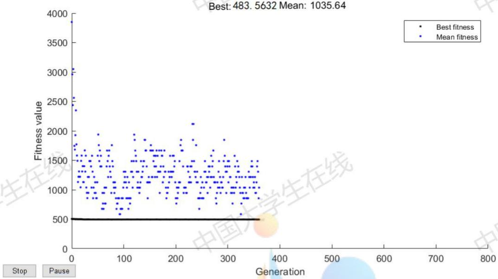  
图17: 遗传算法运行过程示意图

因此，问题三的最优解为： $\mathbf { 1 7 0 . 5 5 1 8 ^ { \circ } C }$ (小温区1～5)、 $\mathbf { 1 8 5 . 0 3 3 1 ^ { \circ } C }$ (小温区 6)、 $\mathbf { 2 2 5 . 6 9 4 6 ^ { \circ } C }$ (小温区7)和 $\mathbf { 1 2 6 5 . 0 0 0 0 ^ { \circ } C }$ (小温区 $8 \sim 9 )$ ，传送带过炉速度 $\mathbf { 8 6 . 1 0 5 6 ~ c m / m i n }$ ，该情况下炉温曲线如图18所示，阴影部分面积为 $4 8 3 . 5 6 3 2 ^ { \circ } \mathrm { C \cdot s }$ ，具体数值见附件 P3.csv。

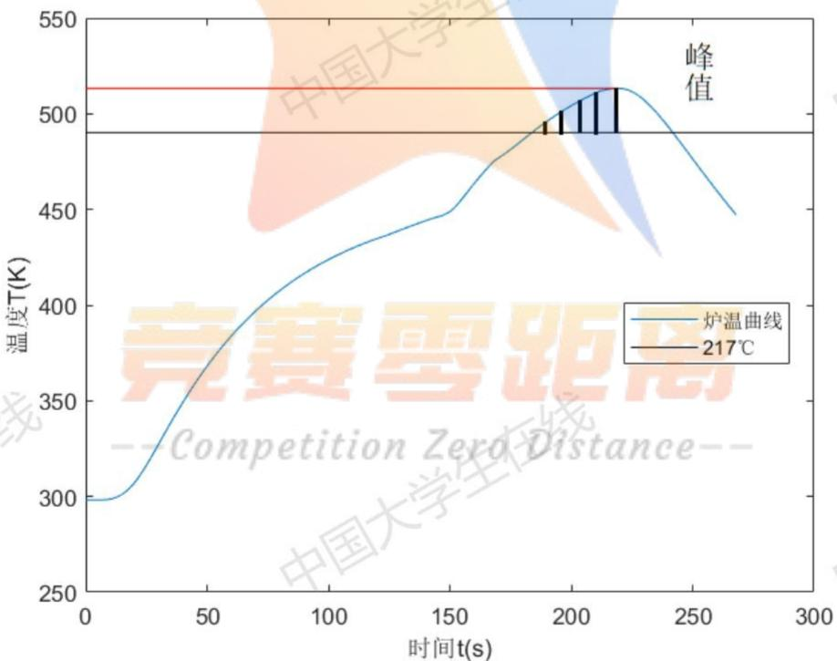  
图 18: 最优解炉温曲线

## 6.7 问题四求解

以元件温度曲线峰值对应处 $t = t _ { p }$ 为对称轴，在步长为 $\Delta t$ 的情况下， $\diamondsuit$

$$
N = \frac { \lfloor ( t _ { p } - t _ { s } ) \rfloor } { \Delta t }
$$

选取 $t = t _ { s } + i \Delta t , ~ ( i = 0 , 1 , . . . , N )$ 的数值点，并与对应的数值点 $t = 2 t _ { p } - ( t _ { s } + i \Delta t ) , ~ ( i = 0 , 1 , . . . , N )$ 进行差值，得到刻画曲线对称性偏差的函数：

$$
E = \sqrt { \frac { 1 } { N } \sum _ { i = 0 } ^ { N } \left| f [ 2 t _ { p } - ( t _ { s } + i \Delta t ) ] - f ( t _ { s } + i \Delta t ) \right| ^ { 2 } }\tag{19}
$$

于是，问题四可以使用数学语言描述为如下的双目标非线性规划问题:

$$
\operatorname* { m i n } S = S ( T _ { 1 } , T _ { 2 } , T _ { 3 } , T _ { 4 } , v )\tag{20}
$$

$$
\operatorname* { m i n } E = \sqrt { \frac { 1 } { N } \sum _ { i = 0 } ^ { N } \left| f [ 2 t _ { p } - ( t _ { s } + i \Delta t ) ] - f ( t _ { s } + i \Delta t ) \right| ^ { 2 } }\tag{21}
$$

$$
\begin{array} { r } { s . t . \left\{ \begin{array} { l l } { \operatorname* { m a x } \{ v _ { m i n } , 6 5 \} \leq v \leq \operatorname* { m i n } \{ v _ { m a x } , 1 0 0 \} } \\ { 4 3 8 . 1 5 \leq T _ { 1 } \leq 4 5 8 . 1 5 } \\ { 4 5 8 . 1 5 \leq T _ { 2 } \leq 4 7 8 . 1 5 } \\ { 4 9 8 . 1 5 \leq T _ { 3 } \leq 5 1 8 . 1 5 ~ \qquad \mathrm { ~ i ~ } } \\ { 5 1 8 . 1 5 \leq T _ { 4 } \leq 5 3 8 . 1 5 } \\ { 5 1 8 . 1 5 \leq T _ { 4 } \leq 3 8 . 1 5 } \\ { v _ { m a x } = v _ { m a x } ( T _ { 1 } , T _ { 2 } , T _ { 3 } , T _ { 4 } ) } \\ { v _ { m i n } = v _ { m i n } ( T _ { 1 } , T _ { 2 } , T _ { 3 } , T _ { 4 } ) } \end{array} \right. } \end{array}
$$

关于约束方程的若干说明：

• 目标函数(20),(21) 分别刻画了炉温曲线超过 $2 1 7 ^ { \circ } \mathrm { C }$ 到峰值温度所覆盖的面积和关于峰值的对称性。

• 各温区温度需要在初始设定温度附近 $\pm 1 0 ^ { \circ } \mathrm { C }$ 范围内。

·炉温曲线需要满足制程界限，故过炉速度也应满足相应的大小限制。

结合回焊炉实际工作情况考虑，为保证元件焊接质量，我们认为应当优先满足炉温曲线超过 $2 1 7 ^ { \circ } \mathrm { C }$ 到峰值温度所覆盖的面积最小的目标，再考虑峰值两侧对称性尽可能大。因此，我们采用分层序列法解决该问题，并对结果得到的潜在最优解进行二次筛选。定义评价函数 中国

$$
\operatorname* { m i n } u = p S + ( 1 - p ) E
$$

以其作为最终评价依据，从中选择最优者作为最终答案。

## 6.7.1 分层序列法

对于多目标规划问题

$$
\operatorname* { m i n } _ { { \pmb x } \in D } \{ f _ { 1 } ( { \pmb x } ) ; f _ { 2 } ( { \pmb x } ) ; \cdots ; f _ { s } ( { \pmb x } ) \}
$$

其中如果 $i < j ,$ 则目标函数fi(x)具有比fi(x)更高的优先性，那么我们可以采用简单分层序列法。该方法的局限性是，若某一步最优化解是唯一的，其后所有步骤的解也是唯一的，致使之后所有目标函数失去意义。因此，求解较上层优化问题时，需要给予优化结果一定的宽容度。引进一系列充分小的正数 $\lambda _ { 1 } , \lambda _ { 2 } , \ldots , \lambda _ { s }$ ，并改进该算法如下：

Algorithm 1 分层序列法  
Input:初始可行域 D，优化目标函数 {f1(x); f2(x); ·· ; fs(x)}  
Output: x\*, {f1(xk); f2(xk); · · · ; fs(xk)}  
functionOPTIMIZE(D, [f1(x); f2(x); · · · ; fs(x)])  
D¹←D  
k←1 while k ≤ s do 中国大学生在线 中国大学  
fk(xk) ← minx∈Dk fk(x)  
xk ← arg minx∈Dk fk(x)  
Dk+1 ← {x ∈ Dk : fk(x) ≤ fk(xk) + λs}  
k ← k + 1  
end while  
return x\*  
end function

## 6.7.2 接力进化的遗传算法

我们采用分层序列法的思想，对问题三中使用到的遗传算法进行了进一步的优化，提出了接力进化的遗传算法，其大致过程可以用伪代码表达如下： 中国

Algorithm 2 接力进化的遗传算法   
Input:初始可行域 D,优化目标函数 {f1(x); f2(x); … · ; fs(x)}   
Output: x\*, {f1(xk); f2(xk); · · · ; fs(xk)}   
function OPTIMIZE(D, [f1(x); f2(x); · · · ; fs(x)])   
D¹←D 赛零距离   
Population⁰ ← random values   
k←1线   
while k ≤ s do --Competition ZexoDistance--   
fk(xk) ←GeneticAlgorithm(fk(x), Dk, Populationk−1)   
Dk+1 ← {x ∈ Dk : fk(x) ≤ fk(xk) + λs}   
k←k+1   
end while   
return x\* = Best individual in Population⁸   
end function

在问题三中，按照目标(20),我们得到了面积S可能的最优值为 $4 8 3 . 5 6 3 2 ^ { \circ } \mathrm { C }$ ·s,考虑到这个值极难取到，要给予一定的宽容上限,在这里取 $S ( T _ { 1 } , T _ { 2 } , T _ { 3 } , T _ { 4 } , v )$ <495。使用上述算法解决问题四的步骤

具体为：

1.以目标函数(20)作为适应度函数，使用遗传算法搜索若干代，得到最后的种群。

2.以目标函数(21)作为适应度函数，在约束条件中加入 $S ( T _ { 1 } , T _ { 2 } , T _ { 3 } , T _ { 4 } , v ) < 4 9 5$ ，以上一步得到的最终种群作为初始种群，进行接力进化。

经过多次运行算法，我们把最终得到的所有种群都记录在文件pop.csv中，并以每个个体的两种适应度分别作为横纵坐标绘制了分布散点图，如图19所示:

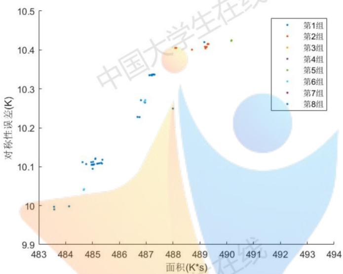  
图 19: 进化结果分布散点图

可以看到这些结果仍然具有一定的随机性，但是往往峰值面积小对称性偏差也低，为了从中挑选最优者，我们将所有数据点的两个指标进行归一化处理，即

$$
E = 2 \times \frac { E - E _ { m i n } } { E _ { m a x } - E _ { m i n } } - 1 , \quad S = 2 \times \frac { S - S _ { m i n } } { S _ { m a x } - S _ { m i n } } - 1
$$

定义 $u = 0 . 4 E + 0 . 6 S$ ，这意味着在我们的评价体系中曲线阴影部分面积的重要性更高(注意较小的E，S归一化之后是负的)，用它筛选出 $u < - 0 . 9 5$ 的几组作为本题的可行解：

<table><tr><td rowspan=1 colspan=1>序号</td><td rowspan=1 colspan=1> $T _ { 1 } ( ^ { \circ } \mathrm { C } )$ </td><td rowspan=1 colspan=1> $T _ { 2 } ( ^ { \circ } \mathrm { C } )$ </td><td rowspan=1 colspan=1> $T _ { 3 } ( ^ { \circ } \mathrm { C } )$ </td><td rowspan=1 colspan=1> $T _ { 4 } ( ^ { \circ } \mathrm { C } )$ </td><td rowspan=1 colspan=1> $v ( \mathrm { c m / m i n } )$ </td><td rowspan=1 colspan=1> $E ( \mathrm { K \cdot s } )$ </td><td rowspan=1 colspan=1> $S ( ^ { \circ } \mathrm { C } )$ </td></tr><tr><td rowspan=1 colspan=1>1</td><td rowspan=1 colspan=1>169.4106</td><td rowspan=1 colspan=1>185.0242</td><td rowspan=1 colspan=1>225.3092</td><td rowspan=1 colspan=1> $2 6 5 . 0 0 0 0$ </td><td rowspan=1 colspan=1> $8 5 . 6 7 3 5 $ </td><td rowspan=1 colspan=1>9.9904</td><td rowspan=1 colspan=1>483.5765</td></tr><tr><td rowspan=1 colspan=1>2</td><td rowspan=1 colspan=1>170.5518</td><td rowspan=1 colspan=1>185.0331</td><td rowspan=1 colspan=1>225.6946</td><td rowspan=1 colspan=1>265.0000</td><td rowspan=1 colspan=1>86.1057</td><td rowspan=1 colspan=1>9.9971</td><td rowspan=1 colspan=1>483.5697</td></tr><tr><td rowspan=1 colspan=1>3</td><td rowspan=1 colspan=1>169.0757</td><td rowspan=1 colspan=1>186.4900</td><td rowspan=1 colspan=1>225.1478</td><td rowspan=1 colspan=1>264.9965</td><td rowspan=1 colspan=1>85.7808</td><td rowspan=1 colspan=1>9.9983</td><td rowspan=1 colspan=1>484.1283</td></tr></table>

表4: 问题四备选解

得到最优结果如下：

$$
\mathbf { x } = { \Big [ } 1 6 9 . 4 1 0 6 \quad 1 8 5 . 0 2 4 3 \quad 2 2 5 . 3 0 9 2 \quad 2 6 5 . 0 0 0 0 \quad 8 5 . 6 7 3 5 { \Big ] }
$$

即: $\mathbf { 1 6 9 . 4 1 0 6 ^ { \circ } C }$ (小温区1～5)、 $\mathbf { 1 8 5 . 0 2 4 3 ^ { \circ } C }$ (小温区 6)、 $\mathbf { 2 2 5 . 3 0 9 2 ^ { \circ } C }$ (小温区7)和 $\mathbf { 1 2 6 5 . 0 0 0 0 ^ { \circ } C }$ (小温区8～9)，传送带过炉速度 85.6735 cm/min,对应的面积指标 $S = 4 8 3 . 5 7 6 5 ^ { \circ } \mathrm { C } \cdot \mathbf { s }$ 对称程度指标 ${ \pmb { E } } = \mathbf { 9 . 9 9 0 4 K }$ ，炉温曲线如图20所示，具体数值见附件P4.csv。

图21是问题四最优解炉温曲线超过217C部分和实验数据所作比较。可以直观地看到峰值左侧面积大大减小，同时两条曲线对称轴右侧部分切线斜率基本相似，(其绝对值）都大于左侧部分，但是蓝色曲线左侧斜率稍高，因此蓝色曲线对称程度提高了，这说明我们的计算结果是符合实际情况的。

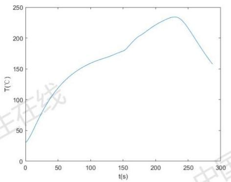  
图 20: 问题四炉温曲线

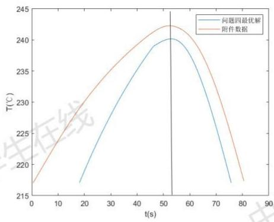  
图 21: 对称性比较

## 7 模型总结

## 7.1 灵敏性分析

## 7.1.1 模型对各个温区温度的灵敏性分析

通过查阅资料了解到，回流焊温度控制精度应当达到 $\pm 0 . 1 \sim 0 . 2 ^ { \circ } \mathrm { C }$ ，考虑到实际中温度控制常有偏差，我们分析了模型对各个温区控温偏差的灵敏性。以问题二为例，假设有一台回焊炉，其控温精度为 $\pm 0 . 1 ^ { \circ } \mathrm { C }$ ，我们需要计算出当各个温区的温度在问题二最优解预设温度周围波动时，炉温曲线峰值温度左侧面积的变化情况。即在最优解周围以 $0 . 0 1 ^ { \circ } \mathrm { C }$ 为步长，绘出目标函数S变化曲线，其图像如下：

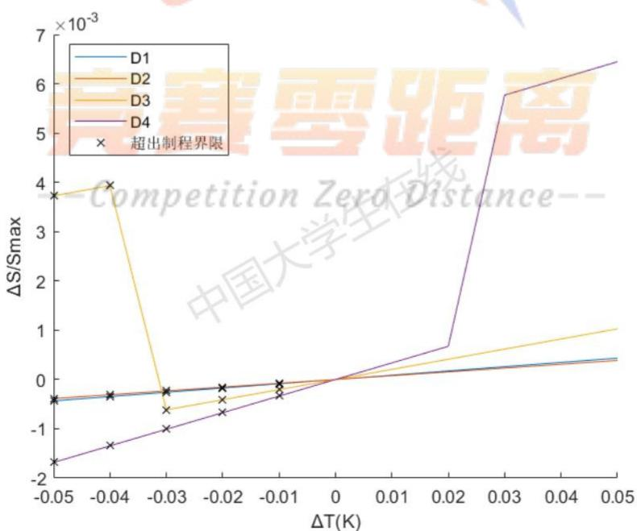  
图 22:炉温曲线超过 $2 1 7 \mathrm { { ^ { \circ } C } }$ 至峰值部分面积随 Ti(i = 1,2,3,4) 变化曲线

可以看出，温度在0.1℃范围内变化时对S的影响程度在1%以内。温度偏高时炉温曲线的优化指标呈上升趋势，温度偏低时炉温曲线超出制程界限。因此在问题二的研究中，我们的炉温曲线模型对各个温区温度都较为敏感（尤其是大温区 $D _ { 4 } )$ ，能刻画出不同温区温度对曲线指定区域面积的影响作用大小，也体现了温度控制在整个生产工艺中的重要性。

## 7.1.2 模型对重要热学参数的灵敏性分析

在模型求参的步骤中，采用了按照一定步长搜索的方法。如k的精细搜索步长是 $1 { \times } 1 0 ^ { - 8 } \mathrm { W } / ( \mathrm { K } \cdot \mathrm { s } )$ 可能存在 $1 0 ^ { - 9 }$ 数量级的误差，为了研究搜索误差对问题答案的影响，我们让k在当前值附近以 $1 \times 1 0 ^ { - 9 }$ 的步长变化，研究问题三的结果变化程度，得到炉温曲线超过 $2 1 7 \mathrm { { ^ \circ C } }$ 至峰值部分面积随k计算值变化曲线如图23所示： 一学生 上学

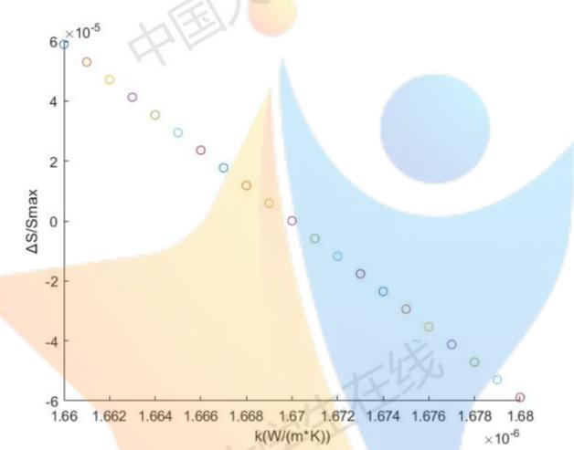  
图 23: 炉温曲线超过 217℃ 至峰值部分面积随 k 计算值变化曲线

面积指标的变化率在0.01%范围内变化，基本呈线性关系，可见模型对热学参数k并不敏感，因此搜索精度导致的误差可以忽略不计。

## 7.2模型优点

1.本文模型基于传热学理论并对其进行了适当的简化处理，使用有限差分法求出的数值解与实际曲线拟合较好，能够较为精确地描述元件焊接过程温度变化规律。

2. 本文使用启发式搜索算法求解复杂约束条件下的多变量优化问题，通过合理设置算法参数，可以学 较好地避免结果陷入局部最优。相较于传统规划求解方法，该算法具有良好的可扩展性，容易和其他方法混合使用。 国大 国大

3.对于问题四中的双目标非线性规划问题，本文基于分层序列法的思想，充分考虑了不同规划目标的优先级，改进了规划求解算法，可适用于目标函数更多的情况。

## 7.3模型缺点

1. 在建模过程中，只考虑焊接区域的厚度而对其他维度进行了简化。

2.忽略了热辐射对炉温曲线的影响，热传导方程组不够完备，在刻画峰值温度时容易产生偏差。

3. 问题三、问题四算法运行耗时较长。

## 参考文献

[1]汤宗健,谢炳堂,梁革英.回流焊炉温曲线的管控分析[J]. 电子质量,2020,(08):15-19+23.

[2] 宋巍. 基于加热机理分析的回流焊过程仿真建模与有限元分析 [D]. 东北大学,2012

[3] David W. Hahn.Heat conduction[M].third edition, John Wiley and Sons, New York,(2012).

[4]蔡志杰. 高温作业专用服装设计[J]. 数学建模及其应用,2019,8(01):44-52+83

[5] 戴晓晖,李敏强,寇纪淞.遗传算法理论研究综述[J].控制与决策,2000(03):263-268+273.

## A 环境温度计算

```matlab
1 %温区温度设置函数
2 % getT0.m
3 function T0=getT0(s)
4 T_K=273.15；%温度单位转换
5 global T1
6 global T2 中国大学生在线
8 global T3 中国大学
global T4
9
10 if s<25
11 T0=(T1-25)/(25-0)*(s-0)+25+T_K;
12 elseif s<197.5
13 T0=T1+T_K;
14 elseif s<202.5
15 T0=(T2-T1)/(202.5-197.5)*(s-197.5)+T1+T_K;
16 elseif s<233
17 T0=T2+T_K; 国大学生在线
1819 elseif s<238 中国大学
T0=(T3-T2)/(238-233)*(s-233)+T2+T_K;
20 elseif s<268.5
21 T0=T3+T_K;
22 elseif s<273.5
23 T0=(T4-T3)/(273.5-268.5)*(s-268.5)+T3+T_K;
24 elseif s<339.5 竞赛零距离
25 T0=T4+T_K;
26 elseif s<344.5
27 T0=(25-T4)/(344.5-339.5)*(s-339.5)+T4+T_K;D1stance
28 else
2230 T0=25+T_K; 中国大学生 中国大学
end
31 end
```

## B 模型求参代码

1 % P0.m  
2 % 解模型参数  
3%完整的程序可能要花费好几分钟

```matlab
for k=1e-6:1e-8:3e-6%1.67e-6 for h=14.4580%14.4:0.001:14.6 零距离
for alpha1=4.4370e-11%4.4e-11:1e-14:4.6e-11stance
学生 foralpha2=5.6210e-11%5.6e-11:1e-14:5.8e-11
for alpha3=7.4490e-11%7.3e-11:1e-14:7.5e-11
for alpha4=4.9970e-11%4.9e-11:1e-14:5e-11 中国
foralpha5=2.4010e-11%2.3e-11:1e-14:2.5e-11
T=zeros(size_x,size_t);%单位:K
T(:,1)=ones(size_x,1)*(25+T_K)；%初始处于车间温度中
A=alpha1*delta_t/2/delta_x^2;
% 大温区 1
M=eye(size_x,size_x); 必
```

```matlab
M(1,1)=h+k/delta_x; 中国。
M(1,2)=-k/delta_x;
M(size_x,size_x-1)=-k/delta_x;
M(size_x,size_x)=h+k/delta_x;
for index x=2:size x-1
M(index_x,index_x-1)=A;
M(index_x,index_x)=-2*A-1;
M(index_x,index_x+1)=A;
end 生在线
N=zeros(size_x,1);
for index_t=2:348 中国大学
s=(index_t-1)*delta_t*v;%实际距离
T0=getT0(s)；%当前外界温度
N(1)=h*T0;
N(size_x)=h*T0;
for index x=2:size_x-1
N(index_x)=-A*(T(index_x+1,index_t-1)+T(index_x-1,
index_t-1))...
+(2*A-1)*T(index_x,index_t-1);
end
T(:,index_t)=M\N;
end 中国大学
中国大
% 大温区 2
A=alpha2*delta_t/2/delta_x^2;
for indexx=2:size x-1
M(index_x,index_x-1)=A;
M(index_x,index_x+1)=A;
end
N=zeros(size_x,1);exoDistance-
for index t=349:409
s=(index_t-1)*delta_t*v;%实际距离 中国大学
T0=getT0(s)；%当前外界温度
N(1)=h*T0;
N(size_x)=h*T0;
for index x=2:size x-1
N(index_x)=-A*(T(index_x+1,index_t-1)+T(index_x-1,
index_t-1))...
+(2*A-1)*T(index_x,index_t-1);
end 一线
```

```matlab
T(:,index t)=M\N; 中二
end
% 大温区 3
A=alpha3*delta_t/2/delta_x^2;
for index_x=2:size_x-1
M(index x,index x-1)=A;
M(index_x,index_x)=-2*A-1;
M(index_x,index_x+1)=A;
end
N=zeros(size_x,1); 中国大学
for index_t=410:470
s=(index_t-1)*delta_t*v;%实际距离
T0=getT0(s)；%当前外界温度
N(1)=h*T0;
N(size_x)=h*T0;
for index_x=2:size_x-1
N(index_x)=-A*(T(index_x+1,index_t-1)+T(index_x-1,
index_t-1))...
+(2*A-1)*T(index_x,index_t-1);
end
T(:,index_t)=M\N; 中国大学
end
%大温区4
A=alpha4*delta_t/2/delta_x^2;
for index x=2:size x-1
M(index_x,index_x-1)=A; 离
M(index_x,index_x)=-2*A-1;
M(index_x,index_x+1)=A;
Cenompetition ZexoDistance-
N=zeros(size_x,1);
for index t=471:592 中国大学
s=(index_t-1)*delta_t*v;%实际距离
T0=getT0(s)；%当前外界温度
N(1)=h*T0;
N(size_x)=h*T0;
for index_x=2:size_x-1
N(index_x)=-A*(T(index_x+1,index_t-1)+T(index_x-1,
index_t-1))...
+(2*A-1)*T(index_x,index_t-1);
```

```matlab
end中国。 中国。
T(:,index_t)=M\N;
end
%大温区 5
A=alpha5*delta_t/2/delta_x^2;
for index x=2:size x-1
M(index_x,index_x-1)=A;
学生在线 M(index_x,index_x)=-2*A-1;
M(index_x,index_x+1)=A;
end 国 中国大学
N=zeros(size_x,1);
for index_t=593:747
s=(index_t-1)*delta_t*v;%实际距离
T0=getT0(s)；%当前外界温度
N(1)=h*T0;
N(size_x)=h*T0;
for index_x=2:size_x-1
N(index_x)=-A*(T(index_x+1,index_t-1)+T(index_x-1,
学生在线 index_t-1))...
+(2*A-1)*T(index_x,index_t-1);
end 中国大学
T(:,index_t)=M\N;
end
%计算并记录误差
delta_T=T(76,39:end)-Tk(:,2)';
E=sum(delta_T.*delta_T)/length(Tk);
Ehistry E hitry E1erts
学生在线 -CorEmin=Etion ZexoDistance--
alpha=[alpha1,alpha2,alpha3,alpha4,alpha5];
kmin=k; 中国大学
hmin=h;
end
end
end
end
end
end
end
在线 在线
```

```matlab
end 中国
%输出参数
disp(['alpha='num2str(alpha)'m^2/s']);
disp(['k=' num2str(kmin)' W/(m*K)']);
disp(['h='num2str(hmin)' W/(m^2*K)']);
disp(['E_min='num2str(Emin)'K']);
%作图 在线
figure(1) 中国大学生在线
plot(1:size_t,T(76,:));
hold on
plot(39:747,Tk(:,2));
legend('模型数据','实际数据');
xlabel('t(per 0.5s)');
ylabel('T(K)');
figure(2)
plot(E_history);
x1abel('k(W/(m*K))')
ylabel('误差(K)') 中国大学生在线
figure(3)
colormap jet
surf([1:size_t]*0.5,[1:size_x]/size_t*0.15-0.15/2,T);
shading flat
xlabel('t(s)');
ylabel('×(mm)'); 竞赛零距离
zlabel('T(K)');
在线 --Competition ZeroDistance
```

## C 模型求解代码

```matlab
1 % modelsolve.m 中国 中国
2 % 根据具体数值解模型
3 %输入速度和时间步长
4 function T=modelsolve(v,delta_t)
5 %数据准备
6 thickness x=0.15e-3;%单位:m
7 delta_x=1e-6；%单位:m
8 T_K=273.15；%温度单位转换
9 t_d=round([202.5 238.5 273.5 344.5 435.5]/v/delta_t+1);%不同温区时间分割点
```

```csv
10 size_x=round(thickness_x/delta x+1);
11 size_t=t_d(5);
12
13 %热学参数
14 k=1.67e-06;
15 h=14.4580;
16 alpha1=4.4370e-11;
17 alpha2=5.6210e-11;
18 alpha3=7.4490e-11;
19 alpha4=4.9970e-11; 中国大学生在线
2021 alpha5=2.4010e-11;
22 T=zeros(size_x,size_t);%单位:K
23 T(:,1)=ones(size_x,1)*(25+T_K)；%初始处于车间温度中
24
25 % 大温区1
26 A=alpha1*delta_t/2/delta_x^2;
27 M=eye(size_x,size_x);
28 M(1,1)=h+k/delta_x;
29 M(1,2)=-k/delta_x;
30 M(size_x,size_x-1)=-k/delta_x; 中国大学生在线
3132 M(size_x,size_x)=h+k/delta_x;
for index_x=2:size_x-1 中
33 M(index_x,index_x-1)=A;
34 M(index_x,index_x)=-2*A-1;
35 M(index_x,index_x+1)=A;
36 end
37 N=zeros(size_x,1); 宽零距离
38 for index_t=2:t_d(1)
39 s=(index_t-1)*delta_t*v;%实际距离
40
41 N(1)=h*T0;
42 N(size_x)=h*T0;
43 for index_x=2:size_x-1
44 N(index_x)=-A*(T(index_x+1,index_t-1)+T(index_x-1,index_t-1))..
45 +(2*A-1)*T(index_x,index_t-1);
46 end
47 T(:,index_t)=M\N;
48 end
49
50 % 大温区 2 必 —线
```

```matlab
A=alpha2*delta_t/2/delta_x^2;XV 中
for index_x=2:size_x-1
M(index_x,index_x-1)=A;
M(index_x,index_x)=-2*A-1;
M(index_x,index_x+1)=A;
end
N=zeros(size_x,1);
for index_t=t_d(1)+1:t_d(2)
s=(index_t-1)*delta_t*v;%实际距离
T0=getT0(s)；%当前外界温度 中国大学生在线
N(1)ize x)=_*T0; 中
for index_x=2:size_x-1
N(index_x)=-A*(T(index_x+1,index_t-1)+T(index_x-1,index_t-1))...
+(2*A-1)*T(index x,index t-1);
end
T(:,index_t)=M\N;
end
% 大温区 3
A=alpha3*delta_t/2/delta_x^2; 中国大学生在线
for index x=2:size x-1
M(index_x,index_x-1)=A; 中
M(index x,index x)=-2*A-1;
M(index_x,index_x+1)=A;
end
N=zeros(size x,1);
距离 T0=getT0(s)；%当前外界温度
N(1)=h*T0; --Competition ZexoDistance--
N(size_x)=h*T0; for index x=2:size x-1 国大学坐
N(index_x)=-A*(T(index_x+1,index_t-1)+T(index_x-1,index_t-1))..
+(2*A-1)*T(index_x,index_t-1);
end
T(:,index_t)=M\N;
end
% 大温区 4
A=alpha4*delta_t/2/delta_x^2; &
```

```matlab
for index_x=2:size_x-1 中仁 中
M(index_x,index_x-1)=A;
M(index_x,index_x)=-2*A-1;
M(index_x,index_x+1)=A;
end
N=zeros(size_x,1);
for index_t=t_d(3)+1:t_d(4)
s=(index t-1)*delta t*v;%实际距离
T0=getT0(s)；%当前外界温度
N(1)=h*T0; 中国大学生在线
N(sizex)=x2:size x−1 中
N(index_x)=-A*(T(index_x+1,index_ t-1)+T(index_x-1,index_t-1))...
+(2*A-1)*T(index x,index t-1);
end
T(:,index_t)=M\N;
end
% 大温区 5
A=alpha5*delta_t/2/delta_x^2;
for index_x=2:size_x-1
M(index_x,index_x-1)=A;
中
M(index_x,index_x+1)=A;
end
N=zeros(size_x,1);
for index_t=t_d(4)+1:t_d(5)
N(size_x)=h*T0;-Competition Zexo-Distance--
for index_x=2:size_x-1
N(index_x)=-A*(T(index_x+1,index_t-1)+T(index_x-1,index_t-1))...
+(2*A-1)*T(index_x,index_t-1);
end
T(:,index_t)=M\N;
end
end
```

## D 制程界限约束

```matlab
% constraint.m
%计算制程界限
function [flag,upk,downk,risePeriod,peakPeriod,peakT]=constraint(T,delta t)
T=T-273.15;
delta_T=T(2:end)-T(1:end-1);
k=[0, delta_T/delta_t];
%温度上声斜率
upk=k(k>0);
%温度下降斜率 国大学生在线
downk=k(k<0);
%温度上升过程中在150?C190?C的时间 中国ナ
risePeriod=(1ength(T(k>0&T>=150&T<=190))-1)*delta_t;
%温度大于 217?C 的时间
peakPeriod=(1ength(T(T>217))-1)*delta_t;
%峰值温度
peakT=max(T);
flag=1;
%限制1 2
if ~isempty(upk) && ~isempty(downk)
if (max(upk)>3)ll(min(downk)<-3)
字 flag=0; 中国大学生在线
end 中国ナ
else
flag=0;
end
%限制3
if risePeriod<60 |l risePeriod>120
flag=0; 竞费零距离
end
%限制4线
if peakPeriod<40||peakPeriod>90
flag=0;
end 中国ナ
%限制5
if peakT<240||peakT>250
flag=0;
end
end
```

```matlab
% P1.m
% 解决问题一
%数据准备
clear,clc,close all;
global T1
global T2
global T3
global T4 中国大学生在线
delta_t=0.5;%单位:s
T K=273.15；%温度单位转换
v=78/60；%单位:cm/s
T1=173;
T2=198;
T3=230;
T4=257;
%计算模型
T=modelsolve(v,delta_t);
[size_x,size_t]=size(T); 中国大学生在线
% 作图与回答问题
figure(1)
colormap jet
surf([1:size_t]*delta_t,[1:size_x]/size_t*0.15-0.15/2,T);
shading flat
xlabel(t(s); zlabel('T(K)'); 竞赛零距离
--Competition ZexoDistance-
%炉温曲线绘制
index_sensor=find(T(76,:)>30+T_K)；%传感器大于 30 度开始工作
T_sensor=T(76,index_sensor);X
figure(2)
plot(index_sensor*delta_t,T_sensor);
xlabel('t(s)');
ylabel('K');
% 制程界限约束 —必
```

```matlab
40 disp('问题一解答:') 中
41 flag=constraint(T_sensor,delta_t);
42 if flag==1
43 disp('炉温曲线符合制程界限');
44 else
45 disp('炉温曲线不符合制程界限');
46 end
47
48 %给出特殊点温度
49 x_d3=111.25; 中国大学生在线
50 x_d6=217.75; 中国大学
51 x_d7=253.25;
52 x_d8=304;
53 t_di=round([x_d3,x_d6,x_d7,x_d8]/v/delta_t);
54 disp(['小温区3、6、7中点及小温区8结束处焊接区域中心的温度分别为：·num2str(T(76,t_di)
-T_K)''])
55
56 % 写出到 csv 文件
57 handle=table([1:size_t]'*0.5,T(76,:)'-T_K);
58 writetable(handle, 'P1.csv'); 在线
```

## F问题二求解

1 % P2.m  
2 %解决问题二  
3 %数据准备  
45 E10 竞零距离  
6 global T2  
7 global T3线  
8 global T4  
9 delta\_t=0.1；%单位:s  
10 T\_K=273.15；%温度单位转换  
11 T1=182;  
12 T2=203;  
13 T3=237;  
14 T4=254;  
15  
16 %搜索  
17 v\_max=0;  
18 %粗糙搜索 线 在线

```matlab
19 disp('粗糙搜索...') 中仁
20 up=zeros(1,36)；%上升斜率
21 down=up；%下降斜率
22 upP=up; %150-190
23 peakP=up; %217
24 peakT=up；%峰值
25 for i=65:100
26 v=i/60;%单位换算
27 T=modelsolve(v,delta_t); 学生在线
28 % 制程界限约束
29 30 [flag,upk,downk,upP(i-64),peakP(i-64),peakT(i-64)]...
=constraint(T(76,:),delta_t);
31 up(i-64)=max(upk);
32 down(i-64)=min(downk);
33 if flag==1
34 v_max=i;
35 end
36 end
37
38 %作图与回答问题
39 disp(['结果:'num2str(v_max)
4041 disp('精细搜索...') figure(1) 中国大
42 plot(65:100,up);
43 xlabel('v(cm/min)');
44 ylabel('k(0/s)')
45 hold on
46 plot(65:100,down); 零距离
47 1egend('温度上升斜率'，'温度下降斜率'
48 figure(2)
49
50 xlabel('v(cm/min)');
51 ylabel('t(s)');
52 figure(3)
53 plot(65:100,peakP);
54 xlabel('v(cm/min)');
55 ylabel('t(s)')
56 figure(4)
57 plot(65:100,peakT);
58 xlabel('v(cm/min)');
59 ylabel('T(K)'); 六线
```

```matlab
60 %精细搜索
61 for i=v_max:0.001:v_max+0.1
62 v=i/60;
63 T=modelsolve(v,delta_t);
64 % 制程界限约束
65 flag=constraint(T(76,:),delta_t);
66 if flag==1
67 v_max=i;
68 end
69 end
70 disp(['结果:'num2str(v_max) 'cm/min']);
71 figure(5)
72 T=modelsolve(v,delta_t);
73 plot([1:size(T,2)]*delta_t,T(76,:));
```

## G 问题三求解

```matlab
1 %解决问题三
2 %本程序按种群规模，时间步长，需要运行数十分钟至若干小时不等
3 %数据准备
4 clear,clc,close all; 中国大学生
T_K=273.15；%温度单位转换 中国大
6 delta_t=0.1；%单位:s
7
8 % 模型计算
9 tic;
10 opt=gaoptimset('Generations',800,'StallGenLimit',300,'PlotFcns',@gaplotbestf
11 1b=[165 185 225 245 65]; [165 1852费零距离
12 ub=[185 205 245 265 100];mpetition Zero Distance--
13 [x,fval]=ga(@evaluate,5,[],[],[],[],1b,ub,[],opt);
14 toc;
%x=[170.5518 185.0331 225.6946 265.0000 86.1057]; 中国大
16 %作图
17 global T1
18 global T2
19 global T3
20 global T4
21 T1=x(1);
22 T2=x(2);
23 T3=x(3); 线 在线
```

```matlab
T4=x(4); 中国
v=x(5)；%速度
S=evaluate(x);
T=modelsolve(v/60,delta_t);
[Tmax,imax]=max(T(76,:))；%峰值温度
% figure(2)
% plot(delta_t*[0:size(T,2)-1],T(76,:));
% hold on 学生在线
% plot([0 300],[217 217]+T_K, 'k-');
% plot([0 imax-1]*delta_t,[Tmax Tmax],'r-');
% xlabel('时间t(s)');
% yLabel('温度 T(K)');
% Legend('炉温曲线','217');
disp(['温区温度依次为：num2str(×(1:4))']);
disp(['过炉速度为:'num2str(×(5))'cm/min']);
disp(['面积为:'num2str(S) '*s']);
disp(['峰值温度:'num2str(Tmax-T_K) '']);
%适应度函数 中国大学生在线
function E=evaluate(x)
global T1
global T2
global T3
global T4
T1=x(1);
T2=x(2); T3=x(3); 竞赛零距离
T4=x(4);
v=x(5)；%速度 -Competition ZexoDistance-
T_K=273.15；%温度单位转换
delta_t=0.1； %单位:s 中国大学坐
if T1<165||T1>185||T2<185||T2>205||T3<225||T3>245||T4<245||T4>265
E=5000；%不满足温度、速度变化范围限制
else
T=modelsolve(v/60,delta_t); %解模
T_sensor=T(76,:)-T_K；%炉温曲线
[~,index]=max(T_sensor);
peak_index=find(T_sensor>217); —必
```

65 peak=T\_sensor(peak\_index(1):index)-217; 中   
66 S=sum((peak(1:end-1)+peak(2:end))\*delta\_t/2);%大于 217 温度到峰值面积   
67 flag=constraint(T(76,:),delta\_t);   
68 if flag==0   
69 E=5000；%不满足制程界限   
70 else   
71 E=S;   
72 end   
73 74 end生在线 end 学生在线

## H 问题四求解

```matlab
1 % P4.m
2 % 解决问题四
3 %本程序按种群规模，时间步长，需要运行数十分钟至若干小时不等
4 %有可能全员淘汰
5 %数据准备
6 clear,clc,close all;
7 8 T_K=273.15；%温度单位转换 delta_t=0.1；%单位:s 中国大学生在线
中国大
10 % 模型计算
11 tic;
12 opt=gaoptimset('Generations',50,'StallGenLimit',50,'PlotFcns',@gaplotbestf);
13 1b=[165 185 225 245 65];
14 ub=[185 205 245 265 100];
15 [~,~,~,~,final_pop1]=ga(@evaluate1,5,[],[],[],[],1b,ub,[],opt);
16 opt=gaoptimset('Generations',50,'StallGenLimit',50,'PlotFcns',@gaplotbestf,'
InitialPopulation',final_pop1);
tion ZeroDistance
17 [x,fval,~,~,final_pop2]=ga(@evaluate2,5,[],[],[],[],1b,ub,[],opt);
18 toc;
19 %x=[169.4105 185.0242 225.3092 265.0000 85.6735]; 中国大
20 %作图
21 global T1
22 global T2
23 global T3
24 global T4
25 T1=x(1);
26 T2=x(2);
27 T3=x(3); 王线 在线
```

```matlab
28 T4=x(4); 中二 中仁
29 v=x(5)；%速度
30 S=evaluate1(x);
31 E=evaluate2(x);
32 disp(['温区温度依次为:num2str(x(1:4))'']);
33 disp(['过炉速度为:'num2str(x(5))'cm/min']);
34 disp(['对称度为：'num2str(E)'']);
35 disp(['面积为为:'num2str(S)'*s']);
36 % 适应度函数
37 %按照面积 中国大学生在线
38 39 function E=evaluate1(x) 中国大
global T1
40 global T2
41 global T3
42 global T4
43 T1=x(1);
44 T2=x(2);
45 T3=x(3);
46 T4=x(4);
47 v=x(5)；%速度
48 T_K=273.15；%温度单位转换 中国大学生在线
49 50 delta_t=0.1；%单位:s 中国大
51 if T1<165||T1>185||T2<185||T2>205||T3<225||T3>245||T4<245||T4>265||v<65||v>10
52 E=5000；%不满足温度、速度变化范围限制
53 else
54 T=modelsolve(v/60,delta_t); %解模
55 T_sensor=T(76,:)-T K；%炉温曲线 零距离
56 [~,index]=max(T_sensor);
57 peak_index=find(T_sensor>217);
58 peak=T_sensor(peak_index(1):index)-217;oDistance
59 S=sum((peak(1:end-1)+peak(2:end))*delta_t/2);%大于 217 温度到峰值面积
60 flag=constraint(T(76,:),delta_t); 中国大
61 if flag==0
62 E=5000；%不满足制程界限
63 else
64 E=S;
65 end
66 end
67 end
68 % 按照对称程度 七线
```

69 function E=evaluate2(x) 中国 中国  
70 global T1  
71 global T2  
72 global T3  
73 global T4  
74 T1=x(1);  
75 T2=x(2);  
76 T3=x(3);  
77 T4=x(4);  
78 v=x(5)；%速度 中国大学生在线  
79 T K=273.15；%温度单位转换 中国大学  
80 delta\_t=0.1；%单位:s  
81  
82 if T1<165||T1>185||T2<185||T2>205||T3<225||T3>245||T4<245||T4>265||v<65||v>100  
83 E=5000；%不满足温度、速度变化范围限制  
84 else  
85 T=modelsolve(v/60,delta\_t); %解模  
86 T\_sensor=T(76,:)-T\_K；%炉温曲线  
87 [\~,index]=max(T\_sensor);  
88 peak\_index=find(T\_sensor>217); 在线  
89 peak=T\_sensor(peak\_index(1):index)-217; 国大学  
90 S=sum((peak(1:end-1)+peak(2:end))\*delta\_t/2);%大于 217 温度到峰值面积  
91 sym=T\_sensor(peak\_index(1):index)-T\_sensor(2\*index-peak\_index(1):-1:index);  
92 E=sqrt(sum(sym.\*sym)/length(sym));%对称程度  
93 flag=constraint(T(76,:),delta\_t);  
94 if flag==0 || S>495  
95 E=5000；%不满足制程界限  
96 end 竞赛零距离  
97 end  
98 end  
J0W

## I灵敏性分析

1 % lingmin\_analyse.m  
2 %模型对控温仪器精度灵敏性分析  
3 %数据准备  
4 clear,clc,close all;  
5 T\_K=273.15；%温度单位转换  
6 delta\_t=0.1；%单位:s  
7 % 作图  
8 % 对温度灵敏性

```matlab
x=[170.5518 185.0331 225.6946 265.0000 86.1057];
E=zeros(4,11);
flag=zeros(4,11);
figure(1);
hold on
for k=1:4
for i=1:11
y=x;
y(k)=y(k)+(i-6)/100;
end
p1ot(([1:11]-6)/100,(E(k,:)-E(k,6))/E(k,6),'-');
drawnow
end
for k=1:4
for i=1:11
if flag(k,i)==0
plot((i-6)/100,(E(k,i)-E(k,6))/E(k,6),'kx');
end
end
大学生在线
1egend('D1','D2','D3','D4','超出制程界限');
x1abe1('∆T(K)');
ylabel('∆S/Smax');
%对k
% figure(2) 音赛零距离
% hold on
% for k=1.66e-06:1e-9:1.68e-06
% E1=evaluate(x,k); -Competition ZeroDistance-
% plot(k,(E1-483.5697)/483.5697,'o');
% end 中国大学坐
% xlim([1.66e-06,1.68e-06]);
% xLabel('k(W/(m*K))');
% yLabel('∆S/Smax');
% 适应度函数
function [S,flag]=evaluate(x)
global T1
global T2
```

```matlab
50 global T3 中
51 global T4
52 T1=x(1);
53 T2=x(2);
54 T3=x(3);
55 T4=x(4);
56 v=x(5)；%速度
57 T_K=273.15；%温度单位转换
58 delta_t=0.1；%单位:s
59 国大学生在线
60 T=modelsolve(v/60,delta_t); %解模
61 T_sensor=T(76,:)-T_K；%炉温曲线
62 [~,index]=max(T_sensor);
63 peak_index=find(T_sensor>217);
64 peak=T_sensor(peak_index(1):index)-217;
65 S=sum((peak(1:end-1)+peak(2:end))*delta_t/2);%大于 217 温度到峰值面积
66 flag=constraint(T_sensor+T_K,delta_t);
67 end
```

## J 问题四种群分析

```matlab
% Population_analyse
2 %对收集到的种群信息作图分析
3 clear,clc;
4 X=csvread('pop.csv');
5 figure(1)
67 8 x1im([9.3,10.5]); xlabe1('面积(K*s)'); 竞赛零距离
9 ylabel('对称性误差(K)')
10 hold on
11 % E=zeros(1,size(X,1));
12 % S=E;
13 % for i=1:size(X,1)
14 % [E(i),S(i)]=evaluate(X(i,:));
15 % end
16 plot(X(1:10,7),X(1:10,6),'.');
17 plot(X(11:60,7),X(11:60,6),'.');
18 plot(X(61:110,7),X(61:110,6),'.');
19 plot(X(111:160,7),X(111:160,6),'.');
20 plot(X(161:210,7),X(161:210,6),'.'); 在线
```

```matlab
21 plot(X(211:260,7),X(211:260,6),'.'); V
22 plot(X(261:310,7),X(261:310,6),'.');
23 plot(X(311:359,7),X(311:359,6),'.');
24 1egend('第1组'，'第2组'，'第3组'，'第4组'，'第5组'，'第6组'，'第7组'，'第8组')
25 %挑选结果
26 x=mapminmax(X');
27 u=0.4*×(6,:)+0.6*x(7,:);%评价参数
28 Y=[x,u']；必
29 Y=sortrows(Y,8);
30 k=find(Y(:,8)<-0.9); 中国大学生在线
31 disp('备选解有')
32 xSelective=Y(k,:) V
33 disp('最优解为')
34 xBest=Y(1,:)
```

## K 支撑文件列表

1. P0文件夹：k值搜索过程误差变化.png；附件炉温曲线.png；模型计算结果温度分布.png；模型示意图.png；实验环境温度.png；实验数据和模型数据炉温曲线对比·png;

2. P1 文件夹：P1.csv；result.csv(炉温曲线)；P1 炉温曲线.png；P1 温度分布.png；

3. P2 文件夹:大于217℃时间于过炉速度关系.png；峰值温度与斜率关系·png；过炉速度和升温过程斜率关系·png；上升过程 150-190 时间与斜率关系·png;

4. P3 文件夹：P3.csv；P3 炉温曲线.png；遗传算法进化图.png；

5. P4 文件夹：P4.csv；P4 炉温曲线.png；对称偏差和峰值面积的二维散点图.png；最优解和实验数据对称性对比·png；

6. 模型总结文件夹：模型关于k的灵敏性.png；模型关于温度灵敏性.png;

7. 原材料文件夹：2020A-炉温曲线.docx；

8. 10 个 Matlab源代码: PO.m; P1.m; P2.m; P3.m; P4.m; getTO.m;lingmin\_analyse.m; Popuulation\_analyse.m; constraint.m; modelsolve.m; 国大

9.数据文件：Pop.csv(问题四遗传算法部分种群文件);

10. 数据文件：附件.x1sx（原题目所给附件）；