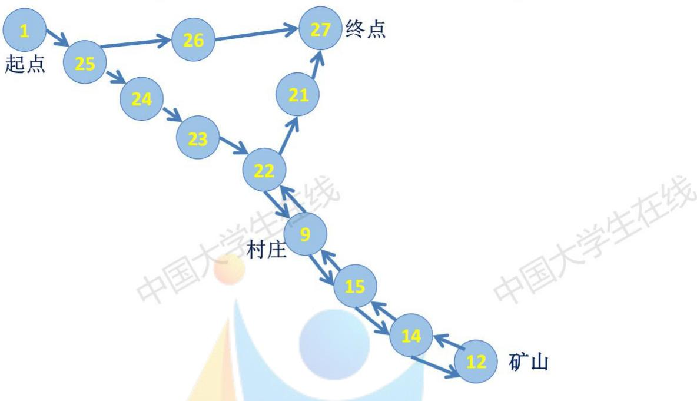
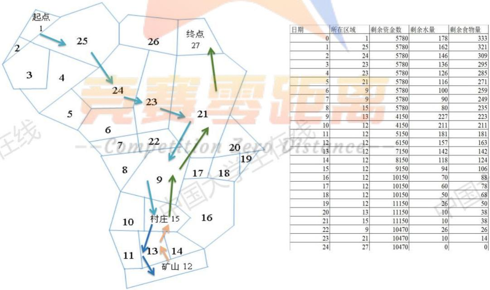
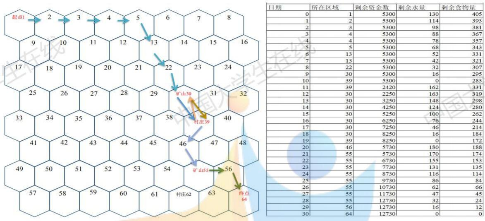
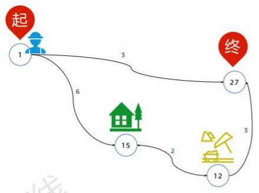
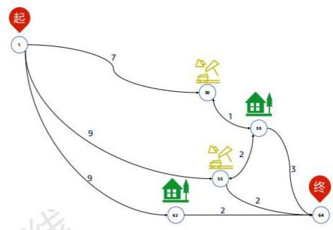
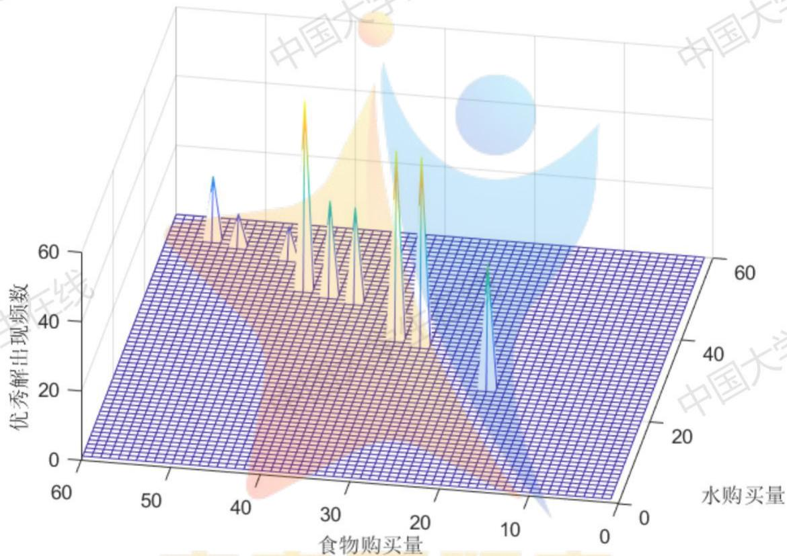
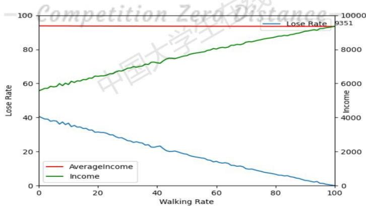
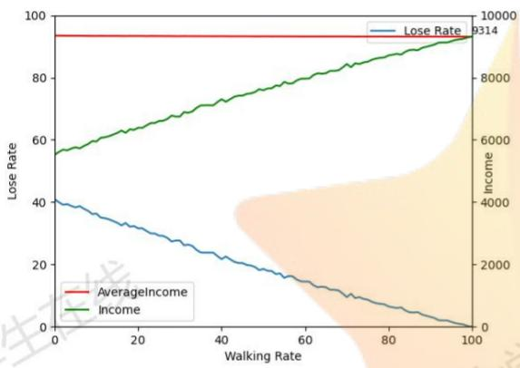
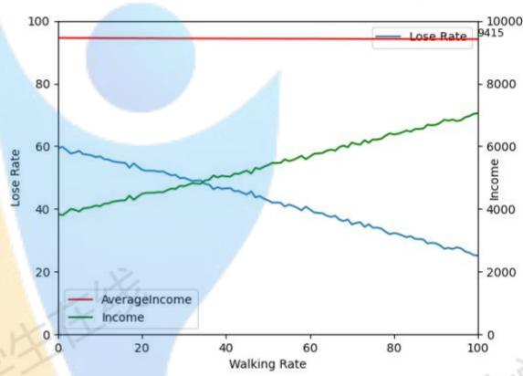
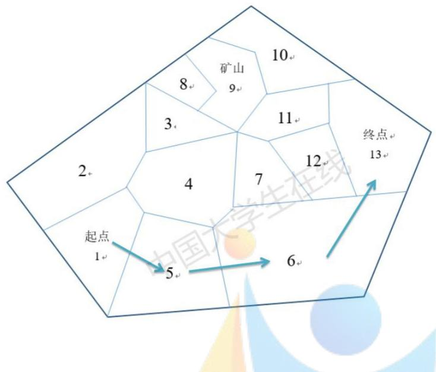

# 基于动态规划、统计分析、静态博弈的穿越沙漠游戏策略设计

## 摘要

本文研究一个穿越沙漠小游戏的最佳策略问题。我们先在分析游戏机制的基础上编程实现了游戏逻辑模拟，再使用了图动态规划模型得到前两个具体关卡的最优解。再基于动态规划求解得到的数据，使用统计分析方法得出更复杂情况的最优策略规则。将这些规则应用于第三、四关后使用随机模拟的方法对具体方案进行调整和检验。最后使用静态博弈模型考虑2人、3人共同参与游戏时的最优策略机制，在第五、六关上进行具体实现和讨论。 学生 L兰

针对问题一：我们先将游戏机制转化为python程序，模拟后发现了对游戏状态及其转移规律的数学表示后论证了动态规划模型的合理性。在对这一模型算法的具体实现、复杂度进行充分分析后进行C++实现，计算得到第一关最优策略得分10470，用时24天，第二关最优策略得分12730，用时30天。

从建模过程和最优方案中提炼出“走最短路”这一确定性策略和“能走则走”在目前游戏设定下成立的规律。

我们对动态规划模型进行了比较彻底的时间、空间复杂度优化(第一问例子中秒级求解）使其与游戏机制模拟一起成为后续问题使用大量数据分析和随机模拟验证的基础。任

针对问题二：为了解决问题二中的随机性，我们先对最佳策略使用统计分析方法来设计决策方案，再使用随机模拟进行验证和评价。对于小规模的第三关，我们用之前的动态规划模型对1024种天气情况进行逐一求解，对其中体现出的路线、行动、购买策略进行统计，得出结论应当直接在前三天走到终点，在起点买保证能够到达终点的最少物资量。我们使用随机模拟算法比较该方案与其他合理方案的期望收益、失败概率，发现其具有明显优势。严格计算和随机模拟均显示其过关得分期望为9350。

对于规模较大不适合穷举最优解的第四关，我们采取抽样统计，通过随机生成不同的天气情况进行动态规划求解，分析最优解，结合第三关经验得出“买足物资，及时补给”的降低风险策略。得到的具体策略分析得到其失败概率控制在2.5%以内并且在一般天气情况下拥有超过初始资金的预期结果。o Distance V

针对问题三：对于多人游戏，我们在分析机制后建立了静态博弈模型。我们先对第五关的几种较优单人策略进行分析，建立起两两间的博弈收益函数表，根据收益表分别进行纯策略和混合策略分析，最后得出均衡的解为双方采用3天到达终点的策略并会选择在起点购买足够生存的物资。第六关我们采取类似的方法对于两人局部的竞争进行分析得出了一系列局部策略，由此指导玩家进行决策优化。

最后我们分析了模型的优缺点和灵敏度，结果显示模型对于这一类问题具有比较好的适应性，提炼出的规则可以有效指导玩家决策。

关键字:动态规划统计分析 随机模拟 静态博弈

## 一、问题重述

## 1.1 游戏设定

本题考虑一个策略选择问题。玩家在一张沙漠地图内，初始拥有一定的资金并购买一定数量的水和食物，从起点出发，在保证生存的情况下，在规定的时间内到达终点并保留尽可能多的资金。途中玩家的资源消耗受到天气和行动的影响，但玩家可以在矿山补充资金，在村庄补充资源。 金 国大

主要的游戏要点如下：

1游戏以天为单位，玩家选择停留或行走。若在矿区停留可以选择挖矿，经过村庄可以选择购买资源。

2资源分为水和食物，玩家在沙漠中的水和食物有负重上限，若未到达终点而资源耗尽则游戏失败。

3玩家在原地停留的资源消耗量称为基础消耗量，行走一天消耗量为基础消耗的两倍，挖矿的消耗量为基础消耗的三倍。

4天气分为“晴朗”、“高温”和“沙暴”，不同天气玩家的基础消耗量不同。“沙暴”天气时玩家必须在原地停留。

5玩家在第0天在起点以基本价格购买水和食物，之后若要购买资源需要在村庄购买，但价格为基准价格的两倍。在到达终点后资源以基准价格的一半退回。

6玩家在矿山挖矿可以获得基础收益，到达矿山当天不能挖矿。

## 1.2 问题提出

根据不同的游戏参数设定(地图、负重上限、初始资金、截止日期、基础收益、资源价格、资源重量、基础消耗量)，在有以下三个问题：

问题一:只有一名玩家，整个游戏时间内所有的天气已知，给出该玩家的最优策略，求解“第一关”和“第二关”。 兴

问题二:只有一名玩家，玩家仅知道当天的天气情况，据此决定当天的行动方案，给出最佳策略并对“第三关”和“第四关”进行讨论。 中国

问题三：有n名玩家同时从起点出发，若某天k名玩家的路线相同，则他们每人的资源消耗量为基础消耗的2k倍；若某天k人在同一矿山挖矿，收益是基础收益的但消耗量不变；若某天k人在同一村庄购买资源，每箱价格为基准价格的4倍。其余情况与单人游戏相同。

(1）若整个游戏世界内天气全部已知，每名玩家的行动方案在第0天确定且不更改，给出玩家的策略并对“第五关”讨论。 X

(2）若所有玩家仅知道当天天气情况，每个玩家在当天行动结束后知道其余玩家当天的行动方案和剩余的资源数量，随后确定第二天的行动方案，给出玩家应该采取的策略并对“第六关”进行讨论。

## 二、模型的假设

## 2.1对于天气不确定情况，各种情况的出现概率固定

在处理天气不确定的策略时，我们认为应当有对于天气概率的一些预期信息。为了简化我们处理为各种情况按固定概率出现。 国大

## 2.2确定天气下的最优方案包含了随机天气下优秀方案的共性

除了确定的天气情况下我们可以得出确定的最优解外，含有博弈和随机天气的情况均不能得到严格最优解。我们认为单人确定性天气下得到的最优方案包含了方案优化中的特征，据此我们可以通过数据分析提取这些优化策略。

## 2.3多人游戏时，每个玩家都是理性人

多人游戏中，玩家总希望自己能存活并获得尽可能多的收益。由于玩家在沙漠中行走没有合作机制，因此合作博弈的基本条件不成立[5]，因此所有玩家都进行不合作博弈，即完全为自己的利益考虑。

## 2.4这是一个纯粹的游戏，不涉及生命伦理问题，即我们可以对游戏者在沙漠中“死亡”的可能性进行分数量化

本模型允许给出对游戏者在沙漠中因缺乏食物而失败的方案，并对此进行量化评分。这对于实际人穿越沙漠问题这样的解应当排除，因为生命无价。

--Competition ZexoDistance--

## 三、符号说明

<table><tr><td>符号</td><td>意义</td></tr><tr><td> $I n i t i a l M o n e y$ </td><td>初始资金</td></tr><tr><td> $B a s i c I n c o m e$ </td><td>挖矿的基础收益</td></tr><tr><td>WeightLimit</td><td>负重上限</td></tr><tr><td> $p _ { w }$ </td><td>水的基础价格 中国大学生</td></tr><tr><td> $p _ { f }$ </td><td>食物的基础价格</td></tr><tr><td> $c _ { w i }$ </td><td>第i天水的基础消耗量</td></tr><tr><td> $c _ { f i }$ </td><td>第i天食物的基础消耗量</td></tr><tr><td> $w _ { w }$ </td><td>一箱水质量</td></tr><tr><td> $w _ { f }$  </td><td>一箱食物质量</td></tr><tr><td> $d$ </td><td>截止日期</td></tr><tr><td>p 中国大</td><td>地图上地区的总个数</td></tr></table>

四、图动态规划模型

## 4.1 图模型

为了后续的算法表述和程序计算，首先我们需要将附件中给的图形化地图转化为图$G = ( V , E )$ ：每个地区块为一个顶点，V表示顶点集合，E表示边集，若i地区和j地区相邻，则 $( i , j ) \in E , ( \mathcal { I } , i ) \in E _ { \circ }$ tition ZexoDistance--

观察发现并不是所有的顶点和边的存在都会对游戏目标产生影响。我们每天如果选择行走的话，总会选择最短的路径走向终点、村庄、矿山三者之一。由此可以对图作较大简化。我们将这一猜想具体表述如下： 中

定义1功能点：终点、村庄、矿山三类点的总称。

定义2 玩家在第i天开始时到j点的距离：玩家从第i 天所在点走到j点所需要经过最少天数，记作 $d _ { i } ( j )$

定义3j点到 $j ^ { \prime }$ 的最短路径：构成从j点走到j'点所需最少天数的方案中的点集和边集，记作 $P _ { j , j ^ { \prime } } = ( V _ { J , J ^ { \prime } } , E _ { J , J ^ { \prime } } )$

猜想1单人玩家在游戏过程中如果选择行走，则至少存在一个功能点j， $d _ { i + 1 } ( j ) < d _ { i } ( j )$

证明：设玩家选择行走的某天i开始时处在节点j,设 $j ^ { \prime }$ 为玩家之后最先到达的功能节点。(由于成功过关时要到达终点，因此 $j ^ { \prime }$ 必存在)。

记玩家让 $d _ { i + 1 } ( j ^ { \prime } ) < d _ { i } ( j ^ { \prime } )$ 的方案(朝着目标 $j ^ { \prime }$ 走)，并且之后每天行走都遵循这个规则为策略1,到 $j ^ { \prime }$ 用时 $t _ { 1 }$ ，其中走路天数 $t _ { 1 w }$ 天,让 $d _ { i + 1 } ( j ^ { \prime } ) \geqslant d _ { i } ( j ^ { \prime } )$ 的方案(不朝着目标 $j ^ { \prime }$ 走)为策略2,到 $j ^ { \prime }$ 用时 $t _ { 2 } w _ { ; }$ 其中走路天数 $t _ { 2 w }$ 。则有 $t _ { 2 w } > d _ { i } ( j ^ { \prime } ) = t _ { 1 w }$

玩家根据天气制定的移动策略（停留或行走）对两种路线均适用。则使用策略1的玩家到达 $j ^ { \prime }$ 后可以等待使用策略2的玩家直到其也到达 $j ^ { \prime } ,$ 此时两种情况具有相同的金钱、日期、位置，哪一种留下的食物和水更多则为更优方案。

由于策略2走路天数多，两种情况在到达目的 $j ^ { \prime }$ 前每天都是同样等待或是选择行走(路线可以不一样，不影响消耗)，前 $t _ { 1 }$ 时间两种情况消耗相同水和食物，而策略1先到目的 $j ^ { \prime } ,$ 在之后 $t _ { 2 } - t _ { 1 }$ 时间内策略1在等待而策略2有等待有行走，消耗更多食物和水。因此策略1更优。由此证明了我们猜想每一步行走都应当靠近某个功能点(也就是即将到达的那个)。

推论1由起点和所有功能点，以及这些点走向各功能点的所有最短路径之并集构成的新图 $G ^ { \prime }$ 对于游戏目标来说与原图G等效 t兰

证明：由于玩家每次行走总会使其与某个功能点之间距离减少，可以等效为其在当前点到该功能点之间最短路径上的行走。图的其余部分与玩家所有可以选择的决策(行走、停留、购买、挖矿、出售)无关，因此对于游戏目标来说，原地图G与新地图 $G ^ { \prime }$ 是等效的。

根据推论1我们完成了对完全图 $G = ( V , E )$ 的简化，得到了简化图 $G ^ { \prime } = ( V ^ { \prime } , E ^ { \prime } )$ 其中， $V ^ { \prime }$ 为所有走向功能点的最短路上的所有点构成的集合， $E ^ { \prime }$ 为 $V ^ { \prime }$ 中所有相邻的点连成的的边。将第一关的地图简化后的示意图如下1所示。

基于对地图的图论表示和分析，我们将整个游戏的逻辑进行程序实现，可以通过输入策略来实现游戏过程的自动模拟。源码见附录中主程序desert\_game.py和策略输入程序strategy.py。据此我们大致得出了前两关最高分的大致范围。 国大

我们会在后续第一问的动态规划求解时对完整的图和简化图分别进行计算，并通过比较结果进一步验证我们的猜想。

## 4.2动态规划思想来源

对于单人玩家在确定天气下策略问题，我们可以用一组参数(天数，位置，水量，食物量，金钱数)描述当前游戏的状态。[4]

  
图1 简化图(第一关)

记录下这一组参数，就好像给游戏存档，下次再读档时后续的游戏决策仅与此存档参数有关，而与如何到达这一参数所描述的状态无关。即决策具有无后效性。

因此，如果我们使用搜索的策略模拟玩家的所有决策，到达相同状态的分支就会进行重复搜索。即这个问题含有许多重叠子问题。 中国

再进一步分析，对于金钱最大这一目标，该问题存在最优子结构。即对于相同的转移策略来说，金钱较多的状态转移到达的状态也是金钱更多的。

完成这些分析，一个在图上的动态规划模型就呼之欲出了。

## 4.3动态规划的要素确定

状态变量 $s = ( i , j , k , l )$ ，表示时间处于第i天结束，玩家的位置在j点，拥有k箱水和l箱食物。 --Comnotition 7ornmetan

指标函数记为 $d p ( s )$ ，表示第i天结束时，玩家的位置在j点，拥有k箱水和l箱食物时可能拥有的最多金钱数。 国大子 国大

决策变量 $x ( s )$ ，表示在状态s时应当采取的状态转移策略。

则本游戏的最佳结果可表示为

$$
\begin{array} { r l } { \underset { i , k , l } { \operatorname* { m a x } } } & { { } d p ( i , F i n a l P o i n t , k , l ) } \end{array}
$$

其中FinalPoint表示地图上的终点编号。

## 4.4状态空间分析

状态变量s含有4个整数分量。i表示天数，设游戏天数d,则有 $0 \leqslant i \leqslant d _ { \mathsf { c } }$

j表示在地图上的位置,设地图含有点的数量为p,则 $1 \leqslant j \leqslant p .$

k,l表示水、食物的数量，则有 $k \geqslant 0 , l \geqslant 0$ 且 $k w _ { w } + l w _ { f } \leqslant W e i g h t { L i m i t }$ o

其中 $w _ { w } , w _ { f }$ 分别表示单箱水和食物的质量 $W e i g h t L i m i t$ 表示负重上限。

综上，整个状态空间 $S = \{ ( i , j , k , l ) \in \mathbb { N } ^ { 4 } | i \leqslant d , j \leqslant p , k w _ { w } + l w _ { f } \leqslant W e i g h t L i m i t \}$ N表示非负整数集合。 在线

字状态空间大小 $\begin{array} { r } { | S | \approx d \times p \times \frac { 1 } { 2 } \frac { W e i g h t L i m i t } { w _ { w } } \times \frac { W e i g h t L i m i t } { w _ { f } } } \end{array}$ 。代入一组有代表性的游戏数据可以算得 $| S | \approx 3 0 { \times } 6 4 { \times } { \frac { 1 } { 2 } } { \frac { 1 2 0 0 } { 3 } } { \frac { 1 2 0 0 } { 2 } } \approx 2 . 3 \times 1 0 ^ { 8 }$ 。其所需的空间复杂度是一台计算机可以接受的。

## 4.5状态转移方程

根据状态定义，我们可以通过游戏规则列写状态转移方程。状态转移有购买和行动两类，共5种情况。购买可以分为在起点购买和在村庄购买，不改变天数；行动可以分为停留、行走和挖矿，会增加天数。下面将分别讨论5种情况下 $d p ( i , j , k , l )$ 的转移方程。

## 4.5.1 起点买资源

初始时有状态

$$
d p ( 0 , 1 , 0 , 0 ) = I n i t i a l M o n e y
$$

InitialMoney为初始资金。时间参数 $i = 0$ 表示第0天结束，即第1天开始。位置参数j=1为起点。

在起点可以以基础价格购买食物和水。因此 $i = 0 , j = 1$ 的所有状态 $s = ( i , j , k , l )$ 都可以由初始状态到达(如果钱够的话)， $d p ( s )$ 就是初始时的钱减去购买水和食物花费的钱。

$$
d p ( 0 , 1 , k , l ) = I n i t i a l M o n e y - k p _ { w } - l p _ { f } , \quad \forall ( 0 , 1 , k , l ) \in \mathbb { S }\tag{1}
$$

其中 $p _ { w } , p _ { f }$ 分别表示水和食物的基础价格。

## 4.5.2 村庄买资源

如果j位置是一个村庄，那么从(i,j,k,l)状态出发购买水和食物(钱足够的情况下)就可以到达状态集合S中的另一状态 $( i , j , k + k ^ { \prime } , l + l ^ { \prime } )$ 。

相应可以对 $d p ( s )$ 进行更新。

$$
d p ( i , j , k + k ^ { \prime } , l + l ^ { \prime } ) = \operatorname* { m a x } \{ d p ( i , j , k + k ^ { \prime } , l + l ^ { \prime } ) , d p ( i , j , k , l ) - 2 k ^ { \prime } p _ { w } - 2 l ^ { \prime } p _ { f } \}\tag{2}
$$

## 4.5.3停留

停留使状态中天数i增加1，位置j不变，食物和水按照游戏规则进行消耗。

$$
d p ( i + 1 , j , k - c _ { w i } , l - c _ { f i } ) = { \bf m a x } \{ d p ( i + 1 , j , k - c _ { w i } , l - c _ { f i } ) , d p ( i , j , k , l ) \} ,\tag{3}
$$

要求k≥ $c _ { w i } , l \geqslant c _ { f i }$ 。其中 $c _ { w i } , c _ { f i }$ 分别为水和食物在第i天情况下基础消耗量。

## 4.5.4挖矿

挖矿时水和食物的消耗为基础消耗量的3倍，增加收入，天数增加，位置不变。

$$
d p ( i + 1 , j , k - 3 c _ { w i } , l - 3 c _ { f i } ) = { \bf m a x } \{ d p ( i + 1 , j , k - 3 c _ { w i } , l - 3 c _ { f i } ) , d p ( i , j , k , l ) + B a s e I n c o m e \} = 1 .\tag{4}
$$

要求 $k \geqslant 3 c _ { w i } , l \geqslant 3 c _ { f i }$ 其中 BaseIncome为每关游戏参数中的基础收益。

## 4.5.5移动

移动的时候，水和食物的消耗量都是基础消耗量的2倍，天数增加，位置变化。

$$
d p ( i + 1 , j ^ { \prime } , k - 2 c _ { w i } , l - 2 c _ { f i } ) = { \bf m a x } \{ d p ( i + 1 , j ^ { \prime } , k - 2 c _ { w i } , l - 2 c _ { f i } ) , d p ( i , j , k , l ) \}\tag{5}
$$

要求 $k \geqslant 2 c _ { w i } , l \geqslant 2 c _ { f i } , ( j , j ^ { \prime } ) \in E _ { \circ }$ E为图的边集。

## 4.6动态规划算法实现

Algorithm 1 图动态规划  
Input: S:合法状态 (i, j, k, l) 的集合  
E：图的边集  
Baid oy 零距离 InitialMoney:初始资金  
d: 截止天数 Competition ZexoDistance--  
学生在 p: 图中地区点总数  
Output: $\operatorname* { m a x } _ { i , k , l } { d p ( i , F i n a l P o i n t , k , l ) }$ :这一关的最高过关分数  
Initialize: $d p ( i , j , k , l ) = - I N F { \mathrm { f o r } } \forall ( i , j , k , l ) \in S$   
1: for $k , l : ( 0 , 1 , k , l ) \in S \ \mathbf { d o } ^ { * } 1$ 起点购买物资\*/  
2: $d p ( 0 , 1 , k , l ) = I n i t i a l M o n e y - k p _ { w } - l p _ { f }$   
3: end for  
4: for i = 0 → d do  
5: for j = 1 → p do  
6: if j是村庄then/\*2每天行动前，在村庄买物资更新\*/

```latex
7: for k, $l : ( i , j , k , l ) \in S$ do
8: for $k ^ { \prime } , l ^ { \prime } : k ^ { \prime } > = 0 , l ^ { \prime } > = 0 , ( i , j , k + k ^ { \prime } , l + l ^ { \prime } ) \in S \mathrm { { d } } \mathbf { o }$
$d p ( i , j , k + k ^ { \prime } , l + l ^ { \prime } ) = { \bf m a x } \{ d p ( i , j , k + k ^ { \prime } , l + l ^ { \prime } ) , d p ( i , j , k , l ) - k ^ { \prime } p _ { w } - l ^ { \prime } p _ { f } \}$
9: end for
10: end for
11: end if
12: for k $, l : ( i , j , k , l ) \in S \ \mathbf { d o } / { ^ { * } } 3$ 停留情况的更新*/
生在
13: $d p ( i + 1 , j , k - c _ { w i } , l - c _ { f i } ) = { \bf m a x } \{ d p ( i + 1 , j , k - c _ { w i } , l - c _ { f i } ) , d p ( i , j , k , l ) \}$
14: end for 中国大
15: $\mathbf { i f } \ j$ 是矿山 then $/ { } ^ { * } 4$ 挖矿情况的更新*/
16: for $k , l : ( i , j , k , l ) \in S$ do
17: $d p ( i + 1 , j , k - 3 c _ { w i } , l - 3 c _ { f i } ) = { \bf m a x } \{ d p ( i + 1 , j , k - 3 c _ { w i } , l - 3 c _ { f i } ) ,$
$d p ( i , j , k , l ) + B a s i c I n c o m e \}$
18: end for
19: end if
20: for $j ^ { \prime } : ( j , j ^ { \prime } ) \in E { \bf \Delta d o } / { } ^ { * } { \sf 5 }$ 移动情况的更新 */
生在线 21: $\begin{array} { r } { d p ( i + 1 , j ^ { \prime } , k - 2 c _ { w i } , l - 2 c _ { f i } ) = \mathbf { m a x } \{ d p ( i + 1 , j ^ { \prime } , k - 2 c _ { w i } , l - 2 c _ { f i } ) , } \\ { d p ( i , j , k , l ) \} \qquad } \end{array}$
23: 22: end for end for 中国大 中国大学
24: end for
```

## 注意

1. 伪代码Input中的集合S代表了在实际程序中输入的一系列游戏参数 $( i , j , k , l ) \in S$ 的判断在实际程序中就是一些简单的逻辑判断。终点FinalPoint这个参数也包括在状态集合S中了。为了让算法表述更简洁，伪代码中省去了处理这些逻辑的细节。

2. 伪代码Input 中的边集E实际用邻接表实现。

3. -INF表示负无穷,实际实现时可以使用一个很小的数。

4. 读者可能有疑问，为何算法循环中每天需要同时更新停留、挖矿、移动。这可以从搜索的角度理解，动态规划的更新过程并不是模拟一个玩家在进行游戏，而可以理解为模拟玩家所有可能到达状态及其之间转移方式可能性的过程。

5. 伪代码中在村庄买物资更新一部分循环达到6层。在第i天第j个节点的情况下要对k,l,k′,l'四个变量循环遍历。这里复杂度似乎为 $O ( n ^ { 4 } )$ 。这里这样写是为了算法表达的简单明了，具体在程序实现时会做一定的优化，使复杂度变为 $O ( n ^ { 2 } )$ 。优化思想简要介绍如下：

如果从(i,j,k,l)状态通过购买食物到达 $( i , j , k + k ^ { \prime } , l + l ^ { \prime } )$ 时剩下的钱少于$d p ( i , j , k ^ { \prime } , l ^ { \prime } )$ 。那么就可以确定由 $( i , j , k + k ^ { \prime } , l + l ^ { \prime } )$ 转移到 $( i , j , k + k ^ { \prime } + k ^ { \prime \prime } , l + l ^ { \prime } + l ^ { \prime \prime } )$ 一定比从 $( i , j , k , l )$ 转移到 $( i , j , k + k ^ { \prime } + k ^ { \prime \prime } , l + l ^ { \prime } + l ^ { \prime \prime } )$ 更好，即买东西过程也存在最优子结构，基于此，只要对(k,l)所在的二维状态空间做一次遍历即可，复杂度 $O ( n ^ { 2 } )$ 。

## 4.7复杂度分析

设共 $d$ 天，p个点，由重量限制得可以携带的食物或水n箱。(两者同一量级的)

算法最外层对i的循环 $O ( d )$ ，对j的循环 $O ( p ) _ { \circ }$ 对于每个 $( i , j )$ 。若在村庄，由之前分析购买物资更新复杂度 $O ( n ^ { 2 } )$ 。计算停留、挖矿均为对 $( k , l )$ 简单遍历，复杂度 $O ( n ^ { 2 } )$ 。由于关卡地图均为稀疏图，各点度数较小，因此移动的复杂度也为 $O ( n ^ { 2 } )$ 国大

因此根据复杂度分析的运算规则，整个算法复杂度 $O ( d \times p \times ( n ^ { 2 } + n ^ { 2 } + n ^ { 2 } ) ) =$ $O ( p d n ^ { 2 } )$ 。与开始分析存储动态规划状态表的空间复杂度在同一量级。实际使用C++编程实现对问题一求解程序(源码见附录)运行时间在秒级。 1

## 五、问题一解答

## 5.1第一关

## 5.1.1 最佳方案

经过动态规划算法求解，我们得到了第一关最佳结果行动方案。



<table><tr><td>日期</td><td>所在区域</td><td>剩余资金数</td><td>剩余水量</td><td>剩余食物量</td></tr><tr><td>0</td><td>1</td><td>5780</td><td>178</td><td>333</td></tr><tr><td>1</td><td>25</td><td>5780</td><td>162</td><td>321</td></tr><tr><td>2</td><td>24</td><td>5780</td><td>146</td><td>309</td></tr><tr><td>3</td><td>23</td><td>5780</td><td>136</td><td>295</td></tr><tr><td>4</td><td>23</td><td>5780</td><td>126</td><td>285</td></tr><tr><td>5</td><td>21</td><td>5780</td><td>116</td><td>271</td></tr><tr><td>6</td><td>9</td><td>5780</td><td>100</td><td>259</td></tr><tr><td>7</td><td>9</td><td>5780</td><td>90</td><td>249</td></tr><tr><td>8</td><td>15</td><td>5780</td><td>80</td><td>235</td></tr><tr><td>9</td><td>13</td><td>4150</td><td>227</td><td>223</td></tr><tr><td>10</td><td>12</td><td>4150</td><td>211</td><td>211</td></tr><tr><td>11</td><td>12</td><td>5150</td><td>181</td><td>181</td></tr><tr><td>12</td><td>12</td><td>6150</td><td>157</td><td>163</td></tr><tr><td>13</td><td>12</td><td>7150</td><td>142</td><td>142</td></tr><tr><td>14</td><td>12</td><td>8150</td><td>118</td><td>124</td></tr><tr><td>15</td><td>12</td><td>9150</td><td>94</td><td>106</td></tr><tr><td>16</td><td>12</td><td>10150</td><td>70</td><td>88</td></tr><tr><td>17</td><td>12</td><td>10150</td><td>60</td><td>78</td></tr><tr><td>18</td><td>12</td><td>10150</td><td>50</td><td>68</td></tr><tr><td>19</td><td>12</td><td>11150</td><td>26</td><td>50</td></tr><tr><td>20</td><td>13</td><td>11150</td><td>10</td><td>38</td></tr><tr><td>21</td><td>15</td><td>11150</td><td>10</td><td>38</td></tr><tr><td>22</td><td>9</td><td>10470</td><td>26</td><td>26</td></tr><tr><td>23</td><td>21</td><td>10470</td><td>10</td><td>14</td></tr><tr><td>24</td><td>27</td><td>10470</td><td>0</td><td>0</td></tr></table>

图2 最优路线图(第一关)

第一关玩家在截止日前到达终点时的资金最高为10470元，用时24天。走法如图所示：初始买水178，食物333，1-8天去村庄，买水163到负重上限，9-10天去矿区，11-17天挖矿,18天停留，19天挖矿，20-21去村庄，买36水，16食物，后22-24天去终点，食物和水恰好清零。

具体的每天行动与资源情况如Result.xlsx表格中所示。

## 5.1.2 策略变化分析

除了得到最终30天内到达终点的最高分外，我们还考虑了截止天数为 $1 \leqslant i \leqslant 3 0$

<table><tr><td>截止日期</td><td>1 3</td><td>22</td><td>23</td><td>24</td></tr><tr><td>最高得分</td><td>0 9410</td><td>9500</td><td>10430</td><td>10470</td></tr></table>

表1 最高得分随截止日期增加的上升情况

从表中可以看出，最快可以三天到达终点，最后最多剩余9410元，可以从地图中看出这是直接前往终点的策略。这在22天之前到达的方案之中都是最优的，即前去挖矿且22天内到达终点的方案不如直接前往终点。到第24天上升为10470元，且之后到30天不再更新，即我们得到的结果，这是最优的行走策略。 国大

为了查看挖矿情况下截止日期与最高得分的关系，我们将3天前往终点的路线删去重新计算，得到的最高变化趋势如下：

<table><tr><td>截止天数 1</td><td>9</td><td>20</td><td>21</td><td>22</td><td>23</td><td>24</td></tr><tr><td>最高资金 0</td><td>8330</td><td>8395</td><td>8950</td><td>9500</td><td>10430</td><td>10470</td></tr></table>

表2 最高得分随截止日期增加的上升情况（除去3天到达的情况策略)

可以看出，删去3天速达路线后，仍然是9天直接到达终点不挖矿的结果维持到了截止日期少于20天。之后的变化与有完整路线的地图结果一致。 国大

具体查看程序输出的路径信息，我们可以发现在截止天数较少时最优策略倾向于节约资源开支，直接到达终点。20天即之后到达的情况才会考虑挖矿并在村庄购买资源补充。具体是补充一次还是两次需要结合天气情况确定，没有明显的规律。

## 5.2第二关

经过动态规划算法求解，我们得到了第二关最佳结果行动方案。

  
图 3 最优路线图（第二关)

5 第二关玩家在截止日前到达终点时的资金最高为12730元，用时30天，走法如图所示： 中国 中国

初始买水130箱，食物405，1-10天经过30号矿山前往39号村庄且不在矿山处停留挖矿，到达村庄时水刚好耗尽，第11天遇上沙暴在村庄停留，买水172，食物58。第12天买水17，不买食物，离开前往30号矿山。第13天到第18天在矿山挖矿。第19天前往39号村庄。第20天购买196箱水，28箱食物，前往55号矿山，并于第21天抵达。第22天到第28天挖矿。第29-30天从矿山出发到达终点，食物和水恰好清零。

## 5.2.1策略变化分析

同样地，我们可以作截止时间和最高得分如下：
<table><tr><td>截止天数</td><td>14</td><td>15</td><td>16</td><td>19</td><td>20</td><td>21</td><td>22</td><td>23</td><td>24</td><td>29</td><td>30</td></tr><tr><td>最高得分</td><td>7390</td><td>8790</td><td>9485</td><td>9555</td><td>10285</td><td>10760</td><td>11180</td><td>11590</td><td>12020</td><td>12355</td><td>12730</td></tr></table>

表3截止天数的最高资金

由于本关卡有两个村庄和矿山，所以决策会有更多的情况，所以最高得分表随截止时间增加的更新也比较频繁，可以看出第30天到达终点是最优解。

## 5.3一般情况下的最优策略

通过对结果分析，我们得到以下基本的策略设计原则。

(1）到达终点处时玩家的资源恰好耗尽。为了使到达终点时资金尽可能多，玩家没有理由买多于生存需求的水和食物。玩家在起点和村庄购买资源的价格都高于最后在终点返还的资金，因此在天气情况已知的情况下，玩家知道维持自己生存所需要的最少资源，所以有能力在到达终点时控制资源恰好耗尽。此策略仅适用于全局天气已知情况。

(2)起点处在保证生存的情况下多买食物。根据条件，村庄处的资源价格是起点处的资源价格的两倍，所以需要尽量多在起点买资源，而在村庄仅保证生存需要即可。根据计算，挖矿的收益大于沙暴天气挖矿的消耗，因此收益较大，玩家选择前去挖矿。为了保证挖矿的时间，需要装上尽量多的食物和水。根据食物和水的价格表，定义衡量资源携带效率为基准价格与每箱质量之比。

$$
\eta = \frac { p r i z e } { m a s s }\tag{6}
$$

由于背包有负重上限，因此玩家倾向于在起点购买价格较贵且质量较小的资源，即资源携带效率η较大的资源。水和食物的比较见下表。

<table><tr><td colspan="3">资源4 每箱质量（kg） (元/箱)携带效率(元/千克)</td></tr><tr><td>水 3</td><td>5 中国大</td><td>1.67</td></tr><tr><td>食物</td><td>2 10</td><td>5.00</td></tr></table>

表4 资源携带效率比较

由结果知，食物的携带效率远大于水，因此在确保生存的情况下尽量多买食物是更好的策略。

(3）玩家每次移动总会与目的地的最短距离缩小。根据分析可知，玩家在沙漠中的功能地只有三个：村庄、终点和矿山。当玩家选定目的地后，最佳移动策略为以最短路向目的地前进。动态规划的计算中我们分别以原始图和简化后的图作为输入运行算法，

对于更大规模的地图，或者没有条件使用计算机运行动态规划算法时，可以利用上述策略设计单人确定天气情况下穿越沙漠游戏策略。

通过比对简化地图与动态规划得到的最优解，我们发现最佳策略就是按照最短路前进的，这也进一步验证了该策略的正确性。

  
图4 简化后的地图(第一关)

  
图5 简化后的地图（第二关)

## 六、统计评价模型与第二问方案

第三、四关由于存在随机性，不能够给出一个确定性的最优策略，因此我们在设计方案之后需要建立方法对方案的评价进行评价。

在设计中，我们将方案分解为购买策略、路线策略、行走-停留决策三部分。在设计完成后利用随机模拟得到的期望收益和失败概率来对方案进行评价。

## 6.1基于完全统计的路线、行动选择、购买策略设计

第三关天气是随机的，但因为图比较小并且只有10天，所有天气一共 $2 ^ { 1 0 } = 1 0 2 4$ 种情况，我们可以利用动态规划算法给出每一种情况的最优解，用统计方法观察规律。(输出 1024 种最优方案的程序见附录 desert game dp(第三关-简化图-路径回溯-天气枚举).cpp。

## 6.1.1初步结论:确定路线

通过观察最优解策略，我们发现即使在全部晴天状态下仍然没有去挖矿。可以猜想这一关不能够挖矿。

事实上，由于第三关没有村庄，又因为高温天气消耗很大，且挖矿收益很小，即使在晴朗的天气挖矿，收益仅为 $2 0 0 \div 1 6 5 = 3 5 .$ 挖矿5天的收益175还不足以弥补由于绕路导致至少220的资源消耗。若有高温天挖矿损失只会更大。

因此玩家的决定只有一个—直接走向终点。从图中很容易得到从起点到终点的最短路，需要玩家行走三天。在路径完全确定的情况下，玩家需要决策的就是在起点购买资源的策略和移动策略。

## 6.1.2统计结论1:确定行走-停留方式

有了确定的路线，我们再对1024种天气情况下的到达终点天数进行统计为了理解这一数据的意义，我们对移动策略进行简单的分类讨论：

<table><tr><td>到达天数</td><td>3</td><td>4</td><td>5</td><td>6</td></tr><tr><td>最优解数量</td><td>576</td><td>320</td><td>112</td><td>16</td></tr><tr><td>占比(%)</td><td>56.25</td><td>31.25</td><td>10.94</td><td>1.56</td></tr></table>

表5 1024种最优走法的到达天数统计

1晴朗天气移动:晴朗天的资源基础消耗最少，所以若遇到晴朗天气，玩家一定选择移动。 国入 国大

2高温天气停留:高温天气移动会消耗18箱水和18箱食物，折合金钱为270元，比两次晴朗天气的消耗量还多，因此高温天若不连续出现，在高温天停留可能比较明智。

3高温天气移动：高温天移动的消耗很大，但若遇到连续的高温天而不移动，很容易会将携带的资源耗尽，又由于本关的路径很短，若在高温天移动而尽早到达终点，可以减少进一步由于高温消耗资源，即减少失败的概率。

可见最优解中过半选择3天不停留直接走向终点，而仅有约10%会等待两天或三天。根据上述分析可以得知，选择高温天行走是相对比较保守的方案，只要买足物资就不存在失败风险，而选择等待则以风险换取省物资的收益

考虑到动态规划搜索到最优解的特点，搜索到的最优解一定是一个非常冒险的方案，这里面存在很严重的幸存者偏差。即使如此仍然有大概率选择3天到达，那么我们可以认为在决策过程中选择高温等待的概率应当很小。

## 6.1.3统计结论2:确定初始购买方案

设有n个最优解，第i个最优解的购买策略为买 $w _ { i }$ 箱水和 $f _ { i }$ 箱食物，则样本均值和标准差分别为

$$
{ \bar { w } } = \sum _ { i = 1 } ^ { n } w _ { i } , { \bar { f } } = \sum _ { i = 1 } ^ { n } f _ { i }
$$

$$
\sigma _ { w } = \frac { 1 } { n - 1 } \sum _ { i = 1 } ^ { n } ( \bar { w } - w _ { i } ) ^ { 2 } , \sigma _ { f } = \frac { 1 } { n - 1 } \sum _ { i = 1 } ^ { n } ( \bar { f } - f _ { i } ) ^ { 2 }
$$

我们将 $\left[ \bar { w } - \sigma _ { w } , \ \bar { w } + \sigma _ { w } \right]$ 作为水的优秀购买区间，将 $[ \bar { f } - \sigma _ { f } , \bar { f } + \sigma _ { f } ]$ 作为食物的优秀购买区间。

经过动态规划我们可以计算得到上述统计量如下表

优秀解的分布图如下

## (1) 购买方式分析:

两种资源的均值大致相等，这说明大部分的优秀策略都选择了购买尽量等量的水和食物。由第一问我们得到在起点处尽量多买食物，但在本关没有村庄，如何生存和省钱是主要目标，而晴朗和高温天气下水和食物的消耗箱数大致相等，因此为了更加省钱玩家不能对于某一种资源有购买偏好而导致最终一种资源余量很大但另一种资源被较快耗尽的情况。 中国 中国

<table><tr><td>资源</td><td>样本均值</td><td>样本标准差</td><td>最高两峰代表点位</td></tr><tr><td>水</td><td>38.4</td><td>3.1</td><td>[42,53]</td></tr><tr><td>食物</td><td>37.2</td><td>1.1</td><td>[41, 53]</td></tr></table>

表6资源购买的样本统计量计算

  
图6 1024 个最优解起点购买方案统计

(2）购买量分析：考虑幸存者偏差，我们不应当取平均值或众数作为购买方案，而应该选择统计图中水、食物量最大的两个峰区作为第一天为晴天、高温两种情况下的购买策略。

因此我们得到的优秀购买方案参考值为晴天42水、44食物，高温54水，54食  
物。(对之前的两峰参考值进行调整使得食物和水配比平衡，恰好可以满足之后两天都  
是高温的行走需求)。V

## 6.1.4方案搜索空间的确定

综合以上分析，我们的方案设计框架为：

1 路线：按最短路线3天到终点。

2行走:三种情况也可以统一理解为晴天行走，高温以p的概率移动 $( 0 \leqslant p \leqslant 1 )$ 。倾向于 $p \approx 1$ 的情况。

3购买：晴天42水、44食物，高温54水，54食物。在这一基础上进行调整。

有了以上方案设计指导，搜索空间已经很小，可以写程序进行搜索，接下来就是设计评价指标来筛选最优方案了。 大学 大

## 6.1.5方案的评价模型

为了综合评价方案的好坏，我们认为要从最终收益的期望和存活概率两方面综合考量。

对于确定的策略参数，进行n轮随机模拟，其中成功通关 $n _ { 1 }$ 次，第i次最终剩余钱 $m _ { i }$ 。则有

$$
L o s e R a t e = \frac { n - n _ { 1 } } { n }\tag{7}
$$

$$
A v g I n c o m e = \frac { \sum _ { i = 1 } ^ { n _ { 1 } } m _ { i } } { n _ { 1 } }\tag{8}
$$

LoseRate为失败率，AvgIncome表示在成功过关情况下平均得分。

再定义完全平均意义下的收入Income，认为失败的收益为0，没有额外惩罚。

$$
I n c o m e = \frac { \sum _ { i = 1 } ^ { n _ { 1 } } m _ { i } } { n }\tag{9}
$$

## 6.2第三关解答：随机模拟结果呈现与讨论

我们利用模拟程序（见附录和支撑材料simulation.py），按照晴天-高温各50%的概率设定对方案中不同的行走概率p进行随机模拟，结果如下：

  
图7失败率、成功时平均收入、总平均收入随高温天移动概率的关系图

可以看到当高温天确定移动时模拟得到的期望收益为9351（可以严格计算得期望是9350)，并且没有失败风险。可见该随机模拟计算期望的仿真度很高。同时可以明显发现随着高温天移动概率的下降，失败概率(蓝线)急剧上升而成功时平均收益(红线)变化不明显。

将两者平均得到总的预期收益(绿线)与高温天行动概率的关系。可以明显看出概率应当为1最好。

接下来简单讨论初始时带上当天和2个高温天行走所需水和食物的购买方案的优越性。在这一购买方案基础上进行微调，可以发现最终受益基本是一个单峰函数，这里仅给出多买5箱(9314)和少买5箱的结果(≈7000) 大

  
图8 多买5箱食物和水

  
图9 少买5箱食物和水

根据得分来看，不管天气如何，三天直接走向终点得分最高，是最合理的策略。相应购买保证成功的最少食物。一点也不能少（上面少买5箱的结果可以看到失败率急剧上升，最终期望结果下降2000左右。

下面我们将在这些分析得到的结果基础上处理第四关的情况。

## 6.3第四关图的简化和分析

通过第三关的分析，在这一组食物、水消耗的数据下，当玩家不知道天气并且没有沙暴天，距离目的地较近时，购买充足的水和食物一直不停留地前进是最好的策略。

从本关的地图来看，除了功能点外，还有一个非常重要的点13，我们把它称为决策点。首先，决策点距离起点只有四天的路程，而且是玩家在沙漠中的必经点，这和第三关的情况非常相似。

同时由于决策点距离村庄和矿山都只有一天行程，在决策点的状态直接影响玩家的决策，因此是玩家做决策的关键点。

此外，最后走向终点的路同样和第三关类似，玩家最终要走向终点，而这一段路程的起点（最后一次决定目的地）的点必须为村庄或矿山，而这两个点距离终点的距离都

为三天路程，这和第三关的情况完全相同。

而一个比较大的问题在于沙暴天气的处理。

综上所述，我们可以对问题进行简化：

· 离开起点的路—从起点到决策点13的路采用第三关的结论。

·走向终点的路从村庄或矿山到终点的路采用第三关的结论。

## 6.4天气等效模型

虽然我们的移动策略得到简化，但我们难以在购买和路线方面给出较有说服力的方案。我们知道三种天气都有可能发生，天气的未知性是使得玩家失败率升高的根本原因，若我们能够将天气进行等效，以一定比例地把晴朗和沙暴天全部转化为高温天，那么购买策略就能大大简化，玩家按照等效高温天进行购买资源，可以有效地提高自己的存活率。因此我们充分考虑在三种天气下玩家的所有行为，并对他们的收益和消耗进行计算，从资源消耗和挖矿收益两方面来进行天气等效。

对于给定的天气 $i , i = 1 , 2 , 3$ (分别为晴朗、高温和沙暴)，设对应的水的基础消耗箱数为 $c _ { w i }$ ，基础价格为 $p _ { w }$ ，食物的基础消耗箱数为 $c _ { f i }$ 基础价格为pf。根据第一关 $p _ { f }$ 的数据，我们发现玩家在起点购买食物数与在村庄购买量之比近似为8:2，购买水量之比约为 $7 : 3$ 。但由于天气未知，根据之前分析，玩家更关注存活率，这和第一关购买水量的初衷一致，为方便计算，我们认为在本关玩家在起点购买的食物箱数和水箱数与在村庄购买数之比均为 $7 : 3 .$ 设 $B i j , j = 1 , 2 , 3$ 分别为在i天气下停留、行走和挖矿的净收益，且综合净收益为 $B _ { i }$ ，则得到如下方程组

$$
\left\{ \begin{array} { l l } { B _ { i 1 } = - ( 0 . 7 + 0 . 3 \times 2 ) ( c _ { f i } p _ { i } + c _ { w i } p _ { i } ) = - 1 . 3 ( c _ { f i } p _ { i } + c _ { w i } p _ { i } ) } \\ { B _ { i 2 } = 2 B _ { i 1 } } \\ { B _ { i 3 } = 1 0 0 0 + 3 B _ { i 1 } } \\ { B _ { i } = \sum _ { j = 1 } ^ { 3 } B _ { i j } } \end{array} \right.
$$

设晴朗和沙暴天以x：y的比例等效为高温天，则可以列得净收益等效方程

$$
x B _ { 1 } + y B _ { 3 } = ( x + y ) B _ { 2 }
$$

经过计算可得， $\textstyle { \frac { x } { y } } = 0 . 2 1 4 \approx { \frac { 5 } { 1 } }$ 。因此，从净收益的角度，晴朗与沙暴天以5:1等效为高温天，即每5天晴朗和1天沙暴与6天高温等效。

## 6.5第四关解答:基于动态规划策略的分析与调整

游戏设定中已知沙暴天气较少，我们取10%，我们将一定比例的晴天和沙暴天进行等效，增加了高温天且减少了一定晴天。

确定了天气我们就可以使用第一问中的动态规划模型进行求解。在天气等效后我们主要关注其购买策略，可以分析得出以下策略：

1在起点的购买策略和第一问的结果一致，是优先考虑购买食物，食物的量在300箱左右，水的量在150箱左右。

2第一次到决策点时，若水的量小于100箱就要去村庄补给，否则去挖矿。

3第一次到村庄补给时只尽量多地购买水而不购买食物，一般补充水至235箱左右，此时食物剩余约235箱左右。 在线

我们发现这些策略和第一问的结论极其相似，这也符合我们的预期，因为我们将晴朗天和沙暴天等效为高温天，则天气的确定性降低，购买策略就相对固定了。这些策略和第三关有差别，可以认为是由于村庄可以补给以及可以挖矿赚钱这两个主要因素造成的。

等效天气的方法仍旧无法确定路线策略，但经过分析购买策略，可以推理出一些路径策略。由于在村庄补给食物与水至235箱左右，大约可以支持9天的挖矿并留足直接返回终点不停留的资源；或是挖矿12天左右后返回村庄补给并直接回到终点。

我们认为这两种策略都有可能是比较优秀的路线，因此我们随机生成了100种30天的天气进行动态规划求解，筛选出前20的优秀解，统计它们在第一次补给后的策略，发现有93.41%的解选择了路径一，即第一次补给后挖矿，保留够直接返回终点的资源直接返回终点。 大学

路径一的压倒性的优势是我们没有预料到的，但我们仔细分析，可以得到原因。首先，挖矿并留足能直接返回终点的策略和第三关的最优策略一致，玩家可以避免由于更多挖矿而资源耗尽，或是减少由于天气恶劣造成的损失。其次，由于从矿山到村庄需要走两天，而村庄和矿山距离终点都是四天行程，若多挖矿会多走至少两天的路程，更有可能遇到高温或沙暴，使资源大大减少，甚至增加失败的风险。因此，路径一是更合理的选择。 PFAC

考虑沙暴概率10%的情况，对于几个关键点的简单的计算表明该策略失败概率控制在2.5%以内。

对于该策略进行与第三关类似的随机模拟(问题一中的 python模拟程序)验证了以上结论，并计算得期望收益达到10500。 大学

## 6.6总结：一般情况下玩家的最优策略

综合以上分析，我们可以归纳出当天气未知时玩家的宏观优秀策略。

## 6.6.1地图中没有村庄和矿山的情况

当玩家距离下一个目的地较近时，玩家不应该等待，应该尽快到达目的地。因为更长时间的停留会大大增加资源的消耗，甚至会有失败的风险。即使等待最终能到达终点最后的资金与快速通过方案也相差无几，通过避开高温天行走而节省的金钱并不多，

在购买资源时按照最坏的情况购买，保证能够到达目的地。我们进行游戏的首要目的是通过，若不通过净收益为-10000元，而相对保守地购买可以在保证100%通过的前提下，最终的收益也较高，是在天气不确定时最好的策略。

## 6.6.2地图中有村庄和矿山的情况

当地图中有村庄和矿山时，村庄的合理购买可以保证存活，矿山挖矿可以增加最后的收益，因此最佳策略和上一种情况有所不同。

玩家的购买策略是在起点优先考虑携带效率高的资源，即价格贵且需求大的资源，另一种资源可以以最坏情况买到下一次补给之前。在村庄大量补充携带效率低的资源，尽量不补充携带效率高的资源。如此购买的原因在第一关和第四关都有详细的阐述。

玩家的行动策略为首先在接近村庄和矿山的点进行决策，若剩余资源较少则先去补充资源，若剩余资源较多就直接去挖矿。当挖矿到资源剩余按最坏打算仅够前往下一个功能点时，前往下一个功能点。一般地，玩家应该在向下一个功能点的同时，与终点的距离逐渐缩小，否则将显著提高失败的风险。 大学

## 七、静态博弈模型：问题三策略分析与设计

由于在这一问中两关都具有不止一个玩家，并且玩家在游戏中的状态更新会受到对方情况的影响，因此每个玩家为了实现自己的游戏目标，必须考虑对方的行动策略。因此用博弈的模型来考虑。

第五关双方同时进行一次决策，为单阶段静态博弈。第六关双方进行多次决策，每次决策都是同时进行的，为多阶段静态博弈。

## 7.1两人单阶段博弈：第五关

## 7.1.1博弈设定与求解目标

有两位玩家A、B。我们假设两个玩家都是具有充分思维能力的理性人，能够充分考虑自己的策略和对方的选择。设计的目标是使A能够在B按照符合B利益前提下行动时让自己获得最大的期望收益。

因为A、B地位是平等的，即两个玩家的策略集是完全对称的，因此我们为A设定的策略对B也是同样适用的。

## 7.1.2 思路分析

可行的方案大致有两类:第一类为纯策略[1]，两个玩家使用同一种固定策略，走同一条路线。第二类为混合策略，玩家以从一个策略组 $S = \{ S _ { 1 } , S _ { 2 } \cdots S _ { k } \}$ 中以 $( P _ { 1 } , P _ { 2 } \cdots P _ { k } )$ 的概率选择一种策略，给出的混合策略应当满足纳什均衡[3]，即玩家选择任何一种策略最后的平均收益都是一样的。如果混合策略不满足纳什均衡，就存在好的策略和坏的策略，玩家出于利己的角度，会倾向性地采用混合策略中的好策略，那么之前找到的混合策略就不能稳定存在了。 4在线

## 7.1.3 博弈收益表的计算

为了建立博弈收益表以对双方的策略进行分析，在接下来的部分中，我们把玩家从起点到终点消耗的水和食物的价格的相反数做为收益，并把失败失败的收益记为-10000(初始资金的相反数)。

下面计算一下会被纳入策略组中的几种策略的消耗量:

$S _ { 1 }$ ：第一天从1到5，第二天停留，第三到第四天从5走到终点。消耗的食物和水价值465。

$S _ { 2 }$ :第一天到第三天沿 $1  5  6  1 3$ 一直行走，第三天可到达终点，消耗的食物和水的价格是490。

5 $S _ { 3 }$ :沿着 $1  4  7  1 2  1 3$ 的路线行走，并且只在晴天行走，消耗的食物和水的价格是575。 中国

$S _ { 4 }$ :按照 $S _ { 2 }$ 的行走策略行走，但是假设对方采用 $S _ { 2 }$ 的行走策略，更改食物和水的购买方案。消耗的食物和水的价格是980。

$S _ { 5 } { \mathrm { : } }$ 按照 $S _ { 2 }$ 的行走策略行走，但是假设对方采用 $S _ { 1 }$ 的行走策略，更改食物和水的购买方案。消耗的食物和水的价格是600。

$S _ { 6 } { \mathrm { : } }$ 按照 $S _ { 1 }$ 的行走策略行走，但是假设对方也采用该行走策略，更改食物和水的购买方案。消耗的食物和水的价格是795。

$S _ { 7 } { \mathrm { : } }$ 按照 $S _ { 3 }$ 的行走策略行走，但是假设对方也这么走，更改食物和水的购买方案，消耗的价格是1015。

## 7.1.4 最优纯策略

首先寻找纯策略。最优的纯策略已经很明显了：由于失败的代价非常大，保证存活的方案中收益最大的方案就是最佳纯策略，即两玩家都采用 $S _ { 6 }$ 。这样玩家到达终点时平均收益为-795，且保证存活。

## 7.1.5 最优混合策略

接下来寻找混合策略。首先讨论只采用 $S _ { 4 }$ 和 $S _ { 6 }$ 的情况，两玩家采取策略的情况共有4种，对应的收益如表7所示：

表7 混合策略分析
<table><tr><td rowspan=1 colspan=1>收益       玩家B策略玩家A策略</td><td rowspan=1 colspan=1> $S _ { 4 }$ </td><td rowspan=1 colspan=1> $S _ { 6 }$ </td></tr><tr><td rowspan=1 colspan=1> $S _ { 4 }$ </td><td rowspan=1 colspan=1>(-980,-980)</td><td rowspan=1 colspan=1>(-800,-685)</td></tr><tr><td rowspan=1 colspan=1> $S _ { 6 }$ </td><td rowspan=1 colspan=1>(-685,-800)</td><td rowspan=1 colspan=1>(-795,-795)</td></tr></table>

设两位玩家采用 $S _ { 4 } , S _ { 6 }$ 的概率分别为 $P _ { 1 } , P _ { 2 }$ ，首先寻找纳什平衡点，让玩家采用 $S _ { 4 }$ 和 $S _ { 6 }$ 的收益相等：

$$
\begin{array} { c } { { - 9 8 0 P _ { 1 } - 8 0 0 P _ { 2 } = - 6 8 5 P _ { 1 } - 7 9 5 P _ { 2 } } } \\ { { \ } } \\ { { P _ { 1 } + P _ { 2 } = 1 } } \end{array}
$$

求解，可得 $P _ { 1 } = - 0 . 0 2 , P _ { 2 } = 1 . 0 2$ 。这说明这种策略组合不存在纳什均衡点，两位玩家会严重倾向于使用 $S _ { 6 }$ 策略。

同理，对组合 $S _ { 1 }$ 和 $S _ { 3 }$ 的概率进行求解，然后算得玩家到达终点时平均收益为-5260.2。由于存在不小的失败率，即使是采用在单人模式下非常好的策略，在多人游戏中的平均收益也非常低。

我们又对 $S _ { 6 } , S _ { 7 }$ 等两个策略的组合，以及部分3个策略的组合进行了计算，发现在失败率等于 $0$ 的情况下 $^ { , }$ 不存在纳什均衡点。计算的结果告诉我们:玩家如果想保证存活，就应当采用采用纯策略而非混合策略。

## 7.1.6 求解结果

通过比较，采用纯策略 $S _ { 6 }$ 是两类方案中的最优方案。

  
图10 最优纯策略路线图

## 7.1.7允许交流情况下的最优策略

如果两玩家之间可以交流的话，那么就一人采用 $S _ { 1 }$ ，一人采用 $S _ { 3 }$ ，具体谁采用最优路线可以通过掷骰子决定，确保对两位玩家都是公平的。这样平均消耗的钱为$\begin{array} { r } { { \frac { 4 6 5 } { 2 } } + { \frac { 5 7 5 } { 2 } } = 5 2 0 } \end{array}$ 。比不交流的情况更优。 中

## 7.2三人多阶段博弈：第六关

第五关是单阶段博弈，采用混合博弈的模型解决。第六关是多阶段博弈，玩家可以牺牲短期利益，换取长期利益。即使不能直接交流，也可以通过观察分析对方之前的行为，达成某种程度上的合作，实现共赢。

多阶段博弈的关键是寻找到纳什均衡点，因为纳什均衡点才能稳定存在，同时意味着每个玩家都有比较好的收益。etition ZexoDistance一

子 根据[2]中的命题10，我们可以取消各个阶段的联系，寻找每个阶段的纳什均衡点 $\sigma ^ { 1 * } , \sigma ^ { 2 * } \cdots \sigma ^ { n * }$ ，那么存在一个多阶段博弈的子博弈完全均衡，该完全均衡的路径与$\sigma ^ { 1 * } , \sigma ^ { 2 * } \cdots \sigma ^ { n * }$ 相同。这个命题告诉我们，在这种游戏场景之下，如果对每一天进行孤立，在不考虑过去与未来的情况下寻找单日的纳什平衡点，那么把找到的30天的方案连起来看的话，就能构成30天方案中的一种平衡方案。利用该命题，可以把每一天看做一个阶段，分情况讨论，从而简化运算。

## 7.2.1两玩家高温天抵达同一地点博弈

假设两个玩家在同一高温天抵达了同一个地点，下面为他们寻找纳什均衡点。基础消耗的价格是135，如果两玩家都行走，每位玩家到达下一个点的消耗是540；如果一人停留，一个人行走，那么停留的人到达下一个点的消耗是405，行走的人是270；如果两人都停留，那么消耗的期望必定大于405，因为最优情况下也只能做到做到一个人是405。表8展示出了以上分析结果，两人都停留的期望收益按照以下方式近似计算：停留之后，每人选择走或继续停留的概率是1/2，这样计算出来的两人停留的消耗均为585。

表8行走策略分析
<table><tr><td rowspan=1 colspan=1>收益       玩家B策略玩家A策略</td><td rowspan=1 colspan=1>停留</td><td rowspan=1 colspan=1>行走</td></tr><tr><td rowspan=1 colspan=1>停留</td><td rowspan=1 colspan=1>(-585,-585)</td><td rowspan=1 colspan=1>(-405,-270)</td></tr><tr><td rowspan=1 colspan=1>行走</td><td rowspan=1 colspan=1>(-270,-405)</td><td rowspan=1 colspan=1>(-540,-540)</td></tr></table>

可以发现，当玩家A行走的时候，玩家B的最佳策略是停留；当玩家B行走的时候，玩家A的最佳策略是行走，因此(玩家A行走，玩家B停留)是一个纳什均衡点由对称性可知，(玩家A停留，玩家B行走)也是一个纳什均衡点。由于玩家知道对方的食物和水的剩余情况，因此从某种程度上可以进行合作，对双方都有利。在两者物资不等的情况下，物资多的玩家选择停留，物资少的玩家选择行走。当两者物资相等的时候，采用第五关中的混合博弈模型求解纳什均衡点，假设两位玩家选择停留和行走的概率分别为 $P _ { 1 } , P _ { 2 }$ ，有下列方程： 一 IXI

$$
\begin{array} { c } { { - 5 8 5 P _ { 1 } - 4 0 5 P _ { 2 } = - 2 7 0 P _ { 1 } - 5 4 0 P _ { 2 } } } \\ { { \nonumber } } \\ { { m v e t P _ { 1 } i + P _ { 2 } \equiv 1 c o \times 0 . 5 t a n } } \end{array}
$$

子解得 $P _ { 1 } = 0 . 3 , P _ { 2 } = 0 . 7$ 于是得到在双方物资相同时走到同一地点的策略:每位玩家以0.7的概率选择行走，以0.3的概率选择停留。 中国

## 7.2.2两玩家高温天抵达同一座矿山博弈

如果两个玩家同时在矿山区，并且食物和水充足，那么容易得到表9所示的结果.分析可知，无论玩家B采用什么策略，玩家A的最优策略都是挖矿，对玩家B也是如此。于是(玩家A挖矿，玩家B挖矿)构成纳什均衡点，这意味着在该情况下两玩家都应该挖矿。 X

表9 挖矿策略分析
<table><tr><td rowspan=1 colspan=1>收益       玩家B策略玩家A策略</td><td rowspan=1 colspan=1>挖矿</td><td rowspan=1 colspan=1>停留</td></tr><tr><td rowspan=1 colspan=1>挖矿</td><td rowspan=1 colspan=1>(95,95)</td><td rowspan=1 colspan=1>(595,-135)</td></tr><tr><td rowspan=1 colspan=1>停留                (-13</td><td rowspan=1 colspan=1>5,595)</td><td rowspan=1 colspan=1>(-135,-135)</td></tr></table>

## 7.2.3两玩家高温天抵达村庄博弈

从前几关的分析可以发现，在未知天气的情况下，玩家会购买更多的水和食物提升存活率，因此在抵达村庄的时候往往还留有一些水和食物，因此这里对两个玩家同时抵达村庄，且资源还足以支撑他们存活几天的情况进行分析。假设两人都准备购买基础价格为650的物资，然后前往矿山挖矿。选取从两人抵达村庄到两人均抵达矿山这段时间进行分析。容易得到，两人均购买然后行走的收益为-3140；一人购买行走，一人停留的话，先离开村庄的人的收益为 $- 6 5 0 \times 2 - 2 7 0 + 5 9 5 = - 9 7 5$ ，后离开的人的收益为$- 1 3 5 - 6 5 0 \times 2 - 2 7 0 = - 1 7 0 5$ 难点在于两人都停留的收益，这里近似认为如果都停留，那么之后两人都以50%的概率选择购买离开或者继续停留。设每人的收益为 $- 1 3 5 - x$ 那么有： 中国

$$
{ \frac { 1 } { 4 } } [ ( - 1 3 5 - x ) + ( - 9 7 5 ) + ( - 1 7 0 5 ) + ( - 3 1 4 0 ) ] = - x
$$

求得 $x = 1 9 8 5$ ，做出表10。

表10 村庄购买策略分析
<table><tr><td rowspan=1 colspan=1>收益       玩家B策略中国大Competition玩家A策略</td><td rowspan=1 colspan=1>ZexoDist学停留</td><td rowspan=1 colspan=1>ance购买</td></tr><tr><td rowspan=1 colspan=1>停留</td><td rowspan=1 colspan=1>(-2120,-2120)</td><td rowspan=1 colspan=1>(-1705,-975)</td></tr><tr><td rowspan=1 colspan=1>购买</td><td rowspan=1 colspan=1>(-975,-1705)</td><td rowspan=1 colspan=1>(-3140,-3140)</td></tr></table>

不存在纯策略纳什均衡，使用混合策略模型，求得停留与购买的概率分别为55.6%和44.4%。

## 7.2.4第六关小结

本文把30天的游戏当做多阶段博弈，运用多阶段博弈的性质对多阶段博弈进行拆分，并采用纯策略博弈纳什均衡、多阶段博弈纳什均衡等博弈论的方法给出了许多局部情况下玩家的行动策略，比如当两玩家在高温天同时到达一个地点（非村庄，非矿山）时，物资少的玩家继续行走，物资多的玩家停留，如果两玩家物资相当，那么都以70%的概率行走，以30%的概率停留。当两玩家在高温天同时抵达一座矿山的时候，两位玩家都会选择在第二天挖矿。当两玩家在高温天同时抵达村庄时，以55.6%的概率选择第二天在村庄停留，以44.4%的概率选择在第二天开始的时候买东西离开村庄。 Li

## 7.3第三问一般策略

## 7.3.1天气已知且存在多个玩家的单阶段博弈

由于中途失败造成的损失巨大，玩家的首要目的是生存，因此要在起点处购买足够多的食物和水，然后猜测其他玩家可能会采取的行走路线，这些路线是天气已知的单玩家模式下的较优行走策略，运用博弈论的方法寻找纳什均衡点，均衡点给出的策略就是玩家的行动策略。

## 7.3.2天气未知且存在多个玩家的多阶段博弈

考虑到中途失败的损失巨大，玩家的首要目的依然是生存，因此要在起点处购买足够多的食物和水，按照天气未知单玩家场景下较优的行走路线行进，如果遇到与其他玩家在同一天到达了同一个地点的情况，就运用博弈论的方法寻找均衡点，以此与其他玩家进行某种程度上的合作实现共赢，比如物资少的玩家继续行走，物资多的玩家停留一起到达村庄时，以较大的概率选择第二天在村庄停留，以较小的概率选择选择在第二天开始的时候补充物资离开村庄。 XX

## 八、模型总结

## 8.1 灵敏度分析

对于第一问我们采用的是确定性算法，不存在灵敏度问题。因为我们的动态规划模型只要在算力充足的情况下得到任何地图的全局最优解，并能够回溯出每一步购买和移动策略。

第二问我们通过统计分析和随机模拟，得到了特定地图特定条件的优秀解。在数据选择上有一定人工参与主观性，这些策略和第一问有相同之处，但又由于天气未知有很强的随机性。灵敏度相对另外两问模型较高。

同时有一些宏观的策略是适用于大多数情况的，但对于极端的条件我们的策略可能就不是最优的策略，只能在统计意义上保持优秀。

第三问的两人全局方案博弈和局部策略博弈都基于严格的博弈论基础，其结果对于各种情况也是普适的，不会因为输入的微小扰动而失效。

## 8.2 优点分析

## 8.2.1整体模型充分地结合数学推导、算法实现、仿真模拟，对于问题给出了全面而深学生人的分析 学生

对于一个游戏策略问题，我们综合使用了图论、运筹学、统计学、博弈论等知识和工具进行分析，并熟练地编程实现。给出了对游戏“最优策略”的各种不同表述，如带有递推搜索思想的算法、统计的最优、决策的一般规则、博弈的平衡等，多角度地帮助玩家理解这个游戏并确定最优策略。

## 8.2.2动态规划的算法实现进行充分的时间、空间复杂度优化

第一问的动态规划不仅给出全局最优解，我们还在分析算法时间、空间复杂度的基础上进行了彻底优化，达到单问题的秒级求解，使得后续的大量样本统计成为可能。

## 8.2.3统计加随机模拟对于第三关随机天气下的策略设计给出了详细的论证

第三关的最终结果呈现后可能很容易猜到。但给出充分的思想来源和令人信服的论证并不容易。我们从统计结果抽取策略，并利用随机模拟较为完整地论证了该方案确实由于其他合理方案。

## 8.2.4第三问的二人博弈模型给出一系列有效的局部决策

由于多人游戏的复杂性使得一些经验性结论(即局部优化方案)比确定性的计算机  
算法更有意义。因此这一部分我们用数学推导给出的可靠局部决策结论能够更有效地帮Competition Zero  
助实际游戏。 业

## 8.3 缺点分析

## 8.3.1利用确定天气情况下结果求解后两问时没有定量分析幸存者偏差

尽管我们可以通过动态规划回溯出优秀解，但在天气未知的情况下这些解有非常大的运气成分。最高收益和存活率二者是相互制衡的，而我们在分析一些优秀解的时候虽然也重点考虑了存活率，但无法显式地给出描述幸存者偏差的量并加以讨论。

## 8.3.2给出的策略需要一定的算力支撑

我们给出的有些策略难以通过直觉或人工计算快速得到验证，都需要一定的程序和算力进行实现，这些结果可能不易于被人从直观上理解。

## 8.3.3对于多人玩家的情况没有给出完全最优解

虽然我们给出了局部最优策略，但对于三人的多阶段静态博弈没有给出完全最优解。由于博弈的过程难以由程序体现，最后的博弈过程没有进行模拟和全局计算。

## 8.4总结与感想

本文我们对穿越沙漠游戏的策略进行了由浅入深的分析，对于越来越复杂的问题也有确定性策略求解转化为带有随机性，局部性优化，并利用各种评价方法进行讨论分析。

其实该问题本身的递进过程就是对一定的现实背景进行建模，我们在这二次建模的过程中也充分感受到数学各个分支的基本思想之间存在着广泛的联系，可能就会在某个有趣的问题上汇合。只有创造性的思维加上扎实的理论、计算基本功才能较好地处理一个实际问题。 在线

## 参考文献

[1] Strategy (game theory). https://en.wikipedia.org/wiki/Strategy\_(game\_ theory).

[2]多阶段纳什均衡. http://faculty.haas.berkeley.edu/stadelis/Game% 20Theory/econ160\_week5.pdf.

[3]John Forbes Nash Jr. Equilibrium points in n-person games. National Academy of Sciences, 1950. --ComnetitionZerdDistance--

[4]《运筹学》教材编写组.运筹学(修订版).清华大学出版社,1990.

[5]胡奇英.随机运筹学: Stochastic operations research. 清华大学出版社, 2012.附录

## A支撑材料列表

Result.xlsx：前两关的结果呈现

代码.rar：所有C++、python的程序源代码，具体有三类：

1. desert\_game.py和 strategy.py为游戏逻辑的直接模拟程序和相应玩家策略输入程序。名字略有不同的是不同的参数

2. simulation.py 为第三关对游戏策略进行随机模拟并作图的程序。

3. desert game dp(第 X 关-XX 图-XXXX) 为动态规划算法的 C++ 源码，具体含义见文件名，分散地用于模型各处。

图.rar:含有文中统计图、示意图的文件夹

## B 动态规划C++ 代码

desert\_game\_dp(第一关-完整图-路径回溯).cpp

```cpp
#include <iostream>
#include <cstdio>
#include <vector>
#include <stack>
#include <map>
using namespace std;
const int INF=0x3f3f3f3f;
const int deadline=30; //期限 中国大学
const int initial_money=10000;//初始金钱
const int base_income=1000; //基本收益
const int weight_limit=1200; //负重上限
const int water_weight=3,water_price=5,food_weight=2,food_price=10;//价格与重量
bool mine_list[num_of_points+1]={},village_list[num_of_points+1]={};
int water_consumption_list[3]={5,8,10},food_consumption_list[3]={7,6,10};//消耗列表
int weather_list[deadline]={1,1,0,2,0,1,2,0,1,1,2,1,0,1,1,1,2,2,1,1,0,0,1,0,2,1,0,0,1,1};
//0晴朗，1高温，2沙暴
struct state
{ char i,j; 中国大学
short k,l;
state(short ii=0,short jj=0,short kk=0,short 1l=0):i(ii),j(jj),k(kk),1(1l){}
bool operator!=(const state &st2){
return i!=st2.i || j!=st2.j ||k!=st2.k ||1!=st2.1;
}
};
vector<short> world_map[num_of_points+1];
```

short wmap[num\_of\_points+1][num\_of\_points+1]   
{{},{2,25},{1,3},{2,25,4},{3,25,24,5},{4,24,6},{5,24,23,7},{6,8,22},{7,9,22},{8,22,21,17,16,15,10},{9,15,1   
//!!修改2：地图   
map<short,short> mapping;   
short \*dp[deadline+1][num\_of\_points+1][weight\_limit/water\_weight+1];   
//dp[i][j][k][1]表示第i天结束时，j点有k水、1食物情况下的最多金钱   
state \*dp\_state[deadline+1][num\_of\_points+1][weight\_limit/water\_weight+1];   
//更新规则:采用“我为人人”型dp   
中国大学生在线   
更新停留、挖矿、走动   
若(k，1减去行动代价后均为正，则与原有值取较大值）   
注意：每天开始时对村庄点状态进行更新   
(需要四重循环，对于每个k,1，向上k',1'进行计算更新，计算量600多亿，×30天)，   
但特别注意，向上更新时，一旦更新不动就可以break.比如对于某个k,1   
循环k',1'向上更新，一旦更新不动，直接对k'l'双循环break   
共5种更新：起点买，村庄买，停留，挖矿，走动   
\*/   
void inline init\_space()   
子 for(int i=0;i<=deadline;++i) 国大学生在线 中国大学生在线   
for(int j=0;j<=num\_of\_points;++j)   
for(int k=0;k<=weight\_limit/water\_weight;++k)   
{   
dp[i][j][k]=new short [(weight\_limit-k\*3)/2 +1];//加了之后堆不会损坏   
dp\_state[i][j][k]=new state[(weight\_limit-k\*3)/2 +1];   
}   
void inline init() 竞赛零距离   
{   
for(int i=1;i<=num\_of\_points;++i){   
学生 mapping[i]=i; for(int j=0;j<=num\_of\_points&&wmap[i][j];++j) CompetitionZeroPistance-- 中国大学生在线   
world\_map[i].push\_back(wmap[i][j]);   
} 中   
//!修改3：映射，村庄、矿表   
mine\_list[12]=1;village\_list[15]=1;   
for(int i=0;i<=deadline;++i)   
for(int j=0;j<=num\_of\_points;++j)   
for(int k=0;k<=weight\_limit/water\_weight;++k)   
for (int 1 =0;k\*3+1\*2<=weight\_limit;++1){   
dp [i] [j] [k] [1]=-INF;   
X X X

```c
}
dp[0][1][0][0]=initial_money;
for(int k=0;k<=weight_limit/water_weight;++k){
int money_left=dp[0][1][0][0]-k*water_price,weight_left= weight_limit-k*water_weight;
if (money_left<0)
break;
for (int 1 =0;l<=weight_limit/food_weight;++1){ 干线
学生 int money_left2=money_left-l*food_price;X
if (money_left2<0 |l l*food_weight>weight_left)
if(money_left2>dp[0] [1] [k] [1]) break; 中国大
{
dp[0][1][k][1]=money_left2;
dp_state[0] [1][k][1]=state(0,1,0,0);
}
//cout<<dp[0] [1] [k] [1]<<'\n';
}
生在线
inline void buy(int i,int j,int k,int l) 国大学生在线
5 中国ナ
int max_food=weight_limit/food_weight;
for(int m=k;m<=weight_limit/water_weight;++m){
for(int n=l;m*3+n*2<=weight_limit && n<max_food;++n)
{
if(m==k &&n==1)
continue;
int money_left= dp[i][j][k][1] - (m-k)*water_price*2 - (n-1)*food_price*2;
if(money_left<=dp[i][j] [m] [n] | money_left<0 ) // I\
三角形区域的右上部分三角无需再搜索了，其他还是要更新的
学生在线 max_food=n;Competition ZexoDistance--
break;
} 中国大
dp_state[i][j][m][n]=state(i,j,k,1);
}
}
int main()
{
freopen("1_complete_result.txt","w",stdout);//!!修改4: 输出文件名
```

init\_space();   
init();   
int best ever=-INF:   
for(int i=0;i<deadline;++i){   
int ii=i+1;   
//cerr<<"i="<<i<<'\n';   
for(int j=1;j<=num\_of\_points;++j){   
if(village\_list[j]){//每天开始更新下一天前，村庄先购物更新   
生在 for(int k=0;k<=weight\_limit/water\_weight;++k)   
for (int 1 =0; k\*3+l\*2<=weight\_limit;++1) 中国大学生在线   
if (dp [i] [j] [k] [1] >=0) {   
buy(i,j,k,1);   
//cout<<"更新村庄!"<<endl;   
}   
}   
//更新停留   
int   
water\_consumption=water\_consumption\_list[weather\_list[i]],food\_consumption=food\_consumption\_list|   
for(int k=water\_consumption;k<=weight\_limit/water\_weight;++k){   
for (int 1 =food\_consumption;k\*3+l\*2<=weight\_limit;++1){   
生在线 int kk=k-water\_consumption,ll=l-food\_consumption;   
中国大学生在线   
if(dp[i] [j] [k] [1]>=0 && dp[i] [j] [k] [1]>dp[ii] [j] [kk] [11])   
{   
dp [ii] [j] [kk] [11] =dp[i] [j] [k] [1] ;   
dp\_state[ii] [j] [kk] [1l]=state(i,j,k,1);   
//cout<<i<<′ '<<j<<" "<<k<<" "<<1<<" "<<dp[i][j][k][1]<<'\n';   
}   
} 竞赛零距离   
}   
生在 if (mine\_list [jf)empetition ZexoDistance-- //更新挖矿 生在线   
water\_consumption=water\_consumption\_list[weather\_list[i]]\*3,food\_consumption=food\_consumption\_lis   
for(int k=water\_consumption;k<=weight\_limit/water\_weight;++k){ for (int 1 =food\_consumption;k\*3+l\*2<=weight\_limit;++1){ 中国   
int kk=k-water\_consumption,ll=l-food\_consumption;   
if(dp[i][j][k] [1]>=0 && dp[i] [j] [k][1]+base\_income>dp[ii] [j][kk] [11])   
{   
dp[ii][j] [kk] [11]=dp[i] [j] [k] [1]+base\_income;   
dp\_state[ii] [j] [kk] [1l]=state(i,j,k,1);   
}   
}

}   
}   
/\*for(int k=0;k<=400;++k)   
for (int 1 =0;k\*3+1\*2<=1200;++1)   
if(dp[i] [j] [k] [1]>9900)   
cout<<i<<′ '<<j<<" "<<k<<" "<<1<<" "<<dp[i][j][k][1]<<'\n';//\*/   
在线   
//非沙暴，更新走动 学生在线   
if (weather\_list[i]<2){   
water\_consumption=water\_consumption\_list[weather\_list[i]]\*2,food\_consump   
for(vector<short>::iterator   
iter=world\_map[j].begin();iter!=world\_map[j].end();++iter){   
for(int k=water\_consumption;k<=weight\_limit/water\_weight;++k){   
for (int 1 =food\_consumption;k\*3+l\*2<=weight\_limit;++1){   
int kk=k-water\_consumption,ll=l-food\_consumption;   
if(dp[i] [j] [k] [1]>=0 && dp[i] [j] [k] [1]>dp[ii] [\*iter] [kk] [11])   
{   
dp[ii] [\*iter] [kk] [11]=dp[i] [j] [k] [1];   
在线 dp\_state[ii][\*iter][kk][1l]=state(i,j,k,1);   
}   
} } 中国大学生   
}   
}   
int target=num\_of\_points;   
int res=-INF; 赛零距离   
state last\_state;   
for(int i=0;i<=deadline;++   
for(int k=0;k<=weight\_limit/water\_weight;++k){   
for (int 1 =0;k\*3+1\*2<=weight\_1imit;++1){Distance  
if(dp[i] [target] [k] [1]>res)   
{   
res=dp[i] [target] [k][1];   
last\_state=state(i,target,k,1);   
}   
}   
}   
if(res>best\_ever){   
cerr<<res<<" "<<best\_ever<<endl;   
best\_ever=res;

```javascript
stack<state> sta;
while(last_state!=state(0,0,0,0)){
sta.push(last_state);
last_state=dp_state[last_state.i][last_state.j][last_state.k][last_state.1];
}
cout <<i+1<< "days,score:"<<res<< "\nsolution:\n";//此i是外面的大i
while(!sta.empty())
生在 {
cout<<int(last_state.i)<<""<<mapping[last_state.j]<<" "<<int(last_state.k)<<"
"<<int(last_state.1)<<"
"<<dp[last_state.i][last_state.j][last_state.k][last_state.1]<<endl;
}
cout<<"\n\n\n";
}
}
return 0;
```

## desert\_game\_dp(第一关-简化图-路径回溯).cpp

```cpp
#include <iostream> #include <cstdio> 中国大 中国
#include <vector>
#include <stack>
#include <map>
using namespace std;
const int num_of_points=11;
const int initial_money=10000;//初始金钱
const int base_income=1000; //基本收益
const int weight_limit=1200; //负重上限 中国
const int water weight=3,water_price=5,food_weight=2,food_price=10; //价格与重量
bool mine_list[num_of_points+1]={},village_list[num_of_points+1]={};
int water_consumption_list[3]={5,8,10},food_consumption_list[3]={7,6,10};//消耗列表
int weather_list[deadline]={1,1,0,2,0,1,2,0,1,1,2,1,0,1,1,1,2,2,1,1,0,0,1,0,2,1,0,0,1,1};
//0晴朗，1高温，2沙暴
```

1   
char i,j;   
short k,l;   
state(short ii=0,short jj=0,short kk=0,short 1l=0):i(ii),j(jj),k(kk),1(1l){}   
bool operator!=(const state &st2){   
return i!=st2.i ll j!=st2.j llk!=st2.k ll1!=st2.1;   
}   
};   
vector<short> world\_map[num\_of\_points+1]; 生在线   
short wmap[num\_of\_points+1][num\_of\_points+1] {{},{2}, {3}, {4},{5}, {6},{7,10}, {6,8}, {7,9},   
{8}，{11} }; 中国 中国大   
map<int,int> mapping;   
int dp[deadline+1][num\_of\_points+1][weight\_limit/water\_weight+1][weight\_limit/food\_weight+1];   
//dp[i][j][k][1]表示第i天结束时，j点有k水、1食物情况下的最多金钱   
state   
dp\_state[deadline+1][num\_of\_points+1][weight\_limit/water\_weight+1][weight\_limit/food\_weight   
//更新规则:采用“我为人人”型dp   
/\*天数i从0循环到29，编号j从1-10，k,1完全循环 在线   
更新停留、挖矿、走动   
若（k,1减去行动代价后均为正，则与原有值取较大值）   
中国大   
注意:每天开始时对村庄点状态进行更新   
(需要四重循环，对于每个k,1，向上k',1'进行计算更新，计算量600多亿，×30天)，   
但特别注意，向上更新时，一旦更新不动就可以break.比如对于某个k,1，   
循环k',1'向上更新，一旦更新不动，直接对k'1'双循环break   
共5种更新:起点买，村庄买，停留，挖矿，走动   
\*/   
void inline init() 竞赛零距离   
{   
for(int i=1;i<=num\_of\_points;++i)   
for(int j=0;j<=num\_of\_points&&wmap[i] [j];fj)roistance   
world\_map[i].push\_back(wmap[i] [j]);   
mapping[1]=1;mapping[2]=25; mapping[3]=24; mapping[4]=23; mapping[5]=22; mapping[6]=9;   
mapping[7]=15;\ 中   
mapping[8]=14; mapping[9]=12;mapping[10]=25; mapping[11]=27;   
mine\_list[9]=1; village\_list[7]=1;   
for(int i=0;i<=deadline;++i)   
for(int j=0;j<=num\_of\_points;++j)   
for(int k=0;k<=weight\_limit/water\_weight;++k)   
for (int 1 =0;k\*3+1\*2<=weight\_limit;++1){   
X

```c
dp [i] [j] [k] [1] =-INF;
}
dp[0][1][0][0]=initial_money;
for(int k=0;k<=weight_limit/water_weight;++k){
int money_left=dp[0][1][0][0]-k*water_price,weight_left= weight_limit-k*water_weight
if (money_left<0)
break;
int money_left2=money_left-l*food_price;
if (money_left2<0 ll 1*food_weight>weight_left) break; 中国
if(money_left2>dp[0] [1] [k] [1])
{
dp[0][1] [k][1]=money_left2;
dp_state[0][1][k][1]=state(0,1,0,0);
}
//cout<<dp[0] [1] [k][1]<<'\n';
}
}
生在线
中国
int max_food=weight_limit/food_weight;
for(int m=k;m<=weight_limit/water_weight;++m){
for(int n=l;m*3+n*2<=weight_limit && n<max_food;++n)
{
if(m==k &&n==1)
continue;
int money_left= dp[i][j][k][1] - (m-k)*water_price*2 - (n-1)*food_price*2;
if(money_left<=dp[i][j] [m][n] money_left<0 )// \
三角形区域的右上部分三角无需再搜索了，其他还是要更新的
生在 { CompetitionZeroVistance--
max_food=n;
} break; 中国大学 中国
dp[i] [j] [m] [n]=money_left;
dp_state[i] [j][m][n]=state(i,j,k,1);
}
}
nt main()
```

```csv
freopen("1_simple_result.txt","w",stdout);
init();
//for(int i=0;i<=num_of_points;++i) cout<<village_list[i]<<mine_list[i]<<" ";;
int best_ever=-INF;
for(int i=0;i<deadline;++i){
int ii=i+1;
//cerr<<"i="<<i<<'\n'; for(int j=1;j<=num_of_points;++j){ 生在线
if(village_list[j]){//每天开始更新下一天前，村庄先购物更新 中国大学生在线
for(int k=0;k<=weight_limit/water_weight;++k)
for (int 1 =0; k*3+1*2<=weight_limit;++1)
if (dp [i] [j] [k] [1] >=0) {
buy(i,j,k,l);
//cout<<"更新村庄!"<<endl;
}
}
//更新停留
int
for(int k=water_consumption;k<=weight_limit/water_weight;++k){
for (int 1 =food_consumption;k*3+l*2<=weight_limit;++1){ 中国大学生仕
int kk=k-water_consumption,ll=l-food_consumption;
if(dp[i][j] [k] [1]>=0 && dp[i] [j] [k] [1]>dp[ii] [j] [kk] [11])
{
dp [ii] [j] [kk] [11]=dp[i] [j] [k] [1] ;
dp_state[ii][j] [kk] [1l]=state(i,j,k,1);
//cout<<i<<′'<<j<<" "<<k<<" "<<1<<" "<<dp[i][j][k][1]<<'\n';
} 克费零距离
生在线 --Competition ZexoDistance--
//更新挖矿 if (mine_list[j]){ 国大学生 国大学生在线
water_consumption=water_consumption_list[weather_list[i]]*3,food_consumption=food_consumption_lis
for(int k=water_consumption;k<=weight_limit/water_weight;++k){
for (int 1 =food_consumption;k*3+l*2<=weight_limit;++1){
int kk=k-water_consumption,ll=l-food_consumption;
if(dp[i][j] [k] [1]>=0 && dp[i] [j] [k][1]+base_income>dp[ii] [j] [kk] [11])
{
dp[ii] [j] [kk] [11]=dp[i] [j] [k] [1]+base_income;
dp_state[ii] [j] [kk] [1l]=state(i,j,k,1); V
```

}   
}   
/\*for(int k=0;k<=400;++k)   
for (int 1 =0;k\*3+1\*2<=1200;++1)   
if (dp[i] [j] [k] [1]>9900)   
在线 cout<<i<<' '<<j<<" "<<k<<" "<<1<<" "<<dp[i][j][k][1]<<'\n';//\*/   
中国大学生在   
//非沙暴，更新走动   
if (weather\_list[i]<2){   
water\_consumption=water\_consumption\_list[weather\_list[i]]\*2,food\_consum   
for(vector<short>::iterator   
iter=world\_map[j].begin();iter!=world\_map[j].end();++iter){   
for(int k=water\_consumption;k<=weight\_limit/water\_weight;++k){   
for (int 1 =food\_consumption;k\*3+l\*2<=weight\_limit;++1){   
int kk=k-water\_consumption,ll=l-food\_consumption   
if(dp[i] [j][k][1]>=0 && dp[i][j] [k][1]>dp[ii][\*iter][kk][11])   
在线 {   
dp[ii] [\*iter] [kk] [11]=dp[i] [j] [k] [1];   
dp\_state[ii][\*iter][kk][1l]=state(i,j,k,1);   
}   
}   
}   
}   
}   
}   
零距离 int res=-INF;   
for(int i=0;i<=deadinem)tition ZeroDistance-- state last\_state;   
for(int k=0;k<=weight\_limit/water\_weight;++k){   
for (int 1 =0;k\*3+1\*2<=weight\_limit;++1){   
if(dp[i] [target] [k] [1]>res)   
{   
res=dp[i] [target] [k][1];   
last\_state=state(i,target,k,1);   
}   
}   
}   
}   
if(res>best\_ever){

cerr<<res<<" "<<best\_ever<<endl;   
best\_ever=res;   
stack<state> sta;   
while(last\_state!=state(0,0,0,0)){   
sta.push(last\_state);   
last\_state=dp\_state[last\_state.i][last\_state.j][last\_state.k][last\_state.1];   
}   
cout <<i+1<< "days,score:" <<res<< "\nsolution:\n";   
学生在线 while(!sta.empty()) 大学生在线   
{   
last\_state=sta.top();sta.pop(); 国   
cout<<int(last\_state.i)<<""<<mapping[last\_state.j]<<" "<<int(last\_state.k)<<"   
"<<int(last\_state.1)<<"   
"<<dp[last\_state.i][last\_state.j][last\_state.k][last\_state.1]<<endl;   
}   
cout<<"\n\n\n";   
}   
}   
return 0;   
}

## desert\_game\_dp(第二关-完整图-路径回溯).cpp

```cpp
#include <iostream> 中国大
#include <cstdio> 中国
#include <vector>
#include <stack>
#include <map>
using namespace std;
cot i赛零距离
const int num_of_points=64; //!!修改1,:点数
const int initial_money=10000; //初始金钱
const int base income=1000; //基本收益
const int weight_limit=1200; //负重上限 中国
const int water_weight=3,water_price=5,food_weight=2,food_price=10; //价格与重量
bool mine_list[num_of_points+1]={},village_list[num_of_points+1]={};
int water_consumption_list[3]={5,8,10},food_consumption_list[3]={7,6,10};//消耗列表
int weather_1ist[deadline]={1,1,0,2,0,1,2,0,1,1,2,1,0,1,1,1,2,2,1,1,0,0,1,0,2,1,0,0,1,1};
//0晴朗，1高温，2沙暴
struct state
```

{   
char i,j;   
short k,l;   
state(short ii=0,short jj=0,short kk=0,short 1l=0):i(ii),j(jj),k(kk),1(1l){}   
bool operator!=(const state &st2){   
return i!=st2.i |l j!=st2.j l|k!=st2.k ll1!=st2.1;   
}   
};   
vector<short> world\_map[num\_of\_points+1]; 学生在线   
short   
wmap[num\_of\_points+1][num\_of\_points+1]={{},{1,2,9},{10,9,1,2,3},{3,10,2,11,4},{4,11,3,12   
//!!修改2:地图 中   
map<short,short> mapping;   
short \*dp[deadline+1][num\_of\_points+1][weight\_limit/water\_weight+1];   
//dp[i][j][k][1]表示第i天结束时，j点有k水、1食物情况下的最多金钱   
state \*dp\_state[deadline+1][num\_of\_points+1][weight\_limit/water\_weight+1]:   
//更新规则:采用“我为人人”型dp   
/\*天数i从0循环到29，编号j从1-10，k,1完全循环   
更新停留、挖矿、走动   
学生在   
注意:每天开始时对村庄点状态进行更新 (需要四重循环，对于每个k,1，向上k',1'进行计算更新，计算量600多亿，×30天)， 中国力   
但特别注意，向上更新时，一旦更新不动就可以break.比如对于某个k,1，   
循环k',1'向上更新，一旦更新不动，直接对k'1'双循环break   
共5种更新：起点买，村庄买，停留，挖矿，走动   
\*/   
void inline init\_space() 赛零距离   
{   
for(int i=0;i<=deadline;++i)   
for(int j=0;j<=num\_of\_points;++j)   
学生在 for(int k=0;k<=weight\_limit/water\_weight;ttk)Distance-  
{   
dp[i][j][k]=new short [(weight\_limit-k\*3)/2 +1]；//加了之后堆不会损坏 dp\_state[i][j][k]=new state[(weight\_limit-k\*3)/2 +1]; 中国力   
}   
}   
void inline init()   
{   
for(int i=1;i<=num\_of\_points;++i){   
mapping[i]=i;   
for(int j=0;j<=num\_of\_points&&wmap[i][j];++j)

for(int k=0;k<=weight\_limit/water\_weight;++k){   
int money\_left=dp[0][1][0][0]-k\*water\_price,weight\_left= weight\_limit-k\*water\_weight;   
if (money\_left<0)   
break;   
for (int 1 =0;l<=weight\_limit/food\_weight;++1){   
int money\_left2=money\_left-l\*food\_price;   
if (money\_left2<0 |l l\*food\_weight>weight\_left)   
break;   
生在 if(money\_left2>dp[0] [1] [k] [1]) 大学生在线   
{   
dp[0][1][k][1]=money\_left2; dp\_state[0][1][k][1]=state(0,1,0,0); 中国力   
}   
//cout<<dp[0] [1] [k] [1]<<'\n';   
}   
}

world\_map[i].push\_back(wmap[i][j]);   
}   
//!修改3：映射，村庄、矿表   
mine\_list[30]=1;mine\_list[55]=1; village\_list[39]=1;village\_list[62]=1;   
for(int i=0;i<=deadline;++i)   
for(int j=0;j<=num\_of\_points;++j)   
for(int k=0;k<=weight\_limit/water\_weight;++k)   
主在线 for (int 1 =0;k\*3+1\*2<=weight\_limit;++1){ dp[i] [j] [k] [1]=-INF; 大学生在线   
}   
dp[0][1][0][0]=initial\_money;

```c
on Distance
int max_food=weight_limit/food_weight
for(int m=k;m<=weight_limit/water_weight;++m){
for(int n=l;m*3+n*2<=weight_limit && n<max_food;++n)
{
if(m==k &&n==1)
continue;
int money_left= dp[i][j][k][1] - (m-k)*water_price*2 - (n-l)*food_price*2;
if(money_left<=dp[i][j][m][n] || money_left<0 ) // |\
三角形区域的右上部分三角无需再搜索了，其他还是要更新的
{
max_food=n;
break;
```

}   
dp[i][j] [m] [n]=money\_left;   
dp\_state[i][j][m][n]=state(i,j,k,1);   
}   
}   
int main()   
{   
freopen("2\_complete\_result.txt","w",stdout);//!!修改4: 输出文件名   
init\_space(); 中国大学生在线   
init(); 中国大学   
int best\_ever=-INF;   
for(int i=0;i<30;++i){   
int ii=i+1;   
//cerr<<"i="<<i<<'\n';   
for(int j=1;j<=num\_of\_points;++j){   
if(village\_list[j]){//每天开始更新下一天前，村庄先购物更新   
for(int k=0;k<=weight\_limit/water\_weight;++k)   
for (int 1 =0; k\*3+1\*2<=weight\_limit;++1)   
if(dp[i] [j] [k] [1]>=0) {   
学生在线 buy(i,j,k,l); 生在线   
//cout<<"更新村庄!"<<endl; 中国大学生在线   
}   
}   
//更新停留   
int   
water\_consumption=water\_consumption\_list[weather\_list[i]],food\_consumption=food\_consumption\_list   
for(int k=water\_consumption;k<=weight\_limit/water\_weight;++k){   
for (int 1 =food\_consumption;k\*3+1\*2<=weight\_limit;++1){   
int kk=k-water\_consumption,ll=l-food\_consumption;   
if (dp[i] [j] [k] [1]>=0 && dp[i] [j] [k] [1]>dp[ii] [j] [kk] [11])   
学生在线 { CompetitionZeroDistance   
dp [ii] [j] [kk] [11] =dp[i] [j] [k] [1] ; 中国大学生在线   
dp\_state[ii][j] [kk][1l]=state(i,j,k,1);   
中   
//cout<<i<<' '<<j<<" "<<k<<" "<<1<<" "<<dp[i][j][k][1]<<'\n';   
}   
}   
}   
//更新挖矿   
if (mine\_list[j]){   
water\_consumption=water\_consumption\_list[weather\_list[i]]\*3,food\_consumption=food\_consumption\_lis

```javascript
for(int k=water_consumption;k<=weight_limit/water_weight;++k){
for (int 1 =food_consumption;k*3+l*2<=weight_limit;++1){
int kk=k-water_consumption,ll=l-food_consumption;
if(dp[i][j][k][1]>=0 && dp[i] [j] [k][1]+base_income>dp[ii][j][kk] [11])
{
dp[ii][j] [kk][11]=dp[i][j] [k] [1]+base_income;
dp_state[ii] [j] [kk] [1l]=state(i,j,k,1);
}
} 大学生在线
}
```

```javascript
/*for(int k=0;k<=400;++k)
for (int 1 =0;k*3+1*2<=1200;++1)
if (dp[i] [j] [k] [1]>9900)
cout<<i<<' '<<j<<" "<<k<<" "<<1<<" "<<dp[i][j][k] [1]<<'\n';//*/
```

if (weather\_list[i]<2){   
water\_consumption=water\_consumption\_list[weather\_list[i]]\*2,food\_consumptior   
for(vector<short>::iterator   
iter=world\_map[j].begin();iter!=world\_map[j].end();++iter){   
for(int k=water\_consumption;k<=weight\_limit/water\_weight;++k){ for (int 1 =food\_consumption;k\*3+l\*2<=weight\_limit;++1){ 中国   
int kk=k-water\_consumption,ll=l-food\_consumption;   
if(dp[i] [j] [k][1]>=0 && dp[i] [j] [k][1]>dp[ii][\*iter] [kk][11])   
{   
dp[ii] [\*iter] [kk] [11]=dp[i] [j] [k] [1] ;   
费零距阁   
} } --Competition Zexo-Distance--

```c
int target=num_of_points;
int res=-INF;
state last_state;
for(int i=0;i<=deadline;++i){
for(int k=0;k<=weight_limit/water_weight;++k){
for (int 1 =0;k*3+l*2<=weight_limit;++1){
if(dp[i][target] [k] [1]>res)
```

{   
res=dp[i] [target] [k] [1];   
last\_state=state(i,target,k,1);   
}   
}   
}   
}   
if(res>best\_ever){   
cerr<<res<<" "<<best\_ever<<endl;   
学生在 best\_ever=res; 大学生在线   
stack<state> sta;   
while(last\_state!=state(0,0,0,0)){ sta.push(last\_state); 中国大   
last\_state=dp\_state[last\_state.i][last\_state.j][last\_state.k][last\_state.1];   
}   
cout <<i+1<< "days,score:" <<res<< "\nsolution:\n";   
while(!sta.empty())   
{   
last\_state=sta.top();sta.pop();   
cout<<int(last\_state.i)<<" "<<mapping[last\_state.j]<<" "<<int(last\_state.k)<<"   
学生在线 "<<int(last\_state.1)<<"   
"<<dp[last\_state.i][last\_state.j][last\_state.k][last\_state.1]<<endl;   
} cout<<"\n\n\n"; 中国 中国大   
}   
}   
return 0;   
}

## desert\_game\_dp(第二关-简化图-路径回溯).cpp

```cpp
#include <cstio>m> --Competition Zex
#include <vector>
#include <stack>
#include <map>
using namespace std;
const int INF=0x3f3f3f3f;
const int num_of_points=18; //!!修改1,:点数
const int deadline=30; //期限
const int initial_money=10000; //初始金钱
```

const int base\_income=1000; //基本收益  
const int weight\_limit=1200; //负重上限  
const int water\_weight=3,water\_price=5,food\_weight=2,food\_price=10; //价格与重量  
bool mine\_list[num\_of\_points+1]={},village\_list[num\_of\_points+1]={};  
int water\_consumption\_list[3]={5,8,10},food\_consumption\_list[3]={7,6,10};//消耗列表  
int weather\_list[deadline]={1,1,0,2,0,1,2,0,1,1,2,1,0,1,1,1,2,2,1,1,0,0,1,0,2,1,0,0,1,1};  
//0晴朗，1高温，2沙暴  
struct state  
{ 中国大学生在线  
char i,j; 中国大学  
short k,l;  
state(short ii=0,short jj=0,short kk=0,short ll=0):i(ii),j(jj),k(kk),1(1l){}  
bool operator!=(const state &st2){  
return i!=st2.i |l j!=st2.j ||k!=st2.k lll!=st2.1;  
}  
};  
vector<short> world\_map[num\_of\_points+1];  
short wmap[num\_of\_points+1][num\_of\_points+1] {{},{2}, {3}, {4},{5}, {6},{7,13}, {6,8}, {7,9},  
{8,10},X  
{9,11,12},{10,12,15,16,17},{10,11,17,18},{6,14},{13,15},{11,14,16},{11,15,17},{11,12,16,18},{}  
//!!修改2:地图 中国大学 中国大学  
map<int,int> mapping;  
int dp[deadline+1][num\_of\_points+1][weight\_limit/water\_weight+1][weight\_limit/food\_weight+1];  
//dp[i][j][k][1]表示第i天结束时，j点有k水、1食物情况下的最多金钱  
state  
dp\_state[deadline+1][num\_of\_points+1][weight\_limit/water\_weight+1][weight\_limit/food\_weight+1]  
//更新规则：采用“我为人人”型dp  
更新停留、挖矿、走动  
学生在 若（k,1减去行动代价后均为正，则与原有值取较大值）istance—  
大学  
注意:每天开始时对村庄点状态进行更新 中国大学  
(需要四重循环，对于每个k,1，向上k',1'进行计算更新，计算量600多亿，×30天)，  
但特别注意，向上更新时，一旦更新不动就可以break.比如对于某个k,1，  
循环k',1'向上更新，一旦更新不动，直接对k'1'双循环break  
共5种更新：起点买，村庄买，停留，挖矿，走动  
\*/  
void inline init()  
{  
for(int i=1;i<=num\_of\_points;++i){

```c
inline void buy(int i,int j,int k,int l)
{
int max_food=weight_limit/food_weight;
for(int m=k;m<=weight_limit/water_weight;++m){
for(int n=l;m*3+n*2<=weight_limit && n<max_food;++n)
{
if(m==k &&n==1)
```

//for(int i=0;i<=num\_of\_points;++i) cout<<village\_list[i]<<mine\_list[i]<<" ";;   
int best\_ever=-INF;

```c
for(int i=0;i<30;++i){
int ii=i+1; //cerr<<"i="<<i<<'\n'; 国大学生
for(int j=1;j<=num_of_points;++j){
if(village_list[j]){//每天开始更新下一天前，村庄先购物更新
for(int k=0;k<=weight_limit/water_weight;++k)
for (int 1 =0; k*3+1*2<=weight_limit;++1)
if (dp [i] [j] [k] [1] >=0) {
buy(i,j,k,1);
竞费零距离
//更新停留 -Competition ZexoDistance
int
```

continue;   
int money\_left= dp[i][j][k][1] - (m-k)\*water\_price\*2 - (n-l)\*food\_price\*2;   
if(money\_left<=dp[i][j][m][n] || money\_left<0 ) // |\   
三角形区域的右上部分三角无需再搜索了，其他还是要更新的   
{   
max\_food=n;   
break;   
dp[i][j] [m] [n]=money\_left;   
dp\_state[i][j][m][n]=state(i,j,k,1); 国大学生在线

## int main()

//cout<<i<<' '<<j<<" "<<k<<" "<<1<<" "<<dp[i][j][k][1]<<'\n';   
}   
}   
}   
//更新挖矿   
if (mine\_list[j]){   
water\_consumption=water\_consumption\_list[weather\_list[i]]\*3,food\_consumption=food\_consumption\_lis   
for(int k=water\_consumption;k<=weight\_limit/water\_weight;++k){   
大学生在线 for (int 1 =food\_consumption;k\*3+1\*2<=weight\_limit;++1){ int kk=k-water\_consumption,1l=l-food\_consumption; 国大学生在线   
F   
if(dp[i][j][k][1]>=0 && dp[i] [j] [k][1]+base\_income>dp[ii] [j] [kk] [11])   
{   
dp[ii][j] [kk] [11]=dp[i][j][k] [1]+base\_income;   
dp\_state[ii] [j] [kk] [1l]=state(i,j,k,1);   
}   
}   
}   
for (int 1 =0;k\*3+1\*2<=1200;++1) 学生在线   
if(dp[i] [j] [k] [1]>9900) 中国大学生在线   
cout<<i<<' |<<j<<" "<<k<<" "<<1<<" "<<dp[i][j] [k][1]<<'\n';//\*/   
//非沙暴，更新走动   
if (weather\_list[i]<2){   
water\_consumption=water\_consumption\_list[weather\_list[i]]\*2,food\_consumption=food\_consumption\_lis   
for(vector<short>::iterator   
iter=world\_map[j].begin();iter!=world\_map[j].end();++iter){   
for(int k=water\_consumption;k<=weight\_limit/water\_weight;++k){   
for (int 1 =food\_consumption;k\*3+1\*2<=weight\_limit;++1){   
int kk=k-water\_consumption,ll=l-food\_consumption;   
大学生在线 Competition ZeraDistance  
if(dp[i] [j] [k] [1]>=0 && dp[i] [j] [k] [1]>dp[ii] [\*iter] [kk] [11]) 中国大学生在线   
{   
dp[ii] [\*iter] [kk] [11]=dp[i] [j] [k] [1];   
dp\_state[ii][\*iter][kk][1l]=state(i,j,k,1);   
}   
}   
}   
}   
}   
}

int target=num\_of\_points;   
int res=-INF;   
state last\_state;   
for(int i=0;i<=deadline;++i){   
for(int k=0;k<=weight limit/water weight;++k){   
for (int 1 =0;k\*3+l\*2<=weight\_limit;++1){   
if(dp[i][target] [k] [1]>res)   
生在线 { res=dp[i] [target] [k][1]; 生在线   
last\_state=state(i,target,k,1);   
} } 中国 中国   
}   
}   
if(res>best\_ever){   
cerr<<res<<" "<<best\_ever<<endl;   
best\_ever=res;   
stack<state> sta;   
while(last\_state!=state(0,0,0,0)){   
sta.push(last\_state);   
last\_state=dp\_state[last\_state.i] [last\_state.j][last\_state.k] [last\_state.1];   
生在线 2   
cout <<i<< "days,score:" <<res<< "\nsolution:\n"; 中国大   
while(!sta.empty())   
{   
last\_state=sta.top();sta.pop();   
cout<<int(last\_state.i)<<" "<<mapping[last\_state.j]<<" "<<int(last\_state.k)<<"   
"<<int(last\_state.1)<<"   
"<<dp[last\_state.i][last\_state.j][last\_state.k][last\_state.1]<<endl;   
} 克费零距离   
cout<<"\n\n\n";   
生在线   
return 0; 中国

desert\_game\_dp(第三关-完整图-路径回溯-天气枚举).cpp

```cpp
#include <iostream>
#include <cstdio>
#include <vector>
#include <stack>
#include <map>
```

```javascript
ruct state
char i,j;
short k,l;
state(short ii=0,short jj=0,short kk=0,short ll=0):i(ii),j(jj),k(kk),1(1l){}
bool operator!=(const state &st2){
return i!=st2.i |l j!=st2.j ||k!=st2.k |ll!=st2.1;
```

wmap[num\_of\_points+1] [num\_of\_points+1]={{},{2,4,5},{1,3,4},{2,4,8,9},{1,2,3,5,6,7},{1,4,6},{4,5,7,12,13},{4 //!!修改2:地图

```c
void inline init(int weather)
{
for(int i=0;i<deadline;++i,weather>>=1)
weather_list[i]=weather&1;
for(int i=1;i<=num_of_points;++i){
mapping[i]=i;
for(int j=0;j<=num_of_points&&wmap[i][j];++j)
world_map[i].push_back(wmap[i][j]);
}
//!修改3：映射，村庄、矿表
mine_list[9]=1;
```

void inline init\_space()   
{   
for(int i=0;i<=deadline;++i)   
for(int j=0;j<=num\_of\_points;++j)   
for(int k=0;k<=weight\_limit/water\_weight;++k)   
{   
dp[i][j][k]=new short [(weight\_limit-k\*3)/2 +1]；//加1了之后堆不会损坏   
生在线 dp\_state[i][j][k]=new state[(weight\_limit-k\*3)/2 +1];

```c
for(int i=0;i<=deadline;++i)
for(int j=0;j<=num_of_points;++j)
for(int k=0;k<=weight_limit/water_weight;++k)
for (int 1 =0;k*3+1*2<=weight_limit;++1){
dp[i] [j] [k][1]=-INF;
}
dp[0] [1] [0] [0]=initial_money;
```

```c
:or(int k=0;k<=weight_limit/water_weight;++k){
int money_left=dp[0][1][0][0]-k*water_price,weight_left= weight_limit-k*water_weight;
if (money_left<0)
for (int 1 =0;l<=weight_limit/food_weight;++1){ break; 中国力
int money_left2=money_left-l*food_price;
if (money_left2<0 ll l*food_weight>weight_left)
break;
if(money_left2>dp[0][1] [k][1])
{
dp[0][1][k][1]=money_left2;
dp_state[0] [1] [k][1]=state(0,1,0,0);
```

//cout<<dp[0] [1] [k] [1]<<'\n';   
}   
}   
}   
inline void buy(int i,int j,int k,int l)   
{   
int max\_food=weight\_limit/food\_weight; 生在线   
for(int m=k;m<=weight\_limit/water\_weight;++m){   
for(int n=l;m\*3+n\*2<=weight\_limit && n<max\_food;++n)   
{ if(m==k &&n==1) 中国   
continue;   
int money\_left= dp[i][j][k][1] - (m-k)\*water\_price\*2 - (n-l)\*food\_price\*2;   
if(money\_left<=dp[i][j][m][n] |l money\_left<0 ) // |\   
三角形区域的右上部分三角无需再搜索了，其他还是要更新的   
{   
max\_food=n;   
break;   
}   
dp[i][j][m] [n]=money\_left;   
学生在 dp\_state[i][j][m][n]=state(i,j,k,1);   
} 中国大学生在线   
}   
int main()   
{   
freopen("3\_complete\_result\_weatherEnumerate.txt","w",stdout);//!!修改4:输出文件名   
init\_space();   
{ 克费零距离   
init(w);   
for(int i=o;i<deadline;ti)petition ZeroDistance--   
int ii=i+1; 国大学坐   
//cerr<<"i="<<i<<'\n';   
for(int j=1;j<=num\_of\_points;++j){   
if(village\_list[j]){//每天开始更新下一天前，村庄先购物更新   
for(int k=0;k<=weight\_limit/water\_weight;++k)   
for (int 1 =0; k\*3+l\*2<=weight\_limit;++1)   
if (dp [i] [j] [k] [1] >=0) {   
buy(i,j,k,l);   
//cout<<"更新村庄!"<<endl;   
}

//更新停留   
int   
water\_consumption=water\_consumption\_list[weather\_list[i]],food\_consumption=food\_consumption\_list|   
for(int k=water\_consumption;k<=weight\_limit/water\_weight;++k){   
for (int 1 =food\_consumption;k\*3+l\*2<=weight\_limit;++1){   
int kk=k-water\_consumption,ll=l-food\_consumption;   
if(dp[i] [j] [k] [1]>=0 && dp[i] [j] [k] [1]>dp[ii] [j] [kk] [11])   
学生在线 {   
dp [ii] [j] [kk] [11] =dp[i] [j] [k] [1] ; 中国大学生在线   
dp\_state[ii] [j] [kk] [1l]=state(i,j,k,1);   
中   
//cout<<i<<' '<<j<<" "<<k<<" "<<1<<" "<<dp[i][j][k][1]<<'\n';   
}   
}   
}   
//更新挖矿   
if (mine\_list[j]){   
water\_consumption=water\_consumption\_list[weather\_list[i]]\*3,food\_consumption=food\_consumption\_lis   
for(int k=water\_consumption;k<=weight\_limit/water\_weight;++k){   
学生在线 for (int 1 =food\_consumption;k\*3+1\*2<=weight\_limit;++1){ int kk=k-water\_consumption,ll=l-food\_consumption; 国大学生在线   
if(dp[i][j][k][1]>=0 && dp[i][j] [k][1]+base\_income>dp[ii][j][kk] [11])   
{   
dp[ii][j][kk][11]=dp[i][j][k][1]+base\_income;   
dp\_state[ii] [j] [kk] [1l]=state(i,j,k,1);   
}   
}   
} 竞赛零距离   
}   
for (int 1 =0;032e-1200,01ZexoDistance  
if (dp[i] [j] [k] [1]>9900) 中国大学生在线   
cout<<i<<' '<<j<<" "<<k<<" "<<1<<" "<<dp[i][j][k][1]<<'\n';//\*/   
//非沙暴，更新走动   
if (weather\_list[i]<2){   
water\_consumption=water\_consumption\_list[weather\_list[i]]\*2,food\_consumption=food\_consumption\_lis   
for(vector<short>::iterator   
iter=world\_map[j].begin();iter!=world\_map[j].end();++iter){   
for(int k=water\_consumption;k<=weight\_limit/water\_weight;++k){   
for (int 1 =food\_consumption;k\*3+l\*2<=weight\_limit;++1){

int kk=k-water\_consumption,ll=l-food\_consumption;   
if(dp[i] [j] [k] [1]>=0 && dp[i] [j] [k] [1]>dp[ii] [\*iter] [kk][11])   
{   
dp[ii] [\*iter] [kk] [11]=dp[i] [j] [k] [1];   
dp\_state[ii][\*iter][kk][1l]=state(i,j,k,1);   
}   
}   
生在线 } }   
} 中国大学生在线   
}   
中   
}   
int target=num\_of\_points;   
int res=-INF,arrive\_day;   
state last\_state;   
for(int i=0;i<deadline;++i){   
for(int k=0;k<=weight\_limit/water\_weight;++k){   
for (int 1 =0;k\*3+1\*2<=weight\_limit;++1){   
生在线 if(dp[i][target] [k][1]>res) {   
arrive\_day=i;   
last\_state=state(i,target,k,1);   
}   
}   
}   
}   
if(res>0){   
零距离 stack<state> sta;   
while(last\_state!=state(0,0,0,0)){   
生在 sta.push(last\_state):etition ZeroDistance--   
last\_state=dp\_state[last\_state.i][last\_state.j][last\_state.k] [last\_state.1]   
}   
cout<<"weather:"; 中国   
for(int q=0;q<deadline;++q)   
cout<<weather\_list[q] ;   
cout<<'\n';   
cout <<arrive\_day<< "days,score:" <<res<< "\nsolution:\n";   
while(!sta.empty())   
{

last\_state=sta.top();sta.pop();   
cout<<int(last\_state.i)<<" "<<mapping[last\_state.j]<<" "<<int(last\_state.k)<<"   
"<<int(last\_state.1)<<"   
"<<dp[last\_state.i][last\_state.j][last\_state.k][last\_state.1]<<endl;   
}   
cout<<"\n\n\n";   
}   
else   
cout<<"no solution \n\n\n";   
return 0; 国大学生在线

desert\_game\_dp(第三关-简化图-路径回溯-天气枚举-购买统计).cpp

```cpp
#include <iostream>
#include <cstdio>
#include <vector>
#include <stack>
#include <map>
#include <cstring>
#include <fstream>
using namespace std;
中国大学生在线
const int INF=0x3f3f3f3f;
中国
const int num_of_points=4; //!!修改1:地区数量
const int deadline=10; //!!修改8期限
const int initial_money=10000; //初始金钱
const int base_income=200; //!!修改6:基本收益
const int weight_limit=1200; //负重上限
const int water_weight=3,water_price=5,food_weight=2,food_price=10; //价格与重量
bool mine_list[num_of_points+1]={},village_list[num_of_points+1]={};
int water_consumption_list[3]={3,9,10},food_consumption_list[3]={4,9,10};//!!修改7: 消耗列表
int weather_list [deadline];//!!修改5:天气生成。0晴朗，1高温，2沙暴Ce
中国大学生
struct state 中国
{
char i,j;
short k,1;
state(shortii=0,short jj=0,short kk=0,short ll=0):i(ii),j(jj),k(kk),1(1l){}
bool operator!=(const state &st2){
return i!=st2.i |l j!=st2.j l|k!=st2.k |l1!=st2.1;
}
};
```

```c
vector<short> world_map[num_of_points+1];
short wmap[num_of_points+1][num_of_points+1]={{},{2},{3},{4}};
//!!修改2:地图
map<short,short> mapping;
short *dp[deadline+1] [num_of_points+1][weight_limit/water_weight+1];
//dp[i][j][k][1]表示第i天结束时，j点有k水、1食物情况下的最多金钱
state *dp_state[deadline+1][num_of_points+1][weight_limit/water_weight+1];
int num_of_cases[weight_limit/water_weight+1][weight_limit/food_weight+1]={};
//更新规则:采用“我为人人”型dp
/*天数i从0循环到29，编号j从1-10，k,1完全循环
更新停留、挖矿、走动
若(k,1减去行动代价后均为正，则与原有值取较大值）
注意：每天开始时对村庄点状态进行更新
(需要四重循环，对于每个k,1，向上k',1'进行计算更新，计算量600多亿，×30天)，
但特别注意，向上更新时，一旦更新不动就可以break.比如对于某个k,1
循环k',1'向上更新，一旦更新不动，直接对k'1'双循环break
共5种更新:起点买，村庄买，停留，挖矿，走动
中国
void inline init()
{
memset(num_of_cases,O,sizeof(num_of_points));
零距离 for(int j=0;j<=num_of_points;++j)
for(int k=0;k<=weight_limit/water_weight;++k)
学生在 { Competition LeroDistance--
dp[i][j][k]=new short [(weight_limit-k*3)/2 +1];//加1了之后堆不会损坏
dp_state[i][j][k]=new state[(weight_limit-k*3)/2 +1];
for(int i=1;i<=num_of_points;++i){
mapping[i]=i;
for(int j=0;j<=num_of_points&&wmap[i][j];++j)
world_map[i].push_back(wmap[i][j]);
}
mapping[2]=4;mapping[3]=6,mapping[4]=13;
//!修改3：映射，村庄、矿表
```

```c
//mine_list[9]=1;
for(int i=0;i<=deadline;++i)
for(int j=0;j<=num_of_points;++j)
for(int k=0;k<=weight_limit/water_weight;++k)
for (int 1 =0;k*3+1*2<=weight_limit;++1){
生在线 dp [i] [j] [k] [1] =-INF;
}
dp[0][1][0][0]=initial_money; 中国大学生在线
for(int k=0;k<=weight_limit/water_weight;++k){
int money_left=dp[0][1][0][0]-k*water_price,weight_left= weight_limit
if (money_left<0)
break;
for (int 1 =0;l<=weight_limit/food_weight;++1){
int money_left2=money_left-l*food_price;
if (money_left2<0 |l l*food_weight>weight_left)
break;
if(money_left2>dp[0][1][k][1])
学生在 { 学生在线
dp[0][1][k][1]=money_left2;
dp_state[0][1][k][1]=state(0,1,0,0);
}
////cout<<dp[0] [1] [k] [1]<<'\n';
}
}
}
零距离 {
for(int i=0;i<deadline;++i,weather>>=1)
weather_list[i]=weather&1;
Competition ZexoDistance
for(int i=1;i<=deadline;++i) 大学
for(int j=1;j<=num_of_points;++j)
for(int k=0;k<=weight_limit/water_weight;++k)
for (int 1 =0;k*3+1*2<=weight_limit;++1){
dp[i] [j] [k] [1]=-INF;
}
}
inline void buy(int i,int j,int k,int l)
```

```c
int max_food=weight_limit/food_weight;
for(int m=k;m<=weight_limit/water_weight;++m){
for(int n=l;m*3+n*2<=weight_limit && n<max_food;++n)
{
if(m==k &&n==1)
continue;
int money_left= dp[i][j][k][1] - (m-k)*water_price*2 - (n-l)*food_price*2;
if(money_left<=dp[i][j][m][n] || money_left<0 ) // |\
{
max_food=n; 中国大学生
break;
}
dp[i][j] [m] [n]=money_left;
dp_state[i][j][m][n]=state(i,j,k,1);
}
}
}
int main()
{
freopen("3_complete_result_weatherEnumerate_buyingStatistic.txt","w",stdout);
XK//!!修改4:输出文件名
init(); 中国大学生
for(int w=0;w< (1<<deadline);++w)
{
init_for(w);
for(int i=0;i<deadline;++i){
int ii=i+1;
//cerr<<"i="<<i<<′\n'; 雲站离
for(int j=1;j<=num_of_points;++j){
if(village_list[j]){//每天开始更新下一天前，村庄先购物更新
for(int k=0;k<=weight_limit/water_weight;++k)X
学生在线 for (int 1 =0; k*3+1*2<=weight_limit;++1)1stance—-
if(dp[i] [j] [k] [1]>=0){
buy(i,j,k,1);E
////cout<<"更新村庄!"<<endl;
}
}
//更新停留
int
water_consumption=water_consumption_list[weather_list[i]],food_consump
for(int k=water_consumption;k<=weight_limit/water_weight;++k){
for (int 1 =food_consumption;k*3+l*2<=weight_limit;++1){
```

if (mine\_list[j]){   
water\_consumption=water\_consumption\_list[weather\_list[i]]\*3,food\_consumption=food\_consumption\_lis   
for(int k=water\_consumption;k<=weight\_limit/water\_weight;++k){   
for (int 1 =food\_consumption;k\*3+l\*2<=weight\_limit;++1){   
int kk=k-water\_consumption,ll=l-food\_consumption;   
if(dp[i][j][k][1]>=0 && dp[i][j] [k][1]+base\_income>dp[ii][j][kk] [11])   
{   
线 dp[ii][j][kk][11]=dp[i][j][k][1]+base\_income;   
dp\_state[ii][j] [kk][1l]=state(i,j,k,1);   
} 中国大学生在线   
} 中国大学   
}   
}   
/\*for(int k=0;k<=400;++k)   
for (int 1 =0;k\*3+1\*2<=1200;++1)   
if(dp[i] [j] [k] [1]>9900)   
//非沙暴，更新走动 生在线   
water\_consumption=water\_consumption\_list[weather\_list[i]]\*2,food\_consumption=food\_consumption\_lis   
for(vector<short>::iterator iter=world\_map[j].begin();iter!=world\_map[j].end();++iter){ 中国大   
for(int k=water\_consumption;k<=weight\_limit/water\_weight;++k){   
for (int 1 =food\_consumption;k\*3+l\*2<=weight\_limit;++1){   
int kk=k-water\_consumption,ll=l-food\_consumption;   
if(dp[i] [j] [k] [1]>=0 && dp[i] [j] [k] [1]>dp[ii] [\*iter] [kk] [11])   
{   
dp[ii] [\*iter] [kk] [11]=dp[i] [j] [k] [1];   
dp\_state[ii][\*iter][kk][ll]=state(i,j,k,1);

```javascript
int kk=k-water_consumption,ll=l-food_consumption;
if(dp[i] [j] [k] [1]>=0 && dp[i] [j] [k][1]>dp[ii] [j] [kk][11])
{
dp [ii] [j] [kk] [11] =dp[i] [j] [k] [1] ;
dp_state[ii][j] [kk][1l]=state(i,j,k,1);
////cout<<i<<''<<j<<" "<<k<<" "<<1<<" "<<dp[i] [j][k][1]<<'\n';
}
学生在线
```

## //更新挖矿

}   
}   
}   
}   
}   
int target=num\_of\_points;   
int res=-INF,arrive\_day; 中国大学生在线   
for(int i=0;i<=deadline;++i){ state last\_state; 中国   
for(int k=0;k<=weight\_limit/water\_weight;++k){   
for (int 1 =0;k\*3+1\*2<=weight\_limit;++1){   
if(dp[i] [target] [k] [1]>res)   
{   
res=dp[i] [target] [k][1];   
arrive\_day=i;   
last\_state=state(i,target,k,1);   
}   
生在线   
} 中国大学生在线   
if(res>0){ 中国   
while(last\_state.i!=0){   
last\_state=dp\_state[last\_state.i][last\_state.j][last\_state.k][last\_state.1];   
}   
cerr<<w<<" "<<res<<" "<<last\_state.k<<" "<<last\_state.l<<endl;   
} 克费零距离 克费零   
生在线 --Competition ZexoDistance--   
ofstream outFile;   
outFile.open("3\_complete\_result\_weatherEnumerate\_buyingStatistic.csv", ios::ate);   
中国   
for(int i=0; i<=weight\_limit/water\_weight; ++i) {   
outFile <<num\_of\_cases[i] [0];   
for(int j=1;j<=weight\_limit/food\_weight; ++j)   
outFile <<","<<num\_of\_cases[i] [j];   
outFile<<'\n';   
}   
outFile.close();

#include <iostream> 中国 中国   
#include <cstdio>   
#include <vector>   
#include <stack>   
#include <map>   
using namespace std;   
const int INF=0x3f3f3f3f;   
const int num\_of\_points=4; //!!修改1: 地区数量 在线   
const int deadline=10; //!!修改8期限 学   
const int initial\_money=10000;//初始金钱   
const int base\_income=200; //!!修改6:基本收益 中国   
const int weight\_limit=1200; //负重上限   
const int water\_weight=3,water\_price=5,food\_weight=2,food\_price=10; //价格与重量   
bool mine\_list[num\_of\_points+1]={},village\_list[num\_of\_points+1]={};   
int daysum[11]={};   
int water\_consumption\_list[3]={3,9,10},food\_consumption\_list[3]={4,9,10};//!!修改7: 消耗列   
int weather\_list [deadline]；//!!修改5:天气生成。0晴朗，1高温，2沙暴   
struct state   
{ --Competition ZexoDistance--   
char i,j;   
short k,1;   
state(short ii=0,short jj=0,short kk=0,short ll=0):i(ii),j(jj),k(kk),1(1l){} 中国   
bool operator!=(const state &st2){   
return i!=st2.i |l j!=st2.j ||k!=st2.k ||1!=st2.1;   
}   
};   
vector<short> world\_map[num\_of\_points+1];   
short wmap[num\_of\_points+1][num\_of\_points+1]={{},{2},{3},{4}};   
//!!修改2:地图

int ss=0;   
for(int i=0; i<=400; ++i)   
for(int j=1;j<=600; ++j)   
ss+=num\_of\_cases[i][j];   
cerr<<"ss="<<ss<<endl;   
return 0;

desert\_game\_dp(第三关-简化图-路径回溯-天气枚举，天数统计).cpp

```c
map<short,short> mapping;
short *dp[deadline+1][num_of_points+1][weight_limit/water_weight+1];
//dp[i][j][k][1]表示第i天结束时，j点有k水、1食物情况下的最多金钱
state *dp_state[deadline+1][num_of_points+1][weight_limit/water_weight+1];
//更新规则:采用“我为人人”型dp
/*天数i从0循环到29，编号j从1-10，k,1完全循环
更新停留、挖矿、走动
学生在
注意:每天开始时对村庄点状态进行更新
(需要四重循环，对于每个k,1，向上k'，1'进行计算更新，计算量600多亿，×30天)，
但特别注意，向上更新时，一旦更新不动就可以break.比如对于某个k,1，
循环k',1'向上更新，一旦更新不动，直接对k'1'双循环break
共5种更新：起点买，村庄买，停留，挖矿，走动
*/
void inline init()
4
for(int i=0;i<=deadline;++i) 在线
for(int j=0;j<=num_of_points;++j)
for(int k=0;k<=weight_limit/water_weight;++k)
{
dp[i][j][k]=new short [(weight_limit-k*3)/2 +1];//加1了之后堆不会
dp_state[i][j][k]=new state[(weight_limit-k*3)/2 +1];
}
for(int i=1;i<=num_of_points;++i){
mapping[i]=i;
for(int j=0;j<=num_of_points&&wmap[i][j];++j) 距离
world_map[i].push_back(wmap[i][j]);
}
mapping[2]=4;mapping[3]=6,mapping[4]=13;
//!修改3:映射，村庄、矿表ompetitionZexoDistance-
中国大学坐
//mine_list[9]=1;
for(int i=0;i<=deadline;++i)
for(int j=0;j<=num_of_points;++j)
for(int k=0;k<=weight_limit/water_weight;++k)
for (int 1 =0;k*3+1*2<=weight_limit;++1){
dp [i] [j] [k] [1] =-INF;
}
dp[0][1][0][0]=initial_money;
```

```c
for(int k=0;k<=weight_limit/water_weight;++k){
int money_left=dp[0][1][0][0]-k*water_price,weight_left= weight_limit-k*water_weight;
if (money_left<0)
break;
for (int 1 =0;l<=weight_limit/food_weight;++1){
int money_left2=money_left-l*food_price;
if (money_left2<0 ll l*food_weight>weight_left)
学生在 break;
if(money_left2>dp[0] [1] [k][1])
{ dp[0][1] [k][1]=money_left2; 中国
dp_state[0][1][k][1]=state(0,1,0,0);
}
////cout<<dp[0] [1] [k] [1]<<'\n';
}
}
void inline init_for(int weather)
for(int i=0;i<deadline;++i,weather>>=1)
weather_list[i]=weather&1; 中国大学生在线
for(int i=1;i<=deadline;++i) 中国
for(int j=1;j<=num_of_points;++j)
for(int k=0;k<=weight_limit/water_weight;++k)
for (int 1 =0;k*3+1*2<=weight_limit;++1){
dp [i] [j] [k] [1]=-INF;
}
} 竞赛零距离
inline void buy(int i,int j,int k,int 1)
Competition ZexoDistance--
int max_food=weight_limit/food_weight;
for(int m=k;m<=weight_limit/water_weight;++m){ for(int n=l;m*3+n*2<=weight_limit && n<max_food;++n) 中国
{
if(m==k &&n==1)
continue;
int money_left= dp[i][j][k][1] - (m-k)*water_price*2 - (n-l)*food_price*2;
if(money_left<=dp[i][j][m][n] || money_left<0 ) // |\
三角形区域的右上部分三角无需再搜索了，其他还是要更新的
{
max_food=n;
```

break;   
}   
dp[i][j][m] [n]=money\_left;   
dp\_state[i][j][m][n]=state(i,j,k,1);   
}   
int main()X 此 生在线   
freopen("3\_complete\_result\_weatherEnumerate.txt","w",stdout);//!!修改4:输出文件名   
init(); 中国 中国大   
for(int w=0;w< (1<<deadline);++w)   
{   
init\_for(w);   
for(int i=0;i<deadline;++i){   
int ii=i+1;   
//cerr<<"i="<<i<<'\n';   
for(int j=1;j<=num\_of\_points;++j){   
if(village\_list[j]){//每天开始更新下一天前，村庄先购物更新   
学生在 for(int k=0;k<=weight\_limit/water\_weight;++k)   
for (int 1 =0; k\*3+1\*2<=weight\_limit;++1)   
if (dp [i] [j] [k] [1]>=0) { 中国大   
buy(i,j,k,l);   
////cout<<"更新村庄!"<<endl;   
}   
}   
//更新停留   
int   
water\_consumption=water\_consumption\_list[weather\_list[i]],food\_consumption=food   
for(int k=water\_consumption;k<=weight\_limit/water\_weight;++k){   
for (int 1 =food\_consumption;k\*3+l\*2<=weight\_limit;++1){   
学生在线 int kk=k-water\_consumption,11=l-food\_consumption;Ce   
{ if(dp[i] [j] [k] [1]>=0 && dp [i] [j] [k] [1]>dp[ii] [j] [kk] [11]) 中国大   
dp [ii] [j] [kk] [11]=dp[i] [j] [k] [1] ;   
dp\_state[ii][j][kk] [1l]=state(i,j,k,1);   
////cout<<i<<' '<<j<<" "<<k<<" "<<1<<" "<<dp[i][j][k][1]<<'\n';   
}   
}   
}

```c
//更新挖矿
if (mine_list[j]){
water_consumption=water_consumption_list[weather_list[i]]*3,food_consumption=food_consumption_lis
for(int k=water_consumption;k<=weight_limit/water_weight;++k){
for (int 1 =food_consumption;k*3+l*2<=weight_limit;++1){
int kk=k-water_consumption,ll=l-food_consumption;
if(dp[i][j][k] [1]>=0 && dp[i][j] [k][1]+base_income>dp[ii] [j][kk][11])
王线 {
dp[ii][j][kk][11]=dp[i][j][k][1]+base_income;
dp_state[ii] [j] [kk] [1l]=state(i,j,k,1); 中国大学生在线
} } 中国
}
}
/*for(int k=0;k<=400;++k)
for (int 1 =0;k*3+1*2<=1200;++1)
if(dp[i][j] [k] [1]>9900)
//cout<<i<<' '<<j<<" "<<k<<" "<<1<<" "<<dp[i][j][k][1]<<'\n';//*/
王线
//非沙暴，更新走动 学生在线 学生在线
if (weather_list[i]<2){
water_consumption=water_consumption_list[weather_list[i]]*2,food_consumption=food_consumption_lis
for(vector<short>::iterator
iter=world_map[j].begin();iter!=world_map[j].end();++iter){
for(int k=water_consumption;k<=weight_limit/water_weight;++k){
for (int 1 =food_consumption;k*3+l*2<=weight_limit;++1){
int kk=k-water_consumption,ll=l-food_consumption;
if(dp[i][j][k][1]>=0 && dp[i][j] [k][1]>dp[ii][*iter] [kk][11])
日
王线 dp_state[ii][*iter][kk][1l]=state(i,j,k,1);
Competition ZeroVistance--
} 中国大学生在线
} 中国大学生
}
int target=num_of_points;
int res=-INF,arrive_day;
state last_state; V
```

for(int i=0;i<=deadline;++i){   
for(int k=0;k<=weight\_limit/water\_weight;++k){   
for (int 1 =0;k\*3+1\*2<=weight\_limit;++1){   
if(dp[i] [target] [k] [1]>res)   
{   
res=dp[i][target] [k][1];   
arrive\_day=i;   
last\_state=state(i,target,k,1);   
学生在线 } }   
} 中国大学生在   
}   
cerr<<w<<":"<<arrive\_day<<endl;   
daysum[arrive\_day]+=1;   
for(int i=1;i<=10;++i)   
cout<<daysum[i]<<" ";   
}   
return 0;   
}

desert\_game\_dp(第三关-简化图-路径回溯-天气枚举).cpp

```cpp
#include <iostream> #include <cstdio> 中国大 中国
#include <vector>
#include <stack>
#include <map>
using namespace std;
const intnum_of_points=4;//!!修改1: 地区数量
const int deadline=10;—C0m//!!修改8期限
const int initial_money=10000; //初始金钱
const int base_income=200; //!!修改6:基本收益
const int weight_limit=1200; //负重上限 中国
const int water_weight=3,water_price=5,food_weight=2,food_price=10;//价格与重量
bool mine_list[num_of_points+1]={},village_list[num_of_points+1]={};
int water_consumption_list[3]={3,9,10},food_consumption_list[3]={4,9,10};//!!修改7: 消耗列表
int weather_list[deadline]；//!!修改5:天气生成。0晴朗，1高温，2沙暴
struct state
{
```

```c
char i,j;
short k,l;
state(short ii=0,short jj=0,short kk=0,short 1l=0):i(ii),j(jj),k(kk),1(1l){}
bool operator!=(const state &st2){
return i!=st2.i || j!=st2.j ||k!=st2.k ||1!=st2.1;
}
};
vector<short> world_map[num_of_points+1];
short wmap[num_of_points+1][num_of_points+1]={{},{2},{3},{4}};
//!!修改2:地图
map<short,short> mapping; 中国大
short *dp[deadline+1][num_of_points+1][weight_limit/water_weight+1];
//dp[i][j][k][1]表示第i天结束时，j点有k水、1食物情况下的最多金钱
state *dp_state[deadline+1][num_of_points+1][weight_limit/water_weight+1];
//更新规则:采用“我为人人”型dp
/*天数i从0循环到29，编号j从1-10，k,1完全循环
更新停留、挖矿、走动
若(k，1减去行动代价后均为正，则与原有值取较大值）
在线
注意:每天开始时对村庄点状态进行更新
(需要四重循环，对于每个k,1,向上k',1'进行计算更新，计算量600多亿，×30天)，
但特别注意，向上更新时，一旦更新不动就可以break.比如对于某个k，1，
循环k',1'向上更新，一旦更新不动，直接对k'l'双循环break
共5种更新：起点买，村庄买，停留，挖矿，走动
*/
void inline init()
{ 塞零距离
for(int i=0;i<=deadline;++i)
for(int j=0;j<=num_of_points;++j)
for(int k=0;k<=weight_limit/water_weight;++k)
学生在 { -Competition LeroDistance--
dp[i][j][k]=new short [(weight_limit-k*3)/2 +1]；//加1了之后堆不会损
dp_state[i][j][k]=new state[(weight_limit-k*3)/2 +1];
}
for(int i=1;i<=num_of_points;++i){
mapping[i]=i;
for(int j=0;j<=num_of_points&&wmap[i][j];++j)
world_map[i].push_back(wmap[i][j]);
}
mapping[2]=4;mapping[3]=6,mapping[4]=13;
//!修改3：映射，村庄、矿表
```

```c
//mine_list[9]=1;
for(int i=0;i<=deadline;++i)
for(int j=0;j<=num_of_points;++j)
for(int k=0;k<=weight_limit/water_weight;++k)
for (int 1 =0;k*3+1*2<=weight_limit;++1){
生在线 dp [i] [j] [k] [1] =-INF;
}
dp[0][1][0][0]=initial_money; 中国大学生在线
for(int k=0;k<=weight_limit/water_weight;++k){
int money_left=dp[0][1][0][0]-k*water_price,weight_left= weight_limit
if (money_left<0)
break;
for (int 1 =0;l<=weight_limit/food_weight;++1){
int money_left2=money_left-l*food_price;
if (money_left2<0 |l l*food_weight>weight_left)
break;
if(money_left2>dp[0][1] [k][1])
学生在 { 学生在线
dp[0][1][k][1]=money_left2;
dp_state[0][1][k][1]=state(0,1,0,0);
}
//cout<<dp[0][1] [k][1]<<'\n';
}
}
}
零距离 4
for(int i=0;i<deadline;++i,weather>>=1)
weather_list[i]=weather&1;
Competition ZexoDistance
for(int i=1;i<=deadline;++i) 大学
for(int j=1;j<=num_of_points;++j)
for(int k=0;k<=weight_limit/water_weight;++k)
for (int 1 =0;k*3+1*2<=weight_limit;++1){
dp [i] [j] [k] [1] =-INF;
}
}
inline void buy(int i,int j,int k,int l)
```

int max\_food=weight\_limit/food\_weight;   
for(int m=k;m<=weight\_limit/water\_weight;++m){   
for(int n=l;m\*3+n\*2<=weight\_limit && n<max\_food;++n)   
{   
if(m==k &&n==1)   
continue;   
int money\_left= dp[i][j][k][1] - (m-k)\*water\_price\*2- (n-l)\*food\_price\*2;   
if(money\_left<=dp[i][j][m][n] || money\_left<0 ) // |\   
{   
max\_food=n; 中国大学生   
break;   
} 中国   
dp[i][j] [m][n]=money\_left;   
dp\_state[i][j][m][n]=state(i,j,k,1);   
}   
}   
int main()   
freopen("3\_complete\_result\_weatherEnumerate.txt","w",stdout);//!!修改4:输出文件名   
init();   
for(int w=0;w< (1<<deadline);++w) 中国大学生   
{ 中国   
init\_for(w);   
for(int i=0;i<deadline;++i){   
int ii=i+1;   
//cerr<<"i="<<i<<'\n';   
for(int j=1;j<=num\_of\_points;++j){   
if(village\_list[j]){//每天开始更新下一天前，村庄先购物更新   
for(int k=0;k<=weight\_limit/water\_weight;++k)   
for (int 1 =0; k\*3+1\*2<=weight\_limit;++1)   
生在线 if (dptijno)on ZeroVistance--   
buy(i,j,k,1);   
//cout<<"更新村庄！"<<endl;   
中国   
}   
//更新停留   
int   
water\_consumption=water\_consumption\_list[weather\_list[i]],food\_consumption=   
for(int k=water\_consumption;k<=weight\_limit/water\_weight;++k){   
for (int 1 =food\_consumption;k\*3+l\*2<=weight\_limit;++l){   
int kk=k-water\_consumption,ll=l-food\_consumption;   
X

if(dp[i][j] [k] [1]>=0 && dp[i] [j] [k] [1]>dp[ii] [j] [kk][11])   
{   
dp [ii] [j] [kk] [11] =dp[i] [j] [k] [1] ;   
dp\_state[ii][j][kk] [1l]=state(i,j,k,1);   
//cout<<i<<' '<<j<<" "<<k<<" "<<1<<" "<<dp[i][j][k][1]<<'\n';   
}   
中国大学生在线   
//更新挖矿 中国大   
if (mine\_list[j]){   
water\_consumption=water\_consumption\_list[weather\_list[i]]\*3,food\_consumption=foo   
for(int k=water\_consumption;k<=weight\_limit/water\_weight;++k){   
for (int 1 =food\_consumption;k\*3+l\*2<=weight\_limit;++1){   
int kk=k-water\_consumption,ll=l-food\_consumption;   
if(dp[i][j][k][1]>=0 && dp[i][j][k][1]+base\_income>dp[ii][j][kk][11])   
{   
dp[ii][j][kk][11]=dp[i][j][k][1]+base\_income;   
线 dp\_state[ii] [j] [kk] [1l]=state(i,j,k,1);   
}   
} 中国大学生   
} 中国大   
}   
/\*for(int k=0;k<=400;++k)   
for (int 1 =0;k\*3+1\*2<=1200;++1)   
if (dp[i] [j] [k] [1]>9900)   
cout<<i<<′ '<<j<<" "<<k<<" "<<1<<" "<<dp[i][j][k][1]<<'\n';//\*/   
竞赛零距离   
if (weather\_list[i]<2){   
water\_consumption=water\_consumption\_list [weather\_list [i]]\*2,food\_consumption=foo   
for(vector<short>::iterator   
iter=world\_map[j].begin();iter!=world\_map[j].end();++iter){ 中国大   
for(int k=water\_consumption;k<=weight\_limit/water\_weight;++k){   
for (int 1 =food\_consumption;k\*3+l\*2<=weight\_limit;++1){   
int kk=k-water\_consumption,ll=l-food\_consumption;   
if(dp[i] [j] [k] [1]>=0 && dp[i] [j] [k] [1]>dp[ii] [\*iter] [kk] [11])   
{   
dp[ii] [\*iter] [kk] [11]=dp[i] [j] [k] [1];   
dp\_state[ii][\*iter][kk][1l]=state(i,j,k,1);   
}

}   
}   
}   
}   
}   
int target=num\_of\_points;   
int res=-INF,arrive\_day; 大学生在线   
state last\_state;   
for(int i=0;i<=deadline;++i){ for(int k=0;k<=weight\_limit/water\_weight;++k){ 中国力   
for (int 1 =0;k\*3+1\*2<=weight\_limit;++1){   
if(dp[i][target] [k] [1]>res)   
{   
res=dp[i] [target] [k] [1];   
arrive\_day=i;   
last\_state=state(i,target,k,1);   
}   
生在线   
if(res>0){ 中国大学生在线   
cerr<<w<<" "<<res<<endl; 中国力   
stack<state> sta;   
while(last\_state!=state(0,0,0,0)){   
sta.push(last\_state);   
last\_state=dp\_state[last\_state.i][last\_state.j][last\_state.k] [last\_state.1];   
}   
cout<<"weather:"; 零距离   
for(int q=0;q<deadline;++q)   
cout<<weather\_list[q];   
cout<<'\n';   
F生在 -CompetitionZexoDistance--   
cout <<arrive\_day<< "days,score:" <<res<< "\nsolution:\n";   
while(!sta.empty()) 中国力   
{   
last\_state=sta.top();sta.pop();   
cout<<int(last\_state.i)<<" "<<mapping[last\_state.j]<<" "<<int(last\_state.k)<<"   
"<<int(last\_state.1)<<"   
"<<dp[last\_state.i][last\_state.j][last\_state.k][last\_state.1]<<endl;   
}   
cout<<"\n\n\n";   
}

else cout<<"no solution \n\n\n";   
}   
return 0;   
}

desert\_game\_dp(第四关-简化图-路径回溯-确定高温天气).cpp

```cpp
#include <iostream>
#include <cstdio>
#include <vector>
#include <stack> 中国大学生在线
#include <map> 中国大
using namespace std;
const int INF=0x3f3f3f3f;
const int num_of_points=10; //!!修改1: 地区数量
const int deadline=30; //!!修改8期限
const int initial_money=10000; //初始金钱
const int base_income=1000; //!!修改6:基本收益
const intweight_limit=1200; //负重上限
const int water_weight=3,water_price=5,food_weight=2,food_price=10; //价格与重量
bool mine_list[num_of_points+1]={},village_list[num_of_points+1]={}
int water_consumption_list[3]={3,9,10},food_consumption_list[3]={4,9,10};//!!修改7:消耗列表
short weather_list[deadline]={1, 1, 1, 1, 1,1, 1, 1, 1, 1,1, 1, 1, 1, 1,1, 1, 1, 1, 1,1, 1, 1,
1, 1,1, 1, 1, 1, 1,};
//!!修改5:天气生成。0晴朗,1高温,2沙暴
struct state
{ char i,j; 竞赛零距离
short k,l;
state(short ii=0,short jj=0,short kk=0,short 1l=0):i(ii),j(jj),k(kk),1(1l){}
bool operator!=(conststate &st2)titionZeroVistance-
学 return i!=st2.i |l j!=st2.j l|k!=st2.k ll1!=st2.1;
} 中国大 中国大
vector<short> world_map[num_of_points+1];
short
wmap[num_of_points+1][num_of_points+1]={{},{2},{3},{4},{5},{6,7},{8},{8},{6,7,9},{10},{}};
//!!修改2:地图
map<int,int> mapping;
int dp[deadline+1][num_of_points+1][weight_limit/water_weight+1][weight_limit/food_weight+1];
```

```c
//dp[i][j][k][1]表示第i天结束时，j点有k水、1食物情况下的最多金钱
state
dp_state[deadline+1][num_of_points+1][weight_limit/water_weight+1][weight_limit/food_weight+1]
//更新规则:采用“我为人人”型dp
/*天数i从0循环到29，编号j从1-10，k,1完全循环
更新停留、挖矿、走动
若(k，1减去行动代价后均为正，则与原有值取较大值）
注意:每天开始时对村庄点状态进行更新 线 生在线
(需要四重循环，对于每个k,1，向上k',1'进行计算更新，计算量600多亿，×30天)，
但特别注意，向上更新时，一旦更新不动就可以break.比如对于某个k,1， 中国大学
循环k',1'向上更新，一旦更新不动，直接对k'1'双循环break
共5种更新：起点买，村庄买，停留，挖矿，走动
void inline init()
4
for(int i=1;i<=num_of_points;++i){
mapping[i]=i;
for(int j=0;j<=num_of_points&&wmap[i][j];++j)
world_map[i].push_back(wmap[i] [j]);
生在 学生在线
//!修改3：映射，村庄、矿表
mapping[4]=8;mapping[5]=13;mapping[6]=14;mapping[7]=18;mapping[8]=19;mapping[9]=20;mapping[10]
mine_list[7]=1;village_list[6]=1;
for(int i=0;i<=deadline;++i)
for(int j=0;j<=num_of_points;++j)
for(int k=0;k<=weight_limit/water_weight;++k)
零距离 dp [i] [j] [k][1] =-INF;
}
dp[0] [1][0][0]=initial_money;
CompetitionZexoDistance--
for(int k=0;k<=weight_limit/water_weight;++k){ 国大学
int money_left=dp[0][1][0][0]-k*water_price,weight_left= weight_limit-k*water_weight;
if (money_left<0)
break;
for (int 1 =0;l<=weight_limit/food_weight;++1){
int money_left2=money_left-l*food_price;
if (money_left2<0 ll l*food_weight>weight_left)
break;
if(money_left2>dp[0][1] [k][1])
```

```c
dp[0][1][k][1]=money_left2;
dp_state[0][1][k][1]=state(0,1,0,0);
}
//cout<<dp [0] [1] [k] [1]<<'\n' ;
}
}
}
inline void buy(int i,int j,int k,int l) 大学生在线
{
int max_food=weight_limit/food_weight;
for(int m=k;m<=weight_limit/water_weight;++m){
for(int n=l;m*3+n*2<=weight_limit && n<max_food;++n)
{
if(m==k &&n==1)
continue;
int money_left= dp[i][j][k][1] - (m-k)*water_price*2 - (n-l)*food_price*
if(money_left<=dp[i][j][m][n] || money_left<0 ) // |\
三角形区域的右上部分三角无需再搜索了，其他还是要更新的
{
max_food=n;
学生在线 } break; 国大学生在线
dp[i] [j] [m] [n]=money_left;
dp_state[i] [j][m][n]=state(i,j,k,1);
}
}
}
int main()
{
//!!修改4:输出文件名
生在 --Competition ZexoDistance--
init(); 国大学生
//for(int i=0;i<=num_of_points;++i) cout<<village_list[i]<<mine_list[i]<<" ";;
int best_ever=-INF;
for(int i=0;i<30;++i){
int ii=i+1;
//cerr<<"i="<<i<<'\n';
for(int j=1;j<=num_of_points;++j){
if(village_list[j]){//每天开始更新下一天前，村庄先购物更新
for(int k=0;k<=weight_limit/water_weight;++k)
```

for (int 1 =0; k\*3+1\*2<=weight\_limit;++1)   
if (dp [i] [j] [k] [1]>=0) {   
buy(i,j,k,l);   
//cout<<"更新村庄！"<<endl;   
}   
}   
//更新停留   
for(int k=water\_consumption;k<=weight\_limit/water\_weight;++k){   
for (int 1 =food\_consumption;k\*3+l\*2<=weight\_limit;++1){ 中国大学   
int kk=k-water\_consumption,ll=l-food\_consumption;   
if(dp[i] [j] [k] [1]>=0 && dp[i] [j] [k] [1]>dp[ii] [j] [kk] [11])   
{   
dp [ii] [j] [kk] [11] =dp[i] [j] [k] [1] ;   
dp\_state[ii][j] [kk] [1l]=state(i,j,k,1);   
//cout<<i<<' '<<j<<" "<<k<<" "<<1<<" "<<dp[i][j][k][1]<<'\n';   
}   
在线   
中国大学生在线 中国大学生在线   
//更新挖矿   
if (mine\_list[j]){   
water\_consumption=water\_consumption\_list[weather\_list[i]]\*3,food\_consumption=food\_consumption\_lis   
for(int k=water\_consumption;k<=weight\_limit/water\_weight;++k){   
for (int 1 =food\_consumption;k\*3+l\*2<=weight\_limit;++1){   
int kk=k-water\_consumption,ll=l-food\_consumption;   
if(dp[i][j][k][1]>=0 && dp[i][j][k][1]+base\_income>dp[ii][j][kk][11])   
CE   
dp[ii][j][kk][11]=dp[i][j][k][1]+base\_income;   
在线 dp\_state[ii] [j] [kk] [1l]=state(i,j,k,1);   
} CompetitionZeroDistance--   
} 中国大学生在线   
} 中国大学生   
}   
/\*for(int k=0;k<=400;++k)   
for (int 1 =0;k\*3+1\*2<=1200;++1)   
if (dp[i] [j] [k] [1]>9900)   
cout<<i<<' '<<j<<" "<<k<<" "<<1<<" "<<dp[i][j][k][1]<<'\n';//\*/   
//非沙暴，更新走动

if (weather\_list[i]<2){   
water\_consumption=water\_consumption\_list[weather\_list[i]]\*2,food\_consumption   
for(vector<short>::iterator   
iter=world\_map[j].begin();iter!=world\_map[j].end();++iter){   
for(int k=water\_consumption;k<=weight\_limit/water\_weight;++k){   
for (int 1 =food\_consumption;k\*3+l\*2<=weight\_limit;++1){   
int kk=k-water\_consumption,ll=l-food\_consumption;   
在线 if(dp[i] [j] [k][1]>=0 && dp[i] [j] [k][1]>dp[ii][\*iter] [kk][11])   
{   
dp[ii] [\*iter] [kk] [11]=dp[i] [j] [k] [1] ;   
} dp\_state[ii][\*iter][kk][1l]=state(i,j,k,1); 中国   
}   
}   
}   
}   
}   
int target=num\_of\_points;   
int res=-INF;   
state last\_state; 学生在线   
for(int i=0;i<=deadline;++i){   
for(int k=0;k<=weight\_limit/water\_weight;++k){ for (int 1 =0;k\*3+1\*2<=weight\_limit;++1){ 中国   
if(dp[i][target][k] [1]>res)   
{   
res=dp[i] [target] [k][1];   
last\_state=state(i,target,k,1);   
} 竞赛零距离   
}   
}   
if(res>best\_ever){   
cerr<<res<<" "cesteve<eintion Zero-Distance--   
best\_ever=res; 国大学生   
stack<state> sta; while(last\_state!=state(0,0,0,0)){ 中国   
sta.push(last\_state);   
last\_state=dp\_state[last\_state.i][last\_state.j][last\_state.k][last\_state.1];   
}   
cout <<i<< "days,score:" <<res<< "\nsolution:\n";   
while(!sta.empty())   
{

```cpp
#include <iostream>
#include <cstdio>
#include <vector>
#include <stack>
#include <map>
#include <windows.h>
#include <cstdlib>
#include <ctime>
using namespace std;
中国大学生在线
const int INF=0x3f3f3f3f; 中国大
const int num_of_points=10; //!!修改1: 地区数量
const int deadline=30; //!!修改8期限
const int initial_money=10000;//初始金钱
const int base_income=1000; //!!修改6:基本收益
const int weight_limit=1200; //负重上限
const int water_weight=3,water_price=5,food_weight=2,food_price=10; //价格与重量
bool mine_list[num_of_points+1]={},village_list[num_of_points+1]={};
int water_consumption_list[3]={3,9,10},food_consumption_list[3]={4,9,10};//!!修改7: 消耗列表
short weather_list[deadline]={0,1,0,1, 1, 1, 2,0,1, 1,2, 2,1,2, 1, 0, 1, 1, 0, 1, 0,
0, 0,1,2,2,1, 1,1, 0};
//!!修改5:天气生成。0晴朗，1高温，2沙暴 中国大学 中国大
struct state
{
char i,j;
short k,l;
state(short ii=0,short jj=0,short kk=0,short ll=0):i(ii),j(jj),k(kk),l(1l){}
bool operator!=(const state &st2){
return i!=st2.i || j!=st2.j ||k!=st2.k ||1!=st2.1;
}
```

```javascript
last_state=sta.top();sta.pop();
cout<<int(last_state.i)<<" "<<mapping[last_state.j]<<" "<<int(last_state.k)<<"
"<<int(last_state.1)<<"
"<<dp[last_state.i][last_state.j][last_state.k][last_state.1]<<endl;
}
cout<<"\n\n\n";
}
}
return 0; 大学生在线
```

desert\_game\_dp(第四关-简化图-路径回溯-天气随机).cpp

```c
vector<short> world_map[num_of_points+1];
short
wmap[num_of_points+1] [num_of_points+1]={{},{2},{3},{4},{5},{6,7},{8},{8},{6,7,9},{10},{}};
//!!修改2:地图
map<short,short> mapping;
short *dp[deadline+1] [num_of_points+1][weight_limit/water_weight+1];
//dp[i][j][k][1]表示第i天结束时，j点有k水、1食物情况下的最多金钱 中国大学生在线
state *dp_state[deadline+1][num_of_points+1][weight_limit/water_weight+1];
void inline init()
{
for(int i=0;i<=deadline;++i)
for(int j=0;j<=num_of_points;++j)
for(int k=0;k<=weight_limit/water_weight;++k)
{
dp[i][j][k]=new short [(weight_limit-k*3)/2 +1]；//加1了之后堆不会损坏
dp_state[i][j][k]=new state[(weight_limit-k*3)/2 +1];
学生在线 7
国大学生 中国大学生在线
for(int i=1;i<=num_of_points;++i){
mapping[i]=i;
for(int j=0;j<=num_of_points&&wmap[i][j];++j)
world_map[i].push_back(wmap[i][j]);
}
mapping[4]=8;mapping[5]=13;mapping[6]=14;mapping[7]=18;mapping[8]=19;mapping[9]=20;mapping[10]=25;
mine_list[7]=1;village _list[6]=1;
克赛零距离
//mine_list[9]=1; Competition ZexoDistance--
for(int i=0;i<=deadline;++i) 中国大学生在线
for(int j=0;j<=num_of_points;++j)
for(int k=0;k<=weight_limit/water_weight;++k)
for (int 1 =0;k*3+1*2<=weight_limit;++1){
dp [i] [j] [k] [1] =-INF;
}
dp[0][1][0][0]=initial_money;
for(int k=0;k<=weight_limit/water_weight;++k){
int money_left=dp[0][1][0][0]-k*water_price,weight_left= weight_limit-k*water_weight;
```

```c
if (money_left<0)
break;
for (int 1 =0;l<=weight_limit/food_weight;++1){
int money_left2=money_left-l*food_price;
if (money_left2<0 |l l*food_weight>weight_left)
break;
if(money_left2>dp[0] [1][k][1])
{
dp[0][1] [k] [1]=money_left2;
dp_state[0][1] [k][1]=state(0,1,0,0);
}
//cout<<dp[0] [1] [k] [1]<<'\n' 国
}
```

inline void buy(int i,int j,int k,int l)   
{   
int max\_food=weight\_limit/food\_weight;   
for(int m=k;m<=weight\_limit/water\_weight;++m){   
for(int n=l;m\*3+n\*2<=weight limit && n<max food;++n)   
{   
if(m==k &&n==1)   
continue;   
int money\_left= dp[i][j][k][1] - (m-k)\*water\_price\*2 - (n-l)\*food\_price\*2;   
学生在 if(money\_left<=dp[i][j][m][n] || money\_left<0 ) // |\   
三角形区域的右上部分三角无需再搜索了，其他还是要更新的   
{   
max\_food=n;   
break;   
}   
dp[i] [j] [m] [n]=money\_left;   
dp\_state[i] [j][m][n]=state(i,j,k,1);   
}   
}   
int main()X 在线   
此   
freopen("4\_simple\_result\_weatherRandom.txt","w",stdout);   
//!!修改4:输出文件名   
init( );   
for(int w=0;w< 100;++w)   
{   
init\_for(w); 赛零距离   
for(int i=0;i<deadline;++i){   
int ii=i+1;   
//cerr<<"i="<<i<<'\n';   
for(int j=1;j<=num\_of\_ points;+j)ion ZeroDistance-- 0   
学生   
if(village\_list[j]){//每天开始更新下一天前，村庄先购物更新   
for(int k=0;k<=weight\_limit/water\_weight;++k)   
for (int 1 =0; k\*3+1\*2<=weight\_limit;++1)   
if (dp [i] [j] [k] [1] >=0) {   
buy(i,j,k,1);   
//cout<<"更新村庄！"<<endl;   
}   
}   
//更新停留   
int

water\_consumption=water\_consumption\_list[weather\_list[i]],food\_consumption=food\_consumption\_list|   
for(int k=water\_consumption;k<=weight\_limit/water\_weight;++k){   
for (int 1 =food\_consumption;k\*3+l\*2<=weight\_limit;++1){   
int kk=k-water\_consumption,ll=l-food\_consumption;   
if(dp[i] [j] [k] [1]>=0 && dp[i] [j] [k] [1]>dp[ii] [j] [kk] [11])   
{   
dp [ii] [j] [kk] [11] =dp[i] [j] [k] [1] ;   
dp\_state[ii][j] [kk][1l]=state(i,j,k,1);   
学生在线   
//cout<<i<<' '<<j<<" "<<k<<""<<1<<" "<<dp[i][j][k][1]<<'\n'; 中国大学生在线   
} } 中国大   
}   
//更新挖矿   
if (mine\_list[j]){   
water\_consumption=water\_consumption\_list[weather\_list[i]]\*3,food\_consumption=food\_consumption\_lis   
for(int k=water\_consumption;k<=weight\_limit/water\_weight;++k){   
for (int 1 =food\_consumption;k\*3+l\*2<=weight\_limit;++1){   
int kk=k-water\_consumption,ll=l-food\_consumption;   
学生在线 if(dp[i][j][k][1]>=0 && dp[i][j][k][1]+base\_income>dp[ii][j][kk][11])   
{ 中国大学生在线   
dp[ii][j][kk][11]=dp[i][j][k][1]+base\_income;   
dp\_state[ii][j] [kk] [1l]=state(i,j,k,1);   
}   
}   
}   
}   
/\*for(int k=0;k<=400;++k) 零距离   
for (int 1 =0;k\*3+1\*2<=1200;++1   
if(dp[i] [j] [k] [1]>9900)   
cout<<i<<' '<<j<<" "<<k<<" "<<1<<" "<<dp[i][j] [k][1]<<'\n';//\*/   
学生在线 -CompetitionZeroPistance-  
中国大学生在线   
//非沙暴，更新走动 中国大学坐   
if (weather\_list[i]<2){   
water\_consumption=water\_consumption\_list[weather\_list[i]]\*2,food\_consumption=food\_consumption\_lis   
for(vector<short>::iterator   
iter=world\_map[j].begin();iter!=world\_map[j].end();++iter){   
for(int k=water\_consumption;k<=weight\_limit/water\_weight;++k){   
for (int 1 =food\_consumption;k\*3+l\*2<=weight\_limit;++l){   
int kk=k-water\_consumption,ll=l-food\_consumption;   
V if(dp[i] [j] [k] [1]>=0 && dp[i] [j] [k] [1]>dp[ii] [\*iter] [kk] [11]) V

{   
dp[ii] [\*iter] [kk] [11]=dp[i] [j] [k] [1] ;   
dp\_state[ii][\*iter][kk][1l]=state(i,j,k,1);   
}   
}   
}   
}   
生在线   
中国大学生在线   
} int target=num\_of\_points; 中国力   
int res=-INF,arrive\_day;   
state last\_state;   
for(int i=0;i<=deadline;++i){   
for(int k=0;k<=weight\_limit/water\_weight;++k){   
for (int 1 =0;k\*3+1\*2<=weight\_limit;++1){   
if(dp[i][target] [k] [1]>res)   
{   
res=dp[i] [target][k][1];   
生在线 arrive\_day=i;   
}   
} } 中国大学 中国大   
}   
if(res>0){   
cerr<<w<<" "<<res<<endl;   
stack<state> sta;   
sta.push(last\_state);   
last\_state=dp\_state[last\_state.i][last\_state.j][last\_state.k][last\_state.1];   
生在线   
for(int q=0;q<deadline;++q) cout<<′\n′; cout<<weather\_list[q] ; 中国大学坐 中国   
cout <<arrive\_day<< "days,score:" <<res<< "\nsolution:\n";   
while(!sta.empty())   
{   
last\_state=sta.top();sta.pop();   
cout<<int(last\_state.i)<<" "<<mapping[last\_state.j]<<" "<<int(last\_state.k)<<"   
"<<int(last\_state.1)<<"   
X X

"<<dp[last\_state.i][last\_state.j] [last\_state.k][last\_state.1]<<endl;   
}   
cout<<"\n\n\n";   
}   
else cout<<"no solution \n\n\n";   
}   
return 0;   
}   
X

## C第三关随机与统计作图模拟 python 代码

## simulation.py

```python
from random import *
from matplotlib import pyplot as plt
import numpy as np
water_consumption_list=[3,9,10]；#消耗列表
food_consumption_list=[4,9,10];
water_weight=3; #价格与重量
water_price=5;
food_weight=2;
food_price=10; 中国大学生在线
current_food=0;
current_water=0;
money=10000-current_food*food_price-current_water*water_price;
bias=-5;
def buyfood(weather):
if weather: 竞赛零距离
water=54;
food=54;
else:
water=42;
food=44;
water-=bias;food-=bias;
return water,food;
def judge(weather,current_water,current_food,position):
choice= randint(1,100)<=possibility;
if weather:
return choice;
return 1;
```

```prolog
income_list=[] ;
loserate_list=[];
possibility=80;
for possibility in range(101):
print(possibility);
losetimes=0;
wintimes=0;
totalincome=0; 中国大学生在线
for i in range(10000):
weather1=randint(0,1);
current_water,current_food= buyfood(weather1);
money=10000-current_food*food_price-current_water*water_price;
position=0;
for day in range(1,11):
weather=randint(0,1)
if day==1:
weather=weather1;
线
生 go = judge(weather,current_water,current_food,position)
position+=go;
current_water-= water_consumption_list[weather]*(go+1);
current_food-= food_consumption_list[weather]*(go+1);
#print (position)
if current_water<0 or current_food<0:
losetimes+=1;
break; 竞赛零距离
if position==3
wintimes+=1;
totalincome+= money +(current_food*food_price+current_water*water_price)
生在 break; Competition LeraDistance
if day==10: losetimes+=1; 中国大学坐
break;
loserate_list.append(losetimes/100);
income_list.append(totalincome/wintimes);
exp_list=[]
for i in range(101):
exp_list.append( income_list[i]* (1-loserate_list[i]/100));
```

```python
fig = plt.figure()
x=range(101);
ax1 = fig.add_subplot(111)
ax1.plot(x, loserate_list )
ax1.set_ylim([0, 100]);
ax1.set_ylabel('Lose Rate');
中国大学生在线
ax1.set xlabel('Walking Rate');
plt.legend(["Lose Rate"])
#ax1.set_title("Income");
ax2 = ax1.twinx() # this is the important function
ax2.plot(x, income_list, 'r')
ax2.plot(x, exp_list, 'g')
ax2.set_xlim([0, 100])
ax2.set_ylim([0, 10000]) 大学生在线
ax2.set_ylabel('Average Income',labelpad=-30);
ax2.set_ylabel('Income')
ax2.set_xlabel('Walking Rate');
plt.text(103, income_list[100], '%.0f' %(income_list[100]), ha='center', va=
'bottom',fontsize=9)
pl费零距离
plt.savefig("3bias%.Of.png" %bias);
plt.show()
```

## D游戏逻辑的 python模拟代码

desert\_game.py

from strategy import \*; from sys import \*

world\_map={1:[1,2,25],2:[2,1,3],3:[3,2,25,4],4:[4,3,25,24,5],5:[5,4,24,6],6:[6,5,24,23,7],7:[7,6,   
degree={1:2,2:2,3:3,4:4,5:3,6:4,7:3,8:3}；#数一下每个点度数，校验地图正确性   
start\_point=1；end\_point=27；#起点终点   
village\_list=[15]; #村庄表   
mine\_list=[12]; #矿点表   
weather\_list=[1,1,0,2,0,1,2,0,1,1,2,1,0,1,1,1,2,2,1,1,0,0,1,0,2,1,0,0,1,1]；#0晴朗，1高温，2沙暴   
deadline=30; #期限   
base\_income=1000；#基本收益 initial\_money=10000；#初始金钱 国大学生在线   
weight\_limit=1200；#负重上限 中国大学   
water\_consumption\_list=[5,8,10]；#消耗列表   
food\_consumption\_list=[7,6,10];   
water\_weight=3; #价格与重量   
water\_price=5;   
food\_weight=2;   
food\_price=10;   
money\_earn\_sum=0;   
water\_consumption\_sum=0;   
food\_consumption\_sum=0;   
学生在 中国大学生在线   
中国大学   
#print(world\_map);   
def check\_map(world\_map):   
for i in world\_map.keys():   
for j in world\_map[i]:   
if not i in world\_map[j]:   
print(i,j,'地图错误，双向不匹配');   
ifinprint(i,j,，地图错误，度数不匹配うi)!-degre[i]+1:： 南   
if not (start\_point in world\_map.keys() and end\_point in world\_map.keys()):   
print('起点/终点不在地图内');   
if not i in world\_map.keys():   
print('村庄不在地图内'); 中国大学   
for i in mine list:   
if not i in world\_map.keys():   
print('矿点不在地图内');   
if not len(weather\_list)==deadline:   
print('天数与天气列表不匹配');   
print('地图校验通过');   
def display\_state():   
print('第',current\_date+1,"天，在",current\_position,"点")   
print('水:',current\_water,"食物：",current\_food,"钱：",current\_money);

def display\_setting():   
print('水价格：',water\_price,"食物价格：",food\_price);   
print('水消耗',water\_consumption\_list，'食物消耗：',food\_consumption\_list);   
def game\_over():   
print('第',current\_date+1,'天，你失败了');   
print('共计挖矿',money\_earn\_sum,'共计消耗水:',water\_consumption\_sum,'共计消耗食物：',food\_consumption\_sum)   
exit(0);   
def get\_weather(date):   
return weather\_list[date];   
国大学生在   
global   
start\_point,end\_point,deadline,initial\_money,base\_income,weight\_limit,food\_weight,food\_price;   
global water\_weight,water\_price,current\_money,current\_water,current\_food,current\_date;   
spend\_money= multiple\*(water\_num\*water\_price+food\_num\*food\_price);   
print('购买水：',water\_num,'购买食物：',food\_num,'花钱',spend\_money);   
print('重量:', (water\_num+current\_water)\*water\_weight+(food\_num+current\_food)\*food\_weight)   
if spend\_money > current\_money:   
print('金额不足');game\_over();   
if (water\_num+current\_water)\*water\_weight+(food\_num+current\_food)\*food\_weight>weight\_limit:   
print('负重过大');game\_over();   
current\_money-=spend\_money;   
current\_water+=water\_num;   
current\_food+=food\_num; 中国大学生在线 中国大学生在纪   
def consume(multiple=1):   
global   
start\_point,end\_point,deadline,initial\_money,base\_income,weight\_limit,food\_weight,food\_price;   
global   
water\_weight,water\_price,current\_money,current\_water,current\_food,current\_date,current\_position;   
global money\_earn\_sum,water\_consumption\_sum,food\_consumption\_sum   
consume\_water = water\_consumption\_list[get\_weather(current\_date)]\*multiple;   
consume\_food= food\_consumption\_list[get\_weather(current\_date)]\*multiple;   
if consume\_water>current\_water or consume\_food >current\_food:   
print('食物/水消耗殆尽),game over(); ZexoDistance--   
current\_water-= consume\_water;current\_food-=consume\_food; 中国大学生在   
water\_consumption\_sum+=consume\_water;   
food\_consumption\_sum +=consume\_food;   
def compute\_consumption(begin\_date, daynum, multiple\_list):   
if daynum!=len(multiple\_list):   
print('时间长度与倍数列表不匹配');   
water\_sum=0;   
food\_sum=0;   
for i in range(daynum):

water\_sum+= multiple\_list[i]\* water\_consumption\_list[get\_weather(begin\_date+i)];   
food\_sum += multiple\_list[i]\* food\_consumption\_list[get\_weather(begin\_date+i)];   
return water\_sum,food\_sum;   
f main\_game():   
global   
start\_point,end\_point,deadline,initial\_money,base\_income,weight\_limit,food\_weight,food\_price;   
global   
global money\_earn\_sum,water\_consumption\_sum,food\_consumption\_sum   
print('游戏开始！游戏设定为：');display\_setting();   
print('目前状态为：')；display\_state();   
strategy= get\_strategy   
(current\_money,current\_water,current\_food,current\_position,current\_date+1,world\_map,start\_point,   
end\_point,village\_list,mine\_list,weather\_list,deadline,initial\_money,base\_income,weight\_limit,food\_consi   
#约定:只能走之前买，即不允许当天食物变成负数   
print(strategy)   
buy\_water(strategy[1],strategy[2]);   
while current\_date<deadline and current\_position!=end\_point:   
display\_state();   
if(get\_weather(current\_date)==2 and strategy[0]!=current\_position):   
print('沙暴天气不能移动!');game\_over(); 中国大学生在线   
if not strategy[0] in world\_map[current\_position]:   
print('两个地区不相邻！');game\_over();   
if current\_position in village\_list:   
buy\_water(strategy[1],strategy[2],2);   
consume( (strategy[0]!=current\_position) +1);   
elif current\_position in mine\_list and strategy[0]==current\_position and strategy[1]:   
consume(3); 零距离   
current\_money +=base\_income;   
money\_earn\_sum+=base\_income;   
else:   
consume( (strategy [o]current\_position) r1);Distance   
current\_position=strategy[0]; 国大学生在线   
current\_date+=1;   
strategy=get\_strategy(current\_money,current\_water,current\_food,current\_position,current\_date+1,world\_map   
end\_point,village\_list,mine\_list,weather\_list,deadline,initial\_money,base\_income,weight\_limit,food\_c   
if current\_position==end\_point:   
print('成功过关');   
display\_state();   
print('共计挖矿',money\_earn\_sum,'共计消耗水:',water\_consumption\_sum,'共计消耗食物:',food\_consumption\_sum)

```csv
world_map,start_point,
end_point,village_list,mine_list,weather_list,deadline,initial_money,base_income,weight_limit,food_consumpt
check_map(world_map);
current_money= initial_money;current_water=0;current_food=0;current_position=
start_point;current_date=0;
main_game();
```

## strategy.py

## def change\_settings():

world\_map={1:[1,2,25],2:[2,1,3],3:[3,2,25,4],4:[4,3,25,24,5],5:[5,4,24,6],6:[6,5,24,23,7],7:[7,6,8,22],8:[8,degree={1:2,2:2,3:3,4:4,5:3,6:4,7:3,8:3}；#数一下每个点度数，校验地图正确性 中国

weather\_list=[1,1,0,2,0,1,2,0,1,1,2,1,0,1,1,1,2,2,1,1,0,0,1,0,2,1,0,0,1,1]; #0晴朗，1高温，2沙暴

end\_point,village\_list,mine\_list,weather\_list,deadline,initial\_money,base\_income,weight\_limit,food\_consu

## def get\_strategy

(current\_money,current\_water,current\_food,current\_position,current\_date,world\_map,start\_point, end\_point,village\_list,mine\_list,weather\_list,deadline,initial\_money,base\_income,weight\_limit,food\_consumpt #print('这是策略')

'1-10天去矿区，中途补163水，11-17挖矿7天，18休息，之后5天去终点，中途路过村庄补充一下 中国#村庄或者起点[目的地，水（几箱），食物

```sql
if current_date==1:
return [25,178,333];
if current date==2:
return [24];
if current_date==3:
return [23];
if current_date==4:
return [23];
```

if current\_date==5: return [22]

if current\_date==6: return [9];

if current\_date==7: return [9];

if current\_date==8: return[15];

if current\_date==9:return [13,163,0];

if current\_date==10: return [12];

if current\_date==11: return [12,1];

if current\_date==12: return [12,1];

if current\_date==13: return [12,1];

if current\_date==14: return [12,1];

if current\_date==15: return [12,1];

if current\_date==16: return [12,1];

if current\_date==17:return [12,0];

if current\_date==18:return [12,0];

if current\_date==19: return [12,1];

1f t da费零距恩 return [14];

ud1Competition ZexoDistance--

if current\_date==22: return [9,36,16];

if current\_date==23: return [21];

if current\_date==24: return [27];

return [27]

## desert\_game2.py

```python
from strategy2 import *;
from sys import *
import numpy as np
world_map={1:[15,27],15:[12,27],12:[15] }
distance_matrix= np.zeros((30,30), dtype=np.int);
distance_matrix[1][15]=6;distance_matrix[1][27]=3;distance_matrix[15][12]=2;distance_matrix[15][27]=3;distance_
start_point=1；end_point=27；#起点终点 village_list=[15]; #村庄表 中国大学生在 中国大学生在
mine_list=[12]; #矿点表
weather_1ist=[1,1,0,2,0,1,2,0,1,1,2,1,0,1,1,1,2,2,1,1,0,0,1,0,2,1,0,0,1,1]；#0晴朗，1高温，2沙暴
deadline=30; #期限
initial_money=10000；#初始金钱
base_income=1000；#基本收益
weight_limit=1200；#负重上限
water_consumption_list=[5,8,10]；#消耗列表
food_consumption_list=[7,6,10];
water_weight=3; #价格与重量
water_price=5;
food_weight=2; 中国大学生在线 中国大学生在线
food_price=10;
def display_state(state):
print('第',state['current_date'],"天结束,在",state['current_position'],"点")
print('水:',state['current_water'],
"食物：",state['current_food'],"钱:",state['current_money']);
def display_setting():
print('水价格：:',water_price,"食物价格：",food_price);X
print('水消耗',water_consumption_list, 食物消耗：',food_consumption_list);
defgame_over(state):-CompetitionZeroDistance-- 学生在线
学 print('第',state['current_date']+1,'天,你失败了');
print('共计挖矿',state['money_earn_sum'],'共计消耗水:',state['water_consumption_sum'],'共计消耗食物：',state['
exit(0);
def get_weather(date):
return weather_list[date];
def buy(state, water_num,food_num,multiple=1):
global
start_point,end_point,deadline,initial_money,base_income,weight_limit,food_weight,food_price,water_weigl
```

spend\_money= multiple\*(water\_num\*water\_price+food\_num\*food\_price);   
print('购买水：',water\_num,'购买食物：',food\_num,'花钱',spend\_money);   
print('重量：',   
(water\_num+state['current\_water'])\*water\_weight+(food\_num+state['current\_food'])\*food\_weight)   
if spend\_money > state['current\_money']:   
print('金额不足');game\_over(state);   
if   
(water\_num+state['current\_water'])\*water\_weight+(food\_num+state['current\_food'])\*food\_weight>weight\_lim   
print('负重过大');game\_over(state);   
state['current\_money']-=spend\_money;   
state['current\_water']+=water\_num; 中国大学生在线 中国大学生在线   
state['current\_food'] +=food\_num;   
return state;   
def consume(state,multiple=1)：#state进来应当是引用？   
global   
start\_point,end\_point,deadline,initial\_money,base\_income,weight\_limit,food\_weight,food\_price,water\_weigl   
consume\_water = water\_consumption\_list[get\_weather(state['current\_date'])]\*multiple;   
consume\_food= food\_consumption\_list[get\_weather(state['current\_date'])]\*multiple;   
if consume\_water>state['current\_water'] or consume\_food >state['current\_food']:   
print('食物/水消耗殆尽')；game\_over(state); 中国大学生在线   
state['current\_water']-= consume\_water; state['current\_food']-=consume\_food;   
state['water\_consumption\_sum']+=consume\_water;   
state['food\_consumption\_sum'] +=consume\_food;   
def update (state,next\_position, mining=0 ):   
global   
start\_point,end\_point,deadline,initial\_money,base\_income,weight\_limit,food\_weight,food\_price,water\_weigl   
if state['current\_position']==next\_position:#停留或挖矿：消耗食物、增加金钱、增加天数   
if next\_position in mine\_list and mining:   
学生在 consume(state,3);ompetitionZeroDistance--   
state['current\_money']+=base\_income; 中国大学生在线   
state['money\_earn\_sum']+=base\_income;   
else:   
consume(state,1);   
state['current\_date']+=1;   
else: #行进：消耗食物，改变位置，增加天数   
distance=distance\_matrix[state['current\_position']][next\_position];   
while distance:   
if get\_weather(state['current\_date'])<2: #非沙暴就往前走   
consume(state,2);   
distance-=1;   
一线 一线

else:   
consume(state,1);   
state['current\_date']+=1;   
display\_state(state);   
state['current\_position']=next\_position;   
return state;   
def main\_game(state):   
#BFS外壳，以字典state表示当前状态作为队列中元素，每轮操作具体如下   
中国大学生在线   
# 1. 获取用户策略strategy 中国大学   
#2. 判断命令合法性   
# 3. 计算购买行为   
# 4 -1 计算挖矿行为   
# -2 计算停留行为   
-3 计算运动行为。   
global   
start\_point,end\_point,deadline,initial\_money,base\_income,weight\_limit,food\_weight,food\_price,water\_weig   
print('游戏开始！游戏设定为：');display\_setting();   
print('目前状态为：');display\_state(state); 中国大学生在线   
#约定:只能走之前买，即不允许当天食物变成负数   
q=[state];   
while len(q):   
state=q.pop(0);   
if state['current\_date']>=deadline or state['current\_position']==end\_point:   
q=[state]; 赛零距离   
break；#到达终点   
display\_state(state);   
strategy= get\_strategy   
学生在 (state['current\_money'],state['current\_water'],state['current\_food'],state['current\_position'],state   
end\_point,village\_list,mine\_list,weather\_list,deadline,initial\_money,base\_income,weight\_limit,food\_c   
if(get\_weather(state['current\_date'])==2 and strategy[0]!=state['current\_position']):   
print('沙暴天气不能移动！');game\_over(state);   
print(state['current\_position']);   
if not strategy[0] in world\_map[state['current\_position']] and not   
strategy[0]==state['current\_position']:   
print('两个地区不相邻！');game\_over(state);   
if state['current\_position'] == start\_point:#图设计不回起点，因此不用担心二次购买   
state=buy(state.copy(),strategy[1],strategy[2],1);

world\_map={1:[15,27],15:[12,27],12:[15] }  
start\_point=1；end\_point=27；#起点终点  
village\_list=[15]; #村庄表  
mine\_list=[12]; #矿点表

```javascript
elif state['current_position'] in village_list:
state=buy(state.copy(),strategy[1],strategy[2],2);
state=update(state.copy(),strategy[0],len(strategy)==2 and strategy[1]); #
更新时间的3种行为：停留、挖矿、行走的数据更新在此处计算
q.append(state);
state=q[0];
if state['current_position']==end_point:
学生 display_state(q[0]); print('成功过关'); 生在线 生在线
print('共计挖矿',state['money_earn_sum']，'共计消耗水:',state['water_consumption_sum'],'共计消耗食物：',stat
world map,start_point, 中国 中国
end_point,village_list,mine_list,weather_list,deadline,initial_money,base_income,weight_limit,food_consumpt
state={'current_money':initial_money,'current_water':0,'current_food':0,'current_position':start_point,'current
'water_consumption_sum':0,'food_consumption_sum':0}
#8个状态参数：钱、水、食物、位置、天数、总赚钱、总耗水、总耗食
main_game(state);
```

## strategy2.py

end\_point,village\_list,mine\_list,weather\_list,deadline,initial\_money,base\_income,weight\_limit,food\_consumpt #print('这是策略')

'1-10天去矿区，中途补163水，11-17挖矿7天,18休息，之后5天去终点，中途路过村庄补充一下

#村庄或者起点[目的地，水（几箱），食物

if current\_date==1: return [15,98,452];

if current\_date==9:return [12,163,0];

if current\_date==11: return [12,1];

if current\_date==12: return [12,1];

if current\_date==13: return [12,1];

if current\_date==14: return [12,1];

if current\_date==15: return [15];

if current\_date==16: return [12,1];

if current\_date==17:return [15,213,0];

if current\_date==18:return [15,0,0];

if current\_date==19:return [12,0,0];

if current\_date==21: return [12,1];

if current\_date==22: return [12,1];

if current\_date==23: return [12,1];

[12,11;: Competition ZeroDistance--

if current\_date==25: return [12,1];

if current\_date==26: return [15];

if current\_date==28:return [27,0,0];

## desert\_game3.py

from strategy3 import \*; from sys import \*

start\_point = 1;   
end\_point = 27；#起点终点   
village\_list = [15]；# 村庄表   
mine\_list = [12]；# 矿点表

```python
deadline = 30; # 期限
initial_money = 10000；# 初始金钱 中国大学
base_income = 1000；# 基本收益
weight_limit = 1200;# 负重上限
water_consumption_list = [5，8，10];# 消耗列表
food_consumption_list = [7, 6, 10];
water_weight = 3;# 价格与重量
water_price = 5;
food_weight = 2; 竞赛零距离
food_price = 10;
money_earn_sum = 0;
water_consumption_sum = 0;
food_consumption_sum = 0;
# print(world_map);
def check_map(world_map):
for i in world_map.keys():
for j in world_map[i]:
if not i in world_map[j]:
pass
if i in degree.keys() and len(world_map[i]) != degree[i] + 1:
pass
```

world\_map = {1: [1, 2, 25], 2: [2, 1, 3], 3: [3, 2, 25, 4], 4: [4, 3, 25, 24, 5], 5: [5, 4,  
24,6],  
6：[6，5,24，23，7]，7：[7，6，8，22]，8：[8,7，9,22]，9：[9，8,22,21，17，16,  
15,10],  
10： [10,9,15,11,13]，11： [11,10,12,13],12：[12,11, 13,14]，13： [13,10,  
11, 12, 14,15],  
14: [14,12,13, 15, 16],15： [15, 9, 10,13,14,16], 16： [16, 14, 15,9, 17,18],  
学生在 17：[17,9,21,18,16],18： [18,17,16,19,20,21], 19： [19,18,20],20：[20,  
18, 19, 21],  
21：[21,17,18,20,9,22,23,27],22： [22,7,8,9,21,23],23： [23,6,22,21,  
24,26],  
24：[24,4,5,6,23,25,26],25： [25,1,3,4,24,26],26：[26,25,24,23,27],  
27： [27,21,26]};  
degree = {1：2，2：2，3：3，4：4，5：3，6：4，7：3，8：3}；#数一下每个点度数，校验地图正确性

```python
def display_state():
global weather_list
weather='高温'if weather_list[current_date]==1 else '晴朗'
print('第', current_date + 1, f"天, {weather}.在", current_position,"点")
print('水:', current_water, "食物:", current_food,"钱：", current_money);
def display_setting():
print('水价格：'，water_price，"食物价格："，food_price);
print('水消耗'，water_consumption_list，食物消耗：'，food_consumption_list);
def game_over(): pass 中国大学生 中国
#print('第'，current_date + 1,'天,你失败了');
#print('共计挖矿'，money_earn_sum，'共计消耗水:'，water_consumption_sum，'共计消耗食物：'，
food_consumption_sum)
竞赛零距离
```

if not (start\_point in world\_map.keys() and end\_point in world\_map.keys()):   
print('起点/终点不在地图内');   
for i in village\_list:   
if not i in world\_map.keys():   
print('村庄不在地图内');   
for i in mine\_list:   
if not i in world\_map.keys():   
print('矿点不在地图内');

```python
def buy_water(water_num, food_num, multiple=1): eravistance
global start_point, end_point, deadline,initial_money, base_income, weight_limit,
food_weight, food_price; 国大
global water_weight, water_price, current_money, current_water, current_food, current_date;
spend_money = multiple * (water_num * water_price + food_num * food_price);
#print('购买水：'，water_num，'购买食物：'，food_num,'花钱'，spend_money);
#print('重量: ', (water_num + current_water) * water_weight + (food_num + current_food) *
food_weight)
if spend_money > current_money:
print('金额不足');
game_over();
V
```

if (water\_num + current\_water) \* water\_weight + (food\_num + current\_food) \* food\_weight >   
weight\_limit:   
print('负重过大');   
game\_over();   
current\_money -= spend\_money;   
current water += water num;   
current\_food += food\_num;   
生在线 学生在线   
def consume(multiple=1):   
global start\_point, end\_point, deadline,initial\_money, base\_income, weight\_limit, 中国大   
food\_weight, food\_price;   
global water\_weight, water\_price, current\_money, current\_water, current\_food, current\_date,   
current\_position;   
global money\_earn\_sum, water\_consumption\_sum, food\_consumption\_sum   
global weather\_list   
weather=weather\_list[current\_date]   
consume\_water = water\_consumption\_list[weather] \* multiple;   
consume\_food = food\_consumption\_list[weather] \* multiple;   
if consume\_water > current\_water or consume\_food > current\_food:   
#print('食物/水消耗殆尽');   
game\_over();   
return 0 # 0 表示游戏结束 中国大学生在线   
current\_water -= consume\_water 中国大   
current\_food -= consume\_food;   
water\_consumption\_sum += consume\_water;   
food\_consumption\_sum += consume\_food;   
return 1   
if daynum != len(multiple\_list):   
print('时间长度与倍数列表不匹配');   
water\_sum = 0; CompetitionZexoDistance--   
food\_sum = 0; for i in range(daynum): 国大学生   
water\_sum += multiple\_list[i] \* water\_consumption\_list[get\_weather(begin\_date + i)];   
food\_sum += multiple\_list[i] \* food\_consumption\_list[get\_weather(begin\_date + i)];   
return water\_sum, food\_sum;   
def sell(food,water):   
global water\_price,food\_price   
return food\*0.5\*food\_price+water\*0.5\*water\_price   
def main\_game():

buy\_water(strategy[1], strategy[2]);   
while current\_date < deadline and current\_position != end\_point:   
#display\_state();   
if (weather\_list[current\_date-1] == 2 and strategy[0] != current\_position):   
print('沙暴天气不能移动！');   
game\_over();   
exit()   
if not strategy[0] in world\_map[current\_position]:   
print('两个地区不相邻！');   
print(f'{current\_position},{strategy[0]},{world\_map[current\_position]}')   
game\_over();   
exit()   
if current\_position in village\_list:   
buy\_water(strategy[1], strategy[2], 2); 离   
flag=consume((strategy[0] != current\_position) + 1);   
if flag==0:   
return -1 # -1表示死亡   
elif current\_position in mine\_list and strategy[0] == current\_position and strate   
flag = consume(3);   
if flag==0: 中国大学   
return -1   
current\_money += base\_income;   
money\_earn\_sum += base\_income;   
else:   
flag=consume((strategy[0] != current\_position) + 1);   
if flag==0:   
return -1   
current\_position = strategy[0];

```python
weather_list=[]
water_to_buy=0
food_to_buy=0
num_of_hot=[3,4,5]
num_of_sunny=[3]
for n_hot in num_of_hot:
for n_sun in num_of_sunny:
death_cnt = 0
```

```python
def generate_weather(hot_posibility=0.5):
global weather_list
weather_list=[]
for i in range(10):
r=1 if np.random.rand()<hot_posibility else 0
weather_list.append(r)
return weather_list 中国大学
def adjust_water_and_food(water,food):
global water_to_buy,food_to_buy
water_to_buy=water
food_to_buy=food
```

current\_date += 1;   
strategy = get\_strategy(current\_money, current\_water, current\_food, current\_position,   
current\_date + 1,   
world\_map, start\_point, end\_point, village\_list, mine\_list,   
weather\_list, deadline,   
initial\_money, base\_income, weight\_limit, food\_consumption\_list,   
water\_consumption\_list,   
food\_weight, food\_price, water\_weight, water\_price);

if current\_position == end\_point:

world\_map, start\_point, end\_point, village\_list, mine\_list, deadline, initial\_money, base\_income, weight\_limit, food\_consumption\_list, water\_consumption\_list, food\_weight, food\_price, water\_weight, water\_price = change\_settings();

left\_sum = 0  
cnt = 0  
for i in range(num of sim):  
water=n\_hot\*9+3\*2\*3+(n\_sun-3)\*3  
food=n hot\*9+4\*2\*3+(n sun-3)\*4  
adjust\_water\_and\_food(water,food)  
current\_money = initial\_money;  
current\_water = 0;  
学生在 current\_food = 0; current\_position = start\_point; 中国大学生在线  
current\_date = 0; 中国大学  
li = generate\_weather()  
np\_li = np.array(li)  
# w,f=compute\_consumption(9, 2+7+1+2,[2,2]+[3]\*7+[1,2,2]);  
money\_left = main\_game();  
if money\_left < 0:  
death\_cnt += 1  
else:  
学生在线 left\_sum += money\_left cnt += 1 学生在线  
print(f"death time:{death\_cnt}, average money left:{left\_sum / cnt} h\_hot={n\_hot}  
n\_sun={n\_sun}")  
strategy3.py  
import numpy as np  
零距离 if r<hot\_possibility:  
return 1 # 1代表高温  
else: Competition ZexoDistance--  
return 0  
中国大学生 中国大学  
def change\_settings():  
world\_map = {1: [1,2,4,5], 2: [2,1,3,4], 3: [3,2,4,8,9], 4: [4,1,2,3,5,6,7], 5: [5,1,4,7,6],  
6： [6,5, 4, 7,12, 13],7： [7,4, 6, 12, 11], 8： [8,3,9],9： [9,3,8,11,10],  
10: [10,9,11,13], 11: [11,9,10,13,12,7], 12: [12,7, 11, 13, 6], 13:  
[13,10,11,12,6],  
};  
degree = {1：2，2：2，3：3，4：4，5：3，6：4，7：3，8：3}；#数一下每个点度数，校验地图正确性

```ini
start_point = 1;
end_point = 13；#起点终点
village_list = []；# 村庄表
mine_list = [9]；# 矿点表
deadline =10; # 期限
initial_money = 10000;# 初始金钱 base_income = 200；# 基本收益 国大学生在线
weight_limit = 1200;# 负重上限 中国大
water_consumption_list = [3，9,10];# 消耗列表
food_consumption_list = [4, 9, 10];
water_weight = 3;# 价格与重量
water_price = 5;
food_weight = 2;
food_price = 10;
return [world_map, start_point, end_point, village_list, mine_list, deadline, initial_money,
base_income, weight_limit, food_consumption_list, water_consumption_list,
生在 food_weight, food_price,
water_weight, water_price]; 中国大学生 中国大
ef get_strategy(current_money, current_water, current_food, current_position, current_date,
world_map, start_point,
end_point, village_list, mine_list, weather_list, deadline, initial_money,
base_income, weight_limit,
food_consumption_list, water_consumption_list, food_weight, food_price,
,buy_water=54,buy_food=60): 零距离
# print('这是策略')
#村庄或者起点目的地，水（几箱），食物
current_weather=weather_list[current_date-1]
if current_weather==0: if current_position==1: 中国 中国大
return [5,buy_water,buy_food] # 4高温，3晴天
elif current_position==5:
return [6]
elif current_position==6:
return [13]
elif current_weather==1:
if current_position==1:
if current_date>1:
```

return [1] else: return [1,buy\_water,buy\_food] if current\_position==5: if deadline-current date+1==2: return [6] else: return [5] if current\_position==6: if deadline-current\_date+1==1: return [13] else: return [6] 中国 return []

