# 穿越沙漠游戏中的玩家行为决策问题

## 摘要

本文对穿越沙漠游戏进行研究。首先确定游戏目标为结余更多资金且成功生存，在此前提下针对天气状况已知情形建立基于动态规划的多阶段决策模型；针对天气状况未知情形建立基于马尔可夫决策过程(MDP)的行动决策模型；在多个玩家共同进行游戏时，引入博弈的思想，进行良性与恶性竞争的博弈分析，建立基于互利共赢的行动决策模型。给出不同情形下对于一般玩家的最优策略。

对于问题一:首先对游戏规则进行数学语言的量化，通过分析游戏规则，提取起点、村庄、矿山、终点为关键节点，游戏可以看成是在关键节点间进行转移，忽略非关键节点，从而只须考虑转移路径的长度。由于玩家的决策过程在时间上为离散状态，因此将该问题类比为离散时间下的动态规划问题，建立基于动态规划的多阶段决策模型，得到一般性的行动策略为:出发后尽快前往村庄；根据时间与物资状况及时前往村庄进行补给：补给完成后根据剩余时间决定继续挖矿或前往终点。对第一关与第二关进行最优决策求解，可得第一关与第二关的资金结余分别为10470元与12720元，并与一般性最佳策略进行对比验证，认为一般性策略可信度高。 7

对于问题二：通过分析玩家在天气未知时做出决策所依据的信息:当天天气状况与剩余物资的数目可知时，决策的过程只与玩家当前的状态有关，与过去的状态无关，具有马尔可夫性，利用问题一中的多阶段决策模型，引入未知天气变量与动作价值函数，建立与各天气出现概率、即时动作回报，长期动作回报相关的基于MDP的行动决策模型，并对模型进行分析讨论，给出一般性的行动策略。同时使用马尔可夫预测，对不同天气出现的概率求解，使用依概率随机数算法对天气进行模拟生成，对第三、四关的最优行动策略进行模拟仿真求解，并与给出的一般性最佳策略进行对比分析，验证所给策略的可行性。 大

对于问题三：当多名玩家进行游戏时将存在竞争，使用博弈思想对竞争类型进行分析：玩家间正面的直接竞争将导致所有玩家的亏损，可认为是恶性竞争；而玩家间互利共赢的协助将为每位玩家均带来可观的收益，可认为是良性竞争。由此得到对于所有玩家而言，最佳的竞争方式为互利共赢的良性竞争，并基于问题一中全程天气已知与问题二中未来天气未知的两种决策模型，加入良性竞争对模型的影响，针对全程天气已知与未知两种情形分别建立加入良性竞争的多阶段决策模型与加入良性竞争的MDP决策的动态规划模型，并分别给出一般性最佳策略。

关键词：动态规划 多阶段决策模型 马尔可夫决策过程 马尔可夫预测 博弈思想

## 一、问题重述

## 1.1 问题背景

考虑如下的小游戏：玩家凭借一张地图，利用初始资金购买一定数量的水和食物（包括食品和其他日常用品)，从起点出发，在沙漠中行走。途中会遇到不同的天气，也可在矿山、村庄补充资金或资源，目标是在规定时间内到达终点，并保留尽可能多的资金。

游戏的基本规则如下：

(1）以天为基本时间单位，游戏的开始时间为第0天，玩家位于起点。玩家必须在截止日期或之前到达终点，到达终点后该玩家的游戏结束。 中

（2）穿越沙漠需水和食物两种资源，它们的最小计量单位均为箱。每天玩家拥有的水和食物质量之和不能超过负重上限。若未到达终点而水或食物已耗尽，视为游戏失败。

（3）每天的天气为“晴朗”、“高温”、“沙暴”三种状况之一，沙漠中所有区域的天气相同。

(4）每天玩家可从地图中的某个区域到达与之相邻的另一个区域，也可在原地停留。沙暴日必须在原地停留。

(5)玩家在原地停留一天消耗的资源数量称为基础消耗量，行走一天消耗的资源数量为基础消耗量的2倍。

（6）玩家第0天可在起点处用初始资金以基准价格购买水和食物。玩家可在起点停留或回到起点，但不能多次在起点购买资源。玩家到达终点后可退回剩余的水和食物，每箱退回价格为基准价格的一半。 大

（7）玩家在矿山停留时，可通过挖矿获得资金，挖矿一天获得的资金量称为基础收益。如果挖矿，消耗的资源数量为基础消耗量的3倍；如果不挖矿，消耗的资源数量为基础消耗量。到达矿山当天不能挖矿。沙暴日也可挖矿。

(8）玩家经过或在村庄停留时可用剩余的初始资金或挖矿获得的资金随时购买水和食物，每箱 价格为基准价格的2倍。

## 1.2 需要求解的问题

对题目进行分析总结，得到各个问需要解决的问题：

问题一：假设只有一名玩家，在整个游戏时段内每天天气状况事先全部已知，试给出一般情况下玩家的最优策略。求解附件中的“第一关”和“第二关”，并将相应结果分别填入Result.xlsx。

问题二：假设只有一名玩家，玩家仅知道当天的天气状况，可据此决定当天的行动方案，试给出一般情况下玩家的最佳策略，并对附件中的“第三关”和“第四关”进行具体讨论。

问题三：现有n名玩家，有相同的初始资金，且同时从起点出发。若有k名玩家：

a.通过相同的转移路径，且起始点相同，资源消耗量为基础的2k倍。

b.同时在同一矿山挖矿，收益为基础收益的1倍。

c.同时在同一村庄购买资源，价格为元价格的4倍。

求解以下问题：

1.假设在整个游戏时段内每天天气状况事先全部已知，每名玩家的行动方案需在第天确定且此后不能更改。试给出一般情况下玩家应采取的策略，并对附件中的“第五关”进行具体讨论。

2.假设所有玩家仅知道当天的天气状况，从第天起，每名玩家在当天行动结束后均知道其余玩家当天的行动方案和剩余的资源数量，随后确定各自第二天的行动方案。试给出一般情况下玩家应采取的策略，并对附件中的“第六关”进行具体讨论。

## 二、问题分析

## 2.1问题一分析

问题一要求在只有一名玩家且已知未来30天天气的情况下，遵循游戏的规则，合理规划食物和水资源的购买与使用，给出能够得到最多收益的行动策略。 中

玩家的行动以天为单位在时间上离散，可以分为每一个阶段。为达到游戏的最终目标需灵活规划每一个阶段的行动、路线、资源分配至最优，因此建立基于动态规划的多阶段决策模型，分析模型总结得到一般情况下玩家的最佳策略。

使用算法对模型进行求解，得到第一二关的最优决策，将得到的最优决策与给出的一般性最佳策略进行对比验证，分析判断一般性最佳决策的可信度。

## 2.2问题二分析

第二问要求在只有一名玩家且不知道未来的天气，只知道当前天天气的条件下，遵循游戏的规则，合理规划食物和水资源的购买与使用，安排玩家每日的活动行程，给出能够得到最多收益的行动策略。 国

与第一问相似，游戏目的亦为“得到最多的结余资金”，且游戏过程中的决策过程亦为离散的分阶段决策。由于游戏过程中的天气不可提前预知，仅知当前的天气信息，玩家需要根据当前已知的天气信息与身上剩余的物资数目，做出下一步行动的决策。因此可类比马尔可夫决策过程(MDP)，引入天气变量与动作值函数，结合问题一中的决策模型，建立基于马尔可夫决策过程的行动策略模型。分析模型总结得到一般情况下玩家的最佳策略，最后使用马尔可夫预测给出游戏期间内的天气，对模型进行仿真求解。最后将得到的策略与给出的一般性最佳策略进行对比验证，分析判断一般性最佳策略的可信度。 克费空距

## 2.3 问题三分析

第三问要求在有多名玩家共同进行游戏时，分为：

1、知晓未来时间的所有天气信息，且在游戏开始前制定好行动策略，后期的行动均按照制定好的方案进行。

2、不提前制定好具体的行动方案只知晓当天的天气状况，且知晓当天其他玩家的行动方案与剩余物资的情况。

两种情况，分别给出对于一般玩家的行动准则。

对于本题存在多个玩家同时进行游戏的情况，引入博弈的思想，将玩家间的竞争分为良性竞争与恶性竞争，发现恶性竞争会导致所有玩家亏损，而良性竞争会为所有玩家带来盈利。于是在两种

已知条件条件不同的情况下，分别给出一般情况下玩家应采取的策略，再对第五第六关的实际情况进行分析，验证策略的可行性。

## 三、模型假设

1、假设所有玩家均为理性人，可以在博弈的过程中做出正确的判断。

2、假设玩家计算物资结余的时间为每天晚上进行完当天所有动作之后。

## 四、符号说明

3、假设玩家在到达村庄当天晚上的物资结余可以为0。

4、在模型建立过程中物资不低于阈值时，主要影响因素是收益、消耗资金与天气，物资质量的影响忽略不计。

<table><tr><td>符号</td><td>符号描述</td><td>单位</td></tr><tr><td>B</td><td>负重上限</td><td>kg</td></tr><tr><td> $T$ </td><td>穿越沙漠的总时间</td><td></td></tr><tr><td> $n _ { w t }$ </td><td>第t天所携带水的箱数</td><td>天箱</td></tr><tr><td> $n _ { f t }$  生在线</td><td>第t天所携带食物的箱数</td><td>箱天</td></tr><tr><td>t</td><td>当前天数</td><td>中国大</td></tr><tr><td> $d _ { t }$ </td><td>从第0天到第t天所走路线</td><td></td></tr><tr><td> $\mathbf { } W _ { t }$ </td><td>第t天的天气</td><td>1</td></tr><tr><td> $G _ { t }$ </td><td>第t 天前进标志</td><td>1</td></tr><tr><td> $S$ </td><td>区域邻接矩阵</td><td>1</td></tr><tr><td rowspan="2"> $B M _ { w t }$ </td><td>距离 第t天水基础消耗</td><td>箱</td></tr><tr><td>竞赛 第t天食物基础消耗</td><td></td></tr><tr><td> $B M _ { f t }$   $M _ { 0 }$  生在线</td><td>初始资金</td><td>箱元</td></tr><tr><td> $M _ { t }$ </td><td>第t天总共持有的资金</td><td>元 元kg中国大</td></tr><tr><td> $P _ { w }$ </td><td>水基准价格</td><td></td></tr><tr><td> $P _ { f }$ </td><td>食物基准价格</td><td>元/kg</td></tr><tr><td> $m _ { 0 w }$ </td><td>每箱水的质量</td><td>kg/箱</td></tr><tr><td>BI</td><td>基础收益</td><td>元</td></tr><tr><td> $m _ { 0 f }$ </td><td>每箱食物的质量</td><td>kg/箱</td></tr><tr><td> $n o d e _ { M } p$ </td><td>第p个矿山点</td><td>1</td></tr><tr><td> $n o d e _ { C } p$ </td><td>第p个村庄点</td><td>1</td></tr><tr><td> $\boldsymbol { B _ { w p } }$ </td><td>第p个村庄买水量</td><td>箱</td></tr><tr><td> $B _ { f p }$  </td><td>第p个村庄买食物量</td><td>箱</td></tr><tr><td> $m _ { w } ^ { \prime }$ </td><td>水数量阈值</td><td>kg</td></tr><tr><td> $m _ { d } ^ { \prime }$ </td><td>食物数量阈值 中国</td><td>中国大学生</td></tr><tr><td> $P _ { i }$ </td><td>第i种天气出现的概率</td><td>1</td></tr><tr><td> $\Delta M _ { i }$ </td><td>第i种天气对应的状态转移资金消耗</td><td>元</td></tr><tr><td> $P _ { i j }$ </td><td>第i种天气转移为第j种天气的概率</td><td>1</td></tr><tr><td> $P _ { i j } ^ { \prime }$ </td><td>第i名玩家处于第j个位置的概率</td><td>1</td></tr><tr><td> $I n _ { j }$ </td><td>玩家位于j位置时对其他玩家产生的收益影响</td><td>元</td></tr></table>

## 五、模型准备

## 5.1游戏规则的数学阐述

为了将该题进行数学建模求解，首先将文字化的游戏规则使用数学语言进行描述，便于后续数学模型的建立。于是，给出如下游戏规则的数学语言解释：

规则一：以天为基本时间单位，游戏的开始时间为第0天，玩家位于起点。玩家必须在截止日期或之前到达终点，到达终点后该玩家的游戏结束，即

$$
T \leq T _ { 0 }\tag{1}
$$

其中， $T$ 为玩家穿越沙漠的总时间， $T _ { 0 }$ 为游戏规定的结束时间。

规则二：穿越沙漠需水和食物两种资源，它们的最小计量单位均为箱。每天玩家拥有的水和食物质量之和不能超过负重上限。若未到达终点而水或食物已耗尽，视为游戏失败，即 V

$$
\left\{ \begin{array} { l l } { n _ { w t } \cdot m _ { 0 w } + n _ { f t } \cdot m _ { 0 f } \leq B = 1 2 0 0 } \\ { m i n ( n _ { w t } \cdot m _ { 0 w } , n _ { f t } \cdot m _ { 0 f } ) > 0 } \end{array} \right.\tag{2}
$$

其中， $n _ { w t } , n _ { f t }$ 分别为t时刻玩家身上剩余水和食物的箱数， $m _ { 0 w } , m _ { 0 f }$ 分别为水和食物的每箱质量。

规则三：每天的天气为“晴朗”、“高温”、“沙暴”三种状况之一，沙漠中所有区域的天气相同，为方便编程与语言的表述，令：

$$
W _ { t } = \left\{ \begin{array} { l l } { 1 } & { ( \mathcal { K } ^ { \sharp } \mathcal { H } \mathbb { H } \breve { \sharp } \mathcal { K } ) , } \\ { 2 } & { ( \mathcal { K } ^ { \sharp } \mathcal { H } \breve { \sharp } \breve { \Pi } ^ { \sharp } ) , } \\ { 3 } & { ( \mathcal { K } ^ { \sharp } \mathcal { H } \mathcal { H } \mp \varTheta ) . } \end{array} \right.\tag{3}
$$

其中， $W _ { t }$ 为第t天时的天气。

规则四：每天玩家可从地图中的某个区域到达与之相邻的另一个区域，也可在原地停留，沙暴日必须在原地停留。

首先我们为邻接矩阵赋值如下：

$$
S _ { i j } = \left\{ \begin{array} { l l } { 1 } & { ( \mathbb { X } \mathrm { ~ f a } \sharp _ { \mathbb { X } } ^ { \mathtt { b } } i \xrightarrow { } \mathbb { E } [ \mathbb { X } \pm \sharp _ { \mathbb { X } } ^ { \mathtt { b } } j \mathbb { X } \mathbb { H } \measuredangle \sharp ] ) , } \\ { 0 } & { ( \mathbb { X } \mathrm { ~ f a } \sharp _ { \mathbb { X } } ^ { \mathtt { b } } i \xrightarrow { } \mathbb { E } [ \mathbb { X } \pm \sharp _ { \mathbb { X } } ^ { \mathtt { b } } j \mathbb { X } \star \mathbb { H } \measuredangle \sharp ] ) . } \end{array} \right.\tag{4}
$$

前进标志 $G _ { t }$ 的赋值：

$$
G _ { t } = \left\{ { 1 \atop { 0 } } \right\} _ { ( \bar { \mathcal { K } } ^ { \prime } \bar { \mathcal { K } } ^ { \prime } ) . \dot { \mathcal { K } } ( \bar { \mathcal { P } } ) . \atop { ( \bar { \mathcal { K } } ^ { \prime } \bar { \mathcal { K } } ^ { \prime } ) . } } ^ { \mathrm { ~ } } \big ( { \mathcal { K } } ^ { \prime } \bar { \mathcal { K } } ^ { \prime } \big ) _ { \bar { \mathcal { K } } ^ { \prime } } ^ { \mathrm { ~ } } \big ) _ { \bar { \mathcal { K } } ^ { \prime } } ^ { \mathrm { ~ } } \big ) _ { \mathcal { K } } ^ { \mathrm { ~ } } ,\tag{5}
$$

则从第0天到第t天行走的路线 $d _ { t }$ 的迭代表达式：

$$
\begin{array} { r } { d _ { t + 1 } = d _ { t } + G _ { t } \cdot S _ { i j } } \end{array}\tag{6}
$$

规则五：玩家在原地停留一天消耗的资源数量称为基础消耗量，行走一天消耗的资源数量为基础消耗量的2倍，则第(t+1)天时，玩家身上水和食物的剩余箱数 $n _ { w ( t + 1 ) } , n _ { f ( t + 1 ) }$ 为：

$$
\left\{ \begin{array} { l l } { n _ { w ( t + 1 ) } = n _ { w t } - ( G _ { t } + 1 ) \cdot B M _ { w t } } \\ { n _ { f ( t + 1 ) } = n _ { f t } - ( G _ { t } + 1 ) \cdot B M _ { f t } } \end{array} \right.\tag{7}
$$

规则六：玩家第0天可在起点处用初始资金以基准价格购买水和食物。玩家可在起点停留或回到起点，但不能多次在起点购买资源。玩家到达终点后可退回剩余的水和食物，每箱退回价格为基准价格的一半，即 国大

$$
\begin{array} { l } { { n _ { w 0 } \cdot P _ { w } + n _ { f 0 } \cdot P _ { f } = M _ { 0 } - M _ { 1 } } } \\ { { \ } } \\ { { M _ { T } = M _ { T - 1 } + n _ { w T } \cdot \displaystyle \frac { P _ { w } } { 2 } + n _ { f T } \cdot \displaystyle \frac { P _ { f } } { 2 } } } \end{array}\tag{8}
$$

其中， $n _ { w 0 } , n _ { f 0 }$ 分别为第0天时玩家身上的水与食物的箱数，即为玩家在起始点处玩家购买的物资。
$n _ { w T } , n _ { f T }$ 分别为第T天时玩家身上的水与食物的箱数，即为剩余的物资数目。

规则七：玩家在矿山停留时，可通过挖矿获得资金，挖矿一天获得的资金量称为基础收益。如果挖矿，消耗的资源数量为基础消耗量的3倍；如果不挖矿，消耗的资源数量为基础消耗量。到达矿山当天不能挖矿，沙暴日也可挖矿。玩家第t天所处的位置为：

$$
d _ { t + 1 } - d _ { t } = S _ { i j }\tag{9}
$$

若 $j = n o d e _ { M p }$ ，即当所处位置在矿山时：

$$
\left\{ \begin{array} { l l } { m _ { w ( t + 1 ) } = m _ { w t } - ( 2 D _ { t } + 1 ) \cdot B M _ { w t } } \\ { m _ { f ( t + 1 ) } = m _ { f t } - ( 2 D _ { t } + 1 ) \cdot B M _ { f t } } \end{array} \right.\tag{10}
$$

其中 $D _ { t }$ 为第t天时的挖 $\overrightarrow { \vert \mathfrak { h } \vert }$ 标志，当第t天挖矿时置为1，否则置为0。

规则八：玩家经过或在村庄停留时可用剩余的初始资金或挖矿获得的资金随时购买水和食物，每箱价格为基准价格的2倍。玩家第t天所处的位置为：

$$
d _ { t + 1 } - d _ { t } = S _ { i j }\tag{11}
$$

若 $j = n o d e _ { C p }$ ，即当所处位置在村子中，购买水与食物物资：

$$
\left\{ { \begin{array} { l l } { n _ { w ( t + 1 ) } = B _ { w p } + n _ { w t } } \\ { n _ { f ( t + 1 ) } = B _ { f p } + n _ { f t } } \end{array} } \right.\tag{12}
$$

在第t天购买完物资后，(t+1)天时玩家身上剩余现金数目 $M _ { t + 1 }$ 为

$$
M _ { t + 1 } = M _ { t } - 2 B _ { w p } \cdot P _ { w } - 2 B _ { f p } \cdot P _ { f }\tag{13}
$$

## 5.2 最短路径问题

为了使得最终收益最多，需要保证在路程中的消耗最少，于是在本题中，起点、矿山、村庄、终点之间的转移路径均需要为最短路径，因此需要求解所需要的节点间最短转移路径。本题采用最短路径生成代码对最短路径进行求解。[1] A

选用第二关的地图，对从起点1开始前往 $\pi \mathrm { ^ { 2 } } 1 \mathrm { | } 1 3 0$ 的最短路径进行求解，得到最短路径结果如下图所示：

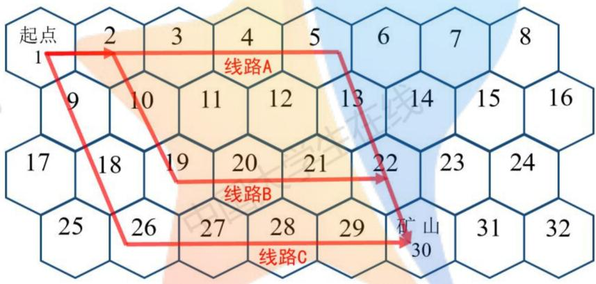
图1 最短路径求解结果

观察图像易知，存在多条最短的转移路径。在本题中，除了关键节点，如起始点，矿山，村庄，其余节点没有明显的特征，在分析时可看作时同样的点，因此玩家在进行位置的转移时，走的是何种路径并不影响实际的结果，对最终结果产生影响的只是路径的长短。因此在后续的模型建立与求解中，可以将模型简化，省略除必要节点外的其他节点，转而使用位置的转移来代替转移过程中经过的无特征节点。简化后游戏中关键节点模型图如下： L兰

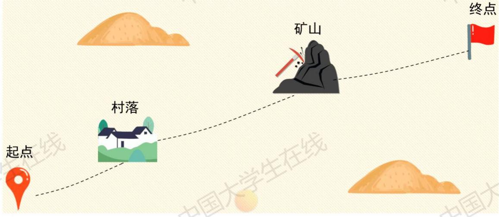
图 2 简化后的游戏模型图

## 六、问题一：基于动态规划的行动决策模型

## 6.1 问题分析

问题一要求在只有一名玩家且已知未来30天天气的情况下，遵循游戏的规则，合理规划食物和水资源的购买与使用，给出能够得到最多收益的行动策略。

玩家的行动以天为单位在时间上离散，可以分为每一个阶段。为达到游戏的最终目标需灵活规划每一个阶段的行动、路线、资源分配至最优，因此建立基于动态规划的多阶段决策模型，分析模型总结得到一般情况下玩家的最佳策略。 国入

使用算法对模型进行求解，得到第一二关的最优决策，将得到的最优决策与给出的一般性最佳策略进行对比验证，分析判断一般性最佳决策的可信度。

## 6.2 模型建立

问题一要求在只有一名玩家且已知未来30天天气的情况下，遵循游戏的规则，合理规划食物和水资源的购买与使用，给出能够得到最多收益的行动策略。

由于玩家的行动以天为单位，在时间上离散地做出行动决策，每一步行动的结果都会对下一步的行动产生影响，同样每一步的行动结果都会对最终的收益产生影响。因此将该问题类比为离散时间下的确定型动态规划问题。由此建立基于离散时间下动态规划的行动决策模型，对玩家的行动策略进行求解。 大学 大学

## 6.2.1 动态规划问题

## ▶ 多阶段决策过程

多阶段决策过程指的是可以按照时间顺序分解成若干个相互联系的阶段，并在每个分解开的阶段做出相应的决策。多阶段决策的具体过程如下图所示[2]

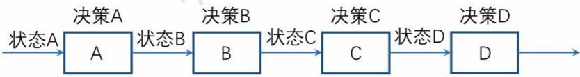
图3 多阶段决策过程

过程可分为若干个相互联系的阶段，每一阶段都对应着一组可供选择的决策，每一个决策的选定既依赖于当前面临的状态，又影响着以后的总体结果。即决策A会被上一个决策结果的状态A而影响，决策B会被上一个决策结果的状态B而影响，以此继续向后产生影响，最后影响最终的结果。

在本题中多阶段决策过程则体现为，玩家所采取的行动会改变身上水与食物的数目、当前所处的位置和身上现金的数目，从而对后续决策的做出产生影响，同时影响到最终的总体收益。现给出如下分阶段决策过程示例： 中国 中国

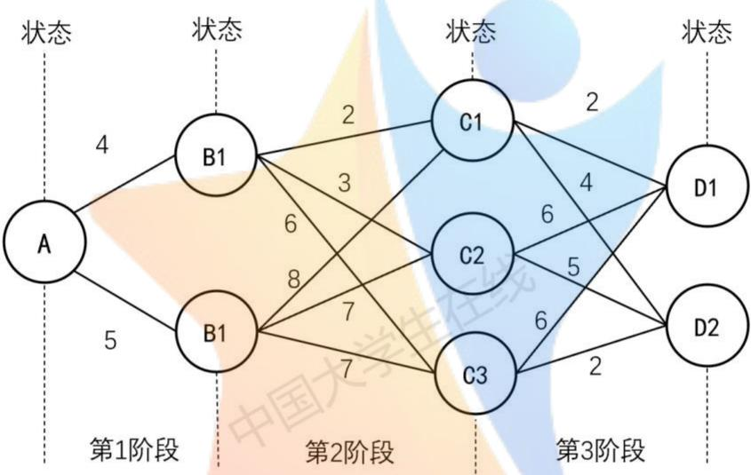
图4 多阶段决策过程

## ▶阶段

指的是问题需要做出决策的步数。阶段数目常记为n，对应着n个阶段的决策问题。阶段的序号记为k， $k = 1 , 2 , n , \cdots ,$ 称为阶段变量。

## ▶状态

各阶段开始时的客观条件称之为状态，第k阶段的状态常用状态变量 $S _ { k }$ 表示，状态变量的取值的集合称为状态集合。 学

第1阶段的状态变量 $S _ { 1 } = \{ A \}$ ，第2阶段的状态变量为 $S _ { 2 } = \{ B _ { 1 } , B _ { 2 } \}$ 0

## ▶决策

从某个状态出发，在若干各不同的方案中做出的选择称之为决策。用于表示决策的变量 $u _ { k } ( S _ { k } )$ 称之为决策变量。 $u _ { k } ( S _ { k } )$ 表示第k阶段当处于 $S _ { k }$ 状态时的决策变量。

如图4中的多阶段决策过程中， $u _ { 3 } ( C _ { 2 } ) = D _ { 1 }$ 表示走到C阶段，当处于 $C _ { 2 }$ 路口时，下一步的前加方向为 $D _ { 1 }$ 。

决策变量允许的取值范围称为允许决策集合，第k阶段状态为 $S _ { k }$ 时允许决策集合记为 $D _ { k } ( S _ { k } )$

如图4中的多阶段决策过程中， $B _ { 1 }$ 状态允许的决策集合为

$$
D _ { 2 } ( B _ { 1 } ) = \{ C _ { 1 } , C _ { 2 } , C _ { 3 } \}
$$

## ▶ 指标函数

阶段指标函数是指第k阶段从状态 $S _ { k }$ 出发，采取决策 $U _ { k }$ 时的效益，使用

$$
\left\{ \begin{array} { l l } { f _ { k } ( S _ { k } ) = { \underset { u _ { k } \in D _ { k } ( S _ { k } ) } { o p t } } \{ V _ { k } ( S _ { k } , u _ { k } ( S _ { k } ) ) + f _ { k + 1 } ( u _ { k } ( S _ { k } ) ) \} \quad k = n , n - 1 , \cdots , 2 , 1 } \\ { \hfill } \\ { f _ { n + 1 } ( S _ { n + 1 } ) = 0 } \end{array} \right.\tag{14}
$$

其中 $V _ { k } ( S _ { k } , u _ { k } )$ 为本次决策所产生的效益，opt 可取 max, min。

## 6.2.2多阶段行动决策模型建立

根据本题中玩家行动的特性，提取对最终收益影响最大的节点，即起点、终点、矿山、村庄。绘制多阶段决策过程如下图所示：

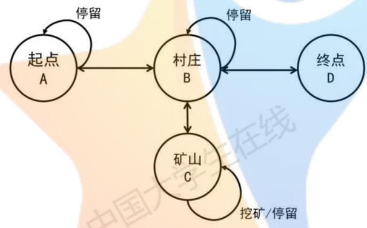
图5 简化的多阶段行动决策过程

## ▶ 效益最大化目标

游戏规则要求，需要在游戏结束时，得到最多的收益，即身上的资金数目最高。

首先考虑从出发点直接前往终点的路径，发现玩家身上的资金数额变化为负值，即没有得到收益，因此可以直接排除从起点出发直接前往终点的情况。

观察游戏规则易知，整个游戏过程中唯一的盈利点为在矿山挖矿，因此玩家在游戏的开始应尽量以最快速度前往矿山，降低在路上的物资损耗，进行挖矿操作，赚取利润。

将第 k阶段从状态 $S _ { k }$ 出发，采取决策 $u _ { k }$ 时的效益 $f _ { k } ( S _ { k + 1 } )$ 表示为

$$
\left\{ \begin{array} { l l } { f _ { k } ( S _ { k } ) = { \underset { u _ { k } \in D _ { k } ( S _ { k } ) } { o p t } } \{ V _ { k } ( S _ { k } , u _ { k } ( S _ { k } ) ) + f _ { k + 1 } ( u _ { k } ( S _ { k } ) ) \} \quad k = n , n - 1 , \cdots , 2 , 1 } \\ { f _ { n + 1 } ( S _ { n + 1 } ) = 0 } \end{array} \right.\tag{15}
$$

则该模型的最终目标即为

$$
f _ { k } ( S _ { k } ) = { \underset { u _ { k } \in D _ { k } ( S _ { k } ) } { m a x } } \{ V _ { k } ( S _ { k } , u _ { k } ( S _ { k } ) ) + f _ { k + 1 } ( u _ { k } ( S _ { k } ) ) \} \quad k = n , n - 1 , \cdots , 2 , 1\tag{16}
$$

其中，第 $n + 1$ 阶段的收益为0，即

$$
f _ { n + 1 } ( S _ { n + 1 } ) = 0\tag{17}
$$

## ▶ 决策变量的确定

当物资大于矿山到村庄所需要的物资时，说明玩家可以继续在矿山进行挖矿的盈利活动，或者移动前往矿山进行挖矿，即

$$
u _ { k } ( C ) = C , U _ { k } ( A ) = C , U _ { k } ( B ) = C\tag{18}
$$

当下一步操作后，剩余物资少于矿山到村庄所需要的物资数目时，玩家离开矿山，前往村庄进行补给，即

$$
u _ { k } ( C ) = B\tag{19}
$$

假设从村庄回到终点所需的时间为 $x _ { 1 }$ 天，则当当前时刻 $t = T - x _ { 1 }$ 时，从村庄前往终点，即

$$
u _ { T - x _ { 1 } + 1 } ( B ) = D\tag{20}
$$

假设从矿山回到终点所需的时间为 $x _ { 2 }$ 天，则当当前时刻 $t = T - x _ { 2 }$ ，离开矿山前往终点，即

$$
u _ { T - x _ { 2 } + 1 } ( C ) = D\tag{21}
$$

## ▶模型综合

结合以上论述，得到基于动态规划的决策模型如下：

$$
\begin{array} { r }  \Bigg \{ \begin{array} { l l } { f _ { k } ( S _ { k } ) = \underset { u \in \mathcal { D } _ { k } ( S _ { k } ) } { m a x } \{ V _ { k } ( S _ { k } , u _ { k } ( S _ { k } ) ) + f _ { k + 1 } ( u _ { k } ( S _ { k } ) ) \} , \ k = n , n - 1 , \cdots , 2 , 1 } \\ { f _ { n + 1 } ( S _ { n + 1 } ) = 0 } \\  \Bigg \{ \pi _ { k } ( C ) = \{ \begin{array} { l l } { C } & { 0 } \\ { ( \frac { \mathrm { d i f f } } { \mathrm { d } W } \mathrm { Y } ^ { - 1 } - \mathrm { i } \mathrm { i } W \mathrm { i } | \mathrm { f i } \mathrm { e } ^ { \mathrm { i } \mathrm { e } \mathrm { i } \mathrm { e } \mathrm { i } \mathrm { e } \mathrm { i } \mathrm { e } \mathrm { i } \mathrm { e } \mathrm { i } \mathrm { e } \mathrm { i } \mathrm { e } \mathrm { i } \mathrm { e } \mathrm { i } \mathrm { e } \mathrm { i } \mathrm { e } \mathrm { i } \mathrm { e } \mathrm { i } \mathrm { e } \mathrm { i } \mathrm { e } \mathrm { i } \mathrm { e } \mathrm { i } \mathrm { e } \mathrm { i } \mathrm { e } \mathrm { i } \mathrm { e } \mathrm { i } \mathrm { e } \mathrm { i } \mathrm { e } \mathrm { i } \mathrm { e } \mathrm { i } \mathrm { e } \mathrm { i } \mathrm { e } \mathrm { i } \mathrm { e } \mathrm { i } \mathrm { e } \mathrm { i } \mathrm { e } \mathrm { i } \mathrm { e } \mathrm { i } \mathrm { e } \mathrm { } \mathrm { i } \mathrm { e } \mathrm { } \mathrm { i } \mathrm { e } \mathrm \mathrm { i } \mathrm { e } \mathrm { } \mathrm { i } \mathrm { e } \mathrm \mathrm { i } \mathrm { e } \mathrm { } \mathrm { } \mathrm } \\ { B } & { ( i \in \mathcal { I } ) } \\ { D } & { ( t = T - x _ { 2 } ) } \end{array}  } \\  \Bigg \{ \pi _ { k } ( B ) = \{ \begin{array} { l l } { D } & { ( t = T - x _ { 1 } ) } \\ { C } &  ( \mathrm { s i f f } \mathrm  Y  \end{array} \end{array} \end{array}\tag{22}
$$

## 6.3一般性最佳行动策略

通过分析上述模型建立过程中的内容，给出如下几条一般情况下玩家的策略：

1、购买满足全过程的食物，穿越沙漠过程中不在村庄购买食物。且剩余负重全部用来购买水。直至总负重达到允许的最大值，若购买的水不足以支撑从起点到村庄过程中的消耗则购买足量的水，其余空间购买食物。 中国 中国

2、在少数情况下，可根据实际情况，少带一些食物多带一些水来推迟补给的时间，延长挖矿的时间，并在后续的补给中补齐所需食物；

3、从起点到矿山路程中，不刻意停止，除非遇到沙暴天气；

4、在矿山挖矿期间，可在沙暴消耗量较高的天气里刻意休整一到两天，使利益最大化；

5、当挖矿期间所剩物资，仅支持从矿山前往村庄，则立即前往村庄补给物资：

6、二次补给结束后，前往终点方向的挖矿点或终点，根据具体地图和剩余时间选择进行二次挖矿或前往终点，并根据选择补给后续足够数目的物资。

## 6.4第一、二关策略求解

根据如上建立的基于动态规划的决策模型，编程进行求解[3]，求解过程的程序框图如下：

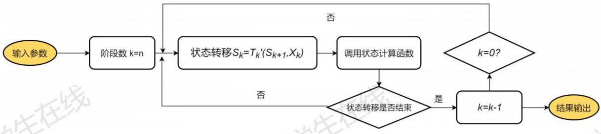
图6 算法流程框图

## 6.4.1 第一关策略求解

第一关的简化多阶段决策过程如下图所示，图中所有的带箭头有向线即为各关键节点间的转移方向，玩家可以在这些节点间，通过最短路径进行位置的转移。

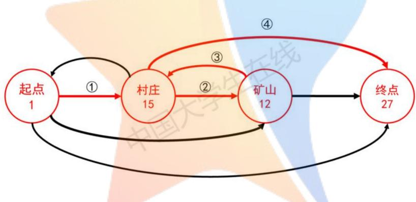
图7 简化多阶段决策过程

对于第一关而言，第t天的部分参数赋值情况如下

$$
\{ \begin{array} { l l } { \displaystyle M _ { P } \varrho \ell [ i \ell ] \overline { { \varrho } } ( \overline { { \mathcal { P } } } \overline { { \mathcal { R } } } \overline { { \mathcal { R } } } ^ { \ell } \overline { { \mathcal { R } } } ^ { \ell } ( \overline { { \mathcal { R } } } \overline { { \mathcal { R } } } ) \overline { { \mathcal { R } } } \overline { { \mathcal { R } } } \overline { { \mathcal { R } } } \overline { { \mathcal { R } } } \overline { { \mathcal { R } } } \overline { { \mathcal { R } } } \overline { { \mathcal { R } } } \overline { { \mathcal { R } } } \overline { { \mathcal { R } } } \overline { { \mathcal { R } } } \overline { { \mathcal { R } } } \overline { { \mathcal { R } } } \overline { { \mathcal { R } } } \overline { { \mathcal { R } } } \overline { { \mathcal { R } } } \overline { { \mathcal { R } } } \overline { { \mathcal { R } } } ] } { \big ( \overline { { \mathcal { R } } } \overline { { \mathcal { R } } } \overline { { \mathcal { R } } } \overline { { \mathcal { R } } } \overline { { \mathcal { R } } } \overline { { \mathcal { R } } } \overline { { \mathcal { R } } } \overline { { \mathcal { R } } } \overline { { \mathcal { R } } } \overline { { \mathcal { R } } } \overline { { \mathcal { R } } } \overline { { \mathcal { R } } } \overline { { \mathcal { R } } } \overline { { \mathcal { R } } } \overline { { \mathcal { R } } } \overline { { \mathcal { R } } } \overline { { \mathcal { R } } } \overline { { \mathcal { R } } } \overline { { \mathcal { R } } } \overline { { \mathcal { R } } } \overline { { \mathcal { R } } } \overline { { \mathcal { R } } } \overline { { \mathcal { R } } } \overline { { \mathcal { R } } } \overline { { \mathcal { R } } } \overline { { \mathcal { R } } } \overline { { \mathcal { R } } } \overline { { \mathcal { R } } } \overline { { \mathcal { R } } } } \\ { \displaystyle \mathcal { B } M _ { W \ell } } &  = \{ \begin{array} { l l }  \Psi _  \overline   \end{array} \end{array}\tag{23}
$$

第一关具有一个村庄、矿山，通过求解结果可以得知，最优的状态转移路径为红色的转移方向：

1、首先从起点开始沿最短的转移路径，前往村庄进行补给：

2、在补给完成后，前往矿山，根据天气的变化决定挖矿或原地停留；

3、在剩余物资到达从矿山前往村庄所需物资的极限时，前往村庄进行补给；

4、在补给完成后，前往终点。

符合6.3给出的一般性行动策略，可认为一般性行动策略可行。

玩家各时间点剩余物资的数目与行动策略如图8图9所示

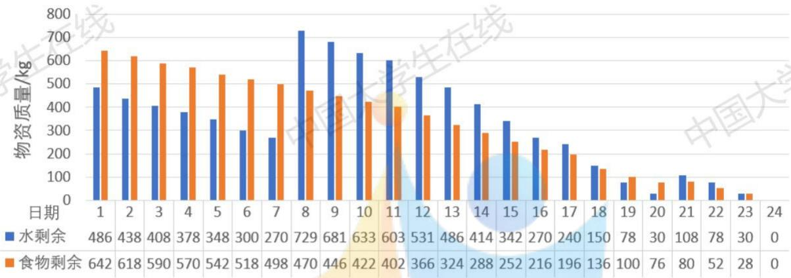
图8 各时刻剩余物资

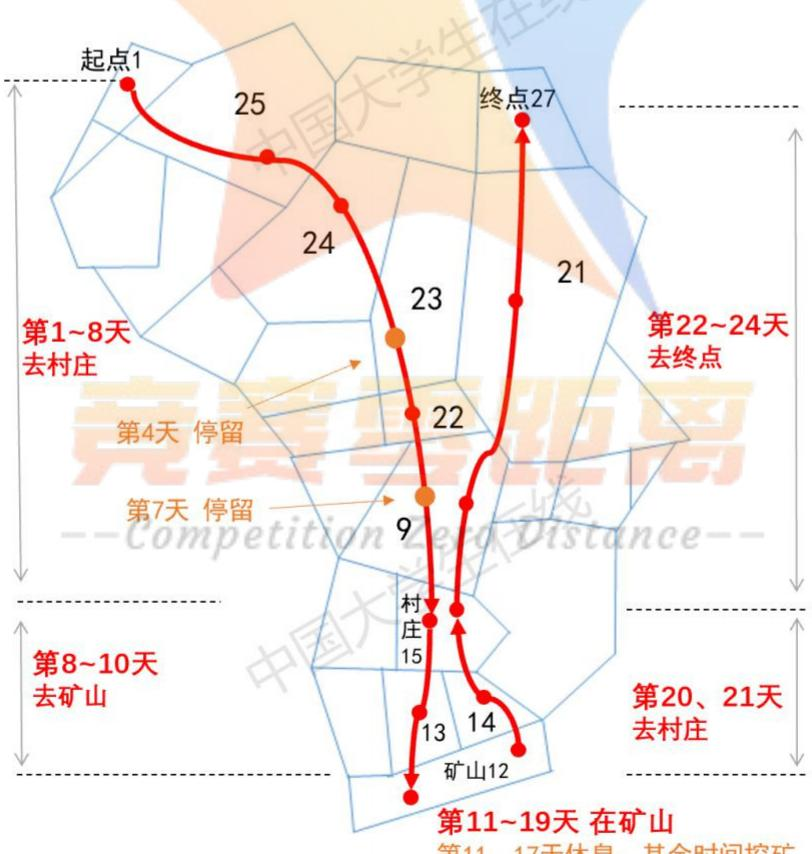
第11、17天休息，其余时间挖矿
图9 第一关行动策略

玩家在游戏的全程中购买了三次物资：在起点处购买水178箱，购买食物333箱；第一次路过村庄时购买水163箱，购买食物0箱；第二次路过村庄时购买水36箱，购买食物16箱。

采购物资总共花费6530元，总共挖矿7天赚得7000元，最终结余10470元。

完整数据见附件中的Result.xlsx文件。

## 6.4.2 第二关策略求解

第二关的简化多阶段决策过程如下图：

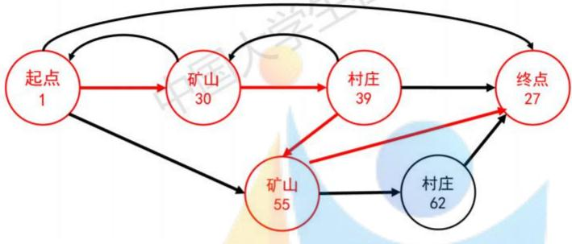
图 10 简化多阶段决策过程

如上图所示，图中所有的带箭头有向线即为各关键节点间的转移方向，玩家可以在这些节点间，通过最短路径进行位置的转移。 在纹

对于第二关，其参数的赋值与第一关中相同，具有两个村庄、矿山，通过求解结果可以得知，最优的状态转移路径为红色的转移方向：

1、首先由起点沿最短的转移路径前往30号矿山，根据天气情况决定挖矿或原地停留至物资不充足时前往39号村庄补充物资；

2、在39号村庄补充完物资后，前往55号矿山，根据天气情况决定挖矿或原地停留至前往终点所要求的最低时间时，前往终点。

符合6.3给出的一般性行动策略，可以认为一般性行动策略可行。

玩家各时间点剩余物资的数目与行动策略如图11图12所示

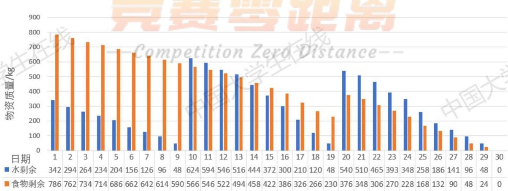
图11 各时刻剩余物资

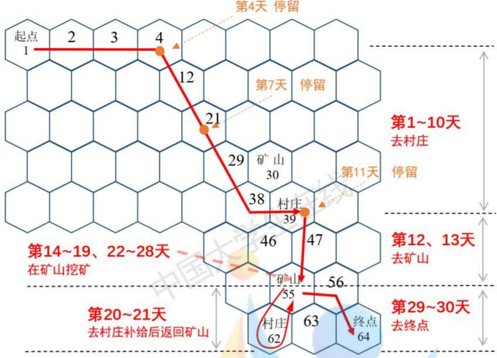
图 12 第四关行动策略图

玩家在游戏的全程中购买了三次物资：在起点处购买水130箱，购买食物405箱；第一次路过村庄时购买水208箱，购买食物0箱；第二次路过村庄时购买水180箱，购买食物85箱。采购物资总共花费10280元，总共挖矿13天赚得13000元，最终结余12720元。

## 七、问题二：基于马尔可夫决策过程的行动决策模型

## 7.1 问题分析

第二问要求在只有一名玩家且不知道未来的天气，只知道当前天天气的条件下，遵循游戏的规则，合理规划食物和水资源的购买与使用，安排玩家每日的活动行程，给出能够得到最多收益的行动策略。 1 X

与第一问相似，游戏目的亦为“得到最多的结余资金”，且游戏过程中的决策过程亦为离散的分阶段决策。由于游戏过程中的天气不可提前预知，仅知当前的天气信息，玩家需要根据当前已知的天气信息与身上剩余的物资数目，做出下一步行动的决策。因此可类比马尔可夫决策过程(MDP)，引入天气变量与动作值函数，结合问题一中的决策模型，建立基于马尔可夫决策过程的行动策略模型。分析模型总结得到一般情况下玩家的最佳策略，最后使用马尔可夫预测给出游戏期间内的天气，对模型进行仿真求解。最后将得到的策略与给出的一般性最佳策略进行对比验证，分析判断一般性最佳策略的可信度。

## 7.2 模型建立

## 7.2.1 马尔可夫决策过程

## ▶ 马尔可夫模型

马尔可夫模型具有马尔可夫性，也称后无效性。指的是系统的下一个状态只与当前状态信息有关，而与更早之前的状态无关。只要当前状态已知，不需要其余的历史信息，仅使用当前状态就可以决定未来，此即为马尔可夫性。

## ▶ 马尔可夫决策过程

马尔可夫决策过程(MDP)也具有马尔科夫性的，不过与马尔可夫模型的区别在于MDP考虑了动作的存在，即系统的下一个状态不仅和当前的状态有关，也与当前采取的行动有关。

对于本题来说，玩家的行为在时间上是离散的，其行为决策的做出只与当天的天气状况、身上剩余的物资数目和做出决策后的预期收益有关，即与只当前已知的信息有关，与过去的历史信息无关，因此可以认为本题的决策过程也具有马尔可夫性[4]。 V

一个马尔可夫决策过程由一个四元组构成 $M = ( S , A , P s a , R )$ ，其中：

●S：表示状态集(states)，有 $s \in S ,$ 使用 $s _ { i }$ 来表示第i步的状态，即表示玩家进行第i天游戏时，玩家所处的位置状况。

$\bullet A$ ：表示一组动作(actions)，有 $a \in A$ ，使用 $a _ { i }$ 来表示第i步的状态，即表示玩家进行第i天游戏时决定挖矿、行走、停留、买物资等行为。

● $, P s a$ ：表示状态转移的概率，用于表示在状态s下，经过动作a，转移到其他状态的概率分布情况。如玩家在s的位置状态下进行动作 $a$ ，转移到 $s ^ { \prime }$ 位置状态的概率为 $P ( s ^ { \prime } | s , a )$ o

• $R$ 表示奖励函数， $r ( s ^ { \prime } | s , a )$ 表示在s状态下，进行动作α后，状态转移为 $s ^ { \prime }$ ，得到的奖励，即表示玩家在s的位置状态下，经过动作 $a$ 后转移到位置状态 $s ^ { \prime }$ ，并由此决策而产生的收益。

• $\boldsymbol { \cdot V } :$ 表示值函数对于之前的任意状态s和动作a，立即奖励函数 $R ( s , a )$ 无法说明策略的好坏，因此定义值函数 $V ^ { \pi } ( s )$ 来表明当前状态下策略π的长期影响。 $V ^ { \pi } ( s )$ 表示在策略 $\pi = S  A$ 下，状态s的值函数，表示当前状态下策略 $\pi$ 的长期影响。在此使用如下公式进行表示 大字

$$
V ^ { \pi } ( s ) = E _ { \pi } \Big [ \sum _ { i = 0 } ^ { \infty } \gamma ^ { i } R _ { i } \Big | s _ { 0 } = s \Big ]\tag{24}
$$

其中 $\gamma \in [ 0 , 1 ]$ 为折合因子，表示了未来的回报对于当前回报的重要程度。当 $\gamma$ 为0时，只考虑立即回报，不考虑短期回报；当 $\gamma$ 为1时，长期回报与短期回报被同等看待。

## 7.2.2 基于MDP 的行动决策模型

对于该题，由于玩家在每一步做决策的过程中均具有马尔可夫性，符合马尔可夫决策模型的基本要求，于是建立基于马尔可夫的行动策略决策模型，对玩家的行动策略进行求解。

玩家的状态转移图如下所p
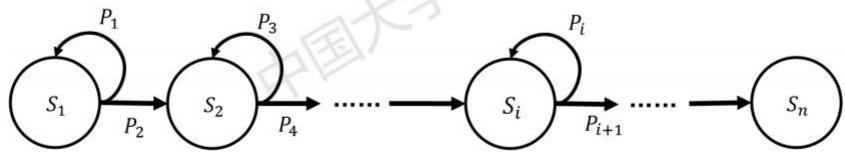
图13 玩家的状态转移图

在上图中， $P _ { 1 } , P _ { 2 } , \cdots P _ { n }$ 为不同时刻的各种天气出现的概率。对于位置状态 $s _ { 1 }$ ，在天气的影响下，有 $P _ { 1 }$ 的概率保持原来的位置状态，有 $P _ { 2 }$ 的概率转移到下一个位置状态 $s _ { 2 }$ o

对于本题来说，我们对奖励函数进行如下定义：

## ▶奖励函数

当玩家不在矿山时，奖励函数主要由在当天的天气下进行行动所消耗的物资数目，即

$$
R ( \{ S | S \neq S _  \widehat { \mathfrak { H } } ^ { \} } \} , M , m _ { w } , m _ { f } ) = \sum _ { i = 1 } ^ { 2 } ( P _ { i } \cdot \Delta M _ { i } + C )\tag{25}
$$

其中， $P _ { i }$ 为第i种天气出现的概率， $\Delta M _ { i }$ 为第i种天气对应状态的转移资金消耗，C为使得$\Delta M _ { i } + C$ 为正数的常数。当进行某种行动消耗的物资越多时，奖励函数R的数值越小，则玩家会倾向于选择奖励函数更大的行动，不选择奖励函数较小的行动，使得在该状态下的玩家做出最优的行动决策。 生在

当玩家位置在矿山时，当水或食物消耗量达到临界阈值时，将奖励函数置为0，迫使玩家做出离开矿山的行动决策，即 国 国

$$
R ( S _ { \sharp } ) ^ { . } , M , m _ { w } , m _ { f } ) = \sum _ { i = 1 } ^ { 2 } ( P _ { i } \cdot \Delta M _ { i } + C + B I \cdot D _ { t } ) \cdot \epsilon ( m _ { w } - m _ { w } ^ { \prime } ) \cdot \epsilon ( m _ { f } - m _ { f } ^ { \prime } )\tag{26}
$$

其中， $m _ { w } ^ { \prime } , m _ { f } ^ { \prime }$ 分别为水与食物质量的阈值，即为从该点前往村庄补给物资或前往终点所需要的消耗的物资；BI为挖矿时的基础收益； $D _ { t }$ 为第t天时的挖矿标志，挖矿为1，不挖矿为0。

## ▶ 值函数

值函数的定义如式(24)所示

$$
V ^ { \pi } ( s ) = E _ { \pi } { \Big [ } \sum _ { i = 0 } ^ { \infty } \gamma ^ { i } R _ { i } { \Big | } s _ { 0 } = s { \Big ] }\tag{27}
$$

在 $V ^ { \pi } ( s , a )$ $\pi$ $s$ $\pi$ $s$

$$
a = \pi ( s )\tag{28}
$$

给定策略 $\pi$ 和初始状态s，则动作 $a = \pi ( s )$ ，下一个时刻将以概率 $P ( s ^ { \prime } | s , a )$ 转向下一个状态 $s ^ { \prime }$ 那么 $V ^ { \pi } ( s )$ 可展开为：

$$
V ^ { \pi } ( s ) = \sum _ { s ^ { \prime } \in S } P ( s ^ { \prime } | s , a ) [ R ( s ^ { \prime } | s , a ) + \gamma V ^ { \pi } ( s ^ { \prime } ) ]\tag{29}
$$

给定当前状态 $s$ 和当前动作 $^ { a , }$ 在未来遵循策略 $\pi ,$ 那么系统将以概率 $P ( s ^ { \prime } | s , a )$ 转向下个状态$s ^ { \prime }$ ，我们可定义动作值函数 $Q ^ { \pi } ( s , a )$ 为

$$
Q ^ { \pi } ( { \cal S } , d ) \cong \sum _ { s ^ { \prime } \in { \cal S } } P ( s ^ { \prime } | s , a ) [ R ( s ^ { \prime } | s , a ) + 5 V ^ { \pi } ( s ^ { \prime } ) ]\tag{30}
$$

在 $Q ^ { \pi } ( s , a )$ 当中，策略 $\pi$ ，初始状态 $s ,$ 当前的动作 $a$ 均初始给定。

则 $\mathrm { M D P }$ 的最优策略可以由下式表示

$$
\pi ^ { * } = a r g m a x V ^ { \pi } ( s ) , ( \forall s )\tag{31}
$$

即寻找的是在任意初始条件 $s$ 下，能够最大化值函数的策略 $\pi ^ { * }$ o

## 7.2.3 模型综合

结合以上论述，我们得到基于马尔可夫决策过程的行动决策模型如下

$$
\begin{array} { r l } & { \left( R ( \{ S | S \neq S _ { \emptyset } \} , M , m _ { w } , m _ { f } ) = \displaystyle \sum _ { i = 1 } ^ { 2 } ( P _ { i } \cdot \Delta M _ { i } + C ) \right. } \\ & { \left. \left. R ( S _ { \emptyset ^ { * } } , M , m _ { w } , m _ { f } ) = \displaystyle \sum _ { i = 1 } ^ { 3 } ( P _ { i } \cdot \Delta M _ { i } + C + B I \cdot D _ { t } ) \cdot \varepsilon ( m _ { w } - m _ { w } ^ { \prime } ) \cdot \varepsilon ( m _ { f } - m _ { f } ^ { \prime } ) \right. \right. } \\ & { \left. \left. V ^ { \pi } ( s ) = \displaystyle \sum _ { s ^ { \prime } \in S } P ( s ^ { \prime } | s , a ) [ R ( s ^ { \prime } | s , a ) + \gamma V ^ { \pi } ( s ^ { \prime } ) ] \right. \right. } \\ & { \left. \left. Q ^ { \pi } ( s , a ) = \displaystyle \sum _ { s ^ { \prime } \in S } P ( s ^ { \prime } | s , a ) [ R ( s ^ { \prime } | s , a ) + \gamma V ^ { \pi } ( s ^ { \prime } ) ] \right| \right. \right. \left. \times \left| \lambda ^ { \widetilde { N } _ { \partial } } \right. } \\ & { \left. \left. \pi ^ { * } = a r g m a x V ^ { \pi } ( s ) , ( \forall s ) \right. \right. } \end{array}\tag{32}
$$

## 7.3一般性最佳行动策略

根据上述模型建立的过程，给出一般性行动策略如下：总体规则：

使用动作价值函数 $Q$ 选择下一步的行动与目的地，其中

$$
Q ^ { \pi } ( s , a ) = \sum _ { s ^ { \prime } \in S } P ( s ^ { \prime } | s , a ) [ R ( s ^ { \prime } | s , a ) + \gamma V ^ { \pi } ( s ^ { \prime } ) ]\tag{33}
$$

Q将状态转移对应的收益与下一目的地的状态价值函数V和天气立即回报函数R相结合，最终得到对应动作的值函数。 在约

## 细化规则详述：

1、根据计算得到的各种天气出现的概率，预估未来的天气状况，结合所剩余的游戏天数和当前位置与终点的距离状况决定是否继续挖矿或前往终点。 中

2、根据身上剩余的物资数目，结合当前时刻的天气状况决定是否前往村庄进行补给；在补给后综合考虑剩余天数，预估未来的天气状况决定是否前往矿山进行挖矿或直接前往终点。

3、综合考虑矿山挖矿收益状况与前往矿山与在矿山挖矿所消耗的物资数目，判断是否盈利，而选择从起点出发后是否前往矿山，或者直接前往终点。

## 7.4 模型求解

## 7.4.1 基于马尔可夫的天气概率预测

由于不清楚游戏全程的天气情况，仅知道当前时刻下的天气。为了得到上述模型中各种天气出现的概率 $P _ { i }$ ，我们利用问题一中给出的天气状况，利用马尔可夫预测给出各种天气间的一步转移概率，称为天气的状态转移概率，得到天气的状态转移概率矩阵，而后经过无穷多次状态转移，求得各种天气状况的极限概率分布，即得到各种各种天气出现的概率 $P _ { i }$ ，即可得到概率参数被赋值的基于马尔可夫的决策模型。

## ▶马尔可夫链

马尔可夫链子即为一种随机的时间序列，它在将来取什么值只与它现在的取值有关，而与它过去取什么值无关，即后无效性。具备该性质的离散型随机过程，称为马尔科夫链[5]。对于本题中每天的时间，可以认为每天的天气情况可以被视为一种随机的时间序列，第二天的天气情况只与第一天的天气情况有关，符合马尔科夫链的相关定义。

## ▶状态转移概率

客观的事物可能有 $E _ { 1 } , E _ { 2 } , \cdots , E _ { n }$ 共n种状态，其中每次只能处于一种状态，则每一状态都具有n个转向（包括转向自身），即

$$
E _ { i } \to E _ { 1 } , E _ { i } \to E _ { 2 } , \dots , E _ { i } \to E _ { n }
$$

由于状态转移是随机的，因此，必须用概率来描述转移可能性的大小，将这种转移的可能性用概率描述，即为状态转移概率。

对于从状态 $E _ { i }$ 转移到状态 $E _ { j }$ 的概率，称为从i到j的转移概率，记为：

$$
P _ { i j } = P ( E _ { j } | E _ { i } ) = P ( E _ { i } \to E _ { j } ) = P ( x _ { n + 1 } = j | x _ { n } = i )\tag{34}
$$

对于本题来说， $P _ { i j }$ 为天气状态从第i种天气转移为第 $j$ 种天气的概率，则根据第一问中给出的天气数据，三种天气的转移概率为矩阵为 A

$$
P = { \left[ \begin{array} { l l l } { P _ { 1 1 } } & { P _ { 1 2 } } & { P _ { 1 3 } } \\ { P _ { 2 1 } } & { P _ { 2 2 } } & { P _ { 2 3 } } \\ { P _ { 3 1 } } & { P _ { 3 2 } } & { P _ { 3 3 } } \end{array} \right] } = { \left[ \begin{array} { l l l } { 0 . 2 2 2 2 } & { 0 . 5 5 5 6 } & { 0 . 2 2 2 2 } \\ { 0 . 3 5 7 1 } & { 0 . 4 2 8 6 } & { 0 . 2 1 4 3 } \\ { 0 . 3 3 3 3 } & { 0 . 5 0 0 0 } & { 0 . 1 6 6 7 } \end{array} \right] }\tag{35}
$$

假设经过k 次的状态转移后，各种天气的转移概率矩阵 P(k)即为

$$
P ( k ) = P ^ { k }\tag{36}
$$

当k趋近于正无穷时，天气转移概率矩阵逐渐收敛至一定值，即极限概率分布为

$$
P ( k ) | _ { k \to + \infty } = P ^ { k } | _ { k \to + \infty } = { \left[ 0 . 3 1 0 3 \quad 0 . 4 8 2 8 \quad 0 . 2 0 6 9 \right] }\tag{37}
$$

由上式可以得到各种天气出现的概率分别为 $P _ { 1 } = 0 . 3 1 0 3 , P _ { 2 } = 0 . 4 8 2 8 , P _ { 3 } = 0 . 2 0 6 9$ 。即可代入模型进行下一步求解。

## 7.4.2 第三关求解

按照各种天气出现的概率生成随机数对十天内的天气状况进行赋值如下表：

$$
\yen 123,456,7
$$

<table><tr><td colspan="3">日期</td><td>3</td><td>4</td><td>5</td><td>6</td><td>7</td><td>8</td><td>9</td><td></td></tr><tr><td>天气</td><td>1 晴朗</td><td>2 高温</td><td>晴朗</td><td>高温</td><td>高温</td><td>高温</td><td>高温</td><td>高温</td><td>晴朗</td><td>高温</td></tr></table>

每一次求解当前状态前往下一个状态所执行的动作时时仅知晓当前的天气，进行模拟仿真，得到最佳的行动策略为：

从起点1出发，直接选择最短的路径，途径5，6两个中间点，到达终点13，总共花费为600元，最终结余为9400元。第三关的马尔可夫决策过程如下图所示，红色路径为最终选择的最优行动路径结果分析：分析本关的模型参数可知，第三关的基础收益仅为200元，且在高温天气下基础消耗量较高，只有晴天时在矿山挖矿才会得到少量的正向收益，高温天气下挖矿将会亏损较大数额的本金。从中点前往矿山的路途与直接前往终点相比会消耗较多的物资，因此在矿山挖矿的收益无法弥补前往矿山路途中多消耗的物资，根据7.3中的一般性准则，玩家会选择直接前往终点，其动作值函数Q也会指引着玩家选择直接前往终点的路线。可以说明7.3中给出的一般性行动策略可信度较高。

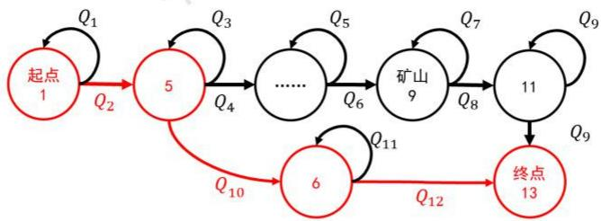
图14 第三关马尔可夫决策过程

## 7.4.3 第四关求解

按照各种天气出现的概率生成随机数对三十天内的天气状况进行赋值如下表

表2 第四关天气状况赋值
<table><tr><td>日期</td><td>1</td><td>2</td><td>4</td><td>5</td><td>27</td><td>28</td><td>29</td><td>30</td></tr><tr><td>天气 高温 高温 高温 高温</td><td></td><td></td><td></td><td>高温</td><td>·.</td><td>晴朗</td><td>晴朗高温</td><td>晴朗</td></tr></table>

每一次求解当前状态前往下一个状态所执行的动作时时仅知晓当前的天气，进行模拟仿真，得到最佳的行动策略为

从起点1出发，通过最短路径前往矿山，挖4天矿后前往村庄进行补给，而后再次前往矿山挖9天矿，离开矿山前往终点。在全过程中，在起始点处购买水216箱，购买食物276箱；在村庄处购买水229箱，购买食物190箱。总共花费9930，矿山挖矿13天赚取13000元，最终结余13070元。

第四关的马尔可夫决策过程如下图所示，其中 $Q _ { 1 } , Q _ { 2 }$ 为在各种状态下进行相应的行动到达另一种状态所对应的动作值函数。红色路径为最终选择的最优行动路径 L兰

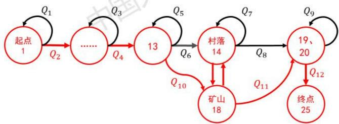
图15 第四关马尔可夫决策过程

结果分析：通过分析关卡四的模型参数可知，在矿山挖一天矿的收益为1000元，足够弥补在前往矿山的过程中所消耗的物资，因此如7.3中的一般性准则，在动作值函数Q的指引下，玩家会先前往矿山。

当玩家的物资第一次不足以支持继续挖矿时，时间依然充裕，根据7.3中的一般性准则，玩家会前往村庄进行补给，并返回矿山继续挖矿。

当玩家的剩余游戏天数即将达到前往终点所需的时间阈值时，根据7.3中的一般性准则，玩家会停止挖矿，离开矿山，并在动作值函数Q的引导下前往终点。

由此可以认为，7.3中给出的一般性行动策略可信度较高。

## 八、问题三：基于博弈思想的多玩家决策竞争模型

## 8.1 问题分析

第三问要求在有多名玩家共同进行游戏时，分为：

1、知晓未来时间的所有天气信息，且在游戏开始前制定好行动策略，后期的行动均按照制定好的方案进行。

2、不提前制定好具体的行动方案只知晓当天的天气状况，且知晓当天其他玩家的行动方案与剩余物资的情况。

两种情况，分别给出对于一般玩家的行动准则。

对于本题存在多个玩家同时进行游戏的情况，引入博弈的思想，将玩家间的竞争分为良性竞争与恶性竞争，发现恶性竞争会导致所有玩家亏损，而良性竞争会为所有玩家带来盈利。于是在两种已知条件条件不同的情况下，分别给出一般情况下玩家应采取的策略，再对第五第六关的实际情况进行分析，验证策略的可行性。 中

## 8.2模型建立

## 8.2.1竞争种类分析

在情况一与情况二中，各玩家之间均存在着竞争，分为良性竞争与恶性竞争

恶性竞争：

题目规则规定：

当k个玩家通过相同的路径进行转移时，消耗量为基础消耗量的2k倍；

当k名玩家同时在矿山挖矿时，收益为基础收益的1:

当k名玩家在同一村庄购买资源时，价格为基础价格的4倍。

在游戏过程中会存在以下恶性竞争：

1、每名玩家都为了赚取更多的资金，无计划地前往矿山进行挖矿，当天气恶劣时，由于基础收益的降低，挖矿获得的收益将不足以弥补物资的消耗量，此种竞争将导致所有玩家的收益降低，甚至亏损。

2、每名玩家为了更快地到达矿山进行挖矿、前往村庄进行补给、前往终点，无计划地走最短的转移路径，可能出现在同一时刻通过相同的路径进行位置的转移，将增加所有玩家的物资消耗。

3、每名玩家为了更快的前往村庄进行购物，可能出现玩家同时购买物资的情况，极大地增加玩家购买物资的资金消耗。V

4、某名玩家为了迫使其他玩家尽快退出游戏而让自己得到独自在矿山挖矿的机会，在其他玩家前往商店购买物资时，自己只购买极少量的物资，来让其他玩家采购物资的花费极大地增加，而不得不提前退出游戏。该竞争方法会带来非常可观的收益，但其他玩家也有可能会想到该竞争方式，可能会使用该方式与自己进行竞争，因此存在极高的风险。

以上几种竞争方式均会使得自己与其他玩家的收益同步降低，减少游戏结束时的剩余资金，因此可以认为是恶性竞争。

由于在本题中，正面的直接竞争都将导致所有玩家的收益降低，与游戏的目的“得到更多的剩余资金”相悖，均属于恶性竞争。于是引入另外一种玩家间相互配合，互利共赢的良性竞争策略。

## 良性竞争

1、对于游戏中获取资金最关键的挖矿行为，应尽量避免同时有多个人在矿山内挖矿，只允许能够使挖矿者获得正向收益的挖矿人数同时在矿山内挖矿，其余玩家在外等候。 中国

2、对于游戏中前往村庄进行物资补充的过程，各名玩家均应避免与其他玩家在同一时刻购买物资。

3、对于游戏中位置迁移的过程，各玩家均应避免在同一时刻经过同一路径进行位置的迁移，可选择错时前行或选择不同的迁移路径。

4、在游戏过程中所有玩家均不使用恶性手段，使其他玩家蒙受巨额损失。

## 8.2.2 良性与恶性竞争的博弈选择

对于玩家A来说，如果为了最大化自己的收益而选择恶性竞争，那么其他玩家也有可能选择恶性竞争来最大化自己的收益，则玩家A会有较大概率因为其他玩家发起的恶性竞争而降低自己的收益，甚至亏损。因此对于所有玩家来说，最优的策略是与其他玩家达成共识，只进行良性竞争，在

个人利益最大化目标，即最终持有的资金要更多：

$$
m a x \sum _ { i = 1 } ^ { n } M _ { T i }\tag{38}
$$

其中 $M _ { T i }$ 为第i名玩家最终持有的资金数目。

各名玩家收益相近目标，即各名玩家最终持有资金数目方差要更小：

$$
\sum _ { \substack { m i n ^ { \prime } = 1 \eta } } ^ { n } ( M _ { j } - \frac { \sum _ { i = 1 } ^ { n } M _ { T i } } { n } ) ^ { 2 }\tag{39}
$$

于是得到良性竞争的目标函数如下：

$$
\left\{ \begin{array} { l } { { m a x \sum _ { i = 1 } ^ { n } M _ { T i } } } \\ { { m i n \sum _ { i = 1 } ^ { n } ( M _ { j } - \frac { \sum _ { i = 1 } ^ { n } M _ { T i } } { n } ) ^ { 2 } } } \\ { { m i n \frac { j = 1 } { n - 1 } } } \end{array} \right.\tag{40}
$$

## 8.2.3 模型整合

情况一：游戏开始时已经知晓全部的天气信息，并制定完整行动策略

将良性竞争目标函数与第一问中的多阶段动态规划模型相结合，由于要实现共赢，每位玩家都必然要在达成共识的条件下，让出一些收益，从而达到玩家间收益的平衡与在良性竞争中收益的最大化。在此为衡量因为其他玩家的存在而对每一步行动，引入影响因子 $I n _ { j }$

$I n _ { j }$ 为当一位玩家位于j位置时对其他玩家产生的收益影响。

所以对于其中一位玩家而言，在位置 $j$ 的预期收益 $V _ { j } ^ { \prime }$ 为原本的预期收益减去其他玩家在此位置带来的收益影响：

$$
V _ { j } ^ { \prime } = V _ { j } - \sum _ { i = 1 } ^ { n - 1 } P _ { i j } ^ { \prime } \cdot I n _ { j }\tag{41}
$$

其中 $P _ { i j } ^ { \prime }$ 为第i名玩家处于第 $j$ 个位置的概率.

综合上述内容，得到针对情况一的多阶段行动决策模型：

$$
\begin{array} { r l } & { \{ \begin{array} { l l } { m a x \cdot \frac { \nabla ^ { 2 } M _ { 2 1 } } { t } } & { \sqrt { \kappa } } \\ { m \cdot \frac { \nabla ^ { 2 } M _ { 2 1 } } { t } } & { \sqrt { \kappa } } \\ { m \cdot \frac { \nabla ^ { 2 } ( \lambda _ { 1 } ^ { 2 } - \frac { \nabla ^ { 2 } M _ { 2 1 } } { \omega } ) ^ { t } } { 2 } } & { \sqrt { \kappa } } \end{array}  } \\ &  \{ \begin{array} { l l }  \int _ { a + 1 } ^ { a } ( \lambda _ { 1 } ^ { 2 } - \frac { \nabla ^ { 2 } M _ { 2 1 } } { \omega } ) ( \Gamma ( \lambda _ { 1 } ^ { 2 } , \kappa , a _ { 1 } ( \lambda _ { 1 } \kappa ) ) + \int _ { a + 1 } ^ { b } ( \lambda _ { 1 } ( \kappa , \kappa ) ) - \frac { \nabla ^ { 2 } \kappa } { 2 \omega } \cdot \tilde { I } _ { a + 1 } ) \tilde { I } _ { a + 1 } \tilde { I } _ { a + 1 } \tilde { I } _ { a + 1 } \tilde { I } _ { a + 1 } \tilde { I } _ { a + 1 } \tilde { I } _ { a + 1 } \tilde { I } _ { a + 1 } \tilde { I } _ { a + 1 } \tilde { I } _ { a + 1 } \tilde { I } _ { a + 1 } \tilde { I } _ { a + 1 } \tilde { I } _ { a + 1 } \tilde { I } _ { a + 1 } \tilde { I } _ { a + 1 } \tilde { I } _ { a + 1 } \tilde { I } _ { a + 1 } \tilde { I } _ { a + 1 } \tilde { I } _ { a + 1 } \tilde { I } _ { a + 1 } \tilde { I } _ { a + 1 } \tilde { I } _ { a + 1 } \tilde { I } _ { a + 1 } \tilde { I } _ { a + 1 } \tilde { I } _ { a + 1 } \tilde { I } _ { a + 1 } \tilde { I } _ { a + 1 } \tilde { I } _ { a + 1 } \tilde { I } _ { a + 1 } \tilde { I } _ { a + 1 } \tilde { I } _ { a + 1 } \tilde { I } _  a +  \end{array} \end{array}\tag{42}
$$

## 情况二：玩家仅知道当天的天气信息，与其他人的状态信息

与情况一中的分析过程类似，游戏过程中与其他玩家的相遇会带来及时收益上的影响 $i n$ ，由此我们也引入影响因子in，对奖励函数R进行修正

$$
R ^ { \prime } = R - \sum _ { i = 1 } ^ { n - 1 } P _ { i j } ^ { \prime } \cdot I n _ { j }\tag{43}
$$

则将良性竞争目标函数与第二问中基于马尔可夫决策过程的行动决策模型进行整合，得到适用于情况二的基于马尔可夫决策过程的行动决策模型如下： 大兰

$$
\left\{ \begin{array} { l l } { m a x \displaystyle \frac { \sum _ { i = 1 } ^ { n } M _ { i } } { \omega ^ { - } } \frac { \sum _ { i = 1 } ^ { n } M _ { i } } { \omega ^ { - } } } \\ { m i n \displaystyle \frac { \frac { \sum _ { i = 1 } ^ { n } \omega _ { i } - \frac { \sum _ { i = 1 } ^ { n } \omega _ { i } } { \omega - 1 } } { \omega - 1 } } { \omega - 1 } } \\ { \displaystyle R ( \{ S | S \neq S _ { \emptyset ^ { * } } \} , M , m _ { w } , m _ { j } ) = \sum _ { i = 1 } ^ { 2 } ( P _ { i } \cdot \Delta M _ { i } + C - \displaystyle \frac { n - 1 } { \sum _ { i = 1 } ^ { n } P _ { i j } } \cdot I n _ { j } ) } \\ { R ( S _ { \Psi } \cdot ; M , m _ { w } , m _ { j } ) = \displaystyle \frac { \sum _ { i = 1 } ^ { n } ( P _ { i } \cdot \Delta M _ { i } + C + B I \cdot D _ { i } - \displaystyle \frac { n - 1 } { \sum _ { i = 1 } ^ { n } P _ { i j } ^ { * } } \cdot I n _ { j } ) \cdot \epsilon ( m _ { w } - m _ { w } ^ { \prime } ) \cdot \epsilon ( m _ { f } - m _ { f } ^ { \prime } ) } { \omega - 1 } } \\ { V ^ { \alpha } ( s ) = \displaystyle \sum _ { s \in S } P ( s ^ { \prime } | s , \alpha ) [ R ( s ^ { \prime } | s , a ) + \gamma V ^ { \alpha } ( s ^ { \prime } ) ] \cdot \epsilon ^ { \mathrm { i d } s } } \\ { Q ^ { \alpha } ( s , a ) = \displaystyle \sum _ { s \in S } P ( s ^ { \prime } | s , \alpha ) [ R ( s ^ { \prime } | s , a ) + \gamma V ^ { \alpha } ( s ^ { \prime } ) ] } \\ { \quad \displaystyle \pi ^ { * } = \alpha \eta \eta \alpha \lambda \cdot \delta ^ { \alpha } } \end{array} \right.\tag{44}
$$

## 8.3一般性最佳行动策略

## 8.3.1 对于情况一

情况一全程的天气已知，且在游戏开始前就需要给出在未来一段时间内的行动策略，因此可进行全程的统筹规划。 长线

## 一般性策略

1、在起始点处仅购买直到下一次补给或直到游戏结束所需的水，携带足够到达终点的食物，当到达终点所需食物过多背包无法承载时，则将按照背包的峰值存储容量购买尽可能多的食物。

2、考虑在矿山挖矿的基础收益与消耗，计算在矿山挖矿的收益能否弥补因为前往矿山而比直接前往终点多消耗的物资价值。当无法弥补差额时，选择直接前往终点，反正，前往矿山进行挖矿。

3、分别计算多人在矿山挖矿时的收益与消耗，计算是否能够获得盈利，多人规划时最多只能允许，使得挖矿收益为正，人数的玩家进入矿山挖矿。

4、为前往村庄购买物资留出冗余时间，避免多人同时购买物资。

5、当需要从同一起点前往同一终点时，多个玩家选择不同的转移路径，防止路上转移动作的消耗翻倍。当走不同的路径最终结果不优时，也可以选择走相同的转移路径。

6、多个玩家统一协调安排，使得各个玩家收益接近。

## 第五关行动策略求解

使用8.2.3中给出的加入良性竞争的多阶段决策模型对第五关的行动策略进行求解，给出玩家1，玩家2的行动策略如下： 国入 国入

玩家1：从起点1出发，分别经过节点4，6，到达终点13，在起点处购买水36箱，购买食物42箱，最终结余9400元。

玩家2：从起点2出发，分别经过节点5，6，到达终点13，在起点处购买水36箱，购买食物42箱，最终结余9400元。

## 结果分析：

分析此问给出的参数，挖矿的基础收益仅为200元，不足以弥补玩家前往矿山所多花费的物资，因此玩家根据8.3.1中一般性策略，选择直接前往终点。

在最后一次转移时，会出现路径重合的情况，因此综合考虑安排玩家走不不同的路径，得到两名玩家最终的资金结余为9290与9510，结余资金总额与路径重复时相同，但两名玩家的资金差异更大。根据8.3.1中的一般性策略，选择更加结余资金更加均衡的路线，即均走从节点6到节点13的路线。

结合上述分析，可以认为给出的一般性策略较为可靠。

## 8.3.2 对于情况二

情况二为天气未知情况下，策略未完全确定，在多名玩家共同进行游戏时，玩家按照当天天气情况，剩余物资情况，其他玩家的所处状态进行分析。 LV

## 一般性策略

总体规则：

使用动作价值函数Q选择下一步的行动与目的地，其中

$$
Q ^ { \pi } ( s , a ) = \sum _ { s ^ { \prime } \in S } P ( s ^ { \prime } | s , a ) [ R ( s ^ { \prime } | s , a ) + \gamma V ^ { \pi } ( s ^ { \prime } ) ]\tag{45}
$$

细化规则：

1、根据计算得到的各种天气出现的概率，预估未来的天气状况，结合所剩余的游戏天数和当前位置与终点的距离状况决定是否继续挖矿或前往终点。

2、根据身上剩余的物资数目，结合当前时刻的天气状况决定是否前往村庄进行补给；在补给后综合考虑剩余天数，预估未来的天气状况决定是否前往矿山进行挖矿或直接前往终点。

3、综合考虑矿山挖矿收益状况与前往矿山与在矿山挖矿所消耗的物资数目，判断是否盈利，而选择从起点出发后是否前往矿山，或者直接前往终点。

4、当多名玩家在矿山挖矿时，结合对未来天气的预测，计算折损后的真实收益，用以进行后续的判断。

5、为前往村庄购买物资留出冗余时间，避免多人同时购买物资。

6、当需要从同一起点前往同一终点时，多个玩家选择不同的转移路径，防止路上转移动作的消耗翻倍。当走不同的路径最终结果不优时，也可以选择走相同的转移路径。

7、多个玩家统一协调安排，使得各个玩家收益接近。

## 第六关的具体分析

分析第六关的参数设置：基础收益为1000，结合不同天气下的基础消耗，进行如下具体分析。

1、挖矿：假设当前有 $\ k - 1$ 名玩家在矿山挖矿

在晴朗天气下， $\frac { 1 0 0 0 } { k } > 1 6 5$ 时，可认为前去挖矿为盈利。

在高温天气下， $\frac { 1 0 0 0 } { k } > 4 0 5$ 时，可认为前去挖矿为盈利。

在沙暴天气下， $\frac { 1 0 0 0 } { k } > 4 5 0$ 时，可认为前去挖矿为盈利。

2、购物：假设有多名玩家需要购物，则合理安排，依次进行购物，防止花费过高。

3、前往终点：由于天气状况未知，为防止出现物资不足导致无法返回的情况，可以按照消耗较高的天气条件预留物资，预留时间。

4、转移：假设有多名玩家需要在矿山与村子间进行转移，则尽量安排他们走不同的两条转移路线如图16所示：

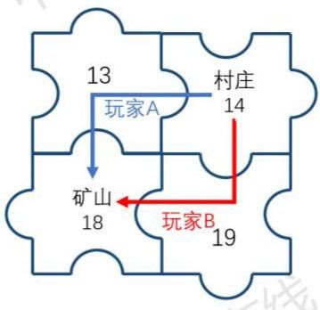
图16 第六关转移过程

玩家一：从14出发经过19到达18。

玩家二：与从14出发经过13到达18。

以此来降低转移过程中的消耗。

## 九、模型分析与评价

## 9.1 模型优点

1、对于问题一中的模型，采用分阶段动态规划的方式，对子问题求最优，使得最终求解结果达到最优，可保证最终结果的最优性。 在约

2、对于问题二中的模型，充分使用了游戏中决策过程的无前效性，引入马尔可夫决策模型，将能够影响决策的主要因素融入马尔可夫决策过程中，使得模型更具有可信性与准确性。

可使用概率来统一表示天气已知和未知的两种情况，使得模型在天气已知与未知时均可使用，更具有普适性。

3、对于问题三，给出良性与恶性两种竞争方式，包含玩家之间所有可能的竞争行为，具有完备性。同时引入了博弈的思想，根据游戏目标，进行竞争方式的选择，使得模型既具有简洁性，又具有准确性。

4、在进行第一问的求解时，我们将动态规划的变量进行了降维处理，降低了求解难度。

## 9.2 模型缺点

1、第一问中院模型动态规划的维数较高，计算复杂度较高。

2、由于给出的天气数据样本较少，使得求解天气的概率分布不够稳定。

## 9.3 模型推广

问题二所用的基于MDP的行动决策模型中，当物资不低于阈值时，立即回报函数R主要受状态转移导致的收益变化影响，物资变化影响忽略不计，与实际情况稍有偏差，故引入水和食物的物

资影响函数 $Y _ { 1 } ( m _ { w } )$ $Y _ { 2 } ( m _ { f } )$ 和总体物资影响函数Y，其中：

$$
\left\{ \begin{array} { l l } { Y _ { 1 } ( m _ { w } ) = { \frac { 1 } { 1 + e ^ { - ( m _ { w } - m _ { w } ^ { \prime } + a ) } } } } \\ { Y _ { 2 } ( m _ { f } ) = { \frac { 1 } { 1 + e ^ { - ( m _ { f } - m _ { f } ^ { \prime } + b ) } } } } \\ { Y = { \sqrt { \frac { Y _ { 1 } ^ { 2 } + Y _ { 2 } ^ { 2 } } { 2 } } } } \end{array} \right.\tag{46}
$$

用Y代替 $\varepsilon ( m _ { w } - m _ { w } ^ { \prime } ) \cdot \varepsilon ( m _ { f } - m _ { f } ^ { \prime } )$

加入物资影响函数后，模型将更加合理且完善，更具有普适性。

## 参考文献

[1] Kai Y D, Shu L Y. 基于平面图的最短路径算法的研究 [J]. 2001.

[2]厉洋峰.动态规划及其在数学模型中的应用[J].中国新技术新产品,2009,000(016):244-245.

[3]于斌,刘姝丽,韩中庚.动态规划求解方法的Matlab实现及应用[J].信息工程大学学报,2005,6(3):95-98.

[4] White,刘迪芬.马尔可夫决策过程[J]. 数学译林,1990(4):296-314.

[5]卢显文. 马尔可夫预测分析的应用[J].江苏广播电视大学学报,2002,13(3):61-63

[6]武涛[1].博弈论在数学中的应用[J].纳税,2017,000(018):167-167.

[7]胡静.博弈论在数学中的应用[J].商情·经济理论研究,2008,000(005):213,330.

## 附录A 支撑材料文件列表

•Result.xlsx
• 代码
README.txt
dierguan weather.mat
diyiguan weather.mat
first\_round.m
fourth\_round.m
second round.m
state1.mat
state2.mat
third round.m
u.mat
u1.mat
weather data
yucetianqi.m
●tex文件
figures
cumcmthesis.CLS
example.aux
example.txt
example.out
example.pdf
example.synctex
example.tex
example.toc
参考手册.pdf
●2020B题作图.ppt

```matlab
%%第一关
%%求解从起点到矿山的最优收益路径与最终资金剩余
clc,clear
load u1.mat %收益矩阵
load diyiguan_weather.mat%第一关天气矩阵 1为晴朗 2为高温 3为沙暴
n=size(u1,1);
for s=1:n
for t=s:n u1(t,s)=u1(s,t);%使得下三角与上三角对称
end
end
G1=graph(u1，'upper');%根据带权邻接矩阵生成无向图
plot(G1)
title('第一关拓扑图')
[path1] = shortestpath(G1,1,12);
[path2] = shortestpath(G1,11,27);
%%计算
%基础消耗箱为单位
food_cost_base1=5;
water_cost_base1=7;%晴朗天气消耗 food_cost_base2 = 8;
water_cost_base2 = 6;%高温天气消耗
food_cost_base3=10;
water_cost_base3=10;%沙暴天气消耗
%初始资金
m0=10000;
%累计消耗资金
m1=0;
%基础收益
bouns=1000;
%统计挖矿天数
d=0；
%统计各状态的天数 1是停留2是行进 3是挖矿4是矿洞休息
load state1.mat %统计消耗的食物和水的箱数
food_cost=0;water_cost=0;
%统计天气导致在路上的消耗
for i=1:24 %真实天数
if(state(i)==2&&diyiguan_weather(i)==1)
m1=m1+2*food_cost_base1*10+2*water_cost_base1*5;
food_cost=food_cost+2*food_cost_base1;
water_cost=water_cost+2*water_cost_base1;
```

## 附录 B first\_round.m 求解第一关最优收益路线、最终收益

## 附录Csecond round.m 求解第二关最优收益路线、最终收益

```matlab
%%求解第二关最优收益路线、以及该路线下的最终收益。附带输出挖矿天数、食物消耗总量、拓扑图等信息。
%%第2关
%%根据蜂窝规律求出邻接矩阵与起点到终点的最优路径以及最优剩余资金
u=zeros(64); clc,clear;
n=size(u,1); load dierguan_weather.mat%第一关天气矩阵 1为晴朗 2为高温 3为沙暴 中国
for t=10:15
u(t,t-7)=1;
u(t,t-8)=1;
u(t,t-1)=1;
u(t,t+1)=1;
u(t,t+8)=1;
u(t,t+9)=1;
end
for t=18:23
u(t,t-9)=1;
u(t,t-8)=1; u(t,t-1)=1; 中国
u(t,t+1)=1;
u(t,t+8)=1;
u(t,t+7)=1;
end
for t=26:31
u(t,t-7)=1;
u(t,t-8)=1;
u(t,t-1)=1;
u(t,t+1)=1;
u(t,t+8)=1;
end u(t,t+9)=1; 中国
for t=34:39
u(t,t-9)=1;
u(t,t-8)=1;
u(t,t-1)=1;
u(t,t+1)=1;
u(t,t+8)=1;
u(t,t+7)=1;
```

```matlab
water_cost_base1=7;%晴朗天气消耗
food_cost_base2 = 8;
water_cost_base2 = 6;%高温天气消耗
food_cost_base3=10;
water_cost_base3=10;%沙暴天气消耗
%初始资金
m0=10000;
%累计消耗资金
m1=0;
%基础收益
bouns=1000; %统计挖矿天数
d=0;
%统计各状态的天数 1是停留 2是行进 3是挖矿 4是矿洞休息
load state2.mat
%统计消耗的食物和水的箱数
food_cost=0;water_cost=0;
%统计天气导致在路上的消耗
for i=1:30 %真实天数
if(state(i)==2&&dierguan_weather(i)==1)
m1=m1+2*food_cost_base1*10+2*water_cost_base1*5;
food_cost=food_cost+2*food_cost_base1;
water_cost=water_cost+2*water_cost_base1;
end
if(state(i)==3&&dierguan_weather(i)==1) %state系数为基
m1=m1+3*food_cost_base1*10+3*water_cost_base1*5;
food_cost=food_cost+3*food_cost_base1;
water_cost=water_cost+3*water_cost_base1;
end
if(state(i)==2&&dierguan_weather(i)==2)
m1=m1+2*food_cost_base2*10+2*water_cost_base2*5;
food_cost=food_cost+2*food_cost_base2;
water_cost=water_cost+2*water_cost_base2; on Zex
end
if(state(i)==3&&dierguan_weather(i)==2)
m1=m1+3*food_cost_base2*10+3*water_cost_base2*5;
food_cost=food_cost+3*food_cost_base2;
water_cost=water_cost+3*water_cost_base2;
end
if(state(i)==1&&dierguan_weather(i)==3)
m1=m1+2*food_cost_base2*10+1*water_cost_base2*5;
```

```matlab
food_cost=food_cost+2*food_cost_base2;
water_cost=water_cost+1*water_cost_base2;
end
if(state(i)==3&&dierguan_weather(i)==3)
m1=m1+1*food_cost_base3*10+1*water_cost_base3*5;
food_cost=food_cost+3*food_cost_base3;
water_cost=water_cost+3*water_cost_base3;
end
if(state(i)==3)
d=d+1;
end
end
disp('第二关最优收益路径为')
max_profit_path2
m1;
disp('消耗食物和水的箱数')
food_cost
water_cost
m1=m1+(598/3)*2*5+(31/2)*10*2;
m1=10280;
disp('挖矿天数');d
disp('最终资金剩余为')
m1=mO+d*1000-m1
```

## 附录 D third\_round 求解第三关最优收益路线

```matlab
%% 第3关
% 求解从起点到矿山的最短路径
u(1,2)=1;u(1,4)=1;u(1,5)=1;u(2,3)=1;u(2,4)=1;u(3,4)=1;u(3,8)=1;u(3,9)=1;
u(4,5)=1;u(4,6)=1;u(4,7)=1;u(5,6)=1;u(6,7)=1;u(6,12)=1;u(6,13)=1;u(7,11)=1;
u(7,12)=1;u(8,9)=1;u(8,3)=1;u(8,9)=1;u(9,10)=1;u(9,11)=1;u(10,11)=1;
u(10,13)=1;u(11,12)=1;u(11,13)=1;u(12,13)=1;
n=size(u,1);
for s=1:n
for t=s:n
u(t,s)=u(s,t);%次对角线分隔的下三角部分根据上三角部分对称
end
end
G1=graph(u,'upper');%根据带权邻接矩阵生成无向图
plot(G1)
```

```matlab
%%第四关
u=zeros(25);
n=size(u,1);
for t=7:9
u(t,t-5)=1;
u(t,t-1)=1;
u(t,t+1)=1;
u(t,t+5)=1;
end
for t=12:14
u(t,t-5)=1;
u(t,t-1)=1;
u(t,t+1)=1;
u(t,t+5)=1;
end
for t=17:19
u(t,t-5)=1;
u(t,t-1)=1;
u(t,t+1)=1;
u(t,t+5)=1;
end
for t=2:4
u(t,t-1)=1;
u(t,t+1)=1;
u(t,t+5)=1;
end
for t=22:24
u(t,t-1)=1;
u(t,t+1)=1;
u(t,t-5)=1;
end
for t=[6 11 16]
u(t,t+5)=1;
```

title('第四关拓扑图')
[path1,d1]=shortestpath(G1,1,9);
[path2,d2]=shortestpath(G1,11,13);
min\_path2=[path1 path2]

## 附录 Eforth round 求解第四关的最优收益路线)

```matlab
u(t,t+1)=1;
u(t,t-5)=1;
end
for t=[10 15 20]
u(t,t+5)=1;
u(t,t-1)=1;
u(t,t-5)=1;
end
u(1,2)=1;
u(1,6)=1;
u(5,4)=1;
u(5,10)=1;
u(21,16)=1;
u(21,22)=1;
u(25,24)=1;
u(25,20)=1;
for s=1:n
for t=s:n
u(t,s)=u(s,t);%次对角线分隔的下三角部分根据上三角部分对称
end
end
u 在线
G2=graph(u,'upper');%根据带权邻接矩阵生成无向图X
plot(G2)
title('标定权重的无向图')
%动态规划
[path1]=shortestpath(G2,1,14);
[path2]=shortestpath(G2,19,18);
[path3]=shortestpath(G2,23,25);
max_profit_path4=[path1 path2 path3]
```

## 附录F yucetianqi.m 马尔可夫预测天气

```matlab
%马尔可夫预测天气转移概率矩阵、天气极限频率分布。用依概率随机数产生函数模拟10天和30天内的天气数据。
%第三四关：马尔可夫预测天气
clc,clear %a为一二关的实际天气1代表晴朗2代表高温3代表沙暴
a =[2 2 1 3 1 2 3 1 2 2 3 2 1 2 2 2 3 3 2 2 1 1 2 1 3 2 1 1 2 2 ];
for i=1:3
for j=1:3
f(i,j)=length(findstr([i j],a));
end
end
ni = sum(f,2);
%p为转移概率矩阵
```

```matlab
p = f./repmat(ni,1,size(f,2))
firstp=[0 10];%初始天气:高温
%求解极限频率
for i=1:30
firstp = firstp*(p^i);
end
jixianP=firstp
fenbu= round(firstp*10) disp('预测晴朗、高温、沙暴10天内出现次数');
%第3关10天内天气的模拟
disanguan_weather=randsrc(1,10,[1 2 ;3/8 5/8]);
disanguantianqi=cell(1,10);
for i=1:10
if disanguan_weather(i)==1
disanguantianqi(i)={'晴朗'};
end
if disanguan_weather(i)==2
disanguantianqi(i)={'高温'};
end 线
end disanguantianqi
disiguan_weather=randsrc(1,30,[1 2 3;0.3 0.5 0.2]);
disiguantianqi4=cell(1,30);
for i=1:30
if disiguan_weather(i)==1
disiguantianqi4(i)={'晴朗'};
end
if disiguan_weather(i)==2
disiguantianqi4(i)={'高温'};
end
if disiguan_weather(i)==3
disiguantianqi4(i)={'沙暴'};
end
end
disiguantianqi4
```