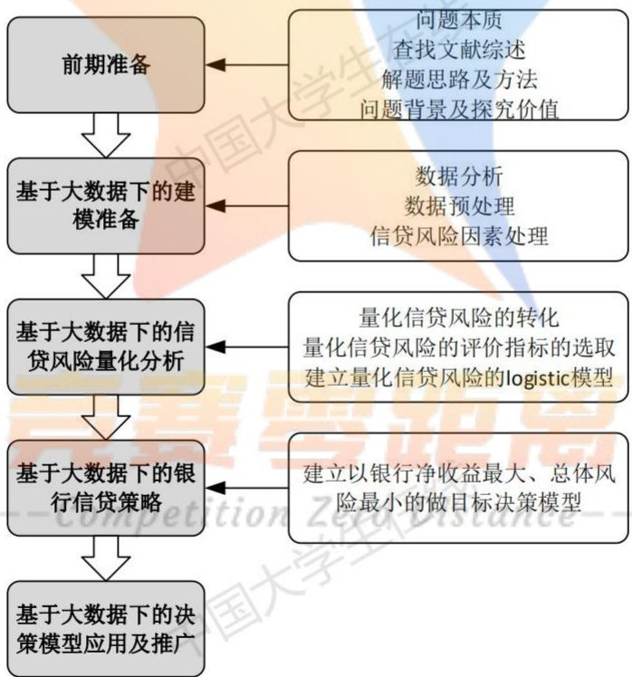
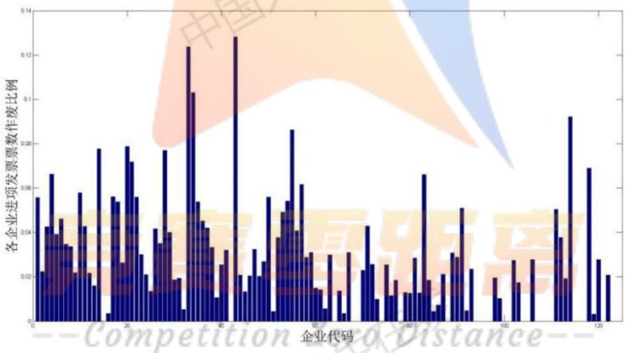
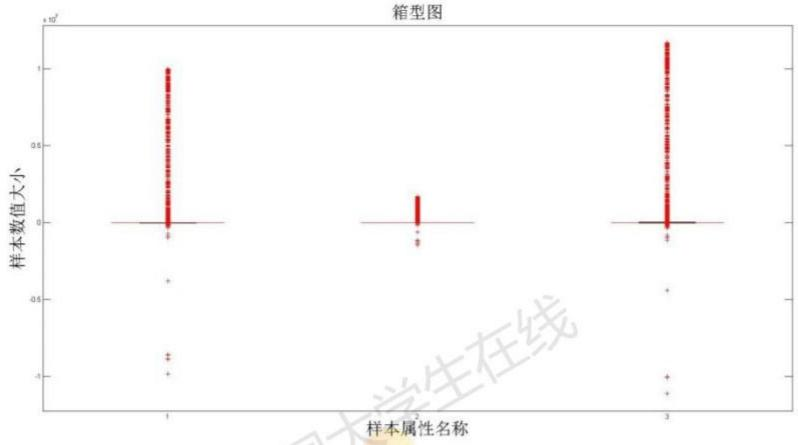
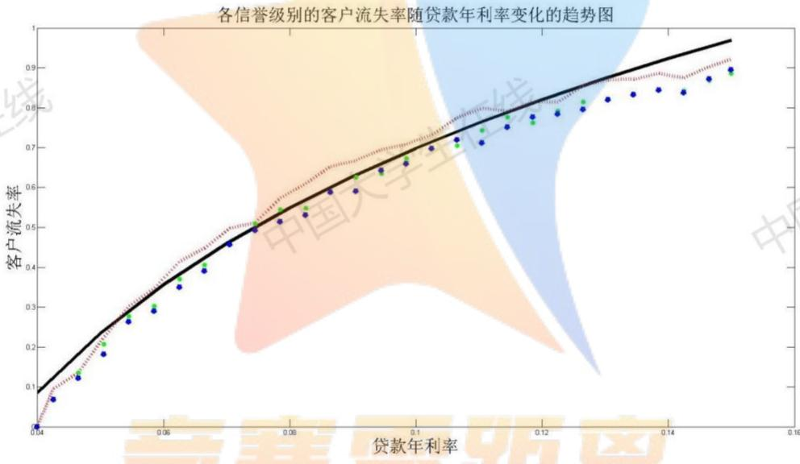
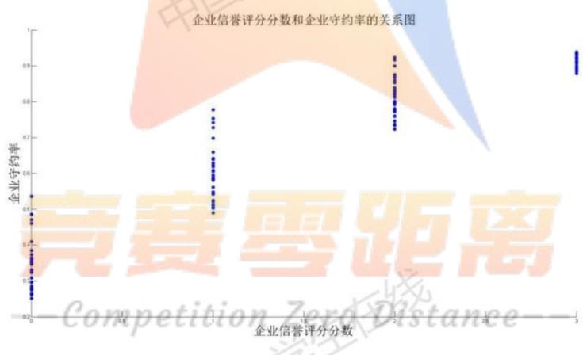
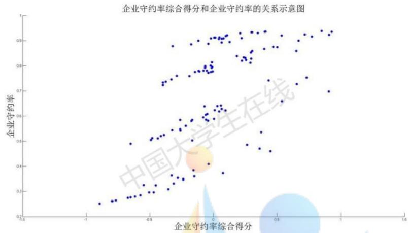
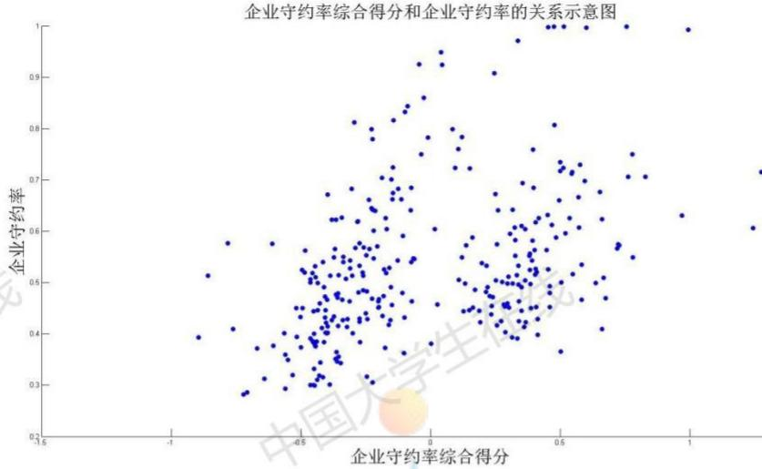

# 银行基于大数据挖掘对中小微企业的信贷决策问题

## 摘要

本文主要研究了银行针对中小微企业的信贷决策问题。信贷决策需要银行利用各企业的相关资料与信息，在对企业进行综合评价之后做出是否放贷、放贷多少、期限多久和利率多少等决策的问题。该问题的研究可以使银行在不影响自身收益的条件下，让我国的中小微企业的信贷问题得到改善，同时也提高了银行信贷决策的效率和质量。

针对问题一，根据题目要求，我们首先要对企业的信贷风险进行量化分析，在量化分析时，我们将风险的量化问题转化为客户守约率问题，建立Logistic回归模型对企业的信贷风险进行量化分析，并计算出的客户守约率 $p _ { i }$ ，再将 $p _ { i }$ 映射到0-1之间，可以得出：当 $P _ { i }$ 值越接近1时，企业的信用越好，风险越低：当 $P _ { i }$ 值越接近0时，企业的信用越差，风险越高。最后建立了以银行对企业i放贷的金额 $x _ { i }$ 和银行对企业i放贷的年利率$r _ { i }$ 为决策变量，以风险尽可能小利润尽可能多为目标函数，以银行放贷的额度、银行放贷年利率和流失率等为约束条件建立多目标决策模型，最后利用MATLAB软件编程得到银行放贷的具体决策（详细结果见附录二）。

针对问题二，在对问题二进行分析之后发现：问题二是建立在问题一的基础之上的，它可以看作问题一的推广。两题目的要求与条件大致相同，所以只是问题二中缺少部分相关数据，所以可以构建出相同的指标。为解决数据缺失的问题，我们利用附件1中的数据找出附件2中缺失数据的相关规律，对附件2中的302家企业的信誉评级，并算出其大致的违约率。这样一来，问题二就转化成为了问题一，我们将问题二构建的模型嵌套进问题一的模型当中，最后利用MATLAB软件编程计算得到银行放贷的具体决策（结果详见附录三)。 国

针对问题三，它是建立在问题二的基础之上的，不同的是题目要求考虑突发因素（以新冠病毒疫情为例研究）。我们先对企业进行有关行业和类型的划分，找到疫情对不同行业、不同类别的企业产生的不同的影响程度和影响方向，并以此对问题二中所构建的指标进行改进。改进完成后，问题三与问题二类似，可以继续套用问题一中的模型进行求解，最后利用MATLAB软件编程计算得到决策调整（结果详见附录四）。

最后，本文对模型进行了优、缺点评价与模型推广，得出该模型还可以向银行面对的其他对象和生活的其它方面进行推广的结论。

关键词：中小微企业的信贷决策问题；Logistic模型 $\boldsymbol { ; }$ 多目标规划模型；欧氏距离

## 一问题重述

## 1.1 问题背景

对于中小微企业的信贷问题，从一方面来说，其企业规模相对较小、缺少用于抵押的资产，并且他们的经营容易受到外部因素的影响，贷款风险较大。与此同时，他们的流动性较差，负债能力也极其有限；从另一方面来说：投资更多的中小微企业有利于分散风险，也方便找到未来的新兴产业，所以银行通常依据信贷的相关政策、企业的交易票据信息和上下游企业的影响力，向实力强、供求关系稳定的企业提供贷款，并可以

## 1.2 问题的提出

题目中已知：可以贷款的企业的贷款额度为10\~100万元、年利率为4%\~15%、贷款期限为1年。该题目要求我们根据实际情况和附件中的数据信息，通过建立恰当的数学模型来研究中小微企业的信贷策。

问题一需要我们对123家企业（附件1）的信贷风险进行量化分析，并给出该银行在固定年度信贷总额的条件下对这些中小微企业的信贷策略。

问题二要求我们在问题1的基础上，对302家企业（见附件2）的信贷风险进行量化分析，并给出银行在年度信贷总额为1亿元时对这些企业的信贷策略。

问题三已知一些突发因素可能会影响企业的生产经营和经济效益，而且突发因素对不同行业、不同类别的企业往往会有不同的影响。针对附件2中各企业，综合考虑的信贷风险和可能出现的突发因素（例如：新冠疫情）对各企业的影响，最后给出该银行在年度信贷总额为1亿元时的信贷调整策略。

## 二问题分析

## 2.1 对问题一的分析

根据问题一的相关说明与条件，目前已知企业的名称、信誉评级、是否违约、企业的进项发票信息（发票号码、开票日期、金额、税额、价税合计、发票状态）和销项发票信息（发票号码、开票日期、金额、税额、价税合计、发票状态）等数据，题目要求对123家有信贷记录企业的信贷风险进行量化分析，并考虑在年度信贷总额固定的条件下给出针对企业的信贷策略。

该问题是常见的信贷决策大数据分析问题，要解决此类问题我们首先将风险的量化问题转化为客户守约率问题，随后建立Logistic回归模型对123家企业的信贷风险进行量化分析，并计算出的客户守约率 $p _ { i }$ ，最后利用映射将 $p _ { i }$ 映射到0-1之间，得出当 $P _ { i }$ 值越接近1时，企业的信用越好，风险越低；当 $P _ { i }$ 值越接近0时，企业的信用越差，风险越高。

## 2.2 对问题二的分析

问题二已知企业的名称、企业的进项发票信息（发票号码、开票日期、金额、税额、价税合计、发票状态）和销项发票信息（发票号码、开票日期、金额、税额、价税合计、

发票状态）等数据。该问题与问题一极为相似，只是该问题缺少信誉评级和是否违约两条件。需要我们做的依然是对企业的信贷风险进行量化分析，并在年度信贷总额为1亿元的条件下给出针对企业的信贷策略。

针对该问题可以有的思路为：首先对附件1中的数据进行处理与分析，找出相关规律并构造出信誉等级，算出对应等级的违约率；再将此模型嵌套进问题一的模型当中，将问题二重新转化为问题一，就可按照问题一的求解步骤进行求解。

## 2.3 对问题三的分析

问题三建立在问题二的基础之上，考虑突发因素（例如：新冠病毒疫情）对不同行业、不同类别的企业的不同影响，对问题二中做出的决策进行调整。

面对该问题我们首先需要查找相关资料，对企业进行对行业和类型的划分，找到疫情不同行业、不同类别的企业的不同的影响程度和影响方向，并以此对问题二中所构建的指标进行改进。改进完成后，即可套用问题一中的模型进行求解。

综上所述：对于中小微企业的信贷决策问题的三个小问之间为层层深入的关系，我们在解决三个问题时的总体思路为将模型朝着问题一的模型的方向转换，即将二、三两问看作问题一的推广。所以解决问题一的关健为：指标的选取与构造；问题二的关键点在于用第一问的数据对问题二中的缺失数据进行预测与计算；问题三的关键点在于弄清疫情对不同行业、不同类别的企业产生的不同的影响。

  
图1 整体建模思路图

## 三模型基本假设与合理性说明

假设1：市场的风险与信誉风险之间没有关系，即在该小问中只考虑企业信誉风险对银行决策的影响，将市场风险看作不存在。

假设2：信用等级是离散的，且在同一等级中的企业违约的概率相同。在利用Excel表格对数据进行筛选之后，我们发现违约企业大多为信誉评级为C、D两个等级的企业，A、B两个等级的企业很少违约。

假设 ${ \mathfrak { 3 } } { \mathfrak { z } }$ 总体风险用银行所放贷的金额 $x _ { i }$ 中最大的一个风险来衡量。当对所有企业发放贷款的最大的风险都是最小的时候的总体风险也是较小的。

假设4：在做决策的这段时间内，平均收益率、交易费率、风险损失率以及同期银行的存款利率都可以看作常数。若平均收益率、交易率、风险损失率以及同期银行存款利率是变化的，那么此时建立的模型是不具有说服力的。

假设5：净收益和总体的风险只会受到平均收益率、交易费率、风险损失率的影响，而与其他因素无关。平均收益率、交易费率、风险损失率是目前已知的较为重要的数据，若考虑其他未知因素和影响甚小的因素不利于数学模型的建立。

## 四 符号说明

<table><tr><td>符号</td><td>符号说明</td></tr><tr><td> $x _ { t i }$ </td><td>对企业i的评价指标  $t \_ { ( } i = 1 , 2 , . . . , 1 2 3 ; t = 1 , 2 , . . . , 6 \ )$ </td></tr><tr><td> $x _ { t j }$ </td><td>对企业j的评价指标t  $( \ j = 1 , 2 , . . . , 3 0 2 ; t = 1 , 2 , . . . , 6 )$  中国</td></tr><tr><td> $\boldsymbol { x ^ { \prime } } _ { \mathit { t j } }$ </td><td>疫情影响下对企业j的评价指标t  $( \ j = 1 , 2 , . . . , 3 0 2 ; t = 1 , 2 , . . . , 6 \ )$ </td></tr><tr><td> $p$ </td><td>企业的守约率</td></tr><tr><td> $p ^ { \prime }$ </td><td>疫情影响下的企业守约率</td></tr><tr><td>y</td><td>客户流失率</td></tr><tr><td>r</td><td>贷款年利率</td></tr><tr><td>x</td><td>竞赛 银行对企业的放贷金额</td></tr><tr><td>α、β、γ</td><td>回归系数 Comnetitio</td></tr></table>

## 五基于有信贷记录的Logistic 分析的多目标规划模型—问题一

## 5.1 建模思路

为给出银行年度信贷总额固定时对这123家企业的信贷策略，我们将以银行年净收益尽可能大，总体风险尽可能小为目标，建立多目标规划模型，求出银行对企业的信贷政策。在对信贷风险进行量化分析时，我们将信贷风险转化为了以企业守约率为量化分析点，因此我们将银行信贷风险损失率由企业守约率表达出，为： $1 - p _ { i }$ (企业的守约率越高，信用越好，信贷风险越低，信贷损失率越低；反之企业的守约率越低，信用越差，信贷风险越高，信贷损失率越高。) 比在

## 5.2 建模准备

## 5.2.1 关键问题的转化

问题一要求对给出的123家有信贷记录的企业的信贷风险进行量化分析，于是我们将风险的量化问题转化为客户守约率问题（即：守约率越趋近于1，该企业的信誉越好；守约率越趋近于0，该企业的信誉越差)。

## 5.2.2 数据预处理

## 对作废发票进行筛选并删除

问题一中提供的数据数量庞大，我们需要将其中的作废发票过滤筛除掉。于是我们先将发票的状态进行处理，将有效发票作为“1”，作废发票作为“0”，再用MATLAB软件将发票状态为作废发票即“0”的发票信息筛选出来并剔除掉。 业

  
图2各企业进项发票票数作废比例直方图

## 剔除异常值

箱形图是一种常用于显示一组数据分散情况资料的统计图，有利于准确稳定地描绘出数据的离散分布情况和数据的处理。因此我们以金额、税额以及价税合计作为样本数据，作出了如下箱型图：

  
图 3箱形图

通过观察各方盒和线段的长短，我们对异常值分布的识别有了一定的了解；随后我们按照4个标准差将数据中的异常数据（包括 NaN， $I n f ,$ 和异常大小数据）进行了过滤筛选，主要是将离均值超过系数因子4倍标准差判为异常大小，最后通过产生随机数种子，进行结果再现检验均值、标准差结果是否正常。附录\*\*\*\*\*

## 筛除发票号相同的发票

在Excel表格中，使用数据透视表对发票号码相同的单元格进行筛选统计，若统计出来的数据表格中的值大于1，则说明该发票是无效的，需要将其删除。

## 5.2.3基于量化分析模型（Logistic 模型）的信贷风险评估

我们运用Logistic 回归方法将123家企业的信贷风险的量化分析转化为对123 家企业的信用风险评价并建立模型，企业信用越高，违约率越低，信贷风险越低。在建立对企业的信用风险评价模型主要有三步：即指标的构造与选择、样本数据的收集与处理和违约的判定。针对指标的构造与选择，指标的选择应该遵循科学性、全面性、公正性、针对性、合法性、可操作性等原则[2]，并以此构建相应的评价指标体系，评价体系共五个指标，指标及其描述如下表：

表1 问题一各项指标的构造与描述
<table><tr><td>指标</td><td>指标描述</td></tr><tr><td>各企业进项发票的作废比例  $x _ { 1 i }$  petition</td><td>该比例越低信用越高，信贷风险越低  $^ { , } ,$ </td></tr><tr><td>各企业销项发票的作废比例  $x _ { 2 i }$ </td><td>该比例越低信用越高，信贷风险越低 国大学</td></tr><tr><td>各企业的信誉状况  $x _ { 3 i }$ </td><td>信誉状况越好信用越高，信贷风险越低</td></tr><tr><td>净发票总金额  $x _ { 4 i }$ </td><td>中国大 金额越大企业资金越充足，企业实力越强</td></tr><tr><td>发票金额的变异系数  $x _ { 5 i }$ </td><td>变异系数越低，金额的偏离程度越低，信贷风险也越低； 变异系数越高，金额的偏离程度越高，信贷风险也越高</td></tr></table>

根据上表可知：针对该模型我们共建立了6个评价指标，分别为：各企业进项发票

的作废比例、销项发票的作废比例、信誉状况、净发票总金额、发票金额的变异系数和资金周转率。

观察题目中提到的要素：对于要点“企业实力”，企业实力是指企业满足市场要求的能力，用企业的生产能力，技术能力，销售能力，产品更新能力，市场信誉等因素表示。在此处我们用净发票的总金额来刻画企业的销售能力；用企业的资金周转率（资金周转率是反应资金流转速度指标。企业资金在生产经营过程中不间断地循环周转，从而使企业取得销售收入。）来刻画企业的财力和销售能力，企业用较少的资金占用，取得较多的销售收入，说明资金周转速度快，资金利用效果好[3]。

对于要点“信誉”，考虑到信誉的对象有两种，银行和销售方，所以我们主要构造了两个指标来刻画：一个是用题目中给出的信誉等级废票比例来刻画，另一个则是通过作废票数的比例来刻画。 国 国

对于要点“风险”，我们用变异系数，即标准偏差与平均值的比值（衡量各观测值的变异程度的一个统计量）[4]

，可以得到变异系数越低，金额的偏离程度就越低，信贷风险也越低；变异系数越高，金额的偏离程度就越高，信贷风险也越高。

通过相关数据建立Logistic 回归模型，记企业的守约率为 $P _ { i }$ ，信贷风险损失率为$1 - p _ { i }$ ，其中i表示第i种企业（i=1,2,...,123）。通过指标拟合出回归方程中指标的相关系数，模型为：

$$
\ln \frac { p _ { i } } { 1 - p _ { i } } = \beta _ { 0 } + \beta _ { 1 } x _ { 1 i } + \beta _ { 2 } x _ { 2 i } + \beta _ { 3 } x _ { 3 i } + \beta _ { 4 } x _ { 4 i } + \beta _ { 5 } x _ { 5 i } + \beta _ { 6 } x _ { 6 i }\tag{1}
$$

其中 $p _ { i } = \frac { 1 } { 1 + e ^ { - ( \beta _ { 0 } + \beta _ { 1 } x _ { 1 i } + \beta _ { 2 } x _ { 2 i } + \beta _ { 3 } x _ { 3 i } + \beta _ { 4 } x _ { 4 i } + \beta _ { 5 } x _ { 5 i } + \beta _ { 6 } x _ { 6 i } ) } }$

将计算出的系数带入公式（1）可得系数（如下表）：

表1回归系数β的值
<table><tr><td> $\beta _ { 0 }$ </td><td> $\beta _ { \mathfrak { r } }$ </td><td> $\beta _ { 2 }$ </td><td> $\beta _ { 3 }$   $\beta _ { 4 }$ </td><td> $\beta _ { 5 }$ </td><td> $\beta _ { 6 }$ </td></tr><tr><td>0.9347</td><td>-11.163</td><td>0.3755-0.9628</td><td> $- 1 . 7 8 1 9 ^ { * } 1 0 ^ { - 1 0 }$ </td><td>-0.0512</td><td> $4 . 4 3 2 6 ^ { * } 1 0 ^ { - 6 }$ </td></tr></table>

(详细程序见附录?)

通过上述公式求出123家企业的守约率，再通过映射将其映射到0-1之间。我们可以得出啊： $p _ { i }$ 值越接近1，则申请贷款企业信用较好，P值越接近0，则申请贷款企业信用较差。贷款企业的信用越好，信贷风险也就越小，贷款企业的信用越差，信贷风险越高。附件1中各企业的守约率 $P _ { i }$ 如下表：

表2 附件1中各企业的守约率 $p$
<table><tr><td>E1</td><td>E2</td><td>E3</td><td>E4</td><td>E5</td><td>E6</td><td>E7</td></tr><tr><td>0.911868</td><td>0.924453</td><td>0.697678</td><td>0.777031</td><td>0.831152</td><td>0.930019</td><td>0.935032</td></tr><tr><td>E8</td><td>E9</td><td>E10</td><td>E11</td><td>E12</td><td>E13</td><td>E14</td></tr><tr><td>0.938654</td><td>0.920264</td><td>0.858713</td><td>0.639952</td><td>0.811639</td><td>0.909888</td><td>0.753185</td></tr><tr><td>E15</td><td>E16</td><td>E17</td><td>E18</td><td>E19</td><td>E20</td><td>E21</td></tr><tr><td>0.894665</td><td>0.892042</td><td>0.93354</td><td>0.935097</td><td>0.908727</td><td>0.875341</td><td>0.866861</td></tr><tr><td>E117</td><td>E118</td><td>E119</td><td>E120</td><td>E121</td><td>E122</td><td>E123</td></tr><tr><td>0.261692</td><td>0.485933</td><td>0.296586</td><td>0.324674</td><td>0.285289</td><td>0.350973</td><td>0.251285</td></tr></table>

注：由于全部表格过大，此处只放了部分数据。详细表格数据见附录?

## 5.3 建立有信贷记录的银行多目标规划模型

## 5.3.1 决策变量的确定

记银行对企业i放贷的金额（单位：万元）为 $x _ { i }$ ；银行对企业i放贷的年利率为 $r _ { i }$ 其中i表示第i种企业 $i = 1 , 2 , . . . , 1 2 3 )$ º

## 5.3.2 目标函数的确定

由于题目要求给出银行年度信贷总额固定时对这123家企业的信贷策略。从银行的角度来看，他们更愿意贷款给风险较小的企业，与此同时，银行也希望自己的收益尽可能多。

## 总体风险的刻画

根据假设3，总体风险用银行所放贷的金额 $x _ { i }$ 中最大的一个风险来衡量，放贷的风险率我们将其转化为企业守约率来表达，即：

$$
\mathrm { m a x } \big \{ ( 1 - p _ { i } ) x _ { i } \big | i = 1 , 2 , . . . , 1 2 3 \big \}\tag{2}
$$

## 银行年净收益的刻画

银行给企业i放贷金额为 $x _ { i }$ 时的净收益为：

$$
[ r _ { i } - ( 1 - p _ { i } ) ] x _ { i }\tag{3}
$$

所以我们确定以银行年净收益尽可能大，年总体风险尽可能小为目标，如 ${ \mathrm { ~  ~ \mathscr ~ { ~ F ~ } : ~ } }$

$$
\left\{ \begin{array} { l l } { \operatorname* { m a x } \displaystyle \sum _ { i = 1 } ^ { 1 2 3 } [ r _ { i } - ( 1 - p _ { i } ) ] x _ { i } } \\ { \operatorname* { m i n } \operatorname* { m a x } \left\{ ( 1 - p _ { i } ) x _ { i } \right\} } \end{array} \right.\tag{4}
$$

## 5.3.3约束条件的确定

约束条件一：银行总放贷额度的限制。

由于题目已知银行对确定要放贷的贷款额度为10\~100万元，所以对所有确定要发放贷款之和应该满足：

$$
1 2 3 0 \leq \sum _ { i = 1 } ^ { 1 2 3 } x _ { i } \leq 1 2 3 0 0\tag{5}
$$

约束条件二：银行对各个企业放贷额度的限制。

$$
1 0 \leq x _ { i } \leq 1 0 0 , \sharp \sharp / \sharp \wedge \dag \underline { { { \mathcal { M } } } } _ { i j } \leq 1 \dag \underline { { { \mathcal { N } } } } _ { i j } \leq 1 \dag \mathcal { M } \dag \mathcal { D } ^ { \mathcal { M } } .\tag{6}
$$

约束条件三：各个企业贷款的年利率限制。

已知银行贷款的年利率的范围为： $4 \% \sim 1 5 \%$

$$
4 \% \leq r _ { i } \leq 1 5 \%\tag{7}
$$

约束条件四：贷款利率对不同信誉等级客户的流失率限制。

利用MATLAB软件对贷款年利率和客户流失率的函数关系拟合，得出不同信誉等级均遵守拟合出的函数关系（见图4）

  
图4 各信誉级别的客户的流失率随贷款的年利率变化的趋势图

对图4、附件 3中sheet1中的相关数据及函数进行分析可以得出：贷款年利率为0.0905-0.0985时，不同信誉等级的客户的流失率变化不大。因此，贷款利率对不同信誉等级客户的流失率限制： 国大

$$
0 \leq y _ { i } \leq 0 . 7 0 8 3 0 2 0 2 3 \Rightarrow 0 \leq 2 . 2 3 8 6 + 0 . 6 6 9 \ln r _ { i } \leq 0 . 7 0 8 3 0 2 0 2 3\tag{8}
$$

约束条件五：银行有盈利约束。

在查找了不同银行有关贷款利率和存款利率的相关数据后，我们发现：银行的最高存款利率是死期一年：1.5%，但银行一年的贷款利率是4.75%，所以从利率方面来看，该银行始终处于盈利状态，即该约束恒成立。

约束条件六：银行对企业j放贷的金额不为负。

$$
x _ { i } \ge 0 , i = 1 , 2 , . . . , 1 2 3
$$

综上所述，建立多目标规划模型如下：

$$
\begin{array}{c} \begin{array} { r l } & { \{ \operatorname* { m a x } \displaystyle \sum _ { i = 1 } ^ { \lfloor 2 \lambda \rfloor } [ r _ { i } - ( 1 - p _ { i } ) ] x _ { i } , i = 1 , 2 , . . . . 1 2 3 } \\ & { \{ \operatorname* { m i n } \operatorname* { m a x } \{ ( 1 - p _ { i } ) x _ { i } \} } \\ & { [ 1 0 \leq x _ { i } \leq 1 0 0 } \\ { 1 2 3 0 \leq \displaystyle \sum _ { i = 1 } ^ { \lfloor 2 \lambda \rfloor } x _ { i } \leq 1 2 3 0 0 } \\ { 4 9 \% \leq r _ { i } \leq 1 5 9 \% } \\ & { x _ { i } \geq 0 } \end{array}   \end{array}\tag{9}
$$

## 5.4 计算步骤

Step1：定义一个总体X为离散型的最大似然函数 $L ( \alpha ) = \prod _ { j = 1 } ^ { n } p \big ( x _ { 1 j } ; \alpha \big )$ ；并对其两边同时取对数得到 $\ln L \left( \beta \right) = \sum _ { i = 1 } ^ { n } \ln p \left( x _ { 1 i } ; \beta \right)$ 大兰

Step2：首先对对数似然函数的各个权重求偏导，其次令之为0即可得到最大似然估计值，即 $\beta _ { \scriptscriptstyle 0 } = 0 . 9 3 4 7$ $\beta _ { 1 } = - 1 1 . 1 6 3$ $\beta _ { { } _ { 2 } } = 0 . 3 7 5 5$ $\beta _ { _ 3 } = - 0 . 9 6 2 8$ $\beta _ { { \scriptscriptstyle 4 } } = - 1 . 7 8 1 9 \mathrm { e } - 1 0$ $\beta _ { 5 } = - 0 . 0 5 1 2$ $\beta _ { 6 } = 4 . 4 3 2 6 \mathrm { e } { - } 0 6$

Step 3：由最佳回归系数的确定可定出对应的Logistic函数，并将123家企业相关因素的指标值代入该函数中，即可求得123家企业的守约率，见表\*\*\*\*\*\*；

Step4：将建立的净收益尽可能大、总体风险尽可能小的多目标规划模型通过固定风险水平、优化收益的手段转化为单目标的线性规划问题；最后利用Lingo软件对上述模型进行计算得到了银行对各企业的贷款额度和贷款利率，具体见表\*\*\*\*\*\*\*

## 5.5 计算结果

利用MATLAB软件对上述模型进行计算得到结果如下表：

表3银行对123家有信贷记录的企业的决策
<table><tr><td>企业</td><td>企业守约率</td><td>是否贷款</td><td>贷款额度（万元）</td><td>贷款利率</td><td>贷款期限（年）</td></tr><tr><td>El</td><td>91.1868%</td><td>是</td><td>92.0681</td><td>4.9695%</td><td>1</td></tr><tr><td>E2</td><td>92.4453%</td><td>是</td><td>93.2008</td><td>4.8310%</td><td>1</td></tr><tr><td>E3</td><td>69.7678%</td><td>是</td><td>72.7910</td><td>7.3255%</td><td>1</td></tr><tr><td></td><td></td><td></td><td></td><td></td><td></td></tr><tr><td>E121</td><td>28.5289%</td><td>否 国</td><td>0.0000</td><td>0.0000%</td><td>0 中国</td></tr><tr><td>E122</td><td>35.0973%</td><td>否</td><td>0.0000</td><td>0.0000%</td><td></td></tr><tr><td>E123</td><td>25.1285%</td><td>否</td><td>0.0000</td><td>0.0000%</td><td>0</td></tr></table>

注：由于全部表格过大，此处只放了部分数据。详细表格数据见附录?

## 5.6 结果分析与检验

本问中所得的贷款额度、贷款利率等结果根本上是基于企业守约率计算得出的，因此企业守约率的准确性是本问所有的结果精确的关键所在，所以下面将就企业守约率的结果进行检验与分析。

从经验来看，各企业的守约率很大程度上同其信誉状况成正相关，即信誉得分高，守约率高，反之，信誉得分低，守约率低。我们做出123家有信贷记录企业的信誉分数同守约率的散点关系图，如图所示： 武大

  
图 5 企业信誉评分分数

由图很直观的发现，这是完全符合事实的，因此模型具有一定的合理性：

但以上的检验毕竟是主观的感受，具有一定的误差性。我们应对其进行进一步的客观描画检验，我们进行了如下的检验：

首先利用MATLAB软件对6个评价指标（各企业进项、销项发票的作废比例，各企业的信誉状况，净发票总金额，发票金额的变异系数，资金周转率）进行主成分分析，得到相关系数矩阵的前几个特征根及其贡献率大约分别为24.9，21.0，17.3，14.2，12.7，

9.9；接着选取前5个主成分（累计贡献率达到90%以上）进行综合评价；按照主成分分析法的基本步骤流程，我们依次计算了特征值、特征向量、综合评价值和综合得分；基于此，最后我们绘制出了综合得分和企业守约率的关系散点图，如下图：

  
图6 123 家守约率综合得分散点图

其表示的含义是随着综合得分的增加，企业守约率也大致呈上升状态，因此，从一定意义上反应出了我们的企业守约率结果的正确与合理性。

## 六内嵌欧式距离信誉等级确立的多目标规划模型——问题二

## 6.1 建模思路

问题二与问题一相似，其区别在于问题二的数据有一定的缺失（信誉评级和违约记录)，所以在解决第二问时需要利用问题一中已有的数据对附件2中的302家企业的信誉等级进行预测，并在已经预测好信用等级的基础上确定每个等级的概率范围。然后采用第一问模型中的信贷风险量化方法。运用Logistic回归方法将302家企业的信贷风险的量化分析转化为对302家企业的守约率大小来量化并建立模型。其余操作类似问题一。

## 6.2 建模准备

## 6.2.1 数据预处理

## 对作废发票进行筛选并删除

问题二会用到附件2中的数据，我们需要将其中的作废发票过滤筛除掉。于是我们采用问题一中同样的处理方法将发票状态为作废发票信息筛选出来并剔除掉。 业

## 剔除异常值

问题二对附件2的处理同样采取有利于准确稳定地描绘出数据的离散分布情况和数据的处理。因此我们以：

观察各方盒和线段的长短，我们可以对异常值分布的识别有一定的了解：然后我们按照4个标准差将数据中的异常数据（包括NaN，Inf,和异常大小数据）进行了过滤筛选，主要是将离均值超过系数因子4倍标准差判为异常大小，最后通过产生随机数种子，进行结果再现检验均值、标准差结果是否正常。

## 筛除发票号相同的发票

在Excel表格中，使用数据透视表对发票号码相同的单元格进行筛选统计，若统计出来的数据表格中的值大于1，则说明该发票是无效的，需要将其删除。

## 6.2.2信用等级与违约率的判定

在对附件2中的302家企业进行信贷风险量化分析前，首先需要要对302家企业的信誉评级做出判定。通过对附件1中的表格处理数据的分析及各项量化指标与信誉评级的关系发现：各项指标与信誉评价都是离散的，无法构造线性相关方程对其建立函数关系式，也就无法将信誉评级与其他指标相联系。因此，我们算出附件1中企业的各信誉状况下的平均净发票量和附件2中各企业的净发票量，构造两者间的距离关系式，附件2中各企业的净发票量与附件1中企业的哪个信誉状况下的平均净发票量距离近，该企业的信誉评级就是多少。 中

## 建立基于欧式距离的信誉等级确定模型：

我们通过计算得出302家企业的净发票总金额 $x _ { 4 j }$ ，建立302家无信贷记录企业的净发票总金额 $x _ { 4 j }$ 到123家有信贷记录企业的各信誉状况下的平均净发票总金额 $\overline { { x _ { 4 i } } }$ 的距离函数，即， $d = \sqrt { { x _ { 4 j } } ^ { 2 } - { \overline { { x _ { 4 i } } } ^ { 2 } } }$ 以距离最小mind为目标函数，确定出302家无信贷记录企业相应的信誉等级。（123家企业各信誉状况下的平均净发票总金额 $x _ { 4 i }$ 如下表)

表4 4个信誉等级对应的平均发票总金额
<table><tr><td>信誉等级</td><td>A</td><td>B</td><td>C</td><td>D</td></tr><tr><td>平均净发 票总金额 (元)</td><td>23191781.5266667</td><td>23681634.6419444</td><td>90799230.7874797</td><td>2604767.66384615</td></tr></table>

将附件2中的每个企业的平均发票总金额与上表对照比较，可以得到如下的关于302家企业的信誉等级，如下表：

表 5 302 个企业的信誉等级预测
<table><tr><td>企业</td><td>1</td><td>2</td><td>3</td><td>4</td><td>5</td><td>6</td><td>7</td><td>8</td><td>9</td><td>10</td></tr><tr><td>信誉等级</td><td>D</td><td>B</td><td>C</td><td>C</td><td>C</td><td>C</td><td>B</td><td>C</td><td>C</td><td>C</td></tr><tr><td>企业</td><td>11 12</td><td></td><td></td><td></td><td></td><td></td><td></td><td>18</td><td>19</td><td>20</td></tr><tr><td>信誉等级</td><td>C</td><td>C</td><td>D</td><td>B</td><td></td><td>C</td><td>C</td><td>C</td><td>B</td><td>C</td></tr><tr><td>企业</td><td>293</td><td>294</td><td>295</td><td>296</td><td>297</td><td>298</td><td>299</td><td>300</td><td>301</td><td>302</td></tr><tr><td>信誉等级</td><td>D</td><td>D</td><td>D</td><td>D</td><td>D</td><td>D</td><td>D</td><td>D</td><td>D</td><td>D</td></tr></table>

注：由于全部表格过大，此处只放了部分数据。详细表格数据见附录？

在对信誉评级判定后，采用第一问模型中的信贷风险量化方法。运用Logistic回归方法将302家企业的信贷风险的量化分析转化为对302家企业的守约率大小来量化并建立模型，企业信用越高，守约率越高，信贷风险越低。在建立对企业的信用风险评价模型时需要：选择指标、收集样本数据和判定违约。在指标的选择上要遵循科学性、全面性、公正性、针对性、合法性、可操作性等原则²来构建相应的评价指标体系，评价体系共六个指标（其中 $j = 1 , 2 , . . . , 3 0 2 ,$ ，相应指标及其相关描述如下表：

表6 问题二指标及其相关描述
<table><tr><td>指标</td><td>指标描述</td></tr><tr><td>各企业进项发票的作废比例  $x _ { 1 j }$ </td><td>比例越低信用越高，信贷风险越低</td></tr><tr><td>各企业销项发票的作废比例  $x _ { 2 j }$ </td><td>比例越低信用越高，信贷风险越低</td></tr><tr><td>各企业的信誉状况  $x _ { 3 j }$ </td><td>信誉状况越好信用越高，信贷风险越低 中国大 中国大</td></tr><tr><td>净发票总金额  $x _ { 4 j }$ </td><td>金额越大企业资金越充足，企业实力越强</td></tr><tr><td>发票金额的变异系数  $x _ { 5 j }$ </td><td>变异系数越低，金额的偏离程度越低，信贷风险也越低； 变异系数越高，金额的偏离程度越高，信贷风险也越高。</td></tr><tr><td>资金周转率  $x _ { 6 j }$ </td><td>则资金周转率快，周转率越快，资金利用 效果越好，企业的信用越高风险越低</td></tr></table>

通过相关数据建立Logistic回归模型，通过指标拟合出回归方程中指标的相关系数。建立的模型为：

$$
\ln \frac { p _ { j } } { 1 - p _ { j } } = \alpha _ { 0 } + \alpha _ { 1 } x _ { 1 j } + \alpha _ { 2 } x _ { 2 j } + \alpha _ { 3 } x _ { 3 j } + \alpha _ { 4 } x _ { 4 j } + \alpha _ { 5 } x _ { 5 j } + \alpha _ { 6 } x _ { 6 j }\tag{10}
$$

其中， $p _ { j }$ 为企业的守约率， $1 - p _ { j }$ 为信贷风险损失率。计算出系数值见下表：

表 7 回归系数α的值
<table><tr><td> $\alpha _ { 0 }$ </td><td> $\alpha _ { \mathfrak { l } }$ </td><td> $\alpha _ { 2 }$ </td><td> $\alpha _ { 3 }$ </td><td> $\alpha _ { 4 }$ </td><td> $\alpha _ { \varsigma }$ </td><td> $\alpha _ { 6 }$ </td></tr><tr><td>0.9146</td><td>-7.6634</td><td>0.0054</td><td>-0.1008</td><td> $- 2 . 7 5 4 1 ^ { \ast } 1 0 ^ { - 9 }$ </td><td>-0.0233</td><td> $4 . 4 7 1 0 ^ { * } 1 0 ^ { - 5 }$ </td></tr></table>

(计算得出的详细公式和求出系数的程序见附录？)

## 6.3 建立无信贷记录的银行多目标规划模型

在给出该银行对这些企业的信贷政策时，在第一问建立的模型基础上，以银行年净收益尽可能大、年总体风险尽可能小为目标，建立多目标规划模型，以求出银行对企业的信贷政策。 中国 国

## 6.3.1 决策变量的确定

记r为银行对企业j放贷的年利率；x为银行对企业j放贷的金额（单位：万元）， $r _ { j }$ $x _ { j }$ 其中j表示第j种企业 $( \ j = 1 , 2 , . . . , 3 0 2 \ )$

## 6.3.2目标函数的确定

$$
\{ \begin{array} { l l } { \operatorname* { m a x } \displaystyle \sum _ { j = 1 } ^ { 3 0 2 } [ r _ { j } - ( 1 - p _ { j } ) ] x _ { j } } & \\ { \operatorname* { m i n } \operatorname* { m a x } \{ ( 1 - p _ { j } ) x _ { j } \} } \end{array} , j = 1 , 2 , . . . , 3 0 2\tag{11}
$$

## 6.3.3约束条件的确定

约束条件一：银行对各个企业放贷额度的限制。

$$
\left\{ \begin{array} { l l } { 1 0 \leq x _ { j } \leq 1 0 0 , \# \mathbb { K } \lambda \vec { \mathbb { T } } \mathbb { X } \mathbb { H } \mathbb { K } \mathbb { M } \mathbb { K } \mathbb { H } \mathbb { K } \mathbb { H } \mathbb { K } \mathbb { H } } \\ { 0 , \# \mathbb { K } \lambda \vec { \mathbb { T } } \mathbb { X } \mathbb { H } \mathbb { K } \mathbb { H } \mathbb { K } j \mathbb { K } \mathbb { K } \mathbb { K } \mathbb { H } \mathbb { K } } \end{array} \right.\tag{12}
$$

约束条件二：银行总放贷额度的限制。

$$
3 0 2 0 \leq \sum _ { j = 1 } ^ { 3 0 2 } x _ { j } \leq 1 0 0 0 0\tag{13}
$$

约束条件三：各个企业贷款的年利率限制。

$$
4 \% \leq r _ { j } \leq 1 5 \%\tag{14}
$$

约束条件四：贷款利率对不同信誉等级客户的流失率限制。

$$
0 \leq y _ { i } \leq 0 . 7 0 8 3 0 2 0 2 3 \Rightarrow 0 \leq 2 . 2 3 8 6 + 0 . 6 6 9 \ln r _ { i } \leq 0 . 7 0 8 3 0 2 0 2 3
$$

约束条件五：银行对企业j放贷的金额不为负。

$$
x _ { j } \ge 0 , j = 1 , 2 , . . . , 3 0 2\tag{15}
$$

综上所述，建立多目标规划模型如下：

$$
\begin{array} { l } { \left\{ \begin{array} { l l } { \displaystyle \operatorname* { m a x } \frac { \mathrm { 3 } \omega ^ { 2 } } { j = 1 } [ r _ { j } - ( 1 - p _ { j } ) ] x _ { j } , } \\ { \displaystyle \operatorname* { m i n } \operatorname* { m a x } \left\{ ( 1 - p _ { j } ) x _ { j } \right\} \quad \quad \quad \quad \quad \quad \quad \quad \quad } \\ { \displaystyle \operatorname* { I } 0 \leq x _ { j } \leq 1 0 0 p e f i t i o n \quad \angle e _ { \ell } \gamma \sigma ( \bar { \wp } ) \bar { U } \bar { s } t a n e e -- } \\ { \displaystyle \quad \quad \quad \quad \quad \quad \quad \quad \quad \quad \quad \quad \quad \quad \quad \quad \quad \quad \quad \quad \quad \quad \quad \quad \quad } \\ { \displaystyle \quad \delta t , \displaystyle \int _ { j = 1 } ^ { 3 0 2 0 } \sum _ { j = 1 } ^ { 3 \infty } x _ { j } \leq 1 0 0 0 0 \quad \quad \quad \quad \quad \quad \quad \quad \quad \quad } \\ { \displaystyle \quad \quad \quad \quad \quad \quad \quad \quad \quad \quad \quad \quad \quad \quad \quad \quad \quad \quad \quad \quad \quad \quad \quad \quad \quad } \\ { \displaystyle \quad \quad \quad \quad \quad \quad \quad \quad \quad \quad \quad \quad \quad \quad \quad \quad \quad \quad \quad \quad \quad \quad \quad \quad \quad } \\ { \displaystyle \quad \quad \quad \quad \quad \quad \quad \quad \quad \quad \quad \quad \quad \quad \quad \quad \quad \quad \quad \quad \quad \quad } \end{array} \right. } \end{array}\tag{16}
$$

## 6.4 计算步骤

Step1:计算得出123家有信贷记录企业的各信誉状况下的平均净发票总金额 $\overline { { x _ { 4 i } } }$ 的矩阵(23191781.5266667,23681634.6419444,90799230.7874797,2604767.66384615)，再计算得出302家无信贷记录企业的净发票总金额 $x _ { 4 j }$ ，具体见表\*\*\*\*\*\*;

Step2:建立 302家无信贷记录企业的净发票总金额x到123家有信贷记录企业的各信 $x _ { 4 j }$ 誉状况下的平均净发票总金额 $\overline { { x _ { 4 i } } }$ 的距离函数，即 $d = \sqrt { { x _ { 4 j } } ^ { 2 } - { x _ { 4 i } } ^ { 2 } }$ ，以距离最小为目标函数，确定出302家无信贷记录企业相应的信誉等级，具体见表\*\*\*\*\*\*；

Step3:类似于问题一的计算过程，构造出最大似然函数 $L \left( \alpha \right) = \prod ^ { n } p \big ( x _ { 1 j } ; \alpha \big )$ ，由此确定出最佳回归系数 $\alpha _ { 0 } = 0 . 9 1 4 6$ $\alpha _ { 1 } = - 7 . 6 6 3 4$ $\alpha _ { 2 } = 0 . 0 \dot { 0 } \dot { 5 } 4$ $\mathcal { \alpha } _ { 3 } = - 0 . 1 0 0 8$ $\alpha _ { 4 } = - 2 . 7 5 4 1 e - 0 9$ $\alpha _ { \mathnormal { s } } = - 0 . 0 2 3 3$ $\alpha _ { 6 } = 4 . 4 7 1 0 \mathrm { e } { \cdot } 0 5$

Step4:剩余计算步骤同第一问的计算过程类似，具体结果见表\*\*\*\*\*\*\*。

## 6.5 计算结果

利用MATLAB 软件对上述模型进行计算得到结果如下表：

表 8 问题二银行决策方案
<table><tr><td>企业</td><td>企业守约率</td><td>是否贷款</td><td>贷款额度（万元）</td><td>贷款利率</td><td>贷款期限（年）</td></tr><tr><td>E1</td><td>54.7210%</td><td>否</td><td>0</td><td>0.0000%</td><td>0</td></tr><tr><td>E2</td><td>60.7320%</td><td>是</td><td>64.65882254</td><td>8.3195%</td><td>1</td></tr><tr><td>E3</td><td>83.4499%</td><td>是 玉</td><td>85.10495226</td><td>5.8205%</td><td>1 中国</td></tr><tr><td></td><td></td><td></td><td></td><td></td><td></td></tr><tr><td>E300</td><td>56.4983%</td><td>否否否</td><td>0</td><td>0.0000%</td><td>0</td></tr><tr><td>E301</td><td>54.9393%</td><td></td><td>0</td><td>0.0000%</td><td>0</td></tr><tr><td>E302</td><td>92.4893%</td><td></td><td>0</td><td>0.0000%</td><td>0</td></tr></table>

注：由于全部表格过大，此处只放了部分数据。详细表格数据见附录？

由上表可以直接看出银行对各个企业的决策：是否贷款、贷款额度和贷款利率。

## 6.6 结果分析与检验

类似问题一的结果检验与分析的操作步骤，我们绘制出了综合得分和企业守约率的关系散点图，如下： 学

  
图 7 302 家守约率综合得分散点图

其表示的含义是随着综合得分的增加，企业的守约率也大致呈上升状态，这在一定意义上反应出了我们的企业守约率结果的正确与合理性。

## 七 考虑突发因素的信贷决策问题——问题三

## 7.1 建模思路

问题三需要在前两问的基础上，考虑突发因素对企业生产经营和经济效益的影响，针对不同行业、不同类别的企业进行分析，我们分别根据附件2中的企业名称和对企业进行行业分类与中、小、微型企业的判别。

## 7.2 建模准备

## 7.2.1 关于不同类别、不同行业的分析

在疫情期间，政府出台了不少的政府扶持政策，其中就有银行的相关扶持政策（以四川为例)。《四川省人民政府办公厅关于应对新型冠状病毒肺炎疫情缓解中小企业生产经营困难的政策措施》中，小微企业存量贷款疫情防控期间到期办理续贷或展期，利率按原合同利率下浮10%，新增贷款利率下浮10%。因此，银行给企业放贷业j放贷的年利率r降低为(1-10%)rj。

在国家统计局官方网站收集的数据发现：疫情对不同行业的影响不同，疫情给批发零售、住宿餐饮、交通运输、文体娱乐、房地产等行业带来较大冲击；对线上教育、信息技术产业、金融业却带来一定的利好与机遇。若将行业分为线上和线下企业，那么线上企业基本没有影响，线下的企业除个体经营户外几乎都收到了影响且持续的时间较[5]。因此，不同行业的企业的营业能力、现金流减少，评价信贷风险的指标也发生相应的改变，例如；净发票总金额、资金周转率发生改变。

## 7.2.2 评价指标的构造

由于疫情的影响，评价指标中的发票总金额发生改变。通过新闻的报道及对四川中小微型企业进行了网络问卷调查发现：线上教育、信息技术产业、电商业大致没有发生变化，其他行业均发生变化，如：中型企业平均下降20%；小型企业平均下降15%；微型企业平均下降5%（受到的影响较小)；发票金额也发生改变，资金的周转率也发生变化（与发票总金额改变的规律大致相同）。因此，我们对附件2的数据再次进行了数据处理。（处理如图/表/附件？）

在重新进行完数据处理与指标改进完善后，我们依旧套用Logistic回归方法将302家企业的信贷风险的量化分析转化为对302家企业的守约率大小来量化并建立模型，企业信用越高，守约率越高，信贷风险越低。评价体系共6个指标，后文用表示$\ v { x } _ { { t j } } ^ { \prime } \left( t = 1 , 2 , \ldots , \right.$ (其中 $j = 1 , 2 , . . . , 3 0 2 )$ ，指标及其描述如表9：

表9 问题三指标及其相关描述
<table><tr><td>指标</td><td>指标描述</td></tr><tr><td>各企业进项发票的作废比例  $x _ { 1 j } ^ { \prime }$ </td><td>比例越低信用越高，信贷风险越低</td></tr><tr><td>各企业销项发票的作废比例  $x _ { 2 j } ^ { ' }$ </td><td>比例越低信用越高，信贷风险越低</td></tr><tr><td>各企业的信誉状况  $x _ { _ { 3 j } } ^ { \prime }$ </td><td>信誉状况越好信用越高，信贷风险越低</td></tr><tr><td>净发票总金额  $x _ { 4 j } ^ { \prime }$ </td><td>金额越大企业资金越充足，企业实力越强</td></tr><tr><td>发票金额的变异系数 f  $x _ { 5 j } ^ { ' }$  </td><td>变异系数越低，金额的偏离程度越低，信贷风险也越低；</td></tr><tr><td>生在线 资金周转率  $x _ { 6 j } ^ { ' }$ </td><td>变异系数越高，金额的偏离程度越高，信贷风险也越高。 则资金周转率快，周转率越快，资金利用</td></tr></table>

通过相关数据建立logistic回归模型，通过指标拟合出回归方程中指标的相关系数。建立模型如下：

$$
\ln \frac { p _ { _ j } ^ { \prime } } { 1 - p _ { _ j } ^ { \prime } } = \gamma _ { _ 0 } + \gamma _ { _ 1 } x _ { _ { 1 j } } ^ { \prime } + \gamma _ { _ 2 } x _ { _ { 2 j } } ^ { \prime } + \gamma _ { _ 3 } x _ { _ 3 j } ^ { \prime } + \gamma _ { _ 4 } x _ { _ 4 j } ^ { \prime } + \gamma _ { _ 5 } x _ { _ { 5 j } } ^ { \prime } + \gamma _ { _ 6 } x _ { _ 6 j } ^ { \prime }\tag{17}
$$

则有： $p ^ { \prime } { } _ { j } = \frac { 1 } { 1 + e ^ { - ( \gamma _ { 0 } + \gamma _ { 1 } x ^ { \prime } _ { 1 j } + \gamma _ { 2 } x ^ { \prime } _ { 2 j } + \gamma _ { 3 } x ^ { \prime } _ { 3 j } + \gamma _ { 4 } x ^ { \prime } _ { 4 j } + \gamma _ { 5 } x ^ { \prime } _ { 5 j } + \gamma _ { 6 } x ^ { \prime } _ { 6 j } ) } } $ 其中， $p _ { j } ^ { ' }$ 为企业的守约率， $1 - p _ { \ j } ^ { \prime }$ 为疫情影响下的信贷风险损失率。计算出系数值见下表：

表10 回归系数γ的值
<table><tr><td colspan="5"></td><td rowspan="2"> $\gamma _ { 5 }$ </td><td rowspan="2"> $\gamma _ { 6 }$  </td></tr><tr><td> $\gamma _ { 0 }$ </td><td> $\gamma _ { 1 }$ </td><td> $\gamma _ { 2 }$ </td><td> $\gamma _ { 3 }$ </td><td> $\gamma _ { 4 }$ </td></tr><tr><td></td><td></td><td></td><td></td><td>0.9113 -1.6409 0.0111 -0.1042 -2.8238*10-9 -0.0243</td><td></td><td> $5 . 3 7 3 8 ^ { * } 1 0 ^ { - 5 }$ </td></tr></table>

通过对上述公式求出302家企业的守约率分析得出， $p ^ { \prime }$ 值越接近1，则申请贷款企业信用较好， $p ^ { \prime }$ 值越接近0，则申请贷款企业信用较差。贷款企业的信用越好，信贷风险也就越小，贷款企业的信用越差，信贷风险越高。

## 7.3建立突发因素下的无信贷记录的银行多目标规划模型

企业的营业能力下降，现金流减少。面对这些问题，我们将问题2的模型做出改进

与完善。

## 7.3.1 决策变量的确定

记 $r _ { j }$ 为银行对企业j放贷的年利率； $x _ { j }$ 为银行对企业j放贷的金额；（其中j表示第j种企业（j=1,2,...,302))。

## 7.3.2目标函数的确定

$$
\left\{ \begin{array} { l l } { \displaystyle \operatorname* { m a x } \sum _ { j = 1 } ^ { 3 0 2 } [ r _ { j } ( 1 - 1 0 \% ) - ( 1 - p ^ { \prime } , ) ] x _ { j } } \\ { \displaystyle \operatorname* { m i n } \operatorname* { m a x } \left\{ ( 1 - p ^ { \prime } , ) x _ { j } \right\} } \end{array} \right.\tag{18}
$$

## 7.3.3 约束条件的确定

约束条件一：银行对各个企业放贷额度的限制。

$$
1 0 \leq x _ { j } \leq 1 0 0\tag{19}
$$

约束条件二：银行总放贷额度的限制。

$$
3 0 2 0 \leq \sum _ { j = 1 } ^ { 3 0 2 } x _ { j } \leq 1 0 0 0 0\tag{20}
$$

约束条件三：各个企业贷款的年利率限制。

$$
4 \% \cdot ( 1 - 1 0 \% ) \leq r _ { j } \leq 1 5 \% \cdot ( 1 - 1 0 \% )\tag{21}
$$

约束条件四：贷款利率对不同信誉等级客户的流失率限制

$$
0 \leq y _ { i } \leq 0 . 7 0 8 3 0 2 0 2 3 \Rightarrow 0 \leq 2 . 2 3 8 6 + 0 . 6 6 9 \ln r _ { i } \leq 0 . 7 0 8 3 0 2 0 2 3\tag{22}
$$

约束条件五：决策变量的类型与范围约束。

$$
x _ { j } \geq 0 , j = 1 , 2 , . . . , 3 0 2\tag{23}
$$

综上所述：建立多目标规划模型如下：

$$
\begin{array} { r l } & { \{ \begin{array} { l l } { \operatorname* { m a x } \displaystyle \sum _ { j = 1 } ^ { 3 0 } \displaystyle [ \eta _ { j } ^ { ( 1 ) } \eta _ { j } ^ { ( 0 ) } \phi _ { j } ^ { ( 1 ) } [ \tilde { \ell } ( \tilde { \ell } ) { \bar { \ell } } ^ { j } ] \frac { 1 } { 2 } \eta _ { j } ^ { ( 1 ) } \phi _ { j } - \phi ( \tilde { \ell } ) \overline { { \beta _ { j } ^ { ( 3 ) } \bar { \ell } ( \tilde { \ell } ) \bar { \ell } ^ { j } } } = - } \\ { \operatorname* { m i n } \operatorname* { m a x } \{ ( 1 - \ell ^ { ( 1 ) } x _ { j } ^ { ( 1 ) } ) x _ { j } \} } \\ { \displaystyle [ 0 \leq x _ { j } \leq 1 0 0 } \\ { \displaystyle \frac { 1 } { 4 9 6 \cdot ( 1 - 1 0 9 ) \leq r _ { j } \leq 1 5 9 \cdot ( 1 - 1 0 9 6 ) } } \\ { \displaystyle { s . t .  0 2 0 } \leq \displaystyle \sum _ { j = 1 } ^ { 3 0 2 } x _ { j } \leq 1 0 0 0 0 } \\ { \displaystyle 0 \leq y _ { i } \leq 0 . 7 0 8 3 0 2 0 2 3 \leq 0 \leq 2 . 2 3 8 6 + 0 . 6 6 9 \ln r _ { i } \leq 0 . 7 0 8 3 0 2 0 2 3 } \\ { x _ { j } \geq 0 . 9 \ w _ { i } , 2 . . . , 3 0 2 } \end{array}  } \end{array}\tag{24}
$$

## 7.4 计算步骤

Step1:根据查阅出的政府信贷政策以及大中小微企业划分标准，首先对302家企业进行等级划分，其次根据划分等级和第二问的302家企业相关因素的指标值完成该问的评价指标的构造；

Step 2:定义一个总体X为离散型的最大似然函数 $L ( \gamma ) = \prod _ { j = 1 } ^ { n } p \big ( x _ { 1 j } ^ { \prime } ; \gamma \big )$ ；并对其两边同时取对数得到 $\ln L \left( \gamma \right) = \sum _ { j = 1 } ^ { n } \ln p \left( x _ { 1 j } ^ { \prime } ; \gamma \right)$ 在线

Step3:首先对对数似然函数的各个权重求偏导，其次令之为0即可得到最大似然估计值，即 $\gamma _ { \scriptscriptstyle 0 } = 0 . 9 1 1 3 \ , \gamma _ { \scriptscriptstyle 1 } = - 1 . 6 4 0 9 \ , \gamma _ { \scriptscriptstyle 2 } = 0 . 0 1 1 1 , \gamma _ { \scriptscriptstyle 3 } = - 0 . 1 0 4 2 \ , \gamma _ { \scriptscriptstyle 4 } = - 2 . 8 2 3 8 e - 0 9 3 2 , \gamma _ { \scriptscriptstyle 4 } = 0 . 0 3 8 5 ,$ $\gamma _ { 5 } = - 0 . 0 2 4 3 , \gamma _ { 6 } = 5 . 3 7 3 8 e - 0 5$ 中国

Step 4:由最佳回归系数的确定即可定出对应的logistic 函数，并将302家企业相关因素的指标值代入该函数中，即可求得突发因素影响下的302家无信贷企业的守约率，见表\*\*\*\*\*\*；

Step5:将所建立的净收益尽可能大，总体风险尽可能小的多目标规划模型，通过固定风险水平，优化收益的手段将其转化为单目标的线性规划问题；最后利用Lingo软件对上述模型进行计算得到了银行对各企业的贷款额度和贷款利率，具体见表\*\*\*\*\*\*\*。

## 7.5 计算结果

利用 MATLAB 软件对上述模型进行计算得到结果如下表：

<table><tr><td>企业</td><td>企业守约率</td><td>是否贷款</td><td>贷款额度（万元）</td><td>贷款利率</td><td>贷款期限 (年)</td></tr><tr><td>E1</td><td>33.0282%</td><td>否</td><td>0.0000</td><td>0.0000%</td><td>0</td></tr><tr><td>E2</td><td>41.4379%</td><td>是</td><td>47.2941</td><td>10.4418%</td><td>1</td></tr><tr><td>E3</td><td>64.6708%</td><td>是</td><td>68.2037</td><td>7.8862%</td><td>1</td></tr><tr><td></td><td></td><td></td><td></td><td></td><td></td></tr><tr><td>E300</td><td>35.5959%</td><td>否</td><td>0.0000</td><td>0.0000%</td><td>0</td></tr><tr><td>E301</td><td>34.5768%</td><td>否</td><td>0.0000</td><td>0.0000%</td><td>0</td></tr><tr><td>E302</td><td>45.9041%</td><td>否</td><td>0.0000</td><td>0.0000%</td><td>0</td></tr></table>

由上表可以直接看出银行对各个企业的决策：是否贷款、贷款额度和贷款利率。

## 7.6 结果分析与检验

类似以上两个问题对结果的检验与分析，最终我们可以得到该模型是合理的。

## 八模型评价与推广

## 10.1 模型优点

本文在建模之前都对数据进行了预处理，使得数据更加真实可靠。

本文利用欧式距离来确定信誉等级，是本文模型的创新与独到之处。

本文在解决问题时，套用的模型较为简单、易于理解，简化了问题的求解难度。

## 10.2 模型缺点

本题的数据量较大，但解决本题时没有用专门的数据处理软件，到时操作繁琐，等待时间较长。 式大

银行在评判顾客的信誉等级时，通常还会对借款人的经营实力进行评价、经营环境进行评估以及管理能力评估，但由于此时的数据种类有限，不能保证数据的评级完全合理。

在问题二的模型中，由于问题二缺少数据，所以我们通过分析附件1中的数据得到了近似的附件二中的数据，此时的数据可能存在误差。

## 10.3 模型的推广

该模型该可以运用到银行面对的其他对象的等级判定

该模型还可以运用到生活的其他方面，例如在人力资源市场选人时可以进行初步判定与筛选。 L

--Competition ZexoDistance--

## 参考文献

[1] 周民志.商业银行小企业信贷工作策略研究.商场现代化,2007(11Z):362-363.熊熊,马佳,赵文杰,王小琰,张今.供应链金融模式下的信用风险评价[J].南开管理评论,2009,12(04):92-98+106.

[3]搜 狗 百 科 资 金 周 转 率.[2020-06-19](2020-09-13).[EB/OL]https://baike.sogou.com/v430553.htm?fromTitle=%E8%B 5%84%E9%87%91%E5%91%A8%E8%BD%AC%E7%8E%87

[4]百度百科变异系数 ( 2020-04-28 )[EB/OL].https://baike.sogou.com/v1272795.htm?fromTitle=%E5%8F%98%E5%BC%82%E7%B3%BB%E6%95%B0] XK

[5] 国家统计局.关于印发《统计上大中小微型企业划分办法(2017)》的通知.[2018-01-03](2020-09-13）.[EB/OL]http://www.stats.gov.cn/tjgz/tzgb/201801/t20180103\_1569254.html

## 九附录

附录一：附件1中的123家企业的信贷风险分析
<table><tr><td rowspan=1 colspan=1>E1         E2         E3          E4         E5         E6         E7</td></tr><tr><td rowspan=1 colspan=1>0.911868  0.924453  0.697678  0.777031   0.831152  0.930019   0.935032</td></tr><tr><td rowspan=1 colspan=1>E8         E9         E10        E11         E12        E13         E14</td></tr><tr><td rowspan=1 colspan=1>0.938654  0.920264  0.858713   0.639952   0.811639   0.909888   0.753185</td></tr><tr><td rowspan=1 colspan=1>E15        E16        E17        E18        E19        E20        E21</td></tr><tr><td rowspan=1 colspan=1>0.894665  0.892042   0.93354   0.935097   0.908727  0.875341  0.866861</td></tr><tr><td rowspan=1 colspan=1>E22        E23        E24        E25        E26        E27        E28</td></tr><tr><td rowspan=1 colspan=1>0.932794 0.823384  0.908329  0.585266  0.921216  0.917808  0.874552</td></tr><tr><td rowspan=1 colspan=1>E29        E30        E31        E32        E33        E34        E35</td></tr><tr><td rowspan=1 colspan=1>0.459967 0.778883  0.907359  0.772325  0.916064  0.899772    0.83894</td></tr><tr><td rowspan=1 colspan=1>E36        E37        E38        E39        E40        E41        E42</td></tr><tr><td rowspan=1 colspan=1>0.409591  0.814103  0.827989  0.588428  0.622065  0.628039  0.886989</td></tr><tr><td rowspan=1 colspan=1>E43        E44        E45        E46        E47        E48        E49</td></tr><tr><td rowspan=1 colspan=1>0.923021  0.584731  0.581489  0.594632     0.6235  0.907026  0.607689</td></tr><tr><td rowspan=1 colspan=1>E50        E51        E52        E53        E54        E55        E56</td></tr><tr><td rowspan=1 colspan=1>0.72763  0.745638  0.384837  0.638344  0.936011    0.74207  0.642057</td></tr><tr><td rowspan=1 colspan=1>E57        E58        E59        E60        E61        E62        E63</td></tr><tr><td rowspan=1 colspan=1>0.852643 0.819645  0.911881  0.775383  0.776846  0.777823  0.800873</td></tr><tr><td rowspan=1 colspan=1>E64        E65        E66        E67        E68        E69        E70</td></tr><tr><td rowspan=1 colspan=1>0.885768 0.780033  0.758795  0.798963  0.503014  0.510907  0.795634</td></tr><tr><td rowspan=1 colspan=1>E71        E72        E73        E74        E75        E76        E77</td></tr><tr><td rowspan=1 colspan=1>0.833626 0.618602  0.561564  0.736346  0.604942  0.779995  0.580591</td></tr><tr><td rowspan=1 colspan=1>E78        E79        E80        E81        E82        E83         E84</td></tr><tr><td rowspan=1 colspan=1>0.512274 0.760261  0.659583  0.912458  0.330715  0.858364  0.899904</td></tr><tr><td rowspan=1 colspan=1>E85        E86        E87        E88        E89        E90        E91</td></tr><tr><td rowspan=1 colspan=1>0.775438 0.544325  0.361585    0.87836  0.912343  0.584757  0.928782</td></tr><tr><td rowspan=1 colspan=1>E92        E93        E94        E95        E96        E97         E98</td></tr><tr><td rowspan=1 colspan=1>0.548353  0.791428  0.524225  0.723793  0.541653  0.733954  0.792085</td></tr><tr><td rowspan=1 colspan=1>E99       E100       E101       E102       E103       E104       E105</td></tr><tr><td rowspan=1 colspan=1>0.373993   0.29615  0.277118  0.355368  0.346124  0.505254  0.520966</td></tr><tr><td rowspan=1 colspan=1>E106      E107       E108       E109       E110       E111       E112</td></tr><tr><td rowspan=1 colspan=1>0.795923  0.274917  0.309013  0.264523  0.489548  0.470286  0.364224</td></tr><tr><td rowspan=1 colspan=1>E113       E114       E115       E116       E117       E118       E119</td></tr><tr><td rowspan=1 colspan=1>0.323882  0.536224  0.261899  0.280262  0.261692  0.485933  0.296586</td></tr><tr><td rowspan=1 colspan=1>E120      E121       E122      E123</td></tr><tr><td rowspan=1 colspan=1>0.324674 0.285289  0.350973 0.251285</td></tr></table>

附录二：问题一的银行决策
<table><tr><td colspan="6" rowspan="1">问题一的银行决策</td></tr><tr><td colspan="1" rowspan="1">企业</td><td colspan="1" rowspan="1">企业守约率</td><td colspan="1" rowspan="1">是否贷款</td><td colspan="1" rowspan="1">贷款额度（万元）</td><td colspan="1" rowspan="1">贷款利率</td><td colspan="1" rowspan="1">贷款期限（年）</td></tr><tr><td colspan="1" rowspan="1">E1</td><td colspan="1" rowspan="1">91.1868%</td><td colspan="1" rowspan="1">是</td><td colspan="1" rowspan="1">92.0681</td><td colspan="1" rowspan="1">4.9695%</td><td colspan="1" rowspan="1">1</td></tr><tr><td colspan="1" rowspan="1">E2</td><td colspan="1" rowspan="1">92.4453%</td><td colspan="1" rowspan="1">是</td><td colspan="1" rowspan="1">93.2008</td><td colspan="1" rowspan="1">4.8310%</td><td colspan="1" rowspan="1">1</td></tr><tr><td colspan="1" rowspan="1">E3</td><td colspan="1" rowspan="1">69.7678%</td><td colspan="1" rowspan="1">是</td><td colspan="1" rowspan="1">72.7910</td><td colspan="1" rowspan="1">7.3255%</td><td colspan="1" rowspan="1">1</td></tr><tr><td colspan="1" rowspan="1">E4</td><td colspan="1" rowspan="1">77.7031%</td><td colspan="1" rowspan="1">是</td><td colspan="1" rowspan="1">79.9328</td><td colspan="1" rowspan="1">6.4527%</td><td colspan="1" rowspan="1">1</td></tr><tr><td colspan="1" rowspan="1">E5</td><td colspan="1" rowspan="1">83.1152%</td><td colspan="1" rowspan="1">是</td><td colspan="1" rowspan="1">84.8037</td><td colspan="1" rowspan="1">5.8573%</td><td colspan="1" rowspan="1">1</td></tr><tr><td colspan="1" rowspan="1">E6</td><td colspan="1" rowspan="1">93.0019%</td><td colspan="1" rowspan="1">是</td><td colspan="1" rowspan="1">93.7017</td><td colspan="1" rowspan="1">4.7698%</td><td colspan="1" rowspan="1">1</td></tr><tr><td colspan="1" rowspan="1">E7</td><td colspan="1" rowspan="1">93.5032%</td><td colspan="1" rowspan="1">是</td><td colspan="1" rowspan="1">94.1529</td><td colspan="1" rowspan="1">4.7146%</td><td colspan="1" rowspan="1">1</td></tr><tr><td colspan="1" rowspan="1">E8</td><td colspan="1" rowspan="1">93.8654%</td><td colspan="1" rowspan="1">是</td><td colspan="1" rowspan="1">94.4788</td><td colspan="1" rowspan="1">4.6748%</td><td colspan="1" rowspan="1">1</td></tr><tr><td colspan="1" rowspan="1">E9</td><td colspan="1" rowspan="1">92.0264%</td><td colspan="1" rowspan="1">是</td><td colspan="1" rowspan="1">92.8237</td><td colspan="1" rowspan="1">4.8771%</td><td colspan="1" rowspan="1">1</td></tr><tr><td colspan="1" rowspan="1">E10</td><td colspan="1" rowspan="1">85.8713%</td><td colspan="1" rowspan="1">是</td><td colspan="1" rowspan="1">87.2842</td><td colspan="1" rowspan="1">5.5542%</td><td colspan="1" rowspan="1">1</td></tr><tr><td colspan="1" rowspan="1">E11</td><td colspan="1" rowspan="1">63.9952%</td><td colspan="1" rowspan="1">是</td><td colspan="1" rowspan="1">67.5957</td><td colspan="1" rowspan="1">7.9605%</td><td colspan="1" rowspan="1">1</td></tr><tr><td colspan="1" rowspan="1">E12</td><td colspan="1" rowspan="1">81.1639%</td><td colspan="1" rowspan="1">是</td><td colspan="1" rowspan="1">83.0475</td><td colspan="1" rowspan="1">6.0720%</td><td colspan="1" rowspan="1">1</td></tr><tr><td colspan="1" rowspan="1">E13</td><td colspan="1" rowspan="1">90.9888%</td><td colspan="1" rowspan="1">是</td><td colspan="1" rowspan="1">91.8900</td><td colspan="1" rowspan="1">4.9912%</td><td colspan="1" rowspan="1">1</td></tr><tr><td colspan="1" rowspan="1">E14</td><td colspan="1" rowspan="1">75.3185%</td><td colspan="1" rowspan="1">是</td><td colspan="1" rowspan="1">77.7867</td><td colspan="1" rowspan="1">6.7150%</td><td colspan="1" rowspan="1">1</td></tr><tr><td colspan="1" rowspan="1">E15</td><td colspan="1" rowspan="1">89.4665%</td><td colspan="1" rowspan="1">是</td><td colspan="1" rowspan="1">90.5199</td><td colspan="1" rowspan="1">5.1587%</td><td colspan="1" rowspan="1">1</td></tr><tr><td colspan="1" rowspan="1">E16</td><td colspan="1" rowspan="1">89.2042%</td><td colspan="1" rowspan="1">是</td><td colspan="1" rowspan="1">90.2838</td><td colspan="1" rowspan="1">5.1875%</td><td colspan="1" rowspan="1">1</td></tr><tr><td colspan="1" rowspan="1">E17</td><td colspan="1" rowspan="1">93.3540%</td><td colspan="1" rowspan="1">是</td><td colspan="1" rowspan="1">94.0186</td><td colspan="1" rowspan="1">4.7311%</td><td colspan="1" rowspan="1">1</td></tr><tr><td colspan="1" rowspan="1">E18</td><td colspan="1" rowspan="1">93.5097%</td><td colspan="1" rowspan="1">是</td><td colspan="1" rowspan="1">94.1588</td><td colspan="1" rowspan="1">4.7139%</td><td colspan="1" rowspan="1">1</td></tr><tr><td colspan="1" rowspan="1">E19</td><td colspan="1" rowspan="1">90.8727%</td><td colspan="1" rowspan="1">是</td><td colspan="1" rowspan="1">91.7854</td><td colspan="1" rowspan="1">5.0040%</td><td colspan="1" rowspan="1">1</td></tr><tr><td colspan="1" rowspan="1">E20</td><td colspan="1" rowspan="1">87.5341%</td><td colspan="1" rowspan="1">是</td><td colspan="1" rowspan="1">88.7807</td><td colspan="1" rowspan="1">5.3712%</td><td colspan="1" rowspan="1">1</td></tr><tr><td colspan="1" rowspan="1">E21</td><td colspan="1" rowspan="1">86.6861%</td><td colspan="1" rowspan="1">是</td><td colspan="1" rowspan="1">88.0175</td><td colspan="1" rowspan="1">5.4645%</td><td colspan="1" rowspan="1">1</td></tr><tr><td colspan="1" rowspan="1">E22</td><td colspan="1" rowspan="1">93.2794%</td><td colspan="1" rowspan="1">是</td><td colspan="1" rowspan="1">93.9514</td><td colspan="1" rowspan="1">4.7393%</td><td colspan="1" rowspan="1">1</td></tr><tr><td colspan="1" rowspan="1">E23</td><td colspan="1" rowspan="1">82.3384%</td><td colspan="1" rowspan="1">是</td><td colspan="1" rowspan="1">84.1046</td><td colspan="1" rowspan="1">5.9428%</td><td colspan="1" rowspan="1">1</td></tr><tr><td colspan="1" rowspan="1">E24</td><td colspan="1" rowspan="1">90.8329%</td><td colspan="1" rowspan="1">是</td><td colspan="1" rowspan="1">91.7496</td><td colspan="1" rowspan="1">5.0084%</td><td colspan="1" rowspan="1">1</td></tr><tr><td colspan="1" rowspan="1">E25</td><td colspan="1" rowspan="1">58.5266%</td><td colspan="1" rowspan="1">是</td><td colspan="1" rowspan="1">62.6739</td><td colspan="1" rowspan="1">8.5621%</td><td colspan="1" rowspan="1">1</td></tr><tr><td colspan="1" rowspan="1">E26</td><td colspan="1" rowspan="1">92.1216%</td><td colspan="1" rowspan="1">是</td><td colspan="1" rowspan="1">92.9095</td><td colspan="1" rowspan="1">4.8666%</td><td colspan="1" rowspan="1">1</td></tr><tr><td colspan="1" rowspan="1">E27</td><td colspan="1" rowspan="1">91.7808%</td><td colspan="1" rowspan="1">是</td><td colspan="1" rowspan="1">92.6027</td><td colspan="1" rowspan="1">4.9041%</td><td colspan="1" rowspan="1">1</td></tr><tr><td colspan="1" rowspan="1">E28</td><td colspan="1" rowspan="1">87.4552%</td><td colspan="1" rowspan="1">是</td><td colspan="1" rowspan="1">88.7096</td><td colspan="1" rowspan="1">5.3799%</td><td colspan="1" rowspan="1">1</td></tr><tr><td colspan="1" rowspan="1">E29</td><td colspan="1" rowspan="1">45.9967%</td><td colspan="1" rowspan="1">否</td><td colspan="1" rowspan="1">0.0000</td><td colspan="1" rowspan="1">0.0000%</td><td colspan="1" rowspan="1">0</td></tr><tr><td colspan="1" rowspan="1">E30</td><td colspan="1" rowspan="1">77.8883%</td><td colspan="1" rowspan="1">是</td><td colspan="1" rowspan="1">80.0994</td><td colspan="1" rowspan="1">6.4323%</td><td colspan="1" rowspan="1">1</td></tr><tr><td colspan="1" rowspan="1">E31</td><td colspan="1" rowspan="1">90.7359%</td><td colspan="1" rowspan="1">是</td><td colspan="1" rowspan="1">91.6623</td><td colspan="1" rowspan="1">5.0191%</td><td colspan="1" rowspan="1">1</td></tr><tr><td colspan="1" rowspan="1">E32</td><td colspan="1" rowspan="1">77.2325%</td><td colspan="1" rowspan="1">是</td><td colspan="1" rowspan="1">79.5093</td><td colspan="1" rowspan="1">6.5044%</td><td colspan="1" rowspan="1">1</td></tr><tr><td colspan="1" rowspan="1">E33</td><td colspan="1" rowspan="1">91.6064%</td><td colspan="1" rowspan="1">是</td><td colspan="1" rowspan="1">92.4457</td><td colspan="1" rowspan="1">4.9233%</td><td colspan="1" rowspan="1">1</td></tr><tr><td colspan="1" rowspan="1">E34</td><td colspan="1" rowspan="1">89.9772%</td><td colspan="1" rowspan="1">是</td><td colspan="1" rowspan="1">90.9795</td><td colspan="1" rowspan="1">5.1025%</td><td colspan="1" rowspan="1">1</td></tr><tr><td colspan="1" rowspan="1">E35</td><td colspan="1" rowspan="1">83.8940%</td><td colspan="1" rowspan="1">是</td><td colspan="1" rowspan="1">85.5046</td><td colspan="1" rowspan="1">5.7717%</td><td colspan="1" rowspan="1">1</td></tr><tr><td colspan="1" rowspan="1">E36</td><td colspan="1" rowspan="1">40.9591%</td><td colspan="1" rowspan="1">否</td><td colspan="1" rowspan="1">0.0000</td><td colspan="1" rowspan="1">0.0000%</td><td colspan="1" rowspan="1">0</td></tr><tr><td colspan="1" rowspan="1">E37</td><td colspan="1" rowspan="1">81.4103%</td><td colspan="1" rowspan="1">是</td><td colspan="1" rowspan="1">83.2692</td><td colspan="1" rowspan="1">6.0449%</td><td colspan="1" rowspan="1">1</td></tr><tr><td colspan="1" rowspan="1">E38</td><td colspan="1" rowspan="1">82.7989%</td><td colspan="1" rowspan="1">是</td><td colspan="1" rowspan="1">84.5190</td><td colspan="1" rowspan="1">5.8921%</td><td colspan="1" rowspan="1">1</td></tr><tr><td colspan="1" rowspan="1">E39</td><td colspan="1" rowspan="1">58.8428%</td><td colspan="1" rowspan="1">是</td><td colspan="1" rowspan="1">62.9585</td><td colspan="1" rowspan="1">8.5273%</td><td colspan="1" rowspan="1">1</td></tr><tr><td colspan="1" rowspan="1">E40</td><td colspan="1" rowspan="1">62.2065%</td><td colspan="1" rowspan="1">是</td><td colspan="1" rowspan="1">65.9859</td><td colspan="1" rowspan="1">8.1573%</td><td colspan="1" rowspan="1">1</td></tr><tr><td colspan="1" rowspan="1">E41</td><td colspan="1" rowspan="1">62.8039%</td><td colspan="1" rowspan="1">是</td><td colspan="1" rowspan="1">66.5235</td><td colspan="1" rowspan="1">8.0916%</td><td colspan="1" rowspan="1">1中国</td></tr><tr><td colspan="1" rowspan="1">E42</td><td colspan="1" rowspan="1">88.6989%</td><td colspan="1" rowspan="1">是</td><td colspan="1" rowspan="1">89.8290</td><td colspan="1" rowspan="1">5.2431%</td><td colspan="1" rowspan="1">1</td></tr><tr><td colspan="1" rowspan="1">E43</td><td colspan="1" rowspan="1">92.3021%</td><td colspan="1" rowspan="1">是</td><td colspan="1" rowspan="1">93.0719</td><td colspan="1" rowspan="1">4.8468%</td><td colspan="1" rowspan="1">1</td></tr><tr><td colspan="1" rowspan="1">E44</td><td colspan="1" rowspan="1">58.4731%</td><td colspan="1" rowspan="1">是</td><td colspan="1" rowspan="1">62.6258</td><td colspan="1" rowspan="1">8.5680%</td><td colspan="1" rowspan="1">1</td></tr><tr><td colspan="1" rowspan="1">E45</td><td colspan="1" rowspan="1">58.1489%</td><td colspan="1" rowspan="1">是</td><td colspan="1" rowspan="1">62.3340</td><td colspan="1" rowspan="1">8.6036%</td><td colspan="1" rowspan="1">1</td></tr><tr><td colspan="1" rowspan="1">E46</td><td colspan="1" rowspan="1">59.4632%</td><td colspan="1" rowspan="1">是</td><td colspan="1" rowspan="1">63.5169</td><td colspan="1" rowspan="1">8.4590%</td><td colspan="1" rowspan="1">1</td></tr><tr><td colspan="1" rowspan="1">E47</td><td colspan="1" rowspan="1">62.3500%</td><td colspan="1" rowspan="1">是</td><td colspan="1" rowspan="1">66.1150</td><td colspan="1" rowspan="1">8.1415%</td><td colspan="1" rowspan="1">1</td></tr><tr><td colspan="1" rowspan="1">E48</td><td colspan="1" rowspan="1">90.7026%</td><td colspan="1" rowspan="1">是</td><td colspan="1" rowspan="1">91.6323</td><td colspan="1" rowspan="1">5.0227%</td><td colspan="1" rowspan="1">1</td></tr><tr><td colspan="1" rowspan="1">E49</td><td colspan="1" rowspan="1">60.7689%</td><td colspan="1" rowspan="1">是</td><td colspan="1" rowspan="1">64.6920</td><td colspan="1" rowspan="1">8.3154%</td><td colspan="1" rowspan="1">1</td></tr><tr><td colspan="1" rowspan="1">E50</td><td colspan="1" rowspan="1">72.7630%</td><td colspan="1" rowspan="1">是</td><td colspan="1" rowspan="1">75.4867</td><td colspan="1" rowspan="1">6.9961%</td><td colspan="1" rowspan="1">1</td></tr><tr><td colspan="1" rowspan="1">E51</td><td colspan="1" rowspan="1">74.5638%</td><td colspan="1" rowspan="1">是</td><td colspan="1" rowspan="1">77.1074</td><td colspan="1" rowspan="1">6.7980%</td><td colspan="1" rowspan="1">1</td></tr><tr><td colspan="1" rowspan="1">E52</td><td colspan="1" rowspan="1">38.4837%</td><td colspan="1" rowspan="1">否</td><td colspan="1" rowspan="1">0.0000</td><td colspan="1" rowspan="1">0.0000%</td><td colspan="1" rowspan="1">0</td></tr><tr><td colspan="1" rowspan="1">E53</td><td colspan="1" rowspan="1">63.8344%</td><td colspan="1" rowspan="1">是</td><td colspan="1" rowspan="1">67.4510</td><td colspan="1" rowspan="1">7.9782%</td><td colspan="1" rowspan="1">1</td></tr><tr><td colspan="1" rowspan="1">E54</td><td colspan="1" rowspan="1">93.6011%</td><td colspan="1" rowspan="1">是</td><td colspan="1" rowspan="1">94.2410</td><td colspan="1" rowspan="1">4.7039%</td><td colspan="1" rowspan="1">1</td></tr><tr><td colspan="1" rowspan="1">E55</td><td colspan="1" rowspan="1">74.2070%</td><td colspan="1" rowspan="1">是</td><td colspan="1" rowspan="1">76.7863</td><td colspan="1" rowspan="1">6.8372%</td><td colspan="1" rowspan="1">1</td></tr><tr><td colspan="1" rowspan="1">E56</td><td colspan="1" rowspan="1">64.2057%</td><td colspan="1" rowspan="1">是</td><td colspan="1" rowspan="1">67.7852</td><td colspan="1" rowspan="1">7.9374%</td><td colspan="1" rowspan="1">1</td></tr><tr><td colspan="1" rowspan="1">E57</td><td colspan="1" rowspan="1">85.2643%</td><td colspan="1" rowspan="1">是</td><td colspan="1" rowspan="1">86.7379</td><td colspan="1" rowspan="1">5.6209%</td><td colspan="1" rowspan="1">1</td></tr><tr><td colspan="1" rowspan="1">E58</td><td colspan="1" rowspan="1">81.9645%</td><td colspan="1" rowspan="1">是</td><td colspan="1" rowspan="1">83.7681</td><td colspan="1" rowspan="1">5.9839%</td><td colspan="1" rowspan="1">1</td></tr><tr><td colspan="1" rowspan="1">E59</td><td colspan="1" rowspan="1">91.1881%</td><td colspan="1" rowspan="1">是</td><td colspan="1" rowspan="1">92.0693</td><td colspan="1" rowspan="1">4.9693%</td><td colspan="1" rowspan="1">1</td></tr><tr><td colspan="1" rowspan="1">E60</td><td colspan="1" rowspan="1">77.5383%</td><td colspan="1" rowspan="1">是</td><td colspan="1" rowspan="1">79.7845</td><td colspan="1" rowspan="1">6.4708%</td><td colspan="1" rowspan="1">1</td></tr><tr><td colspan="1" rowspan="1">E61</td><td colspan="1" rowspan="1">77.6846%</td><td colspan="1" rowspan="1">是</td><td colspan="1" rowspan="1">79.9161</td><td colspan="1" rowspan="1">6.4547%</td><td colspan="1" rowspan="1">1</td></tr><tr><td colspan="1" rowspan="1">E62</td><td colspan="1" rowspan="1">77.7823%</td><td colspan="1" rowspan="1">是</td><td colspan="1" rowspan="1">80.0041</td><td colspan="1" rowspan="1">6.4439%</td><td colspan="1" rowspan="1">1</td></tr><tr><td colspan="1" rowspan="1">E63</td><td colspan="1" rowspan="1">80.0873%</td><td colspan="1" rowspan="1">是</td><td colspan="1" rowspan="1">82.0786</td><td colspan="1" rowspan="1">6.1904%</td><td colspan="1" rowspan="1">1</td></tr><tr><td colspan="1" rowspan="1">E64</td><td colspan="1" rowspan="1">88.5768%</td><td colspan="1" rowspan="1">是</td><td colspan="1" rowspan="1">89.7191</td><td colspan="1" rowspan="1">5.2566%</td><td colspan="1" rowspan="1">1</td></tr><tr><td colspan="1" rowspan="1">E65</td><td colspan="1" rowspan="1">78.0033%</td><td colspan="1" rowspan="1">是</td><td colspan="1" rowspan="1">80.2030</td><td colspan="1" rowspan="1">6.4196%</td><td colspan="1" rowspan="1">1</td></tr><tr><td colspan="1" rowspan="1">E66</td><td colspan="1" rowspan="1">75.8795%</td><td colspan="1" rowspan="1">是</td><td colspan="1" rowspan="1">78.2916</td><td colspan="1" rowspan="1">6.6533%</td><td colspan="1" rowspan="1">1</td></tr><tr><td colspan="1" rowspan="1">E67</td><td colspan="1" rowspan="1">79.8963%</td><td colspan="1" rowspan="1">是</td><td colspan="1" rowspan="1">81.9066</td><td colspan="1" rowspan="1">6.2114%</td><td colspan="1" rowspan="1">1</td></tr><tr><td colspan="1" rowspan="1">E68</td><td colspan="1" rowspan="1">50.3014%</td><td colspan="1" rowspan="1">是</td><td colspan="1" rowspan="1">55.2713</td><td colspan="1" rowspan="1">9.4668%</td><td colspan="1" rowspan="1">1</td></tr><tr><td colspan="1" rowspan="1">E69</td><td colspan="1" rowspan="1">51.0907%</td><td colspan="1" rowspan="1">是</td><td colspan="1" rowspan="1">55.9816</td><td colspan="1" rowspan="1">9.3800%</td><td colspan="1" rowspan="1">1</td></tr><tr><td colspan="1" rowspan="1">E70</td><td colspan="1" rowspan="1">79.5634%</td><td colspan="1" rowspan="1">是</td><td colspan="1" rowspan="1">81.6070</td><td colspan="1" rowspan="1">6.2480%</td><td colspan="1" rowspan="1">1</td></tr><tr><td colspan="1" rowspan="1">E71</td><td colspan="1" rowspan="1">83.3626%</td><td colspan="1" rowspan="1">是</td><td colspan="1" rowspan="1">85.0264</td><td colspan="1" rowspan="1">5.8301%</td><td colspan="1" rowspan="1">1</td></tr><tr><td colspan="1" rowspan="1">E72</td><td colspan="1" rowspan="1">61.8602%</td><td colspan="1" rowspan="1">是</td><td colspan="1" rowspan="1">65.6742</td><td colspan="1" rowspan="1">8.1954%</td><td colspan="1" rowspan="1">1</td></tr><tr><td colspan="1" rowspan="1">E73</td><td colspan="1" rowspan="1">56.1564%</td><td colspan="1" rowspan="1">是</td><td colspan="1" rowspan="1">60.5408</td><td colspan="1" rowspan="1">8.8228%</td><td colspan="1" rowspan="1">1中国</td></tr><tr><td colspan="1" rowspan="1">E74</td><td colspan="1" rowspan="1">73.6346%</td><td colspan="1" rowspan="1">是</td><td colspan="1" rowspan="1">76.2711</td><td colspan="1" rowspan="1">6.9002%</td><td colspan="1" rowspan="1">1</td></tr><tr><td colspan="1" rowspan="1">E75</td><td colspan="1" rowspan="1">60.4942%</td><td colspan="1" rowspan="1">是</td><td colspan="1" rowspan="1">64.4448</td><td colspan="1" rowspan="1">8.3456%</td><td colspan="1" rowspan="1">1</td></tr><tr><td colspan="1" rowspan="1">E76</td><td colspan="1" rowspan="1">77.9995%</td><td colspan="1" rowspan="1">是</td><td colspan="1" rowspan="1">80.1995</td><td colspan="1" rowspan="1">6.4201%</td><td colspan="1" rowspan="1">1</td></tr><tr><td colspan="1" rowspan="1">E77</td><td colspan="1" rowspan="1">58.0591%</td><td colspan="1" rowspan="1">是</td><td colspan="1" rowspan="1">62.2532</td><td colspan="1" rowspan="1">8.6135%</td><td colspan="1" rowspan="1">1</td></tr><tr><td colspan="1" rowspan="1">E78</td><td colspan="1" rowspan="1">51.2274%</td><td colspan="1" rowspan="1">是</td><td colspan="1" rowspan="1">56.1046</td><td colspan="1" rowspan="1">9.3650%</td><td colspan="1" rowspan="1">1</td></tr><tr><td colspan="1" rowspan="1">E79</td><td colspan="1" rowspan="1">76.0261%</td><td colspan="1" rowspan="1">是</td><td colspan="1" rowspan="1">78.4235</td><td colspan="1" rowspan="1">6.6371%</td><td colspan="1" rowspan="1">1</td></tr><tr><td colspan="1" rowspan="1">E80</td><td colspan="1" rowspan="1">65.9583%</td><td colspan="1" rowspan="1">是</td><td colspan="1" rowspan="1">69.3625</td><td colspan="1" rowspan="1">7.7446%</td><td colspan="1" rowspan="1">1</td></tr><tr><td colspan="1" rowspan="1">E81</td><td colspan="1" rowspan="1">91.2458%</td><td colspan="1" rowspan="1">是</td><td colspan="1" rowspan="1">92.1212</td><td colspan="1" rowspan="1">4.9630%</td><td colspan="1" rowspan="1">1</td></tr><tr><td colspan="1" rowspan="1">E82</td><td colspan="1" rowspan="1">33.0715%</td><td colspan="1" rowspan="1">否</td><td colspan="1" rowspan="1">0.0000</td><td colspan="1" rowspan="1">0.0000%</td><td colspan="1" rowspan="1">0</td></tr><tr><td colspan="1" rowspan="1">E83</td><td colspan="1" rowspan="1">85.8364%</td><td colspan="1" rowspan="1">是</td><td colspan="1" rowspan="1">87.2528</td><td colspan="1" rowspan="1">5.5580%</td><td colspan="1" rowspan="1">1</td></tr><tr><td colspan="1" rowspan="1">E84</td><td colspan="1" rowspan="1">89.9904%</td><td colspan="1" rowspan="1">是</td><td colspan="1" rowspan="1">90.9914</td><td colspan="1" rowspan="1">5.1011%</td><td colspan="1" rowspan="1">1</td></tr><tr><td colspan="1" rowspan="1">E85</td><td colspan="1" rowspan="1">77.5438%</td><td colspan="1" rowspan="1">是</td><td colspan="1" rowspan="1">79.7894</td><td colspan="1" rowspan="1">6.4702%</td><td colspan="1" rowspan="1">1</td></tr><tr><td colspan="1" rowspan="1">E86</td><td colspan="1" rowspan="1">54.4325%</td><td colspan="1" rowspan="1">是</td><td colspan="1" rowspan="1">58.9892</td><td colspan="1" rowspan="1">9.0124%</td><td colspan="1" rowspan="1">1</td></tr><tr><td colspan="1" rowspan="1">E87</td><td colspan="1" rowspan="1">36.1585%</td><td colspan="1" rowspan="1">否</td><td colspan="1" rowspan="1">0.0000</td><td colspan="1" rowspan="1">0.0000%</td><td colspan="1" rowspan="1">0</td></tr><tr><td colspan="1" rowspan="1">E88</td><td colspan="1" rowspan="1">87.8360%</td><td colspan="1" rowspan="1">是</td><td colspan="1" rowspan="1">89.0524</td><td colspan="1" rowspan="1">5.3380%</td><td colspan="1" rowspan="1">1</td></tr><tr><td colspan="1" rowspan="1">E89</td><td colspan="1" rowspan="1">91.2343%</td><td colspan="1" rowspan="1">是</td><td colspan="1" rowspan="1">92.1109</td><td colspan="1" rowspan="1">4.9642%</td><td colspan="1" rowspan="1">1</td></tr><tr><td colspan="1" rowspan="1">E90</td><td colspan="1" rowspan="1">58.4757%</td><td colspan="1" rowspan="1">是</td><td colspan="1" rowspan="1">62.6281</td><td colspan="1" rowspan="1">8.5677%</td><td colspan="1" rowspan="1">1</td></tr><tr><td colspan="1" rowspan="1">E91</td><td colspan="1" rowspan="1">92.8782%</td><td colspan="1" rowspan="1">是</td><td colspan="1" rowspan="1">93.5904</td><td colspan="1" rowspan="1">4.7834%</td><td colspan="1" rowspan="1">1</td></tr><tr><td colspan="1" rowspan="1">E92</td><td colspan="1" rowspan="1">54.8353%</td><td colspan="1" rowspan="1">是</td><td colspan="1" rowspan="1">59.3517</td><td colspan="1" rowspan="1">8.9681%</td><td colspan="1" rowspan="1">1</td></tr><tr><td colspan="1" rowspan="1">E93</td><td colspan="1" rowspan="1">79.1428%</td><td colspan="1" rowspan="1">是</td><td colspan="1" rowspan="1">81.2285</td><td colspan="1" rowspan="1">6.2943%</td><td colspan="1" rowspan="1">1</td></tr><tr><td colspan="1" rowspan="2">E94</td><td colspan="1" rowspan="2">52.4225%</td><td colspan="1" rowspan="2">是</td><td colspan="1" rowspan="2">57.1802</td><td colspan="1" rowspan="2">9.2335%</td><td></td></tr><tr><td colspan="1" rowspan="1">1</td></tr><tr><td colspan="1" rowspan="1">E95</td><td colspan="1" rowspan="1">72.3793%</td><td colspan="1" rowspan="1">是</td><td colspan="1" rowspan="1">75.1413</td><td colspan="1" rowspan="1">7.0383%</td><td colspan="1" rowspan="1">1</td></tr><tr><td colspan="1" rowspan="1">E96</td><td colspan="1" rowspan="1">54.1653%</td><td colspan="1" rowspan="1">是</td><td colspan="1" rowspan="1">58.7488</td><td colspan="1" rowspan="1">9.0418%</td><td colspan="1" rowspan="1">1</td></tr><tr><td colspan="1" rowspan="1">E97</td><td colspan="1" rowspan="1">73.3954%</td><td colspan="1" rowspan="1">是</td><td colspan="1" rowspan="1">76.0559</td><td colspan="1" rowspan="1">6.9265%</td><td colspan="1" rowspan="1">1</td></tr><tr><td colspan="1" rowspan="1">E98</td><td colspan="1" rowspan="1">79.2085%</td><td colspan="1" rowspan="1">是</td><td colspan="1" rowspan="1">81.2877</td><td colspan="1" rowspan="1">6.2871%</td><td colspan="1" rowspan="1">1</td></tr><tr><td colspan="1" rowspan="1">E99</td><td colspan="1" rowspan="1">37.3993%</td><td colspan="1" rowspan="1">否</td><td colspan="1" rowspan="1">0.0000</td><td colspan="1" rowspan="1">0.0000%</td><td colspan="1" rowspan="1">0</td></tr><tr><td colspan="1" rowspan="1">E100</td><td colspan="1" rowspan="1">29.6150%</td><td colspan="1" rowspan="1">否</td><td colspan="1" rowspan="1">0.0000</td><td colspan="1" rowspan="1">0.0000%</td><td colspan="1" rowspan="1">0</td></tr><tr><td colspan="1" rowspan="1">E101</td><td colspan="1" rowspan="1">27.7118%</td><td colspan="1" rowspan="1">否</td><td colspan="1" rowspan="1">0.0000</td><td colspan="1" rowspan="1">0.0000%</td><td colspan="1" rowspan="1">0</td></tr><tr><td colspan="1" rowspan="1">E102</td><td colspan="1" rowspan="1">35.5368%</td><td colspan="1" rowspan="1">否</td><td colspan="1" rowspan="1">0.0000</td><td colspan="1" rowspan="1">0.0000%</td><td colspan="1" rowspan="1">0</td></tr><tr><td colspan="1" rowspan="1">E103</td><td colspan="1" rowspan="1">34.6124%</td><td colspan="1" rowspan="1">否</td><td colspan="1" rowspan="1">0.0000</td><td colspan="1" rowspan="1">0.0000%</td><td colspan="1" rowspan="1">0</td></tr><tr><td colspan="1" rowspan="1">E104</td><td colspan="1" rowspan="1">50.5254%</td><td colspan="1" rowspan="1">是</td><td colspan="1" rowspan="1">55.4728</td><td colspan="1" rowspan="1">9.4422%</td><td colspan="1" rowspan="1">1</td></tr><tr><td colspan="1" rowspan="1">E105</td><td colspan="1" rowspan="1">52.0966%</td><td colspan="1" rowspan="1">是</td><td colspan="1" rowspan="1">56.8870</td><td colspan="1" rowspan="1">9.2694%</td><td colspan="1" rowspan="1">1</td></tr><tr><td colspan="1" rowspan="1">E106</td><td colspan="1" rowspan="1">79.5923%</td><td colspan="1" rowspan="1">是</td><td colspan="1" rowspan="1">中   81.6330</td><td colspan="1" rowspan="1">6.2449%</td><td colspan="1" rowspan="1">1</td></tr><tr><td colspan="1" rowspan="1">E107</td><td colspan="1" rowspan="1">27.4917%</td><td colspan="1" rowspan="1">否</td><td colspan="1" rowspan="1">0.0000</td><td colspan="1" rowspan="1">0.0000%</td><td colspan="1" rowspan="1">0</td></tr><tr><td colspan="1" rowspan="1">E108</td><td colspan="1" rowspan="1">30.9013%</td><td colspan="1" rowspan="1">否</td><td colspan="1" rowspan="1">0.0000</td><td colspan="1" rowspan="1">0.0000%</td><td colspan="1" rowspan="1">0</td></tr><tr><td colspan="1" rowspan="1">E109</td><td colspan="1" rowspan="1">26.4523%</td><td colspan="1" rowspan="1">否</td><td colspan="1" rowspan="1">0.0000</td><td colspan="1" rowspan="1">0.0000%</td><td colspan="1" rowspan="1">0</td></tr><tr><td colspan="1" rowspan="1">E110</td><td colspan="1" rowspan="1">48.9548%</td><td colspan="1" rowspan="1">是</td><td colspan="1" rowspan="1">54.0593</td><td colspan="1" rowspan="1">9.6150%</td><td colspan="1" rowspan="1">1</td></tr><tr><td colspan="1" rowspan="1">E111</td><td colspan="1" rowspan="1">47.0286%</td><td colspan="1" rowspan="1">否</td><td colspan="1" rowspan="1">0.0000</td><td colspan="1" rowspan="1">0.0000%</td><td colspan="1" rowspan="1">0</td></tr><tr><td colspan="1" rowspan="1">E112</td><td colspan="1" rowspan="1">36.4224%</td><td colspan="1" rowspan="1">否</td><td colspan="1" rowspan="1">0.0000</td><td colspan="1" rowspan="1">0.0000%</td><td colspan="1" rowspan="1">0</td></tr><tr><td colspan="1" rowspan="1">E113</td><td colspan="1" rowspan="1">32.3882%</td><td colspan="1" rowspan="1">否</td><td colspan="1" rowspan="1">0.0000</td><td colspan="1" rowspan="1">0.0000%</td><td colspan="1" rowspan="1">0</td></tr><tr><td colspan="1" rowspan="1">E114</td><td colspan="1" rowspan="1">53.6224%</td><td colspan="1" rowspan="1">否</td><td colspan="1" rowspan="1">0.0000</td><td colspan="1" rowspan="1">0.0000%</td><td colspan="1" rowspan="1">0</td></tr><tr><td colspan="1" rowspan="1">E115</td><td colspan="1" rowspan="1">26.1899%</td><td colspan="1" rowspan="1">否</td><td colspan="1" rowspan="1">0.0000</td><td colspan="1" rowspan="1">0.0000%</td><td colspan="1" rowspan="1">0</td></tr><tr><td colspan="1" rowspan="1">E116</td><td colspan="1" rowspan="1">28.0262%</td><td colspan="1" rowspan="1">否</td><td colspan="1" rowspan="1">0.0000</td><td colspan="1" rowspan="1">0.0000%</td><td colspan="1" rowspan="1">0</td></tr><tr><td colspan="1" rowspan="1">E117</td><td colspan="1" rowspan="1">26.1692%</td><td colspan="1" rowspan="1">否</td><td colspan="1" rowspan="1">0.0000</td><td colspan="1" rowspan="1">0.0000%</td><td colspan="1" rowspan="1">0</td></tr><tr><td colspan="1" rowspan="1">E118</td><td colspan="1" rowspan="1">48.5933%</td><td colspan="1" rowspan="1">否</td><td colspan="1" rowspan="1">0.0000</td><td colspan="1" rowspan="1">0.0000%</td><td colspan="1" rowspan="1">0     国</td></tr><tr><td colspan="1" rowspan="1">E119</td><td colspan="1" rowspan="1">29.6586%</td><td colspan="1" rowspan="1">否</td><td colspan="1" rowspan="1">0.0000</td><td colspan="1" rowspan="1">0.0000%</td><td colspan="1" rowspan="1">0 中</td></tr><tr><td colspan="1" rowspan="1">E120</td><td colspan="1" rowspan="1">32.4674%</td><td colspan="1" rowspan="1">否</td><td colspan="1" rowspan="1">0.0000</td><td colspan="1" rowspan="1">0.0000%</td><td colspan="1" rowspan="1">0</td></tr><tr><td colspan="1" rowspan="1">E121</td><td colspan="1" rowspan="1">28.5289%</td><td colspan="1" rowspan="1">否</td><td colspan="1" rowspan="1">0.0000</td><td colspan="1" rowspan="1">0.0000%</td><td colspan="1" rowspan="1">0</td></tr><tr><td colspan="1" rowspan="1">E122</td><td colspan="1" rowspan="1">35.0973%</td><td colspan="1" rowspan="1">否</td><td colspan="1" rowspan="1">0.0000</td><td colspan="1" rowspan="1">0.0000%</td><td colspan="1" rowspan="1">0</td></tr><tr><td colspan="1" rowspan="1">E123</td><td colspan="1" rowspan="1">25.1285%</td><td colspan="1" rowspan="1">否</td><td colspan="1" rowspan="1">0.0000</td><td colspan="1" rowspan="1">0.0000%</td><td colspan="1" rowspan="1">0</td></tr></table>

附件三：问题二结果 竞赛零距离
<table><tr><td colspan="6" rowspan="1">--Compe问题二的银行决策生在线Distance</td></tr><tr><td colspan="1" rowspan="1">企业</td><td colspan="1" rowspan="1">企业守约率</td><td colspan="1" rowspan="1">是否贷款</td><td colspan="1" rowspan="1">贷款额度（万元）</td><td colspan="1" rowspan="1">贷款利率</td><td colspan="1" rowspan="1">贷款期限（年）</td></tr><tr><td colspan="1" rowspan="1">E1</td><td colspan="1" rowspan="1">54.7210%</td><td colspan="1" rowspan="1">否</td><td colspan="1" rowspan="1">中0</td><td colspan="1" rowspan="1">0.0000%</td><td colspan="1" rowspan="1">0       口</td></tr><tr><td colspan="1" rowspan="1">E2</td><td colspan="1" rowspan="1">60.7320%</td><td colspan="1" rowspan="1">是</td><td colspan="1" rowspan="1">64.65882254</td><td colspan="1" rowspan="1">8.3195%</td><td colspan="1" rowspan="1">1</td></tr><tr><td colspan="1" rowspan="1">E3</td><td colspan="1" rowspan="1">83.4499%</td><td colspan="1" rowspan="1">是</td><td colspan="1" rowspan="1">85.10495226</td><td colspan="1" rowspan="1">5.8205%</td><td colspan="1" rowspan="1">1</td></tr><tr><td colspan="1" rowspan="1">E4</td><td colspan="1" rowspan="1">80.6977%</td><td colspan="1" rowspan="1">是</td><td colspan="1" rowspan="1">82.62793026</td><td colspan="1" rowspan="1">6.1233%</td><td colspan="1" rowspan="1">1</td></tr><tr><td colspan="1" rowspan="1">E5</td><td colspan="1" rowspan="1">63.0202%</td><td colspan="1" rowspan="1">是</td><td colspan="1" rowspan="1">66.71814604</td><td colspan="1" rowspan="1">8.0678%</td><td colspan="1" rowspan="1">1</td></tr><tr><td colspan="1" rowspan="1">E6</td><td colspan="1" rowspan="1">71.5436%</td><td colspan="1" rowspan="1">是</td><td colspan="1" rowspan="1">74.38922308</td><td colspan="1" rowspan="1">7.1302%</td><td colspan="1" rowspan="1">1</td></tr><tr><td colspan="1" rowspan="1">E7</td><td colspan="1" rowspan="1">45.1196%</td><td colspan="1" rowspan="1">是</td><td colspan="1" rowspan="1">50.60764105</td><td colspan="1" rowspan="1">10.0368%</td><td colspan="1" rowspan="1">1</td></tr><tr><td colspan="1" rowspan="1">E8</td><td colspan="1" rowspan="1">53.4870%</td><td colspan="1" rowspan="1">是</td><td colspan="1" rowspan="1">58.1383046</td><td colspan="1" rowspan="1">9.1164%</td><td colspan="1" rowspan="1">1</td></tr><tr><td colspan="1" rowspan="1">E9</td><td colspan="1" rowspan="1">56.2985%</td><td colspan="1" rowspan="1">是</td><td colspan="1" rowspan="1">60.66868004</td><td colspan="1" rowspan="1">8.8072%</td><td colspan="1" rowspan="1">1</td></tr><tr><td colspan="1" rowspan="1">E10</td><td colspan="1" rowspan="1">69.4060%</td><td colspan="1" rowspan="1">是</td><td colspan="1" rowspan="1">72.46543375</td><td colspan="1" rowspan="1">7.3653%</td><td colspan="1" rowspan="1">1</td></tr><tr><td colspan="1" rowspan="1">E11</td><td colspan="1" rowspan="1">60.5843%</td><td colspan="1" rowspan="1">是</td><td colspan="1" rowspan="1">64.52583501</td><td colspan="1" rowspan="1">8.3357%</td><td colspan="1" rowspan="1">1</td></tr><tr><td colspan="1" rowspan="1">E12</td><td colspan="1" rowspan="1">61.1789%</td><td colspan="1" rowspan="1">是</td><td colspan="1" rowspan="1">65.06104112</td><td colspan="1" rowspan="1">8.2703%</td><td colspan="1" rowspan="1">1</td></tr><tr><td colspan="1" rowspan="1">E13</td><td colspan="1" rowspan="1">37.6908%</td><td colspan="1" rowspan="1">否</td><td colspan="1" rowspan="1">0</td><td colspan="1" rowspan="1">0.0000%</td><td colspan="1" rowspan="1">0</td></tr><tr><td colspan="1" rowspan="1">E14</td><td colspan="1" rowspan="1">54.2564%</td><td colspan="1" rowspan="1">是</td><td colspan="1" rowspan="1">58.83077975</td><td colspan="1" rowspan="1">9.0318%</td><td colspan="1" rowspan="1">1</td></tr><tr><td colspan="1" rowspan="1">E15</td><td colspan="1" rowspan="1">44.3821%</td><td colspan="1" rowspan="1">是</td><td colspan="1" rowspan="1">49.94385879</td><td colspan="1" rowspan="1">10.1180%</td><td colspan="1" rowspan="1">1</td></tr><tr><td colspan="1" rowspan="1">E16</td><td colspan="1" rowspan="1">54.9282%</td><td colspan="1" rowspan="1">是</td><td colspan="1" rowspan="1">59.43533635</td><td colspan="1" rowspan="1">8.9579%</td><td colspan="1" rowspan="1">1</td></tr><tr><td colspan="1" rowspan="1">E17</td><td colspan="1" rowspan="1">70.5633%</td><td colspan="1" rowspan="1">是</td><td colspan="1" rowspan="1">73.50696024</td><td colspan="1" rowspan="1">7.2380%</td><td colspan="1" rowspan="1">1</td></tr><tr><td colspan="1" rowspan="1">E18</td><td colspan="1" rowspan="1">50.1501%</td><td colspan="1" rowspan="1">是</td><td colspan="1" rowspan="1">55.1350828</td><td colspan="1" rowspan="1">9.4835%</td><td colspan="1" rowspan="1">1</td></tr><tr><td colspan="1" rowspan="1">E19</td><td colspan="1" rowspan="1">51.1773%</td><td colspan="1" rowspan="1">是</td><td colspan="1" rowspan="1">56.05958526</td><td colspan="1" rowspan="1">9.3705%</td><td colspan="1" rowspan="1">1</td></tr><tr><td colspan="1" rowspan="1">E20</td><td colspan="1" rowspan="1">44.5064%</td><td colspan="1" rowspan="1">是</td><td colspan="1" rowspan="1">50.05573685</td><td colspan="1" rowspan="1">10.1043%</td><td colspan="1" rowspan="1">1</td></tr><tr><td colspan="1" rowspan="1">E21</td><td colspan="1" rowspan="1">57.4141%</td><td colspan="1" rowspan="1">是</td><td colspan="1" rowspan="1">61.67273382</td><td colspan="1" rowspan="1">8.6844%</td><td colspan="1" rowspan="1">1</td></tr><tr><td colspan="1" rowspan="1">E22</td><td colspan="1" rowspan="1">48.2926%</td><td colspan="1" rowspan="1">否</td><td colspan="1" rowspan="1">0</td><td colspan="1" rowspan="1">0.0000%</td><td colspan="1" rowspan="1">0</td></tr><tr><td colspan="1" rowspan="1">E23</td><td colspan="1" rowspan="1">52.8701%</td><td colspan="1" rowspan="1">否</td><td colspan="1" rowspan="1">0</td><td colspan="1" rowspan="1">0.0000%</td><td colspan="1" rowspan="1">0</td></tr><tr><td colspan="1" rowspan="1">E24</td><td colspan="1" rowspan="1">41.3759%</td><td colspan="1" rowspan="1">是</td><td colspan="1" rowspan="1">47.23827792</td><td colspan="1" rowspan="1">10.4487%</td><td colspan="1" rowspan="1">1</td></tr><tr><td colspan="1" rowspan="1">E25</td><td colspan="1" rowspan="1">45.2550%</td><td colspan="1" rowspan="1">是</td><td colspan="1" rowspan="1">50.72946662</td><td colspan="1" rowspan="1">10.0220%</td><td colspan="1" rowspan="1">1</td></tr><tr><td colspan="1" rowspan="1">E26</td><td colspan="1" rowspan="1">51.5821%</td><td colspan="1" rowspan="1">是</td><td colspan="1" rowspan="1">56.42393272</td><td colspan="1" rowspan="1">9.3260%</td><td colspan="1" rowspan="1">1</td></tr><tr><td colspan="1" rowspan="1">E27</td><td colspan="1" rowspan="1">58.2424%</td><td colspan="1" rowspan="1">是</td><td colspan="1" rowspan="1">62.41813661</td><td colspan="1" rowspan="1">8.5933%</td><td colspan="1" rowspan="1">1</td></tr><tr><td colspan="1" rowspan="1">E28</td><td colspan="1" rowspan="1">50.0451%</td><td colspan="1" rowspan="1">是</td><td colspan="1" rowspan="1">55.04060784</td><td colspan="1" rowspan="1">9.4950%</td><td colspan="1" rowspan="1">1</td></tr><tr><td colspan="1" rowspan="1">E29</td><td colspan="1" rowspan="1">43.7693%</td><td colspan="1" rowspan="1">是</td><td colspan="1" rowspan="1">49.39237188</td><td colspan="1" rowspan="1">10.1854%</td><td colspan="1" rowspan="1">1</td></tr><tr><td colspan="1" rowspan="1">E30</td><td colspan="1" rowspan="1">80.7079%</td><td colspan="1" rowspan="1">是</td><td colspan="1" rowspan="1">82.6371383</td><td colspan="1" rowspan="1">6.1221%</td><td colspan="1" rowspan="1">1</td></tr><tr><td colspan="1" rowspan="1">E31</td><td colspan="1" rowspan="1">35.9333%</td><td colspan="1" rowspan="1">否</td><td colspan="1" rowspan="1">0</td><td colspan="1" rowspan="1">0.0000%</td><td colspan="1" rowspan="1">0</td></tr><tr><td colspan="1" rowspan="1">E32</td><td colspan="1" rowspan="1">35.5687%</td><td colspan="1" rowspan="1">否</td><td colspan="1" rowspan="1">0</td><td colspan="1" rowspan="1">0.0000%</td><td colspan="1" rowspan="1">0</td></tr><tr><td colspan="1" rowspan="1">E33</td><td colspan="1" rowspan="1">67.5927%</td><td colspan="1" rowspan="1">是</td><td colspan="1" rowspan="1">70.83341627</td><td colspan="1" rowspan="1">7.5648%</td><td colspan="1" rowspan="1">1</td></tr><tr><td colspan="1" rowspan="1">E34</td><td colspan="1" rowspan="1">52.5846%</td><td colspan="1" rowspan="1">是</td><td colspan="1" rowspan="1">57.32615696</td><td colspan="1" rowspan="1">9.2157%</td><td colspan="1" rowspan="1">1</td></tr><tr><td colspan="1" rowspan="1">E35</td><td colspan="1" rowspan="1">62.2965%</td><td colspan="1" rowspan="1">是</td><td colspan="1" rowspan="1">66.06686591</td><td colspan="1" rowspan="1">8.1474%</td><td colspan="1" rowspan="1">1</td></tr><tr><td colspan="1" rowspan="1">E36</td><td colspan="1" rowspan="1">52.0901%</td><td colspan="1" rowspan="1">是</td><td colspan="1" rowspan="1">56.88105013</td><td colspan="1" rowspan="1">9.2701%</td><td colspan="1" rowspan="1">1</td></tr><tr><td colspan="1" rowspan="1">E37</td><td colspan="1" rowspan="1">67.2499%</td><td colspan="1" rowspan="1">是</td><td colspan="1" rowspan="1">70.52491808</td><td colspan="1" rowspan="1">7.6025%</td><td colspan="1" rowspan="1">1</td></tr><tr><td colspan="1" rowspan="1">E38</td><td colspan="1" rowspan="1">74.9940%</td><td colspan="1" rowspan="1">是n</td><td colspan="1" rowspan="1">pe77.49457949</td><td colspan="1" rowspan="1">6.7507%</td><td colspan="1" rowspan="1">nce   1</td></tr><tr><td colspan="1" rowspan="1">E39</td><td colspan="1" rowspan="1">45.7221%</td><td colspan="1" rowspan="1">否</td><td colspan="1" rowspan="1">0</td><td colspan="1" rowspan="1">0.0000%</td><td colspan="1" rowspan="1">0</td></tr><tr><td colspan="1" rowspan="1">E40</td><td colspan="1" rowspan="1">64.0444%</td><td colspan="1" rowspan="1">是</td><td colspan="1" rowspan="1">67.63998618</td><td colspan="1" rowspan="1">7.9551%</td><td colspan="1" rowspan="1">1</td></tr><tr><td colspan="1" rowspan="1">E41</td><td colspan="1" rowspan="1">61.0276%</td><td colspan="1" rowspan="1">是</td><td colspan="1" rowspan="1">64.92481061</td><td colspan="1" rowspan="1">8.2870%</td><td colspan="1" rowspan="1">1</td></tr><tr><td colspan="1" rowspan="1">E42</td><td colspan="1" rowspan="1">55.2151%</td><td colspan="1" rowspan="1">是</td><td colspan="1" rowspan="1">59.69362969</td><td colspan="1" rowspan="1">8.9263%</td><td colspan="1" rowspan="1">1</td></tr><tr><td colspan="1" rowspan="1">E43</td><td colspan="1" rowspan="1">57.2734%</td><td colspan="1" rowspan="1">是</td><td colspan="1" rowspan="1">61.54603712</td><td colspan="1" rowspan="1">8.6999%</td><td colspan="1" rowspan="1">1</td></tr><tr><td colspan="1" rowspan="1">E44</td><td colspan="1" rowspan="1">40.1548%</td><td colspan="1" rowspan="1">否</td><td colspan="1" rowspan="1">0</td><td colspan="1" rowspan="1">0.0000%</td><td colspan="1" rowspan="1">0</td></tr><tr><td colspan="1" rowspan="1">E45</td><td colspan="1" rowspan="1">45.1485%</td><td colspan="1" rowspan="1">是</td><td colspan="1" rowspan="1">50.63364837</td><td colspan="1" rowspan="1">10.0337%</td><td colspan="1" rowspan="1">1</td></tr><tr><td colspan="1" rowspan="1">E46</td><td colspan="1" rowspan="1">48.0120%</td><td colspan="1" rowspan="1">是</td><td colspan="1" rowspan="1">53.2107897</td><td colspan="1" rowspan="1">9.7187%</td><td colspan="1" rowspan="1">1</td></tr><tr><td colspan="1" rowspan="1">E47</td><td colspan="1" rowspan="1">39.7843%</td><td colspan="1" rowspan="1">是</td><td colspan="1" rowspan="1">45.80586299</td><td colspan="1" rowspan="1">10.6237%</td><td colspan="1" rowspan="1">1</td></tr><tr><td colspan="1" rowspan="1">E48</td><td colspan="1" rowspan="1">48.1505%</td><td colspan="1" rowspan="1">是</td><td colspan="1" rowspan="1">53.33541819</td><td colspan="1" rowspan="1">9.7034%</td><td colspan="1" rowspan="1">1</td></tr><tr><td colspan="1" rowspan="1">E49</td><td colspan="1" rowspan="1">50.5648%</td><td colspan="1" rowspan="1">是</td><td colspan="1" rowspan="1">55.50835236</td><td colspan="1" rowspan="1">9.4379%</td><td colspan="1" rowspan="1">1</td></tr><tr><td colspan="1" rowspan="1">E50</td><td colspan="1" rowspan="1">38.4024%</td><td colspan="1" rowspan="1">否</td><td colspan="1" rowspan="1">0</td><td colspan="1" rowspan="1">0.0000%</td><td colspan="1" rowspan="1">0</td></tr><tr><td colspan="1" rowspan="1">E51</td><td colspan="1" rowspan="1">52.4315%</td><td colspan="1" rowspan="1">是</td><td colspan="1" rowspan="1">57.18835239</td><td colspan="1" rowspan="1">9.2325%</td><td colspan="1" rowspan="1">1</td></tr><tr><td colspan="1" rowspan="1">E52</td><td colspan="1" rowspan="1">42.7126%</td><td colspan="1" rowspan="1">否</td><td colspan="1" rowspan="1">0</td><td colspan="1" rowspan="1">0.0000%</td><td colspan="1" rowspan="1">0</td></tr><tr><td colspan="1" rowspan="1">E53</td><td colspan="1" rowspan="1">59.6095%</td><td colspan="1" rowspan="1">是</td><td colspan="1" rowspan="1">63.64859305</td><td colspan="1" rowspan="1">8.4429%</td><td colspan="1" rowspan="1">1</td></tr><tr><td colspan="1" rowspan="1">E54</td><td colspan="1" rowspan="1">62.5465%</td><td colspan="1" rowspan="1">是</td><td colspan="1" rowspan="1">66.29181886</td><td colspan="1" rowspan="1">8.1199%</td><td colspan="1" rowspan="1">1</td></tr><tr><td colspan="1" rowspan="1">E55</td><td colspan="1" rowspan="1">44.5858%</td><td colspan="1" rowspan="1">否</td><td colspan="1" rowspan="1">0</td><td colspan="1" rowspan="1">0.0000%</td><td colspan="1" rowspan="1">0</td></tr><tr><td colspan="1" rowspan="1">E56</td><td colspan="1" rowspan="1">56.3750%</td><td colspan="1" rowspan="1">是</td><td colspan="1" rowspan="1">60.73753823</td><td colspan="1" rowspan="1">8.7987%</td><td colspan="1" rowspan="1">1</td></tr><tr><td colspan="1" rowspan="1">E57</td><td colspan="1" rowspan="1">46.9847%</td><td colspan="1" rowspan="1">是</td><td colspan="1" rowspan="1">52.28625235</td><td colspan="1" rowspan="1">9.8317%</td><td colspan="1" rowspan="1">1</td></tr><tr><td colspan="1" rowspan="1">E58</td><td colspan="1" rowspan="1">39.1494%</td><td colspan="1" rowspan="1">否</td><td colspan="1" rowspan="1">0</td><td colspan="1" rowspan="1">0.0000%</td><td colspan="1" rowspan="1">0</td></tr><tr><td colspan="1" rowspan="1">E59</td><td colspan="1" rowspan="1">34.5732%</td><td colspan="1" rowspan="1">否</td><td colspan="1" rowspan="1">0</td><td colspan="1" rowspan="1">0.0000%</td><td colspan="1" rowspan="1">0</td></tr><tr><td colspan="1" rowspan="1">E60</td><td colspan="1" rowspan="1">55.6093%</td><td colspan="1" rowspan="1">是</td><td colspan="1" rowspan="1">60.04838956</td><td colspan="1" rowspan="1">8.8830%</td><td colspan="1" rowspan="1">1</td></tr><tr><td colspan="1" rowspan="1">E61</td><td colspan="1" rowspan="1">42.9141%</td><td colspan="1" rowspan="1">是</td><td colspan="1" rowspan="1">48.6226841</td><td colspan="1" rowspan="1">10.2794%</td><td colspan="1" rowspan="1">1</td></tr><tr><td colspan="1" rowspan="1">E62</td><td colspan="1" rowspan="1">40.3587%</td><td colspan="1" rowspan="1">是</td><td colspan="1" rowspan="1">46.32285532</td><td colspan="1" rowspan="1">10.5605%</td><td colspan="1" rowspan="1">1</td></tr><tr><td colspan="1" rowspan="1">E63</td><td colspan="1" rowspan="1">42.2732%</td><td colspan="1" rowspan="1">是</td><td colspan="1" rowspan="1">48.04586689</td><td colspan="1" rowspan="1">10.3499%</td><td colspan="1" rowspan="1">1</td></tr><tr><td colspan="1" rowspan="1">E64</td><td colspan="1" rowspan="1">99.7263%</td><td colspan="1" rowspan="1">否</td><td colspan="1" rowspan="1">0</td><td colspan="1" rowspan="1">0.0000%</td><td colspan="1" rowspan="1">0</td></tr><tr><td colspan="1" rowspan="1">E65</td><td colspan="1" rowspan="1">36.4307%</td><td colspan="1" rowspan="1">否</td><td colspan="1" rowspan="1">0</td><td colspan="1" rowspan="1">0.0000%</td><td colspan="1" rowspan="1">0</td></tr><tr><td colspan="1" rowspan="1">E66</td><td colspan="1" rowspan="1">49.8850%</td><td colspan="1" rowspan="1">是</td><td colspan="1" rowspan="1">54.89654272</td><td colspan="1" rowspan="1">9.5126%</td><td colspan="1" rowspan="1">1</td></tr><tr><td colspan="1" rowspan="1">E67</td><td colspan="1" rowspan="1">66.5778%</td><td colspan="1" rowspan="1">是</td><td colspan="1" rowspan="1">69.92006274</td><td colspan="1" rowspan="1">7.6764%</td><td colspan="1" rowspan="1">1</td></tr><tr><td colspan="1" rowspan="1">E68</td><td colspan="1" rowspan="1">38.4051%</td><td colspan="1" rowspan="1">否</td><td colspan="1" rowspan="1">0</td><td colspan="1" rowspan="1">0.0000%</td><td colspan="1" rowspan="1">0</td></tr><tr><td colspan="1" rowspan="1">E69</td><td colspan="1" rowspan="1">72.9724%</td><td colspan="1" rowspan="1">是</td><td colspan="1" rowspan="1">75.67515388</td><td colspan="1" rowspan="1">6.9730%</td><td colspan="1" rowspan="1">1</td></tr><tr><td colspan="1" rowspan="1">E70</td><td colspan="1" rowspan="1">52.7018%</td><td colspan="1" rowspan="1">是</td><td colspan="1" rowspan="1">57.43166238</td><td colspan="1" rowspan="1">9.2028%</td><td colspan="1" rowspan="1">1</td></tr><tr><td colspan="1" rowspan="1">E71</td><td colspan="1" rowspan="1">49.0808%</td><td colspan="1" rowspan="1">是</td><td colspan="1" rowspan="1">54.17275106</td><td colspan="1" rowspan="1">9.6011%</td><td colspan="1" rowspan="1">1</td></tr><tr><td colspan="1" rowspan="1">E72</td><td colspan="1" rowspan="1">45.7226%</td><td colspan="1" rowspan="1">是</td><td colspan="1" rowspan="1">51.1502976</td><td colspan="1" rowspan="1">9.9705%</td><td colspan="1" rowspan="1">1</td></tr><tr><td colspan="1" rowspan="1">E73</td><td colspan="1" rowspan="1">48.6274%</td><td colspan="1" rowspan="1">是</td><td colspan="1" rowspan="1">53.76468459</td><td colspan="1" rowspan="1">9.6510%</td><td colspan="1" rowspan="1">1</td></tr><tr><td colspan="1" rowspan="1">E74</td><td colspan="1" rowspan="1">50.4180%</td><td colspan="1" rowspan="1">是</td><td colspan="1" rowspan="1">55.37618355</td><td colspan="1" rowspan="1">9.4540%</td><td colspan="1" rowspan="1">1</td></tr><tr><td colspan="1" rowspan="1">E75</td><td colspan="1" rowspan="1">47.0886%</td><td colspan="1" rowspan="1">否</td><td colspan="1" rowspan="1">0日</td><td colspan="1" rowspan="1">0.0000%</td><td colspan="1" rowspan="1">0</td></tr><tr><td colspan="1" rowspan="1">E76</td><td colspan="1" rowspan="1">38.0840%</td><td colspan="1" rowspan="1">是</td><td colspan="1" rowspan="1">44.27563112</td><td colspan="1" rowspan="1">10.8108%</td><td colspan="1" rowspan="1">1</td></tr><tr><td colspan="1" rowspan="1">E77</td><td colspan="1" rowspan="1">43.4005%</td><td colspan="1" rowspan="1">否</td><td colspan="1" rowspan="1">0</td><td colspan="1" rowspan="1">0.0000%</td><td colspan="1" rowspan="1">0</td></tr><tr><td colspan="1" rowspan="1">E78</td><td colspan="1" rowspan="1">48.4584%</td><td colspan="1" rowspan="1">否</td><td colspan="1" rowspan="1">etltl0n</td><td colspan="1" rowspan="1">0.0000%</td><td colspan="1" rowspan="1">nce   0</td></tr><tr><td colspan="1" rowspan="1">E79</td><td colspan="1" rowspan="1">39.0697%</td><td colspan="1" rowspan="1">是</td><td colspan="1" rowspan="1">45.16275603</td><td colspan="1" rowspan="1">10.7023%</td><td colspan="1" rowspan="1">1</td></tr><tr><td colspan="1" rowspan="1">E80</td><td colspan="1" rowspan="1">53.2256%</td><td colspan="1" rowspan="1">是</td><td colspan="1" rowspan="1">57.90301785</td><td colspan="1" rowspan="1">9.1452%</td><td colspan="1" rowspan="1">1</td></tr><tr><td colspan="1" rowspan="1">E81</td><td colspan="1" rowspan="1">73.4702%</td><td colspan="1" rowspan="1">是</td><td colspan="1" rowspan="1">76.12314001</td><td colspan="1" rowspan="1">6.9183%</td><td colspan="1" rowspan="1">1</td></tr><tr><td colspan="1" rowspan="1">E82</td><td colspan="1" rowspan="1">42.2931%</td><td colspan="1" rowspan="1">是</td><td colspan="1" rowspan="1">48.06378245</td><td colspan="1" rowspan="1">10.3478%</td><td colspan="1" rowspan="1">1</td></tr><tr><td colspan="1" rowspan="1">E83</td><td colspan="1" rowspan="1">45.8918%</td><td colspan="1" rowspan="1">是</td><td colspan="1" rowspan="1">51.30260664</td><td colspan="1" rowspan="1">9.9519%</td><td colspan="1" rowspan="1">1</td></tr><tr><td colspan="1" rowspan="1">E84</td><td colspan="1" rowspan="1">45.4473%</td><td colspan="1" rowspan="1">是</td><td colspan="1" rowspan="1">50.90260005</td><td colspan="1" rowspan="1">10.0008%</td><td colspan="1" rowspan="1">1</td></tr><tr><td colspan="1" rowspan="1">E85</td><td colspan="1" rowspan="1">51.8557%</td><td colspan="1" rowspan="1">否</td><td colspan="1" rowspan="1">0</td><td colspan="1" rowspan="1">0.0000%</td><td colspan="1" rowspan="1">0</td></tr><tr><td colspan="1" rowspan="1">E86</td><td colspan="1" rowspan="1">70.6219%</td><td colspan="1" rowspan="1">是</td><td colspan="1" rowspan="1">73.55973607</td><td colspan="1" rowspan="1">7.2316%</td><td colspan="1" rowspan="1">1</td></tr><tr><td colspan="1" rowspan="1">E87</td><td colspan="1" rowspan="1">49.8439%</td><td colspan="1" rowspan="1">是</td><td colspan="1" rowspan="1">54.85955086</td><td colspan="1" rowspan="1">9.5172%</td><td colspan="1" rowspan="1">1</td></tr><tr><td colspan="1" rowspan="1">E88</td><td colspan="1" rowspan="1">55.2600%</td><td colspan="1" rowspan="1">是</td><td colspan="1" rowspan="1">59.73401524</td><td colspan="1" rowspan="1">8.9214%</td><td colspan="1" rowspan="1">1</td></tr><tr><td colspan="1" rowspan="1">E89</td><td colspan="1" rowspan="1">57.4208%</td><td colspan="1" rowspan="1">是</td><td colspan="1" rowspan="1">61.67875911</td><td colspan="1" rowspan="1">8.6837%</td><td colspan="1" rowspan="1">1</td></tr><tr><td colspan="1" rowspan="1">E90</td><td colspan="1" rowspan="1">57.2377%</td><td colspan="1" rowspan="1">是</td><td colspan="1" rowspan="1">61.51394318</td><td colspan="1" rowspan="1">8.7039%</td><td colspan="1" rowspan="1">1</td></tr><tr><td colspan="1" rowspan="1">E91</td><td colspan="1" rowspan="1">68.4644%</td><td colspan="1" rowspan="1">是</td><td colspan="1" rowspan="1">71.61794882</td><td colspan="1" rowspan="1">7.4689%</td><td colspan="1" rowspan="1">1</td></tr><tr><td colspan="1" rowspan="1">E92</td><td colspan="1" rowspan="1">53.7624%</td><td colspan="1" rowspan="1">是</td><td colspan="1" rowspan="1">58.38618274</td><td colspan="1" rowspan="1">9.0861%</td><td colspan="1" rowspan="1">1</td></tr><tr><td colspan="1" rowspan="1">E93</td><td colspan="1" rowspan="1">58.2052%</td><td colspan="1" rowspan="1">是</td><td colspan="1" rowspan="1">62.3846567</td><td colspan="1" rowspan="1">8.5974%</td><td colspan="1" rowspan="1">1</td></tr><tr><td colspan="1" rowspan="1">E94</td><td colspan="1" rowspan="1">99.8091%</td><td colspan="1" rowspan="1">否</td><td colspan="1" rowspan="1">0</td><td colspan="1" rowspan="1">0.0000%</td><td colspan="1" rowspan="1">0</td></tr><tr><td colspan="1" rowspan="1">E95</td><td colspan="1" rowspan="1">90.7726%</td><td colspan="1" rowspan="1">否</td><td colspan="1" rowspan="1">0</td><td colspan="1" rowspan="1">0.0000%</td><td colspan="1" rowspan="1">0</td></tr><tr><td colspan="1" rowspan="1">E96</td><td colspan="1" rowspan="1">68.2841%</td><td colspan="1" rowspan="1">否</td><td colspan="1" rowspan="1">0</td><td colspan="1" rowspan="1">0.0000%</td><td colspan="1" rowspan="1">0</td></tr><tr><td colspan="1" rowspan="1">E97</td><td colspan="1" rowspan="1">45.2756%</td><td colspan="1" rowspan="1">是</td><td colspan="1" rowspan="1">50.74801535</td><td colspan="1" rowspan="1">10.0197%</td><td colspan="1" rowspan="1">1</td></tr><tr><td colspan="1" rowspan="1">E98</td><td colspan="1" rowspan="1">50.9662%</td><td colspan="1" rowspan="1">是</td><td colspan="1" rowspan="1">55.86959786</td><td colspan="1" rowspan="1">9.3937%</td><td colspan="1" rowspan="1">1</td></tr><tr><td colspan="1" rowspan="1">E99</td><td colspan="1" rowspan="1">76.0022%</td><td colspan="1" rowspan="1">否</td><td colspan="1" rowspan="1">0</td><td colspan="1" rowspan="1">0.0000%</td><td colspan="1" rowspan="1">0</td></tr><tr><td colspan="1" rowspan="1">E100</td><td colspan="1" rowspan="1">47.3975%</td><td colspan="1" rowspan="1">否</td><td colspan="1" rowspan="1">0</td><td colspan="1" rowspan="1">0.0000%</td><td colspan="1" rowspan="1">0</td></tr><tr><td colspan="1" rowspan="1">E101</td><td colspan="1" rowspan="1">31.5966%</td><td colspan="1" rowspan="1">否</td><td colspan="1" rowspan="1">0</td><td colspan="1" rowspan="1">0.0000%</td><td colspan="1" rowspan="1">0</td></tr><tr><td colspan="1" rowspan="1">E102</td><td colspan="1" rowspan="1">47.3688%</td><td colspan="1" rowspan="1">是</td><td colspan="1" rowspan="1">52.63195164</td><td colspan="1" rowspan="1">9.7894%</td><td colspan="1" rowspan="1">1</td></tr><tr><td colspan="1" rowspan="1">E103</td><td colspan="1" rowspan="1">41.5293%</td><td colspan="1" rowspan="1">否</td><td colspan="1" rowspan="1">0</td><td colspan="1" rowspan="1">0.0000%</td><td colspan="1" rowspan="1">0</td></tr><tr><td colspan="1" rowspan="1">E104</td><td colspan="1" rowspan="1">42.9028%</td><td colspan="1" rowspan="1">否</td><td colspan="1" rowspan="1">0</td><td colspan="1" rowspan="1">0.0000%</td><td colspan="1" rowspan="1">0</td></tr><tr><td colspan="1" rowspan="1">E105</td><td colspan="1" rowspan="1">66.0346%</td><td colspan="1" rowspan="1">是</td><td colspan="1" rowspan="1">69.43115364</td><td colspan="1" rowspan="1">7.7362%</td><td colspan="1" rowspan="1">1</td></tr><tr><td colspan="1" rowspan="1">E106</td><td colspan="1" rowspan="1">47.6212%</td><td colspan="1" rowspan="1">否</td><td colspan="1" rowspan="1">0</td><td colspan="1" rowspan="1">0.0000%</td><td colspan="1" rowspan="1">0</td></tr><tr><td colspan="1" rowspan="1">E107</td><td colspan="1" rowspan="1">60.6742%</td><td colspan="1" rowspan="1">是</td><td colspan="1" rowspan="1">64.60680015</td><td colspan="1" rowspan="1">8.3258%</td><td colspan="1" rowspan="1">1</td></tr><tr><td colspan="1" rowspan="1">E108</td><td colspan="1" rowspan="1">46.3856%</td><td colspan="1" rowspan="1">否</td><td colspan="1" rowspan="1">0</td><td colspan="1" rowspan="1">0.0000%</td><td colspan="1" rowspan="1">0</td></tr><tr><td colspan="1" rowspan="1">E109</td><td colspan="1" rowspan="1">44.4608%</td><td colspan="1" rowspan="1">是</td><td colspan="1" rowspan="1">50.01469598</td><td colspan="1" rowspan="1">10.1093%</td><td colspan="1" rowspan="1">1</td></tr><tr><td colspan="1" rowspan="1">E110</td><td colspan="1" rowspan="1">49.7535%</td><td colspan="1" rowspan="1">是</td><td colspan="1" rowspan="1">54.77814942</td><td colspan="1" rowspan="1">9.5271%</td><td colspan="1" rowspan="1">1</td></tr><tr><td colspan="1" rowspan="1">E111</td><td colspan="1" rowspan="1">45.0628%</td><td colspan="1" rowspan="1">是</td><td colspan="1" rowspan="1">50.55647696</td><td colspan="1" rowspan="1">10.0431%</td><td colspan="1" rowspan="1">1</td></tr><tr><td colspan="1" rowspan="1">E112</td><td colspan="1" rowspan="1">49.5593%</td><td colspan="1" rowspan="1">是</td><td colspan="1" rowspan="1">54.60336256</td><td colspan="1" rowspan="1">9.5485%</td><td colspan="1" rowspan="1">1</td></tr><tr><td colspan="1" rowspan="1">E113</td><td colspan="1" rowspan="1">75.8987%</td><td colspan="1" rowspan="1">是</td><td colspan="1" rowspan="1">78.30879468</td><td colspan="1" rowspan="1">6.6511%</td><td colspan="1" rowspan="1">1</td></tr><tr><td colspan="1" rowspan="1">E114</td><td colspan="1" rowspan="1">74.9650%</td><td colspan="1" rowspan="1">否</td><td colspan="1" rowspan="1">0</td><td colspan="1" rowspan="1">0.0000%</td><td colspan="1" rowspan="1">0</td></tr><tr><td colspan="1" rowspan="1">E115</td><td colspan="1" rowspan="1">51.6601%</td><td colspan="1" rowspan="1">是</td><td colspan="1" rowspan="1">56.49408601</td><td colspan="1" rowspan="1">9.3174%</td><td colspan="1" rowspan="1">1</td></tr><tr><td colspan="1" rowspan="1">E116</td><td colspan="1" rowspan="1">51.3332%</td><td colspan="1" rowspan="1">否</td><td colspan="1" rowspan="1">0</td><td colspan="1" rowspan="1">0.0000%</td><td colspan="1" rowspan="1">0</td></tr><tr><td colspan="1" rowspan="1">E117</td><td colspan="1" rowspan="1">99.6100%</td><td colspan="1" rowspan="1">否</td><td colspan="1" rowspan="1">0</td><td colspan="1" rowspan="1">0.0000%</td><td colspan="1" rowspan="1">0</td></tr><tr><td colspan="1" rowspan="1">E118</td><td colspan="1" rowspan="1">53.2552%</td><td colspan="1" rowspan="1">是</td><td colspan="1" rowspan="1">pe57.92971686</td><td colspan="1" rowspan="1">9.1419%</td><td colspan="1" rowspan="1">nce   1</td></tr><tr><td colspan="1" rowspan="1">E119</td><td colspan="1" rowspan="1">99.7978%</td><td colspan="1" rowspan="1">否</td><td colspan="1" rowspan="1">0</td><td colspan="1" rowspan="1">0.0000%</td><td colspan="1" rowspan="1">0</td></tr><tr><td colspan="1" rowspan="1">E120</td><td colspan="1" rowspan="1">44.6339%</td><td colspan="1" rowspan="1">是</td><td colspan="1" rowspan="1">50.17047418</td><td colspan="1" rowspan="1">10.0903%</td><td colspan="1" rowspan="1">1</td></tr><tr><td colspan="1" rowspan="1">E121</td><td colspan="1" rowspan="1">69.8176%</td><td colspan="1" rowspan="1">是</td><td colspan="1" rowspan="1">72.8358369</td><td colspan="1" rowspan="1">7.3201%</td><td colspan="1" rowspan="1">1</td></tr><tr><td colspan="1" rowspan="1">E122</td><td colspan="1" rowspan="1">58.8167%</td><td colspan="1" rowspan="1">是</td><td colspan="1" rowspan="1">62.93498611</td><td colspan="1" rowspan="1">8.5302%</td><td colspan="1" rowspan="1">1</td></tr><tr><td colspan="1" rowspan="1">E123</td><td colspan="1" rowspan="1">56.6072%</td><td colspan="1" rowspan="1">是</td><td colspan="1" rowspan="1">60.94651063</td><td colspan="1" rowspan="1">8.7732%</td><td colspan="1" rowspan="1">1</td></tr><tr><td colspan="1" rowspan="1">E124</td><td colspan="1" rowspan="1">42.9074%</td><td colspan="1" rowspan="1">否</td><td colspan="1" rowspan="1">0</td><td colspan="1" rowspan="1">0.0000%</td><td colspan="1" rowspan="1">0</td></tr><tr><td colspan="1" rowspan="1">E125</td><td colspan="1" rowspan="1">54.2911%</td><td colspan="1" rowspan="1">否</td><td colspan="1" rowspan="1">0</td><td colspan="1" rowspan="1">0.0000%</td><td colspan="1" rowspan="1">0</td></tr><tr><td colspan="1" rowspan="1">E126</td><td colspan="1" rowspan="1">36.5712%</td><td colspan="1" rowspan="1">是</td><td colspan="1" rowspan="1">42.91410755</td><td colspan="1" rowspan="1">10.9772%</td><td colspan="1" rowspan="1">1</td></tr><tr><td colspan="1" rowspan="1">E127</td><td colspan="1" rowspan="1">64.1344%</td><td colspan="1" rowspan="1">是</td><td colspan="1" rowspan="1">67.720932</td><td colspan="1" rowspan="1">7.9452%</td><td colspan="1" rowspan="1">1</td></tr><tr><td colspan="1" rowspan="1">E128</td><td colspan="1" rowspan="1">53.9571%</td><td colspan="1" rowspan="1">否</td><td colspan="1" rowspan="1">0</td><td colspan="1" rowspan="1">0.0000%</td><td colspan="1" rowspan="1">0</td></tr><tr><td colspan="1" rowspan="1">E129</td><td colspan="1" rowspan="1">45.2684%</td><td colspan="1" rowspan="1">是</td><td colspan="1" rowspan="1">50.74158136</td><td colspan="1" rowspan="1">10.0205%</td><td colspan="1" rowspan="1">1</td></tr><tr><td colspan="1" rowspan="1">E130</td><td colspan="1" rowspan="1">60.1185%</td><td colspan="1" rowspan="1">否</td><td colspan="1" rowspan="1">0</td><td colspan="1" rowspan="1">0.0000%</td><td colspan="1" rowspan="1">0</td></tr><tr><td colspan="1" rowspan="1">E131</td><td colspan="1" rowspan="1">51.4167%</td><td colspan="1" rowspan="1">是</td><td colspan="1" rowspan="1">56.27502516</td><td colspan="1" rowspan="1">9.3442%</td><td colspan="1" rowspan="1">1</td></tr><tr><td colspan="1" rowspan="1">E132</td><td colspan="1" rowspan="1">49.2573%</td><td colspan="1" rowspan="1">是</td><td colspan="1" rowspan="1">54.33158189</td><td colspan="1" rowspan="1">9.5817%</td><td colspan="1" rowspan="1">1</td></tr><tr><td colspan="1" rowspan="1">E133</td><td colspan="1" rowspan="1">42.4228%</td><td colspan="1" rowspan="1">是</td><td colspan="1" rowspan="1">48.18055878</td><td colspan="1" rowspan="1">10.3335%</td><td colspan="1" rowspan="1">1</td></tr><tr><td colspan="1" rowspan="1">E134</td><td colspan="1" rowspan="1">51.9523%</td><td colspan="1" rowspan="1">否</td><td colspan="1" rowspan="1">0</td><td colspan="1" rowspan="1">0.0000%</td><td colspan="1" rowspan="1">0</td></tr><tr><td colspan="1" rowspan="1">E135</td><td colspan="1" rowspan="1">46.3625%</td><td colspan="1" rowspan="1">是</td><td colspan="1" rowspan="1">51.72625702</td><td colspan="1" rowspan="1">9.9001%</td><td colspan="1" rowspan="1">1</td></tr><tr><td colspan="1" rowspan="1">E136</td><td colspan="1" rowspan="1">62.5604%</td><td colspan="1" rowspan="1">是</td><td colspan="1" rowspan="1">66.3043396</td><td colspan="1" rowspan="1">8.1184%</td><td colspan="1" rowspan="1">1</td></tr><tr><td colspan="1" rowspan="1">E137</td><td colspan="1" rowspan="1">50.7014%</td><td colspan="1" rowspan="1">否</td><td colspan="1" rowspan="1">玉0</td><td colspan="1" rowspan="1">0.0000%</td><td colspan="1" rowspan="1">0</td></tr><tr><td colspan="1" rowspan="1">E138</td><td colspan="1" rowspan="1">51.8302%</td><td colspan="1" rowspan="1">否</td><td colspan="1" rowspan="1">0</td><td colspan="1" rowspan="1">0.0000%</td><td colspan="1" rowspan="1">0</td></tr><tr><td colspan="1" rowspan="1">E139</td><td colspan="1" rowspan="1">38.4737%</td><td colspan="1" rowspan="1">否</td><td colspan="1" rowspan="1">0</td><td colspan="1" rowspan="1">0.0000%</td><td colspan="1" rowspan="1">0</td></tr><tr><td colspan="1" rowspan="1">E140</td><td colspan="1" rowspan="1">71.5164%</td><td colspan="1" rowspan="1">是</td><td colspan="1" rowspan="1">74.3647313</td><td colspan="1" rowspan="1">7.1332%</td><td colspan="1" rowspan="1">1</td></tr><tr><td colspan="1" rowspan="1">E141</td><td colspan="1" rowspan="1">99.8170%</td><td colspan="1" rowspan="1">否</td><td colspan="1" rowspan="1">0</td><td colspan="1" rowspan="1">0.0000%</td><td colspan="1" rowspan="1">0</td></tr><tr><td colspan="1" rowspan="1">E142</td><td colspan="1" rowspan="1">59.0918%</td><td colspan="1" rowspan="1">否</td><td colspan="1" rowspan="1">0</td><td colspan="1" rowspan="1">0.0000%</td><td colspan="1" rowspan="1">0</td></tr><tr><td colspan="1" rowspan="1">E143</td><td colspan="1" rowspan="1">49.8185%</td><td colspan="1" rowspan="1">是</td><td colspan="1" rowspan="1">54.83668635</td><td colspan="1" rowspan="1">9.5200%</td><td colspan="1" rowspan="1">1</td></tr><tr><td colspan="1" rowspan="1">E144</td><td colspan="1" rowspan="1">58.7374%</td><td colspan="1" rowspan="1">是</td><td colspan="1" rowspan="1">62.86369324</td><td colspan="1" rowspan="1">8.5389%</td><td colspan="1" rowspan="1">1</td></tr><tr><td colspan="1" rowspan="1">E145</td><td colspan="1" rowspan="1">46.6643%</td><td colspan="1" rowspan="1">是</td><td colspan="1" rowspan="1">51.99789962</td><td colspan="1" rowspan="1">9.8669%</td><td colspan="1" rowspan="1">1</td></tr><tr><td colspan="1" rowspan="1">E146</td><td colspan="1" rowspan="1">61.6901%</td><td colspan="1" rowspan="1">是</td><td colspan="1" rowspan="1">65.52105749</td><td colspan="1" rowspan="1">8.2141%</td><td colspan="1" rowspan="1">1</td></tr><tr><td colspan="1" rowspan="1">E147</td><td colspan="1" rowspan="1">72.2973%</td><td colspan="1" rowspan="1">是</td><td colspan="1" rowspan="1">75.06754745</td><td colspan="1" rowspan="1">7.0473%</td><td colspan="1" rowspan="1">1</td></tr><tr><td colspan="1" rowspan="1">E148</td><td colspan="1" rowspan="1">68.4903%</td><td colspan="1" rowspan="1">否</td><td colspan="1" rowspan="1">0</td><td colspan="1" rowspan="1">0.0000%</td><td colspan="1" rowspan="1">0</td></tr><tr><td colspan="1" rowspan="1">E149</td><td colspan="1" rowspan="1">46.7173%</td><td colspan="1" rowspan="1">否</td><td colspan="1" rowspan="1">0</td><td colspan="1" rowspan="1">0.0000%</td><td colspan="1" rowspan="1">0</td></tr><tr><td colspan="1" rowspan="1">E150</td><td colspan="1" rowspan="1">40.8959%</td><td colspan="1" rowspan="1">是</td><td colspan="1" rowspan="1">46.80635064</td><td colspan="1" rowspan="1">10.5014%</td><td colspan="1" rowspan="1">1</td></tr><tr><td colspan="1" rowspan="1">E151</td><td colspan="1" rowspan="1">51.4362%</td><td colspan="1" rowspan="1">否</td><td colspan="1" rowspan="1">0</td><td colspan="1" rowspan="1">0.0000%</td><td colspan="1" rowspan="1">0</td></tr><tr><td colspan="1" rowspan="1">E152</td><td colspan="1" rowspan="1">71.7409%</td><td colspan="1" rowspan="1">是</td><td colspan="1" rowspan="1">74.56680323</td><td colspan="1" rowspan="1">7.1085%</td><td colspan="1" rowspan="1">1</td></tr><tr><td colspan="1" rowspan="1">E153</td><td colspan="1" rowspan="1">67.4073%</td><td colspan="1" rowspan="1">否</td><td colspan="1" rowspan="1">0</td><td colspan="1" rowspan="1">0.0000%</td><td colspan="1" rowspan="1">0</td></tr><tr><td colspan="1" rowspan="1">E154</td><td colspan="1" rowspan="1">41.7406%</td><td colspan="1" rowspan="1">否</td><td colspan="1" rowspan="1">0</td><td colspan="1" rowspan="1">0.0000%</td><td colspan="1" rowspan="1">0</td></tr><tr><td colspan="1" rowspan="1">E155</td><td colspan="1" rowspan="1">41.3689%</td><td colspan="1" rowspan="1">否</td><td colspan="1" rowspan="1">0 I</td><td colspan="1" rowspan="1">0.0000%</td><td colspan="1" rowspan="1">0</td></tr><tr><td colspan="1" rowspan="1">E156</td><td colspan="1" rowspan="1">37.7072%</td><td colspan="1" rowspan="1">否</td><td colspan="1" rowspan="1">0</td><td colspan="1" rowspan="1">0.0000%</td><td colspan="1" rowspan="1">0</td></tr><tr><td colspan="1" rowspan="1">E157</td><td colspan="1" rowspan="1">41.1174%</td><td colspan="1" rowspan="1">否</td><td colspan="1" rowspan="1">0</td><td colspan="1" rowspan="1">0.0000%</td><td colspan="1" rowspan="1">0</td></tr><tr><td colspan="1" rowspan="1">E158</td><td colspan="1" rowspan="1">42.4966%</td><td colspan="1" rowspan="1">否</td><td colspan="1" rowspan="1">petit 0   ∠ex</td><td colspan="1" rowspan="1">0.0000%</td><td colspan="1" rowspan="1">nce   0</td></tr><tr><td colspan="1" rowspan="1">E159</td><td colspan="1" rowspan="1">78.2173%</td><td colspan="1" rowspan="1">否</td><td colspan="1" rowspan="1">0</td><td colspan="1" rowspan="1">0.0000%</td><td colspan="1" rowspan="1">0</td></tr><tr><td colspan="1" rowspan="1">E160</td><td colspan="1" rowspan="1">34.2715%</td><td colspan="1" rowspan="1">否</td><td colspan="1" rowspan="1">0</td><td colspan="1" rowspan="1">0.0000%</td><td colspan="1" rowspan="1">0</td></tr><tr><td colspan="1" rowspan="1">E161</td><td colspan="1" rowspan="1">44.0383%</td><td colspan="1" rowspan="1">否</td><td colspan="1" rowspan="1">0</td><td colspan="1" rowspan="1">0.0000%</td><td colspan="1" rowspan="1">0</td></tr><tr><td colspan="1" rowspan="1">E162</td><td colspan="1" rowspan="1">71.1804%</td><td colspan="1" rowspan="1">是</td><td colspan="1" rowspan="1">74.06238644</td><td colspan="1" rowspan="1">7.1702%</td><td colspan="1" rowspan="1">1</td></tr><tr><td colspan="1" rowspan="1">E163</td><td colspan="1" rowspan="1">72.2463%</td><td colspan="1" rowspan="1">否</td><td colspan="1" rowspan="1">0</td><td colspan="1" rowspan="1">0.0000%</td><td colspan="1" rowspan="1">0</td></tr><tr><td colspan="1" rowspan="1">E164</td><td colspan="1" rowspan="1">54.5675%</td><td colspan="1" rowspan="1">否</td><td colspan="1" rowspan="1">0</td><td colspan="1" rowspan="1">0.0000%</td><td colspan="1" rowspan="1">0</td></tr><tr><td colspan="1" rowspan="1">E165</td><td colspan="1" rowspan="1">70.0889%</td><td colspan="1" rowspan="1">否</td><td colspan="1" rowspan="1">0</td><td colspan="1" rowspan="1">0.0000%</td><td colspan="1" rowspan="1">0</td></tr><tr><td colspan="1" rowspan="1">E166</td><td colspan="1" rowspan="1">49.0594%</td><td colspan="1" rowspan="1">是</td><td colspan="1" rowspan="1">54.15346504</td><td colspan="1" rowspan="1">9.6035%</td><td colspan="1" rowspan="1">1</td></tr><tr><td colspan="1" rowspan="1">E167</td><td colspan="1" rowspan="1">59.4958%</td><td colspan="1" rowspan="1">是</td><td colspan="1" rowspan="1">63.54624029</td><td colspan="1" rowspan="1">8.4555%</td><td colspan="1" rowspan="1">1</td></tr><tr><td colspan="1" rowspan="1">E168</td><td colspan="1" rowspan="1">66.2586%</td><td colspan="1" rowspan="1">否</td><td colspan="1" rowspan="1">0</td><td colspan="1" rowspan="1">0.0000%</td><td colspan="1" rowspan="1">0</td></tr><tr><td colspan="1" rowspan="1">E169</td><td colspan="1" rowspan="1">34.4108%</td><td colspan="1" rowspan="1">否</td><td colspan="1" rowspan="1">0</td><td colspan="1" rowspan="1">0.0000%</td><td colspan="1" rowspan="1">0</td></tr><tr><td colspan="1" rowspan="1">E170</td><td colspan="1" rowspan="1">45.1472%</td><td colspan="1" rowspan="1">否</td><td colspan="1" rowspan="1">0</td><td colspan="1" rowspan="1">0.0000%</td><td colspan="1" rowspan="1">0</td></tr><tr><td colspan="1" rowspan="1">E171</td><td colspan="1" rowspan="1">63.1123%</td><td colspan="1" rowspan="1">是</td><td colspan="1" rowspan="1">66.80108222</td><td colspan="1" rowspan="1">8.0576%</td><td colspan="1" rowspan="1">1</td></tr><tr><td colspan="1" rowspan="1">E172</td><td colspan="1" rowspan="1">62.5612%</td><td colspan="1" rowspan="1">否</td><td colspan="1" rowspan="1">0</td><td colspan="1" rowspan="1">0.0000%</td><td colspan="1" rowspan="1">0</td></tr><tr><td colspan="1" rowspan="1">E173</td><td colspan="1" rowspan="1">52.7258%</td><td colspan="1" rowspan="1">否</td><td colspan="1" rowspan="1">0</td><td colspan="1" rowspan="1">0.0000%</td><td colspan="1" rowspan="1">0</td></tr><tr><td colspan="1" rowspan="1">E174</td><td colspan="1" rowspan="1">51.3788%</td><td colspan="1" rowspan="1">否</td><td colspan="1" rowspan="1">0</td><td colspan="1" rowspan="1">0.0000%</td><td colspan="1" rowspan="1">0</td></tr><tr><td colspan="1" rowspan="1">E175</td><td colspan="1" rowspan="1">53.9562%</td><td colspan="1" rowspan="1">否</td><td colspan="1" rowspan="1">0</td><td colspan="1" rowspan="1">0.0000%</td><td colspan="1" rowspan="1">0</td></tr><tr><td colspan="1" rowspan="1">E176</td><td colspan="1" rowspan="1">46.3732%</td><td colspan="1" rowspan="1">否</td><td colspan="1" rowspan="1">0</td><td colspan="1" rowspan="1">0.0000%</td><td colspan="1" rowspan="1">0</td></tr><tr><td colspan="1" rowspan="1">E177</td><td colspan="1" rowspan="1">50.3996%</td><td colspan="1" rowspan="1">否</td><td colspan="1" rowspan="1">0</td><td colspan="1" rowspan="1">0.0000%</td><td colspan="1" rowspan="1">0</td></tr><tr><td colspan="1" rowspan="1">E178</td><td colspan="1" rowspan="1">41.4196%</td><td colspan="1" rowspan="1">否</td><td colspan="1" rowspan="1">0</td><td colspan="1" rowspan="1">0.0000%</td><td colspan="1" rowspan="1">0</td></tr><tr><td colspan="1" rowspan="1">E179</td><td colspan="1" rowspan="1">48.0088%</td><td colspan="1" rowspan="1">否</td><td colspan="1" rowspan="1">0</td><td colspan="1" rowspan="1">0.0000%</td><td colspan="1" rowspan="1">0</td></tr><tr><td colspan="1" rowspan="1">E180</td><td colspan="1" rowspan="1">60.4402%</td><td colspan="1" rowspan="1">是</td><td colspan="1" rowspan="1">64.39613809</td><td colspan="1" rowspan="1">8.3516%</td><td colspan="1" rowspan="1">1</td></tr><tr><td colspan="1" rowspan="1">E181</td><td colspan="1" rowspan="1">42.9725%</td><td colspan="1" rowspan="1">否</td><td colspan="1" rowspan="1">0</td><td colspan="1" rowspan="1">0.0000%</td><td colspan="1" rowspan="1">0</td></tr><tr><td colspan="1" rowspan="1">E182</td><td colspan="1" rowspan="1">54.9260%</td><td colspan="1" rowspan="1">是</td><td colspan="1" rowspan="1">59.43342294</td><td colspan="1" rowspan="1">8.9581%</td><td colspan="1" rowspan="1">1</td></tr><tr><td colspan="1" rowspan="1">E183</td><td colspan="1" rowspan="1">55.0011%</td><td colspan="1" rowspan="1">否</td><td colspan="1" rowspan="1">0</td><td colspan="1" rowspan="1">0.0000%</td><td colspan="1" rowspan="1">0</td></tr><tr><td colspan="1" rowspan="1">E184</td><td colspan="1" rowspan="1">56.7319%</td><td colspan="1" rowspan="1">否</td><td colspan="1" rowspan="1">0</td><td colspan="1" rowspan="1">0.0000%</td><td colspan="1" rowspan="1">0</td></tr><tr><td colspan="1" rowspan="1">E185</td><td colspan="1" rowspan="1">66.1760%</td><td colspan="1" rowspan="1">否</td><td colspan="1" rowspan="1">0</td><td colspan="1" rowspan="1">0.0000%</td><td colspan="1" rowspan="1">0</td></tr><tr><td colspan="1" rowspan="1">E186</td><td colspan="1" rowspan="1">64.0657%</td><td colspan="1" rowspan="1">否</td><td colspan="1" rowspan="1">0</td><td colspan="1" rowspan="1">0.0000%</td><td colspan="1" rowspan="1">0</td></tr><tr><td colspan="1" rowspan="1">E187</td><td colspan="1" rowspan="1">39.4529%</td><td colspan="1" rowspan="1">否</td><td colspan="1" rowspan="1">0</td><td colspan="1" rowspan="1">0.0000%</td><td colspan="1" rowspan="1">0</td></tr><tr><td colspan="1" rowspan="1">E188</td><td colspan="1" rowspan="1">50.9907%</td><td colspan="1" rowspan="1">否</td><td colspan="1" rowspan="1">0</td><td colspan="1" rowspan="1">0.0000%</td><td colspan="1" rowspan="1">0</td></tr><tr><td colspan="1" rowspan="1">E189</td><td colspan="1" rowspan="1">31.6827%</td><td colspan="1" rowspan="1">否</td><td colspan="1" rowspan="1">0</td><td colspan="1" rowspan="1">0.0000%</td><td colspan="1" rowspan="1">0</td></tr><tr><td colspan="1" rowspan="1">E190</td><td colspan="1" rowspan="1">39.9835%</td><td colspan="1" rowspan="1">否</td><td colspan="1" rowspan="1">0</td><td colspan="1" rowspan="1">0.0000%</td><td colspan="1" rowspan="1">0</td></tr><tr><td colspan="1" rowspan="1">E191</td><td colspan="1" rowspan="1">54.3357%</td><td colspan="1" rowspan="1">否</td><td colspan="1" rowspan="1">0</td><td colspan="1" rowspan="1">0.0000%</td><td colspan="1" rowspan="1">0</td></tr><tr><td colspan="1" rowspan="1">E192</td><td colspan="1" rowspan="1">35.1300%</td><td colspan="1" rowspan="1">否</td><td colspan="1" rowspan="1">0</td><td colspan="1" rowspan="1">0.0000%</td><td colspan="1" rowspan="1">0</td></tr><tr><td colspan="1" rowspan="1">E193</td><td colspan="1" rowspan="1">49.8977%</td><td colspan="1" rowspan="1">否</td><td colspan="1" rowspan="1">0</td><td colspan="1" rowspan="1">0.0000%</td><td colspan="1" rowspan="1">0</td></tr><tr><td colspan="1" rowspan="1">E194</td><td colspan="1" rowspan="1">62.2559%</td><td colspan="1" rowspan="1">否</td><td colspan="1" rowspan="1">0</td><td colspan="1" rowspan="1">0.0000%</td><td colspan="1" rowspan="1">0</td></tr><tr><td colspan="1" rowspan="1">E195</td><td colspan="1" rowspan="1">56.5536%</td><td colspan="1" rowspan="1">否</td><td colspan="1" rowspan="1">0 日  E</td><td colspan="1" rowspan="1">0.0000%</td><td colspan="1" rowspan="1">0</td></tr><tr><td colspan="1" rowspan="1">E196</td><td colspan="1" rowspan="1">42.3286%</td><td colspan="1" rowspan="1">否</td><td colspan="1" rowspan="1">0</td><td colspan="1" rowspan="1">0.0000%</td><td colspan="1" rowspan="1">0</td></tr><tr><td colspan="1" rowspan="1">E197</td><td colspan="1" rowspan="1">40.1566%</td><td colspan="1" rowspan="1">否</td><td colspan="1" rowspan="1">0</td><td colspan="1" rowspan="1">0.0000%</td><td colspan="1" rowspan="1">0</td></tr><tr><td colspan="1" rowspan="1">E198</td><td colspan="1" rowspan="1">57.0523%</td><td colspan="1" rowspan="1">否</td><td colspan="1" rowspan="1">petit  0   ∠</td><td colspan="1" rowspan="1">0.0000%</td><td colspan="1" rowspan="1">nce   0</td></tr><tr><td colspan="1" rowspan="1">E199</td><td colspan="1" rowspan="1">38.5692%</td><td colspan="1" rowspan="1">否</td><td colspan="1" rowspan="1">0</td><td colspan="1" rowspan="1">0.0000%</td><td colspan="1" rowspan="1">0</td></tr><tr><td colspan="1" rowspan="1">E200</td><td colspan="1" rowspan="1">79.9091%</td><td colspan="1" rowspan="1">否</td><td colspan="1" rowspan="1">0</td><td colspan="1" rowspan="1">0.0000%</td><td colspan="1" rowspan="1">0</td></tr><tr><td colspan="1" rowspan="1">E201</td><td colspan="1" rowspan="1">57.5437%</td><td colspan="1" rowspan="1">否</td><td colspan="1" rowspan="1">A    0</td><td colspan="1" rowspan="1">0.0000%</td><td colspan="1" rowspan="1">0</td></tr><tr><td colspan="1" rowspan="1">E202</td><td colspan="1" rowspan="1">37.2351%</td><td colspan="1" rowspan="1">否</td><td colspan="1" rowspan="1">0</td><td colspan="1" rowspan="1">0.0000%</td><td colspan="1" rowspan="1">0</td></tr><tr><td colspan="1" rowspan="1">E203</td><td colspan="1" rowspan="1">45.2271%</td><td colspan="1" rowspan="1">否</td><td colspan="1" rowspan="1">0</td><td colspan="1" rowspan="1">0.0000%</td><td colspan="1" rowspan="1">0</td></tr><tr><td colspan="1" rowspan="1">E204</td><td colspan="1" rowspan="1">42.6392%</td><td colspan="1" rowspan="1">否</td><td colspan="1" rowspan="1">0</td><td colspan="1" rowspan="1">0.0000%</td><td colspan="1" rowspan="1">0</td></tr><tr><td colspan="1" rowspan="1">E205</td><td colspan="1" rowspan="1">52.5143%</td><td colspan="1" rowspan="1">否</td><td colspan="1" rowspan="1">0</td><td colspan="1" rowspan="1">0.0000%</td><td colspan="1" rowspan="1">0</td></tr><tr><td colspan="1" rowspan="1">E206</td><td colspan="1" rowspan="1">29.3541%</td><td colspan="1" rowspan="1">否</td><td colspan="1" rowspan="1">0</td><td colspan="1" rowspan="1">0.0000%</td><td colspan="1" rowspan="1">0</td></tr><tr><td colspan="1" rowspan="1">E207</td><td colspan="1" rowspan="1">31.0958%</td><td colspan="1" rowspan="1">否</td><td colspan="1" rowspan="1">0</td><td colspan="1" rowspan="1">0.0000%</td><td colspan="1" rowspan="1">0</td></tr><tr><td colspan="1" rowspan="1">E208</td><td colspan="1" rowspan="1">42.1989%</td><td colspan="1" rowspan="1">否</td><td colspan="1" rowspan="1">0</td><td colspan="1" rowspan="1">0.0000%</td><td colspan="1" rowspan="1">0</td></tr><tr><td colspan="1" rowspan="1">E209</td><td colspan="1" rowspan="1">41.6929%</td><td colspan="1" rowspan="1">是</td><td colspan="1" rowspan="1">47.52363856</td><td colspan="1" rowspan="1">10.4138%</td><td colspan="1" rowspan="1">1</td></tr><tr><td colspan="1" rowspan="1">E210</td><td colspan="1" rowspan="1">47.1977%</td><td colspan="1" rowspan="1">否</td><td colspan="1" rowspan="1">0</td><td colspan="1" rowspan="1">0.0000%</td><td colspan="1" rowspan="1">0</td></tr><tr><td colspan="1" rowspan="1">E211</td><td colspan="1" rowspan="1">40.1795%</td><td colspan="1" rowspan="1">否</td><td colspan="1" rowspan="1">0</td><td colspan="1" rowspan="1">0.0000%</td><td colspan="1" rowspan="1">0</td></tr><tr><td colspan="1" rowspan="1">E212</td><td colspan="1" rowspan="1">66.0936%</td><td colspan="1" rowspan="1">否</td><td colspan="1" rowspan="1">0</td><td colspan="1" rowspan="1">0.0000%</td><td colspan="1" rowspan="1">0</td></tr><tr><td colspan="1" rowspan="1">E213</td><td colspan="1" rowspan="1">46.6152%</td><td colspan="1" rowspan="1">否</td><td colspan="1" rowspan="1">0</td><td colspan="1" rowspan="1">0.0000%</td><td colspan="1" rowspan="1">0</td></tr><tr><td colspan="1" rowspan="1">E214</td><td colspan="1" rowspan="1">48.0923%</td><td colspan="1" rowspan="1">否</td><td colspan="1" rowspan="1">0</td><td colspan="1" rowspan="1">0.0000%</td><td colspan="1" rowspan="1">0</td></tr><tr><td colspan="1" rowspan="1">E215</td><td colspan="1" rowspan="1">45.6142%</td><td colspan="1" rowspan="1">否</td><td colspan="1" rowspan="1">0</td><td colspan="1" rowspan="1">0.0000%</td><td colspan="1" rowspan="1">0</td></tr><tr><td colspan="1" rowspan="1">E216</td><td colspan="1" rowspan="1">37.5467%</td><td colspan="1" rowspan="1">否</td><td colspan="1" rowspan="1">0</td><td colspan="1" rowspan="1">0.0000%</td><td colspan="1" rowspan="1">0</td></tr><tr><td colspan="1" rowspan="1">E217</td><td colspan="1" rowspan="1">60.3916%</td><td colspan="1" rowspan="1">否</td><td colspan="1" rowspan="1">0</td><td colspan="1" rowspan="1">0.0000%</td><td colspan="1" rowspan="1">0</td></tr><tr><td colspan="1" rowspan="1">E218</td><td colspan="1" rowspan="1">43.2890%</td><td colspan="1" rowspan="1">否</td><td colspan="1" rowspan="1">0</td><td colspan="1" rowspan="1">0.0000%</td><td colspan="1" rowspan="1">0</td></tr><tr><td colspan="1" rowspan="1">E219</td><td colspan="1" rowspan="1">60.3951%</td><td colspan="1" rowspan="1">否</td><td colspan="1" rowspan="1">0</td><td colspan="1" rowspan="1">0.0000%</td><td colspan="1" rowspan="1">0</td></tr><tr><td colspan="1" rowspan="1">E220</td><td colspan="1" rowspan="1">39.2626%</td><td colspan="1" rowspan="1">否</td><td colspan="1" rowspan="1">0</td><td colspan="1" rowspan="1">0.0000%</td><td colspan="1" rowspan="1">0</td></tr><tr><td colspan="1" rowspan="1">E221</td><td colspan="1" rowspan="1">38.4410%</td><td colspan="1" rowspan="1">否</td><td colspan="1" rowspan="1">0</td><td colspan="1" rowspan="1">0.0000%</td><td colspan="1" rowspan="1">0</td></tr><tr><td colspan="1" rowspan="1">E222</td><td colspan="1" rowspan="1">55.2627%</td><td colspan="1" rowspan="1">否</td><td colspan="1" rowspan="1">0</td><td colspan="1" rowspan="1">0.0000%</td><td colspan="1" rowspan="1">0</td></tr><tr><td colspan="1" rowspan="1">E223</td><td colspan="1" rowspan="1">40.2590%</td><td colspan="1" rowspan="1">否</td><td colspan="1" rowspan="1">0</td><td colspan="1" rowspan="1">0.0000%</td><td colspan="1" rowspan="1">0</td></tr><tr><td colspan="1" rowspan="1">E224</td><td colspan="1" rowspan="1">64.4449%</td><td colspan="1" rowspan="1">否</td><td colspan="1" rowspan="1">0</td><td colspan="1" rowspan="1">0.0000%</td><td colspan="1" rowspan="1">0</td></tr><tr><td colspan="1" rowspan="1">E225</td><td colspan="1" rowspan="1">37.3558%</td><td colspan="1" rowspan="1">否</td><td colspan="1" rowspan="1">0</td><td colspan="1" rowspan="1">0.0000%</td><td colspan="1" rowspan="1">0</td></tr><tr><td colspan="1" rowspan="1">E226</td><td colspan="1" rowspan="1">30.0401%</td><td colspan="1" rowspan="1">否</td><td colspan="1" rowspan="1">0</td><td colspan="1" rowspan="1">0.0000%</td><td colspan="1" rowspan="1">0</td></tr><tr><td colspan="1" rowspan="1">E227</td><td colspan="1" rowspan="1">53.1455%</td><td colspan="1" rowspan="1">否</td><td colspan="1" rowspan="1">0</td><td colspan="1" rowspan="1">0.0000%</td><td colspan="1" rowspan="1">0</td></tr><tr><td colspan="1" rowspan="1">E228</td><td colspan="1" rowspan="1">54.7070%</td><td colspan="1" rowspan="1">否</td><td colspan="1" rowspan="1">0</td><td colspan="1" rowspan="1">0.0000%</td><td colspan="1" rowspan="1">0</td></tr><tr><td colspan="1" rowspan="1">E229</td><td colspan="1" rowspan="1">49.7998%</td><td colspan="1" rowspan="1">否</td><td colspan="1" rowspan="1">0</td><td colspan="1" rowspan="1">0.0000%</td><td colspan="1" rowspan="1">0</td></tr><tr><td colspan="1" rowspan="1">E230</td><td colspan="1" rowspan="1">56.7999%</td><td colspan="1" rowspan="1">否</td><td colspan="1" rowspan="1">0</td><td colspan="1" rowspan="1">0.0000%</td><td colspan="1" rowspan="1">0</td></tr><tr><td colspan="1" rowspan="1">E231</td><td colspan="1" rowspan="1">46.8562%</td><td colspan="1" rowspan="1">否</td><td colspan="1" rowspan="1">0</td><td colspan="1" rowspan="1">0.0000%</td><td colspan="1" rowspan="1">0</td></tr><tr><td colspan="1" rowspan="1">E232</td><td colspan="1" rowspan="1">39.3389%</td><td colspan="1" rowspan="1">否</td><td colspan="1" rowspan="1">0</td><td colspan="1" rowspan="1">0.0000%</td><td colspan="1" rowspan="1">0</td></tr><tr><td colspan="1" rowspan="1">E233</td><td colspan="1" rowspan="1">31.8521%</td><td colspan="1" rowspan="1">否</td><td colspan="1" rowspan="1">0</td><td colspan="1" rowspan="1">0.0000%</td><td colspan="1" rowspan="1">0</td></tr><tr><td colspan="1" rowspan="1">E234</td><td colspan="1" rowspan="1">40.1389%</td><td colspan="1" rowspan="1">否</td><td colspan="1" rowspan="1">0</td><td colspan="1" rowspan="1">0.0000%</td><td colspan="1" rowspan="1">0</td></tr><tr><td colspan="1" rowspan="1">E235</td><td colspan="1" rowspan="1">51.3380%</td><td colspan="1" rowspan="1">否</td><td colspan="1" rowspan="1">0 日 EL</td><td colspan="1" rowspan="1">0.0000%</td><td colspan="1" rowspan="1">0</td></tr><tr><td colspan="1" rowspan="1">E236</td><td colspan="1" rowspan="1">40.9426%</td><td colspan="1" rowspan="1">否</td><td colspan="1" rowspan="1">0</td><td colspan="1" rowspan="1">0.0000%</td><td colspan="1" rowspan="1">0</td></tr><tr><td colspan="1" rowspan="1">E237</td><td colspan="1" rowspan="1">57.6826%</td><td colspan="1" rowspan="1">否</td><td colspan="1" rowspan="1">0</td><td colspan="1" rowspan="1">0.0000%</td><td colspan="1" rowspan="1">0</td></tr><tr><td colspan="1" rowspan="1">E238</td><td colspan="1" rowspan="1">72.4462%</td><td colspan="1" rowspan="1">否</td><td colspan="1" rowspan="1">petit  0   ∠</td><td colspan="1" rowspan="1">0.0000%</td><td colspan="1" rowspan="1">nce   0</td></tr><tr><td colspan="1" rowspan="1">E239</td><td colspan="1" rowspan="1">45.9343%</td><td colspan="1" rowspan="1">否</td><td colspan="1" rowspan="1">0</td><td colspan="1" rowspan="1">0.0000%</td><td colspan="1" rowspan="1">0</td></tr><tr><td colspan="1" rowspan="1">E240</td><td colspan="1" rowspan="1">70.4050%</td><td colspan="1" rowspan="1">否</td><td colspan="1" rowspan="1">0</td><td colspan="1" rowspan="1">0.0000%</td><td colspan="1" rowspan="1">0</td></tr><tr><td colspan="1" rowspan="1">E241</td><td colspan="1" rowspan="1">46.3652%</td><td colspan="1" rowspan="1">否</td><td colspan="1" rowspan="1">A    0</td><td colspan="1" rowspan="1">0.0000%</td><td colspan="1" rowspan="1">0</td></tr><tr><td colspan="1" rowspan="1">E242</td><td colspan="1" rowspan="1">54.0178%</td><td colspan="1" rowspan="1">否</td><td colspan="1" rowspan="1">0</td><td colspan="1" rowspan="1">0.0000%</td><td colspan="1" rowspan="1">0</td></tr><tr><td colspan="1" rowspan="1">E243</td><td colspan="1" rowspan="1">38.2774%</td><td colspan="1" rowspan="1">否</td><td colspan="1" rowspan="1">0</td><td colspan="1" rowspan="1">0.0000%</td><td colspan="1" rowspan="1">0</td></tr><tr><td colspan="1" rowspan="1">E244</td><td colspan="1" rowspan="1">43.5267%</td><td colspan="1" rowspan="1">否</td><td colspan="1" rowspan="1">0</td><td colspan="1" rowspan="1">0.0000%</td><td colspan="1" rowspan="1">0</td></tr><tr><td colspan="1" rowspan="1">E245</td><td colspan="1" rowspan="1">81.6224%</td><td colspan="1" rowspan="1">否</td><td colspan="1" rowspan="1">0</td><td colspan="1" rowspan="1">0.0000%</td><td colspan="1" rowspan="1">0</td></tr><tr><td colspan="1" rowspan="1">E246</td><td colspan="1" rowspan="1">40.1222%</td><td colspan="1" rowspan="1">否</td><td colspan="1" rowspan="1">0</td><td colspan="1" rowspan="1">0.0000%</td><td colspan="1" rowspan="1">0</td></tr><tr><td colspan="1" rowspan="1">E247</td><td colspan="1" rowspan="1">36.2222%</td><td colspan="1" rowspan="1">否</td><td colspan="1" rowspan="1">0</td><td colspan="1" rowspan="1">0.0000%</td><td colspan="1" rowspan="1">0</td></tr><tr><td colspan="1" rowspan="1">E248</td><td colspan="1" rowspan="1">64.1755%</td><td colspan="1" rowspan="1">否</td><td colspan="1" rowspan="1">0</td><td colspan="1" rowspan="1">0.0000%</td><td colspan="1" rowspan="1">0</td></tr><tr><td colspan="1" rowspan="1">E249</td><td colspan="1" rowspan="1">44.6136%</td><td colspan="1" rowspan="1">否</td><td colspan="1" rowspan="1">0</td><td colspan="1" rowspan="1">0.0000%</td><td colspan="1" rowspan="1">0</td></tr><tr><td colspan="1" rowspan="1">E250</td><td colspan="1" rowspan="1">33.1999%</td><td colspan="1" rowspan="1">否</td><td colspan="1" rowspan="1">0</td><td colspan="1" rowspan="1">0.0000%</td><td colspan="1" rowspan="1">0</td></tr><tr><td colspan="1" rowspan="1">E251</td><td colspan="1" rowspan="1">62.2528%</td><td colspan="1" rowspan="1">否</td><td colspan="1" rowspan="1">0</td><td colspan="1" rowspan="1">0.0000%</td><td colspan="1" rowspan="1">0</td></tr><tr><td colspan="1" rowspan="1">E252</td><td colspan="1" rowspan="1">37.1993%</td><td colspan="1" rowspan="1">否</td><td colspan="1" rowspan="1">0</td><td colspan="1" rowspan="1">0.0000%</td><td colspan="1" rowspan="1">0</td></tr><tr><td colspan="1" rowspan="1">E253</td><td colspan="1" rowspan="1">56.2696%</td><td colspan="1" rowspan="1">否</td><td colspan="1" rowspan="1">0</td><td colspan="1" rowspan="1">0.0000%</td><td colspan="1" rowspan="1">0</td></tr><tr><td colspan="1" rowspan="1">E254</td><td colspan="1" rowspan="1">84.3344%</td><td colspan="1" rowspan="1">否</td><td colspan="1" rowspan="1">0</td><td colspan="1" rowspan="1">0.0000%</td><td colspan="1" rowspan="1">0</td></tr><tr><td colspan="1" rowspan="1">E255</td><td colspan="1" rowspan="1">61.9678%</td><td colspan="1" rowspan="1">否</td><td colspan="1" rowspan="1">0</td><td colspan="1" rowspan="1">0.0000%</td><td colspan="1" rowspan="1">0</td></tr><tr><td colspan="1" rowspan="1">E256</td><td colspan="1" rowspan="1">85.9830%</td><td colspan="1" rowspan="1">否</td><td colspan="1" rowspan="1">0</td><td colspan="1" rowspan="1">0.0000%</td><td colspan="1" rowspan="1">0</td></tr><tr><td colspan="1" rowspan="1">E257</td><td colspan="1" rowspan="1">50.0411%</td><td colspan="1" rowspan="1">否</td><td colspan="1" rowspan="1">0</td><td colspan="1" rowspan="1">0.0000%</td><td colspan="1" rowspan="1">0</td></tr><tr><td colspan="1" rowspan="1">E258</td><td colspan="1" rowspan="1">28.1552%</td><td colspan="1" rowspan="1">否</td><td colspan="1" rowspan="1">0</td><td colspan="1" rowspan="1">0.0000%</td><td colspan="1" rowspan="1">0</td></tr><tr><td colspan="1" rowspan="1">E259</td><td colspan="1" rowspan="1">29.3531%</td><td colspan="1" rowspan="1">否</td><td colspan="1" rowspan="1">0</td><td colspan="1" rowspan="1">0.0000%</td><td colspan="1" rowspan="1">0</td></tr><tr><td colspan="1" rowspan="1">E260</td><td colspan="1" rowspan="1">50.6096%</td><td colspan="1" rowspan="1">否</td><td colspan="1" rowspan="1">0</td><td colspan="1" rowspan="1">0.0000%</td><td colspan="1" rowspan="1">0</td></tr><tr><td colspan="1" rowspan="1">E261</td><td colspan="1" rowspan="1">57.6370%</td><td colspan="1" rowspan="1">否</td><td colspan="1" rowspan="1">0</td><td colspan="1" rowspan="1">0.0000%</td><td colspan="1" rowspan="1">0</td></tr><tr><td colspan="1" rowspan="1">E262</td><td colspan="1" rowspan="1">97.0865%</td><td colspan="1" rowspan="1">否</td><td colspan="1" rowspan="1">0</td><td colspan="1" rowspan="1">0.0000%</td><td colspan="1" rowspan="1">0</td></tr><tr><td colspan="1" rowspan="1">E263</td><td colspan="1" rowspan="1">62.6483%</td><td colspan="1" rowspan="1">否</td><td colspan="1" rowspan="1">0</td><td colspan="1" rowspan="1">0.0000%</td><td colspan="1" rowspan="1">0</td></tr><tr><td colspan="1" rowspan="1">E264</td><td colspan="1" rowspan="1">44.4388%</td><td colspan="1" rowspan="1">否</td><td colspan="1" rowspan="1">0</td><td colspan="1" rowspan="1">0.0000%</td><td colspan="1" rowspan="1">0</td></tr><tr><td colspan="1" rowspan="1">E265</td><td colspan="1" rowspan="1">47.2386%</td><td colspan="1" rowspan="1">否</td><td colspan="1" rowspan="1">0</td><td colspan="1" rowspan="1">0.0000%</td><td colspan="1" rowspan="1">0</td></tr><tr><td colspan="1" rowspan="1">E266</td><td colspan="1" rowspan="1">31.9964%</td><td colspan="1" rowspan="1">否</td><td colspan="1" rowspan="1">0</td><td colspan="1" rowspan="1">0.0000%</td><td colspan="1" rowspan="1">0</td></tr><tr><td colspan="1" rowspan="1">E267</td><td colspan="1" rowspan="1">28.5625%</td><td colspan="1" rowspan="1">否</td><td colspan="1" rowspan="1">0</td><td colspan="1" rowspan="1">0.0000%</td><td colspan="1" rowspan="1">0</td></tr><tr><td colspan="1" rowspan="1">E268</td><td colspan="1" rowspan="1">45.0568%</td><td colspan="1" rowspan="1">否</td><td colspan="1" rowspan="1">0</td><td colspan="1" rowspan="1">0.0000%</td><td colspan="1" rowspan="1">0</td></tr><tr><td colspan="1" rowspan="1">E269</td><td colspan="1" rowspan="1">51.9041%</td><td colspan="1" rowspan="1">否</td><td colspan="1" rowspan="1">0</td><td colspan="1" rowspan="1">0.0000%</td><td colspan="1" rowspan="1">0</td></tr><tr><td colspan="1" rowspan="1">E270</td><td colspan="1" rowspan="1">49.0466%</td><td colspan="1" rowspan="1">否</td><td colspan="1" rowspan="1">0</td><td colspan="1" rowspan="1">0.0000%</td><td colspan="1" rowspan="1">0</td></tr><tr><td colspan="1" rowspan="1">E271</td><td colspan="1" rowspan="1">99.2695%</td><td colspan="1" rowspan="1">否</td><td colspan="1" rowspan="1">0</td><td colspan="1" rowspan="1">0.0000%</td><td colspan="1" rowspan="1">0</td></tr><tr><td colspan="1" rowspan="1">E272</td><td colspan="1" rowspan="1">83.2401%</td><td colspan="1" rowspan="1">否</td><td colspan="1" rowspan="1">0</td><td colspan="1" rowspan="1">0.0000%</td><td colspan="1" rowspan="1">0</td></tr><tr><td colspan="1" rowspan="1">E273</td><td colspan="1" rowspan="1">42.6995%</td><td colspan="1" rowspan="1">否</td><td colspan="1" rowspan="1">0</td><td colspan="1" rowspan="1">0.0000%</td><td colspan="1" rowspan="1">0</td></tr><tr><td colspan="1" rowspan="1">E274</td><td colspan="1" rowspan="1">77.9142%</td><td colspan="1" rowspan="1">否</td><td colspan="1" rowspan="1">0</td><td colspan="1" rowspan="1">0.0000%</td><td colspan="1" rowspan="1">0</td></tr><tr><td colspan="1" rowspan="1">E275</td><td colspan="1" rowspan="1">30.1636%</td><td colspan="1" rowspan="1">否</td><td colspan="1" rowspan="1">0 日 日</td><td colspan="1" rowspan="1">0.0000%</td><td colspan="1" rowspan="1">0</td></tr><tr><td colspan="1" rowspan="1">E276</td><td colspan="1" rowspan="1">67.1015%</td><td colspan="1" rowspan="1">否</td><td colspan="1" rowspan="1">0</td><td colspan="1" rowspan="1">0.0000%</td><td colspan="1" rowspan="1">0</td></tr><tr><td colspan="1" rowspan="1">E277</td><td colspan="1" rowspan="1">45.0100%</td><td colspan="1" rowspan="1">否</td><td colspan="1" rowspan="1">0</td><td colspan="1" rowspan="1">0.0000%</td><td colspan="1" rowspan="1">0</td></tr><tr><td colspan="1" rowspan="1">E278</td><td colspan="1" rowspan="1">94.8294%</td><td colspan="1" rowspan="1">否</td><td colspan="1" rowspan="1">petit  0   ∠</td><td colspan="1" rowspan="1">0.0000%</td><td colspan="1" rowspan="1">nce   0</td></tr><tr><td colspan="1" rowspan="1">E279</td><td colspan="1" rowspan="1">51.2936%</td><td colspan="1" rowspan="1">否</td><td colspan="1" rowspan="1">0</td><td colspan="1" rowspan="1">0.0000%</td><td colspan="1" rowspan="1">0</td></tr><tr><td colspan="1" rowspan="1">E280</td><td colspan="1" rowspan="1">53.2885%</td><td colspan="1" rowspan="1">否</td><td colspan="1" rowspan="1">0</td><td colspan="1" rowspan="1">0.0000%</td><td colspan="1" rowspan="1">0</td></tr><tr><td colspan="1" rowspan="1">E281</td><td colspan="1" rowspan="1">78.3354%</td><td colspan="1" rowspan="1">否</td><td colspan="1" rowspan="1">A    0</td><td colspan="1" rowspan="1">0.0000%</td><td colspan="1" rowspan="1">0</td></tr><tr><td colspan="1" rowspan="1">E282</td><td colspan="1" rowspan="1">92.4273%</td><td colspan="1" rowspan="1">否</td><td colspan="1" rowspan="1">0</td><td colspan="1" rowspan="1">0.0000%</td><td colspan="1" rowspan="1">0</td></tr><tr><td colspan="1" rowspan="1">E283</td><td colspan="1" rowspan="1">72.3731%</td><td colspan="1" rowspan="1">否</td><td colspan="1" rowspan="1">0</td><td colspan="1" rowspan="1">0.0000%</td><td colspan="1" rowspan="1">0</td></tr><tr><td colspan="1" rowspan="1">E284</td><td colspan="1" rowspan="1">79.8769%</td><td colspan="1" rowspan="1">否</td><td colspan="1" rowspan="1">0</td><td colspan="1" rowspan="1">0.0000%</td><td colspan="1" rowspan="1">0</td></tr><tr><td colspan="1" rowspan="1">E285</td><td colspan="1" rowspan="1">63.9504%</td><td colspan="1" rowspan="1">否</td><td colspan="1" rowspan="1">0</td><td colspan="1" rowspan="1">0.0000%</td><td colspan="1" rowspan="1">0</td></tr><tr><td colspan="1" rowspan="1">E286</td><td colspan="1" rowspan="1">49.0938%</td><td colspan="1" rowspan="1">否</td><td colspan="1" rowspan="1">0</td><td colspan="1" rowspan="1">0.0000%</td><td colspan="1" rowspan="1">0</td></tr><tr><td colspan="1" rowspan="1">E287</td><td colspan="1" rowspan="1">31.2715%</td><td colspan="1" rowspan="1">否</td><td colspan="1" rowspan="1">0</td><td colspan="1" rowspan="1">0.0000%</td><td colspan="1" rowspan="1">0</td></tr><tr><td colspan="1" rowspan="1">E288</td><td colspan="1" rowspan="1">81.2250%</td><td colspan="1" rowspan="1">否</td><td colspan="1" rowspan="1">0</td><td colspan="1" rowspan="1">0.0000%</td><td colspan="1" rowspan="1">0</td></tr><tr><td colspan="1" rowspan="1">E289</td><td colspan="1" rowspan="1">43.1932%</td><td colspan="1" rowspan="1">否</td><td colspan="1" rowspan="1">0</td><td colspan="1" rowspan="1">0.0000%</td><td colspan="1" rowspan="1">0</td></tr><tr><td colspan="1" rowspan="1">E290</td><td colspan="1" rowspan="1">61.8850%</td><td colspan="1" rowspan="1">否</td><td colspan="1" rowspan="1">0</td><td colspan="1" rowspan="1">0.0000%</td><td colspan="1" rowspan="1">0</td></tr><tr><td colspan="1" rowspan="1">E291</td><td colspan="1" rowspan="1">68.2748%</td><td colspan="1" rowspan="1">否</td><td colspan="1" rowspan="1">0</td><td colspan="1" rowspan="1">0.0000%</td><td colspan="1" rowspan="1">0</td></tr><tr><td colspan="1" rowspan="1">E292</td><td colspan="1" rowspan="1">30.0311%</td><td colspan="1" rowspan="1">否</td><td colspan="1" rowspan="1">0</td><td colspan="1" rowspan="1">0.0000%</td><td colspan="1" rowspan="1">0</td></tr><tr><td colspan="1" rowspan="1">E293</td><td colspan="1" rowspan="1">43.2145%</td><td colspan="1" rowspan="1">否</td><td colspan="1" rowspan="1">0</td><td colspan="1" rowspan="1">0.0000%</td><td colspan="1" rowspan="1">0</td></tr><tr><td colspan="1" rowspan="1">E294</td><td colspan="1" rowspan="1">29.9074%</td><td colspan="1" rowspan="1">否</td><td colspan="1" rowspan="1">0</td><td colspan="1" rowspan="1">0.0000%</td><td colspan="1" rowspan="1">0</td></tr><tr><td colspan="1" rowspan="1">E295</td><td colspan="1" rowspan="1">52.4510%</td><td colspan="1" rowspan="1">否</td><td colspan="1" rowspan="1">0    山</td><td colspan="1" rowspan="1">0.0000%</td><td colspan="1" rowspan="1">0</td></tr><tr><td colspan="1" rowspan="1">E296</td><td colspan="1" rowspan="1">30.5589%</td><td colspan="1" rowspan="1">否</td><td colspan="1" rowspan="1">0子</td><td colspan="1" rowspan="1">0.0000%</td><td colspan="1" rowspan="1">0</td></tr><tr><td colspan="1" rowspan="1">E297</td><td colspan="1" rowspan="1">46.6936%</td><td colspan="1" rowspan="1">否</td><td colspan="1" rowspan="1">国。</td><td colspan="1" rowspan="1">0.0000%</td><td colspan="1" rowspan="1">0</td></tr><tr><td colspan="1" rowspan="1">E298</td><td colspan="1" rowspan="1">34.9588%</td><td colspan="1" rowspan="1">否</td><td colspan="1" rowspan="1">0</td><td colspan="1" rowspan="1">0.0000%</td><td colspan="1" rowspan="1">0</td></tr><tr><td colspan="1" rowspan="1">E299</td><td colspan="1" rowspan="1">47.8419%</td><td colspan="1" rowspan="1">否</td><td colspan="1" rowspan="1">0</td><td colspan="1" rowspan="1">0.0000%</td><td colspan="1" rowspan="1">0</td></tr><tr><td colspan="1" rowspan="1">E300</td><td colspan="1" rowspan="1">56.4983%</td><td colspan="1" rowspan="1">否</td><td colspan="1" rowspan="1">0</td><td colspan="1" rowspan="1">0.0000%</td><td colspan="1" rowspan="1">0</td></tr><tr><td colspan="1" rowspan="1">E301</td><td colspan="1" rowspan="1">54.9393%</td><td colspan="1" rowspan="1">否</td><td colspan="1" rowspan="1">0</td><td colspan="1" rowspan="1">0.0000%</td><td colspan="1" rowspan="1">0</td></tr><tr><td colspan="1" rowspan="1">E302</td><td colspan="1" rowspan="1">92.4893%</td><td colspan="1" rowspan="1">否</td><td colspan="1" rowspan="1">0</td><td colspan="1" rowspan="1">0.0000%</td><td colspan="1" rowspan="1">0</td></tr></table>

附录四:问题三结果
<table><tr><td colspan="6" rowspan="1">问题三银行的决策</td></tr><tr><td colspan="1" rowspan="1">企业</td><td colspan="1" rowspan="1">企业守约率</td><td colspan="1" rowspan="1">是否贷款</td><td colspan="1" rowspan="1">贷款额度（万元）</td><td colspan="1" rowspan="1">贷款利率</td><td colspan="1" rowspan="1">贷款期限（年）</td></tr><tr><td colspan="1" rowspan="1">E1</td><td colspan="1" rowspan="1">33.0282%</td><td colspan="1" rowspan="1">否</td><td colspan="1" rowspan="1">0.0000</td><td colspan="1" rowspan="1">0.0000%</td><td colspan="1" rowspan="1">0</td></tr><tr><td colspan="1" rowspan="1">E2</td><td colspan="1" rowspan="1">41.4379%</td><td colspan="1" rowspan="1">是</td><td colspan="1" rowspan="1">47.2941</td><td colspan="1" rowspan="1">10.4418%</td><td colspan="1" rowspan="1">1</td></tr><tr><td colspan="1" rowspan="1">E3</td><td colspan="1" rowspan="1">64.6708%</td><td colspan="1" rowspan="1">是</td><td colspan="1" rowspan="1">68.2037</td><td colspan="1" rowspan="1">7.8862%</td><td colspan="1" rowspan="1">1</td></tr><tr><td colspan="1" rowspan="1">E4</td><td colspan="1" rowspan="1">77.2441%</td><td colspan="1" rowspan="1">是</td><td colspan="1" rowspan="1">79.5197</td><td colspan="1" rowspan="1">6.5031%</td><td colspan="1" rowspan="1">1</td></tr><tr><td colspan="1" rowspan="1">E5</td><td colspan="1" rowspan="1">52.1377%</td><td colspan="1" rowspan="1">是</td><td colspan="1" rowspan="1">56.9239</td><td colspan="1" rowspan="1">9.2649%</td><td colspan="1" rowspan="1">1</td></tr><tr><td colspan="1" rowspan="1">E6</td><td colspan="1" rowspan="1">56.5446%</td><td colspan="1" rowspan="1">是</td><td colspan="1" rowspan="1">60.8902</td><td colspan="1" rowspan="1">8.7801%</td><td colspan="1" rowspan="1">1</td></tr><tr><td colspan="1" rowspan="1">E7</td><td colspan="1" rowspan="1">39.3591%</td><td colspan="1" rowspan="1">是</td><td colspan="1" rowspan="1">45.4232</td><td colspan="1" rowspan="1">10.6705%</td><td colspan="1" rowspan="1">1</td></tr><tr><td colspan="1" rowspan="1">E8</td><td colspan="1" rowspan="1">43.0397%</td><td colspan="1" rowspan="1">是</td><td colspan="1" rowspan="1">48.7358</td><td colspan="1" rowspan="1">10.2656%</td><td colspan="1" rowspan="1">1</td></tr><tr><td colspan="1" rowspan="1">E9</td><td colspan="1" rowspan="1">44.9106%</td><td colspan="1" rowspan="1">是</td><td colspan="1" rowspan="1">50.4196</td><td colspan="1" rowspan="1">10.0598%</td><td colspan="1" rowspan="1">1</td></tr><tr><td colspan="1" rowspan="1">E10</td><td colspan="1" rowspan="1">44.2666%</td><td colspan="1" rowspan="1">是</td><td colspan="1" rowspan="1">玉 49.8399</td><td colspan="1" rowspan="1">10.1307%</td><td colspan="1" rowspan="1">1</td></tr><tr><td colspan="1" rowspan="1">E11</td><td colspan="1" rowspan="1">50.1756%</td><td colspan="1" rowspan="1">是</td><td colspan="1" rowspan="1">55.1580</td><td colspan="1" rowspan="1">9.4807%</td><td colspan="1" rowspan="1">1</td></tr><tr><td colspan="1" rowspan="1">E12</td><td colspan="1" rowspan="1">43.6908%</td><td colspan="1" rowspan="1">是</td><td colspan="1" rowspan="1">49.3217</td><td colspan="1" rowspan="1">10.1940%</td><td colspan="1" rowspan="1">1</td></tr><tr><td colspan="1" rowspan="1">E13</td><td colspan="1" rowspan="1">30.6767%</td><td colspan="1" rowspan="1">否</td><td colspan="1" rowspan="1">0.0000</td><td colspan="1" rowspan="1">0.0000%</td><td colspan="1" rowspan="1">0</td></tr><tr><td colspan="1" rowspan="1">E14</td><td colspan="1" rowspan="1">41.1376%</td><td colspan="1" rowspan="1">是</td><td colspan="1" rowspan="1">47.0238</td><td colspan="1" rowspan="1">10.4749%</td><td colspan="1" rowspan="1">1</td></tr><tr><td colspan="1" rowspan="1">E15</td><td colspan="1" rowspan="1">39.4464%</td><td colspan="1" rowspan="1">是</td><td colspan="1" rowspan="1">45.5018</td><td colspan="1" rowspan="1">10.6609%</td><td colspan="1" rowspan="1">1</td></tr><tr><td colspan="1" rowspan="1">E16</td><td colspan="1" rowspan="1">47.9051%</td><td colspan="1" rowspan="1">是</td><td colspan="1" rowspan="1">53.1145</td><td colspan="1" rowspan="1">9.7304%</td><td colspan="1" rowspan="1">1</td></tr><tr><td colspan="1" rowspan="1">E17</td><td colspan="1" rowspan="1">48.9353%</td><td colspan="1" rowspan="1">是</td><td colspan="1" rowspan="1">54.0418</td><td colspan="1" rowspan="1">9.6171%</td><td colspan="1" rowspan="1">1</td></tr><tr><td colspan="1" rowspan="1">E18</td><td colspan="1" rowspan="1">40.2666%</td><td colspan="1" rowspan="1">是</td><td colspan="1" rowspan="1">46.2400</td><td colspan="1" rowspan="1">10.5707%</td><td colspan="1" rowspan="1">1</td></tr><tr><td colspan="1" rowspan="1">E19</td><td colspan="1" rowspan="1">40.2503%</td><td colspan="1" rowspan="1">是</td><td colspan="1" rowspan="1">46.2252</td><td colspan="1" rowspan="1">10.5725%</td><td colspan="1" rowspan="1">1</td></tr><tr><td colspan="1" rowspan="1">E20</td><td colspan="1" rowspan="1">37.7247%</td><td colspan="1" rowspan="1">是</td><td colspan="1" rowspan="1">43.9523</td><td colspan="1" rowspan="1">10.8503%</td><td colspan="1" rowspan="1">1</td></tr><tr><td colspan="1" rowspan="1">E21</td><td colspan="1" rowspan="1">44.1357%</td><td colspan="1" rowspan="1">是</td><td colspan="1" rowspan="1">49.7221</td><td colspan="1" rowspan="1">10.1451%</td><td colspan="1" rowspan="1">1</td></tr><tr><td colspan="1" rowspan="1">E22</td><td colspan="1" rowspan="1">33.9732%</td><td colspan="1" rowspan="1">否</td><td colspan="1" rowspan="1">0.0000</td><td colspan="1" rowspan="1">0.0000%</td><td colspan="1" rowspan="1">0</td></tr><tr><td colspan="1" rowspan="1">E23</td><td colspan="1" rowspan="1">35.1322%</td><td colspan="1" rowspan="1">否</td><td colspan="1" rowspan="1">0.0000</td><td colspan="1" rowspan="1">0.0000%</td><td colspan="1" rowspan="1">0</td></tr><tr><td colspan="1" rowspan="1">E24</td><td colspan="1" rowspan="1">38.3193%</td><td colspan="1" rowspan="1">是</td><td colspan="1" rowspan="1">44.4874</td><td colspan="1" rowspan="1">10.7849%</td><td colspan="1" rowspan="1">1</td></tr><tr><td colspan="1" rowspan="1">E25</td><td colspan="1" rowspan="1">39.6512%</td><td colspan="1" rowspan="1">是</td><td colspan="1" rowspan="1">45.6861</td><td colspan="1" rowspan="1">10.6384%</td><td colspan="1" rowspan="1">1</td></tr><tr><td colspan="1" rowspan="1">E26</td><td colspan="1" rowspan="1">41.1763%</td><td colspan="1" rowspan="1">是</td><td colspan="1" rowspan="1">47.0587</td><td colspan="1" rowspan="1">10.4706%</td><td colspan="1" rowspan="1">1</td></tr><tr><td colspan="1" rowspan="1">E27</td><td colspan="1" rowspan="1">41.3721%</td><td colspan="1" rowspan="1">是</td><td colspan="1" rowspan="1">玉 47.2349</td><td colspan="1" rowspan="1">10.4491%</td><td colspan="1" rowspan="1">1</td></tr><tr><td colspan="1" rowspan="1">E28</td><td colspan="1" rowspan="1">41.3493%</td><td colspan="1" rowspan="1">是</td><td colspan="1" rowspan="1">47.2144</td><td colspan="1" rowspan="1">10.4516%</td><td colspan="1" rowspan="1">1</td></tr><tr><td colspan="1" rowspan="1">E29</td><td colspan="1" rowspan="1">39.2359%</td><td colspan="1" rowspan="1">是</td><td colspan="1" rowspan="1">45.3124</td><td colspan="1" rowspan="1">10.6840%</td><td colspan="1" rowspan="1">1</td></tr><tr><td colspan="1" rowspan="1">E30</td><td colspan="1" rowspan="1">53.5142%</td><td colspan="1" rowspan="1">是</td><td colspan="1" rowspan="1">58.1628</td><td colspan="1" rowspan="1">9.1134%</td><td colspan="1" rowspan="1">1</td></tr><tr><td colspan="1" rowspan="1">E31</td><td colspan="1" rowspan="1">29.3185%</td><td colspan="1" rowspan="1">否</td><td colspan="1" rowspan="1">0.0000</td><td colspan="1" rowspan="1">0.0000%</td><td colspan="1" rowspan="1">0</td></tr><tr><td colspan="1" rowspan="1">E32</td><td colspan="1" rowspan="1">30.9802%</td><td colspan="1" rowspan="1">否</td><td colspan="1" rowspan="1">0.0000</td><td colspan="1" rowspan="1">0.0000%</td><td colspan="1" rowspan="1">0</td></tr><tr><td colspan="1" rowspan="1">E33</td><td colspan="1" rowspan="1">48.2325%</td><td colspan="1" rowspan="1">是</td><td colspan="1" rowspan="1">53.4093</td><td colspan="1" rowspan="1">9.6944%</td><td colspan="1" rowspan="1">1</td></tr><tr><td colspan="1" rowspan="1">E34</td><td colspan="1" rowspan="1">41.3491%</td><td colspan="1" rowspan="1">是</td><td colspan="1" rowspan="1">47.2142</td><td colspan="1" rowspan="1">10.4516%</td><td colspan="1" rowspan="1">1</td></tr><tr><td colspan="1" rowspan="1">E35</td><td colspan="1" rowspan="1">44.1593%</td><td colspan="1" rowspan="1">是</td><td colspan="1" rowspan="1">49.7434</td><td colspan="1" rowspan="1">10.1425%</td><td colspan="1" rowspan="1">1</td></tr><tr><td colspan="1" rowspan="1">E36</td><td colspan="1" rowspan="1">41.0337%</td><td colspan="1" rowspan="1">是</td><td colspan="1" rowspan="1">46.9304</td><td colspan="1" rowspan="1">10.4863%</td><td colspan="1" rowspan="1">1</td></tr><tr><td colspan="1" rowspan="1">E37</td><td colspan="1" rowspan="1">42.4011%</td><td colspan="1" rowspan="1">是</td><td colspan="1" rowspan="1">48.1610</td><td colspan="1" rowspan="1">10.3359%</td><td colspan="1" rowspan="1">1</td></tr><tr><td colspan="1" rowspan="1">E38</td><td colspan="1" rowspan="1">49.4562%</td><td colspan="1" rowspan="1">是</td><td colspan="1" rowspan="1">54.5106</td><td colspan="1" rowspan="1">9.5598%</td><td colspan="1" rowspan="1">1</td></tr><tr><td colspan="1" rowspan="1">E39</td><td colspan="1" rowspan="1">34.5770%</td><td colspan="1" rowspan="1">否</td><td colspan="1" rowspan="1">0.0000</td><td colspan="1" rowspan="1">0.0000%</td><td colspan="1" rowspan="1">0    中</td></tr><tr><td colspan="1" rowspan="1">E40</td><td colspan="1" rowspan="1">41.6322%</td><td colspan="1" rowspan="1">是</td><td colspan="1" rowspan="1">47.4690</td><td colspan="1" rowspan="1">10.4205%</td><td colspan="1" rowspan="1">1</td></tr><tr><td colspan="1" rowspan="1">E41</td><td colspan="1" rowspan="1">43.0930%</td><td colspan="1" rowspan="1">是</td><td colspan="1" rowspan="1">48.7837</td><td colspan="1" rowspan="1">10.2598%</td><td colspan="1" rowspan="1">1</td></tr><tr><td colspan="1" rowspan="1">E42</td><td colspan="1" rowspan="1">41.1780%</td><td colspan="1" rowspan="1">是</td><td colspan="1" rowspan="1">47.0602</td><td colspan="1" rowspan="1">10.4704%</td><td colspan="1" rowspan="1">1</td></tr><tr><td colspan="1" rowspan="1">E43</td><td colspan="1" rowspan="1">40.1709%</td><td colspan="1" rowspan="1">是</td><td colspan="1" rowspan="1">46.1538</td><td colspan="1" rowspan="1">10.5812%</td><td colspan="1" rowspan="1">1</td></tr><tr><td colspan="1" rowspan="1">E44</td><td colspan="1" rowspan="1">30.9413%</td><td colspan="1" rowspan="1">否</td><td colspan="1" rowspan="1">0.0000</td><td colspan="1" rowspan="1">0.0000%</td><td colspan="1" rowspan="1">0</td></tr><tr><td colspan="1" rowspan="1">E45</td><td colspan="1" rowspan="1">38.8802%</td><td colspan="1" rowspan="1">是</td><td colspan="1" rowspan="1">二  44.9922</td><td colspan="1" rowspan="1">10.7232%</td><td colspan="1" rowspan="1">1</td></tr><tr><td colspan="1" rowspan="1">E46</td><td colspan="1" rowspan="1">40.5221%</td><td colspan="1" rowspan="1">是</td><td colspan="1" rowspan="1">46.4699</td><td colspan="1" rowspan="1">10.5426%</td><td colspan="1" rowspan="1">1</td></tr><tr><td colspan="1" rowspan="1">E47</td><td colspan="1" rowspan="1">38.4104%</td><td colspan="1" rowspan="1">是</td><td colspan="1" rowspan="1">44.5693</td><td colspan="1" rowspan="1">10.7749%</td><td colspan="1" rowspan="1">1</td></tr><tr><td colspan="1" rowspan="1">E48</td><td colspan="1" rowspan="1">38.1338%</td><td colspan="1" rowspan="1">是</td><td colspan="1" rowspan="1">44.3205</td><td colspan="1" rowspan="1">10.8053%</td><td colspan="1" rowspan="1">1</td></tr><tr><td colspan="1" rowspan="1">E49</td><td colspan="1" rowspan="1">39.0144%</td><td colspan="1" rowspan="1">是</td><td colspan="1" rowspan="1">45.1129</td><td colspan="1" rowspan="1">10.7084%</td><td colspan="1" rowspan="1">1</td></tr><tr><td colspan="1" rowspan="1">E50</td><td colspan="1" rowspan="1">31.3511%</td><td colspan="1" rowspan="1">否</td><td colspan="1" rowspan="1">0.0000</td><td colspan="1" rowspan="1">0.0000%</td><td colspan="1" rowspan="1">0</td></tr><tr><td colspan="1" rowspan="1">E51</td><td colspan="1" rowspan="1">41.2410%</td><td colspan="1" rowspan="1">是</td><td colspan="1" rowspan="1">47.1169</td><td colspan="1" rowspan="1">10.4635%</td><td colspan="1" rowspan="1">1    A</td></tr><tr><td colspan="1" rowspan="1">E52</td><td colspan="1" rowspan="1">32.0738%</td><td colspan="1" rowspan="1">否</td><td colspan="1" rowspan="1">0.0000</td><td colspan="1" rowspan="1">0.0000%</td><td colspan="1" rowspan="1">0</td></tr><tr><td colspan="1" rowspan="1">E53</td><td colspan="1" rowspan="1">43.0693%</td><td colspan="1" rowspan="1">是</td><td colspan="1" rowspan="1">48.7624</td><td colspan="1" rowspan="1">10.2624%</td><td colspan="1" rowspan="1">1</td></tr><tr><td colspan="1" rowspan="1">E54</td><td colspan="1" rowspan="1">42.4364%</td><td colspan="1" rowspan="1">是</td><td colspan="1" rowspan="1">48.1928</td><td colspan="1" rowspan="1">10.3320%</td><td colspan="1" rowspan="1">1</td></tr><tr><td colspan="1" rowspan="1">E55</td><td colspan="1" rowspan="1">32.3890%</td><td colspan="1" rowspan="1">否</td><td colspan="1" rowspan="1">0.0000</td><td colspan="1" rowspan="1">0.0000%</td><td colspan="1" rowspan="1">0</td></tr><tr><td colspan="1" rowspan="1">E56</td><td colspan="1" rowspan="1">40.7174%</td><td colspan="1" rowspan="1">是</td><td colspan="1" rowspan="1">46.6457</td><td colspan="1" rowspan="1">10.5211%</td><td colspan="1" rowspan="1">1</td></tr><tr><td colspan="1" rowspan="1">E57</td><td colspan="1" rowspan="1">41.9533%</td><td colspan="1" rowspan="1">是</td><td colspan="1" rowspan="1">47.7579</td><td colspan="1" rowspan="1">10.3851%</td><td colspan="1" rowspan="1">1</td></tr><tr><td colspan="1" rowspan="1">E58</td><td colspan="1" rowspan="1">31.0105%</td><td colspan="1" rowspan="1">否</td><td colspan="1" rowspan="1">0.0000</td><td colspan="1" rowspan="1">0.0000%</td><td colspan="1" rowspan="1">0</td></tr><tr><td colspan="1" rowspan="1">E59</td><td colspan="1" rowspan="1">31.0866%</td><td colspan="1" rowspan="1">否</td><td colspan="1" rowspan="1">0.0000</td><td colspan="1" rowspan="1">0.0000%</td><td colspan="1" rowspan="1">0</td></tr><tr><td colspan="1" rowspan="1">E60</td><td colspan="1" rowspan="1">41.3669%</td><td colspan="1" rowspan="1">是</td><td colspan="1" rowspan="1">47.2302</td><td colspan="1" rowspan="1">10.4496%</td><td colspan="1" rowspan="1">1</td></tr><tr><td colspan="1" rowspan="1">E61</td><td colspan="1" rowspan="1">39.9032%</td><td colspan="1" rowspan="1">是</td><td colspan="1" rowspan="1">45.9129</td><td colspan="1" rowspan="1">10.6106%</td><td colspan="1" rowspan="1">1</td></tr><tr><td colspan="1" rowspan="1">E62</td><td colspan="1" rowspan="1">40.0259%</td><td colspan="1" rowspan="1">是</td><td colspan="1" rowspan="1">46.0233</td><td colspan="1" rowspan="1">10.5972%</td><td colspan="1" rowspan="1">1</td></tr><tr><td colspan="1" rowspan="1">E63</td><td colspan="1" rowspan="1">38.4907%</td><td colspan="1" rowspan="1">是</td><td colspan="1" rowspan="1">44.6417</td><td colspan="1" rowspan="1">10.7660%</td><td colspan="1" rowspan="1">1</td></tr><tr><td colspan="1" rowspan="1">E64</td><td colspan="1" rowspan="1">60.5619%</td><td colspan="1" rowspan="1">否</td><td colspan="1" rowspan="1">0.0000</td><td colspan="1" rowspan="1">0.0000%</td><td colspan="1" rowspan="1">0</td></tr><tr><td colspan="1" rowspan="1">E65</td><td colspan="1" rowspan="1">31.2438%</td><td colspan="1" rowspan="1">否</td><td colspan="1" rowspan="1">0.0000</td><td colspan="1" rowspan="1">0.0000%</td><td colspan="1" rowspan="1">0</td></tr><tr><td colspan="1" rowspan="1">E66</td><td colspan="1" rowspan="1">42.6629%</td><td colspan="1" rowspan="1">是</td><td colspan="1" rowspan="1">48.3967</td><td colspan="1" rowspan="1">10.3071%</td><td colspan="1" rowspan="1">1</td></tr><tr><td colspan="1" rowspan="1">E67</td><td colspan="1" rowspan="1">46.5143%</td><td colspan="1" rowspan="1">是</td><td colspan="1" rowspan="1">F 51.8628</td><td colspan="1" rowspan="1">9.8834%</td><td colspan="1" rowspan="1">1</td></tr><tr><td colspan="1" rowspan="1">E68</td><td colspan="1" rowspan="1">31.9197%</td><td colspan="1" rowspan="1">否</td><td colspan="1" rowspan="1">0.0000</td><td colspan="1" rowspan="1">0.0000%</td><td colspan="1" rowspan="1">0</td></tr><tr><td colspan="1" rowspan="1">E69</td><td colspan="1" rowspan="1">43.8751%</td><td colspan="1" rowspan="1">是</td><td colspan="1" rowspan="1">49.4876</td><td colspan="1" rowspan="1">10.1737%</td><td colspan="1" rowspan="1">1</td></tr><tr><td colspan="1" rowspan="1">E70</td><td colspan="1" rowspan="1">42.5976%</td><td colspan="1" rowspan="1">是</td><td colspan="1" rowspan="1">48.3378</td><td colspan="1" rowspan="1">10.3143%</td><td colspan="1" rowspan="1">1</td></tr><tr><td colspan="1" rowspan="1">E71</td><td colspan="1" rowspan="1">41.0230%</td><td colspan="1" rowspan="1">是</td><td colspan="1" rowspan="1">46.9207</td><td colspan="1" rowspan="1">10.4875%</td><td colspan="1" rowspan="1">1</td></tr><tr><td colspan="1" rowspan="1">E72</td><td colspan="1" rowspan="1">39.1836%</td><td colspan="1" rowspan="1">是</td><td colspan="1" rowspan="1">45.2652</td><td colspan="1" rowspan="1">10.6898%</td><td colspan="1" rowspan="1">1</td></tr><tr><td colspan="1" rowspan="1">E73</td><td colspan="1" rowspan="1">38.7670%</td><td colspan="1" rowspan="1">是</td><td colspan="1" rowspan="1">44.8903</td><td colspan="1" rowspan="1">10.7356%</td><td colspan="1" rowspan="1">1</td></tr><tr><td colspan="1" rowspan="1">E74</td><td colspan="1" rowspan="1">40.5164%</td><td colspan="1" rowspan="1">是</td><td colspan="1" rowspan="1">46.4647</td><td colspan="1" rowspan="1">10.5432%</td><td colspan="1" rowspan="1">1</td></tr><tr><td colspan="1" rowspan="1">E75</td><td colspan="1" rowspan="1">32.8401%</td><td colspan="1" rowspan="1">否</td><td colspan="1" rowspan="1">0.0000</td><td colspan="1" rowspan="1">0.0000%</td><td colspan="1" rowspan="1">0</td></tr><tr><td colspan="1" rowspan="1">E76</td><td colspan="1" rowspan="1">35.7799%</td><td colspan="1" rowspan="1">是</td><td colspan="1" rowspan="1">42.2019</td><td colspan="1" rowspan="1">11.0642%</td><td colspan="1" rowspan="1">1</td></tr><tr><td colspan="1" rowspan="1">E77</td><td colspan="1" rowspan="1">32.2464%</td><td colspan="1" rowspan="1">否</td><td colspan="1" rowspan="1">0.0000</td><td colspan="1" rowspan="1">0.0000%</td><td colspan="1" rowspan="1">0</td></tr><tr><td colspan="1" rowspan="1">E78</td><td colspan="1" rowspan="1">33.7657%</td><td colspan="1" rowspan="1">否</td><td colspan="1" rowspan="1">0.0000</td><td colspan="1" rowspan="1">0.0000%</td><td colspan="1" rowspan="1">0</td></tr><tr><td colspan="1" rowspan="1">E79</td><td colspan="1" rowspan="1">38.0494%</td><td colspan="1" rowspan="1">是</td><td colspan="1" rowspan="1">44.2445</td><td colspan="1" rowspan="1">10.8146%</td><td colspan="1" rowspan="1">1    中</td></tr><tr><td colspan="1" rowspan="1">E80</td><td colspan="1" rowspan="1">39.9884%</td><td colspan="1" rowspan="1">是</td><td colspan="1" rowspan="1">45.9896</td><td colspan="1" rowspan="1">10.6013%</td><td colspan="1" rowspan="1">1</td></tr><tr><td colspan="1" rowspan="1">E81</td><td colspan="1" rowspan="1">45.2519%</td><td colspan="1" rowspan="1">是</td><td colspan="1" rowspan="1">50.7267</td><td colspan="1" rowspan="1">10.0223%</td><td colspan="1" rowspan="1">1</td></tr><tr><td colspan="1" rowspan="1">E82</td><td colspan="1" rowspan="1">36.7690%</td><td colspan="1" rowspan="1">是</td><td colspan="1" rowspan="1">43.0921</td><td colspan="1" rowspan="1">10.9554%</td><td colspan="1" rowspan="1">1</td></tr><tr><td colspan="1" rowspan="1">E83</td><td colspan="1" rowspan="1">38.8594%</td><td colspan="1" rowspan="1">是</td><td colspan="1" rowspan="1">44.9734</td><td colspan="1" rowspan="1">10.7255%</td><td colspan="1" rowspan="1">1</td></tr><tr><td colspan="1" rowspan="1">E84</td><td colspan="1" rowspan="1">39.5774%</td><td colspan="1" rowspan="1">是</td><td colspan="1" rowspan="1">45.6196</td><td colspan="1" rowspan="1">10.6465%</td><td colspan="1" rowspan="1">1</td></tr><tr><td colspan="1" rowspan="1">E85</td><td colspan="1" rowspan="1">33.4030%</td><td colspan="1" rowspan="1">否</td><td colspan="1" rowspan="1">0.0000</td><td colspan="1" rowspan="1">0.0000%</td><td colspan="1" rowspan="1">0</td></tr><tr><td colspan="1" rowspan="1">E86</td><td colspan="1" rowspan="1">47.1063%</td><td colspan="1" rowspan="1">是</td><td colspan="1" rowspan="1">52.3957</td><td colspan="1" rowspan="1">9.8183%</td><td colspan="1" rowspan="1">1</td></tr><tr><td colspan="1" rowspan="1">E87</td><td colspan="1" rowspan="1">40.2537%</td><td colspan="1" rowspan="1">是</td><td colspan="1" rowspan="1">46.2283</td><td colspan="1" rowspan="1">10.5721%</td><td colspan="1" rowspan="1">1</td></tr><tr><td colspan="1" rowspan="1">E88</td><td colspan="1" rowspan="1">40.8623%</td><td colspan="1" rowspan="1">是</td><td colspan="1" rowspan="1">46.7761</td><td colspan="1" rowspan="1">10.5051%</td><td colspan="1" rowspan="1">1</td></tr><tr><td colspan="1" rowspan="1">E89</td><td colspan="1" rowspan="1">40.6051%</td><td colspan="1" rowspan="1">是</td><td colspan="1" rowspan="1">46.5446</td><td colspan="1" rowspan="1">10.5334%</td><td colspan="1" rowspan="1">1</td></tr><tr><td colspan="1" rowspan="1">E90</td><td colspan="1" rowspan="1">43.8939%</td><td colspan="1" rowspan="1">是</td><td colspan="1" rowspan="1">49.5045</td><td colspan="1" rowspan="1">10.1717%</td><td colspan="1" rowspan="1">1</td></tr><tr><td colspan="1" rowspan="1">E91</td><td colspan="1" rowspan="1">43.0241%</td><td colspan="1" rowspan="1">是</td><td colspan="1" rowspan="1">48.7217</td><td colspan="1" rowspan="1">10.2673%</td><td colspan="1" rowspan="1">1    4</td></tr><tr><td colspan="1" rowspan="1">E92</td><td colspan="1" rowspan="1">39.6446%</td><td colspan="1" rowspan="1">是</td><td colspan="1" rowspan="1">45.6801</td><td colspan="1" rowspan="1">10.6391%</td><td colspan="1" rowspan="1">1</td></tr><tr><td colspan="1" rowspan="1">E93</td><td colspan="1" rowspan="1">41.6288%</td><td colspan="1" rowspan="1">是</td><td colspan="1" rowspan="1">47.4659</td><td colspan="1" rowspan="1">10.4208%</td><td colspan="1" rowspan="1">1</td></tr><tr><td colspan="1" rowspan="1">E94</td><td colspan="1" rowspan="1">62.5600%</td><td colspan="1" rowspan="1">否</td><td colspan="1" rowspan="1">0.0000</td><td colspan="1" rowspan="1">0.0000%</td><td colspan="1" rowspan="1">0</td></tr><tr><td colspan="1" rowspan="1">E95</td><td colspan="1" rowspan="1">45.6109%</td><td colspan="1" rowspan="1">否</td><td colspan="1" rowspan="1">0.0000</td><td colspan="1" rowspan="1">0.0000%</td><td colspan="1" rowspan="1">0</td></tr><tr><td colspan="1" rowspan="1">E96</td><td colspan="1" rowspan="1">37.6471%</td><td colspan="1" rowspan="1">否</td><td colspan="1" rowspan="1">0.0000</td><td colspan="1" rowspan="1">0.0000%</td><td colspan="1" rowspan="1">0</td></tr><tr><td colspan="1" rowspan="1">E97</td><td colspan="1" rowspan="1">38.8895%</td><td colspan="1" rowspan="1">是</td><td colspan="1" rowspan="1">45.0006</td><td colspan="1" rowspan="1">10.7222%</td><td colspan="1" rowspan="1">1</td></tr><tr><td colspan="1" rowspan="1">E98</td><td colspan="1" rowspan="1">42.9567%</td><td colspan="1" rowspan="1">是</td><td colspan="1" rowspan="1">48.6610</td><td colspan="1" rowspan="1">10.2748%</td><td colspan="1" rowspan="1">1</td></tr><tr><td colspan="1" rowspan="1">E99</td><td colspan="1" rowspan="1">40.2948%</td><td colspan="1" rowspan="1">否</td><td colspan="1" rowspan="1">0.0000</td><td colspan="1" rowspan="1">0.0000%</td><td colspan="1" rowspan="1">0</td></tr><tr><td colspan="1" rowspan="1">E100</td><td colspan="1" rowspan="1">33.4657%</td><td colspan="1" rowspan="1">否</td><td colspan="1" rowspan="1">0.0000</td><td colspan="1" rowspan="1">0.0000%</td><td colspan="1" rowspan="1">0</td></tr><tr><td colspan="1" rowspan="1">E101</td><td colspan="1" rowspan="1">29.7688%</td><td colspan="1" rowspan="1">否</td><td colspan="1" rowspan="1">0.0000</td><td colspan="1" rowspan="1">0.0000%</td><td colspan="1" rowspan="1">0</td></tr><tr><td colspan="1" rowspan="1">E102</td><td colspan="1" rowspan="1">38.5877%</td><td colspan="1" rowspan="1">是</td><td colspan="1" rowspan="1">44.7290</td><td colspan="1" rowspan="1">10.7554%</td><td colspan="1" rowspan="1">1</td></tr><tr><td colspan="1" rowspan="1">E103</td><td colspan="1" rowspan="1">32.1008%</td><td colspan="1" rowspan="1">否</td><td colspan="1" rowspan="1">0.0000</td><td colspan="1" rowspan="1">0.0000%</td><td colspan="1" rowspan="1">0</td></tr><tr><td colspan="1" rowspan="1">E104</td><td colspan="1" rowspan="1">32.5389%</td><td colspan="1" rowspan="1">否</td><td colspan="1" rowspan="1">0.0000</td><td colspan="1" rowspan="1">0.0000%</td><td colspan="1" rowspan="1">0</td></tr><tr><td colspan="1" rowspan="1">E105</td><td colspan="1" rowspan="1">44.1111%</td><td colspan="1" rowspan="1">是</td><td colspan="1" rowspan="1">49.7000</td><td colspan="1" rowspan="1">10.1478%</td><td colspan="1" rowspan="1">1</td></tr><tr><td colspan="1" rowspan="1">E106</td><td colspan="1" rowspan="1">32.9041%</td><td colspan="1" rowspan="1">否</td><td colspan="1" rowspan="1">0.0000</td><td colspan="1" rowspan="1">0.0000%</td><td colspan="1" rowspan="1">0</td></tr><tr><td colspan="1" rowspan="1">E107</td><td colspan="1" rowspan="1">42.4021%</td><td colspan="1" rowspan="1">是</td><td colspan="1" rowspan="1">玉 48.1619</td><td colspan="1" rowspan="1">10.3358%</td><td colspan="1" rowspan="1">1</td></tr><tr><td colspan="1" rowspan="1">E108</td><td colspan="1" rowspan="1">33.1748%</td><td colspan="1" rowspan="1">否</td><td colspan="1" rowspan="1">0.0000</td><td colspan="1" rowspan="1">0.0000%</td><td colspan="1" rowspan="1">0</td></tr><tr><td colspan="1" rowspan="1">E109</td><td colspan="1" rowspan="1">39.1787%</td><td colspan="1" rowspan="1">是</td><td colspan="1" rowspan="1">45.2609</td><td colspan="1" rowspan="1">10.6903%</td><td colspan="1" rowspan="1">1</td></tr><tr><td colspan="1" rowspan="1">E110</td><td colspan="1" rowspan="1">41.2450%</td><td colspan="1" rowspan="1">是</td><td colspan="1" rowspan="1">47.1205</td><td colspan="1" rowspan="1">10.4630%</td><td colspan="1" rowspan="1">1</td></tr><tr><td colspan="1" rowspan="1">E111</td><td colspan="1" rowspan="1">39.5687%</td><td colspan="1" rowspan="1">是</td><td colspan="1" rowspan="1">45.6118</td><td colspan="1" rowspan="1">10.6474%</td><td colspan="1" rowspan="1">1</td></tr><tr><td colspan="1" rowspan="1">E112</td><td colspan="1" rowspan="1">40.0780%</td><td colspan="1" rowspan="1">是</td><td colspan="1" rowspan="1">46.0702</td><td colspan="1" rowspan="1">10.5914%</td><td colspan="1" rowspan="1">1</td></tr><tr><td colspan="1" rowspan="1">E113</td><td colspan="1" rowspan="1">45.7355%</td><td colspan="1" rowspan="1">是</td><td colspan="1" rowspan="1">51.1619</td><td colspan="1" rowspan="1">9.9691%</td><td colspan="1" rowspan="1">1</td></tr><tr><td colspan="1" rowspan="1">E114</td><td colspan="1" rowspan="1">39.9200%</td><td colspan="1" rowspan="1">否</td><td colspan="1" rowspan="1">0.0000</td><td colspan="1" rowspan="1">0.0000%</td><td colspan="1" rowspan="1">0</td></tr><tr><td colspan="1" rowspan="1">E115</td><td colspan="1" rowspan="1">42.2207%</td><td colspan="1" rowspan="1">是</td><td colspan="1" rowspan="1">47.9986</td><td colspan="1" rowspan="1">10.3557%</td><td colspan="1" rowspan="1">1</td></tr><tr><td colspan="1" rowspan="1">E116</td><td colspan="1" rowspan="1">33.8679%</td><td colspan="1" rowspan="1">否</td><td colspan="1" rowspan="1">0.0000</td><td colspan="1" rowspan="1">0.0000%</td><td colspan="1" rowspan="1">0</td></tr><tr><td colspan="1" rowspan="1">E117</td><td colspan="1" rowspan="1">62.1121%</td><td colspan="1" rowspan="1">否</td><td colspan="1" rowspan="1">0.0000</td><td colspan="1" rowspan="1">0.0000%</td><td colspan="1" rowspan="1">0</td></tr><tr><td colspan="1" rowspan="1">E118</td><td colspan="1" rowspan="1">40.2558%</td><td colspan="1" rowspan="1">是</td><td colspan="1" rowspan="1">46.2302</td><td colspan="1" rowspan="1">10.5719%</td><td colspan="1" rowspan="1">1</td></tr><tr><td colspan="1" rowspan="1">E119</td><td colspan="1" rowspan="1">64.3853%</td><td colspan="1" rowspan="1">否</td><td colspan="1" rowspan="1">0.0000</td><td colspan="1" rowspan="1">0.0000%</td><td colspan="1" rowspan="1">0   中</td></tr><tr><td colspan="1" rowspan="1">E120</td><td colspan="1" rowspan="1">38.0431%</td><td colspan="1" rowspan="1">是</td><td colspan="1" rowspan="1">44.2388</td><td colspan="1" rowspan="1">10.8153%</td><td colspan="1" rowspan="1">1</td></tr><tr><td colspan="1" rowspan="1">E121</td><td colspan="1" rowspan="1">45.9338%</td><td colspan="1" rowspan="1">是</td><td colspan="1" rowspan="1">51.3405</td><td colspan="1" rowspan="1">9.9473%</td><td colspan="1" rowspan="1">1</td></tr><tr><td colspan="1" rowspan="1">E122</td><td colspan="1" rowspan="1">40.8065%</td><td colspan="1" rowspan="1">是</td><td colspan="1" rowspan="1">46.7258</td><td colspan="1" rowspan="1">10.5113%</td><td colspan="1" rowspan="1">1</td></tr><tr><td colspan="1" rowspan="1">E123</td><td colspan="1" rowspan="1">42.7634%</td><td colspan="1" rowspan="1">是</td><td colspan="1" rowspan="1">48.4871</td><td colspan="1" rowspan="1">10.2960%</td><td colspan="1" rowspan="1">1</td></tr><tr><td colspan="1" rowspan="1">E124</td><td colspan="1" rowspan="1">32.7177%</td><td colspan="1" rowspan="1">否</td><td colspan="1" rowspan="1">0.0000</td><td colspan="1" rowspan="1">0.0000%</td><td colspan="1" rowspan="1">0</td></tr><tr><td colspan="1" rowspan="1">E125</td><td colspan="1" rowspan="1">35.4883%</td><td colspan="1" rowspan="1">否</td><td colspan="1" rowspan="1">二   0.0000</td><td colspan="1" rowspan="1">0.0000%</td><td colspan="1" rowspan="1">0</td></tr><tr><td colspan="1" rowspan="1">E126</td><td colspan="1" rowspan="1">36.5302%</td><td colspan="1" rowspan="1">是</td><td colspan="1" rowspan="1">42.8772</td><td colspan="1" rowspan="1">10.9817%</td><td colspan="1" rowspan="1">1</td></tr><tr><td colspan="1" rowspan="1">E127</td><td colspan="1" rowspan="1">42.2048%</td><td colspan="1" rowspan="1">是</td><td colspan="1" rowspan="1">47.9843</td><td colspan="1" rowspan="1">10.3575%</td><td colspan="1" rowspan="1">1</td></tr><tr><td colspan="1" rowspan="1">E128</td><td colspan="1" rowspan="1">34.9720%</td><td colspan="1" rowspan="1">否</td><td colspan="1" rowspan="1">0.0000</td><td colspan="1" rowspan="1">0.0000%</td><td colspan="1" rowspan="1">0</td></tr><tr><td colspan="1" rowspan="1">E129</td><td colspan="1" rowspan="1">39.8691%</td><td colspan="1" rowspan="1">是</td><td colspan="1" rowspan="1">45.8822</td><td colspan="1" rowspan="1">10.6144%</td><td colspan="1" rowspan="1">1</td></tr><tr><td colspan="1" rowspan="1">E130</td><td colspan="1" rowspan="1">35.8216%</td><td colspan="1" rowspan="1">否</td><td colspan="1" rowspan="1">0.0000</td><td colspan="1" rowspan="1">0.0000%</td><td colspan="1" rowspan="1">0</td></tr><tr><td colspan="1" rowspan="1">E131</td><td colspan="1" rowspan="1">40.6485%</td><td colspan="1" rowspan="1">是</td><td colspan="1" rowspan="1">46.5837</td><td colspan="1" rowspan="1">10.5287%</td><td colspan="1" rowspan="1">1    A</td></tr><tr><td colspan="1" rowspan="1">E132</td><td colspan="1" rowspan="1">40.7507%</td><td colspan="1" rowspan="1">是</td><td colspan="1" rowspan="1">46.6757</td><td colspan="1" rowspan="1">10.5174%</td><td colspan="1" rowspan="1">1</td></tr><tr><td colspan="1" rowspan="1">E133</td><td colspan="1" rowspan="1">39.0251%</td><td colspan="1" rowspan="1">是</td><td colspan="1" rowspan="1">45.1226</td><td colspan="1" rowspan="1">10.7072%</td><td colspan="1" rowspan="1">1</td></tr><tr><td colspan="1" rowspan="1">E134</td><td colspan="1" rowspan="1">34.1853%</td><td colspan="1" rowspan="1">否</td><td colspan="1" rowspan="1">0.0000</td><td colspan="1" rowspan="1">0.0000%</td><td colspan="1" rowspan="1">0</td></tr><tr><td colspan="1" rowspan="1">E135</td><td colspan="1" rowspan="1">39.6863%</td><td colspan="1" rowspan="1">是</td><td colspan="1" rowspan="1">45.7176</td><td colspan="1" rowspan="1">10.6345%</td><td colspan="1" rowspan="1">1</td></tr><tr><td colspan="1" rowspan="1">E136</td><td colspan="1" rowspan="1">43.5836%</td><td colspan="1" rowspan="1">是</td><td colspan="1" rowspan="1">49.2252</td><td colspan="1" rowspan="1">10.2058%</td><td colspan="1" rowspan="1">1</td></tr><tr><td colspan="1" rowspan="1">E137</td><td colspan="1" rowspan="1">33.9888%</td><td colspan="1" rowspan="1">否</td><td colspan="1" rowspan="1">0.0000</td><td colspan="1" rowspan="1">0.0000%</td><td colspan="1" rowspan="1">0</td></tr><tr><td colspan="1" rowspan="1">E138</td><td colspan="1" rowspan="1">34.8426%</td><td colspan="1" rowspan="1">否</td><td colspan="1" rowspan="1">0.0000</td><td colspan="1" rowspan="1">0.0000%</td><td colspan="1" rowspan="1">0</td></tr><tr><td colspan="1" rowspan="1">E139</td><td colspan="1" rowspan="1">31.4410%</td><td colspan="1" rowspan="1">否</td><td colspan="1" rowspan="1">0.0000</td><td colspan="1" rowspan="1">0.0000%</td><td colspan="1" rowspan="1">0</td></tr><tr><td colspan="1" rowspan="1">E140</td><td colspan="1" rowspan="1">46.0723%</td><td colspan="1" rowspan="1">是</td><td colspan="1" rowspan="1">51.4650</td><td colspan="1" rowspan="1">9.9321%</td><td colspan="1" rowspan="1">1</td></tr><tr><td colspan="1" rowspan="1">E141</td><td colspan="1" rowspan="1">65.0939%</td><td colspan="1" rowspan="1">否</td><td colspan="1" rowspan="1">0.0000</td><td colspan="1" rowspan="1">0.0000%</td><td colspan="1" rowspan="1">0</td></tr><tr><td colspan="1" rowspan="1">E142</td><td colspan="1" rowspan="1">36.2190%</td><td colspan="1" rowspan="1">否</td><td colspan="1" rowspan="1">0.0000</td><td colspan="1" rowspan="1">0.0000%</td><td colspan="1" rowspan="1">0</td></tr><tr><td colspan="1" rowspan="1">E143</td><td colspan="1" rowspan="1">39.8623%</td><td colspan="1" rowspan="1">是</td><td colspan="1" rowspan="1">45.8761</td><td colspan="1" rowspan="1">10.6151%</td><td colspan="1" rowspan="1">1</td></tr><tr><td colspan="1" rowspan="1">E144</td><td colspan="1" rowspan="1">43.2362%</td><td colspan="1" rowspan="1">是</td><td colspan="1" rowspan="1">48.9126</td><td colspan="1" rowspan="1">10.2440%</td><td colspan="1" rowspan="1">1</td></tr><tr><td colspan="1" rowspan="1">E145</td><td colspan="1" rowspan="1">40.1948%</td><td colspan="1" rowspan="1">是</td><td colspan="1" rowspan="1">46.1753</td><td colspan="1" rowspan="1">10.5786%</td><td colspan="1" rowspan="1">1</td></tr><tr><td colspan="1" rowspan="1">E146</td><td colspan="1" rowspan="1">43.2667%</td><td colspan="1" rowspan="1">是</td><td colspan="1" rowspan="1">48.9400</td><td colspan="1" rowspan="1">10.2407%</td><td colspan="1" rowspan="1">1</td></tr><tr><td colspan="1" rowspan="1">E147</td><td colspan="1" rowspan="1">46.0497%</td><td colspan="1" rowspan="1">是</td><td colspan="1" rowspan="1">玉 51.4448</td><td colspan="1" rowspan="1">9.9345%</td><td colspan="1" rowspan="1">1</td></tr><tr><td colspan="1" rowspan="1">E148</td><td colspan="1" rowspan="1">38.0995%</td><td colspan="1" rowspan="1">否</td><td colspan="1" rowspan="1">0.0000</td><td colspan="1" rowspan="1">0.0000%</td><td colspan="1" rowspan="1">0</td></tr><tr><td colspan="1" rowspan="1">E149</td><td colspan="1" rowspan="1">34.0077%</td><td colspan="1" rowspan="1">否</td><td colspan="1" rowspan="1">0.0000</td><td colspan="1" rowspan="1">0.0000%</td><td colspan="1" rowspan="1">0</td></tr><tr><td colspan="1" rowspan="1">E150</td><td colspan="1" rowspan="1">40.5164%</td><td colspan="1" rowspan="1">是</td><td colspan="1" rowspan="1">46.4648</td><td colspan="1" rowspan="1">10.5432%</td><td colspan="1" rowspan="1">1</td></tr><tr><td colspan="1" rowspan="1">E151</td><td colspan="1" rowspan="1">34.3914%</td><td colspan="1" rowspan="1">否</td><td colspan="1" rowspan="1">0.0000</td><td colspan="1" rowspan="1">0.0000%</td><td colspan="1" rowspan="1">0</td></tr><tr><td colspan="1" rowspan="1">E152</td><td colspan="1" rowspan="1">45.4645%</td><td colspan="1" rowspan="1">是</td><td colspan="1" rowspan="1">50.9180</td><td colspan="1" rowspan="1">9.9989%</td><td colspan="1" rowspan="1">1</td></tr><tr><td colspan="1" rowspan="1">E153</td><td colspan="1" rowspan="1">37.9738%</td><td colspan="1" rowspan="1">否</td><td colspan="1" rowspan="1">0.0000</td><td colspan="1" rowspan="1">0.0000%</td><td colspan="1" rowspan="1">0</td></tr><tr><td colspan="1" rowspan="1">E154</td><td colspan="1" rowspan="1">33.0647%</td><td colspan="1" rowspan="1">否</td><td colspan="1" rowspan="1">0.0000</td><td colspan="1" rowspan="1">0.0000%</td><td colspan="1" rowspan="1">0</td></tr><tr><td colspan="1" rowspan="1">E155</td><td colspan="1" rowspan="1">32.0913%</td><td colspan="1" rowspan="1">否</td><td colspan="1" rowspan="1">0.0000</td><td colspan="1" rowspan="1">0.0000%</td><td colspan="1" rowspan="1">0</td></tr><tr><td colspan="1" rowspan="1">E156</td><td colspan="1" rowspan="1">31.0600%</td><td colspan="1" rowspan="1">否</td><td colspan="1" rowspan="1">0.0000</td><td colspan="1" rowspan="1">0.0000%</td><td colspan="1" rowspan="1">0</td></tr><tr><td colspan="1" rowspan="1">E157</td><td colspan="1" rowspan="1">31.9803%</td><td colspan="1" rowspan="1">否</td><td colspan="1" rowspan="1">0.0000</td><td colspan="1" rowspan="1">0.0000%</td><td colspan="1" rowspan="1">0</td></tr><tr><td colspan="1" rowspan="1">E158</td><td colspan="1" rowspan="1">35.4635%</td><td colspan="1" rowspan="1">否</td><td colspan="1" rowspan="1">0.0000</td><td colspan="1" rowspan="1">0.0000%</td><td colspan="1" rowspan="1">0</td></tr><tr><td colspan="1" rowspan="1">E159</td><td colspan="1" rowspan="1">40.3271%</td><td colspan="1" rowspan="1">否</td><td colspan="1" rowspan="1">0.0000</td><td colspan="1" rowspan="1">0.0000%</td><td colspan="1" rowspan="1">0</td></tr><tr><td colspan="1" rowspan="1">E160</td><td colspan="1" rowspan="1">30.8059%</td><td colspan="1" rowspan="1">否</td><td colspan="1" rowspan="1">0.0000</td><td colspan="1" rowspan="1">0.0000%</td><td colspan="1" rowspan="1">0</td></tr><tr><td colspan="1" rowspan="1">E161</td><td colspan="1" rowspan="1">32.8492%</td><td colspan="1" rowspan="1">否</td><td colspan="1" rowspan="1">0.0000</td><td colspan="1" rowspan="1">0.0000%</td><td colspan="1" rowspan="1">0</td></tr><tr><td colspan="1" rowspan="1">E162</td><td colspan="1" rowspan="1">45.3891%</td><td colspan="1" rowspan="1">是</td><td colspan="1" rowspan="1">50.8502</td><td colspan="1" rowspan="1">10.0072%</td><td colspan="1" rowspan="1">1</td></tr><tr><td colspan="1" rowspan="1">E163</td><td colspan="1" rowspan="1">39.7995%</td><td colspan="1" rowspan="1">否</td><td colspan="1" rowspan="1">0.0000</td><td colspan="1" rowspan="1">0.0000%</td><td colspan="1" rowspan="1">0</td></tr><tr><td colspan="1" rowspan="1">E164</td><td colspan="1" rowspan="1">34.7378%</td><td colspan="1" rowspan="1">否</td><td colspan="1" rowspan="1">0.0000</td><td colspan="1" rowspan="1">0.0000%</td><td colspan="1" rowspan="1">0</td></tr><tr><td colspan="1" rowspan="1">E165</td><td colspan="1" rowspan="1">38.3793%</td><td colspan="1" rowspan="1">否</td><td colspan="1" rowspan="1">0.0000</td><td colspan="1" rowspan="1">0.0000%</td><td colspan="1" rowspan="1">0</td></tr><tr><td colspan="1" rowspan="1">E166</td><td colspan="1" rowspan="1">40.0839%</td><td colspan="1" rowspan="1">是</td><td colspan="1" rowspan="1">46.0755</td><td colspan="1" rowspan="1">10.5908%</td><td colspan="1" rowspan="1">1</td></tr><tr><td colspan="1" rowspan="1">E167</td><td colspan="1" rowspan="1">42.3208%</td><td colspan="1" rowspan="1">是</td><td colspan="1" rowspan="1">48.0887</td><td colspan="1" rowspan="1">10.3447%</td><td colspan="1" rowspan="1">1</td></tr><tr><td colspan="1" rowspan="1">E168</td><td colspan="1" rowspan="1">36.6816%</td><td colspan="1" rowspan="1">m否</td><td colspan="1" rowspan="1">tlo 0.0000</td><td colspan="1" rowspan="1">0.0000%</td><td colspan="1" rowspan="1">0</td></tr><tr><td colspan="1" rowspan="1">E169</td><td colspan="1" rowspan="1">30.5601%</td><td colspan="1" rowspan="1">否</td><td colspan="1" rowspan="1">0.0000</td><td colspan="1" rowspan="1">0.0000%</td><td colspan="1" rowspan="1">0</td></tr><tr><td colspan="1" rowspan="1">E170</td><td colspan="1" rowspan="1">33.0947%</td><td colspan="1" rowspan="1">否</td><td colspan="1" rowspan="1">X  0.0000</td><td colspan="1" rowspan="1">0.0000%</td><td colspan="1" rowspan="1">0</td></tr><tr><td colspan="1" rowspan="1">E171</td><td colspan="1" rowspan="1">43.9814%</td><td colspan="1" rowspan="1">是</td><td colspan="1" rowspan="1">49.5833</td><td colspan="1" rowspan="1">10.1620%</td><td colspan="1" rowspan="1">1    中</td></tr><tr><td colspan="1" rowspan="1">E172</td><td colspan="1" rowspan="1">37.5794%</td><td colspan="1" rowspan="1">否</td><td colspan="1" rowspan="1">0.0000</td><td colspan="1" rowspan="1">0.0000%</td><td colspan="1" rowspan="1">0</td></tr><tr><td colspan="1" rowspan="1">E173</td><td colspan="1" rowspan="1">33.6361%</td><td colspan="1" rowspan="1">否</td><td colspan="1" rowspan="1">0.0000</td><td colspan="1" rowspan="1">0.0000%</td><td colspan="1" rowspan="1">0</td></tr><tr><td colspan="1" rowspan="1">E174</td><td colspan="1" rowspan="1">34.7235%</td><td colspan="1" rowspan="1">否</td><td colspan="1" rowspan="1">0.0000</td><td colspan="1" rowspan="1">0.0000%</td><td colspan="1" rowspan="1">0</td></tr><tr><td colspan="1" rowspan="1">E175</td><td colspan="1" rowspan="1">34.2823%</td><td colspan="1" rowspan="1">否</td><td colspan="1" rowspan="1">0.0000</td><td colspan="1" rowspan="1">0.0000%</td><td colspan="1" rowspan="1">0</td></tr><tr><td colspan="1" rowspan="1">E176</td><td colspan="1" rowspan="1">33.4061%</td><td colspan="1" rowspan="1">否</td><td colspan="1" rowspan="1">0.0000</td><td colspan="1" rowspan="1">0.0000%</td><td colspan="1" rowspan="1">0</td></tr><tr><td colspan="1" rowspan="1">E177</td><td colspan="1" rowspan="1">36.8872%</td><td colspan="1" rowspan="1">否</td><td colspan="1" rowspan="1">0.0000</td><td colspan="1" rowspan="1">0.0000%</td><td colspan="1" rowspan="1">0</td></tr><tr><td colspan="1" rowspan="1">E178</td><td colspan="1" rowspan="1">32.2397%</td><td colspan="1" rowspan="1">否</td><td colspan="1" rowspan="1">0.0000</td><td colspan="1" rowspan="1">0.0000%</td><td colspan="1" rowspan="1">0</td></tr><tr><td colspan="1" rowspan="1">E179</td><td colspan="1" rowspan="1">34.0768%</td><td colspan="1" rowspan="1">否</td><td colspan="1" rowspan="1">0.0000</td><td colspan="1" rowspan="1">0.0000%</td><td colspan="1" rowspan="1">0</td></tr><tr><td colspan="1" rowspan="1">E180</td><td colspan="1" rowspan="1">42.9588%</td><td colspan="1" rowspan="1">是</td><td colspan="1" rowspan="1">48.6629</td><td colspan="1" rowspan="1">10.2745%</td><td colspan="1" rowspan="1">1</td></tr><tr><td colspan="1" rowspan="1">E181</td><td colspan="1" rowspan="1">32.5335%</td><td colspan="1" rowspan="1">否</td><td colspan="1" rowspan="1">0.0000</td><td colspan="1" rowspan="1">0.0000%</td><td colspan="1" rowspan="1">0</td></tr><tr><td colspan="1" rowspan="1">E182</td><td colspan="1" rowspan="1">39.6371%</td><td colspan="1" rowspan="1">是</td><td colspan="1" rowspan="1">45.6734</td><td colspan="1" rowspan="1">10.6399%</td><td colspan="1" rowspan="1">1</td></tr><tr><td colspan="1" rowspan="1">E183</td><td colspan="1" rowspan="1">34.7080%</td><td colspan="1" rowspan="1">否</td><td colspan="1" rowspan="1">0.0000</td><td colspan="1" rowspan="1">0.0000%</td><td colspan="1" rowspan="1">0</td></tr><tr><td colspan="1" rowspan="1">E184</td><td colspan="1" rowspan="1">35.0637%</td><td colspan="1" rowspan="1">否</td><td colspan="1" rowspan="1">0.0000</td><td colspan="1" rowspan="1">0.0000%</td><td colspan="1" rowspan="1">0</td></tr><tr><td colspan="1" rowspan="1">E185</td><td colspan="1" rowspan="1">37.1088%</td><td colspan="1" rowspan="1">否</td><td colspan="1" rowspan="1">0.0000</td><td colspan="1" rowspan="1">0.0000%</td><td colspan="1" rowspan="1">0</td></tr><tr><td colspan="1" rowspan="1">E186</td><td colspan="1" rowspan="1">37.0365%</td><td colspan="1" rowspan="1">否</td><td colspan="1" rowspan="1">0.0000</td><td colspan="1" rowspan="1">0.0000%</td><td colspan="1" rowspan="1">0</td></tr><tr><td colspan="1" rowspan="1">E187</td><td colspan="1" rowspan="1">31.3234%</td><td colspan="1" rowspan="1">否</td><td colspan="1" rowspan="1">F  0.0000</td><td colspan="1" rowspan="1">0.0000%</td><td colspan="1" rowspan="1">0</td></tr><tr><td colspan="1" rowspan="1">E188</td><td colspan="1" rowspan="1">33.5414%</td><td colspan="1" rowspan="1">否</td><td colspan="1" rowspan="1">0.0000</td><td colspan="1" rowspan="1">0.0000%</td><td colspan="1" rowspan="1">0</td></tr><tr><td colspan="1" rowspan="1">E189</td><td colspan="1" rowspan="1">29.4325%</td><td colspan="1" rowspan="1">否</td><td colspan="1" rowspan="1">0.0000</td><td colspan="1" rowspan="1">0.0000%</td><td colspan="1" rowspan="1">0</td></tr><tr><td colspan="1" rowspan="1">E190</td><td colspan="1" rowspan="1">31.6625%</td><td colspan="1" rowspan="1">否</td><td colspan="1" rowspan="1">0.0000</td><td colspan="1" rowspan="1">0.0000%</td><td colspan="1" rowspan="1">0</td></tr><tr><td colspan="1" rowspan="1">E191</td><td colspan="1" rowspan="1">34.7984%</td><td colspan="1" rowspan="1">否</td><td colspan="1" rowspan="1">0.0000</td><td colspan="1" rowspan="1">0.0000%</td><td colspan="1" rowspan="1">0</td></tr><tr><td colspan="1" rowspan="1">E192</td><td colspan="1" rowspan="1">31.1571%</td><td colspan="1" rowspan="1">否</td><td colspan="1" rowspan="1">0.0000</td><td colspan="1" rowspan="1">0.0000%</td><td colspan="1" rowspan="1">0</td></tr><tr><td colspan="1" rowspan="1">E193</td><td colspan="1" rowspan="1">33.4376%</td><td colspan="1" rowspan="1">否</td><td colspan="1" rowspan="1">0.0000</td><td colspan="1" rowspan="1">0.0000%</td><td colspan="1" rowspan="1">0</td></tr><tr><td colspan="1" rowspan="1">E194</td><td colspan="1" rowspan="1">35.5858%</td><td colspan="1" rowspan="1">否</td><td colspan="1" rowspan="1">0.0000</td><td colspan="1" rowspan="1">0.0000%</td><td colspan="1" rowspan="1">0</td></tr><tr><td colspan="1" rowspan="1">E195</td><td colspan="1" rowspan="1">34.9672%</td><td colspan="1" rowspan="1">否</td><td colspan="1" rowspan="1">0.0000</td><td colspan="1" rowspan="1">0.0000%</td><td colspan="1" rowspan="1">0</td></tr><tr><td colspan="1" rowspan="1">E196</td><td colspan="1" rowspan="1">32.7758%</td><td colspan="1" rowspan="1">否</td><td colspan="1" rowspan="1">0.0000</td><td colspan="1" rowspan="1">0.0000%</td><td colspan="1" rowspan="1">0</td></tr><tr><td colspan="1" rowspan="1">E197</td><td colspan="1" rowspan="1">31.7965%</td><td colspan="1" rowspan="1">否</td><td colspan="1" rowspan="1">0.0000</td><td colspan="1" rowspan="1">0.0000%</td><td colspan="1" rowspan="1">0</td></tr><tr><td colspan="1" rowspan="1">E198</td><td colspan="1" rowspan="1">35.7031%</td><td colspan="1" rowspan="1">否</td><td colspan="1" rowspan="1">0.0000</td><td colspan="1" rowspan="1">0.0000%</td><td colspan="1" rowspan="1">0</td></tr><tr><td colspan="1" rowspan="1">E199</td><td colspan="1" rowspan="1">31.2208%</td><td colspan="1" rowspan="1">否</td><td colspan="1" rowspan="1">0.0000</td><td colspan="1" rowspan="1">0.0000%</td><td colspan="1" rowspan="1">0</td></tr><tr><td colspan="1" rowspan="1">E200</td><td colspan="1" rowspan="1">40.9227%</td><td colspan="1" rowspan="1">否</td><td colspan="1" rowspan="1">0.0000</td><td colspan="1" rowspan="1">0.0000%</td><td colspan="1" rowspan="1">0</td></tr><tr><td colspan="1" rowspan="1">E201</td><td colspan="1" rowspan="1">31.6531%</td><td colspan="1" rowspan="1">否</td><td colspan="1" rowspan="1">0.0000</td><td colspan="1" rowspan="1">0.0000%</td><td colspan="1" rowspan="1">0</td></tr><tr><td colspan="1" rowspan="1">E202</td><td colspan="1" rowspan="1">31.7862%</td><td colspan="1" rowspan="1">否</td><td colspan="1" rowspan="1">0.0000</td><td colspan="1" rowspan="1">0.0000%</td><td colspan="1" rowspan="1">0</td></tr><tr><td colspan="1" rowspan="1">E203</td><td colspan="1" rowspan="1">33.0804%</td><td colspan="1" rowspan="1">否</td><td colspan="1" rowspan="1">0.0000</td><td colspan="1" rowspan="1">0.0000%</td><td colspan="1" rowspan="1">0</td></tr><tr><td colspan="1" rowspan="1">E204</td><td colspan="1" rowspan="1">32.3544%</td><td colspan="1" rowspan="1">否</td><td colspan="1" rowspan="1">0.0000</td><td colspan="1" rowspan="1">0.0000%</td><td colspan="1" rowspan="1">0</td></tr><tr><td colspan="1" rowspan="1">E205</td><td colspan="1" rowspan="1">34.7339%</td><td colspan="1" rowspan="1">否</td><td colspan="1" rowspan="1">0.0000</td><td colspan="1" rowspan="1">0.0000%</td><td colspan="1" rowspan="1">0</td></tr><tr><td colspan="1" rowspan="1">E206</td><td colspan="1" rowspan="1">25.0451%</td><td colspan="1" rowspan="1">否</td><td colspan="1" rowspan="1">0.0000</td><td colspan="1" rowspan="1">0.0000%</td><td colspan="1" rowspan="1">0</td></tr><tr><td colspan="1" rowspan="1">E207</td><td colspan="1" rowspan="1">30.1828%</td><td colspan="1" rowspan="1">否</td><td colspan="1" rowspan="1">0.0000</td><td colspan="1" rowspan="1">0.0000%</td><td colspan="1" rowspan="1">0</td></tr><tr><td colspan="1" rowspan="1">E208</td><td colspan="1" rowspan="1">31.9432%</td><td colspan="1" rowspan="1">m否</td><td colspan="1" rowspan="1">0.0000</td><td colspan="1" rowspan="1">0.0000%</td><td colspan="1" rowspan="1">0</td></tr><tr><td colspan="1" rowspan="1">E209</td><td colspan="1" rowspan="1">38.8316%</td><td colspan="1" rowspan="1">是</td><td colspan="1" rowspan="1">44.9484</td><td colspan="1" rowspan="1">10.7285%</td><td colspan="1" rowspan="1">1</td></tr><tr><td colspan="1" rowspan="1">E210</td><td colspan="1" rowspan="1">36.8276%</td><td colspan="1" rowspan="1">否</td><td colspan="1" rowspan="1">FE  0.0000</td><td colspan="1" rowspan="1">0.0000%</td><td colspan="1" rowspan="1">0</td></tr><tr><td colspan="1" rowspan="1">E211</td><td colspan="1" rowspan="1">31.8456%</td><td colspan="1" rowspan="1">否</td><td colspan="1" rowspan="1">0.0000</td><td colspan="1" rowspan="1">0.0000%</td><td colspan="1" rowspan="1">0    X</td></tr><tr><td colspan="1" rowspan="1">E212</td><td colspan="1" rowspan="1">36.9621%</td><td colspan="1" rowspan="1">否</td><td colspan="1" rowspan="1">0.0000</td><td colspan="1" rowspan="1">0.0000%</td><td colspan="1" rowspan="1">0</td></tr><tr><td colspan="1" rowspan="1">E213</td><td colspan="1" rowspan="1">33.1858%</td><td colspan="1" rowspan="1">否</td><td colspan="1" rowspan="1">0.0000</td><td colspan="1" rowspan="1">0.0000%</td><td colspan="1" rowspan="1">0</td></tr><tr><td colspan="1" rowspan="1">E214</td><td colspan="1" rowspan="1">33.6188%</td><td colspan="1" rowspan="1">否</td><td colspan="1" rowspan="1">0.0000</td><td colspan="1" rowspan="1">0.0000%</td><td colspan="1" rowspan="1">0</td></tr><tr><td colspan="1" rowspan="1">E215</td><td colspan="1" rowspan="1">34.4083%</td><td colspan="1" rowspan="1">否</td><td colspan="1" rowspan="1">0.0000</td><td colspan="1" rowspan="1">0.0000%</td><td colspan="1" rowspan="1">0</td></tr><tr><td colspan="1" rowspan="1">E216</td><td colspan="1" rowspan="1">31.4835%</td><td colspan="1" rowspan="1">否</td><td colspan="1" rowspan="1">0.0000</td><td colspan="1" rowspan="1">0.0000%</td><td colspan="1" rowspan="1">0</td></tr><tr><td colspan="1" rowspan="1">E217</td><td colspan="1" rowspan="1">36.1886%</td><td colspan="1" rowspan="1">否</td><td colspan="1" rowspan="1">0.0000</td><td colspan="1" rowspan="1">0.0000%</td><td colspan="1" rowspan="1">0</td></tr><tr><td colspan="1" rowspan="1">E218</td><td colspan="1" rowspan="1">32.1034%</td><td colspan="1" rowspan="1">否</td><td colspan="1" rowspan="1">0.0000</td><td colspan="1" rowspan="1">0.0000%</td><td colspan="1" rowspan="1">0</td></tr><tr><td colspan="1" rowspan="1">E219</td><td colspan="1" rowspan="1">35.4629%</td><td colspan="1" rowspan="1">否</td><td colspan="1" rowspan="1">0.0000</td><td colspan="1" rowspan="1">0.0000%</td><td colspan="1" rowspan="1">0</td></tr><tr><td colspan="1" rowspan="1">E220</td><td colspan="1" rowspan="1">29.3071%</td><td colspan="1" rowspan="1">否</td><td colspan="1" rowspan="1">0.0000</td><td colspan="1" rowspan="1">0.0000%</td><td colspan="1" rowspan="1">0</td></tr><tr><td colspan="1" rowspan="1">E221</td><td colspan="1" rowspan="1">31.2061%</td><td colspan="1" rowspan="1">否</td><td colspan="1" rowspan="1">0.0000</td><td colspan="1" rowspan="1">0.0000%</td><td colspan="1" rowspan="1">0</td></tr><tr><td colspan="1" rowspan="1">E222</td><td colspan="1" rowspan="1">35.0972%</td><td colspan="1" rowspan="1">否</td><td colspan="1" rowspan="1">0.0000</td><td colspan="1" rowspan="1">0.0000%</td><td colspan="1" rowspan="1">0</td></tr><tr><td colspan="1" rowspan="1">E223</td><td colspan="1" rowspan="1">31.7925%</td><td colspan="1" rowspan="1">否</td><td colspan="1" rowspan="1">0.0000</td><td colspan="1" rowspan="1">0.0000%</td><td colspan="1" rowspan="1">0</td></tr><tr><td colspan="1" rowspan="1">E224</td><td colspan="1" rowspan="1">36.6261%</td><td colspan="1" rowspan="1">否</td><td colspan="1" rowspan="1">0.0000</td><td colspan="1" rowspan="1">0.0000%</td><td colspan="1" rowspan="1">0</td></tr><tr><td colspan="1" rowspan="1">E225</td><td colspan="1" rowspan="1">30.5121%</td><td colspan="1" rowspan="1">否</td><td colspan="1" rowspan="1">0.0000</td><td colspan="1" rowspan="1">0.0000%</td><td colspan="1" rowspan="1">0</td></tr><tr><td colspan="1" rowspan="1">E226</td><td colspan="1" rowspan="1">30.1631%</td><td colspan="1" rowspan="1">否</td><td colspan="1" rowspan="1">0.0000</td><td colspan="1" rowspan="1">0.0000%</td><td colspan="1" rowspan="1">0</td></tr><tr><td colspan="1" rowspan="1">E227</td><td colspan="1" rowspan="1">33.7570%</td><td colspan="1" rowspan="1">否</td><td colspan="1" rowspan="1">玉  0.0000</td><td colspan="1" rowspan="1">0.0000%</td><td colspan="1" rowspan="1">0</td></tr><tr><td colspan="1" rowspan="1">E228</td><td colspan="1" rowspan="1">35.2413%</td><td colspan="1" rowspan="1">否</td><td colspan="1" rowspan="1">0.0000</td><td colspan="1" rowspan="1">0.0000%</td><td colspan="1" rowspan="1">0</td></tr><tr><td colspan="1" rowspan="1">E229</td><td colspan="1" rowspan="1">36.0921%</td><td colspan="1" rowspan="1">否</td><td colspan="1" rowspan="1">0.0000</td><td colspan="1" rowspan="1">0.0000%</td><td colspan="1" rowspan="1">0</td></tr><tr><td colspan="1" rowspan="1">E230</td><td colspan="1" rowspan="1">34.8184%</td><td colspan="1" rowspan="1">否</td><td colspan="1" rowspan="1">0.0000</td><td colspan="1" rowspan="1">0.0000%</td><td colspan="1" rowspan="1">0</td></tr><tr><td colspan="1" rowspan="1">E231</td><td colspan="1" rowspan="1">33.6223%</td><td colspan="1" rowspan="1">否</td><td colspan="1" rowspan="1">0.0000</td><td colspan="1" rowspan="1">0.0000%</td><td colspan="1" rowspan="1">0</td></tr><tr><td colspan="1" rowspan="1">E232</td><td colspan="1" rowspan="1">31.5654%</td><td colspan="1" rowspan="1">否</td><td colspan="1" rowspan="1">0.0000</td><td colspan="1" rowspan="1">0.0000%</td><td colspan="1" rowspan="1">0</td></tr><tr><td colspan="1" rowspan="1">E233</td><td colspan="1" rowspan="1">30.6200%</td><td colspan="1" rowspan="1">否</td><td colspan="1" rowspan="1">0.0000</td><td colspan="1" rowspan="1">0.0000%</td><td colspan="1" rowspan="1">0</td></tr><tr><td colspan="1" rowspan="1">E234</td><td colspan="1" rowspan="1">31.2671%</td><td colspan="1" rowspan="1">否</td><td colspan="1" rowspan="1">0.0000</td><td colspan="1" rowspan="1">0.0000%</td><td colspan="1" rowspan="1">0</td></tr><tr><td colspan="1" rowspan="1">E235</td><td colspan="1" rowspan="1">31.2901%</td><td colspan="1" rowspan="1">否</td><td colspan="1" rowspan="1">0.0000</td><td colspan="1" rowspan="1">0.0000%</td><td colspan="1" rowspan="1">0</td></tr><tr><td colspan="1" rowspan="1">E236</td><td colspan="1" rowspan="1">30.2580%</td><td colspan="1" rowspan="1">否</td><td colspan="1" rowspan="1">0.0000</td><td colspan="1" rowspan="1">0.0000%</td><td colspan="1" rowspan="1">0</td></tr><tr><td colspan="1" rowspan="1">E237</td><td colspan="1" rowspan="1">32.3265%</td><td colspan="1" rowspan="1">否</td><td colspan="1" rowspan="1">0.0000</td><td colspan="1" rowspan="1">0.0000%</td><td colspan="1" rowspan="1">0</td></tr><tr><td colspan="1" rowspan="1">E238</td><td colspan="1" rowspan="1">38.7455%</td><td colspan="1" rowspan="1">否</td><td colspan="1" rowspan="1">0.0000</td><td colspan="1" rowspan="1">0.0000%</td><td colspan="1" rowspan="1">0</td></tr><tr><td colspan="1" rowspan="1">E239</td><td colspan="1" rowspan="1">32.4400%</td><td colspan="1" rowspan="1">否</td><td colspan="1" rowspan="1">0.0000</td><td colspan="1" rowspan="1">0.0000%</td><td colspan="1" rowspan="1">0</td></tr><tr><td colspan="1" rowspan="1">E240</td><td colspan="1" rowspan="1">37.2675%</td><td colspan="1" rowspan="1">否</td><td colspan="1" rowspan="1">0.0000</td><td colspan="1" rowspan="1">0.0000%</td><td colspan="1" rowspan="1">0</td></tr><tr><td colspan="1" rowspan="1">E241</td><td colspan="1" rowspan="1">34.9197%</td><td colspan="1" rowspan="1">否</td><td colspan="1" rowspan="1">0.0000</td><td colspan="1" rowspan="1">0.0000%</td><td colspan="1" rowspan="1">0</td></tr><tr><td colspan="1" rowspan="1">E242</td><td colspan="1" rowspan="1">34.1384%</td><td colspan="1" rowspan="1">否</td><td colspan="1" rowspan="1">0.0000</td><td colspan="1" rowspan="1">0.0000%</td><td colspan="1" rowspan="1">0</td></tr><tr><td colspan="1" rowspan="1">E243</td><td colspan="1" rowspan="1">31.5654%</td><td colspan="1" rowspan="1">否</td><td colspan="1" rowspan="1">0.0000</td><td colspan="1" rowspan="1">0.0000%</td><td colspan="1" rowspan="1">0</td></tr><tr><td colspan="1" rowspan="1">E244</td><td colspan="1" rowspan="1">32.4644%</td><td colspan="1" rowspan="1">否</td><td colspan="1" rowspan="1">0.0000</td><td colspan="1" rowspan="1">0.0000%</td><td colspan="1" rowspan="1">0</td></tr><tr><td colspan="1" rowspan="1">E245</td><td colspan="1" rowspan="1">40.3893%</td><td colspan="1" rowspan="1">否</td><td colspan="1" rowspan="1">0.0000</td><td colspan="1" rowspan="1">0.0000%</td><td colspan="1" rowspan="1">0</td></tr><tr><td colspan="1" rowspan="1">E246</td><td colspan="1" rowspan="1">31.1889%</td><td colspan="1" rowspan="1">否</td><td colspan="1" rowspan="1">0.0000</td><td colspan="1" rowspan="1">0.0000%</td><td colspan="1" rowspan="1">0</td></tr><tr><td colspan="1" rowspan="1">E247</td><td colspan="1" rowspan="1">28.9640%</td><td colspan="1" rowspan="1">否</td><td colspan="1" rowspan="1">0.0000</td><td colspan="1" rowspan="1">0.0000%</td><td colspan="1" rowspan="1">0</td></tr><tr><td colspan="1" rowspan="1">E248</td><td colspan="1" rowspan="1">36.7750%</td><td colspan="1" rowspan="1">m否</td><td colspan="1" rowspan="1">0.0000</td><td colspan="1" rowspan="1">0.0000%</td><td colspan="1" rowspan="1">0</td></tr><tr><td colspan="1" rowspan="1">E249</td><td colspan="1" rowspan="1">32.5989%</td><td colspan="1" rowspan="1">否</td><td colspan="1" rowspan="1">0.0000</td><td colspan="1" rowspan="1">0.0000%</td><td colspan="1" rowspan="1">0</td></tr><tr><td colspan="1" rowspan="1">E250</td><td colspan="1" rowspan="1">29.8834%</td><td colspan="1" rowspan="1">否</td><td colspan="1" rowspan="1">FE  0.0000</td><td colspan="1" rowspan="1">0.0000%</td><td colspan="1" rowspan="1">0</td></tr><tr><td colspan="1" rowspan="1">E251</td><td colspan="1" rowspan="1">35.7812%</td><td colspan="1" rowspan="1">否</td><td colspan="1" rowspan="1">0.0000</td><td colspan="1" rowspan="1">0.0000%</td><td colspan="1" rowspan="1">0    X</td></tr><tr><td colspan="1" rowspan="1">E252</td><td colspan="1" rowspan="1">29.9633%</td><td colspan="1" rowspan="1">否</td><td colspan="1" rowspan="1">0.0000</td><td colspan="1" rowspan="1">0.0000%</td><td colspan="1" rowspan="1">0</td></tr><tr><td colspan="1" rowspan="1">E253</td><td colspan="1" rowspan="1">34.1966%</td><td colspan="1" rowspan="1">否</td><td colspan="1" rowspan="1">0.0000</td><td colspan="1" rowspan="1">0.0000%</td><td colspan="1" rowspan="1">0</td></tr><tr><td colspan="1" rowspan="1">E254</td><td colspan="1" rowspan="1">42.0444%</td><td colspan="1" rowspan="1">否</td><td colspan="1" rowspan="1">0.0000</td><td colspan="1" rowspan="1">0.0000%</td><td colspan="1" rowspan="1">0</td></tr><tr><td colspan="1" rowspan="1">E255</td><td colspan="1" rowspan="1">36.0748%</td><td colspan="1" rowspan="1">否</td><td colspan="1" rowspan="1">0.0000</td><td colspan="1" rowspan="1">0.0000%</td><td colspan="1" rowspan="1">0</td></tr><tr><td colspan="1" rowspan="1">E256</td><td colspan="1" rowspan="1">42.5523%</td><td colspan="1" rowspan="1">否</td><td colspan="1" rowspan="1">0.0000</td><td colspan="1" rowspan="1">0.0000%</td><td colspan="1" rowspan="1">0</td></tr><tr><td colspan="1" rowspan="1">E257</td><td colspan="1" rowspan="1">32.9635%</td><td colspan="1" rowspan="1">否</td><td colspan="1" rowspan="1">0.0000</td><td colspan="1" rowspan="1">0.0000%</td><td colspan="1" rowspan="1">0</td></tr><tr><td colspan="1" rowspan="1">E258</td><td colspan="1" rowspan="1">25.2593%</td><td colspan="1" rowspan="1">否</td><td colspan="1" rowspan="1">0.0000</td><td colspan="1" rowspan="1">0.0000%</td><td colspan="1" rowspan="1">0</td></tr><tr><td colspan="1" rowspan="1">E259</td><td colspan="1" rowspan="1">29.4626%</td><td colspan="1" rowspan="1">否</td><td colspan="1" rowspan="1">0.0000</td><td colspan="1" rowspan="1">0.0000%</td><td colspan="1" rowspan="1">0</td></tr><tr><td colspan="1" rowspan="1">E260</td><td colspan="1" rowspan="1">33.4275%</td><td colspan="1" rowspan="1">否</td><td colspan="1" rowspan="1">0.0000</td><td colspan="1" rowspan="1">0.0000%</td><td colspan="1" rowspan="1">0</td></tr><tr><td colspan="1" rowspan="1">E261</td><td colspan="1" rowspan="1">34.7626%</td><td colspan="1" rowspan="1">否</td><td colspan="1" rowspan="1">0.0000</td><td colspan="1" rowspan="1">0.0000%</td><td colspan="1" rowspan="1">0</td></tr><tr><td colspan="1" rowspan="1">E262</td><td colspan="1" rowspan="1">51.6631%</td><td colspan="1" rowspan="1">否</td><td colspan="1" rowspan="1">0.0000</td><td colspan="1" rowspan="1">0.0000%</td><td colspan="1" rowspan="1">0</td></tr><tr><td colspan="1" rowspan="1">E263</td><td colspan="1" rowspan="1">36.0140%</td><td colspan="1" rowspan="1">否</td><td colspan="1" rowspan="1">0.0000</td><td colspan="1" rowspan="1">0.0000%</td><td colspan="1" rowspan="1">0</td></tr><tr><td colspan="1" rowspan="1">E264</td><td colspan="1" rowspan="1">32.5261%</td><td colspan="1" rowspan="1">否</td><td colspan="1" rowspan="1">0.0000</td><td colspan="1" rowspan="1">0.0000%</td><td colspan="1" rowspan="1">0</td></tr><tr><td colspan="1" rowspan="1">E265</td><td colspan="1" rowspan="1">33.1482%</td><td colspan="1" rowspan="1">否</td><td colspan="1" rowspan="1">0.0000</td><td colspan="1" rowspan="1">0.0000%</td><td colspan="1" rowspan="1">0</td></tr><tr><td colspan="1" rowspan="1">E266</td><td colspan="1" rowspan="1">30.0716%</td><td colspan="1" rowspan="1">否</td><td colspan="1" rowspan="1">0.0000</td><td colspan="1" rowspan="1">0.0000%</td><td colspan="1" rowspan="1">0</td></tr><tr><td colspan="1" rowspan="1">E267</td><td colspan="1" rowspan="1">28.6147%</td><td colspan="1" rowspan="1">否</td><td colspan="1" rowspan="1">玉  0.0000</td><td colspan="1" rowspan="1">0.0000%</td><td colspan="1" rowspan="1">0</td></tr><tr><td colspan="1" rowspan="1">E268</td><td colspan="1" rowspan="1">32.0272%</td><td colspan="1" rowspan="1">否</td><td colspan="1" rowspan="1">0.0000</td><td colspan="1" rowspan="1">0.0000%</td><td colspan="1" rowspan="1">0</td></tr><tr><td colspan="1" rowspan="1">E269</td><td colspan="1" rowspan="1">33.5092%</td><td colspan="1" rowspan="1">否</td><td colspan="1" rowspan="1">0.0000</td><td colspan="1" rowspan="1">0.0000%</td><td colspan="1" rowspan="1">0</td></tr><tr><td colspan="1" rowspan="1">E270</td><td colspan="1" rowspan="1">34.1391%</td><td colspan="1" rowspan="1">否</td><td colspan="1" rowspan="1">0.0000</td><td colspan="1" rowspan="1">0.0000%</td><td colspan="1" rowspan="1">0</td></tr><tr><td colspan="1" rowspan="1">E271</td><td colspan="1" rowspan="1">62.2020%</td><td colspan="1" rowspan="1">否</td><td colspan="1" rowspan="1">0.0000</td><td colspan="1" rowspan="1">0.0000%</td><td colspan="1" rowspan="1">0</td></tr><tr><td colspan="1" rowspan="1">E272</td><td colspan="1" rowspan="1">41.4642%</td><td colspan="1" rowspan="1">否</td><td colspan="1" rowspan="1">0.0000</td><td colspan="1" rowspan="1">0.0000%</td><td colspan="1" rowspan="1">0</td></tr><tr><td colspan="1" rowspan="1">E273</td><td colspan="1" rowspan="1">32.7769%</td><td colspan="1" rowspan="1">否</td><td colspan="1" rowspan="1">0.0000</td><td colspan="1" rowspan="1">0.0000%</td><td colspan="1" rowspan="1">0</td></tr><tr><td colspan="1" rowspan="1">E274</td><td colspan="1" rowspan="1">39.7881%</td><td colspan="1" rowspan="1">否</td><td colspan="1" rowspan="1">0.0000</td><td colspan="1" rowspan="1">0.0000%</td><td colspan="1" rowspan="1">0</td></tr><tr><td colspan="1" rowspan="1">E275</td><td colspan="1" rowspan="1">30.2982%</td><td colspan="1" rowspan="1">否</td><td colspan="1" rowspan="1">0.0000</td><td colspan="1" rowspan="1">0.0000%</td><td colspan="1" rowspan="1">0</td></tr><tr><td colspan="1" rowspan="1">E276</td><td colspan="1" rowspan="1">36.5273%</td><td colspan="1" rowspan="1">否</td><td colspan="1" rowspan="1">0.0000</td><td colspan="1" rowspan="1">0.0000%</td><td colspan="1" rowspan="1">0</td></tr><tr><td colspan="1" rowspan="1">E277</td><td colspan="1" rowspan="1">32.3928%</td><td colspan="1" rowspan="1">否</td><td colspan="1" rowspan="1">0.0000</td><td colspan="1" rowspan="1">0.0000%</td><td colspan="1" rowspan="1">0</td></tr><tr><td colspan="1" rowspan="1">E278</td><td colspan="1" rowspan="1">48.4831%</td><td colspan="1" rowspan="1">否</td><td colspan="1" rowspan="1">0.0000</td><td colspan="1" rowspan="1">0.0000%</td><td colspan="1" rowspan="1">0</td></tr><tr><td colspan="1" rowspan="1">E279</td><td colspan="1" rowspan="1">33.9323%</td><td colspan="1" rowspan="1">否</td><td colspan="1" rowspan="1">0.0000</td><td colspan="1" rowspan="1">0.0000%</td><td colspan="1" rowspan="1">0</td></tr><tr><td colspan="1" rowspan="1">E280</td><td colspan="1" rowspan="1">34.5779%</td><td colspan="1" rowspan="1">否</td><td colspan="1" rowspan="1">0.0000</td><td colspan="1" rowspan="1">0.0000%</td><td colspan="1" rowspan="1">0</td></tr><tr><td colspan="1" rowspan="1">E281</td><td colspan="1" rowspan="1">39.3360%</td><td colspan="1" rowspan="1">否</td><td colspan="1" rowspan="1">0.0000</td><td colspan="1" rowspan="1">0.0000%</td><td colspan="1" rowspan="1">0</td></tr><tr><td colspan="1" rowspan="1">E282</td><td colspan="1" rowspan="1">45.6683%</td><td colspan="1" rowspan="1">否</td><td colspan="1" rowspan="1">0.0000</td><td colspan="1" rowspan="1">0.0000%</td><td colspan="1" rowspan="1">0</td></tr><tr><td colspan="1" rowspan="1">E283</td><td colspan="1" rowspan="1">40.4006%</td><td colspan="1" rowspan="1">否</td><td colspan="1" rowspan="1">0.0000</td><td colspan="1" rowspan="1">0.0000%</td><td colspan="1" rowspan="1">0</td></tr><tr><td colspan="1" rowspan="1">E284</td><td colspan="1" rowspan="1">40.1761%</td><td colspan="1" rowspan="1">否</td><td colspan="1" rowspan="1">0.0000</td><td colspan="1" rowspan="1">0.0000%</td><td colspan="1" rowspan="1">0</td></tr><tr><td colspan="1" rowspan="1">E285</td><td colspan="1" rowspan="1">36.5477%</td><td colspan="1" rowspan="1">否</td><td colspan="1" rowspan="1">二   0.0000</td><td colspan="1" rowspan="1">0.0000%</td><td colspan="1" rowspan="1">0</td></tr><tr><td colspan="1" rowspan="1">E286</td><td colspan="1" rowspan="1">33.4559%</td><td colspan="1" rowspan="1">否</td><td colspan="1" rowspan="1">0.0000</td><td colspan="1" rowspan="1">0.0000%</td><td colspan="1" rowspan="1">0</td></tr><tr><td colspan="1" rowspan="1">E287</td><td colspan="1" rowspan="1">29.4176%</td><td colspan="1" rowspan="1">否</td><td colspan="1" rowspan="1">0.0000</td><td colspan="1" rowspan="1">0.0000%</td><td colspan="1" rowspan="1">0</td></tr><tr><td colspan="1" rowspan="1">E288</td><td colspan="1" rowspan="1">40.2289%</td><td colspan="1" rowspan="1">m否</td><td colspan="1" rowspan="1">0.0000</td><td colspan="1" rowspan="1">0.0000%</td><td colspan="1" rowspan="1">0</td></tr><tr><td colspan="1" rowspan="1">E289</td><td colspan="1" rowspan="1">31.9687%</td><td colspan="1" rowspan="1">否</td><td colspan="1" rowspan="1">0.0000</td><td colspan="1" rowspan="1">0.0000%</td><td colspan="1" rowspan="1">0</td></tr><tr><td colspan="1" rowspan="1">E290</td><td colspan="1" rowspan="1">36.2500%</td><td colspan="1" rowspan="1">否</td><td colspan="1" rowspan="1">FE  0.0000</td><td colspan="1" rowspan="1">0.0000%</td><td colspan="1" rowspan="1">0</td></tr><tr><td colspan="1" rowspan="1">E291</td><td colspan="1" rowspan="1">37.2724%</td><td colspan="1" rowspan="1">否</td><td colspan="1" rowspan="1">0.0000</td><td colspan="1" rowspan="1">0.0000%</td><td colspan="1" rowspan="1">0    X</td></tr><tr><td colspan="1" rowspan="1">E292</td><td colspan="1" rowspan="1">30.1619%</td><td colspan="1" rowspan="1">否</td><td colspan="1" rowspan="1">0.0000</td><td colspan="1" rowspan="1">0.0000%</td><td colspan="1" rowspan="1">0</td></tr><tr><td colspan="1" rowspan="1">E293</td><td colspan="1" rowspan="1">32.0636%</td><td colspan="1" rowspan="1">否</td><td colspan="1" rowspan="1">0.0000</td><td colspan="1" rowspan="1">0.0000%</td><td colspan="1" rowspan="1">0</td></tr><tr><td colspan="1" rowspan="1">E294</td><td colspan="1" rowspan="1">30.0332%</td><td colspan="1" rowspan="1">否</td><td colspan="1" rowspan="1">0.0000</td><td colspan="1" rowspan="1">0.0000%</td><td colspan="1" rowspan="1">0</td></tr><tr><td colspan="1" rowspan="1">E295</td><td colspan="1" rowspan="1">33.5283%</td><td colspan="1" rowspan="1">否</td><td colspan="1" rowspan="1">0.0000</td><td colspan="1" rowspan="1">0.0000%</td><td colspan="1" rowspan="1">0</td></tr><tr><td colspan="1" rowspan="1">E296</td><td colspan="1" rowspan="1">30.8695%</td><td colspan="1" rowspan="1">否</td><td colspan="1" rowspan="1">0.0000</td><td colspan="1" rowspan="1">0.0000%</td><td colspan="1" rowspan="1">0</td></tr><tr><td colspan="1" rowspan="1">E297</td><td colspan="1" rowspan="1">33.1677%</td><td colspan="1" rowspan="1">否</td><td colspan="1" rowspan="1">0.0000</td><td colspan="1" rowspan="1">0.0000%</td><td colspan="1" rowspan="1">0</td></tr><tr><td colspan="1" rowspan="1">E298</td><td colspan="1" rowspan="1">30.4868%</td><td colspan="1" rowspan="1">否</td><td colspan="1" rowspan="1">0.0000</td><td colspan="1" rowspan="1">0.0000%</td><td colspan="1" rowspan="1">0</td></tr><tr><td colspan="1" rowspan="1">E299</td><td colspan="1" rowspan="1">33.5514%</td><td colspan="1" rowspan="1">否</td><td colspan="1" rowspan="1">0.0000</td><td colspan="1" rowspan="1">0.0000%</td><td colspan="1" rowspan="1">0</td></tr><tr><td colspan="1" rowspan="1">E300</td><td colspan="1" rowspan="1">35.5959%</td><td colspan="1" rowspan="1">否</td><td colspan="1" rowspan="1">0.0000</td><td colspan="1" rowspan="1">0.0000%</td><td colspan="1" rowspan="1">0</td></tr><tr><td colspan="1" rowspan="1">E301</td><td colspan="1" rowspan="1">34.5768%</td><td colspan="1" rowspan="1">否</td><td colspan="1" rowspan="1">0.0000</td><td colspan="1" rowspan="1">0.0000%</td><td colspan="1" rowspan="1">0</td></tr><tr><td colspan="1" rowspan="1">E302</td><td colspan="1" rowspan="1">45.9041%</td><td colspan="1" rowspan="1">否</td><td colspan="1" rowspan="1">0.0000</td><td colspan="1" rowspan="1">0.0000%</td><td colspan="1" rowspan="1">0</td></tr></table>

## 附录五：

```matlab
文件名：dealdata.m
解决问题：过滤筛选异常数据。
%对“123家有信贷记录企业的相关数据”表格我们进行了如下的
%1、发票状态的处理，将有效发票作为1，将作废发票作为0;
%2、通过Matlab将发票状态为作废发票的发票信息过滤筛除掉；
%3、按4个标准差将数据中的异常大小数据进行了过滤筛选。
%data = xlsread('C:\Users\Administrator\Desktop\123 家有信贷记录企业的相关
数据.xlsx','进项发票信息','G2:G404');%企业一 2017 年进货信息
%异常数据的处理（默认按4个标准偏差）
%去除异常数据，包括NaN，Inf,和异常大小数据
function data = trim(data,outval) 在线
%data:列状数据，每列来自一个总体
%outval：系数因子,离均值超过outval倍标准差被判为异常大小，默认值为4
if nargin<2
outval=4 中国 中国
end
outliers=(isnan(data) |abs(data)==inf);
%筛选出异常字符或者绝对值为无穷大的作为异常数据
[n,m]=size(data);
if m>1,
data(any(outliers'),:)=[];
else 赛零距离
data(find(outliers'),:)=[];
end
num=l=size(data); --Competition ZexoDistance
sigma=std(data);
outliers=(abs(data-ones(n,1)*mu)>outval*ones(n,1)*sigma);
if m>1 中国
data(any(outliers'),:)=[];
else
data(find(outliers'),:)=[;
end
clear
rng default;
%设定随机数种子，结果可再现
```

```matlab
c=normrnd(10,2,1000,1);
%1000个正态分布N（10,2^2随机数）
c(1)=NaN;c(2)=c(2)*1000;
%假设两个数出了异常差错，一个NaN，一个放大10000倍
mean(c),nanmean(c)
trimmean(c,2) %trimmean忽略上下各1%数据的均值
ct=trim(2);mean(ct),std(ct) %清除异常数据，检验均值、标准差结果是否正常
```

```matlab
文件名：xxt.m
解决问题：将数据可视化，方便处理。
data = xlsread('C:\Users\Administrator\Desktop\123 家有信贷记录企业的相关数
据.xlsx','进项发票信息','A2:F210948'); %读入需要预处理的数据
boxplot(data(:,3:5),1:3); %调用箱型图命令
title('箱型图')
xlabel('样本属性名称')
ylabel('样本数值大小')
set(xlabel('样本属性名称'),'FontSize',22)
set(ylabel('样本数值大小'),'FontSize',22)
set(title('箱型图'),'FontSize',22) %设置横纵轴、标题文本字体大小
```

```matlab
文件名：logstic_1.m
解决问题：建立 logstic函数
x = xlsread('C:\Users\Administrator\Desktop\data1.xlsx','A1:F123');
x1=x(:,1);
x2=x(:,2);
x3=x(:,3);
x4=x(:,4);
x5=x(:,5);
x6=x(:,6); %拆分大矩阵为6个小矩阵
a=zeros(123,1);%一个与上述矩阵同 size 的零矩阵（数组预分配）
for i=1:123
a(i,1)=1/(1+exp(0.9347-11.163*x1(i,1)+0.3755*x2(i,1)-0.9628*x3(i,1)-1.7819e-10*x4(i,1)-0.
0512*x5(i,1)+4.4326e-06*x6(i,1)));titionZexoDistance
end
x = xlsread('C:\Users\Administrator\Desktop\data1.xlsx','A1:F123'); %回归系数确定的基本流程与步骤 中国大学
X1=ones(size(x,1),1);
X=[X1,x];
Y=zeros(123,1);
Y(1:61,1)=0;
Y(62:123,1)=1;
b=regress(Y,X);
```

```matlab
文件名：jxje.m
解决问题：计算各企业进项发票总金额数
x1 =xlsread('C:\Users\Administrator\Desktop\123家有信贷记录企业的相关数
据.xlsx','进项发票信息','A2:F210948');%企业进货信息
a=zeros(1,123);
b=zeros(1,123);
s=zeros(1,123); %数组预分配
for i=1:123
for j=2:210947 %遍历循环矩阵x1
学生 if x1(j-1,1)==i&&x1(j,1)~=i %两组条件结合找出各企业起终点
s(1,i)=j-1;
end end 中国大 中国
end
s=[1,s];
s(1,124)=210947;
for i=1:123
a(1,i)=std(x1(s(1,i):s(1,i+1),5)); %标准偏差的求解
b(1,i)=mean(x1(s(1,i):s(1,i+1),5)); %平均数的求解
end
c=a./b; %变异系数的定义
c=c'%再转置
```

```matlab
文件名：LINGO1.lg4
解决问题：多目标规划模型的求解
model:
sets:
qiye/1..123/:r,x,p;
endsets
data:
p=@ole('C:\Users\Administrator\Desktop\企业守约率.xlsx',p);
enddata
!max=0.5*@sum(qiye(i):(r(i)-p(i))*x(i))-0.5*@sum(qiye(i):p(i)*x(i));
max=@sum(qiye(i):(r(i)-p(i))*x(i));
@sum(qiye(i):x(i))>=1230;
@for(qiye(i):x(i)<=100);
@for(qiye(i):x(i)>=10);
@for(qiye(i):r(i)>=0.04);
@for(qiye(i):r(i)<=0.0985);
end
```

文件名：jxje.m

解决问题：计算各企业销项发票总金额数

```matlab
clc;
clear all;
data = xlsread('C:\Users\Administrator\Desktop\123 家有信贷记录企业的相关数
据.xlsx','进项发票信息','A2:F210948');
%各企业进项发票总金额数
a2=zeros(1,123); %预分配
for i=1:123
for j=1:194186 %遍历循环
if ans(j,1)==i
学生在 a2(1,i)=a2(1,i)+ans(j,5)*ans(j,6); %企业发票金额叠加
end
end 中国大学
end 中国
a2;
```

```matlab
文件名：zfbl.m
解决问题：计算各企业进项发票票数作废比例
%各企业进项发票票数作废比例计算
clc;
clear all;
x =xlsread('C:\Users\Administrator\Desktop\123 家有信贷记录企业的相关数
据.xlsx','进项发票信息','A2:F210948');
s1=zeros(123,1); %每个企业的总发票数矩阵
s2=zeros(123,1); %每个企业的作废票数矩阵
for i=1:123 中国
for j=1:210947
if x(j,1)==i
s1(i,1)=s1(i,1)+1;
if x(j,6)==0
s2(i,1)=s2(i,1)+1;
end end 竞赛零距离
end
end
%直方图的制作
bar(s)
ylabel('各企业进项发票票数作废比例') xlabel('企业代码') 中国
axis([0,125,0,0.14])
set(xlabel('企业代码'),'FontSize',12)
set(ylabel('各企业进项发票票数作废比例'),'FontSize',12)
```

```matlab
文件名：xxje.m
解决问题：计算各企业销项发票总金额数
clc;
clear all;
data = xlsread('C:\Users\Administrator\Desktop\123 家有信贷记录企业的相关数
据.xlsx','销项发票信息','A2:F162485');
%各企业销项发票总金额数
a1=zeros(1,123); %预分配
for i=1:123
for j=1:151625 %遍历循环 大学生在线
if ans(j,1)==i
end a1(1,i)=a1(1,i)+ans(j,5)*ans(j,6); %企业发票金额叠加 中
end
end
a1;
```

```matlab
文件名：zfbl2.m
解决问题：计算各企业销项发票票数作废比例
%各企业销项发票票数作废比例计算
clc; 在线
clear all;
x =xlsread('C:\Users\Administrator\Desktop\123 家有信贷记录企业的相关数
s1=zeros(123,1); %每个企业的总发票数矩阵 据.xlsx','销项发票信息','A2:F162485'); 中国
s2=zeros(123,1); %每个企业的作废票数矩阵
for i=1:123
for j=1:162484
if x(j,1)==i
s1(i,1)=s1(i,1)+1;
if x(j,6)==0 零距离
s2(i,1)=s2(i,1)+1;
end
end
end
end
s=s2./s1;%票数作废比例计算
bar(s) %直方图的制作 中国
```

文件名：nh.m  
解决问题：确定银行贷款年利率与客户流失率关系函数图  
clear all  
clc

```matlab
x = xlsread('C:\Users\Administrator\Desktop\银行贷款年利率与客户流失率关系
的统计数据.xlsx','A3:D31');
x2=0.04:0.01:0.15;
y=2.2386+0.669*log(x2);
plot(x2,y,'k','LineWidth',3)
hold on %拟合曲线
plot(x(:,1),x(:,2),':r','LineWidth',3);
holdon %信誉度A下的银行贷款年利率与客户流失率的曲线
scatter(x(:,1),x(:,3),'g','filled');
holdon%信誉度B下的银行贷款年利率与客户流失率的曲线
scatter(x(:,1),x(:,4),'pb');
hold off %信誉度C下的银行贷款年利率与客户流失率的曲线
xlabel('贷款年利率'); 中
ylabel('客户流失率');
title('各信誉级别的客户流失率随贷款年利率变化的趋势图')
set(xlabel('贷款年利率'),'FontSize',22)
set(ylabel('客户流失率'),'FontSize',22)
set(title('各信誉级别的客户流失率随贷款年利率变化的趋势图'),'FontSize',22)
```

```matlab
文件名：PCA.m
解决问题：主成分分析
% clear all;
% clc;
%y1 = xlsread('C:\Users\Administrator\Desktop\ 第 一 问 结
果.xlsx','A2:A124');%企业守约率
% x1 = xlsread('C:\Users\Administrator\Desktop\123 家有信贷记录企业的相关
数据.xlsx','企业信息','E2:E124');
% scatter(x1,y1,'filled')
% xlabel('企业信誉评分分数');
% ylabel('企业守约率');
% set(xlabel('企业信誉评分分数'),'FontSize',22)
% set(ylabel('企业守约率'),'FontSize',22)
% set(title('企业信誉评分分数和企业守约率的关系图'),'FontSize',22)
gj = xlsread('C:\Users\Administrator\Desktop\data1.xlsx','A1:F123');
gj = zscore(gj); %数据标准化 中国
r=corrcoef(gi); %计算相关系数矩阵
[vec1,lamda,ratel=pcacov(r)
contr=cumsum(rate) %计算累积贡献率
f=repmat(sign(sum(vec1)),size(vec1,1),1);
vec2=vec1.*f
num=5;%选取主成分的个数
df=gi*vec2(:,1:num); %计算各个主成分的得分
```

```matlab
tf=df*rate(1:num)/100;%计算综合得分
[stf,ind]=sort(tf,'descend'); %把得分按照从高到低的次序排列
stf=stf',ind=ind'
scatter(tf,y1,'filled')
axis([-1.5,1.5,0.2,1])
xlabel('企业守约率综合得分');
ylabel('企业守约率');
title('企业守约率综合得分和企业守约率的关系示意图')
set(xlabel('企业守约率综合得分'),'FontSize',22) 生在线
set(ylabel('企业守约率'),'FontSize',22)
set(title('企业守约率综合得分和企业守约率的关系示意图'),'FontSize',22)
```

```matlab
文件名：logstic 2.m
解决问题：建立 logstic函数
x = xlsread('C:\Users\Administrator\Desktop\data2.xlsx','A1:F302');
%回归系数确定的基本流程与步骤
X1=ones(size(x,1),1);
X=[X1,x];
Y=zeros(302,1);
Y(1:101,1)=0;
Y(101:302,1)=1;
b=regress(Y,X);
x1=x(:,2); 中国大学生在线
x2=x(:,2); 中国大学
x3=x(:,3);
x4=x(:,4);
x5=x(:,5);
x6=x(:,6); %拆分大矩阵为6 个小矩阵
a=zeros(302,1);%一个与上述矩阵同size的零矩阵（数组预分配）
for i=1:302
a(i,1)=1/(1+exp(0.9146-7.6634*x1(i,1)+0.0054*x2(i,1)-0.1008*x3(i,1)-2.7541e-09*x4(i,1)-0.
0233*x5(i,1)+4.4710e-05*x6(i,1)));
end
```

```matlab
文件名：byxs_2.m
解决问题：计算变异系数
x1 =xlsread('C:\Users\Administrator\Desktop\302家无信贷记录企业的相关数
据.xlsx','进项发票信息','A2:F330836');%企业进货信息
a=zeros(1,302);
b=zeros(1,302);
s=zeros(1,302);%数组预分配
for i=1:302
for j=2:330835 %遍历循环矩阵 x1
```

```matlab
if x1(j-1,1)==(i+123) && x1(j,1)~=(i+123) %两组条件结合找出各企业
起终点
s(1,i)=j-1;
end
end
end
s=[1,s];
s(1,303)=330835;
for i=1:302
a(1,i)=std(x1(s(1,i):s(1,i+1),5)); %标准偏差的求解
b(1,i)=mean(x1(s(1,i):s(1,i+1),5)); %平均数的求解
end
c=a./b;%变异系数的定义 中国 中国
c=c'%再转置
```

```matlab
文件名：zfbl 2.m
解决问题：计算各企业进项发票票数作废比例
%各企业进项发票票数作废比例计算
clc;
clear all;
x =xlsread('C:\Users\Administrator\Desktop\123 家有信贷记录企业的相关数
据.xlsx','进项发票信息','A2:F210948');
s1=zeros(123,1);%每个企业的总发票数矩阵
s2=zeros(123,1);%每个企业的作废票数矩阵
for i=1:123 中国
forj=1:210947 %遍历数组
if x(j,1)==i
s1(i,1)=s1(i,1)+1;
if x(j,6)==0
s2(i,1)=s2(i,1)+1;
end end 竞赛零距离
end
end
s=s2./s1;%票数作废比例计算petitionZexo-Distance-
bar(s)
```

文件名：LINGO2.lg4  
解决问题：多目标规划模型的求解  
model:  
sets:  
qiye/1..123/:r,x,p;  
endsets  
data:

```matlab
p=@ole('C:\Users\Administrator\Desktop\第二问结果.xlsx',p);
enddata
!max=0.5*@sum(qiye(i):(r(i)-p(i))*x(i))-0.5*@sum(qiye(i):p(i)*x(i));
max=@sum(qiye(i):(r(i)-p(i))*x(i));
@sum(qiye(i):x(i))<=10000;
@sum(qiye(i):x(i))>=3020;
@for(qiye(i):x(i)<=100);
@for(qiye(i):x(i)>=10);
@for(qiye(i):r(i)>=0.04);
@for(qiye(i):r(i)<=0.15); 学生在线
end
```

```matlab
文件名：jxje_2.m
解决问题：计算各企业进项发票总金额数
% clc;
% clear all;
data = xlsread('C:\Users\Administrator\Desktop\302 家无信贷记录企业的相关数
据.xlsx','进项发票信息','A2:F395176');
%各企业进项发票总金额数
a3=zeros(1,302);%预分配
for i=1:302 for j=1:395175 %遍历循环 在线
学生 if data(j,1)==i+123
a3(1,i)=a3(1,i)+data(j,5)*data(j,6); %企业发票金额叠加
end 中国
end
end
a3;
```

```matlab
文件名：jxzf_2.m
解决问题：计算各企业进项发票票数作废比例计算 TX
%各企业进项发票票数作废比例计算
clc;
clear all; --Competition ZexoDistance
x =xlsread('C:\Users\Administrator\Desktop\302家无信贷记录企业的相关数
据.xlsx','进项发票信息','A2:F395176');
s1=zeros(302,1);%每个企业的总发票数矩阵 中
s2=zeros(302,1);%每个企业的作废票数矩阵
for i=1:302
for j=1:395175
if x(j,1)==i+123
s1(i,1)=s1(i,1)+1;
if x(j,6)==0
s2(i,1)=s2(i,1)+1;
```

end   
end   
end   
end   
s=s2./s1;%票数作废比例计算

```matlab
文件名：xxje_2.m
解决问题：计算各企业进项发票总金额数
% clc;
% clear all;
data = xlsread('C:\Users\Administrator\Desktop\302 家无信贷记录企业的相关数
据.xlsx','销项发票信息','A2:F330836');
%各企业进项发票总金额数
a2=zeros(1,302);
for i=1:302
for j=1:330835
if data(j,1)==i+123
a2(1,i)=a2(1,i)+data(j,5)*data(j,6);
end
end
a2;在线 end 在线
```

```matlab
文件名：xxzf 2.m
解决问题：计算各企业销项发票票数作废比例
%各企业销项发票票数作废比例计算
clc;
clear all;
x=xlsread('C:\Users\Administrator\Desktop\302家无信贷记录企业的相关数
据=销0项发票个业0票数矩阵 s2=zeros(302,1);%每个企业的作废票数矩阵 距离
for i=1:302
if x(j,1)==i+123
s1(i,1)=s1(i,1)+1;
if x(j,6)==0 中国
s2(i,1)=s2(i,1)+1;
end
end
end
end
s=s2./s1;%票数作废比例计算
```

```matlab
文件名：xydj.m
解决问题：信誉预测
a=[a2-a3]';
b=[23191781.5266667,23681634.6419444,90799230.7874797,2604767.66384615];
c=zeros(302,4);m=zeros(302,1);
for i=1:302
for j=1:4
c(i,j)=a(i,1)-b(1,j); %距离计算
end
end
c; 中国大学生在线
for i=1:302
for j=1:4 中国
if abs(c(i,j))==min(abs(c(i,:))) %地址寻找
m(i,1)=j;
end
end
end
m;
```

```matlab
文件名：PCA 2.m
解决问题：主成分分析
y1 = xlsread('C:\Users\Administrator\Desktop\第二问结果.xlsx','A2:A303');%企
业守约率
gj = xlsread('C:\Users\Administrator\Desktop\data2.xlsx','A1:F302'); 中国
gj = zscore(gj);
r=corrcoef(gj);
[vec1,lamda,rate]=pcacov(r);
contr=cumsum(rate);
f=repmat(sign(sum(vec1)),size(vec1,1),1);
vec2=vec1.*f;
num=5; 竞赛零距离
df=gj*vec2(:,1:num);
tf=df*rate(1:num)/100;
[stf,ind]=sort(tf,'descend');
stf=stf',ind=ind';
scatter(tf,y1,'filled')
axis([-1.5,1.5,0.2,1)
xlabel('企业守约率综合得分'); 中国
ylabel('企业守约率');
title('企业守约率综合得分和企业守约率的关系示意图')
set(xlabel('企业守约率综合得分'),'FontSize',25)
set(ylabel('企业守约率'),'FontSize',25)
set(title('企业守约率综合得分和企业守约率的关系示意图'),'FontSize',25)
```

```matlab
文件名：LINGO3.lg4
解决问题：求解多目标模型
x = xlsread('C:\Users\Administrator\Desktop\data3.xlsx','A1:F302');
X1=ones(size(x,1),1);
X=[X1,x];
Y=zeros(302,1);
Y(1:101,1)=0;
Y(101:302,1)=1;
b=regress(Y,X);
x1=x(:,2);
x2=x(:,2); 中国大学生在线
x3=x(:,3); x4=x(:,4); 中国大学
x5=x(:,5);
x6=x(:,6);
a=zeros(302,1);
for i=1:302
a(i,1)=1/(1+(exp(0.9113-1.6409*x1(i,1)+0.0111*x2(i,1)-0.1142*x3(i,1)-2.8238e-09*x4(i,1)-0
.0243*x5(i,1)+5.3738e-05*x6(i,1))));
end
```

```matlab
文件名：logstic_3.m
解决问题：求解logstic函数
model:
sets: 中国大学
qiye/1..123/:r,x,p;
endsets
data:
p=@ole('C:\Users\Administrator\Desktop\企业守约率.xlsx',p);
enddata
max=0.5*@sum(qiye(i):(0.9*r(i)-p(i))*x(i))-0.5*@sum(qiye(i):p(i)*x(i));
@sum(qiye(i):x(i))>=3020; 赛零距离
@for(qiye(i):x(i)<=100);
@for(qiye(i):x(i)>=10);
@for(qiye(i):r(i)>=0.036);mpetition ZexoDistance--
@for(qiye(i):r(i)<=0.135);
end
```