# 接触式轮廓仪的自动标注数学模型研究

## 摘 要

本文主要研究了接触式轮廓仪自动标注轮廓线各项参数的数学模型，并根据附件提供的数据对仅由直线和圆弧构成的工件1和工件2的轮廓线进行了参数标注和轮廓线探索和修正。 一线

对问题一，首先将探测的数据高斯平滑，消除粗糙不平的情况，然后根据构成轮廓线的各种直、曲线特点，拟合出直、曲线方程，对于一般直线交点处情况，联立相邻的直线方程求交点坐标，对于直线与圆弧相切的情况，采用圆心在角平分线交点处的方法，确定圆心和半径，用切线与圆心到切线的垂线求切点等，确定关键点坐标。然后建立各项参数值模型，求得槽口宽度、圆弧半径、圆心的距离等，具体结果见文中表3-表9。

对问题二，首先画出工件1在一个倾斜角和水平位移状态下的轮廓线图，首先进行高斯平滑降噪，结合其在水平状态下的图形，确定水平面所在的直线，拟合出直线，根据直线的斜率确定其倾斜角度；利用坐标变换做旋转水平校正，和水平状态下轮廓线图相比，确定平移向量，做平移校正。然后根据问题一数学模型，计算工件1在倾斜状态下测量数据校正后的各项参数值，并比较其差异性，结果见表10-表16。 大学

对问题三，通过数据绘图，发现工件2的10组数据是对工件2五个轮廓面的数据探测，每个轮廓面探测了两次，不同轮廓面探测时，倾斜角度不一样，因此将10组数据合并成五组，拟合倾斜直线，并计算出倾斜角度，分别是 $2 5 . 5 1 ^ { \circ } , 2 6 . 7 7 ^ { \circ } , 2 7 . 8 1 ^ { \circ }$ 28.66°，29.76°倾用问题二的方法，分别计算出五条轮廓线的各项参数值并进行标注，结果见表18-表22和图24。对于工件2完整轮廓线进行探索性绘图，首先根据图形判断五条轮廓线中有两条是同一个轮廓面，然后根据轮廓线主轴与侧面是垂直的，再根据探针在探测曲面的特点，判断出五条轮廓线中有异常数据，最后通过寻找特征点，旋转平移图形，画出工件2的轮廓图形如图26所示。

对问题四，画出轮廓线的局部圆和角的，发现一共探测了三个局部轮廓线，每个探测了三次，为了减少误差，分别做水平校正，计算各项参数值，取其平均值作为局部圆和角的各项参数值，修正工件2的标注。为了精确的画出工件2的轮廓线，根据已经标注好的各项参数，创造一组轮廓线数列，画出图像，旋转、位移、拼接成工件2的轮廓修正，结果如图32所示。

关键词 轮廓仪 高斯平滑 校正 轮廓线

## 问题重述

探测零件的轮廓是工业设计和制造过程中很重要的环节，两坐标测量仪器之一是轮廓仪，由工作平台、被测工件、探针、传感器和伺服驱动等部件组成。它的工作原理是，探针接触到被测工件表面并匀速滑行，传感器感受到被测表面的几何变化，在平面坐标系X和Z方向分别采样，转换成电信号。然后经放大等处理，转换成数字信号储存在数据文件中。 一般在理想状况下，工件的曲线应该是光滑的，但由于接触式轮廓仪存在探针沾污、探针缺陷、扫描位置不准等多种问题，检测到的轮廓曲线呈现出粗糙不平的情况，这给工件形状的准确标注带来影响。

如果假设被测工件的轮廓线是由直线和圆弧构成的平面曲线。要求根据轮廓仪测量的数据，用数学模型研究以下四个问题：

问题一、根据工件1在水平状态下的测量数据和轮廓线，请标注出轮廓线的各项参数值：槽口宽度、圆弧半径、圆心之间的距离、圆弧的长度、水平线段的长度、斜线线段的长度、斜线与水平线之间的夹角和人字形线的高度。

问题二、由于工件放置的角度和位置不同，同一工件在不同次测量时轮廓线参数的计算值也会存在差异。要求根据工件1在倾斜一个角度和有一些水平位移状态下轮廓线的测量数据。计算该工件测量时的倾斜角度，并作水平校正。在数据校正后，完成类似于问题一的各项参数标注，并比较两种测量状态下各项参数计算值之间的差异。

问题三、在多次检测工件时，工件放置的角度、测量的起点和终点都会有偏差，这导致了每次测量实际是对整个工件中的某一部分进行检测。请根据工件2的10次测量数据，完成：

每次测量时工件2的倾斜角度；

标注出工件2轮廓线的各项参数值；

三、画出工件2的完整轮廓线。

问题四、为了更准确地标注出工件2的各项参数值，请根据工件2的关于圆和角的9次局部测量数据，修正问题三的结论，并对该工件的完整轮廓线作进一步修正。

## 问题分析

问题一：根据附件一（data01-level）所提供的数据及工件1的轮廓线图（图1），要对工件轮廓线各参数进行自动精准标注，需要找出轮廓线的关键点坐标。

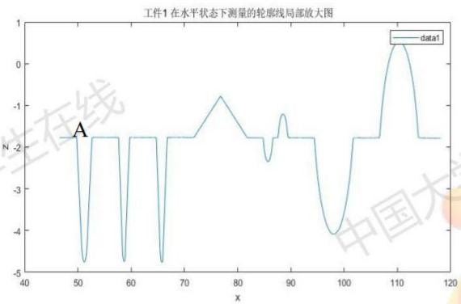
图1工件1在水平状态下测量的轮廓线

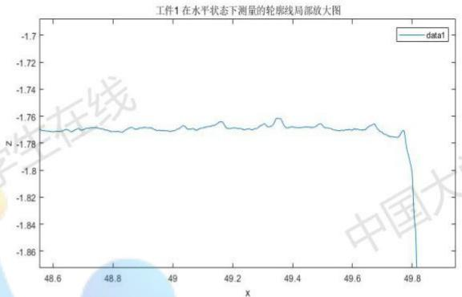
图2工件1在水平状态下测量的轮廓线局部放大图

由于探针沾污、探针缺陷等问题造成检测到的轮廓线呈现出粗糙不平的情况，局部放大如图（图2）所示。

因此，先要将所有的“粗糙不光滑”的直线和圆弧部分分别处理成“光滑”的直线和圆弧，找出关键点坐标，然后根据轮廓线的构成，拟合出各个直、曲线方程，计算其相交的点，然后建立数学模型计算工件1在水平状态下测量所得的各项参数。 —大兰

问题二：使工件1在一个倾斜角度和一些水平平移状态下进行测量，根据所给数据（data01-down），画出轮廓线图（图3）

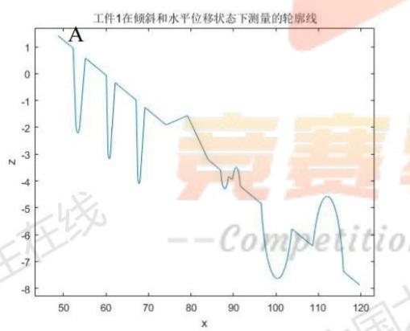
图3 工件1在倾斜和水平位移状态下测量的轮廓线

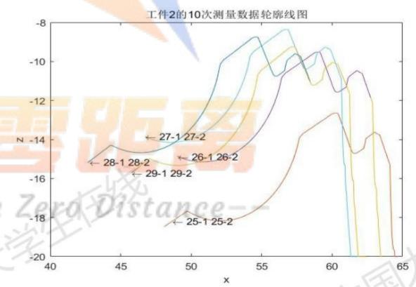
图4工件2的10次测量数据轮廓线图

要计算倾斜角度，可以按照图1的水平线所在的部位，拟合出倾斜后的直线方程，根据直线斜率计算其倾斜角，根据倾斜角度用坐标变化的方法对数据进行旋转校正。对于平移，选择一个参照点。由于对工件不同测量的起点和终点存在偏差，所以选在工件轮廓线明显的折点处作为参照点，如A点，为了进行比较，将工件水平测量的数据通过坐标平移，是A点作为坐标原点，将工件倾斜测量数据旋转之后，也将A点设置为坐标原点，再做各项参数计算，并比较差异。

问题三：根据附件所提供的10次测量数据，先画出轮廓线图（图4），发现有五条明显的轮廓线，仔细放大发现每条明显的轮廓线中都有两条几乎重叠，因此可知这是测量了对工件2的测量了五个局部，每个局部测量了2次，为增加测量数据的精确度，减少误差，先将每个局部测量的2组数据合并在一起，重叠的部分取其平均值，没有重叠的就以单个数据为准。 学生

将圆弧两边的直线视为水平直线，拟合出直线，根据斜率计算其倾斜角度，为了计算各项参数值，先将其校正为水平状态，然后按照问题一的数学模型计算各项参数值，然后根据局部轮廓线的特征画出工件2的完整轮廓线。

问题四：根据附件3和4提供的测量数据，画出轮廓线图（图5），从图中可以看

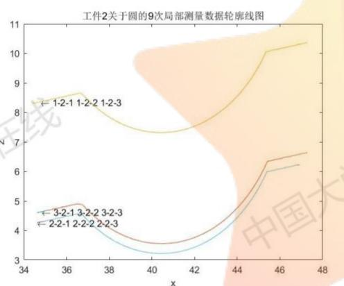

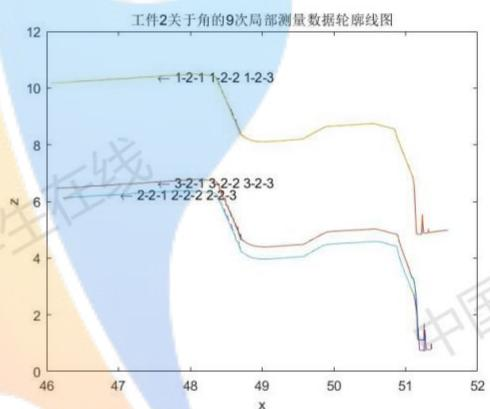
图 5工件2关于圆和角的9次局部测量数据轮廓线图

到很明显的三组线，放大图片仔细观察，发现每条轮廓线实际上有三条轮廓线叠加，由此可以判断对工件2同一局部分别进行了相同位置的三次数据探测，为了减少数据探测产生的误差，将每条轮廓线的三组数据综合成一组数据。然后确定圆和角的关键参数，结合问题三，对工件2的完整轮廓线进行修正：oD

## 条件假设

## 条件假设

1、假设本文中的工件的所有线条仅由直线和圆弧组成；

2、假设斜线与圆弧相连接部分是相切的；

3、工件1在水平状态下测量的数据是水平的，轻微倾斜为可接受的误差；

4、假设探针只能垂直探测接触探测到工件表面数据。

## 模型建立与求解

## 问题一、水平状态下轮廓线各项参数值

## 1、标记关键点

根据问题一的分析，要计算轮廓线的各项参数值，需要找出关键点坐标，关键点位置及各项参数如图（图7）所示，关键点记为 $d _ { 1 } , d _ { 2 } \cdots d _ { 2 3 }$

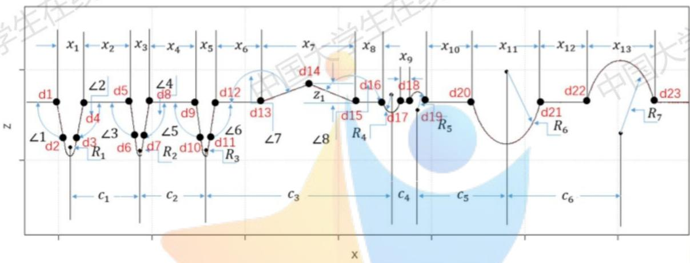
图7 工件1各参数值计算关键点标识图

## 2、粗糙处理

根据问题一分析，由于各种因素造成轮廓线粗糙不光滑，无法确定关键点坐标，因此做平滑处理，用MATLAB 中的 smoothdata 命令做高斯平滑数据处理，处理结果细节如图（图8）所示

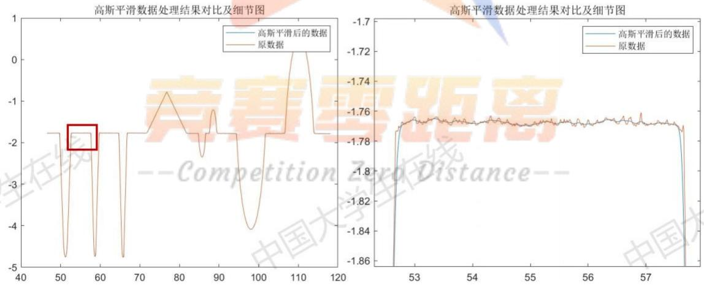
图8高斯平滑数据处理结果对比及细节图（右图为左图局部放大图）

## 3、求关键点坐标

根据条件假设，工件1是由直线和圆弧组成，而且是在水平状态下测量出的轮廓线数据，因此，为了准确的找到关键点坐标，将工件1中所有的直线拟合成直线方程，将

所有的圆弧拟合成圆的方程，具体命名如图（图9）所示。

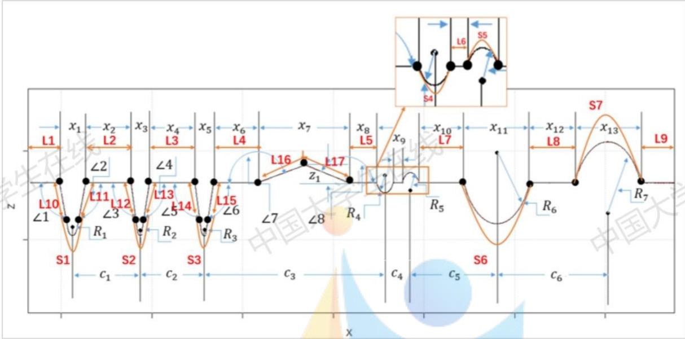
图9直线与圆弧命名示意图

水平直线模型：

由于水平直线不连续，无法判断所有的水平直线是否在同一条水平线上，所有在水平轮廓线上分段取点、分别拟合成水平直线，模型如下

$$
z = d , i = 1 , 2 , \cdots 9 , ( d _ { i } \not { p } \not { p } \not { p } \not { p } \equiv \not { p } \not { p } \ W )
$$

编程求解可得九条水平直线方程数值如表（表1）所示

表1九段水平直线常数值表
<table><tr><td rowspan=1 colspan=1> $d _ { \scriptscriptstyle 1 }$ </td><td rowspan=1 colspan=1> $d _ { 2 }$ </td><td rowspan=1 colspan=1> $d _ { 3 }$ </td><td rowspan=1 colspan=1> $d _ { 4 }$ </td><td rowspan=1 colspan=1> $d _ { \varsigma }$ </td><td rowspan=1 colspan=1> $d _ { 6 }$ </td><td rowspan=1 colspan=1> $d _ { 7 }$ </td><td rowspan=1 colspan=1> $d _ { 8 }$ </td><td rowspan=1 colspan=1> $d _ { \mathrm { { 9 } } }$ </td></tr><tr><td rowspan=1 colspan=1>-1.7701</td><td rowspan=1 colspan=1>-1.7674</td><td rowspan=1 colspan=1>-1.7681</td><td rowspan=1 colspan=1>-1.7676</td><td rowspan=1 colspan=1>-1.7777</td><td rowspan=1 colspan=1>-1.7771</td><td rowspan=1 colspan=1>-1.7784</td><td rowspan=1 colspan=1>-1.7803</td><td rowspan=1 colspan=1>-1.7846</td></tr></table>

分别为 $L _ { \mathrm { 1 } } - L _ { \mathrm { 9 } }$ 的直线方程，从上表可以看出，九条水平直线，相差甚小，可以认为必这九条曲线在同一条水平线上，结合这九组数据，整体拟合，可得水平直线L的方程为：

$$
z = - 1 . 7 7 4 1
$$

斜直线模型：

设斜直线模型为：

$$
z = k _ { i } x + b _ { i } + \varepsilon , i = 1 0 , 1 1 , \cdots 1 7
$$

ε为随机影响因子， $k _ { i } , b _ { i }$ 为待定参数代入数据，编程拟合求解可得 $L _ { 1 0 } - L _ { 1 7 }$ 的直线方程为：

$$
L _ { \mathrm { 1 0 } } \mathbf { : }
$$

$$
z = - 2 . 7 3 2 1 x + 1 3 4 . 2 1 6 0 ,
$$

$$
L _ { \mathrm { 1 1 } } \mathbf { : }
$$

$$
z = 2 . 7 5 6 7 x - 1 4 6 . 9 4 0 4 ,
$$

$$
L _ { \mathrm { 1 2 } } \mathbf { : }
$$

$$
z = - 3 . 7 0 8 9 x + 2 1 2 . 0 8 0 1 ,
$$

$$
L _ { 1 3 } \colon
$$

$$
z = 3 . 2 9 0 6 x - 1 9 8 . 3 2 1 4 ,
$$

$$
L _ { \mathrm { 1 4 } } \mathrm { : }
$$

$$
z = - 3 . 7 4 1 0 x + 2 4 0 . 3 8 5 8 ,
$$

$$
L _ { 1 5 } \mathbf { : }
$$

$$
z = 3 . 5 1 9 8 x - 2 3 6 . 7 9 8 1 ,
$$

$$
L _ { \mathrm { 1 6 } } \mathbf { : }
$$

$$
z = 0 . 1 9 8 8 x - 1 6 . 0 4 0 7 ,
$$

$$
L _ { 1 7 } \colon
$$

$$
z = - 0 . 2 0 0 6 x + 1 4 . 6 3 1 3 ,
$$

圆弧曲线模型：

根据条件假设和图9可知，除了直线和斜线，轮廓线中剩下的就是圆弧，其中$\mathrm { C } _ { 1 } , C _ { 2 } , C _ { 3 }$ 分别是两条斜线端的圆弧， $\mathrm { C } _ { 4 } , C _ { 5 } , C _ { 6 } , C _ { 7 }$ 分别是水平线段端点之间的圆弧。圆弧曲线模型为：

$$
( x - x _ { i 0 } ) ^ { 2 } + ( z - z _ { i 0 } ) ^ { 2 } = R _ { i } ^ { \ 2 } , i = 1 , 2 , \cdots 7
$$

对于 $\mathrm { C } _ { 1 } , C _ { 2 } , C _ { 3 }$ ，由于圆弧部分与斜线部分是相切的，数据分界不明显，如果只取部分圆弧数据拟合出圆的方程无法保证圆弧与斜线相切，而根据假设2，工件在此处是

相切的。因此，在平滑后的圆弧部分找极值点，该点是光滑可导，因此该点的水平直线为圆弧的水平切线，再结合与圆弧相切的两条斜线，求圆 $\therefore \therefore ( x _ { 0 } , z _ { 0 } )$ 和半径R。如图（图10）所示1X.

设两直线 $l _ { 1 }$ 与 $l _ { 2 }$ 的方程分别为

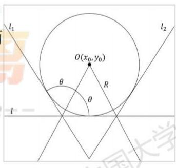

$$
\begin{array} { l } { { l _ { 1 } : z = k _ { 1 } x + b _ { 1 } } } \\ { { l _ { 2 } : z = k _ { 2 } x + b _ { 2 } } } \end{array} ,
$$

图10 求圆心和半径示意图

其交点为(m,n)，角平分线的斜率设为k，根据两直线夹角公式

$$
\tan \theta = \mid \frac { k _ { 2 } - k _ { 1 } } { 1 + k _ { 1 } k _ { 2 } } \mid
$$

和角平分线所分的两个夹角相等可得

$$
\big | \frac { k _ { 2 } - k } { 1 + k k _ { 2 } } \big | = \big | \frac { k - k _ { 1 } } { 1 + k _ { 1 } k } \big |
$$

解方程可得角平分线斜率k，则角平分线为

$$
y = k ( x - m ) + n
$$

分别求出两各夹角的角平分线方程，求其交点即为圆心 $( x _ { 0 } , z _ { 0 } )$ ，再求圆心到其中条直线的距离即为该圆的半径R。

代入数据可得 $\mathrm { C } _ { 1 } , C _ { 2 } , C _ { 3 }$ 的方程分别为：

$$
\mathrm { C } _ { \mathrm { i } } \mathrm { : }
$$

$$
( x - 5 1 . 2 2 1 5 ) ^ { 2 } + ( z + 4 . 2 4 0 1 ) ^ { 2 } = 0 . 5 1 0 8 ^ { 2 }
$$

$$
\mathrm { C } _ { 2 } { \mathrm { : } }
$$

$$
( x - 5 8 . 6 4 7 1 ) ^ { 2 } + ( z + 4 . 4 9 0 1 ) ^ { 2 } = 0 . 2 4 6 3 ^ { 2 }
$$

$$
\mathrm { C } _ { 3 } { \mathrm { : } }
$$

$$
( x - 6 5 . 7 2 8 2 ) ^ { 2 } + ( z + 4 . 4 9 5 9 ) ^ { 2 } = 0 . 2 6 0 2 ^ { 2 }
$$

效果如图（图11）所示

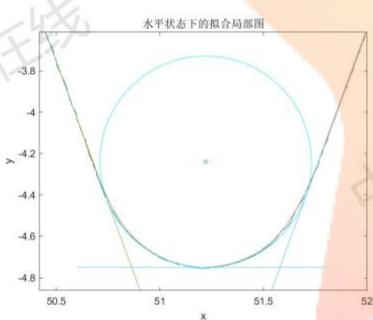

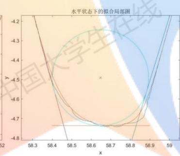

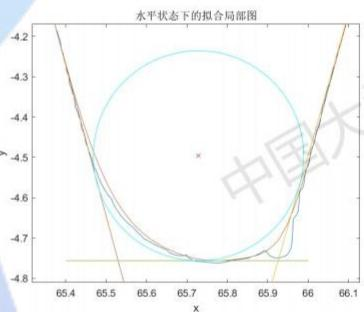
图11 $\mathbf { C } _ { 1 } , C _ { 2 } , C _ { 3 }$ 圆弧拟合效果

从上图发现，圆弧与直线切合效果好，但 $C _ { 2 } , C _ { 3 }$ 有个别圆弧与原始数据误差较大，主要是探测误差造成的结果

学生对于 $\mathrm { C } _ { 4 } , C _ { 5 } , C _ { 6 } , C _ { 7 } ,$ 由于圆弧部分的数据与直线段数据界限分明，所以有可以直接抓取这部分数据进行圆方程的拟合，编程求解可得他们的方程为

$$
\mathrm { C } _ { 4 } \mathrm { : }
$$

$$
( x - 8 5 . 7 0 6 8 ) ^ { 2 } + ( z - 1 . 3 5 8 7 ) ^ { 2 } = 0 . 9 8 7 3 ^ { 2 }
$$

$$
{ \mathrm { C } } _ { 5 } { \mathrm { : } }
$$

$$
( x - 8 8 . 5 1 6 4 ) ^ { 2 } + ( z + 2 . 2 1 9 9 ) ^ { 2 } = 1 . 0 1 3 4 ^ { 2 }
$$

$$
{ \mathrm { C } } _ { 6 } { \mathrm { : } }
$$

$$
( x - 9 8 . 0 5 0 1 ) ^ { 2 } + ( z + 0 . 0 8 2 8 ) ^ { 2 } = 4 . 0 0 1 4 ^ { 2 }
$$

$$
\mathrm { C } _ { 7 } { \mathrm { : } }
$$

$$
( x - 1 1 0 . 3 0 1 7 ) ^ { 2 } + ( z + 3 . 4 7 0 7 ) ^ { 2 } = 3 . 9 9 8 5 ^ { 2 }
$$

拟合效果如图（图12）所示。

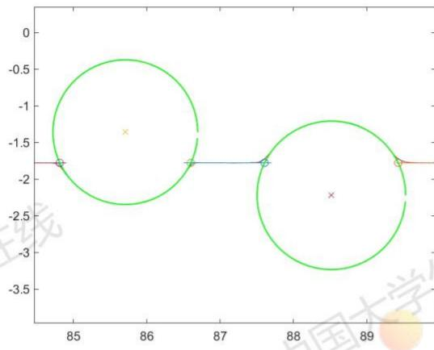

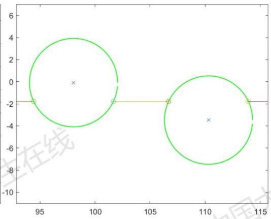
图12 $\mathrm { C } _ { 4 } , C _ { 5 } , C _ { 6 } , C _ { 7 }$ 圆弧拟合效果

从图上发现，这四个圆弧拟合效果非常好。整体拟合效果如图（图13）所示。

图13 整体拟合效果图

## 关键点坐标计算：

根据前文标注的关键点，发现每一个点均是两条线的交点，因此根据各个点的位置联立两个相关曲线，求出关键点坐标如表2所示：

表 2 关键点坐标
<table><tr><td colspan="1" rowspan="1">关键点</td><td colspan="1" rowspan="1">坐标</td><td colspan="1" rowspan="1">关键点</td><td colspan="1" rowspan="1">坐标</td></tr><tr><td colspan="1" rowspan="1"> $d _ { \scriptscriptstyle 1 }$ </td><td colspan="1" rowspan="1">(49.7732,-1.7701)</td><td colspan="1" rowspan="1">$d _ { 1 3 }$ </td><td colspan="1" rowspan="1">(71.8078，-1.7676)ce</td></tr><tr><td colspan="1" rowspan="1"> $d _ { 2 }$ </td><td colspan="1" rowspan="1">(50.7416,-4.4157)</td><td colspan="1" rowspan="1"> $d _ { 1 4 }$ </td><td colspan="1" rowspan="1">(76.8069， -0.7740</td></tr><tr><td colspan="1" rowspan="1"> $d _ { 3 }$ </td><td colspan="1" rowspan="1">(51.7025,-4.4146</td><td colspan="1" rowspan="1"> $d _ { 1 5 }$ </td><td colspan="1" rowspan="1">(81.8113，-1.7777)</td></tr><tr><td colspan="1" rowspan="1"> $d _ { 4 }$ </td><td colspan="1" rowspan="1">(52.6627,-1.7674 )</td><td colspan="1" rowspan="1"> $d _ { 1 6 }$ </td><td colspan="1" rowspan="1">(84.8129， -1.7777)</td></tr><tr><td colspan="1" rowspan="1"> $d _ { \mathfrak { s } }$ </td><td colspan="1" rowspan="1">(57.6583 ，-1.7674)</td><td colspan="1" rowspan="1"> $d _ { 1 7 }$ </td><td colspan="1" rowspan="1">(86.6011 , -1.7771 )</td></tr><tr><td colspan="1" rowspan="1"> $d _ { 6 }$ </td><td colspan="1" rowspan="1">(58.4096, -4.5541)</td><td colspan="1" rowspan="1"> $d _ { 1 8 }$ </td><td colspan="1" rowspan="1">(87.6050，-1.7771 )</td></tr><tr><td colspan="1" rowspan="1"> $d _ { 7 }$ </td><td colspan="1" rowspan="1">(58.8828 , -4.5617 )</td><td colspan="1" rowspan="1"> $d _ { 1 9 }$ </td><td colspan="1" rowspan="1">(89.4286 , -1.7784 )</td></tr><tr><td colspan="1" rowspan="1"> $d _ { 8 }$ </td><td colspan="1" rowspan="1">(59.7318 ,-1.7681 )</td><td colspan="1" rowspan="1"> $d _ { 2 0 }$ </td><td colspan="1" rowspan="1">(94.4258 , -1.7784 )</td></tr><tr><td colspan="1" rowspan="1"> $d _ { \mathrm { { 9 } } }$ </td><td colspan="1" rowspan="1">(64.7305, -1.7681)</td><td colspan="1" rowspan="1"> $d _ { 2 1 }$ </td><td colspan="1" rowspan="1">(101.6736, -1.7803)</td></tr><tr><td colspan="1" rowspan="1"> $d _ { 1 0 }$ </td><td colspan="1" rowspan="1">(65.4776, -4.5629)</td><td colspan="1" rowspan="1"> $d _ { 2 2 }$ </td><td colspan="1" rowspan="1">(106.6782,-1.7803)</td></tr><tr><td colspan="1" rowspan="1"> $d _ { 1 1 }$ </td><td colspan="1" rowspan="1">(65.9791 , -4.5672 )</td><td colspan="1" rowspan="1"> $d _ { 2 3 }$ </td><td colspan="1" rowspan="1">(113.9273,-1.7846)</td></tr><tr><td colspan="1" rowspan="1"> $d _ { 1 2 }$ </td><td colspan="1" rowspan="1">(66.7744，-1.7676)</td><td colspan="1" rowspan="1"></td><td colspan="1" rowspan="1">中国大</td></tr></table>

各项参数计算模型：

根据图7标识的关键点，结合以上直、曲线方程求出关键点坐标，其中距离计算模型为

$$
d = { \sqrt { \left( x _ { 2 } - x _ { 1 } \right) ^ { 2 } + \left( z _ { 2 } - z _ { 1 } \right) ^ { 2 } } }
$$

圆弧长度模型为

$$
l = \int _ { x _ { 1 } } ^ { x _ { 2 } } { \sqrt { 1 + z ^ { \prime } { } ^ { 2 } } } d x
$$

直线之间的夹角模型为

$$
\tan \theta = \mid \frac { k _ { 2 } - k _ { 1 } } { 1 + k _ { 1 } k _ { 2 } } \mid
$$

根据以上模型分别计算各项参数结果如表3-表9所示：

表3槽口宽度
<table><tr><td rowspan=1 colspan=2> $x _ { 1 }$ </td><td rowspan=1 colspan=2> $x _ { 3 }$ Conp</td><td rowspan=1 colspan=2>etxsion</td><td rowspan=1 colspan=2>ZexDist</td><td rowspan=1 colspan=2>ar $x _ { 1 1 }$ </td><td rowspan=1 colspan=2> $x _ { 1 3 }$ </td></tr><tr><td rowspan=1 colspan=2>2.8895</td><td rowspan=1 colspan=2>2.0736</td><td rowspan=1 colspan=2>2.044</td><td rowspan=1 colspan=2>10.0035</td><td rowspan=1 colspan=2>7.2479</td><td rowspan=1 colspan=2>7.2491</td></tr><tr><td rowspan=1 colspan=12>表4圆弧半径</td></tr><tr><td rowspan=1 colspan=1> $R _ { 1 }$ </td><td rowspan=1 colspan=2> $R _ { 2 }$ </td><td rowspan=1 colspan=2> $R _ { 3 }$ </td><td rowspan=1 colspan=2> $R _ { 4 }$ </td><td rowspan=1 colspan=2> $R _ { 5 }$ </td><td rowspan=1 colspan=2> $R _ { 6 }$ </td><td rowspan=1 colspan=1> $R _ { 7 }$ </td></tr><tr><td rowspan=1 colspan=1>0.5108</td><td rowspan=1 colspan=2>0.2463</td><td rowspan=1 colspan=2>0.2602</td><td rowspan=1 colspan=2>0.9873</td><td rowspan=1 colspan=2>1.0134</td><td rowspan=1 colspan=2>4.0014</td><td rowspan=1 colspan=1>3.9985</td></tr></table>

表5圆心之间的距离
<table><tr><td rowspan=1 colspan=1> $c _ { 1 }$ </td><td rowspan=1 colspan=1> $c _ { 2 }$ </td><td rowspan=1 colspan=1> $c _ { 3 }$ </td><td rowspan=1 colspan=1> $c _ { 4 }$ </td><td rowspan=1 colspan=1> $c _ { 5 }$ </td><td rowspan=1 colspan=1> $c _ { 6 }$ </td></tr><tr><td rowspan=1 colspan=1>7.4256</td><td rowspan=1 colspan=1>7.0811</td><td rowspan=1 colspan=1>19.9787</td><td rowspan=1 colspan=1>2.8096</td><td rowspan=1 colspan=1>9.5337</td><td rowspan=1 colspan=1>12.2516</td></tr></table>

表6圆弧的长度
<table><tr><td rowspan=1 colspan=1> $s _ { 1 }$ &amp;</td><td rowspan=1 colspan=1> $s _ { 2 }$ </td><td rowspan=1 colspan=1> $s _ { 3 }$ </td><td rowspan=1 colspan=1> $s _ { 4 }$ </td><td rowspan=1 colspan=1> $s _ { 5 }$ </td><td rowspan=1 colspan=1> $S _ { 6 }$ </td><td rowspan=1 colspan=1> $s _ { 7 }$ </td></tr><tr><td rowspan=1 colspan=1>1.2507</td><td rowspan=1 colspan=1>0.6352</td><td rowspan=1 colspan=1>0.6768</td><td rowspan=1 colspan=1>2.2369</td><td rowspan=1 colspan=1>2.2683</td><td rowspan=1 colspan=1>9.0668</td><td rowspan=1 colspan=1>9.0756</td></tr></table>

表7水平线段的长度
<table><tr><td rowspan=1 colspan=1> $x _ { 2 }$ </td><td rowspan=1 colspan=1> $x _ { 4 }$ </td><td rowspan=1 colspan=1> $x _ { 6 }$ </td><td rowspan=1 colspan=1> $x _ { 8 }$ </td><td rowspan=1 colspan=1> $x _ { 9 }$ </td><td rowspan=1 colspan=1> $x _ { 1 0 }$ </td><td rowspan=1 colspan=1> $x _ { 1 2 }$ </td></tr><tr><td rowspan=1 colspan=1>4.9955</td><td rowspan=1 colspan=1>4.9987</td><td rowspan=1 colspan=1>7.0773</td><td rowspan=1 colspan=1>3.0017</td><td rowspan=1 colspan=1>1.0039</td><td rowspan=1 colspan=1>4.9972</td><td rowspan=1 colspan=1>5.0045</td></tr></table>

表8斜线线段长度
<table><tr><td rowspan=1 colspan=1> $d _ { \mathrm { { r } } }$ </td><td rowspan=1 colspan=1> $d _ { 2 }$ </td><td rowspan=1 colspan=1> $d _ { 3 }$ </td><td rowspan=1 colspan=1> $d _ { 4 }$ </td><td rowspan=1 colspan=1> $d _ { \varsigma }$ </td><td rowspan=1 colspan=1> $d _ { 6 }$ </td><td rowspan=1 colspan=1> $d _ { 7 }$ </td><td rowspan=1 colspan=1> $d _ { 8 }$ </td></tr><tr><td rowspan=1 colspan=1>2.8173</td><td rowspan=1 colspan=1>2.8159</td><td rowspan=1 colspan=1>2.8862</td><td rowspan=1 colspan=1>2.9198</td><td rowspan=1 colspan=1>2.8929</td><td rowspan=1 colspan=1>2.9103</td><td rowspan=1 colspan=1>5.0969</td><td rowspan=1 colspan=1>5.0044</td></tr></table>

表9斜线与水平线之间的夹角（单位：度）
<table><tr><td rowspan=1 colspan=1>∠1</td><td rowspan=1 colspan=1>∠2</td><td rowspan=1 colspan=1>∠3</td><td rowspan=1 colspan=1>∠4</td><td rowspan=1 colspan=1> $\angle 5$ </td><td rowspan=1 colspan=1>∠6</td><td rowspan=1 colspan=1>∠7</td><td rowspan=1 colspan=1>&lt;8</td></tr><tr><td rowspan=1 colspan=1>110.1035</td><td rowspan=1 colspan=1>109.9387</td><td rowspan=1 colspan=1>105.0895</td><td rowspan=1 colspan=1>106.9038</td><td rowspan=1 colspan=1>104.9659</td><td rowspan=1 colspan=1>105.9684</td><td rowspan=1 colspan=1>168.7580</td><td rowspan=1 colspan=1>168.6586</td></tr></table>

人字型线的高度：

$$
z _ { 1 } = 1 . 0 0 3 7
$$

在轮廓线图上标注如图（图14）
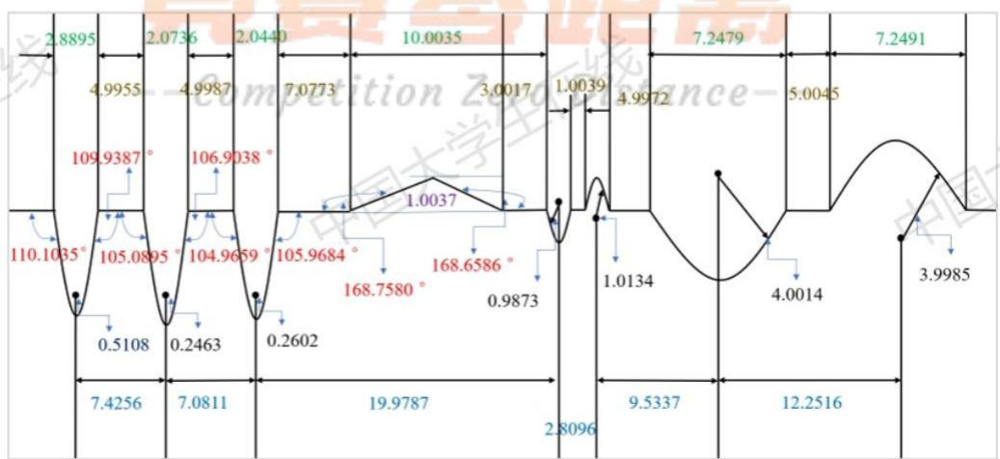
图14轮廓线上各项参数标注图

## 问题二、对工件1倾斜和水平位移状态下轮廓线数据校正及参数差异比较

## 1、倾斜角度计算

根据问题二分析和数据（data01-down）及问题一的部分结论，对水平线所在的部位，建立倾斜后的直线方程模型

$$
z = k x + b + \varepsilon
$$

学生， $k , b$ 为待定参数，ε为随机影响因子，抓取该直线上数据，首先平滑降噪，然后回归可得倾斜的直线方程为 大学

$$
z = - 0 . 1 3 0 8 x + 7 . 7 8 8 1
$$

效果如图（图15）所示

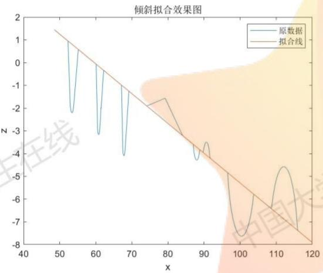
图 15 倾斜拟合效果图

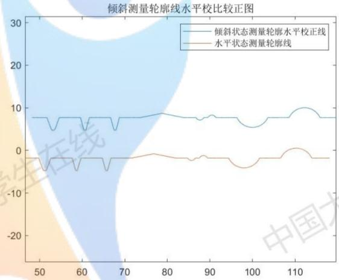
图16倾斜测量轮廓线水平校正比较图

用该直线的斜率计算工件工件1倾斜测量时的倾斜角度，由

$$
\tan \theta = k
$$

即

$$
\tan \theta = - 0 . 1 3 0 7
$$

由于斜率k小于0，与x正方向夹角大于90度，用三角函数公式转换并利用反三角函数求角度，计算得工件1在测量时的倾斜角度为 中国

$$
\alpha = 7 . 4 5 0 8 ^ { \mathrm { o } }
$$

## 2、水平校正

根据图发现，只需要将倾斜后的图形进行一定角度旋转即可将其校正为水平状态，根据坐标变换公式，建立校准模型

$$
X ^ { \prime } = A X
$$

其中X为变换之前的测量原始数据， $X ^ { \prime }$ 为坐标变换之后的数据，A为坐标变换矩阵。由于此处是二维空间，所以模型为

$$
{ \binom { x ^ { \prime } } { z ^ { \prime } } } = { \binom { \cos \theta } { \sin \theta } } \quad { \cos \theta } \quad { \binom { x } { z } }
$$

代入数据计算，并画出图像，与水平状态下测量的轮廓线相比如图（图16）所示。发现两个图像在同一坐标系中并不重叠，说明除了倾斜外，还发生了水平位移，因此修改校正模型为 中国 中国

$$
X ^ { \prime } = A X + X _ { 0 }
$$

其中 $X _ { 0 }$ 为平移向量，即

$$
{ \binom { x ^ { \prime } } { z ^ { \prime } } } = { \binom { \cos \theta } { \sin \theta } } \quad - \sin \theta \left) { \binom { x } { z } } + { \binom { x _ { 0 } } { z _ { 0 } } } \right.
$$

因为不同的测量，起始点不一定相同，所以不选起始点为关键点，而选择图像的关键特征点A（图1、图3中所示）来参照，代入数据计算可得倾斜、平移的校正后的数据，画出他们的图像（图17）

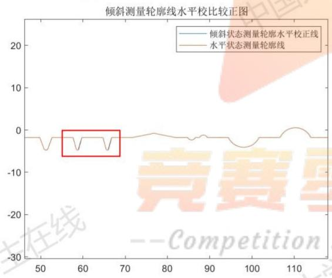

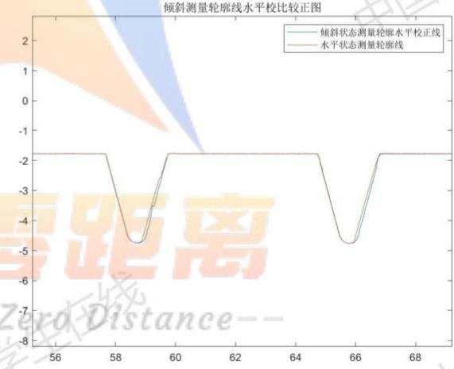
图17倾斜、平移校正效果图（右图为左图局部放大图）

从图像可以发现，校正效果很好。

## 3、差异比较

根据倾斜和平移校正后的数据，用问题一中的方法，编程求工件1在倾斜状态下测量的数据水平校正之后的各项参数并与水平状态下测量的轮廓数据进行比较如下：

表10槽口宽度差异比较
<table><tr><td rowspan=1 colspan=1>参数</td><td rowspan=1 colspan=1> $x _ { 1 }$ </td><td rowspan=1 colspan=1> $x _ { 3 }$ </td><td rowspan=1 colspan=1> $x _ { 5 }$ </td><td rowspan=1 colspan=1> $x _ { 7 }$ </td><td rowspan=1 colspan=1> $x _ { 1 1 }$ </td><td rowspan=1 colspan=1> $x _ { 1 3 }$ </td></tr><tr><td rowspan=1 colspan=1>水平状态下</td><td rowspan=1 colspan=1>2.8895</td><td rowspan=1 colspan=1>2.0736</td><td rowspan=1 colspan=1>2.044</td><td rowspan=1 colspan=1>10.0035</td><td rowspan=1 colspan=1>7.2479</td><td rowspan=1 colspan=1>7.2491</td></tr><tr><td rowspan=1 colspan=1>倾斜状态下</td><td rowspan=1 colspan=1>2.8958</td><td rowspan=1 colspan=1>2.0854</td><td rowspan=1 colspan=1>2.1597</td><td rowspan=1 colspan=1>10.0081</td><td rowspan=1 colspan=1>7.2638</td><td rowspan=1 colspan=1>7.2879</td></tr><tr><td rowspan=1 colspan=1>差异</td><td rowspan=1 colspan=1>-0.0063</td><td rowspan=1 colspan=1>-0.0118</td><td rowspan=1 colspan=1>-0.1157</td><td rowspan=1 colspan=1>-0.0046</td><td rowspan=1 colspan=1>-0.0159</td><td rowspan=1 colspan=1>-0.0388</td></tr></table>

表11 圆弧半径差异比较
<table><tr><td rowspan=1 colspan=1>参数</td><td rowspan=1 colspan=1> $R _ { \mathrm { 1 } }$ </td><td rowspan=1 colspan=1> $R _ { 2 }$ 国</td><td rowspan=1 colspan=1> $R _ { 3 }$ </td><td rowspan=1 colspan=1> $R _ { 4 }$ </td><td rowspan=1 colspan=1> $R _ { 5 }$ </td><td rowspan=1 colspan=1> $R _ { 6 }$ </td><td rowspan=1 colspan=1> $R _ { 7 }$ 国</td></tr><tr><td rowspan=1 colspan=1>水平状态下</td><td rowspan=1 colspan=1>0.5108</td><td rowspan=1 colspan=1>0.2463</td><td rowspan=1 colspan=1>0.2602</td><td rowspan=1 colspan=1>0.9873</td><td rowspan=1 colspan=1>1.0134</td><td rowspan=1 colspan=1>4.0014</td><td rowspan=1 colspan=1>3.9985</td></tr><tr><td rowspan=1 colspan=1>倾斜状态下</td><td rowspan=1 colspan=1>0.5091</td><td rowspan=1 colspan=1>0.3047</td><td rowspan=1 colspan=1>0.2703</td><td rowspan=1 colspan=1>0.9981</td><td rowspan=1 colspan=1>1.0107</td><td rowspan=1 colspan=1>4.0148</td><td rowspan=1 colspan=1>4.0323</td></tr><tr><td rowspan=1 colspan=1>差异</td><td rowspan=1 colspan=1>0.0017</td><td rowspan=1 colspan=1>-0.0584</td><td rowspan=1 colspan=1>-0.0101</td><td rowspan=1 colspan=1>-0.0108</td><td rowspan=1 colspan=1>0.0027</td><td rowspan=1 colspan=1>-0.0134</td><td rowspan=1 colspan=1>-0.0338</td></tr></table>

表12 圆心之间的距离差异比较
<table><tr><td rowspan=1 colspan=1>参数</td><td rowspan=1 colspan=1> $c _ { 1 }$ </td><td rowspan=1 colspan=1> $c _ { 2 }$ </td><td rowspan=1 colspan=1> $c _ { 3 }$ </td><td rowspan=1 colspan=1> $c _ { 4 }$ </td><td rowspan=1 colspan=1> $c _ { 5 }$ </td><td rowspan=1 colspan=1> $c _ { 6 }$ </td></tr><tr><td rowspan=1 colspan=1>水平状态下</td><td rowspan=1 colspan=1>7.4256</td><td rowspan=1 colspan=1>7.0811</td><td rowspan=1 colspan=1>19.9787</td><td rowspan=1 colspan=1>2.8096</td><td rowspan=1 colspan=1>9.5337</td><td rowspan=1 colspan=1>12.2516</td></tr><tr><td rowspan=1 colspan=1>倾斜状态下</td><td rowspan=1 colspan=1>7.4729</td><td rowspan=1 colspan=1>7.1057</td><td rowspan=1 colspan=1>19.9154</td><td rowspan=1 colspan=1>2.8099</td><td rowspan=1 colspan=1>9.5342</td><td rowspan=1 colspan=1>12.2572</td></tr><tr><td rowspan=1 colspan=1>差异</td><td rowspan=1 colspan=1>-0.0473</td><td rowspan=1 colspan=1>-0.0246</td><td rowspan=1 colspan=1>0.0633</td><td rowspan=1 colspan=1>-0.0003</td><td rowspan=1 colspan=1>-0.0005</td><td rowspan=1 colspan=1>-0.0056</td></tr></table>

表13 圆弧的长度差异比较
<table><tr><td rowspan=1 colspan=1>参数</td><td rowspan=1 colspan=1> $S _ { 1 }$ </td><td rowspan=1 colspan=1> $s _ { 2 }$ </td><td rowspan=1 colspan=1> $s _ { 3 }$ </td><td rowspan=1 colspan=1> $s _ { 4 }$ </td><td rowspan=1 colspan=1> $s _ { 5 }$ </td><td rowspan=1 colspan=1> $s _ { 6 }$ </td><td rowspan=1 colspan=1> $s _ { 7 }$ </td></tr><tr><td rowspan=1 colspan=1>水平状态下</td><td rowspan=1 colspan=1>1.2507</td><td rowspan=1 colspan=1>0.6352</td><td rowspan=1 colspan=1>0.6768</td><td rowspan=1 colspan=1>2.2369</td><td rowspan=1 colspan=1>2.2683</td><td rowspan=1 colspan=1>9.0668</td><td rowspan=1 colspan=1>9.0756</td></tr><tr><td rowspan=1 colspan=1>倾斜状态下</td><td rowspan=1 colspan=1>1.2508</td><td rowspan=1 colspan=1>0.7947</td><td rowspan=1 colspan=1>0.7051</td><td rowspan=1 colspan=1>2.2459</td><td rowspan=1 colspan=1>2.2635</td><td rowspan=1 colspan=1>9.0774</td><td rowspan=1 colspan=1>9.0994</td></tr><tr><td rowspan=1 colspan=1>差异</td><td rowspan=1 colspan=1>0.0001</td><td rowspan=1 colspan=1>0.1595</td><td rowspan=1 colspan=1>0.0283</td><td rowspan=1 colspan=1>0.009</td><td rowspan=1 colspan=1>0.0048</td><td rowspan=1 colspan=1>0.0106</td><td rowspan=1 colspan=1>0.0238</td></tr></table>

表14 水平线段的长度差异比较
<table><tr><td rowspan=1 colspan=1>参数</td><td rowspan=1 colspan=1> $x _ { 2 }$ </td><td rowspan=1 colspan=1> $x _ { 4 }$ 国大</td><td rowspan=1 colspan=1>子 $x _ { 6 }$ </td><td rowspan=1 colspan=1> $x _ { 8 }$ </td><td rowspan=1 colspan=1> $x _ { 9 }$ </td><td rowspan=1 colspan=1> $x _ { 1 0 }$ </td><td rowspan=1 colspan=1>X $x _ { 1 2 }$ </td></tr><tr><td rowspan=1 colspan=1>水平状态下</td><td rowspan=1 colspan=1>4.9955</td><td rowspan=1 colspan=1>4.9987</td><td rowspan=1 colspan=1>7.0773</td><td rowspan=1 colspan=1>3.0017</td><td rowspan=1 colspan=1>1.0039</td><td rowspan=1 colspan=1>4.9972</td><td rowspan=1 colspan=1>5.0045</td></tr><tr><td rowspan=1 colspan=1>倾斜状态下</td><td rowspan=1 colspan=1>4.9888</td><td rowspan=1 colspan=1>4.9081</td><td rowspan=1 colspan=1>7.1548</td><td rowspan=1 colspan=1>2.9991</td><td rowspan=1 colspan=1>0.9994</td><td rowspan=1 colspan=1>4.9931</td><td rowspan=1 colspan=1>4.9816</td></tr><tr><td rowspan=1 colspan=1>差异</td><td rowspan=1 colspan=1>0.0067</td><td rowspan=1 colspan=1>0.0906</td><td rowspan=1 colspan=1>-0.0775</td><td rowspan=1 colspan=1>0.0026</td><td rowspan=1 colspan=1>0.0045</td><td rowspan=1 colspan=1>0.0041</td><td rowspan=1 colspan=1>0.0229</td></tr></table>

表15斜线线段长度差异比较
<table><tr><td rowspan=1 colspan=1>参数</td><td rowspan=1 colspan=1> $d _ { \mathrm { { 1 } } }$ </td><td rowspan=1 colspan=1> $d _ { 2 }$ </td><td rowspan=1 colspan=1> $d _ { 3 }$ </td><td rowspan=1 colspan=1> $d _ { 4 }$ </td><td rowspan=1 colspan=1> $d _ { \bar { s } }$ </td><td rowspan=1 colspan=1> $d _ { 6 }$ </td><td rowspan=1 colspan=1> $d _ { 7 }$ </td><td rowspan=1 colspan=1> $d _ { 8 }$ </td></tr><tr><td rowspan=1 colspan=1>水平状态下</td><td rowspan=1 colspan=1>2.8173</td><td rowspan=1 colspan=1>2.8159</td><td rowspan=1 colspan=1>2.8862</td><td rowspan=1 colspan=1>2.9198</td><td rowspan=1 colspan=1>2.8929</td><td rowspan=1 colspan=1>2.9103</td><td rowspan=1 colspan=1>5.0969</td><td rowspan=1 colspan=1>5.0044</td></tr><tr><td rowspan=1 colspan=1>倾斜状态下</td><td rowspan=1 colspan=1>2.8180</td><td rowspan=1 colspan=1>2.8219</td><td rowspan=1 colspan=1>2.8414</td><td rowspan=1 colspan=1>2.8495</td><td rowspan=1 colspan=1>2.9366</td><td rowspan=1 colspan=1>2.8854</td><td rowspan=1 colspan=1>5.0980</td><td rowspan=1 colspan=1>5.0092</td></tr><tr><td rowspan=1 colspan=1>差异</td><td rowspan=1 colspan=1>-0.0007</td><td rowspan=1 colspan=1>-0.006</td><td rowspan=1 colspan=1>0.0448</td><td rowspan=1 colspan=1>0.0703</td><td rowspan=1 colspan=1>-0.0437</td><td rowspan=1 colspan=1>0.0249</td><td rowspan=1 colspan=1>-0.0011</td><td rowspan=1 colspan=1>-0.0048</td></tr></table>

表16斜线与水平线之间的夹角差异比较（度)
<table><tr><td rowspan=1 colspan=1></td><td rowspan=1 colspan=1>∠1</td><td rowspan=1 colspan=1> $\angle 2$ </td><td rowspan=1 colspan=1>∠3</td><td rowspan=1 colspan=1>∠4</td><td rowspan=1 colspan=1>∠5</td><td rowspan=1 colspan=1>∠6</td><td rowspan=1 colspan=1> $\angle 7$ </td><td rowspan=1 colspan=1>&lt;8</td></tr><tr><td rowspan=1 colspan=1>水平状态下</td><td rowspan=1 colspan=1>110.1035</td><td rowspan=1 colspan=1>109.9387</td><td rowspan=1 colspan=1>105.0895</td><td rowspan=1 colspan=1>106.9038</td><td rowspan=1 colspan=1>104.9659</td><td rowspan=1 colspan=1>105.9684</td><td rowspan=1 colspan=1>168.7580</td><td rowspan=1 colspan=1>168.6586</td></tr><tr><td rowspan=1 colspan=1>倾斜状态下</td><td rowspan=1 colspan=1>110.0723</td><td rowspan=1 colspan=1>110.1144</td><td rowspan=1 colspan=1>105.1156</td><td rowspan=1 colspan=1>105.3988</td><td rowspan=1 colspan=1>107.6151</td><td rowspan=1 colspan=1>105.0631</td><td rowspan=1 colspan=1>168.6899</td><td rowspan=1 colspan=1>168.6994</td></tr><tr><td rowspan=1 colspan=1>差异</td><td rowspan=1 colspan=1>0.0312</td><td rowspan=1 colspan=1>-0.1757</td><td rowspan=1 colspan=1>-0.0261</td><td rowspan=1 colspan=1>1.505</td><td rowspan=1 colspan=1>-2.6492</td><td rowspan=1 colspan=1>0.9053</td><td rowspan=1 colspan=1>0.0681</td><td rowspan=1 colspan=1>-0.0408</td></tr></table>

人字型线的高度差异：

水平状态下： $z _ { 1 } = 1 . 0 0 3 7$ ；倾斜状态下： $z _ { 1 } = 1 . 0 0 1 0$ ；差异：0.0027。

以上是从数值上进行差异比较，水平状态测试数据和倾斜状态测试数据哪个更好?整体看，效果都很好，画出倾斜状态下数据校正后的拟合效果图局部图（图18），和水平状态下数据拟合效果图（图11）相比，发现倾斜状态的数据相对要好。 国大

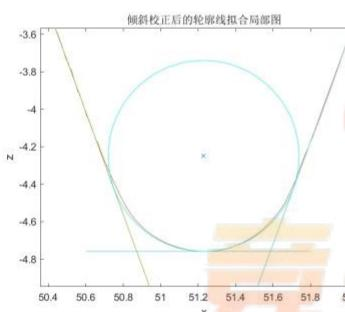

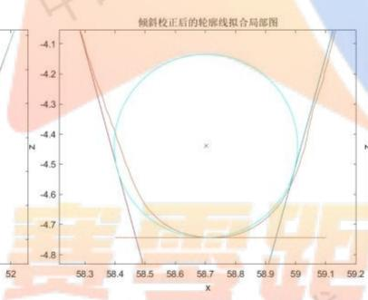

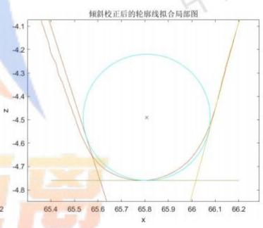
图18 两种状态下拟合效果图及局部放大图

## 问题三、对工件2轮廓线数次测量研究

## 1、每次测量工件2时的倾斜角度计算

根据问题三分析，10次测量，只有5条明显的轮廓线，每条明显的轮廓线由两组数据叠加而成，说明10次测量有5个不同的倾斜角度，为了使减少测量误差叠加影响，先对探测数据分别做高斯光滑，然后根据对应点求其平均值，图形如图19所示。

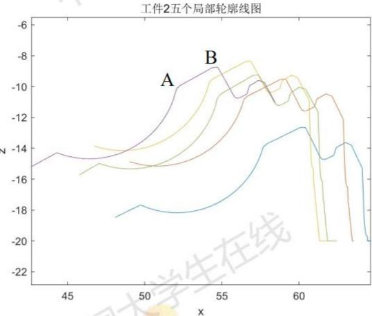
图19工件2五个局部轮廓线图

观察图像，设置直线AB部位所在的直线为工件2水平状态下的平面，拟合出该直线 1

$$
z = k x + b + \varepsilon
$$

代入数据分别可得方程为

$$
l _ { 2 5 }
$$

$$
z = 0 . 4 7 7 2 x - 4 1 . 4 3 5 4
$$

$$
l _ { 2 6 }
$$

$$
z = 0 . 5 0 4 5 x - 3 9 . 2 0 0 0
$$

$$
l _ { 2 7 }
$$

$$
z = 0 . 5 2 7 6 x - 3 8 . 2 0 7 3
$$

$$
l _ { 2 8 }
$$

$$
z = 0 . 5 4 6 6 x - 3 8 . 5 0 1 4
$$

$$
l _ { 2 9 }
$$

$$
z = 0 . 5 7 1 9 x - 4 1 . 8 8 5 9
$$

用问题二中的方法，分别求出倾斜角如表17所示。

表17 十次测量中的5个倾斜角度列表
<table><tr><td rowspan=1 colspan=1> $\alpha _ { 2 5 }$ 在2</td><td rowspan=1 colspan=1>0     petit $\alpha _ { 2 6 }$ </td><td rowspan=1 colspan=1>ion     ohi $\alpha _ { 2 7 }$ </td><td rowspan=1 colspan=1>st     e- $\alpha _ { 2 8 }$ </td><td rowspan=1 colspan=1> $\alpha _ { 2 9 }$ </td></tr><tr><td rowspan=1 colspan=1> $2 5 . 5 1 ^ { \circ }$ </td><td rowspan=1 colspan=1> $2 6 . 7 7 ^ { \circ }$ </td><td rowspan=1 colspan=1> $2 7 . 8 1 ^ { \circ }$ </td><td rowspan=1 colspan=1> $2 8 . 6 6 ^ { \circ }$ </td><td rowspan=1 colspan=1> $2 9 . 7 6 ^ { \circ }$ </td></tr></table>

## 2、工件2轮廓线各参数值标注

由于有5条关于工件2的轮廓线，所以要分别标注其各项参数值，按照问题二中的方法，首先将5条轮廓线水平校正，如图（图20）所示

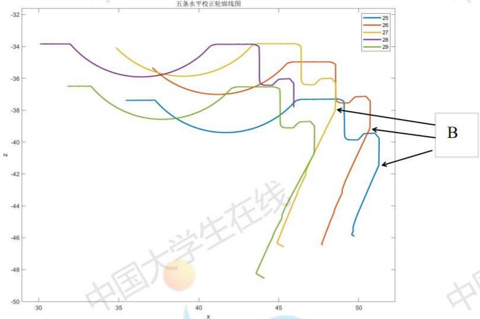
图 20 五条水平校正轮廓线图

确定每条轮廓线各项参数及标识示意图，如图21—23所示。

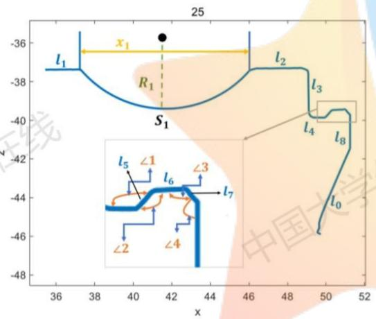

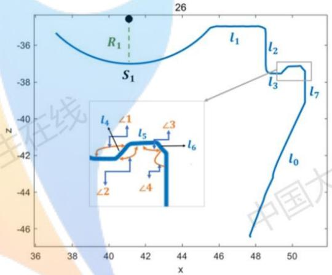

图21 25号（左）、26号（右）轮廓线各项参数标注图
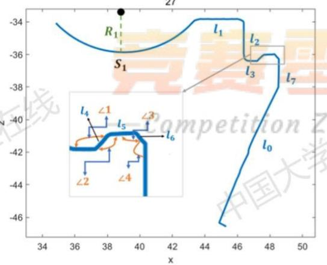

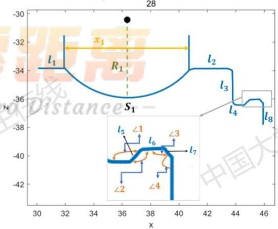
图2227号（左）、28号（右）轮廓线各项参数标注图

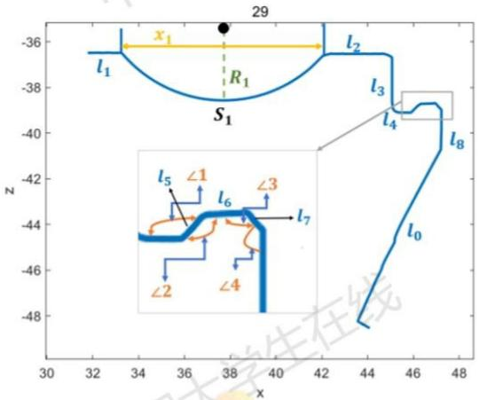
图23 29号轮廓线各项参数标注图

根据问题一中的数学模型，确定各轮廓线关键点坐标，用各参数值模型计算出五条廓线各参数值，对五条轮廓线中的 $l _ { 0 }$ 由于无法判断是直线还是圆弧，由于这五条轮廓线都是倾斜探测的，在倾斜状态时，根据探针的工作原理，不能对向上凹陷的部分进行接触式探测，所以 $l _ { 0 }$ 部分的数据为异常数据，此处不做标注，其他结果列表（表18一表22）如下：

表18 25号轮廓线各项参数值列表
<table><tr><td rowspan=1 colspan=1>参数</td><td rowspan=1 colspan=1> $l _ { 1 }$ </td><td rowspan=1 colspan=1> $l _ { 2 }$ </td><td rowspan=1 colspan=1> $l _ { 3 }$ </td><td rowspan=1 colspan=1> $l _ { 4 }$ </td><td rowspan=1 colspan=1> $l _ { \bar { s } }$ </td><td rowspan=1 colspan=1> $l _ { 6 }$ </td><td rowspan=1 colspan=1> $l _ { 7 }$ </td><td rowspan=1 colspan=1>国 $l _ { 8 }$ </td></tr><tr><td rowspan=1 colspan=1>值</td><td rowspan=1 colspan=1>1.8283</td><td rowspan=1 colspan=1>2.9770</td><td rowspan=1 colspan=1>2.5648</td><td rowspan=1 colspan=1>0.8550</td><td rowspan=1 colspan=1>0.5250</td><td rowspan=1 colspan=1>0.6895</td><td rowspan=1 colspan=1>0.4005</td><td rowspan=1 colspan=1>1.6609</td></tr><tr><td rowspan=1 colspan=1>参数</td><td rowspan=1 colspan=1> $R _ { \mathrm { 1 } }$ </td><td rowspan=1 colspan=1> $s _ { 1 }$ </td><td rowspan=1 colspan=1> $x _ { 1 }$ </td><td rowspan=1 colspan=1>∠1</td><td rowspan=1 colspan=1>∠2</td><td rowspan=1 colspan=1>∠3</td><td rowspan=1 colspan=1>∠4</td><td rowspan=1 colspan=1></td></tr><tr><td rowspan=1 colspan=1>值</td><td rowspan=1 colspan=1>5.7935</td><td rowspan=1 colspan=1>10.0833</td><td rowspan=1 colspan=1>8.8578</td><td rowspan=1 colspan=1>131.780</td><td rowspan=1 colspan=1>131.780</td><td rowspan=1 colspan=1>138.440</td><td rowspan=1 colspan=1>131.56º</td><td rowspan=1 colspan=1></td></tr></table>

表19 26号轮廓线各项参数值列表
<table><tr><td rowspan=1 colspan=1>参数</td><td rowspan=1 colspan=1> $l _ { 1 }$ </td><td rowspan=1 colspan=1> $l _ { 2 }$ </td><td rowspan=1 colspan=1> $l _ { 3 }$ </td><td rowspan=1 colspan=1> $l _ { 4 }$ </td><td rowspan=1 colspan=1> $l _ { \bar { s } }$ </td><td rowspan=1 colspan=1> $l _ { 6 }$ </td><td rowspan=1 colspan=1> $l _ { 7 }$ </td></tr><tr><td rowspan=1 colspan=1>值</td><td rowspan=1 colspan=1>2.9572</td><td rowspan=1 colspan=1>2.5632</td><td rowspan=1 colspan=1>0.8335</td><td rowspan=1 colspan=1>0.5387</td><td rowspan=1 colspan=1>0.6890</td><td rowspan=1 colspan=1>0.4049</td><td rowspan=1 colspan=1>1.6803</td></tr><tr><td rowspan=1 colspan=1>参数</td><td rowspan=1 colspan=1> $R _ { 1 }$ </td><td rowspan=1 colspan=1> $s _ { 1 }$ </td><td rowspan=1 colspan=1></td><td rowspan=1 colspan=1>∠2</td><td rowspan=1 colspan=1>∠3</td><td rowspan=1 colspan=1>∠4</td><td rowspan=1 colspan=1></td></tr><tr><td rowspan=1 colspan=1>值</td><td rowspan=1 colspan=1>5.7909</td><td rowspan=1 colspan=1>9.5420</td><td rowspan=1 colspan=1> $1 3 1 . 7 8 ^ { 0 }$ </td><td rowspan=1 colspan=1> $1 3 1 . 7 8 ^ { 0 }$ </td><td rowspan=1 colspan=1> $1 3 8 . 4 4 ^ { 0 }$ </td><td rowspan=1 colspan=1> $1 3 1 . 5 6 ^ { 0 }$ </td><td rowspan=1 colspan=1></td></tr></table>

表2027号轮廓线各项参数值列表
<table><tr><td colspan="1" rowspan="1">参数</td><td colspan="1" rowspan="1"> $l _ { 1 }$ </td><td colspan="1" rowspan="1"> $l _ { 2 }$ </td><td colspan="1" rowspan="1"> $l _ { 3 }$ </td><td colspan="1" rowspan="1"> $l _ { 4 }$ </td><td colspan="1" rowspan="1"> $l _ { 5 }$ </td><td colspan="1" rowspan="1"> $l _ { 6 }$ </td><td colspan="1" rowspan="1"> $l _ { 7 }$ </td></tr><tr><td colspan="1" rowspan="1">值</td><td colspan="1" rowspan="1">2.8900</td><td colspan="1" rowspan="1">2.3000</td><td colspan="1" rowspan="1">0.7900</td><td colspan="1" rowspan="1">0.5449</td><td colspan="1" rowspan="1">0.6500</td><td colspan="1" rowspan="1">0.4036</td><td colspan="1" rowspan="1">1.6700</td></tr><tr><td colspan="1" rowspan="1">参数</td><td colspan="1" rowspan="1"> $R _ { 1 }$ </td><td colspan="1" rowspan="1"> $s _ { 1 }$ </td><td colspan="1" rowspan="1">∠1</td><td colspan="1" rowspan="1">∠2</td><td colspan="1" rowspan="1">∠3</td><td colspan="1" rowspan="1">∠4</td><td colspan="1" rowspan="1"></td></tr><tr><td colspan="1" rowspan="1">值</td><td colspan="1" rowspan="1">5.8029</td><td colspan="1" rowspan="1">9.7562</td><td colspan="1" rowspan="1">131.170</td><td colspan="1" rowspan="1">131.170</td><td colspan="1" rowspan="1">139.16º</td><td colspan="1" rowspan="1">130.840</td><td colspan="1" rowspan="1"></td></tr></table>

表21 28号轮廓线各项参数值列表
<table><tr><td rowspan=1 colspan=1>参数</td><td rowspan=1 colspan=1> $l _ { 1 }$ </td><td rowspan=1 colspan=1> $l _ { 2 }$ </td><td rowspan=1 colspan=1> $l _ { 3 }$ </td><td rowspan=1 colspan=1> $l _ { 4 }$ </td><td rowspan=1 colspan=1> $l _ { \bar { s } }$ </td><td rowspan=1 colspan=1> $l _ { 6 }$ </td><td rowspan=1 colspan=1> $l _ { 7 }$ </td><td rowspan=1 colspan=1> $l _ { 8 }$ </td></tr><tr><td rowspan=1 colspan=1>值</td><td rowspan=1 colspan=1>1.8682</td><td rowspan=1 colspan=1>2.7400</td><td rowspan=1 colspan=1>2.3700</td><td rowspan=1 colspan=1>0.7100</td><td rowspan=1 colspan=1>0.6122</td><td rowspan=1 colspan=1>0.6500</td><td rowspan=1 colspan=1>0.4046</td><td rowspan=1 colspan=1>1.4900</td></tr><tr><td rowspan=1 colspan=1>参数</td><td rowspan=1 colspan=1> $R _ { \mathrm { 1 } }$ </td><td rowspan=1 colspan=1> $s _ { 1 }$ </td><td rowspan=1 colspan=1> $x _ { 1 }$ </td><td rowspan=1 colspan=1>&lt;1</td><td rowspan=1 colspan=1>∠2</td><td rowspan=1 colspan=1>∠3</td><td rowspan=1 colspan=1>∠4国</td><td rowspan=1 colspan=1>大学</td></tr><tr><td rowspan=1 colspan=1>值</td><td rowspan=1 colspan=1>5.7918</td><td rowspan=1 colspan=1>10.1500</td><td rowspan=1 colspan=1>8.9600</td><td rowspan=1 colspan=1>136.660</td><td rowspan=1 colspan=1>136.660</td><td rowspan=1 colspan=1>137.600</td><td rowspan=1 colspan=1>132.400</td><td rowspan=1 colspan=1></td></tr></table>

表2229号轮廓线各项参数值列表
<table><tr><td rowspan=1 colspan=1>参数</td><td rowspan=1 colspan=1> $l _ { 1 }$ </td><td rowspan=1 colspan=1> $l _ { 2 }$ </td><td rowspan=1 colspan=1> $l _ { 3 }$ </td><td rowspan=1 colspan=1> $l _ { 4 }$ </td><td rowspan=1 colspan=1> $l _ { \bar { s } }$ </td><td rowspan=1 colspan=1> $l _ { 6 }$ </td><td rowspan=1 colspan=1> $l _ { 7 }$ </td><td rowspan=1 colspan=1> $l _ { 8 }$ </td></tr><tr><td rowspan=1 colspan=1>值</td><td rowspan=1 colspan=1>1.4556</td><td rowspan=1 colspan=1>2.7400</td><td rowspan=1 colspan=1>2.3600</td><td rowspan=1 colspan=1>0.7200</td><td rowspan=1 colspan=1>0.6044</td><td rowspan=1 colspan=1>0.5800</td><td rowspan=1 colspan=1>0.4455</td><td rowspan=1 colspan=1>1.6400</td></tr><tr><td rowspan=1 colspan=1>参数</td><td rowspan=1 colspan=1> $R _ { 1 }$ </td><td rowspan=1 colspan=1> $S _ { 1 }$ </td><td rowspan=1 colspan=1> $x _ { 1 }$ </td><td rowspan=1 colspan=1>∠1</td><td rowspan=1 colspan=1>∠2</td><td rowspan=1 colspan=1>∠3</td><td rowspan=1 colspan=1>∠4</td><td rowspan=1 colspan=1></td></tr><tr><td rowspan=1 colspan=1>值</td><td rowspan=1 colspan=1>5.7878</td><td rowspan=1 colspan=1>11.9672</td><td rowspan=1 colspan=1>8.9800</td><td rowspan=1 colspan=1>135.76°</td><td rowspan=1 colspan=1>135.76°</td><td rowspan=1 colspan=1>138.27º</td><td rowspan=1 colspan=1>131.73°</td><td rowspan=1 colspan=1></td></tr></table>

从以上各项参数可以发现，除了测量起始位置，倾斜角度不同外，对应的参数值相差很小，可以认为工件2有相同的局部轮廓线，计算出他们的平均值，具体局部轮廓及标注如图（图24）所示

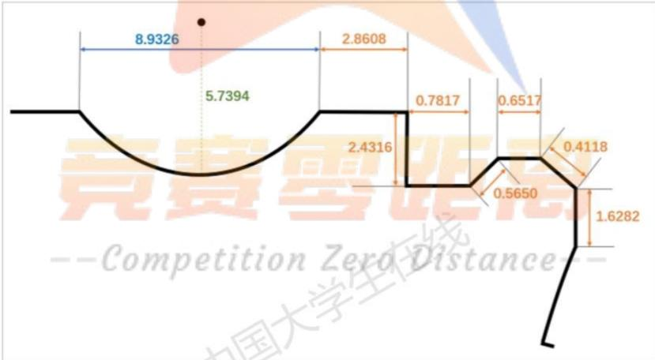
图24 工件2局部轮廓线标注图

## 3、工件2完整轮廓线探索

由于对工件2探测了五条轮廓线，工件2的完整轮廓线一般是由这五条线连接构成，那么相邻的两条主轴边的夹角应该大于90度。但是，通过计算发现相邻的主轴直线几乎相互垂直，所以，工件2应该是由五条轮廓线中的四条连接而成。

仔细观察图20，发现水平校正后的27号轮廓线和28号轮廓线在同一水平线上，因此，可以认为27号轮廓线和28号轮廓线探测的是工件2的同一个面，只是起始点不同而已。选择25号轮廓线、26号轮廓线、27号+28号轮廓线（对应合并）、29号轮廓线为拼接工件2的局部轮廓线。

将四条水平校正后的局部轮廓线中的三条分别旋转90度、180度、270度，如图（图24）所示。 在线

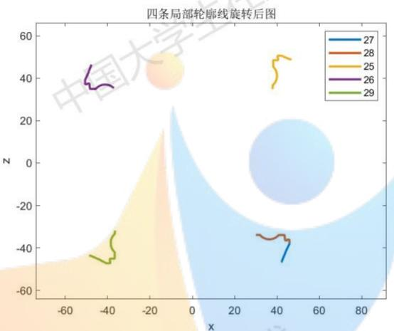
图 24 四条局部轮廓线旋转后图

因为每次测量数据的起始点不一样，拼接四条轮廓线的时候，选择具有相同特征部分，寻找相同特征点，探索发现以每条线的B点部位（见图20）为相邻轮廓线相同特征点，进行平移拼接如图（图25）所示。去掉异常数据可得工件2的完整轮廓线，如图（图26）所示。

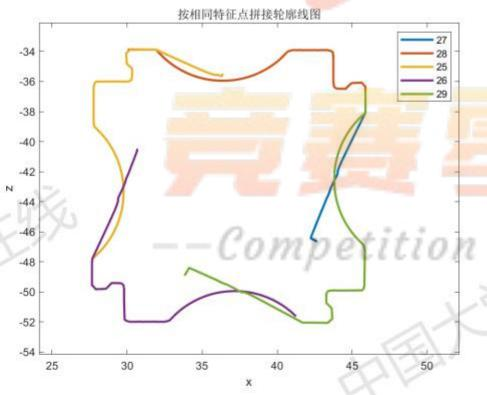
图25 按相同特征点拼接轮廓线图

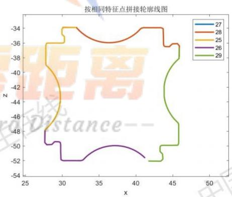
图26 去除异常数据轮廓线拼接图
从图26可以看出，底部还存在一点不完整的地方，由于数据不全导致。

## 问题四、用工件2局部测量数据对工件轮廓数线做进一步修正

## 1、关于圆弧和角的9次局部测量数据分析与处理

根据问题分析，将圆和角的每条局部轮廓线的三组数据（分别记为1、2、3号轮廓线）用平均的方法综合成一组，做水平校正，如图（图27）所示

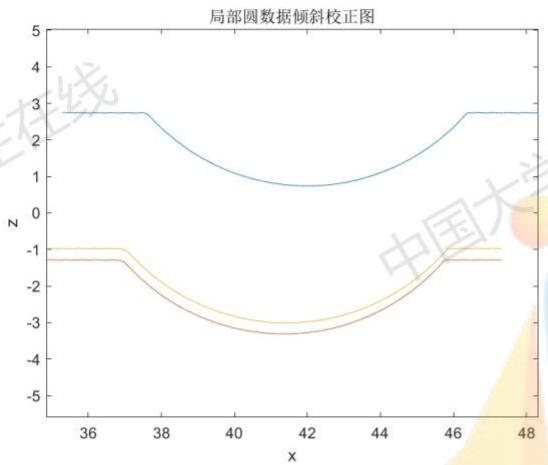

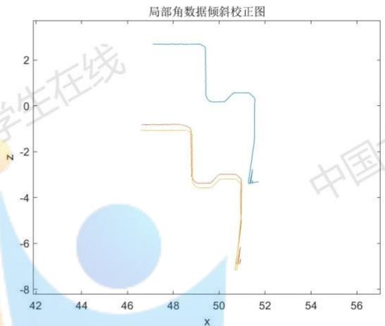
图 27 局部圆和角数据倾斜校正图

对于圆弧和角度局部图，不难发现除了起始点、位置，倾斜角度略有不同外，其他的大小、形状几乎相同，因此进一步判断工件2是点具有相同局部轮廓线，因此完整轮廓线中的四个圆弧的大小是一致的，在图27的基础上平移到一起，如图（图28）所示

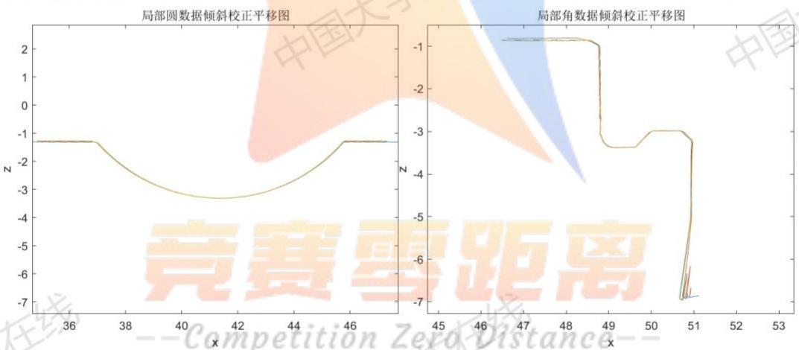
图28局部圆（左图）和局部角（右图）数据倾斜校正平移图

根据处理出来的圆弧数据，分别确定圆弧凹槽的宽度，拟合圆的方程，分别求半径，再平均求他们的平均值记为圆弧的凹槽宽度和圆的半径，模型为

$$
\overline { { x } } = \frac { \sum _ { i = 1 } ^ { n } x _ { i } } { n }
$$

和

$$
\overline { { R } } = \frac { \sum _ { i = 1 } ^ { n } R _ { i } } { n }
$$

结合问题一的做法，代入数据所求结果如表（表23）所示

表23圆弧凹槽宽度、半径和圆弧长度列表
<table><tr><td rowspan=1 colspan=1>一线</td><td rowspan=1 colspan=1>1号轮廓线</td><td rowspan=1 colspan=1>2号轮廓线</td><td rowspan=1 colspan=1>3号轮廓线</td><td rowspan=1 colspan=1>平均值</td></tr><tr><td rowspan=1 colspan=1>X凹槽宽度</td><td rowspan=1 colspan=1>8.7900</td><td rowspan=1 colspan=1>8.8000</td><td rowspan=1 colspan=1>8.8500</td><td rowspan=1 colspan=1>8.8133</td></tr><tr><td rowspan=1 colspan=1>圆的半径</td><td rowspan=1 colspan=1>5.8078</td><td rowspan=1 colspan=1>5.8137国</td><td rowspan=1 colspan=1>5.8129</td><td rowspan=1 colspan=1>5.8115</td></tr><tr><td rowspan=1 colspan=1>圆弧长度</td><td rowspan=1 colspan=1>10.0630</td><td rowspan=1 colspan=1>10.0585</td><td rowspan=1 colspan=1>10.0593</td><td rowspan=1 colspan=1>10.0603</td></tr></table>

效果如图（图29）所示

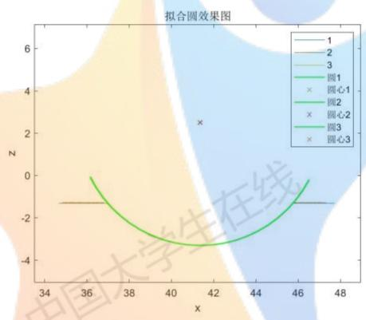
图 29 拟合圆效果图

根据处理出来的角度数据，确定有角部分的关键点和参数值大小，根据图28右图所示，和图24相比，分析发现工件轮廓线右肩部分应该是一条斜线，因此结合表23的数据，在图24基础上做局部修正，修正图及标注如图（图30）所示

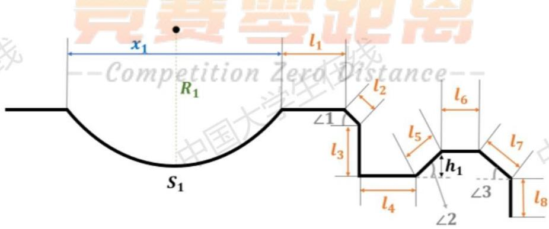
图30修正后局部轮廓线图及标注参数
根据问题一方法计算各参数标注值，列表（表24）所示

表24修正后局部轮廓线各项参数值表
<table><tr><td rowspan=1 colspan=1>参数</td><td rowspan=1 colspan=1> $l _ { 1 }$ </td><td rowspan=1 colspan=1> $l _ { 2 }$ </td><td rowspan=1 colspan=1> $l _ { 3 }$ </td><td rowspan=1 colspan=1> $l _ { 4 }$ </td><td rowspan=1 colspan=1> $l _ { 5 }$ </td><td rowspan=1 colspan=1> $l _ { 6 }$ </td><td rowspan=1 colspan=1> $l _ { 7 }$ </td><td rowspan=1 colspan=1> $l _ { 8 }$ </td></tr><tr><td rowspan=1 colspan=1>1号轮廓</td><td rowspan=1 colspan=1></td><td rowspan=1 colspan=1>0.31826</td><td rowspan=1 colspan=1>2.22000</td><td rowspan=1 colspan=1>0.75000</td><td rowspan=1 colspan=1>0.54829</td><td rowspan=1 colspan=1>0.65000</td><td rowspan=1 colspan=1>0.32973</td><td rowspan=1 colspan=1>1.75000</td></tr><tr><td rowspan=1 colspan=1>2号轮廓</td><td rowspan=1 colspan=1></td><td rowspan=1 colspan=1>0.54756</td><td rowspan=1 colspan=1>2.24800</td><td rowspan=1 colspan=1>0.74000</td><td rowspan=1 colspan=1>0.52690</td><td rowspan=1 colspan=1>0.67000</td><td rowspan=1 colspan=1>0.33305</td><td rowspan=1 colspan=1>1.77100</td></tr><tr><td rowspan=1 colspan=1>3号轮廓</td><td rowspan=1 colspan=1></td><td rowspan=1 colspan=1>0.28737</td><td rowspan=1 colspan=1>2.27420</td><td rowspan=1 colspan=1>0.73000</td><td rowspan=1 colspan=1>0.53553</td><td rowspan=1 colspan=1>0.66000</td><td rowspan=1 colspan=1>0.37074</td><td rowspan=1 colspan=1>1.71200</td></tr><tr><td rowspan=1 colspan=1>平均值</td><td rowspan=1 colspan=1>2.8608</td><td rowspan=1 colspan=1>0.38440</td><td rowspan=1 colspan=1>2.24740</td><td rowspan=1 colspan=1>0.74000</td><td rowspan=1 colspan=1>0.53691</td><td rowspan=1 colspan=1>0.66000</td><td rowspan=1 colspan=1>0.34451</td><td rowspan=1 colspan=1>1.74433</td></tr><tr><td rowspan=1 colspan=1>参数</td><td rowspan=1 colspan=1> $R _ { \mathrm { 1 } }$ </td><td rowspan=1 colspan=1> $s _ { 1 }$ </td><td rowspan=1 colspan=1> $x _ { 1 }$ 国</td><td rowspan=1 colspan=1>大人 $h _ { 1 }$ </td><td rowspan=1 colspan=1>∠1</td><td rowspan=1 colspan=1>∠2</td><td rowspan=1 colspan=1>∠3</td><td rowspan=1 colspan=1>国大学</td></tr><tr><td rowspan=1 colspan=1>1号轮廓</td><td rowspan=1 colspan=1>5.8078</td><td rowspan=1 colspan=1>10.063</td><td rowspan=1 colspan=1>8.79</td><td rowspan=1 colspan=1>0.375</td><td rowspan=1 colspan=1>28.38</td><td rowspan=1 colspan=1>43.15</td><td rowspan=1 colspan=1>40.70</td><td rowspan=1 colspan=1></td></tr><tr><td rowspan=1 colspan=1>2号轮廓</td><td rowspan=1 colspan=1>5.8137</td><td rowspan=1 colspan=1>10.0585</td><td rowspan=1 colspan=1>8.8</td><td rowspan=1 colspan=1>0.365</td><td rowspan=1 colspan=1>21.34</td><td rowspan=1 colspan=1>43.85</td><td rowspan=1 colspan=1>35.84</td><td rowspan=1 colspan=1></td></tr><tr><td rowspan=1 colspan=1>3号轮廓</td><td rowspan=1 colspan=1>5.8129</td><td rowspan=1 colspan=1>10.0593</td><td rowspan=1 colspan=1>8.85</td><td rowspan=1 colspan=1>0.367</td><td rowspan=1 colspan=1>29.54</td><td rowspan=1 colspan=1>43.26</td><td rowspan=1 colspan=1>40.95</td><td rowspan=1 colspan=1></td></tr><tr><td rowspan=1 colspan=1>平均值</td><td rowspan=1 colspan=1>5.8115</td><td rowspan=1 colspan=1>10.0603</td><td rowspan=1 colspan=1>8.8133</td><td rowspan=1 colspan=1>0.369</td><td rowspan=1 colspan=1>26.42</td><td rowspan=1 colspan=1>43.42</td><td rowspan=1 colspan=1>39.16</td><td rowspan=1 colspan=1></td></tr></table>

数值标注修正图如图（图31）所示

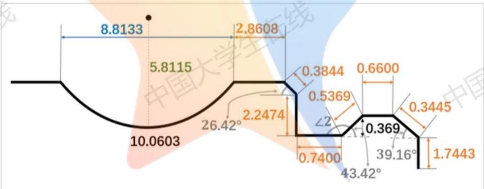
图 31 各项参数标注图

## 2、对工件2的完整轮廓修正

由于部分细节的变化，需要对工件2完整轮廓线进行修正，为了使工件2更加准确，避免探测数据误差，准确将工件2轮廓线画出来，此处直接根据各项参数值，生成一组新坐标系下新的数列，具体生成方法如下： 国大

为了简单，新坐标系原点O（0,0）设在圆弧左端端点，根据调整后的各条直线和圆 弧参数将直线和圆用解析式表示

$$
\sqrt { { R _ { 1 } } ^ { 2 } - ( \frac { x _ { 1 } } { 2 } ) ^ { 2 } } - \sqrt { { R _ { 1 } } ^ { 2 } - ( x - \frac { x _ { 1 } } { 2 } ) ^ { 2 } }
$$

$$
( 0 , x _ { 1 } )
$$

$$
( x _ { 1 } , x _ { 2 } )
$$

$$
k _ { 1 } x + b _ { 1 }
$$

$$
( x _ { 2 } , x _ { 3 } )
$$

$$
c _ { 1 }
$$

$$
( x _ { 3 } , x _ { 4 } )
$$

$$
k _ { 2 } x + b _ { 2 }
$$

$$
( x _ { 5 } , x _ { 6 } )
$$

$$
c _ { 2 }
$$

$$
( x _ { 7 } , x _ { 8 } )
$$

$$
k _ { 3 } x + b _ { 3 }
$$

$$
( x _ { 9 } , x _ { 1 0 } )
$$

按照次分段函数生成一组轮廓线数列，再根据局部轮廓线来拼接工件2完整轮廓图，结果如图（图32）所示。 中国 中国

工件2完整轮廓线修正后图
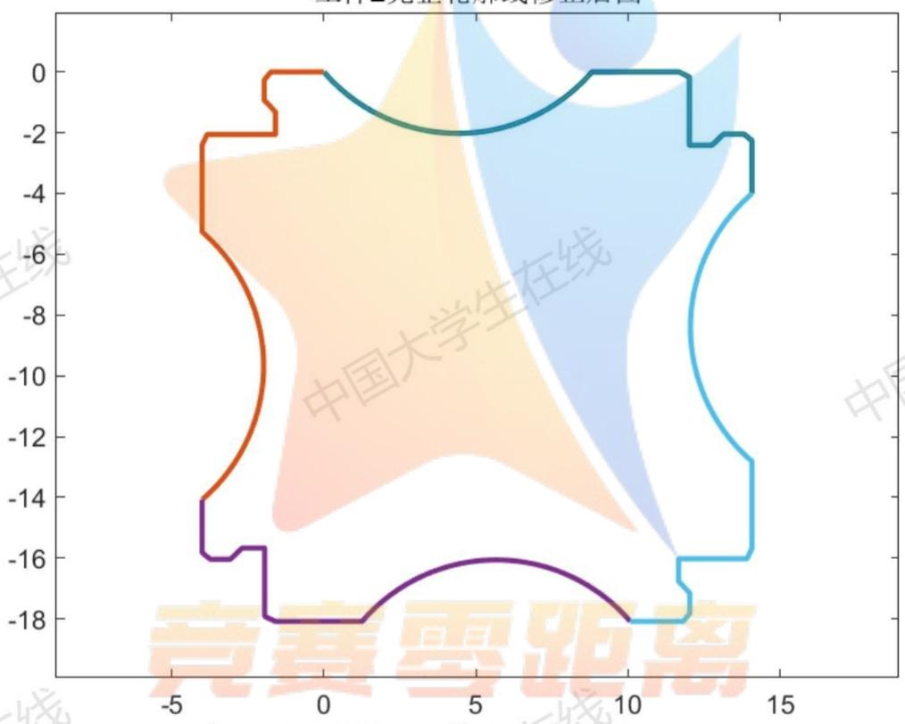
图32 工件2完整轮廓线修正后图

从图32可以发现，如果将图32倾斜一定角度，进行探测数据时，当探针探测到右边时，探针无法探测到向上凹陷的圆弧内部，因此会导致收集到异常数据，符合之前的分析，因此工件2轮廓线完美。

## 参考文献

[1]姜启源，大学数学实验，[M]，清华大学出版社。

[2]包亚俊，基于激光轮廓仪的非接触式钢轨廓形检测系统.，[J]，电子科技，2020，（28-33）。

[3]卓金武等，MATLAB数学建模方法与实践，[M]，北京航空航天大学出版社。

## 附录：

## 问题一程序

清理工作区

clear;

clc;

close;

## 读数据

data\_raw = x1sread('data\_01.x1sx');

直线交点

data\_jd = zeros(9,2);

## 原数据绘图

window\_raw = figure(1);

set(window\_raw,'name','原数据图');

plot(data\_raw(:,1), data\_raw(:,2));

```matlab
data_a = [data_gs(1:6000, :); data_gs(12507:21500, :);...
data_gs(26650:36000, :); ...
data_gs(40700:49955, :); data_gs(70741:76210, :);...
data_gs(80208:81671, :); data_gs(86095:95439, :); ...
data_gs(110377:119595, :); data_gs(135576:end, :)];
```

plot(data\_gs(:,1), data\_gs(:,2));

## 高斯滤波

data\_gs = [data\_raw(:,1), smoothdata(data\_raw(:,2),'gaussian',500)];

## 拟合水平直线

## 取分段数据

% 拟合与绘图

[P1,S1] = polyfit(data\_a(:,1), data\_a(:,2), 0);

x = 46:0.1:119; --

figure(2);

hold on;

plot(x,y);

## 拟合 L2 线段

取数据

```matlab
data_b = data_gs(6362:7815, :);
[P,S] = polyfit(data_b(:,1), data_b(:,2), 1);
x = 49.7:0.1:51.3;
= P(1)*x + P(2);
figure(2);
plot(x, y, '');
% 求交点
syms x y;
[X, Y] = solve(y == 0*x + P1, y == -2.7490*x +135.0653);
data_jd(1,:) = [double(X), double(Y)];
figure(2);
plot(double(X), double(Y), 'o');
```

## 拟合 L3 线段

取数据

```matlab
data_b = data_gs(10100:12108, :); 距离
[P3,s] = polyfit(data_b(:,1), data_b(:,2), 1);
x = 51.1:0.1:52.7;
y = P3(1)*x + P3(2);
figure(2);
plot(x, y);
% 求交点
syms x y;
[X, Y] = solve(y == 0*x + P1, y == P3(1)*x + P3(2));
```

```javascript
figure(2);
```

```javascript
x = 57.6:0.1:58.7;
```

```matlab
data_jd(2,:) = [double(X), double(Y)];
figure(2);
plot(double(X), double(Y), 'o');
```

## 拟合 L4 线段

## 取数据

data\_b = data\_gs(22176:23480, :);

```matlab
[P4,s] = polyfit(data_b(:,1), data_b(:,2), 1);
```

```javascript
y = P4(1)*x + P4(2);
```

```javascript
plot(x, y);
```

%求交点

syms × y;

```javascript
[X, Y] = solve(y == 0*x + P1, y == P4(1)*x + P4(2));
```

```matlab
data_jd(3,:) = [double(X), double(Y)];
```

```javascript
figure(2);
```

```javascript
plot(double(X), double(Y), 'o');
```

拟合L5线段-
## 取数据

```matlab
data_b = data_gs(24578:26275, :);
[P5,S] = polyfit(data_b(:,1), data_b(:,2), 1);
x = 58.5:0.1:59.8;
y = P5(1)*x + P5(2);
figure(2);
```

data\_b = data\_gs(38771:40203, :);

```matlab
plot(x, y);
% 求交点
syms x y;
[X, Y] = solve(y == 0*x + P1, y == P5(1)*x + P5(2));
data_jd(4,:) = [double(X), double(Y)];
figure(2);
plot(double(X), double(Y), 'o');
```

## 拟合 L6 线段

取数据

## 拟合 L7 线段

取数据

[X, Y] = solve(y == 0\*x + P1, y == P(1)\*x + P(2));

```matlab
[P,S] = polyfit(data_b(:,1), data_b(:,2), 1);
x = 65.5:0.1:66.8;
y = P(1)*x + P(2);
figure(2);
plot(x, y);
%求交点
syms x y;
[X, Y] = solve(y == 0*x + P1, y == P(1)*x + P(2));
data_jd(6,:) = [double(X), double(Y)];
figure(2);
plot(double(X), double(Y), 'o');
```

## 拟合 L8 线段

取数据

## 拟合 L9 线段

取数据

```matlab
data_b = data_gs(60804:70004, :);
[P,S] = polyfit(data_b(:,1), data_b(:,2), 1);
x = 75.9:0.1:82;
= P(1)*x + P(2);
figure(2);
plot(x, y);
% 求交点
syms x y;
[X, Y] = solve(y == 0*x + P1, y == P(1)*x + P(2));
data_jd(9,:) = [double(X), double(Y)];
figure(2);
plot(double(X), double(Y), 'o');
```

## L8 线段和 L9 线段的交点

```matlab
data_b14 = data_gs(50730:60004, :); 距离
[P14,s14] = polyfit(data_b14(:,1), data_b14(:,2), 1);
必 必
data_b15= data_gs(60804:70004,:):
[P15,s15] = polyfit(data_b15(:,1), data_b15(:,2), 1);
[x15, Y15] = so]ve(y == P14(1)*x + P14(2), y == P15(1)*x + P15(2));
data_jd(8,:) = [double(x15), double(Y15)];
figure(2);
plot(x15, Y15, 'o');
```

## 标注

legend('高斯滤波数据', '拟合线', 'L2', '交点', 'L3', '交点', 'L4', '交点'. 'L5', '交点', 'L6', '交点', 'L7', '交点', 'L8', '交点', 'L9'... '交点');

## 输出直线交点

disp(data\_jd);

49.7779 -1.7741

52.6603-1.7741

57.6601 -1.7741

59.7300 -1.7741

64.7321-1.7741

71.7753-1.7741

76.8069 -0.7740

81.7932 -1.7741

## 圆心数据

data\_yx = zeros(7,2);

## 圆与直线交点

data\_yjd = zeros(8,2);

## 拟合 C4 圆弧

c = data\_gs(76586:79945, :);

```matlab
figure(2);
plot(c(:,1), c(:,2));
[xc,yc,R,a] = circfit(c(:,1), c(:,2));
data_yx(4,:) = [xc, yc];
plot(xc, yc, 'x');
% 求交点 在线
syms x y;
[X, Y] = solve(y == 0*x + P1, (x - xc)^2 + (y - yc)^2 == R^2);
data_yjd([1,2],:) = [X ,Y];
```

## 拟合 C5 圆弧

```matlab
c = data_gs(82058:85584, :); 在线
figure(2);
plot(c(:,1), c(:,2));
[xc,yc,R,a] = circfit(c(:,1), c(:,2));
data_yx(5,:) = [xc, yc];
plot(xc, yc, 'x');
% 求交点
syms x y; 音寒
[X, Y] = solve(y == 0*x + P1, (x - xc)^2 + (y - yc)^2 == R^2);
data_yjd([3,4],:) = [X ,Y]; -
```

## 拟合 C6 圆弧

```matlab
c = data_gs(95779:109992, :);
figure(2);
plot(c(:,1),c(:,2));
```

```matlab
[xc,yc,R,a] = circfit(c(:,1), c(:,2));
data_yx(6,:) = [xc, yc];
plot(xc, yc, 'x');
% 求交点
syms x y;
[X, Y] = solve(y == 0*x + P1, (x - xc)^2 + (y - yc)^2 == R^2);
data_yjd([5,6]:) = [X ,Y];
```

## 拟合 C7 圆弧

```matlab
c = data_gs(120398:134398, :);
figure(2);
plot(c(:,1), c(:,2));
[xc,yc,R,a] = circfit(c(:,1), c(:,2));
data_yx(7,:) = [xc, yc];
plot(xc, yc, 'x');
% 求交点
syms × y;
[X, Y] = solve(y == 0*x + P1, (x - xc)^2 + (y - yc)^2 == R^2);
data_yjd([7,8],:) = [X ,Y];
```

## 角度

```matlab
data_jiaodu = zeros(1,8);
%角1
jiao = 180 + atand(-2.7321);
data_jiaodu(1) = jiao;
%角2
jiao = 180 - atand(2.7567);
```

```matlab
data_jiaodu(2) = jiao;
%角3
jiao = 180 + atand(-3.7089);
data_jiaodu(3) = jiao;
% 角 4
jiao = 180-atand(3.2906);
data_jiaodu(4) = jiao;
% 角 5
jiao = 180 + atand(-3.7410);
data_jiaodu(5) = jiao;
% 角 6
jiao = 180 - atand(3.5198);
data_jiaodu(6) = jiao;
%角7
jiao = 180 - atand(0.1988);
data_jiaodu(7) = jiao;
%角8
jiao = 180 + atand(-0.2006);
data_jiaodu(8) = jiao;
```

## 拟合C1


```matlab
= data_gs(8158:10348,:);
figure(2);
plot(c(:,1), c(:,2));
[xc,yc,R,a] = circfit(c(:,1), c(:,2));
data_yx(7,:) = [xc, yc];
plot(xc, yc, 'x');
```

## 拟合C2

```matlab
c = data_gs(23400:24500, :); figure(2); plot(c(:,1), c(:,2)); [xc,yc,R,a] = circfit(c(:,1), c(:,2)); data_yx(7,:) =
[xc, yc]; plot(xc, yc, 'x');
```

```matlab
% 画最低线
c = data_gs(23400:24500, :);
x = 58.4:0.1:58.9;
y_min = 0*x + min(c(:,2));
plot(x, y_min);
```

## 拟合C3

```matlab
c = data_gs(37550:38900, :);
figure(2);
plot(c(:,1), c(:,2));
[xc,yc,R,a] = circfit(c(:,1), c(:,2));
data_yx(7,:) = [xc, yc];
plot(xc, yc, 'x');
```

## 定义变量

水平直线方程

data\_spzx = [];
% 斜直线方程
data\_zxfc = [];
%圆心
data\_yx = [];
% 圆弧半径
data\_yhbj = [];


```matlab
% 槽口宽度
data_ckkd = [];
% 直线交点
data_jd = [];
% 人字形高度
data_rzgd = 0;
%水平线段的长度
data_spxdcd = [];
% 斜线与水平线的夹角
data_xxj = [];
% 前三个小圆切点
data_xyqd = [];
% 斜线长度
data_xxcd = [];
% 关键点
data_gjd = [];
```

```javascript
data_raw = xlsread('data_01.x1sx');
```

## 读取数据

## 整体高斯平滑处理

```matlab
data_gs = [data_raw(:,1), smoothdata(data_raw(:,2),'gaussian',500)];
% 绘图
figure(31);
plot(data_gs(:,1), data_gs(:,2), data_raw(:,1), data_raw(:,2));
```

legend('高斯平滑后的数据','原数据');

title('高斯平滑数据处理结果对比及细节图');

## 拟合水平直线1

## 取分段数据

```matlab
data_fd = [data_gs(1:6000, :)];
% 拟合与绘图
[P,S] = polyfit(data_fd(:,1), data_fd(:,2), 0);
data_spzx(1,:) = P;
x = 46.5:0.1:50;
y = 0*x + data_spzx(1);
figure(30);
plot(x, y);
```

## 拟合水平直线2

取分段数据

% 拟合与绘图 -

# 拟合水平直线3

取分段数据

```matlab
data_fd = data_gs(26650:36000, :);
% 拟合与绘图
[P,S] = polyfit(data_fd(:,1), data_fd(:,2), 0);
data_spzx(3,:) = P;
x = 59.7:0.1:64.8;
y = 0*x + data_spzx(3);
figure(30);
plot(x, y);
```

## 拟合水平直线4

## 取分段数据

data\_fd = data\_gs(40700:49955, :);

% 拟合与绘图

[P,S] = polyfit(data\_fd(:,1), data\_fd(:,2), 0);

data\_spzx(4,:) = P;

x = 66.7:0.1:72;

y = 0\*x + data\_spzx(4);

figure(30);


plot(x, y);

## 拟合水平直线5

取分段数据

data\_fd = data\_gs(70741:76210, :);

% 拟合与绘图

[P,S] = polyfit(data\_fd(:,1), data\_fd(:,2), 0);

```matlab
data_spzx(5,:) = P;
x = 81.5:0.1:84.9;
y = 0*x + data_spzx(5);
figure(30);
plot(x, y);
```

## 拟合水平直线6

取分段数据

```matlab
data_fd = data_gs(80208:81671, :);
% 拟合与绘图
[P,S] = polyfit(data_fd(:,1), data_fd(:,2), 0);
data_spzx(6,:) = P;
x = 86.5:0.1:87.7;
y = 0*x + data_spzx(6);
figure(30);
plot(x, y);
```

## 拟合水平直线7

取分段数据

## 拟合水平直线8

取分段数据

```matlab
data_fd = data_gs(110377:119595, :);
% 拟合与绘图
[P,S] = polyfit(data_fd(:,1), data_fd(:,2), 0);
data_spzx(8,:) = P;
x = 101.5:0.1:106.8;
y = 0*x + data_spzx(8);
figure(30);
plot(x, y);
```

## 拟合水平直线9

取分段数据

% 拟合与绘图

## 拟合 L2 线段

取数据

```matlab
data_zxfc(1,:) = P2;
x = 49.7:0.1:51.3;
y = P2(1)*x + P2(2);
figure(30);
plot(x, y);
% 求交点 在线
syms x y;
[X, Y] = solve(y == 0*x + data_spzx(1), y == P2(1)*x + P2(2));
data_jd(1,:) = [double(X), double(Y)];
data_gjd(1,:) = [double(X), double(Y)];
figure(30);
% plot(double(X), double(Y), 'o');
```

## 拟合 L3 线段

取数据

## 拟合 L4 线段

## 取数据

```matlab
data_b = data_gs(22176:23480, :);
[P4,S] = polyfit(data_b(:,1), data_b(:,2), 1);
data_zxfc(3,:) = P4;
x = 57.6:0.1:58.7;
y = P4(1)*x + P4(2);
figure(30);
plot(x, y);
% 求交点
syms × y;
[X, Y] = solve(y == 0*x + data_spzx(2), y == P4(1)*x + P4(2));
data_jd(3,:) = [double(X), double(Y)];
data_gjd(5,:) = [double(X), double(Y)];
figure(30);
% plot(double(X), double(Y), 'o');
```

## 拟合 L5 线段

取数据

```matlab
data_b = data_gs(24578:26275, :);
[P5,S] = polyfit(data_b(:,1), data_b(:,2), 1);
data_zxfc(4,:) = P5;
x = 58.5:0.1:59.8;
y = P5(1)*x + P5(2);
figure(30);
plot(x, y);
```

```matlab
% 求交点
syms x y;
[X, Y] = solve(y == 0*x + data_spzx(3), y == P5(1)*x + P5(2));
data_jd(4,:) = [double(X), double(Y)];
figre(30):线
% plot(double(X), double(Y) 'o');
data_gjd(8,:) = [X(1),Y(1)]; 中国力
```

## 拟合 L6 线段

取数据

```matlab
data_b = data_gs(36292:37627, :);
[P6,s] = polyfit(data_b(:,1), data_b(:,2), 1);
data_zxfc(5,:) = P6;
x = 64.7:0.1:65.9;
y = P6(1)*x + P6(2);
figure(30);
plot(x, y);
% 求交点
syms x y; 音塞
[X, Y] = solve(y == 0*x + data_spzx(3), y == P6(1)*x + P6(2));
data_gjd(9,:) = [double(X), double(Y)];
figure(30);
% plot(double(X), double(Y), 'o');
```

## 拟合 L7 线段

取数据

```matlab
data_b = data_gs(38771:40203, :);
[P7,s] = polyfit(data_b(:,1), data_b(:,2), 1);
data_zxfc(6,:) = P7;
x = 65.5:0.1:66.8;
y = P7(1)*x + P7(2);
figure(30);
plot(x, y);
% 求交点
syms x y;
[X, Y] = solve(y == 0*x + data_spzx(4), y == P7(1)*x + P7(2));
data_jd(6,:) = [double(X), double(Y)];
data_gjd(12,:) = [double(X), double(Y)];
figure(30);
% plot(double(X), double(Y), 'o');
```

## 拟合 L8 线段

取数据

```matlab
data_b = data_gs(50730:60004, :);
-克
x = 71.6:0.1:77.2;
y = P8(1)*x + P8(2);
figure(30);
plot(x, y);
% 求交点
syms x y;
[X, Y] = solve(y == 0*x + data_spzx(4), y == P8(1)*x + P8(2));
data_jd(7,:) = [double(X), double(Y)];
```

```matlab
data_gjd(13,:) = [double(X), double(Y)];
figure(30);
% plot(double(X), double(Y), 'o');
```

## 拟合 L9 线段

## 取数据

```matlab
data_b = data_gs(60804:70004, :);
[P9,s] = polyfit(data_b(:,1), data_b(:,2), 1);
data_zxfc(8,:) = P9;
x = 75.9:0.1:82;
y = P9(1)*x + P9(2);
figure(30);
plot(x, y);
%求交点
syms x y;
[X, Y] = solve(y == 0*x + data_spzx(5), y == P9(1)*x + P9(2));
data_jd(9,:) = [double(X), double(Y)];
data_gjd(15,:) = [double(X), double(Y)];
figure(30);
% plot(double(X), double(Y), 'o');
```

## L8 线段和 L9 线段的交点

```matlab
data_b14 = data_gs(50730:60004, :);
[P14,s14] = polyfit(data_b14(:,1), data_b14(:,2), 1);
data_b15 = data_gs(60804:70004, :);
[P15,S15] = polyfit(data_b15(:,1), data_b15(:,2), 1);
[x15, Y15] = so]ve(y == P14(1)*x + P14(2), y == P15(1)*x + P15(2));
```

```matlab
data_jd(8,:) = [double(x15), double(Y15)];
data_gjd(14,:) = [double(X15), double(Y15)];
figure(30);
% plot(x15, Y15, 'o');
```

## 圆与直线交点

data\_yjd = zeros(8,2);

## 拟合 C1 圆弧

## C1 最低点水平线

```matlab
c = data_gs(7565:15999, :);
x = 50.6:0.1:51.8;
y_min = 0*x + min(c(:,2));
plot(x, y_min);
% 计算圆心与半径
Yuandian(2.7321,1.-134.2160,2.7567.-1,-146.9404.-4.7509)
%绘制
data_yhbj(1) = 0.5108; 必
%求切点
syms x y;
[X, Y] = solve(y == data_zxfc(1,1)*x + data_zxfc(1,2), y == 1 / -data_zxfc(1,1)*(x - 51.2215) - 4.2401);
% plot(X,Y,'o');
data_xyqd(1,:) = [X(1),Y(1)];
data_gjd(2,:) = [X(1),Y(1)];
%求切点
```

```c
[X, Y] = solve(y == data_zxfc(3,1)*x + data_zxfc(3,2), y == 1 / -data_zxfc(3,1)*(x - 58.6471) - 4.4901);
```

```matlab
syms x y;
[X, Y] = solve(y == data_zxfc(2,1)*x + data_zxfc(2,2), y == 1 / -data_zxfc(2,1)*(x - 51.2215) - 4.2401);
% plot(X,Y,'o');
data_xyqd(2,:) = [X(1),Y(1)];
data_gjd(3,:) = [X(1),Y(1)];
```

## C2 最低点水平线

## 拟合 C3 圆弧

## C3 最低点水平线

```matlab
c = data_gs(37165:39160, :);
x = 65.4:0.1:66;
y_min = 0*x +min(c(:,2));
plot(x, y_min);
% 计算圆心与半径
Yuandian(3.7410,1,-240.3858,3.5198,-1,-236.798,-4.7561)
% 绘制
plot_y(65.7282,-4.4959,0.2602);
data_yx(3,:) = [65.7282,-4.4959];
data_yhbj(3) = 0.2602;
% 求切点
smsx. 王线 学
[X, Y] = solve(y == data_zxfc(5,1)*x + data_zxfc(5,2), y == 1 / -data_zxfc(5,1)*(x - 65.7282) - 4.4959);
% plot(X,Y,'o');
data_xyqd(5,:) = [X(1),Y(1)];
data_gjd(10,:) = [X(1),Y(1)];
% 求切点
syms x y; 竞赛雷距离
[X, Y] = solve(y == data_zxfc(6,1)*x + data_zxfc(6,2), y == 1 / -data_zxfc(6,1)*(x - 65.7282) - 4.4959);
% plot(X,Y,'o');
data_xyqd(6,:) = [X(1),Y(1)];
data_gjd(11,:) = [X(1),Y(1)]:
```

## 拟合 C4 圆弧

```matlab
figure(30);
[xc,yc,R,a] = circfit(c(:,1), c(:,2));
data_yx(4,:) = [xc, yc];
plot(xc, yc, 'x');
data_yhbj(4) = R;
% 求交点 在线
syms x y;
[X, Y] = solve(y == data_spzx(5), (x - xc)^2 + (y - yc)^2 == R^2, x < 85);
data_yjd(1,:) = [X ,Y];
data_gjd(16,:) = [X,Y];
% % plot(X, Y, 'o');
% 求交点
syms x y;
[X, Y] = solve(y == data_spzx(6), (x - xc)^2 + (y - yc)^2 == R^2, x > 86);
data_yjd(2,:) = [X ,Y];
data_gjd(17,:) = [X,Y];
% plot(X, Y, 'o');
```

## 拟合 C5 圆弧

```matlab
figure(30); 必
[xc,yc,R,a] = circfit(c(:,1), c(:,2));
data_yx(5,:) = [xc, yc];
plot(xc, yc, 'x');
data_yhbj(5) = R;
% 求交点
syms x y;
[X, Y] = solve(y == data_spzx(6), (x - xc)^2 + (y - yc)^2 == R^2, x < 88);
```

```matlab
data_yjd(3,:) = [X ,Y];
data_gjd(18,:) = [X,Y];
% plot(X, Y, 'o');
% 求交点
syms x y;
[X, Y] = solve(y == data_spzx(7), (x - xc)^2 + (y - yc)^2 == R^2, x > 89);
data_yjd(4,:) = [X ,Y];
data_gjd(19,:) = [X,Y];
% plot(X, Y, 'o');
```

## 拟合 C6 圆弧

```matlab
c = data_gs(95779:109992, :);
figure(30);
[xc,yc,R,a] = circfit(c(:,1), c(:,2));
data_yx(6,:) = [xc, yc];
plot(xc, yc, 'x');
data_yhbj(6) = R;
% 求交点
以一距离
data_yjd(5,:) = [X,Y];
data_gjd(20,:) = [X,Y];
% plot(X, Y, 'o');
% 求交点
syms x y;
[X, Y] = solve(y == data_spzx(8), (x - xc)^2 + (y - yc)^2 == R^2, x > 100);
data_yjd(6,:) = [X ,Y];
data_gjd(21,:) = [X,Y];
```

## 拟合 C7 圆弧

```matlab
c = data_gs(120398:134398, :);
figure(30);
[xc,yc,R,a] = circfit(c(:,1), c(:,2));
data_yx(7,:) = [xc, yc];
plot(xc, yc, 'x');
data_yhbj(7) = R;
% 求交点
syms x y;
[X, Y] = solve(y == data_spzx(8), (x - xc)^2 + (y - yc)^2 == R^2, x < 108);
data_yjd(7,) = [X,Y];
data_gjd(22,:) = [X,Y]:
% plot(X, Y, 'o');
% 求交点
syms × y;
[X, Y] = solve(y == data_spzx(9), (x - xc)^2 + (y - yc)^2 == R^2, x > 112);
data_yjd(8,:) = [X ,Y];
data_gjd(23,:) = [X,Y];
% plot(X, Y, 'o')
figure(30);
xlabel('x');
ylabel('y’);
title('水平状态下的拟合局部图');
```

## 槽口宽度

$$
\mathrm { d a t a \mathrm { _ { - } c k k d ( 1 ) \ = \ d a t a \mathrm { _ { - } j d ( 2 , 1 ) \ - \ d a t a \mathrm { _ { - } j d ( 1 , 1 ) ; } } } }
$$

$$
\mathrm { d a t a \mathrm { _ { - } c k k d ( 2 ) \ = \ d a t a \mathrm { _ { - } j d ( 4 , 1 ) \ - \ d a t a \mathrm { _ { - } j d ( 3 , 1 ) ; } } } }
$$

$$
\mathsf { d a t a \_ c k k d } ( 3 ) \ = \ \mathsf { d a t a \_ j d } ( 6 , 1 ) \ \mathsf { \ - \ d a t a \_ j d } ( 5 , 1 ) \ ;
$$

$$
\mathrm { d a t a \mathrm { _ { - } c k k d ( 4 ) \ = \ d a t a \mathrm { _ { - } j d ( 9 , 1 ) \ - \ d a t a \mathrm { _ { - } j d ( 7 , 1 ) ; } } } }
$$

$$
\mathsf { d a t a \mathrm { _ { - } c k k d ( 5 ) \ = \ d a t a \mathrm { _ { - } y j d ( 6 , 1 ) \ - \ d a t a \mathrm { _ { - } y j d ( 5 , 1 ) \ ; } } } }
$$

$$
\mathsf { d a t a \mathrm { _ { - } c k k d } } ( 6 ) \ = \ \mathsf { d a t a \mathrm { _ { - } y j d } } ( 8 , 1 ) \ \mathrm { _ { - } \ d a t a \mathrm { _ { - } y j d } } ( 7 , 1 ) \ \vdots
$$

## 圆心之间的距离

$$
\mathsf { d a t a \mathrm { - } y x j } 7 \left( 1 \right) \ = \ 5 8 . 6 4 7 1 \ - \ 5 1 . 2 2 1 5 ;
$$

$$
\mathrm { d a t a \mathrm { - } y x j 7 ( 2 ) ~ = ~ 6 5 . 7 2 8 2 ~ - ~ 5 8 . 6 4 7 1 ; }
$$

$$
\mathsf { d a t a \_ y x j l } \left( 3 \right) \ = \ \mathsf { d a t a \_ y x } \left( 4 , 1 \right) \ - \ 6 5 . 7 2 8 2 ;
$$

$$
\mathsf { d a t a \mathrm { \bf a \mathrm { \bf ~ y \times } j \mathrm { \bf ~ \mathrm { 1 } ~ ( 4 ) } ~ } } = \mathsf { d a t a \mathrm { \bf ~ y \times ( 5 , 1 ) ~ } } - \mathsf { d a t a \mathrm { \bf ~ z \mathrm { \bf ~ y \times } ( 4 , 1 ) ~ } } ;
$$

$$
\mathsf { d a t a \mathrm { \bf { a } _ { - } \mathrm { \bf { y } \times j } \mathrm { \bf { \ell } } ] \left( 5 \right) \mathrm { \bf { \ell } } = \mathsf { d a t a \mathrm { \bf { \ell } } \mathrm { \bf { y } \times \left( 6 , 1 \right) \mathrm { \bf { \ell } } - \mathsf { d a t a \mathrm { \bf { \ell } } } \mathrm { \bf { y } \times \left( 5 , 1 \right) \mathrm { \bf { \ell } } ; } } } } }
$$

$$
\mathsf { d a t a \mathrm { \bf z a } \mathrm { \bf y \times j \mathrm { \bf \mathrm { \uparrow } } ( 6 ) \ = \ d a t a \mathrm { \bf z \mathrm { y \times ( 7 , 1 ) \ \mathrm { \bf ~ - \ d a t a \mathrm { \bf _ { - } \mathrm { y \times ( 6 , 1 ) \ ; } } } } } } }
$$

## 水平线段的长度

$$
\mathrm { d a t a \_ s p x d c d ( 1 ) \ = d a t a \_ j d ( 3 , 1 ) \ - d a t a \_ j d ( 2 , 1 ) ; }
$$

$$
\mathrm { d a t a \_ s p x d c d ( 2 ) \ = d a t a \_ j d ( 5 , 1 ) / \Omega / d a t a \_ j d ( 4 , 1 ) ; }
$$

$$
\mathsf { d a t a \_ s p x d c d ( 3 ) \ = d a t a \_ j d ( 7 , 1 ) \_ d a t a \_ j d ( 5 , 1 ) ; }
$$

$$
\mathsf { d a t a \_ s p x d c d ( 4 ) } \ = \ \mathsf { d a t a \_ y j d ( 1 , 1 ) } \ - \ \mathsf { d a t a \_ j d ( 9 , 1 ) } \ ;
$$

$$
\mathsf { d a t a \_ s p x d c d ( 5 ) \ = \ d a t a \_ y j d ( 3 , 1 ) \_ - \ d a t a \_ y j d ( 2 , 1 ) ; }
$$

$$
\mathsf { d a t a \_ s p x d c d ( 6 ) } \ = \ \mathsf { d a t a \_ y j d ( 5 , 1 ) } \ - \ \mathsf { d a t a \_ y j d ( 4 , 1 ) } \mathtt { j } \mathtt { d } ( 4 , 1 ) \mathtt { d } ( 5 , 2 )
$$

$$
\mathsf { d a t a \_ s p x d c d ( 7 ) \ = \ d a t a \_ y j d ( 7 , 1 ) \_ - \ d a t a \_ y j d ( 6 , 1 ) ; }
$$

## 斜线与水平线的夹角

角1

```matlab
jiao = 180 + atand(data_zxfc(1,1));
data_xxjj(1) = jiao;
%角2 在线
jiao = 180 - atand(data_zxfc(2,1));
data_xxjj(2) = jiao;
%角3
jiao = 180 + atand(data_zxfc(3,1));
data_xxjj(3) = jiao;
%角 4
jiao = 180 - atand(data_zxfc(4,1));
data_xxjj(4) = jiao;
%角5
jiao = 180 + atand(data_zxfc(5,1));
data_xxjj(5) = jiao;
% 角 6
jiao = 180 - atand(data_zxfc(6,1));
data_xxjj(6) = jiao;
% 角 7 音
jiao = 180 - atand(data_zxfc(7,1))
%角8
jiao = 180 + atand(data_zxfc(8,1));
data_xxjj(8) = jiao;
```

## 圆弧的长度

$$
8 7 . 6 0 5 0 2 3 0 7
$$

$$
- 0 . 0 8 2 8 5 5 5 1 7
$$

## 人字形高度

## 斜线长度

斜线1

```matlab
data_xxcd(5) = sqrt((data_jd(5,1) - data_xyqd(5,1))^2 + (data_jd(5,2) - data_xyqd(5,2))^2);
% 斜线 6
data_xxcd(6) = sqrt((data_jd(6,1) - data_xyqd(6,1))^2 + (data_jd(6,2) - data_xyqd(6,2))^2);
% 斜线 7
data_xxcd(7) = sqrt((data_jd(8,1) - data_jd(7,1))^2 + (data_jd(8,2) - data_jd(7,2))^2);
% 斜线 8 王线
data_xxcd(8) = sqrt((data_jd(9,1) - data_jd(8,1))^2 + (data_jd(8,2) - data_jd(8,2))^2);
```

## 问题二程序:

## 清除工作区

## 读取数据

```matlab
data_raw1 = xlsread('data_01.xlsx');
plot(data_raw2(:,1), data_raw2(:,2));

hold on;
```

## 取数据

data\_spzx4 = data\_raw2(41110:50200, :);
data\_spzx5 = data\_raw2(71260:75800, :);
data\_spzx6 = data\_raw2(80250:81600, :);
data\_spzx7 = data\_raw2(86260:95270, :);
data\_spzx8 = data\_raw2(110100:119100, :);
data\_spzx9 = data\_raw2(134700:end, :);
生
data\_spzx = [data\_spzx1; data\_spzx2; data\_spzx3; data\_spzx4;...
data\_spzx5; data\_spzx6; data\_spzx7; data\_spzx8; data\_spzx9];
hold on;

## 拟合直线

拟合与绘图

```matlab
[P,s] = polyfit(data_spzx(:,1), data_spzx(:,2), 1);
```

## 倾斜角度

data\_qxjd = atand(-P(1));

```matlab
figure(6)
plot(Y(1,:),Y(2,:), data_raw1(:,1), data_raw1(:,2));
```

## 旋转

```matlab
arf = acot(-P(1));
arfbu = pi/2-arf;
ca = cos(arfbu);
sa = sin(arfbu);
A = [ca,-sa;sa,ca];
X = [data_raw2(:,1)'; data_raw2(:,2)'];
Y = A*X;
```

绘图

```matlab
figure(7)
plot(Y(1,:),Y(2,:), data_raw1(:,1), data_raw1(:,2));
tit1e('倾斜测量轮廓线水平比较校正图');
1egend('倾斜状态测量轮廓水平校正线'，'水平状态测量轮廓线');
axis equal
data_raw = Y';
```

平移


## 绘图

```matlab
title('倾斜测量轮廓线水平校比较正图');
1egend('倾斜状态测量轮廓水平校正线'，'水平状态测量轮廓线');
axis equal
data_raw = Y';
figure(1)线
plot(Y(1,:),Y(2,:), data_raw1(:,1), data_raw1(:,2));
```

## 定义变量

水平直线方程

data\_spzx = []; % 斜直线方程
data\_zxfc = 0:X
%圆心
data\_yx = [☑];
%圆弧半径
data\_yhbj = [];
% 槽口宽度
data\_ckkd = [];
% 直线交点
data\_jd = [];
%人字形高度
data\_rzgd = [];
% 水平线段的长度
data\_spxdcd = [];
%斜线与水平线的夹角 data\_xxjj = [];
% 前三个小圆切点
data\_xyqd = [];

## 整体高斯平滑处理

## 拟合水平直线1

取分段数据

# 拟合水平直线2

取分段数据

```matlab
data_fd = data_gs(12507:21500, :);
% 拟合与绘图
[P,S] = polyfit(data_fd(:,1), data_fd(:,2), 0);
data_spzx(2,:) = P;
x = 52.5:0.1:57.8;
y = 0*x + data_spzx(2);
figure(1);
plot(x, y);
```

## 拟合水平直线3

取分段数据

data\_fd = data\_gs(26650:36000, :);

% 拟合与绘图

figure(1);


plot(x, y);

## 拟合水平直线4

取分段数据

data\_fd = data\_gs(40700:49955, :);

% 拟合与绘图

[P,S] = polyfit(data\_fd(:,1), data\_fd(:,2), 0);

```matlab
data_spzx(4,:) = P;
x = 66.7:0.1:72;
y = 0*x + data_spzx(4);
figure(1);
plot(x, y);
```

## 拟合水平直线5

取分段数据

```matlab
data_fd = data_gs(70741:76210, :);
% 拟合与绘图
[P,S] = polyfit(data_fd(:,1), data_fd(:,2), 0);
data_spzx(5,:) = P;
x = 81.5:0.1:84.9;
y = 0*x + data_spzx(5);
figure(1);
plot(x, y);
```

## 拟合水平直线6

取分段数据

# 拟合水平直线7

取分段数据

```matlab
data_fd = data_gs(86095:95439, :);
% 拟合与绘图
[P,S] = polyfit(data_fd(:,1), data_fd(:,2), 0);
data_spzx(7,:) = P;
x = 89.4:0.1:94.5;
y = 0*x + data_spzx(7);
figure(1);
plot(x, y);
```

## 拟合水平直线8

取分段数据

data\_fd = data\_gs(110377:119595, :);

% 拟合与绘图

[P,S] = polyfit(data\_fd(:,1), data\_fd(:,2), 0);

data\_spzx(8,:) = P;

x = 101.5:0.1:106.8;

y = 0\*x + data\_spzx(8);

figure(1);


plot(x, y);

## 拟合水平直线9

取分段数据

data\_fd = data\_gs(135576:end, :);

% 拟合与绘图

[P,S] = polyfit(data\_fd(:,1), data\_fd(:,2), 0);

```matlab
data_spzx(9,:) = P;
x = 113.8:0.1:118.2;
y = 0*x + data_spzx(9);
figure(1);
plot(x, y);
```

## 拟合L2 线段

取数据

```matlab
data_b = data_gs(7149:8040, :);
[P2,S] = polyfit(data_b(:,1), data_b(:,2), 1);
data_zxfc(1,:) = P2;
x = 49.7:0.1:51.3;
y = P2(1)*x + P2(2);
figure(1);
plot(x, y);
% 求交点
syms x y;
[X, Y] = solve(y == 0*x + data_spzx(1), y == P2(1)*x + P2(2));
data_jd(1,:) = [double(X), double(Y)];
% plot(double(x), double(Y), o):
```

## 拟合 L3 线段

取数据

```matlab
data_b = data_gs(10100:12208, :);
[P3,s] = polyfit(data_b(:,1), data_b(:,2), 1);
data_zxfc(2,:) = P3;
```

```matlab
x = 51.1:0.1:52.7;
y = P3(1)*x + P3(2);
figure(1);
plot(x, y);
% 求交点
syms x y; 在线
[X, Y] = solve(y == 0*x + data_spzx(2), y == P3(1)*x + P3(2));
data_jd(2,:) = [double(X), double(Y)]; 中国
data_gjd(4,:) = [double(X), double(Y)];
figure(1);
% plot(double(X), double(Y), 'o');
```

## 拟合 L4 线段

## 取数据

```matlab
data_b = data_gs(24578:26275, :);
data_zxfc(4,:) = P5;
x = 58.5:0.1:59.8;
y = P5(1)*x + P5(2);
figure(1);
plot(x, y);
% 求交点
任线
data_jd(4,:) = [double(X), double(Y)];
figure(1);
% plot(double(X), double(Y), 'o');
data_gjd(8,) = [X(1),Y(1)];
拟合 L6 线段
取数据
data_b = data_gs(36292:37627, :);
[P6,S] = polyfit(data_b(:,1), data_b(:,2), 1);
data_zxfc(5,:) = P6;
x = 64.6:0.1:65.9;
y = P6(1)*x + P6(2);
figure(1);
```

## 拟合 L5 线段

## 取数据

```matlab
plot(x, y);
% 求交点
syms x y;
[X, Y] = solve(y == 0*x + data_spzx(3), y == P6(1)*x + P6(2));
data_jd(5,:) = [double(X), double(Y)]:
data_gjd(9,:) = [double(X), double(Y)];
figure(1);
% plot(double(X), double(Y), 'o');
```

## 拟合 L7 线段

取数据


## 拟合 L8 线段

取数据

```matlab
data_b = data_gs(50730:60004, :);
[P8,s] = polyfit(data_b(:,1), data_b(:,2), 1);
data_zxfc(7,:) = P8;
= 71.6:0.1:77.2;
y = P8(1)*x + P8(2);
figure(1);
plot(x, y);
% 求交点
syms x y;
[X, Y] = solve(y == 0*x + data_spzx(4), y == P8(1)*x + P8(2));
data_jd(7,:) = [double(X), double(Y)];
data_gjd(13,:) = [double(X), double(Y)];
figure(1);
% plot(double(X), double(Y), 'o');
```

## 拟合 L9 线段

取数据

```matlab
datab=data_gs(60804:70o
[P9,s] = polyfit(data_b(:,1), data_b(:,2), 1);
data_zxfc(8,:) = P9;
x = 75.9:0.1:82;
y = P9(1)*x + P9(2);
figure(1);
plot(x, y);
```

```matlab
% 求交点
syms x y;
[X, Y] = solve(y == 0*x + data_spzx(5), y == P9(1)*x + P9(2));
data_jd(9,:) = [double(X), double(Y)];
data_gjd(15,:) = [double(X), double(Y)];
figure(1); 在线
% plot(double(X), double(Y), 'o');
```

## L8 线段和 L9 线段的交点

```matlab
data_b14 = data_gs(50730:60004, :);
[P14,S14] = polyfit(data_b14(:,1), data_b14(:,2), 1);
data_b15 = data_gs(60804:70004, :); 在线
[P15,s15] = polyfit(data_b15(:,1), data_b15(:,2), 1);
[x15, Y15] = so]ve(y == P14(1)*x + P14(2), y == P15(1)*x + P15(2));
data_jd(8,:) = [double(x15), double(Y15)];
data_gjd(14,:) = [double(x15), double(Y15)];
figure(1);
% plot(x15, Y15, 'o');
圆与直线交点

data_yjd = zeros(8,2);
```

拟合 C1 圆弧

C1 最低点水平线

c = data\_gs(7565:15999, :);

```matlab
x = 50.6:0.1:51.8;
y_min = 0*x + min(c(:,2));
plot(x, y_min);
% 计算圆心与半径
Yuandian(2.7285,1,-134.0491,2.7284,-1,-145.5021,-4.7588)
% 绘制 在线
plot_y(51.2289,-4.2497,0.5091);
data_yx(1,:) = [51.2215,-4.2401];
data_yhbj(1) = 0.5091;
% 求切点
syms x y;
[X, Y] = solve(y == data_zxfc(1,1)*x + data_zxfc(1,2), y == 1 / -data_zxfc(1,1)*(x - 51.2289) - 4.2497);
% plot(X,Y,'o');
data_xyqd(1,:)= [X(1),Y(1)];
data_gjd(2,:) = [X(1),Y(1)];
% 求切点
syms x y;
[X, Y] = solve(y == data_zxfc(2,1)*x + data_zxfc(2,2), y == 1 / -data_zxfc(2,1)*(x - 51.2289) - 4.2497);
% plot(X,Y,'o');
data_xyqd(2,:) = [X(1),Y(1)];
data_gjd(3,:) = [X(1),Y(1)];
```

## 拟合 C2 圆弧

## C2 最低点水平线

```matlab
c = data_gs(23400:24500, :);
x = 58.4:0.1:59.1;
y_min = 0*x + min(c(:,2));
plot(x, y_min);
```

% 计算圆心与半径 Yuandian(3.7022,1,-211.7182,3.6308,-1,-218.7212,-4.7438)

%绘制 plot\_y(58.7018,-4.4391,0.3047); data\_yx(2,) = [58.7018,-4.4391]; data\_yhbj(2) = 0.3047;

计算圆心与半径 中国 Yuandian(3.1495,1,-201.8777,3.7157,-1,-250.0508,-4.7602) % 绘制
plot\_y(65.8075,-4.4899,0.2703);
data\_yx(3,:) = [65.8075,-4.4899];
data\_yhbj(3) = 0.2703;

```c
[X, Y] = solve(y == data_zxfc(6,1)*x + data_zxfc(6,2), y == 1 / -data_zxfc(6,1)*(x - 65.8075) - 4.4899);
```

$$
\mathsf { S y m s } \times \mathsf { y } ;
$$

$$
[ { \mathrm { X } } , { \mathrm { Y } } ] = { \mathrm { s o l v e } } ( { \mathrm { y } } = { \mathrm { = d a t a ~ } } { \mathrm { . z x t c } } ( { \mathrm { c } } ( 5 , 1 ) { \mathrm { * x } } + { \mathrm { d a t a ~ } } _ { \mathrm { . } } { \mathrm { z x t c } } ( 5 , 2 ) , { \mathrm { y } } = { \mathrm { = 1 } } / - { \mathrm { d a t a ~ } } _ { \mathrm { . } } { \mathrm { z x t c } } ( { \mathrm { 5 } } , 1 ) { \mathrm { * } } ( { \mathrm { x } } - 6 5 , 8 0 7 5 ) - 4 . 4 8 9 9 ) ;
$$

```matlab
% plot(X,Y,'o');
```

$$
\mathsf { S y m s } \times \mathsf { y } ;
$$

```matlab
% plot(X,Y,'o');
```

$$
\mathsf { d a t a \_ x y q d } ( 6 , : ) = [ \mathsf { X } ( 1 ) , \mathsf { Y } ( 1 ) ] ;
$$

$$
\mathsf { d a t a \_ g j d } ( 1 1 , : ) = [ \mathsf { X } ( 1 ) , \mathsf { Y } ( 1 ) ] ;
$$

拟合C4圆弧

%求交点

% 求交点

```matlab
syms x y;
[X, Y] = solve(y == data_spzx(6), (x - xc)^2 + (y - yc)^2 == R^2, x > 86);
data_yjd(2,:) = [X ,Y];
data_gjd(17,:) = [X,Y];
% plot(X, Y, 'o');
IX
```

## 拟合 C5 圆弧

```matlab
c = data_gs(82058:85584, :);
figure(1);
[xc,yc,R,a] = circfit(c(:,1), c(:,2));
data_yx(5,:) = [xc, yc];
plot(xc, yc, 'x');
data_yhbj(5) = R;
%求交点
syms x y;
[X, Y] = solve(y == data_spzx(6), (x - xc)^2 + (y - yc)^2 == R^2, x < 88);
data_yjd(3,:) = [X ,Y];
data_gjd(18,:) = [X,Y];
syms x y;
——
[X, Y] = solve(y == data_spzx(7), (x - xc)^2 + (y - yc)^2 == R^2, x > 89);
data_yjd(4,:) = [X ,Y];
data_gjd(19,:) = [X,Y];
% plot(X, Y, 'o');
```

## 拟合 C6 圆弧

```matlab
c = data_gs(95779:109992, :);
figure(1);
[xc,yc,R,a] = circfit(c(:,1), c(:,2));
必
data_yx(6,:) = [xc, yc];
plot(xc, yc, 'x'); X
data_yhbj(6) = R;
% 求交点
syms x y;
[X, Y] = solve(y == data_spzx(7), (x - xc)^2 + (y - yc)^2 == R^2, x < 96);
data_yjd(5,:) = [X ,Y];
data_gjd(20,:) = [X,Y];
% plot(x, ,  o0
% 求交点
syms × y;
[X, Y] = solve(y == data_spzx(8). (x - xc)^2 + (y - yc)^2 == R^2, x > 100);
data_yjd(6,:) = [X ,Y];
d plotixy,.):
在线
拟合 C7 圆弧
```

```matlab
c = data_gs(120398:134398, :);
figure(1);
[xc,yc,R,a] = circfit(c(:,1), c(:,2));
data_yx(7,:) = [xc, yc];
plot(xc, yc, 'x');
```

## data\_yhbj(7) = R;

% 求交点

$$
\mathsf { S y m s } \times \mathsf { y } ;
$$

```javascript
[X, Y] = solve(y == data_spzx(8), (x - xc)^2 + (y - yc)^2 == R^2, x < 108);
```

% 求交点

$$
\mathsf { S y m s } \times \mathsf { y } ;
$$

$$
\mathsf { d a t a \_ y j d } ( 8 , : ) = [ \mathsf { X } , \mathsf { Y } ;
$$

$$
\mathsf { d a t a \_ g j d } ( 2 3 , : ) = [ \mathsf { X } , \mathsf { Y } ;
$$

title('倾斜校正后的轮廓线拟合图');

$$
y | \mathsf { a b e l } ( ^ { \prime } z ^ { \prime } ) ;
$$

## 槽口宽度

$$
\mathrm { d a t a \mathrm { _ { - } c k k d ( 1 ) \ = \ d a t a \mathrm { _ { - } j d ( 2 , 1 ) \ \mathrm { ~ - \ d a t a \mathrm { _ { - } j d ( 1 , 1 ) \ ; } } } } }
$$

$$
\mathrm { d a t a \_ c k k d ( 2 ) \ = d a t a \_ j d ( 4 , 1 ) \_ d a t a \_ j d ( 3 , 1 ) ; }
$$

$$
\mathsf { d a t a \mathrm { _ - c k k d } } ( 3 ) = \mathsf { d a t a \mathrm { _ - j d } } ( 6 , 1 ) \mathsf { \Omega } \mathrm { _ - \ d a t a \mathrm { _ - j d } } ( 5 , 1 ) ;
$$

$$
\mathsf { d a t a \mathrm { _ - c k k d } } ( 4 ) \ = \ \mathsf { d a t a \mathrm { _ - j d } } ( 9 , 1 ) \ \mathsf { _ - \ d a t a \mathrm { _ - j d } } ( 7 , 1 ) \ \mathsf { _ { 1 } }
$$

$$
\mathsf { d a t a \mathrm { _ - c k k d ( 5 ) \ = \ d a t a \mathrm { _ { - } y j d ( 6 , 1 ) \ - \ d a t a \mathrm { _ { - } y j d ( 5 , 1 ) \ ; } } } }
$$

$$
\mathsf { d a t a \mathrm { _ { - } c k k d } } ( 6 ) \ = \ \mathsf { d a t a \mathrm { _ { - } y j d } } ( 8 , 1 ) \ \mathrm { _ { - } \ d a t a \mathrm { _ { - } y j d } } ( 7 , 1 ) \ \mathrm { ; }
$$

## 圆心之间的距离

$$
\mathrm { d a t a \mathrm { - } y x j \uparrow ( 1 ) \ = \ 5 8 . 7 0 1 8 \ - \ 5 1 . 2 2 8 9 ; }
$$

$$
\mathrm { d a t a \mathbf { y } \mathbf { x } \mathbf { j } } 7 1 ( 2 ) \ = \ 6 5 . 8 0 7 5 \ - \ 5 8 . 7 0 1 8 ;
$$

$$
\mathsf { d a t a \mathrm { } _ { \bf - \mathsf { y } } \mathrm { } _ { \bf { x } } \mathrm { j } } \mathsf { l } \left( 3 \right) \ = \ \mathsf { d a t a \mathrm { } _ { \bf - \mathsf { y } } \mathrm { } _ { \bf { x } } ( 4 , 1 ) \mathrm { ~ \ - ~ \ } } \mathsf { 6 } 5 . 8 0 7 5 ;
$$

$$
\mathsf { d a t a \mathrm { \bf { a } \mathrm { \bf { t a } } \mathrm { \bf { \bar { \alpha } } y \mathrm { \bf { x } j } \mathrm { \uparrow } ( 4 ) \ } ( 4 ) \ } = \ d a t a \mathrm { \bf { \Psi } y \mathrm { \bf { x } } ( 5 , 1 ) \ \mathrm { \bf { \Sigma } - \ d a t a \mathrm { \bf { t } } a \mathrm { \bf { \Sigma } } y \mathrm { \bf { x } } ( 4 , 1 ) \ ; } } }
$$

$$
\mathsf { d a t a \mathrm { \bf z a } \mathrm { \bf z \mathrm { \bf z \mathrm { \bf \times j } \mathrm { \bf \mathrm { \mathrm { \boldsymbol ~ ( 5 ) } \mathrm { \bf \Lambda } ( 5 ) } \mathrm { \bf \Lambda } ( 5 ) } } } } = \mathsf { d a t a \mathrm { \bf z \mathrm { \bf a } \mathrm { \bf \mathrm { \bf ~ y \mathrm { \bf ~ \mathrm { \bf ~ \mathrm { \boldsymbol ~ ( 6 \mathrm { \bf ~ , 1 ) } ~ } \mathrm { \bf ~ \Lambda } \mathrm { \Lambda } \mathrm { \bf ~ - \Lambda } \mathrm { \ d a t a \mathrm { \bf } _ { - \mathrm { \bf } \mathrm { \bf ~ y \mathrm { \bf { \times } ( 5 \mathrm { \bf ~ , 1 ) } \mathrm { \bf \Lambda } \mathrm { \bf ; \Lambda } \mathrm { \Lambda } \mathrm { \bf ~ \Lambda } } } } } } } } } } }
$$

$$
\mathsf { d a t a \mathrm { \bf z a } \mathrm { \bf y \times j \mathrm { \bf \mathrm { \uparrow } } ( 6 ) \ = \ d a t a \mathrm { \bf z a } \mathrm { \bf y \times ( 7 , 1 ) \ - \ d a t a \mathrm { \bf z } \mathrm { y \times ( 6 , 1 ) \ ; } } } }
$$

## 水平线段的长度

$$
\mathrm { d a t a \_ s p x d c d ( 1 ) \ = d a t a \_ j d ( 3 \cdot 1 ) \ - d a t a \_ j d ( 2 \cdot 1 ) \ m s }
$$

$$
\mathrm { d a t a \_ s p x d c d ( 2 ) \ = d a t a \_ j d ( 5 , 1 ) \ - d a t a \_ j d ( 4 , 1 ) ; }
$$

$$
\mathsf { d a t a \_ s p x d c d ( 3 ) \ = d a t a \_ j d ( 7 , 1 ) \_ d a t a \_ j d ( 5 , 1 ) ; }
$$

$$
\mathsf { d a t a \_ s p x d c d ( 4 ) } \ = \ \mathsf { d a t a \_ y j d ( 1 , 1 ) } \ - \ \mathsf { d a t a \_ j d ( 9 , 1 ) } \ ;
$$

$$
\mathsf { d a t a \_ s p x d c d ( 5 ) \ = \ d a t a \_ y j d ( 3 , 1 ) \_ - \ d a t a \_ y j d ( 2 , 1 ) ; }
$$

$$
\mathsf { d a t a \_ s p x d c d ( 6 ) } \ = \ \mathsf { d a t a \_ y j d ( 5 , 1 ) } \ - \ \mathsf { d a t a \_ y j d ( 4 , 1 ) } \ ;
$$

$$
\mathsf { d a t a \_ s p x d c d ( 7 ) \ = \ d a t a \_ y j d ( 7 , 1 ) \_ = \ d a t a \_ y j d ( 6 , 1 ) ; }
$$

## 斜线与水平线的夹角

角1

```matlab
jiao = 180 + atand(data_zxfc(1,1));
data_xxjj(1) = jiao;
%角2
jiao = 180 - atand(data_zxfc(2,1));
data_xxjj(2) = jiao;
%角3
jiao = 180 + atand(data_zxfc(3,1));
```

```matlab
data_xxjj(3) = jiao;
%角4
jiao = 180 - atand(data_zxfc(4,1));
data_xxjj(4) = jiao;
% 角 5 在线
jiao = 180 + atand(data_zxfc(5,1));
data_xxjj(5) = jiao;
%角 6
jiao = 180 - atand(data_zxfc(6,1));
data_xxjj(6) = jiao;
%角7
jiao = 180 - atand(data_zxfc(7,1));
data_xxjj(7) = jiao;
%角8
jiao = 180 + atand(data_zxfc(8,1));
data_xxjj(8) = jiao;
```

## 圆弧的长度

A=[51.2215 -4.2401 0.5091 50.74969088 5171
58.7018 -4.4391 0.3047 58.40811053 58.99596556
oD
65.8075 -4.4899 0.2703 65.5494325 66.07061268
85.7228602 -1.344300882 0.998051888 84.82281786 86.62394717
88.53276596 -2.214375835 1.010691798 87.6233361 89.44260295
98.06698052 -0.061822862 4.014813638 94.43569165 101.6994758
110.3242141 -3.500104929 4.032341327 106.6810808 113.9690068
];
for i = 1:7

```matlab
h(i)=yuanhu(A(i,1),A(i,2),A(i,3),A(i,4),A(i,5));
end
data_yhcd = double(h);
```

## 人字形高度

## 斜线长度

斜线1

```matlab
data_xxcd(1) = sqrt((data_jd(1,1) - data_xygd(1,1))^2 + (data_jd(1,2) - data_xygd(1,2))^2);
% 斜线 2
data_xxcd(2) = sqrt((data_jd(2,1) - data_xyqd(2,1))^2 + (data_jd(2,2) - data_xyqd(2,2))^2);
%斜线3
data_xxcd(3) = sqrt((data_jd(3,1) - data_xyqd(3,1))^2 + (data_jd(3,2) - data_xyqd(3,2))^2);
% 斜线 4
data_xxcd(4) = sqrt((data_jd(4,1) - data_xyqd(4,1))^2 + (data_jd(4,2) - data_xyqd(4,2))^2);
% 斜线 5
data_xxcd(5) = sqrt((data_jd(5,1) - data_xyqd(5,1))^2 + (data_jd(5,2) - data_xyqd(5,2))^2);
% 斜线 6 竞赛梦距离
data_xxcd(6) = sqrt((data_jd(6,1) - data_xyqd(6,1))^2 + (data_jd(6,2) - data_xyqd(6,2))^2);

% 斜线7
data_xxcd(7) = sqrt((data_jd(8,1) - data_jd(7,1))^2 + (data_jd(8,2) - data_jd(7,2))^2);
% 斜线 8
data_xxcd(8) = sqrt((data_jd(9,1) - data_jd(8,1))^2 + (data_jd(8,2) - data_jd(8,2))^2);
```

## 问题三程序

## 清理工作区

clear;

clc;

close;

## 读取数据

data raw1 = xlsread('data 02.xlsx',1); data raw2 = xlsread('data 02.xlsx',2); data raw3 xlsread('data 02.xlsx',3); data raw4 = xlsread('data 02.xlsx',4); data raw5= xlsread('data 02.xlsx',5); data raw6 = xlsread('data 02.xlsx',6); data raw7 = xlsread('data 02.xlsx',7); data raw8 xlsread('data 02.xlsx',8); data raw9 = xlsread('data 02.xlsx',9); data raw10 = xlsread('data 02.xlsx',10): save('data3')

load('data3')

## 画图

plot(data\_raw1(:,1), data\_raw1(:,2));

axis equal;

plot(data\_raw2(:,1), data\_raw2(:,2));

plot(data\_raw3(:,1), data\_raw3(:,2));

plot(data\_raw4(:,1), data\_raw4(:,2));

plot(data\_raw5(:,1), data\_raw5(:,2));

plot(data\_raw6(:,1), data\_raw6(:,2));

plot(data\_raw7(:,1), data\_raw7(:,2));

plot(data\_raw8(:,1), data\_raw8(:,2));

plot(data\_raw9(:,1), data\_raw9(:,2));

plot(data\_raw10(:,1), data\_raw10(:,2));

```matlab
data_qjsj = [data_raw2(1:5000,:)
% 拟合直线
[P,S] = polyfit(data_qjsj(:,1), data_qjsj(:,2), 1);
%倾斜角度
data_qxjd = atand(P(1));
% 校正
arf = acot(-P(1));
arfbu = pi/2-arf;
ca = cos(arfbu + pi);
sa = sin(arfbu + pi);
A = [ca,-sa;sa,ca];
X = [data_raw2(:,1)'; data_raw2(:,2)'];
Y = A*X;
figure;
plot(Y(1,:), Y(2,:));
hold on;
axis equal;
```

## 数据校正01

倾角数据

## 数据校正02

倾角数据

```matlab
data_qjsj = data_raw4(40240:49230,:);
% 拟合直线
[P,S] = polyfit(data_qjsj(:,1), data_qjsj(:,2), 1);
%倾斜角度
data_qxjd = atand(P(1));
% 校正
```

```matlab
arf = acot(-P(1));
arfbu = pi/2-arf;
ca = cos(arfbu + pi);
sa = sin(arfbu + pi);
A = [ca,-sa;sa,ca];
X = [data_raw4(:,1)'; data_raw4(:,2)'];
A*X;
plot(Y(1,:), Y(2,:));
```

## 数据校正03

倾角数据

## 数据校正04

倾角数据

```matlab
data_qjsj = [data_raw8(1:7725,:); data_raw8(50080:59710,:)];
% 拟合直线
[P,S] = polyfit(data_qjsj(:,1), data_qjsj(:,2), 1);
%倾斜角度
data_qxjd = atand(P(1));
%校正 在线
arf = acot(-P(1));
arfbu = pi/2-arf;
ca = cos(arfbu + pi);
sa = sin(arfbu + pi);
A = [ca,-sa;sa,ca];
X = [data_raw8(:,1)'; data_raw8(:,2)'];
Y = A*X;
plot(Y(1,:), Y(2,:)); 在线
hold on;
```

## 数据校正05

倾角数据

```matlab
% 拟合直线
%倾斜角度
data_qxjd = atand(P(1));
% 校正
arf = acot(-P(1));
arfbu = pi/2-arf;
ca = cos(arfbu + pi);
sa = sin(arfbu + pi);
```

```matlab
A = [ca,-sa;sa,ca];
X = [data_raw10(:,1)'; data_raw10(:,2)'];
Y = A*X;
plot(Y(1,:), Y(2,:));
data27 = xlsread('均值 3', 3);
data28 = xlsread('均值 3', 4);
data25 = xlsread('均值 3', 1);
data26 = xlsread('均值 3', 2);
data29 = xlsread('均值 3', 5);
data27 = [data27(:,1) - 2.16, data27(:,2) - 0.383];
figure;
```

## 数据校正27

倾角数据

plot(Y(1,), Y(2,), 'LineWidth', 2);
hold on;
axis equal;

## 数据校正28

## 倾角数据

## 数据校正 25

## 倾角数据

```matlab
data_qjsj25 = [data25(39900+9802:49400+9802,:); data25(39880+9802:49600+9802,:)];
% 拟合直线
[P,S] = polyfit(data_qjsj25(:,1), data_qjsj25(:,2), 1);
```

```matlab
% 倾斜角度
data_qxjd25 = atand(P(1));
% 校正
arf = acot(-P(1));
arfbu = pi/2-arf;
ca = cos(arfbu + pi + pi/2);
sa = sin(arfbu + pi + pi/2);
A = [ca,-sa;sa,ca];
X = [data25(:,1)'; data25(:,2)];
Y = A*X;
Y = [Y(1,:) - (42.15-31.9);Y(2,:) - (50.64+33.88)];
plot(Y(1,:), Y(2,:), 'LineWidth', 2);
hold on;
axis equal;
```

## 数据校正 26

倾角数据

```matlab
Y = A*X;
Y = [Y(1,:) + (27.66+50.67) ;Y(2,:) - (39.15+47.83) ];
plot(Y(1,:), Y(2,:), 'LineWidth', 2);
hold on;
axis equal;
```

## 数据校正29

倾角数据

```matlab
data_qjsj29 = [data29(47928:56852,:); data29(47928:56852,:)];
% 拟合直线
[P,S] = polyfit(data_qjsj29(:,1), data_qjsj29(:,2), 1);
% 倾斜角度
data_qxjd29 = atand(P(1));
%校正
arf = acot(-P(1));
arfbu = pi/2-arf;
ca = cos(arfbu + pi + pi/2 + pi/2 + pi/2);
sa = sin(arfbu + pi + pi/2 + pi/2 + pi/2);
A = [ca,-sa;sa,ca];
Y = A*X;
plot(Y(1,:), Y(2,:), 'LineWidth', 2);
hold on;
axis equal;
legend('27','28','25','26','29');
title('按相同特征点拼接轮廓线图');
xlabel('x');
ylabel('z');
```

```javascript
data_raw2 = x1sread('均值3',1);
```

## 读取数据1

定义

data\_P = [];

## 数据校正1

倾角数据

plot(Y(1,:), Y(2,:), 'LineWidth', 2);

hold on;

axis equal;

title('25');

xlabel('x');

ylabel(z);

figure(10);

plot(Y(1,:), Y(2,:), 'LineWidth', 2);

hold on;

axis equal;

## 读取数据2

data\_raw2 = x1sread('均值3',2);

## 数据校正2

倾角数据

data\_qjsj = data\_raw2(39260:49080,:);

% 拟合直线

[P,S] = polyfit(data\_qjsj(:1), data\_qjsj(:2), 1);

data\_P(2,) = P;

%倾斜角度

data\_qxjd(2) = atand(P(1));

% 校正

arf = acot(-P(1));

arfbu = pi/2-arf;

ca = cos(arfbu + pi);

```matlab
sa = sin(arfbu + pi);
A = [ca,-sa;sa,ca];
X = [data_raw2(:,1)'; data_raw2(:,2)]
Y = A*X;
data_spsj2 = Y';
figure; 在线
plot(Y(1,:), Y(2,:), 'LineWidth', 2);
hold on;
axis equal;
title("26’);
xlabel('x');
ylabel('z');
figure(10);
plot(Y(1,:), Y(2,:), 'LineWidth', 2);
hold on;
axis equal;
```

## 读取数据3

## 数据校正3

倾角数据

% 拟合直线

[P,S] = polyfit(data\_qjsj(:1), data\_qjsj(:2), 1);

data\_P(3,:) = P;

%倾斜角度 data\_qxjd(3) = atand(P(1)); % 校正 arf = acot(-P(1)); arfbu = pi/2-arf; ca = cos(arfbu + pi); sa = sin(arfbu + pi); A = [ca,-sa;sa,ca]; X = [data\_raw2(:,1)'; data\_raw2(:,2)']; Y = A\*X; data\_spsj3 = Y'; figure; plot(Y(1,:), Y(2,:), 'LineWidth', 2); hold on; 在线 axis equal; title(27'); xlabel('x'); ylabel('z'); figure(10); plot(Y(1,:), Y(2,:), 'LineWidth', 2); hold on; axiseuat线

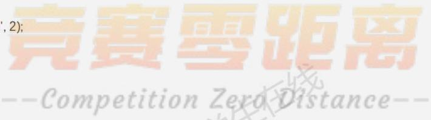

## 读取数据4

data\_raw2 = x1sread('均值3',4);

## 数据校正4

倾角数据

data\_gjsj = data\_raw2(50080:51120,:);
% 拟合直线
[P,S] = polyfit(data\_qjsj(:,1), data\_qjsj(:,2), 1);
data\_P(4,:) = P;
% 倾斜角度
data\_qxjd(4) = atand(P(1));
% 校正
arf = acot(-P(1));
arfbu = pi/2-arf;
ca = cos(arfbu + pi);
sa = sin(arfbu + pi);
A = [ca,-sa;sa,ca];
X = [data\_raw2(:,1)'; data\_raw2(:,2)'];
Y = A\*X;
data\_spsj4 = Y';
figure;
axis equal;
title(28');
xlabel('x');
ylabel('z’);
figure(10);
plot(Y(1,:), Y(2,:), 'LineWidth', 2);
hold on;

## 读取数据5

```javascript
data_raw2 = x1sread('均值3',5);
```

## 数据校正5

倾角数据

figure(21);
%第1段
plot(data\_spsj1(:,1), data\_spsj1(:,2));
hold on;
axis equal;
x = 35.3:0.1:37.5;
y = P(1)\*x + P(2);
plot(x,y);
% 第2段
data\_xd2 = [data\_spsj1(10222:48333,1), data\_spsj1(10222:48333,2)];
[xc,yc,R] = circfit(data\_xd2(:,1), data\_xd2(:,2));
% 交点
syms x y;

## 标注1

```matlab
[X, Y] = solve(y == P(1)*x + P(2), (x - xc)^2 + (y - yc)^2 == R^2, x < 38);
data_jd(1,:) = [double(X), double(Y)];
%第3段
data_xd3 = [data_spsj1(51143:60788,1), data_spsj1(51143:60788,2)];
[P,S] = polyfit(data_xd3(:,1), data_xd3(:,2), 1);
x = 45.5:0.1:49.5;
y = P(1)*x + P(2);
plot(x,y);
% 交点
syms x y;
[X, Y] = solve(y == P(1)*x + P(2), (x - xc)^2 + (y - yc)^2 == R^2, x > 44);
data_jd(2,:) = [double(X), double(Y)];
%第4段
data_xd5 = 49.1;
%交点
syms x y;
y = P(1)*49.1 + P(2);
data_jd(3,:) = [49.1, y]
% 第 5段
data_xd5 = [data_spsj1(69715:71797,1), data_spsj1(69715:71797,2)];
x = 49:0.01:50;
y = P(1)*x + P(2); -
plot(x,y);
% 交点
syms x y;
y = P(1)*49.1 + P(2);
data_jd(4,:) = [49.1, y];
% 第6段
data_xd6 = [data_spsj1(72059:72731,1), data_spsj1(72059:72731,2)];
```

```matlab
[P6,S] = polyfit(data_xd6(:,1), data_xd6(:,2), 1);
x = 49.8:0.01:50.4;
y = P6(1)*x + P6(2);
plot(x,y);
% 交点
syms x y;
[X, Y] = solve(y == P6(1)*x + P6(2), y == P(1)*x + P(2));
data_jd(5,:) = [double(X), double(Y)];
% 第7段
data_xd7 = [data_spsj1(73350:75437,1), data_spsj1(73350:75437,2)];
[P7,S] = polyfit(data_xd7(:,1), data_xd7(:,2), 1);
x = 50.2:0.01:51.2;
y = P7(1)*x + P7(2);
plot(x,y);
#在线
syms x y;
[X, Y] = solve(y == P6(1)*x + P6(2), y == P7(1)*x + P7(2));
data_jd(6,:) = [double(X), double(Y)];
%第8段
data_xd8 = [data_spsj1(76288:77579,1), data_spsj1(76288:77579,2)];
x = 50.9:0.01:51.3;
必
y = P8(1)*x + P8(2); -
plot(x,y);
% 交点
syms x y;
[X, Y] = solve(y == P8(1)*x + P8(2), y == P7(1)*x + P7(2)):
data_jd(7,:) = [double(X), double(Y)];
%第9段
data_xd9 = 51.26;
```

```matlab
y = P8(1)*51.26 + P8(2):
data_jd(8,:) = [data_xd9, y];
% 第 10段
% 交点
data_jd(9,:) = [51.26, -41.4];
% 角度
data_jiaoDu(1) = atand(P6(1));
data_jiaoDu(2) = atand(-P8(1));
% 线段长度
data_xdcd1(1) = data_jd(1,1) - data_spsj1(1,1);
data_xdcd1(2) = data_jd(2,1) - data_jd(1,1);
data_xdcd1(3) = data_jd(3,1) - data_jd(2,1);
data_xdcd1(4) = data_jd(3,2) - data_jd(4,2);
data_xdcd1(5) = data_jd(5,1) - data_jd(4,1);
data_xdcd1(6) = sqrt((data_jd(5,1) - data_jd(6,1))^2 + (data_jd(5,2) - data_jd(6,2))^2);
data_xdcd1(7) = data_jd(7,1) - data_jd(6,1);
data_xdcd1(8) = sqrt((data_jd(7,1) - data_jd(8,1))^2 + (data_jd(7,2) - data_jd(8,2))^2);
data_xdcd1(9) = data_jd(8,2) - data_jd(9,2);
% 圆弧长度
A = [xc yc R data_jd(1,1) data_jd(2,1)];
h = yuanhu(A(1),A(2),A(3),A(4),A(5));
必
data yhcdi=double(h);-
```

## 标注2

figure(22);
plot(data\_spsj2(:,1), data\_spsj2(:,2));
hold on;

## axis equal;

%第1段
data\_xd2 = [data\_spsj2(1:37370,1), data\_spsj2(1:37370,2)];
[xc,yc,R] = circfit(data\_xd2(:,1), data\_xd2(:,2));
% 第 2段
[P2,S] = polyfit(data\_xd2(:,1), data\_xd2(:2), 1);
x = 45:0.1:48.7;
y = P2(1)\*x + P2(2);
plot(x,y);
% 交点
syms x y;
[X, Y] = solve(y == P2(1)\*x + P2(2), (x - xc)^2 + (y - yc)^2 == R^2, x > 40);
data\_jd2(1,:) = [double(X), double(Y)];
% plot(data\_jd2(1,1),data\_jd2(1,2),'o');
% 第3段
data\_xd3 = 48.55;
% 交点
y = P2(1)\*48.55 + P2(2);
data\_jd2(2,:) = [48.55, y];
% plot(data\_jd2(2,1),data\_jd2(2,2),'o')
%第4段 -
data\_xd4 = [data\_spsj2(58240:60535,1), data\_spsj2(58240:60535,2)];
[P4,S] = polyfit(data\_xd4(:,1), data\_xd4(:,2), 1);
x = 48.4:0.01:49.6;
y = P4(1)\*x + P4(2);
plot(x,y);
% 交点
y = P4(1)\*48.55 + P4(2);

```matlab
data_jd2(3,:) = [48.55, y];
% plot(data_jd2(3,1),data_jd2(3,2),'o');
%第5段
data_xd5 = [data_spsj2(60770:61435,1), data_spsj2(60770:61435,2)]:
[P5,S] = polyfit(data_xd5(:,1), data_xd5(:,2), 1);
x = 49.3:0.01:49.9;
y = P5(1)*x + P5(2);
plot(x,y);
% 交点
syms x y;
[X, Y] = solve(y == P5(1)*x + P5(2), y == P4(1)*x + P4(2));
data_jd2(4,:) = [double(X), double(Y)];
% plot(data_jd2(4,1),data_jd2(4,2),'o');
%第6段
[P6,S] = polyfit(data_xd6(:,1), data_xd6(:,2), 1);
x = 49.6:0.01:50.62;
y = P6(1)*x + P6(2);
plot(x,y);
% 交点
syms x y; 音寒
[X, Y] = solve(y == P5(1)*x + P5(2), y == P6(1)*x + P6(2));
data jd2(5:) = [double(x), double(Y):
% plot(data_jd2(5,1),data_jd2(5,2),'o');
% 第 7段
data_xd7 = [data_spsj2(64783:66109,1), data_spsj2(64783:66109,2)];
[P7,S] = polyfit(data_xd7(:,1), data_xd7(:,2), 1);
x = 50.3:0.01:50.8;
y = P7(1)*x + P7(2);
plot(x,y);
```

$$
\mathsf { S y m s } \times \mathsf { y } ;
$$

## 标注3

```matlab
data_xdcd2(1) = data_jd3(1,1) - data_spsj3(1,1);
data_xdcd2(2) = data_jd3(2,1) - data_jd3(1,1);
data_xdcd2(3) = data_jd3(2,2) - data_jd3(3,2);
data_xdcd2(4) = data_jd3(4,1) - data_jd3(3,1);
data_xdcd2(5) = sqrt((data_jd3(5,1) - data_jd3(4,1))^2 + (data_jd3(5,2) - data_jd3(4,2))^2);
data_xdcd2(6) = data_jd3(6,1) - data_jd3(5,1);
data_xdcd2(7) = sqrt((data_jd3(7,1) - data_jd3(6,1))^2 + (data_jd3(7,2) - data_jd3(6,2))^2);
data_xdcd2(8) = data_jd3(7,2) - data_jd3(8,2);
%第4条
data_xd4 = [data_spsj3(61044:61860,1), data_spsj3(61044:61860,2)];
[P4,S] = polyfit(data_xd4(:,1), data_xd4(:,2), 1);
x = 47.1:0.01:47.7;
y = P4(1)*x + P4(2);
plot(x,y);
%第6条
data_xd6 = [data_spsj3(65026:66419,1), data_spsj3(65026:66419,2)];
[P6,S] = polyfit(data_xd6(:,1), data_xd6(:,2), 1);
x = 48.2:0.01:48.6;
y = P6(1)*x + P6(2);
plot(x,y);
%角度
data_jiaoDu3(1) = atand(P4(1));
data_jiaoDu3(2) = atand(-P6(1));
```

## 标注4

figure(24);
plot(data\_spsj4(:,1), data\_spsj4(:,2));
hold on;
axis equal;
%交点
data\_jd4(1,:) = [31.93, -33.83];
data\_jd4(2,:) = [40.89, -33.91];
data\_jd4(3,:) = [43.63, -33.93];
data\_jd4(4,:) = [43.84, -36.3];
data\_jd4(5,:) = [44.55, -36.43];
data\_jd4(6,:) = [45.03, -36.05];
data\_jd4(7,) = [45.68, -36.02]
data\_jd4(8,:) = [45.94, -36.33];
%第2段
data\_xd4 = [data\_spsj4(11386:47105,1), data\_spsj4(11386:47105,2)];
[xc,yc,R] = circfit(data\_xd4(:,1), data\_xd4(:,2));
%圆弧长度
A= 31440费
h = yuanhu(A(1),A(2),A(3),A(4),A(5));
data\_yhcd4 = double(h);
   
% 线段长度
plot(data\_jd4(:,1), data\_jd4(:,2), 'o');
data\_xdcd2(1) = 31.94 - data\_spsj4(1,1);
data\_xdcd2(2) = data\_jd4(2,1) - data\_jd4(1,1);

```javascript
plot(x,y);
```

%第6条

```matlab
data_xdcd2(3) = data_jd4(3,1) - data_jd4(2,1);
data_xdcd2(4) = data_jd4(3,2) - data_jd4(4,2);
data_xdcd2(5) = data_jd4(5,1) - data_jd4(4,1);
data_xdcd2(6) = sqrt((data_jd4(6,1) - data_jd4(5,1))^2 + (data_jd4(6,2) - data_jd4(5,2))^2);
data_xdcd2(7) = data_jd4(7,1) - data_jd4(6,1);
data_xdcd2(8) = sqrt((data_jd4(8,1) - data_jd4(7,1))^2 + (data_jd4(8,2) - data_jd4(7,2))^2);
data_xdcd2(9) = data_jd4(8,2) - (-37.82);
```

%第4条

```julia
data_xd4 = [data_spsj4(71055:71849,1), data_spsj4(71055:71849,2)];
```

```javascript
[P4,S] = polyfit(data_xd4(:,1), data_xd4(:,2), 1);
```

```javascript
x = 44.5:0.01:45.1;
```

```javascript
y = P4(1)*x + P4(2);
```

```javascript
plot(x,y);
```

data\_xd6 = [data\_spsj4(75137:76634,1), data\_spsj4(75137:76634,2)];

```javascript
[P6,S] = polyfit(data_xd6(:,1), data_xd6(:,2), 1);
```

```javascript
x = 45.5:0.01:46;
```

```javascript
y = P6(1)*x + P6(2);
```

% 角度

data\_jiaoDu4(2) = atand(-P6(1));

## 标注5

figure(25);

```javascript
plot(data_spsj5(:,1), data_spsj5(:,2));
```

```matlab
hold on;
axis equal;
% 交点
data_jd5(1,:) = [33.24, -36.49];
data_jd5(2,:) = [42.22, -36.57];
data_jd5(3,:) = [44.96, -36.63];
data_jd5(4,:) = [45.15, -38.99];
data_jd5(5,:) = [45.87, -39.11];
data_jd5(6,:) = [46.34, -38.73];
data_jd5(7,:) = [46.92, -38.69];
data_jd5(8,:) = [47.23, -39.01];
% 第2段
data_xd5 = [data_spsj5(8231:45402,1), data_spsj5(8231:45402,2)];
[xc,yc,R] = circfit(data_xd5(:,1), data_xd5(:,2));
%圆弧长度
A = [xc yc R 31.94 40.84];
h = yuanhu(A(1),A(2),A(3),A(4),A(5));
data_yhcd5 = double(h);
% 线段长度
plot(data_jd5(:,1), data_jd5(:,2), 'o');
data_xdcd2(1) = 33.24 - data_spsj5(1,1);
data_xdcd2(2) = data_jd5(2,1) - data_jd5(1,1);
data xdcd2(3) = data jd5(3.1)- data jd5(2.1)eD
data_xdcd2(4) = data_jd5(3,2) - data_jd5(4,2);
data_xdcd2(5) = data_jd5(5,1) - data_jd5(4,1);
data_xdcd2(6) = sqrt((data_jd5(6,1) - data_jd5(5,1))^2 + (data_jd5(6,2) - data_jd5(5,2))^2)
data_xdcd2(7) = data_jd5(7,1) - data_jd5(6,1);
data_xdcd2(8) = sqrt((data_jd5(8,1) - data_jd5(7,1))^2 + (data_jd5(8,2) - data_jd5(7,2))^2);
data_xdcd2(9) = data_jd5(8,2) - (-40.65);
%第4条
```

```matlab
data_xd5 = [data_spsj5(68834:69548,1), data_spsj5(68834:69548,2)]:
[P4,S] = polyfit(data_xd5(:,1), data_xd5(:,2), 1);
x = 45.8:0.01:46.4;
y = P4(1)*x + P4(2);
plot(x,y);
%第6条 在线
data_xd6 = [data_spsj5(72685:74264,1), data_spsj5(72685:74264,2)];
[P6,S] = polyfit(data_xd6(:,1), data_xd6(:,2), 1); 中国
x = 46.9:0.01:47.3;
y = P6(1)*x + P6(2);
plot(x,y);
%角度
data_jiaoDu3(1) = atand(P4(1));
data_jiaoDu3(2) = atand(-P6(1));
figure(15);
```

## 读取数据1

data\_raw2 = x1sread('均值3',1);
plot(data\_raw2(:,1), data\_raw2(:,2));
hold on; 克费
axis equal;
七在 -

## 读取数据2

```matlab
data_raw2 = x1sread('均值3',2);
plot(data_raw2(:,1), data_raw2(:,2));
hold on;
```

## 读取数据3

```matlab
data_raw2 = x1sread('均值3',3);
plot(data_raw2(:,1), data_raw2(:,2));
hold on;
```

## 读取数据4

```matlab
data_raw2 = x1sread('均值3',4);
plot(data_raw2(:,1), data_raw2(:,2));
hold on;
```

## 读取数据5

hold on;

tit1e('工件2五个局部轮廓线图')；

x1abel('x');

ylabe1('z');


data27 = x1sread('均值 3'， 3);
data27 = data27(1:70342,:);
data28 = x1sread('均值3'， 4);
data25 = x1sread('均值 3'，1);
data25 = data25(1:81041,:);
data26 = x1sread('均值3'，2);

```matlab
data26 = data26(1:69773,:);
data29 = x1sread('均值 3'， 5);
data29 = data29(1:78313,:);
data27 = [data27(:,1) - 2.16, data27(:,2) - 0.383];
figure(40);
```

## 数据校正27

倾角数据

```matlab
data_qjsj27 = [data27(39900:49400,:); data27(39880:49600,:)];
%拟合直线
[P,S] = polyfit(data_qjsj27(:,1), data_qjsj27(:,2), 1);
% 倾斜角度
data_qxjd27 = atand(P(1));
%校正
arf = acot(-P(1));
arfbu = pi/2-arf;
ca = cos(arfbu + pi);
sa = sin(arfbu + pi);
A = [ca,-sa;sa,ca];
X = [data27(:,1)'; data27(:,2)'];
Y = A*X; 在线
Y = [Y(1,:) - 0.56; Y(2,:) - 0.75];
plot(Y(1,:), Y(2,:), 'LineWidth', 2);
hold on;
axis equal;
```

```matlab
data_qjsj25 = [data25(39900+9802:49400+9802,:); data25(39880+9802:49600+9802,:)];
% 拟合直线 中国
[P,S] = polyfit(data_qjsj25(:,1), data_qjsj25(:,2), 1);
% 倾斜角度
data_qxjd25 = atand(P(1));
% 校正
arf = acot(-P(1));
```

## 数据校正 28

倾角数据

## 数据校正25

倾角数据

```matlab
arfbu = pi/2-arf;
ca = cos(arfbu + pi + pi/2);
sa = sin(arfbu + pi + pi/2);
A = [ca,-sa;sa,ca];
X = [data25(:,1)'; data25(:,2)'];
Y = A*X; 在线
[Y(1,:) - (42.15-31.9);Y(2,:) - (50.64+33.88)];
plot(Y(1,:), Y(2,:), 'LineWidth', 2);
hold on;
axis equal;
```

## 数据校正26

倾角数据 从

```matlab
data_qjsj26 = [data26(39845:48768,:); data26(39845:48768,:)];
% 拟合直线
% 倾斜角度
data_qxjd26 = atand(P(1));
% 校正
arf = acot(-P(1));
arfbu = pi/2-arf;
sa = sin(arfbu + pi + pi/2 + pi/2);
A = [ca,-sa;sa,ca];
X = [data26(:,1)'; data26(:,2)'];
Y = A*X;
Y = [Y(1,:) + (27.66+50.67);Y(2,:) - (39.15+47.83)];
plot(Y(1,:), Y(2,:), 'LineWidth', 2);
hold on;
```

# 数据校正29

## 倾角数据

data\_qjsj29 = [data29(47928:56852,:); data29(47928:56852,:)];
%拟合直线
   
[P,S] = polyfit(data\_qjsj29(:,1), data\_qjsj29(:,2), 1);
% 倾斜角度
data\_qxjd29 = atand(P(1));
% 校正
arf = acot(-P(1));
arfbu = pi/2-arf;
ca = cos(arfbu + pi + pi/2 + pi/2 + pi/2);
sa = sin(arfbu + pi + pi/2 + pi/2 + pi/2);
A = [ca,-sa;sa,ca];
X = [data29(:,1)'; data29(:,2)'];
Y = A\*X;
Y = [Y(1,:) + (45.88+36.48);Y(2,:) - (38.05-33.23) ];
plot(Y(1,:), Y(2,:), 'LineWidth', 2);
hold on;
axis equal;
title('按相同特征点拼接轮廓线图');
xlabel('x');
ylabel('z');

## 问题四程序

# 清理工作区

clear;clc;close;

## 圆线1

## 读取数据文件

file = 'data3圆'; 中国
data\_raw = xlsread(file, 1);
% plot(data\_raw(:,1), data\_raw(:,2));
% axis equal;
%取数据
data\_spzx = [data\_raw(1:9210, :); data\_raw(55250:end, :)];
%拟合直线线
%拟合与绘图
[P,S] = polyfit(data\_spzx(:,1), data\_spzx(:,2), 1);
x = min(data\_raw(:,1)):0.1:max(data\_raw(:,1));
y = P(1)\*x + P(2);
figure;
hold on;
xlabel('x'); 在线
ylabel(z');
title('倾斜拟合效果图'):
legend('拟合线','原数据');
%倾斜角度
data\_qxjd = atand(-P(1));
% 旋转
arf = acot(-P(1));

```matlab
file = 'data3 圆';
data_raw = xlsread(file, 2);
% plot(data_raw(:,1), data_raw(:,2));
% axis equal;
% 取数据
data_spzx = [data_raw(1:9210, :); data_raw(55250:end,
% 拟合直线 竞赛
%拟合与绘图 -
[P,S] = polyfit(data_spzx(:,1), data_spzx(:,2), 1);
x = min(data_raw(:,1)):0.1:max(data_raw(:,1));
y = P(1)*x + P(2);
figure;
hold on;
plot(x, y, data_raw(:,1), data_raw(:,2));
xlabel('x');
```

```matlab
arfbu = pi/2-arf;
ca = cos(arfbu + pi);
sa = sin(arfbu + pi);
A = [ca,-sa;sa,ca];
X = [data_raw(:,1)'; data_raw(:,2)'];
Y = A*X; 在线
% Y = [Y(1,:) - (37.56-36.95); Y(2,:) - 2.65 - 1.40];
% 绘图
figure(20);
plot(Y(1,:), Y(2,:));
```

## 圆线2

读取数据文件

```matlab
ylabel('z’);
title('倾斜拟合效果图');
legend('拟合线','原数据');
% 倾斜角度
data_qxjd = atand(-P(1));
% 旋转 在线
arf = acot(-P(1));
arfbu = pi/2-arf;
ca = cos(arfbu + pi);
sa = sin(arfbu + pi);
A = [ca,-sa;sa,ca];
X = [data_raw(:,1)'; data_raw(:2)'];
Y = A*X;
% 绘图
hold on;
plot(Y(1,:), Y(2,:));
```

## 圆线3

读取数据文件


```matlab
file = 'data3 圆';
data_raw = xlsread(file, 3);
% plot(data_raw(:,1), data_raw(:,2));
% axis equal;
% 取数据
data_spzx = [data_raw(1:9210, :); data_raw(55250:end, :)];
%拟合直线
```

% 拟合与绘图
[P,S] = polyfit(data\_spzx(:,1), data\_spzx(:,2), 1);
x = min(data\_raw(:,1)):0.1:max(data\_raw(:,1));
y = P(1)\*x + P(2);
figure;
hold on;
plot(x, y, data\_raw(:,1), data\_raw(:,2));
xlabel(x);
ylabel('z');
title('倾斜拟合效果图');
legend('拟合线','原数据');
% 倾斜角度
data\_qxjd = atand(-P(1));
% 旋转
arf = acot(-P(1));
arfbu = pi/2-arf;
ca = cos(arfbu + pi);
sa = sin(arfbu + pi);
A = [ca,-sa;sa,ca];
X = [data\_raw(:,1)'; data\_raw(:2)'];
Y = A\*X; 音
% Y = [Y(1,:) - (37.04-36.98); Y(2,:) - -1.036 - 1.334
%绘图 必 -
figure(20);
hold on;
plot(Y(1,:), Y(2,:));
axis equal;
xlabel('x');
ylabel('z');
title('局部圆数据倾斜校正图')

```matlab
file = 'data3 圆';
data_raw = xlsread(file, 1); 中国
% plot(data_raw(:,1), data_raw(:,2));
% axis equal;
% 取数据
data_spzx = [data_raw(1:9210, :); data_raw(55250:end, :)];
%拟合与绘图
[P,S] = polyfit(data_spzx(:,1), data_spzx(:,2), 1);
x = min(data_raw(:,1)):0.1:max(data_raw(:,1));
y = P(1)*x + P(2);
% 倾斜角度
data_qxjd = atand(-P(1)); 竞赛
%旋
arf = acot(-P(1)); -
arfbu = pi/2-arf;
ca = cos(arfbu + pi); 中国
sa = sin(arfbu + pi);
A = [ca,-sa;sa,ca];
X = [data_raw(:,1)'; data_raw(:,2)'];
Y = A*X;
Y = [Y(1,:) - (37.56-36.95); Y(2,:) - 2.65 - 1.40];
```

## 圆线1

读取数据 文件

```matlab
Y1 = Y
% 绘图
figure(21);
plot(Y(1,:), Y(2,:));
```

## 圆线2

## 读取数据文件

```matlab
file = 'data3 圆';
data_raw = xlsread(file, 2);
% plot(data_raw(:,1), data_raw(:,2));
% axis equal;
% 取数据
data_spzx = [data_raw(1:9210, :); data_raw(55250:end, :)];
```

```matlab
Y2 = Y;
% 绘图
figure(21);
hold on;
plot(Y(1,:), Y(2,:));
```

## 圆线3

读取数据文件

```matlab
file = 'data3圆';
data_raw = xlsread(file, 3);
% plot(data_raw(:,1), data_raw(:,2));
% axis equal;
%取数据
data_spzx = [data_raw(1:9210, :); data_raw(55250:end, :)];
%拟合直线
% 拟合与绘图
[P,S] = polyfit(data_spzx(:,1), data_spzx(:,2), 1);
x = min(data_raw(:,1)):0.1:max(data_raw(:,1));
y = P(1)*x + P(2);
%倾斜角度
% 旋转
arf = acot(-P(1));
arfbu = pi/2-arf;
ca = cos(arfbu + pi);
sa = sin(arfbu + pi);
A = [ca,-sa;sa,ca];
```

```matlab
X = [data_raw(:,1)'; data_raw(:,2)']:
Y = A*X;
Y = [Y(1,:) - (37.04-36.98); Y(2,:) - -1.036 - 1.334];
Y3 = Y;
% 绘图
hold on;
plot(Y(1,:), Y(2,:));
axis equal;
xlabel('x');
ylabel('z’);
title('局部圆数据倾斜校正平移图');
```

## 拟合圆弧

```matlab
c = Y1(:,13055:54355)';
figure(21);
[xc,yc,R,a] = circfit(c(:,1), c(:,2));
R1 = R;
yc1 = yc; xc1 = xc; 竞赛
plot(xc,yc, 'x');
c = Y2(:,13055:54355)';
figure(21);
[xc,yc,R,a] = circfit(c(:,1), c(:,2));
R2 = R;
xc2 = xc;
yc2 = yc;
plot(xc,yc,'x');
```

```matlab
c = Y3(:,13055:54355)';
figure(21);
[xc,yc,R,a] = circfit(c(:,1), c(:,2));
R3 = R;
xc3 = xc;
yc3 = yc;线
plot(xc,yc,'x');
% 槽口宽度
data_ckkd1 = 45.78 - 36.99;
data_ckkd2 = 45.77 - 36.97;
data_ckkd3 = 45.76 - 36.91;
data_ckkd = (data_ckkd1+data_ckkd2+data_ckkd3)/3
% 平均半径
data_r = (R1+R2+R3)/3
%圆弧长度
```

圆弧的长度1

```matlab
A1=[xc1, yc1, R1, 36.91, 45.76];
```

## 圆弧的长度2

```matlab
A2=[xc2, yc2, R2, 36.91, 45.76];
h2 = yuanhu(A2(1),A2(2),A2(3),A2(4),A2(5));
data_yhcd2 = double(h2);
```

```matlab
file = 'data4 角';
data_raw = xlsread(file, 1);
% plot(data_raw(:,1), data_raw(:,2));
% axis equal;
% 取数据
data_spzx = data_raw(1:9210, :);
%拟合直线
x = min(data_raw(:,1)):0.1:max(data_raw(:,1));
y = P(1)*x + P(2);
figure(15);
hold on;
plot(x, y, data_raw(:,1), data_raw(:,2));
xlabel('x');
ylabel('z');
title('倾斜拟合效果图');
```

## 圆弧的长度3

```matlab
A3=[xc3, yc3, R3, 36.91, 45.76];
h3 = yuanhu(A3(1),A3(2),A3(3),A3(4),A3(5));
data_yhcd3 = double(h3);
学
%平均弧长
data_pjhc = (data_yhcd1+data_yhcd2+data_yhcd3)/3 国
```

## 角线1

## 读取数据文件

```matlab
legend('拟合线','原数据');
%倾斜角度
data_qxjd = atand(-P(1));
% 旋转
arf = acot(-P(1));
arfbu = pi/2-arf;
ca = cos(arfbu + pi);
sa = sin(arfbu + pi);
A = [ca,-sa;sa,ca];
X = [data_raw(:,1)'; data_raw(:,2)'];
Y = A*X;
% 绘图
figure(28);
plot(Y(1,:), Y(2,:));
```

## 角线2

读取数据 文件

```matlab
file = 'data4 角';
data_raw = xlsread(file, 2);
% plot(data_raw(:,1), data_raw(:,2));
% axis equal; -
%取数据
data_spzx = data_raw(1:9210, :);
% 拟合直线
% 拟合与绘图
[P,S] = polyfit(data_spzx(:,1), data_spzx(:,2), 1);
x = min(data_raw(:,1)):0.1:max(data_raw(:,1));
y = P(1)*x + P(2);
```

```matlab
figure(16);
hold on;
plot(x, y, data_raw(:,1), data_raw(:,2));
xlabel('x');
ylabel('z');
title('倾斜拟合效果图');
legend('拟合线，'原数据');
%倾斜角度
data_qxjd = atand(-P(1));
% 旋转
arf = acot(-P(1));
arfbu = pi/2-arf;
ca = cos(arfbu + pi);
sa = sin(arfbu + pi);
A = [ca,-sa;sa,ca];
X = [data_raw(:,1)'; data_raw(:,2)'];
Y = A*X;
% 绘图
figure(28);
hold on;
plot(Y(1,:), Y(2,:));
```

## 角线3

## 读取数据文件

```matlab
file = 'data4 角';
data_raw = xlsread(file, 3);
% plot(data_raw(:,1), data_raw(:,2));
% axis equal;
% 取数据
```

data\_spzx = data\_raw(1:9210, :);
% 拟合直线
% 拟合与绘图
[P,S] = polyfit(data\_spzx(:,1), data\_spzx(:,2), 1);
x = min(data\_raw(:,1)):0.1:max(data\_raw(:,1));
y = P(1)\*x + P(2);
figure(17);
hold on;
plot(x, y, data\_raw(:,1), data\_raw(:,2));
xlabel('x');
ylabel('z');
title('倾斜拟合效果图');
legend('拟合线','原数据');
%倾斜角度
X
data\_qxjd = atand(-P(1));
%旋转
arf = acot(-P(1));
arfbu = pi/2-arf;
ca = cos(arfbu + pi);
sa = sin(arfbu + pi);
A = [ca,-sa;sa,ca];
X = [data\_raw(:,1)'; data\_raw(:2)']
Y = A\*X;
%绘图
figure(28);
hold on;
plot(Y(1,:), Y(2,:));
axis equal;
xlabel('x');
ylabel('z');

## 角线1

读取数据文件

读取数据文件
file = 'data4 角';
data\_raw = xlsread(file, 2);
% 取数据
data\_spzx = data\_raw(1:9210, :);
% 拟合直线
% 拟合与绘图
[P,S] = polyfit(data\_spzx(:,1), data\_spzx(:,2), 1);
区
x = min(data\_raw(:,1)):0.1:max(data\_raw(:,1));
y = P(1)\*x + P(2);
%倾斜角度
data\_gxjd = atand(-P(1));
%旋转
arf = acot(-P(1));
arfbu = pi/2-arf;
ca = cos(arfbu + pi);
sa = sin(arfbu + pi);
A = [ca,-sa;sa,ca];
X = [data\_raw(:,1)'; data\_raw(:,2)'];
Y = A\*X;
% 绘图
figure(29);
hold on;

## 角线2

## 角线3

## 读取数据文件

file = 'data4 角';
data\_raw = xlsread(file, 3);
% plot(data\_raw(:,1), data\_raw(:,2));
% axis equal;
% 取数据
data\_spzx = data\_raw(1:9210, :);
% 拟合直线
% 拟合与绘图
[P,S] = polyfit(data\_spzx(:,1), data\_spzx(:,2), 1);
x = min(data\_raw(:,1)):0.1:max(data\_raw(:,1));
y = P(1)\*x + P(2);
% 倾斜角度
data\_qxjd = atand(-P(1));
% 旋转
arf = acot(-P(1));
arfbu = pi/2-arf;
ca = cos(arfbu + pi):
必
sa = sin(arfbu + pi);
A = [ca,-sa;sa,ca];
X = [data\_raw(:,1)'; data\_raw(:,2)'];
Y = A\*X;
Y = [Y(1,:) + 49.63 - 49.65; Y(2,:) - (3.363 - 3.566)];
% 绘图
figure(29);
hold on;

plot(Y(1.:), Y(2,:));

axis equal;

xlabel(x’);

ylabel(z’);

title('局部角数据倾斜校正平移图');

## 线1

$$
\mathsf { d a t a \mathrm { _ { - } 1 ( 1 , : ) ~ = ~ \left[ 4 6 , 4 9 ~ - 0 , 8 5 7 4 \right] ; } }
$$

$$
\mathsf { d a t a \mathrm { _ { - } 1 ( 2 , : ) \ = \ \left[ 4 8 . 5 \ - 0 . 8 5 6 7 \right] ; } }
$$

$$
\mathsf { d a t a \_ 1 ( 3 , : ) \ = \ } [ 4 8 . 7 8 \ - 1 . 0 0 8 ] ;
$$

$$
\mathsf { d a t a \_ 1 ( 4 , : ) } \ = \ \left[ 4 8 . 8 7 \ - 3 . 2 2 8 \right] ;
$$

$$
\mathsf { d a t a \mathrm { \bf { a } _ { - } 1 ( 5 , : ) } ~ = ~ [ 4 9 . 6 2 ~ - 3 . 3 6 8 ] ; }
$$

$$
\mathsf { d a t a \mathrm { _ { - } 1 ( 6 , : ) } = [ 5 0 . 0 2 - 2 . 9 9 3 ] ; }
$$

$$
\mathsf { d a t a \_ 1 ( 7 , : ) \ = \ } [ 5 0 . 6 7 \ - 2 . 9 7 9 ] ;
$$

$$
\mathsf { d a t a \mathrm { \bf { a } _ { - } 1 ( 8 , : ) } ~ = ~ [ 5 0 \mathrm { \bf { . 9 } 2 ~ - 3 \mathrm { \bf { . 1 9 } 4 ] } ; } }
$$

$$
\mathsf { d a t a \_ 1 ( 9 , : ) \ = \ } [ 5 0 \mathrm { ~ . 9 3 ~ } - 4 \mathrm { ~ . 9 4 4 } ] \mathrm { ~ ; }
$$

## 线2

$$
\mathsf { d a t a \_ 2 ( 1 , : ) } \ = \ \left[ 4 6 . 6 1 \ - 0 . 8 2 9 \right] ;
$$

data 2(2,[48.25 0.80 ZexD--

$$
\mathsf { d a t a \_ 2 ( 3 , : ) } \ = \ \left[ 4 8 \mathrm { { \small \sf ~ - 1 } } \mathrm { { \small \sf ~ . 0 0 9 } } \right] ;
$$

$$
\mathsf { d a t a \_ 2 ( 4 , : ) } \ = \ \left[ 4 8 . 8 9 \ - 3 . 2 5 7 \right] ;
$$

$$
\mathsf { d a t a \_ 2 ( 5 , : ) } \ = \ \left[ 4 9 . 6 3 \ - 3 . 3 6 1 \right] ;
$$

$$
\mathsf { d a t a \_ 2 ( 6 , : ) \ = \ } \left[ 5 0 . 0 1 \ - 2 . 9 9 6 \right] ;
$$

$$
\mathsf { d a t a \mathrm { \bf _ { - } 2 ( 7 , : ) } = [ } 5 0 . 6 8 - 2 . 9 8 4 ] ;
$$

$$
\mathsf { d a t a \_ 2 ( 8 , : ) \ = \ } \left[ 5 0 \mathrm { ~ . 9 5 ~ } - 3 \mathrm { ~ . 1 7 9 } \right] ;
$$

$$
\mathsf { d a t a \_ 2 ( 9 , : ) \ = \ } \left[ 5 0 . 9 5 \ - 4 . 9 5 \right] ;
$$

## 线3

$$
\mathsf { d a t a \mathrm { _ { - } 3 ( 1 , : ) \ = \ \left[ 4 6 \mathrm { \ . \ 5 6 \mathrm { \ - 0 \mathrm { \ . 8 6 0 4 } }  ; } } }\right]
$$

$$
\mathsf { d a t a \_ 3 ( 2 , : ) \ = \ } \left[ 4 8 \mathrm { ~ . 5 4 ~ \_ } 0 . 8 5 7 1 \right] ;
$$

$$
\mathsf { d a t a \_ 3 ( 3 , : ) \ = \ } [ 4 8 . 7 9 \ - 0 . 9 9 8 8 ] ;
$$

$$
\mathrm { d a t a \_ 3 ( 4 , : ) ~ = ~ [ 4 8 , 9 1 ~ - 3 , 2 7 3 ] ; }
$$

$$
\mathrm { d a t a \_ 3 ( 5 , : ) ~ = ~ [ 4 9 . 6 4 ~ - 3 . 3 5 7 ] ; }
$$

$$
\mathsf { d a t a \_ 3 ( 6 , : ) \ = \ } \left[ 5 0 \_ 0 3 \ - 2 \_ 9 9 \right] ;
$$

$$
\mathsf { d a t a \mathrm { ~  ~ 3 ( 7 , : ) ~ } } = \left[ 5 0 . 6 9 - 2 . 9 8 4 \right] ;
$$

$$
\mathrm { d a t a \_ 3 ( 8 , : ) ~ = ~ [ 5 0 \_ 9 7 ~ - 3 \cdot 2 2 7 ] ; }
$$

$$
\mathrm { d a t a \_ 3 ( 9 , : ) \ = \ \left[ 5 0 \ : . 9 4 \ : - 4 \ : . 9 3 9 \right] ; }
$$

## 线1线段长度

$$
\mathsf { d a t a \mathrm { \bf { a } _ { - } \times 1 ( 1 ) } } \ = \ \mathsf { d a t a \mathrm { \bf { . } _ { - } 1 ( 2 , 1 ) } } \ \mathrm { \bf { ~ - } ~ } \mathsf { d a t a \mathrm { \bf { . } _ { - } 1 ( 1 , 1 ) } } ;
$$

$$
\mathrm { d a t a \_ x l ( 2 ) ~ = ~ s q r t ( ( d a t a \_ 1 ( 3 , 1 ) ~ - ~ d a t a \_ 1 ( 2 , 1 ) ) ^ { \wedge 2 } ~ + ~ ( d a t a \_ 1 ( 3 , 2 ) ~ - ~ d a t a \_ 1 ( 2 , 2 ) ) \wedge 2 ) ; }
$$

$$
\mathsf { d a t a \_ x 1 } ( 3 ) \ = \ \mathsf { d a t a \_ 1 } ( 3 , 2 ) \ \mathsf { \ - \ d a t a \_ 1 } ( 4 , 2 ) ;
$$

$$
\mathsf { d a t a \_ x 1 } ( 4 ) \ = \ \mathsf { d a t a \_ 1 } ( 5 , 1 ) \ \mathsf { \ - \ d a t a \_ 1 } ( 4 , 1 ) ;
$$

$$
\mathrm { d a t a \_ x l ( 5 ) } ~ = ~ s q r t ( ( \mathrm { d a t a \_ 1 ( 6 , 1 ) ~ } \cdot ~ \mathrm { d a t a \_ 1 ( 5 , 1 ) } ) \wedge 2 ~ + ~ ( \mathrm { d a t a \_ 1 ( 6 , 2 ) ~ } \cdot ~ \mathrm { d a t a \_ 1 ( 5 , 2 ) } ) \wedge 2 ) ;
$$

$$
\mathsf { d a t a \_ x 1 } ( 6 ) = \mathsf { d a t a \_ 1 } ( 7 , 1 ) \mathsf { \Lambda } _ { 7 } \mathsf { d a t a \_ 1 } ( 6 , 1 ) ;
$$

$$
\mathrm { d a t a \_ x i ( 7 ) ~ = ~ s q r t ( ( d a t a \_ 1 ( 8 , 1 ) ~ - ~ d a t a \_ 1 ( 7 , 1 ) ) \times 2 ~ + ~ ( d a t a \_ 1 ( 8 , 2 ) ~ - ~ d a t a \_ 1 ( 7 , 2 ) ) \times 2 ) ; }
$$

$$
\mathsf { d a t a \_ x 1 } ( 8 ) \ = \ \mathsf { d a t a \_ 1 } ( 8 , 2 ) \ \cdot \ \mathsf { d a t a \_ 1 } ( 9 , 2 ) ;
$$

## 线2线段长度

$$
\mathsf { d a t a \_ x 2 ( 1 ) \ = d a t a \_ 2 ( 2 , 1 ) \ - d a t a \_ 2 ( 1 , 1 ) ; }
$$

$$
\mathrm  { d a t a } \mathrm  { a } \mathrm { { a } \mathrm { { a } \mathrm { { a } \mathrm { { a } \mathrm { { a } \mathrm { { a } \mathrm { { a } \Lambda ^ { 2 } ( 2 ) } =  s q r t { c ( ( d a t a \mathrm { { a } \mathrm { { a } \mathrm { { a } \mathrm { { a } \mathrm { { a } \mathrm { { a } } \mathrm { { 2 } ( 3 , 1 ) \mathrm { { } \Lambda ^ { 2 } ) } \mathrm { { \Lambda ^ { 2 } + ( d a t a \mathrm { { } a _ { { a } \mathrm { { a } 2 ( 2 , 2 ) \Lambda ) \Lambda ^ { 2 } ) \Lambda ^ { 3 } \mathrm { { \Lambda } \mathrm { { + } \Lambda \mathrm { { { } ( d a t a \mathrm { { } { a } \mathrm { { a } , 2 ( 2 , 2 ) \Lambda ) \Lambda ^ { 2 } ) \Lambda \mathrm { { { } ; } } } } } } } } } } } } } } } } } } } } } } } } } }
$$

$$
\mathsf { d a t a \_ x } 2 ( 3 ) \ = \ \mathsf { d a t a \_ } 2 ( 3 , 2 ) \ - \ \mathsf { d a t a \_ } 2 ( 4 , 2 ) ;
$$

$$
\mathsf { d a t a \_ x 2 ( 4 ) \ = d a t a \_ 2 ( 5 , 1 ) \_ d a t a \_ 2 ( 4 , 1 ) ; }
$$

$$
\mathrm { { d a t a } \mathrm { { A } 2 ( 5 ) \ = \ 5 q r t { ( ( d a t a . } 2 ( 6 , 1 ) \mathrm { ~ - ~ } d a t a . } 2 ( 5 , 1 ) ) ^ { \wedge 2 } \mathrm { ~ + ~ } ( d a t a . } 2 ( 6 , 2 ) \mathrm { ~ - ~ } d a t a .  2 ( 5 , 2 ) ) \wedge 2 ) ;
$$

$$
\mathsf { d a t a \_ x 2 ( 6 ) \ = d a t a \_ 2 ( 7 , 1 ) \_ d a t a \_ 2 ( 6 , 1 ) ; }
$$

$$
\mathrm { { d a t a } . \mathrm { { x 2 } \mathrm { { ( 7 ) } \Omega = \ s q r t { ( ( d a t a . . . 2 ( 8 , 1 ) \hbar \Omega - \ d a t a . . . 2 ( 7 , 1 ) ) \wedge 2 \Omega + ( d a t a . . . 2 ( 8 , 2 ) \hbar \Omega - \ d a t a . . 2 ( 7 , 2 ) ) \wedge 2 ) ; } } } }
$$

$$
\mathsf { d a t a \_ x } 2 ( 8 ) \ = \ \mathsf { d a t a \_ } 2 ( 8 , 2 ) \ - \ \mathsf { d a t a \_ } 2 ( 9 , 2 ) ;
$$

## 线3线段长度

$$
\mathsf { d a t a \_ x 3 ( 1 ) } \ = \ \mathsf { d a t a \_ 3 ( 2 , 1 ) } \ \mathsf { \ - d a t a \_ 3 ( 1 , 1 ) } ;
$$

$$
\begin{array} { r } { \mathrm { d a t a \_ x 3 ( 2 ) } ~ = ~ { \operatorname { s q r t } } ( ( \mathrm { d a t a \_ 3 ( 3 , 1 ) } ~ - ~ \mathrm { d a t a \_ 3 ( 2 , 1 ) } ) \wedge 2 ~ + ~ ( \mathrm { d a t a \_ 3 ( 3 , 2 ) } ~ - ~ \mathrm { d a t a \_ 3 ( 2 , 2 ) } ) \wedge 2 ) ; } \end{array}
$$

$$
\mathsf { d a t a \_ x 3 ( 3 ) \ = d a t a \_ 3 ( 3 , 2 ) \_ d a t a \_ 3 ( 4 , 2 ) ; }
$$

$$
\mathsf { d a t a \_ x 3 ( 4 ) \ = d a t a \_ 3 ( 5 , 1 ) \_ d a t a \_ 3 ( 4 , 1 ) ; }
$$

$$
\operatorname { d a t a } _ { - } \mathbf { x } 3 ( 5 ) = 5 \mathsf { q r t } ( ( \mathsf { d a t a } _ { - } 3 ( 6 , 1 ) \cdot \mathsf { \Gamma } \mathsf { d a t a } _ { - } 3 ( 5 , 1 ) ) \wedge 2 \ + \ ( \mathsf { d a t a } _ { - } 3 ( 6 , 2 ) \cdot \mathsf { \Gamma } \mathsf { d a t a } _ { - } 3 ( 5 , 2 ) ) \wedge 2 ) ;
$$

$$
\mathsf { d a t a \mathrm { \bf ~ \ x } 3 ( 6 ) \ = \ d a t a \mathrm { \bf ~ \mathrm { \bf ~ 3 ( 7 , 1 ) ~ \mathrm { \bf ~ - ~ \ d a t a \mathrm { \bf ~ \mathrm { - 3 ( 6 , 1 ) } ; } } } } }
$$

$$
\mathrm { d a t a \_ x 3 ( 7 ) ~ = ~ s q r t ( ( d a t a \_ 3 ( 8 , 1 ) ~ - ~ d a t a \_ 3 ( 7 , 1 ) ) \times 2 ~ + ~ ( d a t a \_ 3 ( 8 , 2 ) ~ - ~ d a t a \_ 3 ( 7 , 2 ) ) \times 2 ) ; }
$$

$$
\mathtt { d a t a \_ x 3 ( 8 ) } \ = \ \mathtt { d a t a \_ 3 ( 8 , 2 ) } \ - \ \mathtt { d a t a \_ 3 ( 9 , 2 ) } ;
$$

## 线段平均值

$$
\mathsf { d a t a \mathrm { _ { - } x d c d p j \mathsfit { z } } = \mathsf { _ { \ell } ( d a t a \mathrm { _ { - } x \mathrm { _ { 1 } ~ + ~ } d a t a \mathrm { _ { - } x \mathrm { _ { 2 } ~ + ~ } d a t a \mathrm { _ { - } x \mathrm { _ { 3 } ) \mathrm { _ { \cdot } / 3 \mathrm { ; } } } } } } } }
$$

$$
\mathcal { C } o m p e t i t i o n \ Z e x o \mathcal { D } i s t a n c e \mathrm { - }
$$

## 直线夹角

$$
\mathrm { d a t a \mathrm { _ { - } z x i j \mathrm { 1 ( 1 ) \ = \ } a t a n d ( - ( d a t a \mathrm { _ { - } 1 ( 3 \cdot 2 ) \mathrm { ~ - \ d a t a \mathrm { _ { - } 1 ( 2 \cdot 2 ) ) \mathrm { ~ / ~ \ ( d a t a \mathrm { _ { - } 1 ( 3 \cdot 1 ) \mathrm { ~ - \ d a t a \mathrm { _ { - } 1 ( 2 \cdot 1 ) ) ) \ ; } } } } } } } } }
$$

$$
\mathrm { d a t a \mathrm { _ { - } z x i j \mathrm { 1 ( 2 ) \ = \ a t a n d ( ( d a t a \mathrm { _ { - } 1 ( 6 \ , 2 ) \ - \ d a t a \mathrm { _ { - } 1 ( 5 \ , 2 ) ) \ / \ ( \ d a t a \mathrm { _ { - } 1 ( 6 \ , 1 ) \ - \ d a t a \mathrm { _ { - } 1 ( 5 \ , 1 ) ) ) ; } } } } } } }
$$

$$
\mathrm { d a t a \mathrm { _ { - } z x i j \mathrm { 1 ( 3 ) \ = \ } a t a n d ( - ( d a t a \mathrm { _ { - } 1 ( 8 , 2 ) \ - \ d a t a \mathrm { _ { - } 1 ( 7 , 2 ) ) \ / \ ( d a t a \mathrm { _ { - } 1 ( 8 , 1 ) \ - \ d a t a \mathrm { _ { - } 1 ( 7 , 1 ) ) ) ; } } } } } }
$$

$$
\mathrm { d a t a \_ z x i j 2 ( 1 ) \ = \ a t a n d ( - ( d a t a \_ 2 ( 3 , 2 ) \ - \ d a t a \_ 2 ( 2 , 2 ) ) \ / \ ( d a t a \_ 2 ( 3 , 1 ) \ - \ d a t a \_ 2 ( 2 , 1 ) ) ) ; }
$$

$$
\mathrm { { d a t a \_ z x i j j 2 ( 2 ) \ = \ a t a n d ( ( d a t a \_ 2 2 ( 6 \cdot 2 ) \ - \ d a t a \_ 2 ( 5 \cdot 2 ) ) \ / \ ( d a t a \_ 2 ( 6 \cdot 1 ) \ - \ d a t a \_ 2 ( 5 \cdot 1 ) ) ) ; } }
$$

$$
\mathrm { d a t a \_ z x i j 2 ( 3 ) \ = \ a t a n d ( - ( d a t a \_ 2 ( 8 , 2 ) \_ ~ - ~ d a t a \_ 2 ( 7 , 2 ) ) \ ~ / ~ \ ( d a t a \_ 2 ( 8 , 1 ) \ - \ d a t a \_ 2 ( 7 , 1 ) ) } ) ;
$$

$$
\mathrm { d a t a \mathrm { \mathrm { z e x j } j 3 ( 1 ) \ = \ a t a n d ( - ( d a t a \mathrm { z } \mathrm { \mathrm { . } 3 ( 3 , 2 ) \ - \ d a t a \mathrm { . } \mathrm { . } 3 ( 2 , 2 ) ) \ / \ ( d a t a \mathrm { . } 3 ( 3 , 1 ) \ - \ d a t a \mathrm { . } \mathrm { . } 3 ( 2 , 1 ) ) } \} } }
$$

$$
\mathrm { { d a t a \_ z x i j j 3 ( 2 ) \ = \ a t a n d ( ( d a t a \_ 3 ( 6 , 2 ) \ - \ d a t a \_ 3 ( 5 , 2 ) ) \ / \ ( \ d a t a \_ 3 ( 6 , 1 ) \ - \ d a t a \_ 3 ( 5 , 1 ) ) ) ; } }
$$

$$
\mathrm { d a t a \_ z x i j j 3 ( 3 ) = \ a t a n d ( - ( d a t a \_ 3 ( 8 , 2 ) \_ ~ - ~ d a t a \_ 3 ( 7 , 2 ) ) ~ / ~ \ ( d a t a \_ 3 ( 8 , 1 ) \_ ~ - ~ d a t a \_ 3 ( 7 , 1 ) ) } ) ;
$$

$$
\mathrm { d } { \mathsf { a t a } } _ { - } z { \mathsf { x j } } { \mathsf { j p j } } z = ( \mathsf { d } { \mathsf { a t a } } _ { - } z { \mathsf { x j } } { \mathsf { j } } { \mathsf { 1 } } + \mathsf { d } { \mathsf { a t a } } _ { - } z { \mathsf { x j } } { \mathsf { j } } 2 + \mathsf { d } { \mathsf { a t a } } _ { - } z { \mathsf { x j } } { \mathsf { j } } 3 ) . 7 { \mathsf { 3 } } ;
$$

## h1/16

$$
\mathsf { h } \mathsf { 1 } _ { - } \mathsf { 1 } = \mathsf { d } \mathsf { a t a } _ { - } \mathsf { 1 } ( 6 , 2 ) - \mathsf { d } \mathsf { a t a } _ { - } \mathsf { 1 } ( 5 , 2 ) ;
$$

$$
\mathsf { h } \mathsf { 1 } _ { - } \mathsf { 2 } = \mathsf { d } \mathsf { a t a } _ { - } 2 ( 6 , 2 ) - \mathsf { d } \mathsf { a t a } _ { - } 2 ( 5 , 2 ) ;
$$

$$
\mathsf { h } \mathsf { 1 } _ { - } 3 = \mathsf { d } \mathsf { a t a } _ { - } 3 ( 6 , 2 ) - \mathsf { d } \mathsf { a t a } _ { - } 3 ( 5 , 2 ) ;
$$

$$
{ \mathsf { h } } 1 _ { - } { \mathsf { p } } { \mathsf { j } } z = ( { \mathsf { h } } 1 _ { - } 1 + { \mathsf { h } } 1 _ { - } 2 + { \mathsf { h } } 1 _ { - } 3 ) . / 3 ;
$$


$$
\mathsf { d a t a \_ l 2 \_ 1 } = \mathsf { d a t a \_ 1 } ( 3 , 1 ) \ - \ \mathsf { d a t a \_ 1 } ( 2 , 1 ) ;
$$

$$
\mathsf { d a t a \mathrm { _ { - } } } \mathsf { l } \mathsf { _ { 2 - 2 } } = \mathsf { d a t a \mathrm { _ { - } } } \mathsf { 2 } ( 3 , 1 ) \mathsf { _ { - } } \mathsf { d a t a \mathrm { _ { - } } } \mathsf { 2 } ( 2 , 1 ) \mathsf { ; }
$$

$$
\mathsf { d a t a \mathrm { _ { - } } \mathrm { 1 2 \_ 3 } } = \mathsf { d a t a \mathrm { _ { - } } \mathrm { 3 } } ( 3 , 1 ) - \mathsf { d a t a \mathrm { _ { - } } \mathrm { 3 } } ( 2 , 1 ) ;
$$

$$
\mathsf { d a t a \_ l 2 \_ p j } z = ( \mathsf { d a t a \_ l 2 \_ 1 } \mathsf { d a t a \_ l 2 \_ 2 } \mathsf { d a t a \_ l 2 } \mathsf { d a } \mathsf { t a \_ l 2 } \mathsf { d a } \mathsf { t a \_ l 2 } \mathsf { _ { \_ 1 2 } } \mathsf { \_ { 3 } } ) . / 3 ;
$$


$$
\mathsf { d a t a \_ l 3 _ { - } } 1 = - \mathsf { d a t a \_ l } ( 3 , 2 ) - \mathsf { - d a t a \_ l } ( 2 , 2 ) ;
$$

$$
\tt d a t a \mathrm { \LARGE 1 3 _ { - } 2 \ = \ - d a t a \Li 2 ( 3 , 2 ) \ L \ - \ d a t a \ L 2 ( 2 , 2 ) \ L \Psi }
$$

$$
\tt d a t a \mathrm { \tiny { - 1 } } 3 \_ 3 \ = \ - \tt d a t a \mathrm { \tiny { - 3 } } ( 3 , 2 ) \ - \ - \tt d a t a \mathrm { \tiny { - 3 } } ( 2 , 2 ) \ ;
$$

data\_13\_pjz = (data\_13\_1+data\_13\_2+data\_13\_3)./3;


$$
\mathsf { d a t a \_ l 7 _ { - } 1 } = \mathsf { d a t a \_ l } ( 6 , 1 ) - \mathsf { d a t a \_ l } ( 5 , 1 ) ;
$$

$$
\mathsf { d a t a \mathrm { _ { - } } 1 7 _ { - } 2 \ = \ d a t a \mathrm { _ { - } 2 ( 6 , 1 ) \ - \ d a t a \mathrm { _ { - } 2 ( 5 , 1 ) } ; } }
$$

$$
\mathsf { d a t a \mathrm { _ { - } } \mathrm { 1 7 _ { - } } 3 } \ = \ \mathsf { d a t a \mathrm { _ { - } } 3 } ( 6 , 1 ) \ - \ \mathsf { d a t a \mathrm { _ { - } } 3 } ( 5 , 1 ) ;
$$

$$
\mathsf { d a t a \_ 1 7 \_ p j z } = ( \mathsf { d a t a \_ 1 7 \_ 1 + d a t a \_ 1 7 \_ 2 + d a t a \_ 1 7 \_ 3 } ) \cdot / 3 ;
$$


$$
\mathsf { d a t a \mathrm { _ { - } } } \mathsf { l 9 _ { - } } \mathsf { 1 } = \mathsf { d a t a \mathrm { _ { - } } } \mathsf { 1 } ( 8 , \mathsf { 1 } ) - \mathsf { d a t a \mathrm { _ { - } } } \mathsf { 1 } ( 7 , \mathsf { 1 } ) ;
$$

$$
\mathrm { d a t a \_ l 9 \_ 2 ~ = ~ d a t a \_ 2 ( 8 , 1 ) ~ \_ ~ d a t a \_ 2 ( 7 , 1 ) ; }
$$

$$
\mathrm { d a t a \_ l 9 _ { - } 3 \ = \ d a t a \_ 3 ( 8 , 1 ) \_ = \ d a t a \_ 3 ( 7 , 1 ) ; }
$$

$$
\mathsf { d a t a \_ l 9 \_ p j } z = ( \mathsf { d a t a \_ l 9 \_ l + d a t a \_ l 9 \_ 2 + d a t a \_ l 9 \_ l - } \mathsf { \ d d } ) \mathsf { \ d d } ,
$$


$$
\mathsf { d a t a \_ l 1 0 \_ 1 } = \mathsf { \_ d a t a \_ 1 } ( 8 , 2 ) \ \mathsf { \_ } - \mathsf { d a t a \_ 1 } ( 7 , 2 ) \ ;
$$

$$
\begin{array} { r } { \mathbf { d a t a \_ l i o \_ l i o \_ } = - \mathbf { d a t a \_ } 2 ( 8 , 2 ) ( - 0 ) ( \pi \mathbf { d a t a \_ } 2 ( 7 , 2 ) ; 0 n \mathrm { ~ \it ~ Z e r e o \_ o l . ~ } \pi ) \sin \theta \cos \theta \cos \theta \cdot \sin \theta \cdot \sin \theta \cdot \sin \theta \cdot \sin \theta \cdot \sin \theta \cdot \sin \theta \cdot \sin \theta \cdot \sin \theta \cdot \sin \theta \cdot \sin \theta \cdot \sin \theta \cdot \sin \theta . } \end{array}
$$

$$
\mathsf { d a t a \_ l 1 0 \_ 3 ~ } = \mathsf { \_ d a t a \_ 3 ( 8 , 2 ) ~ } - \mathsf { d a t a \_ 3 ( 7 , 2 ) } ;
$$

$$
\mathsf { d a t a \mathrm { _ { - } 1 1 0 \mathrm { _ { - } p j \mathrm { z } = \mathsf { _ { \alpha } ( d a t a \mathrm { _ { - } 1 1 0 \mathrm { _ { - } 1 + d a t a \mathrm { _ { - } 1 1 0 \mathrm { _ { - } 2 + d a t a \mathrm { _ { - } 1 1 0 \mathrm { _ { - } 3 ) \mathrm { . / 3 ; } } } } } } } } } } }
$$

## 111

data\_111\_1 = -data\_1(9,2) - -data\_1(8,2);
data\_111\_2 = -data\_2(9,2) - -data\_2(8,2);
data\_111\_3 = -data\_3(9,2) - -data\_3(8,2);
data\_111\_pjz = (data\_111\_1+data\_111\_2+data\_111\_3)./3;
figure(45); 中国

## 定义线段参数

$$
7 4 = 2 . 2 4 7 4 ;
$$

## 定义圆参数

ca = cos(pi / 2);

```javascript
a2 = [x1, 0];
```

```javascript
a3 = [x1+11, 0];
```

$$
a 4 = [ x 1 + 7 1 + 7 2 , - 7 3 ] ;
$$

$$
{ \sf a } 5 = [ { \sf a } 4 ( 1 ) , { \sf a } 4 ( 2 ) - 7 4 ] ;
$$

$$
a 6 ~ = ~ [ a 5 ( 1 ) + 7 5 , ~ a 5 ( 2 ) ] ;
$$

$$
{ \sf a 7 } ~ = ~ \left[ { \sf a 6 ( 1 ) } + 1 7 , ~ { \sf a 6 ( 2 ) } + 1 6 \right] ;
$$

$$
a 8 = [ a 7 ( 1 ) + 7 8 , ~ a 7 ( 2 ) ] ;
$$

$$
a 9 = [ a 8 ( 1 ) + 7 9 , a 8 ( 2 ) - 7 1 0 ] ;
$$

$$
{ \sf a 1 0 } = [ { \sf a 9 ( 1 ) } , { \sf a 9 ( 2 ) } - 7 1 1 ] ;
$$

$$
{ \bf g j d } = [ { \tt a } 2 ; { \tt a } 3 ; { \tt a } 4 ; { \tt a } 5 ; { \tt a } 6 ; { \tt a } 7 ; { \tt a } 8 ; { \tt a } 9 ; { \tt a } 1 0 ] ;
$$

## 求圆弧

```javascript
x = 0:0.01:x1;
```

y = sqrt(R.^2 - (x1/2).^2) - sqrt(R.^2 - (x - x1/2).^2);

## 拼接

$$
\mathbf { t } ~ = ~ [ \mathbf { x } ^ { \prime } , ~ \mathbf { y } ^ { \prime } ] ;
$$

$$
\begin{array} { r } { \textbf {  { g } } = [ \mathbf { t } ; \mathbf { \nabla } \mathfrak { g j d } ] ; } \end{array}
$$

## 绘图

```javascript
plot(g(:,1), g(:,2), 'Linewidth',2);
```

axis equal;

hold on;

% 旋转

$$
{ \mathsf { S a } } = \sin ( \mathsf { p i } / 2 ) ;
$$

$$
\mathsf { A } = [ \mathsf { c a } , - \mathsf { s a } ; \mathsf { s a } , \mathsf { c a } ] ;
$$

$$
x = [ { \mathfrak { g } } ( : , 1 ) : { \mathfrak { g } } ( : , 2 ) ^ { * } ] ;
$$

$$
Y = A + X ;
$$

$$
\mathsf { Y } = [ \mathsf { Y } ( \mathtt { 1 } , : ) + \mathtt { a } \mathtt { 1 } 0 ( 2 ) ; \mathsf { Y } ( \mathtt { 2 } , : ) - \mathtt { a } \mathtt { 1 } 0 ( \mathtt { 1 } ) ] ;
$$

%绘图

## 绘图

%旋转

$$
\mathsf { c a } = \mathsf { c o s } ( \mathsf { p i } / 2 + \mathsf { p i } / 2 ) ;
$$

$$
{ \mathsf { s a } } = { \mathsf { s i n } } ( { \mathsf { p i } } / 2 + { \mathsf { p i } } / 2 ) ;
$$

$$
\mathsf { A } = [ \mathsf { c a } , - \mathsf { s a } ; \mathsf { s a } , \mathsf { c a } ] ;
$$

$$
\mathsf { X } = [ \mathsf { g } ( : , 1 ) ^ { \ast } ; \mathsf { g } ( : , 2 ) ^ { \ast } ] ;
$$

$$
\forall = \mathsf { A } \star \mathsf { X } ;
$$

$$
\mathsf { Y } = [ \mathsf { Y } ( 1 , : ) + \mathsf { a } 1 0 ( 2 ) + \mathsf { a } 1 0 ( 1 ) ; \mathsf { Y } ( 2 , : ) - \mathsf { a } 1 0 ( 1 ) + \mathsf { a } 1 0 ( 2 ) ] ;
$$

% 绘图

## 绘图

axis equal;

hold on;

% 旋转

$$
\mathsf { c a } = \mathsf { c o s } ( \mathsf { p i } / 2 + \mathsf { p i } / 2 + \mathsf { p i } / 2 ) ;
$$

$$
{ \mathsf { s a } } = \sin ( \mathsf { p i } / 2 + \mathsf { p i } / 2 + \mathsf { p i } / 2 ) ;
$$

$$
\mathsf { A } = [ \mathsf { c a } , - \mathsf { s a } ; \mathsf { s a } , \mathsf { c a } ] ;
$$

$$
x = [ { \mathfrak { g } } ( : , 1 ) : { \mathfrak { g } } ( : , 2 ) ^ { * } ] ;
$$

$$
Y = A \star X ;
$$

$$
\mathsf { Y } = [ \mathsf { Y } ( 1 , : ) + \mathsf { a } 1 0 ( 1 ) ; \mathsf { Y } ( 2 , : ) - \mathsf { a } 1 0 ( 1 ) + \mathsf { a } 1 0 ( 2 ) + \mathsf { a } 1 0 ( 1 ) ] ;
$$

% 绘图

plot(Y(1,:), Y(2,:), 'LineWidth',2);

title('工件2完整轮廓线修正后图');

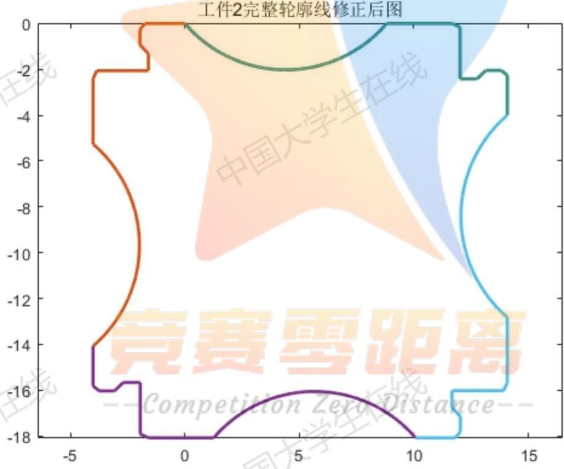
