# 校园供水系统智能管理

## 摘要

利用校园内各智能水表的实时供水系统运行数据，通过数学建模和数据挖掘及时发现供水系统中存在的问题，并用科学有效的手段解决这些问题，以提高校园服务和管理水平。 式大

针对问题一，通过对各个水表数据的重新分类统计了每日用水量，并利用模型计算出学生宿舍楼区、教学楼区和食堂区的日最大小时用水量、日平均小时用水量和小时变系数，还进一步分析了小时变化系数的统计特征，如：学生宿舍楼区（均值2.9876，标准差1.4334）、教学楼区（均值2.652，标准差1.631）、食堂区（均值21.4525，标准差23.4736），总的用水趋势，体现出寒暑假、用水时段、用水大小和集中度上，不同功能区都有所区别。

针对问题二，由于各级表的关系是确定的，所以可以对各子网供水系统进行多元线性回归模型的建立，其中以403X为例，建立11个随机自变量的多元线性回归，利用数据计算出了回归系数和回归置信区间，又通过最小二乘法、残差分析，剔除异常点等处理，最终得到最优拟合模型 $\scriptstyle ( R ^ { 2 } = 0 . 9 6 8 7 )$ ，并对该模型进行了检验，随机误差符合正态分布。 V

针对问题三，对13个一级表数据进行分析，并将419T-406T合并，从而精简为7个一级表，并通过建立2σ标准差提取异常数据模型，计算出漏水量，计算出各子网供水系统和整个学校的漏损情况。整个学校平均漏损比率随季度分别为：4.92%、7.01%、4.82%、4.54%，全年为5.31%。

针对问题四，供水网络错综复杂，但网络具有层级性，因此，通过建立BP神经网络模型智能识别出漏损位置，通过对全网各节点的智能识别，发现明显的漏损数量，第一季度16个，第二季度21个，第三季度31个，第四季度6个。智能识别对突发性，爆裂性漏损非常灵敏，对恒定微弱的漏损不能很好的辨别，因此，再通过引入小时变化系数，进一步对恒定微弱漏损的情况进行识别。如：K酒店、L馆、第九宿舍等。

针对问题五，漏损情况不维修，则会因为大量漏水而增大用水成本，若维修，则会增加维修成本，但漏损成本会随之减少，可见漏损成本与维修成本存在反比非线性关系，由于现实中不可能为了将漏损降为零而无限的投入维修费用，所以，只要将总的漏损比率控制在一定范围即可。按照贵州水价3.3元/m³计算，全年漏损成本为71109.984元，并计算得到，要在原有维修成本的基础上，增加4207.1832元，才能将漏损率控制在5%以下。

关键词：统计特征；多元线性回归模型；BP神经网络模型；智能诊断

## 一、问题重述

本题主要是针对校园供水系统的数据分析和挖掘，以发现和解决问题，为了保障校园供水系统的正常运行而提供有力科学依据，从而提高校园服务和管理水平。

第一问：统计、分析各个水表数据的变化规律，并给出校园内不同功能区（宿舍、教学楼、办公楼、食堂等）的用水特征。

第二问：结合校区水表层级关系，建立水表数据之间的关系模型，并利用已有数据分析模型精确度。

第三问：输水管网的漏损是一个严重问题。资料显示，在维护良好的公共供水网络中，平均失水在5%左右；而在比较老旧的管网中，失水则会更多。利用提供的数据，建立数学模型，分析该校园供水管网的漏损情况。 国

第四问：地下水管暗漏不容易被发现，需要花费大量人力对供水管道的漏损进行检测及定位，通过建立一个适当的模型和利用水表的实时数据及时发现并确定发生漏损的位置。

第五问：管网维修需要一定的人工费和材料费，但同时可以降低管网漏损程度。请根据以上结果和你了解的水价及维修成本确定管网漏损的最优维修决策方案。

## 二、问题分析

问题一，通过各级表的实时数据（15分钟），统计为1小时、1日、一季度的数据，并根据供水领域专业的相关分析，如：日用水量、日平均小时用水量、小时变化系数等分析用水特征，以及从统计学角度，分析数据的统计特征。

问题二，根据水表层次关系，初步估计应该符合多元线性回归，因此可以尝试建立多元线性回归模型，带入数据，将回归系数计算出来，并用真实数据进行检验，如果不是最优，可以通过最小二乘法和误差分析，寻找最优模型。

问题三，根据数据，分析漏损的特征，通过这些特征提取异常数据（即漏水量），就可以计算出学校平均漏损比率和各子网系统漏损比率。

问题四，由于供水系统呈网状，具有层级性，非常适合BP神经网络模型的使用，通过将某段相对稳定的数据作为训练数据去预测其他时间的数据，若是预测数据与真实数据相差过大，那么该位置就很大可能是漏损。漏损主要呈现两种状态，一种是较恒定微弱的漏损，另外就是突发性较猛烈的漏损。神经网络对于第二种识别是很敏感的，因此再通过小时变化系数来判断第一种，这样就基本上解决了绝大多数漏损识别问题。

问题五，漏损成本与维修成本应该存在反比非线性关系，由于现实中不可能为了将漏损降为零而无限的投入维修费用，所以，只要将总的漏损比率控制在一定范围即可。另外，根据漏损情况集中出现的时段，更有针对性的提前检查预防。

## 三、模型假设

1、供水系统整体运行稳定；

2、只要用水，水表就如实记录数据；

3、数据较为全面的反映了学校的用水情况，没有遗漏。

## 四、符号说明

<table><tr><td>符号</td><td>说明 中国</td><td>中国</td></tr><tr><td> $\mathcal { Q } _ { h }$ </td><td>最大小时用水量</td><td></td></tr><tr><td> $Q _ { p }$ </td><td>平均小时用水量</td><td></td></tr><tr><td> $K _ { h }$ </td><td>小时变化系数</td><td></td></tr><tr><td> $S S E _ { j }$ </td><td>掉  $x _ { j }$  后残差平方和</td><td></td></tr><tr><td> $c _ { j j }$ </td><td>是  $\boldsymbol { c } = ( \boldsymbol { x } ^ { T } \boldsymbol { x } ) ^ { - 1 }$  对角线  $j = ( j = 0 , 1 , \cdots , k )$ </td><td>上第个元素</td></tr><tr><td> $S S R$ </td><td>回归平方和</td><td></td></tr><tr><td> $S S E$ </td><td>残差平方和</td><td></td></tr></table>

## 五、模型的建立与求解

## 5.1 问题一的模型建立与求解

## 5.1.1 问题一的模型建立

(1）小时变化系数[2]

$$
K _ { \mathfrak { n } } = \mathcal { Q } _ { \mathfrak { n } } \div \mathcal { Q } _ { p }\tag{1}
$$

$\mathcal { Q } _ { h }$ ：最大小时用水量；

$Q _ { p }$ ：平均小时用水量；

$K _ { h }$ ：小时变化系数；

(2) T检验模型

样本均值： $\overline { { X } } = \frac { 1 } { n } \sum X _ { i }$

(2)

样本方差： $S ^ { 2 } = { \frac { 1 } { n - 1 } } \sum _ { i = 1 } ^ { n } ( X _ { i } - { \overline { { X } } } ) ^ { 2 }$

(3)

样本标准差： $S \ = { \sqrt { \frac { 1 } { n - 1 } \sum _ { i = 1 } ^ { n } ( X _ { i } - { \overline { { X } } } ) ^ { 2 } } }$

(4)

S已知， $\mu$ 未知，可用T分布检验数据，且参数μ的置信区间为：

$$
\left[ \overline { { X } } - \frac { S } { \sqrt { n } } t _ { \alpha / 2 } ( n - 1 ) , \qquad \overline { { X } } + \frac { S } { \sqrt { n } } t _ { \alpha / 2 } ( n - 1 ) \right]\tag{5}
$$

## 5.1.2问题一的模型求解

对指标进行分类，较为确定的有三类（学生宿舍区、教学区、食堂区），现就针对这三类进行数据分析。

## 5.1.2.1 学生宿舍区特征分析

学生宿舍区包括：第一、二、三、四、五、七、八、九宿舍楼，数据是每隔15分钟记录一次，现在通过MATLAB编程，将学生宿舍区的数据转化为365天。并作出学生宿舍区及各学生宿舍楼日用水走势图（图1、图2）。

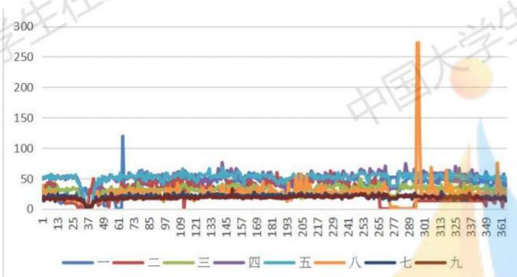  
图1、各学生宿舍楼日用水走势图

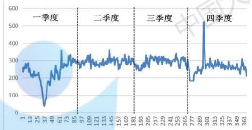  
图2、学生宿舍区日用水走势图

再作出各宿舍楼日用水量统计直方图（图3、图4），并初步判断和指定异常用水点（红线圈）。 长线

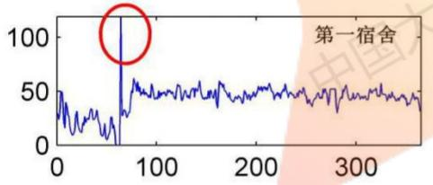

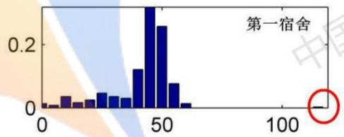

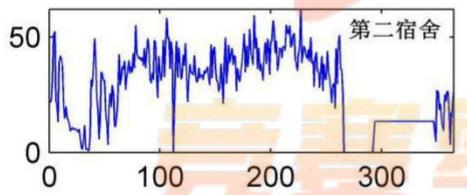

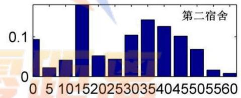

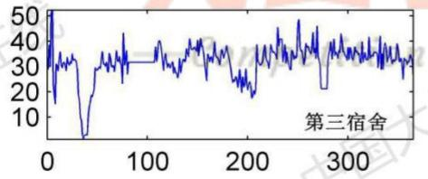

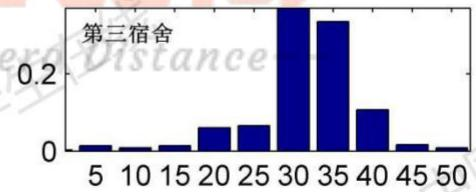

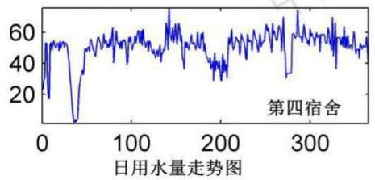

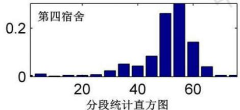  
图3、第一、二、三、四宿舍楼统计直方图

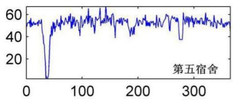

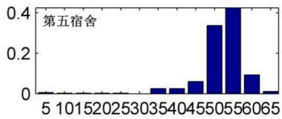

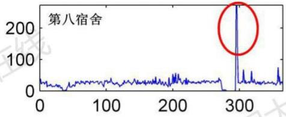

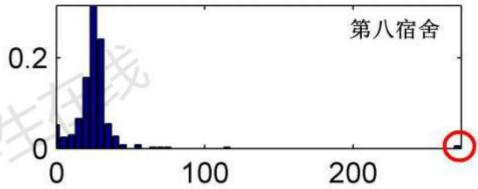

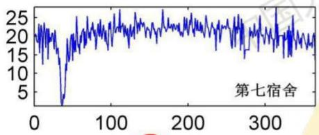

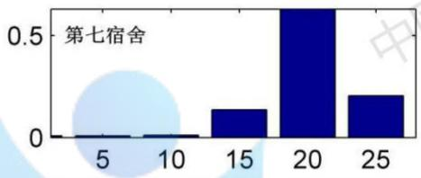

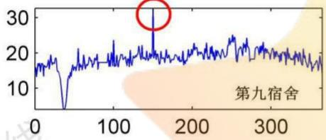  
日用水量走势图

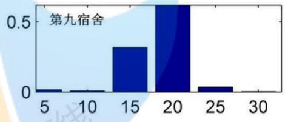  
图4、第五、七、八、九宿舍楼统计直方图

通过5.1.1的模型，计算出各宿舍楼的小时变化系数统计特征：

表1、小时变化系数统计特征（学生宿舍区）
<table><tr><td>宿舍楼</td><td>样本均值 X</td><td>样本方差 D(x)</td><td>样本标准差 SD(x)</td><td>置信区间（95%） 自由度 n=6</td><td>置信区间（95%） 自由度n=11</td><td></td></tr><tr><td>一</td><td>2.313</td><td>1.484</td><td>1.218</td><td>[1.034 3.592]</td><td>[1.539</td><td>3.087]</td></tr><tr><td>二</td><td>2.751</td><td>6.059</td><td>2.462</td><td>[0.167 5.334]</td><td>[1.187</td><td>4.315]</td></tr><tr><td>修正</td><td></td><td></td><td></td><td>(1.000 5.334]</td><td></td><td></td></tr><tr><td>三</td><td>2.954</td><td>0.997</td><td>0.999</td><td>[1.906 4.002]</td><td>[2.319</td><td>3.588]</td></tr><tr><td>四</td><td>3.412</td><td>1.270</td><td>mp 1.127 on</td><td>[2.229 4.595]</td><td>ce [2.696</td><td>4.128]</td></tr><tr><td>五</td><td>3.124</td><td>1.170</td><td>1.081</td><td>[1.989 4.259]</td><td>[2.437</td><td>3.811]</td></tr><tr><td>八</td><td>3.497</td><td>2.826</td><td>1.681</td><td>[1.732 5.261]</td><td>[2.429</td><td>4.565]</td></tr><tr><td>七</td><td>3.338</td><td>1.026</td><td>1.013</td><td>[2.275 4.402]</td><td>[2.695</td><td>3.982]</td></tr><tr><td>九</td><td>2.512</td><td>0.321</td><td>0.567</td><td>[1.917 3.106]</td><td>[2.152</td><td>2.872]</td></tr></table>

根据小时变化系数公式，可以知道该系数不能小于1，因此，第二宿舍楼，当自由度n=6时，在置信度为95%的情况下，其置信区间的左端应该是大于1，所以将[0.167，5.334]修正为(1.000,5.334]，从小时变化系数公式来判断，若该系数为1，则有可能与恒定微弱漏损有关，因此该系数可以作为识别漏损的一个工具。

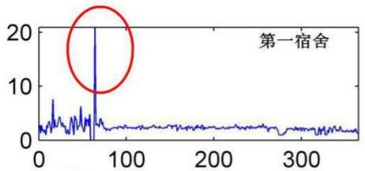

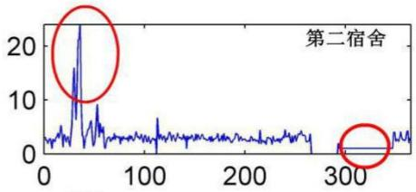

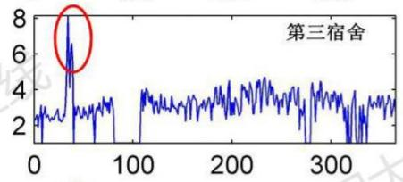

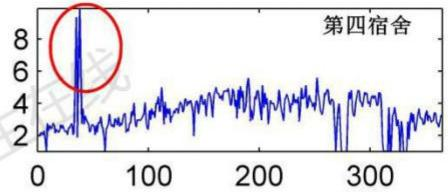

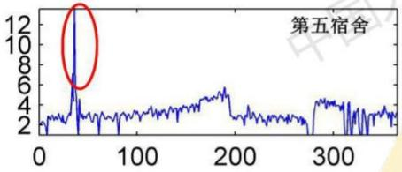

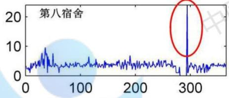

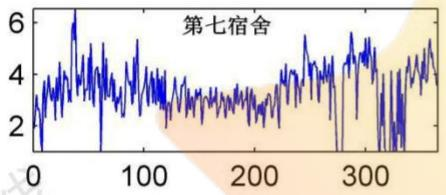

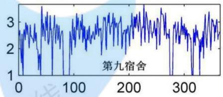  
图5、各宿舍楼小时变化系数走势图

根据以上结果可以分析得出，第一季度可能是由于学生放假的缘故，用水量均有所减少，每个宿舍楼的用水都相对稳定在一定的值，并且初步分析发现，第一、八、九宿舍楼可能出现过水管爆裂导致的漏损（日用水量过大），而第二宿舍楼可能出现过较为稳定微弱的漏损（小时变化系数一段时间内保持1数值不变）。

## 5.1.2.2 食堂区特征分析

食堂区包括：第一、二、五食堂，数据是每隔15分钟记录一次，现在通过MATLAB编程，将食堂区的数据转化为365天。并通过5.1.1的模型，计算出各食堂的日最大小时用水量、日平均小时用水量、小时变化系数统计特征：

表2、小时变化系数统计特征（食堂区）
<table><tr><td>宿舍楼</td><td>样本均值</td><td>样本方差样本标准差</td><td></td><td>置信区间（95%） 自由度n=6</td><td></td><td>置信区间（95%） 自由度n=11</td><td></td></tr><tr><td>一</td><td>X 0.015</td><td>D(x) 30.878</td><td>SD(x) 5.557</td><td>[-5.818</td><td>5.847]</td><td>[-3.516</td><td>3.545]</td></tr><tr><td>修正</td><td></td><td></td><td></td><td>(1.000</td><td>5.847]</td><td>(1.000</td><td>3.545]</td></tr><tr><td>五</td><td>0.019</td><td>14.915</td><td>3.862</td><td>[-4.035</td><td>4.072]</td><td>[-2.435</td><td>2.472]</td></tr><tr><td>修正</td><td></td><td></td><td></td><td>(1.000</td><td>4.072</td><td>(1.000</td><td>2.472]</td></tr><tr><td>二</td><td>0.012</td><td>7.957</td><td>2.821</td><td>[-2.948</td><td>2.973]</td><td>[-1.780</td><td>1.805]</td></tr><tr><td>修正</td><td></td><td></td><td></td><td>(1.000</td><td>2.973]</td><td>(1.000</td><td>1.805]</td></tr></table>

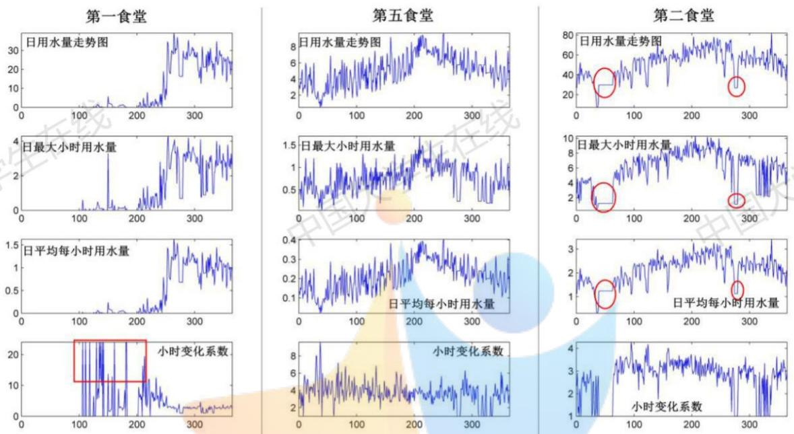  
图6、各食堂四个特征数值变化情况

根据小时变化系数公式，可以知道该系数不能小于1，因此，第一、二、五食堂，当自由度n=6和n=11时，在置信度为95%的情况下，其置信区间的左端小于1的都修正为1，但不取1。

从图6的四个特征指标的数值变化，容易获得以下结论：

表3、四个特征指标的关系
<table><tr><td>日用水量</td><td>日最大小时 用水量</td><td>日平均小时 用水量</td><td>小时变化 系数</td><td>初步结论</td></tr><tr><td>高</td><td>高</td><td>高</td><td>正常</td><td>漏损时间长 漏损较稳定</td></tr><tr><td></td><td></td><td></td><td>竞赛零距离</td><td>漏损强度大 漏损时间短</td></tr><tr><td>高 学生在线</td><td></td><td></td><td>必</td><td>漏损较稳定</td></tr><tr><td></td><td>低</td><td>低</td><td>1</td><td>漏损强度大 用水集中</td></tr><tr><td></td><td></td><td></td><td></td><td></td></tr><tr><td>高</td><td>高</td><td></td><td>高</td><td>漏损时间短 漏损突发 中国大学</td></tr></table>

## 5.1.2.3 教学区特征分析

教学区只包括教学楼总表，数据是每隔15分钟记录一次，现在通过MATLAB编程，将教学区的数据转化为365天。并通过5.1.1的模型，计算出教学区的日最大小时用水量、日平均小时用水量、小时变化系数统计特征：

表3、小时变化系数统计特征（教学区）
<table><tr><td>样本均值 X</td><td>D(x)</td><td>样本方差样本标准差 SD(x)</td><td>置信区间（95%） 自由度n=6</td><td>置信区间（95%） 自由度n=11</td></tr><tr><td>教学楼 2.652</td><td>1.631</td><td>1.277</td><td>[1.312 3.993]</td><td>[1.841 3.464]</td></tr></table>

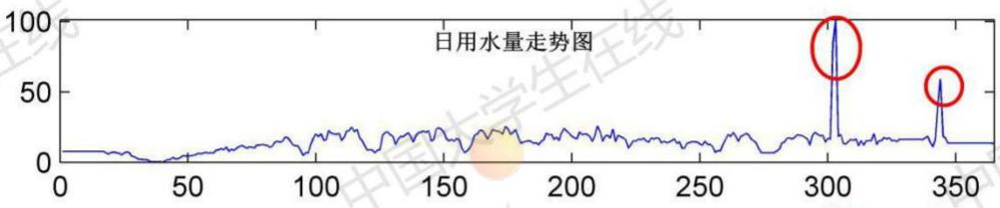

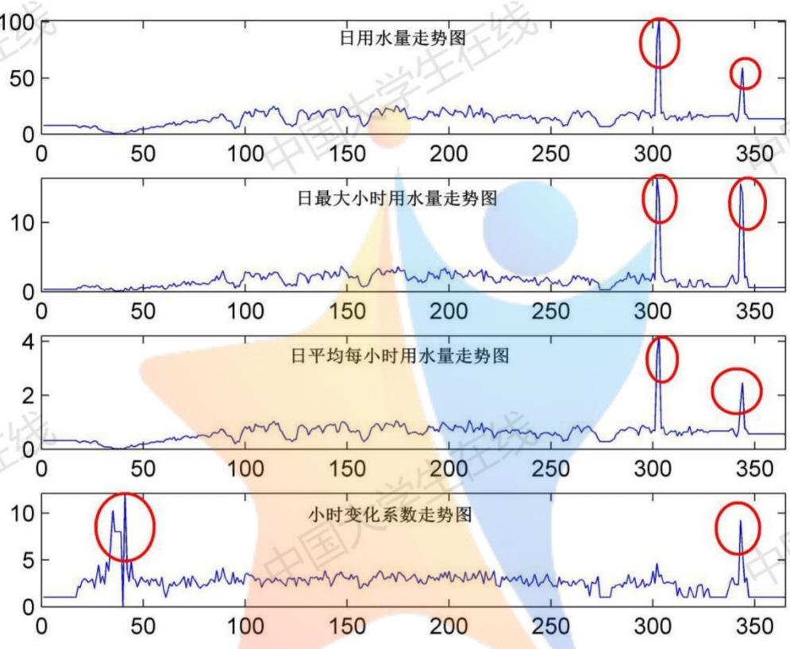

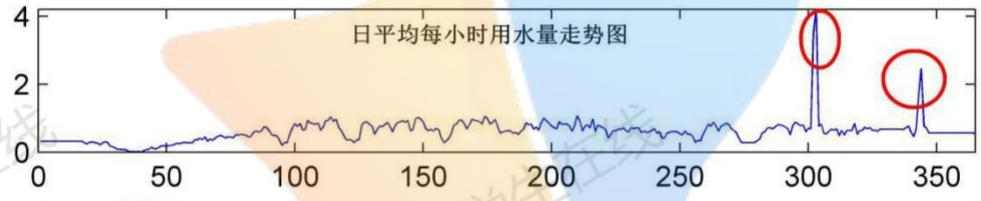  
图7、教学区四个特征数值变化情况

从图7中可以初步判断出，教学区在第四季度出现两次管道破损，漏损较大。其他功能区均可以用此模型来进行分析。

## 5.2 问题二的模型建立与求解

5.2.1 问题二的模型建立

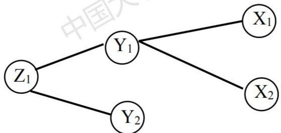  
图8、各级水表视为变量

## (1)建立多元线性回归模型

假设

$$
Z _ { 1 } = b _ { 1 } Y _ { 1 } + b _ { 2 } Y _ { 2 } + \xi _ { 1 } ; \qquad Y _ { 1 } = a _ { 1 } X _ { 1 } + a _ { 2 } X _ { 2 } + \xi _ { 2 }
$$

推出

$$
\begin{array} { r l } & { Z _ { 1 } = b _ { 1 } ( a _ { 1 } X _ { 1 } + a _ { 2 } X _ { 2 } + \xi _ { 2 } ) + b _ { 2 } Y _ { 2 } + \xi _ { 1 } } \\ & { \quad = b _ { 1 } a _ { 1 } X _ { 1 } + b _ { 1 } a _ { 2 } X _ { 2 } + b _ { 2 } Y _ { 2 } + b _ { 1 } \xi _ { 2 } + \xi _ { 1 } } \\ & { \quad = c _ { 1 } X _ { 1 } + c _ { 2 } X _ { 2 } + c _ { 3 } Y _ { 2 } + \xi _ { 3 } } \end{array}
$$

建立

$$
Y _ { i } = \beta + \beta _ { 1 } X _ { 1 i } + \beta _ { 2 } X _ { 2 i } + \beta _ { 3 } X _ { 3 i } + \cdots + \xi _ { i } ( i = 1 , 2 , 3 , \cdots )\tag{6}
$$

$X _ { 1 } , \ldots , X _ { k }$ 是随机自变量；Y是随机因变量；

$\beta _ { 0 } , . . . . , \beta _ { \mathrm { k } }$ 是回归系数；ζ是随机误差项。

注：推导结果说明，用各末端水表数据就可实现回归模型。

## （2）回归方程的显著性检验

原假设 $H _ { 0 } : \beta _ { 1 } = \cdots = \beta _ { k }$ ，备择假设 $H _ { 1 } : \beta _ { 1 } , \cdots , \beta _ { k }$ 不全为0，当假设成立时，检验统计量：

$$
F = \frac { S S R \left/ k \right. } { S S E \left/ ( n - k - 1 ) \right. } \sim F ( k , n - k - 1 )\tag{7}
$$

回归平方和： $S S R = \sum _ { i = 1 } ^ { n } { ( \hat { y } _ { i } - \overline { { y } } ) ^ { 2 } }$

残差平方和： $S S E = \sum _ { i = 1 } ^ { n } ( y _ { i } - { \hat { y } } _ { i } ) ^ { 2 }$

对于给定的显著水平 $\alpha$ ，检验的拒绝域 $F > F _ { \alpha } ( k , n - k - 1 )$ 。

## (3）回归系数的显著性检验

原假设 $H _ { 0 } : \beta _ { { \scriptscriptstyle j } } = 0$ ，备择假设 $H _ { 1 } : \beta _ { _ { j } } \neq 0 ( j = 0 , 1 , . . . , k )$ 当原假设成立时，检验统计量：

$$
F _ { j } = \frac { S S E _ { j } - S S E } { S S E / ( n - k - 1 ) } \sim F ( 1 , n - k - 1 )\tag{8}
$$

掉 $x _ { j }$ 后残差平方和：SSE

对于给定的显著水平 $\alpha$ ，检验的拒绝域为 $F _ { _ { j } } > F _ { _ { \alpha } } ( 1 , n - k - 1 )$ MI

也可以用检验统计量；mpetition Zexoistance--

$$
t _ { j } = \frac { \hat { \beta } _ { j } } { \hat { \sigma } \sqrt { c _ { j j } } } \sim t ( n - k - 1 )\tag{9}
$$

$c _ { j j }$ 是 $\boldsymbol { c } = ( \boldsymbol { x } ^ { T } \boldsymbol { x } ) ^ { - 1 }$ 对角线 $j = ( j = 0 , 1 , \cdots , k )$ 上第个元素。对于给定的显著性水平 $\alpha$ ，检验的拒绝域为 $\left| t _ { j } \right| > t _ { \alpha \beta } ( n - k - 1 )$ 0

## 5.2.2 问题二的模型求解

选取403X子网供水系统的数据，该系统包括11个末端水表，所以建立11个随机自变量的多元线性回归模型。将数据先处理为每日用水量，然后选取40个数据作为回归系数的计算依据，后40个数据作为对比数据，以进一步评估模型的优劣。

通过 MATLAB 计算得到以下结果：

表4、回归系数值及统计特征
<table><tr><td>回归系数</td><td>回归系数估计值</td><td colspan="2">回归系数置信区间</td></tr><tr><td> $\beta _ { 0 }$ </td><td>-105.4976</td><td>[-346.3217</td><td>135.3265]</td></tr><tr><td> $\beta _ { \iota }$ </td><td>12.9912</td><td>[-63.8778</td><td>89.8602]</td></tr><tr><td> $\beta _ { 2 }$ </td><td>-6.1822</td><td>[-15.4588</td><td>3.0944]</td></tr><tr><td> $\beta _ { 3 }$ </td><td>17.3709</td><td>[-84.7264</td><td>119.4682]</td></tr><tr><td>主在线  $\beta _ { 4 }$ </td><td>8.7463</td><td>[-18.8519</td><td>36.3446]</td></tr><tr><td> $\beta _ { 5 }$ </td><td>-14.6269</td><td>[-95.8830</td><td>66.6292] 中国大</td></tr><tr><td> $\beta _ { 6 }$ </td><td>3.2512 中国大学生</td><td>[1.8540</td><td>4.6484]</td></tr><tr><td> $\beta _ { 7 }$ </td><td>-0.0140</td><td>[-1.2339</td><td>1.2060]</td></tr><tr><td> $\beta _ { 8 }$ </td><td>0.0075</td><td>[-0.2081</td><td>0.2231]</td></tr><tr><td> $\beta _ { 9 }$ </td><td>5.1333</td><td>[1.1912</td><td>9.0753]</td></tr><tr><td> $\beta _ { \mathrm { l 0 } }$ </td><td>1.2123</td><td>[-2.0336</td><td>4.4583]</td></tr><tr><td> $\beta _ { \mathfrak { l } \mathfrak { l } }$ </td><td>-0.2879</td><td>[-1.2887</td><td>0.7130]</td></tr><tr><td> $\beta _ { 1 2 }$ </td><td>0.6335</td><td>[-2.7854</td><td>4.0523]</td></tr><tr><td></td><td> $R ^ { 2 } { = } 0 . 8 1 2 8$  F=5.0659</td><td colspan="2"> $p { > } 0 . 0 0 0 1$   $s ^ { 2 } { = } 4 8 2 . 8 7 4 1$ </td></tr></table>

从上表4可见，拟合效果还比较理想，但还不够完美，此时再进一步完善，将异常数据剔除，再进行回归拟合。 大字 大

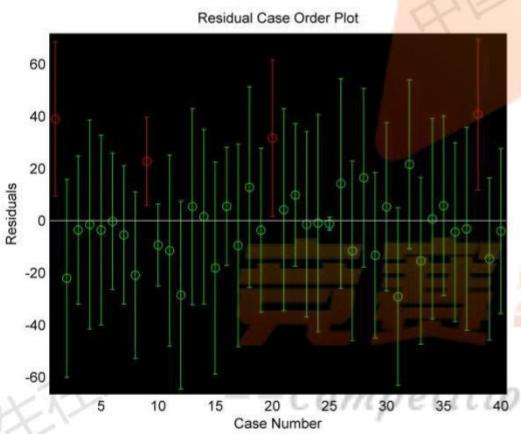  
图9、原始数据

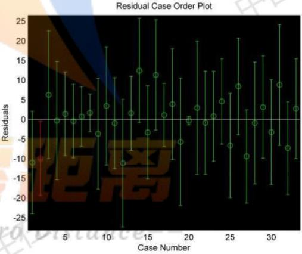  
图10、两次剔除异常数据后

通过两次剔除异常数据后（第一次剔除1、9、20、38。第二次剔除10、16、25），再进行多元回归分析，计算得到以下结果：

表5、回归系数值及统计特征(剔除异常点）
<table><tr><td>回归系数</td><td>回归系数估计值</td><td>回归系数置信区间</td><td></td></tr><tr><td> $\beta _ { 0 }$ </td><td>-52.9021</td><td>[-190.0877</td><td>84.2836]</td></tr><tr><td> $\beta _ { \iota }$ </td><td>46.2210</td><td>[9.2407</td><td>83.2013]</td></tr><tr><td> $\beta _ { 2 }$ </td><td>-3.7585</td><td>[-8.4207</td><td>0.9037]</td></tr><tr><td> $\beta _ { 3 }$ </td><td>24.4646</td><td>[-27.6850</td><td>76.6141]</td></tr><tr><td> $\beta _ { 4 }$ </td><td>14.1476</td><td>[0.0334</td><td>28.2618]</td></tr><tr><td> $\beta _ { 5 }$ </td><td>10.2162</td><td>[-31.8248</td><td>52.2572]</td></tr><tr><td> $\beta _ { 6 }$ </td><td>3.0964</td><td>[2.4409</td><td>3.7519]</td></tr><tr><td> $\beta _ { 7 }$ </td><td>-0.6418</td><td>[-1.7949</td><td>0.5112]</td></tr><tr><td> $\beta _ { 8 }$ </td><td>0.1085</td><td>[0.0100</td><td>0.2070]</td></tr><tr><td> $\beta _ { 9 }$  主在。</td><td>3.6908</td><td>[1.1379</td><td>6.2436]</td></tr><tr><td> $\beta _ { \mathrm { 1 0 } }$ </td><td>3.7356</td><td>[1.9567</td><td>5.5146]</td></tr><tr><td> $\beta _ { \mathrm { 1 1 } }$ </td><td>-0.5347</td><td>[-1.0398</td><td>-0.0296] 中国大</td></tr><tr><td> $\beta _ { 1 2 }$ </td><td></td><td>[-2.5775</td><td>0.7741]</td></tr><tr><td colspan="2"> $R ^ { 2 } { = } 0 . 9 6 8 7$   $F { = } 2 4 . 1 0 9$ </td><td colspan="2"> $p { < } 0 . 0 0 0 1$   $s ^ { 2 } { = } 8 2 . 2 3 1 2$ </td></tr></table>

从表5可见，此时的 $R ^ { 2 } { = } 0 . 9 6 8 7 , p { < } 0 . 0 0 0 1$ ，十分显著，说明拟合效果非常好。现在用该回归模型预测后40个数据，观察吻合度。回归模型如下（系数对照表5）：

$$
y = \beta _ { 0 } + \beta _ { 1 } x _ { 1 } + \beta _ { 2 } x _ { 2 } + \beta _ { 3 } x _ { 3 } + \beta _ { 4 } x _ { 4 } + \beta _ { 5 } x _ { 5 } + \beta _ { 6 } x _ { 6 } + \beta _ { 7 } x _ { 7 } + \beta _ { 8 } x _ { 8 } + \beta _ { 9 } x _ { 9 } + \beta _ { 1 0 } x _ { 1 0 } + \beta _ { 1 1 } x _ { 1 1 } .\tag{10}
$$

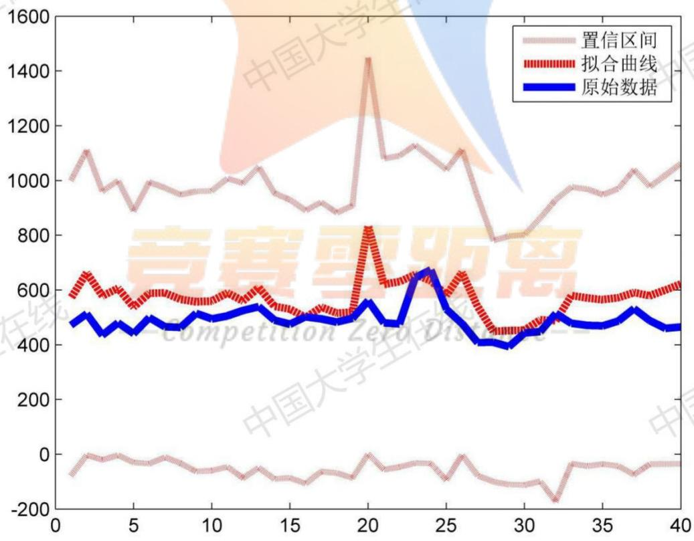  
图11、预测值与实际值比较

从图11上看，预测值变化趋势与实际值变化趋势基本吻合，但是细心发现，预测值稍微偏高，因此可以继续将模型优化，通过最小二乘法，获得最优拟合模型。通过计算，在原来回归模型（10）的式子右端减去82即可。

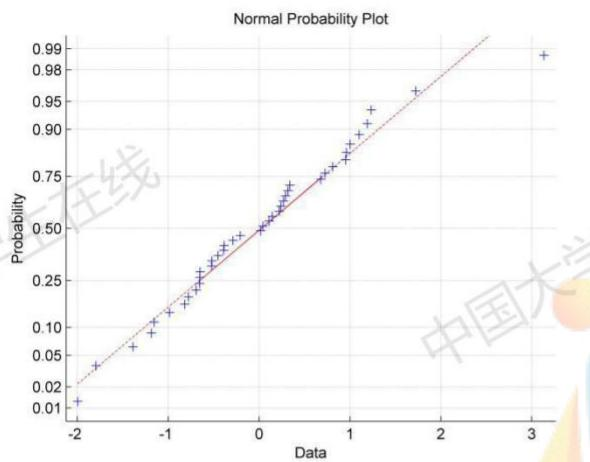

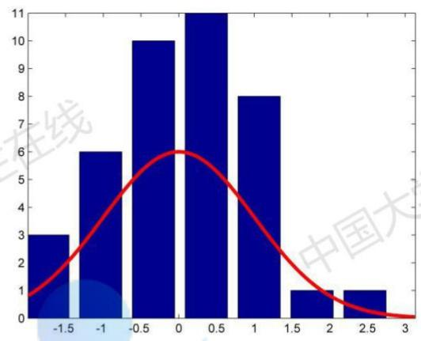  
图12、残差正态性检验

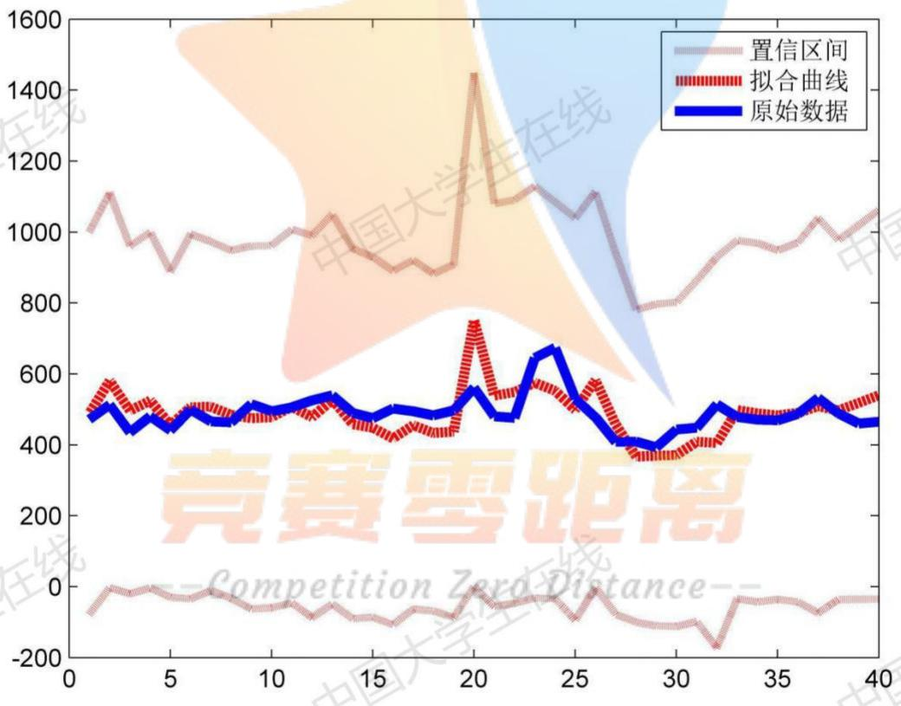  
图13、修正后的回归模型拟合效果  
从上图12、图13中的拟合图像，以及残差分析，可知该回归模型是最优模型。

## 5.3问题三的模型建立与求解

## 5.3.1问题三的模型建立

## （1）建立三倍标准差剔除异常值模型

在正态分布中 $\sigma$ 代表标准差， $\mu$ 代表均值 $X = \mu$ 即为图像的对称轴3σ原则。

$$
\overline { { X } } = \frac { \sum X _ { i } } { n }\tag{11}
$$

$$
\sigma = { \sqrt { \frac { \sum ( X _ { i } - { \overline { { X } } } ) ^ { 2 } } { n } } }\tag{12}
$$

$$
f ( x ) = { \frac { 1 } { \sqrt { 2 \pi } } } \exp ( - { \frac { x ^ { 2 } } { 2 } } )\tag{13}
$$

正常值为 $( \mu - 3 \sigma , \mu + 3 \sigma )$ 内的数值，超过者为异常值。

变量取值在区间[ $( \mu - \sigma , \mu + \sigma )$ ]之间的概率： $P ( \mu - \sigma \leq \xi \leq \mu + \sigma ) = 0 . 6 8 2 7$

变量取值在区间 $\left[ ( \mu - 2 \sigma , \mu + 2 \sigma ) \right]$ 之间的概率： $P ( \mu - 2 \sigma \le \xi \le \mu + 2 \sigma ) = 0 . 9 5 4 5$

变量取值在区间[ $\mathbf { \sigma } ( \mu - 3 \sigma , \mu + 3 \sigma )$ ]之间的概率： $P ( \mu - 3 \sigma \le \xi \le \mu + 3 \sigma ) = 0 . 9 9 7 3$

在本题中，为了更好的将异常数据剔除（即剔除异常用水点），采用两倍标准差剔除数据。必

## 5.3.2 问题三的模型求解

考察学校整体的漏损情况，需要对13个一级表数据进行分析，由于419T-406T没有分表，所以可以将他们合并为一个一级表，从而精简为7个一级表。现在分别对7个指标进行求解。

表6、第一季度各子供水网漏损情况（2σ标准下）
<table><tr><td>子网系统</td><td>416X</td><td>405X</td><td>404X</td><td>403X</td><td>402X</td><td>401X</td><td>419T-406T</td><td>合计</td></tr><tr><td>总用水量</td><td>5479.31</td><td>7047.71</td><td>4213.96</td><td>33809.49</td><td>7632.71</td><td>8453.75</td><td>3486.71</td><td>70123.64</td></tr><tr><td>漏损水量</td><td>0.00</td><td>1914.45</td><td>0.00</td><td>1088.23</td><td>419.53</td><td>30.19</td><td>0.00</td><td>3452.40</td></tr><tr><td>漏损比率</td><td>0.00%</td><td>27.16%</td><td>0.00%</td><td>3.22%</td><td>5.50%</td><td>0.36%</td><td>0.00%</td><td>4.92%</td></tr></table>

## --Competition ZexoDistance--

表7、第二季度各子供水网漏损情况（2σ标准下）
<table><tr><td>子网系统</td><td>416X</td><td>405X</td><td>404X</td><td>403X</td><td>402X</td><td>401X</td><td>419T-406T</td><td>合计</td></tr><tr><td>总用水量</td><td>5310.92</td><td>13514.08</td><td>5106.01</td><td>45385.75</td><td>511336.60</td><td>12909.83</td><td>6457.12</td><td>100020.31</td></tr><tr><td>漏损水量</td><td>11.68</td><td>348.50</td><td>0.00</td><td>4392.30</td><td>972.71</td><td>84.74</td><td>1203.72</td><td>7013.65</td></tr><tr><td>漏损比率</td><td>0.22%</td><td>2.58%</td><td>0.00%</td><td>9.68%</td><td>8.58%</td><td>0.66%</td><td>18.64%</td><td>7.01%</td></tr></table>

表7、第三季度各子供水网漏损情况（2σ标准下）
<table><tr><td rowspan=1 colspan=1>子网系统 416X    405X    404X    403X    402X    401X 419T-406T  合计</td></tr><tr><td rowspan=1 colspan=1>总用水量6908.4913827.185874.3064573.18 27114.24 14167.05 7755.57 140220.01</td></tr></table>

<table><tr><td>漏损水量 0.00</td><td>213.86</td><td>0.00</td><td></td><td>5649.64</td><td>788.53</td><td>108.82</td><td>0.00</td><td>6760.85</td></tr><tr><td>漏损比率</td><td>0.00%</td><td>1.55%</td><td>0.00%</td><td>8.75%</td><td>2.91%</td><td>0.77%</td><td>0.00%</td><td>4.82%</td></tr></table>

表8、第四季度各子供水网漏损情况（2σ标准下）
<table><tr><td>子网系统 416X</td><td>405X</td><td>404X</td><td>403X</td><td>402X 401X</td><td>419T-406T</td><td>合计</td></tr><tr><td>总用水量 6446.68</td><td>12950.17</td><td>5355.32</td><td>42220.50 7726.54</td><td>15090.33</td><td>5318.02</td><td>95107.56</td></tr><tr><td>漏损水量 0.00</td><td>435.48</td><td>0.00</td><td>3667.93 0.00</td><td>218.17</td><td>0.00</td><td>4321.58</td></tr><tr><td>漏损比率 0.00%</td><td>3.36%</td><td>0.00%</td><td>8.69% 0.00%</td><td>1.45%</td><td>0.00%</td><td>4.54%</td></tr></table>

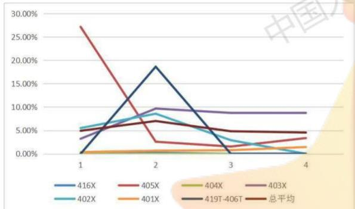  
图14、各子网漏损比率随季度走势图（2σ）

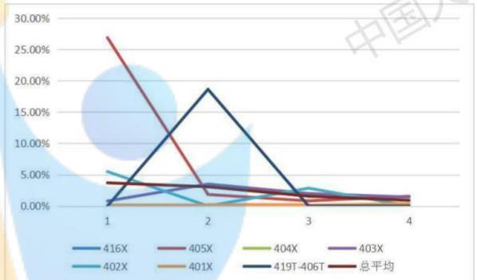  
图15、各子网漏损比率随季度走势图（3σ）

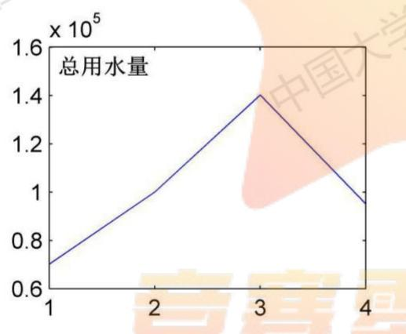

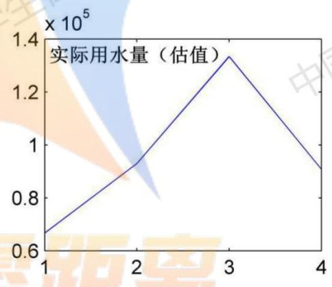

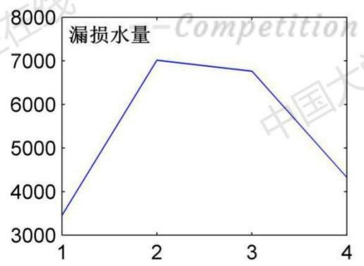

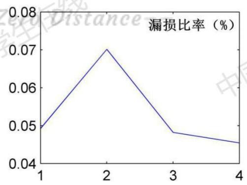  
图16、该校区漏损随季度变化情况

通过计算得到以上结果，并将7个指标漏损比率和平均漏损比率归纳到下表中：

表9、各子系统漏损情况
<table><tr><td>季度</td><td>一季度</td><td>二季度</td><td>三季度</td><td>四季度</td></tr><tr><td>一级表 416X</td><td>0.00%</td><td>0.22%</td><td>0.00%</td><td>0.00%</td></tr><tr><td>405X</td><td>27.16%</td><td>2.58% 生在线</td><td>1.55%</td><td>3.36%</td></tr><tr><td>404X 学生</td><td>0.00%</td><td>0.00%</td><td>0.00%</td><td>0.00%</td></tr><tr><td>403X</td><td>3.22%</td><td>9.68%</td><td>8.75%</td><td>8.69%</td></tr><tr><td>402X</td><td>5.50%</td><td>8.58%</td><td>2.91%</td><td>0.00%</td></tr><tr><td>401X</td><td>0.36%</td><td>中国 0.66%</td><td>0.77%</td><td>1.45%</td></tr><tr><td>419T-406T</td><td>0.00%</td><td>18.64%</td><td>0.00%</td><td>0.00%</td></tr><tr><td>总平均</td><td>4.92%</td><td>7.01%</td><td>4.82%</td><td>4.54%</td></tr></table>

整个学校随季度的漏损比率为：4.92%、7.01%、4.82%、4.54%。第二季度较高，其原因是419T-406T出现了较大的漏损，导致第二季度较高。但总体来说都在5%左右，与公共用水平均漏损率相当，说明，用该模型求解的正确性和可靠性。

## 5.4 问题四的模型建立与求解

## 5.4.1 问题四的模型建立

（1）建立BP神经网络模型[1]

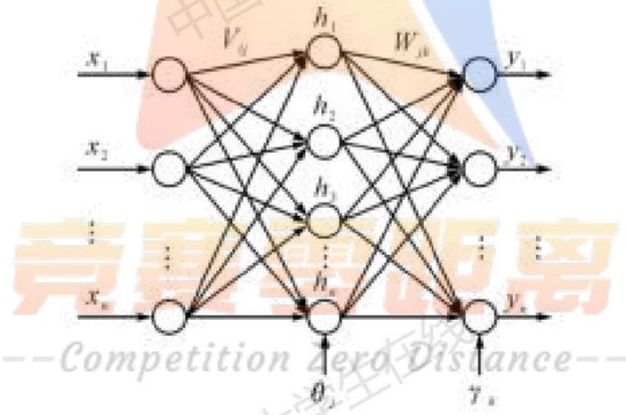  
图17、BP神经网络结构

标准的BP神经网络算法内容和步骤描述如下，先定义一下变量和自变量：

输入层向量： $X = ( x _ { 1 } , x _ { 2 } , . . . , x _ { i } , . . . , x _ { n } ) ;$

隐含层输入向量： $H = ( h _ { 1 } , h _ { 2 } , . . . , h _ { { j } } , . . . , h _ { { m } } ) ;$

输出层输出向量： $Y { = } ( y _ { 1 } , y _ { 2 } , . . . , y _ { k } , . . . y _ { i } ) ;$

期望值输出向量： $D = ( d _ { 1 } , d _ { 2 } , . . . , d _ { k } , . . . , d _ { i } )$

输入层到隐含层之间的权值连接矩阵： $V = ( V _ { 1 } , V _ { 2 } , . . . , V _ { _ { j } , . . . , V _ { _ m } } ) ;$

隐含层到输出层之间的权值连接矩阵： $\boldsymbol { W } = ( W _ { 1 } , W _ { 2 } , . . . , W _ { k } , . . . , W _ { l } )$

BP神经网络具体实现步骤如下：

网络初始化W,V矩阵，赋值期间由激活函数值域决定。确定最大训练次数M和学习精度值 $\varepsilon$ ，选择激活函数 $f ( x )$ ，通常选用单极限 sigmoid函数：

$$
f ( x ) { = } 1 / ( 1 + e ^ { - x } )\tag{14}
$$

数据预处理，选择样本数据输入，得到隐含层 $h _ { j }$ 和输出层 $y _ { k }$ 的输出：

$$
\begin{array} { r } { h _ { j } = f ( T _ { j } ^ { T } X ^ { T } ) , j = 1 , 2 , 3 , . . . , m } \\ { y _ { k } = f ( \mathbf { W } _ { k } ^ { T } H ^ { T } ) , k = 1 , 2 , 3 , . . . , l } \end{array}\tag{15}
$$

(16)

利用网络的实际输出值 $y _ { k }$ 和期望输出值 $d _ { k }$ 计算误差：

$$
e = 1 / 2 { \sum } _ { k - 1 } ^ { 1 } ( d _ { k } - y _ { k } ) ^ { 2 }\tag{17}
$$

分别计算误差函数对隐含层和输出层个神经元的偏导数 $\delta _ { j } ^ { h }$ 和 $\delta _ { k } ^ { y }$

$$
\delta _ { j } ^ { h } = ( \sum { } _ { 1 } ^ { k = 1 } \delta _ { k } ^ { y } W _ { j k } ) ^ { * } h _ { j } ^ { \mathrm { ~ } * } ( 1 - h _ { j } ) , j = 1 , 2 , 3 , \cdots\tag{18}
$$

$$
\delta _ { k } ^ { y } = ( d _ { k } - y _ { k } ) ^ { * } { y _ { k } } ^ { * } ( 1 - y _ { k } ) , k = 1 , 2 , 3 , \cdots\tag{19}
$$

利用误差信号调整各层的连接权值；隐含层到输出层权值 $w _ { j k } ^ { N + 1 }$ 和输入层到隐含层权值 $\nu _ { i j } ^ { N + 1 }$

$$
w _ { j k } ^ { N + 1 } = w _ { j k } ^ { N } + \varphi \delta _ { k } ^ { y } h _ { j } , k = 1 , 2 , \cdots , l \qquad j = 0 . 1 , \cdots , m\tag{20}
$$

$$
\nu _ { i j } ^ { N + 1 } = \nu _ { i j } ^ { N } + \varphi \delta _ { j } ^ { h } x _ { i } , j = 1 , 2 , \cdots , m \qquad i = 0 . 1 , \cdots , n\tag{21}
$$

计算全局误差E：

$$
E = 1 / 2 { \sum _ { p = 1 } ^ { p } } { \sum _ { k = 1 } ^ { l } } ( d _ { k } - y _ { k } ) ^ { 2 }\tag{22}
$$

## 5.4.2 问题四的模型求解

由于供水系统具有的层级网络特征，再加之神经网络的“万能逼近”，对于这类数据，有较好的预测效果，以预测值与实际值的误差作为识别漏损的依据，若是误差过大，那么就说明有漏损情况。由于全网涉及的水表太多，篇幅有限，现只展示四个被识别出来的漏损情况：

--Competition ZexoDistance--  
Best Validation Performance is 54.4962 at epoch 8  
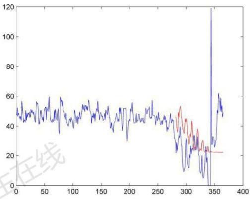

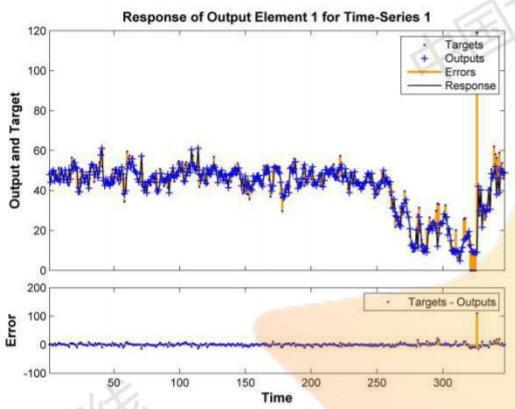

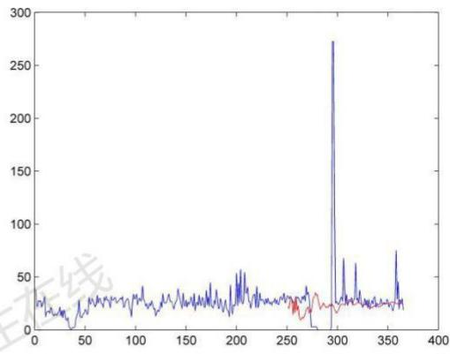

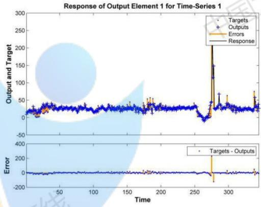  
Best Validation Performance is 94.5356 at epoch 6

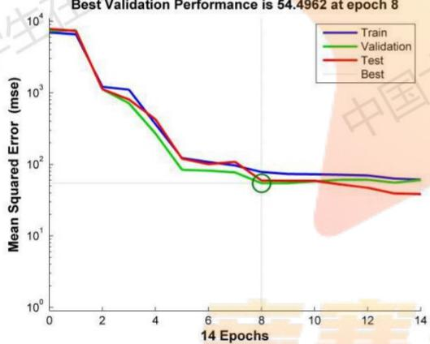  
图17、第一宿舍漏损预测

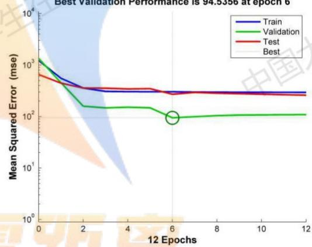  
图18、第八宿舍漏损预测


Response of Output Element 1 for Time-Series 1  
Response of Output Element 1 for Time-Series 1  
  
Best Validation Performance is 1.758 at epoch 12


  
图19、第五食堂漏损预测

  
图 20、教学楼漏损预测

通过神经网络智能识别了全网节点，识别出以下漏损情况：

表10、神经网络智能识别漏损情况
<table><tr><td>季度</td><td>水表节点 64397副表、第一学生宿舍、XXX花圃+、老六楼、东大门传达室、教育</td></tr><tr><td>一季度</td><td>超市+、农业试验站大棚、区域3+、区域4+、新留学生楼、养鱼组厕所、 养殖队6721副表、养殖馆+、养殖馆附房保卫处宿舍+、养殖馆附房二楼 厕所+、养殖馆附房一楼厕所+ 64397副表、XXXL楼、XXXS宾馆、XXX第二学生宿舍、XXX干训楼、</td></tr><tr><td>二季度 学生在线</td><td>XXX锅炉房、XXX国际纳米研究所、XXX航空航天、后勤楼、花围+、 老医务室、体育馆、污水处理、游泳池、中心水池、东大门大棚、离退休 活动室、理发店+、区域  $2 .$  区域  $4 .$  书店tance- XXX副表、舍热泵、M管、S管、后勤、成教院XXX分院、第二学生宿 舍、图书管、校医院、区域4+、体育馆网球场值班室、物业、消防、校管</td></tr><tr><td>三季度</td><td>中心种子技术+、校医院南、新大门传达室、养殖队67副表、养殖管、养 殖管房二楼厕所、K酒店严、大楼厕所西、东大楼、游泳池是严重漏损、 第八宿舍、车队、东大门温室+、东大门大棚、留学生(新)、区域3+、养 鱼组临工宿舍、第九学生宿舍、第七学生宿舍、第三学生宿舍、第一学生 宿舍、第四学生宿舍、第五食堂、第五学生宿舍，第一食堂，L管、花圃、 区域（西）、新留学生楼（新）、浴室</td></tr><tr><td>四季度</td><td>K酒店、第一食堂、养殖管、国际纳米、教学大楼、茶叶园、东大门温室、 大楼厕所西、花圃、新留学生楼、宾馆、锅炉房</td></tr></table>

根据神经网络智能识别的节点，发现随着夏季的到来，用水达到高峰，漏损也更加严重。某些漏损还有片状发展趋势，例如第一季度的养殖场区域，成片出现，可能是管道老旧或者管道串联造成的。

## 5.5问题五的模型建立与求解

## 5.5.1问题五的模型建立

（1）维修成本与漏损成本的关系

  
图 21、维修成本与漏损成本的关系

(2) 统计各管道设施设备损坏数据

$$
R = \sum _ { i = 1 } ^ { n } N _ { i } \cdot R _ { i }\tag{23}
$$

$R { : }$ 维修总成本

$N _ { i }$ i种设施设备损坏的个数

$R _ { i } { \mathrm { : } }$ i种设施设备损坏所需维修费

## (3)漏损比率控制

若漏损比率控制在5%以下，保持现在的维修成本不改变，若是升高，则适当提高维修费用。

## 5.5.2 问题五的模型求解

从5.3中计算的结果可知，学校全年漏损率为5.31%，超过了5%，需要提高一定的维修成本减低漏损率。全年漏损21548.48m3，根据贵州水价3.3元/m3，全年漏损成本为71109.984元，现需要减低漏损成本，则要通过增加维修成本来控制，假设两者为线性关系，相关系数为-1，那么需要21548.48m3—20273.576m3=1274.904m3，通过水价计算得到4207.1832元。也就是在原有维修成本的基础上增加4207.1832元，就可以将漏损率控制在5%以下。

## 六、模型的评价

问题一中，计算结果不仅很好的反映出每天、每月、每季度的变化情况，还通过四个指标（日用水量、日最大小时用水量、日平均小时用水量、日小时变化系数）综合反映了各楼、各功能区的用水平稳程度、管网漏损等情况。如果统计数据时间长度都相同，那么会更好的反映出各级表的用水特征。

问题二中，通过多元线性回归模型建立、异常数据的处理和最小二乘法的运用，使得回归模型更加可靠，残差的分析也表明模型是最优模型。

问题三中，由于漏损不能直接通过计算得到，因此采用估算的方式得到漏损的水量，并分为四个季度去考察，使用二倍标准差剔除数据的方法将异常数据（漏水量）累加得到总的漏损量，从而可以计算得到漏损比率。有两个一级表没有数据，因此是通过累加二级表数据的方式获得，如果有该两个一级表的数据，计算结果会更加精确。

问题四中，需要快速有效且智能的方式寻找到漏损位置，因此建立神经网络智能算法去识别，通过智能算法的计算，找到了各级表漏损故障，十分可靠的。如果要对微小的漏损都快速识别，那么需要更多更完整的数据，以及管网的分布，设计，规格等。

问题五中，建立漏损成本与维修成本的线性反比关系函数，通过仅有的数据去粗略估算，只能是作为参考，因为两者的关系应该是非线性的，所以如果能获得学校每月、每季度、每年的维修费用，以及维修各种规格型号的管道及相关设备所需费用，还有这些设施设备的损坏次数等，就可以更加准确的找到两者的关系函数。

## 参考文献

[1]邵圆媛.嵌套BP/GMS神经网络模型在供水管网漏损预测中的研究[D].重庆大学.

[2]常金秋.Ⅲ类学生宿舍用水特征分析[J].上海应用技术学院学报(自然科学版).13(3):245-248.

--Competition Zexoistance--

## 附录1

## 附录2

```matlab
%残差正态性检验代码
normplot(CXE)
CXE=zscore(CAN);
CXE=CXE';
alpha=0.05;
[mu,sigma]=normfit(CXE);
p1=normcdf(CXE,mu,sigma);
[H1,s1]=kstest(CXE,[CXE,p1],alpha);
n=length(CXE);
ifH1==0
disp('该数据服从正态分布。')
else
disp('该数据不服从正态分布。')
end
```