# 校园供水系统智能管理

## 摘要

智能水表的使用伴随着人工智能与科技的发展，变得越来越广泛，它的使用极大的方便了管理人员对用水情况的管理，它产生的数据也可以帮助其进行合理的数据估计从而合理规划维修，本文基于某校园智能水表产生的数据，进行了挖掘和分析，具体如下： 大学 司大学

对问题一，首先借助于Python中的pandas库对大规模、多种数据类型共存数据处理的优势进行数据的操作和处理，描述分析了宿舍、教学楼、办公楼、食堂的用水特征

对问题二，在问题一的基础上，首先利用水表层级关系附件，建立各级表的数据关系拓扑图，结合实际情况分析得出，一级水表中401X、403X、405X处的数据与二级水表相比误差率分别为11%、11%、4%；其他一级水表按照优质水表 $\pm 0 . 5 \% { - \pm 3 \% }$ ；二级以上水表按照普通水表-5%-3%来标记误差；

对于问题三，首先利用时间点左右各5个点对其本身进行样条插值平滑预测，利用预测值与原始值的差值估计漏损量，总漏损量为32215，总漏损率为9.8%，该校园漏损率低于全国的平均漏损率，此外还分析评估了各水表漏损情况； 中国

对于问题四，根据上一问的估计结果，以9.8%为阈值，漏损率超出阈值则标记一次漏损事故，结合各水表处的漏水量情况，按照漏损次数对水表进行漏损等级评定，得到40118T/40121T/40331T等水表点的漏水可能性较高；

对于问题五，通过查看相关文献资料，获得平均水价范围5.5元/吨-6.5元/吨，单次维修费用500元/次-1500元/次，建立了每天是否维修的0-1规划模型，并取平均水价6元/吨以及单次维修成本均价1000元/次分析维修次数、损失金额与水价和维修成本的关系，最终的漏水维修33次，总损失金额为174630元。 国大

本文由数据驱动，建立模型挖掘校园用水的特性，对于供热网、高速路网等问题都具有良好的推广应用价值。

关键字：数据挖掘 样条插值平滑预测 漏损检测0-1规划

## 一问题重述

## 1.1 问题背景

水是生命之源，自来水通过供水管道进入千家万户，随着科学技术的不断发展，在校园中，学校建立了一套基于智能水表的供水情况监测系统，目的是实时监测供水管道

供水管道的检漏、维护和修补，这需要耗费巨大的人力、物力、财力，是否可以通过智能水表提供的准确、及时的数据，分析管道中潜在的漏水问题，并进行及时的处理修补，减少由于水资源浪费造成的经济损失以及检漏、维护成本支出。

## 1.2已知条件

1. 水表的层级关系

2. 水表四个季度所有的用水数据记录（每十五分钟记录一次）

## 1.3 解决问题

J 1.统计、分析各个水表数据的变化规律，并给出校园内不同功能区（宿舍、教学楼、办公楼、食堂等）的用水特征 中国

2. 结合水表层级关系，建立水表数据之间的关系模型，并利用已有数据分析模型误差。

3.输水管网漏损严重，平均失水在5%左右；较老旧的管网，失水则更为严重。利用已有数据，建立数学模型，分析该供水管网的漏损情况。

4. 地下水管暗漏不容易被发现，需要花费大量人力对供水管道的漏损进行检测及定Distance--位，从水表的实时数据发现并确定发生漏损的位置

5. 管网维修需要人工费和材料费，但同时可以降低管网漏损程度。根据上述结论和查询到的水价及维修成本确定管网漏损的最优维修决策方案。 中国

## 二问题分析

对于整体五个问题我们的分析流程见下图：

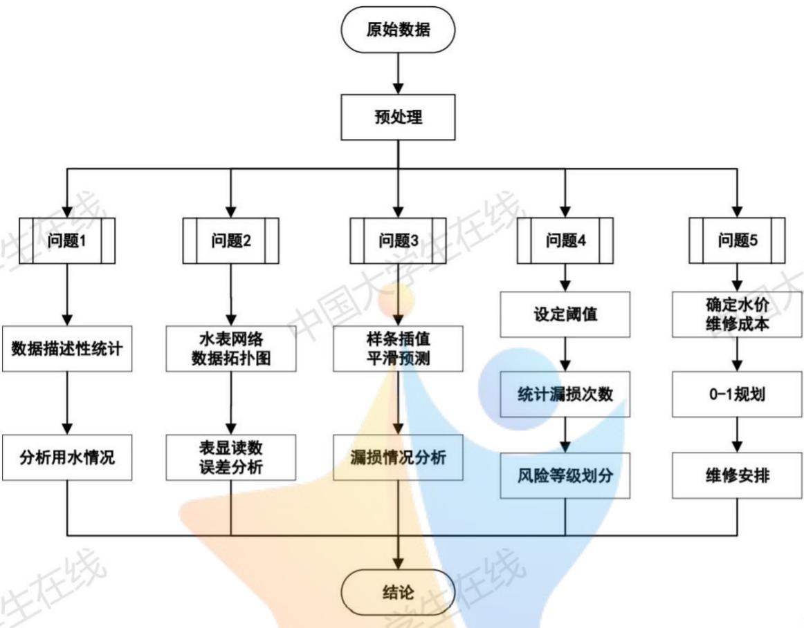  
图1. 问题分析流程图

## 2.1 问题一分析

问题需要根据已有季度用水表（附件）、水表层次（附件）的数据分析宿舍、教学楼、办公楼、食堂的用水情况特性。为此需要有以下几个分析步骤。

1. 对数据进行描述性统计，获得缺失值、异常值，以及校园用水的总体特征。

2. 需要对数据进行缺失值、异常值的处理，并对水表进行功能区划分，建立用水

3.对宿舍功能区、教学楼功能区、办公楼功能区、食堂功能区进行用水分析。

## 2.2 问题二分析

问题需要根据附件中提供的水表层级关系，建立不同层级间水表的关系模型，利用已知数据分析模型误差。

水表的合理使用：

由资料电磁水表的误差率较小，而机械速度式水表可检测的最小水流量与管道直径成正比，在直径较大的骨干管道中，采用机械速度式水表难以检测弱水流，误差较大

## 见下图：

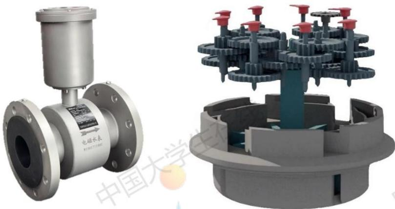  
图2. 高精度电磁水表和传统水表

所以：

1. 一级水表采用精度更高的电磁水表；

2. 二级至四级均采用已广泛使用的机械速度式水表，

我们采用拓扑图将水表间的层级关系可视化；

计算上级水表表显读数和下属水表表显读数之和的差值，将误差分为三类；

1. 一级水表误差按电磁水表统计，二级至四级水表按照机械速度式水表统计

2. 二级水表按照实际误差来计算，利用其表显数据与一级表数据做差得出误差；

## 2.3问题三分析

问题需要根据各级水表的显示数据分析出校园水网的具体漏损情况，文献[2]采用时间序列神经网络（NAR神经网络）的预测方法，基于当前各水表读数时间序列，对每个读数进行预测，表显读数与预测值波动超过一定阈值的则视为该时刻发生漏水，为解决本问题提供了思路，但是根据附件的数据，各水表的年用水情况各不相同，如若进行时间序列分析，需分水表、分时间段进行稳定性、白噪声以及参数预置的讨论，所有情况过于繁琐复杂，本问题并不合适。 国大 国大学

有鉴于此，我们参考其预测方法，对时间序列t时刻的值进行样条插值平滑预测，从而进行漏损估计，具体的步骤如下：

1. 首先对数据进行预处理工作。对一级水表按照超过一定误差的阈值的异常数据进行置均值的平滑处理；

2. 其次对一级水表的时间序列数据进行样条插值平滑预测；

3. 利用表显数据与预测值之差进行漏损量的估计。

## 2.4 问题四分析

问题需要从水表的实时数据中发现供水管网的漏损位置：

我们基于问题三的样条插值平滑预测模型：

1. 对二级水表及下属水表进行漏损偏差统计；

2.计算漏损率：

$$
\forall \overrightarrow { A } + \Pi = \frac { \sqrt { 5 } \cdot B _ { \sf E } ^ { \Delta } \vert \overrightarrow { \sf E } \vert - \overrightarrow { \sf J } _ { \sf D } ^ { \mathrm { T } } \colon \forall \mathrm { N } \vert \vert \overrightarrow { \sf E } \vert } { \overrightarrow { \sf J } _ { \sf D } ^ { \mathrm { T } } \colon \forall \mathrm { N } \vert \vert \overrightarrow { \sf J } \vert }
$$

3. 对漏损率超过总体漏损率的时间点和地点判定其发生漏损现象，根据偏差统计划分风险等级，给出供水管网中，可能出现漏损的位置及概率。

## 2.5 问题五分析

问题五需要根据查询资料，结合前面所得到的漏水数据，做出最佳维修策略，为此应首先查阅国家相关水务数据[3]，劳务数据以及材料费用数据[4]，从而确定水价范围和单次维修价格的范围。 在线

以总损失金额最小作为规则目标函数，以每天是否维修作为决策变量，建立0-1规划模型，从而得到维修决策。 中国

## 三模型假设

1. 假设一级水表采用测量精度较高的电磁水表；

2. 假设二级至四级采用均已广泛使用机械速度式水表，并有2%-5%的相对误差。

3. 无人蓄意破坏供水管道；

4. 各水表工作在理想状态下，不受强磁等外界因素干扰；

5. 水质良好，无明显杂质，不对机械速度式水表产生过大影响；

## 四符号说明

<table><tr><td>序号</td><td>符号</td><td>符号表示含义</td></tr><tr><td>1</td><td>x漏损</td><td>各一级水表时间点漏损量</td></tr><tr><td>2 字生在线</td><td>x原始</td><td>一级水表的原始数据</td></tr><tr><td></td><td>x预测</td><td>一级水表的预测漏损量 中国大学</td></tr><tr><td>4</td><td>中国大学生在线 p漏损</td><td>水表的漏损率</td></tr><tr><td>5</td><td>b维修</td><td>单次维修费用</td></tr><tr><td>6</td><td>W维修i</td><td>第i天是否维修</td></tr></table>

## 五 模型建立与求解

## 5.1 问题一模型建立与求解

## 5.1.1 整体数据描述

首先对数据进行描述性统计如下（部分数据，详细数据见附件）:

表1. 描述性统计
<table><tr><td></td><td>有效 个案数</td><td>缺失 个案数</td><td>平均值 中位数</td><td>标准偏差</td><td>最小值</td><td>最大值</td></tr><tr><td>416X</td><td>365.00</td><td>0.00mp</td><td>66.15on 68.75</td><td>Di18.47ce</td><td>0.00</td><td>114.00</td></tr><tr><td>405X</td><td>363.00</td><td>2.00</td><td>130.41</td><td>139.16</td><td>81.02</td><td>0.80 1011.74</td></tr><tr><td>403X</td><td>363.00</td><td>2.00</td><td>512.37</td><td>474.75</td><td>176.38 104.50</td><td>1201.25</td></tr><tr><td>401X</td><td>363.00</td><td>2.00</td><td>139.45</td><td>139.25</td><td>50.24 18.16</td><td>347.91</td></tr><tr><td>419T</td><td>338.00</td><td>27.00</td><td>2.80</td><td>2.89</td><td>0.82</td><td>5.03</td></tr><tr><td>418T</td><td>338.00</td><td>27.00</td><td>2.18</td><td>1.71</td><td>1.68</td><td>16.30</td></tr><tr><td>417T</td><td>338.00</td><td>27.00</td><td>5.96</td><td>4.83</td><td>4.11</td><td>0.00 21.58</td></tr></table>

当缺失值不影响数据统计时，不做替换操作，但是对于异常数据，例如二级水表

40337X中113-115行数据大于平均值的5倍以上，影响整体数据的光滑程度，不利于数据分析，因此对其进行均值替换处理。根据实际情况我们认为一级水表采用的是误差率较低的水表，而二级以上水表采用的是误差率较高的传统机械式水表，最终统计出一级表显校园总用水量：328232.24，二级表显总用水量：369307，误差率12.5%。

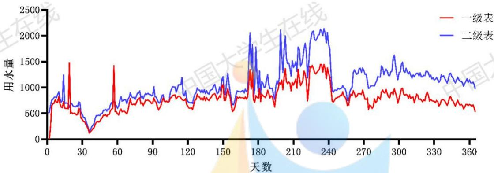  
图3.一、二级水表表显用水量（年）

根据水表层级附件，我们将二级以上的水表进行了功能区划分如下表：

表2. 功能区分类
<table><tr><td>水表号</td><td>水表名</td></tr><tr><td>3320100600</td><td>XXX第八学生宿舍</td></tr><tr><td>183671860</td><td>XXX8舍热泵</td></tr><tr><td>3320100700</td><td>XXX第七学生宿舍</td></tr><tr><td>3320100200</td><td>XXX第二学生宿舍</td></tr><tr><td>3320100100</td><td>XXX第一学生宿舍</td></tr><tr><td>宿舍 3320100500</td><td>XXX第五学生宿舍</td></tr><tr><td>1836718629</td><td>XXX5舍热泵热水</td></tr><tr><td>3320100400</td><td>XXX第四学生宿舍</td></tr><tr><td>1836718625</td><td>XXX4舍热泵热水</td></tr><tr><td>3320100300</td><td>XXX第三学生宿舍</td></tr><tr><td>1836718633</td><td>XXX3舍热泵热水</td></tr><tr><td>3320100800</td><td>XXX第九学生宿舍</td></tr><tr><td>3620301000</td><td>养殖馆附房保卫处宿舍+ ompetition</td></tr><tr><td colspan="2"></td></tr><tr><td>水表号</td><td>水表名</td></tr><tr><td>办 3210100100</td><td>XXX干训楼</td></tr><tr><td>公 3170100600</td><td>XXX西大楼</td></tr><tr><td>楼 3422200100</td><td>XXX东大楼</td></tr></table>

<table><tr><td>水表号</td><td>水表名</td></tr><tr><td>3210100200</td><td>XXX成教院XXX分院</td></tr><tr><td>3313800500</td><td>XXXL馆</td></tr><tr><td>3370100100</td><td>XXXL楼</td></tr><tr><td>3313200200</td><td>XXXS馆</td></tr><tr><td>3370300100</td><td>XXXK</td></tr><tr><td>3200200100</td><td>XXXK楼</td></tr><tr><td>教 3480400100</td><td>老七楼</td></tr><tr><td>3360300100</td><td>新留学生楼</td></tr><tr><td>学楼 3480300100</td><td>XXX老六楼</td></tr><tr><td>3480200100</td><td>XXX老五楼</td></tr><tr><td>3320100900</td><td>留学生楼（新）</td></tr><tr><td>3421300300</td><td>XXX大楼厕所西</td></tr><tr><td>3421300200</td><td>XXX大楼厕所东</td></tr><tr><td></td><td>3400500100CeXXX教学大楼总表</td></tr><tr><td>3421300100</td><td>XXX中心大楼泵房</td></tr><tr><td>3315400200</td><td>XXXM馆</td></tr><tr><td></td><td></td></tr><tr><td>水表号</td><td>水表名</td></tr><tr><td>食 3390100400</td><td>XXX第五食堂</td></tr><tr><td>3160200300</td><td>XXX第一食堂</td></tr><tr><td>堂 3390100500</td><td>XXX第二食堂</td></tr></table>

## 5.1.2功能区用水情况（全年）分析

在Python中利用pandas 库的数据处理优势对各功能区进行分类汇总，获得各功能区全年的用水情况如下图：

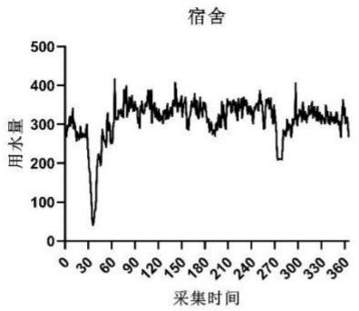

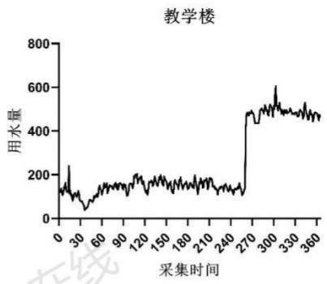

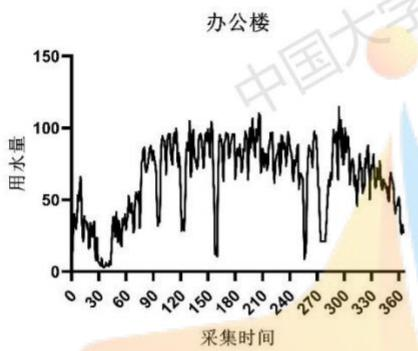

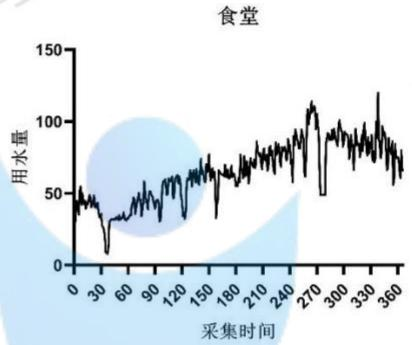  
图4. 各功能区全年用水情况

由上图可以看出，各功能区用水情况有以下特点：1.整体数据都呈现周期性波动，每周用水量按照工作日和非工作日有峰谷的变化；2.各功能区在1-3月份均处于用水量较少的位置，这个时间段是农历新年所在的寒假期间；3.教学楼和食堂数据在9-10月份有明显的增加，这一时期正是新生报到的时间，因此引起用水量的变化：4.办公楼和宿舍的用水数据在寒假之外的时间段没有明显的上升下降变化。

## 5.1.3功能区用水情况（每天）分析

将不同功能区按照工作日、周六日和节假日三种类型进行数据统计分析得到其每日的用水概况图如下：克费空距

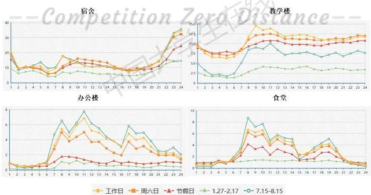  
图5.功能区按三种日期类型每日用水统计

## 功能区每日用水分析

从上图可以看出各功能区每日用水情况有以下特点：1.所有功能区00:00-06:00时间段内的用水量普遍较少；2.宿舍和教学楼的用水时间正好相反，白天学生大部分在教室上课或者学习，夜晚学生回到宿舍，此时宿舍用水处于高峰；3.办公楼用水高峰位正好是每天上午和下午的工作时间；4.食堂的用水高峰分别是07:00/12:00/18:00三个时间左右；5.寒假期间各功能区用水量均明显小于全年其他时间。

## 5.2 问题二模型建立与求解

## 5.2.1 水表数据关系

首先根据水表层级附件绘制出水网的拓扑结构图，显示出各水表之间的层级关系。

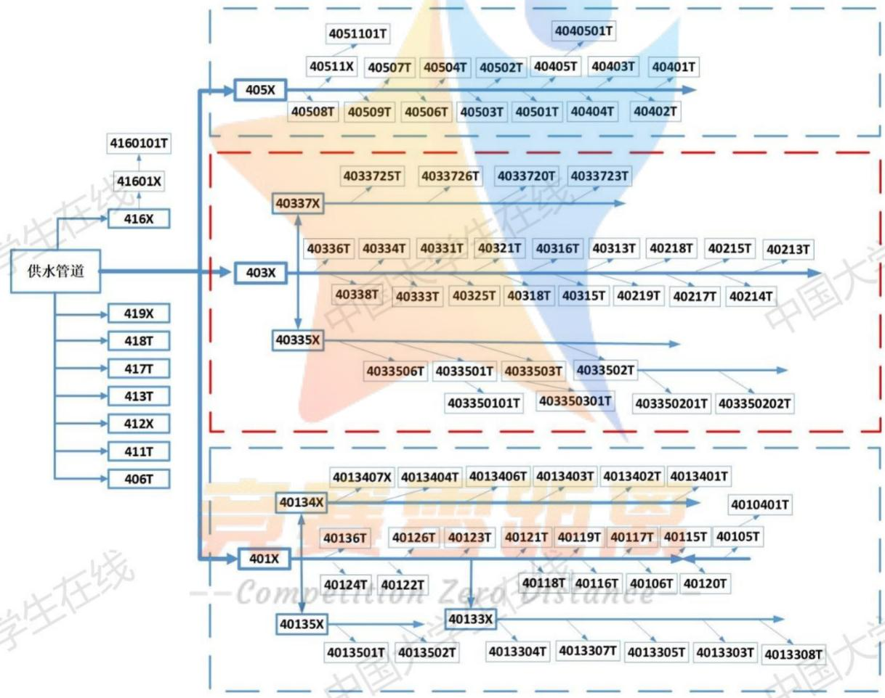  
图6. 水表数据关联拓扑图

并得到他们之间的数据关系为：1.一级水表401X、403X、405X等表显数据应为其二级水表的数据之和；2.一级水表416X的显示数据包含其二级子水表的数据，但两者并不相等；3.二级水表40335X/40337X等所处的位置如区域1、区域2、区域3、区域4等本身也会用水，所以二级水表数据包含其三级子水表的数据，但是两者并不相等。

## 5.2.2 误差分析

关联数据平均相对误差MRE的计算方法为：

$$
\scriptstyle R E _ { i j } = { \frac { \left| \sum x _ { - \xi \xi } - x _ { - \xi \xi } \right| } { x _ { - \xi \xi } } }
$$

$$
M R E = \frac { 1 } { n } \sum R E _ { i j }
$$

我们将数据的误差分为三类：

首先一级水表401X、403X、405X与其二级子水表之间的数据理论上应该是相等的，经过pandas库数据处理分析得到其平均相对误差为 中国

表3. 一级水表数据误差
<table><tr><td>一级水表</td><td>误差</td><td>一级水表</td><td>误差 一级水表</td><td>误差</td></tr><tr><td>401X</td><td>11% 403X</td><td>4%</td><td>405X</td><td>11%</td></tr></table>

对于406T、411T、412T等一级水表，根据资料[1]按精度最高的电磁水表来考虑，其显示数据误差为±0.5%-3%；

对于二级、三级、四级水表，根据资料[1]我们按通用的机械水表来考虑，其显示数据误差为：-5%-3%。 中国 中国

## 5.3问题三模型建立和求解

## 5.3.1 数据预处理

首先在pandas中对一级水表的显示数据进行按天的汇总，数据见附件，其波动变化图如下： 竞赛零距离生在线 --Competition ZexoDistance--

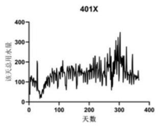

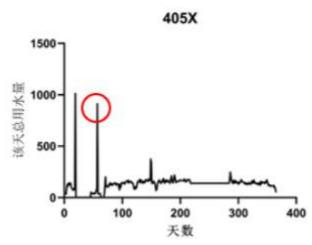

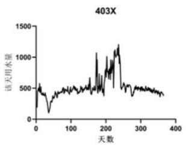

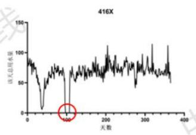

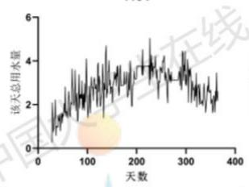

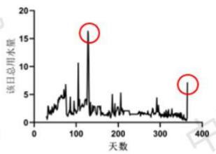

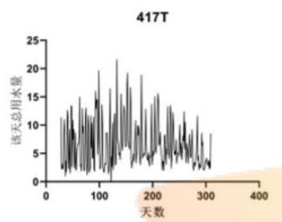

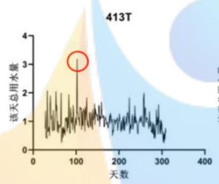

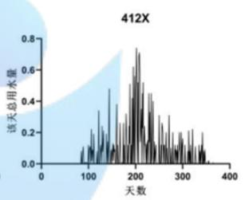

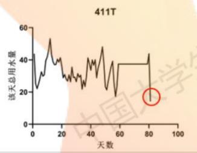

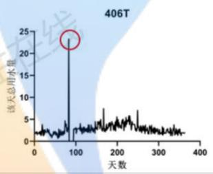  
图7. 一级水表全年用水时间序列图

针对每个一级水表的数据的不同特性，我们把红圈中的异常值进行均值替换处理，从而让数据更加平滑稳定。

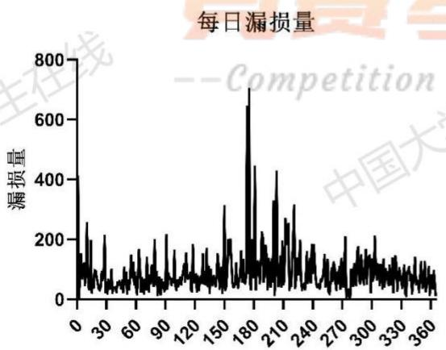

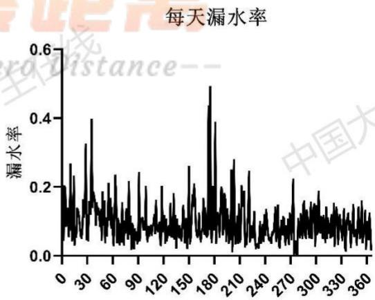  
图8.全年整体的漏损量和漏损率时间序列图

由上图可看出，全年的漏水量和漏水频率是平稳波动的，日均漏水量为88，日均漏水率为8.8%，在年中的7、8月份，漏水量与漏水率均有较大幅度的波动，需重点进行防范和检修。

## 5.3.2样条插值平滑预测

样条插值的基本原理如下：

设给定区间[a,b]的一个分划：

$$
\Delta \colon a = x _ { 0 } < x _ { 0 } < \cdots < x _ { 0 } = b
$$

若函数s(x)，满足条件：

在每一个单独区间段内 $[ x _ { i - 1 } , x _ { i } ] , ( i = 1 , 2 , \cdots , n )$ ，是k次多项式；

s(x)及直到k-1阶导数在给定区间[a,b]上连续。

则称函数s(x)是关于分划∆的k次多项式样条函数， $x _ { 0 } , x _ { 1 } , \cdots , x _ { n }$ 称为样条节点，样条函数记作 $S _ { p } ( \Delta , k )$ 。k次多项式样条函数的一般形式为：

$$
s _ { k } ( x ) = \sum _ { i = 0 } ^ { k } { \frac { \alpha _ { i } x ^ { i } } { i ! } } + \sum _ { j = 1 } ^ { n - 1 } { \frac { \beta _ { j } } { k ! } } ( x - x _ { j } ) _ { + } ^ { k }
$$

其中 $\alpha _ { i } ( i = 0 , 1 , \cdots , k )$ 和 $\beta _ { i } ( i = 1 , 2 , \cdots , n - 1 )$ 均为任意常数

这里我们采用三次样条插值对一级水表的每个时间序列数据进行预测。

在数据 $x _ { i j }$ 附近向左向右各选5个数据共10个，即 $\left[ x _ { i , j - 5 } \ldots x _ { i , j - 1 } x _ { i , j + 1 } \ldots x _ { i , j + 5 } \right]$ ，通过这十个数据对xj进行插值预测，得到的预测数据（具体见附件）。 $x _ { i j }$

## 5.3.3 漏损情况分析

各一级水表时间点漏损数据 $x _ { i \in \pmb { \mathscr { M } } } \mathrm { i f }$ 算方法为：

$$
\pmb { x } \frac { 1 } { 2 } + \pmb { x } \frac { 1 } { 2 } \pmb { \mathscr { k } } \pmb { \mathscr { L } } - \pmb { \mathscr { X } } \frac { 1 } { 2 } \pmb { \mathscr { W } }
$$

漏损率 $\cdot p _ { \sqrt { \mathscr { A } } ^ { \mathscr { H } } }$ 为：

$$
p _ { \checkmark f _ { \mathcal { M } } ^ { \mathrm { E } } } = \frac { x _ { \mathcal { M } \mathcal { H } } ^ { } + \frac { \omega } { \mathcal { M } } } { x _ { \mathcal { F } \mathcal { W } \mathcal { H } } ^ { } }
$$

通过借助于Python数据处理，得到各一级水表的具体数据，文献[2]显示我国城市漏水率一般在15%以上，北方地区甚至达到了40%，在此基础上统计得出各水表的漏水次数和漏水量为（具体数据见附件）：

表4.各水表漏损量和漏损率
<table><tr><td>水表号</td><td>412X</td><td>40336T</td><td>40403T</td><td>40105T</td><td>40502T</td><td>40334T</td><td>4010401T</td><td>403350202T</td><td>40126T</td><td>40118T</td></tr><tr><td>漏水率</td><td>34.8%</td><td>25.8%</td><td>25.2%</td><td>20.2%</td><td>20.0%</td><td>19.2%</td><td>18.9%</td><td>18.6%</td><td>17.9%</td><td>17.7%</td></tr><tr><td></td><td>6.33</td><td>76.22</td><td>163.90</td><td>10.53</td><td>228.90</td><td>0.97</td><td>292.14</td><td>10.87</td><td>0.92</td><td>45.43</td></tr><tr><td>漏水量</td><td>40124T</td><td>417T</td><td></td><td>4013403T</td><td>40333T</td><td>40318T</td><td>4013407X</td><td>40121T</td><td>40331T</td><td></td></tr><tr><td>水表号 漏水率</td><td>17.2%</td><td>16.6%</td><td>40316T 16.6%</td><td>16.0%</td><td>15.5%</td><td>15.5%</td><td>15.2%</td><td>14.9%</td><td></td><td>40120T</td></tr><tr><td>漏水量</td><td>14.15</td><td>335.40</td><td>89.36</td><td>474.39</td><td>26.09</td><td>10.32</td><td>347.28</td><td>27.74</td><td>14.6%</td><td>12.8%</td></tr><tr><td>水表号</td><td>40119T</td><td>4160101T</td><td></td><td></td><td></td><td></td><td></td><td></td><td>13.54</td><td>17.26</td></tr><tr><td>漏水率</td><td>12.6%</td><td>12.2%</td><td>40136T 11.9%</td><td>40214T 11.8%</td><td>40115T</td><td>40321T 10.4%</td><td>40135X 10.3%</td><td>40509T</td><td>4013404T</td><td>413T</td></tr><tr><td>漏水量</td><td>90.18</td><td>51.17</td><td>25.28</td><td>1115.73</td><td>11.7%</td><td>440.32</td><td></td><td>9.9%</td><td>9.7%</td><td>9.5%</td></tr><tr><td>水表号</td><td>4013501T</td><td>4051101T</td><td></td><td></td><td>89.82</td><td></td><td>106.94</td><td>33.17</td><td>91.73</td><td>26.69</td></tr><tr><td>漏水率</td><td>9.4%</td><td>9.2%</td><td>4013307T</td><td>40511X</td><td>4013401T</td><td>40106T</td><td>4013308T</td><td>40508T</td><td>40133X</td><td>40405T</td></tr><tr><td>漏水量</td><td>39.86</td><td></td><td>9.2%</td><td>9.1%</td><td>9.1%</td><td>8.8%</td><td>8.5%</td><td>8.3%</td><td>8.2%</td><td>8.2%</td></tr><tr><td></td><td></td><td>148.22</td><td>285.15</td><td>140.48</td><td>99.98</td><td>6.98</td><td>441.09</td><td>161.01</td><td>1308.17</td><td>733.24</td></tr><tr><td>水表号</td><td>4013305T</td><td>406T</td><td>4013406T</td><td>41601X</td><td>40313T</td><td>418T</td><td>40116T</td><td>40402T</td><td>40401T</td><td>40123T</td></tr><tr><td>漏水率</td><td>7.9%</td><td>7.8%</td><td>7.6%</td><td>7.5%</td><td>7.4%</td><td>7.4%</td><td>6.9%</td><td>6.8%</td><td>6.7%</td><td>6.7%</td></tr><tr><td>漏水量</td><td>88.29</td><td>75.24</td><td>43.03</td><td>150.84</td><td>233.82</td><td>52.82</td><td>398.88</td><td>124.85</td><td>65.72</td><td>39.73</td></tr><tr><td>水表号</td><td>4013303T</td><td>40122T</td><td>40134X</td><td>4033726T</td><td>40338T</td><td>40504T</td><td>401X</td><td>4033506T</td><td>4040501T</td><td>419T</td></tr><tr><td>漏水率</td><td>6.6%</td><td>6.5%</td><td>6.4%</td><td>6.3%</td><td>6.1%</td><td>6.1%</td><td>5.7%</td><td>5.6%</td><td>5.3%</td><td>5.0%</td></tr><tr><td>漏水量</td><td>684.46</td><td>9.51</td><td>1032.60</td><td>645.72</td><td>184.70</td><td>154.50</td><td>2872.94</td><td>106.29</td><td>89.74</td><td>47.77</td></tr><tr><td>水表号</td><td>40218T</td><td>40507T</td><td>40315T</td><td>4013502T</td><td>4033725T</td><td>403350301T</td><td>403350101T</td><td>416X</td><td>40117T</td><td>4033723T</td></tr><tr><td>漏水率</td><td>5.0%</td><td>4.8%</td><td>4.7%</td><td>4.3%</td><td>4.1%</td><td>4.1%</td><td>4.0%</td><td>3.8%</td><td>3.7%</td><td>3.7%</td></tr><tr><td>漏水量</td><td>95.09</td><td>113.88</td><td>203.48</td><td>10.19</td><td>115.34</td><td>235.91</td><td>115.72</td><td>907.76</td><td>191.78</td><td>74.13</td></tr><tr><td>水表号</td><td>40404T</td><td>403350201T</td><td>40219T</td><td>40501T</td><td>4013402T</td><td>40337X</td><td>4033720T</td><td>40217T</td><td>40325T</td><td>411T</td></tr><tr><td>漏水率</td><td>3.7%</td><td>3.7%</td><td>3.7%</td><td>3.5%</td><td>3.4%</td><td>3.4%</td><td>3.0%</td><td>3.0%</td><td>2.9%</td><td>2.9%</td></tr><tr><td>漏水量</td><td>273.55</td><td>212.11</td><td>87.40</td><td>429.83</td><td>7.90</td><td>3006.97</td><td>463.68</td><td>184.87</td><td>544.23</td><td>490.07</td></tr><tr><td>水表号</td><td>4033502T</td><td>40503T</td><td>405X</td><td>40335X</td><td>40215T</td><td>403X 4033501T</td><td>40213T</td><td>4033503T</td><td>4013304T</td><td>40506T</td></tr><tr><td>漏水率 漏水量</td><td>2.8% 524.61</td><td>2.7% 539.53</td><td>2.7% 1227.30</td><td>2.7% 1525.04</td><td>2.6% 343.88</td><td>2.5% 4724.68</td><td>2.5% 2.3% 282.11 153.52</td><td>1.9% 353.49</td><td>1.2% 0.33</td><td>0.2% 88.49</td></tr></table>

上表显示一级水表的漏损量估计为10766，二级以上水表的漏损量估计为：21488，总漏损率估计为：9.8%，

同时数据显示在一级水表中，403X处的漏损量是最多的，412X处的漏水率是最高的，平均漏损量为978；在二级以上的水表中，40337X的漏损量是最多的，40336T处的漏损率是最高的，平均漏损量为268。

## 5.4问题四模型建立与求解

基于第三问的漏损率数据，我们设置预报发生漏损的漏损率阈值为9.8%，

统计得出各水表的漏损频次排序如图：

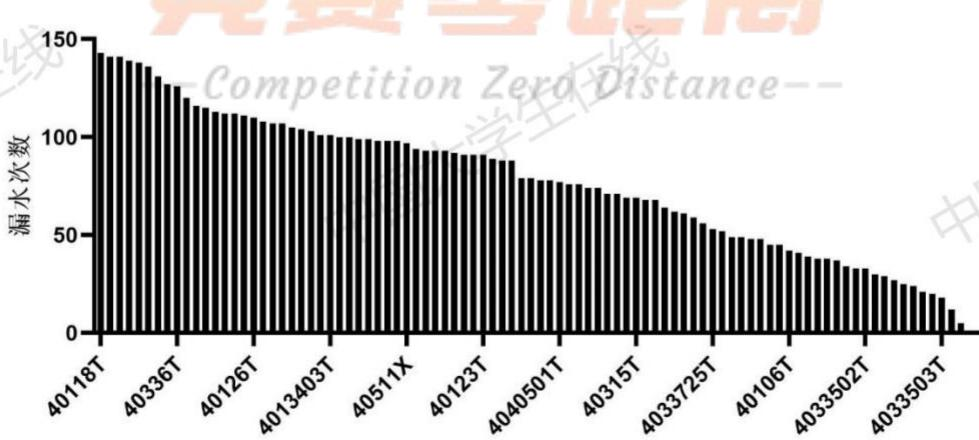  
图9. 水表漏水频次

从上图可以看出40118T/40121T/40331T的漏损次数排名前三，我们按照每隔30次一个漏损发生预报等级，对各水表位置进行漏损等级预报如下图：

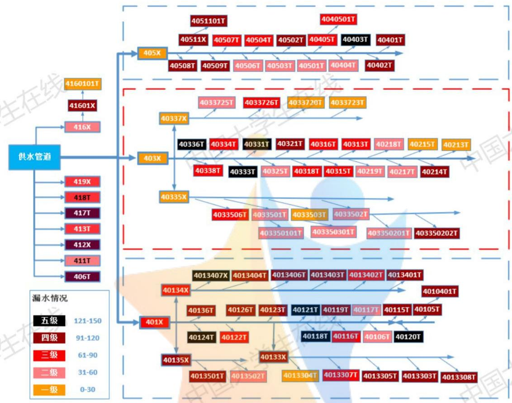  
图10. 漏损预报等级

根据漏损预报等级显示：40118T/40121T/40331T等9处水表位置预警等级最高，这些水表点应该重点注意。4010401T/4013501T/40135X等32处预警等级次之需要提高警惕。

## 5.5问题五模型建立与求解

## 5.5.1 0-1 规划模型建立

依据全国水价网数据资料[3]，公共事业单位用水均价为5.5-6.5元/吨，另据资料[4]显示供水地下暗管价格为300元/m，单次维修人数3人，人工费为200元/人，单次维国 国修总费用为 $b _ { \underline { { \xi } } \underline { { \sharp } } \underline { { 1 } } \sharp } = 5 0 0 \overline { { \mathcal { T } } } \mathrm { - } 1 5 0 0$ 元，由第三、四问可知全年每天的漏水量是不固定的，因此以总损失金额最少建立0-1规划模型：

$$
\begin{array} { r } { m i n \displaystyle \sum _ { i = 1 } ^ { 3 6 5 } ( b _ { \frac { i \notin \sharp \sharp \sharp } { | \tilde { \mathcal { E } } | \sharp | \tilde { \mathcal { E } } i } } + b _ { \frac { i \sharp \sharp \sharp } { | \sharp | \tilde { \mathcal { G } } i } } ( 1 - w _ { \frac { i \sharp \sharp \sharp \sharp } { | \tilde { \mathcal { G } } i | \mathcal { E } i } } ) ) } \\ { \qquad \ : S . t . \quad w _ { \frac { i \sharp \sharp \sharp } { | \tilde { \mathcal { G } } i | \mathcal { E } i } } = 0 , 1 } \end{array}
$$

## 5.5.2 模型求解

在 matlab 中运用 intlinprog求解线性0-1 规划得到维修次数和损失金额关于水价和维修成本的三维曲面图如下：

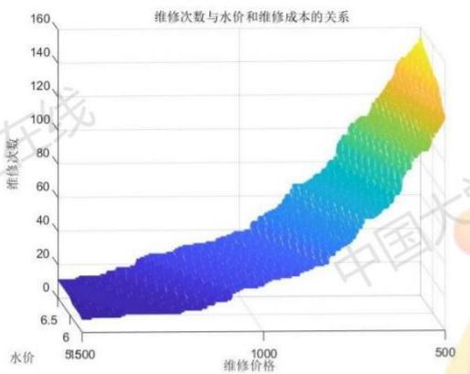

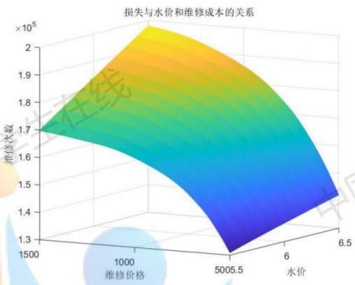  
图11. 维修次数和损失金额与水价和维修成本的关系图

可以看出当水价为5.5元/吨，维修成本为500元/次时总的损失金额是最少的；当水价为6.5元/吨，维修成本为1500元/次时，总的维修次数是最少的。

我们取水价为6元/吨，维修成本为1000元/次，具体维修安排如下：

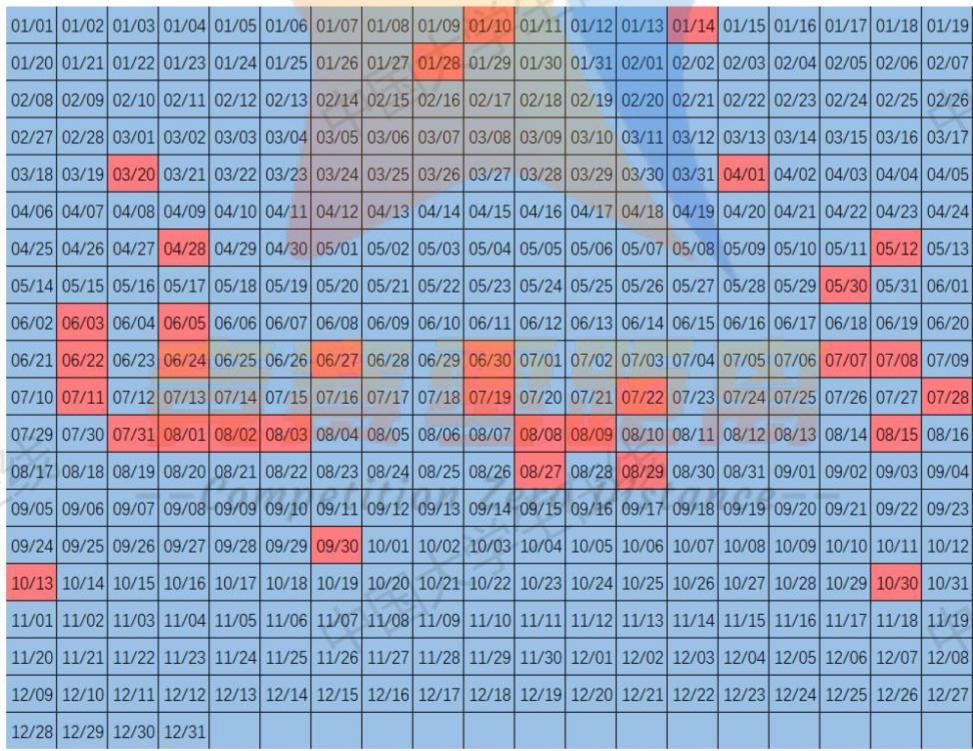  
图12. 维修安排（蓝色代表不维修，红色表示维修)

从上表结合模型求解结果可以得出，全年总共维修33次，具体的安排如表所示，全年中6-8月份维修频率较多，其原因可能是因为夏季雨水增多，造成地下水管的腐蚀

产生管网沉积物，引起供水管破裂，因此6-8月份漏水量增大，需检修次数相应增加。

与之相反的是在11-12月份的维修次数相对较少，这可能是由于降水量减少，供水管路运行良好，漏水量降低的原因。

总的损失金额为174,630元

## 六模型检验

## 6.1 问题三和问题四的模型灵敏度检验

针我们将时序点向前向后的差值点数由前后各5个改为前后3个和前后7个，分别 通过样条插值得到其漏损量和漏损率比较见下表：

表5. 插值点数量的灵敏度检验
<table><tr><td>向前向后插值点数</td><td>3个点</td><td>5个点</td><td>7个点</td></tr><tr><td>漏损量</td><td>32255</td><td>32255</td><td>32255</td></tr><tr><td>漏损率</td><td>9.8%</td><td>9.8%</td><td>9.8%</td></tr></table>

从上表可以看出当改变插值点的个数时，对于漏损量和漏损率均没有的改变，一方面是因为样条插值预测的特性，另一方面也说明我们的模型健壮性较好。

## 6.2问题五的模型灵敏度检验

我们将水价进一步拓展为5 元/吨-7元/吨，维修成本进一步拓展为200元/次-2000元/次，可以看出总维修次数随着水价和维修成本均单调递减，总损失金额随水价和维修成本单调递增。

## 七模型改进

## 7.1 问题三和问题四的模型改进

我们可以参考文献[2]中的时间序列神经网络对数据进行平滑预测，得到更精确的预测值作为计算漏损量和漏损率的参考数据，并以此进行漏损检验分析，分析发生漏损的位置。 中国大 中国大

## 7.2 问题五模型改进

参考文献5发生漏损的点位数量在时间[T,T+τ]内服从泊松分布，我们把全年的漏损数据看成是一个完整的泊松过程，这个过程也是一个马尔科夫链，用随机过程分析方法来对维修决策进行重新规划，可以得到更好的维修安排决策。

此外在考虑约束条件时，也可以加入维修均衡度等条件。

## 八模型评价

## 8.1 优点

1. 对于问题给出额数据量较大、多种数据格式类型共存、缺失值异常值较多的数据特点，我们采用Python中的 pandas库，快捷方便的对数据进行了挖掘处理；

2.我们利用样条插值的光滑预测特性，对漏损情况进行分析，得到较好的漏损位置预测结果； 大学 司大学

3. 我们利用结合实际的水价和维修价格不断波动的特点，建立了动态的0-1规划模型，较好的给出了维修决策；

综合以上，我们的模型不但可以推广到其他的供水网络数据分析中，还可以进一步应用到供热数据分析、网络流量数据分析、高速路网数据分析当中，具有较好的推广价值。

## 8.2 缺点

1.预测数据模型可以考虑更多的因素，获得更加精确的预测值，以此来建立模型；

2. 维修规划时可以考虑维修的均衡度等因素，进一步优化模型。

## 九参考文献

[1] “你好，查水表,”[联机].Available: https://www.bilibili.com/video/av77960277/.

[2] 朱乃富，《基于数据驱动的供水管网独立计量分区漏损检测和定位方法研究》：硕士学位论文，2019年2月.

[3]“中国水网水价,”[联机]. Available: http://www.h2o-china.com/price/.

[4]“双高筋增强聚乙烯(HDPE)缠绕管 11 [ 联机]. Available: http://ww.jt1688.cn/photo\_show.aspx?id=206. C nstance

[5] 卓严报，《基于支持向量机的城市给水管网故障诊断研究》：硕士学位论文,2013年6月.

[6]谢金星、薛毅，《优化建模与LINDO/LINGO软件》，清华大学出版社,2006年

[7] 吴小刚、张土乔，“《城市给水网系统的故障风险评价决策技术》,”《自然灾害学报》,2006年4月.

[8] 王凌，《维修决策模型和方法的理论与应用研究》，博士学位论文，2007年6月

[9] 司守奎、孙兆亮，《数学建模算法与应用》，第二版编辑，国防工业出版社,2011年.

[10]苗志宏、马金强，MATLAB面向对象程序设计，电子工业出版社，2014年

[11]吕自荟，《水泵系统状态监测与故障诊断》，硕士学位论文，2014年6月.

[12]梁建文、肖笛、赵新华、张宏伟,“《给水网故障实时诊断方法》,”《水利学报》,2001年12月.

[13]梁建文、肖笛、张宏伟、赵新华,“《给水管网故障实时诊断方法(Ⅱ)》,”《自然科学进展》，2002年9月.

[14]李花、梁辉、于宁，Excel高级数据处理及分析，电子工业出版社，2015年

[15]李航，《统计学习方法》，清华大学出版社,2013年

[16]郭明乐、黄旭东，《概率论与数理统计》，中国科学技术大学出版社，2011年

## 十附录

10.1 支撑材料目录
<table><tr><td rowspan=1 colspan=2>一二级水表表显用水量（年）.x1s各功能区全年用水情况.x1sx问题一功能区按三种日期类型每日用水统计.x1sCode_1. py</td></tr><tr><td rowspan=1 colspan=1>问题二</td><td rowspan=1 colspan=1>一级水表数据误差.xlsx学Code_2. py</td></tr><tr><td rowspan=1 colspan=1>问题三</td><td rowspan=1 colspan=1>级水表全年用水时间序列图.x1sx全年整体的漏损量和漏损率时间序列图.x1sx各水表漏水量和漏损率,x1sCode_3. py</td></tr><tr><td rowspan=1 colspan=1>问题四</td><td rowspan=1 colspan=1>水表漏水频次.x1sCode_4.py</td></tr><tr><td rowspan=1 colspan=1>问题</td><td rowspan=1 colspan=1>cs.xlssunshi.xlsxsuihua.m</td></tr></table>

## 10.2 代码、操作及结果

1. 问题一和问题二

import numpy as np

import pandas as pd

import os

import xlrd

from pandas import to\_datetime

import matplotlib.pyplot as plt

import xlwt

import datetime,time

plt.rcParams['font.sans-serif]=['SimHei']

plt.rcParams['axes.unicode\_minus']=False

inputdir=r'D:\\主桌面\\E题\\水表数据'

df\_empty=pd.DataFrame(columns=['水表名','水表号','采集时间','上次读数',当前读数   
','用量'])   
for parents, dirnames, filenames in os.walk(inputdir): for filename in filenames: df=pd.read excel(os.path.join(parents,filename)) df\_empty=df\_empty.append(df,ignore\_index=True)

```python
data_index=pd.read_excel('D:\\主桌面\E题\\附件_水表层级(1).xlsx')
data_index.dropna(axis=0,thresh=7,inplace=True)
data=df_empty.copy()
```

## #用量是否为表显数据差

```python
dataall['表显差值']=data all['当前读数']-data all['上次读数']
data_all['差值']=data_all['表显差值']-data_all['用量']
data_all['差值'].abs().sum()
data_all_tem=data_all[data_all['差值'].abs()==0.01]
#各水表总用水量统计
sbm_sl=data_all['用量].groupby(by=data_all['序号']).sum()
#12个工作区总用水量
gnq_sl=data_all['用量].groupby(by=data_all['功能分类]).sum()
```

data\_all['采集时间']=to\_datetime(data\_all.采集时间,format='%Y/%m/%d %H:%M:%S')  
gnq\_sl.to\_excel('D:\\主桌面\\E 题\\功能区总水量.xls')

## #12 个功能区按天统计用水量

```python
gnq day=pd.DataFrame(columns=['总表','宿舍','教学楼','办公楼','食堂','科研楼','运动
场所','后勤保卫','校医院','澡堂,'酒店','图书馆','其他'])
for i in np.arange(13):
temp=data all[data all['功能分类]==i]
temp.set index('采集时间',inplace=True)
gnq_day.iloc[:,i-1]=temp['用量'].resample('D').sum()
gnq day.to excel('D:\\主桌面\\E题\\功能区每天水量.xls')
```

## #12个功能区按月度统计用水量

gnqmonth=pd.DataFrame(columns=['总表','宿舍''教学楼','办公楼','食堂','科研楼','运  
动场所','后勤保卫','校医院','澡堂,'酒店,'图书馆,其他')nce  
for i in np.arange(13):temp=data all[data all['功能分类']==i] 中国大学temp.set index('采集时间',inplace=True)gnq\_month.iloc[:,i-1]=temp['用量'].resample('M').sum()  
gnq month.to excel('D:\\主桌面\E 题\\功能区每月水量.xls')

## #12个功能区按小时统计用水量

gnq hour=pd.DataFrame(columns=['总表','宿舍','教学楼','办公楼','食堂','科研楼','运动  
场所','后勤保卫','校医院',澡堂','酒店','图书馆','其他'])  
for i in np.arange(13):

temp=data\_all[data\_all['功能分类]==i]temp.set index('采集时间',inplace=True)gnq\_hour.iloc[:,i-1]=temp['用量'].resample('H').sum()gnq hour.to excel('D:\\主桌面\\E 题\\功能区每小时.xls')gnq15min=pd.DataFrame(columns=['总表','宿舍','教学楼','办公楼','食动场所','后勤保卫','校医院','澡堂','酒店','图书馆','其他'])for i in np.arange(13): 在线temp=data\_all[data\_all['功能分类]==i]temp.set\_index('采集时间',inplace=True)gnq\_15min.iloc[:,i-1]=temp['用量'].resample('15min').sum()gnq\_15min.to\_excel('D:\主桌面\E 题\\功能区 15min.xls')gnq ht=gnq15min.1oc['2019-04-01T00:00:00.000000000':'2019-04-30T23:45:00.000000000']plt.figure()for i in np.arange(4):plt.subplot(4,1,i+1)plt.subplots adjust(hspace=1)temp=gnq\_ht.iloc[:,i+1]plt.plot(np.arange(len(temp[temp<30])),temp[temp<30])plt.xlabel(gnq\_ht.columns[i+1])plt.ylabel(用水量(方)')plt.savefig('D:\\主桌面\\E题\\用水量4月.png')plt.show()gnq ht10=gnq15min.1oc['2019-10-01T00:00:00.000000000':'2019-10-31T23:45:00.000000000']p t in n.arange(4): plt.subplot(4,1,i+1) 赛零距离plt.subplots\_adjust(hspace=1)E在 temp=gnq\_ht10.iloc:1+1jitionZexoDistanceplt.plot(np.arange(len(temp[temp<30])),temp[temp<30])plt.xlabel(gnq\_ht10.columns[i+1])plt.ylabel(用水量(方)')Xplt.savefig('D:\\工作\2020数学建模\\E题\\用水量10月.png')plt.show()gnq htsj=gnq15min.1oc['2019-07-15T00:00:00.000000000':'2019-08-15T23:45:00.000000000']plt.figure()

```python
for i in np.arange(4):
plt.subplot(4,1,i+1)
plt.subplots_adjust(hspace=1)
temp=gnq_htsj.iloc[:,i+1]
plt.plot(np.arange(len(temp[temp<30])),temp[temp<30])
plt.xlabel(gnq_htsj.columns[i+1])
plt.ylabel('用水量(方)')
plt.savefig('D:\\工作\\2020数学建模\\E题\\用水量暑假.png')
plt.show()
```

gnq\_ht['时间']=gnq\_ht.index.tolist() 中  
gnq\_ht['时间']=gnq\_ht['时间'].astype('str')  
gnq\_ht\_sd=pd.DataFrame(columns=['02:00','06:00','10:00','14:00','18:00','22:00'])  
for i in gnq ht sd.columns:temp=gnq\_ht[gnq\_ht['时间'].str.contains(i)]temp=temp.set\_index(np.arange(len(temp['时间'])))gnq\_ht\_sd.loc[:,i]=temp.iloc[:,1]gnq\_ht\_sd.set\_index(np.arange(len(temp['时间'])))

## plt.figure()

for i in np.arange(len(gnq\_ht\_sd.columns)): plt.subplot(6,1,i+1) plt.subplots adjust(top=1.5,bottom=0) plt.plot(gnq\_ht\_sd.index,gnq\_ht\_sd.iloc[:,i]) plt.xlabel(gnq\_ht\_sd.columns[i]) plt.ylabel('用水量（方')

all\_sum=pd.DataFrame(columns-np.arange(91)+1)1stance   
for i in np.arange(91)+1: temp=data\_all[data\_all['序号]==i] temp.set\_index('采集时间',inplace=True) all\_sum.iloc[:,i-1]=temp['用量'].resample('D').sum()

## #分级统计水量

## #一级水表

```python
sbm_1=data_all[data_all['一级表计编码'].notnull()]
sbm_1_yl=pd.DataFrame(columns=sbm_1['一级表计编码].unique())
sbm_1_yl15=pd.DataFrame(columns=sbm_1['一级表计编码].unique())
for i in sbm_1['一级表计编码'].unique():
temp=sbm_1[sbm_1['一级表计编码]==i]
temp.set_index('采集时间',inplace=True) 线
sbm_1_yl[i]=temp['用量'].resample('D').sum()
sbm_1_yl15[i]=temp['用量].resample('15min').sum()
#一级总用水量
for i in sbm_1['一级表计编码].unique():
temp=sbm_1_yl[i]
temp[temp>5*temp.mean()]=temp.mean()
sbm_1_yl[i]=temp
sbm_1_yl=sbm_1_yl.fillna(0)
zysl_yj=(sbm_1_yl.sum(axis=0)).sum()
```

## #二级水表

```python
sbm2=data all[data all['二级表计编码'].notnull()]
sbm2_yl=pd.DataFrame(columns=sbm_2['二级表计编码].unique())
sbm_2_yl15=pd.DataFrame(columns=sbm_2['二级表计编码].unique()
for i in sbm2['二级表计编码'].unique():
temp=sbm2[sbm 2['二级表计编码]==i]
temp.set index('采集时间',inplace=True)
sbm_2_yl[i]=temp['用量'].resample('D').sum()
sbm_2_yl15[i]= temp['用量'].resample('15min').sum()
```

## #二级表显用水量

```python
temp=sbm_2_yl[i]
temp[temp>5*temp.mean()]=temp.mean()
sbm_2_yl[i]=tempmpetition ZeroDistance
sbm_2_yl=sbm_2_yl.fillna(0)
zysl_ej=(sbm_2_yl.sum(axis=0)).sum()
```

```python
#三级水表
sbm3=data_all[data_all['三级表计编码'].notnull()]
sbm_3_yl=pd.DataFrame(columns=sbm_3['三级表计编码].unique())
sbm_3_yl15=pd.DataFrame(columns=sbm_3['三级表计编码].unique())
for i in sbm_3['三级表计编码].unique():
```

temp=sbm\_3[sbm\_3['三级表计编码]==i] temp.set\_index('采集时间',inplace=True) sbm\_3\_yl[i]=temp['用量'].resample('D').sum() sbm\_3\_yl15[i] = temp['用量'].resample('15min').sum()

## #四级水表

sbm\_4=data\_all[data\_all['四级表计编码].notnull()]   
sbm\_4 yl=pd.DataFrame(columns=sbm\_4['四级表计编码].unique())   
sbm\_4\_yl15=pd.DataFrame(columns=sbm\_4['四级表计编码].unique()   
for i in sbm\_4['四级表计编码].unique(): temp=sbm\_4[sbm\_4['四级表计编码]==i] temp.set\_index('采集时间',inplace=True) sbm\_4\_yl[i]=temp['用量'].resample('D').sum() sbm\_4\_yl15[i] = temp['用量].resample('15min').sum()

for i in np.arange(11): plt.figure() # temp[temp>100]=temp.mean() temp-temp[teimp.iotul0] 距离 plt.plot(np.arange(len(temp)),temp) plt.xlabel(sbm\_yl.columns[i]) Distance plt.ylabel(用水量') plt.savefig('D:\\工作\\2020数学建模\\E题\\%d.png'%(i+1))

## 2. 问题三和问题四

#数据插值以每个点向前向后各5个点，共十个点作为插值数据进行预测  
#data\_cz=pd.DataFrame([])  
# sbm\_yl\_pro=pd.DataFrame([])  
# for i in np.arange(91):  
# temp=pd.DataFrame(sbm\_yl.iloc[:,i].dropna(),columns=[sbm\_yl.columns[i]])

```python
temp[sbm_yl.columns[i]][temp[sbm_yl.columns[i]]>5*temp[sbm_yl.columns[i]].mean()
]=temp[sbm_yl.columns[i]].mean()
# sbm yl pro = sbm yl pro.join(temp, how='outer')
# for j in np.arange(len(temp)):
# if j-5<0:
＃＃＃＃＃＃ temp1=temp.iloc[0:j+6,:].copy()
在线 temp1.iloc[j,:]=np.nan temp1=temp1.interpolate(method='pchip',limit direction='both')
temp.iloc[j,:]=temp1.iloc[j,:]
elifj+5>len(temp)-1: 中国大学
temp1=temp[j-5:len(temp)].copy()
# temp1.iloc[5,:]=np.nan
＃＃ temp1=temp1.interpolate(method='pchip',limit_direction='both')
temp.iloc[j,:]=temp1.iloc[5,:]
# else:
# temp1 = temp.iloc[j - 5:j + 6,:].copy()
#＃ temp1.iloc[5,:] = np.nan
temp1=temp1.interpolate(method='pchip',limitdirection='both')
temp.iloc[j,:] = temp1.iloc[5,:]
data_cz=data_cz.join(temp,how='outer')
```

#前后各 3 各数据进行插值

```python
data_cz=pd.DataFrame([])
sbm_yl_pro=pd.DataFrame([])
for i in np.arange(91):
temp=pd.DataFrame(sbm_yl.iloc[:,i].dropna(),columns=[sbm_yl.columns[i]])
temp[sbm_yl.columns[i]][temp[sbm_yl.columns[i]]>5*temp[sbm_yl.columns[i]].mean()
]=temp[sbm_yl.columns[i]].mean()
sbm_yl_pro = sbm_yl_pro.join(temp, how='outer')
for j in np.arange(len(temp)):ionLeraDistance--
ifj-3<0:
temp1=temp.iloc[0:j+4,:].copy() 中国大学
temp1.iloc[j,:]=np.nan
temp1=temp1.interpolate(method='pchip',limit_direction='both')
temp.iloc[j,:]=temp1.iloc[j,:]
elifj+3>len(temp)-1:
temp1=temp[j-3:len(temp)].copy()
temp1.iloc[3,:]=np.nan
temp1=temp1.interpolate(method='pchip',limit_direction='both')
temp.iloc[j,:]=temp1.iloc[3,:]
在线 24 线
```

else: eise:

```python
temp1 = temp.iloc[j - 3:j + 4,:].copy()
temp1.iloc[3,:] = np.nan
temp1=temp1.interpolate(method='pchip',limit direction='both')
temp.iloc[j,:] = temp1.iloc[3,:]
data_cz=data_cz.join(temp,how='outer')
datacz.to excel('D:\\主桌面\\E题\\插值结果.xls')
```

```python
# data_cz=pd.DataFrame([])
# sbm_yl_pro=pd.DataFrame([]) 中国大
# for i in np.arange(91):
# temp=pd.DataFrame(sbm_yl.iloc[:,i].dropna(),columns=[sbm_yl.columns[i]])
#
temp[sbm_yl.columns[i]][temp[sbm_yl.columns[i]]>5*temp[sbm_yl.columns[i]].mean()
]=temp[sbm_yl.columns[i]].mean()
# sbmyl pro = sbm yl pro.join(temp, how='outer')
# for j in np.arange(len(temp)):
# if j-7<0:
temp1=temp.iloc[0:j+8,:].copy()
temp1.iloc[j,:]=np.nan
temp1=temp1.interpolate(method='pchip',limit_direction='both')
temp.iloc[j,:]=temp1.iloc[j,:] 中国大
elif j+7>len(temp)-1:
# temp1=temp[j-7:len(temp)].copy()
# temp1.iloc[7,:]=np.nan
＃＃＃＃＃ temp1=temp1.interpolate(method='pchip',limit direction='both')
temp.iloc[j,:]=temp1.iloc[7,:]
else:
temp1 = temp.iloc[j - 7:j + 8,:].copy() 离
temp1.iloc[7,:] = np.nan
temp1=temp1.interpolate(method='pchip',limit_direction='both')
temp.iloc[j,:] = temp1.iloc[7,:] Mstance
data_cz=data_cz.join(temp,how='outer')
```

## #预测误差

dataIslv = data error sum / data yl # 母大的漏损率估计   
#datalslv.to excel('D:\\主桌面\E题\\漏水率（每天）.xls')   
# data error sum.to excel('D:\\主桌面\\E 题\\漏水量（每天）.xls')   
data error[data error<0]=0   
data error prob=data error/data cz   
# data error prob[data cz<2]=0   
data error prob=data error prob.fillna(0)   
error num=(data error prob>0.098).astype(int).sum()   
error num.to excel('D:\主桌面\E题\\漏水次数（每天）.xls') #4   
水次数统计 中国   
#计算漏损流量   
# data error prob[data error prob<0.2]=0   
# data lsl=data error prob\*data cz   
data ls=(data error).sum() #每天总漏水量   
sbm\_yl\_sum=sbm\_yl.sum()#每天总用水量   
sbmlslv=data ls/sbm yl sum   
sbmlslv.toexcel(D:\\主桌面\\E题\漏水率.xls')   
datals.to csv('D:\\主桌面\\E 题\\漏水量.csv')   
zlsl=data ls.sum() #总漏水量   
#总漏水率   
zlslv=zlsl/zysl\_yj #总漏水率   
问题 Matlab赛零距离   
clc   
主在 data = xlsread('F:\数学建模\E题\漏水量（每天）.xls');e   
data = data(2 : end);   
sj = 5.5 : 0.1 : 6.5; 中国大学   
wxj = 500 :1500;   
cs = [];   
sunshi = [];   
for i = 1 : length(sj)   
for j = 1 : length(wxj)   
lsje = data \* sj(i);   
wxje = wxj(j) \* ones(365, 1);   
lsje\_sum = sum(lsje);   
←在线 在线 26

```matlab
A = wxje - lsje;
lb = zeros(365, 1);
ub = ones(365, 1);
intcon = 1 : 365;
x0 = zeros(365, 1);
[x, f] = intlinprog(A, intcon, [], [], [], [], lb, ub, x0);
cs(i, j) = sum(x);
在线 end sunshi(i, j) = f + 1sje_sum; 大学生在线
end
xlswrite('F:\数学建模\cs.xlsx', cs)
xlswrite('F:\数学建模\sunshi.xlsx', sunshi)
% % [X,Y]=mesh(sj,wxj);
lot3(sj, wxj, cs)
```

## Graphpad

作图流程：以每天总漏水量为例：

1. 打开 Graphpad,

2. 创建数据集：

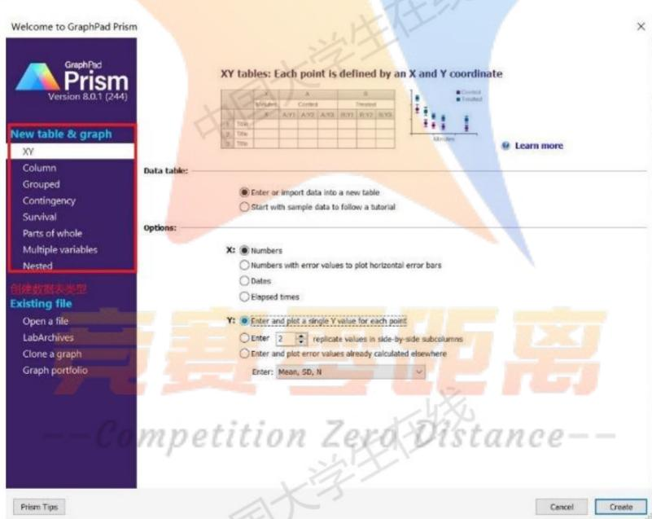

3. 将 Excel 数据粘贴至 Graphpad:

<table><tr><td colspan="14">Pookecrtedipoca Sop/Pac lum a 0 s 244 Be ilt Vice mot Cange drag: Famly odon + OnT 加 a 2 4d +a mey 3 4 i 1=4 -s r= 8×8 ts 业 + - b -0</td><td>3</td></tr><tr><td>.0 8品</td><td>X+%w 5--</td><td></td><td>LKL Hears</td><td>1A9</td><td></td><td>1 R A</td><td>R7</td><td></td><td>2 E</td><td>E 2. 信 面</td><td>Prism8 0</td><td></td><td></td><td></td><td></td><td></td></tr><tr><td></td><td></td><td>catera X</td><td>X</td><td>Group A</td><td>Groun B</td><td>Group C</td><td>Groua D</td><td>Gnoup E</td><td>OrcupF</td><td>Group </td><td>Greup H</td><td>Group!</td><td>Group </td><td>Group K</td><td>Group L</td><td></td></tr><tr><td>Deta Tabes</td><td>=</td><td>J</td><td>X7Ez x</td><td>36k Y</td><td>T1 4</td><td>Cet Y</td><td></td><td>THe Y</td><td>Th Y</td><td>Toe Y</td><td>Thte Y</td><td>T02 Y</td><td>Ti Y</td><td>7 A</td><td>TH2 Y</td><td></td></tr><tr><td>Da</td><td>1</td><td></td><td>1</td><td>412:809300</td><td></td><td></td><td></td><td></td><td></td><td></td><td></td><td></td><td></td><td></td><td></td><td></td></tr><tr><td> cata 5</td><td></td><td>254</td><td>2</td><td>4.542958</td><td></td><td></td><td></td><td></td><td></td><td></td><td></td><td></td><td></td><td></td><td></td><td></td></tr><tr><td>0a67</td><td></td><td>an F11a6</td><td>3</td><td>71≤95610</td><td></td><td></td><td></td><td></td><td></td><td></td><td></td><td></td><td></td><td></td><td></td><td></td></tr><tr><td>每天品品水幅</td><td></td><td>TH</td><td></td><td>149 189100</td><td></td><td></td><td></td><td></td><td></td><td></td><td></td><td></td><td></td><td></td><td></td><td></td></tr><tr><td>① New Dosa Thbe</td><td></td><td>ris</td><td></td><td>73.158150</td><td></td><td></td><td></td><td></td><td></td><td></td><td></td><td></td><td></td><td></td><td></td><td></td></tr><tr><td>lefo</td><td>1</td><td>4</td><td></td><td>92072370</td><td></td><td></td><td></td><td></td><td></td><td></td><td></td><td></td><td></td><td></td><td></td><td></td></tr><tr><td>(①) Prejece into 1</td><td>7 2</td><td>noe</td><td>7</td><td>119.460100</td><td></td><td></td><td></td><td></td><td></td><td></td><td></td><td></td><td></td><td></td><td></td><td></td></tr><tr><td> aw ela</td><td>9</td><td></td><td>a 9</td><td>45 013420</td><td></td><td></td><td></td><td></td><td></td><td></td><td></td><td></td><td></td><td></td><td></td><td></td></tr><tr><td>Hasults</td><td>10</td><td>2: 311</td><td>10</td><td>75.637660 253.1004C0</td><td></td><td></td><td></td><td></td><td></td><td></td><td></td><td></td><td></td><td></td><td></td><td></td></tr><tr><td>③ Mw Anas. Graphs</td><td>11</td><td></td><td>11</td><td>85.479000</td><td></td><td></td><td></td><td></td><td></td><td></td><td></td><td></td><td></td><td></td><td></td><td></td></tr><tr><td></td><td>22</td><td>31</td><td>12</td><td>34.378080</td><td></td><td></td><td></td><td></td><td></td><td></td><td></td><td></td><td></td><td></td><td></td><td></td></tr><tr><td>dade</td><td></td><td></td><td>15</td><td>S4 610070</td><td></td><td></td><td></td><td></td><td></td><td></td><td></td><td></td><td></td><td></td><td></td><td></td></tr><tr><td>5m</td><td>14</td><td></td><td>14</td><td>793 958300</td><td></td><td></td><td></td><td></td><td></td><td></td><td></td><td></td><td></td><td></td><td></td><td></td></tr><tr><td>Ra7 在天的水票</td><td>15</td><td></td><td>15</td><td>22 785830</td><td></td><td></td><td></td><td></td><td></td><td></td><td></td><td></td><td></td><td></td><td></td><td></td></tr><tr><td>① Naw dnuph</td><td>17 10</td><td></td><td>tE</td><td>57272730</td><td></td><td></td><td></td><td></td><td></td><td></td><td></td><td></td><td></td><td></td><td></td><td></td></tr><tr><td>Lycats</td><td>18</td><td>72</td><td>17 18</td><td>39 904220</td><td></td><td></td><td></td><td></td><td></td><td></td><td></td><td></td><td></td><td></td><td></td><td></td></tr><tr><td>Fawly</td><td></td><td>19</td><td>15</td><td>95.331810 54.695160</td><td></td><td></td><td></td><td></td><td></td><td></td><td></td><td></td><td></td><td></td><td></td><td></td></tr><tr><td>日每天益益水单 4天のA水品</td><td></td><td>25 252</td><td></td><td>72.893960</td><td></td><td></td><td></td><td></td><td></td><td></td><td></td><td></td><td></td><td></td><td></td><td></td></tr><tr><td rowspan="8"></td><td></td><td>同</td><td>20 21</td><td>55.C97340</td><td></td><td></td><td></td><td>生在线</td><td></td><td></td><td></td><td></td><td></td><td></td><td></td><td></td></tr><tr><td></td><td>72</td><td></td><td>35 044380</td><td></td><td></td><td></td><td></td><td></td><td></td><td></td><td></td><td></td><td></td><td></td><td></td></tr><tr><td></td><td></td><td>22 23</td><td>31.087500</td><td></td><td></td><td></td><td></td><td></td><td></td><td></td><td></td><td></td><td></td><td></td><td></td></tr><tr><td></td><td>4</td><td>24</td><td>40618060</td><td></td><td></td><td></td><td></td><td></td><td></td><td></td><td></td><td></td><td></td><td></td><td></td></tr><tr><td>22 25</td><td>26 ybo</td><td>20</td><td>91 055260</td><td></td><td></td><td></td><td></td><td></td><td></td><td></td><td></td><td></td><td></td><td></td><td></td></tr></table>

## 4. 创建图表：

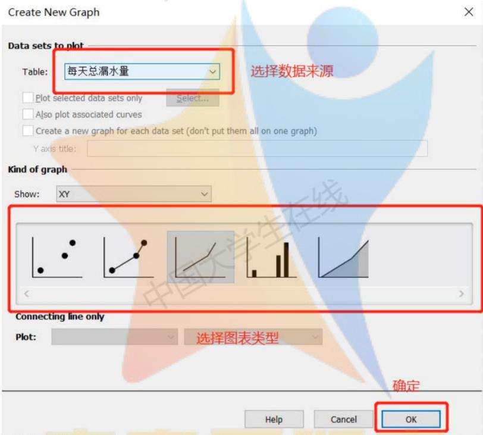

5.随后调节字体、大小、线条宽度和坐标轴等参数  
6. 输出图片：

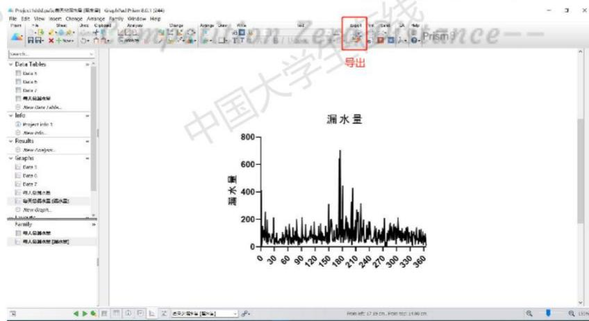

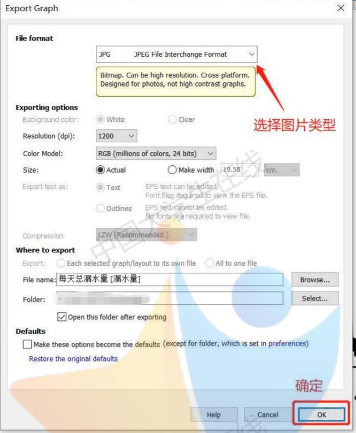

## Excel

1、先利用python中的 pandas库对数进行了以功能区按小时的求和的数据，并导入到了excel表格中。

<table><tr><td>日 3 文件</td><td colspan="11">插入 页面布局 公式 数据 审阅</td></tr><tr><td></td><td>开始 剪切</td><td colspan="10">视图 帮助 Inquire Power Pivot pv</td><td>操作说明搜索</td><td></td><td></td><td>常规</td><td>差</td><td></td><td></td></tr><tr><td>粘贴</td><td>复制 格式刷</td><td>Arial B IU</td><td>田</td><td>10 -A.</td><td>AA 雯</td><td>三 Ⅲ 三 三</td><td>8 Ⅲ </td><td>自动换行</td><td>合并后居中</td><td>常规 G -% ,</td><td>x 80 00</td><td>条件格式</td><td>H</td><td>套用 表格格式</td><td>好</td><td>适中</td><td></td><td></td></tr><tr><td>， H6</td><td>剪贴板</td><td>a</td><td></td><td>字体</td><td></td><td>2</td><td></td><td>对齐方式</td><td>5</td><td>数字</td><td></td><td>7</td><td></td><td></td><td>样式</td><td></td><td></td><td></td></tr><tr><td></td><td colspan="2"></td><td colspan="2">× Y f</td><td>0.96</td><td></td><td></td><td></td><td></td><td></td><td colspan="2"></td><td></td><td></td><td></td><td></td><td></td><td></td></tr><tr><td></td><td colspan="2">A</td><td colspan="2">B</td><td>D</td><td>E</td><td>F</td><td>G</td><td>H</td><td></td><td>J</td><td>K</td><td></td><td>L</td><td>M</td><td>N</td><td>0</td><td>P</td></tr><tr><td>1</td><td colspan="2">采集时间</td><td colspan="2">总表</td><td>C 宿舍 教学楼</td><td>办公楼</td><td></td><td>食堂</td><td>科研楼</td><td>运动场所</td><td>后勤保卫 校医院</td><td>澡堂</td><td></td><td>酒店</td><td>图书馆</td><td>其他</td><td></td><td></td></tr><tr><td>2</td><td colspan="2">2019-01-01 00:00:00</td><td colspan="2">9.72</td><td>2.19</td><td>0.3</td><td>0.51</td><td>0.12</td><td>0</td><td>1.14</td><td>0.03</td><td>0</td><td>2.31</td><td>0</td><td>5.23</td><td>3</td><td></td><td></td></tr><tr><td>3</td><td colspan="2">2019-01-01 01:00:00</td><td colspan="2">10.86</td><td>2.92 0.4</td><td>0.68</td><td></td><td>0.19</td><td>0</td><td>1.52</td><td>0.04</td><td>0</td><td>3.08</td><td>0</td><td>4.32</td><td>1</td><td></td><td>国</td></tr><tr><td>4</td><td colspan="2">2019-01-01 02:00:00</td><td colspan="2">10.46</td><td>2.92</td><td>0.4</td><td>0.68</td><td>0.17</td><td>0</td><td>1.52</td><td>0.04</td><td>0</td><td>3.08</td><td>0</td><td>3.48</td><td>6</td><td></td><td></td></tr><tr><td>5</td><td colspan="2">2019-01-01 03:00:00</td><td colspan="2">12.67</td><td>2.23</td><td>0.29</td><td>0.67</td><td>0.04</td><td>0</td><td>1.03</td><td>0.01</td><td>0</td><td>1.77</td><td>0</td><td>2.86</td><td>8</td><td></td><td></td></tr><tr><td>6</td><td colspan="2">2019-01-01 04:00:00</td><td colspan="2">12</td><td>1.96</td><td>0.08</td><td>1</td><td>0.16</td><td>0.08</td><td>0.96</td><td>0.08</td><td>0</td><td>2.44</td><td>0.04</td><td>2.92</td><td>7.25</td><td></td><td></td></tr><tr><td>7</td><td colspan="2">2019-01-01 05:00:00</td><td colspan="2">12 12</td><td>1.96</td><td>0.08</td><td>1</td><td>0.16</td><td>0.08</td><td>0.96</td><td>0.08</td><td>0</td><td>2.44</td><td>0.04</td><td>2.92</td><td>1.75</td><td></td><td></td></tr><tr><td>8</td><td colspan="2">2019-01-01 06:00:00</td><td colspan="2">7.84</td><td>1.96 2.49</td><td>0.08</td><td>1</td><td>0.31</td><td>0.08</td><td>0.96</td><td>0.08</td><td>0</td><td>2.44</td><td>0.04</td><td>6.1</td><td>2.25</td><td></td><td></td></tr><tr><td>9</td><td colspan="2">2019-01-01 07:00:00 2019-01-01 08:00:00</td><td colspan="2">9.84</td><td>5</td><td>0.91</td><td>2.45 2.48</td><td>0.8</td><td>0.52</td><td>1.04</td><td>0.12</td><td>0</td><td>1.71</td><td>0.01</td><td>11.36</td><td>2.25</td><td></td><td></td></tr><tr><td>10 11</td><td colspan="2">2019-01-01 09:00:00</td><td colspan="2">10.04</td><td>5</td><td>0.92 0.92</td><td>2.48</td><td>0.85 0.93</td><td>0.36 0.36</td><td>1.44</td><td>0.84 0.84</td><td>0</td><td>3.36</td><td>0.2</td><td>14.64</td><td>4.25</td><td></td><td></td></tr><tr><td>12</td><td colspan="2">2019-01-01 10:00:00</td><td colspan="2">9.64</td><td>5</td><td>0.92</td><td>2.48</td><td>0.78</td><td>0.36</td><td>1.56 1.48</td><td>0.84</td><td>0</td><td>3.36 3.36</td><td>0.2 0.1</td><td>12.93 9.93</td><td>1.25</td><td></td><td></td></tr><tr><td>13</td><td colspan="2">2019-01-01 11:00:00</td><td colspan="2">13.02</td><td>6.19</td><td>0.33</td><td>1.83</td><td>3.36</td><td>0.39</td><td>1.26</td><td>0.71</td><td>0 0</td><td>4.64</td><td>0</td><td>11.36</td><td>7.5</td><td></td><td></td></tr><tr><td>14</td><td colspan="2">2019-01-01 12:00:00</td><td colspan="2">10.32</td><td>5.48</td><td>0.8</td><td>1.24</td><td>1.79</td><td>0.4</td><td>1.84</td><td>0.36</td><td>0</td><td>4.28</td><td>0.08</td><td>9.6</td><td>4.75 3</td><td></td><td></td></tr><tr><td>15</td><td colspan="2">2019-01-01 13:00:00</td><td colspan="2">10.32</td><td>5.48</td><td>0.8</td><td>1.24</td><td>1.72</td><td>0.4</td><td>1.84</td><td>0.36</td><td>0</td><td>4.28</td><td>0.08</td><td>8.97</td><td>0.75</td><td></td><td></td></tr><tr><td>16</td><td colspan="2">2019-01-01 14:00:00</td><td colspan="2">10.32</td><td>5.48 6.71</td><td>0.8</td><td>1.24 0.81</td><td>1.83</td><td>0.4 0.4</td><td>1.84</td><td>0.36</td><td>0</td><td>4.28 3.15</td><td>0.08</td><td>8.76</td><td>4.5</td><td></td><td></td></tr><tr><td>17 18</td><td colspan="2">2019-01-01 15:00:00 2019-01-01 16:00:00</td><td colspan="2"></table>

2、通过函数填充出各时间段的具体日期

<table><tr><td rowspan=1 colspan=13>日                                                                         功能区每小时（图表).xls [兼容模式]- Excel文件  开始 插入 页面布局  公式 数据  审阅 视图 帮助 Inquire  Power Pivot  pv     操作说明搜索剪切Arial              10  ÁÃ           ao-   ab自动换行     常规                            常自复制                                                                                     ≠粘贴                                   雯                   合并后居中   G        00+00 条件格式 套用BI U84A川川川美-一%  好格式刷表格格式剪贴板    区            字体            2          对齐方式          区      数字      2D26         x2  &gt;       fx  =TEXT(A26,&quot;aaaa&quot;)</td></tr><tr><td rowspan=1 colspan=1></td><td rowspan=1 colspan=1>A</td><td rowspan=1 colspan=1>B</td><td rowspan=1 colspan=1>C</td><td rowspan=1 colspan=1>D</td><td rowspan=1 colspan=1></td><td rowspan=1 colspan=1></td><td rowspan=1 colspan=1>F</td><td rowspan=1 colspan=1>G</td><td rowspan=1 colspan=1>H</td><td rowspan=1 colspan=1>一</td><td rowspan=1 colspan=1>J</td><td rowspan=1 colspan=1>K</td></tr><tr><td rowspan=1 colspan=1>1</td><td rowspan=1 colspan=1>采集时间</td><td rowspan=1 colspan=1>时间    4</td><td rowspan=1 colspan=1>教学校</td><td rowspan=1 colspan=1>工作E</td><td rowspan=1 colspan=1>周</td><td rowspan=1 colspan=1>六日</td><td rowspan=1 colspan=1>节假E-</td><td rowspan=1 colspan=1>1.27-2.1</td><td rowspan=1 colspan=1>7.15-8.1</td><td rowspan=1 colspan=1></td><td rowspan=1 colspan=1></td><td rowspan=1 colspan=1></td></tr><tr><td rowspan=1 colspan=1>26</td><td rowspan=1 colspan=1>2019-01-02 00:00:00</td><td rowspan=1 colspan=1>0:00:00</td><td rowspan=1 colspan=1>2.44</td><td rowspan=1 colspan=1>星期三</td><td rowspan=1 colspan=1></td><td rowspan=1 colspan=1></td><td rowspan=1 colspan=1></td><td rowspan=1 colspan=1></td><td rowspan=1 colspan=1></td><td rowspan=1 colspan=1></td><td rowspan=1 colspan=1></td><td rowspan=1 colspan=1></td></tr><tr><td rowspan=1 colspan=1>27</td><td rowspan=1 colspan=1>2019-01-02 00:00:00</td><td rowspan=1 colspan=1>1:00:00</td><td rowspan=1 colspan=1>2.44</td><td rowspan=1 colspan=1>星期三</td><td rowspan=1 colspan=1></td><td rowspan=1 colspan=1></td><td rowspan=1 colspan=1></td><td rowspan=1 colspan=1></td><td rowspan=1 colspan=1></td><td rowspan=1 colspan=1></td><td rowspan=1 colspan=1></td><td rowspan=1 colspan=1></td></tr><tr><td rowspan=1 colspan=1>29</td><td rowspan=1 colspan=1>2019-01-02 00:00:00</td><td rowspan=1 colspan=1>3:00:00</td><td rowspan=1 colspan=1>1.55</td><td rowspan=1 colspan=1>星期</td><td rowspan=1 colspan=1></td><td rowspan=1 colspan=1></td><td rowspan=1 colspan=1></td><td rowspan=1 colspan=1></td><td rowspan=1 colspan=1></td><td rowspan=1 colspan=1></td><td rowspan=1 colspan=1></td><td rowspan=1 colspan=1></td></tr><tr><td rowspan=1 colspan=1>30</td><td rowspan=1 colspan=1>2019-01-02 00:00:00</td><td rowspan=1 colspan=1>4:00:00</td><td rowspan=1 colspan=1>1.6</td><td rowspan=1 colspan=1>星期三</td><td rowspan=1 colspan=1></td><td rowspan=1 colspan=1></td><td rowspan=1 colspan=1></td><td rowspan=1 colspan=1></td><td rowspan=1 colspan=1></td><td rowspan=1 colspan=1></td><td rowspan=1 colspan=1></td><td rowspan=1 colspan=1></td></tr><tr><td rowspan=1 colspan=1>31</td><td rowspan=1 colspan=1>2019-01-02 00:00:00</td><td rowspan=1 colspan=1>5:00:00</td><td rowspan=1 colspan=1>1.6</td><td rowspan=1 colspan=1>星期</td><td rowspan=1 colspan=1></td><td rowspan=1 colspan=1></td><td rowspan=1 colspan=1></td><td rowspan=1 colspan=1></td><td rowspan=1 colspan=1></td><td rowspan=1 colspan=1></td><td rowspan=1 colspan=1></td><td rowspan=1 colspan=1></td></tr><tr><td rowspan=1 colspan=1>32</td><td rowspan=1 colspan=1>2019-01-02 00:00:00</td><td rowspan=1 colspan=1>6:00:00</td><td rowspan=1 colspan=1>1.6</td><td rowspan=1 colspan=1>星期</td><td rowspan=1 colspan=2></td><td rowspan=1 colspan=1></td><td rowspan=1 colspan=1></td><td rowspan=1 colspan=1></td><td rowspan=1 colspan=1></td><td rowspan=1 colspan=1></td><td rowspan=1 colspan=1></td></tr><tr><td rowspan=1 colspan=1>33</td><td rowspan=1 colspan=1>2019-01-02 00:00:00</td><td rowspan=1 colspan=1>7:00:00</td><td rowspan=1 colspan=1>4.34</td><td rowspan=1 colspan=1>星期</td><td rowspan=1 colspan=2></td><td rowspan=1 colspan=1></td><td rowspan=1 colspan=1></td><td rowspan=1 colspan=1></td><td rowspan=1 colspan=1></td><td rowspan=1 colspan=1></td><td rowspan=1 colspan=1></td></tr><tr><td rowspan=1 colspan=1>34</td><td rowspan=1 colspan=1>2019-01-02 00:00:00</td><td rowspan=1 colspan=1>8:00:00</td><td rowspan=1 colspan=1>6.64</td><td rowspan=1 colspan=1>星期三一</td><td rowspan=1 colspan=2></td><td rowspan=1 colspan=1></td><td rowspan=1 colspan=1></td><td rowspan=1 colspan=1></td><td rowspan=1 colspan=1></td><td rowspan=1 colspan=1></td><td rowspan=1 colspan=1></td></tr><tr><td rowspan=1 colspan=1>35</td><td rowspan=1 colspan=1>2019-01-02 00:00:00</td><td rowspan=1 colspan=1>9:00:00</td><td rowspan=1 colspan=1>6.64</td><td rowspan=1 colspan=1>星期三</td><td rowspan=1 colspan=2></td><td rowspan=1 colspan=1></td><td rowspan=1 colspan=1></td><td rowspan=1 colspan=1></td><td rowspan=1 colspan=1></td><td rowspan=1 colspan=1></td><td rowspan=1 colspan=1></td></tr><tr><td rowspan=1 colspan=1>36</td><td rowspan=1 colspan=1>2019-01-02 00:00:00</td><td rowspan=1 colspan=1>10:00:00</td><td rowspan=1 colspan=1>6.64</td><td rowspan=1 colspan=1>星期</td><td rowspan=1 colspan=2></td><td rowspan=1 colspan=1></td><td rowspan=1 colspan=1></td><td rowspan=1 colspan=1></td><td rowspan=1 colspan=1></td><td rowspan=1 colspan=1></td><td rowspan=1 colspan=1></td></tr><tr><td rowspan=1 colspan=1>37</td><td rowspan=1 colspan=1>2019-01-02 00:00:00</td><td rowspan=1 colspan=1>11:00:00</td><td rowspan=1 colspan=1>7.3</td><td rowspan=1 colspan=1>星期</td><td rowspan=1 colspan=2></td><td rowspan=1 colspan=1></td><td rowspan=1 colspan=1></td><td rowspan=1 colspan=1></td><td rowspan=1 colspan=1></td><td rowspan=1 colspan=1></td><td rowspan=1 colspan=1></td></tr><tr><td rowspan=1 colspan=1>38</td><td rowspan=1 colspan=1>2019-01-02 00:00:00</td><td rowspan=1 colspan=1>12:00:00</td><td rowspan=1 colspan=1>6.48</td><td rowspan=1 colspan=1>星期三</td><td rowspan=1 colspan=2></td><td rowspan=1 colspan=1></td><td rowspan=1 colspan=1></td><td rowspan=1 colspan=1></td><td rowspan=1 colspan=1></td><td rowspan=1 colspan=1></td><td rowspan=1 colspan=1></td></tr><tr><td rowspan=1 colspan=1>39</td><td rowspan=1 colspan=1>2019-01-02 00:00:00</td><td rowspan=1 colspan=1>13:00:00</td><td rowspan=1 colspan=1>6.48</td><td rowspan=1 colspan=1>星期三</td><td rowspan=1 colspan=2></td><td rowspan=1 colspan=1></td><td rowspan=1 colspan=1></td><td rowspan=1 colspan=1></td><td rowspan=1 colspan=1></td><td rowspan=1 colspan=1></td><td rowspan=1 colspan=1></td></tr><tr><td rowspan=1 colspan=1>40</td><td rowspan=1 colspan=1>2019-01-02 00:00:00</td><td rowspan=1 colspan=1>14:00:00</td><td rowspan=1 colspan=1>6.48</td><td rowspan=1 colspan=1>星期三</td><td rowspan=1 colspan=2></td><td rowspan=1 colspan=1></td><td rowspan=1 colspan=1></td><td rowspan=1 colspan=1></td><td rowspan=1 colspan=1></td><td rowspan=1 colspan=1></td><td rowspan=1 colspan=1></td></tr><tr><td rowspan=1 colspan=1>41</td><td rowspan=1 colspan=1>2019-01-02 00:00:00</td><td rowspan=1 colspan=1>15:00:00</td><td rowspan=1 colspan=1>6.95</td><td rowspan=1 colspan=1>星期三</td><td rowspan=1 colspan=2></td><td rowspan=1 colspan=1></td><td rowspan=1 colspan=1></td><td rowspan=1 colspan=1></td><td rowspan=1 colspan=1></td><td rowspan=1 colspan=1></td><td rowspan=1 colspan=1></td></tr><tr><td rowspan=1 colspan=1>42</td><td rowspan=1 colspan=1>2019-01-02 00:00:00</td><td rowspan=1 colspan=1>16:00:00</td><td rowspan=1 colspan=1>5.92</td><td rowspan=1 colspan=1>星期</td><td rowspan=1 colspan=2></td><td rowspan=1 colspan=1></td><td rowspan=1 colspan=1></td><td rowspan=1 colspan=1></td><td rowspan=1 colspan=1></td><td rowspan=1 colspan=1></td><td rowspan=1 colspan=1></td></tr><tr><td rowspan=1 colspan=1>43</td><td rowspan=1 colspan=1>2019-01-02 00:00:00</td><td rowspan=1 colspan=1>17:00:00</td><td rowspan=1 colspan=1>5.52</td><td rowspan=1 colspan=1>星期三</td><td rowspan=1 colspan=2></td><td rowspan=1 colspan=1></td><td rowspan=1 colspan=1></td><td rowspan=1 colspan=1></td><td rowspan=1 colspan=1></td><td rowspan=1 colspan=1></td><td rowspan=1 colspan=1></td></tr><tr><td rowspan=1 colspan=1>44</td><td rowspan=1 colspan=1>2019-01-02 00:00:00</td><td rowspan=1 colspan=1>18:00:00</td><td rowspan=1 colspan=1>6.52</td><td rowspan=1 colspan=1>星期三</td><td rowspan=1 colspan=2></td><td rowspan=1 colspan=1></td><td rowspan=1 colspan=1></td><td rowspan=1 colspan=1></td><td rowspan=1 colspan=1></td><td rowspan=1 colspan=1></td><td rowspan=1 colspan=1></td></tr></table>

<table><tr><td rowspan=1 colspan=12>日 5                                                                     功能区每小时(图表) .xls [兼容模式] - Excel文件  开始 插入 页面布局 公式 数据  审阅  视图  帮助  Inquire  Power Pivot pv     操作说明搜索剪切                                   三      -  自动换行     常规           4                常Arial             10  AA自复制                                                                                   #条件格式G-% 套用三三川  好粘贴                     田 8-A  變                 合并后居中              0000BIU豆格式刷                                                                                       表格格式剪贴板    2                                                          区     数字      区E98          2i  X  V fx  =TEXT(A98,&quot;aaaa&quot;)</td></tr><tr><td rowspan=2 colspan=1></td><td rowspan=2 colspan=1>A</td><td></td><td></td><td></td><td></td><td></td><td></td><td></td><td></td><td></td><td></td></tr><tr><td rowspan=1 colspan=1>B</td><td rowspan=1 colspan=1>C</td><td rowspan=1 colspan=1>D</td><td rowspan=1 colspan=1>E</td><td rowspan=1 colspan=1>F</td><td rowspan=1 colspan=1>G</td><td rowspan=1 colspan=1>H</td><td rowspan=1 colspan=1>一</td><td rowspan=1 colspan=1>J</td><td rowspan=1 colspan=1>K</td></tr><tr><td rowspan=1 colspan=1>1</td><td rowspan=1 colspan=1>采集时间</td><td rowspan=1 colspan=1>时间    V</td><td rowspan=1 colspan=1>教学档</td><td rowspan=1 colspan=1>工作E</td><td rowspan=1 colspan=1>周六E</td><td rowspan=1 colspan=1>节假日</td><td rowspan=1 colspan=1>1.27-2.1</td><td rowspan=1 colspan=1>7.15-8.1</td><td rowspan=1 colspan=1></td><td rowspan=1 colspan=1></td><td rowspan=1 colspan=1></td></tr><tr><td rowspan=1 colspan=1>98</td><td rowspan=1 colspan=1>2019-01-05 00:00:00</td><td rowspan=1 colspan=1>0:00:00</td><td rowspan=1 colspan=1>3.04</td><td rowspan=1 colspan=1></td><td rowspan=1 colspan=1>星期六</td><td rowspan=1 colspan=1></td><td rowspan=1 colspan=1></td><td rowspan=1 colspan=1></td><td rowspan=1 colspan=1></td><td rowspan=1 colspan=1></td><td rowspan=1 colspan=1></td></tr><tr><td rowspan=1 colspan=1>99</td><td rowspan=1 colspan=1>2019-01-05 00:00:00</td><td rowspan=1 colspan=1>1:00:00</td><td rowspan=1 colspan=1>3.04</td><td rowspan=1 colspan=1></td><td rowspan=1 colspan=1>星期六</td><td rowspan=1 colspan=1></td><td rowspan=1 colspan=1></td><td rowspan=1 colspan=1></td><td rowspan=1 colspan=1></td><td rowspan=1 colspan=1></td><td rowspan=1 colspan=1></td></tr><tr><td rowspan=1 colspan=1>100</td><td rowspan=1 colspan=1>2019-01-05 00:00:00</td><td rowspan=1 colspan=1>2:00:00</td><td rowspan=1 colspan=1>3.04</td><td rowspan=1 colspan=1></td><td rowspan=1 colspan=1>星期六</td><td rowspan=1 colspan=1></td><td rowspan=1 colspan=1></td><td rowspan=1 colspan=1></td><td rowspan=1 colspan=1></td><td rowspan=1 colspan=1></td><td rowspan=1 colspan=1></td></tr><tr><td rowspan=1 colspan=1>101</td><td rowspan=1 colspan=1>2019-01-05 00:00:00</td><td rowspan=1 colspan=1>8.88.08</td><td rowspan=1 colspan=1>2.+</td><td rowspan=1 colspan=1>_</td><td rowspan=1 colspan=1>星期六</td><td rowspan=1 colspan=1></td><td rowspan=1 colspan=1></td><td rowspan=1 colspan=1></td><td rowspan=1 colspan=1></td><td rowspan=1 colspan=1></td><td rowspan=1 colspan=1></td></tr><tr><td rowspan=1 colspan=1>102</td><td rowspan=1 colspan=1>2019-01-05 00:00:00</td><td rowspan=1 colspan=1>4:00:00</td><td rowspan=1 colspan=1>1.6</td><td rowspan=1 colspan=1></td><td rowspan=1 colspan=1>星期六</td><td rowspan=1 colspan=1></td><td rowspan=1 colspan=1></td><td rowspan=1 colspan=1></td><td rowspan=1 colspan=1></td><td rowspan=1 colspan=1></td><td rowspan=1 colspan=1></td></tr><tr><td rowspan=1 colspan=1>103</td><td rowspan=1 colspan=1>2019-01-05 00:00:00</td><td rowspan=1 colspan=1>5:00:00</td><td rowspan=1 colspan=1>1.6</td><td rowspan=1 colspan=1></td><td rowspan=1 colspan=1>星期六</td><td rowspan=1 colspan=1></td><td rowspan=1 colspan=1></td><td rowspan=1 colspan=1></td><td rowspan=1 colspan=1></td><td rowspan=1 colspan=1></td><td rowspan=1 colspan=1></td></tr><tr><td rowspan=1 colspan=1>104</td><td rowspan=1 colspan=1>2019-01-05 00:00:00</td><td rowspan=1 colspan=1>6:00:00</td><td rowspan=1 colspan=1>1.6</td><td rowspan=1 colspan=1></td><td rowspan=1 colspan=1>星期六</td><td rowspan=1 colspan=1></td><td rowspan=1 colspan=1></td><td rowspan=1 colspan=1></td><td rowspan=1 colspan=1></td><td rowspan=1 colspan=1></td><td rowspan=1 colspan=1></td></tr><tr><td rowspan=1 colspan=1>105</td><td rowspan=1 colspan=1>2019-01-05 00:00:00</td><td rowspan=1 colspan=1>7:00:00</td><td rowspan=1 colspan=1>3.84</td><td rowspan=1 colspan=1></td><td rowspan=1 colspan=1>星期六</td><td rowspan=1 colspan=1></td><td rowspan=1 colspan=1></td><td rowspan=1 colspan=1></td><td rowspan=1 colspan=1></td><td rowspan=1 colspan=1></td><td rowspan=1 colspan=1></td></tr><tr><td rowspan=1 colspan=1>106</td><td rowspan=1 colspan=1>2019-01-05 00:00:00</td><td rowspan=1 colspan=1>8:00:00</td><td rowspan=1 colspan=1>5.48</td><td rowspan=1 colspan=1></td><td rowspan=1 colspan=1>星期六</td><td rowspan=1 colspan=1></td><td rowspan=1 colspan=1></td><td rowspan=1 colspan=1></td><td rowspan=1 colspan=1></td><td rowspan=1 colspan=1>中</td><td rowspan=1 colspan=1>国</td></tr><tr><td rowspan=1 colspan=1>107</td><td rowspan=1 colspan=1>2019-01-05 00:00:00</td><td rowspan=1 colspan=1>9:00:00</td><td rowspan=1 colspan=1>5.48</td><td rowspan=1 colspan=1></td><td rowspan=1 colspan=1>星期六</td><td rowspan=1 colspan=1></td><td rowspan=1 colspan=1></td><td rowspan=1 colspan=1></td><td rowspan=1 colspan=1></td><td rowspan=1 colspan=1></td><td rowspan=1 colspan=1></td></tr><tr><td rowspan=1 colspan=1>108</td><td rowspan=1 colspan=1>2019-01-05 00:00:00</td><td rowspan=1 colspan=1>10:00:00</td><td rowspan=1 colspan=1>5.48</td><td rowspan=1 colspan=1></td><td rowspan=1 colspan=1>星期六</td><td rowspan=1 colspan=1></td><td rowspan=1 colspan=1></td><td rowspan=1 colspan=1></td><td rowspan=1 colspan=1></td><td rowspan=1 colspan=1></td><td rowspan=1 colspan=1></td></tr><tr><td rowspan=1 colspan=1>109</td><td rowspan=1 colspan=1>2019-01-05 00:00:00</td><td rowspan=1 colspan=1>11:00:00</td><td rowspan=1 colspan=1>5.51</td><td rowspan=1 colspan=1></td><td rowspan=1 colspan=1>星期六</td><td rowspan=1 colspan=1></td><td rowspan=1 colspan=1></td><td rowspan=1 colspan=1></td><td rowspan=1 colspan=1></td><td rowspan=1 colspan=1></td><td rowspan=1 colspan=1></td></tr><tr><td rowspan=1 colspan=1>110</td><td rowspan=1 colspan=1>2019-01-05 00:00:00</td><td rowspan=1 colspan=1>12:00:00</td><td rowspan=1 colspan=1>5.56</td><td rowspan=1 colspan=1></td><td rowspan=1 colspan=1>星期六</td><td rowspan=1 colspan=1></td><td rowspan=1 colspan=1></td><td rowspan=1 colspan=1></td><td rowspan=1 colspan=1></td><td rowspan=1 colspan=1></td><td rowspan=1 colspan=1></td></tr><tr><td rowspan=1 colspan=1>111</td><td rowspan=1 colspan=1>2019-01-05 00:00:00</td><td rowspan=1 colspan=1>13:00:00</td><td rowspan=1 colspan=1>5.56</td><td rowspan=1 colspan=1></td><td rowspan=1 colspan=1>星期六</td><td rowspan=1 colspan=1></td><td rowspan=1 colspan=1></td><td rowspan=1 colspan=1></td><td rowspan=1 colspan=1></td><td rowspan=1 colspan=1></td><td rowspan=1 colspan=1></td></tr><tr><td rowspan=1 colspan=1>112</td><td rowspan=1 colspan=1>2019-01-05 00:00:00</td><td rowspan=1 colspan=1>14:00:00</td><td rowspan=1 colspan=1>5.56</td><td rowspan=1 colspan=1></td><td rowspan=1 colspan=1>星期六</td><td rowspan=1 colspan=1></td><td rowspan=1 colspan=1></td><td rowspan=1 colspan=1></td><td rowspan=1 colspan=1></td><td rowspan=1 colspan=1></td><td rowspan=1 colspan=1></td></tr><tr><td rowspan=1 colspan=1>113</td><td rowspan=1 colspan=1>2019-01-05 00:00:00</td><td rowspan=1 colspan=1>15:00:00</td><td rowspan=1 colspan=1>4.53</td><td rowspan=1 colspan=1></td><td rowspan=1 colspan=1>星期六</td><td rowspan=1 colspan=1></td><td rowspan=1 colspan=1></td><td rowspan=1 colspan=1></td><td rowspan=1 colspan=1></td><td rowspan=1 colspan=1></td><td rowspan=1 colspan=1></td></tr><tr><td rowspan=1 colspan=1>114</td><td rowspan=1 colspan=1>2019-01-05 00:00:00</td><td rowspan=1 colspan=1>16:00:00</td><td rowspan=1 colspan=1>5.02</td><td rowspan=1 colspan=1></td><td rowspan=1 colspan=1>星期六</td><td rowspan=1 colspan=1></td><td rowspan=1 colspan=1></td><td rowspan=1 colspan=1></td><td rowspan=1 colspan=1></td><td rowspan=1 colspan=1></td><td rowspan=1 colspan=1></td></tr><tr><td rowspan=1 colspan=1>115</td><td rowspan=1 colspan=1>2019-01-05 00:00:00</td><td rowspan=1 colspan=1>17:00:00</td><td rowspan=1 colspan=1>5.12</td><td rowspan=1 colspan=1></td><td rowspan=1 colspan=1>星期六</td><td rowspan=1 colspan=1></td><td rowspan=1 colspan=1></td><td rowspan=1 colspan=1></td><td rowspan=1 colspan=1></td><td rowspan=1 colspan=1></td><td rowspan=1 colspan=1></td></tr><tr><td rowspan=1 colspan=1>116</td><td rowspan=1 colspan=1>2019-01-05 00:00:00</td><td rowspan=1 colspan=1>18:00:00</td><td rowspan=1 colspan=1>5.02</td><td rowspan=1 colspan=1></td><td rowspan=1 colspan=1>星期六</td><td rowspan=1 colspan=1></td><td rowspan=1 colspan=1></td><td rowspan=1 colspan=1></td><td rowspan=1 colspan=1></td><td rowspan=1 colspan=1></td><td rowspan=1 colspan=1></td></tr><tr><td rowspan=1 colspan=1>117</td><td rowspan=1 colspan=1>2019-01-05 00:00:00</td><td rowspan=1 colspan=1>19:00:00</td><td rowspan=1 colspan=1>6.12</td><td rowspan=1 colspan=1></td><td rowspan=1 colspan=1>星期六</td><td rowspan=1 colspan=1></td><td rowspan=1 colspan=1></td><td rowspan=1 colspan=1></td><td rowspan=1 colspan=1></td><td rowspan=1 colspan=1></td><td rowspan=1 colspan=1></td></tr><tr><td rowspan=1 colspan=1>118</td><td rowspan=1 colspan=1>2019-01-05 00:00:00</td><td rowspan=1 colspan=1>20:00:00</td><td rowspan=1 colspan=1>5.72</td><td rowspan=1 colspan=1></td><td rowspan=1 colspan=1>星期六</td><td rowspan=1 colspan=1></td><td rowspan=1 colspan=1></td><td rowspan=1 colspan=1></td><td rowspan=1 colspan=1></td><td rowspan=1 colspan=1></td><td rowspan=1 colspan=1></td></tr><tr><td rowspan=1 colspan=1>119</td><td rowspan=1 colspan=1>2019-01-05 00:00:00</td><td rowspan=1 colspan=1>21:00:00</td><td rowspan=1 colspan=1>5.72</td><td rowspan=1 colspan=1></td><td rowspan=1 colspan=1>星期六</td><td rowspan=1 colspan=1></td><td rowspan=1 colspan=1></td><td rowspan=1 colspan=1></td><td rowspan=1 colspan=1></td><td rowspan=1 colspan=1></td><td rowspan=1 colspan=1></td></tr><tr><td rowspan=1 colspan=1>120</td><td rowspan=1 colspan=1>2019-01-05 00:00:00</td><td rowspan=1 colspan=1>22:00:00</td><td rowspan=1 colspan=1>5.72</td><td rowspan=1 colspan=1></td><td rowspan=1 colspan=1>星期六</td><td rowspan=1 colspan=1></td><td rowspan=1 colspan=1></td><td rowspan=1 colspan=1></td><td rowspan=1 colspan=1></td><td rowspan=1 colspan=1></td><td rowspan=1 colspan=1></td></tr><tr><td rowspan=1 colspan=1>121</td><td rowspan=1 colspan=1>2019-01-05 00:00:00</td><td rowspan=1 colspan=1>23:00:00</td><td rowspan=1 colspan=1>6.27</td><td rowspan=1 colspan=1></td><td rowspan=1 colspan=1>星期六</td><td rowspan=1 colspan=1></td><td rowspan=1 colspan=1></td><td rowspan=1 colspan=1></td><td rowspan=1 colspan=1></td><td rowspan=1 colspan=1></td><td rowspan=1 colspan=1></td></tr><tr><td rowspan=1 colspan=1>122</td><td rowspan=1 colspan=1>2019-01-06 00:00:00</td><td rowspan=1 colspan=1>0:00:00</td><td rowspan=1 colspan=1>3.32</td><td rowspan=1 colspan=1></td><td rowspan=1 colspan=1>星期日</td><td rowspan=1 colspan=1></td><td rowspan=1 colspan=1></td><td rowspan=1 colspan=1></td><td rowspan=1 colspan=1></td><td rowspan=1 colspan=1></td><td rowspan=1 colspan=1></td></tr><tr><td rowspan=1 colspan=1>123</td><td rowspan=1 colspan=1>2019-01-06 00:00:00</td><td rowspan=1 colspan=1>1:00:00</td><td rowspan=1 colspan=1>3.32</td><td rowspan=1 colspan=1></td><td rowspan=1 colspan=1>星期日</td><td rowspan=1 colspan=1></td><td rowspan=1 colspan=1></td><td rowspan=1 colspan=1></td><td rowspan=1 colspan=1></td><td rowspan=1 colspan=1></td><td rowspan=1 colspan=1></td></tr></table>

## 3、选择D-H列的全部数据——点击筛选

<table><tr><td rowspan=1 colspan=11>日 5                                                                               功能区每小时（图表).xls [兼容模文件   开始  插入  页面布局  公式  数据  审阅  视图  帮助  Inquire  PowerPivot  pv      操作说明搜索查询和连接      A会       清除田三0                           0属性                       é重新应用取数从文  自   自表最近使  现有   全部刷新                  排序  筛选              分列快速填充删除 数据验居本/CSV网站格/区域 用的源  连接             编辑链接                    V高级                   重复值证获取和转换数据                   查询和连接                       先                            数据工具1                ×      fx  工作日</td></tr><tr><td rowspan=1 colspan=1>A</td><td rowspan=1 colspan=1>B</td><td rowspan=1 colspan=1>C</td><td rowspan=1 colspan=1>D</td><td rowspan=1 colspan=1>E</td><td rowspan=1 colspan=1>F</td><td rowspan=1 colspan=1>G</td><td rowspan=1 colspan=1>H</td><td rowspan=1 colspan=1></td><td rowspan=1 colspan=1></td><td rowspan=1 colspan=1></td></tr><tr><td rowspan=1 colspan=1>采集时间</td><td rowspan=1 colspan=1>时间</td><td rowspan=1 colspan=1>教学校</td><td rowspan=1 colspan=1>工作E</td><td rowspan=1 colspan=1>周六日</td><td rowspan=1 colspan=1>节假日</td><td rowspan=1 colspan=1>1.27-2.1</td><td rowspan=1 colspan=1>7.15-8</td><td rowspan=1 colspan=1>1-</td><td rowspan=1 colspan=1></td><td rowspan=1 colspan=1></td></tr><tr><td rowspan=1 colspan=1>2019-01-02 00:00:00</td><td rowspan=1 colspan=1>0:00:00</td><td rowspan=1 colspan=1>2.44</td><td rowspan=1 colspan=1>星期三</td><td rowspan=1 colspan=1></td><td rowspan=1 colspan=1></td><td rowspan=1 colspan=1></td><td rowspan=1 colspan=1></td><td rowspan=1 colspan=1></td><td rowspan=1 colspan=1></td><td rowspan=1 colspan=1></td></tr><tr><td rowspan=1 colspan=1>2019-01-02 00:00:00</td><td rowspan=1 colspan=1>1:00:00</td><td rowspan=1 colspan=1>2.44</td><td rowspan=1 colspan=1>星期</td><td rowspan=1 colspan=1></td><td rowspan=1 colspan=1></td><td rowspan=1 colspan=1></td><td rowspan=1 colspan=1></td><td rowspan=1 colspan=1></td><td rowspan=1 colspan=1></td><td rowspan=1 colspan=1></td></tr><tr><td rowspan=1 colspan=1>2019-01-02 00:00:00</td><td rowspan=1 colspan=1>2:00:00</td><td rowspan=1 colspan=1>2.44</td><td rowspan=1 colspan=1>星期</td><td rowspan=1 colspan=1></td><td rowspan=1 colspan=1></td><td rowspan=1 colspan=1></td><td rowspan=1 colspan=2></td><td rowspan=1 colspan=1></td><td rowspan=1 colspan=1></td></tr><tr><td rowspan=1 colspan=1>2019-01-02 00:00:00</td><td rowspan=1 colspan=1>3:00:00</td><td rowspan=1 colspan=1>1.55</td><td rowspan=1 colspan=1>星期</td><td rowspan=1 colspan=1></td><td rowspan=1 colspan=1></td><td rowspan=1 colspan=1></td><td rowspan=1 colspan=2></td><td rowspan=1 colspan=1></td><td rowspan=1 colspan=1></td></tr><tr><td rowspan=1 colspan=1>2019-01-0200:00:00</td><td rowspan=1 colspan=1>4:00:00</td><td rowspan=1 colspan=1>1.6</td><td rowspan=1 colspan=1>星期三</td><td rowspan=1 colspan=1></td><td rowspan=1 colspan=1></td><td rowspan=1 colspan=1></td><td rowspan=1 colspan=2></td><td rowspan=1 colspan=1></td><td rowspan=1 colspan=1></td></tr><tr><td rowspan=1 colspan=1>2019-01-02 00:00:00</td><td rowspan=1 colspan=1>5:00:00</td><td rowspan=1 colspan=1>1.6</td><td rowspan=1 colspan=1>星期</td><td rowspan=1 colspan=1></td><td rowspan=1 colspan=1></td><td rowspan=1 colspan=1></td><td rowspan=1 colspan=2></td><td rowspan=1 colspan=1></td><td rowspan=1 colspan=1></td></tr><tr><td rowspan=1 colspan=1>2019-01-02 00:00:00</td><td rowspan=1 colspan=1>6:00:00</td><td rowspan=1 colspan=1>1.6</td><td rowspan=1 colspan=1>星期</td><td rowspan=1 colspan=1></td><td rowspan=1 colspan=1></td><td rowspan=1 colspan=1></td><td rowspan=1 colspan=2></td><td rowspan=1 colspan=1></td><td rowspan=1 colspan=1></td></tr><tr><td rowspan=1 colspan=1>2019-01-02 00:00:00</td><td rowspan=1 colspan=1>7:00:00</td><td rowspan=1 colspan=1>4.34</td><td rowspan=1 colspan=1>星期</td><td rowspan=1 colspan=1></td><td rowspan=1 colspan=1></td><td rowspan=1 colspan=1></td><td rowspan=1 colspan=2></td><td rowspan=1 colspan=1></td><td rowspan=1 colspan=1></td></tr><tr><td rowspan=1 colspan=1>2019-01-02 00:00:00</td><td rowspan=1 colspan=1>8:00:00</td><td rowspan=1 colspan=1>6.64</td><td rowspan=1 colspan=1>星期</td><td rowspan=1 colspan=1></td><td rowspan=1 colspan=1></td><td rowspan=1 colspan=1></td><td rowspan=1 colspan=2></td><td rowspan=1 colspan=1></td><td rowspan=1 colspan=1></td></tr><tr><td rowspan=1 colspan=1>2019-01-02 00:00:00</td><td rowspan=1 colspan=1>9:00:00</td><td rowspan=1 colspan=1>6.64</td><td rowspan=1 colspan=1>星期</td><td rowspan=1 colspan=1></td><td rowspan=1 colspan=1></td><td rowspan=1 colspan=1></td><td rowspan=1 colspan=2></td><td rowspan=1 colspan=1></td><td rowspan=1 colspan=1></td></tr><tr><td rowspan=1 colspan=1>2019-01-02 00:00:00</td><td rowspan=1 colspan=1>10:00:00</td><td rowspan=1 colspan=1>6.64</td><td rowspan=1 colspan=1>星期</td><td rowspan=1 colspan=1></td><td rowspan=1 colspan=1></td><td rowspan=1 colspan=1></td><td rowspan=1 colspan=2></td><td rowspan=1 colspan=1></td><td rowspan=1 colspan=1></td></tr><tr><td rowspan=1 colspan=1>2019-01-02 00:00:00</td><td rowspan=1 colspan=1>11:00:00</td><td rowspan=1 colspan=1>7.3</td><td rowspan=1 colspan=1>星期</td><td rowspan=1 colspan=1></td><td rowspan=1 colspan=1></td><td rowspan=1 colspan=1></td><td rowspan=1 colspan=2></td><td rowspan=1 colspan=1></td><td rowspan=1 colspan=1></td></tr><tr><td rowspan=1 colspan=1>2019-01-02 00:00:00</td><td rowspan=1 colspan=1>12:00:00</td><td rowspan=1 colspan=1>6.48</td><td rowspan=1 colspan=1>星期</td><td rowspan=1 colspan=1></td><td rowspan=1 colspan=1></td><td rowspan=1 colspan=1></td><td rowspan=1 colspan=2></td><td rowspan=1 colspan=1></td><td rowspan=1 colspan=1></td></tr><tr><td rowspan=1 colspan=1>2019-01-02 00:00:00</td><td rowspan=1 colspan=1>13:00:00</td><td rowspan=1 colspan=1>6.48</td><td rowspan=1 colspan=1>星期</td><td rowspan=1 colspan=1></td><td rowspan=1 colspan=1></td><td rowspan=1 colspan=1></td><td rowspan=1 colspan=2></td><td rowspan=1 colspan=1></td><td rowspan=1 colspan=1></td></tr><tr><td rowspan=1 colspan=1>2019-01-02 00:00:00</td><td rowspan=1 colspan=1>14:00:00</td><td rowspan=1 colspan=1>6.48</td><td rowspan=1 colspan=1>星期</td><td rowspan=1 colspan=1></td><td rowspan=1 colspan=1></td><td rowspan=1 colspan=1></td><td rowspan=1 colspan=2></td><td rowspan=1 colspan=1></td><td rowspan=1 colspan=1></td></tr><tr><td rowspan=1 colspan=1>2019-01-02 00:00:00</td><td rowspan=1 colspan=1>15:00:00</td><td rowspan=1 colspan=1>6.95</td><td rowspan=1 colspan=1>星期</td><td rowspan=1 colspan=1></td><td rowspan=1 colspan=1></td><td rowspan=1 colspan=1></td><td rowspan=1 colspan=2></td><td rowspan=1 colspan=1></td><td rowspan=1 colspan=1></td></tr><tr><td rowspan=1 colspan=1>2019-01-02 00:00:00</td><td rowspan=1 colspan=1>16:00:00</td><td rowspan=1 colspan=1>5.92</td><td rowspan=1 colspan=1>星期</td><td rowspan=1 colspan=1></td><td rowspan=1 colspan=1></td><td rowspan=1 colspan=1></td><td rowspan=1 colspan=2></td><td rowspan=1 colspan=1></td><td rowspan=1 colspan=1></td></tr><tr><td rowspan=1 colspan=1>2019-01-02 00:00:00</td><td rowspan=1 colspan=1>17:00:00</td><td rowspan=1 colspan=1>5.52</td><td rowspan=1 colspan=1>星期</td><td rowspan=1 colspan=1></td><td rowspan=1 colspan=1></td><td rowspan=1 colspan=1></td><td rowspan=1 colspan=2></td><td rowspan=1 colspan=1></td><td rowspan=1 colspan=1></td></tr><tr><td rowspan=1 colspan=1>2019-01-02 00:00:00</td><td rowspan=1 colspan=1>18:00:00</td><td rowspan=1 colspan=1>6.52</td><td rowspan=1 colspan=1>星期</td><td rowspan=1 colspan=1></td><td rowspan=1 colspan=1></td><td rowspan=1 colspan=1></td><td rowspan=1 colspan=2></td><td rowspan=1 colspan=1></td><td rowspan=1 colspan=1></td></tr><tr><td rowspan=1 colspan=1>2019-01-02 00:00:00</td><td rowspan=1 colspan=1>19:00:00</td><td rowspan=1 colspan=1>6.53</td><td rowspan=1 colspan=1>星期</td><td rowspan=1 colspan=1></td><td rowspan=1 colspan=1></td><td rowspan=1 colspan=1></td><td rowspan=1 colspan=2></td><td rowspan=1 colspan=1></td><td rowspan=1 colspan=1></td></tr><tr><td rowspan=1 colspan=1>2019-01-02 00:00:00</td><td rowspan=1 colspan=1>20:00:00</td><td rowspan=1 colspan=1>6.2</td><td rowspan=1 colspan=1>星期</td><td rowspan=1 colspan=1></td><td rowspan=1 colspan=1></td><td rowspan=1 colspan=1></td><td rowspan=1 colspan=2></td><td rowspan=1 colspan=1></td><td rowspan=1 colspan=1></td></tr><tr><td rowspan=1 colspan=1>2019-01-02 00:00:00</td><td rowspan=1 colspan=1>21:00:00</td><td rowspan=1 colspan=1>6.2</td><td rowspan=1 colspan=1>星期</td><td rowspan=1 colspan=1></td><td rowspan=1 colspan=1></td><td rowspan=1 colspan=1></td><td rowspan=1 colspan=2></td><td rowspan=1 colspan=1></td><td rowspan=1 colspan=1></td></tr><tr><td rowspan=1 colspan=1>2019-01-02 00:00:00</td><td rowspan=1 colspan=1>22:00:00</td><td rowspan=1 colspan=1>6.2</td><td rowspan=1 colspan=1>星期</td><td rowspan=1 colspan=1></td><td rowspan=1 colspan=1></td><td rowspan=1 colspan=1></td><td rowspan=1 colspan=2></td><td rowspan=1 colspan=1></td><td rowspan=1 colspan=1></td></tr><tr><td rowspan=1 colspan=1>2019-01-02 00:00:00</td><td rowspan=1 colspan=1>23:00:00</td><td rowspan=1 colspan=1>6.79</td><td rowspan=1 colspan=1>星期</td><td rowspan=1 colspan=1></td><td rowspan=1 colspan=1></td><td rowspan=1 colspan=1></td><td rowspan=1 colspan=2></td><td rowspan=1 colspan=1></td><td rowspan=1 colspan=1></td></tr></table>

4、点击C1单元格的小倒三角按钮一一除空白外选中其余全部数据
<table><tr><td rowspan=1 colspan=10>日 5                                                                   功能区每文件  开始 插入 页面布局 公式 数据 审阅 视图 帮助  Inquire Power Pivot pv     操查询和连接  2↓A会       清除     自属性                      重新应用获取数从文  自  自表最近使 现有  全部刷新            引排序  筛选            分列据本/CSV网站 格/区域 用的源 连接           编辑链接                   高级获取和转换数据                 查询和连接             排序和筛选129            ×√fx</td></tr><tr><td rowspan=1 colspan=1></td><td rowspan=1 colspan=2>A</td><td rowspan=1 colspan=1>B</td><td rowspan=1 colspan=1></td><td rowspan=1 colspan=1>D</td><td rowspan=1 colspan=1>E</td><td rowspan=1 colspan=1>F</td><td rowspan=1 colspan=1>G</td><td rowspan=1 colspan=1>H</td></tr><tr><td rowspan=1 colspan=1>1</td><td rowspan=1 colspan=2>采集时间</td><td rowspan=1 colspan=1>时间    一</td><td rowspan=1 colspan=1>教学</td><td rowspan=1 colspan=1>工作E</td><td rowspan=1 colspan=1>周六日</td><td rowspan=1 colspan=1>节假日</td><td rowspan=1 colspan=1>1.27-2.1</td><td rowspan=1 colspan=1>7.15-</td></tr><tr><td rowspan=1 colspan=1>26</td><td rowspan=1 colspan=2>2019-01-02 00:00:00</td><td rowspan=25 colspan=4>2↓升序(S)A↓降序(O)按颜色排序(I)工作表视图()                卜4从&quot;工作日”中清除筛选(C)按颜色筛选(1)文本筛选(E)搜索                     Oè星期二☑星期三è星期四è星期五è星期□(空白)确定     取消U.UU.UU         2.90 生期四</td><td rowspan=1 colspan=1></td><td rowspan=1 colspan=1></td><td rowspan=1 colspan=1></td></tr><tr><td rowspan=1 colspan=1>27</td><td rowspan=1 colspan=2>2019-01-02 00:00:00</td><td rowspan=1 colspan=1></td><td rowspan=1 colspan=1></td><td rowspan=1 colspan=1></td><td rowspan=1 colspan=1></td></tr><tr><td rowspan=1 colspan=1>28</td><td rowspan=1 colspan=2>2019-01-02 00:00:00</td><td rowspan=1 colspan=1></td><td rowspan=1 colspan=1></td><td rowspan=1 colspan=1></td><td rowspan=1 colspan=1></td></tr><tr><td rowspan=1 colspan=1>29</td><td rowspan=1 colspan=2>2019-01-02 00:00:00</td><td rowspan=1 colspan=1></td><td rowspan=1 colspan=1></td><td rowspan=1 colspan=1></td><td rowspan=1 colspan=1></td></tr><tr><td rowspan=1 colspan=1>30</td><td rowspan=1 colspan=2>2019-01-02 00:00:00</td><td rowspan=1 colspan=1></td><td rowspan=1 colspan=1></td><td rowspan=1 colspan=1></td><td rowspan=1 colspan=1></td></tr><tr><td rowspan=1 colspan=1>31</td><td rowspan=1 colspan=2>2019-01-02 00:00:00</td><td rowspan=1 colspan=1></td><td rowspan=1 colspan=1></td><td rowspan=1 colspan=1></td><td rowspan=1 colspan=1></td></tr><tr><td rowspan=1 colspan=1>32</td><td rowspan=1 colspan=2>2019-01-02 00:00:00</td><td rowspan=1 colspan=1></td><td rowspan=1 colspan=1></td><td rowspan=1 colspan=1></td><td rowspan=1 colspan=1></td></tr><tr><td rowspan=1 colspan=1>33</td><td rowspan=1 colspan=2>2019-01-02 00:00:00</td><td rowspan=1 colspan=1></td><td rowspan=1 colspan=1></td><td rowspan=1 colspan=1></td><td rowspan=1 colspan=1></td></tr><tr><td rowspan=1 colspan=1>34</td><td rowspan=1 colspan=2>2019-01-02 00:00:00</td><td rowspan=1 colspan=1></td><td rowspan=1 colspan=1></td><td rowspan=1 colspan=1></td><td rowspan=1 colspan=1></td></tr><tr><td rowspan=1 colspan=1>35</td><td rowspan=1 colspan=2>2019-01-02 00:00:00</td><td rowspan=1 colspan=1></td><td rowspan=1 colspan=1></td><td rowspan=1 colspan=1></td><td rowspan=1 colspan=1></td></tr><tr><td rowspan=1 colspan=1>36</td><td rowspan=1 colspan=2>2019-01-02 00:00:00</td><td rowspan=1 colspan=1></td><td rowspan=1 colspan=1></td><td rowspan=1 colspan=1></td><td rowspan=1 colspan=1></td></tr><tr><td rowspan=1 colspan=1>37</td><td rowspan=1 colspan=2>2019-01-02 00:00:00</td><td rowspan=1 colspan=1></td><td rowspan=1 colspan=1></td><td rowspan=1 colspan=1></td><td rowspan=1 colspan=1></td></tr><tr><td rowspan=1 colspan=1>38</td><td rowspan=1 colspan=2>2019-01-0200:00:00</td><td rowspan=1 colspan=1></td><td rowspan=1 colspan=1></td><td rowspan=1 colspan=1></td><td rowspan=1 colspan=1></td></tr><tr><td rowspan=1 colspan=1>39</td><td rowspan=1 colspan=2>2019-01-02 00:00:00</td><td rowspan=1 colspan=1></td><td rowspan=1 colspan=1></td><td rowspan=1 colspan=1></td><td rowspan=1 colspan=1></td></tr><tr><td rowspan=1 colspan=1>40</td><td rowspan=1 colspan=2>2019-01-02 00:00:00</td><td rowspan=1 colspan=1></td><td rowspan=1 colspan=1></td><td rowspan=1 colspan=1></td><td rowspan=1 colspan=1></td></tr><tr><td rowspan=1 colspan=1>41</td><td rowspan=1 colspan=2>2019-01-02 00:00:00</td><td rowspan=1 colspan=1></td><td rowspan=1 colspan=1></td><td rowspan=1 colspan=1></td><td rowspan=1 colspan=1></td></tr><tr><td rowspan=1 colspan=1>42</td><td rowspan=1 colspan=2>2019-01-02 00:00:00</td><td rowspan=1 colspan=1></td><td rowspan=1 colspan=1></td><td rowspan=1 colspan=1></td></tr><tr><td rowspan=1 colspan=1>43</td><td rowspan=1 colspan=2>2019-01-02 00:00:00</td><td rowspan=1 colspan=1></td><td rowspan=1 colspan=1></td><td rowspan=1 colspan=1></td></tr><tr><td rowspan=1 colspan=1>44</td><td rowspan=1 colspan=2>2019-01-02 00:00:00</td><td rowspan=1 colspan=1></td><td rowspan=1 colspan=1></td><td rowspan=1 colspan=1></td></tr><tr><td rowspan=1 colspan=1>45</td><td rowspan=1 colspan=2>2019-01-02 00:00:00</td><td rowspan=1 colspan=1></td><td rowspan=1 colspan=1></td><td rowspan=1 colspan=1></td></tr><tr><td rowspan=1 colspan=1>46</td><td rowspan=1 colspan=2>2019-01-02 00:00:00</td><td rowspan=1 colspan=1></td><td rowspan=1 colspan=1></td><td rowspan=1 colspan=1></td><td rowspan=1 colspan=1></td></tr><tr><td rowspan=1 colspan=1>47</td><td rowspan=1 colspan=2>2019-01-02 00:00:00</td><td rowspan=1 colspan=1></td><td rowspan=1 colspan=1></td><td rowspan=1 colspan=1></td><td rowspan=1 colspan=1></td></tr><tr><td rowspan=1 colspan=1>48</td><td rowspan=1 colspan=1>2019</td><td rowspan=1 colspan=1>-01-02 00:00:00</td><td rowspan=1 colspan=1></td><td rowspan=1 colspan=1></td><td rowspan=1 colspan=1></td><td rowspan=1 colspan=1></td></tr><tr><td rowspan=1 colspan=1>49</td><td rowspan=1 colspan=1>2019</td><td rowspan=1 colspan=1>-01-02-00:00:00</td><td rowspan=1 colspan=1></td><td rowspan=1 colspan=1></td><td rowspan=1 colspan=1></td></tr><tr><td rowspan=1 colspan=1>50</td><td rowspan=1 colspan=2>2019-01-03 00:00:00</td><td rowspan=1 colspan=1></td><td rowspan=1 colspan=1></td><td rowspan=1 colspan=1></td></tr></table>

## 4、选中这两列的所有数据——Ctr1+C

<table><tr><td rowspan=1 colspan=12>日                                                                                        功能区每小时(图表)文件   开始  插入  页面布局  公式  数据  审阅  视图  帮助  Inquire  Power Pivot  pv      操作说明搜索查询和连接   2↓A会        清除属性                           重新应用获取数 从文  自   自表最近使  现有   全部刷新               到排序  筛选               分列快速填充链接高级重据本/CSV网站 格/区域 用的源  连接获取和转换数据                     查询和连接                 排序和筛选B1             0 =5              f  时间</td></tr><tr><td rowspan=2 colspan=1></td><td></td><td></td><td></td><td></td><td></td><td></td><td></td><td></td><td></td><td></td><td></td></tr><tr><td rowspan=1 colspan=1>A</td><td rowspan=1 colspan=1></td><td rowspan=1 colspan=1>B</td><td rowspan=1 colspan=1>C</td><td rowspan=1 colspan=1></td><td rowspan=1 colspan=1></td><td rowspan=1 colspan=1>E</td><td rowspan=1 colspan=1>F</td><td rowspan=1 colspan=1>G</td><td rowspan=1 colspan=1>H</td><td rowspan=1 colspan=1></td></tr><tr><td rowspan=1 colspan=1>1</td><td rowspan=1 colspan=1>采集时间</td><td rowspan=1 colspan=1></td><td rowspan=1 colspan=1>时间</td><td rowspan=1 colspan=1>教学校</td><td rowspan=1 colspan=1>工</td><td rowspan=1 colspan=1>E</td><td rowspan=1 colspan=1>周六日</td><td rowspan=1 colspan=1>节假日</td><td rowspan=1 colspan=1>1.27-2.1</td><td rowspan=1 colspan=1>7.15-8.1</td><td rowspan=1 colspan=1></td></tr><tr><td rowspan=1 colspan=1>26</td><td rowspan=1 colspan=1>2019-01-02 00:00:</td><td rowspan=1 colspan=1>0</td><td rowspan=1 colspan=1>0:00:00</td><td rowspan=1 colspan=1>2.44</td><td rowspan=1 colspan=1>星期</td><td rowspan=1 colspan=1></td><td rowspan=1 colspan=1></td><td rowspan=1 colspan=1></td><td rowspan=1 colspan=1></td><td rowspan=1 colspan=1></td><td rowspan=1 colspan=1></td></tr><tr><td rowspan=1 colspan=1>27</td><td rowspan=1 colspan=1>2019-01-02 00:00:</td><td rowspan=1 colspan=1>0</td><td rowspan=1 colspan=1>1:00:00</td><td rowspan=1 colspan=1>2.44</td><td rowspan=1 colspan=1>星期</td><td rowspan=1 colspan=1></td><td rowspan=1 colspan=1></td><td rowspan=1 colspan=1></td><td rowspan=1 colspan=1></td><td rowspan=1 colspan=1></td><td rowspan=1 colspan=1></td></tr><tr><td rowspan=1 colspan=1>28</td><td rowspan=1 colspan=1>2019-01-02 00:00:</td><td rowspan=1 colspan=1></td><td rowspan=1 colspan=1>2.00.00</td><td rowspan=1 colspan=1>_214</td><td rowspan=1 colspan=1>星期</td><td rowspan=1 colspan=1></td><td rowspan=1 colspan=1></td><td rowspan=1 colspan=1></td><td rowspan=1 colspan=1></td><td rowspan=1 colspan=1></td><td rowspan=1 colspan=1></td></tr><tr><td rowspan=1 colspan=1>29</td><td rowspan=1 colspan=2>2019-01-02 00:00:00</td><td rowspan=1 colspan=1>3:00:00</td><td rowspan=1 colspan=1>1.55</td><td rowspan=1 colspan=2>星期</td><td rowspan=1 colspan=1></td><td rowspan=1 colspan=1></td><td rowspan=1 colspan=1></td><td rowspan=1 colspan=1></td><td rowspan=1 colspan=1></td></tr><tr><td rowspan=1 colspan=1>30</td><td rowspan=1 colspan=2>2019-01-02 00:00:00</td><td rowspan=1 colspan=1>4:00:00</td><td rowspan=1 colspan=1>1.6</td><td rowspan=1 colspan=2>星期</td><td rowspan=1 colspan=1></td><td rowspan=1 colspan=1></td><td rowspan=1 colspan=1></td><td rowspan=1 colspan=1></td><td rowspan=1 colspan=1></td></tr><tr><td rowspan=1 colspan=1>31</td><td rowspan=1 colspan=2>2019-01-02 00:00:00</td><td rowspan=1 colspan=1>5:00:00</td><td rowspan=1 colspan=1>1.6</td><td rowspan=1 colspan=2>星期</td><td rowspan=1 colspan=1></td><td rowspan=1 colspan=1></td><td rowspan=1 colspan=1>nce</td><td rowspan=1 colspan=1></td><td rowspan=1 colspan=1></td></tr><tr><td rowspan=1 colspan=1>32</td><td rowspan=1 colspan=2>2019-01-02 00:00:00</td><td rowspan=1 colspan=1>6:00:00</td><td rowspan=1 colspan=1>1.6</td><td rowspan=1 colspan=2>星期</td><td rowspan=1 colspan=1></td><td rowspan=1 colspan=1></td><td rowspan=1 colspan=1></td><td rowspan=1 colspan=1></td><td rowspan=1 colspan=1></td></tr><tr><td rowspan=1 colspan=1>33</td><td rowspan=1 colspan=2>2019-01-02 00:00:00</td><td rowspan=1 colspan=1>7:00:00</td><td rowspan=1 colspan=1>4.34</td><td rowspan=1 colspan=2>星期</td><td rowspan=1 colspan=1></td><td rowspan=1 colspan=1></td><td rowspan=1 colspan=1></td><td rowspan=1 colspan=1></td><td rowspan=1 colspan=1></td></tr><tr><td rowspan=1 colspan=1>34</td><td rowspan=1 colspan=2>2019-01-02 00:00:00</td><td rowspan=1 colspan=1>8:00:00</td><td rowspan=1 colspan=1>6.64</td><td rowspan=1 colspan=2>星期</td><td rowspan=1 colspan=1></td><td rowspan=1 colspan=1></td><td rowspan=1 colspan=1></td><td rowspan=1 colspan=1></td><td rowspan=1 colspan=1></td></tr><tr><td rowspan=1 colspan=1>35</td><td rowspan=1 colspan=2>2019-01-02 00:00:00</td><td rowspan=1 colspan=1>9:00:00</td><td rowspan=1 colspan=1>6.64</td><td rowspan=1 colspan=2>星期</td><td rowspan=1 colspan=1></td><td rowspan=1 colspan=1></td><td rowspan=1 colspan=1></td><td rowspan=1 colspan=1></td><td rowspan=1 colspan=1></td></tr><tr><td rowspan=1 colspan=1>36</td><td rowspan=1 colspan=2>2019-01-02 00:00:00</td><td rowspan=1 colspan=1>10:00:00</td><td rowspan=1 colspan=1>6.64</td><td rowspan=1 colspan=2>星期</td><td rowspan=1 colspan=1></td><td rowspan=1 colspan=1></td><td rowspan=1 colspan=1></td><td rowspan=1 colspan=1></td><td rowspan=1 colspan=1></td></tr><tr><td rowspan=1 colspan=1>37</td><td rowspan=1 colspan=2>2019-01-02 00:00:00</td><td rowspan=1 colspan=1>11:00:00</td><td rowspan=1 colspan=1>7.3</td><td rowspan=1 colspan=2>星期</td><td rowspan=1 colspan=1></td><td rowspan=1 colspan=1></td><td rowspan=1 colspan=1></td><td rowspan=1 colspan=1></td><td rowspan=1 colspan=1></td></tr><tr><td rowspan=1 colspan=1>38</td><td rowspan=1 colspan=2>2019-01-02 00:00:00</td><td rowspan=1 colspan=1>12:00:00</td><td rowspan=1 colspan=1>6.48</td><td rowspan=1 colspan=2>星期</td><td rowspan=1 colspan=1></td><td rowspan=1 colspan=1></td><td rowspan=1 colspan=1></td><td rowspan=1 colspan=1></td><td rowspan=1 colspan=1></td></tr><tr><td rowspan=1 colspan=1>39</td><td rowspan=1 colspan=2>2019-01-02 00:00:00</td><td rowspan=1 colspan=1>13:00:00</td><td rowspan=1 colspan=1>6.48</td><td rowspan=1 colspan=2>星期</td><td rowspan=1 colspan=1></td><td rowspan=1 colspan=1></td><td rowspan=1 colspan=1></td><td rowspan=1 colspan=1></td><td rowspan=1 colspan=1></td></tr><tr><td rowspan=1 colspan=1>40</td><td rowspan=1 colspan=2>2019-01-02 00:00:00</td><td rowspan=1 colspan=1>14:00:00</td><td rowspan=1 colspan=1>6.48</td><td rowspan=1 colspan=2>星期</td><td rowspan=1 colspan=1></td><td rowspan=1 colspan=1></td><td rowspan=1 colspan=1></td><td rowspan=1 colspan=1></td><td rowspan=1 colspan=1></td></tr><tr><td rowspan=1 colspan=1>41</td><td rowspan=1 colspan=2>2019-01-02 00:00:00</td><td rowspan=1 colspan=1>15:00:00</td><td rowspan=1 colspan=1>6.95</td><td rowspan=1 colspan=2>星期</td><td rowspan=1 colspan=1></td><td rowspan=1 colspan=1></td><td rowspan=1 colspan=1></td><td rowspan=1 colspan=1></td><td rowspan=1 colspan=1></td></tr><tr><td rowspan=1 colspan=1>42</td><td rowspan=1 colspan=2>2019-01-02 00:00:00</td><td rowspan=1 colspan=1>16:00:00</td><td rowspan=1 colspan=1>5.92</td><td rowspan=1 colspan=2>星期</td><td rowspan=1 colspan=1></td><td rowspan=1 colspan=1></td><td rowspan=1 colspan=1></td><td rowspan=1 colspan=1></td><td rowspan=1 colspan=1></td></tr><tr><td rowspan=1 colspan=1>43</td><td rowspan=1 colspan=2>2019-01-02 00:00:00</td><td rowspan=1 colspan=1>17:00:00</td><td rowspan=1 colspan=1>5.52</td><td rowspan=1 colspan=2>星期</td><td rowspan=1 colspan=1></td><td rowspan=1 colspan=1></td><td rowspan=1 colspan=1></td><td rowspan=1 colspan=1></td><td rowspan=1 colspan=1></td></tr><tr><td rowspan=1 colspan=1>44</td><td rowspan=1 colspan=2>2019-01-02.00:00:00</td><td rowspan=1 colspan=1>18:00:00</td><td rowspan=1 colspan=1>6.52</td><td rowspan=1 colspan=2>是期</td><td rowspan=1 colspan=1></td><td rowspan=1 colspan=1></td><td rowspan=1 colspan=1></td><td rowspan=1 colspan=1></td><td rowspan=1 colspan=1></td></tr></table>

5、把第四步的两列复制到各类时间工作表中的工作日列

<table><tr><td rowspan="2">日 文件 剪切</td><td rowspan="2">开始</td><td rowspan="2">插入</td><td rowspan="2">页面布局</td><td colspan="2">公式 数据</td><td rowspan="2">市阅 视图</td><td colspan="2">帮助 Inquire</td><td rowspan="2">Power Pivot</td><td colspan="2" rowspan="2">pv</td><td colspan="2">功能区每小时（图表） .xls [兼容模式] · Excel 操作说明搜索</td><td colspan="4"></td></tr><tr><td colspan="2">10</td><td colspan="2">喜</td><td colspan="2">自动换行 合并后居中 4</td><td colspan="2">常规</td><td colspan="2">条件格式</td></tr><tr><td>粘贴 剪贴板</td><td>复制 格式刷</td><td>宋体 ， B rs</td><td colspan="3">I U- 田 B v</td><td rowspan="2">AA A 雯</td><td rowspan="2">训</td><td colspan="3" rowspan="2">理 对齐方式</td><td colspan="2" rowspan="2">G %， 。 数字</td><td colspan="2" rowspan="2">0 20 5</td><td rowspan="2">套用 表格格式</td><td rowspan="2">常规 好</td></tr><tr><td colspan="2"></td><td colspan="2">字体</td><td colspan="2">2</td></tr><tr><td>A1</td><td></td><td></td><td></td><td>f</td><td>工作日</td><td></td><td></td><td></td><td></td><td></td><td></td><td></td><td></td><td></td><td></td></tr><tr><td></td><td></td><td>B</td><td></td><td>D</td><td>E</td><td>F</td><td>G</td><td>H</td><td>I</td><td>J</td><td>K</td><td>L</td><td>M</td><td></td><td>N</td></tr><tr><td>1</td><td>A 工作日</td><td></td><td></td><td>周六日</td><td></td><td></td><td>节假日</td><td></td><td></td><td>1.27-2.17</td><td></td><td></td><td>7.15-8.15</td><td></td><td></td></tr><tr><td></td><td>时间</td><td>宿舍</td><td></td><td>时间</td><td>宿舍</td><td></td><td>时间</td><td>宿舍</td><td></td><td>时间</td><td>宿舍</td><td></td><td>时间</td><td>宿舍</td><td></td></tr><tr><td>23</td><td>0:00:00</td><td>13.28</td><td></td><td>0:00:00</td><td>14.45</td><td></td><td>0:00:00</td><td>9.72</td><td></td><td>0:00:00</td><td>18.57</td><td></td><td>0:00:00</td><td></td><td>15.54</td></tr><tr><td></td><td></td><td></td><td></td><td>1:00:00</td><td>13.92</td><td></td><td>1:00:00</td><td>10.86</td><td></td><td>1:00:00</td><td>9.62</td><td></td><td>1:00:00</td><td></td><td>6.74</td></tr><tr><td>5</td><td>2:00:00</td><td>12.38</td><td></td><td>2:00:00</td><td>14.12</td><td></td><td>2:00:00</td><td>10.46</td><td></td><td>2:00:00</td><td>8.23</td><td></td><td>2:00:00</td><td></td><td>10.59</td></tr><tr><td>6</td><td>3:00:00</td><td>11.74</td><td></td><td>3:00:00</td><td>15.41</td><td></td><td>3:00:00</td><td>12.67</td><td></td><td>3:00:00</td><td>12.76</td><td></td><td>3:00:00</td><td></td><td>9.62</td></tr><tr><td>7</td><td>4:00:00</td><td>11.8</td><td></td><td>4:00:00</td><td>7.88</td><td></td><td>4:00:00</td><td>12</td><td></td><td>4:00:00</td><td>12.87</td><td></td><td>4:00:00</td><td></td><td>13.44</td></tr><tr><td>8</td><td>5:00:00</td><td>11.8</td><td></td><td>5:00:00</td><td>7.88</td><td></td><td>5:00:00</td><td>12</td><td></td><td>5:00:00</td><td>13.32</td><td></td><td>5:00:00 6:00:00</td><td></td><td>10.05</td></tr><tr><td>9</td><td>6:00:00</td><td>11.8</td><td></td><td>6:00:00</td><td>7.94</td><td></td><td>6:00:00</td><td>12</td><td></td><td>6:00:00</td><td>3.28</td><td></td><td>7:00:00</td><td></td><td>8.15</td></tr><tr><td>10</td><td>7:00:00</td><td>13.1</td><td></td><td>7:00:00</td><td>8.81</td><td></td><td>7:00:00</td><td>7.84</td><td></td><td>7:00:00</td><td>7.36 8.77</td><td></td><td>8:00:00</td><td></td><td>15.25</td></tr><tr><td>11</td><td>8:00:00</td><td>8.4</td><td></td><td>8:00:00</td><td>10.7</td><td></td><td>8:00:00</td><td>9.84</td><td></td><td>8:00:00 9:00:00</td><td>15.22</td><td></td><td>9:00:00</td><td></td><td>14.02</td></tr><tr><td>12</td><td>9:00:00</td><td>10.3 9.3</td><td></td><td>9:00:00</td><td>10.82</td><td></td><td>9:00:00</td><td>10.04</td><td></td><td>10:00:00</td><td>13.2</td><td></td><td>10:00:00</td><td></td><td>13.12 8.6</td></tr><tr><td>13</td><td>10:00:00</td><td>9.85</td><td></td><td>10:00:00 11:00:00</td><td>11.85 14.08</td><td></td><td>10:00:00 11:00:00</td><td>9.64</td><td></td><td>11:00:00</td><td>14.35</td><td></td><td>11:00:00</td><td></td><td>9.52</td></tr><tr><td>14</td><td>11:00:00</td><td>7.24</td><td></td><td>12:00:00</td><td>8.73</td><td></td><td>12:00:00</td><td>13.02 10.32</td><td></td><td>12:00:00</td><td>10.8</td><td></td><td>12:00:00</td><td></td><td>9.93</td></tr><tr><td>15</td><td>12:00:00</td><td>7.24</td><td></td><td>13:00:00</td><td>8.85</td><td></td><td>13:00:00</td><td>10.32</td><td></td><td>13:00:00</td><td>8.49</td><td></td><td>13:00:00</td><td></td><td>12.81</td></tr><tr><td>16</td><td>13:00:00 14:00:00</td><td>7.24</td><td></td><td>14:00:00</td><td>8.85</td><td></td><td>14:00:00</td><td>10.32</td><td></td><td>14:00:00</td><td>9.39</td><td></td><td>14:00:00</td><td></td><td>6.7</td></tr><tr><td>17</td><td></td><td>5.99</td><td></td><td>15:00:00</td><td>7.19</td><td></td><td>15:00:00</td><td>7.35</td><td></td><td>15:00:00</td><td>8.98</td><td></td><td>15:00:00</td><td></td><td>4.85</td></tr><tr><td>18</td><td>15:00:00</td><td>6.28</td><td></td><td>16:00:00</td><td>8.6</td><td></td><td>16:00:00</td><td>8.38</td><td></td><td>16:00:00</td><td>6.41</td><td></td><td>16:00:00</td><td></td><td>3.86</td></tr><tr><td>19 20</td><td>16:00:00 17:00:00</td><td>6.28 6.28</td><td></td><td>17:00:00</td><td>8.84</td><td></td><td>17:00:00</td><td>8.18</td><td></td><td>17:00:00</td><td>7.94</td><td></td><td>17:00:00</td><td></td><td>5.84</td></table>

6、在选中A、B两列全部数据后——数据透视表——点击确定

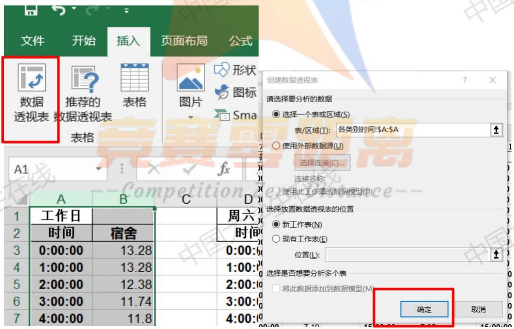  
7、把时间、宿舍分别拖动到行和值的区域—一点击宿舍一一选择值字段设置一一选择平均值——选择确定

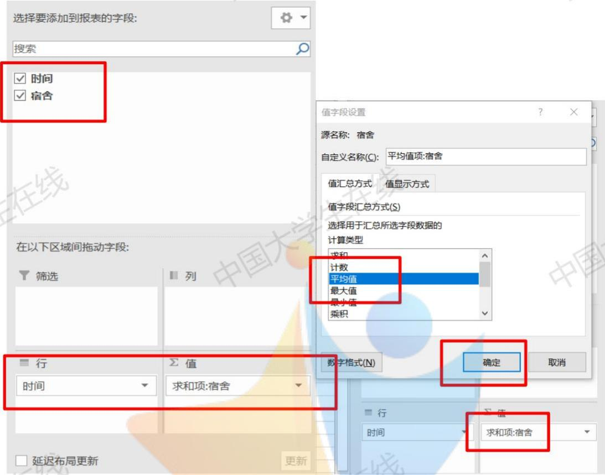

8、选择 B 列5 到 28 行的数据——Ctr1+C——粘贴到功能区工作表中的B 列 3 到26行处。

<table><tr><td></td><td>A</td><td>B</td><td></td><td></td><td>A</td><td>B</td><td>C</td><td>D</td><td>E</td><td>F</td></tr><tr><td>1</td><td>将报表筛选字段拖至此处</td><td></td><td>C</td><td>1</td><td rowspan="19">1</td><td></td><td></td><td></td><td></td><td></td></tr><tr><td>2</td><td></td><td></td><td></td><td>2 宿舍 3</td><td>工作日</td><td>周六日</td><td>节假日</td><td>1.27-2.17</td><td>7.15-8.15</td></tr><tr><td>3</td><td>平均值项：宿舍</td><td></td><td></td><td>4</td><td>20.40257</td><td>19.40605</td><td>15.5635</td><td>9.14090909</td><td>18.363125</td></tr><tr><td>4</td><td>时间</td><td>汇总</td><td></td><td>2 3</td><td>9.93319</td><td>9.634321 10.04358</td><td>9.544</td><td>6.17</td><td>8.2528125 10.01875</td></tr><tr><td>5</td><td>0:00:00</td><td>20.40257143</td><td></td><td>5 6</td><td>10.09771 4 10.9861</td><td>9.711481</td><td>10.6665 10.056</td><td>7.17909091 7.97</td><td>11.41375</td></tr><tr><td>6</td><td>1:00:00</td><td>9.933190476</td><td></td><td>7</td><td>5 10.55581</td><td>8.808642</td><td>9.142</td><td>6.33681818</td><td>13.5628125</td></tr><tr><td>7</td><td>2:00:00</td><td>10.09771429</td><td></td><td>8</td><td>6 6.695857</td><td>5.669012</td><td>5.8325</td><td>3.98454545</td><td>9.43</td></tr><tr><td>8</td><td>3:00:00</td><td>10.98609524</td><td></td><td>9</td><td>7 9.335476</td><td>6.431481</td><td>6.4455</td><td>4.02272727</td><td>10.0775</td></tr><tr><td>9</td><td>4:00:00</td><td>10.55580952</td><td></td><td>10</td><td>8 17.25695</td><td>11.00284</td><td>9.878</td><td>6.97363636</td><td>17.65</td></tr><tr><td>10</td><td>5:00:00</td><td>6.695857143</td><td></td><td>11</td><td>9 14.48395</td><td>13.70123</td><td>12.247</td><td>6.15454545</td><td>15.615625</td></tr><tr><td>11</td><td>6:00:00</td><td>9.33547619</td><td></td><td>12</td><td>10 13.3039</td><td>15.98728</td><td>13.4075</td><td>7.50954545</td><td>13.8553125</td></tr><tr><td>12</td><td>7:00:00</td><td>17.25695238</td><td></td><td>13</td><td>11 11.18143</td><td>15.35642</td><td>13.0785</td><td>7.02363636</td><td>11.1528125</td></tr><tr><td>13</td><td></td><td></td><td></td><td>14</td><td>12 10.80719</td><td>14.62617 14.0337</td><td>12.778</td><td>6.25318182</td><td>10.4271875</td></tr><tr><td>14</td><td>8:00:00</td><td>14.48395238</td><td></td><td>15 16</td><td>13 10.895 14 10.72671</td><td>13.28778</td><td>11.5235</td><td>5.66272727</td><td>11.4834375 10.9490625</td></tr><tr><td>15</td><td>9:00:00</td><td>13.30390476</td><td></td><td>17</td><td>15 9.558429</td><td>10.59704</td><td>10.5605 9.306</td><td>5.79909091 5.62590909</td><td>10.1428125</td></tr><tr><td>16</td><td>10:00:00</td><td>11.18142857</td><td></td><td>tio</td><td>16 8.590476</td><td>9.126296</td><td>8.544</td><td>4.84045455</td><td>8.6746875</td></tr><tr><td></td><td>11:00:00</td><td>10.80719048</td><td>pe</td><td>1819</td><td>17 7.255048</td><td>8.597037</td><td>8.0665</td><td>4.49454545</td><td>7.13125</td></tr><tr><td>17</td><td>12:00:00</td><td>10.895</td><td></td><td>20</td><td>18 8.486571</td><td>9.535309</td><td>8.457</td><td>4.72545455</td><td>8.46125</td></tr><tr><td>18</td><td>13:00:00</td><td>10.72671429</td><td></td><td>21</td><td>19 9.667238</td><td>9.669136</td><td>8.861</td><td>5.65863636</td><td>9.8990625</td></tr><tr><td>19</td><td>14:00:00</td><td>9.558428571</td><td></td><td>22 玉</td><td>20 11.27976</td><td>11.76074</td><td>9.2975</td><td>7.25727273</td><td>11.893125</td></tr><tr><td>20</td><td>15:00:00</td><td>8.59047619</td><td></td><td>23</td><td>21 14.2369</td><td>14.44519</td><td>11.2055</td><td>9.37863636</td><td>13.980625</td></tr><tr><td>21</td><td>16:00:00</td><td>7.255047619</td><td></td><td>24 25</td><td>22 22.18005</td><td>22.45444</td><td>15.4085</td><td>12.6545455</td><td>23.2946875</td></tr><tr><td>22</td><td>17:00:00</td><td>8.486571429</td><td></td><td>26</td><td>23 32.17014</td><td>30.57432</td><td>22.1355</td><td>14.1359091</td><td>33.0425</td></tr><tr><td>23</td><td>18:00:00</td><td>9.667238095</td><td></td><td>24 27</td><td>34.40043</td><td>32.33889</td><td>24.4</td><td>14.4740909</td><td>35.6275</td></tr><tr><td>24</td><td>19:00:00</td><td>11.2797619</td><td></td><td>28</td><td>日</td><td></td><td></td><td></td><td></td></tr><tr><td>25</td><td>20:00:00</td><td>14.23690476</td><td></td><td>29</td><td colspan="7">图表标题</td></tr><tr><td>26</td><td>21:00:00</td><td>22.18004762</td><td>30</td><td>40</td><td colspan="7"></td></tr><tr><td>27</td><td>22:00:00</td><td>32.17014286</td><td>31</td><td>35</td><td colspan="7"></td></tr><tr><td>28</td><td>23:00:00</td><td>34.40042857</td><td>32</td><td></td><td colspan="7"></td></tr><tr><td>29</td><td>总计</td><td>13.5202877</td><td></td><td></td><td>全年按小时</td><td>Sheet8</td><td>各类别时</td><td>间 功能区</td><td>+</td><td></td></tr><tr><td>30</td><td></td><td></td><td></td><td></td><td></td><td></td><td></td><td></td><td></td><td></td></tr></table>

9、重复4——8的步骤后会得到以下全部数据——Ctr1+C——粘贴到如下网址中

图表标题  
10、最终得到如下结果
<table><tr><td rowspan=1 colspan=8>编辑表格    显示设置</td><td rowspan=1 colspan=1></td></tr><tr><td rowspan=2 colspan=1></td><td rowspan=1 colspan=1>A</td><td rowspan=1 colspan=1>B</td><td rowspan=1 colspan=1>C</td><td rowspan=1 colspan=1>D</td><td rowspan=1 colspan=1>E</td><td rowspan=1 colspan=1>F</td><td rowspan=1 colspan=1>G</td><td rowspan=1 colspan=1>H</td></tr><tr><td rowspan=1 colspan=1></td><td rowspan=2 colspan=1>宿舍</td><td rowspan=2 colspan=1>工作日</td><td rowspan=2 colspan=1>礼拜日</td><td rowspan=2 colspan=1>节假日</td><td rowspan=2 colspan=1>1.27-2.17</td><td rowspan=2 colspan=1>7.15-8.15</td><td rowspan=2 colspan=1></td><td rowspan=2 colspan=1></td></tr><tr><td rowspan=2 colspan=1>16</td></tr><tr><td rowspan=1 colspan=1></td><td rowspan=1 colspan=1>428571</td><td rowspan=1 colspan=1>703704</td><td rowspan=1 colspan=1></td><td rowspan=1 colspan=1>909091</td><td rowspan=1 colspan=1>28125</td><td rowspan=1 colspan=1></td><td rowspan=1 colspan=1></td></tr><tr><td rowspan=1 colspan=1>17</td><td rowspan=1 colspan=1>16</td><td rowspan=1 colspan=1>8.59047619</td><td rowspan=1 colspan=1>9.126296296</td><td rowspan=1 colspan=1>8.544</td><td rowspan=1 colspan=1>4.840454545</td><td rowspan=1 colspan=1>8.6746875</td><td rowspan=1 colspan=1></td><td rowspan=1 colspan=1></td></tr><tr><td rowspan=1 colspan=1>18</td><td rowspan=1 colspan=1>17</td><td rowspan=1 colspan=1>7.255047619</td><td rowspan=1 colspan=1>8.597037037</td><td rowspan=1 colspan=1>8.0665</td><td rowspan=1 colspan=1>4.494545455</td><td rowspan=1 colspan=1>7.13125</td><td rowspan=1 colspan=1></td><td rowspan=1 colspan=1></td></tr><tr><td rowspan=1 colspan=1>19</td><td rowspan=1 colspan=1>18</td><td rowspan=1 colspan=1>8.486571429</td><td rowspan=1 colspan=1>9.535308642</td><td rowspan=1 colspan=1>8.457</td><td rowspan=1 colspan=1>4.725454545</td><td rowspan=1 colspan=1>8.46125</td><td rowspan=1 colspan=1></td><td rowspan=1 colspan=1></td></tr><tr><td rowspan=1 colspan=1>20</td><td rowspan=1 colspan=1>19</td><td rowspan=1 colspan=1>9.667238095</td><td rowspan=1 colspan=1>9.669135802</td><td rowspan=1 colspan=1>8.861</td><td rowspan=1 colspan=1>5.658636364</td><td rowspan=1 colspan=1>9.8990625</td><td rowspan=1 colspan=1></td><td rowspan=1 colspan=1></td></tr><tr><td rowspan=1 colspan=1>213</td><td rowspan=1 colspan=1>20</td><td rowspan=1 colspan=1>11.2797619</td><td rowspan=1 colspan=1>11.76074074</td><td rowspan=1 colspan=1>9.2975</td><td rowspan=1 colspan=1>7.257272727</td><td rowspan=1 colspan=1>11.893125</td><td rowspan=1 colspan=1></td><td rowspan=1 colspan=1></td></tr><tr><td rowspan=1 colspan=1>22</td><td rowspan=1 colspan=1>21</td><td rowspan=1 colspan=1>14.23690476</td><td rowspan=1 colspan=1>14.44518519</td><td rowspan=1 colspan=1>11.2055</td><td rowspan=1 colspan=1>9.378636364</td><td rowspan=1 colspan=1>13.980625</td><td rowspan=1 colspan=1></td><td rowspan=1 colspan=1></td></tr><tr><td rowspan=1 colspan=1>23</td><td rowspan=1 colspan=1>22</td><td rowspan=1 colspan=1>22.18004762</td><td rowspan=1 colspan=1>22.45444444</td><td rowspan=1 colspan=1>15.4085</td><td rowspan=1 colspan=1>12.65454545</td><td rowspan=1 colspan=1>23.2946875</td><td rowspan=1 colspan=1></td><td rowspan=1 colspan=1></td></tr><tr><td rowspan=1 colspan=1>24</td><td rowspan=1 colspan=1>23</td><td rowspan=1 colspan=1>32.17014286</td><td rowspan=1 colspan=1>30.57432099</td><td rowspan=1 colspan=1>22.1355</td><td rowspan=1 colspan=1>14.13590909</td><td rowspan=1 colspan=1>33.0425</td><td rowspan=1 colspan=1></td><td rowspan=1 colspan=1></td></tr><tr><td rowspan=3 colspan=1>25</td><td rowspan=3 colspan=1>24</td><td rowspan=3 colspan=1>34.40042857</td><td rowspan=1 colspan=1>32.33</td><td rowspan=1 colspan=1>24.4</td><td></td><td></td><td></td><td></td></tr><tr><td rowspan=2 colspan=1>888889</td><td rowspan=2 colspan=1></td><td></td><td></td><td></td><td></td></tr><tr><td rowspan=1 colspan=1>14.47409091</td><td rowspan=1 colspan=1>35.6275</td><td rowspan=1 colspan=1></td><td rowspan=1 colspan=1></td></tr><tr><td rowspan=1 colspan=8></td><td rowspan=1 colspan=1></td></tr></table>


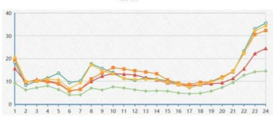

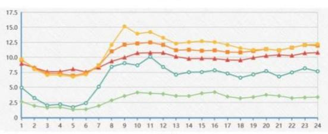

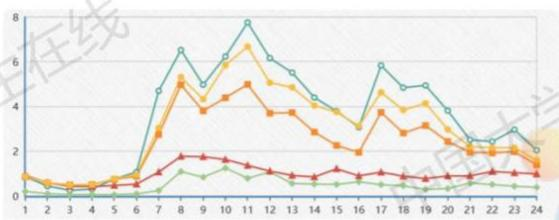  
-工作日--周六日--节假日--1.27-2.17-0-7.15-8.15

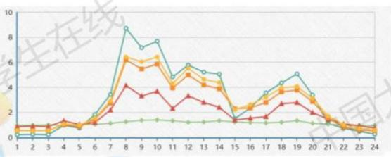