# 基于目标优化的“FAST”主动反射面形状调节研究

## 摘要

FAST的创新技术之一是主动反射面，其工作抛物面状态是否能够接近为一个理想抛物面是整个系统关键。本文通过建立基于目标优化的主动反射面调节模型，求解出了能够满足反射面板调节因素的理想抛物面，并对实际反射面板的调节方式（伸缩量、变动位置等）进行了研究。

针对于问题一，本文建立了基于变步长搜索算法求解的单目标优化模型。本文将工作抛物面尽可能贴近理想抛物面的优化目标转化为工作状态下主动反射面的主索节点就在求解得出的理想抛物面上。首先经过初步建立针对伸缩范围最小的单目标优化模型，得到题目中要求的促动器伸缩范围的条件可以被所有主索节点全部满足，然而相邻主索节点之间的主索伸缩范围不超过0.07%是无法被完全满足的。因此，再通过调节前后相邻节点之间的距离变化幅度最小为目标函数，建立单目标优化模型，设计基于变步长策略的遍历搜索算法进行求解，最终得到理想抛物面的方程为$x ^ { 2 } + y ^ { 2 } = 5 6 2 . 3 7 4 8 ( z + 3 0 0 . 7 1 6 )$ 抛物线顶点相较于基准球面下降的距离为 0.316米。并且本文给出了问题一主索节点之间距离变化幅度符合要求与否的情况存入Excel表放入附件中。此时，所有促动器的最大伸缩量为0.3499米，相邻节点之间的距离变化幅度最大值为0.11%，可知实际情况下并不是所有节点都能达到理想抛物面方程。最后经过结果分析与敏感性分析，通过分析理想抛物面底端位置参数变化后最大径向伸缩量的变化的情况，得知建立的模型稳定性好。

针对于问题二，本文提出了两个模型。模型Ⅰ本质上是延续问题一的求解思路，调节前后相邻节点之间的距离变化幅度最小为目标函数，建立单目标优化模型。首先通过几何关系，用二维方法建立 $\pmb { T } _ { 2 i }$ 与 $d _ { i }$ 的对应关系，然后计算促动器径向伸缩量，再计算出径向调节之后主索节点的坐标与编号等参数。模型Ⅱ是基于旋转坐标系使旋转抛物面轴线与天体的方向重合，通过坐标旋转矩阵及其变换，得到新的旋转坐标系，在求解之后，再将其转换为球坐标系。本文仅对模型Ⅰ进行了求解，基于模型Ⅰ建立单目标优化模型，在算法方面通过变步长遍历进行求解，解得理想抛物面的顶点坐标为(-49.3719,-36.9282,-294.3278)，其它参数按照规定格式存入附件材料“result.xlsx”中。

针对于问题三，根据前文建立的模型以及分析可知，馈源舱接收平面是一个直径为一米的圆面，然而经过分析与试算得知单个反射面板的面积与馈源舱圆盘的面积两者差异较大。假设所有的反射面板反射的电磁波都把馈源舱全部覆盖，则可以将馈源舱接收比的问题转化为面积的比值问题。求解得调节后馈源舱的接收比为0.0153；调节前（基准反射球面）馈源舱的接收比为0.0053。因此，调节后显著提高了馈源舱的电磁波信号接收比。

在文章的最后，本文客观地指出了模型的优缺点，并且提出本文建立的模型可以经过修改后用到解决优化太阳能聚焦热电站的效率等其它工程领域。

关键词：目标优化 搜索算法 单目标优化模型 敏感性分析 变步长遍历

## 一、问题重述

## 1.1 问题背景

射电望远镜是人类观测遥远宇宙中微弱信号的一种重要工具。南仁东于1994年提出了建立 500m口径球面射电望远镜(FAST)的构想[1]，历经各界学者多年的共同努力与开拓性研究，FAST目前在我国贵州省平塘县已经建成投入使用。作为我国自主研发具有独立知识产权的世界上最大单口径、最高灵敏度的射电望远镜，FAST的建成使用对我国科学前言的研究具有重大意义。主动反射面作为FAST中的一种核心结构，是FAST的创新技术之一[2]，其形状（即工作抛物面状态）是否接近成为一个理想抛物面对馈源舱接收反射信号的效果具有一定程度的影响。

## 1.2 目标任务

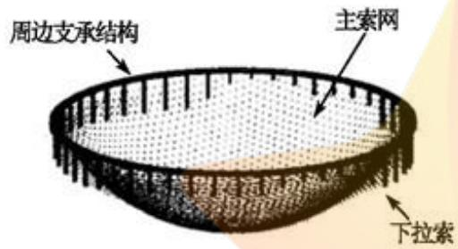
图 1 FAST 主动反射面轴侧图

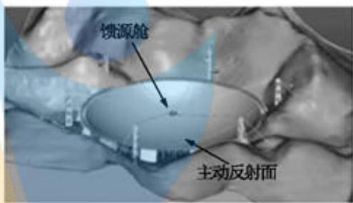
图 2 FAST 三维位置示意图

FAST建立在喀斯特洼地的台址上，其结构包括主动反射面、馈源舱以及其它控制支承结构（如图1和图2所示)。FAST的一个突出特点就是可变的主动反射面，其构成包括主索网、下拉索、反射面板、促动器以及支承结构等。主动反射面是一个可以调节的球面。在没有观测任务的时候，主动反射面呈现一个口径500米、半径300米的规则球面，称之为基准态。当需要观测太空星体的时候(工作态)，通过促动器和下拉索对主索节点的径向调节作用，使得安装在主索网三角网格上的反射面板的倾斜角度发生变化，进而调节主动反射面为一个近似的旋转抛物面（口径为300米)，从而达到信号能够精确反射汇聚到馈源舱有效区域的效果。这个近似的旋转抛物面被称之为工作抛物面。

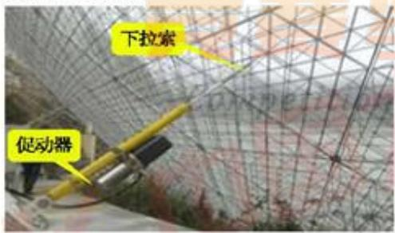
图 3 下拉索和促动器实物图

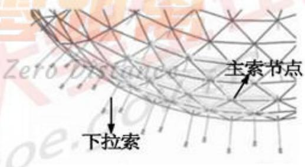
图4 整体索网主动反射面结构示意图[1]

本文解决的主要问题是在索网调节反射面板的约束范围内，使得在工作状态下的实际反射面板构成的反射面尽可能接近理想抛物面。

问题一：为保证反射面板移动时与邻近的反射面板不会互相挤压、拉扯，在设计安装反射面板时就使得反射面板之间有一定的间隙。且规定，若主索点发生了径向调节，相邻节点之间的距离的变化范围不能超过0.07%，促动器的顶端径向伸缩范围为-0.6\~+0.6米(基准状态下的伸缩量为0米)。如果需要观测位于基准球面正上方的待测天体 $\scriptstyle ( \alpha = 0 ^ { \circ } , \beta = 9 0 ^ { \circ }$ 见图5的坐标系)，在考虑反射面板调节因素的前提下，确定理想的抛物面。FAST剖面示意图以及焦径比等参数见图6。

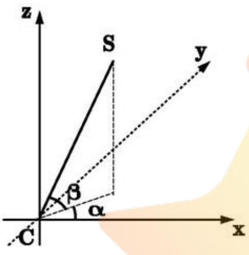
图 5 天体S方位角与仰角示意图

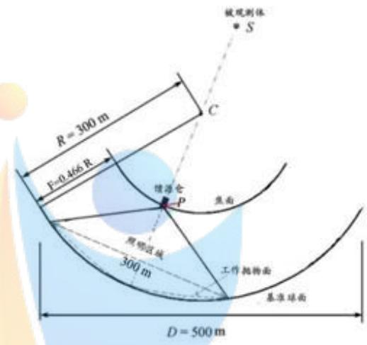
图 6 FAST 剖面示意图

问题二：该问题要求待观测天体不在基准球面正上方时，确定理想的抛物面。若要考虑相关促动器的伸缩量，需要确定理想抛物面的顶点坐标、调节后的300米口径内主索节点的编号、位置坐标以及对应各个促动器的伸缩量，并将结果保存在电子表格文件中。

问题三：在问题二建立的主动反射面调节方案的基础之上，计算调节后馈源舱的电磁波信号接收比（即馈源舱的一米直径的圆盘上接收到的反射电磁波信号与照明区主动反射面反射信号之比)，并且与未通过主动反射面调节之前的基础球面的反射电磁波信号接收比作比较。

## 二、问题分析

## 2.1 问题一的分析

问题一是在待观测天体位于基准球面正上方时，确定理想抛物面的问题。在此之中，题目中明确，需要结合反射面的调节因素。经过简单分析和试算可知，题目中的促动器伸缩范围在所有的主索节点中都可以被完全满足，而相邻主索节点之间的主索伸缩幅度不超过万分之七的这个条件不能被完全满足。结合工程实际以及题目设问可知，完全满足反射面板调节因素使得工作抛物面达到理想抛物面的情况几乎不可能存在。本文将工作抛物面尽可能贴近理想抛物面转化为主动反射面的主索节点就在所求出的理想抛物面之上，利用球坐标系，径向伸缩的距离就是主索节点的变化幅度，本文以调节前后相邻主索节点之间距离的变化幅度最小为目标函数，建立单目标优化模型，通过变步长策略的遍历搜素算法进行寻优，最终得到工程实际中工作抛物面能够贴近的理想抛物面。问题一的分析思路见图7。

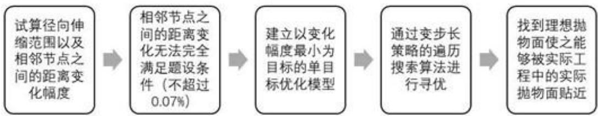
图 7 问题一分析思路流程图

## 2.2问题二的分析

问题二要求当观测天体位于α角度为 $3 6 . 7 9 5 ^ { \circ }$ ， $\beta$ 角度为 $7 8 . 1 6 9 ^ { \circ }$ ，确定一个理想抛物面，并且建立反射面板调节的模型，算出促动器的伸缩量、理想抛物面的顶点坐标、位置坐标等参数。在问题一中，已经求出符合条件的理想抛物面顶点和焦点的变化量，即抛物面的形状大小已经确定。在问题二中，当天体不在正上方时，若要求理想抛物面的位置，则需要将理想抛物面的轴线旋转到天体的方位，可以通过项点和焦点转化后的坐标，确定理想抛物面的位置。理想抛物面位置确定后，通过抛物面上的点到顶点的距离存在约束，求得300米口径内点的编号和坐标。在将反射面尽量贴近该理想抛物面时，相关促动器的伸缩量为基准球面的半径与调节后的理想抛物面对应点极径的差值，通过建立基准球面上任意一点到理想抛物面顶点的距离与极径的对应关系，可以得到调节后理想抛物面任意一点的极径，进而可以得到促动器的伸缩量，再将调节后的点的球坐标转化为空间坐标。

## 2.3问题三的分析

问题三要求在第二问反射面调节方案之下，计算调节后的馈源舱接收比。根据前文建立的模型以及分析可知，馈源舱接收平面是一个直径为一米的圆面，然而经过简单试算得知单个反射面板的面积约为50平方米，两者差异较大。因此可以假设所有的反射面板反射的电磁波都把馈源舱全部覆盖，则馈源舱接收比的问题转化为面积的比值问题。然而，实际情况下，反射面板反射的信号不可能完全覆盖馈源舱，尤其是在照射区域边界的反射面板。故考虑采取一个修正系数来减小求得的馈源舱接收比使之尽量符合实际情况。求得接收比之后，与基准反射球面的接收比较即可。

## 三、模型假设

为了适当地对模型进行合理简化，本文给出如下假设：ce

1. 忽略安装时的工程实际间隙，假设主索节点的坐标就是反射面板的顶点坐标。

2. 假设电磁波信号经过反射面板反射后没有损失。

3. 假设不考虑主索节点的伸缩对FAST 力学结构及稳定性的影响。

4. 假设所有的信号都是沿直线传播。

## 四、符号说明

<table><tr><td>序号</td><td>符号</td><td>意义</td></tr><tr><td>1</td><td>r</td><td>极径</td></tr><tr><td>2</td><td> ${ \pmb F }$ </td><td>理想抛物面的焦距</td></tr><tr><td>3</td><td> $\pmb { \xi }$ </td><td>理想抛物面顶点在z轴方向的移动距离</td></tr><tr><td>4</td><td> $\delta$ </td><td>理想抛物面焦点变化的数值</td></tr><tr><td></td><td> $\pmb { J }$ </td><td>抛物面的焦点</td></tr><tr><td>567</td><td> $G _ { p i }$ </td><td>理想抛物面上任意一点</td></tr><tr><td></td><td> $G _ { i }$ </td><td>基准球面上的点</td></tr><tr><td>∞</td><td> $d _ { i }$ </td><td>点  $G _ { i }$  与理想抛物面顶点之间的距离</td></tr><tr><td>9</td><td> $\pmb { N }$ </td><td>300米口径范围内反射面板的个数</td></tr><tr><td>10</td><td> $\theta _ { i }$ </td><td>反射面板的法向量与天体入射信号的夹角</td></tr><tr><td>11</td><td> $\pmb { P }$ </td><td>馈源舱的接收比</td></tr></table>

## 五、模型的建立与求解

## 5.1问题一：结合反射面板调节因素，确定理想抛物面

针对于问题一，需要建立理想抛物面，使得该理想抛物面能够满足反射面板的调节因素。分析题目可知，题目中有两个几何上的面亟待研究，一个是射电望远镜FAST的实际主动反射面，一个是FSAT实际表面需要趋近的理想抛物面，由于FAST的主动反射面是由4300块反射面板所构成的，其经过变化后，无法成为完全标准的旋转抛物面，只能是在实际上尽可能贴近所求的旋转抛物面（即理想抛物面)。另外，由于反射面板的调节存在着限制条件，因此，理想抛物面需要基本满足反射面板的限制因素，否则，即使理想抛物面理论上能够将信号反射回馈源舱，但是反射面板无论如何也无法调节到接近于理想抛物面的状态，导致馈源舱接收电磁波信号的比例过低。本文建立了基于目标优化的FAST主动反射面形状调节模型，通过变步长策略的遍历寻优，找出符合反射面板调节因素的理想抛物面。

## 5.1.1 模型的建立——理想抛物面模型

## 1）基于球坐标系的理想抛物面模型

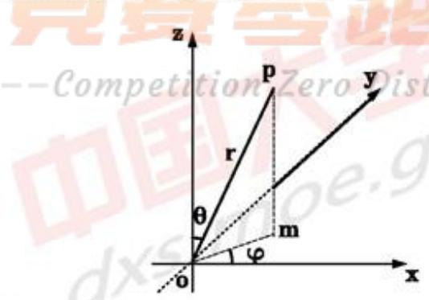
图8 球坐标系（原点为FAST 系统的基准球面球心）

以基准球面的球心为原点，建立球坐标系。见图8，r表示极径， $\varphi$ 表示以x轴正方向为基准，逆时针旋转到 $\mid o m$ 方向上的角度。令点 $p ( x _ { 1 i } , y _ { 1 i } , z _ { 1 i } )$ 位于基准球面上，则存在：

$$
r _ { 1 i } = \sqrt { { x _ { 1 i } } ^ { 2 } + { y _ { 1 i } } ^ { 2 } + { z _ { 1 i } } ^ { 2 } }\tag{1}
$$

式中， $\scriptstyle r _ { 1 6 }$ 表示基准球面上的点的极径；i=1,2……N，N表示基准球面上包含的主索节点数。

若要在球坐标中表示一个确定的点，还需要两个角度。

$$
\theta _ { 1 i } = \operatorname { a r c c o s } { \frac { z _ { 1 i } } { r _ { 1 i } } }\tag{2}
$$

式中， $\theta _ { 1 i }$ 表示 $\overrightarrow { o p }$ 方向与z轴正方向的夹角。

$$
\varphi _ { 1 i } = \arctan { \frac { y _ { 1 i } } { x _ { 1 i } } }\tag{3}
$$

式中， $\varphi _ { 1 i }$ 表示 $\overrightarrow { o m }$ 方向与x轴正方向的夹角。

综上所述，基准球面上一点的位置用球坐标表示为 $( r _ { 1 i } , \theta _ { 1 i } , \varphi _ { 1 i } )$

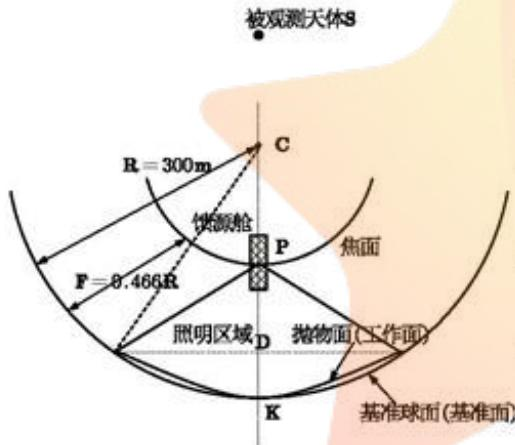
图 9 FAST 剖面示意图
(当待测天体位于基准球面正上方)

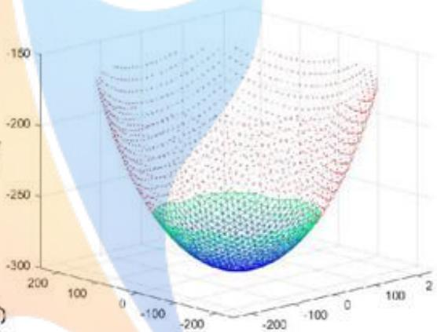
图10 照明区域在整体球面上的位置(红色表示非照明区域的主索节点)

如图9，若被观测天体位于基准球面正上方时，使得被观测天体与馈源舱所在的直线与基准球面的交点K为理想抛物面顶点，得到该状态下理想抛物面的方程为（基于三维笛卡尔坐标系）

$$
x ^ { 2 } + y ^ { 2 } = 4 F _ { 0 } ( z + R )\tag{4}
$$

式中， $F _ { 0 }$ 表示理想抛物面的焦距 $( F _ { 0 } = 0$ .466R)，R表示通过附件得出的基准球面的半径 $( R = 3 0 0 . 4 m )$ ，将式(4)转化到球坐标系下表示 aV

$$
r ^ { 2 } \sin ^ { 2 } \theta - 4 F _ { 0 } r \cos \theta - 4 F _ { 0 } R = 0\tag{5}
$$

由式(5)可以推出顶点位于K点的理想抛物面上任意一点的极径

$$
r = \frac { 2 F _ { 0 } \cos \theta + 2 \sqrt { { F _ { 0 } } ^ { 2 } \cos ^ { 2 } \theta + F _ { 0 } R \sin ^ { 2 } \theta } } { \sin ^ { 2 } \theta }\tag{6}
$$

上式由一元二次方程的求根公式推导出。

## 2）考虑主索节点的移动变位

由于需要考虑反射面板的调节因素，即下拉索的拉动会导致主索节点的位移变动，进而影响反射面板的调节。由于促动器在基准球面的径向方向拉动拉索运动的范围为-0.6\~+0.6米，即需要满足任何一个主索节点的径向变动范围在-0.6\~+0.6米之间。因为需要确定一个实际工程中能够调节接近的理想抛物面。本文首先考虑理想抛物面的顶点K在基准球面最底端沿径向变动范围为 $- 0 . 6 \sim + 0 . 6$ 米。假定理想抛物线顶点K下移ξ米，其中 $\pmb { \xi } \in ( - 0 . 6 , 0 . 6 )$ ，移动之后抛物面的方程为

$$
x ^ { 2 } + y ^ { 2 } = 4 F ( z + R + \xi )\tag{7}
$$

式中， $F = F _ { 0 } + \xi$ 0

则经过顶点变动后的理想抛物面上任意节点对应的极径

$$
\tau _ { 2 i } = \frac { 2 F \cos \theta _ { i } + 2 \sqrt { F ^ { 2 } \cos ^ { 2 } \theta _ { i } + F ( R + \xi ) \sin ^ { 2 } \theta _ { i } } } { \sin ^ { 2 } \theta _ { i } }\tag{8}
$$

则基准球面上的节点沿径向伸缩到理想抛物面的距离为

$$
\Delta r _ { i } = \left| r _ { 1 i } - r _ { 2 i } \right|\tag{9}
$$

式中， $i = 1 , 2 \cdots N$ ，N表示基准球面上包含的所有主索节点数。因此 $\pmb { \varDelta r _ { i } }$ 需要满足$\Delta r _ { i } \leqslant 0 . 6$ 米。

## 3）考虑理想抛物面焦点的移动变位

根据题目，FAST主动反射面反射电磁波到馈源舱。问题一中考虑理想抛物面，即经过理想抛物面的反射后所有的信号应该汇聚于一点。由于馈源舱接收信号的有效区域不是一个点，而是一个直径为1米的圆盘。因此，该理想抛物面的焦点并不是一定要在馈源舱圆盘的中心上，而是可以上下浮动，如此也能保证所有信号能够反馈到馈源舱内。列举了两种情况，图11、图12中信号为特殊情况下的边界信号。

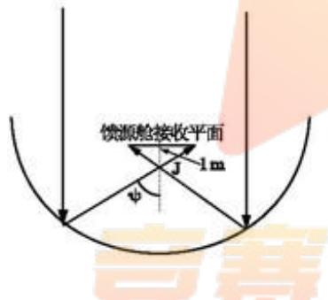

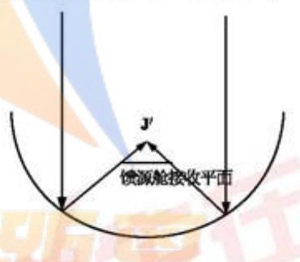
图11 理想抛物面焦点位于接收平面以下图 12 理想抛物面焦点位于接收平面以上

分析上图，J点和J'点分别表示某一顶点的抛物线可变焦点的最低点和最高点。因此，对应于某一顶点的理想抛物面（顶点变化范围 $\pmb { \xi } \in ( - 0 . 6 , 0 . 6 )$ )，都存在一个焦点的可变范围，使得电磁波信号可以反射回馈源舱的平面内。将这个焦点可变的范围计算如下：

如图11，根据几何关系（详见图9)，边界条件下夹角ψ可以通过以下推导的公式求出

$$
\tan \psi = \frac { 1 5 0 } { \left( \frac { \sqrt { 3 } } { 2 } R - 0 . 5 3 4 R \right) }\tag{10}
$$

式中，R为基准球面的半径，带入由附件材料计算出的基准球面半径 $\scriptstyle R = 3 0 0 . 4$ 米，得到焦点位于临界状态的临界角度 $\psi = 5 6 . 4 ^ { \circ }$ 。设焦点变化的数值为 $\delta$ ，根据几何关系得

$$
\delta \in \left( - \ \frac { 0 . 5 } { \tan \psi } , \frac { 0 . 5 } { \tan \psi } \right)\tag{11}
$$

## 4）考虑相邻节点之间距离的微小变化

基准球面经过下拉索的调节之后，得到工作抛物面。若要使得工作抛物面与理想抛物面尽可能贴近，本文认为使得主索节点就位于理想抛物面上，即工作抛物面上相应的主索节点也在求出的理想抛物面上，极径为 $\scriptstyle \mathbf { r } _ { 2 i }$ 。由于促动器带动主索节点调节的方向为径向，所以工作抛物面上对应的主索节点的角度 $\theta _ { i }$ 、 $\varphi _ { i }$ 仍然不变。设工作抛物面上主索节点对应的空间坐标为 $G _ { i } ^ { \prime } ( x _ { 2 i } , y _ { 2 i } , z _ { 2 i } )$ ，其中

$$
\left\{ \begin{array} { l l } { x _ { 2 i } = r _ { 2 i } \sin \theta _ { 1 i } \cos \varphi _ { 1 i } } \\ { y _ { 2 i } = r _ { 2 i } \sin \theta _ { 1 i } \sin \varphi _ { 1 i } } \\ { z _ { 2 i } = r _ { 2 i } \cos \theta _ { 1 i } } \end{array} \right.\tag{12}
$$

同理，基准球面上主索节点的坐标为 $G _ { i } ( x _ { 1 i } , y _ { 1 i } , z _ { 1 i } )$ 。则主索节点调节之前相邻主索节点之间的距离为

$$
\lvert G _ { i } G _ { i + 1 } \rvert = \sqrt { ( x _ { 1 } ^ { i + 1 } - x _ { 1 } ^ { i } ) ^ { 2 } + ( y _ { 1 } ^ { i + 1 } - y _ { 1 } ^ { i } ) ^ { 2 } + ( z _ { 1 } ^ { i + 1 } - z _ { 1 } ^ { i } ) ^ { 2 } }\tag{13}
$$

主索节点调节之后相邻主索节点之间的距离为

$$
| G _ { i } ^ { \prime } G _ { i + 1 } ^ { \prime } | = \sqrt { ( x _ { 2 } ^ { i + 1 } - x _ { 2 } ^ { i } ) ^ { 2 } + ( y _ { 2 } ^ { i + 1 } - y _ { 2 } ^ { i } ) ^ { 2 } + ( z _ { 2 } ^ { i + 1 } - z _ { 2 } ^ { i } ) ^ { 2 } }\tag{14}
$$

综上所述，主索节点调节前后的相邻节点之间的距离变化幅度为

$$
\lambda = \frac { | G _ { i } ^ { \prime } G _ { i + 1 } ^ { \prime } | - | G _ { i } G _ { i + 1 } | } { | G _ { i } G _ { i + 1 } | }\tag{15}
$$

## 5）建立基于变步长遍历计算的单目标优化模型

题目中要求需要考虑反射面板的调节因素，即尽可能保证主索节点调节前后相邻主索节点之间的距离变化幅度不超过0.07%、促动器径向伸缩范围为-0.6\~+0.6米。经过遍历试算，得到在一定情况下主索节点的伸缩距离是可以满足题目中要求的伸缩范围的，因此将其作为单目标优化模型的一个约束条件。然而，在遍历中无法找到对应某个理想抛物面在调节前后相邻主索节点之间的距离变化幅度完全小于0.07%。结合前文可知，本文基于将主索节点放置在所求的理想抛物面上，因此所得的理想抛物线很难满足主索节点之间距离变化幅度的限制条件，因此取最优解，使得主索节点变化幅度尽可能小，建立如下基于变步长搜索算法的单目标优化模型。

目标函数：取每个遍历到的理想抛物面其中的某两节点之间距离变化幅度最大，在所得的变化幅度中取最小，即 $\operatorname* { m i n } \left( \operatorname* { m a x } \lambda _ { \eta } \right)$ ，其中ηγ表示模型中遍历理想抛物面的序数。

约束条件：

a) 主索节点径向伸缩量在-0.6\~+0.6 米之间，即

$$
\Delta r _ { i } = | r _ { i i } - r _ { 2 i } | \leqslant 0 . 6\tag{16}
$$

b) 模型中理想抛物面焦点变化数值符合推导的范围

$$
- \frac { 0 . 5 } { \tan \psi } < \delta < \frac { 0 . 5 } { \tan \psi }\tag{17}
$$

c) 基准状态下，所有主索节点均位于基准球面上

$$
r _ { 1 6 } = \sqrt { { x _ { 1 6 } } ^ { 2 } + { y _ { 1 6 } } ^ { 2 } + { z _ { 1 6 } } ^ { 2 } }\tag{18}
$$

d)顶点位于K点的理想抛物面上任意一点的极径

$$
r = \frac { 2 F _ { 0 } \cos \theta + 2 \sqrt { F _ { 0 } ^ { 2 } \cos ^ { 2 } \theta + F _ { 0 } R \sin ^ { 2 } \theta } } { \sin ^ { 2 } \theta }\tag{19}
$$

e) 其它几何关系

综上所述，建立单目标优化模型。

$$
\operatorname* { m i n } \left( \operatorname* { m a x } \lambda _ { i } \right) _ { \gamma }
$$

$$
\begin{array} { r l } & { \left\{ \begin{array} { l l } { \alpha _ { 1 } - \ln \beta _ { 2 } - \nu _ { 1 } \mu _ { 3 } \sigma _ { 1 } } \\ { - \frac { 1 6 8 } { 8 } \sigma _ { 1 } - \nu _ { 1 } \mu _ { 3 } } \\ { \ln \beta _ { 2 } - \nu _ { 2 } \mu _ { 3 } } \\ { \ln \tau _ { 1 } - \frac { \sqrt { \tau _ { 1 } \tau _ { 2 } } } { \sqrt { \tau _ { 2 } \tau _ { 3 } } } [ \frac { \sigma _ { 1 } } { 2 } ] ^ { 2 } } \\ { \tau _ { 2 } - \frac { 2 4 8 \sigma _ { 1 } ^ { 2 } \sigma _ { 1 } } { \sqrt { \tau _ { 2 } \tau _ { 3 } } } [ \frac { \sigma _ { 1 } } { 2 } ] ^ { 2 } } \\ { \ln \tau _ { 1 } - \frac { \sqrt { \tau _ { 1 } \tau _ { 2 } } } { \sqrt { \tau _ { 2 } \tau _ { 3 } } } [ \frac { \sigma _ { 1 } } { 2 } ] ^ { 2 } } \\ { \ln \tau _ { 2 } - \frac { 2 4 8 \sigma _ { 1 } ^ { 2 } \sigma _ { 1 } } { \sqrt { \tau _ { 2 } \tau _ { 3 } } } [ \frac { \sigma _ { 1 } } { 2 } ] ^ { 2 } } \\ { \ln \tau _ { 1 } - \frac { 2 4 8 \sigma _ { 1 } ^ { 2 } \sigma _ { 1 } } { \sqrt { \tau _ { 2 } \tau _ { 3 } } } [ \frac { \sigma _ { 1 } } { 2 } ] ^ { 2 } } \\ { \vdots } \\ { \left\{ \frac { 2 4 8 \sigma _ { 1 } ^ { 2 } \sigma _ { 1 } } { \sqrt { \tau _ { 3 } } } [ \frac { \sigma _ { 1 } } { 2 } ] ^ { 2 } - \frac { 2 4 8 \sigma _ { 1 } ^ { 2 } \sigma _ { 1 } } { \sqrt { \tau _ { 2 } \tau _ { 3 } } } [ \frac { \sigma _ { 1 } } { 2 } ] ^ { 2 } \right\} } \\ { \ln \tau _ { 1 } } \end{array} \right. } \end{array}\tag{20}
$$

## 5.1.2 模型的求解

本文建立的基于变步长遍历计算的单目标优化模型求解的算法步骤如下：

Step1：数据预处理

加载数据附件1和附件3。进行数据预处理，将附件1和附件3中主索节点编号进行转化， $A , B , C , D ,$ E分别转化为1、2、3、4、5，例如编号 ${ } ^ { a } A 0 ^ { p }$ 转化为 $1 ^ { \prime \prime } 1 0 ^ { p }$

Step2：利用搜索算法遍历求解

设置半径 $\pmb { R } = 3 0 0 . 4 m$ ，设置焦点z坐标变化量和理想抛物面顶点z坐标变化量为

$d d F = - 0 . 5 / \sqrt { 5 6 . 4 2 ^ { * } } ; 0 . 0 1 ; 0 . 5 / \sqrt { 5 6 . 4 2 ^ { * } } , d F = - 0 . 6 ; 0 . 0 1 ; 0 . 6$ 。对ddF和 $\scriptstyle { \frac { } { d F } }$ 进行遍历寻优。设置理想抛物面顶点到焦点的距离 $\pmb { f } = 0 . 4 6 6 \times \pmb { R } + d d \pmb { F } + d \pmb { F }$ 6

## Step3：寻找300米口径范围内的点

判断附件1中给出的主索节点是否处于问题一中的300m口径范围内，将范围内主索节点由三维坐标系x、y、z转化为球坐标系r、θ、 $\varphi \circ a = ( \sin ( \theta ) ) ^ { 2 } , b = - 4 \times f \times \cos ( \theta )$ $\pmb { c } = - 4 \pmb { x } \pmb { f } \pmb { x } \left( \pmb { R } + d \pmb { F } \right)$ 。计算主索节点对应理想抛物面上点的极径为 $( - b + \sqrt { b ^ { 2 } - 4 a c } ) / 2 a$ 并由此计算出主索节点的径向调节量和调节后的三维坐标。主索节点的最大径向调节量为W。

## Step4:计算调节前后相邻主索距离的变化幅度

判断附件3中4300块反射面板对应的每一主索节点是否在300m口径范围内，若在范围内，返回此时判断的主索节点编号：若不在范围内，返回0，记录至FJ4矩阵。若每行FJ4矩阵中三个元素均大于零，则表示此三个元素对应的三角形整体位于300m口径范围内，计算主索节点由基础位点改变至理想位点后相邻节点间变化幅度。最大变化幅度为dete。

## Step5：变化幅度和最大径向调节量作为约束条件

对最大变化幅度dete寻优，当最大变化幅度dete满足小于0.07%时判断最大径向调节量W是否满足小于0.6，记录符合条件的理想抛物面顶点位置、焦点位置、主索节点的最大径向调节量W和最大变化幅度dete。

## Step6: 返回 step2 变步长遍历寻优

调节步长，将step.5中得到焦点z坐标变化量和理想抛物面顶点z坐标变化量带入step.2，并设置小步长，得到更精确的主索节点的最大径向调节量W和最大变化幅度dete

另外，由于程序运行中是将表示主索节点位置的字母转化为了数字进行储存运算因此在最后需要利用转化的对应规则把数字再转回字母表示。此效果可以用Excel表格进行实现，问题二同理。

通过基于变步长策略的遍历寻优，得到的理想抛物面的参数见表1。

表1 当待观测天体位于基准球面正上方时理想抛物面的参数
<table><tr><td>项目</td></tr><tr><td>理想抛物面的顶点与基准球面球心的距离 300.7160米</td></tr><tr><td>理想抛物面焦点与基准球面球心的距离 160.1223米</td></tr><tr><td>所有促动器的最大伸缩 0.3499米</td></tr><tr><td>主索节点调节后，相邻节点之间的距离变化幅度最大值 0.11% 相邻主索节点距离变化幅度符合0.07%所占比例D一 54.94%</td></tr></table>

得到理想抛物面的方程为（抛物线顶点相较于基准球面下降的距离为0.316米）x²+y²=562.3748(z+300.716) (21)

## 5.1.3 结果分析

根据求解结果可以得知，本文所求的理想抛物面在实际工程中并不能使得工作抛物面与之完全贴近。若要使得各个反射面板的顶点（即主索节点）在理想抛物面上，则只有54.95%的主索符合伸缩幅度在0.07%的比例要求。但是，本文也得出了相邻节点之间的距离变化幅度最大值为0.11%，也就是万分之十一，这是一个很小的量，在实际工程中与0.07%相差较小。因此实际工程中完全可以依照本文建立的理想抛物面进行适当的变化达到工作抛物面最为接近理想抛物面。

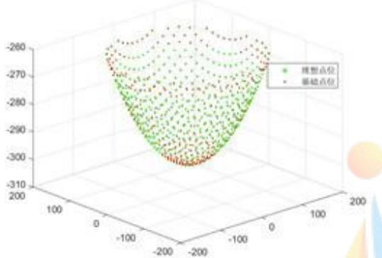
图 13 理想抛物面与基准球面主索节点变化

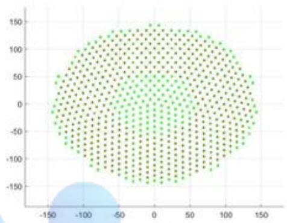
图 14 主索节点变化俯视图

图13、图14中，绿色点表示基准球面上的点，红色点表示主索节点调节后理想抛物面上的点。俯视图中，中间为绿色说明理想抛物面在低端区域是通过促动器向下拉的，主索节点位于基准球面的下方：而周围呈现红色点覆盖，说明该区域促动器伸长，主索节点在基准球面的上方。

## 5.2 问题二：反射面板的调节模型研究

根据问题一奠定的基础，本问中确定理想抛物面的步骤可以根据坐标系的转换得出，问题二中重要的是如何计算出促动器的伸缩量以及对应的位置坐标，进而改变反射面板的形状尽量贴近理想抛物面。

## 5.2.1 模型的建立（模型I——基于几何关系以及目标优化）

## 1）用二维方法建立 $\tau _ { 2 i }$ 与 $d _ { i }$ 的对应关系

根据图8建立的坐标系，将基准球面和理想抛物面向zoz平面投影，建立如图15所示的平面直角坐标系。

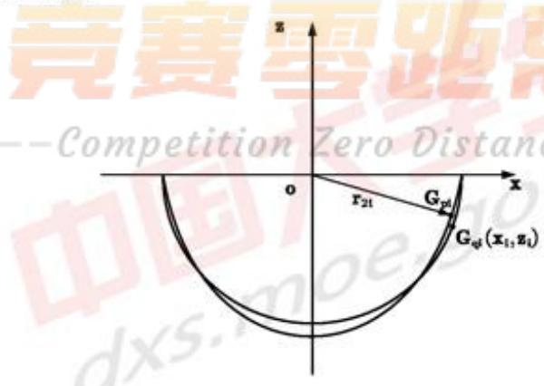
图 15 基准球面与理想抛物面投影平面示意图

通过投影，球面的投影为一个半圆形，方程为

$$
x ^ { 2 } + z ^ { 2 } = R ^ { 2 }\tag{22}
$$

同理，旋转抛物面的投影为一段抛物线，方程[3]为

$$
x ^ { 2 } = 4 F ( z + R + \xi )\tag{23}
$$

式中， $F = 0 . 4 6 6 R + \xi + \delta$ 。由于本文建立的理想抛物面为旋转抛物面，则方程(23)所表示的抛物线上对应的一个点在三维中可以表示为一个圆周。对称面上所有点到圆心的距离都相等，对应于图15，该距离也与图15坐标中该点到坐标原点的距离相等。

因对称性，本文考虑将ox方向上的距离进行等间隔离散化，研究对应的基准球面投影和理想抛物面投影上的点。将ox方向的150米以∆x分为N等份，∆x为一个微小量，将等间隔表示为 $\boldsymbol { x } _ { i } ( i = 1 \cdots N )$ ，因此在x轴的正方向上有N个∆x，即

$$
N = \frac { 1 5 0 } { \Delta x }\tag{24}
$$

圆上任意一点 $G _ { \mathrm { e i } }$ 满足圆的方程 ${ x _ { \alpha } } ^ { 2 } + { z _ { \alpha } } ^ { 2 } = R ^ { 2 }$ $G _ { \ast }$ 与 $o$ 点连线的方程为

$$
z = \frac { z _ { \alpha } } { x _ { \alpha } }\tag{25}
$$

将式(25)与投影得到的抛物线方程联立

$$
\left\{ \begin{array} { l l } { z = \frac { z _ { \sigma i } } { z _ { \sigma i } } } \\ { x ^ { 2 } = 4 F ( z + R + \xi ) } \end{array} \right.\tag{26}
$$

得到对应的抛物线上的坐标为 $G _ { p i } ( x _ { p i } , y _ { p i } )$ ，因此该点的极径表示为

$$
r _ { 2 i } = \sqrt { { x _ { p i } } ^ { 2 } + { y _ { p i } } ^ { 2 } }\tag{27}
$$

此时若使主动反射面的主索节点调节到理想抛物面上，则促动器的伸缩量为

$$
\Delta r _ { i } = \left| R - r _ { 2 i } \right|\tag{28}
$$

令抛物线顶点为 $G _ { 0 }$ ，点 $G _ { \ast }$ 与抛物线顶点的距离为

$$
d _ { i } = | G _ { e i } G _ { 0 } |\tag{29}
$$

综上所述，可以认为 $\pmb { r _ { 2 i } }$ 与每一个 $\mathbf { \mathcal { A } } _ { i }$ 相对应，存在

$$
r _ { 2 i } = f ( d _ { i } )\tag{30}
$$

## 2）通过几何关系计算促动器径向伸缩量

上文中已经建立了坐标原点在基准球面球心的球坐标系（见图8)，在球坐标系下，因为待观测天体位于 $\pmb { \alpha }$ 角度为 $3 6 . 7 9 5 ^ { \circ } , \beta$ 角度为 $7 8 . 1 6 9 ^ { \circ }$ ，则通过转换求得理想抛物面的顶点坐标为 $( x _ { 0 } , y _ { 0 } , z _ { 0 } )$$$
\left\{ \begin{array} { l l } { x _ { 0 } = r _ { 0 } \sin \left( \frac { \pi } { 2 } - \beta \right) \cos \alpha } \\ { y _ { 0 } = r _ { 0 } \sin \left( \frac { \pi } { 2 } - \beta \right) \sin \alpha } \\ { z _ { 0 } = r _ { 0 } \cos \left( \frac { \pi } { 2 } - \beta \right) } \end{array} \right.\tag{31}
$$

根据前文所求，计算出的理想抛物面顶点为 $G _ { 0 } ( x _ { 0 } , y _ { 0 } , z _ { 0 } )$ ，理想抛物面上的任意

一点为 $G _ { p i } ( x _ { p i } , y _ { p i } , z _ { p i } )$ ，则 $| G _ { 0 } G _ { p i } |$

$$
| G _ { 0 } G _ { p i } | = \sqrt { ( x _ { p i } - x _ { 0 } ) ^ { 2 } + ( y _ { p i } - y _ { 0 } ) ^ { 2 } + ( z _ { p i } - z _ { 0 } ) ^ { 2 } }\tag{32}
$$

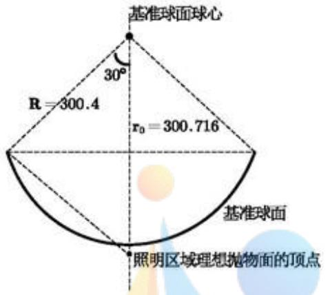
图 16 照明区域基准球面的几何关系

$\pmb { r _ { 0 } }$ 想抛物面的距离最大值根据余弦定理可以得出

$$
\left| G _ { 0 } G _ { p i } \right| _ { \mathrm { m a x } } = \sqrt { R ^ { 2 } + { r _ { 0 } } ^ { 2 } - 2 \cos 3 0 ^ { \circ } R r _ { 0 } } = 1 5 5 . 5 8 0 6\tag{33}
$$

由于抛物面上的点都满足

$$
| G _ { 0 } G _ { p i } | \leqslant | G _ { 0 } G _ { p i } | _ { \operatorname* { m a x } }\tag{34}
$$

根据式(33)，结合附件1可以得出对应 $G _ { p i }$ 的编号。

在抛物面内，某点 $G _ { p i } ( x _ { p i } , y _ { p i } , z _ { p i } )$ 与理想抛物面顶点的距离 $| G _ { 0 } G _ { p i } | = d _ { i }$ ，对应一个 $\tau _ { 2 i }$ 。得到每一个 $G _ { p i }$ 对应的一个促动器的伸缩量等于基准球面上一点到球心距离R与该点在抛物面上所对应的 $r _ { 2 i }$ 的差值，即径向伸缩量为

$$
\Delta r _ { i } ^ { \prime } { = } | R - r _ { 2 i } |\tag{35}
$$

## 3）计算促动器调节后主索节点的坐标

在基准球面上，某一点 $G _ { \alpha i } ( x _ { o i } , y _ { o i } , z _ { o i } )$ 在球坐标系下的参数为

$$
\left\{ \begin{array} { l l } { r _ { 1 i } = \sqrt { { x _ { \mathrm { g } } } ^ { 2 } + { y _ { \mathrm { g } } } ^ { 2 } + { z _ { \mathrm { g } } } ^ { 2 } } } \\ { \theta _ { 1 i } = \operatorname { a r c c o s } \frac { { z _ { \mathrm { g } } } i } { x _ { \mathrm { g } } } } \\ { \alpha _ { 1 i } = \arctan \frac { y _ { \mathrm { g } i } } { x _ { \mathrm { g } i } } \cap \mathcal { D } } \end{array} \right.\tag{36}
$$

综上所述，则促动器带动主索节点调节后，抛物面上的点 $\pmb { G } _ { p i } ^ { \prime }$ 的坐标为

$$
\left\{ \begin{array} { l l } { { x _ { p i } } ^ { \prime } = r _ { 2 i } \sin \theta _ { 1 i } \cos \alpha _ { 1 i } } \\ { { y _ { p i } } ^ { \prime } = r _ { 2 i } \sin \theta _ { 1 i } \sin \alpha _ { 1 i } } \\ { { z _ { p i } } ^ { \prime } = r _ { 2 i } \cos \theta _ { 1 i } } \end{array} \right.\tag{37}
$$

4）建立单目标优化模型（与问题一类似）

min (max λi)γ

$$
\begin{array} { r l } & { \{ \begin{array} { l l } { ( x ^ { 2 } - 3 x ) _ { i } , } \\ { ( x ^ { 3 } - 4 x ^ { 2 } ) _ { i } , } \\ { ( x ^ { 4 } - 5 x ^ { 2 } ) _ { i } , } \\ { ( x ^ { 5 } - 6 x ^ { 3 } ) _ { i } , } \\ { ( x ^ { 4 } - 5 x ^ { 4 } ) _ { i } , } \\ { ( x ^ { 5 } - 6 x ^ { 4 } ) _ { i } , } \end{array}  } \\ & { \{ \begin{array} { l l } { ( x ^ { 4 } - 3 x ^ { 2 } ) _ { i } , } \\ { ( x ^ { 5 } - 3 x ^ { 2 } ) _ { i } , } \\ { ( x ^ { 6 } - 3 x ^ { 2 } ) _ { i } , } \\ { ( x ^ { 6 } - 3 x ^ { 2 } ) _ { i } , } \\ { ( x ^ { 7 } - 6 x ^ { 3 } ) _ { i } , } \end{array}  } \\ & { \{ \begin{array} { l l } { ( x ^ { 4 } - 3 x ^ { 2 } ) _ { i } , } \\ { ( x ^ { 5 } - 3 x ^ { 2 } ) _ { i } , } \\ { ( x ^ { 6 } - 3 x ^ { 2 } ) _ { i } , } \\ { ( x ^ { 7 } - 6 x ^ { 3 } ) _ { i } , } \end{array}  } \\ & { \{ \begin{array} { l l } { ( x ^ { 4 } - 3 x ^ { 2 } ) _ { i } , } \\ { ( x ^ { 5 } - 3 x ^ { 2 } ) _ { i } , } \\ { ( x ^ { 6 } - 3 x ^ { 2 } ) _ { i } , } \\ { ( x ^ { 7 } - 6 x ^ { 3 } ) _ { i } , } \end{array}  } \\ &  \{ \begin{array} { l l } { ( x ^ { 4 } - 3 x ^ { 2 } ) _ { i } , } \\ { ( x ^ { 4 } - 3 x ^ { 2 } ) _ { i } , } \\ { ( x ^ { 5 } - 3 x ^ { 2 } ) _ { i } , } \\   \end{array} \end{array}\tag{38}
$$

## 5.2.2模型的建立（模型ⅡI——基于坐标系旋转）

当天体的位置发生变化时，要实时使旋转抛物面在球面上移动，移动的目的是保证旋转抛物面的旋转轴近似始终通过天体和球心。问题二中给出天体S的方位角和仰角。可以通过坐标系旋转将Z轴旋转到天体S的方位上，使旋转抛物面轴线与天体的方位重合。旋转过程如下：

坐标系先绕x轴旋转的角度为φ，旋转矩阵[4]为

$$
R _ { x } ( \varphi ) = { \left( \begin{array} { l l l l } { 1 } & { 0 } & { 0 } & { 0 } \\ { 0 } & { \cos \varphi } & { - \sin \varphi } & { 0 } \\ { 0 } & { \sin \varphi } & { \cos \varphi } & { 0 } \\ { 0 } & { 0 } & { 0 } & { 1 } \end{array} \right) }\tag{39}
$$

坐标系再绕z轴旋转的角度为α，旋转矩阵为

$$
R _ { s } ( \alpha ) = \left( \begin{array} { l l l l } { \cos \alpha } & { - \sin \alpha } & { 0 } & { 0 } \\ { \sin \alpha } & { \cos \alpha } & { 0 } & { 0 } \\ { 0 } & { 0 } & { 1 } & { 0 } \\ { 0 } & { 0 } & { 0 } & { 1 } \end{array} \right)\tag{40}
$$

坐标系再绕 $_ y$ 轴旋转的角度为γ，旋转矩阵为

$$
R _ { * } ( \gamma ) = \left( \begin{array} { l l l l } { \cos \gamma } & { 0 } & { \sin \gamma } & { 0 } \\ { 0 } & { 1 } & { 0 } & { 0 } \\ { - \sin \gamma } & { 0 } & { \cos \gamma } & { 0 } \\ { 0 } & { 0 } & { 0 } & { 1 } \end{array} \right)\tag{41}
$$

有了两坐标系之间的坐标旋转矩阵，则同一点的位置在新旧两坐标系之间的变换公式为

$$
\pmb { p } ^ { \prime } = R _ { \nu } \left( \gamma \right) R _ { \nu } \left( \alpha \right) R _ { \nu } \left( \varphi \right) \pmb { p }\tag{42}
$$

式中， $\pmb { p } ^ { \prime } = ( \pmb { x } ^ { \prime } \pmb { y } ^ { \prime } \pmb { z } ^ { \prime } \pmb { 1 } ) ^ { T } , p = ( \pmb { x } \pmb { y } \pmb { z } \pmb { 1 } ) ^ { T }$

根据以上公式可得：

$$
\binom { x ^ { \prime } } { y ^ { \prime } } = \left( \begin{array} { l } { \cos \gamma [ x \cos \alpha - ( y \cos \varphi - z s i n \varphi ) \sin \alpha ] + \sin \gamma ( y \sin \varphi + z \cos \varphi ) } \\ { x \sin \alpha + ( y \cos \varphi - z \sin \varphi ) \cos \alpha } \\ { - \sin \gamma [ x \cos \alpha - ( y \cos \varphi - z \sin \varphi ) \sin \alpha ] + \cos \gamma ( y \sin \varphi + z \cos \varphi ) } \end{array} \right)\tag{43}
$$

通过上述坐标转换方法，经过转换后的坐标满足问题一建立的抛物面方程：$x ^ { 2 } + y ^ { 2 } = 4 ( F _ { 0 } + \xi + \delta ) ( z + R + \xi )$ ，将上述求得的 $( x ^ { \prime } , y ^ { \prime } , z ^ { \prime } )$ 代入即可得到旋转后的空间直角坐标系下的抛物面方程。

又可通过

$$
\left\{ \begin{array} { l l } { x = r \sin \theta \cos \alpha } \\ { y = r \sin \theta \sin \alpha } \\ { z = r \cos \theta } \end{array} \right.\tag{44}
$$

将空间直角坐标系下的抛物面方程转化为球坐标系下的方程。

由于时间关系，模型Ⅱ仅给出了坐标旋转方案下的模型，具体的求解过程本文不再列出。

## 5.2.3 模型的求解

基于模型Ⅰ求解，第二问的模型求解建立在模型一结果之上，其处理过程运用了问题一的优化算法。具体的算法步骤如下：

## Step1：数据预处理

加载数据附件1和附件3。进行数据预处理，将附件1和附件3中主索节点编号进行转化，A、B、C、D、E分别转化为1、2、3、4、5，例如编号 ${ } ^ { \mathfrak { a } } A 0 ^ { n }$ 转化为 $\scriptstyle 1 0 ^ { n }$ 求出出主索节点距离理想抛物面顶点的距离d1与此主索节点调节至理想抛物面后与坐标原点的径向距离d之间的关系记为zzz。

## Step2：问题一中优化模型的引用

设置半径 $\pmb { R } = 3 0 0 . 4 m$ ，对问题一中优化模型结果引用，设置焦点z坐标变化量和

理想抛物面顶点z坐标变化量为ddF=0.2913、dF=0.316。设置理想抛物面顶点到焦 点的距离 $\pmb { f } = 0 . 4 6 6 \times \pmb { R } + d d \pmb { F } + d \pmb { F }$ 。通过程序计算得到理想抛物面顶点坐标为 (49.3719,36.9282,294.3278)

## Step3：寻找300m口径范围内点并寻找调节后理想点位

判断附件1中给出的主索节点距理想抛物面顶点距离是否处于155.5806m范围内，将范围内主索节点记录其对应编号，并由三维坐标系x、y、z转化为球坐标系r、θ、φ，计算出主索节点与理想抛物面顶点的距离为d1。通过step.1中关系zzz计算主索节点对应理想抛物面上点的极径为d，并由此计算出对应于主索节点编号的径向调节量和调节后的三维坐标。主索节点的最大径向调节量为W。

## Step4:寻找300m口径范围内主索节点连接方式

判断附件3中4300块反射面板对应的每一主索节点是否在300m口径范围内，若在范围内，返回此时判断的主索节点编号；若不在范围内，返回0，记录至FJ4矩阵。

## Step5:计算调节前后变化幅度

若每行FJ4矩阵中三个元素均大于零，则表示此三个元素对应的三角形整体位于300m口径范围内，计算主索节点由基础位点改变至理想位点后相邻节点间距离变化幅度。最大变化幅度为dete。

## 5.2.4 结果分析

利用变步长的搜索算法编程求解得到理想抛物面的顶点坐标为

表2 问题二中理想抛物面的顶点坐标
<table><tr><td>坐标</td><td>X坐标</td><td>Y坐标</td><td>Z坐标</td></tr><tr><td>数值</td><td>49.3719</td><td>-36.9282</td><td>-294.3278</td></tr></table>

经过促动器调节后，主动反射面300米口径内的主索节点编号、主索节点位置坐标、各个促动器的伸缩量本文中只展示一部分，见表3、表4，其它数据按规定的格式存入附件材料“result.xlsx”文件中

表 3 调整后主索节点编号及坐标部分结果展示（详见附件材料）
<table><tr><td>节点编号</td><td>X坐标</td><td>Y坐标</td><td>Z坐标</td></tr><tr><td>E3</td><td>-15.99556912</td><td>5.197444869</td><td>299.9545742</td></tr><tr><td>A2</td><td>-12.20517606</td><td>16.79956248</td><td>299.6019617</td></tr><tr><td>A5</td><td>-Com.16445429n</td><td>nce</td><td>-299.1070659</td></tr><tr><td>A6</td><td>6.103276538</td><td>25.21689725</td><td>-299.0493588</td></tr><tr><td>B4</td><td>18.27730908</td><td>25.15661395</td><td>-298.5058035</td></tr><tr><td>B5</td><td>22.0941225</td><td>13.59544541</td><td>-299.0217654</td></tr><tr><td>B6</td><td>25.86727652</td><td>1.988430037</td><td>-299.0397934</td></tr><tr><td>C4</td><td>29.57825845</td><td>-9.60967648</td><td>-298.5557711</td></tr><tr><td>C5</td><td>19.76531215</td><td>-16.81726762</td><td>-299.1383598</td></tr><tr><td>…</td><td>……</td><td>……</td><td>…</td></tr></table>

表4 问题二促动器顶端伸缩量部分结果展示
<table><tr><td>对应主索节点编号</td><td>伸缩量 (米)</td><td>对应主索节点编号</td><td>伸缩量（米）</td></tr><tr><td>A0</td><td>0.046513358</td><td>A1</td><td>0.05554871</td></tr><tr><td>B1</td><td>0.135517777</td><td>A3</td><td>0.146793043</td></tr><tr><td>C1</td><td>0.105140218</td><td>B2</td><td>0.216105767</td></tr><tr><td>D1</td><td>-0.004676079</td><td>B3</td><td>0.186055354</td></tr><tr><td>E1</td><td>-0.041731677</td><td>C2</td><td>0.16811858</td></tr><tr><td></td><td></td><td></td><td>….</td></tr></table>

此时，300米口径的照明区域在主动反射面上的位置如图17所示。

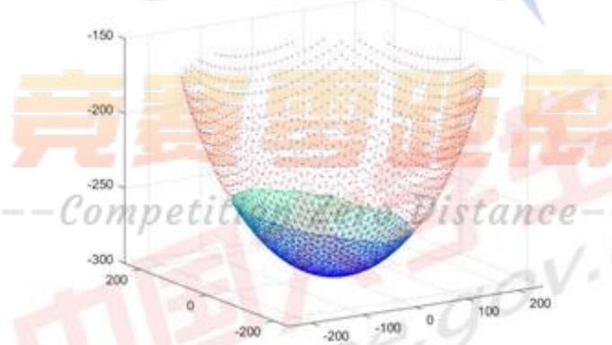
图 17 工作抛物面在主动反射面上的位置

根据图17，主动反射面上的其它主索节点由红色表示，照明区域用蓝色表示并用MATLAB中的trimesh函数连接，由于自动连接的原因，导致工作抛物面边界区域的连接与实际情况不符，无法避免。在此只展示了大体的位置及范围，详细的坐标见附件材料“result.xlsx”文件。根据图17中蓝色区域的走向，与待测天体的方向一致，

从侧面验证了模型及求解结果的正确性。

## 5.3问题三：计算主索节点调节后馈源舱的接收比

根据题目及前文建立的模型，每一个反射面板都是平面的，因此，入射电磁波信号经过反射面板反射仍然为平行信号。通过试算，得到单个反射面板的面积约为50平方米，然而，馈源舱的接收面积约为3平方米，可见一个单独的反射面板的面积远超馈源舱接收平板的面积，见图18。在解问题三之前，本文首先假设对于一个反射面板所反射的平行信号柱能够完全覆盖馈源舱（即100%射中)。因此，计算主索节点调节之后的馈源舱接收比的问题转化为计算各次馈源舱面积之和与入射平行面板有效的平行信号柱面积之比。

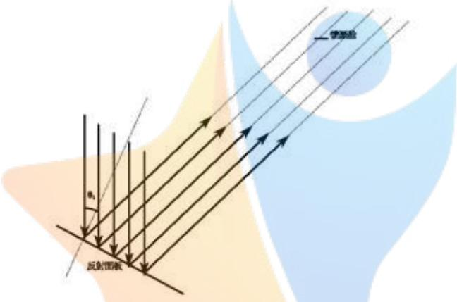
图 18 反射面板反射电磁波到馈源舱的示意图

## 5.3.1 模型的建立

## 1）求理想抛物面上的信号接收比：

设主动反射面300米口径内反射面板的个数为N，某反射面板的法向量与入射电磁波方向的夹角为 $| \theta _ { i }$ 。根据接收比的定义，得到

$$
\pmb { \mathcal { P } } = \frac { N \times S ^ { \prime } } { \displaystyle \sum _ { i = 1 } ^ { N } S _ { i } \mathrm { . c o s } \theta _ { i } }\tag{45}
$$

式中， ${ \pmb S } ^ { \prime }$ 表示馈源舱平面直径为1米平板圆盘的面积：N表示反射面板的个数： $\textstyle { \boldsymbol { s } } _ { i }$ 表示单个反射面板的面积n

以下求反射面板（三角形）的面积：

300米口径内三角形板的顶点坐标已知，每个三角形平板的面积可用海伦公式计算，设三角形三个顶点分别为 $^ { A , B , C }$ 。顶点之间的距离分别为a，b，c。

$$
a = A B = \sqrt { ( x _ { 1 } - x _ { 2 } ) ^ { 2 } + ( y _ { 1 } - y _ { 2 } ) ^ { 2 } + ( z _ { 1 } - z _ { 2 } ) ^ { 2 } }\tag{46}
$$

根据上式，b，c同理，有两点之间的距离公式推出。

由著名的海伦公式，反射平板三角形的面积为

$$
S = \sqrt { p ( p - a ) \left( p - b \right) \left( p - c \right) }\tag{47}
$$

上式中， $\pmb { p }$ 为周长的一半

$$
\pmb { p } = \frac { \pmb { a } + \pmb { b } + \pmb { c } } { 2 }\tag{48}
$$

该三角形的法向量为，可由三角形两条边的向量叉乘得到，三角形两条边得向量为 $\mathbf { \widehat { a } } , \mathbf { \widehat { b } }$ ，其中

$$
\overrightarrow { a } = \overrightarrow { A B } = ( a _ { x } , a _ { y } , a _ { z } ) = ( x _ { 2 } - x _ { 1 } , y _ { 2 } - y _ { 1 } , z _ { 2 } - z _ { 1 } )
$$

$$
\overrightarrow { b } = \overrightarrow { A C } = ( b _ { x } , b _ { y } , b _ { z } ) = ( x _ { 3 } - x _ { 1 } , y _ { 3 } - y _ { 1 } , z _ { 3 } - z _ { 1 } )\tag{49}
$$

法向量π等于三角形两条边向量的叉积

$$
{ \vec { n } } = { \overrightarrow { A B } } \times { \overrightarrow { A C } } = { \frac { 1 } { a } } \times { \dot { \vec { b } } } = ( a _ { v } b _ { x } - a _ { x } b _ { y } , a _ { x } b _ { x } - a _ { x } b _ { x } , a _ { x } b _ { y } - a _ { y } b _ { x } )\tag{50}
$$

从天体发出来的电磁波的单位向量为

$$
\vec { l } _ { 0 } = ( \cos \beta \cos \alpha , \cos \beta \sin \alpha , \sin \beta )\tag{51}
$$

从天体发出得光线与三角形面板的法向量所夹角度为 $\pmb { \theta }$ 。 $\pmb \theta$ 满足

$$
\cos \theta = \cos { \left. \overrightarrow { n } , \overrightarrow { l } _ { 0 } \right. } = \frac { \overrightarrow { n } \cdot \overrightarrow { l _ { 0 } } } { \left| \overrightarrow { n } \right| \left| \overrightarrow { l _ { 0 } } \right| }\tag{52}
$$

## 2）求基准球面的信号接收比：

平行光线入射到球面上后，反射光线会汇集到一个焦点上，焦距 $\pmb { f } = R / 2 > 0 . 4 6 6 R$ 说明球面的焦点在馈源舱的上方，反射光线只有与馈源舱的圆形平板相交，馈源舱有效区域接收到信号，反射光线与圆形平板之间存在一个临界状态，使反射光线与平板恰好相交，在此临界之内，基准球面上的三角形面板反射的光线可以达到有效区域，临界之外的达不到，寻找这个临界之内所有点的编号和三角形，通过上述建立的旋转抛物面计算接收信号比的模型，计算基准反射球面的接收比。

临界状态和可行点的确定：

将基准反射球面向X0Z方向投影，建立如下的平面直角坐标系：

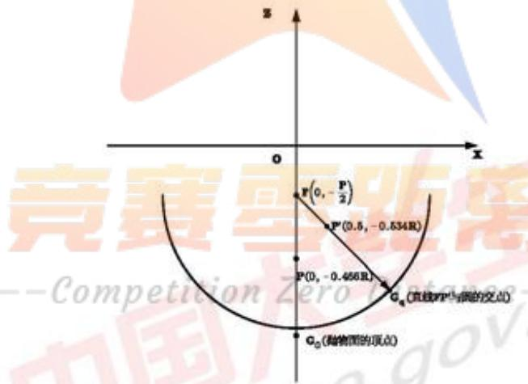
图 19 求基准球面信号接收比的平面直角坐标系

球面焦点 $\pmb { F }$ 的坐标为 $\left( 0 , - { \frac { R } { 2 } } \right)$ ,圆盘的边界点 $P ^ { \prime }$ 坐标为(0.5，-0.534R)，圆方程为$x ^ { 2 } + z ^ { 2 } = R ^ { 2 }$ ,通过直线 ${ \mathbf { } } F { \mathbf { } } P ^ { \prime }$ 与圆方程联立求得交点 $G _ { q } = ( x _ { \parallel } , z _ { \parallel } )$ 0

$$
\left\{ \begin{array} { l l } { { z + \frac { R } { 2 } = - \frac { 0 . 0 3 4 R } { 0 . 5 } X } } \\ { { X ^ { 2 } + Z ^ { 2 } = R ^ { 2 } } } \end{array} \right.\tag{53}
$$

抛物面的顶点坐标为 $G _ { 0 } = ( x _ { 0 } , y _ { 0 } )$ ，点 $G _ { \mathfrak { q } }$ 到顶点 $\scriptstyle { G _ { 0 } }$ 的距离为

$$
| G q G _ { 0 } | = \sqrt { ( x _ { q } - x _ { 0 } ) ^ { 2 } + ( y _ { q } - y _ { 0 } ) ^ { 2 } }\tag{54}
$$

在空间直角坐标系中，若 $G _ { \alpha } ( x _ { \alpha } , y _ { \alpha } , z _ { \alpha } )$ 到抛物面顶点 $G _ { 0 } ( x _ { 0 } , y _ { 0 } , z _ { 0 } )$ 的距离$| G _ { 0 } G _ { \mathrm { e l } } | \leqslant | G _ { 0 } G _ { q } |$ ，则说明光线经过该点反射，反射光线可以落回有效接收区域内。

## 馈源舱接收比的计算：

计算方法与计算抛物面对应的馈源舱接收比的方法相同，设基准球面内有 $N ^ { \prime }$ 个三角形面板，光线可反射回馈源舱的可行面板个数为 $\scriptstyle { \mathfrak { n } } ^ { \prime }$ 个。馈源舱接收比为 $\mathbf { \Delta } _ { \mathbf { \mathcal { p ^ { \prime } } } } ^ { }$ o

$$
\pmb { p } ^ { \prime } = \frac { n ^ { \prime } S _ { \mp i / 3 \pmb { \chi } } } { \displaystyle \sum _ { i = 1 } ^ { \pmb { \chi } } s _ { i , \mathrm { c o o } 0 , } }\tag{55}
$$

## 5.3.2 模型的求解及结果分析

根据建立的模型，算法设计如下：

## Step1： 加载数据

将问题二得到的300m口径范围内主索节点编号、坐标、调节后的理想位置坐标以及范围内每块反射面板的三个主索节点对应编号保存至文件夹，并在此进行加载用于问题三。设置 $\pmb { \alpha } \pmb { f } = 3 6 . 7 9 5 ^ { \circ }$ 、 $b t = 7 8 . 1 6 9 ^ { \circ }$ 、R=300.4。

## Step2:面积及角度计算

已知每块反射面板的三个主索节点在理想点位的坐标，计算300m口径范围内每块反射面板的面积和每块反射面板的法向量，由 $a f = 3 6 . 7 9 5 ^ { \circ } b t = 7 8 . 1 6 9 ^ { \circ }$ 可得到与天体电磁波信号同向的单位向量，计算出两个向量的夹角θ。

## Step3：调节后馈源舱接收比计算

馈源舱接收比为馈源舱有效区域接收到的反射信号与300m口径内反射面的反射信号之比，转化为面积比为 $n \times \pi \times 0 . 5 ^ { 2 } / \sum _ { i = 1 } ^ { n } ( s _ { i } \times \cos ( \theta _ { i } ) )$ ，其中 $^ { \circ } n$ 为300m口径范围内的反射面板个数。

## Step4:调节前馈源舱接收比计算

已知球面焦距为R/2,即在理想状况下一束光线射入球面，反射光线会交于R/2处一点。此点与馈源舱所处位置相差较远以至在理想状况下仅有约12m口径范围内天体电磁波信号能进入馈源舱，但反射面板在球面上分块铺设，通过设置修正因子对馈源舱接收到信号进行修正，求得调节前馈源舱接收比。

求解得调节后馈源舱的接收比为 $\mathbf { 0 . 0 1 5 3 } ;$ 调节前（基准反射球面）馈源舱的接收比为0.0053。因此，调节后提高了馈源舱的电磁波信号接收比，经结果分析，符合工程实际。

## 六、敏感度分析

本文对问题一进行敏感度分析，结合考虑反射面板调节因素，通过调节促动器的径向伸缩量，将基准球面调节为理想抛物面，在确定的理想抛物面顶点和焦点的情况下，该理想抛物面上的点由基准球面上的点经过伸缩转变过来，所有点的伸缩量都必须在-0.6\~+0.6之间，并且其中存在一个最大的伸缩量。现研究在理想抛物面焦点不变的情况下，将顶点的位置上下移动0.6m，所对应的最大径向伸缩量的变化情况。

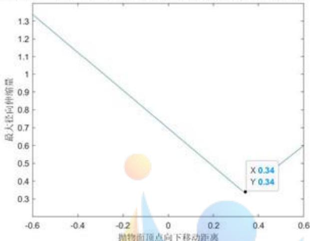
图 20 敏感度分析结果图

上图是顶点坐标上下移动0.6m，最大径向伸缩量的变化情况。顶点移动距离为正时，此时顶点是向下移动，顶点移动距离为负时，此时顶点式向上移动。由图中可以看出，顶点向上移的过程中，随着抛物面顶点向上移动距离的增大，最大径向伸缩量呈线性增加：顶点向下移的过程中，随着抛物面顶点向下移动距离的增大，最大径向伸缩量先线性减小，减小到当下移移动距离为0.34m时，最大径向伸缩量最小为0.34m，之后随着抛物面下移移动距离的增大，最大径向伸缩量呈线性增加。因此最大径向伸缩量对于抛物面顶点移动距离较敏感。

由上述最大径向伸缩量随抛物面顶点移动距离的变化情况可以得出，每次改变顶点位置都可以稳定的得出最大径向伸缩量，说明模型的稳定性好，

## 七、模型的评价与推广

## 7.1 模型的优点

1.本文将主索节点的变化值直接用极径的变化来计算，符合实际情况，在主索节点径向距离变化的求解方面较为精确。

2.本文建立的是基于三维分析的模型，与工程实际非常吻合，经过灵敏度分析得到模型的稳健性好，使用范围广。

## 7.2 模型的缺点

1.由于专业知识的欠缺以及题目假设条件导致的简化，本文件建立的模型无法完全仿真FAST主动反射面的控制情况。

2.问题三中将反射面板反射的信号完全覆盖了馈源舱接收信号的区域，虽然引入了修正系数，但在实际中仍有一定的误差。

## 7.3 模型的推广

1.模型可以较为真实的模拟出大面积动态信号反射面板的反射状况，可以用于远距离测距。

2.模型可以推广到汇聚光线的设备，比如大口径的新能源太阳能聚光换热器、太阳能聚焦热电站，通过本文建立的模型可以根据一天中太阳角度的变化，调节主动反射面使得太阳光汇聚的效率最高。

## 八、参考文献

[1]南仁东.500m 球反射面射电望远镜 FAST[J].中国科学 G 辑:物理学、力学、天文学,2005(05):3-20.

[2]孙纯,朱丽春，于东俊.FAST主反射面节点运动控制算法[J].科学技术与工程，2012(03):17-21.

[3]朱丽春. 500 米口径球面射电望远镜(FAST)主动反射面整网变形控制[J]. 科研信息化技术与应用,2012(04):69-77.

[4]刘钰.大口径射电望远镜反射面支承机构研究[D]. 上海交通大学,2014.

--

附录
<table><tr><td colspan="2">附录1</td></tr><tr><td colspan="2">附件清单</td></tr><tr><td>1.</td><td>问题1主程序</td></tr><tr><td>2.</td><td>问题1图像生成程序</td></tr><tr><td>3.</td><td>问题2程序一</td></tr><tr><td>4.</td><td>问题2程序二</td></tr><tr><td>5.</td><td>问题3程序一</td></tr><tr><td>6.</td><td>问题3程序二</td></tr><tr><td>7.</td><td>灵敏度分析程序</td></tr><tr><td>8. 9.</td><td>问题一主索节点之间距离变化幅度符合要求的情况</td></tr><tr><td>程序运行所需数据文件(.mat)</td><td></td></tr></table>

```matlab
附录2
问题1主程序
clc%问题一主程序
clear
load('FJ11.mat')
load(FJ3.mat')
load(FJ12.mat')
R=300.4;
ddF=0.2713:0.001:0.2913;
for e=1:length(ddF)
F=0.466*R+ddF(e);
dF=0.31:0.001:0.33;
w=10000000000;
for i=1:length(dF) 竞寒雪距离在
f=dF(i)+F;
c=-4*f*(R+dF(i));
n=1;
for j=1:length(FJ11)
r2(j,1)=sqrt(
ifr2(j,1)<=150 国
FJ111(n,1)=FJ11(j,1);
FJ111(n,2)=FJ11(j,2);
FJ111(n,3)=FJ11(j,3);
FJ111(n,4)=FJ12(j,1);
n=n+1;
end
end
```

```matlab
for k=1:length(FJ111)
r1(k,1)=sqrt( (FJ111(k,1))2 +(FJ111(k,2))^2 +(FJ111(k,3))^2 ):
sita1(k,1)=acos(FJ111(k,3)/r1(k));
fai1(k,1)=atan(FJ111(k,2)/FJ111(k,1));
a=(sin( sital(k,1) ))^2;
b=-4*f*cos(sita1(k,1));
r1(k,2)=(-b+sqrt(b^2-4*a*c))/(2*a);
r1(1,2)=dF(i)+r1(1,1);
r1(k,3)=r1(k,1)-r1(k,2);
r1(k,4)=r1(k,2)*sin(sita1(k,1))*cos(fai1(k,1));
r1(1,4)=0;
r1(k,5)=r1(k,2)*sin(sita1(k,1))*sin(fai1(k,1));
r1(1,5)=0;
r1(k,6)=r1(k,2)*cos(sita1(k,1));
end
r(:,1)=r1(:,3);
W(i)=max(max(abs(r)));
for 1=1:3
for m=1:4300
x(m)=ismember( FJ3(m,l),FJ111(:,4));
if x(m)>0
FJ4(m,l)= FJ3(m,1);
else
FJ4(m,1)= 0;
end
end
end
tz2(:,1:3)=r1(:,4:6); tz1(:,1:3)=FJ111(:,1:3); 壹赛雪距爱在
tz1=tz1./abs(tz1);
tz1(isnan(tz1))=1;
tz2=abs(tz2).*tz1;
r1(:,4:6)=tz2(:,1:3);
for M=1:length(FJ4if FJ4(M,1)>5 && FJ4(M.2)>5 && FJ4(M,3)>5
[A,B] = find(FJ111(:,4)==FJ4(M,1));
[A1,B1]=find(FJ111(:,4)==FJ4(M,2));
[A2,B2] = find(FJ111(:,4)==FJ4(M,3));
len(M,1)=sqrt( (FJ111(A,1)-FJ111(A1,1))^2+(FJ111(A,2)-
FJ111(A1,2))^2+ (FJ111(A,3)-FJ111(A1,3))^2 );
len(M,2)=sqrt( (FJ111(A,1)-FJ111(A2,1))^2+(FJ111(A,2)-
FJ111(A2,2))^2+(FJ111(A,3)-FJ111(A2,3))^2 );
```

<table><tr><td>len(M,3)=sqrt(</td><td>(FJ111(A1,1)-FJ111(A2,1))^2+(FJ111(A1,2)-</td></tr><tr><td>FJ111(A2,2))^2+ (FJ111(A1,3)-FJ111(A2,3))^2</td><td>);</td></tr><tr><td>len1(M,1)=sqrt(</td><td>(r1(A,4)-r1(A1,4))^2+ (r1(A,5)-r1(A1,5))^2 +</td></tr><tr><td>(r1(A,6)-r1(A1,6))^2 );</td><td>+</td></tr><tr><td>len1(M,2)=sqrt(</td><td>(r1(A,4)-r1(A2,4))^2+ (r1(A,5)-r1(A2,5))^2</td></tr><tr><td>(r1(A,6)-r1(A2,6))^2 );</td><td>+</td></tr><tr><td>len1(M,3)=sqrt( (r1(A1,6)-r1(A2,6))^2 ); det(M,1)=abs(len1(M,1)-len(M,1))/len(M,1);</td><td>(r1(A1,4)-r1(A2,4))^2+ (r1(A1,5)-r1(A2,5))^2</td></tr><tr><td>det(M,2)=abs(len1(M,2)-len(M,2))/len(M,2); det(M,3)=abs(len1(M,3)-len(M,3))/len(M,3);</td><td></td></tr><tr><td></td><td></td></tr><tr><td>end</td><td></td></tr><tr><td>end</td><td></td></tr><tr><td>dete(i)=max(max(det));</td><td></td></tr><tr><td></td><td></td></tr><tr><td>lv(i)=abs(sum(len)-sum(len1))/sum(len); if dete(i)&lt;=w</td><td></td></tr><tr><td>w=dete(i);</td><td></td></tr><tr><td>cc=W(i);</td><td></td></tr><tr><td>o=dF(i)+R; ol=r1;</td><td></td></tr><tr><td>0o=0.534*R-ddF(e);</td><td></td></tr><tr><td>ooo=det;</td><td></td></tr><tr><td>oooo=lv(i);</td><td></td></tr><tr><td>di=tz2;</td><td></td></tr><tr><td>dii=det;</td><td></td></tr><tr><td>end</td><td></td></tr><tr><td>end</td><td></td></tr><tr><td></td><td></td></tr><tr><td></td><td></td></tr><tr><td>end</td><td></td></tr><tr><td></td><td></td></tr><tr><td></td><td></td></tr><tr><td></td><td></td></tr><tr><td>disp(o)</td><td></td></tr><tr><td>disp(焦点距离原点长度为?</td><td></td></tr><tr><td></td><td></td></tr><tr><td>disp(oo) &quot;)</td><td></td></tr><tr><td>disp(促动器最大伸缩量为：</td><td></td></tr><tr><td>disp(cc)</td><td></td></tr><tr><td></td><td></td></tr><tr><td></td><td></td></tr><tr><td>disp(将基础球面调节至理想抛物面节点间距离最大变化幅度：&#x27;)</td><td></td></tr><tr><td></td><td></td></tr><tr><td></td><td></td></tr><tr><td>disp(w)</td><td></td></tr><tr><td></td><td></td></tr><tr><td></td><td></td></tr><tr><td>disp(所有节点间距离整体变化幅度：&#x27;)</td><td></td></tr><tr><td></td><td></td></tr><tr><td></td><td></td></tr><tr><td></td><td></td></tr><tr><td></td><td></td></tr><tr><td></td><td></td></tr><tr><td></td><td></td></tr><tr><td></td><td></td></tr><tr><td></td><td></td></tr><tr><td></td><td></td></tr><tr><td></td><td></td></tr><tr><td></td><td></td></tr><tr><td></td><td></td></tr><tr><td>disp(oooo)</td><td></td></tr><tr><td></td><td></td></tr><tr><td></td><td></td></tr><tr><td></td><td></td></tr><tr><td></td><td></td></tr><tr><td></td><td></td></tr><tr><td></td><td></td></tr><tr><td></td><td></td></tr><tr><td></td><td></td></tr><tr><td></td><td></td></tr><tr><td></td><td></td></tr><tr><td></td><td></td></tr><tr><td></td><td></td></tr><tr><td></td><td></td></tr><tr><td></td><td></td></tr><tr><td></td><td></td></tr></table>

```matlab
disp(aa)
x3=di(:,1);
y3=di(:,2);
z3=di(:,3);
scatter3(x3,y3,z3,3,'*','g')
hold on
x1=FJ111(:,1);
y1=FJ111(:,2);
z1=FJ111(:,3);
scatter3(x1,y1,z1,15,','r')
%以下为对变化幅度不满足条件的主索节点编号的记录
for Y=1:3
for X=1:length(dii)
if dii(X,Y)>0.0007
diii(X,Y)=1;
else
diii(X,Y)=0;
end
end
end
for t=1:length(dii)
if diii(t,1)>0
MA(t,1)=FJ4(t,1);
MA(t,2)=FJ4(t,2);
end
“竞驾要距爱在 if diii(t,2)>0
MA(t,2)=FJ4(t,2);
end
MA(t,1)=FJ4(t,1);
end
end
```

<table><tr><td>附录3</td></tr><tr><td>问题1图像生成程序</td></tr><tr><td>clc%问题一图像生成 clear</td></tr></table>

```matlab
load('FJ111.mat')
x3=FJ111(:,1);
y3=FJ111(:,2);
z3=FJ111(:,3);
tr = delaunay(x3,y3);
trimesh(tr,x3,y3,z3);
colormap winter
hidden off
hold on
x=FJ11(:,1);
y=FJ11(:,2);
z=FJ11(:,3);
scatter3(x,y,z,1,'*','r')
```

```matlab
附录4
问题2程序一
clc%问题二程序一（数据预处理）
clear
R=300.4;
x1=-R:0.00001:-0.0001;
for m=1:length(x1)
y1(m)=-sqrt(R^2-(x1(m))^2);
d1(m)=sqrt((x1(m))^2+(y1(m)+300.7160)^2);
a=1;
b=-562.3748*y1(m)/x1(m);
c=-169115.100357;
x(m)=(-b-sqrt(b^2-4*a*c))/2; y(m)=x(m)*y1(m)/x1(m);
d(m)=sqrt((x(m))^2+(y(m))^2);
end
plot(d1,d);
ZZZ=spline(d1,d);
```

附录5
问题2程序二
clc%问题二程序二
clear
load('FJ11.mat')
load('FJ3.mat')
load(FJ12.mat')

```matlab
load(ZZZ.mat')
R=300.4;
ddF=0.2913;
for e=1:length(ddF)
F=0.466*R+ddF(e);
dF=0.316;
w=10000000000;
for i=1:length(dF)
f=dF(i)+F;
n=1;
for j=1:length(FJ11)
r2(j,1)=sqrt((FJ11(j,1)+49.3719)^2 +(FJ11(j,2)+36.9282)2+ (FJ11(j,3)+294.3278)^2);
ifr2(j,1)<=155.5806
FJ111(n,1)=FJ11(j,1);
FJ111(n,2)=FJ11(j,2);
FJ111(n,3)=FJ11(j,3);
FJ111(n,4)=FJ12(j,1);
FJ111(n,5)=sqrt((FJ111(n,1)+49.3719)^2 +(FJ111(n,2)+36.9282)^2+
(FJ111(n,3)+294.3278)^2);
n=n+1;
end
end
ZZ=FJ111(:,5);
tem=ppval(ZZZ,ZZ);
tem(132)=300.716;
for k=1:length(FJ111)
r1(k,1)=sqrt( (FJ111(k,1))^2 +(FJ111(k,2))^2 +(FJ111(k,3))^2 );
sita1(k,1)=acos(FJ111(k,3)/r1(k)); 距爱在
fai1(k,1)=atan(FJ111(k,2)/FJ111(k,1));
r1(k,2)=tem(k); 寒雲
r1(k,3)=r1(k,1)-r1(k,2);
r1(k,4)=r1(k,2)*sin(sita1(k,1))*cos(fai1(k,1));
r1(1,4)=0;
r1(1,5)=0;
r1(k,6)=r1(k,2)*cos(sita1(k,1));
end
r(:,1)=r1(:,3);
W(i)=max(max(abs(r)));
for 1=1:3
for m=1:4300
x(m)=ismember(FJ3(m,1),FJ111(:,4));
```

```matlab
if x(m)>0
FJ4(m,l)= FJ3(m,l);
else
FJ4(m,1)= 0;
end
end
end
tz1(:,1:3)=FJ111(:,1:3);
tz2(:,1:3)=r1(:,4:6);
tz1=tz1./abs(tz1);
tz1(isnan(tz1)) = 1;
tz2=abs(tz2).*tz1;
r1(:,4:6)=tz2(:,1:3);
for M=1:length(FJ4)
if FJ4(M,1)>5 && FJ4(M,2)>5 && FJ4(M,3)>5
[A,B] = find(FJ111(:,4)==FJ4(M,1));
[A1,B1] =find(FJ111(:,4)==FJ4(M,2));
[A2,B2] =find(FJ111(:,4)==FJ4(M,3))
len(M,1)=sqrt( (FJ111(A,1)-FJ111(A1,1))^2+(FJ111(A,2)-
FJ111(A1,2))^2+ (FJ111(A,3)-FJ111(A1,3))^2 );
len(M,2)=sqrt( (FJ111(A,1)-FJ111(A2,1))^2+(FJ111(A,2)-
FJ111(A2,2))^2+ (FJ111(A,3)-FJ111(A2,3))^2
len(M,3)=sqrt( (FJ111(A1,1)-FJ111(A2,1))^2+ (FJ111(A1,2)-
FJ111(A2,2))^2+ (FJ111(A1,3)-FJ111(A2,3))^2 );
len1(M,1)=sqrt( (r1(A,4)-r1(A1,4))^2+ (r1(A,5)-r1(A1,5))^2 +
(r1(A,6)-r1(A1,6))^2 );
len1(M,2)=sqrt( (r1(A,4)-r1(A2,4))^2+ (r1(A,5)-r1(A2,5))^2
(r1(A,6)-r1(A2,6))^2 );
len1(M,3)=sqrt( (r1(A1,4)-r1(A2,4))^2+ (r1(A1,5)-r1(A2,5))^2
(r1(A1,6)-r1(A2,6))^2 距离
det(M,1)=abs(len1(M,1)-len(M,1))/len(M,1);
det(M,2)=abs(len1(M,2)-len(M,2))/len(M,2);
det(M,3)=abs(len1(M,3)-len(M,3))/len(M,3);
end
end
dete(i)=max(max(det));
1v(i)=abs(sum(len)-sum(len1))/sum(len);
if dete(i)<=w
w=dete(i);
cc=W(i);
o=dF(i)+R;
ol=r1;
```

```matlab
00=0.534*R-ddF(e);
ooo=det;
oooo=lv(i);
di=tz2;
end
end
end
aa=1-sum(sum(ooo>0.0007))/numel(ooo);
disp(理想抛物面顶点距离原点长度为：')
disp(o)
disp(焦点距离原点长度为：')
disp(oo)
disp(促动器最大伸缩量为：')
disp(cc)
disp(将基础球面调节至理想抛物面节点间距离最大变化幅度：')
disp(w)
disp(所有节点间距离整体变化幅度：')
disp(oooo)
disp('节点间距离变化幅度合格率：')
disp(aa)
x3=di(:,1);
y3=di(:,2);
z3=di(:,3);
scatter3(x3,y3,z3,3,'*','g')
hold on
x1=FJ111(:,1);
y1=FJ111(:,2);
z1=FJ111(:,3); scatter3(x1,y1,z1,15,'.','r')
figure
x1=FJ111(:,1);
y1=FJ111(:,2);
z1=FJ111(:,3);
trimesh(tr1,x1,y1,z1); 中国
colormap winter
hidden off
hold on
x=FJ11(:,1);
y=FJ11(:,2);
z=FJ11(:,3);
scatter3(x,y,z,1,'*','r')
```

```matlab
附录6
问题3程序一
clc%问题三程序一
clear
load('di.mat')
load(FJ4.mat')
load(FJ111.mat')
load('r1.mat')
af=pi*36.795/180;
bt=pi*78.169/180;
n=0;
for M=1:1ength(FJ4)
if FJ4(M,1)>5 && FJ4(M,2)>5 && FJ4(M,3)>5
[A3,B3] = find(FJ111(:,4)=FJ4(M,1));
[A1,B1]=find(FJ111(:,4)==FJ4(M,2));
[A2,B2]=find(FJ111(:,4)==FJ4(M,3));
len1(M,1)=sqrt( (r1(A3,4)-r1(A1,4))^2+ (r1(A3,5)-r1(A1,5))^2 +
(r1(A3,6)-r1(A1,6))^2 );
len1(M,2)=sqrt( (r1(A3,4)-r1(A2,4))^2+ (r1(A3,5)-r1(A2,5))^2 +
(r1(A3,6)-r1(A2,6))^2 );
len1(M,3)=sqrt( (r1(A1,4)-r1(A2,4))^2+ (r1(A1,5)-r1(A2,5))^2+
(r1(A1,6)-r1(A2,6))^2 );
len(M,1)=sqrt( (FJ111(A3,1)-FJ111(A1,1))^2+ (FJ111(A3,2)-
FJ111(A1,2))^2+ (FJ111(A3,3)-FJ111(A1,3))^2 );
len(M,2)=sqrt( (FJ111(A3,1)-FJ111(A2,1))^2+ (FJ111(A3,2)-
FJ111(A2,2))^2+ (FJ111(A3,3)-FJ111(A2,3))^2 y.
len(M,3)=sqrt( (FJ111(A1,1)-FJ111(A2,1))^2+ (FJ111(A1,2)-
FJ111(A2,2))^2+ (FJ111(A1,3)-FJ111(A2,3))^2 );
p1(M)=(len1(M,1)+1en1(M,2)+len1(M,3))/2;
s1(M,1)=sqrt(p1(M)*(p1(M)-len1(M,1))*(p1(M)-len1(M,2)) *(p1(M)-
len1(M,3))
ax(M)=r1(A2,4)-r1(A1,4);
ay(M)=r1(A2,5)-r1(A1,5);
az(M)=r1(A2,6)-r1(A1,6);
bx(M)=r1(A3,4)-r1(A1,4);
by(M)=r1(A3,5)-r1(A1,5);
bz(M)=r1(A3,6)-r1(A1,6);
sita1(M,1)=acos(((ay(M)*bz(M)-az(M)*by(M))*cos(bt)*cos(af)+
(az(M)*bx(M)-ax(M)*bz(M))*cos(bt)*sin(af) +(ax(M)*by(M)-ay(M)*bx(M))*sin(bt))
/sqrt((ay(M)*bz(M)-az(M)*by(M))^2+(az(M)*bx(M)-ax(M)*bz(M))^2+(ax(M)*by(M)-
ay(M)*bx(M))^2 ) );
```

```matlab
sita1(M,2)=abs(cos(sita1(M,1)));
s1(M,2)=s1(M,1)*sita1(M,2);
ifs1(M,2)>0
n=n+1;
end
end
end
d=n*pi*0.5^2/sum(s1(:,2));
disp('调节后馈源舱的接收比为')
disp(d)
```

```matlab
附录7
问题3程序二
clc%问题三程序二
clear
load('di.mat')
load('FJ4.mat')
load(FJ111.mat')
load(r1.mat')
af=pi*36.795/180;
bt=pi*78.169/180;
n=0;
for M=1:length(FJ4)
if FJ4(M,1)>5 && FJ4(M,2)>5 && FJ4(M,3)>5
[A3,B3] =find(FJ111(:,4)=FJ4(M,1));
[A1,B1]=find(FJ111(:,4)—FJ4(M,2));
[A2,B2] = find(FJ111(:,4)==FJ4(M,3));
len1(M,1)=sqrt( (r1(A3,4)-r1(A1,4))^2+ (r1(A3,5)-r1(A1,5))^2
(r1(A3,6)-r1(A1,6))^2 );
len1(M,2)=sqrt((r1(A3,4)-r1(A2,4))^2+ (r1(A3,5)-r1(A2,5))^2
(r1(A3,6)-r1(A2,6))^2 );
len1(M,3)=sqrt( (r1(A1,4)-r1(A2,4))^2+ (r1(A1,5)-r1(A2,5))^2
(r1(A1,6)-r1(A2,6))^2 ):
len(M,1)=sqrt( 0(FJ111(A3,1)-FJ111(A1,1))^2+ (FJ111(A3,2)-
FJ111(A1,2))^2+(FJ111(A3,3)-FJ111(A1,3))^2 );
len(M,2)=sqrt( (FJ111(A3,1)-FJ111(A2,1))^2+(FJ111(A3,2)-
FJ111(A2,2))^2 +(FJ111(A3,3)-FJ111(A2,3))^2 );
len(M,3)=sqrt( (FJ111(A1,1)-FJ111(A2,1))^2+(FJ111(A1,2)-
FJ111(A2,2))^2+ (FJ111(A1,3)-FJ111(A2,3))^2 );
p1(M)=(len1(M,1)+1en1(M,2)+1en1(M,3))/2;
s1(M,1)=sqrt(p1(M)*(p1(M)-len1(M,1))*(p1(M)-len1(M,2)) *(p1(M)-
len1(M,3)) );
```

```matlab
ax(M)=r1(A2,4)-r1(A1,4);
ay(M)=r1(A2,5)-r1(A1,5);
az(M)=r1(A2,6)-r1(A1,6);
bx(M)=r1(A3,4)-r1(A1,4);
by(M)=r1(A3,5)-r1(A1,5);
bz(M)=r1(A3,6)-r1(A1,6);
sita1(M,1)=acos(((ay(M)*bz(M)-az(M)*by(M))*cos(bt)*cos(af)+
(az(M)*bx(M)-ax(M)*bz(M))*cos(bt)*sin(af) +(ax(M)*by(M)-ay(M)*bx(M))*sin(bt))
/sqrt( (ay(M)*bz(M)-az(M)*by(M))^2+(az(M)*bx(M)-ax(M)*bz(M))^2+(ax(M)*by(M)-
ay(M)*bx(M))^2) );
sita1(M,2)=abs(cos(sita1(M,1)));
s1(M,2)=2.899*s1(M,1)*sita1(M,2);
ifs1(M,2)>0
n=n+1;
end
end
end
d=n*pi*0.5^2/sum(s1(:,2));
disp('调节前馈源舱的接收比为')
disp(d)
```

```matlab
附录8
灵敏度分析程序
clc%灵敏度分析主程序， 焦点位置不变，抛物面顶点位置变化
clear
load('FJ11.mat')
load('FJ3.mat')
load('FJ12.mat') 竞赛雪距离在
R=300.4;
ddF=0;
for e=1:length(ddF)
F=0.466*R+ddF(e);
dF=-0.6:0.01:0.6;
w=10000000000;
for i=1:length(dF) 中国
f=dF(i)+F;
c=-4*f*(R+dF(i));
n=1;
for j=1:length(FJ11)
r2(j,1)=sqrt( (FJ11(j,1))^2+(FJ11(j,2))^2 );
if r2(j,1)<=150
FJ111(n,1)=FJ11(j,1);
```

```matlab
FJ111(n,2)=FJ11(j,2);
FJ111(n,3)=FJ11(j,3);
FJ111(n,4)=FJ12(j,1);
n=n+1;
end
end
for k=1:length(FJ111)
r1(k,1)=sqrt( (FJ111(k,1))^2+(FJ111(k,2))^2+(FJ111(k,3))^2 );
sita1(k,1)=acos(FJ111(k,3)/r1(k));
fai1(k,1)=atan(FJ111(k,2)/FJ111(k,1));
a=(sin(sita1(k,1) ))^2;
b=-4*f*cos(sita1(k,1));
r1(k,2)=(-b+sqrt(b^2-4*a*c))/(2*a);
r1(1,2)=dF(i)+r1(1,1);
r1(k,3)=r1(k,1)-r1(k,2);
r1(k,4)=r1(k,2)*sin(sita1(k,1))*cos(fai1(k,1));
r1(1,4)=0;
r1(k,5)=r1(k,2)*sin(sita1(k,1))*sin(fai1(k,1));
r1(1,5)=0;
r1(k,6)=r1(k,2)*cos(sita1(k,1));
end
r(:,1)=r1(:,3);
W(i)=max(max(abs(r)));
for 1=1:3
for m=1:4300
x(m)= ismember( FJ3(m,1),FJ111(:,4));
if x(m)>0
竞费雪距爱在 FJ4(m,l)= FJ3(m,l);
else
end
end
end
tz2(:,1:3)=r1(:,4:6); 中国
tz1=tz1./abs(tz1);
tz1(isnan(tz1)) = 1;
tz2=abs(tz2).*tz1;
r1(:,4:6)=tz2(:,1:3);
for M=1:1ength(FJ4)
if FJ4(M,1)>5 && FJ4(M,2)>5 && FJ4(M,3)>5
[A,B]= find(FJ111(:,4)==FJ4(M,1));
```

[A1,B1]=find(FJ111(:,4)==FJ4(M,2));
[A2,B2]=find(FJ111(:,4)==FJ4(M,3));
len(M,1)=sqrt( (FJ111(A,1)-FJ111(A1,1))^2+(FJ111(A,2)-
FJ111(A1,2))^2+(FJ111(A,3)-FJ111(A1,3))^2 );
len(M,2)=sqrt( (FJ111(A,1)-FJ111(A2,1))2+(FJ111(A,2)-
FJ111(A2,2))^2+ (FJ111(A,3)-FJ111(A2,3))^2 );
len(M,3)=sqrt( (FJ111(A1,1)-FJ111(A2,1))^2+ (FJ111(A1,2)-
FJ111(A2,2))^2+ (FJ111(A1,3)-FJ111(A2,3))^2 );
len1(M,1)=sqrt( (r1(A,4)-r1(A1,4))^2+ (r1(A,5)-r1(A1,5))^2 +
(r1(A,6)-r1(A1,6))^2 );
len1(M,2)=sqrt( (r1(A,4)-r1(A2,4))^2+ (r1(A,5)-r1(A2,5))^2 +
(r1(A,6)-r1(A2,6))^2 );
len1(M,3)=sqrt( (r1(A1,4)-r1(A2,4))^2+ (r1(A1,5)-r1(A2,5))^2 +
(r1(A1,6)-r1(A2,6))^2 );
det(M,1)=abs(len1(M,1)-1en(M,1))/len(M,1);
det(M,2)=abs(len1(M,2)-len(M,2))/len(M,2);
det(M,3)=abs(len1(M,3)-len(M,3))/len(M,3);
end
end
dete(i)=max(max(det));
Iv(i)=abs(sum(len)-sum(len1))/sum(len);
ifdete(i)<=w
w=dete(i);
cc=W(i);
o=dF(i)+R;
o1=1; 竞赛雪跑爱在
oo=0.534\*R-ddF(e);
ooo=det;
oooo=lv(i);
di=tz2;
dii=det;
end --
end 中国
end
plot(dF,W)