# 乙醇制备C4烯烃催化剂组合的分析与设计

摘要本文主要讨论乙醇催化偶合制备C4烯烃时，不同催化剂组合及温度对乙醇转化率和C4烯烃选择性的影响、C4烯烃收率最高时的催化剂组合与温度最优化以及实验设计问题。

针对问题一，分析附件1中每种催化剂组合数据规律，分别建立乙醇转化率、C4烯烃的选择性与温度之间的一元二次回归模型。基于最小二乘法，运用Matlab中 Curve Fitting工具箱的polyfit()函数对该模型进行求解，得到回归系数，进而通过分析所得曲线的变化规律得到结论：在一定范围内随着温度升高，乙醇的转化率与C4烯烃的选择性均会增高，但若温度过高，则C4烯烃的选择性可能会降低。对附件2中的数据进行对比分析，并结合化学反应机理得到结论：碳数为4-12脂肪醇参与了乙醛的生成，乙醇转化率随着时间增大逐渐减小，C4烯烃选择性随时间变化的趋势较为平稳，随着反应时间增加，各产物的选择性都趋于平稳，即化学反应达到平衡状态。

针对问题二，需分析不同催化剂组合及温度对乙醇转化率以及C4 烯烃选择性大小的影响。首先，用控制变量的方法对附件1中的数据进行分类对比，通过定性分析得到相应结论。然后，在350℃下不考虑因素间的交互作用时，结合正交试验并对附件1中数据进行分析，得到：Co负载量对C4烯烃选择性的影响最大，Co/SiO2和HAP装料比对C4烯烃选择性的影响最小。最后，结合实际考虑因素间交互作用，分别建立C4烯烃选择性、乙醇转化率与各因素及其交互作用的多元多项式回归模型，并利用Matlab中 stepwise()函数求解得到：Co负载量与Co/SiO2和HAP 装料比共同作用对乙醇转化率影响最大，温度对 C4烯烃的选择性影响最大。

针对问题三，首先在问题二多元回归模型的基础上，给出C4烯烃收率的函数表达式。其次以温度、Co/SiO2和HAP的质量和、乙醇浓度、Co负载量作为决策变量，以最高C4烯烃收率作为目标函数，以各个影响因素的取值范围作为约束条件，建立C4烯烃收率最高的优化模型。然后基于最小二乘法，利用Matlab中的quadprog()函数对该模型求解，得到：C4烯烃最优收率为56.3%。再改变温度约束条件，使得最高温度不超过350度，得到此时C4烯烃最优收率为29.8%。

针对问题四，结合前三问的分析结论，为更好探究催化剂等因素对反应的影响，可增加五次实验设计：第一次进行A1组在400℃时的实验；第二次进行A4组在450℃时的实验；第三、四次分别选取问题二中正交试验的最优因素组合进行实验；第四次选取问题三中最优解时的因素组合进行实验，并说明了其合理性。

关键词：乙醇制备C4烯烃；催化剂组合：多元多项式回归：优化模型

## 一、问题重述

随着当前化工产业的不断发展，烯烃的需求量逐年增大，因此C4烯烃的制备也备受人们关注。相比于传统的化石能源，乙醇是一种能够生产制备C4烯烃的优良原料。在用乙醇制备C4烯烃过程中，C4烯烃的选择性和C4烯烃收率受催化剂组合和温度的影响，其中催化剂由Co负载量、Co/SiO2和HAP装料比、乙醇浓度等组合而成。由于不同的催化剂对反应的影响效果不同，因此通过设计分析催化剂组合，探索乙醇催化偶合制备C4烯烃的工艺条件具有实用价值和现实意义[1]。

某化工实验室针对不同催化剂在不同温度下做了一系列实验，并将结果记录在附件1、2中，名词解释与附件说明如表1所示。

表1名词解释与附件说明
<table><tr><td rowspan=1 colspan=1>温度</td><td rowspan=1 colspan=1>反应温度。</td></tr><tr><td rowspan=1 colspan=1>选择性</td><td rowspan=1 colspan=1>某一个产物在所有产物中的占比。</td></tr><tr><td rowspan=1 colspan=1>时间</td><td rowspan=1 colspan=1>催化剂在乙醇氛围下的反应时间，单位分钟（min）。</td></tr><tr><td rowspan=1 colspan=1>Co 负载量</td><td rowspan=1 colspan=1>Co 与 SiO2 的重量之比。</td></tr><tr><td rowspan=1 colspan=1>HAP</td><td rowspan=1 colspan=1>一种催化剂载体，中文名称羟基磷灰石</td></tr><tr><td rowspan=1 colspan=1>Co/SiO2 和HAP 装料比</td><td rowspan=1 colspan=1>Co/SiO2 和 HAP 的质量比</td></tr><tr><td rowspan=1 colspan=1>乙醇浓度</td><td rowspan=1 colspan=1>乙醇按每分钟某毫升加入。</td></tr><tr><td rowspan=1 colspan=1>乙醇转化率</td><td rowspan=1 colspan=1>单位时间内乙醇的单程转化率，其值为100%×(乙醇进气量-乙醇剩余量)/乙醇进气量。</td></tr><tr><td rowspan=1 colspan=1>C4 烯烃收率</td><td rowspan=1 colspan=1>其值为乙醇转化率×C4烯烃的选择性</td></tr><tr><td rowspan=1 colspan=1>附件1</td><td rowspan=1 colspan=1>性能数据表。</td></tr><tr><td rowspan=1 colspan=1>附件2</td><td rowspan=1 colspan=1>350度时给定的某种催化剂组合的测试数据</td></tr></table>

通过数学建模完成以下问题：

问题一：对附件1中的每种催化剂组合，分别研究乙醇转化率、C4烯烃的选择性与温度的关系，并对附件2中350度时给定的催化剂组合在一次实验不同时间的测试结果进行分析。

问题二：探讨不同催化剂组合及温度对乙醇转化率以及C4烯烃选择性大小的影响。

问题三：如何选择催化剂组合与温度，使得在相同实验条件下C4烯烃收率尽可能高。若使温度低于350度，又如何选择催化剂组合与温度，使得C4烯烃收率尽可能高。

问题四：如果允许再增加5次实验，应如何设计，并给出详细理由。

## 二、问题分析

## 2.1 问题一的分析

针对问题一，对附件1中每种催化剂组合，分别对乙醇转化率与温度、C4烯烃的选择性与温度之间的关系进行分析。通过对每个实验组中不同温度下的乙醇转化率以及C4烯烃的选择性的数值变化趋势判断可知数值大致趋势为递增，但是某些数值在增加到某个温度后会下降，因此一元线性回归方程不能对数据进行很好的拟合。又由于自变量的幂次越高对回归系数的解释越难，且回归函数可能不稳定，因此为了能够对数据的变化趋势进行更加准确地描述，此处将选择建立一元二次多项式回归模型[2]。基于最小二乘法，运用Matlab 中Curve Fitting工具箱的polyfit()函数对该模型进行求解，得到回归系数，进而通过分析所得曲线的变化规律得到乙醇转化率、C4烯烃的选择性与温度之间的关系。

对附件2中350度时乙醇的转化率与选择性在不同时间时的测试结果进行分析。通过对给定数据进行观察，并结合乙醇制备烯烃简要的反应机理如图1[3]，可以看出，C4烯烃和碳数为4-12的脂肪醇在所有产物中的占比较高，因此考虑将C4烯烃和碳数为4-12脂肪醇分别作为一类，将其余的所有产物作为一类。又由于本文主要探索乙醇偶合制备C4烯烃的工艺，因此乙醇转化率和C4烯烃收率也是一个重要的考察量，将乙醇转化率和C4烯烃收率分别作为一类。对五类数据进行拟合，并对测试结果与反应时间的关系进行分析。

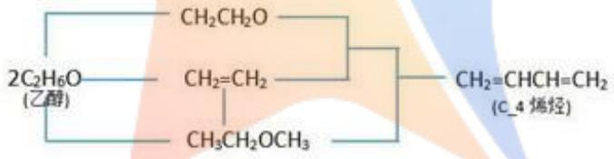  
图1 乙醇制备C4 烯烃简要反应机理

## 2.2 问题二的分析

针对问题二，用多种方法进行分析。首先，通过控制变量的方法，每次控制Co/SiO2和HAP的质量之和、Co负载量、Co/SiO2和HAP装料比、HAP使用与否、装料方式、乙醇浓度中的一个因素变化，对附件1中的21组试验数据进行分类组合对比，定性分析不同催化剂组合及温度对反应的影响。

其次，不考虑因素间的交互作用，对6种影响因素进行定量分析。由于试验因素较多，全面试验方法受限制，因此考虑结合正交试验设计，减少试验次数、提高试验效率，对多因素试验进行分析[4]。试验结果分析流程如图2所示。

最后，由于实际试验中，各因素间会互相影响，所以考虑交互作用，分别建立C4烯烃选择性与乙醇转化率的多元多项式回归模型。首先，将催化剂组合中的6种影响因素及温度作为回归因子。然后，对各因素间的相互影响进行考虑，由实际情况出发，考虑温度与乙醇浓度、Co负载量，Co/SiO2和HAP的质量之和与乙醇浓度、Co负载量、Co/SiO2和HAP装料比，乙醇浓度与Co负载量、Co/SiO2和HAP 装料比，Co负载量与 Co/SiO2和HAP装料比之间的交互作用。由于各因素量纲及数量级相差较大，因此对数据进行标准化处理，列出标准化多元二次多项式回归方程。最后利用变量代换，将多项式方程化为线性回归方程，再利用 Matlab 中 stepwise函数逐步回归，对标准回归系数进行求解，并对回归方程进行显著性检验，确定最佳的回归模型。分析不同催化剂组合及温度对反应的影响。

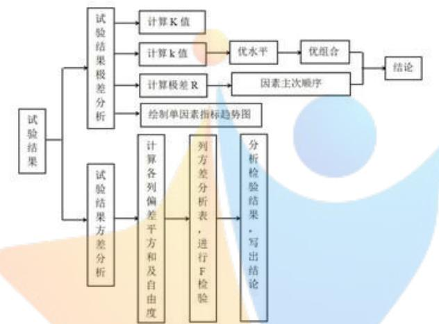  
图2 正交试验结果分析流程

## 2.3 问题三的分析

针对问题三，由于需要通过选择催化剂组合与温度求解使得C4烯烃收率尽可能高时的最佳方案，因此考虑建立优化模型。在问题二模型的基础上将响应变量换为C4烯烃收率， 建立标准多项式回归方程并进行求解，求解过程与问题二中回归模型求解步骤相同。得到C4烯烃选择性的最优标准回归方程，其中回归因子即为决定C4烯烃收率的决策变量：由于最终目标是要使得C4烯烃收率最高，因此将所求标准化回归系数转化为普通最小二乘回归系数，得到C4烯烃实际收率的普通多元多项式回归方程，并将其作为目标函数；根据已有数据，对C4烯烃收率较高时的各个决策变量的取值范围进行确定，以各个决策变量的取值范围作为约束条件petition ZeroDistance--

利用 Matlab 中的 quadprog()函数对此优化模型进行求解，得到 C4 烯烃最高收率和对应的因素取值。再改变温度的约束条件，使得温度不超过350℃，并对此时最佳催化剂组合与温度进行求解，得到温度不超过350℃时C4烯烃最高收率和对应的因素取值。

## 2.4 问题四的分析

针对问题四，综合考虑问题一、二、三，对于附件中没有的改变某个实验条件可能使得实验结果更优的进行实验，对于因缺少数据而使得某个结论缺服说服力的进行实验。

## 三、模型假设

为了便于模型建立与求解，现作如下假设：

1. 假设附件1中数据已经达到化学平衡；

2. 假设反应温度保持恒定，忽略化学反应放热吸热：

3. 假设问题四中设计的实验条件均能达到。

## 四、符号说明

<table><tr><td>符号</td><td>说明</td><td>单位</td></tr><tr><td>αo</td><td>乙醇转化率(%)</td><td>1</td></tr><tr><td>α1</td><td>C4烯烃的选择性(%)</td><td>1</td></tr><tr><td>φ</td><td>C4烯烃收率(%)</td><td>1</td></tr><tr><td>T</td><td>温度</td><td>℃</td></tr><tr><td>X1</td><td>Co/SiO2 和HAP的质量和</td><td>mg</td></tr><tr><td>X2</td><td>乙醇浓度</td><td>ml/min</td></tr><tr><td>X3</td><td>Co 负载量(%)</td><td>wt</td></tr><tr><td>X4</td><td>Co/SiO2 和 HAP 装料比</td><td>1</td></tr><tr><td>Xs</td><td>HAP使用(1或0)</td><td>1</td></tr><tr><td>X6</td><td>装料方式(I或I)</td><td>1</td></tr></table>

## 五、模型建立及求解

## 5.1 问题一模型建立与求解

对附件1中每种催化剂组合，分别建立乙醇转化率、C4烯烃的选择性与温度之间的一元二次多项式回归模型，并对拟合后所得曲线进行分析。对附件2中给定的350℃时乙醇的转化率与C4烯烃的选择性在不同时间的实验结果，将数据进行分类并对实验结果拟合并分析。

## 5.1.1 附件1 中乙醇转化率、C4 烯烃的选择性与温度的关系

由问题一分析，为了进行较好的拟合，且自变量的幂次越高对回归系数的解释越难且回归函数不稳定，因此建立一元二次多项式回归模型。

## 1. 一元二次多项式回归模型建立

乙醇转化率α0与温度T之间存在相关关系

$$
\alpha _ { 0 } = \beta _ { 0 } + \beta _ { 1 } T ^ { 2 } + \beta _ { 2 } T
$$

其中 $\beta _ { 0 } , \beta _ { 1 } , \beta _ { 2 }$ 是未知参数，称为回归系数或回归参数：T表示温度，是可以测量并可控的变量，称为回归因子或预测变量：α0为响应变量。若其n次观测值为$T _ { i } , i { = } 1 , 2 , . . . , n$ 则这n个观测值可以写为如下形式

$$
\left\{ \begin{array} { l l } { \alpha _ { 0 1 } = \beta _ { 0 } + \beta _ { 1 } T _ { 1 } ^ { 2 } + \beta _ { 2 } T _ { 1 } , } \\ { \alpha _ { 0 2 } = \beta _ { 0 } + \beta _ { 1 } T _ { 2 } ^ { 2 } + \beta _ { 2 } T _ { 2 } , } \\ { \ldots \ldots } \\ { \alpha _ { 0 n } = \beta _ { 0 } + \beta _ { 1 } T _ { n } ^ { 2 } + \beta _ { 2 } T _ { n } , } \end{array} \right.\tag{1}
$$

同理可得C4 烯烃的选择性 $_ { [ \mathbf { a } _ { 1 } }$ 与温度 $T$ 之间的一元多项式回归模型，即只需将 ${ \bf { a } } _ { 0 }$ 与 $T$ 模型中的 $\scriptstyle \left| \mathbf { a } _ { 0 } \right|$ 与相应的分量 $\mathbf { a } _ { 0 1 } , \mathbf { a } _ { 0 2 } , . . . , \mathbf { a } _ { 0 n }$ 换为 ${ \mathfrak { a } } _ { 1 } , { \mathfrak { a } } _ { 1 1 } , { \mathfrak { a } } _ { 1 2 } , . . . , { \mathfrak { a } } _ { 1 n } ,$ 将未知参数由 $\beta _ { 0 } , \beta _ { 1 } , \beta _ { 2 }$ 换为γo, γ1, γ2。

综上所述，分别建立乙醇转化率 $\mathbf { a } _ { 0 }$ 与温度T之间的一元多项式回归模型以及C4烯烃的选择性 $[ \alpha _ { 1 }$ 与温度T之间的一元多项式回归模型

$$
\begin{array} { l } { { \alpha _ { \scriptscriptstyle 0 i } = \beta _ { 0 } + \beta _ { 1 } T _ { \ i } ^ { 2 } + \beta _ { 2 } T _ { \ i } , i = 1 , 2 , \cdots , n } } \\ { { \phantom { \alpha _ { \scriptscriptstyle 0 i } = \beta _ { 0 } + \gamma _ { 1 } } } } \\ { { \alpha _ { \scriptscriptstyle 1 i } = \gamma _ { 0 } + \gamma _ { 1 } T _ { \ i } ^ { 2 } + \gamma _ { 2 } T _ { \ i } , i = 1 , 2 , \cdots , n } } \end{array}\tag{2}
$$

其中 $\arctan$ 为第i个温度下乙醇转化率； ${ \mathfrak { a } } _ { 1 i }$ 为第i个温度下C4烯烃的选择性： $\beta _ { 0 } , \beta _ { 1 } ,$ β2, γ0, γ1, γ2是未知参数；Ti是第i个温度。

## 2. 一元多项式回归模型求解

利用Matlab 中 Curve Fitting 工具箱对一元多项式回归方程进行求解，得到每个催化剂组合中的乙醇转化率与温度之间的一元多项式回归模型，以及C4烯烃的选择性与温度之间的一元多项式回归模型，程序见附录1。由于篇幅限制，表2、3仅展示前两个个催化剂组合和后两个催化剂组合中的回归系数，具体结果见附录2、3。

表2 乙醇转化率与温度的回归模型系数
<table><tr><td>催化剂组数</td><td> $\beta _ { 0 }$ </td><td> $\beta _ { 1 }$ </td><td> $\beta _ { 2 }$ </td><td> $\mathbb { R } ^ { 2 }$ </td></tr><tr><td>1</td><td>141.8</td><td>0.0025</td><td>-1.194</td><td>0.9797</td></tr><tr><td>2</td><td>-227.4</td><td>-0.0007</td><td>1.106</td><td>0.9911</td></tr><tr><td>20</td><td>190.1</td><td>0.0028</td><td>-1.445</td><td>0.9902</td></tr><tr><td>21</td><td>228.7</td><td>0.0033</td><td>-1.711</td><td>0.9966</td></tr></table>

表3C4烯烃的选择性与温度的回归模型系数
<table><tr><td>催化剂组数—Competition ero Distance--</td><td></td><td></td><td></td><td>R2</td></tr><tr><td>1</td><td>-190.8</td><td>-0.0021</td><td>1.422</td><td>0.916</td></tr><tr><td>2</td><td>234.7</td><td>0.0031</td><td>-1.646</td><td>0.9803</td></tr><tr><td>20</td><td>-12.13</td><td>0.0003</td><td>-0.02167</td><td>0.9709</td></tr><tr><td>21</td><td>-9.858</td><td>0.0005</td><td>-0.06002</td><td>0.9971</td></tr></table>

从表2及表3中可知，决定系数 $\mathbb { R } ^ { 2 }$ 都大于0.9，即回归可以减少因变量90%以上变异，因此从决定系数可以看出回归方程高度显著，回归效果较好。选择其中的四个催化剂组合A1,A3,A8,B2画出其回归函数图像如图3，程序见附录4。

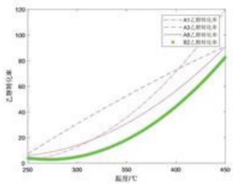  
图 3(a) α0-T变化曲线

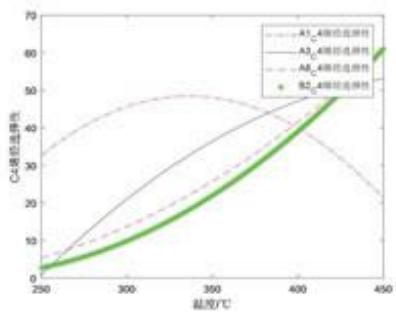  
图 3(b) α1-T变化曲线  
图 3 乙醇的转化率α0与 C4烯烃的选择性α1随温度 T变化曲线

由图3可知，在一定范围内随着温度升高，乙醇的转化率与C4烯烃的选择性均会增高，但是由A1和A3催化组合的图像可知若温度过高，则C4烯烃的选择性可能会降低。

## 5.1.2 附件2 中在一次实验不同时间的测试结果分析

结合实际化学反应和附件2中数据，将计算出的C4烯烃收率与C4烯烃选择性、碳数为4-12脂肪醇的选择性、乙醛选择性、乙醇转化率作为考虑的五大类，它们随时间变化的具体数据如表4所示。其中C4烯烃收率为乙醇转化率与C4烯烃的选择性的乘积。

表4350℃时给定的某种催化剂组合的数据
<table><tr><td>时间 (min)</td><td>乙醇转 化率(%)</td><td>C4 烯烃选 择性(%)</td><td>碳数为4-12脂肪 醇选择性(%)</td><td>乙醛选择 性(%)</td><td>C4烯烃 收率(%)</td></tr><tr><td>20</td><td>43.5</td><td>39.9</td><td>39.7</td><td>5.17</td><td>17.37540804</td></tr><tr><td>70</td><td>37.8</td><td>38.55</td><td>37.36</td><td>5.6</td><td>14.56733047</td></tr><tr><td>110</td><td>36.6</td><td>36.72</td><td>32.39</td><td>6.37</td><td>13.42349545</td></tr><tr><td>163</td><td>32.7</td><td>39.53</td><td>31.29</td><td>7.82</td><td>12.93495022</td></tr><tr><td>197</td><td>31.7</td><td>38.96</td><td>31.49</td><td>8.19</td><td>12.35425379</td></tr><tr><td>240</td><td>29.9</td><td>40.32</td><td>32.36</td><td>8.42</td><td>12.03722565</td></tr><tr><td>273</td><td>29.9</td><td>39.04</td><td>30.86</td><td>8.79</td><td>11.67530575</td></tr></table>

再将表4中的C4烯烃选择性、碳数为4-12脂肪醇的选择性、乙醇转化率、乙醛选择性、C4烯烃收率五类数据绘制到同一张图上，如图4所示。

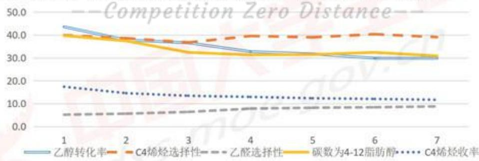  
图4 五类数据随时间变化图

通过图4可以看出随着时间增加，碳数为4-12脂肪醇选择性减小的同时，乙醛的选择性在增加，说明碳数为4-12脂肪醇参与了乙醛的生成。乙醇转化率先增大然后逐渐减小；C4烯烃选择性随时间变化的趋势较为平稳且值在39%;C4烯烃收率随时间的增大在不断减少。综上，随着反应时间增加，各产物的选择性都趋于平稳，即化学反应达到平衡状态。

## 5.2 问题二模型建立与求解

首先通过控制变量的方法，对21组试验数据进行组合对照，进行直观定量分析。然后结合用水平正交试验的方法，不考虑因素间的交互作用，对Co/SiO2和HAP的质量和、乙醇浓度、Co负载量、Co/SiO2和HAP装料比、HAP使用与否和装料方式6种影响因素进行分析。最后结合实际，考虑各因素间相互影响，分别建立C4烯烃选择性、乙醇转化率与各因素的多元多项式回归模型。

## 5.2.1 控制变量组合对照

实际试验中，各因素间会互相影响产生交互作用，所以通过控制变量的方法，对21组试验数据进行组合对照，分析不同催化剂组合及温度对反应的影响。用Matlab 进行图像绘制，程序见附录5。

## 1. 乙醇浓度

当Co/SiO2和HAP的质量之和相同、Co负载量相同、Co/SiO2和HAP装料比相同、都使用HAP催化剂和同种装料方式，只改变乙醇浓度时，分别将A1-A3、A2-A5、A7-A8-A9-A12、B1-B5、B2-B7组试验进行对照，得到乙醇转化率及C4烯烃选择性随温度变化趋势如图5、图6所示。

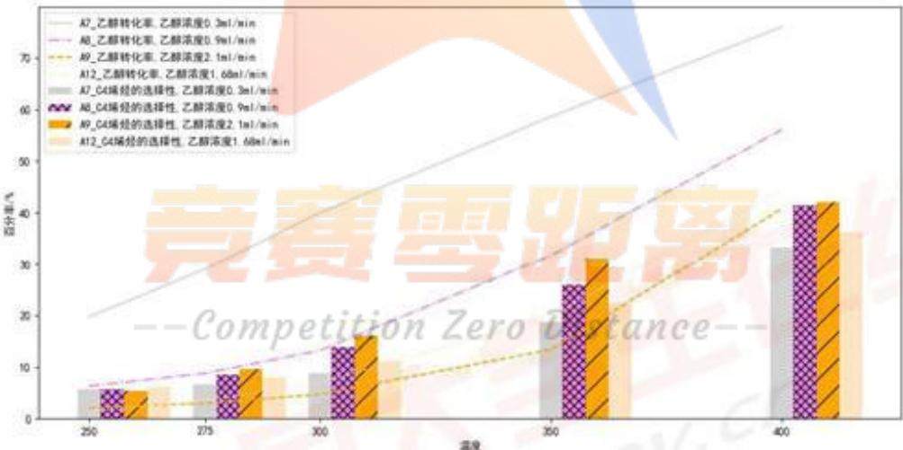  
图5 只改变乙醇浓度时 A7-A8-A9-A12组α及α随 T 变化趋势

由图5可以看出，在A7-A8-A9-A12组中乙醇浓度越高乙醇转化率越低，且乙醇转化率随温度升高逐渐增大。同一温度下，C4烯烃选择性在乙醇浓度为2.1ml/min时最高，0.3ml/min时最低，且随着温度升高C4烯烃选择性会逐渐增大，但由于同一温度下的柱状图的高度较为相近，可以认为此时乙醇浓度对C4

烯烃选择性的影响较小。

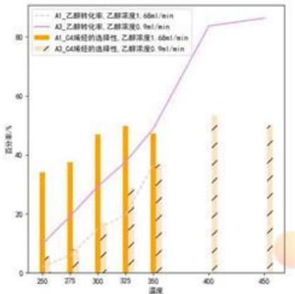  
图6(a)A1-A3 组

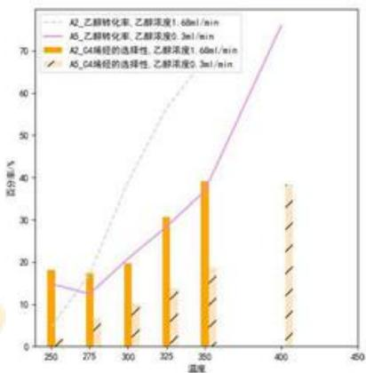  
图 6 (b) A2-A5 组

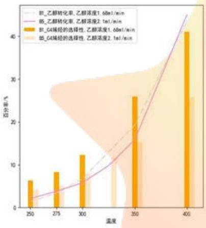  
图6(c) B1-B5组

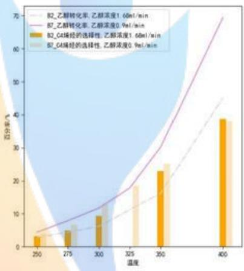  
图 6(d) B2- B7组  
图6只改变乙醇浓度时不同组α0及α随T变化趋势

由图6(a)、(b)可以看出，在A1-A3、A2-A5组中C4烯烃选择性随着温度的升高先增大后减小，且乙醇浓度越高C4烯烃选择性反应初期的值越大，并能够在较低温度时达到最大值。

由图6(c)可以看出，在B1-B5组乙醇浓度为1.68ml/min时的C4烯烃选择性高于浓度为2.1ml/min时的C4烯烃选择性。由图5(d)可以看出，在B2-B7组乙醇浓度为1.68ml/min时乙醇的转化率低于0.9ml/min时乙醇的转化率。并且可以看出在第I种装料方式下，乙醇浓度对乙醇转化率及C4烯烃选择性影响较小。

## 2. Co 负载量

当Co/SiO2和HAP的质量之和相同、乙醇浓度相同、Co/SiO2和HAP装料比相同、都使用HAP催化剂和同种装料方式，只改变Co负载量时，将A1-A2-A4-A6组试验进行对照，得到乙醇转化率及C4烯烃选择性随温度变化趋势如图7所示。

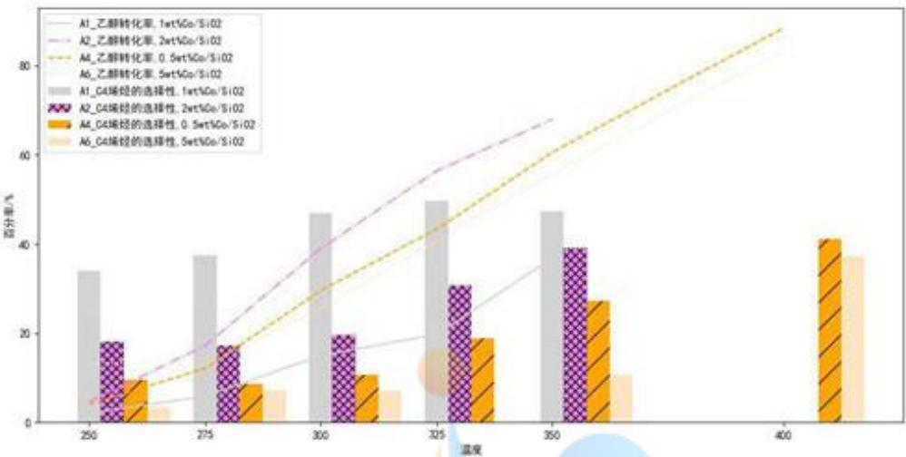  
图 7 只改变 Co 负载量时 A1-A2-A4-A6 组α0 及α 随 T 变化趋势

由图7可以看出，在同一温度时乙醇转化率在Co负载量为2wt%时最高，且乙醇转化率随温度的升高逐渐增大。在同一温度时C4烯烃选择性在Co负载量为1wt%时最高，Co负载量为2wt%，0.5wt%，5wt%时 C4 烯烃选择性随温度的升高逐渐增大，在Co负载量为1wt%时C4烯烃选择性在325℃前逐渐升高，在325℃后有下降趋势。从整体来看，Co负载量对乙醇转化率影响较小，对C4烯烃选择性影响较大。

## 3. Co/SiO2 和 HAP 装料比

当Co/SiO2和HAP的质量之和相同、乙醇浓度相同、Co负载量相同、都使用HAP催化剂和同种装料方式，只改变Co/SiO2和HAP装料比时，将A12-A13-A14组试验进行对照，得到乙醇转化率及C4烯烃选择性随温度变化趋势如图8所示。

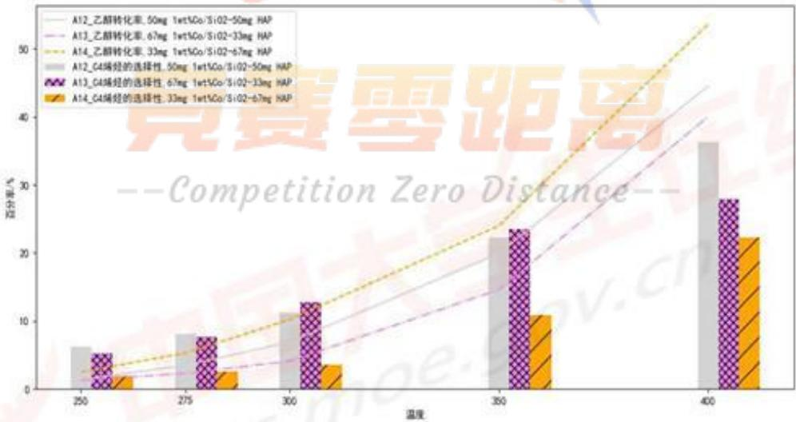  
图 8 只改变 Co/SiO2 和 HAP 装料比时 A12-A13-A14 组α0 及α1 随 T 变化趋势  
由图8可以看出，在同一温度下Co/SiO2和HAP装料比越小乙醇转化率越

高，且乙醇转化率随温度的升高逐渐增大。在同一温度下C4烯烃选择性在装料比为1和2时的相差不大且大于装料比为0.5时的选择性，且C4烯烃选择性随温度升高逐渐增大。

## 3. Co/SiO2 和 HAP 的质量之和

当乙醇浓度相同、Co负载量相同、Co/SiO2和HAP装料比相同、都使用HAP催化剂和同种装料方式，只改变Co/SiO2和HAP的质量之和时，分别将A1-A12、B1-B2-B3-B4-B6组试验进行对照，得到乙醇转化率及C4烯烃选择性随温度变化趋势如图9、10所示。

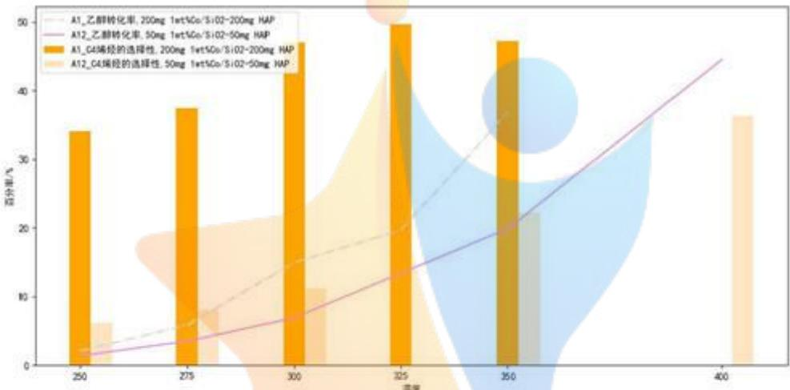  
图 9 只改变 Co/SiO2 和HAP 的质量和时 A1-A12 组α0及α随 T 变化趋势

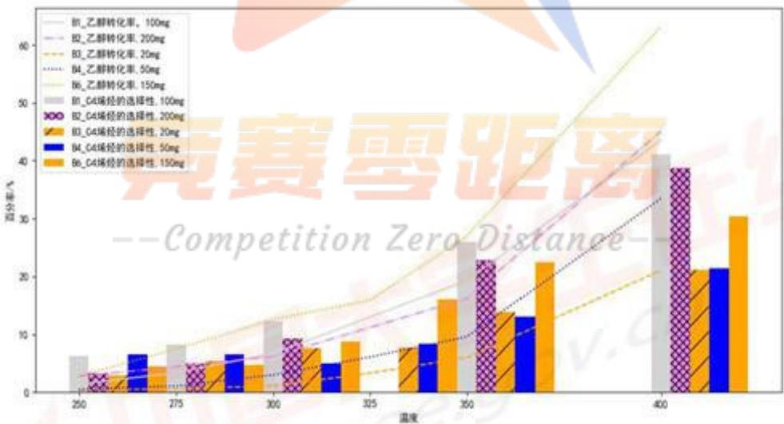  
图 10 只改变 Co/SiO2 和 HAP的质量和时 B1-B2-B3-B4-B6 组α0 及α 随 T 变化趋势

由图10 可以看出，同一温度下 Co/SiO2和HAP的质量和为150mg时乙醇转化率最高，质量和为20mg时乙醇转化率最低。质量和为100mg和200mg时

C4烯烃选择性较大，质量和为20mg和50mg时C4烯烃选择性较小。

## 4. 催化剂使用石英砂或 HAP

当Co/SiO2和HAP的质量之和相同、乙醇浓度相同、Co负载量相同、Co/SiO2和HAP装料比相同、使用同种装料方式，只考虑催化剂使用石英砂或HAP时，将A11-A12组试验进行对照，得到乙醇转化率及C4烯烃选择性随温度变化趋势如图11所示。

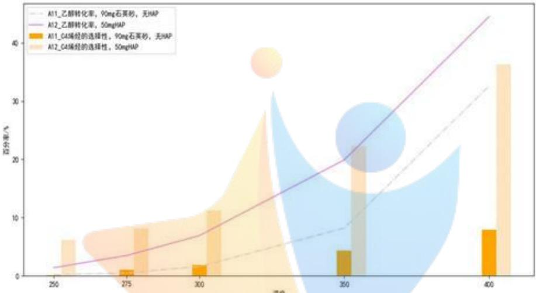  
图11 只考虑催化剂使用石英砂或HAP时 A11-A12 组α及α随T 变化趋势

由图11可以看出，有HAP时乙醇转化率及C4烯烃选择性均优于无HAP时的，故HAP的使用对于催化效果的影响较为显著。

## 5. 装料方式

当Co/SiO2和HAP的质量之和、乙醇浓度、Co负载量、Co/SiO2 和HAP装料比相同、都使用HAP，只改变装料方式时，分别将A9-B5、A12-B1组试验进行对照，得到乙醇转化率及C4烯烃选择性随温度变化趋势如图12所示。

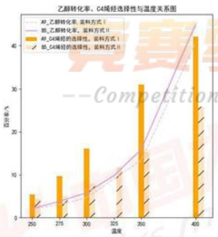  
图 12(a) A9-B5 组

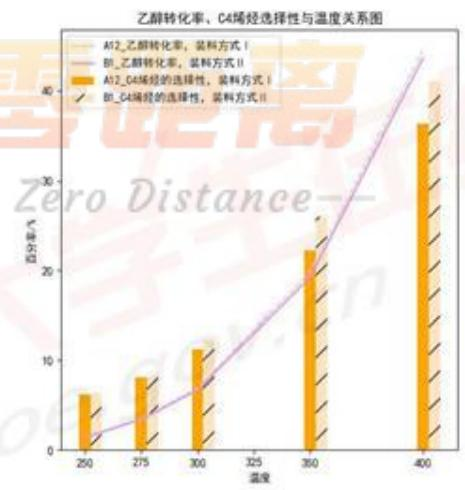  
图12(b)A12-B1 组  
图12 只改变装料方式时不同组α0及α1随T变化趋势

由图12可以看出，装料方式对乙醇转化率的影响较小。由图12(a)可以看出装料方式I比装料方式Ⅱ下的C4烯烃选择性高。

## 5.2.2 正交试验

观察附件1中21组催化剂组合，用水平正交的方法，不考虑因素间的交互作用，对Co/SiO2和HAP的质量和、乙醇浓度、Co负载量、Co/SiO2和HAP装料比、HAP使用与否和装料方式6种影响因素进行分析。混合正交试验因素及水平见表5。

表5 正交试验因素及水平
<table><tr><td rowspan="3">水平</td><td colspan="6">因素</td></tr><tr><td>Co/SiO2 和 HAP的质量和</td><td>乙醇 浓度</td><td>Co负 载量</td><td>Co/SiO2 和 HAP装料比</td><td>HAP 使用</td><td>装料 方式</td></tr><tr><td> $X _ { 1 }$ </td><td> ${ \mathrm { X } } _ { 2 }$ </td><td> ${ \mathrm { X } } _ { 3 }$ </td><td> ${ \mathrm { X } } _ { 4 }$ </td><td>Xs</td><td> ${ \mathrm { X } } _ { 6 }$ </td></tr><tr><td>1</td><td>400mg</td><td>2.1ml/min</td><td>5wt%Co/SiO2</td><td>1:1</td><td>是</td><td>A</td></tr><tr><td>2</td><td>200mg</td><td>1.68ml/min</td><td>2wt%Co/SiO2</td><td>33:67</td><td>否</td><td>B</td></tr><tr><td>3</td><td>150mg</td><td>0.9ml/min</td><td>1wt%Co/SiO2</td><td>67:33</td><td>1</td><td>1</td></tr><tr><td>4</td><td>100mg</td><td>0.3ml/min</td><td>0.5wt%Co/SiO2</td><td>1</td><td>1</td><td>1</td></tr><tr><td>5</td><td>50mg</td><td></td><td></td><td>1</td><td>1</td><td>\</td></tr><tr><td>6</td><td>20mg</td><td></td><td></td><td></td><td>1</td><td></td></tr></table>

将附件1中每一组试验分别用水平正交试验因素及其水平表示，得到混合正交试验结果如表6，由于篇幅限制仅展示前三及后三组试验，完整表格见附录 $^ { 6 \circ }$

表6 正交试验结果
<table><tr><td>实验 编号</td><td> $X _ { 1 }$ </td><td> $X _ { 2 }$ </td><td> $X _ { 3 }$  </td><td>X4</td><td> $X _ { S }$  </td><td>X6</td><td>350℃时 乙醇转化 率(%)</td><td>350℃时 C4 烯烃 选择性</td></tr><tr><td>A1</td><td>1</td><td>2</td><td>3</td><td>1</td><td>1</td><td>1</td><td>36.80</td><td>(%) 47.21</td></tr><tr><td>A2</td><td>1</td><td>2</td><td>2</td><td>1</td><td>1</td><td>1</td><td>67.88</td><td>39.1</td></tr><tr><td>A3</td><td>1</td><td>3</td><td>3</td><td></td><td></td><td></td><td>48.9</td><td>36.85</td></tr><tr><td>B5</td><td>4</td><td></td><td>3</td><td></td><td>1</td><td>2</td><td>15.9</td><td>15.34</td></tr><tr><td>B6 B7</td><td>3 2</td><td>3</td><td>3 3</td><td></td><td></td><td>C</td><td>27.0 30.2</td><td>22.41 25.05</td></tr></table>

根据表6中的数据，令 $K y$ 表示任意列上水平号为i时所对应的乙醇转化率的试验结果之和， $K _ { 2 i }$ 表示任意列上水平号为i时所对应的C4烯烃选择性的试验结果之和，分别计算 $K _ { 1 i }$ $K _ { 2 i }$ 的值。令 $k _ { 1 i } { = } K _ { 1 i }$ 对应水平号为i的个数，表示 $K _ { 1 i }$ 的均值； $k _ { 2 i }$ 同理，令其表示 $K _ { 2 i }$ 的均值，并计算X因素下的极差 $R = k _ { i m a x } - k _ { i m i n ^ { 0 } }$ 分别得到乙醇转化率和C4烯烃选择性的计算结果如表7和表8，受篇幅限制，完整表格见附录7、8。

表7正交试验乙醇转化率的结果分析
<table><tr><td></td><td> $X _ { 1 }$ </td><td> $X _ { 2 }$ </td><td> $X _ { 3 }$ </td><td> $X _ { 4 }$ </td><td> $X s$ </td><td> $X _ { 6 }$ </td></tr><tr><td> $K _ { 1 1 }$ </td><td>306.68</td><td>38.3</td><td>64.8</td><td>563.48</td><td>602.08</td><td>486.08</td></tr><tr><td> $K _ { 1 2 }$ </td><td>46.4</td><td>365.78</td><td>104.68</td><td>24</td><td>8.2</td><td>124.2</td></tr><tr><td> $K _ { 1 3 }$ </td><td> $^ { 2 7 }$ </td><td>110.8</td><td>380.3</td><td>14.6</td><td>1</td><td></td></tr><tr><td> $K _ { 1 4 }$ </td><td>206.4</td><td>95.4</td><td>60.5</td><td></td><td></td><td>1</td></tr><tr><td> $K _ { 1 5 }$ </td><td>9.6</td><td>1</td><td>1</td><td></td><td></td><td>1</td></tr><tr><td> $K _ { 1 6 }$ </td><td>6</td><td>1</td><td>1</td><td></td><td>\</td><td>\</td></tr><tr><td> $k _ { 1 1 }$ </td><td>51.1</td><td>12.8 28.14</td><td>32.4 52.34</td><td>31.3</td><td>30.1</td><td>34.72</td></tr><tr><td> $k _ { 1 2 }$ </td><td>23.2</td><td></td><td>23.77</td><td>24</td><td>8.2</td><td>17.7</td></tr><tr><td> $k _ { 1 3 }$ </td><td>27</td><td>36.9</td><td>60.5</td><td>14.6</td><td>1</td><td>\</td></tr><tr><td> $k _ { 1 4 }$ </td><td>22.9</td><td>47.7</td><td></td><td>1</td><td>\</td><td>\</td></tr><tr><td> $k _ { 1 5 }$ </td><td>9.6</td><td>1</td><td></td><td></td><td></td><td>1</td></tr><tr><td> $k _ { 1 6 }$ </td><td>6</td><td>1</td><td></td><td></td><td></td><td>\</td></tr><tr><td>极差R</td><td>45.1</td><td>34.9</td><td>36.7</td><td>16.7</td><td>21.9</td><td>16.98</td></tr><tr><td>主次顺序</td><td></td><td></td><td>X1&gt;X3&gt;X2&gt;Xs&gt;X6&gt;X4</td><td></td><td></td><td></td></tr></table>

由表7可以看出 $X _ { i }$ 因素下极差R的大小 $4 5 . 1 > 3 6 . 7 > 3 4 . 9 > 2 1 . 9 > 1 6 . 9 8 > 1 6 . 7 ,$ 因此，对应的因素主次顺序为 $X _ { 1 } > X _ { 3 } > X _ { 2 } > X _ { 3 } > X _ { 6 } > X _ { 4 }$ ，即 $3 5 0 ^ { \circ } \mathrm { C }$ 下不考虑因素间交互作用时，Co/SiO2和HAP的质量之和对乙醇转化率的影响最大，Co/SiO2和HAP装料比对乙醇转化率的影响最小。

表 8正交试验C4 烯烃选择性的结果分析
<table><tr><td></td><td> $X _ { 1 }$ </td><td> $X _ { 2 }$  </td><td> $X _ { 3 }$  </td><td> $X _ { 4 }$  </td><td> $X _ { S }$ </td><td> $X _ { 6 }$ </td></tr><tr><td>极差R</td><td>16.87</td><td>12.7</td><td>21.95</td><td>12.63</td><td>18.34</td><td>12.9</td></tr><tr><td>主次顺序</td><td></td><td></td><td>X3&gt;Xs&gt;X1&gt;X6&gt;X2&gt;X4</td><td></td><td></td><td></td></tr></table>

由表8可以看出X因素下极差R的大小 $2 1 . 9 5 > 1 8 . 3 4 > 1 6 . 8 7 > 1 2 . 9 > 1 2 . 7 > 1 2 . 6 3$ 因此，对应的因素主次顺序为 $X _ { 3 } > X _ { 5 } > X _ { 1 } > X _ { 6 } > X _ { 2 } > X _ { 4 }$ ，即 $3 5 0 \%$ 下不考虑因素间交互作用时， $\mathbf { \mathrm { C o } }$ 负载量对C4烯烃选择性的影响最大， $\mathrm { C o } / \mathrm { S i O } 2$ 和HAP装料比对C4烯烃选择性的影响最小。

## 5.2.3 多元二次回归方程模型

## 1.模型建立

由于实验数据不够全面，为了定量分析因素间相互作用的影响，考虑以温度、乙醇浓度、 $\mathbf { \boldsymbol { C } } \mathbf { \boldsymbol { o } }$ 负载量等7个因素和两两间相互作用作为回归因子，分别以乙醇转化率和C4烯烃选择性为响应变量建立多元二次回归模型

$$
y = \beta _ { 0 } + \beta _ { 1 } T + \beta _ { 2 } x _ { 1 } + \cdots + \beta _ { s } T \times x _ { 2 } + \beta _ { s } T \times x _ { 3 } + \cdots + \beta _ { 1 s } x _ { 3 } \times x _ { 4 }\tag{3}
$$

$x _ { i }$ $\beta _ { 0 }$ $\beta _ { 0 } \sim \beta _ { 8 }$ 为七个自变量的线型项$\beta _ { 9 } { \sim } \beta _ { 1 5 }$ 为交叉乘积项系数，即交互影响系数。

由于多元回归涉及多个自变量T, $x _ { 1 } , . . . , x _ { 6 }$ 各自变量单位不同，且大小差异较

大，若利用普通最小二乘估计建立回归方程，其回归系数不具有可比性，不利于在统一标准上进行比较分析。因此为了消除量纲不同和数量级差异对回归分析带来的影响，首先对附件1中数据进行标准化处理[5]。

$$
\begin{array} { l } { { \displaystyle x _ { i j } ^ { * } = \frac { x _ { i } - x _ { j } } { \sqrt { L _ { s } } } , i = 1 , 2 , \cdots , 1 1 4 ; j = 1 , 2 \cdots , 7 } } \\ { { \displaystyle y _ { i } ^ { * } = \frac { y _ { i } - \overline { { x } } } { \sqrt { L _ { s } } } , i = 1 , 2 , \cdots , 1 1 4 } } \end{array}\tag{4}
$$

其中， $x _ { i j }$ 为第i次实验数据中第j个因素， $y _ { i }$ 为第i次实验数据中对应响应变量的值， $L _ { j j }$ 为自变量 $x , ( j = 1 , 2 , \cdots , 7 )$ 的离差平方和， $L _ { j j } = \sum _ { i = 1 } ^ { n } ( x _ { i j } - { \overline { { x } } } _ { i } ) ^ { 2 }$ 0

对标准化处理后的数据进行回归拟合，建立标准七元二次回归模型

$$
y ^ { * } = { \beta _ { 0 } } ^ { * } + { \beta _ { 1 } ^ { * } } { T ^ { * } } + { \beta _ { 2 } ^ { * } } { x _ { 1 } ^ { * } } + \ldots + { \beta _ { s } ^ { * } } { T ^ { * } } \times { x _ { 2 } ^ { * } } + { \beta _ { 9 } ^ { * } } { T ^ { * } } \times { x _ { 3 } ^ { * } } + \ldots + { \beta _ { 1 s } ^ { * } } { x _ { 3 } ^ { * } } \times { x _ { 4 } ^ { * } }\tag{5}
$$

## 2.模型求解

首先将多项式回归方程中的交叉项用 $x _ { 1 } ( \mathrm { i } = 7 , 8 , \dots , 1 4 )$ 代替，将多元二次方程化为多元线性方程，即 $y ^ { * } = { \beta _ { 0 } } ^ { * } + { \beta _ { 1 } } ^ { * } { T ^ { * } } + { \beta _ { 2 } } ^ { * } { x _ { 1 } } ^ { * } + \cdots + { \beta _ { 8 } } ^ { * } x _ { 7 } ^ { * } + { \beta _ { 9 } } ^ { * } x _ { 8 } ^ { * } + \cdots + { \beta _ { 1 5 } } ^ { * } x _ { 1 4 } ^ { * } =$

再将附件1中114次实验数据等距抽样，按4:1的比例分为样本集和验证集。

然后利用 Matlab 中 stepwise函数逐步回归，对标准回归系数 $\beta _ { 0 } ^ { * } { \sim } \beta _ { 1 5 } ^ { * }$ 进行求解，并对回归方程进行显著性检验，从而确定最佳的回归模型，程序见附录9。

得到乙醇转化率的初步标准回归方程为

$$
\begin{array} { r l } & { \alpha _ { 0 } = 0 . 0 0 0 8 + 0 . 7 5 3 T + 0 . 3 4 4 x _ { 1 } - 0 . 1 9 5 x _ { 2 } - 0 . 0 7 1 x _ { 3 } + 0 . 1 2 6 x _ { s } } \\ & { + 0 . 0 8 1 x _ { 6 } - 0 . 9 8 x _ { 7 } + 1 . 0 2 4 x _ { 8 } + 1 . 8 3 8 x _ { 9 } + 1 . 1 7 7 x _ { 1 1 } + 0 . 7 2 4 x _ { 1 2 } } \end{array}
$$

回归方程的有关数据如图13所示。

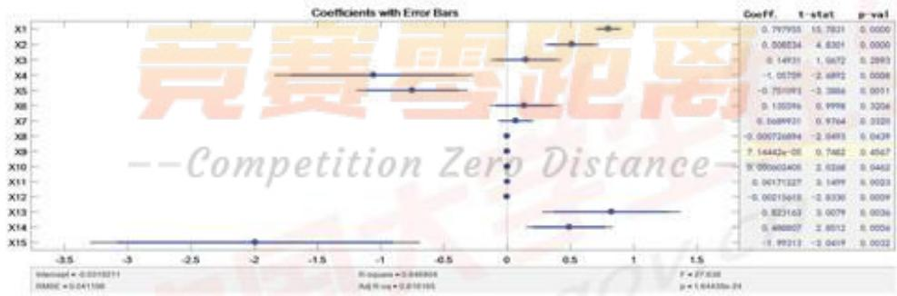  
图13乙醇转化率的初步标准回归方程数据

由图13可以看出由于自变量较多，自变量之间存在多重共线性，回归方程显著性较低，回归效果较差。因此进行逐步回归，剔除一些不重要的解释变量，得到乙醇转化率最优的标准回归方程为

$$
\begin{array} { r } { \alpha _ { 0 } = - 0 . 0 2 3 5 + 0 . 7 6 7 T + 0 . 4 5 5 x _ { 1 } - 0 . 6 8 6 x _ { 3 } - 0 . 3 8 9 x _ { 4 } + 0 . 0 0 0 7 x _ { 9 } + 0 . 0 0 1 x _ { 1 0 } } \\ { - 0 . 0 0 2 x _ { 1 1 } + 0 . 4 7 3 x _ { 1 2 } + 0 . 2 3 7 x _ { 1 3 } - 1 . 1 1 3 x _ { 1 4 } } \end{array}\tag{6}
$$

回归方程的有关数据如图14所示。

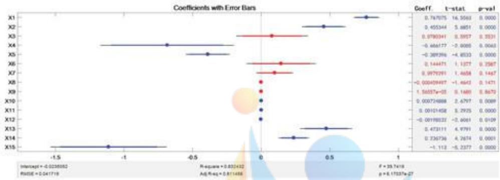  
图14 乙醇转化率的最优标准回归方程数据

根据图14对所求得模型进行回归拟合优度诊断。从回归的相对效果看，复相关系数R=0.91，决定系数R²=0.832，即回归可以减少因变量83.2%的变异，因此从决定系数可以看出回归方程高度显著：从回归的绝对效果看，均方根误差RMSE=0.0417较小，说明回归效果很好；从方差分析方面看，F=39.74，$p { = } 6 . 1 7 { \times } 1 0 ^ { - 2 7 }$ ，表明回归方程高度显著，且回归系数都通过显著性检验[5]。

因此温度、Co/SiO2和HAP的质量和、乙醇浓度、Co负载量、Co/SiO2和HAP装料比这五个因素，以及除温度外的四个因素两两之间的交互作用整体上对乙醇转化率有显著影响。并且通过对回归系数绝对值的比较可以看出，其中Co 负载量与 Co/SiO2 和HAP 装料比共同作用对乙醇转化率影响最大。

同理可得C4烯烃的选择性最优的标准回归方程为

$$
\begin{array} { r } { \alpha _ { 1 } = - 0 . 0 3 7 9 + 0 . 7 7 7 T + 0 . 3 5 1 x _ { 1 } + 0 . 1 6 3 x _ { 6 } - 0 . 0 0 0 8 x _ { 7 } + 0 . 0 0 0 9 x _ { 9 } } \\ { + 0 . 0 0 0 3 x _ { 1 0 } - 0 . 0 0 2 x _ { 1 1 } + 0 . 1 8 3 x _ { 1 2 } - 0 . 5 9 x _ { 1 4 } } \end{array}\tag{7}
$$

回归方程的有关数据如图15所示。

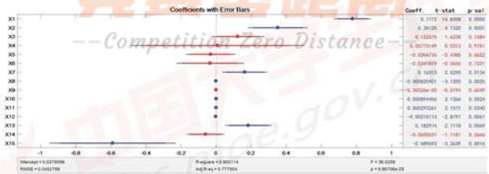  
图15C4烯烃的选择性的初步标准回归方程数据

根据图15对所求得模型进行回归拟合优度诊断。从回归的相对效果看，复相关系数R=0.89，决定系数R²=0.8，即回归可以减少因变量80%的变异，因此从决定系数可以看出回归方程高度显著；从回归的绝对效果看，均方根误差RMSE=0.0453较小，说明回归效果很好；从方差分析方面看，F=36.03，$p { = } 1 . 1 4 \times 1 0 ^ { - 2 4 }$ ，表明回归方程高度显著，且回归系数都通过显著性检验。

因此温度、Co/SiO2和HAP的质量和、乙醇浓度、Co负载量、Co/SiO2和HAP装料比、装料方式这六个因素，以及Co/SiO2和HAP的质量和分别与乙醇浓度、Co负载量、Co/SiO2和HAP装料比交互作用，乙醇浓度分别与温度、Co负载量交互作用，Co负载量与Co/SiO2和HAP装料比交互作用，整体上对C4烯烃的选择性有显著影响。并且通过对回归系数绝对值的比较可以看出，其中温度对C4烯烃的选择性影响最大。

将所求得回归方程代入验证集，用拟合所得结果于实际数据对比进行误差检验，得到结果如图16，可以看出误差较小拟合结果很好。因此，所得结论可信度较高。

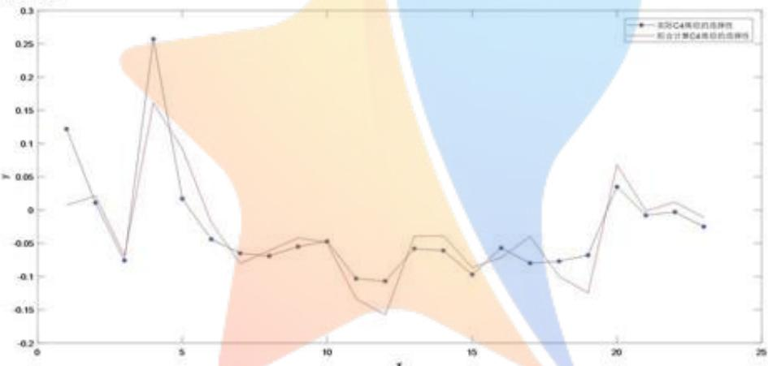  
图16C4烯烃选择性拟合值与实际数据对比

## 5.3 问题三模型建立与求解

由于需要通过选择催化剂组合与温度求解使得C4烯烃收率尽可能高时的最佳方案，因此建立最优化模型，并改变约束条件选择最佳催化剂组合与温度。

## 5.3.1 优化模型建立

在问题二模型的基础上将响应变量换为C4烯烃收率，建立多项式方程并进行求解，求解过程与问题二中回归模型求解步骤相同，得到的C4烯烃收率的最优标准回归方程

$$
\begin{array} { r l } & { \boldsymbol { \varphi } ^ { * } = - 0 . 0 1 4 6 + 0 . 7 7 5 T ^ { * } + 0 . 3 9 2 \boldsymbol { x } _ { 1 } ^ { * } - 0 . 6 9 3 \boldsymbol { x } _ { 3 } ^ { * } - 0 . 2 9 1 \boldsymbol { x } _ { 4 } ^ { * } - 0 . 0 0 1 T \cdot \boldsymbol { x } _ { 2 } ^ { * } } \\ & { \qquad + 0 . 0 0 1 \boldsymbol { x } _ { 1 } ^ { * } \cdot \boldsymbol { x } _ { 3 } ^ { * } + 0 . 5 0 8 \boldsymbol { x } _ { 2 } ^ { * } \cdot \boldsymbol { x } _ { 3 } ^ { * } + 0 . 2 0 6 \boldsymbol { x } _ { 2 } ^ { * } \cdot \boldsymbol { x } _ { 4 } ^ { * } - 1 . 1 9 6 \boldsymbol { x } _ { 3 } ^ { * } \cdot \boldsymbol { x } _ { 4 } ^ { * } } \end{array}\tag{8}
$$

其中T为温度，x1为Co/SiO2和HAP的质量和，x2为乙醇浓度，x3为Co负载量，x4为 Co/SiO2 和 HAP 装料比。可以看出 Co/SiO2 和 HAP 装料比与 Co负载量的交互作用对C4烯烃收率的影响最大。

为了与实际实验数据结合，需要将标准回归方程化为普通回归方程。标准化回归系数与普通最小二乘回归系数间存在关系式

$$
\beta _ { j } = \frac { \sqrt { L _ { m } } } { \sqrt { L _ { v } } } \beta _ { j } ^ { * } , \quad j = 1 , 2 , \cdots , n
$$

得到普通最小二乘回归方程

$$
\begin{array} { r l } & { \varphi = 0 . 1 3 8 T + 0 . 0 2 5 x _ { 1 } - 5 . 5 7 8 x _ { 3 } - 8 . 5 0 3 x _ { 4 } - 2 . 0 0 4 x _ { 2 } \cdot x _ { 3 } + 2 . 1 6 8 x _ { 2 } \cdot x _ { 4 } } \\ & { \mathrm { ~ } + 9 . 2 2 4 x _ { 3 } \cdot x _ { 4 } - 0 . 0 0 0 0 5 2 T \cdot x _ { 2 } + 0 . 0 0 0 0 2 2 x _ { 1 } \cdot x _ { 3 } } \end{array}\tag{9}
$$

## 决策变量：

由于要通过选择催化剂组合与温度使得C4烯烃收率尽可能高，因此以温度、Co/SiO2和HAP的质量和、乙醇浓度、Co负载量、Co/SiO2和HAP 装料比作为决策变量，即决策变量为 7

$$
T , x _ { 1 } , x _ { 2 } , x _ { 3 } , x _ { 4 }
$$

目标函数：

由于最终目标是要使得C4烯烃收率最高，因此以C4烯烃收率最高作为目标函数，目标函数为

$$
\begin{array} { r l } & { \operatorname* { m a x } \varphi = 0 . 1 3 8 T + 0 . 0 2 5 x _ { 1 } - 5 . 5 7 8 x _ { 3 } - 8 . 5 0 3 x _ { 4 } - 2 . 0 0 4 x _ { 2 } \cdot x _ { 3 } + 2 . 1 6 8 x _ { 2 } \cdot x _ { 4 } } \\ & { \qquad + 9 . 2 2 4 x _ { 3 } \cdot x _ { 4 } - 0 . 0 0 0 0 5 2 T \cdot x _ { 2 } + 0 . 0 0 0 0 2 2 x _ { 1 } \cdot x _ { 3 } } \end{array}
$$

约束条件：

根据已有数据，对C4烯烃收率较高时的各个影响因素的取值范围进行确定，最终得到以下约束条件。

①温度约束： $3 0 0 \leq T \leq 5 0 0$

② $\mathbf { C o } / \mathbf { S i O } 2$ 和HAP的质量和约束： $2 0 \leq x _ { 1 } \leq 4 0 0$

③乙醇浓度约束： $0 . 3 \leq x _ { 2 } < 3$

④Co负载量约束： $0 . 5 \leq x _ { 3 } \leq 5$

⑤Co/SiO2 和HAP 装料比约束： $0 . 3 \leq x _ { 4 } \leq 2 . 5$

综上所述，建立C4烯烃收率最高的优化模型

$$
\begin{array} { c c } { \operatorname* { m a x } _ { \tau , x _ { 1 } , x _ { 2 } , x _ { 3 } , x _ { 4 } } \varphi = 0 . 1 3 8 \mathcal { T } + 0 . 0 2 5 x _ { 1 } ^ { * } - \delta . 5 7 8 x _ { 3 } ^ { * } \varphi 8 . 5 0 3 x _ { 4 } - 2 . 0 0 4 x _ { 2 } \varphi x _ { 3 } + 2 . 1 6 8 x _ { 2 } \cdot x _ { 4 } } \\ { + 9 . 2 2 4 x _ { 3 } \cdot x _ { 4 } - 0 . 0 0 0 0 5 2 T \cdot x _ { 2 } + 0 . 0 0 0 0 2 2 x _ { 1 } \cdot x _ { 3 } } \\ { \left. 3 0 0 \leq T \leq 5 0 0 \right. } \\ { \left. 2 0 \leq x _ { 1 } \leq 4 0 0 \right. } \\ { \left. s . t . \right\{ 0 . 3 \leq x _ { 2 } \leq 3 \leq } \\ { 0 . 5 \leq x _ { 3 } \leq 5 } \\ { 0 . 3 \leq x _ { 4 } \leq 2 . 5 } \end{array}\tag{}
$$

## 5.3.2 优化模型求解

利用Matlab中的quadprog()函数对优化函数进行求解，程序代码见附录10。得到：温度为 $4 0 6 . 9 ^ { \circ } \mathrm { C } .$ Co/SiO2和HAP的质量和为400mg、乙醇浓度为2ml/min、Co负载量为1.4wt%、Co/SiO2 和 HAP 装料比为1.4时，C4 烯烃收率最高，最高值为56.3%。

求解温度低于350℃时的最佳方案，改变温度的约束条件为50≤T≤350，得到：温度为210.3℃、Co/SiO2和HAP的质量和为400mg、乙醇浓度为2ml/min、Co负载量为1.9wt%、Co/SiO2 和 HAP装料比为1.8时，C4烯烃收率最高，最高值为29.8%。

## 5.4 问题四实验设计及理由

为了更好地探究催化剂组合与温度对乙醇制备C4烯烃反应的影响，考虑增加5次实验D1\~D5，每次实验中催化剂组合与温度设计见表9。

表9新增实验组合
<table><tr><td>实验 编号</td><td>Co/SiO2 和 HAP的质量和 (mg)</td><td>乙醇 浓度 (ml/min)</td><td> $\scriptstyle \mathbf { C o }$  负 载量 (wt)</td><td>Co/SiO2 和HAP装 料比</td><td>HAP 使用</td><td>装料 方式</td><td>温 度 (°C)</td></tr><tr><td>D1</td><td>400</td><td>1.68</td><td>1%</td><td>1:1</td><td>是</td><td>I</td><td>400</td></tr><tr><td>D2</td><td>400</td><td>1.68</td><td>0.5%</td><td>1:1</td><td>是</td><td>I</td><td>450</td></tr><tr><td>D3</td><td>400</td><td>0.3</td><td>0.5%</td><td>1:1</td><td>是</td><td>I</td><td>350</td></tr><tr><td>D4</td><td>400</td><td>0.9</td><td>2%</td><td>67:33</td><td>是</td><td>I</td><td>350</td></tr><tr><td>D5</td><td>400</td><td>2</td><td>1.4%</td><td>7:5</td><td>是</td><td>I</td><td>407</td></tr></table>

## 5 次实验组合设计理由如下：

1. 400℃时对A1组进行实验。由附件1中A1组数据可知，在 $3 2 5 ^ { \circ } \mathrm { C }$ 以前C4烯烃的选择性随温度的升高逐渐增大，在350℃时C4烯烃的选择性降低，通过对A1组C4烯烃的选择性与温度的数据进行拟合可知 $3 2 5 ^ { \circ } \mathrm { C }$ 后C4烯烃的选择性呈下降趋势。为了避免350度时C4烯烃选择性降低是偶然现象，在温度达到400℃时对A1组进行实验，若400℃时烯烃的选择性小于350℃时烯烃的选择性，则说明通过拟合得到的结论正确，具体因素取值见表9中D1。

2. 450℃时对 A4组进行实验。由附件1可以看出 A3组C4烯烃选择性在$4 0 0 \mathrm { { } ^ { \circ } C }$ 前随温度升高在不断增大，但在450℃时C4烯烃选择性下降，A4组中C4烯烃选择性在 $4 0 0 \mathrm { { } ^ { \circ } C }$ 前也随着温度的升高而不断增大，但是由于没有后续数据记录不能确定温度超过 $4 0 0 ^ { \circ } \mathrm { C }$ 后C4烯烃选择性继续增大还是减小，若实验结果表明 $4 5 0 ^ { \circ } \mathrm { C } \mathrm { F }$ C4烯烃选择性减小，则可大致说明C4烯烃选择性在温度过高时会减小的结论具有普适性，具体因素取值见表9中D2。

3. 考虑在因素间无交互作用的假设下，分别选取各因素对乙醇转化率最优时的值作为实验条件，观察无交互作用时各因素分别最优情况下得到的乙醇转化率情况。因此在问题二5.2.2中正交试验结果的基础上，选取350℃时乙醇转化率最高的情况下各因素的最优水平作为第二组实验设计，即优组合 $\mathrm { X } _ { 1 , 1 } \mathrm { X } _ { 2 , 4 }$ $\mathrm { X } _ { 3 , 4 } \mathrm { X } _ { 4 , 1 } \mathrm { X } _ { 5 , 1 } \mathrm { X } _ { 6 , 1 }$ ，具体因素取值见表9中D3。

4. 与C2组类似，考虑在因素间无交互作用的假设下，分别选取各因素对C4烯烃选择性的最优时的值作为实验条件，观察无交互作用时各因素分别最优情况下得到的C4烯烃的选择性情况。因此在问题二5.2.2中正交试验结果的基础上，选取350℃时C4烯烃选择性最高的情况下各因素的最优水平作为第三组实验设计，即优组合 $\mathrm { X _ { 1 , 1 } X _ { 2 , 3 } X _ { 3 , 2 } X _ { 4 , 3 } X _ { 5 , 1 } X _ { 6 , 1 } }$ ，具体因素取值见表9中D4。

5. 考虑在问题三优化模型所得结果的基础上，选取C4烯烃收率最高时最优解所对应温度及催化剂组合在使用HAP和第I种装料方式作为第四组的实验条件，通过实验获得的乙醇转化率与C4烯烃的选择性数据对C4烯烃收率进行计算，通过C4烯烃实际值与理论值的对比说明问题三优化模型的合理性，具体因素取值见表9中D5。

## 六、模型评价及推广

## 模型优点

1. 采用多项式回归可以对复杂的函数进行拟合并对非线性数据进行预测，并且回归拟合时首先对数据进行标准化，求得标准回归系数，避免了单位与量纲不同造成的误差，有利于比较各因素对响应变量的影响大小；

2. 在问题二中用定性、定量等多种方法对问题进行分析，采用逐层递进的思路，使得结果有较强的可信性； 罗此

3. 问题四实验设计结合了前三问的求解结果，有较好的说服力。

## 模型缺点

1. 本文主要使用多元多项式优化模型，考虑的因素较多，容易产生多重共线性拟合曲线可能存在误差。

2. 使用 quadprog()函数求全局最优解，会存在一定的误差，可以考虑使用优化智能算法进行求解。

## 模型推广

1. 多元回归模型还可以用于预测天气状况、地震、洪涝灾害等；

2. 多元多项式优化模型的求解还可以使用遗传算法、模拟退火算法以及粒子群

## 优化算法等智能算法进行求解。

## 粒子群优化算法求全局最优解伪代码如下

//功能：粒子群优化算法伪代码//说明：本例以求解问题最大值为目标//参数：N为群体规模

procedure PSO   
for each particle i   
Initialize velocity Vi and position Xi for particle i   
Evaluate particle i and set pBesti = Xi   
end for   
gBest = min {pBesti}   
while not stop   
fori=1 to N   
Update the velocity and position of particle   
Evaluate particle i   
if fit (Xi) > fit (pBesti)   
pBesti = Xi;   
if fit (pBesti) > fit (gBest)   
gBest = pBesti;   
end for   
end while   
print gBest   
end procedure

## 参考文献

[1] 刘嘉. 炼厂混合 C4 与乙醇制丙烯反应研究[D]. 西北大学,2011.

[2]鲁洋，王霜，李法社，隋猛.王文超，拟合系数定常回归法分析生物柴油酯化反应影响因素的数学模型[J].中国油脂,2019,44(10):66-70.

[3] 吕绍沛. 乙醇偶合制备丁醇及C\_4烯烃[D]. 大连理工大学,2018.

[4]王碧灿，李法社，倪梓皓，王霜，隋猛.棕榈酸异戊酯的制备及酯化反应复合影响因素的数学模型[J].中国粮油学报,2020,35(11):67-71.

[5] 何晓群，刘文卿.应用回归分析[M]. 北京： 中国人民大学出版社,2019:71-73,207-208.

## 附录

## 附录1：问题一：Matlab 中数据读入程序(完整程序见支撑材料)

## %1

y1\_1 = xlsread('\附件 1.xlsx,'性能数据表','D2:D6');

x1\_1 = xlsread(附件 1.xlsx','性能数据表','C2:C6');

y1\_2= xlsread(附件 1.xlsx','性能数据表','F2:F6');

x1\_2= xlsread(附件 1.xlsx','性能数据表','C2:C6');

## %2

y2\_1 = xlsread(附件 1.xlsx','性能数据表','D7:D11');

x2\_1 = xlsread(附件1.xlsx','性能数据表','C7:C11');

y2\_2 = xlsread(附件 1.xlsx','性能数据表,F7:F11');

x2\_2 = xlsread(附件 1.xlsx','性能数据表''C7:C11');

附录2：乙醇转化率与温度的回归模型系数表
<table><tr><td>催化剂组数</td><td> $\beta _ { 0 }$  </td><td> $\beta _ { 1 }$  </td><td> $\beta _ { 2 }$  </td><td> $\mathbb { R } ^ { 2 }$ </td></tr><tr><td>1</td><td>141.8</td><td>0.0025</td><td>-1.194</td><td>0.9797</td></tr><tr><td>2</td><td>-227.4</td><td>-0.0007</td><td>1.106</td><td>0.9911</td></tr><tr><td>3</td><td>-134.3</td><td>-0.0003</td><td>0.6476</td><td>0.9663</td></tr><tr><td>4</td><td>-106.9</td><td>0.0004</td><td>0.3445</td><td>0.9959</td></tr><tr><td>5</td><td>231.9</td><td>0.0032</td><td>-1.669</td><td>0.994</td></tr><tr><td>6</td><td>51.95</td><td>0.0017</td><td>-0.5836</td><td>0.986</td></tr><tr><td>7</td><td>-102.6</td><td>-0.0003</td><td>0.5565</td><td>0.9997</td></tr><tr><td>8</td><td>96.86</td><td>0.0018</td><td>-0.8015</td><td>0.999</td></tr><tr><td>9</td><td>186.3</td><td>0.0024</td><td>-1.343</td><td>0.9903</td></tr><tr><td>10</td><td>135.7</td><td>0.0018</td><td>-0.9871</td><td>0.994</td></tr><tr><td>11</td><td>177.9</td><td>0.0023</td><td>-1.274</td><td>0.9871</td></tr><tr><td>12</td><td>121.5</td><td>0.0019</td><td>-0.9544</td><td>0.9991</td></tr><tr><td>13</td><td>164.3</td><td>0.0022</td><td>-1.21</td><td>0.9965</td></tr><tr><td>14</td><td>138</td><td>0.0022</td><td>-1.083</td><td>0.9972</td></tr><tr><td>15</td><td>121.2</td><td>0.0019</td><td>正 -0.9485</td><td>0.9989</td></tr><tr><td>16</td><td>188.3</td><td>0.0025</td><td>-1.365</td><td>0.9913</td></tr><tr><td>17</td><td>Conopetitior0.0014ro Dis0797ce</td><td></td><td></td><td>0.9915</td></tr><tr><td>18</td><td>155.3</td><td>0.0021</td><td>-1.129</td><td>0.987</td></tr><tr><td>19</td><td>185.7</td><td>0.0025</td><td>-1.355</td><td>0.9914</td></tr><tr><td>20</td><td>190.1</td><td>0.0028</td><td>-1.445</td><td>0.9902</td></tr><tr><td>21</td><td>228.7</td><td>0.0033</td><td>-1.711</td><td>0.9966</td></tr></table>

附录4:问题一(A1、A3、A8、B2画图Matlab程序)  
close all;  
cle;

附录3：乙醇转化率与温度的回归模型系数表
<table><tr><td>催化剂组数</td><td>γo</td><td>γ1</td><td>γ2</td><td>R2</td></tr><tr><td>1</td><td>-190.8</td><td>-0.0021</td><td>1.422</td><td>0.916</td></tr><tr><td>2</td><td>234.7</td><td>0.0031</td><td>-1.646</td><td>0.9803</td></tr><tr><td>3</td><td>-171.1</td><td>-0.0009</td><td>0.9244</td><td>0.9551</td></tr><tr><td>4</td><td>72.77</td><td>0.0012</td><td>-0.5624</td><td>0.9765</td></tr><tr><td>5</td><td>57.88</td><td>0.0011</td><td>-0.4995</td><td>0.9905</td></tr><tr><td>6</td><td>176.6</td><td>0.0022</td><td>-1.234</td><td>0.9454</td></tr><tr><td>7</td><td>74.78</td><td>0.0011</td><td>-0.5651</td><td>0.9997</td></tr><tr><td>8</td><td>19.82</td><td>0.0007</td><td>-0.2446</td><td>0.9995</td></tr><tr><td>9</td><td>-53.43</td><td>1.00E-04</td><td>0.218</td><td>0.9949</td></tr><tr><td>10</td><td>59.71</td><td>0.0007</td><td>-0.4036</td><td>0.9785</td></tr><tr><td>11</td><td>5.586</td><td>0.0002</td><td>-0.06745</td><td>0.9994</td></tr><tr><td>12</td><td>45.32</td><td>0.0009</td><td>-0.3829</td><td>0.9993</td></tr><tr><td>13</td><td>-64.33</td><td>-0.0003</td><td>0.3425</td><td>0.9817</td></tr><tr><td>14</td><td>64.86</td><td>0.0010</td><td>-0.494</td><td>0.9995</td></tr><tr><td>15</td><td>39.07</td><td>0.0009</td><td>-0.3654</td><td>0.9972</td></tr><tr><td>16</td><td>41.33</td><td>0.0010</td><td>-0.4028</td><td>0.9977</td></tr><tr><td>17</td><td>20.97</td><td>0.0005</td><td>-0.1903</td><td>0.9763</td></tr><tr><td>18</td><td>81.07</td><td>0.0010</td><td>-0.5487</td><td>0.9737</td></tr><tr><td>19</td><td>32.4</td><td>0.0006</td><td>-0.2761</td><td>0.9982</td></tr><tr><td>20</td><td>-12.13</td><td>0.0003</td><td>-0.02167</td><td>0.9709</td></tr><tr><td>21</td><td>-9.858</td><td>0.0005 </td><td>-0.06002</td><td>0.9971</td></tr></table>

```matlab
%回归方程：A1:y=0.002545*x^2-1.194*X+141.8;y=-0.002113*x^2+1.422*x-190.8
%A3: y=-0.0003256*x^2+0.6476*x-134.3;y=-0.0009471*x^2+0.9244*x-171.1
%A8:y=0.0017518x^2-0.8015*x+96.86: y=0.0007471*x^2-0.2446*x+19.82
% B2:y=0.002512*x^2-1.365*x+188.3;y=0.0009926*x^2-0.4028*x+41.33
figure(1);--CompetitionZero Distance--
x=250:1:450;
y1=0.002545*power(x,2)-1.194*x+141.8;
plot(x,y1,'r-.');
hold on;
x=250:1:450;
y2=-0.0003256*power(x,2)+0.6476*x-134.3;
plot(x,y2,'b--");
```

```matlab
figure(2);
x=250:1:450;
y5=-0.002113*power(x,2)+1.422*x-190.8;
plot(x,y5,'r-.');
```

```matlab
hold on;
x=250:1:450;
y3=0.0017518*power(x,2)-0.8015*x+96.86;
plot(x,y3,'m-');
hold on;
x=250:1:450;
y4=0.002512*power(x,2)-1.365*x+188.3;
plot(x,y4,'g*');
```

legend('A1乙醇转化率','A3乙醇转化率,'A8乙醇转化率','B2乙醇转化率');   
xlabel(温度/℃');   
ylabel(乙醇转化率'); legend(A1 C4 烯烃选择性A3 C4烯烃选择性,'A8 C4烯烃选择性','B2 C4 烯烃 选择性');   
xlabel(温度/℃');   
ylabel(C4 烯烃选择性');

附录5: 问题二(控制变量组合对照画图 Python 程序)

import matplotlib.pyplot as plt import numpy as np

#这两行代码解决 plt 中文显示的问题

```matlab
plt.rcParams['font.sans-serif] = ['SimHei']
plt.rcParams['axes.unicode_minus'] = False
plt.figure()
#对比条形图
#输入统计数据
# B1 B2 B3 B4 B6 乙醇转化率
quality1 = np.array([250,275,300,350,400]);# B1 B2
quality2 = np.array([250,275,300,325,350,400]);# B3 B4 B6
number_B1 = [1.4,3.4,6.7,19.3,43.6];
number_B2 = [2.8,4.4,6.2,16.2,45.1];
number 0.1.1.33.5:
number_B6 = [2.8,7.5,12.6,15.9,27.0,63.2];
```

## # B1 B2 B3 B4 B6 C4 烯烃选择率

number\_B1\_1 = [6.32,8.25,12.28,25.97,41.08];

## #使用 plot函数绘制乙醇转化率图像

```csv
plt.plot(quality1,number_B1,color='lightgrey',linestyle='-',label='B1_乙醇转化率，
100mg')
plt.plot(quality1,number_B2,color='violet',linestyle='-.',label='B2乙 醇 转 化
率,200mg')
plt.plot(quality2,number_B3,color='orange',linestyle='--',label='B3乙醇转化
率,20mg')
plt.plot(quality2,number_B4,color='b', linestyle=':',label='B4_乙醇转化率,50mg')
plt.plot(quality2,number_B6,color='orange', linestyle=':',label='B6乙 醇转化
率,150mg') BEL
```

## # 使用 bar 函数绘制 C4 烯烃选择性图像

```csv
plt.bar(quality1,number_B1 1,width=5.color='lightgrey',label-'B1_C4 烯烃的选择
性,100mg')
plt.bar(quality1+5,number B2 1,width=5,color='violet',hatch='xxx', label='B2 C4 烯
烃的选择性,200mg')
plt.bar(quality2+10,number_B3_1,width=5,color='orange',hatch=',label='B3_C4烯
烃的选择性,20mg')
plt.bar(quality2+15,number_ B4_1,width=5,color='b',label='B4 C4烯烃 的选 择
性,50mg')
plt.bar(quality2+20,number_B6_1,width=5,color='orange',label='B6_C4 烯烃的选择
性,150mg')
```

plt.legend()#显示图例

plt.xticks(quality2)

plt.xlabel('温度')

plt.ylabel('百分率/%') #纵坐标轴标题

plt.show()

附录6：正交试验结果表
<table><tr><td>实 验 编 号</td><td>X1</td><td>X2</td><td>X3</td><td>X4</td><td>Xs</td><td>X6</td><td>350℃时 乙醇转化 率(%)</td><td>350℃时 C4 烯烃 选择性 (%)</td></tr><tr><td>Al</td><td>1</td><td>2</td><td>3</td><td>1</td><td>1</td><td></td><td>36.80</td><td>47.21</td></tr><tr><td>A2</td><td>1</td><td>2</td><td>2</td><td>1</td><td>1</td><td>1</td><td>67.88</td><td>39.1</td></tr><tr><td>A3</td><td>1</td><td>3</td><td>3</td><td>1</td><td>1</td><td>1</td><td>48.9</td><td>36.85</td></tr><tr><td>A4</td><td>1</td><td>2</td><td>4</td><td>1</td><td>1</td><td>1</td><td>60.5</td><td>27.25</td></tr><tr><td>A5</td><td>1</td><td>4</td><td>2</td><td>1</td><td>1</td><td>1</td><td>36.8</td><td>18.75</td></tr><tr><td>A6</td><td>1</td><td>2</td><td>1</td><td>1</td><td></td><td>1</td><td>55.8</td><td>10.65</td></tr><tr><td>A7</td><td>4</td><td>4</td><td>3</td><td>1</td><td></td><td>1</td><td>58.6</td><td>18.64</td></tr><tr><td>A8</td><td>4</td><td>3</td><td>3</td><td>1</td><td>1</td><td>1</td><td>31.7</td><td>25.89</td></tr><tr><td>A9</td><td>4</td><td>1</td><td>3</td><td>1</td><td>1</td><td></td><td>13.4</td><td>31.04</td></tr><tr><td>A10</td><td>4</td><td>1</td><td>1</td><td>1</td><td>1</td><td></td><td>9.0</td><td>3.3</td></tr><tr><td>A11</td><td>\</td><td>2</td><td>3</td><td>\</td><td>2</td><td></td><td>8.2</td><td>4.35</td></tr><tr><td>A12</td><td>4</td><td>2</td><td>3</td><td>1</td><td>1</td><td>1</td><td>19.9</td><td>22.26</td></tr><tr><td>A13</td><td>4</td><td>2</td><td>3</td><td>3</td><td>1</td><td>1</td><td>14.6</td><td>23.46</td></tr><tr><td>A14</td><td>4</td><td>2</td><td></td><td></td><td></td><td></td><td>24.0</td><td>10.83</td></tr><tr><td>B1</td><td>4</td><td></td><td></td><td></td><td>1</td><td>2</td><td>19.3</td><td>25.97</td></tr><tr><td>B2</td><td>2</td><td>2</td><td>3</td><td></td><td>1</td><td>2</td><td>16.2</td><td>22.88</td></tr><tr><td>B3</td><td>6</td><td>C2mpesition</td><td></td><td></td><td>Zero</td><td></td><td>Distanc6.0</td><td>13.81</td></tr><tr><td>B4</td><td>5</td><td>2</td><td>3</td><td>1</td><td>1</td><td>2</td><td>9.6</td><td>13.1</td></tr><tr><td>B5</td><td>4</td><td>1</td><td>3</td><td>1</td><td>1</td><td>2</td><td>15.9</td><td>15.34</td></tr><tr><td>B6</td><td>3</td><td>2</td><td>3</td><td>1</td><td>1</td><td>2</td><td>27.0</td><td>22.41</td></tr><tr><td>B7</td><td>2</td><td>3</td><td>3</td><td>1</td><td>1</td><td>2</td><td>30.2</td><td>25.05</td></tr></table>

附录7：正交试验乙醇转化率的结果分析表
<table><tr><td>实验编号</td><td>X1</td><td>X2</td><td>X3</td><td>X4</td><td>Xs</td><td>X6</td></tr><tr><td>K11</td><td>306.68</td><td>38.3</td><td>64.8</td><td>563.48</td><td>602.08</td><td>486.08</td></tr><tr><td>K13</td><td>27</td><td>110.8</td><td>380.3</td><td>14.6</td><td>\</td><td></td></tr><tr><td>K14</td><td>206.4</td><td>95.4</td><td>60.5</td><td></td><td>1</td><td></td></tr><tr><td>K15</td><td>9.6</td><td>1</td><td>1</td><td>1</td><td>1</td><td>1</td></tr><tr><td>K16</td><td>6</td><td>1</td><td>1</td><td>\</td><td>1</td><td>1</td></tr><tr><td>k11</td><td>51.1</td><td>12.8</td><td>32.4</td><td>31.3</td><td>30.1</td><td>34.72</td></tr><tr><td>k12</td><td>23.2</td><td>28.14</td><td>52.34</td><td>24</td><td>8.2</td><td>17.7</td></tr><tr><td>k13</td><td>27</td><td>36.9</td><td>23.77</td><td>14.6</td><td>1</td><td>1</td></tr><tr><td>k14</td><td>22.9</td><td>47.7</td><td>60.5</td><td></td><td>1</td><td>1</td></tr><tr><td>k15</td><td>9.6</td><td>1</td><td></td><td></td><td>1</td><td>1</td></tr><tr><td>k16</td><td>6</td><td>1</td><td></td><td>1</td><td>1</td><td>1</td></tr><tr><td>极差R</td><td>45.1</td><td>34.9</td><td>36.7</td><td>16.7</td><td>21.9</td><td>16.98</td></tr><tr><td>主次顺序</td><td></td><td></td><td>X1&gt;X3&gt;X2&gt;Xs&gt;Xb&gt;X4</td><td></td><td></td><td></td></tr><tr><td>优水平</td><td>X1.1</td><td>X2,4</td><td>X3.4</td><td>X4,1</td><td>X5.1</td><td>X6.1</td></tr></table>

附录8:正交试验C4烯烃选择性的结果分析
<table><tr><td>实验编号</td><td>Xi</td><td>X2</td><td>X3</td><td>X₄</td><td>Xs</td><td>X6</td></tr><tr><td>K21 K22</td><td>179.81 47.93</td><td>49.68 283.28</td><td>13.95 57.85</td><td>419.5 10.83</td><td>453.79 4.35</td><td>319.58 138.56</td></tr><tr><td>K23</td><td>22.41</td><td>87.79</td><td>359.09</td><td>23.46</td><td>1</td><td></td></tr><tr><td>K24</td><td>176.73</td><td>37.39</td><td>27.25</td><td></td><td>\</td><td>1</td></tr><tr><td>K25</td><td>13.1</td><td></td><td></td><td></td><td>1</td><td>1</td></tr><tr><td>K26</td><td>13.81</td><td></td><td></td><td></td><td>1</td><td></td></tr><tr><td>k21</td><td>29.97</td><td>16.56</td><td>6.98</td><td>23.31</td><td>22.69</td><td>22.83</td></tr><tr><td>k22</td><td>23.97</td><td>21.8</td><td>28.9</td><td>10.83</td><td>4.35</td><td>19.8</td></tr><tr><td>k23</td><td>22.41</td><td>29.26</td><td>22.44</td><td>23.46</td><td>1</td><td></td></tr><tr><td>k24</td><td>19.64</td><td>18.7</td><td>27.25</td><td></td><td></td><td>1</td></tr><tr><td>k25</td><td>13.1</td><td></td><td>1</td><td></td><td></td><td>1</td></tr><tr><td>k26</td><td>13.81</td><td></td><td></td><td></td><td></td><td></td></tr><tr><td></td><td></td><td></td><td></td><td></td><td></td><td></td></tr><tr><td>极差R</td><td>16.87</td><td>12.7</td><td>21.95</td><td>12.63</td><td>18.34</td><td>3.03</td></tr><tr><td></td><td></td><td></td><td></td><td></td><td></td><td></td></tr><tr><td>主次顺序</td><td></td><td></td><td>CompetitioX&gt;XeXBxXonce</td><td></td><td></td><td></td></tr><tr><td>优水平</td><td>X1.1</td><td>X23</td><td>X3.2</td><td>X43</td><td>X5.1</td><td>X6.1</td></tr></table>

附录9:问题二(三次逐步回归Matlab 程序)  
close all;  
cle;  
x = xlsread(逐步回归原始数据.xlsx','Sheet1','A3:O93');  
y = xlsread(逐步回归原始数据.xlsx','Sheet1','R3:R93');  
y1 = y;  
stepwise(x,y1,[1,2,3,4,5,6,7,8,9,10,11,12,13,14,15],0.05,0.1)

close all;

cle;

x = xlsread('逐步回归原始数据.xlsx,'Sheet1','A3:O93');

y = xlsread('逐步回归原始数据,xlsx','Sheet1','S3:S93');

yl = y;

stepwise(x,y1,[1,2,3,4,5,6,7,8,9,10,11,12,13,14,15],0.05,0.1)

close all;

cle;

x = xlsread(逐步回归原始数据.xlsx,'Sheet1','A3:O93');

y = xlsread(逐步回归原始数据,xlsx,'Sheet1','Q3:Q93');

yl = y;

stepwise(x,y1,[1,2,3,4,5,6,7,8,9,10,11,12,13,14,15],0.05,0.1)

## 附录10： 问题三(优化模型求解 Matlab 程序)

close all;

cle;

G=[0,0,0.000026,0,0;0,0,0,-0.000011,0;0.000026,0,0,1.002,-1.309;0,0.000011,1.002,0,

-4.612;0,0,-1.309,-4.612,0];

c=[-0.138;-0.025;0;5.578;8.503];

lb=[300;20;0.3;0.4;0.3];

ub=[500;400;3;5;2.5];

[x,fval]=quadprog(G,c,[],[],[],[],lb,ub)

close all;

cle;

%最高温度低于350℃

G=[0,0,0.000026,0,0;0,0,0,-0.000011,0;0.000026,0,0,1.002,-1.309;0,0.000011,1.002,0,

-4.612;0,0,-1.309,-4.612,0];

c=[-0.138;-0.025;0;5.578;8.503];

lb=[50;20;0.3;0.4;0.3];

ub=[350;400;3;5;2.5];

[x,fval]=quadprog(Gc,H,00,lb,ub)nZero Distance--