# 基于计算几何与带阈值启发式搜索的无人机无源定位模型

## 摘要

针对无人机遂行编队飞行中的纯方位无源定位问题，本文从相关理论入手，分析了问题的几何特征，给出了在一定误差下具有实践价值的纯方位无源定位方式，并根据编队的形状，给出了两种调整编队的模型，其中一种有较高的效率，另一种对各种编队形状有良好的普适性。

对于第一题第一小问，我们给出了两种解法。一种是在极坐标系下分类讨论位置关系，通过正弦定理列出三角方程，用代数方法进行求解；另一种深入发掘几何性质，将问题转化为两圆轨迹求交点，利用计算几何的知识结合计算机精确求解。其中，在求解两圆轨迹时，通过旋转变换和向量叉积确定圆心坐标。在轨迹求交时，利用几何对称性避开了联立方程，降低了求解难度。

对于第一题第二小问，我们根据具体量化的误差范围展开分类讨论。讨论得出，在极径误差不超过15m，极角误差不超过1°的情况下，除FY00和FY01外，只需1架无人机发射信号即可实现无人机有效定位。此外，我们还进行了严格的误差分析，严谨论证了信号接收与解码的可行性。 吃yn

对于第一题第三小问，考虑到深度优先搜索的效率问题与贪心算法的短视性，我们在IDA\*算法的启发下设计了一种带阈值的启发式搜索算法，并使用L21oss函数作为启发式搜索的估价函数。这种算法在具有高效率的同时，更不容易陷入局部最优决策。对于题目所给数据，求解出一个通过5轮调整、共16架次信号发射可以将所有无人机位置精度调整至6位有效数字的方案。

对于第二题，由于多架无人机出现三点共线或四点共圆的情况，造成发射信号无人机的编号难以判断。于是我们改变策略，采取了预先设定信号发射顺序的方案。无人机只需通过当前是第几次信号传输就可以推出发射信号的无人机编号，消除了位置误差导致的定位困难。这种调整方案具有一定的随机性，但在所有飞机与标准位置误差不超过5m的情况下，该算法可以在60轮信号发射后将所有无人机位置精度调整至6位有效数字。同时，由于不依赖于编队的几何特征，该算法对绝大多数形状的编队调整具有普适性。

关键词:无源定位 启发式搜索 L2loss 计算几何

## 一问题的背景与重述

## 1.1 问题的背景

随着无人机的普及，无人机的定位技术就显得尤为重要。对无人机进行定位有两大手段。其一是有源定位，有源定位主要基于姿态测量或激光测距定位模型[1][2];其二则是通过无源定位，被动接收环境的电磁信号来确定位置。[3]

“考虑到传统有源雷达不适用于域市复杂电磁环境，加上无人机雷达散射截面积较小难以捕捉以及成本问题，无源定位技术成为对无人机定位的首选。”[4]在该定位的过程中，被定位的无人机不向外发射电磁信号，而是被动接收外界的无线电信号，进行数据分析得到自己的坐标。当一架无人机在一个无人机的队列中，可以通过其他无人机发送的电磁信号计算出自己的相对位置，从而找出自己的调整策略，使无人机队列趋向于整齐化。

## 1.2 问题重述

在该问题中，某架无人机可以接收到其余多架无人机的电磁信号，可以得到两架无人机发射的信号之间的夹角，应用这一个条件求解以下问题。

问题一:十架无人机组成的队列呈现圆形，其中一架(FY00)在中央，剩余九架(FY01-FY09)均匀分布在圆周上。无人机处于同一个高度上。该问题分成三个小问，下面一一阐述题意。

1. 处于圆心处的无人机(FY00)和另外两架编号已知且位置准确 $( \mathrm { F Y 0 } N _ { 1 }$ 和 $\operatorname { F Y } 0 N _ { 2 } )$ 的无人机对某架位置待定的无人机(FYOX)发射电磁信号，位置待定的无人机接收信号并分析得到自己的位置坐标。

2. 已知处于圆心处的无人机(FY00)和第一架位置准确的无人机(FY01)会对某架位置待定的无人机(FYOX)发射电磁信号，若需要确定该无人机(FYOX)的坐标，需要在剩余的位置准确的无人机中选择若干架无人机，确定额外发射信号的无人机的数量。

3. 编队要求九架无人机均匀排列在以无人机FY00为圆心，直径为100m的圆上。实际上对于准确位置，排列在圆上的无人机有位置偏移，某架无人机(FY0X)需要接收来自圆心处无人机(FY00)和其余至多三架无人机的电磁信号，分析并调整无人机(FY0X)的位置。不断重复操作直到无人机到达准确位置，利用表格中的已知数据得到具体的操作方案。

问题二：当无人机的编排队列为锥形编队队形时，队列中的相邻无人机距离相等，每架无人机对于准确位置有一定的偏移。通过无人机的无源定位得到无人机的调整方案。

## 二问题分析

## 2.1 问题一分析

## 2.1.1 三架无人机无源定位

第一问要求给出在发射信号的无人机位置准确且编号已知条件下的接收信号无人机的定位模型。这里我们认为编号已知指接收信号的无人机可以确定方向信息中某一角对应的两个无人机编号。假设出接收信号无人机的极坐标，由于无人机只能接收到方向信息，即三个角的大小，可以通过角的关系和正弦定理解出两个解，排除掉其中为FY00位置（圆心)的解，可以得到接收信号无人机的坐标。另外由于弦对应的圆心角是圆周角的二倍，利用计算几何得到两个由两架发射信号的无人机对应的圆的方程，进而求解两圆交点得到两个解，同样排除掉其中为FY00位置（圆心）的解，容易得到接收信号无人机坐标的数值解。

## 2.1.2 无源定位的无人机最小需求

第二问要求给出实现有效定位的最小发射信号无人机架数，在本问题中，规定已知无人机FY00与无人机FY01发射信号对应的角度，未知其他发射信号的无人机编号以及对应的方向信息。事实上，在一定的偏差范围内，接收信号的无人机根据对应了无人机FY00与无人机FY01发射信号的角度，以及自己的偏差范围，可以根据此时接收到的方向信息将自已的位置确定在一段圆弧上，可以对所有发射信号的无人机编号情况进行遍历，判断在这段圆弧上由FY00与其他任意一架无人机发射的电磁波信号形成的夹角误差区间和除FY00以外的两架无人机形成的夹角误差区间之间交集是否为空，以此确定接收信号的无人机需要除FY00和FY01以外几架无人机可以确定其余发射信号的无人机的编号，当确定编号后问题就与第一问完全相同，于是可以进行精确定位。

## 2.1.3 圆周上无人机调整方案

第三问要求给出在FY00和FY01位置准确，其他无人机位置略有偏差的条件下给出无人机的调整方案。我们假定，每一次无人机进行定位后，都可以根据其假定无偏的发射信号无人机坐标对自身坐标进行定位，可以得到一个由计算所得位置指向无偏位置的向量，并在当前位置移动该向量。故而本问题的关键依然是无人机的定位问题。通过前两问的分析可以知道，至少需要三架无人机（非特殊情况）才能实现定位。题目要求至多四架无人机发射信号。因此每一次发射信号的无人机数量为3或4。根据表中数据，只有FY00和FY01的位置无偏，不难发现利用位置无偏的无人机发射的电磁波信号进行定位更为准确，因此可以规定每一轮调整发射信号的无人机都包含FY01。题目指出无人机应尽量少地向外发射电磁波信号。因此优化目标即为：在保证一定的精度前提下，减少发射电磁波的总次数。一个朴素的想法是做深度优先搜索(DFS).但由于本题DFS层数无限，无法在有限时间内完成。于是有了贪心策略的想法，但是贪心策略过于短视，无法保证全局最优。因此我们采取了带阈值的启发式搜索算法，在每次决策之前对以后若干层搜索，找出局面最优的叶子结点。同时，在确定估价函数时采用了L21oss函数提高精确度。这种方法极大地改进了短视的缺点。

## 2.2 问题二分析

问题二改变了问题一的圆形编队，要求给出锥形编队下的无人机调整方案。本质上是对问题一模型的重新应用。区别在于问题一中在大多数情况下可以通过角度判断发射信号无人机的编号，但在问题二中是很难实现的。于是我们预先设定好发射信号的无人机的顺序，这样接收信号无人机只需通过当前是第几次信号传输就可以推出发射信号的无人机编号，进而用与问题一相同的方法来实现精确定位以及调整。

## 三模型假设

具体的假设如下所示。

假设一：待测位置的无人机只是相对于预期位置有微小的偏移量。即在极坐标表示下对于极角来说，实际角度α和预期位置对应角度 $\alpha _ { e x p }$ 的差值 $| \alpha - \alpha _ { e x p } | \leq 1 ^ { \circ }$ ；对于极径来说，实际极径 $\rho$ 和预期极径 $\rho _ { e x p }$ 的相对误差 $\delta = \frac { | \rho - \rho _ { e x p } | } { \rho _ { e x p } } \leq 1 5 \%$

假设二：每架无人机知道自己的编号，可以通过自己的编号进行分析计算。

假设三：假设地面完全掌握每一架无人机的任意时刻的位置信息，并可以向无人机发送指令来指定发射电磁波信号的无人机编号。

假设四：无人机对自身位置进行定位时，总是假定发射信号的无人机位置是无偏的。

假设五：无人机总能按照自己计算出来的行进矢量进行运动，不会有机械层面的误差。

## 四 符号申明

本文中涉及到的符号如下表所示。

表1:本文主要涉及的符号说明
<table><tr><td>符号</td><td>符号含义及说明</td></tr><tr><td>FY0X</td><td>位于圆周上第X架无人机的编号</td></tr><tr><td> $\iota _ { S E }$ </td><td>起点为S终点为E的线段长度</td></tr><tr><td> $r _ { X }$ </td><td>位于圆周上第X架无人机对应的极径</td></tr><tr><td> $\theta _ { X }$ </td><td>位于圆周上第X架无人机对应的极角</td></tr><tr><td> $d$ </td><td>位置待测的无人机对应的极径</td></tr><tr><td> $\theta$ </td><td>位置待测的无人机对应的极角</td></tr><tr><td> $\alpha _ { X Y }$ </td><td>位置待测的无人机接收到来自于无人机X和Y发射的信号的夹角（其中  $\mathrm { X , Y } \in \{ 0 , 1 , \ldots , 9 \} )$ </td></tr><tr><td> $R _ { \mathrm { { o x } } }$ </td><td>以  $r _ { X }$  对应线段为弦，以  $\alpha _ { X 0 }$  对应角为圆周角组成的圆的半径</td></tr><tr><td> $( x _ { 0 x } , y _ { 0 x } )$ </td><td>以  $r _ { X }$  对应线段为弦，以  $\alpha _ { X 0 }$  对应角为圆周角组成的圆的圆心坐标</td></tr></table>

## 五 模型的建立与求解

## 5.1 问题一——三架无人机无源定位

## 5.1.1 定位模型的建立

在该问题中，我们不妨假设发射的无人机编号为FYOR，圆周上发射信号的两架无人机编号分别是 $\mathrm { F Y 0 S } _ { 1 }$ 和 $\mathrm { F Y 0 S } _ { 2 }$ 。由于发射端位置准确，可以得到 $\mathrm { F Y 0 S } _ { 1 }$ 和 $\mathrm { F Y 0 S _ { 2 } }$ 到中心的无人机FY00的距离相等，不妨设为r。

$$
l _ { 0 S _ { 1 } } = l _ { 0 S _ { 2 } } = r
$$

图1中取圆周上发射信号的无人机为FY01和FY04，接收信号的无人机为FY07。

(1)

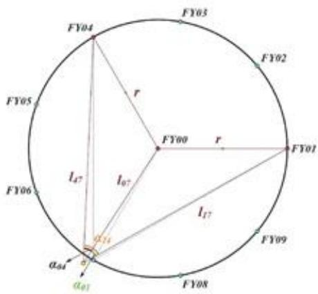
图1:三架无人机无源定位示意图

对于该坐标的求解，我们采用了两种策略，分别从极坐标系和直角坐标系下考虑。下文对这两种方法进行一一介绍。

Method1.基于正弦定理的极坐标求解

对于该问题的分析，我们首先应用了正弦定理。具体形状示意如图2所示。

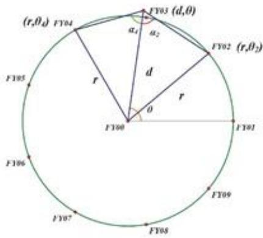

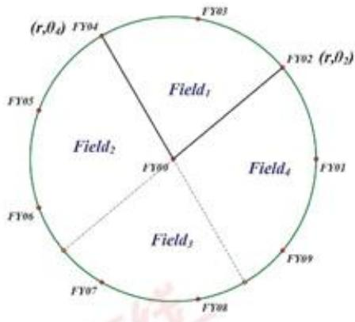
图 2: 正弦定理求解坐标
图3:正弦定理求解坐标的局限性

在极坐标下， $\mathrm { F Y 0 S } _ { 1 }$ 对应的极坐标可以写成 $( l _ { 0 S _ { 1 } } , \theta _ { S _ { 1 } } ) = ( r , \theta _ { S _ { 1 } } )$ ，同理 $\mathrm { F Y 0 S } _ { 2 }$ 可以写成$( r , \theta _ { S _ { 2 } } )$ ，同时假设待测无人机FYOR对应的极坐标为(d,θ)。分别在 $\triangle 0 S _ { 1 } R$ 和 $\triangle 0 S _ { 2 } R$ 中列正弦定理的表达式。

$$
\frac { r } { \sin \alpha _ { 0 S _ { 1 } } } = \frac { d } { \sin \left( \alpha _ { 0 S _ { 1 } } + \theta - \theta _ { S _ { 1 } } \right) }\tag{2}
$$

$$
\frac { r } { \sin \alpha _ { 0 S _ { 2 } } } = \frac { d } { \sin \left( \alpha _ { 0 S _ { 2 } } + \theta _ { S _ { 2 } } - \theta \right) }\tag{3}
$$

将上述两式相比并且约分，可以计算得到待测无人机FYOR对应的极角。

$$
\tan \theta = \frac { \sin \alpha _ { 0 S _ { 1 } } \sin \left( \alpha _ { 0 S _ { 2 } } + \theta _ { S _ { 2 } } \right) - \sin \alpha _ { 0 S _ { 2 } } \sin \left( \alpha _ { 0 S _ { 1 } } - \theta _ { S _ { 1 } } \right) } { \sin \alpha _ { 0 S _ { 2 } } \cos \left( \alpha _ { 0 S _ { 1 } } - \theta _ { S _ { 1 } } \right) + \sin \alpha _ { 0 S _ { 1 } } \cos \left( \alpha _ { 0 S _ { 2 } } + \theta _ { S _ { 2 } } \right) }\tag{4}
$$

回带到原表达式中我们可以计算出FYOR对应的极坐标表达式(d,θ)是如下所示的解析表达式。

$$
d = \frac { r } { \sin \alpha _ { 0 S _ { 1 } } } \cdot \sin \left( \alpha _ { 0 S _ { 1 } } + \theta - \theta _ { S _ { 1 } } \right)\tag{5}
$$

$$
\theta = \arctan ( \frac { \sin \alpha _ { 0 S _ { 1 } } \sin \left( \alpha _ { 0 S _ { 2 } } + \theta _ { S _ { 2 } } \right) - \sin \alpha _ { 0 S _ { 2 } } \sin \left( \alpha _ { 0 S _ { 1 } } - \theta _ { S _ { 1 } } \right) } { \sin \alpha _ { 0 S _ { 2 } } \cos \left( \alpha _ { 0 S _ { 1 } } - \theta _ { S _ { 1 } } \right) + \sin \alpha _ { 0 S _ { 1 } } \cos \left( \alpha _ { 0 S _ { 2 } } + \theta _ { S _ { 2 } } \right) } )\tag{6}
$$

对该方法进行分析时，我们发现 $0 \mathrm { S } _ { 1 }$ 和 $0 \mathrm { { S } } _ { 2 }$ 对应的直线会把整个圆分成四个部分，正弦定理在这四个部分中的表达方式不相同，所以需要进行分类讨论。如图3所示时，两架发射信号的无人机可以把整个平面分成四个部分，分别为 $F i e l d _ { 1 }$ $F i e l d _ { 2 }$ 9 $F i e l d _ { 3 }$ 和Field4,我们前面的求解只适用于 $F i e l d _ { 1 }$ 。当我们考虑在 $F i e l d _ { 2 }$ 中的无人机时，正弦表达式可以写成如下形式。

$$
\frac { r } { \sin \alpha _ { 0 S _ { 1 } } } = \frac { d } { \sin \left( \alpha _ { 0 S _ { 1 } } + \theta - \theta _ { S _ { 1 } } \right) }\tag{7}
$$

$$
\frac { r } { \sin \alpha _ { 0 S _ { 2 } } } = \frac { d } { \sin \left( \alpha _ { 0 S _ { 2 } } + \theta - \theta _ { S _ { 2 } } \right) }\tag{8}
$$

通过计算得到的极角的正切值。可以发现两者表达不同，不可以统一成一类。

$$
\tan \theta = { \frac { \sin \alpha _ { 0 S _ { 1 } } \sin \left( \alpha _ { 0 S _ { 2 } } - \theta _ { S _ { 1 } } \right) - \sin \alpha _ { 0 S _ { 2 } } \sin \left( \alpha _ { 0 S _ { 1 } } - \theta _ { S _ { 1 } } \right) } { \sin \alpha _ { 0 S _ { 2 } } \cos \left( \alpha _ { 0 S _ { 1 } } - \theta _ { S _ { 1 } } \right) - \sin \alpha _ { 0 S _ { 1 } } \cos \left( \alpha _ { 0 S _ { 2 } } - \theta _ { S _ { 2 } } \right) } }\tag{9}
$$

这种分类讨论求解方程的做法过于麻烦，我们实际使用的是下面一种更为巧妙的方法。

## Method 2. 基于几何性质的坐标求解

由于第一个方法在计算上涉及多个分类讨论的过程，我们选择了图中的几何性质，即等角对等边这个模型来求解待测无人机的坐标。.C

考虑由FYO0，FYOR和 $\mathrm { F Y 0 S } _ { 1 }$ 组成的三角形中，已知的条件是FY00和 $\mathrm { F Y 0 S } _ { 1 }$ 连接的线段为 $l _ { 0 S _ { 1 } }$ 的长度保持不变，且角度 $\alpha _ { S _ { 1 } 0 }$ 已知，由几何知识可得无人机FYOR会位于圆心为 $O _ { 0 S _ { 1 } }$ ，半径为 $R _ { 0 R }$ 的一段优弧上，即优弧 $S _ { 1 } R 0$ 。同理可得无人机FYOR会位于优弧 $S _ { 2 } R 0$ 上，我们即可通过计算两段优弧的交点，得到无人机FYOR的准确位置。注意到这两个圆弧最多只有两个交点，且其中一个交点必然是原点，所以我们可以通过原点和两个圆心坐标快速求解剩下一个交点的坐标，即无人机FYOR的位置。

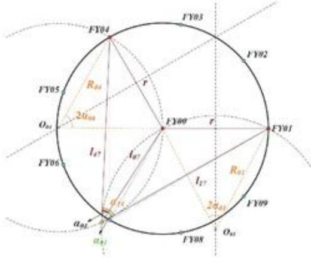
图4: 等角对等边示意图

## 5.1.2 模型的计算几何方法

在对两圆求交点的计算过程中，我们采用了一些巧解方法，简化了计算的复杂度，具体步骤如下所示。

## Step 1. 圆心坐标的确定

在该模型中，我们需要寻找两个圆心 $O _ { \mathrm { 0 } S _ { \mathrm { 1 } } }$ 和 $O _ { 0 S _ { 2 } }$ ，这里我们以 $O _ { \mathrm { 0 } S _ { \mathrm { i } } }$ 为例。

圆周角 $\angle S _ { 1 } R 0$ 大小恒定为 $\alpha _ { 0 S _ { 1 } }$ ，则对应的圆周角大小恒为 $\angle S _ { 1 } O _ { 0 S _ { 1 } } 0 = 2 \alpha _ { 0 S _ { 1 } }$ ，记M为$0 S _ { 1 }$ 的中点。在等腰三角形 $\triangle S _ { 1 } 0 O _ { 9 S _ { 1 } }$ ，可以计算求得该圆的半径为 $R _ { 0 S _ { 1 } } = \frac { r } { 2 \sin \alpha _ { 0 S _ { 1 } } }$ ，同时可以求出 $h = | \overrightarrow { O _ { \boldsymbol { \Phi } S _ { 1 } } M } | = \frac { r } { 2 \tan \alpha _ { \boldsymbol { \Phi } S _ { 1 } } }$ 。同时这个圆心在线段 $0 S _ { 1 }$ 的中垂线上，满足这样的点一共有两个，分别记作 $O _ { 0 S _ { 1 } }$ 和 $O _ { \oplus S _ { i } } ^ { \prime }$

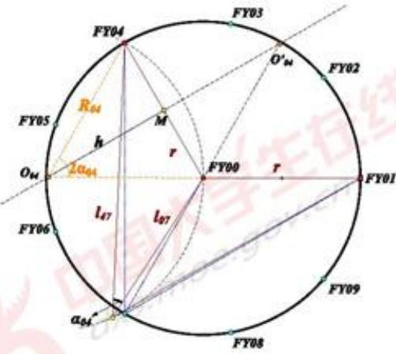
图 5: 圆心坐标的求解

我们在直角坐标系下写出向量 $\overrightarrow { 0 S _ { 1 } }$ 的表达式，即 $\overrightarrow { 0 S _ { 1 } } = r \cos \alpha _ { 0 S _ { 1 } } \overrightarrow { i } + r \sin \alpha _ { 0 S _ { 1 } } \overrightarrow { j } ,$ 则其中垂线对应的向量即在 $\overrightarrow { 0 S _ { 1 } }$ 左乘一个对应转动角度为 $9 0 ^ { \circ }$ 的旋转矩阵。由于旋转方向未知，会计算出两个不同的圆心。下面的公式中分别给出了顺时针和逆时针的旋转矩阵。加上上文中得出的圆的半径的计算，我们可以得到圆心的坐标。

$$
P _ { i n } = ( { \cos 9 0 ^ { \circ } }  \ { \sin 9 0 ^ { \circ } } ) = ( { 0 1 } ) \qquad P _ { o u t } = ( { \cos 9 0 ^ { \circ } } - { \sin 9 0 ^ { \circ } } ) = ( { 0 - 1 } )\tag{10}
$$

$$
\overrightarrow { O _ { 0 S _ { 1 } } M } = P _ { i } \frac { \overrightarrow { 0 S _ { 1 } } } { \vert \overrightarrow { 0 S _ { 1 } } \vert } \times \vert \overrightarrow { O _ { 0 S _ { 1 } } M } \vert = P _ { i } \frac { \overrightarrow { 0 S _ { 1 } } } { 2 \tan { \alpha _ { 0 S _ { 1 } } } } \qquad i \in \{ i n , o u t \}\tag{11}
$$

最后我们需要在 $O _ { \mathrm { 0 } S _ { \mathrm { l } } }$ 和 $O _ { \mathrm { 0 } S _ { 1 } } ^ { \prime }$ 中确定准确的圆 $^ \mathrm { c }$ 。注意到如果待测飞机在准确位置处，$\alpha _ { \mathrm { 0 } S _ { \mathrm { j } } }$ 最大为 $8 0 ^ { \circ }$ ，由假设一可知，在实际测量中 $\alpha _ { 0 S _ { 1 } } = 8 0 ^ { \circ } \pm 1 0 ^ { \circ }$ ，此时R和 $O _ { 0 S _ { 1 } }$ 必然在线段 $0 S _ { 1 }$ 的同侧。故我们用叉积的方法排除另一个点。

我们假设 $O _ { \mathrm { 0 } S _ { i } }$ 和R 位于线段 $0 \mathrm { S } _ { 1 }$ 的同侧， $O _ { \mathrm { { 0 } } S _ { 1 } } ^ { \prime }$ 和 R 位于线段 $\mathrm { 0 S _ { l } }$ 的异侧。我们已知以下几个向量，即 $\overrightarrow { 0 S _ { 1 } } , \overrightarrow { 0 O _ { 0 S _ { 1 } } } , \overrightarrow { 0 O _ { 0 S _ { 1 } } ^ { \prime } }$ ，对于 $\overrightarrow { 0 R }$ 。由于我们不知道R点坐标，无法求出准确值。但由于待测无人机位置和其所在的精确位置只有较小的偏差，所以我们采用 $R ^ { \prime }$ 代替R,可以得到 $\overrightarrow { 0 R ^ { \prime } }$

我们分别计算三个叉积 $\overrightarrow { 0 S _ { 1 } } \times \overrightarrow { 0 O _ { 0 S _ { 1 } } } , \overrightarrow { 0 S _ { 1 } } \times \overrightarrow { 0 O _ { 0 S _ { 1 } } ^ { \prime } }$ 和 $\overrightarrow { 0 S _ { 1 } } \times \overrightarrow { 0 R ^ { \prime } } , O _ { 0 S _ { 1 } }$ 和R位于线段 $0 \mathrm { { S } _ { 1 } }$ 的同侧，所以 $\overrightarrow { 0 S _ { 1 } } \times \overrightarrow { 0 O _ { \mathrm { 0 } S _ { 1 } } }$ 和 $\overrightarrow { 0 S _ { 1 } } \times \overrightarrow { 0 R ^ { \prime } }$ 同号。反之， $O _ { \mathrm { 0 } S _ { 1 } } ^ { \prime }$ 和R位于线段 $0 \mathrm { { S } _ { 1 } }$ 的异侧， $\overrightarrow { 0 S _ { 1 } } \times \overrightarrow { 0 O _ { \circ S _ { 1 } } ^ { \prime } }$ 和 $\overrightarrow { 0 S _ { 1 } } \times \overrightarrow { 0 R ^ { \prime } }$ 异号。通过判断叉积结果我们即可找到正确的圆心坐标，即 $O _ { 0 S _ { 1 } } ( x _ { 0 S _ { 1 } } , y _ { 0 S _ { 1 } } )$ 。同理可以得到另一个圆心坐标为 $O _ { 0 S _ { 2 } } ( x _ { 0 S _ { 2 } } , y _ { 0 S _ { 2 } } )$

## 下面展示这个步骤对应的伪代码。

Algorithm 1: 圆心坐标的确定
Result:圆心坐标
1 $: \overrightarrow { O _ { \mathrm { 0 S } _ { 1 } } }  \frac { 1 } { 2 } \overrightarrow { O S _ { 1 } } + \overrightarrow { \nu }$ ${ \vec { \nu } } \gets P _ { i n } \frac { 0 S _ { 1 } ^ { ' } } { 2 \tan \alpha _ { 0 S _ { 1 } } }$ 同
3 $\overrightarrow { O _ { \mathrm { e S _ { i } } } } ^ { \prime }  \frac { 1 } { 2 } \overrightarrow { 0 S _ { 1 } } - \overrightarrow { \nu }$
4 it $\hat { \tau } \ : s g n ( \overrightarrow { 0 S _ { 1 } } \times \overrightarrow { 0 O _ { 0 S _ { 1 } } } ) = s g n ( \overrightarrow { 0 S _ { 1 } } \times \overrightarrow { 0 R ^ { \prime } } ) \ : { \mathrm { t h e n } }$
5 return $O _ { 0 S _ { 1 } }$
6 else X
7 return $O _ { 0 S _ { i } } ^ { \prime }$
8 end

## Step 2.确定待测无人机坐标

对于这两个圆弧相交的计算，我们已知两个圆的圆心坐标及其对应的半径，可以通过写出圆的方程，联立求解。但这里我们应用一个相对更简单的求解方法，即我们现在已知这两个圆都会经过原点FY00，则另一个交点R和原点必然关于两个圆心的连线对称。我们利用对称性求解R点坐标。

首先我们需要找出FY00在直线 $O _ { \oplus S _ { 1 } } O _ { \oplus S _ { 2 } }$ 的投影坐标 $\mathrm { H } ( x _ { H } , y _ { H } )$ 。H在直线 $O _ { 9 S _ { 1 } } O _ { 9 S _ { 2 } }$ 上，所以可以写成 $\overrightarrow { 0 H } = \lambda \overrightarrow { 0 S _ { 1 } } + ( 1 - \lambda ) \overrightarrow { 0 S _ { 2 } }$ 。同时满足 $\overrightarrow { 0 H } \perp \overrightarrow { O _ { \mathrm { e S } _ { 1 } } O _ { \mathrm { e S } _ { 2 } } }$ 。故我们有以下表达式。

$$
\overrightarrow { 0 H } \cdot \overrightarrow { O _ { 0 S _ { 1 } } O _ { 0 S _ { 2 } } } = 0\tag{12}
$$

$$
\Rightarrow ( \lambda x _ { 0 S _ { 1 } } + ( 1 - \lambda ) x _ { 0 S _ { 2 } } ) ( x _ { 0 S _ { 2 } } - x _ { 0 S _ { 1 } } ) + ( \lambda y _ { 0 S _ { 1 } } + ( 1 - \lambda ) y _ { 0 S _ { 2 } } ) ( y _ { 0 S _ { 2 } } - y _ { 0 S _ { 1 } } ) = 0\tag{13}
$$

$$
\Rightarrow \lambda = \frac { x _ { 0 S _ { 2 } } ( x _ { 0 S _ { 2 } } - x _ { 0 S _ { 1 } } ) + y _ { 0 S _ { 2 } } ( y _ { 0 S _ { 2 } } - y _ { 0 S _ { 1 } } ) } { ( x _ { 0 S _ { 1 } } - x _ { 0 S _ { 2 } } ) ^ { 2 } + ( y _ { 0 S _ { 1 } } - y _ { 0 S _ { 2 } } ) ^ { 2 } }\tag{14}
$$

此时对称点坐标 $R ( x _ { R } , y _ { R } ) = ( 2 x _ { H } , 2 y _ { H } )$

$$
x _ { R } = 2 \frac { ( y _ { 0 S _ { 1 } } - y _ { 0 S _ { 2 } } ) ( x _ { 0 S _ { 2 } } y _ { 0 S _ { 1 } } - x _ { 0 S _ { 1 } } y _ { 0 S _ { 2 } } ) } { ( x _ { 0 S _ { 1 } } - x _ { 0 S _ { 2 } } ) ^ { 2 } + ( y _ { 0 S _ { 1 } } - y _ { 0 S _ { 2 } } ) ^ { 2 } }\tag{15}
$$

$$
y _ { R } = 2 { \frac { ( x _ { 0 S _ { 1 } } - x _ { 0 S _ { 2 } } ) ( x _ { 0 S _ { 1 } } y _ { 0 S _ { 2 } } - x _ { 0 S _ { 2 } } y _ { 0 S _ { 1 } } ) } { ( x _ { 0 S _ { 1 } } - x _ { 0 S _ { 2 } } ) ^ { 2 } + ( y _ { 0 S _ { 1 } } - y _ { 0 S _ { 2 } } ) ^ { 2 } } }\tag{16}
$$

(17)

## 5.2 问题———无源定位的无人机最小需求

## 5.2.1 模型的简要介绍

相比于上一小问，本题的难点在于发射信号的无人机编号未知，需要接收信号的无人机自行判断。事实上，如果能确定发射信号的无人机的编号，就可以转入上一问的模型进行求解。

下面根据误差大小分类，讨论如何确定信号的来源，进而求解无人机的位置。

## 5.2.2 接收无人机位置误差极小

本方法适用于极角误差在 $0 . 5 ^ { \circ }$ 以内，极径误差在1m以内的情形。这种情况下，除了0号和1号无人机外还要使用1架无人机。

我们确定信号来源的方法基于一个性质:在没有误差的情况下，0号无人机、待测无人机与另一架位置准确的无人机所成夹角（以待测无人机为顶点）只会取在 $1 0 ^ { \circ } , 3 0 ^ { \circ } , 5 0 ^ { \circ }$ $7 0 ^ { \circ }$ 这些形如 $( 2 0 k + 1 0 ) ^ { \circ }$ 的角内；而两个圆周上的位置准确的无人机与待测无人机所成夹角（以待测无人机为顶点）只会取在 $2 0 ^ { \circ }$ $4 0 ^ { \circ }$ ${ { 6 0 } ^ { \circ } }$ $8 0 ^ { \circ }$ 这些形如 $( 2 0 k ) ^ { \circ }$ 的角内。因此，我们可以很容易地把角分成两类。

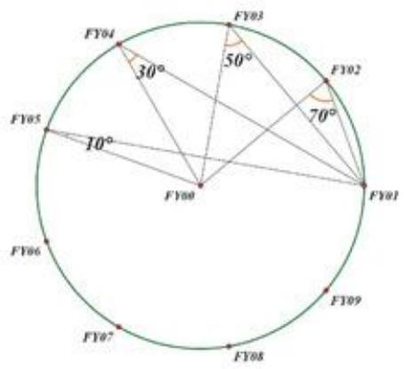
图6:标准位置角度(1)

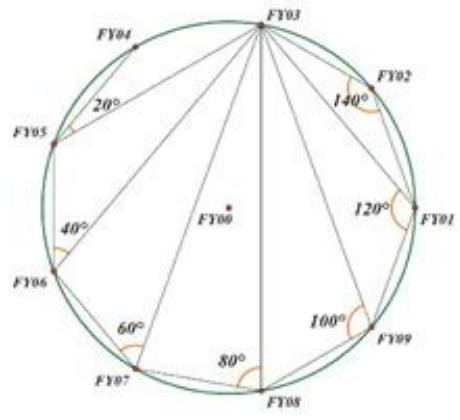
图7:标准位置角度(2)

对于0号无人机、待测无人机与另一架位置准确的无人机所成夹角，我们可以通过角度推算出另一架无人机与待测无人机相差的圆心角。例如，若待测无人机是2号机，0号无人机、待测无人机与另一架位置准确的无人机所成夹角约为 $5 0 ^ { \circ }$ ，可以推算相差的圆心角为 $8 0 ^ { \circ }$ ，即另一架无人机为4号或9号。

因此，可以对于另一架飞机可能的两个位置，分别计算出如果飞机在这里，待测无人机收到信号的大致范围。再与实际收到的信号比对，就可以确定另一架飞机的位置。下面的例子可以更好的帮助理解这个算法。

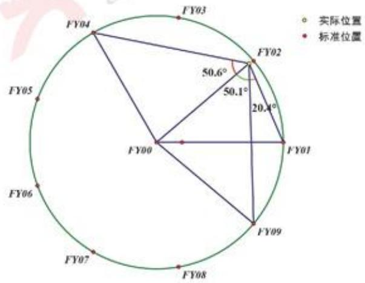
图 8: 定位示例

如图8,若待测无人机是2号机,收到的三个角度是 $5 0 . 6 ^ { \circ }$ $7 0 . 5 ^ { \circ }$ $1 2 1 . 2 ^ { \circ }$ 其中 $7 0 . 5 ^ { \circ }$

是 $0$ 号机，待测机和1号机所成角。

可以看出， $5 0 . 6 ^ { \circ }$ 是0号机，待测机和未知编号的无人机所成角，由此另一架无人机的编号为4号或9号。

·若另一架无人机编号为9号，他收到的三个角度大致范围应该是 $\angle 0 2 1 = 7 0 ^ { \circ } , \angle 0 2 4 =$ $5 0 ^ { \circ } , \angle 1 2 9 = 2 0 ^ { \circ }$ ，与实际收到的信号误差较大，排除这种情况。

·若另一架无人机编号为4号，他收到的三个角度大致范围应该是 $\angle 0 2 1 = 7 0 ^ { \circ } , \angle 0 2 9 =$ $5 0 ^ { \circ } , \angle 1 2 4 = 1 2 0 ^ { \circ }$ ，与实际收到的信号误差较小，相符较好。

可以发现，只要待测无人机位置误差带来的张角改变不超过 $5 ^ { \circ }$ ，就能通过上述方式判断信号来源。极角误差在 $0 . 5 ^ { \circ }$ 以内，极径误差在1m以内的情形下这个条件是始终成立的。

## 5.2.3 接收无人机位置略有偏差

本方法适用于极角误差在 $0 . 5 ^ { \circ }$ 以内，极径误差在15m以内的情形。这种情况下，除了0号和1号无人机外还要使用1架无人机。

此时，无人机位置误差带来的张角改变会超过 $5 ^ { \circ }$ ，如下图，若待测无人机是FY02，极角误差 $0 . 5 ^ { \circ }$ ，极径误差15m，那么FY00，FY02，FY01的夹角为 $5 9 . 3 ^ { \circ }$ 。如果沿用之前的做法，会将这个角误判为圆周上两架无人机与待测无人机所成角。

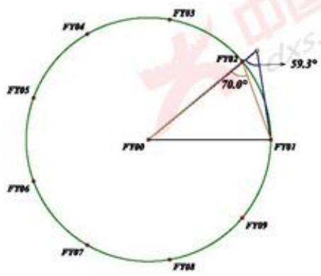
图 9: 误差过大示意图

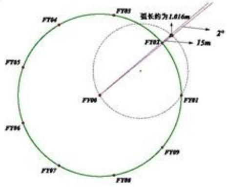
图 10: 误差示意

为了解决这个问题，我们可以利用FY00，FY01和待测机的成角先粗略给出待测机的位置范围，减小角度误差。

仍旧以FY02为待测机，FY00，FY01，FY09发射信号为例。不妨设此时FY02的真实位置为(115m,40°)。

如图11(为了使图能够看清，我们在作图时将 $\angle R _ { 1 } 0 R _ { 2 } )$ 适当放大了，FY02收到信息显示FY00，FY02，FY01所成角为59.1°，这确定了FY02真实位置在一个圆O上；又由于极角误差在 $1 ^ { \circ }$ 以内，所以FY02又位于以坐标原点为圆心，圆心角为 $2 ^ { \circ }$ 的扇形内。因此，我们可以将FY02的可能位置缩小到两者的交一段小圆弧。记小圆弧的起点和终点为$R _ { 1 }$ 和 $R _ { 2 }$ 。

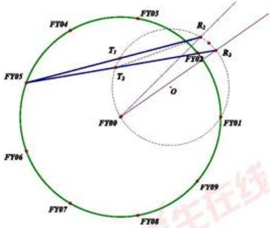
图11:角度误差证明示意图

当FY02在圆弧 $R _ { 1 } R _ { 2 }$ 上运动时，我们通过测量∠X20的角度变化（其中X指第三架参与定位的无人机的编号)，发现 $( \angle X 2 0 ) _ { m a x } - ( \angle X 2 0 ) _ { m i n } \leq 2 ^ { \circ }$ 。这里我们给出详细的数学证明过程。

如图11所示，当我们连接 $5 R _ { 1 }$ 和 $5 R _ { 2 }$ 和 $5 R _ { 2 }$ 时与圆O相交于 $T _ { 1 }$ 和 $T _ { 2 }$ 。考虑 $\angle 5 R _ { 1 } 0$ 和$\angle 5 R _ { 2 } 0$ 的角度大小差别。下面用圆中的几何知识进行计算

$$
| \angle 5 R _ { 1 } 0 - \angle 5 R _ { 2 } 0 | = | \frac { 1 } { 2 } \widehat { T _ { 1 } 0 } - \frac { 1 } { 2 } \widehat { T _ { 2 } 0 } | = \frac { 1 } { 2 } \widehat { T _ { 1 } T _ { 2 } } = \angle T _ { 1 } R _ { 1 } T _ { 2 }\tag{18}
$$

从 $\triangle 5 R _ { 1 } T _ { 2 }$ 来看， $\angle T _ { 1 } R _ { 1 } T _ { 2 } \le \angle R _ { 1 } T _ { 2 } R _ { 2 } = \angle R _ { 1 } 0 R _ { 2 }$ 。故 $( \angle X 2 0 ) _ { m a x } - ( \angle X 2 0 ) _ { m i n } \leq \angle R _ { 1 } 0 R _ { 2 } = 2 ^ { \circ }$

最后我们需要证明∠X20组成的角度集合和 $\angle P 2 Q$ 形成的角度范围无交集，这样无人机就可通过接收到的角度来判断另一架发射信号的无人机FYOX的编号。其中X，P，Q都是圆周上除FY02以外的无人机对应的编号，这些无人机都处于预期位置，没有偏移。下面我们通过穷举所有情况来进行说明角度无交集，这里我们取的角度误差为 $0 . 5 ^ { \circ }$ 。由于图形存在对称性，结果十分简洁。

表2:∠X20对应的角度变化范围
<table><tr><td rowspan=1 colspan=1>X</td><td rowspan=1 colspan=1>∠X20最小值</td><td rowspan=1 colspan=1>∠X20最大值</td></tr><tr><td rowspan=1 colspan=1>1</td><td rowspan=1 colspan=1>59.1°</td><td rowspan=1 colspan=1>59.1°</td></tr><tr><td rowspan=1 colspan=1>7</td><td rowspan=1 colspan=1>9.1°</td><td rowspan=1 colspan=1>9.5°</td></tr><tr><td rowspan=1 colspan=1>8</td><td rowspan=1 colspan=1>27.5°</td><td rowspan=1 colspan=1>27.9°</td></tr><tr><td rowspan=1 colspan=1>9</td><td rowspan=1 colspan=1>45.1°</td><td rowspan=1 colspan=1>45.4°</td></tr></table>

表3: ∠P2Q对应的角度变化范围
<table><tr><td rowspan=1 colspan=1>P</td><td rowspan=1 colspan=1>Q</td><td rowspan=1 colspan=1>∠P2Q最小值</td><td rowspan=1 colspan=1>∠P2Q最大值</td><td rowspan=1 colspan=1>P</td><td rowspan=1 colspan=1>Q</td><td rowspan=1 colspan=1>∠P2Q 最小值</td><td rowspan=1 colspan=1>∠P2Q 最大值</td></tr><tr><td rowspan=1 colspan=1>1</td><td rowspan=1 colspan=1>3</td><td rowspan=1 colspan=1>118.3°</td><td rowspan=1 colspan=1>118.5°</td><td rowspan=1 colspan=1>9</td><td rowspan=1 colspan=1>3</td><td rowspan=1 colspan=1>104.3°</td><td rowspan=1 colspan=1>104.5°</td></tr><tr><td rowspan=1 colspan=1>1</td><td rowspan=1 colspan=1>4</td><td rowspan=1 colspan=1>104.1°</td><td rowspan=1 colspan=1>104.7°</td><td rowspan=1 colspan=1>9</td><td rowspan=1 colspan=1>4</td><td rowspan=1 colspan=1>90.4°</td><td rowspan=1 colspan=1>90.5°</td></tr><tr><td rowspan=1 colspan=1>1</td><td rowspan=1 colspan=1>5</td><td rowspan=1 colspan=1>86.6°</td><td rowspan=1 colspan=1>87.1°</td><td rowspan=1 colspan=1>9</td><td rowspan=1 colspan=1>5</td><td rowspan=1 colspan=1>72.9°</td><td rowspan=1 colspan=1>73.0°</td></tr><tr><td rowspan=1 colspan=1>1</td><td rowspan=1 colspan=1>6</td><td rowspan=1 colspan=1>68.2°</td><td rowspan=1 colspan=1>68.7°</td><td rowspan=1 colspan=1>9</td><td rowspan=1 colspan=1>6</td><td rowspan=1 colspan=1>54.5°</td><td rowspan=1 colspan=1>54.6°</td></tr><tr><td rowspan=1 colspan=1>1</td><td rowspan=1 colspan=1>7</td><td rowspan=1 colspan=1>50.1°</td><td rowspan=1 colspan=1>49.6°</td><td rowspan=1 colspan=1>9</td><td rowspan=1 colspan=1>7</td><td rowspan=1 colspan=1>35.9°</td><td rowspan=1 colspan=1>36.0°</td></tr><tr><td rowspan=1 colspan=1>1</td><td rowspan=1 colspan=1>8</td><td rowspan=1 colspan=1>31.7°</td><td rowspan=1 colspan=1>31.3°</td><td rowspan=1 colspan=1>9</td><td rowspan=1 colspan=1>8</td><td rowspan=1 colspan=1>17.0°</td><td rowspan=1 colspan=1>17.5°</td></tr><tr><td rowspan=1 colspan=1>1</td><td rowspan=1 colspan=1>9</td><td rowspan=1 colspan=1>13.7°</td><td rowspan=1 colspan=1>14.1°</td><td rowspan=1 colspan=1>8</td><td rowspan=1 colspan=1>3</td><td rowspan=1 colspan=1>86.8°</td><td rowspan=1 colspan=1>86.9°</td></tr><tr><td rowspan=1 colspan=1>7</td><td rowspan=1 colspan=1>3</td><td rowspan=1 colspan=1>68.4°</td><td rowspan=1 colspan=1>68.5°</td><td rowspan=1 colspan=1>8</td><td rowspan=1 colspan=1>4</td><td rowspan=1 colspan=1>72.9°</td><td rowspan=1 colspan=1>73.0°</td></tr><tr><td rowspan=1 colspan=1>7</td><td rowspan=1 colspan=1>4</td><td rowspan=1 colspan=1>54.5°</td><td rowspan=1 colspan=1>54.6°</td><td rowspan=1 colspan=1>8</td><td rowspan=1 colspan=1>5</td><td rowspan=1 colspan=1>55.3°</td><td rowspan=1 colspan=1>55.4°</td></tr><tr><td rowspan=1 colspan=1>7</td><td rowspan=1 colspan=1>5</td><td rowspan=1 colspan=1>37.0°</td><td rowspan=1 colspan=1>37.0°</td><td rowspan=1 colspan=1>8</td><td rowspan=1 colspan=1>6</td><td rowspan=1 colspan=1>37.0°</td><td rowspan=1 colspan=1>37.0°</td></tr><tr><td rowspan=1 colspan=1>7</td><td rowspan=1 colspan=1>6</td><td rowspan=1 colspan=1>18.6°</td><td rowspan=1 colspan=1>18.6°</td><td rowspan=1 colspan=1>8</td><td rowspan=1 colspan=1>7</td><td rowspan=1 colspan=1>18.4°</td><td rowspan=1 colspan=1>18.4°</td></tr></table>

## 5.3 问题———圆周上无人机调整方案

在该问中，在队列中十架无人机，只有FY00和FY01这两架无人机的位置是正确的，我们需要选择FY00及圆周上至多三架飞机发射电磁信号，对圆周上其余的飞机进行位置调整。这里涉及到了两个主要问题。首先是发射信号的无人机的选择策略，第二个问题是在接收到电磁信号，转换成角度关系后，无人机需要如何移动，即无人机的移动策略。在下面两个小节中我们给出详细过程。

假设：在无人机发射信号时，不参与发射信号的无人机都可以接收到电磁信号并进入位置调整状态。

为了判断无人机是否运行到准确位置，我们设定了阈值∈，即无人机现在的位置和预期位置的欧几里得距离小于阈值时，该无人机调整完毕。当所有的无人机到预期位置的距离都小于阈值时，过程结束。在本题中，我们设定阈值 $\epsilon = 1 0 ^ { - 4 } m$ 6

## 5.3.1 无人机位置调整策略

对于无人机的移动策略，我们会定义一个位置变化矢量，无人机会按照这个矢量x进行调整。对于这个矢量，我们需要定义其起始点和终止点。位置需要变动的无人机FY0X

不知道自己在坐标系中对应的坐标，只能通过其他几架无人机传输的电磁信号来进行定位，故位置变化矢量的起始点和无人机的起始位置坐标不同，我们在下面主要分析两个不同情况下的位置变化矢量的起始点和终止点。

## 三架无人机定位时的调整策略

在选择无人机时，我们选择了FY00,FY01和其余一架无人机，记为FYOS。位置需要调整的无人机记为FY0R。在该题中，FY00和FY01位置准确，但是FYOS位置不一定到达预期点位。

## Step 1 FY0R 对角度的解码算法。

由于我们在选择发射信号的无人机上，FY00和FY01作为基准机，待测的无人机可以接收到这两架无人机传输的信号并且可以识别由FY00和FY01发射信号的夹角。对于剩余的未知编号的无人机，我们采用的是类似5.2中的做法，即可通过接收到的角度大小判断无人机的编号。

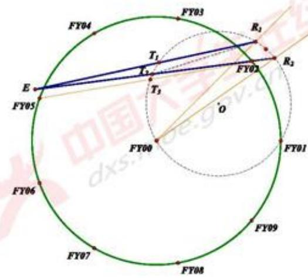
图 12: 角度解码中的误差分析

如图12所示，只需证明当观测点位置不再预期位置时 $( \angle E R 0 ) _ { m a x } - ( \angle E R 0 ) _ { m i n } \leq 5 ^ { \circ }$ ,其中R在 $R _ { 1 } R _ { 2 }$ 上运动。通过运算和数值求解，我们发现当E在径向方向误差不超过5m的情况下，都可以满足 $( \angle E R 0 ) _ { m a x } - ( \angle E R 0 ) _ { m i n } \ : \leq \ : 5 ^ { \circ }$ 。所以我们在选择发射信号的无人机时，没有使用距离误差超过5m的无人机。

## Step2 FY0R利用电磁信号确定自己的坐标。

在这个过程中，无人机FYOR已经分析出了FYOS飞机的信号。FYOS位置可能相对于预期位置有一定偏差，但在无人机执行程序中，无人机会认为FY0S在预期位置。此时我们依旧应用(5.1.2)中的方法，如图13所示，无人机信号的发射点为S，其预期位置为FY09，在无人机FYOR的视角来看，无人机接收到的 $\alpha _ { 0 9 }$ 是从FY09发射出来的，而不是从S发射出来的，所以我们做圆时会产生一定的偏差，此时无人机判断出来的自己所在位置为 $T ( x _ { T } , y _ { T } )$ 。

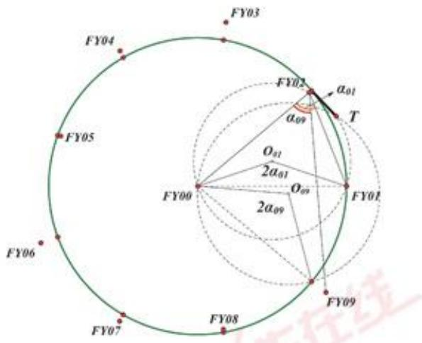
图13: 确定初始点坐标

## Step 3 FY0R建立位置变化矢量并朝矢量方向移动

无人机FYOR可以根据自己的编号，确定自己的预期坐标，将这个点设置成位置变化矢量x的终止点，即 $R _ { e x p } ( r \cos \theta _ { R } , r \sin \theta _ { R } )$ 。我们可以构建以T为起点，以 $R _ { e x p }$ 为终点的位置变化矢量 $\overrightarrow { x } = \overrightarrow { 0 R _ { e x p } } - \overrightarrow { 0 T }$ 。则无人机最终位置为 $\overrightarrow { 0 R _ { f i n a l } } = \overrightarrow { 0 R } + \overrightarrow { x } = \overrightarrow { 0 R } + \overrightarrow { 0 R _ { e x p } } - \overrightarrow { 0 T }$

## 四架无人机定位时的调整策略

四架无人机在定位调整上和三架无人机的策略基本一致，同样也分成三个步骤。第一步即FYOR角度分析得到信号来源，方法相同，这里不再赘述。第二步是利用电磁信号得到自己的坐标，在这个定位方式中和三架的略有差异，第三是建立位置变化矢量并移动，这个步骤也和三架无人机的操作相同。

对于 Step2的改变主要包括以下几点。

1. 在取点时，我们选择的无人机一定包括FY00和FY01。其余两架分别记为 $\mathrm { F Y 0 S } _ { 1 }$ 和$\mathrm { F Y 0 S _ { 2 } }$ 。

2. 在确定位置坐标的时候，我们分成两个步骤，第一步是取FY00，FY01和 $\mathrm { F Y 0 S } _ { 1 }$ 这三个点，用(5.3.2)中三架无人机定位中的Step2，确定出FYOR的第一个位置坐标，记为 $\mathrm { T } _ { 1 }$ 。然后我们再取FY00，FY01和 $\mathrm { F Y 0 S } _ { 2 }$ 这三个点，采用相同的操作，得到第二个位置坐标，记为 $\mathrm { T } _ { 2 }$

3. 分析可知 $\mathrm { T _ { I } }$ 和 $\mathrm { T } _ { 2 }$ 两点并不重合，且 $\mathrm { T _ { 1 } }$ 和 $\mathrm { T } _ { 2 }$ 是两种取点得到的，我们取 $\mathrm { { T } _ { 1 } }$ 和 $\mathrm { T } _ { 2 }$ 的中点，记为 $\mathrm { ~ T ~ } _ { \circ }$ 把T点设置成无人机通过接收到的角度计算得到的位置。即无人机认为的出发点。和三架无人机的定位模型中的T等价。

## 5.3.2 发射信号无人机的策略

对于圆周上任意一个点FYOR到其预期点的欧几里得距离可以定义为 $d _ { R } = | R R _ { e x p e c t } | \mathrm { ~ , ~ }$ 我们可以定义L2loss函数作为估价函数。[7]

$$
{ \cal L } = \sum _ { i = 1 } ^ { 9 } d _ { i } ^ { 2 }\tag{19}
$$

对于发射信号的无人机的方案，我们采用的是带阈值的启发式搜索[6]。首先我们认为FY00和FY01是基准点，是必选的两架无人机，然后在圆周上剩余的无人机中选择至多两架无人机作为信号发射点，确定发射信号的飞机的过程称为一次决策过程。图14中展现的是一个决策树，每个箭头方向表示一种决策方案，箭头上的数字代表了决策中的选择的飞机的编号，圆圈中的数对应的是在该决策条件下的估价函数的计算结果，方框对应的是最大搜索层数。

在图14中，我们设定了阈值，即最大的搜索层数N，在遍历N层的计算后，程序会找出估价函数最小的决策方案，再以可以通向该方案的子节点为决策树的根，如此循环。不难发现，贪心算法是阈值为1的特殊情形。使用该方法，我们避免了贪心算法带来的局域最小化的结果，更有利于找到收敛最快的决策方案。例如，在图14中，最左边的决策是贪心算法的结果，最右边的决策是带阈值的启发式搜索的结果，可以发现在第一次决策后，贪心算法得到的估价函数明显小于启发式搜索算法。但是在第二次决策后，启发式搜索算法对应的估价函数快速收敛，这是由于在第一次决策中启发式中将一个误差很大的点调整到精确点。这个情况是无法通过贪心算法和人脑决策出来的。

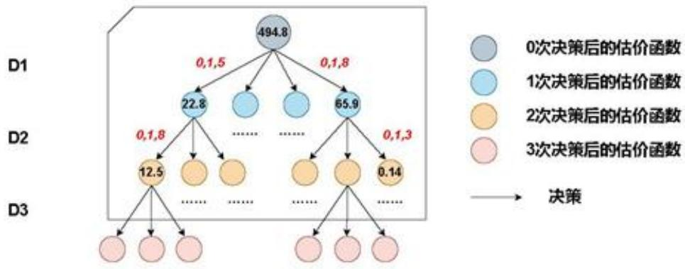
图 14: 决策树示意图

## 5.3.3 结论分析

通过程序计算，我们得到了不同算法，不同决策方案下的收敛速度。在下面的部分我们列举几个结论并对其进行分析。

## Result 1. 几种算法收敛速度的对比

在建模过程中，对于无人机的选择方案，我们主要采用的了随机选取，贪心算法选择和带阈值的启发式搜索算法。其中在带阈值的启发式搜索算法中，我们先只考虑三架无人机的定位情况，随后我们还做了三架和四架的结合的定位情况，结果如图15所示，其中横坐标为决策次数，纵坐标为估价函数的值。

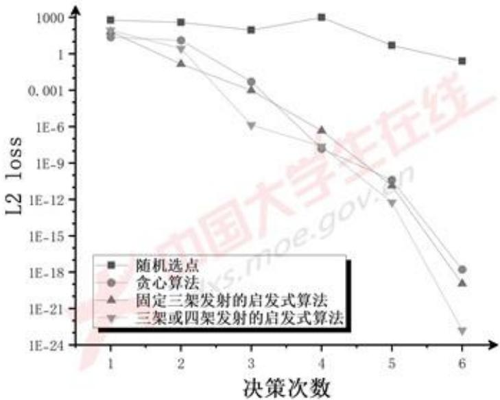
图15:不同决策方案下决策次数与收敛速度的关系

不难发现，对于随机选择的情况，收敛速度较慢，但在实际情况中，决策次数达到20到30次时，随机选择无人机的估价函数也收敛到了 $1 0 ^ { - 6 } \mathrm { m } ^ { 2 }$ 的量级。贪心算法和带阈值的启发式搜索算法收敛速度相近，在局域上可能贪心算法占优势，但从全局上看带阈值的启发式搜索算法可以收敛到较高的精度。使用两种算法计算时，可以发现在第四次决策时，估价函数已经收敛到了 $1 0 ^ { - 6 } \mathrm { m } ^ { 2 }$ 的量级，对于无人机R的和预期位置的偏差在1mm的量级，在实际应用中可以视为精确解。

对比固定三架无人机发射信号的情况和结合了三架无人机和四架无人机发射信号的情况，即图15中的蓝线和绿线，在决策次数较多的情况下，后者收敛速度极快。

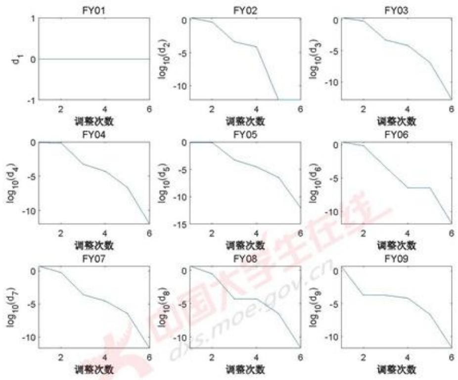

## Result 2. 最优策略的结果展示

我们采用了带阈值的启发式算法，在三架无人机和四架无人机都可以发射信号的情况下，计算得到了一种快速收敛到预期位置的解，其调整策略和收敛结果如下所示。

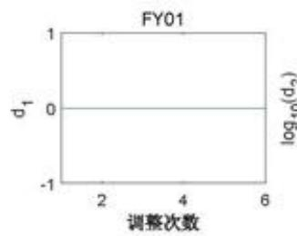

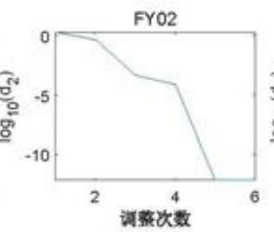

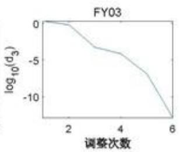

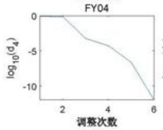

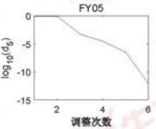

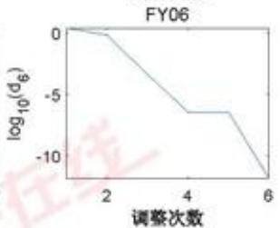

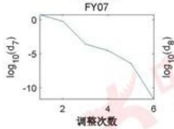

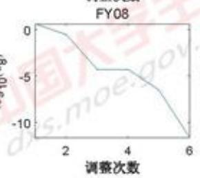

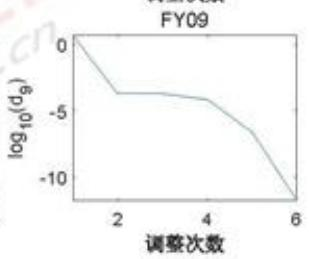
图16:不同无人机与标准位置的距离随调整次数的变化

首先我们给出了无人机的规划策略，一共用了六轮信号发射，我们定义的估价函数L2loss function 的量级为 $1 0 ^ { - 2 3 } m ^ { 2 }$ ，精度已经达到了很高的水平。我们选择每一轮发射电磁波信号的无人机编号如下所示。

1. FY00, FY01, FY02, FY07

2. FY00, FY01, FY05

3. FY00, FY01, FY09

4. FY00, FY01, FY08

5. FY00, FY01, FY06

$$
6 . \ \mathrm { F Y 0 0 , \ F Y 0 1 , \ F Y 0 2 }
$$

实际应用中，我们无需这么高的精度，所以我们只需要前5轮的无人机信号发射策略，一共发射了16次电磁信号，极大降低了外界的干扰。

通过这个决策方案，我们在每次决策结束后的每架无人机的极坐标呈现在附录A中。图16展现的是九架无人机分别到预期位置的距离，随调整次数的增加而变化的曲线图。其中第一幅图是FY01，我们取的是无人机到其预期点的距离作为了纵坐标，其余八张图的纵坐标均为对应无人机到其预期点的位置的对数值。在图中很容易发现该策略收敛速度极快，到达实际精度范围只需要5轮，很有推广意义。

## 5.4 问题二

## 5.4.1 基本假设

·由于题目并未给出无人机的偏差程度，参照问题一的偏差范围，在本问题中我们假设无人机的偏差范围为以标准位置为圆心，半径5m的圆内。

·不失一般性地，我们不妨以FY01为基准无人机，即FY01的位置是时刻准确的，每一次发射信号的无人机都包含FY01。 an

·由于接收信号的无人机只能获取方向信息，无法判断距离，如果只有一架基准无人机，若于轮调整后可能会出现所有无人机距离相同但对非我们预先设定的距离（比如50m)，因此需要第二架基准机，参照问题一的条件，类似地选取FY05为第二架基准机，即FY05 与FY01的距离始终保持在 $5 0 { \sqrt { 3 } } m$ ，相对位置保持不变，每次发射信号的无人机都包含FY05.

## 5.4.2 问题一模型不适用之处

本质上来看，问题二是对问题一模型的重新运用，但是在实际的实现过程中会出现种种问题，这里一一列出。

## ·三点共线

问题一在接收信号的无人机接收到方向信息后，需要进行预处理，即对方向信息进行解码得到发射信号的无人机编号。但是在锥形编队中，由于存在多架标准位置共线的无人机，判断编号在大多数情况下是难以实现的。

## ·四点共圆

在接收信号的无人机进行定位的过程中，利用问题一中作圆求交的方法可能会出现四点共圆的情况。如图17所示，在FY03,FY04和FY10发射信号，FY13进行定位时，由于

四架无人机的标准位置四点共圆，在前若于次决策中可以通过两圆求交进行定位。但经过若于次调整后，随着FY13与标准位置的距离缩短，所作出的两圆逐渐靠近，所得交点的精度会变得非常差，从而导致FY13定位的精度变差，调整就无法进行。

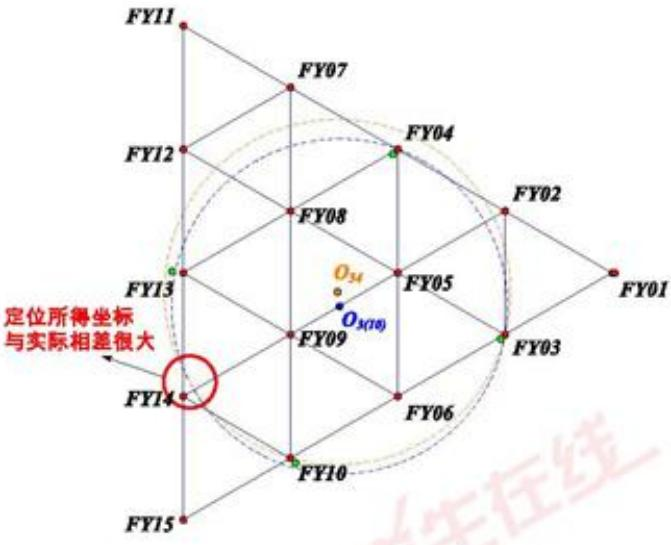
图 17:四点共圆情况示意

## 5.4.3 解决方案

针对无法判断发射电磁波信号的无人机编号的问题，我们可以预先设定无人机发射信号的顺序(一种可能的实现方式是，给所有无人机的随机数发生器设定相同的随机种子，这样所有无人机可以产生相同的随机数序列)，于是在每一次接收信号时，无人机都可以通过接收信号的次数判断当前发射信号的无人机编号，并基于此利用与问题一相同的作圆求交方法实现定位并通过5.3.1的策略进行调整。

针对四点共圆定位精度过差的问题，由于上述选点策略，无人机可以预先知道本轮发射信号的无人机编号。我们设定:当接收信号的无人机判断发射信号的无人机标准位置与自身标准位置四点共圆，判定为无法定位，不进行调整。

另外，由于选定FY01和FY05作为基准无人机，每次选择的发射信号的无人机都包含FY01和FY05，与FY13共线，因此FY13的定位误差会很大。我们的策略为：在10次调整中，前9次由FY01和FY05与一架未知编号的无人机发射电磁波信号，FY13不做调整；第10次由FY01，FY02与FY03发射电磁波，只有FY13做调整，其余无人机不做调整。

关于选点策略的合理性，我们用上述策略进行测试，在10000次代码运行后发现每一次无人机的位置都可以很快地收敛到标准位置，因此可以认为这样的选点策略是合理的。

## 5.4.4 结果展示

图15显示了初始时位置误差分别为0.5m，1m，3m，5m时，调整次数与L2loss函数的关系。

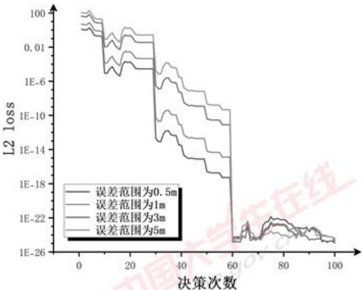
图18:不同误差范围内决策次数与收敛速度的关系

可以看出，初始误差越小，L2loss收敛速度越快。(事实上，这个模型的收敛速度具有一定的随机性，但总体趋势符合）在约60次调整之后，5m以内的初始误差均可以收敛到较高的精度。

## 六模型优缺点

## 6.1 模型的优点

·首先对于无人机的位置调节，要具有时效性，我们的模型可以快速解出无人机需要移动的方向和距离，程序可以实现在1s内给出结果，具有很好的现实意义。

·我们的模型相比于贪心算法，可以做到更加远视，可以找到更优的解。

·选择L2loss作为估价函数，使得启发式算法更倾向于优化当前离标准位置较远的点，加快了收敛速度。

·我们的模型更具有普适性。在误差范围内对误差较小的情况和误差较大的情况都一一讨论；且第二问中的随机算法具有推广的意义，理论上可以用于除“一”字型队列的所有队列编排调整。

·给出了细致的误差分析，有较强的严谨性。

## 6.2 模型的缺点

·我们的模型只在误差范围之内进行了讨论，没有考虑误差范围以外的情况，对更为极端的情况适应性比较差。

·问题二采取的随机选点发射电磁波信号的策略会导致无人机的位置收敛到标准位置的速度比较慢。

·问题二只考虑了一种基准点选择的方法，存在局限性，无法全面地找出调整方案的最优解。

## 参考文献

[1]徐诚,黄大庆.“无人机光电侦测平台目标定位误差分析.”仪器仪表学报 34.10(2013):2265-2270. doi:10.19650/j.cnki.cjsi.2013.10.016.

[2]张琬琳,胡正良，朱建军,林小娟，尹剑，杨萌.单兵综合观瞄仪中的一种目标位置解算方法[J]. 电子测量技术,2014,37(11):1-3.DOI:10.19651/j.cnki.emt.2014.11.001.

[3]徐诚，黄大庆，孔繁锵.“一种小型无人机无源目标定位方法及精度分析.”仪器仪表学报 36.05(2015):1115-1122. doi:10.19650/j.cnki.cjsi.2015.05.019.

[4] 秦顾正.对无人机的无源定位关键技术研究.2019.东南大学,MA thesis.

[5]屈小媚，刘韬,谈文蓉.”基于多无人机协作的多目标无源定位算法.”中国科学:信息科学49.05(2019):570-584.

[6]李鹏，周海，闵慧.”人工智能中启发式搜索研究综述.”软件导刊19.06(2020):35-38.

[7] Spanos, John T., Mark H. Milman, and D. Lewis Mingori. "A new algorithm for L2 optimal model reduction." Automatica 28.5 (1992): 897-909.

## A 坐标展示

我们在这个表格中展现的是三架无人机和四架无人机发射信号的最优策略下，无人机在每次调整后极坐标的变化。其中每架无人机对应两行数据，上面一行对应的是极径长度下面一行对应的是极角的大小。

表 4: Caption
<table><tr><td rowspan=1 colspan=1>极坐标  次数编号</td><td rowspan=1 colspan=1>1</td><td rowspan=1 colspan=1>2</td><td rowspan=1 colspan=1>3</td><td rowspan=1 colspan=1>4</td><td rowspan=1 colspan=1>5</td><td rowspan=1 colspan=1>6</td></tr><tr><td rowspan=2 colspan=1>FY01</td><td rowspan=1 colspan=1>100.0000</td><td rowspan=1 colspan=1>100.0000</td><td rowspan=1 colspan=1>100.0000</td><td rowspan=1 colspan=1>100.0000</td><td rowspan=1 colspan=1>100.0000</td><td rowspan=1 colspan=1>100.0000</td></tr><tr><td rowspan=1 colspan=1>0.0000</td><td rowspan=1 colspan=1>0.0000</td><td rowspan=1 colspan=1>0.0000</td><td rowspan=1 colspan=1>0.0000</td><td rowspan=1 colspan=1>0.0000</td><td rowspan=1 colspan=1>0.0000</td></tr><tr><td rowspan=2 colspan=1>FY02</td><td rowspan=1 colspan=1>98.4000</td><td rowspan=1 colspan=1>100.0000</td><td rowspan=1 colspan=1>100.0000</td><td rowspan=1 colspan=1>100.0000</td><td rowspan=1 colspan=1>100.0000</td><td rowspan=1 colspan=1>100.0000</td></tr><tr><td rowspan=1 colspan=1>40.1000</td><td rowspan=1 colspan=1>39.7539</td><td rowspan=1 colspan=1>39.9998</td><td rowspan=1 colspan=1>40.0000</td><td rowspan=1 colspan=1>40.0000</td><td rowspan=1 colspan=1>40.0000</td></tr><tr><td rowspan=2 colspan=1>FY03</td><td rowspan=1 colspan=1>98.8899</td><td rowspan=1 colspan=1>100.4340</td><td rowspan=1 colspan=1>100.0000</td><td rowspan=1 colspan=1>100.0000</td><td rowspan=1 colspan=1>100.0000</td><td rowspan=1 colspan=1>100.0000</td></tr><tr><td rowspan=1 colspan=1>80.9727</td><td rowspan=1 colspan=1>79.7268</td><td rowspan=1 colspan=1>79.9998</td><td rowspan=1 colspan=1>80.0000</td><td rowspan=1 colspan=1>80.0000</td><td rowspan=1 colspan=1>80.0000</td></tr><tr><td rowspan=2 colspan=1>FY04</td><td rowspan=1 colspan=1>99.3532</td><td rowspan=1 colspan=1>100.6480</td><td rowspan=1 colspan=1>100.0000</td><td rowspan=1 colspan=1>100.0000</td><td rowspan=1 colspan=1>100.0000</td><td rowspan=1 colspan=1>100.0000</td></tr><tr><td rowspan=1 colspan=1>120.2710</td><td rowspan=1 colspan=1>119.7940</td><td rowspan=1 colspan=1>120.0000</td><td rowspan=1 colspan=1>120.0000</td><td rowspan=1 colspan=1>120.0000</td><td rowspan=1 colspan=1>120.0000</td></tr><tr><td rowspan=2 colspan=1>FY05</td><td rowspan=1 colspan=1>100.7520</td><td rowspan=1 colspan=1>100.7520</td><td rowspan=1 colspan=1>100.0010</td><td rowspan=1 colspan=1>100.0000</td><td rowspan=1 colspan=1>100.0000</td><td rowspan=1 colspan=1>100.0000</td></tr><tr><td rowspan=1 colspan=1>159.9350</td><td rowspan=1 colspan=1>159.9350</td><td rowspan=1 colspan=1>160.0000</td><td rowspan=1 colspan=1>160.0000</td><td rowspan=1 colspan=1>160.0000</td><td rowspan=1 colspan=1>160.0000</td></tr><tr><td rowspan=2 colspan=1>FY06</td><td rowspan=1 colspan=1>102.4780</td><td rowspan=1 colspan=1>100.6830</td><td rowspan=1 colspan=1>100.0000</td><td rowspan=1 colspan=1>100.0000</td><td rowspan=1 colspan=1>100.0000</td><td rowspan=1 colspan=1>100.0000</td></tr><tr><td rowspan=1 colspan=1>200.2420</td><td rowspan=1 colspan=1>200.0720</td><td rowspan=1 colspan=1>200.0000</td><td rowspan=1 colspan=1>200.0000</td><td rowspan=1 colspan=1>200.0000</td><td rowspan=1 colspan=1>200.0000</td></tr><tr><td rowspan=2 colspan=1>FY07</td><td rowspan=1 colspan=1>105.0000</td><td rowspan=1 colspan=1>100.4690</td><td rowspan=1 colspan=1>100.0000</td><td rowspan=1 colspan=1>100.0000</td><td rowspan=1 colspan=1>100.0000</td><td rowspan=1 colspan=1>100.0000</td></tr><tr><td rowspan=1 colspan=1>240.0700</td><td rowspan=1 colspan=1>240.1590</td><td rowspan=1 colspan=1>240.0000</td><td rowspan=1 colspan=1>240.0000</td><td rowspan=1 colspan=1>240.0000</td><td rowspan=1 colspan=1>240.0000</td></tr><tr><td rowspan=2 colspan=1>FY08</td><td rowspan=1 colspan=1>102.7630</td><td rowspan=1 colspan=1>100.1680</td><td rowspan=1 colspan=1>100.0000</td><td rowspan=1 colspan=1>100.0000</td><td rowspan=1 colspan=1>100.0000</td><td rowspan=1 colspan=1>100.0000</td></tr><tr><td rowspan=1 colspan=1>281.6670</td><td rowspan=1 colspan=1>280.1290</td><td rowspan=1 colspan=1>280.0000</td><td rowspan=1 colspan=1>280.0000</td><td rowspan=1 colspan=1>280.0000</td><td rowspan=1 colspan=1>280.0000</td></tr><tr><td rowspan=2 colspan=1>FY09</td><td rowspan=1 colspan=1>101.3530</td><td rowspan=1 colspan=1>100.0000</td><td rowspan=1 colspan=1>100.0000</td><td rowspan=1 colspan=1>100.0000</td><td rowspan=1 colspan=1>100.0000</td><td rowspan=1 colspan=1>100.0000</td></tr><tr><td rowspan=1 colspan=1>322.9100</td><td rowspan=1 colspan=1>320.0000</td><td rowspan=1 colspan=1>320.0000</td><td rowspan=1 colspan=1>320.0000</td><td rowspan=1 colspan=1>320.0000</td><td rowspan=1 colspan=1>320.0000</td></tr></table>

## B 计算几何函数库

```cpp
#include<bits/stdc++.h>
2 using namespace std;
3 const int N = 20;
4 const double pi = acos(-1.0);
5
6 double d[N], theta[N];
```

```c
struct Point {
double x, y;
Point(double _x = 0, double _y = 0) : x(_x), y(_y) {}
double norm() { return sqrt(x * x + y * y); }
double norm2() { return x * x + y * y; }
Point operator + (Point const &b) {
return Point(x + b.x, y + b.y);
}
Point operator - (Point const &b) {
return Point(x - b.x, y - b.y);
}
Point operator * (double a) {
return Point(a * x, a * y); 学
}
Point operator / (double a) {
return Point(x / a, y / a);
} dxs.moe.gov.cn
}p[N], ass [N];
using Vector = Point;
double cross(Vector a, Vector b){
return a.x * b.y - a.y * b.x;
}
struct Circle {
Point O;
double r;
Circle () {}
Circle(Point _O, double _r) : O(_O), r(_r) {}
bool operator == (Circle const &b) {
return (O - b.O).norm() < 1e-5 && abs(r - b.r) < 1e-5;
```

}
};
// idl，id2，vertex所成角为alpha，角顶点为vertex
struct Angle {
int id1, id2;
int vertex;
double alpha;
Angle(int \_id1, int \_id2, int \_ver, double \_alpha) {
id1 = \_id1; id2 = \_id2; vertex = \_ver; alpha = \_alpha;
}
bool operator < (Angle &b) {
return alpha < b.alpha;
}
};
ov.cr
//若无人机到达标准位置
// idl，id2，vertex 所成角(以vertex为顶点)的大小
int get\_angle\_ass(int id1, int vertex, int id2) {
assert(id1!= id2 && id1 != vertex && vertex!=id2);
if (id1 > id2) swap(id1, id2);
if (vertex == 0) {
int del = id2 - id1;
if (del > 4) del = 9 - del;
return 40 \* del;
} else if (id1 == 0) {
int del = abs(id2- vertex);
if (del > 4) del = 9 - del;
return (180 - 40 \* del) / 2;
} else {
int del = id2 - id1;
if (del <= 4){
if (id1 < vertex && vertex < id2) {

75 return 180 - 40 \* del / 2;
76 } else return 40 \* del / 2;
77 } else {
78 del = 9 - del;
79 if (id1< vertex && vertex < id2) {
80 return 40 \* del /2;
81 } else return 180 - 40 \* del / 2;
82 }
83 }
84 }
86 // id1，id2，vertex实际所成角（以vertex为顶点）的大小
87 double get\_angle\_real(int id1, int vertex, int id2) {
88 assert(id1 != id2 && id1 != vertex && vertex != id2);
89 double 11 = (p[vertex]- p[id1]).norm();
90 double 12 = (p[vertex] - p[id2]).norm();
91 double 13 = (p[id1] - p[id2]).norm();
92 double tmp = (11 \* 11 + 12 \* 12 - 13 \* 13) / (2 \* 11 \* 12);
93 assert(-1.01 <= tmp && tmp <= 1.01);
94 if (tmp > 1) tmp = 1;
96 double alpha = acos(tmp);
97 return alpha;
98 }
100 // P，Q, vertex 实际所成角（以vertex为顶点）的大小
101 double get\_angle\_real(Point P, Point vertex, Point Q){
102 double 11 = (vertex - P).norm();
103 double 12 = (vertex - Q).norm();
104 double 13 = (P - Q).norm();
105 double tmp = (11 \* 11 + 12 \* 12 - 13 \* 13) / (2 \* 11 \* 12);
106 assert(-1.01 <= tmp && tmp <= 1.01);
107 if (tmp > 1) tmp = 1;
108 if (tmp < -1) tmp = -1;

```c
109 double alpha = acos(tmp);
110 return alpha;
111 }
112
113 int sgn(double x) {
114 if (x > 0) return 1;
115 if (x < 0) return -1;
116 return 0;
117 }
118
119 // 过点P、Q的张角为alpha的圆
120 Circle get_circle(int id, Point P, Point Q, double alpha) {
121 Point O, O1, O2, M;
122 M = (P + Q) / 2;
123 Vector v(Q - P);
124 double h = v.norm() / 2 * tan(abs(pi / 2 alpha));
125 double r;
126 if (abs(pi / 2 - alpha) > 1e-5) {
127 r = h / sin(abs(pi / 2 - alpha));
128 } else { dxs.n
129 r = v.norm() / 2;
130 }
131 v = v / v. norm () * h;
132 swap(v.x, v.y);
133 v.x *= -1;
134 O1 = M + v; O2 = M - v;
135 int f1 = sgn(cross(p[id] - P,Q - P));
136 int f2 = sgn(cross (O1 - P, Q - P));
137 if (alpha > pi / 2) {
138 if (f1 == f2) O = O2;
139 else 0 = O1;
140 } else {
141 if (f1 == f2) O = O1;
142 else O = O2;
```

143 }
144 return Circle(O, r);
145 }

## C 每次最多三架无人机发送信号时的启发式搜索

```cpp
#include<bits/stdc++.h>
#include"geometry.hpp"
using namespace std;
Point findpos_3drones(int id, vector<Angle> ang) {
int id1, id2;
double alpha, beta;
for (auto i : ang) { 学
if (i.id1 && i.id2) {
id1 = i.id1; id2 = i.id2;
} 中国 dxs.moe.gov.cn
}
for (auto i : ang) {
if (i .id1 + i.id2 == id1) {
alpha = i.alpha;
} else if (i.id1 + i.id2 == id2) {
beta = i.alpha;
}
}
Circle O1, O2;
O1 = get_circle (id, ass [0], ass[id1], alpha);
O2 = get_circle(id, ass [0], ass[id2], beta);
double x1 = O1.O.x, y1 = 01.O.y, x2 = O2.O.x, y2 = O2.O. y;
double lambda = (x2 * (x2 - x1) + y2 * (y2 - y1))
/ (O1.O - O2.O). norm2();
Point tmp = 01.O * 2 * lambda + O2.O * 2 * (1 - lambda);
return tmp;
```

}
Point find\_position(int id, vector<int> drone) {
sort(drone.begin(), drone.end());
vector<Angle> ang;
for (int i = 0; i < drone.size(); ++i) {
for (int j = i + 1; j < drone.size( ); ++j) {
double 11 =(p[id] - p[drone[i]]).norm();
double 12 =(p[id]- p[drone[j]]).norm();
double 13 = (p[drone[i]] - p[drone[j]]).norm();
double a = acos((11 \* 11 + 12 \* 12 - 13 \* 13) / 2 / 11 /
ang·push\_back(Angle(drone[i], drone[j], id, a));
}
}
return findpos\_3drones(id,ang);
}
double evaluate() {
double ans = 0;
for (int i = 0; i <= 9; ++i) {
ans +=(p[i] - ass[i]).norm2();
}
return ans;
}
pair<double, int> search(int deep, int las) {
if (deep == 0) {
return make\_pair(evaluate(), las);
}
Point tmp[N];
for (int i = 0; i <= 9; ++i) tmp[i] = p[i];
double ans = 1e100, s = -1;
for (int i = 2; i <= 9; ++i) {
vector<int>drone;

drone.push\_back(0); drone.push\_back(1); drone.push\_back(i);
for (int j = 2; j <= 9; ++j) {
if (j == i) continue;
Point pnt = find\_position(j, drone);
p[j] = p[j] + ass[j] - pnt;
}
pair<double, int> nw = search(deep - 1, i);
if (nw. first < ans) {
ans = nw. first; s = i;
}
for (int j = 2; j <= 9; ++j) {
p[j] = tmp[j];
}
}
return make\_pair(ans, s);
}
int main() {
srand(time(0)); dxs.moe.gov.cn
int n = 9;
for (int i = 0; i <= 9; ++i) {
cin >> d[i] >>theta[i];
}
for (int i = 1; i <= 9; ++i) {
theta[i] = theta[i] / 180 \* pi;
p[i].x = d[i] \* cos(theta[i]);
p[i].y = d[i]\* sin(theta[i]);
ass[i].x = 100\* cos(40.0 \* (i - 1) / 180 \* pi);
ass[i].y = 100 \* sin(40.0 \* (i - 1) / 180 \* pi);
}
cout << evaluate() << endl;
for (int i = 1; i <= 20; ++i){

96 double ans = 1e100; int s = search(3, -1).second;
98 cout << "times: ” << i << endl << "use: 0 1 " << s << endl;
99 vector<int> drone;
100 drone.push\_back(0); drone.push\_back(1); drone.push\_back(s);
101 for (int j = 2; j <= 9; ++j) {
102 if (j == s) continue;
103 Point pnt = find\_position(j, drone);
104 p[j] = p[j] + ass[j]- pnt;
105 }
106 for (int i = 0; i <= 9; ++i) {
107 cout << p[i].x <<, ’ << p[i].y << endl;
108 }
109 cout << evaluate()<< endl;
110 puts("- -"); 学
111 }
112 for (int i = 0; i <= 9; ++i) {
113 cout << ass[i].x|<<
114 }
115 puts("--- ");
117 return 0;
118 }
120 /≈ input data
121 0 0
122 1000
123 98 40.10
124 112 80.21
125 105 119.75
126 98 159.86
127 112 199.96
128 105 240.07
129 98 280.17

130 112 320.28
131 \*/

## D 每次最多四架无人机发送信号时的启发式搜索

```cpp
#include<bits/stdc++.h>
2 #include "geometry. hpp"
3 using namespace std;
4
5 Point findpos_3drones(int id, vector<Angle> ang) {
6 int id1, id2;
7 double alpha, beta;
8 for (auto i : ang) {
9 if (i.id1 && i.id2) {
10 id1 = i.id1; id2 = i.id2;
11 }
12 }
13
14 if (i.id1 + i.id2 == id1) {
15 alpha = i.alpha;
16 } else if (i.id1 + i.id2 == id2) {
17 beta = i.alpha;
18 }
19 }
20 Circle O1, O2;
21 O1 = get_circle(id, ass [0], ass[id1], alpha);
22 O2 = get_circle (id, ass [0],ass[id2], beta);
23 double x1 = 01.O.x, y1 = O1.O.y, x2 = O2.O.x, y2 = 02.O. y;
24 double lambda = (x2 * (x2 - x1) + y2 * (y2 - y1))
25 / (O1.O - O2.O).norm2();
26 Point tmp = O1.O * 2 * lambda + O2.O * 2 *(1 - lambda);
27 return tmp;
28 }
```

Point find\_position(int id, vector<int> drone);
Point findpos\_4drones(int id, vector<int> &drone) {
Point O1, O2, O3;
vector<int> v;
v.push\_back(0); v.push\_back(1); v.push\_back(drone[2]);
O1 = find\_position(id, v);
v.clear();
v.push\_back(0); v.push\_back(1); v.push\_back(drone[3]);
O2 = find\_position(id, v);
v.clear();
return (O1 + O2) / 2;
Point find\_position(int id, vector<int> drone) {
sort(drone.begin(), drone.end());
if (drone.size() ==3){
vector <Angle> ang;
for (int i = 0; i < drone.size(); ++i) {
for (int j = i +1; j < drone.size( ); ++j) {
double 11 = (p[id] - p[drone[i]]).norm();
double 12 = (p[id] - p[drone[j]]).norm();
double 13 =(p[drone[i]] - p[drone[j]]).norm();
double a = acos((11 \* 11 + 12 \* 12 - 13 \* 13) /2 / 11
ang·push\_back(Angle(drone[i], drone[j], id, a));
}
}
return findpos\_3drones(id, ang);
}
else return findpos\_4drones(id, drone);
}
double evaluate() {

double ans = 0;
for (int i = 0; i <= 9; ++i) {
ans +=(p[i] - ass[i]).norm2();
}
return ans;
}
pair<double, pair<int, int>> search(int deep, pair<int, int> las)
if (deep == 0) {
return make\_pair(evaluate(), las);
}
Point tmp[N];
for (int i = 0; i <= 9; ++i) tmp[i] = p[i];
double ans = 1e100;
pair<int, int> s = make\_pair(-1, -1);
for (int i = 2; i <= 9; ++i) {
vector<int> drone;
drone.push\_back(0); drone.push\_back(1); drone. push\_back(i);
for (int j = 2; j <= 9; ++j) {
if (j == i) continue;
Point pnt = find\_position(j, drone);
p[j] = p[j] + ass[j] - pnt;
}
pair<double, pair<int, int>> nw;
nw = search(deep - 1, make\_pair(i, -1));
if (nw. first < ans) {
ans = nw. first; s = make\_pair(i, -1);
}
for (int j = 2; j <= 9; ++j) {
p[j] = tmp[j];
}
}
for (int i = 2; i <= 9; ++i) {
for (int j = i + 1; j <= 9; ++j) {

```c
vector<int> drone;
drone.push_back(0); drone.push_back(1);
drone.push_back(i);drone.push_back(j);
for (int k = 2; k <= 9; ++k) {
if (k == i || k == j) continue;
Point pnt = find_position(k, drone);
p[k] = p[k] + ass[k] - pnt;
}
pair<double, pair<int, int>> nw;
nw = search(deep - 1, make_pair(i, j));
if (nw. first < ans) {
ans = nw.first; s = make_pair(i, j);
}
for (int k = 2; k <= 9; ++k) {
p[k] = tmp[k];
}
}
dxs.moe.gov.cn
}
int main() {
srand(time(0));
for (int i = 0; i <= 9; ++i) {
cin >> d[i] >> theta[i];
}
for (int i = 1; i <= 9; ++i) {
theta[i] = theta[i] / 180 * pi;
p[i].x = d[i] * cos(theta[i]);
p[i].y = d[i]* sin(theta[i]);
ass[i].x = 100 * cos(40.0 * (i - 1) / 180 * pi);
ass[i].y = 100 * sin(40.0 * (i - 1) / 180 * pi);
}
```

```csv
131 for (int i = 1; i <= 6; ++i) {
132 cerr << "times: " << i << endl;
133 double ans = 1e100;
134 int d = min(3, 7 - i);
135 pair<int, int> s = search(d, make_pair(-1, -1)).second;
136
137 cout << "times: " << i << endl << "use: 0 1" << s.first <<
138 if (s.second != -1) cout << s.second;
139 cout << endl;
140 vector<int> drone;
141 drone.push_back(0); drone. push_back(1);
142 drone.push_back(s.first);
143 if (s.second != -1)drone.push_back(s.second);
144 for (int j = 2; j <= 9; ++j) {
145 if (j == s.first || j == s.second) continue;
146 Point pnt = find_position(j, drone);
147 p[j] = p[j] + ass[j] - pnt;
148 }
149
150 cout <<'('<< p[j].x <<','<< p[j]. y << ')′ <<′';
151 }
152 puts("");
153 cout << evaluate() << endl;
154 puts("---
155 }
156 for (int i = 0; i <= 9; ++i) {
157 cout << ass[i].x << , , << ass[i].y << endl;
158 }
159 puts(”-_-------------”);
160 return 0;
161 }
162
163 /≈ input data
164 0 0
```

165 100 0
166 98 40.10
167 112 80.21
168 105 119.75
169 98 159.86
170 112 199.96
171 105 240.07
172 98 280.17
173 112 320.28
174 \*/

## E 问题二代码

```cpp
2 #include<bits/stdc++.h> #include "geometry.hpp"
3 using namespace std;
4
5 Point intersection(Cirele O1, Circle O2) {
6 double x1 = O1.O.x, y1 = 01.O.y, x2 = O2.O.x, y2 = O2.O. y;
7 double lambda = (x2 * (x2 - x1) + y2 * (y2 - y1))
8 / (O1.O - O2.O). norm2();
9 Point tmp = O1.O * 2* lambda + O2.O * 2 * (1 - lambda);
10 return tmp;
11 }
12
13 void init() {
14 //确定每座无人机的标准位置
15 ass[1] = Point(0,0);
16 ass[2] = Point(-25 * sqrt(3), 25);
17 ass[4] = Point(-50 * sqrt(3),50);
18 ass[7] = Point(-75 *sqrt(3), 75);
19 ass[11] = Point(-100 * sqrt(3), 100);
20 for (int i = 3; i <= 15; ++i) {
```

```c
if (i == 4 || i == 7 || i == 11) continue;
ass[i] = Point(ass[i - 1].x, ass[i - 1].y - 50);
}
1/真实位置是标准位置加一个随机扰动
for (int i = 2; i <= 15; ++i){
double r = 1.0 * rand()/ RAND MAX * 5;
double alpha = 1.0 * rand( ) / RAND MAX * pi * 2;
Vector del = Vector(r *cos(alpha), r * sin(alpha));
p[i] = ass[i] + del;
}
p[5] = ass[5];
}
Point find_pos(int id, int id1, int id2) { 王线
double alpha = get_angle_real(1, id, id1);
double beta = get_angle_real(1, id, id2);
double gama = get_angle_real(id1, id, id2);
Circle O1 = get_circle(id, ass[1], ass [id1], alpha);
Circle O2 = get_circle (id,ass [1], ass[id2], beta);
if (O1 == O2) return ass[id];
return intersection(O1, O2);
}
//判断a、b、c是否共线
bool on_line(int a, int b, int c) {
if (abs(cross(ass[a]- ass[c], ass[b] - ass[c])) < 1e-3){
return 1;
} else return 0;
}
//判断a、b、c、FY01是否四点共圆
bool on_circle(int a, int b, int c) {
double al =get_angle_real(ass[a], ass[1], ass[b]);
```

double be = get\_angle\_real(ass[a], ass[c], ass[b]);
return abs(al - be) < 1e-6 || abs(al + be - pi) < 1e-6;
}
double evaluate(){
double ans = 0;
for (int i = 1; i <= 15; ++i) {
ans += (p[i] - ass[i]) .norm2();
}
return ans;
}
int main() {
srand(2);
init (); 学
for (int j = 1; j <= 15; ++j) {
cout << p[j].x << , ' << p[j].y << endl;
}
puts("---- xs.moe.go
int T = 10;
for (int i = 1; i <= 100; ++i) {
int a = 5;
int b = rand() % 14 + 2;
while (on\_line(1, a, b)) {
b = rand () % 14 + 2;
}
if (i % T == 0) {
a = 2; b = 3;
}
cout <<"times:” <<i<<,';
cout << "use: 1” << a <<' ' << b << endl;
for (int j = 2; j <= 15; ++j) {
if (i % T == 0 && j != 13) continue;
if (j == a || j == b) continue;

89 if (on\_line(j, a, 1))continue;
90 if (on\_line(j, b, 1)) continue;
91 if (on\_line(j, a, b))continue;
92 if (on\_circle(j, a, b)) continue;
93 Point pnt = find\_pos(j,a, b);
94 p[j] = p[j] + ass[j]- pnt;
95 }
96 for (int j = 1; j <= 15; ++j) {
97 cout << p[j].x <<, '<< p[j].y << endl;
98 }
99 cout << evaluate() << endl;
100 puts("- -");
101 }
102 for (int k = 1; k <= 15; ++k) {
103 cout << ass [k].x<<, , << ass [k].y << endl;
104 }
105 return 0; ov.cn
106 }
