# 定日镜场的优化设计

## 摘 要

塔式太阳能光热发电是一种较为理想的、技术发展相对成熟的大规模利用太阳能发电的技术，定日镜是其收集太阳能的重要基本组件，通过数学建模对定日镜场的各项参数进行优化设计，使得单位镜面面积年平均输出热功率最大具有重大的现实意义，也是我们亟待解决的问题。

针对问题一，我们构建了定日镜场年平均输出热功率模型。首先，求解太阳高度角和太阳方位角来确定每一时刻太阳所在位置；接着，通过定日镜的工作原理，由某一时刻入射光线和反射光线的方向推得定日镜在该时刻的法向，进而推得其俯仰角和方位角；然后，基于上述信息计算每一块定日镜在该时刻的光学效率，包括镜面反射率、大气透射率、余弦效率、阴影遮挡效率以及集热器截断效率，其中阴影遮挡效率由投影法求出，集热器截断效率由蒙特卡洛算法求出；最后，结合法向直接辐射照度以及定日镜场输出热功率的计算公式，代入定日镜的光学效率等数据我们求出了定日镜场在不同时刻的输出热功率，进而得到年平均输出热功率以及单位面积镜面年平均输出热功率。最终我们得到了定日镜场的年平均光学效率为 ，年平均输出热功率为 ，单位镜面面积年平均输出热功率为 ，其余结果详见表 1和表 2。

针对问题二，我们构建了定日镜场统一优化设计的单目标优化模型。我们以单位镜面面积的年平均输出热功率最大为目标函数，以定日镜场中吸收塔的位置坐标、定日镜的统一尺寸和统一安装高度、定日镜的个数以及定日镜的位置等参数作为决策变量，以定日镜场的年平均额定输出功率、相邻定日镜之间应满足的距离等要求确定了多个约束条件，建立起单目标优化模型。由于决策变量的数量很多，因此我们采用遗传算法对该单目标优化模型进行求解，最终求得了单位镜面面积年平均输出热功率最大为 ，此时年平均输出热功率为 ，定日镜的分布为一圈圈同心圆，其余定日镜场的最优设计参数详见表 3及 result2.xlsx。

针对问题三，我们构建了定日镜场非统一优化设计的单目标优化模型。相较于问题二，问题三中各个定日镜的尺寸和安装高度并不统一，决策变量的数量进一步增多，为了简化模型，我们参考问题二中求得的结论，认为在问题三中定日镜仍按照同心圆的方式进行排布，又因为同心圆具有各项同性，所以我们可以假设每一圈同心圆上的所有定日镜的尺寸和安装高度相同，因此新增的决策变量减少为每一圈同心圆对应的定日镜的尺寸和安装高度，其余目标函数和约束条件均与第二问相同。在求解时，我们在同心圆排布的基础上采用变步长的方式进行遍历求解，最终求得了单位镜面面积年平均输出热功率最大为 $0 . 7 5 5 1 k W / m ^ { 2 }$ ，此时年平均输出热功率为 ，定日镜的整体分布近似为一个抛物面，其余定日镜场的最优设计参数详见表 6 及result3.xlsx。

关键词：光学效率 蒙特卡洛算法 单目标优化 遗传算法 年平均输出热功率

## 一、 问题重述

## 1.1 问题背景

随着全球能源问题和环境问题日益严峻，人们迫切需要开发一种新能源来替代传统的化石燃料，以此来达到“碳达峰”“碳中和”的目标。太阳能作为一种分布最广、来源最稳定以及储量最大的新能源受到了人们的密切关注，而其中塔式太阳能光热发电是一种较为理想的、技术发展相对成熟的大规模利用太阳能发电的技术，定日镜是其收集太阳能的重要基本组件，如何通过数学建模对定日镜场的各项参数进行优化设计使得单位镜面面积年平均输出热功率最大成为了我们亟待解决的问题。

## 1.2 问题重述

定日镜的底座包括水平转轴和纵向转轴，水平转轴上安装了平面反射镜。其中，水平转轴可以控制反射镜的俯仰角，纵向转轴可以控制反射镜的方位角，随着太阳位置的改变，定日镜的法向也跟着改变，使得定日镜中心反射的锥形太阳光线可以指向集热器中心。定日镜场内排列了大量的定日镜以及一个吸收塔，集热器位于吸收塔的顶端，其以热能的形式储存吸收得到的太阳能，然后再进一步将热能转换成电能。

问题一：在题目给定的的圆形定日镜场内，将吸收塔建于该定日镜场的中心，场内所有定日镜的尺寸均为 ，安装高度也都为 ，且附件中给出了所有定日镜中心点的位置，计算该圆形定日镜场产生的年平均光学效率、年平均输出热功率以及单位镜面面积年平均输出热功率。

问题二：根据题目给定的要求，定日镜场的额定功率为 ，在定日镜尺寸以及安装高度全部相同的条件下，给出该圆形定日镜场中吸收塔的位置以及各个定日镜的位置、数目和尺寸和安装高度，使得该定日镜场在满足额定功率的同时，能够使单位镜面面积年平均输出热功率尽量大。

问题三：定日镜的额定功率仍为 ，但此时每一个定日镜的尺寸和安装高度均可以不同，在此条件下，重新给出圆形定日镜场中吸收塔的位置以及各个定日镜的位置、定日镜的总数目、各个定日镜的尺寸以及安装高度，使得该定日镜场在满足额定功率的同时，能使单位镜面面积年平均输出热功率尽量大。

## 二、 模型假设

1、假设天气一直保持晴朗，太阳光线不会被云层遮盖

2、假设不发生光的散射

3、假设镜面反射率可以取为常数

4、假设每条反射光线携带的能量是相同的

## 三、 符号说明

<table><tr><td>符号</td><td>说明</td><td>符号</td><td>单位</td></tr><tr><td> $\alpha _ { s }$ </td><td>太阳高度角</td><td> $E _ { f i e l d }$ </td><td>定日镜场的年平均输出热功率</td></tr><tr><td> $\gamma _ { s }$ </td><td>太阳方位角</td><td> $E _ { u }$ </td><td>单位面积镜面年平均输出热功率</td></tr><tr><td> $\delta$ </td><td>太阳赤纬</td><td> $D N I$ </td><td>法向直接辐射照度</td></tr><tr><td> $\varphi$ </td><td>当地纬度</td><td> $P _ { B n }$ </td><td>定日镜B在镜面坐标系下的坐标</td></tr><tr><td> $\omega$ </td><td>太阳时角</td><td> $V _ { B n }$ </td><td>定日镜B在镜场坐标系下的坐标</td></tr><tr><td> $\alpha _ { m }$ </td><td>定日镜俯仰角</td><td> $\eta$ </td><td>定日镜的光学效率</td></tr><tr><td> $\gamma _ { m }$ </td><td>定日镜方位角</td><td> $\eta _ { r e f }$ </td><td>镜面反射率</td></tr><tr><td> $R$ </td><td>定日镜场的半径</td><td> $\eta _ { s b }$ </td><td>阴影遮挡效率</td></tr><tr><td> $H$ </td><td>当地所在海拔高度</td><td> $\eta _ { \mathrm { c o s } }$ </td><td>余弦效率</td></tr><tr><td> $H _ { T }$ </td><td>集热器中心到地面的距离</td><td> $\eta _ { a t }$ </td><td>大气透射率</td></tr><tr><td> $H _ { t }$ </td><td>吸收塔的高度</td><td> $\eta _ { t r u n c }$ </td><td>集热器截断效率</td></tr><tr><td> $H _ { r }$ </td><td>集热器的高度</td><td></td><td></td></tr></table>

## 四、 问题分析

## 4.1 问题一的分析

问题一要求我们求解给定条件下定日镜场的年平均光学效率、年平均输出热功率以及单位镜面面积年平均输出热功率。首先，我们可以通过求解太阳高度角和太阳方位角来确定每一时刻太阳所在位置；接着，通过定日镜的工作原理我们可以由某一时刻入射光线和反射光线的方向推得定日镜在该时刻法向，进而推得其俯仰角和方位角；然后，基于上述信息我们可以计算每一块定日镜在该时刻的阴影遮挡效率、余弦效率、大气透射率、集热器截断效率以及镜面反射率，从而得出定日镜的光学效率，将不同时刻不同定日镜的光学效率求和取平均即可得到年平均光学效率；最后，再结合法向直接辐射照度 以及定日镜场的输出热功率的计算公式，通过代入定日镜的光学效率等数据我们就可以求出定日镜场在不同时刻的输出热功率，进而求出年平均输出热功率以及单位面积镜面年平均输出热功率。

## 4.2 问题二的分析

问题二要求我们对，使得定日镜场的年平均输出热功率在达到额定功率 的条件下，单位镜面面积的年平均输出热功率尽可能大。我们将其理解为一个单目标优化问题，因此我们以单位镜面面积的年平均输出热功率最大为目标函数，以定日镜场中吸收塔的位置坐标、定日镜的统一尺寸和统一安装高度、定日镜的个数以及定日镜的位置等参数作为决策变量，再根据题意确立多个约束条件，建立起单目标优化模型。由于要求解的决策变量的数量很多，传统的遍历算法显然是行不通的，因此我们可以采用遗传算法对该单目标优化模型进行求解。

## 4.3 问题三的分析

相较于问题二，问题三中各个定日镜的尺寸和安装高度并不统一，这导致了决策变量的数量进一步增多，为了简化模型，我们可以参考问题二中求得的结论，认为在问题三中定日镜仍按照同心圆的方式进行排布，又因为同心圆具有各项同性，所以我们可以假设每一圈同心圆上的所有定日镜的尺寸和安装高度相同，因此新增的决策变量减少为每一圈同心圆对应的定日镜的尺寸和安装高度，其余目标函数和约束条件均与第二问相同。在求解时，我们可以在定日镜同心圆排布的基础上对每圈定日镜的尺寸及安装高度以及位置坐标采用变步长的方式进行遍历求解。

## 五、 模型的建立与求解

## 5.1 问题一模型的建立与求解

问题一要求我们求解给定条件下定日镜场的年平均光学效率、年平均输出热功率以及单位镜面面积年平均输出热功率。首先，我们可以通过求解太阳高度角和太阳方位角来确定每一时刻太阳所在位置；接着，通过定日镜的工作原理我们可以由某一时刻入射光线和反射光线的方向推得定日镜在该时刻的法向，进而推得定日镜在时刻的俯仰角和方位角；然后，基于上述信息我们可以计算每一块定日镜在该时刻的阴影遮挡效率、余弦效率、大气透射率、集热器截断效率以及镜面反射率，从而得出定日镜的光学效率，我们将不同时刻不同定日镜的光学效率求和取平均即可得到年平均光学效率；最后，结合定日镜场的输出热功率的计算公式，代入法向直接辐射照度 以及定日镜的光学效率等数据，我们就可以求出定日镜场在不同时刻的输出热功率，进而求出年平均输出热功率以及单位面积镜面年平均输出热功率。

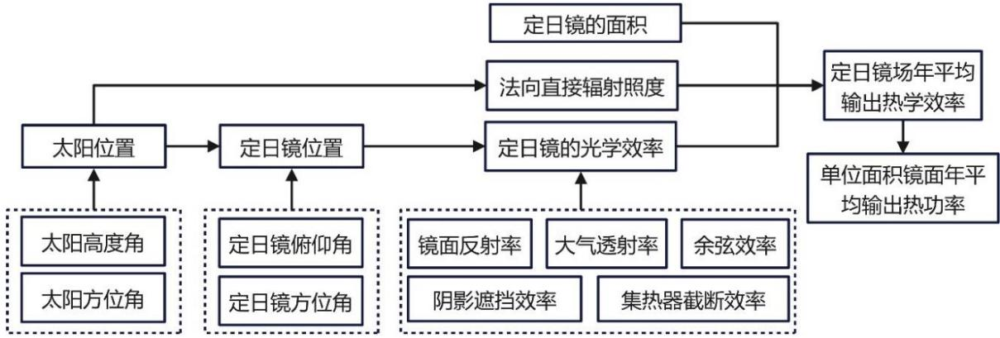  
图 1问题一流程图

## 5.1.1 定日镜场年平均输出热功率模型

## （1）太阳的高度角 $\alpha _ { s }$ 和方位角 $\gamma _ { s }$

随着地球的自转和公转，太阳在一年中各个时刻相对于地面的位置都在不断发生改变，其变化轨迹被称为太阳的视运动轨迹。为了表述的方便，我们通常在地平坐标系下来描述太阳的位置，以正东方向为 轴，正北方向为 轴，垂直于地面向上的方向为 轴建立坐标系，如图 2所示。此时，我们就可以用太阳高度角 $\alpha _ { s }$ 和太阳方位角 $\gamma _ { s }$ 这两个参数来描述太阳的视运动轨迹。

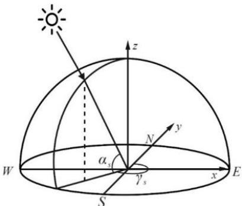  
图 2 地平坐标系示意图

## ①太阳高度角 $\alpha _ { s }$

太阳高度角是指的是太阳到坐标原点的连线与地平面的夹角，通过查阅文献<sup>[1]</sup>，我们得到了太阳高度角的计算公式为：

$$
\sin \alpha _ { s } = \cos \delta \cos \varphi \cos \omega + \sin \delta \sin \varphi\tag{1}
$$

其中， $\alpha _ { s }$ 为太阳高度角，其范围为 $[ 0 , 9 0 ^ { \circ } ]$ ， 为太阳赤纬，即太阳直射纬度， $\varphi$ 为当地纬度， $\omega$ 为太阳时角，即正午时圈到当地时圈的角度。

## ⚫ 太阳赤纬

太阳赤纬即太阳直射纬度，在一年中，太阳直射纬度在南北回归线之间作往返运动，如图3所示，通过查阅文献[2]，我们得到了其计算公式，如下所示：

$$
\sin \delta = \sin { \frac { 2 \pi D } { 3 6 5 } } \sin \left( { \frac { 2 \pi } { 3 6 0 } } 2 3 . 4 5 \right)\tag{2}
$$

其中， $\delta$ 为太阳赤纬，以北纬为正向，其范围为 $[ - 2 3 . 2 6 ^ { \circ } , 2 3 . 2 6 ^ { \circ } ]$ ，当 $\delta > 0$ 时，太阳直射纬度在北半球，当 $| \delta = 0 |$ 时，太阳直射纬度在赤道上，当 $1 \delta < 0$ 时，太阳直射纬度在南半球。 表示当日距离春分日的天数。

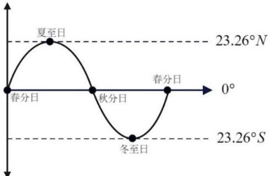  
图 3太阳赤纬在一年中的变化曲线

## ⚫ 太阳时角 $\omega$

太阳时角表示正午时圈到当地时圈的角度，其可以通过当地时间 $| S T$ 与正午 12 点之差求出，其计算公式为：

$$
\omega = \frac { \pi } { 1 2 } \left( S T - 1 2 \right)\tag{3}
$$

其中， $\omega$ 为太阳时角， 为当地时间。太阳时角为 0，说明当地时间为正午，时角为负，说明当地时间是上午，时角为正，说明当地时间是下午。

因此，当我们确定当地纬度、当天日期以及当日的时刻时，我们就可以求出太阳赤纬以及太阳时角，从而求出该地在特定时刻下的太阳高度角。

## ②太阳方位角 $\gamma _ { s }$

太阳方位角指的从正北方向开始沿着地平线顺时针旋转，一直到太阳在地面的投影与坐标原点的连线的角度，在已知太阳高度角、太阳赤纬以及太阳时角时，我们便可以求得太阳方位角，其计算公式如下所示：

$$
\cos \gamma _ { s } = { \frac { \sin \delta - \sin \alpha _ { s } \sin \varphi } { \cos \alpha _ { s } \cos \varphi } }\tag{4}
$$

其中， $\gamma _ { s }$ 为太阳方位角，其范围为 ， $\delta$ 为太阳赤纬， $\alpha _ { s }$ 为太阳高度角，$\varphi$ 为当地纬度。

## （2）定日镜的俯仰角 $\alpha _ { m }$ 和方位角 $\gamma _ { r }$ m

通过上文对太阳高度角和太阳方位角的求解，我们可以得到题目给出的定日镜场所在地点在一年中任意一天任意一时刻太阳所在的位置，又因为定日镜在工作时，控制系统会根据太阳所在的位置对定日镜实行实时控制，通过转动水平转轴和竖直转轴改变定日镜的方位角和俯仰角，从而改变定日镜的法向，使得太阳中心点发出的光线经过定日镜的中心反射后能指向集热器的中心，因此，我们可以通过对太阳中心的入射光线以及指向集热器中心的反射光线进行分析，并结合反射定理，以此求得不同时刻下不同定日镜的法向量，得到定日镜的俯仰角 $\alpha _ { m }$ 和方位角 $\gamma _ { m }$

## ①定日镜场坐标系的建立

在本题中，定日镜场为一个半径 的圆形区域，为了更好地描述太阳、定日镜以及集热器之间的位置关系，我们以圆心为原点，正东方向为 轴正向，正北方向为 轴正向，垂直于地面向上为 轴正向建立坐标系，称为镜场坐标系，显然，该坐标系与上文建立的地平坐标系保持一致。

## ②定日镜中心点的法向量

通过物理光学知识我们知道，当光线在镜面上发生反射时，入射角等于反射角，因此，定日镜中心点的法向量平分入射光线和反射光线之间的夹角，通过对入射光线和反射光线向量的计算我们便可以求得法向量

我们假设在镜场坐标系下某一条入射光线的单位向量为 $\vec { e } _ { i n } \left( x _ { i n } , y _ { i n } , z _ { i n } \right)$ ，由于在确定时刻太阳的高度角 $\alpha _ { s }$ 和方位角 $\gamma _ { s }$ 是确定的，所以 $\vec { e } _ { i n } \left( x _ { i n } , y _ { i n } , z _ { i n } \right)$ 的计算公式为：

$$
\left\{ \begin{array} { l l } { x _ { i n } = - \cos \alpha _ { s } \cos \left( 9 0 ^ { \circ } - \gamma _ { s } \right) } \\ { y _ { i n } = - \cos \alpha _ { s } \sin \left( 9 0 ^ { \circ } - \gamma _ { s } \right) } \\ { z _ { i n } = - \sin \alpha _ { s } } \end{array} \right.
$$

即：

$$
\vec { e } _ { i n } = \left( - \cos \alpha _ { s } \sin \gamma _ { s } , - \cos \alpha _ { s } \cos \gamma _ { s } , - \sin \alpha _ { s } \right)\tag{5}
$$

对于反射光线，由于题目要求入射光线经定日镜中心应反射到集热器中心，因此在定日镜中心和集热器中心的坐标确定时，两者的连线即为反射光线。在本问中，每一块定日镜中心点在镜场坐标系下的坐标已经在附件中给出，我们假设定日镜中心点的坐标为 $( x , y , z )$ ，又由题目可知集热器中心点的坐标为 $( 0 , 0 , H _ { T } )$ ，因此，反射光线的单位向量为：

$$
\vec { e } _ { o u t } = \frac { \left( - x , - y , H _ { T } - z \right) } { \sqrt { x ^ { 2 } + y ^ { 2 } + \left( H _ { T } - z \right) { } ^ { 2 } } }\tag{6}
$$

由此，我们可以推得定日镜中心点的单位法向量 $( e _ { x } , e _ { y } , e _ { z } )$

$$
\vec { e } = \frac { \vec { e } _ { o u t } - e _ { i n } } { | \vec { e } _ { o u t } - \vec { e } _ { i n } | }\tag{7}
$$

## ③定日镜的俯仰角和方位角

通过上述对定日镜中心点法向量的计算，我们便可以通过简单的几何推理得到定日镜的俯仰角和方向角。

## ⚫ 定日镜的俯仰角 $\alpha _ { m }$

定日镜通过水平转轴的转动，其反射镜与水平地面形成的夹角即为定日镜的俯仰角 $\alpha _ { m }$ ，如下图4所示，通过简单的几何推导，我们发现其值与定日镜的法向量与竖直方向形成的夹角相等，若我们已知定日镜中心点的法向量在镜场坐标系下的坐标为$\vec { e } \left( e _ { x } , e _ { y } , e _ { z } \right)$ ，因此，定日镜的俯仰角 $\alpha _ { m }$ 与其法向量 $( e _ { x } , e _ { y } , e _ { z } )$ 的关系为：

$$
\cos \alpha _ { m } = e _ { z }\tag{8}
$$

## ⚫ 定日镜的方位角 $\gamma _ { m }$

定日镜通过纵向转轴的转动，其法向量在水平面的投影与正北方向的夹角即为定日镜的方位角 $\gamma _ { m }$ ，如图 5所示，同样地，若我们已知定日镜中心点的法向量在镜场坐标系下的坐标为 $\vec { e } \left( e _ { x } , e _ { y } , e _ { z } \right)$ ，那么定日镜的方位角 $\alpha _ { m }$ 与其法向量 $\vec { e } \left( e _ { x } , e _ { y } , e _ { z } \right)$ 的关系为：

$$
\tan \gamma _ { m } = \frac { e _ { x } } { e _ { y } }\tag{9}
$$

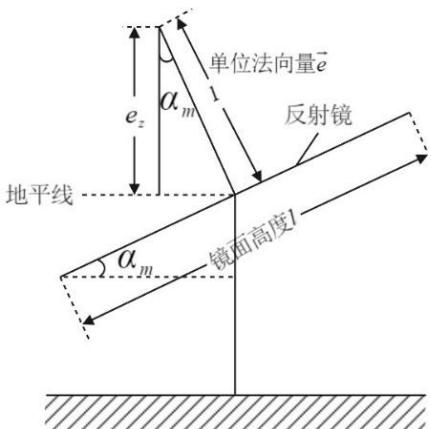  
图 4 定日镜的俯仰角示意图

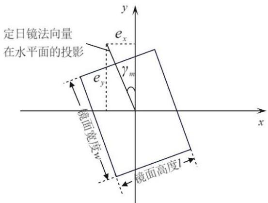  
图 5定日镜的方位角示意图

## （3）定日镜场的年平均光学效率

定日镜的光学效率 $\eta$ 是综合衡量定日镜场工作性能的重要指标，其反映的是在排除各项影响因素之后定日镜实际能反射到集热器上的能量与其理论上能接收到的最大太阳能之比<sup>[2]</sup>，其值受到多个因素的影响，包括阴影遮挡效率 $\eta _ { s b }$ 、余弦效率 $\eta _ { \mathrm { c o s } }$ 大气透射率 $\eta _ { a t }$ 、集热器截断效率 $\eta _ { t r u n c }$ 以及镜面反射率 $\eta _ { r e f }$ 等，具体的计算公式如下所示：

$$
\eta = \eta _ { s b } \eta _ { \mathrm { c o s } } \eta _ { a t } \eta _ { t r u n c } \eta _ { r e f }\tag{10}
$$

## ①镜面反射率 $\eta _ { r e f }$

镜面反射率与镜面的材料及清洁程度等因素有关，通过查阅资料可知，在大多数

情况下，镜面反射率可取为一个常数，我们取其值为 0.92，即：

$$
\eta _ { r e f } = 0 . 9 2\tag{11}
$$

## ②大气透射率 $\mathbf { \nabla } \cdot \eta _ { a t }$

由于光线在大气中传播时，可能受到大气成分和水汽含量的影响，导致一定程度上的能量衰减，通过查阅文献，大气透射率与镜面中心到集热器中心的距离 $d _ { H R }$ 有关，其计算公式为：

$$
\eta _ { a t } = 0 . 9 9 3 2 1 - 0 . 0 0 0 1 1 7 6 d _ { H R } + 1 . 9 7 \times 1 0 ^ { - 8 } \times d _ { H R } ^ { 2 } ~ \left( d _ { H R } \leqslant 1 0 0 0 \right)\tag{12}
$$

## ③余弦效率

入射光线倾斜入射到定日镜所在平面时，与定日镜中心法线存在着夹角 ，如图6所示，当 $\theta$ 不为0时会产生一定的能量损失，即为余弦损失 ，减去这部分损失的能量之后即为余弦效率，其计算公式如下所示：

$$
\eta _ { \mathrm { { c o s } } } = \cos \theta\tag{13}
$$

因此，当入射光线与法线的夹角越大时，余弦效率越低，反之，余弦效率越高。

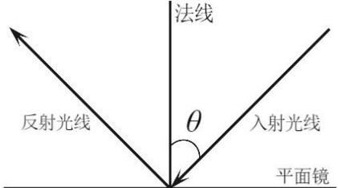  
图 6 余弦效率计算的示意图

通过第（2）小节中的求解，我们知道了定日镜的单位法向量为 以及入射光线的单位向量 $\vec { e } _ { i n }$ ，因此，夹角 的余弦值 $\cos \theta = - \vec { e } _ { i n } \cdot \vec { e }$ ，从而可以求得余弦效率。

## ④阴影遮挡效率 $\eta _ { s b }$

阴影遮挡的损失主要包括两个部分：吸收塔与集热器的阴影对太阳光线的遮挡以及前排定日镜对后排定日镜的遮挡，我们对其进行分开考虑。

## ⚫ 吸收塔与集热器的遮挡区域面积

我们假设吸收塔与集热器构成一个完整的圆柱体，其高为吸收塔的高度 $H _ { t }$ 加上集热器的高度 $H _ { r }$ ，底面直径即为集热器的的直径 ，在任意时刻，规则圆柱体的影子永远为一矩形，该矩形的长为由圆柱高度和太阳高度角决定，如图7所示，矩形的宽即为圆柱体的底面直径。因此，吸收塔与集热器的阴影区域面积 $S _ { t }$ 的计算公式如下：

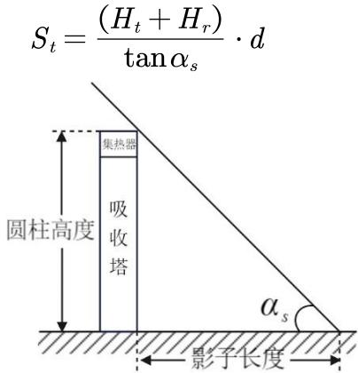  
图 7吸收塔与集热器的影子长度

该面积与圆形定日镜场的总面积之比即为吸收塔与集热器的阴影造成的遮挡损失比 $\eta _ { s b 1 }$ ，即：

$$
\eta _ { s b 1 } = \frac { S _ { t } } { S _ { t j \astrosun } ^ { \ast \astrosun } } = \frac { ( H _ { t } + H _ { r } ) d } { \tan \alpha _ { s } \cdot S _ { t j \astrosun } ^ { \ast \ast } }
$$

## ⚫ 定日镜的遮挡区域面积 $S _ { m }$

场地中任意定日镜都可能受到前排定日镜对其产生的遮挡，遮挡情况主要分为两种，如图8所示，一种情况是前排定日镜B 在阳光照射下产生阴影，其阴影在后排定日镜 A 上的投影即为入射光线的遮挡区域，另一种情况是经后排定日镜 A 反射的光线被前排定日镜B 阻挡，该区域称为反射光线遮挡区域。

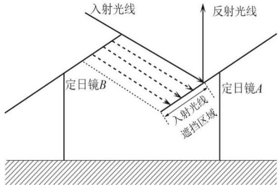  
（a）对入射光线的遮挡

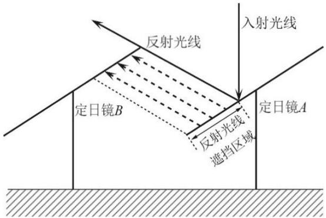  
（b）对反射光线的遮挡  
图 8 定日镜遮挡的两种情况

## i）入射遮挡区域 $S _ { m }$ 1

我们假设定日镜 B 投影在定日镜 A 上的遮挡区域都为规则的矩形，在求解入射遮挡区域时，我们需要知道遮挡区域的四个顶点在定日镜A上的坐标，为了便于计算，我们需要进行多次的坐标变换，具体的求解流程图如下所示：

  
图 9求解入射遮挡区域的流程图

## 镜面直角坐标系：

我们对造成遮挡的定日镜 的四个顶点沿入射光线向定日镜 所在平面 $S _ { A }$ 投影，以确定入射遮挡区域 $S _ { m 1 }$ 。为了后续计算的方便，我们建立如下镜面直角坐标系：对于任意一块平面反射镜，以平面镜的中心为坐标原点，过原点的法向量为 轴正向，过原点垂直于俯仰轴偏东为 轴正向，过原点平行于俯仰轴偏北为 轴正向，如下图 10所示：

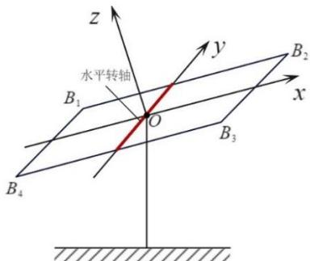  
图 10 镜面坐标系示意图

则对于定日镜 而言，其四个顶点在镜面坐标系下的坐标分别为：

$$
P _ { \scriptscriptstyle B n } = \left\{ \begin{array} { l l } { { \displaystyle \left( - \frac { l } { 2 } , \frac { w } { 2 } , 0 \right) ^ { T } } } & { { \mathrm { , ~ } n = 1 } } \\ { { \displaystyle \left( \frac { l } { 2 } , \frac { w } { 2 } , 0 \right) ^ { T } } } & { { \mathrm { , ~ } n = 2 } } \\ { { \displaystyle \left( \frac { l } { 2 } , - \frac { w } { 2 } , 0 \right) ^ { T } } } & { { \mathrm { , ~ } n = 3 } } \\ { { \displaystyle \left( - \frac { l } { 2 } , - \frac { w } { 2 } , 0 \right) ^ { T } } } & { { \mathrm { , ~ } n = 4 } } \end{array} \right.
$$

其中， 为定日镜 的镜面高度， 为定日镜 的镜面宽度。

此外，我们还需要建立镜面坐标系与镜场坐标系之间的转换关系，以此求得这四个顶点在镜场坐标系下的坐标。对于一个俯仰角为 $\alpha _ { m }$ 、方位角为 的定日镜而 $\gamma _ { m }$ 言，其镜面坐标系只需要先绕 轴逆时针旋转 $9 0 ^ { \circ } - \alpha _ { m }$ ，再绕 轴逆时针旋转 $\gamma _ { m }$ ，加上对应的平移向量即可得到镜场坐标系。由此我们可以求得 $P _ { B n }$ 在镜场坐标系下的坐标 $V _ { B n }$ ：

$$
V _ { B n } = R _ { Z } \cdot R _ { X } \cdot \left( \begin{array} { c c c } { { x _ { n } } } \\ { { y _ { n } } } \\ { { z _ { n } } } \end{array} \right) + C _ { B } = \left( \begin{array} { c c c } { { \cos { \gamma _ { m } } } } & { { \sin { \gamma _ { m } } \sin { \alpha _ { m } } } } & { { - \sin { \gamma _ { m } } \cos { \alpha _ { m } } } } \\ { { - \sin { \alpha _ { m } } } } & { { \cos { \gamma _ { m } } \sin { \alpha _ { m } } } } & { { - \cos { \gamma _ { m } } \cos { \alpha _ { m } } } } \\ { { 0 } } & { { \cos { \alpha _ { m } } } } & { { \sin { \alpha _ { m } } } } \end{array} \right) P _ { B n } + C _ { B }\tag{14}
$$

其中，其中， ， $\alpha _ { m }$ 为定日镜的俯仰角， $\gamma _ { m }$ 为定日镜的方位角， $C _ { B }$ 为定日镜 的中心点在镜场坐标系下的坐标， $R _ { Z }$ 为坐标轴绕 轴旋转产生的旋转矩阵， $R _ { X }$ 为坐标轴绕 轴旋转产生的旋转矩阵。

## 空间方程：

对于过四个顶点的太阳入射光线的单位向量 $\vec { e } _ { i n }$ 已知，且过点 $V _ { B n }$ ，其直线方程为：

$$
\frac { x - x _ { B n } ^ { \prime } } { \cos \alpha _ { s } \sin \gamma _ { s } } = \frac { y - y _ { B n } ^ { \prime } } { \cos \alpha _ { s } \cos \gamma _ { s } } = \frac { z - z _ { B n } ^ { \prime } } { \sin \alpha _ { s } }
$$

对于定日镜 所在的平面 $S _ { A }$ ，假设其单位法向量为 $\vec { e } _ { A } = ( a _ { A } , b _ { A } , c _ { A } )$ ，且过定日镜中$\iota \dot { \mathsf { L } } \mathsf { C } _ { A } ( x _ { A } , y _ { A } , z _ { A } )$ ，则其平面方程为：

$$
a _ { A } \left( x - x _ { A } \right) + b _ { A } \left( y - y _ { A } \right) + c _ { A } \left( z - z _ { A } \right) = 0
$$

## 遮挡区域：

通过联立直线方程和平面方程，可以求解 $V _ { B n }$ 沿着光线方向在平面 $S _ { A }$ 上的投影点$T _ { B n } \left( x _ { B n } ^ { t } , y _ { B n } ^ { t } , z _ { B n } ^ { t } \right)$ ，即：

$$
\left\{ \begin{array} { c } { { \displaystyle { \frac { x - x _ { B n } ^ { \prime } } { \cos \alpha \sin \gamma } } = { \frac { y - y _ { B n } ^ { \prime } } { \cos \alpha \cos \gamma } } = { \frac { z - z _ { B n } ^ { \prime } } { \sin \gamma } } } } \\ { { a _ { A } ( x - x _ { A } ) + b _ { A } ( y - y _ { A } ) + c _ { A } ( z - z _ { A } ) = 0 } } \end{array} \right.
$$

然后，我们将求解得到的 $T _ { B n }$ 进行坐标系转换，从地面坐标系转换成定日镜 所在平面镜的坐标系，即：

$$
T _ { B n } ^ { \prime } = \left( \begin{array} { c c c c c } { { x _ { B n } ^ { i } { } ^ { \prime } } } \\ { { y _ { B n } ^ { i } { } ^ { \prime } } } \\ { { z _ { B n } ^ { t } { } ^ { \prime } } } \end{array} \right) = \left( \begin{array} { c c c c c } { { \cos { \gamma _ { A } } } } & { { - \sin { \gamma _ { A } } } } & { { 0 } } \\ { { \sin { \alpha _ { A } } \sin { \gamma _ { A } } } } & { { \sin { \alpha _ { A } } \cos { \gamma _ { A } } } } & { { \cos { \alpha _ { A } } } } \\ { { - \cos { \alpha _ { A } } \sin { \gamma _ { A } } } } & { { - \cos { \alpha _ { A } } \cos { \gamma _ { A } } } } & { { \sin { \alpha _ { A } } } } \end{array} \right) ( T _ { B n } - C _ { A } )
$$

$\boldsymbol { T _ { B n } ^ { \prime } }$ 即为定日镜B 在镜面A的坐标系下对其产生的入射遮挡区域的顶点坐标，如图11所示：

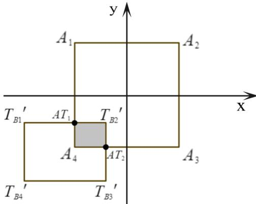  
图 11定日镜 B对定日镜 A的入射遮挡区域

其中， $P _ { A n }$ 为定日镜 的四个顶点在镜面 A 坐标系下的坐标， $A T _ { 1 }$ 和 $A T _ { 2 }$ 分别为$T _ { B 1 } ^ { \prime } T _ { B 2 } ^ { \prime }$ 与 $P _ { A 1 } P _ { A 4 }$ 和 $T _ { B 2 } ^ { \prime } T _ { B 3 } ^ { \prime }$ 与 $P _ { A 3 } P _ { A 4 }$ 的交点。则定日镜 B 在定日镜A上的入射遮挡区域$S _ { m 1 }$ 即为图中阴影部分，其顶点坐标为：

$$
\left\{ \begin{array} { l l } { \displaystyle A T _ { 1 } \Big ( - \frac { l } { 2 } , y _ { B n } ^ { t } , 0 \Big ) } \\ { \displaystyle T _ { B 2 } ^ { \prime } \big ( x _ { B n } ^ { t } , y _ { B n } ^ { t } , 0 \big ) } \\ { \displaystyle A T _ { 2 } \Big ( x _ { B n } ^ { t } , - \frac { w } { 2 } , 0 \Big ) } \\ { \displaystyle P _ { A 4 } \Big ( - \frac { l } { 2 } , - \frac { w } { 2 } , 0 \Big ) } \end{array} \right.
$$

## ii）反射遮挡区域 $S _ { m 2 }$

与入射遮挡区域的求解类似类似，我们再对定日镜 B 沿反射光线的方向进行投影。由于已知入射光线的单位向量 $\vec { e } _ { i n }$ 以及定日镜 B 的单位法向量 $\vec { e } _ { b }$ ，我们可以通过数学推导得到反射光线的单位向量 $\vec { e } _ { o u t }$ ，其公式如下：

$$
\vec { e } _ { o u t } = 2 ( \vec { e } _ { b } \cdot \vec { e } _ { i n } ) \times \vec { e } _ { i n } - \vec { e } _ { b } = ( a _ { o u t } , b _ { o u t } , c _ { o u t } )\tag{15}
$$

那么反射光线的方程为：

$$
{ \frac { x - { x _ { B n } } ^ { \prime } } { a _ { o u t } } } = { \frac { y - { y _ { B n } } ^ { \prime } } { b _ { o u t } } } = { \frac { z - { z _ { B n } } ^ { \prime } } { c _ { o u t } } }
$$

接下来便采取与入射时同样的步骤，即可求得 $V _ { B n }$ 在反射光线方向上的投影点$K _ { B n } ( x _ { B n } ^ { k } , y _ { B n } ^ { k } , z _ { B n } ^ { k } )$ 以及在镜面 A坐标系下的坐标 $K _ { B n } ^ { \prime } \left( x _ { B n } ^ { k } , y _ { B n } ^ { k } , z _ { B n } ^ { k } , \right)$ ,如图 12 所示：

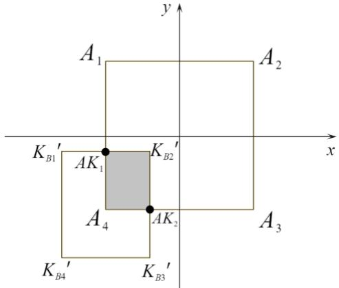  
图 12 定日镜 B对定日镜 A的反射遮挡区域

定日镜B 在定日镜 A上的出射遮挡区域 $S _ { m 2 }$ 即为图中阴影部分，其四个顶点坐标为：

$$
\left\{ \begin{array} { l l } { \displaystyle A K _ { 1 } \Big ( - \frac { l } { 2 } , y _ { n } ^ { k \prime } , 0 \Big ) } \\ { \displaystyle K _ { B 2 } ^ { \prime } \big ( x _ { n } ^ { k \prime } , y _ { n } ^ { k \prime } , 0 \big ) } \\ { \displaystyle A K _ { 2 } \Big ( x _ { n } ^ { k \prime } , - \frac { w } { 2 } , 0 \Big ) } \\ { \displaystyle P _ { A 4 } \Big ( - \frac { l } { 2 } , - \frac { w } { 2 } , 0 \Big ) } \end{array} \right.
$$

## iii)离散化处理定日镜 A

由于入射光线的遮挡区域和反射光线的遮挡区域可能存在重叠，导致遮挡区域的总面积难以求解，因此我们考虑对被遮挡的定日镜 A进行离散化处理，统计其中位于遮挡区域内的点。

我们将定日镜A 的镜面高度和镜面宽度按步长 $\varDelta x$ 和 $\varDelta y$ 划分成为 行 列的网格，示意图如图13所示，总计 $I \times J$ 个离散点，对于其中任意一个离散点 $P _ { i j }$ ，其在定日镜A的镜面坐标系下的坐标为：

$$
\left( { \pmb x } _ { i j } \right) = \left( \begin{array} { c } { { { \displaystyle - \frac { l } { 2 } + i \Delta x } } } \\ { { { \displaystyle - \frac { w } { 2 } + i \Delta y } } } \\ { { 0 } } \end{array} \right)
$$

通过遍历 和 $j$ ，其中位于入射遮挡区域 $S _ { m 1 }$ 和反射遮挡区域 $S _ { m 2 }$ 的点的集合分别  
为 $Z _ { m 1 }$ 和 $Z _ { m 2 }$ ，取二者并集 $Z _ { m } = Z _ { m 1 } \cup Z _ { m 2 }$ ，即得到了定日镜 B 对定日镜 A 总遮挡面积  
包含的离散点的个数 $N _ { B }$ ，其与离散点总个数 $I \times J$ 的比值 $n _ { s b 2 }$ 即为定日镜的遮挡损失比，即：

$$
n _ { s b 2 } = \frac { N _ { B } } { I \times J }
$$

综上所述，阴影遮挡效率即为：

$$
\eta _ { s b } = 1 - n _ { s b 1 } - n _ { s b 2 } = 1 - \frac { ( H _ { t } + H _ { r } ) d } { \tan \alpha _ { s } \cdot S _ { z z i g } } - \frac { N _ { B } } { I \times J }\tag{16}
$$

通过遍历所有定日镜 A以及可能对其造成阴影遮挡的定日镜B，分别计算器阴影遮挡效率，然后求和取平均即可求出镜场整体的阴影遮挡损失。

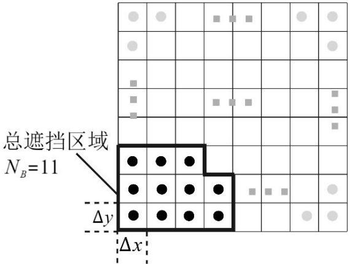  
图 13 离散化及遮挡区域计算的示意图

## ⑤集热器截断效率 $\eta _ { t r u n c }$

由于太阳入射光并非完美的平行光，而是具有一定锥形角的一束锥形光线，通过查阅文献可知[3]，该锥形角约为 ，因此，其反射光线也为一锥形光线，随着距离的增加，锥形光线的横截面不断变大，最后到达集热器时有可能成为一个巨大的锥形光斑，超过了集热器的吸收范围，造成了能量的溢出，进而影响了截断效率，如图14所示，

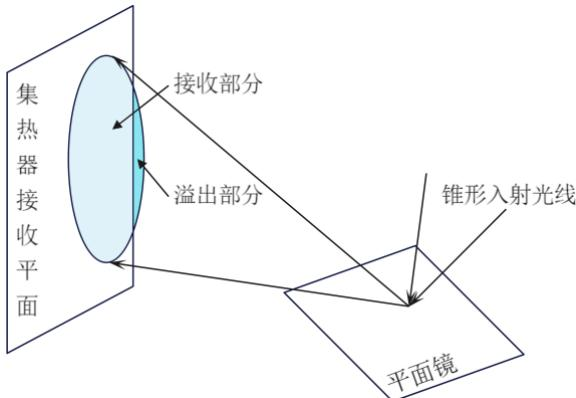  
图 14锥形光线示意图

由题可知，截断效率的计算公式为：

$$
\eta _ { t r u n c } = \frac { Q _ { r e c } } { Q _ { a l l } - Q _ { s b } }
$$

其中， $Q _ { r e c }$ 为集热器接收能量， $Q _ { a l l }$ 为镜面全反射能量， $Q _ { s b }$ 为阴影遮挡损失能量。

为了简化计算，我们假设所有反射光线携带的能量相同且等于 $q _ { 0 }$ ，集热器接收的光线个数为 $n _ { r e c }$ ，镜面反射的光线个数为 $n _ { a l l }$ ，阴影遮挡的光线个数为 $n _ { s b }$ ，则 $Q _ { r e c } = n _ { r e c } q _ { 0 }$ $Q _ { a l l } = n _ { a l l } q _ { 0 } , Q _ { s b } = n _ { s b } q _ { 0 }$ ，代入集热器截断效率的计算公式可得：

$$
\eta _ { t r u n c } = \frac { n _ { r e c } } { n _ { a l l } - n _ { s b } }\tag{17}
$$

由上式可知，若要计算集热器的截断效率，我们就需要去统计集热器接收的光线个数 $n _ { r e c }$ 、镜面反射的光线个数 $n _ { a l l }$ 以及阴影遮挡的光线个数 $n _ { s b }$ 。由于入射锥形光线在定日镜上的落点不确定，以及光线在锥形范围内的位置不确定，所以我们采取光线追迹法对光线进行追踪。我们选取了大量光线照射任意一块定日镜 C，之后统计被阴影遮挡的光线个数和集热器接收到的光线个数。

## ⚫ 锥形光束中入射光线的单位向量 $\vec { e } _ { i n - s h i f t }$

对于任意一组入射到定日镜 C 上的锥形光束，其中心的入射光线与水平地面的夹角即为太阳高度角，为了对锥形光束中的随机入射光线的进行分析，我们建立以锥形入射光线在平面镜的落点为坐标原点、以中心入射光线的反方向为 轴正向、以过原点垂直于俯仰轴偏东为 轴正向，以过原点垂直于 $x O z$ 向上为 轴正向，建立入射光线坐标系，如图15所示。

在入射光线坐标系下，对于锥形光束内任意一条入射光线，其方向可以由径向角$\gamma _ { t }$ 和切向角 $\alpha _ { t }$ 表示，切向角的范围为 。锥形光束内任意一条入射光线的单位向量 $\vec { e } _ { i n - s h i f t }$ 为 $( - \sin \alpha _ { t } \sin \gamma _ { t } , - \sin \alpha _ { t } \cos \gamma _ { t } , - \cos \alpha _ { t } ) ^ { T }$ ，通过坐标系转换，我们可以将入射向量在入射坐标系下的坐标转换为地面坐标系下的坐标 $\vec { e } ^ { \prime } _ { i n - s h i f t }$ ，即：

$$
\vec { e } ^ { \prime } { } _ { i n - s h i f t } = \left( \begin{array} { c } { a _ { i n s } ^ { \prime } } \\ { b _ { i n s } ^ { \prime } } \\ { c _ { i n s } ^ { \prime } } \end{array} \right) = \left( \begin{array} { c c c } { \cos \gamma _ { s } } & { \ \sin \gamma _ { s } \sin \alpha _ { s } } & { - \sin \gamma _ { s } \cos \alpha _ { s } } \\ { - \sin \alpha _ { s } } & { \ \cos \gamma _ { s } \sin \alpha _ { s } } & { - \cos \gamma _ { s } \cos \alpha _ { s } } \\ { 0 } & { \ \cos \alpha _ { s } } & { \ \sin \alpha _ { s } } \end{array} \right) \vec { e } _ { i n - s h i f t }
$$

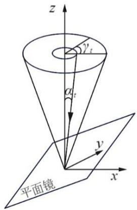  
图 15 入射光线坐标系示意图

## ⚫ 锥形光束中反射光线的直线方程

对于定日镜C，其中心点坐标为 $C _ { C } \left( x _ { C } , y _ { C } , z _ { C } \right)$ ，单位法向量为 $\vec { e } _ { c } = \left( a _ { c } , b _ { c } , c _ { c } \right)$ ，我们假设锥形光束中的随机入射光线的落点 $P _ { i }$ 在镜面C 坐标系下的坐标为 $( x _ { p i } , y _ { p i } , z _ { p i } )$ ，通过坐标变换我们可以得到其在地面坐标系下的坐标 $P _ { i } ^ { \prime } ( x _ { \mathit { \Pi } _ { p i } } ^ { \prime } , y _ { \mathit { \Pi } _ { p i } } ^ { \prime } , z _ { \mathit { \Pi } _ { p i } } ^ { \prime } )$ 。即：

$$
P _ { i } ^ { \prime } = \left( { \begin{array} { c } { { x ^ { \prime } { } _ { p i } } } \\ { { y ^ { \prime } { } _ { p i } } } \\ { { z ^ { \prime } { } _ { p i } } } \end{array} } \right) = \left( { \begin{array} { c c c } { { \cos \gamma _ { c } } } & { { \sin \gamma _ { c } \sin \alpha _ { c } } } & { { - \sin \gamma _ { c } \cos \alpha _ { c } } } \\ { { - \sin \alpha _ { c } } } & { { \cos \gamma _ { c } \sin \alpha _ { c } } } & { { - \cos \gamma _ { c } \cos \alpha _ { c } } } \\ { { 0 } } & { { \cos \alpha _ { c } } } & { { \sin \alpha _ { c } } } \end{array} } \right) P _ { i } + C _ { c }
$$

与前文类似，我们可以将入射光线的单位向量以及平面镜的法向向量通过式（15）求出反射光线的单位向量 $\vec { e } _ { o u t - s h i f t } = ( a _ { o u t s } , b _ { o u t s } , c _ { o u t s } )$ ，由因为反射光线经过落点 $P _ { i } ^ { \prime }$ ，则锥形光束中反射光线的方程为：

$$
{ \frac { x - { x ^ { \prime } } _ { p i } } { a _ { o u t s } } } = { \frac { y - { y ^ { \prime } } _ { p i } } { b _ { o u t s } } } = { \frac { z - { z ^ { \prime } } _ { p i } } { c _ { o u t s } } }\tag{18}
$$

## ⚫ 集热器接收范围 $D _ { R }$ 所在的平面方程

集热器是一个位于塔顶的圆柱体，由于圆柱的底面被塔遮挡，所以不考虑该圆柱的顶面和底面受到的光线，集热器接收锥形反射光线的范围 $D _ { R }$ 仅为集热器圆柱外表面的曲面，即：

$$
\left\{ \begin{array} { l l } { \displaystyle x ^ { 2 } + y ^ { 2 } = \left( \frac d 2 \right) ^ { 2 } } \\ { \displaystyle H _ { T } - \frac 1 2 l _ { T } \leqslant z \leqslant H _ { T } + \frac 1 2 l _ { T } } \end{array} \right.\tag{19}
$$

其中， $H _ { T }$ 为集热器中心点的高度， $l _ { T }$ 为集热器的高， 为集热器的直径。

## ⚫ 判断集热器是否接收反射光线

我们联立反射光线的方程和集热器接受范围的方程，并对该联立方程组是否有解进行判别，通过数学推导，我们得到了判别式如下：

$$
\left\{ \begin{array} { c } { \Delta = 4 ( a _ { o u t s } x ^ { \prime } { _ { p i } } + b _ { o u t s } y ^ { \prime } { _ { p i } } ) ^ { 2 } - 4 ( a _ { o u t s } + b _ { o u t s } ) ( { x ^ { \prime } } { _ { p i } } ^ { 2 } + { y ^ { \prime } } { _ { p i } } ^ { 2 } - R ^ { 2 } ) } \\ { \displaystyle \frac { H _ { T } - \frac { 1 } { 2 } l _ { T } - { z ^ { \prime } } { _ { p i } } } { c _ { o u t s } } \leqslant \frac { - \left( a _ { o u t s } x ^ { \prime } { _ { p i } } + b _ { o u t s } { y ^ { \prime } } { _ { p i } } \right) \pm \sqrt { \Delta } } { 2 \left( a _ { o u t s } + b _ { o u t s } \right) } \leqslant \frac { H _ { T } + \frac { 1 } { 2 } l _ { T } - { z ^ { \prime } } { _ { p i } } } { c _ { o u t s } } } \end{array} \right.\tag{20}
$$

若满足以上条件，则说明方程组有解，集热器吸收了反射光线，若不满足，则说明方程组无解，集热器没有吸收到反射光线。

## ⚫ 计算截断效率 $\eta _ { t r u n c }$

我们随机选取 $n _ { a l l }$ 条光锥光束内的入射光线，统计其中被集热器接收到的光线的个数为 $n _ { r e c }$ 以及位于阴影遮挡区域的个数为 $n _ { s b }$ ，则截断效率 $\eta _ { t r u n c }$ 为：

$$
\eta _ { t r u n c } = \frac { n _ { r e c } } { n _ { a l l } - n _ { s b } }
$$

## ⑥年平均光学效率 $\overline { { \eta } }$

通过上述对阴影遮挡效率 、余弦效率 、大气透射率 、集热器截断效率 $\eta _ { s b }$ $\eta _ { \mathrm { c o s } }$ $\eta _ { a t }$ $\eta _ { t r u n c }$ 以及镜面反射率 $\eta _ { r e f }$ 等的计算，我们可以求得每一块定日镜的光学效率 $\eta$ ，则该定日镜场的年平均光学效率 $\overline { { \eta } }$ 的计算公式为：

$$
\displaystyle \overline { { \eta } } = \frac { \sum _ { i = 1 } ^ { 1 2 } \sum _ { j = 1 } ^ { 5 } \sum _ { k = 1 } ^ { N } \eta _ { i j k } } { 6 0 N }\tag{21}
$$

其中， 表示月份， $j$ 表示一天中五个特定的时刻， 表示定日镜的总个数。

## （4）定日镜场的年平均输出热功率 $E _ { f i e l d }$ 及单位面积镜面年平均输出热功率 $E$ u

定日镜场的发电原理是通过集热器吸收经定日镜反射的光线从而将光能转化成热能，并进一步转换成电能，整个定日镜场在某一时刻下的输出热功率 $E _ { f i e l d }$ 的计算公式如下：

$$
E _ { f i e l d } = D N I \cdot \sum _ { k = 1 } ^ { N } A _ { k } \eta _ { k }\tag{22}
$$

其中， $E _ { f i e l d }$ 表示在某一时刻下整个定日镜场的输出热功率， 表示法向直接辐射辐照度， $A _ { k }$ 表示第 面定日镜的采光面积，即定日镜的镜面高度乘上镜面宽度， $\eta _ { k }$ 表示第 面定日镜在该时刻下的光学效率， 表示定日镜的总数目。

## ①法向直接辐射辐照度

法向直接辐射辐照度指的是在地球上垂直于太阳光线的平面在单位面积以及单位时间内接收到的太阳辐射能量，其近似计算公式如下所示：

$$
\begin{array}{c} \begin{array} { r } { \left\{ { D N I } { = G _ { 0 } } \Big [ a + b \exp \Big ( { - \frac { c } { \sin \alpha _ { s } } } \Big ) \Big ] \right.} \\ { a { = } 0 . 4 2 3 7 - 0 . 0 0 8 2 1 ( 6 - H ) ^ { 2 } } \\ { b { = } 0 . 5 0 5 5 + 0 . 0 0 5 9 5 ( 6 . 5 - H ) ^ { 2 } } \\ { c { = } 0 . 2 7 1 1 + 0 . 0 1 8 5 8 ( 2 . 5 - H ) ^ { 2 } } \end{array}   \end{array}\tag{23}
$$

其中， 表示法向直接辐射辐照度， $G _ { 0 }$ 表示太阳常数，其取值为一定值：$1 . 3 6 6 k W / m ^ { 2 }$ ， 为当地的海拔高度，单位为 。

②采光面积 $A _ { k }$

对于每一块定日镜而言，其采光面积即为镜面高度 $l _ { k }$ 乘上镜面宽度 $w _ { k }$

$$
A _ { k } = l _ { k } \cdot w _ { k }\tag{24}
$$

通常而言，定日镜的镜面高度不大于镜面宽度，但在本问中，每一面定日镜的镜面高度都与镜面宽度相等，其值都为 ，且所有定日镜的尺寸均相同。

## ③年平均输出热功率 $E _ { f i e l d }$

通过式（22），我们可以求得某一时刻下定日镜场的输出热功率，通过对题目所要求的每月 21 日 5 个特定时刻所有定日镜的输出热功率的求解，再求和取平均，我们即可得到该定日镜场的年平均输出热功率 $\overline { { E } } _ { f i e l d }$ ，其计算公式如下所示：

$$
\overline { { E } } _ { f i e l d } = \frac { \displaystyle \sum _ { i = 1 } ^ { 1 2 } \sum _ { j = 1 } ^ { 5 } \sum _ { k = 1 } ^ { N } D N I _ { i j } \cdot A _ { k } \cdot \eta _ { i j k } } { 6 0 }\tag{25}
$$

其中， $D N I _ { i j }$ 表示第 月 21 日的第 $j$ 个时刻的法向直接辐射照度， $\eta _ { i j k }$ 表示第 月21 日的第 $j$ 个时刻下第 面定日镜的光学效率， $A _ { k }$ 表示第 面定日镜的面积， 为定日镜的总数。

## ④单位面积镜面年平均输出热功率 $E .$ u

在年平均输出热功率的基础上，只需要除以所有定日镜的面积总和即可得到单位面积镜面年平均输出热功率，又因为本问中所有定日镜的尺寸相同，因此表达式可以写成如下形式：

$$
\overline { { E } } _ { u } = \frac { \overline { { E } } _ { f i e l d } } { \displaystyle \sum _ { k = 1 } ^ { N } A _ { k } } = \frac { \displaystyle \sum _ { i = 1 } ^ { 1 2 } \sum _ { j = 1 } ^ { 5 } \sum _ { k = 1 } ^ { N } D N I _ { i j } \cdot A _ { k } \cdot \eta _ { i j k } } { 6 0 \cdot N \cdot A _ { k } } = \frac { \displaystyle \sum _ { i = 1 } ^ { 1 2 } \sum _ { j = 1 } ^ { 5 } \sum _ { k = 1 } ^ { N } D N I _ { i j } \cdot \eta _ { i j k } } { 6 0 N }\tag{26}
$$

## 5.1.2 模型的求解

通过把题目提供的数据代入到问题一建立的模型里，我们可以直接求得太阳高度角、太阳方位角、定日镜俯仰角以及定日镜方位角等，唯一我们无法直接求得的是集热器的截断效率，因为截断效率需要我们随机给出锥形光线来进行计算，因此我们采用蒙特卡洛算法来计算集热器的截断效率。

## （1）蒙特卡洛算法求集热器截断效率

## 算法步骤

## Step1：生成随机入射光线向量

对于锥形入射光线，由于其切向角不超过 $4 . 3 \times 1 0 ^ { - 3 }$ ，故我们在其范围内随机 生成一条入射光线向量。

## Step2：生成随机反射点，确定反射光线方程

我们在当前的定日镜上随机取一点作为反射点，通过问题一模型我们可以算出该定日镜平面的法向量，结合 Step1 生成的入射光线向量，我们可以求解出在该点的反射光线方程。

## Step3：判断是否相交

我们将集热器的曲面方程与反射光线方程联立，通过有无实数解可以判断该反射光线是否落在集热器上。

## Step4：计算频率，近似概率

重复上述Step1\~Step3操作10000次，计算出相交次数 ， 即为该定日镜的截断效率。

## （2）求解结果及分析

通过MATLAB 求解，我们计算出了每月 21日平均光学效率及输出功率以及年平均光学效率及输出功率，如下表1、表2所示。

表 1 问题一每月 21日平均光学效率及输出功率
<table><tr><td>日期</td><td>平均光学 效率</td><td>平均余弦 效率</td><td>平均阴影 遮挡效率</td><td>平均截断 效率</td><td>单位面积镜面平均输 出热功率(kW/m²)</td></tr><tr><td>1月21 日</td><td>0.5898</td><td>0.7227</td><td>0.9877</td><td>0.9307</td><td>0.5124</td></tr><tr><td>2月21日</td><td>0.6110</td><td>0.7436</td><td>0.9949</td><td>0.9303</td><td>0.5755</td></tr><tr><td>3 月21日</td><td>0.6309</td><td>0.7647</td><td>0.9984</td><td>0.9308</td><td>0.6272</td></tr><tr><td>4 月 21 日</td><td>0.6503</td><td>0.7832</td><td>1.0000</td><td>0.9352</td><td>0.6689</td></tr><tr><td>5 月 21 日</td><td>0.6631</td><td>0.7934</td><td>1.0000</td><td>0.9415</td><td>0.6926</td></tr><tr><td>6 月 21 日</td><td>0.6679</td><td>0.7965</td><td>1.0000</td><td>0.9445</td><td>0.7006</td></tr><tr><td>7月 21 日</td><td>0.6630</td><td>0.7933</td><td>1.0000</td><td>0.9414</td><td>0.6923</td></tr><tr><td>8月21日</td><td>0.6495</td><td>0.7825</td><td>1.0000</td><td>0.9349</td><td>0.6673</td></tr><tr><td>9月21日</td><td>0.6301</td><td>0.7636</td><td>0.9983</td><td>0.9309</td><td>0.6249</td></tr><tr><td>10月21日</td><td>0.6085</td><td>0.7409</td><td>0.9942</td><td>0.9304</td><td>0.5683</td></tr><tr><td>11月21日</td><td>0.5878</td><td>0.7209</td><td>0.9869</td><td>0.9305</td><td>0.5063</td></tr><tr><td>12月21日</td><td>0.5793</td><td>0.7136</td><td>0.9831</td><td>0.9300</td><td>0.4795</td></tr></table>

表 2 问题一年平均光学效率及 1功率表
<table><tr><td>年平均光 学效率</td><td>年平均余 弦效率</td><td>年平均阴影 遮挡效率</td><td>年平均截 断效率</td><td>年平均输出热 功率(MW)</td><td>单位面积镜面年平均 输出热功率(kW/m²)</td></tr><tr><td>0.6275</td><td>0.7599</td><td>0.9952</td><td>0.9342</td><td>38.295</td><td>0.6096</td></tr></table>

结果分析：

## ①对月平均光学效率的分析

我们将一年中每月 21日平均光学效率以折线图的形式表示，如下图所示：

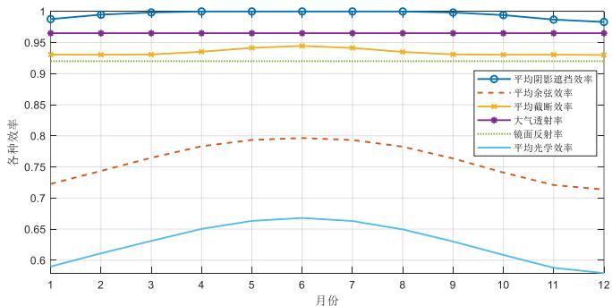  
图 16 各个月份的平均光学效率

通过分析图像16，我们发现有以下结论：

⚫ 大气透射率和镜面反射率随月份没有变化，这是由于大气透射率仅与各定日镜中心到集热器中心的距离有关，当定日镜位置确定后，平均大气透射率就确定为一个常数。而镜面反射率按照前文的分析，也确定为一个常数。

平均阴影遮挡效率极高，接近于 1。这是由于定日镜之间距离间隔较大，阴影遮挡损失极小，阴影遮挡效率仅受到吸热塔对定日镜的阴影遮挡造成的影响。

平均截断效率相对较高，在6月时最高达到 0.94左右，这是由于定日镜的大小于集热器的竖截面矩形的大小近似，溢出的面积较小，截断损失较小。此外，我们发现平均截断效率关于 6月对称分布，这是由于光斑大小与入射光线的方向有关，即与太阳高度角有关，而太阳高度角关于 6月对称分布。

平均余弦效率相对较低，在 6 月时最高，但仅为 0.8 左右，这是由于平均余弦效率取决于太阳入射角的余弦值，考虑到定日镜与吸热塔的距离等因素，太阳入射角往往较大，余弦值往往较小，因此平均余弦效率相对较小。与平均截断效率类似，平均余弦效率关于 6月对称分布，这也是太阳高度角关 6月对称分布导致的。

平均光学效率的变化情况与平均余弦效率的分布类似，这是由于平均余弦效率之外的其他效率都较高，接近于 1 ，因此我们认为仅有平均余弦效率对平均光学效率造成了显著影响。

## ②对不同定日镜年平均光学效率的分析

此外，我们还将所有定日镜从最内层最东侧的定日镜开始沿逆时针确定序号，计算了每块定日镜的年平均光学效率，如下图 17所示。

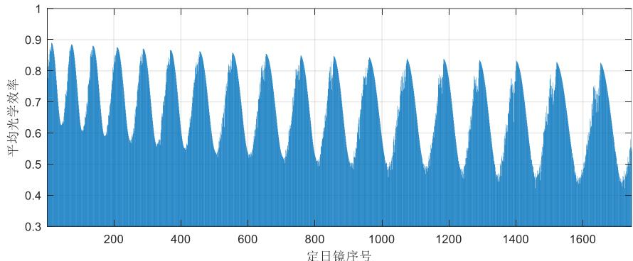  
图 17 每块定日镜的年平均光学效率

图中的每个波峰表示定日镜分布的其中一层，我们发现由内层到外层，定日镜的年平均光学效率逐渐下降，此外，我们还发现每一层的平均光学的效率分布大致相同。因此，我们取其中的最内层的定日镜进行局部范围分析，如下图 18所示：

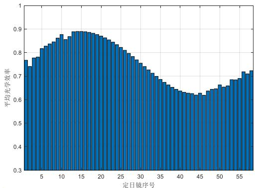  
图 18 最内层定日镜的年平均光学效率

通过分析上图18，我们发现对于最内层的定日镜而言，其平均光学效率的分布近似于正弦分布，且位于北方的定日镜光学效率整体较高，在序号 15 处即在正北方向处达到最大。而在东西方向上，平均光学效率呈对称分布，对整体光学效率的影响相互抵消。我们由此推测，如果需要对定日镜的分布进行优化，应将定日镜尽可能摆放在吸热塔的北方。

为了进一步验证该结论，我们选取了春分日 3月21日上午10点时，所有定日镜的年平均光学效率在地面二维坐标系上的分布情况，如下图。

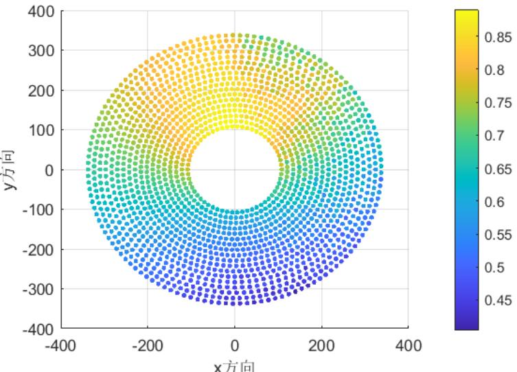  
图 19问题一中春分日 3月 21日上午 10点时所有定日镜的年平均光学效率

可以发现太阳入射光线在地面上的落点处附近的年平均光学效率相对较高，由该地的纬度为北纬39.4°，在北回归线以北，太阳始终位于吸热塔南方，所以太阳入射光线落点始终位于吸热塔北方，因此偏北的定日镜年平均光学效率相对较高，与我们的推测一致。如果需要对定日镜的分布进行优化，应将定日镜尽可能摆放在吸热塔北方。

## 5.1.3 模型检验

通过查阅文献可知，单位镜面面积年平均输出功率和定日镜场年平均输出功率与镜面的尺寸存在相关性，由于本问中定日镜的高度和宽度相等，因此我们只需要对镜面宽度进行一定范围内的调整，计算调整后的单位镜面面积年平均输出功率和定日镜场年平均输出功率，如下图 20所示：

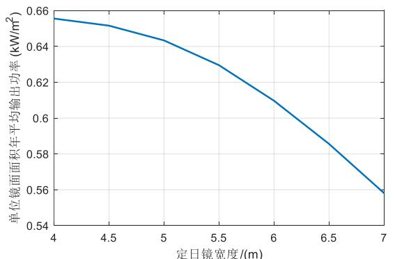

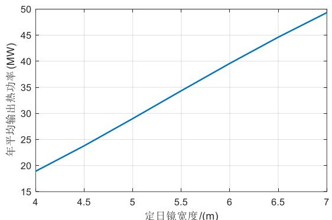  
图 20年平均输出功率与定日镜宽度的关系

通过对上图分析，我们发现随着镜面宽度增大，单位镜面面积年平均输出功率减小，年平均输出功率增大，这与实际情况相符合，这证明了模型的准确性。

此外，我们发现当定日镜宽度增加了 3米时，单位镜面面积年平均输出功率减少了 0.12 千瓦每平方米，年平均输出功率增加了 30 兆瓦，均存在较大的变化幅度，说明单位镜面面积年平均输出功率和年平均输出功率对镜面宽度敏感，证明了我们模型的灵敏性。

## 5.2 问题二模型的建立与求解

问题二要求我们对定日镜场的布局进行优化设计，使得定日镜场的年平均输出热功率在达到额定功率 的条件下，单位镜面面积的年平均输出热功率尽可能大，因此，我们以单位镜面面积的年平均输出热功率最大为目标函数，以定日镜场中的吸收塔位置坐标，定日镜的统一尺寸，统一安装高度，定日镜的个数以及定日镜的位置等定日镜场的分布参数为决策变量，并根据题意确定了多个约束条件，以此建立起单目标规划模型。由于决策变量的数量很多，因此我们采用遗传算法对该单目标优化模型进行求解。

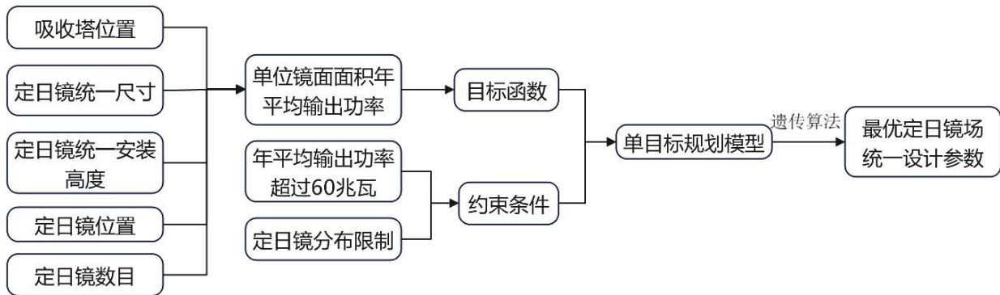  
图 21问题二流程图

## 5.2.1 基于单目标规划的统一定日镜场优化设计模型

## （1）目标函数

在第一问中，我们给出了单位镜面面积年平均输出热功率 ${ \overline { { E } } } _ { \imath }$ 的计算公式，我们的目标是使得单位镜面面积年平均输出热功率 $\overline { { E } }$ 尽可能大，因此目标函数可以写成如下形式：

$$
\operatorname* { m a x } _ { r , l , w , h , N , I _ { a } } \bar { E } _ { u } ( r , l , w , h , N , I _ { a } ) = \frac { \displaystyle \sum _ { i = 1 } ^ { 1 2 } \sum _ { j = 1 } ^ { 5 } \sum _ { k = 1 } ^ { N } D N I _ { i j } \cdot \eta _ { i j k } } { 6 0 N }\tag{27}
$$

其中， $r , l , w , h , N , I _ { a }$ 为规划变量，下面将对其进行详细阐述。

## （2）规划变量与约束条件

## ①吸收塔的位置坐标

在问题一中，吸收塔在镜场坐标系下的位置坐标为 ，此时我们可以计算定日镜场的年平均光学效率 。参照问题一的模型，我们在不改变问题一中定日镜场的其他的参数的情况下，对吸收塔的位置在东西方向和南北方向上进行移动，计算其在不同位置对应的 ，以此探究吸收塔的位置变化对年光学效率的影响。我们发现年光学效率随着吸收塔移动产生的变化如下图 22所示。

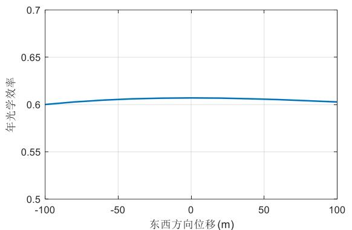

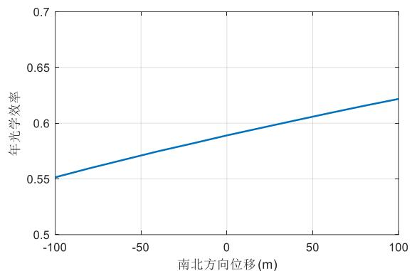  
图 22 光学效率随着吸收塔移动产生的变化

由上图可知，吸收塔在向不同方向移动时会对 产生不同程度的影响。当吸收塔在东西方向移动时，无论是向东还是向西都会导致 的下降，其变化情况关于原点对称，且变化幅度极小，这是由于太阳在一天中的运动在东西方向上是对称的，若吸收塔向东偏移，在上午时，其东侧的定日镜的光学效率较低，西侧的较高，在下午时，东侧的定日镜光学效率较高，西侧的较低，上午和下午的的变化相抵消，导致 并没有与位于坐标原点处时发生显著变化。若吸收塔向西偏移，同理 也不会发生显著变化。

当吸收塔在南北方向移动时，我们发现越靠南方 越大，反之， 越小，且 随吸收塔位置改变而发生的改变较为显著，因此，为了简化模型，我们认为吸收塔仅在南北方向发生偏移，我们设偏移量为 ，则偏移后吸收塔的坐标为 $O ^ { \prime } ( 0 , r )$ ，由于吸收塔发生偏移后仍应位于镜场范围内，因此偏移量 的绝对值应小于镜场的半径 ，即

$$
r \in [ - R , R ]
$$

## ②定日镜尺寸

在问题二中，每块定日镜的尺寸是相同的，即每块定日镜都有相同的高度 和宽度，且满足高度 和宽度 在2米到8米之间，并且高度不大于宽度，即：

$$
\displaystyle { \left\{ l , w \in [ 2 m , 8 m ] \right. }
$$

## ③定日镜安装高度

在本问中，每块定日镜的安装高度 是相同的，且满足镜面高度 在 2 米到 6 米之间，并且镜面在绕水平轴旋转时镜面不会触地，即安装高度大于镜面高度的一半。

$$
\left\{ \begin{array} { l } { h \in \left[ 2 m , 6 m \right] } \\ { h > \displaystyle \frac { 1 } { 2 } l } \end{array} \right.
$$

## ④定日镜个数

定日镜的个数是定日镜场布局时的一个重要参数，它会影响到定日镜排布的紧凑程度，进而影响定日镜场的年平均总效率 $E _ { f i e l d }$ ，也会影响到单位镜面面积的年平均输出热功率 $\overline { { E } } _ { u }$ ，因此定日镜个数 也应作为决策变量，我们令其在一个足够大的范围内变化，即：

$$
N \in \left[ 1 0 0 0 , \right. \left. 5 0 0 0 \right]
$$

## ⑤定日镜位置 $I _ { a } ( x _ { a } , y _ { a } )$

设第 $a$ 个定日镜的位置为点 $I _ { a }$ ，其坐标为 $( x _ { a } , y _ { a } )$ ，由于定日镜位于镜场范围内，因此点 $I _ { a }$ 到原点的距离应小于镜场半径 ，并且，由于吸收塔 100 米范围内不安装定日镜，因此点 $I _ { a }$ 到吸收塔的距离应大于 ，此外，定日镜 $_ a$ 与相邻定日镜 的距离比镜面宽度多5m 以上，那么约束条件有：

$$
\left\{ \begin{array} { l l } { \sqrt { { x _ { a } } ^ { 2 } + { y _ { a } } ^ { 2 } } \leq R } \\ { \sqrt { { x _ { a } } ^ { 2 } + ( y _ { a } - r ) ^ { 2 } } \geq 1 0 0 } \\ { \sqrt { ( { x _ { a } } - { x _ { b } } ) ^ { 2 } + ( y _ { a } - y _ { b } ) } ^ { 2 } > w + 5 } \end{array} \right.
$$

⑥额定年平均输出热功率 $\bar { E } _ { f i e l d }$

问题二中要求额定年平均输出热功率 $\bar { E } _ { f i e l d }$ 达到60 ，即：

$$
\bar { E } _ { f i e l d } = \frac { \displaystyle \sum _ { i = 1 } ^ { 1 2 } \sum _ { j = 1 } ^ { 5 } \sum _ { k = 1 } ^ { N } D N I _ { i j } \cdot A _ { k } \cdot \eta _ { i j k } } { 6 0 } \ge 6 0 M W
$$

## （3）模型给出

综上，我们给出基于单目标规划的统一定日镜场优化设计模型，如下所示：

$$
\begin{array} { r l } & { \frac { \displaystyle \sum _ { k = 1 } ^ { n } \sum _ { i = 1 } ^ { n } \sum _ { j = 1 } ^ { n } B _ { i j } \cdot \eta _ { k } \eta _ { k } } { \displaystyle \sum _ { k = 1 } ^ { n } \sum _ { i = 1 } ^ { n } B _ { i j } \cdot \eta _ { k } \eta _ { k } } = \frac { \sum _ { k = 1 } ^ { n } \sum _ { i = 1 } ^ { n } B _ { i j } \cdot \eta _ { k } } { \displaystyle \sum _ { k = 1 } ^ { n } B _ { i j } \cdot \eta _ { k } } } \\ & { + \frac { \displaystyle \sum _ { k = 1 } ^ { n } B _ { i j } } { \displaystyle \sum _ { k = 1 } ^ { n } \sum _ { i = 1 } ^ { n } B _ { i j } \cdot \eta _ { k } } } \\ & { [ \begin{array} { l } { A _ { 1 1 } } \\ { A _ { 2 2 } } \\ { A _ { 3 3 } } \\ { A _ { 3 4 } } \end{array} ] } \\ & { + \frac { \displaystyle \sum _ { k = 1 } ^ { n } B _ { i j } \cdot \eta _ { k } } { \displaystyle \sum _ { k = 1 } ^ { n } B _ { i j } \cdot \eta _ { k } } } \\ & { + \frac { \displaystyle \sum _ { k = 1 } ^ { n } B _ { i j } \cdot \eta _ { k } } { \displaystyle \sum _ { k = 1 } ^ { n } B _ { i j } \cdot \eta _ { k } } } \\ & { [ \begin{array} { l } { A _ { 2 2 } } \\ { A _ { 3 3 } } \\ { A _ { 3 4 } } \end{array} ] } \\ & { + \frac { \displaystyle \sum _ { k = 1 } ^ { n } B _ { i j } \cdot \eta _ { k } } { \displaystyle \sum _ { k = 1 } ^ { n } B _ { i j } \cdot \eta _ { k } } \leq R \lambda _ { 1 } } \\ & { [ \begin{array} { l } { A _ { 3 3 } } \\ { A _ { 3 4 } } \\ { A _ { 3 4 } } \end{array} ] } \\ &  [ \begin{array} { l }  \gamma _ { 1 } ( \gamma _ { 1 } - \gamma _ { 1 } ) + \frac  \displaystyle \sum _ { k = 1 }  \end{array} \end{array}\tag{28}
$$

## 5.2.2 模型的求解

## （1）遗传算法

由于本问的决策变量很多，传统的遍历方法时间成本较高，因此我们考虑用遗传算法对模型进行求解，具体的算法步骤如下所示：

## 算法步骤

## Step1：确定部分参数初始值

我们给定吸收塔位置坐标、定日镜尺寸、安装高度、定日镜数目的初始值，并

根据各自数据的量纲在其范围内进行大步长遍历。

## Step2：使用遗传算法计算定日镜位置

对于当前 Step1 确定的参数，我们采用遗传算法进行求解，对于一次遍历给定的参数，我们计算其在约束条件下的最大单位镜面面积年平均输出热功率，若大于当前最优平均输出热功率，则替换之，并记录下最优平均输出热功率下的定日镜位置坐标。

## Step3：缩小步长精细遍历

将步长逐步缩小遍历，重复 Step1 与 Step2 操作，最终确定满足约束条件下的最大单位镜面面积年平均输出热功率，得到定日镜场的各项参数。

## （2）求解结果及分析

通过上述求解步骤，我们计算出了使得单位镜面面积年平均热输出功率最优时的定日镜场的各个参数，如下表 3所示：

表 3 问题二设计参数表
<table><tr><td>吸收塔位置坐标 定日镜尺寸</td><td>定日镜安装高度</td><td>定日镜总面数</td><td>定日镜总面积</td></tr><tr><td>(0, - 250) 5.55m×5.55m</td><td>5m</td><td>2739</td><td>84368.0475m²</td></tr></table>

在此最优参数下，我们可以计算最优月平均光学效率及输出功率和最优年平均光学效率和输出功率，如下表 4、表5所示。

表 4 问题二每月 21日平均光学效率及输出功率
<table><tr><td>日期</td><td>平均光学 效率</td><td>平均余弦 效率</td><td>平均阴影 遮挡效率</td><td>平均截断 效率</td><td>单位面积镜面平均输 出热功率(kW/m²)</td></tr><tr><td>1月21日</td><td>0.7669</td><td>0.9123</td><td>0.9940</td><td>0.9627</td><td>0.6663</td></tr><tr><td>2月21日</td><td>0.7579</td><td>0.9044</td><td>0.9980</td><td>0.9558</td><td>0.7137</td></tr><tr><td>3 月 21 日</td><td>0.7432</td><td>0.8891</td><td>0.9998</td><td>0.9517</td><td>0.7388</td></tr><tr><td>4月21日</td><td>0.7229</td><td>0.8652</td><td>0.9998</td><td>0.9513</td><td>0.7436</td></tr><tr><td>5 月 21 日</td><td>0.7089</td><td>0.8432</td><td>0.9998</td><td>0.9573</td><td>0.7404</td></tr><tr><td>6 月 21 日</td><td>0.7033</td><td>0.8338</td><td>0.9998</td><td>0.9604</td><td>0.7377</td></tr><tr><td>7月21日</td><td>0.7092</td><td>0.8434</td><td>0.9998</td><td>0.9573</td><td>0.7406</td></tr><tr><td>8月21日</td><td>0.7241</td><td>0.8664</td><td>0.9998</td><td>0.9515</td><td>0.7440</td></tr><tr><td>9 月21日</td><td>0.7443</td><td>0.8901</td><td>0.9998</td><td>0.9520</td><td>0.7382</td></tr><tr><td>10月21日</td><td>0.7590</td><td>0.9057</td><td>0.9976</td><td>0.9562</td><td>0.7088</td></tr><tr><td>11月21日</td><td>0.7663</td><td>0.9128</td><td>0.9936</td><td>0.9618</td><td>0.6600</td></tr><tr><td>12月21日</td><td>0.7673</td><td>0.9142</td><td>0.9916</td><td>0.9635</td><td>0.6352</td></tr></table>

表 5 问题二年平均光学效率及功率表
<table><tr><td>年平均光 学效率</td><td>年平均余 弦效率</td><td>年平均阴影 遮挡效率</td><td>年平均截 断效率</td><td>年平均输出热 功率(MW)</td><td>单位面积镜面年平均 输出热功率(kW/m²)</td></tr><tr><td>0.7394</td><td>0.8817</td><td>0.9978</td><td>0.9568</td><td>60.373</td><td>0.7139</td></tr></table>

## 结果分析：

①对定日镜分布的分析

首先，我们画出了此时定日镜在定日镜场内的分布，如下图23所示：

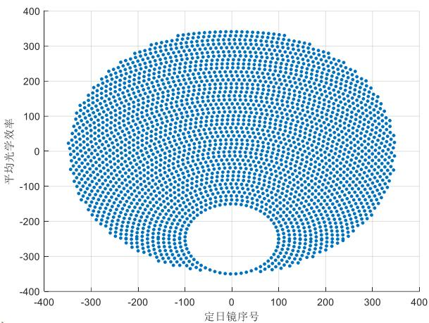  
图 23 问题二中定日镜在定日镜场中的分布

通过观察图像我们发现，最优的吸收塔位置位于定日镜场的最南端，这与我们在第一问中的分析是一致的，定日镜在定日镜场中的排布是围绕吸收塔的许多个同心圆，定日镜的尺寸相较于问题一中较小，但定日镜的数目则比问题一中要多，总体而言，定日镜的排布比问题一中更为密集。

## ②对月平均光学效率的分析

同样地，我们画出了每月21日平均光学效率的折线图，如下图24 所示;

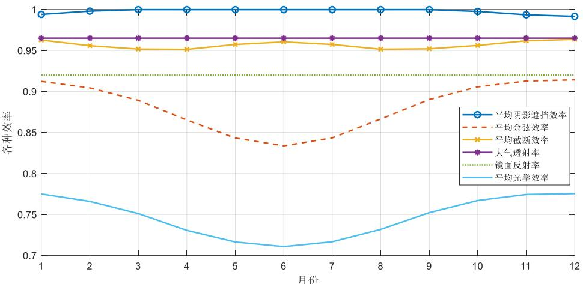  
图 24 问题二每月 21日平均光学效率

通过观察图像，我们发现以下结论：

平均阴影遮挡效率仍然极高，接近于 1。我们知道，本问中定日镜的排布密度要大于问题一中的初始排布密度，但阴影遮挡效率缺和第一问几乎一样，这说明定日镜的最优排布方式充分考虑了板与板之间的遮挡，能使得排布密度增加的同时仍然保证阴影遮挡效率保持在较高水准。

平均余弦效率在 6 月份最低，为 0.83 左右。这一点恰恰与第一问时的情况相反，在第一问中平均余弦效率在 6 月份最高，但只有 0.8 左右，比这一问的最低余弦效率还要低，这说明我们在本问中对定日镜场的优化布置是合理的，而之所以在6 月份余弦效率最低，我们推测是因为 6 月份的太阳高度角最大，入射光线与平面镜法线之间的夹角最大，导致了余弦损失最大，余弦效率最低。

## ③对不同定日镜的年平均光学效率的分析

同样地，我们将所有定日镜从最内层最东侧的定日镜开始沿逆时针确定序号，计

算了每块定日镜的年平均光学效率，如下图 25 所示。

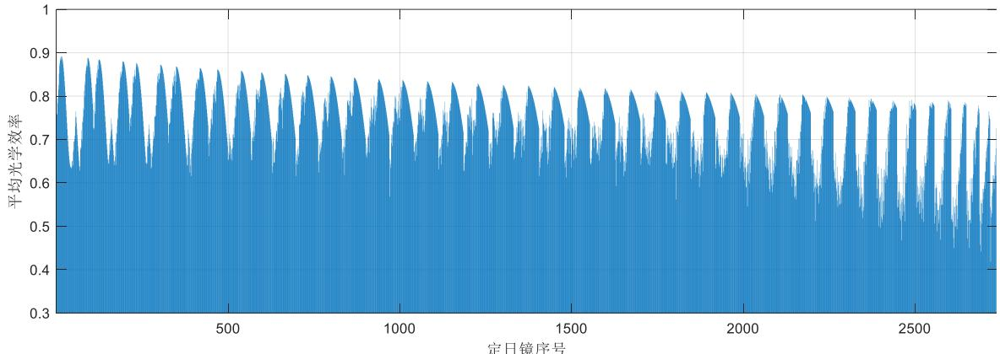  
图 25 问题二中不同定日镜的年平均光学效率

通过观察图像，我们发现从最内侧到最外侧，定日镜的年平均光学效率仍然逐渐减小，但减小的幅度很小，内外圈的差异并不如第一问中一样显著，这同样说明了最优排布下能使得所有定日镜尽可能地达到最优光学效率。

此外，我们计算了春分日 3月21日10点时，所有定日镜的年平均光学效率，并作出了其在地面上的分布情况，如下图 26所示：

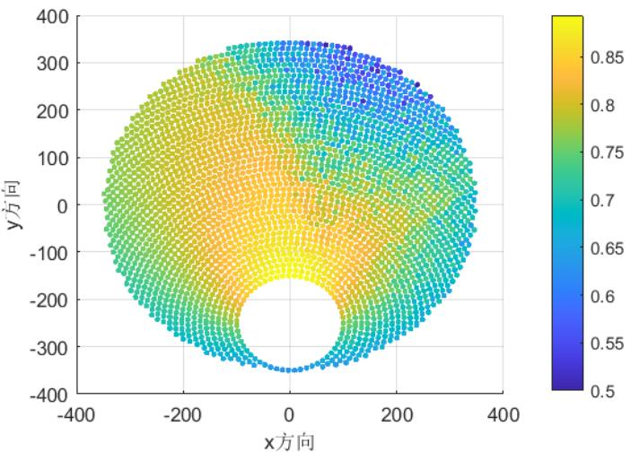  
图 26春分日 3月 21日 10 点时所有定日镜的年平均光学效率

## ④年均光学效率及输出功率相较于第一问的优化率

为了能直观地体现我们的优化程度，我们将问题一的年均光学效率等参数与优化后的参数以直方图的形式进行对比，如下图 27所示：

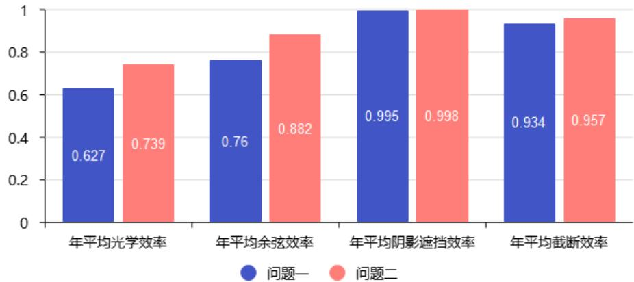  
图 27 问题一与问题二年均光学效率的对比

通过观察图像27，我们发现各项指标都在问题二的优化布局后得到了提升，此外，通过计算，我们得到了年平均光学效率的优化率为 17.86%，年平均输出热功率的优化率为 57.65%，单位镜面面积的年平均输出热功率的优化率为 17.11%，有力地说明了我们对定日镜场的优化设计是有效且合理的。

## 5.2.3 模型检验

由于实际情况中可能存在的随机误差，我们在满足约束条件的情况下，随机生成了100组可行解，计算其单位镜面面积年平均输出热功率，作出针状图，与我们求得的最优单位镜面面积年平均输出热功率进行比较，如下图 28所示：

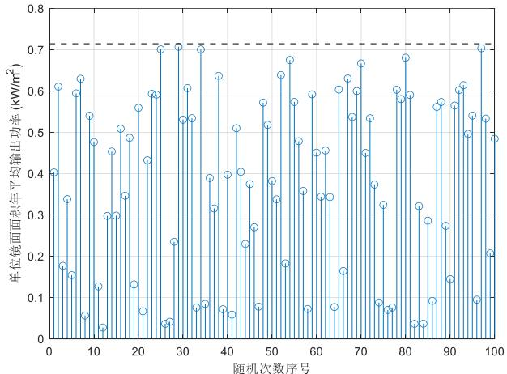  
图 28随机生成的 100组可行解与最优解的比较

通过观察图像，我们发现所有随机可行解都小于我们求得的最优解，因此证明了我们的最优解是准确的，我们的模型是可靠的。

## 5.3 问题三模型的建立与求解

通过问题二的求解，我们发现定日镜的最优分布近似于以吸收塔塔底为圆心的同心圆上的等距分布，因此为了简化模型，在本问中我们可以适当沿用此结论，认为在问题三中最优定日镜的排布方式也为同心圆。相较于问题二，问题三中各个定日镜的的尺寸以及安装高度可能不同，但由于同心圆具有各项同性的性质，因此我们可以假设每一层同心圆上的所有定日镜的尺寸和安装高度相同。然后，在问题二的基础上，我们同样以单位镜面面积的年平均输出热功率最大为目标函数，在决策变量里新增了每层同心圆上的定日镜的尺寸和安装高度，并更新了部分约束条件，从而建立起定日镜尺寸和高度可变的单目标规划模型。

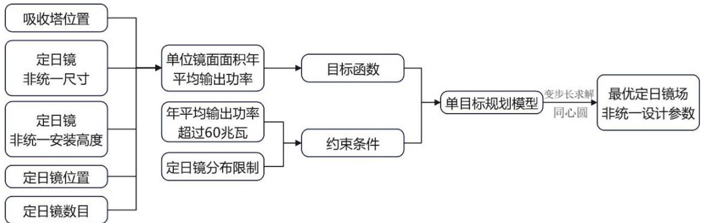  
图 29 问题三流程图

## 5.3.1 基于单目标规划的非统一定日镜场的优化设计模型

## （1）目标函数

与问题二类似，本问我们要求解最优的单位镜面面积年平均热输出功率 $E _ { m }$ ，但与第二问唯一不同的地方在于本问中定日镜的尺寸并不都一样，这就导致了在计算定日镜总面积时无法化简，则本问中目标函数为:

$$
\operatorname* { m a x } _ { \tau , l _ { n } , w _ { n } , h _ { n } , N , I _ { a } } \overline { { E } } _ { m } ( r , l _ { n } , w _ { n } , h _ { n } , N , I _ { a } ) = \frac { \overline { { E } } _ { f i e l d } } { \displaystyle \sum _ { k = 1 } ^ { N } A _ { k } } = \frac { \displaystyle \sum _ { i = 1 } ^ { 1 2 } \sum _ { j = 1 } ^ { 5 } \sum _ { k = 1 } ^ { N } D N I _ { i j } \cdot A _ { k } \cdot \eta _ { i j k } } { \displaystyle 6 0 \sum _ { k = 1 } ^ { N } A _ { k } }
$$

## （2）规划变量与约束条件

相较于问题二，问题三的规划变量新增了每一层同心圆上的定日镜尺寸 $l _ { n } \times w _ { n }$ 和定日镜安装高度 $h _ { m }$ ，则相应的约束条件应更新为：

$$
\begin{array} { r } { \left\{ \begin{array} { l l } { { l _ { n } , w _ { n } \in [ 2 m , 8 m ] } } \\ { { l _ { n } \leqslant w _ { n } } } \\ { { h _ { n } \in [ 2 m , 6 m ] } } \\ { { h _ { n } > \displaystyle \frac { l _ { m } } { 2 } } } \\ { { n = 1 , 2 , . . . , n u m } } \end{array} \right. } \end{array}
$$

其中， $l _ { n } \times w _ { n }$ 和 $h _ { n }$ 分别为第 层同心圆的上定日镜的尺寸和安装高度， 为定日镜场中分布的同心圆的层数。其余的规划变量和约束条件全部与问题二中保持一致。

## （3）模型给出

综上，我们给出基于单目标规划的非统一定日镜场的优化设计模型，如下所示：

$$
\begin{array} { r l } & { \underbrace { \sum _ { i = 1 } ^ { 3 } \sum _ { j = 1 } ^ { N } \frac { \partial } { \partial x _ { i } } } _ { \mathrm { t } = 0 , \mathrm { p } _ { i } } \frac { \partial } { \partial x _ { j } } \underbrace { \sum _ { i = 1 } ^ { 3 } \sum _ { j = 1 } ^ { N } \frac { \partial } { \partial x _ { i } } } _ { \mathrm { t } = 0 , \mathrm { p } _ { i } } } \\ & { = \underbrace { \sum _ { i = 1 } ^ { 3 } \sum _ { j = 1 } ^ { N } \frac { \partial } { \partial x _ { i } } } _ { \mathrm { p } _ { i } \in \mathcal { S } _ { i } } \underbrace { \sum _ { i = 1 } ^ { 3 } \sum _ { j = 1 } ^ { N } \frac { \partial } { \partial x _ { i } } } _ { \mathrm { t } = 0 , \mathrm { p } _ { i } } } \\ & { \phantom { = } | \frac { \partial } { \partial x _ { i } } \mathrm { t } \sum _ { i = 1 } ^ { N } \frac { \partial } { \partial x _ { i } } | } \\ & { \phantom { = } | \frac { \partial } { \partial x _ { i } } \mathrm { t } \sum _ { i = 1 } ^ { N } \frac { \partial } { \partial x _ { i } } | } \\ & { \phantom { = } | \frac { \partial } { \partial x _ { i } } \mathrm { t } \sum _ { i = 1 } ^ { N } \frac { \partial } { \partial x _ { i } } \mathrm { t } | } \\ & { \phantom { = } | \frac { \partial } { \partial x _ { i } } \mathrm { t } \sum _ { j = 1 } ^ { N } \frac { \partial } { \partial x _ { j } } \mathrm { t } } \\ & { \phantom { = } | \frac { \partial } { \partial x _ { i } } \mathrm { t } \sum _ { i = 1 } ^ { N } \frac { \partial } { \partial x _ { i } } \mathrm { t } | } \\ &  \phantom { = } | \frac { \partial } { \partial x _ { i } } \mathrm { t } \sum _ { j = 1 } ^ { N } \frac { \partial } { \partial x _ { j } } \mathrm { t } \frac  \partial  \end{array}\tag{29}
$$

## 5.3.2 模型的求解

## （1）算法步骤

通过问题二的求解，我们发现定日镜在最优情况下大致呈同心圆分布，为了更好的利用空间效率，我们认为在同一圆周上，定日镜宽度加 5为定日镜间距，两个相邻圆周间间距为外侧圆周上定日镜宽度加 5，以此简化计算。对于每一圈定日镜的尺寸和安装高度，我们可以采用变步长遍历的方法进行求解，具体的算法步骤如下所示：

## 算法步骤

## Step1：确定参数初始值

我们给定吸收塔位置坐标、各圆周上定日镜尺寸、各圆周上安装高度的初始值，并根据各自数据的量纲在其范围内进行大步长遍历。

## Step2：计算最优单位镜面面积年平均输出热功率

对于给定的参数，我们可以确定定日镜的位置分布以及定日镜数目，通过问题一的模型可以计算出当前参数下的单位镜面面积年平均输出热功率，若大于当前最优平均输出热功率，则替换之，并更新最优平均输出热功率下各个参数数据。

## Step3：缩小步长精细遍历

在当前各将步长逐步缩小遍历，重复 Step1 与 Step2 操作，最终确定满足约束条件下的最大单位镜面面积年平均输出热功率，得到吸收塔位置坐标、各圆周上定日镜尺寸、各圆周上安装高度，进一步得出定日镜的位置分布以及定日镜数目。

## （2）求解结果及分析

通过上述求解步骤，我们计算出了使得单位镜面面积年平均热输出功率最优时的定日镜场的各个参数，如下表 6所示：

表 6问题三设计参数表
<table><tr><td>吸收塔位置坐标</td><td>定日镜总面数</td><td>定日镜总面积</td></tr><tr><td>(0, - 250)</td><td>2315</td><td>87633.4929m²</td></tr></table>

在此最优参数下，我们可以计算最优月平均光学效率及输出功率和最优年平均光学效率和输出功率，如下表 7、表8所示。

表 7 问题三每月 21日平均光学效率及输出功率
<table><tr><td>日期</td><td>平均光学 效率</td><td>平均余弦 效率</td><td>平均阴影 遮挡效率</td><td>平均截断 效率</td><td>单位面积镜面平均输 出热功率(kW/m²)</td></tr><tr><td>1月21日</td><td>0.8071</td><td>0.9698</td><td>0.9931</td><td>0.9521</td><td>0.7012</td></tr><tr><td>2月21日</td><td>0.7984</td><td>0.9635</td><td>0.9972</td><td>0.9443</td><td>0.7519</td></tr><tr><td>3 月21 日</td><td>0.7850</td><td>0.9498</td><td>0.9989</td><td>0.9402</td><td>0.7803</td></tr><tr><td>4月21日</td><td>0.7664</td><td>0.9270</td><td>0.9987</td><td>0.9406</td><td>0.7884</td></tr><tr><td>5 月21日</td><td>0.7535</td><td>0.9056</td><td>0.9987</td><td>0.9467</td><td>0.7870</td></tr><tr><td>6月21日</td><td>0.7496</td><td>0.8964</td><td>0.9987</td><td>0.9515</td><td>0.7863</td></tr><tr><td>7月21日</td><td>0.7538</td><td>0.9059</td><td>0.9987</td><td>0.9467</td><td>0.7871</td></tr><tr><td>8月21日</td><td>0.7670</td><td>0.9282</td><td>0.9987</td><td>0.9401</td><td>0.7880</td></tr><tr><td>9月21日</td><td>0.7856</td><td>0.9507</td><td>0.9989</td><td>0.9400</td><td>0.7792</td></tr><tr><td>10月21日</td><td>0.8005</td><td>0.9646</td><td>0.9967</td><td>0.9461</td><td>0.7476</td></tr><tr><td>11月21日</td><td>0.8076</td><td>0.9701</td><td>0.9927</td><td>0.9529</td><td>0.6957</td></tr><tr><td>12月21日</td><td>0.8080</td><td>0.9710</td><td>0.9907</td><td>0.9544</td><td>0.6689</td></tr></table>

表 8 问题三年平均光学效率及功率表
<table><tr><td>年平均光 学效率</td><td>年平均余 弦效率</td><td>年平均阴影 遮挡效率</td><td>年平均截 断效率</td><td>年平均输出热 功率(MW)</td><td>单位面积镜面年平均 输出热功率  $\left( k W / m ^ { 2 } \right)$ </td></tr><tr><td>0.7818</td><td>0.9418</td><td>0.9968</td><td>0.9462</td><td>60.359</td><td>0.7551</td></tr></table>

## 结果分析：

## ①对定日镜总体分布的分析

首先，我们画出了此时定日镜在定日镜场内的分布，如下图 30所示：

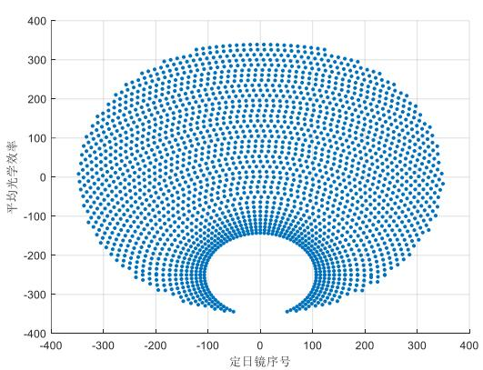

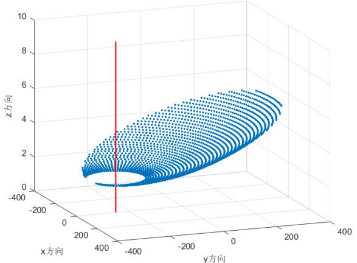  
图 30 问题三中定日镜在定日镜场中的分布

我们从最内层同心圆开始编号，以直方图的形式呈现不同层定日镜的镜面宽度和安装高度，如下图31 所示：

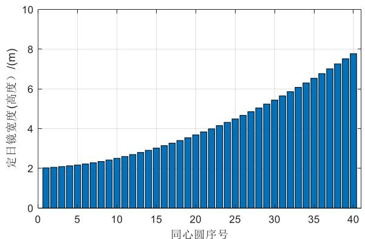

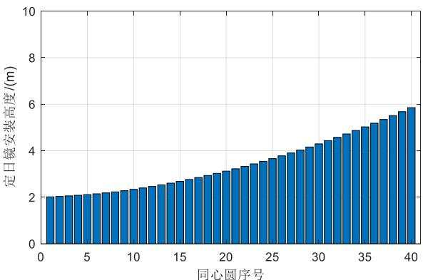  
图 31 不同层同心圆下定日镜的镜面宽度（高度）和安装高度

通过观察图像我们发现，其空间分布近似于一个倾斜抛物面，这是由于抛物面具有最好的聚光效果，这佐证了我们的结果是准确的。

## ②对月平均光学效率的分析

同样地，我们画出了每月21日平均光学效率的折线图，如下图32 所示：

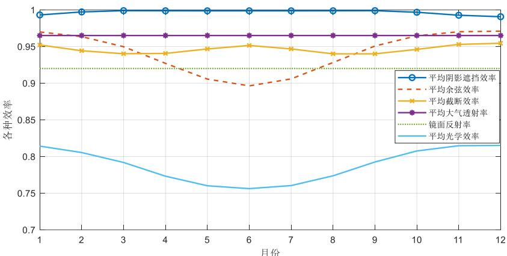  
图 32 问题三每月 21日平均光学效率

通过观察图像 32，我们发现平均余弦效率相较于问题二又得到了一个巨大的提升，最小余弦效率为0.9，这是因为在第三问中定日镜的安装高度可以进行调整，这样就能保证太阳光的入射角度与平面法向量之间的夹角不会太大，从而降低余弦损失。

## ③对不同定日镜的年平均光学效率的分析

同样地，我们将所有定日镜从最内层最东侧的定日镜开始沿逆时针确定序号，计算了每块定日镜的年平均光学效率，如下图 33 所示。

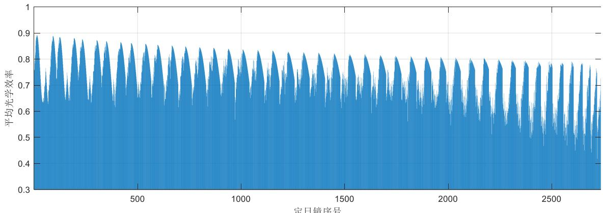  
图 33 问题三中不同定日镜的年平均光学效率

此外，我们计算了春分日 3月21日10点时，所有定日镜的年平均光学效率，并作出了其在地面上的分布情况，如下图 34所示：

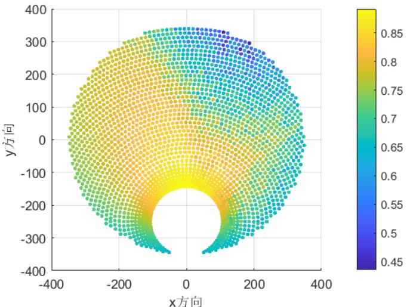  
图 34 问题三春分日 3月21 日 10点时所有定日镜的年平均光学效率

## ④年均光学效率及输出功率相较于第一问和第二问的优化率

为了能直观地体现我们的优化程度，我们将问题一、问题二、问题三的年均光学效率等参数以直方图的形式进行对比，如下图 35所示：

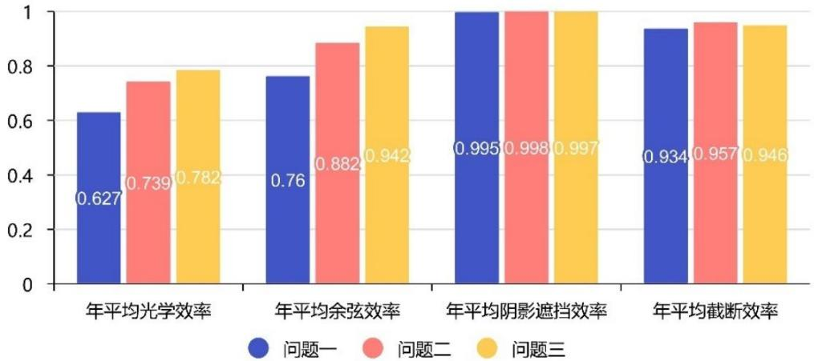  
图 35 问题一、问题二、问题三年均光学效率的对比

通过观察图像，我们发现年平均光学效率以及年平均余弦效率在问题三的进一步优化布局后相较于问题二得到了提升，而年平均截断效率相较于问题二略有下降，这是因为在问题三中，部分定日镜的尺寸较大，进而导致了截断效率下降。

此外，通过计算，我们得到了年平均光学效率相较于问题一的优化率为 24%，相较于问题二的优化率为 5.8%；年平均输出热功率相较于问题一的优化率为 57.62%，相较于问题二没有优化，单位镜面面积的年平均输出热功率相较于问题一的优化率为23.87%，相较于问题二的优化率为 5.77%。这有力地说明了我们在问题三中对定日镜场的进一步优化设计是有效且合理的。

## 5.3.3 模型检验

与问题二的模型检验类似，我们在满足约束条件的情况下，随机生成了 100组可行解，计算其单位镜面面积年平均输出热功率，作出针状图，我们在问题三中求得的最优单位镜面面积年平均输出热功率进行比较，如下图 36所示：

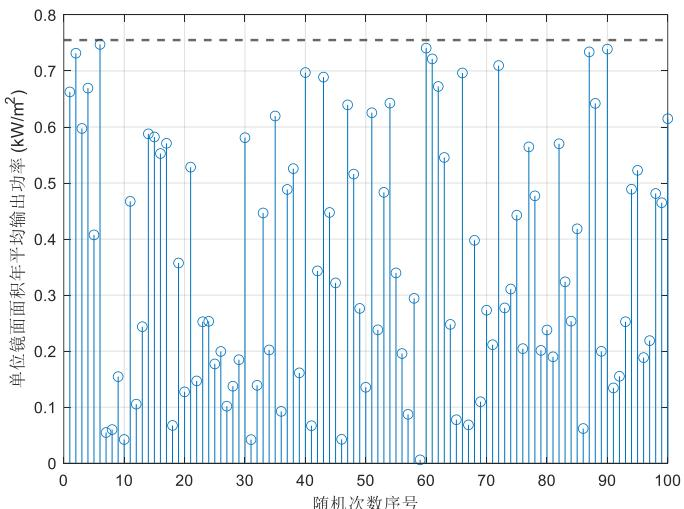  
图 36 随机生成的 100组可行解与最优解的比较

我们发现所有随机可行解都小于我们求得的最优解，因此证明了我们的结果是准确的，我们的模型是可靠的。

## 六、 模型的评价、改进与推广

## 6.1 模型的优点

1.我们的模型可拓展性强，适应范围广

2.模型基于matlab等精确计算，更加稳健可靠

3.我们的模型可持续性强，在实际应用中能够保持相对的稳定性和持续性

## 6.2 模型的缺点

应对突发情况可能存在误差

## 七、 参考文献

[1]胡叶广. 塔式太阳能热发电系统的多级反射式聚光镜场的研究[D].哈尔滨工业大学,2018.

[2]谢飞. 塔式太阳能热电系统定日镜场光学仿真与应用研究[D].浙江大学,2013.

[3]张平,奚正稳,华文瀚等.太阳能塔式光热镜场光学效率计算方法[J].技术与市场,2021,28(06):5-8.

附录  
```batch
附录 1
canshu1.m %遗传算法
f1.m %计算阴影遮挡效率
f2.m %计算余弦效率
f3.m %计算大气透射率
f4.m %计算截断效率
moxingjianyan.m %模型检验
problem1_1.m %问题一求解
problem1_2.m %问题一求年平均功率
problem1_3.m %问题一作图
problem1_4.m %问题一场地效率分布
problem2.m %遗传算法
problem2_1.m %问题二作图
problem2_2.m %问题二初步求解
problem2_3.m %问题二场地效率分布
problem2_4.m %问题二求解
problem3_1.m %问题三初步求解
problem3_2.m %问题三求解
problem3_3.m %问题三作图
problem3_4.m %问题三场地效率分布
SUN.m %太阳角计算
result2.xlsx %问题二结果
result3.xlsx %问题三结果
附件.xlsx %附件材料
效率.xlsx %计算过程中的效率
```

```matlab
附录 2
canshu1.m
function f = canshu1(x)
%目标函数
N=2739;
H=4;
lw=6;
l=6;w=6;
x0=0;y0=-250;
ST=[9,10.5,12,13.5,15];
D=[306,337,0,31,61,92,122,153,184,214,245,275];
% for ii=1:N
xyz=[x(1:N)',x(N+1:2*N)',zeros(N,1)+x(3)];
% e1=0.9952;
```

```matlab
e2=zeros(12,5);
% e3=zeros(12,5);
% e4=zeros(12,5);
% e5=0.92;
for i=1:5
for j=1:12
[A,B]=SUN(ST(i),D(j));
e2(j,i)=f2(xyz,N,x0,y0,A,B);
end
end
Se2=mean(e2,'all');
f=Se2;
end
```

```matlab
附录 3
f1.m
function e1=f1(xyz,l,w,N,A,B,x0,y0)
%遮挡效率
z0=84;
a=[sind(B)*cosd(A),cosd(B)*cosd(A),sind(A)]; %入射光
tt=zeros(length(xyz),5);
for i=1:size(xyz, 1)
m=sqrt(xyz(i,1)^2+xyz(i,1)^2+xyz(i,3));
% h=sqrt((xyz(i,1)-x0)^2+(xyz(i,2)-
y0)^2+(xyz(i,3)-z0)^2);
r=[-xyz(i,1)+x0,-xyz(i,2)+y0,-
xyz(i,3)+z0]/sqrt((xyz(i,1)-x0)^2+(xyz(i,2)-
y0)^2+(xyz(i,3)-z0)^2);%反射向量
n=real((r-a)/norm(r-a));%法向量
%镜面高度角、方位角
An=acos(n(3));
Bn=atan(n(1)/n(2));
%
An=real(atand((sind(A)*m+h)/sqrt(xyz(i,1)^2+xyz(i,2)^2+m^2*
cosd(A)^2-2*cosd(A)*m*(xyz(i,1)*sind(B)-
xyz(i,2)*cosd(A)))));
% Bn=real(asind((xyz(i,1)-
cosd(A)*sind(B)*m)/sqrt(xyz(i,1)^2+xyz(i,2)^2+m^2*cosd(A)^2
-2*cosd(A)*m*(xyz(i,1)*sind(B)-xyz(i,2)*cosd(A)))));
```

```matlab
ss=[cosd(Bn),sind(Bn)*sind(An),-sind(Bn)*cosd(An);
-sind(Bn),cosd(Bn)*sind(An),-cosd(Bn)*cosd(An);
0,cosd(An),sind(An);]; %翻转矩阵
v1=[ss*[-0.5*l,-0.5*w,0]']'+xyz(i,:);%左下角
v2=[ss*[0.5*l,-0.5*w,0]']'+xyz(i,:);
v3=[ss*[-0.5*l,0.5*w,0]']'+xyz(i,:);
tt(i,1)=v1(1);
tt(i,2)=v1(2);
tt(i,4)=real(abs(sum((v1-v2).*a)));
%tt(i,4)=norm(v1'-
v2');%*abs(sum(a.*xyz(i))/norm(a)/norm(xyz(i)));
% tt(i,3)=norm(v1'-
v3');%*abs(sum(a.*xyz(i))/norm(a)/norm(xyz(i))); %宽度
tt(i,3)=real(abs(sum((v1-v3).*a)));
end
num = size(tt, 1);
% 计算重叠面积
for i = 1:num
areas=0;
for j = i+1:num
area = rectint(tt(i,:), tt(j,:)); %两块之间的重叠
areas = areas + area; %累加
end
tt(i,5)=areas;
end
SSS=(88/tand(A)-100)*7;
if SSS<0
SSS=0;
end
e1=1-(sum(tt(:,5))+SSS)/N/l/w;
end
```

```csv
附录 4
f2.m
function [e2,SS]=f2(xyz,N,x0,y0,A,B)
%余弦效率
```

```matlab
z0=84;
SS=zeros(length(xyz),1);
for i=1:N
b=[xyz(i,1)-x0,xyz(i,2)-y0,xyz(i,3)-z0]; %反射光线
b=-1.*b;
a=[sind(B)*cosd(A),cosd(B)*cosd(A),sind(A)]; %入射光线
ta = acosd(dot(a,b)/(norm(a)*norm(b)));%入射光线与反射
光线夹角
SS(i)=real(cosd(ta/2));
end
e2=mean(SS);
end
```

```matlab
附录 5
f3.m
function [e3,SS]=f3(xyz,N,x0,y0)
%大气透射率
z0=84;
SS=zeros(length(xyz),1);
for i=1:N
dHR=sqrt((xyz(i,1)-x0)^2+(xyz(i,2)-
y0)^2+(xyz(i,3)-z0)^2);
SS(i)=0.99321-0.0001176*dHR+1.97*10^-8*dHR^2;
end
e3=mean(SS);
end
```

```matlab
附录 6
f4.m
function [e4,SS]=f4(xyz,l,w,N,A,B,x0,y0)
%截断效率
z0=84;
a=[sind(B)*cosd(A),cosd(B)*cosd(A),sind(A)]; %入射光线
SS=zeros(N,1);
for i=1:N
sum1=0;sum2=0;
m=sqrt(xyz(i,1)^2+xyz(i,1)^2+xyz(i,3));
% h=sqrt((xyz(i,1)-x0)^2+(xyz(i,2)-
```

```matlab
y0)^2+(xyz(i,3)-z0)^2);
r=[-xyz(i,1)+x0,-xyz(i,2)+y0,-
xyz(i,3)+z0]./sqrt((xyz(i,1)-x0)^2+(xyz(i,2)-
y0)^2+(xyz(i,3)-z0)^2);%反射向量
n=real((r-a)/norm(r-a));%法向量
%镜面高度角、方位角
An=acosd(n(3));
Bn=atand(n(1)/n(2));
%
An=real(atand((sind(A)*m+h)/sqrt(xyz(i,1)^2+xyz(i,2)^2+m^2*
cosd(A)^2-2*cosd(A)*m*(xyz(i,1)*sind(B)-
xyz(i,2)*cosd(A)))));
% Bn=real(asind((xyz(i,1)-
cosd(A)*sind(B)*m)/sqrt(xyz(i,1)^2+xyz(i,2)^2+m^2*cosd(A)^2
-2*cosd(A)*m*(xyz(i,1)*sind(B)-xyz(i,2)*cosd(A)))));
ss=[cosd(Bn),sind(Bn)*sind(An),-sind(Bn)*cosd(An);
-sind(Bn),cosd(Bn)*sind(An),-cosd(Bn)*cosd(An);
0,cosd(An),sind(An);]; %翻转矩阵
sss=[cosd(B),sind(B)*sind(A),sind(B)*cosd(A);
-sind(B),cosd(B)*sind(A),cosd(B)*cosd(A);
0,cosd(A),sind(A);]; %翻转矩阵
for j=1:10000 %模拟次数
AA=[sss*[rand(1)*4.64998*10^-
3,rand(1)*2.16223*10^-5,1-rand(1)*2*10^-4]']';
R=2*dot(AA,n).*n-AA;
p=[ss*[-l*0.5*rand(1),-
w*0.5*rand(1),0]']'+xyz(i,:);%随机一点
% R=r+[rand(1)*0.005,rand(1)*0.005,rand(1)*0.05];%
反射光线
% 定义直线的参数方程
d=norm(cross([p(1)-x0,p(2)-y0,p(3)-
z0],R))/sqrt(R(1)^2+R(2)^2+R(3)^2);
if d < 4
% 直线与圆柱曲面不相交';
sum1=sum1+1;
```

```matlab
else
sum2=sum2+1;
end
end
SS(i)=sum1/100;
end
e4=sum(SS)/N;
end
```

```matlab
附录 7
problem1_1.m
clear
clc
%问题一求解
data1 = readmatrix('附件','Range','A2:B1746');
ST=[9,10.5,12,13.5,15];
D=[306,337,0,31,61,92,122,153,184,214,245,275];
N=size(data1, 1);
lw=6;
l=lw;w=lw;
% xxx=[-100,-50,0,50,100];
% e=zeros(1,5);
x0=0;y0=0;
xyz=[data1,zeros(N,1)+4];
e1=zeros(12,5);
% e1=0.9952;
e2=zeros(12,1);
e3=zeros(12,1);
e4=zeros(12,1);
e5=0.92;
for i=1:1
for j=1:12
[A,B]=SUN(10.5,D(j));
e1(j,i)=f1(xyz,l,w,N,A,B,x0,y0);
e2(j,i)=f2(xyz,N,x0,y0,A,B);
e3(j,i)=f3(xyz,N,x0,y0);
e4(j,i)=f4(xyz,l,w,N,A,B,x0,y0);
end
end
Se1=mean(e1,2);
```

```javascript
Se2=mean(e2,2);
Se3=mean(e3,2);
Se4=mean(e4,2);
e=mean(Se2)*mean(Se3)*mean(Se4)*e1*e5;
W=e*1745*l*w;
```

```matlab
附录 8
problem1_2.m
clear
clc
%问题一年平均功率
e=readmatrix('效率','Range','G2:G13').*readmatrix('效率
','Range','G15:G26').*readmatrix('效率
','Range','G41:G52')*0.965015*0.92;
ey=mean(e);
ST=[9,10.5,12,13.5,15];
D=[306,337,0,31,61,92,122,153,184,214,245,275];
DNI=zeros(12,5);
a=0.4237-0.00821*(6-3)^2;
b=0.5055+0.00595*(6.5-3)^2;
c=0.2711+0.01858*(2.5-3)^2;
for i=1:5
for j=1:12
[A,B]=SUN(ST(i),D(j));
DNI(j,i)=1.366*(a+b*exp(-c/sind(A)));
end
end
S=mean(DNI,2)
mean(DNI,'all')
```

```matlab
附录 9
problem2.m
clear
clc
%问题二遗传算法
N=2739;
H=4;
lw=6;
```

```javascript
l=6;w=6;
x0=0;y0=-250;
ns=N*2;
lb=[-350*ones(1,N*2)];
ub=[350*ones(1,N*2)];
[x,favl]=ga(@canshu1,ns,[],[],[],[],lb,ub);
```

```matlab
附录 10
problem2_1.m
clear
clc
%问题二作图
figure(3)
e=[readmatrix('效率','Range','I2:I13'),readmatrix('效率
','Range','I15:I26'),readmatrix('效率
','Range','I41:I52'),0.965015*ones(12,1),0.92*ones(12,1)];
X3=1:12;
plot(X3,e(:,1),'o-','Linewidth',1.5);
hold on
plot(X3,e(:,2),'--','Linewidth',1.5);
plot(X3,e(:,3),'x-','Linewidth',1.5);
plot(X3,e(:,4),'*-','Linewidth',1.5);
plot(X3,e(:,5),':','Linewidth',1.5);
plot(X3,e(:,1).*e(:,2).*e(:,3).*e(:,4).*e(:,5),'Linewidt
h',1.5);
grid on
axis([1 12 0.7 1])
xlabel('月份')
ylabel('各种效率')
set(gca, 'LooseInset', [0,0,0,0])
legend('平均阴影遮挡效率','平均余弦效率','平均截断效率','平均大
气透射率','镜面反射率','平均光学效率')
```

附录 11  
problem2\_2.m  
clear

```matlab
clc
%问题二求解（效率）
H=5;
ST=[9,10.5,12,13.5,15];
D=[306,337,0,31,61,92,122,153,184,214,245,275];
r=100;
l=5.55;w=5.55;
x0=0;
y0=0;
n=70;
u=[0,0];
xx=55;
for i=1:100
r=100+(i-1)*20/7*pi*70/xx;
if mod(i,2)==0
angle=pi:20*pi/r/7*70/xx:3*pi;
else
angle=0:20*pi/r/7*70/xx:2*pi;
end
x=r.*cos(angle);
y=r.*sin(angle);
u=[u;x',y'];
end
xyz=u(2:end,:);
N=size(xyz,1);
xyz=[xyz,zeros(N,1)+H];
e1=zeros(12,1);
e4=zeros(12,1);
e2=zeros(12,1);
e3=zeros(12,1);
kk=1;
XYZ=[0,0];
for k=1:N %求圆内
if ((xyz(k,1))^2+(xyz(k,2)-250)^2) <= 350^2
XYZ(kk,1)=xyz(k,1);
XYZ(kk,2)=xyz(k,2);
kk=kk+1;
end
end
```

```matlab
NN=size(XYZ,1);
XYZ=[XYZ,zeros(NN,1)+H];
for i=1:12
[A,B]=SUN(10.5,D(i));
e1(i)=f1(XYZ,l,w,NN,A,B,x0,y0);
e4(i)=f4(XYZ,l,w,NN,A,B,x0,y0);
e2(i)=f2(XYZ,NN,x0,y0,A,B);
e3(i)=f3(XYZ,NN,x0,y0);
end
E1=mean(e1,'all');
E2=mean(e2,'all');
E3=mean(e3,'all');
E4=mean(e4,'all');
E=E1*E2*E3*E4*0.92;
W=0.9678*E*NN*l*w;
% scatter(XYZ(:,1),XYZ(:,2),'.')
```

```matlab
附录 12
problem3_1.m
clear
clc
%问题三求解
H=3.5;
ST=[9,10.5,12,13.5,15];
r=100;
lw=5.87;
l=lw;w=lw;
x0=0;
y0=0;
n=88; %分割数量
u=[0,0];
xx=n;
for i=1:100
if r>n*13/2/pi
r=r+13;
% r=r+(i-1)*20/7*pi*70/n;
if mod(i,2)==0
angle=pi:13/r:3*pi;
else
angle=0:13/r:2*pi;
end
```

```matlab
% if mod(i,2)==0
% angle=pi:20*pi/r/7*70/xx:3*pi;
% else
% angle=0:20*pi/r/7*70/xx:2*pi;
% end
else
r=r+2*pi*r/n;
if mod(i,2)==0
angle=pi:2*pi/n:3*pi;
else
angle=0:2*pi/n:2*pi;
end
end
x=r.*cos(angle);
y=r.*sin(angle);
u=[u;x',y'];
end
xyz=u(2:end,:);
N=size(xyz,1);
UO=2000;
HHH=2:4/(UO-1):6;
HHHH=[zeros(UO,1)+HHH';zeros(N-UO,1)+6];
xyz=[xyz,HHHH];
e1=zeros(1,5);
e4=zeros(1,5);
e2=zeros(1,5);
e3=zeros(1,5);
kk=1;
XYZ=[0,0];
for k=1:N %求圆内
if ((xyz(k,1))^2+(xyz(k,2)-250)^2) <= 350^2
XYZ(kk,1)=xyz(k,1);
XYZ(kk,2)=xyz(k,2);
XYZ(kk,3)=xyz(k,3);
kk=kk+1;
end
end
NN=size(XYZ,1);
for k=1:NN
XYZ(k,3)=(XYZ(k,1)^2+XYZ(k,2)^2-100^2)/(600^2-
100^2)*4+2;
end
% XYZ=[XYZ,zeros(NN,1)+H];
```

```matlab
for i=1:5
[A,B]=SUN(ST(i),0);
e1(i)=0.995;
e4(i)=f4(XYZ,l,w,NN,A,B,x0,y0);
e2(i)=0.93.*f2(XYZ,NN,x0,y0,A,B)./0.87;
e3(i)=f3(XYZ,NN,x0,y0);
end
E1=mean(e1,'all');
E2=mean(e2,'all');
E3=mean(e3,'all');
E4=mean(e4,'all');
E=E1*E2*E3*E4*0.92;
W=0.9678*E*NN*l*w;
% for k=1:NN
% XYZ(k,3)=(XYZ(k,1)^2+XYZ(k,2)^2-100^2)/(600^2-
100^2)*4+2;
% end
scatter(XYZ(:,1),XYZ(:,2),'.')
```

```matlab
附录 13
problem3_2.m
clear
clc
%问题三求解(效率）
r=100;
n=88; %分割数量
u=[0,0];
xx=n;
for i=1:100
if r>n*13/2/pi
r=r+13;
% r=r+(i-1)*20/7*pi*70/n;
if mod(i,2)==0
angle=pi:13/r:3*pi;
else
angle=0:13/r:2*pi;
end
% if mod(i,2)==0
% angle=pi:20*pi/r/7*70/xx:3*pi;
% else
% angle=0:20*pi/r/7*70/xx:2*pi;
```

```matlab
% end
else
r=r+2*pi*r/n;
if mod(i,2)==0
angle=pi:2*pi/n:3*pi;
else
angle=0:2*pi/n:2*pi;
end
end
x=r.*cos(angle);
y=r.*sin(angle);
u=[u;x',y'];
end
xyz=u(2:end,:);
N=size(xyz,1);
UO=2000;
HHH=2:4/(UO-1):6;
HHHH=[zeros(UO,1)+HHH';zeros(N-UO,1)+6];
xyz=[xyz,HHHH];
kk=1;
XYZ=[0,0];
for k=1:N %求圆内
if ((xyz(k,1))^2+(xyz(k,2)-250)^2) <= 350^2
XYZ(kk,1)=xyz(k,1);
XYZ(kk,2)=xyz(k,2);
XYZ(kk,3)=xyz(k,3);
kk=kk+1;
end
end
NN=size(XYZ,1);
for k=1:NN
XYZ(k,3)=(XYZ(k,1)^2+XYZ(k,2)^2-100^2)/(600^2-
100^2)*4+2;
end
H=4;
D=[306,337,0,31,61,92,122,153,184,214,245,275];
l=5.87;w=5.87;
x0=0;
y0=0;
e1=zeros(12,1);
```

```matlab
e4=zeros(12,1);
e2=zeros(12,1);
e3=zeros(12,1);
kk=1;
XYZ=[0,0];
for k=1:N %求圆内
if ((xyz(k,1))^2+(xyz(k,2)-250)^2) <= 350^2
XYZ(kk,1)=xyz(k,1);
XYZ(kk,2)=xyz(k,2);
kk=kk+1;
end
end
NN=size(XYZ,1);
XYZ=[XYZ,zeros(NN,1)+H];
for i=1:12
[A,B]=SUN(10.5,D(i));
e1(i)=f1(XYZ,l,w,NN,A,B,x0,y0);
e4(i)=f4(XYZ,l,w,NN,A,B,x0,y0);
e2(i)=0.93.*f2(XYZ,NN,x0,y0,A,B)./0.87;
e3(i)=f3(XYZ,NN,x0,y0);
end
E1=mean(e1,'all');
E2=mean(e2,'all');
E3=mean(e3,'all');
E4=mean(e4,'all');
E=E1*E2*E3*E4*0.92;
W=0.9678*E*NN*l*w;
% scatter(XYZ(:,1),XYZ(:,2),'.')
```

附录 14  
problem3\_4.m  
clear  
clc  
%问题三 (各点效率）  
r=100;  
n=88; %分割数量  
u=[0,0];  
xx=n;  
for i=1:100  
if r>n\*13/2/pi

```matlab
r=r+13;
% r=r+(i-1)*20/7*pi*70/n;
if mod(i,2)==0
angle=pi:13/r:3*pi;
else
angle=0:13/r:2*pi;
end
% if mod(i,2)==0
% angle=pi:20*pi/r/7*70/xx:3*pi;
% else
% angle=0:20*pi/r/7*70/xx:2*pi;
% end
else
r=r+2*pi*r/n;
if mod(i,2)==0
angle=pi:2*pi/n:3*pi;
else
angle=0:2*pi/n:2*pi;
end
end
x=r.*cos(angle);
y=r.*sin(angle);
u=[u;x',y'];
end
xyz=u(2:end,:);
N=size(xyz,1);
UO=2000;
HHH=2:4/(UO-1):6;
HHHH=[zeros(UO,1)+HHH';zeros(N-UO,1)+6];
xyz=[xyz,HHHH];
kk=1;
XYZ=[0,0];
for k=1:N %求圆内
if ((xyz(k,1))^2+(xyz(k,2)-250)^2) <= 350^2
XYZ(kk,1)=xyz(k,1);
XYZ(kk,2)=xyz(k,2);
XYZ(kk,3)=xyz(k,3);
kk=kk+1;
end
end
NN=size(XYZ,1);
for k=1:NN
XYZ(k,3)=(XYZ(k,1)^2+XYZ(k,2)^2-100^2)/(600^2-
```

```matlab
100^2)*4+2;
end
XYZZ=(roundn(XYZ(:,3),-3)-2)*3/2+2;
SD1=unique(XYZZ);
SD2=unique(roundn(XYZ(:,3),-3));
ST=[9,10.5,12,13.5,15];
D=[306,337,0,31,61,92,122,153,184,214,245,275];
N=size(XYZ, 1);
l=5.87;w=5.87;
% xxx=[-100,-50,0,50,100];
% e=zeros(1,5);
x0=0;y0=0;
e5=0.92;
[A,B]=SUN(12,0);
e1=0.998;
[e2,e22]=f2(XYZ,N,x0,y0,A,B);
[e3,e33]=f3(XYZ,N,x0,y0);
[e4,e44]=f4(XYZ,l,w,N,A,B,x0,y0);
% Se1=mean(e1,2);
% Se2=mean(e2,2);
% Se3=mean(e3,2);
% Se4=mean(e4,2);
e=e22.*e33.*e44*e1*e5;
figure(1)
qq=1:2315;
bar(qq,e,'Linewidth',0.25)
axis([-inf inf 0.3 1])
grid on
xlabel('定日镜序号')
ylabel('平均光学效率')
set(gca, 'LooseInset', [0,0,0,0])
xline(2315);
figure(2)
bar(qq(1:45),e(1:45),'Linewidth',0.25)
axis([-inf inf 0.3 1])
grid on
```

```matlab
xlabel('定日镜序号')
ylabel('平均光学效率')
set(gca, 'LooseInset', [0,0,0,0])
xline(45.5)
figure(3)
XXYYZZ=[XYZ(:,1),XYZ(:,2)-250,XYZ(:,3)];
scatter(XXYYZZ(:,1),XXYYZZ(:,2),100,'.');
grid on
xlabel('定日镜序号')
ylabel('平均光学效率')
set(gca, 'LooseInset', [0,0,0,0])
figure(4)
oo=1:40;
bar(oo,SD1);
grid on
xlabel('同心圆序号')
ylabel('定日镜宽度(高度）/(m)')
set(gca, 'LooseInset', [0,0,0,0])
set(gcf,'Position',[500,350,450,300])
xline(41)
yline(8)
axis([0 41 0 10])
figure(5)
bar(oo,SD2);
grid on
xlabel('同心圆序号')
ylabel('定日镜安装高度/(m)')
set(gca, 'LooseInset', [0,0,0,0])
set(gcf,'Position',[500,350,450,300])
xline(41)
yline(6)
axis([0 41 0 10])
figure(6)
hhh=0:10;
scatter3(XXYYZZ(:,1),XXYYZZ(:,2),XXYYZZ(:,3),'.')
```

```matlab
hold on
plot3(zeros(11),-250*ones(11),hhh,'r','Linewidth',1.5)
grid on
xlabel('x 方向')
ylabel('y 方向')
zlabel('z 方向')
set(gca, 'LooseInset', [0,0,0,0])
figure(7)
cir=50;
scatter3(XXYYZZ(:,1),XXYYZZ(:,2),e,cir,e,'.')
xlabel('x 方向')
ylabel('y 方向')
set(gca, 'LooseInset', [0,0,0,0])
```

```matlab
附录 15
problem2_3.m
clear
clc
%问题二 (各点效率）
%XYZ
H=5;
r=100;
n=70;
u=[0,0];
xx=55;
for i=1:100
r=100+(i-1)*20/7*pi*70/xx;
if mod(i,2)==0
angle=pi:20*pi/r/7*70/xx:3*pi;
else
angle=0:20*pi/r/7*70/xx:2*pi;
end
x=r.*cos(angle);
y=r.*sin(angle);
u=[u;x',y'];
end
xyz=u(2:end,:);
```

```matlab
N=size(xyz,1);
xyz=[xyz,zeros(N,1)+H];
kk=1;
XYZ=[0,0];
for k=1:N %求圆内
if ((xyz(k,1))^2+(xyz(k,2)-250)^2) <= 350^2
XYZ(kk,1)=xyz(k,1);
XYZ(kk,2)=xyz(k,2);
kk=kk+1;
end
end
NN=size(XYZ,1);
XYZ=[XYZ,zeros(NN,1)+H];
data1 = readmatrix('附件','Range','A2:B1746');
ST=[9,10.5,12,13.5,15];
D=[306,337,0,31,61,92,122,153,184,214,245,275];
N=size(XYZ, 1);
l=5.55;w=5.55;
% xxx=[-100,-50,0,50,100];
% e=zeros(1,5);
x0=0;y0=0;
e5=0.92;
[A,B]=SUN(12,0);
e1=0.998;
[e2,e22]=f2(XYZ,N,x0,y0,A,B);
[e3,e33]=f3(XYZ,N,x0,y0);
[e4,e44]=f4(XYZ,l,w,N,A,B,x0,y0);
% Se1=mean(e1,2);
% Se2=mean(e2,2);
% Se3=mean(e3,2);
% Se4=mean(e4,2);
e=e22.*e33.*e44*e1*e5;
figure(1)
qq=1:2739;
bar(qq,e,'Linewidth',0.25)
axis([-inf inf 0.3 1])
grid on
```

```matlab
xlabel('定日镜序号')
ylabel('平均光学效率')
set(gca, 'LooseInset', [0,0,0,0])
xline(2739);
figure(2)
bar(qq(1:56),e(1:56),'Linewidth',0.25)
axis([-inf inf 0.3 1])
grid on
xlabel('定日镜序号')
ylabel('平均光学效率')
set(gca, 'LooseInset', [0,0,0,0])
xline(56.5)
figure(3)
XXYYZZ=[XYZ(:,1),XYZ(:,2)-250,XYZ(:,3)];
scatter(XXYYZZ(:,1),XXYYZZ(:,2),100,'.');
grid on
xlabel('定日镜序号')
ylabel('平均光学效率')
set(gca, 'LooseInset', [0,0,0,0])
figure(4)
cir=50;
scatter3(XXYYZZ(:,1),XXYYZZ(:,2),e,cir,e,'.')
xlabel('x 方向')
ylabel('y 方向')
set(gca, 'LooseInset', [0,0,0,0])
```