# 定日镜场的优化设计模型

## 摘 要

定日镜场能将太阳光反射汇聚到安装在镜场中的吸收塔集热器上，实现能量转换，不同的定日镜场参数会影响定日镜场的效率。本文通过光线反射、入射等模型，计算给定参数下的定日镜场效率，并建立定日镜场的效率优化模型，研究定日镜场参数变化对单位镜面面积平均输出热功率的影响。

针对问题一，本文建立了定日镜场的效率计算模型。首先，建立镜场大地坐标系、镜面坐标系和光锥束坐标系，描述定日镜场的参数。太阳光束的入射光线和反射光线考虑为光锥束，计算太阳光的入射和反射，考虑阴影遮挡损失、余弦损失、集热器截断效率等因素。通过坐标变换和方程联立，判断某入射光线及对应的反射光线是否造成阴影遮挡损失所涉及的塔身阴影损失、入射镜面遮挡损失、反射镜面遮挡损失，再判断成功反射出的光线是否被集热器接收。最后得到光学效率和输出热功率的表达式，进一步计算年平均光学效率、年平均热功率、单位镜面面积年平均输出热功率等。在某个定日镜上取点步长τ为 1m，在光锥束上取 $\theta _ { \scriptscriptstyle 1 } = 0 . 0 0 2 r a d$ $\theta _ { 2 } = 0 , \pi / 2 , \pi , 3 \pi / 2$ ，进行网格化构建入射光线束和反射光线束，计算得到表 1和表 2。该定日镜场的年平均输出光学效率 0.536230167、年平均输出热功率 32.76117051MW、单位镜面面积年平均输出热功率 0.521508604kW/m<sup>2</sup>，最后，进行敏感性分析，分析步长τ对结果的影响。

针对问题二，本文提出了单位镜面面积年平均输出热功率的优化模型。问题二是在定日镜场的额定年平均输出热功率为 60MW 的条件下，设计定日镜场的参数，使得单位镜面面积年平均输出热功率尽量大。决策变量包括吸收塔的位置坐标、定日镜的尺寸（相同）、安装高度、数量和位置。目标函数是单位镜面面积年平均输出热功率的最大值，约束条件包括镜面边长在 2m 至 8m 之间、安装高度在 2m 至 6m 之间、相邻定日镜底座中心距离比镜面宽度多 5m 等。先取w v, 相等，用蜂窝排列法确定圆环内能排列的定日镜数目和位置。然后将蜂窝进行绕原点旋转 ，用蒙特卡洛模拟法对部分定日镜进行随机抽样，得到粗决策变量，从而进一步计算光学效率和单位面积输出热功率等。最后遍历 $\mu , w = \nu , \tilde { h } , X _ { 0 } , Y _ { 0 }$ 寻找决策变量的最优解。得到该定日镜场的年平均输出光学效率 0.591643667、年平均输出热功率 68.24427914MW、单位镜面面积年平均输出热功率 0.572538333kW/m<sup>2</sup>。

针对问题三，本文提出了单位镜面面积年平均输出热功率的优化模型。问题三是在定日镜尺寸和安装高度可以不同的情况下，设计定日镜场的参数，使得单位镜面面积年平均输出热功率尽量大。以单位镜面面积年平均输出热功率为目标函数，以吸收塔位置坐标、定日镜尺寸、安装高度、定日镜数目、定日镜位置为决策变量，以额定功率、相邻定日镜距离、圆形区域半径等为约束条件，建立优化模型。考虑通过第二问求得结果进一步优化，将最外围的定日镜安装高度升高为 6m，其他不变，得到该定日镜场的年平均输出光学效率 0.496428083、年平均输出热功率 60.336111MW、单位镜面面积年平均输出热功率 0.506192417kW/m<sup>2</sup>。

关键词：坐标旋转 光学效率 输出热功率 锥形光束 蜂窝排列法

## 一、问题分析

## 1.1 问题一的分析

问题一是在定日镜场参数确定时，计算定日镜场的效率。同时，题中简化计算“年均”指标只需计算每月 21 日 5 个时间点等。为了得到最大的效率，我们认为经过定日镜中心反射后的反射光线通过集热器中心，那么其他入射光线也能大部分被集热器接受。因此，太阳位置确定后，经过定日镜中心的入射光线和反射光线确定，可根据向量法则计算定日镜的法向量，从而确定每个定日镜场的俯仰角和方位角。阴影遮挡损伤考虑塔身的阴影损伤、后排镜面接受的太阳光线被前镜阻挡的阴影损伤和后排镜面反射的太阳光线被前镜阻挡的遮挡损伤。余弦损伤考虑为入射光线和镜面法线不平行的能量损伤。最后，建立模型表示集热器的接收能量，计算定日镜场的相应量。

## 1.2 问题二的分析

优化模型下，吸收塔的位置坐标、定日镜尺寸、安装高度、定日镜数量、定日镜位置为决策变量，单位面积年平均输出热功率尽量大为目标函数，每个定日镜尺寸和安装高度相同，在满足约束条件的情况下，使得目标函数尽量大。进行逐步寻优，先确定定日镜尺寸和安装高度，之后逐步寻找其他决策变量的优解，使得目标函数达到局部最优解即可。

## 1.3 问题三的分析

每个定日镜尺寸和安装高度不同，确定定日镜场的其他参数，在满足约束条件的情况下，使得单位面积年平均输出热功率尽量大。根据问题二的寻优过程，适当调整尺寸和高度。

## 二、模型假设

为了对模型进行合理简化，我们建立了以下的模型假设：

1、假设太阳光直接照射到集热器上，不计入我们模型的计算。

2、假设相对于 3000m 的海拔，定日镜作为垂直于太阳光线的平面，计算 DNI 时的海拔可以忽略定日镜的高度。

3、假设吸收塔的直径和集热器的直径相同，为 7m。

4、假设安装定日镜场时不考虑人工成本、土地利用率等。

三、符号说明
<table><tr><td rowspan=1 colspan=1>符号表示</td><td rowspan=1 colspan=1>符号说明</td></tr><tr><td rowspan=1 colspan=1>αs, γs</td><td rowspan=1 colspan=1>太阳高度角、太阳方位角</td></tr><tr><td rowspan=1 colspan=1>n,ī</td><td rowspan=1 colspan=1>年平均光学效率，平均光学效率</td></tr><tr><td rowspan=1 colspan=1>P , P</td><td rowspan=1 colspan=1>年输出平均热功率，单位镜面面积年平均输出热功率</td></tr><tr><td rowspan=1 colspan=1>Ti,T</td><td rowspan=1 colspan=1>镜面坐标系、光锥坐标系转到大地坐标系的旋转矩阵</td></tr><tr><td rowspan=1 colspan=1> $\alpha , \beta , \alpha _ { z } , \beta _ { z }$ </td><td rowspan=1 colspan=1>定日镜的方位角、俯仰角，光锥束的方位角和俯仰角</td></tr></table>

注：其他符号将在下文给出具体说明

## 四、问题一的模型建立与求解

## 4.1 问题一的模型准备

## 4.1.1 镜场大地坐标系的建立

在计算定日镜场的效率时，由于一年中太阳是运动的，因此需要确定太阳的位置才能计算定日镜场的效率。根据题目描述，为了简化计算，“平均”指标只需在每月 21日的 9：00、10：30、12：00、13：30、15：00 计算，因此当太阳位置位于每月 21 日的 5 个时间点时，太阳位置固定，可计算镜场效率。首先，以圆形区域中心为原点，正东方向为 x轴方向，正北方向为y轴方向，垂直地面方向为 z轴方向建立定日镜场的大地坐标系。

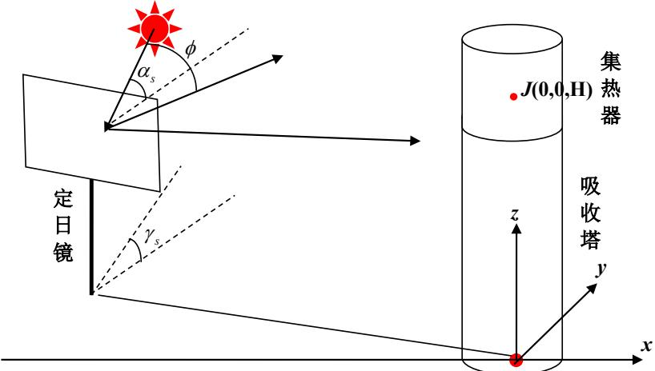
图 1：定日镜场的大地坐标系

在该坐标系中，第i个定日镜中心位置坐标 $d _ { i } \left( x _ { i } , y _ { i } , z _ { i } \right)$ ，集热器中心坐标 J (0,0, H ) 。

## 4.1.2 太阳主光线入射、反射以及定日镜法向

太阳光并非平行光线，而是具有一定锥形角的一束锥形光线。因此，先对太阳的一条主光线进行描述。进行在计算定日镜场效率时，需要首先需要对定日镜的入射主光线、反射主光线、法向、俯仰角和方位角进行建模。首先，根据太阳高度角和太阳方位角的定义和公式，结合下图，则可得到太阳光的入射主光线方向向量如下：

$$
\vec { L } _ { i } = \left( - \cos \alpha _ { s } \sin \gamma _ { s } , - \cos \alpha _ { s } \cos \gamma _ { s } , - \sin \alpha _ { s } \right)\tag{1}
$$

其中，根据太阳方位角和太阳高度角的公式，ST 为当地时间， $\delta$ 为太阳赤纬角，D 为以春分作为第0天起算的天数， $\omega$ 为太阳时角， $\varphi$ 为当地纬度：

$$
\left\{ \begin{array} { l l } { \sin \alpha _ { s } = \cos \delta \cos \varphi \cos \omega + \sin \delta \sin \varphi } \\ { \cos \gamma _ { s } = { \displaystyle \frac { \sin \delta - \sin \alpha _ { s } \sin \varphi } { \cos \alpha _ { s } \cos \varphi } } } \\ { \omega = \displaystyle \frac { \pi } { 1 2 } \big ( S T - 1 2 \big ) } \\ { \sin \delta = \sin \displaystyle \frac { 2 \pi } { 3 6 0 } \sin \left( \frac { 2 \pi } { 3 6 0 } 2 3 . 4 5 \right) } \end{array} \right.
$$

而正常来说，对于中国区域，早上太阳光从东边射来，中午太阳光从南边射来，傍晚太阳光从西边射来。早上的太阳方位角在 $9 0 ^ { \circ }$ 左右（但一年当中，有一定的角度范围变化），正中午的太阳方位角在 $1 8 0 ^ { \circ }$ （正南方），傍晚的太阳方位角在 $2 7 0 ^ { \circ }$ 左右（但一年当中，有一定的角度范围变化）。因此，对于太阳方位角的正弦值需要进行分类讨论，如下：

$$
\sin \gamma _ { s } = \left\{ \begin{array} { l l } { \sqrt { 1 - \cos ^ { 2 } \gamma _ { s } } , S T < 1 2 } \\ { - \sqrt { 1 - \cos ^ { 2 } \gamma _ { s } } , S T \ge 1 2 } \end{array} \right.
$$

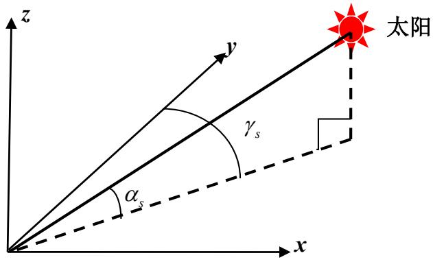
图 2：太阳方位角和高度角图示

我们认为，控制器控制定日镜的法向（即控制定日镜的俯仰角和方位角）使得经过定日镜中心的反射主光线刚好经过集热器中心，即为定日镜法向对不同太阳位置的最佳调节。因此，经过定日镜中心的反射主光线单位向量为：

$$
\vec { L } _ { r } = \frac { \left( - x _ { i } , - y _ { i } , H - z _ { i } \right) } { \left| \left( - x _ { i } , - y _ { i } , H - z _ { i } \right) \right| }
$$

根据平行四边形定理，从而得到该时刻太阳位置下，第 i个定日镜的法向量为（以下简称定日镜法向量）：

$$
\vec { n } = \left( - \vec { L } _ { i } \right) + \vec { L } _ { r }
$$

通过镜场大地坐标系 z 轴的方向向量 $\vec { Z } = \left( 0 , 0 , 1 \right)$ ，计算定日镜的俯仰角 $\beta$ ，即定日镜的法向量与镜场大地坐标系投影轴的夹角，如下图：

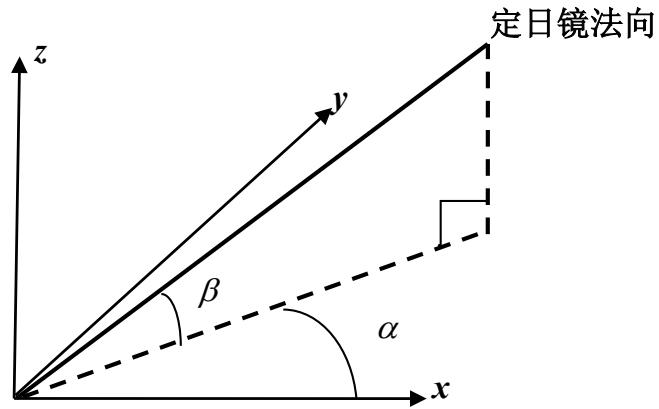
图 3：定日镜的方位角（α）和俯仰角（β）计算示意图

$$
\beta = \frac { \pi } { 2 } - \operatorname { a r c c o s } \left( \frac { \vec { n } \cdot \vec { Z } } { \vert \vec { n } \vert \cdot \vert \vec { Z } \vert } \right)\tag{2}
$$

将定日镜的法向量投影于大地坐标系的 xoy 平面，得到定日镜法向量的投影向量 ${ \vec { n } } _ { 0 }$ ，计算 ${ \vec { n } } _ { 0 }$ 与大地坐标系x轴的方向向量S 的夹角为方位角α，如下：

$$
\alpha = \left. \begin{array} { l } { \operatorname { a r c c o s } \left( \displaystyle \frac { { \vec { n } } _ { 0 } \cdot { \vec { S } } } { \left| { \vec { n } } _ { 0 } \right| \cdot \left| \vec { S } \right| } \right) , { \vec { n } } _ { 0 } \left( 2 \right) \geq 0 } \\ { - \operatorname { a r c c o s } \left( \displaystyle \frac { { \vec { n } } _ { 0 } \cdot { \vec { S } } } { \left| { \vec { n } } _ { 0 } \right| \cdot \left| \vec { S } \right| } \right) , { \vec { n } } _ { 0 } \left( 2 \right) < 0 } \end{array} \right.\tag{3}
$$

其中 $\vec { S } = \left( 1 , 0 , 0 \right) , \vec { n } _ { \scriptscriptstyle 0 } = \left( \vec { n } _ { \scriptscriptstyle 0 } \left( 1 \right) , \vec { n } _ { \scriptscriptstyle 0 } \left( 2 \right) , 0 \right)$ 。光学效率包含了阴影遮挡效率、余弦效率、大气透射率、集热器截断效率和镜面反射率。因此确定太阳的反射和入射及定日镜的法向调节后，需表示太阳光线入射反射造成的阴影遮挡效率、集热器接收情况和余弦效率。

## 4.1.3 定日镜面坐标系的建立

为了方便表示和计算定日镜面上的坐标，我们需要将定日镜面的坐标系转换到镜场大地坐标系或者将镜场大地坐标系转换到定日镜面坐标系。因此，以定日镜中心为原点，以经过原点 d并垂直镜面的法向量为 z轴。以经过原点平行镜面的宽为x轴，以经过原点平行镜面的长为y轴，建立镜面坐标系（见下图）：

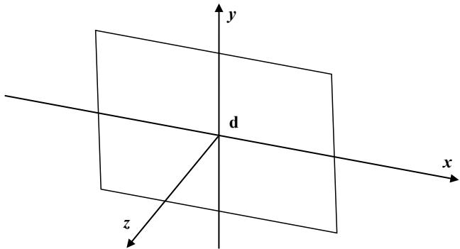
图 4：定日镜面的坐标系

## 4.1.4 光锥坐标系的建立

太阳光并非平行光线，而是具有一定锥形角的一束锥形光线，因此太阳入射光线经定日镜任意一点的反射光线也是一束锥形光线。在考虑阴影遮挡和集热器吸收能量时，需要考虑锥形光束的吸收和遮挡。因此，我们需要建立起以主入射光线和主反射光线为锥体中心线的光锥坐标系。大地坐标系下的反射光锥束的中心主光线$\vec { L } _ { z } = \left( m , n , p \right)$ ，以主光线为 z 轴，则 z 轴的方向向量为 $\vec { s } = \left( 0 , 0 , 1 \right)$ ，则锥体光线束的俯仰角 $\beta _ { z }$ 为：

$$
\beta _ { z } = \frac { \pi } { 2 } - \operatorname { a r c c o s } \frac { \vec { L } _ { z } \cdot \vec { s } } { \left| \vec { L } _ { z } \right| \cdot \left| \vec { s } \right| }
$$

锥体光线束的主光线与x轴的夹角即方位角 $\alpha _ { z }$ 为：

$$
\begin{array} { r } { \alpha _ { z } = \left\{ \begin{array} { l l } { \operatorname { a r c c o s } \frac { \vec { L } _ { z } ^ { \prime } \cdot \vec { S } _ { 1 } } { \left| \vec { L } _ { r } ^ { \prime } \right| \left| \vec { S } _ { 1 } \right| } , y \leq 0 } \\ { - \operatorname { a r c c o s } \frac { \vec { L } _ { r } ^ { \prime } \cdot \vec { S } _ { 1 } } { \left| \vec { L } _ { z } ^ { \prime } \right| \left| \vec { S } _ { 1 } \right| } , y > 0 } \end{array} \right. } \end{array}
$$

其中， $\vec { s } = \left( 0 , 0 , 1 \right) , \vec { s } _ { 1 } = \left( 1 , 0 , 0 \right)$ 。描述光锥直线，侧边任一光线：

$$
\vec { f } = \left( \sin \theta _ { 1 } \cos \theta _ { 2 } , \sin \theta _ { 1 } \sin \theta _ { 2 } , \cos \theta _ { 1 } \right)\tag{4}
$$

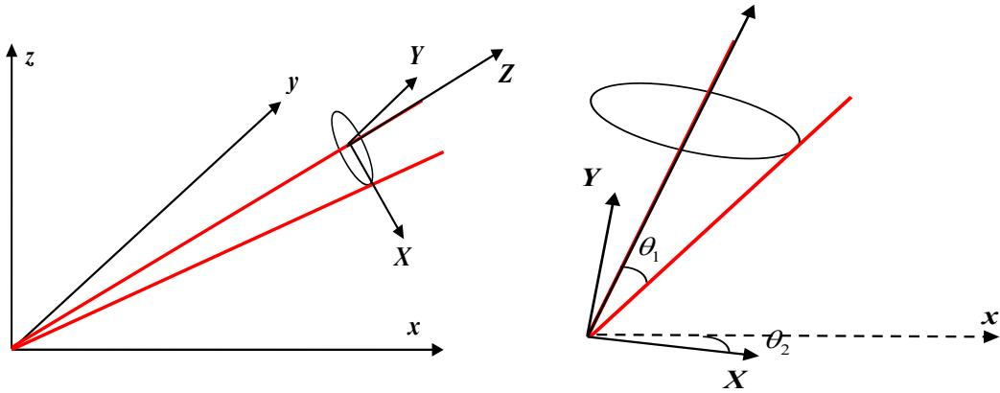
图 5：光椎束的坐标系（X-Y-Z）

其中， $\theta _ { 1 } \in \left( 0 , 4 . 6 5 m r a d \right) , \theta _ { 2 } \in \left( 0 , 2 \pi \right)$ 0

## 4.2 问题一的模型建立

为计算一束锥形光线的入射和反射受到的阴影遮挡损失和集热器吸收能量等，需要对镜面坐标系、镜场大地坐标系和光锥坐标系进行坐标变换。为此，建立定日镜场的效率计算模型，计算光学效率、输出热功率等：

## 4.2.1 镜面、大地、光锥坐标系的变换

首先，需要将镜面坐标系转成镜场大地坐标系，对于旋转后的矩阵，根据欧拉角旋转矩阵来求解。将镜面坐标系转化为镜场大地坐标系，第i个定日镜的俯仰角为 $\beta _ { i }$ 和方位角为 $\alpha _ { i }$ 。旋转矩阵与俯仰角 $\beta _ { i }$ 和方位角 $\alpha _ { i }$ 有关，因此首先绕 x 轴旋转 $\alpha _ { i }$ ，再绕 z轴旋转 $\beta _ { i }$ 。则第i个定日镜的镜面坐标系到大地坐标系的转换关系矩阵为：

$$
T _ { i } = \left[ \begin{array} { c c c } { \cos \alpha _ { i } \cos \left( \pi / 2 - \beta _ { i } \right) } & { - \sin \alpha _ { i } } & { \cos \alpha \sin \left( \pi / 2 - \beta _ { i } \right) } \\ { \sin \alpha _ { i } \cos \left( \pi / 2 - \beta _ { i } \right) } & { \cos \alpha _ { i } } & { \sin \alpha \sin \left( \pi / 2 - \beta _ { i } \right) } \\ { - \sin \left( \pi / 2 - \beta _ { i } \right) } & { 0 } & { \cos \left( \pi / 2 - \beta _ { i } \right) } \end{array} \right]\tag{5}
$$

而将光锥坐标系转到镜场大地坐标系上时，其所对应光锥的俯仰角 $\beta _ { z }$ 和方位角 $\alpha _ { z }$ 发生变换，且与每束光锥在大地坐标系里的不同俯仰角 $\beta _ { z }$ 和方位角 $\alpha _ { z }$ 有关，其旋转矩阵也会发生变换：

$$
T _ { z } = \left[ \begin{array} { c c c } { \cos \alpha _ { z } \cos \left( \pi / 2 - \beta _ { z } \right) } & { - \sin \alpha _ { z } } & { \cos \alpha \sin \left( \pi / 2 - \beta _ { z } \right) } \\ { \sin \alpha _ { z } \cos \left( \pi / 2 - \beta _ { z } \right) } & { \cos \alpha _ { z } } & { \sin \alpha \sin \left( \pi / 2 - \beta _ { z } \right) } \\ { - \sin \left( \pi / 2 - \beta _ { z } \right) } & { 0 } & { \cos \left( \pi / 2 - \beta _ { z } \right) } \end{array} \right]\tag{6}
$$

## 4.2.2 阴影遮挡效率

阴影遮挡效率 $\eta _ { s b }$ 由阴影遮挡损失计算，阴影遮挡损失分为三部分。若塔身对某入射光线造成阴影遮挡损失，那么不再考虑该入射光线被前定日镜所阻挡和其所对应的反射光线被前定日镜所遮挡。若塔未对某入射光线造成遮挡，则需要考虑二、三部分。对于，某一束入射光锥束，首先先判断是否被塔身遮挡，然后再判断是否被前定日镜遮挡。之后，入射光锥束变为反射光锥束，判断反射光锥束是否会被前定日镜遮挡。若反射光椎束不被前定日镜遮挡，则成功反射出，再考虑是否被集热器接收。

## 1）塔对镜场造成的阴影损失

首先考虑经过 a 镜上的入射光线是否经过塔身，即被塔身遮挡，当遮挡后即不需考虑是否该光线的入射和反射，示意图如下图7。

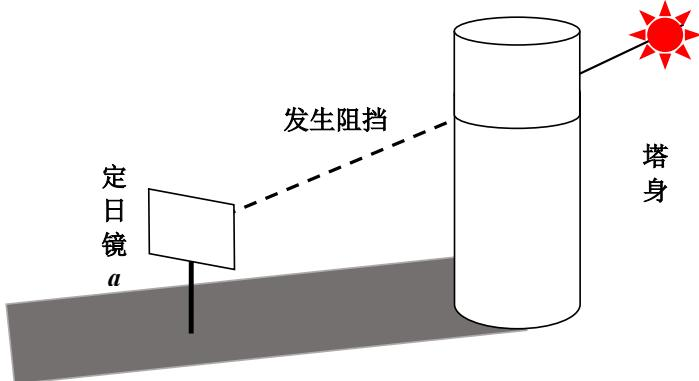
图 6：塔损失模型

入射光线可表示为：

$$
\vec { L } _ { i } = \left( - \cos \alpha _ { s } \sin \gamma _ { s } , - \cos \alpha _ { s } \cos \gamma _ { s } , - \sin \alpha _ { s } \right) = \left( m , n , p \right)
$$

描述光锥束侧边任一光线：

$$
\vec { f } = \left( \sin \theta _ { 1 } \cos \theta _ { 2 } , \sin \theta _ { 1 } \sin \theta _ { 2 } , \cos \theta _ { 1 } \right)
$$

再将光锥坐标系进行坐标变换，换到地面坐标。结果如下：

$$
\vec { f } ^ { \prime } = T _ { z } \cdot \vec { f }
$$

其中 $\vec { f } ^ { \prime } = ( m ^ { \prime } , n ^ { \prime } , p ^ { \prime } )$ ，取镜面上任意一点 $D \big ( x _ { 0 } , y _ { 0 } , z _ { 0 } \big )$ ，联立方程：

$$
\left\{ \begin{array} { l l } { \displaystyle { \frac { x - x _ { 0 } } { m ^ { \prime } } } = { \frac { y - y _ { 0 } } { n ^ { \prime } } } = { \frac { z - z _ { 0 } } { p ^ { \prime } } } = t \quad } \\ { \displaystyle x ^ { 2 } + y ^ { 2 } = R ^ { 2 } \quad } \end{array} \right. \Longrightarrow \left\{ \begin{array} { l l } { \displaystyle x = x _ { 0 } + m ^ { \prime } t } \\ { \displaystyle y = y _ { 0 } + n ^ { \prime } t } \\ { \displaystyle z = z _ { 0 } + p ^ { \prime } t } \end{array} \right.\tag{7}
$$

得到以下式子：

$$
\left( m ^ { \prime 2 } + n ^ { \prime 2 } \right) t ^ { 2 } + 2 \left( m ^ { \prime } x _ { 0 } + n ^ { \prime } y _ { 0 } \right) t + x _ { 0 } ^ { 2 } + y _ { 0 } ^ { 2 } - R ^ { 2 } = 0\tag{8}
$$

其所对应的判别式如下：

$$
\begin{array} { r } { \left\{ \begin{array} { l l } { \Delta = 4 \big ( m ^ { \prime } x _ { 0 } + n ^ { \prime } y _ { 0 } \big ) ^ { 2 } - 4 \big ( m ^ { \prime 2 } + n ^ { \prime 2 } \big ) \big ( x _ { 0 } ^ { 2 } + y _ { 0 } ^ { 2 } - R ^ { 2 } \big ) < 0 , } & { \widehat { \mathrm { Z ~ i ~ i ~ g ~ r ~ a ~ l ~ s ~ } } } \\ { \Delta = 4 \big ( m ^ { \prime } x _ { 0 } + n ^ { \prime } y _ { 0 } \big ) ^ { 2 } - 4 \big ( m ^ { \prime 2 } + n ^ { \prime 2 } \big ) \big ( x _ { 0 } ^ { 2 } + y _ { 0 } ^ { 2 } - R ^ { 2 } \big ) \geq 0 , } & { \widehat { \mathrm { H ~ W ~ E ~ M ~ } } } \end{array} \right. } \end{array}\tag{9}
$$

若 $\Delta \geq 0$ ，则：

$$
\left\{ \begin{array} { l l } { \operatorname* { m i n } { \left( z _ { 0 } + t _ { 1 } p ^ { \prime } , z _ { 0 } + t _ { 2 } p ^ { \prime } \right) } \leq 8 4 , } & { \mathrm { i } \not \equiv \pm 1 } \\ { \operatorname* { m i n } { \left( z _ { 0 } + t _ { 1 } p ^ { \prime } , z _ { 0 } + t _ { 2 } p ^ { \prime } \right) } > 8 4 , } & { \mathrm { \mathcal { D } } \dot { z } _ { 0 } \not \equiv \pm 1 } \end{array} \right.
$$

若为判断入射主光线 $\left( m , n , p \right)$ 是否被塔身遮挡，同理如上联立方程求判别式。且每块定日镜的入射光线均需要判断是否被塔身遮挡，则此时将第i根入射光椎束是否被塔身遮挡记为 $b _ { 1 } ^ { i }$ ，其为0，1变量：

$$
b _ { 1 } ^ { i } = \left\{ \begin{array} { l l } { 0 , } & { i f \operatorname* { m i n } { \left( z _ { 0 } + t _ { 1 } p ^ { \prime } , z _ { 0 } + t _ { 2 } p ^ { \prime } \right) } > 8 4 , } & { \widehat { \mathbb { X } } \sharp \widehat { \mathbb { Z } } \vert \widehat { \mathbb { Z } } } \\ { 1 , } & { i f \operatorname* { m i n } { \left( z _ { 0 } + t _ { 1 } p ^ { \prime } , z _ { 0 } + t _ { 2 } p ^ { \prime } \right) } \leq 8 4 , } & { \widehat { \mathbb { Z } } \sharp \widehat { \mathbb { Z } } } \end{array} \right.\tag{10}
$$

## 2）后定日镜接收的入射太阳光被前定日镜所阻挡的阴影损失

当 $a$ 镜的入射光线未被塔身遮挡时，需要考虑后定日镜接收的太阳光被前定日镜所阻挡的阴影损失和后定日镜在反射太阳光时被前定日镜阻挡而未到达集热器上的遮挡损失。首先考虑后定日镜接收的太阳光被前定日镜所阻挡的阴影损失，求阴影遮挡损失，即计算经过 a镜坐标系中的某一点 $D _ { 1 } \left( x _ { 1 } , y _ { 1 } , 0 \right)$ 的入射光线是否被 b镜遮挡，判断其与b镜平面的交点是否在b镜面内。

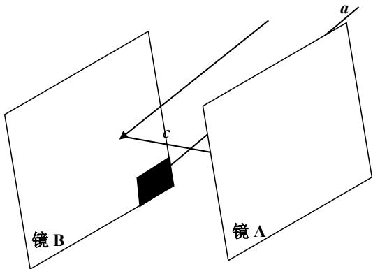
图 7：塔身不遮挡下，定日镜的阴影遮挡损伤模型图示

首先进行光线的坐标系变换，将大地坐标系中的入射主光线转换到 b 镜的镜面坐标系中，则转换后的 b镜坐标系下的入射光线（束）为：

$$
\vec { L } _ { i } ^ { \prime } = \left( T _ { b } \right) ^ { T } \cdot \vec { L _ { i } } = \left( \tilde { m } , \tilde { n } , \tilde { p } \right)
$$

以该入射主光线为z轴建立光锥束坐标系，其坐标如下：

$$
\vec { f } _ { 2 } = \left( \sin \theta _ { 1 } \cos \theta _ { 2 } , \sin \theta _ { 1 } \sin \theta _ { 2 } , \cos \theta _ { 1 } \right)
$$

再将光锥坐标系进行坐标变换，换到镜场大地坐标系。结果如下：

$$
\vec { f } _ { 2 } ^ { \prime } = T _ { z } \cdot \vec { f } _ { 2 }
$$

再将镜场大地坐标系的 ${ \vec { f } } _ { 2 } ^ { \prime }$ 转换到b镜坐标系下，结果如下：

$$
\vec { f } _ { 2 } ^ { \prime \prime } { = } \left( T _ { b } \right) ^ { T } \cdot \vec { f } _ { 2 } ^ { \prime }
$$

然后进行点的变换，将 a 镜坐标系上的一点转换到大地坐标系上，再转到 b 镜的坐标系下，其点为 $D _ { 1 } ^ { \prime \prime } \big ( x _ { 1 } ^ { \prime \prime } , y _ { 1 } ^ { \prime \prime } , z _ { 1 } ^ { \prime \prime } \big )$ 。经过 a 镜坐标系中的某一点 $D _ { 1 } \left( x _ { 1 } , y _ { 1 } , z _ { 1 } \right)$ ，则其转换到大地坐标系上的坐标为：

$$
D _ { 1 } ^ { \prime } = T _ { a } \cdot D _ { 1 } + O _ { a }\tag{11}
$$

其中， $D _ { 1 } ^ { \prime } \left( x _ { 1 } ^ { \prime } , y _ { 1 } ^ { \prime } , z _ { 1 } ^ { \prime } \right) O _ { a }$ 为 $a$ 镜原点在大地坐标系的坐标，即 $\left( x _ { a } , y _ { a } , z _ { a } \right)$ 。再转换到 b镜坐标系下得到：

$$
D _ { 1 } ^ { \prime \prime } { = } \left( T _ { b } \right) ^ { T } \cdot \left( D _ { 1 } ^ { \prime } { - } O _ { b } \right)\tag{12}
$$

其中 $O _ { b }$ 为 $b$ 镜原点在大地坐标系的坐标，即 $\left( x _ { b } , y _ { b } , z _ { b } \right)$ 。最后判断入射光线与 b 镜平面的交点是否在 b 镜的镜面上。设 b 镜坐标系下的入射光线向量 $\vec { L } _ { i } ^ { \prime } = \left( a _ { i } , b _ { i } , c _ { i } \right)$ ，计算经过$D _ { 1 } ^ { \prime \prime } \big ( x _ { 1 } ^ { \prime \prime } , y _ { 1 } ^ { \prime \prime } , z _ { 1 } ^ { \prime \prime } \big )$ 的入射主光线与 $b$ 镜的交点 $\left( { x _ { i } , y _ { i } , 0 } \right)$ 是否在 $b$ 镜内：

$$
\frac { x _ { 2 } - x _ { 1 } ^ { \prime \prime } } { a _ { i } } { = } \frac { y _ { 2 } - y _ { 1 } ^ { \prime \prime } } { b _ { i } } { = } \frac { - z _ { 1 } ^ { \prime \prime } } { c _ { i } }\tag{13}
$$

若 $\cdot 3 \leq x _ { i } \leq 3 , - 3 \leq y _ { i } \leq 3$ ，且交点经过转换到镜场大地坐标系后的Z坐标值要大于 $z _ { 1 } ^ { \prime }$ ，则表明经过 $a$ 镜某点的入射主光线被 b 镜阻挡。同理，光椎束的光线经过转换后，结合 $D _ { 1 } ^ { \prime \prime } \big ( x _ { 1 } ^ { \prime \prime } , y _ { 1 } ^ { \prime \prime } , z _ { 1 } ^ { \prime \prime } \big )$ ，求 b 镜的交点 $\left( { x _ { i } , y _ { i } , 0 } \right)$ 进行判断。最后，引入 $b _ { i } ^ { 2 }$ 表示入射主光线或者光锥束是否被前定日镜阻挡，且每个定日镜均需要进行判断：

$$
b _ { 2 } ^ { i } = \left\{ \begin{array} { l } { { 0 , ~ e l s e , \enspace \enspace \ast \ddag \pmb { \mathbb { Z } } } } \\ { { 1 , i f - 3 \le x _ { i } , y _ { i } \le 3 a n d z _ { 1 } ^ { \prime } < Z , \enspace \ddag \pmb { \mathbb { Z } } } } \end{array} \right.\tag{14}
$$

## 3）后定日镜在反射太阳光时被前定日镜阻挡而未到达集热器上的遮挡损失

反射光线（束）和入射光线（束）一一对应，即锥形光束入射也是锥体光束反射。入射光线（束）转换到大地坐标系上为 ${ \vec { f } _ { 2 } } ^ { \prime }$ 。根据几何关系，求对应的反射光线满足：

$$
\vec { g } - \vec { f } _ { 2 } ^ { \prime } = - \Big | \vec { f } _ { 2 } ^ { \prime } \Big | \cdot \cos \theta \cdot \vec { n }\tag{15}
$$

其中， $\vec { n }$ 为镜面法向量。 $\theta$ 为入射光线与法线夹角。得到：

$$
\vec { g } = \vec { f } ^ { \prime } { - } 2 \cdot \vec { f } ^ { \prime } \cdot \vec { n } \cdot \vec { n }
$$

$\vec { L } _ { r }$ 由以上公式计算。接着，同 2）所述，计算定日镜在反射太阳光时被前定日镜阻挡而未到达集热器上的遮挡损失。即判断经过 a 镜坐标系中的某一点 $D _ { 1 } \left( x _ { 1 } , y _ { 1 } , z _ { 1 } \right)$ 的反射光线落入 b 镜坐标系中，首先进行光线的坐标系变换，将大地坐标系中的反射光线转换到b镜的镜面坐标系中，则转换后的b镜坐标系下的反射光线为：

$$
\vec { L } _ { r } ^ { \prime } = T _ { b } ^ { \ : T } \cdot \vec { L } _ { r }
$$

其中 $\vec { L } _ { r }$ 为反射光线向量。设 b 镜坐标系下的反射光线 $\vec { L } _ { r } ^ { \prime } = \left( a _ { r } , b _ { r } , c _ { r } \right)$ ，反射光线与 b 镜

平面的交点为 $\left( x _ { r } , y _ { r } , 0 \right)$ ，计算反射光线与b镜的交点是否在b镜内：

$$
\frac { x _ { r } - x _ { 1 } ^ { \prime \prime } } { a _ { r } } = \frac { y _ { r } - y _ { 1 } ^ { \prime \prime } } { b _ { r } } = \frac { - z _ { 1 } ^ { \prime \prime } } { c _ { r } }\tag{16}
$$

若 $- 3 \leq x _ { r } \leq 3 , - 3 \leq y _ { r } \leq 3$ ，且反射光线与 b 镜的交点相对于大地坐标系的 Z 坐标值大于$z _ { 1 } ^ { \prime }$ ，则表明该经过a镜某点的反射光线被b镜阻挡。

$$
b _ { 3 } ^ { i } = \left\{ \begin{array} { l l } { { 0 , } } & { { e l s e , \enspace \enspace \Oiiint \enspace \mathrm { { \widehat { L } } } } } \\ { { 1 , } } & { { i f - 3 \le x _ { r } , y _ { r } \le 3 a n d z _ { 1 } ^ { \prime } < Z , \enspace \mathrm { { \widehat { f } } } \enspace \mathrm { { \widehat { L } } } } } \end{array} \right.\tag{17}
$$

最后，将综合以上三部分的阴影遮挡损失，可得到阴影遮挡效率，N为总光线数量。

$$
\begin{array} { l } { \displaystyle \eta _ { s b } = 1 - \sum _ { i = 1 } ^ { N } \left( b _ { 1 } ^ { i } + b _ { 2 } ^ { i } + b _ { 3 } ^ { i } \right) / \ : N } \\ { \displaystyle } \\ { \displaystyle \left( i f b _ { 1 } ^ { i } = 1 \Longrightarrow b _ { 2 } ^ { i } = 0 , b _ { 3 } ^ { i } = 0 \right. } \\ { \displaystyle \left. i f b _ { 1 } ^ { i } = 0 \Longrightarrow b _ { 2 } ^ { i } = 0 , 1 \right. } \\ { \displaystyle \left. i f b _ { 2 } ^ { i } = 0 \Longrightarrow b _ { 3 } ^ { i } = 0 , 1 \right. } \\ { \displaystyle \left. i f b _ { 2 } ^ { i } = 1 \Longrightarrow b _ { 3 } ^ { i } = 1 \right. } \end{array}\tag{18}
$$

## 4.2.3 集热器截断效率

考虑经过 a 镜上一点 $\left( x _ { 0 } , y _ { 0 } , z _ { 0 } \right)$ 的反射光线向量 $\vec { L } _ { r }$ 。在未被前定日镜遮挡后，成功反射后是否与集热器存在交点。将反射光线与集热器方程进行联立：

$$
\left\{ \begin{array} { l l } { x ^ { 2 } + y ^ { 2 } = R ^ { 2 } , z \in \left[ 7 6 , 8 4 \right] } \\ { \frac { x - x _ { 0 } } { - x _ { i } } = \frac { y - y _ { 0 } } { - y _ { i } } = \frac { z - z _ { 0 } } { H - z _ { i } } = t } \end{array} \right. \Longrightarrow \left\{ \begin{array} { l l } { x = - x _ { i } t + x _ { 0 } } \\ { y = - y _ { i } t + y _ { 0 } } \\ { z = \left( H - z _ { i } \right) t + z _ { 0 } } \end{array} \right.\tag{19}
$$

得到方程如下：

$$
\left( - x _ { i } t + x _ { 0 } \right) ^ { 2 } + \left( - y _ { i } t + y _ { 0 } \right) ^ { 2 } = R ^ { 2 }\tag{20}
$$

整理得到方程如下：

$$
\left\{ \begin{array} { l l } { \Delta \geq 0 , } & { { / } \boxed { \div } \boxed { \cdot } \frac { \Sigma } { \mathrm { ~ w ~ } } } \\ { \Delta < 0 , } & { \bar { \mathcal { D } } _ { \mathrm { ~ L } } ^ { \setminus } \boxed { \pm } \ddagger \forall z } \end{array} \right.
$$

若 $\Delta \geq 0$ 有交点，两个解为 $t _ { 1 } , t _ { 2 }$ ，则考虑z坐标最小时在集热器的高度范围内：

$$
\left\{ \begin{array} { l l } { \operatorname* { m i n } \big \{ \big ( H - z _ { 0 } \big ) t _ { 1 } + z _ { i } , \big ( H - z _ { 0 } \big ) t _ { 2 } + z _ { i } \big \} \in \big [ 7 6 , 8 4 \big ] , } & { \textmd f i \textcircled { < } \underline { { \texttt { d } } } \underline { { \texttt { d } } } \underline { { \texttt { d } } } \underline { { \texttt { d } } } \big \} \big \} } \\ { \operatorname* { m i n } \big \{ \big ( H - z _ { 0 } \big ) t _ { 1 } + z _ { i } , \big ( H - z _ { 0 } \big ) t _ { 2 } + z _ { i } \big \} \not \in \big [ 7 6 , 8 4 \big ] , } & { \textcircled { < } \underline { { \texttt { d } } } \underline { { \texttt { d } } } \underline { { \texttt { d } } } \underline { { \texttt { d } } } \underline { { \texttt { d } } } \big \} \big \} } \end{array} \right.
$$

引入 0，1 变量 $r _ { j }$ ，表示第j根成功反射的光线是否接收。且每块定日镜均需要进行反射光线或光锥束接收计算：

$$
r _ { j } = \left\{ \begin{array} { l } { 0 , | \mathfrak { H } | _ { \mathfrak { H } } ^ { \varSigma + \gamma } \mathfrak { H } _ { \infty } ^ { \varSigma + \frac { \gamma } { 2 } \varXi + \frac { \gamma } { 2 } \varXi \sqrt { \mathfrak { X } } } \sqrt { \mathfrak { X } } \mathfrak { X } \mathfrak { X } \mathfrak { X } \mathfrak { X } \mathfrak { X } \mathfrak { X } \mathfrak { X } \mathfrak { X } \mathfrak { X } \mathfrak { X } \mathfrak { X } \mathfrak { X } \mathfrak { X } } \\ { 1 , \operatorname* { m i n } \left\{ \left( H - z _ { 0 } \right) t _ { 1 } + z _ { i } , \left( H - z _ { 0 } \right) t _ { 2 } + z _ { i } \right\} \in \left[ 7 6 , 8 4 \right] } \end{array} \right.\tag{21}
$$

使用 $r _ { j }$ 表示集热器截断效率，其中， $N ^ { \prime }$ 表示总光线数：

$$
\eta _ { t r u n c } = \frac { \displaystyle \sum _ { j = 1 } ^ { N ^ { \prime } } r _ { j } } { \displaystyle N ^ { \prime } - \sum _ { i = 1 } ^ { N ^ { \prime } } \big ( b _ { 1 } ^ { i } + b _ { 2 } ^ { i } + b _ { 3 } ^ { i } \big ) }\tag{22}
$$

## 4.2.4 余弦效率

余弦损失，太阳光入射方向与镜面采光口法线方向不平行引起的接收能量损伤。

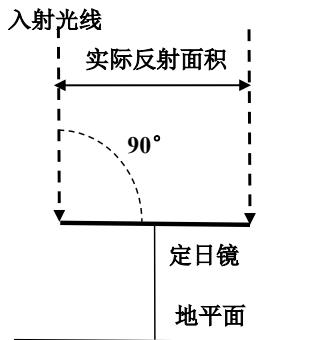
（a）光线沿镜面法线方向入射

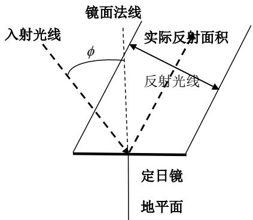
（b）光线沿非镜面法线方向入射
图 8：余弦损失的示意图

因此，余弦效率的表达式如下：

$$
\eta _ { \mathrm { c o s } } = \cos \phi = \frac { \vec { L } _ { i } \cdot \vec { L } _ { r } } { \left| \vec { L } _ { i } \right| \cdot \left| \vec { L } _ { r } \right| } = 1 - \frac { S - \cos \phi \cdot S } { S }\tag{23}
$$

## 4.2.5 定日镜场的效率计算模型

## 1）光学效率

$$
\eta _ { i } ^ { j } = \eta _ { s b } \eta _ { \mathrm { c o s } } \eta _ { a t } \eta _ { t r u n c } \eta _ { r e f }
$$

其中， $\eta _ { r e f } = 0 . 9 2 , \eta _ { a t } = 0 . 9 9 3 2 1 - 0 . 0 0 0 1 1 7 6 d _ { { \scriptscriptstyle H R } } + 1 . 9 7 \times 1 0 ^ { - 8 } \times d _ { { \scriptscriptstyle H R } } ^ { 2 } \left( d _ { { \scriptscriptstyle H R } } \le 1 0 0 0 \right) \sin \left( \left( d _ { { \scriptscriptstyle H R } } \right) \xi \right) ,$ $\eta _ { i } ^ { j }$ 表示第i面定日镜在第 $j$ 个时刻的光学效率。那么，某月21日的平均光学效率为：

$$
\overline { { \eta } } = \sum _ { j = 1 } ^ { 5 } \sum _ { i = 1 } ^ { N } \eta _ { i } ^ { j } / 5\tag{24}
$$

年平均光学效率为每个月的平均光学效率和的平均值：

$$
\widetilde { \eta } = \left( \overline { { \eta _ { 1 } } } + \overline { { \eta _ { 2 } } } + . . . + \overline { { \eta _ { 1 2 } } } \right) / 1 2
$$

其中， $\overline { { \eta _ { 1 } } }$ 表示 1 月 21 日的平均光学效率。

## 2）输出热功率

定日镜场的输出热功率如下，其为某时刻的输出热功率：

$$
E _ { f i e l d } ^ { j } = D N I \cdot \sum _ { i = 1 } ^ { n } A _ { i } n _ { _ i } ^ { j }
$$

其中， $A _ { i }$ 为第 i 面定日镜的采光面积， $\eta _ { i } ^ { j }$ 表示第j个时刻光学效率，法向直接辐射辐照度DNI的计算公式如下，其中 $G _ { 0 } = 1 . 3 6 6 k W / m ^ { 2 }$ $H = 3 0 0 0 m$

$$
{ \begin{array} { l } { { \boldsymbol { D N I } } = G _ { \mathrm { { o } } } { \left[ { a + b \exp \left( - { \cfrac { c } { { \sin } \alpha _ { s } } } \right) } \right] } } \\ { a = 0 . 4 2 3 7 - 0 . 0 0 8 2 1 { \left( 6 - H \right) } ^ { 2 } } \\ { b = 0 . 5 0 5 5 + 0 . 0 0 5 9 5 { \left( 6 . 5 - H \right) } ^ { 2 } } \\ { c = 0 . 2 7 1 1 + 0 . 0 1 8 5 8 { \left( 2 . 5 - H \right) } ^ { 2 } } \end{array} }
$$

因此，平均输出热功率 $\overline { { E } } _ { f i e l d }$ 为：

$$
\overline { { { E } } } _ { f i e l d } = \frac { 1 } { 5 } \sum _ { j = 1 } ^ { 5 } E _ { f i e l d } ^ { j } = \frac { 1 } { 5 } D N I \cdot \sum _ { j = 1 } ^ { 5 } \sum _ { i = 1 } ^ { n } A _ { i } n _ { i } ^ { j }\tag{25}
$$

$\overline { { E } } _ { f i e l d } ^ { 1 }$ 表示1月21日的平均输出热功率，年输出平均热功率 $\overline { P }$ 为：

$$
\overline { { P } } = \sum _ { i = 1 } ^ { 1 2 } \overline { { E } } _ { f i e l d } ^ { i } / 1 2\tag{26}
$$

## 3）单位面积镜面平均输出热功率

单位面积镜面的平均输出热功率为平时输出热功率与镜面面积的比值，如下式：

$$
A W E _ { f i e l d } = \overline { { E } } _ { f i e l d } / \sum _ { i = 1 } ^ { n } A _ { i }\tag{27}
$$

单位镜面面积年平均输出热功率如下：

$$
{ \overline { { P } } } _ { s } = { \overline { { P } } } / \sum _ { i = 1 } ^ { n } A _ { i }\tag{28}
$$

## 4.3 问题一模型的求解

## 4.3.1 利用邻接矩阵寻找问题定日镜

按照附件顺序进行定日镜编号。首先，通过计算每个定日镜中心在镜场大地坐标系 xoy 的 $\mathbf { X } , \mathbf { y }$ 坐标之间的距离，判断 a定日镜与其他定日镜之间是否属于相邻或者较为相近的定日镜。由于定日镜具有一定尺寸，且太阳定日镜的太阳影子所造成阴影遮挡损失一般与其相邻的定日镜有关，由于在 $a$ 定日镜上取点描述入射、反射光线和光锥束，需要网格化取点和构造外侧锥束线，且 a 定日镜需要与其他 1744 块定日镜进行阴影遮挡损失计算，计算量至少 $1 7 4 4 \times 1 7 4 4 \times \tau ^ { 2 } \times \lambda ^ { 2 } \times \rho ^ { 2 }$ $\tau , \lambda , \rho$ 为镜面网格化步长、锥体束 $\theta _ { \imath }$ 角度步长、锥体束 $\theta _ { 2 }$ 角度步长。因此在计算 a 定日镜与其他定日镜的阴影遮挡损失时，考虑利用邻接矩阵减少计算量。每个定日镜中心在镜场大地坐标系 xoy 的 $\mathbf { X } , \mathbf { y }$ 坐标之间的距离计算公式如下：

$$
d = \sqrt { \left( x _ { k } - x _ { m } \right) ^ { 2 } + \left( y _ { k } - y _ { m } \right) ^ { 2 } }
$$

通过距离 d 判断是否相邻，考虑题中要求相邻定日镜底座中心之间的距离比镜面宽度多 $5 \mathrm { m }$ 。先计算距离，得到 $d ^ { \prime }$ 矩阵，观察距离大小，给定 $d = 2 0$ ，邻接矩阵如下：

$$
I \left( i , j \right) = \left\{ \begin{array} { c } { 0 , d > 2 0 } \\ { 1 , d \leq 2 0 } \end{array} \right.
$$

其中， $I \left( i , j \right) = 1$ 表示第i块定日镜和第j块定日镜相邻，否则不相邻。根据此减少 a 定日镜的阴影遮挡损失的定日面遍历数，更加精确地定位问题定日镜。

## 4.3.2 网格化镜面和取点求解

在某个定日镜上取点，步长 1.5m，即镜上取 25个点，在光锥束上取 $\theta _ { \mathrm { { l } } } = 0 . 0 0 2 r a d$ $\theta _ { 2 } = 0 , \pi / 2 , \pi , 3 \pi / 2$ ，即光锥束取4个点。首先，计算以3月21日为起止的天数D：

$$
\mathrm { D } \mathrm { = } [ 3 0 6 , 3 3 7 , 0 , 3 1 , 6 1 , 9 2 , 1 2 2 , 1 5 3 , 1 8 4 , 2 1 4 , 2 4 5 , 2 7 5 ]
$$

根据不同月份、时间内，计算所对应太阳位置。而后需要计算定日镜的俯仰角和方位角。而后，需要遍历每一个入射光线圆锥的光线，根据入射主光线，计算主光线锥体系的旋转矩阵，再通过旋转矩阵将不同坐标系的坐标进行转换。

接着判断入射光线（锥束）是否被塔身遮挡，若被塔身遮挡则造成阴影遮挡损失。然后，判断入射光线（锥束）是否被其他光镜遮挡。根据几何关系，计算所对应的反射光线（锥束），判断是否被其他镜遮挡。若未造成遮挡，则计算集热器是否接受。之后计算定日镜场的计算。

## 4.3.3 结果计算

根据定日镜场效率计算的公式，求解5个时刻的平均值，可得到表 1：

表 1：问题 1的每月 21日平均光学效率及输出功率
<table><tr><td rowspan=1 colspan=1>日期</td><td rowspan=1 colspan=1>平均光学效率</td><td rowspan=1 colspan=1>平均余弦效率</td><td rowspan=1 colspan=1>平均阴影遮挡效率</td><td rowspan=1 colspan=1>平均截断效率</td><td rowspan=1 colspan=1>单位面积镜面平均输出热功率 $( \mathrm { k W } / \mathrm { m } ^ { 2 } )$ </td></tr><tr><td rowspan=1 colspan=1>1月21日</td><td rowspan=1 colspan=1>0.504022</td><td rowspan=1 colspan=1>0.719936</td><td rowspan=1 colspan=1>0.896844</td><td rowspan=1 colspan=1>0.905984</td><td rowspan=1 colspan=1>0.439239</td></tr><tr><td rowspan=1 colspan=1>2月21日</td><td rowspan=1 colspan=1>0.52647</td><td rowspan=1 colspan=1>0.74044</td><td rowspan=1 colspan=1>0.917321</td><td rowspan=1 colspan=1>0.890886</td><td rowspan=1 colspan=1>0.496346</td></tr><tr><td rowspan=1 colspan=1>3月21日</td><td rowspan=1 colspan=1>0.541603</td><td rowspan=1 colspan=1>0.76114</td><td rowspan=1 colspan=1>0.922758</td><td rowspan=1 colspan=1>0.881162</td><td rowspan=1 colspan=1>0.538716</td></tr><tr><td rowspan=1 colspan=1>4月21日</td><td rowspan=1 colspan=1>0.554958</td><td rowspan=1 colspan=1>0.77934</td><td rowspan=1 colspan=1>0.922698</td><td rowspan=1 colspan=1>0.878468</td><td rowspan=1 colspan=1>0.571094</td></tr><tr><td rowspan=1 colspan=1>5月21日</td><td rowspan=1 colspan=1>0.564145</td><td rowspan=1 colspan=1>0.789317</td><td rowspan=1 colspan=1>0.922121</td><td rowspan=1 colspan=1>0.880157</td><td rowspan=1 colspan=1>0.589456</td></tr><tr><td rowspan=1 colspan=1>6月21日</td><td rowspan=1 colspan=1>0.567412</td><td rowspan=1 colspan=1>0.792359</td><td rowspan=1 colspan=1>0.921968</td><td rowspan=1 colspan=1>0.881265</td><td rowspan=1 colspan=1>0.595407</td></tr><tr><td rowspan=1 colspan=1>7月21日</td><td rowspan=1 colspan=1>0.564043</td><td rowspan=1 colspan=1>0.78921185</td><td rowspan=1 colspan=1>0.92213983</td><td rowspan=1 colspan=1>0.88012325</td><td rowspan=1 colspan=1>0.58926025</td></tr><tr><td rowspan=1 colspan=1>8月21日</td><td rowspan=1 colspan=1>0.55441</td><td rowspan=1 colspan=1>0.778637</td><td rowspan=1 colspan=1>0.922747</td><td rowspan=1 colspan=1>0.878471</td><td rowspan=1 colspan=1>0.569872</td></tr><tr><td rowspan=1 colspan=1>9月21日</td><td rowspan=1 colspan=1>0.541021</td><td rowspan=1 colspan=1>0.760092</td><td rowspan=1 colspan=1>0.922691</td><td rowspan=1 colspan=1>0.881786</td><td rowspan=1 colspan=1>0.536912</td></tr><tr><td rowspan=1 colspan=1>10月21日</td><td rowspan=1 colspan=1>0.524031</td><td rowspan=1 colspan=1>0.737835</td><td rowspan=1 colspan=1>0.915258</td><td rowspan=1 colspan=1>0.892657</td><td rowspan=1 colspan=1>0.489964</td></tr><tr><td rowspan=1 colspan=1>11月21日</td><td rowspan=1 colspan=1>0.501759</td><td rowspan=1 colspan=1>0.718196</td><td rowspan=1 colspan=1>0.894627</td><td rowspan=1 colspan=1>0.907023</td><td rowspan=1 colspan=1>0.433597</td></tr><tr><td rowspan=1 colspan=1>12月21日</td><td rowspan=1 colspan=1>0.490888</td><td rowspan=1 colspan=1>0.711082</td><td rowspan=1 colspan=1>0.8825</td><td rowspan=1 colspan=1>0.912004</td><td rowspan=1 colspan=1>0.40824</td></tr></table>

表 2：问题 1的年平均光学效率及输出功率表
<table><tr><td rowspan=1 colspan=1>年平均光学效率</td><td rowspan=1 colspan=1>年平均余弦效率</td><td rowspan=1 colspan=1>年平均阴影遮挡效率</td><td rowspan=1 colspan=1>年平均截断效率</td><td rowspan=1 colspan=1>年平均输出热功率(MW)</td><td rowspan=1 colspan=1>单位面积镜面年平均输出热功率 $( \mathrm { k W } / \mathrm { m } ^ { 2 } )$ </td></tr><tr><td rowspan=1 colspan=1>0.536230167</td><td rowspan=1 colspan=1>0.756465488</td><td rowspan=1 colspan=1>0.913639403</td><td rowspan=1 colspan=1>0.889165521</td><td rowspan=1 colspan=1>32.76117051</td><td rowspan=1 colspan=1>0.521508604</td></tr></table>

## 4.4 问题一的结果分析

取不同的镜面网格化步长下的 1月 21日上午 9：00的单位镜面面积平均输出热功率，当步长从 1.5开始后，单位镜面面积平均输出热功率增长的速度变得缓慢。因此，我们认为当步长为 1.5时，单位镜面面积平均输出热功率接近稳定。

表 3：不同的镜面网格化步长下的 1月 21日上午9：00的单位面积平均输出热功率
<table><tr><td rowspan=1 colspan=1>τ</td><td rowspan=1 colspan=1>6</td><td rowspan=1 colspan=1>3</td><td rowspan=1 colspan=1>1.5</td><td rowspan=1 colspan=1>1</td><td rowspan=1 colspan=1>0.5</td><td rowspan=1 colspan=1>0.25</td></tr><tr><td rowspan=1 colspan=1> $A V E _ { f i e l d }$ </td><td rowspan=1 colspan=1>0.29982404</td><td rowspan=1 colspan=1>0.35749342</td><td rowspan=1 colspan=1>0.37905415</td><td rowspan=1 colspan=1>0.389954</td><td rowspan=1 colspan=1>0.39836452</td><td rowspan=1 colspan=1>0.40294417</td></tr></table>

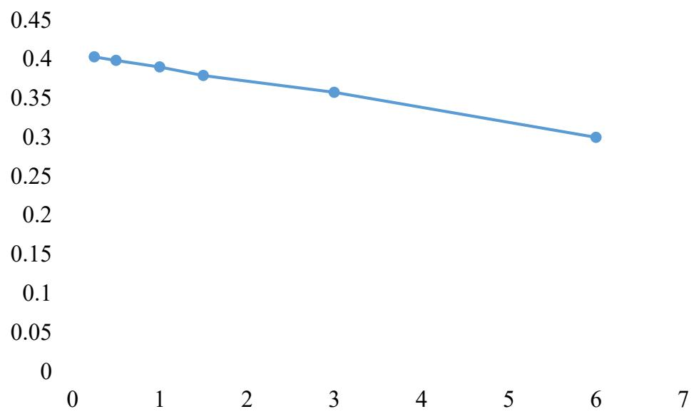
图 9：镜面取点步长变小，单位面积平均输出热功率变化

在1月21日上午9：00，定日镜场的单位面积平均输出热功率与安装高度的变化：
表 4：高度变化下，1月 21日上午 9：00的单位面积平均输出热功率
<table><tr><td rowspan=1 colspan=1>高度</td><td rowspan=1 colspan=1>3</td><td rowspan=1 colspan=1>3.5</td><td rowspan=1 colspan=1>4</td><td rowspan=1 colspan=1>4.5</td><td rowspan=1 colspan=1>5</td><td rowspan=1 colspan=1>5.5</td><td rowspan=1 colspan=1>6</td></tr><tr><td rowspan=1 colspan=1> $A V E _ { f i e l d }$ </td><td rowspan=1 colspan=1>0.35798</td><td rowspan=1 colspan=1>0.35772</td><td rowspan=1 colspan=1>0.35749</td><td rowspan=1 colspan=1>0.35730</td><td rowspan=1 colspan=1>0.35705</td><td rowspan=1 colspan=1>0.35663</td><td rowspan=1 colspan=1>0.35641</td></tr></table>

说明高度对单位面积平均输出热功率的变化影响小。

## 五、问题二的模型建立与求解

## 5.1 问题二的模型建立

根据 4.3.1 计算邻接矩阵，判断是否相邻。按设计要求，定日镜场的额定年平均输出热功率（以下简称额定功率）为 60MW，若所有定日镜尺寸及安装高度相同，设计定日镜场的参数，使得在约束条件下，使得单位镜面面积年平均输出热功率尽量大。因此，建立以下优化模型：

1）决策变量：吸收塔位置坐标、定日镜尺寸（宽度和高度）、安装高度、定日镜数目、定日镜位置。

吸收塔位置坐标： $\left( { { X } _ { o } } , { { Y } _ { o } } \right)$

定日镜尺寸：w v, ，其中w为定日镜宽度，v为定日镜高度。每个定日镜的尺寸相同均为 $w , \nu$ ；

安装高度： $\tilde { h }$ ；

定日镜数目：N；

定日镜位置： $P _ { i } \left( x _ { i } , y _ { i } , z _ { i } \right)$ ，其中 $z _ { i } = h$ ，所有定日镜的安装高度相同。

2）目标函数： $\operatorname* { m a x } \left\{ \overline { { P } } _ { s } \right\} = \operatorname* { m a x } \left\{ \left[ \sum _ { i = 1 } ^ { 1 2 } \overline { { E } } _ { f i e l d } ^ { i } / \left( 1 2 ^ { * } \tilde { S } \right) \right] \right\}$ ，其中 $\tilde { S } = A _ { i } \cdot N \ , \quad A _ { i } = w \cdot \nu$ 为第 i面定日镜的面积（均相同）。

由于吸收塔位置坐标 $\left( { { X } _ { o } } , { { Y } _ { o } } \right)$ 发生变化，计算定日镜场的输出热功率时，塔身对定日镜场的阴影遮挡损失和反射光线在集热器上的接收判别方程发生变化。根据问题一的 4.2.2 和 4.2.3，

 阴影遮挡损失变化如下，首先是联立方程发生变化：

$$
\left\{ \begin{array} { l l } { \displaystyle { \frac { x - x _ { 0 } } { m ^ { \prime } } } = { \frac { y - y _ { 0 } } { n ^ { \prime } } } = { \frac { z - z _ { 0 } } { p ^ { \prime } } } = t } \\ { \left( x - X _ { 0 } \right) ^ { 2 } + \left( y - Y _ { 0 } \right) ^ { 2 } = R ^ { 2 } } \end{array} \right. \Rightarrow \left\{ \begin{array} { l l } { x = x _ { 0 } + m ^ { \prime } t } \\ { y = y _ { 0 } + n ^ { \prime } t } \\ { z = z _ { 0 } + p ^ { \prime } t } \end{array} \right.\tag{29}
$$

得到以下关于t的方程式子：

$$
A t ^ { 2 } + B t + C = 0\tag{30}
$$

其所对应的判别式如下：

$$
\left\{ \begin{array} { l l } { \Delta = B ^ { 2 } - 4 A C < 0 , } & { { \mathcal { F } } _ { \mathrm { L } } \Delta \not \equiv 4 \Delta } \\ { \Delta = B ^ { 2 } - 4 A C \geq 0 , } & { { \mathcal { F } } _ { \mathrm { R } } \sum \bar { \Delta } } \end{array} \right.
$$

接着判断 $\Delta \geq 0$ 时的交点 $t _ { 1 } , t _ { 2 }$ 是否在大于 84m。

 反射光线在集热器上的接收判别方程变化如下：

考虑经过 a 镜上一点 $\left( x _ { 0 } , y _ { 0 } , z _ { 0 } \right)$ 的反射光线向量 $\vec { L } _ { r }$ 。在未被前定日镜遮挡后，成功反射后是否与集热器存在交点。将反射光线与集热器方程进行联立：

$$
\left\{ \begin{array} { l l } { \displaystyle \left( x - X _ { 0 } \right) ^ { 2 } + \left( y - Y _ { 0 } \right) ^ { 2 } = R ^ { 2 } , z \in \left[ 7 6 , 8 4 \right] } \\ { \displaystyle \frac { x - x _ { 0 } } { - x _ { i } } = \frac { y - y _ { 0 } } { - y _ { i } } = \frac { z - z _ { 0 } } { H - z _ { i } } = t } \end{array} \right. \Rightarrow \left\{ \begin{array} { l l } { \displaystyle x = - x _ { i } t + x _ { 0 } } \\ { \displaystyle y = - y _ { i } t + y _ { 0 } } \\ { \displaystyle z = \left( H - z _ { i } \right) t + z _ { 0 } } \end{array} \right.\tag{31}
$$

得到方程如下：

$$
\left( - x _ { i } t + x _ { 0 } - X _ { 0 } \right) ^ { 2 } + \left( - y _ { i } t + y _ { 0 } - Y _ { 0 } \right) ^ { 2 } = R ^ { 2 }
$$

整理得到方程如下：

$$
\left\{ \begin{array} { l l } { \Delta \geq 0 , } & { { / } \boxed { \div } \boxed { \cdot } \frac { \Sigma } { \mathrm { ~ w ~ } } } \\ { \Delta < 0 , } & { \bar { \mathcal { D } } _ { \mathrm { ~ L } } ^ { \setminus } \boxed { \pm } \ddagger \forall z } \end{array} \right.
$$

若 $\Delta \geq 0$ 有交点，两个解为 $t _ { 1 } , t _ { 2 }$ ，则考虑z坐标最小时在集热器的高度76-84m范围内。

3）约束条件：

 吸收塔周围100m不安装定日镜，定日镜场的圆形区域半径为350m：

$$
x _ { i } ^ { 2 } + { y _ { i } ^ { 2 } } \leq 3 5 0 ^ { 2 } , \left( x _ { i } - X _ { 0 } \right) ^ { 2 } + \left( y _ { i } - Y _ { 0 } \right) ^ { 2 } \geq 1 0 0 ^ { 2 }
$$

 镜面宽度不小于镜面高度，且镜面边长在2m至8m之间：

$$
w \geq \nu , 2 \leq w \leq 8 , 2 \leq \nu \leq 8
$$

 安装高度在 2m至6m之间，安装高度保证水平转轴转动时不触及地面：

$$
2 \leq \tilde { h } \leq 6 , \nu / 2 < \tilde { h }
$$

 相邻定目镜底座中心距离比镜面宽度多5m：

$$
\sqrt { \left( x _ { i } - x _ { j } \right) ^ { 2 } + \left( y _ { i } - y _ { j } \right) ^ { 2 } + \left( z _ { i } - z _ { j } \right) ^ { 2 } } > w + 5
$$

其中， $i , j$ 表示两个相邻的定日镜，由邻接矩阵计算。

 达到额定功率：

$$
\overline { { P } } _ { s } \cdot \tilde { S } \geq 6 0
$$

优化模型如下，其中，i j, 表示两个相邻的定日镜：

$$
\begin{array} { r l } & { \operatorname* { m a x } \{ \overline { { P } } _ { y } ^ { * } \} = \operatorname* { m a x } \{ [ \frac { 1 } { \sum _ { i = 1 } ^ { 2 } \tilde { E } _ { f i d } ^ { i } } / ( 1 2 ^ { * } \tilde { S } ) ] \} } \\ & { [ ( x _ { i } - X _ { 0 } ) ^ { 2 } + ( y _ { i } - Y _ { 0 } ) ^ { 2 } \geq 1 0 0 ^ { 2 }  } \\ & {  ( w \geq \nu , 2 \leq w \leq 8 , 2 \leq \nu \leq 8   } \\ & {   2 \leq \tilde { h } \leq 6 , \nu / 2 < \tilde { h }  } \\ & {  \sqrt { ( x _ { i } - x _ { j } ) ^ { 2 } + ( y _ { i } - y _ { j } ) ^ { 2 } + ( z _ { i } - z _ { j } ) ^ { 2 } } > w + 5 )  } \\ & {   x _ { i } ^ { 2 } + y _ { i } ^ { 2 } \leq 3 5 0 ^ { 2 }  } \\ & {  \overline { { P } } _ { z } \cdot \tilde { S } \in 0  } \end{array}\tag{32}
$$

## 5.2 问题二的模型求解

## 5.2.1 圆环最大镜面面积的蜂窝排列

考虑 $E _ { f i e l d }$ 与第i块面板的光学效率和面积有关。而我们认为在时刻变化时，光学效率基本变化不大。因此，为了首先满足题中的额定功率 60MW，在满足约束条件的情况下，首先需要给定宽度使得定日镜场内排列的定日镜面积尽量大，从而确定定日镜的尺寸、数目和位置。即在内径 $r = 1 0 0 m$ ，外径 $R = 3 5 0 m$ 的圆环中尽可能多的排列定日镜，以下我们采用蜂窝排列法，使得每个定日镜与其相邻的定日镜成为正三角形，如下布局。根据蜂窝排列法，按照约束条件，得到正六边形边长的限制范围为大于$w + 5 \le \kappa$ 。一行行进行考虑，对于第一、二行：

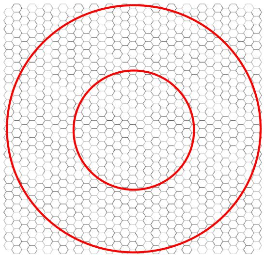

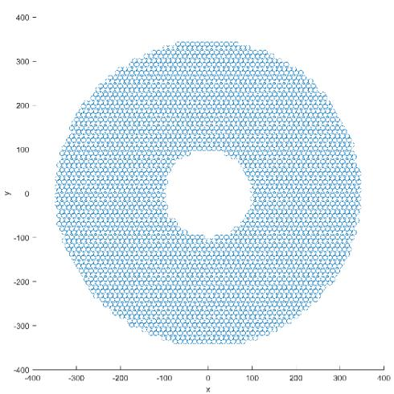
图 10：蜂窝排列法确定定日镜尺寸、数目和位置（左）和计算后的图（右）

$$
\begin{array} { l } { { l i n e 1 : \displaystyle \int _ { y _ { 1 1 } } \displaystyle = - R \ \int _ { 1 2 } = x _ { 1 1 } + w + 5 \qquad \displaystyle \int _ { \cdot \cdot \cdot  \cdot } \int _ { x _ { 1 n } } = x _ { 1 1 } + ( n - 1 ) ( w + 5 ) } } \\ { { \medskip } } \\ { { l i n e 2 : \displaystyle \{ x _ { 2 1 } = R \ - \frac { w + 5 } { 2 }  \qquad \displaystyle \int _ { x _ { 2 2 } } \int _ { 2 2 } = - R + \frac { w + 5 } { 2 } + w + 5 \qquad \displaystyle \int _ { \cdot \cdot \cdot  \cdot } \int _ { x _ { 2 n } } = - R + \frac { w + 5 } { 2 } + ( n - 1 ) ( w + 5 ) } } \\ { { \medskip } } \\ { { l i n e 2 : \displaystyle \{ y _ { 2 1 } = R - \frac { w + 5 } { 2 } \sqrt { 3 }  \} \displaystyle \int _ { y _ { 2 2 } } \displaystyle = R - y _ { 2 1 } } } \end{array}
$$

根据上式给出蜂窝排列法的正六边形顶点及中心点的坐标，将坐标与圆环范围判断：

$$
x _ { m n } ^ { 2 } + y _ { m n } ^ { 2 } \ge 1 0 0 ^ { 2 } , x _ { m n } ^ { 2 } + y _ { m n } ^ { 2 } \le 3 5 0 ^ { 2 }
$$

最后得到定日镜的位置坐标，类似于附件。

## 5.2.2 定日镜场参数的寻优

通过蜂窝排列法确定了圆环内能排列下符合要求的镜面全面积，蜂窝中正六边形的顶点和中心点安排定日镜。因此，确定了定日镜的数目、位置和数量后，接着寻优高度和吸收塔的位置坐标，此时计算量为 $\mathbf { N } \times \mathbf { N } \times \tilde { h } \times w \times 3 5 0 \times 3 5 0$ ，计算量大，难以全局遍历寻优。因此，我们采用蒙特卡洛模拟的方法，对 N 块定日镜进行随机抽样，随机选取 10%的定日镜进行光学效率、单位面积输出热功率等计算，计算 10 次，来预测决策变量的粗略值使得 $\overline { { P } } _ { s }$ 最大，以此来减少计算量。之后，再进一步减少步长，计算额定功率是否达到60MW即可，作为局部最优解。

不同的定日镜位置会影响太阳光的光学效率，因此通过蜂窝排列法得到的定日镜排列是一种初始排列方案。通过二维旋转，将定日镜的位置坐标统一进行旋转 $\mu$ ，坐标变换后的坐标与原坐标的关系如下，其中 $\mu \in \left[ 0 , \pi / 6 \right]$

$$
{ \left[ \begin{array} { l } { x ^ { \prime } } \\ { y ^ { \prime } } \end{array} \right] } = { \left[ \begin{array} { l l } { \cos \mu } & { - \sin \mu } \\ { \sin \mu } & { \cos \mu } \end{array} \right] } \cdot { \left[ \begin{array} { l } { x } \\ { y } \end{array} \right] }
$$

通过蜂窝排列法确定粗排列，且定日镜为正方形，之后通过旋转确定定日镜的位置。

因此，决策变量变为 $\mu , w = \nu , \tilde { h } , X _ { 0 } , Y _ { 0 }$ ，减少了决策变量。而对 $\mu$ 进行遍历后，对于确定 $w = \nu = 6 , \tilde { h } = 4 , X _ { 0 } = 0 , Y _ { 0 } = 0$ 的情况下，结果影响不大。而对 $\tilde { h }$ 进行遍历后，在确定$w = \nu = 6 , \mu = 0 , X _ { 0 } = 0 , Y _ { 0 } = 0$ 的情况下，其也变化不大。因此，在进行指标影响的研究后，我们需要进一步遍历 $w = \nu , X _ { 0 } , Y _ { 0 }$ ，而 $\mu , \tilde { h }$ 取一个在其他决策变量改变的情况下的最佳值，最后得到相应的参数。最后，确定参数后，蒙特卡洛模拟 30%，计算 5 次，取步长为 1.5，光锥束同问题一，得到的结果如下表：

表 5：问题 2的每月 21日平均光学效率及输出功率
<table><tr><td rowspan=1 colspan=1>日期</td><td rowspan=1 colspan=1>平均光学效率</td><td rowspan=1 colspan=1>平均余弦效率</td><td rowspan=1 colspan=1>平均阴影遮挡效率</td><td rowspan=1 colspan=1>平均截断效率</td><td rowspan=1 colspan=1>单位面积镜面平均输出热功率 $( \mathrm { k W } / \mathrm { m } ^ { 2 } )$ </td></tr><tr><td rowspan=1 colspan=1>1月21日</td><td rowspan=1 colspan=1>0.596392</td><td rowspan=1 colspan=1>0.900449</td><td rowspan=1 colspan=1>0.86744</td><td rowspan=1 colspan=1>0.878184</td><td rowspan=1 colspan=1>0.519412</td></tr><tr><td rowspan=1 colspan=1>2月21日</td><td rowspan=1 colspan=1>0.604102</td><td rowspan=1 colspan=1>0.890944</td><td rowspan=1 colspan=1>0.890552</td><td rowspan=1 colspan=1>0.873959</td><td rowspan=1 colspan=1>0.569552</td></tr><tr><td rowspan=1 colspan=1>3月21日</td><td rowspan=1 colspan=1>0.597382</td><td rowspan=1 colspan=1>0.874067</td><td rowspan=1 colspan=1>0.900939</td><td rowspan=1 colspan=1>0.86939</td><td rowspan=1 colspan=1>0.594206</td></tr><tr><td rowspan=1 colspan=1>4月21日</td><td rowspan=1 colspan=1>0.583787</td><td rowspan=1 colspan=1>0.848828</td><td rowspan=1 colspan=1>0.903563</td><td rowspan=1 colspan=1>0.87136</td><td rowspan=1 colspan=1>0.60082</td></tr><tr><td rowspan=1 colspan=1>5月21日</td><td rowspan=1 colspan=1>0.573441</td><td rowspan=1 colspan=1>0.826211</td><td rowspan=1 colspan=1>0.906433</td><td rowspan=1 colspan=1>0.875483</td><td rowspan=1 colspan=1>0.599229</td></tr><tr><td rowspan=1 colspan=1>6月21日</td><td rowspan=1 colspan=1>0.569729</td><td rowspan=1 colspan=1>0.816672</td><td rowspan=1 colspan=1>0.90771</td><td rowspan=1 colspan=1>0.878365</td><td rowspan=1 colspan=1>0.597893</td></tr><tr><td rowspan=1 colspan=1>7月21日</td><td rowspan=1 colspan=1>0.575872</td><td rowspan=1 colspan=1>0.827351</td><td rowspan=1 colspan=1>0.908685</td><td rowspan=1 colspan=1>0.875577</td><td rowspan=1 colspan=1>0.601676</td></tr><tr><td rowspan=1 colspan=1>8月21日</td><td rowspan=1 colspan=1>0.587265</td><td rowspan=1 colspan=1>0.851509</td><td rowspan=1 colspan=1>0.9057</td><td rowspan=1 colspan=1>0.871392</td><td rowspan=1 colspan=1>0.603707</td></tr><tr><td rowspan=1 colspan=1>9月21日</td><td rowspan=1 colspan=1>0.601599</td><td rowspan=1 colspan=1>0.877273</td><td rowspan=1 colspan=1>0.903057</td><td rowspan=1 colspan=1>0.869969</td><td rowspan=1 colspan=1>0.597065</td></tr><tr><td rowspan=1 colspan=1>10月21日</td><td rowspan=1 colspan=1>0.609563</td><td rowspan=1 colspan=1>0.895238</td><td rowspan=1 colspan=1>0.892403</td><td rowspan=1 colspan=1>0.875476</td><td rowspan=1 colspan=1>0.569916</td></tr><tr><td rowspan=1 colspan=1>11月21日</td><td rowspan=1 colspan=1>0.603862</td><td rowspan=1 colspan=1>0.904399</td><td rowspan=1 colspan=1>0.873217</td><td rowspan=1 colspan=1>0.879115</td><td rowspan=1 colspan=1>0.521385</td></tr><tr><td rowspan=1 colspan=1>12月21日</td><td rowspan=1 colspan=1>0.59673</td><td rowspan=1 colspan=1>0.906584</td><td rowspan=1 colspan=1>0.86206</td><td rowspan=1 colspan=1>0.879055</td><td rowspan=1 colspan=1>0.495599</td></tr></table>

表 6：问题 2的年平均光学效率及输出功率表
<table><tr><td rowspan=1 colspan=1>年平均光学效率</td><td rowspan=1 colspan=1>年平均余弦效率</td><td rowspan=1 colspan=1>年平均阴影遮挡效率</td><td rowspan=1 colspan=1>年平均截断效率</td><td rowspan=1 colspan=1>年平均输出热功率(MW)</td><td rowspan=1 colspan=1>单位面积镜面年平均输出热功率(kW/m²)</td></tr><tr><td rowspan=1 colspan=1>0.591643667</td><td rowspan=1 colspan=1>0.86829375</td><td rowspan=1 colspan=1>0.893479917</td><td rowspan=1 colspan=1>0.874777083</td><td rowspan=1 colspan=1>68.24427914</td><td rowspan=1 colspan=1>0.572538333</td></tr></table>

表 7：问题 2的设计参数表
<table><tr><td rowspan=1 colspan=1>吸收塔位置坐标</td><td rowspan=1 colspan=1>定日镜尺寸(宽×高)</td><td rowspan=1 colspan=1>定日镜安装高度（m）</td><td rowspan=1 colspan=1>定日镜总面数</td><td rowspan=1 colspan=1>定日镜总面积 $( \mathbf { m } ^ { 2 } )$ </td></tr><tr><td rowspan=1 colspan=1>(0,-250)</td><td rowspan=1 colspan=1>6×6</td><td rowspan=1 colspan=1>4</td><td rowspan=1 colspan=1>3311</td><td rowspan=1 colspan=1>119196</td></tr></table>

题中所述对于额定功率，只需要达到即可。而额定功率的变化，一般需要增加总反射面积，因此，对于需要达到更高的单位面积镜面年平均输出热功率，需要减少定日镜的面数。这样，使得总反射面积减少，同时额定功率减少，但是不安装的定日镜对其他定日镜造成的阴影遮挡损失会减少。因此，在计算遍历计算得到一个满足要求的年平均输出功率后，需要减少遮挡他人的定日镜或阴影遮挡损失较高的定日镜。因此，此处应该是多目标优化模型，使得年平均输出热功率尽量大的情况下，单位面积镜面年平均输出热功率尽量大。

## 六、问题三的模型建立与求解

## 6.1 问题三的模型建立

按设计要求，若定日镜尺寸及安装高度可以不同，设计定日镜场的参数，使得在约束条件下，使得单位镜面面积年平均输出热功率尽量大。因此，建立以下优化模型。

1）决策变量：吸收塔位置坐标、定日镜尺寸（宽度和高度）、安装高度、定日镜数目、定日镜位置。

吸收塔位置坐标： $\left( { { X } _ { o } } , { { Y } _ { o } } \right)$ ；

定日镜尺寸： $w _ { i } , \nu _ { i }$ ，其中 $w _ { i }$ 为第i面定日镜宽度， $\nu _ { i }$ 为为第i面定日镜高度；

安装高度： $\tilde { h } _ { i }$ ，表示第i面定日镜的安装高度；

定日镜数目： N ；

定日镜位置： $P _ { i } \big ( x _ { i } , y _ { i } , z _ { i } \big ) , z _ { i } = h _ { i }$ o

2）目标函数： $\operatorname* { m a x } \left\{ \overline { { P } } _ { s } \right\} = \operatorname* { m a x } \left\{ \left[ \sum _ { i = 1 } ^ { 1 2 } \overline { { E } } _ { f i e l d } ^ { i } / \left( 1 2 ^ { * } \tilde { S } \right) \right] \right\}$ ，其中 $\tilde { S } = A _ { _ i } \cdot N , \quad A _ { _ i } = w _ { _ i } \cdot \nu _ { _ i }$ 为第 i面定日镜的面积。关于阴影遮挡损失和反射光线（束）接收判断的变化，见 5.1 2）目标函数。

3）约束条件：

 吸收塔周围100m不安装定日镜，圆形区域半径为350m：

$$
\left( x _ { i } - X _ { 0 } \right) ^ { 2 } + \left( y _ { i } - Y _ { 0 } \right) ^ { 2 } \geq 1 0 0 ^ { 2 } , x _ { i } ^ { 2 } + y _ { i } ^ { 2 } \leq 3 5 0 ^ { 2 }
$$

 镜面宽度不小于镜面高度，镜面边长在2m至8m之间：

$$
w _ { i } \geq \nu _ { i } , 2 \leq w _ { i } \leq 8 , 2 \leq \nu _ { i } \leq 8
$$

 安装高度在2m至6m之间，安装高度保证水平转轴转动时不触及地面：

$$
2 \le \tilde { h } _ { i } \le 6 , \nu _ { i } / 2 < \tilde { h } _ { i }
$$

 相邻定目镜底座中心距离比镜面宽度多5m：

$$
\sqrt { \left( x _ { i } - x _ { j } \right) ^ { 2 } + \left( y _ { i } - y _ { j } \right) ^ { 2 } + \left( z _ { i } - z _ { j } \right) ^ { 2 } } > w _ { i } + 5
$$

其中， $i , j$ 表示两个相邻的定日镜，由邻接矩阵计算。

 达到额定功率：

$$
\overline { { P } } _ { s } \cdot \tilde { S } \geq 6 0
$$

$$
\begin{array} { r l } & { \operatorname* { m a x } \{ \overline { { P } } _ { s } ^ { + } \} = \operatorname* { m a x } \{ [ \sum _ { i = 1 } ^ { \nu } \overline { { E } } _ { p d , i } ^ { i } / ( 1 2 ^ { \ast } \tilde { S } ) ] \} } \\ & { [ ( x _ { i } - X _ { 0 } ) ^ { 2 } + ( y _ { i } - Y _ { 0 } ) ^ { 2 } ] \geq 1 0 0 ^ { 2 } } \\ & { [ w _ { i } \geq \nu _ { i } , 2 \leq w _ { i } \leq 8 , 2 \leq \nu _ { i } \leq 8  } \\ & {  2 \leq \overline { { h } } _ { i } \leq 6 , \nu _ { i } / 2 < \overline { { h } } _ { i }  } \\ & { \{ ( x _ { i } - x _ { j } ) ^ { 2 } + ( y _ { i } - y _ { j } ) ^ { 2 } + ( z _ { i } - z _ { j } ) ^ { 2 } > w _ { i } + 5  } \\ & {  | x _ { i } ^ { 2 } + y _ { i } ^ { 2 } \leq 3 5 0 ^ { 2 }  } \\ & {  \overline { { P } } _ { s } ^ { + } . \overline { { S } } \leq 6 0  } \end{array}\tag{33}
$$

## 6.2 问题三的模型求解

同二问对于每块板的安装高度和尺寸大小可以不同，我们考虑使用第二问的结果进行进一步优化，远离吸收塔的最外围定日镜进行安装高度升高为 6m，其他保持不变。最粗优化，然后通过更细的优化，即增加北方的定日镜高度，而减小南方定日镜的安装高度，使得各个定日镜被太阳照射时造成的阴影遮挡损失尽量小。类似于如下图的排列方式，使得前镜的阴影投射后镜的镜面下。

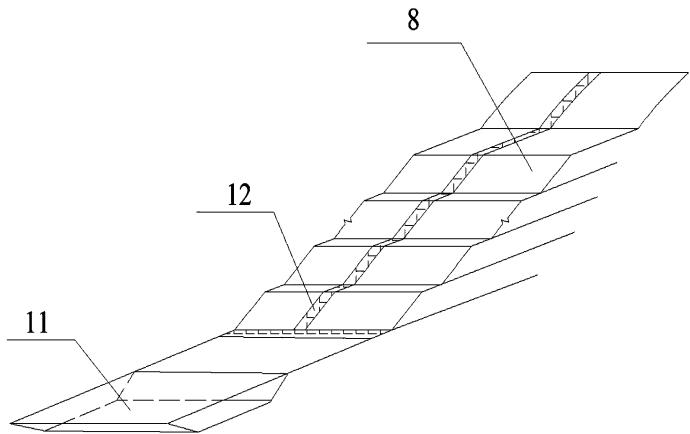
图 11：斜坡式排列

而本文，通过增长最外圈的定日镜高度，提高单位面积镜面平均输出热功率。
表 8：问题 3的每月 21日平均光学效率及输出功率
<table><tr><td colspan="1" rowspan="1">日期</td><td colspan="1" rowspan="1">平均光学效率</td><td colspan="1" rowspan="1">平均余弦效率</td><td colspan="1" rowspan="1">平均阴影遮挡效率</td><td colspan="1" rowspan="1">平均截断效率</td><td colspan="1" rowspan="1">单位面积镜面平均输出热功率 $( \mathrm { k W } / \mathrm { m } ^ { 2 } )$ </td></tr><tr><td colspan="1" rowspan="1">1月21日</td><td colspan="1" rowspan="1">0.501243</td><td colspan="1" rowspan="1">0.837242</td><td colspan="1" rowspan="1">0.868675</td><td colspan="1" rowspan="1">0.799767</td><td colspan="1" rowspan="1">0.446412</td></tr><tr><td colspan="1" rowspan="1">2月21日</td><td colspan="1" rowspan="1">0.502673</td><td colspan="1" rowspan="1">0.835808</td><td colspan="1" rowspan="1">0.891524</td><td colspan="1" rowspan="1">0.778916</td><td colspan="1" rowspan="1">0.493947</td></tr><tr><td colspan="1" rowspan="1">3月21日</td><td colspan="1" rowspan="1">0.500066</td><td colspan="1" rowspan="1">0.830134</td><td colspan="1" rowspan="1">0.905623</td><td colspan="1" rowspan="1">0.768468</td><td colspan="1" rowspan="1">0.517516</td></tr><tr><td colspan="1" rowspan="1">4月21日</td><td colspan="1" rowspan="1">0.492968</td><td colspan="1" rowspan="1">0.818982</td><td colspan="1" rowspan="1">0.908644</td><td colspan="1" rowspan="1">0.765327</td><td colspan="1" rowspan="1">0.527452</td></tr><tr><td colspan="1" rowspan="1">5月21日</td><td colspan="1" rowspan="1">0.489248</td><td colspan="1" rowspan="1">0.807669</td><td colspan="1" rowspan="1">0.91011</td><td colspan="1" rowspan="1">0.768716</td><td colspan="1" rowspan="1">0.531351</td></tr><tr><td colspan="1" rowspan="1">6月21日</td><td colspan="1" rowspan="1">0.487423</td><td colspan="1" rowspan="1">0.802654</td><td colspan="1" rowspan="1">0.91105</td><td colspan="1" rowspan="1">0.769805</td><td colspan="1" rowspan="1">0.551611</td></tr><tr><td colspan="1" rowspan="1">7月21日</td><td colspan="1" rowspan="1">0.489293</td><td colspan="1" rowspan="1">0.807824</td><td colspan="1" rowspan="1">0.91007</td><td colspan="1" rowspan="1">0.768672</td><td colspan="1" rowspan="1">0.546321</td></tr><tr><td colspan="1" rowspan="1">8月21日</td><td colspan="1" rowspan="1">0.493269</td><td colspan="1" rowspan="1">0.819588</td><td colspan="1" rowspan="1">0.908398</td><td colspan="1" rowspan="1">0.765471</td><td colspan="1" rowspan="1">0.537681</td></tr><tr><td colspan="1" rowspan="1">9月21日</td><td colspan="1" rowspan="1">0.500524</td><td colspan="1" rowspan="1">0.830561</td><td colspan="1" rowspan="1">0.905477</td><td colspan="1" rowspan="1">0.768889</td><td colspan="1" rowspan="1">0.516838</td></tr><tr><td colspan="1" rowspan="1">10月21日</td><td colspan="1" rowspan="1">0.502911</td><td colspan="1" rowspan="1">0.836184</td><td colspan="1" rowspan="1">0.888973</td><td colspan="1" rowspan="1">0.781334</td><td colspan="1" rowspan="1">0.490196</td></tr><tr><td colspan="1" rowspan="1">11月21日</td><td colspan="1" rowspan="1">0.500548</td><td colspan="1" rowspan="1">0.837219</td><td colspan="1" rowspan="1">0.866258</td><td colspan="1" rowspan="1">0.801138</td><td colspan="1" rowspan="1">0.462046</td></tr><tr><td colspan="1" rowspan="1">12月21日</td><td colspan="1" rowspan="1">0.496971</td><td colspan="1" rowspan="1">0.836919</td><td colspan="1" rowspan="1">0.856283</td><td colspan="1" rowspan="1">0.806654</td><td colspan="1" rowspan="1">0.452938</td></tr></table>

表 9：问题 3的年平均光学效率及输出功率表
<table><tr><td rowspan=1 colspan=1>年平均光学效率</td><td rowspan=1 colspan=1>年平均余弦效率</td><td rowspan=1 colspan=1>年平均阴影遮挡效率</td><td rowspan=1 colspan=1>年平均截断效率</td><td rowspan=1 colspan=1>年平均输出热功率(MW)</td><td rowspan=1 colspan=1>单位面积镜面年平均输出热功率(kW/m²)</td></tr><tr><td rowspan=1 colspan=1>0.496428083</td><td rowspan=1 colspan=1>0.825065333</td><td rowspan=1 colspan=1>0.894257083</td><td rowspan=1 colspan=1>0.778596417</td><td rowspan=1 colspan=1>60.336111</td><td rowspan=1 colspan=1>0.506192417</td></tr></table>

表 10：问题3的设计参数表
<table><tr><td rowspan=1 colspan=1>吸收塔位置坐标</td><td rowspan=1 colspan=1>定日镜尺寸(宽×高)</td><td rowspan=1 colspan=1>定日镜安装高度（m）</td><td rowspan=1 colspan=1>定日镜总面数</td><td rowspan=1 colspan=1>定日镜总面积 $( \mathbf { m } ^ { 2 } )$ </td></tr><tr><td rowspan=1 colspan=1>(0,-250)</td><td rowspan=1 colspan=1>1</td><td rowspan=1 colspan=1>/</td><td rowspan=1 colspan=1>3311</td><td rowspan=1 colspan=1>119196</td></tr></table>

## 七、模型的评价和推广

## 7.1 模型的优点

在计算时，简化计算，并考虑了锥形束的入射、反射和阴影遮挡损失。

## 7.2 模型的缺点

在遍历时，取的步长对结果影响大，由于计算量的问题，取得步长过大，使得结果不够精确。

## 7.3 模型的推广

可将模型推广到定日镜场的优化设计和安排策略。

## 八、参考文献

[1] 张平等，太阳能塔式光热镜场光学效率计算方法[J]，技术与市场，2021，28(6):5-8.

[2] 杜宇航等，塔式光热电站定日镜不同聚焦策略的影响分析[J]，动力工程学报，2020，40(5):426-432.

[3] https://baike.baidu.com/item/%E5%A4%AA%E9%98%B3%E9%AB%98%E5%BA%A6%E8%A7%92/1563831

[4] https://baike.baidu.com/item/%E5%A4%AA%E9%98%B3%E6%96%B9%E4%BD%8D %E8%A7%92/2772684

[5] 孙浩. 基于混合策略鲸鱼优化算法的定日镜场布局研究及优化[D].兰州交通大学,2023.

## 附录

本文采用Python进行编程。

```python
问题一
import numpy as np
import pandas as pd
from math import cos,sin,acos,asin,pi,exp,sqrt
import time
# 导入题目的附件并添加Z值
P = pd.read_excel(r'附件.xlsx').values
Dis = np.load('d.npy')
# D_0 = [306,337,0,31,61,92,122,153,184,214,245,275]
ST_0 = [9,10.5,12,13.5,15]
D_0=[337,0,31,61,92];
# ST_0 = [9]
delta_t = 1.5
x_c=0; y_c=0; L=W=6;
H0 = 80;H1=8;H = 4;
HR = 3.5
def F(L,W,H,D_0,ST_0,delta_t,H0,H1,HR,Dis,p1,x_c,y_c):
N = (W/delta_t+1)**2*4
yita_ref = 0.92
S = L*W
new_column = np.array([H for i in range(len(p1))]) # 安装高度 4m
P = np.column_stack((p1, new_column))
Yita =np.zeros([len(ST_0),len(P)]);
Yita_trunc =np.zeros([len(ST_0),len(P)])
Yita_at =np.zeros([len(ST_0),len(P)]);
```

Yita\_cos=np.zeros([len(ST\_0),len(P)]);
Yita\_sb =np.zeros([len(ST\_0),len(P)])
E\_0 = np.zeros([len(D\_0),len(ST\_0)])
Y1=np.zeros([len(D\_0),len(ST\_0)]);
Y2=np.zeros([len(D\_0),len(ST\_0)]);
Y3=np.zeros([len(D\_0),len(ST\_0)]);
Y4=np.zeros([len(D\_0),len(ST\_0)]);
DF = np.zeros([len(D\_0),5])
for di,D in enumerate(D\_0):
for sti,ST in enumerate(ST\_0):
# 计算太阳位置以及相关参数
fai = 39.4\*pi/180;
delta = asin(sin(2\*pi\*D/365)\*sin(2\*pi\*23.45/360))
w = (pi/12)\*(ST-12)
sin\_as = cos(delta)\*cos(fai)\*cos(w)+sin(delta)\*sin(fai) # 太阳高度角
cos\_as = sqrt(1-sin\_as\*\*2)
cos\_rs = (sin(delta)-sin\_as\*sin(fai))/(sqrt(1-sin\_as\*\*2)\*cos(fai)) # 太阳方位角
if abs(cos\_rs)>1:
cos\_rs = cos\_rs/abs(cos\_rs)
if ST <=12:
sin\_rs = sqrt(1-cos\_rs\*\*2)
else:
sin\_rs = -sqrt(1-cos\_rs\*\*2)
a = 0.4237 - 0.00821\*(6-3)\*\*2
b = 0.5055 + 0.00595\*(6.5-3)\*\*2
c = 0.2711 + 0.01858\*(2.5-3)\*\*2
DNI = 1.366\*(a+b\*exp(-c/sin\_as))

A0=np.array([x\_c,y\_c,H0]) # 集热器中心
Ls = np.array([-cos\_as\*sin\_rs, -cos\_as\*cos\_rs, -sin\_as]) # 入射
s = np.array([1,0,0])
for i in range(len(P)):
# A镜中点 反射向量
Di = P[i]; Lr = A0-Di
nl = -Ls + Lr/np.linalg.norm(Lr) # A 的法向量
nl = nl/np.linalg.norm(nl)
beta1 = asin(nl.dot([0,0,1])/np.linalg.norm(nl)) # 俯仰角
n0 = np.array([nl[0],nl[1],0])
if nl[1]>=0:
alpha1 = acos(n0.dot(s)/np.linalg.norm(n0)) # 方位角
else:
alpha1 = -acos(n0.dot(s)/np.linalg.norm(n0))
# A的旋转矩阵
Ta = np.array([
[cos(alpha1)\*cos(pi/2-beta1),-sin(alpha1),cos(alpha1)\*sin(pi/2-beta1)],
[sin(alpha1)\*cos(pi/2-beta1),cos(alpha1),sin(alpha1)\*sin(pi/2-beta1) ],
[-sin(pi/2-beta1),0,cos(pi/2-beta1)]
])
light=0; empty=0;
barr\_tower=0; barr\_s=0; barr\_r=0
# 遍历每一个点
for dx in np.arange(-W/2,W/2+0.1,delta\_t):
for dy in np.arange(-L/2,L/2+0.1,delta\_t):
Dxy = np.array([dx,dy,0]) # A 镜上的某个点 在 A 镜坐标系
Di\_d =Ta.dot(Dxy) + Di # A 镜上的点 转置到地面坐标系

```python
# ############### 遍历每一个入射光线圆锥的光线 #################
# for the1 in np.arange(0.001,0.00465,0.002):
the1 = 0.002
for the2 in np.arange(0,2*pi,pi/2):
if_barr=0
# g是入射光线在主光线锥体系的坐标
g = np.array([sin(the1)*cos(the2),
sin(the1)*sin(the2),
cos(the1)])
# 根据入射主光线，计算主光线锥体系的旋转矩阵 Ls:入射的太阳主光
线
v = pi/2 -acos(Ls.dot(np.array([0,0,1]))/np.linalg.norm(Ls))
nl_g0 = np.array([Ls[0],Ls[1],0])
if Ls[1]>=0:
u = acos(nl_g0.dot(s)/np.linalg.norm(nl_g0))
else:
u = -acos(nl_g0.dot(s)/np.linalg.norm(nl_g0))
T_s = np.array([
[cos(u)*cos(pi/2-v),-sin(u),cos(u)*sin(pi/2-v)],
[sin(u)*cos(pi/2-v),cos(u),sin(u)*sin(pi/2-v) ],
[-sin(pi/2-v),0,cos(pi/2-v)]
])
g_d = T_s.dot(g) # 转置到地面坐标系 g:入射光锥中的某条入射线
g_r = g_d - 2*g_d.dot(nl)*(nl) # 对应的反射向量 # nl:A 的法向量
################## 一 、 判 断 入 射 光 线 是 否 被 塔 遮 挡
##################
a,b,c = g_d;x0,y0,z0 = Di_d
delta_tower 4*(a*(x0-x_c)+b*(y0-y_c))**2-4*(a**2+b**2)*((x0-
x_c)**2+(y0-y_c)**2-HR**2)
if delta_tower>=0:
t1 = ( -2*(a*(x0-x_c)+b*(y0-y_c))+sqrt(delta_tower) )/ (2*(a**2+b**2))
t2 = ( -2*(a*(x0-x_c)+b*(y0-y_c))-sqrt(delta_tower) )/ (2*(a**2+b**2))
```

if min(t1\*c+z0,t2\*c+z0)<= (H0 +H1/2) and min(t1\*c+z0,t2\*c+z0)>=0 :
barr\_tower += 1
continue
################## 二 、 判 断 入 射 光 线 是 否 被 其 他 光 镜 遮 挡
##################
indices\_in\_circle = np.where(Dis[:,i] == 1)[0] # 取周围半径
for j in indices\_in\_circle: #len(P)
if i==j:
continue
# B 的中心坐标 alpha,beta 直接调取提前计算的
B = P[j]; Lrb = A0-B
nlb = -Ls + Lrb/np.linalg.norm(Lrb) # 法向量
# beta2, alpha2= all\_alpha\_beta[j,:]
beta2 = asin(nlb.dot([0,0,1])/np.linalg.norm(nlb)) # 俯仰角
n0b = np.array([nlb[0],nlb[1],0]);
if nlb[1]>=0:
alpha2 = acos(n0b.dot(s)/np.linalg.norm(n0b)) # 方位角
else:
alpha2 = -acos(n0b.dot(s)/np.linalg.norm(n0b))
Tb = np.array([
[cos(alpha2)\*cos(pi/2-beta2),-sin(alpha2),cos(alpha2)\*sin(pi/2-beta2)],
[sin(alpha2)\*cos(pi/2-beta2),cos(alpha2),sin(alpha2)\*sin(pi/2-beta2) ],
[-sin(pi/2-beta2),0,cos(pi/2-beta2)]
])
Di\_b = Tb.T.dot(Di\_d-B) # A 镜上的点 从地面坐标系 → B 镜坐标系
g\_b = Tb.T.dot(g\_d) # A 入射光线 从地面坐标系 → B 镜坐标系
t = -Di\_b[2]/g\_b[2] # 计算入线光线的在 B 镜坐标系的交点

```python
x_b = g_b[0]*t + Di_b[0]
y_b = g_b[1]*t + Di_b[1]
D0 = np.array([x_b,y_b,0])
D0 = Tb.dot(D0)+B # 交点转到地面
if abs(x_b)<=W/2 and abs(y_b)<=L/2 and D0[2]>Di_d[2]: # 如果被遮挡
了,就直接算下一条入射的线
barr_s += 1
if_barr=1
break
################## 三、对应的反射 ##################
g_r = g_d - 2*g_d.dot(nl)*(nl) # 对应的反射向量 # nl:A 的法向量
g_r_b = Tb.T.dot(g_r) # 转置到b镜面坐标系
t = -Di_b[2]/g_r_b[2] # 计算反射光线的交点
x_b = g_r_b[0]*t + Di_b[0]
y_b = g_r_b[1]*t + Di_b[1]
D0 = np.array([x_b,y_b,0])
D0 = Tb.dot(D0)+B # 交点转到地面
if abs(x_b)<=W/2 and abs(y_b)<=L/2 and D0[2]>Di_d[2]:
barr_r += 1
if_barr =1
break
################## 四、是否吸收 ##################
if if_barr == 0:
a,b,c = g_r;x0,y0,z0 = Di_d
delta_recieve = 4*(a*(x0-x_c)+b*(y0-y_c))**2-4*(a**2+b**2)*((x0-
x_c)**2+(y0-y_c)**2-HR**2)
if delta_recieve>= 0:
t1 = ( -2*(a*(x0-x_c)+b*(y0-y_c))+sqrt(delta_recieve) )/
(2*(a**2+b**2))
```

t2 = ( -2\*(a\*(x0-x\_c)+b\*(y0-y\_c))-sqrt(delta\_recieve)
(2\*(a\*\*2+b\*\*2))
if min(t1\*c+z0,t2\*c+z0)<= (H0+H1/2) and
min(t1\*c+z0,t2\*c+z0)>=(H0-H1/2):
light += 1
else:
empty += 1
# 这里是这个时间点,计算第 i个面板的数值,并记录,每个列表是1745的长度
yita\_sb =1 - (barr\_r +barr\_s+ barr\_tower)/N;
yita\_cos = abs(Ls.dot(-nl)/np.linalg.norm(Ls));
HR0 = np.linalg.norm(Lr);
yita\_at = 0.99321 -0.0001176\*HR0 +1.97e-8\*(HR0\*\*2);
if N -barr\_s -barr\_r -barr\_tower == 0:
yita\_trunc=1
else:
yita\_trunc = (light)/(N -barr\_s -barr\_r -barr\_tower)
yita =yita\_sb\*yita\_cos\*yita\_at\*yita\_trunc\*yita\_ref;
Yita\_sb[sti,i] = yita\_sb
Yita\_cos[sti,i] = yita\_cos
Yita\_at[sti,i] = yita\_at
Yita\_trunc[sti,i] = yita\_trunc
Yita[sti,i] = yita
# 这里是在D,ST的循环里，计算第sti个时间点
E\_0[di,sti] = DNI\*sum(S\*Yita[sti,:] )
Y1[di,sti] = np.mean(Yita[sti,:])
Y2[di,sti] = np.mean(Yita\_cos[sti,:])
Y3[di,sti] = np.mean(Yita\_sb[sti,:])
Y4[di,sti] = np.mean(Yita\_trunc[sti,:])

```python
# 已经计算完一个具体时间点
DF[di,0] = np.mean(Y1[di,:])
DF[di,1] = np.mean(Y2[di,:])
DF[di,2] = np.mean(Y3[di,:])
DF[di,3] = np.mean(Y4[di,:])
DF[di,4] = sum(E_0[di,:])/(len(P)*S)/len(ST_0)
# print(DF)
return DF
start_time = time.time()
Wp = F(L,W,H,D_0,ST_0,delta_t,H0,H1,HR,Dis,P,x_c,y_c)
print(Wp)
# 记录程序运行时间
end_time = time.time()
elapsed_time_seconds = end_time - start_time
elapsed_time_minutes = round(elapsed_time_seconds / 60, 2)
print(f"代码运行时间：{elapsed_time_minutes}分钟")
问题二
import numpy as np
import pandas as pd
import matplotlib.pyplot as plt
import random
from math import cos,sin,acos,asin,pi,exp,sqrt,floor
import time
from Function import F
# 导入题目的附件并添加Z值
p1 = pd.read_excel(r'D:\ 数 学 建 模 学 习 \2023 国 赛 \ 数 据 文 件
\r6_raw.xlsx',header=None).values
HR = 3.5; H = 4; L = W = 6
```

```python
H0 = 80; H1=8;
# 导入每块板在某时刻的俯仰角与方位角
# D_0 = [306,337,0,31,61,92,122,153,184,214,245,275]
# ST_0 = [9,10.5,12,13.5,15]
D_0=[275]; ST_0=[12]
# 旋转角度
for gama in np.linspace(0,pi/3+0.01,4):
TT = np.array([
[cos(gama),-sin(gama)],
[sin(gama),cos(gama)]
])
p1 = TT.dot(p1.T).T
p1 = p1
# Dis0 = np.ones([len(p1),len(p1)])
# for i in range(len(p1)):
# for j in range(len(p1)):
# d = np.linalg.norm(p1[i,:]-p1[j,:])
# if d<20:
# Dis0[i,j] =1
# else:
# Dis0[i,j] =0
# np.save('D:/数学建模学习/2023 国赛/数据文件/dist_tran_r6_raw', Dis0)
Dis0 = np.load('D:/数学建模学习/2023 国赛/数据文件/dist_tran_r6_raw.npy')
xy_len = range(-250,251,50);delta_t =1
EP=np.zeros([len(xy_len),len(xy_len)])
# x_c=0; y_c=-100
for m,x_c in enumerate(xy_len):
for n, y_c in enumerate(xy_len):
# x_c=0; y_c=250
if x_c**2+ y_c**2 > 250**2:
```

```python
continue
EP0=0
Pi = [];
# 判断 r=100
for i in range(len(p1)):
dis = sqrt((p1[i,0]-x_c)**2+(p1[i,1]-y_c)**2)
if dis >= 100:
Pi.append(i)
p1 = p1[Pi]
# 生成新的连接矩阵
Dis1 = np.ones([len(Pi),len(Pi)])
for i in range(len(Pi)):
for j in range(len(Pi)):
Dis1[i,j] = Dis0[Pi[i],Pi[j]]
m_n=floor(0.1*len(p1))
for k in range(1,3):
random_numbers = random.sample(list(range(len(p1))), m_n)
p11 = p1[random_numbers]
Dis = np.ones([m_n,m_n])
for i in range(m_n):
for j in range(m_n):
Dis[i,j] = Dis0[random_numbers[i],random_numbers[j]]
Wp = F(L,W,H,D_0,ST_0,delta_t,H0,H1,HR,Dis,p11,x_c,y_c)
EP0 += np.mean(Wp)*W*L*len(p1)/1000
print(x_c,y_c,EP0/3)
EP[m,n] = EP0
import numpy as np
import pandas as pd
```

```python
import matplotlib.pyplot as plt
import random
from math import cos,sin,acos,asin,pi,exp,sqrt,floor
import time
from Function_2 import F
# 导入题目的附件并添加Z值
p1 = pd.read_excel(r'r6_raw.xlsx',header=None).values
Dis0 = np.load('dist_tran_r6_raw.npy')
HR = 3.5; H = 4; L = W = 6
H0 = 80; H1=8;
delta_t =1.5 # 步长
# 导入每块板在某时刻的俯仰角与方位角
# D_0 = [306,337,0,31,61,92,122,153,184,214,245,275]
ST_0 = [9,10.5,12,13.5,15]
D_0 = [306]
# ST_0 = [9]
time.time()
x_c=0; y_c=-250
Pi=[]
start_time = time.time()
# 判断 r=100
for i in range(len(p1)):
dis = sqrt((p1[i,0]-x_c)**2+(p1[i,1]-y_c)**2)
if dis >= 100:
Pi.append(i)
p1 = p1[Pi]
Dis1 = np.ones([len(Pi),len(Pi)])
# 生成新的连接矩阵
```

for i in range(len(Pi)):
for j in range(len(Pi)):
Dis1[i,j] = Dis0[Pi[i],Pi[j]]
m\_n=floor(0.3\*len(p1))
random\_numbers = random.sample(list(range(len(p1))), m\_n)
p11 = p1[random\_numbers]
Dis = np.ones([m\_n,m\_n])
for i in range(m\_n):
for j in range(m\_n):
Dis[i,j] = Dis0[random\_numbers[i],random\_numbers[j]]
Wp = F(L,W,H,D\_0,ST\_0,delta\_t,H0,H1,HR,Dis,p11,x\_c,y\_c)
print(Wp)
# 记录程序运行时间
end\_time = time.time()
elapsed\_time\_seconds = end\_time - start\_time
elapsed\_time\_minutes = round(elapsed\_time\_seconds / 60, 2)
print(f"代码运行时间：{elapsed\_time\_minutes}分钟")
# 0.24874209\*36\*3311
Matlab 程序
clc; clear;
k = 2; % 计数
R = 350;
r = 11; % 宽+5
n = fix(2\*R/r); % 一排的点数
% 第一排第一个点
W = [-R, R];
W1 = W;

```matlab
% 计算第一排
for i = 1:n
W(k, 1) = W (k-1, 1)+r;
W(k, 2) = W (1, 2);
k = k+1;
end
% 第二排第一个点
W(k, 1) = -R+r/2;
W(k, 2) = R-r*sqrt(3)/2;
W2 = W(k, :);
k = k+1;
% 计算第二排
for i = 1:n
W(k, 1) = W (k-1, 1)+r;
W(k, 2) = W (k-1, 2);
k = k+1;
end
n1 = fix(2*R/(r*sqrt(3)/2))+1;
% 从第三排开始
for i = 3:n1
if mod(i,2) == 1 % 奇数行
% 先写该行的第一个点
W(k, 1) = W1(1, 1);
W(k, 2) = W1(1, 2)-sqrt(3)*r*(i-1)/2;
k = k+1;
for j = 1:n
W(k, 1) = W (k-1, 1)+r;
W(k, 2) = W (k-1, 2);
k = k+1;
end
```

```matlab
else % 偶数行
% 先写该行的第一个点
W(k, 1) = W2(1, 1);
W(k, 2) = W2(1, 2)-sqrt(3)*r*(i-2)/2;
k = k+1;
for j = 1:n
W(k, 1) = W (k-1, 1)+r;
W(k, 2) = W (k-1, 2);
k = k+1;
end
end
end
% 计算范围内点
a = 0;
for i = 1:length(W)
if W(i,1)^2+W(i,2)^2 <= (350-(r-5)/2)^2 %& W(i,1)^2+W(i,2)^2 >= 100^2
a = a+1;
W_e(a,:) = W(i,:);
end
end
scatter(W_e(:,1),W_e(:,2),'.')
T = [cos(pi/4), -sin(pi/4);
sin(pi/4), cos(pi/4)
];
WW = (T*W')';
% 计算点距离
for i = 1:length(W)
for j = i:length(W)
```

```python
D(i,j) = sqrt((WW(i,1)-WW(j,1))^2+(WW(i,2)-WW(j,2))^2);
D(j,i) = D(i,j);
end
end
问题三
import numpy as np
import pandas as pd
import matplotlib.pyplot as plt
import random
from math import cos,sin,acos,asin,pi,exp,sqrt,floor
import time
from Function_3 import F
p1 = pd.read_excel(r'D:\ 数 学 建 模 学 习 \2023 国 赛 \ 数 据 文 件
\r6_raw.xlsx',header=None).values
Dis0 = np.load('D:/数学建模学习/2023 国赛/数据文件/dist_tran_r6_raw.npy')
R_dis = [np.linalg.norm(i) for i in p1]
new_column = np.array([4 for i in range(len(p1))]) # 安装高度 4m
P = np.column_stack((p1, new_column))
# 筛选北边的最外层
r_1 = 340; r_2 = 351
Ai=[]
for i in range(len(P)):
if R_dis[i] >= r_1 and p1[i,1]>0:
Ai.append(i)
P[i,2] = P[i,2] + 2
```

```python
x_c=0; y_c=-250
Pi=[]
for i in range(len(P)):
dis = sqrt((p1[i,0]-x_c)**2+(p1[i,1]-y_c)**2)
if dis >= 100:
Pi.append(i)
PP = P[Pi]
# # 计算新的邻接矩阵，计算一次后即存储
# Dis0 = np.ones([len(PP),len(PP)])
# for i in range(len(PP)):
for j in range(len(PP)):
# d = np.linalg.norm(PP[i,:]-PP[j,:])
# if d<20:
# Dis0[i,j] =1
# else:
# Dis0[i,j] =0
# np.save('D:/数学建模学习/2023 国赛/数据文件/dist_tran_r6_raw_3', Dis0)
np.save('D:/数学建模学习/2023 国赛/数据文件/position_3',PP)
Dis0 = np.load('D:/数学建模学习/2023 国赛/数据文件/dist_tran_r6_raw_3.npy')
#%%
D_0=[306]; ST_0=[9]
HR = 3.5;H = 4; L = W = 6
H0 = 80; H1=8; delta_t = 3 # 步长
PW = F(L,W,H,D_0,ST_0,delta_t,H0,H1,HR,Dis0,PP,x_c,y_c)
print( np.mean(PW)*W*L*len(PP)/1000 )
#%%
plt.scatter(p1[:,0], p1[:,1],c='b')
plt.scatter(p1[Ai,0],p1[Ai,1],c='r')
```

```python
import numpy as np
import pandas as pd
import matplotlib.pyplot as plt
import random
from math import cos,sin,acos,asin,pi,exp,sqrt,floor
import time
from Function_3 import F
# 导入题目的附件并添加Z值
p = np.load('D:/数学建模学习/2023 国赛/数据文件/position_3.npy')
Dis0 = np.load('D:/数学建模学习/2023 国赛/数据文件/dist_tran_r6_raw_3.npy')
HR = 3.5;H = 4; L = W = 6
H0 = 80; H1=8; delta_t = 3 # 步长
# 导入每块板在某时刻的俯仰角与方位角
D_0 = [306,337,0,31,61,92,122,153,184,214,245,275]
ST_0 = [9,10.5,12,13.5,15]
# D_0 = [306]
# ST_0 = [9]
x_c=-250; y_c=-150
m_n=floor(0.3*len(p))
random_numbers = random.sample(list(range(len(p))), m_n)
p11 = p[random_numbers]
Dis = np.ones([m_n,m_n])
for i in range(m_n):
for j in range(m_n):
Dis[i,j] = Dis0[random_numbers[i],random_numbers[j]]
```

start\_time= time.time()
PW = F(L,W,H,D\_0,ST\_0,delta\_t,H0,H1,HR,Dis,p11,x\_c,y\_c)
end\_time = time.time()
elapsed\_time\_seconds = end\_time - start\_time
elapsed\_time\_minutes = round(elapsed\_time\_seconds / 60, 2)
print(f"代码运行时间：{elapsed\_time\_minutes}分钟")
print(PW)
# print(np.mean(PW)\*W\*L\*len(p)/1000 )