# 基于动态搜索的“板凳龙”运动状态及路线研究

## 摘要

板凳龙作为浙闽地区的一种传统民俗活动，以其高观赏性和舞龙队的协调配合著称。本文针对板凳龙表演的三个阶段盘入、调头和盘出，通过分析舞龙队的行进路线及各节板凳之间的几何关系，建立了运动模型和行进路线优化模型。采用多种优化方法，对舞龙队在不同条件下的运动状态以及行进路线进行研究。

针对问题一：构建盘入运动模型。首先，根据盘入路线为等距螺线的特征，建立极坐标系。针对龙头位置，建立有关极角的微分方程，利用微积分及二分法求解龙头前把手的极坐标，继而利用余弦定理，递推求解相邻板凳的位置关系，获得各把手的位置函数。通过对位置函数求导，得到相应的速度函数。最终，将极坐标转换为直角坐标，求得各把手在各时刻的位置和速度，结果详见表2，表3和 result1.xlsx。

针对问题二：构建碰撞检测模型。首先，证明最易发生碰撞的区间为最内圈与其外侧一圈的板凳，缩小检测范围。随后，确定碰撞条件为：内圈板凳顶点与外圈板凳把手连线的距离小于板凳宽度的一半(0.15m)，并通过几何关系算出距离函数，判断该函数的最小值是否小于0.15m以确定碰撞是否发生。最后，采用动态搜索策略，先用变步长搜索确定时间范围，再进行二分搜索，确定首次碰撞的准确时间。我们得到停止盘入时间为412.473838s，此时各把手的位置和速度详见表4和result2.xlsx。

针对问题三：构建最短螺距的单目标优化模型。其中目标函数和决策变量为螺距大小。在约束条件方面，基于板凳的几何参数和问题二中的参数限定螺距范围，基于盘入运动模型确定龙头前把手进入调头空间的时间，并利用碰撞检测模型判断进入调头空间前是否发生碰撞，建立相应约束。在优化求解过程中，对比后选用粒子群算法求解板间最小距离，并结合变步长搜索求得最短螺距为0.450337m。

针对问题四：基于问题一的模型，构建调头运动模型。首先证明在给定条件下，调头曲线长度为常数，无法进一步减小。随后，将调头路线划分为四个部分，通过几何关系求解出各部分的曲线方程。沿用问题一的推导方法，首先求解龙头前把手位置函数，再通过递推关系和求导计算其余把手的位置函数和速度函数。我们对调头空间附近的递推进行了详细的分类讨论，并给出了相应的递推方程。最终，将极坐标转换为直角坐标，求得各板凳把手在各时刻的位置和速度，详见表5，表6和result4.xlsx。

针对问题五：在调头运动模型的基础上，构建各把手最大速度的优化模型。首先，通过比例转换，将目标转化为在龙头速度仍为1m/s的条件下，求解各把手在所有时刻的最大速度。随后，基于问题四的速度规律及物理规律确定最大速度出现的大致时间范围，接着通过大步长搜索确定了最大速度出现的区间为14s,15s]。由于函数在该区间内呈单峰性，应用三分搜索算法进一步精确定位最大速度。最后，通过比例关系还原龙头的最大速度，得到龙头最大速度约为1.246266m/s。

关键字：板凳龙等距螺线 动态搜索粒子群算法单目标优化

## 一、问题重述

## 1.1问题背景

作为一项国家级非遗传统民俗活动，“板凳龙”可谓匠心独运之作。精美的龙身制作，壮观的演出形式都赋予了“板凳龙”极高的技术难度和观赏价值。一条“板凳龙“通常由“龙头”，“龙尾”和上百节“龙身”组成，长达上百米。表演时，舞龙队一般沿螺线形向螺线中心盘入，在一定范围的调头空间内完成调头，再换方向逆时针盘出。在此期间，需要保持整个舞龙队型的完整，相邻“龙身”之间不能发生碰撞，行进速度越快，占地面积越小，则效果越佳。

然而由于舞龙队通常人数众多，队伍较长，往往难以确保“板凳龙”的完美呈现。因此为了能够给观众提供最佳演出，需要研究舞龙队盘入、调头、盘出线路和行进速度等相关参数。

## 1.2 问题提出

基于上述背景，要求建立数学模型解决下列问题。

一条板凳龙由223节板宽均为0.3m的板凳组成，其中包含1节龙头(板长3.41m)，221节龙身(板长2.20m)，1节龙尾(板长2.20m)。每节板凳上均有两个孔，孔径(孔的直径)为5.5cm，孔的中心距离最近的板头27.5cm。

问题一：舞龙队以螺线第16圈A点处为起点，龙头前把手行进速度保持速度为1m/s情况下，沿螺距为0.55m的等距螺线顺时针盘入，据此计算出从初始时刻至第300s，每秒龙头前把手、龙尾前后把手以及各节龙身前把手的位置与速度。

问题二：在问题一的条件下，为了避免在不断盘入过程中任意两节板凳发生碰撞，舞龙队需要在某时刻停止继续盘入，给出停止盘入时刻。并且计算出此时刻各把手的位置和速度。

问题三：舞龙队从顺时针盘入到逆时针盘出需要经过调头过程。给定一个以螺线中心为圆心，直径为9m的圆形调头空间，在保证龙头前把手进入圆形调头空间前，板凳间不发生碰撞的条件下，求解满足要求的最小螺距。

问题四：在给定的调头路径及约束条件下，判断是否能够优化调头路径，使得调头曲线长度变短。以开始调头时间为零时刻，给出从-100s到100s，每秒各把手的位置和速度。

问题五：沿着问题四的调头路径行进过程中，龙头速度保持不变。在保证各把手速度均不超过2m/s的条件下，确定龙头的最大行进速度。

## 二、问题分析

## 2.1问题一

问题一的核心是构建一个运动模型，以确定板凳龙沿螺旋路径运动时各个把手在各时刻的位置和速度。由等距螺线的特征，我们可以建立极坐标系简化计算。鉴于龙头前把手的速度为常量，可依据速度公式推导龙头前把手的位置随时间变化的函数表达式。

在此基础上，考虑相邻把手之间的几何关系，构建各把手位置坐标的递推关系，并对时间求导，就能获得各把手速度的递推公式。基于龙头前把手的位置变化函数及递推关系，可以进一步递推出其他所有板凳在任意时刻的位置和速度。由于计算过程在极坐标系中完成，最终需要将结果转换为直角坐标系下的相应坐标。求解过程可以使用二分搜索法完成模型实现。

## 2.2问题二

问题二中需要确定碰撞发生的判定条件。根据问题一中的各把手极角变化结果及刚体运动的物理规律，可初步确定最可能发生碰撞的区域，从而缩小检测范围。接着，利用相邻板凳之间的几何关系，计算在指定范围内的两板凳间最小距离。结合碰撞的物理定义，确定两板凳间的安全距离阈值。当最小距离小于该阈值时，即可判定发生碰撞。在求解过程中可以使用以变步长搜索为基础的动态搜索方法确定首次发生碰撞的区间。在该区间内使用二分搜索法，得到精度较高的停止盘入时间。

## 2.3问题三

问题三中需要构建一个优化模型，求解螺距的最小值。首先，需明确优化模型的约束条件。根据问题一中在已知螺距下的计算结果及板凳的几何特性，可以缩小符合条件的螺距范围。通过计算龙头前把手到达调头空间边界的时刻，确定进入调头空间的最小螺距。在此过程中，还需利用问题二中的碰撞检测模型，确保在进入调头空间前未发生碰撞。模型求解采用变步长遍历的方法，逐步缩小步长以提高计算精度，结合启发式算法优化最短距离的计算过程。

## 2.4问题四

问题四是在问题一模型基础上的扩展。基于题目提供的调头路径条件，通过几何相关知识可判断是否存在最优路径。由于路径较为复杂，可将其视作由四段曲线构成，并通过几何关系求解其中两段圆弧的参数方程。延续问题一的建模方式，先求出龙头前把手的每秒位置变化函数，再通过递推关系求解其余把手的位置函数。递推关系的求解需要区分相邻把手位于相同或不同曲线上的情况，速度的计算也需遵循类似的方法。

## 2.5问题五

问题五的目的是建立一个优化模型，求解最大速度。首先需要在问题四的基础上，计算全过程中各把手的最大速度。其次需要对问题四的结果进行分析，结合物理规律，缩小搜索范围。最后依据速度最大值函数的特征，采用适当的算法求解最大速度。

## 三、模型假设

1. 忽略外力因素：外部阻力对板凳龙的运动无影响。

2. 忽略把手粗细，认为把手是理想无厚度的几何连接点：把手粗细只有0.055m，与题中其余长度相比，可忽略不计。

3. 忽略板凳厚度，认为每一张板凳都平行于地面:由于题目未给出板凳厚度，而其尺度较小，因此可忽略不计，进而所有的板凳都平行于地面且在同一高度。

## 四、符号说明

4. 每节板凳和连接的把手是刚体，不会发生形变：板凳和把手的长度、宽度等尺寸保持不变，各部分的相对位置不随时间变化。

表1 符号说明
<table><tr><td>符号</td><td>说明</td><td>单位</td></tr><tr><td> $d$ </td><td>螺距</td><td>m</td></tr><tr><td>t</td><td>时间</td><td>S</td></tr><tr><td> $l$ </td><td>某块板凳两孔中轴线的距离</td><td>m</td></tr><tr><td> $( x _ { i } , y _ { i } )$ </td><td>编号为i的把手的直角坐标表示</td><td>(m, m)</td></tr><tr><td> $( r _ { i } , \theta _ { i } )$  (盘入和盘出曲线)</td><td>编号为i的把手的极坐标表示</td><td>(m, rad)</td></tr><tr><td> $\theta _ { i }$  (调头曲线)</td><td>编号为i的把手的参数表示</td><td>rad</td></tr><tr><td> $v _ { i }$ </td><td>编号为i的把手速度大小</td><td>m/s</td></tr><tr><td> $l _ { i }$ </td><td>编号为i的板凳前后把手所在直线</td><td></td></tr><tr><td> $A _ { i }$ </td><td>编号为i的板凳外侧前顶点</td><td></td></tr><tr><td> $B _ { i }$ </td><td>编号为i的板凳外侧后顶点</td><td></td></tr><tr><td> $d _ { A } ( t , i , j )$ </td><td>t 时刻点  $A _ { i }$  到  $l _ { j }$  的距离</td><td>m</td></tr><tr><td> $d _ { B } ( t , i , j )$ </td><td>t 时刻点  $B _ { i }$  到  $l _ { j }$  的距离</td><td>m</td></tr></table>

## 5.1.1盘入运动模型的建立

对于该螺线形盘入的运动模型，我们不妨考虑极坐标系进行求解。在极坐标系下，龙头前把手对应的极径 $r _ { 0 }$ 和极角 $\theta _ { 0 }$ 满足以下关系：

$$
r _ { 0 } = \frac { d } { 2 \pi } \theta _ { 0 }
$$

其中， $d = 0 . 5 5 \mathrm { m }$ 为螺距。

在极坐标系下，我们可以根据速度公式得出龙头前把手的速度 $v _ { 0 }$

$$
\left. v _ { 0 } \right. = \frac { d } { 2 \pi } \left. \dot { \theta _ { 0 } } \right. \sqrt { 1 + \theta _ { 0 } ^ { 2 } }\tag{1}
$$

其中 $\dot { \theta } _ { 0 } < 0$ 为极角速度， $v _ { 0 } = 1 \mathrm { m } / \mathrm { s }$ 为常量。通过分离变量，上述微分方程可变为：

$$
- \frac { d } { 2 \pi } \sqrt { 1 + \theta _ { 0 } ^ { 2 } } { \bf d } \theta _ { 0 } = v _ { 0 } { \bf d } t
$$

将上式两边分别积分，可得：

$$
\begin{array} { c } { { \displaystyle \frac { 4 \pi v _ { 0 } t } { d } = 3 2 \pi \sqrt { 1 + ( 3 2 \pi ) ^ { 2 } } + \ln \left( 3 2 \pi + \sqrt { 1 + ( 3 2 \pi ) ^ { 2 } } \right) } } \\ { { - \theta _ { 0 } \sqrt { 1 + \theta _ { 0 } ^ { 2 } } - \ln \left( \theta _ { 0 } + \sqrt { 1 + \theta _ { 0 } ^ { 2 } } \right) } } \end{array}\tag{2}
$$

我们已知初始时刻龙头前把手位于螺线第16圈A点处，即 $\theta _ { 0 } ( t = 0 ) = 3 2 \pi$ ，又因为该方程右边为关于 $\theta _ { 0 }$ 的单调函数，所以我们便可以解得 $\theta _ { 0 } ( t )$ ，即为龙头前把手随时间变化的位置函数。

由于题目中给出的坐标系为直角坐标系，因此我们需要将极坐标系转化为直角坐标系内的相应坐标，公式如下： 学生仕

$$
x _ { 0 } = r _ { 0 } \cos \theta _ { 0 } = \frac { d \theta _ { 0 } } { 2 \pi } \cos \theta _ { 0 }
$$

$$
y _ { 0 } = r _ { 0 } \sin \theta _ { 0 } = \frac { d \theta _ { 0 } } { 2 \pi } \sin \theta _ { 0 }
$$

由于已知相邻板凳之间存在一定的几何关系，因此我们可以利用几何关系和龙头前把手的位置函数，通过递推关系求出其余各节板凳相应位置的坐标以及速度。

我们仍在极坐标系下考虑相邻板凳间的几何关系：从龙头前把手开始依次用 $0 , 1 , 2 , \ldots$ 给各个把手编号，设编号为n的把手极坐标为 $( r _ { n } , \theta _ { n } )$ 。同样，通过极径和极角的关系，有：

$$
r _ { n } = \frac { d } { 2 \pi } \theta _ { n }
$$

以编号为n和 $n + 1$ 的两个把手为例，在如图2所示的三角形中运用余弦定理可得

$$
\begin{array} { r } { \mathrm { ~ \it { i } ^ { 2 } = \it { r _ { n } ^ { 2 } + r _ { n + 1 } ^ { 2 } - 2 \it { r _ { n } \gamma _ { n + 1 } \cos ( \theta _ { n + 1 } - \theta _ { n } ) } } } } \end{array}
$$

其中为板凳上两孔之间距离：

$$
\displaystyle \boldsymbol { l } = \left\{ \begin{array} { l l } { 2 . 8 \boldsymbol { \mathrm { 6 m } } , } & { \frac { \ast } { \Xi n } \boldsymbol { = 0 } } \\ { 1 . 6 5 \mathbf { m } , } & { \frac { \ast } { \Xi n } \boldsymbol { \geq 1 } } \end{array} \right.
$$

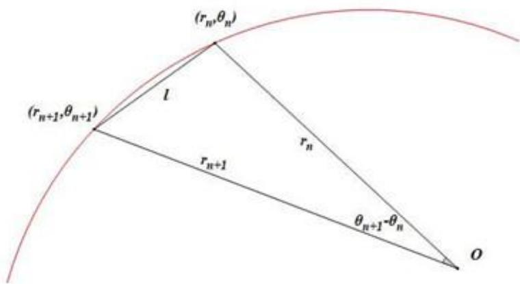
图2 相邻把手几何关系示意图

将极径和极角关系代人可得：

$$
( \frac { 2 \pi l } { d } ) ^ { 2 } = \theta _ { n } ^ { 2 } + \theta _ { n + 1 } ^ { 2 } - 2 \theta _ { n } \theta _ { n + 1 } \cos { ( \theta _ { n + 1 } - \theta _ { n } ) }\tag{3}
$$

通过该递推关系式与 $\theta _ { 0 } ( t )$ 的函数表达式即可得到 $\theta _ { n } ( t )$ 的函数表达式。同样由于我们所要求的为直角坐标系里的相应坐标，通过下列坐标变换：

$$
\begin{array} { c } { { { \displaystyle x _ { n } = r _ { n } \cos \theta _ { n } = \frac { d } { 2 \pi } \theta _ { n } \cos \theta _ { n } } } } \\ { { { } } } \\ { { { y _ { n } = r _ { n } \sin \theta _ { n } = \frac { d } { 2 \pi } \theta _ { n } \sin \theta _ { n } } } } \end{array}
$$

便可求得任意时刻舞龙队的位置坐标。

对于速度的求解，我们将(3)式两边分别对时间求导，整理后可得角速度的递推关系：

$$
\frac { \dot { \theta } _ { n + 1 } } { \dot { \theta } _ { n } } = - \frac { 2 \theta _ { n } - 2 \theta _ { n + 1 } \cos \left( \theta _ { n + 1 } - \theta _ { n } \right) - 2 \theta _ { n } \theta _ { n + 1 } \sin \left( \theta _ { n + 1 } - \theta _ { n } \right) } { 2 \theta _ { n + 1 } - 2 \theta _ { n } \cos \left( \theta _ { n + 1 } - \theta _ { n } \right) + 2 \theta _ { n } \theta _ { n + 1 } \sin \left( \theta _ { n + 1 } - \theta _ { n } \right) }
$$

通过上文(1)式可以求得 $\dot { \theta } _ { 0 }$ ，因此可以得出编号n+1的龙身速度 $v _ { n + 1 }$ …

$$
v _ { n + 1 } = { \frac { d } { 2 \pi } } | \dot { \theta } _ { n + 1 } | \sqrt { 1 + \theta _ { n + 1 } ^ { 2 } }\tag{4}
$$

## 5.1.2盘入运动模型的求解

根据前文所述的计算方法，我们通过二分搜索法解方程(2)，求得从初始时刻至300s内每秒钟龙头前把手的位置信息。

接着我们通过极角的递推关系式(3)和速度表达式(4)求出在给定的时间范围内，每秒龙身各节把手的位置坐标以及速度。表2和表3中是部分龙身把手的相应求解结果(保留小数点后六位)，全部把手的位置及速度见表格文件 result1.xlsx。

表2 部分把手坐标随时间变化情况
<table><tr><td rowspan=1 colspan=1></td><td rowspan=1 colspan=1>0 s</td><td rowspan=1 colspan=1>60 s</td><td rowspan=1 colspan=1>120 s</td><td rowspan=1 colspan=1>180 s</td><td rowspan=1 colspan=1>240 s</td><td rowspan=1 colspan=1>300 s</td></tr><tr><td rowspan=1 colspan=1>龙头x(m)</td><td rowspan=1 colspan=1>8.800000</td><td rowspan=1 colspan=1>5.799209</td><td rowspan=1 colspan=1>-4.084887</td><td rowspan=1 colspan=1>-2.963609</td><td rowspan=1 colspan=1>2.594494</td><td rowspan=1 colspan=1>4.420274</td></tr><tr><td rowspan=1 colspan=1>龙头 y(m)</td><td rowspan=1 colspan=1>0.000000</td><td rowspan=1 colspan=1>-5.771092</td><td rowspan=1 colspan=1>-6.304479</td><td rowspan=1 colspan=1>6.094780</td><td rowspan=1 colspan=1>-5.356743</td><td rowspan=1 colspan=1>2.320429</td></tr><tr><td rowspan=1 colspan=1>第1节龙身×(m)</td><td rowspan=1 colspan=1>8.363824</td><td rowspan=1 colspan=1>7.456758</td><td rowspan=1 colspan=1>-1.445473</td><td rowspan=1 colspan=1>-5.237118</td><td rowspan=1 colspan=1>4.821221</td><td rowspan=1 colspan=1>2.459489</td></tr><tr><td rowspan=1 colspan=1>第1节龙身y(m)</td><td rowspan=1 colspan=1>2.826544</td><td rowspan=1 colspan=1>-3.440399</td><td rowspan=1 colspan=1>-7.405883</td><td rowspan=1 colspan=1>4.359627</td><td rowspan=1 colspan=1>-3.561949</td><td rowspan=1 colspan=1>4.402476</td></tr><tr><td rowspan=1 colspan=1>第51节龙身x(m)</td><td rowspan=1 colspan=1>-9.518732</td><td rowspan=1 colspan=1>-8.686317</td><td rowspan=1 colspan=1>-5.543149</td><td rowspan=1 colspan=1>2.890455</td><td rowspan=1 colspan=1>5.980011</td><td rowspan=1 colspan=1>-6.301346</td></tr><tr><td rowspan=1 colspan=1>第51节龙身y(m)</td><td rowspan=1 colspan=1>1.341137</td><td rowspan=1 colspan=1>2.540108</td><td rowspan=1 colspan=1>6.377946</td><td rowspan=1 colspan=1>7.249289</td><td rowspan=1 colspan=1>-3.827758</td><td rowspan=1 colspan=1>0.465829</td></tr><tr><td rowspan=1 colspan=1>第101节龙身×(m)</td><td rowspan=1 colspan=1>2.913983</td><td rowspan=1 colspan=1>5.687116</td><td rowspan=1 colspan=1>5.361939</td><td rowspan=1 colspan=1>1.898795</td><td rowspan=1 colspan=1>-4.917371</td><td rowspan=1 colspan=1>-6.237722</td></tr><tr><td rowspan=1 colspan=1>第101节龙身y(m)</td><td rowspan=1 colspan=1>-9.918311</td><td rowspan=1 colspan=1>-8.001384</td><td rowspan=1 colspan=1>-7.557638</td><td rowspan=1 colspan=1>-8.471614</td><td rowspan=1 colspan=1>-6.379874</td><td rowspan=1 colspan=1>3.936008</td></tr><tr><td rowspan=1 colspan=1>第151节龙身×(m)</td><td rowspan=1 colspan=1>10.861726</td><td rowspan=1 colspan=1>6.682312</td><td rowspan=1 colspan=1>2.388757</td><td rowspan=1 colspan=1>1.005154</td><td rowspan=1 colspan=1>2.965378</td><td rowspan=1 colspan=1>7.040740</td></tr><tr><td rowspan=1 colspan=1>第151节龙身y(m)</td><td rowspan=1 colspan=1>1.828753</td><td rowspan=1 colspan=1>8.134544</td><td rowspan=1 colspan=1>9.727411</td><td rowspan=1 colspan=1>9.424751</td><td rowspan=1 colspan=1>8.399721</td><td rowspan=1 colspan=1>4.393013</td></tr><tr><td rowspan=1 colspan=1>第201节龙身x(m)</td><td rowspan=1 colspan=1>4.555102</td><td rowspan=1 colspan=1>-6.619664</td><td rowspan=1 colspan=1>-10.627210</td><td rowspan=1 colspan=1>-9.287720</td><td rowspan=1 colspan=1>-7.457151</td><td rowspan=1 colspan=1>-7.458662</td></tr><tr><td rowspan=1 colspan=1>第201节龙身y(m)</td><td rowspan=1 colspan=1>10.725118</td><td rowspan=1 colspan=1>9.025570</td><td rowspan=1 colspan=1>1.359848</td><td rowspan=1 colspan=1>-4.246673</td><td rowspan=1 colspan=1>-6.180726</td><td rowspan=1 colspan=1>-5.263384</td></tr><tr><td rowspan=1 colspan=1>龙尾（后）x(m)</td><td rowspan=1 colspan=1>-5.305444</td><td rowspan=1 colspan=1>7.364557</td><td rowspan=1 colspan=1>10.974348</td><td rowspan=1 colspan=1>7.383895</td><td rowspan=1 colspan=1>3.241051</td><td rowspan=1 colspan=1>1.785033</td></tr><tr><td rowspan=1 colspan=1>龙尾（后） y(m)</td><td rowspan=1 colspan=1>-10.676584</td><td rowspan=1 colspan=1>-8.797992</td><td rowspan=1 colspan=1>0.843473</td><td rowspan=1 colspan=1>7.492371</td><td rowspan=1 colspan=1>9.469336</td><td rowspan=1 colspan=1>9.301164</td></tr></table>

表3 部分把手速度随时间变化情况
<table><tr><td rowspan=1 colspan=1></td><td rowspan=1 colspan=1> $_ { 0 s }$ </td><td rowspan=1 colspan=1> $6 0 s$ </td><td rowspan=1 colspan=1> $1 2 0 s$ </td><td rowspan=1 colspan=1>180 s</td><td rowspan=1 colspan=1>240 s</td><td rowspan=1 colspan=1>300 s</td></tr><tr><td rowspan=1 colspan=1>龙头(m/s)</td><td rowspan=1 colspan=1>1.000000</td><td rowspan=1 colspan=1>1.000000</td><td rowspan=1 colspan=1>1.000000</td><td rowspan=1 colspan=1>1.000000</td><td rowspan=1 colspan=1>1.000000</td><td rowspan=1 colspan=1>1.000000</td></tr><tr><td rowspan=1 colspan=1>第1节龙身(m/s)</td><td rowspan=1 colspan=1>0.999971</td><td rowspan=1 colspan=1>0.999961</td><td rowspan=1 colspan=1>0.999945</td><td rowspan=1 colspan=1>0.999917</td><td rowspan=1 colspan=1>0.999859</td><td rowspan=1 colspan=1>0.999709</td></tr><tr><td rowspan=1 colspan=1>第51节龙身(m/s)</td><td rowspan=1 colspan=1>0.999742</td><td rowspan=1 colspan=1>0.999662</td><td rowspan=1 colspan=1>0.999538</td><td rowspan=1 colspan=1>0.999331</td><td rowspan=1 colspan=1>0.998941</td><td rowspan=1 colspan=1>0.998065</td></tr><tr><td rowspan=1 colspan=1>第101节龙身(m/s)</td><td rowspan=1 colspan=1>0.999575</td><td rowspan=1 colspan=1>0.999453</td><td rowspan=1 colspan=1>0.999269</td><td rowspan=1 colspan=1>0.998971</td><td rowspan=1 colspan=1>0.998435</td><td rowspan=1 colspan=1>0.997302</td></tr><tr><td rowspan=1 colspan=1>第151节龙身(m/s)</td><td rowspan=1 colspan=1>0.999448</td><td rowspan=1 colspan=1>0.999299</td><td rowspan=1 colspan=1>0.999078</td><td rowspan=1 colspan=1>0.998727</td><td rowspan=1 colspan=1>0.998115</td><td rowspan=1 colspan=1>0.996861</td></tr><tr><td rowspan=1 colspan=1>第201节龙身(m/s)</td><td rowspan=1 colspan=1>0.999348</td><td rowspan=1 colspan=1>0.999180</td><td rowspan=1 colspan=1>0.998935</td><td rowspan=1 colspan=1>0.998551</td><td rowspan=1 colspan=1>0.997894</td><td rowspan=1 colspan=1>0.996574</td></tr><tr><td rowspan=1 colspan=1>龙尾（后）(m/s)</td><td rowspan=1 colspan=1>0.999311</td><td rowspan=1 colspan=1>0.999136</td><td rowspan=1 colspan=1>0.998883</td><td rowspan=1 colspan=1>0.998489</td><td rowspan=1 colspan=1>0.997816</td><td rowspan=1 colspan=1>0.996478</td></tr></table>

通过对求解结果分析，我们可以得到以下规律：

·如图3所示，龙头前把手的位置关于时间均匀分布在螺线上，符合题目中龙头前把手速度恒为 $v _ { 0 } = 1 { \ m } / { s }$ 的条件。

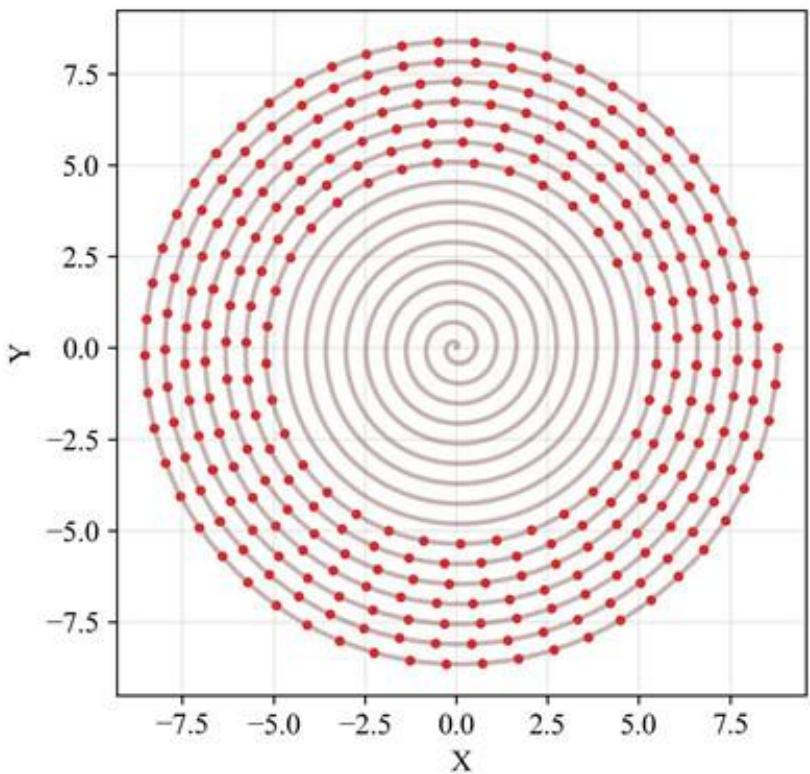
图3t =0s 至 t = 300s 龙头前把手位置
·各把手坐标随时间变化不断在正负之间波动，体现了舞龙队的螺旋轨迹特征。
·如图4所示,随着时间增加,各节龙身把手以及龙尾速度均在减小，且龙身把手位置

越靠后(即n越大)，速度减少得越多。这也符合物理运动学规律，因为板凳龙越靠近外侧，轨迹就会越接近一条直线，各节的速度也就会越来越接近。

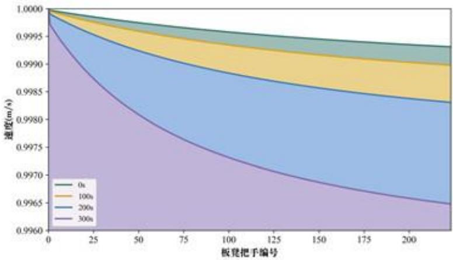
图4不同时刻下板凳龙把手的速度情况

·若作出极角的变化图像（如图5所示)，我们可以发现越靠内圈的把手，极角变化速度越快。这是因为越靠内圈，把手的运动半径就越小，为了保持相同的速度，极角的变化率就会变快。这也验证了我们建立的模型的合理性

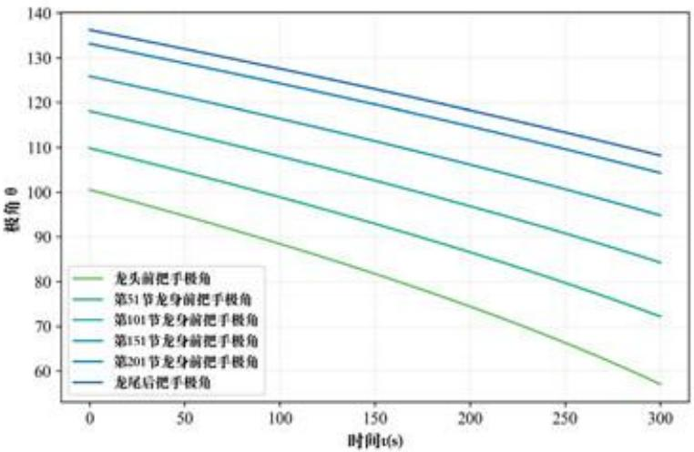
图 5 t = 0s 至 t = 300s 部分把手的极角变化情况

## 5.2问题二模型的建立与求解

【模型准备】

本题需要给出舞龙队的停止盘入时间，也就是要判定第一次碰撞发生的时间。考虑到螺旋线的几何特征以及问题一中得出的各把手极角变化情况，我们不妨假设“碰撞一定先发生于龙头所在的最内圈和其外侧相邻的一圈”从而缩小碰撞检测区域，提高模型检测效率。

## 下面是对该假设的证明：

正如我们在问题一中所作的分析(如图5所示)，内圈板凳的极角变化速度更快，这意味着在同一时间内，内圈板凳的角度变化比外圈板凳更大。

由于内圈和外圈板凳之间的相对角度变化更大，它们之间的相对位置变化也更快。也就是说，内圈板凳相对外圈板凳更快地靠近或远离它们原本的相对位置。而碰撞条件是两个板凳之间的距离小于某个安全阈值，显然内圈板凳的极角变化更快，它们在绕中心点旋转时，更可能相对外圈板凳迅速靠近。当内圈板凳的角度变化足够大时，它们与外圈板凳的间距就会快速缩短，从而更容易达到碰撞阈值。

而且龙头相较于龙身和龙尾更长，所以它的角更靠近外侧，也就更容易与外圈发生碰撞。因此我们的假设成立，即可以将模型的检测范围缩小至龙头所在的最内圈和其外侧相邻的一圈。

## 5.2.1碰撞检测模型的建立

设内圈编号为i的板凳前把手坐标为 $( x _ { i } , y _ { i } )$ ，则其后把手坐标为 $( x _ { i + 1 } , y _ { i + 1 } )$ 。不妨设与之发生碰撞的外圈板凳的前把手编号为j，其坐标 $( x _ { j } , y _ { j } )$ ，后把手坐标为 $( x _ { j + 1 } , y _ { j + 1 } )$ 。由于任意前后两块板凳都是重叠的，因此i和 $j$ 还应满足 $i \le j - 2$

编号为j的板凳前后把手所在直线 $l _ { j }$ 的解析式为：

$$
{ \frac { x - x _ { j } } { x _ { j + 1 } - x _ { j } } } = { \frac { y - y _ { j } } { y _ { j + 1 } - y _ { j } } }
$$

化简得：

$$
l _ { j } : y = \frac { y _ { j + 1 } - y _ { j } } { x _ { j + 1 } - x _ { j } } x + \frac { x _ { j + 1 } y _ { j } - x _ { j } y _ { j + 1 } } { x _ { j + 1 } - x _ { j } }
$$

接着我们需要求解内圈编号为i的板凳靠近外圈的两个顶点的坐标，设其坐标为$A _ { i } ( x _ { A _ { i } } , y _ { A _ { i } } )$ 和 $B _ { \mathrm { i } } ( x _ { B _ { \mathrm { i } } } , y _ { B _ { \mathrm { i } } } )$ 。为了简化表达，我们通过题目给定的板凳参数，记孔中心与最近的板头距离为 $a = 0 . 2 7 5 \mathrm { m }$ ，与板凳上下两边距离为 $b = 0 . 1 5 \mathrm { m }$ ，如图6所示。

顶点 $\left( x _ { A _ { i } } , y _ { A _ { i } } \right)$ 存在如图6所示的几何关系。图中，角 $\alpha _ { i }$ 满足：

$$
\begin{array} { l } { \displaystyle \sin \alpha _ { i } = \frac { - \Delta y } { \sqrt { ( \Delta x ) ^ { 2 } + ( \Delta y ) ^ { 2 } } } } \\ { \displaystyle \cos \alpha _ { i } = \frac { - \Delta x } { \sqrt { ( \Delta x ) ^ { 2 } + ( \Delta y ) ^ { 2 } } } } \end{array}
$$

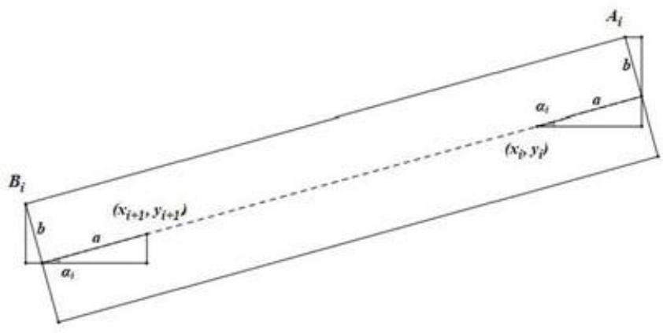
图6 编号为的板凳几何关系示意图

其中 $\Delta x = x _ { i + 1 } - x _ { i } , \Delta y = y _ { i + 1 } - y _ { i }$ 。因此通过几何关系，我们可以求出该顶点的坐标：

$$
\begin{array} { r } { x _ { A i } = x _ { i } + a \cos \alpha _ { i } - b \sin \alpha _ { i } } \\ { y _ { A i } = y _ { i } + a \sin \alpha _ { i } + b \cos \alpha _ { i } } \end{array}\tag{5}
$$

同理可得另一个顶点的坐标：

$$
\begin{array} { r } { x _ { B _ { i } } = x _ { i + 1 } - a \cos \alpha _ { i } - b \sin \alpha _ { i } } \\ { y _ { B _ { i } } = y _ { i + 1 } - a \sin \alpha _ { 1 } + b \cos \alpha _ { i } } \end{array}\tag{6}
$$

于是我们以编号为的板凳的两个顶点到编号为j的板凳前后把手所在直线 $l _ { j }$ 的距离 $d _ { A } , d _ { B }$ 为判定函数。通过点到直线距离公式求出两个函数表达式：

$$
\begin{array} { r l } & { d _ { A } ( t , i , j ) = \frac { \left| \left( y _ { j + 1 } - y _ { j } \right) x _ { A _ { i } } - \left( x _ { j + 1 } - x _ { j } \right) y _ { A _ { i } } + x _ { j + 1 } y _ { j } - x _ { j } y _ { j + 1 } \right| } { \sqrt { \left( x _ { j + 1 } - x _ { j } \right) ^ { 2 } + \left( y _ { j + 1 } - y _ { j } \right) ^ { 2 } } } } \\ & { d _ { B } ( t , i , j ) = \frac { \left| \left( y _ { j + 1 } - y _ { j } \right) x _ { B _ { i } } - \left( x _ { j + 1 } - x _ { j } \right) y _ { B _ { i } } + x _ { j + 1 } y _ { j } - x _ { j } y _ { j + 1 } \right| } { \sqrt { \left( x _ { j + 1 } - x _ { j } \right) ^ { 2 } + \left( y _ { j + 1 } - y _ { j } \right) ^ { 2 } } } } \end{array}
$$

若 $d _ { A }$ 或 $d _ { B }$ 中任意一个函数值小于安全阈值即 $b ,$ 则我们可以判定两个板凳间发生碰撞。此时舞龙队需停止盘入。至此，本题中的碰撞判断模型已全部建立完毕。

## 5.2.2碰撞检测模型的求解

根据假设，我们只需要在最内圈以及其外侧相邻一圈间，运用碰撞检测模型，就能判断舞龙队是否发生碰撞。首先从龙头开始遍历最内圈的板凳（即模型中编号为的板凳)，再找到与其相邻一圈离它最近的第一个板凳以及其前后各两张板凳（即模型中编号为j的板凳)，运用碰撞检测公式检查板凳之间的距离。如果任意一对板凳的最小距离小于0.15m，则认为发生了碰撞。 牛在

题目所要求的舞龙队盘入的终止时刻即为板凳第一次发生碰撞的时刻。我们设计了一个以变步长搜索为基础的动态搜索过程。其过程如下：

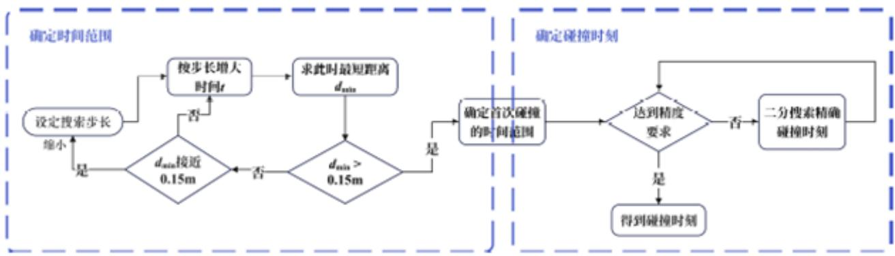
图7 问题二求解流程图

Step1:确定首次碰撞的大致时间范围。由于板凳间的距离整体随时间t的增大有减小趋势且变化连续，我们先以较大的步长（1s)），从某一较早时刻开始，判断每个时刻是否发生碰撞，同时关注板凳间的最小距离。当最小距离逐渐接近0.15m时，逐渐适当地缩小搜索步长。当首次遇到某个时刻发生碰撞，我们便能够确定首次碰撞时刻的所在区间。

Step2:确定首次碰撞的精确时刻。对于Step1中确定的时间区间，我们在其中使用二分搜索法，以逐步提高所求时刻精度，直至满足题目要求。

通过上述算法，我们成功求解出在题目所给条件下，即螺距保持为0.55m时，在t=412.473838s会发生第一次碰撞，且碰撞发生在龙头与其外侧的板凳间，因此舞龙队的停止盘入时间应为412.473838s。表4是此时刻龙头前把手、部分龙身前把手，以及龙尾前后把手的位置坐标与速度表格。全部把手的位置和速度信息见表格文件result2.xlsx。

表4 终止时刻各节龙身坐标和速度
<table><tr><td rowspan=1 colspan=1></td><td rowspan=1 colspan=1>横坐标x(m)</td><td rowspan=1 colspan=1>纵坐标 y(m)</td><td rowspan=1 colspan=1>速度(m/s)</td></tr><tr><td rowspan=1 colspan=1>龙头</td><td rowspan=1 colspan=1>1.209931</td><td rowspan=1 colspan=1>1.942784</td><td rowspan=1 colspan=1>1.000000</td></tr><tr><td rowspan=1 colspan=1>第1节龙身</td><td rowspan=1 colspan=1>-1.643792</td><td rowspan=1 colspan=1>1.753399</td><td rowspan=1 colspan=1>0.991551</td></tr><tr><td rowspan=1 colspan=1>第51节龙身</td><td rowspan=1 colspan=1>1.281201</td><td rowspan=1 colspan=1>4.326588</td><td rowspan=1 colspan=1>0.976858</td></tr><tr><td rowspan=1 colspan=1>第101节龙身</td><td rowspan=1 colspan=1>-0.536246</td><td rowspan=1 colspan=1>-5.880138</td><td rowspan=1 colspan=1>0.974550</td></tr><tr><td rowspan=1 colspan=1>第151节龙身</td><td rowspan=1 colspan=1>0.968840</td><td rowspan=1 colspan=1>-6.957479</td><td rowspan=1 colspan=1>0.973608</td></tr><tr><td rowspan=1 colspan=1>第201节龙身</td><td rowspan=1 colspan=1>-7.893161</td><td rowspan=1 colspan=1>-1.230764</td><td rowspan=1 colspan=1>0.973096</td></tr><tr><td rowspan=1 colspan=1>龙尾（后）</td><td rowspan=1 colspan=1>0.956217</td><td rowspan=1 colspan=1>8.322736</td><td rowspan=1 colspan=1>0.972938</td></tr></table>

## 5.2.3碰撞检测模型的验证

求解结束后，我们作出了 $t = 4 1 2 . 4 7 3 8 3 8 s$ 时板凳龙状态的模拟图像，如图8。不难发现，此时龙头的外侧前顶点A0恰要与外侧板凳相撞，正处于临界情况，而整条龙其他位置均未有碰撞出现。这验证了我们的答案，也证实了模型准备中的假设。

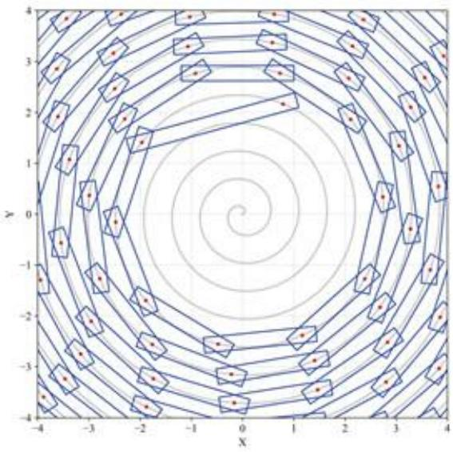
图8 停止盘入时刻板凳龙碰撞情况

我们还绘制了图9所示图像(红色虚线为 $y = 0 . 1 5 \mathrm { m } )$ ，描绘了最内圈板凳的外侧顶点距其外一圈板凳中心线的最短距离与时间t的关系。

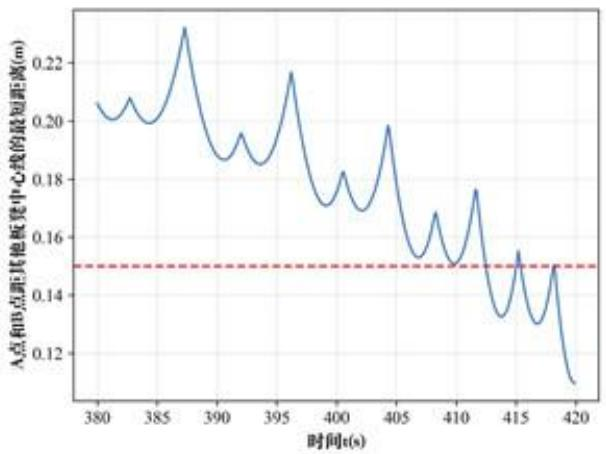
图9 最内圈板凳的外侧顶点距其他板凳中心线的最短距离与时间t的关系

可见该距离随时间整体呈下降趋势，但处于不断波动。在时间t大约为412s时，该距离第一次降至0.15m，表明此时发生了第一次碰撞，这与我们的求解结果相吻合。

## 5.3问题三模型的建立与求解

## 5.3.1最短螺距优化模型的建立

我们先建立调头空间的几何模型，以螺线中心点为圆心，半径为 $r _ { \mathrm { m i n } } = 4 . 5 \mathrm { m }$ 的圆的方程为 $r = r _ { \mathrm { m i n } }$ 0

根据要求，本题需要建立一个单目标优化模型，在进入给定的调头空间（即圆O)前保证不发生碰撞的情况下，最小化螺距 $d _ { c }$ 其中决策变量为螺距 $d _ { o }$

目标函数：

$$
\operatorname* { m i n } _ { d } \ d
$$

约束条件：

## ·螺距d 取值范围：

鉴于每块板凳宽0.3m，且把手中心均位于行进螺线上，因此容易得出螺距d的下界：$0 . 3 { \mathrm { m } }$ 。由问题二可知，当 $d = 0 . 5 5 \mathrm { m }$ 时，舞龙队会在第412秒左右发生第一次碰撞，此时龙头前把手坐标为(1.209931,1.942784)，显然在圆内。由于该碰撞为 $d = 0 . 5 5 \mathrm { m }$ 第一次碰撞，说明在舞龙队到达调头范围前并未发生过碰撞，因此可将0.55m设为螺距d的上界。即d的取值范围为[0.30m,0.55m]:

$$
0 . 3 0 \leq d \leq 0 . 5 5
$$

## ·进入调头空间时间 $t _ { 0 }$ aa

运用问题一中建立的盘入运动模型，调整螺距d的取值，即可得到龙头前把手任意时刻的坐标 $( r _ { 0 } ( t ) , \theta _ { 0 } ( t ) )$ 。当龙头前把手按照路线进入调头空间时，时间 $t _ { 0 }$ 满足：

$$
r _ { 0 } ( t _ { 0 } ) = r _ { \mathrm { m i n } }
$$

## ·在进入调头空间前板凳间不发生碰撞：

根据在问题二提出的碰撞模型，调整螺距d，我们可以判断在任意时刻t，最内圈的任意板凳是否与其相邻一圈的板凳发生碰撞。由问题二可知，第一次碰撞会发生在最内圈与其外圈一层的相邻板凳之间，因此为了保证不发生碰撞，需要保证最内圈任意板凳外侧的前顶点 $A _ { i }$ 和后顶点 $B _ { i }$ 到其相邻一圈任意板凳的前后把手所在直线$l _ { j }$ 的距离 $d _ { A }$ 和 $d _ { B }$ 大于安全阈值0.15m。

$$
\operatorname* { m i n } _ { t \in [ 0 , t _ { 0 } ] } \operatorname* { m i n } _ { [ d , t + j ] } ( d _ { A } ( t , i , j ) , d _ { B } ( t , i , j ) \} > 0 . 1 5 \mathbf { m }\tag{7}
$$

因此，我们确定螺距d的单目标优化模型为

$$
\begin{array} { r l } { \underset { d } { \min } } & { d } \\ { \mathrm { s . t . } } & { \left\{ \begin{array} { l l } { 0 . 3 0 \mathrm { m } \le d \le 0 . 5 5 \mathrm { m } , } \\ { r _ { 0 } ( t _ { 0 } ) = r _ { \mathrm { m i n } } , } \\ { \displaystyle \operatorname* { m i n } _ { t \in [ 0 . t _ { 0 } ] } \operatorname* { m i n } \{ d _ { A } ( t , i , j ) , d _ { B } ( t , i , j ) \} > 0 . 1 5 \mathrm { m } . } \end{array} \right. } \end{array}
$$

## 5.3.2最短螺距优化模型的求解

对于螺距优化问题，我们可以采用逐步优化的方法。确保优化过程中始终满足约束条件是一个难点，我们结合了变步长搜索和粒子群优化(PSO)算法来求在 $[ 0 , t _ { 0 } ]$ 的时间范围内，最内圈任意板凳外侧前后两个顶点到任意龙身中心线 $l _ { n }$ 最短距离，即

$$
\operatorname* { m i n } _ { t \in [ 0 , t _ { 0 } ] } \operatorname* { m i n } \{ d _ { A } ( t , i , j ) , d _ { B } ( t , i , j ) \}
$$

以确保优化过程中始终满足约束条件。下面是算法的具体步骤：

Step 1: 从螺距的下界 $d = 0 . 3 0 \mathrm { m }$ 开始，以较大的步长（0.01m)逐步增加螺距 $d _ { \circ }$ 对于每一个 $d ,$ 根据 $t _ { 0 }$ 与 $d$ 的关系式，求出 $t _ { 0 }$

Step 2: 计算在时间范围 $[ 0 , t _ { 0 } ]$ 内以及给定的该螺距下，是否满足(7)式。如果满足条件，则进入Step3；否则，继续增加螺距。同时关注(7式左侧的值，当其接近0.15m时，适当地缩小搜索步长。

Step3:在当前确定的螺距范围中，进一步用更短的步长，逐步增加螺距 $d ,$ 检查其 是否满足(7)式。若满足，则缩小搜索范围及步长，重复Step3，直至结果精确到 $6$ 位小 数。

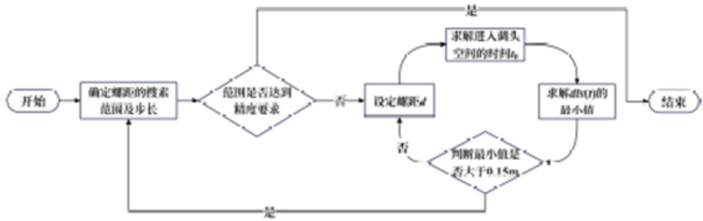
图10 问题三求解流程图

其中，在 Step2寻找最短距离时，就是要求如下函数 dis(t)在 $t \in [ 0 , t _ { 0 } ]$ 上的最小值： 上学牛在线

$$
d i s ( t ) = \operatorname* { m i n } _ { t , j } \operatorname* { m i n } \{ d _ { A } ( t , i , j ) , d _ { B } ( t , i , j ) \}
$$

鉴于目标函数的复杂性，我们采用了启发式搜索算法。在算法选择上，我们初步考虑了两种优化算法：模拟退火以及粒子群算法。然而经过我们的尝试以及对于函数$d i s ( t )$ 的性质探究后，发现模拟退火并不适用于该函数的最小值求解，因为该函数局部极小值过多且函数峰值过大，使得算法极容易陷入局部极小值附近，难以越过“能量障碍”，因此我们选用了更高效的粒子群优化算法求解。与模拟退火算法相比，粒子群优化算法全局搜索能力强，能避免高峰障碍（见[1]），每个粒子不仅会基于自身的经验，还会根据全局最优解进行调整速度，从而避免陷入局部最小值。

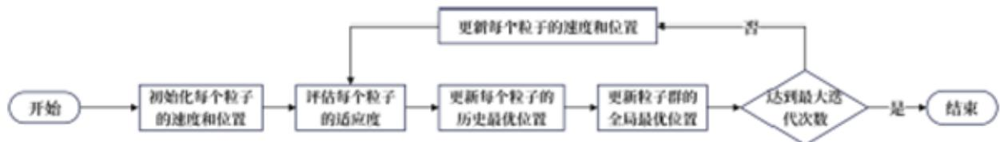
图11 粒子群 (PSO)算法流程图

图11是粒子群算法的一般流程图。在该问题中，我们设置初始参数设为：粒子数量(40），最大迭代次数(50），惯性权重(0.8)，个体认知权重(0.5)，群体社会权重(0.5)，用函数dis(t)衡量粒子适应度，并顺利得到函数 $d i s ( t )$ 在 $t \in [ 0 , t _ { 0 } ]$ 上的最小值。

根据以上算法步骤，我们最终求出：在保证龙头前把手能够进入调头空间且板凳龙不发生碰撞的情况下，最小螺距 $d _ { \tt m i n } = 0 . 4 5 0 3 3 7 \mathrm { m }$ D

## 5.3.3最短螺距优化模型的验证

我们设定螺距 $d = 0 . 4 5 0 3 3 7 \mathrm { m }$ (即 $d _ { \tt m i n } )$ ，通过验证约束条件的实验，来证明我们所建立的优化模型的合理性。图12和图13展示了 $d = d _ { \operatorname* { m i n } }$ 时，利用粒子群优化算法找到的函数 $d i s ( t )$ 最小值（图中+号标注），以及该算法的收敛过程。

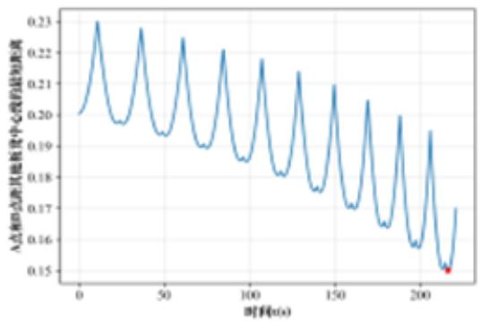
图 12 dis(t) 函数图像及最小值

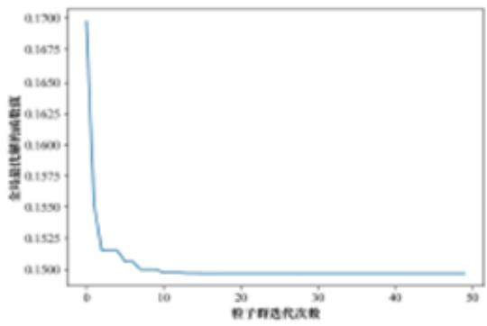
图13 粒子群算法收敛过程

通过图12的函数图像，可以发现在最小螺距 $d _ { \operatorname* { m i n } }$ 的情况下， $d i s ( t )$ 恰好略大于安全阈值0.15m，因此满足了约束条件“在龙头进入调头空间前不会发生碰撞”。

通过图13，可以看出粒子群算法在前10次迭代中就已经快速收敛到一个较优解。并且10次迭代后函数值趋于平稳，最终收敛到略大于0.15m的约束条件。经过多次实验，我们发现粒子群算法在求解不同螺距d下的最短距离时，均表现出良好的收敛性和稳定性。这再一次证明了我们选择粒子群算法的合理性。

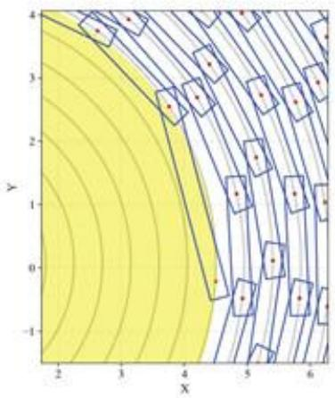
图14 最小螺距下龙头进入调头空间的状态

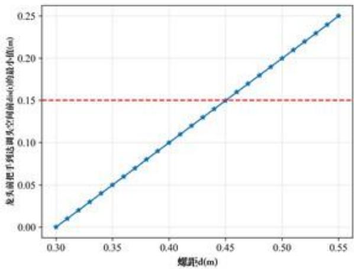
图15dis(t) 最小值随螺距 d 变化图像

图14是在最小螺距 $d _ { \mathrm { m i n } }$ 情况下，龙头前把手恰好进入调头空间时附近的板凳状态情况。我们可以发现在此状态下，龙头后顶点刚好快要与外圈发生碰撞，从图像上验证了对于不能发生碰撞的约束条件，同时也验证了最小螺距 $d _ { \mathrm { m i n } }$ 的正确性以及我们选用的相关算法的合理性。

接着，我们还绘制出了dis(t)的最小值关于螺距d的函数图像，如图15所示(红色虚线为 $y = 0 . 1 5 \mathrm { m } )$ 。从图中可以看出， $d i s ( t )$ 在龙头前把手进入调头空间前的最小值随螺距d增大而单调增加，且呈较明显的线性关系。这表明变步长搜索并不会遗漏满足要求的更小螺距，证明了我们算法选择的合理性。

## 5.4问题四模型的建立与求解

## 5.4.1 调头曲线路径几何模型

我们根据题目中所给定条件，建立调头路径几何模型，如图16所示。

其中盘入螺线与第一段圆弧 $\widehat { B D }$ 相切于点 B，切线为l;盘出螺线与第二段圆弧$\widehat { D F }$ 相切于点 $F _ { \ast }$ 切线为 $m _ { \phi }$ 圆弧 $\widehat { B D }$ 的圆心为 $O _ { 1 }$ ，圆弧 $\widehat { D F }$ 圆心为 $O _ { 2 }$ ，两圆弧相切于点 $D _ { \circ }$ 需要注意这两段圆弧的半径之比不一定是2:1，而是可以任意选取。我们发现$B , D , F$ 三点共线，从而调头曲线长度之和 $\widehat { B D } + \widehat { D F }$ 为定值，无法调整。

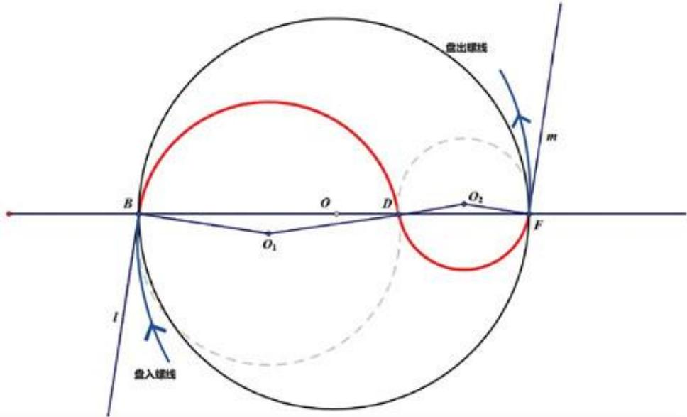
图16 调头曲线示意图

证明1直线l与直线m关于点O中心对称，故 $l / / m$ 。又因为B和F是圆的切点，所以$\angle O _ { 1 } B l = \angle O _ { 2 } F m = \pi / 2$ ，因此 $O _ { 1 } B / / O _ { 2 } F$

D是两段圆弧的公切点， $O _ { 1 } , D , O _ { 2 }$ 共线，因此由内错角相等， $\angle B O _ { 1 } D = \angle D O _ { 2 } F ,$ 注意到 $\triangle { O _ { 1 } B D }$ 和 $\triangle { O _ { 2 } D F }$ 都是等腰三角形，所以 $\angle O _ { 1 } D B = \angle O _ { 2 } D F$ ，因此B,D,F三点共线，也就是说 $B D + D F$ 为定值，由相似可知 $O _ { 1 } D + O _ { 2 } D$ 也是定值。由于圆心角 $\angle B O _ { 1 } D$ 和 $\angle D O _ { 2 } F$ 相等，弧 $\widehat { B D }$ 和弧 $\widehat { D F }$ 的长度之和为定值。

## 5.4.2 调头运动模型的建立

## 【模型准备】

首先，我们要求解调头曲线的轨迹方程。为了方便计算，我们将从-100s至100s舞龙队经过的路径分为四块，如图17所示

·曲线P:调头空间前的盘入螺线区。

·曲线M：调头空间内，弧 $\widehat { B D }$

·曲线N：调头空间内，弧 $\widehat { D F }$

·曲线 $Q { : }$ 调头空间后的盘出螺线区。

由于已经确定调头曲线不可调整，我们可以根据相应几何关系如图17所示求出相关点的坐标，从而方便我们在运动模型中建立运动方程。

根据题意，记螺距为 $d _ { 1 } = 1 . 7 \mathrm { m }$ ，调头空间半径仍为 $r _ { \mathrm { m i n } } = 4 . 5 \mathrm { m }$ 。圆 $O _ { 1 }$ 半径 $B O _ { 1 }$ (记为 $R _ { 1 } )$ 是圆 $O _ { 2 }$ 半径 $F O _ { 2 }$ (记为 $R _ { 2 } )$ 的两倍，且 $\triangle B O _ { 1 } D \sim \triangle F O _ { 2 } D$ 。同时，易得$B D + D F = 2 r$ ，结合相似，我们可以求出 $B D = 6  { \mathrm { m } }$ $D F = 3 { \mathrm { m } } $

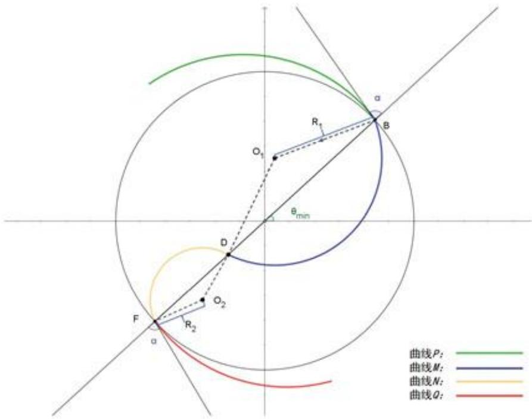
图17 板凳龙调头路径儿何模型以及区域划分

当龙头前把手恰好进入调头空间内的时候，其所对应的极角最小。记此时龙头前把手坐标为 $( r _ { \operatorname* { m i n } } , \theta _ { \mathrm { m i n } } )$ 。根据极坐标与极角的关系，有

$$
\theta _ { \mathrm { m i n } } = 2 \pi \cdot \frac { r _ { \mathrm { m i n } } } { d }
$$

同时，为了计算龙头前把手运动轨迹，我们还需要知道龙头前把手进入调头空间，以及盘出调头空间时的速度方向。因此需要知道调头空间半径所在直线OB与盘入螺线切线l的夹角大小α。由于盘入螺线与盘出螺线的中心对称性，直线n与盘出螺线切线m的夹角大小也为α。

根据相切关系以及运动方程，我们可以得到关于α的以下关系式；

$$
\tan \alpha = \left. \frac { r _ { \mathrm { m i n } } d \theta } { d r } \right| _ { r = r _ { \mathrm { m i n } } } = \theta _ { \mathrm { m i n } }
$$

因此，我们可以得到α的表达式：

$$
\alpha = \arctan \theta _ { \mathrm { { m i n } } }
$$

代入相关数值计算，可得 $\theta _ { \mathrm { m i n } } \approx 5 . 2 9 4 1 1 8 \pi , \alpha \approx 0 . 4 8 0 8 8 5 \pi$

根据几何关系，我们便可以推导出圆心 $O _ { 1 } , O _ { 2 }$ 坐标：

$$
\begin{array} { r l } & { O _ { 1 } : \left( r _ { \mathrm { m i n } } \cos \theta _ { \mathrm { m i n } } - R _ { 1 } \sin \left( \theta _ { \mathrm { m i n } } + \alpha \right) , r _ { \mathrm { m i n } } \sin \theta _ { \mathrm { m i n } } + R _ { 1 } \cos \left( \theta _ { \mathrm { m i n } } + \alpha \right) \right) } \\ & { O _ { 2 } : \left( - r _ { \mathrm { m i n } } \cos \theta _ { \mathrm { m i n } } + R _ { 2 } \sin \left( \theta _ { \mathrm { m i n } } + \alpha \right) , - r _ { \mathrm { m i n } } \sin \theta _ { \mathrm { m i n } } - R _ { 2 } \cos \left( \theta _ { \mathrm { m i n } } + \alpha \right) \right) } \end{array}
$$

我们设编号i的把手与轨迹圆心O连线和x轴正方向所成角度为 $\theta _ { i } - k \cdot 2 \pi ( k \in \mathbb { N } )$ 其中 $\theta _ { i } \in [ \theta _ { \operatorname* { m i n } } - \alpha - \pi / 2 , \theta _ { \operatorname* { m i n } } + \alpha - \pi / 2 ]$ 0

因此可列出第一段弧BD参数方程如下：

$$
\begin{array} { r } { x = x _ { o _ { 1 } } + R _ { 1 } \cos \theta _ { i } } \\ { y = y _ { o _ { 1 } } + R _ { 1 } \sin \theta _ { i } } \end{array}\tag{8}
$$

第二段弧 $\widehat { D F }$ 参数方程如下：

$$
\begin{array} { r } { x = x _ { o _ { 2 } } - R _ { 2 } \cos \theta _ { i } } \\ { y = y _ { o _ { 2 } } - R _ { 2 } \sin \theta _ { i } } \end{array}\tag{9}
$$

此外易得盘出螺线的方程如下：

$$
r = \frac { d } { 2 \pi } ( \theta + \pi )
$$

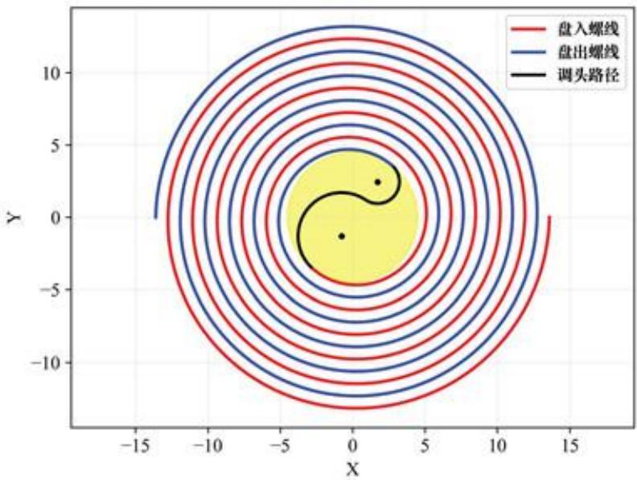
图18 板凳龙调头路径示意图

## 【龙头前把手调头运动模型】

我们考虑时刻t时，龙头前把手位置。为了能够更清晰的表示龙头前把手的运动，我们需要首先求出龙头前把手进入各曲线的时间点。

依题,我们设开始调头为零时刻,因此进入曲线M的时刻为 $t = 0$ 。由于龙前把手速度为 $v _ { 0 } = 1 { \mathrm m } / { \mathrm s } ,$ 且:

$$
{ \widehat { B D } } = { \frac { 6 \alpha } { \sin \alpha } } , { \widehat { D F } } = { \frac { 9 \alpha } { \sin \alpha } }
$$

则龙头前把手进入曲线N的时刻为 $t _ { N } = \frac { 6 \alpha } { \sin \alpha } \mathbf { s } ,$ 进入曲线Q的时刻为 $t _ { Q } = \frac { 9 \alpha } { \sin \alpha } \mathbf { s } .$ 由此对于 $t \in [ - 1 0 0 \mathrm { s } , 1 0 0 \mathrm { s } ]$ ，我们根据前把手所处不同曲线分别建立位置模型。

$\cdot \ t \in [ - 1 0 0 s , 0 s ]$ ：此时龙头前把手位于曲线P内，其运动轨迹依然为等距螺线，与问题一条件相同。因此，可以通过模型一中的方法求解位置。

$\mathbf { \Delta } \cdot \mathbf { \Xi } _ { t } \in [ 0 \mathbf { s } , t _ { N } ]$ 此时龙头前把手位于曲线M内，其运动轨迹为弧 $\widehat { B D }$ ，可以通过参数方程(8)求解。

$t \in [ t _ { N } , t _ { Q } ]$ :此时龙头前把手位于曲线N内，其运动轨迹为弧 $\widehat { D F }$ ，可以通过参数方程(9)求解。

$t \in [ t _ { Q } , 1 0 0 \mathrm { s } ]$ ：此时龙头前把手位于曲线Q内，运动轨迹同样为等距螺线，可用模型一中方法求解。

## 【龙身及龙尾调头运动模型】

在求解龙身及龙尾的运动模型时，我们仍然递推方法。但需要注意的是，在调头的过程中，可能会出现前后两个把手不在同一曲线上。

由于板凳长小于3m，因此相邻把手必定在相邻曲线或同一曲线上。

对于编号为n的把手，我们只需要判断其与三个分界点的距离D与其前后把手之间距离l的大小关系。其中当 $n = 0$ 时， $l = 2 . 9 6 \mathbf { m } ; n \in \{ 1 , 2 , \ldots 2 2 3 \}$ 时， $l = 1 . 7 5 \mathbf { m }$ 若 $D > l$ ，则说明编号为 $n + 1$ 与n的两个把手位于同一曲线上。反之，则说明二者位于不同曲线。但是需要特别注意，因为螺距比较小，所以对于编号为n的把手在曲线Q上的情况不能使用这种判别方法，正确的判别方法是：若 $D > l$ 或 $\theta _ { n } > \theta _ { \mathrm { m i n } }$ ，则说明二者位于同一曲线上，反之则位于不同曲线上。

## 位置递推关系推导

·编号为n与n+1的两个把手位于同一曲线上。

位于曲线P：与问题一相同，可套用模型一中的递推公式：

$$
( \frac { 2 \pi l } { d } ) ^ { 2 } = \theta _ { n } ^ { 2 } + \theta _ { n + 1 } ^ { 2 } - 2 \theta _ { n } \theta _ { n + 1 } \cos \left( \theta _ { n + 1 } - \theta _ { n } \right)
$$

其中 $\theta _ { n + 1 }$ 的求解范围为： $[ \theta _ { n } , \theta _ { n } + \pi ]$

位于曲线Q:与问题一类似，仍然套用该递关系，但由于盘出螺线与盘入螺线成中心对称，需要将递推公式里的 $\theta _ { n }$ 替换为 $\theta _ { n } + \pi$ ，将 $\theta _ { n + 1 }$ 替换为 $\theta _ { n + 1 } + \pi$ 。其中 $\theta _ { n + 1 }$ 的求解范围为： $\left[ \theta _ { n } - \pi , \theta _ { n } \right]$

位于曲线M：直接计算 $\theta _ { n + 1 } = \theta _ { n } + \Delta \theta$ ，其中 $\Delta \theta = 2 \arcsin \left( l / 2 R _ { 1 } \right)$ 。

位于曲线N：直接计算 $\theta _ { n + 1 } = \theta _ { n } - \Delta \theta$ ，其中 $\Delta \theta = 2 \arcsin \left( l / 2 R _ { 2 } \right)$

·编号为n与 $n + 1$ 的两个把手位于相邻曲线上。

位于曲线P和曲线M:

通过求解方程：

$$
( x _ { n } - x ) ^ { 2 } + ( y _ { n } - y ) ^ { 2 } = l ^ { 2 }\tag{10}
$$

其中， $\begin{array} { r } { x = \frac { d } { 2 \pi } \theta _ { n + 1 } \cos \theta _ { n + 1 } , y = \frac { d } { 2 \pi } \theta _ { n + 1 } \sin \theta _ { n + 1 } , \theta _ { n + 1 } } \end{array}$ 求解范围为： $[ \theta _ { \mathrm { m i n } } , \theta _ { \mathrm { m i n } } + \pi ]$ 位于曲线M 和曲线N:

通过求解方程：

$$
( x _ { n } - x _ { 0 _ { 1 } } - R _ { 1 } \cos \theta _ { n + 1 } ) ^ { 2 } + ( y _ { n } - y _ { 0 _ { 1 } } - R _ { 1 } \sin \theta _ { n + 1 } ) ^ { 2 } = l ^ { 2 }\tag{11}
$$

其中， $\theta _ { n + 1 }$ 求解范围为： $[ \theta _ { \mathrm { m i n } } - \alpha - \pi / 2 , \theta _ { \mathrm { m i n } } + \alpha - \pi / 2 ]$

位于曲线N和曲线 $Q$

通过求解方程：

$$
( x _ { n } - x _ { 0 _ { 2 } } + R _ { 2 } \cos \theta _ { n + 1 } ) ^ { 2 } + ( y _ { n } - y _ { 0 _ { 2 } } + R _ { 2 } \sin \theta _ { n + 1 } ) ^ { 2 } = l ^ { 2 }\tag{12}
$$

其中， $\theta _ { n + 1 }$ 求解范围为： $[ \theta _ { \mathrm { m i n } } - \alpha - \pi / 2 , \theta _ { \mathrm { m i n } } + \alpha - \pi / 2 ]$

## 速度递推关系推导

龙头前把手的速度恒为 $v _ { 0 } = 1 \mathrm { m / s }$ ，但是为了方便后续计算，我们需要先计算 $\dot { \theta } _ { 0 }$ 4$\cdot \ t \in [ - 1 0 0 \mathrm { s } , 0 \mathrm { s } ]$ 此时龙头前把手位于曲线P内，其运动轨迹依然为等距螺线，与问题一条件相同。因此，可以直接用模型一中的(1)式求解 $\dot { \theta } _ { 0 }$

$\mathbf { \partial } \cdot \mathbf { \rho } _ { t } \in [ 0 \mathbf { s } , t _ { N } ] \colon$ 此时龙头前把手位于曲线M内，其运动轨迹为弧 $\widehat { B D }$ ，有 $\dot { \theta } _ { 0 } = - v _ { 0 } / R _ { 1 }$

$t \in [ t _ { N } , t _ { Q } ] :$ 此时龙头前把手位于曲线N内，其运动轨迹为弧 $\widehat { D F }$ ，有 $\dot { \theta } _ { 0 } = v _ { 0 } / R _ { 2 }$

$t \in [ t _ { Q } , 1 0 0 \mathrm { s } ]$ ：此时龙头前把手位于曲线Q内，运动轨迹同样为等距螺线，可用模型一中方法求解。但是需要注意，需要将(1)式中的 $\theta _ { 0 }$ 替换为 $\theta _ { 0 } + \pi$ ，而且 $\dot { \theta } _ { 0 } > 0$ ，因此在去绝对值的时候不需要添负号。

然后递推得到其余把手速度：

·编号为n与n+1的两个把手位于同一曲线上。

位于曲线P：与问题一相同，可套用模型一中的递推公式：

$$
\frac { \dot { \theta } _ { n + 1 } } { \dot { \theta } _ { n } } = - \frac { 2 \theta _ { n } - 2 \theta _ { n + 1 } \cos \left( \theta _ { n + 1 } - \theta _ { n } \right) - 2 \theta _ { n } \theta _ { n + 1 } \sin \left( \theta _ { n + 1 } - \theta _ { n } \right) } { 2 \theta _ { n + 1 } - 2 \theta _ { n } \cos \left( \theta _ { n + 1 } - \theta _ { n } \right) + 2 \theta _ { n } \theta _ { n + 1 } \sin \left( \theta _ { n + 1 } - \theta _ { n } \right) }\tag{13}
$$

从而得出编号n+1的把手速度 $v _ { n + 1 }$

$$
v _ { n + 1 } = { \frac { d } { 2 \pi } } | \dot { \theta } _ { n + 1 } | \sqrt { 1 + \theta _ { n + 1 } ^ { 2 } }\tag{14}
$$

位于曲线 $Q \colon$ 与问题一类似，但是要将(13)式和(14)式中的所有 $\theta _ { n }$ 替换为 $\theta _ { n } + \pi$ 所有 $\theta _ { n + 1 }$ 替换为 $\theta _ { n + 1 } + \pi$

位于曲线M或曲线N：因为处在同一段圆弧上，所以有

$$
v _ { n + 1 } = v _ { n } , \dot { \theta } _ { n + 1 } = \dot { \theta } _ { n }
$$

·编号为n与n+1的两个把手位于相邻曲线上。

位于曲线P和曲线M：将(10)式两边同时对时间求导，整理得 ${ \dot { \theta } } _ { n + 1 } = { \frac { 2 \pi } { d } } { \frac { A } { B } }$ 其中

$$
\begin{array} { l } { { A = ( x _ { n } - \displaystyle \frac { d } { 2 \pi } \theta _ { n + 1 } \cos \theta _ { n + 1 } ) \dot { x } _ { n } + ( y _ { n } - \displaystyle \frac { d } { 2 \pi } \theta _ { n + 1 } \sin \theta _ { n + 1 } ) \dot { y } _ { n } } } \\ { { \ } } \\ { { B = ( x _ { n } - \displaystyle \frac { d } { 2 \pi } \theta _ { n + 1 } \cos \theta _ { n + 1 } ) ( \cos \theta _ { n + 1 } - \theta _ { n + 1 } \sin \theta _ { n + 1 } ) } } \\ { { \ } } \\ { { \quad \quad \quad + ( y _ { n } - \displaystyle \frac { d } { 2 \pi } \theta _ { n + 1 } \sin \theta _ { n + 1 } ) ( \sin \theta _ { n + 1 } + \theta _ { n + 1 } \cos \theta _ { n + 1 } ) } } \\ { { \ \dot { x } _ { n } = v _ { n } \sin \theta _ { n } } } \\ { { \dot { y } _ { n } = - v _ { n } \cos \theta _ { n } } } \end{array}
$$

因此

$$
v _ { n + 1 } = { \frac { d } { 2 \pi } } | \dot { \theta } _ { n + 1 } | \sqrt { 1 + \theta _ { n + 1 } ^ { 2 } }
$$

位于曲线M和曲线N：将(11)两边同时对时间求导，整理得

$$
\dot { \theta } _ { n + 1 } = - \frac { 1 } { R _ { 1 } } \frac { ( x _ { n } - x _ { O _ { 1 } } - R _ { 1 } \cos \theta _ { n + 1 } ) \dot { x } _ { n } + ( y _ { n } - y _ { O _ { 1 } } - R _ { 1 } \sin \theta _ { n + 1 } ) \dot { y } _ { n } } { ( x _ { n } - x _ { O _ { 1 } } - R _ { 1 } \cos \theta _ { n + 1 } ) \sin \theta _ { n + 1 } - ( y _ { n } - y _ { O _ { 1 } } - R _ { 1 } \sin \theta _ { n + 1 } ) \cos \theta _ { n + 1 } }
$$

其中 $\dot { x } _ { n } = v _ { n } \sin \theta _ { n } , \dot { y } _ { n } = - v _ { n } \cos \theta _ { n } ,$ 因此 $v _ { n + 1 } = | \dot { \theta } _ { n + 1 } | R _ { 1 }$

位于曲线N和曲线Q：将(12)两边同时对时间求导，整理得

$$
\dot { \theta } _ { n + 1 } = \frac { 1 } { R _ { 2 } } \frac { ( x _ { n } - x _ { O _ { 2 } } + R _ { 2 } \cos \theta _ { n + 1 } ) \dot { x } _ { n } + ( y _ { n } - y _ { O _ { 2 } } + R _ { 2 } \sin \theta _ { n + 1 } ) \dot { y } _ { n } } { ( x _ { n } - x _ { O _ { 2 } } + R _ { 2 } \cos \theta _ { n + 1 } ) \sin \theta _ { n + 1 } - ( y _ { n } - y _ { O _ { 2 } } + R _ { 2 } \sin \theta _ { n + 1 } ) \cos \theta _ { n + 1 } }
$$

其中 $\dot { x } _ { n } = v _ { n } \cos \beta _ { n } , \dot { y } _ { n } = v _ { n } \sin \beta _ { n } , \beta _ { n } = \theta _ { n } + \arctan ( \theta _ { n } + \pi )$ 。因此 $v _ { n + 1 } = | \boldsymbol { \dot { \theta } } _ { n + 1 } | R _ { 2 }$

## 5.4.3 调头运动模型的求解

对于龙头把手在盘入螺线及盘出螺线上运动时，其位置与速度的求解方式与模型一相同，可以运用二分搜索法分别求出龙头前把手在曲线P和曲线Q上每秒钟其位置信息。对于龙头前把手位于调头空间内，即曲线M和曲线N上的情况，我们则通过求解参数方程得到其每秒钟的位置信息。图19展示了龙头前把手在 $t \in [ - 1 0 0 , 1 0 0 ]$ 时间范围内的路径。

对于龙身以及龙尾部分，我们仍根据龙头前把手数据递归计算得到相应位置和速度。由于调头路径的复杂性，需要首先判断相邻把手在不同时间点所属路径。再按照位置推导关系中所给出的分类求解方程，在给定求解范围内，逐步更新各把手的角度和坐标。表5和表6是从 t = -100s 至 $t = 1 0 0 s$ 时部分时刻以及部分把手的位置与速度表格。全部把手每秒的位置速度信息见表格文件result4.xlsx。

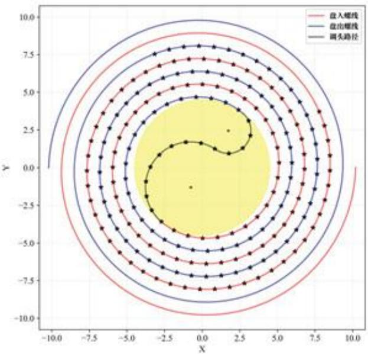
图19t = −100s 至 t = 100s 之间龙头前把手的位置

表5 调头过程中各节龙身坐标随时间变化情况
<table><tr><td rowspan=1 colspan=1></td><td rowspan=1 colspan=1>-100 s</td><td rowspan=1 colspan=1>-50 s</td><td rowspan=1 colspan=1>0 s</td><td rowspan=1 colspan=1>50 s</td><td rowspan=1 colspan=1>100 s</td></tr><tr><td rowspan=1 colspan=1>龙头x(m)</td><td rowspan=1 colspan=1>7.778034</td><td rowspan=1 colspan=1>6.608301</td><td rowspan=1 colspan=1>-2.711856</td><td rowspan=1 colspan=1>1.332696</td><td rowspan=1 colspan=1>-3.157229</td></tr><tr><td rowspan=1 colspan=1>龙头 y (m)</td><td rowspan=1 colspan=1>3.717164</td><td rowspan=1 colspan=1>1.898865</td><td rowspan=1 colspan=1>-3.591078</td><td rowspan=1 colspan=1>6.175324</td><td rowspan=1 colspan=1>7.548511</td></tr><tr><td rowspan=1 colspan=1>第1节龙身x(m)</td><td rowspan=1 colspan=1>6.209273</td><td rowspan=1 colspan=1>5.366911</td><td rowspan=1 colspan=1>-0.063534</td><td rowspan=1 colspan=1>3.862265</td><td rowspan=1 colspan=1>-0.346890</td></tr><tr><td rowspan=1 colspan=1>第1节龙身y(m)</td><td rowspan=1 colspan=1>6.108521</td><td rowspan=1 colspan=1>4.475403</td><td rowspan=1 colspan=1>-4.670888</td><td rowspan=1 colspan=1>4.840828</td><td rowspan=1 colspan=1>8.079166</td></tr><tr><td rowspan=1 colspan=1>第51节龙身x(m)</td><td rowspan=1 colspan=1>-10.608038</td><td rowspan=1 colspan=1>-3.629945</td><td rowspan=1 colspan=1>2.459962</td><td rowspan=1 colspan=1>-1.671385</td><td rowspan=1 colspan=1>2.095033</td></tr><tr><td rowspan=1 colspan=1>第51节龙身y(m)</td><td rowspan=1 colspan=1>2.831491</td><td rowspan=1 colspan=1>-8.963800</td><td rowspan=1 colspan=1>-7.778145</td><td rowspan=1 colspan=1>-6.076713</td><td rowspan=1 colspan=1>4.033787</td></tr><tr><td rowspan=1 colspan=1>第101节龙身x(m)</td><td rowspan=1 colspan=1>-11.922761</td><td rowspan=1 colspan=1>10.125787</td><td rowspan=1 colspan=1>3.008493</td><td rowspan=1 colspan=1>-7.591816</td><td rowspan=1 colspan=1>-7.288774</td></tr><tr><td rowspan=1 colspan=1>第101节龙身y(m)</td><td rowspan=1 colspan=1>-4.802378</td><td rowspan=1 colspan=1>-5.972247</td><td rowspan=1 colspan=1>10.108539</td><td rowspan=1 colspan=1>5.175487</td><td rowspan=1 colspan=1>2.063875</td></tr><tr><td rowspan=1 colspan=1>第151节龙身x(m)</td><td rowspan=1 colspan=1>-14.351032</td><td rowspan=1 colspan=1>12.974784</td><td rowspan=1 colspan=1>-7.002789</td><td rowspan=1 colspan=1>-4.605165</td><td rowspan=1 colspan=1>9.462513</td></tr><tr><td rowspan=1 colspan=1>第151节龙身y(m)</td><td rowspan=1 colspan=1>-1.980993</td><td rowspan=1 colspan=1>-3.810357</td><td rowspan=1 colspan=1>10.337482</td><td rowspan=1 colspan=1>-10.386988</td><td rowspan=1 colspan=1>-3.540357</td></tr><tr><td rowspan=1 colspan=1>第201节龙身x(m)</td><td rowspan=1 colspan=1>-11.952942</td><td rowspan=1 colspan=1>10.522508</td><td rowspan=1 colspan=1>-6.872842</td><td rowspan=1 colspan=1>0.336952</td><td rowspan=1 colspan=1>8.524374</td></tr><tr><td rowspan=1 colspan=1>第201节龙身y(m)</td><td rowspan=1 colspan=1>10.566998</td><td rowspan=1 colspan=1>-10.807425</td><td rowspan=1 colspan=1>12.382609</td><td rowspan=1 colspan=1>-13.177610</td><td rowspan=1 colspan=1>8.606933</td></tr><tr><td rowspan=1 colspan=1>龙尾（后）x(m)</td><td rowspan=1 colspan=1>-1.011059</td><td rowspan=1 colspan=1>0.189809</td><td rowspan=1 colspan=1>-1.933627</td><td rowspan=1 colspan=1>5.859094</td><td rowspan=1 colspan=1>-10.980157</td></tr><tr><td rowspan=1 colspan=1>龙尾（后）y(m)</td><td rowspan=1 colspan=1>-16.527573</td><td rowspan=1 colspan=1>15.720588</td><td rowspan=1 colspan=1>-14.713128</td><td rowspan=1 colspan=1>12.612894</td><td rowspan=1 colspan=1>-6.770006</td></tr></table>

表6 调头过程中各节龙身速度随时间变化情况
<table><tr><td rowspan=1 colspan=1></td><td rowspan=1 colspan=1>-100 s</td><td rowspan=1 colspan=1>-50 s</td><td rowspan=1 colspan=1>0 s</td><td rowspan=1 colspan=1>50 s</td><td rowspan=1 colspan=1>100 s</td></tr><tr><td rowspan=1 colspan=1>龙头(m/s)</td><td rowspan=1 colspan=1>1.000000</td><td rowspan=1 colspan=1>1.000000</td><td rowspan=1 colspan=1>1.000000</td><td rowspan=1 colspan=1>1.000000</td><td rowspan=1 colspan=1>1.000000</td></tr><tr><td rowspan=1 colspan=1>第1节龙身(m/s)</td><td rowspan=1 colspan=1>0.999904</td><td rowspan=1 colspan=1>0.999762</td><td rowspan=1 colspan=1>0.998687</td><td rowspan=1 colspan=1>1.000363</td><td rowspan=1 colspan=1>1.000124</td></tr><tr><td rowspan=1 colspan=1>第51节龙身(m/s)</td><td rowspan=1 colspan=1>0.999346</td><td rowspan=1 colspan=1>0.998642</td><td rowspan=1 colspan=1>0.995134</td><td rowspan=1 colspan=1>0.949935</td><td rowspan=1 colspan=1>1.003966</td></tr><tr><td rowspan=1 colspan=1>第101节龙身(m/s)</td><td rowspan=1 colspan=1>0.999091</td><td rowspan=1 colspan=1>0.998248</td><td rowspan=1 colspan=1>0.994448</td><td rowspan=1 colspan=1>0.948482</td><td rowspan=1 colspan=1>1.096263</td></tr><tr><td rowspan=1 colspan=1>第151节龙身(m/s)</td><td rowspan=1 colspan=1>0.998944</td><td rowspan=1 colspan=1>0.998047</td><td rowspan=1 colspan=1>0.994156</td><td rowspan=1 colspan=1>0.948038</td><td rowspan=1 colspan=1>1.095306</td></tr><tr><td rowspan=1 colspan=1>第201节龙身(m/s)</td><td rowspan=1 colspan=1>0.998849</td><td rowspan=1 colspan=1>0.997925</td><td rowspan=1 colspan=1>0.993994</td><td rowspan=1 colspan=1>0.947823</td><td rowspan=1 colspan=1>1.094933</td></tr><tr><td rowspan=1 colspan=1>龙尾（后）(m/s)</td><td rowspan=1 colspan=1>0.998817</td><td rowspan=1 colspan=1>0.997885</td><td rowspan=1 colspan=1>0.993944</td><td rowspan=1 colspan=1>0.947760</td><td rowspan=1 colspan=1>1.094833</td></tr></table>

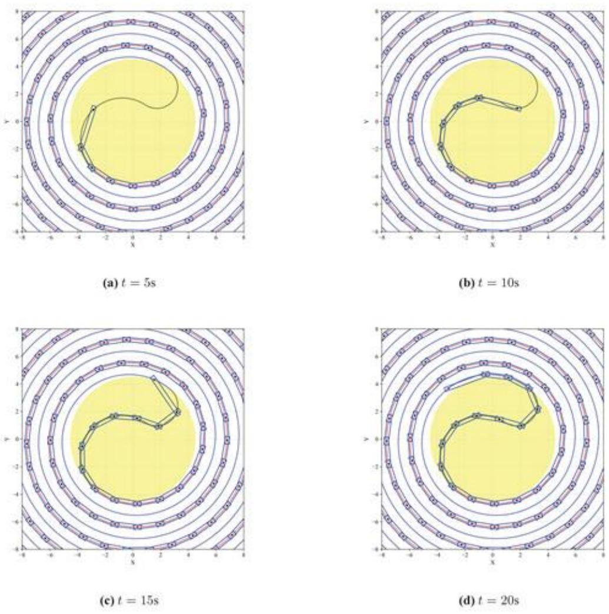
图20 调头过程中不同时刻板凳龙示意图

## 5.4.4 调头运动模型的验证

使用以上模型求得各时刻每个龙把手的位置与速度后，我们需要简单验证其合理性。

首先，通过使用电脑绘图，可以从视觉上验证位置的正确性。图20是用我们所求坐标绘制的不同时刻板凳龙状态示意图，可以发现板凳龙的把手均按照预定曲线移动，在直观上证实了我们所求坐标的正确性。

其次，我们采用数值微分法，通过选取小时间间隔(如0.01s)，计算把手前后位移，再据此计算出平均速度，在时间间隔趋于0的情况下，该平均速度应收敛于我们使用求导算出的速度。通过与我们利用模型求得的结果对比，可以看出二者之间确实差异较小。利用不同的速度求解方式，我们再一次验证了所求得相关数据的准确性以及所建立模型的合理性。并且相较于直接通过把手位置信息和速度公式求解速度，我们选取的模型能够直接得到更加精确的瞬时速度。

通过对各时刻各节把手的速度分析，我们发现未进入调头空间时，各把手的速度最大值出现在龙头前把手处，这与我们模型一中得出的结论相符。而在龙头前把手进入调头空间后，各把手的速度最大值出现变化。我们发现，在第14s时，速度最大值出现了短暂的突增。我们猜测是由于龙头开始进入盘出螺线，路径的曲率半径出现较大变化。通过对每时刻舞龙队状态的可视化，我们可以发现在第14s附近，龙头前把手开始进入曲线N，符合我们的猜想。对速度最大值的分析将会对下一问模型的建立有所帮助。

## 5.5问题五模型建立与求解

## 5.5.1最大速度计算模型的建立

题目要求全过程中，所有人的速度不能超过 $2 \mathrm { m } / \mathrm { s }$ ，求龙头前把手的最大行进速度$v _ { \mathrm { m a x } }$ 。注意到在相同位置上，所有把手的速度都成一定比例，也就是说，若龙头的速度从原来的 $v _ { 0 } = 1 \mathrm { m } / \mathrm { s }$ 变为 $v _ { \mathrm { m a x } }$ ，那么在相同位置上，所有把手的速度都会变为原来的${ v _ { \operatorname* { m a x } } } / { v _ { 0 } }$ 倍。所以在 $v _ { 0 } = 1 \mathrm { m / s }$ 时，所有把手速度的最大值一定是

$$
\operatorname* { m a x } _ { n } v _ { n } = { \frac { 2 \mathbf { m } / s } { v _ { \operatorname* { m a x } } / v _ { 0 } } }
$$

因此，只要我们借助问题四的模型，求出 $v _ { 0 } = 1 \mathrm { m / s }$ 时所有把手速度的最大值，就可以算出问题五龙头前把手最大行进速度 $v _ { \mathrm { m a x } }$

根据要求，本题需要建立一个单目标优化模型，在板凳龙行进的全过程中，最大化速度 $v _ { n } ( t )$ 。其中决策变量为时间t。

目标函数：

$$
\operatorname* { m a x } _ { t , n } v _ { n } ( t )
$$

约束条件：

·时间t的取值范围：观察问题四得到的各把手的速度数据，不难发现:当 $t \leq 0$ 时，速度的最大值一定出现在龙头，恒为 $v _ { 0 } { : }$ 而当 $t > 0$ 时，速度的最大值一开始出现在龙头，后面随着t的增大，整体呈现向龙尾方向移动的趋势。而且在 $t = 1 4 \mathrm { s } { \sim } 1 5 \mathrm { s }$ 附近(也就是龙头在F点附近时)，速度的最大值突然出现一个极大值。在这之后，速度的最大值整体呈现缓慢变大的趋势。

因此，我们只需要在龙头在F点附近和龙尾在F点附近时计算速度的最大值即可(经计算，该时间间隔为 $t = 3 7 6 \mathrm { s } { \sim } 3 8 4 \mathrm { s } )$ 0

$$
t \in [ 1 3 5 , 1 6 5 ] \cup [ 3 7 6 5 , 3 8 4 5 ]
$$

$$
n \in \{ 0 , 1 , 2 2 3 \}
$$

因此，我们确定所有把手速度最大值的单目标优化模型为

$$
\begin{array} { c } { \operatorname* { m a x } _ { t , n } v _ { n } ( t ) } \\ { \mathrm { s . t . } \quad \left\{ t \in [ 1 3 \mathbf { s } , 1 6 \mathbf { s } ] \cup [ 3 7 6 \mathbf { s } , 3 8 4 \mathbf { s } ] , \right. } \\ { \mathrm { s . t . } \quad \left\{ { n \in \{ 0 , 1 , 2 2 3 \} } . \right. } \end{array}
$$

## 5.5.2最大速度计算模型的求解

目标时间范围内 $t \in [ 1 3 \mathrm { s } , 1 6 \mathrm { s } ] \cup [ 3 7 6 \mathrm { s } , 3 8 4 \mathrm { s } ]$ ，我们以先以0.1s为步长计算不同时刻下所有把手的最大速度，并比较每个时刻的最大速度。结果表明，所有把手最大速度的最大值出现在 $t \in [ 1 4 5 , 1 5 5 ]$ 区间内。

通过分析该区间内最大速度的函数变化趋势，我们发现在该时间范围内，把手最大速度的函数图像呈单峰特征，即先增后减。根据此函数性质，我们选用了三分搜索法[2]进一步精确查找在该时间范围内把手的最大速度。

下面是三分搜索法的具体步骤以及示意图：

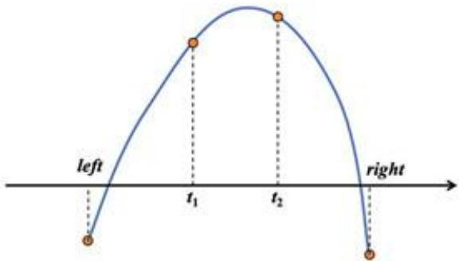
图21 三分搜索法示意图

Step1: 初始化参数。设定初始搜索区间为[14s,15s]

Step2: 计算两个中间点:根据当前区间 $[ l e f t , r i g h t ]$ ，计算两个三分点：

$$
t _ { 1 } = \frac { 2 \times l e f t + r i g h t } { 3 } , \quad t _ { 2 } = \frac { l e f t + 2 \times r i g h t } { 3 }
$$

分别计算在这两个时间点上的所有把手速度的最大值 $\operatorname* { m a x } _ { n } v _ { n } ( t _ { 1 } )$ 和 $\operatorname* { m a x } _ { n } v _ { n } ( t _ { 2 } )$ 6Step 3: 比较中间点的函数值：

·如果 $\operatorname* { m a x } _ { n } v _ { n } ( t _ { 1 } ) < \operatorname* { m a x } _ { n } v _ { n } ( t _ { 2 } )$ ，则极大值位于区间 $[ t _ { 1 } , r i g h t ]$ ，更新 $l e f t = t _ { 1 }$

·如果 $\operatorname* { m a x } _ { n } v _ { n } ( t _ { 1 } ) > \operatorname* { m a x } _ { n } v _ { n } ( t _ { 2 } )$ ，则极大值位于区间 $[ l e f t , t _ { 2 } ]$ ，更新 $r i g h t = t _ { 2 }$ 0

Step4:迭代过程:重复步骤2和步骤3，逐步缩小搜索区间，直到区间的长度小于预设的精度 $\epsilon = 1 0 ^ { - 8 }$ ，即 $| r i g h t - l e f t | < \epsilon$ 0

Step5:求解结果:在最后的迭代结束时，计算最终得到的中点 $t _ { f } = { \frac { l e f t + r i g h t } { 2 } }$ 对应的所有把手速度 $v _ { n } ( t _ { f } )$ 。根据最小速度限制公式计算龙头前把手的最大速度：

$$
v _ { \mathrm { m a x } } = \frac { 2 \mathrm { m } / s } { \displaystyle \operatorname* { m a x } _ { n } \frac { v _ { n } ( t _ { f } ) } { v _ { 0 } } }
$$

Step 6: 输出结果:输出最大行进速度 $v _ { \mathrm { m a x } }$ ，并验证在此速度下所有把手的速度均不超过2m/s。

经计算，我们得出在 $t \approx 1 4 . 4 7 9 9 7 1 4 8 s$ 时， $\operatorname* { m a x } _ { n } v _ { n } ( t )$ 达到其最大值1.60479338m/s。故题目所求结果为 $v _ { \mathrm { m a x } } \approx 1 . 2 4 6 2 6 6 \mathrm { m / s }$

## 5.5.3最大速度优化模型的验证

通过将所有把手最大速度随时间的变化可视化（图22）后，我们可以发现显然在14s附近出现了所有把手的最大速度，并且出现在靠近龙头部分。这验证了我们在利用三分法求解速度最大值时选定的时间范围的合理性。

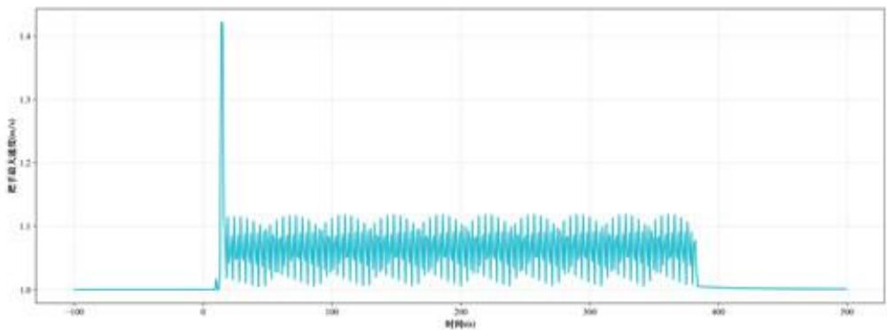
图22t = -100s 至 $t = 5 0 0 \mathrm { s }$ 把手速度最大值

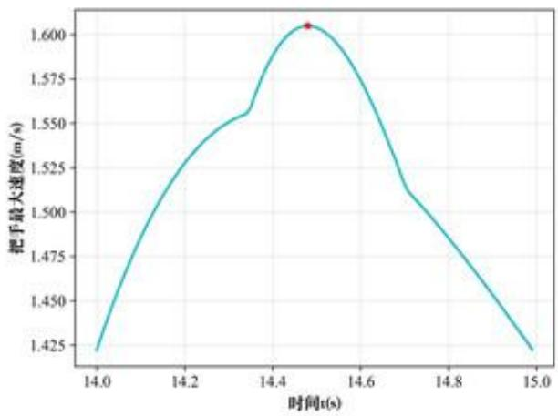
图 23 t = 14s 至 t = 15s 把手速度最大值

通过画出第14s至第15s的所有把手最大速度函数图像（图23，\*号标注为求得的最大值)，我们验证了在该范围区间内使用三分搜索法的合理性，即该函数在给定定义域内仅存在一个极大值，且函数图像呈现先增后减趋势。

## 六、模型的评价

## 6.1 模型的优点

·模型建立过程中，问题二通过完整证明合理假设，缩小了求解范围，简化了相关模型；问题四中，对于龙把手不同位置情况进行详细的分类讨论。问题五中，通过巧妙转化求解目标，同样简化了相关模型。

·模型求解过程中，通过二分法、粒子群算法、三分搜索法等算法进行优化，并且对比了不同优化方式的适配与各个模型的适配度，从而选择最优的求解方式，提高求解效率以及结果的精确度。

·每个模型都通过不同方式对于最后的求解结果进行验证与分析。

## 6.2 模型的缺点

·在碰撞检测方法中，并未充分考虑碰撞时物体的物理特性可能会带来的影响。

## 参考文献

[1] Meetu Jain, Vibha Saihjpal, Narinder Singh, and Satya Bir Singh. An overview of variants and advancements of pso algorithm. Applied Sciences, 12(17):8392, 2022.

[2] Manpreet Singh Bajwa, Arun Prakash Agarwal, and Sumati Manchanda. Ternary search algorithm: Improvement of binary search. In 2015 2nd International Conference on Computing for Sustainable Global Development (INDIACom), pages 1723-1725. IEEE, 2015.

## 附录A 支撑材料文件列表

表7 文件列表
<table><tr><td>文件名</td><td>说明</td></tr><tr><td>dragon.py dragon2.py</td><td>问题一至问题三计算位置与速度 问题四至问题五计算位置与速度</td></tr><tr><td>problem1_1.py</td><td>问题一计算位置</td></tr><tr><td>problem1_2.py</td><td>问题一计算速度</td></tr><tr><td>problem2_1.py</td><td>问题二求解碰撞时刻</td></tr><tr><td>problem2_2.py problem3.py</td><td>问题二计算碰撞时刻的位置和速度</td></tr><tr><td></td><td>问题三求解最小螺距</td></tr><tr><td>problem4_1.py</td><td>问题四计算位置</td></tr><tr><td></td><td></td></tr><tr><td>problem4_2.py</td><td>问题四计算速度</td></tr><tr><td>problem5.py</td><td>问题五求解全局把手最大速度</td></tr><tr><td>result1.xlsx</td><td>问题一所有时间所有把手的位置与速度</td></tr><tr><td></td><td></td></tr><tr><td>result2.xlsx result4.xlsx</td><td>问题二碰撞时所有把手的位置与速度 问题四所有时间所有把手的位置与速度</td></tr></table>

## 附录 B 支撑材料的所有 Python 代码

```python
1
234 文件名：dragon.py
用途：第1-3问板凳龙模型(无调头)
5 import numpy as np
6 import pandas as pd
7∞ import matplotlib.pyplot as plt
fros math import .
9 from matplotlib.font_manager import FontProperties
10
11 ben_wid = 0.3 # 板凳宽度(m)
12 ben_len_head = 3.41 # 龙头板长(m)
13 ben_len =2.20 # 龙身及龙尾板长度(m)
14 hole_dis = 0.275 # 孔离板头距离(m)
15 hole_dia = 0.055 # 孔的直径(m)
16 dra_len = 223 # 板凳个数
17
18 font = FontProperties(fnaze=*/System/Library/Fonts/Supplezental/Tizes Nev Roman.ttf")
```

```python
19 font2 = FontProperties(fname="/System/Library/Fonts/Supplemental/Songti.ttc")
20 21
22 class Dragon():
23
24 def__init__(self，d=0.55，v0=1，theta0=32* pi):# d为螺距(m)，v0为龙头前把手速度(=/s)
2 260 self.d = d # 蝶距(m)
27 self.v0 = v0 # 龙头前把手速度(m/s)
28 self.theta0 = theta0 # 0时刻龙头前把手角度
29
30 31 self,ang =None# 把手角度列表
self.pos = None # 把手坐标列表
32 self. vol = None # 把手速度列表
33
34 self.time = None # 当前时间
3 3 # 设定时间t(s)
37 def set_time(self, t, need_vol=False):
38
39 self.time = t # 更新当前时间
40
41 #求解龙头前把手位置
42 theta_n = self.head_pos(t)
43 self.ang = [theta_n]
44 self.pos = [(self.arc_x(theta_n), self.arc_y(theta_n))]
45
46 if need_vol:
47 self.vol = [self.v0]
48 d_theta_n = -2 * pi * self.v0 / (self.d * (1 + theta_n**2)**0.5)
49
50 #求解龙身及龙尾前把手、龙尾后把手位置
51 for n in range(223):
52 58 if n != 0:
theta_n = self.next_pos(theta_n)
54 else:
5 5 5 theta_n = self.next_pos(theta_n, is_head=True)
self.ang.append(theta_n)
self.pos.append((self.arc_x(theta_n), self.arc_y(theta_n)))
58
59 if need_vol:
60 theta_n0 = self.ang[n]
61 theta_n1 = self.ang[n + 1]
62
63 par1 = 2 * theta_n0 - 2 • theta_n1 • cos(theta_n1 - theta_n0) - 2 * theta_n0 *
theta_ni * sin(theta_n1 - theta_n0)
64 par2 = 2 * theta_n1 - 2  theta_n0  cos(theta_n1 - theta_n0) + 2 * theta_n0
```

theta\_ni \* sin(theta\_n1 - theta\_n0)
66 d\_theta\_n1 = -(par1 / par2) \* d\_theta\_n
68 v = self.d / (2 \* pi) \* abs(d\_theta\_n1) \* (1 + theta\_n1\*\*2)\*\*0.5
69 self.vol.append(v)
7 72 d\_theta\_n = d\_theta\_n1
73 #判断是否碰撞
74 def judge\_col(self):
75 dis\_min = 1 # 最短距离(m)
76 7 #找到距龙头一圈外的第一个板凳
78 i\_max = 0
79 while self.ang[i\_=ax] - self.ang[0] <= 2 \* pi:
80 1\_max += 1
82 for i in range(0, i\_max + 1):
84 1\_i = 2.86 if i == 0 else 1.65
86 #找到距第1个板凳一圈外的第一个板凳j0
87 j0 = i\_max
88 while self.ang[j0] - self.ang[i] <= 2 \* pi:
89 j0 += 1
91 #遍历j0及前后各两个板凳
92 #判断是否相碰
93 for j in range(jo - 2, j0 + 3):
94 1\_j = 1.65
95 delta\_xi = self.pos[i + 1][0] - self.pos[i][0]
96 delta\_yi = self .pos[i + 1][1] - self .pos[i][1]
97 delta\_xj = self.pos[j + 1][0] - self.pos[j][0]
98 delta\_yj = self.pos[j + 1][1] - self .pos[j][1]
100 s = - delta\_yi / 1\_i # sin(alpha)
101 c = - delta\_xi / l\_i # cos(alpha)
103 x1 = self.pos[i][0] + hole\_dis \* c - (ben\_vid / 2) \* s
104 y1 = self .pos[i][1] + hole\_dis \* s + (ben\_wid / 2) \* c
105 x2 = self.pos[i + 1] [0] - hole\_dis \* c - (ben\_wid / 2) \* s
106 y2 = self.pos[i + 1][1] - hole\_dis \* s + (ben\_wid / 2) \* c
108 dis1 = abs(delta\_yj • x1 - delta\_xj • y1 + self .pos[j + 1][0] \* self.pos[j][1] -
self.pos[j][0] \* self.pos[j + 1][1]) / 1\_j
109 dis2 = abs(delta\_yj  x2 - delta\_xj \* y2 + self .pos[j + 1][0] \* self.pos[j][1] -

```python
self.pos[j][0] * self.pos[j + 1][1]) / 1_j
110
111 if dis1 <= 0.15 or dis2 <= 0.15:
112 return True, min(dis1, dis2)
113
114 dis_min = min(dis_min, dis1, dis2)
115
116 return False, dis_min
117
118 #判断龙头前把手到外圈板凳的最短距离
119 def min_dis(self, t):
120
121 self.set_time(t)
122 dis_min = 1 # 最短距离(m)
123
124 #找到距龙头一圈外的第一个板凳
125 j0 = 0
126 while self.ang[j0] - self.ang[0] <= 2 • pi:
127 j0 += 1
128
129 1_1 = 2.86
130 for j in range(j0 - 2, j0 + 3):
131 1_j = 1.65
132 delta_xi = self.pos[1][0]- self.pos[0][0]
133 delta_yi = self.pos[1][1] - self.pos[0][1]
134 delta_xj = self.pos[j + 1][0] - self.pos[j][0]
135 delta_yj = self.pos[j + 1][1] - self .pos[j][1]
136
137 s = - delta_yi / 1_i # sin(alpha)
138 c = - delta_xi / 1_i # cos(alpha)
139
140 x1 = self .pos[0] [0] + hole_dis * c - (ben_vid / 2) * s
141 y1 = self .pos[0][1] + hole_dis * s + (ben_wid / 2) * c
142 x2 = self.pos[1] [0] - hole_dis * c - (ben_wid / 2) * s
143 y2 = self.pos[1][1] - hole_dis * s + (ben_vid / 2) * c
144
145 dis1 = abs(delta_yj * x1 - delta_xj• y1 + self.pos[j + 1][0]  self.pos[j][1] -
self.pos[j][0] * self.pos[j + 1][1]) / 1_1
146 dis2 = abs(delta_yj • x2 - delta_xj • y2 + self.pos[j + 1][0] • self.pos[j][1] -
self.pos[j][0] * self.pos[j + 1][1]) / 1_j
147
148 dis_min = sin(dis_min, dis1, dis2)
149
150 return dis_min
151
152 #求解相碰时间及此时龙头前把手距中心的距离
153 def time_col(self):
```

```python
154
155 time = 0
156
157 #设定初始状态
158 self.set_time(time)
159
160 while not self.judge_col()[0]:
161 time += 1
162 self.set_time(time)
163
164 return time,self.arc_r(self.ang[0])#龙头前把手离中心矩离
165
166 #求解龙头前把手到达调头空间的时间
167 def arr_time(self):
168 return binary_search(self.if_arrive, 0, 421, incre=True)
169
170 #打印板凳龙状态(无板凳)
171 def print_status(self):
172
173 theta = np.linspace(0, 20 * 2 * pi, 1500)
174 x = self.d / (2 * pi) * theta * np.cos(theta)
175 y = self.d / (2 * pi) * theta * np.sin(theta)
176
177 x_lst = [ben_pos[0] for ben_pos in self .pos]
178 y_lst = [ben_pos[1] for ben_pos in self.pos]
179
180 plt.figure()
181 plt.plot(x, y, color='black', linewidth=2, alpha=0.5)
182 plt.scatter(x_lst, y_lst, color='red', marker='.')
183
184 plt.xlabel('X')
185 plt.ylabel('Y')
186
187 plt.grid(True, alpha=0.3)
188 plt.show()
189
190 #打印板凳龙图像(有板凳)
191 def print_img(self, save_pth=None, magn=None, shov=True, circle=False):
192
193 #save_pth 保存路径，默认不保存
194 #magn是否放大中心，默认不放大
195
196 a = hole_dis
197 b = ben_wid / 2
198
199 #初始化图像
200 plt.figure(figsize=(8, 8))
```

```python
#绘制把手
theta = np.linspace(0, 16 * 2 * pi, 1500)
x = self.d / (2 * pi) • theta * np.cos(theta)
y = self.d / (2 * pi) * theta * np.sin(theta)
x_lst = [ben_pos[0] for ben_pos in self.pos]
y_lst = [ben_pos[1] for ben_pos in self.pos]
plt.plot(x, y, color='black', linewidth=2, alpha=0.2)
plt.scatter(x_lst, y_lst, color='red', marker='.')
#绘制板凳
for i in range(223):
li = 2.86 if 1 == 0 else 1.65
delta_xi = self.pos[i + 1][0] - self.pos[i][0]
delta_yi = self.pos[i + 1][1] - self.pos[i][1]
s = - delta_yi / li # sin(alpha)
c = - delta_xi / li # cos(alpha)
x1 = self.pos[i][0] + a * c - b * s
y1 = self.pos[i][1] + a * s + b * c
x2 = self.pos[i + 1][0] - a * c - b • s
y2 = self.pos[i + 1] [1] - a * s + b . c
x3 = self.pos[i + 1] [0] - a * c + b . s
y3 = self .pos[i + 1] [1] - a * s - b • c
x4 = self.pos[i] [0] + a * c + b * s
y4 = self.pos[i][1] + a * s - b * c
rect = [(x1, y1), (x2, y2), (x3, y3), (x4, y4)]
x, y = zip(*rect)
plt.plot(x + (x[0],), y + (y[0],), 'b-')
if circle:
circle = plt.Circle((0. 0), 4.5, color='yellow', fill=True, alpha=0.5)
plt.gca().add_artist(circle)
#设置图形属性
plt.xlabel('X', fontproperties=font, size=12)
plt.ylabel('Y', fontproperties=font, size=12)
plt.xticks(fontproperties=font, size=12)
plt.yticks(fontproperties=font, size=12)
```

```python
#放大区域
if magn is not None:
plt.xlim(-magn, magn)
plt.ylim(-magn, magn)
#显示图形
# plt.axis('equal') #设置坐标轴等比例
plt.grid(True,alpha=0.3)#显示网格
if save_pth:
plt.savefig(save_pth, dpi=300)
if show:
plt.show()
plt.close()
#（辅助函数）求解龙头前把手角度
def head_pos(self, t):
par1 = self.theta0• (1 + self.theta0**2)**0.5
par2 = log(self.theta0 + (1 + self.theta0**2)**0.5)
par3 = 4 * pi * self.v0 * t / self.d
def fn(x):
return par1 + par2 - par3 - x * (1 + x**2)**0.5 - log(x + (1 + x**2)**0.5)
return binary_search(fn, 0, self.theta0, incre=False)
#（辅助函数）判断龙头前把手是否进入调头空间
def if_arrive(self, t):
ang = self .head_pos(t)
if self.arc_r(ang) <= 4.5:
return 1
else:
return -1
#（辅助函数）求解龙身及龙尾把手角度
def next_pos(self,theta_n, is_head=False):# theta_n为前一把手角度
1 = 2.86 if is_head else 1.65 # 两孔距离(n)
paral = (2 * pi * 1 / self.d)**2
def fn(x):
return theta_n**2 + x**2 - 2 * theta_n * x * cos(x - theta_n) - para1
return binary_search(fn, theta_n, theta_n + pi, incre=True)
#（辅助函数）角度转换为x坐标
def arc_x(self, arc):
return self.d / (2 * pi) * arc • cos(arc)
```

```python
#（辅助函数）角度转换为y坐标
def arc_y(self, arc):
return self.d / (2 * pi) * arc • sin(arc)
#（辅助函数）角度转换为半径
def arc_r(self, arc):
return self.d / (2 * pi) * arc
#二分搜索函数
def binary_search(fn, lb, ub, incre, eps=1e-8):
cur = (1b + ub) / 2
while ub - 1b > eps:
cur_res = fn(cur)
#若函数递增
if incre:
if cur_res < 0:
1b = cur
elif cur_res > 0:
ub = cur
#若函数递减
else:
if cur_res > 0:
1b = cur
elif cur_res < 0:
ub = cur
cur = (1b + ub) / 2
return cur
#临时测试函数
def test():
dragon = Dragon()
dragon.set_tize(412)
dragon.print_img(magn=4)
if __name__ == __main__:
test()
```

```python
1 "="
2345 文件名：dragon2.py
用途：第4-5问板凳龙模型(含调头)
6 HRH
7 请注意
8 本文档中所有把手角度均为·二元组
9 第一个数 表示 所在曲线(1/2/3/4)
10 第二个数表示 极角
11 "=
12
13 import numpy as np
14 import pandas as pd
15 import matplotlib.pyplot as plt
16 inport matplotlib.patches as patches
17 from math import .
18 from matplotlib.font_manager import FontProperties
19 import os
20
21 font = FontProperties(fname=*/System/Library/Fonts/Supplemental/Tines Nev Roman.ttf")
22 font2 = FontProperties(fname="/System/Library/Fonts/Supplemental/Songti.ttc")
23
24 ben_wid = 0.3 # 板凳宽度(m)
25 20 ben_len_head = 3.41 # 龙头板长(m)
ben_len =2.20 # 龙身及龙尾板长度(=)
27 hole_dis = 0.275 # 孔离板头距离(m)
28 hole_dia=0.055 #孔的直径(m)
29 30 dra_len = 223 # 板凳个数
31 d = 1.7 # 蝶距(m)
32 x = 4.5 # 调头空间半径(m)
33
34 theta = 2 * pi * r / d # 图中theta角
35 alpha = atan(theta) #图中alpha角
36
37 R1 = 3 / sin(alpha) # 大圆半径
38 R2 = 3 /(2 * sin(alpha)) # 小圆半径
39
40 #大圆圆心坐标
41 01x = r * cos(theta) - R1 * sin(theta + alpha)
42 01y = r * sin(theta) + R1 * cos(theta + alpha)
43
44 #小圆圆心坐标
45 02x = -r * cos(theta) + R2 * sin(theta + alpha)
```

```python
46 02y = -r * sin(theta) - R2 * cos(theta + alpha)
47
48 #盘入切点坐标
49 x1 = d / (2 · pi) * theta * cos(theta)
50 y1 = d / (2 * pi) * theta * sin(theta)
51
52 #盘出切点坐标
53 x3 = -x1
54 y3 = -y1
55
56 #两圆切点坐标
57 x2 = x1 / 3 + x3 * 2 / 3
58 y2 = y1 / 3 + y3 * 2 / 3
59
60
61 class Dragon():
62
63 def__init__(self,v0=1):# v0为龙头前把手速度(m/s)
64
65 self.d = d # 蝶距(m)
66 self.v0 = v0 # 龙头前把手速度(m/s)
67
68 self.ang = None # 把手角度列表
69 self.pos = None # 把手坐标列表
70 self.vol = None # 把手速度列表
71
72 self. time = None # 当前时间
73
74 #设定时间t(s)
75 def set_tize(self, t, need_vol=False):
76
77 self.time = t # 更新当前时间
78
79 #求解龙头前把手位置
80 theta_n = self.head_pos(t)
81 self.ang = [theta_n]
82 self.pos = [(self.arc_x(theta_n), self.arc_y(theta_n))]
83
84 #求解龙身及龙尾前把手、龙尾后把手位置
85 for n in range(223):
86 if n!= 0:
87 theta_n = self.next_pos(theta_n)
88 else:
89 theta_n = self.next_pos(theta_n, is_head=True)
90 self.ang.append(theta_n)
91 self.pos.append((self.arc_x(theta_n), self.arc_y(theta_n)))
92
```

#求解各把手速度
if need\_vol == False:
return
#求解龙头前把手速度
if self.ang[0][0] == 1:
d\_theta = -2• pi \* self.v0 / d / sqrt(1 + self.ang[0][1] \*\* 2)
elif self.ang[0][0] == 2:
d\_theta = - self.vO / R1
elif self.ang[0][0] == 3:
d\_theta = self.vO / R2
elif self .ang[0][0] == 4:
d\_theta = 2 \* pi \* self.v0 / d / sqrt(1 + (self.ang[0][1] + pi) \*\* 2)
self.vol = [self.v0]
d\_theta\_1 = d\_theta
#求解龙身及龙尾前把手、龙尾后把手速度
for n in range(223):
1 = 2.86 if n == 0 else 1.65
thetal = self.ang[n][1]
theta2 = self .ang[n + 1][1]
(x1, y1) = self.pos[n]
(x2, y2) = self.pos[n + 1]
#前一把手位于盘入螺线(当前把手位于盘入螺线)
if self.ang[n][0] == 1:
par1 = thetal - theta2 \* cos(theta2 - theta1) - thetal \* theta2 \* sin(theta2 -
theta1)
par2 = theta2 - thetal \* cos(theta2 - theta1) + thetal \* theta2 \* sin(theta2 -
thetai)
d\_theta1 = -par1 / par2 \* d\_theta
self.vol.append(self.d / (2 \* pi) \* abs(d\_theta1) \* sqrt(1 + theta2 \*\* 2))
#前一把手位于大圆圆弧
elif self.ang[n][0] == 2:
#当前把手位于大圆圆弧
if self.ang[n + 1][0] == 2:
d\_thetal = d\_theta
self.vol.append(self.vol[n])
#当前把手位于盘入螺线
elif self.ang[n + 1][0] == 1:
x1d = self.vol[n] \* sin(thetal)
y1d = -self.vol[n]• cos(thetal)
par1 = (x1 - d / (2 \* pi) • theta2 \* cos(theta2)) \* x1d + (y1 - d / (2 \* pi)
• theta2 • sin(theta2)) \* y1d

par2 = (x1 - d / (2 \* pi) \* theta2 • cos(theta2)) \* (cos(theta2) - theta2 \*
sin(theta2)) + (y1 - d / (2 \* pi) \* theta2 \* sin(theta2)) \* (sin(theta2)
+ theta2 \* cos(theta2))
d\_theta1 = 2 \* pi / d \* par1 / par2
self.vol.append(self .d / (2 \* pi) \* abs(d\_theta1) \* sqrt(1 + theta2 \*\* 2))
#前一把手位于小圆圆弧
elif self.ang[n][0] == 3:
#当前把手位于小圆圆弧
if self.ang[n + 1][0] == 3:
d\_thetal = d\_theta
self.vol.append(self.vol[n])
#当前把手位于大圆圆弧
elif self.ang[n + 1][0] == 2:
x1d = self.vol[n] \* sin(thetai)
y1d = -self.vol[n] \* cos(thetal)
par1 = (x1 - 01x - R1 \* cos(theta2)) \* x1d + (y1 - 01y - R1 \* sin(theta2)) \*
y1d
par2 = (x1 - 01x - R1 \* cos(theta2)) \* sin(theta2) - (y1 - 01y - R1 \*
sin(theta2)) \* cos(theta2)
d\_theta1 = -par1 / (R1 \* par2)
self.vol.append(abs(d\_theta1) \* R1)
前一把手位于盘出螺线
elif self.ang[n][0] == 4:
#当前把手位于盘出螺线
if self.ang[n + 1][0] == 4:
theta1, theta2 = theta1 + pi, theta2 + pi
par1 = theta1 - theta2 \* cos(theta2 - theta1) - thetal \* theta2 \* sin(theta2
- theta1)
par2 = theta2 - thetal \* cos(theta2 - theta1) + thetal \* theta2 \* sin(theta2
- theta1)
d\_theta1 = -par1 / par2 \* d\_theta
self.vol.append(self.d / (2 \* pi) \* abs(d\_theta1) \* sqrt(1 + theta2 \*\* 2))
theta1, theta2 = theta1 - pi, theta2 - pi
#当前把手位于小圆圆弧
elif self.ang[n + 1][0] == 3:
beta = thetal + atan(thetal + pi)
x1d = self.vol[n] \* cos(beta)
y1d = self.vol[n] \* sin(beta)
par1 = (x1 - 02x + R2 \* cos(theta2)) \* x1d + (y1 - 02y + R2 \* sin(theta2)) \*
y1d
par2 = (x1 - 02x + R2 \* cos(theta2)) \* sin(theta2) - (y1 - 02y + R2

```python
sin(theta2)) * cos(theta2)
177 d_theta1 = par1 / (R2 • par2)
178 self.vol.append(abs(d_theta1) * R2)
179
180 d_theta = d_thetal
181
182 #打印板凳龙状态(无板凳)
183 def print_status(self):
184
185 #计算盘入盘出螺线
186 ang = np.linspace(theta, 10 * 2 * pi, 1000)
187 xx1 = d / (2 * pi) * ang * np.cos(ang)
188 yy1 = d / (2 * pi) * ang * np .sin(ang)
189 xx2 = -xx1
190 yy2 = -yy1
191
192 plt.figure(figsize=(8, 8))
193
194 #绘制盘入盘出螺线
195 plt.plot(xx1, yy1, color='red',linewidth=2, label='盘入线, alpha=0.5)
196 plt.plot(xx2, yy2, color='blue', linewidth=2, label='盘出螺线', alpha=0.5)
197 plt.plot([],[], color='black',linewidth=2, label='调头路径, alpha=0.5)
198
199 #绘制调头空间
200 circle = plt.Circle((0, 0), 4.5, color='yellov', fill=True, alpha=0.4)
201 plt.gca().add_artist(circle)
202
203 # 绘制两圆圆心
204 # plt.scatter(01x, 01y, color='black', marker='.', alpha=0.5)
205 # plt.scatter(02x, 02y, color='black', marker='., alpha=0.5)
206
207 #绘制调头路径
208 arc1 = patches.Arc((01x, 01y). vidth=R1 * 2, height=R1 * 2, theta1=np.rad2deg(theta -
alpha - pi / 2), theta2=np.rad2deg(theta + alpha - pi / 2). color='black'.
linewidth=2, alpha=0.5)
209 plt.gca().add_patch(arc1)
210
211 arc2 = patches.Arc((02x, 02y). width=R2 * 2. height=R2 * 2. theta1=np.rad2deg(theta -
alpha + pi / 2), theta2=np.rad2deg(theta + alpha + pi / 2), color='black'.
linewidth=2, alpha=0.5)
212 plt.gca().add_patch(arc2)
213
214 x_lst = [ben_pos[0] for ben_pos in self.pos]
215 y_lst = [ben_pos[1] for ben_pos in self.pos]
216
217 plt.scatter(x_lst, y_lst, color='black', marker='.')
218
```

```python
219 plt.axis('equal')
220 plt.xlabel('X', fontproperties=font, size=12)
221 plt.ylabel('Y', fontproperties=font, size=12)
222 plt.xticks(fontproperties=font, size=12)
223 plt.yticks(fontproperties=font, size=12)
224
225 plt.grid(True, alpha=0.3)
226 plt.show()
227
228 #打印板凳龙图像(有板凳)
229 def print_img(self, save_pth=None, magn=None, show=True):
230
231 # save_pth 保存路径，默认不保存
232 #magn是否放大中心，默认不放大
233 # show 是否展示，默认展示
234
235 #初始化图像
236 plt.figure(figsize=(8, 8))
237
238 #计算盘入盘出螺线
239 ang = np.linspace(theta, 10 * 2 * pi, 1000)
240 xx1 = d / (2 * pi) * ang * np.cos(ang)
241 yy1 = d / (2 * pi) * ang * np.sin(ang)
242 xx2 = -xx1
243 yy2 = -yy1
244
245 #绘制盘入盘出螺线
246 plt.plot(xx1, yy1, color='red', linewidth=2, label='盘入线', alpha=0.5)
247 plt.plot(xx2, yy2, color='blue',linewidth=2, label='盘出螺线', alpha=0.5)
248 plt.plot([], [], color='black', linevidth=2, label='调头路径, alpha=0.5)
249
250 #绘制调头空间
251 circle = plt.Circle((0, 0), 4.5, color='yellov', fill=True, alpha=0.4)
252 plt.gca().add_artist(circle)
253
254 #绘制两圆圆心
255 # plt.scatter(01x, 01y, color='black', marker='.', alpha=0.5)
256 # plt.scatter(02x, 02y, color='black'. marker='.', alpha=0.5)
257
258 #绘制调头路径
259 arc1 = patches.Arc((01x, 01y), vidth=R1 * 2, height=R1 * 2, theta1=np.rad2deg(theta -
alpha - pi / 2), theta2=np.rad2deg(theta + alpha - pi / 2), color='black',
linevidth=2, alpha=0.5)
260 plt.gca().add_patch(arc1)
261
262 arc2 = patches.Arc((02x, 02y). vidth=R2 • 2, height=R2 * 2, theta1=np.rad2deg(theta -
alpha + pi / 2), theta2=np.rad2deg(theta + alpha + pi / 2), color='black'
```

```python
linewidth=2. alpha=0.5)
263 plt.gca().add_patch(arc2)
264
265 #绘制把手
266 x_lst = [ben_pos[0] for ben_pos in self.pos]
267 y_lst = [ben_pos[i] for ben_pos in self.pos]
268
269 plt.scatter(x_lst, y_lst, color='black', marker='.')
270
271 # 绘制板凳
272 a = hole_dis
273 b = ben_wid / 2
274
275 for i in range(223):
276
277 li = 2.86 if i == 0 else 1.65
278
279 delta_xi = self.pos[i + 1][0] - self.pos[i][0]
280 delta_yi = self.pos[i + 1][1] - self.pos[i][1]
281
282 s = - delta_yi / li # sin(alpha)
283 c = - delta_xi / li # cos(alpha)
284
285 x1 = self.pos[i] [0] + a * c - b * s
286 y1 = self.pos[i][1] + a * s + b * c
287 x2 = self.pos[i + 1][0] - a * c - b * s
288 y2 = self .pos[i + 1] [1] - a * s + b • c
289 x3 = self.pos[i + 1][0] - a * c + b . s
290 y3 = self .pos[i + 1] [1] - a * s - b • c
291 x4 = self .pos[i][0] + a * c + b * s
292 y4 = self.pos[i][1] + a * s - b * c
293
294 rect = [(x1, y1), (x2, y2), (x3, y3), (x4, y4)]
295
296 x, y = zip(*rect)
297 plt.plot(x + (x[0],), y + (y[0],), 'b-')
298
299 #设置图形属性
300 plt.xlabel('X', fontproperties=font, size=12)
301 plt.ylabel('Y'. fontproperties=font, size=12)
302
303 plt.xticks(fontproperties=font, size=12)
304 plt.yticks(fontproperties=font, size=12)
305
306 #放大区城
307 if magn is not None:
308 plt.xlim(-magn, magn)
```

```python
309 plt.ylim(-magn, magn)
310
311 #显示图形
312 # plt.axis('equal') # 设置坐标轴等比例
313 plt.grid(True, alpha=0.3)
314 if save_pth:
315 plt.savefig(save_pth, dpi=300)
316 if show:
317 plt.show()
318 plt.close()
319
320 #保存板凳龙图像
321 def save_imgs(self. start_t, end_t. save_pth="photos2". magn=8):
322 for tine in np.arange(start_t, end_t + 1, 1):
323 print("time = ", time)
324 self.set_time(time)
325 self.print_ing(os.path.join(save_pth, f"{time}.png"), magn=magn, shov=False)
326
327 #（辅助函数）求解龙头前把手角度
328 def head_pos(self, t):
329
330 #位于盘入螺线
331 if t <= 0:
332 par1 = theta • (1 + theta**2)**0.5
333 par2 = log(theta + (1 + theta**2)**0.5)
334 par3 = 4 * pi * self.v0 • t / self.d
335
336 def fn(x):
337 return par1 + par2 - par3 - x * (1 + x**2)**0.5 - np.log(x + (1 + x**2)**0.5)
338
339 return 1, binary_search(fn, theta, theta * 2, incre=False)
340
341 #位于大圆圆弧
342 elif t < 6 * alpha / (sin(alpha) * self.v0):
343 theta_n = theta + alpha - pi / 2 - self.v0 * t / R1
344 return 2, theta_n
345
346 #位于小圆圆弧
347 elif t < 9 * alpha / (sin(alpha) • self .v0):
348 theta_n = theta - alpha - pi / 2 + self.v0 * (t - 2 * alpha * R1 / self.v0) / R2
349 return 3, theta_n
350
351 #位于盘出螺线
352 else:
353 par1 = theta * (1 + theta**2)**0.5
354 par2 = log(theta + (1 + theta**2)**0.5)
355 par3 = 4 * pi * self.v0 • (t - 2 * alpha * (R1 + R2) / self.v0) / self.d
```

357 def fn(x):
358 return x \* (1 + x\*\*2)\*\*0.5 + np.log(x + (1 + x\*\*2)\*\*0.5) - par1 - par2 - par3
360 return 4, binary\_search(fn, theta, theta \* 20, incre=True) - pi
362 #（辅助函数）龙头前把手路径图
363 def head\_ing(self):
365 #计算盘入盘出螺线
366 ang = np.linspace(theta, 6 \* 2 \* pi, 1000)
367 x1 = d / (2 \* pi) \* ang \* np. cos(ang)
368 y1 = d / (2 \* pi) \* ang \* np. sin(ang)
369 x2 = -x1
370 y2 = -y1
372 plt.figure(figsize=(8, 8))
374 #绘制盘入盘出螺线
375 plt.plot(x1, y1, color='red', linewidth=2, label='盘入线', alpha=0.5)
376 plt.plot(x2, y2, color='blue',linewidth=2, label='盘出线', alpha=0.5)
377 plt.plot([], [], color='black', linewidth=2, label='调头路径, alpha=0.5)
379 #绘制调头空间
380 circle = plt.Circle((0, 0), 4.5, color='yellow', fill=True, alpha=0.4)
381 plt.gca().add\_artist(circle)
383 # 绘制两圆图心
384 plt.scatter(01x, 01y, color='black', marker=.', alpha=0.5)
385 plt.scatter(02x, 02y, color='black', marker='.', alpha=0.5)
387 #绘制调头路径
388 arc1 = patches.Arc((01x, 01y). width=R1 \* 2, height=R1 \* 2, theta1=np.rad2deg(theta -
alpha - pi / 2), theta2=np.rad2deg(theta + alpha - pi / 2). color='black'.
linewidth=2, alpha=0.5)
389 plt.gca().add\_patch(arci)
391 arc2 = patches.Arc((02x, 02y). width=R2 \* 2. height=R2 \* 2, theta1=np.rad2deg(theta -
alpha + pi / 2), theta2=np.rad2deg(theta + alpha + pi / 2), color='black'.
linewidth=2, alpha=0.5)
392 plt.gca().add\_patch(arc2)
394 x = []
395 y = []
397 for t in np.arange(-100, 101):
398 ang = self.head\_pos(t) 生在

```python
399 x.append(self.arc_x(ang))
400 y.append(self.arc_y(ang))
401
402 plt.scatter(x, y, marker='', color='black')
403
404 plt.axis('equal')
405 plt.xlabel('X', fontproperties=font, size=12)
406 plt.ylabel('Y', fontproperties=font,size=12)
407 plt.xticks(fontproperties=font, size=12)
408 plt.yticks(fontproperties=font, size=12)
409
410 plt.legend(prop=font2)
411 plt.grid(True, alpha=0.2)
412 # plt.savefig("Figure_8.png")
413 plt.show()
414
415 #（辅助函数）求解龙身及龙尾把手角度
416 def next_pos(self, theta_n, is_head=False):# theta_n为前一把手角度
417
418 1 = 2.86 if is_head else 1.65 # 两孔距离(=)
419
420 #前一把手位于盘入螺线（当前把手位于盘入螺线）
421 if theta_n[0] == 1:
422 theta_n = theta_n[1]
423 par1 = (2 * pi * 1 / self.d)**2
424
425 def fn(x):
426 return theta_n**2 + x**2 - 2 * theta_n * x * cos(x - theta_n) - par1
427
428 return 1, binary_search(fn, theta_n. theta_n + pi, incre=True)
429
430 #前一把手位于大圆圆弧
431 elif theta_n[0] == 2:
432 xn = self.arc_x(theta_n)
433 yn = self.arc_y(theta_n)
434
435 #当前把手位于盘入螺线
436 if dist((xn, yn), (x1, y1)) <= 1:
437
438 def fn(x):
439 par1 = d / (2 * pi) * x * np.cos(x)
440 par2 = d / (2 * pi) * x * np.sin(x)
441 return (xn - par1)**2 + (yn - par2)**2 - 1**2
442
443 return 1, binary_search(fn, theta_n[1], theta_n[1] + pi, incre=True)
444
445 #当前把手位于大圆圆弧
```

446 else:
447 delta\_theta = 2 \* asin(1 / (2 \* R1))
448 return 2, theta\_n[1] + delta\_theta
450 #前一把手位于小圆圆弧
451 elif theta\_n[0] == 3:
452 xn = self.arc\_x(theta\_n)
453 yn = self.arc\_y(theta\_n)
455 #当前把手位于大圆圆弧
456 if dist((xn, yn), (x2, y2)) <= 1:
458 def fn(x):
459 par1 = xn - 01x - R1 \* np.cos(x)
460 par2 = yn - 01y - R1 \* np.sin(x)
461 return par1\*\*2 + par2\*\*2 - 1\*\*2
463 return 2, binary\_search(fn, theta - alpha - pi / 2, theta + alpha - pi / 2,
incre=True)
465 #当前把手位于小圆圆弧
466 else:
467 delta\_theta = 2 \* asin(1 / (2 \* R2))
468 return 3, theta\_n[1] - delta\_theta
470 #前一把手位于盘出螺线
471 elif theta\_n[0] == 4:
472 xn = self.arc\_x(theta\_n)
473 yn = self.arc\_y(theta\_n)
475 #当前把手位于小圆圆弧
476 if dist((xn, yn), (x3, y3)) <= 1 and theta\_n[1] <= theta:
478 def fn(x):
479 par1 = xn - 02x + R2 \* np.cos(x)
480 par2 = yn - 02y + R2 \* np.sin(x)
481 return par1\*\*2 + par2\*\*2 - 1\*\*2
483 return 3, binary\_search(fn, theta - alpha - pi / 2, theta + alpha - pi / 2,
incre=False)
485 #当前把手位于盘出螺线
486 else:
487 theta\_n = theta\_n[1]
488 par1 = (2 \* pi \* 1 / self.d)\*\*2
490 def fn(x):

```python
return (theta_n + pi)**2 + (x + pi)**2 - 2 * (theta_n + pi) * (x + pi) *
cos(x - theta_n) - par1
return 4, binary_search(fn, theta_n - pi, theta_n, incre=False)
#（辅助函数）角度转换为x坐标
def arc_x(self, arc):
#位于盘入螺线
if arc[0] == 1:
return self.d / (2 * pi) * arc[1] * cos(arc[1])
#位于大圆圆弧
elif arc[0] == 2:
return 01x + R1 * cos(arc[1])
#位于小圆圆弧
elif arc[0] == 3:
return 02x - R2 * cos(arc[1])
#位于盘出螺线
elif arc[0] == 4:
return self.d / (2 * pi) * (arc[1] + pi) * cos(arc[1])
#（辅助函数）角度转换为y坐标
def arc_y(self, arc):
#位于盘入螺线
if arc[0] == 1:
return self.d / (2 * pi) * arc[1] * sin(arc[1])
#位于大圆圆弧
elif arc[0] == 2:
return 01y + R1 * sin(arc[1])
#位于小圆圆弧
elif arc[0] == 3:
return 02y - R2 * sin(arc[1])
#位于盘出螺线
elif arc[0] == 4:
return self.d / (2 * pi) * (arc[1] + pi) * sin(arc[1])
二分搜索函数
lef binary_search(fn, lb, ub, incre, eps=1e-8):
```

```python
537 cur = (1b + ub) / 2
538
539 while ub - lb > eps:
540
541 cur_res = fn(cur)
542
543 #若函数递增
544 if incre:
545 if cur_res < 0:
546 1b = cur
547 elif cur_res > 0:
548 ub = cur
549
550 #若函数递减
551 else:
552 if cur_res > 0:
553 1b = cur
554 elif cur_res < 0:
555 ub = cur
556
557 cur = (1b + ub) / 2
558
559 return cur
560
561 #求两点间距离
562 def dist(p1, p2):
563 return ((p1[0] - p2[0])**2 + (p1[1] - p2[1])**2)**0.5
564
565
566 #临时测试函数
567 def test():
568 dragon = Dragon()
569 dragon.set_time(300)
570 dragon.print_img(magn=8)
571
572
573 if __name__==__nain__':
574 test()
1
2 文件名：problen1_1.py
3 用途：求解0-300s各把手位置
4 "="
5 fron dragon import .
6
7 col_0 =['龙头x(=)·，'龙头y(m)]
```

```python
8 for i in range(1, 222):
9 col_0.append(f·第{i}节龙身x(m)')
10 col_0.append(f'第{i}节龙身y(m)')
11 col_0.extend(['龙尾x(m)'，龙尾y(m)'，'龙尾（后）x(=)'，‘龙尾（后）y(m)'])
12
13 data = {': col_0}
14
15 dragon = Dragon()
16
17 for time in range(301):
18
19 if time % 10 == 0:
20 print(f"已求解{tine}s")
21
22 dragon.set_time(time)
23
24 xy_lst = []
2 26 for x, y in dragon.pos:
xy_lst.append(x)
27 xy_lst.append(y)
28
29 data[f'{tine} s'] = xy_lst
30
31 df = pd.DataFrame(data)
32 df.to_csv('resulti_pos.csv', index=False)
```

```python
文件名：problen1_2.py
用途：求解0-300s各把手速度
from dragon import •
col_0 =['龙头(=/s)']
for 1 in range(1, 222):
col_0.append(f'第{i}节龙身(=/s)')
col_0.extend(['龙尾(=/s)'。龙尾（后） (m/s)'])
data = {'': col_0}
dragon = Dragon()
for time in range(301):
if time % 10 == 0:
print(f"已求解{time}s")
```

```python
dragon.set_time(time, need_vol=True)
data[f'{tize} s'] = dragon.vol
df = pd.DataFrame(data)
df.to_csv('result1_vol.csv', index=False)
```

```python
文件名：problem2_1.py
用途：变步长求解碰撞时刻
H=H
fron dragon import .
dragon = Dragon()
def check_col(start, end, step):
for time in np.arange(start, end, step):
dragon.set_time(time)
coll = dragon.judge_col()
print("time = ", time, " if_collision = ", coll[0], " min_dis = ". coll[1])
check_col(412, 413, 0.1)
```

```python
1
2 文件名：problem2_2.py
3 用途：求解碰撞时刻各把手的位置和速度
4 HH
5 fron dragon import .
6
7 col_time = 412.47383777 # 碰撞时刻(s)
8
9 dragon = Dragon()
10 dragon.set_time(col_time, need_vol=True)
11
12 col_0 =['龙头]
13 for i in range(1, 222):
14 col_0.append(f'第{i}节龙身')
15 col_0.extend(['龙尾'，‘龙尾（后）·])
16
17 data = {': col_0}
18
19 data['横坐标x (s)'] = [ben_pos[0] for ben_pos in dragon.pos]
20 data['坐标y (m)'] = [ben_pos[1] for ben_pos in dragon.pos]
21 data['速度(=/s)'] = dragon.vol
22
23 df = pd.DataFrame(data)
```

df.to\_csv('result2\_all.csv', index=False)

```python
文件名：problen3.py
用途：求解龙头前把手能进入调头空间的最小螺距
from dragon import •
from sko.PSO import PSO
def min_pitch(start, end, step, fig1=False, fig2=False):
for d in np.arange(start, end, step):
dragon = Dragon(d=d)
time = dragon.arr_time()
print(f当前蝶距为{d}m')
pso = PS0(func=dragon.min_dis, n_dim=1, pop=40, max_iter=50, 1b=0, ub=time, w=0.8,
c1=0.5, c2=0.5)
pso.run()
dist = pso.gbest_y
print('best_x is', pso.gbest_x. 'best_y is', pso.gbest_y)
#作图1
if fig1:
xx = np.linspace(0, time, 1000)
yy = np.array([dragon.nin_dis(x) for x in xx])
plt.figure()
plt.plot(xx, yy)
plt.plot(pso.gbest_x, pso.gbest_y, '*r')
plt.xlabel('时t(s)', fontproperties=font2, size=12)
plt.ylabel('A点和B点距其他板凳中心线的最短距离'，fontproperties=font2，size=12)
plt.xticks(fontproperties=font, size=12)
plt.yticks(fontproperties=font, size=12)
plt.savefig("Figure_4.png". dpi=300)
plt.show()
#作图2
1f fig2:
plt.figure(figsize=(7, 5))
plt.plot(pso.gbest_y_hist)
plt.xlabel('粒子群迭代次数，fontproperties=font2,size=12)
plt.ylabel('全局最优解的函数值'，fontproperties=font2,size=12)
plt.xticks(fontproperties=font, size=12)
plt.yticks(fontproperties=font, size=12)
plt.savefig("Figure_6.png", dpi=300)
```

```python
44 plt.show()
45
46 if dist > 0.15:
47 break
48
49
50 if __name__ == __nain__
51 min_pitch(0.45, 0.46, 0.001)
```

```python
1 H=H
234 文件名：problen4_1
用途：求解-100-100s各把手的位置
5 fros dragon2 import *
6
7 col_0 =['龙头z(m)'，‘龙头y(m)']
89 for i in range(1, 222):
col_0.append(f'第{1}节龙身x(m)')
10 col_0.append(f'第{i}节龙身y(m)')
11 col_0.extend(['龙尾x(m)'，'龙尾y(m)'，龙尾(后)x(=)'，'龙尾(后）y(m)'])
12
13 data = {': col_0}
14
15 dragon = Dragon()
16 for time in np.arange(-100, 101, 1):
17
18 if time % 10 == 0:
19 print(f"已求解到{time}s")
20
21 dragon.set_time(time)
22 xy_lst = []
23 24 25 26 for x, y in dragon.pos:
xy_lst.append(x)
xy_lst.append(y)
27 data[f"{time} s"] = xy_lst
28
29 df = pd.DataFrame(data)
30 df.to_csv('result4_pos.csv', index=False)
```

2 文件名：problen4\_2.py
3 用途：求解-100-100s各把手的速度
45 from dragon2 import \*

```python
col_0 =['龙头(n/s)']
for i in range(1, 222):
col_0.append(f'第{i}节龙身(=/s)')
col_0.extend(['龙尾(=/s)'，龙尾(后）(=/s)'])
data = {': col_0}
dragon = Dragon()
for time in np.arange(-100, 101, 1):
if time % 10 == 0:
print(f"已求解到{time}s")
dragon.set_tize(time, need_vol=True)
data[f"{tize} s"] = dragon.vol
df = pd.DataFraze(data)
df.to_csv('result4_vol.csv', index=False)
```

```python
文件名：problen5.py
用途：求解全局把手最大速度
H=H
from dragon2 import *
dragon = Dragon()
#求某时刻的最大速度
def max_vt(time):
dragon.set_tize(time, need_vol=True)
return max(dragon.vol)
#求某时间段内的最大速度
def max_v(start, end, step, save_pth=None):
glo_max_v=0# 全局最大速度
max_time = 0 # 最大速度对应时间
for tize in np.arange(start, end, step):
dragon.set_tize(time, need_vol=True)
cur_max_v = max(dragon.vol)
if cur_max_v > glo_max_v:
```

```python
27 glo_max_v = cur_max_v
28 max_time = time
29
30 print("time = ", tine, " max_v = ", cur_max_v)
31
32 print(glo_sax_v, max_time)
33
34 plt.figure(figsize=(20, 7))
35
36 xx = np.arange(start, end, step)
37 yy = [max_vt(x) for x in xx]
38 plt.plot(xx, yy, color='#00C5D7', linewidth=2)
39
40 plt.xlabel('时阿t(s),fontproperties=font2,size=12)
41 plt.ylabel('把手最大速度(m/s)',fontproperties=font2,size=12)
42 plt.xticks(fontproperties=font, size=12)
43 plt.yticks(fontproperties=font, size=12)
44
45 plt.grid(True, alpha=0.3)
46 if save_pth:
47 plt.savefig(save_pth, dpi=300)
48 plt.show()
49
50
51 #三分搜索算法(求极大值)
52 def ternary_search(fn, lb, ub, eps=1e-8):
53
54 while ub - 1b >= eps:
55
56 margin = (ub - 1b) / 3
57
58 x1 = 1b + margin
59 x2 = ub - margin
60
61 if fn(x1) <= fn(x2):
62 1b = x1
63 else:
64 ub = x2
65
66 return (1b + ub) / 2
67
68
69 #三分搜索法求最大速度
70 def main(save_pth=None, show=True):
71
72 t = ternary_search(max_vt, 14. 15)
73 f_t = max_vt(t)
```

```python
74
75 print(t, f_t)
76
77 if show:
78 plt.figure()
79
80 xx = np.arange(14, 15, 0.01)
81 yy = [max_vt(x) for x in xx]
82 plt.plot(xx, yy, color='#00A7E3', linewidth=2)
83
84 plt.plot(t, f_t, marker='*', color='red')
85
86 plt.xlabel('时t(s)',fontproperties=font2, size=12)
87 plt.ylabel('把手最大速度(m/s)'，fontproperties=font2,size=12)
88 plt.xticks(fontproperties=font, size=12)
89 plt.yticks(fontproperties=font, size=12)
90
91 plt.grid(True, alpha=0.3)
92 if save_pth is not None:
93 plt.savefig(save_pth, dpi=300)
94 plt.show()
95
96
97 if __name__ == __sain__:
98 main(save_pth="Figure_10.png")
```
