# 红外干涉法测量外延层厚度的建模分析

## 摘要

本文通过研究红外干涉法测外延层厚度问题，提出了一种基于牛顿迭代反演反射率模型参数、同基于波谷周期关系进行数值计算厚度交叉印证的解决路径。

对于问题一，该方案首先基于碳化硅和硅的先验折射率物理模型和双光束干涉的反射强度公式，设计了一个基于Drude折射率模型、给出了直接计算外延层厚度的公式

对于问题二，在基于折射率和反射强度公式建立的模型上，设计了两个求解路线(1)周期波谷直接计算法:通过反射率表达式给出的理论震荡周期和厚度d的关系建立d的显式表达式，在附件1、2测得的反射率曲线上通过样条插值取出准确极值点坐标值，计算多组厚度d并用统计方法给出最终厚度计算值为7.544μm(2) 牛顿迭代反演法: 以已经建立的反射率表达式 $R _ { d }$ 作为依赖厚度d 参数曲线，通过用牛顿迭代拟合 $R _ { d }$ 与实验测得的反射率曲线，给出厚度d的迭代解为；7.295μm作为直接计算值 7.544μm的较好印证值

对于问题三，解答路线是(A)先建立多光于涉模型，分析多光束效应显著的物理必要条件，并给出判断多光束效应对原模型求解精度影响大小的评判指标G，(B)基于前两问的建模和给出的波谷直接计算法和牛顿迭代反演法，代入硅晶片的折射率经验曲线，建立确定硅外延层厚度计算的数学模型和算法。给出附件3，4数据的厚度计算值为3.453μm（直接计算）和3.414μm(牛顿迭代)，最终以3.432μm作为附件3、4硅晶片的厚度计算结果(C)通过G值检验和机器学习检验，用(B)中初步计算结果和参与计算的量考察多光束效应对附件3，4所测数值影响的强弱(D)对附件1，2所测数据评估多光束效应，并在波谷直接计算法和牛顿迭代反演法上都进行模型修正，以尝试消除多光束效应的影响，得出在修正模型下计算得厚度和第二问中计算得到结果差距极小，因而判断附件1、2中多光束于涉效应较弱，最终可信的厚度值是 7.455μm L -mo

关键词：折射率建模，牛顿迭代反演，三次样条拟合，机器学习

## 1 问题背景与重述

## 1.1 问题的背景

碳化硅是一种新型半导体材料，在某些碳化硅器件的制备过程中，需要在高掺杂浓度的基底上生长一层低掺杂浓度的外延层。测量碳化硅的外延层厚度对器件的制备至关重要，我们需要一个精确易得的碳化硅外延层厚度测量方法。

红外干涉法利用等倾干涉的原理：由于两束反射光之间的相位差受到光波长影响，红外光入射碳化硅晶圆表面的反射谱呈现出交替相消相长的特性，也即干涉条纹，通过该方法可以无损测量碳化硅外延层的厚度。在一定条件下，光束可能在外延层表面和衬底表面发生多次折射和反射，进而形成多光束干涉，从而降低厚度测量的精度。

利用红外干涉法计算外延层厚度需要碳化硅的折射率作为参量，而碳化硅的折射率受到掺杂浓度和入射光的波长等参数的影响，能否对碳化硅折射率进行精确建模直接影响到厚度测量精度和可靠性。在固体物理研究中，通常基于Drude模型对不同掺杂浓度碳化硅的复介电常数建立数学模型，进而得出一定掺杂浓度下碳化硅的折射率-波数曲线。

## 1.2 问题的重述

问题1:(1)仅考虑光在外延层和衬底之间的单次反射、透射，基于红外光的反射率光谱情形，建立确定外延层厚度的数学模型。

问题2:(1)使用问题1建立的模型，设计算法，用红外光反射率光谱计算碳化硅外延层的厚度，(2)对附件提供的不同入射角的碳化硅片的光谱实测数据进行分析计算，给出计算结果(3)评估结果的可靠性。

问题3:(1)实际情况中，光波可以在外延层和空气界面以及外延层和衬底界面多次反射和透射，推导产生多光束干涉的必要条件，(2)分析多光束干涉是否会影响外延层厚度的计算精度。(3)根据必要条件分析附件3和附件4的硅晶圆片数据是否体现出多光束干涉，建立数学模型和算法，计算硅外延层厚度。(4)分析碳化硅晶圆片中是否存在多光束干涉，如果存在，则消除多光束干涉的影响，并给出新的计算结果。

## 2 问题分析

## 2.1 问题一：双光束干涉模型与厚度计算公式

本题首先需要建立红外干涉法下的物理模型。在假设仅有空气/外延层与外延层/衬底两界面的单次反射时，可用双光束于涉模型描述反射率。其关键是基于菲涅尔公式写出反射振幅，结合外延层厚度d与相位延迟δ的关系，得到反射率 $R ( \tilde { \nu } , d )$ 的解析式。这样，膜厚d就成为反射率曲线的决定性参数。问题一的核心是将折射率模型 $n ( \bar { \nu } , N )$ 与干涉公式结合，推导出外延层厚度的计算表达式。 mo

## 2.2 问题二:两种厚度反演方法与可靠性分析

在问题一模型基础上，需要从实际反射率光谱数据反推出膜厚。为此设计了两条路线：

1. 周期波谷直接计算法：利用干涉极值点之间的相位差恒为2π的特征，推导出厚度d与相邻波谷波数间隔的显式关系。通过样条插值获取精确极值点，再逐对计算出多个 $d ,$ 最后用统计方法得出平均厚度及置信区间。

2. 牛顿迭代反演法：将反射率表达式 $R ( \tilde { \nu } , d , N _ { 1 } , N _ { 2 } )$ 与实测曲线 $R _ { \mathrm { o x p } } ( \tilde { \nu } )$ 拟合，构造残差平方和作为目标函数，以 $d , N _ { 1 } , N _ { 2 }$ 为变量进行迭代优化。通过网格搜索设定初值，避免局部极值陷阱。最终得到稳定的迭代解，输出厚度d。

两种方法相互验证，并结合统计指标（标准差、置信区间、变异系数）来评估厚度求解结果的可靠性。

## 2.3 问题三:多光束干涉效应与修正

实际情况中，光在外延层内会发生多次往返反射，形成多光束干涉。相比双光束模型，多光束干涉在反射率表达式中引入分母几何级数项。问题三的思路是：

1. 推导多光束干涉的等效反射率公式 $R _ { \mathfrak { e f f } } ( \tilde { \nu } )$ ，并定义表征效应显著性的参数 $G _ { s }$

2. 通过比较多光束与双光束模型的差异，判断多光束效应对厚度计算精度的影响，特别是在外延层折射率较大、吸收较弱时，G值增大，效应显著。

3. 对附件数据，先用双光束模型计算厚度，再引入修正公式

$$
R _ { 2 \mathfrak { b } } ( \delta ) = R _ { \mathfrak { e } \sharp } ( \delta ) | 1 + r _ { 0 1 } r _ { 1 2 } \mathcal { e } ^ { { \sharp } \delta } | ^ { 2 }
$$

还原得到双光束等效反射率，重新进行厚度反演，从而减弱多光束效应带来的系统偏差。这样既能解释多光束效应的物理条件，也能通过修正得到更接近真实的厚度值。

## 3 模型假设

模型假设主要包括

## 3.1 碳化硅和硅固体物理特性假设

(1)掺杂浓度假设:题目所指向的现实背景中，碳化硅和硅在衬底和外延层上都有一定的掺杂浓度，而掺杂浓度对折射率造成影响。为尽可能简化模型，我们假设衬底和外延层的掺杂浓度分别为常数，且在衬底和外延的交界面上突变 牛

(2)极性假设:晶体的光学声子与光波的耦合现象受到晶体极性的显著影响，为了简化模型的同时贴合现实情况，做如下假设：硅作为非极性材料，即使在高掺杂浓度下我们仍假设其 $\mathrm { L O } / \mathrm { T O }$ 光学声子兼并，在折射率模型建立中也不考虑相关效应；碳化硅作为极性较强的材料，我们将在数学模型中考虑红外光与光学声子的耦合效应。 mo

## 3.2 入射光偏振情况假设

反射光束于涉模型的建立依赖于介质表面的Fresnel公式，而不同偏振光在斜入射情况下得到的结果有所不同，为得到具有一般意义的答案，并尽可能简化求解过程，我们假设入射光为完全偏振光，即 s 光和 p 光的光照强度各占 50%。

## 4本文符号约定

## 符号表

## 拉丁字母

$\lambda$ 真空波长，单位：cm

$\sigma _ { m }$ 以 $\mathrm { m } ^ { - 1 }$ 计的波数， $\sigma _ { m } = 1 0 0 \tilde { \nu }$

$\tilde { n } _ { 1 } = n _ { 1 } + \mathrm { i } \kappa _ { 1 }$ 膜层复折射率（实部 $_ { n _ { 1 } }$ ，消光系数 $\kappa _ { 1 } )$

$\tilde { \nu }$ 波数（常用 $\mathrm { c m } ^ { - 1 } )$ ，与λ关系： $\tilde { \nu } = 1 / \lambda$

$d$ 薄膜厚度，单位：μm

$E _ { r } / E _ { 0 }$ 反射/入射电场的复振幅比

$n _ { 0 }$ 入射介质折射率（通常为空气=1）

$n _ { 2 }$ 基底折射率(可复数）

$r _ { \mathrm { o x a c t } }$ 多光束（Airy)等效反射振幅

$r _ { 2 \mathrm { - } \mathrm { b e a m } }$ 两光束（单次往返）等效反射振韬

v 频率，单位：Hz

希腊字母

$\beta$ 单程相位， $\begin{array} { r } { \beta = \frac { 2 \pi } { \lambda } \tilde { n } _ { 1 } d \cos \theta _ { 1 } } \end{array}$

$\delta$ 往返相位， $\delta = 2 \beta$

$\gamma _ { \mathrm { p h } }$ 声子阻尼

$\mu$ 载流子迁移率 $( \mathrm { c m ^ { 2 } V ^ { - 1 } s ^ { - 1 } }$ 或 $\mathrm { m ^ { 2 } V ^ { - 1 } s ^ { - 1 } } )$

$\omega _ { p } , \gamma _ { e }$ Drude等离子角频率、载流子阻尼

$\omega _ { T } , \omega _ { L }$ TO/LO声子角频率(或对应波数 $i _ { T } , \bar { \nu } _ { L } )$

$\phi = \theta _ { 0 }$ 入射角（在介质0中）

$\theta _ { 1 }$ 膜内折射角，满足 $n _ { 0 } \sin \theta _ { 0 } = \tilde { n } _ { 1 }$ sin $\theta _ { 1 }$

## 5 模型建立与求解

$\varepsilon _ { \infty }$ 高频介电常数

$N$ 掺杂/自由载流子浓度 $\left( \mathrm { c m } ^ { - 3 } \right)$

$N _ { 1 }$ 外延层掺杂浓度

$N _ { 2 }$ 衬底掺杂浓度

## 运算符与常量

i 虚数单位， $\mathrm { i } ^ { 2 } = - 1$ (与条纹阶差 $i \in \mathbb { Z }$ 区分)

$\pi$ 圆周率

$^ c$ 真空光速， $c = 2 9 9 7 9 2 4 5 8 { \mathrm { m / s } }$

下标与上标

(s),(p) 偏振标记:s 偏振 $/ { \mathfrak { p } }$ 偏振

0,1,2 介质编号：入射介质/薄膜/基底

R{},3{}复数的实部/虚部（或 $\kappa = \Im \tilde { n } )$

## 5 模型建立与求解

## 5.1 问题 1 模型建立:

## 5.1.1 折射率模型建立

红外于涉法测量碳化硅外延层厚度依赖于碳化硅的折射率作为参量，而碳化硅材料的折射率同时受到载流子掺杂浓度、入射光波数等因素的影响，为了精确计算题目情景下的碳化硅折射率曲线，我们查阅资料，借助固体物理的先验知识建立了折射率n关于载流子掺杂浓度N和入射波波数的数学模型，即：

$$
n = n ( \tilde { \nu } , N )\tag{1}
$$

光束的折射率由材料的复介电常数确定

$$
n = \sqrt { \Re ( \varepsilon ( \tilde { \nu } ) ) }\tag{2}
$$

在固体物理中，通常应用Drude经典模型研究载流子对材料电磁特性的影响，进而求出复介电常数 $\varepsilon D r a d e$ 。与此同时，考虑到碳化硅晶体具有较强极性，在题目所求的中远红外波段(2.5μm25μm)下，碳化硅晶体光学声子与红外光耦合而产生的强吸收峰不可忽略，因此加入以 $\mathrm { L O } / \mathrm { T O }$ 光学声子频率为参量的修正项 $\varepsilon _ { c o r r e c t e d }$ 对复介电常数计算进行修正。从而给出复介电常数的计算公式：

$$
\varepsilon ( \tilde { \nu } ) = \varepsilon _ { D r u d e } + \varepsilon _ { c o r r e c t e d } = \varepsilon _ { \infty } \left( 1 + \frac { \tilde { \nu } _ { L } ^ { 2 } - \tilde { \nu } _ { T } ^ { 2 } } { \tilde { \nu } _ { T } ^ { 2 } - \tilde { \nu } ^ { 2 } - i \Gamma \tilde { \nu } } - \frac { \tilde { \nu } _ { P } ^ { 2 } } { \tilde { \nu } \left( \tilde { \nu } - i \gamma \right) } \right)\tag{3}
$$

上述公式中，Drude等离子频率 $\bar { \nu } _ { p }$ 和载流子阻尼 $\gamma _ { e }$ 由常见公式计算得到：

$$
\bar { \nu } _ { P } = \sqrt { \frac { N q ^ { 2 } } { m ^ { * } \varepsilon _ { 0 } \varepsilon _ { \infty } } }\tag{4}
$$

$$
\gamma = \frac { q } { m ^ { * } \mu ( N ) }\tag{5}
$$

对于载流子迁移率 $\mu$ 由于未知载流子掺杂浓度范围，我们利用普遍适用的CT经验公式(CaugheyThomas模型）进行计算：

$$
\mu = \mu _ { \mathrm { m i n } } + \frac { \mu _ { \mathrm { m a x } } - \mu _ { \mathrm { m i n } } } { 1 + \left( \frac { N } { C _ { r } } \right) ^ { \alpha } }\tag{6}
$$

联立上述各式，我们即得到了碳化硅折射率n关于光束波数 $\bar { \nu }$ 及载流子掺杂浓度 N的数学模型(这里的折射率依然是复数，用于在波动光学中进行计算):

$$
n ( \tilde { \nu } , N ) = \sqrt { \varepsilon _ { \infty } \left( 1 + \frac { \tilde { \nu } _ { t } ^ { 2 } - \tilde { \nu } _ { T } ^ { 2 } } { \tilde { \nu } _ { T } ^ { 2 } - \tilde { \nu } ^ { 2 } - i \Gamma \tilde { \nu } } - \frac { \frac { N q ^ { 2 } } { m ^ { * } \varepsilon _ { 0 } \varepsilon _ { \infty } } } { \tilde { \nu } \left( \tilde { \nu } - i \frac { q } { m ^ { * } \mu ( N ) } \right) } \right) }\tag{7}
$$

建立模型所用的物理常数和材料参量取值均由常见光学手册和权威论文给出，参见支撑材料文件“物理常数和材料参量”部分。

根据上述建立的关于碳化硅材料的折射率数学模型，我们取一些给定的掺杂浓度绘制出了折射率n随入射光波数的变化曲线，从曲线中可以看到，在题目情景的红外光波段下，碳化硅折射率数值符合常见的经典值，且在波数 $\bar { \nu } = 7 9 3 ~ \mathrm { c m } ^ { - 1 }$ 处出现陡增的尖峰，表现出符合光学声子对红外光吸收峰的性质。

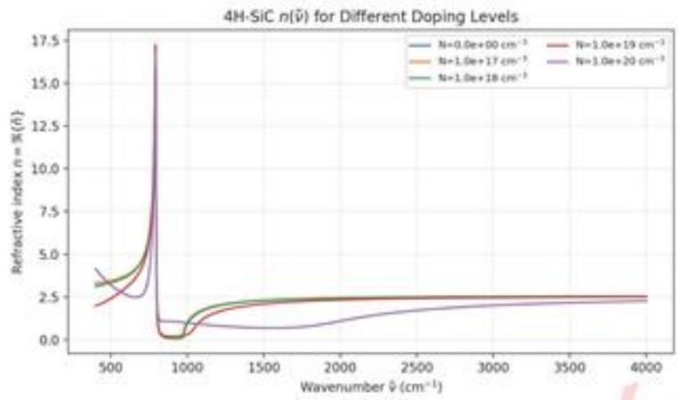
图1:碳化硅材料在给定掺杂浓度下折射率（实部）随入射光波数的变化曲线

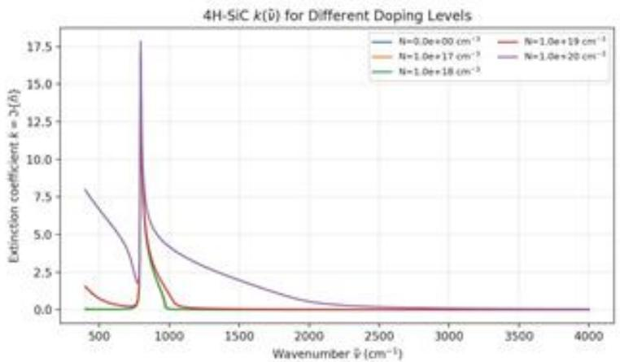
图2:碳化硅材料在给定掺杂浓度下折射率（虚部）随入射光波数的变化曲线

## 5.1.2 反射光束干涉模型

在波动光学中，根据Fresnel公式，在界面ij上发生折射与反射时，复振幅系数为 $( c _ { i } = \cos \theta _ { i } )$

$$
r _ { i j } ^ { ( s ) } = \frac { \tilde { n } _ { i } c _ { i } - \tilde { n } _ { j } c _ { j } } { \tilde { n } _ { i } c _ { i } + \tilde { n } _ { j } c _ { j } } ,
$$

$$
t _ { i j } ^ { ( s ) } = \frac { 2 \tilde { n } _ { i } c _ { i } } { \bar { n } _ { i } c _ { i } + \bar { n } _ { j } c _ { j } } ,\tag{8}
$$

$$
r _ { i j } ^ { ( p ) } = \frac { \bar { n } _ { j } c _ { i } - \bar { n } _ { i } c _ { j } } { \bar { n } _ { j } c _ { i } + \bar { n } _ { i } c _ { j } } ,
$$

$$
t _ { i j } ^ { ( p ) } = \frac { 2 \bar { n } _ { i } c _ { i } } { \bar { n } _ { j } c _ { i } + \bar { n } _ { i } c _ { j } } .\tag{9}
$$

设薄膜折射率为 $\bar { n } _ { 1 }$ ，厚度为 $d ,$ 入射角为 $\phi .$ 膜内折射角 $\theta _ { 1 }$ 由 Snell 定律

$$
n _ { 0 } \sin \phi = \tilde { n } _ { 1 } \sin \theta _ { 1 }
$$

给出。通过小量近似法给出，光在薄膜中一次往返的相位延迟为

$$
\delta ( \lambda ) = \frac { 4 \pi d } { \lambda } \bar { n } _ { 1 } \cos \theta _ { 1 } = \frac { 4 \pi d } { \lambda } \sqrt { \bar { n } _ { 1 } ^ { 2 } - n _ { 0 } ^ { 2 } \sin ^ { 2 } \phi } ,\tag{10}
$$

在仅考虑光束在外延层和衬底发生一次透射、反射的情况下，实际发生干涉的光束为双光束，也即：

1. 从顶界面01 直接反射的光，振幅表示为 $r _ { 0 1 } ^ { ( \mathrm { p o l } ) }$

2. 透射进入薄膜，在界面12反射后再次透射出的光，振幅表示为 $t _ { 0 1 } ^ { ( \mathrm { p o l } ) } t _ { 1 0 } ^ { ( \mathrm { p o l } ) } r _ { 1 2 } ^ { ( \mathrm { p o l } ) } e ^ { i \delta }$

因此，总反射光场振幅为

$$
r _ { 2 \cdot \mathrm { b e a m } } ^ { ( \mathrm { p o l } ) } ( \delta ) = r _ { 0 1 } ^ { ( \mathrm { p o l } ) } + t _ { 0 1 } ^ { ( \mathrm { p o l } ) } t _ { 1 0 } ^ { ( \mathrm { p o l } ) } r _ { 1 2 } ^ { ( \mathrm { p o l } ) } e ^ { i \delta } ,\tag{11}
$$

联立

$$
r _ { 2 \cdot \mathrm { b e s m } } ^ { ( \mathrm { p o l } ) } ( \delta ) = r _ { 0 1 } ^ { ( \mathrm { p o l } ) } + t _ { 0 1 } ^ { ( \mathrm { p o l } ) } t _ { 1 0 } ^ { ( \mathrm { p o l } ) } r _ { 1 2 } ^ { ( \mathrm { p o l } ) } e ^ { i \delta } ,\tag{12}
$$

根据模型假设，考虑入射光为完全偏振光，因此最终反射率表现为s波反射率和p菠反射率的平均，对应公式为

$$
R ^ { \mathrm { ( p o l ) } } ( \delta ) = \Big | r _ { 2 \mathrm { - l o c a m } } ^ { \mathrm { ( p o l ) } } ( \delta ) \Big | ^ { 2 } , \qquad R _ { \mathrm { a v g } } = _ { l } ^ { 1 } \big ( R ^ { ( s ) } \big ) + R ^ { ( p ) } \big ) .\tag{13}
$$

综合上述各式，并结合5.1.1中的折射率模型，我们建立了双光束干涉的近似反射模型， $R _ { \mathrm { a v g } } ( { \tilde { \nu } } )$ 表现为以外延层厚度 $d ,$ 外延层掺杂浓度 $N _ { 1 }$ 、衬底掺杂浓度 $N _ { 2 }$ 为参数的参数曲线，可用于薄膜厚度的反演计算。

## 5.1.3 外延层厚度确定方法(周期波谷直接计算法)

由反射谱强度公式知在弱吸收情况下，反射谱谷（或峰）之间相邻极值的相位差恒为 $2 \pi$ 。由式(10) 可知相位延迟为

$$
\delta ( \tilde { \nu } ) = 4 \pi d \left( 1 0 0 \tilde { \nu } \right) \sqrt { n ^ { 2 } ( \tilde { \nu } ) - n _ { 0 } ^ { 2 } \sin ^ { 2 } \phi } ,
$$

其中 $\bar { \nu }$ 为波数（单位 $\mathrm { c m } ^ { - 1 } )$ $n ( \tilde { \nu } )$ 为折射率， $\phi$ 为入射角。

若在两个反射谱谷（或峰）处波数分别为 $\tilde { \nu } _ { i } , \tilde { \nu } _ { j }$ ，且对应干涉级次差为整数 $i = m _ { j } - m _ { i }$ ，则有

$$
\delta ( \tilde { \nu } _ { j } ) - \delta ( \tilde { \nu } _ { i } ) = 2 \pi i .
$$

由此解得薄膜厚度：

$$
\boxed { d = \frac { i } { 2 \left[ \tilde { \nu } _ { j } \sqrt { n ^ { 2 } ( \tilde { \nu } _ { j } ) - n _ { 0 } ^ { 2 } \sin ^ { 2 } \phi } \ - \ \tilde { \nu } _ { i } \sqrt { n ^ { 2 } ( \tilde { \nu } _ { i } ) - n _ { 0 } ^ { 2 } \sin ^ { 2 } \phi } \right] } }\tag{14}
$$

该公式给出了在已知折射率曲线与入射角的条件下，通过反射频谱极值位置直接计算膜厚 $d$ 的方法。

## 5.1.4 模型总结

综上，问题1通过对碳化硅折射率的物理建模与双光束干涉模型的推导，建立了红外反射率与外延层厚度之间的数学联系。首先，利用包含Drude自由载流子项与 $\mathrm { L O } / \mathrm { T O }$ 光学声子修正项的介电函数模型，得到折射率函数 $n ( \tilde { \nu } , N )$ ，保证了模型在中远红外波段下的物理合理性。其次，基于菲涅尔公式与相位延迟关系，推导出双光束于涉的反射率表达式 $R _ { \mathrm { a v g } } ( \tilde { \nu } ; d , N _ { 1 } , N _ { 2 } , \phi )$ ，明确了反射率曲线由厚度、掺杂浓度和入射角等物理参量共同决定。最后，通过分析相邻极值点间的相位差关系，给出了外延层厚度d的直接计算公式，为后续的数值求解与实验数据拟合提供了基础。该模型兼具物理解释力与计算可操作性，是后续问题2和问题3的出发点。

## 5.2 问题2 模型建立与求解

在问题1给定的模型上求解具体的d值，我们给出两条可行的路径：

(1) 周期波谷直接计算法该方法直接用d的显示表达式，通过在反射谱上取出多组相邻的周期波谷极值点，代入数据直接计算得相应的厚度值，再对计算结果进行统计分析，结合公式误差来源(其证明在”模型检验与合理性分析 $^ { \mathrm { s e p } } ( \mathfrak { p } )$ 舍弃计算误差较大的结果，接着给出直接计算法的误差限、结果可信水平、置信区间 cn

(2) 牛顿迭代反演模型法该方法观点下，我们在给定掺杂浓度 $N _ { 1 } \ N _ { 2 }$ 后将唯一确定衬底和外延层的折射率函数 $n _ { i } ( \tilde { \nu } )$ ，进而对于每一个厚度 $\mathrm { d } ,$ 我们能计算出唯一的反射率曲线 $R ( d , n _ { 1 } ( \tilde { \nu } ) , n _ { 2 } ( \tilde { \nu } ) )$

对于一个接近真实值的厚度 $d _ { q }$ ，其对应的反射率曲线 $R ( d _ { q } , n _ { 1 } ( \tilde { \nu } ) , n _ { 2 } ( \tilde { \nu } ) )$ 会非常接近于观测到的反射率曲线 $R _ { 0 }$

我们以 $\begin{array} { r } { \frac { 1 } { 2 } \sum _ { i = 1 } ^ { M } ( R _ { c a l c } ( \tilde { \nu } _ { i } , p ) - R _ { e x p } ( \tilde { \nu } _ { i } ) ) ^ { 2 } } \end{array}$ 作为需要极小化的损失函数F其中， $M$ 是真实测得的参数点的数量，因外延层和衬底折射率是掺杂浓度 $N _ { 1 } , N 2$ 为参量的曲线，给定 $N _ { 1 } , N 2$ 和d 后$R _ { \mathrm { c r p } } ( \sigma )$ 被完全确定。我们以这三个量为训练参数最优化损失函数F。

当F极小的时候，理论计算的反射率曲线最贴近于附件1，2给出的真实反射率曲线。此时输出的参数 $N _ { 1 } , N _ { 2 }$ 是此块碳化硅材料外延层和衬底的渗杂浓度一个好的近似，d是接近于真值厚度的一个值

## 方法1:周期波谷直接计算法

## 5.2.1 数据预处理

通过三次样条插值平滑化函数并通过对样条函数求数值导数找到其局部最小值点，样条函数的引入是为了：(1)重建反射率函数滤去毛刺高频噪声，便于识别曲线大势趋上的周期波动，(2)提供一个确定的平滑函数表达式，便于通过求导找到更准确波谷频数的参考值：

如图所示，被标出的点是样条函数上取出表征反射率周期波谷的点(绿色是后续经计算得到可信厚度d值的点，红色是计算得到偏差较大的厚度d，且经过误差限分析(在模型检验及合理性分析部分给出证明)认为和前后波谷点用于计算会有较大误差的点)。

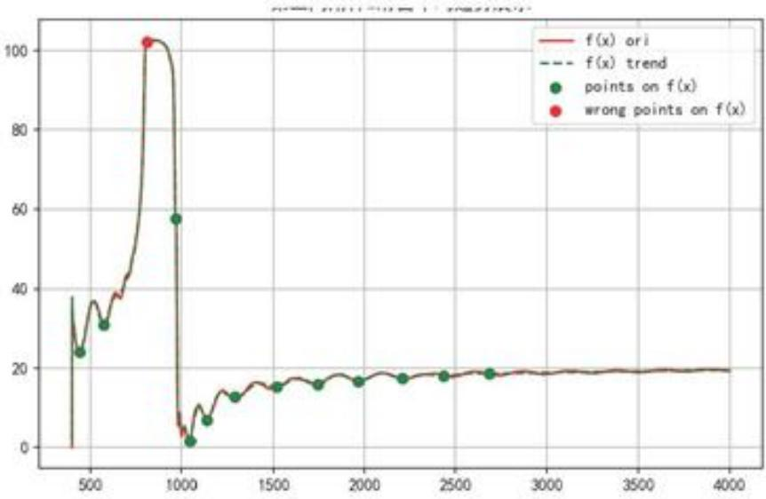
图 3:附件 2 滑动窗口样条函数和极值点-全局情况

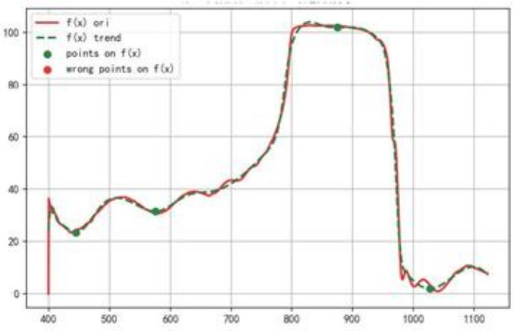
图4:附件2滑动窗口样条和极值点-局部情况

## 5.2.2 厚度计算及结果

用滑动窗口样条拟合碳化硅的反射率随波数的变化便于取出极值点，对所有取出的波谷按照顺序，用相邻两波谷频数来计算外延层厚度，得到多个外延层厚度，利用3σ原则剔除差距较大可疑值之后对其进行统计分析。最终用直接计算法的厚度将是通过统计方法处理以上数据的结果：

表1:计算得到的厚度d（标准偏差大于 3σ的异常值标记黑体)
<table><tr><td colspan="4">厚度 d 值(μm) 入射角  $1 0 ^ { \circ }$  入射角</td></tr><tr><td>7.6298</td><td>7.6100</td><td>7.4837</td><td>7.5434</td></tr><tr><td>7.791</td><td>7.370</td><td>7.4360</td><td>7.4237</td></tr><tr><td>3.770</td><td>7.3104</td><td>7.9480</td><td>7.4515</td></tr><tr><td>7.7617</td><td>7.4367</td><td>1.1918</td><td>7.4464</td></tr><tr><td>7.6774</td><td>7.2732</td><td>1.4167</td><td>7.3153</td></tr><tr><td>7.8101</td><td>7.8501</td><td>7.8162</td><td>7.3767</td></tr><tr><td>20.5125</td><td>7.6394</td><td>7.7824</td><td>7.7172</td></tr><tr><td>10.7028</td><td></td><td>7.5619</td><td>7.0561</td></tr><tr><td></td><td></td><td>6.8970</td><td></td></tr></table>

$$
d = \frac { d _ { 1 } / \sigma _ { 1 } ^ { 2 } + d _ { 2 } / \sigma _ { 2 } ^ { 2 } } { 1 / \sigma _ { 1 } ^ { 2 } + 1 / \sigma _ { 2 } ^ { 2 } } .
$$

$$
\sigma = \frac { 1 } { \sqrt { 1 / \sigma _ { 1 } ^ { 2 } + 1 / \sigma _ { 2 } ^ { 2 } } } .
$$

得

$$
d = 7 . 5 4 4 , \sigma = 0 . 1 7 0
$$

## 5.2.3 可靠性分析

对厚度组进行了统计分析，计算了平均值、标准差、不确定度、置信区间和变异系数等量。

表2:剔除异常值之后修正模型碳化硅外延层厚度值的统计值
<table><tr><td>统计量</td><td>入射角  $1 0 ^ { \circ }$ </td><td>人射角  $1 5 ^ { \circ }$ </td></tr><tr><td>数据点数  $\mathrm { L }$ </td><td>11</td><td>15</td></tr><tr><td>自由度  $\mathbf { n }$ </td><td>10</td><td>14</td></tr><tr><td>平均厚度</td><td>7.575856</td><td>7.48711</td></tr><tr><td>标准偏差  $\sigma _ { d }$ </td><td>0.212318</td><td>0.284504</td></tr><tr><td>标准误差  $\sigma _ { d }$ </td><td>0.067141</td><td>0.076037</td></tr><tr><td> $t _ { \mathrm { c r i t } } ( 9 5 \% )$ </td><td>2.262157</td><td>2.160369</td></tr><tr><td> $\mathrm { C l } _ { 9 5 \% } ( \mathrm { l o w } )$ </td><td>7.423973</td><td>7.322842</td></tr><tr><td> $\mathrm { C l _ { 9 5 \% } ( h i g h ) }$ </td><td>7.727739</td><td>7.651377</td></tr><tr><td>离散系数  $\mathrm { C V } ( \% )$ </td><td>2.802562</td><td>3.799922</td></tr></table>

均值计算剔除可疑点并认为剩余样本近似独立同分布，记样本数为 $L$

$$
\bar { d } = \frac { 1 } { L } \sum _ { i = 1 } ^ { L } d _ { i } , \quad \quad s _ { d } = \sqrt { \frac { 1 } { \nu } \sum _ { i = 1 } ^ { L } ( d _ { i } - \bar { d } ) ^ { 2 } } ,
$$

其中自由度ν一般取 $\nu = L - 1$

不确定度计算

标准偏差：

$$
\sigma _ { d } = \sqrt { \frac { 1 } { L - 2 } \sum _ { i = 1 } ^ { L - 1 } ( d _ { i } - d ) ^ { 2 } }\tag{33}
$$

标准误差：

$$
\sigma _ { d } = \frac { \sigma _ { d } } { \sqrt { L - 1 } }\tag{34}
$$

置信区间计算在未知方差的小样本条件下，

$$
T = \frac { { \bar { d } } - \mu _ { d } } { s _ { d } / \sqrt { L } } \sim t _ { \nu } ,
$$

从而真实平均厚度 $\mu _ { d }$ 的100(1− α)% 置信区间为

$$
\mathrm { C I } _ { 1 - \alpha } : \quad \mu _ { d } \in \bar { d } \ \pm \ t _ { 1 - \alpha / 2 , \nu } \frac { s _ { d } } { \sqrt { L } } \cdot\tag{15}
$$

当 $L \gtrsim 3 0$ 或正态性检验（如Shapiro-Wilk）通过时，t分布可近似为标准正态，式(15)中的分位数可换用 $z _ { 1 - \alpha / 2 }$ 动

变异系数检查为表征相对离散程度，使用变异系数

$$
C V = \frac { s _ { d } } { \bar { d } } \times 1 0 0 \%
$$

经验阈值： $C V < 3 \%$ 为优秀重复性，3%\~5%为良好，5%\~10%为基本可接受；若 $C V > 1 0 \%$ 则提示离散性较高，宜复测或检查模型与数据处理（例如在折射率色散陡峭区 $| d n / d \nu |$ 较大时，厚度解对频率/波数扰动更敏感)。

根据表2的计算结果，利用两个入射角下得到的平均厚度和标准偏差，用逆方差公式计算得最终结果

$$
d = 7 . 4 5 5 , \sigma = 0 . 1 7 0
$$

## 方法2: 牛顿迭代反演参数法

## 5.2.4 迭代反演参数方法介绍

在材料科学与工程领域，用观测到的实验数据反演材料的物理参数是重要的任务。通常需要构建非线性物理模型，使用最优化算法拟合实验数据。

而本研究需要利用红外反射光谱的数据，确定薄膜厚度及各层掺杂的浓度。我们采用网格搜索和牛顿迭代结合的搜索优化算法，实现非线性空间内的最优参数搜索。

## 5.2.5 问题构建

我们的目标是找到一组参数 $p = [ d , N _ { 1 } , N _ { 2 } ]$ (分别代表外延层厚度、外延层掺杂浓度和衬底掺杂浓度)，通过同时优化掺杂浓度(进而调整折射率随频数变化的参数曲线形状)和参考的外延层厚度使得理论计算的反射率 $R _ { c a l c } ( \sigma , p )$ 与实验测量的反射率 $R _ { r e a l } ( \sigma )$ 之间的残差平方和最小，此即，当在迭代输出的厚度和掺杂浓度下，若理论计算反射曲线接近于实验测量曲线，则认为迭代得到的厚度较好的反映了真实的厚度值。这是一个非线性最小二乘优化问题：

$$
\operatorname* { m i n } _ { p } F ( p ) = \frac { 1 } { 2 } \sum _ { i = 1 } ^ { M } ( R _ { c a l c } ( \sigma _ { i } , p ) - R _ { e x p } ( \sigma _ { i } ) ) ^ { 2 }
$$

其中，M是真实测得的参数点的数量。因为材料的折射率和掺杂浓度之间，反射率模型与厚度之间存在非线性关系，为了提高算法的数值稳定性与收敛效率，我们将掺杂浓度参数转换为其对数形式 $\log _ { 1 0 } ( N )$ 进行优化。

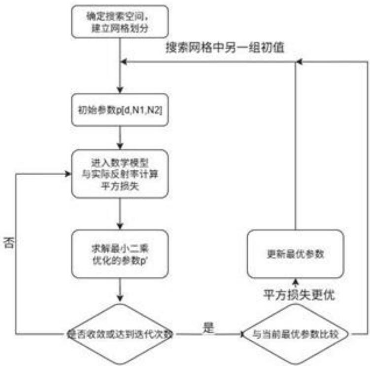
图5: 结合高斯牛顿优化的网格搜索算法流程

## 5.2.6 搜索过程

为了克服非线性最小二乘容易陷入局部最优的问题，本研究采用了网格搜索来设定参数的初值。我们为薄膜厚度d、薄膜掺杂浓度 $\log _ { 1 0 } ( N _ { 1 } )$ 和衬底掺杂浓度 $\log _ { 1 0 } ( N _ { 2 } )$ 各自设定了搜索范围，在参数空间表现为网格格点。初始参数从这些格点出发，进行高斯-牛顿法优化，可以防止算法停留在某个初值对应的局部最优点。

## 5.2.7 迭代优化过程和结果

在网络搜索给出参数初值之后，我们采用高斯-牛顿法对参数进行精细优化。高斯-牛顿法是一种用于解决非线性最小二乘问题的迭代算法，其优势在于利用一阶导数信息近似二阶导数信息，从而避免了计算和存储复杂的二阶导数Hessian矩阵。

高斯-牛顿法的迭代更新公式可表示为：

$$
J ( p _ { k } ) \Delta p = - f ( p _ { k } )
$$

其中、 $\mathcal { P } \hbar$ 是当前迭代的参数向量， $f ( \boldsymbol { p } _ { k } )$ 是残差向量 $( R _ { \infty } \iota _ { 0 } ( \sigma , \mathcal { P } \hbar ) - R _ { \infty } ( \sigma ) ) , \mathcal { I } ( \mathcal { P } \hbar )$ 是残差向量 $f ( \varphi _ { k } )$ 对参数 pk的雅可比矩阵(Jacobian Matrix)。其具体实现步骤如下

1. 残差计算：在每次迭代中，首先根据当前参数 p计算理论反射率，并得到残差向量 $f ( \boldsymbol { p } _ { k } )$ 目标函数的损失值即为残差向量的平方和。

2. 雅可比矩阵计算：我们采用有限差分法来近似计算雅可比矩阵J(p%) 中的元素。对于每个参数p5、其对应的雅可比列向量通过微小扰动参数p；来计算：

$$
J _ { i , j } = { \frac { \partial f _ { i } ( p ) } { \partial p _ { j } } } \approx { \frac { f _ { i } ( p + h \cdot e _ { j } ) - f _ { i } ( p ) } { h } }
$$

其中 $e _ { j }$ 是第 $j$ 个分量为1的单位向量，h是一个小的扰动步长。

3. 参数更新：获得雅可比矩阵 $J ( \boldsymbol { p } _ { k } )$ 和残差向量 $f ( p _ { k } )$ 后，求解线性最小二乘问题 $J ( p _ { k } ) \Delta p =$ $- f ( \boldsymbol { p } _ { k } )$ ，得到参数更新量 $\Delta p _ { i }$

4. 收敛性判断:算法通过检查连续两次迭代之间参数更新量 $| | p _ { k + 1 } - p _ { k } | |$ 的范数是否小于预设的容许误差来判断是否达到收敛。

反演得到4H薄膜的厚度以及薄膜和衬底的掺杂浓度。

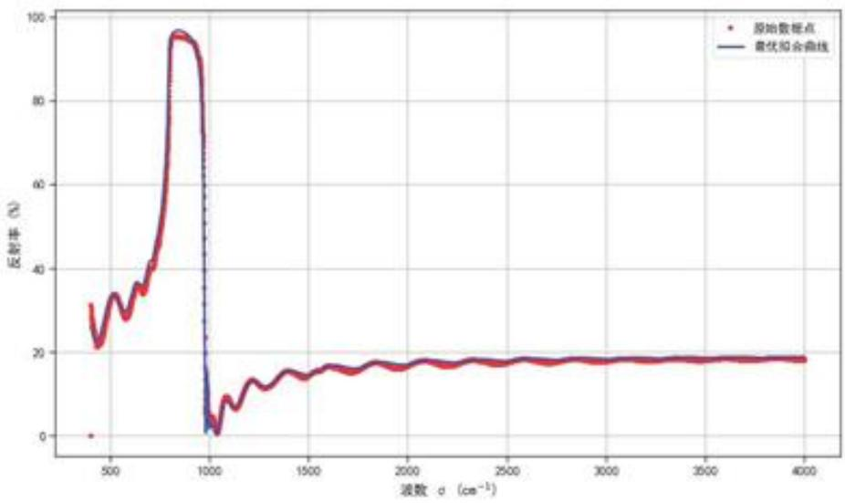
图6:反演参数曲线与真实碳化硅10度入射角反射率曲线的匹配情况

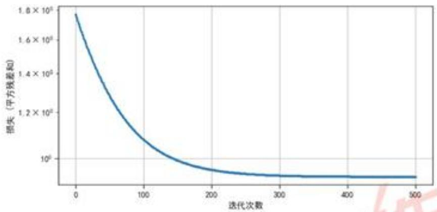
图 7: 高斯-牛顿迭代误差收敛情况

从图6中可以看到，根据模型建立的参数曲线与真实实验数据吻合度极高，反映了我们建立的物理模型和使用的参数的有效性，即碳化硅折射率和双光束干涉模型较好解释了真实反射率曲线的

产生原因，并通过拟合真实反射率曲线学习到了一个可以较好表征真实外延层厚度的值d。拟合得到的参数：

表3:反演得到的参数（碳化硅入射角 $1 0 ^ { \circ } )$
<table><tr><td>反演参数</td><td>反演值</td></tr><tr><td>外延层厚度  $\mathrm { d } ( \mu m )$ </td><td>7.295</td></tr><tr><td>外延层掺杂浓度  $N _ { 1 } ( c m ^ { - } 3 )$ </td><td> $3 . 4 1 \times 1 0 ^ { 1 7 }$ </td></tr><tr><td>衬底掺杂浓度  $N _ { 2 } ( c m ^ { - } 3 )$ </td><td> $2 . 9 5 \times 1 0 ^ { 1 8 }$ </td></tr></table>

反演得到外延层厚度 $d = 7 . 2 9 5 \mu m$ 与方法1的结果接近，两者相互印证。

## 5.2.8 问题 2 模型与求解方法总结

综上所述，问题2的求解主要建立在问题1所提出的反射率物理模型之上。我们提出了两条互为印证的计算路径：

· 周期波谷直接计算法：基于反射率极值点的周期性规律，利用相邻波谷频数差与膜厚之间的解析关系，直接计算得到外延层厚度。通过样条插值与极值点提取实现对实验噪声的抑制，再结合统计方法剔除异常值，从而保证结果的稳定性与可信度。

· 牛顿迭代反演法：将外延层厚度与掺杂浓度作为待定参数，构建非线性最小二乘优化问题，通过网格搜索与高斯-牛顿迭代相结合实现参数的收敛拟合。该方法能够充分利用整个反射率曲线的信息，具有较强的鲁棒性与全局性。

两种方法各具优势：直接计算法公式简洁、直观透明，适合快速获得近似厚度值；迭代反演法则能够在全局范围内优化参数，获得与实验数据高度吻合的结果。二者在数值结果上的接近性也从侧面验证了所建物理模型与算法的可靠性，为进一步分析多光束效应奠定了坚实基础。

## 5.3 问题 3 模型建立与求解

## 5.3.1 多光束干涉模型建立

双光束模型忽略了在外延层内多次反射后透射到空气中的光束分量。在多光束干涉模型中，同样 Drude模型给出的折射率参数曲线，但修改反射强度 R依赖于折射率 $n _ { 1 } , n _ { 2 }$ 和厚度 d 的表达式如下： LX

把在膜内往返的高阶项按几何级数求和，得到

$$
\begin{array} { r } { r } { r _ { \mathrm { e f f } } ^ { ( \mathrm { p o l } ) } ( \delta ) = r _ { 0 1 } ^ { ( \mathrm { p o l } ) } + t _ { 0 1 } ^ { ( \mathrm { p o l } ) } t _ { 1 0 } ^ { ( \mathrm { p o l } ) } r _ { 1 2 } ^ { ( \mathrm { p o l } ) } e ^ { i \delta } \left( 1 + r _ { 0 1 } ^ { ( \mathrm { p o l } ) } r _ { 1 2 } ^ { ( \mathrm { p o l } ) } e ^ { i \delta } + \cdots \right) } \\ { = \left[ \begin{array} { l } { r _ { 0 1 } ^ { ( \mathrm { p o l } ) } + r _ { 1 2 } ^ { ( \mathrm { p o l } ) } e ^ { i \delta } } \\ { 1 + r _ { 0 1 } ^ { ( \mathrm { p o l } ) } r _ { 1 2 } ^ { ( \mathrm { p o l } ) } e ^ { i \delta } } \end{array} \right] \cdots \left[ \begin{array} { l } { r _ { 1 2 } ^ { ( \mathrm { p o l } ) } r _ { 1 2 } ^ { ( \mathrm { p o l } ) } e ^ { i \delta } + \cdots } \\ { r _ { 2 1 } ^ { ( \mathrm { p o l } ) } \cdots r _ { 1 2 } ^ { ( \mathrm { p o l } ) } e ^ { i \delta } } \end{array} \right] } \end{array}\tag{16}
$$

其中界面ij的菲涅尔振幅系数 $\left( s / p \right)$ 为

$$
r _ { 0 1 } ^ { ( s ) } = \frac { \hat { n } _ { 0 } c _ { 0 } - \hat { n } _ { 1 } c _ { 1 } } { \hat { n } _ { 0 } c _ { 0 } + \hat { n } _ { 1 } c _ { 1 } } , r _ { 0 1 } ^ { ( p ) } = \frac { \hat { n } _ { 1 } c _ { 0 } - \hat { n } _ { 0 } c _ { 1 } } { \hat { n } _ { 1 } c _ { 0 } + \hat { n } _ { 0 } c _ { 1 } } , c _ { i } \equiv \cos \theta _ { i } .\tag{17}
$$

反射率曲线

$$
R _ { \mathrm { e f f } } ^ { \mathrm { ( p o l ) } } ( \delta ) = \left| r _ { \mathrm { e f f } } ^ { \mathrm { p o l } } ( \delta ) \right| ^ { 2 }\tag{18}
$$

## 5.3.2 多光束干涉效应的强弱讨论

真实的物理模型更贴近于多光束于涉，而非双光束干涉。本节中通过比对多光束干涉和双光束干涉的振幅和反射率曲线，探究什么情况下多光束干涉和双光束干涉模型差异较大，进而多光束干涉的影响不可忽略。 $r _ { e \ell } ^ { ( \mathrm { p o l } ) } ( \delta )$ 对比双光束干涉的反射振幅表达式

$$
r _ { 2 \mathrm { - } \mathrm { b e a m } } ^ { ( \mathrm { p o l } ) } ( \delta ) = r _ { 0 1 } ^ { ( \mathrm { p o l } ) } + t _ { 0 1 } ^ { ( \mathrm { p o l } ) } t _ { 1 0 } ^ { ( \mathrm { p o l } ) } r _ { 1 2 } ^ { ( \mathrm { p o l } ) } e ^ { i \delta } e ^ { - \frac { 4 \pi } { \Lambda } \kappa _ { 1 } d \cos \theta _ { 1 } }\tag{19}
$$

由此可知两光束（19)与多光束（16）的差别。在较小入射角下，二者分子项基本相同，多光束干涉的分母项多了一项复数，影响了反射率曲线的形状。

即

$$
\frac { r _ { 2 \mathrm { - b e a m } } ^ { ( \mathrm { p o l } ) } ( \delta ) } { r _ { \mathrm { e f f } } ^ { ( \mathrm { p o l } ) } ( \delta ) } \approx \frac { 1 } { 1 + r _ { 0 1 } ^ { ( \mathrm { p o l } ) } r _ { 1 2 } ^ { ( \mathrm { p o l } ) } e ^ { i \delta } }\tag{20}
$$

多光束效应显著性表征量的引人 描述反射率曲线形状改变可以直接用分母上增加的复数量的模G来考量，其中

$$
\boxed { G \equiv \big \vert r _ { 0 1 } ^ { ( \mathrm { p o l } ) } r _ { 1 2 } ^ { ( \mathrm { p o l } ) } \big \vert \exp \Big ( - \frac { 4 \pi } { \lambda } \kappa _ { 1 } d \cos \theta _ { 1 } \Big ) , }\tag{21}
$$

用 G 表示的 $r _ { o f f } ^ { ( \mathrm { p o l } ) } ( \delta )$ 为

$$
\boxed { r _ { \mathrm { e f f } } ^ { ( \mathrm { p o l } ) } ( \delta ) = \frac { r _ { 0 1 } ^ { ( \mathrm { p o l } ) } + r _ { 1 2 } ^ { ( \mathrm { p o l } ) } e ^ { i \delta } } { 1 + G e ^ { i ( \delta + \phi ) } } , \quad \phi \equiv \arg \left( r _ { 0 1 } ^ { ( \mathrm { p o l } ) } r _ { 1 2 } ^ { ( \mathrm { p o l } ) } \right) . }
$$

$$
\boxed { \frac { R _ { \mathrm { e f f } } ^ { \mathrm { ( p o l ) } } ( \delta ) } { R _ { \mathrm { 2 - b e a m } } ^ { \mathrm { ( p o l ) } } ( \delta ) } = ( | \frac { r _ { \mathrm { e f f } } ^ { \mathrm { ( p o l ) } ( \delta ) } } { r _ { \mathrm { e f f } } ^ { \mathrm { ( p o l ) } } ( \delta ) ) } | \ ) ^ { 2 } \approx | \frac { 1 } { 1 + G e ^ { i ( \delta + \phi ) } } | } ^ { 2 }
$$

式中φ只是影响相位，不对反射率大小和其随频数振动的周期（即反射率曲线的振动有贡献），而较大的G将显著影响反射率，进而使得多光束和双光束模型产生较大差异。下面考虑较大G值的产生

G 表达式中的 $\mathrm { e x p } \Big ( - \frac { 4 \pi } { \lambda } \kappa _ { 1 } d \cos \theta _ { 1 } \Big )$ 的物理意义对应在介质中因透射造成的强度损失由于薄膜内单程相位为

$$
\beta = \frac { 2 \pi } { \lambda } \widetilde { n } _ { 1 } d \cos { \theta } _ { 1 } = \frac { \omega } { c } \widetilde { n } _ { 1 } d \cos { \theta } _ { 1 } , \qquad \delta \equiv 2 \beta .\tag{22}
$$

若写出吸收（每一次往返的振幅衰减)，则

$$
\begin{array} { r } { e ^ { i \delta } \longrightarrow \exp \Bigl ( i \underbrace { \frac { 4 \pi } { \lambda } n _ { 1 } d \cos \theta _ { 1 } } _ { \mathrm { H G } } \Bigr ) \exp \Bigl ( - \underbrace { \frac { 4 \pi } { \lambda } \kappa _ { 1 } d \cos \theta _ { 1 } } _ { \mathrm { H H \ R \ R } } \Bigr ) , } \end{array}\tag{23}
$$

不难知在透射系数 $\kappa _ { 1 }$ (即折射率n1的虚部)较小时多光束模型和双光束差异显著，多光束干涉的效应愈发明显

对于 G 表达式中的剩余项 $r _ { 0 1 } , r _ { 1 2 }$ ，可由菲涅尔系数读出影响G的关键因素与结论

多光束干涉产生必要条件：

·顶界面（空气→外延层）反射强：近法线时 $\begin{array} { r } { R _ { 0 1 } \approx \left( \frac { n _ { 1 } - n _ { 0 } } { n _ { 1 } + n _ { 0 } } \right) ^ { 2 } } \end{array}$ 。因此 $n _ { 1 }$ 越大（与空气差越大），$| r _ { 0 1 } |$ 越大，更容易 $G$ 大、出现显著多光束效应。

· 外延层内吸收弱吸收系数 $\kappa _ { 1 }$ 越小或远离强吸收带（如 Reststrahlen 带)，式(23)的衰减越弱，高阶往返保留，多光束的更显著；同时需光源相干长度 $L _ { \epsilon } \gtrsim 2 n _ { 1 } d \cos \theta _ { 1 }$

·指定范围的入射角度(较小的入射角)：s偏振 $R _ { 0 1 } ^ { ( s ) }$ 随入射角φ增大而增大，因而对于s光，较大的入射角造成多光束效应不可忽略；p偏振在布儒斯特角 $\tan \phi _ { B } = n _ { 1 } / n _ { 0 }$ 附近 $R _ { 0 1 } ^ { ( p ) }  0$ 在远离布需斯特角的位置，多光束效应较强，不能用双光束模型简单替代。

· 极端角度/全反射：若从膜向空气看满足 $\theta _ { 1 } > \theta _ { c } = \arcsin ( n _ { 0 } / n _ { 1 } )$ ，则 $| r _ { 1 0 } | \approx 1$ ，多光束极强。

从式(16)与判据(21)可见：当外延层折射率较大(使 $R _ { 0 1 }$ 高)、吸收小、相干性足、入射角不太大时，反射谱 $R ( \lambda )$ 的峰谷形状、深度与两光束模型（19)相比会出现显著差异，此时应采用多光束(Airy)模型进行建模与厚度反演。

G值大小对多光束干涉效应显著性的描述 由

$$
\frac { R _ { \mathrm { e f f } } ( \delta ) } { R _ { \mathrm { 2 b } } ( \delta ) } = \frac { | r _ { 0 1 } + r _ { 1 2 } e ^ { i \delta - \alpha } | ^ { 2 } } { | 1 + r _ { 0 1 } r _ { 1 2 } e ^ { i \delta - \alpha } | ^ { 2 } } = \frac { 1 } { | 1 + r _ { 0 1 } r _ { 1 2 } e ^ { i \delta - \alpha } | ^ { 2 } } .
$$

α 仅是实数相于是给出

$$
| 1 + r _ { 0 1 } r _ { 1 2 } e ^ { i \delta - \alpha } | \in [ | 1 - G | , 1 + G ] \Rightarrow \frac { R _ { \mathrm { e f f } } } { R _ { 2 \mathrm { b } } } \in \bigg [ \frac { 1 } { ( 1 + G ) ^ { 2 } } , \frac { 1 } { ( 1 - G ) ^ { 2 } } \bigg ] ,
$$

故最坏相对偏差 $\Delta _ { \tau e l } ^ { \mathrm { m a x } } \approx 2 G$ (当 $G \ll 1 \rangle$ 。故最坏相对偏差 $\Delta _ { \mathrm { r e l } } ^ { \mathrm { m a x } } \approx 2 G$ (当 $G \ll 1 )$ 若要求两模型相差不超过约2%、10%、20%，对应

$$
G \lesssim 0 . 0 1 0 . 0 5 0 . 1
$$

## 5.3.3 多光束干涉对计算求解精度的影响

由反射谱随机噪声引起的计算误差 在直接求解厚度d时，我们需要确定反射光谱的极值点位置，因此求解精度直接取决于参与计算的周期极值谷点 $\bar { \nu } _ { j }$ 估算精度。由于实验数据（这里指反射率曲线

或重建的样条曲线)往往存在随机高频小幅噪声的叠加，这造成了参与计算的极值点 $\tilde { \nu } _ { j }$ 和真实极值谷点的偏差，进而降低了计算精度。对于实验反射率曲线 $R _ { 0 }$ ，我们建立如下模型：

$$
\begin{array} { r } { R _ { 0 } ( \tilde { \nu } ) = f ( \tilde { \nu } ) + \varepsilon ( \tilde { \nu } ) , } \end{array}
$$

其中f是真实的完全符合理论公式的平滑真反射谱，ε是小幅随机噪声(近似独立)。对真极值$\scriptstyle { \bar { \nu } } _ { 0 }$ 附近，泰勒展开

$$
\begin{array} { r } { f ( \tilde { \nu } ) \approx f ( \tilde { \nu } _ { 0 } ) + \frac { 1 } { 2 } f ^ { \prime \prime } ( \tilde { \nu } _ { 0 } ) ( \tilde { \nu } - \tilde { \nu } _ { \mathrm { } } ) ^ { 2 } ( \Re { \langle \tilde { \mathrm { f l f } } , \lvert \tilde { \mathrm { g } } \rvert } , f ^ { \prime } ( \tilde { \nu } _ { 0 } ) = 0 ) , } \end{array}
$$

在“小噪声+局部二次”近似下，极值位置估计的随机误差一阶主导为

$$
\dot { v } _ { 0 } \approx \bar { \nu } _ { - } \frac { \epsilon ^ { \prime } ( \tilde { \nu } _ { 0 } ) } { f ^ { \prime \prime } ( \tilde { \nu } _ { 0 } ) ) } .
$$

$$
\mathrm { V a r } ( \dot { \tilde { \nu } } ) \approx \frac { \mathrm { V a r } [ \varepsilon ^ { \prime } ( \tilde { \nu } _ { 0 } ) ] } { \left( f ^ { \prime \prime } ( \tilde { \nu } _ { 0 } ) \right) ^ { 2 } } .
$$

由此可见，真实反射率曲线的二阶导数直接控制了取值与真值的偏差。即二阶导数越小，随机误差传导到ν放大的倍数更大。

真实多光束干涉下建立的模型相比双光束干涉下建立的模型，其求解厚度d时会对反射率曲线上非平滑的随机噪声更敏感。原因在于其相对频数的二阶导数更小。

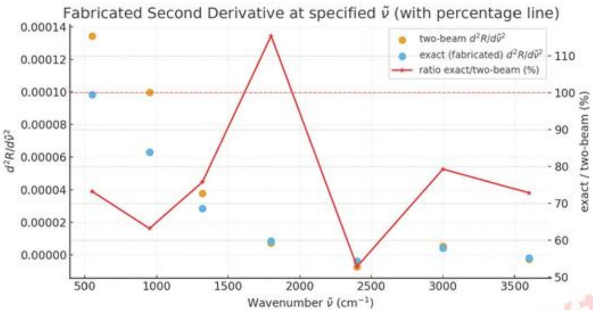
图8:在极值点上多/双光束干涉模型给出的二阶导，及其比值

如图所示是附件3,4参与波谷直接法计算的点上双光束与多光束模型反射率的二阶导数，及其比值，表中是其数值比对情况。由图中情况可以看出，在大多数极值点上，多光束模型的二阶导数均小于双光束模型，根据前面的分析，多光束干涉模型将因此对随机噪声更敏感，进而降低计算求解精度， mo

## 5.3.4 附件 3、4厚度计算与分析多光束干涉效应显著情况

本节通过检查附件3，4数据，在利用双光束于涉模型的周期波谷直接计算法和牛顿迭代法求解厚度值d时，所使用数据的多光束干涉效应显著性，来评估基于双光束干涉对附件3、4数据的两个求解是否与真实情况存在较大偏差，即附件3、4硅晶圆片测得数据是否出现明显的多光束干涉

## [1]利用双光束模型的附件3、4 进行厚度计算

## 厚度计算:周期波谷直接计算法

由多光束干涉模型的反射率表达式知，反射率同样随频数存在周期波动，因而周期波谷直接计算法同样适用于多光束干涉。这里先以问题2中周期波谷直接计算法的流程对附件3，4数据进行计算，再分析多光束干涉效应的显著性

用滑动窗口样条拟合硅晶片的反射率随波数的变化便于取出极值点，对所有取出的波谷按照顺序，用相邻两波谷频数来计算外延层厚度，得到多个外延层厚度，同样利用3σ原则剔除差距较大可疑值之后对其进行统计分析。

表4: 计算得到的厚度d（标准偏差大于 3σ的异常值标记黑体)
<table><tr><td colspan="2">厚度d 值  $( \mu m )$  入射角  $1 0 ^ { \circ }$  人射角</td></tr><tr><td>4.090459</td><td>4.028401</td></tr><tr><td>3.615786</td><td>3.569042</td></tr><tr><td>3.478762</td><td>3.465043</td></tr><tr><td>3.488981</td><td>3.280644</td></tr><tr><td>3.372371</td><td>3.559969</td></tr><tr><td>3.406687</td><td>3.370166</td></tr><tr><td>3.317398</td><td>3.433889</td></tr></table>

最终用直接计算法的厚度将是通过统计方法处理以上数据的结果：

表5: 剔除异常值之后硅晶片外延层厚度值的统计值
<table><tr><td>统计量</td><td>入射角  $1 0 ^ { \circ }$ </td><td>入射角  $\bf { 1 5 ^ { \circ } }$ </td></tr><tr><td>数据点数  $\scriptstyle { \mathrm { ~ L ~ } }$ </td><td>6</td><td>5</td></tr><tr><td>自由度n</td><td>5</td><td>4</td></tr><tr><td>平均厚度</td><td>3.446664</td><td>3.457267</td></tr><tr><td>标准偏差  $\sigma _ { d }$ </td><td>0.105120</td><td>0.079039</td></tr><tr><td>标准误差  $\sigma _ { \tilde { d } }$ </td><td>0.042915</td><td>0.039519</td></tr><tr><td> $t _ { \mathrm { c } ; \mathrm { i t } } ( 9 5 \% )$ </td><td>2.570582</td><td>3.182446</td></tr><tr><td> $\mathrm { C l } _ { 9 5 \mathrm { \% } } ( \mathrm { l o w } )$ </td><td>3.336348</td><td>3.331499</td></tr><tr><td> $\mathrm { C l } _ { 9 5 \% } ( \mathrm { h i g h } )$ </td><td>3.556980</td><td>3.583035</td></tr><tr><td>离散系数  $\mathrm { C V } ( \% )$ </td><td>3.049892</td><td>2.286157</td></tr></table>

在 $1 5 ^ { \circ }$ 入射角CV小于3%， $1 0 ^ { \circ }$ 入射角CV略大于 3%而小于5%，可以发现厚度计算的可靠性比较好。并根据表5的计算结果，利用两个入射角下得到的平均厚度和标准偏差，计算得最终的值：

$$
d = 3 . 4 5 3 , \sigma = 0 . 0 6 3
$$

厚度计算：牛顿迭代反演参数法

牛顿迭代反演求解厚度我们首先利用问题2中类似的迭代方式，学习到一个收敛厚度值和相应的硅掺杂浓度。

反演得到硅晶片的厚度以及薄膜和衬底的掺杂浓度。

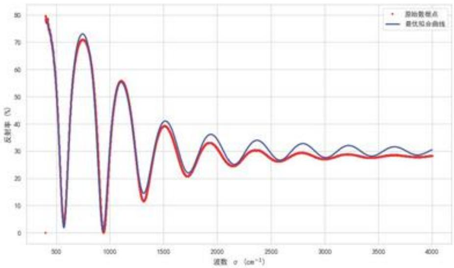
图9: 反演参数曲线与真实硅晶片10度入射角反射率曲线的匹配情况

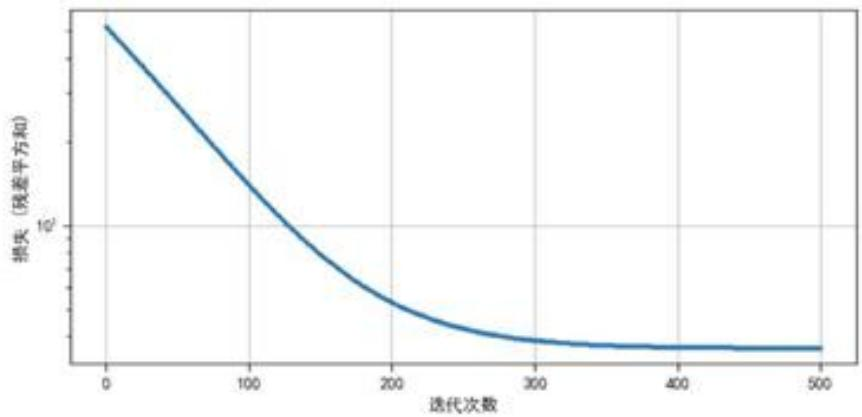
图10: 高斯-牛顿迭代误差收敛情况

这里展示以10度入射时（附件1）的牛顿迭代曲线拟合情况以及误差收敛情况，得到外延层厚度 $d = 3 . 4 1 4 \mu m$

表6:反演得到的参数（硅晶片入射角 $1 0 ^ { \circ } )$
<table><tr><td>反演参数</td><td>反演值</td></tr><tr><td>外延层厚度  $\operatorname { d } ( \mu m )$ </td><td>3.414</td></tr><tr><td>外延层掺杂浓度  $N _ { 1 } ( c m ^ { - } 3 )$ </td><td> $3 . 9 4 \times 1 0 ^ { 1 7 }$ </td></tr><tr><td>衬底掺杂浓度  $N _ { 2 } ( c m ^ { - } 3 )$ </td><td> $3 . 8 0 \times 1 0 ^ { 1 9 }$ </td></tr></table>

[2]根据计算结果分析多光束效应显著程度

显著程度：物理量必要条件和G 值检验

首先考察顶界面（空气→外延层）反射强弱情况，这部分效应随 $\boldsymbol { n } _ { 1 }$ 的模长变的显著

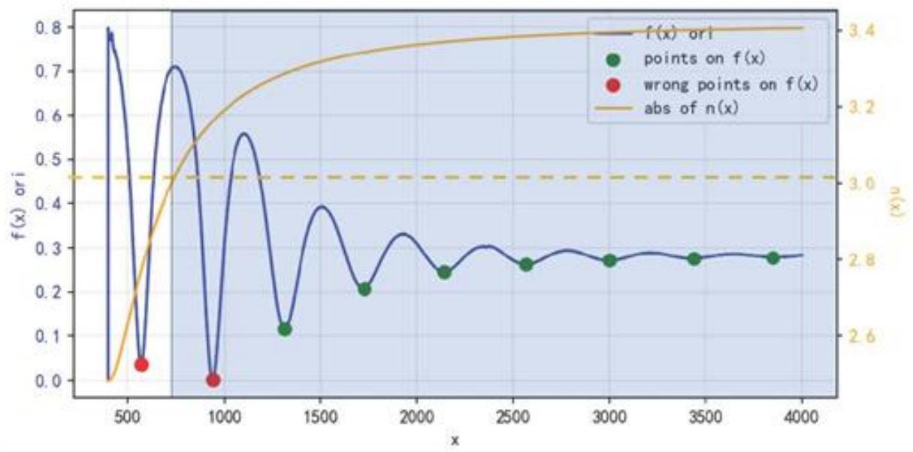
图11:附件3直接求解数据点对应的外延层折射率情况

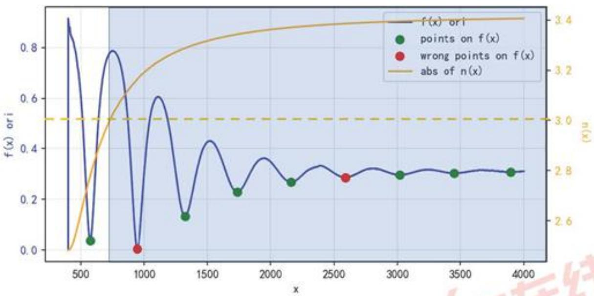
图 12: 附件 4直接求解数据点对应的外延层折射率情况

图中用与问题2相同的样条插值处理法确定极值点，利用周期波谷直接计算厚度值，并通过3σ法则去掉了参与计算所得结果偏差过大的点(红色点，该操作合理性在”模型检验与合理性”中有严格推导和检验)，可见在两次计算厚度d中，参与计算的多数波谷点的折射率都落在n>3区间内(蓝

色区域)。

接着考虑外延层中吸收强度的情况，这直接由吸收系数 $\kappa _ { 1 } = \Im ( n _ { 1 } )$ 表征。类似的我们展示在所用波谷数据点上吸收系数的大小情况。

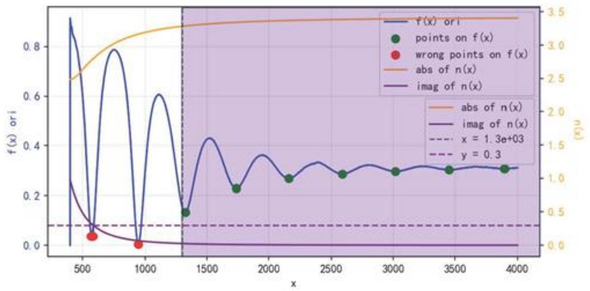
图 13: 附件 3直接求解数据点对应的外延层吸收率情况

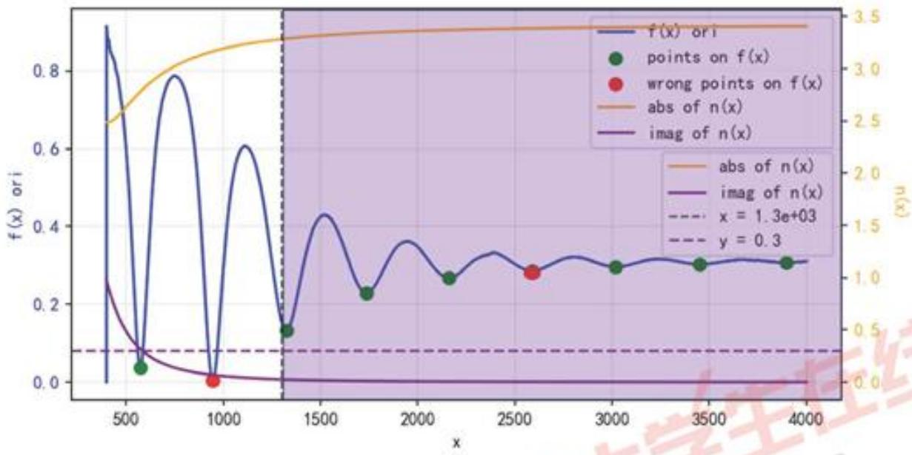
图 14:附件 4 直接求解数据点对应的外延层吸收率情况
可以明显看出，所有取出的波谷点吸收率都小于0.3(紫色虚线对应右侧横坐标)，参与计算的绝

大多数点(波数大于1300，紫色区域)吸收率都小于0.05。

依照以上对两个量的估计(我们取使得多光束干涉效应最小的估计， $n _ { 1 } = 3 , \kappa _ { 1 } = 0 . 0 5 )$ ，我们计算出附件 3，4 对应的 G 值分别为:

0.036,0.030这表明多光束和双光束模型在反射率曲线上差距最多不超过 $5 \% .$ 认为这个数值较大，多光束干涉效应不可忽略

显著程度:双光束和多光束曲线差异大小及各自反演拟合情况比较

采用双光束模型，同样得到一组拟合的参数，和所对应的均方误差。

优化过程中损失的收敛（最佳拟合）
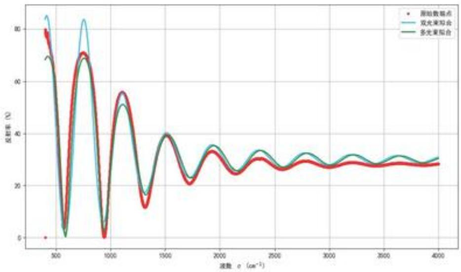
图15:双光束、多光束的反演拟合情况与真实硅晶片10度入射角反射率曲线的匹配情况

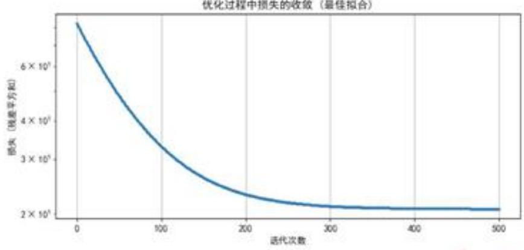
图16:双光束模型损失函数下高斯-牛顿迭代误差收敛情况

表7：两者误差对比
<table><tr><td>使用模型</td><td>均方误差（三位有效数字）</td></tr><tr><td>双光束模型</td><td>20.8</td></tr><tr><td>多光束模型</td><td>3.62</td></tr></table>

计算得出，收敛后双光束模型的均方误差误差显著大于多光束模型均方误差，可以认为此处适合使用多光束模型进行拟合。

## 5.3.5 附件 1、2 分析多光束干涉效应显著情况检验

这里为简洁起见用G 值进行判断，代入G表达式计算得

$$
G _ { 1 } \leq 0 . 0 1 6 , G _ { 2 } \leq 0 . 0 1 0
$$

，查询5.3.2中对G值大小描述的参考中，这意味着多光束模型和双光束模型在反射率谱上的任意一点的差距不超过3%

我们不能简单通过反射率曲线上的最大差距来判断多光束效应对模型求解厚度数值的影响。为了进一步探究其差距对求解的影响，下面以修正后的反射谱进行直接计算和牛顿迭代修正。

## 5.3.6 附件 1、2多光束干涉影响计算精度修正

1. 周期波谷直接计算法修正 多光束效应对周期波谷计算法的影响主要是影响了波谷极值点更精确值的确定(前文已经说明)，我们考虑从附件1，2的原始反射谱中还原一个更符合双光束模型的反射谱，在其上进行的波谷极值取值和厚度计算将更可信，误差限更小。

在前文多光束效应显著性表征量G的给出时，已经证明了在入射角 $\theta _ { 0 }$ 取 $1 0 ^ { \circ }$ ， $1 5 ^ { \circ }$ 范围内近似有

$$
R _ { 2 \mathrm { b } } ( \delta ) = R _ { \mathrm { e f f } } ( \delta ) | 1 + r _ { 0 1 } ^ { ( \mathrm { p o l ) } } r _ { 1 2 } ^ { ( \mathrm { p o l ) } } e ^ { i \delta } | ^ { 2 }\tag{24}
$$

这里我们认为附件1、2所展示的数据是 $R _ { \mathfrak { o f f } } ( \delta , \tilde { \nu } )$ 曲线，因此对该曲线进行修正，得到通过上式计算得适用于双光束模型(进而严格适用于周期波谷直接计算)。

计算结果如下：

最后用逆方差加权计算得到最终结果为：

$$
d = 7 . 5 4 6 1 , \sigma = \pm 0 . 1 8 0 1\tag{25}
$$

对比问题2中计算得到的 $\mathrm { d } { = } 7 . 5 4 4 , \sigma = 0 . 1 7 0 ,$ 我们认为在附件1，2中，多光束效应是较弱的，且可以 $\mathrm { d } { = } 7 . 5 4 4 , \sigma = 0 . 1 7 0$ 作为附件1，2求解的最终结果。 牛

2. 牛顿迭代反演法修正 使用多光束干涉给出的反射率公式拟合反射率曲线，进而用于最小二乘损失的训练中，以消除迭代法中模型存在的系统偏差.结果拟合出了更贴近于原始附件1、2的反射率曲线，随之输出了更可信的厚度值d: mo

表8: 统计结果
<table><tr><td>统计量</td><td>入射角  $1 0 ^ { \circ }$ </td><td>入射角  $1 5 ^ { \circ }$ </td></tr><tr><td>数据点数 L</td><td>11</td><td>15</td></tr><tr><td>自由度n</td><td>10</td><td>14</td></tr><tr><td>平均厚度</td><td>7.575856</td><td>7.48711</td></tr><tr><td>标准偏差  $\sigma _ { d }$ </td><td>0.212318</td><td>0.284504</td></tr><tr><td>标准误差  $\sigma _ { d }$ </td><td>0.067141</td><td>0.076037</td></tr><tr><td> $t _ { \mathrm { c r i t } } ( 9 5 \% )$ </td><td>2.262157</td><td>2.160369</td></tr><tr><td> $\mathrm { C I } _ { 9 5 \% } ( \mathrm { l o w } )$ </td><td>7.423973</td><td>7.322842</td></tr><tr><td> $\mathrm { { C I } _ { 9 5 \% } ( \ h i g h ) }$ </td><td>7.727739</td><td>7.651377</td></tr><tr><td>离散系数  $\mathrm { C V } ( \% )$ </td><td>2.802562</td><td>3.799922</td></tr></table>

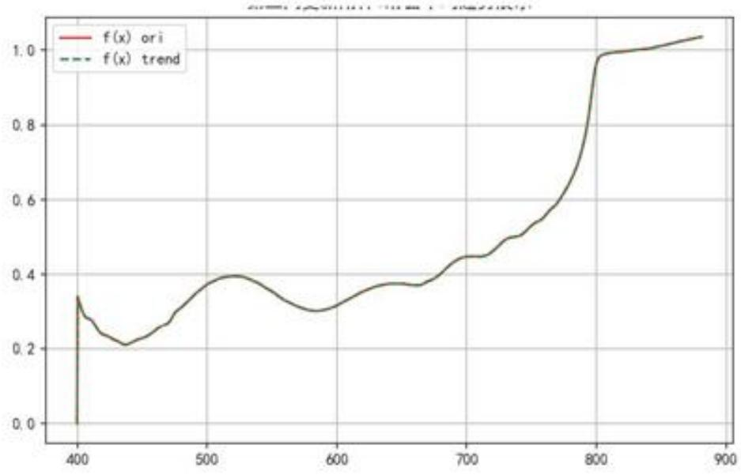
图17:更新牛顿迭代模型拟合到附件1 曲线的局部

两个输出的d值分别为7.560，7.571，与前一段计算得到的7.546较为吻合，作为直接计算结果的一个较好交叉匹配。

## 6 模型检验及合理性分析

## 6.1 周期波谷直接计算法去除可疑点

对于问题2，3，在使用依照周期波谷直接计算法时，面对偏差较大的厚度计算值时，我们用3σ法则去除了偏离均值较大的数据。这个小节里面我们证明，所被去除的值确实存在异常，且降低计算得到数值和真值的误差。

## 6.1.1 直接计算法误差来源分析

由于在计算厚度d时，使用的两个相邻波谷对应频数值存在较大偏差 $\Delta \tilde { \nu } ($ 精准找到的极值点较难)。d的误差主要由数值的偏差带来，下面分析d对ν的敏感程度 $\textstyle { \binom { \partial d } { \partial \nu } }$ 和误差的传递情况。

由

$$
d = \frac { i } { 2 [ \nu _ { j } \sqrt { n ^ { 2 } ( \nu _ { j } ) - \sin ^ { 2 } \phi } \ - \ \nu _ { i } \sqrt { n ^ { 2 } ( \nu _ { i } ) - \sin ^ { 2 } \phi } ] } ,
$$

设

$$
A _ { k } \equiv \sqrt { n ^ { 2 } ( \nu _ { k } ) - \sin ^ { 2 } \phi } , ~ n _ { k } \equiv n ( \nu _ { k } ) , ~ n _ { i } ^ { \prime } \equiv \frac { d n } { d \nu } \bigg \vert _ { \nu _ { i } } .
$$

$F \equiv \nu _ { j } A _ { j } - \nu _ { i } A _ { i }$ (于是 $\begin{array} { r } { d = \frac { i } { 2 F } ) } \end{array}$

对 $\nu _ { i }$ 的灵敏度

$$
\frac { \partial d } { \partial \nu _ { i } } = - \frac { i } { 2 } \frac { 1 } { F ^ { 2 } } \frac { \partial F } { \partial \nu _ { i } } = \frac { i } { 2 F ^ { 2 } } \bigg ( A _ { i } + \nu _ { i } \frac { n _ { i } n _ { i } ^ { \prime } } { A _ { i } } \bigg ) ,
$$

等价地，用原式分母 $D \equiv 2 [ \nu _ { j } A _ { j } - \nu _ { i } A _ { i } ]$ 表示为

$$
\frac { \partial d } { \partial \nu _ { i } } = \frac { i } { D ^ { 2 } } \left( A _ { i } + \frac { \nu _ { i } n _ { i } n _ { i } ^ { \prime } } { A _ { i } } \right) , A _ { i } = \sqrt { n _ { i } ^ { 2 } - \sin ^ { 2 } \phi } , n _ { i } ^ { \prime } = \frac { d n } { d \nu } \bigg \vert _ { \nu _ { i } }
$$

只考虑 $\nu _ { i }$ 的不确定度 $\sigma _ { \nu _ { i } }$ 时，一阶近似

$$
\sigma _ { d } \approx \left| \frac { \partial d } { \partial \nu _ { i } } \right| \sigma _ { \nu _ { i } } = \frac { i } { D ^ { 2 } } \left( A _ { i } + \frac { \nu _ { i } n _ { i } n _ { i } ^ { \prime } } { A _ { i } } \right) \sigma _ { \nu _ { i } }
$$

对敏感项 $\frac { \nu _ { i } n _ { i } n _ { i } ^ { \prime } } { A _ { i } }$ ：当 $| n _ { i } ^ { \prime } |$ 大（折射率变化极快，如靠近共振/Reststrahlen带）或 $A _ { i } = \sqrt { n _ { i } ^ { 2 } - \sin ^ { 2 } \phi }$ 小（入射角较大、或 $n _ { i }$ 不高）时， $\partial d / \partial \nu _ { i }$ 将显著增大，导致厚度d对 $\nu _ { i }$ 的微小扰动极为敏感。

## 6.1.2 问题 2 计算中偏差大数值的解释和处理

下图展示出附件2(对于附件1有类似的情况，不重复展示示意图)的反射率曲线，对应的碳化硅折射率曲线，以及计算多个厚度d值使用并选择性删去的可疑点情况。

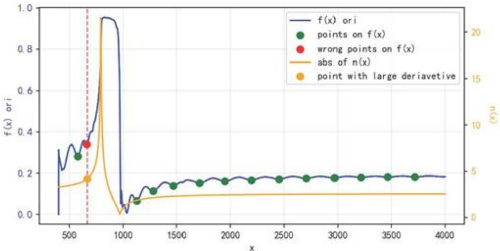
图18: 问题2直接计算法可疑点去除示意图

图中可见，偏离平均值较远并被删去的点(红点)频数接近于碳化硅折射率共振点，对应有较大的 $n _ { i } , \left| n _ { i } ^ { \prime } \right|$ 值，该店与前后相邻的谷底点(相邻绿点)进行计算时d对频数过于敏感，因此可能造成了计算得的厚度d与其他数值偏差过大的情况。

从误差传递的角度来看，在计算中去除这一类点，或者在其附近多次取频数值进行计算和验证，是保证结果接近真值的合理做法。

## 6.1.3 问题三模型建立与求解方法总结

本题在问题一、二的基础上，进一步考虑外延层内的多次往返反射，建立了多光束（Airy）干涉模型。首先，推导了等效反射振幅 $\begin{array} { r }  r _ { \phi ^ { 0 \} } ^ { ( \mathrm { p o l } ) } ( \delta ) = \frac { r _ { 0 1 } ^ { ( \mathrm { p o l } ) } + r _ { 1 2 } ^ { ( \mathrm { p o l } ) } e ^ { \mathrm { i } \delta } } { 1 + r _ { 0 1 } ^ { ( \mathrm { p o l } ) } r _ { 1 2 } ^ { ( \mathrm { p o l } ) } e ^ { \mathrm { i } \delta } } } \end{array}$ 及反射率 $R _ { \mathrm { e f f } } = | r _ { \mathrm { e f f } } | ^ { 2 }$ ，并与双光束模型进行对比；其次，引人表征多光束效应显著性的无量纲指标 $\begin{array} { r } { G = \big | r _ { 0 1 } ^ { ( \mathrm { p o l } ) } r _ { 1 2 } ^ { ( \mathrm { p o l } ) } \big | \exp \big ( - \frac { 4 \pi } { \lambda } \kappa _ { 1 } d \cos \theta _ { 1 } \big ) } \end{array}$ 给出何时必须采用多光束模型的定量判据；再次，从误差传播角度说明多光束模型在极值附近使二阶导更小、对噪声更敏感，从而影响厚度求解精度；随后在附件3、4上分别用周期波谷直接法与牛顿选代法计算厚度，并通过G值与均方误差对比，验证了多光束模型在这些数据上的必要性与优越拟合效果；最后，对附件1、2给出基于 $R _ { 2 \mathrm { b } } ( \delta ) = R _ { \mathrm { o f f } } ( \delta ) \left| 1 + r _ { 0 1 } ^ { ( \mathrm { p o l ) } } r _ { 1 2 } ^ { ( \mathrm { p o l ) } } e ^ { i \delta } \right| ^ { 2 }$ 的谱线修正流程，重新进行厚度反演，得到与直接法一致且不确定度更合理的结果，表明多光束效应在附件1、2中较弱但可量化修正，在附件3、4中则必须显式建模。

## 7 模型评价与展望

## 7.1 模型优点

· 物理基础扎实：模型从菲涅尔公式出发，结合Drude折射率模型与光学声子修正项，较完整地刻画了材料在中远红外波段下的光学性质，保证了物理意义的准确性。

·方法多样互补：周期波谷直接计算法和牛顿迭代反演法各具优势。前者提供厚度的显式公式，计算简洁直观；后者通过迭代优化拟合实验曲线，精度更高。两者结果能够相互印证，提高了计算的可靠性。

· 多光束效应分析全面：引入多光束干涉的等效反射率表达式和表征参数G，不仅揭示了多光束效应的物理来源，还建立了定量判断标准，能够清晰评估其对厚度计算的影响。

·修正方法可行：通过推导 $R _ { 2 \flat } ( \delta ) = R _ { e i t } ( \delta ) | 1 + r _ { 0 1 } r _ { 1 2 } e ^ { i \delta } | ^ { 2 }$ 的修正关系，对实验反射率进行校正，从而降低了多光束效应引起的系统偏差。

·结果可信度高：计算过程中引入统计分析(均值、标准差、置信区间、变异系数等)，确保了厚度计算不仅有理论支撑，还有数值可靠性验证。

## 7.2 模型缺点

·参数依赖性强：折射率模型所需的材料参数多取自文献，实际样品的温度、缺陷、表面粗糙度等因素未完全纳入，可能导致与真实情况有偏差。

· 数据处理方法有限：对实验曲线的平滑与极值点提取主要依赖三次样条插值，尚未系统引入鲁棒滤波或频域降噪方法，在高噪声条件下可能失效。

· 多光束修正仍近似：尽管引入G参数进行修正，但该方法本质上仍是基于近似展开，尚需更多实验数据与数值模拟来验证其适用范围。

## 7.3 未来展望

未来研究可以在以下方向上进一步完善：

1. 在折射率建模中引入温度效应、缺陷态以及更高精度的实验测量数据，提升模型对实际器件样品的适用性；

2. 在数据处理上应用更先进的信号处理与机器学习方法，提高极值点提取的鲁棒性和精度；

3. 在多光束干涉分析上，发展更普适的理论判据，并结合实验数据标定，使修正结果更具可靠性；

4. 推广模型应用到更多半导体材料体系，如GaN、SiGe等，以验证其通用性。

## 8 物理常数与材料参量

表 9: 物理常数与材料参量表
<table><tr><td colspan="2">符号 含义与数值</td></tr><tr><td>e</td><td>元电荷，  $1 . 6 0 2 1 7 6 6 3 4 \times 1 0 ^ { - 1 9 } \mathrm { C }$ </td></tr><tr><td> $\varepsilon _ { 0 }$ </td><td>真空介电常数，  $8 . 8 5 4 1 8 7 8 1 2 8 \times 1 0 ^ { - 1 2 } { \mathrm { F / m } }$ </td></tr><tr><td> $m _ { e }$ </td><td>电子静止质量，  $9 . 1 0 9 3 8 3 7 0 1 5 \times 1 0 ^ { - 3 1 }$  kg</td></tr><tr><td> $c _ { 0 }$ </td><td>真空光速，  $2 . 9 9 7 9 2 4 5 8 \times 1 0 ^ { 8 } { \mathrm { m } } / { \mathrm { s } }$ </td></tr><tr><td> $\varepsilon _ { \infty }$ </td><td>碳化硅高频介电常数，6.56</td></tr><tr><td> $\tilde { \nu } _ { T }$ </td><td>碳化硅 TO 光学声子波数，  $7 9 4 . 0 \mathrm { c m } ^ { - 1 }$ </td></tr><tr><td> $\tilde { \nu } _ { L }$ </td><td>碳化硅LO光学声子波数，  $9 7 0 . 0 \mathrm { c m } ^ { - 1 }$ </td></tr><tr><td> $\Gamma _ { \mathrm { p h } }$ </td><td>声子阻尼参数，  $5 . 5 \mathrm { c m } ^ { - 1 }$ </td></tr></table>

## 参考文献

[1] DeepSeek. DeepSeek-R1-671B. 深度求索 (DeepSeek), 2025.使用日期: 2025-09-07.

[2] ChatGPT. ChatGPT-5. OpenAI, 2025. 使用日期: 2025-09-06.

[3] S. Basu, B. J. Lee, and Z. M. Zhang "Infrared radiative properties of heavily doped silicon at room temperature," Journal of Heat Trunsfer, vol. 132, no. 2, p. 023301, 2010. doi: 10.1115/1.4000171.

[4] X. Tang, Y. Zhang, Z. Li, et al., "Thickness determination of 4H-SiC epitaxial films by infrared reflectance," in Proc. IEEE Int. Conf. Electron Devices and Solid-State Circuits (EDSSC), 2010, pp. 5394259. doi: 10.1109/EDSSC.2009.5394259.

[5] P. J. Severin, "On the infrared thickness measurement of epitaxially grown silicon layers," Applied Optics, vol. 9, no. 10, pp. 2381–2386, 1970. doi: 10.1364/AO.9.002381.

[6] S. Hava and M. Auslender, "Theoretical dependence of infrared absorption in bulk-doped silicon on carrier concentration," Applied Optics, vol. 32, no. 7, pp. 1122–1125, 1993. doi: 10.1364/AO.32.001122.

[7] R. Soref, R. E. Peale, and W. Buchwald, "Longwave plasmonics on doped silicon and silicides," Optics Express, vol. 16, no. 9, pp. 6507–6514, 2008. doi: 10.1364/OE.16.006507.

[8] E. Pop, S. Sinha, and K. E. Goodson, “Monte Carlo modeling of heat generation in electronic nanostructures," in Proc. IMECE' 02, ASME Int. Mech. Eng. Congress and Exposition, 2002, Paper No. IMECE02/HT-32124. ae.

[9] M. F. MacMillan, A. Henry, and E. Janzén, "Thickness determination of low doped SiC epi-films on highly doped SiC substrates," Journal of Electronic Materials, vol. 27, no. 4, pp. 300-306, 1998. doi: 10.1007/s11664-998-0404-9.

支撑材料

## 附录

附件1修正计算筛去异常.csV
附件1修正计算筛去异常\_统计结果.cSV
附件2修正计算筛去异常.csV
附件2修正计算筛去异常\_统计结果.cSV
物理常数和材料参量.cSV
硅片10度拟合收敛.png
硅片10度折射率拟合.png
双光束模型拟合硅片.png
双光束模型拟合硅片收敛.png
碳化硅10度拟合.png
碳化硅10度拟合收敛.png
反射率计算py
问题2碳化硅折射率物理模型.py
问题2统计数据计算.py
问题2网格-牛顿法拟合碳化硅数据.py
问题2样条定位极值点.py
问题3硅晶片折射率模型.py
AI 工具使用详情.pdf

图1:支撑材料目录

代码（相似的代码未重复放入）

```python
import nuspy as np
2 import matplotlib.pyplot as plt
3 import pandas as pd
4 import seaborn as sns
import os
6
from 反射率计算 import R_two_beam_sigma
8
。 #设置Seaborn的整体风格和主题
10 sns.set_theze(style="vhitegrid", palette="muted")
11 # sns.set_context("paper", font_scale=1.2, rc={"lines.linevidth": 1.5})
12
13 #加载数据
14 data =pd.read_excel('附件1.xlsx')
15 sig=a_exp = data['波数(cm-1)'].astype(float).values
16 R_real = data['反射率(%)'].astype(float).values / 100.0
18 #物理常量(SI units)
10 e = 1.602176634e-19 # C
20 eps0= 8.8541878128e-12 # F/=
=_e = 9.1093837015e-31 # kg
22 co = 299_792_458.0 # =/s
23
24 #单位转换辅助函数
25 def _cm1_to_omega(cm1):
2 将波数 [c=-1] 转换为角频率[rad/s]
27 return 2*np.pi * c0 * (cm1*100.0) # 1 c=-1 = 100 =-1
28
20 def _mu_caughey_thomas(N_cm3, mu_=in, mu_max, N_c, alpha):
20 "Caughey - Thomas 迁移率模型"
31 return mu_min + (mu_max - mu_min) / (1.0 + (N_cm3/N_c)**alpha)
22
23 def _eps_lorentz_drude_omega(omega, eps_inf, vT, wL. g_ph, v_P. g_e):
34 "Lorentz-Drude 介电函数模型:()= o[1+(wL-2-wT2)/(vT2- -2-1 g_ph )]
v_p^2/[ ( +1 g_e)]
omega= np.asarray(omega, dtype=complex)#保omega是复数
36
87 drude = v_p**2 / (omega*(omega + 1j*g_e) + 0j)
38 return eps_inf*(1.0 + phonon) - drude
```

40 def n\_sic\_4H\_sigma(sigma\_cm, N\_cm3, =\_eff\_rel=0.42):
40 计算4H的复折射率(Lorentz + Drude 模型），波数 单位为 cm^-1。
42 内置国定参数和Caughey-Thomas迁移率模型。
44 返回：n()+1k()
sigma\_cm = np.atleast\_1d(signa\_cm).astype(float)
43 #4H固定参数
4 eps\_inf = 6.56
to sigma\_L\_cm = 970.1
51 sigma\_T\_cm = 793.9
52 Gamma\_ph\_cm = 5.501
54 # Caughey - Thomas 迁移率参数
55 mu\_max = 950.0 # c=\~2/Vs
56 mu\_min = 40.0 # c=^2/Vs
51 N\_c = 2e17 # cm-3
alpha = 0.76
to #转换为角频率
61 v =\_c=1\_to\_omega(sig=a\_c=)
12 vT = \_cm1\_to\_omega(signa\_T\_cm)
03 wL = \_cm1\_to\_omega(signa\_L\_cm)
64 gph =\_cm1\_to\_omega(Ganma\_ph\_cm)
#计算Drude项的 \_P 和 \_e
67 1f N\_cm3 > 1e-3:# N\_cm3 必须大于0，使用小阔值保证数值稳定性
mu = \_mu\_caughey\_thomas(N\_cm3, mu\_min, mu\_max, N\_c, alpha) # cm2/Vs
69 mu\_SI = mu \* 1e-4 # =^2/Vs
7o m\_eff = m\_eff\_rel \* m\_e
71 v\_P = np.sqrt((N\_cm3\*1e6) \* e\*\*2 / (eps0 \* m\_eff)) # rad/s
72 g\_e = e / (=\_eff • mu\_SI)  1/s
73 else:
74 v\_p = 0.0
75 g\_e = 0.0
77 #计算介电函数和复折射率

78 eps = \_eps\_lorentz\_drude\_omega(v, eps\_inf, wT, wL. gph, w\_P, g\_e)
79 n\_co=plex = np.sqrt(eps + 0j)
80 return n\_complex
8:
82 #目标函数
83 def objective\_function(params\_scaled, sigma\_data, R\_exp\_data, fixed\_params):
85 根据缩放参数计算残差(B\_calc -R\_exp)。
86 参数：
87 params\_scaled: [d\_scaled, log10\_Ni, log10\_N2]
88 d\_scaled：厚度，单位微米
log10\_N1：第一层掺杂浓度 log10(N)(cn-3)
00 log10\_N2：第二层掺杂浓度 log10(N)(cn²-3)
91 sigma\_data: 波数数组 [cm^-1]
92 R\_exp\_data：实验反射率数组
fixed\_parans:固定参数字典(n0,1\_deg,s\_eff\_rel)
04 返回：
05 residuals: R\_calc - R\_exp
d\_scaled, log10\_N1, log10\_N2 = params\_scaled
00 #缩放参数还原为物理单位
100 d = d\_scaled \* 1e-6 # 微米转换为米
101 N1\_cm3 = 10\*\*log10\_N1
102 N2\_cm3 = 10\*\*1og10\_N2
204 #获取固定参数
105 n0 = fixed\_params['n0']
106 i\_deg = fixed\_parans['i\_deg']
107 m\_eff\_rel = fixed\_params['n\_eff\_rel']
109 nk1\_complex = n\_sic\_4H\_sigma(sigma\_data, N\_cm3=N1\_cm3, =\_eff\_rel=m\_eff\_rel)
110 nk2\_complex = n\_sic\_4H\_sigma(sigma\_data, N\_cm3=N2\_cm3, m\_eff\_rel=m\_eff\_rel)
112 R\_calc = R\_two\_beam\_sigma(sigma\_data, nO, nk1\_complex, nk2\_complex, i\_deg,
d, pol="avg")
114 #处理 R\_cale 中可能出现的 NaN 或 Inf 值
115 if np.any(np.isnan(R\_calc)) or np.any(np.isinf(R\_cale)):

116 return np.ones\_like(R\_exp\_data) \*1e10 #返回一个较大的误差
118 return R\_calc - R\_exp\_data
120 #Jacobian 矩阵计算（数值微分）
121 def calculate\_jacobian(parans\_scaled, func, h\_rel=1e-5, \*\*kwargs):
123 使用有限差分法计算函数'func对参数'params\_scaled”的Jacobian矩阵。
125 num\_params = len(params\_scaled)
126 initial\_residuals = func(params\_scaled, \*\*kvargs)
127 num\_residuals = len(initial\_residuals)
129 J = np.zeros((nus\_residuals, num\_params))
131 for i in range(nus\_params):
122 p-perturb = np.array(params\_scaled, dtype=float)
124 h = h\_rel \* abs(p\_perturb[i])
125 if h  0: # 避免对零参数进行零步长扰动
136 h = h\_rel
158 P\_perturb[i] += h
129 perturbed\_residuals = func(p\_perturb, \*\*kwargs)
141 J[:, i] = (perturbed\_residuals - initial\_residuals) / h
142 return J
144 #Nevton-Raphson / Gauss-Nevton求解器
14 def newton\_raphson\_fit(initial\_parans\_scaled, sigma\_data, R\_exp\_data.
fixed\_parans,
145 max\_iter=100. tol=1e-6, learning\_rate=0.01, verbose=True
):
145 params\_current = np.array(initial\_params\_scaled, dtype=float)
1.40
150 history = [params\_current.copy()]
151 loss\_history = []

```python
for iteration in range(max_iter):
residuals = objective_function(parans_current, sigma_data, R_exp_data,
fixed_params)
loss = np.sum(residuals**2)
loss_history.append(loss)
J = calculate_jacobian(params_current, objective_function,
sigma_data=sigma_data, R_exp_data=R_exp_data,
fixed_params=fixed_params)
if np.any(np.isnan(J)) or np.any(np.isinf(J)) or np.any(np.isnan(
residuals)) or np.any(np.isinf(residuals)):
if verbose:
print(f"送代 {iteration}：Jacobian 或残差中出现 NaN 或 Inf。停
止。“)
break
# Gauss-Newton步长，使用 np.linalg.lstsq 提高数值稳定性
try:
delta_parans = np.linalg.lstsq(J, -residuals, rcond=None)[0]
except np.linalg.LinAlgError:
if verbose:
print(f"送代 {iteration}：遇到奇异矩阵。停止。")
break
params_next = parans_current + learning_rate * delta_params
#参数边界约束
params_next [0]= np.maximum(params_next [0],0.01)# 最小厚度0.01 um
params_next[1]= np.maximum(params_next[1], 15.0) # N1 录小 1e15 cm-3
params_next[2]= np.maximum(params_next[2], 15.0)#N2录小 1e15 cm-3
#检查收效性
param_change = np.linalg.norm(params_next - params_current)
if param_change < tol:
if verbose:
print(f”在迭代 {iteration} 收敛。参数变化：{param_change:2e}")
params_current = params_next 十学生
history.append(parans_current.copy())
```

break
params\_current = params\_next
history.append(params\_current.copy())
if verbose:
print(f"达代 {iteration}, Loss: {loss:.2e}, 参数: {params\_current
[0]:.2f} µm, 10{params\_current[1]:.2f}, 10^{params\_current
[2]:.2f}")
else:
if verbose:
print(f\*在{max\_iter}次迭代后未收敛。最终参数变化：{param\_change
:.2e}")
final\_loss = np.sun(objective\_function(params\_current, sigma\_data,
R\_exp\_data, fixed\_params)\*\*2)
loss\_history.append(final\_loss)
if verbose:
print(f"最终 Loss: {final\_loss:.2e}")
return parans\_current, np.array(history), np.array(loss\_history)
f \_\_name\_\_ == "\_\_nain\_\_":
output dir = "plot data for paper
os.makedirs(output\_dir, exist\_ok=True)
#固定参数
n0 =1.0#入射介质（空气）
1\_deg = 10.0 #入射角[°]
m\_eff\_rel=0.42#有效质量（相对于电子质量）
fixed\_params = {
'n0': n0.
'1\_deg': i\_deg,
'm\_eff\_rel': m\_eff\_rel
}
#参数搜索范围和步长

d\_um\_start, d\_um\_end, d\_um\_steps = 5.0, 12.0, 4
log10\_N1\_start, log10\_N1\_end, log10\_N1\_steps = 16.0, 18.0, 4
log10\_N2\_start, log10\_N2\_end, log10\_N2\_steps = 17.0, 19.0, 4
d\_um\_grid = np.linspace(d\_u=\_start, d\_um\_end, d\_um\_steps)
log10\_N1\_grid = np.linspace(log10\_N1\_start, log10\_N1\_end, log10\_N1\_steps)
log10\_N2\_grid = np.linspace(log10\_N2\_start, log10\_N2\_end, log10\_N2\_steps)
best\_loss = np.inf
best\_params\_scaled = None
best\_history = None
best\_loss\_history = None
best\_initial\_guess = None
total\_runs = d\_u=\_steps \* log10\_N1\_steps \* log10\_N2\_steps
run\_count = 0
print(f"\n开始对{total\_runs}组初始参数进行网格搜索...")
print(f厚度（pn) 范围：{d\_u=\_grid}\*)
print(f"薄膜 N1(log10) 范围：{log10\_N1\_grid}\*)
print(f"衬底 N2 (log10) 范图：{log10\_N2\_grid}\*)
import itertools
for d\_init, N1\_init\_log10, N2\_init\_log10 in itertools.product(d\_um\_grid.
log10\_N1\_grid, log10\_N2\_grid):
run count += 1
current\_initial\_parans = [d\_init, N1\_init\_log10, N2\_init\_log10]
print(f"\n--- 运行第 {run\_count}/{total\_runs} 次拟合，初始猜测：d={
d\_init:.2f}μm, log10(N1)={N1\_init\_log10:.2f}, log10(N2)={
N2\_init\_log10:.2f} ---")
#调用拟合函数，在同格搜索期同不打印详细迭代信息
final\_params\_scaled, history, loss\_history = nevton\_raphson\_fit(
current\_initial\_params, sigma\_exp, R\_real, fixed\_parans,
max\_iter=200, tol=1e-6, learning\_rate=0.01, verbose=False
)
current\_loss = np.sus(objective\_function(final\_params\_scaled, sigza\_e:
, R\_real, fixed\_parans)\*\*2)

print(f第{run\_count}/{total\_runs} 次拟合完成。最终 Loss:{
current\_loss:.2e}")
if current\_loss < best\_loss:
best\_loss = current\_loss
best\_parans\_scaled = final\_parans\_scaled
best\_history = history
best\_loss\_history = loss\_history
best\_initial\_guess = current\_initial\_params
print(f"--> 发现新的最住拟合!Loss:{best\_loss:.2e}")
print(\*\nssssssssssss")
print(" 网格搜索完成 )
print(=
print(f"最住初始猜测(d\_um, log10\_N1, log10\_N2): {best\_initial\_guess}")
print(f"最小总 Loss: {best\_loss:.2e}")
#显示最佳拟合结果
if best\_params\_scaled is None:
print(\*未找到有效的拟合结果。请检查数据、模型和搜索范围。\*)
exit()
final\_d\_um = best\_parans\_scaled[0]
final\_N1\_cm3 = 10\*\*best\_parans\_scaled[1]
final\_N2\_cm3 = 10\*\*best\_parans\_scaled[2]
print("\n--- 最佳拟合参数 ---")
print(f"厚度 d: {final\_d\_um:.3f} µm ({final\_d\_un\*1e-6:.3e} m)\*)
print(f"薄膜掺杂 N1: {final\_N1\_cm3:.2e} cm--3")
print(f"衬底掺杂 N2: {final\_N2\_cm3:.2e} cm--3\*)
#绘制反射率拟合图
plt.figure(figsize=(10, 6))
final\_d\_n = final\_d\_um \* 1e-6
final\_nk1 = n\_sic\_4H\_sigma(sigma\_exp, N\_cm3=final\_N1\_cm3, m\_eff\_rel=
n\_eff\_rel)
final\_nk2 = n\_sic\_4H\_sigma(sigma\_exp, N\_cm3=final\_N2\_cm3. \_eff\_rel=
=\_eff\_rel)

```python
R_fit = R_two_beas_sigma(sig=a_exp, nO, final_nk1. final_nk2, i_deg,
final_d_=, pol="avg")
plt.plot(sigma_exp,R_real * 100, 'o',markersize=4, label='实验数据',
color="red")
plt.plot(sigma_exp,R_fit * 100,-, linevidth=2, label='拟合结果, color=
"blue")
plt.xlabel('波数 ($\mathrm{cm}^{-1}$)',fontsize=14)
plt.ylabel('反射率(%),fontsize=14)
plt.tick_parans(axis='both', vhich='major', labelsize=12)
plt.legend(fontsize=12, franeon=True, shadov=True)
plt.grid(True)
plt.tight_layout()
plt.savefig(os.path.join(output_dir, 'reflectance_fit.png'), dpi=300)
plt.show()
#保存反射率拟合数据
reflectance_data = pd.DataFraze({
Wavenunber (c=-1)': sig=a_exp,
'Experizental Reflectance (%)': R_real * 100,
'Fitted Reflectance (%)': R_fit * 100
3)
reflectance_data.to_csv(os.path.join(output_dir,reflectance_fit_data.csv
). index=False)
print(f"反射率拟合数据已保存至 {os.path.join(output_dir.
reflectance_fit_data.csv')}")
#绘制最佳拟合的 Loss 收效历史
plt.figure(figsize=(8, 5))
plt.plot(best_loss_history, marker='o', linestyle='-', markersize=4, color=
"black")
plt.xlabel('送代次数',fontsize=14)
plt.ylabel('Loss(残差平方和),fontsize=14)
plt.tick_parans(axis='both', which='major', labelsize=12)
plt.yscale('log') 牛在
plt.grid(True)
plt.tight_layout()
plt.savefig(os.path.join(output_dir, 'loss_convergence.png'). dpi=300)
```

plt.show()
#保存 Loss 历史数据
loss\_history\_df = pd.DataFrame({
'Iteration': np.arange(len(best\_loss\_history)),
'Loss (Sus of Squared Residuals)': best\_loss\_history
1)
loss\_history\_df.to\_csv(os.path.join(output\_dir, 'loss\_history\_data.csv'),
index=False)
print(f"Loss 历史数据已保存至 {os.path.join(output\_dir,'loss\_history\_data.
csy')}")
绘制最佳拟合的参数收致历史
fig, axes = plt.subplots(3, 1, figsize=(10, 8), sharex=True)
axes[0].plot(best\_history[:, 0], marker='o', markersize=3, color=sns.
color\_palette("muted")[3])
axes[0].set\_ylabel('厚度(\$\mu\$=)', fontsize=14)
axes[0].tick\_params(axis='y', which='najor'. labelsize=12)
axes [0].grid(True)
axes[1].plot(best\_history[:, 1]. marker='o'. markersize=3, color=sns.
color\_palette("suted")[4])
axes[1].set\_ylabel('log\$\_{10}\$(N\$\_1\$ c=\$^{-3}\$)', fontsize=14)
axes[1].tick\_params(axis='y', vhich='sajor', labelsize=12)
axes[1].grid(True)
axes[2].plot(best\_history[:, 2], marker='o', markersize=3, color=sns.
color\_palette("muted")[5])
axes[2].set\_ylabel('log\$\_{10}\$(N\$\_2\$ cm\$^{-3}\$)', fontsize=14)
axes[2].set\_xlabel('选代次数,fontsize=14)
axes[2].tick\_params(axis='both', which='major', labelsize=12)
axes [2].grid(True)
plt.tight\_layout()
plt.savefig(os.path.join(output\_dir, 'parameter\_convergence.png'), dpi=300)
plt.show()
保存参数收敛历史数据

```python
parazeter_convergence_df = pd.DataFrame({
'Iteration': np.arange(len(best_history)),
'Thickness (un)': best_history[:, 0],
'log10(N1)': best_history[:, 1],
'log10(N2)': best_history[:, 2]
3)
parameter_convergence_df.to_csv(os.path.join(output_dir,
paraneter_convergence_data.csv'), index=False)
print(f"参数收敏数据已保存至 {os.path.join(output_dir,
paraneter_convergence_data.csv')}")
```
Listing1: 问题2 网格-牛顿法拟合碳化硅数据

```python
369 # -*- coding: utf-8 -*-
370
371 该模块提供了从特定格式的CSV文件加载折射率数据，并基于该数据
372 计算单层薄膜的两光束和严格多光束反射率的功能。
373
374 主要功能：
375 -从 refractiveindex.info格式的 CSV 文件(包含'wl,n’和'wl,k’两部分)
176 读取折射率n和消光系数数据。
377 构建一个复数折射率n1(）的插值函数，其中为波数（c=~-1）。
37 -计算单层薄膜的两光束反射率和严格多光束反射率。
379
280 import re
281 import numpy as np
183 from pathlib i=port Path
183
884 from matplotlib import pyplot as plt
385
385
887 #
383 # 1) 从 CSV 读取数据并生成 n1() 插值器
889 # 日日日
300
891 def load_refractive_index_csv_two_blocks(path: str):
392 学生
393 解析 refractiveindex.info 导出的CSV 文件。
804 文件应包含两段两列表数据：
295 -第一段表头'wl,n’:后续为 wavelength[μn],
```

```python
-第二段表头‘wl,k’:后续为 wavelength[μ=]，k
返: (wl_n_data, n_values). (vl_k_data, k_values)
其中 vl_n_data, n_values, vl_k_data, k_values 均为 numpy 数组,
并按波长升序排列。
若文件中缺少w1，k’段，本函数将抛出错误。
p = Path(path)
if not p.exists():
raise FileNotFoundError(f"文件未找到：{path}")
处理BOM，并标准化大小写/空白
rav = p.read_text(encoding="utf-8", errors="ignore").lstrip("\ufeff")
lines = raw.splitlines()
#定位表头
idx_n = idx_k = None
for i, ln in enuzerate(lines):
s = ln.strip().lstrip("\ufeff)
if re.match(r"-wl\s*[.:\s]\s*n\s*$". s. flags=re.IGNORECASE):
idx_n = 1
if re.match(r"wl\s*[.:\s]\s*k\s*$", s, flags=re.IGNORECASE):
idx_k = 1
if idx_n is None:
raise ValueError(*未找到'wl,n’表头。请检查 CSV 文件格式。")
if idx_k is None:
raise ValueError(”未找到'wl,k”表头。对于无k值的场景，请使用
build_n1_fron_csv数.")
def _collect_data(start_idx, end_idx):
wavelengths, values = [], []
for ln in lines[start_idx + 1:end_idx]:
s = ln.strip()
if (not s) or s.startswith("#"):
continue
if len(parts) < 2:
continue
```

434 try:
435 wl\_v = float(parts[0])
436 v = float(parts[1])
437 except ValueError:
438 continue
430 wavelengths.append(vl\_v)
445 values.append(v)
441 wavelengths = np.asarray(vavelengths, float)
442 values = np.asarray(values, float)
443 order = np.argsort(vavelengths)
44 return vavelengths[order], values[order]
445 wl\_n, n\_vals = \_collect\_data(idx\_n, idx\_k) #n数据段
447 wl\_k,k\_vals = \_collect\_data(idx\_k, len(lines)) #数据段
440 if wl\_n.size == 0 or wl\_k.size == 0:
450 raise ValueError(“解析的n或k数据块为空；请检查文件格式。“)
451 return (wl\_n, n\_vals), (wl\_k, k\_vals)
454 def create\_ni\_interpolator\_from\_two\_block\_csv(csv\_path: str, fill\_=ode: str =
edge"):
450 基于（w1,n)与(w1，k)两段数据，构造复数折射率n1() =n() + 1\*z()的插值
器。
457 - 输入/输出波数 单位为 cm^-1。
458 -fill\_mode='edge：对于超出数据范围的波数，插值结果钳制到边界值。
410 -fill\_mode='nan：对于超出数据范围的波数，插值结果返回NaN。
460 若CSV中不存在·w1，k’段，则自动以k=0处理（适用于只有n值的CSV）。
462 返间: (ni\_of\_sigma\_func, (sigsa\_min\_range, sigma\_sax\_range))
463 其中 n1\_of\_sigma\_func是一个可调用对象，接受波数(cm^-1)并返回n1。
464 sigma\_min\_range 和 signa\_max\_range 是有效插值范图的波数边界。
466 p = Path(csv\_path)
468 467 rav = p.read\_text(encoding="utf-8", errors="ignore").lstrip("\ufeff") lines = raw.splitlines() 在
410 norm\_lines = [ln.strip().lstrip("\ufeff").lover() for ln in lines]

idx n = idx k = None
for i, h in enuzerate(norm\_lines):
if re.match(r"-vl\s\*[.;\s]\s\*n\s\*\$", h):
idx\_n = i
if re.match(r"-vl\s\*[,;\s]\s\*k\s\*\$", h):
idx\_k = 1
if idx\_n is None:
raise ValueError(“未找到'ul,n’表头；请检查 CSV 文件格式。")
def \_collect\_data(start\_idx, end\_idx):
wavelengths, values = [], []
for ln in lines[start\_idx + 1:end\_idx]:
s = ln.strip()
if (not s) or s.startswith("e"):
continue
parts = [t for t in re.split(r"[,\s:]+", s) if t]
if len(parts) < 2:
continue
try:
wavelengths.append(float(parts[0]))
values.append(float(parts[1]))
except ValueError:
continue
wavelengths = np.asarray(wavelengths, float)
values = np.asarray(values, float)
order = np.argsort(wavelengths)
return wavelengths[order], values[order]
end\_n\_block = idx\_k if idx\_k is not None else len(lines)
vl\_n, n\_vals = \_collect\_data(idx\_n, end\_n\_block)
if idx\_k is not None:
vl\_k, k\_vals = \_collect\_data(idx\_k, len(lines))
sigma\_k = 1e4 / wl\_k#波长(μn)转波数(cn-1)
order = np.argsort(sigma\_k)
else:
#如果没有段。则以k=0近似

```python
510 vl_k, k_vals = wl_n.copy(), np.zeros_like(n_vals)
511 sigma_k = 1e4 / vl_k
512 order = np.argsort(sigma_k)
513 sigma_k, k_vals = sigma_k[order], k_vals[order]
514
518 sigma_n = 1e4 / vl_n
516 order = np.argsort(sig=a_n)
517 sigma_n, n_vals = sigma_n[order], n_vals[order]
518
519 确定有效的波数插值范围（n和数据重叠的部分）
520 valid_sigma_min = max(float(sigma_n[0]), float(sigma_k[0]))
521 valid_sigma_=ax = min(float(sigma_n[-1]), float(signa_k[-1]))
822
523 def n1_of_signa(sigma_cn_input):
524 s = np.atleast_1d(sigma_c=_input).astype(float)
525 if fill_mode == "edge":
526 n_interpolated = np.interp(s, sigma_n, n_vals, left=n_vals[0].
right=n_vals[-1])
521 k_interpolated = np.interp(s, sig=a_k, k_vals, left=k_vals[0].
right=k_vals[-1])
528 else: # fill_zode == "nan"
129 n_interpolated = np.interp(s, sigsa_n, n_vals)
530 k_interpolated = np.interp(s, sigsa_k, k_vals)
531 #对于超出有效范围的数据点，设为NaN
522 out_of_range = (s < valid_sigma_=in) | (s > valid_sig=a_=ax)
533 n_interpolated[out_of_range] = np.nan
534 k_interpolated[out_of_range] = np.nan
535 return n_interpolated + 1j * k_interpolated
536
537 return n1_of_sigma, (valid_sigma_min, valid_sigma_max)
538
539
5.40 #
541 #2）光学计算核心函数
541
5.44
se
545 计算层内介质的余弦角 cos(theta_layer)。
```

```python
遵循 Snell 定律 n_incident * sin(theta_incident) = n_layer * sin(
theta_layer).
选择实部为正的平方根以确保物理有效性。
sin_incident = np.sin(theta_incident)
#使用复数类型确保即使（n_1nc/n_layer)**2 * s**2 > 1 也能正确处理
cos_layer_squared = (1 - (n_incident / n_layer)**2 * sin_incident**2).
astype(complex)
cos_layer = np.sqrt(cos_layer_squared)
物理约定：选取实部为正的支路
return np.where(np.real(cos_layer) < 0, -cos_layer, cos_layer)
def _fresnel_s_polarization(n_i, n_j, cos_i, cos_j):
...
计算s-偏振（TE模式）的菲涅尔反射系数x和造射系数t。
n_1，n_j分别为入射介质和造射介质的折射率。
cos_1，cos_J分别为入射角和造射角的余弦。
r_s = (n_i * cos_i - n_j * cos_j) / (n_i * cos_i + n_j • cos_j)
t_s = 2 * n_i * cos_i / (n_i * cos_i + n_j * cos_j)
return r_s, t_s
def _fresnel_P_polarization(n_i, n_j, cos_i, cos_j):
计算p-偏振（TM模式）的菲涅尔反射系数x和透射系数t。
n_1，n_J 分别为入射介质和造射介质的折射率。
cos_1，cos_J分别为入射角和造射角的余弦。
r_p = (n_j * cos_i - n_i * cos_j) / (n_j * cos_i + n_i * cos_j)
t_p = 2 * n_i * cos_i / (n_j * cos_i + n_i * cos_j)
return r_p. t_P
def _normalize_refractive_index_input(value, sigma_cm):
...
value可以是：
```

```python
584 - 标量（常数折射率）
585 -可调用对象：接受signa_cm”并返回数组形式的复数折射率
586 -数组或类似数组的对象：与sigma_cm同形状（或可广播）
887
588 s = np.atleast_1d(sig=a_c=)
589 if callable(value):
800 arr = np.asarray(value(s), dtype=complex)
591 else:
502 arr = np.asarray(value, dtype=complex)
593
504 if arr.ndim == 0 or arr.size == 1: # 标量
805 return np.full(s.shape, complex(arr), dtype=complex)
506
#尝试广播到8的形状
598 try:
599 return np.broadcast_to(arr, s.shape).astype(cozplex, copy=False)
000 except ValueError:
002 raise ValueError(
002 f折射率参数形状 {arr.shape}不能广播到波数形状 {s.shape}。
603 请提供标量、接受波数参数的可调用函数，或与波数数组形状一致的数组。
004 )
c05
00d
6OT #3）反射率计算函数（波数轴）
608 #世
609
610 def calculate_R_two_bean(sigma_cm, nO0, n1_ref_index, n2, incidence_angle_deg.
layer_thickness, polarization="avg"):
611
612 计算单层薄膜的两光束反射率R()。
618 -：波数，单位 c=^-1。
614 - n0：入射介质的折射率。
615 -n1_ref_indez：薄膜的复数折射率，可以是标量、可调用函数（sigma->n1）或数
组。
616 -n2：基底介质的折射率。 生在
617 -incidence_angle_deg:入射角，单位度。
618 -layer_thickness:薄膜厚度，单位米（m)。
619 - polarization:偏振模式，可选“s”,"p”,"avg”(默认平均
```

```python
€20
621 薄膜中的相位定义： = 2 * n1 * d * cos( 1) * _=，其中 _= = 100 * _c= (m
--1).
622
623 sigma_c= = np.atleast_1d(sigma_cm).astype(float)
624 theta0 = np.deg2rad(incidence_angle_deg)
628 cos0 = np.cos(theta0)
625
627 nOs = _normalize_refractive_index_input(n0, sigma_cm)
628 n1s = _normalize_refractive_index_input(n1_ref_index, sigma_cm)
629 n2s = _normalize_refractive_index_input(n2, sigma_cm)
620
621 cos1 = _calculate_cos_theta(nOs, nis, theta0)
620 cos2 = _calculate_cos_theta(n0s, n2s, theta0)
633
634 #将波数从 cm-1 转换为 n-1
635 sigma_= = 100.0 · sig=a_c=
026 #薄膜中的相位因子
637 beta = 2 • np.pi * nis * layer_thickness * cosi * sigma_=
628
629 def _calculate_branch(kind):
640 if kind == "s":
041 r01, t01 = _fresnel_s_polarization(nOs, n1s, cos0, cos1)
r12, _ = _fresnel_s_polarization(n1s, n2s, cos1, cos2)
€43 _, t10=_fresnel_s_polarization(nis, nOs, cos1, cos0)# 注意 ni->
no 接口的造射系数
644 else: # kind == "p"
r01, t01 = _fresnel_p-polarization(nOs, n1s, cos0, cos1)
4.45 r12, _ = _fresnel_P_polarization(nis, n2s, cos1, cos2)
447 _, t10 = _fresnel_P_polarization(nis, nOs, cos1, cos0)# 注意 n1->
no 接口的通射系数
€49 #两光束近似的反射振幅叠加
650 reflection_a=plitude = r01 + t01 • t10 * r12 * np.exp(1j * 2 * beta)
651 return np.abs(reflection_amplitude)**2
612
685 if polarization.lover() == "s":
654 return _calculate_branch("s")
655 if polarization.lover() == "p":
```

```python
656 return _calculate_branch("p")
657 return 0.5 * (_calculate_branch("s") + _calculate_branch("p"))
655
650
660 def calculate_R_exact(sigma_cm, n0, n1_ref_index, n2, incidence_angle_deg,
layer_thickness, polarization="avg", return_complex_r=False):
601
602 计算单层薄膜的严格多光束反射率R()。
663 参数定义与calculate_R_two_beam’相同。
064
665 返回：
666 -若polarization='avg”：返回平均反射率R。
667 若return_complex_r=True，则附带（r_s，r_p）菲涅尔复振幅反射系数。
668 -若polarization='s'或p：返目对应偏振的R。
602 若“return_complex_r=True，则附带对应偏振的复振悟反射系数。
670
6r sigma_c= = np.atleast_1d(sig=a_cm).astype(float)
672 theta0 = np.deg2rad(incidence_angle_deg)
673 cos0 = np.cos(theta0)
074
675 nOs = _normalize_refractive_index_input(nO, sigma_cm)
6.76 nis = _norzalize_refractive_index_input(n1_ref_index, sig=a_cm)
n2s = _normalize_refractive_index_input(n2, sigma_cm)
078
€19 cos1 = _calculate_cos_theta(nOs, nis, theta0)
€80 cos2 = _calculate_cos_theta(n0s, n2s, theta0)
481
48 sigma_= = 100.0 * sigma_cs # cm-1 to =-1
683 beta = 2 * np.pi * nis * layer_thickness * cosi * sigma_=
684 e_phase = np.exp(1j * 2 * beta)# 往返薄膜的相位因子
685
686 def _calculate_exact_reflection(kind):
687 if kind == "s":
688 r01, _ =_fresnel_s_polarization(n0s, nis, cos0, cos1)
689 r12, _ = _fresnel_s_polarization(nis, n2s, cos1, cos2)
60
692 r12, _ = _fresnel_P_polarization(nis, n2s, cos1, cos2)
603
```

```python
#严格多光末反射系数公式
r_complex = (r01 + r12 * e_phase) / (1 + r01 * r12 * e_phase)
return r_complex, np.abs(r_complex)**2
if polarization.lover() == "s":
r_s, R_s = _calculate_exact_reflection("s")
return (R_s, r_s) if return_complex_r else R_s
if polarization.lover() == "p":
r_P, R_p = _calculate_exact_reflection("p")
return (R_p, r_p) if return_complex_r else R_P
默认计算平均偏振
r_s, R_s = _calculate_exact_reflection("s")
r_p, R_p = _calculate_exact_reflection("p")
R_avg = 0.5 * (R_s + R_p)
if return_complex_r:
return R_avg, (r_s, r_p)
return R_avg
4）便捷封装：直接获取 n1(）插值器
ef build_ni_interpolator(csv_path: str, fill_mode: str = "edge"):
读取CSV文件（两段两列；若无段则自动k=0），
返回n1(sigma_cm)可调用括值器及其有效波数范图。
用法示例：
n1_func, (sig_sin, sig_max) = build_ni_interpolator("material.csv")
reflectance = calculate_R_exact(sig=a_array. nO=1.0.
n1_ref_index=n1_func, n2=3.5+0j.
incidence_angle_deg=15.
layer_thickness=800e-9)
return create_ni_interpolator_from_two_block_csv(csv_path, fill_mode=
fill_mode) 学生
```

```python
__name__ == "__main__";
#指定CSV数据文件路径（应包含w1,n’和w1,k两段）
DATA_PATH = r"Larruquert.csv"
try:
#1)构造薄膜材料 n1(）的插值器
n1_interpolator, (sigma_range_min, sigma_range_max) =
build_n1_interpolator(DATA_PATH, fill_mode=*edge")
#2) 定义计算参数
sigma_values = np.linspace(400,4000,2200)# 波数范国(c-1)
n0_incident = 1.0 #入射介质折射率（例如空
气)
n2_substrate = 2.7**2 #基底折射率（例如S1的
近似值，请根据实际材料替换）
layer_thickness_= = 2500e-9 #薄膜厚度（米）
incident_angle_deg = 20 #入射角（度）
#3）计算反射率
#使用两光束近似计算反射率
reflectance_two_beam = calculate_R_two_bean(
sig=a_values, nO_incident, n1_interpolator, n2_substrate,
incident_angle_deg. layer_thickness_=, polarization="avg"
)
#使用严格多光束公式计算反射率，并获取复数反射系数
reflectance_exact, (r_s_complex, r_P_complex) = calculate_R_exact(
sigma_values, n0_incident, n1_interpolator, n2_substrate.
incident_angle_deg,layer_thickness_s, polarization="avg"
return_complex_r=True
)
#4）绘图（此部分被注释，可根据需要取消注释并运行）
# plt.figure(figsize=(10, 6)) 在
# plt.plot(signa_values. reflectance_tvo_beam. label=Tuo-bea
Approximation")
# plt.plot(signa_values. reflectance_exact, label="Exact Multibean")
-n
```

```python
767 # plt.xlabel("Wavenumber (c=$^{-1}$)")
708 # plt.ylabel("Reflectance R")
769 # plt.title(f"Reflectance for fil= '{DATA_PATH.split('/')[-1]}' on
substrate")
170 # plt.legend()
171 # plt.grid(True)
112 # plt.tight_layout()
775 # plt.shov()
174
178 print(f计算完成。波数范围:{sigma_values.min()}- {sigma_values.max()}
cm^-1")
176 print(f*薄膜厚度:{layer_thickness_m*1e9} nm")
171 print(f"入射角:{incident_angle_deg}**)
118 #打印部分结果示例
119 #print("\n部分两光束反射率结果：")
780 print(reflectance_tvo_bean[:5])
r8t #print("\n部分严格多光束反射率结果：")
182 # print(reflectance_exact[:5])
731
784 except ValueError as e:
785 print(f"数据解析错误：{e}")
```

Listing 2: 问题 2: 反射率数学模型计算

```python
T60 import re
787 from pathlib isport Path
183
789 import numpy as np
700 import matplotlib.pyplot as plt
791 import pandas as pd
T02
703 e = 1.602176634e-19 # C
794 eps0 = 8.8541878128e-12# F/m
705 m_e = 9.1093837015e-31 # kg
709 c0 = 299_792_458.0 # n/s
707
708 def cm1_to_omega(cm1):
709 return 2*np-pi • c0 • (cm1*100.0)
800
801 def mobility_to_gamma_e(mu_c=2_Vs, =_eff_rel):
```

```python
802 if mu_cm2_Vs is None or =_eff_rel is None:
805 return None
804 mu_SI = mu_cm2_Vs * 1e-4
805 m_eff = =_eff_rel * m_e
806 return e / (m_eff * mu_SI)
807
808 def doping_to_omega_p(N_cm3, =_eff_rel):
809 if N_cm3 is None or _eff_rel is None:
810 return None
811 N_m3 = N_cm3 * 1e6
812 m_eff = n_eff_rel * m_e
813 return np.sqrt(N_=3 • e**2 / (eps0 * =_eff))
814
815 def eps_lorentz_drude_ozega(omega, eps_inf, omega_T, ozega_L, gamma_ph, omega_l
=0.0, gamma_e=0.0):
816 omega = np.asarray(omega, dtype=float)
$17 phonon = (omega_L**2 - omega_T**2) / (omega_T*+2 - omega**2 - 1j*gaa_ph*
omega)
818 drude = omega_p**2 / (omega * (omega + 1j*ga==a_e) + 0j)
$29 return eps_inf • (1.0 + phonon) - drude
120
821 def n_lorentz_drude_sigsa(sigsa_cm, eps_inf, sig=a_T_cs, sig=a_L_cm.
Gamma_ph_cs, sigma_P_cs=None, Gamma_e_cs=None, N_c=3=None, =_eff_rel=None,
mu_c=2_Vs=None):
822 sigma_c= = np.atleast_1d(sig=a_cm).astype(float)
823
824 w_T = cm1_to_omega(signa_T_cm)
825 v_L =cm1_to_omega(signa_L_cm)
826 g_ph = cs1_to_omega(Ganma_ph_ca)
827 v = cml_to_omega(sigma_cm)
828
829 if sigma_P_cm is not None or Gamma_e_cm is not None:
830 v_p = cm1_to_omega(0.0 if sigma_P_cm is None else sigma_P_cm)
821 g_e = cm1_to_omega(0.0 if Gamma_e_cm is None else Gamma_e_cm)
822 else:
823 v_p = doping_to_omega_p(N_cm3, =_eff_rel) or 0.0 生在
834 g_e = mobility_to_gamma_e(mu_cm2_Vs, =_eff_rel) or 0.0
835
836 eps = eps_lorentz_drude_ozega(v, eps_inf, v_T, _L. S_ph, "_P, g_e)
```

```python
837 n_cosplex = np.sqrt(eps + 0j)
828 return n_complex
829
840 def n_lorentz_drude_v(v_Hz, eps_inf, sigma_T_c=, sigma_L_c=, Gamma_ph_cm,
sigma_P_cm=None, Gamna_e_cm=None, N_cm3=None, =_eff_rel=None, mu_cm2_Vs=
None):
841 v_Hz = np.atleast_1d(v_Hz).astype(float)
842 omega = 2*np.pi * v_Hz
843
844 w_T = cm1_to_omega(signa_T_cm)
845 v_L = cm1_to_omega(signa_L_cm)
846 g_ph = cn1_to_omega(Ganma_ph_cm)
847
if sigma_P_cm is not None or Gamma_e_cm is not None:
840 v_p = cm1_to_omega(0.0 if sigma_p_cm is None else sigma_p_cm)
g_e = cmi_to_omega(0.0 if Ganma_e_cm is None else Gassa_e_cm)
$51 else:
$52 v_p = doping_to_omega_p(N_cn3, =_eff_rel) or 0.0
353 g_e = mobility_to_ganma_e(mu_cm2_Vs, =_eff_rel) or 0.0
$54
855 eps = eps_lorentz_drude_ozega(omega, eps_inf, =_T. =_L. g_ph, =_P, g_e)
856 return np.sqrt(eps + 0j)
858 def _cm1_to_omega(cm1):
return 2*np.pi * c0 * (cm1*100.0)
860
861 def _eps_lorentz_drude_omega(omega, eps_inf, wT. wL, g_ph, v_P. g_e):
842 phonon = (wL**2 - vT**2) / (vT**2 - omega**2 - 1j*g_ph*omega)
863 drude = v_p**2 / (omega*(omega + 1j*g_e) + 0j)
804 return eps_inf*(1.0 + phonon) - drude
865
866 def _mu_caughey_thomas(N_cm3, mu_sin, mu_max, N_c, alpha):
867 return mu_min + (mu_max - mu_min)/ (1.0 + (N_cm3/N_c)**alpha)
865
869 def n_sic_4H_sigma(sigma_cm, N_cm3=1e17, =_eff_rel=0.42, use_drude=True):
870 sigma_cm = np.atleast_1d(sigza_cm).astype(float)
871 上学生行
872 eps_inf = 6.56
872 sigma_L_cm = 970.1
```

874 sigma\_T\_cm = 793.9
875 Gamma\_ph\_cm = 5.501
876 mu\_max = 950.0
877 mu\_min = 40.0
\$78 N\_c = 2e17
879 alpha = 0.76
881 v = \_cm1\_to\_omega(sigma\_cm)
882 wT = \_cm1\_to\_omega(signa\_T\_cm)
883 wL =\_cm1\_to\_omega(signa\_L\_cm)
854 gph = \_cm1\_to\_omega(Gamma\_ph\_cn)
896 if use\_drude and N\_cm3 > 0:
887 mu = \_mu\_caughey\_thonas(N\_cm3, mu\_min, mu\_max. N\_c, alpha)
888 mu\_SI = mu • 1e-4
809 =\_eff = m\_eff\_rel • =\_e
800 v\_p = np.sqrt((N\_c=3\*1e6) \* e\*\*2 / (eps0 \* =\_eff))
891 g\_e = e / (=\_eff • mu\_SI)
892 else:
803 v\_p = 0.0
804 g\_e = 0.0
806 eps = \_eps\_lorentz\_drude\_omega(v, eps\_inf, wT, vL. gph, =\_P. g\_e)
897 n\_complex = np.sqrt(eps + 0j)
808 return n\_complex
900 def load\_larruquert\_csv\_two\_blocks(path: str):
001 p = Path(path)
002 if not p.exists():
008 raise FileNotFoundError(path)
008 rav = p.read\_text(encoding="utf-8", errors="ignore").lstrip("\ufeff")
906 lines = rav.splitlines()
908 idx\_n = idx\_k = None
909 for i, ln in enuserate(lines):
910 s = ln.strip().lstrip("\ufeff\*)
912 idx\_n = 1

```python
if re.match(r"-vl\s*[.:\s]\s*k\s*$", s. flags=re.I):
idx_k = 1
if idx_n is None:
raise ValueError("Header 'vl,n' not found.")
if idx_k is None:
raise ValueError("Header 'vl,k' not found.")
def collect(si, ei):
w1, val = [], []
for ln in lines[si+1:ei]:
s = ln.strip()
if (not s) or s.startswith("#"):
continue
parts = [t for t in re.split(r"[,\s;]+", s) if t]
if len(parts) < 2:
continue
try:
wl_v = float(parts[0]): v = float(parts[1])
except ValueError:
continue
wl.append(vl_v): val.append(v)
vl = np.asarray(wl, float); val = np.asarray(val, float)
order = np.argsort(wl)
return wl[order]. val[order]
wl_n, n_vals = collect(idx_n, idx_k)
wl_k,k_vals = collect(idx_k, len(lines))
if wl_n.size == 0 or wl_k.size == 0:
raise ValueError("Parsed empty n or k block; check file formatting.")
return (wl_n, n_vals), (wl_k, k_vals)
def make_ni_interpolator_from_two_block_csv(csv_path: str, fill: str = edge"):
p = Path(csv_path)
raw = p.read_text(encoding="utf-8", errors="ignore").lstrip("\ufeff*)
nors = [ln.strip().lstrip("\ufeff*).lover() for ln in lines] lines = raw.splitlines()
idx_n = idx_k = None
```

for i, h in enuzerate(nors):
if re.match(r"-vl\s\*[.;\s]\s\*n\s\*\$", h): idx\_n = i
if re.match(r"-vl\s\*[.:\s]\s\*k\s\*\$", h): idx\_k = i
if idx\_n is None:
raise ValueError(”未找到'vl,n’表头；请检查 CSV")
def collect(si, ei):
w1, val = [], []
for ln in lines[si+1:ei]:
s = ln.strip()
if (not s) or s.startswith("#"):
continue
parts = [t for t in re.split(r"[,\s:]+", s) if t]
if len(parts) < 2:
continue
try:
wl.append(float(parts[0])); val.append(float(parts[i]))
except ValueError:
continue
vl = np.asarray(wl, float); val = np.asarray(val, float)
order = np.argsort(wl)
return wl[order]. val[order]
end\_n = idx\_k if idx\_k is not None else len(lines)
wl\_n, n\_vals = collect(idx\_n, end\_n)
if idx\_k is not None:
wl\_k, k\_vals = collect(idx\_k, len(lines))
sigma\_k = 1e4 / vl\_k
order = np.argsort(sigma\_k)
sigma\_k, k\_vals = sigma\_k[order], k\_vals[order]
else:
vl\_k, k\_vals = vl\_n.copy(), np.zeros\_like(n\_vals)
sigma\_k = 1e4 / vl\_k
order = np.argsort(sigma\_k)
sigma\_k, k\_vals = sigma\_k[order], k\_vals[order]
sigma\_n = 1e4 / wl\_n 学生
order = np.argsort(sig=a\_n)

```python
991 sigsa_n, n_vals = sig=a_n[order]. n_vals[order]
000
003 sig_=in = max(float(sig=a_n[0]), float(sigma_k[0]))
904 sig_=ax = min(float(sigma_n[-1]), float(sigma_k[-1]))
005
098 def n1_of_sigma(sigma_cm):
oor s = np.atleast_1d(sigma_cm).astype(float)
968 if fill == "edge":
909 n_i = np.interp(s, sigma_n, n_vals, left=n_vals[0], right=n_vals
[-1])
1000 k_i = np.interp(s, sig=a_k, k_vals, left=k_vals[0], right=k_vals
[-1])
1001 else:
1002 n_i = np.interp(s, sigma_n, n_vals)
1003 k_i = np.interp(s, sigma_k, k_vals)
1004 out = (s < sig_min) | (s > sig_zax)
1005 n_i[out] = np.nan; k_i[out] = np.nan
1006 return n_i + 1j*k_i
100r
1008 return n1_of_sigma, (sig_=in, sig_zax)
1009
1010 def _cos_theta(n_inc, n_layer, theta_inc):
1011 s = np.sin(theta_inc)
1012 ct = np.sqrt((1 - (n_inc/n_layer)**2 * s**2).astype(complez))
1013 return np.where(np.real(ct) < 0. -ct. ct)
1014
1018 def _fresnel_s(n_i, n_j, cos_i, cos_j):
1016 r = (n_i*cos_i - n_j*cos_j) / (n_i*cos_i + n_j*cos_j)
1017 t = 2*n_i*cos_i / (n_i*cos_i + n_j*cos_j)
1018 return r. t
1019
1020 def _fresnel_p(n_i, n_j, cos_i, cos_j):
1021 r = (n_j*cos_i - n_i*cos_j) / (n_j*cos_1 + n_i*cos_j)
1022 t = 2*n_i*cos_1 / (n_j*cos_1 + n_i*cos_j)
1023 return r, t
1024 1028 def _to_n_sigma(val, sigma_c=):
1026 s = np.atleast_1d(sigma_cm)
1027 if callable(val):
```

```python
arr = np.asarray(val(s), dtype=complex)
else:
arr = np.asarray(val. dtype=cosplex)
if arr.ndim == 0 or arr.size == 1:
return np.full(s.shape, complex(arr), dtype=complex)
try:
return np.broadcast_to(arr, s.shape).astype(complex, copy=False)
except ValueError:
raise ValueError(
f"n 参数形状 {arr.shape} 不能广播到 sigma 形状 {s.shape}。
“请传标量、可调用n(sigma)，或与sigma同形状的数组。
)
def R_tvo_beam_sigza(sigma_cm, n0, n1_fun_or_const, n2, i_deg, d, pol="avg"):
sigma_c= = np.atleast_1d(signa_cm).astype(float)
theta0 = np.deg2rad(i_deg); cos0 = np.cos(theta0)
nOs = _to_n_sigma(nO. sigma_c=)
n1s = _to_n_sigma(n1_fun_or_const, sig=a_c=)
n2s = _to_n_sigma(n2. sigma_cm)
cos1 = _cos_theta(nOs, nis, theta0)
cos2 = _cos_theta(n0s, n2s, theta0)
sigma_= = 100.0 * sig=a_c=
beta = 2*np.pi * n1s * d * cos1 * sigma_=
def _branch(kind):
if kind == "s":
r01, t01 = _fresnel_s(n0s, n1s, cos0, cos1)
r12, - = _fresnel_s(n1s, n2s, cos1, cos2)
_, t10 = _fresnel_s(n1s, nOs, cos1, cos0)
else:
r01, t01 = _fresnel_p(nOs, n1s, cos0, cos1) r12, - = _fresnel_p(n1s, n2s, cos1, cos2)
_, t10 = _fresnel_p(nis, n0s, cos1, cos0)
E = r01 + t01*t10*r12*np.exp(1j*2*beta)
```

```python
1067 return np.abs(E)**2
1068
1069 if pol == "s": return _branch("s")
1070 if pol == "p": return _branch("p")
1071 return 0.5*(_branch("s")+_branch("p"))
1072
1075 def R_exact_sigma(sigma_cs, nO, n1_fun_or_const, n2, i_deg, d, pol="avg",
return_r=False):
1074 sigma_cm = np.atleast_1d(sigma_cm).astype(float)
1078 theta0 = np.deg2rad(i_deg); cos0 = np.cos(theta0)
1076
1077 nOs = _to_n_sigma(n0, sigma_cm)
1018 n1s = _to_n_sigma(n1_fun_or_const, sigma_cm)
1079 n2s = _to_n_sigma(n2, sigma_cm)
1080
1081 cosi = _cos_theta(nOs, nis, theta0)
1082 cos2 = _cos_theta(n0s, n2s, theta0)
1083
1084 sig=a_= = 100.0 • sig=a_c=
1085 beta = 2*np-pi * nis * d * cos1 * sigma_=
1086 e = np.exp(1j * 2 * beta)
1087
1088 def _rexact(kind):
1089 if kind == "s":
1090 r01, _ = _fresnel_s(nOs, nis, cos0, cos1)
1091 r12, _ = _fresnel_s(n1s, n2s, cos1, cos2)
1092 else:
1093 r01, _ = _fresnel_p(nOs, nis, cos0, cosi)
1004 r12, _ = _fresnel_p(n1s, n2s, cos1, cos2)
1095 x = (x01 + x12 * e) / (1 + r01 * r12 * e)
1096 return r, np.abs(r)**2
1007
1008 if pol == "s":
1099 r_s, R_s = _rexact("s")
1100 return (R_s, r_s) if return_r else R_s
10 1508 if pol. p = rexact(*p) return (R_p. r_p) if return_r else R_P 学生
1504
```

```python
1105 r_s. R_s = _rexact("s")
1100 r_P, R_p = _rexact("p")
1107 R_avg = 0.5 * (R_s + R_P)
1108 if return_r:
1109 return R_avg, (r_s, r_p)
1110 return R_avg
1111
1112 def build_n1_from_csv(csv_path: str, fill: str = "edge"):
1118 return make_n1_interpolator_from_two_block_csv(csv_path, fill=fill)
```

Listing 3: 问题2:碳化硅的折射率和掺杂的物理模型

```python
1114 import pandas as pd
1115 from matplotlib import pyplot as plt
1116 plt.rcParams['font.sans-serif'] = ['SimHei'] # for Windows
1117 plt.rcParams['axes.unicode_minus'] = False# 避免负号显示成方块
1118 import numpy as np
1110 from scipy.interpolate import UnivariateSpline
1120 from scipy.signal import find_peaks
1121 from scipy.optimize isport newton
1122
1123
1124 def robust_sigma(z):
1125 zed = np.zedian(z)
1126 return 1.4826 * np.zedian(np.abs(z - med))
1197
1128 def find_trend_extrema(
1129 x, y,
1110 s=None, #平滑强度；None 自动估计
1181 grid=8000, #评估网格密度
1183 min_d=None. #板值最小间隔(x单位）;None自动设 5%跨度
1183 min_prominence=None, #极值最小突出度（y单位）;None 自动设3
1184 min_curvature=0.0. # 1s**(x)1 阈值
1185 edge_=argin=0.01 #丢弃边缘(2%)内的极值，减少边界效应
1186 ):
1137 x = np.asarray(x); y = np.asarray(y)
1188 学生
1139
1140 #归一化x，增强数值稳定性
1141 xmin, xmax = x.min(), x.max()
```

1142 L = xmax - xmin if xmax > xmin else 1.0
1143 xs = (x - x=in) / L
1144
1145 #初步估计8和(残差规模)
114 #先用轻微平滑估计残差
1147 spl0 = UnivariateSpline(xs, y, k=3, s=len(x)\*np.var(y)\*1e-4)
1145 res = y - spl0(xs)
1140 sigma = robust\_sigma(res)
1180
1151 if s is None:
1152 s =10\* len(x) \* (sigma\*\*2) 起步值：可按效果加大/减小
1183 if min\_d is None:
1154 min\_d = 0.05 \* L # 5% 跨度
1155 if min\_prominence is None:
1186 min\_prominence = 3.0 \* sigma # 3
1157 else:
1118 min\_prominence = min\_proninence\* sigza
1150
110 #正式平滑
1161 spl = UnivariateSpline(xs, y, k=3, s=s)
1102 dspl = spl.derivative(1)
1103 d2spl= spl.derivative(2)
1164
1165 #在稠密网格上做峰谷筛选（基于 proninence / d）
1100 uu = np.linspace(0.0, 1.0, grid)
1167 yg = spl(uu)
1168
1140 #距离阔值转为“点数距离”
1170 min\_dist\_pts = max(1. int((min\_d / L) \* grid))
1171
11.12 #报大值：直接在yg 上找峰
1178 pmax, prop\_max = find\_peaks(yg, prominence=sin\_prominence, d=
min\_dist\_pts)
1174 #报小值：等价于在找峰
1178 pmin, prop\_sin = find\_peaks(-yg, prominence=min\_prominence, d=
1178 min\_dist\_pts) 学生
1177 def refine\_to\_stationary(u0):
1178 #用牛顿法在连续样条上精修，使s'(u)=0

```python
try:
u_star = float(newton(func=dspl, xO=u0, fprize=d2spl, maxiter=20))
if 0.0 <= u_star <= 1.0:
return u_star
except Exception:
pass
return float(u0)
out = []
#处理极大值
#for idxp in pmax:
u0 = uu[idxp]
u= refine_to_stationary(u0)
if (u < edge_=argin) or (u > 1 - edge_=argin):
continue
curv = float(d2spl(u)) #板大值应 <0
if abs(curv) < nin_curvature or curv >= 0:
continue
out.append({"type":"max", "z: xmin + u*L, "y": float(spl(u)).
"prominence": float(prop_max["proninences"][np.vhere(pmax
==idxp)[0][0]]),
# "curvature": abs(curv)})
#处理极小值
for idxp in pmin:
u0 = uu[idxp]
u = refine_to_stationary(u0)
if (u < edge_margin) or (u > 1 - edge_margin):
continue
curv =float(d2spl(u)) #板小值应> 0
if abs(curv) < min_curvature or curv <= 0:
continue
out.append({"type":"min", "x": xmin + u*L, "y": float(spl(u)),
"prominence": float(prop_min["prominences"][np.where(pmin==
idxp)[0][0]]),
"curvature": abs(curv)})
out.sort(key=lambda d: d["x"])
```

1216 return out, (lambda xq: spl((np.asarray(xq)-x=in)/L))
1217
1218
1219 df = pd.read\_excel(r"附件2.xlsx", usecols=[0, 1])
1220 x = df.iloc[:, 0]
1221 y1 = df.iloc[:, 1]
1222 extrema, f = find\_trend\_extrema(
1228 x,y1,
1224 grid=12000，#加密网格
1225 min\_d=0.02 \* (x.max() - x.min()),
1226
1227 min\_prominence=0.1，#低门槛，召回更多
1228 min\_curvature=0.0.不用曲率砍点
1229 edge\_margin=0.01#
1250 )#放宽边缘
1231 板值点
1292 print(f"板值点个数是{len(extrema)}")
1223 ex = []
1234 for e in extrema:
1225 print(e['x'], e['y'], "curv:", e['curvature'])
1236 ex.append(e['x'])
1237
1238 xq=np.array(ez)#板值点集合
1229 yq=f(xq)#极值点对应是函数值
1240
1241 ax = plt.gca()
1242 #评估趋势曲线（用于画图）
1248 ys = f(x)
1244
1248 stacked\_array=np.vstack((x,ys)).T
124 df = pd.DataFrame(stacked\_array)
1247 #df.to\_csv(r"附件1滑窗平均.csv",index=False, float\_format=\*%.6f". encoding=\*
utf-8\*)
1245 fig, ax = plt.subplots(figsize=(8, 5))
12.40 ax.plot(x, y1, linestyle="-", label="f(x) ori", color="red",linevidth = 1.5)
#原曲线
12.50 ax.plot(x, ys. linestyle=\*-", label=\*f(x) trend",linevidth = 1.5.color
green\*) #可选：趋势曲线
1251 def filtered\_indices(data):

1252 “返回n倍标准差范围内的平均值
1253 arr = np.array(data)
1254 mean, std = np.mean(arr), np.std(arr)
1255 condition = (arr >= mean-2\*std) k (arr <= mean+2\*std)
1256 all\_indices = np.arange(len(data))
1257 vithin\_indices = all\_indices[condition]
1258 exclued\_indices = all\_indices[-condition]
1259 return vithin\_indices ,exclued\_indices
1260 filtvithin\_indicesered,exclued\_indices = filtered\_indices(yq)
1261
1262 ax.scatter(xq[filtwithin\_indicesered], yq[filtwithin\_indicesered], s=40, zorder
=3, label="points on f(x)",color = "green") # 你要标的点
1263 ax.scatter(xq[exclued\_indices], yq[exclued\_indices]. s=40, zorder=3, label="
wrong points on f(x)",color ="red" )  你要标的点
1264 ax.set\_title("第二问附件2滑窗平约趋势展示")
1265 ax.grid(True)
1266 ax.legend()
1267 plt.show()
1208 \end{lslisting}
120 \begin{lstlisting}[caption=问题2:统计分析代码]{python}
1270 import numpy as np
1271 import pandas as pd
1212 from scipy.stats import t
1213
1274 def compute\_stats(d. w=None, alpha=0.05):
1278
1276 d :1D array-like，厚度序列 {d1....,d\_{L-1}}
1277 w：1D axray-like，可选权重（如Δ\_1）。若 None 则不计算加权平均
12.78 HR
1270 d = np.asarray(d, dtype=float)
1280 n = d.size # n = L - 1
1281 if n < 2:
1282 raise ValueError("样本数不足（至少需要 2 个厚度值）\*)
1283
1284 #2.6.1 中心趋势
1285 d\_bar = d.mean() 曹算术平均 一
1286 d\_vbar = None
1287 if w is not None:
1288 v = np.asarray(w, dtype=float)

1289 if w.size != n:
1290 raise ValueError("权重长度与厚度序列不一致\*)
1295 if np,any(w < 0):
1200 raise ValueError("权重必须非负")
1203 if w.sum() == 0:
1204 raise ValueError(“权重之和为 0")
1295 d\_wbar = np.sum(w \* d) / np.sum(w)#加权平均(权重与Δ 成正比）
1296
1297 #2.6.2 不确定度
1298 # 样本标准差: \_d = sqrt( 1/(n-1) \* E (d\_1 - d)^2 )
1299 sigma\_d = d.std(ddof=1)
1200
1801 #标准误: \_{d} = \_d / sqrt(n)
1302 se = sigma\_d / np.sqrt(n)
1303
1304 # 95% 置信区间：d ± t\_{0.025,n-1} \* \_{d}
1305 df = n - 1
1306 tcrit = t.ppf(1 - alpha/2, df)
1307 ci\_lov = d\_bar - tcrit \* se
1108 ci\_high = d\_bar + tcrit \* se
1509
1310 # 2.6.3 可靠性：交异系数 CV = \_d / d × 100%
1811 cv = sigma\_d / d\_bar \* 100.0
1512
1313 # L = n + 1
1514 return {
1515 "L": n + 1.
1516 "n(=L-1)": n,
1517 "mean": d\_bar,
1318 "veighted\_mean": d\_wbar,
1819 "std\_signa\_d": sigma\_d,
1320 "std\_error": se,
1321 "t\_crit(95%)\*: tcrit,
1322 "CI95\_lov": ci\_lov,
1323 "CI95\_high": ci\_high,
13324 1326 "cv\_%": ev.
1327

```python
1328 def run_from_csv(csv_path, d_col="d", w_col="delta_nu", alpha=0.05. out_path=
None):
1329 df = pd.read_csv(csv_path)
1330 v = None
1381 d = df.iloc[1:, 0].to_numpy()
1382
1883 res = compute_stats(d, w=v, alpha=alpha)
1354 out = pd.DataFrame([res])
1355
1326 if out_path is None:
1337 import os
1538 base, ext = os.path.splitext(csv_path)
1539 out_path = base + "_统计结果.csv"
1340
1341 out.to_csv(out_path, index=False, float_format="%.6f", encoding="utf-8-sig
)
1342 print(out)
1341 print(f"结果已保存：{out_path}")
1244
12.45 run_from_csv(r附件1滑窗平均筛去异常.csv",d_col="d",_col="delta_nu")
13.45 \end{lslisting}
1347 \begin{lstlisting}[caption=问题3:硅晶片的折射率和掺杂的物理模型]{python}
12.45 import nuspy as np
134
1350 物理常数（SI） --------
1351 e = 1.602176634e-19 # C
1312 eps0 = 8.8541878128e-12 # F/=
1383 c0 = 299792458.0 # =/s
1354 =_0 =9.1093837015e-31 # kg
1355 m_e = 9.1093837015e-31 # kg
1356 #(1) Drude:eps_inf、有效质量
1387 eps_inf = 11.7 #高频介电常数（论文）[ref]
1355 m_eff = 0.27 * =_0 #n型电子有效质量(论文）[ref]
1350 #(2） n型Masetti 迁移率模型参数（单位注意：cm2/Vs cn-3)
1360 MU1 = 68.5
1561 MU_MAX = 1414.0
1540 MU2 = 56.1
1365 CR = 9.2e16
1364 CS = 3.41e20
```

```diff
1365 ALPHA = 0.711
1366 BETA = 1.98
1367
1368 #(3) Kuzmicz 不完全电离(n型，T=300K => =1)
1300 A_n = 0.0824
1370 NO_n = 1.6e18
1871 B_low = 0.4722 # N <= NO
1372 B_high = 1.23 - 0.3162 # N > NO => 0.9138
1375 import numpy as np
1374
1378
1216 # ---- 单位换算：cm--1 -> 角频率 (rad/s) ----
1377 def _cm1_to_omega(sigma_cm):
1318 sigma_= = np.asarray(sigma_cm, dtype=float) . 100.0 # c=-1 -> =-1
13.19 return 2.0 * np.pi * c0 * sigma_= # = 2 c
1580
1581 # ---- n型硅：Kuzmicz 不完全电离（T 300K）----
1382 # eta = 1 - A - exp(-(B + 1n(N/NO))-2)
1382 # n型: A=0.0824, NO=1.6e18 c=-3, B = 0.4722 (N<=NO) else 0.9138
1384 def _eta_kuzmicz_n(N_cm3):
1585 N = np.maxisus(np.asarray(N_cm3. dtype=float), 1.0)
1286 A, NO = 0.0824, 1.6e18
1387 B = np.where(N <= NO. 0.4722, 0.9138)
1388 eta = 1.0 - A * np.exp(-(B * np.log(N / NO))**2)
1389 return np.clip(eta, 0.0, 1.0)
1390
1391 # ---- n型硅：Masetti 迁移率 (Ne) [cm2/Vs]----
1392 # =1 + (max- 1)/(1+(Ne/Cr)- ) - 2/(1+(Cs/Ne)-)
1393 def _mu_masetti_n(Ne_cm3):
1394 MU1, MU_MAX, MU2 = 68.5, 1414.0, 56.1
1395 CR. CS = 9.2e16, 3.41e20
1396 ALPHA, BETA = 0.711, 1.98
1397 Ne = np.asarray(Ne_cm3, dtype=float)
1398 return MU1 + (MU_MAX - MU1)/(1.0 + (Ne/CR)**ALPHA) - MU2/(1.0 + (CS/Ne)**
BETA)
1390
1400 # ---- Drude介电函数（只含自由载流子项） ----
1401
1400 # _p-2 = Ne e^2 / (eps0 m*)
```

1403 wp2 = Ne\_=3 \* e\*\*2 / (eps0 \* =\_eff)
1404 # = e / (=\* )
1405 gamma = e / (=\_eff \* mu\_=2Vs) if np.all(mu\_=2Vs > 0) else 0.0
1406 return eps\_inf - wp2 / (omega \* (omega + 1j\*gamma))
1407
1408 # ---- 主函数：n() with (cm^-1) ----
1409 def n\_si\_sigma(sigma\_cm,
1410 N\_cm3=5e18, #掺杂浓度（供体），单位cm^-3
1411 eps\_inf=11.7, #高频介电常数
1412 m\_eff\_rel=0.27. #电子有效质量（相对电子质量）
1418 use\_drude=True,
1414 use\_ionization=True):
1415 HOH
1416 n型 Si:Drude 复折射率 n()+1 k()，输入波数 =[cn-1]。
1417 - 自由载流子 Ne：默认用 Kuznicz 不完全电离：Ne =eta(N)N
1418 -迁移率 (Ne):Masetti 模型(n型)
1419 - 介电函数： ( ) = \_1nf - \_p-2 / (( + 1 )). = 2 c
1420 返回：复数数组 n\_complex()
1421
1422 sigma\_c= = np.atleast\_1d(sig=a\_cm).astype(float)
1423 omega =\_cm1\_to\_omega(sig=a\_c=)
1424 #自由电子浓度（考虑不完全电离）
1425 if use\_ionization:
1426 eta = \_eta\_kuzmicz\_n(N\_c=3)
1427 Ne\_cm3 = eta \* float(N\_cm3)
1428 else:
1429 Ne\_cm3 = float(N\_c=3)
1430 Ne\_m3 = Ne\_cm3 \* 1e6 # c=-3 -> m-3
1481 #迁移率（由自由电子浓度决定）
1422 mu\_cm2Vs = \_mu\_masetti\_n(Ne\_cm3) # c=^2/Vs
1438 mu\_=2Vs = mu\_cm2Vs \* 1e-4 #=⁻2/Vs
1434 # Drude 介电函歉
1438 if use\_drude and Ne\_cm3 > 0:
1436 m\_eff = m\_eff\_rel \* m\_e
1487 eps = \_eps\_drude\_omega(ozega, eps\_inf, Ne\_=3, =\_eff, mu\_=2Vs)
14 1440 #复折射率 else:ps = eps\_inf + 0j 学生
1441 n\_complex = np.sqrt(eps + 0j)

Listing 4: 问题2:间隔法计算碳化硅数据
