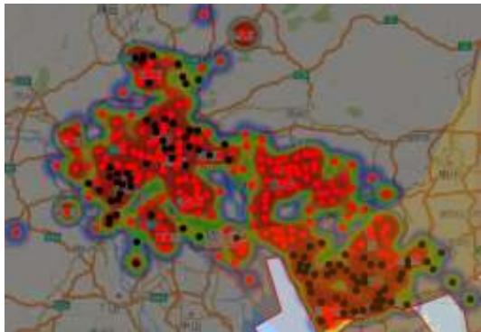
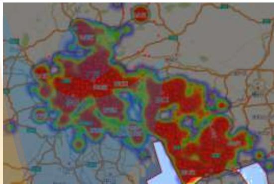
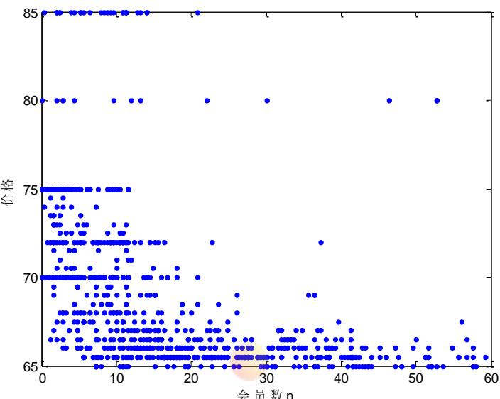
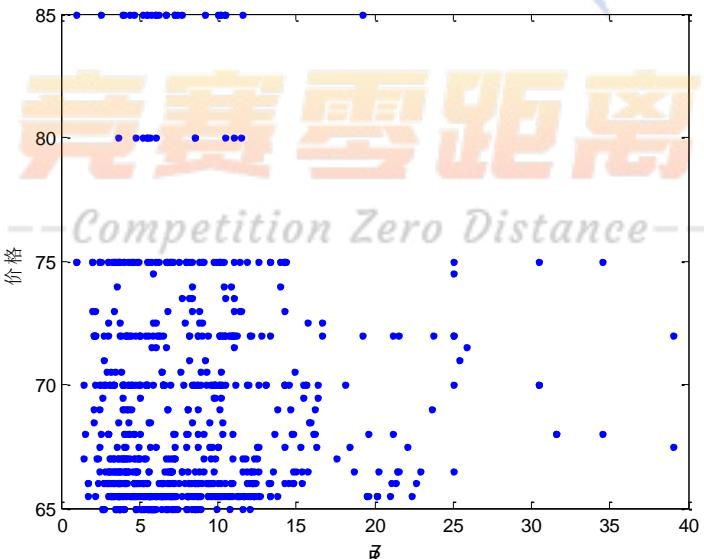
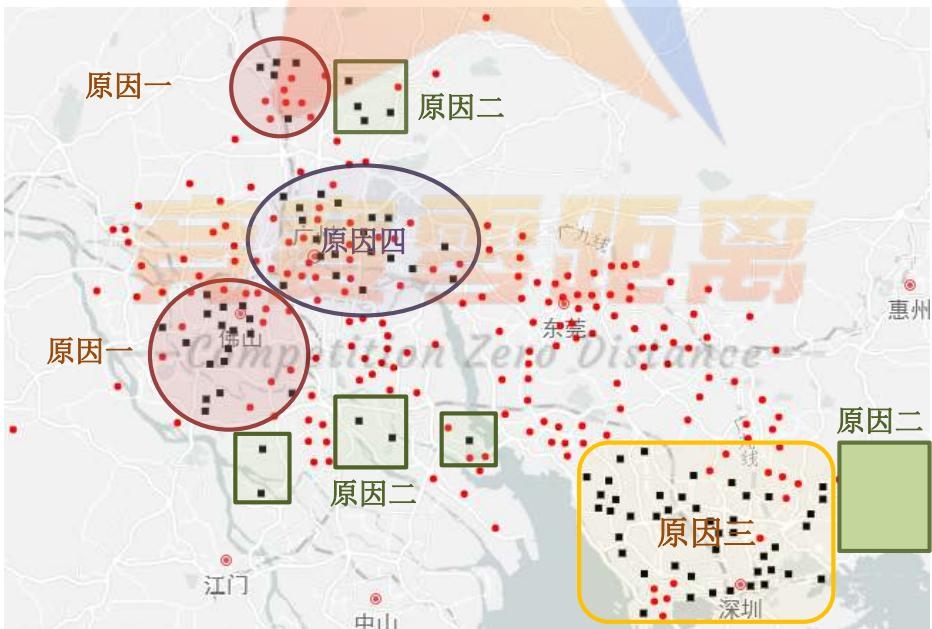
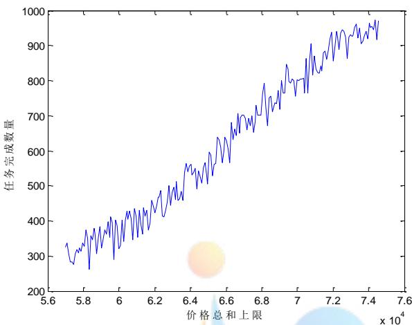
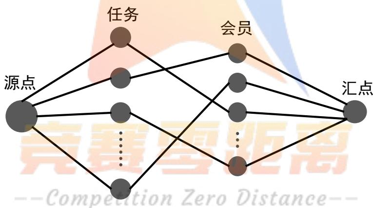

# 基于优化理论的任务定价与分配模型

## 摘要

APP拍照任务定价问题是一个任务发布者（APP平台）和任务完成者（会员）间双向决策问题。任务发布者希望在任务成本较小的情况下，任务的完成量尽可能的大；而作为任务完成者追求任务完成后的收益尽可能的大。

问题1：我们得到任务定价主要与任务附近范围内的会员密集程度、给定区域内任务集中程度、任务难易程度有关。根据所给数据，通过定量分析方法，得到任务的定价与上述三个因素满足规律 $P _ { i } = P _ { 0 } + 0 . 5 R _ { i } + S _ { i } - Q _ { i }$ 。针对该定价规律，我们分析了任务未完成的原因主要有：（1）任务本身定价较低，使会员对该任务的满意度未达到期望值；(2)高收入地区会员期望值较高，导致在其他地区能够完成的任务在该地区未被完成：（3）高信誉会员的任务额较高，而且有优先选择任务的权力，预约任务过多，导致很多任务没及时完成。

问题2：首先，针对问题一定价规律中存在的缺陷，我们对问题一中的定价模型进行改进。（1）对于经济发达的地区，会员的收益期望值较高，在定价时，应当适当提高了该地区任务的定价；（2）考虑到高信誉会员优先选择任务和限额的特点，在计算会员密集程度时，把一个高信誉会员当做若干个会员处理。建立了新的定价模型。其次，根据新的定价模型，以任务有效完成量最大为目标，以会员预定限额、会员接单期望、不同城市经济发展水平的用户期望值等条件为约束，建立了任务分配的优化模型。考虑到模型约束条件比较复杂，现有方法很难对模型进行求解，我们设计了一种基于最大流的启发式算法，利用MATLAB编程，对模型进行求解。求解结果与问题一比较，在总费用基本不变的情况下，使得任务的完成率提高了24.5%

问题3：为了进一步提高任务的完成率，借鉴了商品的打包销售方法，我们给出三条具体的打包原则：（1）距离相近的任务（集中度较高的任务）应考虑打包发布：（2）未完成的任务应尽量与自己距离相近的已完成的任务打包发布；（3）距离相近的价格差比较大的任务应尽量考虑打包发布。按照该原则，我们对任务进行打包处理，把每个包看作一个新的任务。类似于问题二，重新建立了打包情况下的任务定价模型和任务分配优化模型。通过模型的求解，得到在总费用大致不变的情况下，使任务的总完成率在问题二的基础上又提高了7.2%。ompetition ZeroDistance--

问题4：对于给定的任务地理位置和会员的分布情况，由于此时任务的难易程度未知，在问题三的定价模型中，舍弃了问题难易度因素，只利用会员密集程度、给定区域内任务集中程度、不同地区会员的期望值不同等因素，建立了任务定价模型和任务分配优化模型。得到任务的完成率是87.8%，较好地解决了任务的定价和分配问题。

定价模型考虑了会员密集程度、任务集中度、任务难易程度等因素。任务优化分配模型提高了任务的有效完成率，基于最大流的启发式算法计算精度高、运算时间短。

关键词：任务定价定价规律打包原则优化模型

## 1 问题重述

## 1.1 问题的背景

随着移动互联网的高速发展，“拍照赚钱”这种基于移动互联网的自助式劳务众包平台应运而生。相比传统的市场调查，它不但节省调查成本，而且有效地保证了调查数据真实性，缩短了调查的周期。APP作为“拍照赚钱”平台运行的核心。用户在APP上注册会员，完成所领取的拍照任务后即可赚取标定的酬金。而APP中任务的定价是维持平台运行的核心要素，APP拍照任务定价问题是一个任务发布者（APP平台）和任务完成者（会员）间双向决策问题。任务发布者希望在任务成本较小的情况下，任务的完成量尽可能的大；而作为任务完成者追求任务完成后的收益尽可能的大。若定价不合理，会使任务无人问津。因此，如何合理定价成为当下一个非常热门而重要的话题。

## 1.2 问题的相关信息

根据题目提供的相关信息，可知如下数据条件：

附件1给出了835个任务的位置、定价和完成情况，其中“1”表示完成，“0”表示未完成；

附件2包含了1877个会员的位置、信誉值、任务开始预订时间和预订限额。原则上会员信誉越高，越优先挑选任务，其配额就越大；

附件3给出了2066个任务的位置信息。

## 1.3 需解决的问题

问题一：分析附件1中的任务数据，建立相应的数学模型，研究项目的任务定价规律，并对未完成的任务找出原因；

问题二：为附件1中的项目设计一种新的任务定价方案，并与原方案进行比较；

问题三：为了提高项目的完成数量，给出将任务联合打包的方案，改进问题二中的定价模型，并分析打包对任务完成情况的影响。

问题四：利用所建立的定价模型给出附件3中新项目的任务定价方案，并评价该方案的实施效果。

## 2 模型假设和符号说明

## 2.1模型的假设--CompetitionZeroDistance--

（1）假设任意两点之间的实际路程可以用直线距离近似代替；

(2)假设每个会员都处于在线状态，是否接单取决于对任务的满意度是否大于期望值；

（3）假设会员在其预定任务开始时间30分钟内挑选任务。预定任务开始时间，会员越早开始挑选任务；

（4）假设所有会员理性挑选任务，不存在会员随意抢单的情况。

## 2.2 符号的说明

<table><tr><td>符号</td><td>说明</td></tr><tr><td> $d ( i , j )$ </td><td>会员i和任务i之间的距离</td></tr><tr><td> $\kappa _ { i }$ </td><td>任务i完成的可能性指标</td></tr><tr><td> $\gamma _ { 1 } , \gamma _ { 2 } , \gamma _ { 3 } , \gamma _ { 4 }$ </td><td>佛山、广州、东莞和深圳四块区域期望值阈值</td></tr><tr><td> $V _ { j }$ </td><td>会员j愿意接受任务点的集合</td></tr><tr><td> $e _ { j }$ </td><td>会员j所能接受任务限额</td></tr><tr><td> $Q _ { j }$ </td><td>会员j的信誉值</td></tr><tr><td> $t _ { j }$ </td><td>会员i开始预定任务的时间</td></tr><tr><td> $t _ { j } ^ { \prime }$ </td><td>会员j完成任务的时间</td></tr><tr><td> $d _ { j A }$ </td><td>会员j经过集合A中所有点的最短距离</td></tr><tr><td> $D$ </td><td>任务完成所需总金额限制</td></tr></table>

## 3 数据预处理

## 3.1 经纬度-距离转换[1]

为了得到任意两个任务、会员或会员与任务间的直线距离，我们对经纬度进行转换。

地球上任意一点地理坐标都可以用有序数对表示为 $( u , \nu ) , u$ 为经度，ν为纬度。以地心O为坐标原点，赤道平面为 $x O y$ 平面，0度经线圈所在的平面为 $x O z$ 平面建立三维直角坐标系，则

$$
\left\{ \begin{array} { l } { { \dot { x } = R \dot { \cos { u } } \cos { \nu } } } \\ { { \dot { y } = R \sin { u } \cos { \nu } } } \\ { { \dot { z } = R \sin { \nu } } } \end{array} \right. ,\tag{3—1}
$$

其中， $R = 6 3 7 0$ 为地球半径。

根据解析几何的知识，任意两点 $A ( u _ { \boldsymbol { A } } , \nu _ { \boldsymbol { A } } ) , B ( u _ { \boldsymbol { B } } , \nu _ { \boldsymbol { B } } )$ 间实际距离为

$$
d = R \operatorname { a r c c o s } ( { \frac { O A \cdot O B } { | O A | \cdot | O B | } } ) ,
$$

## 将式（3—1）代入化简得

$$
d = R \operatorname { a r c c o s } [ \cos ( u _ { { } A } - u _ { { } B } ) \cos \nu _ { { } A } \cos \nu _ { { } B } + \sin \nu _ { { } A } \sin \nu _ { { } B } ] .
$$

## 4 问题一的模型建立与求解

## 4.1 数据的描述分析

根据附件1、2中的经纬度信息，我们将任务、会员标注在二维地图上，并利用任务标价绘制热图。图4-1绘制了项目任务的地理位置分布，其中红点表示已完成任务，黑点表示未完成任务；图4-2绘制了会员的地理位置分布。根据任务定价绘制热图，颜色从蓝过渡到红，表示定价从低到高。

  
图 4-1 任务分布与标价关联图

  
图 4-2 会员分布与标价关联图

从上述两图中可以看出，价格较高的任务主要集中在城市内部，且大致可以按城市划分成佛山、广州、东莞和深圳四块区域。左图反映了任务价格较高的点与任务的密集程度有关，且任务越密集，价格越高，但是价格的高低不能完全决定任务的完成情况；右图反映了会员的分布情况，会员在该区域的分布较为均匀。

## 4.2 影响定价的指标因素

参照出租车的定价策略[2]，我们分析得到任务附近邻域内会员密集程度、任务集中程度、任务难易程度、不同经济地区会员的期望值是影响任务定价 $P _ { i }$ 的主要因素。

会员密集程度 $m _ { i }$ ..

设 $m _ { i }$ 是以任务点i为中心，半径d范围内的会员数，以 $m _ { i }$ 作为任务点i会员集中程度的指标。定义函数

$$
\chi _ { i j } = \{ \begin{array} { l l } { 1 , d ( i , j ) \le d } \\ { 0 , d ( i , j ) > d } \end{array} , i \in E , j \in F ,
$$

其中， $d \left( i , j \right)$ 为任务i与会员j两点间的直线距离，F为会员集合，E为任务集合。

因此，该范围内的会员数可表示为

$$
m _ { i } = \sum _ { j = 1 } ^ { n _ { 2 } } \chi _ { i j } \ .
$$

利用 MATLAB 软件，绘制价格与会员数 $m _ { i }$ 的二维散点图4—3。

  
图 4-3 任务定价与会员数关系图

会员密集程度反映了会员在某一区域内的集中情况。会员集中程度越高，该任务被完成的可能性越大，此时该任务的定价就越低，则会员数 $m _ { i }$ 与定价呈负相关。

任务集中程度 $q _ { i }$ ..

设 $q _ { i }$ 为以任务点i为中心，半径d范围内的任务数，以 $q _ { i }$ 作为任务点i附近任务集中程度的指标。定义函数

$$
\delta _ { i j } = \{ \begin{array} { l l } { 1 , d ( i , j ) \le d } \\ { 0 , d ( i , j ) > d } \end{array} , i \in E , j \in F ,
$$

因此，任务集中程度

$$
q _ { i } = \sum _ { j = 1 } ^ { n _ { 1 } } \delta _ { i j } \ .
$$

利用 MATLAB 软件，绘制价格与任务集中程度 $q _ { i }$ 的二维散点图4—4。

  
图4-4 定价与任务集中程度关系图

任务密集程度反映了任务在某一区域内的集中情况。任务的集中程度越高，供用户挑选的任务也就越多，在集中度高，距离近的情况下，任务的定价较低。

任务难易程度 $s _ { i }$

由于各项任务的性质不同，完成它的难易程度也不同。当某一任务较难完成时，为了提高它的吸引力，就要给出较高的定价。我们将任务按照难易程度分为三个档次：很难、较难、一般。

## 4.3 任务定价规律

为了保证任务能够顺利完成和会员的基本收益，对每项任务设定它的基础价格为 $P _ { 0 }$ 结合上述的三个指标，我们给出第i个任务的定价 $P _ { i }$

$$
P _ { i } = P _ { 0 } + 0 . 5 R _ { i } + S _ { i } - Q _ { i }\tag{4—1}
$$

这里， $P _ { 0 }$ 为基础定价，设为65，其余指标转换值按如下方式给出：

表 4-1 会员密集程度 $m _ { i }$ 与 $R _ { i }$ 对应表
<table><tr><td rowspan=1 colspan=1> $m _ { i }$ </td><td rowspan=1 colspan=1>1~2</td><td rowspan=1 colspan=1>3~4</td><td rowspan=1 colspan=1>5~6</td><td rowspan=1 colspan=1>7~8</td><td rowspan=1 colspan=1>8~9</td><td rowspan=1 colspan=1>10~11</td><td rowspan=1 colspan=1>12~13</td><td rowspan=1 colspan=1>14~15</td><td rowspan=1 colspan=1>16~17</td><td rowspan=1 colspan=1>18~19</td></tr><tr><td rowspan=1 colspan=1> $R _ { i }$ </td><td rowspan=1 colspan=1>20</td><td rowspan=1 colspan=1>19</td><td rowspan=1 colspan=1>18</td><td rowspan=1 colspan=1>17</td><td rowspan=1 colspan=1>16</td><td rowspan=1 colspan=1>15</td><td rowspan=1 colspan=1>14</td><td rowspan=1 colspan=1>13</td><td rowspan=1 colspan=1>12</td><td rowspan=1 colspan=1>11</td></tr><tr><td rowspan=1 colspan=1> $m _ { i }$ </td><td rowspan=1 colspan=1>20~21</td><td rowspan=1 colspan=1>22~23</td><td rowspan=1 colspan=1>24~25</td><td rowspan=1 colspan=1>26~27</td><td rowspan=1 colspan=1>28~29</td><td rowspan=1 colspan=1>30~31</td><td rowspan=1 colspan=1>32~33</td><td rowspan=1 colspan=1>34~35</td><td rowspan=1 colspan=1>36~37</td><td rowspan=1 colspan=1>&gt;37</td></tr><tr><td rowspan=1 colspan=1> $R _ { i }$ </td><td rowspan=1 colspan=1>10</td><td rowspan=1 colspan=1>9</td><td rowspan=1 colspan=1>8</td><td rowspan=1 colspan=1>7</td><td rowspan=1 colspan=1>6</td><td rowspan=1 colspan=1>5</td><td rowspan=1 colspan=1>4</td><td rowspan=1 colspan=1>3</td><td rowspan=1 colspan=1>2</td><td rowspan=1 colspan=1>1</td></tr></table>

表 4-2 任务难易程度 $s _ { i }$ 与 $S _ { i }$ 对应表
<table><tr><td rowspan=1 colspan=1> $s _ { i }$ </td><td rowspan=1 colspan=1>很难</td><td rowspan=1 colspan=1>   较难</td><td rowspan=1 colspan=1>一般</td></tr><tr><td rowspan=1 colspan=1> $S _ { i }$ </td><td rowspan=1 colspan=1>10</td><td rowspan=1 colspan=1>    5</td><td rowspan=1 colspan=1>0</td></tr></table>

表 4-3 任务集中程度 $q _ { i }$ 与 $Q _ { i }$ 对应表
<table><tr><td rowspan=1 colspan=1> $q _ { i }$ </td><td rowspan=1 colspan=1>0~15</td><td rowspan=1 colspan=1>16~30</td><td rowspan=1 colspan=1>&gt;30</td></tr><tr><td rowspan=1 colspan=1> $Q _ { i }$ </td><td rowspan=1 colspan=1>5</td><td rowspan=1 colspan=1>2.5</td><td rowspan=1 colspan=1>0</td></tr></table>

说明：考虑到任务发布者与会员双方的利益，我们限定任务最低定价为65和最高定价为85，一旦当 $P _ { i }$ 小于65时，规定定价取值65；当 $P _ { i }$ 大于85时，规定定价取值85。将附件1中的实际数据代入公式比较，多数数据满足公式（4-1）；部分与公式有较大出入的定价，是由于任务的难易程度影响造成的。根据这些数据，我们也能计算出各个任务的难易程度。

例：任务号码A0773，已完成，会员密集程度 $m _ { i } = 6$ ，任务集中程度 $q _ { i } = 2$ ，实际定价为85，已完成，则可带入公式 $8 5 = P _ { 0 } + 0 . 5 R _ { i } + S _ { i } - Q _ { i } = 6 5 + 0 . 5 { \times } 1 8 + S _ { i } - 0$ ，解得 $S _ { i } = 1 1$ 则任务难易程度为“很难”。

## 4.4 未完成任务原因分析

（1）原因一：某些任务邻近区域内，任务密集，而会员人数远少于任务数，人均任务量远远大于其实际完成能力。

例：任务号码A0436，会员密集程度 $m _ { i } = 3$ ，任务集中程度 $q _ { i } = 7$ ，任务难易程度$s _ { i } = \cdots \spadesuit _ { l } \spadesuit _ { \mathcal} { \binom { l = 1 } { \mathcal { A } } } ,$ ，理论定价为 $P _ { i } = P _ { 0 } + 0 . 5 R _ { i } + Q _ { i } - S _ { i } = 6 5 + 0 . 5 \times 1 9 + 0 - 2 . 5 = 7 2$ ，实际定价为75，虽然定价基本合理，但是由于会员人数少，任务多，会员会找性价比更高的任务来完成，

而放弃该项任务。

（2）原因二：任务本身定价较低，使会员完成该任务的收益达不到期望值。某些任务远离会员密集地，若会员要完成需花费较高的费用，且任务定价较低，使得回报低于成本，故出现无人接单的情况。

例：任务号码A0350，会员密集程度 $m _ { i } = 8$ ，任务集中程度 $q _ { i } = 6$ ，任务难易程度$s _ { i } = \mathbf { \epsilon } ^ { 6 6 }$ 一般”，理论定价为 $P _ { i } = P _ { 0 } + 0 . 5 R _ { i } + Q _ { i } - S _ { i } = 6 5 + 0 . 5 { \times } 1 7 + 0 - 2 . 5 = 7 1$ ，实际定价为$6 5 < 7 1$ ，定价过低，满足不了会员的期望。

（3）原因三：高收入地区会员对收益要求较高，导致很多任务没人接单。例如深圳地区居民普遍收入较高，对收益也有较高的期望值，使得在其他地区能够完成的任务产生的收益值不足以吸引他们去完成。

例：任务号码A0468，会员密集程度 $m _ { i } = 8$ ，任务集中程度 $q _ { i } = 2$ ，任务难易程度$s _ { i } = \mathbf { \epsilon } ^ { 6 6 }$ 一般”，理论定价为 $P _ { i } = P _ { 0 } + 0 . 5 R _ { i } + Q _ { i } - S _ { i } = 6 5 + 0 . 5 { \times } 1 7 + 0 - 5 = 6 7 . 5$ ，实际定价为$8 0 > 6 7 . 5 $ ，此任务所在地位深圳市中心，居民收入水平较高，即使此任务性价比高，也难以吸引会员。

（4）原因四：高信誉会员的限额较高，预约过多任务，导致很多任务没及时完成。某些任务周围有较多低信誉会员，但此任务被高信誉会员优先预约，而高信誉会员由于多任务在身或此任务距离较远而没有完成。

（5）原因五：任务难度过高，导致任务性价比不高，或者任务所在地的周边环境，如有交通故障难以通行、危险地带等原因，导致任务无法及时完成。

各任务点未完成原因如下图所示：

  
图 4-5 未完成任务点原因分析图

## 5 问题二的模型建立与求解

## 5.1 问题二的分析

首先，分析问题一中定价模型存在的不足主要有：未考虑到不同地区会员对收益的期望值，以及信誉度高的会员接单限额和开始预约时间对任务定价的影响。结合这些达素，我们给出新的定价方案。其次，影响任务完成与否的主要因素为会员对收益的期望值，所以我们定义了会员对任务的满意度。结合给出的定价模型，建立以任务完成量最大为目标的优化模型。

## 5.2 定价模型

## 5.2.1 模型的建立

由于问题一给出的定价规律没有很好地考虑到不同地区经济发展的不平衡，不同地区会员的收益期望值不同，高信誉会员优先选择任务和限额的特点，导致大量的任务未被完成。所以，针对上述原因，我们建立了新的任务定价模型。

①对于经济发达的地区，会员的收益期望值较高，相同的定价在其他地区可以被完成，所以在定价时，对该地区任务的定价给予一定的提高。

②考虑到高信誉会员优先选择任务和限额的特点，在计算会员密集程度时，把一个高信誉会员按其所能完成的任务限额，把他当做若干个会员处理。

③由于问题一中，相当一部分任务并不是由于价格过低而未被完成的，所以我们不再限制最低价格和最高价格。

基于上述分析，建立定价模型如下：

$$
P _ { i } ^ { \prime } { = } P _ { 0 } { + } 0 . 5 R _ { i } { + } S _ { i } { - } Q _ { i } { + } T _ { i }\tag{5-1}
$$

其中， $m _ { i } ^ { \prime }$ 表示 $m _ { i }$ 个会员在任务限额限定下能完成的任务总数；

图 5-1 会员限额总数 $m _ { i }$ 与 $R _ { i }$ 对应表
<table><tr><td rowspan=1 colspan=1> $m _ { i } ^ { \prime }$ </td><td rowspan=1 colspan=1>1~3</td><td rowspan=1 colspan=1>4~6</td><td rowspan=1 colspan=1>7~9</td><td rowspan=1 colspan=1>10~12</td><td rowspan=1 colspan=1>13~15</td><td rowspan=1 colspan=1>16~18</td><td rowspan=1 colspan=1>19~21</td><td rowspan=1 colspan=1>22~24</td><td rowspan=1 colspan=1>25~27</td><td rowspan=1 colspan=1>28~30</td></tr><tr><td rowspan=1 colspan=1> $R _ { i }$ </td><td rowspan=1 colspan=1>20</td><td rowspan=1 colspan=1>19</td><td rowspan=1 colspan=1>18</td><td rowspan=1 colspan=1>17</td><td rowspan=1 colspan=1>16</td><td rowspan=1 colspan=1>15</td><td rowspan=1 colspan=1>14</td><td rowspan=1 colspan=1>13</td><td rowspan=1 colspan=1>12</td><td rowspan=1 colspan=1>11</td></tr><tr><td rowspan=1 colspan=1> $m _ { i } ^ { \prime }$ </td><td rowspan=1 colspan=1>31~33</td><td rowspan=1 colspan=1>34~36</td><td rowspan=1 colspan=1>37~39</td><td rowspan=1 colspan=1>40~42</td><td rowspan=1 colspan=1>43~45</td><td rowspan=1 colspan=1>46~48</td><td rowspan=1 colspan=1>49~51</td><td rowspan=1 colspan=1>52~54</td><td rowspan=1 colspan=1>55~57</td><td rowspan=1 colspan=1>&gt;57</td></tr><tr><td rowspan=1 colspan=1> $R _ { i }$ </td><td rowspan=1 colspan=1>10</td><td rowspan=1 colspan=1>9</td><td rowspan=1 colspan=1>Co8np</td><td rowspan=1 colspan=1>etitio</td><td rowspan=1 colspan=1>n 6er</td><td rowspan=1 colspan=1>0éist</td><td rowspan=1 colspan=1>ance</td><td rowspan=1 colspan=1>3</td><td rowspan=1 colspan=1>2</td><td rowspan=1 colspan=1>1</td></tr></table>

$T _ { i } = { \left\{ \begin{array} { l l } { 5 , } \\ { 0 , } \end{array} \right. }$ 任务i位于经济发达地区任务i不位于经济发达地区

$P _ { 0 }$ ， $S _ { i }$ ， $Q _ { i }$ 与问题一模型中相同。

## 5.2.2 模型的求解

将附件1，附件2中的数据和问题一中得到的各任务的难易程度，结合上述公式，利用MATLAB编程，得到各个任务的定价如下（部分结果），详细结果见附件二：

表 5-1 任务定价情况表
<table><tr><td rowspan=1 colspan=1>任务号码</td><td rowspan=1 colspan=1>原定价</td><td rowspan=1 colspan=1>现定价</td></tr><tr><td rowspan=1 colspan=1>A0022</td><td rowspan=1 colspan=1>65</td><td rowspan=1 colspan=1>65</td></tr><tr><td rowspan=1 colspan=1>A0012</td><td rowspan=1 colspan=1>65.5</td><td rowspan=1 colspan=1>70.5</td></tr><tr><td rowspan=1 colspan=1>A0468</td><td rowspan=1 colspan=1>80</td><td rowspan=1 colspan=1>86</td></tr><tr><td rowspan=1 colspan=1>A0018</td><td rowspan=1 colspan=1>66</td><td rowspan=1 colspan=1>71</td></tr><tr><td rowspan=1 colspan=1>A0006</td><td rowspan=1 colspan=1>75</td><td rowspan=1 colspan=1>77.5</td></tr><tr><td rowspan=1 colspan=1>A0450</td><td rowspan=1 colspan=1>85</td><td rowspan=1 colspan=1>87</td></tr><tr><td rowspan=1 colspan=1>A0693</td><td rowspan=1 colspan=1>65.5</td><td rowspan=1 colspan=1>69.5</td></tr><tr><td rowspan=1 colspan=1>A0264</td><td rowspan=1 colspan=1>67</td><td rowspan=1 colspan=1>72</td></tr><tr><td rowspan=1 colspan=1>A0835</td><td rowspan=1 colspan=1>85</td><td rowspan=1 colspan=1>82</td></tr><tr><td rowspan=1 colspan=1>A0830</td><td rowspan=1 colspan=1>85</td><td rowspan=1 colspan=1>79</td></tr><tr><td rowspan=1 colspan=1>A0468</td><td rowspan=1 colspan=1>80</td><td rowspan=1 colspan=1>90</td></tr><tr><td rowspan=1 colspan=1>A0734</td><td rowspan=1 colspan=1>75</td><td rowspan=1 colspan=1>90</td></tr></table>

表 5-2 优化前后总定价和完成率情况表
<table><tr><td rowspan=1 colspan=1></td><td rowspan=1 colspan=1>总定价</td><td rowspan=1 colspan=1>任务平均定价</td></tr><tr><td rowspan=1 colspan=1>原方案</td><td rowspan=1 colspan=1>57641.5</td><td rowspan=1 colspan=1>68.87</td></tr><tr><td rowspan=1 colspan=1>现方案</td><td rowspan=1 colspan=1>58732.6</td><td rowspan=1 colspan=1>70.17</td></tr></table>

## 5.3 用户满意度

对于会员是否接单，最关键考虑的是任务的性价比，也就是收入支出比。当某一会员对任务的满意度大于某一阈值时，该会员有意愿接受此任务，即任务被完成。这里，我们定义会员j对任务i的满意度为

$$
\kappa _ { i j } = \frac { P _ { i } ^ { \prime } } { c \cdot d \left( i , j \right) } ,
$$

其中， $P _ { i } ^ { ' }$ 表示任务i的定价，c表示单位距离所需的费用， $d ( i , j )$ 表示会员j和任务i之间的距离。

考虑到会员的信誉度会对任务的完成有影响，因此，我们定义罚函数 $c _ { i } = 1 - \frac { Q _ { j } } { m a x Q _ { j } }$ 其中， $Q _ { j }$ 表示会员j的信誉度， $m a x Q _ { j }$ 表示以任务i为中心，r为半径范围内会员信誉的最大值。建立衡量任务i是否完成的可能性指标为

$$
\kappa _ { i } = m a x \{ \frac { P _ { i } ^ { \prime } } { \boldsymbol { c } \cdot \boldsymbol { d } ( i , j ) } { ( 1 - \frac { Q _ { j } } { m a x Q _ { j } } ) } | \boldsymbol { d } ( i , j ) \leq r \} .\tag{5—2}
$$

当任务点i的指标值 $\kappa _ { i }$ 大于或等于某一阈值γ时，我们认为存在会员愿意接受该任务；否则，该任务未完成。式（5一2）作为衡量指标，不但考虑了会员的实际选择依据，而且能解释当性价比接近时，平台优先安排信誉度较高的会员的原则。

## 5.4 任务优化分配模型

## 5.4.1 模型的建立

在给出模型之前，我们对定义一些基本符号：

$n _ { 1 }$ 表示任务数， $n _ { 2 }$ 表示会员数；

d(i, j)为会员j和任务i之间的距离；

$\kappa _ { i }$ 为任务i完成的可能性指标；

$\gamma$ 为阈值；

$V _ { j }$ 表示会员j愿意接受任务点的集合；

$e _ { j }$ 表示会员j所能接受任务限额；

$x _ { i j } = { \left\{ \begin{array} { l l } { 1 , i \in V _ { j } } \\ { 0 , i \not \in V _ { j } } \end{array} \right. }$ ，当 $i \in V _ { j }$ 时，任务i由会员j完成；

$Q _ { j }$ 表示会员j的信誉值；

$t _ { j }$ 表示会员j开始预定任务的时间；

C表示任务完成所支付总金额限制；

## （1）目标函数的确定

在总费用一定的限制情况下，一个合理的定价方案，最关键的是要保证平台所给出的任务要尽量多地完成。因此，我们以任务的完成量最大为目标函数，即：

$$
m a x \sum _ { i = 1 } ^ { n _ { 1 } } \sum _ { j = 1 } ^ { n _ { 2 } } x _ { i j } .
$$

## （2）约束条件的确定

约束条件一：同一个会员的预定任务数量有限额限制，设会员j接受任务点的集合可表示为 $A _ { j } = \Big \{ i \Big | x _ { i j } = 1 \Big \}$ ，即：

$$
\sum _ { i \in A _ { j } } x _ { i j } \le e _ { j } ^ { \prime } .
$$

其中， $e _ { j } ^ { \prime }$ 为重新定义的用户限额。考虑到每个会员完成任务的能力有限，我们定义每个会员的限额最大不超过 $^ { 5 , }$ 即：

$$
e _ { j } ^ { \prime } = \left\{ { \begin{array} { l } { e _ { j } ^ { \prime } , e _ { j } ^ { \prime } \leq 5 } \\ { 5 , e _ { j } > 5 } \end{array} } . \right.
$$

约束条件二：会员只接受的任务满足自己期望的任务。考虑到附件1中每个区域的用户对任务的期望值不同，我们对上述优化模型中的阈值γ按区域重新设定。根据附件一中的经纬度，我们按城市将用户分成佛山、广州、东莞和深圳四块区域，并将期望值设成 $\gamma _ { 1 }$ ， $\gamma _ { _ 2 }$ $\gamma _ { 3 }$ 和 $\gamma _ { 4 }$

考虑不同地区用户的不同期望阈值，定义特征函数

$$
y _ { j z } = \left\{ \begin{array} { l } { 1 , j \in T _ { z } } \\ { 0 , j \not \in T _ { z } } \end{array} , \quad z = 1 , 2 , 3 , 4 , \right.
$$

其中， $T _ { 1 }$ ， $T _ { \scriptscriptstyle 2 }$ ， $T _ { 3 }$ 和 $T _ { 4 }$ 分别为佛山、广州、东莞和深圳四块区域的用户集合。

会员j愿意接受任务点的集合为

$$
V _ { \mathrm { \Lambda } } = \{ i | \frac { P _ { i } ^ { \prime } } { c \cdot d ( i , j ) } ( 1 - \frac { Q _ { j } } { m a x Q _ { j } } ) \geq \gamma _ { \mathrm { \Lambda } } , d ( i , j ) \leq r , y _ { \mathrm { \Lambda } } = 1 \} ,
$$

即：

$$
A _ { j } \subset V _ { j } .
$$

约束条件三：同一个任务最多只能被一位会员完成，即：

$$
\sum _ { j = 1 } ^ { n _ { 2 } } x _ { i j } \le 1 , d \bigl ( i , j \bigr ) \le r .
$$

约束条件四：开始预约任务时间早的会员优先挑选任务，如果任务i是会员 $j _ { 1 } ^ { \mathrm { ~ ~ } }$ 和 $j _ { 2 }$ 都满意的，那么开始时间较早的会员优先挑选。即：

$$
x _ { i j _ { 1 } } t _ { j _ { 1 } } \geq x _ { i j _ { 2 } } t _ { j _ { 2 } } , \quad \forall i \in V _ { j _ { 1 } } \cap V _ { j _ { 2 } } .
$$

约束条件五：平台支付给用户的总费用有一定限制，即：

$$
\sum _ { i = 1 } ^ { n _ { 1 } } { P _ { i } ^ { \prime } \le C } .
$$

综上所述，建立任务分配优化模型如下：

$$
\begin{array} { r l } & { m a x \cdot \frac { \displaystyle \sum _ { i = 1 } ^ { n } \sum _ { j = 1 } ^ { n } s _ { i } } { \displaystyle \sum _ { i = 1 } ^ { n } \sum _ { j = 1 } ^ { n } s _ { i } } } \\ & { \left( \frac { \displaystyle P _ { i j } ^ { - } } { \displaystyle \sum _ { i = 1 } ^ { n } s _ { i } + \displaystyle E _ { i } ^ { - } } - Q _ { i } + T _ { i } \right) } \\ & { \left( \frac { \displaystyle \sum _ { j = 1 } ^ { n } s _ { i } } { \displaystyle \sum _ { i = 1 } ^ { n } s _ { i } } \right) } \\ & { \left( \frac { \displaystyle \sum _ { j = 1 } ^ { n } s _ { j } } { \displaystyle \sum _ { i = 1 } ^ { n } s _ { i } } \right) \le r _ { i } d ( i , j ) \le r } \\ & { \left( \frac { \displaystyle M _ { i j } ^ { - } } { \displaystyle \sum _ { i = 1 } ^ { n } s _ { i } } - \displaystyle \sum _ { j = 1 } ^ { n } s _ { i } \right) } \\ & { \left( \frac { \displaystyle M _ { i j } ^ { - } } { \displaystyle \sum _ { i = 1 } ^ { n } s _ { i } } - \displaystyle \sum _ { j = 1 } ^ { n } s _ { i } \right) } \\ & { \left( \frac { \displaystyle M _ { i j } ^ { - } } { \displaystyle \sum _ { i = 1 } ^ { n } s _ { i } } - r _ { i } \right) \cdot j \in \{ 1 , 2 , \cdots , n \} } \\ & { \left( t \leq \frac { \displaystyle M _ { i j } ^ { - } } { \displaystyle \sum _ { i = 1 } ^ { n } s _ { i } } - r _ { i } \right) \cdot j \in \{ 1 , 2 , \cdots , n \} } \end{array}
$$

## 5.4.2 基于最大流的启发式算法[1]

考虑到上述优化模型的约束条件比较复杂，一般的线性规划方法无法求解。为了求解最大任务完成数量，我们考虑到在每一个任务发布后，所有对该任务感兴趣的会员都可以对该任务发起请求。在这样的优化前提之下，我们可以将问题转化为一个网络流的最大流问题去求解。我们设计了一种基于最大流的启发式算法对模型进行求解，具体步骤如下：

$\$  t e p l :$ 计算 $( \alpha _ { 1 } , \alpha _ { 2 } , \alpha _ { 3 } )$ 的大致范围，设定初始温度 $T _ { 0 }$ 、点每次移动一步的长度、迭代深度；

$S t e p 2 .$ 向 $( \alpha _ { 1 } , \alpha _ { 2 } , \alpha _ { 3 } )$ 随机投点，投点时删除会使总价格高出额定值的点；

Step3：对集合中每个点向8个方向移动，并调用算法二计算其在新的位置的最大任务接单数，算法二步骤如下：

-Step3.1：建图，为任务和会员添加相对应的点，并添加源点和汇点；

-Step3.2：每个会员和汇点之间连一条边，边的流量是这个用户的任务分配限额，每个任务与源点之间连一条边，边的流量是1；

-Step3.3：每个会员i和任务j之间两两配对，计算会员i对任务j的满意度。如果会员i对任务j感到满意，那么就在会员i和任务j之间连一条边；

-Step3.4：调用Dinic算法，计算源点到汇点之间的最大流；

如果新的结果更好，则将新的节点添加进正在计算的点集合中，如果没有比原来的结果更好，则以概率P接受该结果；

Step4：当迭代深度超过一定的深度时，退出算法，输出最优解。

(算法介绍见附录一)

## 5.4.3 求解结果

对上述算法，利用MATLAB编程（具体代码见附录二），得到现任务定价及完成情况表（部分），具体详见附件一。

表 5-3 原方案与现方案任务定价及完成情况表
<table><tr><td rowspan=1 colspan=1>任务号码</td><td rowspan=1 colspan=1>原定价</td><td rowspan=1 colspan=1>原完成情况</td><td rowspan=1 colspan=1>现定价</td><td rowspan=1 colspan=1>现完成情况</td></tr><tr><td rowspan=1 colspan=1>A0022</td><td rowspan=1 colspan=1>65</td><td rowspan=1 colspan=1>1 1</td><td rowspan=1 colspan=1>65</td><td rowspan=1 colspan=1>1</td></tr><tr><td rowspan=1 colspan=1>A0012</td><td rowspan=1 colspan=1>65.5</td><td rowspan=1 colspan=1>0</td><td rowspan=1 colspan=1>70.5</td><td rowspan=1 colspan=1>1</td></tr><tr><td rowspan=1 colspan=1>A0468</td><td rowspan=1 colspan=1>80</td><td rowspan=1 colspan=1>0</td><td rowspan=1 colspan=1>86</td><td rowspan=1 colspan=1>1</td></tr><tr><td rowspan=1 colspan=1>A0018</td><td rowspan=1 colspan=1>66</td><td rowspan=1 colspan=1>0</td><td rowspan=1 colspan=1>71</td><td rowspan=1 colspan=1>1</td></tr><tr><td rowspan=1 colspan=1>A0006</td><td rowspan=1 colspan=1>75</td><td rowspan=1 colspan=1>0</td><td rowspan=1 colspan=1>77.5</td><td rowspan=1 colspan=1>1</td></tr><tr><td rowspan=1 colspan=1>A0450</td><td rowspan=1 colspan=1>85</td><td rowspan=1 colspan=1>0</td><td rowspan=1 colspan=1>      87</td><td rowspan=1 colspan=1>1</td></tr><tr><td rowspan=1 colspan=1>A0693</td><td rowspan=1 colspan=1>65.5</td><td rowspan=1 colspan=1>0</td><td rowspan=1 colspan=1>7   69.5</td><td rowspan=1 colspan=1>1</td></tr><tr><td rowspan=1 colspan=1>A0264</td><td rowspan=1 colspan=1>67</td><td rowspan=1 colspan=1>0</td><td rowspan=1 colspan=1>72</td><td rowspan=1 colspan=1>1</td></tr><tr><td rowspan=1 colspan=1>A0835</td><td rowspan=1 colspan=1>85</td><td rowspan=1 colspan=1>1</td><td rowspan=1 colspan=1>82</td><td rowspan=1 colspan=1>1</td></tr><tr><td rowspan=1 colspan=1>A0830</td><td rowspan=1 colspan=1>85</td><td rowspan=1 colspan=1>1</td><td rowspan=1 colspan=1>79</td><td rowspan=1 colspan=1>1</td></tr><tr><td rowspan=1 colspan=1>A0468</td><td rowspan=1 colspan=1>80</td><td rowspan=1 colspan=1>0</td><td rowspan=1 colspan=1>90</td><td rowspan=1 colspan=1>0</td></tr><tr><td rowspan=1 colspan=1>A0734</td><td rowspan=1 colspan=1>75</td><td rowspan=1 colspan=1>0</td><td rowspan=1 colspan=1>90</td><td rowspan=1 colspan=1>0</td></tr></table>

表5-4原方案与现方案总定价和完成率情况表
<table><tr><td rowspan=1 colspan=1></td><td rowspan=1 colspan=1>总定价</td><td rowspan=1 colspan=1>任务平均定价</td><td rowspan=1 colspan=1>完成率</td></tr><tr><td rowspan=1 colspan=1>原方案</td><td rowspan=1 colspan=1>57641.5</td><td rowspan=1 colspan=1>68.87</td><td rowspan=1 colspan=1>62.1%</td></tr><tr><td rowspan=1 colspan=1>现方案</td><td rowspan=1 colspan=1>58732.6</td><td rowspan=1 colspan=1>70.17</td><td rowspan=1 colspan=1>86.6%</td></tr></table>

## 5.4.4 结果分析

考虑到深圳等地区的任务定价有一定的提高，使得现方案的总费用比原方案大约增加了1.9%，但现方案的任务完成率比原方案的任务完成率提高了24.5%，说明现方案比原方案大大提高了系统整体效益。

在(56000,76000)范围内随机改变初始设定的价格总和上限D，求得在不同价格上限下任务完成数量的最大值，如下图所示：

  
图 5-1 任务最大完成量与价格总和上限关系图

由上图可知，任务最大完成量与价格总和上限总体成正相关，价格上限较低，在56000\~60000范围内，任务最大完成数量变化不大，在330件上下波动；价格在60000\~71500范围内，任务最大完成数量随价格总和上限的提高而增加；价格上限较低，在71500\~75000范围内，任务最大完成数量变化不大，在950 件上下波动。

## 6 问题三的模型建立与求解

## 6.1 问题三的分析

APP拍照任务定价问题是一个任务发布者（APP平台）和任务完成者（会员）间双向决策问题。任务发布者希望在任务成本较小的情况下，任务的完成率尽可能的大，完成任务的时间尽可能的短；而作为任务完成者追求任务完成后的收益尽可能的大。分析问题一与问题二中任务的定价规律和任务完成情况，发现会存在下面的一些问题：

（1）有些任务由于定价的不合理，或者是由于任务难度等其他原因不能达到所有会员的满意程度，导致该任务未被完成，影响到任务的完成率。

（2）由于会员选择任务时不合理性，例如一个信誉高的会员选择多个项目，没有考虑到项目的分散程度，在完成任务过程中增加了成本而减少了收益。而对APP平台来讲，会导致任务完成的时间延长，甚至无法完成影响到任务的完成率。为了解决这些问题，我们借助一般商品的打包销售原理，对问题一与问题二中任务的定价规律和模型进行优化，建立打包定价模型。

## 6.2 打包模型的建立

## 6.2.1 打包原则

（1）距离相近的任务（集中度较高的任务）应考虑打包发布；

（2）未完成的任务应尽量与自己距离相近的已完成的任务打包发布；

（3）距离相近的价格差比较大的任务应尽量考虑打包发布.

打包原则（1）可以有效提高任务的吸引力，节省会员完成任务的成本，缩短任务完成的时间。某任务未完成的主要原因是由于该任务的吸引力达不到用户对该任务的满意度，若将直接将若干距离较近且未完成的任务打包，显然不能提高任务的吸引力，有效提高完成率。打包原则（2）、（3）能够提升那些吸引力较低或者吸引力达不到用户对该任务的满意度的任务的吸引力，提升任务的完成率。

## 6.2.2 二次打包模型

根据上述三条打包原则，建立二次打包模型如下：

第一次打包：根据原则（1），集中度较高的已完成任务进行打包。设 $T$ 是所有任务集合， $T _ { 1 }$ 是已被完成任务的集合， $d ( i , j )$ 表示两点之间的直线距离，当 $T _ { 1 }$ 中两点间的距离 $d \left( i , j \right) \leq r$ 时，两任务打包发布。

第二次打包：根据原则（1），（2），（3），针对未完成的任务进行分配。对于未完成的任务，我们考虑将它们分配到第一次打包完成后的任务包内，设第一次打包时将任务集 $T _ { 1 }$ 划分成 $\left\{ S _ { 1 } , S _ { 2 } , \cdots , S _ { l } \right\}$ ，定义任务点i到集合 $S _ { j }$ 的距离为

$$
d \left( i , S _ { j } \right) = \operatorname* { m i n } { d \left( i , k \right) } , k \in S _ { j } .
$$

定义任务点i与集合 $S _ { \mathbf { \Phi } _ { j } }$ 中任务的价格差为

$$
\xi \left( i , S _ { j } \right) = \left| P _ { i } ^ { \prime } - \frac { \displaystyle \sum _ { k \in S _ { j } } P _ { k } ^ { \prime } } { \displaystyle \left| S _ { j } \right| } \right| .
$$

为简化模型，我们采用平均价格定义任务集合 $S _ { j } ^ { \prime } = \{ i \} \cup S _ { j }$ 的满意度

$$
\kappa _ { S _ { j } ^ { \prime } } = \frac { \displaystyle \sum _ { k \in S _ { j } ^ { \prime } } P _ { k } ^ { \prime } } { \displaystyle \left| S _ { j } \right| + 1 } .
$$

综合上述三条原则，当任务点i满足如下约束时，我们认为可以将未完成的任务i打包分配到集合 $S _ { j }$

$$
\begin{array} { r l } & { \{ d ( i , S _ { j } ) = \operatorname* { m i n } d ( i , k ) \le d _ { 0 } , k \in S _ { j } , i \in I \ : / T _ { 1 }  } \\ & {  \mathcal { C } o m \displaystyle \sum _ { k \in S _ { j } ^ { \prime } } R _ { k } ^ { \prime } t _ { i } ^ { \prime } \chi _ { i } \rho _ { l } \ : n \ : \ : \mathcal { Z } e r o \ : \ : \mathcal { D } i s t a n c e ,  } \\ & {   | S _ { j } | = | | S _ { j } | + 1  \geq \kappa _ { 0 } \ : \ : \mathcal { Z } e r o \ : \ : \mathcal { D } i s t a n c e ,  } \\ & {   | S _ { j } ^ { \prime } \leq N   } \end{array}
$$

这里，我们取 $N = 5$

若上述两限制都满足时，将任务点i合并到价格差最大的集合，即：

$$
\operatorname* { m a x } { \xi \left( i , S _ { j } \right) } = \left| P _ { i } ^ { ' } - \frac { \sum _ { k \in S _ { j } } P _ { k } ^ { \prime } } { \left| S _ { j } \right| } \right| .
$$

## 6.3 基于二次打包的定价与任务分配优化模型

对任务进行打包后，原先的任务点被合并成任务集合（也可以为单点集），我们对任务集合重新定义部分变量，其余均与模型二中相同。

l表示所有任务点划分成任务集合的个数；

任务集合 $S _ { i } ^ { \prime }$ 的定价为 $P _ { S _ { i } ^ { \prime } } ^ { \prime } = \frac { \displaystyle \sum _ { j \in S _ { i } ^ { \prime } } P _ { j } ^ { \prime } } { \displaystyle \left| S _ { i } ^ { \prime } \right| }$

用户j到任务集合 $S _ { i } ^ { \prime }$ 的距离为 $d ^ { \prime } \big ( S _ { i } ^ { \prime } , j \big ) = \frac { \displaystyle \sum _ { k \in S _ { i } ^ { \prime } } d \big ( j , k \big ) } { \displaystyle \left| S _ { i } ^ { \prime } \right| }$

用户j对任务集合 $S _ { i } ^ { \prime }$ 的满意度为

$$
\kappa _ { S _ { i } ^ { \prime } j } ^ { \prime } = \frac { P _ { S _ { i } ^ { \prime } } ^ { \prime } } { c \cdot d ^ { \prime } ( S _ { i } ^ { \prime } , j ) } ,
$$

其中， $\kappa _ { S _ { i } ^ { \prime } j } ^ { \prime }$ 为用户j对任务集合i的满意度。

建立衡量任务i是否完成的可能性指标为

$$
\kappa _ { S _ { i } ^ { \prime } } ^ { \prime } = m a x \{ \frac { P _ { S _ { i } ^ { \prime } } ^ { \prime } } { c \cdot d ^ { \prime } ( S _ { i } ^ { \prime } , j ) } ( 1 - \frac { Q _ { j } } { m a x Q _ { j } } ) | d ( S _ { i } ^ { \prime } , j ) \leq r ^ { \prime } \} .
$$

增加约束条件：

会员j接受了 $S _ { i } ^ { \prime }$ 中的一项任务，则集合 $S _ { i } ^ { \prime }$ 应包含在会员j完成的任务集中，即：

$$
{ \cal { S } } _ { i } ^ { \prime } \subset { \cal { A } } _ { j } .
$$

综上所述，建立优化模型如下：

$$
\begin{array} { c }   \begin{array} { c }   \begin{array} { c }   \begin{array} { c }   { \begin{array} { c } { { \frac { 5 } { 2 } } \sum _ { i \neq i } ^ { 5 } x _ { i } , } } \\ { { \mathrm { ' } } } \\ { { \Biggl | } } \\ { { \sum _ { k _ { i } } \leq 5 } } \\ { { \mathrm { ' } } } \\ { { \mathrm { ' } } } \\ { { \mathrm { ' } } } \\ { { \mathrm { } } } \\ { { \mathrm { ' } } } \\ { { \mathrm { } } } \\ { { \mathrm { } } } \\ { { \mathrm { } } } \\ { { \mathrm { } } } \\ { { \mathrm { } } } \\ { { \mathrm { } } } \\ { { \mathrm { } } } \\ { { \mathrm { } } } \\ { { \mathrm { } } } \\ { { \mathrm { } } } \\ { { \mathrm { } } } \\ { { \mathrm { } } } \\ { { \mathrm { } } } \\ { { \mathrm { } } } \\ { { \mathrm { } } } \\ { { \mathrm { } } } \\ { { \mathrm { } } } \\ { { \mathrm { } } } \\ { { \mathrm { } } } \\ { { \mathrm { } } } \\ { { \mathrm { } } } \\ { { \mathrm { } } } \\ { { \mathrm { } } } \\ { { \mathrm { } } } \\ { { \mathrm { } } } \\ { { \mathrm { } } } \\ { { \mathrm { } } } \\ { { \mathrm { } } } \\ { { \mathrm { } } } \\ { { \mathrm { } } } \\ { { \mathrm { } } } \\ { { \mathrm { } } } \\ { { \mathrm { } } } \\ { } { \mathrm { } } \\ { { \mathrm { } } } \\ { } { \mathrm { } } \\ { { \mathrm { } } } \\ { } { \mathrm { } } \\ { { \mathrm { } } } \\ { } { \mathrm { } } \\ { { \mathrm { } } } \\ { } { \mathrm { } } \\ { } { \mathrm { } } \\ { { \mathrm { } } } \\ { } { \mathrm { } } \\ { } { \mathrm { } } \\ { } { \mathrm { } } \\ { } { \mathrm { } } \\ { } { \mathrm { } } \\ { } { \mathrm { } } \\ { }  \mathrm  \end{array} \end{array} \end{array} \end{array} \end{array}
$$

## 6.4 模型的求解

采用类似于问题二中启发式算法，得到部分任务定价及完成情况如下表（详细结果见附件一)：

表6-1 部分任务定价及完成情况表
<table><tr><td rowspan=1 colspan=1>任务号码</td><td rowspan=1 colspan=1>原方案定价</td><td rowspan=1 colspan=1>原完成情况</td><td rowspan=1 colspan=1>优化后定价</td><td rowspan=1 colspan=1>现完成情况</td></tr><tr><td rowspan=1 colspan=1>A0026</td><td rowspan=1 colspan=1>66</td><td rowspan=1 colspan=1>1</td><td rowspan=1 colspan=1>66</td><td rowspan=1 colspan=1>1</td></tr><tr><td rowspan=1 colspan=1>A0012</td><td rowspan=1 colspan=1>65.5</td><td rowspan=1 colspan=1>0</td><td rowspan=1 colspan=1>69</td><td rowspan=1 colspan=1>1</td></tr><tr><td rowspan=1 colspan=1>A0468</td><td rowspan=1 colspan=1>80</td><td rowspan=1 colspan=1>0</td><td rowspan=1 colspan=1>83</td><td rowspan=1 colspan=1>1</td></tr><tr><td rowspan=1 colspan=1>A0118</td><td rowspan=1 colspan=1>69</td><td rowspan=1 colspan=1>0</td><td rowspan=1 colspan=1>71</td><td rowspan=1 colspan=1>1</td></tr><tr><td rowspan=1 colspan=1>A0216</td><td rowspan=1 colspan=1>65.5</td><td rowspan=1 colspan=1></td><td rowspan=1 colspan=1>65.5</td><td rowspan=1 colspan=1>1</td></tr><tr><td rowspan=1 colspan=1>A0452</td><td rowspan=1 colspan=1>68</td><td rowspan=1 colspan=1></td><td rowspan=1 colspan=1>67</td><td rowspan=1 colspan=1>1</td></tr><tr><td rowspan=1 colspan=1>A0603</td><td rowspan=1 colspan=1>65.5</td><td rowspan=1 colspan=1>0</td><td rowspan=1 colspan=1>69.5</td><td rowspan=1 colspan=1>1</td></tr><tr><td rowspan=1 colspan=1>A0361</td><td rowspan=1 colspan=1>67</td><td rowspan=1 colspan=1>0</td><td rowspan=1 colspan=1>72</td><td rowspan=1 colspan=1>1</td></tr><tr><td rowspan=1 colspan=1>A0745</td><td rowspan=1 colspan=1>83</td><td rowspan=1 colspan=1></td><td rowspan=1 colspan=1>82     1</td><td rowspan=1 colspan=1>1</td></tr><tr><td rowspan=1 colspan=1>A0711</td><td rowspan=1 colspan=1>86</td><td rowspan=1 colspan=1>1</td><td rowspan=1 colspan=1>84</td><td rowspan=1 colspan=1>1</td></tr><tr><td rowspan=1 colspan=1>A0465</td><td rowspan=1 colspan=1>80</td><td rowspan=1 colspan=1>0</td><td rowspan=1 colspan=1>88</td><td rowspan=1 colspan=1>0</td></tr><tr><td rowspan=1 colspan=1>A0344</td><td rowspan=1 colspan=1>75</td><td rowspan=1 colspan=1>0</td><td rowspan=1 colspan=1>86</td><td rowspan=1 colspan=1>0</td></tr></table>

表 6-2 打包前后总定价和完成率情况表
<table><tr><td rowspan=1 colspan=1></td><td rowspan=1 colspan=1>总定价</td><td rowspan=1 colspan=1>任务平均定价</td><td rowspan=1 colspan=1>完成率</td></tr><tr><td rowspan=1 colspan=1>原方案</td><td rowspan=1 colspan=1>57641.5</td><td rowspan=1 colspan=1>68.87</td><td rowspan=1 colspan=1>62.1%</td></tr><tr><td rowspan=1 colspan=1>问题二方案</td><td rowspan=1 colspan=1>58732.6</td><td rowspan=1 colspan=1>70.17</td><td rowspan=1 colspan=1>86.6%</td></tr><tr><td rowspan=1 colspan=1>打包方案</td><td rowspan=1 colspan=1>57698.3</td><td rowspan=1 colspan=1>68.93</td><td rowspan=1 colspan=1>93.8%</td></tr></table>

相比于问题二的方案，打包方案在总定价降低了1.79%，而它的任务完成率达到了93.8%，比问题二方案的任务完成率提高了7.2%，比原方案提高了31.7%。说明打包方案具有更高的系统整体效益。

## 7 问题四的模型建立与求解

## 7.1 问题分析

对于给定的任务地理位置和会员的分布情况，由于此时任务的难易程度未知，在问题三的定价模型中，舍弃了任务难易度因素，只利用会员密集程度、给定区域内任务集中程度、不同地区会员的期望值不同等因素不同建立了任务定价模型和任务分配模型。

## 7.2 模型的建立

不考虑任务难易度因素的定价模型如下：

$$
P _ { i } ^ { \prime } { = } P _ { 0 } + 0 . 5 R _ { i } ^ { \prime } { - } Q _ { i } { + } T _ { i }
$$

任务分配优化模型如下：

$$
\begin{array} { r l } & { \underset { \{ \mathbf { i } ^ { \prime } = \mathbf { I } _ { 2 } ^ { \prime } = \mathbf { I } _ { 3 } , \mathbf { I } _ { 4 } ^ { \prime } = \mathbf { I } _ { 4 } ^ { \prime } = \mathbf { I } _ { 4 } ^ { \prime } = \mathbf { I } _ { 4 } ^ { \prime } = \mathbf { I } _ { 4 } ^ { \prime } = \mathbf { I } _ { 4 } ^ { \prime } = \mathbf { I } _ { 4 } ^ { \prime } } } { \mathrm { m a x ~ } }  \\ & {  \frac { r _ { k } ^ { \prime } ^ { \prime } } { 2 } x _ { k } \leq 5 ^ { \prime } } \\ & {  \frac { r _ { k } ^ { \prime } } { 2 } x _ { k } \leq 1 , d ( \underline { { \lambda } } , j ) \leq r  } \\ & {   \frac { r _ { k } ^ { \prime } } { 2 } x _ { k } \leq 1 , d ( \underline { { \lambda } } , j ) \leq r  } \\ & {  \{ \vphantom { \frac { 1 } { \mu } } x _ { k } \leq 1 , \ldots , d ( \underline { { \lambda } } , j ) \leq r \}  } \\ & {  \{ X _ { k } , j \leq 2 x _ { k } , \ldots , b ( \underline { { \lambda } } + V _ { k } ) \leq V _ { k } , \ldots \}  } \\ & { \{ X _ { k } , j \leq 4 , \ldots , b ( \underline { { \lambda } } , j ) \leq r \} } \\ &  \{ \vphantom { \frac { 1 } { \mu } } \sum _ { k ^ { \prime } \leq \mathbf { I } _ { k ^ { \prime } } = \mathbf { I } _ { k } ^ { \prime } = \mathbf { I } _ { k } ^ { \prime } = \mathbf { I } _ { k } ^ { \prime } = \mathbf { I } _ { k } ^ { \prime } \geq \mathbf { I } _ { k } ^ { \prime } \geq \mathbf { I } _ { k } ^ { \prime } \geq \mathbf { I } _ { k } ^ { \prime } \geq \mathbf { I } _ { k } ^ { \prime } \} } \\ &   \{ \vphantom { \frac { 1 } { \mu } } \end{array}
$$

## 7.2 模型的求解

采用类似于问题二中启发式算法，得到部分新项目任务定价及完成情况如下表（详细结果见附件二):

表 7-1 新项目任务定价及完成情况表
<table><tr><td rowspan=1 colspan=1>任务号码</td><td rowspan=1 colspan=1>定价</td><td rowspan=1 colspan=1>完成情况</td><td rowspan=1 colspan=1>任务号码</td><td rowspan=1 colspan=1>定价</td><td rowspan=1 colspan=1>完成情况</td></tr><tr><td rowspan=1 colspan=1>C0002</td><td rowspan=1 colspan=1>66.5</td><td rowspan=1 colspan=1>1</td><td rowspan=1 colspan=1>C0486</td><td rowspan=1 colspan=1>70.5</td><td rowspan=1 colspan=1>0</td></tr><tr><td rowspan=1 colspan=1>C0014</td><td rowspan=1 colspan=1>71.5</td><td rowspan=1 colspan=1>0</td><td rowspan=1 colspan=1>C0510</td><td rowspan=1 colspan=1>72</td><td rowspan=1 colspan=1>1</td></tr><tr><td rowspan=1 colspan=1>C0019</td><td rowspan=1 colspan=1>72.5</td><td rowspan=1 colspan=1>1</td><td rowspan=1 colspan=1>C0615</td><td rowspan=1 colspan=1>77.5</td><td rowspan=1 colspan=1>1</td></tr><tr><td rowspan=1 colspan=1>C0044</td><td rowspan=1 colspan=1>72</td><td rowspan=1 colspan=1>1</td><td rowspan=1 colspan=1>C0639</td><td rowspan=1 colspan=1>66.5</td><td rowspan=1 colspan=1>1</td></tr><tr><td rowspan=1 colspan=1>C0051</td><td rowspan=1 colspan=1>74.5</td><td rowspan=1 colspan=1>1</td><td rowspan=1 colspan=1>C1230</td><td rowspan=1 colspan=1>75.5</td><td rowspan=1 colspan=1>0</td></tr><tr><td rowspan=1 colspan=1>C0065</td><td rowspan=1 colspan=1>72.5</td><td rowspan=1 colspan=1>0</td><td rowspan=1 colspan=1>C1548</td><td rowspan=1 colspan=1>68</td><td rowspan=1 colspan=1>0</td></tr><tr><td rowspan=1 colspan=1>C0265</td><td rowspan=1 colspan=1>177</td><td rowspan=1 colspan=1></td><td rowspan=1 colspan=1>C1689 _</td><td rowspan=1 colspan=1>71.5</td><td rowspan=1 colspan=1>0</td></tr><tr><td rowspan=1 colspan=1>C0276</td><td rowspan=1 colspan=1>70.5</td><td rowspan=1 colspan=1></td><td rowspan=1 colspan=1>C2049</td><td rowspan=1 colspan=1>79.5</td><td rowspan=1 colspan=1>1</td></tr></table>

表7-2 新项目总定价和完成情况统计表
<table><tr><td rowspan=1 colspan=1></td><td rowspan=1 colspan=1>总定价</td><td rowspan=1 colspan=1>任务平均定价</td><td rowspan=1 colspan=1>完成任务数</td><td rowspan=1 colspan=1>完成率</td></tr><tr><td rowspan=1 colspan=1>新项目</td><td rowspan=1 colspan=1>149280.5</td><td rowspan=1 colspan=1>72.25</td><td rowspan=1 colspan=1>1468</td><td rowspan=1 colspan=1>71.1%</td></tr></table>

由于没有考虑任务的难易程度，所以在部分任务定价时会产生一定的偏差，进而影响到任务的完成率，所以该项目的任务完成率偏低，只有71.1%。为了克服这方面的缺陷，在实际应用过程中，我们可以通过多方面的渠道，提前获得任务的难易程度，建立更加合理准确的打分模型。

## 8 模型的评价

## 8.1 模型的优点

（1）定性定量分析了各个参数对任务定价的影响，并设置了扰动参数，合理地解释附件一中所给的数据；

（2）考虑了会员集中度、任务集中度、任务难易程度等因素和不同城市会员满意度的影响，分别建立了任务定价模型和任务分配优化模型；

（3）建立了二次打包模型，给出的打包原则较好地解决了问题一、问题二中任务未完成的情况。

（4）本文采用的启发式算法计算精度高、运算时间短。

## 8.2 模型的缺点

问题四中没有考虑任务的难易程度，在部分任务定价时会产生一定的偏差，进而影响到任务的完成率。

## 参考文献

[1] 司守奎，孙兆亮，孙玺菁．数学建模算法与应用[M].国防工业出版社,2015.

[2]张佳彤．打车软件参与下出租车动态定价策略研究[J].唐山学院学报，2016,29(6):78-84.

--Competition Zero Distance--

## 附录

## 附录一：基于最大流的启发式算法介绍

考虑该优化模型是在多约束情况下求解某个最优目标，因而为得到最优解且搜索速度快，我们采用模拟退化算法进行求解。为确定定价，我们需要求解修正系数$\delta _ { i } = \alpha _ { 1 } \rho _ { i } ^ { 1 } + \alpha _ { 2 } \rho _ { i } ^ { 2 } + \alpha _ { 3 } \overline { { Q _ { i } } }$ 中的 $\begin{array} { r l } { \mathcal { \alpha } _ { 1 } , } & { { } \mathcal { \alpha } _ { 2 } , \mathrm { ~ \it ~ \mathscr ~ { ~ \alpha ~ } ~ } \mathcal { \alpha } _ { 3 } } \end{array}$ 。将这三个值视为三维空间中的一个点 $( \alpha _ { 1 } , \alpha _ { 2 } , \alpha _ { 3 } )$ 在 $( \alpha _ { 1 } , \alpha _ { 2 } , \alpha _ { 3 } )$ 的可行范围内均匀投点作为该算法的起始点。在每次迭代中，每个点都可以往8个方向进行一个步数的移动，每次移动后计算在该情况下的最大任务完成数量。如果得到的结果比原先的结果好，我们就接受这个结果，如果没有比原先更好，我们就以一定概率接受这个结果。这里我们设定当新的值不如旧的值好时，概率函数为

$$
P ( x ^ { \prime } , x _ { 0 } ) = - { \frac { ( f ( x ^ { \prime } ) - f ( x _ { 0 } ) ) } { T _ { 0 } } }
$$

为了求解最大任务完成数量，我们设计最大交易数求解算法。我们考虑在每一个任务发布的过程后会有一段公示期，所有对该任务感兴趣的人都可以对该任务发起请求，公示期后，发布任务的公司会根据自己的业务需求选择将任务分配给一些用户。在这样的优化前提之下，我们可以将问题转化为一个网络流的最大流问题去求解。

将每个会员和任务都视为图中的一个点，如果会员i对任务j感到满意，则发起请求。于是我们在会员i和任务j之间连一条边，同时添加一个超级源点和一个超级汇点，如下图：

  
最大交易数求解算法示意图

## 附录二：基于最大流的启发式算法代码

#include<stdio.h> #include<string.h> #include<algorithm> #include<iostream> using namespace std;

```javascript
const int INF=0x3f3f3f3f;
const int MAXN=100 + 100000;//点数的最大值
const int MAXM=100 + 200000;//边数的最大值
struct Node{
int from,to,next;
int cap;
}edge[MAXM];
int tol;
int dep[MAXN];//dep 为点的层次
int head[MAXN];
int n;
void init(){
tol=0;
memset(head,-1,sizeof(head));
void addedge(int u,int v,int w) { //第一条变下标必须为偶数
edge[tol].from=u;
edge[tol].to=v;
edge[tol].cap=w;
edge[tol].next=head[u];
head[u]=tol++;
edge[tol].from=v;
edge[tol].to=u;
edge[tol].cap=w;
edge[tol].next=head[v];
head[v]=tol++;
int que[MAXN];
int front,rear; Competition Zero Distance--
front=rear=0;
memset(dep,-1,sizeof(dep));
que[rear++]=start;
dep[start]=0;
while(front!=rear){
int u=que[front++];
if(front==MAXN)front=0;
for(int i=head[u];i!=-1;i=edge[i].next){
int v=edge[i].to;
if(edge[i].cap>0&&dep[v]==-1){
```

```javascript
dep[v]=dep[u]+1;
que[rear++]=v;
if(rear>=MAXN)rear=0;
if(v==end)return 1;
1
}
}
return 0;
1
int dinic(int start,int end){
int res=0;
int top;
int stack[MAXN];//stack 为栈，存储当前增广路
int cur[MAXN];//存储当前点的后继
while(BFS(start,end)){
memcpy(cur,head,sizeof(head));
int u=start;
top=0;
while(1){
if(u==end){
int min=INF;
int loc;
for(int i=0;i<top;i++)
if(min>edge[stack[i]].cap){
min=edge[stack[i]].cap;
loc=i;
}
for(int i=0;i<top;i++){
edge[stack[i]].cap-=min;
零距离
top=loc;
u=edge[stack[top]].from; Zero Distance-
1
for(int i=cur[u];i!=-1;cur[u]=i=edge[i].next)
if(edge[i].cap!=0&&dep[u]+1==dep[edge[i].to])
break;
if(cur[u]!=-1){
stack[top++]=cur[u];
u=edge[cur[u]].to;
1
else{
if(top==0)break;
```

```c
dep[u]=-1;
u=edge[stack[--top]].from;
}
11
1
return res;
1
*******************************************
struct User{
User(){}
User(double _tasklimts, double _credit):tasklimits(_tasklimts), credit(_credit){}
int id;
double tasklimits;
double credit;
};
vector<User> users;
struct Task{
double p[3];
vector<int> user_vct;
};
vector<Task> tasks;
typedef pair<double, double> Range;
struct Ans{
Ans(){
Ans(double _a1, double _a2, double _a3){
a[0] = _a1;
} al  =−a2; 竞赛零距离
double a[3];
}; --Competition Zero Distance--
Range ansrange;
int n, m;
double getPrice(const Ans& ans, const Task& task){
double ret = 70;
for (int i = 0; i < 3; i++){
ret += ans[i].a[i]*task[i].p[i];
}
return ret;
```

double myrand(int range){   
return double(rand()%range)/range;   
1   
double Countsatisfaction(){//计算用户满意度的函数，因为两个模型在这里有不同的表现，   
所以这里留空   
1   
double ThresholdValue = 300; //用户接受一个任务的阈值，这里设置为 300   
double step = 1;//任务变化的过程中每次向四周行走的距离   
int getPerfromance(Task task){   
int src = 0, dest = m+n+1;   
init(); //初始化建图   
for (int i = 0; i < task.size(); i++)   
addedge(src , i, 1);   
for (int j = 0; j < task[i].user\_vct.size(); i++){   
if (Countsatisfaction() > ThresholdValue){   
addedge(i, n+task[i].user[j], 1);   
}   
}   
for (int j = 0; j < m; j++){   
addedge(task.size(), dest, user[j].tasklimit);   
}   
return dinic(src, dest);   
int d -(1,1.赛意零距离   
int dy[] = {0, 0, -1, 1, 0, 0};   
int dz[] = {0, 0, 0, 0, -1, 1),ompetition Zero Distance--   
void SA(double ){   
double T = 1;   
vector<Ans> host, guest;   
for (int i = 0; i < 1000; i++){//初始化解   
Ans tmp;   
for (int j = 0; j < 3; j++){   
tmp[j] = (ansrange[j].second - ans[j].first)\*rand(1000) + ansrange[j].first:   
}   
host.push\_back(tmp);;

```c
}
double e = .00000001;
double at = 0.999:
double L = 20000:
for (int i = 0; i < L; i++){
guest.clear();
for (int k = 0; k < host.size(); k++)
const Task& cur = host[k];
int cur_v = getPerfromance(cur);
for (int j = 0; j < 6; j++){
Task& newtask;
newtask.p[0] += dx[j]*step;
newtask.p[1] += dy[j]*step;
newtask.p[2] += dz[j]*step;
int new_performance = getPerfromance(newtask);
if (new_performance > cur_v)
guest.push_back(newtask);
else if (exp(cur_v - new_performance)/T > myrand(1000)){
host.push_back(newtask);
}
1
}
typedef pair<int, int> pir;
int main(){
srand(time(0));
std::ios::sync_with_stdio(false);cin.tie(0);
cin >> n >> m; //读入任务的数据，以及总人数
for (int i = 0; i < n; i++){
Ta赛零距离
1
tasks.push_back(tmp),petition ZeroDistance--
int m; cin >> m; ∥/读取在该任务一定范围内用户的数据，该数据由另一个程序
处理得到。
tmp.user_vct.clear();
for (int i = 0; i < m; i++){
User usertmp; cin >> usertmp.id >> usertmp.tasks >> usertmp.credits;
tmp.user_vct.push_back(usertmp);
}
}
for (int i = 0; i < 3; i++){
cin >> ansrange[i].first >> ansrange[i].second;
```

竞赛零距离

--Competition Zero Distance--