# 波浪能装置输出功率优化设计

## 摘要

本文在求波浪能最大输出功率设计中，通过受力分析，建立了浮子和振子的垂荡和纵摇运动模型，并通过四阶龙格库塔算法将建立的连续微分方程离散化处理，递推求出了相应时间内浮子和振子的垂荡纵摇运动情况。同时对功率的积分函数值以微小步长为底的梯形面积替代，通过遗传算法搜索参数，求出了最大输出功率和相应的最优阻尼系数，并对模型进行了检验和误差分析。

针对问题一：首先，基于对坐标系灵活选取，通过牛顿第二定律，建立浮子和振子相互作用的垂荡运动模型。其次，根据模型及初始运动状态确定了垂荡运动的二元二阶力学微分方程。最后，利用改进的龙格库塔算法对处理后的方程进行迭代求解，得到了浮子和振子在前40个周期内时间间隔为0.2s的垂荡位移和速度。结果详细见表2。

针对问题二：在浮子和振子相互作用的垂荡运动模型基础上，推导出了直线阻尼平均输出功率积分函数，建立了以垂荡运动装置的平均输出功率最大为目标的单目标优化模型。同时为求解该积分值，本文利用微小值作为底的梯形面积近似代替该函数值，且选取100s后的稳定状态作为区间求出平均输出功率，所需数值可由垂荡运动模型确定。最后，利用遗传算法搜索参数，确定在(1)条件下，最大平均输出功率为229.6819w，最优直线阻尼系数为37639；在(2)条件下，最大平均输出功率为230.0163w，最优直线阻尼系数为81478，幂指数为0.3377。

针对问题三：首先，基于刚体转动的平行移轴定理和垂直轴定理、组合体重心计算公式，得到浮子和振子的纵摇运动的转动惯量函数。其次，基于牛顿第二定律，建立浮子和振子的纵摇运动模型。再进一步，确定了垂荡和纵摇之间的联系，得到该模型方程为四元二阶微分方程。最后，利用龙格塔库算法迭代求解该微分方程前40个波浪周期内时间间隔为0.2s的垂荡位移与速度、纵摇角位移与角速度。结果见表3。

针对问题四:在浮子和振子的纵摇模型的基础上，同样推导出了旋转阻尼平均输出功率积分函数，在同时考虑垂荡和纵摇基础上，建立了以同时考虑摇荡和纵摇运动的平均输出功率最大为目标的单目标优化模型。为求解该积分函数，对连续功率函数进行与问题二相同的离散化处理，且选取100s后的稳定状态作为区间求出平均输出功率，所需数值可由垂荡、纵摇运动模型得出。最后，采用遗传搜索算法求解，确定最大平均输出功率为316.5807w，最优直线阻尼系数为58944，最优旋转阻尼系数为98227。

关键字:振荡浮子式波浪能发电装置 垂荡 纵摇 四阶龙格塔库法 遗传搜索算法

## 一、问题重述

波浪能在我国作为一种新兴的海洋清洁可再生能源，在中国未来能源结构中的作用不可小觑。发展波浪能是国家能源发展战略的必然要求。[1]

装置结构：振荡浮子式波浪能发电装置由浮子、振子、中轴、能量输出系统(PTO)组成。浮子由质量分布均匀的圆柱壳体和圆锥壳体组成。两壳体间的隔层作为中轴安装的支撑面。PTO系统连接中轴底座和振子。

工作原理：波浪对振荡浮子式波浪能发电装置施加简谐激励力(矩)，使浮子通过PTO系统带动振子做摇荡运动，浮子和振子的相对运动驱动阻尼器做功从而输出能量。

问题一：已知直线阻尼器的阻尼力同浮子和振子的相对速度成正比；波浪激励力满足fcoswt。建立浮子与振子的垂荡运动模型。并据此分别计算直线阻尼器的阻尼系数为常数和随浮子与振子相对速度变化时，浮子和振子在规定时刻的垂荡位移和速度。

问题二：在仅考虑垂荡运动的情况下，以PTO系统平均输出功率最大为目标，建立直线阻尼器的最优阻尼系数的数学模型，并根据所给参数求出以下两种约束条件下，振荡浮子式波浪能发电装置的最大输出功率及相应的最优阻尼系数：(1)阻尼系数为常量，取值范围为[0,100000]。(2)阻尼系数为变量，同浮子和振子的相对速度的绝对值的幂成正比，比例系数的取值范围为[0,100000]，幂指数的取值范围为[0,1]。

问题三：同时考虑垂荡和纵摇运动，振子既随中轴转动，又沿中轴滑动。直线阻尼器、旋转阻尼器均存在能量输出。给定波浪激励力和波浪激励力矩fcoswt，Lcoswt，建立浮子与振子的垂荡和纵摇运动模型。依据给定的相关参数，设定初始条件，计算浮子与振子在波浪激励力和波浪激励力矩作用下前40个波浪周期内时间间隔为0.2s的垂荡位移与速度、纵摇角位移与角速度。

问题四：同时考虑垂荡和纵摇运动，以PTO系统最大输出功率为目标，建立直线阻尼器、旋转阻尼器的最优阻尼系数的数学模型，并据给定的相关参数求出当直线阻尼器和旋转阻尼器的阻尼系数的取值范围均为[0,100000]、波浪频率为 $1 . 9 8 0 6 ^ { - 1 } s$ 时，振荡浮子式波浪能发电装置的最大输出功率及相应的最优阻尼系数。

## 二、问题分析

## 2.1问题一分析：

问题一需要根据波浪激励力建立浮子与振子运动模型。本题难点在于准确反映浮子和振子振动的物理过程。对此，灵活选取坐标系，基于牛顿第二定律，建立浮子和振子垂荡运动二阶二元微分方程。继而对微分方程采用改进的四阶龙格塔库算法求解，实现

了高精度的要求。

## 2.2问题二分析：

在问题一的基础上，需要利用附件三和附件四的参数值，求出指定情况下能使系统平均输出功率最大的最优阻尼系数。本题选定通过合理的时间区间，推导平均功率函数，继而建立直线阻尼器阻尼系数的优化模型，利用龙格塔库法粗略寻优后采用遗传算法，分别求出阻尼系数为常量、阻尼系数随相对速度变化时两种情况下的最大平均输出功率以及对应的最优阻尼系数。

## 2.3问题三分析：

本题需进一步考虑纵摇运动。对此基于牛顿第二定律，建立纵摇运动模型，并利用组合体的重心计算公式、刚体转动的垂直轴定理和平行移轴定理，实现振荡浮子式波浪能发电装置的转动惯量的计算。最后用改进的四阶龙格塔库算法实现问题三的求解。

## 2.4问题四分析：

在问题三的基础上，针对直线阻尼器和旋转阻尼器的系数均为常量的情况，需要确定指定取值范围内，使平均输出功率最大的最优阻尼系数。对此，建立阻尼系数的优化模型，选取系统稳定响应后的一段时间计算垂荡运动、纵摇运动的平均输出功率，利用龙格塔库法粗略寻优后，采用遗传算法快速求解得到最大输出功率和相应的最优阻尼系数。

## 三、模型假设

1. 由于作用于浮子的波浪为线性周期微幅波，忽略波面的升高

2. 流场内海水是理想流体，无粘、无旋、不可压缩。

3. 忽略纵摇运动对垂荡运动的影响

4. 忽略中轴、底座、隔层及PTO的质量和各种摩擦。

## 四、符号说明

<table><tr><td>符号</td><td>意义</td><td>单位</td></tr><tr><td> $C _ { h }$ </td><td>直线阻尼系数</td><td> $N { \cdot } { } s / m$ </td></tr><tr><td> $C _ { p }$ </td><td>旋转阻尼系数</td><td> $N { \cdot } _ { s } / m$ </td></tr><tr><td> $C _ { x h }$ </td><td>垂荡兴波阻尼系数</td><td> $N / m$ </td></tr><tr><td> $C _ { x p }$ </td><td>纵摇兴波阻尼系数</td><td> $N { \cdot } m { \cdot } s$ </td></tr><tr><td> $K _ { h }$ </td><td>直线弹簧刚度</td><td> $N { \cdot } _ { s } / m$ </td></tr><tr><td> $K _ { p }$ </td><td>扭转弹簧刚度</td><td> $N \cdot m / r a d$ </td></tr><tr><td> $f _ { \mathrm { c } _ { h } }$ </td><td>直线阻尼力</td><td>N</td></tr><tr><td> $f _ { c _ { x } }$ </td><td>兴波阻尼力</td><td>N</td></tr><tr><td> $f _ { e }$ </td><td>波浪激励力</td><td>N</td></tr><tr><td> $f _ { k _ { \Lambda } }$ </td><td>直线弹簧力</td><td>N</td></tr><tr><td> $f _ { P T O }$ </td><td>PTO系统作用力</td><td>N</td></tr><tr><td> $f _ { r }$ </td><td>静水恢复力</td><td>N</td></tr><tr><td> $L _ { r }$ </td><td>静水恢复力矩系数</td><td> $N { \cdot } m$ </td></tr><tr><td> $M _ { C _ { P } }$ </td><td>扭转阻尼力矩</td><td> $N { \cdot } m$ </td></tr><tr><td> $M _ { e }$ </td><td>波浪激励力矩</td><td> $N { \cdot } m$ </td></tr><tr><td> $M _ { K _ { P } }$ </td><td>旋转弹簧力矩</td><td> $N { \cdot } m$ </td></tr><tr><td> $M _ { P T O }$ </td><td>PTO系统作用力矩</td><td> $N { \cdot } m$ </td></tr><tr><td> $M _ { C _ { x } }$ </td><td>兴波阻尼力矩</td><td> $N \cdot m$ </td></tr><tr><td> $I _ { f }$ </td><td>浮子转动惯量</td><td> $k g \cdot m ^ { 2 }$ </td></tr><tr><td> $I _ { z }$ </td><td>振子转动惯量</td><td> $k g \cdot m ^ { 2 }$ </td></tr><tr><td> $I ^ { \prime }$ </td><td>附加转动惯量</td><td> $k g \cdot m ^ { 2 }$ </td></tr><tr><td> $\theta ( t )$ </td><td>纵摇角位移</td><td> $r a d$ </td></tr><tr><td> $x _ { r } ( t )$ </td><td>相对位移</td><td>m</td></tr><tr><td> $x ( t )$ </td><td>垂荡位移</td><td>m</td></tr><tr><td> $P _ { h }$ </td><td>垂荡功率</td><td>w</td></tr><tr><td> $P _ { p }$ </td><td>纵摇功率</td><td>w</td></tr></table>

## 五、模型建立与求解

## 5.1 问题一模型建立与求解

## 5.1.1 坐标系的选取

振荡浮子式波浪能装置在海面进行六个自由度的运动，本题只考虑沿z轴方向的垂荡运动和绕y轴转动的纵摇运动。为了更好的描述其运动，分别对浮子和振子选取大地坐标系OXYZ和固体坐标系 oxyz，如图1所示。

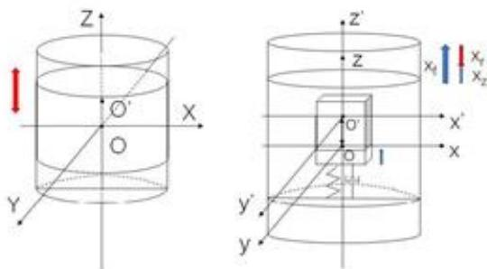  
图1 大地坐标系和固体坐标系示意图

令大地坐标系以静止时浮子的重心位置为原点 $O _ { \parallel }$ 当浮子运动时大地坐标系固定不动。

令固体坐标系的原点 $o$ 为与静止时振子的中心重合的浮子上一点，并随浮子运动而移动。

浮子和振子在大地坐标系下的位移分别为 $x _ { f }$ $x _ { z }$ 。则振子在固体坐标系下的位移$x _ { r }$ ，即其相对于浮子的位移为： $x _ { r } = x _ { z } - x _ { f }$ 0

## 5.1.2 垂荡运动模型建立

如图2所示，对浮子和振子分别进行受力分析，可知装置仅做垂荡运动时，浮子受波浪激励力、附加惯性力、兴波阻尼力、静水恢复力、PTO系统作用力；振子受PTO系统作用力。由题目信息可得：

波浪激励力 $f _ { e }$ 满足：

$$
f _ { e } = f \cos \omega t\tag{1}
$$

PTO系统作用力包括直线弹簧力和直线阻尼力，可表示为：

$$
f _ { P T O } = f _ { c _ { h } } + f _ { k _ { h } }\tag{2}
$$

直线阻尼力 $f _ { c _ { h } }$ 与浮子和振子的相对速度成正比，且比例系数为阻尼系数 $C _ { h }$ ，则可表示为： dxs.

$$
f _ { c _ { h } } = - C _ { h } [ x _ { z } ( t ) - x _ { f } ^ { ' } ( t ) ]\tag{3}
$$

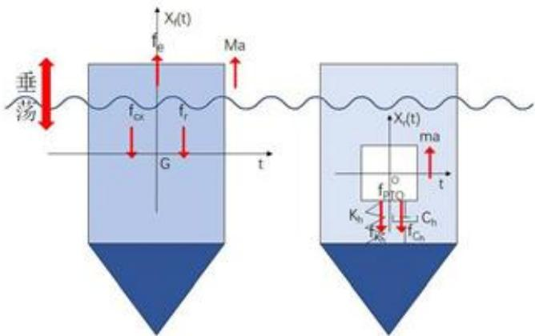  
图2 垂荡运动受力分析示意图

直线弹簧力 $f _ { k _ { h } }$ 与振子与浮子的相对位移成正比，可表示为：

$$
f _ { k _ { h } } = - K _ { h } [ x _ { z } ( t ) - x _ { f } ( t ) ]\tag{4}
$$

其中K为直线弹簧刚度。通过查阅文献[2]知，物体在波浪运动中所受的静水恢复力由重力和浮力的联合作用引起，仅考虑垂荡运动时，静水恢复力满足：

$$
f _ { r } = - \rho g A x _ { f } ( t )\tag{5}
$$

其中，A是海平面截面面积。浮子所受的兴波阻尼力 $f _ { c _ { \alpha } }$ 满足：

$$
f _ { c _ { \infty } } = - C _ { x h } x _ { f } ^ { ' } ( t )\tag{6}
$$

则由牛顿第二定律可得浮子和振子的垂荡运动模型为:

$$
\left\{ \begin{array} { l l } { ( m _ { f } + m ^ { \prime } ) x _ { f } ^ { \prime \prime } ( t ) = f _ { e } + f _ { e } + f _ { r } - f _ { P T O } } \\ { \qquad } \\ { m _ { z } x _ { z } ^ { \prime \prime } ( t ) = f _ { P T O } } \end{array} \right.\tag{7}
$$

其中 $m _ { f }$ $m _ { z }$ $m ^ { \prime }$ 分别是浮子质量，振子质量和附加惯性质量， $x _ { f } ( t )$ $x _ { z } ( t )$ 分别是浮子垂荡位移和振子垂荡位移。

## 5.1.3 垂荡运动模型求解

对于复杂的微分方程，我们可以用MATLAB求解。MATLAB求解微分方程常用的方法有欧拉法、龙格库塔法、线性多步法等。其中，在使用龙格库塔法求解微分方程时，可将MATLAB提供的函数ode45直接用于微分方程的求解。但鉴于需要求前40个周期内、时间间隔为0.2s的垂荡位移和速度，我们直接对龙格库塔法进行改进，继而求出结果。 dxs

## 1. 四阶龙格塔库算法分析

本文使用精度较高的四阶龙格库塔法(Runge-Kutta)，其截断误差为 ${ \cal O } ( h ^ { 5 } )$ 。

对于形如(8)的一阶微分方程初值问题，四阶龙格库塔法的求解递推公式为(9):

$$
\left\{ \begin{array} { l l } { \dot { y } = f ( t , y ) } \\ { y ( t _ { 0 } ) = y _ { 0 } } \end{array} \right.\tag{8}
$$

其中 $y _ { 0 }$ 为初始状态， $t _ { 0 }$ 为已知时间，f(t,y)为关于 $\mathbf { t } , \mathbf { y }$ 的已知函数。

$$
\begin{array} { l } { { t _ { n + 1 } = t _ { n } + h } } \\ { { \ } } \\ { { { k _ { 1 } } = f ( y _ { n } , t _ { n } ) } } \\ { { { k _ { 2 } } = f ( y _ { n } ) + \displaystyle \frac { h } { 2 } { k _ { 1 } } , t _ { n } + \displaystyle \frac { h } { 2 } ) } } \\ { { { k _ { 3 } } = f ( y _ { n } + \displaystyle \frac { h } { 2 } { k _ { 2 } } , t _ { n } + \displaystyle \frac { h } { 2 } ) } } \\ { { { k _ { 4 } } = f ( y _ { n } + h k _ { 3 } , t _ { n } + h ) } } \\ { { \ } } \\ { { { y _ { n + 1 } } = y _ { n } + \displaystyle \frac { h } { 6 } ( k _ { 1 } + 2 k _ { 2 } + 2 k _ { 3 } + k _ { 4 } ) } } \end{array}\tag{9}
$$

任一值 $y ( n )$ 是由当前值 $y ( n - 1 )$ 与单位时间变化量的和所决定。单位时间变化量为时间间隔h与近似斜率的乘积。对于任一时间，其估算斜率为以下斜率的加权平均：

• $k _ { 1 }$ ：时间起点斜率；

• $k _ { 2 } ;$ 时间中点斜率。依据欧拉法，采用斜率 $k _ { 1 }$ 近似 $y$ 在点 $t _ { n } + \frac { h } { 2 }$ 的值；

• $k _ { 3 }$ ：时间中点斜率，采用斜率 $k _ { 2 }$ 近似y值；

• $k _ { 4 }$ ：时间终点斜率，采用 $k _ { 3 }$ 近似 $y$ 值。

易知，当上述斜率加权平均时，时间中点斜率权值最大。则由根据上式的递推公式即可求出 $y ( 1 ) , y ( 2 ) , \dots y ( N )$ 。

## 2. 利用改进龙格塔库算法求解模型

Step1：初值条件的确定：由题目信息得，入射波浪频率为 $w = 1 . 4 0 0 5 s ^ { - 1 }$ ，且有：初始时刻，浮子和振子平衡于静水中。据此，设定初值条件令物体初始位移与初始速度均为零，即：

$$
\left\{ \begin{array} { l l } { x _ { f } ( 0 ) = 0 , x _ { z } ( 0 ) = 0 } \\ { x _ { f } ^ { ' } ( 0 ) = 0 , x _ { z } ^ { ' } ( 0 ) = 0 } \end{array} \right.\tag{10}
$$

Step2:微分方程的处理：由于本问题求解的方程为二阶二元微分方程，故需要将方程转化为一阶多元方程，同时将一阶导数项移到等式左侧，余项移到等式右侧，再使用龙格库塔算法求解。

转化后的的多元一阶方程为:

$$
\begin{array} { r l } & { ( x _ { f } ^ { \prime } ( t ) = u ( t )  } \\ & {  \begin{array} { l } { x _ { z } ^ { \prime } ( t ) = w ( t ) } \\ { u ^ { \prime } ( t ) = ( f \cos \omega t + C _ { h } ( w ( t ) - u ( t ) ) + K _ { h } ( x _ { z } ( t ) - x _ { f } ( t ) ) - f _ { x h } u - \rho g A x _ { f } ( t ) ) / ( m _ { f } + m ^ { \prime } ) } \end{array} } \\ & {  \begin{array} { l } { w ^ { \prime } ( t ) = - ( C _ { h } ( w ( t ) - u ( t ) ) + K _ { h } ( x _ { z } ( t ) - x _ { f } ( t ) ) / m _ { z } } \end{array}  } \end{array}\tag{11}
$$

Step3:算法的迭代：设置步长 $h = 0 . 0 0 0 1$ ，遍历长度为40个波浪周期，按照递推公式依次求出上面四个一阶微分方程所对应的 $k _ { 1 } , k _ { 2 } , k _ { 3 } , k _ { 4 }$ ，然后求出对应的下一个离散值 $y ( n + 1 )$

Step4：算法的应用与模型的求解：易知 $x _ { f } ( t )$ 为浮子的位移， $x _ { z } ( t )$ 为振子的位移，$u ( t )$ 为浮子的位移的导数即为浮子速度，同理知w(t)为振子速度，取其中以0.02s为间隔的时刻对应的值，保存到结果中。

## 5.1.4 求解过程及结果分析

## 1. 题1.(1) 求解结果及分析：

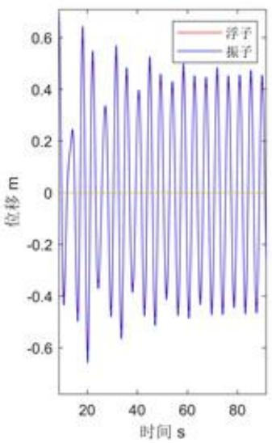

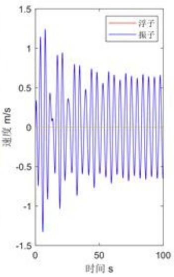  
图3题1.(1)大地坐标系下浮子和振子的垂荡位移和速度

由图3易知浮子和振子相对大地坐标系的绝对位移和速度十分接近。为了清晰观察其两者垂荡运动的状态，图像记录振子位移时，采用振子与浮子的相对位移 $x _ { r } = x _ { z } - x _ { f }$ 即振子固体坐标系下的位移，则结果如图4所示。 1×5.

图4展示了前40周期题1.(1)直线阻尼系数固定时垂荡位移和速度变化情况。观察

可发现浮子和振子的运动在一段时间后达到稳定，经模型检验(45)，浮子和振子稳定后的运动周期与波浪激励的周期。

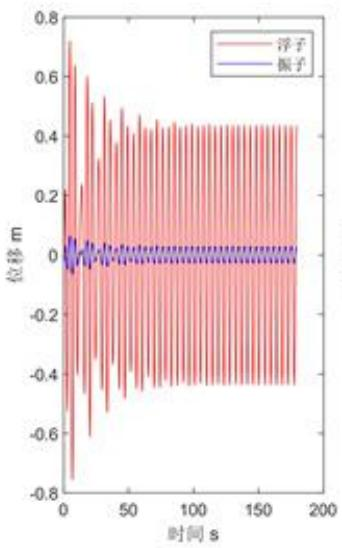

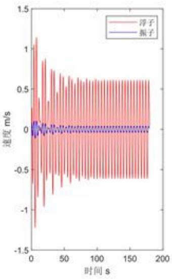  
图4 题1.(1)直线阻尼系数为常数时垂荡位移和速度

题目所求时刻浮子与振子在大地坐标系下的运动状态如表2所示，前40周期时间间隔0.2s时刻浮子与振子的运动状态已写入附件reslut1-1.xlsx.

表2 题1.(1)部分结果展示
<table><tr><td>时间(s)</td><td>浮子位移(m)</td><td>浮子速度(m/s)</td><td>振子位移(m)</td><td>振子速度(m/s)</td></tr><tr><td>10</td><td>-0.190711329</td><td>-0.641008552</td><td>-0.21167884</td><td>-0.69395345</td></tr><tr><td>20</td><td>-0.590684336</td><td>-0.240951445</td><td>-0.634248453</td><td>-0.272775651</td></tr><tr><td>40</td><td>0.285374415</td><td>0.31297134</td><td>0.296499146</td><td>0.332912423</td></tr><tr><td>60</td><td>-0.314505563</td><td>-0.479455012</td><td>-0.331435947</td><td>-0.515727968</td></tr><tr><td>100</td><td>-0.083614704</td><td>-0.604211498</td><td>-0.084068054</td><td>-0.643001946</td></tr></table>

## 2. 题1.(2) 求解结果及分析：

得到前40周期1.(2)直线阻尼系数变化时垂荡位移和速度如图5所示。

题目所求时刻浮子与振子在大地坐标系下对应的运动状态由表3给出，前40周期时间间隔0.2s时刻浮子与振子的运动状态已写入附件reslut1-2.xlsx

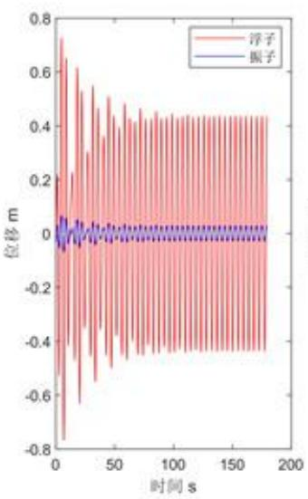

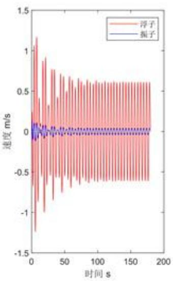  
图5 题1.(2)直线阻尼系数变化时垂荡位移和速度

表3 题1.(2)部分结果展示
<table><tr><td>时间(s)</td><td>浮子位移(m)</td><td>浮子速度  $( m / s )$ </td><td>振子位移(m)</td><td>振子速度  $( m / s )$ </td></tr><tr><td>10</td><td>-0.205877249</td><td>-0.652821169</td><td>-0.234572075</td><td>-0.699936792</td></tr><tr><td>20</td><td>-0.611107559</td><td>-0.254783924</td><td>-0.66106125</td><td>-0.277021411</td></tr><tr><td>40</td><td>0.268767727</td><td>0.295301668</td><td>0.280157426</td><td>0.3125229</td></tr><tr><td>60</td><td>-0.327164218</td><td>-0.491517963</td><td>-0.349605871</td><td>-0.525587089</td></tr><tr><td>100</td><td>-0.088408175</td><td>-0.609830583</td><td>-0.093492557</td><td>-0.650076434</td></tr></table>

## 5.2问题二模型建立与求解

## 5.2.1平均功率函数计算

物体平动运动功率可表示为:

$$
P _ { h } = F V\tag{12}
$$

取 $t _ { 0 } > t _ { w }$ ， $t _ { 0 }$ 是系统振动稳态响应后某一时刻。即对 $t _ { 0 }$ 时刻开始的 $\therefore$ 段时间内的功率求均值，则平均功率可表示为：

$$
\overline { { P } } = \frac { 1 } { T } \int _ { t _ { 0 } } ^ { t _ { 0 } + T } f _ { c _ { h } } [ x _ { z } ^ { ' } ( t ) - x _ { f } ^ { ' } ( t ) ] d t = \frac { 1 } { T } \int _ { t _ { 0 } } ^ { t _ { 0 } + T } C _ { h } [ x _ { z } ^ { ' } ( t ) - x _ { f } ^ { ' } ( t ) ] ^ { ( 2 + \alpha ) } d t\tag{13}
$$

其中， $C \in \{ 0 , 1 0 0 0 0 \}$ ，题1.(1)中 $\alpha = 0 ;$ 题1.(2) 中 $\alpha \in [ 0 , 1 ]$ 。

## 5.2.2阻尼系数优化模型建立

由于要使PTO系统的平均输出功率最大，因而应当以平均输出功率为目标，由(1)(2)(3)(4)(5)(6)(13)得到直线阻尼器阻尼系数的优化模型：

目标函数

$$
( C _ { h } , \alpha ) = \arg \operatorname* { m a x } _ { { \bf { \Theta } } } \overline { { P } } = \frac { 1 } { T } \int _ { t _ { 0 } } ^ { t _ { 0 } + T } C _ { h } | x _ { s } ^ { \prime } ( t ) - x _ { f } ^ { \prime } ( t ) | ^ { ( 2 + \alpha ) } d t\tag{14}
$$

约束条件

$$
\begin{array} { r l } & { \quad \quad \quad \quad \quad \quad \quad \quad \quad \quad \quad \quad \quad \quad \quad \quad \quad \quad \quad \quad \quad \quad \quad \quad \quad \quad \quad \quad \quad \quad \quad \quad \quad \quad \quad \quad \quad \quad \quad \quad \quad \quad \quad \quad \quad \quad \quad \quad \quad \quad \quad \quad \quad \quad \quad \quad \quad \quad \quad \quad \quad \quad \quad \quad \quad \quad \quad \quad \quad \quad \quad \quad \quad \quad \quad \quad \quad } \\ & { \quad \quad \quad \quad \quad \quad \quad \quad \quad \quad \quad \quad \quad \quad \quad \quad \quad \quad \quad \quad \quad \quad \quad \quad \quad \quad \quad \quad \quad \quad \quad \quad \quad \quad \quad \quad \quad \quad \quad \quad \quad \quad \quad } \\ & { \quad \quad \quad \quad \quad \quad \quad \quad \quad \quad \quad \quad \quad \quad \quad \quad \quad \quad \quad \quad \quad \quad \quad \quad \quad \quad \quad \quad \quad \quad \quad \quad \quad \quad \quad \quad \quad \quad \quad \quad \quad \quad \quad \quad \quad \quad \quad \quad \quad \quad \quad \quad \quad } \\ & { \quad \quad \quad \quad \quad \quad \quad \quad \quad \quad \quad \quad \quad \quad \quad \quad \quad \quad \quad \quad \quad \quad \quad \quad \quad \quad \quad \quad \quad \quad \quad \quad \quad \quad \quad \quad \quad \quad \quad \quad \quad \quad \quad \quad \quad \quad \quad \quad \quad \quad \quad \quad \quad \quad \quad } \\ & { \quad \quad \quad \quad \quad \quad \quad \quad \quad \quad \quad \quad \quad \quad \quad \quad \quad \quad \quad \quad \quad \quad \quad \quad \quad \quad \quad \quad \quad \quad \quad \quad \quad \quad \quad \quad \quad \quad \quad \quad \quad \quad \quad \quad \quad \quad \quad \quad \quad \quad \quad \quad \quad \quad \quad \quad \quad \quad } \\ &  \quad \quad \quad \quad \quad \quad \quad \quad \quad \quad \quad \quad \quad \quad \quad \quad \quad \quad \quad \quad \quad \quad \quad \quad \quad \quad \quad \quad \quad \quad \quad \quad \quad \quad \quad \quad \quad \quad \quad \quad \quad \quad \quad \quad \quad \quad \quad \quad \quad \quad \quad \quad \quad \quad \quad \quad \quad \quad \quad \quad \quad \quad \quad \quad \quad \quad \quad \quad \quad \quad \quad \quad \quad \quad \quad \quad \quad \quad \quad  \end{array}\tag{15}
$$

其中， $C \in \{ 0 , 1 0 0 0 0 \}$ ，题1.(1) 中 $\alpha = 0 ;$ 题1.(2) 中 $\alpha \in [ 0 , 1 ]$ e

## 5.2.3 求解过程及结果分析

系统初始时刻平衡于静水中，则设定方程初值使初始位移和速度均为零，初值与问题一中式(10)。此时入射波浪频率为 $2 . 2 1 4 3 s ^ { - 1 }$

1. 功率积分函数的处理：为方便数值计算，可以对积分函数用梯形法[3]求解，当

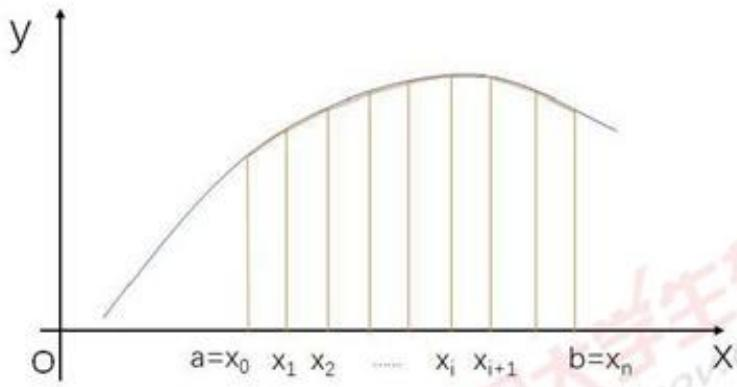  
图6 梯形法求积分

步长足够小时，将梯形面积之和近似代替连续函数的解，如图6所示。继续使用龙格库塔法，时间步长取0.0001，使选取的步长足够小从而满足要求。如果使用搜索法遍历阻尼系数，若选取步长为1，则完全遍历需要较长时间，不利于精确快速找到答案。故本文采用增大步长的方法得到粗略结果。为精确结果，本文另外采用遗传算法。遗传算法能够解决陷入局部最优的死循环的问题，且并行搜索，通过概率选择最佳解，从而能快速找到答案。由于前期位移的不稳定性，且从图中可知60s后开始逐渐稳定，故截取区间[100s,180s]，求取此区间的最大输出功率作为目标值。下面给出离散化求解的公式：

$$
\overline { { P _ { h } } } = \frac { 1 } { T } C _ { h } \sum _ { i = 1 } ^ { n } | w _ { i } - u _ { i } | ^ { 2 + \alpha } h\tag{16}
$$

其中， $w _ { i }$ $u _ { i }$ 分别是振子和浮子的速度， $n = \frac { T } { h }$ ，h是时间遍历步长。

## 2. 阻尼系数为常数时求解：

Step1:初始化设置：利用附件中的参数值（波浪入射频率改为 $2 . 2 1 4 3 s ^ { - 1 } )$ ，对变量进行赋值。

Step2：设置目标函数：由龙格库塔算法，求出振子和浮子的位移和速度，对时间进行差分，得到dt为0.0001s，求出相对速度的平方，找到100s180s时间段内相应的值，按照上述离散计算法求出功耗。

Step3：利用遗传算法进行求解：设置迭代次数为200，设置线性阻尼系数最小值为0，最大值为100000。求解得出最大功率和最优线性阻尼系数。

## 3.阻尼系数与相对速度的绝对值幂成正比时求解

Step1：初始化设置：利用附件中的参数值（波浪入射频率改为 $2 . 2 1 4 3 s ^ { - 1 } )$ ，对变量进行赋值。

Step2:设置目标函数：由龙格库塔算法，求出振子和浮子的位移和速度，根据$C _ { h } | x _ { z } ^ { ' } ( t ) - x _ { f } ^ { ' } ( t ) | ^ { ( \alpha ) }$ 求出阻尼系数，对时间进行差分，得到dt为0.0001s，求出相对速度的平方，找到100s180s时间内相应的值，按照上述公式求出相应区间的功耗。

Step3:利用遗传算法进行求解：设置迭代次数为200，设置比例系数最小值为0，最大值为100000;指数最小值为0，最大值为1。求解得出最大功率和最优线性阻尼系数。

## 4. 求解结果

得到题2.(1)直线阻尼系数与平均输出功率的关系如图7所示

利用遗传算法求得题2.(1)最大输出功率为 $P _ { m a x } = 2 2 9 . 6 8 1 9 \mathrm { { w } }$ ，最优直线阻尼系数为 $C _ { h } = 3 7 6 3 9$

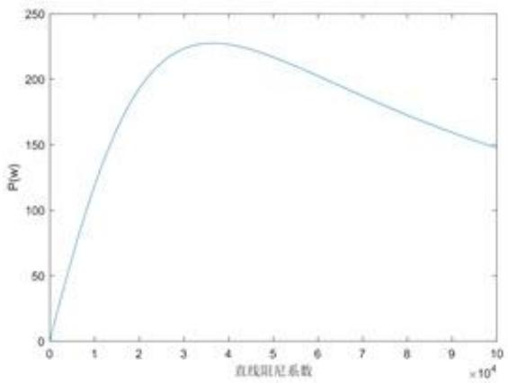  
图7题2.(1)直线阻尼系数与平均输出功率的关系

得到题2.(2)直线阻尼系数和幂指数与平均输出功率的关系如图8所示。

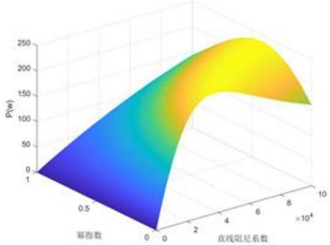  
图8 题2.(2)直线阻尼系数和幂指数与平均输出功率的关系

利用遗传算法求得题2.(2)最大输出功率为 $P _ { m a x } = 2 3 0 . 0 1 6 3 \mathrm { w }$ ，最优直线阻尼系数为 $C _ { h } = 8 1 4 7 8$ ，对应幂指数为 $\alpha = 0 . 3 3 7 7$ 0

## 5.3问题三模型建立与求解

## 5.3.1刚体转动相关定理

1. 平行移轴定理：若质量为m的刚体，关于穿过其质心的轴旋转时，产生的转动惯量为 $I _ { C } ^ { \prime }$ 。对刚体中的任一质点，满足： a之n

·质心轴到质点 $m _ { i }$ 的垂直矢量为 $r _ { i }$

·平行轴到质心轴的垂直矢量为d

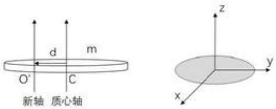  
图9 平行移轴和垂直轴定理示意图

则刚体关于平行轴的转动惯量满足：

$$
I _ { O } ^ { \prime } = \sum _ { i } m _ { i } ( d + r _ { i } ) ^ { 2 } = d ^ { 2 } \sum _ { i } m _ { i } + \sum _ { i } m _ { i } r _ { i } ^ { 2 } + 2 d \sum _ { i } m _ { i } r _ { i }\tag{17}
$$

由于刚体质心轴经过质心，则有：

$$
2 d \sum _ { i } m _ { i } r _ { i } = 0\tag{18}
$$

根据各质点同刚体的关系，则有：

$$
\sum _ { i } m _ { i } = m \sum _ { i } m _ { i } r _ { i } ^ { 2 } = I c\tag{19}
$$

将(19)、(18)代入(17)，则得到平行移轴定理：

$$
I _ { O } ^ { \prime } = I _ { C } + m d ^ { 2 }\tag{20}
$$

2.垂直轴定理：若刚体薄片关于一条垂直轴的转动惯量为 $I _ { z }$ ，则在该薄片平面上取两个轴，满足既同垂直轴相交，又互相垂直，令刚体薄片关于两条轴的转动惯量分别为$I _ { z }$ 和 $I _ { y }$ 。现以三条轴为坐标轴建立三维笛卡尔坐标系，令刚体中任一质点 $m _ { i }$ 的坐标为$( x _ { i } , y _ { i } , 0 )$ ，则有：

$$
I _ { z } = \sum _ { i } m _ { i } ( x _ { i } ^ { 2 } + y _ { i } ^ { 2 } ) = \sum _ { i } m _ { i } x _ { i } ^ { 2 } + \sum _ { i } m _ { i } y _ { i } ^ { 2 } = I _ { z } + I _ { y }\tag{21}
$$

即：

$$
I _ { z } = I _ { z } + I _ { y }\tag{22}
$$

则式(22)即为垂直轴定理。

## 5.3.2 纵摇运动模型建立

如图10所示，对浮子和振子分别进行受力分析，可知纵摇时：浮子受波浪激励力矩、附加惯性力矩、兴波阻尼力矩、静水恢复力矩、 $\mathrm { P T O }$ 系统作用力矩;振子受PTO系统作用力矩。由题目信息可得：

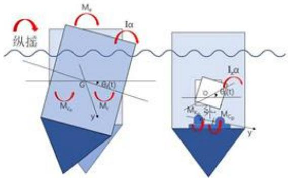  
图10 纵摇运动受力分析示意图

波浪激励力矩 $M _ { e }$ 满足:

$$
M _ { e } = L \cos { \omega t }\tag{23}
$$

PTO系统作用力矩包括旋转弹簧力矩和扭转阻尼力矩，可表示为

$$
M _ { P T O } = M _ { c _ { p } } + M _ { k _ { p } }\tag{24}
$$

旋转弹簧力矩 $M _ { k _ { p } }$ 与振子与浮子的相对位移大小成正比，可表示为：

$$
M _ { k _ { P } } = - K _ { p } [ \theta _ { z } ( t ) - \theta _ { f } ( t ) ]\tag{25}
$$

其中K为直线弹簧刚度。又由题意得：扭转阻尼力矩 $M _ { e _ { p } }$ 与浮子和振子的相对角速度成正比，且比例系数为阻尼系数 $C _ { p }$ ，即满足：

$$
M _ { c _ { p } } = - C _ { p } [ \theta _ { z } ^ { ' } ( t ) - \theta _ { f } ^ { ' } ( t ) ]\tag{26}
$$

由题意知，纵摇运动时，静水恢复力矩满足：

$$
{ M _ { r } } = - { L _ { r } } \theta _ { f } ( t )\tag{27}
$$

其中 $L _ { r }$ 是静水恢复力矩系数。

浮子纵摇运动所受的兴波阻尼力距 $\boldsymbol { M } _ { \boldsymbol { c } _ { \tau } }$ 与浮子速度成正比，可表示为：

$$
M _ { c _ { x } } = - C _ { x p } \theta _ { f } ^ { ' } ( t )\tag{28}
$$

利用牛顿第二定律，得到浮子和振子的纵摇运动模型如下:

$$
\left\{ \begin{array} { l l } { ( I _ { f } + I ^ { \prime } ) \theta _ { f } ^ { \prime \prime } ( t ) = M _ { e } + M _ { c _ { x } } + M _ { r } - M _ { P T O } } \\ { I _ { z } \theta _ { z } ^ { \prime \prime } ( t ) = M _ { P T O } } \end{array} \right.\tag{29}
$$

其中 $I _ { f } { , } I _ { z } { , } I ^ { \prime }$ 分别是浮子、振子和附加转动惯量， $\theta _ { f } ( t )$ 和 $\theta _ { z } ( t )$ 分别是浮子和振子纵摇运动角位移。

## 5.3.3 求解过程及结果分析

## 1. 转动惯量计算

计算转动惯量需要知道转轴的位置，查阅文献知，纵摇时物体所绕y轴近似穿过重心，因此需要先确定重心的位置。

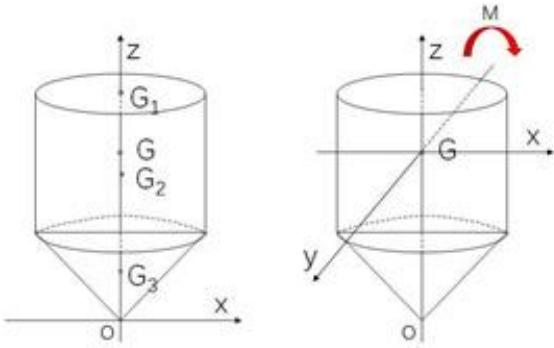  
图11 重心位置确定

对于浮子，其外壳可看成由圆面，圆柱侧面和圆锥侧面三部分组成的组合体。组合体的重心可用(30)式求解：

$$
G = \frac { M _ { 1 } G _ { 1 } + M _ { 2 } G _ { 2 } + M _ { 3 } G _ { 3 } } { M }\tag{30}
$$

式中M表示质量，如图11左所示，以圆锥顶点为原点，浮子中线为z轴建系，设圆面、圆柱侧面、圆锥侧面的重心坐标分别为 $G _ { 1 } , G _ { 2 } , G _ { 3 }$ ，由对称性可知，三个部分的重心均分布在z轴，且 $G _ { 1 } = ( 0 , 0 , 3 . 8 )$ $G _ { 2 } = ( 0 , 0 , 2 . 3 )$ ，利用公式：

$$
G = { \frac { \sum m _ { i } z _ { i } } { Z } }\tag{31}
$$

可求得均匀几何体在z轴上的重心，求解得到圆锥侧面的重心约为 $G _ { 3 } = ( 0 , 0 , 0 . 5 3 3 )$ 1根据式(30)可求得浮子的重心约为 $G = ( 0 , 0 , 2 . 2 0 7 9 )$ ，从而确定纵摇的转轴y轴的位置穿过该点，如图11右所示。

利用式(20)(22)求出三部分绕y轴转动的转动惯量，以 $\boldsymbol { r } _ { i }$ $h _ { i }$ 表示各部分的半径与其重心到浮子整体重心的距离，其中圆面对y轴的转动惯量为

$$
I _ { 1 } = \frac { M _ { 1 } } { 4 } r _ { 1 } ^ { 2 } + M _ { 1 } d _ { 1 } ^ { 2 }\tag{32}
$$

圆柱侧面对y轴的转动惯量为

$$
I _ { 2 } = \frac { M _ { 2 } } { 2 } ( r _ { 2 } ^ { 2 } + \frac { h _ { 2 } ^ { 2 } } { 6 } ) + M _ { 2 } d _ { 2 } ^ { 2 }\tag{33}
$$

圆锥侧面对y轴的转动惯量为

$$
I _ { 3 } = \frac { M _ { 3 } } { 4 } ( r _ { 3 } ^ { 2 } + \frac { 2 } { 9 } h _ { 3 } ^ { 2 } ) + M _ { 3 } d _ { 3 } ^ { 2 }\tag{34}
$$

利用(35)求和即可得到浮子的转动惯量 $I _ { f } = 8 2 8 9 . 4 3 k g { \cdot } m ^ { 2 }$

$$
I _ { f } = I _ { 1 } + I _ { 2 } + I _ { 3 }\tag{35}
$$

振子纵摇时所绕y轴即为底座转轴，因此利用(22)(20)可得到其位于原点时的转动惯量 $I _ { z } = 1 5 7 1 . 3 1 2 5 k g { \cdot } m ^ { 2 }$ 。然而由于垂荡运动，振子与底座的距离会发生变化，因此振子的转动惯量会随运动状态的变化而变化，满足：

$$
I _ { z } = 2 0 2 . 7 5 + 2 4 3 3 ( 0 . 7 5 + x _ { r } ( t ) ) ^ { 2 }\tag{36}
$$

其中振子相对位移 $x _ { r } ( t ) = x _ { z } ( t ) - x _ { f } ( t )$

## 2. 初值的设置

系统初始时刻平衡于静水中，则设定方程初值使初始（角）位移和（角）速度均为零:

$$
\left\{ \begin{array} { l l } { x _ { f } ( 0 ) = 0 , x _ { z } ( 0 ) = 0 , x _ { f } ^ { \prime } ( 0 ) = 0 , x _ { z } ^ { \prime } ( 0 ) = 0 } \\ { \theta _ { f } ( 0 ) = 0 , \theta _ { z } ( 0 ) = 0 , \theta _ { f } ^ { \prime } ( 0 ) = 0 , \theta _ { z } ^ { \prime } ( 0 ) = 0 } \end{array} \right.\tag{37}
$$

## 3. 一阶多元微分方程转化

将以上若干个方程联立可以求得

$$
\begin{array} { r l } & { \left( x _ { f } ^ { \prime } ( t ) = u ( t ) , x _ { z } ^ { \prime } ( t ) = w ( t ) , \theta _ { f } ^ { \prime } ( t ) = j ( t ) , \theta _ { z } ^ { \prime } ( t ) = k ( t ) \right. } \\ & { \left. u ^ { \prime } ( t ) = \left( f _ { h } \cos \omega t + C _ { h } ( w ( t ) - u ( t ) ) + K _ { h } ( x _ { z } ( t ) - x _ { f } ( t ) ) - f _ { x h } u - \rho g A x _ { f } ( t ) \right) / ( m _ { f } + m ^ { \prime } ) \right. } \\ & { \left. \mathscr { w } ^ { \prime } ( t ) = - ( C _ { h } ( w ( t ) - u ( t ) ) + K _ { h } ( x _ { z } ( t ) - x _ { f } ( t ) ) / m _ { z } \right. } \\ & { \left. j ^ { \prime } ( t ) = ( f _ { p } \cos \omega t + C _ { h } ( k ( t ) - j ( t ) ) + K _ { p } ( \theta _ { z } ( t ) - \theta _ { f } ( t ) ) - f _ { x p } j - L _ { r } \theta _ { f } ( t ) ) / ( I _ { f } + I ^ { \prime } ) \right. } \\ & { \left. k ^ { \prime } ( t ) = - ( C _ { p } ( k ( t ) - j ( t ) ) + K _ { p } ( \theta _ { z } ( t ) - \theta _ { f } ( t ) ) / I _ { z } \right. } \end{array}\tag{38}
$$

易知j(t)为浮子的角位移的导数，即为浮子角速度。同理可知k(t)为振子角速度。

将上述一阶微分方程用问题一同样的方法带入龙格库塔法中求解，递推可以得到垂荡时浮子、振子的位移、速度，纵摇时浮子、振子的角位移、角速度。取其中以0.02s为间隔的时刻对应的值，保存到结果中。

## 4. 结果分析

得到前40周期浮子与振子垂荡和纵摇运动的（角）位移和（角）速度如图12所示

题目所求时刻，浮子与振子在大地坐标系下对应的运动状态由表4表5给出，前40周期时间间隔0.2s时刻浮子与振子的运动状态已写入附件reslut3.xlsx。

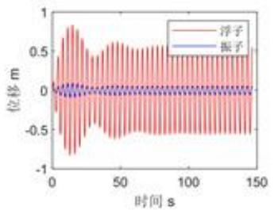

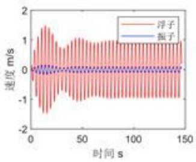

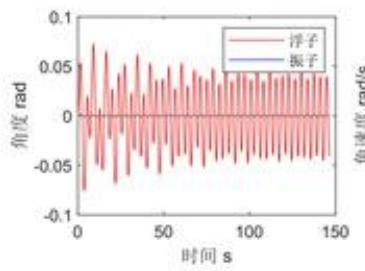

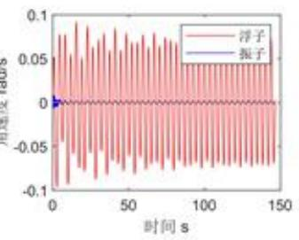  
图12前40周期浮子与振子垂荡和纵摇的（角）位移和（角）速度

表4 题3浮子运动结果展示
<table><tr><td>时间(s)</td><td>浮子位移(m)</td><td>浮子速度  $( m / s )$ </td><td>浮子角位移</td><td>浮子角速度  $( s ^ { - 1 } )$ </td></tr><tr><td>10</td><td>-0.528276062</td><td>0.969851521</td><td>0.020957766</td><td>-0.092330455</td></tr><tr><td>20</td><td>-0.704814894</td><td>-0.269305371</td><td>0.026989885</td><td>-0.002035826</td></tr><tr><td>40</td><td>0.369361261</td><td>0.757579654</td><td>-0.051121931</td><td>-0.022370478</td></tr><tr><td>60</td><td>-0.32067535</td><td>-0.721761609</td><td>0.041469379</td><td>0.051197029</td></tr><tr><td>100</td><td>-0.050154045</td><td>-0.946689648</td><td>0.006650624</td><td>0.068741596</td></tr></table>

## 5.4问题四模型建立与求解

## 5.4.1双阻尼系数优化模型建立

物体转动产生的功率可表示为:

$$
P _ { p } = M \omega\tag{39}
$$

对于本题PTO系统，同样取 $t _ { 0 } > t _ { w }$ $t _ { 0 }$ 是系统振动稳态响应后某一时刻，即 $t _ { 0 }$ 对时刻开始的一段时间内的功率求均值，则平均功率可表示为:

$$
\overline { { P _ { p } } } = \frac { 1 } { T } \int _ { t _ { 0 } } ^ { t _ { 0 } + T } M _ { c _ { p } } [ \theta _ { z } ^ { ' } ( t ) - \theta _ { f } ^ { ' } ( t ) ] d t = \frac { 1 } { T } \int _ { t _ { 0 } } ^ { t _ { 0 } + T } C _ { p } | \theta _ { z } ^ { ' } ( t ) - \theta _ { f } ^ { ' } ( t ) | ^ { 2 } d t\tag{40}
$$

表5 题3振子运动结果展示
<table><tr><td>时间(s)</td><td>振子位移(m)</td><td>振子速度(m/s)</td><td>振子角位移</td><td>振子角速度  $( s ^ { - 1 } )$ </td></tr><tr><td>10</td><td>-0.598729181</td><td>1.038200861</td><td>0.021082682</td><td>-0.093719527</td></tr><tr><td>20</td><td>-0.772294049</td><td>-0.319025241</td><td>0.027599876</td><td>-0.001903863</td></tr><tr><td>40</td><td>0.392653033</td><td>0.844962428</td><td>-0.051892324</td><td>-0.023139147</td></tr><tr><td>60</td><td>-0.341426312</td><td>-0.79932096</td><td>0.042056455</td><td>0.051963232</td></tr><tr><td>100</td><td>-0.042611838</td><td>-1.036526</td><td>0.006883417</td><td>0.0699915</td></tr></table>

目标函数:

$$
( C _ { h } , C _ { p } ) = \arg \operatorname* { m a x } P _ { h } + \overline { { P _ { p } } }\tag{41}
$$

约束条件：

$$
\begin{array} { r l } & { \quad ( \overline { { P _ { h } } } = \frac { \int _ { t _ { 0 } } ^ { t _ { 0 } + T } C _ { h } | x _ { z } ^ { \prime } ( t ) - x _ { f } ^ { \prime } ( t ) | ^ { 2 } d t } { T }  } \\ & { \quad  ( \overline { { P } } _ { p } = \frac { \int _ { t _ { 0 } } ^ { t _ { 0 } + T } C _ { p } | \theta _ { z } ^ { \prime } ( t ) - \theta _ { f } ^ { \prime } ( t ) | ^ { 2 } d t } { T }   } \\ & { \quad   \langle { ( m _ { f } + m ^ { \prime } ) } x _ { f } ^ { \prime } ( t ) = f _ { e } + f _ { e _ { g } } + f _ { r } - f _ { P T } O   } \\ & { \quad    m _ { z } x _ { z } ^ { \prime \prime } ( t ) = f _ { P T O }   } \\ & { \quad  ( I _ { f } + I ^ { \prime } ) \theta _ { f } ^ { \prime \prime } ( t ) = M _ { e } + M _ { e _ { g } } + M _ { r } - M _ { P T O }   } \\ & { \quad   I _ { Z } \theta _ { z } ^ { \prime \prime } ( t ) = M _ { P T O }  } \end{array}\tag{42}
$$

## 5.4.2 求解过程及结果分析

## 1. 求解过程

系统初始时刻平衡于静水中，则设定方程初值使初始（角）位移和（角）速度均为零，初值条件同上问式(37)。

为方便数值计算，对功率做离散化处理：

$$
\overline { { P _ { h } } } = \frac { 1 } { T } C _ { h } \sum _ { i = 1 } ^ { n } [ w _ { i } - u _ { i } ] ^ { 2 } h\tag{43}
$$

$$
\overline { { P _ { p } } } = \frac { 1 } { T } C _ { p } \sum _ { i = 1 } ^ { n } [ j _ { i } - k _ { i } ] ^ { 2 } h\tag{44}
$$

其中 $n = \frac { T } { h }$ ，h是时间遍历步长。

Step1:初始化设置:利用附件中的参数值（波浪入射频率改为 $1 . 9 8 0 6 s ^ { - 1 } )$ ，对变量进行赋值。

Step2：设置目标函数：由龙格库塔算法，求出振子和浮子的位移、角位移、速度、角速度、对时间进行差分，得到dt为0.0001s，求出相对速度的平方、相对角速度的平方，找到100s180s时间段内相应的值，按照上述公式求出相应区间的功耗。

Step3：利用遗传算法进行求解：设置迭代次数为200。设置直线阻尼器和旋转阻尼器系数最大值均为为100000、最小值均为0。由算法求解得出最大功率和最优线性阻尼系数。

## 2. 求解结果

先粗略遍历搜索得到不同阻尼系数下的功率分布，如图13所示。据此发现旋转阻尼系数的改变对输出功率的变化影响很小，分析得，可能是纵摇角速度较小所致。

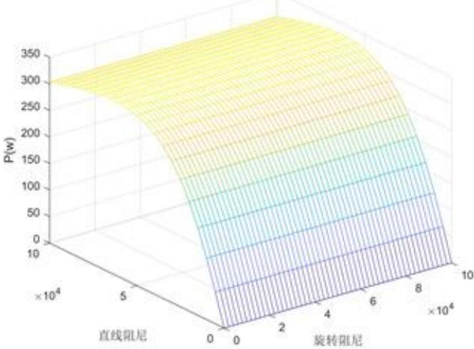  
图13不同阻尼系数下的功率分布图

最后利用遗传算法求得最大输出功率为 $P _ { m a x } = 3 1 6 . 5 8 0 7 \mathrm { w }$ ，最优直线阻尼系数为$C _ { h } = 5 8 9 4 4$ ，最优旋转阻尼系数为 $C _ { p } = 9 8 2 2 7$ 。

## 六、模型分析

## 6.1模型检验

该题波浪能装置的运动属于简谐激励下线性系统的受迫振动，此类物体振动稳定后的振动周期应与波浪激励的周期接近，故据此检验模型的正确性，检验方法如下：

$$
\left\{ \begin{array} { l l } { \displaystyle t _ { i } = \arg [ x ( t ) = 0 ] } \\ { \displaystyle T _ { i } = t _ { i + 2 } - t _ { i } } \\ { \displaystyle s = \frac { 1 } { n } \sum _ { i } ^ { n } \sqrt { ( T _ { i } - \frac { 2 \pi } { \omega } ) ^ { 2 } } } \end{array} \right.\tag{45}
$$

若方差s较小，则可验证认为模型正确

## 1. 对垂荡运动模型检验：

针对题1.(1)的参数，得到 $s = 0 . 0 0 1 7 < 0 . 1 \%$

针对题1.(2)的参数，得到 $s = 0 . 0 0 3 4 < 0 . 4 \%$

## 2. 对纵摇运动模型检验：

针对题3的参数，得到 $s = 0 . 0 0 0 3 6 < 0 . 0 4 \%$

通过计算验证可以发现方差极小，故认为该论文模型建立正确。

## 6.2结果可靠性检验

考虑到计算浮子转动惯量时会产生一定的误差，故针对第三问的参数，对其添加±1%的扰动，并对扰动前后偏差作图进行结果可靠性检验。

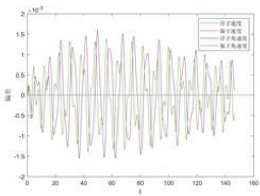  
(a)+1%扰动偏差

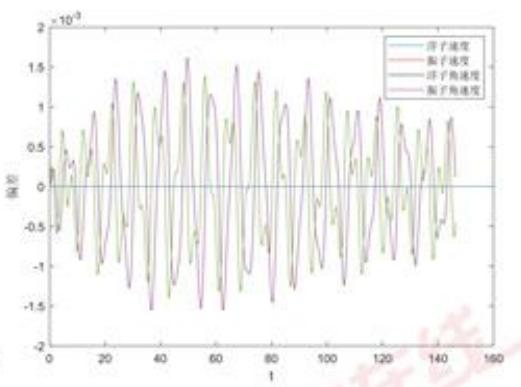  
(b)-1%扰动偏差  
图14 运动过程中 ±1% 扰动偏差

观察图14可发现扰动造成的偏差<0.15%，故模型求解结果可靠。

## 七、模型总结

## 7.1 模型优点

1. 本文基于牛顿第二定律，并对其进行适当处理，建立垂荡和纵摇运动模型。后续求出的数值解较为符合实际情况，能够较合理地描述振荡浮子式波浪能发电装置的垂荡和纵摇运动。

2. 本文对目标函数做离散化处理，有效降低了数值计算的难度，为模型求解提供便利。

3. 本文采用改进的龙格塔库算法，求解复杂约束条件下的多变量优化问题。将原微分方程严谨变形、将算法科学改进后，实现了对问题的高精度求解，使结果更符合减小误差的要求。

## 7.2 模型缺点

1. 计算重心位置时，忽略浮子厚度而对浮子进行了简化处理，在刻画浮子重心时可能产生偏差。

2. 忽略了纵摇运动与垂荡运动的耦合效应。本题在处理静水恢复力时进行了简化，在实际运动过程中，物体静水恢复力等受力情况更加复杂，垂荡和纵摇两个自由度的运动会发生耦合，互相影响运动状态。

## 7.3 模型推广与改进

本文较完整地分析了振荡浮子式波浪能发电装置中浮子和振子的垂荡运动和纵摇运动过程，综合考虑了多种可能对波浪能发电装置产生影响的因素，提供了垂荡和纵摇两个自由度运动状态下，输出功率的优化设计。本文献可以帮助推算物体受波浪激励的运动状态，并可利用遗传算法设计最大平均输出功率对应的最优阻尼系数，能够更好地满足高效能量转化的要求，因而对于实际生产有借鉴意义。

然而在实际运动中，不同自由度的运动会互相影响，产生耦合，故本论文应用的模型在参数更加充分的情况下会考虑建立纵摇和垂荡的耦合运动模型，并以此为基础进行改进。

## 参考文献

[1] 张亚群，盛松伟,游亚戈，王坤林,王振鹏.波浪能发电技术应用发展现状及方向[J].新能源进展,2019,7(04):374-378.

[2] 王海洋.深水 Spar平台水动力特性及运动稳定性研究[D].哈尔滨工程大学,2013

[3] 刘彬清.关于一些数值求积公式的渐近性[J]. 应用数学与计算数学学报,2000,14(2):83-87.

## 附录A 问题一

```matlab
%第一小间
clear;
cle;
close all;
w=1.4005;%角速度 入射波浪频率
T=(2*pi)/w*40;%前40个波浪周期
% T=100;
h=1e-4; %步进长度
t=0:h:T;%生成自变量t的向量
mfz=4866;%浮子的质量kg
nzz=2433;%振子的质量kg
nfu=1335.535:%垂荡附加质量
S=nfz+mfu;
C_x=656.3616；%兴波阻尼
rho=1025;%海水密度
g=9.8:%重力加速度
A=p1:%圆柱的横裁面积
zf=6250:%垂荡激励力振幅(N)
K_tang=80000;%弹黄刚度
B=rho*g*A;
V=(0.8*p1)/3;%圆锥的体积
%问题一第一种情况
K_zn=10000;
%x创建计算结果x，y，z,n的数组
N=length(t);
x=zeros(1,N);
y=zeros(1,N);
z=zeros(1,N);
m=zeros(1,N);
%%四阶龙格库塔迭代
for i=2:N
t_n=t(i-1);
x_n=x(i-1);
y_n=y(i-1);
z_n=z(i-1);
m_n=m(i-1); 大学生在线
kx1=z_n;
ky1=m_n;
km1=-(K_zn*(m_n-z_n)+K_tang*(y_n-x_n))/mzz;
Axs.mo
```

```matlab
kx2=z_n+kz1+h/2;
ky2=m_n+k=1+h/2;
kz2=(zf*cos(w*(t_n+h/2))+K_zn*(m_n+km1*h/2-z_n-kz1*h/2)+
K_tang*(y_n+ky1*h/2-x_n-kx1*h/2)-C_x*(z_n+kz1*h/2)-B*(x_n+kx1*h/2))/S;
km2=-(K_zn*(m_n+km1*h/2-z_n-kz1*h/2)+K_tang*(y_n+ky1*h/2-x_n-kx1*h/2))/mzz;
kx3=z_n+kz2+h/2;
ky3=m_n+km2+h/2;
kz3=(zf*cos(v*(t_n+h/2))+K_zn*(m_n+km2+h/2-z_n-kz2+h/2)+
K_tang*(y_n+ky2+h/2-x_n-kx2*h/2)-C_x*(z_n+kz2+h/2)-B*(x_n+kx2*h/2))/S;
km3=-(K_zn*(m_n+km2*h/2-z_n-kz2*h/2)+K_tang*(y_n+ky2*h/2-x_n-kx2*h/2))/mzz;
kx4=z_n+kz3+h;
ky4=m_n+km3*h;
kz4=(zf*cos(w*(t_n+h))+K_zn*(m_n+k=3*h-z_n-kz3*h)+
K_tang*(y_n+ky3*h-x_n-kx3*h)-C_x*(z_n+kz1*h)-B*(x_n+kx3*h))/S;
km4=-(K_zn*(m_n+km3*h-z_n-kz3*h)+K_tang*(y_n+ky3*h-x_n-kx3*h))/mzz;
x(1)=x_n+h/6*(kx1+2*kx2+2+kx3+kx4);
y(1)=y_n+h/6*(ky1+2+ky2+2+ky3+ky4);
z(i)=z_n+h/6*(kz1+2*kz2+2*kz3+kz4);
m(i)=m_n+h/6+(km1+2+km2+2+km3+km4);
end
%%画图
figure();
subplot('121'):
plot(t,x,'r');
hold on
plot(t,y-x,'b');
plot([0,T],[0,0]):
legend('浮子·，'振子·):
xlabel('时间 s');
ylabel('位移 =');
subplot('122');
plot(t,z,'r');
hold on
plot(t,=-z,'b');
plot([0,T],[0,0]);
legend('浮子'，'振子·):
xlabel('时间s'); 中国大学生在线
ylabel('速度 =/s');
resfx=[];
resfv=[];
reszx=[];
```

```matlab
reszv=[];
cout=0;
%遍历时间间隔为0.2，前40个波浪周期的垂荡位移和速度
start=find(t==0);
over=find(t==0.2);
dtt=over-start;
index=1;
for xx=0:0.2:T
cout=cout+1;
%查找对应时间所在的位置
%记录位移速度
resfx(cout)=x(index);%浮子位移
reszx(cout)=y(index);%振子位移
resfv(cout)=z(index):%浮子速度
reszv(cout)=m(index):%振子速度
index=index+dtt;
end
time=0:0.2:T;
result=[time',resfx',resfv',reszx',reszv'];
xlsvrite('myresulti',result);
```

```matlab
RT
clear;
cle;
close all;
w=1.4005:%角速度入射波浪频率
T=(2*p1)/w*40;%前40个波浪周期
% T=100;
h=1e-4;%步进长度
t=0:h:T:%生成自变量t的向量
nfz=4866;%浮子的质量kg
mzz=2433;%振子的质量kg
mfu=1335.535;%垂荡附加质量
S=nfz+mfu;
C_x=656.3616;%兴波阻尼
rho=1025;%海水密度
g=9.8:%重力加速度
A=p1:%圆柱的横截面积
zf=6250;%垂荡激励力振幅（N)
w=1.4005;%角速度 入射波浪频率
K_tang=80000;%弹黄刚度
B=rho*g*A;
V=(0.8*pi)/3;%固锥的体积
%问题一第一种情况
K_zn=10000;
```

```matlab
%%创建计算结果x，y，z的数组
N=length(t);
x=zeros(1,N);
y=zeros(1,N);
z=zeros(1,N);
m=zeros(1,N);
XX四阶龙格库塔迭代
for 1=2:N
t_n=t(i-1);
x_n=x(i-1);
y_n=y(i-1);
z_n=z(i-1);
=_n=m(i-1);
kx1=z_n;
ky1=m_n;
kz1=(zf*cos(w*t_n)+K_zn*abs(=_n-z_n)^0.5*(m_n-z_n)+
K_tang*(y_n-x_n)-C_x*z_n-B*x_n)/S;
km1=-(K_zn*abs(m_n-z_n)^0.5*(m_n-z_n)+K_tang*(y_n-x_n))/mzz;
kx2=z_n+kz1+h/2;
ky2=m_n+km1*h/2;
kz2=(zf*cos(w*(t_n+h/2))+K_zn*abs(=_n+km1*h/2-z_n-kz1*h/2)^0.5*
(m_n+km1*h/2-z_n-kz1*h/2)+K_tang*(y_n+ky1*h/2-x_n-kx1*h/2)-
C_x*(z_n+kz1*h/2)-B*(x_n+kx1*h/2))/S;
km2=-(K_zn*abs(m_n+km1*h/2-z_n-kz1+h/2)^0.5*(m_n+km1*h/2-z_n-kz1*h/2)+
K_tang*(y_n+ky1*h/2-x_n-kx1+h/2))/mzz;
kx3=z_n+kz2+h/2;
ky3=m_n+k=2*h/2;
kz3=(zf*cos(v*(t_n+h/2))+K_zn*abs(=_n+km2+h/2-z_n-kz2+h/2)^0.5*
(m_n+km2*h/2-z_n-kz2*h/2)+K_tang*(y_n+ky2*h/2-x_n-kx2*h/2)-
C x*(z n+kz2*b/2)-B*(z n+kx2*b/2))/S:
km3=-(K_zn*abs(m_n+km2*h/2-z_n-kz2*h/2)^0.5*(m_n+km2+h/2-z_n-kz2*h/2)+
K_tang*(y_n+ky2+h/2-x_n-kx2+h/2))/mzz;
kx4=z_n+kz3+h; ky4=m_n+km3*h; 生在线
kz4=(zf*cos(v*(t_n+h))+K_zn*abs(=_n+km3+h-z_n-kz3+h)^0.5*
(=_n+km3+h-z_n-kz3+h)+K_tang*(y_n+ky3*h-x_n-kx3+h)-C_x*(z_n+kz3+h)-B*(x_n+kz3+h))/S;
km4=-(K_zn*abs(m_n+km3*h-z_n-kz3*h)^0.5*(=_n+km3+h-z_n-kz3+h)+
K_tang*(y_n+ky3*h-x_n-kx3*h))/=zz; 中国 dxs.moe.gov.
x(i)=x_n+h/6*(kx1+2*kx2+2*kx3+kx4);
y(1)=y_n+h/6*(ky1+2*ky2+2+ky3+ky4):
z(1)=z_n+h/6*(kz1+2*kz2+2*kz3+kz4);
```

```matlab
m(1)==_n+h/6*(km1+2*k=2+2*km3+km4);
end
%%画图
figure();
subplot('121');
plot(t,x,'r');
hold on
plot(t,y-x,'b');
plot([0,T],[0,0]);
legend('浮子'，'振子');
xlabel('时间s');
ylabel('位移 n');
subplot('122');
plot(t,z,'r');
hold on
plot(t,=-z,'b');
plot([0,T],[0,0]);
legend(·浮子·，'振子·);
xlabel('时间s');
ylabel('速度 =/s');
resfx=[];
resfv=[]:
reszx=[];
reszv=[];
cout=0;
%遍历时间间隔为0.2，前40个波浪周期的垂荡位移和速度
start=find(t==0);
over=find(t==0.2);
dtt=over-start;
index=1;
for xx=0:0.2:T
cout=cout+1;
%查找对应时间所在的位置
%记录位移速度
resfx(cout)=x(index);%浮子位移
reszx(cout)=y(index):%振子位移
resfv(cout)=z(index):%浮子速度
reszv(cout)=m(index);%振子速度 中国大学生在线
index=index+dtt;
end noe.gov.c
time=0:0.2:T;
result=[time',resfx',resfv',reszx',reszv']:
xlswrite('myresult2',result);
```

```matlab
%模型检验
%如果要检验模型，请在主程序
%main1 nain3运行后并将T设置为180后运行该文件
w=1.4005;%角速度入射波浪频率
temp1=1000001;%截取100s到180s的时间片段
temp2=1800001;
xint=x(temp1:temp2);%该片段的位移
tint=t(temp1:temp2):%该片段的时间
xint(abs(xint)<0.0001)=0;%将小于0.0001的全部设置为零
xuhao=find(xint==0);%查找该片段对应的序号
1n=0;%记录区间的个数
TT=2*p1/w:%波浪的整个周期
e=0;%误差
for i=2:length(xuhao)
if(xuhao(1)-xuhao(1-1)>10000)%如果大于10000则说明他们之间是半个周期
ln=1n+1;
e=e+abs(tint(xuhao(i))-tint(xuhao(i-1))-TT/2);
end
end
avge=e/ln;%平均误差
```

## 附录 B 问题二

```matlab
%第一小问
clc;clear all;
LB = [0]%定义城下限
UB = [100000]%定义城上限
```

```matlab
options=gaoptisset('populationtype','doublevector'); %种群形式
options=gaoptinset(options,'populationsize',100):%种群数量
options=gaoptinset(options,'PlotFcns',@gaplotbestf):%图
options=gaoptinset(options,'generations',200);%送代次数上
options=gaoptimset(options,'stallgenlimit',inf);%达代停止条件-最优
个体经过多少代不变则迭代停止，这里选为inf’指的是若未达到迭代上限则一直进行算法
record=[];
[x,fval]=ga(@max_z1,1,[],[],[],[],LB,UB,[],options);%遗传算法代码
record=[record;fval];%记录迭代次数和最优解 中国大学生
xlabel('generation'):ylabel('fval');
disp(x); disp(fval) moe.gov
```

%第二小间

clc;clear all;   
LB = [0,0]%定义城下限   
UB =[100000,1]%定义域上限

```matlab
options=gaoptimset('populationtype','doublevector');
options=gaoptimset(options,'populationsize',100);
options=gaoptinset(options,'PlotFcns',@gaplotbestf):
options=gaoptimset(options,'generations',200);
options=gaoptisset(options,'stallgenlimit',inf);
record=[];
[x,fval]=ga(@max_z2,2,[],[],[],[],LB,UB,[],options);
record=[record;fval];
xlabel('generation'):ylabel('fval');
disp(x);
disp(fval)
```

## 附录 C 问题三

```matlab
clc,clear;close all;
w=1.7152:%入射频率
T=(2*p1)/w*40;%前40个波浪周期
XT=100;
fu_c=1028.876;%垂荡附加质量
fu_z=7001.914;%纵据附加转动惯量
xzn_c=683.4553;%垂荡兴波阻尼系数
xzn_z=654.3383;%纵摇兴波阻尼系数
zf_c=3640;%垂荡激励力振幅
zf_z=1690;%纵摇激励力振幅
nfz=4866;%浮子的质量kg
mzz=2433;%振子的质量kg
rho=1025;%海水密度
g=9.8:%重力加速度
A=p1:%圆柱的横截面积
K_tang=80000;%直线弹簧刚度
B=rho*g*A;
V=(0.8*p1)/3;%圆维的体积
S=nfz+fu_c;
```

```matlab
%浮子转动惯量
J_f=8289.43436369857170874363835;
%振子原点时转动惯量
J_z=1571.3125;
N_tang=250000;%扭转弹黄围度
k_hui=8890.7;%静水恢复力矩系数
SJ=J_f+fu_z:%附加转动惯量和浮子惯量
```

```matlab
%%创建计算结果x，y，z，n，a，b，c，d
%垂荡的变量
N=length(t);
x=zeros(1,N);
y=zeros(1,N);
z=zeros(1,N);
m=zeros(1,N);
%纵摇的变量
a=zeros(1,N);
b=zeros(1,N);
c=zeros(1,N);
d=zeros(1,N);
```

%%四阶龙格库塔迭代

for 1=2:N   
t\_n=t(i-1);   
x\_n=x(i-1);   
y\_n=y(i-1);   
z\_n=z(i-1);   
m\_n=m(i-1); 学生在线   
kx1=z\_n;   
ky1=n\_n; ov.cn   
kz1=(zf\_c\*cos(w+t\_n)+K\_zn\*(=\_n-z\_n)+K\_tang\*(y\_n-x\_n)-xzn\_c\*z\_n-B\*x\_n)/S;   
km1=-(K\_zn+(m\_n-z\_n)+K\_tang\*(y\_n-x\_n))/mzz; 中 dxs.moe   
kx2=z\_n+kz1+h/2;

```javascript
ky2=m_n+km1*h/2;
kz2=(zf_c*cos(w*(t_n+h/2))+K_zn*(m_n+km1+h/2-z_n-kz1+h/2)+
K_tang*(y_n+ky1*h/2-x_n-kx1*h/2)-xzn_c*(z_n+kz1*h/2)-B*(x_n+kx1+h/2))/S;
km2=-(K_zn*(m_n+km1*h/2-z_n-kz1*h/2)+K_tang*(y_n+ky1+h/2-x_n-kx1*h/2))/mzz;
kx3=z_n+kz2+h/2;
ky3=m_n+km2*h/2;
kz3=(zf_c*cos(w*(t_n+h/2))+K_zn*(m_n+km2+h/2-z_n-kz2+h/2)+
K_tang*(y_n+ky2+h/2-x_n-kx2+h/2)-xzn_c*(z_n+kz2*h/2)-B*(x_n+kx2*h/2))/S;
km3=-(K_zn*(m_n+km2+h/2-z_n-kz2+h/2)+K_tang*(y_n+ky2*h/2-x_n-kx2+h/2))/mzz;
kx4=z_n+kz3+h;
ky4=m_n+km3*h;
kz4=(zf_c*cos(w*(t_n+h))+K_zn*(m_n+km3*h-z_n-kz3*h)+
K_tang*(y_n+ky3*h-x_n-kx3*h)-xzn_c*(z_n+kz3+h)-B*(x_n+kx3*h))/S;
km4=-(K_zn*(m_n+km3*h-z_n-kz3*h)+K_tang*(y_n+ky3*h-x_n-kx3*h))/mzz;
x(1)=x_n+h/6*(kx1+2*kx2+2*kx3+kx4);
y(1)=y_n+h/6*(ky1+2*ky2+2*ky3+ky4);
z(1)=z_n+h/6*(kz1+2+kz2+2+kz3+kz4);
m(i)=m_n+h/6*(km1+2*km2+2*km3+km4);
```

%垂荡计算

```c
I_z=202.75+2433*(0.75+y_n-x_n)^2;
a_n=a(i-1);
b_n=b(i-1);
c_n=c(i-1);
d_n=d(i-1);
kx1=c_n;
ky1=d_n;
kz1=(zf_z*cos(v*t_n)+zn_xuan+(d_n-c_n)+N_tang+(b_n-a_n)-
xzn_z*c_n-k_hui*a_n)/SJ;
km1=-(zn_xuan*(d_n-c_n)+N_tang*(b_n-a_n))/I_z;
```

```javascript
kx2=c_n+kz1+h/2;
ky2=d_n+k=1+h/2;
kz2=(zf_z*cos(w*(t_n+h/2))+zn_xuan*(d_n+km1*h/2-c_n-kz1*h/2)+
N_tang*(b_n+ky1*h/2-a_n-kx1+h/2)-xzn_z*(c_n+kz1+h/2)-k_hui*
(a_n+kx1*h/2))/SJ; km2=-(zn_xuan*(d_n+kn1*h/2-c_n-kz1+h/2)+ 中国
N_tang*(b_n+ky1*h/2-a_n-kx1*h/2))/I_z; dxs.n
kx3=c_n+kz2+h/2;
```

```javascript
ky3=d_n+k=2*h/2;
kz3=(zf_z*cos(w*(t_n+h/2))+zn_xuan*(d_n+km2*h/2-c_n-kz2+h/2)+
N_tang*(b_n+ky2+h/2-a_n-kx2+h/2)-xzn_z*(c_n+kz2+h/2)-k_hui*
(a_n+kx2*h/2))/SJ;
km3=-(zn_xuan*(d_n+k=2+h/2-c_n-kz2*h/2)+N_tang*
(b_n+ky2+h/2-a_n-kx2*h/2))/I_z;
kx4=c_n+kz3+h;
ky4=d_n+km3+h;
kz4=(zf_z*cos(w*(t_n+h))+zn_xuan*(d_n+km3*h-c_n-kz3*h)+
N_tang*(b_n+ky3+h-a_n-kx3+h)-xzn_z*(c_n+kz3+h)-k_hui*(a_n+kx3+h))/SJ;
km4=-(zn_xuan*(d_n+km3+h-c_n-kz3+h)+N_tang*(b_n+ky3+h-a_n-kx3+h))/I_z;
a(i)=a_n+h/6*(kx1+2*kx2+2*kx3+kx4);
b(i)=b_n+h/6*(ky1+2*ky2+2*ky3+ky4);
c(i)=c_n+h/6*(kz1+2*kz2+2*kz3+kz4);
d(1)=d_n+h/6*(km1+2*km2+2*km3+km4);
```

```matlab
end
X%画图
figure();
subplot('221');
plot(t,x,'r');
hold on
plot(t,y-x,'b');
plot([0,T],[0,0]);
legend('浮子·，'振子');
xlabel('时间 s');
ylabel('位移 n');
subplot('222');
plot(t,z,'r');
hold on
plot(t,m-z,'b');
plot([0,T],[0,0]);
legend('浮子'，'振子');
xlabel('时间 s');
ylabel('速度 m/s');
subplot('223');
plot(t,a,'r');
hold on
plot(t,b-a,'b');
plot([0,T].[0,0]);
```

```matlab
legend('浮子·，‘振子');
xlabel('时间s');
ylabel('角度 rad');
subplot('224');
plot(t,c,'r');
hold on
plot(t,d-c,'b');
plot([0,T],[0,0]):
legend('浮子'，’'振子');
xlabel('时间s');
ylabel('角速度 rad/s');
resfx=[];
resfv=[];
resfr=[];
resfv=[];
reszx=[];
reszv=[];
reszr=[];
reszv=[]:
cout=0;
%遍历时间间隔为0.2，前40个波浪周期的垂荡位移和速度
start=find(t==0);
over=find(t==0.2);
dtt=over-start;
index=1;
for xx=0:0.2:T
cout=cout+1;
%查找对应时间所在的位置
%记录位移速度
resfx(cout)=x(index):%浮子位移
reszx(cout)=y(index);%振子位移
resfv(cout)=z(index);%浮子速度
reszv(cout)=m(index);%振子速度
resfr(cout)=a(index);%浮子角度
reszr(cout)=b(index);%振子角度
resfw(cout)=c(index):%浮子角速度
reszw(cout)=d(index):%振子角速度 学生在线
index=index+dtt;
end
time=0:0.2:T;
xlsvrite('myresult4',result);
dxs.moe.
%模型检验test3
%如果要检验模型，请在主程序运行结束后运行该程序
```

```matlab
temp1=1000001;%截取100s到180s的时间片段
temp2=1800001;
xint=x(temp1:temp2):%该片段的位移
tint=t(temp1:temp2):%该片段的时间
xint(abs(xint)<0.0001)=0;%将小于0.0001的全部设置为零
xuhao=find(xint==0);%查找该片段对应的序号
1n=0;%记录区间的个数
TT=2*pi/w:%波浪的整个周期
e=0:%误差
for i=2:length(xuhao)
1f(xuhao(i)-xuhao(i-1)>10000)%如果大于10000则说明他们之间是半个周期
ln=ln+1;
e=e+abs(tint(xuhao(i))-tint(xuhao(i-1))-TT/2);
end
end
avge=e/ln;%平均误差
```

## 附录 D 问题四

```matlab
clc;clear all;
LB = [0,0]%定义城下限
UB =[100000,100000]%定义城上限
options=gaoptimset('populationtype'.'doublevector');
options=gaoptinset(options,'populationsize',100);
options=gaoptimset(options,'PlotFcns',@gaplotbestf);
options=gaoptinset(options,'generations',200);
options=gaoptinset(options,'stallgenlimit',inf);
record=[];
[x,fval]=ga(@maxP,2,[],[],[],[],LB,UB,[],options);
record=[record:fval]:
xlabel('generation'):ylabel('fval');
disp(x);
disp(fval)
function fx=maxP(x) 中国大学生在线
etime=180; dxs.moe.gov.cn
stime=100;
dt=etime-stime:
[t,y]=RKfunc3(x(1),x(2));
```

```matlab
dve=(y(:,4)-y(:,3)).^2;%垂荡相对速度
dvz=(y(:,8)-y(:,7)).^2:%纵摇相对速度
n=length(t);
difft=zeros(n,1);
difft(1:end-1)=diff(t);
difft(end)=difft(end-1);%时间的差分，补足最后一个差分值
1s=find(t>=stime);ie=find(t>=etime);%选取中间的部分值，作为平均
tt1=is(1);tt2=ie(1);
d1=dvc.*difft.*x(1);%微分
d2=dvz.*difft.*x(2);
db1=d1(tt1:tt2);
db2=d2(tt1:tt2);
s1=sum(db1)/dt:%求和
s2=su=(db2)/dt;
s=s1+s2;
fx=-s;
end
```

## 附录E参数可靠性检验

```matlab
clc,clear;close all;
s=load('standard.mat');
a=load('standardadd.mat');
r=load('standardred.=at'):
e=(s.result-a.result);%作
plot([0,160],[0,0]);
hold on;
plot(s.result(:,1),e(:,4),'r');
plot(s.result(:,1),e(:,5),'k');
plot(s.result(:,1),e(:,8));
plot(s.result(:,1),e(:,9));
legend('浮子速度·，'振子速度·，'浮子角速度'，'振子角速度)
xlabel('增加1%的偏差变化');
figure; 大
e=(s.result-a.result):%作基
plot([0,160],[0,0]);
hold on;
plot(s.result(:,1),e(:,4),'r');
plot(s.result(:,1),e(:,5),'k');
plot(s.result(:,1),e(:,8));
```

plot(s.result(:,1),e(:,9));  
legend('浮子速度·，'振子速度·，‘浮子角速度·，'振子角速度')xlabel('减小1%的偏差变化');