# 高温作业服设计

## 【摘要】

高温作业服可以避免高温灼伤，在实际作业中有广泛应用。本文对高温作业服的优化设计进行研究，分析作业服的传热过程，综合考虑各种传热方式、边界和初始条件，建立非稳态一维传热模型，并应用于作业服厚度的优化设计。

对于问题一：通过分析传热模型特点，将三维问题简化为一维问题，研究非稳态传热过程。主要考虑热传导、热对流两种传热方式，建立基于能量守恒定律的偏微分控制方程组，确定初边值条件，得到作业服非稳态一维传热过程的数学刻画。基于最小二乘原理，建立最优化模型，拟合实测温度求解未知参数的最优估计。利用有限差分法逐层求解方程组，并搜索得到第一层和第四层换热系数的参数估计分别为： $1 1 3 \mathbf { W } / ( \mathbf { m } ^ { 2 } { \cdot } \mathbf { k } )$ 和$8 . 3 4 4 \mathrm { W } / ( \mathrm { m } ^ { 2 } \cdot \mathrm { k } )$ 。再利用参数估计值计算出温度分布，生成Excel 文件。扩展模型并检验忽略热辐射的合理性，考虑辐射传热，两端换热系数为： $1 1 3 \mathbf { W } / ( \mathbf { m } ^ { 2 } { \cdot } \mathbf { k } )$ 和 8.496$\mathbf { W } / ( \mathbf { m } ^ { 2 } { \cdot } \mathbf { k } )$ 。表明热辐射对传热过程影响较小可以忽略。

对于问题二：以第二层厚度最小为优化目标，综合60min内最大温度、超过44℃时间和厚度范围等约束，建立厚度调整单变量优化模型。将模型求解转换为约束条件临界值求解问题，得到第二层和第四层最小厚度分别为：17.5mm，此时最大温度为$4 4 . 0 7 9 9 ^ { \circ } \mathrm { C }$ ，超过44℃时间低于 5min。从理论和结果进行分析，得到第二层材料对最大温度影响占次要因素，厚度增加主要影响传热速度的结论。

对于问题三：考虑舒适性、节约性、性能稳定性和研发效率等因素，以第二层和第四层厚度最小为优化目标，综合30min 内最大温度、超过44℃时间和厚度限制等约束条件，建立作业服设计的多目标优化模型。求解过程中，将多目标问题转化为单目标问题，根据问题二解法求解得到第二层和第四层最优厚度设计分别为：19.2mm 和6.4mm。此时最大温度为 $4 4 . 7 7 2 1 ^ { \circ } \mathrm { C }$ ，超过 $4 4 ^ { \circ } \mathrm { C }$ 时间低于 5min。扩展模型，研究各层材料在传热过程中的不同作用效果，得到：第二层材料可延缓传热过程，适用于长时间作业环境；第四层材料增强隔热性能，适用于高温作业环境的结论。

最后对本文所建立模型进行了讨论和分析，综合评价模型，并提出了改进和推广的方向。

关键词： 非稳态一维传热过程 有限差分法 优化模型

## 1 问题重述

## 1.1 问题背景

高温作业服可避免人们在高温环境下作业受到灼伤。而高温作业服的设计除要考虑避免灼伤外，还需要尽量降低研发成本、缩短研发周期。设计过程中，在高温环境放置假人，并测量皮肤外侧温度。为实现设计目的，需要根据假人皮肤外侧温度信息，建立高温工作服的非稳态传热模型，并应用模型求解温度分布和作业服设计。该问题具有以下特征和要求：

(1)防护服分为4层，其中Ⅰ、Ⅱ、Ⅲ层为织物制造，第Ⅳ层为织物与皮肤之间的空气间隙；第Ⅰ层直接与外部环境接触。

(2)假人体内恒温为 $3 7 ^ { \circ } \mathrm { C }$ 。

(3)应建立非稳态传热模型，反应不同时间节点的传热情况。

(4)设计目的要避免灼伤并考虑研发成本和周期。

## 1.2 求解问题

本文根据问题建立数学模型，并设计求解方法解决如下问题：

问题一：

根据附件一中服装材料参数及各层厚度，综合考虑各种传热方式，建立作业服非稳态传热模型。根据附件二中实测温度值，估计传热模型中相关参数值，并计算温度分布。

问题二：

不同于问题一，问题二中环境温度改变为 $6 5 \mathrm { ^ \circ C }$ ，第四层厚度为5.5mm。以工作60min，最大温度不超过 $4 7 ^ { \circ } \mathrm { C }$ ，超过 $4 4 ^ { \circ } \mathrm { C }$ 时间低于 5分钟作为约束条件，建立以第二层材料厚度最小为目标的优化模型，应用非稳态传热模型求解最优设计，并分析结果及原因。

问题三：

问题三需同时考虑第二层和第四层厚度设计，约束条件为最大温度 $4 7 ^ { \circ } \mathrm { C }$ 和高温时间低于5分钟。需要通过建立模型求解第二层和第四层厚度的最优化设计问题。

## 2 问题分析

高温作业服的设计问题，实质上是综合考虑各种传热方式，对作业服建立非稳态传热模型，并应用于求解温度分布和参数优化问题。模型的核心在于传热模型的建立及应用。

## 2.1 问题一分析

问题一已给定各层材料厚度及环境温度。并测试得到了假人皮肤外侧的温度变化信息。要求解温度分布，需要根据题目信息，综合考虑各种传热方式及边界条件，建立完整的传热模型。对于模型建立过程中的未知参数，通过传热模型建立参数与实测温度的数值关系描述，并求解得到最优参数应用于后续求解过程。

作业服传热模型考虑的是非稳态传热，即需要建立温度与时间的关系，得到整个传热过程的具体时间描述，刻画非稳态过程的温度分布及传热特性。

## 2.2 问题二分析

问题二实质上是建立在问题一非稳态传热模型基础上的参数优化模型。目的是求解第二层的最优厚度。此处最优应使制造成本尽量小，以厚度最小化作为优化目标，以皮肤外侧温度和超过44℃的时间作为约束条件，求解满足条件的作业服最优设计。

## 2.3 问题三分析

问题三额外增加了第四层的厚度设计，需综合考虑研发制作成本、衣服笨重程度、人体舒适程度等因素，建立多目标优化模型。在满足最大温度约束和高温时间约束的条件下，通过非稳态传热模型求解最优设计。为进一步深入研究作业服的传热过程和实际应用，对模型进一步扩展进行研究。

## 3 模型假设

假设1：不考虑作业服水汽、汗液蒸发等传热传质过程；

假设2：以第四层(空气层)底层温度表示人体皮肤外侧温度；

假设3：不考虑接触面之间的接触热阻，认为接触面界面连续；

假设4：简化为一维传热问题，不考虑其他不均匀热源和传热过程；

假设5：人体为绝对黑体，即辐射发射率为 1。

## 4 符号说明

表 1：符号说明
<table><tr><td>变量</td><td>说明</td><td>量纲</td></tr><tr><td> $\lambda _ { j } , ( \mathrm { j } { = } 1 , 2 , 3 , 4 )$ </td><td>导热系数</td><td> $\mathbf { W } / ( \mathbf { m } { \cdot } ^ { \circ } \mathbf { C } )$ </td></tr><tr><td> $\rho _ { j } , ( \mathrm { j } { = } 1 , 2 , 3 , 4 )$ </td><td>材料密度</td><td> $\mathrm { k g } / \mathrm { m } ^ { 3 }$ </td></tr><tr><td> $C _ { \mathrm { j } } , ( \mathrm { j } { = } 1 , 2 , 3 , 4 )$ </td><td>比热容</td><td> $\mathrm { J / ( k g \cdot ^ { \circ } C ) }$ </td></tr><tr><td> $h _ { 1 }$ </td><td>第一层与外界对流换热系数</td><td> $\mathbf { W } / ( \mathbf { m } ^ { 2 . \circ } \mathrm { C } )$ </td></tr><tr><td> $h _ { 2 }$ </td><td>第四层与人体对流换热系数</td><td> $\mathbf { W } / ( \mathbf { m } ^ { 2 . \circ } \mathrm { C } )$ </td></tr><tr><td>q</td><td>热流密度</td><td> $\mathrm { { W / m } } ^ { 2 }$ </td></tr><tr><td> $T$ </td><td>温度</td><td> $^ \circ \mathrm { C }$ </td></tr><tr><td> $T _ { r e n }$ </td><td>人体温度(37℃)</td><td> $^ \circ \mathrm { C }$ </td></tr><tr><td> $T _ { e n }$ </td><td>环境温度</td><td> $^ \circ \mathrm { C }$ </td></tr><tr><td> $E$ </td><td></td><td> $\mathrm { { W / m } } ^ { 2 }$ </td></tr><tr><td>竞  $d _ { j } , ( \mathrm { j } { = } 1 , 2 , 3 , 4 )$ </td><td>婆距离 费 材料厚度</td><td>mm</td></tr><tr><td>ε</td><td>发射率</td><td></td></tr><tr><td>q 辐射</td><td>--Competit辐射传热量o Distance—-</td><td> $\mathrm { { W / m } } ^ { 2 }$ </td></tr></table>

## 5.1.1 传热方式

## 5 模型准备

## 5.1 背景知识

热力学过程有三种基本传热方式：

(1)热传导：微观粒子热运动而产生的热能传递，固、液、气内部传热均存在热传导，主要基于傅里叶定律计算；

(2)热对流：由流体宏观运动引起的热量传递过程，主要考虑流体与物体接触面的热交换，基于牛顿冷却公式计算；

(3)热辐射：物体通过电磁波传递能量，可发生在任何物体中。

## 5.1.2 边界条件

导热问题常见边界条件有三类，令 $T ( x , y , z , t )$ 为物体的温度分布函数，Γ为物体的边界曲面。

(1)第一类边界条件：规定边界上的温度值；

$$
\left. T ( x , y , z , t ) \right| _ { ( x , y , z ) \in \Gamma } = f ( x , y , z , t )\tag{1}
$$

(2)第二类边界条件：规定边界上的热流密度；

$$
\left. \frac { \partial T } { \partial n } \right| _ { ( x , y , z ) \in \Gamma } = f ( x , y , z , t )\tag{2}
$$

(3)第三类边界条件：规定边界上物体与周围流体间的对流传热系数及周围流体温度。

$$
( { \frac { \hat { \sigma } T } { \hat { \sigma } n } } + \sigma T ) \bigg | _ { ( x , y , z ) \in \Gamma } = f ( x , y , z , t )\tag{3}
$$

## 5.1.3 稳态/非稳态

稳态传热过程指各点温度不随时间变化，控制方程中无时间项；非稳态传热即求解瞬态问题，各点温度随时间变化，控制方程中有时间项。

## 5.1.4 傅里叶传热定律

傅里叶定律是热传导基本定律，描述温度差与热流密度的关系。

$$
q = - \lambda { \frac { d T } { d x } }\tag{4}
$$

式中： $q$ 为热流密度，λ表示传热系数，dt/dx表示空间节点上的温度差。对于考虑热传导的部分，主要基于傅里叶定律建立模型。

## 5.1.5 牛顿冷却公式

对流传热的基本计算公式是牛顿冷却公式，描述流体与物体表面的换热过程。

$$
q = h \Delta T\tag{5}
$$

式中：h表示对流换热系数，对于对流传热问题，可通过牛顿冷却公式计算表面换热量。

## 5.1.6 斯泰潘-玻尔兹曼定律

辐射传热主要通过该定律进行计算。

$$
E = \varepsilon \sigma T ^ { 4 }\tag{6}
$$

式中： $\varepsilon$ 为灰体辐射发射率(黑度)， $\sigma { = } 6 . 6 7 \times 1 0 ^ { - 8 }$ ，为黑体辐射常数。

## 5.2 模型维数及坐标建立

高温作业服和人体从几何形状上来讲，属于三维模型。但对于本传热问题，由于：

（1）边界条件均匀分布，热传递可看做只在一个方向进行，即垂直于皮肤表面；

（2）无其他不均匀热源及传热过程，研究三维传热意义不大。

因而考虑进行简化，建立一维传热模型，仅研究热量由作业服外层到皮肤表面的传热过程，并建立坐标系如下。

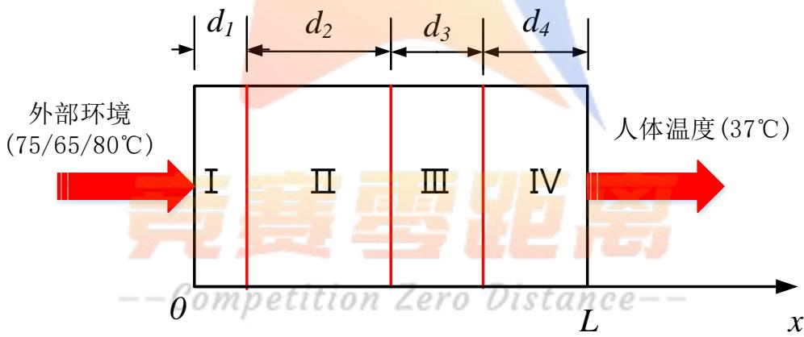  
图 1： 一维传热模型

## 5.3 辐射传热

对作业服的传热模型，主要考虑作业服通过第四层与皮肤表面的辐射传热作用。皮肤与作业服之间可视为封闭腔。由于空气层较薄，对辐射热量的吸收较少，忽略空气吸收作用，则作业服与皮肤表面的辐射传热定义为<sup>[1]</sup>：

$$
{ q } _ { \frac { \hbar \mathrm { \check { H } } \mathrm { \check { H } } } { \mathrm { \check { H } } | \mathbf { \check { H } } } } = \frac { \sigma [ { T ^ { 4 } } _ { g } - { T ^ { 4 } } _ { s k i n } ] } { \frac { 1 } { \varepsilon _ { g } } + \frac { 1 } { \varepsilon _ { s k i n } } - 1 }\tag{7}
$$

式中： $\varepsilon _ { g }$ 和 $\varepsilon _ { s k i n }$ 分别表示作业服与皮肤表面的发射率， $T _ { g }$ 和 $T _ { s k i n }$ 分别为第三层右边界温度和皮肤外侧温度。由于作业服辐射发射率较低。此处认为：非稳态传热模型中辐射传热作用很小，可以忽略，并在后续部分验证此假设合理性。

## 5.4 各层传热方式

对于传热问题，往往需要综合考虑热传导、热对流和热辐射三种不同传热方式。不同的传热方式有其特点和适用的情况。因而对各层材料和各边界条件进行讨论，确定需要各自的传热方式。

## (1)第Ⅰ层材料

对于第一层材料，材料内部主要为热传导方式，根据傅里叶定律建立模型；材料外边界与外部环境接触的边界条件为第三类边界条件，为对流传热过程。

## (2)第Ⅱ层材料

第二层材料仅需考虑热传导的传热方式。

## (3)第Ⅲ层材料

第三层材料内部为热传导方式；由于第四层空气层较薄，故接触面不考虑对流传热，仅考虑热传导<sup>[2]</sup>。

## (4)第Ⅳ层材料

第四层材料内部仅考虑热传导；材料右边界与人体接触，人体皮肤下存在大量毛细血管的血液流动，故右边界为第三类边界条件，考虑对流传热。

## 6 问题一：非稳态传热模型

## 6.1 问题分析

问题一已给定各层厚度，并已有皮肤外侧温度分布测量值。根据上述模型准备部分，基于能量守恒定律，可建立非稳态偏微分传热控制方程，确定初值和边界条件。进而建

立作业服非稳态传热模型。模型中两个对流传热系数未知，通过传热模型建立系数与实测温度之间的数值关系描述，搜索求解拟合最优化问题，得到最优传热系数，应用于后续作业服厚度设计。

## 6.2 模型建立-非稳态传热模型

## 6.2.1 传热控制方程

对于非稳态传热问题，依据能量守恒定律建立非稳态偏微分控制方程，即：对任一微元体，其热力学能的变化(表现为温度变化)等于流入流出微元体热流量的差值<sup>[3]</sup>。控制方程为：

$$
\rho _ { j } c _ { j } \frac { \partial T } { \partial t } = \frac { \partial } { \partial x } ( \lambda _ { j } \frac { \partial T } { \partial x } ) ( j = 1 , 2 , 3 , 4 )\tag{8}
$$

式中：左项表示微元体热力学能变化；右项表示微元体流入流出热流量差值。

## 6.2.2 边界条件及初值条件

对于整个作业服传热模型，两端均为第三类边界条件，传出热量由对流换热带走。假设进入高温环境时人体与作业服已达到稳定状态，作业服温度分布的初始值为假人温度 $3 7 \mathrm { { } ^ { \circ } C }$ 0

$$
\begin{array} { l } { \left\{ - \lambda _ { 1 } \displaystyle \frac { \hat { O } T } { \hat { O } x } \right| _ { x = 0 } = h _ { 1 } ( T _ { e n } - T ( 0 , t ) ) } \\ { \left. - \lambda _ { 4 } \displaystyle \frac { \hat { O } T } { \hat { O } x } \right| _ { x = L } = h _ { 2 } ( T ( L , t ) - T _ { r e n } ) } \\ { T ( x , 0 ) = T _ { r e n } } \end{array}\tag{9}
$$

式中： $h _ { I }$ 和 $h _ { 2 }$ 分别表示两端的对流传热系数， $T ( 0 , t )$ 和 $T ( L , t )$ 分别表示两端界面温度，$T ( x , 0 )$ 为初始条件， $T _ { e n }$ 表示环境温度， $T _ { r e n }$ 表示人体温度。

## 6.2.3 材料接触面

对于不均匀材料导热问题，已假设材料间接触良好，忽略接触热阻，满足界面连续条件，即满足界面上温度与热流密度连续的条件：

$$
\left\{ \begin{array} { l l } { T ( x _ { i } ^ { - } , t ) = T ( x _ { i } ^ { + } , t ) } \\ { \lambda _ { i } { \frac { \partial T } { \partial x } } ( x _ { i } ^ { - } , t ) = \lambda _ { i + 1 } { \frac { \partial T } { \partial x } } ( x _ { i } ^ { + } , t ) } \end{array} \right. ( i = 1 , 2 , 3 )\tag{10}
$$

式中：i 表示各个接触面。

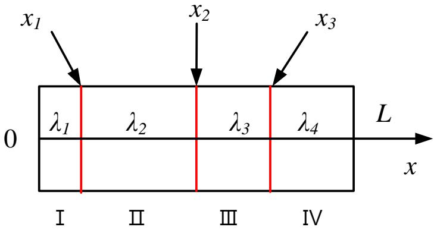  
图 2： 材料接触面

## 6.2.4 换热系数参数估计

在非稳态一维传热模型中，两端换热系数为未知量，通过最小二乘法建立参数估计模型：

$$
( \hat { h } _ { 1 } , \hat { h } _ { 2 } ) = \underset { h _ { 1 } , h _ { 2 } } { \arg \operatorname* { m i n } } \sum _ { i = 1 } ^ { N } [ T ( L , t _ { i } ; h _ { 1 } , h _ { 2 } ) - T ^ { * } ( t _ { i } ) ] ^ { 2 }\tag{11}
$$

式中， $\hat { h } _ { 1 } , \hat { h } _ { 2 }$ 为 $h _ { I }$ 和 $h _ { 2 }$ 的最小二乘估计值， $T ^ { * } ( t _ { i } )$ 为附件二中皮肤外侧温度实测值。

## 6.2.5 模型综合

对于作业服的非稳态传热过程，建立模型综合如下：

$$
\begin{array} { r l } &  \frac { \partial ^ { 2 } } { \partial \Phi } \mathbb { E } [ \hat { \mathbf { z } } \hat { \mathbf { u } } \} \dag \cdot \begin{array} { c } { ( \hat { b } , \hat { b } , ) = \mathbf { a } \underline { { \bf u } } _ { \perp } \underline { { \bf u } } _ { \perp } ^ { \mathrm { m i n } } \frac { \partial } { \partial \mathbf { x } } \overline { { \bf u } } ^ { \mathrm { i n } } ( T , ( { \hat { \bf { x } } } , t _ { i } ; h , h , h ) - T ^ { * } ( t _ { i } ) ) ^ { 2 } } \\ { \frac { \partial ^ { 2 } } { \partial \Phi } \mathbb { E } [ \hat { \bf u } , \hat { \bf u } ] \dag \hat { \bf y } _ { \perp } \dag \cdot } & { \rho , c , \frac { \partial } { \partial \hat { \bf u } } \frac { \partial } { \partial \partial \mathbf { x } } ( \frac { \partial } { \partial \hat { \bf x } } \hat { \bf u } ) ^ { 2 } \frac { \partial } { \partial \hat { \bf x } } ( j = 1 , 2 , 3 , 4 ) } \\ & { [ \underline { { - \lambda } } , \frac { \partial ^ { 2 } } { \partial \hat { \bf x } } \overline { { \bf u } } ^ { \mathrm { i n } } ( T , { \bf u } ) - h , \underline { { \bf u } } ^ { \mathrm { i n } } ( T _ { \mathrm { e } } - T ^ { * } ( 0 , t ) )  } \\ {  - \overline { { C _ { O O } } } \mathcal { M } \mathcal { P } (  \frac { \partial \hat { \bf u } } { \partial \hat { \bf x } } | _ { \mathrm { e x } } ^ { \mathrm { i n } } ,  \frac { \partial ^ { 2 } } { \partial \hat { \bf x } } \mathcal { R } _ { 2 } ( T ( \hat { \bf u } , \hat { b } ) \dag \hat { \bf z } _ { \mathrm { e m } } ^ { \mathrm { i n } } ) \mathcal { E }   - } \\    \frac { \partial ^ { 2 } } { \partial \hat { \bf x } } \mathrm { E q u a l } \frac   \end{array} \end{array}\tag{12}
$$

## 6.3 模型求解

## 6.3.1 有限差分法

传热问题数值求解的基本思想是将时间、空间上中的连续物理量离散在各个节点上，用有限差分法求解物理量的数值解<sup>[4]</sup>。

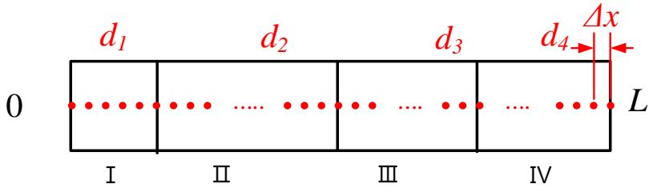  
图3： 离散示意图

## (1)差分格式

差分格式有显式和隐式两种。对于显式格式，求解计算量更小，但精度及稳定性不如隐式格式；隐式差分必须求解联立方程组，稳定性和精度较高但计算量较大。由于本问题数据量较大，故采用显式差分格式。

本文采用显式差分格式对传热模型进行离散。求解第 $\left( n { + } 1 \right)$ )时间层上温度时，依赖于前一时层温度信息。控制方程的离散格式中仅有一个未知量 $T _ { i } ^ { n + I }$

控制方程：

边界条件：

$$
\begin{array} { r l } & { \Delta x _ { j } \rho _ { j } c _ { j } \frac { T _ { i } ^ { n + 1 } - T _ { i } ^ { n } } { \Delta t } = \lambda _ { j } \frac { T _ { i + 1 } ^ { \textit { n } } - 2 T _ { i } ^ { n } + T _ { i - 1 } ^ { \textit { n } } } { \Delta x _ { j } } } \\ & { \left[ \frac { 1 } { 2 } \Delta x _ { 1 } \rho _ { i } c _ { 1 } \frac { T _ { 1 } ^ { n + 1 } - T _ { 1 } ^ { n } } { \Delta t } = - h _ { 1 } ( T _ { 1 } ^ { n } - T _ { m } ) - \lambda _ { 1 } \frac { T _ { 1 } ^ { n } - T _ { 2 } ^ { n } } { \Delta x _ { 1 } } \right. } \\ & { \left. \left[ \frac { 1 } { 2 } \Delta x _ { 4 } \rho _ { a } c _ { 4 } \frac { T _ { m } n ^ { n + 1 } - T _ { m } n ^ { \textit { n } } } { \Delta t } = - h _ { 2 } ( T _ { m d } ^ { \textit { n } } - T _ { \mathrm { s i n } } ) + \lambda _ { 4 } \frac { T _ { m d - 1 } ^ { \textit { n } } - T _ { m d } ^ { \textit { n } } } { \Delta x _ { 4 } } \right. \right. } \\ & { \left. \left. \frac { 1 } { 2 } ( \Delta x _ { j } \rho _ { j } c _ { j } + \Delta x _ { j + 1 } \rho _ { j + 1 } c _ { j + 1 } ) \frac { T _ { i } ^ { n + 1 } - T _ { i } ^ { n } } { \Delta t } = \lambda _ { j } \frac { T _ { i - 1 } ^ { \textit { n } } - T _ { i } ^ { n } } { \Delta x _ { j } } + \lambda _ { j + 1 } \frac { T _ { i + 1 } ^ { \textit { n } } - T _ { i } ^ { n } } { \Delta x _ { j + 1 } } \right. \right. } \end{array}\tag{13}
$$

接触点：

## (2)稳定限制条件

对于显式差分格式，非稳态传热过程的离散求解需要考虑求解的稳定性条件。上述显式差分式表明，空间节点 i 上时间节点 n+1时刻的温度受到左右两侧邻点的影响，需要满足稳定性限制条件(傅里叶网格数限制)，否则会出现不合理的振荡的解<sup>[5]</sup>：

$$
\begin{array} { l l } { \displaystyle \{ F o _ { \Delta } = \frac { \lambda \Delta t } { \rho c ( \Delta x ) ^ { 2 } } \qquad } & { \displaystyle ( \dot { \textcircled { 1 \oplus \frac { \mathrm { H } } { \mathrm { d } } } } \boxdot { \mathrm { H } } \dot { \mathrm { H } } \dot { \mathrm { H } } \dot { \mathrm { M } } \ddot { \mathrm { M } } \dot { \mathrm { M } } ) } \\ { \displaystyle F o _ { \Delta } \leq \frac { 1 } { 2 } \qquad } & { \displaystyle ( \dot { \mathrm { P } } ) ^ { - \frac { \mathrm { t } - \mathrm { t } } { 1 } } \boxed { \mathrm { H } \dot { \mathrm { H } } \dot { \mathrm { H } } \dot { \mathrm { H } } } \Bigl \frac { \mathrm { H } \dot { \mathrm { H } } } { \mathrm { \hat { \mathrm { H } } } } \Bigl \langle \dot { \mathrm { H } } \Bigr \rangle } \\ { \displaystyle F o _ { \Delta } \leq \frac { 1 } { 2 ( 1 + \frac { h \Delta x } { \lambda } ) } \qquad } & { \displaystyle ( \dot { \mathrm { M } } \dot { \mathrm { H } } \boxed { \mathrm { H } \dot { \mathrm { H } } \dot { \mathrm { H } } } \dot { \mathrm { M } } \ddot { \mathrm { M } } \dot { \mathrm { H } } \dot { \mathrm { H } } \dot { \mathrm { H } } ) } \end{array}\tag{14}
$$

## 6.3.2 求解步骤

对非稳态传热模型进行时间-空间离散化后，可根据边界条件和初值条件，在时间节点和空间节点上逐层进行求解。可建立未知参数复合传热系数与假人皮肤外侧温度测量值的数值关系，进而搜索未知系数 $h _ { I }$ 与 $h _ { 2 }$ ，求解对实测温度数据的最优拟合。具体求解步骤如下：

STEP1：代入 $h _ { I }$ 和 $h _ { 2 }$ 初始值，通过非稳态传热模型离散方程逐层求解，得到假人皮肤外侧温度计算值；

STEP2：利用最小二乘的方法求解计算值与实测值的误差，并求出残差平方和；

STEP3：更新 $h _ { I }$ 与 $h _ { 2 }$ 值，再次带入离散方程进行求解，得到新的温度计算值；

STEP4：重复上述步骤，搜索寻优找到拟合程度最佳的对流传热系数，并应用与后续作业服设计；

STEP5：根据搜索得到的最佳拟合对流传热系数，求解出作业服温度分布，并保存在 Excel 表中。

## 6.4 结果展示及检验分析

## 6.4.1 参数求解及拟合结果

根据上述求解步骤进行求解，搜索得到最优拟合的对流传热系数： $h _ { I } { = } 1 1 3 \ \mathrm { { W / ( m ^ { 2 } { \cdot } k ) } }$ ；$h _ { 2 } { = } 8 . 3 4 4 \mathrm { W } / ( \mathrm { m } ^ { 2 } { \cdot } \mathrm { k } )$ 。求解过程中发现：对流传热系数 $h _ { I }$ 主要影响到达稳态的时间； $h _ { 2 }$ 主要影响稳态时皮肤外侧温度。此时非稳态传热模型计算得到的皮肤外侧温度值与实测温度值的图形绘制如下：

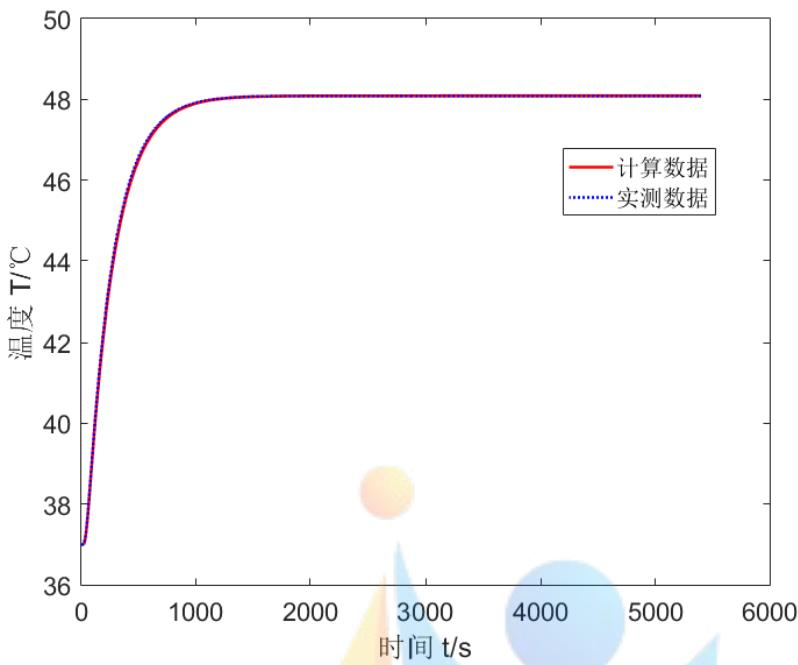  
图4：模拟计算数据与实测数据拟合图

在该复合传热系数下，计算值与实测值拟合的残差平方和为：3.6552；误差极差为：0.0061，拟合结果较好。此时显式差分的傅里叶网格数最大值为： $F o _ { \Delta m a x } { = } 0 . 0 4 7 2$ ；满足限制条件，不会出现解的不合理振荡。

表 2：拟合情况
<table><tr><td> $h _ { 1 } / \mathrm { W } / ( \mathrm { m } ^ { 2 . \circ } \mathrm { C } )$ </td><td> $h _ { 2 } / \mathrm { W } / ( \mathrm { m } ^ { 2 . \circ } \mathrm { C } )$ </td><td>残差平方和</td><td>极差</td></tr><tr><td>113</td><td>8.344</td><td>3.6552</td><td>0.0061</td></tr></table>

根据所求得的两端换热系数，运用非稳态传热模型，计算温度分布。绘制出皮肤温度与时间-空间的三维温度分布图和稳态温度的空间分布图如下：

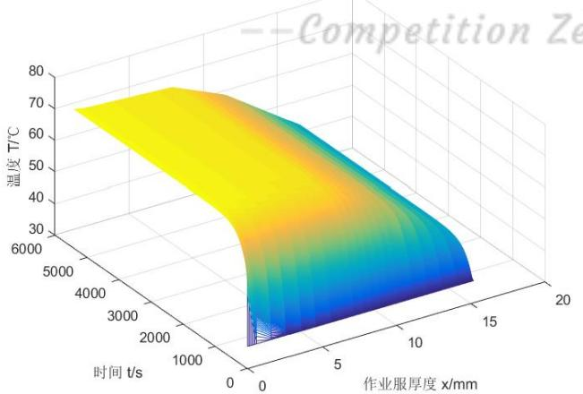  
图5： 作业服时间-空间温度分布

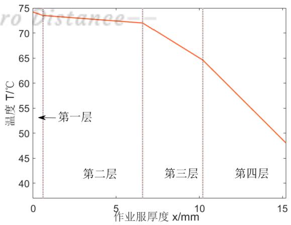  
图 6：稳态作业服温度分布

部分温度分布数据如下，其中具体的温度分布信息，见支撑材料中 problem1.xlsx文件。

表 3：温度分布
<table><tr><td>t/min</td><td> $x { = } 0 \mathrm { m m }$ </td><td>x=0.6mm</td><td>x=6.6mm</td><td>x=10.2mm</td><td>x=15.2mm</td></tr><tr><td>5</td><td>70.18974</td><td>66.2322</td><td>59.8908</td><td>55.2576</td><td>44.3273</td></tr><tr><td>10</td><td>73.0906</td><td>71.5173</td><td>67.7980</td><td>62.0502</td><td>47.0590</td></tr><tr><td>15</td><td>73.8808</td><td>72.9568</td><td>69.9517</td><td>63.9004</td><td>47.8030</td></tr><tr><td></td><td></td><td></td><td></td><td></td><td></td></tr><tr><td>80</td><td>74.1814</td><td>73.5046</td><td>72.0045</td><td>64.3007</td><td>48.0861</td></tr><tr><td>85</td><td>74.1814</td><td>73.5046</td><td>72.0045</td><td>64.3007</td><td>48.0861</td></tr><tr><td>90</td><td>74.1814</td><td>73.5046</td><td>72.0045</td><td>64.3007</td><td>48.0861</td></tr></table>

## 6.5 模型扩展及假设检验

模型准备部分已假设忽略辐射传热。此处对假设进行检验并进一步扩展非稳态传热模型。建立增加辐射传热项的模型，并对模型进行分析。

对于皮肤，可近似考虑为绝对黑体，令 $\varepsilon _ { s k i n } { = } 1 ^ { [ 6 ] }$ ；对于作业服，发射率 $\varepsilon _ { g } { = } 0 . 0 2 ^ { [ 7 ] }$ 根据式(7)计算得到辐射传热量，带入非稳态传热模型中：

$$
\begin{array} { r } { \left\{ \rho c \frac { \hat { \sigma } T } { \hat { \sigma } t } = \frac { \hat { \sigma } } { \hat { \sigma } x } ( \lambda \frac { \hat { \sigma } T } { \hat { \sigma } x } ) - q _ { \frac { \hat { \sigma } \hat { \sigma } \hat { \sigma } } { \hat { \sigma } \hat { \sigma } t } } \right. \overset { \hat { \sigma } \hat { \sigma } \hat { \sigma } } { = } \frac { \rho } { \hat { \sigma } } \sqrt { \frac { \hat { \sigma } } { \hat { \sigma } } } \frac { \hat { \sigma } H } { \hat { \sigma } \hat { \Gamma } } \frac { \hat { \sigma } } { \hat { \mathbb H } } } \\ { \left. \lambda _ { 4 } \frac { \hat { \sigma } T } { \hat { \sigma } x } \right| _ { x = L _ { - \infty - \infty - \infty } } - T _ { s k i n } ) + q _ { \frac { \hat { \sigma } \hat { \sigma } \hat { \sigma } } { \hat \mathbb H } } \left. \frac { \hat { \sigma } \hat { \sigma } } { \hat { \sigma } \hat { \sigma } } \right| _ { x = L _ { - \infty - \infty - \infty } } } \end{array}\tag{15}
$$

其控制方程的离散格式为：

$$
\left\{ \begin{array} { l l } { \displaystyle \frac { 1 } { 2 } ( \Delta x _ { 3 } \rho _ { 3 } c _ { 3 } + \Delta x _ { 4 } \rho _ { 4 } c _ { 4 } ) \frac { T _ { i } ^ { n + 1 } - T _ { i } ^ { n } } { \Delta t } = - q _ { \frac { i \approx \emptyset + 1 } { 4 \bmod 1 } } + \lambda _ { 4 } \frac { T _ { i + 1 } ^ { n } - T _ { i } ^ { n } } { \Delta x _ { 4 } } + \lambda _ { 3 } \frac { T _ { i - 1 } ^ { n } - T _ { i } ^ { n } } { \Delta x _ { 3 } } } \\ { \displaystyle \frac { 1 } { 2 } \Delta x _ { 4 } \rho _ { 4 } c _ { 4 } \frac { T _ { e n d } ^ { \quad n + 1 } - T _ { e n d } ^ { \quad n } } { \Delta t } = - h _ { 2 } ( T _ { e n d } ^ { \quad n } - T _ { s k i n } ) + \lambda _ { 4 } \frac { T _ { e n d - 1 } ^ { \quad n } - T _ { e n d } ^ { \quad n } } { \Delta x _ { 4 } } + q _ { \frac { i \pi \plus + 1 } { 4 \bmod 1 } } } \end{array} \right.\tag{16}
$$

同样的步骤建立换热系数 $h _ { I }$ 和 $h _ { 2 }$ 与实测温度值的数值关系，最佳拟合情况时结果如下：

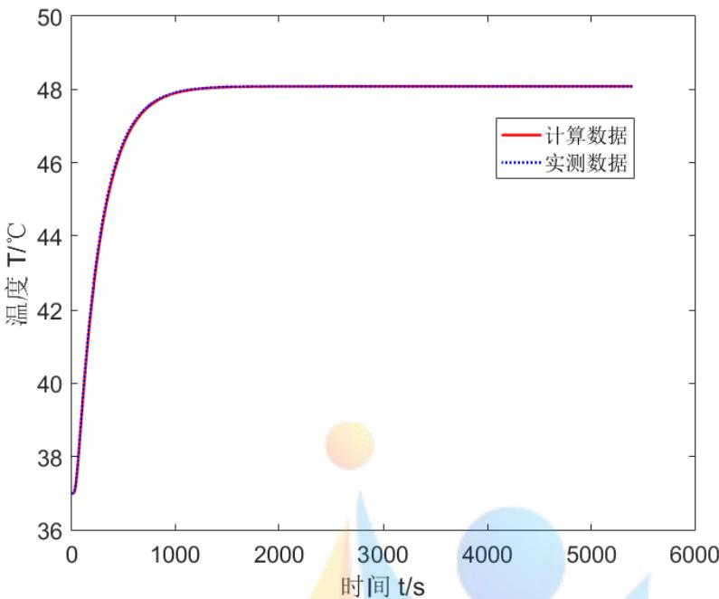  
图 7： 考虑辐射传热拟合图像

此时同样可以达到较好的拟合结果，与不考虑辐射传热相比，传热系数 $h _ { I }$ 保持不变， $h _ { 2 }$ 由 $8 . 3 4 4 \mathrm { W } / ( \mathrm { m } ^ { 2 } { \cdot } \mathrm { k } )$ 变化为 $8 . 4 9 6 \mathrm { W } / ( \mathrm { m } ^ { 2 } { \cdot } \mathrm { k } )$ ，仅有微小变化。

表4：考虑辐射拟合情况
<table><tr><td> $h _ { I } / \mathrm { W } / ( \mathrm { m } ^ { 2 . \circ } \mathrm { C } )$ </td><td> $h _ { 2 } / \mathrm { W } / ( \mathrm { m } ^ { 2 . \circ } \mathrm { C } )$ </td><td>残差平方和</td><td>极差</td></tr><tr><td>113</td><td>8. .496</td><td>3 7703</td><td>0.0021</td></tr></table>

可见，由于防护服的隔热性好，辐射发射率低，辐射传热对整个非稳态传热过程影响几乎可以忽略不计，模型准备部分假设合理。

  
7 问题二：单变量优化模型

## 7.1 问题分析

问题二是在建立问题一非稳态传热模型基础上的单变量优化模型。对于给定厚度d ，由问题一传热模型，能够得到对应的皮肤外侧温度与时间的数值关系。根据题目信息，建立关于第二层材料厚度的优化模型。以最小厚度为优化目标，以第二层厚度为优化参数，以稳态外侧温度和超过 44℃为约束条件，建立单变量优化模型并求解。

## 7.2 模型建立

记函数 $T ( x , t ; d _ { 2 } )$ 为第二层厚度为 $d _ { 2 }$ 时的温度分布函数。

## 7.2.1 优化目标

在作业服设计过程中，应尽可能降低研发成本，节省材料。故优化目标为第二层厚度最小：

$$
\operatorname* { m i n } d _ { 2 }\tag{17}
$$

## 7.2.1 约束条件

根据题目信息，主要有两个约束条件：稳态外侧皮肤温度小于 $4 7 \mathrm { { } ^ { \circ } C }$ ；超过 $4 4 ^ { \circ } \mathrm { C }$ 时间小于5分钟；第二层厚度应满足给定范围。

$$
\left\{ \begin{array} { l } { \underset { 0 \leq t \leq 6 0 \operatorname* { m i n } } { \operatorname* { m a x } } T ( L , t ; d _ { 2 } ) \leq 4 7 ^ { \circ } \mathrm { C } } \\ { \underset { 0 \leq t \leq 6 0 m \operatorname* { m i n } } { \operatorname* { m i n } } 1 T ( L , t ; d _ { 2 } ) \geq 4 4 ^ { \circ } \mathrm { C } \} \geq 5 5 \operatorname* { m i n } } \\ { 0 . 6 m m \leq d _ { 2 } \leq 2 5 m m } \end{array} \right.\tag{18}
$$

## 7.2.3 模型综合

综上所述，建立作业服第二层材料厚度的优化问题模型综合如下：

$$
\begin{array} { r l } & { \mathrm { r e r m i n } \frac { d } { d t } } \\ & { \times  \begin{array} { l l } { 1 0 ^ { \mathrm { s u b } } \nabla f ( x , t ; q ) \le 4 7 \zeta \zeta } \\ { \sin ( 1 / 1 / ( 1 / 2 , 1 / 2 ) ) \le 4 7 \zeta \zeta \zeta } \\ { \sin ( 1 / 1 / \cos \theta ) \le d , \le 2 \zeta \sin \theta } \end{array}  } \\ &  \times  \begin{array} { l l } { 1 0 ^ { \mathrm { s u b } } \nabla f ( x , t ; q ) \le 4 7 \zeta \nabla \theta } \\ { \sin ( 1 / 1 / \theta ) \le \theta \le \theta \le \theta \le \theta \le \theta \le \theta \le \theta \le \theta \le \theta \le \theta \le \theta \le \theta \le \theta \le \theta \le \theta \le \theta \theta \le \theta \le \theta \theta \le \theta \le \theta \theta \le \theta \theta \le \theta \theta \le \theta \theta \le \theta \theta \le \theta \theta \le \theta \theta \le \theta \theta \le \theta \theta \le \theta \theta \le \theta \theta \le \theta \theta \le \theta \theta \le \theta \theta \le \theta \theta \le \theta \theta \le \theta \theta \le \theta \theta  } \\   \frac { d } { d t } \frac { d } { d t } \frac { d } { d t } \frac { d } { d } \frac { d } { d t } \frac { d } { d } \frac { d } { d t } \frac { d } { d } \frac { d } { d t } \frac { d } { d } \frac { d } { d } \frac { d } { d t } \frac { d } \frac { d } { d } \frac { d } { d t } \frac { d } \frac { d } { d } \frac { d } { d t } \frac { d } \frac { d } { d t } \frac { d } \frac { d } { d } \frac { d } \frac { d } { d t } \frac { d } \frac { d } { d t } \frac { d } \frac { d } { d t } \frac { d } \frac { d } { d t } \frac { d } \frac { d } { d t } \frac { d } \frac { d } { d t } \frac { d } \frac { d } { d t } \frac { d } \frac { d } { d t } \frac { d } \frac { d } { d t } \frac { d } \frac { d } { d t } \frac { d } \frac { d }  \end{array} \end{array}\tag{19}
$$

## 7.3 模型求解

根据理论分析及问题一结果可知，在固定其他参数时，皮肤外侧温度是关于传热时间的单调不减函数；稳态皮肤温度时关于第二层厚度的单调减函数。因而对于上述单参数单目标优化问题转换为求解满足约束条件临界值的问题。

(1)求解临界值一：对于非稳态传热问题，皮肤外侧最大温度应为稳态温度或时间末点温度。因而可将第一约束条件转换为：

$$
\operatorname* { m a x } _ { 0 \leq t \leq 6 0 \operatorname* { m i n } } T ( L , t ; d _ { 2 } ) \leq 4 7 ^ { \circ } \mathbb { C } \Leftrightarrow T ( L , 6 0 \operatorname* { m i n } ; d _ { 2 } ) \leq 4 7 ^ { \circ } \mathbb { C }\tag{20}
$$

即求解临界厚度 $D _ { I }$ ，进而确定厚度范围，满足以下关系：

$$
\begin{array} { r l } & { \left\{ T ( L , 6 0 \operatorname* { m i n } ; D _ { 1 } ) = 4 7 ^ { \circ } \mathrm { C } \right. } \\ & { \left\{ d _ { 2 } \geq D _ { 1 } \right. } \\ & { \left\{ 2 5 m m \geq d _ { 2 } \geq 0 . 6 m m \right. } \end{array}\tag{21}
$$

(2)求解临界值二：与约束条件一求解方式相同，先求解出满足约束条件的临界值 $D _ { I }$ ，进而确定厚度的范围：

$$
\begin{array} { r l } & { [ T ( L , 5 5 \operatorname* { m i n } ; D _ { 2 } ) = 4 4 ^ { \circ } \mathrm { C }  } \\ & {  \{ d _ { 2 } \geq D _ { 2 }  } \\ & {  [ 2 5 m m \geq d _ { 2 } \geq 0 . 6 m m   } \end{array}\tag{22}
$$

最终可取区间为两个约束条件解的范围集合的交集，其中最小厚度即为所求解的第二层厚度设计。对上述约束临界值问题搜索进行求解。

## 7.4 结果展示及分析

## 7.4.1 结果展示

分别对约束条件求解临界值，得到结果如下：

表5：约束条件临界值
<table><tr><td></td><td>厚度</td><td>温度（t=60min）</td><td>温度（t=55min）</td><td>范围</td></tr><tr><td>第一约束条件</td><td>0.6mm</td><td>45.0832℃</td><td>45.0832℃</td><td> $\mathrm { d } _ { 2 } { \geqslant } 0 . 6 \mathrm { m m }$ </td></tr><tr><td>第二约束条件</td><td>17.5mm</td><td>44.0799℃</td><td>43.9998℃</td><td> $\mathrm { d } _ { 2 } { \geq } 1 7 . 5 \mathrm { m m }$ </td></tr><tr><td>最终设计方案</td><td>17.5mm</td><td>44.0799℃</td><td>43.9998℃</td><td></td></tr></table>

绘制出最优厚度 $d _ { 2 } { = } 1 7$ .5mm 时，皮肤外侧温度随时间变化图。

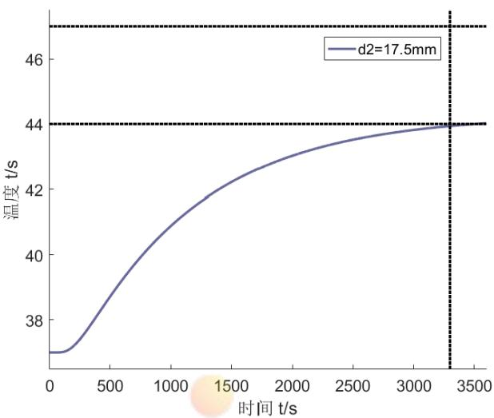  
图 8： 皮肤温度随时间变化

故作业服第二层厚度的最优设计为：17.5mm，在t=55min时，皮肤表面温度为43.9998℃，接近于临界温度 44摄氏度；最高温度为 44℃，满足约束条件。由于傅里叶网格数条件的限制以及离散数值求解的精度限制，为确保不出现解的振荡和精度损失，求解精度仅能精确到十分位。

## 7.4.2 结果分析

对上述求解结果进行分析，可见对于第一约束条件，所有可行厚度均能满足。这是因为：

(1)从理论分析：根据传热学理论，稳态时皮肤外侧温度应主要与外界热源温度和作业服热阻大小相关。对于问题二，外界温度降低为 $6 5 \mathrm { { ^ \circ C } }$ 第二层厚度可有变化。但是由于第二层材料导热率为四种材料中最大，故第二层材料厚度的变化对整个作业服热阻大小的影响较小，不能抵消外界热源温度变化的影响。故最大温度始终低于 $4 7 \mathrm { { } ^ { \circ } C }$ 0

(2)从结果分析：根据问题一稳态作业服温度分布图 5，可见第二层温度梯度最小，两端温差最小，第二层厚度的变化对最大温度的影响占次要因素，第二层主要起延缓传热过程等其他作用。温度始终低于 47℃是合理的。

下图绘制出不同材料厚度下，皮肤外层温度与时间的数值关系：

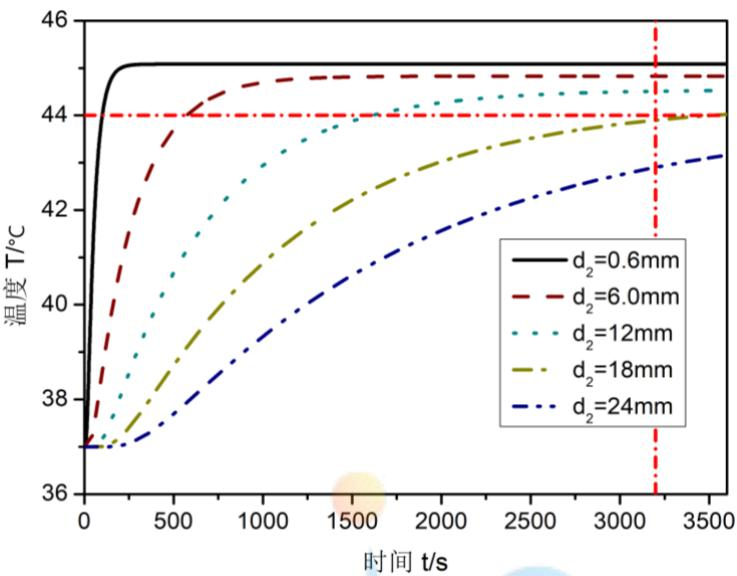  
图 9： 不同厚度 T-t 关系

可见皮肤外层温度与厚度 $d _ { 2 }$ 满足单调减关系，但厚度对最大温度的影响不大；第二层厚度的调节对达到稳态的收敛时间影响较大，因为厚度的增加必然导致传热过程的缓慢。

## 8 问题三：多目标优化模型

## 8.1 问题分析

问题三增加关于第四层厚度的设计，考虑关于研发制作成本、作业服笨重程度、人体舒适程度等因素建立优化目标。同样考虑最大温度、高温时间和厚度范围作为约束条件，建立多目标优化模型。进一步扩展模型，研究第二层和第四层在传热过程中的不同作用效果，扩大模型应用范围，缩短研发周期。

## 8.2 模型建立

## 8.2.1 优化目标

对于作业服厚度的设计，结合实际情况，最优厚度设计应尽量实现以下目的：

(1)舒适性目标：在达到相同隔热性能的同时，衣服厚度应尽可能小，作业服灵活性更高，且重量更低，便于穿着作业；

(2)节约性目标：尽可能的减少制作成本，由于第四层为空气层，不耗费成本，故第二层厚度应尽可能小；

(3)性能稳定性目标：考虑两个方面对作业服性能稳定的影响：其一是空气层为流体，若空气层过厚，可能会造成厚度不均匀，出现局部过热造成灼伤。并且空气物化性质容易受到汗液、水汽等因素的影响，故第四层厚度不能过厚。其二是第二层导热率最大，对热辐射的隔绝性能最好，故第二层材料不能过薄<sup>[8]</sup>。

(4)研发效率目标：为了缩短研发周期，应尽可能的使作业服设计厚度满足更多实际情况下的使用。

对于上述目标(1)和目标(2)，可通过数学描述建立优化目标：

$$
\left\{ \begin{array} { l l } { \operatorname* { m i n } ( d _ { 2 } + d _ { 4 } ) } \\ { \operatorname* { m i n } ( d _ { 2 } ) } \end{array} \right.\tag{23}
$$

对于目标(3)，将性能稳定性目标转换为约束条件，限制第二层材料厚度不低于6mm。

$$
d _ { 2 } \geq 6 m m\tag{24}
$$

对于目标(4)，难以通过数学描述来确定优化目标。在下述模型扩展部分，深入研究讨论相关因素与传热过程的规律，研究各层材料在隔热设计中的主要作用，使得模型能够简单的推广到更多应用情况，缩短研发周期。

## 8.2.2 约束条件

记函数 $T ( x , t ; d _ { 2 } , d _ { 4 } )$ 为当第二层厚度为 $d _ { 2 }$ ，第四层厚度为 $d _ { 4 }$ 时的温度分布函数。

考虑约束条件皮肤外侧温度不超过 $4 7 ^ { \circ } C :$ ；超过44℃时间少于5分钟；题目给定厚度范围；以及性能稳定性约束条件。

$$
\begin{array} { r l } & { \left\{ \begin{array} { l l } { \underset { 0 \leq t \leq 3 0 \operatorname* { m i n } } { \operatorname* { m a x } } T ( L , t ; d _ { 2 } , d _ { 4 } ) \leq 4 7 ^ { \circ } \mathbb { C } } \\ { \underset { 0 \leq t \leq 1 0 \operatorname* { m i n } } { \operatorname* { m i n } } \lbrace t \vert T ( L , t ; d _ { 2 } ) \geq 4 4 ^ { \circ } \mathbb { C } \rbrace \geq 2 5 \operatorname* { m i n } } \end{array} \right. } \\ & { \left\{ \begin{array} { l l } { 0 . 6 m m \leq d _ { 2 } \leq 2 5 m m } \\ { 0 . 6 m m \leq d _ { 4 } \leq 6 . 4 m m } \\ { d _ { 2 } \geq 6 m m } \end{array} \right. } \end{array}\tag{25}
$$

## 8.2.2 模型综合

建立多目标优化模型如下：

$$
\begin{array} { r l } & { \left\{ \right\} \mathbb { \hat { H } } \mathbb { \hat { L } } \left\{ \left| \boldsymbol { \mathcal { E } } \right\} \right\} ^ { \sharp } \flat \ X ^ { \sharp } \left\{ \right\} } \\ & { \qquad \quad \left\{ \vphantom { \int } \operatorname* { m i n } \left( d _ { 2 } \right) ^ { \sharp } \right\} } \\ & { \qquad \left\{ \begin{array} { l l } { \operatorname* { m a x } } & { T ( L , t ; d _ { 2 } , d _ { 4 } ) \leq 4 7 \mathbb { C } } \\ { 0 \leq t \leq 0 \operatorname* { m i n } \left( T ( L , t ; d _ { 2 } ) \geq 4 4 \mathbb { C } \right) \geq 2 5 \operatorname* { m i n } } \\ { 0 . 1 \rule { 0 ex } { 5 ex } \left\{ 0 . 6 m m \leq d _ { 2 } \leq 2 5 m m \right. } \\ { 0 . 6 m m \leq d _ { 4 } \leq 6 . 4 m m } \\ { \qquad \left\{ d _ { 2 } \geq 6 m m \right. \qquad } \end{array} \right. } \end{array}
$$

 <sub>控制方程：</sub> ${ \rho _ { j } c _ { j } \frac { \partial T } { \partial t } } = \frac { \partial } { \partial x } ( { \lambda { _ j } \frac { \partial T } { \partial x } } ) ( j = 1 , 2 , 3 , 4 )$

边界条件：

$$
\left\{ \begin{array} { l } { \displaystyle - \lambda _ { 1 } \frac { \partial T } { \partial x } \bigg | _ { x = 0 } = h _ { 1 } ( T _ { e n } - T ( 0 , t ) ) } \\ { \displaystyle - \lambda _ { 4 } \frac { \partial T } { \partial x } \bigg | _ { x = L } = h _ { 2 } ( T ( L , t ) - T _ { r e n } ) } \end{array} \right.\tag{26}
$$

<sup>接触面：</sup>

$$
\left\{ \begin{array} { l l } { T _ { i } = T _ { i + 1 } } \\ { \lambda _ { j } \displaystyle \frac { \partial T } { \partial x } = \lambda _ { j + 1 } \displaystyle \frac { \partial T } { \partial x } } \end{array} \right.
$$

初始条件：

$$
T ( x , 0 ) = T _ { r e n }
$$

## 8.3 模型求解

## (1)多目标→单目标

将多目标优化问题转化为单目标优化问题。对优化目标一:由于第四层材料导热系数远小于第二层材料，故在相同外界环境温度下，d 的增大对隔热性能的提升更为明显。对优化目标二：在满足相同隔热性能的条件下，d 越厚则制作成本越小。故优化目标转化使得第二层厚度最小为:

$$
\operatorname* { m i n } d _ { 2 }\tag{27}
$$

## (2)模型求解

在上述模型下，依照问题二的模型解法，求解约束条件临界值问题。并求解得到最优厚度设计。

## 8.4 结果展示

对模型求解得到最优厚度设计为： $d _ { 2 } = 1 9 . 2 \mathrm { m m }$ $d _ { 4 } { = } 6$ .4mm。此时临界条件为：

表 6：临界范围 d<sub>4</sub>=6.4mm
<table><tr><td></td><td>厚度</td><td>温度  $\scriptstyle ( \mathbf { t } = 3 0 \mathbf { m i n } )$ </td><td>温度（t=25min）</td><td>范围</td></tr><tr><td>第一约束条件</td><td>12.9mm</td><td>46.9813℃</td><td>46.5134℃</td><td> $\mathrm { d } _ { 2 } { \geq } 1 2 . 9 \mathrm { m m }$ </td></tr><tr><td>第二约束条件</td><td>19.2mm</td><td>44.7721℃</td><td>43.9650℃</td><td> $\mathrm { d } _ { 2 } { \geq } 1 9 . 2 \mathrm { m m }$ </td></tr><tr><td>最终设计方案</td><td> $d _ { 2 } { = } 1 9 . 2 / d _ { 4 } { = } 6 . 4$ </td><td>44.7721℃</td><td>43.9650℃</td><td></td></tr></table>

## 8.5 模型扩展

进一步深入研究非稳态传热模型，讨论第二层和第四层材料对传热过程和皮肤温度的影响关系。进行理论分析，提出以下猜想：第四层材料导热率最小，故隔热性能最佳，适用于高温环境；第二层材料导热率最大，隔热性能较差，厚度变化对传热过程速率影响最为明显，适用于长时间作业环境。接下来对该猜想进行验证

## 8.5.1 验证各层材料作用：

选定环境温度为 $8 0 ^ { \circ } \mathrm { C }$ ，工作时间为 120min。分别在：

(1)固定 $d _ { 2 } { = } 1 0 \mathrm { m m }$ ，分别在d =1,2,3,4,5,6mm 时，研究第四层厚度变化对到达稳态时间和稳态温度的影响；

(2)固定 $d _ { 4 } { = } 3 \mathrm { m m }$ ，分别在 d =15,17,19,21,23,25mm 时研究第二层厚度变化对到达稳态时间和稳态温度的影响。

分别绘制出图形如下：

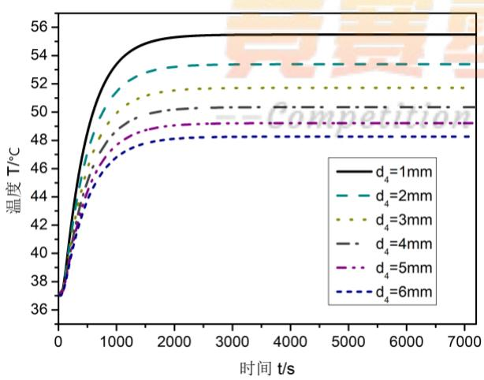  
图 10： (a)固定第二层厚度 d<sub>2</sub>

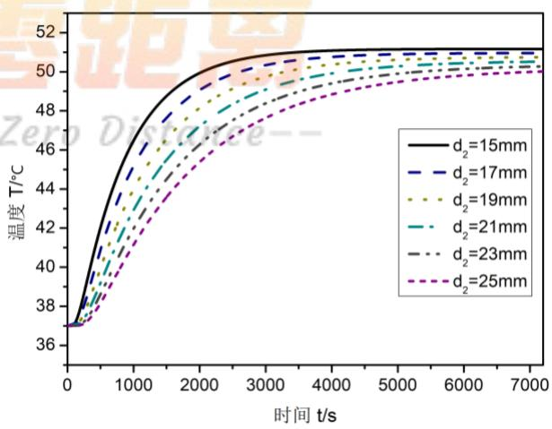  
(b)固定第四层厚度 d<sub>4</sub>

对结果分析可以明显得出：在第二层厚度固定时（图a），d 的变化对稳态的温度大小有明显的影响，而达到稳态的时间基本没有变化；固定第四层厚度时（图b），d的变化对达到稳态的时间，以及非稳态传热的具体过程影响较大，而稳态的温度基本相近，受到影响较小。

## 8.5.2 材料厚度组合-作业环境

根据上述结论，可确定在以下四类作业环境中作业服厚度设计的简单原则。

## (1)高温短时间作业环境

在高温环境下，需要使得作业服隔热性能更好，稳态温度更低，则第四层材料厚度应该更大；而短时间作业时，过程传热速度快慢对作业过程影响不大，故第二层可以更薄以节省成本。

## (2)高温长时间作业环境

同上，高温环境中作业服第四层应当更厚以增强隔热性能；而长时间作业需使得传热过程更为缓慢，以拉长到达稳态的时间，需增大第二层厚度。

## (3)低温短时间作业环境

低温短时间作业环境要求最为宽松，作业服的设计过程中第二层和第四层厚度均可以减小以节省成本和研发难度，若有必要，也可适当减小其他材料厚度。

## (2)低温长时间作业环境

低温环境对隔热性能要求不高，第四层厚度可减小；长时间作业对传热速度由一定要求，可适当增大第二层厚度。


## 9 模型推广与分析

本文综合考虑各种传热方式和边界条件，建立非稳态一维传热模型，并应用于作业服设计的优化问题。 本文所建立模型和求解过程具有以下特点：

问题一：

(1)建立的一维非稳态传热模型综合考虑了各种传热方式和边界条件，根据能量守恒原理建立传热模型。模型忽略了热辐射的作用，并在模型扩展部分验证了热辐射对传热过程的影响很小，可以忽略不计。该模型考虑实际问题较为全面，对测定数据拟合程度较好。

(2)对模型的求解采取显式差分格式，优点在于求解计算量较小，效率较高；不足之处在于显式差分格式具有限制条件，否则会造成解的振荡和精度损失，以至于求解结果精度不能进一步增加<sup>[4]</sup>。若对求解精度要求较高而求解数据量较小，可以采用隐式差分格式，通过高斯-赛德尔迭代求解进行计算。

## 问题二：

(1)建立的优化模型仅是对问题一传热模型的应用。在求解过程中发现高温时间约束比最大温度约束更为严格，在本文中仅对这种现象进行了理论和结果分析，解释了出现这种现象的原因。若要将模型进一步推广，可考虑研究两个约束条件之间的关系，探讨在何种条件下，两种约束条件达到平衡或出现最大温度更为严格的情况。

## 问题三：

(1)问题三中考虑第二层和第四层厚度的组合优化问题。对优化目标的确定，仅考虑了以作业服总体厚度和第二层厚度作为优化目标，为了逼近实际情况，应考虑如：人体舒适度感受、隔热性能衡量标准等其他方向。建立更全面的优化模型。

(2)问题三中进一步深入的探讨了关于各层材料在实际传热过程中的主要作用，证明了猜想的准确性，使得模型具有更好的推广应用可能性。若要进一步再深入模型，可以考虑研究外界环境温度的变化与传热过程速率和稳态温度的影响；以及作业时间长度要求的变化与作业服设计的规律等。


## 参考文献

[1]卢琳珍,徐定华,徐映红.应用三层热防护服热传递改进模型的皮肤烧伤度预测[J].纺织学 报,2018,39(01):111-118+125.

[2]卢琳珍. 多层热防护服装的热传递模型及参数最优决定[D].浙江理工大学,2018.

[3]李灿,高彦栋,黄素逸.热传导问题的 MATLAB 数值计算[J].华中科技大学学报(自然科学版),2002(09):91-93.

[4]杨世铭,. 传热学[M]. 第 4 版. 北京 : 高等教育出版社, 2006

[5]李新春,王中伟.一维热电模块的瞬态传热过程研究[J].太阳能学报,2016,37(07):1826-1831.

[6]唐建民,郑志军.人体皮肤和黑体[J].大学物理,1990(01):46-49.

[7]潘斌. 热防护服装热传递数学建模及参数决定反问题[D].浙江理工大学,2017.

[8]赵玲,吕国志,任克亮,李元林.再入飞行器多层隔热结构优化分析[J].航空学报,2007(06):1345-1350.


##

## 附录

附录一：

问题一程序：

```matlab
程序编号 T1-1 文件名称 skinT.m 说明 传热模型离散求解
function [ T ] = skinT( ah1,ah2 )
%skinT 已知 h1,h2 求皮肤表面的温度
% h1是外界与衣服最外层的对流传热系数
% h2是空气层与皮肤的对流传热系数
% T 是皮肤的温度
rho=[300,862,74.2,1.18]; %常数的设置
c=[1377,2100,1726,1005];
lam=[0.082,0.37,0.045,0.028];
x=[0.0006,0.006,0.0036,0.005]; %每层的宽度
dx=[0.0001,0.001,0.0006,0.001]; %空间步长
dt=0.002; %时间步长
Tout=75;Tin=37; %初始温度
LEN1=int8(x(1)/dx(1))+1; %记录每段接触点的位置
LEN2=LEN1+x(2)/dx(2);
LEN3=LEN2+x(3)/dx(3);
LEN4=LEN3+x(4)/dx(4);
T=zeros(5400/dt,LEN4);
T(1,:)=37; %第 0 秒设置所有点的温度是 37
h1=ah1;h2=ah2; %设置对流交换系数
for n=1:5400/dt-1
unknow=(h1*(Tout-T(n,1))-lam(1)*(T(n,1)-T(n,2))/dx(1))*dt/(0.5*dx(1)*rho(1)*c(1))+T(n,1);
T(n+1,1)=unknow;
for i=2:LEN1
if i>=2&&i<=LEN1-1
unknow=lam(1)*(T(n,i+1)-2*T(n,i)+T(n,i-1))/dx(1)*dt/(dx(1)*rho(1)*c(1))+T(n,i);
T(n+1,i)=unknow;
elseif i==LEN1
unknow=(lam(2)*(T(n,i+1)-T(n,i))/dx(2)+lam(1)*(T(n,i-1)-T(n,i))/dx(1))*...
dt/(0.5*(dx(1)*rho(1)*c(1)+dx(2)*rho(2)*c(2)))+T(n,i);
T(n+1,i)=unknow;
end
end
for i=LEN1+1:LEN2
```

```matlab
if i>=LEN1+1&&i<=LEN2-1
unknow=lam(2)*(T(n,i+1)-2*T(n,i)+T(n,i-1))/dx(2)*dt/(dx(2)*rho(2)*c(2))+T(n,i);
T(n+1,i)=unknow;
elseif i==LEN2
unknow=(lam(3)*(T(n,i+1)-T(n,i))/dx(3)+lam(2)*(T(n,i-1)-T(n,i))/dx(2))*...
dt/(0.5*(dx(2)*rho(2)*c(2)+dx(3)*rho(3)*c(3)))+T(n,i);
T(n+1,i)=unknow;
end
end
for i=LEN2+1:LEN3
if i>=LEN2+1&&i<=LEN3-1
unknow=lam(3)*(T(n,i+1)-2*T(n,i)+T(n,i-1))/dx(3)*dt/(dx(3)*rho(3)*c(3))+T(n,i);
T(n+1,i)=unknow;
elseif i==LEN3
unknow=(lam(4)*(T(n,i+1)-T(n,i))/dx(4)+lam(3)*(T(n,i-1)-T(n,i))/dx(3))*...
dt/(0.5*(dx(3)*rho(3)*c(3)+dx(4)*rho(4)*c(4)))+T(n,i);
T(n+1,i)=unknow;
end
end
for i=LEN3+1:LEN4
if i>=LEN3+1&&i<=LEN4-1
unknow=lam(4)*(T(n,i+1)-2*T(n,i)+T(n,i-1))/dx(4)*dt/(dx(4)*rho(4)*c(4))+T(n,i);
T(n+1,i)=unknow;
elseif i==LEN4
unknow=(lam(4)*(T(n,LEN4-1)-T(n,LEN4))/dx(4)-h2*(T(n,LEN4)-Tin))*...
dt/(0.5*dx(4)*rho(4)*c(4))+T(n,LEN4);
T(n+1,i)=unknow;
end
end
end
T=T(:,LEN4);
T=T(1:500:5400/dt);
end
```

```matlab
程序编号 T1-2 文件名称 wenti1_find.m 说明 搜索求解最优拟合系数
clear,clc
data1 = xlsread('data.xlsx',2,'B3:B5402');
F = zeros(31,31);
m = 0;
for i = linspace(111,113,31)
n = 0; m = m+1;
for j = linspace(8.33,8.35,31)
n = n+1;
tic
F(m,n) = (skinT(i,j)-data1)'*(skinT(i,j)-data1);
toc
end
end
a=min(min(F));
[x,y]=find(F==a);
%绘制最佳的拟合图
T1=skinT(110.9+0.1*x,8.329+0.001*y);
figure(1)
plot(1:5400,T1,'r','LineWidth',1.5),hold on;
T2=xlsread('data.xlsx',2,'B3:B5402');
plot(1:5400,T2,'b:','LineWidth',1.5)
legend('模拟数据','实测数据','Location','Northwest')
%计算最大级差以及残差的平方和
R = (skinT(110.9+0.1*x,8.329+0.001*y)-data1)'*(skinT(110.9+0.1*x,8.329+0.001*y)-data1);
a=max(skinT(110.9+0.1*x,8.329+0.001*y)-data1);
```

```matlab
程序编号 T1-3 文件名称 wenti1_plot.m 说明 绘制图形
% T=skinT(110.9+0.1*x,8.329+0.001*y); %这里的 skinT 函数的输出已经进行过更改
x=[0.0006,0.006,0.0036,0.005]; %每层的宽度
dx=[0.0001,0.001,0.0006,0.001];
x1=dx(1):dx(1):x(1);
x2=x(1)+dx(2):dx(2):x(1)+x(2);
x3=x(1)+x(2)+dx(3):dx(3):x(1)+x(2)+x(3);
x4=x(1)+x(2)+x(3)+dx(4):dx(4):x(1)+x(2)+x(3)+x(4);
x=[0,x1,x2,x3,x4];
% mesh(x,1:5400,T)
```

```csv
T=skinT(113,8.344);
%绘制稳态时的温度分布截面图，
T=T(end,:);
plot(x,T,'LineWidth',1.5),hold on;
plot([0.0006,0.0006],[37,75],'r:','LineWidth',1.5),hold on;
plot([0.0066,0.0066],[37,75],'r:','LineWidth',1.5),hold on;
plot([0.0102,0.0102],[37,75],'r:','LineWidth',1.5),hold on;
axis([0,0.0152,37,75])
```

问题二程序：

程序编号 T2-1 文件名称 Que2.m 说明 求解约束条件临界值   
clear, clc   
for d2 = 10:0.5:25   
T = skinT02(d2);   
if T(end) >= 47   
continue   
elseif T(55\*60)>= 44   
continue   
else   
disp(['d2 = ',num2str(d2),' is ok.']);   
end   
end   
figure plot(skinT02(17.5),'m',' LineWidth',2)   
plot([0,3600],[44 44],'k:','LineWidth',2)   
plot([0,3600],[47 47],'k:','LineWidth',2)   
plot([55\*60 55\*60],[36.5 49],'k:','LineWidth',2)   
axis([0 3600 36.5 47.5])   
hold off

## 问题三程序：

```matlab
程序编号 T3-1 文件名称 wenti3.m 说明 第2、4层作用研究
tt = 120; %总时间
figure %寻找 d2 与 d4 之间的关系
hold on
for d2 = 10
for d4 = 1:1:6
T = skinTplus4(d2,d4);
plot(T,'LineWidth',1.2);
end
end
axis([0 tt*60 36 60])
hold off
figure
hold on
for d2 = 15:2:25
for d4 = 3
T = skinTplus4(d2,d4);
plot(T,'LineWidth',1.2);
end
end
axis([0 tt*60 36 55])
hold off
function T = skinTplus4(d2,d4)
tt = 120*60;
ah1 = 113;
ah2 = 8.344;
d2 = d2*1e-3;
d4 = d4*1e-3;
rho=[300,862,74.2,1.18];
c=[1377,2100,1726,1005];
lam=[0.082,0.37,0.045,0.028];
x=[0.0006,d2,0.0036,d4]; %每层的宽度
dx=[0.0001,0.001,0.0006,0.001]; %空间步长
dt=0.005; %时间步长
Tout=80;Tin=37; %初始温度
LEN1=int8(x(1)/dx(1))+1;
LEN2=LEN1+x(2)/dx(2);
```

```matlab
LEN3=LEN2+x(3)/dx(3);
LEN4=LEN3+x(4)/dx(4);
T=zeros(tt/dt,LEN4);
T(1,:)=37;
h1=ah1;h2=ah2; %设置对流交换系数
for n=1:tt/dt-1
unknow=(h1*(Tout-T(n,1))-lam(1)*(T(n,1)-T(n,2))/dx(1))*dt/(0.5*dx(1)*rho(1)*c(1))+T(n,1);
T(n+1,1)=unknow;
for i=2:LEN1
if i>=2&&i<=LEN1-1
unknow=lam(1)*(T(n,i+1)-2*T(n,i)+T(n,i-1))/dx(1)*dt/(dx(1)*rho(1)*c(1))+T(n,i);
T(n+1,i)=unknow;
elseif i==LEN1
unknow=(lam(2)*(T(n,i+1)-T(n,i))/dx(2)+lam(1)*(T(n,i-1)-T(n,i))/dx(1))*...
dt/(0.5*(dx(1)*rho(1)*c(1)+dx(2)*rho(2)*c(2)))+T(n,i);
T(n+1,i)=unknow;
end
end
for i=LEN1+1:LEN2
if i>=LEN1+1&&i<=LEN2-1
unknow=lam(2)*(T(n,i+1)-2*T(n,i)+T(n,i-1))/dx(2)*dt/(dx(2)*rho(2)*c(2))+T(n,i);
T(n+1,i)=unknow;
elseif i==LEN2
unknow=(lam(3)*(T(n,i+1)-T(n,i))/dx(3)+lam(2)*(T(n,i-1)-T(n,i))/dx(2))*...
dt/(0.5*(dx(2)*rho(2)*c(2)+dx(3)*rho(3)*c(3)))+T(n,i);
T(n+1,i)=unknow;
end
end
for i=LEN2+1:LEN
if i>=LEN2+1&&i<=LEN3
unknow=lam(3)*(T(n,i+1)-2*T(n,i)+T(n,i-1))/dx(3)*dt/(dx(3)*rho(3)*c(3))+T(n,i);
T(n+1,i)=unknow;
elseif i==LEN3
unknow=(lam(4)*(T(n,i+1)-T(n,i))/dx(4)+lam(3)*(T(n,i-1)-T(n,i))/dx(3))*...
dt/(0.5*(dx(3)*rho(3)*c(3)+dx(4)*rho(4)*c(4)))+T(n,i);
T(n+1,i)=unknow;
end
end
for i=LEN3+1:LEN4
if i>=LEN3+1&&i<=LEN4-1
unknow=lam(4)*(T(n,i+1)-2*T(n,i)+T(n,i-1))/dx(4)*dt/(dx(4)*rho(4)*c(4))+T(n,i);
```


```matlab
T(n+1,i)=unknow;
elseif i==LEN4
unknow=(lam(4)*(T(n,LEN4-1)-T(n,LEN4))/dx(4)-h2*(T(n,LEN4)-Tin))*...
dt/(0.5*dx(4)*rho(4)*c(4))+T(n,LEN4);
T(n+1,i)=unknow;
end
end
end
T=T(:,LEN4);
T=T(1:200:tt/dt,1);
end
```