# 针对中小微企业最优信贷决策研究

## 摘要

中小微企业由于其自身实力较弱和贷款担保不足，银行往往仅根据企业以往的信用记录以及企业的发票信息来判断企业的信贷风险，这就需要有一个合理、高效的信贷风险量化体系，并根据企业信贷风险构建最优信贷决策模型。研究银行对中小微企业的最优信贷决策一方面有利于银行的健康发展，维护金融市场的稳定；另一方面有利于增加中小微企业获得贷款的几率，促进中小微企业的发展。

针对问题一，主要解决两个问题：一是需要量化各企业的信贷风险，二是需要给出银行的最优信贷决策。文章首先通过对数据进行分析和预处理，从中提炼了总利润、运营时长等11个指标，分别从实力、供求稳定性、偿还能力和信誉度四个方面对企业信贷风险进行综合评估，建立了企业信贷风险评价体系。最后使用熵权法和TOPSIS方法量化了企业的信贷风险。第二个问题属于规划类问题，要求给出银行对各企业的信贷决策。银行的信贷决策与企业的信贷风险密切相关，并遵循利润最大化和风险最小化的经营原则，本文依据RAROC理论、违约金字塔理论以及上述原则构建了银行最优信贷模型，最终判断对123家企业是否予以放贷，并给出对于每个企业的最佳贷款利率和最佳贷款额度。

针对问题二，需要预测出302家无信用记录企业的信用等级和违约记录，解决方法是利用有标记的附件1数据进行训练，再将附件2的数据代入进行预测。对于违约记录，本文使用Logit回归进行分析，其中回归的准确度为84.6%，最终计算出各企业的违约概率。其次，本文使用BP神经网络模型对信用等级进行预测。将302家的违约概率和信用预测出来，结合自身已知数据就可以依据企业信贷风险评价指标体系量化各企业的信贷风险，最后结合总贷款额约束求解银行的最优信贷策略，得到针对302家企业的信贷策略。

针对问题三，首先需要在原来模型的基础上考虑突发事件的影响，对原来的模型进行Competition ZeroDistance-改进。本文创新性地引入突发事件因子来改进模型，通过加入三种突发事件因子充分地识别突发事件带来的影响，从而对信贷决策进行调整。其次是分析新冠突发事件，通过国家统计局等渠道获得疫情对于各行业产值、利润等因素的影响数据，量化基于突发事件的最优信贷决策模型，求解发生突发事件时的信贷调整策略。最终获得基于新冠肺炎突发事件下的信贷调整政策。并将其与第二问的结果进行对比，文章发现新冠疫情的爆发导致银行的信贷策略更加倾向于高新技术产业，这可能和此类产业在疫情间的快速发展有关。

关键词：量化分析信贷风险信贷决策违约金字塔理论突发事件因子

## 一、问题重述

## 1. 背景知识

中小微企业是我国经济中重要的组成部分，中小微企业的发展有利于刺激我国经济的活力，提高市场效率，对垄断势力产生竞争压力。同时，根据谢勒等人的理论，中小微企业相比起大规模企业具有更强的创新动力，是技术进步的源泉。然而，由于中小微企业自身的规模较小、抵押物不足、波动大等特性，导致中小微企业融资困难，难以从银行获得贷款，严重阻碍了中小微企业的发展。

从银行方面来说，商业银行的经营原则有安全性、流动性、盈利性等，其中安全性是银行经营的根本，盈利性是银行经营的目的。处于安全性考虑，银行往往不会轻易地给中小微企业贷款，但是出于盈利性目的和政策考虑，银行又往往需要向中小微企业提供贷款。由于没有足够的抵押物，因此银行只能根据中小微企业的利润、流水、实力和影响力等有限信息来评估中小微企业的信贷风险，并对信贷风险较低的中小微企业给予贷款，这对于中小微企业获得融资和发展，银行实现安全性和盈利性的统一有着重要意义。

本文需要根据题目给出的各企业发票数据来提炼出各企业的经营特征，如利润、流水、规模、信用等等，构建企业信贷风险评价模型，根据这些经营特征来量化企业的信贷风险。再依据银行的经营原则构建出银行最优放贷决策模型，根据各企业的信贷风险、银行的放贷政策等指标确定最优的信贷决策。 中

## 2. 数据分析

本题一共给出了三个附件数据，本文将对这些附件进行初步的解读。

附件一：给出了123家已有信贷记录的企业数据，由三部分组成。第一部分是各企业的信贷记录，包括信用评级和是否违约。第二部分是各企业的进项发票数据，包括了进项发票号码、开票日期、销方单位代号、金额、税额、价税合计和发票状态。第三部分是各企业的销项发票数据，内容和进项发票数据相同aDistance--

附件二：给出了302家无信贷记录的企业数据，与附件一最大的不同在于不包括企业的信贷记录，仅仅包含各企业的发票数据，指标内容和附件一相同。 中国

附件三：给出了银行年利率和客户流失率的关系，其中客户流失率又根据信用等级不同而不同。初步来看，利率和客户流失率呈正相关关系，且在相同利率水平下，A类企业的流失率较高。

## 3. 具体问题

根据题意，本文所要解决的问题主要有三个。

1.对附件一中有信贷记录的123家企业的信贷风险进行量化分析，并建立模型判断银行对每个企业的信贷决策。

2.根据附件一的数据来预测302家无信贷记录企业的信用等级和违约概率，通过问题一构建的模型来分析各企业的信贷风险和银行的最优信贷决策。

3.在前两问的基础上考虑突发因素的影响，对模型进行改进。通过改进后的模型来分析附件2中302家企业的信贷风险和银行的最优信贷决策有何变化，并给定具体事件进行具体分析。 学生

## 二、问题分析

## 1. 总体分析

对中小微企业的信贷风险评估和信贷决策研究是十分有意义的问题，这对于中小微企业快速发展和银行稳定运行有着重要影响。由于中小微企业往往难以提供足够的抵押物，银行只能从企业有限的发票数据中提炼信息来对其信贷风险进行评估，并根据其信贷风险和银行自身政策决定信贷策略。因此，本文的主要目标就是充分分析企业的发票数据，从中提炼出有用的变量，并利用这些变量建立一套合理有效的企业信贷风险评估体系。再依据银行的经营准则构建银行最优信贷决策模型，根据各企业的信贷风险来决定对各企业的信贷决策，实现安全性和盈利性的统一。并在此体系的基础上加入对无信用记录企业的评估以及考虑突发事件的影响。

## 2. 具体分析

第一问中需要解决两个问题，其中第一个问题是评价类问题，根据企业的各项特征指标对企业的信贷风险进行量化分析，最终给出各企业的信贷风险度。针对该问题，本文首先从附件一中所给的企业信用记录和发票信息找出企业的各项特征。本文提炼了总利润、进项金额标准差、运营时长、发票有效率等11个指标，分别从信用、盈利能力、供求稳定性、规模、影响力等五个方面对企业风险进行综合评估，建立了企业信贷风险的评价指标体系。随后采取熵权法对各项指标进行赋权，最终使用TOPSIS方法量化了各企业的信贷风险。第二个问题是规划类问题，要求给出银行对各企业的信贷决策。信贷决策包括是否放贷、贷款利率和贷款金额。首先根据第一个问题计算出的各企业信贷风险来判断是否进行放贷，然后根据信誉越高利率越低的原则将适宜放贷的企业进行分类，确定其贷款利率。最后，根据利润最大化和风险最小化的经营原则建立银行最优信贷决策模型，依据上文给出的企业信贷风险和利率计算出各个企业的最优额度。

问题二需要根据附件2给出的302家企业的信息计算各企业的信贷风险，并在年度信贷总额为1亿的条件下求解银行对于各企业的信贷决策。本文首先需要根据附件一的数据预测出附件二中302家企业的信用等级和违约概率。其中违约概率在附件一是一个0-1变量，针对这种二值变量可以通过使用Logit回归，利用附件一中的数据，用极大似然法估计出参数，然后代入附件二的相应数据求出附件二企业违约的概率。对于信用等级，由于是一个排序变量，因此文章采用BP神经网络模型求解，将附件一中已标记的数据作为训练样本，然后用训练完成的神经网络来对附件二企业的信用等级进行预测。将附件二中的信用等级和违约概率求得之后，使用之间的信贷风险量化方法就可以求得302家企业的信誉风险。利用信贷风险代入最优信贷决策模型就可以求得银行对于这些企业的信贷决策，需要注意的是，此问中加入了一个最大贷款额度为1亿的约束条件，对模型进行了进一步的限制。

第三问中主要是对上述的评价体系和决策模型进行改进和优化，加入对于突发因素的考虑。突发因素往往会对不同行业和不同类别的企业影响不同，因此本文将企业根据行业划分为六类，根据规模大小划分为三类，并将突发事件分为国际性突发事件、小型突发事件、制造破坏性突发事件等几类。突发事件的发生会影响到企业信贷风险的变化、银行贷款政策和参数的变化，最终会影响信贷策略。本文将突发事件后的信贷决策与未发生突发事件的决策进行对比，分析突发事件的影响程度。最后给出具体的新冠肺炎突发事件、中美贸易战突发事件等，对这些突发事件所造成的信贷策略变化进行具体分析。

文章具体思路图如下  
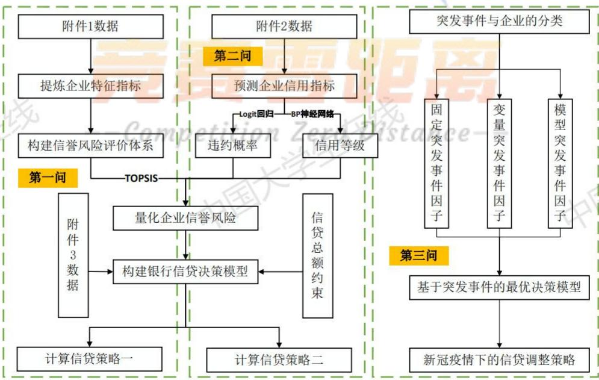  
图 2.1 总体思路图

## 三、模型假设

1.公司的发票信息可以完全反映公司的经营状态

2.企业是否违约会直接影响企业下期信誉评级

3.突发事件的发生带来的影响将持续到贷款期结束

4.贷款利率和公司信誉和实力成正相关，与信贷风险成负相关

5.当期信贷决策和下期信贷决策相互独立

## 四、符号说明

<table><tr><td>符号</td><td></td><td>含义</td><td>中国</td></tr><tr><td> $\pi _ { i }$ </td><td></td><td>第i个企业的总利润额</td><td></td></tr><tr><td> $T _ { i }$ </td><td></td><td>应缴税额</td><td></td></tr><tr><td> $R _ { i }$ </td><td></td><td>企业的有效发票率</td><td></td></tr><tr><td> $E R _ { i }$ </td><td></td><td>预期贷款收益</td><td></td></tr><tr><td>在</td><td></td><td>预期损失</td><td></td></tr><tr><td> $P D _ { i }$ </td><td></td><td>违约率 中国大学生</td><td></td></tr><tr><td>LGD</td><td></td><td>违约损失率</td><td>中国</td></tr><tr><td> $C _ { i }$ </td><td></td><td>银行贷款的资金成本</td><td></td></tr><tr><td> $\lambda _ { i j }$ </td><td></td><td>变量突发事件因子</td><td></td></tr><tr><td> $\delta$ </td><td>音寒</td><td>模型突发事件因子</td><td>南</td></tr></table>

## 五、数据侧写

本文为典型的数据分析问题，因此事先对数据进行侧写有利于问题的解答和分析。由于本题和目标和企业的经营特征密切相关，因此本部分将对附件一和附件二中各企业的部分经营特征进行初步观察，获得一个数据的大致情况。 中国

## 5.1企业的信誉度分布情况

根据企业的信用等级、违约记录、经营时长可以大致判断一个企业的信誉状况。本文首先对有信贷记录的123家企业信用等级分布进行分析。

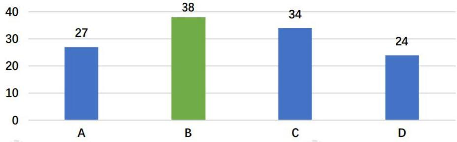  
图 5.1信用等级分布图（单位：个）

通过信用等级分布图可以看出，四种类型的企业分布相对均衡，其中B级信用的企业最多，这说明企业之间的信誉区分度大，由信誉度影响的最后贷款决策应该也存在着较大的差异。其次文章对有信贷记录的123家的运营时长进行分析。

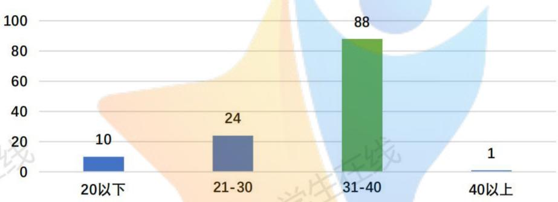  
图 5.2运营时长分布图（单位：月）

通过运营时长分布图可以看出，多数企业的运营时长在31-40个月的范围内，即在三年左右甚至更少，而经营40个月以上的企业仅有一家，这从另一方面反映出了中小微企业普遍资历薄弱，经营风险大的特点。

## 5.2 企业的利润分布情况

根据企业的总利润可以判断出一个企业的经营状况，更重要的是对贷款的偿还能力。因此关注企业的利润状况可以有效的判断信贷风险。对附件一中123家企业的利润分析。

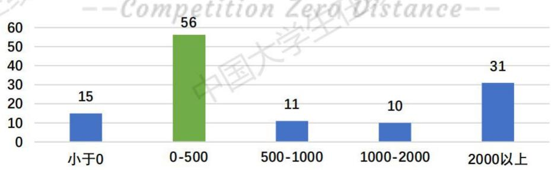  
图5.3利润分布图（单位：个）

可知大部分的企业利润大于0的，都是处于盈利状态，且有31家企业的利润达到了2000万元以上，这说明整体来看中小企业的偿还能力较强，信贷风险较低。

## 5.3 企业的规模分布情况

企业的规模衡量了企业的实力，实力越强的企业拥有的资金越雄厚，违约风险就越小。销项价税总额在一定程度上等价于企业的主营业务收入，因此本文以企业的销项价税总额作为企业实力的衡量。 女线

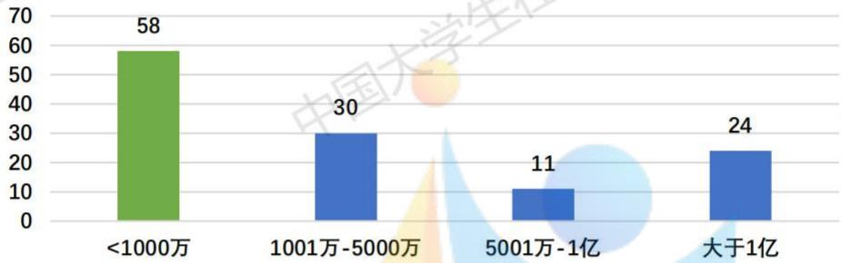  
图 5.4 销项价税总额分布图（单位：个）

可见大部分企业的销项价税总额都小于1000万，体现了中小微企业规模小的特征，然而也存在某些企业的销项价税总额大于1亿，拥有较大的经营规模，说明这些企业的违约风险较低，应该是银行放贷的主要对象。

## 5.4 企业的资金波动程度分布情况

企业的资金波动是否稳定也是银行衡量企业信贷风险的一个重要方面，资本波动程度越小说明企业的经营越稳定，不易破产形成坏账。本文主要从企业每月进项金额的变异系数来观察金额波动程度，统计结果如下

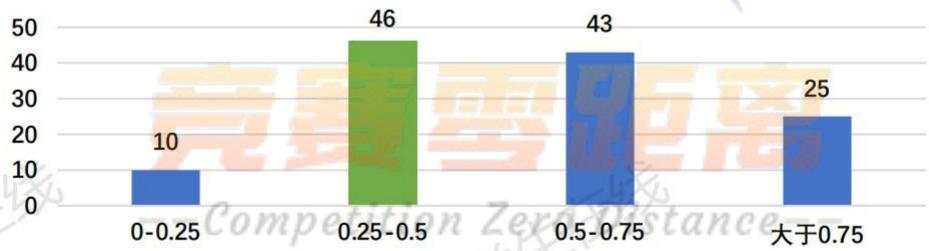  
图5.5 进项金额变异系数分布图

一般来说，变异系数小于0.25说明数据较为稳定，但是可以发现的大多数企业的进项金额变异系数都较高，说明企业的流水比较不稳定，具有较大的信贷风险，仅有10家企业的进项金额变动较为稳定。

## 5.5企业的联系企业数量分布区间

通过企业所联系的上下游企业可以判断一个企业在产业链中的影响力，其所联系的企业越多就说明这个企业的影响力越大，其发生变动会对整个产业其他企业造成较大影响。本文统计了各企业所联系的上下游企业数量，在此先就联系的上游企业进行分析。

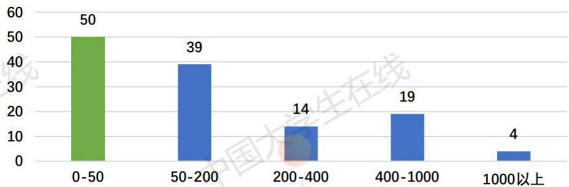  
图5.6联系上游企业分布图（单位：个）

## 5.6利率与客户流失率关系图

附件3给出了利率和客户流失率的关系，为了更直观的分析两者之间的关系，本文以图像进行展现。

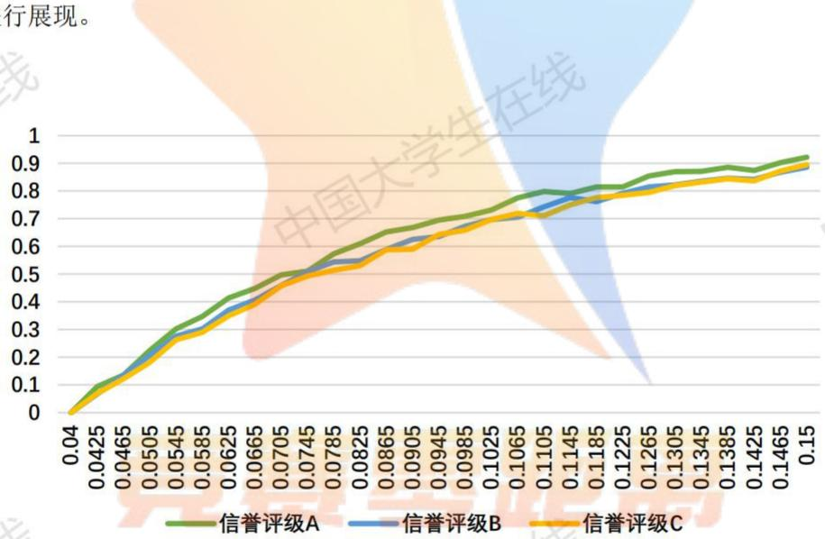  
图5.7企业行业分布图（单位：个）

可见，利率和客户流失率呈正相关关系，且在相同利率水平下，不同信誉评级企业的流失率不同，A类企业的流失率较高。 玉 中国

## 六、模型建立和求解

## 6.1问题一的分析与求解

## 6.1.1 问题一的分析思路

第一问中需要解决两个问题，其中第一个问题是评价类问题，根据企业的各项特征指标对企业的信贷风险进行量化分析，最终给出各企业的信贷风险度。针对该问题，本文首先从附件一中所给的企业信用记录和发票信息找出企业的各项特征。本文提炼了总利润、进项金额标准差、运营时长、发票有效率等11个指标，分别从信用、盈利能力、供求稳定性、规模、影响力等五个方面对企业风险进行综合评估，建立了企业信贷风险的评价指标体系。随后采取熵权法对各项指标进行赋权，最终使用TOPSIS方法量化了各企业的信贷风险。第二个问题是规划类问题，要求给出银行对各企业的信贷决策。信贷决策包括是否放贷、贷款利率和贷款金额。首先根据第一个问题计算出的各企业信贷风险来判断是否进行放贷，然后根据信誉越高利率越低的原则将适宜放贷的企业进行分类，确定其贷款利率。最后，根据利润最大化和风险最小化的经营原则建立银行最优信贷决策模型，依据上中文给出的企业信贷风险和利率计算出各个企业的最优额度。具体思路图如下

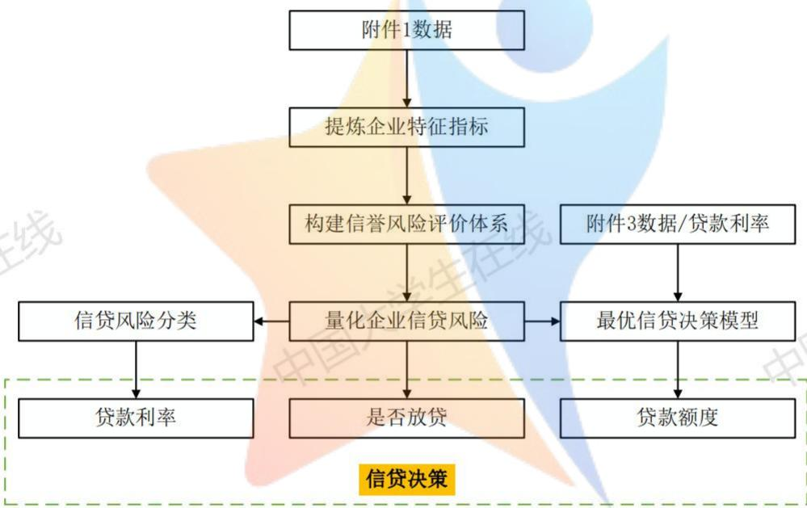  
图 6.1 第一问思路图

## 6.1.2 数据分析与处理

## 1）数据分析

本文将基于附件一的数据进行处理和分析。附件一包含了具有信用记录的123家企业的信息，包括企业的信用记录和企业的发票信息。其中企业的信用记录分为企业的信用评级E和违约记录，A级为信用最高的企业，D级为信用最低的企业，违约记录表示了企业曾经是否发生过违约行为。其中企业的发票信息分为进项发票信息和销项发票信息，进项发票为企业进货时上游企业为其开具的发票，销项发票为企业销售产品时为下游企业开具的发票。

发票信息中存在着有效发票和无效发票，有效发票意味着该项交易成功，无效发票意味着该项交易因为某种原因被取消了，可能和该企业的信誉有关。此外，在有效发票中还存在着标记为负数的发票，这代表着这笔交易虽然之前发生了，但是后来因为某种原因进行了退货，这可能也和企业的信誉有关。

具体来看，发票所包含的信息包括发票号码、开票日期、交易单位代号、金额、税额价税合计和发票状态。其中通过开票日期可以分析出企业的运营时间以及有关的时间序列数据，通过交易单位代号可以分析出该企业相关的上下游企业数量和实力，通过金额、税额等X可以分析出企业的规模、实力和偿还能力，通过发票状态可以分析出企业的信誉。其中企业的进项发票一共有210947张，销项发票一共有162484张。

在信用数据方面，存在银行根据企业的实际情况评定的信誉评级和具体违约情况，具有较高的专业性，可以作为企业信用评价的依据。根据一般原则，银行对信用极差的D级企业不予放贷，减少信贷风险。

最后，根据企业名还可以分析出企业所属的行业和性质，这为对企业根据行业进行分类提供了依据。

## 2）数据处理

根据以上分析结果，可知发票数据量巨大，必须要对数据进行简化处理。由于无效发票是未完成交易的发票，因此可以给予剔除，不计入各企业的最终数据。此外，由于负数发票是已交易的退回，因此在计算时也要予以剔除。理论上负数发票应该和前面发生的交易对应，然后对应删除。如果没有对上相应的交易发票，则可以认为该企业出现了漏税行为，会影响其信誉度，在后面计算中需要加以评估。

由于原则上不对D级企业予以放贷，因此在计算时可以将所有的D级企业予以剔除。最终经过数据处理，简化后的进项发票一共有xxx张，销项发票一共有xxx张，较大地简化了分析难度。 市听区

最后文章对出现的异常值进行处理，以序列均值作为替代，比如某些信用为A的企业的利润为负的16亿元，显然不合常理。onZexoDistance--

## 6.1.3企业特征变量选取与指标评价体系构建

本文的重点在于如何从企业的发票信息和信用记录中提炼出可以来衡量企业信贷风险的经营特征，然后根据这些经营特征来量化企业的信贷风险。依据题意，银行往往向实力强、供求关系稳定的企业提供贷款，此外偿还能力、信誉高等特征也是影响银行是否向企业放贷的重要因素。以下文章将从这四个方面入手进行指标选取。

## 1）企业实力

企业的实力可以根据企业的规模大小、交易量大小来进行判断。本文选取企业的总进项价税额和总销项价税额、有效发票总量作为衡量企业规模和交易量大小的指标。

①总进项价税额是指某企业在一段时间内购进产品的价值总和，该值越高说明企业的生产和经营规模就越大，可以作为衡量企业生产规模大小的有效指标，其具体计算公式为

$$
T X _ { _ { m i } } = \sum _ { k = 1 } ^ { n _ { m } } t x _ { _ { m i k } }\tag{6.1}
$$

其中TX $T X _ { m i }$ 为第i个企业的总进项价税， $t x _ { m i k }$ 为企业第k张进项发票的进项价税， $n _ { { } _ { m } }$ 为进项发票数量。 中国大 中国

②总销项价税额的含义与总进项价税额类似，其具体计算公式为

$$
T X _ { e i } = \sum _ { k = 1 } ^ { n _ { e } } t x _ { e i k }\tag{6.2}
$$

其中 $T X _ { e i }$ 为第i个企业的总销项价税额， $t x _ { e i k }$ 为企业第k张销项发票的销项价税， $n _ { e }$ 为销项发票数量。

③有效发票总量是指某企业在一段时间开出的销项有效发票和进项有效发票总和，该值越高说明企业的有效交易次数越多，有效交易总量越大，可以作为衡量企业交易量的有效指标，其具体计算公式为 中国

$$
n _ { i } = n _ { e i } + n _ { m i }\tag{6.3}
$$

其中 $n _ { m i }$ 和n分别为进、销项有效发票数量， $n _ { e i }$ $n _ { \scriptscriptstyle i }$ 为第i个企业的有效发票总量。

## 2）供求关系稳定性

供求关系稳定性是指企业和上下游企业之间关系的稳定程度，可以从该企业与上下游企业交易额的波动程度来衡量，波动程度越小，说明供求关系越稳定。另一方面，可以从该企Competition ZerdVistance-业联系的上下游企业数量多少来分析该企业的供求关系是否稳定，如果联系的企业数量越多，说明购买和销售的渠道就越多，供求关系就越稳定。因此，本文选取企业的月进项金额变异系数和月销项金额变异系数、企业联系的上下游企业数量作为衡量企业供求关系稳定性的指标。

①月进项金额变异系数是指以月为标准，计算某企业每月的进项金额的变异系数，变异系数衡量数据的变化程度，计算变异系数是为了便于企业间的比较。变异系数越大，说明该企业每月进项金额波动越大，供求关系越不稳定，其具体计算公式为

$$
c _ { m i } = \frac { \sigma _ { m i } } { \mu _ { m i } }\tag{6.4}
$$

其中c..为第i个企业的月进项金额变异系数， $c _ { m i }$ $\sigma _ { m i }$ 为企业月进项金额标准差，计算公式为 $\sqrt { \frac { \displaystyle \sum _ { i = 1 } ^ { n } ( x _ { m i } - \overline { { x } } _ { m } ) ^ { 2 } } { n - 1 } }$ $\mu _ { m i }$ 为月进项金额均值，计算公式为 $\frac { 1 } { n } \sum _ { i = 1 } ^ { n } x _ { m i }$ 0&

②月销项金额变异系数的含义与月进项金额变异系数类似，其具体计算公式为

$$
c _ { e i } = \frac { \sigma _ { e i } } { \mu _ { e i } }\tag{6.5}
$$

其中 $c _ { e i }$ 为第i个企业的月销项金额变异系数， $\sigma _ { e i }$ 为企业月销项金额标准差， $\mu _ { e i }$ 为月销项金额均值。

③企业联系的上游企业数量和下游企业数量是根据企业发票的销方和购方总共涉及到的不同企业数量来计算的，企业所联系的上下游企业越多，说明供求关系越稳定。定义第家企业联系的上游企业数量为 $\mathcal { Q } _ { s i }$ ，联系的下游企业数量为 $\mathcal { Q } _ { x i }$

## 3）偿还贷款能力

企业偿还贷款的能力与其盈利能力直接相关，只有能够持续盈利的企业才能偿还贷款，避免造成坏账风险。本文选取企业的总利润额作为衡量企业偿还贷款能力的指标，其具体计算公式如下 中国

$$
\pi _ { i } = { T X } _ { e i } - { T X } _ { m i } - { T } _ { i }\tag{6.6}
$$

其中π为第i个企业的总利润额， $\pi _ { i }$ $T _ { i }$ 为企业的应缴税额，等于销项税减去进项税。

## 4）信誉度

企业的信誉度是决定企业信贷风险最重要的原因，信誉度指企业遵守契约的可能性，信誉度越高的企业信贷风险越低。信誉度可以由有效发票率、运营时长、信用等级等指标进行衡量。线 --Competition ZeroDistance--

①有效发票率是指企业的发票总量中有效发票的占比，有效发票越多说明企业的信誉度七国

$$
R _ { i } = \frac { n _ { i } } { n _ { i } ^ { \prime } }\tag{6.7}
$$

其中 $R _ { i }$ 为企业的有效发票率， $n _ { i }$ 为有效发票量， $n _ { i } ^ { \prime }$ 为发票总量。

②运营时长也是衡量企业信誉的重要数据，一般来说运营时长越长，企业的信誉就越高。本文根据企业的第一张发票时间和最后一张发票的时间的差来计算企业的运营时长，定义第i家企业的运营时长为 $t _ { i }$

③信用等级是银行内部专业人员根据企业的各项指标综合评定的一个信誉指标，能够有效地衡量企业的信誉度。为了便于量化分析，本文将四个评级转化为数值

表 6.1 评级转化表
<table><tr><td>评级</td><td>A</td><td>B</td><td>C</td><td>D</td></tr><tr><td>对应数值</td><td>80</td><td>60 中国</td><td>40</td><td>20 国</td></tr></table>

此外，对于存在违约记录的企业给予降级处罚，重新评估其信誉得分。

综上，本文总结出了评估企业信贷风险4个方面的11个指标，4个方面分别为实力、供求关系、偿还能力、信誉度，11个指标为进、销项价税合计、总利润、月进、销项金额变异系数、有效发票总量、有效发票占比、上下游企业总量、运营时长。由此可以构建出企业信贷风险评估指标体系，如图6.2所示

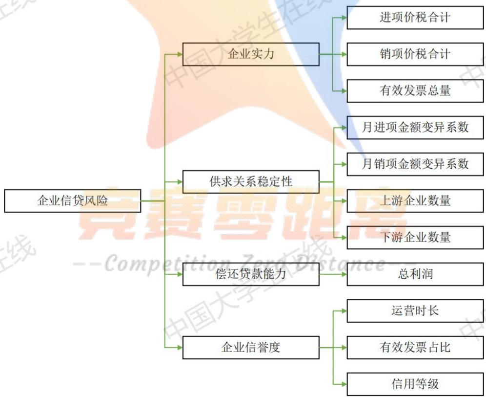  
图6.2 企业信贷风险指标体系图

由此，本文得到了企业信贷风险指标体系，接下来可以根据该体系来量化各个企业的信贷风险。

## 6.1.5量化企业信贷风险

依据上文所计算的各指标数值以及评价体系，文章可以量化出各企业的信贷风险。首先需要确定各指标的权重。为了避免主观性对于量化结果的影响，本文采用依据数据驱动的权重计算方法熵权法来进行赋权，在得到权重之后使用TOPSIS来量化每个企业的信贷风险。

## 1）熵权法计算权重

熵权法是一个客观的赋权方法，可以最大程度上避免主观性赋权对于信贷风险量化结果的影响。熵权法依据的原理是指标的变异程度，即变异程度越高则对应的权值也就越高。

首先本文需要对企业指标数据进行正向化和归一化处理，保证数据的非负性

$$
z _ { i j } = { \frac { x _ { i j } - x _ { \operatorname* { m i n } } } { x _ { \operatorname* { m a x } } - x _ { \operatorname* { m i n } } } }
$$

其中 $z _ { i j }$ 为归一化处理后的变量， $x _ { \mathrm { m i n } }$ 和 $x _ { \mathrm { m a x } }$ 分别为每个指标的最大值和最小值。

计算第j个信贷风险指标下第i个企业所占的权重，将其看作计算信息熵时的概率 $p _ { i j }$

$$
p _ { i j } = \frac { z _ { i j } } { \displaystyle \sum _ { i = 1 } ^ { n } z _ { i j } }
$$

计算第j个信贷风险指标的信息熵 $e _ { j }$ ，并计算对应信息效用值 $d _ { j }$ ，此处进行转换的原因是因为信息熵越大代表该信贷风险指标的信息越少，引入信息效用值 $d _ { j }$ 就可以正向衡量信息量。

$$
\begin{array} { l } { { \displaystyle e _ { j } = - \frac { 1 } { \ln n } \sum _ { i = 1 } ^ { n } p _ { i j } \ln \left( p _ { i j } \right) } } \\ { { \displaystyle \phantom { e _ { j } = e _ { i j } \sum _ { j } \equiv } e _ { j } \ln \left( e _ { j } \right) } } \end{array}
$$

最终归一化得到每个信贷风险指标的熵权 $w _ { j }$

$$
w _ { j } = \frac { d _ { j } } { \displaystyle \sum _ { j = 1 } ^ { m } d _ { j } }\tag{6.8}
$$

得到11个指标的权重分别为

表 6.2 指标权重表

<table><tr><td>指标</td><td>进项价税 合计</td><td>销项价税 合计</td><td>总利润</td><td>月进项金 额标准差</td><td>月销项金 额标准差</td><td>有效发票 总量</td></tr><tr><td>权重</td><td>0.2274</td><td>0.1482</td><td>0.0010</td><td>0.0007</td><td>0.0010</td><td>0.0850</td></tr><tr><td>指标</td><td>有效发票 占比</td><td>上游企业 总量</td><td>下游企业 总量</td><td>运营时长</td><td>信誉评分</td><td></td></tr><tr><td>权重</td><td>0.0008</td><td>0.0780</td><td>0.1407</td><td>0.0019</td><td>0.3154</td><td></td></tr></table>

## 2）TOPSIS方法量化企业信贷风险

三在 TOPSIS方法是基于数据对样本进行排序的一种方法，其基本思想是根据样本数据构造个理想化的目标，比如在本例中就是构造一个各方面信贷风险指标都达到最优的企业，然

找出每列也就是每个信贷风险指标的最大值，记为 $z _ { i } ^ { + } ( i = 1 , 2 , \cdots , m )$ ，组成向量

$$
Z ^ { + } = \{ z _ { 1 } ^ { ~ + } , z _ { 2 } ^ { ~ + } , \cdots , z _ { m } ^ { ~ + } \}
$$

该向量代表理想的企业。同样的，找出每列也就是每个指标的最小值，记为$z _ { i } ^ { - } ( i = 1 , 2 , \cdots , m )$ 组成向量

$$
\boldsymbol { Z } ^ { - } = \{ \boldsymbol { z } _ { 1 } ^ { - } , \boldsymbol { z } _ { 2 } ^ { - } , \cdots , \boldsymbol { z } _ { m } ^ { - } \}
$$

该向量代表最不理想的企业，即每个正向化后的指标都达到了最小。

定义第i个样本与理想目标的距离为 ${ D _ { i } } ^ { + }$ ，计算公式为

$$
{ D _ { i } } ^ { + } = \sqrt { \sum _ { j = 1 } ^ { m } ( { z _ { j } } ^ { + } - z _ { i j } ) ^ { 2 } }
$$

定义第i个企业与不理想目标的距离为 $D _ { i } ^ { - }$ ，计算公式为

$$
D _ { i } ^ { - } = \sqrt { \sum _ { j = 1 } ^ { m } ( z _ { j } ^ { - } - z _ { i j } ) ^ { 2 } }
$$

定义第i个企业的得分为 $S _ { i }$ ，计算公式为

$$
S _ { i } = \frac { D _ { i } ^ { - } } { D _ { i } ^ { + } + D _ { i } ^ { - } }\tag{6.9}
$$

显然， $S _ { i }$ 位于[0,1]之间。当 $S _ { i }$ 越接近于1，说明企业i距离理想化目标越近，该企业的信贷风险就越低。反之，当 $S _ { i }$ 越接近于0，说明企业i距离理想化目标越远，该企业的信贷风险就越高。

最终得到123家企业的量化信贷风险，由于篇幅限制，此处仅展示前10家企业和后10家企业的信贷风险，具体结果见附录。

表6.3 各企业信贷风险表
<table><tr><td>企业</td><td>信贷风险</td><td>企业</td><td>信贷风险</td></tr><tr><td>E1</td><td>0.1657</td><td>E114</td><td>0.9463</td></tr><tr><td>E2 在线</td><td>0.2988</td><td>国大学生在</td><td>0.9786</td></tr><tr><td>E3</td><td>0.6340</td><td>E116</td><td>0.9603</td></tr><tr><td>E4</td><td>0.6402</td><td>E117</td><td>0.9801 中国</td></tr><tr><td>E5</td><td>0.5592</td><td>E118</td><td>0.9479</td></tr><tr><td>E6</td><td>0.3955</td><td>E119</td><td>0.9612</td></tr><tr><td>E7</td><td>0.3674</td><td>E120</td><td>0.9624</td></tr><tr><td>E8</td><td>0.3225</td><td>E121</td><td>0.9629</td></tr><tr><td>E9</td><td>0.4211</td><td>E122</td><td>0.9497</td></tr><tr><td>E10</td><td>0.5526</td><td>E123</td><td>0.9513</td></tr></table>

由于根据银行内部专业人员评估出来的信用等级可信度较高，因此文章将使用附件1中已给定的各企业信用等级来检验上文求出的信贷风险的准确度。如果求出的信贷风险是准确

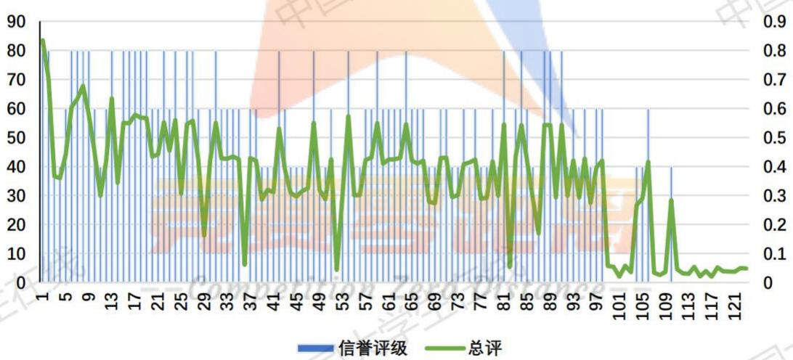  
图 6.3 信贷评级与总评序列图

由图可知，两个变量的变化趋势基本相同，拟合程度非常高，说明本文计算出的信贷风险十分准确，可以依据此数据对信贷策略进行分析。

## 6.1.6最优信贷决策模型

在得到各企业的信贷风险表后，就可以根据各企业的信贷风险对各企业进行信贷决策，信贷决策主要包括是否放贷、贷款利率和贷款额度。

## 1)是否放贷的确定

理论上，银行是根据企业的信贷风险高低来决定是否对企业进行放贷，如果企业的信贷风险较高，那么就不对企业进行放贷，如果企业的信贷风险适度或者较低，就可以对企业进行放贷。因此，判断是否放贷的关键在于确定放贷的阈值，风险高于该阈值的企业不予放贷，风险低于该阈值的企业给予放贷。 学生

风险阈值的确定：根据附件一数据，发现在123家企业中共有27家企业发生违约，其中24/27的违约企业为D级，2/27的违约企业为C级，1/27的违约企业为B级。因为B级企业违约对其做降级处理，故可以认为其与C级企业一同判断，此时所有的违约企业都为C级企业。

由于原则上银行不对D类企业进行放贷，因此考虑的所有违约企业都属于C级企业。于是本文就可以根据C级企业的违约率来确定风险阈值，已知C级企业的总体违约率为9%(3/33)，也就说C级企业中信贷风险在前9%的企业都具有较大的违约风险。因此本文取C级企业的前9%对应的企业的信贷风险值作为风险阈值，高于该信贷风险值的企业拥有较高的信贷风险，不予贷款，低于该信贷风险值的企业拥有较低的信贷风险，予以贷款。即

$$
\scriptstyle \bigwedge \big [ \big | \sum _ { i = 1 } ^ { n } \big | \bar { a } \big | \big | \big | \dot { \mathbf { z } } \big | \big | \big | \dot { \mathbf { z } } \big | = C \big | \big | \bar { \mathbf { z } } \big | \big | \mathrm { e } ^ { \big | \bar { \mathbf { z } } \big | } \big | \big | \big | \bar { \mathbf { z } } \big | \stackrel { \bar { \mathbf { z } } \bar { \mathbf { z } } } { \big | \bar { \mathbf { z } } \big | } \big | \big | \big | \bar { \mathbf { z } } \big | \big | \big | \dot { \mathbf { z } } \big | \big | \dot { \mathbf { z } } \big | \big | \dot { \mathbf { z } } \big | \big | \dot { \mathbf { z } } \big | \big | \dot { \mathbf { z } } \big | \big | \bar { \mathbf { z } } \big | \big | \bar { \mathbf { z } } \big | \big | \bar { \mathbf { z } } \big | \big | \bar { \mathbf { z } } \big | \big | \bar { \mathbf { z } } \big | \big | \bar { \mathbf { z } } \big | \big | \bar { \mathbf { z } } \big | \big | \bar { \mathbf { z } } \big | \big | \bar { \mathbf { z } } \big | \big | \bar { \mathbf { z } } \big | \big | \bar { \mathbf { z } } \big | \big | \bar { \mathbf { z } } \big | \big | \bar { \mathbf { z } } \big | \big | \bar { \mathbf { z } } \big | \big | \bar { \mathbf { z } } \big | \big | \bar { \mathbf { z } } \big | \big | \bar { \mathbf { z } } \big | \big | \bar { \mathbf { z } } \big | \big | \bar { \mathbf { z } } \big | \big | \bar { \mathbf { z } } \big | \big | \bar { \mathbf { z } } \big | \big | \bar { \mathbf { z } } \big | \big | \bar { \mathbf { z } } \big | \bar { \mathbf { z } } \big | \big | \bar { \mathbf { z } } \big | \bar { \mathbf { z } } \big | \big | \bar { \mathbf { z } } \big | \bar { \mathbf { z } } \big | \bar  \mathbf\tag{6.10}
$$

附件一中的C类企业信贷风险序列为{0.8381,0.8311,0.7332...0.6402,0.6340}，因此可以计算出风险阈值为0.7332。即信贷风险大于0.7332的企业不予放贷，信贷风险小于0.7332的企业予以放贷。最终剔除26个企业，如下表所示

表 6.4 剔除贷款企业表
<table><tr><td>企业 -Com 信贷风险</td><td>企业 on tance</td><td>信贷风险</td></tr><tr><td>E117</td><td>0.9799</td><td>E52 0.9567</td></tr><tr><td>E101</td><td>0.9799</td><td>E111 0.9544 中国</td></tr><tr><td>E115</td><td>0.9786 E123</td><td>0.9513</td></tr><tr><td>E108</td><td>0.9742</td><td>E122 0.9497</td></tr><tr><td>E113</td><td>0.9697</td><td>E118 0.9479</td></tr><tr><td>E112</td><td>0.9685</td><td>E100 0.9463</td></tr><tr><td>E107</td><td>0.9662</td><td>E114 0.9463</td></tr></table>

<table><tr><td>E103</td><td>0.9647</td><td>E82</td><td>0.9462</td></tr><tr><td>E109</td><td>0.9633</td><td>E99</td><td>0.9431</td></tr><tr><td>E121</td><td>0.9629</td><td>E102</td><td>0.9419</td></tr><tr><td>E120</td><td>0.9624</td><td>E36</td><td>0.9389</td></tr><tr><td>E119</td><td>0.9612</td><td>E29 X</td><td>0.8381</td></tr><tr><td>在线 E116</td><td>0.9603</td><td>E87</td><td>0.8311</td></tr></table>

## 2）贷款利率的确定

第一部分本文判断出了银行要对123家企业中的97家企业进行放贷。接下来需要求出对放贷企业的具体贷款利率。

依据违约金字塔理论[1]，银行要实现盈利性和安全性的统一，就需要使得信用等级与贷款利率挂钩，保证信贷风险越低的企业，贷款利率越低。因此，本文根据剩余的企业数量和附件3给出的利率分级，将97家企业均分为27类，其中信贷风险最低的一类获得贷款利率最低，即利率为4%的贷款。其中信贷风险最高的一类获取贷款利率最高，即利率为15%的贷款。此外，由于给定利率和企业信用程度，客户流失率也将给出，因此可以确定每个企业的贷款利率和客户流失率。结果如下表（由于数据较多，具体结果放在附录，此处仅展示前10家企业和后10家企业数据 国

表 6.5 贷款利率表
<table><tr><td>企业</td><td>利率</td><td>客户流失率</td><td>企业 利率</td><td>客户流失率</td></tr><tr><td>E1</td><td>0.04</td><td>0.0000</td><td>E93 0.1025</td><td>0.6969</td></tr><tr><td>E2</td><td>0.04</td><td>0.0000</td><td>E94 0.1425</td><td>0.8370</td></tr><tr><td>E3</td><td>0.1225</td><td>0.7845</td><td>E95 0.0905</td><td>0.6258</td></tr><tr><td>E4</td><td>0.1225</td><td>0.7845</td><td>E96 0.15</td><td>0.8952</td></tr><tr><td>E5</td><td>Comp 0.0785</td><td>on 0.5734</td><td>E97 0.1185</td><td>0.7620</td></tr><tr><td>E6</td><td>0.0425</td><td>0.0946</td><td>E98 0.1065</td><td>0.7053 国</td></tr><tr><td>E7</td><td>0.0425</td><td>0.0946</td><td>E104 0.15</td><td>0.8952</td></tr><tr><td>E8</td><td>0.04</td><td>0.0000</td><td>E105 0.1465</td><td>0.8726</td></tr><tr><td>E9</td><td>0.0465</td><td>0.1357</td><td>E106 0.1145</td><td>0.7764</td></tr><tr><td>E10</td><td>0.0745</td><td>0.5087</td><td>E110 0.15</td><td>0.8952</td></tr></table>

## 3）贷款额度的确定

在求得了银行给予放贷的企业以及相应的贷款利率后，本部分将对具体的贷款额度进行求解。计算出来的贷款额度需要满足银行利润最大化和风险最小化的经营原则，因此本部分实际上是一个优化问题，决策变量为贷款额度。

## 3.1）目标函数

银行的信贷决策应该满足利润最大化和风险最小化两个目标。根据RAROC理论[1]，

$$
m a x ~ \pi = \sum _ { i = 1 } ^ { 9 7 } ( E R _ { i } - E D _ { i } - C _ { i } ) ( 1 - L _ { i } )\tag{6.11}
$$

其中 $E R _ { i }$ 为预期贷款收益，即这笔贷款的预期收入，计算公式为 $E R _ { i } = A _ { i } \cdot r _ { i }$ $A _ { i }$ 为对第i家企业的贷款额，所要求解的决策变量， $r _ { i }$ 为对i家企业的贷款利率。

其中 $E D _ { i }$ 为预期损失，指这笔贷款的可能损失，即风险因素的调整，计算公式为$E D _ { i } = A _ { i } \cdot P D _ { i } \cdot L G D _ { i }$ 。其中 $P D _ { i }$ 为违约率，代表该企业违约的概率，违约率是信贷风险的函数，具体的计算公式为 $\mathit { P D } _ { i } = \alpha \cdot S _ { i } ^ { \ 2 }$ ，其中 $S _ { i }$ 即前面量化的企业信贷风险， $\alpha$ 为违约系数，根据经验一般取0.2。 $L G D _ { i }$ 为违约损失率，即企业违约后银行可能面临的损失，是贷款额和利率的函数，具体的计算公式为 $L G D _ { i } = \beta \cdot A _ { i } \cdot r _ { i }$ ，其中 $\beta$ 为违约损失系数。根据违约金字塔[2]原理，该系数并不是不变的，当企业信用评分较高时，违约损失系数 $\beta$ 越小，可以看作是评级的分段函数，一般来说，A类企业对应0.09，B类企业对应0.18，C类企业对应0.27。

$C _ { i }$ 为银行贷款的资金成本，也就是银行如果不放贷这比贷款所能够得到的收入，类似线机会成本的概念，其具体计算公式为 $\begin{array} { r } { \dot { C } _ { i } ^ { \mathcal { O } } \overset { \mathcal { n } } { = } A _ { i } \cdot F T P ^ { \mathcal { o } } , } \end{array}$ 其中 $F T P$ 为内部资金转移定价，指银行内部资金调度的利率。根据xxx的数据，一年期的 $F T P$ 为0.027。

$L _ { i }$ 为客 $\dot { \mathcal { F } }$ 流失率，已在计算各企业利率时给出。

综上，给出具体的目标函数为

$$
m a x \ : \ : \pi = \sum _ { i = 1 } ^ { 9 7 } ( { \cal A } _ { i } \cdot ( r _ { i } - F T P ) - { \cal A } _ { i } ^ { 2 } \cdot \alpha \cdot S _ { i } ^ { 2 } \cdot \beta \cdot r _ { i } ) ( 1 - { \cal L } _ { i } )\tag{6.12}
$$

## 3.2）约束条件

依据题意，对贷款额度的限制为10-100万元，可给定约束条件

$$
s . t \quad 1 0 \leq A _ { i } \leq 1 0 0\tag{6.13}
$$

## 3.3）模型求解

使用Lingo软件对本模型进行求解，解得对97家企业的具体贷款额度如下（由于数据较多，具体结果放在附录，此处仅展示前10家企业和后10家企业数据

表 6.6 贷款额度表
<table><tr><td>企业</td><td>贷款额度</td><td>企业</td><td>贷款额度</td></tr><tr><td>E1</td><td>100</td><td>E93</td><td>71.55496</td></tr><tr><td>E2</td><td>100</td><td>E94</td><td>22.55253</td></tr><tr><td>E3</td><td>36.52383</td><td>E95</td><td>50.49514</td></tr><tr><td>E4</td><td>35.65063</td><td>E96</td><td>19.0597</td></tr><tr><td>E5</td><td>62.38206</td><td>E97</td><td>56.99842</td></tr><tr><td>E6</td><td>64.76603</td><td>E98</td><td>38.27025</td></tr><tr><td>E7 在线</td><td>75.05194</td><td>E104</td><td>47.87552</td></tr><tr><td>E8</td><td>86.80034</td><td>E105</td><td>16.40281</td></tr><tr><td>E9</td><td>57.13073</td><td>E106</td><td>43.50949 国</td></tr><tr><td>E10</td><td>67.01601</td><td>E110</td><td>14.1905</td></tr></table>

## 6.2 问题二的分析与求解

## 6.2.1 问题二的分析思路

问题二需要根据附件2给出的302家企业的信息计算各企业的信贷风险，并在年度信贷总额为1亿的条件下求解银行对于各企业的信贷决策。问题二和问题一的解决思路基本相同，但最大的不同在于问题二中的302家是无信贷记录的企业，因此企业信息中没有企competitionZerovistance业的信用等级和违约记录，所要无法直接将302家企业的数据代入模型求出最终结果。

本文首先需要根据附件一的数据预测出附件二中302家企业的信用等级和违约概率。其中违约概率在附件一是一个0-1变量，针对这种二值变量可以通过使用Logit回归，利用附件一中的数据，用极大似然法估计出参数，然后代入附件二的相应数据求出附件二企业违约的概率。对于信用等级，由于是一个排序变量，因此文章采用BP神经网络模型求解，将附件一中已标记的数据作为训练样本，然后用训练完成的神经网络来对附件二企业的信用等级进行预测。

将附件二中的信用等级和违约概率求得之后，使用之间的信贷风险量化方法就可以求得302家企业的信誉风险。利用信贷风险代入最优信贷决策模型就可以求得银行对于这些企业的信贷决策，需要注意的是，此问中加入了一个最大贷款额度为1亿的约束条件，对模型进行了进一步的限制。以下是本文的思路分析图

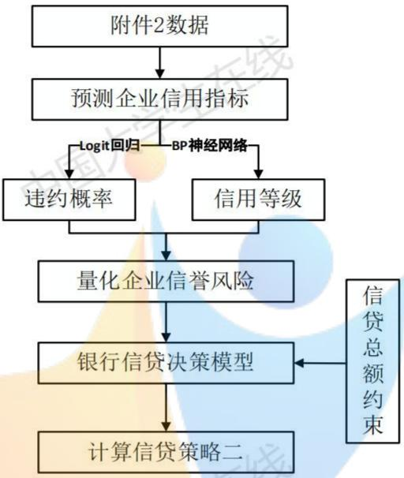  
图 6.4 问题二思路图

## 6.2.2 使用 Logit 回归预测违约概率

如果模型中的被解释变量为0-1变量，最简单的建模方法为线性概率模型LPM。但是LPM存在一个致命的缺陷就是值域不位于[0,1]的区间内，这就导致了使用LPM模型估计出来的结果没有实际意义。一般来说，常用的二值选择模型的估计方法为Logit回归。Logit回归实质上就是将连接函数 $F ( x , \beta )$ 设置为逻辑分布的累计分布函数CDF，即

$$
\hat { y } = F ( x , \beta ) = \frac { \exp ( X \beta ) } { 1 + \exp ( X \beta ) }\tag{6.14}
$$

由于该函数的值域位于[0,1]区间，这就保证了，即该变量取1的概率位于[0,1]之间。将附件1中各企业的数据以及对于的违约记录代入，使用极大似然法估计出参数 $\beta$ 其具体的估计流程如下：

对于企业数据 $\{ X _ { i } , y _ { i } \} _ { i = 1 } ^ { n }$ ，第i个企业的概率密度为

$$
f ( y _ { i } | x _ { i } , \beta ) = \left( \frac { \exp ( X \beta ) } { 1 + \exp ( X \beta ) } \right) ^ { y _ { i } } \left( 1 - \frac { \exp ( X \beta ) } { 1 + \exp ( X \beta ) } \right) ^ { 1 - y _ { i } }
$$

对其取对数可得

$$
\ln f ( y _ { i } \mid x _ { i } , \beta ) = y _ { i } \ln \left( { \frac { \exp ( X \beta ) } { 1 + \exp ( X \beta ) } } \right) + ( 1 - y _ { i } ) \ln \left( 1 - { \frac { \exp ( X \beta ) } { 1 + \exp ( X \beta ) } } \right)\tag{6.15}
$$

式（6.15）为第i个企业的表达式，假设企业违约的概率 $y _ { i }$ 独立同分布，则整体的似然函数为

$$
\ln { L ( \beta | y , X ) } = \sum _ { i = 1 } ^ { n } y _ { i } \ln { \left( { \frac { \exp ( X \beta ) } { 1 + \exp ( X \beta ) } } \right) } + \sum _ { i = 1 } ^ { n } ( 1 - y _ { i } ) \ln { \left( 1 - { \frac { \exp ( X \beta ) } { 1 + \exp ( X \beta ) } } \right) }
$$

将似然函数对 $\beta$ 求偏导令其为0，得到的 $\hat { \beta }$ 即为所要估计的参数。将附件二的302个企业信息代入即可求出对应的 $\hat { y }$ ，即企业违约的概率。

文章使用SPSS 23 进行Logit回归，回归的准确度如下表所示

表 6.7 Logit 回归准确度表
<table><tr><td></td><td>0</td><td>1</td><td>正确百分比</td></tr><tr><td>0</td><td>91</td><td></td><td>94.8%</td></tr><tr><td>在线 1</td><td>14</td><td> $\begin{array} { c } { 5 } \\ { 1 3 } \end{array}$  在</td><td>48.1%</td></tr><tr><td>总体百分比</td><td></td><td></td><td>84.6%</td></tr></table>

由表可知预测的总体准确度为84.6%，预测精度较高，该模型可以用于预测附件二中企业的违约概率。 中国

输入附件二企业的数据，得到预测结果如下表（由于数据较多，具体结果放在附录，此处仅展示前10家企业和后10家企业数据）

表6.8 违约概率预测结果
<table><tr><td>企业</td><td>违约概率</td><td>企业 违约概率</td></tr><tr><td>E124 在线</td><td>0.1407</td><td>E407 0.7488</td></tr><tr><td>E125</td><td>-Comp0.3820ionexo</td><td>E408tance- 0.8490</td></tr><tr><td>E126</td><td>0.4184</td><td>E410 0.9488 中国</td></tr><tr><td>E127</td><td>0.2110</td><td>E411 0.8492</td></tr><tr><td>E128</td><td>0.4241</td><td>E412 0.6495</td></tr><tr><td>E129</td><td>0.4276</td><td>E413 0.7487</td></tr><tr><td>E130</td><td>0.0058</td><td>E416 0.8487</td></tr><tr><td>E131</td><td>0.3298</td><td>E417 0.8489</td></tr></table>

<table><tr><td>E132</td><td>0.4098</td><td>E419</td><td>0.0397</td></tr><tr><td>E133</td><td>0.2042</td><td>E420</td><td>0.8490</td></tr></table>

## 6.2.3使用BP神经网络预测信用评级

预测出了302家的企业的违约风险，接下来需要预测302家企业的信用评级。由于信用评级是一个排序变量，无法使用Logit回归求解，因此在处理本问题时本文选择采用预X测精度和效率更高，方便处理排序变量的BP神经网络算法进行求解。

BP神经网络的根本目的是找到输入变量和输出变量之间的关系，它的运行机制就是根据已有的数据进行不断的迭代，不断地修复自身权重，最终估计出准确的函数关系。BP神经网络主要由两步组成：

第一步，正向传播。正向传播途径如图所示

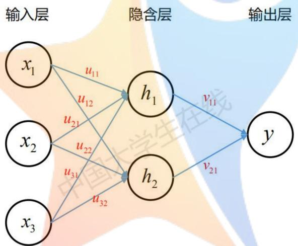  
图 6.5 BP 神经网络传播图

图中的输入层即要求我们输入的变量，在本题中就是某一企业的各项经验特征，输出层为我们想要该网络输出的变量，也就是这一企业对应的信用等级。其中两个节点之间的连线成为连接权重，也就是最后要不断修正的参数。当输入数据时，数据会通过连接权重进入到下一层，即隐含层当中，0其中隐含层的输入为exoDistance—-

$$
h _ { i 1 } = x _ { 1 } \cdot u _ { 1 1 } + x _ { 2 } \cdot u _ { 2 1 } + x _ { 3 } \cdot u _ { 3 1 }
$$

即其输入参数的加权和，其输出是输入的Sigmoid函数

$$
h _ { o 1 } = S i g m o i d ( h _ { i 1 } )
$$

其中Sigmoid函数称为该神经网络的激活函数，将加权和进行处理是为了对数据进行限制，使其落在[0,1]范围内，和上文中Logit回归的本质相同，避免数据过大的问题。

同样γ的输出和输入也遵循上述原则

$$
\begin{array} { l } { y _ { i } = h _ { 1 } \cdot \nu _ { 1 1 } + h _ { 2 } \cdot \nu _ { 2 1 } } \\ { y _ { o } = S i g m o i d ( y _ { i } ) } \end{array}
$$

输出 $y _ { o }$ 后就完成的一次正向传播。接下来就进行反向传播，反向传播的信息是误差，即网络输出的 $y _ { o }$ 与真实值 $y$ 的差距。这种差距一般用均方差损失函数来表示（求导方便）

$$
E = \frac { 1 } { 2 } \big ( y _ { o } - y \big ) ^ { 2 }
$$

可知该误差越小说明该网络越接近真实的关系，反向传播就是根据正向传播算出来的误差，来反向计算出使误差最小化的连接权重，对权重进行更新，当所有的参数都更新完成后A 中就完成了一次反向传播。

经过一次正向传播和反向传播，网络内的各个参数就会更新一次，就完成了一次网络的训练。因此训练网络就是不断地进行正向传播和反向传播，不断地更新网络中的连接权重在理论上只要节点足够多，当中的参数足够多，就可以不断逼近一个真实的关系。当网络训练完毕之后，代入一组新的值网络就会根据其内部的参数输出一个预测值，往往能够达到较好的预测效果。

本文首先将信用等级量化，随后使用MATLAB2017b，利用附件1中的123个企业数据对网络进行训练，训练完成后代入附件2中的302个企业的数据进行信用等级预测，预测结果如下（由于数据较多，具体结果放在附录，此处仅展示前10家和后10家企业数据）

表 6.9 信用等级预测结果
<table><tr><td>企业</td><td>输出结果</td><td>信用等级</td><td>企业 输出结果</td><td>信用等级</td></tr><tr><td>E124</td><td>181.1061</td><td>A</td><td>E407 6.6403</td><td>D</td></tr><tr><td>E125</td><td>177.6945</td><td></td><td>E408 9.7011</td><td>D</td></tr><tr><td>E126</td><td>45.3612</td><td></td><td>E410 6.6028</td><td>D</td></tr><tr><td>E127</td><td>62.2184npetitBon</td><td></td><td>E411 istar 21.9270</td><td>D</td></tr><tr><td>E128</td><td>18.0842</td><td>D</td><td>E412 10.0520</td><td>D 国</td></tr><tr><td>E129</td><td>51.4694</td><td></td><td>E413 4.9060</td><td>D</td></tr><tr><td>E130</td><td>65.1373</td><td>B</td><td>E416 -10.5263</td><td>D</td></tr><tr><td>E131</td><td>168.3685</td><td>A</td><td>E417 5.5450</td><td>D</td></tr><tr><td>E132</td><td>42.2855</td><td>C</td><td>E419 -1.3839</td><td>D</td></tr><tr><td>E133</td><td>16.6390</td><td>D</td><td>E420 -3.8340</td><td>D</td></tr></table>

预测精度分析如下：其中R越接近1，则模型精度越高。

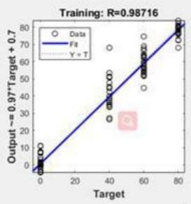

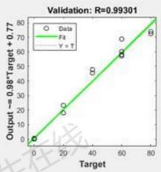

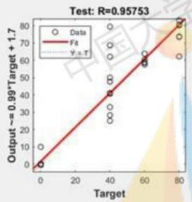

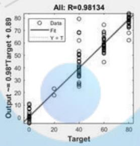  
图 6.6 BP 神经网络精度检验

由上图结果可知，由该BP网路预测出的信誉评分可信度较高，模型检验通过。

## 6.2.4 量化信贷风险

根据上文预测出的违约概率和信用等级，结合附件2企业自身的发票数据，采用和问题一中一样的处理手段，就可以计算出附件2中302家企业的11个信贷风险指标。依据问题一种构建的企业信贷风险评价指标体系，使用熵权法和TOPSIS方法就可以量化出302家企业的信贷风险了。具体的计算结果如下（由于数据较多，具体结果放在附录，此处仅展示前10家和后10家企业数据

表 6.10 信贷风险量化结果
<table><tr><td>企业</td><td>信贷风险 企业</td><td>信贷风险</td></tr><tr><td>E124 -Comp0.0359ion 三在</td><td>E407tance</td><td>0.8333</td></tr><tr><td>E125</td><td>0.0278 E408</td><td>0.9306</td></tr><tr><td>E126 0.4820</td><td>E410</td><td>0.9352 国</td></tr><tr><td>E127 0.1189</td><td>E411</td><td>0.9093</td></tr><tr><td>E128 0.7020</td><td>E412</td><td>0.9276</td></tr><tr><td>E129 0.0768</td><td>E413</td><td>0.9369</td></tr><tr><td>E130 0.4745</td><td>E416</td><td>0.9557</td></tr><tr><td>E131</td><td>0.1013 E417</td><td>0.9352</td></tr></table>

<table><tr><td>E132</td><td>0.3088</td><td>E419</td><td>0.9444</td></tr><tr><td>E133</td><td>0.6510</td><td>E420</td><td>0.9481</td></tr></table>

## 6.2.5 求解最优信贷策略

求解最优信贷策略的思路和第一问相同，首先根据风险阈值来确定放贷企业，随后根据信贷风险分级确定贷款企业的具体利率，最后将上述变量代入银行最优决策模型种求出最优贷款额，不过在本文的基础加入了总贷款为1亿的约束条件。

## 1）确定放贷企业

根据问题一的思路确定附件二种302个企业的风险阈值为0.7192，当企业信贷风险高于这个值时就不予放贷。结合银行对于D级企业不予放贷的原则，最终选择210家企业进行放贷。

## 2）确定贷款利率

根据信贷风险越小贷款利率越低的原则，将予以放贷的210家企业根据信贷风险大小排序，均分为29组，每组约7个企业，将信贷风险最低的一类给予企业最优惠的贷款，将信贷风险最高的一类企业予以利率最高的贷款。由此可得210家企业的利率水平，并计算出相应的客户流失率（具体结果放在附录，此处仅展示前10家和后10家企业数据）

表 6.11 贷款利率计算结果
<table><tr><td>企业</td><td>贷款利率</td><td>流失率</td><td>企业 贷款利率</td><td>流失率</td></tr><tr><td>E124</td><td>0.0400</td><td>0.0000</td><td>E372 0.1105</td><td>0.7111</td></tr><tr><td>E125</td><td>0.0400</td><td>0.0000</td><td>E378 0.1225</td><td>0.7845</td></tr><tr><td>E126</td><td>0.0465</td><td>0.1351</td><td>E379 0.1225</td><td>0.7845</td></tr><tr><td>E127</td><td>0.0425</td><td>0.0946</td><td>E381 0.0825</td><td>0.5302</td></tr><tr><td>E128</td><td>0.0545</td><td>0.2633</td><td>E388 0.1225</td><td>0.7845</td></tr><tr><td>E129</td><td>mpe 0.0400</td><td>0.0000</td><td>istan E391 0.1265</td><td>0.7955</td></tr><tr><td>E130</td><td>0.0625</td><td>0.4135</td><td>E392 0.1265</td><td>0.7955</td></tr><tr><td>E131</td><td>0.0425</td><td>0.0946</td><td>E393 0.1225</td><td>0.7845</td></tr><tr><td>E132</td><td>0.0505</td><td>0.2066</td><td>E396 0.1345</td><td>0.8323</td></tr><tr><td>E133</td><td>0.0745</td><td>0.4927</td><td>E419 0.1105</td><td>0.7111</td></tr></table>

## 3）确定贷款额度

此处仍然使用第一问给出的最优信贷决策模型进行求解，但在第一问的基础上加入了一个总贷款额为1亿的约束条件，此时的最优信贷决策模型变化为

$$
\begin{array} { r l } { m a x } & { \boldsymbol { \pi } = \displaystyle \sum _ { i = 1 } ^ { 9 7 } ( \boldsymbol { A } _ { i } \cdot ( \boldsymbol { r } _ { i } - \boldsymbol { F T P } ) - \boldsymbol { A } _ { i } ^ { 2 } \cdot \boldsymbol { \alpha } \cdot \boldsymbol { S } _ { i } ^ { 2 } \cdot \boldsymbol { \beta } \cdot \boldsymbol { r } _ { i } ) ( 1 - \boldsymbol { L } _ { i } ) } \\ { s . t } & { \left\{ \displaystyle \sum _ { i = 1 } ^ { 1 0 \le A _ { i } \le 1 0 0 } \phantom { \frac { 1 0 0 0 } { | t | \tilde { \mathcal { H } } | } } \right. } \end{array}\tag{6.12}
$$

使用Lingo对该模型进行求解，得到银行对210个企业的最优贷款额度，如下图所示

表6.12 贷款额度计算结果
<table><tr><td>企业</td><td>贷款额度</td><td>企业</td><td>贷款额度</td></tr><tr><td>E124</td><td>100</td><td>E372</td><td>15.5773</td></tr><tr><td>E125</td><td>100</td><td>E378</td><td>15.2233</td></tr><tr><td>E126</td><td>100</td><td>E379</td><td>15.2322</td></tr><tr><td>E127</td><td>100</td><td>E381</td><td>26.7505</td></tr><tr><td>在线6128</td><td>28.9108</td><td>E388</td><td>15.0003</td></tr><tr><td>E129</td><td>100</td><td>E391 大学生</td><td>15.0302</td></tr><tr><td>E130</td><td>70.0767</td><td>E392</td><td>14.9570 中国</td></tr><tr><td>E131</td><td>100</td><td>E393</td><td>15.0741</td></tr><tr><td>E132</td><td>67.7781</td><td>E396</td><td>14.5085</td></tr><tr><td>E133</td><td>29.1677</td><td>E419</td><td>15.8457</td></tr></table>

## 6.3 问题三的分析与求解

## 6.3.1 问题三的分析思路

问题三需要解决两个问题，第一个问题是在原来模型的基础上考虑突发事件因素的影响，对原来的模型进行改进。第二个问题是分析一个具体的突发事件，搜索真实数据来量化模型中的突发事件因素，分析其对企业和银行的具体影响，最终计算出发生突发事件时的最优信贷策略。首先，本文将各种突发事件归纳为四大类事件，将附件2中的210家企业归纳为五大行业，在此基础上进行分析。针对第一个问题，本文决定从三个方面引入突发事件因子来改进模型，分别是固定突发事件因子，用于衡量突发事件对某行业的整体影响；变量突发事件因子，用于衡量突发事件对企业某个具体变量的影响；模型突发事件因子，用于衡量突发事件对第一问建立的最优信贷决策模型的影响。其中前两个因子都是通过影响企业的信贷风险来调整最终的信贷决策，后一个因子是直接通过影响模型来调整最终的信贷决策。通过加入三种突发事件因子，就可以充分地考虑突发事件的对信贷决策的影响。针对第二个问题，本文选取新冠肺炎突发事件作为具体实例，通过国家统计局等渠道获得疫情对于各行业产值、利率等因素的影响数据，量化第一问提出的改进模型并进行求解，最终获得基于新冠肺炎突发事件下的信贷调整策略。具体思路图如下

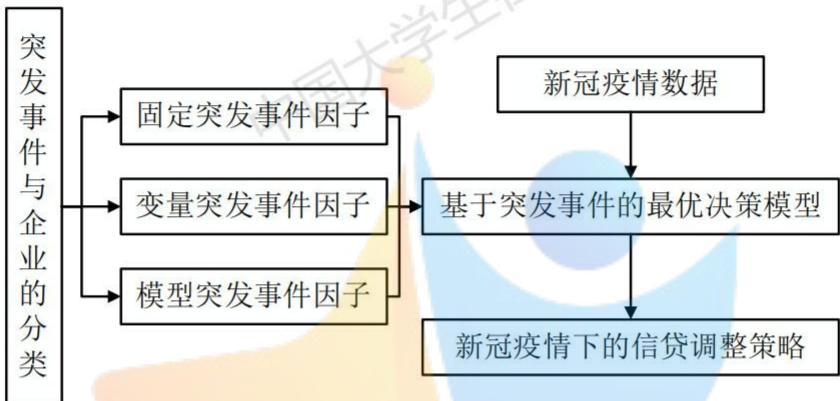  
图 6.7 第三问思路图

## 6.3.2 突发事件与企业的分类

突发事件是指突然发生，让人预料不到的事情，一般来说，突发事件根据其性质可以分为自然灾害、事故灾难、公共卫生事件、社会安全事件四类，显然四种突发事件对于企业的影响各不相同，本文就在此基础上考虑不同类型的突发事件所造成的影响。

其次，本文根据附件2中的企业名字将企业划分为一般服务业、制造业、建筑业、高新技术产业和文化产业这五个类别。显然，这五个产业对不同突发事件的反映程度不同，所受到的影响也不同。 五4区网

此后本文对于突发事件影响的分析都是基于上述的分类进行的，上述分类大大简化了必分析的复杂程度，有利于抓住问题的本质，分析出突发事件的真正影响。

## 6.3.3 突发事件因子

本文主要通过引入三个突发事件因子来实现对模型的改进，使得银行的信贷策略能够随着突发事件的发生而进行改动，更加灵活地进行信贷，实现安全性和有效性的统一。突发事件因子主要分为固定突发事件因子、变量突发事件因子和模型突发事件因子，接下来文章将对这三个因子分别进行解释说明。

## 1）固定突发事件因子

固定突发事件因子主要是衡量某一类突发事件发生时对于某一个行业企业总体的影响，由于这种影响使用定值进行表示，因此被称为固定突发事件因子。

每一类突发事件对于行业的影响不同，比如自然灾害事件对于建筑业影响较大，但是对于高新技术产业的影响较小。因此，本文将某一个突发事件对于各个行业的影响分为A，B，C，D四级，其中A级说明该突发事件对本行业影响较大，D级说明该突发事件基本不会影响本行业。根据一般经验构建出突发事件影响级别表

表 6.13 突发事件影响级别表
<table><tr><td>行业</td><td>建筑业</td><td>制造业</td><td>一般服务业</td><td>高新技术产业</td><td>文化产业</td></tr><tr><td>A</td><td>自然灾害</td><td>事故灾害</td><td>公共卫生事件 社会安定事件</td><td></td><td>社会安定事件</td></tr><tr><td>B</td><td>公共卫生事件</td><td>公共卫生事件</td><td>社会安定事件 公共卫生事件</td><td></td><td>事故事件</td></tr><tr><td>C</td><td>事故灾害</td><td>自然灾害</td><td>自然灾害</td><td>自然灾害</td><td>公共卫生事件</td></tr><tr><td>D</td><td>社会安定事件</td><td>社会安定事件</td><td>事故事件</td><td>事故事件</td><td>自然灾害</td></tr></table>

通过该图可以看出对各行业影响最大或最小的突发事件，有利于用来评估某一突发事件对于行业的影响。进一步由于影响可能有正有负，且为了影响效果可以进行量化，便于后面的企业信贷风险的计算，引入固定突发事件因子表。

表 6.14 固定因子表
<table><tr><td>A</td><td>B C</td><td>D</td></tr><tr><td>负向影响较大</td><td>-40 -30</td><td>-10</td></tr><tr><td>负向影响较小</td><td>-35 -25</td><td>-5</td></tr><tr><td>无影响</td><td>0 0</td><td>0</td></tr><tr><td>正向影响较小</td><td>赛 25 距 35</td><td>离 5</td></tr><tr><td>正向影响较大</td><td>40 30</td><td>10</td></tr></table>

借由此表，就可以得到固定突发事件因子。比如公共卫生事件发生对于一般服务业的影响是A级的，且这种影响是较大的负面影响，因此公共卫生事件对于一般服务业的固定突发事件因子就是-40。在处理时将其正向化，作为一个新变量放入企业信贷风险评价体系中，提高一般服务业的信贷风险，能够有效地提醒银行在公共卫生事件发生的情况下，一般服务业的坏账风险将会增加。

经过检验，由于不同企业固定突发事件因子的取值差异较大，在熵权法的情况下，该固定因子在信贷风险体系中所占的权重会较高，平均在0.2左右，导致信贷风险对于突发事件较为敏感，起到了标识突发事件影响的效果。

## 2）变量突发事件因子

变量突发事件因子主要是衡量突发事件对于该行业某一变量的影响，通过改变该行业企业中的这一变量取值，影响企业最终的信贷风险，最终调整相应的信贷决策。根据问题一中的企业信贷风险评价体系，文章提炼了对于信贷决策最重要的几个企业特征，分别是企业实力、偿还能力、供给关系稳定性和信誉度。变量突发事件因子以参数形式与这些重要特征相乘，从而改变该企业的信贷风险。

对于某一个突发事件来说，变量突发事件因子 $\lambda _ { i j }$ 代表对第i个行业的第j个特征的影响程度。例如洪水突发事件使得建筑业产值下降10%，则 $\lambda _ { i j }$ 则为0.9，其中i代表建筑业，j代表建筑业企业的规模实力特征。

## 3）模型突发事件因子

以上两个突发事件因子分别通过与变量相乘和成为变量两种方法来影响最终的信贷决策，但都是通过改变企业的信贷风险从而影响最终的信贷决策。而模型突发事件因子则绕过了信贷风险直接对最优信贷决策模型进行影响，通过影响模型中的变量来改变最终的信贷。

在问题一构建的最优信贷决策模型中，主要的和突发事件有关的变量就是利率。因为往往突发事件的发生（如中美贸易战、新冠疫情）都会导致经济的低迷和混乱，而刺激经济恢复最重要的手段之一通过调整利率来实现。因此在最优决策信贷模型中的利率变量中乘上一个模型突发因子系数，当突发事件发生时，会对利率产生影响，从而对整体的信贷策略进行调整。 --Competition ZeroDistance--

$$
m a x \pi = \sum _ { i = 1 } ^ { 9 7 } ( { \cal A } _ { i } \cdot ( r _ { i } \delta - F T P ) - { \cal A } _ { i } ^ { 2 } \cdot \alpha \cdot { \cal S } _ { i } ^ { 2 } \cdot \beta \cdot r _ { i } \delta ) ( 1 - { \cal L } _ { i } )\tag{6.13}
$$

其中 $\delta$ 为模型突发事件因子。

## 6.3.5 新冠疫情下的银行最优信贷决策调整

本部分将以新冠疫情作为具体的突发事件来进行考察，分析银行在新冠疫情爆发后的最有信贷决策有何变化，发生了哪些调整。

随着2019年11月新型冠状病毒的首例确诊以来，新冠病毒以其极强的传染性迅速在全国乃至全世界蔓延开来。1月30日世界卫生组织宣布新冠肺炎构成“国际关注公共卫生紧急事件”，截至2020年9月13日，全球新冠疫情累计确诊人数达到了2800万余人，可见此次疫情的危害和影响程度之深。

疫情对各行业企业产生了巨大的影响，这会导致企业的信贷风险发生改变，因此银行就必须根据这些改变对自身的信贷决策进行适当调整，才能实现安全性和盈利性的统一。这就需要基于本文所提出的考虑突发事件的最佳信贷决策模型来调整信贷决策。

由于新冠肺炎是属于公共卫生事件，根据突发事件影响级别表和固定因子表可以确定各企业在新冠肺炎爆发下的固定突发事件因子取值，作为一个变量加入到信贷风险评估体系中。

其次，本文通过国家统计局数据，从五个行业2020年第一季度同比的产值增加值、行业工资水平增加值、利润率等指标出发，估计出了相应的变量突发事件因子

表 6.15 变量突发事件因子表
<table><tr><td>行业</td><td>企业实力</td><td>供求稳定性</td><td>偿还贷款能力</td><td>企业信誉度</td></tr><tr><td>建筑业</td><td>-3.20%</td><td>-5.60%</td><td>-8.30%</td><td>-2.80%</td></tr><tr><td>制造业</td><td>-38.30% 中国</td><td>-34.20%</td><td>-43.20%</td><td>-31.10%</td></tr><tr><td>一般性服务业</td><td>-20.50%</td><td>-25.40%</td><td>-31.30%</td><td>-20.60%</td></tr><tr><td>高新技术</td><td>31.40%</td><td>20.10%</td><td>33.40%</td><td>27.40%</td></tr><tr><td>文化产业</td><td>-41.70%</td><td>-10.80%</td><td>-46.40%</td><td>-13.50%</td></tr></table>

最后，本文依据LPR即贷款市场报价利率来确定模型突发事件因子。LPR是由中国人民银行授权全国银行间同业拆借中心计算并公布的基础性的贷款参考利率，各金融机构应主要参考LPR进行贷款定价，因此具有较大的代表性。由于本文计算的是一年期贷款利率，因此根据一年期LRP的变化规律确定模型突发事件因子为9%。

将求得的固定突发事件因子、变量突发事件因子代入企业信贷风险量化体系，计算附玉件2中210家企业的基于突发事件的信贷风险。并将模型突发事件因子代入基于突发事件的最优信贷决策模型，计算得在新冠疫情爆发下，银行的最优信贷决策为：

## 1）贷款利率

表6.12基于新冠疫情的贷款利率结果
<table><tr><td>企业</td><td>贷款利率</td><td>企业</td><td>贷款利率</td></tr><tr><td>E124</td><td>0.0387</td><td>E372</td><td>0.1297</td></tr><tr><td>E125</td><td>0.0364</td><td>E378</td><td>0.1333</td></tr><tr><td>E126</td><td>0.0642</td><td>E379</td><td>0.1365</td></tr><tr><td>E127 三在线</td><td>0.0605</td><td></td><td>0.0423</td></tr><tr><td>E128</td><td>0.0860</td><td>E388</td><td>0.1365</td></tr><tr><td>E129</td><td>0.0496</td><td>E391</td><td>0.1115 中国</td></tr><tr><td>E130</td><td>0.0860</td><td>E392</td><td>0.0460</td></tr><tr><td>E131</td><td>0.0532</td><td>E393</td><td>0.1333</td></tr><tr><td>E132</td><td>0.0714</td><td>E396</td><td>0.0787</td></tr><tr><td>E133</td><td>0.1151</td><td>E419</td><td>0.0459</td></tr></table>

## 2）贷款额度分析

表 6.13 基于新冠疫情的贷款利率结果
<table><tr><td>企业</td><td>贷款额度</td><td>企业</td><td>贷款额度</td></tr><tr><td>E124</td><td>100</td><td>E372</td><td>19.1772 中国</td></tr><tr><td>E125</td><td>100</td><td>E378</td><td>19.0002</td></tr><tr><td>E126</td><td>33.7903</td><td>E379</td><td>19.0699</td></tr><tr><td>E127</td><td>69.2300</td><td>E381</td><td>100</td></tr><tr><td>E128</td><td>20.8922</td><td>E388</td><td>19.0394</td></tr><tr><td>E129</td><td>41.2626</td><td>E391</td><td>20.0819</td></tr><tr><td>E130 在线</td><td>62.7905</td><td>E392</td><td>49.7028</td></tr><tr><td></td><td>-Competition</td><td>Zexopistance</td><td></td></tr><tr><td>E131</td><td>76.7971</td><td>E393</td><td>19.0307</td></tr><tr><td>E132</td><td>32.5358</td><td>E396</td><td>21.0483 中国</td></tr><tr><td>E133</td><td>30.0803</td><td>E419</td><td>53.4927</td></tr></table>

与第二问中的信贷决策结果进行对比，发现存在较大的差异，说明新冠疫情的爆发明显改变了企业的最优决策，这也侧面说明了本文构建的模型能够有效地反映突发事件对于最优信贷决策的影响。

特别需要注意的是，通过观察高新技术产业的贷款额度数据，本文发现在疫情爆发后，银行对高新技术产业的贷款额度具有明显的上升，具体如下图所示（其中所有列出的企业都属于高新技术企业

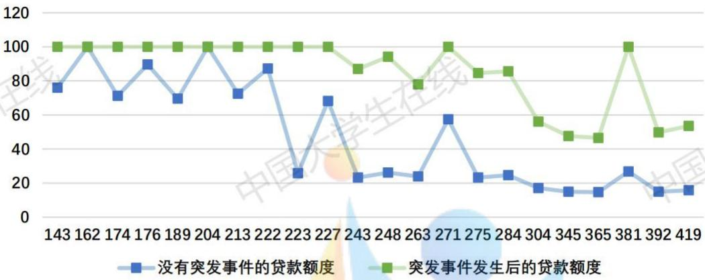  
图 6.8 第三问思路图

可见，在总信贷额度没有发生改变的情况，所有的高新技术产业所获得的贷款额度都有着显著增加，通过分析其他行业的数据可知，其他行业的贷款额度都出现了不同幅度的下降。这就说明了新冠疫情的爆发导致银行的信贷决策更倾向于高新技术产业，银行将更多的贷款额度和更低的利率给予高新技术产业，这也有利于银行整体的放贷结构的优化。

本文认为，银行在疫情期间出现这种偏向高新技术产业的信贷决策的调整是由于以下几点：1. 疫情会使得社会资本重配，导致整个社会资本更加偏向高流动性资产和高成长性的企业，而这些行业多是资本密集型行业或技术密集型行业，使我国高技术产业进一步发展。2. 由于疫情期间劳动力的流动以及人和人之间的接触受到阻碍，会导致企业对自动化生产、智能服务和远程服务产生需求，比如本次疫情中诞生的机器人配送、远程设备检测、线上医疗等新技术，大量的市场需求导致了人工智能、物联网等高科技行业迅速发展。以上两点原因都有效地促进了高新技术产业的信贷风险的降低，导致银行信贷决策的倾斜和调整。 大学

## 七、模型评价与改进

## 7.1模型评价

## 7.1.1 模型的优点

1.在建立企业信贷风险量化模型中，通过充分的论证选取合理、有效、可获得的指标，衡量的指标多，涉及方面广，可以全面有效地量化企业的信贷风险。

2.根据RAROC（风险资本回报率）理论和违约金字塔理论构建合理有效的最优贷款决策模型，使得模型有充分的理论依据，能够解决实际问题。

3.风险阈值的设定十分巧妙，有效地减少了银行面临的违约风险。

4.问题解答间环环相扣、层次递进，在问题一建立的模型的基础上通过优化和改进求解问题二和问题三。

5.创新性地提出了突发事件因子，结果证明将这种因子引入模型中十分有效，能够很好的识别到突发事件的影响。 学生仁

6.对疫情爆发前后的借贷决策变化进行比较分析，得到了银行信贷决策的调整规律，中并对其进行了充分的解释。 A

## 7.1.2 模型的缺点

1.本文利率是一个分段变量，对于利率的考虑过于简单。

2.本文的模型中没有考虑国家政策于银行政策等因素。

3.在建立最优信贷决策模型时，没有充分考虑企业与企业、企业与银行之间的关系对于信贷决策的影响。

## 7.2 模型改进

1.进一步分析利率的确定模型，可以建立利率和信贷风险、违约率、违约损失率之间的函数关系，给出更加合理的利率水平。 中

2.可以在企业的信贷风险评估中加入政策因素，在最优信贷决策模型的确定中也考虑政策因素对于信贷决策的影响。

3.通过运用博弈论知识，丰富银行的信贷决策模型，在原有的基础上加上企业、银行各主体的博弈和联系，给出更加精确的信贷决策。X

## 八、参考文献

[1]石宝峰.基于违约金字塔原理的小企业信用评级模型研究[D]. 大连理工大学,2014.

[2]高佳姮. 基于RAROC的小企业贷款定价研究[D]. 浙江大学.

[3]董欣.基于BP神经网络的贷前财务风险评级模型研究及应用[D]. 吉林大学,2011.

[4]陈强. 高级计量经济学及 Stata 应用[M]. 高等教育出版社,2010.

[5]刘莉亚,邓云胜，任若恩.RAROC模型下单笔贷款业务经济资本的估计与仿真测算[J]国际金融研究,2005(2):68-73.

## 附录

q1.m

1. clear

2. ${ \tt c l o s e } \ { \tt a l 1 }$

3. clc

4.%对附录1中”进项“和”销项“发票信息进行处理

6. data=xlsread('附件1：123家有信贷记录企业的相关数据 $\mathbf { \nabla } \times \mathbf { 1 } \thinspace s \mathbf { x } ^ { \prime }$ ，'进项发票信息'）;%读取数据

$[ \mathfrak { m } , \sim ] = \mathtt { f i n d } \left( \mathtt { d a t a } ( : , 1 \theta ) = = \theta \right) \mathrm { . }$ %找到发票状态为作废发票的记录

8. $\mathbf { d a t a } ( \mathbf { m } , : ) = \pmb { \theta } ;$ %作废发票记录置0

9. result1=zeros(123,15);%记录总值

10. $\mathtt { v a r i a n c e 1 = z e r o s ( 1 2 3 , 1 \theta ) } ;$ %记录方差

11. $\scriptstyle { \mathsf { f o r i } } = 1 : 1 2 3$

12. $[ \mathfrak { m } , \sim ] = \mathbf { f i n d } ( \mathbf { d a t a } ( : , 1 ) = = \dot { \mathbf { 1 } } )$ ;%企业数据位置

13. $\mathbf { r e } { = } \mathbf { d a t a } ( \mathfrak { m } ( 1 , 1 ) { : } \mathfrak { m } { \ = } \mathfrak { a x } ( \mathfrak { m } ) , { : } )$ ;%同一公司数据

14. $\boldsymbol { \mathsf { r e } } = s _ { 0 } \boldsymbol { \mathsf { r t r o w s } } ( \boldsymbol { \mathsf { r e } } , [ 3 , 4 ] )$ ;%按照时间顺序排序

15. $\scriptstyle \mathsf { v o i d } = \mathsf { f i n d } ( \mathsf { r e } ( : , 1 ) = = \theta )$ ;%作废发票记录

16 $\scriptstyle { \mathsf { v o i d } } = { \mathsf { s i z e } } ( { \mathsf { v o i d } } , 1 )$ ;%作废记录

17. $\mathsf { v a l i d } = \mathsf { s i z e } ( \mathsf { m } , 1 ) \mathsf { - v o i d } ;$ %有效记录

18.%求每个公司每个月的方差

19. $\mathbf { d a t e } { = } \mathbf { r e } ( ( \mathsf { v o i d } { + } 1 ) : \mathsf { s i z e } ( \mathsf { r e } , 1 ) , : ) \mathbf { j }$

$$
\mathsf { d a t e } ( ( s \mathrm { i } z \mathbf { e } ( \mathsf { d a t e } , 1 ) + 1 ) , 4 ) = \pm \theta ;
$$

21. k=1;

22.j=1;

23. $\mathtt { m o u n t = z e r o s ( 4 8 , 1 8 ) ; }$

24. $\mathfrak { m o n t h } \mathop { = } \mathbf { d a t e } ( \mathbf { k } , \mathbf { 4 } ) ;$

25. $w h i l e ( m o n t h \sim = \theta )$

26. $\mathfrak { m o u n t } ( \mathrm { { \bf ~ j } } , : ) { = } \mathfrak { m o u n t } ( \mathrm { { \bf ~ j } } , : ) { + } \mathfrak { d a t e } ( \mathrm { { \bf ~ k } } , : ) ;$

27. k=k+1;

28. $\mathrm { i } \mathsf { f } \mathsf { m o n t h } \mathsf { \sim } \mathsf { d } \mathsf { a t e } ( \mathsf { k } , \mathsf { 4 } )$

29 j=j+1;

30. end

31. $\mathfrak { m o n t h } { = } \mathbf { d a t e } ( \mathbf { k } , \mathbf { 4 } ) ;$

32.end

33. $\scriptstyle \mathsf { v a r i } = s \ t \mathsf { d } ( \mathsf { m o u n t } , 1 )$

34. $\mathtt { v a r i a n c e 1 ( i , 1 ) = i } ;$

35. $\mathtt { v a r i a n c e 1 } ( \mathtt { i } , 2 : 1 \theta ) = \mathtt { v a r i } ( 2 : 1 \theta )$ ;%将值记录在variance 中

36. $\mathsf { s m o n t h } ( 1 , : ) = \mathsf { d a t e } ( 1 , 3 : 4 )$ ;%发票起始月份

37. $\mathsf { s m o n t h } \left( 2 , : \right) = \mathsf { d a t e } \left( \mathsf { s i z e } \left( \mathsf { d a t e } , 1 \right) - 1 , 3 : 4 \right)$ ;%发票终止月份

$$
{ \bf 1 } \mathrm { e n g t h } = \left( \left( \thinspace \thinspace \mathsf { s m o n t h } ( 2 , 1 ) - 2 \theta 1 7 \right) ^ { \ast } 1 2 + \mathsf { s m o n t h } ( 2 , 2 ) \right) - \left( \left( \thinspace \thinspace \mathsf { s m o n t h } ( 1 , 1 ) - \thinspace \mathsf { s m o n t h } ( 2 , 1 ) \right) ^ { \ast } 1 2 + \mathsf { s m o n t h } ( 2 , 2 ) \right)
$$

$2 0 1 7 ) ^ { \ast } 1 2 + 5 \mathsf { m o n t h } ( 1 , 2 ) ) + 1 ;$ %计算运营时长

39. $\mathbf { u p } { = } \mathbf { d a t a } ( \mathfrak { m } ( 1 , 1 ) : \mathfrak { m a x } ( \mathfrak { m } ) , 6 )$

|40. up=numel(unique(up));%求上游企业数量

41. result1(i,1)=i;%企业代号

42.result1(i,11)=valid;%有效发票总量

43. result1(i,12)=void;%无效发票总量

44.result1(i,13)=valid/numel(m);%有效发票所占比例

45. result1(i,14)=up;%上游企业数量

46.result1(i,15)=length;%经营时长

47.result1(i,2:10)= sum(re(:,2:10),1);

48. end

49.xlswrite('123 企业结果',result1,'进项结果','A2:0124');

50. xlswrite('123 企业月方差',variance1,'进项结果','A2:J124');

gather.m

|1. clear

2. close all

3. clc

4. %计算123家企业各指标数据

5.

6. %读取数据

17.2 ${ \mathsf { d a t a 1 } } { = } { \times } 1 s r e a { \mathsf { d } } ( \mathbf { \Sigma } ^ { \prime } 1 2 3$ 企业结果 $\boldsymbol { \cdot } \boldsymbol { \times } \boldsymbol { 1 } \boldsymbol { s } ^ { \prime } \mathrm { ~ . ~ }$ 进项结果')；

8. data2=x1sread('123 企业结果 $\boldsymbol { \cdot } \boldsymbol { \times } \boldsymbol { 1 } \boldsymbol { \varsigma } ^ { \boldsymbol { \cdot } } \textbf { , }$ 销项结果')；

9. E1=x1sread('123 企业月方差 $\cdot \times 1 5 ^ { \cdot } ,$ 进项结果'）；

10. E2=x1sread('123 企业月方差.x1s'，'销项结果')；

11. result=zeros(123,11);

12. result(:,1)=data1(:,1);%企业代号

13.result(:,2)=data1(:,9);%进项价税合计

14. result(:,3)=data2(:,9);%销项价税合计

15. result(:,4)=(data2(:,7)-data1(:,7));%总利润

16. $\mathsf { r e s u l t } ( : , 5 ) { = } \mathsf E 1 ( : , 7 )$ ;%月进项金额标准差

17. $\mathsf { r e s u l t } ( : , 6 ) { = } \mathsf E 2 ( : , 7 )$ ;%月销项金额标准差

18. $\boldsymbol { \mathsf { r e s u l t } } ( : , 7 ) = \left( \mathsf { d a t a 1 } ( : , 1 \theta ) + \mathsf { d a t a 2 } ( : , 1 \theta ) \right) ;$ %发票总量

19. $\mathsf { r e s u l t } ( : , 8 ) = ( \mathsf { d a t a 1 } ( : , 1 3 ) + \mathsf { d a t a 2 } ( : , 1 3 ) ) / 2 ;$ %有效发票占比

20.result(:,9)=data1(:,14);%上游企业数量eaVStanCe--

21. result(:,10)=data2(:,14);%下游企业数量

22. $\mathsf { r e s u l t } ( : , 1 1 ) { = } \mathsf { m a x } \left( \mathsf { d a t a 1 } ( : , 1 5 ) , \mathsf { d a t a 2 } ( : , 1 5 ) \right)$ ;%运营时长

|23. $\mathsf { \Pi } \times 1 5 w r i t e ( \mathsf { \Omega } ^ { \prime } 1 2 3$ 企业指标' $, r e s u l t , ^ { \prime } { \sf A } 2 : | \langle 1 2 4 ^ { \prime } \rangle$ ;%导出数据

weight.m

1. clear

2. close all

3. clc

4. %求第一问中各公司的总评和风险评分

5.

6. %读取数据

|7. $_ { \mathsf { d a t a } = \times 1 } \mathsf { s r e a d } ( \mathsf { \Omega } ^ { \prime } 1 2 3$ 企业指标 $\begin{array} { r } { . \times 1 5 ^ { \circ } , \ ^ { \prime } \mathsf { A } 2 : \mathsf { K } 1 2 4 ^ { \circ } ) } \end{array}$ i

8. $_ \mathrm { e v a l u e = x l s r e a d ( }$ 附件1：123家有信贷记录企业的相关数据 $\times 1 5 \times$ ，'企业信息'）；

9. da=data(:,2:11);

10.%归一化处理

11. $\scriptstyle { \mathsf { f o r i } } = 1 : 9$

12. ${ \mathfrak { m a x x } } = { \mathfrak { m a x } } ( \mathrm { d a ( : , i ) } ) ;$

13minn=min(da(:,i));

14.if maxx==minn

15. maxx=maxx+1;

16. end

17. $\scriptstyle \mathrm { i } + \ \mathrm { i } = = 4 | \ | \ \mathrm { i } = = 5 $

18. da(:,i)=(maxx-da(:,i))/(maxx-minn);%负向指标归一化

19. else

20. $d \mathsf { a } ( : , \mathsf { i } ) = \left( \mathsf { d } \mathsf { a } ( : , \mathsf { i } ) - \mathsf { m i n n } \right) / \left( \mathsf { m a x } \times - \mathsf { m i n n } \right)$ ;%正向指标归一化

21. end

22. end

23. $\scriptstyle \mathrm { d } \mathsf { a } ( \mathsf { f i n d } ( \mathsf { d a } = = \mathsf { \boldsymbol { \theta } } ) ) = [ \theta , \theta \theta \theta 1 ] ;$

24. $\scriptstyle \mathrm { d } \mathsf { a } ( \mathsf { f i n d } ( \mathsf { d a } = = 1 ) ) = [ \theta , 9 9 9 9 ] ;$

25%熵权法确定权重

26. summ=sum(da);

27.p=da./summ;

28. e=p.\*log(p);

29. k=-1/1og(123);

30. Ej=sum(e)\*k;

31. Dj=1-Ej;

32.w=Dj/sum(Dj);%最终权重

33. $\mathsf { p } \mathrm { = d } \mathsf { a } \mathrm { ~ . ~ } ^ { \ast } \mathsf { w } ;$ %得分

34. %信誉评分

35. $\mathsf { p e } = \mathsf { e v a l u e } ( : , 3 ) ;$

36. $\mathsf { S e } = \mathsf { S u m } \left( \mathsf { p e } , 1 \right) ;$

37& $w e = ( p \in / s \ e ) ^ { \ast } 7 \theta ;$

38. $\mathsf { p o i n t } = z e r o s ( 1 2 3 , 1 4 ) ;$ ition ZexoDistance--

39. $\mathsf { p o i n t } ( : , 1 ) { \mathrel { = } } \mathsf { d a t a } ( : , 1 ) ;$

40. $\mathsf { p o i n t } ( : , 2 : 1 1 ) = \mathsf { p } ;$

41. ${ \mathsf { p o i n t } } ( \cdot , 1 2 ) { \mathsf { = s u m } } ( { \mathsf { p } } , 2 ) ;$

|42. $\Gamma \mathrm { e } = \mathsf { s u m } ( \mathsf { p } , 2 ) ^ { \ast } \theta . 5 \mathrm { + } \mathsf { w e } ^ { \ast } \theta . 5 ;$ %综合评分

43. $\mathsf { p o i n t } ( : , 1 3 ) = \mathsf { r e } ;$

44. $\mathtt { p o i n t } ( : , 1 4 ) = 1 - \mathtt { r e } ;$ %风险总评

45. $\mathsf { \Pi } \times 1 5 w r i t e ( \mathsf { \Omega } ^ { \prime } 1 2 3$ 企业评分'，point， $^ { \prime } A 2 : N \bot 2 4 ^ { \prime } )$ ;%导出数据

|1. clear

2. close all

3. clc

4. %计算第二问中各企业的信贷年利率

5. data=xlsread('附件3:银行贷款年利率与客户流失率关系的统计数据 $\cdot \times 1 s \times ^ { \prime } , ^ { \prime } s h e e t 1 ^ { \prime } , ^ { \prime } \mathsf { A } 3 : \mathsf { A } 3 1 ^ { \prime } )$ ;%读取数据

6. result=zeros(263,1);

7.j=1;

8.for i=1:29

|9. $\mathsf { r e s u l t } ( \mathsf { j } : \mathsf { j } + 8 , 1 ) { \mathsf { = } } \mathsf { d } \mathsf { a t a } ( \mathsf { i } , 1 ) ;$

10.j=j+9;

11. end

12.x1swrite('302 企业贷款评价.xls',result,'P2:P264');

q3.m

1. clear

2. close all

3. clc

4. %去除通过第二问确定的302家企业中不给放贷的企业

5.orData=x1sread('302 企业指标. $\times 1 5 ^ { \prime } , ~ ^ { \prime } \mathsf { A } 2 : \mathsf { K } 3 \theta 3 ^ { \prime } ) ;$

6. data=x1sread('302 企业贷款评价.x1s','A2:A211');

7. point=xlsread('302 企业评分 $\times 1 5 ^ { \prime } , N 2 : N 3 \theta 3 ^ { \prime } )$

8. del=zeros(100,1);

9. k=1;

10. j=1;

11. for i=124:425

12.if (orData(i-123,1)\~=data(j,1))

13. de1(k,1)=i-123;

14. k=k+1;

15. else

16. if (j<=210)

17. j=j+1;

18. elseCom

19. break;

20. end

21.end

22. end

23.for k=87:92

24. del(k,1)=i-123;

25. i=i+1;

26. end

27. for i=1:92

28. orData(del(i,1),:)=0;

29. $\scriptstyle { \mathtt { p o i n t } } ( { \mathtt { d e l } } ( { \mathtt { i } } , 1 ) , : ) = \theta ;$

30.end

31.xlswrite('第三题数据' $, 0 \boldsymbol { r } \mathsf { D } \mathsf { a t a } , \mathsf { \Omega } ^ { \ast } \mathsf { A } 2 : \mathsf { K } 3 \theta 3 \mathrm { \Omega } ^ { \ast } \mathsf { \Omega } ) ;$

32. xlswrite('第三题数据' $, \mathsf { p o i n t } , \mathsf { \ell } ^ { \ast } \mathsf { L } 2 : \lfloor 3 \mathsf {  { \theta } } 3 \mathsf { \ell } ^ { \ast } \rfloor$ :

33. del=del+123;

classify.m

1.clear

|2. close all

3. clc

4. %将210家企业按照分类标准进行分类

5. data=xlsread('第三题数据'， ${ } ^ { \cdot } \mathsf { A } 2 : \mathsf { L } 2 1 1 ^ { \cdot } \bigr ) .$

6. cla=x1sread('302 企业分类'， $^ { \prime } \mathtt { A } 2 : \mathtt { E } 1 1 9 ^ { \prime } ) .$

7. %对原始数据进行分类

8. ${ \mathsf { c l a s s 1 } } { \mathsf { = c l a } } \left( 1 { \mathsf { : } } 2 8 , 1 \right) ;$

9. $\mathtt { c l a s s 2 = c l a ( 1 : 3 2 , 2 ) ; }$

10. $\mathtt { c l a s s 3 = c l a ( 1 : 1 1 8 , 3 ) ; }$

11. class4=cla(1:22,4);

12.class5=cla(1:10,5);

13. %对五类数据进行赋值

14. result=zeros(210,12);

15. j=1;

16. for i=1:28

17. $[ \mathfrak { m } , \sim ] \mathop = \mathtt { f i n d } \left( \mathtt { d a t a } ( : , 1 ) = \mathtt { c l a s s 1 } ( \mathrm { i } , 1 ) \right) \ ;$

18. $\mathsf { r e s u l t } ( \mathsf { j } , : ) \mathsf { = d a t a } ( \mathsf { m } , : ) .$

19. j=j+1;

20. end

21. for i=1:32

22. $[ \mathfrak { m } , \sim ] \mathop { = } \mathbf { f i n d } ( \mathbf { d a t a } ( : , 1 ) \mathop { = } \mathbf { c l a s s 2 } ( \mathop { \bf i } , 1 ) ) \ ;$

23. $\mathsf { r e s u l t } ( \mathsf { j } , : ) { \mathsf { = } } \mathsf { d a t a } ( \mathsf { m } , : ) ;$

24.j=j+1;

25. end

26.for i=1:118

27. $[ \mathfrak { m } , \sim ] \mathop = \mathtt { f i n d } ( \mathtt { d a t a } ( : , 1 ) \mathop = \mathtt { c l a s s 3 } ( \mathtt { i } , 1 ) ) ;$

28. $\mathsf { r e s u l t } ( \mathsf { j } , : ) { \mathsf { = } } \mathsf { d a t a } ( \mathsf { m } , : ) .$

29. j=j+1;

30. end

31.for i=1:22

32. $[ \mathfrak { m } , \sim ] \mathop = \mathtt { f i n d } \big ( \mathtt { d a t a } ( : , 1 ) \mathop = \mathtt { c l a s s 4 } \big ( \mathrm { i } , 1 \big ) \big ) ;$

33. $\mathsf { r e s u l t } ( \mathsf { j } , : ) { \mathsf { = } } \mathsf { d a t a } ( \mathsf { m } , : )$ :2

34. j=j+1;

35. end

36. $f o r \ \mathrm { i } \mathrm { = } 1 { : } 1 8$

37. [m,\~]=find(data(:,1)==class5(i,1));   
38. result(j,:)=data(m,:);   
39. j=j+1;   
40. end

41. xlswrite('第三题分类结果',result,'A2:L211');

