# 定日镜场的输出功率优化

## 摘要

定日镜场优化方案的设计是提高光热发电效率和推动绿色中国建设的关键。本文从优化角度出发，建立了定日镜平均输出热功率优化模型，并通过遍历法等方法进行求解，为新能源部门提供了不同建设需求下定日镜场参数的具体规划方案。

针对问题一，首先，分别对定日镜镜场和定日镜镜面建立了镜场坐标系和镜面坐标系，并通过坐标转换矩阵T 实现坐标系之间的转化。其次，基于反射定律，通过入射光线方向向量和反射光线方向向量得到镜面法向量，完成定日镜镜面姿态的确定。接着，分析得出定日镜场的输出热功率是关于定日镜光学效率等参数的函数。然后，设计光学效率的计算方法。针对阴影遮挡效率，将阴影遮挡损失划分为塔挡损失、阴影损失和挡光损失。通过判断定日镜中心是否位于塔挡区域内简化计算定日镜的塔挡损失；对定日镜镜面离散化处理后，提出“无效点判断策略”判断定日镜镜面各点是否存在阴影损失和挡光损失，进而完成定日镜阴影损失和挡光损失的计算。针对集热器截断效率，对锥形光线离散化处理后，通过向量运算法则得出离散光线向量，通过计算离散光线向量所在直线与集热器所在圆柱面的交点判断离散光线能否入射到集热器上，进而完成集热器截断效率的计算。最后，将参数代入至程序后，完成问题一的求解。部分求解结果：定日镜场的年平均输出热功率为 36.9945MW；年平均光学效率为 0.6051；定日镜单位面积镜面年平均输出热功率为0.5888kW $/ m ^ { 2 }$ ，具体求解结果见附录二。

针对问题二，首先，根据定日镜场当地太阳辐射能的分布情况，提出吸收塔选址策略，约束吸收塔的位置。其次，提出分区域同心圆规划策略，通过绘制同心圆将圆形定日镜场划分为多个区域，并根据每个区域的特点分别设计定日镜的排布原则。在给定$W _ { a } \setminus \ { W _ { b } } \setminus \ { h _ { 0 } } \setminus \ { h _ { i } }$ 和 $L _ { 0 }$ 的前提下，唯一确定定日镜场中定日镜的总数和各定日镜的坐标。接着，以定日镜年平均输出热功率最大化为目标，建立定日镜平均输出热功率优化模型。然后，通过变步长搜索算法完成最佳定日镜场参数的求解。接着，将定日镜场参数代入至问题一设计的计算策略中，完成定日镜场年平均光学效率等物理量的计算。部分求解结果：定日镜单位面积镜面年平均输出热功率为 $0 . 5 8 7 1 k W / m ^ { 2 }$ ；定日镜场年平均输出热功率为60.1189MW；年平均光学效率为0.6028；吸收塔的位置坐标为(0, 79)；定日镜尺寸为 $5 . 5 \times 5 . 5$ ；安装高度为 2.75m；定日镜总面数为 3385。具体求解结果见附录三。

针对问题三，首先，提出定日镜规格分区域规划策略：在同一区域内，定日镜规格(镜面宽度、镜面高度、安装高度)相同；在不同的区域中，定日镜规格不同，根据定日镜所在的位置确定其尺寸与安装高度。其次，基于问题二模型建立的思路，以定日镜年平均输出热功率最大化为目标，建立改进定日镜平均输出热功率优化模型。然后，通过二分法和变步长搜索算法完成最佳定日镜场参数的求解。部分求解结果：定日镜单位面积镜面年平均输出热功率为 $0 . 5 3 0 7 k W / m ^ { 2 }$ ；定日镜场年平均输出热功率为 61.8593MW；年平均光学效率为0.5446；吸收塔的位置坐标为(0, 79)；共采取7种不同的安装高度；定日镜总面数为 2846。具体求解结果见附录四。

关键词: 定日镜平均输出热功率优化模型；变步长搜索算法；分区域同心圆规划策略

## 一뺮问题重述

## 1.1 问题背景

随着“双碳”目标的提出和绿色中国战略的推行，搭建新能源发电系统已经成为全体社会成员关注的焦点。定日镜场利用对太阳光的反射进行光热发电，将太阳能转化为电能。塔式电站的建设是国家推行新能源政策的战略重点之一<sup>[1]</sup>。定日镜场规划方案的制定对整个太阳能发电系统的发电效率有着至关重要的影响。在实际建设过程中，易出现因定日镜位置、数目规划不合理等问题，导致发电效率低下和建设成本高昂。

因此，针对定日镜场的优化设计问题，为建设部门提供年平均光学效率等参数的计算方式、针对不同的定日镜参数要求制定优化的定日镜场建设方案，是提高定日镜场发电效率和推动人与自然和谐共生的重要手段。

## 1.2 问题要求

塔式电站由一定数量的定日镜和吸收塔组成。定日镜是一种能够反射太阳光的矩形平板，在底座纵向转轴的水平转轴的作用下分别进行旋转和俯仰运动，将太阳光线反射至集热器中心，大量定日镜组成的阵列为定日镜场。吸收塔包含圆柱形集热器，能够将反射光线的太阳能转化为电能。

问题给出了定日镜安装高度、吸收塔高度等参数的具体内涵，描述了太阳光线的形式，提供了建设定日镜场的形状与位置，并建立了镜场坐标系。同时，问题给出了吸收塔高度、集热器规格等参数的具体取值，对定日镜安装位置、镜面高度等参数作出约束，并给出了“年均”指标的具体计算时间。现要求我们解决如下三个问题：

问题一：它给出了吸收塔位置、定日镜尺寸和安装高度的具体数值，附件提供了定日镜场所有定日镜中心的位置坐标。要求我们建立数学模型，计算该定日镜场的年平均光学效率及输出热功率等参数，并按照指定格式将计算结果写入表1和表2。

问题二：它指出定日镜场的额定功率为60MW。在各定日镜安装高度、尺寸相同的条件下，问题要求我们确定定日镜场中定日镜位置、数目、尺寸、安装高度、吸收塔位置等参数，使定日镜场达到额定功率，并实现定日镜输出功率最大化。要求我们按照指定格式将计算结果写入表 1、表2 和表3，将各定日镜场参数写入附件result2.xlsx中。

问题三：它指出定日镜场的额定功率为60MW。在各定日镜安装高度、尺寸可以不同的条件下，问题要求我们确定定日镜位置、数目等定日镜场参数，使定日镜场达到额定功率，并实现定日镜输出功率最大化。要求我们按照指定格式将计算结果写入表 1、表 2和表 3，将各定日镜场参数写入附件result3.xlsx中。

## 二뺮问题分析

本题的研究对象为定日镜场，研究的内容为定日镜场输出热功率的计算方法和定日镜场的优化设计。它实际上是一道优化问题，要求我们得出光学效率等物理量的计算方法，设计定日镜场的相关参数，并达到定日镜输出功率最大化的目标。

## 2.1 问题一分析

对于问题一，分析附录中定日镜场输出热功率的相关公式后，发现它是关于定日镜光学效率<sub>ηi</sub>、总数N、采光面积A<sub>i</sub>、海拔H、距离春分天数D、当地纬度<sub>ϕ</sub> 和当地时间ST 的函数，且其中大部分参数可从题干中直接得出。因此，求解问题一的关键是定日镜姿态的确定和定日镜光学效率的计算。首先，反射定律是定日镜姿态确定的核心。我们由太阳高度角和太阳方位角的定义得出入射光线方向向量，由反射光线始终由定日镜中心指向集热器中心得出反射光线方向向量后，根据入射角与反射角相等的原理，可以得出表征定日镜姿态的镜面法向量。

其次，计算光学效率的关键在于阴影遮挡效率 $\eta _ { \mathrm { s b } }$ 和集热器截断效率 $\eta _ { \mathrm { t r u n c } }$ 计算方法的设计。对于 $\eta _ { \mathrm { s b } }$ ，将阴影遮挡损失分为塔挡损失、阴影损失和挡光损失，通过坐标系的转换、制定“无效点”判断策略，得到 $\eta _ { \mathrm { s b } }$ 的计算方法；对于 $\eta _ { \mathrm { t r u n c } }$ ，将锥形光线离散为若干条光线后，通过引入离散光线向量、制定离散光线能否照射到集热器判断策略，得到 $\eta _ { \mathrm { t r u n c } }$ 的计算方法。

然后，可以从题干信息、附录中得出定日镜总数N等参数的具体取值。最后，将参数代入至程序后，完成定日镜场输出热功率等参数的求解，并对求解结果进行结果分析。

## 2.2 问题二分析

对于问题二，它是问题一的反问题，给出定日镜场所需要达到的额定功率，要求我们设计定日镜场的参数，并实现定日镜年平均输出热功率最大化的目标。首先，根据太阳辐射能的分布规律，提出“吸收塔选址策略”，得到吸收塔坐标仅位于Y 轴的负半轴。

其次，为使定日镜场中各定日镜平均输出热功率尽可能地大，提出分区域同心圆规划策略，通过绘制同心圆将圆形定日镜场划分为多个区域，并根据每个区域的特点分别设计定日镜的排布原则。根据分区域同心圆规划策略，在给定 $W _ { a }$ 等定日镜场参数的前提下，可以唯一确定定日镜的总数和所有定日镜的坐标。

接着，以定日镜单位面积年平均输出功率最大化为目标，建立定日镜场平均输出热功率优化模型。由于需要确定的参数数量较多，若直接进行高精度遍历会导致计算量过大，本文采用变步长策略的遍历搜索算法，完成最佳定日镜场参数的求解。然后，根据问题一设计的计算策略，完成定日镜场年平均光学效率等物理量的计算。最后，对结果进行结果分析。

## 2.3 问题三分析

对于问题三，它在问题二的基础上降低了对定日镜尺寸、安装高度的约束，要求我们重新确定定日镜场的参数，使其达到 60MW 的额定功率，并实现定日镜年平均输出热功率最大化的目标。首先，为提高定日镜的年平均输出热功率，提出“定日镜规格分区域规划策略”：同一区域内定日镜规格相同，不同区域中定日镜规格不同，根据区域与吸收塔之间的距离确定定日镜规格。在给定 $h _ { 0 }$ 等定日镜场参数的前提下，可以根据“分区域同心圆规划策略”将定日镜总数和定日镜坐标唯一确定。

然后，以定日镜单位面积年平均输出功率最大化为目标，建立改进定日镜场平均输出热功率优化模型。为提高搜索效率，本文采用二分法和变步长搜索策略的遍历法解得最佳定日镜场参数。然后，根据问题一设计的计算策略，完成定日镜场年平均光学效率等物理量的计算。最后，对结果进行结果分析。

## 三뺮模型假设

1. 假设定日镜场各装置在工作过程中不会发生任何故障。

2. 假设不存在沙尘暴等小概率事件，忽略极端天气等对定日镜场工作过程的影响。

3. 假设定日镜场各参数的规划过程仅考虑额定功率、安装高度约束等主要因素，不考虑实际建设难度、建设成本对参数确定的影响。

4.假设定日镜场在工作的过程中不受天气等外界因素影响，即光线在传播过程中因大气吸收造成的辐射能损失仅与光线传播距离有关。

5. 假设定日镜的镜面平坦，材质均匀，各点对太阳光的反射能力相同。

## 四뺮符号说明

<table><tr><td>符号</td><td>说明</td><td>单位</td></tr><tr><td> $W _ { a }$ </td><td>定日镜的镜面宽度</td><td>m</td></tr><tr><td> $W _ { b }$ </td><td>定日镜的镜面高度</td><td>m</td></tr><tr><td> $h _ { 0 }$ </td><td>吸收塔高度</td><td>m</td></tr><tr><td> $h _ { i }$ </td><td>第i面定日镜的安装高度</td><td>m</td></tr><tr><td> $\imath$ </td><td>圆柱形集热器的高</td><td>m</td></tr><tr><td> $r$ </td><td>圆柱形集热器的底面半径</td><td>m</td></tr><tr><td> $L$ </td><td>定日镜底座中心之间的距离</td><td>m</td></tr><tr><td> $P _ { i }$ </td><td>第i面定日镜中心的坐标</td><td></td></tr><tr><td> $I$ </td><td>集热器中心的坐标</td><td></td></tr><tr><td> $d _ { \mathrm { H R } , i }$ </td><td>第i面定日镜中心与集热器中心的距离</td><td>m</td></tr><tr><td> $G _ { a }$ </td><td>目标点在在定日镜A的镜面坐标系的坐标</td><td></td></tr><tr><td> $G _ { g }$ </td><td>目标点在在镜场坐标系的坐标</td><td></td></tr><tr><td> $\alpha _ { P i }$ </td><td>第i面定日镜的俯仰角</td><td>度</td></tr><tr><td> $\gamma _ { P i }$ </td><td>第i面定日镜的方位角</td><td>度</td></tr><tr><td> $E$ </td><td>锥形光线离散化后每一条光线包含的太阳辐射能</td><td>kW</td></tr><tr><td> $\vec { e } _ { t , k , i }$ </td><td>锥形光线离散化后的一条光线向量</td><td></td></tr><tr><td> $N _ { i , j }$ </td><td>第i个区域第j层布置的定日镜总数</td><td></td></tr></table>

## 五뺮问题一模型的建立和求解

## 5.1 坐标系的建立

定日镜场进行光热发电的关键在于定日镜对太阳光线的反射。为了更好地描述定日镜的工作过程，分别对圆形定日镜场和定日镜建立镜场坐标系 XYZ 和镜面坐标系 xyz，如图2所示

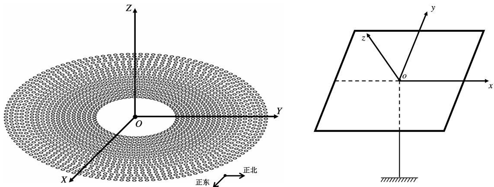  
图 1: 镜场坐标系示意图 (左图)和镜面坐标系示意图 (右图)

令圆形定日镜场的中心位置为原点O，以正东方向为X 轴的正方向，以正北方向为Y 轴的正方向，以垂直地面向上方向为 Z 轴的正方向，建立镜场坐标系 XYZ。

令定日镜中心为原点 o，平行于镜面左右两边向上方向为 x 轴的正方向，平行于镜面上下两边向右方向为y 轴的正方向，以垂直于镜面向外方向为 z 轴的正方向，建立镜面坐标系 xyz。

记镜面坐标系下光线方向向量为 $\vec { R } _ { a }$ ，通过坐标转换矩阵 $T$ ，可以得到该光线在镜场坐标系的方向向量 $\vec { R } _ { g }$

$$
\vec { R } _ { g } = \vec { R } _ { a } \cdot T\tag{1}
$$

## 5.2 定日镜姿态的确定

在镜场坐标系XYZ中，对第i面定日镜进行研究，记安装高度为 $h _ { i }$ ，则定日镜中心坐标为 $P _ { i } ( X _ { i } , Y _ { i } , h _ { i } )$ 。我们通过计算定日镜镜面的法向量 $\vec { n } _ { i }$ 完成定日镜姿态的确定。

## (1) 入射光线方向向量 $\vec { I } _ { i }$

在镜场坐标系 XYZ 中，对入射至定日镜中心的光线研究。镜场坐标系中入射光线示意图如图2所示

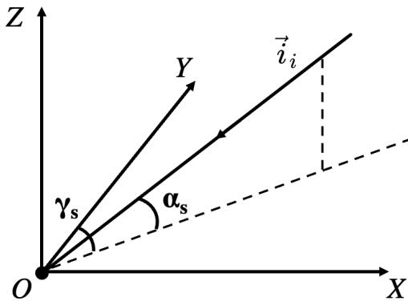  
图 2: 镜场坐标系中入射光线示意图

太阳高度角 $\alpha _ { s }$ 为太阳光线与地平面的夹角，太阳方位角 <sub>γs</sub> 为北方沿顺时针方向与太阳光线投影的夹角。根据几何关系，入射光线方向向量为

$$
\vec { I } _ { i } = \left( - \cos { \alpha _ { s } } \sin { \gamma _ { s } } , - \cos { \alpha _ { s } } \cos { \gamma _ { s } } , - \sin { \alpha _ { s } } \right)\tag{2}
$$

其中， $\alpha _ { s }$ 和 $\gamma _ { s }$ 的计算方式由附录给出

$$
\left\{ \begin{array} { l l } { \sin \alpha _ { s } = \cos \delta \cos \varphi \cos \omega + \sin \delta \sin \varphi } \\ { \cos \gamma _ { s } = { \frac { \sin \delta - \sin \alpha _ { s } \sin \varphi } { \cos \alpha _ { s } \cos \varphi } } } \end{array} \right.\tag{3}
$$

其中， $\varphi$ 为定日镜场的纬度； $\pmb { \delta }$ 为太阳赤纬角； $\pmb { \omega }$ 为太阳时角； $\delta$ 和 $\pmb { \omega }$ 的计算方式如下

$$
\left\{ \begin{array} { l l } { \omega = { \frac { \pi } { 1 2 } } ( S T - 1 2 ) } \\ { \sin \delta = \sin { \frac { 2 \pi D } { 3 6 5 } } \sin \left( { \frac { 2 \pi } { 3 6 0 } } 2 3 . 4 5 \right) } \end{array} \right.\tag{4}
$$

其中， $S T$ 为当地时间；D 为距离春分的天数。

## (2) 反射光线方向向量 $\vec { R } _ { i }$

定日镜在控制系统的作用下不断调节法向，使得经定日镜中心反射的反射光线始终指向集热器中心。吸收塔位于定日镜场中心，记吸收塔高度为 $h _ { 0 }$ ，则集热器中心坐标为$I ( 0 , 0 , h _ { 0 } )$ 。根据上文，定日镜中心坐标为 $P _ { i } ( X _ { i } , Y _ { i } , h _ { i } )$

反射光线始终由定日镜中心指向集热器 $\cdot \mathbb { H } \mathbb { I } \bar { \mathbb { L } }$ ，因此，反射光线方向向量 $\vec { R } _ { i }$ 为定日镜中心 $P _ { i }$ 指向集热器中心 I 的单位向量， $\vec { R } _ { i }$ 计算公式如下

$$
{ \vec { R } } _ { i } = { \frac { I - P _ { i } } { | I - P _ { i } | } } = { \frac { ( - X _ { i } , - Y _ { i } , h _ { 0 } - h _ { i } ) } { \sqrt { X _ { i } ^ { 2 } + Y _ { i } ^ { 2 } + ( h _ { 0 } - h _ { i } ) ^ { 2 } } } }\tag{5}
$$

## (3) 定日镜镜面法向量 $\vec { n } _ { i }$

太阳光入射到定日镜中心后反射的过程遵从反射定律，太阳光的入射角和反射角相等。同时，入射光线方向向量 $\vec { I } _ { i }$ 和反射光线方向向量 $\vec { R } _ { i }$ 均为单位向量，长度相等。

根据向量加法所遵循的平行四边形法则和棱形对角线相互垂直定理，可得定日镜镜面法向量为

$$
\vec { n } _ { i } = \frac { \vec { R } _ { i } - \vec { I } _ { i } } { \left| \vec { R } _ { i } - \vec { I } _ { i } \right| }\tag{6}
$$

其中， $\vec { n } _ { i }$ 为第 i 面定日镜镜面的法向量。

通过上述过程，我们可以根据定日镜的位置坐标、所处纬度等信息确定其在每一时刻的镜面法向量 $\vec { n } _ { i }$ ，进而完成定日镜姿态的确定。

## 5.3 定日镜场输出热功率计算方案

根据附录，定日镜场的输出热功率 $E _ { f i e l d }$ 由法向直接辐射照度DNI、定日镜总数N、定日镜采光面积 $A _ { i }$ 和定日镜光学效率 $\eta _ { i }$ 决定， $E _ { f i e l d }$ 的计算公式如下

$$
E _ { \mathrm { f i e l d } } = \mathrm { \bf D N I } \cdot \sum _ { i } ^ { N } A _ { i } \eta _ { i }\tag{7}
$$

其中，DNI 是关于太阳高度角 $\alpha _ { s }$ 和海拔高度 H 的函数

$$
\mathbf { D N I } = G _ { 0 } \left[ a + b \exp \left( - \frac { c } { \sin \alpha _ { s } } \right) \right]\tag{8}
$$

其中， $G _ { 0 }$ 为太阳常数， $G _ { 0 } = 1 . 3 6 6 k W / m ^ { 2 }$ ；a、b、c为关于海拔H 的函数，由附录给出；$\pmb { \alpha } _ { s }$ 为太阳高度角，由式 (3) 给出，是关于定日镜场纬度 $\varphi$ 、距离春分天数 D、太阳时角$\pmb { \omega }$ 的函数。

综上，定日镜场的输出热功率 $E _ { f i e l d }$ 是多个变量共同作用下的结果，影响 $E _ { f i e l d }$ 计算结果的变量逻辑框图如图3所示

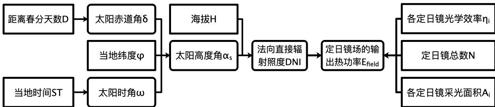  
图 3: 影响 $E _ { f i e l d }$ 计算结果的变量逻辑框图

图3的变量共同影响定日镜场的输出功率。根据变量间的逻辑推导关系，求解 $E _ { f i e l d }$ 仅需明确定日镜光学效率 $\eta _ { i }$ 、总数N、采光面积 ${ \dot { } } A _ { i }$ 、海拔H、距离春分天数 $D .$ 、当地纬度 $\varphi$ 和当地时间 $S T$

## 5.3.1 定日镜光学效率 $\eta _ { i }$

本文对定日镜场中第 i 面定日镜进行研究，并得出其光学效率 $\eta _ { i }$ 的计算方法。根据附录，定日镜光学效率的计算公式如下：

$$
\eta = \eta _ { \mathrm { s b } } \eta _ { \mathrm { c o s } } \eta _ { \mathrm { a t } } \eta _ { \mathrm { t r u n c } } \eta _ { \mathrm { r e f } }\tag{9}
$$

其中， $\eta _ { \mathrm { s b } }$ 为阴影遮挡效率； $\eta _ { \mathrm { c o s } }$ 为余弦效率； $\eta _ { \mathrm { a t } }$ 为大气透射率； $\eta _ { \mathrm { t r u n c } }$ 为集热器截断效率； $\eta _ { \mathrm { r e f } }$ 为镜面反射率。

## (1) 镜面反射率 $\eta _ { \mathrm { r e f } }$

在生产工艺限制下，定日镜非理想镜面，无法完成对太阳光的全反射。此时，定日镜在反射过程中会损失部分太阳辐射能量。镜面反射率能够刻画在反射过程中太阳辐射能的变化情况，仅与定日镜的材质和生产技术有关。

根据附录，本文认为镜面反射率为常数

$$
\eta _ { \mathrm { r e f } } = c o n s t\tag{10}
$$

其中， $\eta _ { \mathrm { r e f } }$ 为镜面反射率，认为定日镜场中每一面定日镜的镜面反射率相同，为某一常数。

## (2) 大气透射率 $\eta _ { \mathbf { a t } }$

当太阳光在大气中传播时，部分太阳辐射能量会被大气吸收，造成实际到达集热器的太阳辐射能量小于定日镜反射光线的太阳辐射能量。大气透射率能够刻画反射光线的传播过程中大气吸收对太阳辐射能传递的影响。

根据附录，大气透射率是关于镜面中心至集热器中心距离的二次函数，第 i 面定日镜的大气透射率的计算公式如下：

$$
\eta _ { \mathrm { a t } , i } = 1 . 9 7 \times 1 0 ^ { - 8 } \times d _ { \mathrm { H R } , i } ^ { 2 } - 0 . 0 0 0 1 1 7 6 d _ { \mathrm { H R } , i } + 0 . 9 9 3 2 1\tag{11}
$$

其中， $d _ { \mathrm { H R } , i }$ 为第 i 面定日镜镜面中心与集热器中心之间的距离。

根据上文，在镜场坐标系 $X Y Z$ 下，第i面定日镜镜面中心的坐标为 $P _ { i } ( X _ { i } , Y _ { i } , h _ { i } )$ ，集热器中心的坐标为 $I ( 0 , 0 , h _ { 0 } )$ 。根据两点间距离公式，可以得出第 i 面定日镜镜面中心与集热器中心间的距离为

$$
d _ { \mathrm { H R } , i } = \vert P _ { i } - I \vert = \sqrt { X _ { i } ^ { 2 } + Y _ { i } + ( h _ { i } - h _ { 0 } ) ^ { 2 } }\tag{12}
$$

其中， $d _ { \mathrm { H R } , i }$ 为第 i面定日镜中心与集热器中心的距离。

## (3) 余弦效率 $\eta _ { \mathrm { c o s } }$

当太阳光线垂直入射到定日镜镜面时，定日镜所接收的太阳辐射能达到最大值。在定日镜场的实际工作过程中，太阳光一般无法垂直入射到定日镜镜面，此时镜面实际接收的太阳辐射能相当于与太阳光垂直的投影面接收的太阳辐射能。余弦效率能够刻画太阳光非垂直入射对太阳辐射能传递的影响。

设与太阳光垂直的平面和第 i 面定日镜镜面之间的夹角为 $\pmb \theta$ ，此时定日镜工作状态示意图如图4所示

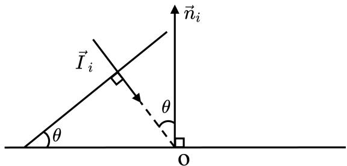  
图 4: 太阳光线非垂直入射时定日镜工作状态示意图

$\vec { I } _ { i }$ 为入射光线方向向量， $\vec { n } _ { i }$ 为第 i 面定日镜镜面法向量。根据几何关系， $\pmb { \theta }$ 等于 $\vec { I } _ { i }$ 与

$\vec { n } _ { i }$ 夹角的补角。根据数量积，第i面定日镜对应 θ 的余弦值为：

$$
\cos \theta _ { i } = - \frac { \vec { I } _ { i } \cdot \vec { n } _ { i } } { \left| \vec { I } _ { i } \right| \cdot \left| \vec { n } _ { i } \right| }\tag{13}
$$

根据参考文献<sup>[2]</sup>，cosθ 在数值上恰好与余弦效率相等。结合附录内容，得出余弦效率的计算公式为：

$$
\eta _ { \mathrm { c o s } , i } = \cos \theta _ { i } = - \frac { \vec { I } _ { i } \cdot \vec { n } _ { i } } { \left| \vec { I } _ { i } \right| \cdot \left| \vec { n } _ { i } \right| }\tag{14}
$$

## (4) 阴影遮挡效率 $\eta _ { \mathrm { s b } }$

在定日镜场中，由于定日镜相对紧密的排列和存在少量的遮挡物，导致部分定日镜镜面被阴影覆盖，无法接收到太阳辐射能。本文主要考虑塔挡损失、阴影损失和挡光损失对第i面定日镜接收到的太阳辐射能的影响。

## • <sup>塔挡损失</sup>

当太阳光倾斜于地面入射时，吸收塔会阻挡部分太阳光线，造成部分定日镜被吸收塔的阴影覆盖，无法接收到太阳辐射能。本文称上述能量损失为塔挡损失。

由于吸收塔的支撑杆规格未知，且吸收塔附近 100m 的范围内没有定日镜。考虑到吸收塔的支撑杆形成的阴影对定日镜的影响较小，因此塔挡损失仅考虑圆柱形集热器形成的阴影<sup>[3]</sup>。

以 4 月 21 日 15:00 时定日镜场的工作情况为例进行说明，此时入射光线方向向量$\vec { I } _ { i } = ( - 0 . 6 9 2 4 , 0 . 2 8 3 1 , - 0 . 6 6 3 5 )$ 。集热器挡光形成的阴影如图5左侧所示

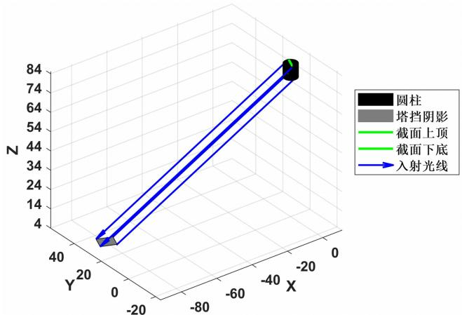

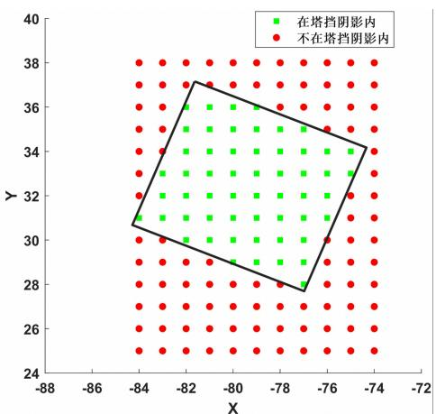  
图 5: 集热器挡光阴影示意图 (左图)与定日镜塔挡损失示意图(右图)

太阳光线倾斜入射，圆柱形集热器阻挡部分太阳管线，形成矩形的塔挡区域。集热器对光线的遮挡可以等效为边长为圆柱母线和底面直径的矩形对光线的遮挡。

在塔挡损失的初步计算中，由于定日镜的俯仰角和方位角不同，计算塔挡区域边界附近每一面定日镜镜面的阴影范围计算量过大，我们基于下述认识简化塔挡损失的计算过程。

被塔挡区域完全覆盖的定日镜数量远远多于塔挡区域附近的定日镜数量。同时，定日镜镜面是关于定日镜中心对称的矩形，根据统计规律，位于塔挡区域边界附近的定日镜塔挡损失之和近似等于接收的太阳辐射能之和。

因此，本文通过下述方法简化计算定日镜的塔挡损失：若定日镜中心的坐标位于塔挡区域内，认为该定日镜无法接收到任何太阳光线，此时该定日镜的阴影遮挡损失为1；若定日镜中心的坐标位于塔挡区域外，认为该定日镜不存在塔挡损失。

图5右侧为塔挡区域的定日镜分布情况，位于塔挡区域内定日镜中心 (正方形) 阴影

遮挡损失为 1。

## • <sup>阴影损失与挡光损失</sup>

在定日镜场中，由于定日镜相对紧密的排列，导致相邻定日镜之间会存在相互遮挡的情况。若定日镜上某点的入射光被附近的定日镜遮挡，认为该点存在阴影损失；若定日镜上某点的反射光被附近的定日镜遮挡，认为该点存在挡光损失。若某个点存在阴影损失或挡光损失，认为该点为“无效点”，对太阳辐射能量没有任何作用。

记第 i 面定日镜离散化后共有 S 个点，其中共有 $S _ { l }$ 个点为“无效点”，则该定日镜的阴影损失和挡光损失 $\eta _ { l - i }$ 为

$$
\eta _ { l - i } = \frac { S _ { l } } { S }\tag{15}
$$

因此，第 i 面定日镜阴影损失计算的策略为：制定判断目标点是否为“无效点”的判断策略，在遍历判断定日镜上所有的点是否为“无效点”。具体如下：

## 1. 坐标系转换

有定日镜A和定日镜B，对定日镜A上的目标点G研究。记G在定日镜A的镜面坐标系的坐标为 $G _ { a } ( x _ { a } , y _ { a } , z _ { a } )$ ，在镜场坐标系的坐标为 $G _ { g } ( X _ { g } , Y _ { g } Z _ { g } )$ 。根据坐标转换矩阵T，可以完成 $G _ { a }$ 向 $G _ { g }$ 的转换 <sup>[4]</sup>

$$
G _ { g } = G _ { a } \cdot T + P _ { a }\tag{16}
$$

其中， $P _ { a }$ 为定日镜A的定日镜中心在镜场坐标系中的坐标；T 为坐标转换矩阵，是镜面坐标系对应定日镜俯仰角和方位角的函数；坐标转换矩阵 T 为：

$$
T = \left[ \begin{array} { c c c } { { 1 } } & { { 0 } } & { { 0 } } \\ { { 0 } } & { { \cos \alpha _ { P a } } } & { { \sin \alpha _ { P a } } } \\ { { 0 } } & { { - \sin \alpha _ { P a } } } & { { \cos \alpha _ { P a } } } \end{array} \right] \cdot \left[ \begin{array} { c c c } { { \cos ( \pi - \gamma _ { P a } ) } } & { { \sin ( \pi - \gamma _ { P a } ) } } & { { 0 } } \\ { { \sin ( \pi - \gamma _ { P a } ) } } & { { \cos ( \pi - \gamma _ { P a } ) } } & { { 0 } } \\ { { 0 } } & { { 0 } } & { { 1 } } \end{array} \right]\tag{17}
$$

其中， $\alpha _ { P a }$ 为镜面坐标系 A 对应定日镜的俯仰角； $\gamma _ { P a }$ 为镜面坐标系 A 对应定日镜的方位角； $\alpha _ { P a }$ 和 $\gamma _ { P a }$ 示意图如图6所示

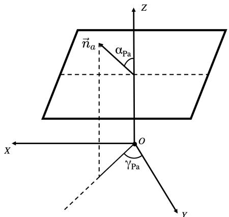  
图 6: 俯仰角 $\alpha _ { P a }$ 和方位角 $\gamma _ { P a }$ 示意图

图6中， $\alpha _ { P a }$ 为定日镜的俯仰角，是镜面法向量 $\vec { n } _ { a }$ 和镜场坐标系 Z 轴之间的夹角；$\gamma _ { P a }$ 为定日镜的方位角，是镜面法向量 $\vec { n } _ { a }$ 在 XY 平面投影和 Y 轴之间的夹角；根据数量积的定义， $\alpha _ { P a }$ 和 $\gamma _ { P a }$ 的计算公式如下

$$
\left\{ \begin{array} { l l } { \cos \alpha _ { P a } = \frac { Z _ { n , a } } { \sqrt { X _ { n , a } ^ { 2 } + Y _ { n , a } ^ { 2 } + Z _ { n , a } ^ { 2 } } } } \\ { \cos \gamma _ { P a } = \frac { Y _ { n , a } } { \sqrt { X _ { n , a } ^ { 2 } + Y _ { n , a } ^ { 2 } } } } \end{array} \right.\tag{18}
$$

其中， $\vec { n } _ { a } = ( X _ { n , a } , Y _ { n , a } , n , a )$ 为镜场坐标系下定日镜A 的法向量。

同理，通过坐标转换矩阵的逆 $T ^ { - 1 }$ ，可以完成目标点在镜场坐标系坐标 $G _ { g }$ 向定日 镜 B 镜面坐标系坐标 $G _ { b }$ 的转化

$$
G _ { b } = \left( G _ { g } - P _ { b } \right) \cdot T ^ { - 1 }\tag{19}
$$

其中， $P _ { b }$ 为定日镜 B 的定日镜中心在镜场坐标系中的坐标； $T ^ { - 1 }$ 为坐标转换矩阵的逆。

同理，记向量!R 在定日镜 A 对应坐标系下为 $\vec { R } _ { a }$ ，在镜场坐标系下为 $\vec { R } _ { g }$ ，在定日镜B对应坐标系下为 $\vec { R } _ { b } .$ 。根据坐标转换矩阵T，可以将 $\vec { R } _ { a }$ 转化为 $\vec { R } _ { g }$ ，将 $\vec { R } _ { g }$ 转换为 $\vec { R } _ { b }$ 。!R在不同坐标系间的转换过程如下

$$
\left\{ \begin{array} { l l } { \vec { R } _ { g } = \vec { R } _ { a } \cdot T } \\ { \vec { R } _ { b } = \vec { R } _ { g } \cdot T ^ { - 1 } } \end{array} \right.\tag{20}
$$

## 2. 无效点判断策略

对于定日镜 A 上的目标点 G，以反射光为例，判断其是否被定日镜 B 阻挡，即是否存在挡光损失。在镜面坐标系 A 中，G 的坐标为 $G _ { a }$ ，反射光方向向量为 $\vec { R } _ { a } \mathrm { , }$

以镜场坐标系为中介，通过坐标转换矩阵T 将 $G _ { a }$ 和 $\vec { R } _ { a }$ 转化至镜面坐标系B，此时目标点的坐标为 $G _ { b } ( x _ { b } , y _ { b } , r _ { b } )$ ，反射光方向向量为 $\vec { R } _ { b } ( x _ { r b } , y _ { r b } , z _ { r b } )$ o

在镜面坐标系B中，根据点 $G _ { b }$ 和向量 $\vec { R } _ { b }$ ，可以得到从目标点发出的反射光线所在的直线方程

$$
{ \frac { x - x _ { b } } { x _ { r b } } } = { \frac { y - y _ { b } } { y _ { r b } } } = { \frac { z - z _ { b } } { z _ { r b } } }\tag{21}
$$

在镜面坐标系B中，定日镜B镜面所处位置 $z = 0$ 。由此，将 $z = 0$ 代入上式中可以得到反射光线与定日镜 B 镜面所处平面的交点：

$$
\left\{ \begin{array} { l } { x = \frac { z _ { r b } x _ { b } - x _ { r b } z _ { b } } { z _ { r b } } } \\ { y = \frac { z _ { r b } y _ { b } - y _ { r b } z _ { b } } { z _ { r b } } } \end{array} \right.\tag{22}
$$

若 $x \in [ - W _ { a } / 2 , W _ { a } / 2 ]$ 且 $y \in [ - W _ { b } / 2 , W _ { b } / 2 ]$ ，认为反射光线与定日镜 B 相交，即 G 存在挡光损失，为“无效点”； $W _ { a }$ 和 $W _ { b }$ 分别为定日镜的镜面宽度和镜面高度。

同理，将反射光替换为入射光后，可以通过相同的方法判断入射光线与附近定日镜之间是否有交点，从而判断该点是否存在阴影损失。

## 3. 阴影遮挡效率 $\eta _ { \mathrm { s b } }$ 的计算方法

将第i面定日镜离散化为S个点后，通过遍历的方法逐一判断每一个点是否为“无效点”，得出“无效点”的数量 $S _ { l }$ ，通过式(15)可以得出第i面定日镜的阴影损失和挡光损失$\eta _ { l - i ^ { \mathsf { c } } }$

根据附录，第 i 面定日镜的阴影遮挡效率 $\eta _ { \mathrm { s b } }$ 为

$$
\eta _ { \mathrm { s b } , i } = \left\{ \begin{array} { l l } { 0 } & { \xrightarrow [ \lambda \in ] { \sim } \mathrm { H } \frac { i + 3 \eta } { \lambda \in } \lVert \mathrm { H } \rVert \times \lVert \underline { { \lambda } } \rVert = \lVert \underline { { \lambda } } \rVert \xrightarrow [ \lambda \in ] { + \lambda } \lVert \mathrm { H } \rVert \xrightarrow [ \lambda ] { \operatorname { E r } } \lVert \overline { { \lambda } } \rVert \ne \lVert \mathrm { H } \rVert } \\ { 1 - \eta _ { l - i } = 1 - \frac { S _ { l } } { S } } & { \xrightarrow [ \lambda \in ] { \sim } \mathrm { H } \frac { i + 3 \eta } { \lambda \in } \lVert \mathrm { H } \rVert \times \lVert \underline { { \lambda } } \rVert = \lVert \underline { { \lambda } } \rVert \xrightarrow [ \lambda \in ] { + \lambda } \lVert \mathrm { H } \rVert \xrightarrow [ \lambda \in ] { \operatorname { E r } } \lVert \overline { { \lambda } } \rVert \ne \lVert \mathrm { H } \rVert \gg \lVert \mathrm { H } \rVert } \end{array} \right\} \mathrm { . ~ }\tag{23}
$$

## (5) 集热器截断效率 $\eta _ { \mathrm { c o s } }$

太阳光为具有一定锥形角的锥形光线<sup>[5]</sup>，经过定日镜反射后在圆柱形集热器上形成圆形光斑。可能存在光斑直径大于集热器底面直径的情况，此时部分反射光无法落在集热器上，造成部分太阳辐射能的损失。

本文通过下述步骤计算集热器截断效率：

锥形光线离散化处理

通过径向方向离散和圆周方向离散，将锥形太阳反射光离散化为若干条光线，认为每条光线所包含的太阳辐射能相等，均为E。锥形光线离散化示意图如图7所示

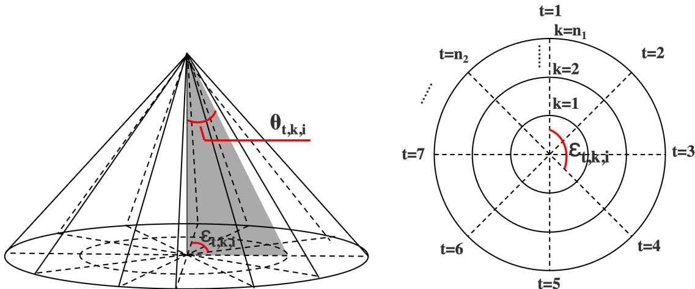  
图 7: 锥形光线离散化示意图

首先，沿径向方向离散。将锥形光线底面直径作 $n _ { 1 }$ 等分，每一部分的长度 $\Delta r = r / n _ { 1 }$ 其次，沿底面圆周方向离散。将锥形光线底面圆周作 $_ { n _ { 2 } }$ 等分，每一部分的圆心角$\Delta \varepsilon = 3 6 0 ^ { \circ } / n _ { 2 }$ 。由此，将锥形光线离散化为 $n _ { 1 } \times n _ { 2 }$ 条光线。

对于第 i 面定日镜某一点的锥形反射光线，记径向第 k 份 $( k \in [ 1 , n _ { 1 } ] )$ 与周向第 t 份$( t \in \left[ 1 , n _ { 2 } \right] )$ 形成的光束的锥形角为 $\theta _ { t , k , i } ($ (如图7阴影区域的顶角)。 $\theta _ { t , k , i }$ 的计算方式如下：

$$
\pmb { \theta } _ { t , k , i } = \frac { \lambda } { n _ { 1 } } k \quad k = 1 , 2 , \cdots , n _ { 2 }\tag{24}
$$

其中，2λ 为一条锥形光线的最大锥形角；λ 为仅与太阳光有关的常数，根据文献 <sup>[6]</sup>，$\lambda = 4 . 6 5 m r a d .$

记高为一个长度单位的光锥底面对应半径的方位角为 $\varepsilon _ { t , k , i } ($ (如图7地面圆周的角度)。$\pmb { \varepsilon } _ { t , k , i }$ 的计算方式如下：

$$
\varepsilon _ { t , k , i } = \frac { 3 6 0 ^ { \circ } } { n _ { 2 } } ( t - 1 ) \quad t = 1 , 2 , \cdots , n _ { 1 }\tag{25}
$$

离散化后，可以得到任意一条离散光线向量 $\vec { e } _ { t , k , i }$

$$
\vec { e } _ { t , k , i } = \vec { R } _ { i } + \vec { d } _ { t , k , i }\tag{26}
$$

其中， $\vec { d } _ { t , k , i }$ 是锥形光线底面上任意向量，详细推导过程在附录五中给出。

## 离散光线能否照射到集热器判断策略

吸收塔位于镜场坐标系XYZ的原点处，集热器中心的坐标为 $( 0 , 0 , h _ { 0 } )$ ，由此得到圆柱形集热器的柱面方程为

$$
\left\{ \begin{array} { l l } { { X ^ { 2 } + Y ^ { 2 } = r ^ { 2 } } } \\ { { Z \in [ h _ { 0 } - l / 2 , h _ { 0 } + l / 2 ] } } \end{array} \right.\tag{27}
$$

其中，r和 l 分别为圆柱形集热器的底面半径和高。

锥形光线中在定日镜镜面上点 G 处反射，根据上文得到任意一条离散的反射光线向量 $\vec { e } _ { t , k , i }$ 。根据空间解析几何知识，可以得到离散光线所在的直线方程

$$
{ \frac { X - X _ { g } } { X _ { e } } } = { \frac { Y - Y _ { g } } { Y _ { e } } } = { \frac { Z - Z _ { g } } { Z _ { e } } } = C\tag{28}
$$

其中，在镜场坐标系中， $G = G ( X _ { g } , Y _ { g } , Z _ { g } ) , \ { \vec { e } } _ { t , k , i } = ( X _ { e } , Y _ { e } , Z _ { e } )$ ；C 为常数。

联立式 (27) 和式 (28)，可以得到：

$$
( X _ { e } C + X _ { g } ) ^ { 2 } + ( Y _ { e } C + Y _ { g } ) ^ { 2 } = r ^ { 2 }\tag{29}
$$

根据上式，可以得到常数 C，通过式 (28) 可以进一步解得 Z。Z 为离散光线与集热器中心所在圆柱面的交点在 Z 轴的位置。若 $Z \in [ h _ { 0 } - l / 2 , h _ { 0 } + l / 2 ]$ ，则说明该光线能照射到集热器。

## 集热器截断效率 $\eta _ { \mathrm { c o s } }$ 的计算方法

镜面全反射能量：根据上文，定日镜离散化后共有S个点，经某个点反射的锥形光线离散化后共有 $n _ { 1 } \times n _ { 2 }$ 条光线，每条光线具有相同的单位能量。因此，镜面全反射能量为 $S \times n _ { 1 } \times n _ { 2 }$

阴影遮挡损失能量：阴影遮挡导致“无效点”的数量为 $S _ { l }$ ，每个无效点共损失 $n _ { 1 } \times n _ { 2 }$ 单位能量。因此，阴影遮挡损失能量为 $S _ { l } \times n _ { 1 } \times n _ { 2 }$

集热器接收能量：若光线照射到集热器上，集热器能够接收到1份单位能量。定日镜共有 $( S - S _ { l } )$ 个点能够正常反射太阳光，设点 j 反射的锥形光线共有 $S _ { j }$ 条光线能射到集热器上。因此，集热器接收能量为 $\textstyle \sum _ { j = 1 } ^ { S - S _ { l } } S _ { j } .$

综上，结合附录公式可以得出 $\eta _ { \mathrm { c o s } }$ ：

$$
\eta _ { \mathrm { c o s } } = \frac { \sum _ { j = 1 } ^ { S - S _ { l } } S _ { j } } { \left( S \times n _ { 1 } \times n _ { 2 } \right) - \left( S _ { l } \times n _ { 1 } \times n _ { 2 } \right) }\tag{30}
$$

## 5.3.2 其余定日镜场参数

确定定日镜场输出热功率 $E _ { f i e l d }$ 还需要确定定日镜总数 N、采光面积 $A _ { i }$ 、海拔 H、距离春分天数 D、当地纬度 $\varphi$ 和当地时间 $S T$

## (1) 采光面积 $A _ { i }$

本文认为定日镜镜面所有位置均能对太阳光进行反射，因此定日镜的采光面积 $A _ { i }$ 为镜面宽度与镜面高度的乘积

$$
A _ { i } = W _ { a } \times W _ { b }\tag{31}
$$

其中， $W _ { a }$ 为镜面宽度； $W _ { b }$ 为镜面高度。

## (2) 距离春分天数 D

距离春分天数 D 为目标日期 Date 与春分日期 $D _ { S E }$ 的时间之差，D 的计算方法为：

$$
D = D a t e - D _ { S E }\tag{32}
$$

## (3) 其余参数

定日镜总数 N：附件给出定日镜场中所有定日镜的位置坐标，可以从附件得出定日镜总数 N。

海拔 H、当地纬度 ϕ 和当地时间 $S T$ ：可以从题干中直接读出。

综上，我们分别得出了定日镜光学效率 $\eta _ { i } .$ 、总数 N 等参数的计算方法。利用附录提供的公式，可以完成任意时间定日镜场输出热功率计算。

## 5.4 定日镜场输出热功率的求解及求解结果

## Step1：参数设置

1.定日镜场参数：根据题干及附件，可以直接得到部分定日镜场参数的取值，将其直接输入至程序中。定日镜场部分参数设置如表1所示

<table><tr><td>参数</td><td> $h _ { 0 }$ </td><td> $h _ { i }$ </td><td>r</td><td>N</td><td> $W _ { a }$ </td><td> $W _ { b }$ </td><td>l</td><td>H</td><td>φ</td><td>λ</td><td> $\eta _ { r e f }$ </td></tr><tr><td>取值</td><td>80m</td><td>4m</td><td>3.5m</td><td>1745</td><td>6m</td><td>6m</td><td>8m</td><td>3000m</td><td>39.4°</td><td>4.65mrad</td><td>0.92</td></tr></table>

2. 离散化参数：对于定日镜的镜面宽度 $W _ { a }$ 和镜面高度 $W _ { b }$ ，均以 $\Delta W = 0 . 1 m$ 为步长，在区间 [-3,3] 内将其离散为 60 个点。定日镜离散化后共有 3600 个点。

对于锥形光束，设置 $n _ { 1 } = 5 , ~ n _ { 2 } = 1 2$ ，将一束锥形光束离散化为60条光线。

## Step2：1745 面定日镜姿态求解

将附件中定日镜坐标代入至式 (5) 中，可以得到共 1745 面定日镜的反射光线向量$\vec { R } _ { i \circ }$ 根据反射定律，可以计算得出表征定日镜姿态的方向量 $\vec { n } _ { i } { _ { \mathrm { c } } }$ 。以 4 月 21 日上午 9:00为例，定日镜姿态的部分求解结果如表2所示，全部数据详见支撑材料 (文件十-工作表1,2)。

表 2: 4 月 21 日上午 9:00 部分定日镜姿态求解结果
<table><tr><td>i</td><td>1</td><td>2</td><td>3</td><td></td><td>1745</td></tr><tr><td> $\vec { R } _ { i }$ </td><td>(-0.81,-0.08,0.57)</td><td>(-0.79,-0.17,0.57)</td><td>(-0.77,-0.26,0.57)</td><td></td><td>(-0.97,0.02,0.21)</td></tr><tr><td> $\vec { n } _ { i }$ </td><td>(-0.09,-0.28,0.95)</td><td>(-0.07,-0.34,0.93)</td><td>(-0.06,-0.40,0.91)</td><td></td><td>(-0.29,-0.26,0.91)</td></tr></table>

## Step3：大气透射率与余弦效率求解

将附件中定日镜坐标代入至式(12)，可以得到 $d _ { H R , i }$ ，将其带入式(27)后，可以完成大气透射率求解。将Step2得到的 $\vec { R } _ { i }$ 和 $\vec { n } _ { i }$ 带入式(14)，可以完成余弦效率的求解。以4月 21 日上午 9:00 为例，部分求解结果如表3所示，全部数据详见支撑材料 (文件十-工作表 3,4)。

表 3: 4 月21日上午 9:00部分大气透射率与余弦效率求解结果
<table><tr><td>i</td><td>1</td><td>2</td><td>3</td><td>4</td><td>5</td><td></td><td>1745</td></tr><tr><td> $\eta _ { \mathbf { a t } }$ </td><td>0.978034</td><td>0.978034</td><td>0.978034</td><td>0.978034</td><td>0.978034</td><td></td><td>0.954921</td></tr><tr><td>ηcos,i</td><td>0.649771</td><td>0.662967</td><td>0.678085</td><td>0.694827</td><td>0.712887</td><td></td><td>0.481605</td></tr></table>

## Step4：集热器截断效率与阴影遮挡效率求解

根据上文确定的计算方案，将附件中定日镜坐标等参数输入程序中，可以完成集热器截断效率与阴影遮挡效率的求解。以 12 月 21 日上午 9:00 为例，坐标 P<sub>i</sub> =(96.746,73.282)的定日镜镜面上点(2,2)发出的光束集热器截断效率求解示意图如图8左侧所示。

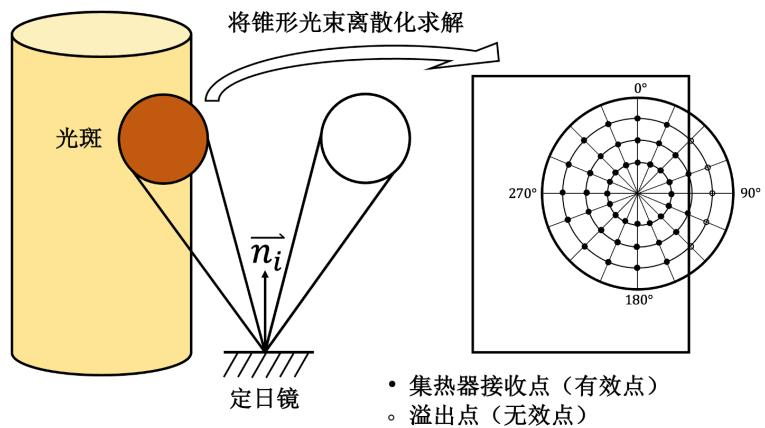

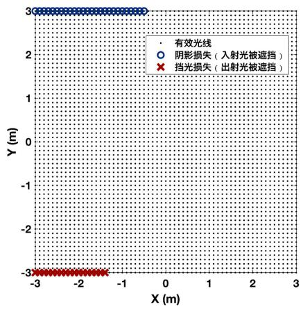  
图 8: 集热器截断效率求解图 (左图) 与阴影遮挡效率求解图(右图)

在同一时间内，该定日镜阴影遮挡效率求解图如图8右侧所示，全部数据详见支撑材料 (文件十-工作表 5,6)。

## 5.5 问题一求解结果

每月 21 日平均光学效率及输出功率部分结果如表4所示，具体求解结果见附录二。

表 4: 问题 1每月21 日平均光学效率及输出功率
<table><tr><td>日期</td><td>光学效率</td><td>余弦效率</td><td>阴影遮挡效率</td><td>截断效率</td><td>单位面积输出热功率</td></tr><tr><td>1月21日</td><td>0.5649</td><td>0.7199</td><td>0.9101</td><td>0.9871</td><td> $0 . 4 9 2 7 k W / m ^ { 2 }$ </td></tr><tr><td>2月21日</td><td>0.5946</td><td>0.7404</td><td>0.9289</td><td>0.9827</td><td> $0 . 5 6 0 6 k W / m ^ { 2 }$ </td></tr><tr><td>3月21日</td><td>0.6134</td><td>0.7611</td><td>0.9329</td><td>0.979</td><td> $0 . 6 1 0 2 k W / m ^ { 2 }$ </td></tr><tr><td></td><td></td><td></td><td></td><td></td><td></td></tr><tr><td>12月21日</td><td>0.5474</td><td>0.7111</td><td>0.8956</td><td>0.9884</td><td> $0 . 4 5 5 9 k W / m ^ { 2 }$ </td></tr></table>

将上述求解结果进行可视化展现如图9所示

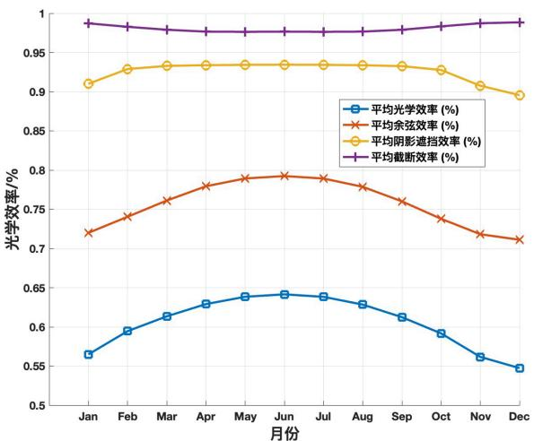

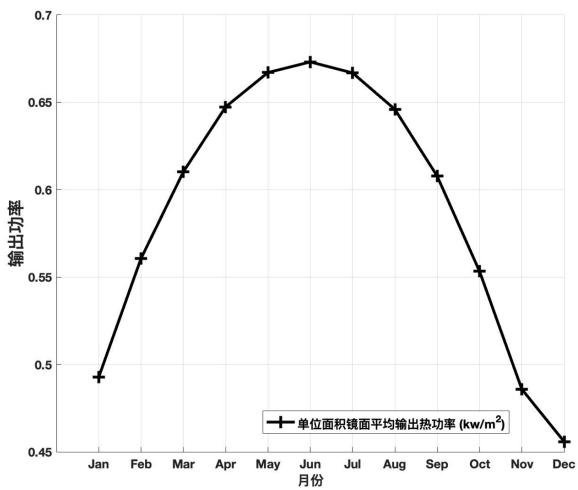  
图 9: 问题一每月21 日平均光学效率折线图 (左图) 与输出功率折线图 (右图)

根据图9，我们可以得出如下结论：

定日镜在夏季的输出功率大于冬季。从 1 月至 12 月，定日镜的输出功率先增大，后减小，并在6月取得最大值。上述情况产生的原因可能是夏季太阳直射点位于北半球，辐射至定日镜场的太阳辐射能比冬季多。

平均余弦效率、平均光学效率具有季节性，平均阴影遮挡效率、平均阶段效率与日期关系较小。从平均光学效率折线图可以看出，在一年的不同时间内 $\eta _ { \mathrm { c o s } }$ 和 <sub>η</sub> 变化幅度接近 0.1%，且均在夏季达到最大值。 $\eta _ { \mathrm { s b } }$ 和 $\eta _ { \mathrm { t r u n c } }$ 的变化不大。

年平均光学效率及输出功率计算结果如表5所示，均为“年均计算结果”。

表 5: 问题一年平均光学效率及输出功率表(均为年均指标)
<table><tr><td>光学效率</td><td>余弦效率</td><td>阴影遮挡效率</td><td>截断效率</td><td>输出热功率</td><td>定日镜输出热功率</td></tr><tr><td>0.605150</td><td>0.756465</td><td>0.925464</td><td>0.980774</td><td>36.994507MW</td><td> $0 . 5 8 8 8 9 6 k W / m ^ { 2 }$ </td></tr></table>

## 六뺮问题二模型的建立与求解

问题二是问题一的反问题，要求我们确定定日镜坐标数目、位置等参数，在达到吸收塔额定功率的前提下实现定日镜单位面积平均输出功率最大化的目标。问题二的关键是确定定日镜场中定日镜的数量和位置。

首先，本文通过制定“吸收塔选址策略”寻找最优的集热器中心位置，通过制定“分区域同心圆规划策略”确定定日镜的数量和各定日镜的排布位置。然后，以定日镜单位面积平均输出热功率最大化为目标，建立定日镜平均输出热功率优化模型。最后，通过变步长的遍历法搜索得出最优的定日镜场参数。

## 6.1 吸收塔选址策略

问题给出的“年均”时间点共 5 个，分别为当地时间正午 12:00 及前后一个半小时与三个小时，时间分布以 12:00 为中心对称。

圆形定日镜场的建设选址位于北半球，根据文献 <sup>[7]</sup>，当地时间正午 12:00 时太阳位于正南方向。

为了提高定日镜平均输出热功率，需要使每一面定日镜尽可能多地接收到太阳光。以春分日全天内平均光学效率为例，从光学效率云图 <sup>[8]</sup>(图10)，明显可见最大光学效率区域位于正北方向。

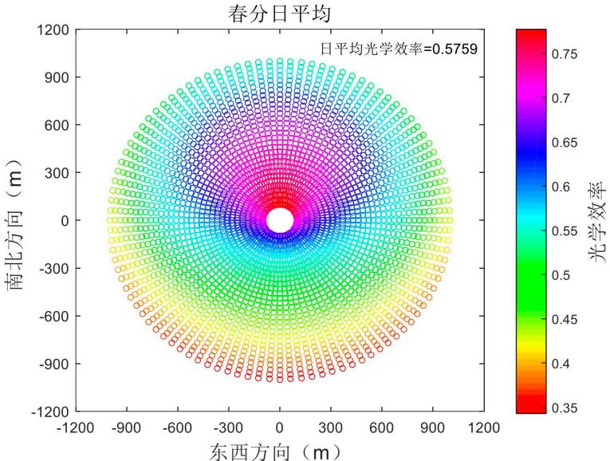  
图 10: 春分日平均光学效率分布云图

因此，应将更多的定日镜布置在正北方向。为了使定日镜反射的太阳光尽可能多的指向集热器中心，本文制定了吸收塔选址策略：吸收塔应建设在正南方向上，且位于定日镜场所在的圆形区域内。

根据所制定的吸收塔选址策略，吸收塔只能在镜场坐标系中Y轴的负方向上[0, 350]区间内建设。设吸收塔与圆形定日镜场圆心的距离为 $L _ { 0 }$ ，此时集热器中心的坐标为$I ( 0 , - L _ { 0 } , h _ { 0 } )$ o

## 6.2 分区域同心圆规划策略

本文制定分区域同心圆规划策略来规划定日镜的位置，以达到定日镜输出平均功率最大化的目标。

分区域同心圆规划策略为：以吸收塔中心为圆心绘制同心圆，将定日镜场划分为多个不同的区域，每个区域内划分为多层，定日镜底座安装在同心圆上。在每个区域内采取不同的定日镜部署策略，使得每一层的定日镜均匀排布。

通过本文所制定的同心圆规划策略，在给定 $W _ { a }$ 、 $W _ { b }$ $h _ { 0 }$ $h _ { i }$ 和 $L _ { 0 }$ 的前提下，可以唯一确定定日镜场中定日镜的总数和各定日镜的坐标。区域划分示意图如图11所示, 下文将具体解释每一个区域的定日镜部署策略。

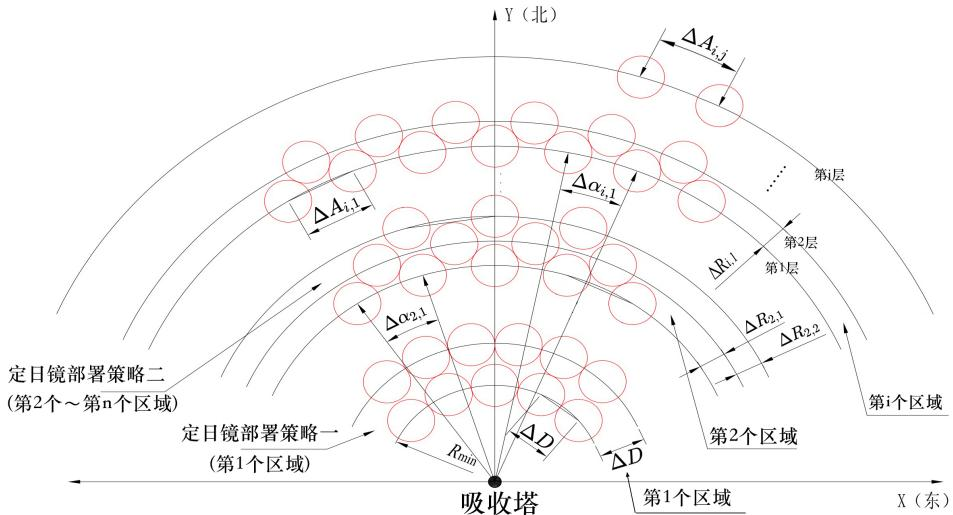  
图 11: 区域划分示意图

## 6.2.1 第 1 个区域定日镜部署策略

对于相邻的定日镜，问题要求它们底座中心间的距离至少比镜面宽度长 5m 以上。因此，本文引入“特征直径”的概念，定日镜“特征直径”内禁止布置其他定日镜。根据约束条件，“特征直径 $\ " { \Delta D }$ 为

$$
\Delta D = W _ { a } + 5\tag{33}
$$

其中， $W _ { a }$ 是定日镜的镜面宽度。

在第一个区域，定日镜的排布原则为：同一层的定日镜应尽可能地紧密排列，即第一个区域内每一层中以“特征直径”为直径的圆在始终保持相切。此时，第一个区域内第j 层布置的定日镜总数 $N _ { 1 , j }$ 为

$$
N _ { i , j } = \left[ \frac { 2 \pi R _ { 1 , j } } { \Delta D } \right]\tag{34}
$$

其中， $N _ { i , j }$ 表示第 i 个区域第 j 层布置的定日镜总数； $R _ { i , j }$ 表示第 i 个区域第 j 层同心圆的半径；中括号表示向下取整。

在第一个区域内，由于定日镜之间以相切的形式紧密排列，因此每一层之间的距离相同，为定日镜的特征直径 $\Delta D _ { \mathfrak { c } }$ 。记第i个区域第 j 层与第(j+1)层之间的间距为 $\Delta R _ { i , j }$ 则 $\Delta R _ { 1 , j }$

$$
\Delta R _ { 1 , j } = \Delta D\tag{35}
$$

当定日镜与吸收塔的距离超过一定的阈值后，即在第 1 个区域第 φ 层以外的区域时，定日镜的紧密排列会导致阴影遮挡损失激增，从而影响顶替镜场的输出热功率。因此，将第1 个区域第 $\phi$ 层以外的区域划分为其他区域，并重新制定定日镜的排布原则。

## 6.2.2 第 2 个区域至第 n 个区域定日镜部署策略

本文引入“周向间距 $\Delta A _ { i , j } ^ { \enspace \enspace }$ 来描述每一层定日镜的分布情况。 $\Delta A _ { i , j }$ 表示第i个区域第j 层相邻两面定日镜底座之间的间距。

在第二个至第n个区域，定日镜的排布原则为：在同一个区域内，每一层布置的定日镜数量相同，不同层之间定日镜交错排列；不同区域间第一层的周向间距相等；通过“周向间距极限因子 $A _ { r } ^ { ~ \mathfrak { n } }$ 确定每一个区域内的层数。

根据文献 <sup>[8]</sup>，周向间距为“特征直径”和“方位间距”中较大的值。根据定日镜的排布原则，不同区域间第一层的周向间距相等。因此，得到各区域第 1 层的周向间距 $\Delta A _ { i , 1 }$ 的表达式

$$
\Delta A _ { 2 , 1 } = \Delta A _ { 3 , 1 } = \cdots = \Delta A _ { z , 1 } = m a x \left\{ A _ { s f } \cdot W _ { a } , \Delta D \right\}\tag{36}
$$

其中，我们将圆形定日镜场划分为共 z 个区域； $A _ { s f }$ 为方位间距因子，为常数。

记第i个区域第 j 层相邻定日镜与同心圆圆心构成的夹角为 $\Delta \alpha _ { i , j }$ 。由定日镜的排布原则，在同一区域内，每一层部署均匀排列的定日镜总数相同，因此 $\Delta \alpha _ { i , j }$ 相同。根据几何关系，可以计算出 $\Delta A _ { i , . }$ j

$$
\Delta A _ { i , j } = 2 R _ { i , j } s i n ( \frac { \Delta \alpha _ { i , j } } { 2 } )\tag{37}
$$

在同一个区域中，分布在两层之间的定日镜需要满足“底座中心间的距离至少比镜面宽度长 5m 以上”的约束条件，即以底座中心为圆心、以“特征直径”为直径的圆不能相交 (如图12所示)。

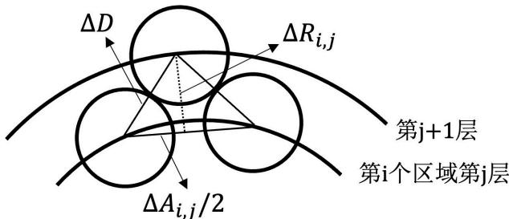  
图 12: 分布在两层之间的定日镜约束示意图

如图12，两层之间的距离 $\Delta R _ { i , j }$ 需要满足如下条件：

$$
\Delta R _ { i , j } \geq \sqrt { ( \Delta D ) ^ { 2 } - ( \frac { \Delta A _ { i , j } } { 2 } ) ^ { 2 } } \quad ( j \neq m )\tag{38}
$$

当某一区域的层数过多时，由于外层定日镜数量较少，会导致太阳辐射能采集缺失的情况。本文通过“周向间距极限因子 $A _ { r }$ ”确定每一个区域内的层数

$$
A _ { r } = { \frac { \Delta A _ { 2 , m _ { 2 } } } { \Delta A _ { 2 , 1 } } } = { \frac { \Delta A _ { 3 , m _ { 3 } } } { \Delta A _ { 3 , 1 } } } = \cdots = { \frac { \Delta A _ { z , m _ { z } } } { \Delta A _ { z , 1 } } }\tag{39}
$$

其中，本文将定日镜场划分为共 z 个区域；第 i 个区域共有 $m _ { i }$ 层； $A _ { r }$ 为某一常数。

设置区域与区域之间的间隙为定日镜的特征直径 $\Delta D$ ：

$$
\Delta R _ { i , m } = \Delta D\tag{40}
$$

基于上述同心圆规划策略，在给定 $W _ { a }$ 、 $W _ { b }$ $h _ { 0 }$ 、 $h _ { i }$ 和 $L _ { 0 }$ 的前提下，可以唯一确定定日镜场中定日镜的总数和各定日镜的坐标。

## 6.3 定日镜平均输出热功率优化模型的建立

本文建立了定日镜平均输出热功率优化模型，在定日镜底座中心距离限制等约束条件下，确定定日镜场参数，使定日镜场的额定功率达到 60MW，并实现定日镜单位面积平均输出功率最大化的目标。

## • <sup>决策变量</sup>

定日镜场中定日镜镜面宽度 $W _ { a }$ 、镜面高度 $W _ { b }$ 、安装高度 $h _ { i }$ 和吸收塔与定日镜场圆心的距离 $L _ { 0 }$ 的改变，会导致定日镜场的额定功率和每一面定日镜的平均输出热功率发生改变。因此，决策变量为 $W _ { a }$ 、 $W _ { b }$ 、 $h _ { i }$ 和 $L _ { 0 }$ 。

## • <sup>目标函数</sup>

问题的优化目标为单位镜面面积年平均输出热功率最大化。因此，目标函数为：

$$
\begin{array} { r l } { m a x } & { { } \frac { \frac { 1 } { 6 0 } \sum _ { D = 1 } ^ { 6 0 } \left( D N I _ { D } \sum _ { i = 1 } ^ { N } A _ { i } \eta _ { i } \right) } { \sum _ { i = 1 } ^ { N } A _ { i } } } \end{array}\tag{41}
$$

其中，本题中所有“年均”指标的计算时间为当地时间每月21日的5个特殊时刻，因此共需要考虑 60 个不同当地时间对应的定日镜输出热功率；第 D 个当地时间定日镜场的输出热功率 $E _ { f i e l d - D } = ( D N I _ { D } \sum _ { i = 1 } ^ { N } A _ { i } \eta _ { i } )$ ； $\textstyle \sum _ { i = 1 } ^ { N } A _ { i }$ 表示定日镜场内所有定日镜的采光面积之和， $A _ { i } = W _ { a } W _ { b }$ o

## • <sup>约束条件</sup>

1. 定日镜尺寸约束：定日镜镜面宽度 $W _ { a }$ 不小于镜面高度 $W _ { b }$ ，即

$$
W _ { a } \geq W _ { b }\tag{42}
$$

2. 镜面宽度与镜面高度约束：定日镜镜面边长必须位于2m 与 8m之间，即

$$
\left\{ { 2 \leq W _ { a } \leq 8 } \right. \hfill\tag{43}
$$

3. 安装高度约束：定日镜的安装高度必须位于2m与6m之间，即

$$
2 \leq h _ { i } \leq 6\tag{44}
$$

4. 吸收塔建设位置约束：吸收塔必须位于圆形定日镜场区域内。因此，吸收塔与定日镜场中心的距离 $L _ { 0 }$ 必须小于圆形定日镜场的半径

$$
0 \leq L _ { 0 } \leq 3 5 0\tag{45}
$$

5. 相邻定日镜位置约束：问题要求相邻定日镜底座中心间的距离至少比镜面宽度长5m 以上，即

$$
L _ { i , j } - W _ { a } \ge 5 \quad i = 1 , 2 , \cdots , N \quad j = 1 , 2 , \cdots , N \quad i \ne j\tag{46}
$$

其中， $L _ { i , j }$ 表示第 i面定日镜和第 j 面定日镜底座中心之间的距离。

6.定日镜位置约束：定日镜必须位于定日镜场范围之内，且与吸收塔的距离必须超过 100m。

$$
\left\{ \begin{array} { l l } { X _ { i } ^ { 2 } + Y _ { i } ^ { 2 } \leq 3 5 0 ^ { 2 } } \\ { ( X _ { i } ) ^ { 2 } + ( Y _ { i } + L _ { 0 } ) ^ { 2 } \geq 1 0 0 ^ { 2 } } \end{array} \right.\tag{47}
$$

其中，在镜场坐标系 XYZ 中，第 i 面定日镜的坐标为 $P _ { i } ( X _ { i } , Y _ { i } , Z _ { i } )$ ；吸收塔的坐标为$I ( 0 , L _ { 0 } , h _ { 0 } )$

7. 定日镜场额定功率约束：问题二要求定日镜场必须达到 60MW 的额定功率，有

$$
\frac { 1 } { 6 0 } \sum _ { D = 1 } ^ { 6 0 } ( D N I _ { D } \sum _ { i = 1 } ^ { N } A _ { i } \eta _ { i } ) \ge 6 0 M W\tag{48}
$$

8.定日镜场镜面高度约束：定日镜绕水平轴旋转时，镜面不能与地面接触，即安装高度需要大于水平轴以下的镜面高度

$$
\frac { W _ { b } } { 2 } \leq h _ { i }\tag{49}
$$

综上，本文建立了定日镜平均输出热功率优化模型

$$
\begin{array}{c} { \scriptstyle { \begin{array} { l } { { \begin{array} { r l } { m a x } & { { \frac { 1 } { 6 0 } } \frac { 8 0 } { 2 \sqrt { 2 } } \ ( { \scriptstyle { \frac { D M } { 2 } } } \sum _ { i = 1 } ^ { N } A _ { i } \eta _ { i } ) } \\ { \sum _ { i = 1 } ^ { N } A _ { i } } \end{array} } } \\ { { \boldsymbol { \downarrow } } } \\ { { \{ { \begin{array} { l } { W _ { a } \geq W _ { i } } \\ { 2 \leq W _ { a } \leq 8 } \\ { 2 \leq W _ { i } \leq 8 } \\ { 2 \leq h _ { i } < 6 } \end{array} } } \\ { \leq i . 4 . { \boldsymbol { \zeta } } } \\ { 0 \leq i . { \boldsymbol { \zeta } } \leq 3 0 } \\ { L _ { i { \boldsymbol { \zeta } } } - W _ { a } \geq 5 } \\ { X _ { i } ^ { 2 } + Y _ { i } ^ { 2 } \leq 3 3 { \boldsymbol { \zeta } } ^ { 2 } \qquad ( X _ { i } ) ^ { 2 } + ( Y _ { i } - L _ { 0 } ) ^ { 2 } \geq 1 0 ^ { 2 } } \\ { { \boldsymbol { \zeta } } \leq { \boldsymbol { \zeta } } \leq ( D \operatorname* { l i p } L _ { i - 1 } ^ { \prime } A _ { i } \eta ) \geq 6 0 M } \end{array} } } & i { \boldsymbol { \zeta } } { \boldsymbol { \downarrow } } } \\ { { \boldsymbol { \downarrow } } { \begin{array} { l } { { \mathrm { ~ } } } \\ { { \mathrm { ~ } } } \\ { { \mathrm { ~ } } } \\ { { \mathrm { ~ W } \leq { \boldsymbol { \zeta } } \leq 1 } } \\ { { \mathrm { ~ } } } \\ { { \mathrm { ~ W } \leq { \boldsymbol { \zeta } } \leq 1 } } \end{array} } } \end{array}\tag{50}
$$

## 6.4 定日镜平均输出热功率优化模型的求解

本文采取变步长搜索法寻找最佳的定日镜场参数，在定日镜场额定功率达到60MW的前提下使得定日镜单位面积年平均输出热功率最大化。变步长搜索法寻找最佳定日镜场参数 $W _ { a }$ 、 $W _ { b }$ 、 $h _ { 0 }$ 、 $h _ { i }$ 和 $L _ { 0 }$ 的流程图如图13所示

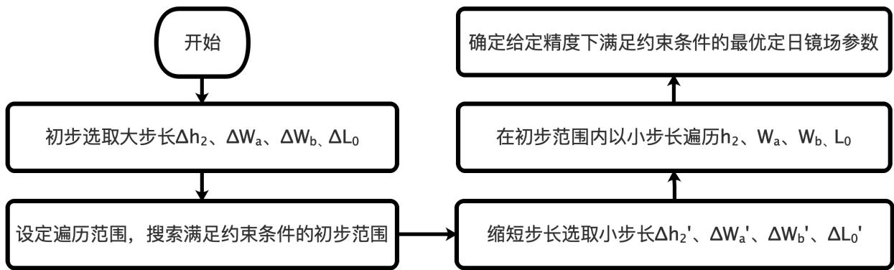  
图 13: 变步长搜索法寻找最佳定日镜场参数流程图

Step1：初步选取大步长。各定日镜参数初始搜索步长设置如表6所示  
表 6: 各定日镜参数初始搜索步长
<table><tr><td>步长</td><td> $\Delta W _ { a }$ </td><td> $\Delta W _ { b }$ </td><td> $\Delta h _ { i }$ </td><td> $\Delta L _ { 0 }$ </td></tr><tr><td>取值</td><td>1m</td><td>1m</td><td>1m</td><td>10m</td></tr></table>

Step2：设置遍历范围，进行初次遍 $\mathscr { \widehat { H } }$ 。根据定日镜平均输出热功率优化模型的约束条件，得出定日镜场参数遍历范围，如表7所示。

表 7: 各定日镜参数初始遍历范围与初步遍历得到的初步范围
<table><tr><td>参数</td><td> $W _ { a }$ </td><td> $W _ { b }$ </td><td> $h _ { i }$ </td><td> $L _ { 0 }$ </td></tr><tr><td>遍历范围/m</td><td>[2,8]</td><td>[2,8]</td><td>[2,6]</td><td>[0,350]</td></tr><tr><td>初步范围/m</td><td>[5,6]</td><td>[5,6]</td><td>[2,3]</td><td>[70,80]</td></tr></table>

各参数在对应的遍历范围内，以对应的步长进行遍历，计算定日镜场的额定功率$E _ { f i e l d }$ 和定日镜年平均输出热功率。搜索得到满足约束条件的定日镜场参数的初步范围(如表7所示)

Step3：缩短搜索步长，在初步范围内进一步搜索最优的定日镜场参数。对于各定日镜场参数，将搜索步长缩短为原来的十分之一，并在初步范围内以小步长遍历 $W _ { a } , \ W _ { b } .$ $h _ { i }$ 和 $L _ { 0 } { \mathrm { . } }$

Step4：遍历搜索结果。经过变步长遍历搜索后，得到最优的定日镜场参数。此时定日镜场的额定功率为60.1189MW，同时，定日镜单位面积年平均输出功率取最大值，为$0 . 5 8 7 1 2 0 1 K W / m ^ { 2 }$

最优的定日镜场参数如表8所示

表 8: 定日镜最优参数遍历搜索结果
<table><tr><td>参数</td><td> $W _ { a }$ </td><td> $W _ { b }$ </td><td> $h _ { i }$ </td><td> $L _ { 0 }$ </td></tr><tr><td>最优取值/m</td><td>5.5</td><td>5.5</td><td>2.75</td><td>79</td></tr></table>

## 6.5 问题二求解结果

将表8定日镜最优参数遍历结果带回模型，可求得所有定日镜的位置坐标，将结果可视化后得到图14，全部坐标结果详见附录一文件三 result2

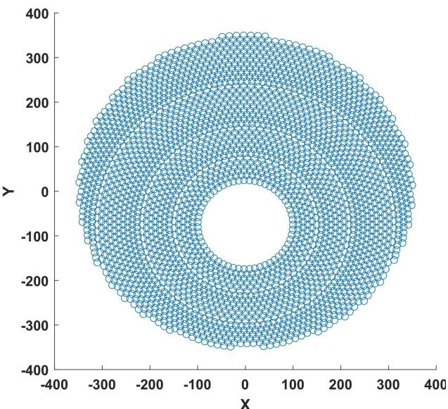  
图 14: 吸收塔及定日镜布局可视化

每月 21 日平均光学效率及输出功率部分结果如表9所示，具体求解结果见附录三。

表 9: 问题 2 每月 21 日平均光学效率及输出功率
<table><tr><td>日期</td><td>光学效率</td><td>余弦效率</td><td>阴影遮挡效率</td><td>截断效率</td><td>单位面积输出热功率</td></tr><tr><td>1月21日</td><td>0.5596</td><td>0.7848</td><td>0.8385</td><td>0.9832</td><td>0.4889kW  $/ m ^ { 2 }$ </td></tr><tr><td>2月21日</td><td>0.5968</td><td>0.7948</td><td>0.8771</td><td>0.9814</td><td>0.5632kW/m²</td></tr><tr><td>3月21日</td><td>0.6175</td><td>0.8025</td><td>0.8947</td><td>0.9795</td><td>0.6143kW/m²</td></tr><tr><td></td><td></td><td></td><td></td><td></td><td></td></tr><tr><td>12月21日</td><td>0.5332</td><td>0.7799</td><td>0.8071</td><td>0.9838</td><td> $0 . 4 4 5 2 k W / m ^ { 2 }$ </td></tr></table>

将上述求解结果进行可视化展现如图15所示


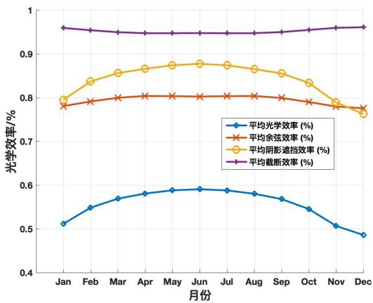  
图 15: 问题二每月21 日平均光学效率折线图 (左图)与输出功率折线图(右图)

将遍历得出的定日镜场参数代入至问题一所设计的计算方案中，可以得到年平均光学效率及输出功率的求解结果(如表10所示)

表 10: 问题二年平均光学效率及输出功率表 (均为年均指标)
<table><tr><td>光学效率</td><td>余弦效率</td><td>阴影遮挡效率</td><td>截断效率</td><td>输出热功率</td><td>定日镜输出热功率</td></tr><tr><td>0.602773</td><td>0.797186</td><td>0.879910</td><td>0.980487</td><td>60.118891MW</td><td>0.587120kW/m²</td></tr></table>

在问题二中，当定日镜输出功率取最大值时，定日镜场的参数如表11所示

表 11: 问题二定日镜场设计参数表
<table><tr><td>吸收塔位置</td><td>定日镜尺寸</td><td></td><td>安装高度 定日镜总面数</td><td>定日镜总面积</td></tr><tr><td>(0,-79)</td><td>5.5×5.5</td><td>2.75</td><td>3385</td><td>102396.3m²</td></tr></table>

## 6.6 结果分析

本文提出的分区域同心圆规划策略共有两部分，记第 1 个区域采用的策略为策略一、第2个区域至第n个区域采用的策略为策略二。考虑到不同的定日镜部署策略会对定日镜的部署结果和定日镜输出功率，我们对比部署策略一、部署策略二与将两者相结合的混合部署策略下定日镜场的光学效率，对结果进行分析。

不同部署效率下定日镜场光学效率折线图如图16所示

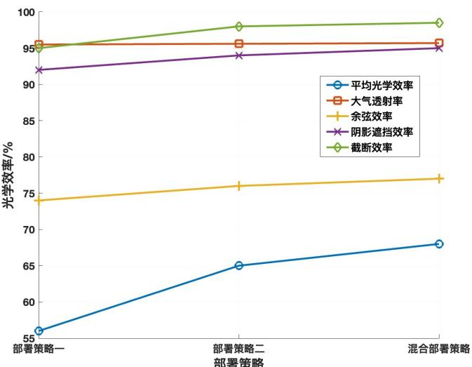  
图 16: 不同部署效率下定日镜场光学效率折线图

从图16中可以看出，本问最终采用的混合部署策略有着更高的平均光学效率、余弦效率、截断效率及阴影遮挡效率，策略优势明显。

## 七뺮问题三模型的建立与求解

相较于问题二，在问题三中定日镜场参数的约束条件发生改变，定日镜尺寸和安装高度可以根据定日镜所处的位置而做出调整。首先，制定“定日镜规格分区域规划策略”，在每个区域内定日镜尺寸和安装高度相等。接着，根据文献，确定定日镜的宽高比。然后，建立改进定日镜平均输出热功率优化模型，并通过二分法和变步长搜索遍历法完成模型的求解。最后，进行结果分析。

## 7.1 定日镜规格分区域规划策略

根据分区域同心圆规划策略，通过绘制同心圆将圆形定日镜场划分为 z 个区域。在每个区域内安装的定日镜与集热器中心的距离大致相等。

为了提高定日镜的平均输出热功率，本文根据定日镜所处位置特点制定“定日镜规格分区域规划策略”：在同一区域内，定日镜规格 (镜面宽度、镜面高度、安装高度) 相同；在不同的区域中，定日镜规格不同，根据区域与吸收塔之间的距离确定定日镜规格及建设位置。“定日镜规格分区域规划策略”示意图如图17所示

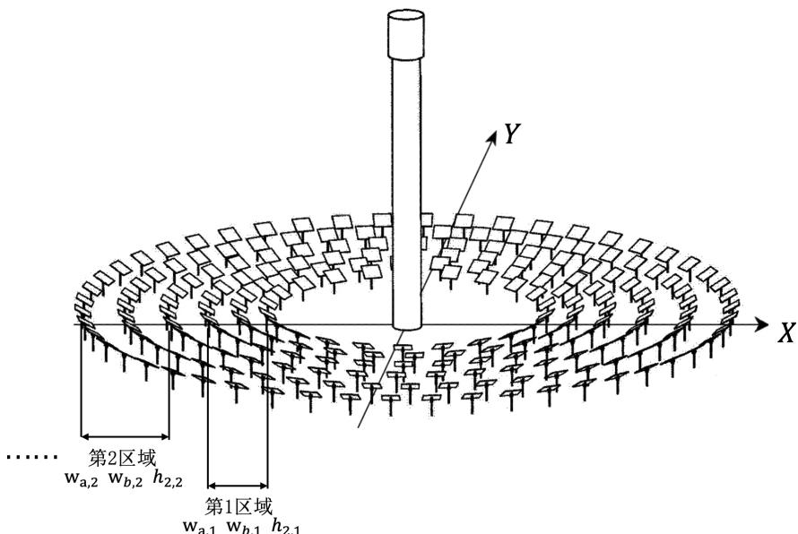  
图 17: “定日镜规格分区域规划策略”示意图 [<sup>8</sup>]

记第 k 个区域内定日镜的镜面宽度为 $W _ { a , k }$ ，镜面高度为 $W _ { b , k }$ ，安装高度为 $h _ { i , k } .$ 。将其简记为“定日镜规格向量 $\vec { Q } _ { k }$ ：

$$
\vec { Q } _ { k } = \left( W _ { a , k } , W _ { b , k } , h _ { i , k } \right) \quad k \in [ 1 , z ]
$$

根据文献 $[ 9 ]$ ，当定日镜场内所有定日镜的镜面宽度与镜面高度高度之比为常数时，定日镜场的工作效率较高。最佳的定日镜宽高比的范围为[1,1.5]。在各区域中，本文取定日镜宽高比 $W _ { a } / W _ { b } = 1$

同时，根据问题二所制定的同心圆规划策略，在给定 $\vec { Q } _ { k } ( k \in [ 1 , z ] )$ 、h<sub>0</sub> 和 $L _ { 0 }$ 的前提下，可以唯一确定定日镜场中定日镜的总数和各定日镜的坐标。

## 7.2 改进定日镜平均输出热功率优化模型的建立

在定日镜尺寸、安装高度可以不同的条件下，本文建立了改进定日镜平均输出热功率优化模型。在定日镜底座中心距离限制等约束条件下，确定各区域中定日镜规格向量$\vec { Q } _ { k } ( W _ { a , k } , W _ { b , k } , h _ { 2 , k } )$ 、数目N 等定日镜场参数，使定日镜场的额定功率达到 60MW，并实现定日镜单位面积平均输出功率最大化的目标。

## • <sup>决策变量</sup>

定日镜场中，吸收塔与定日镜场圆心的距离 $L _ { 0 }$ 、不同区域内定日镜镜面宽度 $W _ { a , k }$ 镜面高度 $W _ { b , k }$ 、安装高度 $h _ { i , k }$ 的改变，会导致定日镜场的额定功率和每一面定日镜的平均输出热功率发生改变。因此，决策变量为 $\vec { Q } _ { k }$ 和 $L _ { 0 }$ 。

## • <sup>目标函数</sup>

问题的优化目标为单位镜面面积年平均输出热功率最大化。因此，目标函数为：

$$
\begin{array} { r l } { m a x } & { { } \frac { \frac { 1 } { 6 0 } \sum _ { D = 1 } ^ { 6 0 } \left( D N I _ { D } \sum _ { i = 1 } ^ { N } A _ { i } \eta _ { i } \right) } { \sum _ { i = 1 } ^ { N } A _ { i } } } \end{array}\tag{51}
$$

## • <sup>约束条件</sup>

相较于定日镜平均输出热功率优化模型的约束条件(式(42)至式(49))，发生改变的约束条件为：

1. 定日镜尺寸约束：在每个区域内，定日镜镜面宽度 $W _ { a , k }$ 均不小于镜面高度 $W _ { b , k }$ 即

$$
W _ { a , k } \ge W _ { b , k }\tag{52}
$$

2. 镜面宽度与镜面高度约束：在每个区域内，定日镜镜面边长 $W _ { a , k }$ 和 $W _ { b , k }$ 均位于2m 与 8m之间，即

$$
\left\{ { 2 \leq W _ { a , k } \leq 8 } \right. \hfill\tag{53}
$$

3. 安装高度约束：定日镜的安装高度 $h _ { i , k }$ 必须位于 2m 与 6m 之间，即

$$
2 \leq h _ { i , k } \leq 6\tag{54}
$$

综上，本文建立了改进定日镜平均输出热功率优化模型

$$
\begin{array} { r l } & { \quad \quad \quad \quad \quad \quad \quad \quad \quad \frac { 1 } { \Delta x } \frac { \phi _ { 0 } ^ { ( 1 ) } - ( B N _ { T } ) \sum _ { i = 1 } ^ { N _ { i } } A _ { i } \eta _ { i } } { \sum _ { i = 1 } ^ { N _ { i } } A _ { i } } } \\ & { \quad \quad \quad \quad \quad \quad \quad \quad \quad \quad \quad \quad \quad \quad \quad \quad \quad \quad \quad \quad \quad \quad \quad \quad \quad } \\ & { \quad \quad \quad \quad \quad \quad \quad \quad \quad \quad \quad \quad \quad \quad \quad \quad \quad \quad \quad \quad \quad \quad \quad \quad \quad \quad \quad \quad \quad \quad \quad \quad \quad \quad \quad } \\ & { \quad \quad \quad \quad \quad \quad \quad \quad \quad \quad \quad \quad \quad \quad \quad \quad \quad \quad \quad \quad \quad \quad \quad \quad \quad \quad \quad \quad \quad \quad \quad \quad \quad \quad \quad \quad \quad } \\ & { \quad \quad \quad \quad \quad \quad \quad \quad \quad \quad \quad \quad \quad \quad \quad \quad \quad \quad \quad \quad \quad \quad \quad \quad \quad \quad \quad \quad \quad \quad \quad \quad \quad \quad \quad \quad \quad \quad } \\ & { \quad \quad \quad \quad \quad \quad \quad \quad \quad \quad \quad \quad \quad \quad \quad \quad \quad \quad \quad \quad \quad \quad \quad \quad \quad \quad \quad \quad \quad \quad \quad \quad \quad \quad \quad \quad \quad \quad \quad \quad \quad } \\ & { \quad \quad \quad \quad \quad \quad \quad \quad \quad \quad \quad \quad \quad \quad \quad \quad \quad \quad \quad \quad \quad \quad \quad \quad \quad \quad \quad \quad \quad \quad \quad \quad \quad \quad \quad \quad \quad \quad \quad \quad \quad } \\ & { \quad \quad \quad \quad \quad \quad \quad \quad \quad \quad \quad \quad \quad \quad \quad \quad \quad \quad \quad \quad \quad \quad \quad \quad \quad \quad \quad \quad \quad \quad \quad \quad \quad \quad \quad \quad \quad \quad \quad \quad \quad \quad \quad } \\ &  \quad \quad \quad \quad \quad \quad \quad \quad \quad \quad \quad \quad \quad \quad \quad \quad \quad \quad \quad \quad \quad \quad \quad \quad \quad \quad \quad \quad \quad \quad \quad \quad \quad \quad \quad \quad \quad \quad \quad \end{array}\tag{55}
$$

## 7.3 改进定日镜平均输出热功率优化模型的求解

考虑到存在多个区域，若直接采用遍历法求解 $L _ { 0 }$ 、 $W _ { a , k }$ 和 $h _ { i , k }$ ，存在计算量过大的问题。本文先通过二分法搜索 $L _ { 0 }$ 的最佳取值，再通过变步长搜索法寻找 $W _ { a , k }$ 和 $h _ { i , k }$ 的最佳取值。结合二分法和变步长搜索法寻找最佳的定日镜场参数流程图如图18所示

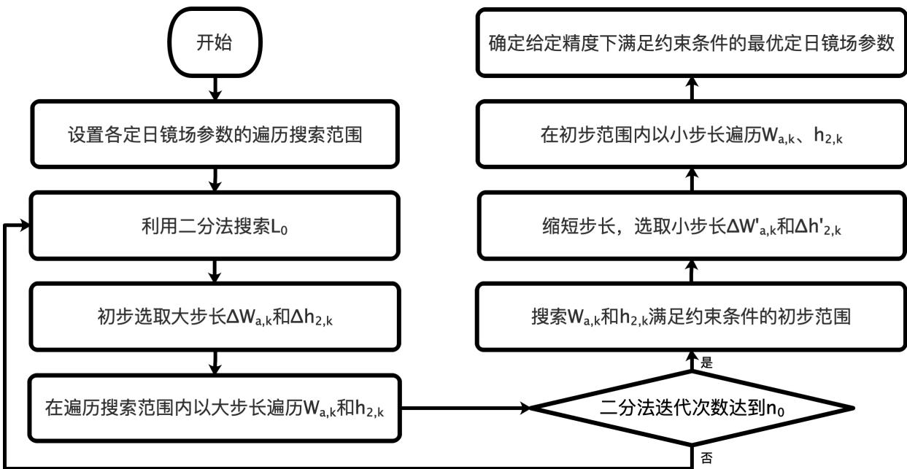  
图 18: 问题三算法求解流程图

Step1：设置各定日镜场参数的遍历范围。根据改进定日镜平均输出热功率优化模型的约束条件，设置参数的遍历范围： $L _ { 0 } \in [ 0 , 3 5 0 ]$ $W _ { a , k } \in [ 2 , 8 ]$ $h _ { i , k } \in [ 2 , 6 ]$

Step2：二分法搜索 $L _ { 0 }$ 的最佳取值。利用二分法，从 $L _ { 0 } = 1 7 5$ 开始，迭代 $n _ { 0 }$ 次搜索 $L _ { 0 }$ 的最佳取值。在每一次迭代中，选取大步长 $\Delta W _ { a , k } = 1 m$ $\Delta h _ { i , k } = 1 m$ ，在遍历范围内寻找定日镜平均输出热功率的最大值。

Step3：搜索 $W _ { a , k }$ 和 $h _ { i , k }$ 满足约束条件的初步范围。利用二分法迭代 $n _ { 0 }$ 次后，得出$L _ { 0 }$ 的最佳取值。此时，以大步长 $\Delta W _ { a , k }$ 和 $\Delta h _ { i , k }$ 进行初次遍历，得到 $W _ { a , k }$ 和 $h _ { i , k }$ 满足约束条件的初步范围。

Step4：缩短搜索步长，在初步范围内进一步搜索最优的定日镜场参数。缩短步长为原来的十分之一，即 $\Delta W _ { a , k } = 0 . 1 m$ $\Delta h _ { i , k } = 0 . 1 m$ 。在初步范围内以小步长遍历 $W _ { a , k }$ 和$h _ { i , k }$ ，直至搜索结果达到所要求的精度范围。

Step5：遍历搜索结果。经过变步长遍历搜索后，得到最优的定日镜场参数。此时，定日镜场的额定功率为 61.8593KW，同时，定日镜单位面积年平均输出功率取最大值，为 $0 . 5 3 0 6 5 2 2 6 9 k W / m ^ { 2 } .$ 。根据上文，定日镜镜面宽度与镜面高度高度之比为常数1。通过$W _ { a , k }$ 可以求出 $W _ { b , k }$ 。问题三求解结果如表12所示

表 12: 定日镜最优参数遍历搜索结果
<table><tr><td>参数</td><td> $W _ { a }$ </td><td> $W _ { b }$ </td><td> $h _ { i }$ </td><td> $L _ { 0 }$ </td></tr><tr><td>最优取值/m</td><td>6.4</td><td>6.4</td><td>3.2</td><td>79</td></tr></table>

## 7.4 问题三求解结果

每月 21 日平均光学效率及输出功率部分结果如表13所示，具体求解结果见附录四。

表 13: 问题3 每月21 日平均光学效率及输出功率
<table><tr><td>日期</td><td>光学效率</td><td>余弦效率</td><td>阴影遮挡效率</td><td>截断效率</td><td>单位面积输出热功率</td></tr><tr><td>1月21日</td><td>0.5133</td><td>0.7836</td><td>0.7942</td><td>0.9599</td><td>0.4485</td></tr><tr><td>2月21日</td><td>0.5479</td><td>0.7932</td><td>0.8327</td><td>0.9557</td><td>0.5171</td></tr><tr><td>3月21日</td><td>0.5649</td><td>0.8004</td><td>0.8478</td><td>0.9513</td><td>0.562</td></tr><tr><td></td><td></td><td></td><td></td><td></td><td></td></tr><tr><td>12月21日</td><td>0.4694</td><td>0.7753</td><td>0.7398</td><td>0.9614</td><td>0.3919</td></tr></table>

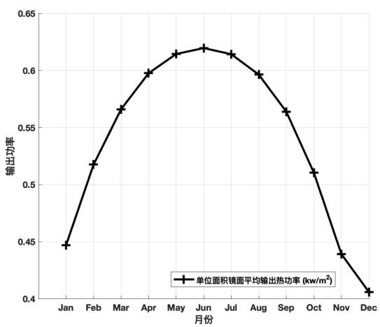

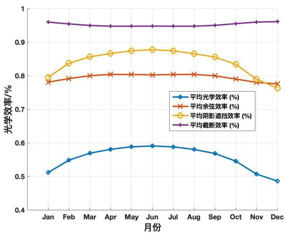  
图 19: 问题二每月21 日平均光学效率折线图 (左图)与输出功率折线图(右图)  
将上述求解结果进行可视化展现如图19所示

将遍历得出的定日镜场参数代入至问题一所设计的计算方案中，可以得到年平均光学效率及输出功率的求解结果 (如表14所示)

表 14: 问题三年平均光学效率及输出功率表 (均为年均指标)
<table><tr><td>光学效率</td><td>余弦效率</td><td>阴影遮挡效率</td><td>截断效率</td><td>输出热功率</td><td>定日镜输出热功率</td></tr><tr><td>0.544565</td><td>0.793641</td><td>0.824562</td><td>0.953782</td><td>61.859281MW</td><td>0.530652kW/m²</td></tr></table>

在问题三中，当定日镜输出功率取最大值时，定日镜场的参数如表15所示

表 15: 问题三定日镜场设计参数表
<table><tr><td>吸收塔位置</td><td>定日镜尺寸</td><td>安装高度</td><td>总面数</td><td>总面积</td></tr><tr><td>(0,-79)</td><td>6.4×6.4</td><td>共7种</td><td>2846</td><td>116572.2m²</td></tr></table>

其中，定日镜安装高度共有 7 种，分别为 3.2m,3.3m,3.4m,3.5m,3.6m,3.7m,3.8m。

## 八뺮灵敏度分析

## 8.1 模型对集热器尺寸的灵敏性

在上文中，集热器尺寸是定值，为高8m、直径7m的圆柱体。考虑到实际光热电站中集热器尺寸存在多种常见规格，为探究集热器规格的改变对定日镜场的平均光学效率的影响程度，我们使集热器的高和底面直径在 [4,10] 与 [4,12] 范围内，各以 1m 为步长进行正负变化，并计算相应的平均光学效率的改变量。

定日镜场年平均光学效率随集热器的高和底面直径的变化曲线图如图20所示。

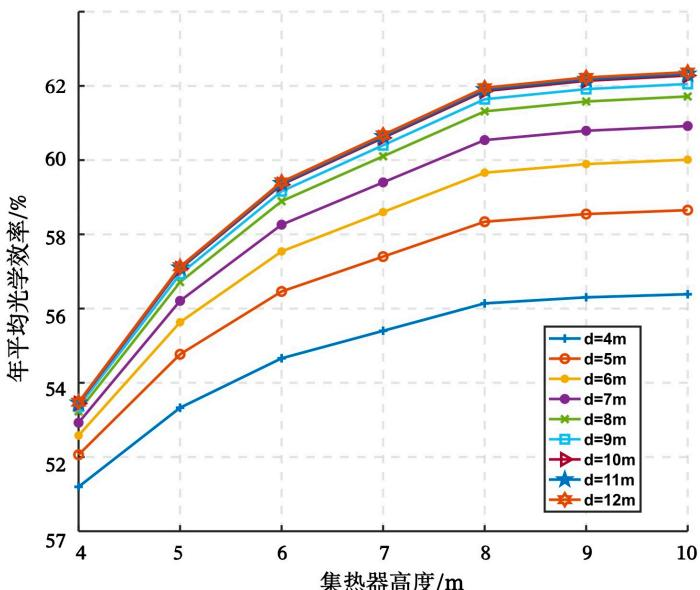  
图 20: 定日镜场年平均光学效率随集热器的高和底面直径的变化曲线图

从图20中可以看到，改变集热器高度、直径，定日镜场的年平均光学效率的改变量在-13.9% 0.51%、-7.7% 2.3% 之间。当集热器高度、直径增大时，年平均光学效率快速增加至一定值后几乎不变；当集热器高度、直径减小时，年平均光学效率显著降低。可见年平均光学效率对集热器尺寸较敏感。

## 8.2 模型对吸收塔高度的灵敏性

在上文中，吸收塔高度为80m。考虑到实际塔式发电站的塔高各有不同，为探究吸收塔高度的改变对定日镜场的平均光学效率的影响程度，我们使吸收塔高度在 [50,110]范围，以 5m为步长进行调整，并计算各种光学效率及年平均输出热功率的取值。

各种年平均光学效率、定日镜场年平均输出热功率随吸收塔高度的变化曲线图如图21所示。

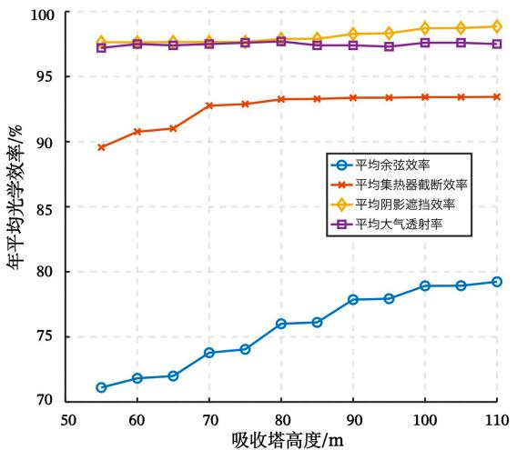

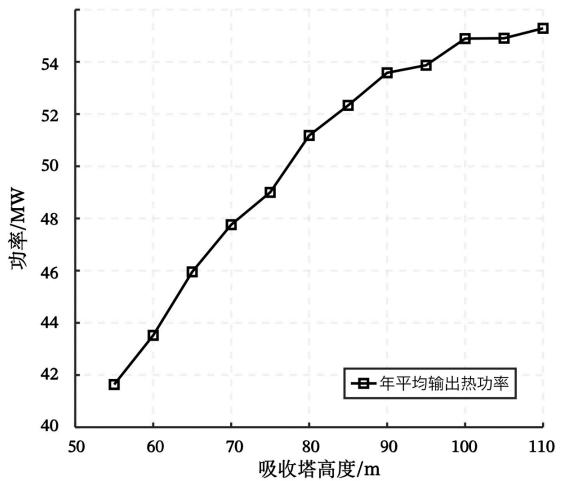  
图 21: 各种年平均光学效率随吸收塔高度的变化曲线图 (左图) 和定日镜场年平均输出热功率随吸收塔高度的变化曲线图 (右图)

从图21中可以看到，随着塔高的增加，各光学效率及年平均输出热功率总体均呈现上升趋势，各光学效率中余弦效率最为明显，增幅超过 11.2%。各种光学效率对吸收塔高度的敏感性各不相同，敏感程度由大到小依次是余弦效率、集热器截断效率、阴影遮挡效率、大气透射率。

## 九뺮模型的评价与推广

## 9.1 模型的优点

1. 对镜场中每面定日镜上的 40 余万根光线追迹，求解出的光学效率精确度高，效果理想。

2.模型中考虑了集热器影子对定日镜的遮挡作用，对阴影遮挡效率与平均输出热功率的求解更加符合实际物理情景。

3. 对于 $W _ { a } , \ W _ { b } , \ h _ { i }$ 等所求参数采用变步长枚举法先大范围寻找，在小范围遍历精确确定，可较快且精准地找到优质解

## 9.2 模型的缺点

1. 由于采取离散化的方式对光学效率值进行求解，模型始终存在一定误差。

2. 模型空间复杂度较高，问题3 的求解时间较长

## 9.3 模型的推广

1. 改变圆形定日镜场区域半径或定日镜场区域形状进行求解。

2. 将镜场土地利用率作为衡量定日镜排布及参数优化的标准之一。

## 十뺮参考文献

[1] 代波涛, 邵琦, 郭德军. 太阳能热发电定日镜旋转角度算法研究 [J]. 汽轮机技术,2020,62(02):99-100+103.

[2] 谢飞. 塔式太阳能热电系统定日镜场光学仿真与应用研究 [D]. 浙江大学,2013.

[3] 郭苏, 刘德有. 考虑接收塔阴影的定日镜有效利用率计算 [J]. 太阳能学报,2007(11):1182-1187.

[4] 张平, 奚正稳, 华文瀚等. 太阳能塔式光热镜场光学效率计算方法 [J]. 技术与市场,2021,28(06):5-8.

[5]O. Farges, J.J. Bezian, M. El Hafi, Global optimization of solar power tower systems using a Monte Carlo algorithm: Application to a redesign of the PS10 solar thermal power plant [J], Renewable Energy, 2018, 119:345-353.

[6] 魏秀东, 王瑞庭, 张红鑫等. 太阳能塔式热发电聚光场的光学性能分析 [J]. 光子学报,2008(11):2279-2283.

[7] 贺晓雷, 于贺军, 李建英等. 太阳方位角的公式求解及其应用 [J]. 太阳能学报,2008(01):69-73.

[8] 程小龙. 基于光学效率的塔式电站镜场布局优化设计研究 [D]. 合肥工业大学,2018.

[9] 刘建兴. 塔式光热电站光学效率建模仿真及定日镜场优化布置 [D]. 兰州交通大学,2022.

## 附录

附录一 支撑文件列表  
文件一 工作簿：第一问表格1—表格2.xlsx  
文件二 工作簿：第二问表格 1—表格 3.xlsx  
文件三 工作簿：result2.xlsx  
文件四 工作簿：第三问表格 1—表格 3.xlsx  
文件五 工作簿：result3.xlsx  
文件六 程序一（第一问）MATLAB 代码文件：FirQues.m  
文件七 程序二（第二问）MATLAB 代码文件：SecQues.m  
文件八 程序三（第三问）MATLAB 代码文件：ThiQues.m  
文件九 题目附件.xlsx导入数据文件：1.mat  
文件十 工作簿：第一问部分中间过程数据.xlsx  
工作表 1：法向量坐标  
工作表 2：定日镜反射向量坐标  
工作表 3：大气投射率  
工作表 4：余弦效率  
工作表 5：阴影坐标（入射光被遮挡）  
工作表 6：挡光坐标（出射光被遮挡）  
附录二 问题一求解答案（表 1—表 2）  
附录三 问题二求解答案（表 1—表 3）  
附录四 问题三求解答案（表 1—表 3）  
附录五 文中公式推导  
附录六 程序代码  
程序一 问题一代码（FirQues.m）  
程序二 问题二代码（SecQues.m）  
程序三 问题三代码（ThiQues.m）

## 附录⼆ 问题⼀求解答案（表1—表2）

<table><tr><td rowspan=1 colspan=6>表1问题一每月12日平均光学效率及输出功率</td></tr><tr><td rowspan=1 colspan=1>日期</td><td rowspan=1 colspan=1>平均光学效率</td><td rowspan=1 colspan=1>平均余弦效率</td><td rowspan=1 colspan=1>平均阴影遮挡效率</td><td rowspan=1 colspan=1>平均截断效率</td><td rowspan=1 colspan=1>单位面积镜面平均输出热功率(千瓦/平方米)</td></tr><tr><td rowspan=1 colspan=1>21/01/2023</td><td rowspan=1 colspan=1>0.564936744</td><td rowspan=1 colspan=1>0.719935763</td><td rowspan=1 colspan=1>0.910097680</td><td rowspan=1 colspan=1>0.987110431</td><td rowspan=1 colspan=1>0.492711978</td></tr><tr><td rowspan=1 colspan=1>21/02/2023</td><td rowspan=1 colspan=1>0.594555676</td><td rowspan=1 colspan=1>0.740440352</td><td rowspan=1 colspan=1>0.928852136</td><td rowspan=1 colspan=1>0.982729770</td><td rowspan=1 colspan=1>0.560628937</td></tr><tr><td rowspan=1 colspan=1>21/03/2023</td><td rowspan=1 colspan=1>0.613443803</td><td rowspan=1 colspan=1>0.761140014</td><td rowspan=1 colspan=1>0.932863104</td><td rowspan=1 colspan=1>0.978978919</td><td rowspan=1 colspan=1>0.610199766</td></tr><tr><td rowspan=1 colspan=1>21/04/2023</td><td rowspan=1 colspan=1>0.629067947</td><td rowspan=1 colspan=1>0.779339967</td><td rowspan=1 colspan=1>0.933784199</td><td rowspan=1 colspan=1>0.976563637</td><td rowspan=1 colspan=1>0.647406940</td></tr><tr><td rowspan=1 colspan=1>21/05/2023</td><td rowspan=1 colspan=1>0.638409713</td><td rowspan=1 colspan=1>0.789316977</td><td rowspan=1 colspan=1>0.934208492</td><td rowspan=1 colspan=1>0.976384980</td><td rowspan=1 colspan=1>0.667061599</td></tr><tr><td rowspan=1 colspan=1>21/06/2023</td><td rowspan=1 colspan=1>0.641485642</td><td rowspan=1 colspan=1>0.792358814</td><td rowspan=1 colspan=1>0.934409258</td><td rowspan=1 colspan=1>0.976552676</td><td rowspan=1 colspan=1>0.673122851</td></tr><tr><td rowspan=1 colspan=1>21/07/2023</td><td rowspan=1 colspan=1>0.638310279</td><td rowspan=1 colspan=1>0.789211847</td><td rowspan=1 colspan=1>0.934208831</td><td rowspan=1 colspan=1>0.976381806</td><td rowspan=1 colspan=1>0.666858165</td></tr><tr><td rowspan=1 colspan=1>21/08/2023</td><td rowspan=1 colspan=1>0.628417846</td><td rowspan=1 colspan=1>0.778636944</td><td rowspan=1 colspan=1>0.933731712</td><td rowspan=1 colspan=1>0.976613873</td><td rowspan=1 colspan=1>0.645994688</td></tr><tr><td rowspan=1 colspan=1>21/09/2023</td><td rowspan=1 colspan=1>0.612369496</td><td rowspan=1 colspan=1>0.760091979</td><td rowspan=1 colspan=1>0.932566976</td><td rowspan=1 colspan=1>0.978941383</td><td rowspan=1 colspan=1>0.607757248</td></tr><tr><td rowspan=1 colspan=1>21/10/2023</td><td rowspan=1 colspan=1>0.591672228</td><td rowspan=1 colspan=1>0.737835405</td><td rowspan=1 colspan=1>0.927636792</td><td rowspan=1 colspan=1>0.983304709</td><td rowspan=1 colspan=1>0.553324249</td></tr><tr><td rowspan=1 colspan=1>21/11/2023</td><td rowspan=1 colspan=1>0.561729932</td><td rowspan=1 colspan=1>0.718195612</td><td rowspan=1 colspan=1>0.907597844</td><td rowspan=1 colspan=1>0.987282750</td><td rowspan=1 colspan=1>0.485842560</td></tr><tr><td rowspan=1 colspan=1>21/12/2023</td><td rowspan=1 colspan=1>0.547402802</td><td rowspan=1 colspan=1>0.711082282</td><td rowspan=1 colspan=1>0.895606089</td><td rowspan=1 colspan=1>0.988447720</td><td rowspan=1 colspan=1>0.455854579</td></tr></table>

<table><tr><td rowspan=1 colspan=6>表2问题一年平均光学效率及输出功率表</td></tr><tr><td rowspan=1 colspan=1>年平均光学效率</td><td rowspan=1 colspan=1>年平均余弦效率</td><td rowspan=1 colspan=1>年平均阴影遮挡效率</td><td rowspan=1 colspan=1>年平均截断效率</td><td rowspan=1 colspan=1>年平均输出热功率(兆瓦)</td><td rowspan=1 colspan=1>单位面积镜面年平均输出热功率(千瓦/平方米)</td></tr><tr><td rowspan=1 colspan=1>0.605150176</td><td rowspan=1 colspan=1>0.756465496</td><td rowspan=1 colspan=1>0.925463593</td><td rowspan=1 colspan=1>0.980774388</td><td rowspan=1 colspan=1>36.994507232</td><td rowspan=1 colspan=1>0.588896963</td></tr></table>

## 附录三 问题⼆求解答案（表1—表3）

<table><tr><td rowspan=1 colspan=6>表1问题二每月12日平均光学效率及输出功率</td></tr><tr><td rowspan=1 colspan=1>日期</td><td rowspan=1 colspan=1>平均光学效率</td><td rowspan=1 colspan=1>平均余弦效率</td><td rowspan=1 colspan=1>平均阴影遮挡效率</td><td rowspan=1 colspan=1>平均截断效率</td><td rowspan=1 colspan=1>单位面积镜面平均输出热功率(千瓦/平方米)</td></tr><tr><td rowspan=1 colspan=1>21/01/2023</td><td rowspan=1 colspan=1>0.559598754</td><td rowspan=1 colspan=1>0.784776391</td><td rowspan=1 colspan=1>0.838474446</td><td rowspan=1 colspan=1>0.983185918</td><td rowspan=1 colspan=1>0.488920128</td></tr><tr><td rowspan=1 colspan=1>21/02/2023</td><td rowspan=1 colspan=1>0.596784296</td><td rowspan=1 colspan=1>0.794758525</td><td rowspan=1 colspan=1>0.877092024</td><td rowspan=1 colspan=1>0.981373821</td><td rowspan=1 colspan=1>0.563183431</td></tr><tr><td rowspan=1 colspan=1>21/03/2023</td><td rowspan=1 colspan=1>0.617505044</td><td rowspan=1 colspan=1>0.802481141</td><td rowspan=1 colspan=1>0.894745495</td><td rowspan=1 colspan=1>0.979463170</td><td rowspan=1 colspan=1>0.614299039</td></tr><tr><td rowspan=1 colspan=1>21/04/2023</td><td rowspan=1 colspan=1>0.628158908</td><td rowspan=1 colspan=1>0.805821444</td><td rowspan=1 colspan=1>0.903018021</td><td rowspan=1 colspan=1>0.978584236</td><td rowspan=1 colspan=1>0.646499378</td></tr><tr><td rowspan=1 colspan=1>21/05/2023</td><td rowspan=1 colspan=1>0.634228342</td><td rowspan=1 colspan=1>0.804738079</td><td rowspan=1 colspan=1>0.910251256</td><td rowspan=1 colspan=1>0.978728747</td><td rowspan=1 colspan=1>0.662734791</td></tr><tr><td rowspan=1 colspan=1>21/06/2023</td><td rowspan=1 colspan=1>0.636386344</td><td rowspan=1 colspan=1>0.803530186</td><td rowspan=1 colspan=1>0.913731905</td><td rowspan=1 colspan=1>0.978846922</td><td rowspan=1 colspan=1>0.667813356</td></tr><tr><td rowspan=1 colspan=1>21/07/2023</td><td rowspan=1 colspan=1>0.634167082</td><td rowspan=1 colspan=1>0.804769665</td><td rowspan=1 colspan=1>0.910158789</td><td rowspan=1 colspan=1>0.978724692</td><td rowspan=1 colspan=1>0.662571856</td></tr><tr><td rowspan=1 colspan=1>21/08/2023</td><td rowspan=1 colspan=1>0.627870847</td><td rowspan=1 colspan=1>0.805790568</td><td rowspan=1 colspan=1>0.902777696</td><td rowspan=1 colspan=1>0.978597836</td><td rowspan=1 colspan=1>0.645459482</td></tr><tr><td rowspan=1 colspan=1>21/09/2023</td><td rowspan=1 colspan=1>0.616828442</td><td rowspan=1 colspan=1>0.802167938</td><td rowspan=1 colspan=1>0.894253619</td><td rowspan=1 colspan=1>0.979560074</td><td rowspan=1 colspan=1>0.612239761</td></tr><tr><td rowspan=1 colspan=1>21/10/2023</td><td rowspan=1 colspan=1>0.593483417</td><td rowspan=1 colspan=1>0.793598095</td><td rowspan=1 colspan=1>0.874043131</td><td rowspan=1 colspan=1>0.981718626</td><td rowspan=1 colspan=1>0.555539871</td></tr><tr><td rowspan=1 colspan=1>21/11/2023</td><td rowspan=1 colspan=1>0.555096157</td><td rowspan=1 colspan=1>0.783849033</td><td rowspan=1 colspan=1>0.833294535</td><td rowspan=1 colspan=1>0.983271012</td><td rowspan=1 colspan=1>0.481000177</td></tr><tr><td rowspan=1 colspan=1>21/12/2023</td><td rowspan=1 colspan=1>0.533164106</td><td rowspan=1 colspan=1>0.779945184</td><td rowspan=1 colspan=1>0.807073855</td><td rowspan=1 colspan=1>0.983784316</td><td rowspan=1 colspan=1>0.445179334</td></tr></table>

<table><tr><td rowspan=1 colspan=6>表2问题二年平均光学效率及输出功率表</td></tr><tr><td rowspan=1 colspan=1>年平均光学效率</td><td rowspan=1 colspan=1>年平均余弦效率</td><td rowspan=1 colspan=1>年平均阴影遮挡效率</td><td rowspan=1 colspan=1>年平均截断效率</td><td rowspan=1 colspan=1>年平均输出热功率(兆瓦)</td><td rowspan=1 colspan=1>单位面积镜面年平均输出热功率(千瓦/平方米)</td></tr><tr><td rowspan=1 colspan=1>0.602772645</td><td rowspan=1 colspan=1>0.797185521</td><td rowspan=1 colspan=1>0.879909564</td><td rowspan=1 colspan=1>0.980486614</td><td rowspan=1 colspan=1>60.118891455</td><td rowspan=1 colspan=1>0.587120050</td></tr></table>

<table><tr><td rowspan=1 colspan=5>表3问题二设计参数表</td></tr><tr><td rowspan=1 colspan=1>吸收塔位置坐标</td><td rowspan=1 colspan=1>定日镜尺寸(宽×高)</td><td rowspan=1 colspan=1>定日镜安装高度(米)</td><td rowspan=1 colspan=1>定日镜总面数</td><td rowspan=1 colspan=1>定日镜总面积(平方米)</td></tr><tr><td rowspan=1 colspan=1>[0,-79]</td><td rowspan=1 colspan=1>5.5×5.5</td><td rowspan=1 colspan=1>2.75</td><td rowspan=1 colspan=1>3385</td><td rowspan=1 colspan=1>102396.3</td></tr></table>

## 附录四 问题三求解答案（表1—表3）

<table><tr><td rowspan=1 colspan=6>表1问题三每月12日平均光学效率及输出功率</td></tr><tr><td rowspan=1 colspan=1>日期</td><td rowspan=1 colspan=1>平均光学效率</td><td rowspan=1 colspan=1>平均余弦效率</td><td rowspan=1 colspan=1>平均阴影遮挡效率</td><td rowspan=1 colspan=1>平均截断效率</td><td rowspan=1 colspan=1>单位面积镜面平均输出热功率(千瓦/平方米)</td></tr><tr><td rowspan=1 colspan=1>21/01/2023</td><td rowspan=1 colspan=1>0.513273141</td><td rowspan=1 colspan=1>0.783599226</td><td rowspan=1 colspan=1>0.794152670</td><td rowspan=1 colspan=1>0.959916006</td><td rowspan=1 colspan=1>0.448475298</td></tr><tr><td rowspan=1 colspan=1>21/02/2023</td><td rowspan=1 colspan=1>0.547900804</td><td rowspan=1 colspan=1>0.793203892</td><td rowspan=1 colspan=1>0.832693078</td><td rowspan=1 colspan=1>0.955677183</td><td rowspan=1 colspan=1>0.517067515</td></tr><tr><td rowspan=1 colspan=1>21/03/2023</td><td rowspan=1 colspan=1>0.564935120</td><td rowspan=1 colspan=1>0.800433115</td><td rowspan=1 colspan=1>0.847776880</td><td rowspan=1 colspan=1>0.951296201</td><td rowspan=1 colspan=1>0.561961997</td></tr><tr><td rowspan=1 colspan=1>21/04/2023</td><td rowspan=1 colspan=1>0.573899720</td><td rowspan=1 colspan=1>0.803186547</td><td rowspan=1 colspan=1>0.854509487</td><td rowspan=1 colspan=1>0.949492047</td><td rowspan=1 colspan=1>0.590627990</td></tr><tr><td rowspan=1 colspan=1>21/05/2023</td><td rowspan=1 colspan=1>0.578077085</td><td rowspan=1 colspan=1>0.801485418</td><td rowspan=1 colspan=1>0.859165671</td><td rowspan=1 colspan=1>0.949617230</td><td rowspan=1 colspan=1>0.604032294</td></tr><tr><td rowspan=1 colspan=1>21/06/2023</td><td rowspan=1 colspan=1>0.578470211</td><td rowspan=1 colspan=1>0.799668253</td><td rowspan=1 colspan=1>0.860284434</td><td rowspan=1 colspan=1>0.949905422</td><td rowspan=1 colspan=1>0.607021266</td></tr><tr><td rowspan=1 colspan=1>21/07/2023</td><td rowspan=1 colspan=1>0.573334328</td><td rowspan=1 colspan=1>0.800360187</td><td rowspan=1 colspan=1>0.853516339</td><td rowspan=1 colspan=1>0.949689236</td><td rowspan=1 colspan=1>0.598997235</td></tr><tr><td rowspan=1 colspan=1>21/08/2023</td><td rowspan=1 colspan=1>0.564689640</td><td rowspan=1 colspan=1>0.800999138</td><td rowspan=1 colspan=1>0.843700808</td><td rowspan=1 colspan=1>0.949685494</td><td rowspan=1 colspan=1>0.580478314</td></tr><tr><td rowspan=1 colspan=1>21/09/2023</td><td rowspan=1 colspan=1>0.551198842</td><td rowspan=1 colspan=1>0.79726508</td><td rowspan=1 colspan=1>0.831603303</td><td rowspan=1 colspan=1>0.951748364</td><td rowspan=1 colspan=1>0.547045319</td></tr><tr><td rowspan=1 colspan=1>21/10/2023</td><td rowspan=1 colspan=1>0.528760944</td><td rowspan=1 colspan=1>0.788832714</td><td rowspan=1 colspan=1>0.810548665</td><td rowspan=1 colspan=1>0.956454052</td><td rowspan=1 colspan=1>0.494924647</td></tr><tr><td rowspan=1 colspan=1>21/11/2023</td><td rowspan=1 colspan=1>0.490845031</td><td rowspan=1 colspan=1>0.779316922</td><td rowspan=1 colspan=1>0.766959241</td><td rowspan=1 colspan=1>0.960510652</td><td rowspan=1 colspan=1>0.425284486</td></tr><tr><td rowspan=1 colspan=1>21/12/2023</td><td rowspan=1 colspan=1>0.469397153</td><td rowspan=1 colspan=1>0.775336541</td><td rowspan=1 colspan=1>0.739836086</td><td rowspan=1 colspan=1>0.961387633</td><td rowspan=1 colspan=1>0.391910866</td></tr></table>

<table><tr><td rowspan=1 colspan=6>表2问题三年平均光学效率及输出功率表</td></tr><tr><td rowspan=1 colspan=1>年平均光学效率</td><td rowspan=1 colspan=1>年平均余弦效率</td><td rowspan=1 colspan=1>年平均阴影遮挡效率</td><td rowspan=1 colspan=1>年平均截断效率</td><td rowspan=1 colspan=1>年平均输出热功率(兆瓦)</td><td rowspan=1 colspan=1>单位面积镜面年平均输出热功率(千瓦/平方米)</td></tr><tr><td rowspan=1 colspan=1>0.544565168</td><td rowspan=1 colspan=1>0.793640586</td><td rowspan=1 colspan=1>0.824562222</td><td rowspan=1 colspan=1>0.953781627</td><td rowspan=1 colspan=1>61.859281189</td><td rowspan=1 colspan=1>0.530652269</td></tr></table>

<table><tr><td rowspan=1 colspan=5>表3问题三设计参数表</td></tr><tr><td rowspan=1 colspan=1>吸收塔位置坐标</td><td rowspan=1 colspan=1>定日镜尺寸(宽×高)</td><td rowspan=1 colspan=1>定日镜安装高度(米)</td><td rowspan=1 colspan=1>定日镜总面数</td><td rowspan=1 colspan=1>定日镜总面积(平方米)</td></tr><tr><td rowspan=1 colspan=1>[0,-79]</td><td rowspan=1 colspan=1>6.4×6.4</td><td rowspan=1 colspan=1>3.2,3.3,3.4,3.5,3.6,3.7,3.8</td><td rowspan=1 colspan=1>2846</td><td rowspan=1 colspan=1>116572.2</td></tr></table>

## 附录五 离散光线向量 $\vec { e } _ { t , k , i }$ 推导过程

基于反射光线方向向量和定日镜法向量，本文利用向量间的关系得出每一条离散光线对应的向量 $\vec { e } _ { t , k , i }$ ，向量的符号定义见图22。

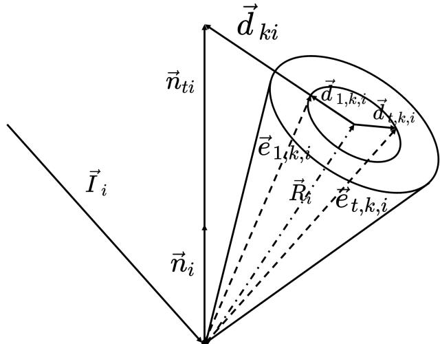  
图 22: 离散光线向量 $\vec { e } _ { t , k , i }$ 计算示意图

设过锥形光线底面圆心的反射光线向量为 $\vec { R } _ { i }$ ，截面三角形斜边向量为 $\vec { n } _ { t i }$ 。根据几何关系， $\vec { R } _ { i }$ 和 $\vec { n } _ { t i }$ 的夹角 $\xi _ { i }$ 的余弦值为：

$$
\cos \xi _ { i } = \frac { \left| \vec { R } _ { i } \right| } { \left| \vec { n } _ { t i } \right| }\tag{56}
$$

向量 $\vec { n } _ { t i }$ 与定日镜法向量 $\vec { n } _ { i }$ 方向相同，由此 $\vec { n } _ { t i }$ 为

$$
\vec { n } _ { t i } = \frac { \left| \vec { R } _ { i } \right| } { \cos \xi _ { i } } \cdot \vec { n } _ { i }\tag{57}
$$

向量加法遵循三角形法则，得到 $\vec { d } _ { k i }$ 为

$$
\vec { d } _ { k i } = \vec { n } _ { t i } - \vec { R } _ { i }\tag{58}
$$

由锥形光线离散化结果可知，光线 $r _ { t , k , i }$ 对应的的锥形角为 $\theta _ { t , k , i }$ 。当t =1 时，根据几何关系， $\vec { d } _ { 1 , k , i }$ 可以表示为

$$
\vec { d } _ { 1 , k , i } = \frac { \vec { d } _ { k i } } { \left| \vec { d } _ { k i } \right| } \cdot \tan \theta _ { t , k , i }\tag{59}
$$

利用方位角 $\mathbf { \Delta } \varepsilon _ { t , k , i }$ ，可以通过 $\vec { d } _ { 1 , k , i }$ 计算得出锥形光线底面上任意向量 $\vec { d } _ { t , k , i }$ ：

$$
\cos { \varepsilon _ { t , k , i } } = \frac { \vec { d } _ { 1 , k , i } \cdot \vec { d } _ { t , k , i } } { \left| \vec { d } _ { 1 , k , i } \right| ^ { 2 } }\tag{60}
$$

通过上式得出 $\vec { d } _ { t , k , i }$ 后，通过向量加法，可以得到任意一条离散光线向量 $\vec { e } _ { t , k , i }$ ：

$$
\vec { e } _ { t , k , i } = \vec { R } _ { i } + \vec { d } _ { t , k , i }\tag{61}
$$

## 附录六 程序代码

## 程序一 问题一代码（FirQues.m） 程月

```matlab
%% 入射角
%% 计算太阳赤纬角 delta
% 输入：D 为以春分作为第 0 天起算的天数
%D = 31; % 4 月 21 日对应的天数
%%输入 D 得到 R
% R=Main(D);
D=[-59 -28 0 31 61 92 122 153 184 214 245 275 ];
R_total=[];
for i=2:1:size(D,1)
R=Main(D(i));
R_total=[R_total;R];
end
function R=Main(Day)
D=Day;
STT=[9 10.5 12 13.5 15]; %当地时间,假设为 15 点
result=[];%日结果详细矩阵 5*4 5 个时间点 4 个参数 R 才是最终值
eta_ref=0.92;%镜面反射率
H=80;%吸收塔高度
O_R=[0 0 H];%集热器中心坐标
%定日镜选取根据与中心的距离进行排序
load 1.mat %经过排序后的定日镜坐标 data---1745*3 x,y,r
h=4;%定日镜安装高度
% 计算太阳赤纬角 delta
sin_delta = sin(2*pi*D/365) * sin(2*pi/360 * 23.45);
delta = asin(sin_delta); % 得到赤纬角的弧度值
phi = deg2rad(39.4); % 北纬 39.4 度，转换为弧度
for XH_ST=1:size(STT,2)
ST=STT(XH_ST);
omega =pi/12*(ST-12); % 声明 omega 的值
% 计算 sin(alpha_s)
sin_alpha_s = cos(delta) * cos(phi) * cos(omega) + sin(delta) * sin(phi);
G_0=1.366; %太阳常数
Hh=3;%3km
ha=0.4237 - 0.00821*(6 - Hh)^2;%大气压
hb=0.5055 + 0.00595*(6.5 - Hh)^2;%大气压
hc=0.2711 + 0.01858*(2.5 - Hh)^2;%大气压
DNI = G_0*(ha + hb*exp(-hc/sin_alpha_s)); %直接法辐照度
alpha_s = asin(sin_alpha_s); % 得到 alpha_s 的弧度值
% 根据公式计算 cos(gamma_s)
cos_gamma_s = (sin(delta) - sin_alpha_s * sin(phi)) / (cos(alpha_s) * cos(phi));
if cos_gamma_s > 1
cos_gamma_s = 1;
```

```matlab
elseif cos_gamma_s < -1
cos_gamma_s = -1;
end
gamma_s = acos(cos_gamma_s); % 得到 gamma_s 的弧度值
x=cos(alpha_s)*sin(gamma_s);
y=cos(alpha_s)*cos(gamma_s);
z=sin(alpha_s);
S_i=[x y z];%太阳入射方向单位向量的相反
Store=zeros(1745,4);%光学效率 阴影遮挡效率 余弦效率 截断效率
E_field=0;%定日镜场的输出热功率
for num=1:1:1745%num=1745;%定日镜编号
O_A=[data(num,1) data(num,2) h];%定日镜中心坐标
%计算集热器截断效率 eta_trunc
d_HR=sqrt((O_A(1)-O_R(1))^2+(O_A(2)-O_R(2))^2+(O_A(3)-O_R(3))^2);%定日镜镜面中心与集热器
中心的距离
eta_at = 0.99321 - 0.0001176*d_HR + 1.97e-8 * (d_HR^2); % 计算吸收塔的吸收率
S_AR=(O_R-O_A)/norm(O_R-O_A);%定日镜中心到集热器中心的单位向量 %% 反射角
%% 计算法向量
S_n=(S_i+S_AR)/norm(S_i+S_AR);%法向量单位向量
% 计算方位角 Azimuth (θ)
A_H = atan2(S_n(1), S_n(2));
% 计算俯仰角 Elevation (?)
E_H = acos(S_n(3));
%
T=[-sin(E_H),-sin(A_H)*cos(E_H),cos(A_H)*cos(E_H);cos(E_H),-sin(A_H)*sin(E_H),cos(A_H)*sin(E_H
);0,cos(A_H),sin(A_H)];
M1 = [1, 0, 0; 0, cos(E_H), sin(E_H); 0, -sin(E_H), cos(E_H)];
M2 = [cos(pi-A_H), sin(pi-A_H), 0; -sin(pi-A_H), cos(pi-A_H), 0; 0, 0, 1];
% 计算矩阵乘积
T = M1 * M2; %镜坐标系变为地坐标系的转换矩阵
S_An=[0 0 1];%镜面 A 坐标系上的的法向量
SSS=S_An*T;
tolerance = 1e-10;
difference = abs(SSS - S_n);
if all(difference(:) >tolerance)
error('法向量转换错误');
end
%计算余弦效率 eta_cos
eta_cos = dot(S_i, S_n) / (norm(S_i) * norm(S_n)); % 计算入射向量相反和法向量之间的夹角的
余弦值
%如果在塔挡阴影范围内 eta_sb=0；
%计算阴影遮挡效率 eta_sb
%step1：塔挡损失 定日镜镜面中心是否在阴影中,如果是 eta_sb=0 %i 是-S_i
```

```ini
[P_top_1_intersect,P_top_2_intersect,P_bot_1_intersect,P_bot_2_intersect] =
shadow_range(-S_i, h) ;%i 是-S_i
isInside = pointInRectangle(O_A(1), O_A(2), P_top_1_intersect, P_top_2_intersect,
P_bot_1_intersect, P_bot_2_intersect);
if isInside %在里面
eta_sb=0;
eta_trunc=0;
Store(num,1)=0;
Store(num,2)=0;
Store(num,3)=eta_cos;
Store(num,4)=0;
disp(num);
else %不在里面
W_a = 6;
W_b = 6;
dx = 0.1;
dy = 0.1;
R = 100;
X = -1/2 * W_a:dx:1/2 * W_a;
Y = -1/2 * W_b:dy:1/2 * W_b;
% Assuming S_i, S_AR, and T are defined elsewhere
T_inv = inv(T);
% 在指定的半径内寻找定日镜
distances = sqrt((data(1:num-1, 1) - O_A(1)).^2 + (data(1:num-1, 2) - O_A(2)).^2);
valid_indices = find(distances <= R);
% Main loops
valid_point_count = 0;%有效点
valid_points = 0;%每个点的有效光线
obstructed_mirrors = [];
for x = X
for y = Y
dot_A = [x, y, 0];
dot_AG = dot_A * T + O_A;
is_valid = true;
for idx = valid_indices
O_B = [data(idx, 1), data(idx, 2), h];
dot_B = (dot_AG - O_B)*T_inv;
S_iB = S_i*T_inv;
H2 = [(S_iB(3)*dot_B(1) - S_iB(1)*dot_B(3))/S_iB(3), (S_iB(3)*dot_B(2) -
S_iB(2)*dot_B(3))/S_iB(3), 0];
if ~(-1/2*W_a <= H2(1) && H2(1) <= 1/2*W_a && -1/2*W_b <= H2(2) && H2(2)
<= 1/2*W_b)%不在该平面内为真
S_ARB = S_AR*T_inv;
```

```matlab
H1 = [(S_ARB(3)*dot_B(1) - S_ARB(1)*dot_B(3))/S_ARB(3),
(S_ARB(3)*dot_B(2) - S_ARB(2)*dot_B(3))/S_ARB(3), 0];
if -1/2*W_a <= H1(1) && H1(1) <= 1/2*W_a && -1/2*W_b <= H1(2) && H1(2)
<= 1/2*W_b %在该平面内为真
obstructed_mirrors = [obstructed_mirrors; O_B, distances(idx)];
is_valid = false;
break;
end
else%在该平面内为真
obstructed_mirrors = [obstructed_mirrors; O_B, distances(idx)];
is_valid = false;
break;
end
end
if is_valid
valid_point_count = valid_point_count + 1;
%这个点是有效的计算集热器接收到的光
% 计算入射向量和法向量之间的夹角
cosTheta_i = dot(S_i, S_n) / (norm(S_i) * norm(S_n));
S_nt = S_n / cosTheta_i;
d_ki = S_nt - S_AR;
d_ki = d_ki / norm(d_ki);
theta_range = linspace(-4.65e-3,4.65e-3, 5);
theta2_range = linspace(0, 2*pi, 12);
% 循环 theta 值
for theta = theta_range
d_ki2 = tan(theta) * d_ki;
% 循环不同的 theta2 值
for theta2 = theta2_range
% d_tki = cos(theta2) * norm(d_ki) ./ d_ki;
RR = rotationMatrix(S_AR, -theta2); %顺时针
d_tki = RR * d_ki2';
d_tki=d_tki';
r = d_tki + S_AR;
% 解出 t 的范围 判断 r 是否与集热器相交 地系坐标
a = r(1)^2 + r(2)^2;
b = 2 * (dot_AG(1) * r(1) + dot_AG(2) * r(2));
c = dot_AG(1)^2 + dot_AG(2)^2 - 49/4;
discriminant = b^2 - 4*a*c;
if discriminant >= 0
t1 = (-b + sqrt(discriminant)) / (2*a);
t2 = (-b - sqrt(discriminant)) / (2*a);
% 使用 t 的范围得到 z 的范围 地系坐标
z1 = dot_AG(3) + t1 * r(3);
```

```matlab
z2 = dot_AG(3) + t2 * r(3);
% 检查 z 的范围是否与(H-4,H+4]有交集
z_min = min(z1, z2);
z_max = max(z1, z2);
if (z_min <= (H+4) && z_max > (H-4))%有交集
valid_points = valid_points + 1;
end
end
end
end
end
end
end
eta_sb = valid_point_count / (length(X) * length(Y));
Dot_Sum_light=length(theta_range)*length(theta2_range);%每个区域总光线数量
eta_trunc=valid_points/(valid_point_count*Dot_Sum_light);
if eta_trunc<1
disp(num);
disp(eta_trunc);
end
eta=eta_cos*eta_sb*eta_at*eta_trunc*eta_ref;%计算光学效率 eta
Store(num,1)=eta;
Store(num,2)=eta_sb;
Store(num,3)=eta_cos;
Store(num,4)=eta_trunc;
end
%计算定日镜场的输出热功率 E_field
Ai=36;
E_field=E_field+Ai*Store(num,1);%E_field=E_field+Ai*eta;
end
E_field=E_field*DNI;
result=[result;mean(Store) E_field/(num*W_a*W_b)];
end
R=mean(result);
end
function [P_top_1_intersect,P_top_2_intersect,P_bot_1_intersect,P_bot_2_intersect] =
shadow_range(i, h) %i 是-S_i
% 参数:
% i: 入射向量, 例如 [1,1,1]
% h: 圆柱阴影所在的 z 坐标
% 入射向量规范化
i = i / norm(i);
% 圆柱参数
H = 80; % 吸收塔高度
```

```matlab
R = 7/2; % 圆柱半径
O_top= [0 0 (H + R)]; % 圆柱上底面中心坐标
% 计算与入射光 i 垂直的直径方向
diameter_direction = cross(i, [0, 0, 1]);
diameter_direction = diameter_direction / norm(diameter_direction); % 单位化
% 上底面和下底面上与入射光垂直的直径的两个端点
P_top_1 = O_top + R * diameter_direction;
P_top_2 = O_top - R * diameter_direction;
P_bot_1 = P_top_1 - [0, 0, 2*R];
P_bot_2 = P_top_2 - [0, 0, 2*R];
% 计算在 z=h 时的交点
t_top_1 = (h - P_top_1(3)) / i(3);
P_top_1_intersect = P_top_1 + t_top_1 * i;
t_top_2 = (h - P_top_2(3)) / i(3);
P_top_2_intersect = P_top_2 + t_top_2 * i;
t_bot_1 = (h - P_bot_1(3)) / i(3);
P_bot_1_intersect = P_bot_1 + t_bot_1 * i;
t_bot_2 = (h - P_bot_2(3)) / i(3);
P_bot_2_intersect = P_bot_2 + t_bot_2 * i;
end
function isInside = pointInRectangle(x, y, P_top_1_intersect, P_top_2_intersect,
P_bot_1_intersect, P_bot_2_intersect)
% 定义矩形的顶点
polygon = [P_top_1_intersect; P_top_2_intersect; P_bot_2_intersect; P_bot_1_inter
P_top_1_intersect];
% 计算交点数
crossings = 0;
for i = 1:length(polygon)-1
if ((polygon(i, 2) > y) ~= (polygon(i+1, 2) > y)) && ...
(x < (polygon(i+1, 1) - polygon(i, 1)) * (y - polygon(i, 2)) / ...
(polygon(i+1, 2) - polygon(i, 2)) + polygon(i, 1))
crossings = crossings + 1;
end
end
% 根据交点数判断点是否在矩形内
if mod(crossings, 2) == 1
isInside = true;
else
isInside = false;
end
end
function RR = rotationMatrix(axis, angle)
c = cos(angle);
s = sin(angle);
```

```matlab
t = 1 - c;
x = axis(1);
y = axis(2);
z = axis(3);
RR = [
t*x*x + c, t*x*y - s*z, t*x*z + s*y;
t*x*y + s*z, t*y*y + c, t*y*z - s*x;
t*x*z - s*y, t*y*z + s*x, t*z*z + c
];
End
```

## 程序二 问题二代码（SecQues.m）

```matlab
global W_a;
global W_b;
global h2;
global h1;
global L0;
WAAA=5.5:0.1:6.5;
WBBB=5.5:0.1:6.5;
R_year=[];
E_year=[];
for W_a=WAAA
for W_b=WBBB
if W_a<W_b
continue;
else
h2_range=linspace(W_b/2,6, 5);
for h2=h2_range
h1=80;
L0_range=linspace(0,350, 5);
for L0=L0_range
%L0=0;
%% 入射角
%% 计算太阳赤纬角 delta
% 输入：D 为以春分作为第 0 天起算的天数
%D = 31; % 4 月 21 日对应的天数
%%输入 D 得到 R
% R=Main(D);
D=[-59 -28 0 31 61 92 122 153 184 214 245 275];
R_total=[];
EEEE_total=[];
for i=1:1:size(D,1)
disp(i);
```

```matlab
[R,EEEE]=Main(D(i));
R_total=[R_total;R];
EEEE_total=[EEEE_total;EEEE];
end
R_year=[R_year;mean(R_total)];
E_year=[E_year;mean(EEEE_total) h2 L0];
end
end
end
end
end
function [R,EEEE]=Main(Day)
global W_a;
global W_b;
global h2;
global h1;
global L0;
EEEE=[];
D=Day;
STT=[9 10.5 12 13.5 15]; %当地时间,假设为 15 点
result=[];%日结果详细矩阵 5*4 5 个时间点 4 个参数 R 才是最终值
eta_ref=0.92;%镜面反射率
O_R=[0 0 h1];%集热器中心坐标
%定日镜选取根据与中心的距离进行排序
% 计算 data 的程序
data=data_func(); %经过排序后的定日镜坐标 data---1745*3 x,y,r
% 计算太阳赤纬角 delta
sin_delta = sin(2*pi*D/365) * sin(2*pi/360 * 23.45);
delta = asin(sin_delta); % 得到赤纬角的弧度值
phi = deg2rad(39.4); % 北纬 39.4 度，转换为弧度
for XH_ST=1:size(STT,2)
ST=STT(XH_ST);
omega =pi/12*(ST-12); % 声明 omega 的值
% 计算 sin(alpha_s)
sin_alpha_s = cos(delta) * cos(phi) * cos(omega) + sin(delta) * sin(phi);
G_0=1.366; %太阳常数
Hh=3;%3km
ha=0.4237 - 0.00821*(6 - Hh)^2;%大气压
hb=0.5055 + 0.00595*(6.5 - Hh)^2;%大气压
hc=0.2711 + 0.01858*(2.5 - Hh)^2;%大气压
DNI = G_0*(ha + hb*exp(-hc/sin_alpha_s)); %直接法辐照度
alpha_s = asin(sin_alpha_s); % 得到 alpha_s 的弧度值
% 根据公式计算 cos(gamma_s)
cos_gamma_s = (sin(delta) - sin_alpha_s * sin(phi)) / (cos(alpha_s) * cos(phi));
```

```matlab
if cos_gamma_s > 1
cos_gamma_s = 1;
elseif cos_gamma_s < -1
cos_gamma_s = -1;
end
gamma_s = acos(cos_gamma_s); % 得到 gamma_s 的弧度值
x=cos(alpha_s)*sin(gamma_s);
y=cos(alpha_s)*cos(gamma_s);
z=sin(alpha_s);
S_i=[x y z];%太阳入射方向单位向量的相反
Store=zeros(size(data,1),4);%光学效率 阴影遮挡效率 余弦效率 截断效率
E_field=0;%定日镜场的输出热功率
for num=1:1:size(data,1)%%定日镜编号
disp(num);
O_A=[data(num,1) data(num,2) h2];%定日镜中心坐标
%计算集热器截断效率 eta_trunc
d_HR=sqrt((O_A(1)-O_R(1))^2+(O_A(2)-O_R(2))^2+(O_A(3)-O_R(3))^2);%定日镜镜面中心与集
热器中心的距离
eta_at = 0.99321 - 0.0001176*d_HR + 1.97e-8 * (d_HR^2); % 计算吸收塔的吸收率
S_AR=(O_R-O_A)/norm(O_R-O_A);%定日镜中心到集热器中心的单位向量 %% 反射角
%% 计算法向量
S_n=(S_i+S_AR)/norm(S_i+S_AR);%法向量单位向量
% 计算方位角 Azimuth (θ)
A_H = atan2(S_n(1), S_n(2));
% 计算俯仰角 Elevation (ϕ)
E_H = acos(S_n(3));
%
T=[-sin(E_H),-sin(A_H)*cos(E_H),cos(A_H)*cos(E_H);cos(E_H),-sin(A_H)*sin(E_H),cos(A_H)*sin(E_H
);0,cos(A_H),sin(A_H)];
M1 = [1, 0, 0; 0, cos(E_H), sin(E_H); 0, -sin(E_H), cos(E_H)];
M2 = [cos(pi-A_H), sin(pi-A_H), 0; -sin(pi-A_H), cos(pi-A_H), 0; 0, 0, 1];
% 计算矩阵乘积
T = M1 * M2; %镜坐标系变为地坐标系的转换矩阵
S_An=[0 0 1];%镜面 A 坐标系上的的法向量
SSS=S_An*T;
tolerance = 1e-10;
difference = abs(SSS - S_n);
if all(difference(:) >tolerance)
error('法向量转换错误');
end
%%
%计算余弦效率 eta_cos
eta_cos = dot(S_i, S_n) / (norm(S_i) * norm(S_n)); % 计算入射向量相反和法向量之间的夹
角的余弦值
```

```matlab
%%%如果在塔挡阴影范围内 eta_sb=0；
%计算阴影遮挡效率 eta_sb
%step1：塔挡损失 定日镜镜面中心是否在阴影中,如果是 eta_sb=0 %i 是-S_i
[P_top_1_intersect,P_top_2_intersect,P_bot_1_intersect,P_bot_2_intersect] =
shadow_range(-S_i, h2) ;%i 是-S_i
isInside = pointInRectangle(O_A(1), O_A(2), P_top_1_intersect, P_top_2_intersect,
P_bot_1_intersect, P_bot_2_intersect);
if isInside %在里面
eta_sb=0;
eta_trunc=0;
Store(num,1)=0;
Store(num,2)=0;
Store(num,3)=eta_cos;
Store(num,4)=0;
else %不在里面
R = 100;
X = linspace(-1/2 * W_a,1/2 * W_a, 5);
Y = linspace(-1/2 * W_b,1/2 *W_b, 5);
% Assuming S_i, S_AR, and T are defined elsewhere
T_inv = inv(T);
% 在指定的半径内寻找定日镜
distances = sqrt((data(1:num-1, 1) - O_A(1)).^2 + (data(1:num-1, 2) - O_A(2)).^2);
valid_indices = find(distances <= R);
% Main loops
valid_point_count = 0;%有效点
valid_points = 0;%每个点的有效光线
obstructed_mirrors = [];
for x = X
for y = Y
dot_A = [x, y, 0];
dot_AG = dot_A * T + O_A;
is_valid = true;
for idx = valid_indices'
O_B = [data(idx, 1), data(idx, 2), h2];
dot_B = (dot_AG - O_B)*T_inv;
S_iB = S_i*T_inv;
H2 = [(S_iB(3)*dot_B(1) - S_iB(1)*dot_B(3))/S_iB(3),
(S_iB(3)*dot_B(2) - S_iB(2)*dot_B(3))/S_iB(3), 0];
if ~(-1/2*W_a <= H2(1) && H2(1) <= 1/2*W_a && -1/2*W_b <= H2(2) && H2(2)
<= 1/2*W_b)%不在该平面内为真
S_ARB = S_AR*T_inv;
H1 = [(S_ARB(3)*dot_B(1) - S_ARB(1)*dot_B(3))/S_ARB(3),
(S_ARB(3)*dot_B(2) - S_ARB(2)*dot_B(3))/S_ARB(3), 0];
```

```shell
if -1/2*W_a <= H1(1) && H1(1) <= 1/2*W_a && -1/2*W_b <= H1(2) &&
```

H1(2) <= 1/2\*W\_b %在该平 面内为真

distances(idx)];

```matlab
obstructed_mirrors = [obstructed_mirrors; O_B,
is_valid = false;
break;
end
else%在该平面内为真
obstructed_mirrors = [obstructed_mirrors; O_B, distances(idx)];
is_valid = false;
break;
end
end
if is_valid
valid_point_count = valid_point_count + 1;
%这个点是有效的计算集热器接收到的光
% 计算入射向量和法向量之间的夹角
cosTheta_i = dot(S_i, S_n) / (norm(S_i) * norm(S_n));
S_nt = S_n / cosTheta_i;
d_ki = S_nt - S_AR;
d_ki = d_ki / norm(d_ki);
theta_range = linspace(-4.65e-3,4.65e-3, 5);
theta2_range = linspace(0, 2*pi, 12);
% 循环 theta 值
for theta = theta_range
d_ki2 = tan(theta) * d_ki;
% 循环不同的 theta2 值
for theta2 = theta2_range
RR = rotationMatrix(S_AR, -theta2); %顺时针
d_tki = RR * d_ki2';
d_tki=d_tki';
r = d_tki + S_AR;
% 解出 t 的范围 判断 r 是否与集热器相交 地系坐标
a = r(1)^2 + r(2)^2;
b = 2 * (dot_AG(1) * r(1) + dot_AG(2) * r(2));
c = dot_AG(1)^2 + dot_AG(2)^2 - 49/4;
discriminant = b^2 - 4*a*c;
if discriminant >= 0
t1 = (-b + sqrt(discriminant)) / (2*a);
t2 = (-b - sqrt(discriminant)) / (2*a);
% 使用 t 的范围得到 z 的范围 地系坐标
z1 = dot_AG(3) + t1 * r(3);
z2 = dot_AG(3) + t2 * r(3);
% 检查 z 的范围是否与(h1-4,h1+4]有交集
```

```matlab
z_min = min(z1, z2);
z_max = max(z1, z2);
if (z_min <= (h1+4) && z_max > (h1-4))%有交集
valid_points = valid_points + 1;
end
end
end
end
end
end
end
eta_sb = valid_point_count / (length(X) * length(Y));
Dot_Sum_light=length(theta_range)*length(theta2_range);%每个区域总光线数量
eta_trunc=valid_points/(valid_point_count*Dot_Sum_light);
eta=eta_cos*eta_sb*eta_at*eta_trunc*eta_ref;%计算光学效率 eta
Store(num,1)=eta;
Store(num,2)=eta_sb;
Store(num,3)=eta_cos;
Store(num,4)=eta_trunc;
end
%计算定日镜场的输出热功率 E_field
Ai=W_a*W_b;%定日镜镜面积
E_field=E_field+Ai*Store(num,1);%E_field=E_field+Ai*eta;
if num== 2836
disp(num);
end
end
E_field=E_field*DNI;
result=[result;mean(Store) E_field/(num*W_a*W_b)];
end
R=mean(result);
EEEE=[W_a W_b R(5)*W_a*W_b*num];
%检验 入射的相反与法向量的夹角 反射与法向量夹角
% % 计算入射向量和法向量之间的夹角
% cosTheta_i = dot(S_i, S_n) / (norm(S_i) * norm(S_n));
% angle_i = acos(cosTheta_i);
%
% % 计算反射向量
% S_r =S_AR;
%
% % 计算反射向量和法向量之间的夹角
% cosTheta_r = dot(S_r, S_n) / (norm(S_r) * norm(S_n));
% angle_r = acos(cosTheta_r);
%
```

```matlab
% % 转换夹角为度
% angle_i_deg = rad2deg(angle_i)
% angle_r_deg = rad2deg(angle_r)
end
function [P_top_1_intersect,P_top_2_intersect,P_bot_1_intersect,P_bot_2_intersect] =
shadow_range(i, h2) %i 是-S_i
% 参数:
% i: 入射向量, 例如 [1,1,1]
% h2: 圆柱阴影所在的 z 坐标
% 入射向量规范化
i = i / norm(i);
% 圆柱参数
global h1;
R = 7/2; % 圆柱半径
O_top= [0 0 (h1 + R)]; % 圆柱上底面中心坐标
% 计算与入射光 i 垂直的直径方向
diameter_direction = cross(i, [0, 0, 1]);
diameter_direction = diameter_direction / norm(diameter_direction); % 单位化
% 上底面和下底面上与入射光垂直的直径的两个端点
P_top_1 = O_top + R * diameter_direction;
P_top_2 = O_top - R * diameter_direction;
P_bot_1 = P_top_1 - [0, 0, 2*R];
P_bot_2 = P_top_2 - [0, 0, 2*R];
% 计算在 z=h 时的交点
t_top_1 = (h2 - P_top_1(3)) / i(3);
P_top_1_intersect = P_top_1 + t_top_1 * i;
t_top_2 = (h2 - P_top_2(3)) / i(3);
P_top_2_intersect = P_top_2 + t_top_2 * i;
t_bot_1 = (h2 - P_bot_1(3)) / i(3);
P_bot_1_intersect = P_bot_1 + t_bot_1 * i;
t_bot_2 = (h2 - P_bot_2(3)) / i(3);
P_bot_2_intersect = P_bot_2 + t_bot_2 * i;
end
function isInside = pointInRectangle(x, y, P_top_1_intersect, P_top_2_intersect,
P_bot_1_intersect, P_bot_2_intersect)
% 定义矩形的顶点
polygon = [P_top_1_intersect; P_top_2_intersect; P_bot_2_intersect; P_bot_1_interse
P_top_1_intersect];
% 计算交点数
crossings = 0;
for i = 1:length(polygon)-1
if ((polygon(i, 2) > y) ~= (polygon(i+1, 2) > y)) && ...
(x < (polygon(i+1, 1) - polygon(i, 1)) * (y - polygon(i, 2)) / ...
(polygon(i+1, 2) - polygon(i, 2)) + polygon(i, 1))
```

```matlab
crossings = crossings + 1;
end
end
% 根据交点数判断点是否在矩形内
if mod(crossings, 2) == 1
isInside = true;
else
isInside = false;
end
end
function RR = rotationMatrix(axis, angle)
c = cos(angle);
s = sin(angle);
t = 1 - c;
x = axis(1);
y = axis(2);
z = axis(3);
RR = [
t*x*x + c, t*x*y - s*z, t*x*z + s*y;
t*x*y + s*z, t*y*y + c, t*y*z - s*x;
t*x*z - s*y, t*y*z + s*x, t*z*z + c
];
end
function data=data_func()% 这里求出的定日镜坐标是相对坐标
global W_a;
global L0;
R0 = 100;
delta_D=5+W_a+0.05;%给点容差%% !
coordinates = []; % 保存所有坐标
maxNumMirrors = 10000; % 估计的最大定日镜数
coordinates = NaN(maxNumMirrors, 2); % 预先分配空间
idx = 1; % 当前填充到的坐标索引
% 第一区域的五层
for numj = 1:5
R = R0 + (numj-1)*delta_D;
% 使用余弦定理计算 theta_D
cos_theta_D = (2*R^2 - delta_D^2) / (2*R^2);
theta_D = acos(cos_theta_D);
ND = floor(2*pi/theta_D);
% 重新计算 theta_D 的值
theta_D = 2*pi/ND;
% 计算 cos 和 sin 值
cos_values = cos((0:ND-1) * theta_D);
sin_values = sin((0:ND-1) * theta_D);
```

```matlab
% 计算所有定日镜的坐标
x_values = R * cos_values;
y_values = R * sin_values;
% 更新坐标数组
coordinates(idx:idx+ND-1, :) = [x_values', y_values'];
idx = idx + ND;
end
i = 2; % 从第二个区域开始
while true
R = R + delta_D;% 对于新区域的第一层，从上一个区域的最后一层的 R 增加一个 delta_D
% 检查 R 的条件
if R > (350+L0)
break;
end
% 使用余弦定理计算 theta_D
cos_theta_D = (2*R^2 - delta_D^2) / (2*R^2);
theta_D = acos(cos_theta_D);
ND = floor(2*pi/theta_D);
theta_D = 2*pi/ND; % 重新计算 theta_D 的值
% 计算第一层的坐标
cos_values = cos((0:ND-1) * theta_D);
sin_values = sin((0:ND-1) * theta_D);
x_values = R * cos_values;
y_values = R * sin_values;
coordinates(idx:idx+ND-1, :) = [x_values', y_values'];
idx = idx + ND;
% 保存第一层坐标的距离
distance_first_layer = sqrt((x_values(2) - x_values(1))^2 + (y_values(2) -
y_values(1))^2);
% 其他层的坐标
layer = 2;
while true
prev=sqrt((coordinates(idx-1,1) - coordinates(idx-2,1))^2 + (coordinates(idx-1,2)-
coordinates(idx-2,2))^2);
R = R + sqrt(delta_D^2 - (prev/2)^2);
% 检查 R 的条件
if R > (350+L0)%%%%
break;
end
theta_D0 = atan2(coordinates(idx-ND,2), coordinates(idx-ND,1)) + theta_D/2;
cos_values = cos((0:ND-1) * theta_D + theta_D0); % 角平分线
sin_values = sin((0:ND-1) * theta_D + theta_D0); % 角平分线
x_values = R * cos_values;
y_values = R * sin_values;
```

```matlab
coordinates(idx:idx+ND-1, :) = [x_values', y_values'];
idx = idx + ND;
% 检查距离条件
distance = sqrt((x_values(2) - x_values(1))^2 + (y_values(2) - y_values(1))^2);
if distance > 1.33 * distance_first_layer
break;
end
layer = layer + 1;
end
i = i + 1;
end
% 删除未使用的空间
coordinates = coordinates(~isnan(coordinates(:,1)), :);
%筛选定日镜坐标
% 检查约束条件
N = size(coordinates,1);
valid_indices = [];
for i = 1:N
x1 = coordinates(i,1);
y1 = coordinates(i,2);
if x1^2 + (y1-L0)^2 <= 350^2
valid_indices = [valid_indices; i];
end
end
data=[coordinates(valid_indices,1), coordinates(valid_indices,2)];
error2 = check_distance(data);
if ~error2
error('定日镜距离不符合');
end
data(:,3) = sqrt(data(:,1).^2 + data(:,2).^2);
data = sortrows(data, 3);
nd
unction result = check_distance(coordinates)% 检验点是否满足两个定日镜之间的距离要大于等于 delta_D
% 给定的参数
global W_a;
delta_D = 5 + W_a;
% 计算所有点之间的距离
distances = pdist(coordinates);
% 找到最小距离
min_distance = min(distances);
% 检查最小距离是否大于等于 delta_D
if min_distance >= delta_D
result = true;
else
```

```matlab
result = false;
end
end
```

## 程序三 问题三代码（ThiQues.m）

```matlab
global W_a;
global W_b;
global h2;
global h1;
global L0;
WAAA=5.5:0.1:6.5;
WBBB=5.5:0.1:6.5;
R_year=[];
E_year=[];
for W_a=6.4
for W_b=6.4
if W_a<W_b
continue;
else
h2_range=linspace(W_b/2,6, 5);
for h2=3.2
h1=80;
L0_range=linspace(78,85, 9);
for L0=79
%L0=0;
%% 入射角
%% 计算太阳赤纬角 delta
% 输入：D 为以春分作为第 0 天起算的天数
%D = 31; % 4 月 21 日对应的天数
%%输入 D 得到 R
% R=Main(D);
D=[-59 -28 0 31 61 92 122 153 184 214 245 275 ];
R_total=[];
EEEE_total=[];
for i=1:1:size(D,1)
disp(i);
[R,EEEE]=Main(D(i));
R_total=[R_total;R];
EEEE_total=[EEEE_total;EEEE];
end
R_year=[R_year;mean(R_total)];
E_year=[E_year;mean(EEEE_total)];
```

```matlab
end
end
end
function [R,EEEE]=Main(Day)
global W_a;
global W_b;
global h2;
global h1;
global L0;
EEEE=[];
D=Day;
STT=[9 10.5 12 13.5 15]; %当地时间,假设为 15 点
result=[];%日结果详细矩阵 5*4 5 个时间点 4 个参数 R 才是最终值
eta_ref=0.92;%镜面反射率
O_R=[0 0 h1];%集热器中心坐标
%定日镜选取根据与中心的距离进行排序
% 计算 data 的程序
data=data_func(); %经过排序后的定日镜坐标 data---1745*3 x,y,r
% 计算太阳赤纬角 delta
sin_delta = sin(2*pi*D/365) * sin(2*pi/360 * 23.45);
delta = asin(sin_delta); % 得到赤纬角的弧度值
phi = deg2rad(39.4); % 北纬 39.4 度，转换为弧度
for XH_ST=1:size(STT,2)
ST=STT(XH_ST);
omega =pi/12*(ST-12); % 声明 omega 的值
% 计算 sin(alpha_s)
sin_alpha_s = cos(delta) * cos(phi) * cos(omega) + sin(delta) * sin(phi);
G_0=1.366; %太阳常数
Hh=3;%3km
ha=0.4237 - 0.00821*(6 - Hh)^2;%大气压
hb=0.5055 + 0.00595*(6.5 - Hh)^2;%大气压
hc=0.2711 + 0.01858*(2.5 - Hh)^2;%大气压
DNI = G_0*(ha + hb*exp(-hc/sin_alpha_s)); %直接法辐照度
alpha_s = asin(sin_alpha_s); % 得到 alpha_s 的弧度值
% 根据公式计算 cos(gamma_s)
cos_gamma_s = (sin(delta) - sin_alpha_s * sin(phi)) / (cos(alpha_s) * cos(phi));
if cos_gamma_s > 1
cos_gamma_s = 1;
elseif cos_gamma_s < -1
cos_gamma_s = -1;
end
```

```matlab
gamma_s = acos(cos_gamma_s); % 得到 gamma_s 的弧度值
x=cos(alpha_s)*sin(gamma_s);
y=cos(alpha_s)*cos(gamma_s);
z=sin(alpha_s);
S_i=[x y z];%太阳入射方向单位向量的相反
Store=zeros(size(data,1),4);%光学效率 阴影遮挡效率 余弦效率 截断效率
E_field=0;%定日镜场的输出热功率
for num=1:1:size(data,1)%%定日镜编号
disp(num);
h2=data(num,4);%定日镜高度
O_A=[data(num,1) data(num,2) h2];%定日镜中心坐标
%计算集热器截断效率 eta_trunc
d_HR=sqrt((O_A(1)-O_R(1))^2+(O_A(2)-O_R(2))^2+(O_A(3)-O_R(3))^2);%定日镜镜面中心与集
热器中心的距离
eta_at = 0.99321 - 0.0001176*d_HR + 1.97e-8 * (d_HR^2); % 计算吸收塔的吸收率
S_AR=(O_R-O_A)/norm(O_R-O_A);%定日镜中心到集热器中心的单位向量 %% 反射角
%% 计算法向量
S_n=(S_i+S_AR)/norm(S_i+S_AR);%法向量单位向量
% 计算方位角 Azimuth (θ)
A_H = atan2(S_n(1), S_n(2));
% 计算俯仰角 Elevation (ϕ)
E_H = acos(S_n(3));
%
T=[-sin(E_H),-sin(A_H)*cos(E_H),cos(A_H)*cos(E_H);cos(E_H),-sin(A_H)*sin(E_H),cos(A_H)*sin(E_H
);0,cos(A_H),sin(A_H)];
M1 = [1, 0, 0; 0, cos(E_H), sin(E_H); 0, -sin(E_H), cos(E_H)];
M2 = [cos(pi-A_H), sin(pi-A_H), 0; -sin(pi-A_H), cos(pi-A_H), 0; 0, 0, 1];
% 计算矩阵乘积
T = M1 * M2; %镜坐标系变为地坐标系的转换矩阵
S_An=[0 0 1];%镜面 A 坐标系上的的法向量
SSS=S_An*T;
tolerance = 1e-10;
difference = abs(SSS - S_n);
if all(difference(:) >tolerance)
error('法向量转换错误');
end
%%
%计算余弦效率 eta_cos
eta_cos = dot(S_i, S_n) / (norm(S_i) * norm(S_n)); % 计算入射向量相反和法向量之间的夹
角的余弦值
%计算阴影遮挡效率 eta_sb
%step1：塔挡损失 定日镜镜面中心是否在阴影中,如果是 eta_sb=0 %i 是-S_i
[P_top_1_intersect,P_top_2_intersect,P_bot_1_intersect,P_bot_2_intersect] =
shadow_range(-S_i, h2) ;%i 是-S_i
```

```matlab
isInside = pointInRectangle(O_A(1), O_A(2), P_top_1_intersect, P_top_2_intersect,
P_bot_1_intersect, P_bot_2_intersect);
if isInside %在里面
eta_sb=0;
eta_trunc=0;
Store(num,1)=0;
Store(num,2)=0;
Store(num,3)=eta_cos;
Store(num,4)=0;
else %不在里面
R = 100;
X = linspace(-1/2 * W_a,1/2 * W_a, 20);
Y = linspace(-1/2 * W_b,1/2 *W_b, 20);
% Assuming S_i, S_AR, and T are defined elsewhere
T_inv = inv(T);
% 在指定的半径内寻找定日镜
distances = sqrt((data(1:num-1, 1) - O_A(1)).^2 + (data(1:num-1, 2) - O_A(2)).^2);
valid_indices = find(distances <= R);
% Main loops
valid_point_count = 0;%有效点
valid_points = 0;%每个点的有效光线
obstructed_mirrors = [];
for x = X
for y = Y
dot_A = [x, y, 0];
dot_AG = dot_A * T + O_A;
is_valid = true;
for idx = valid_indices'
O_B = [data(idx, 1), data(idx, 2), h2];
dot_B = (dot_AG - O_B)*T_inv;
S_iB = S_i*T_inv;
H2 = [(S_iB(3)*dot_B(1) - S_iB(1)*dot_B(3))/S_iB(3),
(S_iB(3)*dot_B(2) - S_iB(2)*dot_B(3))/S_iB(3), 0];
if ~(-1/2*W_a <= H2(1) && H2(1) <= 1/2*W_a && -1/2*W_b <= H2(2) && H2(2)
<= 1/2*W_b)%不在该平面内为真
S_ARB = S_AR*T_inv;
H1 = [(S_ARB(3)*dot_B(1) - S_ARB(1)*dot_B(3))/S_ARB(3),
(S_ARB(3)*dot_B(2) - S_ARB(2)*dot_B(3))/S_ARB(3), 0];
if -1/2*W_a <= H1(1) && H1(1) <= 1/2*W_a && -1/2*W_b <= H1(2) &&
H1(2) <= 1/2*W_b %在该平面内为真
obstructed_mirrors = [obstructed_mirrors; O_B,
distances(idx)];
is_valid = false;
break;
```

```matlab
end
else%在该平面内为真
obstructed_mirrors = [obstructed_mirrors; O_B, distances(idx)];
is_valid = false;
break;
end
end
if is_valid
valid_point_count = valid_point_count + 1;
%这个点是有效的计算集热器接收到的光
% 计算入射向量和法向量之间的夹角
cosTheta_i = dot(S_i, S_n) / (norm(S_i) * norm(S_n));
S_nt = S_n / cosTheta_i;
d_ki = S_nt - S_AR;
d_ki = d_ki / norm(d_ki);
theta_range = linspace(-4.65e-3,4.65e-3, 5);
theta2_range = linspace(0, 2*pi, 12);
% 循环 theta 值
for theta = theta_range
d_ki2 = tan(theta) * d_ki;
% 循环不同的 theta2 值
for theta2 = theta2_range
RR = rotationMatrix(S_AR, -theta2); %顺时针
d_tki = RR * d_ki2';
d_tki=d_tki';
r = d_tki + S_AR;
% 解出 t 的范围 判断 r 是否与集热器相交 地系坐标
a = r(1)^2 + r(2)^2;
b = 2 * (dot_AG(1) * r(1) + dot_AG(2) * r(2));
c = dot_AG(1)^2 + dot_AG(2)^2 - 49/4;
discriminant = b^2 - 4*a*c;
if discriminant >= 0
t1 = (-b + sqrt(discriminant)) / (2*a);
t2 = (-b - sqrt(discriminant)) / (2*a);
% 使用 t 的范围得到 z 的范围 地系坐标
z1 = dot_AG(3) + t1 * r(3);
z2 = dot_AG(3) + t2 * r(3);
% 检查 z 的范围是否与(h1-4,h1+4]有交集
z_min = min(z1, z2);
z_max = max(z1, z2);
if (z_min <= (h1+4) && z_max > (h1-4))%有交集
valid_points = valid_points + 1;
end
end
```

```matlab
end
end
end
end
eta_sb = valid_point_count / (length(X) * length(Y));
Dot_Sum_light=length(theta_range)*length(theta2_range);%每个区域总光线数量
eta_trunc=valid_points/(valid_point_count*Dot_Sum_light);
eta=eta_cos*eta_sb*eta_at*eta_trunc*eta_ref;%计算光学效率 eta
Store(num,1)=eta;
Store(num,2)=eta_sb;
Store(num,3)=eta_cos;
Store(num,4)=eta_trunc;
end
%计算定日镜场的输出热功率 E_field
Ai=W_a*W_b;%定日镜镜面积
E_field=E_field+Ai*Store(num,1);%E_field=E_field+Ai*eta;
end
E_field=E_field*DNI;
result=[result;mean(Store) E_field/(num*W_a*W_b)];
end
R=mean(result);
EEEE=[W_a W_b R(5)*W_a*W_b*num];
end
function [P_top_1_intersect,P_top_2_intersect,P_bot_1_intersect,P_bot_2_intersect] =
shadow_range(i, h2) %i 是-S_i
% 参数:
% i: 入射向量, 例如 [1,1,1]
% h2: 圆柱阴影所在的 z 坐标
% 入射向量规范化
i = i / norm(i);
% 圆柱参数
global h1;
R = 7/2; % 圆柱半径
O_top= [0 0 (h1 + R)]; % 圆柱上底面中心坐标
% 计算与入射光 i 垂直的直径方向
diameter_direction = cross(i, [0, 0, 1]);
diameter_direction = diameter_direction / norm(diameter_direction); % 单位化
% 上底面和下底面上与入射光垂直的直径的两个端点
P_top_1 = O_top + R * diameter_direction;
P_top_2 = O_top - R * diameter_direction;
P_bot_1 = P_top_1 - [0, 0, 2*R];
```

```matlab
P_bot_2 = P_top_2 - [0, 0, 2*R];
% 计算在 z=h 时的交点
t_top_1 = (h2 - P_top_1(3)) / i(3);
P_top_1_intersect = P_top_1 + t_top_1 * i;
t_top_2 = (h2 - P_top_2(3)) / i(3);
P_top_2_intersect = P_top_2 + t_top_2 * i;
t_bot_1 = (h2 - P_bot_1(3)) / i(3);
P_bot_1_intersect = P_bot_1 + t_bot_1 * i;
t_bot_2 = (h2 - P_bot_2(3)) / i(3);
P_bot_2_intersect = P_bot_2 + t_bot_2 * i;
end
function isInside = pointInRectangle(x, y, P_top_1_intersect, P_top_2_intersect,
P_bot_1_intersect, P_bot_2_intersect)
% 定义矩形的顶点
polygon = [P_top_1_intersect; P_top_2_intersect; P_bot_2_intersect; P_bot_1_intersect;
P_top_1_intersect];
% 计算交点数
crossings = 0;
for i = 1:length(polygon)-1
if ((polygon(i, 2) > y) ~= (polygon(i+1, 2) > y)) && ...
(x < (polygon(i+1, 1) - polygon(i, 1)) * (y - polygon(i, 2)) / ...
(polygon(i+1, 2) - polygon(i, 2)) + polygon(i, 1))
crossings = crossings + 1;
end
end
% 根据交点数判断点是否在矩形内
if mod(crossings, 2) == 1
isInside = true;
else
isInside = false;
end
end
function RR = rotationMatrix(axis, angle)
c = cos(angle);
s = sin(angle);
t = 1 - c;
x = axis(1);
y = axis(2);
z = axis(3);
RR = [
t*x*x + c, t*x*y - s*z, t*x*z + s*y;
t*x*y + s*z, t*y*y + c, t*y*z - s*x;
t*x*z - s*y, t*y*z + s*x, t*z*z + c
];
```

```matlab
end
function data=data_func()% 这里求出的定日镜坐标是相对坐标
global W_a;
global L0;
global h2;
h0=h2;
R0 = 100;
delta_D=5+W_a+0.05;%给点容差
coordinates = []; % 保存所有坐标
maxNumMirrors = 10000; % 估计的最大定日镜数
coordinates = NaN(maxNumMirrors, 3); % 预先分配空间
idx = 1; % 当前填充到的坐标索引
for numj = 1
R = R0 + (numj-1)*delta_D;
% 使用余弦定理计算 theta_D
cos_theta_D = (2*R^2 - delta_D^2) / (2*R^2);
theta_D = acos(cos_theta_D);
ND = floor(2*pi/theta_D);
% 重新计算 theta_D 的值
theta_D = 2*pi/ND;
% 计算 cos 和 sin 值
cos_values = cos((0:ND-1) * theta_D);
sin_values = sin((0:ND-1) * theta_D);
% 计算所有定日镜的坐标
x_values = R * cos_values;
y_values = R * sin_values;
h_values=h0*ones(ND,1);
% 更新坐标数组
coordinates(idx:idx+ND-1, 1:2) = [x_values', y_values'];
coordinates(idx:idx+ND-1, 3) = h_values;
idx = idx + ND;
end
i = 2; % 从第二个区域开始
while true
R = R + delta_D;% 对于新区域的第一层，从上一个区域的最后一层的 R 增加一个 delta_D
h=h0+(i-1)*0.5;
% 检查 R 的条件
if R > (350+L0)
break;
end
% 使用余弦定理计算 theta_D
cos_theta_D = (2*R^2 - delta_D^2) / (2*R^2);
theta_D = acos(cos_theta_D);
ND = floor(2*pi/theta_D);
```

```matlab
theta_D = 2*pi/ND; % 重新计算 theta_D 的值
% 计算第一层的坐标
cos_values = cos((0:ND-1) * theta_D);
sin_values = sin((0:ND-1) * theta_D);
x_values = R * cos_values;
y_values = R * sin_values;
h_values=h*ones(ND,1);
coordinates(idx:idx+ND-1, 1:2) = [x_values', y_values'];
coordinates(idx:idx+ND-1, 3) = h_values;
idx = idx + ND;
% 保存第一层坐标的距离
distance_first_layer = sqrt((x_values(2) - x_values(1))^2 + (y_values(2) -
y_values(1))^2);
% 其他层的坐标
layer = 2;
while true
prev=sqrt((coordinates(idx-1,1) - coordinates(idx-2,1))^2 + (coordinates(idx-1,2)-
coordinates(idx-2,2))^2);
R = R + sqrt(delta_D^2 - (prev/2)^2);
% 检查 R 的条件
if R > (350+L0)%%%%
break;
end
theta_D0 = atan2(coordinates(idx-ND,2), coordinates(idx-ND,1)) + theta_D/2;
cos_values = cos((0:ND-1) * theta_D + theta_D0); % 角平分线
sin_values = sin((0:ND-1) * theta_D + theta_D0); % 角平分线
x_values = R * cos_values;
y_values = R * sin_values;
coordinates(idx:idx+ND-1, 1:2) = [x_values', y_values'];
coordinates(idx:idx+ND-1, 3) = h_values;
idx = idx + ND;
% 检查距离条件
distance = sqrt((x_values(2) - x_values(1))^2 + (y_values(2) - y_values(1))^2);
if distance > 1.2* distance_first_layer
break;
end
layer = layer + 1;
end
i = i + 1;
end
% 删除未使用的空间
coordinates = coordinates(~isnan(coordinates(:,1)), :);
%筛选定日镜坐标
% 检查约束条件
```

```matlab
N = size(coordinates,1);
valid_indices = [];
for i = 1:N
x1 = coordinates(i,1);
y1 = coordinates(i,2);
if x1^2 + (y1-L0)^2 <= 350^2
valid_indices = [valid_indices; i];
end
end
data=[coordinates(valid_indices,1), coordinates(valid_indices,2)];
error2 = check_distance(data);
if ~error2
error('定日镜距离不符合');
end
data(:,3) = sqrt(data(:,1).^2 + data(:,2).^2);
data(:,4) = coordinates(valid_indices,3);
data = sortrows(data, 3);
end
function result = check_distance(coordinates)% 检验点是否满足两个定日镜之间的距离要大于等于 delta_D
% 给定的参数
global W_a;
delta_D = 5 + W_a;
% 计算所有点之间的距离
distances = pdist(coordinates);
% 找到最小距离
min_distance = min(distances);
% 检查最小距离是否大于等于 delta_D
if min_distance >= delta_D
result = true;
else
result = false;
end
end
```