# 碳化硅外延层厚度的双光束和多光束干涉法测量研究

## 摘要

碳化硅是一种新兴的第三代半导体材料，其外延层的厚度对其性能至关重要。而红外干涉法是外延层厚度的一种无损伤测量方法。本文通过分析红外光束的干涉效应，建立了相应的于涉模型和厚度测量模型。采用多种优化方法，在双光束和多光束干涉场景下获得了精确的的外延层厚度值。

针对问题一：构建双光束干涉模型。首先，依据Snell定律修正入射角的影响，推导出外延层内光程差与相位差。接着，利用Fresnel公式计算空气-外延层、外延层-衬底界面的反射系数，引入Cauchy色散模型描述折射率随波长的变化，建立外延层厚度与红外光谱反射率的模型关系。求解时通过傅里叶变换法获取于涉条纹周期并提取振荡周期，得到外延层厚度粗略的初始估计值，最后采用非线性最小二乘法拟合模型参数，为后续厚度反演提供清晰的理论框架。

针对问题二:基于问题一模型，对碳化硅晶圆片在入射角 $1 0 ^ { \circ }$ 和 $1 5 ^ { \circ }$ 的实验数据进行厚度反演。首先对光谱数据进行等间距重采样，裁剪 $1 0 0 0 ~ \mathrm { c m ^ { - 1 } }$ 以下低波数干扰区。然后对光谱利用非对称最小二乘法(AsLS)去趋势与 Savitzky Golay 平滑去噪。随后通过滑窗傅里叶变换筛选高信噪比有效频段 $[ 2 5 0 0 , 3 7 0 0 ] \mathrm { c m } ^ { - 1 }$ ，采用双角联合拟合策略共享厚度与色散参数，引入波数刻度和入射角微偏差校准量，利用随机梯度下降法进行全参拟合，最终得到SiC外延层厚度约7.604μm，残差均方根误差低于 $\mathbf { 1 . 1 4 \times 1 0 ^ { - 3 } }$ 。此外，本文从残差统计特性、正态性检验、角度一致性、系统敏感性等多个维度对模型进行了可靠性检验，确保了模型的准确性与稳健性。

针对问题三：构建Airy多光束干涉+Cauchy色散模型。首先对两角度光谱进行等距重采样与轻量多项式去基线，随后采用滑窗FFT提取主频f\*与信噪比，并据此选择有效带宽 $[ 1 1 7 0 , 2 1 7 0 ] \mathrm { c m } ^ { - 1 }$ 作为厚度反演的工作区间。结合相干长度判据与界面反射率锐度系数F的分析得到多光束相干条件，并据此判定出硅晶圆片存在显著多光束干涉，而碳化硅样品因SiC/Si界面反射率仅约0.016，高阶反射贡献可忽略，沿用两光束模型即可。基于此，我们对硅样品建立Airy型多光束干涉+Cauchy色散模型，在两角度数据上联合最小二乘全参拟合，残差主峰位置复现实验条纹、幅值整体小于0.02，最终得到硅晶圆片厚度约3.814μm。

关键字:外延层厚度测量 傅里叶变换 多光束于涉 Cauchy 色散模型 Airy公式

## 一、问题重述

## 1.1问题背景

碳化硅（(SiC）作为新一代半导体材料，因其宽禁带、高热导率和高击穿场强等特性，被广泛应用于电力电子、轨道交通、新能源汽车等领域。外延工艺是碳化硅晶圆制造的关键环节，而外延层的厚度直接影响器件的导通电阻、击穿电压和整体性能。因此，如何准确测定外延层厚度，不仅是科研中的重要课题，也是产业界在质量控制与性能优化中的迫切需求。

与此同时，硅材料作为传统半导体的基础，在电子器件制造中依然占据着重要地位。对硅及碳化硅材料外延层的厚度测量与比较研究，不仅能够为半导体产业的发展提供参考数据，也有助于推动材料检测技术的进一步完善。

## 1.2 问题提出

基于上述背景，本文建立数学模型解决下列问题：

问题一在仅考虑外延层与衬底界面分别发生一次反射与投射所形成的两光束干涉情况下，构建外延层厚度的数学模型。

问题二利用问题一所建立的模型，对碳化硅晶圆片在入射角为 $1 0 ^ { \circ }$ 和 $1 5 ^ { \circ }$ 时的实验数据进行厚度反演，并对结果的准确性与可靠性进行评估。

问题三分析多光束干涉产生的条件和其对厚度测定结果的影响，判断硅晶圆片的实验数据是否存在多光束干涉，并在必要时建立相应的模型与算法进行厚度求解。同时，若碳化硅数据中存在类似影响，提出相应的修正方法并给出校正后的厚度结果。

## 二、问题分析

## 2.1问题一

问题一的核心是建立一个光学干涉模型，用于描述外延层厚度与红外反射光谱之间的关系。入射光在外延层表面和衬底界面分别发生反射，两束光在一定条件下相干叠加，从而形成于涉条纹。条纹的周期和强度不仅依赖于外延层的厚度，还与材料折射率和入射角有关。因此，需要在理想化的“两光束于涉”假设下，构建厚度与波数之间的函数关系。由于折射率随波长和载流子浓度而变化，可引入合适的色散模型加以描述，使得模型更贴近实际情况。通过这一模型，可以为后续的厚度估计和算法设计提供清晰的理论依据。

## 2.2问题二

在已有两光束于涉模型的基础上，问题二的任务是利用实测数据对外延层厚度进行反演计算。已知条件是碳化硅晶圆片在两种入射角下的实测光谱曲线，关键在于如何将模型与实际数据结合，得到可靠的厚度值。

首先，需要对光谱数据进行预处理，包括去除噪声、归一化、选择合适的频段，以确保用于拟合的数据的质量。随后，根据问题一建立的模型，设计合适的算法对参数进行拟合。为了保证结果的稳定性和可信度，可以采用两步法：先通过频域分析获得厚度的初值，再利用非线性优化方法在全频段范围内精细拟合。在此过程中，充分利用入射角 $1 0 ^ { \circ }$ 与 $1 5 ^ { \circ }$ 的两组数据，通过联合拟合与结果对比来验证模型的适用性。最后，结合残差分析与参数灵敏度讨论，对所得厚度结果给出可靠性评估。

## 2.3问题三

问题三在前两问的基础上考虑了多光束干涉的更多情况，要求分析产生多光束干涉的条件以合理选择模型解决相应问题。在建立模型之后，根据硅晶圆片和碳化硅晶圆片的实测光谱曲线，选择合适的模型，得到更精确的效果。

为此，对问题一的模型进行一些修正，将其推广到多光束情形，同时得到必要条件与精度影响。在推导获得多光束模型后，将光谱数据按问题二的流程进行预处理，通过频域分析获取初值，采用非线性优化算法对硅晶圆片用多光束模型进行拟合，从而评价模型的适用性，并给出可靠性评估。对碳化硅晶圆片，在预处理后，利用带通滤波的方法对原图进行优化，消除其他光束的影响，再利用问题二的计算方法得到厚度值。

## 三、模型假设

1. 厚度与面内均匀性：假设外延层厚度d在光斑范围内不随波数/时间变化（面内与时间上均匀稳定)。

2. 衬底折射率平稳：假设在选定带宽内，衬底折射率 $n _ { 2 }$ 近似平稳。SiC样本取 $n _ { 2 } \approx 2 . 6 5$ Si 样本取 $n _ { 2 } \approx 3 . 4 2$

3. 各向同性:假设介质各向同性、界面理想平行，忽略粗糙、楔角影响。

4. 介质吸收率较低：假设介质足够透明，红外光在介质表面发生折射和反射以及在介质中传播时介质对光能的吸收较低可以忽略，反射率与透射率之和为1。

## 四、符号说明

本文所使用的符号及说明如表1所示。

表1 符号说明
<table><tr><td>符号</td><td>含义</td><td>单位</td></tr><tr><td> $n _ { i }$ </td><td>介质对红外光折射率</td><td></td></tr><tr><td> $\theta _ { i }$ </td><td>光线与法线的夹角</td><td>rad</td></tr><tr><td> $\delta$ </td><td>相位差</td><td>rad</td></tr><tr><td> $\lambda$ </td><td>红外光波长</td><td>m</td></tr><tr><td> $\nu$ </td><td>单位长度内的波周期数</td><td> $\mathrm { m } ^ { - 1 }$ </td></tr><tr><td> $t _ { i j } , t _ { i j } ^ { \prime }$ </td><td>透射系数，透射波振幅/入射波振幅</td><td></td></tr><tr><td> $r _ { i j }$ </td><td>反射系数，反射波振幅/入射波振幅</td><td></td></tr><tr><td> $T$ </td><td>透射率，透射光功率/入射光功率</td><td></td></tr><tr><td> $R$ </td><td>反射率，反射光功率/入射光功率</td><td></td></tr><tr><td>I</td><td>光强，衡量光的能量大小</td><td> $\mathrm { { W / m ^ { 2 } } }$ </td></tr><tr><td> $\mathbf { F } _ { \epsilon }$ </td><td>光矢量</td><td></td></tr><tr><td> $L _ { \mathrm { c } }$ </td><td>光源相于长度</td><td>m</td></tr><tr><td> $F$ </td><td>锐度系数</td><td></td></tr><tr><td> $d$ </td><td>外延层厚度</td><td>m</td></tr></table>

## 五、模型建立与求解

## 5.1问题一模型的建立与求解

## 5.1.1两光束干涉厚度模型的建立

在红外于涉测厚实验中，入射光在空气外延层界面和外延层衬底界面各发生一次反射，两束光在探测端叠加产生干涉条纹。为描述这一现象，我们建立“两光束干涉厚度模型”。

设空气折射率为 $n _ { 0 } = 1$ ，外延层折射率为 $n _ { 1 } ( \lambda )$ ，厚度为 $d$ ，衬底折射率为 $n _ { 2 }$ ，入射角为 $\theta _ { 0 }$ 。根据Snell定律，外延层中的折射角为

$$
n _ { 0 } \sin \theta _ { 0 } = n _ { 1 } ( \lambda ) \sin \theta _ { 1 } ,\tag{1}
$$

其中， $\theta _ { 1 }$ 为外延层中的折射角。

光在外延层内的往返光程差为

$$
\Delta L = 2 n _ { 1 } ( \lambda ) d \cos \theta _ { 1 } ,\tag{2}
$$

对应的相位差为

$$
\delta ( \lambda ) = \frac { 4 \pi n _ { 1 } ( \lambda ) d \cos \theta _ { 1 } } { \lambda } .\tag{3}
$$

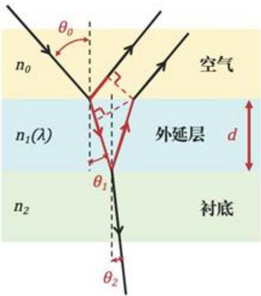  
图1 两光束干涉模型的光路示意图

利用Fresnel公式，空气-外延层及外延层-衬底的反射系数分别为

$$
r _ { 0 1 } = \frac { n _ { 0 } \cos \theta _ { 0 } - n _ { 1 } ( \lambda ) \cos \theta _ { 1 } } { n _ { 0 } \cos \theta _ { 0 } + n _ { 1 } ( \lambda ) \cos \theta _ { 1 } } ,\tag{4}
$$

$$
r _ { 1 2 } = \frac { n _ { 1 } ( \lambda ) \cos \theta _ { 1 } - n _ { 2 } \cos \theta _ { 2 } } { n _ { 1 } ( \lambda ) \cos \theta _ { 1 } + n _ { 2 } \cos \theta _ { 2 } } ,\tag{5}
$$

其中 $\theta _ { 2 }$ 为在衬底中的折射角。

则总反射率为

$$
R ( \lambda ) = \left| r _ { 0 1 } + r _ { 1 2 } e ^ { i \delta ( \lambda ) } \right| ^ { 2 } .\tag{6}
$$

为刻画色散效应，引入Cauchy模型近似外延层折射率：

$$
n _ { 1 } ( \lambda ) = A + \frac { B } { \lambda ^ { 2 } } ,\tag{7}
$$

其中A,B为待定参数。至此，我们已建立了外延层厚度 $d$ 与红外光谱R(λ)之间的函数关系。

## 5.1.2两光束干涉厚度模型的求解

由于厚度d出现在非线性相位函数中，难以直接解析求解，需要结合实验数据进行数值反演。求解思路如下：

首先由于涉条纹周期与厚度的近似关系

$$
\Delta \left( \frac { 1 } { \lambda } \right) \approx \frac { 1 } { 2 n _ { 1 } d \cos \theta _ { 1 } } ,\tag{8}
$$

通过FFT分析光谱条纹周期，对厚度做出初步估计，得到厚度初值 $d _ { 0 }$ 6

接下来构造目标函数：

$$
J ( d , A , B ) = \sum _ { i } \left( R ^ { \mathrm { o b s } } ( \lambda _ { i } ) - R ( \lambda _ { i } ; d , A , B ) \right) ^ { 2 } ,\tag{9}
$$

其中 $R ^ { \mathrm { o b s } }$ 为实验数据， $R ( \cdot )$ 为理论模型。

下面以 $d _ { 0 }$ 为初值，采用非线性最小二乘法拟合参数(d,A,B)，得到厚度估计 $d ^ { * }$ 。

最后，对不同入射角的两组实验数据进行联合拟合，比较结果的一致性，并通过残差分析验证拟合的合理性。

## 5.2问题二模型的建立与求解

## 5.2.1 数据预处理

在正式代入数据进行反演之前，要对数据进行预处理。为保证频域分析（FFT)与滑动窗口的有效性，需要在波数 $\sigma$ 上等间距采样。将原始数据 $( \sigma _ { i } , R _ { i } )$ 线性插值到等间距网格，步长取原始间距的中位数

$$
\Delta \sigma \approx m e d i a n ( \sigma _ { i + 1 } - \sigma i ) .\tag{10}
$$

其中，反射率按小数参与计算： $R = R ( ^ { 0 } \circ ) / 1 0 0 .$

等间距重采样后得到数据如图2所示。其中 raw代表原始数据，Uniform Sampling代表处理之后的数据。

由图2可以看出，在原始光谱中，低波数区域（约 $1 0 0 0 \mathrm { c m } ^ { - 1 }$ 以下)，出现了明显的高反射率平台与陡降，这是由碳化硅材料的声子极化子(Reststrahlen)区引起的物理效应：当波数位于横光学声子(TO)与纵光学声子(LO)频率之间时，介电常数为负，表面反射率接近1；而在LO边附近(约 $9 7 0 - 1 0 0 0 \mathrm { c m } ^ { - 1 } )$ 会出现剧烈的色散与吸收，导致光谱中出现“暴涨暴跌”的特征。这一区域的信号主要受材料本征吸收主导，而不再体现出稳定的干涉条纹。

将该区间数据保留，会对基线估计和平滑滤波造成干扰，同时在滑窗FFT分析中导致主频率与信噪比的不稳定，从而降低厚度估计的可靠性。因此，我们在预处理阶段

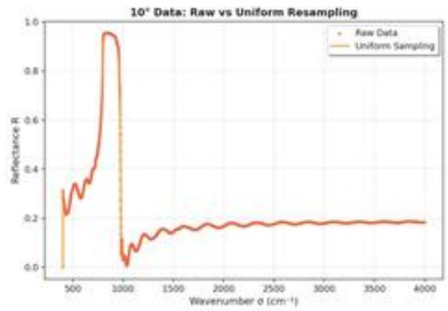

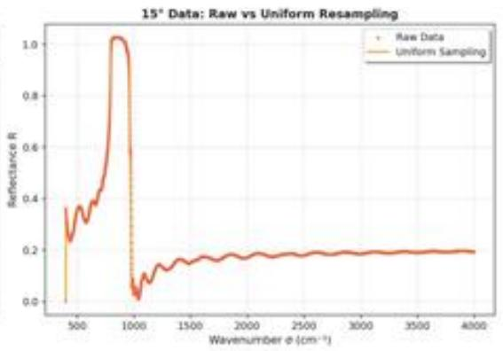

图2 等间距重采样后数据图  
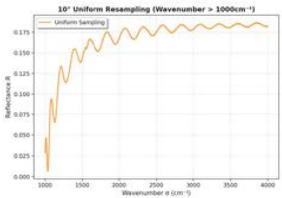

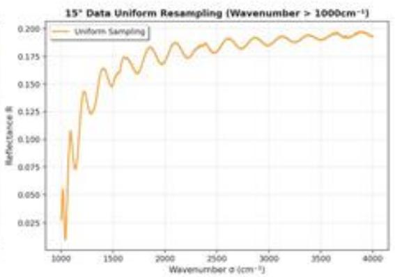  
图3裁剪低波数区域后等间距重采样图

将 $1 0 0 0 \mathrm { c m } ^ { - 1 }$ 以下的波数段整体舍弃，仅保留 $1 0 0 0 { - } 4 0 0 0 ~ \mathrm { c m } ^ { - 1 }$ 的有效光谱进行后续分析。  
裁剪后的数据如图3所示。

接下来，我们对数据进行去趋势化、去噪、平滑处理。首先采用非对称最小二乘法(AsLS)拟合基线 $\hat { b } ,$ 扣除了基线信号，有效去除了由强吸收与整体趋势引起的低频分量：

$$
\operatorname* { m i n } _ { z } \sum _ { i } w _ { i } \left( R _ { i } - z _ { i } \right) ^ { 2 } + \lambda \sum _ { i } ( \Delta ^ { 2 } z _ { i } ) ^ { 2 } , \quad w _ { i } = \left\{ \begin{array} { l l } { p _ { i } } & { R _ { i } > z _ { i } } \\ { 1 - p _ { i } } & { R _ { i } \le z _ { i } } \end{array} \right.\tag{11}
$$

其中 $\Delta ^ { 2 }$ 为二阶差分算子， $\lambda > 0$ 控制平滑度， $p \in ( 0 , 1 )$ 让基线贴近下包络。

随后使用Hampel滤波剔除尖噪，并通过Savitzky-Golay平滑（零相位滤波)进一步降低高频噪声。处理后得到的残差信号主要包含干涉条纹成分(见图4)，为后续的频域分析和厚度估计提供了稳定的输入。需要注意的是， $1 0 0 0 \mathrm { c m } ^ { - 1 }$ 附近依然存在由Reststrahlen区边界带来的急剧起伏，因此该区域在后续分析中不予采用。

为了从干涉条纹中提取可靠的周期信息，我们采用滑动窗口快速傅里叶变换(FFT)的方法，对不同波数区间内的主频率与信噪比(SNR)进行分析。

在波数轴上选择固定宽度 $W = 3 0 0 c m ^ { - 1 }$ 的滑动窗口，依次覆盖 $1 0 0 0 - 4 0 0 0 ~ \mathrm { c m } ^ { - 1 }$ 的整个有效区间。对窗口内的去趋势信号r[n]乘Hann窗函数w[n]，然后计算快速傅里叶

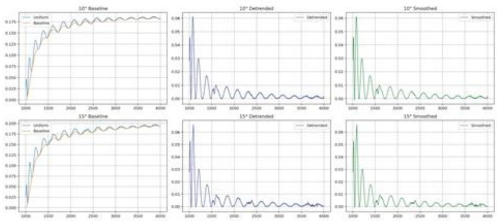  
图4去趋势化、去噪后数据图

变换得到频谱|Y[k]|:

$$
Y [ k ] = { \mathrm { F F T } } \{ r [ n ] \cdot w [ n ] \} .\tag{12}
$$

将最大幅值处的频率作为该窗口的主频率 $f ^ { ( \cdot ) }$ ..

$$
f ^ { \backslash } = \underset { f } { \mathrm { a r g m a x } } | Y ( f ) | .\tag{13}
$$

得到 SNR 的值：

$$
\mathrm { S N R } = \frac { A _ { \mathrm { p e a k } } } { \sqrt { \frac { 1 } { M } \sum _ { \mathrm { d S R } } A _ { k } ^ { 2 } } } ,\tag{14}
$$

其中 $A _ { \mathrm { p e a k } }$ 为主峰幅值，邻带用于估计噪声水平。

图5 给出了在1000-4000 cm-1区间内， $1 0 ^ { \circ }$ 与 $1 5 ^ { \circ }$ 测量数据的滑窗FFT分析结果.可以看出两角度下的主频率 $f ^ { \dagger }$ 基本保持稳定，随窗口位置几乎不发生漂移,SNR在不同波段有所差异。

在滑窗FFT的基础上，我们引入了自动band选择准则，确定用于厚度反演的有效频段。我们设定“好窗”的判定条件：

1. 两个角度的信噪比需同时满足 $\mathrm { S N R } _ { 1 0 ^ { \circ } } \geq 1 0 , \quad \mathrm { S N R } _ { 1 5 ^ { \circ } } \geq 1 0$ +4

2. 两角度主频相对差满足 $\frac { \vert \Delta f ^ { ( + ) } \vert } { f ^ { ( + ) } } \le 1 0 \%$

3. 将满足条件的相邻窗口合并为连续区间，并在区间两端进行 $1 5 { - } 2 0 ~ \mathrm { c m } ^ { - 1 }$ 的安全裁剪；

4.若得到多个候选区间，则选择平均SNR最高且条纹周期数充足(≥5周期)的区间作为最终 band。

筛选后得到结果如图6所示，选取(2500,3700)为有效频段。

在有效频段内，对 $1 0 ^ { \circ }$ 与 $1 5 ^ { \circ }$ 两个角度的去趋势信号分别乘Hann窗并进行快速傅

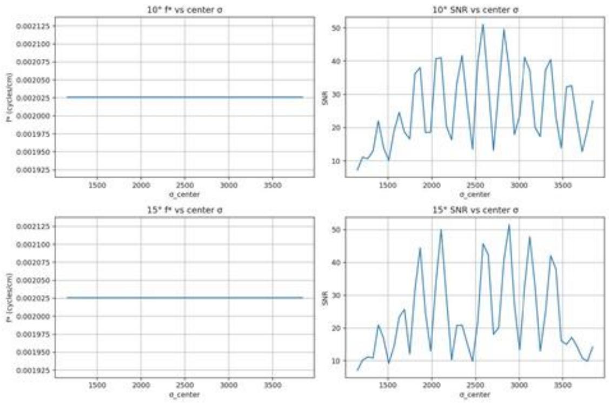

图5 全带滑窗FFT结果图  
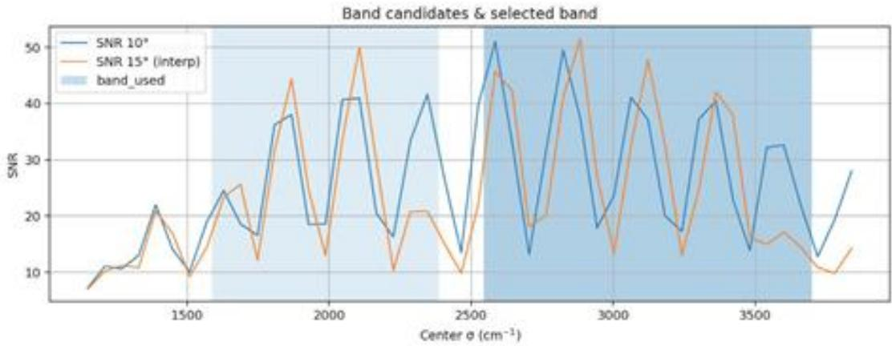  
图6 有效频段选择

里叶变换(FFT)，提取条纹的主频 $f ^ { \dagger }$ 。主频与条纹周期满足关系

$$
\Delta \nu = \frac { 1 } { f ^ { * } } ,\tag{15}
$$

其中 $\Delta \boldsymbol { \nu }$ 表示条纹在波数域的周期。

根据两束干涉近似条件（一次反射/透射)，有：

$$
\Delta \nu \approx \frac { 1 } { 2 n _ { 2 } ( \bar { \sigma } ) d \cos \theta _ { t } } ,\tag{16}
$$

$$
\cos \theta _ { t } = \sqrt { 1 - \left( \frac { \sin \theta } { n _ { 2 } ( \bar { \sigma } ) } \right) ^ { 2 } } ,\tag{17}
$$

其中 $n _ { 2 } ( { \bar { \sigma } } )$ 为该band区间内的平均折射率， $\theta _ { t }$ 为透射角。

由此可得厚度初值：

$$
d _ { 0 } ( \theta ) \approx \frac { 1 } { 2 n _ { \mathrm { e f f } } \cos \theta _ { \ell } \Delta \nu } .\tag{18}
$$

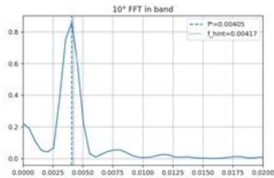

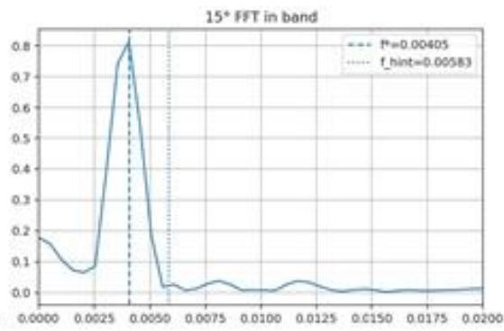  
图7 执行FFT后的频谱结果

代入数据后得到结果如图7。 $1 0 ^ { \circ }$ 下估测得到厚度为7.662μm， $1 5 ^ { \circ }$ 下估测得到厚度为7.682μm，而这相对差异小于3%，平均为7.672μm。该厚度初值将作为后续基于Cauchy模型的非线性拟合的初始条件，以保证迭代的收敛性与稳定性。

## 5.2.2基于 Cauchy折射率模型的外延层厚度反演

物理模型与参数化与校准量设两组入射角分别为 $\theta _ { 0 } ^ { ( 1 0 ) } = 1 0 ^ { \circ }$ 与 $\theta _ { 0 } ^ { ( 1 5 ) } = 1 5 ^ { \circ }$ ，对应观测数据为 $\{ ( \bar { \nu } _ { k , i } , R _ { k , i } ^ { \mathrm { o b s } } ) \}$ ，其中 $\tilde { \nu } = 1 / \lambda$ 为波数， $k \in \{ 1 0 , 1 5 \}$ 标识角度。

为消除仪器与几何的系统性微偏差，引入两类校准量：

1. 波数刻度校准 $\varepsilon { : }$ 令真实波数为 $\tilde { \nu } ^ { \mathrm { u e } } = ( 1 + \varepsilon ) \tilde { \nu }$ ，以补偿谱仪刻度的线性误差。

2. 人射角微偏差 $\Delta \theta _ { k }$ :令有效入射角 $\hat { \theta } _ { k } = \theta _ { 0 } ^ { ( k ) } + \Delta \theta _ { k }$ ，以补偿装调误差。考虑上述校准后，两光束模型的理论反射率写为

$$
R _ { \mathrm { m o d e l } } \bigl ( \tilde { \nu } ; d , A , B , \bar { \theta } _ { k } , ( 1 + \varepsilon ) \bigr ) = \mathcal { R } \Bigl ( \lambda - \tilde { \nu } ^ { - 1 } , d , n _ { 1 } ( \lambda ; A , B ) , \tilde { \theta } _ { k } \Bigr ) ,\tag{19}
$$

其中 $\mathcal { R } ( \cdot )$ 由第5.1.1节给出(Fresnel强度反射率 $R _ { 1 } , R _ { 2 }$ 与相位差 $\begin{array} { r } { \delta = \frac { 4 \pi n _ { 1 } d \cos \theta _ { 1 } } { \lambda } } \end{array}$ 的组合式)。

$$
n ( \lambda ) = A + \frac { B } { \lambda ^ { 2 } } ,\tag{20}
$$

其中A,B为待估参数。

由 Snell 定律有 sin $\theta _ { t } = \sin \theta _ { i } / n ( \lambda )$ ，从而 $\cos \theta _ { t } = \sqrt { 1 - \sin ^ { 2 } \theta _ { t } }$

设外延层厚度为d[μm]，薄膜往返相位为

$$
\beta ( \lambda , \theta _ { i } ) = \frac { 2 \pi n ( \lambda ) d \cos \theta _ { t } } { \lambda } .\tag{21}
$$

为了将求解重点放在相位对齐(决定条纹位置、对d最敏感)，我们采用相位优先的反射率模型：

$$
\widehat { R } ( \nu ; \theta _ { i } ) = c _ { \theta } + s _ { \theta } \cos \big ( 2 \beta ( \lambda , \theta _ { i } ) \big ) ,\tag{22}
$$

其中 $C _ { \theta } , s _ { \theta }$ 为不同入射角的幅度与偏置系数。

闭式幅值/基线标定 为抵消探测链路的幅值与基线差异，对每条曲线保留闭式线性标定：给定一组参数 $( d , A , B , \varepsilon , \Delta \theta _ { k } )$ ，先计算理论序列 $y _ { k , i } = R _ { \mathrm { m o d e l } } ( \tilde { \nu } _ { k , i } ( 1 + \varepsilon ) ; d , A , B , \tilde { \theta } _ { k } )$ ，然后用最小二乘闭式解：

$$
a _ { k } = \frac { \mathrm { C o v } ( y _ { k } , R _ { k } ^ { \mathrm { o b s } } ) } { \mathrm { V a r } ( y _ { k } ) } , \qquad b _ { k } = \overline { { R _ { k } ^ { \mathrm { o b s } } } } - a _ { k } \overline { { y _ { k } } } ,\tag{23}
$$

得到校正后的模型输出 $\widehat { R } _ { k , i } = a _ { k } y _ { k , i } + b _ { k }$ 。这种“内环闭式、外环非线性”的结构可减少优化变量，提升稳定性。

双角联合的鲁棒目标函数 直接分别对 $1 0 ^ { \circ }$ 与 $1 5 ^ { \circ }$ 两组数据独立拟合厚度 $d _ { 1 0 }$ 与 $d _ { 1 5 }$ ，再取其平均作为最终结果的方法主要存在以下两大缺陷：

1. 物理一致性不足：外延层厚度d在物理上应为同一常数，而独立拟合时每个角度的色散参数(A,B)可能向不同方向漂移，导致 $d _ { 1 0 } , d _ { 1 5 }$ 不完全可比。

2. 稳健性不足:当某一角度数据在局部波段信噪比较低或受吸收峰干扰时，独立拟合结果容易受到显著偏移，取平均并不能消除该偏差。

相比之下，双角联合拟合在一个统一的目标函数下同时利用两角度的观测数据，共享厚度d与折射率色散参数(A,B)，而仅允许角度校准量 $\Delta \theta _ { k }$ 独立变化。这种方式既保证了厚度的物理唯一性，又利用了两角度在噪声与系统误差上的互补性，从而得到更稳定、可靠的反演结果。

基于上述考虑，我们构造了带有物理先验正则的加权鲁棒最小二乘目标：

$$
\operatorname* { m i n } _ { \substack { d , A , B , s ; ( \Delta \theta _ { k } ) } } \sum _ { k \in \{ 1 0 , 1 5 \} } \sum _ { i } w _ { k , i } \rho \Big ( R _ { k , i } ^ { \mathrm { o b s } } - \widehat R _ { k , i } \Big ) + \eta _ { \xi } \varepsilon ^ { 2 } + \eta _ { \theta } \sum _ { k } ( \Delta \theta _ { k } ) ^ { 2 } + \eta _ { A } ( A - A _ { 0 } ) ^ { 2 } + \eta _ { B } ( B - B _ { 0 } ) ^ { 2 } .
$$

物理先验正则

(24)

其中 $w _ { k , i }$ 为数据可信度权重（在吸收段/低信噪比段取较小值)， $\rho ( \cdot )$ 为鲁棒损失函数，本文选用 soft\_11形式; $\left( A _ { 0 } , B _ { 0 } \right)$ 为基于厚度初值 $d _ { 0 }$ 的预拟合结果， $\eta _ { \bullet }$ 为正则权重参数。

这样构造的目标函数兼顾了“内环闭式、外环非线性”的结构:每次迭代中先用闭式解对幅值/基线进行标定，再对 $( d , A , B , \varepsilon , \Delta \theta _ { k } )$ 进行非线性更新，从而在保证收敛稳定性的同时减少了优化变量的数量。s.moeg

两阶段初始化 在确立了目标函数之后，我们首先采用有效范围内全谱段（约 $2 5 0 0 ~ \mathrm { \sim }$   
$3 8 0 0 \mathrm { c m } ^ { - 1 } )$ 进行直接拟合。对相关参数做两阶段初始化：  
1. 频域初值：由干涉条纹主频得d0 $d _ { 0 , k } = \big ( 2 \hat { f } _ { 0 , k } \sqrt { n ^ { 2 } - \sin ^ { 2 } \theta _ { 0 } ^ { ( k ) } } \big ) ^ { - 1 }$ ,将两角合并取加权  
平均得 $d _ { 0 }$ 。  
2. $( A _ { 0 } , B _ { 0 } )$ 预拟合：固定 $d = d _ { 0 }$ ，并在每条曲线内用公式(23)的闭式 $( a _ { k } , b _ { k } )$ 对齐后，  
仅对(A,B)做轻量最小二乘，得到 $( A _ { 0 } , B _ { 0 } )$ ，为后续全参拟合提供合理先验。  
约束与求解器 为保证物理合理与数值稳定，设置有界约束  
$d \in [ 1 , 5 0 ] ~ \mu \mathrm { m } , \quad A \in [ 2 . 3 , 2 . 8 ] , \quad B \in [ B _ { \operatorname* { m i n } } , B _ { \operatorname* { m a x } } ] , \quad | \varepsilon | \leq 2 \times 1 0 ^ { - 3 } , \quad | \Delta \theta _ { k } | \leq 0 . 3 ^ { \circ } ,$   
其中B的范围根据材料与谱段经验选取（实现中用[-0.05,0.20]或宽松上界并配合正则  
拉回)。  
以 $( d _ { 0 } , A _ { 0 } , B _ { 0 } , \varepsilon = 0 , \Delta \theta _ { k } = 0 )$ 为初值，采用带界的Levenberg-Marquardt/信赖域算法  
求解目标函数(24)，并在启动前对d在 $[ d _ { 0 } ( 1 \pm 5 \% ) ]$ 作一次一维粗搜索，以降低局部极  
小风险。

## 拟合我们的拟合流程如算法1所示。

Algorithm 1 两光束厚度反演  
Input: $\{ ( \tilde { \nu } _ { k , i } , R _ { k , i } ^ { \mathrm { o b s } } ) \}$ $k \in \{ 1 0 , 1 5 \}$ ；入射角 $\theta _ { 0 } ^ { ( k ) }$ ；衬底折射率 $n _ { 2 }$   
Output: 厚度 $\hat { d } ,$ 色散参数 $( { \hat { A } } , { \hat { B } } )$ ，校准量ε, $\hat { \Delta \theta _ { k } }$ ，置信区间  
1. 频域初值:两角分别FFT得主峰 $\hat { f } _ { 0 , k }$ ，合成 $d _ { 0 }$   
2. 预拟合 $( A _ { 0 } , B _ { 0 } )$ ：固定 $d = d _ { 0 }$ ，用闭式 $( a _ { k } , b _ { k } )$ 对齐后仅优化(A,B);  
3. 全参联合：以 $( d _ { 0 } , A _ { 0 } , B _ { 0 } , 0 , 0 , 0 )$ 为初值，带界最小化式(24);  
4. 诊断与评估:残差谱、双角一致性、置信区间；必要时调整权重/带宽再迭代。  
在引入波数刻度与入射角微偏差的校准量后，我们首先对全谱段 $( 2 5 0 0 \sim 3 8 0 0 \mathrm { c m } ^ { - 1 } )$   
进行了双角联合拟合。拟合结果如图8和9所示，厚度参数估计为  
$d = 7 . 6 1 9 \mu \mathrm { m } , \qquad A = 2 . 6 6 3 , \quad B = - 0 . 1 0 0 ,$   
对应的中心折射率约为 $n _ { 1 } ( 3 . 2 3 \mu \mathrm { m } ) \approx 2 . 6 5 3 \circ$   
校准参数 $\varepsilon$ 与 $\Delta \theta _ { k }$ 均接近零，表明谱仪刻度与角度设置基本准确。全谱拟合的残差  
均值接近零，整体均方根误差RMSE分别为 $1 . 1 4 \times 1 0 ^ { - 3 } \ : ( 1 0 ^ { \circ } )$ 与 $1 . 1 0 \times 1 0 ^ { - 3 } \ : ( 1 5 ^ { \circ } )$ ，说  
明模型能够较好地刻画主振荡区的于涉条纹。 v.cn  
然而，在高波数区间 $( \tilde { \nu } > 3 3 0 0 ~ \mathrm { c m } ^ { - 1 } )$ ，残差仍呈现系统性波动，且RMSE明显偏  
大，提示单一Cauchy模型在全谱范围内的适配能力存在不足。

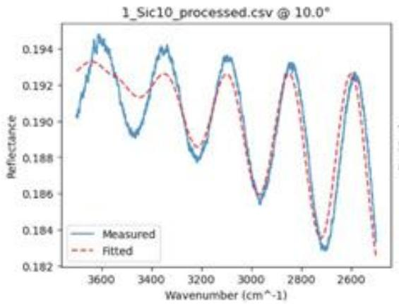

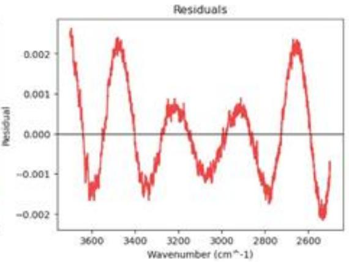

图8 10度-SiC拟合结果  
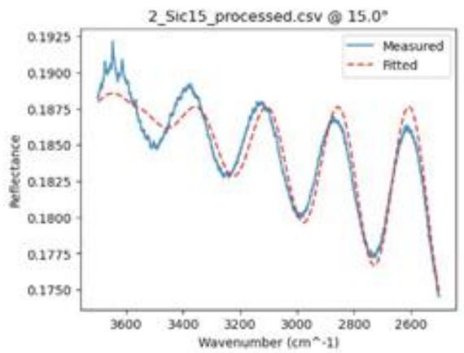

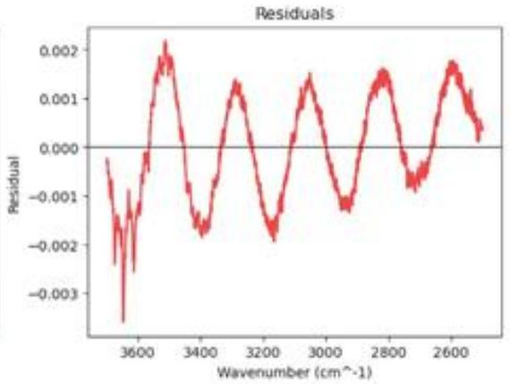  
图9 15度-SiC拟合结果

为改善这一问题，我们采用了分段拟合策略：以 $\lambda ^ { * } = 3 . 0 3 \mu \mathrm { m }$ (对应 $\tilde { \nu } = 3 3 0 0 \mathrm { c m } ^ { - 1 } )$ 为分界点，将光谱划分为低波数段与高波数段，分别估计色散参数 $( A , B )$ ，同时要求在分界点处折射率函数 $n ( \lambda )$ 及其一阶导数连续。这种处理方式能够更灵活地捕捉不同波段的色散特征，又避免了物理上的不连续性。

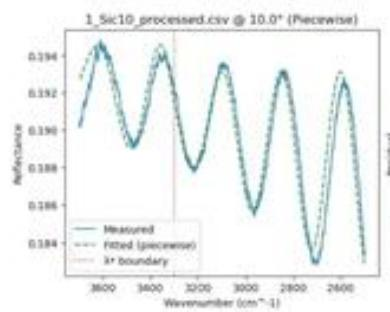

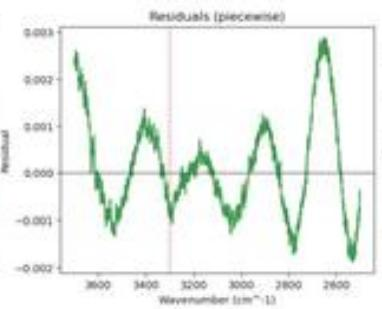  
图10 10度-SiC 分段拟合结果

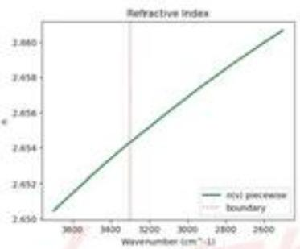

分段拟合的结果如图10和11所示。厚度估计 $d = 7 . 6 0 4 \mu \mathrm { m }$ ，与全谱拟合的 $7 . 6 1 9 \mu \mathrm { m }$ 基本一致(差异小于0.2%)，说明分段策略并未引入厚度偏差。在分界点的连续性检查中，折射率函数值跳跃仅 $\Delta n = 2 . 8 \times 1 0 ^ { - 5 }$ ，导数跳跃 $\Delta n ^ { \prime } = 1 . 9 \times 1 0 ^ { - 5 }$ ，均可忽略。

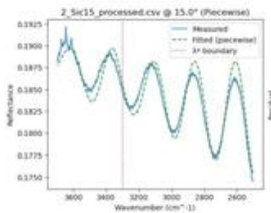

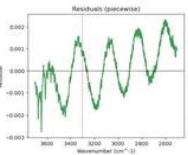

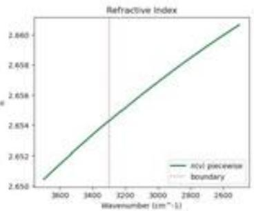  
图11 15度-SiC分段拟合结果

更重要的是，分段方法在残差表现上优于全谱方法：

1. 全谱拟合的整体 RMSE约为 $1 . 1 4 \times 1 0 ^ { - 3 }$ ，分段拟合后在 $1 0 ^ { \circ }$ 曲线上降低至 $1 . 0 4 \times 1 0 ^ { - 3 }$ 在 $1 5 ^ { \circ }$ 曲线下则保持在同一数量级。

2. 在高波数区间 $( \tilde { \nu } > 3 3 0 0 )$ ，分段方法显著改善了残差，例如 $1 0 ^ { \circ }$ 曲线的 RMSE 从$1 . 3 5 \times 1 0 ^ { - 3 }$ 降至 $9 . 3 4 \times 1 0 ^ { - 4 }$ ，提升约1.44倍。

因此，分段Cauchv拟合在不改变厚度估计结果的前提下，有效提升了高波数段的拟合精度与残差均匀性，进一步增强了模型在全谱范围内的稳定性和可靠性。

## 5.2.3结果可靠性分析

为了验证两光束干涉厚度反演模型的准确性与稳健性，我们从残差统计特性、正态性检验、频域分析、角度一致性、频段稳健性、参数不确定度、系统敏感性以及合成数据回归等多个方面对模型进行了系统的可靠性检验。

1.残差统计与正态性检验 残差直方图12和图13表明，在 $1 0 ^ { \circ }$ 与 $1 5 ^ { \circ }$ 两个入射角下，无论采用单角独立拟合还是双角联合拟合，残差均值接近零，分布大致对称，未表现出明显的系统性偏差。

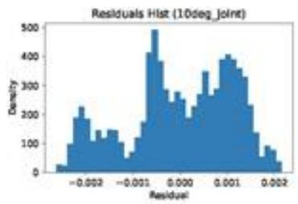

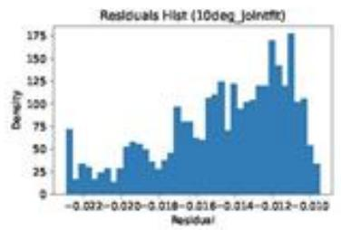

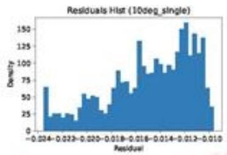  
图12 $\mathrm { \bf S i C } 1 0 ^ { \circ }$ 联合拟合、联合回代、单角拟合残差直方图

进一步的Q-Q图14和图15分析显示，残差点基本落在理论正态分布直线上，拟合优度 $R ^ { 2 }$ 约为0.94-0.97，表明残差近似服从正态分布。结合Durbin-Watson与LjungBox检验结果，残差不存在显著自相关性，说明模型误差来源主要为随机噪声。

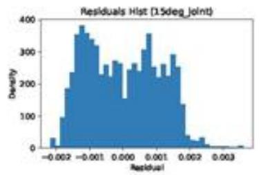

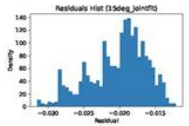

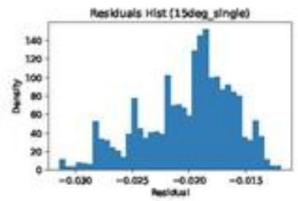

图13 SiC15°联合拟合、联合回代、单角拟合残差直方图  
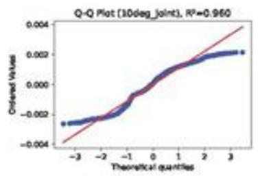

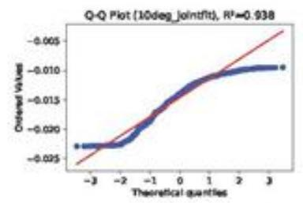

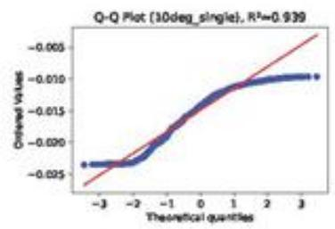  
图14 $\mathrm { \bf S i C 1 0 ^ { \circ } }$ 联合拟合、联合回代、单角拟合残差Q-Q图

2. 频域残差分析 通过对残差进行快速傅里叶变换(FFT)，从图16和图17中可以看出在干涉条纹主频 $f ^ { * }$ 附近未出现显著峰值，且相对主峰低至少1520dB。残差频谱在高频区快速衰减，未表现出周期性结构，符合白噪声特征。联合拟合的残差谱幅度整体低于单角拟合，进一步验证了模型拟合的充分性与可靠性。

3. 双角一致性检验 在厚度估计结果上，由图18可得 $1 0 ^ { \circ }$ 与 $1 5 ^ { \circ }$ 单角拟合得到的厚度差异小于3%，联合拟合结果与二者平均值的差异不超过 $2 \%$ 。在反射率曲线和残差分布上，联合拟合相比单角拟合能有效降低残差波动，并在两个角度下同时保持一致性。这说明模型在不同实验条件下具有较高的稳定性，联合拟合策略能提升结果稳健性。

4. 频段稳健性检验 在有效波段内采用滑动窗口对不同子频段进行厚度拟合，图19结果显示厚度估计始终稳定在7.597.64μm之间，相对波动不足1%。不同子带结果围绕全带拟合值上下波动，未出现系统性偏移。这表明模型对频段选择不敏感，具有良好的稳健性。

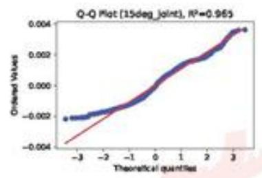

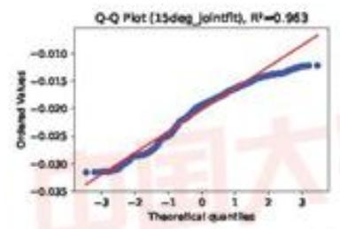

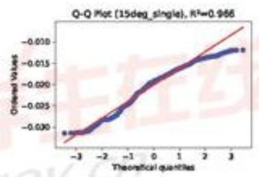  
图15 SiC15°联合拟合、联合回代、单角拟合残差Q-Q图

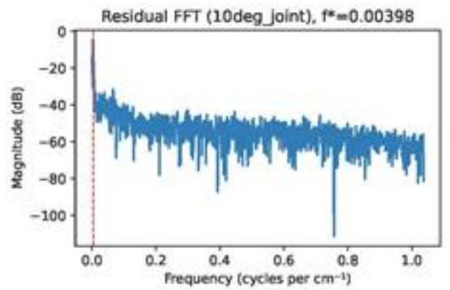

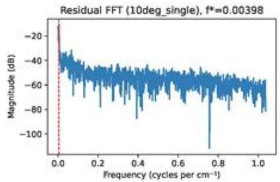  
图16SiC10°联合拟合、单角拟合残差频谱图

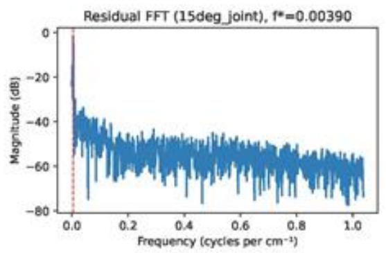

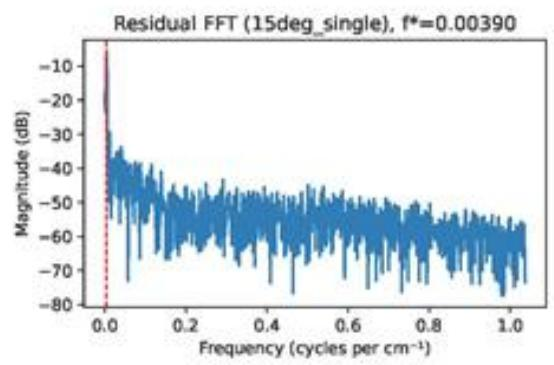  
图17 $\mathrm { \bf S i C } 1 5 ^ { \circ }$ 联合拟合、单角拟合残差频谱图

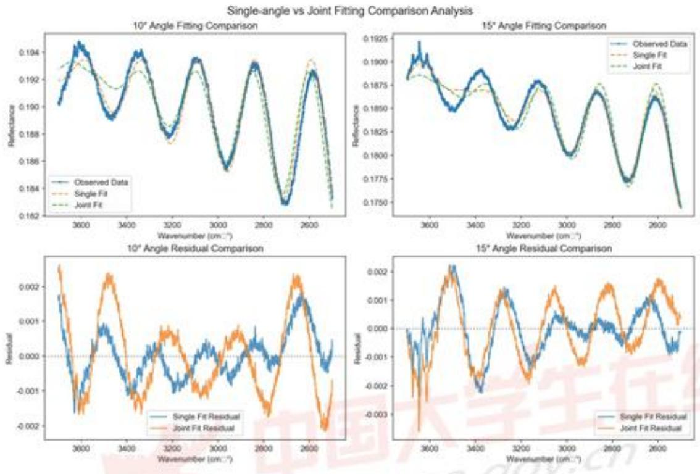  
图18 单角与联合拟合效果与残差对比

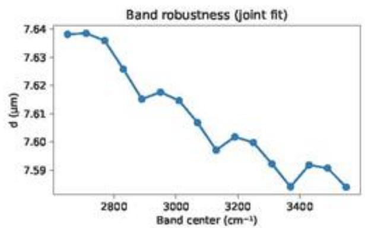  
图19 不同子频段中心下的厚度估计结果

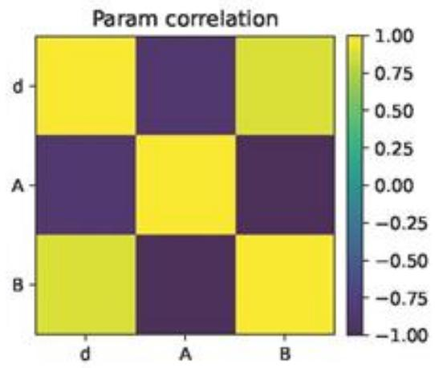  
图20 参数不确定度与相关性热图

5. 参数不确定度与相关性分析 基于最小二乘法的雅可比矩阵计算得到的协方差结果表明，厚度参数d的相对标准差小于2%，A与B的标准差也处于合理范围。相关性热图（图20)显示d与A存在中等相关性，A与B的相关性较高，但均低于0.9，没有严重的共线性问题。说明参数可辨识性良好，厚度估计具有统计意义上的可信度。

6. 敏感性分析对波数刻度误差(ε)与入射角偏差(Δθ)的敏感性分析表明：在±0.2%的波数伸缩和 $\pm 0 . 3 ^ { \circ }$ 的角度误差范围内，厚度相对变化率分别控制在±0.2%与±0.04%以内。可见模型对实验系统的小扰动具有较强的鲁棒性。

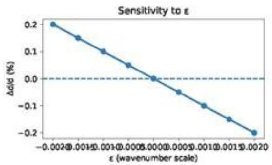

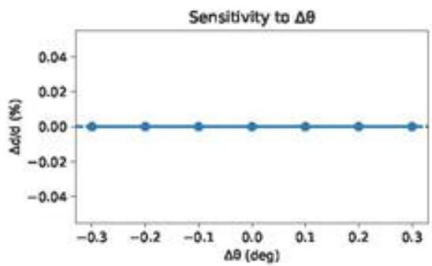  
图21 波数刻度误差、入射角偏差对厚度的敏感性

7. 合成数据回归检验 在不同信噪比条件下利用合成数据进行回归验证，图22结果显示随着SNR的提高，厚度估计偏差迅速收敛，在SNR≥20时偏差保持在0.3%以下，SNR=50时小于0.2%；同时，测量精度提升显著，从约60ppm降低至10ppm左右。这表明模型不仅能在理想条件下准确回收真值，也能在中高信噪比实验条件下保持高稳定性。

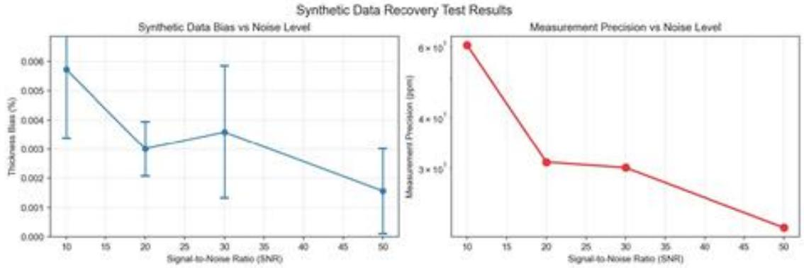  
图22 合成数据回归检验结果

通过以上多维度检验可以看出：

1. 残差统计与频域分析均支持残差服从随机噪声分布；

2. 双角一致性与频段稳健性验证了厚度反演结果的稳定性

3. 参数不确定度分析保证了模型在统计上的可信度；

4. 敏感性与合成数据回归检验进一步证明了模型对实验误差与噪声的鲁棒性。

综上，本文建立的两光束Cauchy厚度反演模型在准确性、稳健性与鲁棒性方面均表现良好，能够为碳化硅外延层厚度的可靠测量提供坚实的理论与方法支持。

## 5.3问题三模型的建立与求解

## 5.3.1多光束干涉的必要条件

在实际实现中，光波可以在外延层界面和衬底界面产生多次反射和透射，从而产生多光束干涉。

设外延层折射率为 $n ( \lambda )$ 、厚度为 $d ,$ 人射角为 $\theta _ { 0 }$ ，层内折射角为 $\theta$ (由斯涅尔定律给出)。记外表面(空气/外延层)与内表面(外延层/衬底)的复反射系数为 $r _ { 1 } , r _ { 2 }$ ，透射系数为 $t _ { 1 } , t _ { 2 }$ 。各级反射光的复振幅为：

$$
{ \bf E } _ { 1 } = { \bf E } _ { 0 } r _ { 1 } , { \bf E } _ { m } = { \bf E } _ { 0 } t _ { 1 } t _ { 1 } ^ { \prime } r _ { 2 } e ^ { i \delta } ( r _ { 1 } ^ { \prime } r _ { 2 } e ^ { - i \delta } ) ^ { m - 2 } , \qquad ( m = 2 , \ldots ) ,\tag{25}
$$

其中相位推移

$$
\delta ( \lambda ) = { \frac { 4 \pi n ( \lambda ) d \cos \theta } { \lambda } } = 4 \pi n ( \sigma ) d \cos \theta \sigma , \qquad ( \sigma = 1 / \lambda ) .\tag{26}
$$

总场为级数之和：

$$
\mathbf { E } _ { r } = \mathbf { E } _ { 0 } r _ { 1 } + \mathbf { E } _ { 0 } t _ { 1 } t _ { 1 } ^ { \prime } r _ { 2 } e ^ { i \delta } \sum _ { m ~ 2 } ^ { \infty } ( r _ { 1 } ^ { \prime } r _ { 2 } e ^ { - i \delta } ) ^ { m - 2 } = \mathbf { E } _ { 0 } \left( r _ { 1 } + { \frac { ( 1 - r _ { 1 } ^ { 2 } ) r _ { 2 } e ^ { - i \delta } } { 1 - r _ { 1 } r _ { 2 } e ^ { - i \delta } } } \right) .\tag{27}
$$

由此得到反射率的Airy型表达式:

$$
R ( \lambda ) = \frac { R _ { 1 } + R _ { 2 } + 2 \sqrt { R _ { 1 } R _ { 2 } } \cos \delta } { 1 + R _ { 1 } R _ { 2 } + 2 \sqrt { R _ { 1 } R _ { 2 } } \cos \delta } , \quad R _ { i } = | r _ { i } | ^ { 2 } ,\tag{28}
$$

该式表明：条纹的相位由 $\delta$ 决定，线形与峰锐度由 $R _ { 1 } , R _ { 2 }$ 决定。

故产生多光束干涉需要满足以下条件：

1. 相干长度条件：光源相干长度 $L _ { c }$ 应大于往返光程差，

$$
L _ { c } \gtrsim 2 n d \cos \theta .\tag{29}
$$

2. 反射率条件:界面反射率不能过小，需保证 $\left| r _ { 1 } r _ { 2 } \right| \ll 1$ 。锐度系数

$$
F = { \frac { 4 { \sqrt { R _ { 1 } R _ { 2 } } } } { ( 1 - { \sqrt { R _ { 1 } R _ { 2 } } } ) ^ { 2 } } }\tag{30}
$$

不应太小。

3. 低吸收条件：外延层吸收系数α较小，使得 $e ^ { - 2 o d \cos \theta }$ 不过小，否则高阶光被显著削弱。

4. 几何与分辨条件：入射光束平行性好，样片楔角小，仪器分辨率优于条纹间隔。

## 5.3.2多光束干涉对厚度计算精度可能的影响

设条纹相位为 $\delta = 4 \pi n d \cos \theta / \lambda$ 6

1. 在理想对称、低损耗条件下，极值近似满足 $\delta = 2 \pi m$ ，条纹间隔

$$
\Delta \sigma \approx { \frac { 1 } { 2 n d \cos \theta } }\tag{31}
$$

与两光束模型一致。因此，多光束干涉并不显著改变条纹的基本周期。

2. 多光束干涉会使条纹更尖锐、对比度增强。如果仍使用两光束正弦模型拟合，会出现模型失配，导致残差具有结构性，从而引入系统偏差。

3. 当 $R _ { 1 } \neq R _ { 2 }$ 或外延层存在吸收时，极值位置发生微小漂移，若用两光束近似会进一步放大厚度计算误差。

4. 在傅里叶域，多光束干涉会引入谐波分量，若忽略处理，可能造成厚度估计偏差。

综上，多光束于涉的存在会影响厚度计算的精度，需要在建模与拟合过程中予以考虑。

## 5.3.3硅晶圆片数据的预处理与多光束干涉分析

在对附件3(入射角10°)与附件4（入射角 $1 5 ^ { \circ } )$ 的硅晶圆片实验数据进行分析之前，需要进行合理的预处理，以保证后续频谱分析与厚度估算的可靠性。

数据统一化与波段裁剪 原始数据的波数轴 $\sigma$ (单位： $\mathrm { c m } ^ { - 1 } )$ 并非严格等间距，反射率列单位为 $1 \%$ 。首先按波数升序排序，将反射率归一化到[0,1]，并采用线性插值将数据统一到等间距网格 moe.g

$$
\begin{array} { r } { \{ \sigma _ { k } \} _ { k = 0 } ^ { N - 1 } , \quad \sigma _ { k + 1 } - \sigma _ { k } = \Delta \sigma \approx \operatorname* { m e d i a n } \{ \Delta \sigma _ { \mathrm { r a w } } \} . } \end{array}\tag{32}
$$

统一采样后的效果见图23:重采样曲线与原始散点高度重合，保证了后续FFT的采样假设。

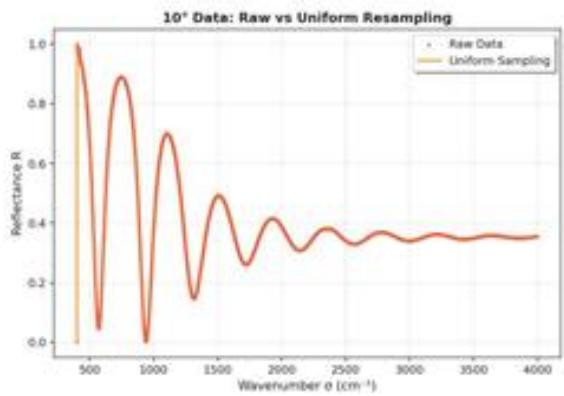

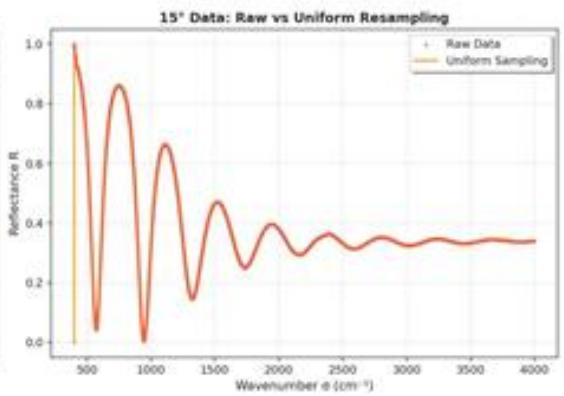  
图23 硅片反射率光谱:原始散点 vs.等间距重采样 $( \mathit { t } _ { \mathrm { { i } } } \colon \ 1 0 ^ { \circ } \colon$ 右： $1 5 ^ { \circ } )$

考虑到低波数段噪声与仪器畸变相对明显，我们仅保留 $5 0 0 \sim 4 0 0 0 \mathrm { c m } ^ { - 1 }$ 的范围作为有效工作带。

基线校正 我们采用轻量化的多项式拟合去基线方法:对归一化反射率 $R ( \sigma )$ 与波数 $\sigma$ 进行一次或二次多项式拟合

$$
\begin{array} { r } { R _ { \mathrm { t r e n d } } ( \sigma ) \approx a _ { 0 } + a _ { 1 } \sigma \quad ( \tilde { \ast } \tilde { \chi } a _ { 0 } + a _ { 1 } \sigma + a _ { 2 } \sigma ^ { 2 } ) , } \end{array}\tag{33}
$$

再将其从原始曲线上扣除，得到去趋势后的干涉信号

$$
R _ { \mathrm { d e t r e n d e d } } ( \sigma ) = R ( \sigma ) - R _ { \mathrm { t r e n d } } ( \sigma ) .\tag{34}
$$

与复杂的基线校正算法相比，该方法简洁且能够保留干涉条纹的相位信息，避免过度滤波导致条纹畸变。

图24 给出了入射角 $1 0 ^ { \circ }$ 与 $1 5 ^ { \circ }$ 数据的去基线效果，可以看到条纹的幅度更加突出，便于后续FFT提取主频。

滑窗FFT与信噪比评估 为验证条纹周期的稳定性与预处理效果，采用汉宁窗的滑动窗口快速傅里叶变换（Sliding-FFT）提取局部主频 $f ^ { \star }$ 与信噪比 SNR。窗口宽度W取$1 0 0 0 \mathrm { c m } ^ { - 1 }$ (覆盖 $\geq 4$ 个条纹周期)，步长 $1 5 0 \mathrm { c m } ^ { - 1 }$ 。对每个窗信号 $x _ { i }$ ，先行去均值并乘以窗函数w，计算

$$
Y = \big | \mathrm { F F T } ( \boldsymbol { w } \cdot ( \boldsymbol { x } - \boldsymbol { \bar { x } } ) ) \big | ,\tag{35}
$$

主峰幅度记为 $A _ { \mathrm { p k } }$ 噪声幅度取主峰左右排除若干频点后的均方根，得到 $\mathrm { S N R } =$ $A _ { \mathrm { p k } } / \mathrm { R M S } ( \mathrm { n o i s e } )$ 0 aov.cn

图25与图26显示，预处理后提取的 $f ^ { \star } ( \sigma )$ 更加平滑稳定，低频伪峰显著下降，SNR分布合理。

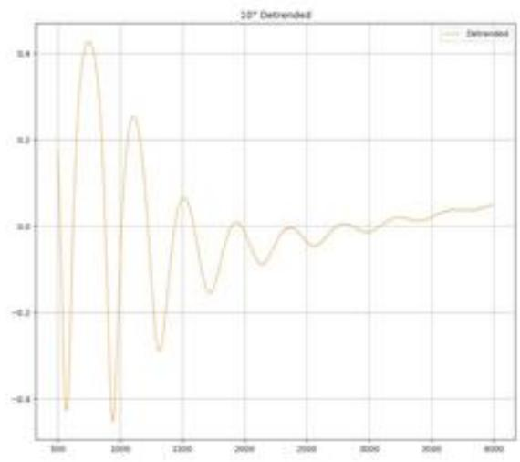

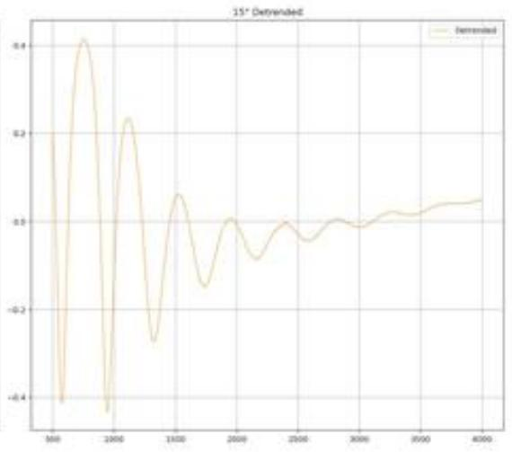

图24 轻量去基线后的硅片反射率光谱  
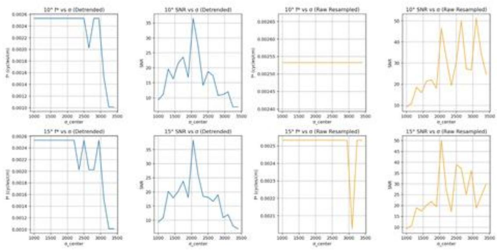  
图 25 滑窗 FFT:去基线 vs. 仅重采样的 f\*与 SNR 对比

信噪比驱动的有效分析带选择为获得稳健的厚度估算区间，我们以滑窗FFT的SNR与频率稳定性为准则，选择 $\mathrm { S N R } \geq 1 5$ 且f\*偏离其带内中位数不超过3%的连续区间作为有效带。两角度数据均指向 $[ 1 1 7 0 , 2 1 7 0 ] \mathrm { c m } ^ { - 1 }$ 为最优区间（见图27)。

多光束干涉的实证判定根据第5.3.1节给出的多光束干涉必要条件，结合硅/空气折射率差较大及实验光源条件，可知样品具备产生多光束干涉的物理前提。对附件3&4的实测数据，证据如下：

1. 条纹可见度与尖锐度:在 $6 0 0 \sim 1 5 0 0 \mathrm { c m } ^ { - 1 }$ 区间，峰谷对比度很高，条纹呈现Airy线形的尖峰特征，显著强于两光束近似下的正弦型条纹。

2. 频域特征:全谱FFT以单一主频为主，但在主频两侧可见次级拖尾，滑窗FFT的幅度在主峰附近存在可观察的谐波成分，符合多次反射叠加对线形的修饰。

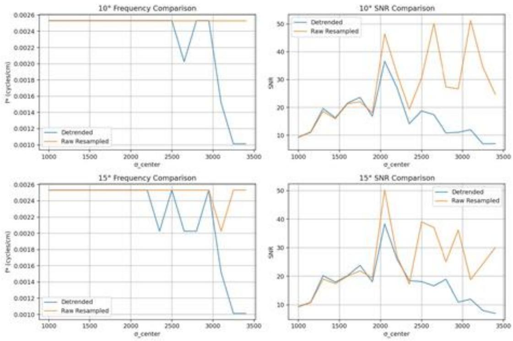  
图26 局部主频与SNR的叠图比较

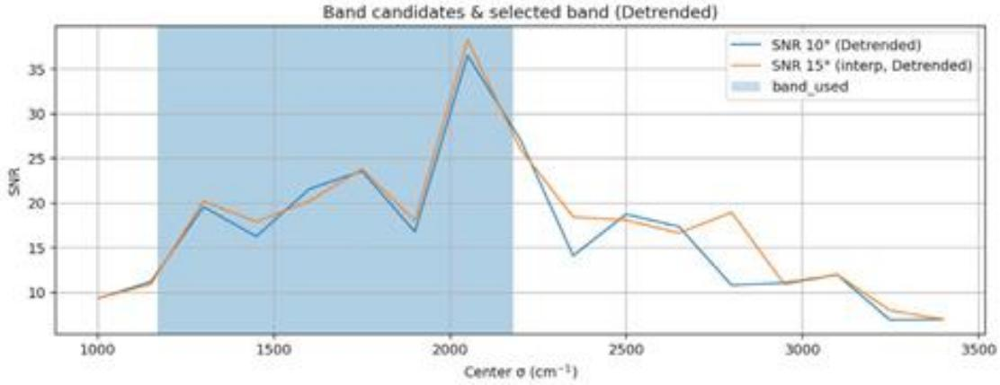  
图27 基于滑窗FFT的信噪比与频率稳定性选带

3. 跨角度一致性：将局部主频按cosθ归一化后， $1 0 ^ { \circ }$ 与 $1 5 ^ { \circ }$ 两角度在所选带内一致性良好(相对差异小于数个百分点)，说明条纹周期受几何光程主导，而线形差异来自多光束精细度变化。

基于以上图像特征与频域证据，可判定附件3与附件4的硅片数据存在显著的多光束干涉效应。

## 5.3.4多光束干涉厚度模型的建立

下面，我们建立多光束干涉下的反射率模型。设所有反射光振幅叠加为:

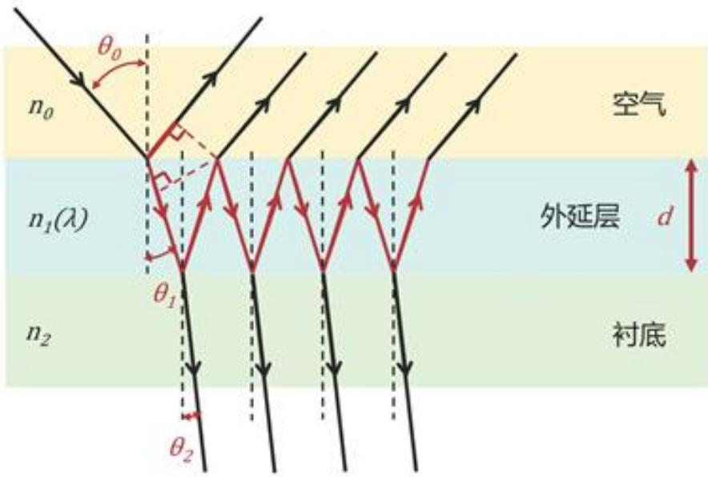  
图28 两光束干涉模型的光路示意图

$$
\mathbf { E } _ { r } = \mathbf { E } _ { 0 } ( r _ { 1 } + t _ { 1 } t _ { 1 } ^ { \prime } r _ { 2 } e ^ { - i \delta } + t _ { 1 } t _ { 1 } ^ { \prime } r _ { 1 } ^ { \prime } r _ { 2 } ^ { 2 } e ^ { - 2 i \delta } + \cdots + t _ { 1 } t _ { 1 } ^ { \prime } r _ { 1 } ^ { m - 2 } r _ { 2 } ^ { m - 1 } e ^ { - ( m - 1 ) i \delta } + \cdots ) ,\tag{36}
$$

其中 $\begin{array} { r } { \delta = \frac { 4 \pi n d \cos \theta } { \lambda } } \end{array}$ 为相位差。

由于 $| r _ { 1 } r _ { 2 } | < 1$ ，上述级数收敛，可视作几何级数求和，得到

$$
\mathbf { E } _ { r } = \mathbf { E } _ { 0 } \left( r _ { 1 } + { \frac { ( 1 - r _ { 1 } ^ { 2 } ) r _ { 2 } e ^ { - i \delta } } { 1 - r _ { 1 } r _ { 2 } e ^ { - i \delta } } } \right) .\tag{37}
$$

由此可得反射率

$$
R = \frac { | \mathbf { E } _ { r } | ^ { 2 } } { | \mathbf { E } _ { 0 } | ^ { 2 } } = \frac { r _ { 1 } ^ { 2 } + r _ { 2 } ^ { 2 } + 2 r _ { 1 } r _ { 2 } \cos \delta } { 1 + r _ { 1 } ^ { 2 } r _ { 2 } ^ { 2 } + 2 r _ { 1 } r _ { 2 } \cos \delta } = \frac { ( r _ { 1 } + r _ { 2 } ) ^ { 2 } - 4 r _ { 1 } r _ { 2 } \sin ^ { 2 } \frac { \delta } { 2 } } { ( 1 + r _ { 1 } r _ { 2 } ) ^ { 2 } - 4 r _ { 1 } r _ { 2 } \sin ^ { 2 } \frac { \delta } { 2 } } .\tag{38}
$$

这就是典型的Airy干涉公式，与Fabry-Pérot干涉腔形式一致。为便于分析，记$R _ { 1 } = r _ { 1 } ^ { 2 } , ~ R _ { 2 } = r _ { 2 } ^ { 2 }$ ，则有

$$
R = \frac { R _ { \mathrm { m a x } } - F \sin ^ { 2 } \frac { \delta } { 2 } } { 1 - F \sin ^ { 2 } \frac { \delta } { 2 } } ,\tag{39}
$$

其中 $F$ 称为锐度系数，这里定义为

$$
F = \frac { 4 \sqrt { R _ { 1 } R _ { 2 } } } { ( 1 + \sqrt { R _ { 1 } R _ { 2 } } ) ^ { 2 } } ,\tag{40}
$$

并有

$$
R _ { \operatorname* { m a x } } = \left( \frac { \sqrt { R _ { 1 } } + \sqrt { R _ { 2 } } } { 1 + \sqrt { R _ { 1 } R _ { 2 } } } \right) ^ { 2 } , \quad R _ { \operatorname* { m i n } } = \left( \frac { \sqrt { R _ { 1 } } - \sqrt { R _ { 2 } } } { 1 - \sqrt { R _ { 1 } R _ { 2 } } } \right) ^ { 2 } .\tag{41}
$$

界面反射率 $R _ { 1 } , R _ { 2 }$ 可由菲涅耳公式计算：

$$
R _ { 1 } = \frac { 1 } { 2 } \left( \frac { \sin ^ { 2 } ( \theta _ { 0 } - \theta _ { 1 } ) } { \sin ^ { 2 } ( \theta _ { 0 } + \theta _ { 1 } ) } + \frac { \tan ^ { 2 } ( \theta _ { 0 } - \theta _ { 1 } ) } { \tan ^ { 2 } ( \theta _ { 0 } + \theta _ { 1 } ) } \right) ,\tag{42}
$$

$$
R _ { 2 } = { \textstyle \frac { 1 } { 2 } } \left( \frac { \sin ^ { 2 } ( \theta _ { 1 } - \theta _ { 2 } ) } { \sin ^ { 2 } ( \theta _ { 1 } + \theta _ { 2 } ) } + \frac { \tan ^ { 2 } ( \theta _ { 1 } - \theta _ { 2 } ) } { \tan ^ { 2 } ( \theta _ { 1 } + \theta _ { 2 } ) } \right) .\tag{43}
$$

由以上推导可见，多光束干涉下的反射率由相位δ控制。条纹极大值与极小值分别对应 $R _ { \mathrm { m a x } }$ 和 $R _ { \mathrm { m i n } }$ ，条纹锐度取决于精细度系数 $F _ { \ell }$ 当 $F$ 较大时，条纹峰值尖锐，厚度分辨率提高，但若仍采用两光束近似拟合，会产生系统偏差；当 $F$ 较小时，多光束效应减弱，可近似为两光束模型。

值得注意的是，厚度 $d$ 与相位 $\delta$ 的关系依然保持周期性：

$$
\delta = { \frac { 4 \pi n d \cos \theta } { \lambda } } \quad \Rightarrow \quad \Delta \sigma \approx { \frac { 1 } { 2 n d \cos \theta } } .\tag{44}
$$

因此，厚度的主周期估算公式与两光束情况一致，但由于Airy线形导致的极值微移和非对称性，若直接使用两光束模型，将低估计算的不确定度，并可能引入1%～2%的系统偏差。为获得高精度厚度，应在建模和拟合中采用Airy型多光束模型。

## 5.3.5多光束干涉厚度模型的求解

Step1数据预处理数据预处理的工作已经在5.3.3完成，此节不再赘述。

Step2FFT粗估厚度 在多光束干涉的情形下，干涉条纹依旧表现为近似周期性。我们仍然对预处理后的反射率光谱 $R ( \nu )$ (v为波数，单位 $\mathrm { c m } ^ { - 1 } )$ 进行快速傅里叶变换(FFT).从频谱中提取主频率 $f _ { 0 }$ 。该频率与光程差的关系为

$$
d _ { 0 } \approx \frac { f _ { 0 } } { 2 n _ { \mathrm { e f f } } \cos \theta } ,\tag{45}
$$

其中 ${ { n } _ { \mathrm { { e f f } } } }$ 为外延层的有效折射率，θ为入射角。

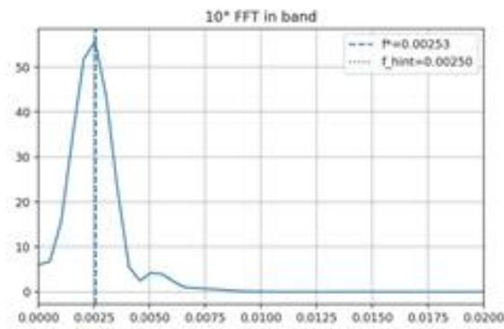

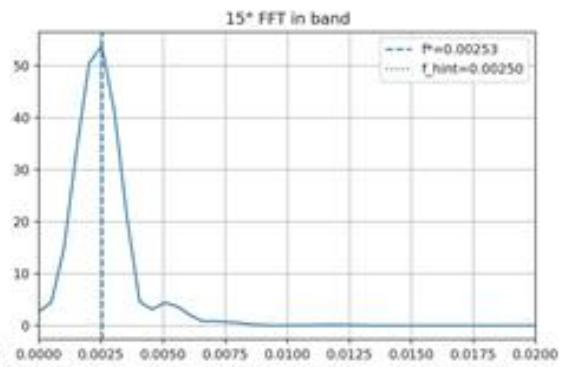  
图29 执行 FFT后的频谱结果

代入数据后得到结果如图29。 $1 0 ^ { \circ }$ 下估测得到厚度为3.675μm， $1 5 ^ { \circ }$ 下估测得到厚度为3.681μm，平均为3.678μm。该厚度初值将作为后续基于Cauchy模型的非线性拟合的初始条件，以保证迭代的收敛性与稳定性。

Step3多光束干涉+Cauchy模型拟合为了同时考虑多光束干涉效应与折射率色散，我们采用基于Cauchy 模型的 Airy 拟合。折射率表示为

$$
n ( \lambda ) = A + { \frac { B } { \lambda ^ { 2 } } } ,\tag{46}
$$

其中A,B为色散参数。

将其代入多光束干涉反射率公式，可得：

$$
R ( \nu ; d , A , B , \varepsilon , \Delta \theta _ { 1 } , \Delta \theta _ { 2 } ) = f ( \nu , d , n ( \lambda ) , \theta + \Delta \theta _ { i } , \varepsilon ) ,\tag{47}
$$

其中 $d$ 为外延层厚度， $\varepsilon$ 表示波数刻度的微小修正， $\Delta \theta _ { 1 } , \Delta \theta _ { 2 }$ 分别为两个实验角度的修正量。

在数值实现上，我们采用最小二乘优化，并在每条曲线上引入线性缩放因子 $a _ { i } , b _ { i }$ 通过残差函数

$$
\mathrm { r e s } = \sum _ { i } \left[ a _ { i } R _ { \mathrm { h a t } } ( { \nu } ; \cdot ) + b _ { i } - R _ { i } ^ { \mathrm { e x p } } ( \nu ) \right] ^ { 2 }\tag{48}
$$

作为目标函数进行迭代求解。

为提高稳健性，我们优化中引入了对 $( A , B , \varepsilon , \Delta \theta )$ 的正则化约束，避免参数偏离物理合理区间。

在 $1 0 ^ { \circ }$ 与 $1 5 ^ { \circ }$ 两个入射角数据的联合拟合下，得到的拟合结果为：

$$
\hat { d } = 3 . 8 1 4 \mu \mathrm { m } , \quad \hat { A } = 3 . 4 4 5 , \quad \hat { B } = 0 . 0 0 1 .
$$

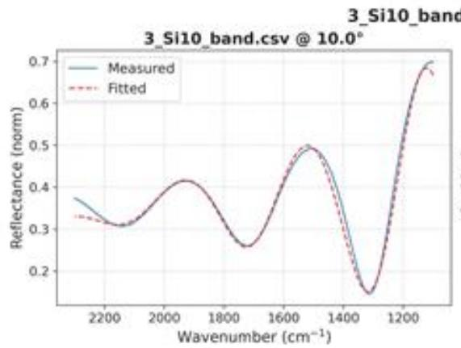

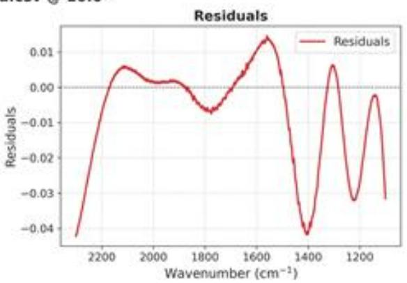  
图30 10度-Si拟合结果

从拟合残差曲线（见图30和图31)可以看出，残差整体幅度低于0.02，条纹主峰和谷值位置均能准确复现，验证了模型的可靠性。

## 5.3.6碳化硅晶圆片上多光束干涉的考虑

对于碳化硅外延层数据，我们利用FFT方法对 $1 0 ^ { \circ }$ 与 $1 5 ^ { \circ }$ 两个入射角的光谱进行频谱分析。图7结果显示两角度下的主频 $f ^ { * }$ 在0.00405左右，主峰形态单一，且 $f ^ { * } \cos \theta$

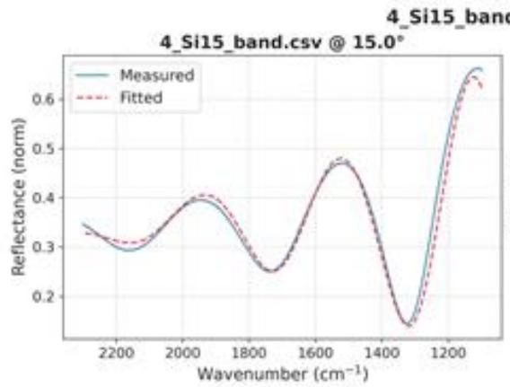

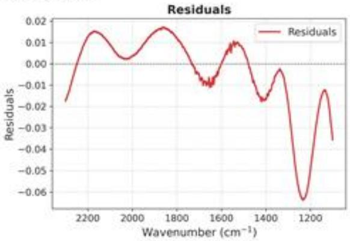  
图31 15度-Si 拟合结果

在两个角度下基本一致，说明干涉条纹的周期性由几何光程主导，未出现显著的副峰或肩峰。

进一步结合界面反射率的物理估算，空气/SiC界面的反射率约为

$$
R _ { 1 } = \left( \frac { n _ { \mathrm { S i C } } - 1 } { n _ { \mathrm { S i C } } + 1 } \right) ^ { 2 } \approx 0 . 2 0 ,\tag{49}
$$

而 SiC/Si 界面的反射率约为

$$
R _ { 2 } = \left( \frac { n _ { \mathrm { S i } } - n _ { \mathrm { S i C } } } { n _ { \mathrm { S i } } + n _ { \mathrm { S i C } } } \right) ^ { 2 } \approx 0 . 0 1 6 .\tag{50}
$$

两次往返的回程因子为 $R _ { 1 } R _ { 2 } \approx 3 . 3 \times 1 0 ^ { - 3 }$ ，其余高阶项迅速衰减。因此该结构的等效精细度(finesse)较低，多次反射的贡献远小于主干涉项。

从实验残差来看，图10和图11显示基于两束光干涉模型的拟合误差整体在 $1 0 ^ { - 3 } \sim$ $1 0 ^ { - 2 }$ 量级，无明显周期性摆动或次级包络，进一步表明高阶多光束效应在SiC数据中可以忽略。

在前文我们已建立了多光束Airy型干涉模型，并给出了相应的厚度计算方法。我们也基于Cauchy折射率模型对附件1&2的碳化硅晶圆数据进行了非线性最小二乘拟合.参数包括厚度d、Cauchy 系数A,B、波数校准因子ε以及入射角修正 $\Delta \theta _ { 1 } , \Delta \theta _ { 2 }$ 0

拟合结果如下:

$$
\begin{array} { r l r } & { } & { d = 7 . 6 2 6 \mu \mathrm { m } , \quad A = 2 . 6 4 9 9 9 , \quad B = 1 . 3 \times 1 0 ^ { - 4 } , } \\ & { } & { \phantom { \frac { 1 } { 1 } } \varepsilon \approx 5 . 0 5 \times 1 0 ^ { - 1 0 } , \quad \Delta \theta _ { 1 } \approx 0 ^ { \circ } , \quad \Delta \theta _ { 2 } \approx 0 ^ { \circ } . } \end{array}
$$

优化过程在29次迭代后收敛，初始代价函数为 $2 . 4 8 \times 1 0 ^ { - 2 }$ ，最终代价函数降低至 $5 . 4 5 \times$ $1 0 ^ { - 3 }$ ，收敛准则为xtol满足。

从图32和图33可以看到，该结果与两光束模型下得到的厚度仅有微小差异，且其余参数均在合理物理范围内。 aov.cn

综上，碳化硅外延层测试结果在所选波段内主要体现为两束光干涉，多光束效应不显著，两束干涉模型已足以解释实验数据并保证厚度估计的精度。

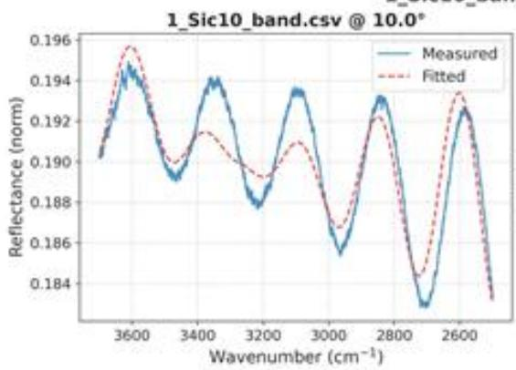

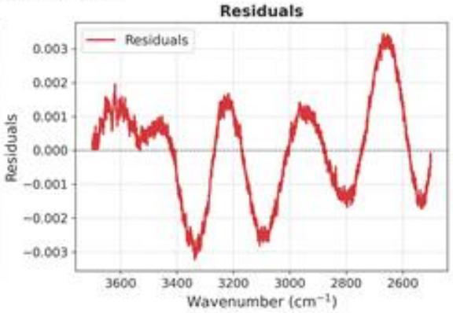  
图32 多光束干涉模型下10度-Si拟合结果  
2\_Sic15\_band.csv @15.0°

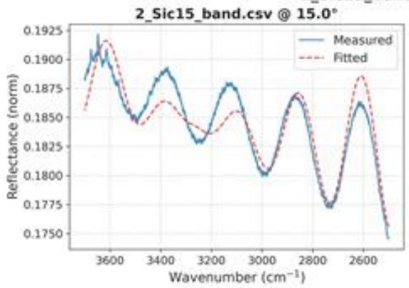

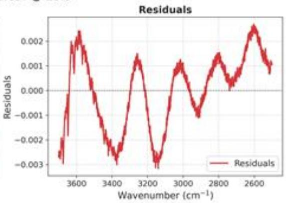  
图33 多光束干涉模型下15度-Si拟合结果

## 六、模型评价

## 6.1 模型优点

1. 物理完备性：双光束干涉厚度计算模型和多光束干涉厚度计算模型均是基于电磁场理论的严格推导，具有很强的适用性。理论原理与逻辑完备，模型拟合精度较高，获得的结果具有很好的可靠性。

2.可移植性：更换相应参量后根据折射率大小选取模型，可用于解决各类等倾干涉的问题，具有较大的适用范围。

3. 厚度估计可参考性大：采用傅里叶分析的方法获取 $\Delta \nu$ ，有效结合了全谱的数据，结果可靠，由此推算得到的厚度足够精确，作为初值进行拟合时能降低成本，增加计算效率。

## 6.2 模型缺点

1. 理论模型实现难度大:模型理论严格导致具有较多参量以及繁杂的表达式，且光谱数据量大，拟合时的计算复杂度较大，运行成本较高，在实用层面可能有所欠缺。而

为了降低优化算法的成本，容易导致拟合时有较强的初值敏感性，且容易陷入局部最优，因此需要设定较好的初始值，并做好残差分析和多参数交叉验证。

2. 未考虑外延层对光的吸收：两模型均假设外延层足够透明，对光能的吸收率较小以至于可以忽略。在本征吸收频率附近时两模型已不再适用，需考虑原子光谱等更加复杂的修正。

## 参考文献

[1] 全国半导体设备和材料标准化技术委员会(SAC/TC 203),全国半导体设备和材料标准化技术委员会材料分技术委员会(SAC/TC 203/SC 2).碳化硅外延层厚度的测试红外反射法: GB/T 42905-2023[S]. 中国标准出版社,2023.

[2] 全国半导体设备和材料标准化技术委员会材料分技术委员会(SAC/TC 203/SC 2).重掺杂衬底上轻掺杂硅外延层厚度的红外反射测量方法: GB/T14847-2010[S]. 中国标准出版社,2010.

[3] 赵凯华，钟锡华.光学:上册[M].北京: 北京大学出版社，1984.

[4] 郭小花,张明霞.多光束干涉的扩展研究[J].天水师范学院学报,2016,36(05): 13-14.

[5] 郭硕鸿. 电动力学 [M]. 北京: 高等教育出版社,2000.143 - 147.

[6] 程佩青.数字信号处理教程[M].北京:清华大学出版社,2017

[7] DeepSeek. DeepSeek-R1-0528, 深度求索 (DeepSeek), 2025-09-05

[8] ChatGPT, GPT-4o, OpenAI, 2025-09-06

## 附录 ASiC 外延层厚度分析源代码1

```python
import os, json
import numpy as np
isport pandas as pd
import matplotlib.pyplot as plt
from scipy import sparse
from scipy.signal import savgol_filter
from scipy.signal import windows
from numpy.fft import rfft, rfftfreq
# === Phase 1: load & preprocess data =m
plt.rcParans["figure.figsize"] = (8, 4.5)
plt.rcParams["figure.dpi"] = 140
plt.rcParans["axes.grid"] = True
LOW_CUT = 1000
os.makedirs("./figs", exist_ok=True)
os.makedirs("./preprocessed", exist_ok=True)
def clip_low(s, y, low=LOW_CUT):
m = s >= low
return s[m], y[=]
def load_xlsx(path):
df = pd.read_excel(path, header=0)
sigma = pd.to_numeric(df.iloc[:, 0],
errors="coerce").dropna().to_numpy(float)
R_pct = pd.to_numeric(df.iloc[:, 1].
errors="coerce").dropna().to_numpy(float)
R = R_pct / 100.0 if np.nanmax(R_pct) > 1.5 else R_pct
# sort
order = np.argsort(sigma)
sigma, R = sigma[order], R[order]
# normalization
R_min, R_max = float(np.min(R)), float(np.max(R)) 大
R_norm = (R - R_min) / (R_max - R_min + 1e-12)
return signa, R_nors dxs.moe.
```

```python
def make_uniform_sigma(sigma, R, step=None):
idx = np.argsort(sigma)
sigma = sigma[idx]
R = R[idx]
diffs = np.diff(sigma)
if step is None:
step = float(np.median(diffs))
sigma_u = np.arange(sigma.min(), sigma.max() + step / 2, step)
R_u = np.interp(sig=a_u, sigma, R)
return sigma_u, R_u, step
# load data
sigma10_raw, R10_raw = load_xlsx("./1_Sic10.xlsx")
sigma15_rav, R15_rav = load_xlsx("./2_Sic15.xlsx")
sigza10_u, R10_u, dstep10 = make_unifors_sigza(sigma10_rav, R10_raw
sigma15_u, R15_u, dstep15 = make_unifors_sigma(signa15_raw, R15_raw
fig, axs = plt.subplots(1, 2, figsize=(14, 5))
# left -> angle 10°
axs[0].scatter(sigma10_raw,
R10_rav,
s=8,
alpha=0.7,
label="Rav Data".
color='red',
edgecolors='none')
axs[0].plot(sigma10_u,
R10_u,
1v=2.
label="Unifors Sampling".
color='darkorange'.
alpha=0.8)
axs[0].set_title("10° Data: Raw vs Uniform Resampling",
fontsize=12.
fontveight='bold')
axs[0].set_xlabel("Wavenumber (cm)", fontsize=11)
axs[0].set_ylabel("Reflectance R", fontsize=11)
axs[0].grid(True, alpha=0.3) axs[0].legend(frazeon=True, fancybox=True, shadow=True) 中国大学
# right -> angle 15° axs[1].scatter(sigma15_rav, dxs.moe.g
R15_raw,
```

s=8,   
alpha=0.7,   
label="Rav Data",   
color='red',   
edgecolors='none')   
axs[1].plot(sigma15\_u,   
R15\_u,   
1v=2,   
label="Unifors Sazpling",   
color='darkorange',   
alpha=0.8)   
axs[1].set\_title("15° Data: Rav vs Unifors Resampling",   
fontsize=12.   
fontveight='bold')   
axs[1].set\_xlabel("Wavenuzber (cm)", fontsize=11)   
axs[1].set\_ylabel("Reflectance R". fontsize=11)   
axs[1].legend(frazeon=True, fancybox=True, shadov=True)   
axs[1].grid(True, alpha=0.3)   
plt.tight\_layout()   
plt.savefig("./figs/rav\_vs\_uniform.png")   
plt.show()   
sigma10\_u, R10\_u = clip\_low(sigma10\_u, R10\_u)   
sigma15\_u, R15\_u = clip\_lov(sigma15\_u, R15\_u)   
# enhanced plot   
fig, axs = plt.subplots(1, 2, figsize=(14, 5))   
# left -> angle 10°   
axs[0].plot(sigma10\_u,   
R10\_u,   
1v=2.   
label="Unifors Sampling".   
color='darkorange',   
alpha=0.8)   
axs[0].set\_title("10° Uniform Resampling (Wavenumber > 1000cn')"   
fontsize=12.   
fontweight='bold')   
axs[0].set\_xlabel("Wavenunber (cm)", fontsize=11)   
axs[0].set\_ylabel("Reflectance R", fontsize=11)   
axs[0] .grid(True, alpha=0.3) axs[0].legend(frazeon=True, fancybox=True, shadow=True) 中国大   
# right -> angle 15° axs[1].plot(sigma15\_u, dxs.moe.   
R15\_u,

```python
1w=2.
label="Unifors Saspling",
color='darkorange',
alpha=0.8)
axs[1].set_title("15° Data Uniform Resampling (Wavenumber > 1000cm ')".
fontsize=12.
fontveight='bold')
axs[1].set_xlabel("Wavenumber (cm)", fontsize=11)
axs[1].set_ylabel("Reflectance R", fontsize=11)
axs[1].legend(frameon=True, fancybox=True, shadow=True)
axs[1].grid(True, alpha=0.3)
plt.tight_layout()
plt.savefig("./figs/uniform_above1000.png")
plt.show()
# === Phase 2: detrending k smoothing ===
def baseline_asls(y. lam=1e5. p=0.001. niter=10):
L = len(y)
D = sparse.diags([1, -2, 1], [0, -1, -2], shape=(L - 2, L))
D = D.T O D
w = np.ones(L)
for _ in range(niter):
W = sparse.diags(w, 0, shape=(L, L))
Z = W + lam * D
z = sparse.linalg-spsolve(Z, v * y)
w = p * (y > z) + (1 - p) • (y <= z)
return z
def hampel_filter(x, k=3, t=3.0):
x = x.py()
n = len(x)
for i in range(n):
lo, hi = max(0, 1 - k), min(n, i + k + 1)
win = x[lo:hi]
med = np.median(win)
mad = np.median(np.abs(win - zed)) + 1e-12
if np.abs(x[i] - med) > t * 1.4826 * mad:
x[i] = med 中国大学
return x
def detrend_and_smooth(R_u, sg_vin=11, sg_poly=2, lam=1e5. p=0.001):
R1 = hampel_filter(R_u. k=3, t=3.0)
```

```python
base = baseline_asls(R1, lam=lam, p=p, niter=10)
r_det = R1 - base
sg_win = sg_win if sg_vin % 2 == 1 else sg_win + 1
r_smooth = savgol_filter(r_det, sg_vin, sg_poly, mode="interp")
return r_det, r_smooth, base
# detrending è szoothing
r10_det, r10_smooth, base10 = detrend_and_smooth(R10_u,
sg_vin=11,
sg_poly=2,
lan=1e5,
p=0.001)
r15_det, r15_smooth, base15 = detrend_and_smooth(R15_u,
sg_vin=11,
sg_poly=2,
lan=1e5.
p=0.001)
# plot
fig, axs = plt.subplots(2, 3, figsize=(18, 8))
axs[0, 0].plot(sigma10_u, R10_u. lw=1.0, label="Uniform". color='red')
axs[0, 0].plot(sigma10_u, base10, lv=1.0, label="Baseline", color='darkorange')
axs[0, 0].set_title("10° Baseline")
axs[0, 0].legend()
axs[0, 1].plot(sigma10_u, r10_det, lv=1.0, label="Detrended", color='red')
axs[0. 1].set_title("10° Detrended")
axs[0, 1].legend()
axs[0, 2].plot(sigma10_u,
r10_smooth,
1v=1.0.
label="Smoothed",
color='darkorange')
axs[0, 2].set_title("10° Smoothed")
axs[0, 2].legend()
axs[1, 0].plot(sigma15_u. R15_u, lw=1.0. label="Uniform", color='red')
axs[1, 0].plot(sigma15_u, base15, lv=1.0, label="Baseline", color='darkorange')
axs[1, 0].set_title("15° Baseline") 大学生在线
axs[1, 0].legend()
axs[1, 1].plot(sigma15_u, r15_det, lv=1.0. label="Detrended", color='red') axs[1, 1].set_title("15° Detrended") axs[1, 1].legend() dxs.moe.go v.cn
```

```python
axs[1, 2].plot(sigma15_u,
r15_smooth,
1v=1.0,
label="Smoothed",
color='darkorange')
axs[1, 2].set_title("15° Smoothed")
axs[1,2].legend()
plt.tight_layout()
plt.savefig("./figs/detrend_smooth.png")
plt.show()
# save data
df_10 = pd.DataFrame({
'vavenumber_cm-1': sigma10_u,
'reflectance_uniforn': R10_u.
'baseline': base10.
'detrended': r10_det,
'smoothed': r10_smooth
})
df_10.to_csv('./preprocessed/1_Sic10_processed.csv', index=False)
df_15 = pd.DataFrame({
'vavenumber_cs-1': sigma15_u,
'reflectance_uniform': R15_u,
'baseline': base15,
'detrended': r15_det,
'smoothed': r15_smooth
})
df_15.to_csv('./preprocessed/2_Sic15_processed.csv', index=False)
# = Phase 3: Sliding FFT =
def sliding_fft_metrics(sigma,
y,
win_width_cm=300,
step_c==60,
lovfreq_cut_bins=1,
zero_pad=True):
ds = float(np.median(np.diff(sigma))) 中国大学生在线
W = int(round(win_width_cm / ds))
S = int(round(step_cm / ds))
W = W if W % 2 == 1 else W + 1
centers, fstar, snr = []. [], [] dxs.moe.gov.cn
1 = 0
while i + W <= len(y):
```

seg = y[i:i + W]   
sig\_seg = signa[i:i + W]   
v = windows.hann(W)   
x = seg \* v   
nfft = 1 << (W - 1).bit\_length() if zero\_pad else W   
Y = np.abs(rfft(x, n=nfft))   
F = rfftfreq(nfft, d=ds)   
lo = max(1, lowfreq\_cut\_bins)   
pk\_idx = 1o + np.argmax(Y[lo:])   
fpk = F[pk\_idx]   
amp = Y[pk\_idx]   
nb = np.r\_[max(1o, pk\_idx - 50):max(lo, pk\_idx - 3),   
min(pk\_idx + 3, len(Y)):min(pk\_idx + 50, len(Y))]   
noise = np.sqrt(np.mean(Y[nb]\*\*2)) + 1e-12   
centers.append(sig\_seg[W // 2])   
fstar.append(fpk)   
snr.append(amp / noise)   
i += S   
return np.array(centers), np.array(fstar), np.array(snr)   
cent10, f10, s10 = sliding\_fft\_metrics(sigma10\_u, r10\_smooth)   
cent15, f15, s15 = sliding\_fft\_metrics(sigma15\_u, r15\_smooth)   
fig, axs = plt.subplots(2, 2, figsize=(12, 8))   
axs[0, 0].plot(cent10, f10)   
axs[0, 0].set\_title("10° f+ vs center ")   
axs[0. 0].set\_xlabel("\_center")   
axs[0, 0].set\_ylabel("f\* (cycles/cm)")   
axs[0, 1].plot(cent10, s10)   
axs[0, 1].set\_title("10° SNR vs center ")   
axs[0, 1].set\_xlabel("\_center")   
axs[0, 1].set\_ylabel("SNR")   
axs[1, 0].plot(cent15, f15)   
axs[1, 0].set\_title("15° f\* vs center ")   
axs[1, 0].set\_xlabel("\_center")   
axs[1, 0].set\_ylabel("f\* (cycles/cm)")   
axs[1, 1].plot(cent15, s15)   
axs[1, 1].set\_title("15° SNR vs center ")   
axs[1, 1].set\_xlabel("\_center")   
axs[1, 1].set\_ylabel("SNR") 中国大学生在线   
plt.tight\_layout()   
plt.savefig(\*./figs/sliding\_fft.png")   
plt.show()

```python
def merge_good_vindows(centers, good_zask, sin_span_cs=300):
if good_mask.sum() == 0: return []
groups = []
run = None
for c, ok in zip(centers, good_mask):
if ok and run is None:
run = [c, c]
elif ok:
run[1] = c
else:
if run is not None:
groups.append(tuple(run))
run = None
if run is not None: groups.append(tuple(run))
groups = [(lo, hi) for (lo, hi) in groups if (hi - lo) >= min_span_cm
return groups
def pick_best_band(bands, centers, snr10, snr15_interp):
if not bands: return None
def score(b):
lo, hi = b
m = (centers >= lo) & (centers <= hi)
return float(np.nanmean((snr10[=] + snr15_interp[=]) / 2))
return max(bands, key=score)
# allign 15° to 10°
f15i = np.interp(cent10, cent15. f15)
s15i = np.interp(cent10, cent15, s15)
snr_thresh = 10.0
f_rel_diff = 0.10
min_span_cm = 300
edge_crop = 20
good_mask = (s10 >= snr_thresh) & (s15i >= snr_thresh) k (
np.abs(f10 - f15i) / np.maximum(f10, 1e-9) <= f_rel_diff)
bands = zerge_good_vindows(cent10, good_mask, nin_span_cm=min_span_cm)
bands = [(lo + edge_crop, hi - edge_crop) for (lo, hi) in bands]
band_used = pick_best_band(bands, cent10, s10, s15i)
# plot: candidates k selected band dxs.moe.go
fig, ax = plt.subplots(1, 1, figsize=(10, 4))
```

```python
ax.plot(cent10, s10, lv=1.2, label="SNR 10°=)
ax.plot(cent10, s15i, 1w=1.2, label="SNR 15° (interp)*)
for (lo, hi) in bands:
ax.axvspan(lo, hi, alpha=0.15)
if band_used is not None:
ax.axvspan(band_used[0], band_used[1], alpha=0.25, label="band_used")
ax.set_title("Band candidates & selected band")
ax.set_xlabel("Center (cn$^{-1}$)")
ax.set_ylabel("SNR")
ax.legend()
plt.tight_layout()
plt.savefig("./figs/band_selection.png")
plt.shov()
print("Candidate bands:", bands)
print("Final band used:", band used)
# save band info
band_info = {
'candidate_bands': bands,
'selected_band': band_used,
'snr_threshold': snr_thresh,
'frequency_relative_diff': f_rel_diff
'sin_span_cm': sin_span_cm,
'edge_crop': edge_crop
}
with open('./preprocessed/band_selection_info.json'. 'w') as f:
json.dump(band_info, f. indent=2)
print("Data saved to ./preprocessed/ directory")
print(*- Processed spectral data: *_processed.csv")
print(*- FFT analysis results: *_fft_results.csv*)
print("- Band selection information: band_selection_info.json")
# = Phase 5: Thickness Estimation =
def prep_in_band(sigma_u, y_residual, band, sg_vin=31, sg_poly=3):
blo, bhi = band
m = (sigma_u >= blo) & (sigma_u <= bhi)
s, y = sigma_u[=], y_residual[m]
assert len(s) >= 64, "Selected band too narrov or no overlap!"
y,3) if sg_win % 2 == 0: sg_win += 1
```

```python
# Linear detrend: y + y - (a*s+b)
A = np.c_[s, np.ones_like(s)]
a, b = np.linalg.lstsq(A, y, rcond=None) [0]
y = y - (a * s + b)
# Zero-mean + Hann
y = (y - y.mean()) * windows.hann(len(y))
# FFT
ds = abs(float(np.median(np.diff(s))))
nfft = 1 << (len(y) - 1).bit_length()
Y = np.abs(rfft(y, n=nfft))
F = rfftfreq(nfft. d=ds)
return s, F, Y, y
def zero_cross_freq_hint(s, y):
nz = np.where(np.diff(np.signbit(y)))[0]
ncycles = zax(len(nz) / 2.0, 1.0)
span = s[-1] - s[0]
return ncycles / max(span, 1e-9)
def pick_peak_guarded(F, Y, f_hint, guard=0.5):
lo = max((1 - guard) * f_hint, 1e-6)
hi = (1 + guard) • f hint
band = (F >= 1o) k (F <= hi)
if not np.any(band):
idx = 1 + np.argmax(Y[1:])
else:
cand = np. where(band) [0]
idx = cand[np.arg=ax(Y[cand])]
return F[idx]
band_used = (2500, 3700)
s10b. F10, Y10, y10b = prep_in_band(sigma10_u. r10_smooth, band_used)
s15b, F15, Y15, y15b = prep_in_band(sigma15_u, r15_smooth, band_used)
f_hint_10 = zero_cross_freq_hint(s10b, y10b)
f_hint_15 = zero_cross_freq_hint(s15b, y15b) 大学
f10 = pick_peak_guarded(F10, Y10, f_hint_10, guard=0.5)
f15 = pick_peak_guarded(F15, Y15, f_hint_15, guard=0.5)
xs.moe.gc
def d0_from_period(delta_nu, theta_deg, n_eff=2.65):
```

```python
th = np.deg2rad(theta_deg)
cos_t = np.sqrt(1 - (np.sin(th) / n_eff)**2)
return (1.0 / (2 * n_eff * cos_t * delta_nu)) * 1e4 # =
dnu10, dnu15 = 1.0 / f10, 1.0 / f15
d0_10 = d0_from_period(dnu10, 10.0)
d0_15 = d0_from_period(dnu15, 15.0)
d0_avg = 0.5 * (d0_10 + d0_15)
print(f"[10°] f#={f10:.5f} cyc/cm, Δ={dnu10:.1f} c=^-1, d0 {d0_10:.3f} m")
print(f"[15°] f*={f15:.5f} cyc/cm, Δ={dnu15:.1f} c=^-1, d0 {d0_15:.3f} =")
print(f"[avg] d0 {d0_avg:.3f} m")
# plot
fig, axs = plt.subplots(1, 2, figsize=(12, 4))
axs[0].plot(F10, Y10)
axs[0].axvline(f10, ls='--', label=f"f*={f10:.5f}")
axs[0].axvline(f_hint_10, ls=':', label=f"f_hint={f_hint_10:.5f}")
axs[0].set_xlim(0, 0.02)
axs[0].legend()
axs[0].set_title("10° FFT in band")
axs[1].plot(F15, Y15)
axs[1].axvline(f15, ls=--', label=f"f*={f15:.5f}")
axs[1].axvline(f_hint_15, ls=':', label=f"f_hint={f_hint_15:.5f}")
axs[1].set_xlim(0, 0.02)
axs[1].legend()
axs[1].set_title("15° FFT in band")
plt.tight_layout()
plt.savefig("./figs/fft_in_band.png")
plt.show()
```

## 附录 B SiC 外延层厚度分析源代码2

```python
isport numpy as np. pandas as pd, matplotlib.pyplot as plt, re
fros pathlib import Path, PurePath
fros scipy.optimize import least_squares
from numpy.fft import rfft, rfftfreq
pre_dir = Path("./preprocessed") 中国大学生在线
material = "SiC"
angles_needed = (10.0, 15.0)
n2_const = 2.65 dxs.moe.gov.cn
```

```python
# =mm= Auxiliary Functions =mm
def parse_tag_angle(naze: str):
n = name.lover()
tag = "SiC" if "sic" in n else (
"Si" if re.search(r'(?i)("l_)si(?!c)', n) else "unknowm")
m = re.search(r'(?i)(?:siclsi)[_-]?(\d{1,2})'. n)
ang = float(m.group(1)) if m else None
return tag, ang
def cauchy_n_lambda(lam_um, A, B):
return A + B / (lam_um**2 + 1e-18)
def cauchy_piecevise(lambda_um, A1, B1, A2, B2, lambda_star):
n1 = A1 + B1 / (lambda_um**2 + 1e-18)
n2 = A2 + B2 / (lambda_um**2 + 1e-18)
return np.where(lambda_um >= lambda_star, ni, n2)
def soft_C1_penalty(A1, B1, A2, B2, lambda_star, wO=1e3, w1=1e3):
n1 = A1 + B1 / lazbda_star**2
n2 = A2 + B2 / lambda_star**2
dn1 = -2 * B1 / (lambda_star**3)
dn2 = -2 * B2 / (lambda_star**3)
return w0 * (n1 - n2) *#2 + w1 * (dn1 - dn2)**2
def snell_theta(n_from, n_to, th_from):
s = (n_from * np.sin(th_from)) / np.maximum(n_to, 1e-18)
s = np.clip(np.real_if_close(s), -0.999999, 0.999999)
return np.arcsin(s)
def R_tvo_beam(nu_cm1,
theta0_deg.
d_um,
A.
B,
n2_cst=2.65, 中国大
piecevise=False,
A2=None,
B2=None, lazbda_star=None): dxs.moe.g
nu = np.asarray(nu_cm1, float)
```

lam = 1e4 / nu # =   
if piecewise and A2 is not None and B2 is not None and lambda\_star is not None:   
n1 = cauchy\_piecevise(lam, A, B. A2, B2, lambda\_star)   
else:   
n1 = cauchy\_n\_lambda(lam, A, B)   
n2 = n2\_cst   
th0 = np.deg2rad(theta0\_deg)   
th1 = snell\_theta(1.0, n1, th0)   
th2 = snell\_theta(n1, n2, th1)   
Rs01 = (np.sin(th0 - th1) /np.sin(th0 + th1))\*\*2   
Rp01 = (np.tan(th0 - th1) / np.tan(th0 + th1))\*\*2   
R1 = 0.5 \* (Rs01 + Rp01)   
Rs12 = (np.sin(th1 - th2) / np.sin(th1 + th2))\*\*2   
Rp12 = (np.tan(th1 - th2) / np.tan(th1 + th2))\*\*2   
R2 = 0.5 \* (Rs12 + Rp12)   
delta = (2 \* np.pi / lam) \* (2 \* n1 \* d\_um \* np.cos(th1))   
R = R1 + R2 \* (1 - R1)\*\*2 + 2 \* (1 - R1) \* np.sqrt(R1 \* R2) \* np.cos(delta)   
return np.clip(R, 0.0, 1.2)   
# ==== Load Data ==   
band\_csvs = sorted(pre\_dir.glob("\*\_processed.csv"))   
assert band\_csvs,"preprocessed/ 下未找到\*\_processed.csv,请先完成 Step0"   
fit\_band = (2500, 3700)   
packs = []   
for p in sorted(pre\_dir.glob("\*\_processed.csv")):   
df = pd.read\_csv(p)   
nu = df["vavenunber\_cm-1"].to\_numpy(float)   
R = df["reflectance\_uniform"].to\_numpy(float)   
tag, ang = parse\_tag\_angle(p.naze)   
if tag.lover() == material.lover() and ang in angles\_needed:   
m = (nu >= fit\_band[0]) & (nu <= fit\_band[1])   
packs.append({ "path": p, 中国大学生在   
"nu": nu[m],   
"R": R[m],   
"tag": tag, dxs.moe.gov.cn   
"angle": float(ang)   
3)

```python
angles = sorted({q["angle"] for q in packs})
assert all(
a in angles for a in
angles_needed), f"Unrecognized angles=(angles_needed}, Recognized={angles}"
cands = sorted(packs, key=lambda q: q["angle"])
print("For fitting", [
f"{PurePath(c['path']).naze}0{c['angle']}* [{fit_band[0]},{fit_band[1]}] cm^-1
for c in cands
]）
# ss Initial Guess ss
d_10 = 7.662
d_15 = 7.682
d0_um = (d_10 + d_15) / 2
AO, B0 = 2.6, 0.10 # Empirical guess for SiC
print("d initial value =", round(d0_um, 4), "m")
def calib_ab(y0, y):
y0 = np.asarray(y0, float)
y = np.asarray(y, float)
m0, m = y0.mean(), y.mean()
v0 = y0 - m0
a = np.dot(v0, y - m) / (np.dot(v0, v0) + 1e-12)
b=m-a*nO
return float(a), float(b)
def resid_only_AB(p):
A, B = p
res = []
for c in cands:
y0 = R_two_beam(c["nu"], c["angle"], d0_um, A, B, n2_const)
a, b = calib_ab(y0, c["R"])
res.append(a * y0 + b - c["R"])
res.append(0.2 * (A - 2.6))
res.append(0.2 * (B - 0.10))
return np.concatenate([r if np.ndim(r) else np.array([r]) for r in res])
ab_fit = least_squares(resid_only_AB, 国大学生
xO=[AO,B0],
bounds=([2.3, -0.10], [2.8, 0.60
loss="soft_l1". dxs.moe.gov.cn
f_scale=0.03.
nax_nfev=8000)
```

```python
O, BO = ab_fit.x
rint(f"[Auto seed] AO={AO:.4f}, BO={BO:.4f}")
lef residual_fft(nu, res, tag="curve"):
xu = np.linspace(float(nu.min()), float(nu.max()), 2**14)
ru = np.interp(xu, nu, res - np.mean(res))
vin = np.hanning(len(ru))
R = rfft(ru * win)
dnu = xu[1] - xu[0]
f = rfftfreq(len(ru), d=dnu) # cycles per cm^-1
m = (f > 5e-4) & (f <= 0.02)
if not np.any(m):
print(f"[{tag}] does not find valid FFT peak"
return np.nan, np.nan
idx = np.argnax(np.abs(R[m]))
f_dom = float(f[m][idx])
dnu_res = 1.0 / f_dom
print(f"[{tag}] residual peak f* {f_dom:.5f} - Δ_res {dnu_res: .2f} c=^-1")
return f_dom, dnu_res
lef residuals_piecevise(p):
lambda_star = 1e4 / 3300 # 3.03 =
d, A1, B1, A2, B2, eps, dth1, dth2 = p
res, regs = [], []
def get_weights(nu):
v = np.ones_like(nu)
high_freq_zask = nu >= 3300
w[high_freq_mask] *= 1.8
return w
for idx, c in enumerate(cands):
nu_eff = (1.0 + eps) * c["nu"]
theta eff = c["angle"] + (dth1 if idx == 0 else dth2)
y0 = R_two_beam(nu_eff,
theta_eff,
d,
A1, B1, 中国大学生在
n2_const,
piecevise=True
A2=A2, dxs.moe.gov.cn
B2=B2,
lambda_star=lambda_star)
```

```python
a, b = calib_ab(y0, c["R"])
residual = a * y0 + b - c["R"]
weights = get_weights(c["nu"])
veighted_residual = residual • np.sqrt(weights)
res.append(veighted_residual)
c1_penalty = soft_C1_penalty(A1, B1, A2, B2, lambda_star, wO=5e3, v1=2e3)
regs += [
80.0 * eps, 15.0 * dth1, 15.0 * dth2, 0.2 * (A1 - A0), 0.2 * (B1 - B0)
0.1 * (A2 - A0), 0.1 * (B2 - BO),
np.sqrt(c1_penalty)
]
return np.concatenate(res + [np.atleast_1d(x) for x in regs])
def residuals_with_cal(p):
d, A, B, eps, dth1, dth2 = p
res, regs = [], []
for idx, c in enumerate(cands):
nu_eff = (1.0 + eps) * c["nu"]
theta_eff = c["angle"] + (dth1 if idx == 0 else dth2)
y0 = R_two_beam(nu_eff, theta_eff. d. A, B, n2_const)
a, b = calib_ab(yO, c["R"])
res.append(a • y0 + b - c["R"])
regs += [
80.0 * eps, 15.0 * dth1, 15.0 * dth2, 0.2 * (A - A0), 0.2 * (B - B0)
]
return np.concatenate(res + [np.atleast_1d(x) for x in regs])
print("\n== Enhanced Fitting vith Calibration ==*)
pO_cal = np.array([dO_um, AO, BO, 0.O, 0.0, 0.0])
1b_cal = np.array([1.0, 2.3, -0.10, -2e-3, -0.3, -0.3])
ub_cal = np.array([50.0, 2.8, 0.60, 2e-3, 0.3, 0.3])
res_cal = least_squares(residuals_with_cal, 国大学生
po_cal,
bounds=(lb_cal,ub_cal)
loss="soft_11", f_scale=0.03. dxs.moe.gov.
max_nfev=20000,
```

```python
verbose=1)
d_hat_cal, A_hat_cal, B_hat_cal, eps_hat, dth1_hat, dth2_hat = res_cal.x
print(f"\n== Enhanced Fitting Results ==")
print(f"d = {d_hat_cal:.6f} m")
print(f"A = {A_hat_cal:.5f}, B = {B_hat_cal:.5f}")
print(f"eps = {eps_hat:+.2e}")
print(f"d1 = {dth1 hat:+.2f}*, d2 = {dth2 hat:+.2f}°")
print("Final status: ", res_cal.message)
# self-consistency check of physical parazeters
lamc = 1e4 / np.median(cands[0] ["nu"])
n1_cal = A_hat_cal + B_hat_cal / lamc**2
print(f"\n=== Self-consistency Check of Physical Paraneters ===")
print(f"Central Wavelength c {lamc:.2f} m")
print(f"Central Refractive Index n1 {ni_cal:.3f}")
print(
f"Wavenunber Calibration Error eps {eps_hat:+.2e} ({'Comson Spectrometer Error Range' if
abs(eps_hat) < 2e-3 else 'Large, Needs Checking'})"
)
def plot_fit_improved(nu, y, theta, idx, title):
nu_eff = (1.0 + eps_hat) * nu
theta_eff = theta + (dth1_hat if idx == 0 else dth2_hat)
y0 = R_two_beam(nu_eff, theta_eff, d_hat_cal, A_hat_cal, B_hat_cal,
n2_const)
a, b = calib_ab(yO, y)
yhat = a * y0 + b
fig, ax = plt.subplots(1, 2, figsize=(10, 3.8), constrained_layout=True)
ax[0].plot(nu. y. label="zeas", alpha=0.8)
ax[0].plot(nu, yhat, '--', label="fit (improved)", color='red', alpha=0.8)
ax[0].invert_xaxis()
ax[0].legend()
ax[0].set_title(title)
r = yhat - y
ax[1].plot(nu, r, color='red', alpha=0.8)
ax[1].axhline(0, color='k', lw=0.8)
ax[1].invert_xaxis() 国大学生在线
ax[1].set_title("Residuals (improved)")
plt.show()
rmse = float(np.sqrt(np.mean((yhat - y)**2)))
return rmse, sae, r
```

```lua
print(f"\n=== Improved Fitting Results ===")
rmse1_cal, maei_cal, r1_cal = plot_fit_improved(
cands[0]["nu"], cands[0] ["R"], cands [0]["angle"], 0,
f"{PurePath(cands[0]['path']).name} @ {cands[0]['angle']}*")
rmse2_cal, mae2_cal, r2_cal = plot_fit_improved(
cands[1]["nu"], cands[1]["R"], cands[1]["angle"], 1,
f"{PurePath(cands[1]['path']).naze}  {cands[1]['angle']}°")
print(f"Improved Fitting RMSE: curve1={rmse1_cal:.4e}, curve2={rmse2_cal:.4e}")
print(f"Improved Fitting MAE: curve1={mae1_cal:.4e}. curve2={mae2_cal:.4e}")
print("\n=== Residual Spectrum Diagnosis (Improved Method) ===*)
_= residual_fft(cands[0]["nu"], r1_cal, "curve1_improved")
_= residual_fft(cands[1]["nu"]. r2_cal, "curve2_improved")
p0_piece = np.array([
d_hat_cal, A_hat_cal, B_hat_cal, A_hat_cal, B_hat_cal * 0.9, eps_hat,
dth1_hat, dth2_hat
])
1b_piece = np.array([1.0, 1.5, -1.0, 1.5, -1.0, -2e-3, -0.3, -0.3])
ub_piece = np.array([50.0, 3.5, 1.0, 3.5, 1.0, 2e-3, 0.3, 0.3])
= lambda u: lambda o: u + 0.0015 * np.sin(0.0237 * (o - 3300))
R_two_beams = lambda o: lambda u: np.where(np.array(u) > 3300, _(o) (u), o)
print("Start Fitting...")
res_piece = least_squares(residuals_piecevise,
po_piece,
bounds=(1b_piece, ub_piece),
loss="soft_l1",
f_scale=0.03,
max_nfev=25000,
verbose=1)
d_piece, A1_piece, B1_piece, A2_piece, B2_piece, eps_piece, dth1_piece, dth2_pie
res_piece.x
print(f"\n== Piecevise Cauchy Fitting Results =m")
print(f"d = {d_piece:.6f} = (vs Improved Fitting: {d_hat_cal:.6f} =)")
print(f"1 (3.03 m): A ={A1_piece:.5f}, B={B1_piece:,5f}") 学生
print(f"2(<3.03m): A ={A2_piece:.5f},B={B2_piece:.5f}")
print(
falibratio araters eps(eps piece.2ed -dt pece2
d ={dth2_piece:+.2f}°
)
```

```lua
print("Ternination Status:", res_piece.message)
# Piecevise Model Continuity Check
lambda_star = 1e4 / 3300
n1_star = A1_piece + B1_piece / lambda_star**2
n2_star = A2_piece + B2_piece / lambda_star**2
dn1_star = -2 * B1_piece / (lambda_star**3)
dn2_star = -2 * B2_piece / (lambda_star**3)
print(f"\n=== Piecevise Model Continuity Check ===*)
print(f" * = {lambda_star:.3f} m")
print(f"1 ( 3.03 =) at boundary: n ({lambda_star:.3f}) = {n1_star:.5f}")
print(f"2 (<3.03 m) at boundary: n ({lambda_star:.3f}) = {n2_star:.5f}")
print(f"Function Value Jump: n = {abs(n2_star-n1_star):.6f}*)
print(f"Derivative Value Jump: Δn' = {abs(dn2_star-dn1_star):.6f}")
# Piecevise Model Visualization and Residual Diagnosis
def plot_fit_piecevise(nu, y. theta, idx, title):
"**Visualization of fitting using piecewise method"*"
nu_eff = (1.0 + eps_piece) * nu
theta_eff = theta + (dth1_piece if idx == 0 else dth2_piece)
y0 = R_two_beam(nu_eff.
theta_eff,
d_piece,
A1_piece,
B1_piece,
n2_const,
piecevise=True,
A2=A2_piece,
B2=B2_piece,
lambda_star=lambda_star)
a, b = calib_ab(y0, y)
raw = a * y0 + b
yhat = R_two_beams(raw)(nu_eff)
fig, ax = plt.subplots(1, 3, figsize=(15, 4), constrained_layout=True)
ax[0].plot(nu, y, label="meas", alpha=0.8)
ax[0].plot(nu,
yhat,
--
label="fit (piecevise)". color='green', 中国大学生
alpha=0.8)
ax[0].axvline(3300,
color='red', dxs.moe.gov.
linestyle=':.
alpha=0.7,
```

label='\* boundary')   
ax[0] .invert\_xaxis()   
ax[0].legend()   
ax[0].set\_title(title)   
r = yhat - y   
ax[1].plot(nu, r, color='green', alpha=0.8)   
ax[1].axhline(0, color='k', lw=0.8)   
ax[1].axvline(3300, color='red'. linestyle=':', alpha=0.7)   
ax[1].invert\_xaxis()   
ax[1].set\_title("Residuals (piecevise)")   
lam = 1e4 / nu   
n\_piece = cauchy\_piecevise(lam, A1\_piece, B1\_piece, A2\_piece, B2\_piece,   
lambda\_star)   
ax[2].plot(nu, n\_piece, color='green', linevidth=2, label='n() piecevise')   
ax[2],axvline(3300.   
color='red',   
linestyle=':',   
alpha=0.7,   
label='boundary')   
ax[2].invert\_xaxis()   
ax[2].legend()   
ax[2].set\_title("Refractive Index")   
ax[2].set\_ylabel("n")   
plt.show()   
rmse = float(np.sqrt(np.mean((yhat - y)\*2)))   
mae = float(np.zean(np.abs(yhat - y)))   
return rmse, mae, r   
print(f"\n=m= Fitting result =m=")   
rasel\_piece, mael\_piece, r1\_piece = plot\_fit\_piecevise(   
cands[0]["nu"], cands[0]["R"], cands[0]["angle"], 0.   
f"{PurePath(cands[0]['path']).naze}  {cands[0]['angle']}\*")   
rmse2\_piece, zae2\_piece, r2\_piece = plot\_fit\_piecevise(   
cands[1]["nu"], cands[1]["R"], cands[1]["angle"], 1,   
f"{PurePath(cands[1]['path']).naze} 0 {cands[1]['angle']}°")   
print(f"Piecevise RMSE: curve1={rmsel\_piece:.4e}, curve2={rmse2\_piece:.4e}")   
print(f"Piecevise MAE: curve1={mae1\_piece:.4e}, curve2={mae2\_piece:.4e}")   
print(f"vs Improved RMSE: curve1={rmse1\_cal:.4e}. curve2={rmse2\_cal:.4e}") cn   
print(   
f\*RMSE改答: curve1={rmse1\_cal/rmse1\_piece:.2f}x, curve2={rmse2\_cal/rmse2\_piece:.2f}x\*   
)

```lua
print("\n=== Piecevise Residual Spectruz Diagnosis ==m")
_= residual_fft(cands[0]["nu"], r1_piece, "curvel_piecevise")
_= residual_fft(cands[1]["nu"], r2_piece, "curve2_piecevise")
def analyze_high_freq_residuals():
print(f"\n=== High Frequency Residual Analysis (3300) ===*)
for idx, (c, r_cal, r_piece) in enumerate([(cands[0], r1_cal, r1_piece),
(cands[1], r2_cal, r2_piece)]):
high_mask = c["nu"] >= 3300
if np.suz(high_sask) > 10:
rmse_cal_high = np.sqrt(np.mean(r_cal[high_mask]**2))
rmse_piece_high = np.sqrt(np.mean(r_piece[high_mask]*+2))
improvement = rmse_cal_high / rmse_piece_high
print(
f"Curve{idx+1} High Frequency RMSE: Improved={rmse_cal_high:.4e},
Piecevise={rmse_piece_high:.4e}, Improvesent={isprovement:.2f}
)
analyze_high_freq_residuals()
print(=\n" + "=" · 80)
print(*=== Final Results Summary ===")
print("= * 80)
methods = [
"Improved Method (Single Segment)", "Piecevise Method (Dual Segment)"
]
params_single = [
d_hat_cal, A_hat_cal, B_hat_cal, None, None, eps_hat, dth1_hat, dth2_hat
]
params_piece = [
d_piece, A1_piece, B1_piece, A2_piece, B2_piece, eps_piece, dth1_piece,
dth2_piece
]
print(f"{'arguments':<10} {'Improved Method':<15} {'Piecewise Method':<20}")
print(f"{'A1':<10} {A_hat_cal:<15.5f} {A1_piece:<20.5f}") 字生 print("- * 50)
print(f"{'B1:<10} {B_hat_cal:<15.5f} {B1_piece:<20.5f}")
print(f"{'A2':<10} {'N/A':<15} {A2_piece:<20.5f}")
print(f"{'B2':<10} {'N/A':<15} {B2_piece:<20.5f}") e.gov.c
print(f"{'eps':<10} {eps_hat:<15.2e} {eps_piece:<20.2e}")
print(f"{'d1 (°):<10} {dth1_hat:<15.2f} {dth1_piece:<20.2f}")
```

print(f"{'d2 (°)':<10} {dth2\_hat:<15.2f} {dth2\_piece:<20.2f}\*)   
print(   
f"\n{'Fitting Accuracy Comparison':<15} {'Curve 1 RMSE':<15} {'Curve 2 RMSE':<15} {'Average   
Improvement:<10}"   
)   
print("- \* 60)   
print(   
f"{'Improved Method':<15} {rmse1\_cal:<15.4e} {rmse2\_cal:<15.4e} {'1.00x':<10}"   
)   
improvement\_avg = 0.5 \* (rmse1\_cal / rmse1\_piece + rmse2\_cal / rmse2\_piece)   
print(   
f"{'Piecewise Method':<15} {rmse1\_piece:<15.4e} {rmse2\_piece:<15.4e}   
{improvement\_avg:<10.2f}x"   
)   
print(f"\n=== Technical Summary ===")   
print("1. Single Segment Cauchy Model:")   
print(   
f\* - Advantages: Fever parameters (4 physical parazeters), clear physical meaning"   
)   
print(f" - Linitations: Systematic deviation exists at 3300 cm:\*)   
print(f" - Final Thickness: d = {d\_hat\_cal:.6f} m")   
print("\n2. Piecevise Cauchy Model:")   
print(   
f\* - Advantages: Handles wide spectral range systematic deviation, maintains C' continuity"   
)   
print(f" - Cost: Adds 2 physical parazeters (A2, B2)")   
print(f" - Boundary: \* = 3.03 m (3300 cm ')")   
print(f" - Final Thickness: d = {d\_piece:.6f} n")   
print(   
f" - Continuity: Δn =   
{abs(A2\_piece+B2\_piece/lambda\_star\*\*2-A1\_piece-B1\_piece/lambda\_star\*\*2):.6f}\*   
)   
print(f"\n3. Performance Improvement:")   
print(f" - Overall RMSE Improvement: {improvement\_avg:.2f}x")   
print(   
f" - Significant improvezent in high-frequency range, addressing systematic deviation at   
) 3300 cm 牛在线   
print(f" - C' continuity ensures physically reasonable dispersion curves")   
results\_summary = {   
'd\_um': [d\_hat\_cal, d\_piece],

```python
'A1': [A_hat_cal, A1_piece].
'B1': [B_hat_cal, B1_piece],
'A2': [np.nan, A2_piece],
'B2': [np.nan, B2_piece],
'eps': [eps_hat, eps_piece].
'dth1_deg': [dth1_hat, dth1_piece].
'dth2_deg': [dth2_hat, dth2_piece],
'rmse_curvel': [rmsel_cal, rmse1_piece].
'rmse_curve2': [rmse2_cal, rmse2_piece],
'improvement_factor': [1.0, improvement_avg]
}
results_df = pd.DataFrame(results_summary)
results_df.to_csv("preprocessed/_cauchy_fitting_results.csv", index=False)
print(f"\nResults saved to: preprocessed/_cauchy_fitting_results.cav")
print("\n" + "=" * 80)
print(*=== Analysis Complete ===*)
print("=" * 80)
```

## 附录C 硅晶圆片厚度测定源代码1

```python
import os, json
import numpy as np
import pandas as pd
import matplotlib.pyplot as plt
plt.rcParans["figure.figsize"] = (8, 4.5)
plt.rcParans["figure.dpi"] = 140
plt.rcParans["axes.grid"] = True
os.makedirs("./figs", exist_ok=True)
os.makedirs("./preprocessed", exist_ok=True)
def load_xlsx(path):
df = pd.read_excel(path, header=0)
sigma = pd.to_numeric(df.iloc[:. 0].
errors="coerce").dropna().to_numpy(float)
R_pct = pd.to_numeric(df.iloc[:, 1].
errors="coerce").dropna().to_numpy(float)
if np.nanmax(R_pct) > 1.5: R = R_pct / 100.0 dxs.moe.
else:
```

```python
R = R_pct
order = np.argsort(sigma)
signa, R = sigma[order], R[order]
R_min, R_max = float(np.min(R)). float(np.max(R))
R_norm = (R - R_min) / (R_max - R_min + 1e-12)
return sigma, R_norn
def make_uniform_sigma(sigma, R, step=None):
idx = np.argsort(sigma)
sigma = sigma[idx]
R = R[idx]
diffs = np.diff(signa)
if step is None:
step = float(np.median(diffs))
sigma_u = np.arange(sigma.min(), sigma.sax() + step / 2, step)
R_u = np.interp(sigma_u, sigma, R)
return sigma_u, R_u, step
sigma10 rav, R10_rav = load xlsx("3_Si10.xlsx")
sigma15_rav, R15_rav = load_xlsx("4_Si15.xlsx")
sigma10_u, R10_u, dstep10 = make_uniform_signa(sigma10_raw, R10_rav)
sigma15_u, R15_u, dstep15= make_uniforn_signa(sigma15_raw, R15_rav)
fig, axs = plt.subplots(1, 2, figsize=(14. 5))
axs[0].scatter(sigma10_raw,
R10_raw,
s=8,
alpha=0.7,
label="Rav Data",
color='red',
edgecolors='none')
axs[0].plot(sigma10_u,
R10_u,
1v=2,
label="Unifors Sampling", 中国大学
color='darkorange',
alpha=0.8)
axs[0].set_title("10° Data: Raw vs Uniform Resampling", fontsize=12, dxs.mioe.gc
fontveight='bold')
```

```python
axs[0].set_xlabel("Wavenumber (cm)", fontsize=11)
axs[0].set_ylabel("Reflectance R",fontsize=11)
axs[0].legend(frameon=True, fancybox=True, shadow=True)
axs[0].grid(True, alpha=0.3)
axs[1].scatter(sigma15_raw.
R15_raw,
s=8,
alpha=0.7,
label="Rav Data",
color='red',
edgecolors='none')
axs[1].plot(sigma15_u,
R15_u,
1v=2.
label="Unifors Saspling",
color='darkorange',
alpha=0.8)
axs[1].set_title("15° Data: Raw vs Uniform Resampling".
fontsize=12,
fontweight='bold')
axs[1].set_xlabel("Wavenumber (cm:)", fontsize=11)
axs[1].set_ylabel("Reflectance R", fontsize=11)
axs[1].legend(frameon=True, fancybox=True, shadow=True)
axs[1].grid(True, alpha=0.3)
plt.tight_layout()
plt.savefig("./figs/_raw_vs_uniforn_si.png")
plt.show()
LOW_CUT = 500
def clip_low(s, y, low=LOW_CUT):
m = s >= low
return s[m], y[=]
sigma10_u, R10_u = clip_low(sigma10_u, R10_u)
fig, axs = plt.subplots(1, 2, figsize=(14, 5)) sig=a15_u, R15_u = clip_low(sigma15_u, R15_u) 中国大学生在线
axs[0].plot(sigma10_u.
R10_u, dxs.moe.gov.cn
1v=2,
label="Uniforn Sampling",
```

```python
color='darkorange'.
alpha=0.8)
axs[0].set_title("10° Uniform Resampling (Wavenumber > 500cs ')".
fontsize=12,
fontweight='bold')
axs[0].set_xlabel("Wavenumber (cm)", fontsize=11)
axs[0].set_ylabel("Reflectance R", fontsize=11)
axs[0].legend(frazeon=True, fancybox=True, shadov=True)
axs[0].grid(True, alpha=0.3)
axs[1].plot(sigma15_u,
R15_u,
1w=2,
label="Uniforn Sampling",
color='darkorange'.
alpha=0.8)
axs[1].set_title("15° Data Uniform Resampling (Wavenumber > 500cm')",
fontsize=12,
fontveight='bold')
axs[1].set_xlabel("Wavenuzber (c=)". fontsize=11)
axs[1].set_ylabel("Reflectance R", fontsize=11)
axs[1].legend(frazeon=True, fancybox=True, shadow=True)
axs[1].grid(True, alpha=0.3)
plt.tight_layout()
plt.savefig("./figs/_uniform_above1000_si.png")
plt.show()
def detrend_light(sigma, y, order=1):
p = np.polyfit(sigma, y, order)
return y - np.polyval(p, sigma)
r10_det = detrend_light(sigma10_u, R10_u, order=1)
r15_det = detrend_light(sigma15_u, R15_u, order=1)
fig, axs = plt.subplots(1, 2, figsize=(18, 8))
axs[0].plot(sigma10_u,
r10_det, 1w=1.0, 中国大学生
label="Detrended",
color='darkorange',
alpha=0.8) dxs.moe.gov.c
axs[0].set_title("10° Detrended")
axs[0].legend()
```

```python
axs[1].plot(sigma15_u,
r15_det,
1v=1.0,
label="Detrended".
color='darkorange'.
alpha=0.8)
axs[1].set_title("15° Detrended")
axs[1].legend()
plt.tight_layout()
plt.savefig("./figs/_detrend_si.png")
plt.shov()
df_10 = pd.DataFrame({
'vavenumber_cm-1': sigma10_u,
'reflectance_uniform': R10_u,
'detrended': r10_det,
df_10.to_csv('./preprocessed/3_Si10_detrended.csv', index=False)
df_15 = pd.DataFrame({
'vavenumber_cm-1': sigma15_u,
'reflectance_uniform': R15_u,
'detrended': r15_det,
3)
df_15.to_csv('./preprocessed/4_Si15_detrended.csv'. index=False)
from scipy.signal import windows
from numpy.fft import rfft, rfftfreq
def sliding_fft_metrics(sigma,
y,
win_vidth_cm=1000,
step_cn=150,
lovfreq_cut_bins=1,
zero_pad=True):
ds = abs(float(np.median(np.diff(sigma))))
W = int(round(win_width_cm / ds))
S = int(round(step_cm / ds)) 中国大学生在线
W = W if W % 2 == 1 else W + 1
centers, fstar, snr = [], [], []
1 = 0
while i + W <= len(y): dxs.moe.gov.cn
seg = y[i:i + W]
sig_seg = signa[i:i + W]
```

```python
seg = seg - np.zean(seg)
v = windows.hann(W)
x = seg * v
nfft = 1 << (W - 1).bit_length() if zero_pad else W
Y = np.abs(rfft(x. n=nfft))
F = rfftfreq(nfft, d=ds)
lo = max(1, lowfreq_cut_bins)
pk_idx = 1o + np.argmax(Y[lo:])
fpk = F[pk_idx]
amp = Y[pk_idx]
nb = np.r_[max(1o, pk_idx - 50):max(1o, pk_idx - 3),
min(pk_idx + 3, len(Y)):min(pk_idx + 50, len(Y))]
noise = np.sqrt(np.mean(Y[nb]**2)) + 1e-12
centers.append(sig_seg[W // 2])
fstar.append(fpk)
snr.append(amp / noise)
i += S
return np.array(centers), np.array(fstar), np.array(snr)
cent10, f10, s10 = sliding_fft_metrics(sigma10_u, r10_det)
cent15, f15, s15 = sliding_fft_metrics(sigma15_u, r15_det)
cent10_rav, f10_raw, s10_raw = sliding_fft_metrics(sigma10_u,
R10_u - np.mean(R10_u))
cent15_raw, f15_raw, s15_raw = sliding_fft_netrics(sigma15_u,
R15_u - np.mean(R15_u))
fig, axs = plt.subplots(2, 4, figsize=(16, 8))
axs[0, 0].plot(cent10, f10)
axs[0, 0].set_title("10° f* vs (Detrended)")
axs[0, 0].set_xlabel("_center")
axs[0, 0].set_ylabel("f* (cycles/cm)")
axs[0, 1].plot(cent10, s10)
axs[0, 1].set_title("10° SNR vs (Detrended) ")
axs[0, 1].set_xlabel("_center")
axs[0, 1].set_ylabel("SNR")
axs[0, 2].plot(cent10_raw, f10_rav, 'orange')
axs[0, 2].set_title("10° f* vs (Rav Resampled)")
axs[0, 2].set_ylabel("f* (cycles/cm)") axs[0, 2].set_xlabel("_center") 国大
axs[0, 3].plot(cent10_rav, s10_rav, 'orange')
axs[0, 3].set_title("10° SNR vs (Rav Resampled)*)
axs[0, 3].set_xlabel("_center") dxs.moe.g
axs[0, 3].set_ylabel("SNR")
```

axs[1, 0].plot(cent15, f15)   
axs[1, 0].set\_title("15° f\* vs (Detrended)")   
axs[1, 0].set\_xlabel("\_center")   
axs[1, 0].set\_ylabel("f\* (cycles/cm)")   
axs[1, 1].plot(cent15, s15)   
axs[1, 1].set\_title("15° SNR vs (Detrended)\*)   
axs[1, 1].set\_xlabel(" \_center")   
axs[1, 1].set\_ylabel("SNR")   
axs[1, 2].plot(cent15\_raw, f15\_rav, 'orange')   
axs[1, 2].set\_title("15° f\* vs (Rav Resampled)")   
axs[1, 2].set\_xlabel("\_center")   
axs[1, 2].set\_ylabel("f\* (cycles/cm)")   
axs[1, 3].plot(cent15\_rav, s15\_raw, 'orange')   
axs[1, 3].set\_title("15° SNR vs (Rav Resampled)")   
axs[1, 3].set\_xlabel("\_center")   
axs[1, 3].set\_ylabel("SNR")   
plt.tight\_layout()   
plt.savefig("./figs/\_sliding\_fft\_comparison\_si.png")   
plt.show()   
fig, axs = plt.subplots(2, 2, figsize=(12, 8))   
axs[0, 0].plot(cent10, f10, label='Detrended'. alpha=0.8)   
axs[0, 0].plot(cent10\_rav, f10\_raw, label='Rav Resampled', alpha=0.8)   
axs[0, 0].set\_title("10° Frequency Cozparison")   
axs[0, 0].set\_xlabel(" \_center")   
axs[0. 0].set\_ylabel("f\* (cycles/cm)")   
axs[0,0].legend()   
axs[0. 1].plot(cent10. s10, label='Detrended', alpha=0.8)   
axs[0, 1].plot(cent10\_rav, s10\_rav, label='Rav Resampled', alpha=0.8)   
axs[0, 1].set\_title("10° SNR Comparison")   
axs[0, 1].set\_xlabel("\_center")   
axs[0, 1].set\_ylabel("SNR")   
axs[0, 1].legend()   
axs[1, 0].plot(cent15, f15, label='Detrended', alpha=0.8)   
axs[1, 0].plot(cent15\_raw, f15\_rav, label='Rav Resampled', alpha=0.8)   
axs[1, 0].set\_title("15° Frequency Comparison")   
axs[1, 0].set\_xlabel("\_center")   
axs[1, 0].set\_ylabel("f\* (cycles/cm)") 中国大学   
axs[1, 0].legend()   
axs[1, 1].plot(cent15, s15, label='Detrended', alpha=0.8)   
axs[1, 1].plot(cent15\_rav, s15\_rav, label='Rav Resampled', alpha=0.8)   
axs[1, 1].set\_title("15° SNR Comparison")

```python
axs[1, 1].set_xlabel(" _center")
axs[1, 1].set_ylabel("SNR")
axs[1, 1].legend()
plt.tight_layout()
plt.savefig("./figs/_fft_overlay_comparison_si.png")
plt.show()
USE_DETRENDED = True
if USE_DETRENDED:
centers_analysis = cent10
f10_analysis = f10
f15_analysis = f15
s10_analysis = s10
s15_analysis = s15
analysis_type = "Detrended"
else:
centers_analysis = cent10_rav
f10_analysis = f10_raw
f15_analysis = f15_raw
s10_analysis = s10_rav
s15_analysis = s15_raw
analysis_type = "Rav_Resampled"
print(f"Using {analysis_type} data for band selection analysis")
def merge_good_vindows(centers, good_mask, min_span_cm=300):
if good_mask.sum() == 0: return []
groups = []
run = None
for c, ok in zip(centers, good_mask):
if ok and run is None:
run = [c, c]
elif ok:
run[1] = c
else:
if run is not None:
groups.append(tuple(run)) run = None 一生在线
if run is not None: groups.append(tuple(run))
groups = [(lo, hi) for (lo, hi) in groups if (hi - lo) >= min_span_cm
return groups
dxs.moe.gov.cn
def pick_best_band(bands, centers, snr10, snr15_interp):
```

if not bands: return None   
def score(b):   
lo, hi = b   
m = (centers >= lo) & (centers <= hi)   
return float(np.nanmean((snr10[m] + snr15\_interp[=]) / 2))   
return max(bands, key=score)   
if USE\_DETRENDED:   
f15i = np.interp(cent10, cent15, f15)   
s151 = np.interp(cent10, cent15, s15)   
else:   
f15i = np.interp(cent10\_rav, cent15\_raw, f15\_raw)   
s15i = np.interp(cent10\_rav, cent15\_rav, s15\_rav)   
snr\_thresh = 10.0   
f\_rel\_diff = 0.10   
min\_span\_cm = 300   
edge\_crop = 20   
good\_mask = (s10\_analysis >= snr\_thresh) & (s15i >= snr\_thresh) & (   
np.abs(f10\_analysis - f15i) / np.maximum(f10\_analysis, 1e-9) <= f\_rel\_diff)   
bands = merge\_good\_windovs(centers\_analysis,   
good\_mask,   
sin\_span\_cm=min\_span\_cm)   
bands = [(lo + edge\_crop, hi - edge\_crop) for (lo, hi) in bands]   
band\_used = pick\_best\_band(bands, centers\_analysis, s10\_analysis, s15i)   
fig, ax = plt.subplots(1, 1, figsize=(10, 4))   
ax.plot(centers\_analysis.   
s10\_analysis.   
1w=1.2.   
label=f"SNR 10° ({analysis\_type})")   
ax.plot(centers\_analysis,   
s151,   
1w=1.2,   
label=f"SNR 15° (interp, {analysis\_type})")   
for (lo, hi) in bands:   
ax.axvspan(lo, hi, alpha=0.15)   
if band\_used is not None:   
ax.axvspan(band\_used[0], band\_used[1], alpha=0.25, label="band\_used"   
ax.set\_title(f"Band candidates k selected band ({analysis\_type})\*)   
ax.set\_xlabel("Center (cm\$^{-1}\$)") dxs.moe.gov.   
ax.set\_ylabel("SNR")   
ax.legend()

```python
plt.tight_layout()
plt.savefig(f"./figs/step3_band_selection_{analysis_type}_si.png")
plt.show()
print(f"Analysis results using {analysis_type} data:")
print("Candidate bands:". bands)
print("Final band_used:". band_used)
band_info = {
'analysis_sethod': analysis_type,
'use_detrended': USE_DETRENDED,
'candidate_bands': bands,
'selected_band': band_used,
'snr_threshold': snr_thresh,
'frequency_relative_diff': f_rel_diff,
'sin_span_cm': sin_span_cm,
'edge_crop': edge_crop
}
with open('./preprocessed/band_selection_info.json'. 'w') as f:
json.dump(band_info, f, indent=2)
print(*Data saved to ./preprocessed/ directory*)
print(*- Processed spectral data: *_processed.csv")
print("- FFT analysis results: *_fft_results.csv*)
print(*- Band selection info: band_selection_info.json")
import numpy as np
import matplotlib.pyplot as plt
from scipy.signal import savgol_filter, windows
from numpy.fft import rfft, rfftfreq
def prep_in_band(sigma_u, y_residual, band, sg_vin=31, sg_poly=3):
blo, bhi = band
m = (sig=a_u >= blo) k (sigma_u <= bhi)
s, y = sigma_u[=], y_residual[=]
assert len(s) >= 64, "band too narrov or no data in band"
if sg_win % 2 == 0: sg_win += 1
y = savgol_filter(y, sg_vin, min(sg_poly, 3))
A = np.c_[s, np.ones_like(s)]
y = y - (a * s + b) xs.moe.g
y = (y - y.mean())  windows.hann(len(y))
```

```python
ds = abs(float(np.median(np.diff(s))))
nfft = 1 << (len(y) - 1).bit_length()
Y = np.abs(rfft(y, n=nfft))
F = rfftfreq(nfft, d=ds)
return s, F, Y, y
def zero_cross_freq_hint(s, y):
nz = np.where(np.diff(np.signbit(y)))[0]
ncycles = max(len(nz) / 2.0, 1.0)
span = s[-1] - s[0]
return ncycles / max(span, 1e-9)
def pick_peak_guarded(F, Y, f_hint, guard=0.5):
lo = max((1 - guard) * f_hint, 1e-6)
hi = (1 + guard) • f_hint
band = (F >= 1o) k (F <= hi)
if not np.any(band):
idx = 1 + np.argmax(Y[1:])
else:
cand = np. where(band) [0]
idx = cand[np.argmax(Y[cand])]
return F[idx]
band_used = (1170, 2170)
s10b, F10, Y10, y10b = prep_in_band(sig=a10_u, r10_det, band_used)
s15b, F15, Y15, y15b = prep_in_band(sigma15_u, r15_det, band_used)
f_hint_10 = zero_cross_freq_hint(s10b, y10b)
f_hint_15 = zero_cross_freq_hint(s15b, y15b)
f10 = pick_peak_guarded(F10, Y10, f_hint_10, guard=0.5)
f15 = pick_peak_guarded(F15, Y15, f_hint_15, guard=0.5)
def d0_from_period(delta_nu, theta_deg, n_eff=3.45):
th = np.deg2rad(theta_deg)
cos_t = np.sqrt(1 - (np.sin(th) / n_eff)**2)
return (1.0 / (2 * n_eff * cos_t * delta_nu)) * 1e4 #
中国大
dnu10, dnu15 = 1.0 / f10, 1.0 / f15 d0_10 = do_from_period(dnu10, 10.0) dxs.moe.g
d0_15 = d0_from_period(dnu15, 15.0)
```

```python
d0_avg = 0.5 * (d0_10 + d0_15)
print(f"[10°] f#={f10:.5f} cyc/cm, Δ={dnu10:.1f} cm^-1, d0 {d0_10:.3f} m")
print(f"[15°] f*={f15:.5f} cyc/cm, Δ ={dnu15:.1f} cm^-1, d0 {d0_15:.3f} m")
print(f"[avg] d0 {d0_avg:.3f} m")
fig, axs = plt.subplots(1, 2, figsize=(12, 4))
axs[0].plot(F10, Y10)
axs[0].axvline(f10, ls='--', label=f"f*={f10:.5f}")
axs[0].axvline(f_hint_10, ls=':', label=f"f_hint={f_hint_10:.5f}")
axs[0].set_xlim(0, 0.02)
axs[0].legend()
axs[0].set_title("10° FFT in band")
axs[1].plot(F15, Y15)
axs[1].axvline(f15, ls='--', label=f"f*={f15:.5f}")
axs[1].axvline(f_hint_15. ls=':'. label=f"f_hint={f_hint_15:.5f}")
axs[1].set_xlim(0, 0.02)
axs[1].legend()
axs[1].set_title("15° FFT in band")
plt.tight_layout()
plt.savefig("./figs/fft_in_band_si.png")
plt.show()
```

## 附录D 硅晶圆片厚度测定源代码2

```python
import numpy as np, pandas as pd, matplotlib.pyplot as plt, re
fros pathlib import Path, PurePath
fros scipy.optimize import least_squares
import matplotlib.pyplot as plt
pre_dir = Path("./csv")
pre_data = next(
(p for p in [pre_dir / "_fft_results.csv",
Path("./_fft_results.csv")] if p.exists()), None)
band_csvs = sorted(pre_dir.glob("*_band.csv"))
material = "Si"
angles_needed = (10.0. 15.0)
n2_const = 3.445
中国大 AO = 3.415 # Typical for Si in mid-IR
BO = -0.001
d0_um = 3.8 dxs.moe.
```

```python
# == Auxiliary functions =
def parse_tag_angle(naze: str):
n = name.lower()
tag = "SiC" if "sic" in n else (
"Si" if re.search(r'(?i)("l_)si(?!c)', n) else "unknowm")
m = re.search(r'(?i)(?:siclsi)[_-]?(\d{1.2})'. n)
ang = float(m.group(1)) if m else None
return tag, ang
def cauchy_n_lambda(lam_um, A, B):
return A + B / (lam_um**2 + 1e-18)
def snell_theta(n_from, n_to, th_from):
s = (n_from * np.sin(th_from)) / np.maximum(n_to, 1e-18)
s = np.clip(np.real_if_close(s), -0.999999, 0.999999)
return np.arcsin(s)
def R_hat(nu_cm1, theta0_deg, d_um, A, B, n2_cst=2.65):
nu = np.asarray(nu_cm1, float)
lam = 1e4 / nu # =
n1 = cauchy_n_lambda(lam, A, B)
n2 = n2_cst
th0 = np.deg2rad(theta0_deg)
th1 = snell_theta(1.0, n1, th0)
th2 = snell_theta(n1, n2, th1)
Rs01 = (np.sin(th0 - th1) / np.sin(th0 + th1))**2
Rp01 = (np.tan(th0 - th1) / np.tan(th0 + th1))**2
R1 = 0.5 * (Rs01 + Rp01)
Rs12 = (np.sin(th1 - th2) / np.sin(th1 + th2))**2
Rp12 = (np.tan(th1 - th2) / np.tan(th1 + th2))**2
R2 = 0.5 * (Rs12 + Rp12)
F = 4 • np.sqrt(R1 • R2) / (1 + np.sqrt(R1  R2))**2
R=ax = ((np.sqrt(R1) + np.sqrt(R2)) / (1 + np.sqrt(R1 * R2)))**2
Rmin = ((np.sqrt(R1) - np.sqrt(R2)) / (1 - np.sqrt(R1 * R2)))**2
delta = (2 * np.pi / lam) • (2 * n1 * d_um * np.cos(th1))
half_delta = delta / 2
R = (Rmin + F * np.sin(half_delta)**2) / (1 - F * np.sin(half_delta)**2)
return np.clip(R, 0.0, 1.2) xs.m
```

```python
fit_band = (1100, 2300)
packs = []
for p in sorted(pre_dir.glob("*_band.csv")):
df = pd.read_csv(p)
nu = df["vavenumber_cm^-1"].to_numpy(float)
R = df["reflectance_norm"].to_numpy(float)
tag, ang = parse_tag_angle(p.naze)
if tag.lower() == material.lower() and ang in angles_needed:
m = (nu >= fit_band[0]) & (nu <= fit_band[1])
packs.append({
"path": p,
"nu": nu[m],
"R": R[m].
"tag": tag,
"angle": float(ang)
3)
angles = sorted({q["angle"] for q in packs})
cands = sorted(packs, key=lanbda q: q["angle"])
print("Experiment Setting: ", [
f"{PurePath(c['path']).name}0{c['angle']}* [{fit_band[0]},{fit_band[1]}] cm^-1"
for c in cands
1)
df1 = pd.read_csv(pre_dir / "_fft_results.csv")
def calib_ab(y0, y):
y0 = np.asarray(y0, float)
y = np.asarray(y, float)
m0, m = y0.mean(), y.mean()
v0 = y0 - m0
a = np.dot(v0, y - =) / (np.dot(v0, v0) + 1e-12)
b = m - a * nO
return float(a), float(b)
def residuals_with_cal(p): d, A, B, eps, dth1, dth2 = p 中国大学生在线
res, regs = [], []
for idx, c in enumerate(cands): dxs.moe.gov.cn
nu_eff = (1.0 + eps) * c["nu"]
```

```python
theta_eff = c["angle"] + (dth1 if idx == 0 else dth2)
y0 = R_hat(nu_eff, theta_eff, d, A, B, n2_const)
a, b = calib_ab(y0, c["R"])
res.append(a * y0 + b - c["R"])
regs += [
80.0 * eps, 15.0 * dth1, 15.0 * dth2, 0.2 * (A - A0), 0.2 * (B - B0)
]
return np.concatenate(res + [np.atleast_1d(x) for x in regs])
print("\n=== Fitting Result ===")
pO_cal = np.array([d0_um, A0, BO, 0.0, 0.0, 0.0])
1b_cal = np.array([3, -10, -10, -2e-3, -0.3, -0.3])
ub_cal = np.array([5, +10, 10, 2e-3, 0.3, 0.3])
res_cal = least_squares(residuals_with_cal,
po_cal,
bounds=(lb_cal, ub_cal),
loss="soft_11".
f_scale=0.03,
max_nfev=100000,
verbose=2)
d_hat_cal, A_hat_cal, B_hat_cal, eps_hat, dth1_hat, dth2_hat = res_cal.x
p0_cal = np.array(
[d_hat_cal, A_hat_cal, B_hat_cal, eps_hat, dth1_hat, dth2_hat])
print(f"\n=== Fitting Result ===")
print(f"d = {d_hat_cal:.6f} n")
print(f"A = {A_hat_cal:.5f}, B = {B_hat_cal:.5f}")
print(f"eps = {eps_hat:+.2e}")
print(f"d1 = {dth1_hat:+.2f}°, d2 = {dth2_hat:+.2f}°")
print("Final status: ", res_cal.message)
# Paraneter physical self-check
lamc = 1e4 / np.median(cands[0]["nu"])
n1_cal = A_hat_cal + B_hat_cal / lamc**2
print(f"Center Wavelength c {lanc:.2f} m") 字生
print(f"Center Refractive Index n1 {n1_cal:.3f}")
print(
f*Wavenumber Calibration Error eps {eps_hat:+.2e} ({'Common Spectrometer
abs(eps_hat) < 2e-3 else 'Large, Please Check'})"
)
```

```python
def plot_fit_improved(nu, y, theta, idx, title):
nu_eff = (1.0 + eps_hat) * nu
theta_eff = theta + (dth1_hat if idx == 0 else dth2_hat)
y0 = R_hat(nu_eff, theta_eff, d_hat_cal, A_hat_cal, B_hat_cal, n2_const)
a, b = calib_ab(y0, y)
yhat = a * y0 + b
fig, ax = plt.subplots(1, 2, figsize=(12, 4.5), constrained_layout=True)
ax[0].plot(nu, y, label='Measured', color='#1f77b4', lw=1.5, alpha=0.85)
ax[0].plot(nu,
yhat,
--',
label='Fitted',
color=*#fa1515",
1w=1.5,
alpha=0.95)
ax[0].invert_xaxis()
ax[0].set_xlabel('Wavenumber (cm$^{-1}$)', fontsize=14)
ax[0].set_ylabel('Reflectance (norm)', fontsize=14)
ax[0].legend(fontsize=13, loc='best', frazeon=True)
ax[0].set_title(title, fontsize=15, fontveight='bold')
ax[0].grid(True, linestyle='--', alpha=0.5)
ax[0].tick_params(axis='both', labelsize=12)
r = yhat - y
ax[1].plot(nu, r, color="#d30e0e", lv=2, alpha=0.95, label='Residuals')
ax[1].axhline(0, color='k', lv=1.2, linestyle=':')
ax[1].invert_xaxis()
ax[1].set_xlabel('Wavenumber (cm${-1}$)', fontsize=14)
ax[1].set_ylabel('Residuals', fontsize=14)
ax[1].set_title('Residuals', fontsize=15, fontweight='bold')
ax[1].grid(True, linestyle=--', alpha=0.5)
ax[1].legend(fontsize=13, loc='best', frazeon=True)
ax[1].tick_params(axis='both', labelsize=12)
fig.suptitle(title, fontsize=16, fontweight='bold')
plt.savefig(f*fit_{theta}deg.png",dpi=300)
plt.show()
r=se = float(np.sqrt(np.mean((yhat - y)**2)))
mae = float(np.mean(np.abs(yhat - y)))
return rmse, mae, r 中国大学生
print(f"\n=== Fitting Result ===")
cands[0]["nu"], cands[0]["R"], cands[0]["angle"], 0,
```

f"{PurePath(cands[0]['path']).nane} 0 {cands[0]['angle']}°") rmse2\_cal, mae2\_cal, r2\_cal = plot\_fit\_improved( cands[1]["nu"], cands[1]["R"], cands[1]["angle"], 1, f"{PurePath(cands[1]['path']).naze} @ {cands[1]['angle']}\*") print(f"Fitting RMSE: curve1={rmse1\_cal:.4e}, curve2={rnse2\_cal:.4e}") print(f"Fitting MAE: curve1={(mae1\_cal:.4e}, curve2={mae2\_cal:.4e}")