本文针对接触式轮廓测量仪的测量，计算参数，校正，绘制轮廓图和改进的问题进行了研究。问题1，计算水平放置下，工件1的各项参数。根据题意，建立直角坐标系，使用附件一1eve1数据分段拟合工件1的轮廓函数图像。得到的函数两两相邻联立方程求交点坐标，通过交点坐标和直线斜率求解工件1各项参数。工件1各项参数值的计算结果请查看，表5.1.7-2. 中国大问题2，计算在一定位移和倾斜程度的情况下，工件的倾斜程度。以附件一1eve1为标准，计算倾斜时，对应水平放置下的直线轮廓与倾斜后的直线轮廓之间的夹角，取多条直线计算夹角取平均值减小误差。计算出的倾斜角为7.4779°校正水平应将倾斜的工件逆时针旋转7.4779°，经过比较，校正后的工件测得的参数与水平放置下的工件测得的参数存在些许差异，但差异并不大，误差处于可接受范围。 在线问题3，计算每次测量时的倾斜角度。我们假定10次测量的倾斜角度的平均值为标准值，计算标准值与实际值的差即为倾斜角度。标注工件2的各项参数值，计算方法同问题1，分段拟合函数，求解交点坐标，计算参数值。计算结果见5.3.2-1.问题4，校正圆和角。我们将附件三，四的9组数据，找一个校准点（特征点)，可以将图像的最低点视为校准点(具体校准点的选取要根据图像判断选择)，将9个图像的最低点经过上下左右平移到校准点，此时，9组数据基本重合。将平移经过变换后的9组数据合为一组数据，拟合轮廓曲线，计算得出的工件2的参数可以视为标准参数，根据标准参数，对问题3中的拟合函数和画出的轮廓线进行擦除修正。 国大学本文主要利用MATLAB软件，其中问题2中还额外使用了123D-Design软件对3-D模型进行分析。

## 接触式轮廓仪校准问题

## 摘要

关键词：分段拟合，函数化，平均校准

## 一. 问题重述

为了测量物体的轮廓，可以使用接触式测量仪。它主要是由夹具、平台、探针、传感器、伺服驱动等部件组成。它的工作原理是用探针去接触需要测量的物体，并且慢慢的匀速滑动，与此同时传感器会感受到被测物体的表面的几何变化，分别在x和z方向上分别进行采样，并把它转换成电信号。接着将电信号进行放大等一系列处理之后再转换成数字信号，最后把它储存在数据文件中。

在理想的情况下，轮廓曲线因该是平整光滑的，但由于接触式轮廓仪存在系列问题，例如探针上有脏东西、探针有磨损、扫描位置不准确等问题会导致测量的结果不准确，此外还检测到的轮廓曲线出现不平整情况，这也会给工件形状的准确标注带来一定的影响。

为了将问题简化，假设被测量的工件的轮廓都是由圆弧和直线所组成的。请建立数学模型，根据附件1（工件1的水平和倾斜测量数据）、附件 $2 ^ { \sim } 4$ （工件2的多次测量数据）所提供的一些数据，研究下列问题：

问题1. 附件1 中的表leve1 是工件1在水平状态下的测量数据，其轮廓线如图4所示，请标注出轮廓线的各项参数值：槽口宽度 $( \mathrm { ~ \it t l l { x } _ { 1 } \it x _ { 3 } }$ 等）、圆弧半径(如 $R _ { 1 } R _ { 2 }$ 等）、圆心之间的距离（如 $| c _ { 1 } c _ { 2 }$ 等）、圆弧的长度、水平线段的长度（如$x _ { 2 } x _ { 4 }$ 等）、斜线线段的长度、斜线与水平线之间的夹角（如 $\angle 1 < 2$ 等）和人字形线的高度 $( z _ { 1 } )$ o

问题2.同一工件在不同次测量时，由于工件放置的角度和位置不同，轮廓线参数的计算值也会存在差异。附件1中的表down给出了工件1在倾斜一个角度和有一些水平位移状态下轮廓线的测量数据。请计算该工件测量时的倾斜角度，并作水平校正。在数据校正后，完成问题1的任务，并比较两种测量状态下工件CompetitionZeroDistance-1各项参数计算值之间的差异。

问题3.在对工件作多次检测时，工件每次放置的角度、测量的起点和终点都会有偏差，这导致了每次测量实际是对整个工件中的某一部分进行检测。附件2提供了对工件2的10次测量数据，请基于这些数据完成：(1)每次测量时工件2的倾斜角度；(2)标注出工件2轮廓线的各项参数值（同问题1）；(3)画出工件2的完整轮廓线。

问题4.为了更准确地标注出工件2的各项参数值，附件3和附件4分别提供了工件2关于圆和角的9次局部测量数据，请利用这些数据修正问题3的结论，并对该工件的完整轮廓线作进一步修正。

## 二. 问题分析

问题1：题中给出假设，被测工件的轮廓线是由直线和圆弧构成的平面曲线，所以我们将工件1看作直线与圆弧的结合，拟合求出每条直线及圆弧的函数表达式，用两函数联立求解的方法计算出拐点，根据拐点坐标求工件1所有参数。

问题2：我们以工件1水平放置下测量的数据为标准。根据工件1的水平直线的倾斜角改变的大小来校正一定倾斜程度下的工件1，通过分段函数多次测量取平均值减小误差，计算出其倾斜角度。水平矫正，可以利用旋转矩阵，将待计算的数据写成矩阵的形式，利用MATLAB左除，将数据旋转一定角度后变为新数据，这样就回到问题1的拟合函数的问题了。

问题3：对10 次测量数据中每次得出的图形进行特征点（轮廓线最高点，最低点等）对齐，图像特征点重合后，再用问题2求倾斜角的方式计算两个图的夹角，对得到的九个夹角均值处理得到近似的水平数据。同样的，工件2参数的计算，同问题1拟合函数曲线。最后根据拟合的函数表达式画出工件2的完整轮廓线。

问题4：圆角，由于题目是对工件2的参数进行校正，与工件2的函数表达式无关，所以在对圆角进行分析拟合函数时，我们只看重工件2参数圆半径R和圆弧长l，再对比问题3求出的圆的相关参数，对工件2的轮廓线进行修正。方角，同样的，我们只看重工件2的参数，对方角的函数表达式求解，计算出参数两交点之间的距离参数x，角的参数∠α，将相关参数，对工件2的轮廓线进行--CompetitionZeroDistance-修正。

## 三. 模型假设

1. 为简化模型，假设被测工件的轮廓都是由标准圆和直线组成的平面曲线。

2.在利用MATLAB计算时，假设计算的有效数字取舍误差可以忽略不计。

## 四. 符号说明

<table><tr><td>符号</td><td>解释 中国</td></tr><tr><td> $y = f ( x )$ </td><td>被拟合工件轮廓的函数方程</td></tr><tr><td> $b$ </td><td>常数函数系数</td></tr><tr><td> $b _ { 0 } , b _ { 1 }$ </td><td>一元线性回归系数</td></tr><tr><td> $D , E , F$ </td><td>圆的一般方程系数</td></tr><tr><td> $( x _ { c } , y _ { c } )$ </td><td>圆心坐标</td></tr><tr><td> $R$ </td><td>圆半径</td></tr><tr><td> $\alpha , \beta , \gamma$ </td><td>倾斜角</td></tr><tr><td> $k$  斜率 主在线</td><td></td></tr><tr><td></td><td>中国大学生在线</td></tr><tr><td></td><td></td></tr><tr><td></td><td></td></tr><tr><td>l</td><td>圆的弧长</td></tr><tr><td></td><td></td></tr><tr><td></td><td></td></tr></table>

## 五.模型地建立与求解

## 5.1问题一的求解

## 5.1.1 预处理

根据附件一level数据，利用MATLAB散点作图，可以看出工件1轮廓的大致图像，如图5.1.1-1。我们可以利用函数刻画工件1的轮廓。建立直角坐标系，必横轴为x，纵轴为y。为了简化问题，轮廓只由直线和圆弧构成，其中圆为标准圆。 大学

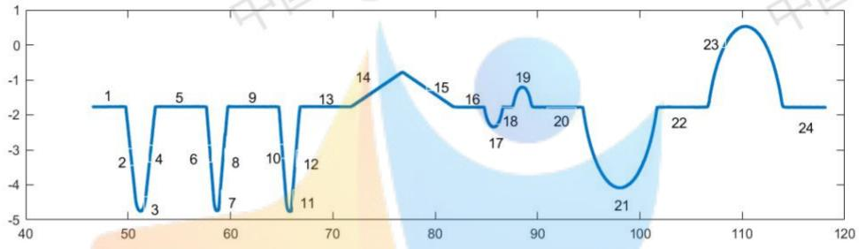  
图 5.1.1-1 工件1 轮廓散点图

## 5.1.2工件1轮廓的函数拟合——直线部分

已知工件1为水平放置，部分直线倾斜角为0。

将直线的计算分为两种，倾斜角为0，和倾斜角非0。

## 5.1.3倾斜角为0的直线

倾斜角为0，如图5.1.1-1，轮廓线第1，5，9，13，16，18，20，22，24段。

当倾斜角为0时，计算方法相同，我们只以第1段轮廓线为例进行拟合。

建立常数函数模型求解[1]。

$$
y = b
$$

其中b为常数，且：

$$
b = ( y _ { 1 } + y _ { 2 } + y _ { 3 } + \cdots + y _ { n } ) / n
$$

其中， $y _ { 1 } , y _ { 2 } , y _ { 3 } , \dots , y _ { n }$ 为当x在一定范围内的 $x _ { 1 } , x _ { 2 } , x _ { 3 } , \ldots , x _ { n }$ 的对应值。n为x在一定范围内数据的个数。

根据散点图，在第1段轮廓取一段区间 $x \in [ 4 7 , 4 9 ]$ 时，此时 $n = 4 0 0 0$ ，计算得b=-1.7703

同样的，其他倾斜角为0常数函数也可以计算出来。

如下表5.1.3-1为所有倾斜度为0的直线轮廓计算结果。

表5.1.3-1倾斜度为0的直线轮廓计算
<table><tr><td>第几条轮廓线</td><td>截取的x区间</td><td>系数b</td><td>常数函数拟合式</td></tr><tr><td>1</td><td>[47,49]</td><td>-1.7703</td><td>y = −1.7703</td></tr><tr><td>5 王在线</td><td>[53,57]</td><td>-1.7674</td><td>y = −1.7674</td></tr><tr><td>9</td><td>[60,64]</td><td>-1.7681</td><td>y = −1.7681</td></tr><tr><td>13</td><td>[67,71]</td><td>-1.7674</td><td>y = -1.7674 国</td></tr><tr><td>16</td><td>[82.5,84.5]</td><td>-1.7779</td><td>y = −1.7779</td></tr><tr><td>18</td><td>[86.8,87.3]</td><td>-17776</td><td>y = -1.7776</td></tr><tr><td>20</td><td>[90,94]</td><td>-1.7784</td><td>y = −1.7784</td></tr><tr><td>22</td><td>[102,106]</td><td>-1.7807</td><td>y = -1.7807</td></tr><tr><td>24</td><td>[114.5,118]</td><td>-1.7846</td><td>y = -1.7846</td></tr></table>

## 5.1.4倾斜角非0的直线

倾斜角非0，图5.1.1-1，轮廓线第2，4，6，8，10，12，14，15段。

当倾斜角非0时，计算方法相同，我们只以第2段轮廓线为例进行一元线性回归拟合。

建立一元线性回归模型求解。

$$
y = b _ { 0 } + b _ { 1 } x + \varepsilon
$$

其中 $b _ { 0 }$ ， $b _ { 1 }$ 为回归系数，ε为服从 $N ( 0 , \ \sigma ^ { 2 } )$ 分布、互相独立的随机变量。

根据散点图，在第 2 段轮廓取一段区间x ∈ [49.8，50.58]，利用 MATLAB 的必regress函数计算结果如下:etitionZexoDistance--

表5.1.4-1回归系数
<table><tr><td>回归系数</td><td>中系数估计值</td><td>置信区间中国</td></tr><tr><td> $b _ { 0 }$ </td><td>134.673</td><td>[134.112,135.234]</td></tr><tr><td> $b _ { 1 }$ </td><td>-2.741</td><td>[-2.752,-2.730]</td></tr></table>

<table><tr><td> $R ^ { 2 }$  决定系数</td><td>F值</td><td>p值</td><td>s²方差</td></tr><tr><td>0.999953</td><td>280629.0319</td><td>0.00000</td><td>0.00001981</td></tr></table>

由表5.1.4—1 可对模型做检验：得 $R ^ { 2 } { = } 0 . 9 9 9$ ，p值远小于0.0001，回归方程显著，模型可用。

$$
y = - 2 . 7 4 1 \mathrm { x } + 1 3 4 . 6 7 3
$$

在 同样的方法，可以计算所有倾斜度非0的直线轮廓函数表达式，计算结果如下表5.1.4-2。 七学生

表 5.1.4-2 倾斜度非0的直线轮廓函数计算
<table><tr><td>第几 条轮 廓线</td><td>回归系数 截取的x区间 回归系数  $b _ { 1 }$ </td><td> $b _ { 0 }$ </td><td>元线性回归函数拟合式</td></tr><tr><td>2</td><td>[49.8，50.58]</td><td>-2.741 134.673</td><td> $y = - 2 . 7 4 1 \mathrm { x } + 1 3 4 . 6 7 3$ </td></tr><tr><td>4</td><td>[51.77，52.6]</td><td>2.788 -148.566</td><td> $y = 2 . 7 8 8 \mathrm { x } - 1 4 8 . 5 6 6$ </td></tr><tr><td>6</td><td>[57.71,58.34]</td><td>-3.722 212.816</td><td> $y = - 3 . 7 2 2 \mathrm { x } + 2 1 2 . 8 1 6$ </td></tr><tr><td>8</td><td>[58.69,59.66]</td><td>3.330 -200.668</td><td> $y = 3 . 3 3 0 \mathrm { x } - 2 0 0 . 6 6 8$ </td></tr><tr><td>10</td><td>[64.79,65.34]</td><td>-3.780 242.905</td><td> $y = - 3 . 7 8 0 x + 2 4 2 . 9 0 5$ </td></tr><tr><td>12</td><td>[66.06,66.73]</td><td>3.515 -236.496</td><td> $y = 3 . 5 1 5 \mathrm { x } - 2 3 6 . 4 9 6$ </td></tr><tr><td>14</td><td>[72.25,76.2]</td><td>0.198 -16.045</td><td> $y = 0 . 1 9 8 \mathrm { x } - 1 6 . 0 4 5$ </td></tr><tr><td>15</td><td>[77.52,81.16]</td><td>-0.201 14.645</td><td> $y = - 0 . 2 0 1 \mathrm { x } + 1 4 . 6 4 5$ </td></tr></table>

## 5.1.5工件一轮廓的函数拟合——圆弧部分

如图5.1.1-1，轮廓线[2]第3，7，11，17，19，21，23段。

计算方法相同，我们只以第3段轮廓线为例，建立圆的一般方程模型[3]。

$$
x ^ { 2 } + y ^ { 2 } + D x + E y + F = 0
$$

其中：D,E,F为系数，且：

$$
\left\{ \begin{array} { c } { \displaystyle x _ { c } = - \frac { D } { 2 } } \\ { \displaystyle y _ { c } = - \frac { E } { 2 } } \\ { \displaystyle R = \frac { D ^ { 2 } + E ^ { 2 } } { 4 } - F } \end{array} \right.
$$

其中： $x _ { c }$ 为圆心横坐标， $y _ { c }$ 为圆心纵坐标，R为圆半径。

根据散点图[4]，在第 3 段轮廓取一段区间 $x \in [ 5 0 . 9 5 , 5 1 . 4 9 ]$ ，编写函数M文件，利用MATLAB中的逆矩阵左除、右除的矩阵运算，计算出一般式系数拟合结果 $D = - 1 0 2 . 4 , E = 8 . 5 , F = 2 6 4 . 1 1$ ，通过圆的一般式方程系数可求得圆的圆心横坐标 $x _ { c } = 5 1 . 2 1 7 7$ 纵坐标 $y _ { c } = - 4 . 2 5 8 2$ 圆的半径 $R = 0 . 4 9 4 1$

同样的方法，可以求得圆弧拟合函数曲线及圆的参数，结果如下表5.1.5-1.

表 5.1.5-1 圆弧轮廓函数计算
<table><tr><td rowspan="2">第几条轮廓线</td><td rowspan="2"> $x _ { c }$  截取的x区间 标</td><td rowspan="2">圆心横坐 圆心纵坐  $y _ { c }$ </td><td rowspan="2">R半径</td></tr><tr><td>标</td></tr><tr><td>3</td><td>[50.95,51.49]</td><td>51.2177</td><td>-4.2582</td><td>0.4941</td></tr><tr><td>7</td><td>[58.55,58.85]</td><td>58.7048</td><td>-4.4395</td><td>0.3011</td></tr><tr><td>11</td><td>[65.5，65.95]</td><td>65.7728</td><td>-4.4619</td><td>0.2974</td></tr><tr><td>19 生在</td><td>[85.3，86.3]</td><td>85.7117</td><td>-1.3674 在线</td><td>0.9802</td></tr><tr><td></td><td>[87.8，89]</td><td>88.5205</td><td>-2.2255</td><td>1.0204</td></tr><tr><td>21</td><td>[96，100]</td><td>98.0520 国</td><td>-0.1012</td><td>3.9845 国</td></tr><tr><td>23</td><td>[108.5,111.5]</td><td>110.3021</td><td>-3.4715</td><td>3.9992</td></tr><tr><td></td><td></td><td></td><td></td><td></td></tr><tr><td>第几条轮廓线</td><td></td><td>圆的标准方程函数拟合式</td><td></td><td></td></tr><tr><td>3</td><td></td><td> $( x - 5 1 . 2 1 7 7 ) ^ { 2 } + ( y + 4 . 2 5 8 2 ) ^ { 2 } = 0 . 4 9 4 1 ^ { 2 }$ </td><td></td><td></td></tr><tr><td>7</td><td>竞</td><td> $( x - 5 8 . 7 0 4 8 ) ^ { 2 } + ( y + 4 . 4 3 9 5 ) ^ { 2 } = 0 . 3 0 1 1 ^ { 2 }$ </td><td></td><td></td></tr><tr><td>11 生在线</td><td></td><td> $( x - 6 5 . 7 7 2 8 ) ^ { 2 } + ( y + 4 . 4 6 1 9 ) ^ { 2 } = 0 . 2 9 7 4 ^ { 2 }$ </td><td>一一</td><td></td></tr><tr><td>17</td><td>--Com</td><td> $( x ~ \overset { + } { 8 } 5 . 7 1 1 7 ) ^ { 2 } \overset { + } { 4 } ~ ( y + 1 . 3 6 7 4 ) ^ { 2 } \overset { = } 0 . 9 8 0 2 ^ { 2 }$ </td><td>必</td><td></td></tr><tr><td>19</td><td></td><td> $( x - 8 8 . 5 2 0 5 ) ^ { 2 } + ( y + 2 . 2 2 5 5 ) ^ { 2 } = 1 . 0 2 0 4 ^ { 2 }$ </td><td></td><td></td></tr><tr><td>21</td><td></td><td>公</td><td></td><td>中国</td></tr><tr><td></td><td></td><td> $( x - 9 8 . 0 5 2 0 ) ^ { 2 } + ( y + 0 . 1 0 1 2 ) ^ { 2 } = 3 . 9 8 4 5 ^ { 2 }$ </td><td></td><td></td></tr><tr><td>23</td><td></td><td> $( x - 1 1 0 . 3 0 2 1 ) ^ { 2 } + ( y + 3 . 4 7 1 5 ) ^ { 2 } = 3 . 9 9 9 2 ^ { 2 }$ </td><td></td><td></td></tr></table>

## 5.1.6工件1分段拟合函数表达式

总结：将5.1.3，5.1.4，5.1.5计算所得的函数拟合表达式

$$
\begin{array} { r l } & { \gamma _ { 1 } = \gamma _ { 2 } = \frac { \gamma _ { 3 } \gamma _ { 4 } } { \Gamma _ { 3 } \Gamma _ { 3 } } + \frac { \gamma _ { 1 } \Gamma _ { 3 } \Gamma _ { 4 } \Gamma _ { 4 } \Gamma _ { 5 } \Gamma _ { 6 } \Gamma _ { 6 } \Gamma _ { 7 } } { \Gamma _ { 3 } } , } \\ & { \left[ \gamma _ { 1 } \gamma _ { 1 } + \Gamma _ { 6 } - \gamma _ { 2 } \Gamma _ { 6 } \Gamma _ { 7 } - \gamma _ { 3 } \Gamma _ { 6 } + \frac { \gamma _ { 1 } \Gamma _ { 7 } \Gamma _ { 7 } } { \Gamma _ { 1 } \Gamma _ { 1 } } - \Gamma _ { 6 } \Gamma _ { 7 } - \Gamma _ { 6 } \Gamma _ { 7 } \Gamma _ { 7 } \right] , } \\ & { \gamma _ { 2 } = \gamma _ { 1 } \Gamma _ { 7 } + \frac { \gamma _ { 1 } \Gamma _ { 7 } \Gamma _ { 7 } } { \Gamma _ { 1 } \Gamma _ { 1 } } , } \\ & { \gamma _ { 3 } = \gamma _ { 1 } \Gamma _ { 7 } + \frac { \gamma _ { 1 } \Gamma _ { 7 } \Gamma _ { 7 } } { \Gamma _ { 1 } \Gamma _ { 1 } } , } \\ & { \gamma _ { 1 } = \gamma _ { 1 } \Gamma _ { 7 } + \frac { \gamma _ { 1 } \Gamma _ { 7 } \Gamma _ { 7 } } { \Gamma _ { 1 } \Gamma _ { 1 } } , } \\ & { \gamma _ { 2 } = \gamma _ { 1 } \Gamma _ { 7 } , } \\ & { \gamma _ { 1 } = \gamma _ { 1 } \Gamma _ { 7 } + \frac { \gamma _ { 1 } \Gamma _ { 7 } \Gamma _ { 7 } } { \Gamma _ { 1 } \Gamma _ { 1 } } , } \\ & { \gamma _ { 2 } = \gamma _ { 1 } \Gamma _ { 7 } , } \\ & { \gamma _ { 3 } = \gamma _ { 1 } \Gamma _ { 7 } , } \\ & { \gamma _ { 1 } = \gamma _ { 1 } \Gamma _ { 7 } , } \\ & { \gamma _ { 2 } = \gamma _ { 1 } \Gamma _ { 7 } , } \\ &  \gamma _ { 3 } = \gamma  \end{array}
$$

## 5.1.7工件1参数的计算

由5.1.3，5.1.4，5.1.5计算的工件1轮廓的函数拟合式，联立得两函数之间的交点，计算的交点坐标结果如下表5.1.7-1：

表 5.1. 7-1 两相邻轮廓线交点坐标
<table><tr><td colspan="1" rowspan="1">轮廓线</td><td colspan="1" rowspan="1">相邻两条轮廓线交点坐标</td><td colspan="1" rowspan="1">轮廓线相邻</td><td colspan="1" rowspan="1">两条轮廓线交点坐标</td></tr><tr><td colspan="1" rowspan="1">1,2</td><td colspan="1" rowspan="1">(49.7786, -1.7703)on</td><td colspan="1" rowspan="1">13,14st</td><td colspan="1" rowspan="1">ar(72.1090,-1.7674)</td></tr><tr><td colspan="1" rowspan="1">2,3</td><td colspan="1" rowspan="1">(50.7087,-4.4293)</td><td colspan="1" rowspan="1">14，15</td><td colspan="1" rowspan="1">(76.9172,-0.8153)A</td></tr><tr><td colspan="1" rowspan="1">3,4</td><td colspan="1" rowspan="1">(51.6985,-4.4306)</td><td colspan="1" rowspan="1">15，16</td><td colspan="1" rowspan="1">(81.7059,-1.7779)</td></tr><tr><td colspan="1" rowspan="1">4,5</td><td colspan="1" rowspan="1">(52.6537,-1.7674)</td><td colspan="1" rowspan="1">16，17</td><td colspan="1" rowspan="1">(84.8215,-1.7779)</td></tr><tr><td colspan="1" rowspan="1">5,6</td><td colspan="1" rowspan="1">(57.6527,-1.7674)</td><td colspan="1" rowspan="1">17，18</td><td colspan="1" rowspan="1">(86.6019,-1.7776)</td></tr><tr><td colspan="1" rowspan="1">6,7</td><td colspan="1" rowspan="1">(58.3931,-4.5232)</td><td colspan="1" rowspan="1">18，19</td><td colspan="1" rowspan="1">(87.6036,-1.7776)</td></tr><tr><td colspan="1" rowspan="1">7,8</td><td colspan="1" rowspan="1">(58.8479,-4.7044)</td><td colspan="1" rowspan="1">19，20</td><td colspan="1" rowspan="1">(89.4377,-1.7784)</td></tr><tr><td colspan="1" rowspan="1">8,9</td><td colspan="1" rowspan="1">(59.7296,-1.7681)</td><td colspan="1" rowspan="1">20，21</td><td colspan="1" rowspan="1">(94.4376,-1.7784)</td></tr><tr><td colspan="1" rowspan="1">9，10</td><td colspan="1" rowspan="1">(64.7283,-1.7681)</td><td colspan="1" rowspan="1">21，22</td><td colspan="1" rowspan="1">(101.6652,-1.7807)</td></tr><tr><td colspan="1" rowspan="1">10,11</td><td colspan="1" rowspan="1">(65.4627,-4.5439)</td><td colspan="1" rowspan="1">22，23</td><td colspan="1" rowspan="1">(106.6779,-1.7807)</td></tr><tr><td colspan="1" rowspan="1">11，12</td><td colspan="1" rowspan="1">(65.9432,-4.7056)</td><td colspan="1" rowspan="1">23，24</td><td colspan="1" rowspan="1">(113.9281,-1.7846)</td></tr><tr><td colspan="1" rowspan="1">12,13</td><td colspan="1" rowspan="1">(66.7791,-1.7674)</td><td colspan="2" rowspan="1"></td></tr></table>

根据表5.1.7-1交点的坐标可以计算出工件1的参数值，如下表5.1.7-2:中国

$$
L = 2 \pi \times \frac { \gamma } { 2 \pi }
$$

其中：L为弧长，r为圆半径，γ为圆心角，且：

$$
\gamma = \arcsin { ( \frac { d } { 2 r } ) }
$$

其中，d为两个交点（圆弧与相邻两条直线的交点）之间的距离，r为圆半径。

角度的计算可以通过公式：

$$
\angle \beta = 1 8 0 + \arctan \left( k \right)
$$

其中， $\beta$ 为角度（角度制），k为一次函数的斜率。

表 5.1.7-2 工件1 水平放置下的各项参数值
<table><tr><td colspan="1" rowspan="1">参数</td><td colspan="1" rowspan="1">数值</td><td colspan="1" rowspan="1">参数</td><td colspan="1" rowspan="1">数值</td></tr><tr><td colspan="1" rowspan="1"> $x _ { 1 }$ </td><td colspan="1" rowspan="1">2.8751</td><td colspan="1" rowspan="1">∠1</td><td colspan="1" rowspan="1">110.0436°</td></tr><tr><td colspan="1" rowspan="1"> $x _ { 2 }$ </td><td colspan="1" rowspan="1">5.0      日</td><td colspan="1" rowspan="1">∠2</td><td colspan="1" rowspan="1">109.7319°</td></tr><tr><td colspan="1" rowspan="1"> $x _ { 3 }$ </td><td colspan="1" rowspan="1">2.0769</td><td colspan="1" rowspan="1">L3</td><td colspan="1" rowspan="1">107.0387°</td></tr><tr><td colspan="1" rowspan="1">在线 $x _ { 4 }$ </td><td colspan="1" rowspan="1">2omp4.9987ion</td><td colspan="1" rowspan="1">ex024tanc</td><td colspan="1" rowspan="1">106.7151°</td></tr><tr><td colspan="1" rowspan="1"> $x _ { 5 }$ </td><td colspan="1" rowspan="1">2.0508大</td><td colspan="1" rowspan="1">∠5</td><td colspan="1" rowspan="1">104.8182°</td></tr><tr><td colspan="1" rowspan="1"> $x _ { 6 }$ </td><td colspan="1" rowspan="1">5.3299</td><td colspan="1" rowspan="1">∠6</td><td colspan="1" rowspan="1">105.8808°</td></tr><tr><td colspan="1" rowspan="1"> $x _ { 7 }$ </td><td colspan="1" rowspan="1">9.5969</td><td colspan="1" rowspan="1"> $\angle 7$ </td><td colspan="1" rowspan="1">168.8003°</td></tr><tr><td colspan="1" rowspan="1"> $x _ { 8 }$ </td><td colspan="1" rowspan="1">3.1156</td><td colspan="1" rowspan="1"> $\angle 8$ </td><td colspan="1" rowspan="1">168.635°</td></tr><tr><td colspan="1" rowspan="1"> $x _ { 9 }$ </td><td colspan="1" rowspan="1">1.0017</td><td colspan="1" rowspan="1"> $R _ { 1 }$ </td><td colspan="1" rowspan="1">0.4941</td></tr><tr><td colspan="1" rowspan="1"> $x _ { 1 0 }$ </td><td colspan="1" rowspan="1">4.9999</td><td colspan="1" rowspan="1"> $R _ { 2 }$ </td><td colspan="1" rowspan="1">0.3011</td></tr><tr><td colspan="1" rowspan="1"> $x _ { 1 1 }$ </td><td colspan="1" rowspan="1">7.2276</td><td colspan="1" rowspan="1"> $R _ { 3 }$ </td><td colspan="1" rowspan="1">0.2974</td></tr><tr><td colspan="1" rowspan="1"> $x _ { 1 2 }$ </td><td colspan="1" rowspan="1">5.0127</td><td colspan="1" rowspan="1"> $R _ { 4 }$ </td><td colspan="1" rowspan="1">0.9802</td></tr><tr><td colspan="1" rowspan="1"> $x _ { 1 3 }$ </td><td colspan="1" rowspan="1">7.2502</td><td colspan="1" rowspan="1"> $R _ { 5 }$ </td><td colspan="1" rowspan="1">1.0204</td></tr><tr><td colspan="1" rowspan="1"> $c _ { 1 }$ </td><td colspan="1" rowspan="1">7.4871</td><td colspan="1" rowspan="1"> $R _ { 6 }$ </td><td colspan="1" rowspan="1">3.9845</td></tr><tr><td colspan="1" rowspan="1"> $c _ { 2 }$ </td><td colspan="1" rowspan="1">7.068</td><td colspan="1" rowspan="1"> $R _ { 7 }$ </td><td colspan="1" rowspan="1">3.9992</td></tr><tr><td colspan="1" rowspan="1">在线 $c _ { 3 }$ </td><td colspan="1" rowspan="1">19.9389</td><td colspan="1" rowspan="1"> $Z _ { 1 }$ </td><td colspan="1" rowspan="1">0.9521</td></tr><tr><td colspan="1" rowspan="1"> $c _ { 4 }$ </td><td colspan="1" rowspan="1">2.8088</td><td colspan="1" rowspan="1"> $l _ { 1 }$ </td><td colspan="1" rowspan="1">0.7761</td></tr><tr><td colspan="1" rowspan="1"> $c _ { 5 }$ </td><td colspan="1" rowspan="1">9.5315</td><td colspan="1" rowspan="1"> $l _ { 2 }$ </td><td colspan="1" rowspan="1">0.2577中国</td></tr><tr><td colspan="1" rowspan="1"> $c _ { 6 }$ </td><td colspan="1" rowspan="1">12.2501</td><td colspan="1" rowspan="1"> $l _ { 3 }$ </td><td colspan="1" rowspan="1">0.2797</td></tr><tr><td colspan="1" rowspan="1"> $l _ { 6 }$ </td><td colspan="1" rowspan="1">4.5265</td><td colspan="1" rowspan="1"> $l _ { 4 }$ </td><td colspan="1" rowspan="1">1.1164</td></tr><tr><td colspan="1" rowspan="1"> $l _ { 7 }$ </td><td colspan="1" rowspan="1">4.5384</td><td colspan="1" rowspan="1"> $l _ { 5 }$ </td><td colspan="1" rowspan="1">1.1396</td></tr></table>

## 5.2 问题二的求解

## 5.2.1 预处理

如图5.2.1-1，图为工件1经过一定倾斜程度和位移[5]的条件下，测得的轮廓线散点图。计算该轮廓线拟合的函数表达式，计算方法同问题1的5.1.3和5.1.4。

最终计算出的轮廓分段拟合函数为：

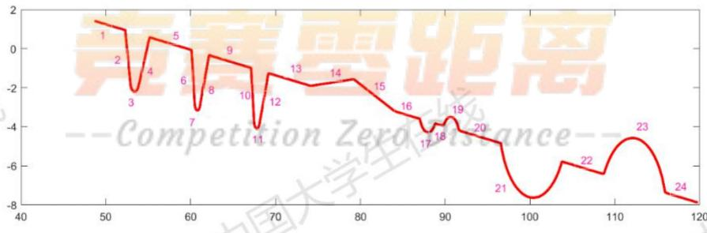  
图5.2.1-1工件一倾斜并位移后的轮廓

$$
\begin{array} { r } { \gamma = \frac { \frac { \sqrt { 3 } - 2 \sqrt { 4 } + 4 } { 2 \sqrt { 5 } + 4 } \sqrt { 5 } \sqrt { 2 } \sqrt { 2 } \sqrt { 5 } } { \sqrt { 1 6 + 2 ( \sqrt { 5 } - \sqrt { 6 } + 2 \sqrt { 5 } + 3 \sqrt { 6 } + 5 \sqrt { 6 } ) ^ { 2 } } } } \\ { \gamma = \frac { \sqrt { 3 } - 2 \sqrt { 5 } + 3 \sqrt { 6 } + 5 \sqrt { 6 } } { \sqrt { 1 6 + 2 ( \sqrt { 5 } - \sqrt { 6 } + 2 \sqrt { 5 } + 3 \sqrt { 6 } ) ^ { 2 } } } } \\ { \frac { \sqrt { 3 } - 2 \sqrt { 5 } + 3 \sqrt { 6 } + 5 \sqrt { 6 } } { \sqrt { 1 6 + 2 ( \sqrt { 5 } - \sqrt { 6 } + 2 \sqrt { 5 } + 3 \sqrt { 6 } ) ^ { 2 } } } } \\ { \frac { \sqrt { 3 } - 2 \sqrt { 5 } + 3 \sqrt { 6 } + 5 \sqrt { 6 } } { \sqrt { 1 6 + 2 ( \sqrt { 5 } - \sqrt { 6 } + 2 \sqrt { 5 } + 3 \sqrt { 6 } ) ^ { 2 } } } } \\ { \frac { \sqrt { 3 } - 2 \sqrt { 5 } + 3 \sqrt { 6 } + 5 \sqrt { 6 } } { \sqrt { 1 6 + 2 ( \sqrt { 5 } - \sqrt { 6 } + 2 \sqrt { 5 } + 3 \sqrt { 6 } ) ^ { 2 } } } } \\ { \frac { \sqrt { 3 } - 4 \sqrt { 5 } + 5 \sqrt { 6 } + 5 \sqrt { 6 } } { \sqrt { 1 6 + 2 ( \sqrt { 5 } - \sqrt { 6 } + 2 \sqrt { 5 } + 3 \sqrt { 6 } ) ^ { 2 } } } } \\ { \frac { \sqrt { 3 } - 2 \sqrt { 5 } + 3 \sqrt { 6 } + 5 \sqrt { 6 } } { \sqrt { 1 6 + 2 ( \sqrt { 5 } - \sqrt { 6 } + 2 \sqrt { 5 } + 3 \sqrt { 6 } ) ^ { 2 } } } } \\  \frac { \sqrt { 3 } - 2 \sqrt { 5 } + 3 \sqrt { 6 } }  \sqrt  1 6 + 2 ( \sqrt { 5 } - \sqrt { 6 } + 2 \sqrt { 5 } + 3 \sqrt { 6 } ) ^  \end{array}
$$

## 5.2.2 计算倾斜角度

如图5.2.2-1散点图，计算工件1经过一定调整后的倾斜角[6]。其中，红色为调整后工件1的轮廓，蓝色为水平放置条件下的工件1轮廓。 中国

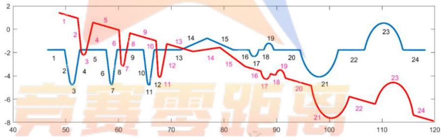  
图 5.2.2-1 工件一倾斜并位移后的轮廓与水平轮廓对比

根据轮廓散点图像，图5.2.2-1，我们可以很容易的看出红色轮廓（待计算倾斜度数的工件1)与蓝色轮廓(水平放置下的工件1)之间呈现一个明显角度。

建立模型:

$$
t a n \alpha = \ \frac { k _ { 1 } + k _ { 5 } + k _ { 9 } + k _ { 1 3 } + k _ { 1 6 } + k _ { 1 8 } + k _ { 2 0 } + k _ { 2 2 } + k _ { 2 4 } } { 9 }
$$

其中：α为工件1要测的倾斜角， $k _ { 1 } , k _ { 5 } , k _ { 9 } , k _ { 1 3 } , k _ { 1 6 } , k _ { 1 8 } , k _ { 2 0 } , k _ { 2 2 } , k _ { 2 4 }$ 为红色轮廓的第1,5,9,13,16,18,20,22,24条轮廓一次函数的斜率。

由5.2.1的函数表达式等数据，可计算得 $\alpha = 7 . 4 7 7 9 ^ { \circ }$

## 5.2.3 水平校正

我们将图像校正，对数据进行处理，作出图像进行逆时针旋转α度，得到图像如图5.2.3-1，红色轮廓为校正后的工件1，蓝色轮廓为水平放置下的工件1。

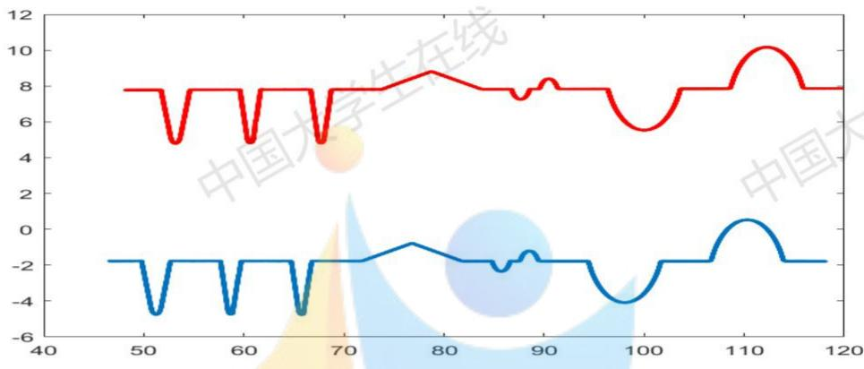  
图 5.2.3-1 校正后的图像

计算该轮廓线拟合的函数表达式，计算方法同问题1的5.1.3和5.1.4。最终计算出的轮廓分段拟合函数为： 在线

$$
\begin{array} { r l } & { ( \begin{array} { c } { - 2 \sqrt { 2 + 2 ^ { 2 } + 1 6 1 } } \\ { \sqrt { 1 0 8 8 9 - 2 7 6 } } \\ { \sqrt { 1 0 8 4 9 - 2 7 6 } } \\ { \sqrt { 1 0 8 4 9 - 2 7 6 } } \\ { \sqrt { 1 0 8 4 9 - 3 1 4 4 8 4 } } \end{array} ) _ { 4 } ( \begin{array} { c } { 0 . 1 9 2 2 5 } \\ { 0 . 1 9 2 5 } \\ { 0 . 1 9 2 5 } \\ { 0 . 1 9 2 5 } \\ { 0 . 1 9 2 5 } \\ { 0 . 1 9 2 5 } \\ { 0 . 1 9 2 5 } \\ { 0 . 1 9 2 5 } \\ { 0 . 1 9 2 5 } \end{array} ) _ { 4 } ( \begin{array} { c } { 0 . 1 9 2 2 5 } \\ { 0 . 1 9 2 5 } \\ { 0 . 1 9 2 5 } \\ { 0 . 1 9 2 5 } \\ { 0 . 1 9 2 } \\ { 0 . 1 9 2 5 } \\ { 0 . 1 9 2 } \end{array} ) _ { 4 } ( \begin{array} { c } { 0 . 1 9 2 1 1 } \\ { 0 . 1 9 2 1 } \\ { 0 . 1 9 2 1 } \\ { 0 . 1 9 2 1 } \\ { 0 . 1 9 2 1 } \\ { 0 . 1 9 2 1 } \\ { 0 . 1 9 2 1 } \\ { 0 . 1 9 2 1 } \end{array} ) _ { 4 } ( \begin{array} { c } { 0 . 1 9 1 1 1 } \\ { 0 . 1 9 1 1 1 } \\ { 0 . 1 9 1 1 } \\ { 0 . 1 9 1 1 } \\ { 0 . 1 9 1 1 } \\ { 0 . 1 9 1 1 } \\ { 0 . 1 9 1 1 } \end{array} ) _ { 4 } ( \begin{array} { c } { 0 . 1 9 1 1 1 } \\ { 0 . 1 9 1 1 1 } \\ { 0 . 1 9 1 1 } \\ { 0 . 1 9 1 1 } \\ { 0 . 1 9 1 1 } \\ { 0 . 1 9 1 1 } \end{array} ) _ { 4 } } \\ &  ( \begin{array} { c } { 0 . 1 9 1 1 1 } \\ { 0 . 1 9 1 1 } \\ { 0 . 1 9 1 1 } \\ { 0 . 1 9 1 1 } \\  0 . 1 \end{array} \end{array}
$$

利用上面的方程组求得交点，交点如下图：

表5.2.3-2两相邻轮廓线交点坐标
<table><tr><td rowspan=1 colspan=1>轮廓线</td><td rowspan=1 colspan=1>相邻两条轮廓线交点坐标</td><td rowspan=1 colspan=1>轮廓线</td><td rowspan=1 colspan=1>相邻两条轮廓线交点坐标</td></tr><tr><td rowspan=1 colspan=1>1,2</td><td rowspan=1 colspan=1>51.7230，7.7790</td><td rowspan=1 colspan=1>13，14</td><td rowspan=1 colspan=1>73.9055，7.8090</td></tr><tr><td rowspan=1 colspan=1>2,3</td><td rowspan=1 colspan=1>52.6998，5.1164</td><td rowspan=1 colspan=1>14，15</td><td rowspan=1 colspan=1>78.8150，8.7958</td></tr><tr><td rowspan=1 colspan=1>3,4</td><td rowspan=1 colspan=1>53.6399，5.1145</td><td rowspan=1 colspan=1>15,16</td><td rowspan=1 colspan=1>&amp;83.6985，7.8240</td></tr><tr><td rowspan=1 colspan=1>4,5</td><td rowspan=1 colspan=1>54.6107，7.7930</td><td rowspan=1 colspan=1>16,17</td><td rowspan=1 colspan=1>86.7489，7.8240</td></tr><tr><td rowspan=1 colspan=1>5,6</td><td rowspan=1 colspan=1>59.5933，7.7930</td><td rowspan=1 colspan=1>17，18</td><td rowspan=1 colspan=1>88.5560，7.8300玉</td></tr><tr><td rowspan=1 colspan=1>6,7</td><td rowspan=1 colspan=1>60.3358，5.0398</td><td rowspan=1 colspan=1>18，19</td><td rowspan=1 colspan=1>89.5571，7.8300</td></tr><tr><td rowspan=1 colspan=1>7,8</td><td rowspan=1 colspan=1>60.9102，4.9662</td><td rowspan=1 colspan=1>19，20</td><td rowspan=1 colspan=1>91.3699，7.8360</td></tr><tr><td rowspan=1 colspan=1>8，9</td><td rowspan=1 colspan=1>61.6846,7.8020</td><td rowspan=1 colspan=1>20，21</td><td rowspan=1 colspan=1>96.3695，7.8360</td></tr><tr><td rowspan=1 colspan=1>9，10</td><td rowspan=1 colspan=1>66.6812，7.8020</td><td rowspan=1 colspan=1>21，22</td><td rowspan=1 colspan=1>103.6179，7.8530</td></tr><tr><td rowspan=1 colspan=1>10，11</td><td rowspan=1 colspan=1>67.4180，5.0287</td><td rowspan=1 colspan=1>22，23</td><td rowspan=1 colspan=1>108.6234，7.8530</td></tr><tr><td rowspan=1 colspan=1>11,12</td><td rowspan=1 colspan=1>68.0126，5.0298</td><td rowspan=1 colspan=1>23，24</td><td rowspan=1 colspan=1>115.8770，7.8640</td></tr><tr><td rowspan=1 colspan=1>12，13</td><td rowspan=1 colspan=1>68.7441,7.8090</td><td rowspan=1 colspan=2></td></tr></table>

同样的计算方法，将校正后的参数统计结果如下：

表5.2.3-3 水平校正后的工件1各项参数值
<table><tr><td colspan="1" rowspan="1">参数</td><td colspan="1" rowspan="1">数值</td><td colspan="1" rowspan="1">参数</td><td colspan="1" rowspan="1">数值</td></tr><tr><td colspan="1" rowspan="1"> ${ x _ { 1 } } ^ { \prime }$ </td><td colspan="1" rowspan="1">2.8877</td><td colspan="1" rowspan="1"> $\angle 1 ^ { \prime }$ </td><td colspan="1" rowspan="1">110.1449</td></tr><tr><td colspan="1" rowspan="1"> ${ x _ { 2 } } ^ { \prime }$ 在线</td><td colspan="1" rowspan="1">4.9826</td><td colspan="1" rowspan="1"> $\angle 2 ^ { \prime }$ </td><td colspan="1" rowspan="1">109.9231</td></tr><tr><td colspan="1" rowspan="1"> ${ x _ { 3 } } ^ { \prime }$ </td><td colspan="1" rowspan="1">2.0913</td><td colspan="1" rowspan="1"> $\angle 3 ^ { \prime }$ </td><td colspan="1" rowspan="1">105.0929</td></tr><tr><td colspan="1" rowspan="1"> ${ x _ { 4 } } ^ { \prime }$ </td><td colspan="1" rowspan="1">4.9966</td><td colspan="1" rowspan="1"> $\angle 4 ^ { \prime }$ </td><td colspan="1" rowspan="1">105.2737  玉</td></tr><tr><td colspan="1" rowspan="1"> ${ x _ { 5 } } ^ { \prime }$ </td><td colspan="1" rowspan="1">2.0629</td><td colspan="1" rowspan="1"> $\angle 5 ^ { \prime }$ </td><td colspan="1" rowspan="1">104.8783</td></tr><tr><td colspan="1" rowspan="1"> ${ x _ { 6 } } ^ { \prime }$ </td><td colspan="1" rowspan="1">5.1614</td><td colspan="1" rowspan="1"> $\angle 6 ^ { \prime }$ </td><td colspan="1" rowspan="1">104.7473</td></tr><tr><td colspan="1" rowspan="1"> ${ x _ { 7 } } ^ { \prime }$ </td><td colspan="1" rowspan="1">9.7930</td><td colspan="1" rowspan="1"> $\angle 7 ^ { \prime }$ </td><td colspan="1" rowspan="1">168.635</td></tr><tr><td colspan="1" rowspan="1"> ${ x _ { 8 } } ^ { \prime }$ </td><td colspan="1" rowspan="1">3.0504</td><td colspan="1" rowspan="1"> $\angle 8 ^ { \prime }$ </td><td colspan="1" rowspan="1">168.7452</td></tr><tr><td colspan="1" rowspan="1"> ${ x _ { 9 } } ^ { \prime }$ </td><td colspan="1" rowspan="1">1.0011</td><td colspan="1" rowspan="1"> ${ R _ { 1 } } ^ { \prime }$ </td><td colspan="1" rowspan="1">0.487</td></tr><tr><td colspan="1" rowspan="1"> ${ x _ { 1 0 } } ^ { \prime }$ </td><td colspan="1" rowspan="1">4.9996</td><td colspan="1" rowspan="1"> ${ R _ { 2 } } ^ { \prime }$ </td><td colspan="1" rowspan="1">0.303</td></tr><tr><td colspan="1" rowspan="1"> ${ x _ { 1 1 } } ^ { \prime }$ </td><td colspan="1" rowspan="1">7.2484</td><td colspan="1" rowspan="1"> ${ R _ { 3 } } ^ { \prime }$ </td><td colspan="1" rowspan="1">0.293</td></tr><tr><td colspan="1" rowspan="1"> ${ x _ { 1 2 } } ^ { \prime }$ </td><td colspan="1" rowspan="1">5.0055</td><td colspan="1" rowspan="1"> ${ R _ { 4 } } ^ { \prime }$ </td><td colspan="1" rowspan="1">1.002</td></tr><tr><td colspan="1" rowspan="1"> ${ x _ { 1 3 } } ^ { \prime }$ </td><td colspan="1" rowspan="1">7.2536</td><td colspan="1" rowspan="1"> ${ R _ { 5 } } ^ { \prime }$ </td><td colspan="1" rowspan="1">1.002</td></tr><tr><td colspan="1" rowspan="1"> ${ c _ { 1 } } ^ { \prime }$ </td><td colspan="1" rowspan="1">7.487</td><td colspan="1" rowspan="1"> ${ R _ { 6 } } ^ { \prime }$ </td><td colspan="1" rowspan="1">4.008</td></tr><tr><td colspan="1" rowspan="1"> ${ c _ { 2 } } ^ { \prime }$ 在线</td><td colspan="1" rowspan="1">7.065</td><td colspan="1" rowspan="1"> $R _ { 7 } ^ { \prime }$ </td><td colspan="1" rowspan="1">3.997</td></tr><tr><td colspan="1" rowspan="1"> ${ c _ { 3 } } ^ { \prime }$ </td><td colspan="1" rowspan="1">19.935</td><td colspan="1" rowspan="1"> $Z _ { 1 } ^ { ^ { \prime } }$ </td><td colspan="1" rowspan="1">0.9868</td></tr><tr><td colspan="1" rowspan="1"> ${ c _ { 4 } } ^ { \prime }$ </td><td colspan="1" rowspan="1"></td><td colspan="1" rowspan="1"> ${ l _ { 1 } } ^ { \prime }$ </td><td colspan="1" rowspan="1">0.6361中国</td></tr><tr><td colspan="1" rowspan="1"> ${ c _ { 5 } } ^ { \prime }$ </td><td colspan="1" rowspan="1">9.53</td><td colspan="1" rowspan="1"> ${ l _ { 2 } } ^ { \prime }$ </td><td colspan="1" rowspan="1">0.3777</td></tr><tr><td colspan="1" rowspan="1"> $c _ { 6 } ^ { \prime }$ </td><td colspan="1" rowspan="1">12.257</td><td colspan="1" rowspan="1"> ${ l _ { 3 } } ^ { \prime }$ </td><td colspan="1" rowspan="1">0.4602</td></tr><tr><td colspan="1" rowspan="1"> $l _ { 6 } ^ { ^ { \prime } }$ </td><td colspan="1" rowspan="1">4.5274</td><td colspan="1" rowspan="1"> $l _ { 4 } ^ { ^ { \prime } }$ </td><td colspan="1" rowspan="1">1.1260</td></tr><tr><td colspan="1" rowspan="1"> $l _ { 7 } ^ { ^ { \prime } }$ </td><td colspan="1" rowspan="1">4.5446</td><td colspan="1" rowspan="1"> ${ l } _ { 5 } ^ { ' }$ </td><td colspan="1" rowspan="1">1.1327</td></tr></table>

为了比较两种测量状态下工件1各项参数计算值之间的差异，我们将两次表格得到的数据利用柱状图进行对比，得到的结果如下：

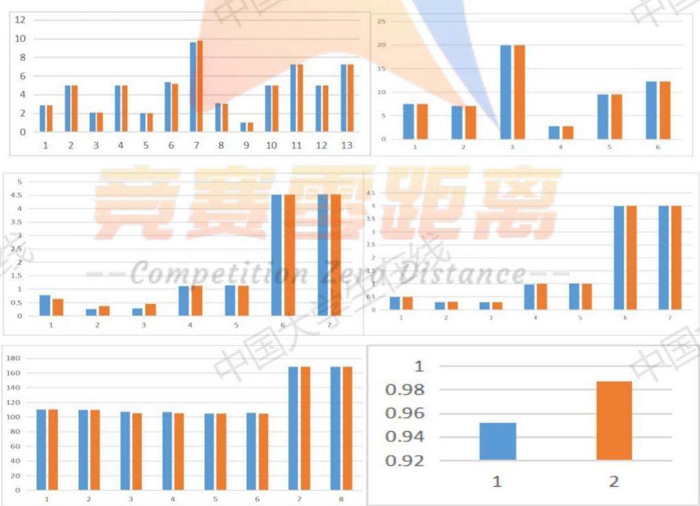  
图5.2.3-2工件1水平放置下和校正后计算的参数对比图

总结：根据图5.2.3-2，图一为槽口宽度、水平线段的长度 $x _ { 1 } , \dots , x _ { 1 3 }$ 与$x _ { 1 } ^ { \prime } \ , \ldots , x _ { 1 3 } ^ { \prime }$ 对比图，图二为圆心之间的距离 $c _ { 1 } , \ldots , c _ { 6 }$ 与 $c _ { 1 } ^ { \prime } \ , \ldots , c _ { 6 } ^ { \prime }$ 的对比图，图三为圆弧的长度 $l _ { 1 } , \ldots , l _ { 5 }$ 与 $l _ { 1 } ^ { \prime } \ , \ldots , l _ { 5 } ^ { \prime }$ 的对比图，图四为 $R _ { 1 } , \ldots , R _ { 7 }$ 与 $R _ { 1 } ^ { \prime } \ , \ldots , R _ { 7 }$ 之间的对比图，图五为 $\angle 1 , \ldots , \angle 8$ 与 $\angle 1 ^ { \prime } , \ldots , \angle 8 ^ { \prime }$ 之间的对比图，图六为人字形线的高度 $Z _ { 1 }$ 与 $Z _ { 1 } ^ { ' }$ 的对比图。通过图表可以更直观的看出圆弧的长度 $l _ { 1 } , \ldots , l _ { 5 }$ 与 $l _ { 1 } ^ { \prime }$ - $\dots , l _ { 5 } ^ { \prime }$ 和人必 必字形线的高度 $Z _ { 1 } , \ldots , Z _ { 1 }$ 有些许差异，其他数据的差异可忽略不计。

探究其产生差异的因素：我们在123D-Design软件中，画出了简单的3-D模型来模拟四种状态下物体被切割后的截面(凹槽截面为半圆)。如下图5.2.3-3左图中四个待切割的物体分别经过了1.水平放置，2.上下倾斜 $4 0 ^ { \circ }$ 坡度，3.左右旋转 $4 0 ^ { \circ }$ ，4.上下倾斜 $4 0 ^ { \circ }$ 坡度并且左右旋转 $4 0 ^ { \circ }$ ，四种变换，将物体用极薄的“刀”“切”过后的横截面如右图所示。右图我们可以看出，1.水平放置下的物体被切割后状态不变，凹槽为半圆，2.上下倾斜 $4 0 ^ { \circ }$ 坡度放置下物体被切割后，凹槽仍为半圆，只是整体截面被旋转了 $4 0 ^ { \circ }$ ，3. 左右旋转 $4 0 ^ { \circ }$ 条件下的物体被切割后，可以明显看出凹槽非半圆，严格来说为椭圆，整体截面轮廓被拉长，4. 上下倾斜 $4 0 ^ { \circ }$ 坡度并且左右旋转 $4 0 ^ { \circ }$ 条件下的物体被切割后，可以看出明显继承了2和3的特性，凹槽非半圆，为椭圆，整体被左右拉伸。根据这四种状态下的被切割的物体状态，我们可以判断，问题二中，蓝色轮廓（1eve1）为第一种状态，红色轮廓（down）为第四种状态。其中，蓝色轮廓中为标准圆，红色轮廓中无标准圆，只有椭圆，而在模型的建立中，我们为了简化模型将图中所有轮廓只看成直线与圆的组合，导致了红色轮廓计算的工件1参数与蓝色轮廓计算的工件1参数存在微小差异，由于差异并不大，也是在可接受的范围之内。

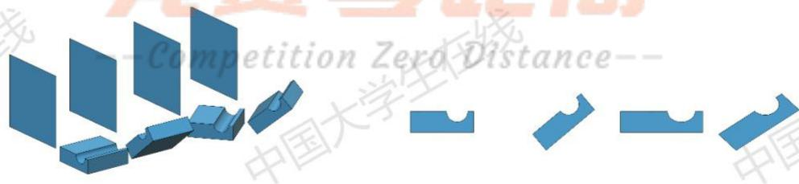  
图5.2.3-3 3-D 模型观察参考

## 5.3问题三的求解

## 5.3.1计算每次测量时的工件2的倾斜角度

根据附件2的数据画出工件2的散点图，如图5.3.1-1，图中为十次测量的工件2的散点轮廓图，其中存在数据太过接近导致轮廓线近乎重合的现象。

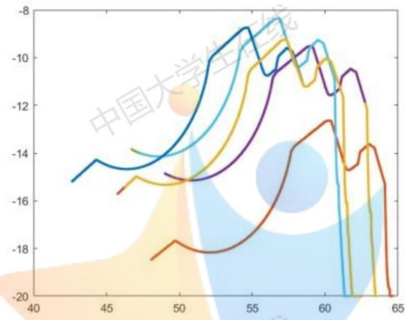  
图 5.3.1-1 十个工件 2 轮廓散点图

计算工件2的倾斜程度，我们需要一条校准线（一次方程直线）。在十次工件2的测量中，选取每个轮廓的第3段进行校准，分别计算出其斜率k和倾斜角α

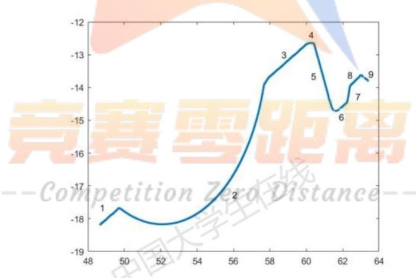  
图5.3.1-2其中一个工件2轮廓散点图

校准角度的计算：

$$
\begin{array} { r } { \alpha = \frac { \alpha _ { 1 } + \alpha _ { 2 } + \alpha _ { 3 } + \cdots + \alpha _ { 1 0 } } { 1 0 } } \end{array}
$$

其中，α为校准角度，其中 $i = 1 , 2 , \dots 1 0 , \alpha _ { i }$ 为第i次测量工件2的倾斜角，且：

$$
\alpha _ { i } = \arctan \left( k _ { i } \right)
$$

其中 $i = 1 , 2 , \dots , 1 0 , k _ { i }$ 为第i次工件校准线的直线斜率（第3段的直线轮廓斜率)。计算结果如下表：

表 5.3.1-1 直线斜率和倾斜角
<table><tr><td rowspan=1 colspan=1>第几个测量值</td><td rowspan=1 colspan=1>直线斜率</td><td rowspan=1 colspan=1>倾斜角</td><td rowspan=1 colspan=1>第几个测量值</td><td rowspan=1 colspan=1>直线斜率</td><td rowspan=1 colspan=1>倾斜角</td></tr><tr><td rowspan=1 colspan=1>1</td><td rowspan=1 colspan=1>0.4882</td><td rowspan=1 colspan=1>26.0216°</td><td rowspan=1 colspan=1>6</td><td rowspan=1 colspan=1>0.5279</td><td rowspan=1 colspan=1>27.8295°</td></tr><tr><td rowspan=1 colspan=1>2</td><td rowspan=1 colspan=1>0.4883</td><td rowspan=1 colspan=1>26.0262°</td><td rowspan=1 colspan=1>7</td><td rowspan=1 colspan=1>0.5508</td><td rowspan=1 colspan=1>28.8459°</td></tr><tr><td rowspan=1 colspan=1>3</td><td rowspan=1 colspan=1>0.5044</td><td rowspan=1 colspan=1>26.7663°</td><td rowspan=1 colspan=1>8</td><td rowspan=1 colspan=1>0.5507</td><td rowspan=1 colspan=1>28.8415°</td></tr><tr><td rowspan=1 colspan=1>4</td><td rowspan=1 colspan=1>0.5043</td><td rowspan=1 colspan=1>26.7618°</td><td rowspan=1 colspan=1>9</td><td rowspan=1 colspan=1>0.5768</td><td rowspan=1 colspan=1>29.9763°</td></tr><tr><td rowspan=1 colspan=1>5</td><td rowspan=1 colspan=1>0.5284</td><td rowspan=1 colspan=1>27.8519°</td><td rowspan=1 colspan=1>10</td><td rowspan=1 colspan=1>0.5762</td><td rowspan=1 colspan=1>29.9505°</td></tr></table>

可以得到可视为水平时的校准角度α= 27.8871，将 $\alpha \cdot$ 与 $\alpha _ { i }$ 逐个作差，得到如下结论：

表 5.3.1-2 标准角度与实际测量的差
<table><tr><td rowspan=1 colspan=1>标准角度与实际的差</td><td rowspan=1 colspan=1>倾斜角度</td><td rowspan=1 colspan=1>标准角度与实际的差</td><td rowspan=1 colspan=1>倾斜角度国</td></tr><tr><td rowspan=1 colspan=1> $\alpha - a _ { 1 }$ </td><td rowspan=1 colspan=1>1.8655°</td><td rowspan=1 colspan=1> $\alpha - a _ { 6 }$ </td><td rowspan=1 colspan=1>0.0576°</td></tr><tr><td rowspan=1 colspan=1> $\alpha - a _ { 2 }$ </td><td rowspan=1 colspan=1>1.8609°</td><td rowspan=1 colspan=1> $\alpha - a _ { 7 }$ </td><td rowspan=1 colspan=1>-0.9588°</td></tr><tr><td rowspan=1 colspan=1> $\alpha - a _ { 3 }$ </td><td rowspan=1 colspan=1>1.1208°</td><td rowspan=1 colspan=1> $\alpha - a _ { 8 }$ </td><td rowspan=1 colspan=1>-0.9544°</td></tr><tr><td rowspan=1 colspan=1> $\alpha - a _ { 4 }$ </td><td rowspan=1 colspan=1>1.1253°</td><td rowspan=1 colspan=1> $\alpha - a _ { 9 }$ </td><td rowspan=1 colspan=1>-2.0892°</td></tr><tr><td rowspan=1 colspan=1> $\alpha - a _ { 5 }$ </td><td rowspan=1 colspan=1>0.0352°</td><td rowspan=1 colspan=1> $\alpha - a _ { 1 0 }$ </td><td rowspan=1 colspan=1>-2.0634°</td></tr></table>

## 5.3.2标注工件2的参数

对图像进行数据校正。我们将10次测量数据各旋转一个角度，也就是根据5.3.1中校准线的斜率来旋转校正水平。

把每个轮廓线的最高点找到，作为校正值，在10个散点图以最高点为中心，将10个散点图经过上下左右平移，使得所有轮廓线的最高点（特征值）重合，此时10条散点图基本重合，做出的图像如下：

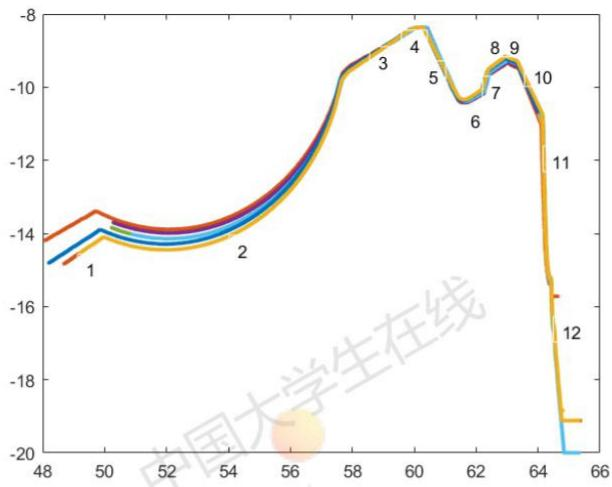  
图5.3.2-1 10条轮廓线经过上下左右平移最高点重合时的图像

我们把经过变换后的10条轮廓的散点数据（10组数据）汇总合为一条散点图（一组数据），进行拟合函数，拟合方法同问题1，计算的结果如下：

表 5.3.2-1 两相邻轮廓线交点坐标
<table><tr><td rowspan=1 colspan=1>轮廓线</td><td rowspan=1 colspan=1>两相邻轮廓线的交点</td><td rowspan=1 colspan=1>轮廓线</td><td rowspan=1 colspan=1>两相邻轮廓线的交点</td></tr><tr><td rowspan=1 colspan=1>上12</td><td rowspan=1 colspan=1>(50.5191, -13.5654)</td><td rowspan=1 colspan=1>7,8</td><td rowspan=1 colspan=1>(62.4026, -9.5991)</td></tr><tr><td rowspan=1 colspan=1>2,3</td><td rowspan=1 colspan=1>(57.1651, -9.8955)</td><td rowspan=1 colspan=1>8,9</td><td rowspan=1 colspan=1>(62.9960, -9.2562)</td></tr><tr><td rowspan=1 colspan=1>3,4</td><td rowspan=1 colspan=1>(60.0521, -8.3648)</td><td rowspan=1 colspan=1>9，10</td><td rowspan=1 colspan=1>(63.3713, -9.4015)</td></tr><tr><td rowspan=1 colspan=1>4,5</td><td rowspan=1 colspan=1>(60.3913, -8.4024)</td><td rowspan=1 colspan=1>10，11</td><td rowspan=1 colspan=1>(64.1452, -10.8913)</td></tr><tr><td rowspan=1 colspan=1>5,6</td><td rowspan=1 colspan=1>(61.4820,-10.4407)</td><td rowspan=1 colspan=1>11，12</td><td rowspan=1 colspan=1>(64.2702, -14.0682)</td></tr><tr><td rowspan=1 colspan=1>6,7</td><td rowspan=1 colspan=1>(62.2128, -10.1642)</td><td rowspan=1 colspan=2></td></tr></table>

拟合的各段函数表达式为：

0.4232x -34.9451 xe (48.0842,50.5191)   
$\sqrt { 4 . 5 2 5 0 ^ { 2 } - ( \mathrm { x } - 5 2 . 6 5 1 5 ) ^ { 2 } } - 9 . 5 7 4 4$ xe (50.5191,57.1651)   
$0 . 5 3 0 2 x - 4 0 . 2 0 4 4$ xe(57.1651,60.0521)   
$- 0 . 1 1 1 0 x - 1 . 6 9 9 0$ xe (60.0521, 60.3913)   
$- 1 . 8 6 8 8 x + 1 0 4 . 4 5 6 9$ xe(60.3913,61.4820)   
$0 . 3 7 8 4 x - 3 3 . 7 0 5 5$ xe (61.4820,62.2128)   
$2 . 9 7 7 5 x - 1 9 5 . 4 0 2 9$ xe (62.2128,62.4026)   
$0 . 5 7 7 8 x - 4 5 . 6 5 5 3$ xe （62.4026,62.9960)   
$- 0 . 3 8 7 1 x + 1 5 . 1 2 9 5$ xe (62.9960，63.3713)   
$- 1 . 9 2 7 6 x + 1 1 2 . 5 8 8 2$ xe(63.3713，64.1452)   
$- 2 5 . 4 2 1 4 x + 1 6 1 9 . 7 6 9 9$ xe (64.1452，64.2702)   
$- 9 . 0 7 5 3 x + 5 6 9 . 2 0 3 2$ xe （64.2702，65.3765）

如下图：

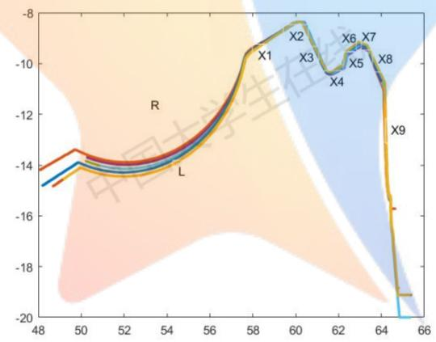  
图 5.3.2-2 轮廓线参数指标

同样的，可以求得工件2的各个参数为：

E∠1为线段 $x _ { 1 }$ 与 $x _ { 2 }$ 的夹角，∠2为线段x3与 $x _ { 4 }$ 的夹角，依此类推， $\angle 9$ 为线段 $x _ { 9 }$ 与 $x _ { 1 0 }$ 的夹角。 中国大学 力国ナ

表5.3.2-1工件2的参数
<table><tr><td colspan="1" rowspan="1">参数</td><td colspan="1" rowspan="1">数值</td><td colspan="1" rowspan="1">参数</td><td colspan="1" rowspan="1">数值</td></tr><tr><td colspan="1" rowspan="1"> $x _ { 1 }$ </td><td colspan="1" rowspan="1">7.589</td><td colspan="1" rowspan="1">∠1</td><td colspan="1" rowspan="1"> $1 4 5 . 7 3 3 6 ^ { \circ }$ </td></tr><tr><td colspan="1" rowspan="1"> $x _ { 2 }$ </td><td colspan="1" rowspan="1">0.3413</td><td colspan="1" rowspan="1">∠2</td><td colspan="1" rowspan="1"> $1 2 4 . 4 8 5 3 ^ { \circ }$ </td></tr><tr><td colspan="1" rowspan="1"> $x _ { 3 }$ </td><td colspan="1" rowspan="1">2.311</td><td colspan="1" rowspan="1">∠3</td><td colspan="1" rowspan="1"> $1 0 6 . 6 3 1 1 ^ { \circ }$ </td></tr><tr><td colspan="1" rowspan="1"> $x _ { 4 }$ </td><td colspan="1" rowspan="1">0.7813</td><td colspan="1" rowspan="1">∠4</td><td colspan="1" rowspan="1"> $1 2 9 . 2 9 1 4 ^ { \circ }$ </td></tr><tr><td colspan="1" rowspan="1"> $x _ { 5 }$ </td><td colspan="1" rowspan="1">0.596</td><td colspan="1" rowspan="1">∠5</td><td colspan="1" rowspan="1"> $1 3 8 . 5 8 4 5 ^ { \circ }$ </td></tr><tr><td colspan="1" rowspan="1"> $x _ { 6 }$ </td><td colspan="1" rowspan="1">0.6852</td><td colspan="1" rowspan="1">∠6</td><td colspan="1" rowspan="1"> $1 2 8 . 8 2 8 1 ^ { \circ }$ </td></tr><tr><td colspan="1" rowspan="1"> $x _ { 7 }$ </td><td colspan="1" rowspan="1">0.4019</td><td colspan="1" rowspan="1">∠7</td><td colspan="1" rowspan="1"> $1 3 8 . 5 8 1 3 ^ { \circ }$ </td></tr><tr><td colspan="1" rowspan="1">在线 $x _ { 8 }$ </td><td colspan="1" rowspan="1">1.680</td><td colspan="1" rowspan="1">X $^ { \angle 8 }$ </td><td colspan="1" rowspan="1"> $1 5 4 . 8 3 5 9 ^ { \circ }$ </td></tr><tr><td colspan="1" rowspan="1"> $x _ { 9 }$ </td><td colspan="1" rowspan="1">3.110</td><td colspan="1" rowspan="1"> $^ { \angle 9 }$ </td><td colspan="1" rowspan="1"> $1 7 5 . 9 6 7 3 ^ { \circ }$ </td></tr><tr><td colspan="1" rowspan="1">圆半径R</td><td colspan="1" rowspan="1"></td><td colspan="1" rowspan="1">圆弧长l</td><td colspan="1" rowspan="1"></td></tr></table>

## 5.3.3工件2完整轮廓线

根据函数拟合表达式，x的取值范围，利用MATLAB画出工件2轮廓图像，如下：

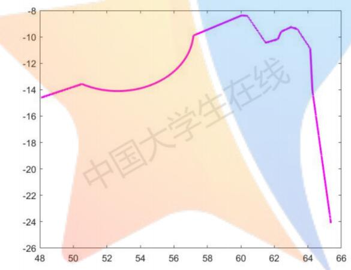  
图5.3.3-1工件2拟合函数绘制出的曲线

## 5.4 问题四的求解

5.4.1圆角的修正

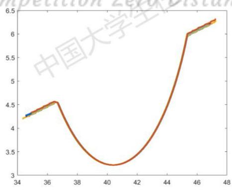  
图5.4.1-1 9个数据的轮廓重合图21

由于只需要对工件2的轮廓校正，我们只要计算工件2圆角部分的参数即可，即圆半径和弧长。将附件三中的数据经过上下左右平移，使特征点重合。如上图5.4.1-1为附件三9个数据的轮廓重合图（特征点为圆的最低点）。

计算重合轮廓的函数曲线，将每组移动变换后的数据保存，作为重合的真实函数数据拟合，拟合结果如下：

$$
( x - 4 0 . 3 9 8 2 ) ^ { 2 } + ( y - 9 . 0 2 7 8 ) ^ { 2 } = 5 . 8 1 0 9 ^ { 2 }
$$

解得，圆半径为5.8109，弧长为4.9947，数据可以视为标准数据。

对比问题三算得的工件2参数半径4.5250，弧长为4.5035，两者之间半径相差1.2759，弧长相差0.4912，将计算出的标准数据替换掉问题3计算的参数。

## 5.4.2 直角的修正

直角相对于圆角，同样的计算方法，将9个数据定一个特征点（最高点），通过平移令特征点重合，如下图5.4.2-1。

计算重合轮廓的函数曲线，将每组移动变换后的数据保存，作为重合的真实函数数据拟合，拟合结果如下：

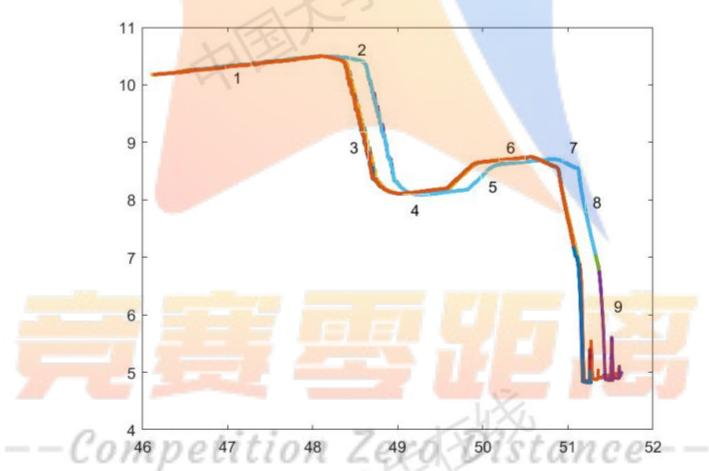  
图 5.4.2-1 9个数据的轮廓重合图

拟合出的表达式为：

$$
y = \left\{ \begin{array} { c } { 0 . 1 6 1 7 x + 2 . 7 1 6 6 } \\ { - 2 . 1 4 0 7 x + 1 1 3 . 8 2 8 7 } \\ { - 4 . 7 6 1 6 x + 2 4 0 . 9 5 2 5 } \\ { 0 . 2 5 1 8 x - 4 . 2 8 9 9 } \\ { 1 . 0 3 4 4 1 x - 4 3 . 1 1 0 7 } \\ { 0 . 1 1 7 1 x + 2 . 7 9 0 9 } \\ { - 0 . 4 6 6 0 x + 3 2 . 3 0 7 5 } \\ { - 4 . 4 9 2 3 x + 2 3 7 . 1 5 1 1 } \end{array} \right.
$$

交点如下表：

表 5.4.2-1 轮廓线交点
<table><tr><td rowspan=1 colspan=1>轮廓线</td><td rowspan=1 colspan=1>两相邻轮廓线的交点</td><td rowspan=1 colspan=1>轮廓线</td><td rowspan=1 colspan=1>两相邻轮廓线的交点</td></tr><tr><td rowspan=1 colspan=1>1,2</td><td rowspan=1 colspan=1>(48.2592，10.5201)</td><td rowspan=1 colspan=1>5,6</td><td rowspan=1 colspan=1>(50.0562,8.6524)</td></tr><tr><td rowspan=1 colspan=1>2,3</td><td rowspan=1 colspan=1>(48.5038，9.9964)</td><td rowspan=1 colspan=1>6,7</td><td rowspan=1 colspan=1>(50.6201，8.7185)</td></tr><tr><td rowspan=1 colspan=1>3,4</td><td rowspan=1 colspan=1>(48.9173，8.0274)</td><td rowspan=1 colspan=1>7,8</td><td rowspan=1 colspan=1>(50.8763，8.5991)</td></tr><tr><td rowspan=1 colspan=1>4,5</td><td rowspan=1 colspan=1>(49.6239，8.2054）</td><td rowspan=1 colspan=1></td><td rowspan=1 colspan=1></td></tr></table>

表 5.4.2-2 参数的值
<table><tr><td rowspan=1 colspan=1>参数</td><td rowspan=1 colspan=1>值</td><td rowspan=1 colspan=1>参数</td><td rowspan=1 colspan=1>值</td></tr><tr><td rowspan=1 colspan=1> $x _ { 2 }$ </td><td rowspan=1 colspan=1>0.5780</td><td rowspan=1 colspan=1> $x _ { 5 }$ </td><td rowspan=1 colspan=1>0.6218</td></tr><tr><td rowspan=1 colspan=1> $x _ { 3 }$ </td><td rowspan=1 colspan=1>2.0119</td><td rowspan=1 colspan=1> $x _ { 6 }$ </td><td rowspan=1 colspan=1>0.5678</td></tr><tr><td rowspan=1 colspan=1> $x _ { 4 }$ </td><td rowspan=1 colspan=1>0.7287</td><td rowspan=1 colspan=1> $x _ { 7 }$ </td><td rowspan=1 colspan=1>0.2826</td></tr></table>

计算两直线的夹角公式

$$
t a n \alpha = \frac { | k _ { 1 } - k _ { 2 } | } { 1 + k _ { 1 } k _ { 2 } }
$$

其中：α为两直线的夹角 $\alpha \in ( 0 , \frac { \pi } { 2 } )$ ， $k _ { 1 } , k _ { 2 }$ 为两直线的斜率

表 5.4.2-3 参数夹角度数
<table><tr><td rowspan=1 colspan=1>∠1</td><td rowspan=1 colspan=1>105.8538</td><td rowspan=1 colspan=1>∠5</td><td rowspan=1 colspan=1>140.7168</td></tr><tr><td rowspan=1 colspan=1>∠2</td><td rowspan=1 colspan=1>166.8189</td><td rowspan=1 colspan=1>∠6</td><td rowspan=1 colspan=1>148.3337</td></tr><tr><td rowspan=1 colspan=1>∠3</td><td rowspan=1 colspan=1>92.2727</td><td rowspan=1 colspan=1>∠7</td><td rowspan=1 colspan=1>127.5345</td></tr><tr><td rowspan=1 colspan=1>∠4</td><td rowspan=1 colspan=1>148.1721</td><td rowspan=1 colspan=1>距</td><td rowspan=1 colspan=1></td></tr></table>

## --Competition ZexoDistance--

通过两次数据对比，我们可以看到存在些许误差。将计算出的标准数据替换掉问题3计算的参数。 中国大 中国

## 5.4.3模型的校正

将5.4.1与5.4.2计算的数据进行校正，从图5.3.3-1中圆弧与左侧线段的交点出发，构造一个以5.8109为半径，4.9947为弧长的圆弧。接下来以表5.4.2-2和5.4.2-3的数据构建出修正后的工件2完整轮廓线如下：

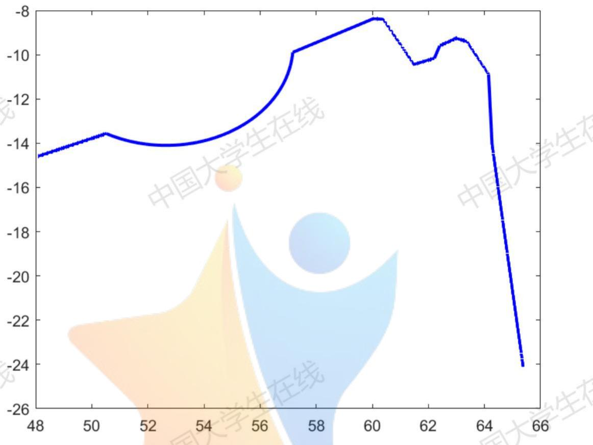  
图 5.4.3-1 修正后的工件 2

## 六.模型的评价与推广

优点：

1.模型刻画拟合工件轮廓的函数表达式，可以利用函数表达式联立计算精确的得到想要的参数。

2.文章整体思路清晰，结论与理由分析都十分完好，在计算时，误差的多次测量取平均值也较为合理。 大学生在线缺点：

1.函数的分段拟合花费大量的时间精力，工作量偏大，最好能生成一个全自动的计算模型，以便更快的完成任务。

2.在函数的拟合刻画时，我们截取的数据为自定义的区间范围内的散点拟合，导致函数的精确度还可以提高。改进：

1.模型的精确度可以通过函数的残差检验进行更进一步的数据精确。

2.在问题二和问题三中，模型可以将十条函数值拟合刻画，这样计算出的参数值可以通过十次的均值来减小误差，但是这样也会导致计算量的巨大提高。不过，在时间允许的情况下，是可以采用的提高精度“笨方法”。 中国

3.将拟合、求函数、解交点、求斜率、算长度等工作生成一个全自动的程序，以节省时间。

--Competition ZexoDistance--

## 七. 参考文献

[1]宋武生.平均误差与仪器误差合成初探[J].开封教育学院学报，1992(03):58-59.

[2]韩志国，李锁印，冯亚南，赵琳. 接触式轮廓仪探针状态检查图形样块的研制[J].微纳电子技术,2019,56(09):761-765. X

[3]马麟.三次参数曲线拟合圆弧段的误差特性分析[J].山西机械，2000(02):20-21+24. 七学

[4]葛宝珊,刘锋,杜峰，李旭杰,闫浩.一种精确测量应变的方法[C].中国高科技产业化研究会智能信息处理产业化分会.第十届全国信号和智能信息处理与应用学术会议专刊.中国高科技产业化研究会智能信息处理产业化分会:中国高科技产业化研究会，2016:374-378.

[5]王云庆,李庆祥，周兆英. 接触式轮廊测量中触针测量力的分析[J].现代计量测试，1996(01):18-21+17.

[6]伍春兰.直线方程、倾斜角与斜率的教学实践与反思[J].数学通报，2017,56(05):30-33+63

## 八.附录

1. %附件一散点图

2. a=load ('1-L.txt');

3. plot(a(:,1),a(:,2),'.');

4. hold on;

5. b=load ('1-D.txt');

6. plot(b(:,1),b(:,2),'r.');

1. %附件二散点图

2. $\mathsf { a 1 } = 1 0 \mathsf { a d } \mathrm { ~ ( ~ ' ~ } 2 . 1 . t { \times } \mathsf { t } ^ { \mathrm { ~ \tiny ~ \cdot ~ } } \mathrm { ~ ) } ;$

3. plot(a1(:,1),a1(:,2),'.');

4. hold on;

5. a2=load ('2.2.txt');

6. $\mathtt { p l o t } ( \mathtt { a } 2 ( : , 1 ) , \mathtt { a } 2 ( : , 2 ) , \mathbf { \xi } \cdot \mathbf { \xi } ^ { , } ) ;$

7. a3=load ('2.3.txt');

8. plot(a3(:,1),a3(:,2),'.');

9.a4=1oad ('2.4.txt');

10. $\mathtt { p l o t } ( \mathtt { a } 4 ( : , 1 ) , \mathtt { a } 4 ( : , 2 ) , \mathbf { \Phi } ^ { \prime } . \mathbf { \Phi } ^ { \prime } ) ;$

11. a5=load ('2.5.txt');

12. plot(a5(:,1),a5(:,2),'.');

13. a6=load ('2.6.txt');

14. $\mathtt { p l o t } ( \mathsf { a } 6 ( : , 1 ) , \mathsf { a } 6 ( : , 2 ) , \mathrm { ~ \tiny ~ \cdot ~ } ^ { \cdot } ) ;$

15. a7=load ('2.7.txt');

16. plot(a7(:,1),a7(:,2),'.');

17. a8=load ('2.8.txt');

18. $\mathtt { p l o t } ( \mathsf { a } 8 ( : , 1 ) , \mathsf { a } 8 ( : , 2 ) , \mathrm { ~ \tiny ~ \cdot ~ } ) ;$

19. a9=1oad ('2.9.txt');

20. $\mathtt { p l o t } ( \mathtt { a } 9 ( : , 1 ) , \mathtt { a } 9 ( : , 2 ) , \mathbf { \xi } \cdot \mathbf { \xi } ) ;$

21. a10=load ('2.10.txt');

22.plot(a10(:,1),a10(:,2),ti);ion ZeroDistance--

1. %附件三散点图

2. a1=load ('3.1.txt');

|3. $\mathtt { p l o t } ( \mathtt { a } 1 ( : , 1 ) , \mathtt { a } 1 ( : , 2 ) , \mathbf { \Phi } ^ { \prime } . ^ { \prime } )$

4. hold on;

5. a2=load ('3.2.txt');

|6. $\mathtt { p l o t } ( \mathtt { a } 2 ( : , 1 ) , \mathtt { a } 2 ( : , 2 ) , \mathbf { \xi } ^ { \prime } . ^ { \prime } )$

7. a3=load ('3.3.txt');

8. $\mathsf { p l o t } ( \mathsf { a } 3 ( : , 1 ) , \mathsf { a } 3 ( : , 2 ) , \mathsf { \Omega } ^ { \prime } . \mathsf { \Omega } ^ { \prime } ) ;$

9. a4=load ('3.4.txt');

10. plot(a4(:,1),a4(:,2),'.');

11. a5=load ('3.5.txt');

12. plot(a5(:,1),a5(:,2),'.');

13. a6=load ('3.6.txt');

14. plot(a6(:,1),a6(:,2),'.');

15. hold on;

16.a7=load ('3.7.txt');

17. plot(a7(:,1),a7(:,2),'.');

18. a8=1oad ('3.8.txt');

19. plot(a8(:,1),a8(:,2),'.');

20. a9=load ('3.9.txt');

|21. $\mathtt { p l o t } ( \mathtt { a } 9 ( : , 1 ) , \mathtt { a } 9 ( : , 2 ) , \mathbf { \xi } \cdot \mathbf { \xi } ^ { \cdot } ) ;$

1. %附件四散点图

2. $\mathsf { a 1 } = 1 0 \mathsf { a d } \mathsf { \Gamma } ( ^ { \prime } 4 . 1 . \mathsf { t x t } ^ { \prime } ) ;$

3. plot(a1(:,1),a1(:,2),'.');

4.hold on;

|5. a2=load ('4.2.txt');

6. $\mathtt { p l o t } ( \mathtt { a } 2 ( : , 1 ) , \mathtt { a } 2 ( : , 2 ) , \mathbf { \xi } \cdot \mathbf { \xi } ^ { \cdot } ) ;$

7. a3=load ('4.3.txt');

8. plot(a3(:,1),a3(:,2),'.');

9. a4=load ('4.4.txt');

10. plot(a4(:,1),a4(:,2),'.');

11. a5=load ('4.5.txt');

12. plot(a5(:,1),a5(:,2),'.');

13. a6=load ('4.6.txt');

14. plot(a6(:,1),a6(:,2),'.');

15. a7=load ('4.7.txt');

16. plot(a7(:,1),a7(:,2),'.');

17.a8=load(4.8.txt);petitionZeroDistance--

18. plot(a8(:,1),a8(:,2),'.');

19. a9=load ('4.9.txt');

|20. $\mathtt { p l o t } ( \mathtt { a } 9 ( : , 1 ) , \mathtt { a } 9 ( : , 2 ) , \mathbf { \xi } ^ { \cdot } ) ;$

1. %直线拟合 y=b

2. clear all;clc;

3. a=load ('1.txt');

4. plot(a(:,1),a(:,2),'.');

5. $c = \mathsf { f i n d } \left( \mathsf { a n d } \left( \mathsf { a } \left( : , 1 \right) { \boldsymbol { \cdot } } { \boldsymbol { 4 } } 9 , \mathsf { a } \left( : , 1 \right) { \boldsymbol { \cdot } } { \boldsymbol { 4 } } 7 \right) = \mathsf { = 1 } \right)$ ；%在第一段曲线找两个点47，49

6. ${ \mathsf { d } } { = } { \mathsf { c } } \left( { \mathsf { s i z e } } ( { \mathsf { c } } ) \right) ;$

|7. $\mathtt { e } { = } \mathtt { a } ( \mathtt { d } ( 2 ) { : } \mathtt { d } ( 1 ) , { : } )$ ;%在47到49之间的所有数据

8. b=mean(e(:,2))

9.

10.

11.%一元回归拟合 $y = k x + b$

12. $\mathsf { c l e a r a r a l l } ; \mathsf { c l c } ;$

13.a=load ('1.txt');

14. $\mathsf { p l o t } ( \mathsf { a } ( : , 1 ) , \mathsf { a } ( : , 2 ) , \mathsf { \Omega } ^ { \prime } \cdot \mathsf { \Omega } ^ { \prime } ) ;$

|15. $\mathsf { c } \mathsf { = } \mathsf { f i n d } \left( \mathsf { a n d } \left( \mathsf { a } \left( : , 1 \right) \varsigma \mathsf { 0 } . 5 8 , \mathsf { a } \left( : , 1 \right) \gamma 4 9 . 8 \right) \mathsf { = } \mathsf { = } 1 \right)$ ；%在第一段曲线找两个点49.8，50.58

16. ${ \mathsf { d } } { = } { \mathsf { c } } \left( { \mathsf { s i z e } } ( { \mathsf { c } } ) \right) ;$

17. e=a(d(2):d(1),:);%之间的所有数据

18. $\mathsf { f } = \mathsf { f } 1 0 0 \mathsf { r } ( \mathsf { s i } z \mathsf { e } ( \mathsf { e } ( : , 1 ) ) / 1 8 \theta ) ;$

19.%向下取整，将数据量除100

20. $E { = } z e r o s ( + ( 1 ) , 2 ) ;$ %初始化

21. $\mathsf { f o r m } { = } \mathsf { 1 } { : } \mathsf { f } ( \mathsf { 1 } )$

22. $\mathsf { E } ( \mathsf { m } , : ) = \mathsf { s u m } ( \mathsf { e } ( ( \mathsf { m } - 1 ) ^ { * } 1 \theta \theta + 1 : \mathsf { m } ^ { * } 1 \theta \theta , : ) ) . / 1 \theta \theta ;$

23. end

24. $\mathtt { \nabla \times 1 = E ( : , 1 ) ; }$

25. $y 1 = E ( : , 2 ) ;$

26. ${ \sf X } 1 { = } \left[ \sf { o n e s } \left( \sf { s i z e } ( { \sf x } 1 ) \right) \mathrm { ~  ~ \times } 1 \right] .$

27. $[ \mathsf { b } 1 , \mathsf { b i n t 1 } , \mathsf { r } 1 , \mathsf { r i n t 1 } , \mathsf { s t a t s 1 } ] \mathsf { = r e g r e s s } ( \mathsf { y } 1 , \mathsf { X } 1 )$

28. b1,bint1,stats1

29.

30.

31.%圆的一般方程拟合 $x ^ { \wedge } 2 + y ^ { \wedge } 2 + \mathsf { D x } + \mathsf { E y } + \mathsf { F } = \theta$

32. $\mathsf { c l e a r a l l ; c l c ; }$

33. ${ \sf a } { = } 1 0 { \sf a } { \sf d } ( \mathrm {  ~ \cdot ~ } 1 { - } 1 . sf t x t ^ { \prime } )$ :

34. $\mathsf { p l o t } ( \mathsf { a } ( : , 1 ) , \mathsf { a } ( : , 2 ) , \mathsf { \Omega } ^ { \prime } \cdot \mathsf { \Omega } ^ { \prime } ) ;$

35. $\mathsf { c } = \mathsf { f i n d } \left( \mathsf { a n d } \left( \mathsf { a } \left( : , 1 \right) < 5 1 . 4 9 , \mathsf { a } \left( : , 1 \right) > 5 \theta . 9 5 \right) = = 1 \right)$ ；%在第一段曲线找两个点 50.95，51.49

36. ${ \mathsf { d } } { = } { \mathsf { c } } \left( { \mathsf { s i z e } } ( { \mathsf { c } } ) \right) ;$

37. $\mathtt { e } { = } \mathtt { a } ( \mathtt { d } ( 2 ) { : } \mathtt { d } ( 1 ) , { : } )$ ;%之间的所有数据

$$
3 8 . \ [ \mathsf { x _ { - } c , y _ { - } c , R , r } ] \overset { = } \_ { \mathrm { c i r c } } \mathtt { c \ " { i } t } ( \mathsf { e } ( : , 1 ) , \mathsf { e } ( : , 2 ) ) ;
$$

39. ${ \sf x \_ c , y \_ c , R , r }$

|40.

41.

42.% 圆拟合函数计算M函数文件

43. $\mathsf { f u n c t i o n } [ \mathsf { x \_ c , y \_ c , R , r } ] = \mathsf { c i r c f i t } ( \mathsf { x , y } )$

44. $\% M A T L A B$ 圆弧函数拟合

45. $\mathsf { x } = \mathsf { e } \left( : , 1 \right) ; \mathsf { y } = \mathsf { e } \left( : , 2 \right) ;$

46. $\scriptstyle \mathtt { n = 1 e n g t h } ( \times ) ;$

47. ${ \sf A } { = } \left[ { \sf s u m } ( { \bf x } ) ~ { \sf s u m } ( { \bf y } ) ~ { \sf n } ; { \sf s u m } ( { \bf x } . { \bf * } { \bf y } ) ~ { \sf s u m } ( { \bf y } . { \bf * } { \bf y } ) \right. . . .$

|48. $\mathsf { s u m } ( \mathsf { y } ) ; \mathsf { s u m } ( \mathsf { x } . ^ { * } \mathsf { x } ) \mathsf { s u m } ( \mathsf { x } . ^ { * } \mathsf { y } ) \mathsf { s u m } ( \mathsf { x } ) ] \mathsf { 1 }$

49. $\begin{array} { r } { \mathsf { B } = \left[ \mathbf { - 5 u m } ( \mathbf { x } , \mathbf { * } ^ { * } \mathbf { x } + \mathbf { y } , \mathbf { * } ^ { * } \mathbf { y } ) \quad ; \quad \mathbf { - 5 u m } ( \mathbf { x } , \mathbf { * } ^ { * } \mathbf { x } , \mathbf { * } ^ { * } \mathbf { y } + \mathbf { y } , \mathbf { * } ^ { * } \mathbf { y } , \mathbf { * } ^ { * } \mathbf { y } ) \quad ; \quad \mathbf { - 5 u m } ( \mathbf { x } , \mathbf { * } ^ { * } \mathbf { x } , \mathbf { * } ^ { * } \mathbf { x } + \mathbf { x } , \mathbf { * } ^ { * } \mathbf { y } , \mathbf { * } ^ { * } \mathbf { y } ) \right] ; } \end{array}$

50. $\mathsf { r } = \mathsf { A } \backslash \mathsf { B } ;$ % 表示求解矩阵方程 Ar=B 的解

51. $\times \ c = \ - . 5 ^ { * } r ( 1 )$ ;%圆心横坐标

52. $y \_ c = - 5 ^ { * } r ( 2 )$ ;%圆心纵坐标

53. $\textsf { R } = \mathsf { s q r t } ( ( \mathsf { r } ( 1 ) ^ { \wedge } 2 + \mathsf { r } ( 2 ) ^ { \wedge } 2 ) / 4 - \mathsf { r } ( 3 ) )$ ;%圆半径

54. end

1. %计算工件1各项参数

2. ${ \mathsf { c l e a r a l l } } , { \mathsf { c l c } } , { \mathsf { a r a r a n } } , { \mathsf { a l l } } , { \mathsf { c l c } } ;$

3. $\mathsf { s y m s } \ \times \ \mathsf { y } ;$

4.

5. %圆曲线 $( x - x _ { - } c ) \wedge 2 + ( y - y _ { - } c ) \wedge 2 = R \wedge 2$

6. $q 3 = ( { \bf x } - 5 1 . 2 1 7 7 ) \wedge 2 + ( { \bf y } + 4 . 2 5 8 2 ) \wedge 2 = ( { \bf \theta } \circ . 4 9 4 1 ) \wedge 2 \sin 3 2 = 0 . 0 9 2 1 6 \cdot 1 0 8$

7. $9 7 = ( \times - 5 8 . 7 0 4 8 ) \times 2 + ( y + 4 . 4 3 9 5 ) \times 2 = ( 0 . 3 0 1 1 ) \cdot 2 \cdot 3 2 = 1 1 . 1 2 ( c m ^ { 3 } )$

8. $9 1 1 = ( \times - 6 5 . 7 7 2 8 ) ^ { \wedge } 2 + ( y + 4 . 4 6 1 9 ) ^ { \wedge } 2 = ( \theta . 2 9 7 4 ) ^ { \wedge } 2 ;$

|9. $9 1 7 \mathrm { = } ( \times \mathrm { - } 8 5 . 7 1 1 7 ) ^ { \wedge } 2 \mathrm { + } ( \mathrm { y } \mathrm { + } 1 . 3 6 7 4 ) ^ { \wedge } 2 \mathrm { = } ( \ 0 . 9 8 \theta 2 ) ^ { \wedge } 2 \mathrm { ; }$

10. $9 1 9 = ( \times - 8 8 . 5 2 8 5 ) ^ { \wedge } 2 + ( y + 2 . 2 2 5 5 ) ^ { \wedge } 2 = = ( 1 . 0 2 8 4 ) ^ { \wedge } 2 ;$

11. $9 2 1 = ( \times - 9 8 . 0 5 2 \Theta ) ^ { \wedge } 2 + ( \ y + \theta . 1 0 1 2 ) ^ { \wedge } 2 = = ( 3 . 9 8 4 5 ) ^ { \wedge } 2 ;$

12. $9 2 3 = ( \times - 1 1 \theta . 3 \theta 2 1 ) ^ { \wedge } 2 + ( \mathrm { y } + 3 . 4 7 1 5 ) ^ { \wedge } 2 = = ( 3 . 9 9 9 2 ) ^ { \wedge } 2 ;$

13.

14.%水平直线 y=b  
15. $5 1 = y = = - 1 . 7 7 9 3 ;$   
16. $5 5 = \ y = = - 1 . 7 6 7 4 ;$   
17. $5 9 = \ y = = = - 1 . 7 6 8 1 ;$   
18. $5 1 3 = y = = = - 1 . 7 6 7 4 ;$   
19. $5 1 6 = y = = - 1 . 7 7 7 9 ;$   
20. $5 1 8 = \ y = = - 1 . 7 7 7 6 ;$   
21. ${ \sf S } 2 \Theta = { \bf \alpha y } = = - 1 . 7 7 8 4 ;$   
22. ${ \scriptstyle 5 2 2 = \ y = = - 1 . 7 8 \theta 7 ; }$   
23. s24=y==-1.7846;

24.

25.%直线y=kx+bCompetition ZexoVistance-- 25.%直线y=kx+b⁻C0mpe

26. $z 2 = y = = - 2 . 7 4 1 ^ { * } x + 1 3 4 . 6 7 3 ;$   
27. $z 4 = y = = 2 . 7 8 8 ^ { * } \times - 1 4 8 . 5 6 6 ;$   
28. $z 6 = y = = - 3 . 7 2 2 ^ { * } x + 2 1 2 . 8 1 6 ;$   
29. $2 8 = y = = 3 , 3 3 \theta ^ { \ast } x - 2 \theta \theta , 6 6 8 ;$   
30. $z 1 0 = y = = - 3 . 7 8 \theta ^ { \ast } x + 2 4 2 . 9 \theta 5 ;$   
31. $z 1 2 = y = = 3 . 5 1 5 ^ { * } x - 2 3 6 . 4 9 6 ;$   
32. $2 1 4 = y = = = \theta . 1 9 8 ^ { \ast } \times - 1 6 . \theta 4 5 ;$   
33. $z 1 5 = y = = - \theta . 2 \theta 1 ^ { * } x + 1 4 . 6 4 5 ;$   
34.   
25 %坦邻龄廠亡积联立求解 35.%相邻轮廓方程联立求解

36. a1=solve(s1,z2);  
37. a1.x,a1.y  
38. a2=solve(z2,q3);  
39. a2.x,a2.y  
40.a3=solve(q3,z4);  
41. a3.x,a3.y  
42. a4=solve(z4,s5);  
43.a4.x,a4.y  
44.a5=solve(s5,z6);  
46. a6=solve(z6,q7); 45. a5.x,a5.y 中国大学生在线 中国大学生在线  
47. a6.x,a6.y  
48. a7=solve(q7,z8);  
49. a7.x,a7.y  
50. a8=solve(z8,s9);  
51. a8.x,a8.y  
52. a9=solve(s9,z10);  
53. a9.x,a9.y  
54. a10=solve(z10,q11);  
55. a10.x,a10.y  
56.a11=solve(q11,z12);  
57. a11.x,a11.y  
58. a12=solve(z12,s13); 中国大学生在线 中国大学生在线  
59. a12.x,a12.y  
60. a13=solve(s13,z14);  
61. a13.x,a13.y  
62. a14=solve(z14,z15);  
63. a14.x,a14.y  
64. a15=solve(z15,s16);  
65. a15.x,a15.y  
5e距离 67. a16.x,a16.y  
68. a17=solve(q17,s18);  
69.a17.x,a17.y-Competition ZeroDistance--  
70. a18=solve(s18,q19); 中国大学生在线  
71. a18.x,a18.y 中国大学坐  
72. a19=solve(q19,s20);  
73. a19.x,a19.y  
74. a20=solve(s20,q21);  
75. a20.x,a20.y  
76. a21=solve(q21,s22);  
77. a21.x,a21.y  
78. a22=solve(s22,q23);  
79. a22.x,a22.y

81. a23.x,a23.y

86. syms a1 a2 a3 a4 a5 a6 a7 a8;

$$
\mathsf { e q 3 = t a n d ( a 3 ) = } = \mathbf { \delta - 3 . 7 2 2 ; }
$$

$$
\mathsf { e q } 5 = \mathsf { t a n d } ( \mathsf { a } 5 ) = = - 3 . 7 8 \theta ;
$$

96. solve(eq5)

98. solve(eq6)

102. solve(eq8)

103.

104.

105.

106.

107.

108.%圆曲线 $( x - x _ { - } c ) \wedge 2 + ( y - y _ { - } c ) \wedge 2 = R \wedge 2$

109. $q 3 = ( \times - 5 1 . 2 1 7 7 ) \wedge 2 + ( y + 4 . 2 5 8 2 ) \wedge 2 = ( \theta . 4 9 4 1 ) \wedge 2 \sin ( \theta . 4 9 4 1 )$

110. q7=(x-58.7048)^2+(y+4.4395)^2==(0.3011)^2;

111. q11=(x-65.7728)^2+(y+4.4619)^2==(0.2974)^2;

112. q17=(x-85.7117)^2+(y+1.3674)^2==(0.9802)^2;

113.q19=(x-88.5205)^2+(y+2.2255)^2==(1.0204)^2;stance—

114. q21=(x-98.0520)^2+(y+0.1012)^2==(3.9845)^2;

116.

115. $9 2 3 = ( \times - 1 1 \theta . 3 \theta 2 1 ) ^ { \wedge } 2 + ( \ y + 3 . 4 7 1 5 ) ^ { \wedge } 2 = = ( 3 . 9 9 9 2 ) ^ { \wedge } 2 ;$

123. s18= y==-1.7776;

124. s20= y==-1.7784;

125. s22= y==-1.7807;

126. s24=y==-1.7846;

127.

128.%直线y=kx+b

129. z2=y==-2.741\*x+134.673;

130. $z 4 = y = = 2 . 7 8 8 ^ { * } x - 1 4 8 . 5 6 6 ;$

131.z6=y==-3.722\*x+212.816;

132. z8=y==3.330\*x-200.668;

133. z10=y==-3.780\*x+242.905;

134. z12=y==3.515\*x-236.496;

135. z14=y==0.198\*x-16.045;

136. z15=y==-0.201\*x+14.645;

137.

138. %求弧长

139. d=57.1651-50.5191;

140. r=4.525;

141. $\mathsf { a } { = } \mathsf { a } { \mathsf { s i n } } \left( \mathsf { d } / ( 2 ^ { \ast } \mathsf { r } ) \right) ;$

142. $\mathtt { l } { = } 2 ^ { * } \mathsf { p i } ^ { * } \mathsf { r } ^ { * } \mathsf { a } / ( 2 ^ { * } \mathsf { p i } )$

143.

144.

145.

146.

147.问题2

148.%计算倾斜角度

149. syms b;

150. $\mathsf { e q } = \mathsf { t a n d } ( \mathsf { b } ) = = \mathsf { 0 } . \mathsf { \theta } \mathsf { 1 } 8 9 ;$ %斜率改为角度制

151. solve(eq)

152.

153.

154.

155.

156.%水平校正

157. ${ \mathsf { c l e a r a l 1 ; c l c ; } }$

158. a=load ('1-D.txt');

159. M=[cos(-0.13126) sin(-0.13126)0;

160. -sin(-0.13126) cos(-0.13126) 0;

161. 0 1];%旋转矩阵

162. ${ \mathsf { S } } ( 1 , : ) { \mathsf { = a } } ( : , 1 )$ ;%x

163. S(2,:)=a(:,2);%y

164.S(3,:)=1;%将二维坐标表达成(x,y,1)的形式

165.R=M\*S;

166. ${ \sf p l o t } ( \mathsf { R } ( 1 , : ) , \mathsf { R } ( 2 , : ) , \mathrm { ~  ~ \bar { ~ } r ~ . ~ } ^ { \prime } )$

167.%计算工件1校正各项参数

168. clear all;clc;

169. syms x y;

170.

171. %圆曲线 $( x - x _ { - } c ) \wedge 2 + ( y - y _ { - } c ) \wedge 2 = R \wedge 2$   
172. q3=(x-53.1644)^2+(y-5.2868)^2==( 0.4875)^2;   
173. q7=(x- 60.6514)^2+(y-5.1249)^2==( 0.3036)^2;   
174. q11=(x-67.7160)^2+(y-5.1079)^2==(0.2930)^2;   
175.q17=(x- 87.6510)^2+(y-8.26204)^2==(1.0028)^2;   
176. q19=(x- 90.4635)^2+(y- 7.4029)^2==( 1.0020)^2;   
177.q21=(x-99.9937)^2+(y-9.5484)^2==(4.0084)^2;   
178. q23=(x-112.2502)^2+(y- 6.1709)^2==( 3.9979)^2;

179.

180.%水平直线 y=b

181. s1= y==7.779;

182. s5= y==7.793;

183. s9= y==7.802;

184. s13= y==7.809;

185. s16= y==7.824;

186. s18= y==7.830;

187. s20= y==7.836;

188.s22= y==7.853;

189. s24=y==7.864;

190.

191. %直线y=kx+b

192. z2=y==-2.726\*x+148.776;

193. z4=y==2.759\*x-142.878;

194. z6=y==-3.708\*x+228.765;

195. z8=y==3.662\*x-218.087;

196. z10=y==-3.764\*x+258.79;

197. z12=y==3.799\*x-253.350;

198. z14=y==0.201\*x-7.046;

199. z15=y==-0.199\*x+24.480;

200.

201. %相邻轮廓方程联立求解   
202. a1=solve(s1,z2);   
203. a1.x,a1.y   
204. a2=solve(z2,q3);   
205. a2.x,a2.y   
206. a3=solve(q3,z4);   
207. a3.x,a3.y   
208. a4=solve(z4,s5);   
209. a4.x,a4.y   
210. a5=solve(s5,z6);   
211. a5.x,a5.y

255. colve/oa1) 255.solve(eq1)

212. a6=solve(z6,q7);  
213. a6.x,a6.y  
214. a7=solve(q7,z8);  
215. a7.x,a7.y  
216. a8=solve(z8,s9);  
217. a8.x,a8.y  
218. a9=solve(s9,z10);  
219. a9.x,a9.y  
220. a10=solve(z10,q11);  
221. a10.x,a10.y 222. a11=solve(q11,z12); 中国大学生在线 中国大学生在线  
223. a11.x,a11.y  
224. a12=solve(z12,s13);  
225. a12.x,a12.y  
226. a13=solve(s13,z14);  
227. a13.x,a13.y  
228. a14=solve(z14,z15);  
229. a14.x,a14.y  
230. a15=solve(z15,s16);  
231. a15.x,a15.y  
232. a16=solve(s16,q17);  
233. a16.x,a16.y  
234. a17=solve(q17,s18); 中国大学生在线 中国大学生在线  
235. a17.x,a17.y  
236. a18=solve(s18,q19);  
237. a18.x,a18.y  
238. a19=solve(q19,s20);  
239. a19.x,a19.y  
240. a20=solve(s20,q21);  
241. a20.x,a20.y  
203零距离 243. a21.x,a21.y  
244. a22=solve(s22,q23);  
246. a23=solve(q23,s24); 中国大学生在线  
247. a23.x,a23.y  
248.  
249.  
250.  
251. %计算角度  
252. clear all;clc;  
253. syms a1 a2 a3 a4 a5 a6 a7 a8;  
254. eq1=tand(a1)==-2.726;

256. eq2=tand(a2)== 2.759;

257. solve(eq2)

258. eq3=tand(a3)== -3.708;

259.solve(eq3)

260. eq4=tand(a4)== 3.662;

261. solve(eq4)

262. eq5=tand(a5)== -3.764;

263.solve(eq5)

264. eq6=tand(a6)== 3.799;

265. solve(eq6)

266. eq7=tand(a7)== 0.201

267. solve(eq7)

268. eq8=tand(a8)== -0.199

269.solve(eq8)

1. %问题三数据校正

2. a1=load ('2.1.txt');

3. a2=load ('2.2.txt');

4a3=load ('2.3.txt');

5. a4=1oad ('2.4.txt');

6. a5=load ('2.5.txt');

7. a6=load ('2.6.txt');

8. a7=load ('2.7.txt');

9. a8=load ('2.8.txt');

10. a9=load ('2.9.txt');

11. a10=load ('2.10.txt');

12.

13. %平移使最高点重合

14. n1=max( a1(:,2));

15. $[ \mathsf { r o w 1 } , \mathsf { c e l 1 1 1 } ] ] = \mathsf { F i n d } \left( \mathsf { a 1 } = \mathsf { = } \mathsf { n 1 } \right) ;$

16. n2= max(a2(:,2));

17. $[ \mathsf { r o w } 2 , \mathsf { c e l l } 2 ] { = } \mp \mathrm { i } \mathsf { n d } \left( \mathsf { a } 2 { = } { = } \mathsf { n } 2 \right) ;$

18. n3=max(a3(:,2));

19.[row3,cel13]=find(a3==n3);%意外数据产生两个相等的值

20. row3=row3(1);cell3=cell(1);%删去意外数据

21. n4=max(a4(:,2));

22. [row4,cel14]=find(a4==n4);

23. n5=max(a5(:,2));

24.[row5,cel15]=find(a5==n5);

25. n6=max(a6(:,2));

26. $[ \mathsf { r o w 6 } , \mathsf { c e l 1 6 } ] \mathsf { = } \mathsf { f i n d } ( \mathsf { a 6 { = } } \mathsf { = n 6 } )$

27. $\scriptstyle \mathtt { n 7 = m a x } ( \mathtt { a 7 ( : , 2 ) ) } .$ :

28. $[ \mathsf { r o w } 7 , \mathsf { c e l l } 7 ] { = } \mathsf { f i n d } ( \mathsf { a } 7 { = } { = } \mathsf { n } 7 )$ :

29. ${ \boldsymbol { \cap } } 8 = { \boldsymbol { \operatorname* { m a x } } } \left( \mathsf { a } 8 ( : , 2 ) \right) ;$

30. $\scriptstyle [ { \mathsf { r o w } } 8 , \mathsf { c e l } 1 8 ] = \neq { \mathbf { i } } { \mathsf { n d } } \left( { \mathsf { a } } 8 = = { \mathsf { n } } 8 \right) ;$

31. $\scriptstyle \cap 9 = m { \mathrm { a x } } ( { \mathrm { a } } 9 ( : , 2 ) ) ;$

32. $\scriptstyle [ { \mathsf { r o w } } 9 , { \mathsf { c e l } } 1 9 ] = \neq { \mathbf { i } } { \mathsf { n d } } ( { \mathsf { a } } 9 = = { \mathsf { n } } 9 )$ :

33. ${ \boldsymbol { \ n } } 1 \theta { \boldsymbol { = } } { \boldsymbol { \operatorname* { m a x } } } { \big ( } \mathsf { a } 1 \theta { \big ( } : , 2 { \big ) } { \big ) } ;$

34. $\scriptstyle { \left[ { \mathsf { r o w } } 1 \theta , { \mathsf { c e l } } 1 1 \theta \right] } = { \mathsf { f i n d } } \left( { \mathsf { a } } 1 \theta { \mathsf { = } } { \mathsf { = n } } 1 \theta \right) ;$

35.

36. $\mathsf { n \_ n } { = } \mathsf { m a x } ( [ \mathsf { a } 1 ( \mathsf { r o w } 1 , 1 ) ; \mathsf { a } 2 ( \mathsf { r o w } 2 , 1 ) ;$

37. a3(row3,1);a4(row4,1);a5(row5,1);

38. $\mathsf { a 6 } ( \mathsf { r o w 6 } , 1 ) ; \mathsf { a 7 } ( \mathsf { r o w 7 } , 1 ) ; \mathsf { a 8 } ( \mathsf { r o w 8 } , 1 ) ;$

39. $a 9 ( { \mathsf { r o w } } 9 , 1 ) ; { \mathsf { a } } 1 \theta ( { \mathsf { r o w } } 1 \theta , 1 ) ] \} ;$

40.

41. $\mathsf { c c 1 } = \mathsf { n \_ n - \mathsf { a 1 } ( r o w 1 , 1 ) }$

42. $c c 2 = n \_ n - a 2 ( r o w 2 , 1 ) ;$

43. cc3= n\_n- a3(row3,1);

44. cc4= n\_n- a4(row4,1);

45. cc5= n\_n- a5(row5,1);

46. $C C 6 = n \_ n - 0 . 6 ( r o w 6 , 1 ) ;$

47. $c c 7 = n \_ n - \mathsf { a 7 } ( r o w 7 , 1 ) ;$

48. cc8= n\_n- a8(row8,1);

49. $C C 9 = n \_ n - \mathsf { a } 9 ( r o w 9 , 1 )$ :

50. cc10= n\_n- a10(row10,1);

51.

52.

53.

54. nn=[n1 n2 n3 n4 n5 n6 n7 n8 n9 n10];

55. $\scriptstyle \mathsf { n } = \mathsf { m a x } ( \mathsf { n } \mathsf { n } ) ;$

56. $[ r o w , c e l 1 ] = 4 \sin d ( n n = - n )$

57.

58.

59.

60. $\mathsf { c 1 } = \mathsf { n n } ( \mathsf { r o w } , \mathsf { c e l 1 } ) - \mathsf { n 1 } ;$

61.c2= nn(row,celi)-n2;petition ZexoDistance--

62. ${ \mathsf { c } } 3 = \mathsf { n n } \left( { \mathsf { r o w } } , { \mathsf { c e l 1 } } \right) - \mathsf { n } 3 ;$

63. c4= nn(row,cell)-n4;

64. $\mathsf { c } 5 = \mathsf { n n } \left( \mathsf { r o w } , \mathsf { c e l l } \right) - \mathsf { n } 5 ;$

65. ${ \mathsf { c } } 6 = \mathsf { n n } \left( { \mathsf { r o w } } , { \mathsf { c e l 1 } } \right) - \mathsf { n 6 } ;$

66. ${ \mathsf { c } } 7 { \mathsf { = \ n n ( r o w , c e l l ) - n } } 7 ;$

67. ${ \mathsf { c } } 8 = \mathsf { n n } \left( { \mathsf { r o w } } , { \mathsf { c e l l } } \right) - \mathsf { n } 8 ;$

68. c9 = nn(row,cell)-n9;

69. ${ \sf c 1 } \theta = \sf { n n } ( { \sf r o w } , { \sf c e l 1 } ) - \sf { n } \mathbf { 1 } \theta ;$

70.

|71.

72.

73.

74. $\mathsf { y } \mathsf { 1 } \mathsf { \_ y } \mathsf { 1 } \mathsf { = a } \mathsf { 1 } ( : , \mathsf { 2 } ) \mathsf { + } \mathsf { c } \mathsf { 1 } ;$

75. $y 2 y 2 = \mathsf { a } 2 ( : , 2 ) + \mathsf { c } 2 ;$

76. $y 3 y 3 = a 3 ( : , 2 ) + c 3 ;$

77. $y 4 \_ y 4 = a 4 ( : , 2 ) + c 4 ;$

78. $y 5 y 5 = \square 5 ( : , 2 ) + C 5 ;$

79. $y 6 \_ y 6 = \mathsf { a } 6 ( : , 2 ) + \mathsf { c } 6 ;$

80. $y 7 - y 7 = \square ( : , 2 ) + c 7 ;$

81. $y 8 \_ y 8 = \tt a 8 ( : , 2 ) + c 8 ;$

82. $y 9 \_ y 9 = a 9 ( { \textrm { : } } , 2 ) + c 9 ;$

83. $\forall 1 \Theta \_ { } { \underline { { { y } } } } 1 \Theta = \mathtt { a } 1 \Theta ( : , 2 ) + \mathtt { c } 1 \Theta ;$

84.

85. $\mathsf { x 1 \_ x 1 = a 1 ( : , 1 ) + c c 1 ; }$

86. $\scriptstyle \mathtt { \mathtt { X } } 2 \_ \mathtt { X } 2 = \mathtt { a } 2 ( \ : , 1 ) + \mathtt { c } \mathtt { c } 2 ;$

87. $\times 3 \times 3 = \mathsf { a } 3 ( : , 1 ) + \mathsf { c c } 3 ;$

88. $\times 4 \_ \times 4 = a 4 ( : , 1 ) + c c 4 ;$

89. $\times 5 \_ \times 5 = \mathsf { a } 5 ( : , 1 ) + \mathsf { c c } 5 ;$

90. $\times 6 \_ \times 6 = \mathsf { a } 6 ( : , 1 ) + \mathsf { c c } 6 ;$

91. $\times 7 \_ \times 7 = 2 7 ( : , 1 ) + 1 6 ( < 7 ;$

92. $\times 8 \_ \times 8 = \tt a 8 ( : , 1 ) + c c 8 ;$

93. $\times 9 \_ \times 9 = \tt a 9 ( : , 1 ) + c c 9 ;$

94. $\times 1 \theta \_ \times 1 \theta = \tt a 1 \theta ( : , 1 ) + c c 1 \theta$

95.

96.

97.

98.

99. $\mathsf { p l o t } ( \mathsf { x } \mathsf { 1 } _ { - } \mathsf { x } \mathsf { 1 } , \mathsf { y } \mathsf { 1 } _ { - } \mathsf { y } \mathsf { 1 } , \mathsf { \Omega } ^ { \ast } \cdot \mathsf { \Omega } ^ { \ast } ) \mathrm { ; }$

100. $\mathsf { h o l d \ o n } ;$

101. $\mathsf { p l o t } ( \mathsf { x } 2 \_ \mathsf { x } 2 , \mathsf { y } 2 \_ \mathsf { y } 2 , \mathsf { \Sigma } \cdot \cdot \cdot ) ;$

102. $\mathsf { p l o t } ( \mathsf { x } 3 \_ \mathsf { x } 3 , \mathsf { y } 3 \_ \mathsf { y } 3 , \mathrm { ~ \xi ~ } ^ { \cdot } ) ;$

103. $\mathsf { p l o t } ( \times 4 \_ \times 4 , \mathsf { y } 4 \_ \mathsf { y } 4 , \mathrm { ~ \cdot ~ } \cdot ) ;$

104. $\mathsf { p l o t } ( \mathsf { x 5 \_ x 5 , y 5 \_ y 5 , \cdots } ) ;$

105. $\mathsf { p l o t } ( \mathsf { x 6 \_ x 6 } , \mathsf { y 6 \_ y 6 } , \mathsf { \xi 7 } , \mathsf { \xi } )$ tition ZexoDistance--

106. $\mathsf { p l o t } ( \mathbf { x } 7 \_ { \mathbf { x } } 7 , \mathbf { y } 7 \_ { \mathbf { y } 7 } , \mathbf { \xi } \cdot \cdot \cdot ) ;$

107. $\mathrm { p 1 o t } ( \times 8 \_ \times 8 , \mathsf { y 8 } \_ \mathsf { y 8 } , \mathrm { ~ \cdot ~ } \cdot \cdot ) ;$

108. $\mathsf { p l o t } ( \mathsf { x 9 \_ x 9 } , \mathsf { y 9 \_ y 9 } , \mathsf { \xi \cdot ^ { \circ } } ) ;$

109. $\ p 1 \ L _ { 0 } \mathrm { t } ( \times 1 \theta \_ { \times } 1 \theta , \lor 1 \theta \_ { \times } y 1 \theta , \cdot \cdot \cdot )$

110. hold off;

111.

112. $\mathsf { m } = [ \mathsf { x } \mathsf { 1 } \_ \mathsf { x } \mathsf { 1 } , \mathsf { y } \mathsf { 1 } \_ \mathsf { y } \mathsf { 1 } ;$

113. $^ { \times 2 } - ^ { \times 2 , \vee 2 } - ^ { \vee 2 ; }$

114. $\times 3 - \times 3 , y 3 - y 3 ;$

115. $\times 4 - x 4 , y 4 \_ y 4 ;$

116. x5\_x5, y5\_y5;

117. x6\_x6, y6\_y6;

118. ×7\_x7, y7\_y7;

119. x8\_x8, y8\_y8;

120. x9\_x9, y9\_y9;

121. x10\_x10, y10\_y10];

122. mm=sortrows(m);

123.%将数据mm另存文件，作为拟合原始数据

1. %求工件2轮廓作图

2. x1=[48.0842:0.0001: 50.5191];

3. x2=[50.5191:0.0001: 57.1651];

4. x3=[57.1651:0.0001: 60.0521];

5. x4=[60.0521:0.0001: 60.3913];

6. x5=[60.3913:0.0001: 61.4820];

7. x6=[61.4820:0.0001: 62.2128];

8. x7=[62.2128:0.0001: 62.4026];

9. x8=[62.4026:0.0001: 62.9960];

10.x9=[62.9960:0.0001: 63.3713];

11. x10=[63.3713:0.0001: 64.1452];

12. x11=[64.1452:0.0001: 64.2702];

13. x12=[64.2702:0.0001:65.3765];

14.

15. y=0.4232\*x1-34.9451;

16. plot(x1,y, '-m', 'LineWidth',2);

17. hold on;

18. $y = - 9 . 5 7 4 4 - ( ( 4 . 5 2 5 \theta ) ^ { \wedge } 2 - ( \times 2 - 5 2 . 6 5 1 5 ) . ^ { \wedge } 2 ) . ^ { \wedge } \theta . 5 ;$

19. $\mathsf { p 1 o t } ( \mathsf { x 2 } , \mathsf { y } , \mathsf { \Omega } ^ { \prime } - \mathsf { m } ^ { \prime } , \mathsf { \Omega } ^ { \prime } \mathsf { L i n e w i d t h } ^ { \prime } , 2 ) \mathsf { ; }$

20. y=0.5302\*x3 -40.2044;

21. plot(x3,y, '-m', 'LineWidth',2);

22.y=-0.1110\*x4 -1.6990;

23. $\mathsf { p l o t } ( \mathsf { x } 4 , \mathsf { y } , \mathsf { \Omega } ^ { \ast } \mathsf { m } ^ { \ast } \big \{ \mathsf { x } \mathsf { e } \mathsf { u } \mathsf { i } \mathsf { d } \mathsf { t } \mathsf { h } ^ { \ast } , 2 \mathsf { ) } \big \}$

24. y=-1.8688\*x5+104.4569;

25. $\mathsf { p l o t } ( \mathsf { x 5 } , \mathsf { y } , \mathsf { \Omega } ^ { \ast } - \mathsf { m } ^ { \ast } , \mathsf { \Omega } ^ { \ast } \mathsf { L i n e w i d t h } ^ { \ast } , 2 ) \mathsf { ; }$

26. y= 0.3784\*x6 -33.7055;

27. plot(x6,y, '-m', 'LineWidth',2);

28. y= 2.9775\*x7 -195.4029;

29. $\mathsf { p l o t } ( \mathsf { x 7 } , \mathsf { y } , \mathsf { \beta } ^ { \mathsf { \beta } ^ { \star } } \mathsf { - m } ^ { \star } , \mathsf { \beta } ^ { \star } \mathsf { l n e w i d t h } ^ { \star } , 2 ) .$

30. y= 0.5778\*x8- 45.6553;

31. plot(x8,y, '-m', 'LineWidth',2);

$$
y = - \theta . 3 8 7 1 ^ { \ast } x 9 + 1 5 . 1 2 9 5 ;
$$

33. plot(x9,y, '-m', 'LineWidth',2);

34. $y = - 1 . 9 2 5 \theta ^ { * } \times 1 \theta + 1 1 2 . 5 8 8 2 ;$

35. $\mathsf { p l o t } ( \mathsf { x } \mathsf { 1 } \theta , \mathsf { y } , \mathsf { \Omega } ^ { \star } - \mathsf { m } ^ { \star } , \mathsf { \Omega } ^ { \star } \mathsf { l n e w i d t h } ^ { \star } , 2 ) \mathsf { j }$

36. $\mathsf { y } = - 2 5 . 4 2 1 4 ^ { \ast } \times 1 1 + 1 6 1 9 . 7 6 9 9 \mathop { \cdot }$

37. plot(x11,y, '-m', 'LineWidth',2);

38. $y = - 9 . 0 7 5 3 ^ { \ast } \times 1 2 + 5 6 9 . 2 8 3 ;$

39. $\mathsf { p l o t } ( \mathsf { x } 1 2 , \mathsf { y } , \mathsf { \Omega } ^ { \ast } - \mathsf { m } ^ { \ast } , \mathsf { \Omega } ^ { \ast } \mathsf { L i n e w i d t h } ^ { \ast } , 2 ) \mathsf { j }$

40.

41.

42.

43.%问题四圆角平移使最低点重合

44. a1=load ('3.1.txt');

45. a2=load ('3.2.txt');

46. a3=load ('3.3.txt');

47. a4=load ('3.4.txt');

48. a5=load ('3.5.txt');

49. a6=load ('3.6.txt');

50. a7=load ('3.7.txt');

51. a8=load ('3.8.txt');

52. a9=load ('3.9.txt');

53.

54. ${ \mathfrak { n } } \mathbf { 1 } \mathbf { = } { \mathfrak { m i n } } ( \ { \mathfrak { a } } \mathbf { 1 } ( \ ; \ , 2 ) ) \ ;$

55. $[ \mathsf { r o w 1 } , \mathsf { c e l 1 1 1 } ] \mathsf { = } \mathsf { f i n d } ( \mathsf { a 1 } \mathsf { = } \mathsf { = } \mathsf { n } 1 , 1 ) \mathsf { ; }$

56. ${ \mathfrak { n } } 2 = { \mathfrak { m i n } } { \left( { \mathfrak { a } } 2 { \left( : , 2 \right) } \right) } ;$

57. $\scriptstyle { \left[ { \mathsf { r o w } } 2 , { \mathsf { c e l } } 1 2 \right] } = + { \mathsf { i n d } } ( \mathsf { a } 2 = = { \mathsf { n } } 2 , 1 ) ;$

58. ${ \mathfrak { n } } 3 { = } { \mathfrak { m i n } } ( { \mathfrak { a } } 3 ( : , 2 ) ) ;$

$$
\scriptstyle { \left[ { \mathsf { r o w } } 3 , { \mathsf { c e l } } 1 3 \right] } = + { \mathsf { i n d } } \left( { \mathsf { a } } 3 = = { \mathsf { n } } 3 , 1 \right) ;
$$

60. ${ \mathsf { n 4 } } { = } { \mathsf { m i n } } \left( { \mathsf { a 4 } } \left( : , 2 \right) \right) ;$

61. $[ \mathsf { r o w } 4 , \mathsf { c e l l } 4 ] = 4 \mathsf { i n d } ( \mathsf { a } 4 \mathsf { = } \mathsf { = } \mathsf { n } 4 , 1 )$

62. ${ \mathsf { n } } 5 \equiv \mathsf { m i n } \left( \mathsf { a } 5 ( : , 2 ) \right) ;$

63. $\left[ \mathsf { r o w 5 } , \mathsf { c e l 1 5 } \right] = \mathsf { f i n d } \left( \mathsf { a 5 } = \mathsf { n 5 } , 1 \right) ;$

64. ${ \mathsf { n } } 6 { \mathsf { = } } { \mathsf { m i n } } \left( \mathsf { a } 6 ( : , 2 ) \right) ;$

65. $\scriptstyle { \left[ { \mathsf { r o w 6 } } , \mathsf { c e l 1 6 } \right] } = + { \mathsf { f i n d } } \left( \mathsf { a 6 } = = { \mathsf { n 6 } } , 1 \right) ;$

66. ${ \mathsf { n } } 7 { = } { \mathsf { m i n } } \left( \mathsf { a } 7 ( : , 2 ) \right) ;$

67. $[ \mathsf { r o w 7 } , \mathsf { c e l 1 7 } ] = \mathsf { f i n d } ( \mathsf { a 7 } = \mathsf { = n 7 } , 1 ) \ : ;$

68. ${ \mathsf { n } } 8 = \mathsf { m i n } ( \mathsf { a } 8 ( : , 2 ) ) ;$

69. $\scriptstyle \left[ { \mathsf { r o w } } 8 , \mathsf { c e l } 1 8 \right] = \neq \mathbf { i } { \mathsf { n d } } \left( \mathsf { a } 8 = = { \mathsf { n } } 8 , 1 \right) ;$ C

70. ${ \mathsf { n } } 9 = { \mathsf { m i n } } \left( \mathsf { a } 9 ( : , 2 ) \right) ;$

71. $[ \mathsf { r o w } 9 , \mathsf { c e l 1 9 } ] = + \mathsf { i n d } \left( \mathsf { a } 9 = = \mathsf { n } 9 , 1 \right)$

72.

73.

74.

75.n $\mathsf { n } { = } \mathsf { m i n } \left( \left[ \mathsf { a } 1 \left( \mathsf { r o w } 1 , 1 \right) ; \mathsf { a } 2 \left( \mathsf { r o w } 2 , 1 \right) \right] \mathsf { a } 1 \left( \mathsf { r o w } 2 , 2 \right) \right)$

76.a3 $\mathfrak { i } \left( \mathsf { r o w 3 } , 1 \right) \mathfrak { i a } 4 \left( \mathsf { r o w 4 } , 1 \right) \mathfrak { i a } 5 \left( \mathsf { r o w 5 } , 1 \right)$

77. $\mathsf { a 6 } ( \mathsf { r o w 6 } , 1 ) \mathsf { i a 7 } ( \mathsf { r o w 7 } , 1 ) \mathsf { i a 8 } ( \mathsf { r o w 8 } , 1 ) .$

|78. $\mathsf { a } 9 ( \mathsf { r o w } 9 , 1 ) ] ) ;$   
79.  
80. cc1=- n\_n+a1(row1,1);  
81. $c c 2 = - n \_ n \ + a 2 ( r o w 2 , 1 ) ;$   
82. cc3= -n\_n+ a3(row3,1);  
83. cc4= -n\_n+a4(row4,1);  
84. cc5= -n\_n+ a5(row5,1);  
85. cc6= -n\_n+a6(row6,1);  
86.cc7= -n\_n+ a7(row7,1);  
87. $C C 8 = - n \_ n + a 8 ( r o w 8 , 1 ) ;$ 中国大学生在线  
88.cc9= -n\_n+a9(row9,1);  
89. 中国大  
90.  
91.  
92. ${ \mathsf { n } } { \mathsf { n } } = [ { \mathsf { n } } 1 \ { \mathsf { n } } 2 \ { \mathsf { n } } 3 \ { \mathsf { n } } 4 \ { \mathsf { n } } 5 \ { \mathsf { n } } 6 \ { \mathsf { n } } 7 \ { \mathsf { n } } 8 \ { \mathsf { n } } 9 ] ;$   
93. n=min(nn);  
94. $[ r o w , c e 1 1 ] = f i n d ( n n = - n ) ;$   
95.  
96.  
97.  
98. $\mathsf { c 1 } = - \mathsf { n n } ( \mathsf { r o w } , \mathsf { c e l 1 } ) + \mathsf { n 1 } ;$   
99. c2= -nn(row,cell)+n2;  
100. c3= -nn(row,cell)+n3; 中国大学生在线  
101. c4= -nn(row,cell)+n4; 中国大  
102. c5= -nn(row,cell)+n5;  
103. c6= -nn(row,cell)+n6;  
104. $\mathsf { c } 7 = \mathsf { \ c n n } ( \mathsf { r o w } , \mathsf { c e l 1 } ) + \mathsf { n 7 } ;$   
105. c8= -nn(row,cell)+n8;  
106. c9 =- nn(row,cell)+n9;  
107.  
108. 竞赛零距离  
109.  
110.  
111. y1\_y1=a1(:,2)-c1npetition ZeroDistance--  
112. y2\_y2=a2(:,2)-c2;  
113. y3\_y3=a3(:,2)-c3; 中国大学坐  
114. y4\_y4=a4(:,2)-c4; 中国大  
115. y5\_y5=a5(:,2)-c5;  
116. y6\_y6=a6(:,2)-c6;  
117. y7\_y7=a7(:,2)-c7;  
118. $y 8 \_ y 8 = a 8 ( : , 2 ) - c 8 ;$   
119. $y 9 \_ y 9 = a 9 ( { \textrm { : } } , 2 ) \_ c 9 ;$   
120.

121. $\mathtt { \rVert } \mathtt { \le 1 } \mathtt { \_ } { \mathtt { \le 1 } } \mathtt { = a 1 } ( : , 1 ) \mathtt { - c c 1 }$ :

122. $\scriptstyle \mathtt { \mathtt { X } } 2 \leq \mathtt { \mathtt { X } } 2 = \mathtt { a } 2 ( : , 1 ) - { \mathtt { c } } { \mathtt { c } } 2 ;$   
123. x3\_x3=a3(:,1)-cc3;  
124. x4\_x4=a4(:,1)-cc4;  
125. x5\_x5=a5(:,1)-cc5;  
126. x6\_x6=a6(:,1)-cc6;  
127. x7\_x7=a7(:,1)-cc7;  
128. x8\_x8=a8(:,1)-cc8;  
129.x9\_x9=a9(:,1)-cc9;  
130.  
131.  
132.  
133. 中国大  
135. hold on;  
136. $\mathsf { p l o t } ( \mathsf { x } 2 \_ \mathsf { x } 2 , \mathsf { y } 2 \_ \mathsf { y } 2 , \mathsf { \Sigma } \cdot \cdot \cdot ) ;$   
137. $\mathsf { p l o t } ( \mathsf { x 3 \_ x 3 } , \mathsf { y 3 \_ y 3 } , \mathsf { \beta ^ { \prime } . } ^ { \prime } ) ;$   
138. plot(x4\_x4,y4\_y4, '.');  
139. plot(x5\_x5,y5\_y5, '.');  
140. plot(x6\_x6,y6\_y6, '.');  
141. plot(x7\_x7,y7\_y7, '.');  
142. plot(x8\_x8,y8\_y8, '.');  
143. plot(x9\_x9,y9\_y9, '.');  
144. hold off; 中国大学生在线  
145. 中国ナ  
146. m=[x1\_x1, y1\_y1;  
147. x2\_x2,y2\_y2;  
148. x3\_x3, y3\_y3;  
149. x4\_x4, y4\_y4;  
150. x5\_x5, y5\_y5;  
151. x6\_x6, y6\_y6;  
152. $\times 7 \_ \times 7 , y 7 \_ y 7 ;$ 赛零距离  
153. x8\_x8, y8\_y8;  
154. x9\_x9, y9\_y9];  
155.mm=sort(m);Competition ZeroDistance--  
156.  
157. 中国大学生  
158. 中国大  
159.  
160. syms y x;  
161.z1=y==0.4232\*x-34.9451;  
162. $q 2 = ( \times - 5 2 . 6 5 1 5 ) ^ { \wedge } 2 + ( y + 9 . 5 7 4 4 ) ^ { \wedge } 2 = = ( 4 . 5 2 5 \theta ) ^ { \wedge } 2 ;$   
163. z3=y==0.5302\*x -40.2044;  
164. z4=y==-0.1110\*x -1.6990;  
165. z5=y==-1.8688\*x+104.4569;

166. z6=y== 0.3784\*x -33.7055;

167. z7=y== 2.9775\*x -195.4029;

168. z8=y== 0.5778\*x- 45.6553;

169. z9=y== -0.3871\*x +15.1295;

170. z10=y==-1.9250\*x+112.5882;

171. z11=y==-25.4214\*x+1619.7699;

172. z12=y==-9.0753\*x+569.203;

174.相邻轮廓方程联立求解

175. a1=solve(z1,q2);

176. a1.x,a1.y

177. a2=solve(q2,z3);

178. a2.x,a2.y

179. a3=solve(z3,z4);

180. a3.x,a3.y

181. a4=solve(z4,z5);

182. a4.x,a4.y

183. a5=solve(z5,z6);

184. a5.x,a5.y

185. a6=solve(z6,z7);

186.a6.x,a6.y

187. a7=solve(z7,z8);

188. a7.x,a7.y

189. a8=solve(z8,z9);

190. a8.x,a8.y

191. a9=solve(z9,z10);

192. a9.x,a9.y

193. a10=solve(z10,z11);

194. a10.x,a10.y

195. a11=solve(z11,z12);

196. a11.x,a11.y

197.

198.

199.a1=load ('4.1.txt);etition ZeroDistance- 199. a1=load ('4.1.txt');

200. a2=load ('4.2.txt');   
201. a3=load ('4.3.txt');   
202. a4=load ('4.4.txt');   
203. a5=load ('4.5.txt');   
204. a6=load ('4.6.txt');   
205. a7=load ('4.7.txt');   
206. a8=load ('4.8.txt');   
207. a9=load ('4.9.txt');   
208.

209.%平移使最高点重合

210. n1=max( a1(:,2));

211. $\scriptstyle { \left[ { \mathsf { r o w 1 } } , { \mathsf { c e l 1 1 1 } } \right] } = + { \mathsf { f i n d } } \left( { \mathsf { a 1 } } = { \mathsf { = n 1 } } , 1 \right) ;$

212. n2= max(a2(:,2));

213. [row2,cel12]=find(a2==n2,1);

214. n3=max(a3(:,2));

215. $\lbrack \mathsf { r o w 3 } , \mathsf { c e l 1 3 } ] = \mathsf { f i n d } ( \mathsf { a 3 } = = \mathsf { n 3 } , 1 ) ;$

216. n4=max(a4(:,2));

217.[row4,cel14]=find(a4==n4,1);

218. n5=max(a5(:,2));

219.[row5,cel15]=find(a5==n5,1);

220. n6=max(a6(:,2));

221. $\scriptstyle { \left[ { \mathsf { r o w } } 6 , { \mathsf { c e l } } 1 6 \right] } = + { \mathsf { f i n d } } \left( { \mathsf { a } } 6 = = { \mathsf { n } } 6 , 1 \right) ;$

222. n7=max(a7(:,2));

223. [row7,cel17]=find(a7==n7,1);

224. n8=max(a8(:,2));

225.[row8,cel18]=find(a8==n8,1);

226. n9=max(a9(:,2));

227. [row9,cel19]=find(a9==n9,1);

228.

229. $\mathsf n \_ { \mathsf n } { \mathsf n } { \mathsf n } { \mathsf n } = \mathsf m { \mathsf n } { \mathsf n } \times \left( \left[ { \mathsf n } { \mathsf n } 1 ( \mathsf r o w 1 , 1 ) ; { \mathsf n } 2 ( \mathsf r o w 2 , 1 ) ; \mathsf n \right. \right.$

230. $a 3 ( \mathsf { r o w 3 } , 1 ) : a 4 ( \mathsf { r o w 4 } , 1 ) : \mathsf { a 5 } ( \mathsf { r o w 5 } , 1 ) :$

231. $\mathsf { a 6 } ( \mathsf { r o w 6 } , 1 ) \mathsf { i a 7 } ( \mathsf { r o w 7 } , 1 ) \mathsf { i a 8 } ( \mathsf { r o w 8 } , 1 ) \mathsf { i }$

232. a9(row9,1)]);

233.

234. cc1= n\_n- a1(row1,1);

235. cc2= n\_n -a2(row2,1);

236. cc3= n\_n- a3(row3,1);

237. cc4= n\_n- a4(row4,1);

238. cc5= n\_n- a5(row5,1);

239. cc6= n\_n- a6(row6,1);

240. $c c 7 = n \_ n - 0 . 7 ( r o w 7 , 1 ) ;$

241. cc8= n\_n- a8(row8,1);

242. $C C 9 = n \_ n - 0 9 ( r 0 w 9 , 1 )$

243.

244.

245.

246. nn=[n1 n2 n3 n4 n5 n6 n7 n8 n9];

247. n=max(nn);

248. $[ r o w , c e l 1 ] { = } \mathsf { f i n d } ( \mathsf { n } \mathsf { n } { = } { = } \mathsf { n } )$

249.

250.

251.

252. $\mathsf { c 1 } = \mathsf { n n } ( \mathsf { r o w } , \mathsf { c e l 1 } ) - \mathsf { n 1 } ;$

253. $\mathsf { c } 2 = \mathsf { n n } \left( \mathsf { r o w } , \mathsf { c e l l } \right) - \mathsf { n 2 } ;$

254. $c 3 = \mathsf { n n } ( \mathsf { r o w } , \mathsf { c e l l } ) - \mathsf { n } 3$

255. $c 4 = \mathsf { n n } ( \mathsf { r o w } , \mathsf { c e l l } ) - \mathsf { n 4 } ;$

256. c5= nn(row,cell)-n5;

257. ${ \mathsf { c } } 6 = \mathsf { n n } ( { \mathsf { r o w } } , { \mathsf { c e l 1 } } ) - { \mathsf { n 6 } } ;$

258. ${ \mathsf { c } } 7 { \mathsf { = \ n n ( r o w , c e l l ) - n } } 7 ;$

259. c8= nn(row,cell)-n8;

260. c9 = nn(row,cell)-n9;

261.

262.

263.

264.

265. $\mathsf { y } \mathsf { 1 } \mathsf { \_ y } \mathsf { 1 } \mathsf { = a } \mathsf { 1 } ( : , \mathsf { 2 } ) \mathsf { + c } \mathsf { 1 } ;$

266. $y 2 y 2 = \mathsf { a } 2 ( : , 2 ) + \mathsf { c } 2 ;$

267. y3\_y3=a3(:,2)+c3;

268. $y 4 \_ y 4 = a 4 ( : , 2 ) + c 4 ;$

269. $y 5 \_ y 5 = \tt a 5 ( : , 2 ) + c 5 ;$

270. $y 6 \_ y 6 = \mathsf { a } 6 ( : , 2 ) + \mathsf { c } 6 ;$

271. $y 7 - y 7 = \square ( : , 2 ) + c 7 ;$

272. y8\_y8=a8(:,2)+c8;

273. y9\_y9=a9(:,2)+c9;

## 274.

275. $\mathsf { x 1 \_ x 1 = a 1 ( : , 1 ) + c c 1 ; }$

276. $\scriptstyle \mathtt { \mathtt { X } } 2 \_ \mathtt { X } 2 = \mathtt { a } 2 ( \ : , 1 ) + \mathtt { c } \mathtt { c } 2 ;$

277. x3\_x3=a3(:,1)+cc3;

278. x4\_x4=a4(:,1)+cc4;

279. x5\_x5=a5(:,1)+cc5;

280. $\times 6 \_ \times 6 = \mathsf { a } 6 ( : , 1 ) + \mathsf { c c } 6 ;$

281. $\times 7 \_ \times 7 = 2 7 ( : , 1 ) + 1 6 ( < 7$

282. $\mathtt { \le 8 \_ } \mathtt { \times 8 = a 8 ( : , 1 ) + c c 8 ; }$

283. $\scriptstyle \times 9 \_ \times 9 = { \mathsf { a } } 9 ( \colon , 1 ) + { \mathsf { c } } \mathsf { c } 9 ;$

284.

285.

286.

287.

288. plot(x1\_x1,y1\_y1, '.');

289. hold on;

290. plot(x2\_x2,y2\_y2, '.');

291. $\mathsf { p l o t } ( \mathsf { x } 3 \_ \mathsf { x } 3 , \mathsf { y } 3 \_ \mathsf { y } 3 , \mathrm { ~ \xi ~ } ^ { \cdot } ) ;$

292. $\mathsf { p l o t } ( \mathsf { x 4 \_ x 4 } , \mathsf { y 4 \_ y 4 } , \mathsf { \beta 4 } , \mathsf { \beta _ { \beta } ^ { + } } ) ;$

293. $\ p 1 0 \dag ( \times 5 \_ \times 5 , y 5 \_ y 5 , \mathrm { ~ \vec { ~ } { ~ \cdot ~ } ~ } ) ;$

294. $\mathsf { p l o t } ( \mathsf { x 6 \_ x 6 } , \mathsf { y 6 \_ y 6 } , \mathrm { ~ \xi ~ \overset { . ~ } { \cdot } ~ } ) ;$

295. $\mathsf { p l o t } ( \mathbf { x } 7 \_ { \mathbf { x } } 7 , \mathbf { y } 7 \_ { \mathbf { y } } 7 , \mathbf { \xi } \cdot \cdot \cdot ) ;$

296. $\mathsf { p l o t } ( \mathsf { x 8 \_ x 8 } , \mathsf { y 8 \_ y 8 } , \mathrm { ~ \dot { ~ \cdot ~ } ~ } ) ;$

297. $\mathsf { p l o t } ( \mathsf { x 9 \_ x 9 } , \mathsf { y 9 \_ y 9 } , \mathsf { \beta \cdot \gamma ^ { \prime } } ) ;$

298. hold off;  
299.  
300. m=[x1\_x1, y1\_y1;  
301. x2\_x2,y2\_y2;  
302. x3\_x3, y3\_y3;  
303. x4\_x4, y4\_y4;  
304. x5\_x5, y5\_y5;  
305. x6\_x6, y6\_y6;  
306. x7\_x7,y7\_y7;  
307. x8\_x8, y8\_y8; 308. x9\_x9, y9\_y9]; 中国大学生在线  
309. mm=sort(m); 中国ナ

310.%将数据mm另存文件，作为拟合原始数据