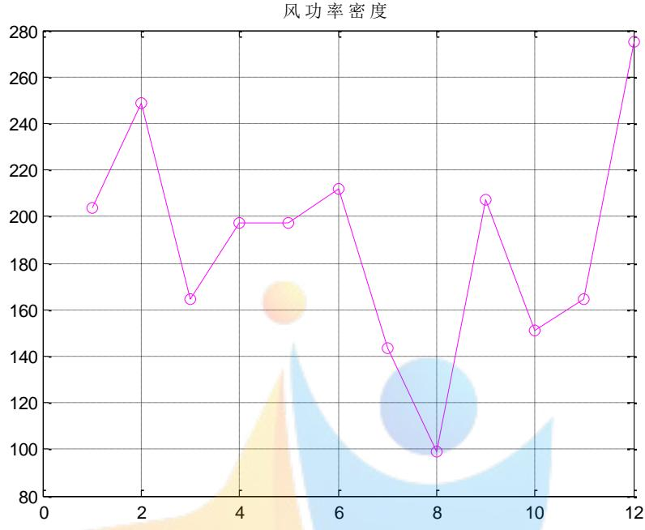
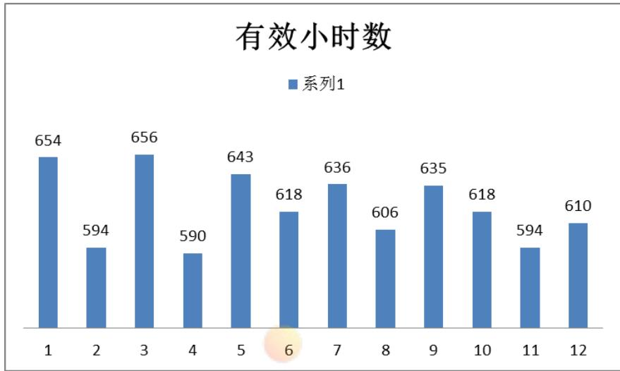
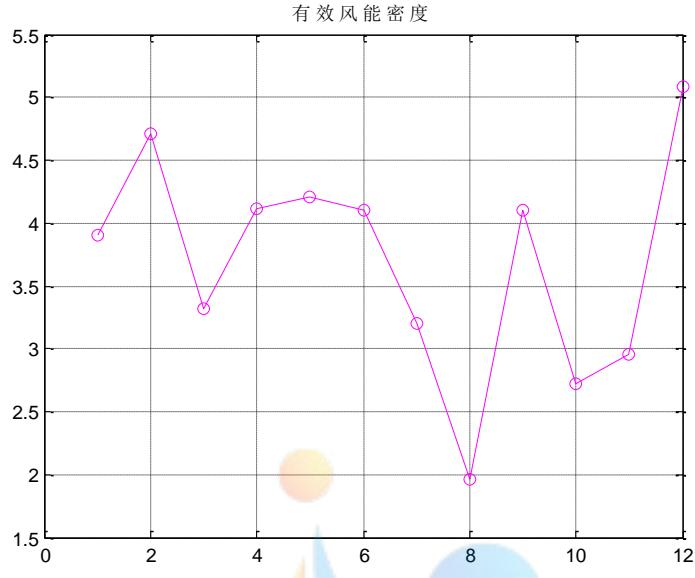
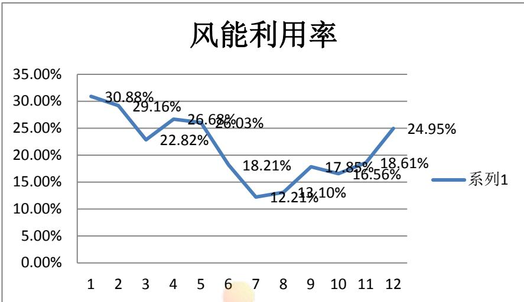
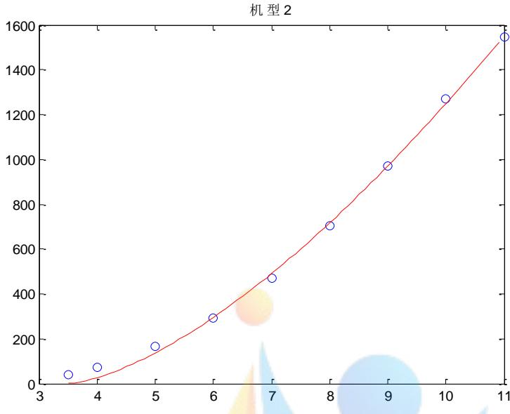
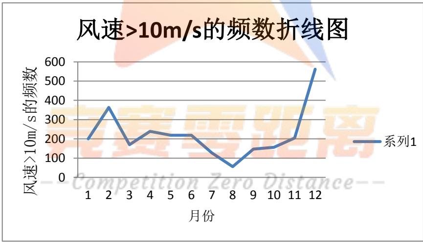

# 风电场运行状况分析及优化模型

## 摘要

风力发电是风能最主要的应用形式之一，对风电场的运行状况问题进行合理分析及优化，对于充分利用风能资源、提高风电场的经济效益具有较大的实际意义。本文围绕风电场运行状况的分析及优化问题，利用参数分析的方法对风能资源参数进行处理，利用启发式算法对维修人员进行安排，综合利用 MATLAB 软件求解，分析出分能资源及其利用情况、判断出新型号风机是否比现有风机更为适合、制定出对维修人员的排班方案与风机维护计划，较为完善的解决了此问题。

针对问题一，对该风场的风能资源及其利用情况进行评估。其中对风能资源的评估，首先对附件1 的测风数据进行修正检验处理，利用修正处理后的数据对与风能资源相关的各个参数进行量化计算，主要资源参数有平均风速、风速频率、有效小时数、年平均风功能密度、风能密度、最大及最小风速、威布尔分布等。利用 MATLAB 软件求解各个参数值，综合分析出该风电场的风能资源整体上较为稳定，风能资源较丰富，风能资源利用空间较大；但部分参数波动较大，风能资源变化幅度较大，可利用效率不够可靠。对于风能资源利用情况，风能资源的利用情况即为风能资源的实际输出功率占总装机容量的比例，利用 MATLAB 软件求解，得出风能资源可利用率为 21.42%，与一般风电场极限利用率59.3%相差较大，风能利用率相对较低。

针对问题二，从风能资源与风机匹配角度判断新型号风机是否比现有风机更为适合。其中从风能资源角度判断，即利用两种风机的总发电量来进行比较，先利用附件 2的风速数据得出风速的威布尔分布函数，结合威布尔分布函数利用总发电量公式计算出新型风机与现有风机的总发电量，具体结果见表 14。分析出机型Ⅲ比现有机型总发电量更少，机型Ⅲ没有现有机型适合，机型Ⅳ比现有机型总发电量更多，机型Ⅲ比现有机型更适合，机型Ⅴ大于机型Ⅰ的总发电量，机型Ⅴ比机型Ⅱ总发电量更多，新型机型Ⅴ比现有机型Ⅱ更适合，总体上新型风机总发电量比现有风机总发电量更高，说明新型风机比现有风机更适合。从风机匹配角度判断，计算出实际功率，将实际功率与不同种机型的额定功率进行比较，结果见表15。比较新型风机的实际功率与额定功率的差值比现有风机的差值更小，说明新型风机更适合。综合两种角度的判断结果，可说明新型风机比现有风机更为适合。

针对问题三，制定维修人员的排班方案与风机维护计划，使各组维修人员的工作任务相对均衡，且风电场具有较好的经济效益，这是个双目标优化问题。在模型的建立方面，以较好的经济效益即总维护天数最少为第一目标，以各组维修人员的工作任务相对均衡即各组最大总工作天数与最小总工作天数的差值最小为第二目标，以每次维护需一组维修人员连续工作2天和每组维修人员连续工作时间（值班或维护）不超过 6天为约束条件，建立双目标优化模型。在模型的求解方面，由于双目标求解困难继而利用启发式算法得出维修人员的排班方案与风机维护计划，具体结果见表 16、17。

本文最后对模型的结果进行了分析，综合分析结果的合理性，以及对模型进行了推广，较好地应用于各个领域。

关键词：风电场运行 启发式算法 双目标优化模型

## 1.问题重述

风能是一种最具活力的可再生能源，风力发电是风能最主要的应用形式。我国某风电场已先后进行了一、二期建设，现有风机 124 台，总装机容量约 20 万千瓦。请建立数学模型，解决以下问题：

1. 附件1给出了该风电场一年内每隔15分钟的各风机安装处的平均风速和风电场日实际输出功率。试利用这些数据对该风电场的风能资源及其利用情况进行评估。

2. 附件 2 给出了该风电场几个典型风机所在处的风速信息，其中 4#、16#、24#风机属于一期工程，33#、49#、57#风机属于二期工程，它们的主要参数见附件 3。风机生产企业还提供了部分新型号风机，它们的主要参数见附件 4。试从风能资源与风机匹配角度判断新型号风机是否比现有风机更为适合。

3. 为安全生产需要，风机每年需进行两次停机维护，两次维护之间的连续工作时间不超过270天，每次维护需一组维修人员连续工作 2天。同时风电场每天需有一组维修人员值班以应对突发情况。风电场现有 4组维修人员可从事值班或维护工作，每组维修人员连续工作时间（值班或维护）不超过 6天。请制定维修人员的排班方案与风机维护计划，使各组维修人员的工作任务相对均衡，且风电场具有较好的经济效益，试给出你的方法和结果。

附件 1 平均风速和风电场日实际输出功率表。

附件2 风电场典型风机报表。

附件3 风电场风机型号及其参数。

附件4 风机生产企业提供的新型号风机主要参数。

## 2.问题分析

针对问题一，依据题意，结合附件 1所给出的该风电场各风机安装处的平均风速和风电场日实际输出功率，对该风电场的风能资源及其利用情况进行评估。其中，对于风能资源的评估，是指通过对某一区域的风速、风向观测时间序列进行分析，估算出该区域的风能资源储量，并对其风能资源多寡、质量和分布状况作出判断、评价。由中华人民共和国国家标准风电场风能资源评估方法可知，评估风能资源的标准规定评估风能资源应收集的气象数据、测风数据的处理及主要参数的计算方法、风功率密度的分级、评估风能资源的参考判据、风能资源评估报告的内容和格式等，由此需先对附件 1 的测风数据进行修正检验处理，进而将订正后的数据处理成评估风场风能资源所需要的各种参数，包括不同时段的平均风速和风功率密度、风速频率分布和风能频率分布、风向频率和风能密度 方向分布、风切变指数和湍流强度等。由于附件所给数据资料有限，因此对于此问题资源评估参数只需考虑平均风速、风速频率、有效小时数、年平均风功能密度、风能密度、最大及最小风速、威布尔分布等，对上述参数进行量化后则可依据其结果相应的评估该风电场的风能资源。

对于该风电场的风能资源的利用情况进行评估，一方面，风能资源利用情况与风能资源有关，由此可依据与风能资源相关的参数对风能资源利用情况进行相应评估；另一方面，风能资源利用情况直接关联着实际输出功率与理论功率，由此需对利用情况进行量化定义，风能资源的利用情况即由风能资源的实际输出功率占总装机容量的比例来反应，比例越大风能资源可利用量率高，利用效率越高，由此对风能资源的利用情况进行评估。

针对问题二，依据附件 2 给出了该风电场几个典型风机所在处的风速信息及附件 4风机生产企业还提供了部分新型号风机的主要参数，试从风能资源与风机匹配角度判断新型号风机是否比现有风机更为适合。其中从风能资源角度判断，即判断新型号风机与现有风机所产生的风能资源的多寡，所产风能资源更多者更适合，因此可从两种风能机的总发电量进行评估。由于总发电量与威布尔分布函数有关，因此可利用附件 2的风速信息得出该风电场的威布尔分布函数，继而利用总发电量公式可计算出新型号风机与现有风机的总发电，总发电量大的更适合，得出新型风机与现有风机哪种更适合。

从风机匹配角度判定，即可将新型风机与现有风机的额定功率与实际输出功率进行比较，额定功率与实际输出功率相差更小风机更适合。对于风机实际输出功率，由于风速越大功率越大，进而可依据附件 3的风速与功率的关系数据拟合出风速与功率的关系函数式，利用该函数关系式得出附件 2的风速对应的功率，得出年平均功率与新型风机和现有风机的额定功率进行比较，差别更小的风机更适合。

针对问题三，依据题意要求满足维修人员安排的前提下，制定维修人员的排班方案与风机维护计划，使各组维修人员的工作任务相对均衡，且风电场具有较好的经济效益。这是个双目标优化问题，以较好的经济效益即总维护天数最少为第一目标，以各组维修人员的工作任务相对均衡即各组最大总工作天数与最小总工作天数的差值最小为第二目标，以每次维护需一组维修人员连续工作 2天和每组维修人员连续工作时间（值班或维护）不超过6天为约束条件，建立双目标优化模型。以结合题意为了安全生产的需要，风机每年需进行两次停机维护，两次维护之间的连续工作时间不超过 270天，考虑到要保证风电场具有较好的经济效益且维修人员安全维修，由此应选择风力较小的两个季节开始维修，且保证两次开始维修相隔时间小于 270 天，选择风力较小时间维修，风力越小风机在维修时所浪费发电量越小，对于维修人员也相对更安全。对于题中要求每次维护需一组维修人员连续工作 2天，则以 2天为一个工作日，同时风电场每天需有一组维修人员值班以应对突发情况，则在每个工作日都安排一组维修人员进行值班。结合风电场现有4组维修人员可从事值班或维护工作，每组维修人员连续工作时间（值班或维护）不超过6天的要求，可引入相应算法对其进行安排。

## 3.模型假设

（1）假设新型号风机与现有风机的轴轮横扫面积相同；

（2）假设新型号风机与现有风机的直径大小一致；

（3）假设附件中所给的数据都是真实可靠的。

## 4.符号说明

$\rho$ :空气密度；

$V _ { j } ^ { 3 }$ :第j个风速区间的风速值的立方；

$t _ { j }$ :某扇区域全方位第j个风速区间的风速发生的时间；

$W _ { 1 }$ ：月风能资源总量；

$D _ { W E , i }$ ：第个i 月的风能密度 ( 1, 2,...,12) i  ；

$d _ { i }$ ：第 i 个月的总天数 ( 1, 2,...,12) i  ；

$t _ { i j }$ ：第i个月某扇区域全方位第j个风速区间的风速发生的时间( 1, 2,...,12) i  ；

$m$ ：风速区间数目；

$T _ { i }$ ：第i个月的有效小时数 $( i = 1 , 2 , . . . , 1 2 )$

$p _ { i }$ ：第i个月的月风资源可利用率 $( i = 1 , 2 , . . . , 1 2 )$

$p _ { i , x }$ ：第i个月第x天的风资源可利用率 $( i = 1 , 2 , . . . , 1 2 )$

$f ( \nu )$ ：风速的概率分布函数；

$V _ { 1 }$ ：风电机组切入风速；

$V _ { 2 }$ ：风电机组切出风速；

$p ^ { \prime } ( \nu )$ ：有效风速范围内的条件概率分布密度函数；

T：全年有效小时数；

$\nu _ { i }$ ：切入风速；

$\nu _ { r }$ ：额定风速；

$\nu _ { f }$ ：切出风速；

A：风能横扫面积；

$C _ { p }$ ：风能利用系数；

$f ( \nu )$ ：威布尔分布函数。

## 5.模型的建立与求解

## 5.1模型准备

由中华人民共和国国家标准风电场风能资源评估方法可知，评估风能资源的标准规定评估风能资源应收集的气象数据、测风数据的处理及主要参数的计算方法、风功率密度的分级、评估风能资源的参考判据、风能资源评估报告的内容和格式等，由此需先对附件1 的测风数据进行修正检验处理，进而将订正后的数据处理成评估风场风能资源所需要的各种参数。

## 5.1.1测风数据完整性检验

对测风数据完整性检验可从预期记录数据的数量和时间顺序两方面进行，对缺失数据进行修复，对完整数据进行检验。

## （1）预期记录数据的数量

由附件1的测风数据可知，2015年3 月30 日 6时的风速数据缺失，对此进行缺失数据的修复。注意到风速每隔 15 分钟变化幅度不大，由此采用将这一小时内前 3 个时段的风速数据进行求平均值，得到的均值代替第 4 个时段的风速。已知前3 个时段的风速分别为 $7 m / s$ 、6.9m s 、6.8m s ，进而得出起平均值 6.9m s ，所以 3 月 $3 0 \boxminus 6$ 时的风速为 $6 . 9 m / s$ 0

## （2）时间顺序

由附件 1 的数据可知，给出了该风电场一年内每隔 15 分钟的各风机安装处的平均风速，数据的时间顺序符合预期的开始、结束时间、中间风速数据连续，符合风速的时间顺序。

## 5.1.2测风数据合理性检验

对于风速数据的合理性检验可对风速的各个参数进行计算，并与规定参考参数进行比较看是否符合风速的合理性，对此可从风速的范围检验和趋势检验两方面进行检验。

## （1）风速范围检验

由于附件1所给的数据只有风速和实际输出功率，因此风速范围检验的主要参数只考虑平均风速，由此对该风电场的月平均风速进行计算，得出结果见表 1。

表1 该风电场的月平均风速
<table><tr><td>月份（月）</td><td>1</td><td>2</td><td>3</td><td>4</td><td>5</td><td>6</td></tr><tr><td>月平均风速  $( \mathbf { \nabla } ^ { m / s } )$ </td><td>6.0321</td><td>6.5151</td><td>5. 4765</td><td>5.5859</td><td>5.6884</td><td>5.8933</td></tr><tr><td>月份（月） 月平均风速</td><td>7</td><td>8</td><td>9</td><td>10</td><td>11</td><td>12</td></tr><tr><td>(m/s)</td><td>5.3469</td><td>4.6410</td><td>6.0436</td><td>5.3129</td><td>5.3316</td><td>6.1320</td></tr></table>

结合参考资料可知，合理的平均风速参数范围为 0≤小时平均风速 ${ < } 4 0 m / s$ ，而上述12个月的月平均风速都居于该范围内，由此通得过风速范围检验。

## （2）风速趋势检验

由于附件1所给的数据只有风速和实际输出功率，因此风速趋势检验的主要参数只考虑一小时平均风速变化，由此对该风电场月每天的一小时平均风速变化进行计算，得出结果见表2。

表2 月每天1 h平均风速变化（单位：m s）
<table><tr><td>月份（月）</td><td>1 2</td><td>3 4</td><td>5</td><td>6</td></tr><tr><td>一小时平均风 速变化 月份（月）</td><td>1.4836 2.1148</td><td>1.4635 1.8269</td><td>1.7449</td><td>2.0943</td></tr><tr><td>一小时平均风</td><td>8</td><td>9 10</td><td>11</td><td>12</td></tr><tr><td>速变化</td><td>1.24160m1.0907ion1.8552Dis1.7100e-1.9282</td><td></td><td></td><td>1.2689</td></tr></table>

有参考资料可知，一小时平均风速的合理变化趋势范围为 6m s，由上述计算结果可看出每月的一小时平均风速变化范围居于该合理变化趋势范围内，所以风速数据通得过风速趋势检验。

## 5.1.3计算测风有效数据完整率

对附件1 的有效数据完整率进行计算，进而对该数据进行合理利用。由资料可知测风有效数据完整率等于应测数目减缺测数目减无效数据数目，除以应测数目，该风电场的具体测风数据数目见表 3。

表3测风有效数据完整率
<table><tr><td>测风类型</td><td>应测数目</td><td>缺测数目</td><td>无效数据数目</td><td>有效数据完整 率</td></tr><tr><td>测风数目（个）</td><td>35040</td><td>1</td><td>0</td><td>99.99%</td></tr></table>

由表3可知，测风有效数据完整率为 99.99%，符合测风有效数据完整率达到 90%的标准，同时说明该风电场的测风数据准确性非常高，可合理利用。

## 5.2问题一的模型建立与求解

由中华人民共和国国家标准风电场风能资源评估方法可知，应确定出资源评估的主要参数。由于附件所给数据资料有限，因此对于此问题资源评估参数只需考虑平均风速、风速频率、有效小时数、年平均风功能密度、风能密度、最大及最小风速、威布尔分布等，对上述参数进行量化后则可依据其结果相应的评估该风电场的风能资源。对于风能利用情况评估则可定义为实际输出功率效率，即为该风电场的实际输出功率占总装机容量的比例。

## 5.2.1利用评估参数对风能资源评估

## （1）平均风速的确定

平均风速为给定时间内瞬时风速的平均值，给定时间从几秒到数年不等。由资料可得出平均风速为给定时间内的总风速除以相应时间段，即为

$$
\overline { { V _ { E } } } = \frac { 1 } { n } \sum _ { i = 1 } ^ { n } V _ { i } ( i = 1 , 2 , . . . , n )\tag{1}
$$

利用MATLAB软件，结合附件 1的风速数据及上述（1）式的平均风速计算公式，可得出该风电场的月平均风速和年平均风速，见表 4。

表4 该风电场月平均风速
<table><tr><td>月份（月）</td><td>1</td><td>2</td><td>3</td><td>4</td><td>5</td><td>6</td></tr><tr><td>月平均风速  $( \mathbf { \nabla } ^ { m / s } )$ </td><td>6.4589</td><td>6. 8330</td><td>5.8484</td><td>6.2352</td><td>6.2549</td><td>6.2873</td></tr><tr><td>月份（月） 月平均风速</td><td>7</td><td>8</td><td>9</td><td>10</td><td>11</td><td>12</td></tr><tr><td> $( ~ m / s ~ )$ </td><td>5.7187</td><td>5.1309</td><td>6.4338</td><td>5.7854</td><td>5.8036</td><td>6.6747</td></tr></table>

由表4得出的月平均风速，继而得出该风电场的年平均风速为 6.1221m s，由此可知该风电场的平均风速分布较为均匀，全年发电量较为均匀，全年的风能资源较稳定；12 月、1 月、2 月的月平均风速更大且分布较均匀，风能资源较丰富，风能资源的可利用空间较大。 间较人。

## （2）最大最小风速

最大最小风速为特定观测时段内（通常指日、月、季或年）出现的最大最小风速。  
利用MATLAB软件对附件 1的平均风速进行筛选，得出最大最小风速见表 5。

表 5 该风电场最大最小风速（单位：m s）
<table><tr><td>月份（月）</td><td>最大风速</td><td>最小风速</td><td>月份（月）</td><td>最大风速</td><td>最小风速</td></tr><tr><td>1</td><td>14.4</td><td>0.2</td><td>7</td><td>12.2</td><td>1.1</td></tr><tr><td>2</td><td>13.7</td><td>0.4</td><td>8</td><td>14.3</td><td>0.7</td></tr><tr><td>3</td><td>15.2</td><td>1.0</td><td>9</td><td>24.1</td><td>0.6</td></tr><tr><td>4</td><td>15.0</td><td>0.7</td><td>10</td><td>13.9</td><td>0.4</td></tr><tr><td>5</td><td>17.8</td><td>0</td><td>11</td><td>15.4</td><td>0.4</td></tr><tr><td>6</td><td>15.9</td><td>0.7</td><td>12</td><td>15.8</td><td>0.6</td></tr></table>

由表 5 可知，该风电场全年的最大风速为 $2 4 . 1 m / s$ ，全年最小风速为 $0 m / s$ ，两风速相差较大，各月最大风速分布较为均匀，各月风能资源分布较为稳定，更能合理的利用风能资源。

## （3）年平均风功率密度

风功率密度为一个地方风能资气流垂直通过单位截面积的风能，是表征源多少的一个指标，由此年平均风功率密度为

$$
D _ { _ { W P } } = \frac { 1 } { 2 n } \sum _ { k = 1 } ^ { 1 2 } \sum _ { i = 1 } ^ { n _ { k , i } } ( \rho _ { k } V _ { k , i } ^ { 3 } )\tag{2}
$$

其中n为计算时段内风速序列个数， $\rho _ { k }$ 为月平均空气密度， $n _ { k , i }$ 为第k个月的观测小时数， $V _ { k , i }$ 为第k个月的风速序列。

结合附件1所给的数据和（2）式年平均风功率密度的公式，利用 MATLAB 软件求解，得出年平均风功率密度和各个月的风功率密度，见表 6。

表 6 月平均风功率密度（单位： $w / m ^ { 2 } \ .$ ）
<table><tr><td>月份（月）</td><td>1</td><td>2</td><td>3</td><td>4</td><td>5</td><td>6</td></tr><tr><td>月平均风功率 密度</td><td>203.6221</td><td>248.8855</td><td>164.3096</td><td>197.5432</td><td>197.0274</td><td>211.8533</td></tr><tr><td>月份（月） 月平均风功率</td><td>7</td><td>8</td><td>9</td><td>10</td><td>11</td><td>12</td></tr><tr><td>密度</td><td>143.1618</td><td>98.8740</td><td>207.1258</td><td>150.7643</td><td>164.6777</td><td>274.8312</td></tr></table>

由表6可知，各个月平均风功率密度分布不均匀，且变化落差较大，反应该风电场风能资源在单位截面积上风能变化波动大，由此风能资源的利用情况不稳定。

## （4）风能密度的确定

风能密度为在设定时段与风向垂直的单位面积中风所具有的能量，由此风能密度可表示为

$$
D _ { _ { W E } } = \frac { 1 } { 2 } \sum _ { j = 1 } ^ { m } ( \rho ) ( V _ { j } ^ { 3 } ) t _ { j }\tag{3}
$$

其中m为风速区间数目， 为空气密度， $V _ { j } ^ { 3 }$ 为第j个风速区间的风速值的立方， $t _ { j }$ 为某扇区域全方位第j个风速区间的风速发生的时间。

结合附件1所给的数据和（3）式风能密度的公式，利用 MATLAB软件求解，得出月平均风能密度，见表7。

表7 该风电场月平均风能密度
<table><tr><td>月份（月）</td><td>1</td><td>2</td><td>3</td><td>4</td><td>5</td><td>6</td></tr><tr><td>月平均风能 密度</td><td>5963.4544</td><td>7929.1707</td><td>5061.6574</td><td>6969.9997</td><td>6541.6645</td><td>6646.2686</td></tr><tr><td>月份（月）</td><td>7</td><td>8</td><td>9</td><td>10</td><td>11</td><td>12</td></tr></table>

<table><tr><td>月平均风能 密度</td><td>5033.2545 3230.44506457.69084410.49924981.56998341.7707</td></tr></table>

  
图 1 月风功率密度变化

由表 7 月平均风能密度得出年平均风能密度为 5963.9538，由图 1 可看出该风电场上半年的月平均风能密度波动较为均匀，风能密度较为稳定，风能资源较为稳定；下半年的相对波动较大，7、8、9 月和 11-12 月风能密度变化幅度较大，风能资源不稳定，由此风能资源的利用情况不稳定。

## （5）威布尔（Weibull）分布

威布尔（Weibull）分布用于描述风速分布的概率函数，是一个单峰的 2 参数或 3参数分布函数簇，风速v的威布尔分布概率密度函数表达式为

$$
\begin{array} { l } { { f ( \nu ) = \displaystyle \frac { k } { c } ( \frac { \nu } { c } ) ^ { k - 1 } \exp [ - ( \frac { \nu } { c } ) ^ { k } ] } } \\ { { = \displaystyle \frac { k } { c } ( \frac { \nu } { c } ) ^ { k - 1 } e ^ { - ( \frac { \nu } { c } ) ^ { k } } } } \end{array}\tag{4}
$$

对威布尔（Weibul $\harpoonright$ 分布参数 $k ,$ c进行估算。

用平均风速 $\overline { { V } }$ 估计 $\mu$ ，以标准差 $S _ { V }$ 估计 $\sigma$ ，所以 、 $\sigma$ 分别表示为

$$
\mu { = } \overline { { V } } = \frac { 1 } { n } \sum _ { i = 1 } ^ { n } V _ { i }\tag{5}
$$

$$
\sigma = S _ { \scriptscriptstyle V } = { \sqrt { { \frac { 1 } { n } } \sum _ { i = 1 } ^ { n } ( V _ { i } - \mu ) ^ { 2 } } }\tag{6}
$$

威布尔（Weibull）两参数k、c按下式估计，保留两位。

$$
k = ( \frac { \sigma } { \mu } ) ^ { - 1 . 0 8 6 }\tag{7}
$$

$$
c = \frac { \mu } { \Gamma ( 1 + 1 / k ) }\tag{8}
$$

其中Γ(1+1/k)为伽马函数，当Γ(1+1/k)<1 时， $\Gamma ( 1 + 1 / k ) = \frac { \Gamma ( x + 1 ) } { x }$ ,当 $\Gamma ( 1 + 1 / k ) \geq 2$ 时 $\Gamma ( 1 + 1 / k ) = ( 1 + 1 / k - 1 ) \bullet \Gamma ( 1 + 1 / k - 1 )$ ,由此可得出k和c，进而得出相应的威布尔分布。对于风能资源的威布尔分布参数的确定，依据附件1所给的平均风速数据和上述（5）、（6）、（7）、（8）式分别得出威布尔分布参数 、 、k、c的值，见表 8。

表 8 威布尔分布参数
<table><tr><td>分布参数</td><td>μ</td><td>σ</td><td>C</td><td></td></tr><tr><td>数值结果</td><td>5.6666</td><td>1.6726 0.2658</td><td>2.5460</td><td rowspan="3"></td></tr><tr><td></td><td>依据表8的威布尔分布参数的计算结果，可得出威布尔分布的解析式为</td><td></td><td></td></tr><tr><td colspan="4"> $f ( \nu ) = \frac { 0 . 2 6 5 8 } { 2 . 5 4 6 0 } ( \frac { \nu } { 2 . 5 4 6 0 } ) ^ { 0 . 2 6 5 8 - 1 } e ^ { - ( \frac { \nu } { 2 . 5 4 6 0 } ) ^ { 0 . 2 6 5 8 } }$ </td></tr></table>

## （6）有效小时数的确定

有效小时数为统计出代表年测风序列中风速在 3-25m s之间的累计小时数，根据风速概率分布以及风能发动机要求的可利用风速区间，可以求得风能发动机的实际可工作时数，即风能可利用时数T为有效风能在统计时段 $T _ { 0 }$ 内的累计小时数，则可表示为

$$
T = T _ { 0 } \int _ { \nu _ { 1 } } ^ { \nu _ { 2 } } \bigl [ f ( \nu ) d \nu \bigr ]\tag{9}
$$

其中f v( )为风速的概率分布函数。

由附件1中的数据并结合（9）式的有效小时数，利用 MATLAB软件求解得出全年的月有效小时数，见表9

表 9 有效小时数
<table><tr><td>月份（月）</td><td colspan="5">comp 1 3 4</td><td>6</td></tr><tr><td>有效小时数</td><td>654</td><td>594</td><td>656</td><td>590</td><td>5 643</td><td>618</td></tr><tr><td>月份（月）</td><td>7</td><td>8</td><td>9</td><td>10</td><td>11</td><td>12</td></tr><tr><td>有效小时数</td><td>636</td><td>606</td><td>635</td><td>618</td><td>594</td><td>610</td></tr></table>

  
图 2 月有效小时数

由表9得出风能发动机每月的实际可工作时数，即每月风能可利用时数。由表 9及图2可看出每月风能可利用时数较为均匀，风能资源较为稳定，风能资源利用效率较高，风能资源利用空间较大。

## （7）风速频率的确定

风速频率为以 1m s为一个风速区间，统计代表年测风序列中每个风速区间内风速出现的频率。每个风速区间的数字代表中间值，如5m s风速区间为4.6m s到 $5 . 5 m / s$ o

由附件 1 中的数据，利用 MATLAB 软件求解得出全年的月风速频率，见表 10。  
表 10 月风速频率
<table><tr><td>风速区间</td><td>[0,3)</td><td>[3,4)</td><td>[4,5)</td><td>[5,6)</td><td>[6,7)</td></tr><tr><td>风速频率(%)</td><td>14.53</td><td>15.59</td><td>16.11</td><td>13.24</td><td>11.15</td></tr><tr><td>风速区间</td><td>[7,8)</td><td>[8,9)</td><td>[9,10)</td><td>[10,25)</td><td></td></tr><tr><td>风速频率(%)</td><td>9.29</td><td>7.28</td><td>5.21</td><td>7.60</td><td></td></tr></table>

由表 10 风速频率可知，月风速频率居于<sup>[4,5)</sup>区间的频率最大，居于<sup>[9,10)</sup>区间的频率最小，风速频率较为分散。

## 5.2.2利用能源资源储量对风能资源评估

对于风能资源的评估，是指通过对某一区域的风速、风向观测时间序列进行分析，估算出该区域的风能资源储量，并对其风能资源多寡、质量和分布状况作出判断、评价。其中风能资源储量包含风能资源总量和风能资源有效储量，由此分别对其进行量化。

## （1）风能资源总量

风能资源总量与平均风能密度和总小时数有关，由于附件所给数据是一年内的，所以月风能资源总量等于月平均风能资源密度乘以每月小时数，即为

$$
\begin{array} { l } { { \displaystyle W _ { 1 } = D _ { W E , i } \times d _ { i } \times 2 4 } } \\ { { \displaystyle = \frac { 1 } { 2 } \sum _ { j = 1 } ^ { m } ( \rho ) ( V _ { i j } ^ { 3 } ) t _ { i j } \times d _ { i } \times 2 4 } } \end{array}\tag{10}
$$

其中 $W _ { 1 }$ 为月风能资源总量， $D _ { { W E } , i }$ 为第个i月的风能密度， $d _ { i }$ 为第i个月的总天数， $t _ { i j }$ 为第i个月某扇区域全方位第j个风速区间的风速发生的时间， $V _ { j } ^ { 3 }$ 为第i个月第j个风速区间的风速值的立方， 为空气密度，m为风速区间数目。

同理年风能资源总量即可表示为

$$
\begin{array} { l } { { \displaystyle W _ { 2 } = D _ { W E , i } \times g \times 2 4 } } \\ { { \displaystyle = \sum _ { i = 1 } ^ { 1 2 } [ \frac { 1 } { 2 } \sum _ { j = 1 } ^ { m } ( \rho ) ( V _ { i j } ^ { 3 } ) t _ { i j } ] \times g \times 2 4 } } \end{array}\tag{11}
$$

其中 $W _ { 2 }$ 为年风能资源总量，g为一年的总天数。

## （2）风能资源有效储量

风能资源有效储量与平均风能密度和风速有效小时数有关，由于附件所给数据是一年内的，所以月风能资源有效储量等于月平均风能资源密度乘以每月风速有效小时数，即表示为

$$
\begin{array} { l } { { \displaystyle W _ { 3 } = D _ { W E , i } \times T _ { i } } } \\ { { \displaystyle = \frac { 1 } { 2 } \sum _ { j = 1 } ^ { m } ( \rho ) ( V _ { i j } ^ { 3 } ) t _ { i j } \times T _ { i } } } \end{array}\tag{12}
$$

其中 $W _ { 3 }$ 为月风能资源有效储量，T<sub>i</sub>为第i个月的有效小时数。

同理年风能资源有效储量 $W _ { 4 }$ 为

$$
\begin{array} { l } { { \displaystyle { W _ { 4 } = \sum _ { i = 1 } ^ { 1 2 } ( D _ { W E , i } ) \times \sum _ { i = 1 } ^ { 1 2 } T _ { i } } } } \\ { { \displaystyle { = \sum _ { i = 1 } ^ { 1 2 } [ \frac { 1 } { 2 } \sum _ { j = 1 } ^ { m } ( \rho ) ( V _ { i j } ^ { 3 } ) t _ { i j } ] \times \sum _ { i = 1 } ^ { 1 2 } T _ { i } } } } \end{array}\tag{13}
$$

依据上述月平均风能资源密度与月小时数，结合（10）、（11）式得出每月风能资源总储量和年风能资源总出储量，由平均风能资源密度与风速有效小时数，结合（12）、（13）式得出每月的风能资源有效储量和年风能资源有效储量，具体结果见表11。

表11 每月的风能资源总储量与有效储量（单位：百万kw）
<table><tr><td>月份（月）</td><td colspan="4">月资源总储7月资源有效 Lero vistan月资源总储 月份（月）</td></tr><tr><td>1</td><td>量 4.4368</td><td>储量 3.9001</td><td>量 3.7447</td><td>储量 3.2011</td></tr><tr><td>2</td><td>5.3084</td><td>4.7099</td><td>2.4035</td><td>1.9576</td></tr><tr><td>3</td><td>3.7659</td><td>8 3.3204 9</td><td>4.6495</td><td>4.1006</td></tr><tr><td>4</td><td>5.0184</td><td>4.1123 10</td><td>3.2814</td><td>2.7257</td></tr><tr><td>5</td><td>4.8670</td><td>4.2063 11</td><td>3.5867</td><td>2.9591</td></tr><tr><td>6</td><td>4.7853</td><td>4.1074 12</td><td>6.2063</td><td>5.0885</td></tr></table>

  
图 3 有效小时数变化

由表 11 可得出年风能资源总储量为 52.0739 百万kw，年风能资源有效储量为44.3891 百万kw，有图 3 可看出年风能资源有效储量与年风能资源有效储量相差不大，风能资源有效性较大；由表 12 可知，月资源总储量与月资源有效储量变化幅度不大，分布较为均匀，风能资源较为稳定合理。

## 5.2.3对风能资源利用情况的定义及评估

对风能资源利用情况进行评估，一方面可依据风能资源的参数进行相应的评估；另一方面，需对风能资源的利用情况进行量化定义，风能资源的利用情况即由风能资源的实际输出功率占总装机容量的比例来反应即为风能资源可利用率，比例越大风能资源可利用率越高，利用效率越高，由此来评估风能资源的利用情况。注意到附件 1的平均风速与实际日输出功率存在不合理数据，由此先对不合理数据剔除，进而计算风能资源的实际输出功率占总装机容量的比例。

由上述分析可知，风能资源的利用情况即由风能资源的实际输出功率占总装机容量的比例，则风能资源可利用率表示为

$$
p _ { i } = \frac { \displaystyle \sum _ { x = 1 } ^ { n } p _ { i , x } } { n }\tag{14}
$$

其中 $p _ { i }$ 为月风资源可利用率， $p _ { i , x }$ 为第i个月第x天的风资源可利用率。

依据附件 1 所给的数据结合上述（14）式风能资源可利用率，利用 MATLAB 软件得出全年12个月的风能资源可利用率，见表 12。

表12 每月风能资源可利用率
<table><tr><td>月份（月）</td><td>1</td><td>2</td><td>3</td><td>4</td><td>5</td><td>6</td></tr><tr><td>可利用率（%）</td><td>30.88</td><td>29.16</td><td>22.82</td><td>26.68</td><td>26.03</td><td>18.21</td></tr><tr><td>月份（月）</td><td>7</td><td>8</td><td>9</td><td>10</td><td>11</td><td>12</td></tr><tr><td>可利用率（%）</td><td>12.21</td><td>13.10</td><td>17.85</td><td>16.56</td><td>18.61</td><td>24.95</td></tr></table>

  
图 4 风能利用率变化

由表 12 可得出年风能资源可利用率为 21.42%，与一般风电场极限利用率 59.3%相差较大，风能利用率相对较低，由图4可看出月风能可利用率较为稳定。

## 5.3问题二的模型建立与求解

依据附件所给的数据资料，试从风能资源与风机匹配角度判断新型号风机是否比现有风机更为适合，由此应两方面进行判定。对于风能资源角度，可依据两种风机的总发电量与有效风功率密度来评判，其中总发电量计算可利用附件 2的风速数据得出为布尔分布函数，进而利用总发电量公式计算出新型风机与现有风机的总发电量，总发电量更大的风机更适合。对于风机匹配角度，将两种风机的额定功率与实际功率进行比较判定，而实际功率可依据附件3 的风速与功率关系数据拟合出风速与功率的关系式，利用该关系式得出附件2风速对应的实际功率，将实际年平均功率与两种风机的额定功率进行比较，相差更小的更适合。

## 5.3.1从风能资源角度判断

从风能资源角度判断即考虑新型风机与现有风机的总发电量，分别对其进行比较，来判定新型风机是否比现有风机更适合。

## （1） 总发电量的比较

总发电量与风速的威布尔分布有关，由此先依据附件 2的风速数据确定出风速的威布尔分布函数。威布尔（Weibull）分布用于描述风速分布的概率函数，是一个单峰的 2参数或3参数分布函数簇，风速v的威布尔分布概率密度函数表达式为

$$
\begin{array} { l } { f ( \nu ) = \displaystyle \frac { k } { c } ( \frac { \nu } { - } ) ^ { k - 1 } \exp [ - ( \frac { \nu } { - } ) ^ { k } ] } \\ { \textcircled { \it { O m } } \displaystyle \jmath ^ { c } e \ : \ell _ { \mathrm { \it ~ i f \ : } } i o n \mathrm { \it ~ \mathscr { Z } } ^ { c } r } \\ { = \displaystyle \frac { k } { c } ( \frac { \nu } { c } ) ^ { k - 1 } e ^ { - ( \frac { \nu } { c } ) ^ { k } } } \end{array}\tag{15}
$$

对威布尔（Weibull）分布参数k、c进行估算。

用平均风速 $\overline { { V } }$ 估计 ，以标准差 $S _ { v }$ 估计 $\sigma$ ，所以 、 $\sigma$ 分别表示为

$$
\mu { = } \overline { { V } } = \frac { 1 } { n } \sum _ { i = 1 } ^ { n } V _ { i }\tag{16}
$$

$$
\sigma = S _ { \scriptscriptstyle V } = { \sqrt { { \frac { 1 } { n } } \sum _ { i = 1 } ^ { n } ( V _ { i } - \mu ) ^ { 2 } } }\tag{17}
$$

威布尔（Weibull）两参数k、c按下式估计

$$
k = ( \frac { \sigma } { \mu } ) ^ { - 1 . 0 8 6 }\tag{18}
$$

$$
c = \frac { \mu } { \Gamma ( 1 + 1 / k ) }\tag{19}
$$

其中Γ(1+1/k)为伽马函数，当 $\Gamma ( 1 + 1 / k ) \langle 1$ 时， $\Gamma ( 1 + 1 / k ) = \frac { \Gamma ( x + 1 ) } { x }$ ,当 $\Gamma ( 1 + 1 / k ) \geq 2$ 时 $\Gamma ( 1 + 1 / k ) = ( 1 + 1 / k - 1 ) \bullet \Gamma ( 1 + 1 / k - 1 )$ ,由此可得出k和c，进而得出相应的威布尔分布。利用上述所得的威布尔分布函数得出总发电量 $W _ { t }$ 公式为

$$
W _ { t } = T ( \int _ { \nu _ { i } } ^ { \nu _ { r } } \frac { 1 } { 2 } \rho A C _ { p } \nu ^ { 3 } f ( \nu ) d \nu + \int _ { \nu _ { r } } ^ { \nu _ { f } } \frac { 1 } { 2 } \rho C _ { p } \nu _ { r } ^ { 3 } f ( \nu ) d \nu )\tag{20}
$$

其中T为全年有效小时数， $\nu _ { i }$ 为切入风速， $\nu _ { r }$ 为额定风速， $\nu _ { f }$ 为切出风速，A为风能横扫面积， $\rho$ 为空气密度， $C _ { p }$ 为风能利用系数，f v( )为威布尔分布函数

综合上述（15）、（16）、（17）、(18)、（19）、（20）式，结合附件 2的风速数据，利用MATLAB软件得出威布尔参数值见表 13。

表13 年威布尔分布参数值
<table><tr><td>分布参数</td><td>μ</td><td>σ</td><td>k</td><td>C</td></tr><tr><td>数值结果</td><td>6.7114</td><td>2.0317</td><td>0.2735</td><td>2.5430</td></tr></table>

根据所求出威布尔分布参数值，得年威布尔概率密度函数为

$$
f ( \nu ) = \frac { 0 . 2 7 3 2 } { 2 . 5 4 3 } \times \left( \frac { \nu } { 2 . 5 4 3 } \right) ^ { - 0 . 7 2 6 8 } \times e ^ { \left( - \frac { \nu } { 2 . 5 4 3 } \right) ^ { 0 . 2 7 3 2 } }\tag{21}
$$

利用表13的参数值和附件 3是数据代入（20）式，得出各种风机所产的总发电量，见表 14。

表14 各种风机所产的总发电量（单位：万w）
<table><tr><td>机型</td><td>机型Ⅰ C0n 机型Ⅱ</td><td>机型ⅢⅢI 13</td><td>机型ⅣV</td><td>机型V</td></tr><tr><td>总发电量</td><td>2.2065</td><td>2.2016 1.9448</td><td>2.2065</td><td>2.4845</td></tr></table>

由表 14 可知，机型Ⅲ比现有机型总发电量更少，机型Ⅲ没有现有机型适合，机型Ⅳ比现有机型总发电量更多，机型Ⅲ现有机型适合，机型Ⅴ大于机型Ⅰ的总发电量，机型Ⅴ比机型Ⅱ总发电量更多，新型机型Ⅴ比现有机型Ⅱ更适合，总体上新型风机比现有风机更适合。

## 5.3.2从风机匹配角度判断

对于风机匹配角度，将两种风机的额定功率与实际功率进行比较判定，而实际功率可依据附件3的风速与功率关系数据拟合出风速与功率的关系式，利用该关系式得出附件2风速对应的实际功率，将实际年平均功率与两种风机的额定功率进行比较，相差更小的更适合。

对附件3的风速与功率数据进行拟合，得出拟合图像，见图5。

  
图5 风速与功率的拟合关系

由图5可知，功率随着风速的增大而增大，大体呈幂函数分布，由此得出风速与功率的关系式为

$$
y = a ( \nu - \nu _ { r } ) ^ { b }\tag{22}
$$

其中 $\nu _ { r }$ 为额定功率，a 、b为拟合函数系数。

依据附件2的风速数据，代入上述（22）式，得出年实际功率为360.7469，将附件3的新型风机与现有风机进行比较，具体结果见表 15。

表 15 新型号现有风机与实际功率的比较
<table><tr><td>机型</td><td>机型I</td><td>机型Ⅱ</td><td>机型ⅢII 机型IV</td><td>机型V</td></tr><tr><td>额定功率</td><td>2000</td><td>1500</td><td>1500 1500</td><td>1500</td></tr><tr><td>差值</td><td>1639.2531</td><td>1139.2531</td><td>1139.2531 1139.2531</td><td>1139.2531</td></tr></table>

由表 15 可知，新型风机的实际功率与额定功率的差值比现有风机的差值更小，说明新型风机更适合。

## 5.4问题三的模型建立与求解

依据题意要求满足维修人员安排的前提下，制定维修人员的排班方案与风机维护计划，使各组维修人员的工作任务相对均衡，且风电场具有较好的经济效益。根据题意，要制定维修人员的排班方案与风机维修计划，以各组维修人员的工作任务相对均衡、风电场具有较好的经济效益为目标。以风电场每天需要一组维修人员值班以应对突发情况、每组维修人员连续工作时间（值班或维护）不超过 6天为约束条件，以此来建立双目标优化模型。针对第一个目标，要使各组维修人员的工作任务相对均衡，可以用各组最大的总工作天数和最小总工作天数的差值进行定义，该差值越小，说明各组维修人员的工作任务相对均衡。针对第二个目标，要使风电场具有较好的经济效益，可以使总的维修天数最少来进行定义，总的维修天数越少，说明经济效益越好。

## 5.4.1目标函数的确定

各组维修人员的工作任务相对均衡的目标,该目标转化为以各组最大的总工作天数和最小总工作天数的差值最小为目标函数。

$$
\operatorname* { m i n } ( U - L )\tag{23}
$$

其中：U 为所有组的总工作天数的最大值，L为所有组的总工作天数的最小值。

风电场具有较好的经济效益的目标，该目标转化为总的维修天数最少。

$$
\mathrm { m i n N }\tag{24}
$$

其中：N为总的维修天数。

## 5.4.2决策变量的确定

引入决策变量为

$$
x _ { i j } = \{ \begin{array} { l l } { 1 , } & { \frac { \lambda  } { \tilde { \mathcal { G } } } i \backslash \zeta \underset { \ell \neq \pm } { \mathbb { X } } \{ \| \tilde { \mathcal { G } } \| + \| \tilde { \mathcal { G } } \| + \frac { \lambda  } { \tilde { \mathcal { G } } } \leq \frac { i } { \tilde { \mathcal { G } } } \} \frac { i \cdot \zeta \| \tilde { \mathcal { G } } \| + \langle \tilde { \mathcal { G } } \rangle \wedge \frac { \Xi } { \tilde { \mathcal { G } } } \lambda \| \tilde { \mathcal { G } } \langle \tilde { \mathcal { G } } \| \tilde { \mathcal { G } } \| \tilde { \mathcal { G } } \| \tilde { \mathcal { G } } \rangle } { \lambda \mathrm { ~ d } \tilde { \mathcal { G } } } ( i = 1 , 2 , . . . , o ; j = 1 , 2 , . . . . m ) } \\ { 0 , } &  \frac { \lambda  } { \tilde { \mathcal { G } } } i \backslash \zeta \underset { \ell \neq \pm } { \mathbb { X } } \{ \| \tilde { \mathcal { G } } \| + \| \tilde { \mathcal { G } } \| \} \mathrm { T } \cdot \mathcal { I } \underset { \ell \neq \frac { \bar { \mathcal { G } } } { \mathrm { X } } \times \frac { \bar { \mathcal { G } } \kappa } { \tilde { \mathcal { G } } } \} { j \mathbb { Z } } \frac { i \cdot \zeta \| \tilde { \mathcal { G } } \| \tilde { \mathcal { G } } \langle \tilde { \mathcal { H } } \langle \tilde { \mathcal { H } } \rangle \wedge \frac { \Xi } { \tilde { \mathcal { G } } } \rangle \mathrm { d } \tilde { \mathcal { G } } \langle \tilde { \mathcal { T } } \stackrel { { \mathcal { G } } } \| \tilde { \mathcal { G } } \| \tilde { \mathcal { F } } \| } { j \mathrm { Z } } ( i = 1 , 2 , . . . , o ; j = 1 , 2 , . . . . m ) } \end{array}  ( i = 1 , 2 , . . . , m )
$$

$$
x _ { i k } = { \left\{ \begin{array} { l l } { 1 , } & { { \frac { 8 9 } { 9 4 } } i \backslash j \backslash \zeta \not { \exists } \not { \mathrm { i } \in \{ 1 \} } { \overline { { \mathcal { Z } } } } [ \not { \mathrm { i } } \not \exists ] { \underline { { \cdots } } } { \overline { { \mathcal { Z } } } } [ \not { \mathrm { i } } \not \exists j ] { \underline { { \zeta } } } [ \not { \mathrm { i } } \not \exists j \backslash \underline { { \Sigma } } ] { \underline { { \zeta } } } [ \not { \mathrm { i } } \not \exists j \backslash \underline { { \zeta } } ] { \underline { { \zeta } } } [ \not { \mathrm { i } } \not \exists ] { \underline { { \cdots } } } } \\ { 0 , } & { { \frac { i \not { \ G } } { \mathrm { i } \mathrm { i } } } i \backslash j \backslash \zeta \not { \mathrm { i } } \not \in \{ 1 \not { \mathrm { s } } [ \not { \mathrm { i } } \not \exists ] { \underline { { \cdots } } } [ \not { \mathrm { i } } \not \subseteq { \underline { { \cdots } } } ] { \underline { { \zeta } } } [ \not { \mathrm { i } } \not \underline { { \zeta } } ] \not { \mathrm { i } } \underline { { \mathcal { Z } } } [ \not { \mathrm { i } } \not \ B Z ] { \underline { { \zeta } } } [ \not { \mathrm { i } } \not \exists ] { \underline { { \cdots } } } [ \not { \mathrm { i } } \not \exists ] { \underline { { \zeta } } } [ \not { \mathrm { i } } \not \exists ] { \underline { { \cdots } } } [ \not { \mathrm { i } } \not \exists j ] } \left( i - 1 , 2 , \ldots e ; j = 1 , 2 , \ldots m \right) \right.} \end{array}  
$$

## 5.4.3约束条件的确定

所有组的总工作天数的最大值和最小值都要大于 0。

$$
U , L \geq 0\tag{25}
$$

所有组的总天数都要小于所有组总天数的最大值，所有组的总天数都要大于所有组总天数的最小值。

$$
\sum _ { i = 1 } ^ { e } x _ { i j } \times 2 \leq U \left( j = 1 , 2 , . . . m \right)\tag{26}
$$

$$
\sum _ { i = 1 } ^ { e } x _ { i j } \times 2 \geq L \big ( j = 1 , 2 , . . . m \big )\tag{27}
$$

其中U 为所有组的总工作天数的最大值，L为所有组的总工作天数的最小值， $e$ 为所有风机维修的总天数， $x _ { i j }$ 为决策变量。

两个决策变量要满足

$$
{ x _ { i j } \in \left\{ 0 , 1 \right\} , \forall i , j }\tag{28}
$$

$$
{ x } _ { i k } \in \{ 0 , 1 \} , \forall i , \mathbf { k }\tag{29}
$$

每组维护人员连续工作时间（值班或维护）不超过 6天。

$$
f _ { j } \times 2 \le 6\tag{30}
$$

其中 $f _ { j }$ 为第 $j$ 组维修人员连续维护的天数。

每天需要一组维修人员值班以应对突发情况的约束。

$$
\sum _ { k = 1 } ^ { m } x _ { i k } = t \big ( i = 1 , 2 , . . . , e \big )\tag{31}
$$

## 5.4.4优化模型的建立

结合以上的目标函数和约束条件，建立双目标优化模型，即

$$
\begin{array} { r l } & { \operatorname* { m i n } ( | U - L ) } \\ & { \quad \mathrm { m i n N } } \\ & { \quad \left( \displaystyle { \sum _ { i = 1 } ^ { \infty } \kappa _ { i } \times 0 } U \right. } \\ & { \quad \left. \left| \displaystyle { \sum _ { i = 1 } ^ { \infty } \kappa _ { i } \times 0 } U \right. \right. } \\ & { \quad \left. \left| \displaystyle { \sum _ { i = 1 } ^ { \infty } \kappa _ { i } \times \tau } \right. \right. } \\ & { \quad \left. \left. \mathrm { v } _ { t } L _ { i } ^ { \star } \right| \displaystyle { \sum _ { i = 1 } ^ { \infty } \left( 0 . 1 \right| _ { i } ^ { \star } \forall i , j \left( j - 1 , 2 . . . , n ; t - 1 , 2 . . . , e \right)  \right. } } \\ & \right.{ \quad \left. \left| \displaystyle { x _ { i } \in \left\{ 0 , 1 \right\} , \forall i , k } \right. \right. } \\ & { \quad \left. \left. \left| \displaystyle { \sum _ { i = 1 } ^ { \infty } \kappa _ { i } \times 0 } \right. \right. \right. } \\ & { \quad \left. \left. \left. { \sum _ { k = 1 } ^ { \infty } \kappa _ { i } \times t } \right. \right. } \end{array}
$$

## 5.4.5普适性的启发式算法

由于上述模型求解较困难，由此引入启发式算法。

结合题意为了安全生产的需要，风机每年需进行两次停机维护，同时到要保证风电场具有较好的经济效益且维修人员安全维修，由此应选择风力较小的两个季节开始维修，选择风力较小的时间开始维修，风力越小风机在停机进行维修时所浪费发电量越小，对于维修人员也相对更安全。由相关文献可知，当风速大于等于 10m s时维护人员不宜维护作业，利用附件1全年风速数据，统计风速大于等于 $1 0 m / s$ 的风速数据，由此得出风速大于等于10m s的频数折线图，见图 6。

  
图 6 风速大于等于10m s的频数折线图

由图6可知，风速大于等于 $1 0 m / s$ 的频数在3 月后和8月后两时段相对更小，即春季和秋季风力较小，两季节相隔时间为 100天满足了两次开始维护相隔时间小于 270天的要求。对此风机每年第一次开始维护时间为 3 月 1 日，第二次开始维护时间为 9 月 1日。

结合题意每次维护需一组维修人员连续工作两天，则以两天为一个工作日，同时还要满足风电场每天需有一组维修人员值班以应对突发情况，则在每个工作日都安排一组维修人员进行值班。风电场现有 4组维修人员可从事值班与维护工作，每组维人员连续工作时间（值班或维护）不超过 6天，由此可写出相应算法，具体步骤如下。

Step1:将n台风机进行编号，依次为 1，2，…，n，将m组维修人员进行编号依次为1，2，…，m 。

Step2:假设一组维修人员在连续工作两天内能维修n台风机。

Step3:依据题意总共有m组维修人员，每次维护需一组维修人员连续工作t天，在$a , b - a , ( b + t )$ 时间段内安排第j组维修人员进行维修和值班，安排m k 组维修人员进行维修，k组人员值班，每次维护一组维修人员可维修n台，则总共维修n m k ( )  台，对应风机编号为f-[n(m-k)-f]

Step4:在 $a , ( b + t + 1 ) - a , ( b + 2 t + 1 )$ 时间段内，继续安排 Step3 中第j组维修人员进行 维 修 ， 第 k 组 人 员 值 班 ， 总 共 维 修 n m k ( )  台 ， 所 剩 风 机 编 号 为$[ n ( m - k ) - f + 1 ] - [ 2 n ( m - k ) - f + 1 ]$

Step5:在 $a , ( b + 2 t + 1 ) - a , ( b + 3 t + 2 )$ 时间段内，使m k 组维修人员中的 $\frac { m - k } { 2 }$ 组人员休息，使第 k 组维修人员继续进行维修，则总共能维修 $n \times \frac { m - k } { 2 }$ 台，风机编号为[2n (m −k )− f + 21 [n2 $n ( - k  f + + 2 n \times \frac { m - k } { 2 }$ 0

Step6: 在 $a , ( b + 3 t + 3 ) - a , ( b + 4 t + 3 )$ 时间段内，让未休息的 $\frac { m - k } { 2 }$ 组的人员休息，休息过的 $\frac { m - k } { 2 }$ 组人员维修风机和值班。

Step7:重复 Step3、Step4、Step5 、Step6 直达风机维修完。

在满足风电场每天需要一组维修人员值班以应对突发情况、风电场现有 4组维修人员可从事值班或维修工作、每组维修人员连续工作时间不超过 6天等约束，为了使各组维修人员的工作相对均衡，且使风电场具有较好的经济效益。在保证维修人员的安全，风越大时，进行维护风机就越不安全；为了使风电场具有较好的经济效益，尽量选择在风小的季节进行风机的维护，此时损失的效益就更小。

为了使各组维修人员的工作任务相对均衡，则先将所有组都安排去工作，再进行轮换工作，用以下具体步骤来制定维修人员的排班方案与风机维护计划。第一步:将124台风机进行编号，依次为 1,2,…,124,将4组维修人员进行编号，依次为

A, B ,C ， D 。

第二步：在3月1日至3 月2日时间段内，安排A,B,C维修人员进行维护风机，安排D维修人员进行值班。则总共能维修 33台风机，这些风机编号为 1-9。

第三步：在3月3日至3 月4日时间段内，继续安排A，B，C维修人员进行维护风机，继续安排D维修人员值班。则总共能维修 33台风机，这些风机编号为 10-18。

第四步:在 3 月 5 日至 3 月 6 日时间段内，让A和B维修人员休息两天，让A维修人员继续进行维护风机，D维修人员继续进行值班。则总共能维修 31 台风机，这些风机编号为 19-21。

第五步：在3月7号至3 月8号时间段内，让连续工作 6天的<sub>A</sub>，<sub>D</sub>休息，让休息过的<sub>B</sub>，<sub>C</sub>来工作。即让<sub>B</sub>维修人员进行维护风机，让<sub>C</sub>维修人员进行值班。则总共能维修3<sub></sub>1 台风机，这些风机编号为 22-24。

第六步：按照第一步至第五步的方法，以此类推，直到把所有的风机都维护完，即得到维修人员的排班方案与风机维护计划。

利用上述算法并结合步骤，4 组维修人员对 124 台风能机进行一年的维护，得出第一次夏季维修人员的排班方案与风机维护计划，具体结果见表 18。

表16 春季维修人员的排班方案与风机维护计划
<table><tr><td>风机编号</td><td>维护日期（月，日）</td><td>维修人员组别</td><td>值班人员组别</td></tr><tr><td>1-9</td><td>3.1-3.2</td><td>A、B、C</td><td>D</td></tr><tr><td>10-18</td><td>3.3-3.4</td><td>A、B、C</td><td>D</td></tr><tr><td>19-21</td><td>3.5-3.6</td><td>A</td><td>D</td></tr><tr><td>22-24</td><td>3.7-3.8</td><td>B</td><td>C</td></tr><tr><td>25-33</td><td>3.9-3.10</td><td>A、B、 D</td><td>C</td></tr><tr><td>34-42</td><td>3.11-3.12</td><td>A、B、 D</td><td>C</td></tr><tr><td>43-45</td><td>3.13-3.14</td><td>D</td><td>A</td></tr><tr><td>46-48</td><td>3.15-3.16</td><td>C</td><td>B</td></tr><tr><td>49-57</td><td>3.17-3.18</td><td>A、C、 D</td><td>B</td></tr><tr><td>58-66</td><td>3.19-3.20</td><td>A、C、 D</td><td>B</td></tr><tr><td>67-69</td><td>3.21-3.22</td><td>A</td><td>D</td></tr><tr><td>70-72</td><td>3.23-3.24</td><td>B</td><td>C</td></tr><tr><td>73-81</td><td>3.25-3.26</td><td>B、D 漓 A、</td><td>C</td></tr><tr><td>82-90</td><td>3.27-3.28</td><td>A、 B、</td><td>C</td></tr><tr><td>91-93</td><td>3.29-3.30</td><td>D</td><td>A</td></tr><tr><td>94-96</td><td>Com 3.31-4.1 ion Zero</td><td>C</td><td>B</td></tr><tr><td>97-105</td><td>4.2-4.3</td><td>tance-- A、C、D</td><td>B</td></tr><tr><td>106-114</td><td>4.4-4.5</td><td>A、C、D</td><td>B</td></tr><tr><td>115-117</td><td>4.6-4.7</td><td>A</td><td>D</td></tr><tr><td>118-120</td><td>4.8-4.9</td><td>B</td><td>C</td></tr><tr><td>121-124</td><td>4.10-4.11</td><td>A、B、D</td><td>C</td></tr></table>

由表 16 可知，得出一年中第一次春季维修人员的排班方案与风机维护计划，计划为3月1日-4月11日，工作时间为 42个工作日，该风机维护较为合理，有效保证各组维修人员的工作任务相对均衡，且使风电场具有较好的经济效益。

同理结合上述算法得出一年中第二次秋季维修人员的排班方案与风机维护计划，具体结果见表17。

表17 秋季维修人员的排班方案与风机维护计划

<table><tr><td>风机编号</td><td>维护日期（月，日）</td><td>维修人员组别</td><td>值班人员组别</td></tr><tr><td>1-9</td><td>9.1-9.2</td><td>A、B、C</td><td>D</td></tr><tr><td>10-18</td><td>9.3-3.4</td><td>A、B、C</td><td>D</td></tr><tr><td>19-21</td><td>9.5-9.6</td><td>A</td><td>D</td></tr><tr><td>22-24</td><td>9.7-9.8</td><td>B</td><td>C</td></tr><tr><td>25-33</td><td>9.9-9.10</td><td>A、B、D</td><td>C</td></tr><tr><td>34-42</td><td>9.11-9.12</td><td>A、B、D</td><td>C</td></tr><tr><td>43-45</td><td>9.13-9.14</td><td>D</td><td>A</td></tr><tr><td>46-48</td><td>9.15-9.16</td><td>C</td><td>B</td></tr><tr><td>49-57</td><td>9.17-9.18</td><td>A、C、D</td><td>B</td></tr><tr><td>58-66</td><td>9.19-9.20</td><td>A、C、D</td><td>B</td></tr><tr><td>67-69</td><td>9.21-9.22</td><td>A</td><td>D</td></tr><tr><td>70-72</td><td>9.23-9.24</td><td>B</td><td>C</td></tr><tr><td>73-81</td><td>9.25-9.26</td><td>A、B、D</td><td>C</td></tr><tr><td>82-90</td><td>9.27-9.28</td><td>A、B、D</td><td>C</td></tr><tr><td>91-93</td><td>9.29-9.30</td><td>D</td><td>A</td></tr><tr><td>94-96</td><td>10.1-10.2</td><td>C</td><td>B</td></tr><tr><td>97-105</td><td>10.3-10.4</td><td>A、C、D</td><td>B</td></tr><tr><td>106-114</td><td>10.5-10.6</td><td>A、C、D</td><td>B</td></tr><tr><td>115-117</td><td>10.7-10.8</td><td>A</td><td>D</td></tr><tr><td>118-120</td><td>10.9-10.10</td><td>B</td><td>C</td></tr><tr><td>121-124</td><td>10.11-10.12</td><td>A、B、D</td><td>C</td></tr></table>

由表 17 可知，得出一年中第一次秋季维修人员的排班方案与风机维护计划，计划为9月 1日-10 月12 日，工作时间为 42个工作日，该风机维护较为合理，有效保证各组维修人员的工作任务相对均衡，且使风电场具有较好的经济效益。

## 6.结果分析

## 6.1问题一的结果分析

结合风能资源的相关参数，利用 MATLAB 软件求解，得出参数数据并就此评估出该风电场的风能资源整体上较为稳定，风能资源利用效率较高，风能资源利用空间较大；但同时存在部分参数波动较大，风能资源变化幅度较大，可利用效率不够可靠。通过计算风能资源可利用率，得出年风能资源可利用率为 21.42%，与一般风电场极限利用率59.3%相差较大，风能可利用率相对较低，该风电场的风能资源利用情况不够。

## 6.2问题二的结果分析

结合附件 3 和 4 的相关数据，利用 MATLAB 软件求解，得出总发电量并对各个机型进行比较，得出新型风机比现有风机更为适合；得出实际功率与各个机型的额定功率进行比较分析，得出新型风机比现有风机更为适合。

## 6.3问题三的结果分析

结合4组风机维修人员和 124台风机，得出第一次和第二次的维修人员的排班方案与风机维护计划。第一次从 3 月 1 日开始，耗用时间为 42 个工作日，该风机维护较为合理，有效保证各组维修人员的工作任务相对均衡，且使风电场具有较好的经济效益；第二次从 9 月 1 日开始，耗用时间 42 个工作日，有效使各组维修人员的工作任务相对均衡，且风电场具有较好的经济效益，该风机维护较为合理。

## 7.模型的评价与推广

## 7.1模型的评价

## 7.1.1 模型的优点

（1）在处理资源的利用率时，对原数据的合理性进行了检验，从而提高了数据的实用性与科学性。

（2）问题一中利用风能资源参数对风能资源进行评估，利用风能资源可利用率对风能资源的利用情况进行评估，具有一定的合理和科学性。

（3）问题三中利用启发式算法，得出较优的维修人员的排班方案与风机维护计划，结果较为全面优化，具有一定的合理性。

## 7.1.2 模型的缺点

（1）由于附件 1 所给的资料较为单一，对风能资源的参数数目考虑的不够全面，由此评估的风能资源存在一定的局限性。

（2）问题一中计算新型风机的实际功率，通过现有风速与功率的关系拟合出风速与功率的关系式，用该关系式得出实际功率代替新型风机的实际功率，具有一定的误差，结果缺乏一定的准确性。

（3）问题三中对维修人员的排班方案与风机维护计划进行排列，具有一定的人工干预，缺乏一定的说服力。

## 7.3模型的推广

对于风电场的风能资源的相关分析及优化可运用于水利发电、潮汐发电以及火力发电等广泛领域，可较好的解决诸多领域的问题。

## 8.参考文献

[1]陈练，李栋梁，吴洪宝，中国风速概率分布及在风能评估中的应用，2016 年。

[2]郑崇伟，全球海域风能资源储量分析 2016年。

[3]张义斌，王胜伟，风电场输出功率的概率分布及其应用，2016年。

[4] 牟聿强 ,王秀丽，风电场风速分布及风速功率曲线分析,2016年。

[5]潘慧慧，李永光，风力发电机组额定风速的选择研究，2016年。

```matlab
附录
附录一:计算平均风速程序：
clear;clc
%%%附件1每个月平均风速
for i=1:31
shuju=xlsread('201501.xls',i,'C4:L27');
fengsu=shuju(:,1:3:10);
fengsu=fengsu(:);
fengsu=fengsu(find(fengsu>3));
pingjunfengsu(i)=mean(fengsu); %%%1 月
end
pingjunfensu=[pingjunfengsu];
xlswrite('D2015.xls',pingjunfengsu,'A1:AE1')
for i=1:28
shuju=xlsread('201502.xls',i,'C4:L27');
fengsu=shuju(:,1:3:10);
fengsu=fengsu(:);
fengsu=fengsu(find(fengsu>3));
pingjunfengsu(i)=mean(fengsu); %%%2 月
end
pingjunfensu=[pingjunfengsu];
xlswrite('D2015.xls',pingjunfengsu,'A2:AE2')
for i=1:31
shuju=xlsread('201503.xls',i,'C4:L27');
fengsu=shuju(:,1:3:10);
fengsu=fengsu(:);
<sup>fengsu=fengsu(find(fengsu>3));</sup>pingjunfengsu(i)=mean(fengsu); %%%3 月
end
pingjunfensu=[pingjunfengsu]';
xlswrite('D2015.xls',pingjunfengsu,'A3:AE3')
for i=1:30
shuju=xlsread('201504.xls',i,'C4:L27');
fengsu=shuju(:,1:3:10);
fengsu=fengsu(:);
fengsu=fengsu(find(fengsu>3));
pingjunfengsu(i)=mean(fengsu); %%%4 月
end
pingjunfensu=[pingjunfengsu]';
xlswrite('D2015.xls',pingjunfengsu,'A4:AE4')
```

```matlab
for i=1:31
shuju=xlsread('201505.xls',i,'C4:L27');
fengsu=shuju(:,1:3:10);
fengsu=fengsu(:);
fengsu=fengsu(find(fengsu>3));
pingjunfengsu(i)=mean(fengsu); %%%5 月
end
pingjunfensu=[pingjunfengsu]';
xlswrite('D2015.xls',pingjunfengsu,'A5:AE5')
for i=1:30
shuju=xlsread('201506.xls',i,'C4:L27');
fengsu=shuju(:,1:3:10);
fengsu=fengsu(:);
fengsu=fengsu(find(fengsu>3));
pingjunfengsu(i)=mean(fengsu); %%%6 月
end
pingjunfensu=[pingjunfengsu]';
xlswrite('D2015.xls',pingjunfengsu,'A6:AE6')
for i=1:31
shuju=xlsread('201507.xls',i,'C4:L27');
fengsu=shuju(:,1:3:10);
fengsu=fengsu(:);
fengsu=fengsu(find(fengsu>3));
pingjunfengsu(i)=mean(fengsu); %%%7 月
end
pingjunfensu=[pingjunfengsu]';
for i=1:31
shuju=xlsread('201508.xls',i,'C4:L27');
fengsu=shuju(:,1:3:10);
fengsu=fengsu(:);
fengsu=fengsu(find(fengsu>3));
pingjunfengsu(i)=mean(fengsu); %%%8 月
end
pingjunfensu=[pingjunfengsu]';
xlswrite('D2015.xls',pingjunfengsu,'A8:AE8')
for i=1:30
shuju=xlsread('201509.xls',i,'C4:L27');
fengsu=shuju(:,1:3:10);
```

```matlab
fengsu=fengsu(:);
fengsu=fengsu(find(fengsu>3));
pingjunfengsu(i)=mean(fengsu); %%%9 月
end
pingjunfensu=[pingjunfengsu]';
xlswrite('D2015.xls',pingjunfengsu,'A9:AE9')
for i=1:31
shuju=xlsread('201510.xls',i,'C4:L27');
fengsu=shuju(:,1:3:10);
fengsu=fengsu(:);
fengsu=fengsu(find(fengsu>3));
pingjunfengsu(i)=mean(fengsu); %%%10 月
end
pingjunfensu=[pingjunfengsu]';
xlswrite('D2015.xls',pingjunfengsu,'A10:AE10')
for i=1:30
shuju=xlsread('201511.xls',i,'C4:L27');
fengsu=shuju(:,1:3:10);
fengsu=fengsu(:);
fengsu=fengsu(find(fengsu>3));
pingjunfengsu(i)=mean(fengsu); %%%11 月
end
pingjunfensu=[pingjunfengsu]';
xlswrite('D2015.xls',pingjunfengsu,'A11:AE11')
for i=1:31
shuju=xlsread('201512.xls',i,'C4:L27');
pingjunfengsu(i)=mean(fengsu); %%%12 月 <sup>fengsu=fengsu(:);</sup>fengsu=fengsu(find(fengsu>3));
end
pingjunfensu=[pingjunfengsu]';
xlswrite('D2015.xls',pingjunfengsu,'A12:AE12')
附录二:计算风速频率程序：
clear;clc
%%%风速区间
for i=1:31 %%%一月
shuju=xlsread('201501.xls',i,'C4:L27');
fengsu=shuju(:,1:3:10);
fengsu=fengsu(:);
qujian=fengsu(find(fengsu<3));
```

```matlab
shuliang1(i)=length(qujian);
qujian=fengsu(find(fengsu<4&fengsu>=3));
shuliang2(i)=length(qujian);
qujian=fengsu(find(fengsu<5&fengsu>=4));
shuliang3(i)=length(qujian);
qujian=fengsu(find(fengsu<6&fengsu>=5));
shuliang4(i)=length(qujian);
qujian=fengsu(find(fengsu<7&fengsu>=6));
shuliang5(i)=length(qujian);
qujian=fengsu(find(fengsu<8&fengsu>=7));
shuliang6(i)=length(qujian);
qujian=fengsu(find(fengsu<9&fengsu>=8));
shuliang7(i)=length(qujian);
qujian=fengsu(find(fengsu<10&fengsu>=9));
shuliang8(i)=length(qujian);
qujian=fengsu(find(fengsu>=10));
shuliang9(i)=length(qujian);
end
sl1=sum(shuliang1)
sl2=sum(shuliang2)
sl3=sum(shuliang3)
sl4=sum(shuliang4)
sl5=sum(shuliang5)
sl6=sum(shuliang6)
sl7=sum(shuliang7)
sl8=sum(shuliang8)
sl9=sum(shuliang9)
for i=1:28 %%%二月
shuju=xlsread('201502.xls',i,'C4:L27')
fengsu=shuju(:,1:3:10);<sub>fengsu=fengsu(:);</sub>
qujian=fengsu(find(fengsu<3));
shuliang1(i)=length(qujian);
qujian=fengsu(find(fengsu<4&fengsu>=3));
shuliang2(i)=length(qujian);
qujian=fengsu(find(fengsu<5&fengsu>=4));
shuliang3(i)=length(qujian);
qujian=fengsu(find(fengsu<6&fengsu>=5));
shuliang4(i)=length(qujian);
qujian=fengsu(find(fengsu<7&fengsu>=6));
shuliang5(i)=length(qujian);
qujian=fengsu(find(fengsu<8&fengsu>=7));
shuliang6(i)=length(qujian);
```

```matlab
qujian=fengsu(find(fengsu<9&fengsu>=8));
shuliang7(i)=length(qujian);
qujian=fengsu(find(fengsu<10&fengsu>=9));
shuliang8(i)=length(qujian);
qujian=fengsu(find(fengsu>=10));
shuliang9(i)=length(qujian);
end
sl1=sum(shuliang1)
sl2=sum(shuliang2)
sl3=sum(shuliang3)
sl4=sum(shuliang4)
sl5=sum(shuliang5)
sl6=sum(shuliang6)
sl7=sum(shuliang7)
sl8=sum(shuliang8)
sl9=sum(shuliang9)
for i=1:31 %%%三月
shuju=xlsread('201503.xls',i,'C4:L27');
fengsu=shuju(:,1:3:10);
fengsu=fengsu(:);
qujian=fengsu(find(fengsu<3));
shuliang1(i)=length(qujian);
qujian=fengsu(find(fengsu<4&fengsu>=3));
shuliang2(i)=length(qujian);
qujian=fengsu(find(fengsu<5&fengsu>=4));
shuliang3(i)=length(qujian);
qujian=fengsu(find(fengsu<6&fengsu>=5));
shuliang4(i)=length(qujian);
qujian=fengsu(find(fengsu<8&fengsu>=7) <sup>shuliang5(i)=length(qujian);</sup>qujian=fengsu(find(fengsu<8&fengsu>=7));
shuliang6(i)=length(qujian);
qujian=fengsu(find(fengsu<9&fengsu>=8));
shuliang7(i)=length(qujian);
qujian=fengsu(find(fengsu<10&fengsu>=9));
shuliang8(i)=length(qujian);
qujian=fengsu(find(fengsu>=10));
shuliang9(i)=length(qujian);
end
sl1=sum(shuliang1)
sl2=sum(shuliang2)
sl3=sum(shuliang3)
sl4=sum(shuliang4)
```

```matlab
sl5=sum(shuliang5)
sl6=sum(shuliang6)
sl7=sum(shuliang7)
sl8=sum(shuliang8)
sl9=sum(shuliang9)
for i=1:30 %%%四月
shuju=xlsread('201504.xls',i,'C4:L27');
fengsu=shuju(:,1:3:10);
fengsu=fengsu(:);
qujian=fengsu(find(fengsu<3));
shuliang1(i)=length(qujian);
qujian=fengsu(find(fengsu<4&fengsu>=3));
shuliang2(i)=length(qujian);
qujian=fengsu(find(fengsu<5&fengsu>=4));
shuliang3(i)=length(qujian);
qujian=fengsu(find(fengsu<6&fengsu>=5));
shuliang4(i)=length(qujian);
qujian=fengsu(find(fengsu<7&fengsu>=6));
shuliang5(i)=length(qujian);
qujian=fengsu(find(fengsu<8&fengsu>=7));
shuliang6(i)=length(qujian);
qujian=fengsu(find(fengsu<9&fengsu>=8));
shuliang7(i)=length(qujian);
qujian=fengsu(find(fengsu<10&fengsu>=9));
shuliang8(i)=length(qujian);
qujian=fengsu(find(fengsu>=10));
shuliang9(i)=length(qujian);
end
<sup>sl2=sum(shuliang2)</sup><sub>sl3=sum(shuliang3)</sub> s13=sum(shuliang3)
sl4=sum(shuliang4)
sl5=sum(shuliang5)
sl6=sum(shuliang6)
sl7=sum(shuliang7)
sl8=sum(shuliang8)
sl9=sum(shuliang9)
for i=1:31 %%%五月
shuju=xlsread('201505.xls',i,'C4:L27');
fengsu=shuju(:,1:3:10);
fengsu=fengsu(:);
qujian=fengsu(find(fengsu<3));
```

```matlab
shuliang1(i)=length(qujian);
qujian=fengsu(find(fengsu<4&fengsu>=3));
shuliang2(i)=length(qujian);
qujian=fengsu(find(fengsu<5&fengsu>=4));
shuliang3(i)=length(qujian);
qujian=fengsu(find(fengsu<6&fengsu>=5));
shuliang4(i)=length(qujian);
qujian=fengsu(find(fengsu<7&fengsu>=6));
shuliang5(i)=length(qujian);
qujian=fengsu(find(fengsu<8&fengsu>=7));
shuliang6(i)=length(qujian);
qujian=fengsu(find(fengsu<9&fengsu>=8));
shuliang7(i)=length(qujian);
qujian=fengsu(find(fengsu<10&fengsu>=9));
shuliang8(i)=length(qujian);
qujian=fengsu(find(fengsu>=10));
shuliang9(i)=length(qujian);
end
sl1=sum(shuliang1)
sl2=sum(shuliang2)
sl3=sum(shuliang3)
sl4=sum(shuliang4)
sl5=sum(shuliang5)
sl6=sum(shuliang6)
sl7=sum(shuliang7)
sl8=sum(shuliang8)
sl9=sum(shuliang9)
for i=1:30 %%%六月
shuju=xlsread('201506.xls',i,'C4:L27')
fengsu=shuju(:,1:3:10);<sub>fengsu=fengsu(:);</sub>
qujian=fengsu(find(fengsu<3));
shuliang1(i)=length(qujian);
qujian=fengsu(find(fengsu<4&fengsu>=3));
shuliang2(i)=length(qujian);
qujian=fengsu(find(fengsu<5&fengsu>=4));
shuliang3(i)=length(qujian);
qujian=fengsu(find(fengsu<6&fengsu>=5));
shuliang4(i)=length(qujian);
qujian=fengsu(find(fengsu<7&fengsu>=6));
shuliang5(i)=length(qujian);
qujian=fengsu(find(fengsu<8&fengsu>=7));
shuliang6(i)=length(qujian);
```

```matlab
qujian=fengsu(find(fengsu<9&fengsu>=8));
shuliang7(i)=length(qujian);
qujian=fengsu(find(fengsu<10&fengsu>=9));
shuliang8(i)=length(qujian);
qujian=fengsu(find(fengsu>=10));
shuliang9(i)=length(qujian);
end
sl1=sum(shuliang1)
sl2=sum(shuliang2)
sl3=sum(shuliang3)
sl4=sum(shuliang4)
sl5=sum(shuliang5)
sl6=sum(shuliang6)
sl7=sum(shuliang7)
sl8=sum(shuliang8)
sl9=sum(shuliang9)
for i=1:31 %%%七月
shuju=xlsread('201507.xls',i,'C4:L27');
fengsu=shuju(:,1:3:10);
fengsu=fengsu(:);
qujian=fengsu(find(fengsu<3));
shuliang1(i)=length(qujian);
qujian=fengsu(find(fengsu<4&fengsu>=3));
shuliang2(i)=length(qujian);
qujian=fengsu(find(fengsu<5&fengsu>=4));
shuliang3(i)=length(qujian);
qujian=fengsu(find(fengsu<6&fengsu>=5));
shuliang4(i)=length(qujian);
qujian=fengsu(find(fengsu<8&fengsu>=7 <sup>shuliang5(i)=length(qujian);</sup>qujian=fengsu(find(fengsu<8&fengsu>=7));
shuliang6(i)=length(qujian);
qujian=fengsu(find(fengsu<9&fengsu>=8));
shuliang7(i)=length(qujian);
qujian=fengsu(find(fengsu<10&fengsu>=9));
shuliang8(i)=length(qujian);
qujian=fengsu(find(fengsu>=10));
shuliang9(i)=length(qujian);
end
sl1=sum(shuliang1)
sl2=sum(shuliang2)
sl3=sum(shuliang3)
sl4=sum(shuliang4)
```

```matlab
sl5=sum(shuliang5)
sl6=sum(shuliang6)
sl7=sum(shuliang7)
sl8=sum(shuliang8)
sl9=sum(shuliang9)
for i=1:31 %%%八月
shuju=xlsread('201508.xls',i,'C4:L27');
fengsu=shuju(:,1:3:10);
fengsu=fengsu(:);
qujian=fengsu(find(fengsu<3));
shuliang1(i)=length(qujian);
qujian=fengsu(find(fengsu<4&fengsu>=3));
shuliang2(i)=length(qujian);
qujian=fengsu(find(fengsu<5&fengsu>=4));
shuliang3(i)=length(qujian);
qujian=fengsu(find(fengsu<6&fengsu>=5));
shuliang4(i)=length(qujian);
qujian=fengsu(find(fengsu<7&fengsu>=6));
shuliang5(i)=length(qujian);
qujian=fengsu(find(fengsu<8&fengsu>=7));
shuliang6(i)=length(qujian);
qujian=fengsu(find(fengsu<9&fengsu>=8));
shuliang7(i)=length(qujian);
qujian=fengsu(find(fengsu<10&fengsu>=9));
shuliang8(i)=length(qujian);
qujian=fengsu(find(fengsu>=10));
shuliang9(i)=length(qujian);
end
<sup>sl2=sum(shuliang2)</sup><sub>sl3=sum(shuliang3)</sub> s13=sum(shuliang3)
sl4=sum(shuliang4)
sl5=sum(shuliang5)
sl6=sum(shuliang6)
sl7=sum(shuliang7)
sl8=sum(shuliang8)
sl9=sum(shuliang9)
for i=1:30 %%%九月
shuju=xlsread('201509.xls',i,'C4:L27');
fengsu=shuju(:,1:3:10);
fengsu=fengsu(:);
qujian=fengsu(find(fengsu<3));
```

```matlab
shuliang1(i)=length(qujian);
qujian=fengsu(find(fengsu<4&fengsu>=3));
shuliang2(i)=length(qujian);
qujian=fengsu(find(fengsu<5&fengsu>=4));
shuliang3(i)=length(qujian);
qujian=fengsu(find(fengsu<6&fengsu>=5));
shuliang4(i)=length(qujian);
qujian=fengsu(find(fengsu<7&fengsu>=6));
shuliang5(i)=length(qujian);
qujian=fengsu(find(fengsu<8&fengsu>=7));
shuliang6(i)=length(qujian);
qujian=fengsu(find(fengsu<9&fengsu>=8));
shuliang7(i)=length(qujian);
qujian=fengsu(find(fengsu<10&fengsu>=9));
shuliang8(i)=length(qujian);
qujian=fengsu(find(fengsu>=10));
shuliang9(i)=length(qujian);
end
sl1=sum(shuliang1)
sl2=sum(shuliang2)
sl3=sum(shuliang3)
sl4=sum(shuliang4)
sl5=sum(shuliang5)
sl6=sum(shuliang6)
sl7=sum(shuliang7)
sl8=sum(shuliang8)
sl9=sum(shuliang9)
for i=1:31 %%%十月
shuju=xlsread('201510.xls',i,'C4:L27')
fengsu=shuju(:,1:3:10);<sub>fengsu=fengsu(:);</sub>
qujian=fengsu(find(fengsu<3));
shuliang1(i)=length(qujian);
qujian=fengsu(find(fengsu<4&fengsu>=3));
shuliang2(i)=length(qujian);
qujian=fengsu(find(fengsu<5&fengsu>=4));
shuliang3(i)=length(qujian);
qujian=fengsu(find(fengsu<6&fengsu>=5));
shuliang4(i)=length(qujian);
qujian=fengsu(find(fengsu<7&fengsu>=6));
shuliang5(i)=length(qujian);
qujian=fengsu(find(fengsu<8&fengsu>=7));
shuliang6(i)=length(qujian);
```

```matlab
qujian=fengsu(find(fengsu<9&fengsu>=8));
shuliang7(i)=length(qujian);
qujian=fengsu(find(fengsu<10&fengsu>=9));
shuliang8(i)=length(qujian);
qujian=fengsu(find(fengsu>=10));
shuliang9(i)=length(qujian);
end
sl1=sum(shuliang1)
sl2=sum(shuliang2)
sl3=sum(shuliang3)
sl4=sum(shuliang4)
sl5=sum(shuliang5)
sl6=sum(shuliang6)
sl7=sum(shuliang7)
sl8=sum(shuliang8)
sl9=sum(shuliang9)
for i=1:30 %%%十一月
shuju=xlsread('201511.xls',i,'C4:L27');
fengsu=shuju(:,1:3:10);
fengsu=fengsu(:);
qujian=fengsu(find(fengsu<3));
shuliang1(i)=length(qujian);
qujian=fengsu(find(fengsu<4&fengsu>=3));
shuliang2(i)=length(qujian);
qujian=fengsu(find(fengsu<5&fengsu>=4));
shuliang3(i)=length(qujian);
qujian=fengsu(find(fengsu<6&fengsu>=5));
shuliang4(i)=length(qujian);
qujian=fengsu(find(fengsu<8&fengsu>=7 <sup>shuliang5(i)=length(qujian);</sup>qujian=fengsu(find(fengsu<8&fengsu>=7));
shuliang6(i)=length(qujian);
qujian=fengsu(find(fengsu<9&fengsu>=8));
shuliang7(i)=length(qujian);
qujian=fengsu(find(fengsu<10&fengsu>=9));
shuliang8(i)=length(qujian);
qujian=fengsu(find(fengsu>=10));
shuliang9(i)=length(qujian);
end
sl1=sum(shuliang1)
sl2=sum(shuliang2)
sl3=sum(shuliang3)
sl4=sum(shuliang4)
```

```matlab
sl5=sum(shuliang5)
sl6=sum(shuliang6)
sl7=sum(shuliang7)
sl8=sum(shuliang8)
sl9=sum(shuliang9)
for i=1:31 %%%十二月
shuju=xlsread('201512.xls',i,'C4:L27');
fengsu=shuju(:,1:3:10);
fengsu=fengsu(:);
qujian=fengsu(find(fengsu<3));
shuliang1(i)=length(qujian);
qujian=fengsu(find(fengsu<4&fengsu>=3));
shuliang2(i)=length(qujian);
qujian=fengsu(find(fengsu<5&fengsu>=4));
shuliang3(i)=length(qujian);
qujian=fengsu(find(fengsu<6&fengsu>=5));
shuliang4(i)=length(qujian);
qujian=fengsu(find(fengsu<7&fengsu>=6));
shuliang5(i)=length(qujian);
qujian=fengsu(find(fengsu<8&fengsu>=7));
shuliang6(i)=length(qujian);
qujian=fengsu(find(fengsu<9&fengsu>=8));
shuliang7(i)=length(qujian);
qujian=fengsu(find(fengsu<10&fengsu>=9));
shuliang8(i)=length(qujian);
qujian=fengsu(find(fengsu>=10));
shuliang9(i)=length(qujian);
end
<sup>sl2=sum(shuliang2)</sup><sub>sl3=sum(shuliang3)</sub> s13=sum(shuliang3)
sl4=sum(shuliang4)
sl5=sum(shuliang5)
sl6=sum(shuliang6)
sl7=sum(shuliang7)
sl8=sum(shuliang8)
sl9=sum(shuliang9)
附录三:计算风能密度程序：
clear;clc
%%%计算风能密度
p=1.293;
t=0.25;
for j=1:31
```

```matlab
shuju=xlsread('201501.xls',j,'C4:L27');
fengsu=shuju(:,1:3:10);
fengsu=fengsu(:);
fengsu=fengsu(find(fengsu>3));
for i=1:96
fengneng(i)=fengsu(i).^3.*p.*t;
end
aa1(j)=sum(fengneng)/2;
end
bb1=mean(aa1)
p=1.293;
t=0.25;
for j=1:28
shuju=xlsread('201502.xls',j,'C4:L27');
fengsu=shuju(:,1:3:10);
fengsu=fengsu(:);
fengsu=fengsu(find(fengsu>3));
for i=1:96
fengneng(i)=fengsu(i).^3.*p.*t;
end
aa2(j)=sum(fengneng)/2;
end
bb2=mean(aa2)
p=1.293;
t=0.25;
for j=1:31
shuju=xlsread('201503.xls',j,'C4:L27');
<sup>fengsu=fengsu(:);</sup>fengsu=fengsu(find(fengsu>3));
for i=1:96
fengneng(i)=fengsu(i).^3.*p.*t;
end
aa3(j)=sum(fengneng)/2;
end
bb3=mean(aa3)
for j=1:30
shuju=xlsread('201504.xls',j,'C4:L27');
fengsu=shuju(:,1:3:10);
fengsu=fengsu(:);
fengsu=fengsu(find(fengsu>3));
```

```matlab
for i=1:96
fengneng(i)=fengsu(i).^3.*p.*t;
end
aa4(j)=sum(fengneng)/2;
end
bb4=mean(aa4)
for j=1:31
shuju=xlsread('201505.xls',j,'C4:L27');
fengsu=shuju(:,1:3:10);
fengsu=fengsu(:);
fengsu=fengsu(find(fengsu>3));
for i=1:96
fengneng(i)=fengsu(i).^3.*p.*t;
end
aa5(j)=sum(fengneng)/2;
end
bb5=mean(aa5)
for j=1:30
shuju=xlsread('201506.xls',j,'C4:L27');
fengsu=shuju(:,1:3:10);
fengsu=fengsu(:);
fengsu=fengsu(find(fengsu>3));
for i=1:96
fengneng(i)=fengsu(i).^3.*p.*t;
end
aa6(j)=sum(fengneng)/2;
end
bor -1:31
shuju=xlsread('201507.xls',j,'C4:L27');
fengsu=shuju(:,1:3:10);
fengsu=fengsu(:);
fengsu=fengsu(find(fengsu>3));
for i=1:96
fengneng(i)=fengsu(i).^3.*p.*t;
end
aa7(j)=sum(fengneng)/2;
end
bb7=mean(aa7)
for j=1:31
```

```matlab
shuju=xlsread('201508.xls',j,'C4:L27');
fengsu=shuju(:,1:3:10);
fengsu=fengsu(:);
fengsu=fengsu(find(fengsu>3));
for i=1:96
fengneng(i)=fengsu(i).^3.*p.*t;
end
aa8(j)=sum(fengneng)/2;
end
bb8=mean(aa8)
for j=1:30
shuju=xlsread('201509.xls',j,'C4:L27');
fengsu=shuju(:,1:3:10);
fengsu=fengsu(:);
fengsu=fengsu(find(fengsu>3));
for i=1:96
fengneng(i)=fengsu(i).^3.*p.*t;
end
aa9(j)=sum(fengneng)/2;
end
bb9=mean(aa9)
for j=1:31
shuju=xlsread('201510.xls',j,'C4:L27');
fengsu=shuju(:,1:3:10);
fengsu=fengsu(:);
fengsu=fengsu(find(fengsu>3));
for i=1:96
end (j)=sum(fengneng)/2;
end
bb10=mean(aa10)
for j=1:30
shuju=xlsread('201511.xls',j,'C4:L27');
fengsu=shuju(:,1:3:10);
fengsu=fengsu(:);
fengsu=fengsu(find(fengsu>3));
for i=1:96
fengneng(i)=fengsu(i).^3.*p.*t;
end
aa11(j)=sum(fengneng)/2;
```

```matlab
end
bb11=mean(aa11)
for j=1:31
shuju=xlsread('201512.xls',j,'C4:L27');
fengsu=shuju(:,1:3:10);
fengsu=fengsu(:);
fengsu=fengsu(find(fengsu>3));
for i=1:96
fengneng(i)=fengsu(i).^3.*p.*t;
end
aa12(j)=sum(fengneng)/2;
end
bb12=mean(aa12)
ss=(bb1+bb2+bb3+bb4+bb5+bb6+bb7+bb8+bb9+bb10+bb11+bb12)/12
附录四:计算风功率密度程序：
clear;clc
%%%计算风功率密度
shuju=xlsread('Dpingjunfengsu.xls','A1:A31');
p=1.293;
for i=1:31
dwp(i)=p.*(shuju(i,1))^3;
end
Dwp1=sum(dwp)/(2*31)
shuju=xlsread('Dpingjunfengsu.xls','B1:B28');
p=1.293;
for i=1:28
<sup>end</sup>Dwp2=sum(dwp)/(2*31) dwp(i)=p.*(shuju(i,1))^3
shuju=xlsread('Dpingjunfengsu.xls','C1:C31');
p=1.293;
for i=1:31
dwp(i)=p.*(shuju(i,1))^3;
end
Dwp3=sum(dwp)/(2*31)
shuju=xlsread('Dpingjunfengsu.xls','D1:D30');
p=1.293;
for i=1:30
dwp(i)=p.*(shuju(i,1))^3;
```

```matlab
end
Dwp4=sum(dwp)/(2*31)
shuju=xlsread('Dpingjunfengsu.xls','E1:E31');
p=1.293;
for i=1:31
dwp(i)=p.*(shuju(i,1))^3;
end
Dwp5=sum(dwp)/(2*31)
shuju=xlsread('Dpingjunfengsu.xls','F1:F30');
p=1.293;
for i=1:30
dwp(i)=p.*(shuju(i,1))^3;
end
Dwp6=sum(dwp)/(2*31)
shuju=xlsread('Dpingjunfengsu.xls','G1:G31');
p=1.293;
for i=1:31
dwp(i)=p.*(shuju(i,1))^3;
end
Dwp7=sum(dwp)/(2*31)
shuju=xlsread('Dpingjunfengsu.xls','H1:H31');
p=1.293;
for i=1:31
dwp(i)=p.*(shuju(i,1))^3;
end
Dwp8=sum(dwp)/(2*31)
p=1.293;
for i=1:30
dwp(i)=p.*(shuju(i,1))^3;
end
Dwp9=sum(dwp)/(2*31)
shuju=xlsread('Dpingjunfengsu.xls','J1:J31');
p=1.293;
for i=1:31
dwp(i)=p.*(shuju(i,1))^3;
end
Dwp10=sum(dwp)/(2*31)
```

```matlab
shuju=xlsread('Dpingjunfengsu.xls','K1:K30');
p=1.293;
for i=1:30
dwp(i)=p.*(shuju(i,1))^3;
end
Dwp11=sum(dwp)/(2*31)
shuju=xlsread('Dpingjunfengsu.xls','L1:L31');
p=1.293;
for i=1:31
dwp(i)=p.*(shuju(i,1))^3;
end
Dwp12=sum(dwp)/(2*31)
计算风能利用率程序：
clear;clc
%%%每日平均风能利用率
k=200;
for i=1:31 %%%一月
shuju=xlsread('201501.xls',i,'B4:L27');
fengsu=shuju(:,2:3:11);
fengsu=fengsu(:);
gonglv=shuju(:,1:3:10);
gonglv=gonglv(:);
gonglv=gonglv(find(fengsu>3)); %%%筛选有效功率
pingjungonglv(i)=mean(gonglv); %%%日平均功率
liyonglv(i)=pingjungonglv(i)./k; %%%风能利用率
end
xlswrite('C201503.xls',liyonglv,'A1:AE1')
for i=1:28 %%%二月
shuju=xlsread('201502.xls',i,'B4:L27');
fengsu=shuju(:,2:3:11);
fengsu=fengsu(:);
gonglv=shuju(:,1:3:10);
gonglv=gonglv(:);
gonglv=gonglv(find(fengsu>3)); %%%筛选有效功率
pingjungonglv(i)=mean(gonglv); %%%日平均功率
liyonglv(i)=pingjungonglv(i)./k; %%%风能利用率
end
liyonglv=[liyonglv];
xlswrite('C201503.xls',liyonglv,'A2:AE2')
```

```matlab
for i=1:31 %%%三月
shuju=xlsread('201503.xls',i,'B4:L27');
fengsu=shuju(:,2:3:11);
fengsu=fengsu(:);
gonglv=shuju(:,1:3:10);
gonglv=gonglv(:);
gonglv=gonglv(find(fengsu>3)); %%%筛选有效功率
pingjungonglv(i)=mean(gonglv); %%%日平均功率
liyonglv(i)=pingjungonglv(i)./k; %%%风能利用率
end
liyonglv=[liyonglv];
xlswrite('C201503.xls',liyonglv,'A3:AE3')
k=200;
for i=1:31 %%%四月
shuju=xlsread('201504.xls',i,'B4:L27');
fengsu=shuju(:,2:3:11);
fengsu=fengsu(:);
gonglv=shuju(:,1:3:10);
gonglv=gonglv(:);
gonglv=gonglv(find(fengsu>3)); %%%筛选有效功率
pingjungonglv(i)=mean(gonglv); %%%日平均功率
liyonglv(i)=pingjungonglv(i)./k; %%%风能利用率
end
liyonglv=[liyonglv];
xlswrite('C201503.xls',liyonglv,'A4:AE4')
k=200;
shuju=xlsread('201505.xls',i,'B4:L27'); <sub>fengsu=shuju(:,2:3:11);</sub>
fengsu=fengsu(:);
gonglv=shuju(:,1:3:10);
gonglv=gonglv(:);
gonglv=gonglv(find(fengsu>3)); %%%筛选有效功率
pingjungonglv(i)=mean(gonglv); %%%日平均功率
liyonglv(i)=pingjungonglv(i)./k; %%%风能利用率
end
liyonglv=[liyonglv];
xlswrite('C201503.xls',liyonglv,'A5:AE5')
k=200;
for i=1:31 %%%六月
```

```matlab
shuju=xlsread('201506.xls',i,'B4:L27');
fengsu=shuju(:,2:3:11);
fengsu=fengsu(:);
gonglv=shuju(:,1:3:10);
gonglv=gonglv(:);
gonglv=gonglv(find(fengsu>3)); %%%筛选有效功率
pingjungonglv(i)=mean(gonglv); %%%日平均功率
liyonglv(i)=pingjungonglv(i)./k; %%%风能利用率
end
liyonglv=[liyonglv];
xlswrite('C201503.xls',liyonglv,'A6:AE6')
k=200;
for i=1:31 %%%七月
shuju=xlsread('201507.xls',i,'B4:L27');
fengsu=shuju(:,2:3:11);
fengsu=fengsu(:);
gonglv=shuju(:,1:3:10);
gonglv=gonglv(:);
gonglv=gonglv(find(fengsu>3)); %%%筛选有效功率
pingjungonglv(i)=mean(gonglv); %%%日平均功率
liyonglv(i)=pingjungonglv(i)./k; %%%风能利用率
end
liyonglv=[liyonglv];
xlswrite('C201503.xls',liyonglv,'A7:AE7')
k=200;
for i=1:31 %%%八月
shuju=xlsread('201508.xls',i,'B4:L27');
gonglv=shuju(:,1:3:10); <sup>fengsu=fengsu(:);</sup>gonglv=shuju(:,1:3:10);
gonglv=gonglv(:);
gonglv=gonglv(find(fengsu>3)); %%%筛选有效功率
pingjungonglv(i)=mean(gonglv); %%%日平均功率
liyonglv(i)=pingjungonglv(i)./k; %%%风能利用率
end
liyonglv=[liyonglv];
xlswrite('C201503.xls',liyonglv,'A8:AE8')
k=200;
for i=1:30 %%%九月
shuju=xlsread('201509.xls',i,'B4:L27');
fengsu=shuju(:,2:3:11);
```

```matlab
fengsu=fengsu(:);
gonglv=shuju(:,1:3:10);
gonglv=gonglv(:);
gonglv=gonglv(find(fengsu>3)); %%%筛选有效功率
pingjungonglv(i)=mean(gonglv); %%%日平均功率
liyonglv(i)=pingjungonglv(i)./k; %%%风能利用率
end
liyonglv=[liyonglv];
xlswrite('C201503.xls',liyonglv,'A9:AE9')
for i=1:31 %%%十月
shuju=xlsread('201510.xls',i,'B4:L27');
fengsu=shuju(:,2:3:11);
fengsu=fengsu(:);
gonglv=shuju(:,1:3:10);
gonglv=gonglv(:);
gonglv=gonglv(find(fengsu>3)); %%%筛选有效功率
pingjungonglv(i)=mean(gonglv); %%%日平均功率
liyonglv(i)=pingjungonglv(i)./k; %%%风能利用率
end
liyonglv=[liyonglv];
xlswrite('C201503.xls',liyonglv,'A10:AE10'
for i=1:30 %%%十一月
shuju=xlsread('201511.xls',i,'B4:L27');
fengsu=shuju(:,2:3:11);
fengsu=fengsu(:);
gonglv=shuju(:,1:3:10);
gonglv=gonglv(:);
gonglv=gonglv(find(fengsu>3)); %%%筛选有效功率
pingjungonglv(i)=mean(gonglv); %%%日平均功率
liyonglv(i)=pingjungonglv(i)./k; %%%风能利用率
end
liyonglv=[liyonglv];
xlswrite('C201503.xls',liyonglv,'A11:AE11')
for i=1:31 %%%十二月
shuju=xlsread('201512.xls',i,'B4:L27');
fengsu=shuju(:,2:3:11);
fengsu=fengsu(:);
gonglv=shuju(:,1:3:10);
gonglv=gonglv(:);
gonglv=gonglv(find(fengsu>3)); %%%筛选有效功率
pingjungonglv(i)=mean(gonglv); %%%日平均功率
```

```matlab
liyonglv(i)=pingjungonglv(i)./k; %%%风能利用率
end
liyonglv=[liyonglv];
xlswrite('C201503.xls',liyonglv,'A12:AE12')
附录五:计算最大最小风速程序：
clear;clc
%%%月最大最小值
for i=1:31
shuju=xlsread('201501.xls',i,'C4:L27');
fengsu=shuju(:,1:3:10);
fengsu=fengsu(:);
mm1(i)=max(fengsu);
mm11(i)=min(fengsu);
end
mmm1=max(mm1)
mmm11=min(mm11) %%%
for i=1:28
shuju=xlsread('201502.xls',i,'C4:L27');
fengsu=shuju(:,1:3:10);
fengsu=fengsu(:);
mm2(i)=max(fengsu);
mm22(i)=min(fengsu);
end
mmm2=max(mm2)
mmm22=min(mm22) %%%
for i=1:31
shuju=xlsread('201503.xls',i,'C4:L27');
mm3(i)=max(fengsu); <sup>fengsu=fengsu(:);</sup>mm3(i)=max(fengsu);
mm33(i)=min(fengsu);
end
mmm3=max(mm3)
mmm33=min(mm33) %%%
for i=1:30
shuju=xlsread('201504.xls',i,'C4:L27');
fengsu=shuju(:,1:3:10);
fengsu=fengsu(:);
mm4(i)=max(fengsu);
mm44(i)=min(fengsu);
end
```

```matlab
mmm4=max(mm4)
mmm44=min(mm44) %%%
for i=1:31
shuju=xlsread('201505.xls',i,'C4:L27');
fengsu=shuju(:,1:3:10);
fengsu=fengsu(:);
mm5(i)=max(fengsu);
mm55(i)=min(fengsu);
end
mmm5=max(mm5)
mmm55=min(mm55) %%%
for i=1:30
shuju=xlsread('201506.xls',i,'C4:L27');
fengsu=shuju(:,1:3:10);
fengsu=fengsu(:);
mm6(i)=max(fengsu);
mm66(i)=min(fengsu);
end
mmm6=max(mm6)
mmm66=min(mm66) %%%
for i=1:31
shuju=xlsread('201507.xls',i,'C4:L27');
fengsu=shuju(:,1:3:10);
fengsu=fengsu(:);
mm7(i)=max(fengsu);
mm77(i)=min(fengsu);
end
mmm7=max(mm7)
mmm77=min(mm77)
for i=1:31
shuju=xlsread('201508.xls',i,'C4:L27');
fengsu=shuju(:,1:3:10);
fengsu=fengsu(:);
mm8(i)=max(fengsu);
mm88(i)=min(fengsu);
end
mmm8=max(mm8)
mmm88=min(mm88) %%
```

```matlab
for i=1:30
shuju=xlsread('201509.xls',i,'C4:L27');
fengsu=shuju(:,1:3:10);
fengsu=fengsu(:);
mm9(i)=max(fengsu);
mm99(i)=min(fengsu);
end
mmm9=max(mm9)
mmm99=min(mm99) %%%
for i=1:31
shuju=xlsread('201510.xls',i,'C4:L27');
fengsu=shuju(:,1:3:10);
fengsu=fengsu(:);
mm10(i)=max(fengsu);
mm1010(i)=min(fengsu);
end
mmm10=max(mm10)
mmm1010=min(mm1010) %%%
for i=1:30
shuju=xlsread('201511.xls',i,'C4:L27');
fengsu=shuju(:,1:3:10);
fengsu=fengsu(:);
mm11(i)=max(fengsu);
mm1111(i)=min(fengsu);
end
mmm11=max(mm11)
mmm1111=min(mm1111) %%%
for i=1:31
shuju=xlsread('201512.xls',i,'C4:L27');
fengsu=shuju(:,1:3:10);
fengsu=fengsu(:);
mm12(i)=max(fengsu);
mm1212(i)=min(fengsu);
end
mmm12=max(mm12)
mmm1212=min(mm1212) %%%
附录六:计算威布尔参数程序：
clear;clc
%%%威布尔分布 计算标准差参数
```

```matlab
for i=1:31
shuju=xlsread('201501.xls',i,'C4:L27');
fengsu=shuju(:,1:3:10);
fengsu=fengsu(:);
bb1(i)=std(fengsu);
end
b01=mean(bb1) %%%
for i=1:28
shuju=xlsread('201502.xls',i,'C4:L27');
fengsu=shuju(:,1:3:10);
fengsu=fengsu(:);
bb2(i)=std(fengsu);
end
b02=mean(bb2) %%%二月
for i=1:31
shuju=xlsread('201503.xls',i,'C4:L27');
fengsu=shuju(:,1:3:10);
fengsu=fengsu(:);
bb3(i)=std(fengsu);
end
b03=mean(bb3) %%%三月
for i=1:30
shuju=xlsread('201504.xls',i,'C4:L27');
fengsu=shuju(:,1:3:10);
fengsu=fengsu(:);
bb4(i)=std(fengsu);
<sup>end</sup>b04=mean(bb4) %%%四月
for i=1:31
shuju=xlsread('201505.xls',i,'C4:L27');
fengsu=shuju(:,1:3:10);
fengsu=fengsu(:);
bb5(i)=std(fengsu);
end
b05=mean(bb5) %%%五月
for i=1:30
shuju=xlsread('201506.xls',i,'C4:L27');
fengsu=shuju(:,1:3:10);
fengsu=fengsu(:);
```

```matlab
bb6(i)=std(fengsu);
end
b06=mean(bb6) %%%六月
for i=1:31
shuju=xlsread('201507.xls',i,'C4:L27');
fengsu=shuju(:,1:3:10);
fengsu=fengsu(:);
bb7(i)=std(fengsu);
end
b07=mean(bb7) %%%七月
for i=1:31
shuju=xlsread('201508.xls',i,'C4:L27');
fengsu=shuju(:,1:3:10);
fengsu=fengsu(:);
bb8(i)=std(fengsu);
end
b08=mean(bb8) %%%八月
for i=1:30
shuju=xlsread('201509.xls',i,'C4:L27');
fengsu=shuju(:,1:3:10);
fengsu=fengsu(:);
bb9(i)=std(fengsu);
end
b09=mean(bb9) %%%九月
for i=1:31
shuju=xlsread('201510.xls',i,'C4:L27');
fengsu=shuju(:,1:3:10);<sub>fengsu=fengsu(:);</sub>
bb10(i)=std(fengsu);
end
b010=mean(bb10) %%%十月
for i=1:30
shuju=xlsread('201511.xls',i,'C4:L27');
fengsu=shuju(:,1:3:10);
fengsu=fengsu(:);
bb11(i)=std(fengsu);
end
b011=mean(bb11) %%%十一月
```

```matlab
for i=1:31
shuju=xlsread('201512.xls',i,'C4:L27');
fengsu=shuju(:,1:3:10);
fengsu=fengsu(:);
bb12(i)=std(fengsu);
end
b012=mean(bb12) %%%十二月
xx=(b01+b02+b03+b04+b05+b06+b07+b08+b09+b010+b011+b012)/12
附录七:拟合幂函数系数程序：
clear;clc
%%%I 型号拟合
x=[3 3.5 4 4.5 5 5.5 6 6.5 7 7.5 8 8.5 9 9.5 10 10.5 11 11.5 12];
y=[27 56.41 96.76 140.1 191.13 254.97 355.13 423.64 527.61 650.08 789.66 951.86
1120.18 1308.91 1516.25 1730.77 1912.29 2003.52 2010];
beta0=[1 1];
[beta,r,J]=nlinfit(x,y,'ff',beta0);
beta
xx=3.1:0.1:11.5;
q=ff(beta,xx)';
plot(x,y,'o',xx,q,'r-')
hold on
xx=[3.5 4 5 6 7 8 9 10 11];
yy=[40 74 164 293 471 702 973 1269 1544];
beta0=[1 1];
[beta,r,J]=nlinfit(xx,yy,'ff1',beta0);
beta
aa=3.5:0.1:11;
qq=ff1(beta,aa)';
hold off
```