# 2012高教社杯全国大学生数学建模竞赛

## 承 诺 书

我们仔细阅读了中国大学生数学建模竞赛的竞赛规则.

我们完全明白，在竞赛开始后参赛队员不能以任何方式（包括电话、电子邮件、网上咨询等）与队外的任何人（包括指导教师）研究、讨论与赛题有关的问题。

我们知道，抄袭别人的成果是违反竞赛规则的, 如果引用别人的成果或其他公开的资料（包括网上查到的资料），必须按照规定的参考文献的表述方式在正文引用处和参考文献中明确列出。

我们郑重承诺，严格遵守竞赛规则，以保证竞赛的公正、公平性。如有违反竞赛规则的行为，我们将受到严肃处理。

我们授权全国大学生数学建模竞赛组委会，可将我们的论文以任何形式进行公开展示（包括进行网上公示，在书籍、期刊和其他媒体进行正式或非正式发表等）。

我们参赛选择的题号是（从 A/B/C/D 中选择一项填写）： C

我们的参赛报名号为（如果赛区设置报名号的话）：

所属学校（请填写完整的全名）：

（隐去论文作者相关信息等）

日期： 2012 年 9 月 10 日

赛区评阅编号（由赛区组委会评阅前进行编号）：

# 2012高教社杯全国大学生数学建模竞赛

## 编 号 专 用 页

赛区评阅编号（由赛区组委会评阅前进行编号）：

赛区评阅记录（可供赛区评阅时使用）：

<table><tr><td rowspan=1 colspan=1>评阅人</td><td rowspan=1 colspan=1></td><td rowspan=1 colspan=1></td><td rowspan=1 colspan=1></td><td rowspan=1 colspan=1></td><td rowspan=1 colspan=1></td><td rowspan=1 colspan=1></td><td rowspan=1 colspan=1></td><td rowspan=1 colspan=1></td><td rowspan=1 colspan=1></td><td rowspan=1 colspan=1></td></tr><tr><td rowspan=1 colspan=1>评分</td><td rowspan=1 colspan=1></td><td rowspan=1 colspan=1></td><td rowspan=1 colspan=1></td><td rowspan=1 colspan=1></td><td rowspan=1 colspan=1></td><td rowspan=1 colspan=1></td><td rowspan=1 colspan=1></td><td rowspan=1 colspan=1></td><td rowspan=1 colspan=1></td><td rowspan=1 colspan=1></td></tr><tr><td rowspan=1 colspan=1>备注</td><td rowspan=1 colspan=1></td><td rowspan=1 colspan=1></td><td rowspan=1 colspan=1></td><td rowspan=1 colspan=1></td><td rowspan=1 colspan=1></td><td rowspan=1 colspan=1></td><td rowspan=1 colspan=1></td><td rowspan=1 colspan=1></td><td rowspan=1 colspan=1></td><td rowspan=1 colspan=1></td></tr></table>

全国统一编号（由赛区组委会送交全国前编号）：

全国评阅编号（由全国组委会评阅前进行编号）：

# 脑卒中发病环境因素分析及干预

摘 要：脑卒中逐渐威胁人们的生活，本文主要针对脑卒中发病病例信息和受病环境因素进行统计分析，从实际数据结果加深对脑卒中的认识，旨在对脑卒中加以预防。

针对问题一，先主要借助于 EXCEL编程及筛选功能、MATLAB辅助编程对附件数据进行错误修复及标准化处理，得到 2007\~2010 年期间有效数据的发病年、月、日，然后在EXCEL中分别按性别、年龄、职业、时间（包括年、月、日）四个字段对发病人数进行统计，并以图、表的形式予以展示，最后总结出脑卒中患者男女性别比为 1.17:1、集中患病年龄段为71\~80岁、高危职业为农民、存在一定季节性等结论，该问属于一般的数据统计分析模型。

针对问题二，先对患者按照天来统计四年每天的发病人数（共 1461条数据），再将气象数据与发病人数按天进行关联构成新的源数据，同时计算每天的气压差、温差，最后以发病率为因变量，以平均气压、最高气压、最低气压、气压差、平均温度、最高温度、最低温度、温度差、平均湿度、最低湿度 10个特征为自变量进行多元线性回归，其步骤是先画因变量与自变量的散点图观测它们的关系，再利用 SPSS软件统计所有变量之间的相关性，最后进行多元逐步回归分析。结果表明：①发病率与这10个指标的相关性并不大，但整体上与最低气压、最高温度和温差呈正相关、与平均湿度和气压差成负相关；②发病率与平均湿度直接线性相关，逐步回归的模型为 $y = 3 . 0 2 2 - 0 . 0 0 4 x$ ，且模型检验为 F=7.555、Sig.=0.006，表明该模型通过显著性检验；③再次以平均湿度为因变量，以气压和温度为自变量进行逐步回归发现，平均湿度受温差、平均气压影响，这间接地对脑卒中发病率产生影响。

针对问题三，通过查阅资料文献得到脑卒中高危人群的重要特征和关键指标、主要诱发因素，并结合问题一和问题二中的相关结论对脑卒中高危人群进行了预警和干预建议。

最后，本文对模型进行了检验及评价分析，用 2007\~2010 年的发病数据进行回代检验，两者绝对距离小于1的比例为 86%。同时，本文的分析可以推广应用到其它疾病、农作物收成等受环境、气候影响的分析及预警评估中。

关键词：脑卒中，环境因素，统计分析，多元线性回归，逐步回归，显著性检验，预警，回代检验

## 一、 问题重述

随着社会的发展，人们生活水平不断提高，但与此同时，伴随着城市化进程加快，人口密度加大，生活节奏加快和膳食结构改变等不良现象，一些严重威胁人们身体健康的疾病发生，心脑血管疾病以其高死亡率而越来越引起人们的关注。

其中脑卒中（俗称脑中风，包括脑出血、蛛网膜下腔出血和脑梗塞，脑出血和蛛网膜下腔出血均属心脑血管疾病）是目前威胁人类生命的严重疾病之一，目前对脑卒中尚无特效治疗方法或令人满意的治疗效果，因此积极预防尤为重要。随着人们对预防疾病和保证健康生活方式的重视，气候变化对人类健康的影响也倍受关注，国内外许多研究表明气象要素的变化对心脑血管疾病有着重要影响。因此研究气象要素与心脑血管疾病之间的关系对于防病和治病具有重要的现实意义。

脑卒中的发生是一个漫长的过程，一旦得病就很难逆转。对脑卒中的发病环境因素进行分析，其目的是为了进行疾病的风险评估，对脑卒中高危人群能够及时采取干预措施，也让尚未得病的健康人，或者亚健康人了解自己得脑卒中风险程度，进行自我保护。同时，通过数据模型的建立，掌握疾病发病率的规律，对于卫生行政部门和医疗机构合理调配医务力量、改善就诊治疗环境、配置床位和医疗药物等都具有实际的指导意义。

数据（见 Appendix-C1）来源于中国某城市各家医院 2007 年 1 月至 2010 年 12 月的脑卒中发病病例信息以及相应期间当地的逐日气象资料（Appendix-C2）。

请建立数学模型，解决如下问题：

问题一：根据病人基本信息，对发病人群进行统计描述。

问题二：建立数学模型研究脑卒中发病率与气温、气压、相对湿度间的关系。

问题三：查阅和搜集文献中有关脑卒中高危人群的重要特征和关键指标，结合问题一、问题二中所得结论，对高危人群提出预警和干预的建议方案。

## 二、 问题分析

本文主要目标是要分析脑卒中受发病环境因素的影响关系以及对应的预防措施，其总体研究方法是通过对现有数据进行统计规律分析，找出脑卒中的发病率与环境因素（温度、湿度、大气压）的关系描述，并通过查询资料文献了解脑卒中高危人群的重要特征及常见的预防脑卒中的预防措施，最后再结合第一问和第二问分析的结果对高危人群提出预警和干预的建议方案，旨在提高对脑卒中的防护能力。鉴于此目的，针对本文具体3个问题，可以进行如下分析：

## 2.1 针对问题一的分析

本问题主要根据附件(Appendix-C1)中四个文件中的脑卒中发病病例信息进行相关统计分析，这些病例信息指标主要有性别、年龄、职业、发病时间、诊断时间，为了对发病人群进行统计描述，本文主要从以下几点进行考虑：

1. 按性别统计，包括总人数、主要集中年龄段、高危职业名称、发病与诊断时间的间隔（判断该病的潜伏性）；

2. 按年龄段统计，包括该年龄段内的性别、人数、比例、高危职业、发病与诊断时间的间隔；

3. 按职业统计，包括该职业内的发病人的性别、集中年龄段、发病与诊断时间的间隔；

4. 分别按发病年、月统计（发病年月和诊断年月基本一致），包括性别、年龄段、高危职业等。

但是从附件数据中发现，在“Time of incidence (发病时间)”和“Report time (诊断报告时间)”中存在不同的时间格式以及错误(如: #### 或空格)，因此在对数据进行统计分析前，需要首先对数据进行修复，根据一定修复原则将一些明显的错误信息（如发病时间为5008/7/31、诊断报告时间为 27/09/2008 情况下，很明显 5008 应该是 2008）。

同时，从附件数据中易发现，部分诊断时间没有数据，而且诊断时间比较混乱，错误比较多，因此本文将不对诊断报告时间进行分析，进而也将不统计发病与诊断时间的间隔。

最后在修复完成后的基础上按上述思想进行脑卒中的发病信息统计，其统计的工具主要是EXCEL，利用EXCEL丰富的公式编辑、筛选、绘图、统计等功能进行处理。

## 2.2 针对问题二的分析

本问题欲研究脑卒中发病率与气温、气压、相对湿度间的关系，主要需要注意以下几点：

1. 在第一问已修复的数据基础上进行发病率统计，主要统计方法是通过EXCEL的筛选功能和编写程序统计出在 2007\~2010 年期间每一天的发病人数，进而可以计算出按天及按月的发病率；

2. 对附件(Appendix-C2)中数据文件进行整理及统计计算，先按天统计 2007\~2010 年期间每一天的气象信息（温度、湿度、大气压），并计算出每一天的温度差、气压差，再按月分别统计这四年中的 8 种指标（平均气压、最高气压、最低气压、平均温度、最高温度、最低温度、平均湿度、最低湿度）每月的各个平均值、最大值、最小值；

3. 将1和2统计或计算的数据进行一一关联，构造后续分析的数组。

从上面的统计数据可以看出，该问是一个多元统计问题[1]，即分析脑卒中发病率与温度、湿度、大气压的各种指标的关系，主要分析思想如下：

1. 先整体按天（2007\~2012 年共1461 天）分析，分析过程为：① 在 EXCEL中画出发病率与各个统计指标的散点图，从直观上寻求发病率与它们是否有明显的规律（如线性相关）；② 利用SPSS统计软件对所有数据进行相关性分析，分析两两之间的相关性；③ 利用 SPSS 软件进行多元线性回归，分析回归结果是否通过显著性检验；④ 由于某些变量之间存在非常大的互相关（如温度之间的三个指标互相关系数都比较大），因此需要对多个变量进行筛选，可用的方法为多元线性逐步回归法（可以借助于SPSS统计软件中的逐步回归选项或 MATLAB中的 stepwise逐步回归工具箱）；⑤ 如果不存在前面操作没有求出发病率与温度、湿度、大气压的相关表达式，则继续按后续方法进行分析处理；

2. 然后按照每月或季节的数据进行类似分析；

3. 按照温度、湿度、大气压三类进行单因素相关性分析，先选择其中两个特征变化很小或在一个指定范围内变化的数据，对发病率与第三个指标进行相关性分析，通过此方法进行单因素分析。

整个过程需要做大量的统计分析，包括绘图及数据归纳整理，主要工具有 EXCEL、SPSS、MATLAB。

## 2.3 针对问题三的分析

本问题首先要通过资料文献了解脑卒中高危人群的重要特征和关键指标、脑卒中的主要诱发因素、常见的预防措施、已有的某些地区对脑卒中发病的统计信息和规律，根据这些信息最大化地提取关于脑卒中发病的指标，再结合问题一、问题二中所得结论，可以根据所查到的关键指标、气象信息、时间序列进行预测模型的建立，如多指标影响因素的多元线性或非线性回归、神经网络预测模型、时间序列预测等等，最后对高危人群提出预警和干预的建议方案。

## 三、 模型假设及符号说明

## 3.1 基本假设

1. 假设附件中的数据除空格、R###等本身有误外其它数据是合理可靠的。

2. 假设附件数据中每一位病人都属于不同的人。

3. 假设除环境因素（温度、湿度、大气压）外，影响脑卒中发病的其他因素保持不变。

4. 假设当地人口不发生较大的变动，死亡率与出生率相近。

5. 假设2007\~2010 数据四年间，没有发生重大自然灾害。

6. 假设当地医疗环境相当，数据代表整个城市数据，数据具有代表性。

## 3.2 符号说明

P ：某天（月或其它统计范围）的年发病率

N：某天（月或其它统计范围）的发病人数

M ：某年的总发病人数

m:自变数个数

Y：因变数

$X _ { m \dots } X _ { i \dots }$ ：自变数

$b _ { i }$ ：各个自变数 $x _ { i }$ 对依变数y 的各自效应；

$\hat { y }$ ：自效应的集合

## 3.3 基本定义

发病率：

$$
P = { \frac { N } { M } }
$$

式（1）

## 四、 模型建立及求解

## 4.1 针对问题一的模型建立及求解

由问题分析可知，这属于多信息变量的统计描述模型，该问题主要是对脑卒中发病者信息进行统计描述，其方法是分别对脑卒中患者病历信息——性别、年龄、职业、发病时间进行统计，全部操作在EXCEL中进行。

## 4.1.1 附件数据的修复处理

由于附件中的患者病例信息有许多格式错误及信息不完整，在进行统计描述前，有必要对数据做修复处理，本文的修复过程及方法如下：

1. 年龄（Age）字段中存在大于 110 岁（如 799）、0 岁的信息，本文处理方法为将区间[1 110]之间的数据作为有效值，其余的全视为该患者年龄信息缺失。

2. 职业（Occupation）字段中存在1-8 之外的数据（如 9、工等异常），可能是数据录入错误，也可能是还有其它类的职业没在附件中说明，本文处理方法为将 1-8 之外的数据视为其他职业段。

3. 发病时间（Time of incidence）字段存在日期格式错误（如 15-06-2008、20080620等）或与EXCEL标准时间格式（如2007/1/1）不统一，需要对时间数据进行修复及标准化处理，处理原则有以下几点：

① 类似“2009-0-24”的数据丢失了月份信息，此类数据认为是错误数据，不统计在2007\~2010 期间内；

② 类似“发病时间为5008/7/31、诊断报告时间为 27/09/2008”存在明显错误的数据，5008应该修复成2008；

③ 类似“31/12/2009”的数据不是 EXCEL 标准的时间格式，为了便于在 EXCEL 中快速按年、月、日进行统计分析，有必要对非标准的日期数据进行标准化处理，其方法可以通过在一单元格中进行编写公式进行字符串处理，假设“31/12/2009”所在的单元格为“D2”，则计算 标 准 化 的 日 期 格 式 （ 2009/12/31 ） 的 公 式 为“=DATE(RIGHT(D2,4),MID(D2,4,2),LEFT(D2,2))”；

④ 类似“发病时间为20110/05/09、诊断报告时间为2010-08-08”的数据，直接视为无效数据；

⑤ 类似“2009/0/24”的数据也视为无效数据。

## 4.1.2 脑卒中患者信息统计分析

通过上述数据修复过程后，将得到标准格式的脑卒中患者信息数据，现按照模型分析的思路对脑卒中病例信息进行统计描述，其核心方法是在 EXCEL中利用 ${ } ^ { \mathrm { { < } C O U N T I F ^ { 3 } } }$ 函数对某条件进行筛选后统计患者人数、及“COUNTIFS”函数对多重条件进行筛选后统计患者人数，具体操作界面截图见附录B-1。

## 4.1.2.1 按性别统计

对男女性别分别进行筛选，以年为单位，将四年的数据信息进行统计，2007\~2010年按性别的脑卒中发病人数统计如表 1所示，2007\~2010 年男女患病人数统计图如图 1所示。

表 1 2007\~2010 年按性别的脑卒中发病人数统计表
<table><tr><td rowspan=2 colspan=1>性别</td><td rowspan=1 colspan=6>年统计人数</td></tr><tr><td rowspan=1 colspan=1>附件总数据</td><td rowspan=1 colspan=1>2007-2010年总</td><td rowspan=1 colspan=1>2007</td><td rowspan=1 colspan=1>2008</td><td rowspan=1 colspan=1>2009</td><td rowspan=1 colspan=1>2010</td></tr><tr><td rowspan=1 colspan=1>男</td><td rowspan=1 colspan=1>33385</td><td rowspan=1 colspan=1>33367</td><td rowspan=1 colspan=1>7302</td><td rowspan=1 colspan=1>10384</td><td rowspan=1 colspan=1>5198</td><td rowspan=1 colspan=1>10483</td></tr><tr><td rowspan=1 colspan=1>女</td><td rowspan=1 colspan=1>28526</td><td rowspan=1 colspan=1>28506</td><td rowspan=1 colspan=1>5940</td><td rowspan=1 colspan=1>8659</td><td rowspan=1 colspan=1>4805</td><td rowspan=1 colspan=1>9102</td></tr><tr><td rowspan=1 colspan=1>丢失信息</td><td rowspan=1 colspan=1>12</td><td rowspan=1 colspan=1>12</td><td rowspan=1 colspan=1>0</td><td rowspan=1 colspan=1>12</td><td rowspan=1 colspan=1>0</td><td rowspan=1 colspan=1>0</td></tr><tr><td rowspan=1 colspan=1>男女比</td><td rowspan=1 colspan=1>1.17:1</td><td rowspan=1 colspan=1>1.17:1</td><td rowspan=1 colspan=1>1.23:1</td><td rowspan=1 colspan=1>1.20:1</td><td rowspan=1 colspan=1>1.08:1</td><td rowspan=1 colspan=1>1.15:1</td></tr></table>

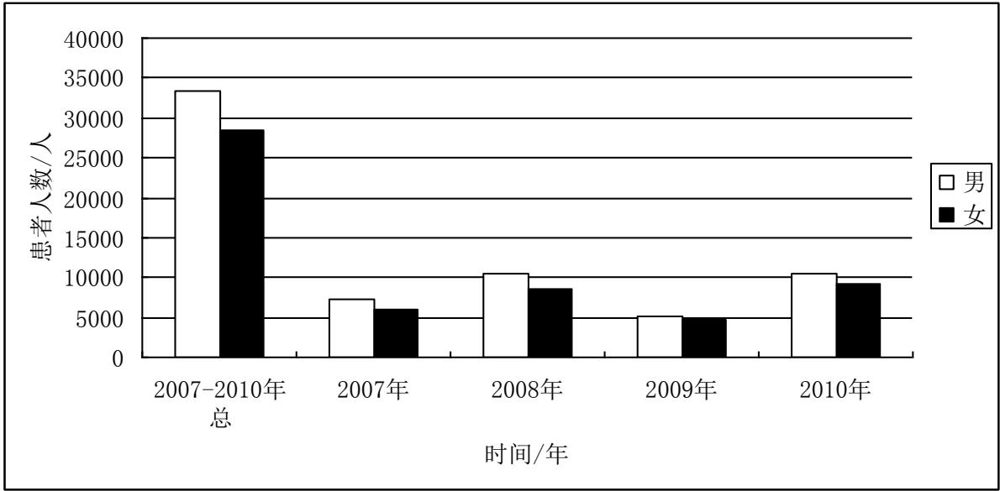  
图 1 2007\~2010 年男女患病人数统计图

从表1及图1可以看出，2007年男女患者之比达 1.23:1，男性比女性更容易患脑卒中这类疾病，可能原因有以下几点：一是男性高血压多于女性；二是男性吸烟与饮酒者多于女性；三是男性从事体力劳动较多，突然用力可能诱发中风。

## 4.1.2.2 按职业统计

按职业字段进行筛选得到2007\~2010 年各职业患病人数统计数据如表2所示。

表 2 2007\~2010 年各职业患病人数统计表
<table><tr><td colspan="5" rowspan="1">2007~2010年按职业统计数据</td></tr><tr><td colspan="2" rowspan="1">职业</td><td colspan="1" rowspan="2">发病人数</td><td colspan="2" rowspan="1">性别</td></tr><tr><td colspan="1" rowspan="1">编号</td><td colspan="1" rowspan="1">名称</td><td colspan="1" rowspan="1">男</td><td colspan="1" rowspan="1">女</td></tr><tr><td colspan="1" rowspan="1">1</td><td colspan="1" rowspan="1">农民</td><td colspan="1" rowspan="1">29750</td><td colspan="1" rowspan="1">14644</td><td colspan="1" rowspan="1">15084</td></tr><tr><td colspan="1" rowspan="1">2</td><td colspan="1" rowspan="1">工人</td><td colspan="1" rowspan="1">4856</td><td colspan="1" rowspan="1">3108</td><td colspan="1" rowspan="1">1745</td></tr><tr><td colspan="1" rowspan="1">3</td><td colspan="1" rowspan="1">退休人员</td><td colspan="1" rowspan="1">6646</td><td colspan="1" rowspan="1">4126</td><td colspan="1" rowspan="1">2517</td></tr><tr><td colspan="1" rowspan="1">4</td><td colspan="1" rowspan="1">教师</td><td colspan="1" rowspan="1">216</td><td colspan="1" rowspan="1">163</td><td colspan="1" rowspan="1">53</td></tr><tr><td colspan="1" rowspan="1">5</td><td colspan="1" rowspan="1">渔民</td><td colspan="1" rowspan="1">66</td><td colspan="1" rowspan="1">43</td><td colspan="1" rowspan="1">23</td></tr><tr><td colspan="1" rowspan="1">6</td><td colspan="1" rowspan="1">医务人员</td><td colspan="1" rowspan="1">90</td><td colspan="1" rowspan="1">65</td><td colspan="1" rowspan="1">25</td></tr><tr><td colspan="1" rowspan="1">7</td><td colspan="1" rowspan="1">职工</td><td colspan="1" rowspan="1">735</td><td colspan="1" rowspan="1">513</td><td colspan="1" rowspan="1">220</td></tr><tr><td colspan="1" rowspan="1">8</td><td colspan="1" rowspan="1">离退人员</td><td colspan="1" rowspan="1">1751</td><td colspan="1" rowspan="1">1181</td><td colspan="1" rowspan="1">570</td></tr><tr><td colspan="1" rowspan="1">其它或缺失</td><td colspan="1" rowspan="1">其它或缺失</td><td colspan="1" rowspan="1">17775</td><td colspan="1" rowspan="1">9524</td><td colspan="1" rowspan="1">8268</td></tr></table>

从表中看出农民患病人数为 29750，属于较多人群，为高危职业，而医务人员等明显较低，这与工作强度相关。

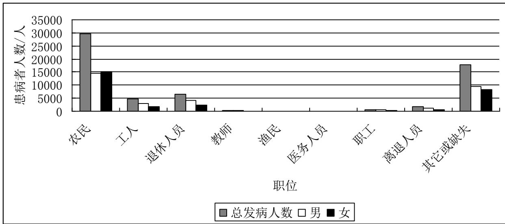  
图 2 2007\~2010 年各职业患病人数统计图  
可以得出结论：经济收入较高的人群较收入低的人群脑卒中发病率低，户外重体力劳动者发病率较高。

## 4.1.2.3 按年龄统计

针对职业统计中，退休人员所占比例较大说明与年龄有关，对年龄进行筛选，将年龄分为各个阶段，统计出每年中不同年龄段的患病人数，以2007-2008年为例进行如表 3所示的描述，各年详细数据见附录 A-1。

表 3 2007-2008年各年龄段内患病人数统计表
<table><tr><td colspan="1" rowspan="1"></td><td colspan="3" rowspan="1">2007</td><td colspan="3" rowspan="1">2008</td></tr><tr><td colspan="1" rowspan="1"></td><td colspan="1" rowspan="1">患病人数</td><td colspan="1" rowspan="1">男</td><td colspan="1" rowspan="1">女</td><td colspan="1" rowspan="1">患病人数</td><td colspan="1" rowspan="1">男</td><td colspan="1" rowspan="1">女</td></tr><tr><td colspan="1" rowspan="1">1--10</td><td colspan="1" rowspan="1">17</td><td colspan="1" rowspan="1">10</td><td colspan="1" rowspan="1">7</td><td colspan="1" rowspan="1">50</td><td colspan="1" rowspan="1">15</td><td colspan="1" rowspan="1">35</td></tr><tr><td colspan="1" rowspan="1">11--20</td><td colspan="1" rowspan="1">7</td><td colspan="1" rowspan="1">4</td><td colspan="1" rowspan="1">3</td><td colspan="1" rowspan="1">14</td><td colspan="1" rowspan="1">9</td><td colspan="1" rowspan="1">5</td></tr><tr><td colspan="1" rowspan="1">21--30</td><td colspan="1" rowspan="1">35</td><td colspan="1" rowspan="1">16</td><td colspan="1" rowspan="1">19</td><td colspan="1" rowspan="1">57</td><td colspan="1" rowspan="1">32</td><td colspan="1" rowspan="1">25</td></tr><tr><td colspan="1" rowspan="1">31--40</td><td colspan="1" rowspan="1">155</td><td colspan="1" rowspan="1">96</td><td colspan="1" rowspan="1">59</td><td colspan="1" rowspan="1">235</td><td colspan="1" rowspan="1">173</td><td colspan="1" rowspan="1">62</td></tr><tr><td colspan="1" rowspan="1">41--50</td><td colspan="1" rowspan="1">614</td><td colspan="1" rowspan="1">374</td><td colspan="1" rowspan="1">240</td><td colspan="1" rowspan="1">865</td><td colspan="1" rowspan="1">566</td><td colspan="1" rowspan="1">298</td></tr><tr><td colspan="1" rowspan="1">51--60</td><td colspan="1" rowspan="1">1861</td><td colspan="1" rowspan="1">1135</td><td colspan="1" rowspan="1">726</td><td colspan="1" rowspan="1">2547</td><td colspan="1" rowspan="1">1514</td><td colspan="1" rowspan="1">1033</td></tr><tr><td colspan="1" rowspan="1">61--70</td><td colspan="1" rowspan="1">3069</td><td colspan="1" rowspan="1">1784</td><td colspan="1" rowspan="1">1285</td><td colspan="1" rowspan="1">4669</td><td colspan="1" rowspan="1">2803</td><td colspan="1" rowspan="1">1864</td></tr><tr><td colspan="1" rowspan="1">71--80</td><td colspan="1" rowspan="1">4842</td><td colspan="1" rowspan="1">2678</td><td colspan="1" rowspan="1">2164</td><td colspan="1" rowspan="1">6648</td><td colspan="1" rowspan="1">3496</td><td colspan="1" rowspan="1">3147</td></tr><tr><td colspan="1" rowspan="1">81--90</td><td colspan="1" rowspan="1">2309</td><td colspan="1" rowspan="1">1051</td><td colspan="1" rowspan="1">1258</td><td colspan="1" rowspan="1">3549</td><td colspan="1" rowspan="1">1609</td><td colspan="1" rowspan="1">1936</td></tr><tr><td colspan="1" rowspan="1">91--100</td><td colspan="1" rowspan="1">170</td><td colspan="1" rowspan="1">57</td><td colspan="1" rowspan="1">113</td><td colspan="1" rowspan="1">249</td><td colspan="1" rowspan="1">82</td><td colspan="1" rowspan="1">167</td></tr><tr><td colspan="1" rowspan="1">101--110</td><td colspan="1" rowspan="1">3</td><td colspan="1" rowspan="1">3</td><td colspan="1" rowspan="1">0</td><td colspan="1" rowspan="1">4</td><td colspan="1" rowspan="1">2</td><td colspan="1" rowspan="1">2</td></tr><tr><td colspan="1" rowspan="1">其他</td><td colspan="1" rowspan="1">126</td><td colspan="1" rowspan="1">76</td><td colspan="1" rowspan="1">50</td><td colspan="1" rowspan="1">25</td><td colspan="1" rowspan="1">12</td><td colspan="1" rowspan="1">13</td></tr></table>

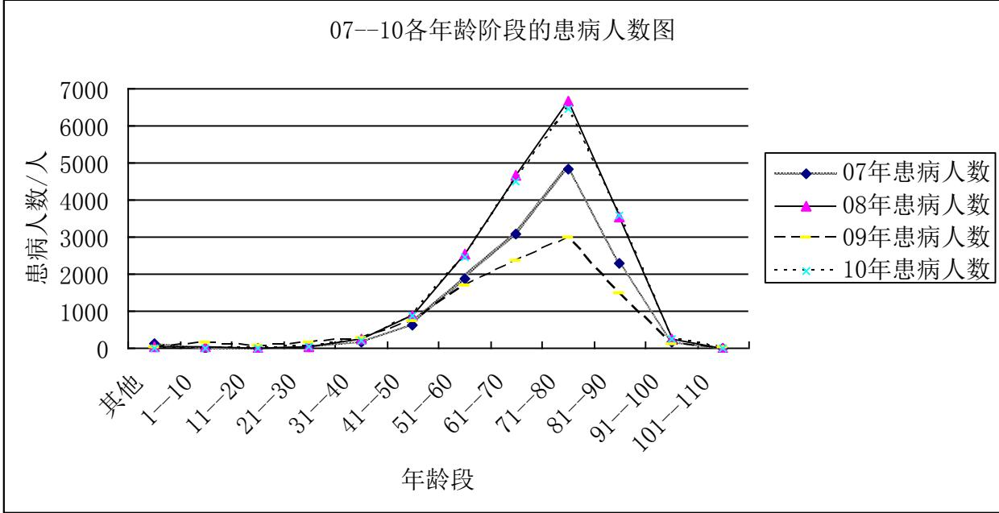  
图 3 2007\~2010 年各年龄阶段的患病人数图

由图 3 可见，患病人数随年龄的增加而增加，上升速度以 50 到 60 上升较快，61 岁以上的人群脑卒中的高发群体，集中年龄段在71-80 岁之间，说明脑卒中以老年人居多，且脑卒中患者呈年轻化的趋势。

进一步按照各年龄段，对男女患者发病人数的进行区分，可得图 4所示。

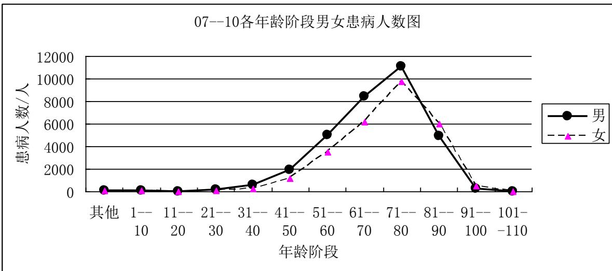  
图4 2007\~2010 四年期间各年龄阶段男女患病人数图

可见，男女高峰年龄段一致；男性在 41～71岁之间，患病人数明显高于女性；71岁以后患病明显回落，且低于女性发病人数，可知男性发病早于女性，同时这现象可能是由于高龄组死亡率持续增高所致。但无论男女，构成随着年龄增加而增加，这与其在年龄发病相符。

## 4.1.2.4 按时间统计

按年份对发病人数进行统计，得到发病人数统计图如图 5所示。

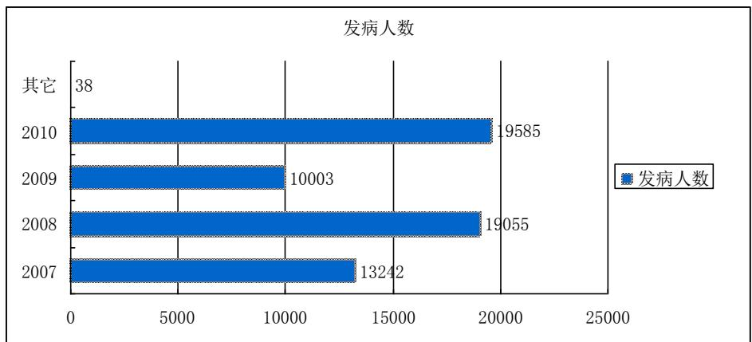  
图5 脑卒中患者按年的统计人数分布

从上图可以看出，附件总数据为 61923条，但2007\~2010间有效的数据为61885 条，本文做的统计描述均是针对2007\~2010 期间内。

按月份对发病人数进行统计，得到发病人数统计表如表 4所示。  
表 4 2007\~2010 年各月患病人数统计表
<table><tr><td rowspan=1 colspan=1>月份</td><td rowspan=1 colspan=1>07年发病人数</td><td rowspan=1 colspan=1>08年发病人数</td><td rowspan=1 colspan=1>09年发病人数</td><td rowspan=1 colspan=1>10年发病人数</td><td rowspan=1 colspan=1>2007-2010年总发病人数</td></tr><tr><td rowspan=1 colspan=1>1</td><td rowspan=1 colspan=1>935</td><td rowspan=1 colspan=1>1827</td><td rowspan=1 colspan=1>872</td><td rowspan=1 colspan=1>1760</td><td rowspan=1 colspan=1>5394</td></tr><tr><td rowspan=1 colspan=1>2</td><td rowspan=1 colspan=1>732</td><td rowspan=1 colspan=1>1961</td><td rowspan=1 colspan=1>848</td><td rowspan=1 colspan=1>1487</td><td rowspan=1 colspan=1>5028</td></tr><tr><td rowspan=1 colspan=1>3</td><td rowspan=1 colspan=1>1019</td><td rowspan=1 colspan=1>1918</td><td rowspan=1 colspan=1>830</td><td rowspan=1 colspan=1>1724</td><td rowspan=1 colspan=1>5491</td></tr><tr><td rowspan=1 colspan=1>4</td><td rowspan=1 colspan=1>1069</td><td rowspan=1 colspan=1>1758</td><td rowspan=1 colspan=1>860</td><td rowspan=1 colspan=1>1699</td><td rowspan=1 colspan=1>5386</td></tr><tr><td rowspan=1 colspan=1>5</td><td rowspan=1 colspan=1>1072</td><td rowspan=1 colspan=1>1776</td><td rowspan=1 colspan=1>876</td><td rowspan=1 colspan=1>1882</td><td rowspan=1 colspan=1>5606</td></tr><tr><td rowspan=1 colspan=1>6</td><td rowspan=1 colspan=1>1032</td><td rowspan=1 colspan=1>1517</td><td rowspan=1 colspan=1>793</td><td rowspan=1 colspan=1>1610</td><td rowspan=1 colspan=1>4952</td></tr><tr><td rowspan=1 colspan=1>7</td><td rowspan=1 colspan=1>1014</td><td rowspan=1 colspan=1>1500</td><td rowspan=1 colspan=1>931</td><td rowspan=1 colspan=1>1757</td><td rowspan=1 colspan=1>5202</td></tr><tr><td rowspan=1 colspan=1>8</td><td rowspan=1 colspan=1>1197</td><td rowspan=1 colspan=1>1366</td><td rowspan=1 colspan=1>934</td><td rowspan=1 colspan=1>1680</td><td rowspan=1 colspan=1>5177</td></tr><tr><td rowspan=1 colspan=1>9</td><td rowspan=1 colspan=1>1221</td><td rowspan=1 colspan=1>1272</td><td rowspan=1 colspan=1>829</td><td rowspan=1 colspan=1>1632</td><td rowspan=1 colspan=1>4954</td></tr><tr><td rowspan=1 colspan=1>10</td><td rowspan=1 colspan=1>1374</td><td rowspan=1 colspan=1>1461</td><td rowspan=1 colspan=1>759</td><td rowspan=1 colspan=1>1718</td><td rowspan=1 colspan=1>5312</td></tr><tr><td rowspan=1 colspan=1>11</td><td rowspan=1 colspan=1>1208</td><td rowspan=1 colspan=1>1378</td><td rowspan=1 colspan=1>664</td><td rowspan=1 colspan=1>1565</td><td rowspan=1 colspan=1>4815</td></tr><tr><td rowspan=1 colspan=1>12</td><td rowspan=1 colspan=1>1369</td><td rowspan=1 colspan=1>1321</td><td rowspan=1 colspan=1>807</td><td rowspan=1 colspan=1>1071</td><td rowspan=1 colspan=1>4568</td></tr></table>

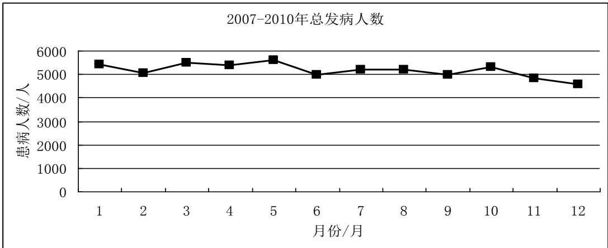  
图6 2007-2010年总发病人数随月份的变化曲线  
从 2007\~2010年逐年脑卒中发病人数的月分布发现，该病以春节多发，高峰出现在 $3 \sim$

5月，1 月为次高峰，6～9月发病较为平缓，12月出现低谷期。由此可见发病存在一定的季节差异，脑卒中春季高于其他季节，而夏、秋、冬三季发病差异不大。

利用 EXCEL 中的“COUNTIFS”函数对脑卒中病例数据进行多重筛选统计患者数量，得到2007\~2010四年每天的发病人数，其曲线如图 7所示。

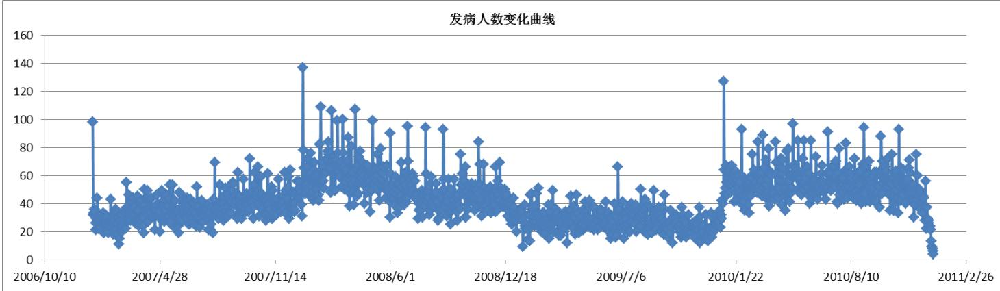  
图 7 2007-2010年总发病人数随天的变化曲线

根据式（1）求出 2007\~2010 四年内每天的发病率，其发病率随时间的变化曲线如图 8所示。

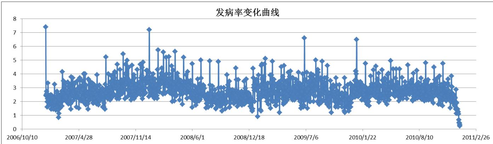  
图8 2007-2010年发病率随天的变化曲线

从图7和图8可以看出，2007\~2010四年内每天发病人数变化不大，每天的发病率基本保持不变。但是如果按天进行统计分析，每天的随机误差容易对结果造成影响，再每月的均值作为统计对象进行分析，四年内每月的发病率百分比曲线如图9所示。

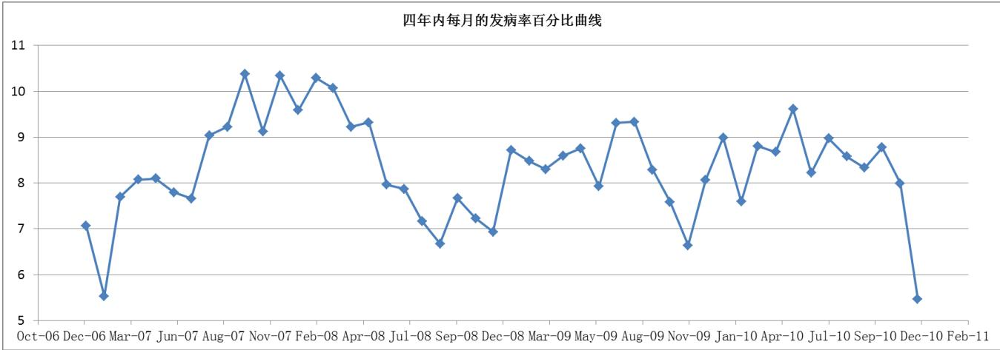  
图9 2007-2010年发病率随月的变化曲线

从图9可以看出，月发病率随时间呈周期性波动，具有一定的季节性。

## 4.1.2.5 重要结论

（1） 脑卒中的发病有年集中趋势，更呈增长趋势；

（2） 发病存在时间差异，春节为高发季，1月为高峰月；

（3） 患者人数男性多于女性，性别比重为 1.17:1；

（4） 工作性质对脑卒中发病有直接影响，农民为高危职业；

（5） 脑卒中发病处于老年阶段，集中年龄段为 71～80，且逐年呈年轻化发展。

## 4.2 针对问题二的模型建立及求解

由问题分析可知，问题二属于一个多元统计分析模型，目标是研究因变量发病率与自变量温度（包括平均温度、最高温度、最低温度、温度差）、湿度（包括平均湿度、最低湿度）、气压（平均气压、最高气压、最低气压、气压差）之间的关系，本文主要从多元线性或非线性回归模型上进行分析。

## 4.2.1 数据归纳与统计

附件(Appendix-C2)中的数据已经给出了 2007-2010年每天对应的气象数据，可以在这基础上对气象数据进行进一步细化：

（1）计算每天的气压差与温差，最终得到 2007\~2010年期间每一天的气象特征信息—平均气压、最高气压、最低气压、气压差、平均温度、最高温度、最低温度、温度差、平均湿度、最低湿度等10个特征变量；

（2）按月份统计所有数据中每月的最大值及最小值情况。

最后将第一问进行统计出的发病率情况与气象数据信息进行一一关联，得到最终待分析的数据集，其数据形式如表 5所示。

表5 数据归纳统计形式
<table><tr><td rowspan=1 colspan=14>按天统计</td></tr><tr><td rowspan=1 colspan=1>时间</td><td rowspan=1 colspan=1>发病人数</td><td rowspan=1 colspan=1>发病率</td><td rowspan=1 colspan=1>发病率千分比</td><td rowspan=1 colspan=1>平均气压</td><td rowspan=1 colspan=1>最高气压</td><td rowspan=1 colspan=1>最低气压</td><td rowspan=1 colspan=1>平均温度</td><td rowspan=1 colspan=1>最高温度</td><td rowspan=1 colspan=1>最低温度</td><td rowspan=1 colspan=1>平均湿度</td><td rowspan=1 colspan=1>最低湿度</td><td rowspan=1 colspan=1>气压差</td><td rowspan=1 colspan=1>温度差</td></tr><tr><td rowspan=1 colspan=1>2007/1/1</td><td rowspan=1 colspan=1>98</td><td rowspan=1 colspan=1>0.007401</td><td rowspan=1 colspan=1>7.40069476</td><td rowspan=1 colspan=1>1025.1</td><td rowspan=1 colspan=1>1028.5</td><td rowspan=1 colspan=1>1023.3</td><td rowspan=1 colspan=1>8.1</td><td rowspan=1 colspan=1>9.9</td><td rowspan=1 colspan=1>7.4</td><td rowspan=1 colspan=1>86</td><td rowspan=1 colspan=1>71</td><td rowspan=1 colspan=1>5.2</td><td rowspan=1 colspan=1>2.5</td></tr><tr><td rowspan=1 colspan=1>2007/1/2</td><td rowspan=1 colspan=1>32</td><td rowspan=1 colspan=1>0.002417</td><td rowspan=1 colspan=1>2.41655339</td><td rowspan=1 colspan=1>1025.2</td><td rowspan=1 colspan=1>1026.7</td><td rowspan=1 colspan=1>1023.5</td><td rowspan=1 colspan=1>6.5</td><td rowspan=1 colspan=1>7.4</td><td rowspan=1 colspan=1>6</td><td rowspan=1 colspan=1>84</td><td rowspan=1 colspan=1>73</td><td rowspan=1 colspan=1>3.2</td><td rowspan=1 colspan=1>1.4</td></tr><tr><td rowspan=1 colspan=1>2007/1/3</td><td rowspan=1 colspan=1>33</td><td rowspan=1 colspan=1>0.002492</td><td rowspan=1 colspan=1>2.49207068</td><td rowspan=1 colspan=1>1026.1</td><td rowspan=1 colspan=1>1027.8</td><td rowspan=1 colspan=1>1025.1</td><td rowspan=1 colspan=1>5</td><td rowspan=1 colspan=1>6.9</td><td rowspan=1 colspan=1>4.2</td><td rowspan=1 colspan=1>86</td><td rowspan=1 colspan=1>77</td><td rowspan=1 colspan=1>2.7</td><td rowspan=1 colspan=1>2.7</td></tr><tr><td rowspan=1 colspan=1>2007/1/4</td><td rowspan=1 colspan=1>36</td><td rowspan=1 colspan=1>0.002719</td><td rowspan=1 colspan=1>2.71862256</td><td rowspan=1 colspan=1>1027.1</td><td rowspan=1 colspan=1>1029.2</td><td rowspan=1 colspan=1>1025.7</td><td rowspan=1 colspan=1>5.9</td><td rowspan=1 colspan=1>7.4</td><td rowspan=1 colspan=1>4.2</td><td rowspan=1 colspan=1>82</td><td rowspan=1 colspan=1>78</td><td rowspan=1 colspan=1>3.5</td><td rowspan=1 colspan=1>3.2</td></tr><tr><td rowspan=1 colspan=1>2007/1/5</td><td rowspan=1 colspan=1>34</td><td rowspan=1 colspan=1>0.002568</td><td rowspan=1 colspan=1>2.56758798</td><td rowspan=1 colspan=1>1027.1</td><td rowspan=1 colspan=1>1029</td><td rowspan=1 colspan=1>1025.2</td><td rowspan=1 colspan=1>5</td><td rowspan=1 colspan=1>6.5</td><td rowspan=1 colspan=1>4.3</td><td rowspan=1 colspan=1>84</td><td rowspan=1 colspan=1>76</td><td rowspan=1 colspan=1>3.8</td><td rowspan=1 colspan=1>2.2</td></tr></table>

## 4.2.2 多元回归分析过程

多元回归分析包括多元线性回归及多元非线性回归，判断方法主要通过绘制因变量与各个自变量之间的散点图，首先直观分析因变量与自变量的关系，如果从散点图可以看出明显

的线性关系，那么可以考虑通过多元线性回归进行分析；如果从散点图并不能发现明显的线性规律，可能是呈非线性，也可能是多个自变量之间的耦合关系的影响，需要进一步分析才能决定。

## 4.2.2.1 多元线性回归数学模型

若依变数Y同时受到m 个自变数 $X _ { 1 } , \ X _ { 2 } , \dots \ X _ { m }$ 的影响，且这m 个自变数皆与Y成线性关系，则这m+1个变数的关系就形成m元线性回归。因此，一个m 元线性回归总体的线性模型为：

$$
Y _ { j } = \beta _ { 0 } X _ { 0 } + \beta _ { 1 } X _ { 1 j } + \beta _ { 2 } X _ { 2 j } + \cdots + \beta _ { m } X _ { m j } + \varepsilon _ { j }\tag{式(2}
$$

其中， $\varepsilon _ { j } \sim N ( 0 , \sigma _ { \varepsilon } ^ { 2 } )$ 。相应的，一个m 元线性回归的样本观察值组成为：

$$
y _ { j } = b _ { 0 } + b _ { 1 } x _ { 1 j } + b _ { 2 } x _ { 2 j } + \cdot \cdot \cdot + b _ { m } x _ { m j } + e _ { j }\tag{式(3}
$$

在一个具有n组观察值的样本中，第j组观察值 $\scriptstyle ( j = 1$ ，2，…，n)可表示为 $( x _ { 1 j } , \ x _ { 2 j } , \dots ,$ xmj，yj)，便是 $M { = } ( m { + } 1$ )维空间中的一个点。

同理，一个m 元线性回归方程可给定为：

$$
\hat { y } = b _ { 0 } + b _ { 1 } x _ { 1 } + b _ { 2 } x _ { 2 } + \cdots + b _ { m } x _ { m }\tag{式(4}
$$

式(3)中， $b _ { 0 }$ 是 $\smash { x _ { 1 } , \ x _ { 2 } \ldots \ x _ { m } }$ 都为 0时 $y$ 的点估计值； $b _ { 1 }$ 是 $b _ { y 1 \cdot 2 3 \_ m }$ 的简写，它是在 $x _ { 2 }$ x3， $\ldots , \ x _ { m }$ 皆保持一定时， $x _ { 1 }$ 每增加一个单位对 $y$ 的效应，称为 $x _ { 2 } .$ ，x ，…， $x _ { m }$ 不变(取常量)时 $x _ { 1 }$ 对 $y$ 的偏回归系数(partial regression coefficient)； $b _ { 2 }$ 是 $b _ { y 2 \cdot 1 3 \_ m }$ 的简写，它是在 $x _ { 1 } , x _ { 3 } , . . . ,$ $x _ { m }$ 皆保持一定时， $x _ { 2 }$ 每增加一个单位对 $y$ 的效应，称为 $x _ { 1 }$ ， $x _ { 3 }$ ，…， $x _ { m }$ 不变(取常量)时 $x _ { 2 }$ 对$y$ 的偏回归系数；依此类推， $b _ { 3 }$ 是 $x _ { 3 }$ 对 $y$ 的偏回归系数；……； $b _ { m }$ 是 $x _ { m }$ 对 $y$ 的偏回归系数。

在多元回归系统中， $b _ { 0 }$ 一般很难确定其专业意义，它仅是调节回归响应面的一个参数；$b _ { i } ( i { = } 1 , ~ 2 , ~ . . . , ~ m )$ 表示了各个自变数 $x _ { i }$ 对依变数 $y$ 的各自效应，而 $\hat { y }$ 则是这些各自效应的集合，代表着所有自变数对依变数的综合效应。

多元线性回归模型的求解可以直接通过 SPSS 软件和 MATLAB 相应的工具求解。

## 4.2.2.2 按天的数据分析

显然，本文中的因变量 Y 为脑卒中发病人数或发病率或发病率千分比，自变量 X 有平均气压、最高气压、最低气压、气压差、平均温度、最高温度、最低温度、温度差、平均湿度、最低湿度等10个变量，首先按照每天的统计数据进行多元线性回归分析。

## （1）观测发病率与自变量的散点图

以平均气压为例，绘制发病率千分比与平均气压的散点图如图 10所示。

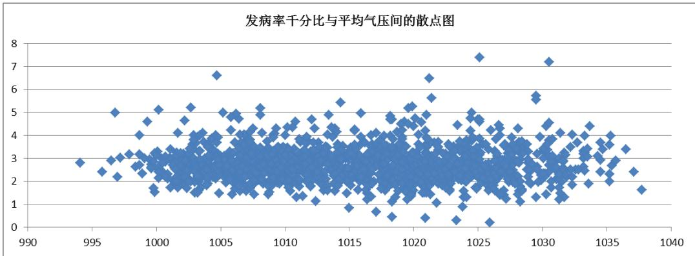  
图10 2007-2010年每天发病率千分比与平均气压间的散点图

从该图可以看出发病率与平均气压并没有明显的线性变化关系，可能原因是发病率与平均气压的相关性不强，也可能是受其它自变量耦合关系的影响，因为要分析发病率与平均气压的关系必须要在其它指标保持不变或变化很小范围内研究才具有可靠性，因此需要进一步分析。

## （2）所有变量两两相关性分析

将表5所示的数据导入 SPSS 软件中【1】，进行变量之间的相关性分析，所得结果如表 6所示。

表6 发病率与10 个自变量之间的相关性统计
<table><tr><td colspan="2" rowspan="1"></td><td colspan="1" rowspan="1">发病率千分比</td></tr><tr><td colspan="1" rowspan="3">平均气压</td><td colspan="1" rowspan="1">Pearson 相关性</td><td colspan="1" rowspan="1">-.001</td></tr><tr><td colspan="1" rowspan="1">显著性（双侧）</td><td colspan="1" rowspan="1">.965</td></tr><tr><td colspan="1" rowspan="1">N</td><td colspan="1" rowspan="1">1461</td></tr><tr><td colspan="1" rowspan="3">最高气压</td><td colspan="1" rowspan="1">Pearson 相关性</td><td colspan="1" rowspan="1">-.003</td></tr><tr><td colspan="1" rowspan="1">显著性（双侧）</td><td colspan="1" rowspan="1">.910</td></tr><tr><td colspan="1" rowspan="1">N</td><td colspan="1" rowspan="1">1461</td></tr><tr><td colspan="1" rowspan="3">最低气压</td><td colspan="1" rowspan="1">Pearson 相关性</td><td colspan="1" rowspan="1">.001</td></tr><tr><td colspan="1" rowspan="1">显著性（双侧）</td><td colspan="1" rowspan="1">.968</td></tr><tr><td colspan="1" rowspan="1">N</td><td colspan="1" rowspan="1">1461</td></tr><tr><td colspan="1" rowspan="3">平均温度</td><td colspan="1" rowspan="1">Pearson 相关性</td><td colspan="1" rowspan="1">.006</td></tr><tr><td colspan="1" rowspan="1">显著性（双侧）</td><td colspan="1" rowspan="1">.834</td></tr><tr><td colspan="1" rowspan="1">N</td><td colspan="1" rowspan="1">1461</td></tr><tr><td colspan="1" rowspan="3">最高温度</td><td colspan="1" rowspan="1">Pearson 相关性</td><td colspan="1" rowspan="1">.009</td></tr><tr><td colspan="1" rowspan="1">显著性（双侧）</td><td colspan="1" rowspan="1">.742</td></tr><tr><td colspan="1" rowspan="1">N</td><td colspan="1" rowspan="1">1461</td></tr><tr><td colspan="1" rowspan="3">最低温度</td><td colspan="1" rowspan="1">Pearson 相关性</td><td colspan="1" rowspan="1">.001</td></tr><tr><td colspan="1" rowspan="1">显著性（双侧）</td><td colspan="1" rowspan="1">.977</td></tr><tr><td colspan="1" rowspan="1">N</td><td colspan="1" rowspan="1">1461</td></tr><tr><td colspan="1" rowspan="3">平均湿度</td><td colspan="1" rowspan="1">Pearson 相关性</td><td colspan="1" rowspan="1">-.072</td></tr><tr><td colspan="1" rowspan="1">显著性（双侧）</td><td colspan="1" rowspan="1">.006</td></tr><tr><td colspan="1" rowspan="1">N</td><td colspan="1" rowspan="1">1461</td></tr><tr><td colspan="1" rowspan="3">最低湿度</td><td colspan="1" rowspan="1">Pearson 相关性</td><td colspan="1" rowspan="1">-.028</td></tr><tr><td colspan="1" rowspan="1">显著性（双侧）</td><td colspan="1" rowspan="1">.290</td></tr><tr><td colspan="1" rowspan="1">N</td><td colspan="1" rowspan="1">1461</td></tr><tr><td colspan="1" rowspan="2">气压差</td><td colspan="1" rowspan="1">Pearson 相关性</td><td colspan="1" rowspan="1">-.015</td></tr><tr><td colspan="1" rowspan="1">显著性（双侧）</td><td colspan="1" rowspan="1">.554</td></tr><tr><td colspan="1" rowspan="1"></td><td colspan="1" rowspan="1">N</td><td colspan="1" rowspan="1">1461</td></tr><tr><td colspan="1" rowspan="3">温度差</td><td colspan="1" rowspan="1">Pearson 相关性</td><td colspan="1" rowspan="1">.024</td></tr><tr><td colspan="1" rowspan="1">显著性（双侧）</td><td colspan="1" rowspan="1">.368</td></tr><tr><td colspan="1" rowspan="1">N</td><td colspan="1" rowspan="1">1461</td></tr></table>

从表6可以看出，发病率只与平均湿度能通过显著性检验（<0.05），且相关系数都非常低，但总体上发病率与最低气压呈正相关、与最高温度成正相关、与平均湿度成负相关、与温差呈正相关、与气压差呈负相关。

## （3）逐步回归分析

从（1）和（2）分析可知发病率从单因素上讲，它与其它自变量的相关性非常小，且无规律可行，需要进行多因素分析，可以通过多元线性回归进行尝试。但是，部分自变量之间又存在很强的相关性，如关于温度的四个指标之间的相关系都大于 0.9，因此发病率肯定不是所有这10个特征变量的函数表达式，因此本文采用逐步回归法进行分析。

逐步回归分析的基本原理为：在建立多元回归方程的过程中，按偏相关系数的大小次序将自变量逐个引入方程，对引入方程中的每个自变量偏相关系数进行统计检验，效应显著的自变量留在回归方程内，循此继续遴选下一个自变量。如果效应不显著，停止引入新自变量。由于新自变量的引入，原已引入方程中的自变量由于变量之间的相互作用其效应有可能变得不显著者，经统计检验确证后要随时从方程中剔除，只保留效应显著的自变量，直至不再引入和剔除自变量为止，从而得到最优的回归方程。

对于本文中的逐步回归分析仍借助于 SPSS软件的“回归”功能进行分析，设定显著性水平为0.05，逐步回归的模型检验为 F=7.555，Sig.=0.006，具体结果如下：

表7 逐步回归模型结果
<table><tr><td rowspan=2 colspan=1>模型</td><td rowspan=1 colspan=2>非标准化系数</td><td rowspan=1 colspan=1>标准系数</td><td rowspan=2 colspan=1>t</td><td rowspan=2 colspan=1>Sig.</td></tr><tr><td rowspan=1 colspan=1>B</td><td rowspan=1 colspan=1>标准误差</td><td rowspan=1 colspan=1>试用版</td></tr><tr><td rowspan=1 colspan=1>(常量)1平均湿度</td><td rowspan=1 colspan=1>3.022-.004</td><td rowspan=1 colspan=1>.105.001</td><td rowspan=1 colspan=1>-.072</td><td rowspan=1 colspan=1>28.741-2.749</td><td rowspan=1 colspan=1>.000.006</td></tr></table>

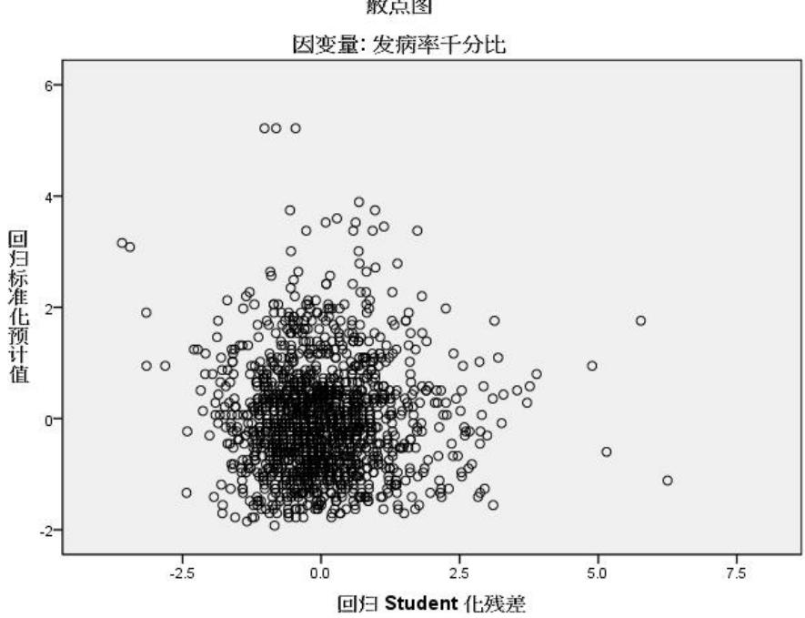  
图 11 逐步回归的 Student 化残差图

从表7可以看出，所计算的参数的显著性水平 ${ \mathrm { S i g . } }$ 均小于0.05，表示计算回归模型通过了显著性检验，且标准误差也比较小；从图 11 也可以看出残差图基本落在[-2.5 2.5]内，表明回归模型较好，该逐步回归的多元线性模型为：

$$
y = 3 . 0 2 2 - 0 . 0 0 4 x\tag{式(5}
$$

其中y 代表发病率千分比，x代表平均湿度，这也说明发病率与平均湿度条件直接相关。

## （4）气象变量间的相关性分析

由于湿度与温度、气压密切相关，脑卒中发病率虽然与温度、气压没有直接关联度，但温度和气压因素却影响湿度参数，因此以平均湿度为因变量，以平均气压、最高气压、最低气压、气压差、平均温度、最高温度、最低温度、温度差 8 个特征为自变量进行逐步回归分析，通过已有数据分析平均湿度与温度、气压因素的函数关系。具体分析方法与前面一致，分析结果如下：

表 8 平均湿度与温度、气压的逐步回归模型结果
<table><tr><td rowspan=2 colspan=2>模型</td><td rowspan=1 colspan=2>非标准化系数</td><td rowspan=1 colspan=1>标准系数</td><td rowspan=2 colspan=1>t</td><td rowspan=2 colspan=1> $S \mathrm { i g . }$ </td></tr><tr><td rowspan=1 colspan=1>B</td><td rowspan=1 colspan=1>标准误差</td><td rowspan=1 colspan=1>试用版</td></tr><tr><td rowspan=2 colspan=1>1</td><td rowspan=1 colspan=1>(常量)</td><td rowspan=1 colspan=1>84.455</td><td rowspan=1 colspan=1>.837</td><td rowspan=1 colspan=1></td><td rowspan=1 colspan=1>100.939</td><td rowspan=1 colspan=1>.000</td></tr><tr><td rowspan=1 colspan=1>温度差</td><td rowspan=1 colspan=1>-1.796</td><td rowspan=1 colspan=1>.102</td><td rowspan=1 colspan=1>-.419</td><td rowspan=1 colspan=1>-17.605</td><td rowspan=1 colspan=1>.000</td></tr><tr><td rowspan=3 colspan=1>2</td><td rowspan=1 colspan=1>(常量)</td><td rowspan=1 colspan=1>448.227</td><td rowspan=1 colspan=1>35.594</td><td rowspan=1 colspan=1></td><td rowspan=1 colspan=1>12.593</td><td rowspan=1 colspan=1>.000</td></tr><tr><td rowspan=1 colspan=1>温度差</td><td rowspan=1 colspan=1>-1.768</td><td rowspan=1 colspan=1>.099</td><td rowspan=1 colspan=1>-.412</td><td rowspan=1 colspan=1>-17.931</td><td rowspan=1 colspan=1>.000</td></tr><tr><td rowspan=1 colspan=1>平均气压</td><td rowspan=1 colspan=1>-.358</td><td rowspan=1 colspan=1>.035</td><td rowspan=1 colspan=1>-.235</td><td rowspan=1 colspan=1>-10.223</td><td rowspan=1 colspan=1>.000</td></tr></table>

从表8可以看出湿度与温度、压强的线性关系具有两种模型：

模型 1：

$$
y = 3 8 4 . 4 5 5 - 1 . 7 9 6 x _ { 1 }\tag{式(6}
$$

模型 2：

$$
y = 4 4 8 . 2 2 7 - 1 . 7 6 8 x _ { 1 } - 0 . 3 5 8 x _ { 2 }\tag{式(7}
$$

其中，y 代表平均湿度， $x _ { 1 }$ 代表温度差， $x _ { 2 }$ 代表平均气压，这说明平均湿度与温度差和平均气压相关。

## 4.2.2.3 按月或季度的数据分析

根据表5所示的数据，很容易统计出每月或季度的数据，其中，每月（季）的发病率=每月（季）的发病总人数/该年的发病总人数，每月的气象数据为该月的平均值或最大最小值，关于发病率与气象环境关系的分析方法与前面所描述的过程基本一致。

## 4.3 针对问题三的求解

## 4.3.1 脑卒中高危人群的重要特征和关键指标

## 4.3.1.1 重要特征

根据脑动脉狭窄和闭塞后，神经功能障碍的轻重和症状持续时间，分三种类型：

（1）短暂性脑缺血发作颈内动脉缺血表现为，突然肢体运动和感觉障碍、失语，单眼短暂失明等，少有意识障碍。椎动脉缺血表现为，眩晕、耳鸣、听力障碍、复视、步态不稳和吞咽困难等。症状持续时间短，可反复发作，甚至一天数次或数十次。可自行缓解，不留后遗症。脑内无明显梗死灶。

（2）可逆性缺血性神经功能障碍(RIND)与TIA基本相同，但神经功能障碍持续时间超过 24 小时，有的病人可达数天或数十天，最后逐渐完全恢复。脑部可有小的梗死灶，大部分为可逆性病变。

（3）完全性卒中(CS)症状较 TIA 和RIND 严重，不断恶化，常有意识障碍。脑部出现明显的梗死灶。神经功能障碍长期不能恢复，完全性卒中又可分为轻、中、重三型。

## 4.3.1.2 关键指标

脑卒中关键指标主要有：职业为农民或工人，年龄在 71-80 岁之间，并患有基础性疾病（高血压、糖尿病等）。

## 4.3.2 脑卒中的主要诱发因素

脑卒中的主要诱发原因有：

（1）具有不良生活方式

①高危人群的饮食结构不良，多盐、油腻；②体力活动不足；③爱吸烟饮酒。

（2）患有基础性疾病

①高血压：患高血压史在脑卒中住院病例中，有80%以上的病例有高血压病史，其中脑梗塞82.66%，脑出血80.27%有高血压史

②心梗、房颤心梗、房颤是引起脑中风的一个独立的强有力的危险因素，与健康人相比，增加脑中风危险度5倍以上，尤其是老年人房颤相当多。

③糖尿病明显增加缺血性脑中风发生率，单纯糖尿病者，严格控制血糖可减少微血管病变，减缓动脉硬化，从而减少脑中风。

## （3）职业性质的影响；

文化程度高的病人自我护理能力强，这可能由于文化程度高的病人，具有更好的学习理解能力，能更好地查阅书籍、报纸、文化程度高的病人更容易接受治疗、康复计划。

## （4）年龄阶段因素

中风发生最常见的基本条件就是动脉硬化，随着年龄的增长，生理变化和多种病理性因素相互作用使动脉硬化逐渐产生。

## （5）男女性别差异

一是男性高血压多于女性；二是男性吸烟与饮酒者多于女性；三是男性从事体力劳动较

多，突然用力可能诱发中风。

## （6）季节性差异

脑卒中病人因其机体代谢差，肢体功能活动障碍而活动减少，神经传递障碍使温痛觉减弱或消失，患侧血液循环较健侧差，与季节气温相关。

## 4.3.3 对高危人群的预警和干预建议

## （一）结合问题一：

针对1：高危群众发病有年集中趋势，并逐年增长；

建议 1：

（1）舒缓压力：随着社会经济快速发展，社会各阶层压力过大，社会经济的发展直接影响人们的心理状态，这便是该病集中年患病的体现；文献报道【5】血管疾病的发生与生活事件密切相关，在紧张和过多应激环境中，应激反应可通过垂体引起交感神经兴奋和肾上腺皮质激素增加，使血管强烈收缩血压突然升高而致脑出血。所以减少疾病，应保持身心愉悦，舒缓压力较为重要因素。

（2）合理饮食结构：饮食对身体，当今快节奏的快餐生活方式严重影响了我们的饮食结构，这也是疾病逐年增长的因素。为此建议平日应多摄入低盐低脂类食物，减少油脂摄入，改善血脂异常，改掉不良饮食习惯，因为肥胖与超重均为缺血性中风的危险因素。

## 针对2：男性比女性更易患病

建议 2：

（1）戒烟：日常生活中男性一般要吸烟及大量酗酒，而尼古丁可刺激神经系统增快心率及脉率，血管收缩，血压升高长期的血管收缩和血液循环减慢，可使血中胆固醇、低密度脂蛋白沉积于动脉壁，导致动脉硬化【8】。

（2）戒酒：酒精具有增压作用，每日酒精摄入量超过 78g 的重度饮酒者的高血压患病率是没有饮酒的2倍，酒量与血压水平呈明显的剂量依赖关系。小量饮酒有保护作用，大量饮酒可增加危险性【10】。

## 针对3：工作性质影响发病

建议 3：

（1）学会适当休息：即文化程度高的病人自我护理能力强。这可能由于文化程度高的病人，具有更好的学习理解能力，能更好地查阅书籍、报纸、文化程度高的病人更容易接受治疗、康复计划。

（2）增强自身学习能力。

针对4：脑卒中处于老年阶段；

建议 4：

（1）每天运动30 分钟降低 4成患病几率：适当的运动会减少糖尿病【13】在于运动能加速对摄入热量的消耗，这样可以将糖份积极转化为有力量的肌肉。每天坚持30 分钟的运动就可以降低患糖尿病的风险 35%～40%。

（2）提高自我护理能力：脑卒中病人的自我护理能力受到年龄的影响，年龄增长带给病人的是神经功能缺损程度的加重和致残率增加，从而护理能力与年龄呈负相关【14】。

（二）结合问题二：

问题2针对气温、气压、相对湿度等气候因素进行的干预建议；

针对 1：气温

脑卒中病人因其机体代谢差，肢体功能活动障碍而活动减少，神经传递障碍使温痛觉减弱或消失，患侧血液循环较健侧差，室温要求高。

建议 1：

(1)季节交替时期注意预防；（2）注意保暖防寒，早晚适量添衣，而在白天活动时不要穿戴太多，以防出汗多反而受凉；（3）流感时期可佩挂防感冒香袋，预防感冒发病。

针对 2：气压；

低气压使各种过敏原和空气污染物、粉尘等刺激物不容易向高处扩散，而易于向低处散落吸入呼吸道，而且气压聚然降低可使支气管粘膜上的细小血管扩张，气管分泌物增加，支气管管腔变得狭窄容易诱发哮喘。研究发现平均气压偏低(840～907hpa)或偏高(926～971hpa)时，呼吸系统疾病发病率高。

建议 2：(1)注意口腔，鼻的清理，保持呼吸通畅；（2）平时要加强体质锻炼，多进行户外活动；(3)注意营养均衡， 对食欲不振患儿要注意脾胃调理； (4)勤洗手，养成良好的卫生习惯【12】。

针对3：相对湿度；

湿度过高，蒸发减少，抑制出汗，使病人感到潮湿憋闷。湿度过低，室内空气干燥，人体水分蒸发增加，引起干渴、咽痛、鼻衄等症状，对呼吸及气管切开者尤为不利。

建议 3：(1)当湿度低时多喝水补充人体水分；(2)保持室内空气流通，每天至少通风半小时以上。

## 五、 模型检验

由于第一问和第三问都不涉及到模型检验，因此模型检验主要针对第二问。本文第二问的模型是多元线性回归模型，所用的回归方法是逐步自回归法，该模型的检验方法为将用2007\~2010 年的发病数据按照式（5）进行回代检验，计算回代结果与原来统计的发病率千分比数据的绝对距离，在总共 1461条数据中，绝对距离小于 1的有1257条数据，所占比例为86%，表明该模型较为合理。

## 六、 模型评价

## 6.1 模型优点

1、本文模型比较注重数据的处理和存储方式，以表格、图形形式呈现，大大提高了查询效率。

2、论文给出了大量图形，条分缕析，虽直观易懂，但推理严谨，深入浅出，结果准确。模型可操作性强，推广应用起来也很方便。

## 6.2 模型缺点与改进

1、在建模与编程过程中，使用的数据只是现实数据的一种近似，因而得出的结果可能与现实情况有一定的差距。

2、脑卒中的发病受多种因素综合作用的影响，包括不可抗力事件，这些自然灾害和社会重大事件均会对人民的身心乃至脑血管意外的发生产生影响。虽然样本较大，但是时间不

够长，对揭示规律有其局限性，有待今后更进一步的观察研究。

3、数据不知地区等准确位置，无法得到更多较为精确的相关气象，节气等相关信息。

4、在前面的统计过程中都是在理想条件下进行的，实际上，还有人口迁移、经济景气变动、死亡率变动等因素对脑卒中的影响。模型还有诸多变量因素在内。考虑以上因素进行模型的建立。

## 七、 模型改进及推广

## 7.1 问题二的多元统计分析模型改进

本文仅仅做了多元线性回归，但从以上分析过程可以看出，发病率与气象环境因素的线性相关性并不特别明显，需要对数据进行合理统计，找出发病率与环境因素的关系，该模型具有一定的局限性。模型改进可以从以下几个方面改进：

1、查阅资料考虑多元非线性回归方法；

2、气象环境指标的进一步细化统计，如考虑温度与湿度比、最高温度与最低湿度一起统计等；

3、针对多变量的选择问题，可以考虑主成分分析法、因子分析、典型相关分析等方法[1]。

## 7.2 推广及应用

本文中的多元统计分析模型可以推广到任一有关某变量与其它多因素的相关关系，如冠心病、心脏病等疾病受环境、气象因素的影响分析，更加贴近生活，为我们的日常生活服务。

## 参考文献

[1] 于秀林，任雪松，多元统计分析，北京：中国统计出版社，1999

[2] 杜强，贾丽艳，SPSS 统计分析从入门到精通，北京：人民邮电出版社，2011

[3] 岳海燕，气象条件对南京地区慢性支气管炎和脑卒中发病的影响研究，硕士学位论文，南京信息工程大学，2009

[4] 彭扬君脑卒中发作的诱因分析，现代保健·医学创新研究，2008(8)

[5] 李芸，郑虹，陈红信息支持对老年高血压病人生活方式的影响，现代护理，2004(6)

[6] 现代中西医结合杂志2002年第11卷第6期3月号

[7] 刘春岭，黄如训，朱良付，曾进胜，苏镇培卒中患者高血压危险因素及并发症3059例20年回顾性分析，中国脑血管病杂志，2005(3)

[8] 荆淑敏，魏淑芳，史丽珍，对心血管疾病病人开展健康教育的必要性，］山西护理杂志，1999，13(3)：105-1576

[9] 饶明俐，中国脑血管病防中国脑血管病防治指南编写委员会治指南，北京：卫生部疾病控制司, 中华医学会神经病学分会, 2005

[10] 耿贯一，流行病学第三卷，北京：人民卫生出版社，1996

[11] 赵文慧，脑卒中病人的自我护理，http://www.365heart.com/tabloid/2010/06/temp\_38155.shtml 2010-6-18

[12] 国际糖尿病联盟发布糖尿病预防新宣，2007，5-19

[14] 郭建民，张淑娥，初发脑中风的危险因子及预防，现代中西医结合杂志，11 卷 6 期：524，2002

[13] 文章来源：放心医苑，http://www.fx120.net/disease1/200810/79219.html

## 附录 A 重要数据

表A-1 2007-2010年各年龄段内患病人数统计表年的预测值
<table><tr><td rowspan=1 colspan=1></td><td rowspan=1 colspan=3>2007</td><td rowspan=1 colspan=3>2008</td><td rowspan=1 colspan=3>2009</td></tr><tr><td rowspan=1 colspan=1></td><td rowspan=1 colspan=1>患病人数</td><td rowspan=1 colspan=1>男</td><td rowspan=1 colspan=1>女</td><td rowspan=1 colspan=1>患病人数</td><td rowspan=1 colspan=1>男</td><td rowspan=1 colspan=1>女</td><td rowspan=1 colspan=1>患病人数</td><td rowspan=1 colspan=1>男</td><td rowspan=1 colspan=1>女</td></tr><tr><td rowspan=1 colspan=1>其他</td><td rowspan=1 colspan=1>126</td><td rowspan=1 colspan=1>76</td><td rowspan=1 colspan=1>50</td><td rowspan=1 colspan=1>25</td><td rowspan=1 colspan=1>12</td><td rowspan=1 colspan=1>13</td><td rowspan=1 colspan=1>2</td><td rowspan=1 colspan=1>0</td><td rowspan=1 colspan=1>2</td></tr><tr><td rowspan=1 colspan=1>1--10</td><td rowspan=1 colspan=1>17</td><td rowspan=1 colspan=1>10</td><td rowspan=1 colspan=1>7</td><td rowspan=1 colspan=1>50</td><td rowspan=1 colspan=1>15</td><td rowspan=1 colspan=1>35</td><td rowspan=1 colspan=1>116</td><td rowspan=1 colspan=1>40</td><td rowspan=1 colspan=1>76</td></tr><tr><td rowspan=1 colspan=1>11--20</td><td rowspan=1 colspan=1>7</td><td rowspan=1 colspan=1>4</td><td rowspan=1 colspan=1>3</td><td rowspan=1 colspan=1>14</td><td rowspan=1 colspan=1>9</td><td rowspan=1 colspan=1>5</td><td rowspan=1 colspan=1>21</td><td rowspan=1 colspan=1>9</td><td rowspan=1 colspan=1>12</td></tr><tr><td rowspan=1 colspan=1>21--30</td><td rowspan=1 colspan=1>35</td><td rowspan=1 colspan=1>16</td><td rowspan=1 colspan=1>19</td><td rowspan=1 colspan=1>57</td><td rowspan=1 colspan=1>32</td><td rowspan=1 colspan=1>25</td><td rowspan=1 colspan=1>119</td><td rowspan=1 colspan=1>63</td><td rowspan=1 colspan=1>56</td></tr><tr><td rowspan=1 colspan=1>31--40</td><td rowspan=1 colspan=1>155</td><td rowspan=1 colspan=1>96</td><td rowspan=1 colspan=1>59</td><td rowspan=1 colspan=1>235</td><td rowspan=1 colspan=1>173</td><td rowspan=1 colspan=1>62</td><td rowspan=1 colspan=1>252</td><td rowspan=1 colspan=1>163</td><td rowspan=1 colspan=1>89</td></tr><tr><td rowspan=1 colspan=1>41--50</td><td rowspan=1 colspan=1>614</td><td rowspan=1 colspan=1>374</td><td rowspan=1 colspan=1>240</td><td rowspan=1 colspan=1>865</td><td rowspan=1 colspan=1>566</td><td rowspan=1 colspan=1>298</td><td rowspan=1 colspan=1>729</td><td rowspan=1 colspan=1>437</td><td rowspan=1 colspan=1>292</td></tr><tr><td rowspan=1 colspan=1>51--60</td><td rowspan=1 colspan=1>1861</td><td rowspan=1 colspan=1>1135</td><td rowspan=1 colspan=1>726</td><td rowspan=1 colspan=1>2547</td><td rowspan=1 colspan=1>1514</td><td rowspan=1 colspan=1>1033</td><td rowspan=1 colspan=1>1669</td><td rowspan=1 colspan=1>931</td><td rowspan=1 colspan=1>738</td></tr><tr><td rowspan=1 colspan=1>61--70</td><td rowspan=1 colspan=1>3069</td><td rowspan=1 colspan=1>1784</td><td rowspan=1 colspan=1>1285</td><td rowspan=1 colspan=1>4669</td><td rowspan=1 colspan=1>2803</td><td rowspan=1 colspan=1>1864</td><td rowspan=1 colspan=1>2336</td><td rowspan=1 colspan=1>1259</td><td rowspan=1 colspan=1>1077</td></tr><tr><td rowspan=1 colspan=1>71--80</td><td rowspan=1 colspan=1>4842</td><td rowspan=1 colspan=1>2678</td><td rowspan=1 colspan=1>2164</td><td rowspan=1 colspan=1>6648</td><td rowspan=1 colspan=1>3496</td><td rowspan=1 colspan=1>3147</td><td rowspan=1 colspan=1>2951</td><td rowspan=1 colspan=1>1483</td><td rowspan=1 colspan=1>1468</td></tr><tr><td rowspan=1 colspan=1>81--90</td><td rowspan=1 colspan=1>2309</td><td rowspan=1 colspan=1>1051</td><td rowspan=1 colspan=1>1258</td><td rowspan=1 colspan=1>3549</td><td rowspan=1 colspan=1>1609</td><td rowspan=1 colspan=1>1936</td><td rowspan=1 colspan=1>1469</td><td rowspan=1 colspan=1>643</td><td rowspan=1 colspan=1>826</td></tr><tr><td rowspan=1 colspan=1>91--100</td><td rowspan=1 colspan=1>170</td><td rowspan=1 colspan=1>57</td><td rowspan=1 colspan=1>113</td><td rowspan=1 colspan=1>249</td><td rowspan=1 colspan=1>82</td><td rowspan=1 colspan=1>167</td><td rowspan=1 colspan=1>100</td><td rowspan=1 colspan=1>38</td><td rowspan=1 colspan=1>62</td></tr><tr><td rowspan=1 colspan=1>101--110</td><td rowspan=1 colspan=1>3</td><td rowspan=1 colspan=1>3</td><td rowspan=1 colspan=1>0</td><td rowspan=1 colspan=1>4</td><td rowspan=1 colspan=1>2</td><td rowspan=1 colspan=1>2</td><td rowspan=1 colspan=1>1</td><td rowspan=1 colspan=1>0</td><td rowspan=1 colspan=1>1</td></tr><tr><td rowspan=1 colspan=1></td><td rowspan=1 colspan=3>2010</td><td rowspan=1 colspan=3>2007~2010</td><td rowspan=1 colspan=1></td><td rowspan=1 colspan=1></td><td rowspan=1 colspan=1></td></tr><tr><td rowspan=1 colspan=1></td><td rowspan=1 colspan=1>患病人数</td><td rowspan=1 colspan=1>男</td><td rowspan=1 colspan=1>女</td><td rowspan=1 colspan=1>患病人数</td><td rowspan=1 colspan=1>男</td><td rowspan=1 colspan=1>女</td><td rowspan=1 colspan=1></td><td rowspan=1 colspan=1></td><td rowspan=1 colspan=1></td></tr><tr><td rowspan=1 colspan=1>其他</td><td rowspan=1 colspan=1>2</td><td rowspan=1 colspan=1>0</td><td rowspan=1 colspan=1>2</td><td rowspan=1 colspan=1>0</td><td rowspan=1 colspan=1>0</td><td rowspan=1 colspan=1>0</td><td rowspan=1 colspan=1></td><td rowspan=1 colspan=1></td><td rowspan=1 colspan=1></td></tr><tr><td rowspan=1 colspan=1>1--10</td><td rowspan=1 colspan=1>116</td><td rowspan=1 colspan=1>40</td><td rowspan=1 colspan=1>76</td><td rowspan=1 colspan=1>8</td><td rowspan=1 colspan=1>5</td><td rowspan=1 colspan=1>3</td><td rowspan=1 colspan=1></td><td rowspan=1 colspan=1></td><td rowspan=1 colspan=1></td></tr><tr><td rowspan=1 colspan=1>11--20</td><td rowspan=1 colspan=1>21</td><td rowspan=1 colspan=1>9</td><td rowspan=1 colspan=1>12</td><td rowspan=1 colspan=1>16</td><td rowspan=1 colspan=1>10</td><td rowspan=1 colspan=1>6</td><td rowspan=1 colspan=1></td><td rowspan=1 colspan=1></td><td rowspan=1 colspan=1></td></tr><tr><td rowspan=1 colspan=1>21--30</td><td rowspan=1 colspan=1>119</td><td rowspan=1 colspan=1>63</td><td rowspan=1 colspan=1>56</td><td rowspan=1 colspan=1>53</td><td rowspan=1 colspan=1>32</td><td rowspan=1 colspan=1>21</td><td rowspan=1 colspan=1></td><td rowspan=1 colspan=1></td><td rowspan=1 colspan=1></td></tr><tr><td rowspan=1 colspan=1>31--40</td><td rowspan=1 colspan=1>252</td><td rowspan=1 colspan=1>163</td><td rowspan=1 colspan=1>89</td><td rowspan=1 colspan=1>224</td><td rowspan=1 colspan=1>144</td><td rowspan=1 colspan=1>80</td><td rowspan=1 colspan=1></td><td rowspan=1 colspan=1></td><td rowspan=1 colspan=1></td></tr><tr><td rowspan=1 colspan=1>41--50</td><td rowspan=1 colspan=1>729</td><td rowspan=1 colspan=1>437</td><td rowspan=1 colspan=1>292</td><td rowspan=1 colspan=1>880</td><td rowspan=1 colspan=1>558</td><td rowspan=1 colspan=1>322</td><td rowspan=1 colspan=1></td><td rowspan=1 colspan=1></td><td rowspan=1 colspan=1></td></tr><tr><td rowspan=1 colspan=1>51--60</td><td rowspan=1 colspan=1>1669</td><td rowspan=1 colspan=1>931</td><td rowspan=1 colspan=1>738</td><td rowspan=1 colspan=1>2465</td><td rowspan=1 colspan=1>1426</td><td rowspan=1 colspan=1>1039</td><td rowspan=1 colspan=1></td><td rowspan=1 colspan=1></td><td rowspan=1 colspan=1></td></tr><tr><td rowspan=1 colspan=1>61--70</td><td rowspan=1 colspan=1>2336</td><td rowspan=1 colspan=1>1259</td><td rowspan=1 colspan=1>1077</td><td rowspan=1 colspan=1>4510</td><td rowspan=1 colspan=1>2570</td><td rowspan=1 colspan=1>1940</td><td rowspan=1 colspan=1></td><td rowspan=1 colspan=1></td><td rowspan=1 colspan=1></td></tr><tr><td rowspan=1 colspan=1>71--80</td><td rowspan=1 colspan=1>2951</td><td rowspan=1 colspan=1>1483</td><td rowspan=1 colspan=1>1468</td><td rowspan=1 colspan=1>6471</td><td rowspan=1 colspan=1>3463</td><td rowspan=1 colspan=1>3008</td><td rowspan=1 colspan=1></td><td rowspan=1 colspan=1></td><td rowspan=1 colspan=1></td></tr><tr><td rowspan=1 colspan=1>81--90</td><td rowspan=1 colspan=1>1469</td><td rowspan=1 colspan=1>643</td><td rowspan=1 colspan=1>826</td><td rowspan=1 colspan=1>3572</td><td rowspan=1 colspan=1>1607</td><td rowspan=1 colspan=1>1965</td><td rowspan=1 colspan=1></td><td rowspan=1 colspan=1></td><td rowspan=1 colspan=1></td></tr><tr><td rowspan=1 colspan=1>91--100</td><td rowspan=1 colspan=1></td><td rowspan=1 colspan=1></td><td rowspan=1 colspan=1></td><td rowspan=1 colspan=1></td><td rowspan=1 colspan=1></td><td rowspan=1 colspan=1></td><td rowspan=1 colspan=1></td><td rowspan=1 colspan=1></td><td rowspan=1 colspan=1></td></tr><tr><td rowspan=1 colspan=1>101--110</td><td rowspan=1 colspan=1></td><td rowspan=1 colspan=1></td><td rowspan=1 colspan=1></td><td rowspan=1 colspan=1></td><td rowspan=1 colspan=1></td><td rowspan=1 colspan=1></td><td rowspan=1 colspan=1></td><td rowspan=1 colspan=1></td><td rowspan=1 colspan=1></td></tr></table>

表 A-2 2007 年发病人数统计
<table><tr><td colspan="1" rowspan="1">月天</td><td colspan="1" rowspan="1">1</td><td colspan="1" rowspan="1">2</td><td colspan="1" rowspan="1">3</td><td colspan="1" rowspan="1">4</td><td colspan="1" rowspan="1">5</td><td colspan="1" rowspan="1">6</td><td colspan="1" rowspan="1">7</td><td colspan="1" rowspan="1">8</td><td colspan="1" rowspan="1">9</td><td colspan="1" rowspan="1">10</td><td colspan="1" rowspan="1">11</td><td colspan="1" rowspan="1">12</td></tr><tr><td colspan="1" rowspan="1">1</td><td colspan="1" rowspan="1">98</td><td colspan="1" rowspan="1">43</td><td colspan="1" rowspan="1">55</td><td colspan="1" rowspan="1">50</td><td colspan="1" rowspan="1">49</td><td colspan="1" rowspan="1">48</td><td colspan="1" rowspan="1">52</td><td colspan="1" rowspan="1">69</td><td colspan="1" rowspan="1">49</td><td colspan="1" rowspan="1">72</td><td colspan="1" rowspan="1">61</td><td colspan="1" rowspan="1">62</td></tr><tr><td colspan="1" rowspan="1">2</td><td colspan="1" rowspan="1">32</td><td colspan="1" rowspan="1">28</td><td colspan="1" rowspan="1">37</td><td colspan="1" rowspan="1">39</td><td colspan="1" rowspan="1">41</td><td colspan="1" rowspan="1">30</td><td colspan="1" rowspan="1">30</td><td colspan="1" rowspan="1">35</td><td colspan="1" rowspan="1">55</td><td colspan="1" rowspan="1">41</td><td colspan="1" rowspan="1">39</td><td colspan="1" rowspan="1">33</td></tr><tr><td colspan="1" rowspan="1">3</td><td colspan="1" rowspan="1">33</td><td colspan="1" rowspan="1">23</td><td colspan="1" rowspan="1">27</td><td colspan="1" rowspan="1">44</td><td colspan="1" rowspan="1">41</td><td colspan="1" rowspan="1">27</td><td colspan="1" rowspan="1">41</td><td colspan="1" rowspan="1">35</td><td colspan="1" rowspan="1">54</td><td colspan="1" rowspan="1">46</td><td colspan="1" rowspan="1">30</td><td colspan="1" rowspan="1">49</td></tr><tr><td colspan="1" rowspan="1">4</td><td colspan="1" rowspan="1">36</td><td colspan="1" rowspan="1">25</td><td colspan="1" rowspan="1">28</td><td colspan="1" rowspan="1">35</td><td colspan="1" rowspan="1">38</td><td colspan="1" rowspan="1">28</td><td colspan="1" rowspan="1">37</td><td colspan="1" rowspan="1">31</td><td colspan="1" rowspan="1">39</td><td colspan="1" rowspan="1">48</td><td colspan="1" rowspan="1">33</td><td colspan="1" rowspan="1">44</td></tr><tr><td colspan="1" rowspan="1">5</td><td colspan="1" rowspan="1">34</td><td colspan="1" rowspan="1">26</td><td colspan="1" rowspan="1">46</td><td colspan="1" rowspan="1">33</td><td colspan="1" rowspan="1">29</td><td colspan="1" rowspan="1">46</td><td colspan="1" rowspan="1">28</td><td colspan="1" rowspan="1">31</td><td colspan="1" rowspan="1">44</td><td colspan="1" rowspan="1">48</td><td colspan="1" rowspan="1">36</td><td colspan="1" rowspan="1">43</td></tr><tr><td colspan="1" rowspan="1">6</td><td colspan="1" rowspan="1">21</td><td colspan="1" rowspan="1">18</td><td colspan="1" rowspan="1">35</td><td colspan="1" rowspan="1">49</td><td colspan="1" rowspan="1">27</td><td colspan="1" rowspan="1">35</td><td colspan="1" rowspan="1">23</td><td colspan="1" rowspan="1">39</td><td colspan="1" rowspan="1">45</td><td colspan="1" rowspan="1">41</td><td colspan="1" rowspan="1">45</td><td colspan="1" rowspan="1">51</td></tr><tr><td colspan="1" rowspan="1">7</td><td colspan="1" rowspan="1">26</td><td colspan="1" rowspan="1">28</td><td colspan="1" rowspan="1">32</td><td colspan="1" rowspan="1">43</td><td colspan="1" rowspan="1">37</td><td colspan="1" rowspan="1">43</td><td colspan="1" rowspan="1">34</td><td colspan="1" rowspan="1">37</td><td colspan="1" rowspan="1">41</td><td colspan="1" rowspan="1">29</td><td colspan="1" rowspan="1">48</td><td colspan="1" rowspan="1">59</td></tr><tr><td colspan="1" rowspan="1">8</td><td colspan="1" rowspan="1">29</td><td colspan="1" rowspan="1">31</td><td colspan="1" rowspan="1">28</td><td colspan="1" rowspan="1">27</td><td colspan="1" rowspan="1">35</td><td colspan="1" rowspan="1">35</td><td colspan="1" rowspan="1">28</td><td colspan="1" rowspan="1">29</td><td colspan="1" rowspan="1">31</td><td colspan="1" rowspan="1">38</td><td colspan="1" rowspan="1">52</td><td colspan="1" rowspan="1">29</td></tr><tr><td colspan="1" rowspan="1">9</td><td colspan="1" rowspan="1">44</td><td colspan="1" rowspan="1">19</td><td colspan="1" rowspan="1">31</td><td colspan="1" rowspan="1">35</td><td colspan="1" rowspan="1">29</td><td colspan="1" rowspan="1">38</td><td colspan="1" rowspan="1">29</td><td colspan="1" rowspan="1">39</td><td colspan="1" rowspan="1">29</td><td colspan="1" rowspan="1">53</td><td colspan="1" rowspan="1">29</td><td colspan="1" rowspan="1">39</td></tr><tr><td colspan="1" rowspan="1">10</td><td colspan="1" rowspan="1">31</td><td colspan="1" rowspan="1">36</td><td colspan="1" rowspan="1">41</td><td colspan="1" rowspan="1">36</td><td colspan="1" rowspan="1">46</td><td colspan="1" rowspan="1">32</td><td colspan="1" rowspan="1">42</td><td colspan="1" rowspan="1">53</td><td colspan="1" rowspan="1">62</td><td colspan="1" rowspan="1">62</td><td colspan="1" rowspan="1">49</td><td colspan="1" rowspan="1">64</td></tr><tr><td colspan="1" rowspan="1">11</td><td colspan="1" rowspan="1">22</td><td colspan="1" rowspan="1">21</td><td colspan="1" rowspan="1">30</td><td colspan="1" rowspan="1">34</td><td colspan="1" rowspan="1">30</td><td colspan="1" rowspan="1">38</td><td colspan="1" rowspan="1">34</td><td colspan="1" rowspan="1">32</td><td colspan="1" rowspan="1">33</td><td colspan="1" rowspan="1">43</td><td colspan="1" rowspan="1">33</td><td colspan="1" rowspan="1">37</td></tr><tr><td colspan="1" rowspan="1">12</td><td colspan="1" rowspan="1">27</td><td colspan="1" rowspan="1">34</td><td colspan="1" rowspan="1">44</td><td colspan="1" rowspan="1">43</td><td colspan="1" rowspan="1">38</td><td colspan="1" rowspan="1">42</td><td colspan="1" rowspan="1">27</td><td colspan="1" rowspan="1">37</td><td colspan="1" rowspan="1">32</td><td colspan="1" rowspan="1">46</td><td colspan="1" rowspan="1">43</td><td colspan="1" rowspan="1">33</td></tr><tr><td colspan="1" rowspan="1">13</td><td colspan="1" rowspan="1">23</td><td colspan="1" rowspan="1">18</td><td colspan="1" rowspan="1">36</td><td colspan="1" rowspan="1">44</td><td colspan="1" rowspan="1">30</td><td colspan="1" rowspan="1">33</td><td colspan="1" rowspan="1">32</td><td colspan="1" rowspan="1">40</td><td colspan="1" rowspan="1">43</td><td colspan="1" rowspan="1">45</td><td colspan="1" rowspan="1">31</td><td colspan="1" rowspan="1">39</td></tr><tr><td colspan="1" rowspan="1">14</td><td colspan="1" rowspan="1">23</td><td colspan="1" rowspan="1">25</td><td colspan="1" rowspan="1">31</td><td colspan="1" rowspan="1">30</td><td colspan="1" rowspan="1">43</td><td colspan="1" rowspan="1">29</td><td colspan="1" rowspan="1">34</td><td colspan="1" rowspan="1">33</td><td colspan="1" rowspan="1">45</td><td colspan="1" rowspan="1">48</td><td colspan="1" rowspan="1">37</td><td colspan="1" rowspan="1">36</td></tr><tr><td colspan="1" rowspan="1">15</td><td colspan="1" rowspan="1">32</td><td colspan="1" rowspan="1">30</td><td colspan="1" rowspan="1">37</td><td colspan="1" rowspan="1">31</td><td colspan="1" rowspan="1">53</td><td colspan="1" rowspan="1">44</td><td colspan="1" rowspan="1">31</td><td colspan="1" rowspan="1">40</td><td colspan="1" rowspan="1">39</td><td colspan="1" rowspan="1">66</td><td colspan="1" rowspan="1">40</td><td colspan="1" rowspan="1">35</td></tr><tr><td colspan="1" rowspan="1">16</td><td colspan="1" rowspan="1">31</td><td colspan="1" rowspan="1">11</td><td colspan="1" rowspan="1">26</td><td colspan="1" rowspan="1">36</td><td colspan="1" rowspan="1">26</td><td colspan="1" rowspan="1">34</td><td colspan="1" rowspan="1">38</td><td colspan="1" rowspan="1">28</td><td colspan="1" rowspan="1">33</td><td colspan="1" rowspan="1">49</td><td colspan="1" rowspan="1">32</td><td colspan="1" rowspan="1">48</td></tr><tr><td colspan="1" rowspan="1">17</td><td colspan="1" rowspan="1">26</td><td colspan="1" rowspan="1">15</td><td colspan="1" rowspan="1">27</td><td colspan="1" rowspan="1">36</td><td colspan="1" rowspan="1">25</td><td colspan="1" rowspan="1">25</td><td colspan="1" rowspan="1">35</td><td colspan="1" rowspan="1">45</td><td colspan="1" rowspan="1">29</td><td colspan="1" rowspan="1">31</td><td colspan="1" rowspan="1">42</td><td colspan="1" rowspan="1">40</td></tr><tr><td colspan="1" rowspan="1">18</td><td colspan="1" rowspan="1">25</td><td colspan="1" rowspan="1">24</td><td colspan="1" rowspan="1">29</td><td colspan="1" rowspan="1">37</td><td colspan="1" rowspan="1">28</td><td colspan="1" rowspan="1">38</td><td colspan="1" rowspan="1">37</td><td colspan="1" rowspan="1">34</td><td colspan="1" rowspan="1">37</td><td colspan="1" rowspan="1">38</td><td colspan="1" rowspan="1">43</td><td colspan="1" rowspan="1">34</td></tr><tr><td colspan="1" rowspan="1">19</td><td colspan="1" rowspan="1">33</td><td colspan="1" rowspan="1">28</td><td colspan="1" rowspan="1">27</td><td colspan="1" rowspan="1">21</td><td colspan="1" rowspan="1">26</td><td colspan="1" rowspan="1">25</td><td colspan="1" rowspan="1">39</td><td colspan="1" rowspan="1">37</td><td colspan="1" rowspan="1">34</td><td colspan="1" rowspan="1">38</td><td colspan="1" rowspan="1">38</td><td colspan="1" rowspan="1">35</td></tr><tr><td colspan="1" rowspan="1">20</td><td colspan="1" rowspan="1">30</td><td colspan="1" rowspan="1">32</td><td colspan="1" rowspan="1">45</td><td colspan="1" rowspan="1">38</td><td colspan="1" rowspan="1">53</td><td colspan="1" rowspan="1">43</td><td colspan="1" rowspan="1">39</td><td colspan="1" rowspan="1">51</td><td colspan="1" rowspan="1">57</td><td colspan="1" rowspan="1">59</td><td colspan="1" rowspan="1">57</td><td colspan="1" rowspan="1">48</td></tr><tr><td colspan="1" rowspan="1">21</td><td colspan="1" rowspan="1">19</td><td colspan="1" rowspan="1">20</td><td colspan="1" rowspan="1">35</td><td colspan="1" rowspan="1">31</td><td colspan="1" rowspan="1">36</td><td colspan="1" rowspan="1">34</td><td colspan="1" rowspan="1">21</td><td colspan="1" rowspan="1">34</td><td colspan="1" rowspan="1">33</td><td colspan="1" rowspan="1">36</td><td colspan="1" rowspan="1">39</td><td colspan="1" rowspan="1">45</td></tr><tr><td colspan="1" rowspan="1">22</td><td colspan="1" rowspan="1">26</td><td colspan="1" rowspan="1">24</td><td colspan="1" rowspan="1">24</td><td colspan="1" rowspan="1">34</td><td colspan="1" rowspan="1">32</td><td colspan="1" rowspan="1">29</td><td colspan="1" rowspan="1">31</td><td colspan="1" rowspan="1">30</td><td colspan="1" rowspan="1">33</td><td colspan="1" rowspan="1">47</td><td colspan="1" rowspan="1">38</td><td colspan="1" rowspan="1">56</td></tr><tr><td colspan="1" rowspan="1">23</td><td colspan="1" rowspan="1">29</td><td colspan="1" rowspan="1">21</td><td colspan="1" rowspan="1">28</td><td colspan="1" rowspan="1">46</td><td colspan="1" rowspan="1">23</td><td colspan="1" rowspan="1">40</td><td colspan="1" rowspan="1">28</td><td colspan="1" rowspan="1">38</td><td colspan="1" rowspan="1">36</td><td colspan="1" rowspan="1">46</td><td colspan="1" rowspan="1">38</td><td colspan="1" rowspan="1">50</td></tr><tr><td colspan="1" rowspan="1">24</td><td colspan="1" rowspan="1">32</td><td colspan="1" rowspan="1">27</td><td colspan="1" rowspan="1">26</td><td colspan="1" rowspan="1">32</td><td colspan="1" rowspan="1">42</td><td colspan="1" rowspan="1">26</td><td colspan="1" rowspan="1">33</td><td colspan="1" rowspan="1">46</td><td colspan="1" rowspan="1">46</td><td colspan="1" rowspan="1">43</td><td colspan="1" rowspan="1">34</td><td colspan="1" rowspan="1">44</td></tr><tr><td colspan="1" rowspan="1">25</td><td colspan="1" rowspan="1">26</td><td colspan="1" rowspan="1">33</td><td colspan="1" rowspan="1">28</td><td colspan="1" rowspan="1">32</td><td colspan="1" rowspan="1">36</td><td colspan="1" rowspan="1">35</td><td colspan="1" rowspan="1">21</td><td colspan="1" rowspan="1">31</td><td colspan="1" rowspan="1">47</td><td colspan="1" rowspan="1">44</td><td colspan="1" rowspan="1">38</td><td colspan="1" rowspan="1">50</td></tr><tr><td colspan="1" rowspan="1">26</td><td colspan="1" rowspan="1">30</td><td colspan="1" rowspan="1">34</td><td colspan="1" rowspan="1">40</td><td colspan="1" rowspan="1">30</td><td colspan="1" rowspan="1">32</td><td colspan="1" rowspan="1">40</td><td colspan="1" rowspan="1">25</td><td colspan="1" rowspan="1">43</td><td colspan="1" rowspan="1">39</td><td colspan="1" rowspan="1">43</td><td colspan="1" rowspan="1">44</td><td colspan="1" rowspan="1">56</td></tr><tr><td colspan="1" rowspan="1">27</td><td colspan="1" rowspan="1">21</td><td colspan="1" rowspan="1">22</td><td colspan="1" rowspan="1">42</td><td colspan="1" rowspan="1">34</td><td colspan="1" rowspan="1">34</td><td colspan="1" rowspan="1">26</td><td colspan="1" rowspan="1">37</td><td colspan="1" rowspan="1">34</td><td colspan="1" rowspan="1">40</td><td colspan="1" rowspan="1">33</td><td colspan="1" rowspan="1">45</td><td colspan="1" rowspan="1">47</td></tr><tr><td colspan="1" rowspan="1">28</td><td colspan="1" rowspan="1">19</td><td colspan="1" rowspan="1">36</td><td colspan="1" rowspan="1">31</td><td colspan="1" rowspan="1">20</td><td colspan="1" rowspan="1">35</td><td colspan="1" rowspan="1">32</td><td colspan="1" rowspan="1">31</td><td colspan="1" rowspan="1">33</td><td colspan="1" rowspan="1">46</td><td colspan="1" rowspan="1">32</td><td colspan="1" rowspan="1">41</td><td colspan="1" rowspan="1">45</td></tr><tr><td colspan="1" rowspan="1">29</td><td colspan="1" rowspan="1">24</td><td colspan="1" rowspan="1"></td><td colspan="1" rowspan="1">30</td><td colspan="1" rowspan="1">29</td><td colspan="1" rowspan="1">24</td><td colspan="1" rowspan="1">33</td><td colspan="1" rowspan="1">19</td><td colspan="1" rowspan="1">39</td><td colspan="1" rowspan="1">34</td><td colspan="1" rowspan="1">28</td><td colspan="1" rowspan="1">37</td><td colspan="1" rowspan="1">48</td></tr><tr><td colspan="1" rowspan="1">30</td><td colspan="1" rowspan="1">26</td><td colspan="1" rowspan="1"></td><td colspan="1" rowspan="1">24</td><td colspan="1" rowspan="1">40</td><td colspan="1" rowspan="1">35</td><td colspan="1" rowspan="1">24</td><td colspan="1" rowspan="1">43</td><td colspan="1" rowspan="1">53</td><td colspan="1" rowspan="1">36</td><td colspan="1" rowspan="1">42</td><td colspan="1" rowspan="1">36</td><td colspan="1" rowspan="1">39</td></tr><tr><td colspan="1" rowspan="1">31</td><td colspan="1" rowspan="1">27</td><td colspan="1" rowspan="1"></td><td colspan="1" rowspan="1">19</td><td colspan="1" rowspan="1">0</td><td colspan="1" rowspan="1">19</td><td colspan="1" rowspan="1"></td><td colspan="1" rowspan="1">35</td><td colspan="1" rowspan="1">41</td><td colspan="1" rowspan="1"></td><td colspan="1" rowspan="1">39</td><td colspan="1" rowspan="1"></td><td colspan="1" rowspan="1">31</td></tr><tr><td colspan="1" rowspan="1">月总和</td><td colspan="1" rowspan="1">935</td><td colspan="1" rowspan="1">732</td><td colspan="1" rowspan="1">1019</td><td colspan="1" rowspan="1">1069</td><td colspan="1" rowspan="1">1072</td><td colspan="1" rowspan="1">1032</td><td colspan="1" rowspan="1">1014</td><td colspan="1" rowspan="1">1197</td><td colspan="1" rowspan="1">1221</td><td colspan="1" rowspan="1">1374</td><td colspan="1" rowspan="1">1208</td><td colspan="1" rowspan="1">1369</td></tr><tr><td colspan="1" rowspan="1">年总和</td><td colspan="12" rowspan="1">13242</td></tr></table>

表 A-3 2008 年发病人数统计
<table><tr><td colspan="1" rowspan="1">月天</td><td colspan="1" rowspan="1">1</td><td colspan="1" rowspan="1">2</td><td colspan="1" rowspan="1">3</td><td colspan="1" rowspan="1">4</td><td colspan="1" rowspan="1">5</td><td colspan="1" rowspan="1">6</td><td colspan="1" rowspan="1">7</td><td colspan="1" rowspan="1">8</td><td colspan="1" rowspan="1">9</td><td colspan="1" rowspan="1">10</td><td colspan="1" rowspan="1">11</td><td colspan="1" rowspan="1">12</td></tr><tr><td colspan="1" rowspan="1">1</td><td colspan="1" rowspan="1">137</td><td colspan="1" rowspan="1">109</td><td colspan="1" rowspan="1">99</td><td colspan="1" rowspan="1">107</td><td colspan="1" rowspan="1">99</td><td colspan="1" rowspan="1">90</td><td colspan="1" rowspan="1">95</td><td colspan="1" rowspan="1">94</td><td colspan="1" rowspan="1">93</td><td colspan="1" rowspan="1">75</td><td colspan="1" rowspan="1">84</td><td colspan="1" rowspan="1">66</td></tr><tr><td colspan="1" rowspan="1">2</td><td colspan="1" rowspan="1">78</td><td colspan="1" rowspan="1">57</td><td colspan="1" rowspan="1">76</td><td colspan="1" rowspan="1">65</td><td colspan="1" rowspan="1">61</td><td colspan="1" rowspan="1">61</td><td colspan="1" rowspan="1">70</td><td colspan="1" rowspan="1">61</td><td colspan="1" rowspan="1">57</td><td colspan="1" rowspan="1">53</td><td colspan="1" rowspan="1">41</td><td colspan="1" rowspan="1">49</td></tr><tr><td colspan="1" rowspan="1">3</td><td colspan="1" rowspan="1">65</td><td colspan="1" rowspan="1">52</td><td colspan="1" rowspan="1">67</td><td colspan="1" rowspan="1">47</td><td colspan="1" rowspan="1">54</td><td colspan="1" rowspan="1">46</td><td colspan="1" rowspan="1">60</td><td colspan="1" rowspan="1">46</td><td colspan="1" rowspan="1">50</td><td colspan="1" rowspan="1">49</td><td colspan="1" rowspan="1">68</td><td colspan="1" rowspan="1">52</td></tr><tr><td colspan="1" rowspan="1">4</td><td colspan="1" rowspan="1">53</td><td colspan="1" rowspan="1">56</td><td colspan="1" rowspan="1">62</td><td colspan="1" rowspan="1">45</td><td colspan="1" rowspan="1">58</td><td colspan="1" rowspan="1">43</td><td colspan="1" rowspan="1">48</td><td colspan="1" rowspan="1">41</td><td colspan="1" rowspan="1">38</td><td colspan="1" rowspan="1">61</td><td colspan="1" rowspan="1">40</td><td colspan="1" rowspan="1">35</td></tr><tr><td colspan="1" rowspan="1">5</td><td colspan="1" rowspan="1">47</td><td colspan="1" rowspan="1">69</td><td colspan="1" rowspan="1">59</td><td colspan="1" rowspan="1">67</td><td colspan="1" rowspan="1">62</td><td colspan="1" rowspan="1">53</td><td colspan="1" rowspan="1">57</td><td colspan="1" rowspan="1">48</td><td colspan="1" rowspan="1">41</td><td colspan="1" rowspan="1">53</td><td colspan="1" rowspan="1">53</td><td colspan="1" rowspan="1">56</td></tr><tr><td colspan="1" rowspan="1">6</td><td colspan="1" rowspan="1">48</td><td colspan="1" rowspan="1">56</td><td colspan="1" rowspan="1">66</td><td colspan="1" rowspan="1">47</td><td colspan="1" rowspan="1">65</td><td colspan="1" rowspan="1">48</td><td colspan="1" rowspan="1">47</td><td colspan="1" rowspan="1">48</td><td colspan="1" rowspan="1">41</td><td colspan="1" rowspan="1">47</td><td colspan="1" rowspan="1">43</td><td colspan="1" rowspan="1">46</td></tr><tr><td colspan="1" rowspan="1">7</td><td colspan="1" rowspan="1">62</td><td colspan="1" rowspan="1">51</td><td colspan="1" rowspan="1">69</td><td colspan="1" rowspan="1">73</td><td colspan="1" rowspan="1">64</td><td colspan="1" rowspan="1">43</td><td colspan="1" rowspan="1">53</td><td colspan="1" rowspan="1">44</td><td colspan="1" rowspan="1">31</td><td colspan="1" rowspan="1">56</td><td colspan="1" rowspan="1">31</td><td colspan="1" rowspan="1">42</td></tr><tr><td colspan="1" rowspan="1">8</td><td colspan="1" rowspan="1">53</td><td colspan="1" rowspan="1">65</td><td colspan="1" rowspan="1">52</td><td colspan="1" rowspan="1">59</td><td colspan="1" rowspan="1">56</td><td colspan="1" rowspan="1">39</td><td colspan="1" rowspan="1">47</td><td colspan="1" rowspan="1">32</td><td colspan="1" rowspan="1">45</td><td colspan="1" rowspan="1">46</td><td colspan="1" rowspan="1">50</td><td colspan="1" rowspan="1">69</td></tr><tr><td colspan="1" rowspan="1">9</td><td colspan="1" rowspan="1">66</td><td colspan="1" rowspan="1">61</td><td colspan="1" rowspan="1">52</td><td colspan="1" rowspan="1">55</td><td colspan="1" rowspan="1">60</td><td colspan="1" rowspan="1">51</td><td colspan="1" rowspan="1">60</td><td colspan="1" rowspan="1">35</td><td colspan="1" rowspan="1">41</td><td colspan="1" rowspan="1">30</td><td colspan="1" rowspan="1">36</td><td colspan="1" rowspan="1">49</td></tr><tr><td colspan="1" rowspan="1">10</td><td colspan="1" rowspan="1">72</td><td colspan="1" rowspan="1">71</td><td colspan="1" rowspan="1">100</td><td colspan="1" rowspan="1">77</td><td colspan="1" rowspan="1">75</td><td colspan="1" rowspan="1">59</td><td colspan="1" rowspan="1">61</td><td colspan="1" rowspan="1">54</td><td colspan="1" rowspan="1">57</td><td colspan="1" rowspan="1">66</td><td colspan="1" rowspan="1">68</td><td colspan="1" rowspan="1">51</td></tr><tr><td colspan="1" rowspan="1">11</td><td colspan="1" rowspan="1">51</td><td colspan="1" rowspan="1">62</td><td colspan="1" rowspan="1">76</td><td colspan="1" rowspan="1">56</td><td colspan="1" rowspan="1">49</td><td colspan="1" rowspan="1">46</td><td colspan="1" rowspan="1">59</td><td colspan="1" rowspan="1">59</td><td colspan="1" rowspan="1">36</td><td colspan="1" rowspan="1">30</td><td colspan="1" rowspan="1">39</td><td colspan="1" rowspan="1">40</td></tr><tr><td colspan="1" rowspan="1">12</td><td colspan="1" rowspan="1">46</td><td colspan="1" rowspan="1">72</td><td colspan="1" rowspan="1">66</td><td colspan="1" rowspan="1">58</td><td colspan="1" rowspan="1">53</td><td colspan="1" rowspan="1">50</td><td colspan="1" rowspan="1">49</td><td colspan="1" rowspan="1">39</td><td colspan="1" rowspan="1">47</td><td colspan="1" rowspan="1">48</td><td colspan="1" rowspan="1">51</td><td colspan="1" rowspan="1">49</td></tr><tr><td colspan="1" rowspan="1">13</td><td colspan="1" rowspan="1">49</td><td colspan="1" rowspan="1">77</td><td colspan="1" rowspan="1">50</td><td colspan="1" rowspan="1">62</td><td colspan="1" rowspan="1">42</td><td colspan="1" rowspan="1">50</td><td colspan="1" rowspan="1">45</td><td colspan="1" rowspan="1">37</td><td colspan="1" rowspan="1">33</td><td colspan="1" rowspan="1">44</td><td colspan="1" rowspan="1">46</td><td colspan="1" rowspan="1">40</td></tr><tr><td colspan="1" rowspan="1">14</td><td colspan="1" rowspan="1">61</td><td colspan="1" rowspan="1">84</td><td colspan="1" rowspan="1">57</td><td colspan="1" rowspan="1">69</td><td colspan="1" rowspan="1">64</td><td colspan="1" rowspan="1">33</td><td colspan="1" rowspan="1">56</td><td colspan="1" rowspan="1">41</td><td colspan="1" rowspan="1">25</td><td colspan="1" rowspan="1">36</td><td colspan="1" rowspan="1">38</td><td colspan="1" rowspan="1">38</td></tr><tr><td colspan="1" rowspan="1">15</td><td colspan="1" rowspan="1">76</td><td colspan="1" rowspan="1">75</td><td colspan="1" rowspan="1">57</td><td colspan="1" rowspan="1">60</td><td colspan="1" rowspan="1">79</td><td colspan="1" rowspan="1">53</td><td colspan="1" rowspan="1">47</td><td colspan="1" rowspan="1">45</td><td colspan="1" rowspan="1">50</td><td colspan="1" rowspan="1">53</td><td colspan="1" rowspan="1">48</td><td colspan="1" rowspan="1">47</td></tr><tr><td colspan="1" rowspan="1">16</td><td colspan="1" rowspan="1">46</td><td colspan="1" rowspan="1">64</td><td colspan="1" rowspan="1">56</td><td colspan="1" rowspan="1">66</td><td colspan="1" rowspan="1">52</td><td colspan="1" rowspan="1">54</td><td colspan="1" rowspan="1">43</td><td colspan="1" rowspan="1">38</td><td colspan="1" rowspan="1">35</td><td colspan="1" rowspan="1">46</td><td colspan="1" rowspan="1">35</td><td colspan="1" rowspan="1">38</td></tr><tr><td colspan="1" rowspan="1">17</td><td colspan="1" rowspan="1">51</td><td colspan="1" rowspan="1">65</td><td colspan="1" rowspan="1">64</td><td colspan="1" rowspan="1">40</td><td colspan="1" rowspan="1">57</td><td colspan="1" rowspan="1">37</td><td colspan="1" rowspan="1">47</td><td colspan="1" rowspan="1">45</td><td colspan="1" rowspan="1">39</td><td colspan="1" rowspan="1">43</td><td colspan="1" rowspan="1">50</td><td colspan="1" rowspan="1">50</td></tr><tr><td colspan="1" rowspan="1">18</td><td colspan="1" rowspan="1">48</td><td colspan="1" rowspan="1">76</td><td colspan="1" rowspan="1">70</td><td colspan="1" rowspan="1">53</td><td colspan="1" rowspan="1">62</td><td colspan="1" rowspan="1">45</td><td colspan="1" rowspan="1">46</td><td colspan="1" rowspan="1">47</td><td colspan="1" rowspan="1">37</td><td colspan="1" rowspan="1">42</td><td colspan="1" rowspan="1">43</td><td colspan="1" rowspan="1">48</td></tr><tr><td colspan="1" rowspan="1">19</td><td colspan="1" rowspan="1">42</td><td colspan="1" rowspan="1">48</td><td colspan="1" rowspan="1">50</td><td colspan="1" rowspan="1">52</td><td colspan="1" rowspan="1">61</td><td colspan="1" rowspan="1">57</td><td colspan="1" rowspan="1">29</td><td colspan="1" rowspan="1">48</td><td colspan="1" rowspan="1">42</td><td colspan="1" rowspan="1">42</td><td colspan="1" rowspan="1">42</td><td colspan="1" rowspan="1">39</td></tr><tr><td colspan="1" rowspan="1">20</td><td colspan="1" rowspan="1">64</td><td colspan="1" rowspan="1">106</td><td colspan="1" rowspan="1">87</td><td colspan="1" rowspan="1">67</td><td colspan="1" rowspan="1">66</td><td colspan="1" rowspan="1">69</td><td colspan="1" rowspan="1">40</td><td colspan="1" rowspan="1">54</td><td colspan="1" rowspan="1">57</td><td colspan="1" rowspan="1">54</td><td colspan="1" rowspan="1">47</td><td colspan="1" rowspan="1">46</td></tr><tr><td colspan="1" rowspan="1">21</td><td colspan="1" rowspan="1">60</td><td colspan="1" rowspan="1">70</td><td colspan="1" rowspan="1">49</td><td colspan="1" rowspan="1">48</td><td colspan="1" rowspan="1">51</td><td colspan="1" rowspan="1">52</td><td colspan="1" rowspan="1">35</td><td colspan="1" rowspan="1">40</td><td colspan="1" rowspan="1">39</td><td colspan="1" rowspan="1">41</td><td colspan="1" rowspan="1">44</td><td colspan="1" rowspan="1">40</td></tr><tr><td colspan="1" rowspan="1">22</td><td colspan="1" rowspan="1">69</td><td colspan="1" rowspan="1">51</td><td colspan="1" rowspan="1">38</td><td colspan="1" rowspan="1">56</td><td colspan="1" rowspan="1">52</td><td colspan="1" rowspan="1">42</td><td colspan="1" rowspan="1">36</td><td colspan="1" rowspan="1">41</td><td colspan="1" rowspan="1">36</td><td colspan="1" rowspan="1">47</td><td colspan="1" rowspan="1">52</td><td colspan="1" rowspan="1">31</td></tr><tr><td colspan="1" rowspan="1">23</td><td colspan="1" rowspan="1">59</td><td colspan="1" rowspan="1">73</td><td colspan="1" rowspan="1">47</td><td colspan="1" rowspan="1">67</td><td colspan="1" rowspan="1">50</td><td colspan="1" rowspan="1">57</td><td colspan="1" rowspan="1">44</td><td colspan="1" rowspan="1">28</td><td colspan="1" rowspan="1">37</td><td colspan="1" rowspan="1">41</td><td colspan="1" rowspan="1">33</td><td colspan="1" rowspan="1">35</td></tr><tr><td colspan="1" rowspan="1">24</td><td colspan="1" rowspan="1">44</td><td colspan="1" rowspan="1">73</td><td colspan="1" rowspan="1">56</td><td colspan="1" rowspan="1">50</td><td colspan="1" rowspan="1">44</td><td colspan="1" rowspan="1">56</td><td colspan="1" rowspan="1">35</td><td colspan="1" rowspan="1">29</td><td colspan="1" rowspan="1">34</td><td colspan="1" rowspan="1">49</td><td colspan="1" rowspan="1">47</td><td colspan="1" rowspan="1">38</td></tr><tr><td colspan="1" rowspan="1">25</td><td colspan="1" rowspan="1">50</td><td colspan="1" rowspan="1">67</td><td colspan="1" rowspan="1">81</td><td colspan="1" rowspan="1">59</td><td colspan="1" rowspan="1">50</td><td colspan="1" rowspan="1">39</td><td colspan="1" rowspan="1">40</td><td colspan="1" rowspan="1">35</td><td colspan="1" rowspan="1">44</td><td colspan="1" rowspan="1">43</td><td colspan="1" rowspan="1">45</td><td colspan="1" rowspan="1">40</td></tr><tr><td colspan="1" rowspan="1">26</td><td colspan="1" rowspan="1">60</td><td colspan="1" rowspan="1">49</td><td colspan="1" rowspan="1">53</td><td colspan="1" rowspan="1">56</td><td colspan="1" rowspan="1">67</td><td colspan="1" rowspan="1">53</td><td colspan="1" rowspan="1">49</td><td colspan="1" rowspan="1">34</td><td colspan="1" rowspan="1">28</td><td colspan="1" rowspan="1">35</td><td colspan="1" rowspan="1">45</td><td colspan="1" rowspan="1">42</td></tr><tr><td colspan="1" rowspan="1">27</td><td colspan="1" rowspan="1">43</td><td colspan="1" rowspan="1">69</td><td colspan="1" rowspan="1">54</td><td colspan="1" rowspan="1">34</td><td colspan="1" rowspan="1">53</td><td colspan="1" rowspan="1">44</td><td colspan="1" rowspan="1">30</td><td colspan="1" rowspan="1">38</td><td colspan="1" rowspan="1">46</td><td colspan="1" rowspan="1">53</td><td colspan="1" rowspan="1">45</td><td colspan="1" rowspan="1">39</td></tr><tr><td colspan="1" rowspan="1">28</td><td colspan="1" rowspan="1">46</td><td colspan="1" rowspan="1">71</td><td colspan="1" rowspan="1">62</td><td colspan="1" rowspan="1">61</td><td colspan="1" rowspan="1">50</td><td colspan="1" rowspan="1">62</td><td colspan="1" rowspan="1">45</td><td colspan="1" rowspan="1">36</td><td colspan="1" rowspan="1">38</td><td colspan="1" rowspan="1">49</td><td colspan="1" rowspan="1">41</td><td colspan="1" rowspan="1">28</td></tr><tr><td colspan="1" rowspan="1">29</td><td colspan="1" rowspan="1">42</td><td colspan="1" rowspan="1">62</td><td colspan="1" rowspan="1">48</td><td colspan="1" rowspan="1">53</td><td colspan="1" rowspan="1">42</td><td colspan="1" rowspan="1">41</td><td colspan="1" rowspan="1">41</td><td colspan="1" rowspan="1">44</td><td colspan="1" rowspan="1">39</td><td colspan="1" rowspan="1">39</td><td colspan="1" rowspan="1">39</td><td colspan="1" rowspan="1">25</td></tr><tr><td colspan="1" rowspan="1">30</td><td colspan="1" rowspan="1">82</td><td colspan="1" rowspan="1">0</td><td colspan="1" rowspan="1">39</td><td colspan="1" rowspan="1">49</td><td colspan="1" rowspan="1">48</td><td colspan="1" rowspan="1">44</td><td colspan="1" rowspan="1">48</td><td colspan="1" rowspan="1">49</td><td colspan="1" rowspan="1">36</td><td colspan="1" rowspan="1">43</td><td colspan="1" rowspan="1">34</td><td colspan="1" rowspan="1">25</td></tr><tr><td colspan="1" rowspan="1">31</td><td colspan="1" rowspan="1">57</td><td colspan="1" rowspan="1">0</td><td colspan="1" rowspan="1">56</td><td colspan="1" rowspan="1">0</td><td colspan="1" rowspan="1">30</td><td colspan="1" rowspan="1">0</td><td colspan="1" rowspan="1">38</td><td colspan="1" rowspan="1">36</td><td colspan="1" rowspan="1">0</td><td colspan="1" rowspan="1">47</td><td colspan="1" rowspan="1">0</td><td colspan="1" rowspan="1">28</td></tr><tr><td colspan="1" rowspan="1">月总和</td><td colspan="1" rowspan="1">1827</td><td colspan="1" rowspan="1">1961</td><td colspan="1" rowspan="1">1918</td><td colspan="1" rowspan="1">1758</td><td colspan="1" rowspan="1">1776</td><td colspan="1" rowspan="1">1517</td><td colspan="1" rowspan="1">1500</td><td colspan="1" rowspan="1">1366</td><td colspan="1" rowspan="1">1272</td><td colspan="1" rowspan="1">1461</td><td colspan="1" rowspan="1">1378</td><td colspan="1" rowspan="1">1321</td></tr><tr><td colspan="1" rowspan="1">年总和</td><td colspan="12" rowspan="1">19055</td></tr></table>

表 A-4 2009 年发病人数统计
<table><tr><td colspan="1" rowspan="1">月天</td><td colspan="1" rowspan="1">1</td><td colspan="1" rowspan="1">2</td><td colspan="1" rowspan="1">3</td><td colspan="1" rowspan="1">4</td><td colspan="1" rowspan="1">5</td><td colspan="1" rowspan="1">6</td><td colspan="1" rowspan="1">7</td><td colspan="1" rowspan="1">8</td><td colspan="1" rowspan="1">9</td><td colspan="1" rowspan="1">10</td><td colspan="1" rowspan="1">11</td><td colspan="1" rowspan="1">12</td></tr><tr><td colspan="1" rowspan="1">1</td><td colspan="1" rowspan="1">44</td><td colspan="1" rowspan="1">47</td><td colspan="1" rowspan="1">25</td><td colspan="1" rowspan="1">33</td><td colspan="1" rowspan="1">35</td><td colspan="1" rowspan="1">36</td><td colspan="1" rowspan="1">66</td><td colspan="1" rowspan="1">39</td><td colspan="1" rowspan="1">49</td><td colspan="1" rowspan="1">35</td><td colspan="1" rowspan="1">32</td><td colspan="1" rowspan="1">32</td></tr><tr><td colspan="1" rowspan="1">2</td><td colspan="1" rowspan="1">37</td><td colspan="1" rowspan="1">36</td><td colspan="1" rowspan="1">39</td><td colspan="1" rowspan="1">34</td><td colspan="1" rowspan="1">21</td><td colspan="1" rowspan="1">31</td><td colspan="1" rowspan="1">34</td><td colspan="1" rowspan="1">20</td><td colspan="1" rowspan="1">34</td><td colspan="1" rowspan="1">24</td><td colspan="1" rowspan="1">19</td><td colspan="1" rowspan="1">16</td></tr><tr><td colspan="1" rowspan="1">3</td><td colspan="1" rowspan="1">30</td><td colspan="1" rowspan="1">37</td><td colspan="1" rowspan="1">26</td><td colspan="1" rowspan="1">30</td><td colspan="1" rowspan="1">23</td><td colspan="1" rowspan="1">34</td><td colspan="1" rowspan="1">36</td><td colspan="1" rowspan="1">29</td><td colspan="1" rowspan="1">29</td><td colspan="1" rowspan="1">23</td><td colspan="1" rowspan="1">20</td><td colspan="1" rowspan="1">15</td></tr><tr><td colspan="1" rowspan="1">4</td><td colspan="1" rowspan="1">32</td><td colspan="1" rowspan="1">37</td><td colspan="1" rowspan="1">15</td><td colspan="1" rowspan="1">12</td><td colspan="1" rowspan="1">23</td><td colspan="1" rowspan="1">27</td><td colspan="1" rowspan="1">25</td><td colspan="1" rowspan="1">30</td><td colspan="1" rowspan="1">25</td><td colspan="1" rowspan="1">12</td><td colspan="1" rowspan="1">19</td><td colspan="1" rowspan="1">22</td></tr><tr><td colspan="1" rowspan="1">5</td><td colspan="1" rowspan="1">28</td><td colspan="1" rowspan="1">30</td><td colspan="1" rowspan="1">34</td><td colspan="1" rowspan="1">25</td><td colspan="1" rowspan="1">41</td><td colspan="1" rowspan="1">26</td><td colspan="1" rowspan="1">21</td><td colspan="1" rowspan="1">33</td><td colspan="1" rowspan="1">27</td><td colspan="1" rowspan="1">30</td><td colspan="1" rowspan="1">21</td><td colspan="1" rowspan="1">13</td></tr><tr><td colspan="1" rowspan="1">6</td><td colspan="1" rowspan="1">20</td><td colspan="1" rowspan="1">27</td><td colspan="1" rowspan="1">21</td><td colspan="1" rowspan="1">33</td><td colspan="1" rowspan="1">28</td><td colspan="1" rowspan="1">30</td><td colspan="1" rowspan="1">25</td><td colspan="1" rowspan="1">35</td><td colspan="1" rowspan="1">21</td><td colspan="1" rowspan="1">29</td><td colspan="1" rowspan="1">19</td><td colspan="1" rowspan="1">19</td></tr><tr><td colspan="1" rowspan="1">7</td><td colspan="1" rowspan="1">31</td><td colspan="1" rowspan="1">24</td><td colspan="1" rowspan="1">39</td><td colspan="1" rowspan="1">32</td><td colspan="1" rowspan="1">24</td><td colspan="1" rowspan="1">26</td><td colspan="1" rowspan="1">23</td><td colspan="1" rowspan="1">28</td><td colspan="1" rowspan="1">29</td><td colspan="1" rowspan="1">30</td><td colspan="1" rowspan="1">19</td><td colspan="1" rowspan="1">22</td></tr><tr><td colspan="1" rowspan="1">8</td><td colspan="1" rowspan="1">31</td><td colspan="1" rowspan="1">38</td><td colspan="1" rowspan="1">26</td><td colspan="1" rowspan="1">30</td><td colspan="1" rowspan="1">35</td><td colspan="1" rowspan="1">25</td><td colspan="1" rowspan="1">29</td><td colspan="1" rowspan="1">30</td><td colspan="1" rowspan="1">34</td><td colspan="1" rowspan="1">31</td><td colspan="1" rowspan="1">25</td><td colspan="1" rowspan="1">21</td></tr><tr><td colspan="1" rowspan="1">9</td><td colspan="1" rowspan="1">31</td><td colspan="1" rowspan="1">26</td><td colspan="1" rowspan="1">21</td><td colspan="1" rowspan="1">35</td><td colspan="1" rowspan="1">30</td><td colspan="1" rowspan="1">23</td><td colspan="1" rowspan="1">41</td><td colspan="1" rowspan="1">24</td><td colspan="1" rowspan="1">32</td><td colspan="1" rowspan="1">25</td><td colspan="1" rowspan="1">26</td><td colspan="1" rowspan="1">19</td></tr><tr><td colspan="1" rowspan="1">10</td><td colspan="1" rowspan="1">35</td><td colspan="1" rowspan="1">47</td><td colspan="1" rowspan="1">49</td><td colspan="1" rowspan="1">45</td><td colspan="1" rowspan="1">38</td><td colspan="1" rowspan="1">41</td><td colspan="1" rowspan="1">27</td><td colspan="1" rowspan="1">50</td><td colspan="1" rowspan="1">37</td><td colspan="1" rowspan="1">32</td><td colspan="1" rowspan="1">22</td><td colspan="1" rowspan="1">33</td></tr><tr><td colspan="1" rowspan="1">11</td><td colspan="1" rowspan="1">29</td><td colspan="1" rowspan="1">32</td><td colspan="1" rowspan="1">20</td><td colspan="1" rowspan="1">25</td><td colspan="1" rowspan="1">29</td><td colspan="1" rowspan="1">22</td><td colspan="1" rowspan="1">15</td><td colspan="1" rowspan="1">29</td><td colspan="1" rowspan="1">26</td><td colspan="1" rowspan="1">30</td><td colspan="1" rowspan="1">16</td><td colspan="1" rowspan="1">16</td></tr><tr><td colspan="1" rowspan="1">12</td><td colspan="1" rowspan="1">29</td><td colspan="1" rowspan="1">24</td><td colspan="1" rowspan="1">20</td><td colspan="1" rowspan="1">31</td><td colspan="1" rowspan="1">26</td><td colspan="1" rowspan="1">32</td><td colspan="1" rowspan="1">24</td><td colspan="1" rowspan="1">32</td><td colspan="1" rowspan="1">29</td><td colspan="1" rowspan="1">23</td><td colspan="1" rowspan="1">26</td><td colspan="1" rowspan="1">24</td></tr><tr><td colspan="1" rowspan="1">13</td><td colspan="1" rowspan="1">34</td><td colspan="1" rowspan="1">51</td><td colspan="1" rowspan="1">28</td><td colspan="1" rowspan="1">26</td><td colspan="1" rowspan="1">42</td><td colspan="1" rowspan="1">22</td><td colspan="1" rowspan="1">21</td><td colspan="1" rowspan="1">33</td><td colspan="1" rowspan="1">20</td><td colspan="1" rowspan="1">27</td><td colspan="1" rowspan="1">22</td><td colspan="1" rowspan="1">19</td></tr><tr><td colspan="1" rowspan="1">14</td><td colspan="1" rowspan="1">36</td><td colspan="1" rowspan="1">23</td><td colspan="1" rowspan="1">27</td><td colspan="1" rowspan="1">31</td><td colspan="1" rowspan="1">23</td><td colspan="1" rowspan="1">23</td><td colspan="1" rowspan="1">30</td><td colspan="1" rowspan="1">36</td><td colspan="1" rowspan="1">33</td><td colspan="1" rowspan="1">24</td><td colspan="1" rowspan="1">22</td><td colspan="1" rowspan="1">29</td></tr><tr><td colspan="1" rowspan="1">15</td><td colspan="1" rowspan="1">34</td><td colspan="1" rowspan="1">31</td><td colspan="1" rowspan="1">30</td><td colspan="1" rowspan="1">22</td><td colspan="1" rowspan="1">26</td><td colspan="1" rowspan="1">33</td><td colspan="1" rowspan="1">34</td><td colspan="1" rowspan="1">39</td><td colspan="1" rowspan="1">20</td><td colspan="1" rowspan="1">24</td><td colspan="1" rowspan="1">25</td><td colspan="1" rowspan="1">22</td></tr><tr><td colspan="1" rowspan="1">16</td><td colspan="1" rowspan="1">29</td><td colspan="1" rowspan="1">29</td><td colspan="1" rowspan="1">36</td><td colspan="1" rowspan="1">38</td><td colspan="1" rowspan="1">23</td><td colspan="1" rowspan="1">20</td><td colspan="1" rowspan="1">29</td><td colspan="1" rowspan="1">20</td><td colspan="1" rowspan="1">29</td><td colspan="1" rowspan="1">20</td><td colspan="1" rowspan="1">21</td><td colspan="1" rowspan="1">25</td></tr><tr><td colspan="1" rowspan="1">17</td><td colspan="1" rowspan="1">9</td><td colspan="1" rowspan="1">27</td><td colspan="1" rowspan="1">32</td><td colspan="1" rowspan="1">30</td><td colspan="1" rowspan="1">23</td><td colspan="1" rowspan="1">23</td><td colspan="1" rowspan="1">22</td><td colspan="1" rowspan="1">43</td><td colspan="1" rowspan="1">37</td><td colspan="1" rowspan="1">21</td><td colspan="1" rowspan="1">21</td><td colspan="1" rowspan="1">28</td></tr><tr><td colspan="1" rowspan="1">18</td><td colspan="1" rowspan="1">27</td><td colspan="1" rowspan="1">25</td><td colspan="1" rowspan="1">33</td><td colspan="1" rowspan="1">18</td><td colspan="1" rowspan="1">28</td><td colspan="1" rowspan="1">31</td><td colspan="1" rowspan="1">25</td><td colspan="1" rowspan="1">41</td><td colspan="1" rowspan="1">23</td><td colspan="1" rowspan="1">25</td><td colspan="1" rowspan="1">13</td><td colspan="1" rowspan="1">25</td></tr><tr><td colspan="1" rowspan="1">19</td><td colspan="1" rowspan="1">30</td><td colspan="1" rowspan="1">20</td><td colspan="1" rowspan="1">20</td><td colspan="1" rowspan="1">19</td><td colspan="1" rowspan="1">29</td><td colspan="1" rowspan="1">15</td><td colspan="1" rowspan="1">20</td><td colspan="1" rowspan="1">19</td><td colspan="1" rowspan="1">18</td><td colspan="1" rowspan="1">16</td><td colspan="1" rowspan="1">30</td><td colspan="1" rowspan="1">31</td></tr><tr><td colspan="1" rowspan="1">20</td><td colspan="1" rowspan="1">39</td><td colspan="1" rowspan="1">24</td><td colspan="1" rowspan="1">27</td><td colspan="1" rowspan="1">46</td><td colspan="1" rowspan="1">37</td><td colspan="1" rowspan="1">30</td><td colspan="1" rowspan="1">35</td><td colspan="1" rowspan="1">37</td><td colspan="1" rowspan="1">46</td><td colspan="1" rowspan="1">37</td><td colspan="1" rowspan="1">37</td><td colspan="1" rowspan="1">27</td></tr><tr><td colspan="1" rowspan="1">21</td><td colspan="1" rowspan="1">22</td><td colspan="1" rowspan="1">33</td><td colspan="1" rowspan="1">17</td><td colspan="1" rowspan="1">35</td><td colspan="1" rowspan="1">21</td><td colspan="1" rowspan="1">17</td><td colspan="1" rowspan="1">38</td><td colspan="1" rowspan="1">27</td><td colspan="1" rowspan="1">27</td><td colspan="1" rowspan="1">17</td><td colspan="1" rowspan="1">12</td><td colspan="1" rowspan="1">28</td></tr><tr><td colspan="1" rowspan="1">22</td><td colspan="1" rowspan="1">24</td><td colspan="1" rowspan="1">24</td><td colspan="1" rowspan="1">25</td><td colspan="1" rowspan="1">26</td><td colspan="1" rowspan="1">37</td><td colspan="1" rowspan="1">27</td><td colspan="1" rowspan="1">20</td><td colspan="1" rowspan="1">18</td><td colspan="1" rowspan="1">22</td><td colspan="1" rowspan="1">32</td><td colspan="1" rowspan="1">18</td><td colspan="1" rowspan="1">24</td></tr><tr><td colspan="1" rowspan="1">23</td><td colspan="1" rowspan="1">25</td><td colspan="1" rowspan="1">33</td><td colspan="1" rowspan="1">26</td><td colspan="1" rowspan="1">33</td><td colspan="1" rowspan="1">24</td><td colspan="1" rowspan="1">22</td><td colspan="1" rowspan="1">26</td><td colspan="1" rowspan="1">18</td><td colspan="1" rowspan="1">24</td><td colspan="1" rowspan="1">28</td><td colspan="1" rowspan="1">26</td><td colspan="1" rowspan="1">27</td></tr><tr><td colspan="1" rowspan="1">24</td><td colspan="1" rowspan="1">22</td><td colspan="1" rowspan="1">18</td><td colspan="1" rowspan="1">17</td><td colspan="1" rowspan="1">26</td><td colspan="1" rowspan="1">25</td><td colspan="1" rowspan="1">31</td><td colspan="1" rowspan="1">40</td><td colspan="1" rowspan="1">27</td><td colspan="1" rowspan="1">25</td><td colspan="1" rowspan="1">21</td><td colspan="1" rowspan="1">24</td><td colspan="1" rowspan="1">27</td></tr><tr><td colspan="1" rowspan="1">25</td><td colspan="1" rowspan="1">22</td><td colspan="1" rowspan="1">24</td><td colspan="1" rowspan="1">32</td><td colspan="1" rowspan="1">19</td><td colspan="1" rowspan="1">31</td><td colspan="1" rowspan="1">40</td><td colspan="1" rowspan="1">40</td><td colspan="1" rowspan="1">22</td><td colspan="1" rowspan="1">21</td><td colspan="1" rowspan="1">18</td><td colspan="1" rowspan="1">22</td><td colspan="1" rowspan="1">35</td></tr><tr><td colspan="1" rowspan="1">26</td><td colspan="1" rowspan="1">14</td><td colspan="1" rowspan="1">28</td><td colspan="1" rowspan="1">20</td><td colspan="1" rowspan="1">22</td><td colspan="1" rowspan="1">28</td><td colspan="1" rowspan="1">21</td><td colspan="1" rowspan="1">31</td><td colspan="1" rowspan="1">28</td><td colspan="1" rowspan="1">16</td><td colspan="1" rowspan="1">23</td><td colspan="1" rowspan="1">19</td><td colspan="1" rowspan="1">23</td></tr><tr><td colspan="1" rowspan="1">27</td><td colspan="1" rowspan="1">14</td><td colspan="1" rowspan="1">28</td><td colspan="1" rowspan="1">25</td><td colspan="1" rowspan="1">24</td><td colspan="1" rowspan="1">21</td><td colspan="1" rowspan="1">16</td><td colspan="1" rowspan="1">27</td><td colspan="1" rowspan="1">37</td><td colspan="1" rowspan="1">26</td><td colspan="1" rowspan="1">26</td><td colspan="1" rowspan="1">24</td><td colspan="1" rowspan="1">32</td></tr><tr><td colspan="1" rowspan="1">28</td><td colspan="1" rowspan="1">32</td><td colspan="1" rowspan="1">25</td><td colspan="1" rowspan="1">22</td><td colspan="1" rowspan="1">30</td><td colspan="1" rowspan="1">27</td><td colspan="1" rowspan="1">30</td><td colspan="1" rowspan="1">33</td><td colspan="1" rowspan="1">25</td><td colspan="1" rowspan="1">25</td><td colspan="1" rowspan="1">16</td><td colspan="1" rowspan="1">16</td><td colspan="1" rowspan="1">42</td></tr><tr><td colspan="1" rowspan="1">29</td><td colspan="1" rowspan="1">13</td><td colspan="1" rowspan="1">0</td><td colspan="1" rowspan="1">23</td><td colspan="1" rowspan="1">25</td><td colspan="1" rowspan="1">31</td><td colspan="1" rowspan="1">22</td><td colspan="1" rowspan="1">32</td><td colspan="1" rowspan="1">19</td><td colspan="1" rowspan="1">26</td><td colspan="1" rowspan="1">19</td><td colspan="1" rowspan="1">16</td><td colspan="1" rowspan="1">29</td></tr><tr><td colspan="1" rowspan="1">30</td><td colspan="1" rowspan="1">46</td><td colspan="1" rowspan="1">0</td><td colspan="1" rowspan="1">33</td><td colspan="1" rowspan="1">25</td><td colspan="1" rowspan="1">24</td><td colspan="1" rowspan="1">17</td><td colspan="1" rowspan="1">37</td><td colspan="1" rowspan="1">35</td><td colspan="1" rowspan="1">19</td><td colspan="1" rowspan="1">19</td><td colspan="1" rowspan="1">32</td><td colspan="1" rowspan="1">42</td></tr><tr><td colspan="1" rowspan="1">31</td><td colspan="1" rowspan="1">23</td><td colspan="1" rowspan="1">0</td><td colspan="1" rowspan="1">22</td><td colspan="1" rowspan="1">0</td><td colspan="1" rowspan="1">23</td><td colspan="1" rowspan="1">0</td><td colspan="1" rowspan="1">25</td><td colspan="1" rowspan="1">31</td><td colspan="1" rowspan="1">0</td><td colspan="1" rowspan="1">22</td><td colspan="1" rowspan="1">0</td><td colspan="1" rowspan="1">40</td></tr><tr><td colspan="1" rowspan="1">月总和</td><td colspan="1" rowspan="1">872</td><td colspan="1" rowspan="1">848</td><td colspan="1" rowspan="1">830</td><td colspan="1" rowspan="1">860</td><td colspan="1" rowspan="1">876</td><td colspan="1" rowspan="1">793</td><td colspan="1" rowspan="1">931</td><td colspan="1" rowspan="1">934</td><td colspan="1" rowspan="1">829</td><td colspan="1" rowspan="1">759</td><td colspan="1" rowspan="1">664</td><td colspan="1" rowspan="1">807</td></tr><tr><td colspan="1" rowspan="1">年总和</td><td colspan="12" rowspan="1">10003</td></tr></table>

表 A-520010 年发病人数统计
<table><tr><td colspan="1" rowspan="1">月天</td><td colspan="1" rowspan="1">1</td><td colspan="1" rowspan="1">2</td><td colspan="1" rowspan="1">3</td><td colspan="1" rowspan="1">4</td><td colspan="1" rowspan="1">5</td><td colspan="1" rowspan="1">6</td><td colspan="1" rowspan="1">7</td><td colspan="1" rowspan="1">8</td><td colspan="1" rowspan="1">9</td><td colspan="1" rowspan="1">10</td><td colspan="1" rowspan="1">11</td><td colspan="1" rowspan="1">12</td></tr><tr><td colspan="1" rowspan="1">1</td><td colspan="1" rowspan="1">127</td><td colspan="1" rowspan="1">93</td><td colspan="1" rowspan="1">84</td><td colspan="1" rowspan="1">84</td><td colspan="1" rowspan="1">97</td><td colspan="1" rowspan="1">85</td><td colspan="1" rowspan="1">91</td><td colspan="1" rowspan="1">83</td><td colspan="1" rowspan="1">94</td><td colspan="1" rowspan="1">88</td><td colspan="1" rowspan="1">93</td><td colspan="1" rowspan="1">75</td></tr><tr><td colspan="1" rowspan="1">2</td><td colspan="1" rowspan="1">64</td><td colspan="1" rowspan="1">45</td><td colspan="1" rowspan="1">61</td><td colspan="1" rowspan="1">69</td><td colspan="1" rowspan="1">66</td><td colspan="1" rowspan="1">47</td><td colspan="1" rowspan="1">62</td><td colspan="1" rowspan="1">64</td><td colspan="1" rowspan="1">68</td><td colspan="1" rowspan="1">63</td><td colspan="1" rowspan="1">52</td><td colspan="1" rowspan="1">43</td></tr><tr><td colspan="1" rowspan="1">3</td><td colspan="1" rowspan="1">47</td><td colspan="1" rowspan="1">45</td><td colspan="1" rowspan="1">52</td><td colspan="1" rowspan="1">60</td><td colspan="1" rowspan="1">59</td><td colspan="1" rowspan="1">43</td><td colspan="1" rowspan="1">63</td><td colspan="1" rowspan="1">61</td><td colspan="1" rowspan="1">65</td><td colspan="1" rowspan="1">47</td><td colspan="1" rowspan="1">52</td><td colspan="1" rowspan="1">60</td></tr><tr><td colspan="1" rowspan="1">4</td><td colspan="1" rowspan="1">51</td><td colspan="1" rowspan="1">41</td><td colspan="1" rowspan="1">58</td><td colspan="1" rowspan="1">61</td><td colspan="1" rowspan="1">68</td><td colspan="1" rowspan="1">44</td><td colspan="1" rowspan="1">55</td><td colspan="1" rowspan="1">44</td><td colspan="1" rowspan="1">47</td><td colspan="1" rowspan="1">70</td><td colspan="1" rowspan="1">42</td><td colspan="1" rowspan="1">46</td></tr><tr><td colspan="1" rowspan="1">5</td><td colspan="1" rowspan="1">67</td><td colspan="1" rowspan="1">58</td><td colspan="1" rowspan="1">61</td><td colspan="1" rowspan="1">44</td><td colspan="1" rowspan="1">65</td><td colspan="1" rowspan="1">54</td><td colspan="1" rowspan="1">61</td><td colspan="1" rowspan="1">63</td><td colspan="1" rowspan="1">41</td><td colspan="1" rowspan="1">54</td><td colspan="1" rowspan="1">65</td><td colspan="1" rowspan="1">50</td></tr><tr><td colspan="1" rowspan="1">6</td><td colspan="1" rowspan="1">55</td><td colspan="1" rowspan="1">58</td><td colspan="1" rowspan="1">49</td><td colspan="1" rowspan="1">69</td><td colspan="1" rowspan="1">63</td><td colspan="1" rowspan="1">47</td><td colspan="1" rowspan="1">49</td><td colspan="1" rowspan="1">51</td><td colspan="1" rowspan="1">67</td><td colspan="1" rowspan="1">57</td><td colspan="1" rowspan="1">55</td><td colspan="1" rowspan="1">45</td></tr><tr><td colspan="1" rowspan="1">7</td><td colspan="1" rowspan="1">46</td><td colspan="1" rowspan="1">35</td><td colspan="1" rowspan="1">56</td><td colspan="1" rowspan="1">51</td><td colspan="1" rowspan="1">58</td><td colspan="1" rowspan="1">55</td><td colspan="1" rowspan="1">53</td><td colspan="1" rowspan="1">66</td><td colspan="1" rowspan="1">59</td><td colspan="1" rowspan="1">64</td><td colspan="1" rowspan="1">53</td><td colspan="1" rowspan="1">50</td></tr><tr><td colspan="1" rowspan="1">8</td><td colspan="1" rowspan="1">58</td><td colspan="1" rowspan="1">57</td><td colspan="1" rowspan="1">62</td><td colspan="1" rowspan="1">56</td><td colspan="1" rowspan="1">64</td><td colspan="1" rowspan="1">57</td><td colspan="1" rowspan="1">54</td><td colspan="1" rowspan="1">61</td><td colspan="1" rowspan="1">60</td><td colspan="1" rowspan="1">66</td><td colspan="1" rowspan="1">46</td><td colspan="1" rowspan="1">49</td></tr><tr><td colspan="1" rowspan="1">9</td><td colspan="1" rowspan="1">54</td><td colspan="1" rowspan="1">46</td><td colspan="1" rowspan="1">45</td><td colspan="1" rowspan="1">56</td><td colspan="1" rowspan="1">49</td><td colspan="1" rowspan="1">56</td><td colspan="1" rowspan="1">50</td><td colspan="1" rowspan="1">58</td><td colspan="1" rowspan="1">42</td><td colspan="1" rowspan="1">51</td><td colspan="1" rowspan="1">54</td><td colspan="1" rowspan="1">36</td></tr><tr><td colspan="1" rowspan="1">10</td><td colspan="1" rowspan="1">64</td><td colspan="1" rowspan="1">46</td><td colspan="1" rowspan="1">89</td><td colspan="1" rowspan="1">72</td><td colspan="1" rowspan="1">85</td><td colspan="1" rowspan="1">73</td><td colspan="1" rowspan="1">67</td><td colspan="1" rowspan="1">57</td><td colspan="1" rowspan="1">70</td><td colspan="1" rowspan="1">63</td><td colspan="1" rowspan="1">64</td><td colspan="1" rowspan="1">47</td></tr><tr><td colspan="1" rowspan="1">11</td><td colspan="1" rowspan="1">63</td><td colspan="1" rowspan="1">45</td><td colspan="1" rowspan="1">51</td><td colspan="1" rowspan="1">39</td><td colspan="1" rowspan="1">58</td><td colspan="1" rowspan="1">54</td><td colspan="1" rowspan="1">53</td><td colspan="1" rowspan="1">58</td><td colspan="1" rowspan="1">52</td><td colspan="1" rowspan="1">57</td><td colspan="1" rowspan="1">54</td><td colspan="1" rowspan="1">39</td></tr><tr><td colspan="1" rowspan="1">12</td><td colspan="1" rowspan="1">66</td><td colspan="1" rowspan="1">57</td><td colspan="1" rowspan="1">65</td><td colspan="1" rowspan="1">61</td><td colspan="1" rowspan="1">62</td><td colspan="1" rowspan="1">47</td><td colspan="1" rowspan="1">57</td><td colspan="1" rowspan="1">49</td><td colspan="1" rowspan="1">41</td><td colspan="1" rowspan="1">56</td><td colspan="1" rowspan="1">56</td><td colspan="1" rowspan="1">33</td></tr><tr><td colspan="1" rowspan="1">13</td><td colspan="1" rowspan="1">48</td><td colspan="1" rowspan="1">39</td><td colspan="1" rowspan="1">53</td><td colspan="1" rowspan="1">65</td><td colspan="1" rowspan="1">61</td><td colspan="1" rowspan="1">43</td><td colspan="1" rowspan="1">52</td><td colspan="1" rowspan="1">47</td><td colspan="1" rowspan="1">57</td><td colspan="1" rowspan="1">72</td><td colspan="1" rowspan="1">40</td><td colspan="1" rowspan="1">45</td></tr><tr><td colspan="1" rowspan="1">14</td><td colspan="1" rowspan="1">54</td><td colspan="1" rowspan="1">33</td><td colspan="1" rowspan="1">47</td><td colspan="1" rowspan="1">71</td><td colspan="1" rowspan="1">48</td><td colspan="1" rowspan="1">51</td><td colspan="1" rowspan="1">59</td><td colspan="1" rowspan="1">44</td><td colspan="1" rowspan="1">48</td><td colspan="1" rowspan="1">52</td><td colspan="1" rowspan="1">41</td><td colspan="1" rowspan="1">44</td></tr><tr><td colspan="1" rowspan="1">15</td><td colspan="1" rowspan="1">67</td><td colspan="1" rowspan="1">55</td><td colspan="1" rowspan="1">71</td><td colspan="1" rowspan="1">46</td><td colspan="1" rowspan="1">58</td><td colspan="1" rowspan="1">55</td><td colspan="1" rowspan="1">70</td><td colspan="1" rowspan="1">48</td><td colspan="1" rowspan="1">54</td><td colspan="1" rowspan="1">55</td><td colspan="1" rowspan="1">56</td><td colspan="1" rowspan="1">38</td></tr><tr><td colspan="1" rowspan="1">16</td><td colspan="1" rowspan="1">60</td><td colspan="1" rowspan="1">45</td><td colspan="1" rowspan="1">53</td><td colspan="1" rowspan="1">55</td><td colspan="1" rowspan="1">46</td><td colspan="1" rowspan="1">48</td><td colspan="1" rowspan="1">59</td><td colspan="1" rowspan="1">72</td><td colspan="1" rowspan="1">60</td><td colspan="1" rowspan="1">46</td><td colspan="1" rowspan="1">57</td><td colspan="1" rowspan="1">28</td></tr><tr><td colspan="1" rowspan="1">17</td><td colspan="1" rowspan="1">56</td><td colspan="1" rowspan="1">58</td><td colspan="1" rowspan="1">57</td><td colspan="1" rowspan="1">45</td><td colspan="1" rowspan="1">61</td><td colspan="1" rowspan="1">52</td><td colspan="1" rowspan="1">41</td><td colspan="1" rowspan="1">54</td><td colspan="1" rowspan="1">49</td><td colspan="1" rowspan="1">35</td><td colspan="1" rowspan="1">47</td><td colspan="1" rowspan="1">56</td></tr><tr><td colspan="1" rowspan="1">18</td><td colspan="1" rowspan="1">60</td><td colspan="1" rowspan="1">58</td><td colspan="1" rowspan="1">43</td><td colspan="1" rowspan="1">35</td><td colspan="1" rowspan="1">72</td><td colspan="1" rowspan="1">56</td><td colspan="1" rowspan="1">40</td><td colspan="1" rowspan="1">48</td><td colspan="1" rowspan="1">51</td><td colspan="1" rowspan="1">56</td><td colspan="1" rowspan="1">65</td><td colspan="1" rowspan="1">38</td></tr><tr><td colspan="1" rowspan="1">19</td><td colspan="1" rowspan="1">41</td><td colspan="1" rowspan="1">52</td><td colspan="1" rowspan="1">48</td><td colspan="1" rowspan="1">51</td><td colspan="1" rowspan="1">50</td><td colspan="1" rowspan="1">49</td><td colspan="1" rowspan="1">61</td><td colspan="1" rowspan="1">42</td><td colspan="1" rowspan="1">42</td><td colspan="1" rowspan="1">54</td><td colspan="1" rowspan="1">71</td><td colspan="1" rowspan="1">22</td></tr><tr><td colspan="1" rowspan="1">20</td><td colspan="1" rowspan="1">60</td><td colspan="1" rowspan="1">75</td><td colspan="1" rowspan="1">79</td><td colspan="1" rowspan="1">77</td><td colspan="1" rowspan="1">85</td><td colspan="1" rowspan="1">61</td><td colspan="1" rowspan="1">79</td><td colspan="1" rowspan="1">58</td><td colspan="1" rowspan="1">62</td><td colspan="1" rowspan="1">75</td><td colspan="1" rowspan="1">62</td><td colspan="1" rowspan="1">37</td></tr><tr><td colspan="1" rowspan="1">21</td><td colspan="1" rowspan="1">63</td><td colspan="1" rowspan="1">52</td><td colspan="1" rowspan="1">38</td><td colspan="1" rowspan="1">47</td><td colspan="1" rowspan="1">62</td><td colspan="1" rowspan="1">67</td><td colspan="1" rowspan="1">46</td><td colspan="1" rowspan="1">46</td><td colspan="1" rowspan="1">41</td><td colspan="1" rowspan="1">58</td><td colspan="1" rowspan="1">43</td><td colspan="1" rowspan="1">29</td></tr><tr><td colspan="1" rowspan="1">22</td><td colspan="1" rowspan="1">48</td><td colspan="1" rowspan="1">61</td><td colspan="1" rowspan="1">63</td><td colspan="1" rowspan="1">55</td><td colspan="1" rowspan="1">56</td><td colspan="1" rowspan="1">56</td><td colspan="1" rowspan="1">57</td><td colspan="1" rowspan="1">45</td><td colspan="1" rowspan="1">41</td><td colspan="1" rowspan="1">45</td><td colspan="1" rowspan="1">49</td><td colspan="1" rowspan="1">26</td></tr><tr><td colspan="1" rowspan="1">23</td><td colspan="1" rowspan="1">42</td><td colspan="1" rowspan="1">64</td><td colspan="1" rowspan="1">61</td><td colspan="1" rowspan="1">79</td><td colspan="1" rowspan="1">60</td><td colspan="1" rowspan="1">51</td><td colspan="1" rowspan="1">52</td><td colspan="1" rowspan="1">56</td><td colspan="1" rowspan="1">62</td><td colspan="1" rowspan="1">35</td><td colspan="1" rowspan="1">47</td><td colspan="1" rowspan="1">28</td></tr><tr><td colspan="1" rowspan="1">24</td><td colspan="1" rowspan="1">48</td><td colspan="1" rowspan="1">54</td><td colspan="1" rowspan="1">44</td><td colspan="1" rowspan="1">47</td><td colspan="1" rowspan="1">58</td><td colspan="1" rowspan="1">48</td><td colspan="1" rowspan="1">54</td><td colspan="1" rowspan="1">53</td><td colspan="1" rowspan="1">47</td><td colspan="1" rowspan="1">40</td><td colspan="1" rowspan="1">42</td><td colspan="1" rowspan="1">22</td></tr><tr><td colspan="1" rowspan="1">25</td><td colspan="1" rowspan="1">56</td><td colspan="1" rowspan="1">55</td><td colspan="1" rowspan="1">60</td><td colspan="1" rowspan="1">41</td><td colspan="1" rowspan="1">52</td><td colspan="1" rowspan="1">54</td><td colspan="1" rowspan="1">56</td><td colspan="1" rowspan="1">63</td><td colspan="1" rowspan="1">48</td><td colspan="1" rowspan="1">61</td><td colspan="1" rowspan="1">42</td><td colspan="1" rowspan="1">24</td></tr><tr><td colspan="1" rowspan="1">26</td><td colspan="1" rowspan="1">51</td><td colspan="1" rowspan="1">61</td><td colspan="1" rowspan="1">47</td><td colspan="1" rowspan="1">56</td><td colspan="1" rowspan="1">66</td><td colspan="1" rowspan="1">50</td><td colspan="1" rowspan="1">53</td><td colspan="1" rowspan="1">47</td><td colspan="1" rowspan="1">52</td><td colspan="1" rowspan="1">63</td><td colspan="1" rowspan="1">53</td><td colspan="1" rowspan="1">21</td></tr><tr><td colspan="1" rowspan="1">27</td><td colspan="1" rowspan="1">60</td><td colspan="1" rowspan="1">51</td><td colspan="1" rowspan="1">44</td><td colspan="1" rowspan="1">48</td><td colspan="1" rowspan="1">52</td><td colspan="1" rowspan="1">43</td><td colspan="1" rowspan="1">58</td><td colspan="1" rowspan="1">46</td><td colspan="1" rowspan="1">52</td><td colspan="1" rowspan="1">49</td><td colspan="1" rowspan="1">30</td><td colspan="1" rowspan="1">13</td></tr><tr><td colspan="1" rowspan="1">28</td><td colspan="1" rowspan="1">48</td><td colspan="1" rowspan="1">48</td><td colspan="1" rowspan="1">49</td><td colspan="1" rowspan="1">60</td><td colspan="1" rowspan="1">46</td><td colspan="1" rowspan="1">51</td><td colspan="1" rowspan="1">48</td><td colspan="1" rowspan="1">40</td><td colspan="1" rowspan="1">37</td><td colspan="1" rowspan="1">56</td><td colspan="1" rowspan="1">39</td><td colspan="1" rowspan="1">9</td></tr><tr><td colspan="1" rowspan="1">29</td><td colspan="1" rowspan="1">55</td><td colspan="1" rowspan="1">0</td><td colspan="1" rowspan="1">47</td><td colspan="1" rowspan="1">48</td><td colspan="1" rowspan="1">61</td><td colspan="1" rowspan="1">61</td><td colspan="1" rowspan="1">43</td><td colspan="1" rowspan="1">41</td><td colspan="1" rowspan="1">60</td><td colspan="1" rowspan="1">43</td><td colspan="1" rowspan="1">46</td><td colspan="1" rowspan="1">8</td></tr><tr><td colspan="1" rowspan="1">30</td><td colspan="1" rowspan="1">41</td><td colspan="1" rowspan="1">0</td><td colspan="1" rowspan="1">44</td><td colspan="1" rowspan="1">51</td><td colspan="1" rowspan="1">40</td><td colspan="1" rowspan="1">52</td><td colspan="1" rowspan="1">63</td><td colspan="1" rowspan="1">68</td><td colspan="1" rowspan="1">63</td><td colspan="1" rowspan="1">54</td><td colspan="1" rowspan="1">49</td><td colspan="1" rowspan="1">6</td></tr><tr><td colspan="1" rowspan="1">31</td><td colspan="1" rowspan="1">40</td><td colspan="1" rowspan="1">0</td><td colspan="1" rowspan="1">43</td><td colspan="1" rowspan="1">0</td><td colspan="1" rowspan="1">54</td><td colspan="1" rowspan="1">0</td><td colspan="1" rowspan="1">51</td><td colspan="1" rowspan="1">47</td><td colspan="1" rowspan="1">0</td><td colspan="1" rowspan="1">33</td><td colspan="1" rowspan="1">0</td><td colspan="1" rowspan="1">4</td></tr><tr><td colspan="1" rowspan="1">月总和</td><td colspan="1" rowspan="1">1760</td><td colspan="1" rowspan="1">1487</td><td colspan="1" rowspan="1">1724</td><td colspan="1" rowspan="1">1699</td><td colspan="1" rowspan="1">1882</td><td colspan="1" rowspan="1">1610</td><td colspan="1" rowspan="1">1757</td><td colspan="1" rowspan="1">1680</td><td colspan="1" rowspan="1">1632</td><td colspan="1" rowspan="1">1718</td><td colspan="1" rowspan="1">1565</td><td colspan="1" rowspan="1">1071</td></tr><tr><td colspan="1" rowspan="1">年总和</td><td colspan="12" rowspan="1">19585</td></tr></table>

## 附录 B 重要图片

<table><tr><td rowspan=1 colspan=14>DI-                         数据统计.xls [兼容模式] - Microsoft Excel                                      口   xX日52文件   开始   插入   页面布局   公式   数据   审阅   视图   开发工具                                         a   -  xx                                                  昌  常规        条件格式    晶插入 ∑  ANπ4宋体                 11    AA自                                                            %     套用表格格式 删除H   44  排序和筛选 查找和选择粘贴                                                                                         格式BIU▼田4à4A愛单元格样式 Q盲非y.o00剪贴板                 字体                  对齐方式      数字         样式       单元格           编辑B4             fx =COUNTIFS(总数据!$G$2:$G$61924,&quot;=2007&quot;，总数据!$H$2:$H$61924,&quot;=&quot;&amp;B$2，总数据!      $I$2:$I$61924,&quot;=&quot;&amp;$A4)</td></tr><tr><td rowspan=1 colspan=1>1</td><td rowspan=1 colspan=1>A</td><td rowspan=1 colspan=1>B</td><td rowspan=1 colspan=1>C</td><td rowspan=1 colspan=1>D</td><td rowspan=1 colspan=1>E</td><td rowspan=1 colspan=1>F</td><td rowspan=1 colspan=1>G</td><td rowspan=1 colspan=1>H</td><td rowspan=1 colspan=1>I</td><td rowspan=1 colspan=1>T</td><td rowspan=1 colspan=1>K</td><td rowspan=1 colspan=1>L</td><td rowspan=1 colspan=1>1</td></tr><tr><td rowspan=1 colspan=1>1</td><td rowspan=1 colspan=1></td><td rowspan=1 colspan=1></td><td rowspan=1 colspan=1></td><td rowspan=1 colspan=1></td><td rowspan=1 colspan=1></td><td rowspan=1 colspan=1></td><td rowspan=1 colspan=1>200</td><td rowspan=1 colspan=1>7</td><td rowspan=1 colspan=1></td><td rowspan=1 colspan=1></td><td rowspan=1 colspan=1></td><td rowspan=1 colspan=1></td><td rowspan=9 colspan=1></td></tr><tr><td rowspan=1 colspan=1>2</td><td rowspan=1 colspan=1></td><td rowspan=1 colspan=1>1</td><td rowspan=1 colspan=1>2</td><td rowspan=1 colspan=1>3</td><td rowspan=1 colspan=1>4</td><td rowspan=1 colspan=1>5</td><td rowspan=1 colspan=1>6</td><td rowspan=1 colspan=1>7</td><td rowspan=1 colspan=1>8</td><td rowspan=1 colspan=1>9</td><td rowspan=1 colspan=1>10</td><td rowspan=1 colspan=1></td></tr><tr><td rowspan=1 colspan=1>3</td><td rowspan=1 colspan=1>1</td><td rowspan=1 colspan=1>98</td><td rowspan=1 colspan=1>43</td><td rowspan=1 colspan=1>55</td><td rowspan=1 colspan=1>50</td><td rowspan=1 colspan=1>49</td><td rowspan=1 colspan=1>48</td><td rowspan=1 colspan=1>52</td><td rowspan=1 colspan=1>69</td><td rowspan=1 colspan=1>49</td><td rowspan=1 colspan=1>72</td><td rowspan=1 colspan=1></td></tr><tr><td rowspan=1 colspan=1>4</td><td rowspan=1 colspan=1>2</td><td rowspan=1 colspan=1>32</td><td rowspan=1 colspan=1>28</td><td rowspan=1 colspan=1>37</td><td rowspan=1 colspan=1>39</td><td rowspan=1 colspan=1>41</td><td rowspan=1 colspan=1>30</td><td rowspan=1 colspan=1>30</td><td rowspan=1 colspan=1>35</td><td rowspan=1 colspan=1>55</td><td rowspan=1 colspan=1>41</td><td rowspan=1 colspan=1></td></tr><tr><td rowspan=1 colspan=1>5</td><td rowspan=1 colspan=1>3</td><td rowspan=1 colspan=1>33</td><td rowspan=1 colspan=1>23</td><td rowspan=1 colspan=1>27</td><td rowspan=1 colspan=1>44</td><td rowspan=1 colspan=1>41</td><td rowspan=1 colspan=1>27</td><td rowspan=1 colspan=1>41</td><td rowspan=1 colspan=1>35</td><td rowspan=1 colspan=1>54</td><td rowspan=1 colspan=1>46</td><td rowspan=1 colspan=1></td></tr><tr><td rowspan=1 colspan=1>6</td><td rowspan=1 colspan=1>4</td><td rowspan=1 colspan=1>36</td><td rowspan=1 colspan=1>25</td><td rowspan=1 colspan=1>28</td><td rowspan=1 colspan=1>35</td><td rowspan=1 colspan=1>38</td><td rowspan=1 colspan=1>28</td><td rowspan=1 colspan=1>37</td><td rowspan=1 colspan=1>31</td><td rowspan=1 colspan=1>39</td><td rowspan=1 colspan=1>48</td><td rowspan=1 colspan=1></td></tr><tr><td rowspan=1 colspan=1>7</td><td rowspan=1 colspan=1>5</td><td rowspan=1 colspan=1>34</td><td rowspan=1 colspan=1>26</td><td rowspan=1 colspan=1>46</td><td rowspan=1 colspan=1>33</td><td rowspan=1 colspan=1>29</td><td rowspan=1 colspan=1>46</td><td rowspan=1 colspan=1>28</td><td rowspan=1 colspan=1>31</td><td rowspan=1 colspan=1>44</td><td rowspan=1 colspan=1>48</td><td rowspan=1 colspan=1></td></tr><tr><td rowspan=1 colspan=1>8</td><td rowspan=1 colspan=1>6</td><td rowspan=1 colspan=1>21</td><td rowspan=1 colspan=1>18</td><td rowspan=1 colspan=1>35</td><td rowspan=1 colspan=1>49</td><td rowspan=1 colspan=1>27</td><td rowspan=1 colspan=1>35</td><td rowspan=1 colspan=1>23</td><td rowspan=1 colspan=1>39</td><td rowspan=1 colspan=1>45</td><td rowspan=1 colspan=1>41</td><td rowspan=1 colspan=1></td></tr><tr><td rowspan=1 colspan=1>9</td><td rowspan=1 colspan=1>7</td><td rowspan=1 colspan=1>26</td><td rowspan=1 colspan=1>28</td><td rowspan=1 colspan=1>32</td><td rowspan=1 colspan=1>43</td><td rowspan=1 colspan=1>37</td><td rowspan=1 colspan=1>43</td><td rowspan=1 colspan=1>34</td><td rowspan=1 colspan=1>37</td><td rowspan=1 colspan=1>41</td><td rowspan=1 colspan=1>29</td><td rowspan=1 colspan=1></td></tr><tr><td rowspan=1 colspan=1>10</td><td rowspan=1 colspan=1>8</td><td rowspan=1 colspan=1>29</td><td rowspan=1 colspan=1>31</td><td rowspan=1 colspan=1>28</td><td rowspan=1 colspan=1>27</td><td rowspan=1 colspan=1>35</td><td rowspan=1 colspan=1>35</td><td rowspan=1 colspan=1>28</td><td rowspan=1 colspan=1>29</td><td rowspan=1 colspan=1>31</td><td rowspan=1 colspan=1>38</td><td rowspan=1 colspan=1></td><td rowspan=11 colspan=1></td></tr><tr><td rowspan=1 colspan=1>11</td><td rowspan=1 colspan=1>9</td><td rowspan=1 colspan=1>44</td><td rowspan=1 colspan=1>19</td><td rowspan=1 colspan=1>31</td><td rowspan=1 colspan=1>35</td><td rowspan=1 colspan=1>29</td><td rowspan=1 colspan=1>38</td><td rowspan=1 colspan=1>29</td><td rowspan=1 colspan=1>39</td><td rowspan=1 colspan=1>29</td><td rowspan=1 colspan=1>53</td><td rowspan=1 colspan=1></td></tr><tr><td rowspan=1 colspan=1>12</td><td rowspan=1 colspan=1>10</td><td rowspan=1 colspan=1>31</td><td rowspan=1 colspan=1>36</td><td rowspan=1 colspan=1>41</td><td rowspan=1 colspan=1>36</td><td rowspan=1 colspan=1>46</td><td rowspan=1 colspan=1>32</td><td rowspan=1 colspan=1>42</td><td rowspan=1 colspan=1>53</td><td rowspan=1 colspan=1>62</td><td rowspan=1 colspan=1>62</td><td rowspan=1 colspan=1></td></tr><tr><td rowspan=1 colspan=1>13</td><td rowspan=1 colspan=1>11</td><td rowspan=1 colspan=1>22</td><td rowspan=1 colspan=1>21</td><td rowspan=1 colspan=1>30</td><td rowspan=1 colspan=1>34</td><td rowspan=1 colspan=1>30</td><td rowspan=1 colspan=1>38</td><td rowspan=1 colspan=1>34</td><td rowspan=1 colspan=1>32</td><td rowspan=1 colspan=1>33</td><td rowspan=1 colspan=1>43</td><td rowspan=1 colspan=1></td></tr><tr><td rowspan=1 colspan=1>14</td><td rowspan=1 colspan=1>12</td><td rowspan=1 colspan=1>27</td><td rowspan=1 colspan=1>34</td><td rowspan=1 colspan=1>44</td><td rowspan=1 colspan=1>43</td><td rowspan=1 colspan=1>38</td><td rowspan=1 colspan=1>42</td><td rowspan=1 colspan=1>27</td><td rowspan=1 colspan=1>37</td><td rowspan=1 colspan=1>32</td><td rowspan=1 colspan=1>46</td><td rowspan=1 colspan=1></td></tr><tr><td rowspan=1 colspan=1>15</td><td rowspan=1 colspan=1>13</td><td rowspan=1 colspan=1>23</td><td rowspan=1 colspan=1>18</td><td rowspan=1 colspan=1>36</td><td rowspan=1 colspan=1>44</td><td rowspan=1 colspan=1>30</td><td rowspan=1 colspan=1>33</td><td rowspan=1 colspan=1>32</td><td rowspan=1 colspan=1>40</td><td rowspan=1 colspan=1>43</td><td rowspan=1 colspan=1>45</td><td rowspan=1 colspan=1></td></tr><tr><td rowspan=1 colspan=1>16</td><td rowspan=1 colspan=1>14</td><td rowspan=1 colspan=1>23</td><td rowspan=1 colspan=1>25</td><td rowspan=1 colspan=1>31</td><td rowspan=1 colspan=1>30</td><td rowspan=1 colspan=1>43</td><td rowspan=1 colspan=1>29</td><td rowspan=1 colspan=1>34</td><td rowspan=1 colspan=1>33</td><td rowspan=1 colspan=1>45</td><td rowspan=1 colspan=1>48</td><td rowspan=1 colspan=1></td></tr><tr><td rowspan=1 colspan=1>17</td><td rowspan=1 colspan=1>15</td><td rowspan=1 colspan=1>32</td><td rowspan=1 colspan=1>30</td><td rowspan=1 colspan=1>37</td><td rowspan=1 colspan=1>31</td><td rowspan=1 colspan=1>53</td><td rowspan=1 colspan=1>44</td><td rowspan=1 colspan=1>31</td><td rowspan=1 colspan=1>40</td><td rowspan=1 colspan=1>39</td><td rowspan=1 colspan=1>66</td><td rowspan=1 colspan=1></td></tr><tr><td rowspan=1 colspan=1>18</td><td rowspan=1 colspan=1>16</td><td rowspan=1 colspan=1>31</td><td rowspan=1 colspan=1>11</td><td rowspan=1 colspan=1>26</td><td rowspan=1 colspan=1>36</td><td rowspan=1 colspan=1>26</td><td rowspan=1 colspan=1>34</td><td rowspan=1 colspan=1>38</td><td rowspan=1 colspan=1>28</td><td rowspan=1 colspan=1>33</td><td rowspan=1 colspan=1>49</td><td rowspan=1 colspan=1></td></tr><tr><td rowspan=1 colspan=1>19</td><td rowspan=1 colspan=1>17</td><td rowspan=1 colspan=1>26</td><td rowspan=1 colspan=1>15</td><td rowspan=1 colspan=1>27</td><td rowspan=1 colspan=1>36</td><td rowspan=1 colspan=1>25</td><td rowspan=1 colspan=1>25</td><td rowspan=1 colspan=1>35</td><td rowspan=1 colspan=1>45</td><td rowspan=1 colspan=1>29</td><td rowspan=1 colspan=1>31</td><td rowspan=1 colspan=1></td></tr><tr><td rowspan=1 colspan=1>20</td><td rowspan=1 colspan=1>18</td><td rowspan=1 colspan=1>25</td><td rowspan=1 colspan=1>24</td><td rowspan=1 colspan=1>29</td><td rowspan=1 colspan=1>37</td><td rowspan=1 colspan=1>28</td><td rowspan=1 colspan=1>38</td><td rowspan=1 colspan=1>37</td><td rowspan=1 colspan=1>34</td><td rowspan=1 colspan=1>37</td><td rowspan=1 colspan=1>38</td><td rowspan=1 colspan=1></td></tr><tr><td rowspan=1 colspan=2>总数</td><td rowspan=1 colspan=12>总数据按月按年按性别按职业按年龄四年发病统计200720082009201Φ  III                        1就绪                                                                                       里回凹100%          U      +</td></tr></table>

图 B-1 利用EXCEL进行编程处理数据的截图