# 小区开放对道路通行的影响

## 摘要

交通在城市的可持续发展中起着关键性的作用，老式封闭小区阻碍城市交通体系的发展，因此，研究小区开放对城市道路通行的影响具有重要意义。

对于问题一，本文从周边路网、路段服务水平及交叉口处交通状况三个大的方面来建立评价指标体系，用以分析小区开放对周边道路通行的影响。其中，周边路网情形主要从车辆通行能力及延误时间两个方面来衡量，路段服务水平选取了道路上行驶车辆的排队长度及饱和度两个指标，而在交叉口处则选择了车头间距和车辆平均行进速度两个指标。基于以上评价体系，为了客观、定量评价小区开放前后对道路通行的影响，我们选取小区开放前后一天中九个时段的指标值建立投影寻踪评价模型进行评价，运用模拟退火算法求得最优投影方向为(0.4935,0.1349,0.4898,0.4962,0.1956,0.4624)，最后求得各样本的投影评价值，并将该小区开放前后的评价值做比较得出相应的结论。

对于问题二，为研究小区开放对周边道路通行的影响，考虑到不同道路结构下交通流的差异，本文将道路结构细分为直行车道、T 字型车道以及入闸式车道三种情形分别建立车辆通行模型。在直行车道上，我们利用微分方程推导出了车速、车辆位置、道路负荷系数等车辆行进特征的模型，类似于直行车道，我们得出了 T 型车道和入闸式车道的相应指标的模型。进一步地，我们使用元胞自动机进行仿真模拟，将上述三种道路结构下的车辆行进特征作为元胞演变的规则，仿真得到不同道路结构下车辆通行模型的动态变化图。

对于问题三，我们首先选取了正方形小区和三角形小区两种类型，分别对两种类型小区进行道路结构的设计，其中对于正方形小区设置三种周边道路结构，对于三角形小区设置一种周边道路结构。然后我们考虑了小区开放前后对高峰期车流量、平常期车流量的影响，利用第一问的评价模型得出开放前后各类型小区不同时期的评价值，在高峰时期和平常时期方形小区的综合评价值分别为 1.2543、0.3367，接着利用第二问的模型得出开放前后元胞所表示的车流量变化的平面演化图，结合仿真结果和评价值进行结果分析，得出在不同时期各类型小区开放前后对道路通行的影响。通过观察，我们发现模型中方形小区T型通道的开通并没有缓解交通拥堵，于是提出此种交通结构符合 Breass悖论的猜想，并利用仿真的数据进一步对我们的猜想进行了论证。最后我们设置元胞自动机中的变道概率和转弯概率在 20%范围左右波动，进行敏感性分析，发现评价值的波动在5%的范围内，得出模型稳定性强的结论。

对于问题四，我们根据以上研究得出的结论，从改善交通拥堵、解决安全问题等方面对有关部门提出了相应的建议。

最后，我们对模型进行了中肯的评价和适当的推广。

关键词：投影寻踪 模拟退火算法 微分方程模型 元胞自动机 Breass 检验

## 一 问题的重述

## 1.1 引言

《关于进一步加强城市规划建设管理工作的若干意见》文件的出台，引起了社会各界广泛的关注和热议，小区开放究竟是利大于弊还是弊大于利，每个人都有自己独特的见解。一方面封闭式小区，堵塞了城市“毛细血管”，增加了交通的压力，阻碍着城市可持续发展；另一方面小区开放后，也会遇到一系列的问题，比如业主权利侵犯的问题，安全问题等。那么小区开放对道路通行会产生怎样的影响呢？

## 1.2问题的提出

（1）通过选取构建恰当的评价指标体系，评价小区开放对其周围道路所产生的影响。

（2）通过建立车辆通行的模型，以此为基础分析小区开放对道路通行的影响。

（3）小区开放产生的效果，与诸多因素相关，通过考虑不同类型的小区，在你们构建的模型的基础上，对各类型小区开放前后对交通产生的影响进行定量分析。

（4）依据研究结果，基于交通通行的角度考虑，对城市规划和交通管理部门，提出你们的合理化建议。

## 二 问题的分析

## 2.1 问题一

要求我们通过建立评价指标体系，以此为基础来分析小区开放对其周围道路通行所产生的影响。小区开放会增加交通流，其对交通的影响是多方面多层次的，在建立评价指标体系时，采用定性定量分析相结合的原则，通过查阅文献和利用相关知识，我们选取了评价指标，同时对评价指标进行量化，构建评价指标体系，然后结合所选取的评价指标利用投影寻踪法进行综合评价。

## 2.2 问题二

要求我们通过建立车辆通行的模型，以此讨论小区开放对周围道路通行所产生的影响。首先我们把局部道路类型分为不同的情况进行考虑，即直行车道、T 字型车道以及入闸式通道，然后在道路类型的基础上研究正常路段以及交叉口路段的车辆通行，最后在正常路段以及交叉口路段，分别研究小区开放前后车辆位置、车速以及道路荷载量的变化，来分析小区开放对道路通行的影响。

## 2.3 问题三

通过考虑不同类型的小区，利用所构建的模型，对小区开放前后对交通产生的影响进行定量分析。我们首先对小区类型进行划分，然后考虑小区周边道路不同的开路类型，由于不同时间段内车流量会存在不同，此时我们模拟每种类型下的小区开放前后的车辆通行状况，以此判断小区开放前后对道路通行的影响。

## 2.4 问题四

基于交通通行的角度进行考虑，我们在前三问求解的基础上，通过对小区开放对其周围道路通行所产生的影响的研究，据此我们从不同角度向有关部门提出我们的建议。

## 三 问题的假设

3.1 假设小区周围交通状况处于理想状态，没有交通意外事故的发生。

3.2假设开放小区后，其内部交通不会发生堵塞。

3.3 假设车辆驶入公路时对于车道的选择是随机的。

3.4假设小区周围公路均为双向四车道的主干道，小区内开放通道为次主干道

四 符号的说明
<table><tr><td>符号</td><td>说明</td></tr><tr><td> $P F _ { 2 }$ </td><td>信号影响修正系数</td></tr><tr><td> $R _ { P }$ </td><td>车辆到达率</td></tr><tr><td> $\gamma$ </td><td>车辆影响系数</td></tr><tr><td> $z _ { i }$ </td><td>投影特征值</td></tr><tr><td> $R$ </td><td>局部密度的窗口半径</td></tr></table>

## 五 模型的建立与求解

## 5.1问题一模型的建立与求解

要求我们通过建立评价指标体系，以此为基础来分析小区开放对其周围道路通行所产生的影响。小区开放会增加交通流，其对交通的影响是多方面多层次的，在建立评价指标体系时，我们采用定性定量分析相结合的原则，通过查阅文献和利用相关知识，我们选取了评价指标，然后结合所选取的评价指标利用投影寻踪法进行综合评价。

## 5.1.1评价指标的选取

为了使评价更具有科学性、全面性以及客观性，我们在选取交通影响度的评价指标时，采用定量指标与定性指标相结合，同时使指标之间具有可比性以及可行性的原则，从三个方面进行选取。

小区开放在一定程度上会增加交通流量<sup>[1]</sup>，其作用于周边路网，进而对周边路段的服务水平以及交叉口路段产生影响，因此我们主要从这 3个方面进行指标的选取。结合我国城市发展现状，同时综合考虑影响交通状况的主要因素，我们最终选取了饱和度、排队长度、通行能力、延误、车头间距以及车流平均速度6个指标进行分析。

表 1 评价指标的选取
<table><tr><td>序号</td><td>指标</td></tr><tr><td>1</td><td>饱和度</td></tr><tr><td>2</td><td>排队长度</td></tr><tr><td></td><td>通行能力</td></tr><tr><td></td><td>延误</td></tr><tr><td>345</td><td>车头间距</td></tr><tr><td>6</td><td>平均速度</td></tr></table>

## 5.1.2评价指标的量化计算

## （1）饱和度

饱和度是反映路段服务水平的主要指标以及衡量道路通行的重要参数。若饱和度大于1，则表明此时交通处于拥堵状态；反之若小于 1，则出现局部时间以及空间的过饱和现象。其计算公式如下：

$$
x _ { i } = \frac { \nu _ { i } \varepsilon } { c _ { i } }
$$

其中 $\nu _ { i }$ 表示实际交通量，表示阻碍系数， $c _ { i }$ 表示设计最大车流量

## （2）排队长度

排队长度主要是用来衡量交叉口状况，车辆在交叉口时，通常来说需要减速以及停车。当前的排队长度是分析时间段内滞留车辆的平均数和当前来车行程排队的车辆数目之和。其计算公式如下:

$$
\left\{ \begin{array} { l l } { P F _ { 2 } = \displaystyle { \frac { \left( 1 - R _ { P } \frac { g } { C } \right) \left( 1 - \frac { \nu _ { L } } { s _ { L } } \right) } { \left( 1 - \frac { g } { C } \right) \left[ 1 - R _ { P } \left( \frac { \nu _ { L } } { s _ { L } } \right) \right] } } } \\ { Q = P F _ { 2 } \displaystyle { \frac { \nu _ { L } C \left( 1 - \frac { g } { C } \right) } { 1 - \left[ \operatorname* { m i n } \left( 1 . 0 , X _ { L } \right) \frac { g } { C } \right] } } } \end{array} \right.
$$

其中 $\nu _ { L }$ 表示车道到达流量， $s _ { L }$ 表示车道饱和流率，C表示信号周期， $\frac { g } { C }$ 表示绿信比，$P F _ { 2 }$ 表示信号影响修正系数， $R _ { P }$ 表示车辆到达率。

## （3）通行能力

通行能力是指在单位时段内车辆通过断面的交通流量<sup>[2]</sup>，其大小直接影响交通疏散及道路所承受压力的能力。我们首先计算建议值得出理论上的通行能力，然后求出可能的通行能力，最后依据路段服务水平求解设计通行能力。其计算公式如下：

$$
\left\{ \begin{array} { l l } { \displaystyle N _ { \# / / \hat { \epsilon } } = \frac { 3 6 0 0 } { h _ { t } } } \\ { \displaystyle N _ { p } = N _ { \# \ ! \hat { \epsilon } } \cdot \gamma \cdot \eta \cdot c } \\ { \displaystyle N = N _ { p } \times \left( \nu / c \right) } \end{array} \right.
$$

其中 $N _ { \sharp \sharp \operatorname { i } \ell } \left( p c n / h \right)$ 表示理论通行能力， $h _ { t } \left( s \right)$ 表示平均车头时距， $N _ { p } \left[ p c n ( k m / . \ln ) \right]$ 表示可能通行能力 表示车辆影响系数,c表示交叉口影响系数， $\left( \nu / c \right)$ 表示修正系数。修正系数在很大程度上有路段服务水平确定，我们查阅相关文献，得出建议值如下表：

表2 道路修正系数
<table><tr><td>等级</td><td>快速路</td><td>主干道</td><td>次干道</td><td>支路</td></tr><tr><td>修正系数</td><td>0.75</td><td>0.8</td><td>0.85</td><td>0.9</td></tr></table>

## （4）延误

延误是指车辆在行驶中，由于交通控制设施失误、受除自身以外其他车辆的影响等的阻碍而造成的时间损失，主要有停车延误、引道延误以及控制延误。延误可以用来反映司机的状态、油耗以及行驶时间的损失。我们采用交叉口平均延误进行求解，其计算公式如下：

$$
d = \frac { 0 . 5 T \left( 1 - \frac { t _ { g } } { T } \right) } { 1 - \left[ \operatorname* { m i n } \left( 1 , x \right) \cdot \frac { t _ { g } } { T } \right] }
$$

其中T表示信号周期长度， $t _ { g }$ 表示有效绿灯时间，x表示饱和度

## （5）车头间距

车头间距是位于同一车道上处于行驶状态下，对前后邻近两辆车辆的车头之间一种距离的度量。我们根据车头时距来计算车头间距，其计算公式如下：

$$
h _ { s } = \frac { h _ { t } } { 3 . 6 } V
$$

其中 $h _ { s } \left( m \right)$ 表示车头间距， $h _ { t } \left( s \right)$ 表示车头时距， $V { \big ( } k m / h { \big ) }$ 表示车辆行驶速度

## （6）车辆平均速度

车辆平均速度表示单位时间内车辆的行驶快慢程度和运动方向，其计算公式如下：

$$
\overline { { \nu } } = \frac { \Delta s } { \Delta t }
$$

## 5.1.3 评价指标体系的构建

小区开放使交通量增加，作用于周边路网，从而使周围路段的服务水平发生变化以及影响交叉口的交通状况<sup>[3]</sup>。三者之间存在关联性，进而各自所选取的指标之间也相互影响、相互制约，共同作用形成一个有机的整体，因此我们构建的小区交通影响度评价指标体系如下：

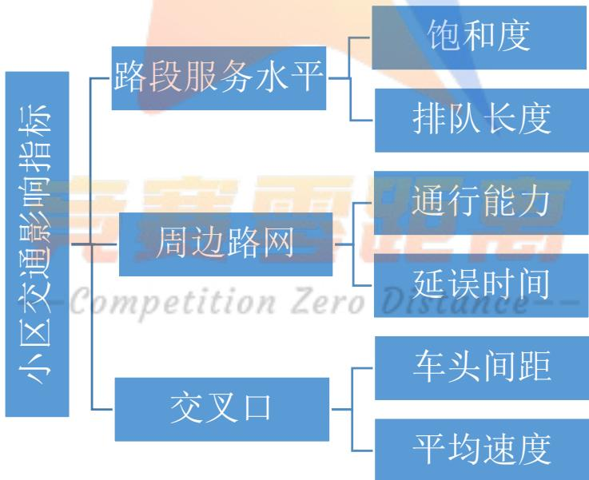  
图1 小区交通影响指标体系

描述周边路网服务水平的指标有车流量、车辆的行驶速度、 停车延误等，一方面由于在预测情况下，这些指标在获得准确的数据存在一定的难度，同时这些指标与通行能力、延误存在重复性，因此选择通行能力、延误来描述周边路网的影响。饱和度以及排队长度能综合反映交通的拥堵情况，是衡量服务水平的重要参数，因此选择它们来描述路段服务水平。研究新增加的交通量对交叉口产生的影响，实质上归结于交叉口服务水平的改变，而平均速度特别是高峰时段的车速和车头间距，最能反映交叉口的交通状况，因此选择车头间距、平均速度来描述交叉口的交通。

## 5.1.4基于投影寻踪的评价模型的建立

我们打算通过比较小区开放前后交通状况的改变来判断小区开放的影响，由于我们选择了6个评价指标，这些指标对小区开放前后的交通影响存在很大的差异，这样在进行评价时，容易出现仅根据个别指标，使评价带有主观性。为了更客观、科学的进行评价，综合考虑各个指标的情况，我们选择投影寻踪进行评价。

投影寻踪法<sup>[3]</sup>，通过某种组合使数据样本投影到低维子空间上,并通过极化投影指标,寻找出能反映原数据结构或特征的投影，即寻找出使投影指标函数达到最优的投影值,然后根据该投影值对样本集进行相应的评价。这样得到的结果在一定程度上解决了仅根据单项指标评价而导致结果不相容的问题，从而可以提高综合评价各层次的分辨力和评价模型的精度。

投影寻踪综合评价模型建立与求解的具体步骤如下：

## Step1：数据的处理

## （1）指标的正负向性分析

我们选取了5个评价指标，在建立评价模型之前，我们首先要对这些指标的正负向性进行分析，即分析该指标值的大小对道路通行的影响。

表3各个指标的正负向性分析
<table><tr><td>指标</td><td>正负向性</td></tr><tr><td>饱和度</td><td></td></tr><tr><td>排队长度</td><td></td></tr><tr><td>通行能力</td><td></td></tr><tr><td>延误</td><td></td></tr><tr><td>车头间距</td><td></td></tr><tr><td>平均速度</td><td>十</td></tr></table>

定义：正向性：指标值越大越好；负向性：指标值越小越好。

## （2）归一化处理

由于所选取指标的单位不统一，为了消除各评价指标量纲的影响，我们对正负向性不同的指标分别进行归一化处理。

对于正向性指标，归一化公式如下：

$$
x _ { j } = { \frac { x _ { j } - \operatorname* { m i n } x _ { j } } { \operatorname* { m a x } x _ { j } - \operatorname* { m i n } x _ { j } } }
$$

对于负向性指标，归一化公式如下：

$$
x _ { j } = { \frac { \operatorname* { m a x } { x _ { j } - x _ { j } } } { \operatorname* { m a x } { x _ { j } - \operatorname* { m i n } { x _ { j } } } } }
$$

其中 $\operatorname* { m a x } { x } _ { j }$ 为第j列指标的最大值， $\operatorname* { m i n } { x _ { j } }$ 为第j列指标的最小值。

## Step2:线性投影

从不同的方向或角度去观察数据，寻找最能充分挖掘数据特征的最优投影方向。设$a = \left( a _ { 1 } a _ { 2 } \cdots a _ { m } \right)$ 为m维单位向量，即为各指标的投影方向向量，则第i个样本在一维线性空间的投影特征值 $z _ { i }$ 的表达式为：

$$
z _ { i } = \sum _ { i = 1 } ^ { m } a _ { j } x _ { i j }
$$

$$
\left\{ \begin{array} { l l } { a _ { j } > 0 } \\ { \displaystyle { \sum _ { j = 1 } ^ { m } a _ { j } ^ { 2 } = 1 } } \end{array} \right.
$$

## Step3:构造投影指标函数

在综合投影值时,要求投影值 $Z _ { i } \left( i = 1 , . . . , 6 \right)$ 的散布特征满足局部投影点尽可能密集,最好凝聚成若干个点团,而在整体上投影点团之间尽可能散开<sup>[2]</sup>。为此,投影指标函数可构造为:

$$
\displaystyle \operatorname* { m a x } Q ( a ) = S _ { a } D _ { a }
$$

其中 $S _ { a }$ 为投影值 $Z _ { i } \left( i = 1 , . . . , 6 \right)$ 的标准差, $D _ { a }$ 为投影值 $Z _ { i } \left( i = 1 , . . . , 6 \right)$ 的局部密度,即:

$$
\begin{array} { l } { { S _ { a } = \sqrt { \displaystyle \sum _ { i = 1 } ^ { 6 } \Big ( Z _ { i } - \overline { { { Z _ { a } } } } \Big ) / \left( n - 1 \right) } } } \\ { { D _ { a } = \displaystyle \sum _ { i = 1 } ^ { 6 } \sum _ { j = 1 } ^ { 7 } \Big ( R _ { i j } - r _ { i j } \Big ) \bigcup \Big ( R _ { i j } - r _ { i j } \Big ) } } \end{array}
$$

式中, $\overline { { Z } }$ 为序列 $Z _ { i } \left( i = 1 , . . . , n \right)$ 的均值;R为求局部密度的窗口半径,它的选取既要使包含在窗口内的投影点的平均个数不太少,避免滑动平均偏差太大,又不能使它随着n的增大而增加太快;距离 $r _ { i j } = \left| Z _ { i } - Z _ { j } \right| ; U \left( h \right)$ 为单位阶跃函数，

综上所述，得到非线性优化模型:

$$
\begin{array} { r l } & { \operatorname* { m a x } Q ( a ) = S _ { \alpha } D _ { \alpha } } \\ & { e \Bigg [ \delta \Bigg [ S _ { \alpha } \Bigg [ \frac { \delta } { \gamma } \Bigg [ \frac { \delta } { \gamma } \Bigg ( \sum _ { \ell = 1 } ^ { \infty } \overline { { f _ { \ell } ^ { * } } } \Big ) \Bigg | \beta \Bigg [ \eta _ { \ell - 1 } \overline { { y } } _ { \ell } } \\ & { e \Bigg ] \Bigg ] \delta \Bigg [ \delta \Bigg [ \delta \eta _ { \ell - 1 } ^ { * } \Bigg ] \Delta \Bigg [ \delta \Bigg [ \nu _ { \ell } - \tau _ { \ell } } \\ & { \Bigg ] \Bigg ] \delta \Bigg [ \nu _ { \alpha } + \frac { \delta } { \gamma } \Bigg ] \Delta \Bigg [ \delta \tau _ { \ell } - \tau _ { \ell } } \\ & { \Bigg ] \Bigg [ N e \Bigg [ \mathrm { = } \{ m a x \Bigg ( \nu _ { \ell } \} + \nu _ { \ell } \Bigg ) / 2 } \\ & { e \Bigg ] \Bigg [ \delta \tau _ { \ell } - \tau _ { \ell } \Bigg ] \Delta \tau _ { \ell } } \\ & { \Bigg [ \delta \tau _ { \ell } \Bigg ] \Bigg [ \tau _ { \ell } \Bigg ] \Delta \tau _ { \ell } } \\ & { \Bigg [ \delta \tau _ { \ell } ^ { * } \Bigg ] \Delta \tau _ { \ell } \Delta \tau _ { \ell } } \\ & { \Bigg [ \mathrm { p } _ { \ell } ^ { * } \Bigg ] \Delta \tau _ { \ell } ^ { * } = 1 } \\ & { \Bigg [ 0 < a _ { \ell } \} < 1 \Bigg ] } \end{array}
$$

## Step4：优化投影方向

当各指标值的样本集给定时，投影指标函数 $Q ( a )$ 只随着投影方向的投影寻踪法变化而变化。不同的投影方向反映不同的数据结构特征，最佳投影方向就是最大可能体现高维数据某类特征结构的投影方向。因此，可通过求解投影指标函数最大化问题来寻找最佳投影方向

目标函数：

$$
\displaystyle \operatorname* { m a x } Q ( a ) = S _ { a } D _ { a }
$$

约束条件：

$$
s . t . \sum _ { j = 1 } ^ { n } a _ { j } ^ { 2 } = 1
$$

这是一个以 $\left\{ a _ { j } \mid j = 1 \sim n \right\}$ 为优化变量的复杂非线性优化问题，运用 $L i n g o$ 等软件难以求出其解，考虑到模拟退火算法具有收敛速度快等特点，我们使用模拟退火算法<sup>[4]</sup>来求解最优投影方向。

求解最优投影方向的模拟退火算法模型可以表示为下式：

$$
\left\{ \begin{array} { l l } { { y 1 = s q r t ( b . \wedge \cdot 2 / s u m ( b . \wedge 2 ) ) } } & { { \mathsf b \not = \not \mathcal { Y } \underline { { { \sf | \hat { h } \not { \cdot } } } } } { \sf | \hat { y } | } { \sf | \hat { y } | } { \sf | \cdot } { \sf | \times \bar { \sf S } \not { \cdot } } } \\ { { f o r \ k = 1 : n \ b ( k ) = r a n d ( ) } } & { { \bar { p } ^ { \lambda \underline { { { \tau } } } } } \underline { { { \dddot { \sf \Psi } } } } { \sf | \hat { \cal { H } } \not { \cdot } } } \\ { { p = \left\{ \begin{array} { l l } { { 1 } } & { { d e l t a _ { - } e > 0 } } \\ { { \exp ( d e l t a _ { - } e / T ) } } & { { d e l t a _ { - } e \le 0 } } \end{array} \right. } } \\ { { T _ { 0 } = q ^ { \ast } T _ { 0 } } } & { { { } } } \end{array} \right.
$$

## Step5: 求解投影评价值

利用求解所得的最佳投影方向 $a ^ { * }$ 计算样本的投影指标值：

$$
{ z _ { i } ^ { * } } = \sum _ { j = 1 } ^ { n } a _ { j } ^ { * } \times x _ { i , j }
$$

## Step6：求解结果及分析

我们利用matlab软件进行编程求解，求解结果如下：

最优投影方向：(0.4935,0.1349,0.4898,0.4962,0.1956,0.4624)

表 4 18 组样本的投影评价值
<table><tr><td>样本编号投影评价值</td><td>7 样本编号</td><td>投影评价值</td></tr><tr><td>-1Compe2.0159n Zer010Distan2:2560</td><td></td><td></td></tr><tr><td>2</td><td>1.5533</td><td>11 1.9795</td></tr><tr><td>3</td><td>0.5033</td><td>12 0.8626</td></tr><tr><td>4</td><td>0.9935</td><td>13 1.5732</td></tr><tr><td>5</td><td>1.1340</td><td>14 1.7559</td></tr><tr><td>6</td><td>0.9731</td><td>15 1.6726</td></tr><tr><td>7</td><td>0.4521</td><td>16 1.0097</td></tr><tr><td>8</td><td>1.1493</td><td>17 1.5958</td></tr><tr><td>9</td><td>1.7676</td><td>18 2.1200</td></tr></table>

其中，1-9 组为该小区开放前各时段的投影评价值，10-18 组为该小区开放后各时段的投影评价值。根据以上结果，小区在高峰期时的评价值普遍偏低，在平常期的评价

值普遍偏高；且小区在开放后的周边道路的交通状况评价值明显提高，说明拥堵状况得到了一定程度上的改善。

## 5.2问题二模型的建立与求解

要求我们通过建立车辆通行的模型，以此讨论小区开放对周围道路通行所产生的影响。首先我们基于元胞自动机模型，通过规则的考虑，把局部道路类型分为 3 种情况进行考虑，即直行车道、T 字型车道以及入闸式通道，然后从正常路段以及交叉口路段两方面考虑，分别研究小区开放前后车辆位置、车速以及道路负荷量的变化，来分析小区开放对道路通行的影响<sup>[5]</sup>。初步解决思路

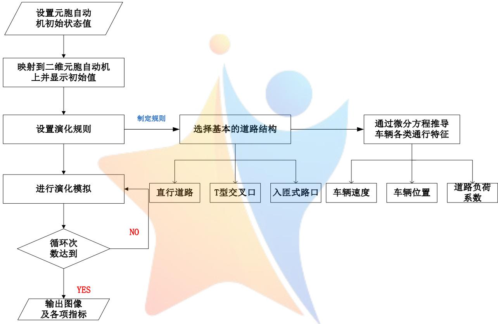  
图 2 求解流程图

## 5.2.1 基于直行路段的车辆通行模型的建立

## Step1:车道变换的考虑

联系实际可知，左右车道都存在一定的概率相互变道，但由于靠边的车道是转向车道，所以车道2→1,3→4的概率 $p _ { m }$ 大于车道1→2,4→3的概率 $p _ { n }$

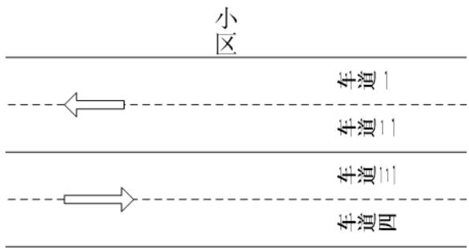  
图3小区外围道路车道示意图

Step2:车辆位置与车流量变化

某一时刻t车流量的变化为：

$$
q _ { t } - q _ { t - 1 } = q _ { 0 } - q _ { m }
$$

其中 $q _ { m }$ 表示该时刻末将要驶出该段路的车量数目

于是远离交叉口处主干道上车流量的变化公式如下：

$$
\frac { d M _ { { t , 1 } } } { d t } = q _ { 0 } + M _ { { 1 , ( t - 1 ) } } \cdot p _ { { m } } + M _ { { ( t - 1 ) , 2 } } \cdot p _ { n } + q _ { t }
$$

其中 $M _ { t , \mathrm j }$ 表示t时刻车道j的车流量， $p _ { m }$ ,p 表示两个车道内车辆变道的概率。 $p _ { n }$

Step3:道路负荷系数

道路负荷系数的求解公式为：

$$
x _ { t } = \sum { \frac { M _ { t } } { C } }
$$

其中C表示公路的最大荷载量。

Step4:基于交通流的车速

交通流是车辆在道路上连续行驶形成的车流，宏观上交通流可以等于连续可压缩的流体。我们将物理学中的动量定理引入到交通流的概念中：

$$
P + M \nu _ { { } _ { m } } = P _ { 0 } + M \nu _ { 0 }\tag{1}
$$

其中P表示当前的交通压力， $\nu _ { m }$ 是出口处的速度， $\nu _ { 0 }$ 是当前驶入道路车辆的速度。

在元胞自动机的仿真中，我们假定在某一特定的时间段（如高峰期）内驶入车辆的车速不变，驶入的车道变化为随机，则

$$
\frac { \partial M _ { 0 } } { \partial S } = 0 , \frac { \partial \nu _ { 0 } } { \partial S } = 0\tag{2}
$$

对于（1）式我们对车辆离入口处的距离 S 做微分

$$
\frac { \partial P } { \partial S } = \frac { \partial ( M \nu ) } { \partial S } - u _ { 0 } \frac { \partial M } { \partial S }\tag{3}
$$

此时我们再引入车流密度 $k _ { { \scriptscriptstyle m } }$ ，为车流量与速度的比值，

$$
k _ { m } \equiv \frac { M } { \nu }\tag{4}
$$

将（4）式带入（3）式得

$$
- \frac { 1 } { k _ { \mathrm { m } } } \frac { \partial P } { \partial S } = \frac { \partial \nu } { \partial t } + \nu \frac { \partial \nu } { \partial S } + \frac { ( \mathrm { v } - \nu _ { 0 } ) } { k _ { m } } \nu \frac { \partial k _ { m } } { \partial S } - \nu _ { 0 } \frac { \partial \nu } { \partial S }\tag{5}
$$

此时我们引入交通流中的连续性方程<sup>[6]</sup>

$$
\frac { \partial k _ { m } } { \partial t } + \frac { \partial ( \mathbf { k } _ { m } \mathbf { v } ) } { \partial S } = 0
$$

利用分部积分法

$$
\frac { \partial k _ { m } } { \partial S } = - ( \frac { \partial k _ { m } } { \partial t } + k _ { m } \frac { \partial \nu } { \partial t } )\tag{6}
$$

将式（6）带入（5）式得，

$$
\frac { d \nu } { d t } = - \frac { 1 } { k } \frac { \partial P } { \partial S } + \frac { ( \mathrm { v } - \nu _ { 0 } ) } { k } \frac { \partial k _ { m } } { \partial S } + \nu \ \frac { \partial \nu } { \partial S }
$$

由于模型中车流密度和车流压力是常量，即

$$
\frac { \partial P } { \partial S } = 0 , \frac { \partial \mathbf { k } _ { \mathrm { m } } } { \partial t } = 0
$$

$$
\mathbb { M } \mathbb { J } \mathbb { J } \frac { d \nu } { d t } = \nu \ \frac { \hat { \sigma } \nu } { \hat { \sigma } S }\tag{7}
$$

对公式（7）进行离散化处理，我们就可以求得每辆车的速度公式：

$$
\frac { \partial \nu \left( t + \tau \right) } { \partial t } = \frac { \nu } { S _ { n } \left( { \mathrm { t } } \right) - S _ { n + 1 } \left( t \right) } [ \nu _ { n } \left( { \mathrm { t } } \right) - \nu _ { n + 1 } \left( t \right) ]
$$

## 5.2.2 基于 $^ { 6 6 } \nabla ^ { 9 }$ 型交叉口通道的车辆通行模型的建立

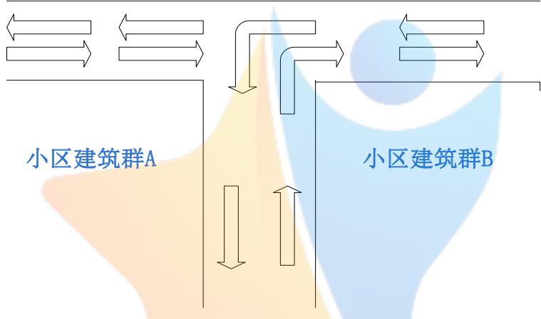  
图 4“T”型交叉口通道示意图

## Step1:车量位置与车流量变化

当交叉口的交通灯开始转化为绿灯时，此时路口前存在一个排队长度为Q的车流，在我们的仿真模型中，考虑到车辆行驶的安全性，因此我们假定前一辆车启动后，后一辆车在延迟时间T后才启动。

因此建立的车流量位置模型如下：

$$
S _ { n } ( \mathbf { t } ) = \left\{ \begin{array} { l l } { \displaystyle \mathrm { L - ( n - 1 ) } ( i + \mathbf { D } ) , \quad \quad \quad \quad \quad \quad \quad \quad \quad \quad \quad \quad \quad \quad \quad \quad \quad \quad \quad \quad \quad \quad \quad \quad \quad \quad \quad } \\ { \displaystyle \mathrm { L - ( n - 1 ) } ( i + \mathbf { D } ) + \frac { \rho } { 2 } ( \mathbf { t } - ( \mathbf { n } - 1 ) \mathbf { \bar { T } } ) ^ { 2 } , ^ { i } , o n \quad \mathcal { Z } e r o \quad \widehat { \displaystyle ( n - 1 ) } T \leq \mathbf { t } < ( n - 1 ) T + \frac { \nu _ { \operatorname* { m a x } } } { a } \quad \quad \quad \quad \quad \quad \quad \quad \quad } \\ { \displaystyle \quad \quad \quad \quad \quad \quad \quad \quad \quad \quad \quad \quad \quad \quad \quad \quad \quad \quad \quad \quad \quad \quad \quad \quad \quad \quad \quad \quad \quad } \\ { \displaystyle \mathrm { L - ( n - 1 ) } ( i + \mathbf { D } ) + \frac { \nu _ { \operatorname* { m a x } } } { 2 a } + \mathbf { v } _ { \operatorname* { m a x } } \left( \mathbf { t } - ( \mathbf { n } - 1 ) \mathbf { T } - \mathbf { t } _ { 0 } \right) , \ : \ : \ : \mathbf { t } \geq ( n - 1 ) T + \frac { \nu _ { \operatorname* { m a x } } } { a } \quad \quad \quad \quad \quad \quad \quad \quad \quad \quad \quad \quad } \end{array} \right.
$$

其中i表示平均的车身长度，L 表示车辆离入口处的距离，( 1)n T 表示第n辆车启动时间

## Step2:负荷系数

当车辆度过‘T’型路口时，有部分车辆会选择向右转弯进入小区内部通道，而小区内通道为次主干道，此时道路设计负载的量会发生变化。

当交叉路口处于自由状态时，靠边的转向车道会进行转弯操作则此时路道 1 车流量

M 的变化为

$$
\frac { d M _ { t } } { d t } = M _ { t - 1 } \cdot \varepsilon _ { a }
$$

车道2 的车流量暂时保持不变，即满足下式：

$$
\frac { d M _ { t } } { d t } { = 0 }
$$

令主干道的道路的设计车流量为 $C _ { 1 }$ ，小区内次干道的设计车流量为 $C _ { _ { 2 } }$ ，则负载系数为：

$$
x = \frac { \sum \ddot { M } } { C _ { 2 } }
$$

## Step3:基于交通流的车速

由于红绿灯的阻隔作用，此时交叉路口前方有一段路程没有车辆，所以此时车辆以$\nu _ { \mathrm { m a x } }$ 运动行驶。

因此建立的车速模型如下：

$$
\nu _ { n } ( \mathfrak { t } ) = \frac { \partial ( S _ { n } ( \mathfrak { t } ) ) } { \partial t }
$$

## 5.2.3基于入闸式通道的车辆通行模型的建立

当道路类型为入闸式时，车辆在直行路段与小区未开放时差异不大，关键在于交叉口的车辆流量发生的变化。我们构造了入闸路口的交叉时的变化模型。

入闸口不设置交通灯，小区内的车辆只能单向驶出而不能流入，具体情况如下图所示：

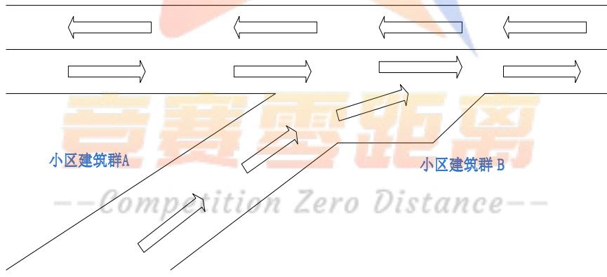  
图5 入闸式通道车辆通行示意图

## Step1: 车量位置与车流量变化

在 T 型通道的模型中我们假设过小区驶入车辆数为 $q _ { \alpha }$ ，而在入闸式通道中，所有小区内车辆都是输入至车道1，而车道2并没有小区内的车辆输入,因此建立的模型如下：

$$
\begin{array} { l } { \displaystyle \frac { d M _ { _ { t , 1 } } } { d t } = 2 q _ { 0 } - M _ { _ { ( t - 1 ) , 1 } } \cdot p _ { { m } } + M _ { _ { ( t - 1 ) , 2 } } \cdot p _ { n } + q _ { t } } \\ { \displaystyle \frac { d M _ { _ { t , 1 } } } { d t } = M _ { _ { ( t - 1 ) , 2 } } \cdot p _ { n } + q _ { t } - M _ { _ { ( t - 1 ) , 1 } } \cdot p _ { { m } } } \end{array}
$$

## Step2:道路负荷系数

查阅文献知，当两组车道的车辆混合后道路荷载系数的计算为：

$$
\begin{array} { r } { x = \left\{ \begin{array} { l c } { c \nu _ { \mathrm { m a x } } ( m \mathbf { k } _ { m } + \mathbf { M e } ^ { 2 q _ { 0 / M } } ) \qquad \mathrm { v _ { \mathrm { m a x } } } e ^ { q _ { 0 / M } } \leq k _ { m } \leq \dot { k } e ^ { q _ { 0 / M } } } \\ { 0 . 2 5 c \nu _ { \mathrm { m a x } } m \mathbf { e } ^ { 2 q _ { 0 / M } } \qquad \dot { k } e ^ { q _ { 0 / M } } \leq k _ { m } \leq 0 . 5 e ^ { q _ { 0 / M } } } \\ { c m \nu _ { \mathrm { m a x } } ( \mathbf { k } _ { m } - \mathbf { k } ^ { 2 } _ { m } \mathrm { e } ^ { - 2 q _ { 0 / M } } ) \qquad 0 . 5 e ^ { q _ { 0 / M } } \leq k _ { m } \leq e ^ { q _ { 0 / M } } } \end{array} \right. } \end{array}
$$

其中 $\nu _ { \mathrm { m a x } }$ 表示自由流时最大速度， $q _ { 0 }$ 表示小区内驶入主干道的流量， $k _ { m }$ 表示车流密度，m 表示主干道波速系数，我们通过元胞自动机中的 nfit 函数回归拟合求解。

## Step3:基于交通流的车速的计算

入闸式通道的车速与直行通道时的车速相同，因此其模型如下：

$$
\frac { \partial \nu \left( t + \tau \right) } { \partial t } = \frac { \nu } { S _ { n } \left( { \mathrm { t } } \right) - S _ { n + 1 } \left( t \right) } \left[ \nu _ { n } \left( { \mathrm { t } } \right) - \nu _ { n + 1 } \left( t \right) \right]
$$

## 5.2.4基于上述模型的元胞自动机的求解

在以上的模型中，我们通过设置一定的规则来分别对车流量、车速以及道路负荷系数进行一定的约束，因此基于设置的规则，我们利用元胞自动机进行仿真，模拟小区开放前后车辆通行的变化情况。

## 5.2.4.1元胞自动机仿真模型的建立

元胞自动机最早是由冯·诺依曼提出来的<sup>[7]</sup>，早期主要是用于对自我复制的自动机的研究，其是一种时空都是离散的，参量只取具有有限性数值集特征的物理系统的一种理想化下的模型。其特征是，空间被分成若干离散的格子，比如方形、三角形以及六边形等，并且会随着时间的改变而不断演化。元胞处于所有可能的状态，其演化过程主要受到周围元胞的影响，并且元胞的演化是是同步进行的。利用元胞自动机的特质，我们将有车或者无车的状态映射到二维元胞自动机中，具体的关系式如下：

$$
{ \mathit { S i t u t i o n } } _ { i , j } = \left\{ { \begin{array} { l l } { z _ { i , j } = 0 \mathrm { ~ } { \mathcal { X } } { \mathit { \Sigma } } \quad { \mathcal { Z } } } \\ { z _ { i , j } = 1 \mathrm { ~ } { \mathcal { H } } { \mathit { \Sigma } } { \mathit { \Sigma } } \quad { \mathcal { Z } } } \end{array} } \right.
$$

由于数据是一维的，向多维映射时我们采取交叉重叠的原则，即

$$
\left\{ \begin{array} { l l } { \nu = r a n d p e r m { \big ( } n { \big ) } } \\ { z _ { i , j } = { \Big ( } z _ { i } ^ { ' } + z _ { \nu ( j ) } ^ { ' } { \Big ) } / 2 } \end{array} \right.
$$

元胞之间的邻居关系，有VonNeumann型邻居和 Moore型邻居，考虑到本题中车辆移动的实际情况，只有相邻区域之间存在影响，所以选择VonNeumann型邻居更加符合现实情况。

元胞的演化过程，不仅受到自身初始值的影响，同时也会受到周围相邻元胞的影响。我们把相邻元胞的影响权值记为 $w e i g h t _ { 1 }$ ，自身的影响权值记为 $w e i g h t _ { 2 }$ 。于是元胞演化的规则方程可表示为：

$$
\dot { z _ { i , j } } = \sum _ { x = i - 1 } ^ { i + 1 } \sum _ { y = j - 1 } ^ { j + 1 } z _ { i , j } \cdot f \left( w e i g h t , x , y , i , j \right)
$$

$$
f { \big ( } w e i g h t , x , y , i , j { \big ) } = \left\{ { w e i g h t _ { 1 } } \begin{array} { l l } { \left( x , y \right) ! = \left( i , j \right) } \\ { w e i g h t _ { 2 } } & { \left( x , y \right) = \left( i , j \right) } \end{array}  \right.
$$

## 5.2.4.2 仿真结果及分析

我们利用元胞自动机对小区周边道路的车流进行仿真模拟，截取动态图像中的静态图像作为仿真结果，其中，道路是双向四车道，其中某一时刻的仿真图如下：

## 1）直行路口的仿真


从上图可以看出，主干道的车辆分布密集，拥堵情况十分严重，急需进行改善。

## 2）T 型路口的仿真

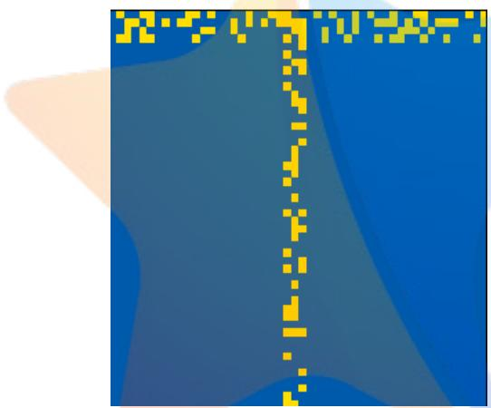

从上图可以看到，主干道的车流在经过小区开放后拥堵程度减轻，原因是旁边开的新道路对车辆进行了分流。

## 3）入闸式路口的仿真

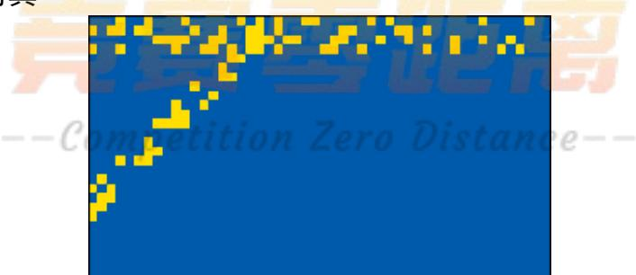

从上图可以看到，主干道的车流在经过小区开放后拥堵程度相比前两种情况减轻了许多，说明入闸式路口分流效果较好。

## 5.3问题三模型的建立与求解

在问题二中，我们构建了不同类型路口的数学模型，旨在研究基础的路口对小区周边道路的影响。在本问中，我们选取不同类型、不同结构的小区，以问题二中的路口类型为基础，利用元胞自动机在不同时段下分别对小区周边的道路交通情况进行仿真模拟。

## 5.3.1小区类型的选取

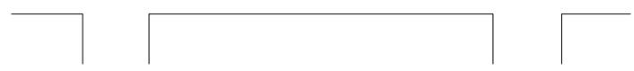

对小区的定义有广义和狭义的界定，在这里我们假定小区仅仅指居住区。根据我国小区发展现状，小区具有多种多样的类型，对于小区开放问题，我们选取了具有一般性和代表性的小区类型，即方形和三角形小区。

## 5.3.2开放后小区道路结构的设计

在评价小区开放对周边道路产生的影响时，道路结构是其主要影响因素，我们考虑了在不同形状的小区的各种开放结构，选取了方形小区中具有代表性的三种开放结构以及三角形小区中具有代表性的一种开放结构如下：

## (1)方形小区道路结构的设计

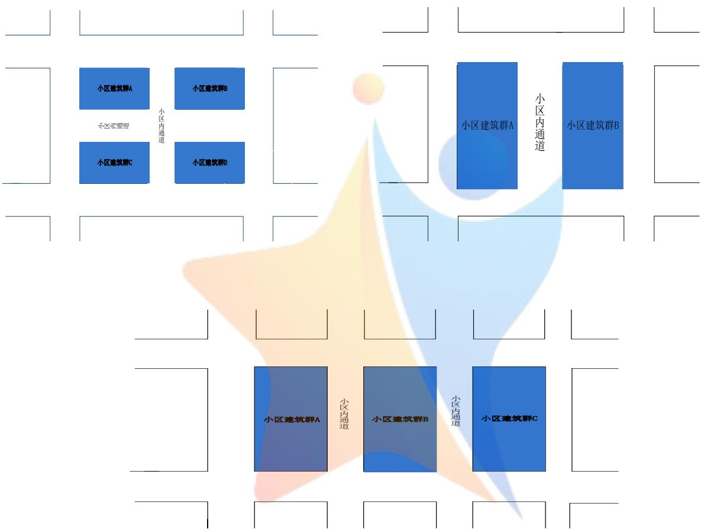

## （2）三角形小区道路结构的设计

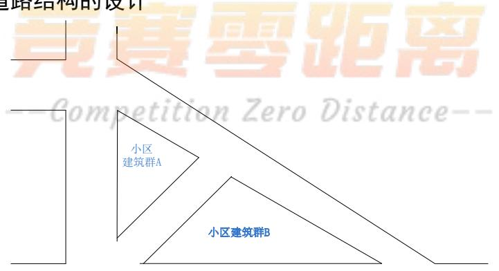

## 5.3.3同一小区不同开放时期的选取

小区开放会对周边道路造成一定的影响，为了评价小区在不同时期的开放情况，我们选取了同一小区的高峰期和平常期的周边道路交通情况。

## 5.3.4 基于元胞自动机的小区周边道路情况的仿真模拟

根据以上分析，我们利用元胞自动机分别对方形和三角形小区的各种开放结构进行仿真模拟，我们设置了双向四车道的道路模型（黄色代表小车），根据第二问的相应模型设置演化方程。首先，在不开放小区的情况下进行仿真模拟，得到以下结果：

## 5.3.4.1 方形小区仿真对比

## 1）高峰期未开放小区与平常期未开放小区

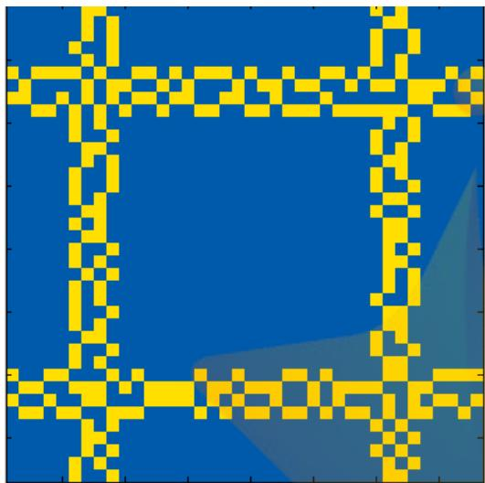  
图6高峰期未开放方形小区仿真图

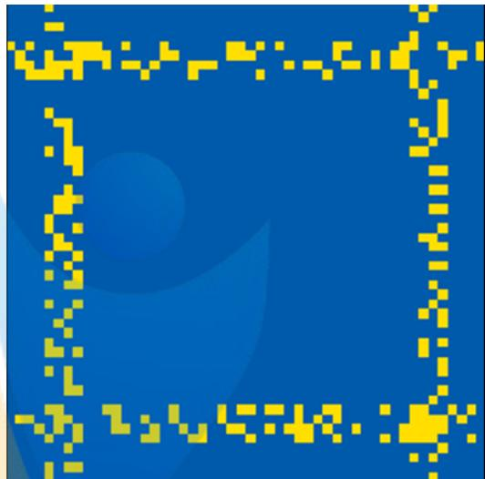  
图 7 平常期未开放小区仿真图

由图6和图7可知，在不开放的方形小区周边道路情况图中，高峰期的道路拥挤现象过于严重，平常期也存在一定的拥堵现象，交通拥堵问题亟待解决。

## 2）平常期未开放小区与平常期第一种开放类型

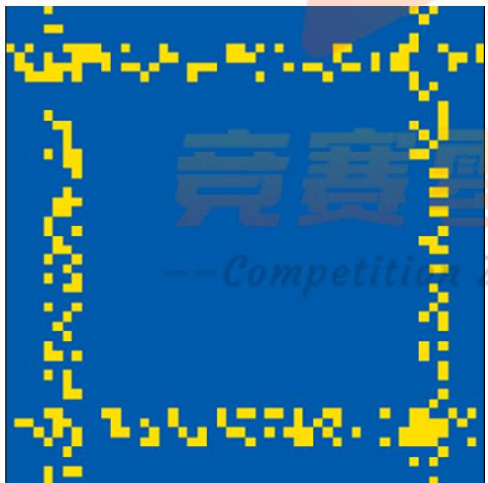  
图8平常期未开放方形小区仿真图

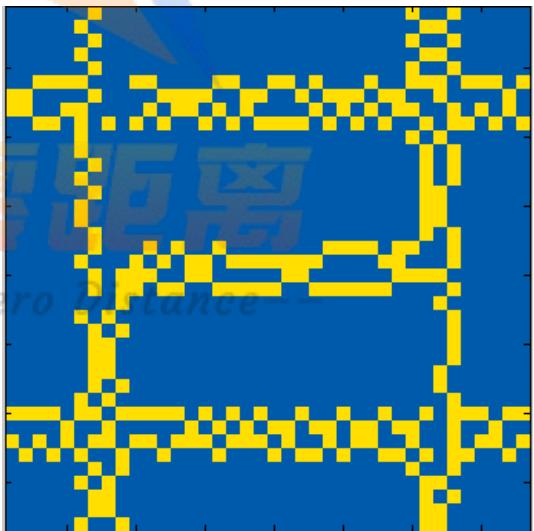  
图 9平常时期第一种开放类型仿真图

在图8和图9中可以看到，在方形小区中，以第一种结构开放时平常时期的四条主干道上的交通拥堵程度没有得到改善，仍然存在道路拥挤的现象。

## 3）高峰期未开放小区与高峰期第一、二、三种开放类型

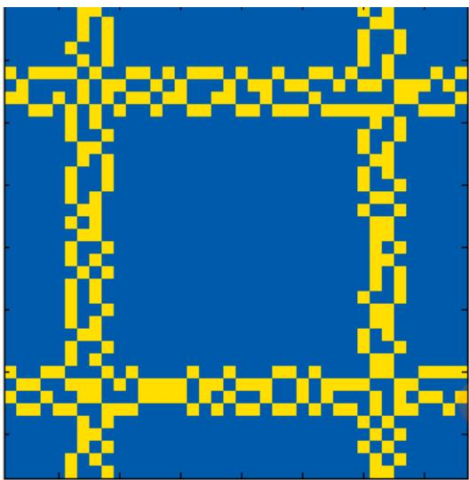  
图10高峰期未开放小区仿真图

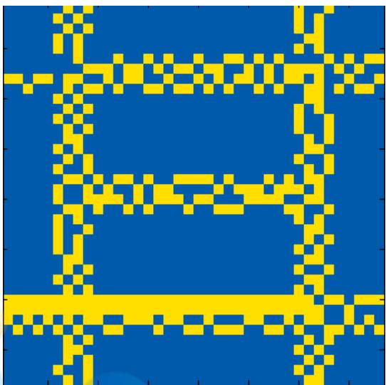  
图 11高峰期第一种开放结构仿真图

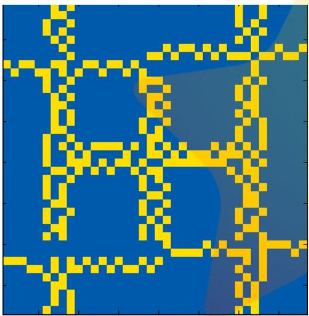  
图12高峰期第二种开放结构仿真图

  
图 13高峰期第三种开放结构仿真图

由上面四幅图可以看出，高峰期第一种开放结构不但没有减缓交通拥堵情况，反而增加了交通压力；高峰期第二种开放结构在四条主干道上体现出一定程度内减缓了交通拥堵情况；高峰期第三种开放结构在四条主干道上交通拥堵情况得到了明显的改善。

## 5.3.4.2 三角形小区仿真对比

高峰期未开放小区与高峰期已开放小区

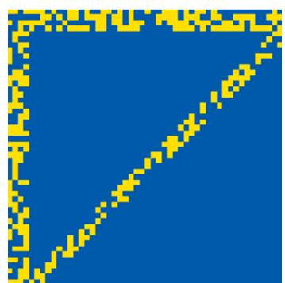  
图14高峰期未开放小区仿真图

  
图15高峰期已开放小区仿真图

由图14和图15可以看出，在高峰时期，未开放小区周边的道路存在严重的拥堵情况，开放后的小区在一定程度上解决了三条主干道的拥堵情况，效果可观。

## 5.3.5 基于各种开放情况的综合评价

## 5.3.5.1 各种开放情况下的指标值计算

在第一问中我们选取了饱和度、排队长度、通行能力、延误、车头间距和车辆平均速度六个指标，我们根据元胞自动机的仿真结果，结合第一问中各项指标的计算公式，分别得出了未开放的方形小区、第一、二、三种开放结构的方形小区、未开放的三角形小区以及开放的三角形小区的高峰期和平常期的各项指标的值，一共 12 组样本，给这12组样本分别标号1-12。

表5 12组样本各项指标的值
<table><tr><td>样本编号</td><td>饱和度</td><td>排队长度</td><td>通行能力</td><td>延误</td><td>车头间距</td><td>平均速度</td></tr><tr><td>1</td><td>0.74</td><td>24.1</td><td>5000</td><td>72.56</td><td>18</td><td>70.55</td></tr><tr><td>2</td><td>0.80</td><td>38.8</td><td>6200</td><td>76.32</td><td>8</td><td>42.23</td></tr><tr><td>3</td><td>0.62</td><td>18.5</td><td>4200</td><td>56.26</td><td>24</td><td>75.64</td></tr><tr><td>4</td><td>0.81</td><td>40.2</td><td>6400</td><td>83.27</td><td>7</td><td>39.76</td></tr><tr><td>5</td><td>0.51</td><td>13.5</td><td>3100</td><td>35.69</td><td>27</td><td>76.67</td></tr><tr><td>6</td><td>0.63</td><td>20.6</td><td>4400</td><td>58.12</td><td>25</td><td>77.75</td></tr><tr><td>7</td><td>0.72</td><td>22.7</td><td>4700</td><td>70.39</td><td>20</td><td>67.53</td></tr><tr><td>8</td><td>0.83</td><td>43.2</td><td>7100</td><td>80.64</td><td>5</td><td>35.42</td></tr><tr><td>9</td><td>0.76</td><td>24.5</td><td>5236</td><td>72.36</td><td>18</td><td>57.32</td></tr><tr><td>10</td><td>0.82</td><td>40.1</td><td>6350</td><td>75.60</td><td>7</td><td>40.36</td></tr><tr><td>11</td><td>0.50</td><td>12.4</td><td>3900</td><td>31.33</td><td>28</td><td>84.96</td></tr><tr><td>12</td><td>0.62</td><td>18.7</td><td>4500</td><td>57.69</td><td>24</td><td>75.62</td></tr></table>

## 5.3.5.2 基于投影寻踪模型的综合评价

将得到的12组样本的指标值代入第一问的投影寻踪模型进行综合评价，通过模拟退火算法，将寻优程序循环了 100次得到最优投影方向为：

$$
( 0 . 3 3 3 8 , 0 . 4 8 6 8 , 0 . 4 0 2 2 , 0 . 1 0 4 8 , 0 . 4 8 2 5 , 0 . 4 9 6 1 )
$$

根据最优投影方向求得各样本的投影评价值如下表：

表6 各样本投影评价值
<table><tr><td>样本编号</td><td>投影评价值 样本编号 投影评价值</td></tr><tr><td>1 1.2543</td><td>1.3440</td></tr><tr><td>2</td><td>0.3367 1.0053 8</td></tr><tr><td>Comp e</td><td>on Zero istance</td></tr><tr><td>3 4</td><td>1.1559 9 2.1761</td></tr><tr><td>0.2317</td><td>10 1.2471</td></tr><tr><td>5 2.1685 6</td><td>11 2.2257 1.7312 12 1.7181</td></tr></table>

其中，奇数样本编号为高峰期各样本，偶数样本为平常期各样本。

分析：通过评价值可以看出，对于方形小区的第二、三种结构的开放状况，样本的投影评价值得到了显著的提高，道路拥堵状况得到了显著的改善，与前面元胞自动机的仿真结果图相符。第一种结构的开放状况的评价值下降，与前面仿真结果为更加拥堵的情况相匹配；对于三角形小区的开放状况，投影评价值得到了提升，拥堵状况得到了改善，也与前面仿真结果相符合。

## 5.3.5.3 对于最终评价结果的分析

通过比较各种类型的开放小区结构的高峰期和平常期的投影评价值，我们发现对于同一种开放小区结构，平常期的评价值总是高于高峰期，表明其交通状况更好；我们还发现在小区开放之后，在大部分样本中，交通拥堵程度得到了改善，但是在少数样本中，小区开放并不能使其拥堵程度得到一定的改善；在小区开放之后，高峰期得到的交通状况的改善比平常期要明显。

## 5.3.6 敏感性分析

在元胞自动机的演化过程中，我们设置了变道概率和转弯概率等参数，现将这些参数的值进行调整，检验模型的稳定性。

表 7 敏感性分析结果
<table><tr><td>参数p1、p2</td><td>部分投影评价值</td></tr><tr><td>0.3、0.4</td><td>1.2543, 0.3367, 1.1559, 0.2317, 2.1685, 1.7312</td></tr><tr><td>0.4、0.35</td><td>1.3147, 0.3742,1.2211,0.3567, 2.0812,1.5682</td></tr><tr><td>0.4、0.4</td><td>1.2750, 0.2563, 1.1819,0.3018, 2.1215,1.6091</td></tr></table>

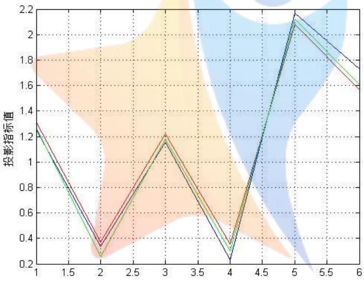  
图16敏感性分析结果

分析：从上图可以看到，在一定范围内改变变道概率以及转弯概率后，投影评价值的趋势没有改变，且波动范围小，说明模型的稳定性强，具有一定的泛化能力。

## 5.3.7利用Braess悖论对异常结论进行猜想检验

在进行评价分析时，我们发现，在增加了某一道路之后，投影寻踪的评价值变小，反而产生了不好的效果。

于是我们提出猜想：由于这条道路的出现导致了交通网发生了变化，从而达到了Braess悖论产生的条件<sup>[9]</sup>，从而使周边道路通行

在车辆通行模型中，理想状态下通车的线路当然越多越好，可是实际情况中车辆在选择路线的过程中，往往只会考虑到自身的最优线路，而造成整个周边道路并不一定是最优情况，导致开放的某个周边道路反而对道路通行产生了负面的影响。

当非合作网络中 Nash 平衡点并不是 Pateto 最优解时，就会导致 Braess 悖论的产生。Braess悖论的证明问题早已被解决，此处我们只介绍该理论在本模型中的应用。

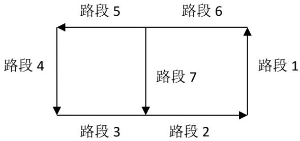  
图17道路模型示意图

通行时间的计算公式：

$$
t _ { { \scriptscriptstyle i } } = a _ { { \scriptscriptstyle i } } + b _ { { \scriptscriptstyle i } } f _ { { \scriptscriptstyle i } }
$$

其中 $t _ { i }$ 表示在该路段 i的通行时间， $f _ { i }$ 表示流过该路段的车流量，b表示延迟系数。  
当 $\frac { b _ { 3 } } { b _ { 1 } + b _ { 2 } } \geq \frac { b _ { 4 } + b _ { 5 } } { b _ { 6 } }$ 时，此时存在均衡点与平衡点的不一致，发生 Braess 悖论。

我们选取元胞自动机的模型几个转态，整理出每小时该路段的车流量 $f _ { i }$ ，通过公式$t _ { i } = \frac { S } { \overline { { \nu } } }$ 得出 $t _ { i }$ 只。接着用 MATLAB进行线性拟合，得出结果如下：

表 8 延迟系数的求解结果
<table><tr><td> $b _ { 1 }$ </td><td> $b _ { 2 }$ </td><td> $b _ { 3 }$ </td><td> $b _ { 4 }$  </td><td> $b _ { 5 }$ </td><td> $b _ { 6 }$ </td><td> $b _ { 7 }$ </td></tr><tr><td>0.0239</td><td>0.0518</td><td>0. 0136</td><td>0.0235</td><td>0.0207</td><td>0.0231</td><td>0.0652</td></tr></table>

然后用 MATLAB 进行拟合，得出各个路段的延迟参数值 $b _ { i }$

计算得出 $\frac { b _ { 3 } } { b _ { 1 } + b _ { 2 } } = 0 . 2 7 3 6 4 \geq \frac { b _ { 4 } + b _ { 5 } } { b _ { 6 } } = 1 . 9 1 3 4$ ,该交通模型符合Braess 悖论。

## 5.4问题四模型的建立与求解

基于交通通行的角度进行考虑，我们在前三问求解的基础上，通过对小区开放对其周围道路通行所产生影响的研究，据此向有关部门提出建议。

我们建议应该采取的具体措施如下：

1、从小区周围交通状况的角度：对于一个小区是否应该开放，在做决策时不能一概而论，而应考虑小区周围的交通状况。通过第三问可以发现，高峰期时段小区开放所带来的评价值的提高，要远远大于非高峰期的评价值的变化，即高峰时期开放小区所达到的效果更佳。而非高峰期，例如模型中 T通道所带来的评价值的改变只有 0.09，考虑到开放小区的成本和带来的安全隐患，当小区周围车流量和道路负荷系数不高时，没有必要进行开放小区。

2、从保障小区居民安全的角度：小区开放以后，小区内部通道会涌现大量的机动车。我们观察元胞自动机仿真出的小区内部通道的状态，发现在某些时刻小区内的车速会接近 $6 0 \mathrm { k m / s }$ ，这给小区内居民的交通安全带来极大的隐患，建议在开放小区时，应对进入小区内通道的车辆进行限速。我们通过查阅资料并综合本文的模型，认为速度应该

限制在 40km/h 内。

3、从小区管理的角度：我国现有的入闸式通道很少设置红绿灯，尽管入闸式通道的交通流变化简单，但是我们通过第三问发现，在某些高峰时间段，也会造成交通拥堵，使排队时间延长，因此建议在高峰期安排交通警察执勤以维持交通秩序。

4、从改善道路交通拥堵的角度：理想状态下，车道数量的增加会减少市民出行所用的时间。但由 Brease 悖论可知，车道的增加有时反而会使拥堵现象更严重。所以建议有关部门在规划开放小区的线路方案时，应进行一次 Brease 仿真检验。如若发现可能会出现 Brease 悖论现象，可以考虑多增设一条线路，例如本文中 T 型通道至双 T 型通道的变化，极大地提高了周边道路的通行能力。

## 六 模型的评价与推广

## 6.1模型的优点

（1）通过建立微分方程模型对交通流与道路之间的相互作用以及对道路车辆之间的相互影响进行定量分析，从更加本质的角度反映道路通行的客观规律。

（2）利用Bracess 悖论验证小区开放对道路交通的影响，从更加客观的角度评价开放小区道路的影响，使模型更加严谨。

## 6.2模型的缺点

只考虑了一些最常见的小区结构和道路结果，对一些多车道和复杂形状的车道如 S形车道的交通流规律没有考虑。

## 6.3模型的推广

微分方程模型用以描述对象特征随时间变化的规律，可推广到研究物理学、生物学、化学、天文学和人口变化的规律。

## 七 参考文献

[1]李向朋. 城市交通拥堵对策—封闭型小区交通开放研究[D].长沙理工大学,2014.

[2]杨晓光,赵靖,马万经,白玉. 信号控制交叉口通行能力计算方法研究综述[J].中国公路学报,2014,05:148-157.

[3]闫俊峰. 城市建设项目交通影响评价研究[D].吉林大学,2012

[4]张学喜,王国体,张明. 基于加速遗传算法的投影寻踪评价模型在边坡稳定性评价中的应用[J]. 合肥工业大学学报(自然科学版),2008,03:430-432+454.

[5]冯玉蓉. 模拟退火算法的研究及其应用[D].昆明理工大学,2005.

[6]丁中俊. 元胞自动机交通流模型中的相变现象和解析研究[D].中国科学技术大学,2012.

[7]沈威. 基于微分方程模型构建基因调控网络的研究[D].吉林大学,2012.

[8]熊桂林,黄悦. 元胞自动机在混合交通仿真中的应用 [J]. 系统工程,2006,06:24-27.

[9]薛熠,曹正正,刘姗. 交通网络中Braess 悖论的实证分析[J].北京电力高等专科学校学报:社会科学版,2011,28(3):25-25.

## 附录

附录一：投影寻踪评价程序（结合模拟退火算法）（matlab）

```matlab
clear all;close all;clc
%导入数据
x=importdata('C:\Users\Pro\Desktop\第一题数据.txt');
%归一化
max1=max(x);
min1=min(x);
x(:,1)=(max1(1)-x(:,1))/(max1(1)-min1(1));
x(:,2)=(max1(2)-x(:,2))/(max1(2)-min1(2));
x(:,3)=(max1(3)-x(:,3))/(max1(3)-min1(3));
x(:,4)=(max1(4)-x(:,4))/(max1(4)-min1(4));
x(:,5)=(x(:,5)-min1(5))/(max1(5)-min1(5));
x(:,6)=(x(:,6)-min1(6))/(max1(6)-min1(6));
tic
for k=1:100
%退火寻找最优投影方向
temperature=1000;%初始温度
iter=100;%迭代次数
l=1;
n=6;%指标个数
a=suiji(n);%初始序列
p=a;
y=Target(x,a);
while temperature>0.01
for i=l:iter
a1=suiji(n);
y1=Target(x,a1);
delta_e=y1-y;<sub>if</sub> <sub>delta_e>0</sub>
y=y1;
p=a1;
if exp(delta_e/temperature)>rand()
y=y1;
p=a1;
end
end
end
l=l+1;
temperature=temperature*0.99;
end
w(k)=y;
```

```matlab
e(k,:)=p;
end
toc
disp(max(w));
%求得各样本投影值r
a=e(find(w==max(w)),:);
for i=1:12
r(i)=sum(x(i,:).*a);
end
function a=suiji(n)
for k=1:n
b(k)=rand();
end
temp=sum(b.^2);
a=sqrt(b.^2/temp);
end
function y=Target(x,a)
[m,n]=size(x);
for i=1:m
s1=0;
for j=1:n
s1=s1+a(j)*x(i,j);
end
z(i)=s1;
end
Sz=std(z);
R=0.1*Sz;
s3=0;
for i=1:m
r=abs(z(i)-z(j));<sub>t=R-r;</sub>
if t>=0
else
u=0;
end
s3=s3+t*u;
end
end
Dz=s3;
y=Sz*Dz;
end
```

附录二：元胞自动机仿真程序（matlab）

```matlab
clear all;close all;clc
%%
%定义 button
plotbutton=uicontrol('style','pushbutton',...
'string','Run',.
'fontsize',12,...
'position',[100,400,50,20],...
'callback','run=1;');
erasebutton=uicontrol('style','pushbutton',...
'string','Stop',...
'fontsize',12,...
'position',[300,400,50,20],...
'callback','freeze=1;');
number=uicontrol('style','text',
'string','1',...
'fontsize',12,...
'position',[20,400,50,20]);
z=zeros(38,4);
cells=z;%元胞矩阵
p1=0.4;%变道概率
p2=0.4;%转弯概率
t1=0;%时间变量
t2=0;%时间变量
%初始状态
cells(1,1)=0;
cells(1,2)=1;
cells(38,3)=0;
cells(38,4)=1;
<sup>run=0;</sup>freeze=0;
while 1
if run==
%下行
for j=1:37
if cells(j,1)==1&&cells(j,2)==0
if rand()>p1
cells(j+1,1)=0;
cells(j+1,2)=1;
else
cells(j+1,1)=1;
cells(j+1,2)=0;
end
end
```

```matlab
if cells(j,1)==0&&cells(j,2)==1
if rand()>p1
cells(j+1,1)=1;
cells(j+1,2)=0;
else
cells(j+1,1)=0;
cells(j+1,2)=1;
end
end
if cells(j,1)==1&&cells(j,2)==1
cells(j+1,1)=1;
cells(j+1,2)=1;
end
if cells(j,1)==0&&cells(j,2)==0
cells(j+1,1)=0;
cells(j+1,2)=0;
end
end
%上行
for j=38:-1:2
if cells(j,3)==1&&cells(j,4)==0
if rand()>p1
cells(j-1,3)=0;
cells(j-1,4)=1;
else
cells(j-1,3)=1;
<sup>end</sup><sub>end</sub>
if cells(j,3)==0&&cells(j,4)==1
if rand()>p1
cells(j-1,3)=1;
cells(j-1,4)=0;
else
cells(j-1,3)=0;
cells(j-1,4)=1;
end
end
if cells(j,3)==1&&cells(j,4)==1
cells(j-1,3)=1;
```

```matlab
cells(j-1,4)=1;
end
if cells(j,3)==0&&cells(j,4)==0
cells(j-1,3)=0;
cells(j-1,4)=0;
end
end
%显示图像
[A,B]=size(cells);
Area(1:A,1:B,1)=zeros(A,B);
Area(1:A,1:B,2)=zeros(A,B);
Area(1:A,1:B,3)=zeros(A,B);
for i=1:A
for j=1:B
if cells(i,j)==1
Area(i,j,:)=[255,222,0];
elseif cells(i,j)==0
Area(i,j,:)=[0,90,171];
end
end
end
Area=uint8(Area);
Area=imagesc(Area);
axis equal;
axis tight;
%计步
stepnumber=1+str2num(get(number,'string'));
set(number,'string',num2str(stepnumber));
<sup>end</sup>if freeze==1
run=0;
freeze=0;
end
drawnow
end
```