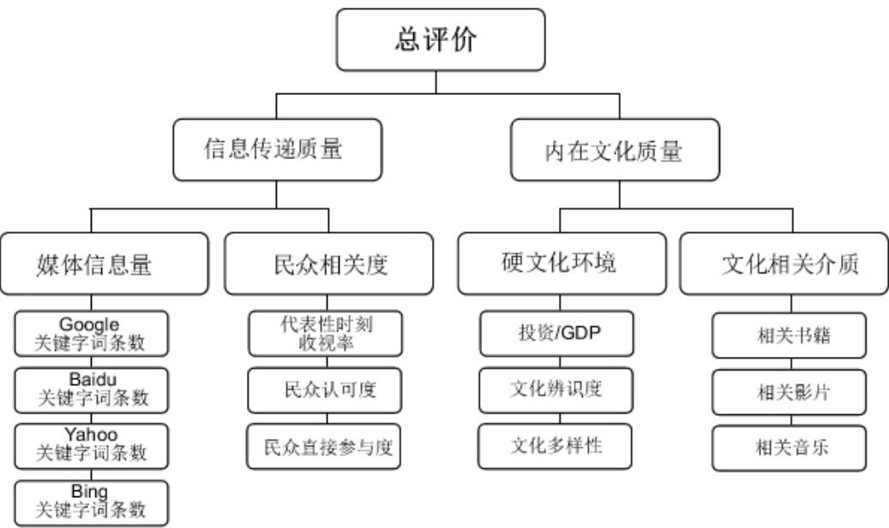
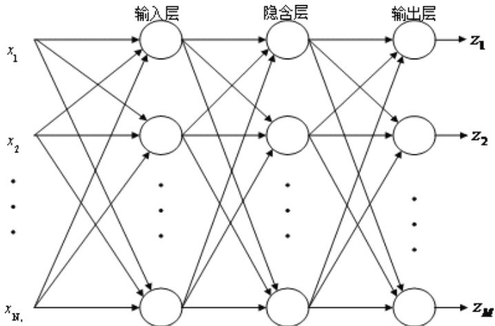

# 2010高教社杯全国大学生数学建模竞赛

## 承 诺 书

我们仔细阅读了中国大学生数学建模竞赛的竞赛规则.

我们完全明白，在竞赛开始后参赛队员不能以任何方式（包括电话、电子邮件、网上咨询等）与队外的任何人（包括指导教师）研究、讨论与赛题有关的问题。

我们知道，抄袭别人的成果是违反竞赛规则的, 如果引用别人的成果或其他公开的资料（包括网上查到的资料），必须按照规定的参考文献的表述方式在正文引用处和参考文献中明确列出。

我们郑重承诺，严格遵守竞赛规则，以保证竞赛的公正、公平性。如有违反竞赛规则的行为，我们将受到严肃处理。

我们参赛选择的题号是（从 A/B/C/D 中选择一项填写）： B

我们的参赛报名号为（如果赛区设置报名号的话）： 07023

所属学校（请填写完整的全名）： 哈尔滨工业大学

参赛队员 (打印并签名) ：1. 金平

2. 徐妍妍

3. 陈浩辰

指导教师或指导教师组负责人 (打印并签名)： 尚寿亭

日期： 2010 年 9 月 13 日

赛区评阅编号（由赛区组委会评阅前进行编号）：

# 2010高教社杯全国大学生数学建模竞赛

## 编 号 专 用 页

赛区评阅编号（由赛区组委会评阅前进行编号）：

赛区评阅记录（可供赛区评阅时使用）：

<table><tr><td rowspan=1 colspan=1>评阅人</td><td rowspan=1 colspan=1></td><td rowspan=1 colspan=1></td><td rowspan=1 colspan=1></td><td rowspan=1 colspan=1></td><td rowspan=1 colspan=1></td><td rowspan=1 colspan=1></td><td rowspan=1 colspan=1></td><td rowspan=1 colspan=1></td><td rowspan=1 colspan=1></td><td rowspan=1 colspan=1></td></tr><tr><td rowspan=1 colspan=1>评分</td><td rowspan=1 colspan=1></td><td rowspan=1 colspan=1></td><td rowspan=1 colspan=1></td><td rowspan=1 colspan=1></td><td rowspan=1 colspan=1></td><td rowspan=1 colspan=1></td><td rowspan=1 colspan=1></td><td rowspan=1 colspan=1></td><td rowspan=1 colspan=1></td><td rowspan=1 colspan=1></td></tr><tr><td rowspan=1 colspan=1>备注</td><td rowspan=1 colspan=1></td><td rowspan=1 colspan=1></td><td rowspan=1 colspan=1></td><td rowspan=1 colspan=1></td><td rowspan=1 colspan=1></td><td rowspan=1 colspan=1></td><td rowspan=1 colspan=1></td><td rowspan=1 colspan=1></td><td rowspan=1 colspan=1></td><td rowspan=1 colspan=1></td></tr></table>

全国统一编号（由赛区组委会送交全国前编号）：

全国评阅编号（由全国组委会评阅前进行编号）：

# 上海世博会于文化方面影响力评估

## 摘要

上海世博会是一项世界性的文化、科技盛宴，本文针对于 2010年上海世博会之于文化方面的影响力进行建模以对其进行科学的定量评估。

对于影响力的评估，其首要问题便是评价标准。本文参考中国科学院发布的《中国现代化报告 2009》及世博会自身特点制定了针对上海世博会文化影响力的多层次评价标准。此标准的制定在基于已有文化影响力评价理论的同时，还考虑了与世博会同类型事件的纵向比较，和同规模异类事件的横向比较，保证了其全面性。

在获得各标准所需数据方面，世博会文化方面影响面之大与评价标准之多对此项工作造成很大的麻烦。最终我们选取了较为权威准确的上海世博会官方网站，上海统计局网站，维基百科等发布机构获取所需要的多个活动的数据。并在获得数据后，对其进行了标准化转换处理，克服了各类数据单位不统一，数量级相差大的问题，使评价过程更为规范，客观，统一。文中用于评估上海世博会文化影响力的两个模型即以上述标准化数据为基础数据。

模型一是基于模糊综合分析算法的评价模型。首先将 13 个文化影响力指标进行分层处理，并且基于层次分析法得到在各级别指标的权重向量，同时确定了文化影响力的等级域，并且将等级数值化。而后，利用正态分布函数，建立了关于等级制度的隶属度函数，并且基于该函数得到了评价指标与等级的模糊关系矩阵。之后将各层评价指标的权重与模糊关系矩阵进行模糊算子处理得到综合评价矩阵，最终得到上海世博会的文化影响力的量化评估 3.3748(5 分为最大值)和文化影响力的等级评估为 B 级。

模型二是基于BP 神经网络算法与聚类分析的评价模型。首先，根据 BP 神经网络的设计要求对标准化数据进一步加工缩减标准数目并规定相关参数。而后，采用学习样本对其进行训练并检验其训练有效性。之后便进行评价工作：将上海世博会在新考察指标下的数据输入神经网络得到评价结果并对其进行聚类分析，利用模型最终的聚类分析结果对上海世博会的文化影响力作出合理评估，最终得出关于上海世博会的文化影响力的量化评估(0.1454)和在同类型世界级活动中的定性评估(B级)。

最后，通过分析上述两个不同模型的结果，由得出结论：上海世博会在文化方面影响力很大。

关键词：上海世博会文化影响力 数据标准化 模糊综合评价 BP神经网络 聚类分析

## I、 问题重述

上海世博会使一次综合性的世界级盛宴。其展示了各国的风土人情，科技文化以及生活理念，本文旨在通过建立数学模型量化评估上海世博会在文化方面的影响力。

## II、 问题分析

## 1.1. 问题重要性分析

世博会与世界杯，奥运会并称世界三大盛会，是一项全世界参与程度极高的综合性盛会。世博会是一项由主办国政府组织或政府委托有关部门举办的有较大影响和悠久历史的国际性博览活动。世界展览会的会场不单是展示技术和商品，而且伴以异彩纷呈的表演，富有魅力的壮观景色，设置成日常生活中是无法体验的、充满节日气氛的空间，成为一般市民娱乐和消费的理想场所。全球融合就是全球化，这个应该是经济文化发展的必然结果。[1]它集中反映了各国的经济，政治，文化，科技等多方面发展情况，同时不失趣味，令人向往。而上海世博会作为参观人数最多，投资最多的一届世界博览会，在多个方面均具有很大的影响力，尤其在文化方面，来自世界不同国家地区的人们以及各式各样的文艺展品极大地丰富了本届世博会的文化多样性，也同时向外辐射了世博与中国的文化，其文化影响力不可小觑。鉴于此点，我们有必要定量的对上海世博会在文化进行科学的评估。

## 1.2. 相关研究

中科院在2009年发布了《中国现代化报告2009》中曾对中国的文化影响力做过研究与评估，最终给出了关于中国文化现代化的评估结果。其分析了文化影响力的组成方面，并将之细化为具体可执行的评价标准，见图：

  
图1:文化影响力结构示意图[2]  
表 2：文化影响力评价的概念模型[3]

<table><tr><td>二级指 标(S)</td><td>权重</td><td>三级指标(T)</td><td>指标含义</td><td>单位</td><td>2005年标杆值</td></tr><tr><td rowspan="6">文化市场 影响力</td><td rowspan="6">60</td><td>文化贸易份额</td><td>文化贸易/世界文化贸易</td><td>%</td><td>14.9</td></tr><tr><td>文化商品贸易份 额</td><td>文化商品贸易/世界文化商 品贸易</td><td>%</td><td>17.4</td></tr><tr><td>文化服务贸易份 额</td><td>文化服务贸易/世界文化服 务贸易</td><td>%</td><td>23.1</td></tr><tr><td>国际旅游收支份 额</td><td>国际旅游收支/国际旅游收 支总和</td><td>%</td><td>15.4</td></tr><tr><td>国际旅游人次份 额</td><td>出入境旅游人次/出入境旅 游总人次</td><td>%</td><td>7.39</td></tr><tr><td>世界文化遗产份 额</td><td>国家的世界文化遗产/文化 遗产总数</td><td>%</td><td>4.65</td></tr><tr><td rowspan="4">文化资源 20 影响力</td><td>图书出版种类份 额</td><td>图书出版种类/世界图书出 版种类</td><td>%</td><td>18.6</td></tr><tr><td>电影产量份额</td><td>电影产量/世界电影产量</td><td>%</td><td>19.4</td></tr><tr><td>宽带网普及率</td><td>用户/千人</td><td>用户/千人</td><td>252</td></tr><tr><td>电视普及率</td><td>电视/家庭</td><td>%</td><td>100</td></tr><tr><td rowspan="6">文化环境 20 影响力</td><td>民主化程度</td><td>政治环境，民主化指数</td><td>指数</td><td>3.51</td></tr><tr><td>劳动生产率</td><td>经济环境，GDP/劳动力</td><td>美元</td><td>101921</td></tr><tr><td>国际移民份额</td><td>社会环境，国际移民/世界 移民总数</td><td>%</td><td>20.2</td></tr><tr><td>森林覆盖率</td><td>生态环境，森林面积/国土 面积</td><td>%</td><td>73.9</td></tr><tr><td>国民文化素质</td><td>教育环境，大学普及率</td><td>%</td><td>90</td></tr></table>

然而，此方法仅适用于客体为国家的情况。应用于世博会文化影响力评价有两个问题：

(1).国家与国家之间虽情况各异，在同一时间点上却可以用统一的衡量标准，而在对上海世博会在文化方面的影响力进行衡量时，不存在与它同期的世博会，又很难找到一个合适的标准可以衡量时间跨度较大的世博会之间影响力的情况，因为随着技术的发展和社会的进步，我们身处的社会已发生了巨大的变化，情况差异过大。例如，我们可以用网络关注度衡量一个当下事件的影响力，但是却很难用它去衡量某个较长时间之前的发生的事的影响力。

(2).单纯的横向比较难以得出有效结论。即使我们找到一个标准可以衡量时间跨度较大的世博会之间影响力的大小关系，得出上海世博会在历届世博会中文化影响力的大小也不足以完整的表明其影响力。对于国家而言，没有与其同类的客体存在，而对于世博会则有，例如奥运会，世锦赛，世界杯等等，因此，我们必须要引入横向比较的标准，衡量上海世博会文化影响力在同、近类型盛事中影响力的高低，借以完整的对其加以评估。

## 1.3. 问题的思路

对于上海世博会文化影响力的评价不应该绝对化，不应用用孤立的标准去量化计算，而应有一定的对比与参照，否则单纯的一个数值结果很难为评估其文化的影响提供直接的帮助，其无法被人们直观的理解与接收。因此，一个纵向(不同年分世博)与横向(同级别不同类型事件/活动)均被考虑的数学模型才是一个好的评估模型。

在横向比较方面，本文选取了世界三大盛会的另两者:世界杯与奥运会参与比较，同时为了保证评价标准的适用性，我们选取了 2010 年南非世界杯，2006年德国世界杯，2008 年北京奥运会，2004 年雅典奥运会作为同级别参考对象。

在纵向比较方面，本文选取了 2005 年爱知世博会作为参照对象，因两者是同一类型活动，同时时间间隔较短，可以较好的统一评价标准并进行准确评价。

在评价标准方面，我们参考了中科院关于国家文化影响力的分类，结合考虑世博会自身的特征与国家之间的区别，制定了多层次划分的评价标准(具体制定过程见建模准备部分)。

数学模型设计方面，由于各个标准与上海世博会文化影响力的关系仅仅已知为正相关，没有很明确的定量权重，因此本文采用了 BP神经网络和模糊综合评价算法作为核心算法，并根据世博会的其它特点进行建模，对其文化影响力进行评价。

## III、 模型假设

## 1.4. 模型一假设

假设一；文化影响力只有上文所述 4 个一级影响力指标，其下共 13个二级文化指标。

## 1.5. 模型二假设

假设一：用于训练的调查结果是相对准确的，可以用于BP 神经网络算法学习。

## IV、 模型符号

## 1.6. 通用符号

：评价标准总数目；

：活动总数目；

$O _ { i j }$ ：为活动i 在第 j 项标准中原数据(顺序同表 x；)

$S _ { i j }$ ：为活动i 在第 j 项标准中标准化后数据(顺序同表 x)；

$\it M a x ( )$ :取最大值运算符号；

$\operatorname * { \it M i n } _ { i = 1 \ldots ^ { * } } ( )$ :取最小值运算符号；

()：数量运算符

## 1.7. 模型一符号

：为文化影响力的评价指标集合；

$u _ { i }$ ：为文化影响力的评价指标集合内的一级单因素指标；

$u _ { \ddot { y } }$ ：为一级单因素指标 集合内的二级单因素评价指标 <sub>；</sub>

: 为文化影响力评价的评价等级集合；

：为文化影响力评价评语集合内的单评价等级因素 <sub>；</sub>

：一级因素评价指标的判断矩阵；

：一级因素评价指标 下的二级因素评价指标的判断矩阵；

：一级因素评价指标的权重向量；

：一级因素评价指标 下的二级因素评价指标的权重向量；

$\lambda _ { \operatorname* { m a x } }$ ：矩阵的最大特征值；

：矩阵的一致性指标；

：矩阵的平均随机一致指标；

：一致性比率；

$\textstyle H _ { _ { i } } ;$ ：准则层的单因素评价矩阵；

$r _ { i j }$ ：表示第 个评价因素对第 个评价等级的隶属度；

：子准则层的模糊综合评价矩阵；

：准则层的模糊综合评价等级矩阵；

## 1.8. 模型二符号

C: 输入层的神经元个数D: 输出层的神经元个数，P: 隐含层的神经元个数

## V、 模型准备

## 1.9. 评价标准

## 1.1.1. 标准制定分析

要对上海世博会在文化方面的影响作出好的评估，首先必须确定合适的评价标准。《中国现代化报告2008》中认为，国际影响力是一个国家通过国际互动对国际环境施加的实际影响的大小。[4]对于世博会的文化影响力来说，则是在文化方面对外界施加影响的大小。在《中国现代化报告2009》中，国家文化影响力被定义为一个国家对世界文化市场和文化生活的客观影响的总和[5]。在这一定义上，上海世博会的文化影响与之有异有同：

相同方面是：

其均为在文化方面的影响；

相异的方面是：

1.上海世博会的不是国家，而是世界文化的综合盛会，相应的，其国家文化特色不是重点，重点是其文化多样性。

2.国家的文化影响力往往是长时间积累的结果，而世博会相较于国家为期较短，影响方式和方面都有差异。

由以上分析可知用于国家文化影响力的评价标准不能直接应用于上海世博会。然而按照《中国现代化报告 2009》对于文化影响力的定义方式逆向思考，不难发现文化影响力最直接的反映就是影响的受体所接收到的文化信息的质量和数量，即内在文化价值与信息传递质量。前者体现在硬文化环境质量以及文化载体(书籍等)，后者则体现在传递媒体如：网络，电视等的信息量和民众关注度。因此可得出其层次评价标准：

  
图2：层次评价标准示意图

## 1.1.1. 标准考察内容

## 1.信息传递质量

(1).媒体信息量：

网络媒体的关注度的高低与否对一个活动的影响力来讲至关重要，其信息传播之快，之广是传统媒体无法比拟的，因此我们对如上提到的6 项活动在世界范围内市场份额最大的4 个搜索引擎：Google，Baidu，Yahoo，Being 分别进行中英文关键字搜索，最终统计出数据，并处理得到 6 项活动规格化分数(原始数据见附录)。

## (2)民众相关度：

对于一项活动而言，其影响力大小受民众与之相关度影响很大，如果上海世博曲高和寡，参与人数寥寥，人们漠不关心，即使其文化价值再大，也难以有其应有的影响力，因此我们在这一项中引入如下分项代表时刻收视率，民众认可度，民众直接参与度作为本项目评价依据。

2.内在文化质量

(3)硬文化环境：

一项活动在文化方面的硬实力对其文化影响力很大，具体到上海世博会，其硬实力体现在其场馆建设，资金投入，参展国数目，文化丰富度等方面，本文在此引入三个分项用于评价世博会的文化环境：总投资/国家当年 GDP，文化辨识度，文化多样性。其中第一项总投资/国家当年 GDP可以很好的反映一个国家对于此项活动的重视态度；第二项文化辨识度是指特定国家举办的活动的独有文化特征的明显程度；第三项代表在此项活动中文化多样性的程度。

## (4)文化相关介质：

对于世博会这种世界级别的活动，其文化影响力还体现在其相关周边产品，图书，音乐和电影数目的多寡。因此本项以此为考察标准。

## 1.10. 数据标准化

本文的两种建模方案，基于以下数据支持。由于数据的原始数据来源众多且庞杂以及数据处理过程较为繁琐，难以在正文中逐一标注来源，因此原数据来源详见附录，在此仅给出原数据汇总，标准化数据和标准化计算公式，不详述计算过程。

## 1.1.1. 原始数据汇总(详细单项数据及来源见附录)：

表2：原始数据表
<table><tr><td colspan="1" rowspan="1">数值</td><td colspan="1" rowspan="1">2010南非世界德杯</td><td colspan="1" rowspan="1">2006国世界杯</td><td colspan="1" rowspan="1">2010上海世博会</td><td colspan="1" rowspan="1">2005爱知世博北会</td><td colspan="1" rowspan="1">2008京奥运雅会</td><td colspan="1" rowspan="1">2004典奥运会</td></tr><tr><td colspan="1" rowspan="1">Google( 万条)</td><td colspan="1" rowspan="1">5150</td><td colspan="1" rowspan="1">4840</td><td colspan="1" rowspan="1">8520</td><td colspan="1" rowspan="1">690</td><td colspan="1" rowspan="1">3260</td><td colspan="1" rowspan="1">1610</td></tr><tr><td colspan="1" rowspan="1">Baidu(万条)</td><td colspan="1" rowspan="1">5400</td><td colspan="1" rowspan="1">3230</td><td colspan="1" rowspan="1">10000</td><td colspan="1" rowspan="1">66</td><td colspan="1" rowspan="1">4280</td><td colspan="1" rowspan="1">662</td></tr><tr><td colspan="1" rowspan="1">Yahoo(万条)</td><td colspan="1" rowspan="1">2880</td><td colspan="1" rowspan="1">3360</td><td colspan="1" rowspan="1">763</td><td colspan="1" rowspan="1">13.7</td><td colspan="1" rowspan="1">893</td><td colspan="1" rowspan="1">632</td></tr><tr><td colspan="1" rowspan="1">Bing(万条)</td><td colspan="1" rowspan="1">12.2</td><td colspan="1" rowspan="1">15.8</td><td colspan="1" rowspan="1">12.5</td><td colspan="1" rowspan="1">18.6</td><td colspan="1" rowspan="1">6.1</td><td colspan="1" rowspan="1">5.94</td></tr><tr><td colspan="1" rowspan="1">代表时刻收视率(%)</td><td colspan="1" rowspan="1">0.04</td><td colspan="1" rowspan="1">0.0532</td><td colspan="1" rowspan="1">0.138</td><td colspan="1" rowspan="1">0.08</td><td colspan="1" rowspan="1">0.4054</td><td colspan="1" rowspan="1">0.265</td></tr><tr><td colspan="1" rowspan="1">民众认可度(%)</td><td colspan="1" rowspan="1">48.55</td><td colspan="1" rowspan="1">53.2</td><td colspan="1" rowspan="1">77.64</td><td colspan="1" rowspan="1">85.4</td><td colspan="1" rowspan="1">85.9</td><td colspan="1" rowspan="1">81.1</td></tr><tr><td colspan="1" rowspan="1">民众直接参与度(%)</td><td colspan="1" rowspan="1">300/4690</td><td colspan="1" rowspan="1">336/8170</td><td colspan="1" rowspan="1">7000/132246</td><td colspan="1" rowspan="1">2240/12776</td><td colspan="1" rowspan="1">700/13000</td><td colspan="1" rowspan="1">530/1100</td></tr><tr><td colspan="1" rowspan="1">投资/GDP(亿美元)</td><td colspan="1" rowspan="1">35/2774</td><td colspan="1" rowspan="1">88/27901</td><td colspan="1" rowspan="1">42.25/47580</td><td colspan="1" rowspan="1">22.57/46234</td><td colspan="1" rowspan="1">40/33700</td><td colspan="1" rowspan="1">70/1730.45</td></tr><tr><td colspan="1" rowspan="1">相关书籍(本)</td><td colspan="1" rowspan="1">367</td><td colspan="1" rowspan="1">391</td><td colspan="1" rowspan="1">43</td><td colspan="1" rowspan="1">7</td><td colspan="1" rowspan="1">313</td><td colspan="1" rowspan="1">309</td></tr><tr><td colspan="1" rowspan="1">相关电影(部)</td><td colspan="1" rowspan="1">5</td><td colspan="1" rowspan="1">1</td><td colspan="1" rowspan="1">1</td><td colspan="1" rowspan="1">0</td><td colspan="1" rowspan="1">11</td><td colspan="1" rowspan="1">15</td></tr><tr><td colspan="1" rowspan="1">相关音乐(专辑)</td><td colspan="1" rowspan="1">12</td><td colspan="1" rowspan="1">5</td><td colspan="1" rowspan="1">2</td><td colspan="1" rowspan="1">0</td><td colspan="1" rowspan="1">31</td><td colspan="1" rowspan="1">16</td></tr><tr><td colspan="1" rowspan="1">文化辨识度(分)</td><td colspan="1" rowspan="1">92</td><td colspan="1" rowspan="1">88</td><td colspan="1" rowspan="1">70</td><td colspan="1" rowspan="1">81</td><td colspan="1" rowspan="1">90</td><td colspan="1" rowspan="1">92</td></tr><tr><td colspan="1" rowspan="1">文化多样性(分)</td><td colspan="1" rowspan="1">78</td><td colspan="1" rowspan="1">75</td><td colspan="1" rowspan="1">94</td><td colspan="1" rowspan="1">85</td><td colspan="1" rowspan="1">83</td><td colspan="1" rowspan="1">87</td></tr></table>

## 1.1.2. 标准化数据：

表 3：标准化数据表
<table><tr><td rowspan=1 colspan=1>二级标准</td><td rowspan=1 colspan=1>三级标准</td><td rowspan=1 colspan=1>2010南非世界杯</td><td rowspan=1 colspan=1>2006德国世界杯</td><td rowspan=1 colspan=1>2010上海世博会</td><td rowspan=1 colspan=1>2005爱知世博会</td><td rowspan=1 colspan=1>2008北京奥运会</td><td rowspan=1 colspan=1>2004雅典奧运会</td></tr><tr><td rowspan=4 colspan=1>媒体信息量</td><td rowspan=1 colspan=1>Google</td><td rowspan=1 colspan=1>0.605</td><td rowspan=1 colspan=1>0.568</td><td rowspan=1 colspan=1>1.0</td><td rowspan=1 colspan=1>0.081</td><td rowspan=1 colspan=1>0.383</td><td rowspan=1 colspan=1>0.189</td></tr><tr><td rowspan=1 colspan=1>Baidu</td><td rowspan=1 colspan=1>0.54</td><td rowspan=1 colspan=1>0.323</td><td rowspan=1 colspan=1>1.0</td><td rowspan=1 colspan=1>0.0066</td><td rowspan=1 colspan=1>0.428</td><td rowspan=1 colspan=1>0.662</td></tr><tr><td rowspan=1 colspan=1>Yahoo</td><td rowspan=1 colspan=1>0.857</td><td rowspan=1 colspan=1>1.0</td><td rowspan=1 colspan=1>0.227</td><td rowspan=1 colspan=1>0.004</td><td rowspan=1 colspan=1>0.266</td><td rowspan=1 colspan=1>0.188</td></tr><tr><td rowspan=1 colspan=1>Bing</td><td rowspan=1 colspan=1>0.656</td><td rowspan=1 colspan=1>0.849</td><td rowspan=1 colspan=1>0.672</td><td rowspan=1 colspan=1>1.0</td><td rowspan=1 colspan=1>0.328</td><td rowspan=1 colspan=1>0.319</td></tr><tr><td rowspan=3 colspan=1>民众相关度</td><td rowspan=1 colspan=1>代表时刻收视率</td><td rowspan=1 colspan=1>0.099</td><td rowspan=1 colspan=1>0.1307</td><td rowspan=1 colspan=1>0.341</td><td rowspan=1 colspan=1>0.20</td><td rowspan=1 colspan=1>1.0</td><td rowspan=1 colspan=1>0.654</td></tr><tr><td rowspan=1 colspan=1>民众认可度</td><td rowspan=1 colspan=1>0.565</td><td rowspan=1 colspan=1>0.624</td><td rowspan=1 colspan=1>0.906</td><td rowspan=1 colspan=1>0.994</td><td rowspan=1 colspan=1>1.0</td><td rowspan=1 colspan=1>0.944</td></tr><tr><td rowspan=1 colspan=1>民众直接参与度</td><td rowspan=1 colspan=1>0.133</td><td rowspan=1 colspan=1>0.085</td><td rowspan=1 colspan=1>0.112</td><td rowspan=1 colspan=1>0.365</td><td rowspan=1 colspan=1>0.011</td><td rowspan=1 colspan=1>1.0</td></tr><tr><td rowspan=3 colspan=1>硬文化环境</td><td rowspan=1 colspan=1>总投资/国家当年 GDP</td><td rowspan=1 colspan=1>0.312</td><td rowspan=1 colspan=1>0.077</td><td rowspan=1 colspan=1>0.022</td><td rowspan=1 colspan=1>0.012</td><td rowspan=1 colspan=1>0.03</td><td rowspan=1 colspan=1>1.0</td></tr><tr><td rowspan=1 colspan=1>文化辨识度</td><td rowspan=1 colspan=1>1.0</td><td rowspan=1 colspan=1>0.957</td><td rowspan=1 colspan=1>0.761</td><td rowspan=1 colspan=1>0.88</td><td rowspan=1 colspan=1>0.978</td><td rowspan=1 colspan=1>1.0</td></tr><tr><td rowspan=1 colspan=1>文化多样性</td><td rowspan=1 colspan=1>0.821</td><td rowspan=1 colspan=1>0.798</td><td rowspan=1 colspan=1>1.0</td><td rowspan=1 colspan=1>0.904</td><td rowspan=1 colspan=1>0.883</td><td rowspan=1 colspan=1>0.926</td></tr><tr><td rowspan=3 colspan=1>文化相关介质</td><td rowspan=1 colspan=1>相关书籍</td><td rowspan=1 colspan=1>0.939</td><td rowspan=1 colspan=1>1.0</td><td rowspan=1 colspan=1>0.11</td><td rowspan=1 colspan=1>0.018</td><td rowspan=1 colspan=1>0.801</td><td rowspan=1 colspan=1>0.790</td></tr><tr><td rowspan=1 colspan=1>相关影片</td><td rowspan=1 colspan=1>0.333</td><td rowspan=1 colspan=1>0.067</td><td rowspan=1 colspan=1>0.067</td><td rowspan=1 colspan=1>0</td><td rowspan=1 colspan=1>0.733</td><td rowspan=1 colspan=1>1.0</td></tr><tr><td rowspan=1 colspan=1>相关音乐</td><td rowspan=1 colspan=1>0.387</td><td rowspan=1 colspan=1>0.161</td><td rowspan=1 colspan=1>0.0645</td><td rowspan=1 colspan=1>0</td><td rowspan=1 colspan=1>1.0</td><td rowspan=1 colspan=1>0.516</td></tr></table>

## 1.1.1. 相对化过程及公式：

因为上述 13 项评价指标的原始数据各自单位不同，数值数量级差异很大，难以直接进行运算，因此我们按照其各自范围对其进行标准化处理，以此获得一个统一的度量供模型评价使用。下面给出标准化公式。

对于任 i 活动在j 项目中的得分，其标准化后分数：

$$
S _ { i j } = \frac { O _ { i j } } { M a x ( O _ { i j } ) }
$$

## VI、 模型建立与求解

## 1.2. 模型一：基于模糊综合评价的文化影响力评价及验证模型

## 1.2.1. 模糊综合评价算法概述

模糊综合评价是以模糊数学为基础，应用模糊关系合成的原理，将一些边界不清，不易定量的因素定量化，进行综合评价的一种方法,其特点是其特点是评价结果不是绝对地肯定或否定，而是以一个模糊集合来表示。隶属度与隶属度矩阵是模糊综合评价的关键性概念。对于论域（即研究范围）U中任意元素x,都有$\mathrm { ~  ~ { ~ A ~ } ~ } ( \mathrm { \tau _ { X } } ) \in [ 0$ ，1]与之相对应，则称A为U上的模糊集，而 $\mathsf { A } ( \mathsf { x } )$ 即称为x对A（A通常称之为评价集）的隶属度。隶属度 $\mathsf { A } ( \mathsf { x } )$ 越接近于1，表示x属于A的程度越高， $\mathsf { A } ( \mathsf { x } )$ 越接近于0表示x属于A的程度越低。[6]隶属度矩阵则为多个元素 $x _ { i }$ 对于 $\mathcal { A } _ { i }$ 的模糊关系矩阵，矩阵元素 $r _ { i j }$ 即为 $x _ { i }$ 对于 $A _ { j }$ 的隶属度。模糊综合评级中通常分有目标层和指标层，通过指标层与评价集之间的模糊关系矩阵（即隶属度矩阵）可以得到对于目标层对于评价集的隶属度向量，从而得到目标层的综合评价结果。

## 1.2.2. 模糊综合评价模型求解

## 1.1.1.1. 基于上海世博文化影响力的模型分析

上海世博文化影响力涉及多方面因素，可以采用信息传递质量指标和内文化质量指标来进行衡量，这两大指标之下各有两个衡量指标：媒体信息量，民众相关度，硬文化环境和文化相关介质，将这四个指标称之为一级指标。而这四个指标无法定量的给出对文化影响力衡量的实际标准，而且它们之间的相关关系和所反应结果的准确度都是模糊不清的。此外在一级指标之下总共还有 13 个相应的二级指标，它们对于文化影响力的定义，评价能力和它们之间的相互关系也是模糊不清的。综上所述，面对评价上海世博文化影响力的问题采用模糊综合评价方

法来衡量是较为恰当的。

为此需要建立一个影响力评价等级集合 $\begin{array} { r } { V = \left\{ V _ { i } \right\} } \end{array}$ 来对文化影响力进行等级评价，并且构造出单指标因素对于各评价等级的隶属函数 $F ( x )$ ，建立模糊关系矩阵R，同时需进行相应的基本操作，对各指标进行权重衡量，结合隶属度矩阵求出综合评价矩阵。

在计算各级指标权重方面，考虑到了传统的模糊综合评价中的权重通常由专家指定或者根据调查结果判定，这样导致主观因素太大，权重定量不够精确。为避免这些不利因素，在这个模型中采用层次分析法求出各指标权重大小。

## 1.1.1.2. 指标的层次划分

为减少算法的复杂程度，将上图中的三层指标结构，简化为两层，只建立具有准则层和子准则层这两层的模糊综合评价分析模型。

表 4：指标层次表
<table><tr><td colspan="1" rowspan="1">目标层</td><td colspan="1" rowspan="1">准则层</td><td colspan="1" rowspan="1">子准则层</td></tr><tr><td colspan="1" rowspan="10"> $U$ 文化影响力</td><td colspan="1" rowspan="4"> $u _ { 1 }$  媒体信息量</td><td colspan="1" rowspan="1"> $u _ { 1 1 } \mathsf { G o o g l e }$ </td></tr><tr><td colspan="1" rowspan="1"> $u _ { 1 2 } \mathsf { B a i d u }$ </td></tr><tr><td colspan="1" rowspan="1"> $u _ { 1 3 } \mathsf { Y a h o o }$ </td></tr><tr><td colspan="1" rowspan="1"> $u _ { 1 4 } \mathsf { B i n g }$ </td></tr><tr><td colspan="1" rowspan="3"> $u _ { 2 }$ 民众相关度</td><td colspan="1" rowspan="1"> $u _ { 2 1 }$ 代表时刻收视率</td></tr><tr><td colspan="1" rowspan="1"> $u _ { 2 2 }$ 民众认可度</td></tr><tr><td colspan="1" rowspan="1"> $u _ { 2 3 }$ 民众直接参与度</td></tr><tr><td colspan="1" rowspan="3"> $u _ { 3 }$ 硬文化环境</td><td colspan="1" rowspan="1"> $u _ { 3 1 }$ 总投资/国家当年GDP</td></tr><tr><td colspan="1" rowspan="1"> $u _ { 3 2 }$ 文化辨识度</td></tr><tr><td colspan="1" rowspan="1"> $u _ { 3 3 }$ 文化多样性</td></tr><tr><td rowspan="3"></td><td rowspan="3">文化相关媒介  $u _ { 4 }$ </td><td> $u _ { 4 1 }$  相关书籍</td></tr><tr><td>相关文件  $u _ { 4 2 }$ </td></tr><tr><td> $u _ { 4 3 }$  相关音乐</td></tr></table>

## 1.1.1.3.确定文化影响力的等级域

$\boldsymbol { V } = \left\{ \boldsymbol { V } _ { 1 } , \boldsymbol { V } _ { 2 } , \boldsymbol { V } _ { 3 } , \boldsymbol { V } _ { 4 } , \boldsymbol { V } _ { 5 } \right\}$ ； $ { \boldsymbol { J } } _ { 1 } ^ { \prime }$ 表示 A 级：文化影响力非常大； $V _ { 2 }$ 表示 B 级：文化影响力很大； $\boldsymbol { { \mathit { V } } } _ { 3 }$ 表示 C 级：文化影响力一般大； $V _ { _ 4 }$ 表示 D 级：文化影响力比较小， $V _ { 5 }$ 表示 E 级：文化影响力非常小。

在得到指标 x 隶属度向量时，通常情况下是采取隶属度最大原则对 x 进行等级划分，但是这中划分方式通常很模糊，忽略了x 对其它等级的隶属度关系。因此，为了全面综合的对 x 进行等级评价，此处将等级分值化，即令 $A = 5 , B = 4 , C = 3$ D=2, E=1。即将隶属度向量变换为权重关系向量，元素 x 的综合等级分值为 $\mathsf { M } =$ $5 ^ { \star } \mathsf { A } ( \mathsf { x } ) + 4 ^ { \star } \mathsf { B } ( \mathsf { x } ) + 3 ^ { \star } \mathsf { C } ( \mathsf { x } ) + 2 ^ { \star } \mathsf { D } ( \mathsf { x } ) + 1 ^ { \star } \mathsf { E } ( \mathsf { x } )$

## 1.1.1.4. 用层次分析法求出各级指标权重

## 1. 层次分析法概述

层次分析法是由美国著名的运筹学专家 Saaty首先提出的，它合理的将定性与定量的决策结合起来，按照思维和心理的规律将决策的过程透明化。层次结构如上所示，通过将指标两两比较的方式建立判断矩阵，通常使用 9 表度法（见下图表格解释）。构造的矩阵 $\scriptstyle A = \left( a _ { i j } \right)$ 在理论上应该具有以下一致性： ${ a _ { i k } } ^ { * } a _ { k j } = a _ { i j }$ [7]因此构造出的判断矩阵应该进行一致性检验。当矩阵 A 为一致性矩阵时，其最大特征值所对应的特征向量归一化后即成为排序权向量。

## 2. 层次分析法求解准则层一级指标权重

## (1)判断矩阵

设所要构造的判断矩阵为 $\scriptstyle { \mathcal { A } } = \left( a _ { i j } \right)$ ，其中元素 $a _ { i j }$ 的设定根据下图所示的 9标度法

表 5：9 表度法示意图
<table><tr><td rowspan="2">含义</td><td rowspan="2">与 七 同  $u _ { i }$   $u _ { j }$ </td><td rowspan="2">比 稍  $u _ { i }$   $u _ { j }$ </td><td rowspan="2">比 重  $u _ { i }$   $u _ { j }$ </td><td rowspan="2">比 强  $u _ { i }$   $u _ { j }$ </td><td rowspan="2"> $u _ { i }$  比 极  $u _ { j }$ </td></tr><tr><td></td></tr><tr><td></td><td>样重要</td><td>重要</td><td>要</td><td>烈重要</td><td>重要</td></tr><tr><td>取值  $\mathbf { \mathcal { a } } _ { \dot { \mathcal { H } } }$ </td><td>1</td><td>3</td><td>5</td><td>7</td><td>9</td></tr></table>

<table><tr><td>2</td><td>4 6</td></tr></table>

构造的判断矩阵为 $\mathcal { A } = \left[ \begin{array} { c c c c } { 1 } & { 1 / 5 } & { 1 / 3 } & { 3 } \\ { 5 } & { 1 } & { 1 / 2 } & { 5 } \\ { 3 } & { 3 } & { 1 } & { 4 } \\ { 1 / 3 } & { 1 / 5 } & { 1 / 4 } & { 1 } \end{array} \right]$

## (2)特征值与特征向量

矩阵 A 的最大特征值为 $\lambda _ { \operatorname* { m a x } }$ ，

其所对应的特征向量即为： $\boldsymbol { u } = \left( u _ { 1 } , u _ { 2 } , u _ { 3 } , \cdots u _ { n } \right) ^ { T }$

将u归一化，即对 $i { = } 1 , 2 , \cdots , n$ ，即求 $x _ { i } = \frac { u _ { i } } { \displaystyle \sum _ { i = 1 } ^ { n } u _ { j } }$

用 matlab 程序（见附录）求解得出上述判断矩阵 A 的最大特征值为$\lambda _ { \operatorname* { m a x } } = 4 . 2 6 5 6$

四个一级指标对应的权重向量 $X = { \left( \begin{array} { l } { 0 . 1 0 4 6 } \\ { 0 . 4 4 2 3 } \\ { 0 . 3 8 4 6 } \\ { 0 . 0 6 8 5 } \end{array} \right) }$

## (3)一致性检验

一致性检验指标为 $C I = \frac { \lambda _ { \operatorname* { m a x } } - n } { n - 1 }$ （n 为矩阵的阶数，此处 $n = 4 )$ ），一致性比率 $C R = \frac { C I } { R I }$ ; 当 $\frac { C R } { R I } < 0 . 1$ 时，则可以称该矩阵具有一致性。

Statty 得到的平均随机一致性指标RI 如下表所示

表 6：一致性指标 RI表
<table><tr><td rowspan=1 colspan=1>矩阵阶数</td><td rowspan=1 colspan=1>2</td><td rowspan=1 colspan=1>3</td><td rowspan=1 colspan=1>4</td><td rowspan=1 colspan=1>5</td><td rowspan=1 colspan=1>6</td><td rowspan=1 colspan=1>7</td><td rowspan=1 colspan=1>8</td><td rowspan=1 colspan=1>9</td></tr><tr><td rowspan=1 colspan=1>RI</td><td rowspan=1 colspan=1>0</td><td rowspan=1 colspan=1>0.58</td><td rowspan=1 colspan=1>0.90</td><td rowspan=1 colspan=1>1.12</td><td rowspan=1 colspan=1>1.24</td><td rowspan=1 colspan=1>1.32</td><td rowspan=1 colspan=1>1.41</td><td rowspan=1 colspan=1>1.45</td></tr></table>

[8]

将 $\lambda _ { \operatorname* { m a x } }$ 带入检验指标求得 $C { \cal I } = 0 . 0 8 5$ ，算得 $C R = 0 . 0 9 4 4$ ，该值小于 0.1，所以可以说矩阵A 具有一致性。

## 3. 层次分析法求子准则层二级指标权重

四个一级指标对应的二级指标的判断矩阵为：

$$
x _ { 1 } = { \left[ \begin{array} { l l l l } { 1 } & { 1 / 3 } & { 1 / 5 } & { 1 / 6 } \\ { 3 } & { 1 } & { 1 / 3 } & { 1 / 4 } \\ { 5 } & { 3 } & { 1 } & { 1 / 3 } \\ { 6 } & { 4 } & { 3 } & { 1 } \end{array} \right] } \quad x _ { 2 } = { \left[ \begin{array} { l l l } { 1 } & { 1 / 5 } & { 1 / 3 } \\ { 5 } & { 1 } & { 3 } \\ { 3 } & { 1 / 3 } & { 1 } \end{array} \right] } \quad x _ { 3 } = { \left[ \begin{array} { l l l } { 1 } & { 2 } & { 3 } \\ { 1 / 2 } & { 1 } & { 2 } \\ { 1 / 3 } & { 1 / 2 } & { 1 } \end{array} \right] }
$$

$$
x _ { 4 } = \left[ { \begin{array} { c c c } { 1 } & { 1 / 5 } & { 1 / 2 } \\ { 5 } & { 1 } & { 2 } \\ { 2 } & { 1 / 2 } & { 1 } \end{array} } \right]
$$

最大特征值和权重向量分别为

$$
\begin{array} { r } { \lambda _ { \operatorname* { m a x } } = 4 . 1 4 7 0 } \\ { x _ { \mathrm { i } } = \left( \begin{array} { l } { 0 . 0 5 7 4 } \\ { 0 . 1 5 4 7 } \\ { 0 . 3 1 5 1 } \\ { 0 . 4 7 2 8 } \end{array} \right) \quad x _ { \mathrm { 2 } } = \left( \begin{array} { l } { 0 . 1 0 8 8 } \\ { 0 . 4 9 4 1 } \\ { 0 . 3 5 7 1 } \end{array} \right) \quad x _ { \mathrm { 3 } } = \left( \begin{array} { l } { 0 . 5 2 9 4 } \\ { 0 . 2 9 4 1 } \\ { 0 . 1 7 6 5 } \end{array} \right) \quad x _ { \mathrm { 4 } } = \left( \begin{array} { l } { 0 . 0 7 0 2 } \\ { 0 . 6 5 8 5 } \\ { 0 . 3 6 8 3 } \end{array} \right) } \end{array}
$$

一致性检验结果：

表 7：一致性检验结果表
<table><tr><td rowspan=1 colspan=1>Cl</td><td rowspan=1 colspan=1>0.0490</td><td rowspan=1 colspan=1>0.019</td><td rowspan=1 colspan=1>0.0046</td><td rowspan=1 colspan=1>0.0027</td></tr><tr><td rowspan=1 colspan=1>RI</td><td rowspan=1 colspan=1>0.90</td><td rowspan=1 colspan=1>0.58</td><td rowspan=1 colspan=1>0.58</td><td rowspan=1 colspan=1>0.58</td></tr><tr><td rowspan=1 colspan=1>CIRI</td><td rowspan=1 colspan=1>0.0544</td><td rowspan=1 colspan=1>0.0288</td><td rowspan=1 colspan=1>0.0008</td><td rowspan=1 colspan=1>0.0047</td></tr><tr><td rowspan=1 colspan=1>是否满足一致性</td><td rowspan=1 colspan=1>是</td><td rowspan=1 colspan=1>是</td><td rowspan=1 colspan=1>是</td><td rowspan=1 colspan=1>是</td></tr></table>

## 1.1.1.5. 单因素评价，建立模糊关系矩阵

## 1) 隶属度函数

对于隶属度的确定通常有两类方法。第一类方法是定性的采取民意调查报告的形式或者专家投票的形式。隶属度 $r _ { i } = \frac { d _ { i } } { d }$ ；其中 $d$ 为专家的总人数（或调查报告总份数）， $d _ { i }$ 为对于该评价指标作出 V 评价的专家个数（或给出 V 评价的调查报告总份数）。[9]

此处采取第二类方法，即定量的给出合理的隶属度函数表达式来求取模糊关系矩阵。在隶属度函数的建立中考虑到了在第一类方法中，当调查报告样本足够大时，各项指标的影响力等级（当等级划分为无穷多时）和统计出的相应评价结

果的概率关系近似呈于正态分布。

因此结合方法一和方法二的特征，此处计算隶属度的基本函数则采取 $\mu = 0$ 的正态分布函数 N (0, ∂)。

设次准则层的评价指标对于五个文化影响力等级 A,B,C,D,E 的隶属度函数分别为 $\mathscr { f } _ { 1 } ( x ) , \mathscr { f } _ { 2 } ( x ) , \mathscr { f } _ { 3 } ( x ) , \mathscr { f } _ { 4 } ( x ) , \mathscr { f } _ { 5 } ( x )$ ，选择每个评价指标在上述四个判别矩阵的各自的特征值λ作为方差，即 $\partial = \lambda$ 。则 $F ( x ) = \frac { 1 } { \sqrt { 2 \pi \lambda } } e ^ { - \frac { x ^ { 2 } } { 2 \lambda ^ { 2 } } }$ o

上海世博会 13 个基本单项指标的标准数值 a,如下图所示：

表 8：标准数 a 值表
<table><tr><td rowspan=1 colspan=1>指标</td><td rowspan=1 colspan=1>Google关键词条</td><td rowspan=1 colspan=1>Baidu 关键词条</td><td rowspan=1 colspan=1>Yah00关键词条</td><td rowspan=1 colspan=1>Bing关键词条</td><td rowspan=1 colspan=1>代表时刻收视率</td><td rowspan=1 colspan=1>民众认可度</td><td rowspan=1 colspan=1>民众直接参与度</td><td rowspan=1 colspan=1>总投资1国家当年GDP</td><td rowspan=1 colspan=1>文化辨识度</td><td rowspan=1 colspan=1>文化多样性</td><td rowspan=1 colspan=1>相关书籍</td><td rowspan=1 colspan=1>相关影片</td><td rowspan=1 colspan=1>相关音乐</td></tr><tr><td rowspan=1 colspan=1>a</td><td rowspan=1 colspan=1>1</td><td rowspan=1 colspan=1>1</td><td rowspan=1 colspan=1>0.227</td><td rowspan=1 colspan=1>0.672</td><td rowspan=1 colspan=1>0.341</td><td rowspan=1 colspan=1>0.906</td><td rowspan=1 colspan=1>0.112</td><td rowspan=1 colspan=1>0.022</td><td rowspan=1 colspan=1>0.761</td><td rowspan=1 colspan=1>1</td><td rowspan=1 colspan=1>0.801</td><td rowspan=1 colspan=1>0.733</td><td rowspan=1 colspan=1>1</td></tr></table>

在此假设数据 a能够直接反映文化影响力的 C等级，a 数值的大小表示其对应的二级指标影响力大小处于一般水平，并且 a 值越大反映出其影响力越大，越接近于 A 等级；反之，影响力越小，越接近于E 等级，同时考虑到正态分布函数的变量 x 在(− ∂ ∂ 3 , 3 )范围内，概率大小为 99.7%,几乎覆盖了所有的积分面积。所以综合上述因素考虑，对于同一元素 X 的五个等级在正态分布函数$F ( x ) = \frac { 1 } { \sqrt { 2 \pi \lambda } } e ^ { - \frac { x ^ { 2 } } { 2 \lambda ^ { 2 } } }$ 合理的进行一定的区域面积划分，从而得出元素X 的五个隶属度，满足 $\sum _ { i = 1 } ^ { n } { \mathcal { f } } _ { i } ( x ) = 1$

当 $a \leq 0 . 5$ 时，元素 X 的影响力偏小，所以相对应的五个隶属度函数应为：

$$
\left\{ \begin{array} { l l } { f _ { 1 } ( x ) = f ( 3 \hat { o } ) - f ( 3 \hat { o } - \delta ) ; } \\ { f _ { 4 } ( x ) = f ( 3 \hat { o } - 7 ) - f ( 3 \hat { o } - \delta - 0 . 7 \delta ) ; } \\ { f _ { 3 } ( x ) = f ( 3 \hat { o } - 1 . 7 \delta ) - f ( 3 \hat { o } - 1 . 7 \delta - a \hat { o } ) ; } \\ { f _ { 2 } ( x ) = f ( 3 \hat { o } - 1 . 7 \delta - a \hat { o } ) - f ( 3 \hat { o } - 1 . 7 \delta - a \hat { o } - 1 . 2 \delta ) ; } \\ { f _ { 5 } ( x ) = 1 - f _ { 2 } ( x ) - f _ { 3 } ( x ) - f _ { 4 } ( x ) - f _ { 5 } ( x ) ; } \end{array} \right.
$$

当 $a > 0 . 5$ ，五个隶属度函数为 $\left\{ \begin{array} { l l } { f _ { s } ( x ) = f ( 3 \hat { o } ) - f ( 3 \hat { o } - \delta ) ; } \\ { f _ { 4 } ( x ) = f ( 3 \hat { o } - 7 ) - f ( 3 \hat { o } - \delta - 1 . 2 \delta ) ; } \\ { f _ { 3 } ( x ) = f ( 3 \hat { o } - 2 . 2 \delta ) - f ( 3 \hat { o } - 2 . 2 \delta - a \hat { o } ) ; } \\ { f _ { 2 } ( x ) = f ( 3 \hat { o } - 2 . 2 \delta - a \hat { o } ) - f ( 3 \hat { o } - 2 . 2 \delta - a \hat { o } - 0 . 6 \delta ) ; } \\ { f _ { 1 } ( x ) = 1 - f _ { 2 } ( x ) - f _ { 3 } ( x ) - f _ { 4 } ( x ) - f _ { 5 } ( x ) ; } \end{array} \right.$ 其中 $\delta \ b = \frac { 6 \hat { \sigma } - a \hat { \sigma } } { 5 - 1 } ; f ( x ) = \int _ { - \infty } ^ { x } \frac { 1 } { \sqrt { 2 \pi \lambda } } e ^ { - \frac { x ^ { 2 } } { 2 \lambda ^ { 2 } } } d _ { x } ;$

## 2) 模糊关系矩阵

利用上述隶属度函数求出的子准层的模糊关系矩阵,即单元素评价矩阵为：

$$
w _ { i } = \left( \begin{array} { c c c c c } { { f _ { 1 } ( u _ { i 1 } ) } } & { { f _ { 2 } ( u _ { i 1 } ) } } & { { f _ { 3 } ( u _ { i 1 } ) } } & { { f _ { 4 } ( u _ { i 1 } ) } } & { { f _ { 5 } ( u _ { i 1 } ) } } \\ { { \ldots } } & { { \ldots } } & { { \ldots } } & { { \ldots } } & { { \ldots } } \\ { { f _ { 1 } ( u _ { i n } ) } } & { { f _ { 2 } ( u _ { i n } ) } } & { { f _ { 3 } ( u _ { i n } ) } } & { { f _ { 4 } ( u _ { i n } ) } } & { { f _ { 5 } ( u _ { i n } ) } } \end{array} \right)
$$

算得：

$$
w _ { 1 } = { \left[ \begin{array} { l l l l l } { 0 . 0 5 } & { 0 . 4 7 } & { 0 . 3 3 } & { 0 . 1 2 } & { 0 . 0 3 } \\ { 0 . 0 4 } & { 0 . 4 7 } & { 0 . 3 4 } & { 0 . 1 1 } & { 0 . 0 4 } \\ { 0 . 0 4 } & { 0 . 2 7 } & { 0 . 8 9 } & { 0 . 4 5 } & { 0 . 0 6 } \\ { 0 . 0 6 } & { 0 . 4 7 } & { 0 . 2 4 } & { 0 . 1 3 } & { 0 . 0 5 } \end{array} \right] }
$$

民众相关度指标： $w _ { 2 } = \left( \begin{array} { r r r r } { { 0 . 0 7 } } & { { 0 . 2 2 } } & { { 0 . 1 2 } } & { { 0 . 4 8 } } & { { 0 . 1 1 } } \\ { { 0 . 0 5 } } & { { 0 . 4 9 } } & { { 0 . 3 3 } } & { { 0 . 1 2 } } & { { 0 . 0 3 } } \\ { { 0 . 0 4 } } & { { 0 . 2 1 } } & { { 0 . 1 5 } } & { { 0 . 5 6 } } & { { 0 . 0 4 } } \end{array} \right)$

文化环境： $w _ { 3 } = \left( \begin{array} { r r r r } { { 0 . 0 6 } } & { { 0 . 1 7 } } & { { 0 . 2 7 } } & { { 0 . 4 3 } } & { { 0 . 0 7 } } \\ { { 0 . 1 3 } } & { { 0 . 4 2 } } & { { 0 . 2 9 } } & { { 0 . 1 3 } } & { { 0 . 0 3 } } \\ { { 0 . 0 3 } } & { { 0 . 1 7 } } & { { 0 . 1 0 } } & { { 0 . 5 1 } } & { { 0 . 1 9 } } \end{array} \right)$

文化相关媒介： $w _ { 4 } = \left( \begin{array} { c c c c c } { { 0 . 0 4 } } & { { 0 . 3 9 } } & { { 0 . 3 6 } } & { { 0 . 1 7 } } & { { 0 . 0 4 } } \\ { { 0 . 0 8 } } & { { 0 . 3 6 } } & { { 0 . 2 8 } } & { { 0 . 2 2 } } & { { 0 . 0 6 } } \\ { { 0 . 0 3 } } & { { 0 . 4 7 } } & { { 0 . 3 4 } } & { { 0 . 1 2 } } & { { 0 . 0 4 } } \end{array} \right)$

## 1.1.1.6. 模糊综合评价矩阵

## 1) 自准层的模糊综合评价矩阵 $R _ { i }$

由各自准层的权重集 $x _ { i }$ 和隶属模糊关系矩阵 $w _ { i }$ , 可以得到一级模糊综合评

价矩阵 $R _ { i }$ ，即 $R _ { i } = { \cal X } _ { i } \circ \mathscr { W } _ { i }$

其中 $^ { 6 6 } \mathrm { O } ^ { 9 }$ 为模糊矩阵合成的模糊算子，此处为了简便计算可采取了普通矩阵积和的运算，即：

$$
\begin{array} { r l r } { R _ { i } ^ { T } = X _ { i } ^ { T * } \ * _ { w _ { i } } = ( x _ { i } } & { \cdots } & { x _ { n } ) \left( \begin{array} { c c c c c c } { \mathcal { f } _ { 1 } ( u _ { i 1 } ) } & { \mathcal { f } _ { 2 } ( u _ { i 1 } ) } & { \mathcal { f } _ { 3 } ( u _ { i 1 } ) } & { \mathcal { f } _ { 4 } ( u _ { i 1 } ) } & { \mathcal { f } _ { 5 } ( u _ { i 1 } ) } \\ { \cdots } & { \cdots } & { \cdots } & { \cdots } & { \cdots } \\ { \mathcal { f } _ { 1 } ( u _ { i n } ) } & { \mathcal { f } _ { 2 } ( u _ { i n } ) } & { \mathcal { f } _ { 3 } ( u _ { i n } ) } & { \mathcal { f } _ { 4 } ( u _ { i n } ) } & { \mathcal { f } _ { 5 } ( u _ { i n } ) } \end{array} \right) } \\ { = \left( \begin{array} { c c c c c } { \gamma _ { 1 } } & { \gamma _ { 2 } } & { \gamma _ { 3 } } & { \gamma _ { 4 } } & { \gamma _ { 5 } } \end{array} \right) } & { } \end{array}
$$

求得

$$
R _ { 1 } = \left( \begin{array} { l } { 0 . 0 5 3 7 } \\ { 0 . 4 0 2 6 } \\ { 0 . 4 6 8 3 } \\ { 0 . 2 2 7 0 } \\ { 0 . 0 4 2 9 } \end{array} \right) ; \quad R _ { 2 } = \left( \begin{array} { l } { 0 . 0 5 1 9 } \\ { 0 . 2 9 3 4 } \\ { 0 . 1 9 2 4 } \\ { 0 . 4 0 6 0 } \\ { 0 . 0 5 3 9 } \end{array} \right) ; \quad R _ { 3 } = \left( \begin{array} { l } { 0 . 0 6 8 3 } \\ { 0 . 3 5 5 1 } \\ { 0 . 2 0 6 7 } \\ { 0 . 3 7 4 6 } \\ { 0 . 1 2 8 8 } \end{array} \right) ; \quad R _ { 4 } = \left( \begin{array} { l } { 0 . 0 6 6 6 } \\ { 0 . 3 7 9 0 } \\ { 0 . 4 8 3 8 } \\ { 0 . 1 9 8 6 } \\ { 0 . 0 5 1 2 } \end{array} \right) ,
$$

将 $R _ { i }$ 归一化后得到准则层的模糊综合评价矩阵 $R = \left( \begin{array} { l } { R _ { 1 } ^ { T } } \\ { R _ { 2 } ^ { T } } \\ { R _ { 3 } ^ { T } } \\ { R _ { 4 } ^ { T } } \end{array} \right)$ [10]

## 1.1.1.7. 综合评价结果

使用准则层权重矩阵 $\mathcal { W }$ 与准则层的模糊综合评价矩阵R相乘

$$
\underset { \mathcal { A } \geq \mathbb { E } ] } { \mathcal { H } } \quad \mathcal { W } ^ { T } { } ^ { * } R = \left( 0 . 2 9 8 9 \quad 0 . 3 8 2 0 \quad 0 . 2 6 0 1 \quad 0 . 3 5 3 6 \quad 0 . 0 6 0 1 \right)
$$

$$
1 \sharp \sharp \sharp \sharp _ { \mathsf { A } } \sharp _ { \mathsf { A } } \ j \ j \ j \ j \ j \ j - \langle \ d \ d \mathcal { k } _ { \mathsf { L } } \ d \mathcal { F } _ { \mathrm { E } } ^ { \mathcal { T } * } \mathcal { R } = \left( 0 . 1 4 7 2 \quad 0 . 3 5 6 1 \quad 0 . 2 4 8 4 \quad 0 . 1 9 6 1 \quad 0 . 0 6 8 2 \right)
$$

定性分析使用利用最大隶属度原则知 0.3561 为最大值，也就是说上海世博会的文化影响力等级为 B级，说明其有很大的文化影响力；

定量分析上海世博会影响力的综合评价分数 为

$$
\mathrm { S c o r e } = 0 . 1 4 7 2 ^ { * } 5 + 0 . 3 5 6 1 ^ { * } 4 + 0 . 2 4 8 4 ^ { * } 3 + 0 . 1 9 6 1 ^ { * } 2 + 0 . 0 6 8 2 = 3 . 3 8 \mathrm { ~ \AA } ;
$$

其它五个活动的文化影响力综合评价结果为

表 9：影响力结果分析表
<table><tr><td></td><td>A影响 非 常 （5</td><td>B影响 力很大 (4分)</td><td>影响 一般 （3 分）</td><td>影响 力不大 (2分)</td><td>E影响 力 很弱（1</td><td>等级 ( 最隶 大 属度）</td><td>综合评 价分数 (分)</td></tr><tr><td colspan="1" rowspan="1">南非世界杯</td><td colspan="1" rowspan="1">0.0682</td><td colspan="1" rowspan="1">0.4317</td><td colspan="1" rowspan="1">0.2532</td><td colspan="1" rowspan="1">0.1712</td><td colspan="1" rowspan="1">0.0806</td><td colspan="1" rowspan="1">B</td><td colspan="1" rowspan="1">3.2628</td></tr><tr><td colspan="1" rowspan="1">德国世界杯</td><td colspan="1" rowspan="1">0.0737</td><td colspan="1" rowspan="1">0.3929</td><td colspan="1" rowspan="1">0.3572</td><td colspan="1" rowspan="1">0.2981</td><td colspan="1" rowspan="1">0.1462</td><td colspan="1" rowspan="1">B</td><td colspan="1" rowspan="1">2.9111</td></tr><tr><td colspan="1" rowspan="1">爱知世博会</td><td colspan="1" rowspan="1">0.0528</td><td colspan="1" rowspan="1">0.1369</td><td colspan="1" rowspan="1">0.2835</td><td colspan="1" rowspan="1">0.4472</td><td colspan="1" rowspan="1">0.0796</td><td colspan="1" rowspan="1">D</td><td colspan="1" rowspan="1">2.4249</td></tr><tr><td colspan="1" rowspan="1">北京奥运会</td><td colspan="1" rowspan="1">0.2816</td><td colspan="1" rowspan="1">0.3129</td><td colspan="1" rowspan="1">0.2037</td><td colspan="1" rowspan="1">0.1261</td><td colspan="1" rowspan="1">0.0757</td><td colspan="1" rowspan="1">B</td><td colspan="1" rowspan="1">3.5986</td></tr><tr><td colspan="1" rowspan="1">雅典奥运会</td><td colspan="1" rowspan="1">0.3497</td><td colspan="1" rowspan="1">0.2805</td><td colspan="1" rowspan="1">0.1737</td><td colspan="1" rowspan="1">0.0968</td><td colspan="1" rowspan="1">0.0405</td><td colspan="1" rowspan="1">A</td><td colspan="1" rowspan="1">3.6845</td></tr></table>

## 1.1.2. 模型结果分析

上海世博会的文化影响力等级是 B 级，综合评价分数为 3.38 分，影响力很大。

相较于其它 5 个重大事件除了雅典奥运会影响力等级为 A 级,爱知世博会影响力等级为 D 级,其余三个事件影响力等级均为 B 级，上海世博会不是影响力最高的，但是相对而讲也处于领先地位，其综合评价分数 3.38 分高于同等级南非世界杯3.2628 分，低于影响力很大的北京奥运会3.5986 分。尽管雅典奥运会等级最高，综合评价分数 3.6845分也是最高，但是其中不乏客观因素，通过分析上述 13 个评价基本指标可以发现雅典奥运会的民众直接参与度，总投资/国家当年 GDP，文化辨识度三方面指标的数值都是最大，间接导致了结果显示雅典影响力最高。但这是由于雅典的人口远少于中国导致民众参与度高，文化辨识度高，国家当年 GDP 特别小导致总投资/国家当年 GDP标准的数值最大。排除掉雅典这种基于评价指标的特殊情况，上海世博会的影响力在所有事件中可以名列第二，仅次于北京。

## 1.3. 模型二：基于 BP 神经网络的文化影响力评价及验证模型

## 1.3.1. BP 神经网络算法概述

## 1.3.1.1. 简介与原理

人工神经网络是在现代神经科学的基础上提出和发展起来的， 旨在反映人脑结构及功能的一种抽象数学模型。[11]这种网络依靠系统的复杂程度，通过调整内部大量节点之间相互连接的关系，从而达到处理信息的目的。人工神经网络具有自学习和自适应的能力，可以通过预先提供的一批相互对应的输入－输出数据，分析掌握两者之间潜在的规律，最终根据这些规律，用新的输入数据来推算输出结果，这种学习分析的过程被称为“训练”。[12]

BP 网络的学习过程可分为信号的正向传播和误差的逆向传播两部分。在正向传播的过程中，信号作用于输入层，经过隐层处理后到达输出层，由输出层输出结果信号。如果结果信号和期望的输出不符，则进入误差的逆向传播过程。将输出误差以某种形式通过隐层向输入层逐层反向传递，并将误差分摊给该层的所有单元，对这些单元的权值进行修正。不断重复此过程，直到网络输出的误差小于设定值到或进行到预先设定的学习次数为止。

  
图 3：神经网络示意图

## 1.10.1.1.适用性分析

针对上海世博会的文化影响力指数评估，BP 神经网络具有如下优势：

(1)非线性映射能力。已有理论证明，BP神经网络可以实现任何复杂非线性映射。影响上海世博会的文化影响力指数的因素有多个，而这些因素和文化影响力的关系是非常复杂的，因此十分适合于实用 BP 神经网络进行求解。

(2)泛化能力。即使向网络中未出现过的样本数据，网络也能完成从输入到输出的正确映射。

(3)客观性。层次分析法等方法均需要用大量主观确定的数据进行计算，而神经网络仅仅需要对输入的样本进行学习即可，客观性更强。

## 1.3.2. 模型求解

## 1.3.2.1. 神经网络设计基本条件

(1)隐层节点数必须少于训练样本数；

(2)网络连接权值数必须少于训练样本数；

(3)只有通过很多次随机改变网络初始连接权值，才可能求得全局极小点邻域内的可行解。

## 1.1.1.1. 神经网络模型设计

在初始化 BP 神经网络时，需要设置允许精度e<sub>p</sub>s和最多学习次数 L。在这里，我们设置 $e p s = 1 0 ^ { - 3 }$ $L = 1 0 0 0$ 。此外，根据上述神经网络设计原则，我们设置隐含层节点数为1。

对于本例，由于训练样本数量为 5,因此如果直接采用上述的 13条评价三级标准作为输入层指标，即使隐层节点数仅为 1，亦不能满足基本条件(2)。这样建立出的神经网络模型评价效果难以保证，所以改为采用 4 项二级标准作为输入层指标，以保证模型的正确性。

由于建模准备阶段只提供了 13 项三级指标的数据，因此需通过已知的三级指标权重利用三级指标数据计算出各项活动的各二级指标得分，此权重已在模型一中计算出来，见表@。给出公式如下：

$$
K _ { i } = \sum _ { j = 1 } ^ { P } x _ { j } . \boldsymbol { y } _ { j }
$$

其中， $K _ { i }$ 为该活动第 i 条二级标准的标准化得分； $P _ { i }$ 为第 i 条二级标准包含的三级标准数； $x _ { j }$ 为第j 条三级标准的权重； $y _ { \ddot { y } }$ 为该样本第 i 条二级标准中的第 j 条三级标准的标准化得分。

根据上式，通过编写 C 语言程序(附录 k cal.cpp)计算，我们可以得出下表：

表10 各活动的二级标准化得分
<table><tr><td rowspan=1 colspan=1>得分/项目</td><td rowspan=1 colspan=1>2010 南非世界杯</td><td rowspan=1 colspan=1>2006 德国世界杯</td><td rowspan=1 colspan=1>2010上海世博会</td><td rowspan=1 colspan=1>2005爱知世博会</td><td rowspan=1 colspan=1>2008北京奥运会</td><td rowspan=1 colspan=1>2004雅典奥运会</td></tr><tr><td rowspan=1 colspan=1>媒体信息量</td><td rowspan=1 colspan=1>0.698</td><td rowspan=1 colspan=1>0.799</td><td rowspan=1 colspan=1>0.601</td><td rowspan=1 colspan=1>0.480</td><td rowspan=1 colspan=1>0.327</td><td rowspan=1 colspan=1>0.323</td></tr><tr><td rowspan=1 colspan=1>民众相关度</td><td rowspan=1 colspan=1>0.244</td><td rowspan=1 colspan=1>0.254</td><td rowspan=1 colspan=1>0.412</td><td rowspan=1 colspan=1>0.484</td><td rowspan=1 colspan=1>0.607</td><td rowspan=1 colspan=1>0.837</td></tr><tr><td rowspan=1 colspan=1>硬文化环境</td><td rowspan=1 colspan=1>0.604</td><td rowspan=1 colspan=1>0.463</td><td rowspan=1 colspan=1>0.412</td><td rowspan=1 colspan=1>0.425</td><td rowspan=1 colspan=1>0.459</td><td rowspan=1 colspan=1>0.987</td></tr><tr><td rowspan=1 colspan=1>文化相关介质</td><td rowspan=1 colspan=1>0.078</td><td rowspan=1 colspan=1>0.005</td><td rowspan=1 colspan=1>0.771</td><td rowspan=1 colspan=1>0.908</td><td rowspan=1 colspan=1>0.500</td><td rowspan=1 colspan=1>0.324</td></tr></table>

同时根据关于各活动文化影响力的网络问券调查为了获得用于神经网络学习的样本输出，如下表：

表11 各活动的二级标准化得分
<table><tr><td rowspan=1 colspan=1>项目</td><td rowspan=1 colspan=1>2010南非世界杯</td><td rowspan=1 colspan=1>2006德国世界杯</td><td rowspan=1 colspan=1>2005爱知世博会</td><td rowspan=1 colspan=1>2008北京奥运会</td><td rowspan=1 colspan=1>2004雅典奥运会</td></tr><tr><td rowspan=1 colspan=1>期望输出</td><td rowspan=1 colspan=1>0.22</td><td rowspan=1 colspan=1>0.08</td><td rowspan=1 colspan=1>0.06</td><td rowspan=1 colspan=1>0.42</td><td rowspan=1 colspan=1>0.08</td></tr></table>

## 1.1.1.1. BP 神经网络训练过程

## 1.训练流程

BP 神经网络的训练可分为如下8 步：

(1)初始化 BP 神经网络。用(0, 1)内的随机数给各连接权值赋初值。设置误差函数 e，允许精度 e<sub>p</sub>s 和最多学习次数L。

(2)随机选取一个样本 $x _ { \boldsymbol { k } } \left( 1 \ \langle = \mathrm { ~ k ~ } \langle = \mathrm { ~ Y ~ } \right)$ 进行学习，设其期望输出为 $d _ { k }$ 。

(3)对于隐含层的每个节点，计算隐含节点 $\mathrm { ~ j ~ } ( 1 \ \langle = \mathrm { ~ j ~ } \langle = \mathrm { ~ P ) ~ }$ 的输入 $n e t _ { j }$ ，则其输出为：

$$
z _ { , } = f ( n e t _ { , } ) = 1 / ( 1 + e ^ { - n e t _ { , } } )
$$

(4)利用网络期望输出和实际输出，计算误差函数对输出层的各神经元的偏导数$\delta _ { o } ( \boldsymbol { k } )$ o

(5)利用隐含层到输出层的连接权值、输出层的 $\delta _ { o } ( \boldsymbol { k } )$ 和隐含层的输出计算误差函数对隐含层各神经元的偏导数。

(6)修正神经网络中的连接权值。

(7)计算网络输出误差函数：

$$
E _ { q } = \frac { 1 } { 2 } \sum _ { k = 1 } ^ { M } ( d _ { q k } - z _ { q k } ) ^ { 2 }
$$

其中， $d _ { \boldsymbol { q } \boldsymbol { k } }$ 为样本q 的节点k 的输出期望值，<sub>z</sub> 为样本q 的节点k 的实际输 $z _ { q k }$ 出值。

(8) 判断 $E _ { q }$ 和 $e p s$ 的大小关系。若 $E _ { q } < e p s$ 或当前学习次数大于最多学习次数 L，则该算法结束。否则，选择下一个学习样本，返回第二步进行下一轮学习。

## 2.训练有效性验证

首先， 根据以上表 10和表 11 中的数据，我们可以建立 BP 神经网络模型。而后，按照上述训练方式，选取除上海世博会外的 5 组数据作为训练样本对 BP网络进行训练。这里使用 MATLAB进行计算(程序见附录)。

利用MATLAB程序求解该神经网络得到的结果如下表：

表12：训练有效性检验表
<table><tr><td rowspan=1 colspan=1>事件</td><td rowspan=1 colspan=1>南非世界杯</td><td rowspan=1 colspan=1>德国世界杯</td><td rowspan=1 colspan=1>爱知世博会</td><td rowspan=1 colspan=1>北京奥运会</td><td rowspan=1 colspan=1>雅典奥运会</td></tr><tr><td rowspan=1 colspan=1>神经网络评价值</td><td rowspan=1 colspan=1>0.22</td><td rowspan=1 colspan=1>0.08</td><td rowspan=1 colspan=1>0.06</td><td rowspan=1 colspan=1>0.42</td><td rowspan=1 colspan=1>0.08</td></tr><tr><td rowspan=1 colspan=1>样本的期望输出</td><td rowspan=1 colspan=1>0.18</td><td rowspan=1 colspan=1>0.11</td><td rowspan=1 colspan=1>0.09</td><td rowspan=1 colspan=1>0.42</td><td rowspan=1 colspan=1>0.06</td></tr></table>

下面将BP神经网络的评价值与训练样本的期望输出进行对比。设对事件i，神经网络的评价值为 $a _ { i }$ ，训练样本的期望输出 $b _ { i }$ ，则神经网络评价值的相对误差

$$
Z _ { i } { = } | a _ { i } { - } b _ { i } | / b _ { i } { \times } 1 0 0 \%
$$

对于所有训练样本，神经网络评价值的平均相对误差

$$
\overline { { Z } } = ( \sum _ { i = 1 } ^ { 5 } z _ { i } ) / 5
$$

解得 $\overline { { Z } } = 2 3 \%$ o

由以上分析可知，使用BP神经网络模型训练时，评价值和期望值吻合的较好，建立的神经网络模型训练有效。

## 1.1.1.2. BP 神经网络模型评价过程及结果

完成训练后，即可使用此神经网络模型计算上海世博会的神经网络模型评价分数，输入数据见表10中上海世博会四项标准标准化分数。

表13：神经网络模型关于世博会影响力评价值

<table><tr><td>事件</td><td>上海世博会</td></tr><tr><td>神经网络的评价值  $a _ { i }$ </td><td>0.1454</td></tr></table>

## 1.1.1.3. 神经网络模型检验

表 14：神经网络模型评价结果与期望输出结果
<table><tr><td rowspan=1 colspan=1>事件</td><td rowspan=1 colspan=1>上海世博会</td></tr><tr><td rowspan=1 colspan=1>神经网络的评价值 $a _ { i }$ </td><td rowspan=1 colspan=1>0.1454</td></tr><tr><td rowspan=1 colspan=1>样本的期望输出 $b _ { _ i }$ </td><td rowspan=1 colspan=1>0.14</td></tr></table>

则神经网络评价值的相对误差：

$$
Z { = } | a _ { i } { - } b _ { i } | / b _ { i } { \times } 1 0 0 \% { = } 3 . 8 6 \%
$$

这个结果说明了神经网络的评价与实际是基本相符的。

## 1.1.1.1. 聚类分析处理

BP 神经网络模型得到的评价值可以被用来评价上海世博会文化影响力，然而单纯的数据不直观。为了解决这一问题，针对 BP 神经网络模型得到的结果进行聚类分析处理得到类别形式的评价有助于人们更加直观的了解上海世博会的文化影响力。此处使用Hamming距离法作为相关系数的计算方法，利用 MATLAB（程序见附录），得到的相关系数矩阵 R 如下：[13]

<table><tr><td>R=[ 1.0000</td><td>0.8158</td><td>0.7632</td><td>0.3684</td><td>0.6316</td><td>0.9211</td></tr><tr><td>0.8158</td><td>1.0000</td><td>0.9474</td><td>0.1842</td><td>0.8158</td><td>0.8947</td></tr><tr><td>0.7632</td><td>0.9474</td><td>1.0000</td><td>0.1316</td><td>0.8684</td><td>0.8421</td></tr><tr><td>0.3684</td><td>0.1842</td><td>0.1316</td><td>1.0000</td><td>0</td><td>0.2895</td></tr><tr><td>0.6316</td><td>0.8158</td><td>0.8684</td><td>0</td><td>1.0000</td><td>0.7105</td></tr><tr><td>0.9211</td><td>0.8947</td><td>0.8421</td><td>0.2895</td><td>0.7105</td><td>1.0000]</td></tr></table>

## 1.3.3. 模型结果与分析

## 1.1.1.1. 模型结果

根据聚类分析的相关系数矩阵进行计算，最终将6 个事件的影响力等级分为A，B，C 三等，如下表所示：

表 14：聚类分析评价结果
<table><tr><td rowspan=1 colspan=1>影响力等级</td><td rowspan=1 colspan=1>A</td><td rowspan=1 colspan=1>B</td><td rowspan=1 colspan=1>C</td></tr><tr><td rowspan=3 colspan=1>事件</td><td rowspan=1 colspan=1>北京奥运会</td><td rowspan=1 colspan=1>南非世界杯</td><td rowspan=1 colspan=1>爱知世博会</td></tr><tr><td rowspan=1 colspan=1></td><td rowspan=1 colspan=1>上海世博会</td><td rowspan=1 colspan=1>雅典奥运会</td></tr><tr><td rowspan=1 colspan=1></td><td rowspan=1 colspan=1>德国世界杯</td><td rowspan=1 colspan=1></td></tr></table>

表 15：BP神经网络评价结果
<table><tr><td>项目</td><td>2010南非 世界杯</td><td>2006 德国 世界杯</td><td>2005爱知 世博会</td><td>2008 北京 奥运会</td><td>2004雅典 奥运会</td><td>上海世博 会</td></tr><tr><td colspan="1" rowspan="1">期望输出</td><td colspan="1" rowspan="1">0.22</td><td colspan="1" rowspan="1">0.08</td><td colspan="1" rowspan="1">0.06</td><td colspan="1" rowspan="1">0.42</td><td colspan="1" rowspan="1">0.08</td><td colspan="1" rowspan="1">0.14</td></tr></table>

## 1.1.1.2. 结果分析

由 BP 神经网络评价结果可知发现北京奥运会的文化影响力指数远高于其他事件；南非世界杯，上海世博会，德国世界杯的文化影响力指数都在 0.10-0.20之间；爱知世博会和雅典奥运会的文化影响力指数都在 0.10 以下。通过观察聚类分析结果也可以得出同样结论，由此可知，上海世博会的文化在世界级活动中属于中上游水平，影响力很大。

## VII、 模型优化与评价

## 1.2. 模型一：

该模型充分结合了评价上海世博会文化影响力的指标之间的模糊关系，指标评价影响力的模糊性及影响力等级的模糊性等特点，运用模糊数学知识，合理的采用模糊综合分析方法对上海世博会的文化影响力进行了比较精确的分析，得出影响力等级为B，综合评价分数为3.3748 分。

该模型不同于传统的模糊综合评价模型，在此为了弥补传统模糊分析的权值定义由人为评定的，导致权值的赋予偏于主观性这一不足之处，将模糊综合分析的基本模型结合层次分析法来进行影响力求解。尽管层次分析法判断矩阵的定义也有一定的主观性，但是其所基于的数学知识具有很高的理论基础，而且逻辑缜密，用此方法能够客观的算出各个指标的权值。此外，在最后的评价中，本模型没有拘泥于简单的最大隶属度原则，而在此基础上另外采用了等级分值化的方法，求出综合评价的具体分值。而且最后上海世博会，北京奥运会，南非世界杯得到相同的 B 等级的结果也显示出，最大隶属度原则的判断等级不能很好的反映影响力大小。

但是本模型也有一个缺点，由于缺少相应的专家指导和权威的样本调查，模糊分析矩阵不能按照习惯做法定性的定义隶属度，造成了在评价过程中隶属度计算较为繁琐，而且在模型中构造的基于正态分布的隶属度函数虽然能够较好的最终反映世博会影响力，但是由于数据的有限性和等级别的重大事件数目极少，很难在大样本中得到充分验证，难免函数的确定可能有所偏颇。

## 1.3. 模型二：

在本模型中，考虑到文化影响力指数与影响其的各种因素之间呈现的是一个非常复杂的非线性关系，我们使用BP神经网络来实现对上海世博会的文化影响力指数的计算，并通过聚类分析处理，得到了上海世博会的文化影响力等级。

经过验证，本模型得到的结果与通过真实调查结果非常接近，证明了基于BP

神经网络的合理性。但是本模型的缺点在于：碍于世博会自身特点，用于BP神经网络学习的样本数量不够充足，因此学习不足，误差稍大。如果增加BP神经网络的学习样本数量，会得到更好的效果。

对于模型的优化改进方面，如果在样本数据更为充足的情况下，可以考虑利用控制变量法来评估各个标准对上海世博会文化影响力的作用大小，以此更加深入的探讨这一问题，为今后同类型活动的举办提供依据与帮助。

## 参考文献

[1]不详,世博会, http://www.hudong.com/wiki/%E4%B8%96%E5%8D%9A%E4%BC%9A，2010.9.12

[2] 中 国 现 代 化 战 略 研 究 课 题 组 ， 文 化 现 代 化 的 影 响 力 评 价 ，http://cn.chinagate.cn/reports/whxdh/2009-01/24/content\_17182808\_2.htm，2010.9.11

[3] 中 国 现 代 化 战 略 研 究 课 题 组 ， 文 化 现 代 化 的 影 响 力 评 价 ，http://cn.chinagate.cn/reports/whxdh/2009-01/24/content\_17182808\_2.htm，2010.9.11

[4] 中国现代化战略研究课题组、中国科学院现代化研究中心,中国现代化报告2009http://cn.chinagate.cn/reports/whxdh/2009-01/24/content\_17182808\_2.htm，2010,.9.12

[5] 中 国 现 代 化 战 略 研 究 课 题 组 ， 文 化 现 代 化 的 影 响 力 评 价 ，http://cn.chinagate.cn/reports/whxdh/2009-01/24/content\_17182808\_2.htm，2010.9.12

[6] 刘 开 第 等 ， 模 糊 隶 属 度 定 义 中 隐 含 的 问 题 ，http://www.sysengi.com/qikan/manage/wenzhang/xtgc-00-20%281%29-110.pf，2010.9.12

[7] 吴祈宗，运筹学与最优化方法，221 页，机械工业出版社，2003

[8] 吴祈宗，运筹学与最优化方法，216 页，机械工业出版社，2003

[9] 任 丽 华 ， 模 糊 综 合 评 价 的 数 学 建 模 方 法 简 介 ，http://www.ilib.cn/Article.aspx?AIT=QCode&AI=scxdh200620004&A=scxdh200620004 ， 2010.09.12

[10] 马 文 彬 ， 校 园 环 境 质 量 的 模 糊 综 合 评 价 方 法 ，http://www.docin.com/p-63264100.html，2010.9.12

[11] 不详,人工神经网络，http://www.hudong.com/wiki/%E4%BA%BA%E5%B7%A5%E7%A5%9E%E7%BB%8F%E7%BD%91%E7%BB%9C，2010.9.12

[12] 不详,人工神经网络，

http://baike.baidu.com/view/19743.htm,2010,9,12

[13]不详，聚类分析，http://baike.baidu.com/view/903740.htm?fr=ala0\_1\_1，  
2010.9.12

## 附录

## 附录一 模糊综合分析程序

```matlab
disp('请输入判断矩阵 A(n 阶)');
A=input('A=');
[n,n]=size(A);
x=ones(n,100);
y=ones(n,100);
m=zeros(1,100);
m(1)=max(x(:,1));
y(:,1)=x(:,1);
x(:,2)=A*y(:,1);
m(2)=max(x(:,2));
y(:,2)=x(:,2)/m(2);
p=0.0001;i=2;k=abs(m(2)-m(1));
while k>p
i=i+1;
x(:,i)=A*y(:,i-1);
m(i)=max(x(:,i));
y(:,i)=x(:,i)/m(i);
k=abs(m(i)-m(i-1));
end
a=sum(y(:,i));
w=y(:,i)/a;
t=m(i);
disp('权向量');disp(w);
disp('最大特征值');disp(t);
%以下是一致性检验
CI=(t-n)/(n-1);RI=[0 0 0.52 0.89 1.12 1.26 1.36 1.41 1.46 1.49 1.52 1.54
1.56 1.58 1.59];
CR=CI/RI(n);
if CR<0.10
disp('此矩阵的一致性可以接受!');
disp('CI=');disp(CI);
disp('CR=');disp(CR);
else
disp('此矩阵的一致性不可以接受!');
```

## 附录二 二级标准分数计算程序

```c
#include <cstdio>
#include <cstring>
double mat[13][6] = {{0.605, 0.568, 1.0, 0.081, 0.383, 0.189},
{0.54, 0.323, 1.0, 0.0066, 0.428, 0.662},
{0.857, 1.0, 0.227, 0.004, 0.266, 0.188},
{0.656, 0.849, 0.672, 1.0, 0.328, 0.319},
{0.099, 0.1307, 0.341, 0.20, 1.0, 0.654},
{0.565, 0.624, 0.906, 0.994, 1.0, 0.944},
{0.133, 0.085, 0.112, 0.365, 0.011, 1.0},
{0.312, 0.077, 0.022, 0.012, 0.03, 1.0},
{1.0, 0.957, 0.761, 0.88, 0.978, 1.0},
{0.821, 0.798, 1.0, 0.904, 0.883, 0.926},
{0.939, 1.0, 0.11, 0.018, 0.801, 0.790},
{0.333, 0.067, 0.067, 0, 0.733, 1.0},
{0.387, 0.161, 0.0645, 0, 1.0, 0.516}};
double ind[4][4] = { {0.0574, 0.1547, 0.3151, 0.4728}, {0.3088, 0.2941,
0.3571}, {0.5294, 0.2941, 0.1765}, {0.2683, 0.6585, 0.0732} };
int num[4] = {4, 7, 10, 13};
int main()
{
for(int i = 0;i < 6;++i)
{
double sum = 0.0;
for(int j = 0;j < num[0];++j)
sum += mat[j][i] * ind[0][j];
printf("%.3lf ", sum);
sum = 0.0;
for(int j = num[0];j < num[1];++j)
sum += mat[j][i] * ind[1][j - num[0]];
printf("%.3lf ", sum);
sum = 0.0;
for(int j = num[1];j < num[2];++j)
sum += mat[j][i] * ind[2][j - num[1]];
printf("%.3lf ", sum);
sum = 0.0;
for(int j = num[2];j < num[3];++j)
sum += mat[j][i] * ind[3][j - num[2]];
printf("%.3lf\n", sum);
```

```matlab
}
return 0;
附录三 BP 神经网络程序
P=[
0.698 0.244 0.604 0.500;
0.799 0.254 0.463 0.324;
0.480 0.484 0.425 0.005;
0.327 0.607 0.459 0.771;
0.323 0.837 0.987 0.908
]';
T = [0.22 0.08 0.06 0.42 0.08 ];
net=newff(minmax(P),[2,1],{'tansig','purelin'},'traingdm')
inputWeights=net.IW{1,1}
inputbias=net.b{1}
layerWeights=net.LW{2,1}
layerbias=net.b{2}
net.trainParam.show = 50;
net.trainParam.lr = 0.05;
net.trainParam.mc = 0.9;
net.trainParam.epochs = 1000;
net.trainParam.goal = 1e-3;
[net,tr]=train(net,P,T);
for i=0.0:0.01:1.0
X = [0.601;i;0.412;0.771];
R = sim(net, X);
plot(i, R)
hold on;
end
hold off;
附录四 聚类分析代码
datin = [0.18 0.11 0.09 0.42 0.04 0.15]';
[N M] = size(datin);
R=zeros(N,N);
max=0;
for i = 1:N
```

http://www.baidu.com,   
http://www.yahoo.com/,   
http://cn.bing.com/

```matlab
for j = 1:N
R(i,j)=sum(abs(datin(i,:)-datin(j,:)));
if max<R(i,j)
max=R(i,j);
end
end
end
for i = 1:N
for j = 1:N
R(i,j)=1-R(i,j)/max;
end
end
```

## 附录五 数据来源

<table><tr><td rowspan=1 colspan=1></td><td rowspan=1 colspan=4>关键字搜索结果数目(条)</td><td rowspan=2 colspan=1>关键字</td></tr><tr><td rowspan=1 colspan=1>搜索项目</td><td rowspan=1 colspan=1>Google(E)</td><td rowspan=1 colspan=1>Baidu(C)</td><td rowspan=1 colspan=1>Yahoo(E</td><td rowspan=1 colspan=1>Bing(C)</td></tr><tr><td rowspan=1 colspan=1>2010南非世界5杯</td><td rowspan=1 colspan=1>1500000</td><td rowspan=1 colspan=1>54000000</td><td rowspan=1 colspan=1>28800000</td><td rowspan=1 colspan=1>122000</td><td rowspan=1 colspan=1>World Cup South Africa</td></tr><tr><td rowspan=1 colspan=1>2006德国世界4杯</td><td rowspan=1 colspan=1>8400000</td><td rowspan=1 colspan=1>32300000</td><td rowspan=1 colspan=1>33600000</td><td rowspan=1 colspan=1>158000</td><td rowspan=1 colspan=1>World Cup Germany</td></tr><tr><td rowspan=1 colspan=1>2010上海世博8会</td><td rowspan=1 colspan=1>5200000</td><td rowspan=1 colspan=1>100000000</td><td rowspan=1 colspan=1>7630000</td><td rowspan=1 colspan=1>125000</td><td rowspan=1 colspan=1>Expo Shanghai</td></tr><tr><td rowspan=1 colspan=1>2005爱知世博会</td><td rowspan=1 colspan=1>6900000</td><td rowspan=1 colspan=1>660000</td><td rowspan=1 colspan=1>137000</td><td rowspan=1 colspan=1>186000</td><td rowspan=1 colspan=1>Expo Aichi</td></tr><tr><td rowspan=1 colspan=1>2008北京奥运会</td><td rowspan=1 colspan=1>32600000</td><td rowspan=1 colspan=1>42800000</td><td rowspan=1 colspan=1>8930000</td><td rowspan=1 colspan=1>61000</td><td rowspan=1 colspan=1>Olympics Beijing</td></tr><tr><td rowspan=1 colspan=1>2004雅典奥运会</td><td rowspan=1 colspan=1>16100000</td><td rowspan=1 colspan=1>6620000</td><td rowspan=1 colspan=1>6320000</td><td rowspan=1 colspan=1>59400</td><td rowspan=1 colspan=1>Olympics Athens</td></tr></table>

注：检索日期为 2010 年 9 月10 日，后数据可能有所变动。

<table><tr><td rowspan=1 colspan=1></td><td rowspan=1 colspan=1>2010 南非世界杯</td><td rowspan=1 colspan=1>2006 德国世界杯</td><td rowspan=1 colspan=1>2010上海2世博会</td><td rowspan=1 colspan=1>005爱知2世博会</td><td rowspan=1 colspan=1>008北京2奥运会</td><td rowspan=1 colspan=1>004雅典奥运会</td></tr><tr><td rowspan=1 colspan=1>代表时刻收视率</td><td rowspan=1 colspan=1>4%</td><td rowspan=1 colspan=1>5.32%</td><td rowspan=1 colspan=1>13.8%</td><td rowspan=1 colspan=1>*</td><td rowspan=1 colspan=1>40.54%</td><td rowspan=1 colspan=1>26.5%</td></tr></table>

来源：http://ad.cctv.com/special/news/20100504/104287.shtml http://news.sina.com.cn/c/2008-08-13/160216111036.shtml http://finance.sina.com.cn/x/20020702/227706.html http://blog.sina.com.cn/s/blog\_4c022340010007v4.html

http://kinlife.blogbus.com/logs/74798850.html
<table><tr><td rowspan=1 colspan=1></td><td rowspan=1 colspan=1>入场人数/入场券销售(人次)</td><td rowspan=1 colspan=1>国家总人口(万)</td><td rowspan=1 colspan=1>民众直接参与度</td></tr><tr><td rowspan=1 colspan=1>2010 南非世界杯</td><td rowspan=1 colspan=1>300</td><td rowspan=1 colspan=1>4690</td><td rowspan=1 colspan=1>0.0639659</td></tr><tr><td rowspan=1 colspan=1>2006 德国世界杯</td><td rowspan=1 colspan=1>336</td><td rowspan=1 colspan=1>8170</td><td rowspan=1 colspan=1>0.0411261</td></tr><tr><td rowspan=1 colspan=1>2010上海世博会</td><td rowspan=1 colspan=1>7000</td><td rowspan=1 colspan=1>132246</td><td rowspan=1 colspan=1>0.0538462</td></tr><tr><td rowspan=1 colspan=1>2005 爱知世博会</td><td rowspan=1 colspan=1>2240</td><td rowspan=1 colspan=1>12776</td><td rowspan=1 colspan=1>0.175329</td></tr><tr><td rowspan=1 colspan=1>2008 北京奥运会</td><td rowspan=1 colspan=1>700</td><td rowspan=1 colspan=1>130000</td><td rowspan=1 colspan=1>0.0538462</td></tr><tr><td rowspan=1 colspan=1>2004 雅典奥运会</td><td rowspan=1 colspan=1>530</td><td rowspan=1 colspan=1>1100</td><td rowspan=1 colspan=1>0.481818</td></tr></table>

计算公式：民众直接参与度 = 入场人数 / 国家总人口  
数据来源：http://www.cpirc.org.cn/tjsj/tjsj.asphttp://kinlife.blogbus.com/logs/74798850.htmlhttp://blog.sina.com.cn/s/blog\_596f2f270100b5xn.html

<table><tr><td rowspan=1 colspan=1></td><td rowspan=1 colspan=1>民众认可度</td></tr><tr><td rowspan=1 colspan=1>2010南非世界杯</td><td rowspan=1 colspan=1>48.55</td></tr><tr><td rowspan=1 colspan=1>2006 德国世界杯</td><td rowspan=1 colspan=1>53.2</td></tr><tr><td rowspan=1 colspan=1>2010上海世博会</td><td rowspan=1 colspan=1>77.64</td></tr><tr><td rowspan=1 colspan=1>2005爱知世博会</td><td rowspan=1 colspan=1>85.4</td></tr><tr><td rowspan=1 colspan=1>2008北京奥运会</td><td rowspan=1 colspan=1>85.9</td></tr><tr><td rowspan=1 colspan=1>2004雅典奥运会</td><td rowspan=1 colspan=1>81.1</td></tr></table>

来源：http://kinlife.blogbus.com/logs/74798850.html http://sh.sina.com.cn/news/s/2010-07-10/0906148258.html） http://survey.idea360.net/Report/?Wid=9706） http://sports.survey.sohu.com/poll/result.php?poll\_id=29863)

<table><tr><td rowspan=1 colspan=1></td><td rowspan=1 colspan=1>投资(美元)</td><td rowspan=1 colspan=1>GDP(美元)</td><td rowspan=1 colspan=1>投资/GDP</td></tr><tr><td rowspan=1 colspan=1>2010 南非世界杯</td><td rowspan=1 colspan=1>35</td><td rowspan=1 colspan=1>2774</td><td rowspan=1 colspan=1>0.0126172</td></tr><tr><td rowspan=1 colspan=1>2006 德国世界杯</td><td rowspan=1 colspan=1>88</td><td rowspan=1 colspan=1>27901</td><td rowspan=1 colspan=1>0.00315401</td></tr><tr><td rowspan=1 colspan=1>2010上海世博会</td><td rowspan=1 colspan=1>42.25</td><td rowspan=1 colspan=1>47580</td><td rowspan=1 colspan=1>0.000887978</td></tr><tr><td rowspan=1 colspan=1>2005爱知世博会</td><td rowspan=1 colspan=1>22.57</td><td rowspan=1 colspan=1>46234</td><td rowspan=1 colspan=1>0.000488169</td></tr><tr><td rowspan=1 colspan=1>2008北京奥运会</td><td rowspan=1 colspan=1>40</td><td rowspan=1 colspan=1>33700</td><td rowspan=1 colspan=1>0.00118694</td></tr><tr><td rowspan=1 colspan=1>2004 雅典奥运会</td><td rowspan=1 colspan=1>70</td><td rowspan=1 colspan=1>1730.45</td><td rowspan=1 colspan=1>0.0404519</td></tr></table>

来源：http://news.sohu.com/20100307/n270639031.shtml http://finance.sina.com.cn/j/20100626/17538185894.shtml http://www.foblc.com/guojimaoyi/%E5%85%A8%E7%90%83GDP%E6 %8E%92%E5%90%8D%E6%8E%92%E8%A1%8C.html http://www.sino-manager.com/2010511\_14461.html http://www.chinavalue.net/Article/Archive/2005/10/21/12517.html http://www.caijing.com.cn/2008-08-04/110002277.html http://www.chinavalue.net/Article/Archive/2005/12/29/17285.html

来源：http://apps.hi.baidu.com/vote/show/detail?vote\_id=620707

<table><tr><td rowspan=1 colspan=1></td><td rowspan=1 colspan=1>相关书籍(本)</td><td rowspan=1 colspan=1>相关电影(部)</td><td rowspan=1 colspan=1>相关音乐(专辑)</td></tr><tr><td rowspan=1 colspan=1>2010 南非世界杯</td><td rowspan=1 colspan=1>43</td><td rowspan=1 colspan=1>1</td><td rowspan=1 colspan=1>2</td></tr><tr><td rowspan=1 colspan=1>2006 德国世界杯</td><td rowspan=1 colspan=1>7</td><td rowspan=1 colspan=1>0</td><td rowspan=1 colspan=1>0</td></tr><tr><td rowspan=1 colspan=1>2010上海世博会</td><td rowspan=1 colspan=1>313</td><td rowspan=1 colspan=1>11</td><td rowspan=1 colspan=1>31</td></tr><tr><td rowspan=1 colspan=1>2005爱知世博会</td><td rowspan=1 colspan=1>309</td><td rowspan=1 colspan=1>15</td><td rowspan=1 colspan=1>16</td></tr><tr><td rowspan=1 colspan=1>2008北京奥运会</td><td rowspan=1 colspan=1>367</td><td rowspan=1 colspan=1>5</td><td rowspan=1 colspan=1>12</td></tr><tr><td rowspan=1 colspan=1>2004雅典奥运会</td><td rowspan=1 colspan=1>391</td><td rowspan=1 colspan=1>1</td><td rowspan=1 colspan=1>5</td></tr></table>

来源：http://www.amazon.com/

<table><tr><td rowspan=1 colspan=1></td><td rowspan=1 colspan=1>文化辨识度</td><td rowspan=1 colspan=1>文化多样性</td></tr><tr><td rowspan=1 colspan=1>2010南非世界杯</td><td rowspan=1 colspan=1>92</td><td rowspan=1 colspan=1>78</td></tr><tr><td rowspan=1 colspan=1>2006 德国世界杯</td><td rowspan=1 colspan=1>88</td><td rowspan=1 colspan=1>75</td></tr><tr><td rowspan=1 colspan=1>2010上海世博会</td><td rowspan=1 colspan=1>70</td><td rowspan=1 colspan=1>94</td></tr><tr><td rowspan=1 colspan=1>2005爱知世博会</td><td rowspan=1 colspan=1>81</td><td rowspan=1 colspan=1>85</td></tr><tr><td rowspan=1 colspan=1>2008北京奥运会</td><td rowspan=1 colspan=1>90</td><td rowspan=1 colspan=1>83</td></tr><tr><td rowspan=1 colspan=1>2004雅典奥运会</td><td rowspan=1 colspan=1>92</td><td rowspan=1 colspan=1>87</td></tr></table>