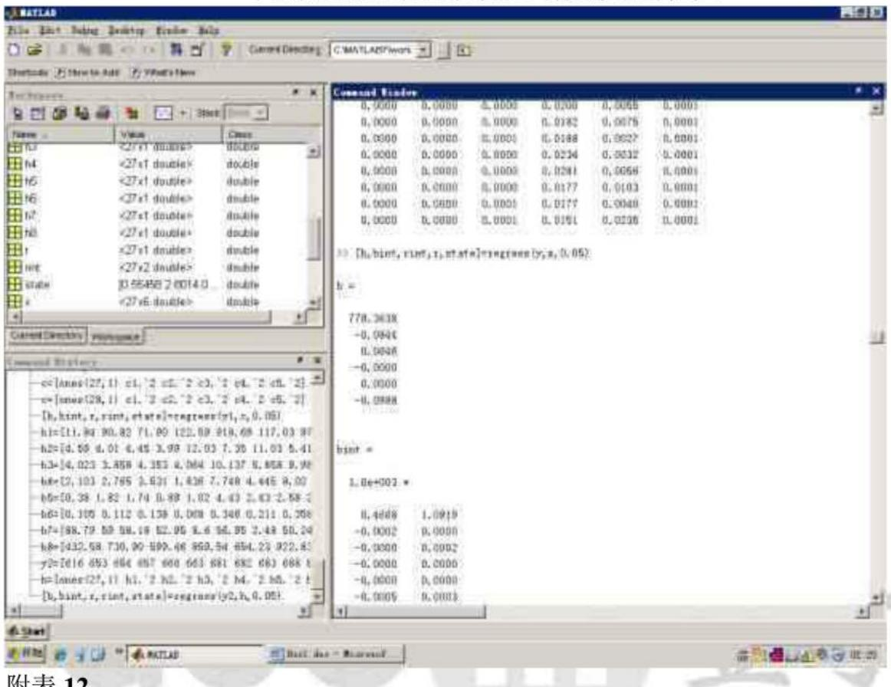
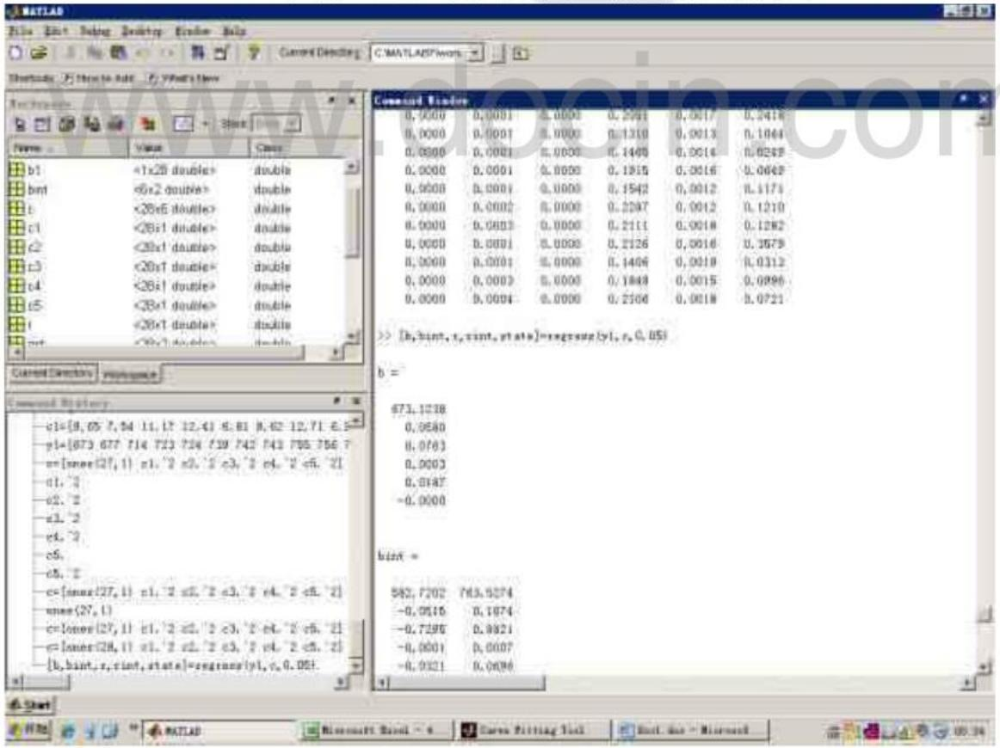
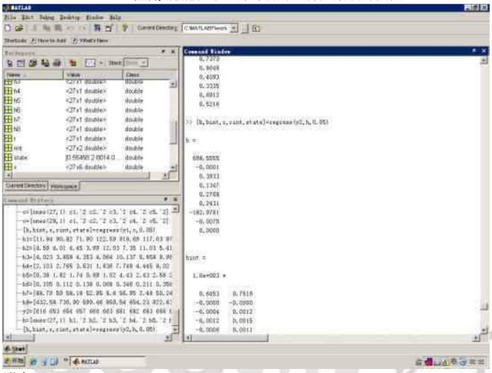
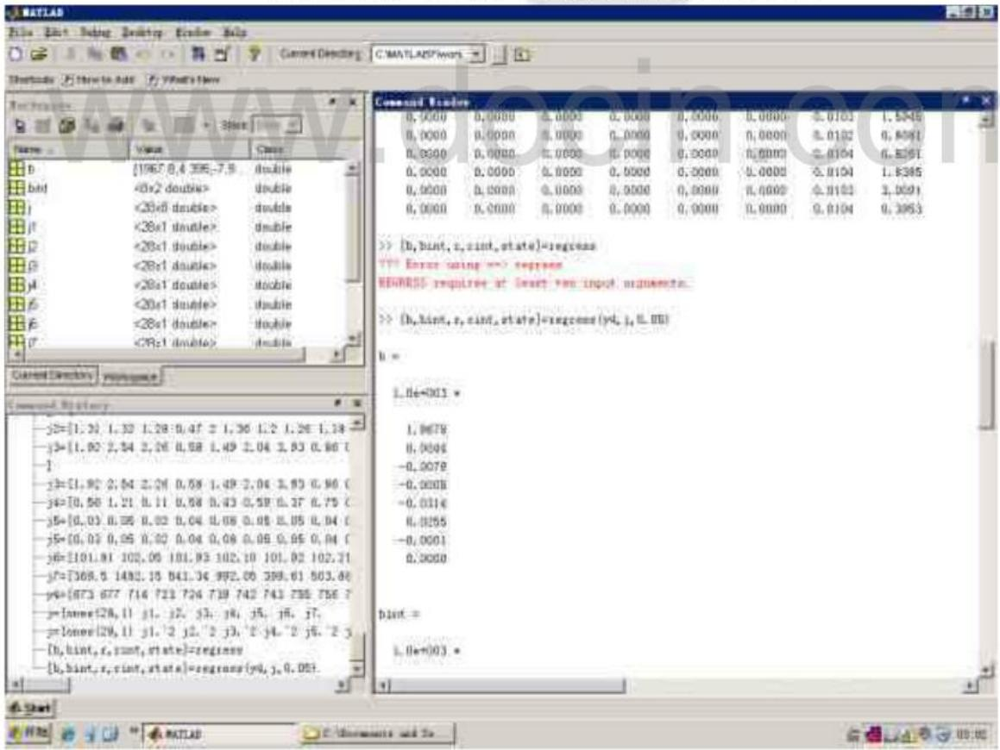

# 2012高教社杯全国大学生数学建模竞赛

## 承诺书

我们仔细阅读了中国大学生数学建模竞赛的竞赛规则

我们完全明白，在竞赛开始后参赛队员不能以任何方式（包括电话、电子邮件、网上咨询等）与队外的任何人（包括指导教师）研究、讨论与赛题有关的问题。

我们知道，抄袭别人的成果是违反竞赛规则的，如果引用别人的成果或其他公开的资料(包括网上查到的资料)，必须按照规定的参考文献的表述方式在正文引用处和参考文献中明确列出。 A

我们郑重承诺，严格遵守竞赛规则，以保证竞赛的公正、公平性。如有违反竞赛规则的行为，我们将受到严肃处理。

我们参赛选择的题号是（从A/B/C/D中选择一项填写）:A

我们的参赛报名号为(如果赛区设置报名号的话): 28005

所属学校（请填写完整的全名）：哈尔滨金融学院

参赛队员(打印并签名)：1. 范凯 cin.com2. 马薇

3. 魏星

指导教师或指导教师组负责人 (打印并签名):刘桂利

日期：2012年9月10日

赛区评阅编号（由赛区组委会评阅前进行编号）：

# 2012高教社杯全国大学生数学建模竞赛

## 编号专用页

赛区评阅编号（由赛区组委会评阅前进行编号）：

赛区评阅记录（可供赛区评阅时使用）：

<table><tr><td rowspan=1 colspan=1>评阅人</td><td rowspan=1 colspan=1></td><td rowspan=1 colspan=1></td><td rowspan=1 colspan=1></td><td rowspan=1 colspan=1></td><td rowspan=1 colspan=1></td><td rowspan=1 colspan=1></td><td rowspan=1 colspan=1></td><td rowspan=1 colspan=1></td><td rowspan=1 colspan=1></td><td rowspan=1 colspan=1></td></tr><tr><td rowspan=1 colspan=1>评分</td><td rowspan=1 colspan=1></td><td rowspan=1 colspan=1></td><td rowspan=1 colspan=1></td><td rowspan=1 colspan=1></td><td rowspan=1 colspan=1></td><td rowspan=1 colspan=1>i</td><td rowspan=1 colspan=1>n</td><td rowspan=1 colspan=1>豆</td><td rowspan=1 colspan=1>丁</td><td rowspan=1 colspan=1></td></tr><tr><td rowspan=1 colspan=1>备注</td><td rowspan=1 colspan=1>ww</td><td rowspan=1 colspan=1>w</td><td rowspan=1 colspan=1>.d</td><td rowspan=1 colspan=1>o</td><td rowspan=1 colspan=1>c</td><td rowspan=1 colspan=1>i</td><td rowspan=1 colspan=1>n.</td><td rowspan=1 colspan=1>c</td><td rowspan=1 colspan=1>o</td><td rowspan=1 colspan=1>m</td></tr></table>

全国统一编号（由赛区组委会送交全国前编号）：

全国评阅编号（由全国组委会评阅前进行编号）：

# 葡萄酒的评价

## 摘要

为研究葡萄酒评价问题，根据题目所给定信息建立了酿酒葡萄等级划分模型、pearson相关系数模型、多元统计回归模型。

针对问题一，利用异方差T-检验法分析评酒员的评价结果，得到两组评价结果的p分别为0.121776，0.10608，因此两组没有显著性且第二组的评酒员评分更可信。

针对问题二，运用聚类分析法，建立基于理化指标的酿酒葡萄等级划分模型。运用spss软件对红白葡萄样本聚类为析，依据聚类结果将酿酒葡萄分为五类。

针对问题三，建立pearson相关系数模型，得到红、白酿酒葡萄与葡萄酒理化指标的关联度分别为0.71、0.86，即酿酒葡萄的品质在很大程度上影响葡萄酒的质量。

针对问题四，基于理化指标分析和感官评价，以几个主要理化指标为自变量，以样品总得分为因变量，建立多元统计回归模型，运用Matlab求解得理化指标与葡萄酒质量有较大的关系，但并不能完全据评价葡萄酒的质量。

关键词：聚类分析；pearson相关系数；多元统计回归；spss软件

## 一 问题重述

确定葡萄酒质量时一般是通过聘请一批有资质的评酒员进行品评，每个评酒员在对葡萄酒进行品尝后对其分类指标打分，然后求和得到其总分，从而确定葡萄酒的质量。酿酒葡萄的好坏与所酿葡萄酒的质量有直接的关系，葡萄酒和酿酒葡萄检测的理化指标会在一定程度上反映葡萄酒和葡萄的质量。据此解决以下列问题。

1.分析附件1中两组评酒员的评价结果有无显著性差异，哪一组结果更可信。

2.根据酿酒葡萄的理化指标和葡萄酒的质量对这些酿酒葡萄进行分级。

3.分析酿酒葡萄与葡萄酒的理化指标之间的联系。

4.分析酿酒葡萄和葡萄酒的理化指标对葡萄酒质量的影响，并论证能否用葡萄和葡萄酒的理化指标来评价葡萄酒的质量。

## 二符号说明

<table><tr><td colspan="1" rowspan="1">符号</td><td colspan="1" rowspan="1">意义</td></tr><tr><td colspan="1" rowspan="1"></td><td colspan="1" rowspan="1">代表第j种样品</td></tr><tr><td colspan="1" rowspan="1">m</td><td colspan="1" rowspan="1">m =1,2分别代表十位品酒员</td></tr><tr><td colspan="1" rowspan="1">n</td><td colspan="1" rowspan="1">n =1,2…分别代表十种品评的标准（见附表一）</td></tr><tr><td colspan="1" rowspan="1">Amn</td><td colspan="1" rowspan="1">第一组评酒员m 在标准n上对红葡萄酒的打分</td></tr><tr><td colspan="1" rowspan="1">Bmn</td><td colspan="1" rowspan="1">第一组评酒员m 在标准n上对白葡萄酒的打分</td></tr><tr><td colspan="1" rowspan="1">Cmn</td><td colspan="1" rowspan="1">第二组评酒员m 在标准n上对红葡萄酒的打分</td></tr><tr><td colspan="1" rowspan="1"> $D _ { m n }$ </td><td colspan="1" rowspan="1">第二组评酒员m 在标准n上对白葡萄酒的打分</td></tr><tr><td colspan="1" rowspan="1">f</td><td colspan="1" rowspan="1">第i组品酒员给红葡萄酒样品j的分数</td></tr><tr><td colspan="1" rowspan="1"> $f _ { i j } ^ { \phantom { \dagger } }$   (i = 1,2)</td><td colspan="1" rowspan="1">第i组品酒员给红葡萄酒样品j的分数的平均分</td></tr><tr><td colspan="1" rowspan="1"> $\boldsymbol { F } _ { i j }$ </td><td colspan="1" rowspan="1">第i组品酒员给白葡萄酒样品的分数</td></tr><tr><td colspan="1" rowspan="1"> $\boldsymbol { F _ { i j } } ^ { \prime }$ </td><td colspan="1" rowspan="1">第i组品酒员对白葡萄酒样品i的分数的平均分</td></tr><tr><td colspan="1" rowspan="1"> $^ { a }$ </td><td colspan="1" rowspan="1"> $a = 1 , 2 ^ { \cdots }$  .代表附件2中数据简化后白葡萄理化指标数</td></tr><tr><td colspan="1" rowspan="1"> $^ b$ </td><td colspan="1" rowspan="1"> $b = 1 , 2 ^ { \cdots }$  代表附件2中数据简化后白葡萄的样本数</td></tr><tr><td colspan="1" rowspan="1"> $y _ { a b }$ </td><td colspan="1" rowspan="1">附件2中数据的简化后第b个样本的第a个理化指标数</td></tr><tr><td colspan="1" rowspan="1"> $S _ { \nu }$ </td><td colspan="1" rowspan="1">b = 1,2_- , $S _ { \nu }$ 代表由 $y _ { a b }$ 组成的矩阵中，每个样本中含有的所有数据的方差</td></tr><tr><td colspan="1" rowspan="1"> $p$ </td><td colspan="1" rowspan="1"> $p = 5 7$ 代表附件2中数据简化后白葡萄理化指标的个数</td></tr><tr><td colspan="1" rowspan="1"> $r$ </td><td colspan="1" rowspan="1">关联度</td></tr><tr><td colspan="1" rowspan="1"> $x _ { \ j }$ </td><td colspan="1" rowspan="1">酿酒葡萄样本j</td></tr><tr><td colspan="1" rowspan="1"> $y _ { \ j }$ </td><td colspan="1" rowspan="1">葡萄酒样本j</td></tr><tr><td colspan="1" rowspan="1"> $Z _ { \mathfrak { x } }$ </td><td colspan="1" rowspan="1">红葡萄样本的得分</td></tr><tr><td colspan="1" rowspan="1"> $Z _ { _ { \perp } }$ </td><td colspan="1" rowspan="1">白葡萄样本的得分</td></tr><tr><td colspan="1" rowspan="1"></td><td colspan="1" rowspan="1">14(q =1,2..5)分别代表酸类、单宁、总糖、芳香物质、果皮颜色</td></tr><tr><td colspan="1" rowspan="1"> $\boldsymbol { \beta } _ { \boldsymbol { g } }$ </td><td colspan="1" rowspan="1">m $\beta _ { _ q } ^ { ^ { \prime } } ( q = 0 , 1 , . . . , 5 )$ 代表白葡萄回归系数</td></tr><tr><td colspan="1" rowspan="1"> $z _ { \scriptscriptstyle 2 \not \equiv \not \tau }$ </td><td colspan="1" rowspan="1">为红葡萄酒样本的得分 $z _ { \scriptscriptstyle 2 \not \equiv \not \tau }$ </td></tr><tr><td colspan="1" rowspan="1"> $z _ { 2 \tt E }$ </td><td colspan="1" rowspan="1"> $z _ { 2 \tt A }$ 为白葡萄酒样本的得分</td></tr><tr><td colspan="1" rowspan="1"> $\beta _ { _ { q s } }$ </td><td colspan="1" rowspan="1"> $\beta _ { _ { q s } } ( q = 0 , 1 , . . . , 8 )$ 为白葡萄酒回归系数</td></tr><tr><td colspan="1" rowspan="1"> $\beta _ { g s } ^ { \quad \prime }$ </td><td colspan="1" rowspan="1"> $\beta _ { q s } ( q = 0 , 1 , . . . , 7 )$ 为白葡萄酒回归系数。</td></tr><tr><td colspan="1" rowspan="1"> $\boldsymbol { l } _ { \ s } ^ { \flat }$ </td><td colspan="1" rowspan="1"> $l _ { s } ^ { \prime } ( s = 1 , 2 , . . . , 8 )$ 分别代表：花色苷、单宁、总酚酒、总黄酮、白藜芦醇、DPPH、L*(D65)、芳香物质</td></tr></table>

## 三问题分析

为比较有无显著性差异，应先处理附件1中所给的数据，算出每种样品的平均得分，再比较第一组数据和第二组数据的方差是否相同，从而确定应用等方差t检验或异方差t检验，确定两组评酒员的评价结果有无显著性差异。

为得到酿酒葡萄的分类，应对附件2中的数据进行处理，将附件2中的数据与酒的质量结合起来，对处理后的数据进行系统聚类分析，得出分级情况。

为了解酿酒葡萄与葡萄酒理化指标的关系，应设法求出酿酒葡萄与葡萄酒理化指标的关联系数，从而判断两者的关系。

在分析酿酒葡萄和葡萄酒的理化指标对葡萄酒质量的影响时，应采用回归分析的方法进行分析。

## 四模型假设

1.假设品酒员的评分是客观、公正的。

2.假设每种葡萄、葡萄酒中物质的含量固定不变。

3.假设酿酒葡萄的好坏与所酿葡萄酒的质量有直接的关系，葡萄酒和酿酒葡萄检测的理化指标会在一定程度上反映葡萄酒和葡萄的质量，而且成正比。

4. 假设葡萄分级一般为3到5个等级。

5. 假设附件2中的二级指标对葡萄酒的影响极小，可以不予考虑。

## 五模型的建立与求解

## 5.1 模型一

5.1.1 差异性检验

1.通过对题目中所给的葡萄酒品尝评分表的分析，可知各组评酒员的打分情况。可得：每组中每种样品的分数=每组10位评酒员对该酒的评分之和。

$$
A _ { j } = \sum _ { m = 1 } ^ { 1 0 } \sum _ { n = 1 } ^ { 1 0 } A _ { m n }
$$

其中：A为第一组第j个红葡萄酒样品的总分数， $A _ { j }$ $A _ { m n }$ 为第一组的m 号评酒员在第n种标准上对红葡萄酒的打分数

同理，可得：

$$
B _ { _ j } = \sum _ { m = 1 } ^ { 1 0 } \sum _ { n = 1 } ^ { 1 0 } B _ { { _ m n } }
$$

$$
C _ { \phantom { \dagger } j } = \sum _ { m = 1 } ^ { 1 0 } \sum _ { n = 1 } ^ { 1 0 } C _ { \phantom { \dagger } m n }
$$

$$
D _ { \mathbf { \Phi } _ { j } } = \sum _ { m = 1 } ^ { 1 0 } \sum _ { n = 1 } ^ { 1 0 } D _ { \mathbf { \Phi } _ { m n } }
$$

其中： $B _ { j }$ 为第一组第j个红葡萄酒样品的总分数， $B _ { m n }$ 为第一组的 $m$ 号评酒员在第n种标准上对红葡萄酒的打分数; $C _ { j }$ 为第一组第j个红葡萄酒样品的总分数， $C _ { m n }$ 为第一组的$m$ 号评酒员在第n种标准上对红葡萄酒的打分数； $D _ { \ j }$ 为第一组第 $j$ 个红葡萄酒样品的总分数， $D _ { m n }$ 为第一组的 $m$ 号评酒员在第n种标准上对红葡萄酒的打分数如下表

样品的得分情况
<table><tr><td rowspan=1 colspan=1></td><td rowspan=1 colspan=1>第一组红葡萄酒</td><td rowspan=1 colspan=1>第一组白葡萄酒</td><td rowspan=1 colspan=1>第二组红葡萄酒</td><td rowspan=1 colspan=1>第二组白葡萄酒</td></tr><tr><td rowspan=1 colspan=1>样品1</td><td rowspan=1 colspan=1>627</td><td rowspan=1 colspan=1>820</td><td rowspan=1 colspan=1>681</td><td rowspan=1 colspan=1>779</td></tr><tr><td rowspan=1 colspan=1>样品2</td><td rowspan=1 colspan=1>803</td><td rowspan=1 colspan=1>742</td><td rowspan=1 colspan=1>740</td><td rowspan=1 colspan=1>758</td></tr><tr><td rowspan=1 colspan=1>样品3</td><td rowspan=1 colspan=1>804</td><td rowspan=1 colspan=1>853</td><td rowspan=1 colspan=1>746</td><td rowspan=1 colspan=1>756</td></tr><tr><td rowspan=1 colspan=1>样品4</td><td rowspan=1 colspan=1>686</td><td rowspan=1 colspan=1>794</td><td rowspan=1 colspan=1>712</td><td rowspan=1 colspan=1>769</td></tr><tr><td rowspan=1 colspan=1>样品5</td><td rowspan=1 colspan=1>733</td><td rowspan=1 colspan=1>710</td><td rowspan=1 colspan=1>721</td><td rowspan=1 colspan=1>815</td></tr><tr><td rowspan=1 colspan=1>样品6</td><td rowspan=1 colspan=1>722</td><td rowspan=1 colspan=1>684</td><td rowspan=1 colspan=1>663</td><td rowspan=1 colspan=1>755</td></tr><tr><td rowspan=1 colspan=1>样品7</td><td rowspan=1 colspan=1>715</td><td rowspan=1 colspan=1>775</td><td rowspan=1 colspan=1>653</td><td rowspan=1 colspan=1>742</td></tr><tr><td rowspan=1 colspan=1>样品8</td><td rowspan=1 colspan=1>723</td><td rowspan=1 colspan=1>704</td><td rowspan=1 colspan=1>660</td><td rowspan=1 colspan=1>723</td></tr><tr><td rowspan=1 colspan=1>样品9</td><td rowspan=1 colspan=1>815</td><td rowspan=1 colspan=1>729</td><td rowspan=1 colspan=1>782</td><td rowspan=1 colspan=1>804</td></tr><tr><td rowspan=1 colspan=1>样品10</td><td rowspan=1 colspan=1>742</td><td rowspan=1 colspan=1>743</td><td rowspan=1 colspan=1>688</td><td rowspan=1 colspan=1>798</td></tr><tr><td rowspan=1 colspan=1>样品11</td><td rowspan=1 colspan=1>701</td><td rowspan=1 colspan=1>723</td><td rowspan=1 colspan=1>616</td><td rowspan=1 colspan=1>714</td></tr><tr><td rowspan=1 colspan=1>样品12</td><td rowspan=1 colspan=1>539</td><td rowspan=1 colspan=1>633</td><td rowspan=1 colspan=1>683</td><td rowspan=1 colspan=1>724</td></tr><tr><td rowspan=1 colspan=1>样品13</td><td rowspan=1 colspan=1>746</td><td rowspan=1 colspan=1>659</td><td rowspan=1 colspan=1>688</td><td rowspan=1 colspan=1>739</td></tr><tr><td rowspan=1 colspan=1>样品14</td><td rowspan=1 colspan=1>730</td><td rowspan=1 colspan=1>C 720</td><td rowspan=1 colspan=1>726</td><td rowspan=1 colspan=1>677</td></tr><tr><td rowspan=1 colspan=1>样品15</td><td rowspan=1 colspan=1>587</td><td rowspan=1 colspan=1>724</td><td rowspan=1 colspan=1>657</td><td rowspan=1 colspan=1>784</td></tr><tr><td rowspan=1 colspan=1>样品 16</td><td rowspan=1 colspan=1>749</td><td rowspan=1 colspan=1>740</td><td rowspan=1 colspan=1>699</td><td rowspan=1 colspan=1>673</td></tr><tr><td rowspan=1 colspan=1>样品17</td><td rowspan=1 colspan=1>793</td><td rowspan=1 colspan=1>788</td><td rowspan=1 colspan=1>745</td><td rowspan=1 colspan=1>803</td></tr><tr><td rowspan=1 colspan=1>样品18</td><td rowspan=1 colspan=1>599</td><td rowspan=1 colspan=1>731</td><td rowspan=1 colspan=1>654</td><td rowspan=1 colspan=1>767</td></tr><tr><td rowspan=1 colspan=1>样品 19</td><td rowspan=1 colspan=1>786</td><td rowspan=1 colspan=1>722</td><td rowspan=1 colspan=1>726</td><td rowspan=1 colspan=1>764</td></tr><tr><td rowspan=1 colspan=1>样品 20</td><td rowspan=1 colspan=1>786</td><td rowspan=1 colspan=1>778</td><td rowspan=1 colspan=1>758</td><td rowspan=1 colspan=1>766</td></tr><tr><td rowspan=1 colspan=1>样品21</td><td rowspan=1 colspan=1>771</td><td rowspan=1 colspan=1>764</td><td rowspan=1 colspan=1>722</td><td rowspan=1 colspan=1>792</td></tr><tr><td rowspan=1 colspan=1>样品22</td><td rowspan=1 colspan=1>772</td><td rowspan=1 colspan=1>710</td><td rowspan=1 colspan=1>716</td><td rowspan=1 colspan=1>794</td></tr><tr><td rowspan=1 colspan=1>样品 23</td><td rowspan=1 colspan=1>856</td><td rowspan=1 colspan=1>759</td><td rowspan=1 colspan=1>771</td><td rowspan=1 colspan=1>774</td></tr><tr><td rowspan=1 colspan=1>样品 24</td><td rowspan=1 colspan=1>780</td><td rowspan=1 colspan=1>733</td><td rowspan=1 colspan=1>715</td><td rowspan=1 colspan=1>761</td></tr><tr><td rowspan=1 colspan=1>样品 25</td><td rowspan=1 colspan=1>692</td><td rowspan=1 colspan=1>771</td><td rowspan=1 colspan=1>682</td><td rowspan=1 colspan=1>795</td></tr><tr><td rowspan=1 colspan=1>样品26</td><td rowspan=1 colspan=1>738</td><td rowspan=1 colspan=1>813</td><td rowspan=1 colspan=1>720</td><td rowspan=1 colspan=1>743</td></tr><tr><td rowspan=1 colspan=1>样品 27</td><td rowspan=1 colspan=1>730</td><td rowspan=1 colspan=1>648</td><td rowspan=1 colspan=1>715</td><td rowspan=1 colspan=1>770</td></tr><tr><td rowspan=1 colspan=1>样品28</td><td rowspan=1 colspan=1>627</td><td rowspan=1 colspan=1>813</td><td rowspan=1 colspan=1>681</td><td rowspan=1 colspan=1>796</td></tr></table>

## 2.F-检验，验证各葡萄酒样品得分方差有无差异

运用excel对第一组红葡萄酒、第二组各红葡萄酒的总分进行F-检验，运行结果如下表

F-检验双样本方差分析（红葡萄酒）
<table><tr><td rowspan=1 colspan=1></td><td rowspan=1 colspan=1>变量1</td><td rowspan=1 colspan=1>变量2</td></tr><tr><td rowspan=1 colspan=1>平均</td><td rowspan=1 colspan=1>730.5556</td><td rowspan=1 colspan=1>705.1481</td></tr><tr><td rowspan=1 colspan=1>方差</td><td rowspan=1 colspan=1>5391.41</td><td rowspan=1 colspan=1>1582.439</td></tr><tr><td rowspan=1 colspan=1>观测值</td><td rowspan=1 colspan=1>27</td><td rowspan=1 colspan=1>27</td></tr><tr><td rowspan=1 colspan=1>Df</td><td rowspan=1 colspan=1>26</td><td rowspan=1 colspan=1>26</td></tr><tr><td rowspan=1 colspan=1>F</td><td rowspan=1 colspan=1>3.407026</td><td rowspan=1 colspan=1></td></tr><tr><td rowspan=1 colspan=1>P(F&lt;=f)单尾</td><td rowspan=1 colspan=1>0.00132</td><td rowspan=1 colspan=1></td></tr><tr><td rowspan=1 colspan=1>F单尾临界</td><td rowspan=1 colspan=1>1.929213</td><td rowspan=1 colspan=1></td></tr></table>

得： $p < 0 . 0 5$ ，所以第一组红葡萄酒和第二组红葡萄酒的方差不同。

同理，对第一组白葡萄酒、第二组白葡萄酒的数据进行F-检验，运行结果如下表

F-检验双样本方差分析（白葡萄酒）
<table><tr><td rowspan=1 colspan=1></td><td rowspan=1 colspan=1>变量1</td><td rowspan=1 colspan=1>变量2</td></tr><tr><td rowspan=1 colspan=1>平均</td><td rowspan=1 colspan=1>742.25</td><td rowspan=1 colspan=1>761.9643</td></tr><tr><td rowspan=1 colspan=1>方差</td><td rowspan=1 colspan=1>2730.046</td><td rowspan=1 colspan=1>1281.51</td></tr><tr><td rowspan=1 colspan=1>观测值</td><td rowspan=1 colspan=1>28</td><td rowspan=1 colspan=1>7</td></tr><tr><td rowspan=1 colspan=1>df</td><td rowspan=1 colspan=1>27</td><td rowspan=1 colspan=1>28</td></tr><tr><td rowspan=1 colspan=1>F</td><td rowspan=1 colspan=1>2.130324</td><td rowspan=1 colspan=1>27</td></tr><tr><td rowspan=1 colspan=1>P(F&lt;=f)单尾</td><td rowspan=1 colspan=1>0.027147</td><td rowspan=1 colspan=1></td></tr><tr><td rowspan=1 colspan=1>F单尾临界</td><td rowspan=1 colspan=1>3</td><td rowspan=1 colspan=1></td></tr></table>

## 得:p<0.05，所以第一组白葡萄酒和第二组白葡萄酒的方差不同。

## 3.异方差T-检验，验证个葡萄酒样品得分差异性是否显著

运用excel对第一组红葡萄酒、第二组各红葡萄酒的总分进行异方差T-检验，运行结果如下表

红葡萄酒的异方差T-检验
<table><tr><td rowspan=1 colspan=1></td><td rowspan=1 colspan=1>变量1</td><td rowspan=1 colspan=1>变量2</td></tr><tr><td rowspan=1 colspan=1>平均</td><td rowspan=1 colspan=1>730.5556</td><td rowspan=1 colspan=1>705.1481</td></tr><tr><td rowspan=1 colspan=1>方差</td><td rowspan=1 colspan=1>5391.41</td><td rowspan=1 colspan=1>1582.439</td></tr><tr><td rowspan=1 colspan=1>观测值</td><td rowspan=1 colspan=1>27</td><td rowspan=1 colspan=1>27</td></tr><tr><td rowspan=1 colspan=1>假设平均差</td><td rowspan=1 colspan=1>0</td><td rowspan=1 colspan=1></td></tr><tr><td rowspan=1 colspan=1>df</td><td rowspan=1 colspan=1>40</td><td rowspan=1 colspan=1></td></tr><tr><td rowspan=1 colspan=1>t Stat</td><td rowspan=1 colspan=1>1.580906</td><td rowspan=1 colspan=1></td></tr><tr><td rowspan=1 colspan=1>P(T&lt;=t)单尾</td><td rowspan=1 colspan=1>0.060888</td><td rowspan=1 colspan=1></td></tr><tr><td rowspan=1 colspan=1>t 单尾临界</td><td rowspan=1 colspan=1>1.683851</td><td rowspan=1 colspan=1></td></tr><tr><td rowspan=1 colspan=1>P(T&lt;=t)双尾</td><td rowspan=1 colspan=1>0.121776</td><td rowspan=1 colspan=1></td></tr><tr><td rowspan=1 colspan=1>t 双尾临界</td><td rowspan=1 colspan=1>2.021075</td><td rowspan=1 colspan=1></td></tr></table>

得出结论:p>0.05,第一组红葡萄酒和第二组红葡萄酒的差异不显著。

同理，运用excel对第一组白葡萄酒、第二组白葡萄酒的数据进行异方差T-检验，运行结果如下表

白葡萄酒的异方差T-检验结果
<table><tr><td rowspan=1 colspan=1></td><td rowspan=1 colspan=1>变量1</td><td rowspan=1 colspan=1>变量2</td></tr><tr><td rowspan=1 colspan=1>平均</td><td rowspan=1 colspan=1>742.25</td><td rowspan=1 colspan=1>761.9643</td></tr><tr><td rowspan=1 colspan=1>方差</td><td rowspan=1 colspan=1>2730.046</td><td rowspan=1 colspan=1>1281.517</td></tr><tr><td rowspan=1 colspan=1>观测值</td><td rowspan=1 colspan=1>28</td><td rowspan=1 colspan=1>28</td></tr><tr><td rowspan=1 colspan=1>假设平均差</td><td rowspan=1 colspan=1></td><td rowspan=1 colspan=1></td></tr><tr><td rowspan=1 colspan=1>df</td><td rowspan=1 colspan=1>48</td><td rowspan=1 colspan=1></td></tr><tr><td rowspan=1 colspan=1>t Stat</td><td rowspan=1 colspan=1>-1.64704</td><td rowspan=1 colspan=1></td></tr><tr><td rowspan=1 colspan=1>P(T&lt;=t)单尾</td><td rowspan=1 colspan=1>0.053041</td><td rowspan=1 colspan=1></td></tr><tr><td rowspan=1 colspan=1>t 单尾临界</td><td rowspan=1 colspan=1>1.677224</td><td rowspan=1 colspan=1></td></tr><tr><td rowspan=1 colspan=1>P(T&lt;=t) 双尾</td><td rowspan=1 colspan=1>0.106083</td><td rowspan=1 colspan=1></td></tr><tr><td rowspan=1 colspan=1>t 双尾临界</td><td rowspan=1 colspan=1>2.010635</td><td rowspan=1 colspan=1></td></tr></table>

得出结论:p>0.05,第一组白葡萄酒和第二组白葡萄酒的差异不显著。  
综上可知，两组评酒员的评价结果没有显著性差异。

## 5.1.2 确定可信度

求出各组红，白葡萄酒得分的总方差，根据其大小判断可信度。

$$
x = \frac { x ( 1 + x ) ( 1 1 - 1 4 x + 1 9 + 5 2 x ) ^ { 2 } } { 1 1 }
$$

可得上表的方差如下表

第一组红葡萄酒得分的方差
<table><tr><td rowspan=1 colspan=1></td><td rowspan=1 colspan=1>样本方差</td><td rowspan=1 colspan=1></td><td rowspan=1 colspan=1>样本方差</td></tr><tr><td rowspan=1 colspan=1>样本1</td><td rowspan=1 colspan=1>83.61</td><td rowspan=1 colspan=1>样本15</td><td rowspan=1 colspan=1>77.01</td></tr><tr><td rowspan=1 colspan=1>样本2</td><td rowspan=1 colspan=1>35.81</td><td rowspan=1 colspan=1>样本16</td><td rowspan=1 colspan=1>16.29</td></tr><tr><td rowspan=1 colspan=1>样本3</td><td rowspan=1 colspan=1>41.24</td><td rowspan=1 colspan=1>样本17</td><td rowspan=1 colspan=1>79.21</td></tr><tr><td rowspan=1 colspan=1>样本4</td><td rowspan=1 colspan=1>97.24</td><td rowspan=1 colspan=1>样本18</td><td rowspan=1 colspan=1>42.49</td></tr><tr><td rowspan=1 colspan=1>样本5</td><td rowspan=1 colspan=1>55.81</td><td rowspan=1 colspan=1>样本19</td><td rowspan=1 colspan=1>42.64</td></tr><tr><td rowspan=1 colspan=1>样本6</td><td rowspan=1 colspan=1>53.76</td><td rowspan=1 colspan=1>样本20</td><td rowspan=1 colspan=1>23.44</td></tr><tr><td rowspan=1 colspan=1>样本7</td><td rowspan=1 colspan=1>93.25</td><td rowspan=1 colspan=1>样本21</td><td rowspan=1 colspan=1>104.49</td></tr><tr><td rowspan=1 colspan=1>样本8</td><td rowspan=1 colspan=1>39.61</td><td rowspan=1 colspan=1>样本22</td><td rowspan=1 colspan=1>45.56</td></tr><tr><td rowspan=1 colspan=1>样本9</td><td rowspan=1 colspan=1>29.65</td><td rowspan=1 colspan=1>样本23</td><td rowspan=1 colspan=1>29.24</td></tr><tr><td rowspan=1 colspan=1>样本10</td><td rowspan=1 colspan=1>27.36</td><td rowspan=1 colspan=1>样本24</td><td rowspan=1 colspan=1>67.4</td></tr><tr><td rowspan=1 colspan=1>样本11</td><td rowspan=1 colspan=1>63.69</td><td rowspan=1 colspan=1>样本25</td><td rowspan=1 colspan=1>58.16</td></tr><tr><td rowspan=1 colspan=1>样本12</td><td rowspan=1 colspan=1>71.69</td><td rowspan=1 colspan=1>样本26</td><td rowspan=1 colspan=1>28.16</td></tr><tr><td rowspan=1 colspan=1>样本13</td><td rowspan=1 colspan=1>40.44</td><td rowspan=1 colspan=1>样本27</td><td rowspan=1 colspan=1>44.8</td></tr><tr><td rowspan=1 colspan=1>样本14</td><td rowspan=1 colspan=1>32.4</td><td rowspan=1 colspan=1>总计</td><td rowspan=1 colspan=1>1424.45</td></tr></table>

方差总和为1424.45

同理可得第二组红葡萄酒的方差如下表

第二组红葡萄酒得分的方差
<table><tr><td rowspan=1 colspan=1></td><td rowspan=1 colspan=1>样本方差</td><td rowspan=1 colspan=1></td><td rowspan=1 colspan=1>样本方差</td></tr><tr><td rowspan=1 colspan=1>样本1</td><td rowspan=1 colspan=1>73.69</td><td rowspan=1 colspan=1>样本15</td><td rowspan=1 colspan=1>37.21</td></tr><tr><td rowspan=1 colspan=1>样本2</td><td rowspan=1 colspan=1>14.6</td><td rowspan=1 colspan=1>样本16</td><td rowspan=1 colspan=1>18.09</td></tr><tr><td rowspan=1 colspan=1>样本3</td><td rowspan=1 colspan=1>27.64</td><td rowspan=1 colspan=1>样本17</td><td rowspan=1 colspan=1>8.25</td></tr><tr><td rowspan=1 colspan=1>样本4</td><td rowspan=1 colspan=1>37.16</td><td rowspan=1 colspan=1>样本18</td><td rowspan=1 colspan=1>45.24</td></tr><tr><td rowspan=1 colspan=1>样本5</td><td rowspan=1 colspan=1>12.29</td><td rowspan=1 colspan=1>样本19</td><td rowspan=1 colspan=1>49.64</td></tr><tr><td rowspan=1 colspan=1>样本6</td><td rowspan=1 colspan=1>19.01</td><td rowspan=1 colspan=1>样本20</td><td rowspan=1 colspan=1>35.16</td></tr><tr><td rowspan=1 colspan=1>样本7</td><td rowspan=1 colspan=1>56.41</td><td rowspan=1 colspan=1>样本21</td><td rowspan=1 colspan=1>31.96</td></tr><tr><td rowspan=1 colspan=1>样本8</td><td rowspan=1 colspan=1>58.6</td><td rowspan=1 colspan=1>样本22</td><td rowspan=1 colspan=1>21.84</td></tr><tr><td rowspan=1 colspan=1>样本9</td><td rowspan=1 colspan=1>23.16</td><td rowspan=1 colspan=1>样本23</td><td rowspan=1 colspan=1>22.29</td></tr><tr><td rowspan=1 colspan=1>样本10</td><td rowspan=1 colspan=1>32.56</td><td rowspan=1 colspan=1>样本24</td><td rowspan=1 colspan=1>9.65</td></tr><tr><td rowspan=1 colspan=1>样本11</td><td rowspan=1 colspan=1>34.24</td><td rowspan=1 colspan=1>样本25</td><td rowspan=1 colspan=1>39.36</td></tr><tr><td rowspan=1 colspan=1>样本12</td><td rowspan=1 colspan=1>22.61</td><td rowspan=1 colspan=1>样本26</td><td rowspan=1 colspan=1>37.4</td></tr><tr><td rowspan=1 colspan=1>样本13</td><td rowspan=1 colspan=1>13.76</td><td rowspan=1 colspan=1>样本27</td><td rowspan=1 colspan=1>18.45</td></tr><tr><td rowspan=1 colspan=1>样本14</td><td rowspan=1 colspan=1>20.84</td><td rowspan=1 colspan=1>总计</td><td rowspan=1 colspan=1>821.11</td></tr></table>

方差总和为821.11  
同理，可得第一组白葡萄酒方差为3237.37，第二组白葡萄酒方差为1409.41。见附表1，附表2。

综上所述，第一组红葡萄酒方差为1424.45，第二组红葡萄酒方差为821.11。第一组白葡萄酒方差为3237.37，第二组白葡萄酒方差为1409.41。第一组对应的方差总是大于第二组对应的方差，因此第二组的结果更加可信。

## 5.2 模型二酿酒葡萄等级分类

## 5.2.1模型二的分析

为了直观的说明酿酒葡萄的分级情况，应该对酿酒葡萄的理化指标和葡萄酒的质量进行分析，通过对一级指标进行系统聚类分析得出酿酒葡萄的分级情况。

## 5.2.2模型二的建立

## 1. 数据处理

假设二级指标并不重要，故舍去附件2酿酒白葡萄中的二级指标，对进行多次测量的数据取平均数，可得出每种理化指标在每种酿酒白葡萄中的平均含量，将其与附件2中不需要处理的数据结合起来。见附表3

## 2. 模型二的建立

①将得到的数据标准化，这里采用z-Scores（标准化转换）（参考文献为[1]），据附表3，设 $y _ { a b }$ 为第b个样本中第a个理化指标的值，可得矩阵如下

$$
Y = { \left| \begin{array} { l l l l l } { \gamma _ { } } & { \cdots } & { } & { } & { } \\ { } & { } & { } & { \prime 1 b } & { } \\ { \vdots } & { \vdots } & { \vdots } & { } & { } \\ { } & { } & { } & { } & { } \\ { \gamma _ { } } & { \cdots } & { } & { } & { } \end{array} \right| }
$$

设 $\overline { { y _ { b } } }$ 为均值，有： $\overline { { y _ { b } } } =$ 理化指标数的倒数×第b个样本所有理化指标值的和， $\overline { { y _ { b } } }$ 为第b个样本中所有理化指标的均值

即：

$\overline { { { y _ { b } } } } = \frac { 1 } { p } \sum _ { a = 1 } ^ { p } y _ { a b }$ (p代表理化指标个数)

因为 $p = 5 7$ ，因此

$$
\overline { { y _ { b } } } = \frac { 1 } { 5 7 } \sum _ { a = 1 } ^ { 5 7 } y _ { a b }
$$

标准差：

$$
S _ { _ b } = \sqrt { \frac { 1 } { p } \sum _ { a = 1 } ^ { p } \left( y _ { _ { a b } } - \overline { { y _ { _ { a b } } } } \right) ^ { 2 } } ( S _ { _ b } \mathrm { ^ { * } \it { D / \sqrt { 1 + } } \mathrm { ^ { * } \it { F / \vphantom { ^ { * } \it { F } } \not \ E } } } )
$$

因为 $p = 5 7$ ，因此

$$
S _ { _ b } = \sqrt { \frac { 1 } { 5 7 } \sum _ { a = 1 } ^ { 5 7 } \left( y _ { _ { a b } } - \overline { { y _ { _ { a b } } } } \right) ^ { 2 } }
$$

当标准差不为0时，每个元素的值 $y _ { _ { a b } } = \frac { \sqrt { \Xi _ { \mathrm { \scriptscriptstyle A } } ^ { 2 } } \ \overrightarrow { \pi } \ \overrightarrow { \Xi } \ \sharp \sharp \ / \sharp - \ \mathrm { \scriptscriptstyle A \sharp } \ / \sharp } { \displaystyle \mathrm { \downarrow \jmath \mit A \ m / \mit A \ m } \ \mathrm { \scriptsize \mit A \ m } }$

即：

$$
\mathcal { Y } _ { _ { a b } } = \Bigg \{ \begin{array} { l l } { \displaystyle \frac { \boldsymbol { \gamma } _ { _ { a b } } - \overline { { \boldsymbol { y } _ { b } } } } { \boldsymbol { S } _ { _ { b } } } ~ } & { \displaystyle \boldsymbol { S } _ { _ { j } } \neq 0 } \\ { \displaystyle \boldsymbol { \qquad } \boldsymbol { S } _ { _ { j } } } & { \displaystyle \boldsymbol { \qquad } \boldsymbol { S } _ { _ { j } } = 0 } \end{array}
$$

②据上述内容建立模型二

$$
\overline { { { y _ { b } } } } = \frac { 1 } { 5 7 } \sum _ { a = 1 } ^ { 5 7 } { y _ { a b } }
$$

$$
S _ { _ b } = \sqrt { \frac { 1 } { 5 7 } \sum _ { a = 1 } ^ { 5 7 } \left( y _ { _ { a b } } - \overline { { y _ { _ { a b } } } } \right) ^ { 2 } }
$$

$$
y _ { _ { a b } } = \left\{ \begin{array} { l l } { { \displaystyle { y _ { _ { a b } } - \overline { { { y _ { b } } } } } } } & { { ~ S _ { _ { j } } \neq 0 } } \\ { { \displaystyle { S _ { _ { b } } } } } & { { ~ } } \\ { { 0 } } & { { ~ S _ { _ { j } } = 0 } } \end{array} \right.
$$

## 5.2.3模型二的求解

假定将白葡萄的理化指标分为3到5个等级，运用 $s p s s$ 软件并结合最小方差法对上

述模型进行求解，得到理化指标的分级情况（操作步骤见附表3)。输出结果见附表4。因为酿酒葡萄的理化指标会在一定程度上反映葡萄酒的质量，因此认为理化指标越好，那么葡萄酒的质量越好。据此可推白葡萄的分级情况如下表

酿酒白葡萄等级划分
<table><tr><td rowspan=1 colspan=1>等级</td><td rowspan=1 colspan=1>酿酒葡萄样品</td></tr><tr><td rowspan=1 colspan=1>一</td><td rowspan=1 colspan=1>样品1</td></tr><tr><td rowspan=1 colspan=1>二</td><td rowspan=1 colspan=1>样品2</td></tr><tr><td rowspan=1 colspan=1>三</td><td rowspan=1 colspan=1>样品3，样品4，样品6，样品7，样品8，样品10，样品11，样品12，样品13，样品14，样品15，样品19，样品20，样品21，样品22，样品25，样品26，样品27</td></tr><tr><td rowspan=1 colspan=1>四</td><td rowspan=1 colspan=1>样品9，样品16，样品17，样品18，样品23，样品24</td></tr><tr><td rowspan=1 colspan=1>五</td><td rowspan=1 colspan=1>样品5</td></tr></table>

同理，运用spss软件对上述模型进行求解，可知红葡萄的理化指标分级情况（操作步骤见附表5）。输出结果见附录6。酿酒红葡萄的分级情况如下表

酿酒红葡萄等级划分
<table><tr><td rowspan=1 colspan=1>等级</td><td rowspan=1 colspan=1>酿酒葡萄样品</td></tr><tr><td rowspan=1 colspan=1>一</td><td rowspan=1 colspan=1>样品1</td></tr><tr><td rowspan=1 colspan=1>二</td><td rowspan=1 colspan=1>样品2</td></tr><tr><td rowspan=1 colspan=1>三</td><td rowspan=1 colspan=1>样品3，样品4，样品5，样品6，样品7，样品，8，样品10，样品11，样品12，样品13，样品14，样品15，样品19，样品20，样品21，样品22，样品25，样品26，样品27</td></tr><tr><td rowspan=1 colspan=1>四</td><td rowspan=1 colspan=1>样品16，样品17，样品18，样品23，样品24</td></tr><tr><td rowspan=1 colspan=1>五</td><td rowspan=1 colspan=1>样品9</td></tr></table>

## 5.3 模型三酿酒葡萄与葡萄酒的理化指标之间的联系

## 5.3.1模型三的分析

为了解酿酒葡萄与葡萄酒理化指标的关系，求两者的关联系数建立模型三，从而判断两者理化指标的关系。

## 5.3.2 模型三的建立

运用pearson相关系数法分别算出酿酒葡萄与葡萄酒理化指标的关联度，值越大，关联度越高。

则关联度r为：

$$
r = \frac { N \sum x \mathrm {  ~ \geq ~ } y \mathrm {  ~ \cdot ~ } y \mathrm {  ~ \cdot ~ } - \sum x \mathrm {  ~ \cdot ~ } \sum y \mathrm {  ~ \cdot ~ } } { \sqrt { N \sum x \mathrm {  ~ \geq ~ } - { ( \sum x \mathrm {  ~ \cdot ~ } ) } ^ { 2 } } \sqrt { N \sum y \mathrm {  ~ \cdot ~ } - { ( \sum y \mathrm {  ~ \cdot ~ } ) } ^ { 2 } } }
$$

其中： $x _ { j }$ 为酿酒葡萄样本j， $\boldsymbol { y } _ { \ j }$ 为葡萄酒样本j，N为样本数量。

## 5.3.3模型三的求解

运用excle对模型求解，得到酿酒红葡萄与红葡萄酒及酿酒白葡萄与白葡萄酒的相关度如下表

酿酒葡萄与葡萄酒理化指标相关度
<table><tr><td rowspan=1 colspan=1></td><td rowspan=1 colspan=1>红葡萄与红葡萄酒相关度</td><td rowspan=1 colspan=1>白葡萄与白葡萄酒相关度</td></tr><tr><td rowspan=1 colspan=1>样本1</td><td rowspan=1 colspan=1>0.99</td><td rowspan=1 colspan=1>0.91</td></tr><tr><td rowspan=1 colspan=1>样本2</td><td rowspan=1 colspan=1>0.96</td><td rowspan=1 colspan=1>0.89</td></tr><tr><td rowspan=1 colspan=1>样本3</td><td rowspan=1 colspan=1>0.56</td><td rowspan=1 colspan=1>0.89</td></tr><tr><td rowspan=1 colspan=1>样本4</td><td rowspan=1 colspan=1>0.69</td><td rowspan=1 colspan=1>0.87</td></tr><tr><td rowspan=1 colspan=1>样本5</td><td rowspan=1 colspan=1>0.91</td><td rowspan=1 colspan=1>0.84</td></tr><tr><td rowspan=1 colspan=1>样本6</td><td rowspan=1 colspan=1>0.67</td><td rowspan=1 colspan=1>0.83</td></tr><tr><td rowspan=1 colspan=1>样本7</td><td rowspan=1 colspan=1>0.72</td><td rowspan=1 colspan=1>0.85</td></tr><tr><td rowspan=1 colspan=1>样本8</td><td rowspan=1 colspan=1>0.86</td><td rowspan=1 colspan=1>0.88</td></tr><tr><td rowspan=1 colspan=1>样本9</td><td rowspan=1 colspan=1>0.91</td><td rowspan=1 colspan=1>0.90</td></tr><tr><td rowspan=1 colspan=1>样本10</td><td rowspan=1 colspan=1>0.51</td><td rowspan=1 colspan=1>0.89</td></tr><tr><td rowspan=1 colspan=1>样本11</td><td rowspan=1 colspan=1>0.29</td><td rowspan=1 colspan=1>0.89</td></tr><tr><td rowspan=1 colspan=1>样本12</td><td rowspan=1 colspan=1>0.57</td><td rowspan=1 colspan=1>0.88</td></tr><tr><td rowspan=1 colspan=1>样本13</td><td rowspan=1 colspan=1>0.61</td><td rowspan=1 colspan=1>0.89</td></tr><tr><td rowspan=1 colspan=1>样本14</td><td rowspan=1 colspan=1>0.57</td><td rowspan=1 colspan=1>0.86</td></tr><tr><td rowspan=1 colspan=1>样本15</td><td rowspan=1 colspan=1>0.59</td><td rowspan=1 colspan=1>0.83</td></tr><tr><td rowspan=1 colspan=1>样本16</td><td rowspan=1 colspan=1>0.79</td><td rowspan=1 colspan=1>0.88</td></tr><tr><td rowspan=1 colspan=1>样本17</td><td rowspan=1 colspan=1>0.61               </td><td rowspan=1 colspan=1>0.90</td></tr><tr><td rowspan=1 colspan=1>样本18</td><td rowspan=1 colspan=1>0.38</td><td rowspan=1 colspan=1>0.88</td></tr><tr><td rowspan=1 colspan=1>样本19</td><td rowspan=1 colspan=1>0.82</td><td rowspan=1 colspan=1>0.93</td></tr><tr><td rowspan=1 colspan=1>样本20</td><td rowspan=1 colspan=1>0.65</td><td rowspan=1 colspan=1>0.86</td></tr><tr><td rowspan=1 colspan=1>样本21</td><td rowspan=1 colspan=1>0.75</td><td rowspan=1 colspan=1>0.82</td></tr><tr><td rowspan=1 colspan=1>样本22</td><td rowspan=1 colspan=1>0.82</td><td rowspan=1 colspan=1>0.86</td></tr><tr><td rowspan=1 colspan=1>样本23</td><td rowspan=1 colspan=1>0.88</td><td rowspan=1 colspan=1>0.82</td></tr><tr><td rowspan=1 colspan=1>样本24</td><td rowspan=1 colspan=1>0.92</td><td rowspan=1 colspan=1>0.89</td></tr><tr><td rowspan=1 colspan=1>样本25</td><td rowspan=1 colspan=1>0.64</td><td rowspan=1 colspan=1>0.88</td></tr><tr><td rowspan=1 colspan=1>样本26</td><td rowspan=1 colspan=1>0.73</td><td rowspan=1 colspan=1>0.89</td></tr><tr><td rowspan=1 colspan=1>样本27</td><td rowspan=1 colspan=1>0.66</td><td rowspan=1 colspan=1>0.52</td></tr><tr><td rowspan=1 colspan=1>样本28</td><td rowspan=1 colspan=1></td><td rowspan=1 colspan=1>0.81</td></tr><tr><td rowspan=1 colspan=1>平均关联度</td><td rowspan=1 colspan=1>0.71</td><td rowspan=1 colspan=1>0.86</td></tr></table>

其中相关系数判断标准为：0.8-1.0极强相关，0.6-0.8强相关，0.4-0.6中等相关，

0.2-0.4弱相关，0.0-0.2不相关。

结合表4并依据pearson相关系数判断标准可知，红葡萄与红葡萄酒理化指标关联度为0.71，为强关联、白葡萄与白葡萄酒理化指标的关联度为0.86，为极强关联。

因此，酿酒葡萄与葡萄酒理化指标是有联系的，且关联度强，即酿酒葡萄的品质很大程度上影响葡萄酒的质量。

## 5.4模型四酿酒葡萄和葡萄酒的理化指标对葡萄酒质量的影响

## 5.4.1 模型四的分析

据参考文献[1]可知，糖、酸、单宁、色素和芳香物质是构成酿酒葡萄品质优略的要素，因此在论证酿酒葡萄理化指标与葡萄酒品质时，将数据分类整理只保留上述五种因素。

同时在评价时还应考虑芳香物质对葡萄酒的影响。据此建立多元统计回归模型，论证酿酒葡萄理化指标对葡萄酒质量的影响和葡萄酒理化指标对葡萄酒质量的影响。

## 5.4.2 模型四的建立

将所有样品按专家打分高低进行排序，处理后数据见附录7-10。

1. 酿酒葡萄理化指标和感官评价对葡萄酒质量的影响

基于理化指标分析并结合感官评价建立多元统计回归模型：

$$
Z _ { _ { \mathrm { i f } } } = \beta _ { _ 0 } + \beta _ { _ 1 } l _ { _ 1 } ^ { ^ { 2 } } + \beta _ { _ 2 } l _ { _ 2 } ^ { ^ { 2 } } + \beta _ { _ 3 } l _ { _ 3 } ^ { ^ { 2 } } + \beta _ { _ 4 } l _ { _ 4 } ^ { ^ { 2 } } + \beta _ { _ 5 } l _ { _ 5 } ^ { ^ { 2 } }
$$

$$
Z _ { \perp } = \beta _ { 0 } ^ { ' } + \beta _ { 1 } ^ { ' } l _ { 1 } ^ { 2 } + \beta _ { 2 } ^ { ' } l _ { 2 } ^ { 2 } + \beta _ { 3 } ^ { ' } l _ { 3 } ^ { 2 } + \beta _ { 4 } ^ { ' } l _ { 4 } ^ { 2 } + \beta _ { 5 } ^ { ' } l _ { 5 } ^ { 2 }
$$

其中： $Z _ { \mathrm { \# \mathbb { T } } }$ 为红葡萄样本的得分， $Z _ { \sharp }$ 为红葡萄样本的得分， $l _ { _ q } ( i = 1 , 2 , . . . , 5 )$ 分别代表酸类、单宁、总糖、芳香物质、果皮颜色 $\textbf { , } \beta _ { _ q } = ( q = 0 , 1 , . . . , 5 )$ 为红葡萄回归系数， $\beta _ { q } ^ { \dot { } } ( q = 0 , 1 , . . . , 5 )$ 为白葡萄回归系数。

## 2.葡萄酒理化指标和感官评价对葡萄酒质量的影响

基于理化指标分析并结合感官评价建立多元统计回归模型：

$$
z _ { 2 \xi \xi } = \beta _ { 0 s } + \beta _ { 1 s } l _ { 1 } ^ { ' 2 } + \beta _ { 2 s } l _ { 2 } ^ { ' 2 } + \beta _ { 3 s } l _ { 3 } ^ { ' 2 } + \beta _ { 4 s } l _ { 4 } ^ { ' 2 } + \beta _ { 5 s } l _ { 5 } ^ { ' 2 } + \beta _ { 6 s } l _ { 6 } ^ { ' 2 } + \beta _ { 7 s } l _ { 7 } ^ { ' 2 } + \beta _ { 8 s } l _ { 8 } ^ { ' 2 }
$$

$$
z _ { 2 \acute { \mathbf { z } } } = \beta _ { 0 s } ^ { ~ \prime 2 } + \beta _ { 1 s } ^ { ~ \prime } l _ { 1 } ^ { ~ \prime 2 } + \beta _ { 2 s } ^ { ~ \prime } l _ { 2 } ^ { ~ \prime 2 } + \beta _ { 3 s } ^ { ~ \prime } l _ { 3 } ^ { ~ \prime 2 } + \beta _ { 4 s } ^ { ~ \prime } { \acute { l } _ { 4 } } ^ { 2 } + \beta _ { 5 s } ^ { ~ \prime } { \acute { l } _ { 5 } } ^ { 2 } + \beta _ { 6 s } ^ { ~ \prime } { \acute { l } _ { 6 } } ^ { 2 } + \beta _ { 7 s } { \acute { l } _ { 7 } } ^ { ~ \prime 2 }
$$

其中： $z _ { 2 \sharp \mathcal { T } }$ 为红葡萄酒样本的得分， $z _ { 2 \natural }$ 为白葡萄酒样本的得分， $l _ { s } ^ { \prime } ( s = 1 , 2 , . . . , 8 )$ 分别代表：单宁、总酚酒、总黄酮、白藜芦醇、DPPH、L\*(D65)、芳香物质、花色苷（白酒中不含花色苷)， $\beta _ { _ { q s } } ( q = 0 , 1 , . . . , 8 )$ 为红葡萄酒回归系数， $\beta _ { q s } ( q = 0 , 1 , . . . , 7 )$ 为白葡萄酒回归系数。

## 5.4.3 模型四的求解

运用Matlab求解（求解程序见附表11-14)，得到红葡萄的回归系数 $\boldsymbol { \beta } _ { \boldsymbol { \varphi } _ { \boldsymbol { g } } }$ 分别为：   
779.3638,-0.,844,0,0,0.0646,-0.0988,白葡萄 $\boldsymbol { \beta } _ { \boldsymbol { q } }$ 分别为:673.1238,0.058,0.0763,0,   
0.0003,0.0187,0；红葡萄酒的回归系数 $\beta _ { o s }$ 分别为：698.555,-0.0001,0,3933,0.1347,   
0.2768,0.2431，-182.9781，-0.0075，白葡萄 $\beta _ { g } ^ { \phantom { \dagger } }$ 分别为：1967.8,0.44，-7.9，-0.5,   
31.4,25.5,-0.1。

因此酿酒葡萄的理化指标和对葡萄酒质量的影响关系为：

红葡萄：

$$
z _ { \mathrm { a r } } = 7 7 9 . 3 6 3 8 - 0 . 0 8 4 4 l _ { 1 } ^ { 2 } + 0 . 0 6 4 6 l _ { 2 } ^ { 2 } - 0 . 0 9 8 8 l _ { s } ^ { 2 }
$$

白葡萄：

$$
z _ { 2 \sharp } = 6 7 3 . 1 2 3 8 + 0 . 0 5 8 { l _ { 1 } } ^ { : 2 } + 0 . 0 7 6 3 { l _ { 2 } } ^ { : 2 } + 0 . 0 0 0 3 { l _ { 3 } } ^ { : 2 } + 0 . 0 1 8 7 { l _ { 4 } } ^ { : 2 }
$$

葡萄酒的理化指标对葡萄酒质量的影响关系为：

红葡萄酒：

$$
\begin{array} { r } { z _ { 2 _ { \pm \mathbb { T } } } = 6 9 8 . 5 5 5 + - 0 . 0 0 0 1 l _ { 1 } ^ { ' 2 } + 0 . 3 9 3 3 l _ { 2 } ^ { ' 2 } + 0 . 1 3 4 7 l _ { 3 } ^ { ' 2 } + } \\ { 0 . 2 7 6 8 l _ { 4 } ^ { ' 2 } + 0 . 2 4 3 1 l _ { 5 } ^ { ' 2 } - 1 8 2 . 9 7 8 1 l _ { 6 } ^ { ' 2 } - 0 . 0 0 7 5 l _ { 7 } ^ { ' 2 } } \end{array}
$$

白葡萄酒：

$$
z _ { 2 \mapsto } = 1 9 6 7 . 8 + 4 . 4 l _ { 1 } ^ { ' 2 } - 7 . 9 l _ { 2 } ^ { ' 2 } - 0 . 5 l _ { 3 } ^ { ' 2 } + 3 1 . 4 l _ { 4 } ^ { ' 2 } + 2 5 . 5 l _ { s } ^ { ' 2 } - 0 . 1 l _ { 6 } ^ { ' 2 }
$$

## 5.4.4 结果分析

根据上述结果可知葡萄酒的质量与酿酒葡萄和葡萄酒的理化指标有关，但对葡萄酒的质量评价也包括感官评价（参照参考文献[3]），尽管感官评价与附件3中的芳香物质有很大的关系，但并不能排除品酒员主观因素的影响。由此得出，酿酒葡萄和葡萄酒的理化指标有很大的关系，但他们并不能完全反应葡萄酒的质量。

## 六模型的评价与推广

## 6.1 模型的评价

## 6.1.1 模型的优点

1.运用基于理化分析的酿酒葡萄等级划分模型，解决了酿酒葡萄等级划分问题。

2.本文建立的葡萄酒等级划分模型是在综合考虑理化指标与感官评价的基础上，对葡萄酒等级进行划分的，对我国葡萄酒行业制定葡萄酒等级划分规定具有参考意义。

3.该模型整个过程思路清晰，结构明了，没有运用太偏的知识，容易让人明白、接受，可行性强，易于推广。

## 6.1.2 模型的缺点

1. 利用Matlab 求解时，计算机存在一定的误差。

2.由于数据不充分，不能精确反应酿酒葡萄理化指标与葡萄酒质量的关系。

## 6.2 模型的推广

本文建立的酿酒葡萄等级划分模型，同样可以解决其他等级划分问题，尤其是各种酒精类物质等级划分问题。

## 七参考文献

[1] 豆丁，SPSS聚类分析标准化，http://www.docin.com/p-218735480.html

[2]第一食品网，判断酿酒葡萄的五大指标性物质http://www.foods1.com/content/144501/

[3]百度知道，法国葡萄酒分级具体数据指标，

http://zhidao.baidu.com/question/474178895.html& bdtkn=64b51a20222690304a3dbd64a6a56eb7984582d08078338d51fed8133ea5c69d362ad36bb4bcda3b39bb3949f6bbe47087ac3af56e60b1f4e7eb60157c5bf9339a6fa1f15b0f03de0125277cd633cc0b4e739b7e0c5ace

[4]廖芹，郝志峰等，数据挖掘与数学建模，北京：国防工业出版社，2010年。

## 八附录

## 附表1

第二组红葡萄酒得分的方差
<table><tr><td rowspan=1 colspan=1></td><td rowspan=1 colspan=1>样本方差</td><td rowspan=1 colspan=1></td><td rowspan=1 colspan=1>样本方差</td></tr><tr><td rowspan=1 colspan=1>样本1</td><td rowspan=1 colspan=1>73.69</td><td rowspan=1 colspan=1>样本15</td><td rowspan=1 colspan=1>37.21</td></tr><tr><td rowspan=1 colspan=1>样本2</td><td rowspan=1 colspan=1>14.6</td><td rowspan=1 colspan=1>样本16</td><td rowspan=1 colspan=1>18.09</td></tr><tr><td rowspan=1 colspan=1>样本3</td><td rowspan=1 colspan=1>27.64</td><td rowspan=1 colspan=1>样本17</td><td rowspan=1 colspan=1>8.25</td></tr><tr><td rowspan=1 colspan=1>样本4</td><td rowspan=1 colspan=1>37.16</td><td rowspan=1 colspan=1>样本18</td><td rowspan=1 colspan=1>45.24</td></tr><tr><td rowspan=1 colspan=1>样本5</td><td rowspan=1 colspan=1>12.29</td><td rowspan=1 colspan=1>样本19</td><td rowspan=1 colspan=1>49.64</td></tr><tr><td rowspan=1 colspan=1>样本6</td><td rowspan=1 colspan=1>19.01</td><td rowspan=1 colspan=1>样本20</td><td rowspan=1 colspan=1>35.16</td></tr><tr><td rowspan=1 colspan=1>样本7</td><td rowspan=1 colspan=1>56.41</td><td rowspan=1 colspan=1>样本21</td><td rowspan=1 colspan=1>31.96</td></tr><tr><td rowspan=1 colspan=1>样本8</td><td rowspan=1 colspan=1>58.6</td><td rowspan=1 colspan=1>样本22</td><td rowspan=1 colspan=1>21.84</td></tr><tr><td rowspan=1 colspan=1>样本9</td><td rowspan=1 colspan=1>23.16</td><td rowspan=1 colspan=1>样本23</td><td rowspan=1 colspan=1>22.29</td></tr><tr><td rowspan=1 colspan=1>样本10</td><td rowspan=1 colspan=1>32.56</td><td rowspan=1 colspan=1>样本24</td><td rowspan=1 colspan=1>9.65</td></tr><tr><td rowspan=1 colspan=1>样本11</td><td rowspan=1 colspan=1>34.24</td><td rowspan=1 colspan=1>样本25</td><td rowspan=1 colspan=1>39.36</td></tr><tr><td rowspan=1 colspan=1>样本12</td><td rowspan=1 colspan=1>22.61</td><td rowspan=1 colspan=1>样本26</td><td rowspan=1 colspan=1>37.4</td></tr><tr><td rowspan=1 colspan=1>样本13</td><td rowspan=1 colspan=1>13.76</td><td rowspan=1 colspan=1>样本27</td><td rowspan=1 colspan=1>18.45</td></tr><tr><td rowspan=1 colspan=1>样本14</td><td rowspan=1 colspan=1>20.84</td><td rowspan=1 colspan=1>总计</td><td rowspan=1 colspan=1>821.11</td></tr></table>

附表2

第二组白葡萄酒得分的方差
<table><tr><td rowspan=1 colspan=1></td><td rowspan=1 colspan=1>样本方差</td><td rowspan=1 colspan=1></td><td rowspan=1 colspan=1>样本方差</td></tr><tr><td rowspan=1 colspan=1>样本1</td><td rowspan=1 colspan=1>23.29</td><td rowspan=1 colspan=1>样本16</td><td rowspan=1 colspan=1>74.01</td></tr><tr><td rowspan=1 colspan=1>样本2</td><td rowspan=1 colspan=1>44.16</td><td rowspan=1 colspan=1>样本17</td><td rowspan=1 colspan=1>34.61</td></tr><tr><td rowspan=1 colspan=1>样本3</td><td rowspan=1 colspan=1>128.24</td><td rowspan=1 colspan=1>样本18</td><td rowspan=1 colspan=1>27.21</td></tr><tr><td rowspan=1 colspan=1>样本4</td><td rowspan=1 colspan=1>37.89</td><td rowspan=1 colspan=1>样本19</td><td rowspan=1 colspan=1>23.44</td></tr><tr><td rowspan=1 colspan=1>样本5</td><td rowspan=1 colspan=1>23.65</td><td rowspan=1 colspan=1>样本20</td><td rowspan=1 colspan=1>45.04</td></tr><tr><td rowspan=1 colspan=1>样本6</td><td rowspan=1 colspan=1>20.45</td><td rowspan=1 colspan=1>样本21</td><td rowspan=1 colspan=1>57.96</td></tr><tr><td rowspan=1 colspan=1>样本7</td><td rowspan=1 colspan=1>37.96</td><td rowspan=1 colspan=1>样本22</td><td rowspan=1 colspan=1>48.24</td></tr><tr><td rowspan=1 colspan=1>样本8</td><td rowspan=1 colspan=1>28.01</td><td rowspan=1 colspan=1>样本23</td><td rowspan=1 colspan=1>10.44</td></tr><tr><td rowspan=1 colspan=1>样本9</td><td rowspan=1 colspan=1>95.64</td><td rowspan=1 colspan=1>样本24</td><td rowspan=1 colspan=1>34.69</td></tr><tr><td rowspan=1 colspan=1>样本10</td><td rowspan=1 colspan=1>63.36</td><td rowspan=1 colspan=1>样本25</td><td rowspan=1 colspan=1>95.85</td></tr><tr><td rowspan=1 colspan=1>样本11</td><td rowspan=1 colspan=1>79.04</td><td rowspan=1 colspan=1>样本26</td><td rowspan=1 colspan=1>92.61</td></tr><tr><td rowspan=1 colspan=1>样本12</td><td rowspan=1 colspan=1>126.04</td><td rowspan=1 colspan=1>样本27</td><td rowspan=1 colspan=1>32</td></tr><tr><td rowspan=1 colspan=1>样本13</td><td rowspan=1 colspan=1>42.09</td><td rowspan=1 colspan=1>样本28</td><td rowspan=1 colspan=1>22.84</td></tr><tr><td rowspan=1 colspan=1>样本14</td><td rowspan=1 colspan=1>12.01</td><td rowspan=1 colspan=1>总计</td><td rowspan=1 colspan=1>1409.41</td></tr><tr><td rowspan=1 colspan=1>样本15</td><td rowspan=1 colspan=1>48.64</td><td rowspan=1 colspan=1></td><td rowspan=1 colspan=1></td></tr></table>

## 附表3

白葡萄在 spss 软件中的输入程序

<table><tr><td rowspan=2 colspan=13>实直用Ca         E 89                          248车         178.500                                                                               有先+28克业的209</td></tr><tr><td rowspan=1 colspan=1></td></tr><tr><td rowspan=1 colspan=1></td><td rowspan=1 colspan=1>样丰</td><td rowspan=1 colspan=1>#2</td><td rowspan=1 colspan=1>3</td><td rowspan=1 colspan=1>体车</td><td rowspan=1 colspan=1>件</td><td rowspan=1 colspan=1>件车</td><td rowspan=1 colspan=1>样</td><td rowspan=1 colspan=1>件车</td><td rowspan=1 colspan=1>样车</td><td rowspan=1 colspan=1>快车换</td><td rowspan=1 colspan=1>林车11</td><td rowspan=1 colspan=1></td></tr><tr><td rowspan=1 colspan=1>1</td><td rowspan=1 colspan=1>1279.300</td><td rowspan=1 colspan=1>1070 930</td><td rowspan=1 colspan=1>5022 140</td><td rowspan=1 colspan=1>2085.760</td><td rowspan=1 colspan=1>2058 340</td><td rowspan=1 colspan=1>1847.120</td><td rowspan=1 colspan=1>1721.500</td><td rowspan=1 colspan=1>1273.220</td><td rowspan=1 colspan=1>1927 420</td><td rowspan=1 colspan=1>2095.610</td><td rowspan=1 colspan=1>1566.970</td><td rowspan=1 colspan=1></td></tr><tr><td rowspan=1 colspan=1>1</td><td rowspan=1 colspan=1>496.457</td><td rowspan=1 colspan=1>538.451</td><td rowspan=1 colspan=1>467.239</td><td rowspan=1 colspan=1>490.201</td><td rowspan=1 colspan=1>467 203</td><td rowspan=1 colspan=1>499 080</td><td rowspan=1 colspan=1>560.343</td><td rowspan=1 colspan=1>493729</td><td rowspan=1 colspan=1>402.865</td><td rowspan=1 colspan=1>615.756</td><td rowspan=1 colspan=1>667 441</td><td rowspan=1 colspan=1></td></tr><tr><td rowspan=1 colspan=1>3</td><td rowspan=1 colspan=1>767</td><td rowspan=1 colspan=1>057</td><td rowspan=1 colspan=1>171</td><td rowspan=1 colspan=1>570</td><td rowspan=1 colspan=1>110</td><td rowspan=1 colspan=1>255</td><td rowspan=1 colspan=1>214</td><td rowspan=1 colspan=1>831</td><td rowspan=1 colspan=1>050</td><td rowspan=1 colspan=1>D0</td><td rowspan=1 colspan=1>032</td><td rowspan=6 colspan=1></td></tr><tr><td rowspan=1 colspan=1>4</td><td rowspan=1 colspan=1>1 02W</td><td rowspan=1 colspan=1>404</td><td rowspan=1 colspan=1>2930</td><td rowspan=1 colspan=1>2235</td><td rowspan=1 colspan=1>491</td><td rowspan=1 colspan=1>1.047</td><td rowspan=1 colspan=1>2.688</td><td rowspan=1 colspan=1>3069</td><td rowspan=1 colspan=1>3.800</td><td rowspan=1 colspan=1>1055</td><td rowspan=1 colspan=1>407</td></tr><tr><td rowspan=1 colspan=1>王</td><td rowspan=1 colspan=1>2.060</td><td rowspan=1 colspan=1>5930</td><td rowspan=1 colspan=1>8 000</td><td rowspan=1 colspan=1>04ll</td><td rowspan=1 colspan=1>5:420</td><td rowspan=1 colspan=1>11 790</td><td rowspan=1 colspan=1>6 920</td><td rowspan=1 colspan=1>3200</td><td rowspan=1 colspan=1>3 320</td><td rowspan=1 colspan=1>42411</td><td rowspan=1 colspan=1>7.630</td></tr><tr><td rowspan=1 colspan=1>4</td><td rowspan=1 colspan=1>450</td><td rowspan=1 colspan=1>1370</td><td rowspan=1 colspan=1>000</td><td rowspan=1 colspan=1>060</td><td rowspan=1 colspan=1>6.400</td><td rowspan=1 colspan=1>330</td><td rowspan=1 colspan=1>1.360</td><td rowspan=1 colspan=1>2.710</td><td rowspan=1 colspan=1>3971</td><td rowspan=1 colspan=1>220</td><td rowspan=1 colspan=1>1900</td></tr><tr><td rowspan=1 colspan=1>3</td><td rowspan=1 colspan=1>450</td><td rowspan=1 colspan=1>1.370</td><td rowspan=1 colspan=1>000</td><td rowspan=1 colspan=1>0011</td><td rowspan=1 colspan=1>5.400</td><td rowspan=1 colspan=1>330</td><td rowspan=1 colspan=1>1.360</td><td rowspan=1 colspan=1>2110</td><td rowspan=1 colspan=1>3970</td><td rowspan=1 colspan=1>221</td><td rowspan=1 colspan=1>1900</td></tr><tr><td rowspan=1 colspan=1>1</td><td rowspan=1 colspan=1>61.344</td><td rowspan=1 colspan=1>10 278</td><td rowspan=1 colspan=1>12571</td><td rowspan=1 colspan=1>2.561</td><td rowspan=1 colspan=1>14296</td><td rowspan=1 colspan=1>14.828</td><td rowspan=1 colspan=1>TE30</td><td rowspan=1 colspan=1>58731</td><td rowspan=1 colspan=1>2.310</td><td rowspan=1 colspan=1>31 176</td><td rowspan=1 colspan=1>38.583</td></tr><tr><td rowspan=1 colspan=1>9</td><td rowspan=1 colspan=1>179.702</td><td rowspan=1 colspan=1>79.239</td><td rowspan=1 colspan=1>43218</td><td rowspan=1 colspan=1>25340</td><td rowspan=1 colspan=1>137.636</td><td rowspan=1 colspan=1>143.403</td><td rowspan=1 colspan=1>70.867</td><td rowspan=1 colspan=1>189.467</td><td rowspan=1 colspan=1>44.976</td><td rowspan=1 colspan=1>192.731</td><td rowspan=1 colspan=1>218 452</td><td rowspan=15 colspan=1></td></tr><tr><td rowspan=1 colspan=1>TO</td><td rowspan=1 colspan=1>321</td><td rowspan=1 colspan=1>306</td><td rowspan=1 colspan=1>284</td><td rowspan=1 colspan=1>36%</td><td rowspan=1 colspan=1>246</td><td rowspan=1 colspan=1>337</td><td rowspan=1 colspan=1>371</td><td rowspan=1 colspan=1>115</td><td rowspan=1 colspan=1>37</td><td rowspan=1 colspan=1>342</td><td rowspan=1 colspan=1>22</td></tr><tr><td rowspan=1 colspan=1>11</td><td rowspan=1 colspan=1>5.336</td><td rowspan=1 colspan=1>5090</td><td rowspan=1 colspan=1>6972</td><td rowspan=1 colspan=1>4248</td><td rowspan=1 colspan=1>6:323</td><td rowspan=1 colspan=1>10341</td><td rowspan=1 colspan=1>10.267</td><td rowspan=1 colspan=1>8:134</td><td rowspan=1 colspan=1>5.814</td><td rowspan=1 colspan=1>T728</td><td rowspan=1 colspan=1>7.854</td></tr><tr><td rowspan=1 colspan=1>9</td><td rowspan=1 colspan=1>2:547</td><td rowspan=1 colspan=1>2239</td><td rowspan=1 colspan=1>2990</td><td rowspan=1 colspan=1>3.148</td><td rowspan=1 colspan=1>2526</td><td rowspan=1 colspan=1>4.502</td><td rowspan=1 colspan=1>4.729</td><td rowspan=1 colspan=1>1672</td><td rowspan=1 colspan=1>4.430</td><td rowspan=1 colspan=1>6.781</td><td rowspan=1 colspan=1>3312</td></tr><tr><td rowspan=1 colspan=1>13</td><td rowspan=1 colspan=1>2.567</td><td rowspan=1 colspan=1>1.134</td><td rowspan=1 colspan=1>3 809</td><td rowspan=1 colspan=1>1548</td><td rowspan=1 colspan=1>2:379</td><td rowspan=1 colspan=1>6.360</td><td rowspan=1 colspan=1>6.024</td><td rowspan=1 colspan=1>2.830</td><td rowspan=1 colspan=1>2.786</td><td rowspan=1 colspan=1>3 481</td><td rowspan=1 colspan=1>2454</td></tr><tr><td rowspan=1 colspan=1>14</td><td rowspan=1 colspan=1>出</td><td rowspan=1 colspan=1>3.038</td><td rowspan=1 colspan=1>1.157</td><td rowspan=1 colspan=1>536</td><td rowspan=1 colspan=1>1102</td><td rowspan=1 colspan=1>1.777</td><td rowspan=1 colspan=1>1236</td><td rowspan=1 colspan=1>T37</td><td rowspan=1 colspan=1>247</td><td rowspan=1 colspan=1>24</td><td rowspan=1 colspan=1>322</td></tr><tr><td rowspan=1 colspan=1>16</td><td rowspan=1 colspan=1>39</td><td rowspan=1 colspan=1>1.663</td><td rowspan=1 colspan=1>1633</td><td rowspan=1 colspan=1>1.315</td><td rowspan=1 colspan=1>3.171</td><td rowspan=1 colspan=1>8.800</td><td rowspan=1 colspan=1>4 795</td><td rowspan=1 colspan=1>5.600</td><td rowspan=1 colspan=3>762    1.170    t.859</td></tr><tr><td rowspan=1 colspan=1>18</td><td rowspan=1 colspan=1>125.040</td><td rowspan=1 colspan=1>207.778</td><td rowspan=1 colspan=1>100595</td><td rowspan=1 colspan=1>206.885</td><td rowspan=1 colspan=1>202.917</td><td rowspan=1 colspan=1>186.448</td><td rowspan=1 colspan=1>161.745</td><td rowspan=1 colspan=1>157.778</td><td rowspan=1 colspan=3>219 464   217.996   107.202</td></tr><tr><td rowspan=1 colspan=1>17</td><td rowspan=1 colspan=1>186.843</td><td rowspan=1 colspan=1>222.279</td><td rowspan=1 colspan=1>232 429</td><td rowspan=1 colspan=1>212:442</td><td rowspan=1 colspan=1>256.020</td><td rowspan=1 colspan=1>220 124</td><td rowspan=1 colspan=1>242 200</td><td rowspan=1 colspan=1>196 150</td><td rowspan=1 colspan=3>220 418   243 001   174 030</td></tr><tr><td rowspan=1 colspan=1>18</td><td rowspan=1 colspan=1>199 900</td><td rowspan=1 colspan=1>210.300</td><td rowspan=1 colspan=1>214.900</td><td rowspan=1 colspan=2>209108   219.600</td><td rowspan=1 colspan=1>196.400</td><td rowspan=1 colspan=1>174.400</td><td rowspan=1 colspan=1>17a a00</td><td rowspan=1 colspan=3>228500   219 400   108 800</td></tr><tr><td rowspan=1 colspan=1>19</td><td rowspan=1 colspan=1>3.300</td><td rowspan=1 colspan=1>3 700</td><td rowspan=1 colspan=1>3 000</td><td rowspan=1 colspan=2>3:700     3:700</td><td rowspan=1 colspan=1>3.600</td><td rowspan=1 colspan=1>3200</td><td rowspan=1 colspan=1>1.000</td><td rowspan=1 colspan=3>3.700     3600    3.300</td></tr><tr><td rowspan=1 colspan=1>20</td><td rowspan=1 colspan=1>8:200</td><td rowspan=1 colspan=1>4700</td><td rowspan=1 colspan=1>3.800</td><td rowspan=1 colspan=2>5.000     7200</td><td rowspan=1 colspan=1>7.800</td><td rowspan=1 colspan=1>7.400</td><td rowspan=1 colspan=1>4.200</td><td rowspan=1 colspan=3>4.100     6.700    3300</td></tr><tr><td rowspan=1 colspan=1>21</td><td rowspan=1 colspan=1>26.300</td><td rowspan=1 colspan=1>41.000</td><td rowspan=1 colspan=1>56 200</td><td rowspan=1 colspan=2>34 960    10:500</td><td rowspan=1 colspan=1>25.200</td><td rowspan=1 colspan=1>23.500</td><td rowspan=1 colspan=1>41.200</td><td rowspan=1 colspan=3>56 200    32.3N00   57 006</td></tr><tr><td rowspan=1 colspan=1>22</td><td rowspan=1 colspan=1>20.500</td><td rowspan=1 colspan=1>21.900</td><td rowspan=1 colspan=1>24.100</td><td rowspan=1 colspan=2>24.500    25:100</td><td rowspan=1 colspan=1>21.600</td><td rowspan=1 colspan=1>23.900</td><td rowspan=1 colspan=1>21.400</td><td rowspan=1 colspan=3>25.200    22.800   21800</td></tr><tr><td rowspan=1 colspan=1>2</td><td rowspan=1 colspan=1>275.100</td><td rowspan=1 colspan=1>到990</td><td rowspan=1 colspan=1>213200</td><td rowspan=1 colspan=2>111.000   112.800</td><td rowspan=1 colspan=1>296.700</td><td rowspan=1 colspan=1>234.900</td><td rowspan=1 colspan=1>296 100</td><td rowspan=1 colspan=3>130.200   125.600   316.500</td></tr><tr><td rowspan=1 colspan=1>24</td><td rowspan=1 colspan=1>L300</td><td rowspan=1 colspan=1>172.600</td><td rowspan=1 colspan=1>161.20</td><td rowspan=1 colspan=2>118.000   143-500</td><td rowspan=1 colspan=2>171.200   178.300</td><td rowspan=1 colspan=1>235400</td><td rowspan=1 colspan=3>127.500   200 400   104500</td><td rowspan=1 colspan=1></td></tr><tr><td rowspan=1 colspan=13>非川代图实业报出s中HT                  CEL  3   n  ha            m  BH  2-0  A</td></tr></table>

附表4

## 白葡萄理化指标

群集成员

<table><tr><td colspan="1" rowspan="1">案例</td><td colspan="1" rowspan="1">5 群集</td><td colspan="1" rowspan="1">4群集</td><td colspan="1" rowspan="1">3群集</td></tr><tr><td colspan="1" rowspan="4">1:Case2:Case23:Case34:Case45:Case5</td><td colspan="1" rowspan="1">2</td><td colspan="1" rowspan="1">12</td><td colspan="1" rowspan="3">1233</td></tr><tr><td colspan="1" rowspan="1">3</td><td colspan="1" rowspan="1">3</td></tr><tr><td colspan="1" rowspan="1">3</td><td colspan="1" rowspan="1">3</td></tr><tr><td colspan="1" rowspan="1">4</td><td colspan="1" rowspan="1">4</td><td colspan="1" rowspan="1">3</td></tr><tr><td colspan="1" rowspan="1">6:Case6</td><td colspan="1" rowspan="1">3</td><td colspan="1" rowspan="1">3</td><td colspan="1" rowspan="1">3</td></tr><tr><td colspan="1" rowspan="3">7:Case78:Case89:Case9</td><td colspan="1" rowspan="1">3</td><td colspan="1" rowspan="1">3</td><td colspan="1" rowspan="1">3</td></tr><tr><td colspan="1" rowspan="1">3</td><td colspan="1" rowspan="1">3</td><td colspan="1" rowspan="1">3</td></tr><tr><td colspan="1" rowspan="1">5</td><td colspan="1" rowspan="1">2</td><td colspan="1" rowspan="1">2</td></tr><tr><td colspan="1" rowspan="2">10:Case1011:Case11</td><td colspan="1" rowspan="1">3</td><td colspan="1" rowspan="1">3</td><td colspan="1" rowspan="1">3</td></tr><tr><td colspan="1" rowspan="1">3</td><td colspan="1" rowspan="1">3</td><td colspan="1" rowspan="1">3</td></tr><tr><td colspan="1" rowspan="2">12:Case1213:Case13</td><td colspan="1" rowspan="1">3</td><td colspan="1" rowspan="1">3</td><td colspan="1" rowspan="1">3</td></tr><tr><td colspan="1" rowspan="1">3</td><td colspan="1" rowspan="1">3</td><td colspan="1" rowspan="1">3</td></tr><tr><td colspan="1" rowspan="4">14:Case1415:Case1516:Case1617:Case17</td><td colspan="1" rowspan="1">3</td><td colspan="1" rowspan="1">3</td><td colspan="1" rowspan="1">3</td></tr><tr><td colspan="1" rowspan="1">3</td><td colspan="1" rowspan="1">3</td><td colspan="1" rowspan="1">3</td></tr><tr><td colspan="1" rowspan="1">5</td><td colspan="1" rowspan="1">2</td><td colspan="1" rowspan="1">2</td></tr><tr><td colspan="1" rowspan="1">5</td><td colspan="1" rowspan="1">2</td><td colspan="1" rowspan="1">2</td></tr><tr><td>18:Case 18 19:Case 19</td><td>5 3</td><td>2 3</td><td>2 3</td></tr><tr><td>20:Case20</td><td>3</td><td>3</td><td>3</td></tr><tr><td>21:Case 21</td><td>3</td><td>3</td><td>3</td></tr><tr><td>22:Case 22</td><td>3</td><td>3</td><td>3</td></tr><tr><td>23:Case23</td><td>5</td><td>2</td><td>2</td></tr><tr><td>24:Case24</td><td>5</td><td>2</td><td>2</td></tr><tr><td>25:Case 25</td><td>3</td><td>3</td><td>3</td></tr><tr><td>26:Case 26</td><td>3</td><td>3</td><td>3</td></tr><tr><td>27:Case 27</td><td>3</td><td>3</td><td>3</td></tr><tr><td>28:Case 28</td><td>3</td><td>3</td><td>3</td></tr><tr><td>29:Case30</td><td>3</td><td>3</td><td>3</td></tr></table>

## 附表5

红葡萄在spss软件中的输入程序
<table><tr><td>通求标加)[激新实习]-1 烧s Statistie数新编销 件特快()实用序口m</td></tr><tr><td></td><td></td><td></td><td></td><td></td><td></td><td></td><td></td><td></td><td></td><td></td><td></td><td>PE</td></tr><tr><td></td><td></td><td></td><td></td><td></td><td>1 1</td><td></td><td></td><td></td><td></td><td></td><td></td><td></td></tr><tr><td></td><td></td><td></td><td></td><td></td><td></td><td></td><td></td><td></td><td></td><td></td><td></td><td>可见31变量他27</td></tr><tr><td></td><td>体1</td><td>样本2</td><td>2125.82</td><td>样字</td><td>样车4</td><td>律车</td><td>你车</td><td>样车</td><td>你车</td><td>样半</td><td>作年：:10</td><td>样车11</td></tr><tr><td>1</td><td>20276</td><td></td><td></td><td>8397.26</td><td>2144.56</td><td>1844 00</td><td>3434 17</td><td>239116</td><td>1950 76</td><td>2262.72</td><td>1364 14</td><td>2355.69</td></tr><tr><td>2</td><td>553.11</td><td></td><td>62648</td><td>585.05</td><td>529 82</td><td>685.81</td><td>536.64</td><td>407.17</td><td>558.55</td><td>700.83</td><td>545.31</td><td>542.66</td></tr><tr><td>3</td><td>400.03</td><td>25</td><td>06</td><td>32</td><td>10</td><td>04</td><td>08</td><td>13</td><td>18</td><td>.51</td><td>10.25</td><td>88</td></tr><tr><td>4</td><td>2:06</td><td></td><td>22a 37</td><td>157.94</td><td>79.69</td><td>120.61</td><td>4619</td><td>6077</td><td>241.40</td><td>240.64</td><td>44.20</td><td>1.29</td></tr><tr><td>5</td><td>1021</td><td></td><td>9.:33</td><td>0.00 96 D</td><td>2n 323</td><td>3:49</td><td>2.03 221</td><td>6:82 A</td><td>571</td><td>13 23</td><td>23</td><td>0:29</td></tr><tr><td>E</td><td>183</td><td></td><td>77</td><td>165</td><td>55</td><td>in 1.44</td><td></td><td>74</td><td>13.65</td><td>B</td><td></td><td>中</td></tr><tr><td>7</td><td>3375</td><td></td><td>30.90</td><td>1930</td><td>15 53</td><td>31.54</td><td>00 36.77</td><td>54</td><td>2.51 5043</td><td>10 1</td><td>2</td><td>1.90</td></tr><tr><td>8</td><td>11198</td><td></td><td>762.53</td><td>266 64</td><td>72.91</td><td>143.51</td><td>118.94</td><td>2559 433.75</td><td>1305.60</td><td>16 87 424:11</td><td>10</td><td>14.26</td></tr><tr><td>9 10</td><td></td><td>43</td><td>48</td><td>41</td><td>27</td><td>40</td><td>2B</td><td></td><td>41</td><td>67</td><td>40.57</td><td>91.47</td></tr><tr><td>11</td><td>2350</td><td></td><td>268</td><td>2169</td><td>10.70</td><td>1752</td><td>10.67</td><td>18 $.21</td><td>15.24</td><td>30:11</td><td>33</td><td>28</td></tr><tr><td>12</td><td>22.02</td><td></td><td>23 36</td><td>20.37</td><td>0.64</td><td>14.49</td><td>16.17</td><td>6.62</td><td>22.49</td><td>24.36</td><td>9.43</td><td>6.08</td></tr><tr><td>13</td><td>948</td><td></td><td>13.81</td><td>10.79</td><td>4.48</td><td>10.28</td><td>6.88</td><td>3.47</td><td>848</td><td>20:49</td><td>6.69</td><td>1.64 2.92</td></tr><tr><td>14</td><td></td><td>3.20</td><td>4 89</td><td>476</td><td>341</td><td>54</td><td>2.20</td><td>62</td><td>5.95</td><td>4 91</td><td>4.63 12.31</td><td>25.85</td></tr><tr><td>15</td><td></td><td>17:58</td><td>27.46</td><td>164.99</td><td>26.97</td><td>665</td><td>1.73</td><td>9.06</td><td>115:65</td><td>68.54</td><td>29.76</td><td>25.68</td></tr><tr><td>1</td><td>208 18</td><td></td><td>205.00</td><td>256 19</td><td>1872</td><td>20566</td><td>244.39</td><td>205 05</td><td>19685</td><td>193.69</td><td>16720</td><td>209.56</td></tr><tr><td>17</td><td>237 67</td><td></td><td>229.14</td><td>273 76</td><td>23777</td><td>195.46</td><td>2282</td><td>303 95</td><td>196.99</td><td>194 53</td><td>16142</td><td>237.89</td></tr><tr><td>18</td><td>226-50</td><td></td><td>228:80</td><td>257.60</td><td>20330</td><td>212:90</td><td>240.10</td><td>211:40</td><td>226 50</td><td>203:40</td><td>181.20</td><td>210.20</td></tr><tr><td>19</td><td>357</td><td></td><td>399</td><td>395</td><td>326</td><td>366</td><td>327</td><td>320</td><td>2.94</td><td>377</td><td>3.65</td><td>3.56</td></tr><tr><td>20</td><td>5.86</td><td></td><td>9.19</td><td>7.16</td><td>7.11</td><td>6 65</td><td>0.31</td><td>8.14</td><td>6.27</td><td>5.88</td><td>6.67</td><td>5.60</td></tr><tr><td>21</td><td>38 56</td><td></td><td>4405</td><td>36.99</td><td>28.61</td><td>32.00</td><td>2643</td><td>25.98</td><td>34.99</td><td>34.58</td><td>27.16</td><td>38.24</td></tr><tr><td>22</td><td>24.502</td><td></td><td>2699</td><td>2500</td><td>21.72</td><td>24.00</td><td>27.38</td><td>25.44</td><td>22.52</td><td>23.76</td><td>15 68</td><td>24.53</td></tr><tr><td>23</td><td>18293</td><td></td><td>8142</td><td>02 13</td><td>137:57</td><td>51546</td><td>202:24</td><td>63.61</td><td>213.09</td><td>186 €2</td><td>255.44</td><td>177.83</td></tr><tr><td>24</td><td>121.50</td><td></td><td>98.30</td><td>105.40</td><td>174.70</td><td>254.20</td><td>172.00</td><td>10.00</td><td>121.10</td><td>120.12</td><td>200.80</td><td>118.00</td></tr><tr><td colspan="15">戴据视图 天费排态</td></tr><tr><td>开</td><td></td><td></td><td>图附</td><td>3m</td><td>82</td><td></td><td></td><td>24</td><td>国新 </td><td>EM SPSS Statistics Processor Mue</td><td></td><td>301</td></tr><tr><td colspan="14"></td></tr></table>

## 附表6

红葡萄理化指标

群集成员

<table><tr><td>案例</td><td>5 群集</td><td>4 群集</td><td>3 群集</td></tr><tr><td>1:Case 1</td><td>1</td><td>1</td><td>1</td></tr><tr><td>2:Case2</td><td>2</td><td>2</td><td>2</td></tr><tr><td>3:Case3</td><td>3</td><td>3</td><td>3</td></tr><tr><td>4:Case4</td><td>3</td><td>3</td><td>3</td></tr><tr><td>5:Case5</td><td>3</td><td>3</td><td>3</td></tr><tr><td>6:Case6</td><td>3</td><td>3</td><td>3</td></tr><tr><td>7:Case7</td><td>3</td><td>3</td><td>3</td></tr><tr><td>8:Case8</td><td>3</td><td>3</td><td>3</td></tr><tr><td>9:Case9</td><td>43</td><td>2</td><td>2</td></tr><tr><td>10:Case 10</td><td></td><td>3</td><td>3</td></tr><tr><td>11:Case 11</td><td>3</td><td>3</td><td>3</td></tr><tr><td>12:Case 12</td><td>3</td><td>3</td><td>3</td></tr><tr><td>13:Case13</td><td>3</td><td>3</td><td>3</td></tr><tr><td>14:Case 14</td><td>3</td><td>3</td><td>3</td></tr><tr><td>15:Case 15</td><td>3</td><td>3</td><td>3</td></tr><tr><td>16:Case 16</td><td>5</td><td>4</td><td>2</td></tr><tr><td>17:Case 17</td><td>5</td><td>4</td><td>2</td></tr><tr><td>18:Case 18</td><td>5</td><td>4</td><td>2</td></tr><tr><td>19:Case 19</td><td>3</td><td>3</td><td>3</td></tr><tr><td>20:Case20</td><td>3</td><td>3</td><td>3</td></tr><tr><td>21:Case21</td><td>3</td><td>3</td><td>3</td></tr><tr><td>22:Case 22 23:Case 23</td><td>ww.do 35</td><td></td><td>3 2</td></tr><tr><td>24:Case 24</td><td>5</td><td>cin.com 4</td><td>2</td></tr><tr><td>25:Case25</td><td>3</td><td>3</td><td>3</td></tr><tr><td>26:Case26</td><td>3</td><td></td><td>3</td></tr><tr><td>27:Case27</td><td>3</td><td>3 3</td><td></td></tr><tr><td></td><td></td><td></td><td>3</td></tr><tr><td>28:Case28</td><td>3</td><td>3</td><td>3</td></tr><tr><td>29:Case29</td><td>3</td><td>3</td><td>3</td></tr><tr><td>30:Case30</td><td>3</td><td>3</td><td>3</td></tr></table>

## 附表7

红葡萄样品数据处理（样本按打分由低到高排列）
<table><tr><td rowspan=1 colspan=1>红葡萄样本</td><td rowspan=1 colspan=1>酸类</td><td rowspan=1 colspan=1>单宁</td><td rowspan=1 colspan=1>总糖</td><td rowspan=1 colspan=1>芳香物质</td><td rowspan=1 colspan=1>果皮颜色</td><td rowspan=1 colspan=1>专家打分</td></tr><tr><td rowspan=1 colspan=1>11</td><td rowspan=1 colspan=1>19.8</td><td rowspan=1 colspan=1>4.54</td><td rowspan=1 colspan=1>447.4549</td><td rowspan=1 colspan=1>280.86</td><td rowspan=1 colspan=1>28.03</td><td rowspan=1 colspan=1>616</td></tr><tr><td rowspan=1 colspan=1>7</td><td rowspan=1 colspan=1>14.1</td><td rowspan=1 colspan=1>5.62</td><td rowspan=1 colspan=1>513.8112</td><td rowspan=1 colspan=1>210.06</td><td rowspan=1 colspan=1>25.61</td><td rowspan=1 colspan=1>653</td></tr><tr><td rowspan=1 colspan=1>18</td><td rowspan=1 colspan=1>9.71</td><td rowspan=1 colspan=1>5.39</td><td rowspan=1 colspan=1>491.8044</td><td rowspan=1 colspan=1>348.36</td><td rowspan=1 colspan=1>25.52</td><td rowspan=1 colspan=1>654</td></tr><tr><td rowspan=1 colspan=1>15</td><td rowspan=1 colspan=1>11.92</td><td rowspan=1 colspan=1>25.42</td><td rowspan=1 colspan=1>388.0401</td><td rowspan=1 colspan=1>395.22</td><td rowspan=1 colspan=1>25.53</td><td rowspan=1 colspan=1>657</td></tr><tr><td rowspan=1 colspan=1>8</td><td rowspan=1 colspan=1>21.77</td><td rowspan=1 colspan=1>22.49</td><td rowspan=1 colspan=1>395.8389</td><td rowspan=1 colspan=1>282.39</td><td rowspan=1 colspan=1>26.85</td><td rowspan=1 colspan=1>660</td></tr><tr><td rowspan=1 colspan=1>6</td><td rowspan=1 colspan=1>5.04</td><td rowspan=1 colspan=1>15.17</td><td rowspan=1 colspan=1>468.202</td><td rowspan=1 colspan=1>275.58</td><td rowspan=1 colspan=1>25.16</td><td rowspan=1 colspan=1>663</td></tr><tr><td rowspan=1 colspan=1>1</td><td rowspan=1 colspan=1>22.1</td><td rowspan=1 colspan=1>22.02</td><td rowspan=1 colspan=1>445.8423</td><td rowspan=1 colspan=1>163.53</td><td rowspan=1 colspan=1>24.07</td><td rowspan=1 colspan=1>681</td></tr><tr><td rowspan=1 colspan=1>25</td><td rowspan=1 colspan=1>5.51</td><td rowspan=1 colspan=1>9.32</td><td rowspan=1 colspan=1>306.3754</td><td rowspan=1 colspan=1>201.21</td><td rowspan=1 colspan=1>27.1</td><td rowspan=1 colspan=1>682</td></tr><tr><td rowspan=1 colspan=1>12</td><td rowspan=1 colspan=1>12.54</td><td rowspan=1 colspan=1>7.17</td><td rowspan=1 colspan=1>509.8133</td><td rowspan=1 colspan=1>5701.27</td><td rowspan=1 colspan=1>26.57</td><td rowspan=1 colspan=1>683</td></tr><tr><td rowspan=1 colspan=1>10</td><td rowspan=1 colspan=1>4.99</td><td rowspan=1 colspan=1>16.69</td><td rowspan=1 colspan=1>328.6232</td><td rowspan=1 colspan=1>334.16</td><td rowspan=1 colspan=1>27.1</td><td rowspan=1 colspan=1>688</td></tr><tr><td rowspan=1 colspan=1>13</td><td rowspan=1 colspan=1>6.28</td><td rowspan=1 colspan=1>9.82</td><td rowspan=1 colspan=1>410.0941</td><td rowspan=1 colspan=1>2329.16</td><td rowspan=1 colspan=1>27.53</td><td rowspan=1 colspan=1>688</td></tr><tr><td rowspan=1 colspan=1>16</td><td rowspan=1 colspan=1>18.69</td><td rowspan=1 colspan=1>10.09</td><td rowspan=1 colspan=1>393.2832</td><td rowspan=1 colspan=1>186.77</td><td rowspan=1 colspan=1>26.11</td><td rowspan=1 colspan=1>699</td></tr><tr><td rowspan=1 colspan=1>4</td><td rowspan=1 colspan=1>9.55</td><td rowspan=1 colspan=1>8.64</td><td rowspan=1 colspan=1>427.4883</td><td rowspan=1 colspan=1>240.82</td><td rowspan=1 colspan=1>25.98</td><td rowspan=1 colspan=1>712</td></tr><tr><td rowspan=1 colspan=1>24</td><td rowspan=1 colspan=1>14.66</td><td rowspan=1 colspan=1>14.42</td><td rowspan=1 colspan=1>446.3377</td><td rowspan=1 colspan=1>171.08</td><td rowspan=1 colspan=1>25.97</td><td rowspan=1 colspan=1>715</td></tr><tr><td rowspan=1 colspan=1>27</td><td rowspan=1 colspan=1>8.88</td><td rowspan=1 colspan=1>10.31</td><td rowspan=1 colspan=1>409.8827</td><td rowspan=1 colspan=1>724.82</td><td rowspan=1 colspan=1>28.79</td><td rowspan=1 colspan=1>715</td></tr><tr><td rowspan=1 colspan=1>22</td><td rowspan=1 colspan=1>14.99</td><td rowspan=1 colspan=1>12.16</td><td rowspan=1 colspan=1>450.5459</td><td rowspan=1 colspan=1>368.86</td><td rowspan=1 colspan=1>25.94</td><td rowspan=1 colspan=1>716</td></tr><tr><td rowspan=1 colspan=1>26</td><td rowspan=1 colspan=1>9.37</td><td rowspan=1 colspan=1>3.78</td><td rowspan=1 colspan=1>370.7301</td><td rowspan=1 colspan=1>870.65</td><td rowspan=1 colspan=1>28</td><td rowspan=1 colspan=1>720</td></tr><tr><td rowspan=1 colspan=1>5</td><td rowspan=1 colspan=1>14.7</td><td rowspan=1 colspan=1>14.49</td><td rowspan=1 colspan=1>405.1226</td><td rowspan=1 colspan=1>261.42</td><td rowspan=1 colspan=1>26.33</td><td rowspan=1 colspan=1>721</td></tr><tr><td rowspan=1 colspan=1>21</td><td rowspan=1 colspan=1>20.82</td><td rowspan=1 colspan=1>13.61</td><td rowspan=1 colspan=1>464.9041</td><td rowspan=1 colspan=1>3135.27</td><td rowspan=1 colspan=1>25.18</td><td rowspan=1 colspan=1>722</td></tr><tr><td rowspan=1 colspan=1>14</td><td rowspan=1 colspan=1>11.48</td><td rowspan=1 colspan=1>13.94</td><td rowspan=1 colspan=1>446.8433</td><td rowspan=1 colspan=1>234.48</td><td rowspan=1 colspan=1>25.41</td><td rowspan=1 colspan=1>726</td></tr><tr><td rowspan=1 colspan=1>19</td><td rowspan=1 colspan=1>9.96</td><td rowspan=1 colspan=1>13.7</td><td rowspan=1 colspan=1>426.1262</td><td rowspan=1 colspan=1>273.51</td><td rowspan=1 colspan=1>27.19</td><td rowspan=1 colspan=1>726</td></tr><tr><td rowspan=1 colspan=1>2</td><td rowspan=1 colspan=1>15.45</td><td rowspan=1 colspan=1>23.36</td><td rowspan=1 colspan=1>434.1364</td><td rowspan=1 colspan=1>164.63</td><td rowspan=1 colspan=1>26.07</td><td rowspan=1 colspan=1>740</td></tr><tr><td rowspan=1 colspan=1>17</td><td rowspan=1 colspan=1>11.87</td><td rowspan=1 colspan=1>15.73</td><td rowspan=1 colspan=1>484.242</td><td rowspan=1 colspan=1>180.02</td><td rowspan=1 colspan=1>25.4</td><td rowspan=1 colspan=1>745</td></tr><tr><td rowspan=1 colspan=1>3</td><td rowspan=1 colspan=1>12.09</td><td rowspan=1 colspan=1>20.37</td><td rowspan=1 colspan=1>529.9487</td><td rowspan=1 colspan=1>263.08</td><td rowspan=1 colspan=1>25.5</td><td rowspan=1 colspan=1>746</td></tr><tr><td rowspan=1 colspan=1>20</td><td rowspan=1 colspan=1>4.87</td><td rowspan=1 colspan=1>8.11</td><td rowspan=1 colspan=1>420.532</td><td rowspan=1 colspan=1>321.52</td><td rowspan=1 colspan=1>27.09</td><td rowspan=1 colspan=1>758</td></tr><tr><td rowspan=1 colspan=1>23</td><td rowspan=1 colspan=1>9.67</td><td rowspan=1 colspan=1>24.26</td><td rowspan=1 colspan=1>420.2426</td><td rowspan=1 colspan=1>201.05</td><td rowspan=1 colspan=1>26.65</td><td rowspan=1 colspan=1>771</td></tr><tr><td rowspan=1 colspan=1>9</td><td rowspan=1 colspan=1>18.45</td><td rowspan=1 colspan=1>24.36</td><td rowspan=1 colspan=1>388.6156</td><td rowspan=1 colspan=1>485.41</td><td rowspan=1 colspan=1>23.81</td><td rowspan=1 colspan=1>782</td></tr></table>

## 附表8

白葡萄样品数据处理（样本按打分由低到高排列）
<table><tr><td rowspan=1 colspan=1>白葡萄样本</td><td rowspan=1 colspan=1>酸类</td><td rowspan=1 colspan=1>单宁</td><td rowspan=1 colspan=1>总糖</td><td rowspan=1 colspan=1>果皮颜色1</td><td rowspan=1 colspan=1>芳香指标</td><td rowspan=1 colspan=1>评委打分</td></tr><tr><td rowspan=1 colspan=1>16</td><td rowspan=1 colspan=1>9.56</td><td rowspan=1 colspan=1>2.228</td><td rowspan=1 colspan=1>387.408</td><td rowspan=1 colspan=1>31.16</td><td rowspan=1 colspan=1>421.6314</td><td rowspan=1 colspan=1>673</td></tr><tr><td rowspan=1 colspan=1>14</td><td rowspan=1 colspan=1>7.54</td><td rowspan=1 colspan=1>2.388</td><td rowspan=1 colspan=1>430.622</td><td rowspan=1 colspan=1>40.47</td><td rowspan=1 colspan=1>1658.135</td><td rowspan=1 colspan=1>677</td></tr><tr><td rowspan=1 colspan=1>11</td><td rowspan=1 colspan=1>11.17</td><td rowspan=1 colspan=1>3.312</td><td rowspan=1 colspan=1>341.232</td><td rowspan=1 colspan=1>41.7</td><td rowspan=1 colspan=1>213.531</td><td rowspan=1 colspan=1>714</td></tr><tr><td rowspan=1 colspan=1>8</td><td rowspan=1 colspan=1>12.41</td><td rowspan=1 colspan=1>1.672</td><td rowspan=1 colspan=1>353.934</td><td rowspan=1 colspan=1>35.8</td><td rowspan=1 colspan=1>263.6473</td><td rowspan=1 colspan=1>723</td></tr><tr><td rowspan=1 colspan=1>12</td><td rowspan=1 colspan=1>6.81</td><td rowspan=1 colspan=1>3.212</td><td rowspan=1 colspan=1>459.875</td><td rowspan=1 colspan=1>37.97</td><td rowspan=1 colspan=1>1863.655</td><td rowspan=1 colspan=1>724</td></tr><tr><td rowspan=1 colspan=1>13</td><td rowspan=1 colspan=1>9.62</td><td rowspan=1 colspan=1>2.129</td><td rowspan=1 colspan=1>331.664</td><td rowspan=1 colspan=1>37.15</td><td rowspan=1 colspan=1>226.349</td><td rowspan=1 colspan=1>739</td></tr><tr><td rowspan=1 colspan=1>7</td><td rowspan=1 colspan=1>12.71</td><td rowspan=1 colspan=1>4.729</td><td rowspan=1 colspan=1>403.946</td><td rowspan=1 colspan=1>40.99</td><td rowspan=1 colspan=1>410.5349</td><td rowspan=1 colspan=1>742</td></tr><tr><td rowspan=1 colspan=1>26</td><td rowspan=1 colspan=1>6.9</td><td rowspan=1 colspan=1>5.517</td><td rowspan=1 colspan=1>484.718</td><td rowspan=1 colspan=1>40.31</td><td rowspan=1 colspan=1>358.5281</td><td rowspan=1 colspan=1>743</td></tr><tr><td rowspan=1 colspan=1>6</td><td rowspan=1 colspan=1>14.33</td><td rowspan=1 colspan=1>4.502</td><td rowspan=1 colspan=1>406.572</td><td rowspan=1 colspan=1>39.26</td><td rowspan=1 colspan=1>866.702</td><td rowspan=1 colspan=1>755</td></tr><tr><td rowspan=1 colspan=1>3</td><td rowspan=1 colspan=1>21.42</td><td rowspan=1 colspan=1>2.99</td><td rowspan=1 colspan=1>413.024</td><td rowspan=1 colspan=1>37.49</td><td rowspan=1 colspan=1>227.1143</td><td rowspan=1 colspan=1>756</td></tr><tr><td rowspan=1 colspan=1>2</td><td rowspan=1 colspan=1>9.79</td><td rowspan=1 colspan=1>2.239</td><td rowspan=1 colspan=1>430.056</td><td rowspan=1 colspan=1>37.18</td><td rowspan=1 colspan=1>228.0792</td><td rowspan=1 colspan=1>758</td></tr><tr><td rowspan=1 colspan=1>24</td><td rowspan=1 colspan=1>10.07</td><td rowspan=1 colspan=1>8.506</td><td rowspan=1 colspan=1>456.556</td><td rowspan=1 colspan=1>39.38</td><td rowspan=1 colspan=1>144.4984</td><td rowspan=1 colspan=1>761</td></tr><tr><td rowspan=1 colspan=1>19</td><td rowspan=1 colspan=1>15.54</td><td rowspan=1 colspan=1>2.217</td><td rowspan=1 colspan=1>409.252</td><td rowspan=1 colspan=1>30</td><td rowspan=1 colspan=1>1003.979</td><td rowspan=1 colspan=1>764</td></tr><tr><td rowspan=1 colspan=1>20</td><td rowspan=1 colspan=1>20.96</td><td rowspan=1 colspan=1>3.141</td><td rowspan=1 colspan=1>454.879</td><td rowspan=1 colspan=1>39.28</td><td rowspan=1 colspan=1>242.1642</td><td rowspan=1 colspan=1>766</td></tr><tr><td rowspan=1 colspan=1>18</td><td rowspan=1 colspan=1>12.06</td><td rowspan=1 colspan=1>5.783</td><td rowspan=1 colspan=1>382.636</td><td rowspan=1 colspan=1>39.88</td><td rowspan=1 colspan=1>135.6105</td><td rowspan=1 colspan=1>767</td></tr><tr><td rowspan=1 colspan=1>4</td><td rowspan=1 colspan=1>11.82</td><td rowspan=1 colspan=1>3.148</td><td rowspan=1 colspan=1>419.327</td><td rowspan=1 colspan=1>43.72</td><td rowspan=1 colspan=1>350.4004</td><td rowspan=1 colspan=1>769</td></tr><tr><td rowspan=1 colspan=1>27</td><td rowspan=1 colspan=1>19.41</td><td rowspan=1 colspan=1>6.251</td><td rowspan=1 colspan=1>415.559</td><td rowspan=1 colspan=1>40.61</td><td rowspan=1 colspan=1>208.2507</td><td rowspan=1 colspan=1>770</td></tr><tr><td rowspan=1 colspan=1>23</td><td rowspan=1 colspan=1>10.8</td><td rowspan=1 colspan=1>3.389</td><td rowspan=1 colspan=1>452.859</td><td rowspan=1 colspan=1>41.7</td><td rowspan=1 colspan=1>491.7289</td><td rowspan=1 colspan=1>774</td></tr><tr><td rowspan=1 colspan=1>1</td><td rowspan=1 colspan=1>9.83</td><td rowspan=1 colspan=1>2.947</td><td rowspan=1 colspan=1>361.889</td><td rowspan=1 colspan=1>36.2</td><td rowspan=1 colspan=1>323.0769</td><td rowspan=1 colspan=1>779</td></tr><tr><td rowspan=1 colspan=1>15</td><td rowspan=1 colspan=1>10.16</td><td rowspan=1 colspan=1>2.751</td><td rowspan=1 colspan=1>382.692</td><td rowspan=1 colspan=1>37.59</td><td rowspan=1 colspan=1>157.9487</td><td rowspan=1 colspan=1>784</td></tr><tr><td rowspan=1 colspan=1>21</td><td rowspan=1 colspan=1>11.39</td><td rowspan=1 colspan=1>1.952</td><td rowspan=1 colspan=1>437.63</td><td rowspan=1 colspan=1>39.47</td><td rowspan=1 colspan=1>254.6743</td><td rowspan=1 colspan=1>792</td></tr><tr><td rowspan=1 colspan=1>22</td><td rowspan=1 colspan=1>11.8</td><td rowspan=1 colspan=1>6.463</td><td rowspan=1 colspan=1>392.725</td><td rowspan=1 colspan=1>35.08</td><td rowspan=1 colspan=1>342.2189</td><td rowspan=1 colspan=1>794</td></tr><tr><td rowspan=1 colspan=1>25</td><td rowspan=1 colspan=1>13.01</td><td rowspan=1 colspan=1>2.757</td><td rowspan=1 colspan=1>478.246</td><td rowspan=1 colspan=1>34.84</td><td rowspan=1 colspan=1>347.8009</td><td rowspan=1 colspan=1>795</td></tr><tr><td rowspan=1 colspan=1>28</td><td rowspan=1 colspan=1>17.07</td><td rowspan=1 colspan=1>4.583</td><td rowspan=1 colspan=1>459.404</td><td rowspan=1 colspan=1>42.5</td><td rowspan=1 colspan=1>358.055</td><td rowspan=1 colspan=1>796</td></tr><tr><td rowspan=1 colspan=1>10</td><td rowspan=1 colspan=1>10.91</td><td rowspan=1 colspan=1>6.781</td><td rowspan=1 colspan=1>461.077</td><td rowspan=1 colspan=1>39.57</td><td rowspan=1 colspan=1>598.2183</td><td rowspan=1 colspan=1>798</td></tr><tr><td rowspan=1 colspan=1>17</td><td rowspan=1 colspan=1>12.05</td><td rowspan=1 colspan=1>2.247</td><td rowspan=1 colspan=1>374.954</td><td rowspan=1 colspan=1>43.6</td><td rowspan=1 colspan=1>176.9588</td><td rowspan=1 colspan=1>803</td></tr><tr><td rowspan=1 colspan=1>9</td><td rowspan=1 colspan=1>18.03</td><td rowspan=1 colspan=1>4.434</td><td rowspan=1 colspan=1>429.879</td><td rowspan=1 colspan=1>38.34</td><td rowspan=1 colspan=1>315.5525</td><td rowspan=1 colspan=1>804</td></tr><tr><td rowspan=1 colspan=1>5</td><td rowspan=1 colspan=1>21.14</td><td rowspan=1 colspan=1>2.626</td><td rowspan=1 colspan=1>458.937</td><td rowspan=1 colspan=1>42.41</td><td rowspan=1 colspan=1>268.5996</td><td rowspan=1 colspan=1>815</td></tr></table>

## 附表9

红葡萄酒样品数据处理（样本按打分由低到高排列）
<table><tr><td rowspan=1 colspan=1></td><td rowspan=1 colspan=1>花色苷</td><td rowspan=1 colspan=1>单宁</td><td rowspan=1 colspan=1>总酚</td><td rowspan=1 colspan=1>酒总黄酮白</td><td rowspan=1 colspan=1>藜芦醇</td><td rowspan=1 colspan=1>DPPH</td><td rowspan=1 colspan=1>L</td><td rowspan=1 colspan=1>芳香物质</td><td rowspan=1 colspan=1>评委打分</td></tr><tr><td rowspan=1 colspan=1>11</td><td rowspan=1 colspan=1>11.83779</td><td rowspan=1 colspan=1>4.588</td><td rowspan=1 colspan=1>4.023</td><td rowspan=1 colspan=1>2.103</td><td rowspan=1 colspan=1>0.3816</td><td rowspan=1 colspan=1>0.105</td><td rowspan=1 colspan=1>88.790</td><td rowspan=1 colspan=1>432.577</td><td rowspan=1 colspan=1>616</td></tr><tr><td rowspan=1 colspan=1>7</td><td rowspan=1 colspan=1>90.82478</td><td rowspan=1 colspan=1>4.014</td><td rowspan=1 colspan=1>3.858</td><td rowspan=1 colspan=1>2.765</td><td rowspan=1 colspan=1>1.8205</td><td rowspan=1 colspan=1>0.112</td><td rowspan=1 colspan=1>59.000</td><td rowspan=1 colspan=1>730.8903</td><td rowspan=1 colspan=1>653</td></tr><tr><td rowspan=1 colspan=1>18</td><td rowspan=1 colspan=1>71.90173</td><td rowspan=1 colspan=1>4.447</td><td rowspan=1 colspan=1>4.353</td><td rowspan=1 colspan=1>3.531</td><td rowspan=1 colspan=1>1.7396</td><td rowspan=1 colspan=1>0.138</td><td rowspan=1 colspan=1>58.180</td><td rowspan=1 colspan=1>599.4597</td><td rowspan=1 colspan=1>654</td></tr><tr><td rowspan=1 colspan=1>15</td><td rowspan=1 colspan=1>122.5916</td><td rowspan=1 colspan=1>3.985</td><td rowspan=1 colspan=1>4.064</td><td rowspan=1 colspan=1>1.836</td><td rowspan=1 colspan=1>0.8886</td><td rowspan=1 colspan=1>0.068</td><td rowspan=1 colspan=1>52.950</td><td rowspan=1 colspan=1>859.5419</td><td rowspan=1 colspan=1>657</td></tr><tr><td rowspan=1 colspan=1>8</td><td rowspan=1 colspan=1>918.6879</td><td rowspan=1 colspan=1>12.028</td><td rowspan=1 colspan=1>10.137</td><td rowspan=1 colspan=1>7.748</td><td rowspan=1 colspan=1>1.0158</td><td rowspan=1 colspan=1>0.346</td><td rowspan=1 colspan=1>8.600</td><td rowspan=1 colspan=1>654.2291</td><td rowspan=1 colspan=1>660</td></tr><tr><td rowspan=1 colspan=1>6</td><td rowspan=1 colspan=1>117.0255</td><td rowspan=1 colspan=1>7.354</td><td rowspan=1 colspan=1>5.858</td><td rowspan=1 colspan=1>4.445</td><td rowspan=1 colspan=1>4.4311</td><td rowspan=1 colspan=1>0.211</td><td rowspan=1 colspan=1>56.950</td><td rowspan=1 colspan=1>922.826</td><td rowspan=1 colspan=1>663</td></tr><tr><td rowspan=1 colspan=1>1</td><td rowspan=1 colspan=1>973.8783</td><td rowspan=1 colspan=1>11.030</td><td rowspan=1 colspan=1>9.983</td><td rowspan=1 colspan=1>8.020</td><td rowspan=1 colspan=1>2.4382</td><td rowspan=1 colspan=1>0.358</td><td rowspan=1 colspan=1>2.480</td><td rowspan=1 colspan=1>961.5925</td><td rowspan=1 colspan=1>681</td></tr><tr><td rowspan=1 colspan=1>25</td><td rowspan=1 colspan=1>158.5686</td><td rowspan=1 colspan=1>5.406</td><td rowspan=1 colspan=1>4.425</td><td rowspan=1 colspan=1>3.022</td><td rowspan=1 colspan=1>2.5789</td><td rowspan=1 colspan=1>0.165</td><td rowspan=1 colspan=1>50.240</td><td rowspan=1 colspan=1>666.6211</td><td rowspan=1 colspan=1>682</td></tr><tr><td rowspan=1 colspan=1>12</td><td rowspan=1 colspan=1>84.07856</td><td rowspan=1 colspan=1>6.458</td><td rowspan=1 colspan=1>4.817</td><td rowspan=1 colspan=1>2.986</td><td rowspan=1 colspan=1>2.1628</td><td rowspan=1 colspan=1>0.141</td><td rowspan=1 colspan=1>53.6808</td><td rowspan=1 colspan=1>31.3716</td><td rowspan=1 colspan=1>683</td></tr><tr><td rowspan=1 colspan=1>10</td><td rowspan=1 colspan=1>138.7138</td><td rowspan=1 colspan=1>5.567</td><td rowspan=1 colspan=1>4.343</td><td rowspan=1 colspan=1>3.145</td><td rowspan=1 colspan=1>3.2459</td><td rowspan=1 colspan=1>0.136</td><td rowspan=1 colspan=1>57.090</td><td rowspan=1 colspan=1>601.9189</td><td rowspan=1 colspan=1>688</td></tr><tr><td rowspan=1 colspan=1>13</td><td rowspan=1 colspan=1>200.0803</td><td rowspan=1 colspan=1>6.385</td><td rowspan=1 colspan=1>4.930</td><td rowspan=1 colspan=1>3.957</td><td rowspan=1 colspan=1>1.3388</td><td rowspan=1 colspan=1>0.166</td><td rowspan=1 colspan=1>41.590</td><td rowspan=1 colspan=1>779.1808</td><td rowspan=1 colspan=1>688</td></tr><tr><td rowspan=1 colspan=1>16</td><td rowspan=1 colspan=1>171.5019</td><td rowspan=1 colspan=1>4.832</td><td rowspan=1 colspan=1>4.044</td><td rowspan=1 colspan=1>2.668</td><td rowspan=1 colspan=1>1.1620</td><td rowspan=1 colspan=1>0.117</td><td rowspan=1 colspan=1>50.470</td><td rowspan=1 colspan=1>730.0989</td><td rowspan=1 colspan=1>699</td></tr><tr><td rowspan=1 colspan=1>4</td><td rowspan=1 colspan=1>183.5195</td><td rowspan=1 colspan=1>6.477</td><td rowspan=1 colspan=1>5.982</td><td rowspan=1 colspan=1>4.306</td><td rowspan=1 colspan=1>2.9337</td><td rowspan=1 colspan=1>0.177</td><td rowspan=1 colspan=1>42.300</td><td rowspan=1 colspan=1>759.9189</td><td rowspan=1 colspan=1>712</td></tr><tr><td rowspan=1 colspan=1>24</td><td rowspan=1 colspan=1>270.1084</td><td rowspan=1 colspan=1>5.747</td><td rowspan=1 colspan=1>5.394</td><td rowspan=1 colspan=1>3.731</td><td rowspan=1 colspan=1>6.8689</td><td rowspan=1 colspan=1>0.165</td><td rowspan=1 colspan=1>42.8408</td><td rowspan=1 colspan=1>91.1991</td><td rowspan=1 colspan=1>715</td></tr><tr><td rowspan=1 colspan=1>27</td><td rowspan=1 colspan=1>138.4546</td><td rowspan=1 colspan=1>5.961</td><td rowspan=1 colspan=1>4.734</td><td rowspan=1 colspan=1>3.284</td><td rowspan=1 colspan=1>4.7758</td><td rowspan=1 colspan=1>0.151</td><td rowspan=1 colspan=1>63.140</td><td rowspan=1 colspan=1>1043.945</td><td rowspan=1 colspan=1>715</td></tr><tr><td rowspan=1 colspan=1>22</td><td rowspan=1 colspan=1>251.0172</td><td rowspan=1 colspan=1>7.105</td><td rowspan=1 colspan=1>6.199</td><td rowspan=1 colspan=1>5.827</td><td rowspan=1 colspan=1>4.4666</td><td rowspan=1 colspan=1>0.231</td><td rowspan=1 colspan=1>40.550</td><td rowspan=1 colspan=1>1097.546</td><td rowspan=1 colspan=1>716</td></tr><tr><td rowspan=1 colspan=1>26</td><td rowspan=1 colspan=1>151.4805</td><td rowspan=1 colspan=1>3.615</td><td rowspan=1 colspan=1>3.889</td><td rowspan=1 colspan=1>2.154</td><td rowspan=1 colspan=1>2.7369</td><td rowspan=1 colspan=1>0.076</td><td rowspan=1 colspan=1>33.500</td><td rowspan=1 colspan=1>691.652</td><td rowspan=1 colspan=1>720</td></tr><tr><td rowspan=1 colspan=1>5</td><td rowspan=1 colspan=1>280.1905</td><td rowspan=1 colspan=1>5.849</td><td rowspan=1 colspan=1>6.034</td><td rowspan=1 colspan=1>3.644</td><td rowspan=1 colspan=1>4.9969</td><td rowspan=1 colspan=1>0.207</td><td rowspan=1 colspan=1>34.4608</td><td rowspan=1 colspan=1>47.4925</td><td rowspan=1 colspan=1>721</td></tr><tr><td rowspan=1 colspan=1>21</td><td rowspan=1 colspan=1>313.7843</td><td rowspan=1 colspan=1>10.090</td><td rowspan=1 colspan=1>8.941</td><td rowspan=1 colspan=1>4.440</td><td rowspan=1 colspan=1>8.7937</td><td rowspan=1 colspan=1>0.358</td><td rowspan=1 colspan=1>21.500</td><td rowspan=1 colspan=1>703.4233</td><td rowspan=1 colspan=1>722</td></tr><tr><td rowspan=1 colspan=1>142</td><td rowspan=1 colspan=1>51.5701</td><td rowspan=1 colspan=1>6.073</td><td rowspan=1 colspan=1>5.013</td><td rowspan=1 colspan=1>3.068</td><td rowspan=1 colspan=1>2.1659</td><td rowspan=1 colspan=1>0.163</td><td rowspan=1 colspan=1>24.220</td><td rowspan=1 colspan=1>379.3836</td><td rowspan=1 colspan=1>726</td></tr><tr><td rowspan=1 colspan=1>19</td><td rowspan=1 colspan=1>198.6145</td><td rowspan=1 colspan=1>5.981</td><td rowspan=1 colspan=1>5.157</td><td rowspan=1 colspan=1>3.875</td><td rowspan=1 colspan=1>9.0269</td><td rowspan=1 colspan=1>0.167</td><td rowspan=1 colspan=1>47.700</td><td rowspan=1 colspan=1>746.6218</td><td rowspan=1 colspan=1>726</td></tr><tr><td rowspan=1 colspan=1>2</td><td rowspan=1 colspan=1>517.5813</td><td rowspan=1 colspan=1>11.078</td><td rowspan=1 colspan=1>9.560</td><td rowspan=1 colspan=1>13.300</td><td rowspan=1 colspan=1>3.6484</td><td rowspan=1 colspan=1>0.460</td><td rowspan=1 colspan=1>14.2608</td><td rowspan=1 colspan=1>58.6524</td><td rowspan=1 colspan=1>740</td></tr><tr><td rowspan=1 colspan=1>17</td><td rowspan=1 colspan=1>234.42</td><td rowspan=1 colspan=1>9.170</td><td rowspan=1 colspan=1>6.168</td><td rowspan=1 colspan=1>4.912</td><td rowspan=1 colspan=1>1.6504</td><td rowspan=1 colspan=1>0.310</td><td rowspan=1 colspan=1>41.2109</td><td rowspan=1 colspan=1>29.9216</td><td rowspan=1 colspan=1>745</td></tr><tr><td rowspan=1 colspan=1>3</td><td rowspan=1 colspan=1>398.77</td><td rowspan=1 colspan=1>13.259</td><td rowspan=1 colspan=1>8.549</td><td rowspan=1 colspan=1>7.368</td><td rowspan=1 colspan=1>5.2456</td><td rowspan=1 colspan=1>0.396</td><td rowspan=1 colspan=1>16.390</td><td rowspan=1 colspan=1>639.7591</td><td rowspan=1 colspan=1>746</td></tr><tr><td rowspan=1 colspan=1>20</td><td rowspan=1 colspan=1>74.3767</td><td rowspan=1 colspan=1>5.864</td><td rowspan=1 colspan=1>4.858</td><td rowspan=1 colspan=1>4.044</td><td rowspan=1 colspan=1>0.9641</td><td rowspan=1 colspan=1>0.158</td><td rowspan=1 colspan=1>78.480</td><td rowspan=1 colspan=1>577.5124</td><td rowspan=1 colspan=1>758</td></tr><tr><td rowspan=1 colspan=1>23</td><td rowspan=1 colspan=1>413.9404</td><td rowspan=1 colspan=1>10.888</td><td rowspan=1 colspan=1>12.529</td><td rowspan=1 colspan=1>12.144</td><td rowspan=1 colspan=1>12.6821</td><td rowspan=1 colspan=1>0.566</td><td rowspan=1 colspan=1>14.6008</td><td rowspan=1 colspan=1>31.3682</td><td rowspan=1 colspan=1>771</td></tr><tr><td rowspan=1 colspan=1>9</td><td rowspan=1 colspan=1>387.7649</td><td rowspan=1 colspan=1>12.933</td><td rowspan=1 colspan=1>11.313</td><td rowspan=1 colspan=1>9.905</td><td rowspan=1 colspan=1>3.8599</td><td rowspan=1 colspan=1>0.386</td><td rowspan=1 colspan=1>14.170</td><td rowspan=1 colspan=1>722.215</td><td rowspan=1 colspan=1>782</td></tr></table>

## 附表10

红葡萄酒样品数据处理（样本按打分由低到高排列）
<table><tr><td rowspan=1 colspan=1>样本</td><td rowspan=1 colspan=1>花色苷</td><td rowspan=1 colspan=1>单宁</td><td rowspan=1 colspan=1>总酚</td><td rowspan=1 colspan=1>酒总黄酮</td><td rowspan=1 colspan=1>白藜芦醇</td><td rowspan=1 colspan=1>DPPH</td><td rowspan=1 colspan=1> $\mathrm { L } ^ { * }$ </td><td rowspan=1 colspan=1>芳香物质</td><td rowspan=1 colspan=1>评委打分</td></tr><tr><td rowspan=1 colspan=1>16</td><td rowspan=1 colspan=1></td><td rowspan=1 colspan=1>1.28</td><td rowspan=1 colspan=1>1.31</td><td rowspan=1 colspan=1>1.92</td><td rowspan=1 colspan=1>0.56</td><td rowspan=1 colspan=1>0.03</td><td rowspan=1 colspan=1>101.81</td><td rowspan=1 colspan=1>369.50</td><td rowspan=1 colspan=1>673</td></tr><tr><td rowspan=1 colspan=1>14</td><td rowspan=1 colspan=1></td><td rowspan=1 colspan=1>1.32</td><td rowspan=1 colspan=1>1.32</td><td rowspan=1 colspan=1>2.54</td><td rowspan=1 colspan=1>1.21</td><td rowspan=1 colspan=1>0.05</td><td rowspan=1 colspan=1>102.05</td><td rowspan=1 colspan=1>1482.15</td><td rowspan=1 colspan=1>677</td></tr><tr><td rowspan=1 colspan=1>11</td><td rowspan=1 colspan=1></td><td rowspan=1 colspan=1>1.42</td><td rowspan=1 colspan=1>1.28</td><td rowspan=1 colspan=1>2.26</td><td rowspan=1 colspan=1>0.11</td><td rowspan=1 colspan=1>0.02</td><td rowspan=1 colspan=1>101.93</td><td rowspan=1 colspan=1>541.34</td><td rowspan=1 colspan=1>714</td></tr><tr><td rowspan=1 colspan=1>8</td><td rowspan=1 colspan=1></td><td rowspan=1 colspan=1>1.51</td><td rowspan=1 colspan=1>0.47</td><td rowspan=1 colspan=1>0.58</td><td rowspan=1 colspan=1>0.58</td><td rowspan=1 colspan=1>0.04</td><td rowspan=1 colspan=1>102.10</td><td rowspan=1 colspan=1>992.05</td><td rowspan=1 colspan=1>723</td></tr><tr><td rowspan=1 colspan=1>12</td><td rowspan=1 colspan=1></td><td rowspan=1 colspan=1>2.31</td><td rowspan=1 colspan=1>2.00</td><td rowspan=1 colspan=1>1.49</td><td rowspan=1 colspan=1>0.43</td><td rowspan=1 colspan=1>0.08</td><td rowspan=1 colspan=1>101.92</td><td rowspan=1 colspan=1>399.61</td><td rowspan=1 colspan=1>724</td></tr><tr><td rowspan=1 colspan=1>13</td><td rowspan=1 colspan=1></td><td rowspan=1 colspan=1>1.52</td><td rowspan=1 colspan=1>1.36</td><td rowspan=1 colspan=1>2.04</td><td rowspan=1 colspan=1>0.59</td><td rowspan=1 colspan=1>0.05</td><td rowspan=1 colspan=1>102.21</td><td rowspan=1 colspan=1>503.88</td><td rowspan=1 colspan=1>739</td></tr><tr><td rowspan=1 colspan=1>7</td><td rowspan=1 colspan=1></td><td rowspan=1 colspan=1>1.37</td><td rowspan=1 colspan=1>1.20</td><td rowspan=1 colspan=1>3.93</td><td rowspan=1 colspan=1>0.37</td><td rowspan=1 colspan=1>0.05</td><td rowspan=1 colspan=1>101.86</td><td rowspan=1 colspan=1>432.86</td><td rowspan=1 colspan=1>742</td></tr><tr><td rowspan=1 colspan=1>26</td><td rowspan=1 colspan=1></td><td rowspan=1 colspan=1>1.57</td><td rowspan=1 colspan=1>1.26</td><td rowspan=1 colspan=1>0.86</td><td rowspan=1 colspan=1>0.75</td><td rowspan=1 colspan=1>0.04</td><td rowspan=1 colspan=1>101.01</td><td rowspan=1 colspan=1>428.03</td><td rowspan=1 colspan=1>743</td></tr><tr><td rowspan=1 colspan=1>6</td><td rowspan=1 colspan=1></td><td rowspan=1 colspan=1>1.29</td><td rowspan=1 colspan=1>1.18</td><td rowspan=1 colspan=1>0.08</td><td rowspan=1 colspan=1>0.18</td><td rowspan=1 colspan=1>0.04</td><td rowspan=1 colspan=1>102.07</td><td rowspan=1 colspan=1>1060.72</td><td rowspan=1 colspan=1>755</td></tr><tr><td rowspan=1 colspan=1>3</td><td rowspan=1 colspan=1></td><td rowspan=1 colspan=1>2.01</td><td rowspan=1 colspan=1>1.82</td><td rowspan=1 colspan=1>3.67</td><td rowspan=1 colspan=1>0.35</td><td rowspan=1 colspan=1>0.05</td><td rowspan=1 colspan=1>101.79</td><td rowspan=1 colspan=1>1941.20</td><td rowspan=1 colspan=1>756</td></tr><tr><td rowspan=1 colspan=1>2</td><td rowspan=1 colspan=1></td><td rowspan=1 colspan=1>1.23</td><td rowspan=1 colspan=1>1.10</td><td rowspan=1 colspan=1>0.51</td><td rowspan=1 colspan=1>0.22</td><td rowspan=1 colspan=1>0.03</td><td rowspan=1 colspan=1>101.85</td><td rowspan=1 colspan=1>730.61</td><td rowspan=1 colspan=1>758</td></tr><tr><td rowspan=1 colspan=1>24</td><td rowspan=1 colspan=1></td><td rowspan=1 colspan=1>4.47</td><td rowspan=1 colspan=1>3.43</td><td rowspan=1 colspan=1>3.30</td><td rowspan=1 colspan=1>0.27</td><td rowspan=1 colspan=1>0.14</td><td rowspan=1 colspan=1>101.66</td><td rowspan=1 colspan=1>1499.41</td><td rowspan=1 colspan=1>761</td></tr><tr><td rowspan=1 colspan=1>19</td><td rowspan=1 colspan=1></td><td rowspan=1 colspan=1>1.96</td><td rowspan=1 colspan=1>1.34</td><td rowspan=1 colspan=1>0.41</td><td rowspan=1 colspan=1>0.08</td><td rowspan=1 colspan=1>0.04</td><td rowspan=1 colspan=1>101.69</td><td rowspan=1 colspan=1>911.19</td><td rowspan=1 colspan=1>764</td></tr><tr><td rowspan=1 colspan=1>20</td><td rowspan=1 colspan=1></td><td rowspan=1 colspan=1>2.68</td><td rowspan=1 colspan=1>1.32</td><td rowspan=1 colspan=1>0.90</td><td rowspan=1 colspan=1>0.43</td><td rowspan=1 colspan=1>0.05</td><td rowspan=1 colspan=1>102.01</td><td rowspan=1 colspan=1>1514.99</td><td rowspan=1 colspan=1>766</td></tr><tr><td rowspan=1 colspan=1>18</td><td rowspan=1 colspan=1></td><td rowspan=1 colspan=1>1.33</td><td rowspan=1 colspan=1>1.34</td><td rowspan=1 colspan=1>2.88</td><td rowspan=1 colspan=1>0.42</td><td rowspan=1 colspan=1>0.04</td><td rowspan=1 colspan=1>102.12</td><td rowspan=1 colspan=1>579.69</td><td rowspan=1 colspan=1>767</td></tr><tr><td rowspan=1 colspan=1>4</td><td rowspan=1 colspan=1></td><td rowspan=1 colspan=1>2.02</td><td rowspan=1 colspan=1>1.49</td><td rowspan=1 colspan=1>1.13</td><td rowspan=1 colspan=1>0.11</td><td rowspan=1 colspan=1>0.05</td><td rowspan=1 colspan=1>101.70</td><td rowspan=1 colspan=1>994.54</td><td rowspan=1 colspan=1>769</td></tr><tr><td rowspan=1 colspan=1>27</td><td rowspan=1 colspan=1></td><td rowspan=1 colspan=1>3.38</td><td rowspan=1 colspan=1>2.54</td><td rowspan=1 colspan=1>7.66</td><td rowspan=1 colspan=1>0.15</td><td rowspan=1 colspan=1>0.10</td><td rowspan=1 colspan=1>101.62</td><td rowspan=1 colspan=1>1421.48</td><td rowspan=1 colspan=1>770</td></tr><tr><td rowspan=1 colspan=1>23</td><td rowspan=1 colspan=1></td><td rowspan=1 colspan=1>1.33</td><td rowspan=1 colspan=1>1.11</td><td rowspan=1 colspan=1>0.10</td><td rowspan=1 colspan=1>0.15</td><td rowspan=1 colspan=1>0.04</td><td rowspan=1 colspan=1>101.39</td><td rowspan=1 colspan=1>1311.42</td><td rowspan=1 colspan=1>774</td></tr><tr><td rowspan=1 colspan=1>1</td><td rowspan=1 colspan=1></td><td rowspan=1 colspan=1>1.62</td><td rowspan=1 colspan=1>1.26</td><td rowspan=1 colspan=1>0.10</td><td rowspan=1 colspan=1>0.31</td><td rowspan=1 colspan=1>0.03</td><td rowspan=1 colspan=1>102.11</td><td rowspan=1 colspan=1>1088.99</td><td rowspan=1 colspan=1>779</td></tr><tr><td rowspan=1 colspan=1>15</td><td rowspan=1 colspan=1></td><td rowspan=1 colspan=1>2.53</td><td rowspan=1 colspan=1>1.81</td><td rowspan=1 colspan=1>0.94</td><td rowspan=1 colspan=1>0.35</td><td rowspan=1 colspan=1>0.07</td><td rowspan=1 colspan=1>101.99</td><td rowspan=1 colspan=1>698.50</td><td rowspan=1 colspan=1>784</td></tr><tr><td rowspan=1 colspan=1>21</td><td rowspan=1 colspan=1></td><td rowspan=1 colspan=1>1.20</td><td rowspan=1 colspan=1>1.03</td><td rowspan=1 colspan=1>0.54</td><td rowspan=1 colspan=1>0.36</td><td rowspan=1 colspan=1>0.05</td><td rowspan=1 colspan=1>101.97</td><td rowspan=1 colspan=1>1080.66</td><td rowspan=1 colspan=1>792</td></tr><tr><td rowspan=1 colspan=1>22</td><td rowspan=1 colspan=1></td><td rowspan=1 colspan=1>1.90</td><td rowspan=1 colspan=1>1.38</td><td rowspan=1 colspan=1>0.09</td><td rowspan=1 colspan=1>1.26</td><td rowspan=1 colspan=1>0.05</td><td rowspan=1 colspan=1>101.76</td><td rowspan=1 colspan=1>1280.22</td><td rowspan=1 colspan=1>794</td></tr><tr><td rowspan=1 colspan=1>25</td><td rowspan=1 colspan=1></td><td rowspan=1 colspan=1>1.51</td><td rowspan=1 colspan=1>1.46</td><td rowspan=1 colspan=1>2.33</td><td rowspan=1 colspan=1>0.26</td><td rowspan=1 colspan=1>0.03</td><td rowspan=1 colspan=1>101.30</td><td rowspan=1 colspan=1>1262.73</td><td rowspan=1 colspan=1>795</td></tr><tr><td rowspan=1 colspan=1>28</td><td rowspan=1 colspan=1></td><td rowspan=1 colspan=1>2.03</td><td rowspan=1 colspan=1>1.54</td><td rowspan=1 colspan=1>0.42</td><td rowspan=1 colspan=1>0.08</td><td rowspan=1 colspan=1>0.05</td><td rowspan=1 colspan=1>100.89</td><td rowspan=1 colspan=1>898.95</td><td rowspan=1 colspan=1>796</td></tr><tr><td rowspan=1 colspan=1>10</td><td rowspan=1 colspan=1></td><td rowspan=1 colspan=1>2.06</td><td rowspan=1 colspan=1>1.33</td><td rowspan=1 colspan=1>1.56</td><td rowspan=1 colspan=1>0.03</td><td rowspan=1 colspan=1>0.06</td><td rowspan=1 colspan=1>102.05</td><td rowspan=1 colspan=1>908.89</td><td rowspan=1 colspan=1>798</td></tr><tr><td rowspan=1 colspan=1>17</td><td rowspan=1 colspan=1></td><td rowspan=1 colspan=1>1.55</td><td rowspan=1 colspan=1>1.27</td><td rowspan=1 colspan=1>0.50</td><td rowspan=1 colspan=1>0.13</td><td rowspan=1 colspan=1>0.13</td><td rowspan=1 colspan=1>101.89</td><td rowspan=1 colspan=1>1355.93</td><td rowspan=1 colspan=1>803</td></tr><tr><td rowspan=1 colspan=1>9</td><td rowspan=1 colspan=1></td><td rowspan=1 colspan=1>1.84</td><td rowspan=1 colspan=1>1.29</td><td rowspan=1 colspan=1>0.10</td><td rowspan=1 colspan=1>0.20</td><td rowspan=1 colspan=1>0.04</td><td rowspan=1 colspan=1>101.73</td><td rowspan=1 colspan=1>1734.68</td><td rowspan=1 colspan=1>804</td></tr><tr><td rowspan=1 colspan=1>5</td><td rowspan=1 colspan=1></td><td rowspan=1 colspan=1>1.59</td><td rowspan=1 colspan=1>1.54</td><td rowspan=1 colspan=1>1.41</td><td rowspan=1 colspan=1>0.31</td><td rowspan=1 colspan=1>0.04</td><td rowspan=1 colspan=1>101.82</td><td rowspan=1 colspan=1>628.71</td><td rowspan=1 colspan=1>815</td></tr></table>

## 附表11

应用matlab对红葡萄的5种元素统计回归  
  
附表12

应用matlab 对白葡萄的5种元素统计回归  

## 附表13

应用matlab对红葡萄酒的8种元素统计回归  
  
附表14

应用matlab对白葡萄酒的7种元素统计回归

## doc豆丁 www.docin.com