# "FAST"工作抛物面的优化设计

## 摘要

本文基于FAST的工作原理，通过机理分析、坐标变换、非线性最小二乘优化等方法，建立了反射面板调节优化模型，并利用BFGS算法、蒙特卡洛积分算法等算法，对不同条件下反射光线吸收比率进行了研究。

问题一中，首先基于固定的仰角β、观测目标S、圆心C和焦点P，利用旋转抛物面的中心对称性，选取焦距作为自由度控制变量，构建在极坐标系下开口竖直向上的二维抛物线方程，得到不同偏转角度下原点到抛物线的距离，进而导出三维下的旋转抛物面方程。其次，以焦距为决策变量，将口径300米的抛物面作为积分域，将理想抛物面到原点的距离与基准球面半径差值平方作为被积函数进行积分作为最小化目标函数，建立了确定理想抛物面的优化模型。最后，使用二分法求得目标函数导函数在定义区间上的零点，得到理想抛物面焦距的精确值为280.854，误差平方积分的最小值为10.112。此时对应理想抛物面的解析式为z=(x+y)2/561.708-300.841。

问题二中，首先利用球坐标下不同轴线方向抛物面的旋转不变性，在原坐标系和问题一的坐标系之间建立了双向可逆的变换关系，得到了不同方位角下理想抛物面到原点的距离。其次，以主索节点的工作坐标和促动器的伸缩长度为决策变量，以积分域覆盖的主索节点到原点的距离与理想抛物面到原点的距离之差的平方和为最小化目标函数，分别考虑下拉索长度固定、相邻节点的距离变化幅度不超过0.07%、促动器的伸缩范围在±0.6m为约束条件，建立反射面板调节优化模型。最后，使用拉格朗日乘子法和BFGS算法进行求解，得到误差平方在抛物面口径上的积分的最小值为 ${ \bf 5 . 1 3 5 3 \times 1 0 ^ { - 9 } }$ ，理想抛物线的顶点坐标为(-49.392,-36.943,-294.450)，调节后反射面300 米口径内的主索节点编号、位置坐标、各促动器的伸缩量等结果见文件result.xlsx。

问题三中，首先通过旋转变换，将反射问题的倾斜入射光线转化为垂直入射光线。其次，通过求解线性方程组，依次确定出入射光线与三角形面板的相交判定式、交点坐标、三角形面板的法线向量，并利用光线垂直入射的性质，使用法线向量简化计算得到出射光线的方向角。再次，通过联立射线方程与馈源舱所在的目标高度，得出射线方程的步长和出射光到达目标高度时的坐标，并与馈源舱的有效区域进行比对，作为入射光线是否被有效接收的判定式。最后，将300米口径内实际接收区域作为积分域，将入射光线有效接收判别式作为被积函数，使用蒙特卡洛算法进行积分，得到有效接收的光源面积，并计算出调节前接收比0.811%，调节后接收比1.103%，提升了36%，调节工作抛物面的过程使有效光源的光斑可以尽量完整地出现在每个三角形面板内（图11）。

本文的特色在于将机理分析与非线性最小二乘优化相结合，并灵活采用二分法、BFGS算法和蒙特卡洛积分算法进行求解，在大规模、高维且带有非线性约束的求解中仍然以接近二阶的速度收敛至最优解，为FAST在不同情况下的调节与设计提供了参考依据。

关键词：坐标旋转、非线性最小二乘、BFGS算法、蒙特卡洛积分

## 一、问题重述

## 1.1 问题背景

中国天眼（FAST）由主动反射面、馈源舱及其他系统组成，其中主动反射面是由主索网、反射面板、下拉索、促动器及支承结构等构成的可调节球面。主索网由柔性主索按短程线三角网格方式构成，每个主索节点连接一根下端与固定在地表的促动器连接的下拉索。促动器沿基准球面径向安装，可沿径向伸缩。

主动反射面有两个状态：基准态时反射面为半径约300米、口径为500米的球面：工作态时反射面为一个300米口径的近似旋转抛物面。馈源舱接收中心在与基准球面同心、半径差为的一个球面上移动。当观测某个方向的目标S时，馈源舱接收中心被移动到直线SC与焦面的交点P处，调节基准球面上的反射板形成以直线SC为对称轴、以P为焦点的近似旋转抛物面，从而将来自S的平行电磁波汇聚到有效区域。

## 1.2 问题提出

在反射面板调节约束下，确定一个理想抛物面，调节促动器，使工作抛物面尽量贴近理想抛物面，以获得反射后的最佳接收效果。建立模型解决以下问题：

问题一：当待观测天体S位于基准球面正上方，即 $\alpha = 0 ^ { \circ } , \beta = 9 0 ^ { \circ }$ 时，结合考虑反射面板调节因素，确定理想抛物面。

问题二：当待观测天体S位于 $\alpha = 3 6 . 7 6 5 ^ { \circ }$ $\beta = 7 8 . 1 6 9 ^ { \circ }$ 时，确定理想抛物面。建立反射面调节模型，调节相关促动器的伸缩量，使反射面尽量贴近该理想抛物面。

较。

## 二、问题假设

1. 假设光线在反射面不存在二次反射。

2. 假设不考虑板间间隙给反射带来的影响。

3. 假设电磁波在大气中的传播为直线传播。

4. 假设反射面板不会发生弯曲，始终维持一个平面。

5. 假设电磁波的反射为全反射，不考虑反射时的损耗。

6. 假设主索节点调节后，相邻节点之间的距离会发生微小变化，变化幅度不超过0.07%.-Competition Zero Distance

## 三、符号说明

<table><tr><td>序号</td><td>符号</td><td>意义</td><td>单位</td></tr><tr><td>1</td><td> $L _ { f }$ </td><td>抛物线及旋转抛物面的焦距</td><td>m</td></tr><tr><td>2</td><td> $\scriptstyle { L _ { \omega } }$ </td><td>从原点出发到理想抛物面的距离</td><td>m</td></tr><tr><td>3</td><td> $\mathbf { \Delta } _ { L _ { z } } ( i )$ </td><td>序号为i的促动器的伸缩量</td><td>m</td></tr><tr><td>4</td><td> $\mathbf { \mathcal { L } } _ { o } ( i )$ </td><td>序号为i的下拉索的长度</td><td>m</td></tr><tr><td>5</td><td> $\boldsymbol { \tau }$ </td><td>所有主索节点的下标集合</td><td></td></tr><tr><td>6</td><td> $\mathcal { I }$ </td><td>一块反射面板所用到的下标集合</td><td></td></tr><tr><td>7</td><td> $\pmb { { \cal E } }$ </td><td>所有三角形的所有边的集合</td><td></td></tr><tr><td>8</td><td> $( x _ { 0 } ( i ) , y _ { 0 } ( i ) , z _ { 0 } ( i ) )$ </td><td>序号为i的主索节点的基准坐标</td><td></td></tr><tr><td>9</td><td> $( x ( i ) , y ( i ) , z ( i ) )$ </td><td>序号为i的主索节点的工作坐标</td><td></td></tr><tr><td>10</td><td> $( x ^ { - } ( i ) , y ^ { - } ( i ) , z ^ { - } ( i ) )$ </td><td>序号为i的促动器底端的坐标</td><td></td></tr><tr><td>11</td><td> $( x ^ { + } ( i ) , y ^ { + } ( i ) , z ^ { + } ( i ) )$ </td><td>序号为i的促动器顶端的坐标</td><td></td></tr><tr><td>12</td><td> $( x ^ { o } ( i ) , y ^ { o } ( i ) , z ^ { o } ( i ) )$ </td><td>序号为i的促动器顶端基准状态的坐标</td><td></td></tr><tr><td>13</td><td> $( x _ { W } ( i ) , y _ { W } ( i ) , z _ { W } ( i ) )$ </td><td>序号为i的主索节点旋转后的工作坐标</td><td></td></tr></table>

## 四、问题分析

## 4.1 问题一的分析

问题一要求当 $\alpha = 0 ^ { \circ } , \beta = 9 0 ^ { \circ }$ 时，结合反射面板调节因素，确定理想抛物面。

基于 $\beta = \pi / 2$ ，且观测目标S、圆 $_ { \cdot \downarrow \cdot C }$ 和焦点P固定，确定所求剖面抛物线的自由度只有1，注意到旋转抛物面的中心对称性，故所求抛物面是其剖面上的抛物线的复合。故可利用焦距作最优化控制变量，进而构建在直角坐标系下开口竖直向上的二维抛物线方程，将其代入极坐标进行变换，可导出旋转抛物面的方程。最后对理想抛物面到原点的距离与基准球面半径的差值平方进行积分，并进行最小二乘最优化求解，使得基准球面与最终确定的抛物面之间的总调节距离的平方和最小，从而求出理想抛物面。

## 4.2 问题二的分析

问题二要求当 $\alpha = 3 6 . 7 9 5 ^ { \circ } , \beta = 7 8 . 1 6 9 ^ { \circ }$ 时，确定理想抛物面。并建立反射面板调节模型，调节相关促动器的伸缩量，使反射面尽量贴近该理想抛物面。

注意到球坐标下不同轴线方向的抛物面为各同向性这一性质，本文考虑在原有空间坐标系和问题一已建立的坐标系之间建立交互的旋转变换关系，使得问题二中可部分沿用问题一中所得有关理想抛物面的数学关系，进而可以确定本问的目标函数和决策变量。然后引入下拉索固定长度、节点之间的伸缩变动率、促动器的伸缩量等约束，再引入相邻节点的距离变化幅度的约束和促动器伸缩范围的约束，求出相关促动器的伸缩量优化解。

## 4.3 问题三的分析

问题三要求基于问题二的反射面调节方案，计算调节后馈源舱的接收比，并与基准

球面接收比作比较。

本文拟采用与问题二相同的坐标旋转方法，将入射的光线从斜射变为垂直于水平面入射。接着，本文拟通过构建以一块反射面板上三个主索节点坐标为基准的参数方程，利用参数方程判断入射光与任意一块反射面板的几何关系，从而确定交点坐标。然后，本文拟利用待定系数法确定反射平面的法向量，从而利用向量方向角的关系确定反射光的指向。然后，可以利用方程联立求得的反射光与接收平面的交点判断该光线是否被有效接收。最终，可将入射光的照射区域作为积分域，是否接收到光线的判别式作为被积函数进行积分，将积出的结果与照射面积做比值，从而计算出馈源舱的接收比。

## 五、问题一模型的建立与求解

## 5.1 问题一模型的建立

## 5.1.1 直角坐标系下二维抛物线方程的构建

题目要求给出考虑反射面板调节因素下的理想抛物面。根据描述，FAST的抛物面由二维抛物线旋转得来，因此本文首先基于 $\beta = \pi / 2$ ，讨论在二维平面内，抛物线开口方向竖直向上的抛物线方程，再通过旋转确定三维的旋转抛物面。

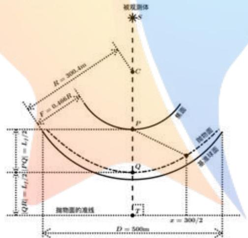  
图1：FAST 剖面示意图

本文基于题目附件8给出的空间直角坐标，以C为坐标原点，构建剖面图上的二维直角坐标系。则水平向右方向为x轴正向，竖直向上为z轴正向。图1为FAST的剖面示意图，其中抛物线的焦点为点 $P _ { l }$ 由于讨论的是开口方向竖直向上的抛物线，故其焦点P的坐标为：

$$
( x _ { p } , z _ { p } ) = ( 0 , \ - ( R - F ) )\tag{5-1}
$$

根据抛物线的几何性质，设该抛物线的焦距为 $L _ { f }$ 。则焦点与顶点的距离为0. $5 L _ { J }$ 则该抛物线顶点 $\boldsymbol { Q }$ 坐标为：

$$
( x _ { Q } , z _ { Q } ) = ( 0 , \ : - ( R - F ) - 0 . 5 L _ { f } )\tag{5-2}
$$

由于抛物线焦点与准线的距离为一倍焦距，故可得抛物线准线方程为：

$$
{ \pmb z } = - \left( { \pmb R } - { \pmb F } \right) - { \pmb L } _ { f }\tag{5-3}
$$

根据抛物线的几何性质，可知抛物线上的任意一点到准线的距离等于该点到焦点的距离。利用该性质构建抛物线方程：

$$
( z - z _ { T } ) ^ { 2 } = x ^ { 2 } + ( z - z _ { P } ) ^ { 2 }\tag{5-4}
$$

其中， $\begin{array} { r } { z _ { T } = - \left( R - F \right) - L _ { f } } \end{array}$ 为点 $\pmb { T }$ 的z轴坐标，由准线方程(5-3)得出；

$z _ { P } = - \left( R - F \right)$ 为点 $\pmb { P }$ 的 $\pmb { z }$ 轴坐标。

接着，将 $z _ { T }$ 和 $z _ { P }$ 的值代入式(5-4)，可得：

$$
[ z + ( R - F ) + L _ { f } ] ^ { 2 } = x ^ { 2 } + [ z + ( R - F ) ] ^ { 2 }\tag{5-5}
$$

两边平方项展开后，移项整理可得方程：

$$
z = \frac { x ^ { 2 } } { 2 L _ { f } } - \frac { L _ { f } } { 2 } - \left( R - F \right)\tag{5-6}
$$

以上，得到了二维直角坐标系下，开口竖直向上的抛物线方程。

## 5.1.2 极坐标系下二维抛物线方程的构建

由于需要将计算得到的抛物面与球面进行对比，使得工作抛物面尽量贴近理想抛物面。因此为方便求解，将上述抛物线方程转换成极坐标形式。

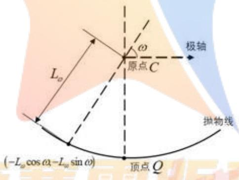  
图 2： 极坐标系下抛物线示意图

如图2，以 $\pmb { c }$ 点为原点，以原x轴为极轴，构建极坐标系，有：

$$
( x , z ) = ( - \infty , - \infty , - \infty )\tag{5-7}
$$

其中， $\scriptstyle { L _ { w } }$ 是从原点出发，到抛物线的距离。将式(5-7)代入直角坐标下的抛物线方程并整理可得：

$$
\frac { L _ { \omega } ^ { 2 } \cos ^ { 2 } \omega } { 2 L _ { f } } + L _ { \omega } \sin \omega - \frac { L _ { f } } { 2 } - ( R - F ) = 0\tag{5-8}
$$

为了得到不同偏转角度 $\omega$ 与 $\scriptstyle \pmb { \mathscr { L } } _ { \omega }$ 的表达式，需要对式(5-8)的方程进行求解。

(1)当 $\omega \neq \pi / 2$ 时，可将式(5-9)看作以 $\scriptstyle { \pmb { L } } _ { \omega }$ 为未知量的一元二次方程，故有

$$
\Delta = \sin ^ { 2 } \omega + 4 \frac { \cos ^ { 2 } \omega } { 2 L _ { f } } \bigg ( \frac { L _ { f } } { 2 } + R - F \bigg ) > 0\tag{5-9}
$$

此时方程始终有两个不同的根。根据韦达定理：

$$
L _ { \omega 1 } + L _ { \omega 2 } = - \ { \frac { - 2 L _ { f } \sin \omega } { \cos ^ { 2 } \omega } } = { \frac { 2 L _ { f } \sin \omega } { \cos ^ { 2 } \omega } } > 0\tag{5-10}
$$

$$
L _ { \omega 1 } \cdot L _ { \omega 2 } = \frac { 2 L _ { f } \left( - \frac { L _ { f } } { 2 } - ( R - F ) \right) } { \cos ^ { 2 } \omega } = \frac { - 2 L _ { f } ^ { 2 } - 2 L _ { f } \left( R - F \right) } { \cos ^ { 2 } \omega } < 0\tag{5-11}
$$

故可知，此时对于每一个 $\omega$ ，都会产生取值一正一负的两个根。舍去负根，得到正根的解析式： A

$$
L _ { \omega } = \frac { - L _ { f } \sin \omega + L _ { f } \sqrt { \sin ^ { 2 } \omega + \frac { 2 \cos ^ { 2 } \omega } { L _ { f } } \left( \frac { L _ { f } } { 2 } + R - F \right) } } { \cos ^ { 2 } \omega }\tag{5-12}
$$

(2) 当 $\omega = \pi / 2$ 时，可将式(5-9)看作以 $\scriptstyle L _ { \omega }$ 为未知量的一元一次方程，故有：

$$
L _ { \omega } = \frac { L _ { f } } { 2 \sin \omega } + \frac { R - F } { \sin \omega }\tag{5-13}
$$

经过化简，可得基于偏转角度 $\omega$ 与 $\scriptstyle L _ { \omega }$ 的表达式：

$$
L _ { \omega } = \left\{ \begin{array} { l l } { - L _ { f } \mathrm { s i n } \omega + L _ { f } \sqrt { \mathrm { s i n } ^ { 2 } \omega + \frac { 2 \cos ^ { 2 } \omega } { L _ { f } } \left( \frac { L _ { f } } { 2 } + R - F \right) } } , \omega \neq \frac { \pi } { 2 }  \\ { \quad \quad \quad \quad \quad \quad \quad \quad \mathrm { c o s } ^ { 2 } \omega } \\ { \quad \quad \quad \quad \quad \quad \quad \quad \quad \quad L _ { f } } \\ { 2 \mathrm { s i n } \omega + \frac { R - F } { \mathrm { s i n } \omega } , \omega = \frac { \pi } { 2 } } \end{array} \right.\tag{5-14}
$$

由于公式(5-14)中含有未知参数，则将该函数记为：

$$
f ( \omega , L _ { f } ) = \left\{ \begin{array} { l l } { - L _ { f } \sin \omega + L _ { f } \sqrt { \sin ^ { 2 } \omega + \frac { 2 \cos ^ { 2 } \omega } { L _ { f } } \left( \frac { L _ { f } } { 2 } + R - F \right) } } & { \mathrm { , ~ } \omega \neq \frac { \pi } { 2 } } \\ { \qquad \cos ^ { 2 } \omega } & { \mathrm { , ~ } \omega \neq \frac { \pi } { 2 } } \\ { \frac { L _ { f } } { 2 \sin \omega } + \frac { R - F } { \sin \omega } , \mathrm { ~ } \omega = \frac { \pi } { 2 } } & { \mathrm { , ~ } \omega \neq \frac { \pi } { 2 } } \\ { \quad --- \mathcal { C } \mathcal { O } m o e t i c i o n \mathrm { ~ Z e r o ~ } \mathcal { D i s } t a n c e = \omega } \end{array} \right.\tag{5-15}
$$

以上，得到了在不同的偏转角度下，二维抛物线上的点到原点的距离 $\scriptstyle L _ { \omega }$ 的表达式，接着将此二维抛物线进行旋转即可得到三维的旋转抛物面。

## 5.1.3 理想抛物面与基准球面的相似度计算

将5.1.2 节得到的二维抛物线以极轴为中轴线旋转，得到反射面板的旋转抛物面，该抛物面可使得沿着中轴线平行射入的电磁波可以被反射到焦点P处。为比较这一理想抛物面与基准球面的相似程度，需要在球坐标系下，以口径为300米的抛物面在基准球面上的投影所围成的区域为积分域，对理想抛物面到原点的距离与基准球面半径的差值平方进行积分，即：

$$
\iint _ { A } [ f ( \omega , L _ { f } ) - R ] ^ { 2 } \mathrm { d } \sigma\tag{5-16}
$$

积分数值的大小是评价相似程度的准则。其中，R为基准球面半径； $\omega$ 为抛物面上的点与原点的连线和中垂线所形成的空间角的大小；dσ为曲面微元；A为积分域，可表示如下：

$$
A : \left. { ( x , y , z ) | z = - \sqrt { R ^ { 2 } - x ^ { 2 } - y ^ { 2 } } , x ^ { 2 } + y ^ { 2 } \le 1 5 0 ^ { 2 } } \right.\tag{5-17}
$$

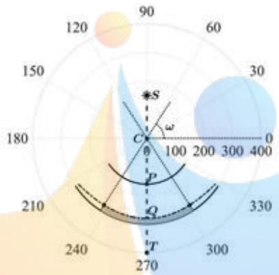  
图 3：极坐标系下FAST剖面及积分区域示意图

由于抛物面的中轴线是竖直的，所以在球坐标系下可转化为二重积分，故该积分式可化简为：

$$
\int _ { \beta } \int _ { \alpha } r _ { \beta } [ f ( \omega , L _ { f } ) - R ] ^ { 2 } \mathrm { d } \alpha \mathrm { d } \beta\tag{5-18}
$$

其中， $\alpha$ 为方位角； $\beta$ 为仰角： $r _ { \beta } = R \cos { \beta }$ 是在 $\beta$ 角给定时， $_ \alpha$ 角在基准球面上的轨迹投影出的圆形的半径。根据题目要求的工作口径，可知 $\lvert \beta \rvert$ 的取值范围满足：

$$
| \cos \beta | \cdot f ( \beta , L _ { f } ) = 1 5 0\tag{5-19}
$$

根据几何关系，易知式(5-19)有两个解 $\beta _ { m }$ 和 $\beta _ { M }$ ，有 $\beta _ { m } < \beta _ { M }$ ，且这两个解的均值为$\pi / 2$ 。为防止对 $\beta$ 指向的圆环重复积分，可设 $\beta$ 的取值范围为 $\beta \in ( \beta _ { m } , \pi / 2 )$ 。结合上述分析，对式(5-18)进一步化简得：

$$
\int _ { \beta _ { m } } ^ { \pi / 2 } 2 \pi r _ { \beta } [ f ( \omega , L _ { f } ) - R ] ^ { 2 } \mathrm { d } \beta\tag{5-20}
$$

以上，得到了球坐标系下，计算理想抛物面和基准球面之间相似程度的准则。

## 5.1.4 理想抛物面优化模型的建立

$$
L _ { f } ^ { * } = \operatorname * { a r g m i n } _ { L _ { f } } \int _ { \beta _ { m } } ^ { \pi / 2 } 2 \pi r _ { \beta } [ f ( \omega , L _ { f } ) - R ] ^ { 2 } \mathrm { d } \beta\tag{5-21}
$$

结合式(5-6)，确定形成最优理想抛物面的抛物线方程为：

$$
z = \frac { x ^ { 2 } } { 2 L _ { f } ^ { 2 } } - \frac { L _ { f } ^ { 2 } } { 2 } - ( R - F )\tag{5-22}
$$

## 5.2 问题一模型的求解

## 5.2.1 算法设计

首先对目标函数(5-20)的数值特性进行定性分析，可知焦距 $L _ { f }$ 决定了理想抛物面和基准球面之间的相似程度，焦距过大，则理想抛物面会整体低于基准球面；焦距过小，则理想抛物面会整体高于基准球面。易知目标函数的梯度函数在区间内为一个单调连续函数，且区间两端对应的梯度值异号，即目标函数(5-20)在区间(100，400)上是一个存在极小值点的凸函数。因此，本文基于该性质设计针对梯度函数零点的二分查找法对极小值点进行求解。具体求解算法如下：

## 算法1：二分查找算法

1：选定边界值。首先根据题目设定与实际情况，选取100与400作为二分查找区间的左右端点。

2：取二分查找区间的中点坐标代入公式(5-23)的梯度函数中，计算得到该点所对应的梯度值：

3：若梯度值远大于0，将二分查找区间的右端点设置为当前中点,并返回第2行。

4：若梯度值远小于0，将二分查找区间的左端点设置为当前中点,并返回第2行。

5：若梯度值的绝对值小于机器精度epsilon，则中点即为待求解的极小值点，程序结束。

## 5.2.2 理想抛物面的求解与分析

基于算法1，在MATLAB中编程进行求解，给出求解出的理想抛物面的剖面视图（图4左）及理想抛物面与基准球面的径向高度高低差（图4右）：

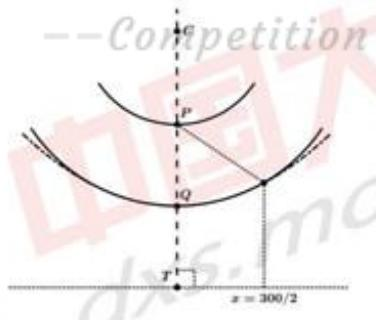

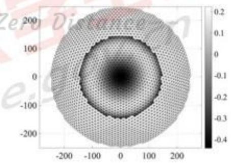  
图4：FAST 2D剖面最优抛物线（左）、3D最优抛物面径向高度高低差（右）

最终结果求解出理想抛物面的焦距 $\scriptstyle { L _ { f } }$ 的精确值为280.854，误差平方在口径上的积

分的最小值为10.112，将 $L _ { f } = 2 8 0 . 8 5 4$ $\pmb { R = 3 0 0 . 4 }$ ，F=0.466R带入式(5-6)可得剖切平面上的抛物线方程为：

$$
z = { \frac { 1 } { 5 6 1 . 7 0 8 } } x ^ { 2 } - 3 0 0 . 8 4 1\tag{5-23}
$$

将抛物线绕z轴旋转一周后，可知其旋转抛物面的方程为：

$$
z = { \frac { 1 } { 5 6 1 . 7 0 8 } } ( x + y ) ^ { 2 } - 3 0 0 . 8 4 1\tag{5-24}
$$

## 5.2.3 结果检验

基于5.2.2节中的精确结果，对所得理想抛物面的剖面上的径向高度与基准球面半径的高低差进行检验，可得最优抛物面与基准球面的偏移量：

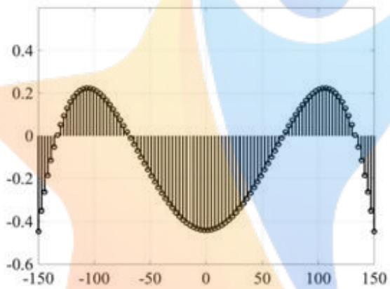  
图 5：最优抛物面与基准球面的偏移量

由图5可知，最优抛物面与基准球面的偏移量在 $( - 0 . 6 , + 0 . 4 )$ 的范围内。因此此最优抛物面在实际应用中，促动器顶端上下拉动下拉索的长度范围也较小，结合反射板调节效率因素，可得本结果合理且较优。

## 六、问题二模型的建立与求解

## 6.1 问题二模型的建立

问题二要求基于问题一所建立的模型，求解当 $\alpha { = } 3 6 . 7 9 5 ^ { \circ } , \beta { = } 7 8 . 1 6 9 ^ { \circ }$ 时的理想抛物面，并以工作抛物面尽量贴近理想抛物面为目标，在下拉索固定长度、节点之间的伸缩变动率、促动器的伸缩量约束下，优化相关促动器的伸缩量。

为简化计算，本文首先建立在标准坐标系上旋转得到的新坐标系，使得主索节点与理想抛物面在径向方向的距离差值可沿用问题一中的式(5-15)，从而构建本问的目标函数。然后通过分析促动器底端坐标、基准状态与工作状态的促动器顶端坐标、主索节点的基准坐标与工作坐标以及促动器伸缩量等变量之间的几何关系，构建本问题的约束条件，得到反射面板调节优化模型。最后，设计BFGS算法进行模型求解。

## 6.1.1基于坐标系旋转的理想抛物面与反射面板相似度计算

本题中，由于观测天体S的方位对于基准球 $_ { \iota \dot { C } }$ 存在与竖直方向的倾角，这给构建新的理想抛物面带来了一定的困难。但在求解理想抛物面时，对于不同轴线方向的抛物面来说，其焦距、焦点等性质都是不变的。故将现有空间坐标系，以基准球面的球心C为中心、沿基准球面的剖面方向进行旋转，使得问题二中理想抛物面的轴线与旋转后空间直角坐标系z轴所在直线重合，此时主索节点与理想抛物面在径向方向的距离差值可沿用问题一中的式(5-15)。

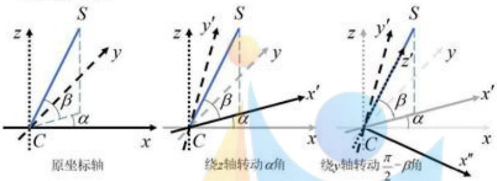  
图 6：坐标系旋转示意图

设第i个主索节点的工作坐标为 $( x ( i ) , y ( i ) , z ( i ) )$ 。将原先的坐标轴绕着z轴沿正方向旋转角度(正向旋转方向与坐标轴指向满足右手定则，下文同义)，则坐标相对于坐标系绕z轴反向旋转角度 $_ \alpha$ ：再将此时的坐标轴绕着 $_ y$ 轴沿正方向旋转角度 $\pi / 2 - \beta$ ，则坐标相对于坐标系绕 $_ { \pmb { y } }$ 轴反向旋转 $\pi / 2 - \beta$ 。根据三维坐标中旋转矩阵的定义，可得旋转坐标系下，第i个主索节点的工作坐标 $( x _ { W } ( i ) , y _ { W } ( i ) , z _ { W } ( i ) )$ 为：

$$
\left( \begin{array} { l } { x _ { W } ( i ) } \\ { y _ { W } ( i ) } \\ { z _ { W } ( i ) } \end{array} \right) = \left( \begin{array} { c c c } { \cos \left( \frac { \pi } { 2 } - \beta \right) } & { 0 } & { - \sin \left( \frac { \pi } { 2 } - \beta \right) } \\ { 0 } & { 1 } & { 0 } \\ { \sin \left( \frac { \pi } { 2 } - \beta \right) } & { 0 } & { \cos \left( \frac { \pi } { 2 } - \beta \right) } \end{array} \right) \left( \begin{array} { l l l } { \cos \alpha } & { \sin \alpha } & { 0 } \\ { - \sin \alpha } & { \cos \alpha } & { 0 } \\ { 0 } & { 0 } & { 1 } \end{array} \right) \left( \begin{array} { l } { x ( i ) } \\ { y ( i ) } \\ { z ( i ) } \end{array} \right)\tag{6-1}
$$

如图 $^ { 6 , }$ 不难看出旋转后坐标系的z轴正方向指向被观测体S。接着球 $_ { \therefore C }$ 为原点，在新的空间直角坐标系上建立空间极坐标系。再将变换后的主索节点的直角作坐标转化为新的空间极坐标系下的坐标，得到第i个主索节点的坐标为 $( L ( i ) , \beta ( i ) , \alpha ( i ) )$ ，具体形式为：

$$
\begin{array} { r }  \{ \begin{array} { l l } { L ( \mathfrak { i } ) = \sqrt { \mathfrak { L } _ { W } ( \mathfrak { i } ) ^ { 2 } + \mathfrak { y } _ { W } ( \mathfrak { i } ) ^ { 2 } + \mathfrak { z } _ { W } ( \mathfrak { i } ) ^ { 2 } } } \\ { \beta ( \mathfrak { i } ) = \overline { { \mathrm { a r c s i n } ( \frac { \mathcal { L } _ { W } ( \mathfrak { i } ) } { L ( \mathfrak { i } ) } ) ^ { \varrho } \mathcal { L } \mathcal { L } \mathcal { L } \mathcal { L } \mathcal { O } \mathcal { N } \overline { { U } } \mathscr { S } \mathfrak { t } \alpha \pi \mathcal { n } \mathcal { n } \mathcal { C } \overline { { U } } \overline { { \mathcal { L } } } \overline { { \mathcal { T } } } } } } \\ { \qquad \sqrt { \pi } - \mathbf { a r c o s s } ( - \frac { \mathfrak { L } _ { W } ( \mathfrak { i } ) } { \sqrt { \pi _ { W } ( \mathfrak { i } ) ^ { 2 } + \mathfrak { y } _ { W } ( \mathfrak { i } ) ^ { 2 } } } ) , \ : \mathfrak { x } _ { W } ( \mathfrak { i } ) ^ { 2 } + \mathfrak { y } _ { W } ( \mathfrak { i } ) ^ { 2 } \neq 0 \mathbb { L } \mathfrak { y } _ { W } ( \mathfrak { i } ) \geqslant 0 } \\ { \alpha ( \mathfrak { i } ) = \{ \begin{array} { l l } { \frac { \mathfrak { L } _ { W } ( \mathfrak { i } ) } { \sqrt { \pi _ { W } ( \mathfrak { i } ) ^ { 2 } + \mathfrak { y } _ { W } ( \mathfrak { i } ) ^ { 2 } } } , \ : \mathfrak { z } _ { W } ( \mathfrak { i } ) ^ { 2 } + \mathfrak { y } _ { W } ( \mathfrak { i } ) ^ { 2 } \neq 0 \mathbb { L } \mathfrak { y } _ { W } ( \mathfrak { i } ) < 0 } \\ { 0 , \ : \mathfrak { z } _ { W } ( \mathfrak { i } ) ^ { 2 } + \mathfrak { y } _ { W } ( \mathfrak { i } ) ^ { 2 } = 0 } \end{array}  } \end{array} \end{array}\tag{6-2}
$$

接着，根据问题一中理想抛物面上偏转角度 $\omega$ 与 $\scriptstyle { L _ { \omega } }$ 的表达式(5-15)，得到在新的坐

标系中，理想抛物面上仰角为 $\beta ( i )$ 的点与原点C的距离：

$$
L _ { \omega } ( i ) = \left\{ \begin{array} { l l } { \displaystyle - L _ { f } \sin \beta ( i ) + \sqrt { L _ { f } ^ { 2 } + 2 ( R - F ) L _ { f } \cos ^ { 2 } \beta ( i ) } \mathrm { , ~ } \beta ( i ) \neq \frac { \pi } { 2 } } \\ { \displaystyle \cos ^ { 2 } \beta ( i ) } \\ { \displaystyle \frac { L _ { f } } { 2 \sin \beta ( i ) } + \frac { R - F } { \sin \beta ( i ) } \mathrm { , ~ } \beta ( i ) = \frac { \pi } { 2 } } \end{array} \right.\tag{6-3}
$$

为保证反射面在工作状态下与理想抛物面尽量贴合，需要使得在同一径向方向上的主索节点与理想抛物面上的点距离原点 $c$ 的距离差尽量小。故可构建如下优化目标：

$$
( x ^ { * } ( i ) , y ^ { * } ( i ) , z ^ { * } ( i ) ) = \operatorname * { a r g m i n } _ { * ( 0 , x ( i ) , x ( i ) , i \in \mathcal { Z } } \sum _ { \beta _ { \infty } < \beta ( 0 < \frac { \pi } { 2 } ) } ( L _ { \omega } ( i ) - L ( i ) ) ^ { 2 }\tag{6-4}
$$

其中， $\boldsymbol { \tau }$ 为所有主索节点所用到的下标集合： $\beta _ { m }$ 为新的极坐标下仰角取值的最小值。由  
于理想抛物面具有照明区域的限制，5.1.3节中已经据此给出了仰角的取值范围式，这在  
本问题中也同样具有约束效果。注意到，在基于促动器伸缩完成的主索节点位置变化过  
程中，第i个主索节点的坐标 $( x _ { W } ( i ) , y _ { W } ( i ) , z _ { W } ( i ) )$ 可以由促动器的伸缩量唯一确定。根$( x ^ { - } ( i ) , y ^ { - } ( i ) , z ^ { - } ( i ) )$ 与关$( x ^ { o } ( i ) , y ^ { o } ( i ) , z ^ { o } ( i ) )$ $\begin{array} { r l } { ( x ^ { + } \left( i \right) , y ^ { + } \left( i \right) , z ^ { + } \left( i \right) ) } \end{array}$

$$
\frac { x ^ { + } ( \mathbf { i } ) - x ^ { o } ( \mathbf { i } ) } { x ^ { o } ( \mathbf { i } ) - x ^ { - } ( \mathbf { i } ) } = \frac { L _ { a } ( \mathbf { i } ) } { \sqrt { [ x ^ { o } ( \mathbf { i } ) - x ^ { - } ( \mathbf { i } ) ] ^ { 2 } + [ y ^ { o } ( \mathbf { i } ) - y ^ { - } ( \mathbf { i } ) ] ^ { 2 } + [ z ^ { o } ( \mathbf { i } ) - z ^ { - } ( \mathbf { i } ) ] ^ { 2 } } }\tag{6-5}
$$

其中， $\mathbf { \tilde { \mathbf { \Gamma } } } [ L _ { z } ( i )$ 为每个促动器的伸缩量。同样地，y轴和z轴方向均同在相同的比例关系，因此有：

$$
\left\{ \begin{array} { l l } { x ^ { + } \left( i \right) = \displaystyle \frac { L _ { * } \left( i \right) \left( x ^ { \circ } \left( i \right) - x ^ { - } \left( i \right) \right) } { \sqrt { \left[ x ^ { \circ } \left( i \right) - x ^ { - } \left( i \right) \right] ^ { 2 } + \left[ y ^ { \circ } \left( i \right) - y ^ { - } \left( i \right) \right] ^ { 2 } + \left[ z ^ { \circ } \left( i \right) - z ^ { - } \left( i \right) \right] ^ { 2 } } } + x ^ { \circ } \left( i \right) } \\ { y ^ { + } \left( i \right) = \displaystyle \frac { L _ { * } \left( i \right) \left( y ^ { \circ } \left( i \right) - y ^ { - } \left( i \right) \right) } { \sqrt { \left[ x ^ { \circ } \left( i \right) - x ^ { - } \left( i \right) \right] ^ { 2 } + \left[ y ^ { \circ } \left( i \right) - y ^ { - } \left( i \right) \right] ^ { 2 } + \left[ z ^ { \circ } \left( i \right) - z ^ { - } \left( i \right) \right] ^ { 2 } } } + y ^ { \circ } \left( i \right) } \\ { z ^ { + } \left( i \right) = \displaystyle \frac { L _ { * } \left( i \right) \left( z ^ { \circ } \left( i \right) - z ^ { - } \left( i \right) \right) } { \sqrt { \left[ x ^ { \circ } \left( i \right) - x ^ { - } \left( i \right) \right] ^ { 2 } + \left[ y ^ { \circ } \left( i \right) - y ^ { - } \left( i \right) \right] ^ { 2 } + \left[ z ^ { \circ } \left( i \right) - z ^ { - } \left( i \right) \right] ^ { 2 } } } + z ^ { \circ } \left( i \right) } \end{array} \right.\tag{6-6}
$$

以上，经过推导最终得到了第i个促动器的伸缩量 $\ L _ { \varepsilon } ( i )$ 与对应主索节点的坐标$( x _ { W } ( i ) , y _ { W } ( i ) , z _ { W } ( i ) )$ 之间的关系。因此加入 $\ L _ { \varepsilon } ( i )$ 作为式(6-4)中反射面与理想抛物面相似度计算目标函数的决策变量，整理可得：ZeroDistance

$$
( x ^ { * } ( i ) , y ^ { * } ( i ) , z ^ { * } ( i ) , L _ { x } ^ { * } ( i ) ) = \operatorname * { a r g m i n } _ { \substack { x ( 0 , x ( i ) , x _ { x } ( i ) , i \in \mathcal { Z } ) _ { \beta _ { \infty } < \beta ( 0 < \frac { \pi } { 2 } ) } } } [ L _ { \omega } ( i ) - L ( i ) ] ^ { 2 }\tag{6-7}
$$

## 6.1.2 约束条件的确定

## (1) 节点之间的伸缩变动率约束

根据假设6，相邻节点之间的距离可能会发生微小变化，变化幅度的极限为0.07%，故可构建如下约束条件：

$$
\left\{ \begin{array} { l l } { \displaystyle { \frac { [ x ( i _ { 1 } ) - x ( i _ { 2 } ) ] ^ { 2 } + [ y ( i _ { 1 } ) - y ( i _ { 2 } ) ] ^ { 2 } + [ z ( i _ { 1 } ) - z ( i _ { 2 } ) ] ^ { 2 } } { [ x _ { 0 } ( i _ { 1 } ) - x _ { 0 } ( i _ { 2 } ) ] ^ { 2 } + [ y _ { 0 } ( i _ { 1 } ) - y _ { 0 } ( i _ { 2 } ) ] ^ { 2 } + [ z _ { 0 } ( i _ { 1 } ) - z _ { 0 } ( i _ { 2 } ) ] ^ { 2 } } } \geq ( 1 - 0 . 0 7 \% ) ^ { 2 } , ( i _ { 1 } , i _ { 2 } ) \in E }  \\ { \displaystyle { \frac { [ x ( i _ { 1 } ) - x ( i _ { 2 } ) ] ^ { 2 } + [ y ( i _ { 1 } ) - y ( i _ { 2 } ) ] ^ { 2 } + [ z ( i _ { 1 } ) - z ( i _ { 2 } ) ] ^ { 2 } } { [ z _ { 0 } ( i _ { 1 } ) - z _ { 0 } ( i _ { 2 } ) ] ^ { 2 } + [ y _ { 0 } ( i _ { 1 } ) - y _ { 0 } ( i _ { 2 } ) ] ^ { 2 } + [ z _ { 0 } ( i _ { 1 } ) - z _ { 0 } ( i _ { 2 } ) ] ^ { 2 } } } \lesssim ( 1 + 0 . 0 7 \% ) ^ { 2 } , ( i _ { 1 } , i _ { 2 } ) \in E }  \end{array} \right.\tag{6-8}
$$

其中， $E = \left\{ ( i _ { 1 } , i _ { 2 } ) \in \mathcal { T } \times \mathcal { T } \right\}$

## (2) 促动器伸缩范围约束

根据题设，促动器伸缩量只能在-0.6m到+0.6m之间，故具有如下约束条件：

$$
- 0 . 6 \leqslant L _ { z } ( i ) \leqslant 0 . 6\tag{6-9}
$$

## (3) 下拉索长度约束

主索节点与促动器顶端是由固定长度的下拉索连接的，可通过基准状态下的主索节点的坐标与促动器顶端基准坐标，计算出每一段下拉索的长度。设每一段下拉索的长度为 $\pmb { L _ { \pmb { \mathscr { o } } } ( \vec { \mathscr { a } } ) }$ ，基准状态下主索节点坐标为 $( x _ { 0 } ( i ) , y _ { 0 } ( i ) , z _ { 0 } ( i ) )$ ，促动器顶端基准坐标为$( x ^ { o } ( i ) , y ^ { o } ( i ) , z ^ { o } ( i ) )$ ，则有：

$$
L _ { * } ( i ) = \sqrt { [ \boldsymbol { z } _ { 0 } ( i ) - \boldsymbol { z } ^ { o } ( i ) ] ^ { 2 } + [ \boldsymbol { y } _ { 0 } ( i ) - \boldsymbol { y } ^ { o } ( i ) ] ^ { 2 } + [ \boldsymbol { z } _ { 0 } ( i ) - \boldsymbol { z } ^ { o } ( i ) ] ^ { 2 } } , i \in \mathcal { Z }\tag{6-10}
$$

设促动器在工作状态时的顶端坐标为 $( x ^ { + } ( i ) , y ^ { + } ( i ) , z ^ { + } ( i ) )$ ，则存在如下约束条件：

$$
[ x ( i ) - x ^ { + } ( i ) ] ^ { 2 } + [ y ( i ) - y ^ { + } ( i ) ] ^ { 2 } + [ z ( i ) - z ^ { + } ( i ) ] ^ { 2 } = L _ { s } ( i ) ^ { 2 }\tag{6-11}
$$

## 6.1.3 反射面板调节优化模型的构建

综上所述，本文建立的反射面板调节优化模型为：

$$
( x ^ { * } ( i ) , y ^ { * } ( i ) , z ^ { * } ( i ) , L _ { x } ^ { * } ( i ) ) = \operatorname * { a r g m i n } _ { x : ( 0 , x ( 0 ) , x _ { x } ( 0 , i ) \in \mathbb { Z } } \sum _ { \beta _ { m } < \beta ( 0 ) < { \frac { x } { 2 } } } [ L _ { w } ( i ) - L ( i ) ] ^ { 2 }\tag{6-12}
$$

$$
\begin{array} { r l } &  s . t . \{ \begin{array} { l l } { \frac { [ x ( i _ { 1 } ) - x ( i _ { 2 } ) ] ^ { 2 } + [ y ( i _ { 1 } ) - y ( i _ { 2 } ) ] ^ { 2 } + [ z ( i _ { 1 } ) - z ( i _ { 2 } ) ] ^ { 2 } } { [ x _ { 0 } ( i _ { 1 } ) - z _ { 0 } ( i _ { 2 } ) ] ^ { 2 } + [ y _ { 0 } ( i _ { 1 } ) - y _ { 0 } ( i _ { 2 } ) ] ^ { 2 } + [ z _ { 0 } ( i _ { 1 } ) - z _ { 0 } ( i _ { 2 } ) ] ^ { 2 } } > ( 1 - 0 . 0 7 \% ) ^ { 2 } , ( i _ { 1 } , i _ { 2 } ) \in E } \\ { \frac { [ x ( i _ { 1 } ) - x ( i _ { 2 } ) ] ^ { 2 } + [ y _ { 0 } ( i _ { 1 } ) - y ( i _ { 2 } ) ] ^ { 2 } + [ z _ { 0 } ( i _ { 1 } ) - z ( i _ { 2 } ) ] ^ { 2 } } { [ x _ { 0 } ( i _ { 1 } ) - z _ { 0 } ( i _ { 2 } ) ] ^ { 2 } + [ y ( i _ { 1 } ) - y ( i _ { 2 } ) ] ^ { 2 } + [ z ( i _ { 1 } ) - z ( i _ { 2 } ) ] ^ { 2 } } > ( 1 + 0 . 0 7 \% ) ^ { 2 } , ( i _ { 1 } , i _ { 2 } ) \in E } \\  \frac { [ x ( i _ { 1 } ) - x ( i _ { 2 } ) ] ^ { 2 } + [ y ( i _ { 1 } ) - y ( i _ { 2 } ) ] ^ { 2 } + [ z ( i _ { 2 } ) ] ^ { 2 } } { [ x _ { 0 } ( i _ { 1 } ) - z _ { 0 } ( i _ { 2 } ) ] ^ { 2 } + [ y _ { 0 } ( i _ { 1 } ) - y _ { 0 } ( i _ { 2 } ) ] ^ { 2 } + [ z _ { 0 } ( i _ { 1 } ) - z _ { 0 } ( i _ { 2 } ) ] ^ { 2 } } \leq ( 1 + 0 . 0 7 \% ) ^ { 2 } , ( i _ { 1 } , i _ { 2 } ) \end{array} \end{array}
$$

## 6.2 问题二模型的求解

## 6.2.1 算法设计

由于问题二共计需要求解2226个主索节点的xyz坐标，以及其对应的促动器伸缩量$\scriptstyle { \pmb { L } } _ { \pmb { \pi } }$ ，需要求解的决策变量数量庞大且其中带有非线性的等式和不等式约束，因此必须寻找适应于高维大规模问题求解的算法。

对于模型中非线性约束，首先基于拉格朗日乘子法的思想，引入一个乘数λ，将等式非线性约束转化为目标函数的一部分。接着，在不考虑不等式约束的情况下进行求解，当结果违反不等式约束时，将其转化为等式约束并再此求解，直到得到不违反约束的最优解。注意到待求解的模型中的非线性约束都能表示为决策变量的二次型，具有光滑和凸的性质，且容许在数值定义域上轻微违反约束时稳定求值，因此此处使用拟牛顿方法中的BFGS方法，以在不直接计算Hessian矩阵的情况下实现这一高维问题的超线性收敛。具体求解算法如下：

## 算法 2： BFGS 算法

1：初始化参数。为循环变量k赋初始值 $\pmb { k } = 0$ ，为切线刚度矩阵 $\scriptstyle B _ { 0 }$ 赋初始值为单位  
矩阵，设置初始解 $\pmb { x _ { 0 } }$ 为主索网节点在附件中的基准态坐标。  
2：循环：根据条件 $B _ { k } p _ { k } = - \nabla f ( x _ { k } )$ ，计算 ${ \pmb p } _ { \pmb { k } }$   
3: 由式 $x _ { k + 1 } = x _ { k } + \alpha _ { k } p _ { k }$ 得到 $x _ { k + 1 } ,$ 其中 $\pmb { \alpha } _ { k }$ 的值从1.0开始折半查找，直到步  
长足够小时，函数值低于上一步。  
4: 计算 $\begin{array} { r } { \boldsymbol { s } _ { k } = \alpha _ { k } \boldsymbol { p } _ { k } , ~ \boldsymbol { y } _ { k } = \nabla f ( \boldsymbol { x } _ { k + 1 } ) - \nabla f ( \boldsymbol { x } _ { k } ) } \end{array}$   
${ \mathfrak { s } } ;$ 计算新的切线刚度矩阵 $B _ { k + 1 } = B _ { k } - { \frac { B _ { k } s _ { k } s _ { k } ^ { T } B _ { k } } { s _ { k } ^ { T } B _ { k } s _ { k } } } + { \frac { y _ { k } y _ { k } ^ { T } } { y _ { k } ^ { T } s _ { k } } }$   
$_ { 6 } { : }$ 判断：将当前解代入原式验证，若拉格朗日方程组等式两边的误差小于  
epsilon，则得到待求解，程序结束；否则返回第2行。

## 6.2.2反射面调节情况的求解与分析

由于问题二中使用到了旋转的坐标系，故本问理想抛物面的结果可以在旋转坐标变换的条件下，得到了顶点坐标为(-49.392，-36.943，-294.450)的抛物面。接着，基于算法2，在MATLAB中编程进行求解，给出求解出的3D的促动器提升量图（图7左）及3D的理想抛物面的拟合误差图（图 7右）：

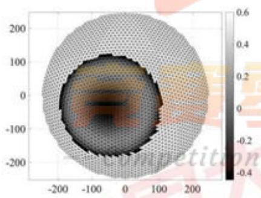

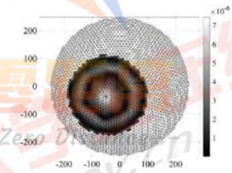  
图 $\eta _ { \colon }$ 3D促动器提升量（左）、3D理想曲面拟合误差（右）

由图7左可知，此状态下促动器的提升量处于-0.4m到0.6m的范围内，此时反射面较为贴近所求理想抛物面，且促动器顶端上下拉动下拉索的长度范围也较小。由图7(右)可知，此状态下理想抛物面的拟合误差处于0到 ${ 7 \times 1 0 ^ { - 6 } }$ 的范围内，拟合误差也较小，说明此时的结果为合理最优解。

## 6.2.3 结果检验

基于6.2.2节中的结果，求出主网节点与理想抛物面间的球面径向误差以及主网节点间距离的变化率：

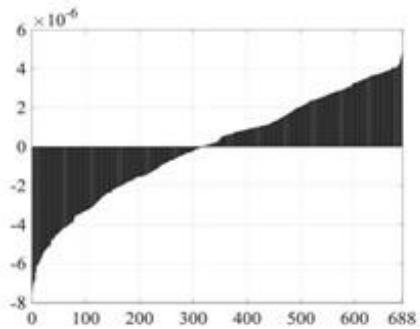

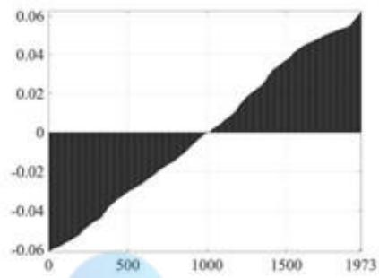  
图8：主网节点与理想抛物面球面径向误差（左）、主网节点间距离变化率（单位：百分数）（右）

由图8（左）可知，此状态下主网节点与理想抛物面间的球面径向误差处于$\mathbf { - 8 \times 1 0 ^ { - 6 } }$ 到 ${ \bf 6 } \times { \bf 1 0 ^ { - 6 } }$ 的范围内，可见此径向误差非常小，此时反射面较为贴近所求理想抛物面。由图8（右）可知，此状态下主网节点间距离的变化率处于-0.06%到0.06%的范围内，充分利用而并没有违反0.07%的裕度，说明此时的结果是合理的。

## 七、问题三模型的建立与求解

## 7.1问题三模型的建立

问题三要求基于问题二的反射面调节方案，计算调节后馈源舱的接收比，并与基准球面接收比作比较。对于该问题，本文首先通过使用旋转变换，将倾斜入射光线转化为垂直入射光线。其次，通过求解线性方程组，依次确定出入射光线与三角形面板的相交判定式、交点坐标、三角形面板的法线向量，并利用光线垂直入射的性质，使用法线向量简化计算得到出射光线的方向角。再次，通过联立射线方程与馈源舱所在的目标高度，得出射线方程的步长和出射光到达目标高度时的坐标，并与馈源舱的有效区域进行比对，作为入射光线是否被有效接收的判定式。最后，将300米口径内实际接收区域作为积分域，将入射光线有效接收判别式作为被积函数，使用蒙特卡洛算法进行积分，计算有效接收的光源面积和调节前后的信号接收比。

## 7.1.1 反射光线几何模型的建立

首先，要在新坐标系中计算反射点在反馈面板三角形区域内的坐标。设新坐标系的空间变量为 $( x _ { W } , y _ { W } , z _ { W } )$ 在 $x _ { w } ^ { 2 } + y _ { w } ^ { 2 } \le 1 5 0 ^ { 2 }$ 的范围内，沿着z轴负方向均有来自于被观物体的电磁波照射在反射面上。记反射面板上一三角形三个顶点 ${ B _ { 1 } B _ { 2 } B _ { 3 } }$ 的坐标分别为$B _ { 1 } ( x _ { W } ( j _ { 1 } ) , y _ { W } ( j _ { 1 } ) , z _ { W } ( j _ { 1 } ) )$ $B _ { 2 } \left( x _ { W } \left( j _ { 2 } \right) , y _ { W } \left( j _ { 2 } \right) , z _ { W } \left( j _ { 2 } \right) \right)$ 和 $B _ { 3 } ( x _ { W } ( j _ { 3 } ) , y _ { W } ( j _ { 3 } ) , z _ { W } ( j _ { 3 } ) )$ 表示三角形j访问的主索节点的坐标。其中编号 $j \in \mathcal { T } = \{ j  j = ( i _ { 1 } , i _ { 2 } , i _ { 3 } ) \in \mathcal { T } \times \mathcal { T } \times \mathcal { T } \}$ 设一点 $( x _ { W } , y _ { W } , z _ { W } )$ 在线段 $B _ { 1 } B _ { 2 }$ 上，则其在x轴的坐标可以表示为：

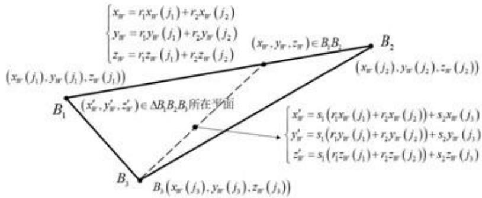  
图 $^ { 9 ; }$ 反馈面板三角形区域示意图

$$
x _ { W } = r _ { 1 } x _ { W } \left( j _ { 1 } \right) + r _ { 2 } x _ { W } \left( j _ { 2 } \right)\tag{7-1}
$$

其中， $r _ { 1 } , r _ { 2 } > 0$ 且 $r _ { 1 } + r _ { 2 } = 1$ 。接着，设另一点 $( x _ { W } ^ { \prime } , y _ { W } ^ { \prime } , z _ { W } ^ { \prime } )$ 在点 $( x _ { W } , y _ { W } , z _ { W } )$ 与 $B _ { 3 }$ 为端点的线段上，该点在x轴上的坐标可以表示为：

$$
x _ { w } ^ { \prime } = s _ { 1 } r _ { 1 } x _ { w } ( j _ { 1 } ) + s _ { 1 } r _ { 2 } x _ { W } ( j _ { 2 } ) + s _ { 2 } x _ { W } ( j _ { 3 } )\tag{7-2}
$$

其中， $s _ { 1 } , s _ { 2 } > 0$ 且 $s _ { 1 } + s _ { 2 } = 1$ 0

记 $s _ { 1 } r _ { 1 } = t _ { 1 } , ~ s _ { 1 } r _ { 2 } = t _ { 2 } , ~ s _ { 2 } = t _ { 3 }$ 。易证 $t _ { 1 } + t _ { 2 } + t _ { 3 } = 1$ 且 $t _ { 1 } > 0 , t _ { 2 } > 0 , t _ { 3 } > 0$ 。同理可得该点在 $\pmb { y }$ 轴与z轴的坐标。以上，得到了一点在以 $\boldsymbol { B } _ { 1 } \boldsymbol { B } _ { 2 } \boldsymbol { B } _ { 3 }$ 为顶点形成的三角形内部平面上的坐标为：

$$
{ \left( \begin{array} { l } { x _ { W } ^ { \prime } } \\ { y _ { W } ^ { \prime } } \\ { z _ { W } ^ { \prime } } \end{array} \right) } = { \left( \begin{array} { l l l } { x _ { W } \left( j _ { 1 } \right) } & { x _ { W } \left( j _ { 2 } \right) } & { x _ { W } \left( j _ { 3 } \right) } \\ { y _ { W } \left( j _ { 1 } \right) } & { y _ { W } \left( j _ { 2 } \right) } & { y _ { W } \left( j _ { 3 } \right) } \\ { z _ { W } \left( j _ { 1 } \right) } & { z _ { W } \left( j _ { 2 } \right) } & { z _ { W } \left( j _ { 3 } \right) } \end{array} \right) } { \left( \begin{array} { l } { t _ { 1 } } \\ { t _ { 2 } } \\ { t _ { 3 } } \end{array} \right) }\tag{7-3}
$$

将 $t _ { 3 } = 1 - t _ { 1 } - t _ { 2 }$ 代入式(7-3)约去z轴的坐标，并根据矩阵运算法则可得：

$$
\binom { t _ { 1 } } { t _ { 2 } } = \binom { x _ { W } ( j _ { 1 } ) - x _ { W } ( j _ { 3 } ) } { y _ { W } ( j _ { 1 } ) - y _ { W } ( j _ { 3 } ) } y _ { W } ( j _ { 2 } ) - y _ { W } ( j _ { 3 } ) \binom { - 1 } { 3 } \binom { x _ { W } ^ { \prime } - x _ { W } ( j _ { 3 } ) } { y _ { W } ^ { \prime } - y _ { W } ( j _ { 3 } ) }\tag{7-4}
$$

注意到三个点 $\boldsymbol { B } _ { 1 } \boldsymbol { B } _ { 2 } \boldsymbol { B } _ { 3 }$ 为三角形的三个顶点，式(7-4)中的逆矩阵总是存在。因此，当坐标 $( x _ { W } ^ { \prime } , y _ { W } ^ { \prime } )$ 给定时，可以根据式(7-4)计算 $t _ { 1 }$ 和 $t _ { 2 }$ 的值，进而判断该点的水平面投影是否在三角形的水平面投影的内部。根据实际条件，对于任意在 $x _ { W } ^ { 2 } + y _ { W } ^ { 2 } \le 1 5 0 ^ { 2 }$ 范围内的 $( x _ { W } ^ { \prime } , y _ { W } ^ { \prime } )$ ，都有一个 $j \in \mathcal { I }$ 使得其在j所指代的三角形内部。故可进一步根据式(7-3)求得 $( x _ { W } ^ { \prime } , y _ { W } ^ { \prime } )$ 对应的z轴坐标为：

$$
z _ { W } ^ { \prime } = t _ { 1 } z _ { W } \left( j _ { 1 } \right) + t _ { 2 } z _ { W } \left( j _ { 2 } \right) + t _ { 3 } z _ { W } \left( j _ { 3 } \right)\tag{7-5}
$$

其次，要确定反射直线的解析表达式。计算反馈面上三个点 $B _ { 1 } B _ { 2 } B _ { 3 }$ 构成平面的法向量 $\vec { n } = ( e _ { 1 } ; e _ { 2 } ; e _ { 3 } )$ ，有：

$$
\left( \begin{array} { l l l } { x _ { W } \left( j _ { 1 } \right) - x _ { W } \left( j _ { 2 } \right) } & { y _ { W } \left( j _ { 1 } \right) - y _ { W } \left( j _ { 2 } \right) } & { z _ { W } \left( j _ { 1 } \right) - z _ { W } \left( j _ { 2 } \right) } \\ { x _ { W } \left( j _ { 2 } \right) - x _ { W } \left( j _ { 3 } \right) } & { y _ { W } \left( j _ { 2 } \right) - y _ { W } \left( j _ { 3 } \right) } & { z _ { W } \left( j _ { 2 } \right) - z _ { W } \left( j _ { 3 } \right) } \\ { x _ { W } \left( j _ { 3 } \right) - x _ { W } \left( j _ { 1 } \right) } & { y _ { W } \left( j _ { 3 } \right) - y _ { W } \left( j _ { 1 } \right) } & { z _ { W } \left( j _ { 3 } \right) - z _ { W } \left( j _ { 1 } \right) } \end{array} \right) \left( \begin{array} { l } { e _ { 1 } } \\ { e _ { 2 } } \\ { e _ { 3 } } \end{array} \right) = \left( \begin{array} { l } { 0 } \\ { 0 } \\ { 0 } \end{array} \right)\tag{7-6}
$$

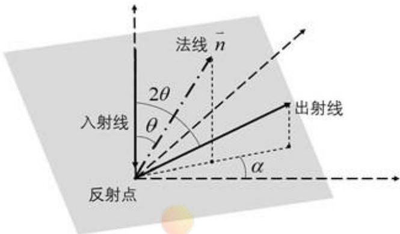  
图 10：各角度三维示意图

注意到，法向量没有归一化且式(7-6)左侧矩阵的秩为2。且考虑到问题所求的抛物面开口向上，即 $e _ { 3 } > 0$ ，故令 $e _ { 3 } = 1$ ，将式(7-6)进行化简并根据矩阵运算法则可得：

$$
{ \binom { e _ { 1 } } { e _ { 2 } } } = { \binom { x _ { W } ( j _ { 1 } ) - x _ { W } ( j _ { 2 } ) } { x _ { W } ( j _ { 2 } ) - x _ { W } ( j _ { 3 } ) } } y _ { W } ( j _ { 1 } ) - y _ { W } ( j _ { 2 } ) \biggr ) ^ { - 1 } { \binom { z _ { W } ( j _ { 2 } ) - z _ { W } ( j _ { 1 } ) } { z _ { W } ( j _ { 3 } ) - z _ { W } ( j _ { 2 } ) } }\tag{7-7}
$$

由于入射光垂直于水平面向下，由方向向量 $\vec { n } _ { 1 } = ( 0 , 0 , 1 )$ 。因此 $\vec { \pmb { n } }$ 与 $\stackrel {  } { n _ { 1 } }$ 的夹角：

$$
\theta = \operatorname { a r c c o s } { \frac { { \vec { n } } \cdot { \vec { n _ { 1 } } } } { \left| { \vec { n } } \right| \cdot \left| { \vec { n _ { 1 } } } \right| } }\tag{7-8}
$$

接着，将法向量 $\vec { \pmb { n } }$ 投影到水平面后与x轴的方向向量 $\stackrel {  } { n _ { z } } = ( 1 , 0 , 0 )$ 的夹角 $\pmb { \alpha }$ 表示为：

$$
\alpha { = } \{ \begin{array} { l l } { \underset { n } { \overset {  } { n } } \cdot \underset { n _ { x } } { \overset {  } { n _ { x } } } , e _ { 2 } \geq 0 } \\ { \underset { | n | \cdot | n _ { x } | } { \overset {  } { n } } } \\ { \underset { | n | \cdot | n _ { x } | } { \overset {  } { n } } , e _ { 2 } < 0 } \end{array}\tag{7-9}
$$

另外，由于出射光与入射光所在平面垂直于反射面，可知出射光与z轴的夹角为2θ。因此出射光的方向向量：

$$
\vec { n _ { 2 } } = ( \sin ( 2 \theta ) \cos \alpha , \sin ( 2 \theta ) \sin \alpha , \cos ( 2 \theta ) )\tag{7-10}
$$

以上，可得出射光所在的直线的标准方程为：

$$
\binom { x _ { W } } { y _ { W } } = \binom { x _ { W } ^ { \prime } } { y _ { W } ^ { \prime } } + r \binom { \sin { ( 2 \theta ) } \cos { \alpha } } { \sin { ( 2 \theta ) } \sin { \alpha } }\tag{7-11}
$$

最后，要确定馈源舱接收平面的解析表达式。根据题目，馈源舱接收平面的法线方向指向理想抛物面的顶点，距离原点的距离为。考虑到由于馈源舱接收信号有效区域为直径1米的中心圆盘，因此其平面方程为

$$
\left\{ z _ { W } = - \left( R - F \right) \right.\tag{7-12}
$$

综上，在新坐标系中构建了反射光线所在直线与馈源舱接收平面的解析表达式。

## 7.1.2反射光线吸收与信号比计算模型的建立

在确定了反射光线与馈源舱接收平面的解析表达式后，即可判断反射光线是否被接收并计算反射信号比。

首先，将接收面平面方程与出射光所在直线方程进行联立，可以得到出射光线命中馈源舱所在z平面的行进步长：

$$
r = \frac { F - R - z _ { w } ^ { \prime } } { \cos \left( 2 \theta \right) }\tag{7-13}
$$

结合式(7-11)和(7-13)，整理可得：

$$
\left\{ \begin{array} { l } { { x _ { W } = x _ { W } ^ { \prime } + \displaystyle \frac { F - R - z _ { W } ^ { \prime } } { \cos \left( 2 \theta \right) } \sin \left( 2 \theta \right) \cos \alpha } } \\ { { y _ { W } = y _ { W } ^ { \prime } + \displaystyle \frac { F - R - z _ { W } ^ { \prime } } { \cos \left( 2 \theta \right) } \sin \left( 2 \theta \right) \cos \alpha } } \end{array} \right.\tag{7-14}
$$

接着，可以基于入射线指向的水平面上点的坐标 $( x _ { W } ^ { \prime } , y _ { W } ^ { \prime } )$ 并根据式(7-14)求得 $\pmb { x } _ { W }$ 和yw。因此可以通过：

$$
I ( x _ { W } ^ { \prime } , y _ { W } ^ { \prime } ) = \left\{ { 1 , x _ { W } ^ { 2 } + y _ { W } ^ { 2 } { \leqslant } 0 . 5 ^ { 2 } { \boxplus } x _ { W } ^ { \prime 2 } + y _ { W } ^ { \prime 2 } { \geq } 0 . 5 ^ { 2 } } \right.\tag{7-15}
$$

判断反射光线是否能够被接受面吸收。进一步， 对判断函数 $I ( x _ { W } , y _ { W } )$ 在$x _ { W } ^ { 2 } + y _ { W } ^ { 2 } \le 1 5 0 ^ { 2 }$ 范围内积分，可以得到被馈源舱吸收的光线所占的面积：

$$
\iint _ { z _ { w } ^ { 2 } + y _ { w } ^ { 2 } \le 1 5 0 ^ { 2 } } I ( x _ { W } , y _ { W } ) \mathrm { d } x _ { W } \mathrm { d } y _ { W }\tag{7-16}
$$

接着，注意到有效口径内的每一个点都必然有且仅有一个相应的三角形，则平面内接收到的光线面积为1 $1 5 0 ^ { 2 } \pi$ 最后，可得接收与反射信号之比为：

$$
\eta = \frac { 1 } { 1 5 0 ^ { 2 } \pi } \iint _ { z _ { w } ^ { 2 } + y _ { w } ^ { 2 } = 1 5 0 ^ { 2 } } f ( x _ { W } , y _ { W } ) \mathrm { d } x _ { w } \mathrm { d } y _ { w }\tag{7-17}
$$

## 7.2 问题三模型的求解

## 7.2.1 算法设计

对于问题三所求的积分数值，如果直接对整个口径圆面进行积分，则对于每个输入的光线坐标，算法都将消耗大量时间遍历xOy平面上的各个投影三角形，以确定这一坐标所属的三角形法线，用于计算出射光线的射线方程。为了避免这一逐点依次进行三角形遍历的时间成本，我们将圆形口径积分域分解为各个互不重叠的 $\pmb { x } O y$ 投影三角形积分域，通过对各个三角形积分域内均匀地采样各个光线的接收判定信息，使得一次性遍历到各个投影三角形时，可以大批量地使用同一个法线向量处理多个投影到该三角形上的入射光线，甚至使用足够高密度的采样从入射光线的接收信息还原出馈源器有效区域在各个投影三角形上的像。为了实现三角形区域的均匀采样式积分，我们设计了包含对边界条件精细修正的蒙特卡洛积分算法，算法细节如下：

算法3：蒙特卡洛算法  
1：设置接收面积近似值 $\pmb { a } ; = 0$   
$_ { 2 } \colon$ 遍历三角形 $j \in \mathcal { I } ;$   
$3 { : }$ 设置接收次数初始值 $\pmb { d } \colon = 0$ nn  
$_ { 4 } \mathrm { : }$ 抽样次数10000，循环：  
$5 { : }$ 每次在0到1之间平均随机抽样生成一个 $\scriptstyle t _ { 1 }$ 和一个 $t _ { 2 }$   
$_ { 6 : }$ 如果 $t _ { 1 } + t _ { 2 } > 1$   
$\mathbf { 7 } :$ $t _ { 1 } { : = } 1 - t _ { 1 } { : }$   
$\mathbf { 8 } { \ : } ;$ $t _ { 2 } { : } = 1 { - } t _ { 2 }$   
$9 { : }$ $t _ { 3 } = 1 - t _ { 1 } - t _ { 2 }$   
$^ { 1 0 : }$ 使用式(7-3)从 $( t _ { 1 } , t _ { 2 } , t _ { 3 } )$ 计算出 $( x , y , z )$   
11: 使用x和y计算出xOy平面上的投影向量长度：  
12: 如果向量长度超过口径的一半150米：  
13: 跳过这次接收计算，跳转到第16行：  
14: 使用 $( x , y , z )$ 计算出是否接收，如果接收：  
$1 5 :$ $d \colon = d + 1$   
$^ { 1 6 } :$ 如果抽样次数没满，跳转到第4行循环；  
17: 计算出三角形j在 ${ \mathit { x O y } }$ 平面上的投影面积：  
18: $a _ { 1 } : = a _ { 1 } + d / 1 0 0 0 0$ ·(阴影面积)  
$1 9 :$ 如果遍历三角形没结束，跳转到第2行继续遍历  
$2 0 :$ 输出 $a _ { 1 } / ( 1 5 0 ^ { 2 } \pi )$ 即为所求接收率；  
7.2.2 问题三的结果与分析  
基于算法3，在MATLAB中编程进行求解，给出求解出的在相同区间下，工作态  
（左）与基准态（右）中，反射面板与有效入射点区域的纹理对比图。其中，黑点表示  
光波经反射后，可以被馈源舱接受平面的中心有效区域吸收的反射面板的入射点区域。  
图 11 中所选取的区间横坐标范围为( $9 0 ^ { \circ } , ~ - 3 0 ^ { \circ } )$ ，对照图5，可得此区间基准态和工作  
态之间偏移量的相对斜率最大，夹角差异最大，导致基准态时部分反射面板中的“有效  
接受反射命中点”逐渐偏移至反射面板外部，进而反射率也相应降低。因此工作态和基  
准态下，最终产生的反射效果相差较大。最终计算得到的调节前接收比0.811%，调节后  
接收比1.103%，提升了36%。

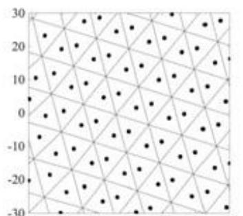  
-90 -80 -70 -60 -50 -40 -30

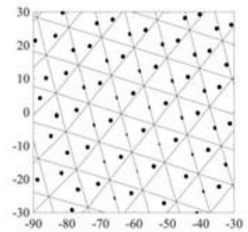  
图11：在相同区间下，工作态（左）与基准态（右）纹理对比

将计算得到的此情况下反射光线聚焦于焦点的状态进行可视化处理，得到图12。

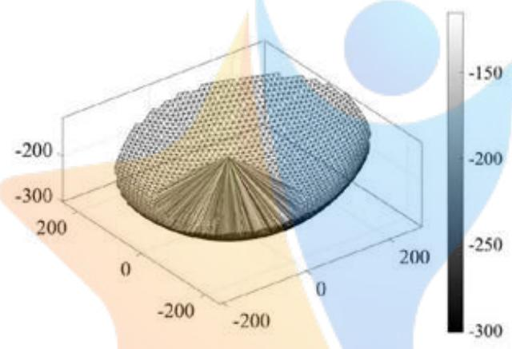  
图12：反射光线聚焦于焦点的示意图

由图12可观察到，在此情况下，由观测点S方向射出的平行均匀光波被精准地反射到了馈源舱有效接收区域，故所得结果符合题设。

## 7.2.3 问题三结果检验

基于7.2.2节中的结果，对蒙特卡洛积分的稳定性进行检验。在工作态与基准态下各积分100次，得到数值波动量如图12:

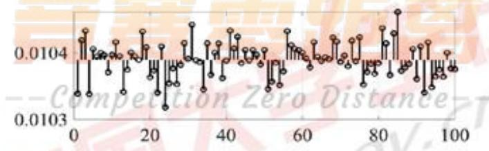

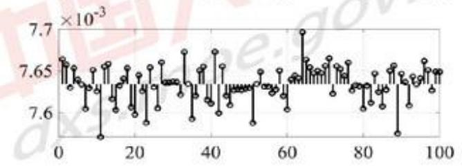  
图13：工作态（上）与基准态（下）下多次蒙特卡洛积分的数值波动量

观察光斑分布偏移，由图13可得工作态下与基准态下，多次蒙特卡洛积分的数值波动量范围都在10-³的维度上，波动量较小，可以认为结果合理。

## 八、模型的评价与推广

## 8.1 模型的评价

本文构建的FAST射电望远镜的工作抛物面调整模型，对于利用促动器调整工作抛物面的过程进行了合理假设，在保证模型求解结果精确性的条件下，有效降低了模型的复杂程度。在求解过程中，利用了二分法，BFGS法，蒙特卡洛积分等方法对于模型进行求解，使得算法的收敛速度快且结果精确。

在第一问的理想抛物面求解过程中，考虑到抛物面是由抛物线沿轴线旋转得来，故将空间的问题转化为平面坐标系下的问题，使得模型描述更为简便。对于限定了焦距的抛物线方程，本文以使其与基准球面的近似程度最大为最优化条件，对于其焦距进行了优化，从而确定了最优的抛物面方程。

在第二问的工作抛物面调整过程中，考虑到抛物面的开口方向与原先的坐标轴方向并不相同，本文将原先的直角坐标系进行旋转，使得原先的坐标轴方向依然指向被测物体，使得抛物面方程的描述更为简化，构建出的模型更加简明。并且在此过程中，通过极坐标变换，利用了第一问得出的结论，节省了公式推导的工作量。在求解时利用BFGS法，将约束条件转化为二次型，提高了算法的收敛速度与精确度。

在第三问的馈源舱接收比计算模型中，本文将直角坐标，方位角等概念结合使用，在旋转后的直角坐标中通过构建参数方程判断三角形平面与直线的相交关系，使得模型的推导过程更加简单。在求解有效接受的光源面积时，使用蒙特卡洛积分的方法进行求解，在一定程度上提高了解算的速度。

## 8.2 模型的改进

与实际情况相比，题目中缺乏边界结构如何固定的相关信息，如支撑结构等，这就使得在确定整个工作抛物面时约束条件是不够充分的。若能够提供最外圈反射面板的固定方式，并且合理假设在边界的节点之间的距离约束等条件，可以对于工作抛物面的边界条件进行建模，并且通过各个节点之间的连接关系间接地传递约束，从而给出FAST射电望远镜所有促动器伸缩量的调整策略，构建出可以投入实际调度的工作抛物面调整模型。

## 九、参考文献

[1]杨凡，李广云，王力.三维坐标转换方法研究[J].测绘通报,2010(6):5-7

[2] 龚纯，王正林. 精通 MATLAB 最优化计算[M]. 电子工业出版社, 2009.

[3] Beavis B, Dobbs I. Optimisation and stability theory for economic analysis[M]. Cambridge university press, 1990.

## 十、附录

10.1 主要计算程序：基于 MATLAB R2019a 开发

## 10.1.1 主要计算程序

## prob1\_calc.m：问题1的求解核心算法 prob1\_calc.m：问题1 的求解核心异法

```matlab
function [Lf, angle300] = prob1_calc()
%
%问题1的核心计算部分
%积分输出最优焦距
%并且与Constant 中固定的焦距做比较
%
warning('off,'MATLAB:integral:MaxIntervalCountReached');
warning('off,'MATLAB:integral:MinStepSize');
angle_min = acos(150/Constant.sphere_radius);
Lf = fzero(@(Lf)int_ dL(Lf, angle_min), [100, 400]);
disp("问题1 最优焦距 Lf: "+mat2str(Lf,17));
disp("问题 1 最小误差平方积分: "+mat2str(int_L(Lf, angle_min),17));
assert(abs(int_dL(Lf, angle_min)) < sqrt(eps));
assert(Lf ==Constant.Lf);
[~, ~, angle] = Constant.get_rad_ angle();
f= @(angle)abs(Polar.para(Lf, angle)*cos(angle))-150
angle300 = fzero(f, [pi/2, angle(end)]);
assert(abs(f(angle300)) <= sqrt(eps));
end
function v = int L(Lf, angle min) 零距离
v = integral(@f, angle_min, pi/2);
function err = f(angle)
[L,~]=Polar.para(Lf,angle)n Zero Distance
err = (L-Constant.sphere_radius).*(L-Constant.sphere_radius);
radius = Constant.sphere_radius.*cos(angle);
err = err.*(2.*pi.*radius);
end end dxs.moe.
function v = int_dL(Lf, angle_min)
v = integral(@f, angle_ min, pi/2);
```

```matlab
function derr = f(angle)
[L, dL] = Polar.para(Lf, angle);
derr = 2.*dL.*(L-Constant.sphere_radius);
radius = Constant.sphere_radius.*cos(angle);
derr = derr.*(2.*pi.*radius);
end
end
```

## prob2\_calc.m：问题2的求解核心算法

```matlab
function [fval, opt_X, opt_XYZ, opt_Lz,opt_ABR, index, W, Winv, ...
edge, edge distSQ, motor hi, motor_unit, motor distSQ] = prob2 cale()
clf('reset');
rng('default');
clear global
%初始化数据集
data = Data();
%初始化旋转变换矩阵
[W, Winv] = Polar.compose_rotate(Constant.alpha, Constant.beta);
%选择300口径内的节点
[~, angle300] = prob1_calc();
main XYZ = data.main node coordinate;
main_ABR = Polar.xyz2abr(main_XYZ*W');
index = main ABR(:,2) >= pi-angle300;
N nodes = sum(index);
main XYZ= main XYZ(index, :):% 过滤主网节点
edge=data.edge(all(index(data.edge),2),:);% 过滤节点之间的连边
index2(index)=1:sum(index):%构建过滤之后的新的节点下标顺序
edge=index2(edge):%使用新的节点下标对连边节点序号重定向
assert(all(all(edge))); %连边节点序号不能有空泡
%初始化邻边长度
edge distSQ = main XYZ(edge(:,1),:)-main XYZ(edge(:,2),:):
edge_distSQ = sum(edge distSQ.*edge_distSQ,2);
%促动器预处理
motor_ hi = data.motor higher_base(index, :);
motor_lo = data.motor_lower(index, :);
```

motor unit = motor hi-motor lo;   
motor\_unit = motor\_unit./sqrt(sum(motor\_unit.\*motor\_unit,2));   
motor\_distSQ = main\_ XYZ-motor\_hi;   
motor\_distSQ = sum(motor\_distSQ.\*motor\_distSQ, 2);

objective = @(X)obj\_SSE(X, W, N\_nodes);   
nonlcon = @(X)constraints(X, edge, edge distSQ, motor hi, motor\_unit,   
motor\_distSQ, N\_nodes);

f\_testkit(...   
pack(main\_XYZ, rand(N\_nodes, 1)), ...   
objective,...   
nonlcon...   
);

```matlab
opts = optimoptions('fmincon', 'Display', 'iter-detailed');
opts.FunValCheck = 'on';
opts.SpecifyObjectiveGradient = true;
opts.SpecifyConstraintGradient = true;
opts.MaxFunctionEvaluations = inf;
opts.MaxIterations = inf;
opts.HonorBounds = false;
% opts.SubproblemAlgorithm ='cg';
opts.HessianApproximation = 'lbfgs';
saved = load('prob2'); 零距离
if true
opt_X = saved.opt_X;
else --Competition Zero Distance7T
```

opt\_X = fmincon(objective, pack(main\_XYZ, zeros(N\_nodes, 1)), [], [], [], [.... pack(-inf(size(main\_XYZ)), repmat(-0.6, N\_nodes, 1)),... % lb pack( inf(size(main XYZ)), repmat( 0.6, N\_nodes, 1)),... % ub nonlcon, opts); %#ok<UNRCH>

```matlab
opt_ABR = Polar.xyz2abr(opt_XYZ*W');
end
function [SSE, dSSE_dXYZ] = obj_SSE(X, W, N_nodes)
%
%目标函数
%球面径向投影Lw（理想抛物面）和主网节点实际投影位置L之间的误差平
方和
%
[XYZ, Lz] = unpack(X, N_nodes);
[abr, ~, db, dr] = Polar.xyz2abr(XYZ*W');
[Lw, ~, dangle] = Polar.para(Constant.Lf, abr(:,2,:));
err = Lw-abr(:,3);
SSE = err*err;
dSSE_dXYZ = 2.*err.*(dangle.*db-dr);
dSSE dXYZ = dSSE dXYZ*W;
dSSE_dXYZ = [dSSE_dXYZ(:); zeros(size(Lz))]:
end
function [c,ceq,gc,gceq] =constraints(..
X, ..
edge, edge_ distSQ,. ...
motor_hi, motor_unit, motor_distSQ, N_nodes)
% 在线
%约束条件（二次型）
%条件1:保持主网节点之间的连接索的距离保持固定
%条件2:保持主网节点与相应的促动器之间的距离（下拉索）保持固定
% -Competition Zero Distance
[XYZ, Lz] = unpack(X, N_nodes);
errdist = XYZ(edge(:,1),:)-XYZ(edge(:,2),:); gov.
edist = sum(errdist.*errdist,2);
c = [edist-edge_distSQ*(1.0007*1.0007); edge_distSQ*(0.9993*0.9993)-edist]:
I1 = sub2ind(size(XYZ), repmat(edge(:, 1),1,3), repmat(1:3,numel(edist), 1));
I2 = sub2ind(size(XYZ), repmat(edge(:,2),1,3), repmat(1:3,numel(edist),1));
J = repmat((1:numel(edist)).', 1, 3);
gc = [
```

```matlab
sparse(...
reshape([11 12],[],1)...
reshape([ J J],[],1),...
reshape(2.*[errdist -errdist],[],1)...
numel(X),numel(edist)),...
-sparse(...
reshape([11 12],[],1)...
reshape([ J J],[],1),...
reshape(2.*[errdist -errdist],[],1)...
numel(X),numel(edist))
1;
motor hi new = motor hi+Lz.*motorunit;
errdist = XYZ-motor_hi_new;
edist = sum(errdist.*errdist,2);
ceq = edist-motor_distSQ;
J = repmat((1:numel(edist)).', 1, 4);
gceq = sparse(...
reshape(1:numel(X),[],1),..
reshape(J,[],1),...
reshape(2.*[errdist -sum(errdist.*motor_unit,2)].[],1),...
numel(X),numel(edist));
end
商 [~,ceq,~,gceq] = constraints(X);
SSE = ceq*ceq;
dsSE=full(2Cgcegceg)tition Zero Distance
end
[c,~,gc,~] = constraints(X);
SSE = c*c; moe
dSSE = full(2.*gc*c);
end
function f_testkit(data, objective, constraints)
```

```matlab
%
% 函数微分正确性检查
%
f = objective;
for i = 1:10
index = randi(numel(data)/4*3);
ratio = linspace(0.1, 10.0, 20);
diff = arrayfun(@(r)derr_diff(r, index), ratio);
ana = arrayfun(@(r)derr ana(r, index), ratio);
disp("信噪比: "+norm(diff_-ana_)/norm(ana_));
plot(ratio, diff_-ana_);
hold on
end
f = @(X)constr_test_ceq(X, constraints);
fori=1:10
index = randi(numel(data));
ratio = linspace(0.1, 10.0, 20);
ana_ = arrayfun(@(r)derr_ana(r, index), ratio);
diff = arrayfun(@(r)derr diff(r, index), ratio);
disp("信噪比: "+norm(diff_-ana_)/norm(diff_);
plot(ratio, diff_-ana_);
hold on
end
f = @(X)constr_test_c(X, constraints);
fori= 1:10
ratio = linspace(0.1, 10.0, 20);
ana_= arrayfun(@(r)derr_ana(r, index), ratio);
diff= arrayfun(@(r)derr diffr, index), atio):stance
disp("信噪比: "+norm(diff_-ana_)/norm(diff_));
plot(ratio, diff_-ana);
hold on
end
function dSSE = derr_diff(ratio, index)
assert(isscalar(ratio));
dSSE = (f(set(index, ratio+1e-4))-f(set(index, ratio-1e-4)))./2e-4;
end
```

```matlab
function dSSE = derr_ana(ratio, index)
assert(isscalar(ratio));
[~, dSSE] = f(set(index, ratio));
dSSE = dSSE(index)*data(index);
end
function newdata = set(index, ratio)
newdata = data;
newdata(index) = newdata(index)*ratio;
end
end
function X = pack(XYZ, Lz)
X = [XYZ(:); Lz];
end
function [XYZ, Lz] = unpack(X, N_nodes)
assert(numel(X) == 4*N_nodes);
XYZ = reshape(X(1:3*N_nodes), [], 3);
Lz = X(3*N_nodes+1:end);
End
prob3_calc.m：问题3的求解核心算法（含画图输出，检验等）
clfO)
clear()
rng('default'); close('all'); 赛惠距离在线
clear global
global opt_XYZ indexW
[~,~, opt_XYZ, ~, ~, index, W, ~] = prob2_calc();clf(reset');
%画图 --Competition Zero Distance
elf('reset');
% plot_working_illu_3d(true); elf('reset'); s.moe.gov.cn
% plot_2d_texture(true);
elf('reset');
% plot_2d_texture(false);
rec ratio_work = [0.0110203009224430.0110003218576217 0.0110518782939506
```

<table><tr><td rowspan=1 colspan=1>0.0110643817438084</td><td rowspan=1 colspan=1>0.0109730660550652</td><td rowspan=1 colspan=1>0.0110257601080111</td><td rowspan=1 colspan=1>0.0110223227972293</td></tr><tr><td rowspan=1 colspan=1>0.0110485078071177</td><td rowspan=1 colspan=1>0.0110240151884694</td><td rowspan=1 colspan=1>0.0110130230869417</td><td rowspan=1 colspan=1>0.0110164104558229</td></tr><tr><td rowspan=1 colspan=1>0.0110550668326781</td><td rowspan=1 colspan=1>0.0110459270545307</td><td rowspan=1 colspan=1>0.0109882612985835</td><td rowspan=1 colspan=1>0.0110436769357324</td></tr><tr><td rowspan=1 colspan=1>0.0110367034749252</td><td rowspan=1 colspan=1>0.0110481766120668</td><td rowspan=1 colspan=1>0.0110321572590037</td><td rowspan=1 colspan=1>0.0110749365711392</td></tr><tr><td rowspan=1 colspan=1>0.0110386802631623</td><td rowspan=1 colspan=1>0.0110153292520637</td><td rowspan=1 colspan=1>0.0110192330970475</td><td rowspan=1 colspan=1>0.0109874238643901</td></tr><tr><td rowspan=1 colspan=1>0.0110296311887876</td><td rowspan=1 colspan=1>0.0109757385346491</td><td rowspan=1 colspan=1>0.0109755111105056</td><td rowspan=1 colspan=1>0.0110288022004406</td></tr><tr><td rowspan=1 colspan=1>0.0109799794453533</td><td rowspan=1 colspan=1>0.0110238540462687</td><td rowspan=1 colspan=1>0.0110453042446409</td><td rowspan=1 colspan=1>0.0110284372401636</td></tr><tr><td rowspan=1 colspan=1>0.0110669362584378</td><td rowspan=1 colspan=1>0.0110526144686468</td><td rowspan=1 colspan=1>0.0110334430375848</td><td rowspan=1 colspan=1>0.0109741922281317</td></tr><tr><td rowspan=1 colspan=1>0.0110478434113818</td><td rowspan=1 colspan=1>0.0110341899191246</td><td rowspan=1 colspan=1>0.0110517591813282</td><td rowspan=1 colspan=1>0.0110496603830398</td></tr><tr><td rowspan=1 colspan=1>0.0110046254841212</td><td rowspan=1 colspan=1>0.0110235600140406</td><td rowspan=1 colspan=1>0.0110550698235744</td><td rowspan=1 colspan=1>0.0110649714478939</td></tr><tr><td rowspan=1 colspan=1>0.0110474009766273</td><td rowspan=1 colspan=1>0.0110420096870245</td><td rowspan=1 colspan=1>0.0110365756602061</td><td rowspan=1 colspan=1>0.0110091725112358</td></tr><tr><td rowspan=1 colspan=1>0.0110382613793932</td><td rowspan=1 colspan=1>0.0110600521586413</td><td rowspan=1 colspan=1>0.0110028232503258</td><td rowspan=1 colspan=1>0.0110465102463241</td></tr><tr><td rowspan=1 colspan=1>0.0110136604630215</td><td rowspan=1 colspan=1>0.0110101135220489</td><td rowspan=1 colspan=1>0.0110183405377215</td><td rowspan=1 colspan=1>0.0110043363971838</td></tr><tr><td rowspan=1 colspan=1>0.0109958279906651</td><td rowspan=1 colspan=1>0.0110837873612865</td><td rowspan=1 colspan=1>0.011065917248056</td><td rowspan=1 colspan=1>0.0110277008429329</td></tr><tr><td rowspan=1 colspan=1>0.0110127664607068</td><td rowspan=1 colspan=1>0.0110545986531244</td><td rowspan=1 colspan=1>0.0110345008277633</td><td rowspan=1 colspan=1>0.0110429260222507</td></tr><tr><td rowspan=1 colspan=1>0.0110505079293461</td><td rowspan=1 colspan=1>0.011039406367263</td><td rowspan=1 colspan=1>0.0110103799922359</td><td rowspan=1 colspan=1>0.0110289593537192</td></tr><tr><td rowspan=1 colspan=1>0.0110541998462448</td><td rowspan=1 colspan=1>0.0110513385417147</td><td rowspan=1 colspan=1>0.0110529854247001</td><td rowspan=1 colspan=1>0.0110445898913447</td></tr><tr><td rowspan=1 colspan=1>0.0110180088017255</td><td rowspan=1 colspan=1>0.011022189720714</td><td rowspan=1 colspan=1>0.0110627343553963</td><td rowspan=1 colspan=1>0.0110285841846507</td></tr><tr><td rowspan=1 colspan=1>0.0110817414943682</td><td rowspan=1 colspan=1>0.0109907491678801</td><td rowspan=1 colspan=1>0.0110200180167431</td><td rowspan=1 colspan=1>0.0110311268543086</td></tr><tr><td rowspan=1 colspan=1>0.0110146584529961</td><td rowspan=1 colspan=1>0.0110255093771213</td><td rowspan=1 colspan=1>0.0110528637613645</td><td rowspan=1 colspan=1>0,0110777319262726</td></tr><tr><td rowspan=1 colspan=1>0.0110169034101532</td><td rowspan=1 colspan=1>0.0110789763845019</td><td rowspan=1 colspan=1>0.011086907752962</td><td rowspan=1 colspan=1>0.0110068509917417</td></tr><tr><td rowspan=1 colspan=1>0.0110202757278154</td><td rowspan=1 colspan=1>0.0110403474743263</td><td rowspan=1 colspan=1>0.0110425429291141</td><td rowspan=1 colspan=1>0.0110162286817121</td></tr><tr><td rowspan=1 colspan=1>0.0110382443277745</td><td rowspan=1 colspan=1>0.0110068533880955</td><td rowspan=1 colspan=1>0.0110452395673006</td><td rowspan=1 colspan=1>0.010996333441479</td></tr><tr><td rowspan=1 colspan=1>0.011000327429337</td><td rowspan=1 colspan=1>0.0110230589753898</td><td rowspan=1 colspan=1>0.0110471891212048</td><td rowspan=1 colspan=1>0.0110296744899169</td></tr><tr><td rowspan=1 colspan=1>0.0110090500347684];</td><td rowspan=1 colspan=3></td></tr></table>

<table><tr><td>rec_ratio_base =[0.00809957344004469 0.00816030276752031 0.00815114719028782</td></tr><tr><td>0.008091709322067140.008133591074990930.008150730146130170.00808926197249174 0.00808170453150241 0.00806468281488732 0.0081182224458027 0.00809664564432054</td></tr><tr><td>0.008039293319569280.008138629759135610.008126516144059130.00807548662594117</td></tr><tr><td></td></tr><tr><td>0.00809838752451361 0.008094002865288390.00811009080826381 0.00810822712967782</td></tr><tr><td>0.00809315525807824 0.00806486974020875 0.008134630287794 0.00807892790322006</td></tr><tr><td>0.008055987149088520.008131803697908220.008106683506659070.00807828088140091</td></tr><tr><td>0.008110528258340180.00810927517071732 0.00811143502132163 0.00810309576115239</td></tr><tr><td>0.008109828544343560.008113447404731940,008144115248819430.00810455307681079</td></tr><tr><td>0.00806302524392838 0.008086008184094120.00812354564034997 0.00811186777478928</td></tr><tr><td>0.008090267378549940.008086639565741230.008141283381958770.00807940794169834</td></tr><tr><td>0.00812115941770167 0.0081024286210036 0.0080924217013025 0.00809501225610337</td></tr><tr><td>0.008099029943055780.00812940497617186 0.008095543411495970.00809631643018426</td></tr><tr><td>0.008048954260116890.00809575027496546 0.00812928273720676 0.00811334164853845</td></tr><tr><td>0.008120043599584590.008105879069671590.00807971230125123 0.00810458060650855</td></tr><tr><td>0.00809081157217132 0.00807630129046536 0.008122205179874590.00811206634654426</td></tr><tr><td>0.008107098068910630.008151649069992220.008137662547138460.00814321524369861</td></tr><tr><td>0.008109080410141880.008129348449028240.008106216056965490.00811063002236979</td></tr><tr><td></td></tr></table>

subpiot(2,1,1);hold onplot([1:100;1:100],[repmat(mean(rec\_ratio\_work),size(rec\_ratio\_work));rec\_ratio\_work]  
,'k-','LineWidth',2);plot(1:100,rec\_ratio\_work,'ko','LineWidth',2);box ongrid onstyle('fontname', 'fontsize');% ylim([0.01033, 0.01045]):subplot(2,1,2);hold onplot([1:100;1:100],[repmat(mean(rec\_ ratio base),size(rec\_ ratio\_base));rec\_ ratio\_base],'k  
-','LineWidth',2);plot(1:100,rec\_ratio\_base,'ko','LineWidth',2);box ongrid onstyle('fontname', 'fontsize');fastprint(图片/prob3.检验.多次蒙特卡洛积分的数值波动量'); 阁在线function [data, XYZ, tri, tri area] = get data(WORKING)% GEI%提取工作态或者非工作态下需要使用的所有数据%data = DaoCompetition Zero Distanceznglobal opt XYZ index W gov.XYZ=data.main\_node\_coordinate;% 产生一个对齐到光线入射角度的坐标格式if WORKINGXYZ(index,:)=opt\_XYZ; % 主索网调整到工作抛物面endXYZ=XYZ\*W';

0.008125373889759420.008094938440019290.008112849197484170.00812982625291347   
0.008114441755486980.00812948462742588 0.008124718723927310.00809515370106578   
0.008100702018854770.008091549752417860.008099246168521240.00808220053817524   
0.008124022171462590.00811192024738402 0.00806217864697205 0.00809729197336589   
0.00814243000329029 0.008149084826510540.00805549860700152 0.00812911963465325   
0.00809820772628644 0.0080799192180059 0.00812099010446983 0.00811185636211377   
0.00810677088931511 0.00812457458272667 0.00811715912091946 0.00810254234380183   
0.00812512633851956];

```matlab
%计算三角形的面积
triangle = data.triangle;
X = reshape(XYZ(triangle,1),size(triangle))
Y = reshape(XYZ(triangle,2),size(triangle));
% Z = reshape(XYZ(triangle,3),size(triangle));
triangle_area = 0.5.*abs(X(:,1).*(Y(:,2)-Y(:,3)) +X(:,2).*(Y(:,3)-Y(:,1)) +
X(:,3).*(Y(:,1)-Y(:,2)));
%筛选出所有可能跟选中顶点有关系的三角形
tri = triangle(any(index(triangle),2),:);
tri_area = triangle_area(any(index(triangle),2));
end
function [rec_ratio, xyz, uvw, data, XYZ] = mc_integral(WORKING)
%
%提取出当前有效工作界面（由有效三角形定义）中的
% 所有xvz映射到uvw的射线关系
%(蒙特卡洛法，顺便就完成了积分)
%
[data, XYZ, tri, tri_area] = get_data(WORKING);
area = zeros(size(tri, 1),1);
xyz = cell(size(tri));
uvw = cell(size(tri));
for i = 1:size(tri,1) N = 10000; 梦要距客在线
X =XYZ(tri(i,:),1);
Y =XYZ(tri(i,:),2);
Z = XYZ(tri(i,:),3);
u23=randG2)petition Zero Distance
t123(t123(:,1)+t123(:,2)>1,:)=[1,1]-t123(t123(:,1)+t123(:,2)>1,:);
t123(:,end+1)=1-t123(:,1)-t123(:,2); %#ok<AGROW>
[xyz_,uvw_,ratio] = calc_t_fast(t123, X,Y,Z);
xyz{i} = xyz_(~isnan(ratio),:);
uvw{i} = uvw_(~isnan(ratio),:);
area(i) = mean(~isnan(ratio));
end
assert(~any(isnan(area)));
```

```matlab
% area = area(~isnan(area));
% tri_area = tri_area(~isnan(area));
rec ratio = sum(tri area.*area)./(150*150*pi)
if WORKING
disp("工作接收比: "+mat2str(rec_ratio,17));
else
disp("基准接收比:"+mat2str(rec_ratio,17));
end
end
function plot 2d texture(WORKING)
%
%画图
%2d，放大界面纹理，工作界面和基准态都要绘制
%
[~, xyz, ~, data, XYZ] = mc_integral(WORKING);
tri = data.triangle(:,[1:3 1]).';
plot(reshape(XYZ(tri,1),size(tri)),reshape(XYZ(tri,2),size(tri)),'k');
hold on;
xyz = vertcat(xyz{:});
plot(xyz(:,1),xyz(:,2),'.k');
axis equal
xlim([-90,-30]);
ylim([-30,30]);
style('fontname', 'fontsize'); 福在线
if WORKING
fastprint(图片/prob3.结果.纹理对比(工作态);
else
fastprint(图片/prob3.结果.纹理对比(基准态)tance
end cn
end e.gov.
function plot_working_illu_3d(WORKING)
%
% 画图
%3d，体现出工作界面的反射光聚焦于焦点
%这张图只在工作界面时绘制，不在基准态绘制
```

```matlab
%
assert(WORKING);
[~, xyz, uvw, data, XYZ] = mc_integral(WORKING);
xyz = vertcat(xyz{:});
uvw = vertcat(uvw{:});
xyz = xyz(1:100:end,:);
uvw = uvw(1:100:end,:);
p = plot3(...
[xyz(:,1),xyz(:,1)+uvw(:,1)].'..
[xyz(:,2),xyz(:,2)+uvw(:,2)].'...
[xyz(:,3),xyz(:,3)+uvw(:,3)].',-");
color = mat2cell(repmat(rand(numel(p),1),1,3),ones(numel(p),1),3);
[p.Color] = color{:};
hold('on');
X = XYZ(:,1); Y = XYZ(:,2); Z = XYZ(:,3);
trisurf(data.triangle, X, Y,Z, 'FaceColor', 'None');
axis('equal');
colormap('gray');
colorbar();
grid(on');
box('on');
fastprint(图片/prob3.结果.反射光线聚焦于焦点的示意图'); style('fontsize','fontname'); 在线
end 克费零距装
%寻找距离入射(x,y)最近的 XYZ 坐标点，并提取出以该点为顶点的所有三角
% 依次求解它们的t1,t2,t3 noe.
% xs.
xyz = t123 * [X Y Z];
```

```matlab
%分界线：上面是命中点，下面是法线
a = X(1)-X(2); b = Y(1)-Y(2);
c = X(2)-X(3); d = Y(2)-Y(3);
uvw = ([a b; c d] [Z(2)-Z(1); Z(3)-Z(2)]);
uvw(:,end+1) = 1;
uvw_abr = Polar.xyz2abr(-uvw);
uvw_abr(:,2) = pi/2-(pi/2-uvw_abr(:,2)).*2;
uvw_abr(:,3) = 1;
uvw =-Polar.abr2xyz(uvw_abr);
ratio =(-(1-Constant.FR_ratio).*Constant.sphere_radius-xyz(:,3))./uvw(:,3);
ratio(ratio < 0) = NaN; % 同向达不到馈源舱的情况下 pass
dst = xyz+ratio.*uvw;
assert(all(abs(dst(:,3)+(1-Constant.FR_ratio).*Constant.sphere_radius) < sqrt(eps)|
snan(ratio)));
ratio(sum(dst(:,1:2).*dst(:,1:2),2) > 0.5.*0.5) = NaN; % 反射馈源舱平面时超过馈
原舱圆圈的情况下 pass
ratio(sum(xyz(:,1:2).*xyz(:,1:2),2)<0.5.*0.5)=NaN;% 入射被馈源舱遮挡的情况
下 pass
ratio(sum(xyz(:,1:2).*xyz(:,1:2),2)>150.*150) =NaN;% 超出 150 口径圆面 pass
xyz(isnan(ratio),:) = NaN;
uvw = ratio.*uvw; 受宝要距哥在线
assert(size(xyz,1) == size(uvw, 1));
end
prob1.m：问题1的结果可视化、检验
% 本文件原名probinpetition Zero Distance
%#ok<*DEFNU> 中国人
clear clear global moe.gov.
close all
[Lf, angle300] = prob1_calc();
clf reset
```

illu2d(Lf, angle300);

clf reset plot3d(Lf, angle300)

elf reset error\_plot(Lf, angle300)

function error\_plot(Lf, angle300) % 横向剖面高低差 angle = linspace(angle300, -angle300+pi, 100); Lw = Polar.para(Lf, angle); err = Constant.sphere\_radius-Lw; plot([-Lw.\*cos(angle); -Lw.\*cos(angle)], [0.\*err; err], '-k', 'LineWidth',2); hold('on'); grid('on'); plot(-Lw.\*cos(angle), err, 'ok', 'LineWidth',2); xlim([-150, 150]); ylim([-0.6, 0.6]); style(fontsize', 'fontname'); % fastprint(图片/prob1.检验.剖面上的高低差(径向高度 vs 基准球面半径)');   
end   
function plot3d(Lf, angle300) % 3d 高低差 d = Data(); 零距离在线 XYZ = d.main\_node\_coordinate; ABR = Polar.xyz2abr(XYZ); index = ABR(:,2)>= pi-angle300; x=-XZZ2Z30 Distancez err(\~index)=NaN; OV. trisurf(d.triangle,X,Y,Z,err+Constant.sphere\_radius,'FaceColor','interp'); view(2); colorbar(); xs.m axis('equal'); style('fontsize', 'fontname'); colormap('gray');

```matlab
box('on');
% fastprint(图片/prob1.结果.3D最优抛物面高低差(径向高度)');
end
function illu2d(Lf, angle300) %横向剖面最优示意图
font_opts = {'VerticalAlignment', 'middle', 'HorizontalAlignment', 'center', 'FontSize',
3, 'Interpreter', 'latex'};
clf(reset');
hold on
[spher_rad, focal_rad, angle] = Constant.get_rad_angle();
p_S = illu.p_S;
p_P = [0 -focal_rad];
p_Q = [0 -focal_rad-0.5*Lf];
p_T = [0 -focal_rad-Lf];
hold('on');
%基准圆弧
plot(-spher_rad*cos(angle),-spher_rad*sin(angle), 'k', 'LineWidth', 2);
%焦面圆弧
plot(-focal_rad*cos(angle),-focal_rad*sin(angle), 'k', 'LineWidth', 2);
%标记定点
plot(p_S(1), p_S(2),'*k, 'MarkerSize', 14, 'Line Width',2);
plot(p P(1), p P(2),'.k', 'MarkerSize', 22, 'LineWidth', 2);
plot(p_ Q(1), p_ Q(2),'.k', 'MarkerSize', 22, 'Line Width', 2);
plot(p_T(1), p_T(2),'.k', 'MarkerSize', 22, 'LineWidth', 2);
plot(0,0,'.k', 'MarkerSize', 22, 'LineWidth', 2);
text(p_S(1)+20, p_S(2), '\boldmath$SS', font_opts{:}); 在线
text(p_P(1)+15, p_P(2)+18, "\boldmath$P$', font_opts{:});
text(p_Q(1)+15, p_Q(2)+18, 'boldmathSQS', font_opts{:}):
text(p_T(1)-18, p_T(2)+18, '\boldmath$TS', font_opts{:});
text(0+20, 0, boldmathscs, font_opts(:3):0 Distance
% SCPQT 中轴线
plot([p_S(1), p_T(1)], [p_S(2), p_T(2)].'--k', 'LineWidth', 2);
%准线
plot(p_T(1)+[-300 300], p_T(2)+[0 0], ':k', 'LineWidth', 2);
plot(p_T(1)+[0 30 30], p_T(2)+[30 30 0], ':k', 'LineWidth', 2); % 垂足
%计算抛物线
Lw = Polar.para(Lf, angle);
L300 = Polar.para(Lf, angle300);
```

p\_x = [-L300.\*cos(angle300) -L300.\*sin(angle300)];%抛物线plot(-Lw.\*cos(angle), -Lw.\*sin(angle), '-.k', 'LineWidth', 2);plot(p\_x(1), p\_x(2), '.k', 'MarkerSize', 22); % 300 口径点plot([p\_P(1) p\_x(1)], [p\_P(2) p\_x(2)], ':k', 'LineWidth', 2); % 焦点连线plot([p\_x(1) p\_x(1)], [p\_T(2) p\_x(2)], ':k', 'LineWidth', 2); % 准线连线text(p\_x(1), p\_T(2)-20, '\boldmath\$x=300/2\$', font\_opts{:});%格式axis('equal');set(gca,'Visible', 'off');% ylim([-300, 200]);style('fontsize', 'fontname');% fastprint(图片/prob1.结果.2D 剖面最优抛物线');d

## prob2.m：问题2的结果可视化、检验

% 本文件原名 prob2.m   
cle   
clf   
clear   
rng('default');   
close all   
clear('global');   
data = Data();   
[fval, opt\_X, opt\_XYZ, opt\_Lz, opt\_ABR, index, W, Winv,   
edge, edge\_distSQ, motor\_hi, motor\_unit, motor\_distSQ] = prob2\_calc(); close all   
dis题2差x,Wro Distancen return gov.   
clf reset   
errplot\_3d(data, opt\_XYZ, opt\_ABR, index);

## clf reset

plot\_3d\_lz(data, opt\_XYZ, opt\_Lz, index);

clf reset   
plot\_2d\_main\_node\_dist(opt\_XYZ, edge, edge\_distSQ);   
elf reset   
plot\_2d\_fiterr(opt\_ABR);

```matlab
function xlsx_output(opt_XYZ, opt_Lz, index, Winv)
if exist('result.xlsx', 'file')
delete('result.xlsx');
end
copyfile(数据/4. 工作抛物面的主索节点.xlsx','result.xlsx');
%理想抛物面顶点坐标
XYZ = Polar.abr2xyz([0 pi/2 Polar.para(Constant.Lf, pi/2)]);
XYZ=XYZ*Winv;
t1 = table(XYZ(1), XYZ(2), XYZ(3));
disp("理想抛物面顶点坐标");
disp(head(t1));
writetable(t1,'result.xlsx'，'Sheet'，'理想抛物面顶点坐标'，'Range','A2:C2',
'WriteVariableNames', false);
%调整后主索节点编号及其坐标
data = readtable('数据/1. 主索节点坐标和编号.csv');
t2 = table(data.x
disp("调整后主索节点编号及坐标");
disp(head(t2));
writetable(t2, 'result.xlsx'，'Sheet'，'调整后主索节点编号及坐标'，'Range'，['A2:D'
num2str(height(t2)+1)], 'Write VariableNames', false);
%促动器顶端伸缩量
t3 = table(data.x Cinetition Zero Distancezn
disp("促动器顶端伸缩量"); gov.
disp(head(t3));
writetable(t3，'result.xlsx'，'Sheet',促动器顶端伸缩量'，'Range',['A2:B'
num2str(height(t3)+1)], 'WriteVariableNames', false);
xlsx_check();
end
function xlsx_check()
```

```matlab
t1 = readtable('result.xlsx','Sheet','理想抛物面顶点坐标'):
t2=readtable(result.xlsx','Sheet','调整后主索节点编号及坐标'):
t3 = readtable('result.xlsx','Sheet','促动器顶端伸缩量');
[W,~]= Polar.compose rotate(Constant.alpha, Constant.beta);
%抛物面顶端 W 旋转后的取值 Lw 要与 focal rad+Lf/2一样
ABR = Polar.xyz2abr(t1 {1,1:3}*W');
err =ABR(3)-((1-Constant.FR ratio)*Constant.sphere radius+Constant.Lf/2);
disp("检查：抛物面顶端旋转后是否是 focal rad+Lf/2 的取值(相减误差): "+err);
assert(abs(err) < eps);
% 重新构建 index
raw_code = readtable(数据/1. 主索节点坐标和编号.csv');
raw code = raw code.x ;
index_code = string(t2.x );
index = cellfun(@(s)any(s == index_code), raw_code);
assert(all(string(raw_code(index)) == index_code));
disp('构建 index 成功');
% 0.6
assert(all(t3{:,2}<0.6));
assert(all(t3 {:,2}>-0.6));
disp(Lz 没有超过±0.6: 成功');
%007
data = Data();
edge =data.edge(all(index(data.edge),2),:); % 过滤节点之间的连边
edge=index2(edge);%使用新的节点下标对连边节点序号重定向 index2(index)=1:sum(index):%构建过滤之后的新的节点下标顺序 阁王线
assert(all(all(edge)));%连边节点序号不能有空泡
raw_XYZ = data.main_node_coordinate(index,:);
opt_XYZ = t2{:,2:4};
raw_edist =rawXYZ(edge(,D):)-raw XYZ(edge(c.2).),ce
raw edist = sqrt(sum(raw edist.*raw edist,2));
opt_edist= opt_XYZ(edge(:,1),:)-opt_XYZ(edge(:,2),:);
opt_edist =sqrt(sum(opt_ edist.*opt_edist,2));
ratio =(opt_edist./raw_edist)*100-100;
assert(all(ratio<0.07));
assert(all(ratio>-0.07));
disp(节点之间的距离变化率没有超过±0.07%:成功');
% motor 距离(下拉索)
```

```matlab
motor_unit = data.motor_higher_base(index,:)-data.motor_lower(index,:);
motor_unit = motor_unit./sqrt(sum(motor_unit.*motor_unit,2));
assert(all(abs(sum(motor unit.*motor unit,2)-1)<sqrt(eps)));
motor top = data.motor higher base(index,:)+t3{:,2}.*motor unit;
opt_pdist = opt_XYZ-motor_ top;
opt pdist = sqrt(sum(opt pdist.*opt pdist,2)):
raw_pdist = data.main_node coordinate(index,:)-data.motor_higher_base(index,:);
raw pdist = sqrt(sum(raw pdist.*raw pdist,2));
assert(max(abs(raw_pdist-opt_pdist)) <sqrt(eps));
disp(下拉索距离不变: 成功'):
% 最优贴合程度
opt_ABR = Polar.xyz2abr(opt_ XYZ*W');
err = opt_ABR(:,3)-Polar.para(Constant.Lf, opt_ABR(:,2));
assert(max(abs(err)) <1e-5):
disp(贴合程度至多 1e-5: 成功');
end
function plot 2d fiterr(opt_ABR) %#ok<*DEFNU>
Lw = Polar.para(Constant.Lf, opt_ABR(:,2));
err = opt_ABR(:,3)-Lw;
bar(sort(err), 'k');
grid('on');
style('fontsize', 'fontname');
xticks([xticks numel(err)]); 线
fastprint(图片/prob2.检验.主网节点与理想抛物面之间的球面径向误差');
end 音赛零距南
function plot_2d main_node_dist(opt XYZ, edge, edge distSQ)
errdist = opt_XYZ(edge(:,1),)-opt XYZ(edge(:2).:)ance
edist = 100*(sqrt(sum(errdist.*errdist,2))./sqrt(edge_distSQ)-1);
bar(sort(edist), 'k');
grid('on'); noe.gc
style('fontsize', 'fontname');
xticks([xticks numel(edist)]);
fastprint(图片/prob2.检验.主网节点之间距离的变化率(百分比)'):
end
```

```matlab
function plot 3d lz(data, opt XYZ, opt Lz, index) % 三维促动器提升量(Flat)
raw XYZ = data.main node coordinate:
raw XYZ(index,:) = opt_XYZ;
X = raw XYZ(:,1); Y = raw XYZ(:,2); Z = raw XYZ(:,3);
Lz = NaN(size(index));
Lz(index) = opt_Lz;
trisurf(data.triangle, X, Y,Z, Lz);
colorbar();
view(2);
axis('equal');
style('fontsize', 'fontname');
colormap('gray');
cc = caxis();
cc(2) = 0.6;
caxis(cc);
box('on');
fastprint(图片/prob2.结果.3D 促动器提升量'):
end
function errplot_3d(data, opt_XYZ, opt_ABR, index) % 三维拟合误差(interp)
raw XYZ = data.main_ node coordinate;
raw XYZ(index,:) = opt_XYZ;
X = raw_XYZ(:,1); Y = raw_XYZ(:,2); Z = raw_XYZ(:,3);
err = NaN(size(index));
err(index) = abs(Polar.para(Constant.Lf, opt_ABR(:,2)) - opt_ABR(:,3));
axis(equal');Competition Zero Distance
style('fontsize', 'fontname');
colormap('gray'); gov.
box('on');
fastprint(图片/prob2.结果.3D理想曲面拟合误差');
end dxs.
```

## 10.1.2常数定义与数据处理

```matlab
Constant.m：程序用到的所有常量数值定义
% 本文件原名 Constant.m
classdef Constant
properties(Constant)
FR ratio = 0.466; % 焦径比
sphere radius = 300.4;% 基准态球面半径，单位是米
sphere half caliber=500/2; %基准态球面的口径的一半
paraboloid half caliber =300/2;% 工作态球面的口径的一半
Lf=280.85417567168855:%第一问算出的最优焦距，用作求解完的检查
alpha =deg2rad(36.795); % 第二问平面角
beta =deg2rad(78.169); % 第二问仰角
end
methods(Static)
function [spher_rad, focal_rad, angle] = get_rad_angle()
spher rad = Constant.sphere radius;
spher cli = Constant.sphere half caliber;
focal_rad = (1-Constant.FR_ratio) * spher_rad;
angle = pi/2-asin(spher_cli/spher_rad); % 使用半径和半口径计算出俯角，
角变成仰角
angle = linspace(angle, pi-angle, 100);
end
end --Competition Zero Distance
end
gov.
Data.m：将题目附件123 映射到程序内数组
% 本文件原名 Data.m
classdef Data
properties
main node_code %主索节点的编号，strings 转序数
```

```matlab
main node coordinate % 主索节点的坐标，XYZ
motor lower %促动器下端点的坐标，XYZ
motor higher base %促动器上端点的坐标，XYZ（基准态）
triangle %三角形反射面板的顶点序号，string 转序数
edge%不重复的连边顶点序号，按照左小右大表示，格式是序数
end
methods
function d = Data
main node= readtable(数据/1. 主索节点坐标和编号.csv');
d.main_node_code = string(main_node{:,1});
d.main node_ coordinate = main_node{:,2:end};
motor=readtable(数据/2. 促动器上下端点坐标和编号.csv');
assert(all(d.main_node_code =string(motor{:,1})));
d.motor lower = motor{:,2:4};
d.motor higher base = motor{:,5:end};
triangle =readtable('数据/3. 反射面板的顶点编号.csv');
d.triangle = string(triangle{:,:});
d.check()
d = d.convert node id();
d.edge = d.get_edges();
end 零距离土
function e = get_edges(d)
tri = d.triangle;
e=[tric12)tri(:2:3)tri( [13)o Distance
e(e(:,1)>e(:,2),:) = e(e(:,1)>e(:,2),[2,1]);
e = unique(e,'rows'); e.gov.
assert(size(e,1)==6525);
assert(~any(e(:,1)== e(:,2)));
end
function check(d)
assert(isstring(d.main node code));
```

```matlab
assert(numel(d.main node code) == 2226);
assert(size(d.main_node_coordinate,1) ==2226);
assert(size(d.main_node_coordinate,2)==3);
assert(ismatrix(d.motor_lower));
assert(ismatrix(d.motor_higher_base));
assert(size(d.motor_lower,1) =2226);
assert(size(d.motor_ lower,2) ==3);
assert(size(d.motor_higher_base,1) == 2226);
assert(size(d.motor_higher_base,2)==3);
assert(isstring(d.triangle))
assert(size(d.triangle,1)=4300);
assert(size(d.triangle,2) = 3);
end
function d = convert node_ id(d)
%先给主节点排序，确定一个顺序查找表abc(i)，并且有index(i)==[原
[abc, index] =sort(d.main_node_code);
% 再给 triangle 排序，确定一个顺序表 xyz(j)，并且有 index2(j) == [tri
[xyz, index2] = sort(d.triangle(:));
j=1;
indexed = zeros(size(xyz));
for i = 1:numel(abc)
indexed(j) = index(i);
j=j+1;
ifj>numel(xyz) tion Zero Distance cn
break
end moe.gov.
end
end
indexed(index2) = indexed;
indexed = reshape(indexed, [], 3);
assert(all(all(d.main_node_code(indexed) == d.triangle)));
```

```matlab
d.main_node_code = 1:numel(d.main_node_code);
d.main node_code = d.main node_code(:);
d.triangle = indexed;
end
function length = get_pull_length(d)
main = d.main node coordinate;
higher = d.motor higher base;
length = sqrt(((main-higher).*(main-higher)) * [1 1 1]');
end
end
end
```

```matlab
Polar.m：极坐标与直角坐标相互转换，抛物面径向距离
% 本文件原名 Polar.m
classdef Polar
methods(Static)
function [L, dL _dLf, dL_dangle] = para(Lf, angle)
%
%极坐标下，给定抛物线焦距，在特定的omega(angle)下
%输出相应的距离坐标L
%
cos angle = cos(angle); % diff(cos) == -sin
sin_angle = sin(angle); % diff(sin) == cos
cos2_angle =cos_angle.*cos_angle;
RF = (1-Constant.FR_ratio)*Constant.sphere_radius;
index cos angle 0) abs(angle pi/2)  eps:ce
delta = Lf.*Lf + 2.*RF.*Lf.*cos2_angle;
L=(-Lf.*sin_angle+sqrt(delta))./cos2_angle;
L(index) = (Lf./2+RF)./sin_angle(index);
ddelta dLf=2.*Lf + 2.*RF.*cos2 angle:
dL dLf = -sin angle./cos2 angle;
dL dLf= dL dLf+1./cos2 angle.*0.5./sqrt(delta).* ddelta dLf;
```

```matlab
dL dLf(index) = 1./(2.*sin angle(index));
ddelta_dangle =2.*RF.*Lf.*2.*cos_angle.*-sin_angle;
dL_dangle = -Lf./cos2_angle.*cos_angle - L./cos2_angle.*2.*cos_angle.*-
sin_angle;
dL dangle = dL dangle+1./cos2_angle.*0.5./sqrt(delta).*ddelta_dangle;
dL_dangle(index) = -L(index)./sin_angle(index).*cos_angle(index);
end
function [abr, dalpha, dbeta, dr] = xyz2abr(XYZ)
%
%笛卡尔坐标转极坐标
%输出：
% abr : [alpha beta r]
% dalpha: d{alpha}/d{[X YZ]}
% dbeta : d{beta}/d{[X Y Z]}
% dr : d{r}/d{[XY Z]}
%
X = XYZ(:,1);
Y = XYZ(:,2);
Z=XYZ(:,3);
norm2_sq =X.*X+Y.*Y;
norm3 sq = norm2 sq+Z.*Z;
norm2 = sqrt(norm2_sq);
norm3 = sqrt(norm3_sq); r = norm3; 距离在线
beta = asin(-Z./r);
alpha = acos(-X./norm2):
alpha(Y>=0)=2*pi-alpha(Y>=0);
alpha(-pom2)elition Zero Distance abr = [alpha, beta, r]; cn
if nargout == 1
return moe.gov.
end
ZEROS =zeros(size(Z));
dnorm2_sq = 2.*[X Y ZEROS];
45
```

```matlab
dnorm3_sq = 2.*[X Y Z];
dnorm2 =0.5.*dnorm2_sq./norm2;
dnorm3 = 0.5.*dnorm3_sq./norm3;
dr = dnorm3;
dbeta = r./norm2.*([ZEROS ZEROS -1./r] + (Z./r).*(dr./r));
dalpha -abs(norm2./Y).*([-1./norm2 ZEROS ZEROS]
(X./norm2).*(dnorm2./norm2));
dalpha(Y>=0, :) = -dalpha(Y>=0, :);
dalpha(~norm2, :) = 0;
end
function XYZ = abr2xyz(abr)
%
%极坐标格式转笛卡尔坐标
%
alpha = abr(:,1);
beta = abr(:,2);
r = abr(:,3);
Z = -r.*sin(beta);
r = r.*cos(beta);
X = -r.*cos(alpha);
Y = -r.*sin(alpha);
XYZ = [X, Y, Z];
end
function [W, Winv] = compose_rotate(alpha, beta) 在线
%
%组合旋转（3d旋转矩阵）
% 先逆向旋转以清除 alpha 角(xOy平面上的)
% 再正向旋转以将beta 补偿到pi/2Distance
%
Wxy =[
cos(alpha) sin(alpha) 0
-sin(alpha) cos(alpha) 0
01
1;
Wxy_inv = [
cos(alpha) -sin(alpha) 0
46
```

```matlab
sin(alpha) cos(alpha) 0
0 01
1;
Wxz =[
cos(pi/2-beta) 0 -sin(pi/2-beta)
0 1 0
sin(pi/2-beta) 0cos(pi/2-beta)
1:
Wxz_inv =[
cos(pi/2-beta)0 sin(pi/2-beta)
0 1 0
-sin(pi/2-beta) 0 cos(pi/2-beta)
1;
W = Wxz*Wxy;
Winv = Wxy_inv*Wxz inv;
assert(all(all(abs(W*Winv-eye(3)) < eps()));
end
end
end
```

## 10.1.3 画图程序

## illu.m:与示意图有关的常量定义

```matlab
% 本文件原名 illu.m
classdef illu
properties(Constant) 距离士
p_S =[0 150];% 被观测点的方位
end
end --Competition Zero Distance-n
```

illu1.m：剖面直角坐标示意图

font\_opts = {'VerticalAlignment', 'middle', 'HorizontalAlignment', 'center', 'FontSize', 10,   
'Interpreter', 'latex'};   
close all   
hold on

[spher\_rad, focal\_rad, angle] = Constant.get\_rad\_angle();

```javascript
p_spher = [-spher_rad*cos(angle( 1)), -spher_rad*sin(angle( 1))];
```

p\_spher\_end = [-spher\_rad\*cos(angle(end)), -spher\_rad\*sin(angle(end))];

p\_focal = [-focal\_rad\*cos(angle(1)), -focal\_rad\*sin(angle( 1))];

p\_focal\_end = [-focal\_rad\*cos(angle(end)), -focal\_rad\*sin(angle(end))];

v\_sph = [cos(pi/2+angle(1)), sin(pi/2+angle(1))];

p\_S = illu.p\_S;

```javascript
p_P = [0 -focal_rad];
```

p\_Q = [0 -spher\_rad+20];

p\_T = [0 p\_P(2)+2\*(p\_Q(2)-p\_P(2))];

hold('on');

% 基准圆弧

draw\_2d\_arc\_focal\_and\_base(spher\_rad, focal\_rad, angle);

% 焦径比和 R300

standard\_distance\_tag(angle, p\_spher, p\_spher\_end, p\_focal, p\_focal\_end, v\_sph, font\_opts);

## % 标记定点

plot(p\_S(1), p\_S(2),'\*K', 'MarkerSize', 14, 'LineWidth', 2);

plot(p\_P(1), p\_P(2),'.k', 'MarkerSize', 22, 'LineWidth', 2);

plot(p\_Q(1), p\_Q(2),'.k', 'MarkerSize', 22, 'Line Width', 2);

plot(p\_T(1), p\_T(2),'.k', 'MarkerSize', 22, 'LineWidth', 2);

plot(0,0,'.k', 'MarkerSize', 22, 'LineWidth', 2);

text(p\_S(1)+10,p\_S(2)+30,'被观测体',font\_opts{1:end-2});

text(p\_S(1)+20, p\_S(2), "\boldmathSSS', font\_opts{:}):

text(p\_P(1)+15, p\_P(2)+15, '\boldmath\$PS', font\_opts{:});

text(p\_Q(1)+15, p\_Q(2)+15, 'boldmath\$QS', font\_opts{:}):

text(p\_T(1)+15, p\_T(2)+10, '\boldmath\$TS', font\_opts{:});

text(0+15, 0, '\boldmath\$CS, font\_opts{:});

## % SCPQT 中轴线

plot([p\_S(1), p\_T(1)], [p\_S(2), p\_T(2)],'--k', 'LineWidth', 2);

## % 文字 tag

text(p\_spher\_end(1)-40, p\_spher\_end(2)-70,'基准球面'...

```matlab
'Rotation', rad2deg(angle(end-11)-pi/2), font_opts{1:end-2});
text(p_focal_end(1), p_focal_end(2)-25,'焦面',...
'Rotation', rad2deg(angle(end-4)-pi/2), font_opts{1:end-2});
text(-160,p_T(2)+15,'抛物面的准线', font_opts{1:end-2});
```

```matlab
% PQ 长度
plot(p_P(1)+[-350 0], p_P(2)+[0 0], ':k', 'LineWidth', 2);
plot(p_Q(1)+[-350 0], p_Q(2)+[0 0], ':k', 'LineWidth', 2);
myquiver(8,[p_P(1) p_Q(1)]-325, [p_P(2) p_Q(2)], ':k', 'LineWidth', 2);
text((p_P(1)+p_Q(1))/2-300, (p_P(2)+p_Q(2))/2, 'boldmath$|PQ=L_f/2$'...
'Rotation', 90, font_opts{:});
%QT长度以及垂直的准线
plot(p_T(1)+[-350 300], p_T(2)+[0 0], ':k', 'LineWidth', 2);
myquiver(8,[p_Q(1) p_T(1)]-325, [p_Q(2) p_T(2)], ':k', 'LineWidth', 2);
text((p Q(1)+p T(1)y/2-300, (p Q(2)+p T(2))/2, '\boldmath$|QR|=L f/2S',..
'Rotation', 90, font_opts{:});
plot(p_T(1)+[0 30 30], p_T(2)+[30 30 0], ':k', 'LineWidth', 2); % 垂足
%计算抛物线
Lf = 2*(p_P(2)-p_Q(2));
L = Polar.para(Lf, angle):
xangle = fzero(@(angle)abs(Polar.para(Lf, angle)*cos(angle))-150, [pi/2, angle(end)]);
xL = Polar.para(Lf, xangle); 距离土
p_x = [-xL.*cos(xangle) -xL.*sin(xangle)];
plot(p_x(1), p_x(2), '.k', 'MarkerSize', 22);
plot([p_P(1) p_x(1)], [p_P(2) p_x(2)], ':k', 'LineWidth', 2);
plot([p_x(1) p_x(1)], [p_T(2) p_x(2)], ':k', 'LineWidth', 2);
text(p spher end(1)-50, p spher end(2)-10, '抛物面'...
'Rotation', rad2deg(angle(end-14)-pi/2), font_opts{1:end-2});
title(\boldmathSy=\frac{x^2}{2L_f}-\frac{L_f}{2}-(1-0.446)RS', 'Interpreter, 'latex');
text(p_x(1), p_T(2)-15, '\boldmath$x=300/2$', font_opts{:});
```

```matlab
%
axis('equal');
% ylim([-525, 200]);
set(gca, 'Visible', 'off);
style(fontname');
fastprint(图片/prob1.示意图1.准线等辅助线');
function draw 2d arc focal_ and_base(spher rad, focal_rad, angle)
%基准圆弧
plot(-spher_rad*cos(angle),-spher_rad*sin(angle), 'k', 'LineWidth', 2);
%焦面圆弧
plot(-focal_rad*cos(angle),-focal_rad*sin(angle), 'k', 'LineWidth', 2);
end
function standard_distance_tag(angle, p_spher, p_spher_end, p_focal,~, v_sph, font_opts)
%焦径比
plot(p_spher(1)+[0 50*v_sph(1)], p_spher(2)+[0 50*v_sph(2)], ':k', 'LineWidth', 2);
plot(p_focal(1)+[0 50*v_sph(1)], p_focal(2)+[0 50*v_sph(2)], ':k', 'LineWidth', 2);
myquiver(8,[p_spher(1) p_focal(1)]+25*v_sph(1), [p_spher(2)
p_focal(2)]+25*v_sph(2), ':k', 'LineWidth', 2);
text(...
(p_spher(1)+p_focal(1)+80*v_sph(1))/2, .
(p_spher(2)+p_focal(2)+80*v_sph(2))/2,...
'boldmathSF=0.466RS', font_opts{:}, 'Rotation', rad2deg(angle(1)));
%基准半径
plot(p_spher(1)+100*[0 v_sph(1)], p_spher(2)+100*[0 v_sph(2)],':k', 'LineWidth', 2);
plot( 0+100*[0 v sph(1)], 0+100*[0 v_sph(2)],':k', 'LineWidth',
2);
myquiver(15,[p_spher(1)0]+75*v_sph(1). [p_spher(2) 0]+75*v_sph(2), ':k',
Line Width', 2); petition
text(... (p_spher(1)+0+180*v_sph(1))/2,... gov.
(p_spher(2)+0+180*v_sph(2))/2,
"\boldmathSR=300.4\mathrm{m}S', font_opts{:}, 'Rotation', rad2deg(angle(1));
```

```matlab
myquiver(20,[-250 250], [-450 -450],':k', 'LineWidth', 2);
plot([-250 p_spher(1)], [-460 p_spher_end(2)],':k', 'LineWidth', 2);
plot([ 250 p_spher_end(1)], [-460 p_spher_end(2)],':k', 'LineWidth', 2);
text(0, -440, 'boldmath$D=500\mathrm{m}S', font_opts{:});
end
function myquiver(r,x,y,varargin)
rad = atan2(y(1)-y(2), x(1)-x(2));
rad = [rad+deg2rad(30), rad-deg2rad(30)];
plot(x,y,varargin{:});
L= sqrt((x(1)-x(2))*(x(1)-x(2))+(y(1)-y(2))*(y(1)-y(2)))/r;
plot(x(1)-[0,L]*cos(rad(1)),y(1)-[0,L]*sin(rad(1)),varargin{:});
plot(x(1)-[0,L]*cos(rad(2)),y(1)-[0,L]*sin(rad(2)),varargin{:});
plot(x(2)+[0,L]*cos(rad(1)),y(2)+[0,L]*sin(rad(1)),varargin{:});
plot(x(2)+[0,L]*cos(rad(2)),y(2)+[0,L]*sin(rad(2)),varargin{:});
end
lu2.m：剖面极坐标示意图
% 本文件原名 illu2.m
% 剖面示意图
font_opts = {'VerticalAlignment', 'middle', 'HorizontalAlignment', 'center', 'FontSize', 18,
terpreter', 'latex'};
close all
[spher_rad, focal_rad, angle] = Constant.get_rad_angle();
p_S = [pi/2 illu.p_S(2)];
p_P = [-pi/2 focal_rad];
p_Q = [-pi/2 spher_rad-20];
%基准圆弧
polarplot(angle+pi,angle.*0+spher rad,'k,LineWidth', 2)ne
hold('on');
%焦面圆弧
polarplot(angle+pi,angle.*0+focal_rad, 'k', 'LineWidth', 2);
%标记定点
polarplot(p_S(1), p_S(2),'*k', 'MarkerSize', 14, 'LineWidth', 2);
polarplot(p_P(1), p_P(2),'.k', 'MarkerSize', 22, 'LineWidth', 2);
polarplot(p_Q(1), p_Q(2),'.k', 'MarkerSize', 22, 'LineWidth', 2);
polarplot(p_T(1), p_T(2),'.K', 'MarkerSize', 22, 'LineWidth', 2);
```

```matlab
polarplot(0,0,'.k', 'MarkerSize', 22, 'LineWidth', 2):
text(p_S(1)-0.20, p_S(2), '\boldmath$S$', font_ opts{:});
text(p_P(1)+0.12, p_P(2)-18, '\boldmath$P$', font_opts{:});
text(p_Q(1)+0.08, p_Q(2)-23, '\boldmath$Q$', font _opts{:});
text(p_T(1)+0.06, p_T(2)-18, '\boldmathST$', font_opts{:});
text(0.15, -30, '\boldmath$CS', font_opts{:})
% SCPQT 中轴线
polarplot([p_S(1), p_T(1)], [p_S(2), p_T(2)],'--K', 'LineWidth', 2);
%计算抛物线
Lf = 2*(p_Q(2)-p_P(2));
L= Polar.para(Lf, angle);
xangle = fzero(@(angle)abs(Polar.para(Lf, angle)*cos(angle))-150, [pi/2*1.01,
le(end)D);
xL = Polar.para(Lf, xangle);
theta = linspace(-xangle, xangle-pi, 150);
r = Polar.para(Lf, theta+pi);
r(2:2:end) = spher_rad;
polarplot(reshape(theta,2,[]), reshape(r,2,[]), '-k', 'linewidth', 2, 'color', [0.7, 0.7, 0.7]);
polarplot([0 0], [0 p_T(2)], ':k', 'linewidth', 2);
polarplot(linspace(0,-xangle+pi, 100), repmat(60,1,100), ':k', 'linewidth', 2);
text((-xangle+pi)/2-0.05, 90, "\boldmath$\omegaS', font_opts{:});
polarplot(angle+pi, L, '-.k', 'LineWidth', 2);
polarplot(xangle+pi, xL, 'k', 'MarkerSize', 22);
polarplot(-[xangle xangle], [-p_S(2) spher_rad], ':k', 'linewidth', 2); polarplot(-xangle, xL, '.k', 'MarkerSize', 22); 在线
polarplot([xangle xangle]+pi, [-p_S(2) spher_rad], ':k', 'linewidth', 2);
% polarplot(-p_x(1), p_x(2), '.K', 'MarkerSize', 22); 包恩
set(gca,'RAxisLocation',o)etition Zero Distance rlim([0, p_T(2)]); cn
% 极坐标 gov.
style(fontsize', 'fontname');
fastprint(图片/prob1.示意图2.极坐标下的 omega角与球面径向误差平方积分'):
```

## style.m：为输出图片统一文字大小和字体

% 本文件原名 style.mfunction style(varargin)

```matlab
for v = varargin
switch lower(char(v))
case 'fontsize'
set(gca(), 'fontsize', 22);
case 'fontname'
set(gca(), 'fontname', 'times new roman');
end
end
end
```

```matlab
fastprint.m:简易绘图输出
% 本文件原名 fastprint.m
function r = fastprint(filename)
assert(isequal(class(filename),'char') (isequal(class(filename),'string')&&
isscalar(filename)))
if isstring(filename)
filename = char(filename);
end
if numel(filename) >= 4 && isequal(filename(end-3:end),'.png')
filename = filename(1:end-4);
end
filename = [filename,'',datestr(now(),'yyyy.mm.dd.HH_MM'),'.png'];
print('-dpng','-r300',filename);
disp(filename);
r = @()system(['open ',filename]);
end
```

10.2 附件 result.xlsx 数据

<table><tr><td>cc</td><td>x1</td><td>Y1</td><td>z1</td><td>x_2</td><td>x2</td><td>Y2</td><td>Z2</td><td>x3</td><td>X3</td><td>Y_3</td><td>Z3</td></tr><tr><td>A0</td><td>-0.037</td><td>-0.019</td><td>-300468</td><td>E9</td><td>32.031</td><td>10.370</td><td>-298.683</td><td>D19</td><td>-29.795</td><td>-40.965</td><td>-296.498</td></tr><tr><td>B1</td><td>6.075</td><td>8.387</td><td>-300.197</td><td>E10</td><td>-28.225</td><td>21.953</td><td>-298.325</td><td>D20</td><td>-39.656</td><td>-33.755</td><td>-296286</td></tr><tr><td>C1</td><td>9.845</td><td>-3.228</td><td>-300.228</td><td>A7</td><td>-24.374</td><td>33.496</td><td>-297.478</td><td>D21</td><td>-49.353</td><td>-26.488</td><td>-295.567</td></tr><tr><td>D1</td><td>-0.042</td><td>-10.411</td><td>-300.340</td><td>A12</td><td>-18.305</td><td>42.019</td><td>-296.750</td><td>E16</td><td>-58.963</td><td>-19.174</td><td>-294.334</td></tr><tr><td>E1</td><td>-9.924</td><td>-3.233</td><td>-300.378</td><td>A13</td><td>-6.122</td><td>42.075</td><td>-297.208</td><td>E17</td><td>-55.469</td><td>-7.605</td><td>-295.481</td></tr><tr><td>A1</td><td>-6.142</td><td>8.387</td><td>-300.279</td><td>A14</td><td>6.089</td><td>42.077</td><td>-297.175</td><td>E18</td><td>-51.882</td><td>3.974</td><td>-296.120</td></tr><tr><td>A3</td><td>-0.029</td><td>16.796</td><td>-299.894</td><td>A15</td><td>18.270</td><td>42.025</td><td>-296.661</td><td>E19</td><td>-48.132</td><td>15.602</td><td>-296.266</td></tr><tr><td>B2</td><td>12.177</td><td>16.782</td><td>-299.574</td><td>811</td><td>30.365</td><td>41.811</td><td>-295.699</td><td>E20</td><td>-44.303</td><td>27.198</td><td>-295.913</td></tr><tr><td>B3</td><td>15.958</td><td>5.180</td><td>-299.853</td><td>812</td><td>34.307</td><td>30.377</td><td>-296.658</td><td>E21</td><td>-40.377</td><td>38.655</td><td>-295.090</td></tr><tr><td>C2</td><td>19.714</td><td>-6.431</td><td>-299.625</td><td>B13</td><td>38.120</td><td>18.810</td><td>-297.154</td><td>A16</td><td>-36.388</td><td>50.048</td><td>-293.802</td></tr><tr><td>C3</td><td>9.844</td><td>-13.621</td><td>-299.979</td><td>B14</td><td>41.890</td><td>7.197</td><td>-297.160</td><td>A23</td><td>-30.307</td><td>58.569</td><td>-292.865</td></tr><tr><td>D2</td><td>-0.046</td><td>-20.793</td><td>-299.839</td><td>B15</td><td>45.599</td><td>-4.403</td><td>-296.671</td><td>A24</td><td>-18.214</td><td>58.790</td><td>-293.809</td></tr><tr><td>D3</td><td>-9.932</td><td>-13.632</td><td>-300.140</td><td>C11</td><td>49.126</td><td>-15.970</td><td>-295.708</td><td>A25</td><td>-6.112</td><td>58.904</td><td>-294.278</td></tr><tr><td>E2</td><td>-19.801</td><td>-6.445</td><td>-299.920</td><td>C12</td><td>39.469</td><td>-23.262</td><td>-296.719</td><td>A26</td><td>6.098</td><td>58.910</td><td>-294.277</td></tr><tr><td>E3</td><td>-16.033</td><td>5.174</td><td>-300.070</td><td>C13</td><td>29.645</td><td>-30.474</td><td>-297.286</td><td>A27</td><td>18.203</td><td>58.808</td><td>-293.816</td></tr><tr><td>A2</td><td>-12238</td><td>16.781</td><td>-299.715</td><td>C14</td><td>19.764</td><td>-37.661</td><td>-297.373</td><td>A28</td><td>30.302</td><td>58.601</td><td>-292.906</td></tr><tr><td>A5</td><td>-6.132</td><td>25.211</td><td>-299.217</td><td>C15</td><td>9.872</td><td>-44.788</td><td>-296.967</td><td>B22</td><td>42341</td><td>58.289</td><td>-291.560</td></tr><tr><td>A6</td><td>6.081</td><td>25.211</td><td>-299.157</td><td>011</td><td>-0.046</td><td>-51.731</td><td>-296.080</td><td>B23</td><td>46.360</td><td>46.940</td><td>-292.933</td></tr><tr><td>B4</td><td>18.263</td><td>25.156</td><td>-298.610</td><td>D12</td><td>-9.971</td><td>-44.812</td><td>-297.138</td><td>B24</td><td>50.298</td><td>35.499</td><td>-293.854</td></tr><tr><td>B5</td><td>22.077</td><td>13.590</td><td>-299.128</td><td>013</td><td>-19.871</td><td>-37.702</td><td>-297.706</td><td>B25</td><td>54.136</td><td>24.018</td><td>-294.312</td></tr><tr><td>B6</td><td>25.848</td><td>1.978</td><td>-299.147</td><td>D14</td><td>-29.762</td><td>-30.524</td><td>-297.754</td><td>B26</td><td>57.904</td><td>12.404</td><td>-294.302</td></tr><tr><td>C4</td><td>29.558</td><td>-9.623</td><td>-298.664</td><td>D15</td><td>-39.594</td><td>-23.314</td><td>-297.277</td><td>B27</td><td>61.536</td><td>0.857</td><td>-293.820</td></tr><tr><td>c5</td><td>19.732</td><td>-16.835</td><td>-299.251</td><td>E11</td><td>-49.251</td><td>-16.019</td><td>-296.297</td><td>B28</td><td>65.064</td><td>-10.712</td><td>-292.866</td></tr><tr><td>C6</td><td>9.848</td><td>-24.022</td><td>-299.355</td><td>E12</td><td>-45.710</td><td>-4437</td><td>-297.192</td><td>C22</td><td>68.470</td><td>-22.250</td><td>-291.444</td></tr><tr><td>D4</td><td>-0.047</td><td>-31.149</td><td>-298.962</td><td>E13</td><td>-41.983</td><td>7176</td><td>-297.593</td><td>C23</td><td>58.921</td><td>-29.581</td><td>-292.846</td></tr><tr><td>D5</td><td>-9.943</td><td>-24.037</td><td>-299.523</td><td>E14</td><td>-38.192</td><td>18.796</td><td>-297.485</td><td>C24</td><td>49.261</td><td>-36.869</td><td>-293.819</td></tr><tr><td>D6</td><td>-19.830</td><td>-16.859</td><td>-299.567</td><td>E15</td><td>-34.360</td><td>30.366</td><td>-296.881</td><td>C25</td><td>39.533</td><td>-44.077</td><td>-294.343</td></tr><tr><td>E4</td><td>-29.657</td><td>-9.650</td><td>-299.090</td><td>A11</td><td>-30.400</td><td>41.797</td><td>-295.816</td><td>C26</td><td>29.655</td><td>-51.262</td><td>-294.405</td></tr><tr><td>E5</td><td>-25.933</td><td>1.964</td><td>-299.491</td><td>A17</td><td>-24.321</td><td>50.310</td><td>-294.984</td><td>C27</td><td>19.798</td><td>-58.297</td><td>-293.993</td></tr><tr><td>E6</td><td>-22.147</td><td>13.583</td><td>-299.384</td><td>A18</td><td>-12.215</td><td>50.490</td><td>-295.679</td><td>C28</td><td>9.883</td><td>-65.238</td><td>-293.097</td></tr><tr><td>A4</td><td>-18.318</td><td>25.154</td><td>-298.780</td><td>A19</td><td>-0.012</td><td>50.535</td><td>-295.903</td><td>D22</td><td>-0.041</td><td>-72.050</td><td>-291.714</td></tr><tr><td>A8</td><td>-12.207</td><td>33.580</td><td>-298.174</td><td>A20</td><td>12.191</td><td>50.497</td><td>-295.647</td><td>D23</td><td>-9.973</td><td>-65.265</td><td>-293.252</td></tr><tr><td>A9</td><td>-0.021</td><td>33.609</td><td>-298.372</td><td>A21</td><td>24.298</td><td>50.325</td><td>-294.938</td><td>D24</td><td>-19.900</td><td>-58.348</td><td>-294.306</td></tr><tr><td>A10</td><td>12.163</td><td>33.582</td><td>-298.082</td><td>B16</td><td>36.371</td><td>50.074</td><td>-293.777</td><td>D25</td><td>-29.773</td><td>-51.330</td><td>-294.861</td></tr><tr><td>B7</td><td>24.327</td><td>33.502</td><td>-297:314</td><td>817</td><td>40.341</td><td>38.674</td><td>-294.949</td><td>D26</td><td>-39.666</td><td>-44.153</td><td>-294.910</td></tr><tr><td>B8</td><td>28.162</td><td>21.961</td><td>-298.065</td><td>B18</td><td>44.247</td><td>27.215</td><td>-295.655</td><td>D27</td><td>-49.405</td><td>-36.946</td><td>-294.447</td></tr><tr><td>B9</td><td>31.950</td><td>10.383</td><td>-298.326</td><td>B19</td><td>48.052</td><td>15.622</td><td>-295.895</td><td>D28</td><td>-59.066</td><td>-29.649</td><td>-293.474</td></tr><tr><td>B10</td><td>35.686</td><td>-1.212</td><td>-298.090</td><td>B20</td><td>51.780</td><td>4.002</td><td>-295.650</td><td>E22</td><td>-68.598</td><td>-22.304</td><td>-291.995</td></tr><tr><td>C7</td><td>39.366</td><td>-12.805</td><td>-297.355</td><td>B21</td><td>55.349</td><td>-7.565</td><td>-294.932</td><td>E23</td><td>-65.184</td><td>-10.755</td><td>-293.388</td></tr><tr><td>C8</td><td>29.571</td><td>-20.028</td><td>-298.167</td><td>C16</td><td>58.830</td><td>-19.120</td><td>-293.734</td><td>E24</td><td>-61.640</td><td>0.825</td><td>-294.281</td></tr><tr><td>C9</td><td>19.727</td><td>-27220</td><td>-298.506</td><td>C17</td><td>49.215</td><td>-26.425</td><td>-294.948</td><td>E25</td><td>-57.986</td><td>12379</td><td>-294.673</td></tr><tr><td>C10</td><td>9.849</td><td>-34.370</td><td>-298.357</td><td>C18</td><td>39.524</td><td>-33.690</td><td>-295.715</td><td>E26</td><td>-54.193</td><td>23.996</td><td>-294.572</td></tr><tr><td>D7</td><td>-0.048</td><td>-41.466</td><td>-297.709</td><td>C19</td><td>29.675</td><td>40.905</td><td>-296.030</td><td>E27</td><td>-50.330</td><td>35.474</td><td>-293.991</td></tr><tr><td>D8</td><td>-9.947</td><td>-34.390</td><td>-298.529</td><td>C20</td><td>19.777</td><td>-48.054</td><td>-295.963</td><td>E28</td><td>-46.370</td><td>46.906</td><td>-292.942</td></tr><tr><td>D9</td><td>-19.831</td><td>-27.253</td><td>-298.835</td><td>etit</td><td>9.876</td><td>55.037</td><td>-295219</td><td>A22</td><td>42331</td><td>58.240</td><td>-291.444</td></tr><tr><td>D10</td><td>-29.681</td><td>-20.066</td><td>-298.620</td><td>016</td><td>-0.044</td><td>0 -61.929</td></tr><tr><td>B31</td><td>56.298</td><td>43.746</td><td>-291.755</td><td>C37</td><td>87.535</td><td>-28.443</td><td>-285.963</td><td>C50</td><td>59.542</td><td>-61.201</td><td>-287.779</td></tr><tr><td>B32</td><td>60.181</td><td>32.293</td><td>-292.426</td><td>C38</td><td>78.505</td><td>-36.026</td><td>-287.587</td><td>C51</td><td>49.699</td><td>-68.434</td><td>-288.018</td></tr><tr><td>833</td><td>63.967</td><td>20.792</td><td>-292.639</td><td>C39</td><td>68.946</td><td>-43.352</td><td>-288.945</td><td>C52</td><td>39.777</td><td>-75.556</td><td>-287.798</td></tr><tr><td>834</td><td>67.650</td><td>9.257</td><td>-292.389</td><td>C40</td><td>59.279</td><td>-50.636</td><td>-289.876</td><td>C53</td><td>29.893</td><td>-82.551</td><td>-287.100</td></tr><tr><td>B35</td><td>71.227</td><td>-2.291</td><td>-291.673</td><td>C41</td><td>49.549</td><td>-57.839</td><td>-290.363</td><td>C54</td><td>19.960</td><td>-89.414</td><td>-285.932</td></tr><tr><td>B36</td><td>74.692</td><td>-13.836</td><td>-290.492</td><td>C42</td><td>39.662</td><td>-65.025</td><td>-290.393</td><td>C55</td><td>9.974</td><td>-95.695</td><td>-284.442</td></tr><tr><td>C29</td><td>78.040</td><td>-25.359</td><td>-288.849</td><td>C43</td><td>29.806</td><td>-72.056</td><td>-289.953</td><td>D46</td><td>-0.028</td><td>-101.825</td><td>-282.496</td></tr><tr><td>C30</td><td>68.541</td><td>-32.707</td><td>-290.435</td><td>C44</td><td>19.891</td><td>-78.993</td><td>-289.036</td><td>D47</td><td>-10.037</td><td>-95.718</td><td>-284.544</td></tr><tr><td>C31</td><td>58.943</td><td>-40.007</td><td>-291.601</td><td>C45</td><td>9.968</td><td>-85.802</td><td>-287.639</td><td>D48</td><td>-20.034</td><td>-89.462</td><td>-286.152</td></tr><tr><td>C32</td><td>49.257</td><td>-47.244</td><td>-292.329</td><td>D37</td><td>-0.034</td><td>-92.009</td><td>-285.912</td><td>D49</td><td>-29981</td><td>-82.622</td><td>-287.441</td></tr><tr><td>C33</td><td>39.496</td><td>-54.409</td><td>-292.606</td><td>D38</td><td>-10.042</td><td>-85.828</td><td>-287.762</td><td>D50</td><td>-39.882</td><td>-75.642</td><td>-288246</td></tr><tr><td>C34</td><td>29.671</td><td>-61.487</td><td>-292.420</td><td>D39</td><td>-19.976</td><td>-79.046</td><td>-289.296</td><td>D51</td><td>-49.820</td><td>-68.528</td><td>-288.543</td></tr><tr><td>C35</td><td>19.796</td><td>-68.467</td><td>-291.759</td><td>D40</td><td>-29.907</td><td>-72.130</td><td>-290.346</td><td>D52</td><td>-59.673</td><td>-61.292</td><td>-288.335</td></tr><tr><td>C36</td><td>9.888</td><td>-75.336</td><td>-290.617</td><td>D41</td><td>-39.780</td><td>-65.113</td><td>-290.898</td><td>D53</td><td>-69.386</td><td>-54.046</td><td>-287.609</td></tr><tr><td>D29</td><td>-0.038</td><td>-82.080</td><td>-288.989</td><td>D42</td><td>-49.684</td><td>-57.932</td><td>-290.945</td><td>D54</td><td>-78.978</td><td>-46.708</td><td>-286384</td></tr><tr><td>D30</td><td>-9.971</td><td>-75.363</td><td>-290.758</td><td>D43</td><td>-59.423</td><td>-50.725</td><td>-290.482</td><td>D55</td><td>-88.026</td><td>-39.137</td><td>-284.816</td></tr><tr><td>D31</td><td>-19.891</td><td>-68.520</td><td>-292.050</td><td>D44</td><td>-69.084</td><td>-43.427</td><td>-289.508</td><td>E46</td><td>-96.928</td><td>-31.504</td><td>-282.780</td></tr><tr><td>D32</td><td>-29.782</td><td>-61.560</td><td>-292.850</td><td>D45</td><td>-78.615</td><td>-36.081</td><td>-288.031</td><td>E47</td><td>-94.192</td><td>-20.094</td><td>-284.743</td></tr><tr><td>D33</td><td>-39.625</td><td>-54.494</td><td>-293.150</td><td>E37</td><td>-87.593</td><td>-28.472</td><td>-286.211</td><td>E48</td><td>-91.301</td><td>-8.651</td><td>-286235</td></tr><tr><td>D34</td><td>-49.400</td><td>-47.331</td><td>-292.945</td><td>E38</td><td>-84.781</td><td>-17.038</td><td>-287.952</td><td>E49</td><td>-87.835</td><td>2.922</td><td>-287.388</td></tr><tr><td>D35</td><td>-59.091</td><td>-40.087</td><td>-292.230</td><td>E39</td><td>-81.367</td><td>-5.492</td><td>-289.350</td><td>E50</td><td>-84.222</td><td>14.487</td><td>-288.054</td></tr><tr><td>D36</td><td>-68.679</td><td>-32.773</td><td>-291.009</td><td>E40</td><td>-77.823</td><td>6.087</td><td>-290.250</td><td>E51</td><td>-80.496</td><td>26.126</td><td>-288219</td></tr><tr><td>E29</td><td>-78.146</td><td>-25.405</td><td>-289.285</td><td>E41</td><td>-74.169</td><td>17.637</td><td>-290.654</td><td>E52</td><td>-76.637</td><td>37.718</td><td>-287.904</td></tr><tr><td>E30</td><td>-74.797</td><td>-13.876</td><td>-290.926</td><td>E42</td><td>-70.373</td><td>29.261</td><td>-290.567</td><td>E53</td><td>-72.737</td><td>49.183</td><td>-287.111</td></tr><tr><td>E31</td><td>-71.321</td><td>-2.324</td><td>-292.066</td><td>E43</td><td>-66.510</td><td>40.737</td><td>-290.003</td><td>E54</td><td>-68.723</td><td>60.570</td><td>-285.870</td></tr><tr><td>E32</td><td>-67.724</td><td>9230</td><td>-292.708</td><td>E44</td><td>-62.549</td><td>52.171</td><td>-288.973</td><td>E55</td><td>-64.332</td><td>71.524</td><td>-284.345</td></tr><tr><td>E33</td><td>-64.015</td><td>20.765</td><td>-292.857</td><td>E45</td><td>-58.511</td><td>63.506</td><td>-287.497</td><td>A46</td><td>-59.850</td><td>82377</td><td>-282.418</td></tr><tr><td>E34</td><td>-60.203</td><td>32.263</td><td>-292.523</td><td>A37</td><td>-54.066</td><td>74.410</td><td>-285.741</td><td>A57</td><td>-53.934</td><td>91.265</td><td>-280.954</td></tr><tr><td>E35</td><td>-56295</td><td>43.706</td><td>-291.718</td><td>A47</td><td>-48.157</td><td>83.300</td><td>-284.378</td><td>A58</td><td>-42.193</td><td>92.123</td><td>-282687</td></tr><tr><td>E36</td><td>-52.300</td><td>55.076</td><td>-290.456</td><td>A48</td><td>-36.390</td><td>84.095</td><td>-285.899</td><td>A59</td><td>-30.407</td><td>92.825</td><td>-283.991</td></tr><tr><td>A29</td><td>-48.225</td><td>66.363</td><td>-288.753</td><td>A49</td><td>-24.323</td><td>84.392</td><td>-287.107</td><td>A60</td><td>-18310</td><td>93059</td><td>-284.987</td></tr><tr><td>A38</td><td>-42.332</td><td>75.272</td><td>-287.491</td><td>A50</td><td>-12.215</td><td>84.555</td><td>-287.859</td><td>A61</td><td>-6115</td><td>93246</td><td>-285.507</td></tr><tr><td>A39</td><td>-30.308</td><td>75.604</td><td>-288.923</td><td>A51</td><td>0.000</td><td>84.640</td><td>-288144</td><td>A62</td><td>6.114</td><td>93270</td><td>-285.586</td></tr><tr><td>A40</td><td>-18214</td><td>75.831</td><td>-289.889</td><td>A52</td><td>12.220</td><td>84.592</td><td>-287.976</td><td>A63</td><td>18.320</td><td>93.136</td><td>-285.229</td></tr><tr><td>A41</td><td>-6.111</td><td>75.950</td><td>-290387</td><td>A53</td><td>24:339</td><td>84.465</td><td>-287.357</td><td>A64</td><td>30440</td><td>92.945</td><td>-284.424</td></tr><tr><td>A42</td><td>6.112</td><td>75.963</td><td>-290.424</td><td>A54</td><td>36.433</td><td>84.209 门</td></tr><tr><td>C60</td><td>69.467</td><td>-64.491</td><td>-284.871</td><td>D68</td><td>-10.030</td><td>-115.161</td><td>-277.093</td><td>D87</td><td>-79.430</td><td>-78.142</td><td>-279.133</td></tr><tr><td>C61</td><td>59.694</td><td>-71.783</td><td>-285.300</td><td>D69</td><td>-20.028</td><td>-109.064</td><td>-279.088</td><td>D88</td><td>-88.707</td><td>-70.870</td><td>-278.266</td></tr><tr><td>C62</td><td>49.803</td><td>-78.963</td><td>-285.290</td><td>D70</td><td>-29.998</td><td>-102.798</td><td>-280.657</td><td>D89</td><td>-97.836</td><td>-63.377</td><td>-276.976</td></tr><tr><td>C63</td><td>39.841</td><td>-85.988</td><td>-284.830</td><td>D71</td><td>-39.923</td><td>-96.370</td><td>-281.784</td><td>D90</td><td>-106.828</td><td>-55.780</td><td>-275.225</td></tr><tr><td>C64</td><td>29.925</td><td>-92.917</td><td>-283.881</td><td>D72</td><td>-49.931</td><td>-89.435</td><td>-282.551</td><td>D91</td><td>-115.639</td><td>-48.117</td><td>-273.029</td></tr><tr><td>C65</td><td>19.982</td><td>-99.284</td><td>-282.614</td><td>D73</td><td>-59.857</td><td>-82.346</td><td>-282.834</td><td>E79</td><td>-124.168</td><td>-40.349</td><td>-270.452</td></tr><tr><td>C66</td><td>9.982</td><td>-105.496</td><td>-280.902</td><td>D74</td><td>-69.681</td><td>-75.115</td><td>-282.627</td><td>E80</td><td>-121.819</td><td>-29.049</td><td>-272.983</td></tr><tr><td>D56</td><td>-0.022</td><td>-111.520</td><td>-278.749</td><td>D75</td><td>-79.385</td><td>-67.752</td><td>-281.928</td><td>E81</td><td>-119.176</td><td>-17.670</td><td>-275.125</td></tr><tr><td>D57</td><td>-10.035</td><td>-105.514</td><td>-280.978</td><td>D76</td><td>-88.577</td><td>-60.308</td><td>-280.852</td><td>E82</td><td>-116.348</td><td>-6.238</td><td>-276819</td></tr><tr><td>D58</td><td>-20.043</td><td>-99.323</td><td>-282.788</td><td>D77</td><td>-97.623</td><td>-52.766</td><td>-279.316</td><td>E83</td><td>-113.352</td><td>5.188</td><td>-278.058</td></tr><tr><td>D59</td><td>-29.999</td><td>-92.978</td><td>-284.159</td><td>D78</td><td>-106.510</td><td>-45.140</td><td>-277.325</td><td>E84</td><td>-110.109</td><td>16.519</td><td>-278.882</td></tr><tr><td>D60</td><td>-39.929</td><td>-86.066</td><td>-285.205</td><td>E67</td><td>-115.224</td><td>-37.445</td><td>-274.889</td><td>E85</td><td>-106.493</td><td>28.163</td><td>-279.311</td></tr><tr><td>D61</td><td>-49.905</td><td>-79.049</td><td>-285.737</td><td>E68</td><td>-112.679</td><td>-26.095</td><td>-277.268</td><td>E86</td><td>-102.708</td><td>39.783</td><td>-279.274</td></tr><tr><td>D62</td><td>-59.806</td><td>-71.869</td><td>-285.780</td><td>E69</td><td>-109.952</td><td>-14.701</td><td>-279.197</td><td>E87</td><td>-98.777</td><td>51.321</td><td>-278.781</td></tr><tr><td>D63</td><td>-69.578</td><td>-64.566</td><td>-285.327</td><td>E70</td><td>-107.047</td><td>-3283</td><td>-280.670</td><td>E88</td><td>-94.733</td><td>62.393</td><td>-277.920</td></tr><tr><td>D64</td><td>-79.235</td><td>-57.270</td><td>-284.348</td><td>E71</td><td>-103.970</td><td>8.139</td><td>-281.689</td><td>E89</td><td>-90.445</td><td>73.404</td><td>-276.686</td></tr><tr><td>D65</td><td>-88.357</td><td>-49.768</td><td>-283.025</td><td>E72</td><td>-100.436</td><td>19.793</td><td>-282.343</td><td>E90</td><td>-86.032</td><td>84.337</td><td>-275.052</td></tr><tr><td>D66</td><td>-97.341</td><td>-42164</td><td>-281238</td><td>E73</td><td>-96.735</td><td>31.411</td><td>-282.525</td><td>E91</td><td>-81.516</td><td>95.144</td><td>-273.039</td></tr><tr><td>E56</td><td>-106.142</td><td>-34.496</td><td>-279.003</td><td>E74</td><td>-92.876</td><td>42.978</td><td>-282.243</td><td>A79</td><td>-76.826</td><td>105.745</td><td>-270.714</td></tr><tr><td>E57</td><td>-103.509</td><td>-23.117</td><td>-281.173</td><td>E75</td><td>-88.869</td><td>54.474</td><td>-281.509</td><td>A93</td><td>-70.895</td><td>114.664</td><td>-268.950</td></tr><tr><td>E58</td><td>-100.689</td><td>-11.684</td><td>-282.890</td><td>E76</td><td>-84.636</td><td>65.519</td><td>-280.446</td><td>A94</td><td>-59.353</td><td>115.816</td><td>-271.227</td></tr><tr><td>E59</td><td>-97.699</td><td>-0.255</td><td>-284.144</td><td>E77</td><td>-80.280</td><td>76.470</td><td>-278.979</td><td>A95</td><td>-47.642</td><td>116.756</td><td>-273.140</td></tr><tr><td>E60</td><td>-94.160</td><td>11.320</td><td>-285.063</td><td>E78</td><td>-75.809</td><td>87.316</td><td>-277.123</td><td>C96</td><td>98.021</td><td>-73.983</td><td>-274.572</td></tr><tr><td>E61</td><td>-90.537</td><td>22.965</td><td>-285.471</td><td>A67</td><td>-71.233</td><td>98.047</td><td>-274.893</td><td>C97</td><td>88.762</td><td>-81.284</td><td>-275.447</td></tr><tr><td>E62</td><td>-86.744</td><td>34.587</td><td>-285.406</td><td>A80</td><td>-65.330</td><td>106.986</td><td>-273209</td><td>C98</td><td>79.372</td><td>-88.448</td><td>-275.953</td></tr><tr><td>E63</td><td>-82.804</td><td>46.125</td><td>-284.880</td><td>A81</td><td>-53.676</td><td>107.987</td><td>-275.342</td><td>C99</td><td>69.518</td><td>-95.685</td><td>-276.086</td></tr><tr><td>E64</td><td>-78.847</td><td>57.558</td><td>-283.873</td><td>A82</td><td>-41.922</td><td>108.847</td><td>-277.059</td><td>C100</td><td>59.565</td><td>-102.768</td><td>-275.793</td></tr><tr><td>E65</td><td>-74.542</td><td>68.557</td><td>-282.576</td><td>A83</td><td>-30.124</td><td>109.542</td><td>-278.361</td><td>C101</td><td>49.824</td><td>-109.416</td><td>-275.121</td></tr><tr><td>E66</td><td>-70.109</td><td>79.472</td><td>-280.877</td><td>A84</td><td>-18.339</td><td>109.986</td><td>-279.279</td><td>C102</td><td>40.008</td><td>-115.898</td><td>-274.039</td></tr><tr><td>A56</td><td>-65.573</td><td>90.257</td><td>-278.798</td><td>A85</td><td>-6.141</td><td>110.185</td><td>-279.834</td><td>C103</td><td>30.037</td><td>-122.207</td><td>-272.553</td></tr><tr><td>A68</td><td>-59.638</td><td>99.124</td><td>-277.244</td><td>C82</td><td>97.899</td><td>-63.424</td><td>-277.161</td><td>C104</td><td>20.022</td><td>-128.329</td><td>-270.645</td></tr><tr><td>A69</td><td>-47.954</td><td>100.055</td><td>-279.176</td><td>C83</td><td>88.707</td><td>-70.885</td><td>-278242</td><td>C105</td><td>10.013</td><td>-134.169</td><td>-268.357</td></tr><tr><td>A70</td><td>-36200</td><td>100.834</td><td>-280.688</td><td>C84</td><td>79.396</td><td>-78.127</td><td>-278971</td><td>D92</td><td>-0.010</td><td>-139.803</td><td>-265.658</td></tr><tr><td>A71</td><td>-24.387</td><td>101.456</td><td>-281.780</td><td>C85</td><td>69.606</td><td>-85.408</td><td>-279.350</td><td>D93</td><td>-10.036</td><td>-134.154</td><td>-268.342</td></tr><tr><td>A72</td><td>-12.208</td><td>101.726</td><td>-282.538</td><td>C86</td><td>59.705</td><td>-92.577</td><td>-279.295</td><td>094</td><td>-20047</td><td>-128.313</td><td>-270.646</td></tr><tr><td>A73</td><td>-0.006</td><td>101.845</td><td>-282.853</td><td>C87</td><td>49.737</td><td>-99.594 A</td></tr><tr><td>C76</td><td>29.940</td><td>-102.754</td><td>-280.451</td><td>D83 -40.004</td><td></td><td>-106.198</td><td>-278.114</td><td>D104</td><td>-115.900</td><td>-58.724</td><td>-270.801</td></tr><tr><td>C77</td><td>19.980</td><td>-109.038</td><td>-278.967</td><td>D84</td><td>-49.793</td><td>-99.636</td><td>-279.033</td><td>D105</td><td>-124.530</td><td>-51.004</td><td>-268.460</td></tr><tr><td>E92</td><td>-132.966</td><td>-43.206</td><td>-265.705</td><td>E116</td><td>-110.344</td><td>67.059</td><td>-271.045</td><td>C152</td><td>20.073</td><td>-157.672</td><td>-255.090</td></tr><tr><td>E93</td><td>-130.712</td><td>-31.938</td><td>-268.426</td><td>E117</td><td>-106.153</td><td>78.026</td><td>-269.866</td><td>C153</td><td>10.031</td><td>-163.190</td><td>-252.225</td></tr><tr><td>E94</td><td>-128.254</td><td>-20.617</td><td>-270.723</td><td>E118</td><td>-101.765</td><td>88.980</td><td>-268.305</td><td>D137</td><td>-0.006</td><td>-166.787</td><td>-250.064</td></tr><tr><td>E95</td><td>-125.524</td><td>-9.201</td><td>-272.625</td><td>E119</td><td>-97.258</td><td>99.723</td><td>-266.403</td><td>D138</td><td>-10.040</td><td>-163.115</td><td>-252.097</td></tr><tr><td>E96</td><td>-122.594</td><td>2231</td><td>-274.088</td><td>C128</td><td>88.555</td><td>-101.807</td><td>-268.866</td><td>D139</td><td>-20.071</td><td>-157.543</td><td>-254.872</td></tr><tr><td>E97</td><td>-119.446</td><td>13.565</td><td>-275.127</td><td>C129</td><td>79.035</td><td>-108.783</td><td>-268.930</td><td>D140</td><td>-30.101</td><td>-151.756</td><td>-257.292</td></tr><tr><td>E98</td><td>-116.112</td><td>24.878</td><td>-275.736</td><td>C130</td><td>69.410</td><td>-115.608</td><td>-268.612</td><td>D141</td><td>-40.066</td><td>-145.778</td><td>-259.337</td></tr><tr><td>E99</td><td>-112.426</td><td>36.522</td><td>-275.939</td><td>C131</td><td>59.674</td><td>-122.245</td><td>-267.919</td><td>D142</td><td>-50.103</td><td>-139.525</td><td>-261014</td></tr><tr><td>E100</td><td>-108.558</td><td>48.106</td><td>-275.694</td><td>C132</td><td>49.859</td><td>-128.707</td><td>-266.833</td><td>D143</td><td>-59.946</td><td>-133.147</td><td>-262.275</td></tr><tr><td>E101</td><td>-104.604</td><td>59.218</td><td>-275.063</td><td>C133</td><td>39.975</td><td>134.978</td><td>-265.353</td><td>D144</td><td>-69.731</td><td>-126.563</td><td>-263.133</td></tr><tr><td>E102</td><td>-100.495</td><td>70.245</td><td>-274.034</td><td>C134</td><td>30.032</td><td>-141.044</td><td>-263.481</td><td>D145</td><td>-79.393</td><td>-119810</td><td>-263.575</td></tr><tr><td>E103</td><td>-96.165</td><td>81.237</td><td>-272.628</td><td>C135</td><td>20.044</td><td>-146.899</td><td>-261216</td><td>D146</td><td>-89.434</td><td>-112519</td><td>-263.588</td></tr><tr><td>E104</td><td>-91.699</td><td>92.120</td><td>-270.842</td><td>C136</td><td>10.027</td><td>-152.533</td><td>-258.560</td><td>D147</td><td>-98844</td><td>-105.419</td><td>-263.167</td></tr><tr><td>E105</td><td>-87.084</td><td>102.795</td><td>-268.731</td><td>D121</td><td>-0.006</td><td>-157.941</td><td>-255.518</td><td>D148</td><td>-108.131</td><td>-98.147</td><td>-262.322</td></tr><tr><td>C112</td><td>88.705</td><td>-91.609</td><td>-272.316</td><td>D122</td><td>-10.038</td><td>-152.483</td><td>-258.476</td><td>D149</td><td>-117.235</td><td>-90.753</td><td>-261.057</td></tr><tr><td>C113</td><td>79.248</td><td>-98.671</td><td>272.603</td><td>D123</td><td>-20.052</td><td>-146.819</td><td>-261.082</td><td>D150</td><td>-126.270</td><td>-83.133</td><td>-259.357</td></tr><tr><td>C114</td><td>69.332</td><td>-105.833</td><td>-272.498</td><td>D124</td><td>-30.033</td><td>-140.949</td><td>-263.321</td><td>D151</td><td>-135.012</td><td>-75.493</td><td>-257.262</td></tr><tr><td>C115</td><td>59.657</td><td>-112.567</td><td>-272.007</td><td>D125</td><td>-39.967</td><td>-134.874</td><td>-265.180</td><td>D152</td><td>-143.576</td><td>-67.732</td><td>-254.763</td></tr><tr><td>C116</td><td>49.866</td><td>-119.136</td><td>-271.123</td><td>D126</td><td>-49.840</td><td>-128.600</td><td>-266.647</td><td>D153</td><td>-151.913</td><td>-59.899</td><td>-251881</td></tr><tr><td>C117</td><td>40.014</td><td>-125.504</td><td>-269.844</td><td>D127</td><td>-59.638</td><td>-122.130</td><td>-267.710</td><td>E137</td><td>-158.439</td><td>-51.477</td><td>-249.739</td></tr><tr><td>C118</td><td>30.013</td><td>-131.728</td><td>-268.149</td><td>D128</td><td>-69.346</td><td>-115.472</td><td>-268.361</td><td>E138</td><td>-158.115</td><td>-40.829</td><td>-251.892</td></tr><tr><td>C119</td><td>20.044</td><td>-137.685</td><td>-266.070</td><td>D129</td><td>-78.946</td><td>-108.633</td><td>-268.592</td><td>E139</td><td>-155.971</td><td>-29.591</td><td>-254.771</td></tr><tr><td>C120</td><td>10.021</td><td>-143.434</td><td>-263.590</td><td>D130</td><td>-88.424</td><td>-101.624</td><td>-268.398</td><td>E140</td><td>-153.601</td><td>-18.276</td><td>-257.256</td></tr><tr><td>D106</td><td>-0.007</td><td>-148.946</td><td>-260.720</td><td>D131</td><td>-97.762</td><td>-94.456</td><td>-267.778</td><td>E141</td><td>-151.016</td><td>-6.955</td><td>-259.333</td></tr><tr><td>D107</td><td>-10.038</td><td>-143.403</td><td>-263.541</td><td>D132</td><td>-106.947</td><td>-87.139</td><td>-266.733</td><td>E142</td><td>-148.183</td><td>4.525</td><td>-261016</td></tr><tr><td>D108</td><td>-20.060</td><td>-137.639</td><td>-266.005</td><td>D133</td><td>-115.963</td><td>-79.685</td><td>-265.267</td><td>E143</td><td>-145.166</td><td>15.861</td><td>-262.271</td></tr><tr><td>D109</td><td>-30.027</td><td>-131.679</td><td>-268.089</td><td>D134</td><td>-124.797</td><td>-72.110</td><td>-263.383</td><td>E144</td><td>-141.933</td><td>27205</td><td>-263119</td></tr><tr><td>D110</td><td>-40.025</td><td>-125.456</td><td>-269.799</td><td>D135</td><td>-133.439</td><td>-64.424</td><td>-261.093</td><td>E145</td><td>-138.506</td><td>38.485</td><td>-263.561</td></tr><tr><td>D111</td><td>-49.871</td><td>-119.090</td><td>-271.089</td><td>D136</td><td>-141.877</td><td>-56.641</td><td>-258.406</td><td>E146</td><td>-134.690</td><td>50.297</td><td>-263.595</td></tr><tr><td>0112</td><td>-59.651</td><td>-112.517</td><td>-271.969</td><td>E121</td><td>-150105</td><td>-48.773</td><td>-255.334</td><td>E147</td><td>-130.871</td><td>61457</td><td>-263225</td></tr><tr><td>D113</td><td>-69316</td><td>-105.770</td><td>-272.427</td><td>E122</td><td>-148.072</td><td>-37.571</td><td>-258399</td><td>E148</td><td>-126.861</td><td>72.564</td><td>-262.472</td></tr><tr><td>D114</td><td>-79.208</td><td>-98593</td><td>-272.452</td><td>E123</td><td>-145.812</td><td>26.312</td><td>-261.066</td><td>E149</td><td>-122.692</td><td>83.555</td><td>-261.345</td></tr><tr><td>D115</td><td>-88.621</td><td>-91.497</td><td>-272039</td><td>E124</td><td>-143329</td><td>-15.012</td><td>-263329</td><td>E150</td><td>-118.294</td><td>94.571</td><td>-259.844</td></tr><tr><td>D116</td><td>-97.903</td><td>-84.234</td><td>-271.194</td><td>E125</td><td>-140.625</td><td>-3.688 C</td></tr><tr><td>E110</td><td>-131.687</td><td>-0.729</td><td>-269.792</td><td>E134</td><td>-107.292</td><td>96.543</td><td>-263.744</td><td>D161</td><td>-69.994</td><td>-137.485</td><td>-257.497</td></tr><tr><td>E111</td><td>-128.661</td><td>10.602</td><td>-271031</td><td>C147</td><td>69.831</td><td>-126.810</td><td>-263.627</td><td>D162</td><td>-79.717</td><td>-130.800</td><td>-258.154</td></tr><tr><td>E112</td><td>-125.417</td><td>21.933</td><td>-271.854</td><td>C148</td><td>60.017</td><td>-133.365</td><td>-262.704</td><td>D163</td><td>-89.824</td><td>-123.616</td><td>-258.380</td></tr><tr><td>E113</td><td>-121.976</td><td>33.207</td><td>-272.263</td><td>C149</td><td>50.153</td><td>-139.725</td><td>-261.393</td><td>D164</td><td>-99.778</td><td>-116.222</td><td>-258.164</td></tr><tr><td>E114</td><td>-118.203</td><td>44.829</td><td>-272.258</td><td>C150</td><td>40.098</td><td>-145.962</td><td>-259.671</td><td>D165</td><td>-109.138</td><td>-109.037</td><td>-257.511</td></tr><tr><td>E115</td><td>-114.368</td><td>55.976</td><td>-271.847</td><td>C151</td><td>30.114</td><td>-151.914</td><td>-257.579</td><td>D166</td><td>-118.329</td><td>-101.683</td><td>-256.454</td></tr><tr><td>0167</td><td>-127.455</td><td>-94.140</td><td>-254.951</td><td>D196</td><td>-50.160</td><td>-171.307</td><td>-241.798</td><td>D240</td><td>-79.883</td><td>-172.745</td><td>-232.873</td></tr><tr><td>D168</td><td>-136.381</td><td>-86.451</td><td>-253.046</td><td>D197</td><td>-60.213</td><td>-165.169</td><td>-243.617</td><td>D241</td><td>-90.243</td><td>-166.185</td><td>-233.728</td></tr><tr><td>D169</td><td>-145.047</td><td>-78.753</td><td>-250.737</td><td>D198</td><td>-70.169</td><td>-158.794</td><td>-245.082</td><td>D242</td><td>-100.462</td><td>-159.371</td><td>-234.213</td></tr><tr><td>D170</td><td>-153.496</td><td>-70.937</td><td>-248.052</td><td>D199</td><td>-80.018</td><td>-152.184</td><td>-246.187</td><td>D243</td><td>-110.578</td><td>-152.172</td><td>-234.382</td></tr><tr><td>D171</td><td>-160.152</td><td>-62.573</td><td>-246.125</td><td>D200</td><td>-90.254</td><td>-145.257</td><td>-246.788</td><td>D244</td><td>-120.516</td><td>-144.734</td><td>-234.164</td></tr><tr><td>E154</td><td>-166.611</td><td>-54.127</td><td>-243.891</td><td>D201</td><td>-100.340</td><td>138.090</td><td>-246.984</td><td>D245</td><td>-130.127</td><td>-137.091</td><td>-233.612</td></tr><tr><td>E155</td><td>-166.362</td><td>-43.505</td><td>-246.149</td><td>D202</td><td>-110.259</td><td>-130.694</td><td>-246.768</td><td>D246</td><td>-139.530</td><td>-129.230</td><td>-232.684</td></tr><tr><td>E156</td><td>-165.900</td><td>-32.827</td><td>-248.095</td><td>D203</td><td>-119.994</td><td>-123.083</td><td>-246.138</td><td>D247</td><td>-148.675</td><td>-121.699</td><td>-231.136</td></tr><tr><td>E157</td><td>-163.661</td><td>-21.537</td><td>-250.782</td><td>D204</td><td>-129.301</td><td>-115.743</td><td>-244.994</td><td>D248</td><td>-157.590</td><td>-113.969</td><td>-229.255</td></tr><tr><td>E158</td><td>-161.176</td><td>-10.212</td><td>-253.087</td><td>D205</td><td>-138.409</td><td>-108.224</td><td>-243.473</td><td>D249</td><td>-164.791</td><td>-106.029</td><td>-228.070</td></tr><tr><td>E159</td><td>-158.478</td><td>1260</td><td>-254.986</td><td>D206</td><td>-147.306</td><td>-100.539</td><td>-241.579</td><td>D250</td><td>-171.794</td><td>-97.961</td><td>-226.607</td></tr><tr><td>E160</td><td>-155.536</td><td>12.730</td><td>256.488</td><td>D207</td><td>-155.982</td><td>-92.698</td><td>-239.322</td><td>D265</td><td>-110.495</td><td>-162.601</td><td>-227.711</td></tr><tr><td>E161</td><td>-152.435</td><td>24.087</td><td>-257.554</td><td>D208</td><td>-162.912</td><td>-84.496</td><td>-237.795</td><td>D266</td><td>-120.526</td><td>-155271</td><td>-227.677</td></tr><tr><td>E162</td><td>-149.102</td><td>35.409</td><td>-258.233</td><td>D209</td><td>-169.636</td><td>-76.185</td><td>-235.979</td><td>D267</td><td>-130.234</td><td>-147.779</td><td>-227.292</td></tr><tr><td>E163</td><td>-145.419</td><td>47.257</td><td>-258.498</td><td>D210</td><td>-176.155</td><td>-67.773</td><td>-233.876</td><td>D268</td><td>-139.753</td><td>-140.024</td><td>-226.557</td></tr><tr><td>E164</td><td>-141.498</td><td>59.029</td><td>-258.348</td><td>E191</td><td>-182.469</td><td>-59.277</td><td>-231.490</td><td>D269</td><td>-149.020</td><td>-132.057</td><td>-225.476</td></tr><tr><td>E165</td><td>-137.602</td><td>70.187</td><td>-257.793</td><td>E192</td><td>-182.398</td><td>-48.703</td><td>-233.923</td><td></td><td></td><td></td><td></td></tr><tr><td>E166</td><td>-133.499</td><td>81.247</td><td>-256.882</td><td>E193</td><td>-182.083</td><td>-38.073</td><td>-236.080</td><td></td><td></td><td></td><td></td></tr><tr><td>D174</td><td>-20.084</td><td>-176.709</td><td>-242.524</td><td>E194</td><td>-181.548</td><td>-27.396</td><td>-237.938</td><td></td><td></td><td></td><td></td></tr><tr><td>D175</td><td>-30.061</td><td>-172.749</td><td>-244.147</td><td>E195</td><td>-180.789</td><td>-16.688</td><td>-239.498</td><td></td><td></td><td></td><td></td></tr><tr><td>D176</td><td>-40.094</td><td>-166.941</td><td>-246.545</td><td>E196</td><td>-178.395</td><td>-5240</td><td>-241.779</td><td></td><td></td><td></td><td></td></tr><tr><td>D177</td><td>-50.193</td><td>-160.938</td><td>-248.550</td><td>E197</td><td>-175.733</td><td>6.215</td><td>-243.696</td><td></td><td></td><td></td><td></td></tr><tr><td>D178</td><td>-60.230</td><td>-154.674</td><td>-250.208</td><td>E198</td><td>-172.808</td><td>17.663</td><td>-245.244</td><td></td><td></td><td></td><td></td></tr><tr><td>D179</td><td>-70.139</td><td>-148.183</td><td>-251.501</td><td>E199</td><td>-169.630</td><td>29.090</td><td>-246.419</td><td></td><td></td><td></td><td></td></tr><tr><td>D180</td><td>-79.924</td><td>-141.593</td><td>-252.350</td><td>E200</td><td>-166.254</td><td>40.987</td><td>-247.114</td><td></td><td></td><td></td><td></td></tr><tr><td>0181</td><td>-90.096</td><td>-134.550</td><td>-252.763</td><td>E201</td><td>-162618</td><td>52.822</td><td>-247.412</td><td></td><td></td><td></td><td></td></tr><tr><td>D182</td><td>-100.133</td><td>-127.250</td><td>-252.762</td><td>D217</td><td>-60.050</td><td>-175.359</td><td>-236775</td><td></td><td></td><td></td><td></td></tr><tr><td>D183</td><td>-109.967</td><td>-119.743</td><td>-252.340</td><td>D218</td><td>-70.090</td><td>-169.078</td><td>-238.407</td><td></td><td></td><td></td><td></td></tr><tr><td>D184</td><td>-119.247</td><td>-112.462</td><td>-251.475</td><td>D219</td><td>79.999</td><td>162569</td><td>-239.688</td><td>ance</td><td></td><td></td><td></td></tr><tr><td>D185</td><td>-128.464</td><td>-105.032</td><td>-250.150</td><td>D220</td><td>-90.303</td><td>-155.893</td></tr></table>

<table><tr><td>E175</td><td>-173.458</td><td>-24.777</td><td>-243.958</td><td>D229</td><td>-170.845</td><td>-87.128</td><td>-231.450</td></tr><tr><td>E176</td><td>-171.102</td><td>-13.457</td><td>-246.468</td><td>D230</td><td>-177.527</td><td>-78.757</td><td>-229.541</td></tr><tr><td>E177</td><td>-168.566</td><td>-2.002</td><td>-248.557</td><td>D231</td><td>-183.991</td><td>-70.313</td><td>-227.352</td></tr><tr><td>E178</td><td>-165.754</td><td>9.482</td><td>-250.276</td><td>E213</td><td>-190.006</td><td>-40.617</td><td>-229.671</td></tr><tr><td>E179</td><td>-162.684</td><td>20.922</td><td>-251.616</td><td>E214</td><td>-189.543</td><td>-29.928</td><td>-231.641</td></tr><tr><td>E180</td><td>-159.479</td><td>32.274</td><td>-252.512</td><td>E215</td><td>-188.862</td><td>-19.222</td><td>-233.309</td></tr><tr><td>E181</td><td>-155.959</td><td>44.145</td><td>-252.990</td><td>E216</td><td>-187.892</td><td>-8.569</td><td>-234.729</td></tr><tr><td>E182</td><td>-152.170</td><td>55.976</td><td>-253.068</td><td>E217</td><td>-185.373</td><td>2.895</td><td>-236.841</td></tr><tr><td>E183</td><td>-148.122</td><td>67.685</td><td>-252.763</td><td>E218</td><td>-182.582</td><td>14.387</td><td>-238.596</td></tr><tr><td>D195</td><td>-40.023</td><td>-177.194</td><td>-239.644</td><td>E219</td><td>-179.542</td><td>25.836</td><td>-239.978</td></tr></table>

--Competition Zero Distance-n